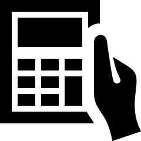

# Research: an introduction {#Intro}


::: {.objectivesBox .objectives data-latex="{iconmonstr-target-4-240.png}"}
In this chapter, you will learn to:

* identify quantitative and qualitative research.
* identify the steps in the quantitative research process.
:::


## How do we know what we know? {#HowDoWeKnow}

Scientists once believed that all life regularly and commonly
`r if (knitr::is_latex_output()) {
   'arose spontaneously'
} else {
   '[arose spontaneously](http://en.wikipedia.org/wiki/Spontaneous_generation)'
}`
from non-living matter.
*Recipes* even existed; for example, van Helmont [@data:VanHelmont:Transformations; @pasteur1922generations] gave this
`r if (knitr::is_latex_output()) {
   'recipe'
} else {
   '[recipe](https://www.mnn.com/green-tech/research-innovations/stories/how-to-make-a-mouse-the-bizarre-recipes-borne-of-spontaneous)'
}`
for making a mouse:
<div style="float:right; width: 222x; border: 1px; padding:10px"></div>


<!-- \begin{wrapfigure}{R}{.25\textwidth} -->
<!--   \begin{center} -->
<!--     \includegraphics[width=.20\textwidth]{Illustrations/animal-1238239_1920.jpg} -->
<!--   \end{center} -->
<!-- \end{wrapfigure} -->


> If a soiled shirt is placed in the opening of a vessel containing grains of wheat, the reaction of the leaven in the shirt with fumes from the wheat will, after approximately twenty-one days, transform the wheat into mice.

This was called 'spontaneous generation' (or 'abiogenesis').
We now know this is incorrect... but how did the idea emerge?
Through *observation* and *experimentation*.

Spontaneous generation was consistent with *observations*: the above recipe *did* produce mice in experiments.
However, this hypothesis ('possible explanation') was rejected when later evidence, in better-designed experiments, contradicted the hypothesis.
So, a new hypothesis was proposed to explain the appearance of the mice, which was tested against the evidence... and so on.
Briefly, this is the *evidence-based, scientific process*.\index{Scientific process}

More recently, the dangers of smoking were still being debated into the 1990s:


<!-- \begin{wrapfigure}{R}{.25\textwidth} -->
<!--   \begin{center} -->
<!--     \includegraphics[width=.20\textwidth]{Illustrations/cigarette-1270516_640.jpg} -->
<!--   \end{center} -->
<!-- \end{wrapfigure} -->


> ...  a causal role for smoking [has] not been proved beyond reasonable doubt.
>
> --- @eysenck1991were, p.\ 429


All scientific knowledge emerges in a similar way: observations lead to hypotheses, which are tested against *evidence*.
If the evidence *contradicts* the hypothesis, the hypothesis is rejected.
If the evidence is *consistent* with the hypothesis, the hypothesis is *temporarily* accepted (until any contradictory evidence emerges).

Hypotheses not contradicted by large amounts of evidence, over a long time, are sometimes called *laws* or *theories* (such as the 'law of conservation of energy').
Theories and laws can be disproven if contradictory  evidence emerges.
Knowledge in all scientific disciplines is accumulated using a similar evidence-based process.


## Evidence-based research {#EvidenceBasedResearch}

Every discipline changes, develops, improves, and adapts---usually through *research*.
Your discipline is not the same as it was $10$ years ago; it will change in the next $10$ years.
Scientists, engineers and health practitioners need to know how to understand and adapt to this change.

To remain current in your discipline, understanding research is vital, even if you will not be conducting research yourself.
You still need to know the language, tools, concepts and ideas of research: you need to know how to critique research.
Research is the foundation of science.


<iframe src="https://learningapps.org/watch?v=ppa1cz56222" style="border:0px;width:100%;height:500px" allowfullscreen="true" webkitallowfullscreen="true" mozallowfullscreen="true"></iframe>


Scientific research systematically answers questions using *data*; that is, science seeks *evidence-based answers*.\index{Evidence-based research}
'Evidence-based research' refers to research conclusions based on *evidence*,  rather than hunches, feelings, intuition, hopes, or tradition.
The *evidence* comes from analysing the collected *data*.


::: {.definition #Data name="Data"}
\index{Data}\index{Dataset}
Data refers to information (observations or measurements) obtained from a study, such as numbers, labels, recordings, videos, text, etc.

A *dataset* refers to an *organised* and *structured* collection of data.
:::


Research involves designing studies to collect data, and analysing that data; this book covers both.


## Example: research in action {#Research-in-Action}

During 1988/1989, an unusually high number of cases of the *Legionella longbeachae* infection were observed in South Australia.
The researchers wanted to identify the source of the infection to prevent further infections.

The researchers noticed that many of those infected were gardeners who had recently handled potting mix, so they hypothesised that the infection was associated with using potting mix.
They designed a study to test this hypothesis, then collected data from $100$ people ($25$ *with* the infection, and $75$ people of similar age and sex *without* the infection).


<div style="float:right; width: 222x; border: 1px; padding:10px">

</div>


The researchers classified and summarised the data, then analysed the data to reach an evidence-based conclusion: potting mix was partially, but not solely, responsible for the infections.
The researchers communicated their recommendations to 
`r if (knitr::is_latex_output()) {
   'reduce the risks of people contracting the infection.'
} else {
   '[reduce the risks of people contracting the infection](https://www.worksafe.qld.gov.au/safety-and-prevention/hazards/hazardous-exposures/biological-hazards/legionella-risks-from-work-with-potting-mix-and-compost).'
}`


::: {.thinkBox .think data-latex="{iconmonstr-light-bulb-2-240.png}"}
In this book, we learn about the *six steps of research*.
`r if( knitr::is_html_output() ) {"Arrange these steps into the common order:"} else {"Arrange these steps into the common order, using these terms:  
   *Design*; 
   *Classify and summarise*; 
   *Analyse*;
   *Ask*; 
   *Collect*; 
   *Report*."
}`

**Step 1**:
`r if( knitr::is_html_output() ) {mcq( 
   c("Design",
     "Classify, summarise",
     "Analyse",
     answer = "Ask",
     "Collect",
     "Report") )
  } else {
    "_________"}` the question.

**Step 2**:
`r if( knitr::is_html_output() ) {mcq( 
   c(answer = "Design",
     "Classify and summarise",
     "Analyse",
     "Ask",
     "Collect",
     "Report") )
  } else {
    "_________"}` the study.

**Step 3**:
`r if( knitr::is_html_output() ) {mcq( 
   c("Design",
     "Classify and summarise",
     "Analyse",
     "Ask",
     answer = "Collect",
     "Report") ) 
  } else {
    "_________"}` the data.

**Step 4**:
`r if( knitr::is_html_output() ) {mcq( 
   c("Design",
     answer = "Classify and summarise",
     "Analyse",
     "Ask",
     "Collect",
     "Report") )
    } else {
      "_________"}` the data.
     
**Step 5**:
`r if( knitr::is_html_output() ) {mcq( 
   c("Design",
     "Classify and summarise",
     answer = "Analyse",
     "Ask",
     "Collect",
     "Report") )
  } else {
    "_________"}`  the data.

**Step 6**:
`r if( knitr::is_html_output() ) {mcq( 
   c("Design",
     "Classify and summarise",
     "Analyse",
     "Ask",
     "Collect",
     answer = "Report") )
  } else {
    "_________"}`  the results.
:::


## Types of research {#TypesOfResearch}

Research can be broadly classified as *qualitative* or *quantitative*, which are different yet complementary approaches to answering research questions (Table\ \@ref(tab:TypesOfResearch)).\index{Research!qualitative}\index{Research!quantitative}
Both methods have advantages and disadvantages, and can be used together (called *mixed methods* research).
Deciding to use qualitative, quantitative or mixed methods approaches depends on the purpose of the research.


```{r TypesOfResearch}

ResearchTypes <- array( dim = c(10, 3) )

ResearchTypes[1, ] <- c("",
                        "{#id .class height=80px width=80px}",
                        "{#id .class height=80px width=80px}")
ResearchTypes[2, ] <- c("Aspect", 
                        "Qualitative", 
                        "Quantitative")

ResearchTypes[3, ] <- c("What", 
                        "Feelings, opinions", 
                        "Measured or observed data")
ResearchTypes[4, ] <- c("Why", 
                        "Suggest hypotheses", 
                        "Tests hypotheses")
ResearchTypes[5, ] <- c("Conclusions", 
                        "Detailed", 
                        "General")
ResearchTypes[6, ] <- c("Data", 
                        "Words, pictures, ...", 
                        "Numbers, measurements, ...")
ResearchTypes[7, ] <- c("Size", 
                        "Usually small samples are studied", 
                        "Often large samples are studied")
ResearchTypes[8, ] <- c("Time", 
                        "Time-consuming", 
                        "More efficient")
ResearchTypes[9, ] <- c("Applicability", 
                        "Rarely generalisable", 
                        "Sometimes generalisable")
ResearchTypes[10, ] <- c("Examples", 
                         "Interviews, focus groups, diaries", 
                         "Experiments, surveys, measurements")

ResearchTypes <- ResearchTypes[, c(2, 1, 3) ] ### Reorder

if( knitr::is_latex_output() ) {

  kable(ResearchTypes[3:10,],
        col.names = c("Qualitative", 
                        "Aspect", 
                        "Quantitative"),
        format = "latex",
        align = c("r", "c", "l"),
        linesep = c("","","","\\addlinespace"),
        longtable = FALSE,
        caption = "Briefly comparing qualitative and quantitative research",
        booktabs = TRUE) %>%
    kable_styling(font_size = 8) %>%
    column_spec(column = 2, 
               bold = TRUE) %>%
   row_spec(row = 0, 
            bold = TRUE) 
}
if( knitr::is_html_output() ) {
  kable(ResearchTypes,
               format = "html",
               align = c("r", "c", "l"),
               longtable = FALSE,
               caption = "Briefly comparing qualitative and quantitative research",
               booktabs = TRUE) %>%
         column_spec(column = 2, 
                     bold = TRUE) %>%
         row_spec(row = 2, 
                  bold = TRUE)
}
```


Briefly, *qualitative research* leads to a deeper understanding, usually from a very narrowly-defined group.
Meanings, motivations, opinions or themes often emerge from qualitative research.
In contrast, *quantitative research* summarises and analyses data usually from large groups, using *numerical* methods, such as averages and percentages. 
In quantitative research, typically information about a large group of interest (a *population*)\index{Population} is found from a subset of the population (a *sample*).\index{Sample}

<!--
> ... *quantitative* data gets you the numbers to... [support] the broad general points of your research. 
> *Qualitative* data brings you the details and the depth to understand their full implications.
>
> --- [SurveyMonkey website](https://www.surveymonkey.com/mp/quantitative-vs-qualitative-research/), October 2019; emphasis added.
-->


::: {.definition #QualitativeResearch name="Quantitative research"}
*Quantitative research* summarises and analyses data using numerical methods, such as averages and percentages. 
:::


::: {.importantBox .important data-latex="{iconmonstr-warning-8-240.png}"}
This book is about *quantitative* research.
:::


<div style="float:right; width: 222x; border: 1px; padding:10px">

</div>


::: {.example #BroadTypesOfResearch name="Types of research"}
Suppose we wish to learn about the perceived benefits and barriers to people buying electric vehicles (EVs).

A *qualitative research study* might use two small *focus groups*: one group comprising people who purchased an EV, and another group comprising people who purchased a non-EV.
The researchers ask each group about the reasons for their purchase.

A *quantitative research* study might survey a large number of buyers of EVs and buyers of non-EVs, and ask the buyers' age, sex, and multi-choice questions about the reasons for their purchase.
The survey responses could be analysed by numerically summarising, and comparing, the responses for buyers and non-buyers of EVs.

A *mixed methods* study may combine both of the above.\index{Research!mixed methods}
:::


## The steps in research {#SixStepsOfResearch}
\index{Research!six steps}

The research process ideally follows the process in Fig.\ \@ref(fig:SixSteps), but this is not always possible or practical.
The process is not always linear: researchers may jump from step to step as necessary, and research usually leads to new research questions.
Nonetheless, each step is important:\index{Research!six steps}


```{r SixSteps, fig.align="center", fig.width=10, fig.height=3.5, out.width="55%", fig.cap="The six basic steps in research"}
SixSteps(upDirectory = FALSE)   
```


* *Asking* the research question (Chap.\ \@ref(RQs)).
  Research begins with a question.
* *Designing* the study (Chaps.\ \@ref(ResearchDesign) to\ \@ref(Interpretation)).
  Evidence-based research uses data to answer questions.
  A study must be designed to obtain that data, which includes determining who or what to study, how to find them, what information to obtain, and ensuring data are obtained ethically.
* *Collecting* the data (Chap.\ \@ref(CollectingDataProcedures)).
  The data collection process must be ethical, reproducible and clearly documented.
* *Classifying* and *summarising* the data (Chaps.\ \@ref(DescribingVars) to\ \@ref(SummariseComments)).
  Before analysis, the data must be classified and summarised.
  (A computer is useful.)
* *Analysing* the data (Chaps.\ \@ref(Probability) to\ \@ref(Regression)).
  Analysis refers to determining how the data answer the research question, and depends on the type of data and the research question.
  (A computer is useful.)
* *Reporting* the results (Chaps.\ \@ref(WritingResearch) and\ \@ref(Reading)).
  Communicating the results appropriately, accurately and ethically is important, including any limitations.


## Using software in research {#Software-In-Research}
\index{Software!in research}

*Statistical* software (such as jamovi, R, SAS, SPSS, etc.) is useful for summarising and analysing data.\index{Software!statistical}
Statistical software:

* is designed for working with large datasets.
* encourages reproducible research (Sect. \@ref(ReproducibleResearch)).\index{Research!reproducibility}
* allows high-precision formatting and graphics.
* is powerful; with some programming skills, almost anything is possible.
* is specifically designed for analysing and working with data.


::: {.softwareBox .software data-latex="{iconmonstr-laptop-4-240.png}"} 
This book sometimes shows output from jamovi [@Software:jamovi], but using jamovi is *not* essential for understanding this book.\index{Software!jamovi}
:::


Using spreadsheets\index{Software!spreadsheets} in research for storing and analysing data requires care; extremely expensive and dangerous errors have been made due to using spreadsheets [@altarawneh2017pilot]:

<div style="float:right; width: 222x; border: 1px; padding:10px">

</div>


  
* Spreadsheets may *change data* (e.g., reformatting entries as dates) when not appropriate [@ziemann2016gene].
* Spreadsheets may include *formulas with errors* that are *difficult to locate* and hence fix [@panko2016we; @Retraction:London:Excel].
* Spreadsheets *do not leave a record* of how the data were analysed or prepared.
  Keeping a record of the analysis, preparation of variables, and other operations with the data is good scientific practice (*reproducible research*; see Sect.\ \@ref(ReproducibleResearch)) [@simons2019reproducible].
<!-- * Excel has *bugs* [@keeling2004numerical; @melard2014accuracy] even in basic operations [@berger2007nonstandard; @hargreaves2010polynomial]. -->
<!--   Sometimes these errors are made worse after company attempts to fix them [@mccullough2002accuracy]. -->

Problems with spreadsheets, as with any software, are often due to human error, but *spreadsheets make errors hard to find and fix*.
While spreadsheets can be useful for data collection and manipulation, they are not designed for scientific analysis.
Be careful using spreadsheets for research and analysis.


<!-- :::{.example} -->
<!-- @zeeberg2004mistaken found Excel was corrupting data files used in genetic analysis (p. 1): -->

<!-- > The date conversions affect at least 30 gene names; the floating-point conversions affect at least 2,000 [...]  -->
<!-- > These conversions are irreversible; the original gene names cannot be recovered. -->
<!-- ::: -->


## Exercises {#IntroExercises}

Selected answers are available in App.\ \@ref(Answers).

::: {.exercise #RQsTypeTourniquet}
Consider the research question: 'Which of three different junctional tourniquets are quickest, on average, to apply?'
Is this RQ likely to be answered using a *quantitative* or *qualitative* research study?
Explain.
:::


::: {.exercise #RQsTypeMangroves}
Consider the research question: 'Why do people dump rubbish in mangroves?'
Is this RQ likely to be answered using a *quantitative* or *qualitative* research study?
Explain.
:::


::: {.exercise #RQsTypeSideEffects}
Consider the research question: 'What percentage of the population have side-effects from a medication?'
Is this RQ likely to be answered using a *quantitative* or *qualitative* research study?
Explain.
:::


::: {.exercise #RQsTypeSolarPanels}
Consider the research question: 'What is the average number of roof-top solar panels on domestic homes?'
Is this RQ likely to be answered using a *quantitative* or *qualitative* research study?
Explain.
:::

