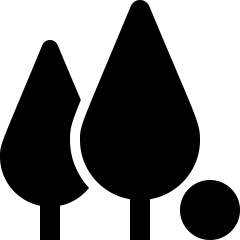
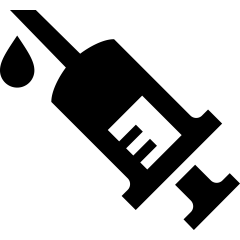
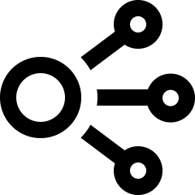

# (PART) Asking research questions {-}


# Research questions {#RQs}


::: {.objectivesBox .objectives data-latex="{iconmonstr-target-4-240.png}"}
In this chapter, you will learn to:

* create operational definitions.
* ask quantitative research questions.
* list, explain and give examples of the various types of quantitative research questions.
* identify estimation and decision-making research questions.
* identify the variables implied by a quantitative research question.
* identify observational or experimental studies.
* describe and identify the units of analysis and unit of observations in a study.
* communicate in the language of research and statistics.
:::


```{r echo=FALSE, fig.cap="", fig.align="center", fig.width=3, out.width="35%"}
SixSteps(1)
```


## Introduction {#Chap2-Intro}

In research,
asking clear and answerable **research questions** (RQs)\index{RQs}
is important.
The data (evidence) that must be collected depends on the RQ.

In quantitative research,
summarising and analysing the data typically uses numerical methods
(such as averages or percentages),
so the RQs must be appropriate for analysis using these methods.

For this reason,
writing the RQ appropriately is important.
The RQ drives all other aspects of the research 
(Fig. \@ref(fig:RQLeadsTo)).


```{r RQLeadsTo, echo=FALSE, fig.cap="The RQ drives all aspects of the study", fig.align="center", fig.height=3, fig.width=4}
par( mar=c(0.15, 0.15, 0.15, 0.15))
openplotmat()

pos <- array(NA, 
             dim = c(4, 2))
pos[1, ] <- c(0.50, 0.3) # RQ
pos[2, ] <- c(0.15, 0.5) # Why
pos[3, ] <- c(0.85, 0.5) # How
pos[4, ] <- c(0.50, 0.6) # What


curvedarrow(from = pos[1,], 
            to = pos[2,], 
            curve = 0, 
            lty = 1, 
            lwd = 2)
curvedarrow(from = pos[1,], 
            to = pos[3,], 
            curve = 0, 
            lty = 1)
curvedarrow(from = pos[1,], 
            to = pos[4,], 
            curve = 0, 
            lty = 1)

textrect( pos[1,], 
           lab = "Research\nquestion", 
           radx = 0.13, 
           rady = 0.07, 
           shadow.size = 0,
           box.col = "darkseagreen1",
           lcol = "darkseagreen1")
textrect( pos[2,], 
           lab = "Why we\ndo study", 
           radx = 0.13, 
           rady = 0.07, 
           shadow.size = 0,
           box.col = "lightblue3",
           lcol = "lightblue3")
textrect( pos[3,], 
           lab = "How we do\nthe study", 
           radx = 0.13, 
           rady = 0.07, 
           shadow.size = 0,
           box.col = "lightblue3",
           lcol = "lightblue3")
textrect( pos[4,], 
           lab = "What data\ndo we need", 
           radx = 0.13, 
           rady = 0.07, 
           shadow.size = 0,
           box.col = "lightblue3",
           lcol = "lightblue3")
```


Defining the RQ precisely can be challenging.
Studies often have an overall, broad research goal
with many sub-questions
(which may be quantitative or qualitative).


::: {.example label=RQs name="Research questions"}
Consider this broad research goal:

> How well are PPs (permeable pavements) working in urban areas?

This goal has many component RQs 
(Fig. \@ref(fig:PermPavements)),
and each can be answered using separate studies.
:::

```{r PermPavements, echo=FALSE, fig.cap="A study of permeable pavements (PPs) may have many sub-questions", fig.align="center", fig.height=4.5, fig.width=4}
par( mar = c(0.15, 0.15, 0.15, 0.15))
openplotmat()

pos <- array(NA, 
             dim = c(4, 2))
pos[1, ] <- c(0.50, 0.25) # RQ
pos[2, ] <- c(0.19, 0.58) # sub1
pos[3, ] <- c(0.81, 0.58) # sub2
pos[4, ] <- c(0.50, 0.80) # sub3


straightarrow(from = pos[1, ], 
              to = pos[2, ], 
              lty = 1, 
              lwd = 2)
straightarrow(from = pos[1, ], 
              to = pos[3, ], 
              lty = 1)
straightarrow(from = pos[1, ], 
              to = pos[4, ], 
              lty = 1)

textrect( pos[1, ], 
           lab = "Are PPs effective\nin urban areas?", 
           radx = 0.2, 
           rady = 0.085, 
           shadow.size = 0,
           box.col = "darkseagreen1",
           lcol = "darkseagreen1")
textrect( pos[2, ], 
           lab = "What is the\ncost of using PPs?", 
           radx = 0.22,
           rady = 0.085, 
           shadow.size = 0,
           box.col = "lightblue3",
           lcol = "lightblue3")
textrect( pos[3, ], 
           lab = "Do PPs improve\nrun-off quality?", 
           radx = 0.22, 
           rady = 0.085, 
           shadow.size = 0,
           box.col = "lightblue3",
           lcol = "lightblue3")
textrect( pos[4, ], 
           lab = "How do people\nperceive PP\naesthetics?", 
           radx = 0.22, 
           rady = 0.085, 
           shadow.size = 0,
           box.col = "lightblue3",
           lcol = "lightblue3")
```


## Definitions {#OperationDefinitions}

Research studies usually include terms that must be carefully and precisely defined,
so that others know *exactly* what has been done and there are no ambiguities.
Two types of definitions can be given: 

* A *conceptual definition* explains exactly and precisely *what* is being measured, observed or assessed
  (i.e., what a word or a term *means* in the study).
* An *operational definition* defines exactly *how* something will be identified, measured, observed or assessed.

Not all variables in a study will require a conceptual definition.
However, **most variables will require an operational definition** to ensure consistent data collection, 
by removing any ambiguity about how a variables is measured.


::: {.definition #ConceptualDefinition name="Conceptual definition"}
A *conceptual definition*\index{conceptual definition}
articulates exactly and precisely *what* is being measured, observed or assessed in a study.
:::


::: {.definition #OperationalDefinition name="Operational definition"}
An *operational definition*\index{operational definition}
articulates exactly *how* something will be identified, measured, observed or assessed.
:::


<div style="float:right; width: 222x; border: 1px; padding:10px">

</div>


`r if (knitr::is_html_output()) '<!--'`
\begin{wrapfigure}{R}{.25\textwidth}
  \begin{center}
    \includegraphics[width=.20\textwidth]{Illustrations/pexels-oladimeji-ajegbile-2696299.jpg}
  \end{center}
\end{wrapfigure}
`r if (knitr::is_html_output()) '-->'`


::: {.example #DefinitionsStress name="Operational and conceptual definitions"}
Consider a study examining stress in students during a university semester.

A *conceptual definition* would clearly describe *what is meant* by 'stress' (in contrast to, say, 'anxiety').

An *operational definition* would describe *how* 'stress' would be *measured*.
While this is always important, 
it is especially important here since stress cannot be measured directly (like height can, for example).

'Stress' could be *measured* using a survey
(like the Perceived Stress Scale (PSS)
[@cohen1983global]); 
the level of stress is the 
score on the ten-question PSS.

Other means of measuring stress are also possible (such as heart rate or blood pressure).

All of these have advantages and disadvantages.
:::


<iframe src="https://learningapps.org/watch?v=pt0rqa5t522" style="border:0px;width:100%;height:500px" allowfullscreen="true" webkitallowfullscreen="true" mozallowfullscreen="true"></iframe>


Sometimes the definitions themselves aren't important,
provided a clear definition is given.
Sometimes, 
commonly-accepted definitions exist, so should be used unless there is a good reason to use a different definition
(for example,
in criminal law,
an 'adult' in Australia is someone 
`r if (knitr::is_latex_output()) {
   'aged 18 or over).'
} else {
   '[aged 18 or over](https://www.alrc.gov.au/publications/18-childrens-involvement-criminal-justice-processes/age-thresholds-criminal-justice-pro)).'
}`

Sometimes, a commonly-accepted definition does not exist, so the definition being used should be very clearly articulated.


::: {.example #DefinitionsFlexibility name="Operational and conceptual definitions"}
A student project at my university used this RQ:

> Amongst students [...], on average do student who participate in competitive swimming have greater shoulder flexibility than the remainder of the able-bodied USC student population?

*Shoulder flexibility* needs a *conceptual definition* to describe exactly what it *means*, so that everyone involved in the study, or reading the study conclusions, has the same understanding of the term.

Additionally, how *shoulder flexibility* is being *measured* is not clear. An *operational definition* is needed (which the student did not provide...).
:::
<!-- Zac Robinson, SEM1 2020 -->


::: {.example #DefinitionsConcussion name="Operational and conceptual definitions"}
Players and fans have become more aware of concussions and head injuries in sport.
A Conference on concussion in sport developed this *conceptual definition* [@McCrory250]:

> Concussion is a brain injury and is defined as a complex pathophysiological process affecting the brain, induced by biomechanical forces...

<div style="float:right; width: 222x; border: 1px; padding:10px">

</div>

While this is helpful... it does not explain *how* to identify a player with concussion during a game.

Rugby decided on this *operational definition* [@Raftery642]:

> ... a concussion applies with any of the following:
>
> 1. The presence, pitch side, of any Criteria Set 1 signs or symptoms (table 1)... [**Note**: This table includes symptoms such as 'convulsion', 'clearly dazed', etc.];
>
> 2. An abnormal post game, same day assessment...;
>
> 3. An abnormal 36--48&nbsp;h assessment...;
>
> 4. The presence of clinical suspicion by the treating doctor at any time...
:::
    


::: {.example #DefinitionsTemp name="Operational and conceptual definitions"}
Consider a study requiring water temperature to be measured.

An *operational definition* would explain *how* the temperature 
is measured:
the thermometer type,
how the thermometer was positioned,
how long was it left in the water, 
and so on.

In contrast, 
a *conceptual* definition might describe the scientific definition of temperature 
(and would not be needed, as 'temperature' is a well-understood term).
:::


```{block2, type="exampleExtra"}
@data:Meline2006:InclusionExclusion
discusses five studies about stuttering,
each using a different *operational* definition:
  
* Study 1: As diagnosed by speech-language pathologist.
* Study 2: Within-word disfluences greater than 5 per 150 words.
* Study 3: Unnatural hesitation, interjections, restarted or incomplete phrases, etc.
* Study 4: More than 3 stuttered words per minute.
* Study 5: State guidelines for fluency disorders.

People may be classified as stutterers by some
definitions but not others,
so it is important to know which definition is used.
```


```{block2, type="exampleExtra"}
A study of snacking in Australia
[@data:Fayet2017:Snacks]
used this conceptual definition of an 'eating occasion' to explain what the term *means*:

> ...one or more food or beverage items consumed at the same time of day...

and a 'snacking occasion' as

>  ...one or more food or beverage items consumed at the same time of day within a snacking time period...

Finally then, 'snacking' was defined as:
  
> Eating occasions that occurred during breakfast, midday and evening meals were meals 
> and all eating occasions that occurred between these meals were classified as snacking. 

These are all *conceptual* defintions, explaining what the terms mean.

An *operational* definition would explain *how* the data were obtained from the participants
(i.e., using a food diary).
```


```{block2, type="exampleExtra"}
A study examined the possible relationship between the 'pace of life' and 
the incidence of heart disease
[@data:levine1990:paceoflife]
in 36 US cities.

The researchers used four different *operational* definitions 
for 'pace of life'
(remember the article was published in 1990!):

1. The walking speed of randomly chosen pedestrians.
1. The speed with which bank clerks gave 'change for two $20 bills or [gave] two $20 bills for change'.
1. The talking speed of postal clerks.
1. The proportion of men and women wearing a wristwatch.

None of these *perfectly* measure 'pace of life', of course.
Nonetheless, the researchers found that,
compared to people on the West Coast,

> ... people in the Northeast walk faster, make change faster, talk faster and are more likely to wear a watch...
>
> --- @data:levine1990:paceoflife (p. 455)
```


::: {.thinkBox .think data-latex="{iconmonstr-light-bulb-2-240.png}"}
Define a 'smoker'.
:::


## Elements of RQs

A RQ must be *written* carefully
so it can be properly *answered*.
In this section,/
the four potential components of a RQ are studied:

* The [**P**opulation](#Population);
* The [**O**utcome](#Outcome); 
* The [**C**omparison or **C**onnection](#Comparison);
* The [**I**ntervention](#Intervention).

These form the **POCI** acronym.


### The Population {#Population}

All RQs study some *population*:
the larger group of interest in the study.


<div style="float:right; width: 222x; border: 1px; padding:10px">

</div>


::: {.definition #Population name="Population"}
The *population*\index{population}
is the group of *individuals*\index{individuals}
(or *cases*;\index{cases}
or *subjects*\index{subjects}
if the individuals are people) 
from which the
total set of observations of interest could be made,
and to which the results will (hopefully) generalise.
:::

In this context, a population is *any* group of interest;
for example:

* all Australian males between 18 and 35 years of age.
* all bamboo flooring materials manufactured in Queensland.
* all elderly males with glaucoma in Canada.
* all *Pinguicula grandiflora* growing in Europe.


::: {.importantBox .important data-latex="{iconmonstr-warning-8-240.png}"}
The words *population*, *individuals* and *cases* do **not** just refer to people,
though the words may be commonly used that way in general conversation.
:::


The *population* is not just those individuals from which the data are actually *obtained*.
Indeed, *all* these elements of the population may not be accessible in practice.

The population represents all the 'individuals' to which the results are to be generalised.
For example, when testing a new drug, the aim is to see if it works on people in general,
including people not yet born. 
The population is 'all people'.


::: {.importantBox .important data-latex="{iconmonstr-warning-8-240.png}"}
The **population** in a RQ is *not* just those we end up studying.
It is the whole group to which our results would generalise.
:::


In contrast, the *sample* is the *subset* of the population that we actually end up studying, from which data are obtained.


<div style="float:right; width: 75px; padding:10px">

</div>

::: {.definition #Sample name="Sample"}
A *sample*\index{sample}
is a subset of the population of interest which is actually studied,
and from which data are collected.
:::


::: {.example #Samples name="Samples"}
Consider a study of American college women, which aimed to:

> ...assess iron status [...] in highly active 
> (>12 hr purposeful physical activity per week) and sedentary 
> (<2 hr purposeful physical activity per week) women...
>
> --- @data:woolf:ironstatus, p. 521.

The *sample* comprises 28 'active' women and 28 'sedentary' American college women, from which data are collected.

The *population* is *all* 'active and sedentary' American college women, not just the 56 in the study.
The group of 56 subjects is the *sample*.\index{sample}
:::


Completely defining the population
[@banerjee2010statistics]
sometimes requires *refining* or *clarifying* the population,
using *exclusion* and/or *inclusion criteria*.\index{exclusion criteria}\index{inclusion criteria}

Exclusion and inclusion criteria
clarify which individuals may be explicitly included or excluded 
from the population.

Exclusion and inclusion criteria should be explained 
when their purpose is not obvious.
Both exclusion and inclusion criteria are not *needed*;
none, one or both may be used.


<div style="float:right; width: 75px; padding:10px">

</div>

::: {.definition #InclusionCriteria name="Inclusion criteria"}
*Inclusion criteria*\index{inclusion criteria}
are characteristics that individuals 
must meet explicitly to be included in the study.
:::

::: {.example #InclusionCriteriaEG name="Inclusion criteria"}
A study of a certain bird species
may only include sites where there has been a confirmed sighting within the last two years.

A study of weight-loss methods may require people over a certain weight.
:::

   
<div style="float:right; width: 75px; padding:10px">

</div>


::: {.definition #ExclusionCriteria name="Exclusion criteria"}
*Exclusion criteria*\index{exclusion criteria}
are characteristics that 
explicitly disqualify potential individuals 
from being included in the study. 
:::


::: {.example #ExclusionCriteriaEG name="Exclusion criteria"}
Concrete test cylinders with fissure cracks may be excluded from tests of concrete strength. 

People with severe asthma may be excluded from exercise studies.
:::

::: {.example #ExclusionInfluenze name="Population and exclusion criteria"}
A study on the influenza vaccine [@kheok2008efficacy] listed 
the **P**opulation as 'health-care workers' [@kheok2008efficacy, p. 466],
and the sample they studied was:

> All healthcare workers at the National University Hospital (NUH) 
> and KK Women’s and Children’s Hospital (KKWCH)...
>
> --- @kheok2008efficacy, p. 466

The population was refined by exclusion criteria.
The exclusion criteria were those:
  
> ...declining to give consent, a history of egg protein allergy, and neurological or immunological conditions that are contraindications to the influenza vaccine.
>
> --- @kheok2008efficacy, p. 466
:::


```{block2, type="exampleExtra"}
A study [@data:Guirao2017:amputees] of the walking abilities of amputees used these inclusion and exclusion criteria:

> *Inclusion* criteria were as follows:
> length of the femur of the amputated limb of at least 15 cm measured from the greater trochanter, 
> use of the prosthesis for at least 12 months prior to enrollment and more than 6 h/day, 
> ability to walk indoors with or without supervision, and with or without ambulation aids and unilateral femoral amputation.
>
> The criteria for *exclusion* were the presence of cognitive impairment 
> hindering the ability to follow instructions and/or perform the tests, 
> body weight over 100kg, 
> active oncologic pathologies, psychological disorders, previous residuum infection, 
> active infection, residual femur length less than 15cm measured from the greater trochanter, 
> pregnancy, 
> and hip flexion deformity greater than 30^o^.
>
> --- @data:Guirao2017:amputees, p. 27 (emphasis, line-break added)
```
   
   

   
### The Outcome {#Outcome}

All RQs study something *about* the population,
called the *outcome*.

Because the RQ concerns a population, the outcome describes a population as a whole;
hence, the outcome is usually an *average*, *percentage*, or *general* quantity 
numerically summarising the population (or subsets of the population).


<div style="float:right; width: 75px; padding:10px">

</div>


::: {.definition #Outcome name="Outcome"}
The *outcome*\index{outcome}
in a RQ is the result, output, consequence or effect of interest in a study,
numerically summarising the population (or subsets of the population).   
:::


The outcome may be (for example):

* *average* increase in heart rates.
* *average* amount of wear after 1000 hours of use.
* *proportion* of people whose pupils dilate.
* *average* weight loss after three weeks.
* *percentage* of seedlings that die.


::: {.importantBox .important data-latex="{iconmonstr-warning-8-240.png}"}
The **outcome** in a RQ summarises a *population*;
it does not describe the *individuals* in the population.
:::


### The Comparison or Connection  {#Comparison}

In addition to having a population (P) and an outcome (O),
some RQs
may *compare* the outcome between a 
small number of different, distinct subsets of the population
(that is, *groups of individuals*),
or may explore a *connection* between
the outcome and some other quantity that varies.


<div style="float:right; width: 75px; padding:10px">

</div>


::: {.definition #Comparison name="Comparison"}
The *comparison*\index{comparison}
in the RQ identifies the small number of different, distinct subsets of the population between which the outcome is compared.
The groups being compared have either *imposed* differences, or have *existing* differences.
:::


The outcome may be *compared* 
between two or more separate subsets of the population:

* Average amount of wear in floor boards (O) 
  could be compared across two groups in the population:
  standard wooden flooring materials and bamboo flooring.
* Average heart rates (O) could be compared across three subsets of the population: 
  those who received no dose of a drug, 
  those who received a daily dose of the drug, 
  and those who received a dose of the drug twice daily.


::: {.importantBox .important data-latex="{iconmonstr-warning-8-240.png}"}
Be careful!

This definition requires that the population can be separated into two (or more) subgroups,
that have either *imposed* differences (for example, one group is given one dose of fertilizer per day, and another given two doses of fertilizer per day)
or have *existing* differences (for example, one group of people aged under 30, and another group of people aged 30 or over).

If all individuals are treated in the same way, or do not have existing difference that allow them to be divided into group to be compared, there is no *comparison* according to this definition.
:::


::: {.example #Comparisons name="Comparison"}
Consider a study to compare the average blood pressure (the Outcome) in Australians (the Population), 
to see if the average blood pressure in the right arm
is the same as the average blood pressure in the left arm.

**There is no comparison**:
the Outcome (average blood pressure) is not compared
in two different subsets of the population;
every person is treated the same way.

Instead, 
the blood pressure is measured twice on *every* 
member of the population.
The outcome might be best described as 
'the mean *difference* between right- and left-arm blood pressure'.

In contrast, a study comparing the average blood pressure 
between (a) people aged under 40, and (b) people aged 40 or over *does* have a comparison:
two subsets (under 40; 40 and over) 
of the population (Australians) are compared.
:::


::: {.definition #Connection name="Connection"}
The *connection*\index{connection}
in the RQ
identifies another quantity of interest that varies, that may be related to the outcome. 
:::

As the value of the *connection* changes, 
the value of the outcome (potentially) changes; for example:

* The connection between average heart rate (O) 
  and exposure to various doses of caffeine (C) in mg.
* The connection between percentage germination (O) 
  and hours of sunlight per day (C).


### The Intervention {#Intervention}

In addition to having a population (P), an outcome (O), and possibly a connection or comparison (C), some RQs also have an *intervention*.


<div style="float:right; width: 75px; padding:10px">

</div>


::: {.definition #Intervention name="Intervention"}
An *intervention*\index{intervention}
is a comparison or connection whose value can be manipulated by the researchers.

That is, the researchers have *imposed* the intervention upon those in the study *intending to change the outcome*.
:::


The intervention may be: 

* explicitly giving a new drug to patients.
* explicitly applying wear testing loads to two different flooring materials.
* explicitly exposing people to different stimuli.
* explicitly applying a different dose of fertiliser.


<div style="float:right; width: 75px; padding:10px">

</div>


::: {.example #Interventions name="Interventions"}
A study comparing the average blood pressure (O)
in female and male (C) Australians (P)
measured blood pressure
using a blood pressure machine (a sphygmomanometer).

The research team needs to interact with the participants and
use a machine to measure blood pressure,
but there is *no* intervention.
Using the sphygmomanometer is just a way to measure blood pressure,
to *obtain* the data.
The sphygmomanometer is not used 
*with the intent of changing the outcome*.

**There is no intervention**,
since the *comparison* is between females and males,
and this cannot be *imposed* on the individuals 
by the researchers.
:::

Sometimes,
it is not clear from the RQ if an intervention is present or not.
If you are writing an interventional RQ,
you should try to make it clear when an intervention is used.


::: {.thinkBox .think data-latex="{iconmonstr-light-bulb-2-240.png}"}
A study of American college women aimed to:

> ...assess iron status [...] in highly active 
> (>12 hr purposeful physical activity per week) and sedentary 
> (<2 hr purposeful physical activity per week) women...
>
> --- @data:woolf:ironstatus, p. 521.

In this study, what is the:

* Outcome? 
* Comparison or Connection (if any)?
* Intervention (if any)?

(Answer here^[*Outcome*: 'average iron status' (which would need an *operational definition*.) *Comparison*: between highly active and sedentary women. *Intervention*: Probably none; an intervention would mean the *researchers* tell each individual woman to be highly active or sedentary, which seems unlikely.].)
:::


```{block2, type="exampleExtra"}
Researchers examined numerous studies of chest compressions involving paramedics.
For their study, they examined research papers in which the **P**opulation was patients who had experienced a cardiac arrest,
and where manual chest compressions were compared with another method.

The table below shows the comparison and outcomes of interest:

Interventions                | Outcomes 
-----------------------------|--------------------------------------------------------------------
Mechanical chest compression | Mean survival time to hospital discharge
Mechanical CPR               | Percentage with a return of spontaneous circulation (ROSC)
Automated chest compressions | 	
Automated CPR	 	             | 
Powered chest compressions   | 
Powered CPR                  | 

The research concluded that:

> Overall, the evidence analysed suggests that mechanical chest compression devices are statistically superior 
> to manual chest compressions of a high quality, when up-to-date protocols and guidelines are followed.
>
> --- @williams2021mechanical, Table 1

```


<iframe src="https://learningapps.org/watch?v=pip2dnpq222" style="border:0px;width:100%;height:500px" allowfullscreen="true" webkitallowfullscreen="true" mozallowfullscreen="true"></iframe>


## Types of RQs

All RQs have a population (P) and an outcome (O).
However,
different *types* of RQ emerge 
depending on whether the RQ also has a
comparison/connection (C) or intervention (I).

This section studies different types
of research questions:

* [Descriptive RQs](#RQsDescriptive);
* [Relational RQs](#RQsRelational);
* [Interventional RQs](#RQsInterventional).

These are compared in Sect. \@ref(RQsCompare).


### Descriptive RQs (PO) {#RQsDescriptive}

*Descriptive RQs* are the most basic RQs, and identify:

* The **P**opulation to be studied.
* The **O**utcome of interest about this population.

Typically, descriptive RQs look like this:

> Among {the population}, what is {the outcome}?


::: {.importantBox .important data-latex="{iconmonstr-warning-8-240.png}"}
This is not a 'recipe', but a guideline.
:::


<div style="float:right; width: 75px; padding:10px">

</div>


::: {.example #DescriptiveRQ name="Descriptive RQ"}
Consider this RQ:

> Among Australian males between 18 and 35 years of age, what is the average heart rate?

In this RQ,
the *Population* is 'Australians males between 18 and 35 years of age',
and the *Outcome* is '*Average* heart rate'.
Notice that the Outcome is a numerical summary of the Outcome 
across the population (the *average* heart rate).

This is a *descriptive RQ*,
as the RQ does not imply studying
a connection with, 
or comparison between,
the average heart rate and anything else.
:::


::: {.thinkBox .think data-latex="{iconmonstr-light-bulb-2-240.png}"}
Consider this RQ:

> Among Australian adults, what proportion are coeliacs?

For this RQ, identify the **P**opulation and the **O**utcome.

(Answer here^[**P**: Australian adults. **O**: The proportion that are coeliacs].)
:::


### Relational RQs (POC) {#RQsRelational}

Usually, 
*relationships* are more interesting than just descriptions;
relational RQs explore existing relationships.
*Relational RQs* identify:

* The **P**opulation.
* The **O**utcome.
* The **C**omparison or **C**onnection.
		
Relational RQs have no intervention;
the connection or comparison is not imposed by the researchers.

Typically,
relational RQs based on a *comparison* look like this:

> Among {the population},
> is {the outcome}
> the same for {the groups being compared}?


<div style="float:right; width: 75px; padding:10px">

</div>


::: {.example #RelationalRQ name="Relational RQ"}
Consider this RQ:

> Among Australians between 18 and 35 years of age,
> is the average heart rate the same
> for females and males?

In this RQ,
the *Population* is 'Australians between 18 and 35 years of age',
the *Outcome* is 'average heart rate',
and the *Comparison* is 'between females and males'.

This is a *relational RQ* based on a *comparison*.
Notice that the average heart rate (Outcome) is a numerical summary across the two population sub-groups being compared (females; males).

The sex of the individual (the C) is not allocated by the researchers, so there is no intervention.
:::

Typically,
relational RQs based on a *connection* look like this:

> Among {the population},
> is {the outcome} related to  {something else}?

::: {.example #RelationalRQ2 name="Relational RQ"}
Consider this RQ:

> Among Australians between 18 and 35 years of age,
> is the average heart rate related to age?

In this RQ,
the *Population* is 'Australians between 18 and 35 years of age',
the *Outcome* is 'average heart rate',
and the *Connection* is with 'age'.

This is a *relational RQ* based on a *connection*.
Age (the C) is not allocated by the researchers,
so there is no intervention.
:::


::: {.thinkBox .think data-latex="{iconmonstr-light-bulb-2-240.png}"}
Consider this RQ 
(based on @data:Brown2000:WarningLights):

> In the Queensland Ambulance Service last year,
> what was the difference between the average response time 
> to emergency calls
> between weekdays and weekends?

Identify the **P**opulation, the **O**utcome, and the **C**omparison.
:::


::: {.thinkBox .think data-latex="{iconmonstr-light-bulb-2-240.png}"}
Consider this RQ (based on @data:Maron:eucthreshold):

> In Queensland state forests,
> is there a *relationship between* the average number of 
> noisy miners and the number of eucalypts, in general?

(A noisy miner is a type of bird.)
In this RQ, identify
the **P**opulation.
the **O**utcome, and
the **C**onnection.
:::


<div style="float:right; width: 75px; padding:10px">

</div>


::: {.example #DescriptiveRelationalRQ name="Descriptive and relational RQs"}
Consider a study of blood pressure in Australians (the Population), 
comparing right- and left-arm blood pressures.

This is a *descriptive* RQ.
There is *no* comparison,
since there are not two subsets of the population being compared.

The blood pressure is measured twice on each member of the population:
every member of the population is treated in the same way.
The outcome is 
'the average *difference* between right- and left-arm blood pressure'.
This is a *descriptive* RQ.

In contrast, a study comparing the average blood pressure 
between females and males is a *relational* RQ.
There *is* a comparison:
the two subsets of the population (Australians) being compared 
are females and males.
:::


### Interventional RQs (POCI) {#RQsInterventional}

*Interventional RQs* explore relationships 
where the comparison/connection is determined or allocated by the researchers.
They identify:

* The **P**opulation.
* The **O**utcome.
* The **C**omparison or **C**onnection.
* The **I**ntervention.

Interventional RQs may look like relational RQs,
except that the comparison or connection is 
determined or allocated (i.e., imposed) by the researchers.

Sometimes it is not clear if the comparison or connection
has been imposed by the researchers in an interventional RQ.
When writing interventional RQs,
make efforts to make it clear, if possible, 
when the RQ is interventional.


<div style="float:right; width: 75px; padding:10px">

</div>


::: {.example #InterventionalRQ  name="Interventional RQ"}
Consider this RQ:
  
> Among Australians between 18 and 35 years of age,
> is the average heart rate
> for people allocated to receive a *new* pill
> the same as for people 
> allocated to receive an *existing* pill?

In this RQ,
the *Population* is 'Australians between 18 and 35 years of age',
the *Outcome* is 'average heart rate',
and
the *Comparison* is 'between those taking the new pill, and those taking the existing pill'.

There is an *Intervention*: 
the researchers *allocate* one of the pills to each subject.
This is an *interventional RQ*.
:::


```{block2, type="exampleExtra"}
Consider this RQ [@data:McLinn:otitis]:

> In children with acute otitis media, 
> what is the difference in the average duration of symptoms
> when treated with cefuroxime compared to amoxicillin?

In this RQ,
the Population is 'children with acute atitis media',
the Outcome is 'average duration of symptoms',
and
the Connection is between the types of drug 
(comparing 'cefuroxime' and 'amoxicillin').

It is not clear if there is an Intervention. 

If the drugs are *given* to the
children by the researchers, 
there is an intervention (giving the drug).

If the researchers just find children 
who are already taking the two drugs
and measure the outcome ('average duration of symptoms'),
there is no intervention. 

It is probable that there is an intervention.
```


<iframe src="https://learningapps.org/watch?v=p8a16ig8a22" style="border:0px;width:100%;height:500px" allowfullscreen="true" webkitallowfullscreen="true" mozallowfullscreen="true"></iframe>


### Comparing the three levels of RQs {#RQsCompare}

*Descriptive RQs* are the most basic
and are usually used when a research topic is in its infancy;
descriptive RQs set the platform for asking relational questions.

*Relational RQs* explore relationships,
and provide an understanding of how the outcome of interest 
is related
to certain sub-groups of the population;
they may set the platform for asking interventional questions.

*Interventional RQs* (when possible to answer)
are the most interesting:
they can be used to test theories or models, 
or to establish cause-and-effect relationships
(Table \@ref(tab:ThreeTypesOfRQs)).


```{r echo=FALSE, ThreeTypesOfRQs}
RQtypes <- array( dim = c(3, 5) )

colnames(RQtypes) <- c("RQ type", 
                       "P", 
		       "O", 
		       "C", 
		       "I")

RQtypes[1, ] <- c("Descriptive (D)",   
                  "Yes", 
		  "Yes", 
		  "",    
		  "")
RQtypes[2, ] <- c("Relational (R)",     
                  "Yes", 
		  "Yes", 
		  "Yes", 
		  "")
RQtypes[3, ] <- c("Interventional (I)", 
                  "Yes", 
		  "Yes", 
		  "Yes", 
		  "Yes")

   
if( knitr::is_latex_output() ) {
  kable(RQtypes,
        format = "latex",
        longtable = FALSE,
        booktabs = TRUE,
        escape = FALSE, # For latex to work in \rightarrow
        caption = "The three types of RQs",
        align = c("r", "c", "c", "c")
   ) %>%
   kable_styling(full_width = FALSE) %>%
   row_spec(0, bold = TRUE) # Columns headings in bold
}

if( knitr::is_html_output() ) {
  out <- kable(RQtypes,
               format = "html",
               align = c("r", "c","c", "c"),
               longtable = FALSE,
               caption = "The three types of RQs",
               booktabs = TRUE)

  if ( knitr::is_html_output(excludes = "epub")) {
    kable_styling(out, 
                  full_width = FALSE) %>%
    row_spec(row = 0, 
             bold = TRUE)  
  } else {
    out  
  }
}
```


Research often develops through these stages of RQs
as knowledge grows and develops.
For example:

* **Descriptive**: What proportion of Australian adults are coeliacs [@data:Cook2000:Coeliac]?
* **Relational**: Among Australian adults, 
  is the proportion of females who are coeliacs the same as
  the proportion of males who are coeliacs [@data:Cook2000:Coeliac]?
* **Interventional**:  Among Australian adult coeliacs, 
  is the percentage with adverse symptoms the same for those 
  given a diet *without* oats and those given a diet *with* oats?
  [@data:Janatuinen2002:Coeliac; @data:Lundin2003:Coeliac]?


::: {.thinkBox .think data-latex="{iconmonstr-light-bulb-2-240.png}"}
What type of RQs are the following: 
Descriptive, Relational, or Interventional?

1. Among Australian upper-limb amputees, 
   is the percentage wearing prosthesis 'all the time' the same for transradial and transhumeral amputations?
   [@data:Davidson2000:Amputees]
2. In New York,
   what is the difference between the average height of oaks trees ten weeks after planting,
   comparing trees planted in a concrete sidewalk and a grassed sidewalk? 
   [@data:Grabosky2016:Trees]
3. What is the average response time of paramedics to emergency calls? [@data:Pons:ResponseTime]
4. Is there a relationship between the average weekly hours of physical activity in children
   and the weekly maximum temperature? [@data:Edwards2015:PA]

(Answer is here^[1. Relational; 2. Interventional; 3. Descriptive; 4. Relational.].)
:::


## Two approaches to  RQs {#TwoApproaches}

RQs can be approached in one of two ways:

* For [**estimation** (*confidence intervals*)](#TwoApproachesCI):
  These RQs are concerned with, for example,
  estimating a value in a population.
  This value may be the size of a difference 
  (probably a RQ with a Comparison), 
  or strength of a relationship 
  (probably a RQ with a Connection).
* For [**making decisions** (*hypothesis testing*)](#TwoApproachesHT):
  These RQs are concerned with making a decision about an unknown population value: for example,
  is the percentage the same in two different groups of the population?


::: {.thinkBox .think data-latex="{iconmonstr-light-bulb-2-240.png}"}
What approach do these RQs take: 
Decision-making, or Estimation?

1. Among Australian upper-limb amputees, 
   is the percentage wearing prosthesis 'all the time' the same for transradial and transhumeral amputations?
   [@data:Davidson2000:Amputees]
1. In New York,
   what is the difference between the average height of oaks trees (ten weeks after planting) comparing trees
   planted in a concrete sidewalk and a grassed sidewalk? 
   [@data:Grabosky2016:Trees]
1. What is the average response time of paramedics to emergency calls? [@data:Pons:ResponseTime]
1. Is there a relationship between the average weekly hours of physical activity in children
   and the weekly maximum temperature? [@data:Edwards2015:PA]

(Answer is here^[1. Decision-making; 2. Decision-making; 3. Estimation; 4. Decision-making.].)
:::


### Estimation RQs {#TwoApproachesCI}


<div style="float:right; width: 75px; padding:10px">

</div>


Sometimes,
the RQ concerns how precisely a *value* in the population
is estimated by the sample.
This value may measure a *difference*,
or the *strength* of a relationship.


These RQs are studied in Chapters \@ref(CIIntro) to \@ref(OddsRatiosCI),
and in Sect. \@ref(RegressionCI).


::: {.example #EstimationRQ name="Estimation RQs"}
Consider this RQ 
(based on @data:barrett:echinacea):

> Among Australian teens with a common cold,
> *how much shorter* are cold symptoms, 
> on *average*,
> for teens taking a daily dose of echinacea
> compared to teens taking no medication?

This RQ
asks about size of the *difference* (in the *population*)
between the average duration of cold symptoms.

Only sample data are available,
and there may be no difference (on average) at all 
in the population.
:::


### Decision-making RQs {#TwoApproachesHT}


<div style="float:right; width: 75px; padding:10px">

</div>


Sometimes,
RQs are not about the precision with which a population value
is estimated by the sample,
but instead about deciding if a difference or a relationship exists
in the *population*.


These RQs often are associated
with *hypotheses*:
*statements* that suggest possible answers to the RQ.
Based on the sample,
the hypothesis best supported by the data is to be chosen.

These RQs are studied in Chapters \@ref(HTIntro) to \@ref(TestsOddsRatio),
and in Sect. \@ref(RegressionHT).


::: {.example #DecisionsWithSamples name="Making decisions with samples"}
Consider this RQ 
(based on @data:barrett:echinacea):

> Among Australian teens with a common cold,
> is the average duration of cold symptoms
> shorter for 
> teens taking a daily dose of echinacea
> compared to teens taking no medication?

This is a decision-type RQ,
with two possible answers
(Fig. \@ref(fig:EchinaceaRQ)): 
Either echinacea *does* result in shorter average cold durations, 
or it *doesn't*.
In practice the answer is rarely clear cut,
and instead *how much* evidence 
there is in the sample to support a particular hypothesis 
about the *population* is reported.

Evidence may *support*
or *contradict* a hypothesis;
evidence rarely *proves* a hypothesis
(at least,
without any other support, such as theortical support).
Ultimately,
after collecting data from a *sample*,
a decision must be made about which explanation about the *population* 
is more consistent with the data collected.
:::


```{r EchinaceaRQ, echo=FALSE, fig.align="center", fig.cap="Two possible answers to the RQ about echinacea", fig.width=6}

par( mar = c(0.5, 0.5, 0.5, 0.5))
openplotmat()

pos <- array(NA, dim = c(3, 2))
pos[1, ] <- c(0.35, 0.5) # RQ 
pos[2, ] <- c(0.6, 0.85) # Yes
pos[3, ] <- c(0.6, 0.15)   # No

straightarrow(from = pos[1,], to = pos[2,], 
            lty = 2,
            lcol = "grey")
straightarrow(from = pos[1,], to = pos[3,], 
            lty = 2,
            lcol = "grey")

textrect( pos[1,], 
           lab = "RQ: Among Australian teens with a common cold,\nis the average duration of cold symptoms\nshorter for teens taking a daily dose of echinacea\ncompared to teens taking no medication?", 
           radx = 0.35, 
           rady = 0.1, 
           shadow.size = 0,
           box.col = "slategray1",
           lcol = "slategray1")
textrect( pos[2,], 
           lab = "YES: Shorter duration\nof symptoms for those\nusing echinacea, on average", 
           radx = 0.2, 
           rady = 0.1, 
           shadow.size = 0,
           box.col = "darkseagreen1",
           lcol = "darkseagreen1")
textrect( pos[3,], 
           lab = "NO: Not shorter duration\nof symptoms for those\nusing echinacea, on average", 
           radx = 0.2, 
           rady = 0.1, 
           shadow.size = 0,
           box.col = "antiquewhite",
           lcol = "antiquewhite")


```


## Writing RQs {#WritingGoodRQs}

Ideally,
a well-written RQ [@anastasiadis2015framing] should be:

* **F**easible: Answering the RQ should be possible practically;
  sufficient personnel, time, resources, and money should be available
  to complete the study properly.
* **I**nteresting: The RQ should be interesting. 
  For example, no-one cares about comparing 
  the percentage of people who prefer drinking tea 
  in blue cups to green cups... 
* **N**ovel: The RQ should be original 
  (the RQ should 'seek  to  confirm,  refute  or  extend  previous  findings, 
  and  potentially reveal new findings' (@anastasiadis2015framing, p. 410). 
  Researching something already well known is waste of time and resources.
* **E**thical: The RQ must be able to be answered ethically
  (Chap. \@ref(Ethics)).
  This is not negotiable.
* **R**elevant: The RQ should be relevant and current.

Note the acronym **FINER** to help remember these guidelines.


::: {.tipBox .tip data-latex="{iconmonstr-info-6-240.png}"}
In most undergraduate university courses,
a Project RQ **must** be feasible and ethical.

Given the nature of a course, and the short timelines,
these RQs don't necessarily *need* to be 
Interesting, Novel or Relevant.
It is great if it is all of these, however.
:::


<div style="float:right; width: 222x; border: 1px; padding:10px">

</div>


<!-- SEM1 2019: Matthew Hill; Ariana Te Kawau; Julie Hollyman -->
::: {.example #PoorRQs name="Poor RQ"}
Here is a RQ submitted by a student group (including typos) at the university where I work:

> Utilising a convenience sample at The University of Sunshine Coast in Sippy Downs, 
> is there a difference in taste perception between students on a Thursday morning and afternoon
> (, when comparing English and Australian Cadburys milk chocolate ?

This is a poor RQ:
  
* General poor writing: 
  A round bracket is started but never closed, 
  for example... and for some reason the bracket is followed by a comma.
  This shows poor attention to detail.
* The RQ starts by describing the sample ('a convenience sample'), 
  but RQs are always about a *population*, not a *sample*.
* The RQ does not have a clear Outcome that
  numerically summarises the population: a proportion or a mean, for instance.
* It is not clear whether the comparison is between morning and afternoons, 
  or between English and Australian chocolates, or both.

Notice that 'taste perception' is not defined.
This is not a criticism:
the operational definitions can be provided elsewhere.

This is a far better RQ:
  
> For USC students at the Sippy Downs campus,
> is the percentage of people who can correctly identify 
> English or Australians chocolates
> the same in the mornings as in the afternoons?

Written this way:
  
* P: USC students at Sippy Downs campus.
* O: The *percentage* correctly identifing English or Australian chocolates.
* C: Between mornings and afternoons.
* I: No intervention: 
We cannot decide if a particular time of day is morning or afternoon.


This RQ is **F**easible and **E**thical,
but probably not really **I**nteresting 
(except to the project group), **N**ovel or **R**elevant...
but that's OK.

Exclusion criteria might exclude people with dairy intolerance,
and those who do not eat dairy (such as vegans).
:::


## Writing RQs: An example {#Writing-RQs}

RQs emerge from observations,
which leads to asking questions,
and the need for evidence to answer that question
[@tully2014articulating].


<div style="float:right; width: 222x; border: 1px; padding:10px">

</div>


`r if (knitr::is_html_output()) '<!--'`
\begin{wrapfigure}{R}{.25\textwidth}
  \begin{center}
    \includegraphics[width=.20\textwidth]{Illustrations/pexels-andrea-piacquadio-3807629.jpg}
  \end{center}
\end{wrapfigure}
`r if (knitr::is_html_output()) '-->'`


For example,
suppose you notice that many people take echinacea when they get a cold;
it is reasonable to ask if there is evidence 
that echinacea helps with a cold in any way.
This may lead to an initial RQ 
(based on @data:barrett:echinacea):

> Is it better to take echinacea when you have a cold?

*This RQ is clearly poor, 
but serves as a starting point.*

RQs often start as a basic idea,
which can be refined by clarifying the POCI elements.
For example,
what **population** could we study?
Many options exist:

* 'You' is implied by the question... but this is not a useful or practical  *population*.
* All Australians.
* Australians adults with a specific "cold".

What **outcome** could be used to
to determine echinacea's effectiveness?
Again,
many options exist:

* *Average* cold duration.
* *Average* severity of cold symptoms.
* *Percentage* of people who take days off work.

The initial RQ cannot be answered because 'better' is ambiguous:
better than what?
We could decide to **compare** an outcome 
across different groups, or
**connect** it to something else.
For example,
the *comparison* could be:

* Between taking echinacea and taking no medication.
* Between taking echinacea and taking another medication.
* Between taking different doses of echinacea.

Furthermore,
we could decide to **intervene** or not.
Whether we decide to include an intervention or not
has implications for *how* the study is conducted
and how the results are interpreted.

If we decided *not* to intervene,
the subjects in the study would decide 
for themselves how to treat their cold.
If we did decide to intervene,
various interventions could be used:

* Imposing how *frequently* the dose was taken; and/or
* Imposing what *doses* of echinacea to take.

After making some decisions about P, O, C and I,
consider this revised RQ:

> Among Australian teenagers with a common cold,
> is the duration of cold symptoms
> shorter for 
> teens taking a daily dose of echinacea
> compared to teens taking no medication?

The P, O, C and I
do not have to be comprehensively described in the RQ;
some information could be provided later as 
operational definitions
(e.g., dose).

This RQ is much better,
but it is *still not correct*.
The outcome is a numerical summary
across subsets of the *population*,
not of *individuals*.
So consider this revised RQ 
(based on @data:barrett:echinacea):

> Among Australian teenagers with a common cold,
> is the **average** duration of cold symptoms
> shorter for 
> teens given a daily dose of echinacea
> compared to teenagers given no medication?

This is a better RQ.


::: {.thinkBox .think data-latex="{iconmonstr-light-bulb-2-240.png}"}
For this RQ above, identify the
*Population*, *Outcome*, *Comparison* or *Connection*,
and the *Intervention* (if any).

(Answer is here^[*Population*: Australian teens with a common cold. *Outcome*: *Average* duration of the cold. *Comparison*: Between teens taking echinacea to those not taking echinacea. *Intervention*: Probably, since the medications are described as being *given* to the teenagers.].)
:::


`r if (knitr::is_html_output()){
  'The following short video may help explain some of these concepts:'
}`


<div style="text-align:center;">
<iframe width="560" height="315" src="https://www.youtube.com/embed/rgR073gyYXk" frameborder="0" allow="accelerometer; encrypted-media; gyroscope; picture-in-picture"></iframe>
</div>


## Variables: From populations to individuals {#PopToIndividuals}
  
RQs explore relationships in the *population*.
The Outcome describes the population in general,
and so Outcomes are often worded in terms of
averages or percentages or similar.
For example,
consider this RQ seen above:

> Among Australian teenagers with a common cold,
> is the average duration of cold symptoms
> shorter for 
> teens given a daily dose of echinacea
> compared to teenagers given no medication?

This is an interventional RQ (using a *comparison*)
about a *population*.

No relationship could be found with information 
from just two teenagers.
Consider this: 
suppose a cold lasts for 6 days for a teenager who *does* take echinacea,
and a cold lasts for 5 days for a teenager who *does not* take echinacea.
Is there a difference between the cold durations *in the population*?
We have no way of knowing:
Only two teenagers were studied.
To explore the relationship using teenagers in general,
data from *many* teenagers is needed.

RQs concern numerical summaries about *populations*,
but the data to answer the RQ come 
from *individuals* in the population.
(As with the word 'population',
the word 'individual' does not only refer to people.)

Each piece of information that we gather from 
individuals is called a *variable*,
because its values can *vary* from individual to individual.


::: {.definition #Variable name="Variable"}
A *variable*\index{variable}
is
a single aspect or characteristic 
associated with each of a group of individuals
under consideration,
whose values can vary from individual to individual.
:::


The value of a variable can *vary* from one individual to the next.
Examples include

* the duration of cold symptoms; 
* gender; 
* age; 
* place of birth; 
* amount of tyre wear; 
* hair colour.

The RQ 
identifies the variables *needed* to answer the RQ,
though other variables may be
(and typically are) measured also 
(Sect. \@ref(ExtraneousVariables)).
	 


::: {.importantBox .important data-latex="{iconmonstr-warning-8-240.png}"}
A variable is a single aspect that can vary from *individual to individual*.

*Your* city of birth may not change,
but 'city of birth' is still a variable because it can vary from *individual* to *individual*.
Your city of birth may not be changing, but that is not relevant.
:::


<div style="float:right; width: 222x; border: 1px; padding:10px">

</div>


`r if (knitr::is_html_output()) '<!--'`
\begin{wrapfigure}{R}{.25\textwidth}
  \begin{center}
    \includegraphics[width=.20\textwidth]{Illustrations/pexels-andrea-piacquadio-3807629.jpg}
  \end{center}
\end{wrapfigure}
`r if (knitr::is_html_output()) '-->'`


::: {.example #Variables  name="Variables"}
'Duration of cold symptoms' is a variable,
as it is obtained from individuals, and
its value can vary from individual to individual.

The '*average* duration of cold symptoms' is the *outcome*,
numerically summarising the individuals' cold durations 
across the population.
:::


While many variables can be measured on individuals,
two variables are of greatest importance:

* The **response variable**\index{response variable}
  measures, assesses, describes or records 
  information to determine the outcome;
  and
* The **explanatory variable**\index{explanatory variable}
  measures, assesses, describes or records information to determine
  the comparison or connection
  (Table \@ref(tab:RQsPopulationIndividuals)).

The RQ cannot be answered without information
about these two variables.
	
	
```{r echo=FALSE, RQsPopulationIndividuals}

if( knitr::is_latex_output() ) {
  
  PopInd <- array( dim = c(2, 3) )
  colnames(PopInd) <- c("Population", 
                        "",
                        "Individuals")
  PopInd[1, ] <- c("Outcome:", 
                   "$\\rightarrow$", 
		   "Response variable")
  PopInd[2, ] <- c("Comparison/Connection:", 
                   "$\\rightarrow$", 
		   "Explanatory variable")

  kable(PopInd,
        format = "latex",
        longtable = FALSE,
        booktabs = TRUE,
        escape = FALSE, # For latex to work in \rightarrow
        linesep  =  c("", "", "", "\\addlinespace", "", "", ""), # Otherwise addes a space after five lines... 
        caption = "The relationship between the population and the individuals",
        align = c("r", "c", "l"))   %>%
   kable_styling(full_width = FALSE) %>%
   row_spec(0, bold = TRUE) # Columns headings in bold
}

if( knitr::is_html_output() ) {
  
  PopInd <- array( dim = c(4, 3) )

  PopInd[1, ] <- c("{#id .class height=100px}",
                   "",
                    "{#id .class height=100px}")
  PopInd[2, ] <- c("Population", 
                   "", 
		   "Individuals")


  PopInd[3, ] <- c("Outcome:", 
                   "$\\rightarrow$", 
		   "Response variable")
  PopInd[4, ] <- c("Comparison/Connection:", 
                   "$\\rightarrow$", 
		   "Explanatory variable")

  out <- kable(PopInd,
               format = "html",
               align = c("r", "c", "l"),
               longtable = FALSE,
               caption = "The relationship between the population and the individuals",
               booktabs = TRUE)
            
   if ( knitr::is_html_output(excludes = "epub")) {
       row_spec(out, 
                2, 
		bold = TRUE) # Columns headings in bold
  } else {
    out
  }
}
```


```{r POCIVariables, echo=FALSE, fig.cap="The POCI elements", fig.align="center", fig.height=2, fig.width=6}
par( mar = c(0.5, 0.5, 0.5, 0.5))
openplotmat()

pos <- array(NA, dim = c(6, 2))
pos[1, ] <- c(0.35, 0.75) # P 
pos[2, ] <- c(0.45, 0.75) # O
pos[3, ] <- c(0.55, 0.75)   # C
pos[4, ] <- c(0.65, 0.75)   # I
pos[5, ] <- c(0.35, 0.25)   # Response
pos[6, ] <- c(0.65, 0.25)   # Explanatory


straightarrow(from = pos[6,], to = pos[5,], 
            lty = 1, 
            lwd = 2)
straightarrow(from = pos[3,], to = pos[6,], 
            lcol = "grey",
            lty = 2)
straightarrow(from = pos[2,], to = pos[5,], 
            lcol = "grey",
            lty = 2)

textrect( pos[1,], 
           lab = "P",
          radx = 0.025,
          rady = 0.075,
          shadow.size = 0,
          lcol = "white",
          box.col = "white",
           cex = 2)
textrect( pos[2,], 
          lab = "O", 
          radx = 0.025,
          rady = 0.075,
          shadow.size = 0,
          lcol = "white",
          box.col = "white",
           cex = 2)
textrect( pos[3,], 
          box.col = "white",
          lcol = "white",
          shadow.size = 0,
          radx = 0.05,
          rady = 0.075,
          lab = "C",
          cex = 2)
textplain( pos[4,], 
           lab = "I", 
           cex = 2)

textrect( pos[6,], 
           lab = "Explanatory\nvariable", 
           radx = 0.075, 
           rady = 0.15, 
           shadow.size = 0,
           box.col = "antiquewhite",
           lcol = "antiquewhite")
textrect( pos[5,], 
           lab = "Response\nvariable", 
           radx = 0.075, 
           rady = 0.15, 
           shadow.size = 0,
           box.col = "darkseagreen1",
           lcol = "darkseagreen1")
```


::: {.definition #ResponseVariable name="Response variable"}
A *response variable*\index{response variable}
is the variable used to measure, assess or describe the outcome
on each individual in the population.
:::


The *outcome* refers to the numerical summary 
of the values of the response variable
(Table \@ref(tab:RQsPopulationIndividualsExamplesOutcome)).


```{r RQsPopulationIndividualsExamplesOutcome, echo=FALSE}
PopInd2 <- array( dim = c(7, 3) )


if( knitr::is_latex_output() ) {
  PopInd2[1, ] <- c("{#id .class height=100px}",
                   "",
                    "{#id .class height=100px}")
  PopInd2[2, ] <- c("Population", "", "Individuals")
  
  
  PopInd2[3, ] <- c("\\emph{Average} increase in diastolic blood pressure", 
                    "", 
		    "Increase in diastolic blood pressure of \\emph{individuals} before and after exercise")
  PopInd2[4, ] <- c("\\emph{Percentage} of seedings that sprout", 
                    "", 
		    "Whether or not an \\emph{individual} seedling sprouts")
  PopInd2[5, ] <- c("\\emph{Proportion} owning iPad", 
                    "", 
		    "Whether or not an \\emph{individual} owns an iPad")
  PopInd2[6, ] <- c("\\emph{Average} cold duration", 
                    "", 
		    "Cold duration for \\emph{individuals}")
  PopInd2[7, ] <- c("\\emph{Percentage} of concrete cylinders having fissures", 
                    "", 
		    "Whether or not an \\emph{individual} cylinder has fissures")
  
  PopInd2[, 2] <- "$\\rightarrow$"
    
  kable(PopInd2[2:7, ],
        format = "latex",
        longtable = FALSE,
        booktabs = TRUE,
        escape = FALSE, # For latex to work in \rightarrow
        linesep = c( "\\addlinespace"), # Add a bit of space between all rows
	caption = "Examples of the Outcome and the corresponding Response variable",
        align = c("r", "c", "l")
   )   %>%
   kable_styling(full_width = FALSE, 
                 font_size = 10) %>%
   row_spec(1, bold = TRUE) %>% # Columns headings in bold
   column_spec(column = 1, width = "7cm") %>% 
   column_spec(column = 3, width = "7cm")
}

if( knitr::is_html_output() ) {
  PopInd2[1, ] <- c("{#id .class height=100px}",
                   "",
                    "{#id .class height=100px}")
  PopInd2[2, ] <- c("Population", "", "Individuals")
  
  
  PopInd2[3, ] <- c("*Average* increase in diastolic blood pressure", 
                    "", 
		    "Increase in diastolic blood pressure of *individuals*() before and after exercise")
  PopInd2[4, ] <- c("*Percentage* of seedings that sprout",
                    "", 
		    "Whether or not an *individual* seedling sprouts")
  PopInd2[5, ] <- c("*Proportion* owning iPad", 
                    "", 
		    "Whether or not an *individual* owns an iPad")
  PopInd2[6, ] <- c("*Average* cold duration", 
                     "", 
		     "Cold duration for *individuals*")
  PopInd2[7, ] <- c("*Percentage* of concrete cylinders having fissures", 
                    "", 
		    "Whether or not an *individual* cylinder has fissures")
  
  PopInd2[, 2] <- "$\\rightarrow$"
      
  out <- kable(PopInd2,
        format = "html",
        align = c("r", "c", "l"),
        longtable = FALSE,  
	caption = "Examples of the Outcome and the corresponding Response variable",
        booktabs = TRUE)
      
   if ( knitr::is_html_output(excludes = "epub")) {
      row_spec(out, 2, bold = TRUE) # Columns headings in bold
  } else {
    out
  }   
}
```


::: {.definition #ExplanatoryVariable name="Explanatory variable"}
An *explanatory variable*\index{explanatory variable}
is a
variable of interest from the individuals in the study 
which (potentially) causes changes in, or is related to,
the response variable.
:::

The explanatory variable is a formal description 
of what *C* measures, observes, assesses or describes
in each individual member of the population
(Table \@ref(tab:RQsPopulationIndividualsExamplesComparison)).


```{r echo=FALSE, RQsPopulationIndividualsExamplesComparison}
PopInd3 <- array( dim = c(4, 3) )
colnames(PopInd3) <- c("Comparison being made", "", "Explanatory variable in Individuals")
PopInd3[1, ] <- c("Between males and females", "", "The sex of each \\emph{individual} person")
PopInd3[2, ] <- c("Between beech, tallowwood, and jarrah floor boards", "", "Type of floorboard in each \\emph{individual} home")
PopInd3[3, ] <- c("Between 350kg/ha and 400kg/ha fertilizer rates", "", "Application rate in each \\emph{individual} paddock")
PopInd3[4, ] <- c("Between people in their 20s, 30s and 40s", "", "Age group for each \\emph{individual} person")

PopInd3[, 2] <- "$\\rightarrow$"

if( knitr::is_latex_output() ) {
  kable(PopInd3,
        format = "latex",
        longtable = FALSE,
        booktabs = TRUE,
        escape = FALSE, # For latex to work in \rightarrow
        linesep  =  c( "\\addlinespace"), # Add a bit of space between all rows
       caption = "Examples of the Comparison and the corresponding Explanatory variable",
        align = c("r", "c", "l"))   %>%
   kable_styling(full_width = FALSE, font_size = 10) %>%
  row_spec(0, bold = TRUE) %>% # Columns headings in bold
   column_spec(column = 1, width = "7cm") %>% 
   column_spec(column = 3, width = "7cm")
}

if( knitr::is_html_output() ) {
  kable(PopInd3,
        format = "html",
        align = c("r", "c", "l"),
        longtable = FALSE,
      caption = "Examples of the Comparison and the corresponding Explanatory variable",
      booktabs = TRUE)    
}
```


In many cases,
explanatory variable occurs *before* the response variable,
or can be thought of as 'causing' the response variable.


::: {.example #Variables2 name="Variables"}
For the final RQ for the echinacea study 
(Sect. \@ref(Writing-RQs)),
the *response variable* would be the length of cold symptoms,
and the 
*explanatory variable* is the type of medication (echinacea; or none).

In this case,
the type of medication is taken *before* the cold symptoms disappear,
and perhaps even causing them to disappear.
:::


::: {.thinkBox .think data-latex="{iconmonstr-light-bulb-2-240.png}"}
Consider this RQ:

> For carrots grown in Buderim,
> is the average weight of carrots 8 weeks after planting 
> the same when
> grown without Thrive, and for carrots grown with weekly 
> applications of Thrive?

1. What is the outcome? What is the comparison?
2. What data is *needed* from each element of the population to answer this question? 
   That is, what are the response and explanatory variables?

(Answer is here^[Outcome: '*average* weight of carrots 8 weeks after planting'. Comparison: between 'weekly applications of Thrive' and 'no application of Thrive'. *Response* variable: the weight of each individual carrot after eight weeks. *Explanatory* variable: whether or not Thrive was used on each carrot (the *explanatory* variable).].)
:::


::: {.example #RQWeightLoss name="Variables"}
Consider this RQ:

> For overweight men over 60,
> is the average weight loss after three weeks the same for a diet
> high in fresh fruit and a diet high in dried fruit?

The *outcome* is the average weight *loss*;
the *response variable* is the weight loss for each individual man.
(This would be found by measuring their weight *before*
and *after* three weeks on the diets.)

The *comparison* is between the two diets;
the *explanatory variable* is which diet each man is on.
:::


<iframe src="https://learningapps.org/watch?v=pe5br2opt22" style="border:0px;width:100%;height:500px" allowfullscreen="true" webkitallowfullscreen="true" mozallowfullscreen="true"></iframe>


<iframe src="https://usc.h5p.com/content/1291002706799618859/embed" width="1088" height="637" frameborder="0" allowfullscreen="allowfullscreen" allow="geolocation *; microphone *; camera *; midi *; encrypted-media *"></iframe><script src="https://usc.h5p.com/js/h5p-resizer.js" charset="UTF-8"></script>
 
 


## Units of observation and analysis {#UnitsObsAnalysis}

**Units of observation** and **units of analysis**
are important, but similar,
concepts that need to be distinguished.

::: {.thinkBox .think data-latex="{iconmonstr-light-bulb-2-240.png}"}
Consider this RQ:

> In Australian 20-something men,
> is the average thickness of head hair strands the same
> for [blond men](https://www.cjr.org/analysis/blondes_brunettes_chaperone.php) 
> and [brunet men](https://www.dictionary.com/browse/brunet?s=t)
> [@vaughn2009comparison]?

What is the problem with 
comparing 100 hair strands from one blond man,
to 100 hair strands from one brunet man?
:::

In this study,
*only one man of each hair colour is represented*.
There are 200 observations,
but only two people are compared,
so little is learnt about 20-something men *in general*.

We learn a lot about two men specifically.
The Population is represented by just two men...
so we don't learn much about the population of men in general.


<div style="float:right; width: 222x; border: 1px; padding:10px">

</div>


`r if (knitr::is_html_output()) '<!--'`
\begin{wrapfigure}{R}{.25\textwidth}
  \begin{center}
    \includegraphics[width=.20\textwidth]{Illustrations/pexels-moose-photos-1036627.jpg}
  \end{center}
\end{wrapfigure}
`r if (knitr::is_html_output()) '-->'`


In this study,
each individual hair is a *unit of observation*:
the hair strands are what must be measured to obtain 
'thickness of head hair strands'.

But each blond hair comes from the same man,
so each of those hairs have essentially lived their life together:
They are washed at the same time, 
with the same shampoo, 
exposed to the same amount of sunlight and exercise, 
share genetics, etc.
However,
different people do their own thing and have their own genetics.


::: {.definition #UnitOfObservation name="Unit of observation"}
*Unit of observation*:\index{unit of observation}
The 'who' or 'what' which are observed, 
from which measurements are taken and data collected.
:::

Notice that the RQ is comparing blond *men* with brunet *men*. 
That is, *men* are being compared.
Each man is a *unit of analysis*.

This leads to a similar, but different, concept: the **unit of analysis**.


::: {.definition #UnitOfAnalysis name="Unit of analysis"}
*Unit of analysis*:\index{unit of analysis}
The 'who' or 'what' about which generalizations and conclusions are made;
the smallest *independent* 'who' or 'what' for which information is analysed.
Units of analysis should not typically share a common underlying source.
:::


In the hair-thickness study
each *person* is a *unit of analysis*.
Importantly,
the size of sample in the study is the number units of analysis;
so here,
*there are only two examples of the population in the study*.
The size of the sample is just two.


::: {.tipBox .tip data-latex="{iconmonstr-info-6-240.png}"}
The size of the sample in a study is the number of units of *analysis*.
:::

::: {.tipBox .tip data-latex="{iconmonstr-info-6-240.png}"}
All studies have units of analysis, and units of observation.
:::


::: {.example #UnitsAnalysis name="Units of analysis"}
In the hair-strand study,
each hair strand is a unit of *observation*:
measurements of hair strand thickness are taken from individual hair strands.

However,
the unit of *analysis*
is the *person*:
the hair strands from each man share a lot in common.
The men themselves would share little in common,
and we are interested in comparing men.
:::


<div style="float:right; width: 222x; border: 1px; padding:10px">

</div>


`r if (knitr::is_html_output()) '<!--'`
\begin{wrapfigure}{R}{.25\textwidth}
  \begin{center}
    \includegraphics[width=.20\textwidth]{Illustrations/pexels-nappy-936018.jpg}
  \end{center}
\end{wrapfigure}
`r if (knitr::is_html_output()) '-->'`


::: {.example #UnitsAnalysisGroups name="Units of analysis"}
Consider a study comparing the percentage of females and males wearing sunglasses at a specific beach.

People in a  *group* at the beach will probably not be operating 'independently':
groups of people tend to behave similarly (but perhaps not identically).
For example,
a couple will often *both* be either wearing or *not* wearing sunglasses.

The researchers have two options; 
they could either

* Use the people *groups* as the *unit of analysis*
  (some of which will be groups of one),
  and record data from just *one* person in any group.  

  Ideally, 
  the researchers would specify before-hand which group member 
  from which to take data 
  (e.g., the person closest to the researchers when the group is spotted).

* Alternatively,
  the researchers may decide 
  not to use data from groups at all,
  and only gather data from individuals.

:::


<div style="float:right; width: 222x; border: 1px; padding:10px">

</div>


::: {.example #UnitsAnalysis2 name="Units of analysis"}
A study compares two brands of car tyres.
Four tyres of Brand A are allocated to each of Cars 1--5.
Four tyres of Brand B are allocated to each of Cars 6--10.

After 12 months,
the amount of wear is recorded on each tyre.
The *unit of observation* is the *tyre*:
the amount of wear is measured on each tyre.

The *unit of analysis* is the *car*:
the brand of tyre is allocated to the car 
and all wheels on the car get the same tyre.
Tyres on any one car 'live their life together':
They all are exposed to the same day-to-day use,
the same drivers,
have driven very similar distances, 
under the same conditions, etc.
:::


```{block2, type="exampleExtra"}
A report 
<!-- (https://www.spectrumnews.org/news/statistical-errors-may-taint-many-half-mouse-studies/) -->
on the *Spectrum* website
<!-- (https://www.spectrumnews.org/) -->
reported the following:
  
> Seven years ago, Peter Kind [...]
> was reading a study about fragile X syndrome, 
> a developmental condition characterized by 
> severe intellectual disability and, often, autism [...]
> Kind was surprised when he noticed a 
> potentially serious statistical flaw.
>
> The research team had looked at 10 neurons from each of the 16 mice in the experiment, 
> a practice that in itself was unproblematic. 
> But in the statistical analysis, 
> the researchers had analyzed each neuron as if it were an independent [individual observation]. 
> That gave them 160 data points to work with, 10 times the number of mice in the experiment.
>
> `The question is, are two neurons in the brain of the same animal truly independent data points? The answer is no,' Kind says.
>
> --- Spectrum report

<!-- (https://www.spectrumnews.org/news/statistical-errors-may-taint-many-half-mouse-studies/) -->

There were 16 units of analysis (mice)
so the sample size is 16 mice,
but the authors treated the $16\times 10 = 160$ neurons 
as the sample size.
The 10 neurons from each mouse have a lot in common:
the genetic information was the same for all 10 neurons from each mouse.

A total of 160 neurons from 16 mice is very different 
to a study of 160 neurons from 160 genetically-different mice.
```


The units of observation and units of analysis *may* be the same,
and often are the same.
However,
they are sometimes different too,
and it is *crucial* to be able to identify these situations.
Importantly,
studies compare units of analysis, not units of observation.


::: {.example #UnitsAnalysis3 name="Units of analysis"}
A study compared two school physical activity (PA) programs.
Each of 44 children
(whose parents agreed for their children to participate in the study)
were allocated to one of two PA programs.
The improvement in children's fitness was measured for every student in the study
after six months.

The *units of observation* are
the individual students, as the
the fitness measurements are taken from the students.
The *units of analysis* are also 
the individual students,
as the PA program was allocated to each student individually.
:::


::: {.thinkBox .think data-latex="{iconmonstr-light-bulb-2-240.png}"}
A study compared two school physical activity (PA) programs.
Program 1 was allocated to be used at School A,
while Program 2 was allocated to School B.
In each school, 
22 children 
(with parental consent)
were observed
and the improvement in children's fitness was measured for each student
after six months.

What are the *units of analysis* and *unit of observation*?

(Answer is here^[**Units of observation**: the individual students, as the fitness measurements are taken from the students individually. **Units of analysis**: the *schools*, as the PA program was allocated to each *school*. The students in any one school are exposed to the same administrative policies, similar weather and physical conditions, teachers and school-based teaching philosophies, etc. All students at School A are exposed Program 1, but all students at School A are also likely to be exposed to similar weather, fitness opportunities, physical conditions, teachers and school-based philosophies, and so on.].)
:::


`r if (knitr::is_html_output()){
  'The following short video may help explain some of these concepts:'
}`
<!-- From: https://stackoverflow.com/questions/43840742/how-to-embed-local-video-in-r-markdown -->


<div style="text-align:center;">
```{r, echo=FALSE}
htmltools::tags$video(src = "./videos/UnitsOfObsAnalysis-B.mp4", 
                      width = "550", 
                      controls = "controls", 
                      loop = "loop", 
                      style = "padding:5px; border: 2px solid gray;")
```
</div>


<iframe src="https://learningapps.org/watch?v=pmy2wjmun22" style="border:0px;width:100%;height:500px" allowfullscreen="true" webkitallowfullscreen="true" mozallowfullscreen="true"></iframe>


## Preparing software {#DataEntry}

Most statistical software 
(including [jamovi](https://www.jamovi.org/) 
[@Software:jamovi]
and
[SPSS](https://www.ibm.com/products/spss-statistics)
[@Software:SPSS])
uses the same approach for collating the data^[Though there are exceptions for some types of analyses.]:

* Each *row* represents one unit of analysis.
  Hence,
  the *number* of rows will equal the *number* of units of analysis.
* Each *column* represents one variable.
  Hence,
  the *number* of columns will equal the *number* of variables.
  (There may also be a column of identifying information (such as the person's name).)


::: {.softwareBox .software data-latex="{iconmonstr-laptop-4-240.png}"}
In statistical software, 
the *names* of the variables are not placed in a separate row 
(say, in Row 1 above the data itself),
which might happen when using a spreadsheet.

The *names* of the variables become the names of the columns.
:::


::: {.example #SoftwarePrep name="Preparing statistical software"}
In Sect. \@ref(PopToIndividuals),
this RQ was posed:
  
> Among Australian teenagers with a common cold,
> is the average duration of cold symptoms
> shorter for 
> teens given a daily dose of echinacea
> compared to teenagers given no medication?

For this RQ,
the *variables* are (Examples \@ref(exm:Variables) and \@ref(exm:Variables2)):

* 'Duration of cold symptoms' (response), and
* 'Type of treatment' (explanatory).

To set up the software for data entry:

* The number of *rows* of data would be the number of people in the study.
* The number of *columns* would be two:
  one column to record the duration of each individual's cold symptoms,
  and the other to record whether the individual
  received a dose of echinacea or received no medication.  
  
  In addition,
  there may be a column recording the name or ID of each individual.  
  
The variable names (say, `Duration` and `Treatment`)
would not be in a row of their own;
they would be the columns names
(Fig \@ref(fig:DataPrepjamovi)).
:::


```{r DataPrepjamovi, echo=FALSE, fig.show="hold", out.width='45%', fig.align="center", fig.cap="jamovi (left) and SPSS (right) prepared for the data, with some data entered, and the variable names as the column headers", fig.align="center", fig.width=3, fig.height=4}
knitr::include_graphics( c( "DataPrep-jamovi.png",  
                            "DataPrep-SPSS.png") )
```

While spreadsheets (such as Excel) can be used for analysing data,
[significant problems can, and do, emerge with using spreadsheets](#Software-In-Research).
Great care is needed when using spreadsheets for data analysis!


## Summary {#Chap2-Summary}

In this chapter,
we have learnt about writing and understanding **research questions**.
Research questions (RQs) are always about an
**outcome** (O) in some **population**.
Some RQs have a **comparison** or **connection** (C),
and some also have an **intervention** (I).
RQs may be **estimation**-type RQs or **decision**-type RQs.

The outcome numerically summarises the 
population or subsets of the population 
(so is usually worded in terms of percentages, averages, etc.), 
but the data comes from **individuals** in the population by 
measuring, observing or assessing the **response** (or dependent) variable.
Similarly,
the data concerning the comparison or connection comes from 
measuring or observing the **explanatory** (or independent) variables.

The *who* or *what* that observations are made from are called the
**units of observation**.
The smallest independent units 
(that is, units with very little in common)
are called the **units of analysis**.

`r if (knitr::is_html_output()){
  'The following short video may help explain some of these concepts:'
}`

<div style="text-align:center;">
<iframe width="560" height="315" src="https://www.youtube.com/embed/rgR073gyYXk" frameborder="10" allow="accelerometer; encrypted-media; gyroscope; picture-in-picture"></iframe> 
</div>


## Quick review questions  {#Chap2-QuickReview}

<!-- ####################### REVIEW QUESTIONS ##################################### -->
```{r, child = if (knitr::is_html_output(excludes = "epub")) './children/ReviewQuestions/ReviewQuestions-RQs.Rmd'}
```


---


Consider this RQ:

> Is the average walking speed the same 
> when texting and talking on a mobile phone?

1. What is the *explanatory* variable?  
`r if( knitr::is_html_output(exclude = "epub")) {longmcq( c(
						  "The walking speed of the individuals", 
                     "Talking on the phone",
                     "Texting on the phone",
                     answer = "The way the mobile phone is being used",
                     "The average walking speed") )}`
1. What is the *response* variable?  
`r if( knitr::is_html_output(exclude = "epub") ) {longmcq( c(
        						   answer = "The walking speed of the individuals", 
                       "Talking on the phone",
                       "Texting on the phone",
                       "The way the mobile phone is being used",
                       "The average walking speed") )}`
1. What is the *outcome*?  
`r if( knitr::is_html_output(exclude = "epub") ) {longmcq( c(
 							       "The walking speed of the individuals", 
                     "Talking on the phone",
                     "Texting on the phone",
                     "The way the mobile phone is being used",
                     answer = "The average walking speed") )}`


`r if (knitr::pandoc_to("epub3")) '<!--'`
::: {.progressBox .progress}
**Progress:**  `r webexercises::total_correct()`
:::


`r {webexercises::hide()}`
1. What *individual* people are doing with their phones probably explains their walking speed:
  the *explanatory variable* is the way in which the mobile phone is being used.  
Notice that 'talking on the phone' and 'texting on the phone' are not *variables*.
They are particular values that the *variable* can take.
That is, 'what people are doing on their phone' is the variable,
because it can vary: Sometimes people will be talking, sometimes texting, etc.

1. Waking speed probably depends on (or *responds to*) how *individual* people are using their phone:
  the *response variable* is the walking speed.
1. The *outcome* is how the response *variable* is summarised over a group of individuals.
The waling speeds from many individuals could be summarised numerically
using the *average walking speed*, which would be the outcome.
`r webexercises::unhide()`
`r if (knitr::pandoc_to("epub3")) '-->'`


## Exercises {#RQsExercises}

Selected answers are available in
Sect. \@ref(RQsAnswer).


```{r echo=FALSE}
Walking.options <- c("The walking speed of the individuals", 
                     "Talking on the phone",
                     "Texting on the phone",
                     "The way the mobile phone is being used",
                     "The average walking speed")
```


::: {.exercise #RQsWaterDefinitions}
  
In a study of public acceptance of alternative water supplies
[@hurlimann2016public],
various water sources are defined.
In Table \@ref(tab:RQsWaterDefinitionsData),
match the term with the appropriate operational definition.
:::
    
    
```{r RQsWaterDefinitionsData, echo=FALSE}
  
WaterDef <- array(dim = c(5, 2))
WaterDef[, 1] <- c("Rainwater",
                   "Bottled",
                   "Tap",
                   "Recycled",
                   "Desalinated")
WaterDef[, 2] <- c("Rainwater from a rainwater collection tank on your property",
                   "Water sold in bottles by food companies that is widely available to the public for purchase and consumption",
                   "Water you presently use throughout your dwelling (home)",
                   "Highly purified wastewater deemed by scientists as safe for human consumption",
                   "Highly purified seawater deemed by scientists and public health officials as safe for human consumption."
)
colnames(WaterDef) <- c("Term", 
                        "Definition")
WaterDef2 <- WaterDef

set.seed(9876)
WaterDef2[, 2] <- WaterDef2[sample(1:5), 2]
  
if( knitr::is_latex_output() ) {
  kable(WaterDef2,
        format = "latex",
        longtable = FALSE,
        caption = "Match the term with the operational definition",
        booktabs = TRUE) %>%
    kable_styling(full_width = FALSE, font_size = 10) %>%
    column_spec(column = 1, width = "25mm") %>%
    column_spec(column = 2, width = "120mm")
}
if( knitr::is_html_output(excludes = "epub") ) {
  kable(WaterDef2,
        format = "html",
        longtable = FALSE,
        caption = "Match the term with the operational definition",
        booktabs = TRUE)
}
if( knitr::pandoc_to("epub3") ) {
  kable(WaterDef2,
        format = "html",
        longtable = FALSE,
        caption = "Match the term with the operational definition",
        booktabs = TRUE) 
}
```


::: {.exercise #RQsBloodPressure}
Consider this RQ:

> Among university students,
> is the average resting diastolic blood pressure
> the same for students who regularly drive to university
> and those who regularly ride their bicycles?

1. For this RQ, identify the **P**opulation.
1. For this RQ, identify the **O**utcome.
1. For this RQ, identify the **C**onnection, if any.
1. For this RQ, identify the **I**ntervention, if any.
1. What *type* of RQ is this?
1. What *operational definitions* would be needed?
1. What information *must* be collected from each individual to answer the RQ?
1. What are the units of analysis?
1. What are the units of observation?
:::


::: {.exercise #RQsNutrition}
Consider this article extract [@data:checkley:diarrhea]:

> We conducted a 4-year (1995--1998) field study in a Peruvian
> peri-urban community... to examine the relation between 
> diarrohea and nutritional status in 230 children $<3$ years of age
>
> --- @data:checkley:diarrhea, p. 210

For this study:

1. Identify PICO.
2. Infer the primary research question.
3. What *type* of question is used?
4. What *operational definitions* would be needed?
5. What are the *response* and *explanatory* variables?
:::


::: {.exercise #RQsOutcomeResponse}
For the following *response* variables,
what would be the corresponding *outcomes*?

1. Whether a vehicle crashes or not.
1. The height at which people can jump.
1. The number of tomatoes per plant.
1. Whether or not a person owns a car.
:::


::: {.exercise #RQsComparisonExplanatory}
For the following *comparisons*,
what would be the corresponding *explanatory* variables?

1. Between 91 octane, 95 octane, and ethanol-blended car fuel.
1. Between caffeinated and decaffeinated coffee.
1. Between taking zero, one or two iron tablet per day.
1. Between vegans and vegetarians.
:::


::: {.exercise #RQsComparisonVsPaired}
For the following studies,
determine which have a Comparison and which do not.
In each case, 
identify the Outcome.

1. A study to determine if a higher percentage of people
at a particular city park wear hats in winter compared to summer.
1. A study to determine if average cholesterol levels are the same when measured on the same people before and after a diet change.
1. A study to determine if the average balance-time on right legs is the same as on left legs.
1. A study to determine if the average yield of tomato plants is the same when three different fertilisers are applied.
:::


::: {.exercise #RQsAnimals}
Animals in an experiment are divided into pens (three per pen),
and feed is allocated to each pen
[@sterndale2017increasing].
Animals in different pens receive different feed;
animals in the same pen receive the same feed.
The weight gain of each animal is recorded.

1. What is the *unit of observation*?  Why?
2. What is the *unit of analysis*?  Why?
:::


<!-- SEM 1 2019: Danielle Smith; Matt Alberts; Nicholas Reeves-->
<!-- ```{exercise ProjectRQ1} -->

<!-- Consider this actual SCI110 Project Report RQ; -->
<!-- then critique the RQ, and write a better RQ (if necessary). -->

<!-- > Among customers of the USC Brasserie during lunch service, -->
<!-- > is there a difference in proportion of male to female customers paying with cash facilities? -->

<!-- ``` -->


<!-- SEM 2 2018: Christopher WALTON; WILLIAM LUDOWYK; LOK RAJ BHATTA--> 
::: {.exercise #ProjectRQ2}
Consider this actual Project Report RQ from the university where I work.
Critique the RQ, and write a better RQ (if necessary).

> Among 10 Australian adults, 
> does the time taken to read a passage of text 
> change when different fonts are used? 
:::


<!-- SEM 2 2018: Alex Bruce; Levi Crawley; Stuart Stevens--> 
::: {.exercise #ProjectRQ3}
Consider this actual Project Report RQ from the university where I work.
Critique the RQ, and write a better RQ (if necessary).

> Of students that study at USC, Sippy Downs, 
> do males have a larger lung capacity than females? 
:::


  
