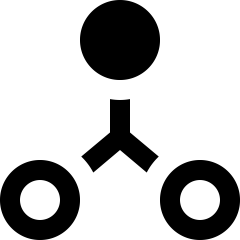
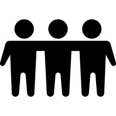
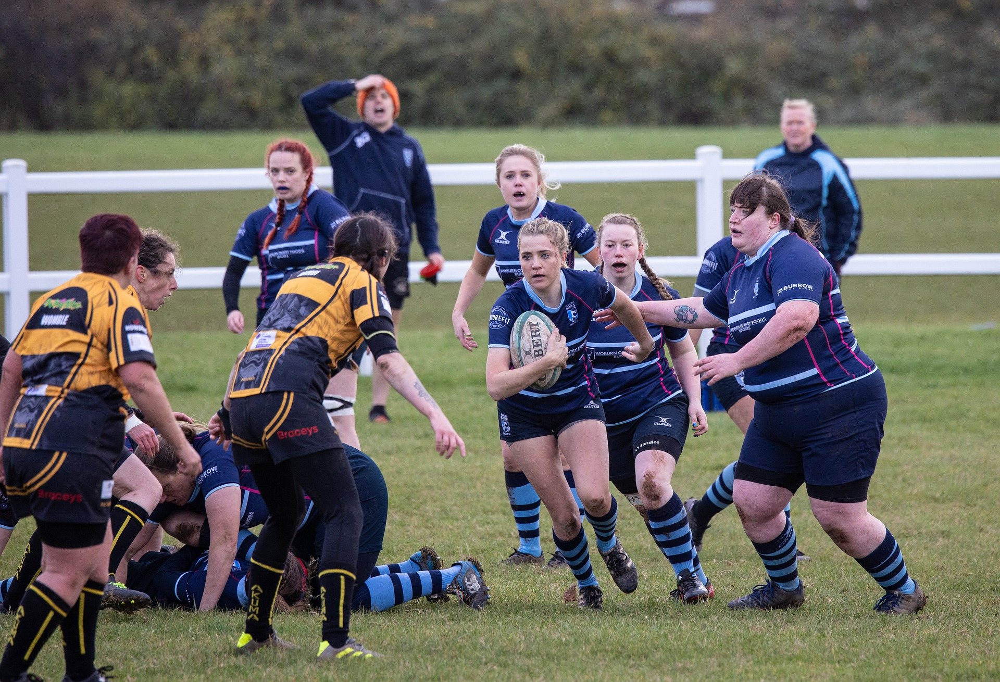
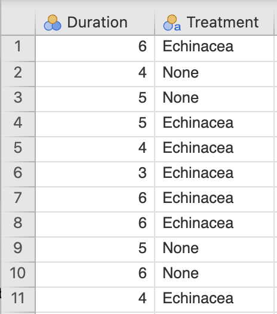
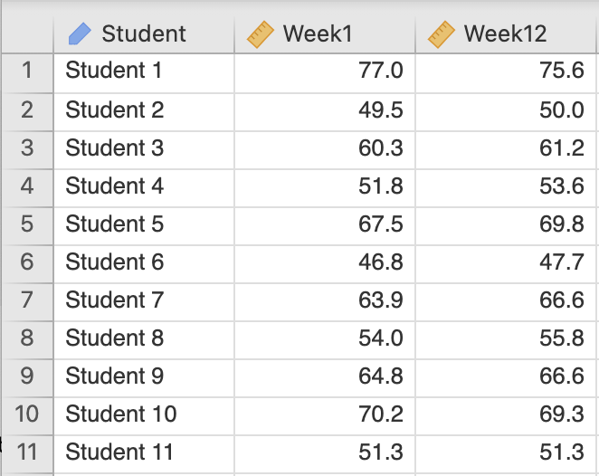

# (PART) Asking research questions {-}


# Research questions {#RQs}


<!-- Introductions; easier to separate by format -->
```{r, child = if (knitr::is_html_output()) {'./introductions/02-RQs-HTML.Rmd'} else { './introductions/02-RQs-LaTeX.Rmd'}}
```


<!-- Define colours as appropriate -->
```{r, child = if (knitr::is_html_output()) {'./children/coloursHTML.Rmd'} else {'./children/coloursLaTeX.Rmd'}}
```


## Introduction {#Chap2-Intro}

The research question (RQ) directs all other components of the research.
Since quantitative research summarises and analyses data using numerical methods (like averages or percentages), the RQ must be *written* carefully so it can be *answered* effectively.
Four different types of RQs are studied:

* descriptive RQs (Sect.\ \@ref(RQsDescriptive)).
* relational RQs (Sect.\ \@ref(RQsRelational)).
* repeated-measures RQs (Sect.\ \@ref(RQsRepeatedMeasures)).
* correlational RQs (Sect.\ \@ref(RQsCorrelational)).


Since the RQ directs all other components of the research, RQs should be the first step of any research study.
Specifically, RQs should be asked before data are collected.


::: {.importantBox .important data-latex="{iconmonstr-warning-8-240.png}"}
RQs should be written *before data are collected*.
:::


## Descriptive RQs {#RQsDescriptive}
\index{Research question!descriptive|(}

All RQs identify a large group of interest to be studied (called a *population*),\index{Population} and study something *about* that population (called the *outcome*).\index{Outcome}

The population is any broad group of interest; for example:

* all German males between\ $18$ and\ $35$ years of age.
* all bamboo flooring materials manufactured in China.
* all elderly females with glaucoma in Canada.
* all *Pinguicula grandiflora* growing in Europe.


::: {.definition #Population name="Population"}
\index{Population}\index{Individuals}
A *population* is a group of *individuals* from which the total set of observations of interest *could* be made, and to which the results will generalise.
:::


Populations comprise many *individuals* (or *cases*).\index{Individuals}\index{Cases}
If the individuals are people, individuals may also be called *subjects*.\index{Subjects}


::: {.importantBox .important data-latex="{iconmonstr-warning-8-240.png}"}
The words *population*, *individuals* and *cases* do *not* just refer to people, though they may be commonly used that way in general conversation.
:::


Data are rarely taken from all the individuals in the population: *all* individuals are rarely accessible in practice.
For example, testing a new drug cannot possibly study *all* people who might use the drug (some may not even be born yet). 
In contrast, a *sample* is a *subset* of the population from which data are obtained (Chap.\ \@ref(Sampling)).
Countless samples are possible from any given population.


<div style="float:right; width: 75px; padding:10px">

</div>


::: {.definition #Sample name="Sample"}
\index{Sample}
A *sample* is a subset of individuals from the population.
The data are collected from the sample.
:::


::: {.importantBox .important data-latex="{iconmonstr-warning-8-240.png}"}
The *population* in an RQ is *not* just those studied; it is the whole group to which results could generalise.
:::


::: {.example #Samples name="Samples"}
A study of American college women [@data:woolf:ironstatus] compared iron status in highly-active and sedentary women.

The study compared $28$ active and\ $28$ sedentary American college women, from which data are collected.
The *population* is *all* active and sedentary American college women.
The group of $56$\ subjects is the *sample*.
:::


Descriptive RQs study something *about* the identified population, called the *outcome*.
Because the RQ concerns a large group (the population), the outcome numerically describes a *group* of individuals (not single individuals).
The outcome is, for example, an *average* or *percentage* summarising a group of individuals.


<div style="float:right; width: 75px; padding:10px">

</div>


::: {.definition #Outcome name="Outcome"}
\index{Outcome}
The *outcome* in an RQ is the result, output, consequence or effect of interest in a study, numerically summarised for a group of individuals.   
:::


The outcome of interest in a population may be (for example) the

* *average* amount of wear after\ $1\,000\hs$ of use.
* *proportion* of people whose pupils dilate.
* *average* weight loss after three weeks on a diet.
* *percentage* of seedlings that die.


::: {.importantBox .important data-latex="{iconmonstr-warning-8-240.png}"}
\index{Outcome}\index{Population}\index{Individuals}
The *outcome* in an RQ summarises a *population*; it does not describe the *individuals* in the population.
:::


Descriptive RQs can now be introduced.


::: {.definition #DescriptiveRQ  name="Descriptive RQ"}
*Descriptive RQs* have a population and an outcome.
:::


Some RQs ask about the *value* of some population quantity (such as: what is the average internal body temperature?); these are called *estimation* RQs.
Some RQs require *making a decision* about the population (such as: is the average internal body temperature the same for females and males?); these are called *decision-making* RQs.
Descriptive RQs have one of these forms, depending on what information is sought (Sect.\ \@ref(TwoPurposesOfRQs)):

* *estimation* RQs: Among {*the population*}, what is {*the outcome*}?\index{Research question!estimation}
* *decision-making* RQs: Among {*the population*}, is {*the outcome*} equal to {*a given value*}?\index{Research question!decision-making}


::: {.importantBox .important data-latex="{iconmonstr-warning-8-240.png}"}
These templates are *not* 'recipes', but guidelines.
:::


Answering *estimation* descriptive RQs is studied in Chaps.\ \@ref(CIOneProportion) and\ \@ref(OneMeanConfInterval).
Answering *decision-making* descriptive RQs is studied in Chaps.\ \@ref(TestOneProportion) and\ \@ref(TestOneMean).


::: {.example #DescriptiveRQBodyTemp name="Descriptive RQ"}
@data:mackowiak:bodytemp studied men and women aged\ $18$ to\ $40$; this is the *population*.
The *outcome* of interest in this population is the *average body temperature*.
The sample comprised\ $148$ 'healthy men and women' aged\ $18$ to\ $40$.
One descriptive RQ was:

> What is the average body temperature?


This is an *estimation* RQ.\spacex
They also studied a *decision-making* descriptive RQ (where\ $98.6$^o^F (or\ $37.0$^o^C) is a commonly-accepted value for the internal body temperature):

> Is the average body temperature really\ $98.6$^o^F ($37.0$^o^C)?
:::

\index{Research question!descriptive|)}


## Relational RQs {#RQsRelational}
\index{Research question!relational|(}

Studying relationships usually is more interesting than simply describing a population.
*Relational RQs* compare the outcome for groups of different individuals in the population, or compare two different sub-populations.
These comparisons are called *between-individuals* comparisons,\index{Comparison!between individuals} as they compare the outcome *between* (or among) groups of *different* individuals.
Examples include:

* comparing the average amount of wear in floorboards *between* two different groups: standard wooden floorboards, and bamboo floorboards.
* comparing the average heart rates *across* three groups of people: those who received no dose of a drug, those who received a weekly dose of the drug, and those who received a daily dose of the drug.


::: {.definition #ComparisonBetween name="Comparison (between individuals)"}
The *between-individuals comparison* in an RQ identifies the small number of groups of different individuals for which the outcome is compared.
:::


:::{.example #BetweenHimalaya name="Between-individuals comparison"}
@data:Williams2022:Possums compared the average weight of female and male Leadbeater's possums.
'Sex of the possum' is the *between-individuals* comparison; average weight is the outcome.
:::


Relational RQs can now be introduced.

::: {.definition #RelationalRQ name="Relational RQ"}
*Relational RQs* have a population, outcome, and a *between*-individuals comparison.
:::


Relational RQs have one of these forms, depending on what information is sought:

* *estimation* RQ: Among {*the population*}, what is the difference in {*the outcome*} for {*the groups being compared*}? 
* *decision-making* RQ: Among {*the population*}, is {*the outcome*} the same for {*the groups being compared*}?


::: {.example #RelationalRQ name="Relational RQ"}
Consider this RQ (based on @estevez2019influence):

> Among Cubans between\ $13$ and\ $20$ years of age, is the average heart rate the same for females and males?

The *population* is 'Cubans\ $13$ and\ $20$ years of age', the *outcome* is '*average* heart rate', and the *between-individuals comparison* is between two separate groups: 'between females and males'.
This is a *relational RQ*.

This is a *decision-making RQ*, since it asks if the average heart rate is the same for females and males.
An *estimation*-type relational RQ would ask about the *size* of difference in the average heart rate between females and males.
:::
\index{Research question!relational|)}


## Repeated-measures RQs {#RQsRepeatedMeasures}
\index{Research question!repeated-measures|(}

Rather than comparing the outcome for groups of different individuals, *repeated-measures RQs* compare the outcome multiple times within the *same* individuals.

These comparisons are called *within-individuals* comparisons,\index{Comparison!within individuals} as they compare the outcome *within the same individuals*, not across groups of *different* individuals.
The multiple measurements may be different points in time (e.g., the height of the same trees at one, two and five years after planting), but do not have to be time points.

<!-- The comparisons may be made when researchers manipulate the individuals between measurements or observations (e.g., recording pulse rate *before* and *after* being given caffeine to drink), or with researchers not manipulating the individuals (e.g., recording the activity of lizards at 4a.m. and 4p.m.).  -->

Examples include:

* comparing the average strength of hind legs of horses to the forelegs of the same horses.
* comparing the average thickness of the cornea in left eyes and right eyes of the same individuals.
* comparing the average amount of wear in many individual floorboards after one, five and ten years of use.


::: {.definition #ComparisonWithin name="Within-individuals comparison"}
The *within-individuals comparison* in the RQ identifies the small number of different, distinct situations for which the outcome is compared for each individual.
:::


:::{.example #WithinBetweenComparison name="Between- and within-individual comparisons"}
Consider comparing the strength of the dominant and non-dominant legs of professional football players.

A *between*-individuals comparison would compare the average strengths of the dominant and non-dominant legs *between different* groups of footballers: one group would have their dominant-leg strength measured, and the other would have their non-dominant-leg strength measured.
This is a *between*-individuals comparison.

In contrast, the strengths of the dominant and non-dominant legs could be recorded on the *same* individuals.
This study examines *within*-individuals changes: the average differences between the strengths of the dominant and non-dominant legs *within* the same individuals.
In this study, *no between-individuals comparison* exists: different groups are not being compared.
:::


Studies may use *both* within- and between-individuals comparisons (see Sect.\ \@ref(ChamomileTea-TwoMeans)).
For instance, a study may examine the *change* in individuals' heart rate (*within*-individuals comparison), for two drugs given to different groups (*between*-groups comparison).

Repeated-measures RQs can now be introduced.


::: {.definition #RepeatedMeasuresRQ name="Repeated-measures RQ"}
*Repeated-measures RQs* have a population, outcome and a *within*-individuals comparison.
:::


Repeated-measures RQs have one of these forms, depending on what information is sought:

* *estimation* RQ: Among {*the population*}, what is the change in {*the outcome*} for {*the alternatives being compared within individuals*}? 
* *decision-making* RQ: Among {*the population*}, is {*there a change in the outcome*} for {*the alternatives being compared within individuals*}?


::: {.example #WithinRelationalRQ name="Repeated-measure RQ"}
@rowland2017comparing compared the temperature in the *same* tree hollows in summer and winter:

> For tree hollows in the Strathbogie Ranges, Australia, what is the average temperature difference between summer and winter?

The comparison is *within individuals*, as the temperature is measured for the *same* tree hollows at the two times.
This is a repeated-measures, estimation-type RQ.\spacex
:::


Repeated-measures RQs with only two within-individual comparisons are often called *paired*.\index{Data!paired}\index{Study types!paired}


:::{.example #RepeatedMeasuresPaired name="Paired repeated-measures study"}
@levitsky2004freshman compared the weights of the same university students at the beginning university, and then after $12$\ weeks.
The comparison is *within* individuals, and the study is a *repeated-measures* study.
Since each student has a *pair* of weight measurements, this is a *paired* study.
:::
\index{Research question!repeated-measures|)}


## Variables {#Variables}
\index{Variables}

RQs are about *populations*.
However, the data to answer an RQ come from *individuals* in that population.
The aspects or characteristics of the individuals that can *vary* from individual to individual are called *variables*.


::: {.definition #Variable name="Variable"}
A *variable* is a single aspect or characteristic associated with the individuals, whose values can vary from individual to individual.
:::


Examples of variables include: the duration of cold symptoms; sex; rate of tree growth; response to a survey question (Yes, Maybe or No); city of birth; or hair colour.


::: {.importantBox .important data-latex="{iconmonstr-warning-8-240.png}"}
A variable is a single aspect that can vary from *individual to individual*.
While *your* city of birth does not change, 'city of birth' is a variable because it varies from *individual* to *individual*.
:::


<div style="float:right; width: 222x; border: 1px; padding:10px">

</div>


::: {.example #Variables  name="Variables"}
'Duration of cold symptoms' is a *variable*: its value can vary from individual to individual.
The '*average* duration of cold symptoms' is the *outcome*, a numerical summary of many individuals' cold durations.
:::


While many variables can be recorded from individuals in the population, two essential variables are (Table\ \@ref(tab:RQsPopulationIndividuals)):

* the *response variable*, which records information to determine the outcome.\index{Response variable}
* the *explanatory variable*, which records information to determine the comparison.\index{Explanatory variable}

Usually, one variable can be considered as perhaps influencing the value of the other variable.
This variable is called the *explanatory variable* (which may *explain* changes in the other variable).
The other is the *response variable* (whose values *respond* to changes in the explanatory variable).
To be able to influence the response variable, the explanatory variable must occur before (or at the same time) as the response variable.


```{r RQsPopulationIndividuals}
if( knitr::is_latex_output() ) {
  
  PopInd <- array( dim = c(2, 3) )
  colnames(PopInd) <- c("Population", 
                        "",
                        "Individuals")
  PopInd[1, ] <- c("Outcome", 
                   "$\\rightarrow$", 
                   "Response variable")
  PopInd[2, ] <- c("Comparison", 
                   "$\\rightarrow$", 
                   "Explanatory variable")
  
  kable(PopInd,
        format = "latex",
        longtable = FALSE,
        booktabs = TRUE,
        escape = FALSE, # For latex to work in \rightarrow
        linesep  =  c("", "", "", "\\addlinespace", "", "", ""), # Otherwise adds a space after five lines... 
        caption = "The relationship between the population and the individuals.",
        align = c("r", "c", "l"))   %>%
    kable_styling(full_width = FALSE) %>%
    kable_styling(font_size = 8) %>%
    row_spec(0, bold = TRUE) # Columns headings in bold
}

if( knitr::is_html_output() ) {
  
  PopInd <- array( dim = c(4, 3) )
  
  PopInd[1, ] <- c("{#id .class height=100px}",
                   "",
                   "{#id .class height=100px}")
  PopInd[2, ] <- c("Population", 
                   "", 
                   "Individuals")
  
  PopInd[3, ] <- c("Outcome:", 
                   "$\\rightarrow$", 
                   "Response variable")
  PopInd[4, ] <- c("Comparison:", 
                   "$\\rightarrow$", 
                   "Explanatory variable")
  PopInd[, 2] <- "$\\rightarrow$"
  
  out <- kable(PopInd,
               format = "html",
               align = c("r", "c", "l"),
               longtable = FALSE,
               caption = "The relationship between the population and the individuals.",
               booktabs = TRUE)
  
    row_spec(out, 
             2, 
             bold = TRUE) # Columns headings in bold
}
```


The value of the *response* variable may change in *response* to the value of the explanatory variable.
The value of the *explanatory* variable may *explain* changes in the value of the response variable.


::: {.definition #ExplanatoryVariable name="Explanatory variable"}
An *explanatory variable* may (partially) explain or be associated with changes in another variable of interest (the response variable).
:::


::: {.definition #ResponseVariable name="Response variable"}
A *response variable* records the result, output, consequence or effect of interest from changes in another variable (the explanatory variable).
:::


::: {.importantBox .important data-latex="{iconmonstr-warning-8-240.png}"}
The *response variable* is sometimes called the *dependent variable*,\index{Dependent variable} and the *explanatory variable* is sometimes called the *independent variable*.\index{Independent variable}
We avoid these terms, since the words 'dependent' and 'independent' have many meanings in research.
:::

	
The RQ cannot be answered without data for the response and explanatory variables.
The *outcome* is a numerical summary of the values of the response variable (Table\  \@ref(tab:RQsPopulationIndividualsExamplesOutcome)) recorded from many individuals.
The values of the explanatory variable distinguish between the values of the *comparison* for the individuals (Table\ \@ref(tab:RQsPopulationIndividualsExamplesComparison) and\ \@ref(tab:RQsPopulationIndividualsExamplesComparisonWithin)) being made.\index{POCI}


```{r RQsPopulationIndividualsExamplesOutcome}
PopInd2 <- array( dim = c(7, 3) )

if( knitr::is_latex_output() ) {
  PopInd2[1, ] <- c("{#id .class height=100px}",
                    "",
                    "{#id .class height=100px}")
  PopInd2[2, ] <- c("Outcome describing the population", 
                      "", 
                      "Response variable in individuals")
  
  PopInd2[3, ] <- c("\\emph{Average} diastolic blood pressure", 
                    "", 
                    "Diastolic blood pressure of \\emph{individuals}")
  PopInd2[4, ] <- c("\\emph{Percentage} of seedlings that sprout", 
                    "", 
                    "Whether an \\emph{individual} seedling sprouts")
  PopInd2[5, ] <- c("\\emph{Proportion} owning iPad", 
                    "", 
                    "Whether an \\emph{individual} owns an iPad")
  PopInd2[6, ] <- c("\\emph{Average} cold duration", 
                    "", 
                    "Cold duration for \\emph{individuals}")
  PopInd2[7, ] <- c("\\emph{Percentage} of concrete cylinders having fissures", 
                    "", 
                    "Whether an \\emph{individual} cylinder has fissures")
  
  PopInd2[, 2] <- "$\\rightarrow$"
  
  kable(PopInd2[3:6, ],
        format = "latex",
        longtable = FALSE,
        booktabs = TRUE,
        col.names = c("Outcome describing the population", 
                      "", 
                      "Response variable in individuals"),
        escape = FALSE, # For latex to work in \rightarrow
        #linesep = c( "\\addlinespace"), # Add a bit of space between all rows
        caption = "Outcomes and corresponding response variable.",
        align = c("r", "c", "l")
  )   %>%
    kable_styling(full_width = FALSE, 
                  font_size = 8) %>%
    row_spec(0, bold = TRUE) #%>% # Columns headings in bold
#    column_spec(column = 1, width = "46mm") %>% 
#    column_spec(column = 3, width = "60mm")
}

if( knitr::is_html_output() ) {
  PopInd2[1, ] <- c("{#id .class height=100px}",
                    "",
                    "{#id .class height=100px}")
  PopInd2[2, ] <- c("Outcome describing the population", 
                    "", 
                    "Response variable in individuals")

  PopInd2[3, ] <- c("*Average* increase in diastolic blood pressure, from before to after exercise", 
                    "", 
                    "Increase in diastolic blood pressure of *individuals*, from before to after exercise")
  PopInd2[4, ] <- c("*Percentage* of seedlings that sprout",
                    "", 
                    "Whether an *individual* seedling sprouts")
  PopInd2[5, ] <- c("*Proportion* owning iPad", 
                    "", 
                    "Whether an *individual* owns an iPad")
  PopInd2[6, ] <- c("*Average* cold duration", 
                    "", 
                    "Cold duration for *individuals*")
  PopInd2[7, ] <- c("*Percentage* of concrete cylinders having fissures", 
                    "", 
                    "Whether an *individual* cylinder has fissures")
  
  PopInd2[, 2] <- "$\\rightarrow$"
  
  out <- kable(PopInd2,
               format = "html",
               align = c("r", "c", "l"),
               longtable = FALSE,  
               caption = "Examples of the outcome and the corresponding response variable.",
               booktabs = TRUE)
  
    row_spec(out, 2, bold = TRUE) # Columns headings in bold
}
```


(ref:CompareBetween) *Between-individuals* comparisons and the corresponding explanatory variable.

```{r RQsPopulationIndividualsExamplesComparison}
PopInd3 <- array( dim = c(3, 3) )
colnames(PopInd3) <- c("Comparison being made", 
                       "", 
                       "Explanatory variable in individuals")
PopInd3[1, ] <- c("Between jarrah, beech, bamboo boards", 
                  "", 
                  "Type of floorboard in \\emph{individual} homes")
PopInd3[2, ] <- c("Between $3\\kgs$/ha, $4\\kgs$/ha fertiliser rates", 
                  "", 
                  "Application rate in \\emph{individual} paddocks")
PopInd3[3, ] <- c("Between people in $20$s, $30$s and\ $40$s", 
                  "", 
                  "Age group for each \\emph{individual} person")

PopInd3[, 2] <- "$\\rightarrow$"

if( knitr::is_latex_output() ) {
  kable(PopInd3,
format = "latex",
        longtable = FALSE,
        booktabs = TRUE,
        escape = FALSE, # For latex to work in \rightarrow
        #linesep  =  c( "\\addlinespace"), # Add a bit of space between all rows
        caption = "(ref:CompareBetween)",
        align = c("r", "c", "l"))   %>%
    kable_styling(full_width = FALSE, 
                  font_size = 8) %>%
    row_spec(0, bold = TRUE) %>% # Columns headings in bold
    column_spec(column = 1, width = "54mm") %>% 
    column_spec(column = 3, width = "53mm")
}

if( knitr::is_html_output() ) {
  kable(PopInd3,
        format = "html",
        align = c("r", "c", "l"),
        longtable = FALSE,
        caption = "(ref:CompareBetween)",
        booktabs = TRUE)    
}
```


(ref:CompareWithin) *Within-individuals* comparison and corresponding explanatory variable.


```{r RQsPopulationIndividualsExamplesComparisonWithin}
PopInd3 <- array( dim = c(3, 3) )
colnames(PopInd3) <- c("Comparison being made", 
                       "", 
                       "Explanatory variable in individuals")
PopInd3[1, ] <- c("Before and after", 
                  "", 
                  "When measured")
PopInd3[2, ] <- c("Between left and right arms", 
                  "", 
                  "Which arm is used")
PopInd3[3, ] <- c("Between forelegs and hind legs", 
                  "", 
                  "Which legs are measured")

PopInd3[, 2] <- "$\\rightarrow$"

if( knitr::is_latex_output() ) {
  kable(PopInd3,
        format = "latex",
        longtable = FALSE,
        booktabs = TRUE,
        escape = FALSE, # For latex to work in \rightarrow
        #linesep  =  c( "\\addlinespace"), # Add a bit of space between all rows
        caption = "(ref:CompareWithin)",
        align = c("r", "c", "l"))   %>%
    kable_styling(full_width = FALSE, 
                  font_size = 8) %>%
    row_spec(0, bold = TRUE) %>% # Columns headings in bold
    column_spec(column = 1, width = "49mm") %>% 
    column_spec(column = 3, width = "56mm")
}

if( knitr::is_html_output() ) {
  kable(PopInd3,
        format = "html",
        align = c("r", "c", "l"),
        longtable = FALSE,
        caption = "(ref:CompareWithin)",
        booktabs = TRUE)    
}
```


<!-- ::: {.example #Variables2 name="Variables"} -->
<!-- For the final RQ for the echinacea study (Sect.\ \@ref(Writing-RQs)), 'the duration of cold symptoms' is the *response variable*, and 'whether echinacea is taken or not' is the *explanatory variable*. -->
<!-- The type of medication is taken *before* the cold symptoms disappear, and may even partially explain the duration of the cold symptoms. -->
<!-- ::: -->


`r if (knitr::is_latex_output()) '<!--'`
<iframe src='https://www.ferendum.com/en/embeded.php?pregunta_ID=1249763&sec_digit=365747699&embeded_digit=874385320' style='width:100%; height:550px; overflow: auto; background: #badaff33;' frameBorder='0'></iframe><BR>
<A href='https://www.ferendum.com' target='_blank'>Free Online Poll Maker</A>


`r webexercises::hide()`
The *Population* is 'carrots grown in Buderim' 8 weeks after planting.
From these carrots, we *need* to collect *whether Thrive fertiliser was applied* and the *weight of the carrots $8$\ weeks after planting*.

The *response* variable is 'the weight of each individual carrot\ $8$\ weeks after planting', and the *explanatory* variable is 'whether Thrive was used on each carrot'.

('The *number* of carrots planted' is not even a variable: it is not information recorded about the individuals, but a summary of information.)
`r webexercises::unhide()`
`r if (knitr::is_latex_output()) '-->'`


::: {.example #POCIplaygrounds name="Variables"}
Consider a study of the ground surface temperature of public playgrounds in Boston in summer.

The *population* comprises all public playgrounds in Boston; each public playground is an *individual*.
The *outcome* is the *average* ground surface temperature in summer over many playgrounds; the *response variable* is the ground surface temperature for *individual* ground surfaces in summer.

The between-individuals *comparison* is between the four types of ground surfaces (rubber, soil, sand, mulch).
The *explanatory variable* is the type of surface for individual playgrounds.
:::


## Correlational RQs {#RQsCorrelational}
\index{Research question!correlational|(}

*Correlational RQs* are not concerned with summarising outcomes in comparison *groups*.
Instead, correlational RQs explore relationships between two variables measured or observed on or about the individuals.


::: {.definition #CorrelationalRQ name="Correlational RQ"}
*Correlational RQs* explore the relationship between two variables.
:::


Correlational RQs have one of these forms, depending on what information is sought:

* *estimation* RQ: Among {*the population*}, how strong is the relationship between {*the response variable*} and {*the explanatory variable*}?
* *decision-making* RQ: Among {*the population*}, is {*the response variable*} related to {*the explanatory variable*}?

Examples include studying the relationship between:

* the height of plants (response variable) and the number of hours of sunlight per day (explanatory variable).
* heart rate (response variable) and the number of grams of caffeine consumed that day (explanatory variable).

Usually, one variable can be considered as the explanatory variable, and the other as the response variable (Sect.\ \@ref(Variables)).
To be able to influence the response variable, the explanatory variable must occur before (or at the same time) as the response variable.


:::{.example #CorrelationalRunners name="Correlational RQ"}
Consider studying marathon runners.
An RQ exploring the relationship between the individuals' water intake on the day before the race and the individuals' race times would be a correlational RQ.\spacex
The water intake on the day before the race *may* influence the race time.

The water intake on the day before the race is the explanatory variable, and the race time is the response variable.
:::


:::{.example #CorrelationalPine name="Correlational RQ"}
The Wollemi pine was discovered by science in\ 1994.
@offord2023home studied the growth of these rare plants.

One correlational RQ concerned the relationship between the diameter of trees at breast height (DBH; response variable), and the pH of the soil (explanatory variable).
The two variables are the DBH and pH, both recorded for many trees. 

Also studied was the relationship between the DBH for each tree at various times after the planting date (a repeated-measure RQ). 
Each tree has the DBH measured over time, for many time points. 
Time is the *within*-individuals comparison.
:::


In some situations, the variables are neither response nor explanatory variable; the interest is just in the association between the two variables.


::: {.example #ResearchDesignFishSize name="Correlation RQ"}
@gonzalez2024length recorded the length and weight of $14\,040$\ fish for\ $39$ demersal fish species.
The study has two variables (fish length; fish weight), but identifying a response variable and explanatory variable is meaningless.
The correlational RQ is: 

> Among demersal fish, how strong is the relationship between length and weight?
:::


\index{Research question!correlational|)}


## Interventions {#Intervention}
\index{Intervention}

Sometimes, the explanatory variable naturally occurs without manipulation by the researchers (e.g., the height of people; the sex of oxen; the pH of forest soil).
Sometimes, however, the explanatory variable is manipulated by researchers (e.g., the dose of fertiliser applied; the dose of drug given); this is called an *intervention*.


::: {.definition #Intervention name="Intervention"}
An *intervention* is present when *researchers* can manipulate (or impose) the values of the *explanatory variable* on the individuals to determine the impact on the response variable.
:::


When an intervention is present, the values of the explanatory variable are *manipulated* by the researchers, and are called *treatments*.
When an intervention is *not* present, the values of the explanatory variable are *not* manipulated by the researchers, and are called *conditions*.
The *analysis* is the same whether an intervention is used or not, but the *interpretation* of the results depend on whether an intervention is used (Sect.\ \@ref(CompareStudyTypes)).


::: {.definition #Treatments name="Treatments"}
\index{Treatments}
The *treatments* are the values of the explanatory variable that the researchers can manipulate and impose upon the individuals.
:::


::: {.definition #Conditions name="Condition"}
\index{Conditions}
The *conditions* are the values of the explanatory variable that those in the study have or experience, but are not manipulated or imposed by the researchers.
:::


An intervention is present when the researchers: 

* explicitly give a dose of a new drug to patients.
* explicitly apply wear-testing loads to two different flooring materials.
* explicitly expose people to different stimuli.
* explicitly apply different doses of fertiliser.


:::{.example #InterventionHimalaya name="Intervention"}
@data:Bird2008:wholegrain *supplied* one group of participants a diet using refined flour, and *supplied* another group of participants a diet using a new flour variety.
The type of diet is the explanatory variable.
Since the researchers manipulate which subjects ate which flour, this study has an intervention.
The type of diet is the treatment.
:::


::: {.example #Interventions name="No intervention"}
To compare the average blood pressure in female and male Scots, blood pressure was measured using a blood pressure machine (a sphygmomanometer).
The researchers interact with the participants to measure blood pressure, but there is *no* intervention.
Using the sphygmomanometer is just a way to measure blood pressure, to *obtain* the data.

The *comparison* is between females and males (the conditions), which cannot be manipulated or imposed on the individuals by the researchers; *there is no intervention*.
:::


Often, one of the comparison groups is the *control group*.
The *control group* is a comparison group *not* receiving the treatment being studied, or *not* having the condition being studied, but *as similar as possible* to the other individuals in all other ways.
The control group is like a benchmark for detecting changes in the outcome due to the treatment or condition of interest (Sect.\ \@ref(PlaceboEffect)).
Sometimes the control group is given a *placebo*: a non-effective treatment that appears to be the real treatment.


::: {.definition #Control name="Control"}
A *control* is an individual without the treatment or condition of interest, but as similar as possible in *every other way* to other individuals.
A *control group* is a group of controls.
:::


::: {.definition #Placebo name="Placebo"}
A *placebo* is a treatment with no intended effect or active ingredient, but appears to be the real treatment.
:::


::: {.example #ControlGroup name="Control group"}
To test the effectiveness of a new medication, patients report to a doctor to receive injections of the new drug.
Patients assigned to the *control group* do not receive the drug.
The controls should also report to a doctor and receive an injection (like those receiving the drug); the injection, however, would be ineffective (a placebo).
:::


Together, the **P**opulation, **O**utcome, **C**omparison and **I**ntervention form the POCI acronym\index{POCI} (sometimes written as PICO) to aid remembering the elements of RQs.\spacex
The POCI acronym is not helpful for correlational RQs.


::: {.example #POCIWomen name="POCI"}
@data:woolf:ironstatus measured iron status in highly-active and sedentary American college women.

The *outcome* is the 'average iron status'.
The between-individuals *comparison* is between highly-active and sedentary women. 
For this comparison to be an intervention, the *researchers* would need to tell each individual woman to be highly active or sedentary.
This seems unlikely, so the study does not have an intervention.
:::


## Estimation and decision-making RQs {#TwoPurposesOfRQs}
\index{Research question!estimation}\index{Research question!decision-making}

As noted earlier, RQs can be written with one of two purposes.
*Estimation RQs* ask how precisely an unknown *value* in the *population* is estimated by the *sample*.
Estimation RQs are answered using *confidence intervals*, which are discussed in Chaps.\ \@ref(CIOneProportion) to\ \@ref(OneMeanConfInterval), Chaps.\ \@ref(AnalysisPaired) to\ \@ref(AnalysisOddsRatio), and Sect.\ \@ref(RegressionCI).

*Decision-making RQs* require a decision to be made about the unknown values in the  population.
They are answered using *hypothesis tests*, and discussed in Chaps.\ \@ref(TestOneProportion) to\ \@ref(TestOneMean), Chaps.\ \@ref(AnalysisPaired) to\ \@ref(AnalysisOddsRatio), plus Sects.\ \@ref(CorrelationTesting) and\ \@ref(RegressionHT).


::: { .example #TypesOfRQS name="Decision-making RQs"}
@data:Thane2004:ZincVitA studied 'British young people aged\ $4$--$18$' and asked numerous RQs.
One *decision-making* relational RQ was:

> In British young people aged\ $4$--$18$, is the average zinc intake the same for boys and girls? 
:::


Decision-making RQ have two possible answers.\index{Decision making}
For the example above, the average zinc intake either *is* the same for boys and girls, or *is not* the same for boys and girls, in the *population* (Fig.\ \@ref(fig:ZincRQ)).
These two options are *hypotheses*: potential answers to the RQ.\spacex\index{Hypotheses} 
However, answers are rarely clear in practice, since only one of the countless possible samples from the population is studied.
Instead, researchers decide *how strongly* the sample evidence support a particular hypothesis about the *population*.\index{Hypotheses}

Evidence may *support* or *contradict* a hypothesis; evidence rarely *proves* a hypothesis (at least, without any other support, such as theoretical support).
Ultimately, after collecting data from a *sample*, a decision must be made about which explanation about the *population* is more consistent with the data collected.


```{r ZincRQ, fig.align="center", fig.cap="Two possible answers to the RQ (hypotheses) about zinc intake in children.", out.width='100%', fig.width=8.5, fig.height=4}
par( mar = c(0.15, 0.15, 0.75, 0.15))

openplotmat()

pos <- array(NA, 
             dim = c(4, 2))
pos[1, ] <- c(0.15, 0.5) # RQ 
pos[2, ] <- c(0.55, 0.70) # Yes
pos[3, ] <- c(0.55, 0.30)   # No
pos[4, ] <- c(0.90, 0.50)   # Data

straightarrow(from = pos[1,], 
              to = pos[2,], 
              lty = 2,
              lcol = "grey")
straightarrow(from = pos[1,], 
              to = pos[3,], 
              lty = 2,
              lcol = "grey")

straightarrow(from = pos[4,], 
              to = pos[2,], 
              lty = 2,
              lcol = "grey")
straightarrow(from = pos[4,], 
              to = pos[3,], 
              lty = 2,
              lcol = "grey")

textplain( c( 0.75,
              0.5 ),
           cex = 4.5,
           lab = "?",
           col = "grey")
           

textrect( pos[1,], 
          lab = "In British young people aged\n4--18, is the average zinc\nintake the same\nfor boys and girls?", 
          radx = 0.15, 
          rady = 0.15, 
          shadow.size = 0,
          box.col = ExplanatoryColour ,
          lcol = ExplanatoryColour )

textrect( pos[2,], 
          lab = expression( atop(bold(YES)*":"~the~average~zinc~intake,
                                bold(is)~the~same~"for"~boys~and~girls)),
          radx = 0.16, 
          rady = 0.1, 
          shadow.size = 0,
          box.col = IndividualColour,
          lcol = IndividualColour)
textrect( pos[3,], 
          lab = expression( atop(bold(NO)*":"~the~average~zinc~intake,
                                bold(is~not)~the~same~"for"~boys~and~girls)),
          radx = 0.16, 
          rady = 0.1, 
          shadow.size = 0,
          box.col = IndividualColour,
          lcol = IndividualColour)

textrect( pos[4,], 
          lab = "Which does\ndata support?",
          radx = 0.10, 
          rady = 0.1, 
          shadow.size = 0,
          box.col = GroupColour,
          lcol = GroupColour)

text(x = pos[1, 1],
     y = 0.90,
     font = 2, # Bold
     labels = "Research question")
text(x = pos[2, 1],
     y = 0.90,
     font = 2, # Bold
     labels = "Hypotheses")
text(x = pos[4, 1],
     y = 0.90,
     font = 2, # Bold
     labels = "Data")
```


Decision-making RQs can be asked in different ways.\index{Research question!one- and two-tailed}
For the zinc-intake study above (Fig.\ \@ref(fig:ZincRQ)), the RQ could ask (about the population):

* is the average zinc intake *the same* for boys and girls?
* is the average zinc intake *different* for boys and girls?
* is the average zinc intake *lower* for boys, compared to girls?
* is the average zinc intake *higher* for boys, compared to girls?

The first two are *two-tailed RQs* (and are essentially asking the same thing but in different ways): the average zinc intake could be higher for girls or higher for boys.
We are just interested in whether any difference is present; that is, two options are being considered.
The last two are *one-tailed RQ*, since they ask specifically about a difference in just one direction: boys lower than girls, or boys higher than girls.

Most RQs are two-tailed, unless a good reason exists to ask a one-tailed RQ *before* the data are collected (e.g., a drug has been developed specifically to *reduce* blood pressure).
RQs should be formed before the data are collected.


::: {.importantBox .important data-latex="{iconmonstr-warning-8-240.png}"}
In general, RQs should be two-tailed RQs, unless a justifiable reason exists for asking a one-tailed question *before data are collected*.
:::


## Units of observation and analysis {#UnitsObsAnalysis}
\index{Units of observation}\index{Units of analysis}

*Units of observation* and *units of analysis* are different yet similar concepts that must be distinguished to properly identify a population.


<div style="float:right; width: 222x; border: 1px; padding:10px">

</div>


Consider this descriptive RQ:

> In English $20$-something men, what is the average thickness of head-hair strands?

To answer this question, the thickness of individual hair strands needs to be measured.
The 'things' from or about which measurements are taken are called *units of observation*.


::: {.definition #UnitOfObservation name="Unit of observation"}
The *unit of observation* is the entity that is observed, from or about which measurements are taken and data collected.
:::

For this RQ, the unit of observation is the hair strand: the thickness measurements are taken from the hair strands.
Suppose the thickness of $100$ hair strands is recorded.
These $100$ hair strands could be obtained in many different ways. 
Two options are to:

* take $100$ hair strands, all from the same man.
* take one hair strand from each of $100$ different men.

While each approach gives $100$ measurements, these two approaches are *very* different.
Only one man is represented in the first scenario, so every hair strand is likely to be similar.
However, $100$ different men are represented in the second.
The difference is related to the concept of *unit of analysis*.

The purpose of the study is to make conclusions about 'men', since the RQ is asking about 'men'.
Each different man provides a separate, independent measurement of hair strand thickness.
The 'man' is the unit of analysis.

The first scenario above has only one unit of analysis (which provided all\ $100$ units of observation).
The second scenario has\ $100$ units of analysis (each providing one unit of observation).

Identifying units of analysis takes care.
The units of analysis:

* can be single units of observation, or collections of units of observations (as in the hair-strand example).
* are usually determined by the research question: what is being compared or studied?
* must be distinct, and separate to, each other (or nearly so).


::: {.definition #UnitOfAnalysis name="Unit of analysis"}
The *unit of analysis* is the smallest collection of units of observations (and perhaps the units of observations themselves) about which conclusions are made; the smallest distinct elements of the population for which information is analysed.
:::


::: {.tipBox .tip data-latex="{iconmonstr-info-6-240.png}"}
Sometimes the *units of analysis* and *units of observation* are the same.
:::


In the hair-strand study, all the hair strands from the same man have essentially 'lived their life together': they are all washed together with the same shampoo, exposed to the same amount of sunlight and exercise, share the same genetics, etc.
However, different men potentially use different shampoo, exercise differently, have different genetics, and so on.
The hair of different men tends to exhibit distinct characteristics.
Each man is a collection of units of observations (hair strands).


:::{.example #UnitsDescriptiveBread name="Units of analysis, observation"}
To compare the average amount of fibre in wholemeal and white bread, researchers take ten slices from one loaf of wholemeal bread, and ten slices from one loaf of white bread.
The amount of fibre (in grams) in each slice is determined.
The units of *observation* are the 'slices': the type of bread (explanatory variable) and the amount of fibre (response variable) are observed on individual slices.

The unit of *analysis* is the 'loaf' (a collection of slices), because the RQ is comparing types of *bread*, and the slices for each type of bread are all from the same loaf.
Slices from the same loaf share the same baker and bakery; they were made with the same ingredients, in the same oven, baked at the same temperature, etc.
:::


:::{.example #UnitsDescriptive name="Units of analysis, observation"}
The 
`r if (knitr::is_latex_output()) {
   '*Spectrum* website'
} else {
   '[*Spectrum* website](https://www.spectrumnews.org/news/statistical-errors-may-taint-many-half-mouse-studies/) (accessed 18\ Nov, 2022)'
}`
reported a study where researchers examined '$10$\ neurons from each of the $16$\ mice' (November 2022).
The researchers treated each neuron as an independent observation, giving a sample size of $n = 16\times 10 = 160$.

However, neurons in the brain of the same animal are *not* independent observations.
The unit of analysis is the mouse; the unit of observation is the neuron.
The actual sample size was $n = 16$; each unit of analysis has $10$\ units of observation. 
A total of $160$ neurons from\ $16$ mice is very different to a study of $160$ neurons from $160$ genetically-different mice.
:::


The units of observation and units of analysis *may* be the same, and often are the same.
However, they are sometimes different, and identifying these situations is *crucial*.
Importantly, studies compare units of analysis, not units of observation.


::: {.importantBox .important data-latex="{iconmonstr-warning-8-240.png}"}
The sample size is the number of units of analysis.\index{Sample size}
:::


:::{.example #UnitsDescriptiveBP name="Units of analysis, observation"}
Suppose researchers record the diastolic blood pressure (DBP) from $15$ patients aged under $40$\ years of age, and $15$ different patients aged $40$\ or older.
The DBP is measured on every patients' right arm, so there are $15$ observations for the 'Under\ $40$' group, and $15$ observations for the '$40$\ and over' group.

Provided the patients are not closely related, the patients are independent of each other.
(If all $15$\ observations were all from the same family, for example, this would not be true.)
The 'patient' is the unit of analysis *and* the unit of observation.

Later, the researchers decide to take measurements from the left *and* right arms of every patient.
Thus, there are now $30$ observations for the 'Under\ $40$' group, and $30$ observations for the '$40$\ and over' group.
However, the left and right arm measurements for each person are likely to be very similar.
The 'patient' is the unit of analysis, and each patient provides two observations (one from each arm).

In both cases, the sample size is $n = 30$: both have $30$ units of analysis.
:::
 

::: {.example #UnitsAnalysis3 name="Units of analysis"}
A study compared two physical activity (PA) programs.
Each of $44$\ children in the study, chosen from schools across the region, was allocated to one of two PA programs (with parental agreement).
The children's fitness was measured for every student at the end of the six-month study.

The *units of observation* are the students: fitness measurements are taken from each student.
The *units of analysis* are also the students: students using the different programs are being compared.
In addition, the PA program was *allocated* to each student individually, and each student has their own family routines and activities, etc. and lives separate, distinct lives.
Each unit of analysis (student) has one unit of observation.

The study has $44$\ units of analysis, each with one unit of observation.
:::


::: {.example #UnitsAnalysisGroups name="Units of analysis"}
Consider comparing the percentage of females and males wearing hats at a specific beach.

People in *groups* at the beach will probably not be operating independently: people in groups tend to behave similarly.
For example, a couple will often (but not always) *both* be wearing or both *not* wearing hats.

The researchers may decide not to use data from groups, and only gather data from individuals (when the 'individual' is the unit of analysis *and* unit of observation).
Alternatively, the researchers may decide to use people *groups* as the *unit of analysis* (some will be groups of one), and record data from just *one* person in any group (e.g., the person closest to the researchers when the group is noticed).
:::


`r if (knitr::is_latex_output()) '<!--'`
<iframe src='https://www.ferendum.com/en/embeded.php?pregunta_ID=1252809&sec_digit=992403757&embeded_digit=1479848444' style='width:100%; height:500px; overflow: auto; background: #badaff' frameBorder='0'></iframe><BR>
<A href='https://www.ferendum.com' target='_blank'>Free Online Poll Maker</A>


<iframe src='https://www.ferendum.com/en/embeded.php?pregunta_ID=1252811&sec_digit=285796637&embeded_digit=6372971' style='width:100%; height:500px; overflow: auto; background: #badaff' frameBorder='0'></iframe><BR>
<A href='https://www.ferendum.com' target='_blank'>Free Online Poll Maker</A>


`r webexercises::hide()`
**Units of observation**: the individual students, as the fitness measurements are taken from the students individually.

**Units of analysis**: the *schools*, as the PA program was allocated to each *school*. 
All students at School\ A are exposed Program\ 1, but all students at School\ A are also likely to be exposed to similar weather, fitness opportunities, physical conditions, teachers and school-based philosophies, and so on.

*The improvement in the children's fitness levels* and *the program* are both **variables**.
`r webexercises::unhide()`
`r if (knitr::is_latex_output()) '-->'`


`r if (knitr::is_html_output()){
  'The following short video may help explain some of these concepts:'
}`
<!-- From: https://stackoverflow.com/questions/43840742/how-to-embed-local-video-in-r-markdown -->


<div style="text-align:center;">
```{r}
htmltools::tags$video(src = "./videos/UnitsOfObsAnalysis-B.mp4", 
                      width = "550", 
                      controls = "controls", 
                      loop = "loop", 
                      style = "padding:5px; border: 2px solid gray;")
```
</div>


<iframe src="https://learningapps.org/watch?v=pmy2wjmun22" style="border:0px;width:100%;height:650px" allowfullscreen="true" webkitallowfullscreen="true" mozallowfullscreen="true"></iframe>


## Definitions {#OperationDefinitions}
\index{Definitions}

Research studies usually include terms that must be carefully and precisely defined, so that others know *exactly* what words and terms mean, without ambiguity.
Two types of definitions can be given when necessary.


::: {.definition #ConceptualDefinition name="Conceptual definition"}
\index{Definitions!conceptual}
A *conceptual definition* articulates precisely *what* words or phrases mean in a study.
:::


::: {.definition #OperationalDefinition name="Operational definition"}
\index{Definitions!operational}
An *operational definition* articulates exactly *how* something will be identified, measured, observed or assessed.
:::


In many cases, a clear *operational definition* is needed to describe how data will be collected to ensure repeatability and consistent data collection, by removing any ambiguity about how data are obtained.


<div style="float:right; width: 222x; border: 1px; padding:10px">

</div>


::: {.example #DefinitionsStress name="Operational and conceptual definitions"}
Consider a study examining stress in students.
A *conceptual definition* would describe *what is meant* by 'stress' (in contrast to, say, 'anxiety').
An *operational definition* would describe *how* 'stress' is *measured*, since stress cannot be measured directly (like height, for example).

'Stress' could be *measured* using a questionnaire or measuring physical characteristics, for instance.
Other ways of measuring stress are also possible, and all have advantages and disadvantages.
:::


<iframe src="https://learningapps.org/watch?v=pt0rqa5t522" style="border:0px;width:100%;height:500px" allowfullscreen="true" webkitallowfullscreen="true" mozallowfullscreen="true"></iframe>


Sometimes the definitions themselves are not important, provided a clear definition is given.
However, to avoid confusion, commonly-accepted definitions should be used unless good reasons exist for using a different definition.
When a commonly-accepted definition does not exist, the definition being used should be very clearly articulated, and the reason given if necessary.


::: {.example #DefinitionsFlexibility name="Operational and conceptual definitions"}
A research article [@gillet2018shoulder] entitled 'Shoulder range of motion and strength in young competitive tennis players with and without history of shoulder problems' provided these necessary conceptual definitions (among others):

* 'young': $8$--$15$ years.
* 'competitive tennis players': some of the best players in their age category in France, and members of a French tennis centre of excellence.

An operational definition was provided for 'Shoulder strength': as measured using a hand-held dynamometer.
:::


<!-- ::: {.example #DefinitionsFlexibility name="Operational and conceptual definitions"} -->
<!-- A student project at my university used this RQ: -->

<!-- > Amongst students [...], on average do students who participate in competitive swimming have greater shoulder flexibility than the remainder of the able-bodied student population? -->

<!-- *Shoulder flexibility* needs a *conceptual definition* to describe exactly what it *means*. -->
<!-- Additionally, how *shoulder flexibility* is being *measured* is not clear, so an *operational definition* is needed (which was not provided...). -->
<!-- ::: -->
<!-- Zac R., SEM1 2020 -->


::: {.exampleExtra data-latex=""}
Players, administrators and fans are wary of concussions and head injuries in sport.
A conference on concussion in sport developed this *conceptual definition* [@McCrory250]:

> ... a complex pathophysiological process affecting the brain, induced by biomechanical forces...


<div style="float:right; width: 222x; border: 1px; padding:10px">

</div>


However, an *operational definition* is needed to explain *how* to identify a player with concussion during a game.
Rugby decided on this *operational definition* [@Raftery642]:

> ... a concussion applies with any of the following:
>
> 1. The presence, pitch side, of any Criteria Set\ 1 signs or symptoms (table\ 1)... [this table includes symptoms such as 'convulsion', 'clearly dazed', etc.];
>
> 2. An abnormal post game, same day assessment...;
>
> 3. An abnormal\ $36$--$48\hs$ assessment...;
>
> 4. The presence of clinical suspicion by the treating doctor at any time...
:::
    


::: {.example #DefinitionsWaterTemp name="Operational and conceptual definitions"}
Consider a study requiring water temperature to be measured.

An *operational definition* would explain *how* the temperature is measured: the thermometer type, how the thermometer was positioned, how long was it left in the water; and so on.

A *conceptual* definition would describe the scientific definition of temperature, and would not be needed (as 'temperature' is a well-understood term).
:::


::: {.exampleExtra data-latex=""}
A study of snacking in Australia [@data:Fayet2017:Snacks] used this conceptual definition of an 'eating occasion':

> ...one or more food or beverage items consumed at the same time of day...

and a 'snacking occasion' as

>  ...one or more food or beverage items consumed at the same time of day within a snacking time period...

Finally then, 'snacking' was defined as:
  
> Eating occasions that occurred during breakfast, midday and evening meals were meals and all eating occasions that occurred between these meals were classified as snacking. 

These are all *conceptual* definitions, explaining what the terms *mean*.

An *operational* definition would explain *how* the data were obtained from the participants (e.g., using a food diary).
:::


::: {.exampleExtra data-latex=""}
@data:Meline2006:InclusionExclusion discusses five studies about stuttering, each using a different *operational* definition:
  
* Study\ 1: as diagnosed by speech-language pathologist.
* Study\ 2: within-word disfluences greater than\ $5$ per\ $150$ words.
* Study\ 3: unnatural hesitation, interjections, restarted or incomplete phrases, etc.
* Study\ 4: more than three stuttered words per minute.
* Study\ 5: state guidelines for fluency disorders.

People may be classified as stutterers by some definitions but not others, so it is important to know which definition is used.
:::


:::{.exampleExtra data-latex=""}
A study examined the possible relationship between the 'pace of life' and the incidence of heart disease
[@data:levine1990:paceoflife] in $36$\ US cities.

The researchers used four different *operational* definitions for 'pace of life' (remember the article was published in 1990!):

1. The walking speed of randomly chosen pedestrians.
1. The speed with which bank clerks gave 'change for two $20\ bills or [gave] two $20\ bills for change'.
1. The talking speed of postal clerks.
1. The proportion of men and women wearing a wristwatch.

None of these *perfectly* measure 'pace of life', of course.
Nonetheless, the researchers found that, compared to people on the West Coast,

> ... people in the Northeast walk faster, make change faster, talk faster and are more likely to wear a watch...
>
> --- @data:levine1990:paceoflife (p.\ 455)
:::


## Writing RQs: an example {#Writing-RQs}
\index{Research question!writing}

<div style="float:right; width: 222x; border: 1px; padding:10px">

</div>

Suppose you notice some people taking echinacea (a herb) when they get a common cold.
You may wonder: does taking echinacea help with a cold?
This may lead to an initial RQ:

> Is it better to take echinacea when you have a cold?

*This RQ is clearly poor, but is a starting point.*
This RQ can be refined by clarifying the POCI elements.\index{POCI}
For example, what *population* could we study?
Many options exist: all residents of your country, or just adults in a specific part of your country.
Some of these may not be practical (i.e., when a sample cannot easily be obtained from the population).

What *outcome* could be used to determine echinacea's effectiveness?
Options include the *average* cold duration, or the *percentage* of people who take days off work.

The initial RQ is also vague: better than *what*?
The outcome could be *compared* between groups (between those taking echinacea and the controls (those who do not)).
A within-individuals comparison seems unsuitable for this RQ.\spacex

The study could also have *intervention* or not, which has implications for how the study is conducted and how the results are interpreted.
If the study *did not have an intervention*, the subjects would decide for themselves how to treat their cold.
If the study *did have an intervention*, the use of echinacea would be imposed by the researchers.

Many terms need defining, too.
What is meant by 'echinacea' (fresh? tablet form? as a tea?); 'cold' (self-diagnosed? diagnosed by a doctor?), and so on.

Based on the above, this RQ could be considered (based on @data:barrett:echinacea):

> Among Australian teenagers with a common cold, is the average duration of cold symptoms shorter for teens given a daily dose of echinacea, compared to teens taking no echinacea?

<iframe src="https://learningapps.org/watch?v=p2x991pot22" style="border:0px;width:100%;height:600px" allowfullscreen="true" webkitallowfullscreen="true" mozallowfullscreen="true"></iframe>


`r if (knitr::is_html_output()){
  'The following short video may help explain some of these concepts:'
}`


<div style="text-align:center;">
<iframe width="560" height="315" src="https://www.youtube.com/embed/rgR073gyYXk" frameborder="0" allow="accelerometer; encrypted-media; gyroscope; picture-in-picture"></iframe>
</div>


## Preparing software {#DataEntry}
\index{Computers and software!data entry}\index{Computers and software!statistical}\index{Computers and software!jamovi}

Most statistical software packages use the same approach for organising the data (though exceptions exist for some types of analyses):

* each *row* represents one unit of analysis: the *number* of rows equals the *number* of units of analysis (i.e., the sample size).\index{Sample size}
* each *column* represents one variable: the *number* of columns equals the *number* of variables.
  (An additional column of identifying information may also appear, such as the person's name, or concrete batch number.)


::: {.softwareBox .software data-latex="{iconmonstr-laptop-4-240.png}"}
In statistical software, the variable *names* are not placed in a row (say, in Row\ 1, above the data itself), which might happen when using a spreadsheet.
The *names* of the variables are the names of the columns.
:::


::: {.example #SoftwarePrep name="Preparing statistical software"}
In Sect.\ \@ref(Variables), an RQ was asked about whether using echinacea or not reduced the duration of the common cold.

For this RQ, the *variables* are 'Duration of cold symptoms' (response variable), and 'Type of treatment' (explanatory variable).
The number of *rows* in the data worksheet will equal the number of people in the study, since the person is the unit of analysis.
The data worksheet needs at least two columns (Fig.\ \@ref(fig:DataPrepjamovi), left panel):

* one for duration of each individual's cold symptoms (say, `Duration`).
* one for whether the individual received a dose of echinacea or received no medication (say, `Treatment`).

There may be an additional column recording the name or ID of each individual, and more columns recording other variables (such as age and height of the individuals).  
:::


:::{.example #SoftwarePrepWithin name="Preparing statistical software"}
Example\ \@ref(exm:RepeatedMeasuresPaired) discussed a study [@levitsky2004freshman] where the weights of university students were recorded both at the beginning university, and then after $12$\ weeks.
The number of *rows* in the data worksheet will equal the number of students in the study, since the student is the unit of analysis.
The data worksheet needs at least two columns (Fig.\ \@ref(fig:DataPrepjamovi), right panel):

* one for the student's weight at the start of university (say, `Week1`);\.
* one for the student's weight after $12$\ weeks at university (say, `Week12`).
:::


```{r DataPrepjamovi, fig.show="hold", out.width=c('37%', '2%', '52%'), fig.align="center", fig.cap="Software prepared for the data, with some data entered, and the variable names as the column headers. Left: a between-individuals comparison. Right: a within-individuals comparison.", fig.align="center", fig.width=3, fig.height=4}



```


```{r}
RQEstimationTable <- array( dim = c(4, 4) )

rownames(RQEstimationTable) <- c("Descriptive",
                                 "Relational",
                                 "Repeat measures",
                                 "Correlational")
colnames(RQEstimationTable) <- c("P",
                            "O",
                            "C",
                            "I")

RQEstimationTable[1, ] <- c("In female American college students...",
                            "what proportion drink coffee daily?",
                            NA,
                            NA)
RQEstimationTable[2, ] <- c("In American drivers (FIX)...",
                            "what is the difference in reaction time...",
                            "when using and not using a mobile phone?",
                            "Yes")
RQEstimationTable[3, ] <- c("In American students...",
                            "what is the average weight-change...",
                            "between starting university at ten weeks later?",
                            "No")
RQEstimationTable[4, ] <- c("In male red deer...",
                            "how strong is the relationship between age...",
                            "and molar weight?",
                            "No")


RQDecisionTable <- array( dim = c(4, 4) )

rownames(RQDecisionTable) <- c("Descriptive",
                                 "Relational",
                                 "Repeat measures",
                                 "Correlational")
colnames(RQDecisionTable) <- c("P",
                               "O",
                               "C",
                               "I")

RQDecisionTable[1, ] <- c("In garter snakes...",
                          "is the snout--vent length the same...",
                          "for those that eat and do not eat crayfish?",
                          "No")
RQDecisionTable[2, ] <- c("In American students...",
                          "is the percentage that eat most meals at home the same...",
                          "for students living with their parents and those not living with their parents?",
                            "No")
RQDecisionTable[3, ] <- c("In American drivers (FIX)...",
                           "what is the difference in reaction time...",
                           "when using and not using a mobile phone?",
                           "Yes")
RQDecisionTable[4, ] <- c("In male red deer... FIX!!!!",
                          "what is the relationship between age...",
                          "and molar weight?",
                          "No")

RQtypesTable <- rbind(RQEstimationTable,
                      RQDecisionTable)

# kable(RQtypesTable,
#       format = "latex",
#         longtable = FALSE,
#         booktabs = TRUE,
#         escape = FALSE, 
#         linesep = "\\addlinespace\\addlinespace", # Add a bit of space between all rows. 
#         caption = "????",
#         align = c("l", "l", "l", "l", "c") )  %>%
#    kable_styling(full_width = FALSE, 
#                  font_size = 8) %>%
#    row_spec(0, bold = TRUE) %>% # Columns headings in bold
#    column_spec(column = 1, 
#                width = "11mm") %>% 
#    column_spec(column = 2, 
#                width = "21mm") %>%
#    column_spec(column = 3, 
#                width = "24mm") %>%
#    column_spec(column = 4, 
#                width = "27mm") %>%
#    column_spec(column = 5, 
#                width = "8mm") %>%
#    column_spec(column = 1, 
#                italic = TRUE) %>%
#    row_spec(row = 0, 
#             bold = TRUE) %>%
#   pack_rows("Estimation RQs",
#              start_row = 1,
#              end_row = 4) %>%
#   pack_rows("Decision-making  RQs",
#              start_row = 5,
#              end_row = 8)

```


## Chapter summary {#Chap2-Summary}

In this chapter, you have learnt to write *research questions* for quantitative analysis.
All research questions (RQs) study some *population* (P).
Descriptive RQs study some *outcome* (O) in the population.
Relational RQs *compare* the outcome between different groups of individuals (a between-individuals comparison).
Repeated-measures RQs compare the *same* outcome when measured on the same individuals multiple times (a within-individuals comparison). 
Some RQs also have an *intervention* (I): when the values of the comparison can be manipulated by the researchers.
Correlational RQs ask about the relationship between variables in the population.
RQs may take one of two forms: *Decision-making* RQs (which may be one- or two-tailed) or *Estimation* RQs.

Data comes from *individuals* in the population by measuring, observing or assessing the *response* (or dependent) variable.
The *outcome* is a numerical summary of the values of the response variable from many individuals.
Similarly, the data concerning the comparison comes from measuring or observing the values of the *explanatory* (or independent) variables from individuals.

The *who* or *what* that observations are made from are called the *units of observation*.
The smallest independent collections of units of observations (that is, independent examples of the population) are called the *units of analysis*.


<!-- ```{r Chap2Summary, animation.hook="gifski",  interval=1.5, fig.cap="Chapter 2 summary", fig.height = 3, fig.align="center", dev=if (is_latex_output()){"pdf"}else{"png"}} -->
<!-- if (knitr::is_html_output()) { -->

<!-- for (i in (1:9)){ -->

<!--   par( mar = c(0.1, 0.1, 0.1, 0.1) ) # Number of margin lines on each side -->

<!--   diagram::openplotmat() -->
<!--   pos <- array(NA,  -->
<!--                dim = c(4, 2)) -->
<!--   pos[1, ] <- c(0.35, 0.6) # P  -->
<!--   pos[2, ] <- c(0.45, 0.6) # O -->
<!--   pos[3, ] <- c(0.55, 0.6)   # C -->
<!--   pos[4, ] <- c(0.65, 0.6)   # I -->


<!--   if (i <=  2){ -->
<!--     textrect( colMeans( pos[1:2, ] )  + c(0, 0.15), -->
<!--               lab = "Descriptive RQ", -->
<!--               radx = 0.15, -->
<!--               rady = 0.04, -->
<!--               shadow.size = 0, -->
<!--               lcol = "azure", -->
<!--               box.col = "azure", -->
<!--               cex = 1.0) -->
<!--   } -->

<!--   if ( (i == 3) | ( i == 4) ){ -->
<!--     textrect( colMeans( pos[1:3, ] ) + c(0, 0.15), -->
<!--                lab = "Relational RQ", -->
<!--               radx = 0.15, -->
<!--               rady = 0.04, -->
<!--               shadow.size = 0, -->
<!--               lcol = "azure", -->
<!--               box.col = "azure", -->
<!--               cex = 1.0) -->
<!--   } -->

<!--   if ( (i >= 5) & ( i <= 7) ){ -->
<!--     textrect( colMeans( pos[1:4, ] ) + c(0, 0.15), -->
<!--                lab = "Interventional RQ", -->
<!--               radx = 0.15, -->
<!--               rady = 0.04, -->
<!--               shadow.size = 0, -->
<!--               lcol = "azure", -->
<!--               box.col = "azure", -->
<!--               cex = 1.0) -->
<!--     if (i == 7) { -->
<!--       textplain( colMeans( pos[1:4, ] ) - c(0, 0.1), -->
<!--                  lab = "(Intervention: when C can be manipulated by the researchers)", -->
<!--                  cex = 0.85) -->

<!--     } -->
<!--   } -->

<!--   # Show some arrow, and then over-write -->

<!--   if ( i == 8 ) { -->
<!--     straightarrow( from = colMeans( pos[1:4, ] ) + c(-0.1, -0.3), -->
<!--                    to = pos[2, ], -->
<!--                    lwd = 2) -->
<!--   } -->
<!--   if ( i == 9 ) { -->
<!--     straightarrow( from = colMeans( pos[1:4, ] ) + c(0.1, -0.3), -->
<!--                    to = pos[3, ], -->
<!--                    lwd = 2) -->
<!--   } -->

<!--   if ( i == 8 ) { -->
<!--     textrect( colMeans( pos[1:4, ] ) + c(-0.1, -0.3), -->
<!--               lab = "Response variable", -->
<!--               box.col = "white", -->
<!--               lcol = "white", -->
<!--               shadow.size = 0, -->
<!--               radx = 0.05, -->
<!--               rady = 0.02, -->
<!--               cex = 0.85) -->
<!--   } -->
<!--   if ( i == 9 ) { -->
<!--     textrect( colMeans( pos[1:4, ] ) + c(0.1, -0.3), -->
<!--               lab = "Explanatory variable", -->
<!--               box.col = "white", -->
<!--               lcol = "white", -->
<!--               shadow.size = 0, -->
<!--               radx = 0.05, -->
<!--               rady = 0.02, -->
<!--               cex = 0.85) -->
<!--   }  -->

<!--   # Always need P and O -->
<!--   textrect( pos[1,],  -->
<!--             lab = "P", -->
<!--             radx = 0.05, -->
<!--             rady = 0.025, -->
<!--             shadow.size = 0, -->
<!--             lcol = "white", -->
<!--             box.col = "white", -->
<!--             cex = 2) -->
<!--   textrect( pos[2,],  -->
<!--             lab = "O",  -->
<!--             radx = 0.05, -->
<!--             rady = 0.05, -->
<!--             shadow.size = 0, -->
<!--             lcol = "white", -->
<!--             box.col = "white", -->
<!--             cex = 2) -->
<!--   if (i >= 3) { # C -->
<!--     textrect( pos[3,],  -->
<!--               box.col = "white", -->
<!--               lcol = "white", -->
<!--               shadow.size = 0, -->
<!--               radx = 0.05, -->
<!--               rady = 0.05, -->
<!--               lab = "C", -->
<!--               cex = 2) -->
<!--   } -->
<!--   if (i >= 5) { # I -->
<!--     textrect( pos[4,],  -->
<!--               box.col = "white", -->
<!--               lcol = "white", -->
<!--               shadow.size = 0, -->
<!--               radx = 0.05, -->
<!--               rady = 0.05, -->
<!--               lab = "I",  -->
<!--               cex = 2) -->
<!--   } -->

<!-- }  -->

<!-- } -->
<!-- ``` -->

`r if (knitr::is_html_output()){
  'The following short video may help explain some of these concepts:'
}`

<div style="text-align:center;">
<iframe width="560" height="315" src="https://www.youtube.com/embed/rgR073gyYXk" frameborder="10" allow="accelerometer; encrypted-media; gyroscope; picture-in-picture"></iframe> 
</div>


## Quick review questions  {#Chap2-QuickReview}

::: {.webex-check .webex-box}
Consider this RQ:

> In elite female netball players, do players in defence positions have the same average number of knee injuries (per player, per season) compared to players in attacking positions?

Are the following statements *true* or *false*?

1. The *comparison* is 'between knee injuries and other types of injuries'.\tightlist 
`r if( knitr::is_html_output() ) { torf( FALSE ) }`
1. The *comparison* is this RQ is a *between*-individuals comparison. 
`r if( knitr::is_html_output() ) { torf( TRUE ) }`
1. The *outcome* is 'the average number of knee injuries per season'.
`r if( knitr::is_html_output() ) { torf( TRUE ) }`
1. The *response variable* is 'the average number of knee injuries per season'.
`r if( knitr::is_html_output() ) { torf( FALSE ) }`
1. The *unit of analysis* is 'the number of knee injuries'.
`r if( knitr::is_html_output() ) { torf( FALSE ) }`
1. The *unit of observation* is  'the elite netball players'.
`r if( knitr::is_html_output() ) { torf( TRUE ) }`
1. This RQ is a descriptive RQ.
`r if( knitr::is_html_output() ) { torf( FALSE ) }`
1. This RQ is an estimation-type RQ.
`r if( knitr::is_html_output() ) { torf( FALSE ) }`
:::


## Exercises {#RQsExercises}

[Answers to odd-numbered exercises] are given at the end of the book. 

`r if( knitr::is_latex_output() ) "\\captionsetup{font=small}"`

::: {.exercise #RQsOutcomeResponse1}
For the following *response* variables, what are the corresponding *outcomes*?

1. Whether a vehicle crashes or not.
1. The height people can jump.
1. The number of tomatoes per plant.
:::


::: {.exercise #RQsOutcomeResponse2}
For the following *response* variables, what are the corresponding *outcomes*?

1. Whether a person owns a car.
1. The time it takes for seedlings to sprout.
1. The amount of caffeine in cola drinks.
:::


::: {.exercise #RQsComparisonExplanatory1}
For the following *comparisons*, what are the corresponding *explanatory* variables?

1. Between vegans and vegetarians.
1. Between caffeinated and decaffeinated coffee.
1. Between taking zero, one or two $7\mgs$ iron tablets per day.
:::

::: {.exercise #RQsComparisonExplanatory2}
For the following *comparisons*, what are the corresponding *explanatory* variables?

1. Between frozen vegetables and fresh vegetables.
1. Between $91$-octane, $95$-octane, and ethanol-blended car fuel.
1. Between large cities and small cities.
:::


::: {.exercise #RQsComparisonVsPaired1}
For the following studies, determine which have a *between*-individuals comparison and which have a *within*-individuals comparison.
In each case, identify the outcome.

1. A study to determine if a higher percentage of people at a particular city park wear hats in winter compared to summer.
1. A study to determine if the average yield of a specific variety of tomato plants is the same when three different fertilisers are applied.
:::


::: {.exercise #RQsComparisonVsPaired2}
For the following studies, determine which have a *between*-individuals comparison and which have a *within*-individuals comparison.
In each case, identify the outcome.

1. A study to determine if a person's average balance-time on their right leg is the same as on their left leg.
1. A study to determine if average cholesterol levels are the same when measured on the same people before and after a diet change.
:::


::: {.exercise #RQsDogs}
A study of Phu Quoc Ridgeback dogs (*Canis familiaris*) explored the relationship between body length and body height [@quan2017relation].

1. What type of RQ would be asked about the dogs?
2. What are the response and explanatory variables?
:::


::: {.exercise #RQsTypingCor}
@pinet2022typing recorded typing speed and age for $1301$\ students.

1. What type of RQ could be asked in this study?
2. What are the response and explanatory variables?
:::


::: {.exercise #RQsBloodPressure}
Consider this RQ:

> Among Danish university students, is the average resting diastolic blood pressure the same for students who regularly drive to university and those who regularly ride their bicycles to university?

1. For this RQ, identify the population, outcome, and comparison (if any).
1. For this RQ, is there an intervention?
   Explain.
1. What *type* of question is used: descriptive; relational; repeated measures; correlational?
1. What is the *purpose* of the RQ: estimation or decision-making?
1. What *operational* and *conceptual definitions* would be needed?
1. What information *must* be collected from each individual to answer the RQ (i.e., the variables)?
1. Identify the units of analysis and the units of observation.
:::


::: {.exercise #RQsNutrition}
@data:checkley:diarrhea (p.\ 210) conducted:

> a $4$-year (1995--1998) field study in a Peruvian peri-urban community... to examine the relation between diarrhea and nutritional status in $230$\ children $< 3$\ years of age

For this study:

1. identify P, O, C and I (where relevant).
2. infer the primary research question.
3. what *type* of question is used: descriptive; relational; repeated measures; correlational?
4. what is the *purpose* of the RQ: estimation or decision-making?
5. what *operational definitions* would be needed?
6. what are the *response* and *explanatory* variables?
7. what are the units of observation and units of analysis?
:::


::: {.exercise #RQsWalkingSpeed}
Consider this RQ: 'Is the average walking speed the same when texting and talking on a mobile phone?'

1. What *type* of question is used (descriptive; relational; repeated measures; correlational)?
1. Is this RQ one- or two-tailed?
1. Is there an intervention?
1. What is the *explanatory* variable?
1. What is the *response* variable?
1. What is the *outcome*?
1. What are the units of observation and units of analysis?
:::


::: {.exercise #RQsCommonCold}
Consider this RQ, with an intervention:

> For Japanese adults with a common cold, do people who take vitamin\ C tablets daily have, on average, a shorter cold duration than people who do not take any vitamin\ C tablets?

1. What is the population?
2. What is the comparison?
3. What is the outcome?
4. What is the response variable?
5. What is the explanatory variable?
6. What type of RQ is this: estimation or decision-making?
7. Is the RQ one-tailed or two-tailed?
:::


::: {.exercise #RQsAnimals}
Animals in an experiment are divided into pens (three animals per pen), and feed is allocated to each pen [@sterndale2017increasing].
Animals in different pens receive different feed; animals in the same pen receive the same feed.
The weight gain of each animal is recorded.

1. What is the *unit of observation*? 
   Why?
2. What is the *unit of analysis*? 
   Why?
3. Identify the between-individuals comparison.
:::


::: {.exercise #RQsBlueGum}
A research study was comparing the average length of Blue Gum eucalypt leaves in two areas of Queensland.
A student takes $40$\ leaves from each of ten trees in Area\ A, and\ $40$\ leaves from each of ten trees in Area\ B.

Are the following statements *true* or *false*?

1. The unit of analysis is the individual leaf. \tightlist
`r if( knitr::is_html_output() ) { torf( FALSE )}`
2. The unit of observation is the individual leaf.
`r if( knitr::is_html_output() ) { torf( TRUE )}`
3. The unit of analysis is the tree.
`r if( knitr::is_html_output() ) { torf( TRUE )}`

What is the size of the sample in the study? `r if( knitr::is_html_output() ) {longmcq( c(
   "80", 
   answer = "20",
   "800") )}`
:::


<!-- SEM 2 2018: Christopher W.; WILLIAM L.; LOK R. B.--> 
::: {.exercise #ProjectRQ2}
Consider this actual student RQ from the university where I work.

> Among $10$ Australian adults, does the time taken to read a passage of text change when different fonts are used? 

Critique the RQ, and write a better RQ (if necessary).
:::


<!-- SEM 2 2018: Alex B.; Levi C.; Stuart S.--> 
::: {.exercise #ProjectRQ3}
Consider this actual student RQ from the university where I work.

> Of students that study at (a University), do males have a larger lung capacity than females? 

Critique the RQ, and write a better RQ (if necessary).
:::

::: {.exercise #RQsNoseHair}
@gs2023pullout examined the strength needed to pull out nose-hairs.
Fifty nose-hairs were pulled from one author's nose, and $50$\ nose hairs pulled from the other author's nose, and the average pull-out strengths for each man compared.

1. What are the units of analysis and units of observation?
1. What is the sample size in this study?
:::


:::{.exercise #RQsenvironments}
@huang2020trees placed different people into one of three different virtual-reality (VR) environments: trees, grass or concrete.
Stress levels were measured using 'skin conductance level' (SCL) for each individual, before and after exposure to the VR environment.

1. Identify the *between*-individuals comparisons.
1. Identify the *within*-individuals comparisons.
1. Is their definition for SCL (p.\ 2) *conceptual* or *operational*? 

> SCLs are an unbiased measure of sympathetic activity via the electric impulses on the skin’s surface and sweat glands, which are innervated only by the sympathetic nervous system...  
:::


::: {.exercise #POCIaccelerometer}
Consider this two-tailed RQ (based on @tudor2015comparison):

> For American adults, is the average number of recorded steps per day the same when recorded using both a waist accelerometer, and a wrist accelerometer?

1. Identify the population and the individuals.
2. Identify the outcome.
3. Identify the response and explanatory variables.
4. Determine if the comparison is *between*- or *within*-individuals.
:::
 

::: {.exercise #RQsTypesZinc}
Studies can incorporate many types of RQs.
For example, @data:Thane2004:ZincVitA studied 'British young people aged\ $4$--$18$' and answered numerous RQs, including:

* what is the average zinc intake of the children? 
* does the average zinc intake meet recommended dietary guidelines? 
* what is the strength of the association between plasma zinc and retinol concentrations?
* is the average zinc intake the same for boys and girls? 

For each RQ, classify these RQs as descriptive, relational, repeated-measures, or correlational RQs.
Then, classify them as estimation or decision-making RQs.
Does the study have an invention?
:::


::: {.exercise #RQsComparisonConnectionCaloric}
@CaloricIntake studied the relationship between daily sodium excretion and whether people had been diagnosed with diabetes or not, in Israeli adults.
The study also explored the strength of the relationship between the daily sodium excretion and the systolic blood pressure.

Classify the two RQs as descriptive, relational, repeated-measures, or correlational RQs.
Then, classify them as estimation or decision-making RQs.
Does the study have an invention?
:::


::: {.exercise #InterventionalRQWithin}
@ghasemi2019effectiveness studied the incidence of musculoskeletal disorders in Iranian bus drivers.
They introduced a program that aimed to provide relief for the drivers. 
Each bus driver was evaluated both before and after the intervention.

Classify the RQ as descriptive, relational, repeated-measures, or correlational RQs.
Then, classify the RQ as estimation or decision-making RQs.
Does the study have an invention?
:::


::: {.exercise #WhatAreUnitsAnalysisA}
To determine the average length of the legs of emus, $27$\ emus from various zoos were studied.
For each emu, the length of the left and right leg were recorded, resulting in\ $54$ measurements.

What is the sample size for this study?
Explain
:::


::: {.exercise #WhatAreUnitsAnalysisB}
A study compared the percentage of females and males that wear closed-in shoes to the supermarket.
For each person they observed, they recorded the type of shoe on each person's left and right foot (as either closed-in; not closed-in).
This approach resulted in $310$\ observations.

What is the sample size for this study?
Explain.
:::


::: {.exercise #UnitsAnalysis}
A study compares the wear on two brands of car tyres.
Four tyres of Brand\ A are allocated to each of Cars\ 1--5, and four tyres of Brand\ B are allocated to each of Cars\ 6--10.
After $12$\ months, the amount of wear is recorded on each tyre, and the two brands compared.

What are the units of analysis, the units of observation and the sample size?
:::


::: {.exercise #UnitsAnalysis2}
@parsons2018unit discuss a scenario where six subjects with colorectal cancer underwent therapy. 
Another six similar subjects did not receive the therapy. 
The size of all the subjects' removed lymph nodes were then measured.
Each subject's specimen (p.\ 6)

> was divided into two sub-samples after collection [...] processed and analysed at two occasions, by different members of the laboratory team [...] 
> Three slices per sub-sample were collected for each subject. 

How many units of analysis and the units of observation are present?
:::


::: {.exercise #UnitsAnalysisBamboo}
Bamboo is a fast-growing, strong grass often used for green building practices.
A small research study explored the hardness of bamboo when used as flooring material.

The *Janka hardness*^[The force required to embed an $11.28\mms$ steel ball into wood to half the diameter of the ball.] of bamboo flooring provided by Bamboo Flooring Australia Pty Ltd was measured by the Queensland Department of Primary Industries [@data:Gerber:BambooFlooring].
Five floorboards were taken, and two hardness measurements were taken on *each* board  (units not given, but probably kilonewtons; Table \@ref(tab:JankaBoards)).

1. What is the unit of analysis: the test, the board, each measurement, kilonewtons, or something else? 
   Explain your answer.
2. How many units of analysis are there?
3. How many units of observation are there?
4. Comment on the amount of variation *between* the boards compared to the amount of variation *within* boards.
5. Suppose the measurements were taken from $10$ *different* places on the *same* board (rather than from five different boards).
   How many units of analysis are there now?
   Explain your answer.
:::


```{r JankaBoards, echo=FALSE}
Janka <- array( dim = c(2, 5))
colnames(Janka) <- c("Board 1", 
                     "Board 2", 
                     "Board 3", 
                     "Board 4", 
                     "Board 5")

Janka[1, ] <- c(10.5, 8.0, 11.5, 10.3, 10.2)
Janka[2, ] <- c( 7.5, 8.0, 11.2, 9.9, 9.3)

if( knitr::is_latex_output() ) {
  kable(pad(Janka,
            targetLength = 4,
            decDigits = 1),
      format = "latex",
      escape = FALSE,
      caption = "Two Janka hardness measurements from five different bamboo boards.",
      longtable = FALSE,
      booktabs = TRUE,
      align = "c") %>%
  row_spec(0, bold = TRUE) %>%
  kable_styling(full_width = FALSE,
                font_size = 8)
}
if( knitr::is_html_output() ) {
  kable(pad(Janka,
            targetLength = 4,
            decDigits = 1),
      format = "html",
      caption = "Two Janka hardness measurements from five different bamboo boards.",
      longtable = FALSE,
      booktabs = TRUE,
      align = "r") %>%
  row_spec(0, bold = TRUE) %>%
  kable_styling(full_width = FALSE)
}
```


::: {.exercise #PoorRQs}
Critique the following research questions, outlining how and why they can be improved (if at all).

1. Among domestic water tanks used in south-east Queensland, are lead concentrations in water in concrete tanks higher than in poly tanks?
1. Are lower-limb amputees more likely to die?
1. Is the amount of salt the same for home brand as for non-home brand beans?
1. Among zoo animals, is the weight of adult elephants greater than juvenile kangaroos (joeys)?
1. Is the average reaction time related to gender?

What terms might need defining for each RQ?
:::


`r if( knitr::is_latex_output() ) "\\captionsetup{font=normalsize}"`


<!-- QUICK REVIEW ANSWERS -->
`r if (knitr::is_html_output()) '<!--'`
::: {.EOCanswerBox .EOCanswer data-latex="{iconmonstr-check-mark-14-240.png}"}
**Answers to *Quick review* questions:**
**1.** False.
**2.** True.
**3.** True.
**4.** False.
**5.** False.
**6.** True.
**7.** False.
**8.** False.
:::
`r if (knitr::is_html_output()) '-->'`

