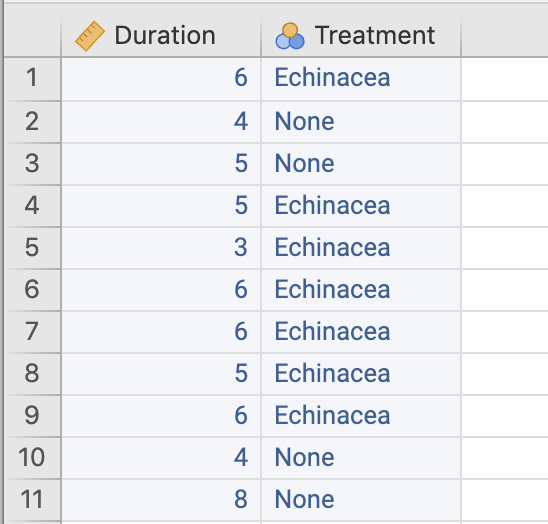

# (PART) Asking research questions {-}


# Research questions {#RQs}


<!-- Introductions; easier to separate by format -->
```{r, child = if (knitr::is_html_output()) {'./introductions/02-RQs-HTML.Rmd'} else { './introductions/02-RQs-LaTeX.Rmd'}}
```


## Introduction {#Chap2-Intro}

Asking clear and answerable *research questions* (RQs) is important, as the RQ impacts all other components of the research.
Quantitative research summarises and analyses the data using numerical methods (like averages or percentages), so the RQ must be appropriate for analysis using quantitative methods.


Studies often have an overall, broad research goal with many sub-questions (which may be quantitative or qualitative).


::: {.example #RQs name="Research questions"}
Consider this broad research goal:

> How well are permeable pavements (PPs) working in urban areas?

This goal may have many component RQs, each to be answered separately:

* What is the cost of using PPs in various urban settings?
* Do PPs improve water run-off quality?
* How do people perceive PP aesthetics?
:::


<!-- ```{r PermPavements, fig.cap="A study of permeable pavements (PPs) may have many sub-questions", fig.align="center", fig.height=1.75, fig.width=7, out.width = '80%'} -->
<!-- par( mar = c(0.10, 0.15, 0.10, 0.15)) -->
<!-- openplotmat() -->

<!-- pos <- array(NA,  -->
<!--              dim = c(4, 2)) -->
<!-- pos[1, ] <- c(0.50, 0.175) # RQ -->
<!-- pos[2, ] <- c(0.15, 0.40) # sub1 -->
<!-- pos[3, ] <- c(0.85, 0.40) # sub2 -->
<!-- pos[4, ] <- c(0.50, 0.825) # sub3 -->


<!-- straightarrow(from = pos[1, ],  -->
<!--               to = pos[2, ],  -->
<!--               lty = 1,  -->
<!--               lwd = 2) -->
<!-- straightarrow(from = pos[1, ],  -->
<!--               to = pos[3, ],  -->
<!--               lty = 1) -->
<!-- straightarrow(from = pos[1, ],  -->
<!--               to = pos[4, ],  -->
<!--               lty = 1) -->

<!-- textrect( pos[1, ],  -->
<!--            lab = "Are PPs effective\nin urban areas?",  -->
<!--            radx = 0.13,  -->
<!--            rady = 0.20,  -->
<!--            shadow.size = 0, -->
<!--            box.col = ResponseColour, -->
<!--            lcol = ResponseColour) -->
<!-- textrect( pos[2, ],  -->
<!--            lab = "What is the\ncost of using PPs?",  -->
<!--            radx = 0.16, -->
<!--            rady = 0.18,  -->
<!--            shadow.size = 0, -->
<!--            box.col = GroupColour, -->
<!--            lcol = GroupColour) -->
<!-- textrect( pos[3, ],  -->
<!--            lab = "Do PPs improve\nrun-off quality?",  -->
<!--            radx = 0.16,  -->
<!--            rady = 0.18,  -->
<!--            shadow.size = 0, -->
<!--            box.col = GroupColour, -->
<!--            lcol = GroupColour) -->
<!-- textrect( pos[4, ],  -->
<!--            lab = "How do people perceive\nPP aesthetics?",  -->
<!--            radx = 0.16,  -->
<!--            rady = 0.18,  -->
<!--            shadow.size = 0, -->
<!--            box.col = GroupColour, -->
<!--            lcol = GroupColour) -->
<!-- ``` -->


## Elements of RQs

A RQ must be *written* carefully so they can be *answered* effectively.
This section introduces the four potential components of a quantitative RQ:

* The **P**opulation (Sects.\ \@ref(Population) and\ \@ref(UnitsObsAnalysis));\index{POCI}
* The **O**utcome (Sect.\ \@ref(Outcome)); 
* The **C**omparison or **C**onnection (Sect. \@ref(Comparison));
* The **I**ntervention (Sect.\ \@ref(Intervention)).

These form the **POCI** acronym (sometimes seen as the PICO acronym).


### The population {#Population}

All quantitative RQs study a *population*: a (usually large) group of interest.
Populations comprise *individuals*, sometimes called *cases*.
If the individuals are people, they are sometimes called *subjects*. 


<div style="float:right; width: 222x; border: 1px; padding:10px">

</div>


::: {.definition #Population name="Population"}\index{Population}
The *population* is the group of *individuals* from which the total set of observations of interest *could* be made, and to which the results will (hopefully) generalise.
:::


::: {.importantBox .important data-latex="{iconmonstr-warning-8-240.png}"}
To fully understand *individuals*, also read about **units of analysis and units of observation** (Sect.\ \@ref(UnitsObsAnalysis)).
The *individuals* are the *units of analysis*.
:::


The population is *any* group of individuals of interest; for example:

* all German males between $18$ and $35$ years of age.
* all bamboo flooring materials manufactured in China.
* all elderly females with glaucoma in Canada.
* all *Pinguicula grandiflora* growing in Europe.


::: {.importantBox .important data-latex="{iconmonstr-warning-8-240.png}"}
The words *population*, *individuals* and *cases* do **not** just refer to people, though they may be commonly used that way in general conversation.
:::


The data are rarely taken from all the individuals in the *population*: *all* elements of the population are rarely accessible in practice.
For example, testing a new drug cannot possibly study *all* people (especially people not yet born who might use the drug). 
The population is 'all people', *not* just those studied.


::: {.importantBox .important data-latex="{iconmonstr-warning-8-240.png}"}
The **population** in a RQ is *not* just those studied; it is the whole group to which our results would generalise.
:::


In contrast, a *sample* is a *subset* of the population from which data are obtained (Chap.\ \@ref(Sampling)).


<div style="float:right; width: 75px; padding:10px">

</div>


::: {.definition #Sample name="Sample"}\index{Sample}
A *sample* is a subset of the population from which data are collected.
:::


::: {.example #Samples name="Samples"}
A study of American college women [@data:woolf:ironstatus] aimed to assess iron status in highly-active women, and in sedentary women.

The *sample* comprises $28$ active and $28$ sedentary American college women, from which data are collected.
The *population* is *all* active and sedentary American college women, not just the $56$ in the study.
The group of $56$ subjects is the *sample*.
:::


Completely and precisely defining the population sometimes requires *refining* or *clarifying* the population, using *exclusion* and/or *inclusion criteria*.
Exclusion and inclusion criteria clarify which individuals may be explicitly included or excluded from the population.
Exclusion and inclusion criteria should be explained when their purpose is not obvious.
Both exclusion and inclusion criteria are not *necessary*; none, one or both may be used.


<div style="float:right; width: 75px; padding:10px">

</div>


::: {.definition #InclusionExclusionCriteria name="Inclusion and exclusion criteria"}\index{Inclusion criteria}\index{Exclusion criteria}
*Inclusion criteria* are characteristics that individuals must meet explicitly to be included in the study.

*Exclusion criteria* are characteristics that explicitly disqualify potential individuals from being included in the study.
:::


<div style="float:right; width: 75px; padding:10px">

</div>

::: {.example #ExclusionCriteriaEG name="Inclusion and exclusion criteria"}
A study of a bird species may only include sites with a confirmed sighting within the last two years.

Concrete test cylinders with cracks may be excluded from strength tests.

People with severe asthma may be excluded from exercise studies.
:::


:::{.exampleExtra  data-latex=""}
A study on the influenza vaccine [@kheok2008efficacy] listed the **P**opulation as 'health-care workers' [@kheok2008efficacy, p.\ 466], and the sample comprised healthcare workers at two specific hospitals.
The population was refined using exclusion criteria: those (p.\ 466)
  
> ...declining to give consent, a history of egg protein allergy, and neurological or immunological conditions that are contraindications to the influenza vaccine.
:::


::: {.example #ExclusionAmoutees name="Inclusion and exclusion criteria"}
A study [@data:Guirao2017:amputees] of the walking abilities of amputees used inclusion *and* exclusion criteria. 
Inclusion criteria included (p.\ 27):

> ... length of the femur of the amputated limb of at least $15$\ cm measured from the greater trochanter; use of the prosthesis for at least $12$ months prior to enrollment and more than $6$\ h/day...

Exclusion criteria included (p.\ 27):

> ... the presence of cognitive impairment hindering the ability to follow instructions and/or perform the tests; body weight over $100$\ kg...
:::


### Units of observation and analysis {#UnitsObsAnalysis}\index{Unit of observation}\index{Unit of analysis}

*Units of observation* and *units of analysis* are different, but similar, concepts that must be distinguished to properly identify a population.

Consider this RQ:

> In English $20$-something men, is the average thickness of head hair strands the same for
`r if (knitr::is_latex_output()) {
   'blond-haired men'
} else {
   '[blond-haired men](https://www.dictionary.com/browse/blonde)'
}`
and
`r if (knitr::is_latex_output()) {
   'brunet-haired men?'
} else {
   '[brunet-haired men](https://www.dictionary.com/browse/brunet?s=t)?'
}`


Answering the question by comparing $100$ hair strands from one blond-haired man, to $100$ hair strands from one brunet-haired man, is problematic: *only one man of each hair colour is represented*.
While there are $200$ observations, only two people are compared; little is learnt about $20$-something men *in general*.
Instead, a lot is learnt about two specific men.
The population is represented by just two men.


<div style="float:right; width: 222x; border: 1px; padding:10px">

</div>


In this study, each individual hair is a *unit of observation*: the hair strands are measured to obtain 'thickness of head hair strands'.


::: {.definition #UnitOfObservation name="Unit of observation"}
*Unit of observation*: The 'who' or 'what' which are observed, from which measurements are taken and data collected.
:::


Since each blond hair comes from the same man, each of those hairs have essentially 'lived their life together': they are washed at the same time, with the same shampoo, exposed to the same amount of sunlight and exercise, share genetics, etc.
However, different men would potentially use different shampoo, exercise differently, have different genetics, and so on.
Each man tends to be different, and lives differently and independently of others.

The RQ aims to compare blond *men* with brunet *men*; *men* are being compared.
Each man is a collection of units of observations (hair strands).
This leads to a similar, but different, concept: the *unit of analysis*.
In the example above, each man is a *unit of analysis*, where each unit of analysis gives $200$ observations.


::: {.tipBox .tip data-latex="{iconmonstr-info-6-240.png}"}
The number of units of *analysis* in a study is the size of the sample.
:::


::: {.definition #UnitOfAnalysis name="Unit of analysis"}
*Unit of analysis*: The smallest collection of units of observations (and perhaps the units of observations themselves) about which generalizations and conclusions are made; the smallest *independent* 'who' or 'what' for which information is analysed.
:::


Importantly, the sample size for the study is the number units of analysis.
In the hair-thickness study, each *person* is a *unit of analysis*, so the sample size is just two.
Only two examples of the population of men are in the study.
*Each unit of analysis (man) has $100$ units of observation (hair strands).*


::: {.example #UnitsAnalysis name="Units of analysis"}
In the hair-strand study, each hair strand is a *unit of observation*: hair strand thicknesses are taken from individual hair strands.
The *unit of analysis* is the *person*: the hair strands from each man share much in common.
'Men' operate independently, but the hairs are not independent entities.
:::


::: {.importantBox .important data-latex="{iconmonstr-warning-8-240.png}"}
The *individuals* are the *units of analysis*.
:::


<div style="float:right; width: 222x; border: 1px; padding:10px">

</div>


::: {.example #UnitsAnalysis2 name="Units of analysis"}
A study compares the wear on two brands of car tyres.
Four tyres of Brand\ A are allocated to each of Cars\ 1--5, and four tyres of Brand\ B are allocated to each of Cars\ 6--10.

After $12$\ months, the amount of wear is recorded on each tyre.
The *unit of observation* is the *tyre*: the amount of wear is measured on each tyre.

The tyres on any one car do not operate independently; the four tyres on a single car 'live their life together'.
They all are exposed to the same day-to-day use, the same drivers, have driven almost identical distances, under the same conditions, etc.

The *unit of analysis* is the *car*: the brand of tyre is allocated to the car, and all wheels on the car get the same brand of tyre.
Each unit of analysis (car) produces four units of observations.
The *sample size* is $10$ cars, with $10\times 4 = 40$ observations.
:::


<div style="float:right; width: 222x; border: 1px; padding:10px">

</div>


:::{.exampleExtra  data-latex=""}
A report on the *Spectrum* website reported:
<!-- (https://www.spectrumnews.org/news/statistical-errors-may-taint-many-half-mouse-studies/) -->
<!-- (https://www.spectrumnews.org/) -->
  
> Seven years ago, Peter Kind [...] was reading a study about fragile\ X syndrome, a developmental condition characterized by severe intellectual disability and, often, autism [...]
> Kind was surprised when he noticed a potentially serious statistical flaw.
>
> The research team had looked at $10$ neurons from each of the $16$ mice in the experiment [...] 
> the researchers had analyzed each neuron as if it were an independent [individual observation]. 
> That gave them $160$ data points to work with, $10$ times the number of mice in the experiment.
>
> `The question is, are two neurons in the brain of the same animal truly independent data points?
> The answer is no,' Kind says.
>
> --- [Spectrum report](https://www.spectrumnews.org/news/statistical-errors-may-taint-many-half-mouse-studies/), accessed 18 Nov 2022

<!-- (https://www.spectrumnews.org/news/statistical-errors-may-taint-many-half-mouse-studies/) -->

The study used $16$ units of analysis (mice), but the authors treated the $16\times 10 = 160$ neurons as the units of analysis.
The $10$ neurons from each mouse share the same genetic information

A total of $160$ neurons from 16 mice is very different to a study of $160$ neurons from $160$ genetically-different mice.
:::


The units of observation and units of analysis *may* be the same, and often are the same.
However, they are sometimes different, and identifying these situations is *crucial*.
Importantly, studies compare units of analysis, not units of observation.


::: {.tipBox .tip data-latex="{iconmonstr-info-6-240.png}"}
Sometimes the *units of analysis* and *units of observation* are the same.
:::


::: {.example #UnitsAnalysis3 name="Units of analysis"}
A study compared two physical activity (PA) programs.
Each of $44$ children in the study was allocated to one of two PA programs (with parental agreement).
The children's fitness was measured for every student at the end of the six-month study.

The *units of observation* are the individual students, as the fitness measurements are taken from each students.
The *units of analysis* are also the individual students, as the PA program was allocated to each student individually, and each student has their own sport, family routines and activities, etc.
Each unit of analysis (student) has one unit of observation.

There are $44$ units of analysis, and $44$ units of observations.
:::


::: {.example #UnitsAnalysisGroups name="Units of analysis"}
Consider comparing the percentage of females and males wearing sunglasses at a specific beach.

People in a *group* at the beach will probably not be operating independently: people in groups tend to behave similarly.
For example, a couple will often *both* be wearing or both *not* wearing sunglasses.

The researchers may decide not to use data from groups, and only gather data from individuals.
Alternatively, the researchers may decide to use people *groups* as the *unit of analysis* (some will be groups of one), and record data from just *one* person in any group (ideally specifying before-hand from which group member to take data; e.g., the person closest to the researchers when the group is noticed).
:::


`r if (knitr::is_latex_output()) '<!--'`
::: {.thinkBox .think data-latex="{iconmonstr-light-bulb-2-240.png}"}
<iframe src='https://www.ferendum.com/en/embeded.php?pregunta_ID=1252809&sec_digit=992403757&embeded_digit=1479848444' style='width:100%; height:500px; overflow: auto; background: #badaff' frameBorder='0'></iframe><BR>
<A href='https://www.ferendum.com' target='_blank'>Free Online Poll Maker</A>


<iframe src='https://www.ferendum.com/en/embeded.php?pregunta_ID=1252811&sec_digit=285796637&embeded_digit=6372971' style='width:100%; height:500px; overflow: auto; background: #badaff' frameBorder='0'></iframe><BR>
<A href='https://www.ferendum.com' target='_blank'>Free Online Poll Maker</A>


`r webexercises::hide()`
**Units of observation**: the individual students, as the fitness measurements are taken from the students individually.

**Units of analysis**: the *schools*, as the PA program was allocated to each *school*. 
All students at School\ A are exposed Program\ 1, but all students at School\ A are also likely to be exposed to similar weather, fitness opportunities, physical conditions, teachers and school-based philosophies, and so on.

*The improvement in the children's fitness levels* and *the program* are both **variables**.
`r webexercises::unhide()`
:::
`r if (knitr::is_latex_output()) '-->'`


`r if (knitr::is_html_output()){
  'The following short video may help explain some of these concepts:'
}`
<!-- From: https://stackoverflow.com/questions/43840742/how-to-embed-local-video-in-r-markdown -->


<div style="text-align:center;">
```{r}
htmltools::tags$video(src = "./videos/UnitsOfObsAnalysis-B.mp4", 
                      width = "550", 
                      controls = "controls", 
                      loop = "loop", 
                      style = "padding:5px; border: 2px solid gray;")
```
</div>


<iframe src="https://learningapps.org/watch?v=pmy2wjmun22" style="border:0px;width:100%;height:650px" allowfullscreen="true" webkitallowfullscreen="true" mozallowfullscreen="true"></iframe>


### The outcome {#Outcome}\index{Outcome (in a RQ)}

All RQs study something *about* the population, called the *outcome*.
Because the RQ concerns a population, the outcome describes a group (not individuals).
Hence, the outcome is usually an *average*, *percentage*, or *general* numerically quantity summarising the population.


<div style="float:right; width: 75px; padding:10px">

</div>


::: {.definition #Outcome name="Outcome"}
The *outcome* in a RQ is the result, output, consequence or effect of interest in a study, numerically summarising the population.   
:::


The outcome of interest in a population may be (for example) the

* *average* increase in heart rates after $30$\ mins of exercise.
* *average* amount of wear after $1000$\ hrs of use.
* *proportion* of people whose pupils dilate.
* *average* weight loss after three weeks on a diet.
* *percentage* of seedlings that die.


::: {.importantBox .important data-latex="{iconmonstr-warning-8-240.png}"}
The **outcome** in a RQ summarises a *population*; it does not describe the *individuals* in the population.
:::


### The comparison or connection {#Comparison}


Some RQs may seek to establish a relationship in the **P**opulation between the **O**utcome and another attribute of the individuals.
This other attribute is called a **C**omparison or **C**onnection.
The implication is that a change in the value of the comparison or connection may be associated with a change in the value of the outcome (which *may* or *may not* be a cause-and-effect relationship).

The values of the comparison or connection may be *imposed* on the individuals by the researchers (e.g., fertilizer dose) and called *treatments*, or naturally occur (e.g., age) and called *conditions*.

A *comparison* refers to an attribute that can be recorded for a small number of alternatives of interest, and the outcome compared.
For example, crop yield (an outcome) may be compared for some fields where a fertilizer *has* been used, and some other fields where a fertilizer *has not* been used (two comparison groups).


::: {.definition #Comparison name="Comparisons"}
The *comparison* in the RQ identifies the small number of different, distinct alternatives for which the outcome is compared.
:::


Examples include:

* Comparing the average amount of wear in floor boards (O) between two groups: standard wooden flooring materials, and bamboo flooring.
* Comparing the average heart rates (O) across three subsets: those who received no dose of a drug, those who received a daily dose of the drug, and those who received a twice-daily dose of the drug.


Often, one of the comparison groups is the *control group*.
The *control group* is a comparison group *not* receiving the treatment being studied, or *not* having the condition being studied, but *as similar as possible* to the other units of analysis in all other ways.
The control group acts like a benchmark for detecting changes in the outcome (Sect.\ \@ref(PlaceboEffectExperimental)).
Sometimes the control group receives a *placebo*: a non-effective treatment that appears to be the real treatment.


::: {.definition #Control name="Control"}
A *control* is a unit of analysis without the treatment or condition of interest, but as similar as possible in *every other way* to other units of analysis.
:::


::: {.definition #Placebo name="Placebo"}
A *placebo* is a treatment with no intended effect or active ingredient, but appears to be the real treatment.
:::


::: {.example #ControlGroup name="Control group"}
To test the effectiveness of a new medication, patients report to a doctor to receive injections of the new drug.
Some patients are assigned to the *control group*.
The controls are *not* simply people who don't get the injections.
Ideally, controls would be people who, like the treatment group, report to a doctor and receive an injection... however, the injection is ineffective (a placebo).
:::


A *connection* refers to a attribute that can take many different values for which a connection with the outcome is explored.
For example, the relationship between blood glucose levels (an outcome) and weight (the connection) may be studied.


::: {.definition #Connections name="Connections"}
The *connection* in the RQ identifies another attribute of the individuals that can take many different values, and may be related to the outcome. 
:::


::: {.example #ComparisonConnectionCaloric name="Comparisons and connections"}
A study [@CaloricIntake] examined the mean daily sodium excretion (the **O**utcome) in Israeli adults (the **P**opulation).

The daily sodium excretion was *compared* for two separate groups: those diagnosed with diabetes, and those not diagnosed with diabetes.

A possible *connection* was explored between the daily sodium excretion and the systolic blood pressure.
:::


As the value of the *connection* changes over many possible values, the value of the outcome (potentially) changes; for example:

* Connecting the average heart rate (O) with exposure to amount of caffeine consumption the previous day (C).
  Heart rate and caffeine consumption are both recorded for many different people (the individuals).
* Connecting the percentage seed germination (O) with hours of sunlight per day (C).
  The percentage germination and sunlight hours per day are measured on many pots (the individuals) of $10$ seeds each.


<div style="float:right; width: 75px; padding:10px">

</div>


The distinction between *between*-individuals comparisons and connections and *within*-individuals comparisons and connections is important.


::: {.definition #Betweenindividuals name="Between-individuals comparisons"}
*Between-individuals comparisons or connections* mean that the comparison or connection is made between *different* individuals.
In contrast, *within-individual comparisons or connections* mean that the comparison or connection is made *within* the *same* individuals.
:::


Effectively, in a within-individuals study, each unit of analysis acts as its own control.


<div style="float:right; width: 222x; border: 1px; padding:10px">

</div>


:::{.example #WithinBetweenComparison name="Between- and within-individual comparisons"}
Consider comparing left- and right-legs strengths of professional football players.

A *between*-individuals comparison would compare the left and right leg strengths *between* different groups of footballers: one group would have their left-leg strength measured, and the other their right-leg strength measured.
This study has a *between*-individuals comparison.

In contrast, a similar study measures both left- and right-leg strength on the *same* individuals.
This study has a *within*-individuals comparison: the comparison between left and right-leg strength is *within* each individual.
In this study, *no between-individuals comparison* exists.
:::


:::{.example #WithinBetweenConnection name="Between- and within-individual connections"}
The Wollemi pine was discovered by science in 1994.

Consider studying the growth of these rare plants [@offord2023home].

A *between*-individuals connection might record the size of trees (using DBH, diameter at breast height; the **O**utcome), and the pH of the soil in which the trees grow.
Both DBH and pH are recorded for many different trees. 

A *within*-individuals connection might record the DBH for each tree at at various times after the planting date. 
Each tree has the DBH measured over time, for many time points. 
:::


Studies may use *both* within- and between-individuals comparisons (see Sect.\ \@ref(ChamomileTea-TwoMeans-HT)).
For instance, a study may examine the *change* in each individuals blood pressure (the within-individuals comparison), for two drugs given to different groups (the between-groups comparison).


::: {.example #Comparisons name="Comparison"}
Consider comparing the average blood pressure (the Outcome) in the right and left arms of Australians (the Population).
The blood pressure is measured on both arms of every studied individual.

*There is no (between-individuals) comparison*: the individuals are not divided into separate groups to compare average blood pressure; every person is treated the same way, and a left and right arm belongs to each person.
This is a *within-individuals comparison*.

A study comparing the average blood pressure between (a)\ people aged under $40$, and (b)\ people aged $40$ or over *does* have a (between-individuals) comparison: two different subsets (under $40$; $40$ and over) of the population are compared.
:::


:::{.example #WithinBetweenConnections name="Between- and within-individual connections"}
Consider studying the relationship between daily water intake and amount of sun exposure per day for athletes.

A *between*-individuals comparison would record the daily water intake and the daily sun exposure once each for many individuals.

In contrast, a *within*-individuals comparison would record the daily water intake and the daily sun exposure for one individual over many days: the comparison is *within* each individual.
:::


### The intervention {#Intervention}\index{Intervention (in a RQ)}

RQs with a connection or comparison (C) sometimes also have an *intervention*.


<div style="float:right; width: 75px; padding:10px">

</div>


::: {.definition #Intervention name="Intervention"}
An *intervention* is a comparison or connection whose value can be *manipulated* by the researchers.
That is, the researchers *impose* the connection or comparison upon the individuals in the study.
:::


The intervention may be: 

* explicitly giving doses of a new drug to patients.
* explicitly applying wear testing loads to two different flooring materials.
* explicitly exposing people to different stimuli.
* explicitly applying a different dose of fertiliser.


<div style="float:right; width: 75px; padding:10px">

</div>


:::{.example #InterventionHimalaya name="Intervention"}
A study by @data:Bird2008:wholegrain *gave* one group of participants a diet using refined flour, and gave another group of participants a diet using a new flour variety.
The type of diet is the comparison.
Since the researchers can manipulate which subject ate which flour, this study has an intervention.
:::


::: {.example #Interventions name="Interventions"}
A study comparing the average blood pressure in female and male Scots measured blood pressure using a blood pressure machine (a sphygmomanometer).
The research team needs to interact with the participants and use the machine to measure blood pressure, but there is *no* intervention.
Using the sphygmomanometer is just a way to measure blood pressure, to *obtain* the data.

*There is no intervention*: the *comparison* is between females and males, which cannot be manipulated or imposed on the individuals by the researchers.
:::


::: {.thinkBox .think data-latex="{iconmonstr-light-bulb-2-240.png}"}
A study of American college women [@data:woolf:ironstatus] measured iron status in highly-active and sedentary women.
What is the Outcome; Comparison or Connection (if any), and Intervention (if any)?\label{thinkBox:POCIWomen}


`r if (knitr::is_latex_output()) '<!--'`
`r webexercises::hide()`
*Outcome*: 'average iron status' (which would need an *operational definition*.) 

*Comparison*: between two groups of individuals: highly active and sedentary women (i.e., between individuals). 
These terms would also need operational definitions!

*Intervention*: Probably none; an intervention would mean the *researchers* tell each individual woman to be highly active or sedentary, which seems unlikely.
`r webexercises::unhide()`

`r if (knitr::is_latex_output()) '-->'`
:::


::: {.exampleExtra  data-latex=""}
Researchers examined numerous studies of chest compressions by paramedics.
They examined research papers in which the **P**opulation was patients who had experienced a cardiac arrest, and where manual chest compressions were compared with another method.

The table below shows the interventions and outcomes of interest:

**Interventions**              | **Outcomes** 
-------------------------------|--------------------------------------------------------------------
* Mechanical chest compression | * Mean survival time to hospital discharge
* Mechanical CPR               | * Percentage with a return of spontaneous circulation (ROSC)
* Powered chest compressions   | 
* Powered CPR                  | 

The research concluded that:

> Overall, the evidence analysed suggests that mechanical chest compression devices are statistically superior to manual chest compressions of a high quality, when up-to-date protocols and guidelines are followed.
>
> --- @williams2021mechanical, Table 1
:::


<iframe src="https://learningapps.org/watch?v=pip2dnpq222" style="border:0px;width:100%;height:500px" allowfullscreen="true" webkitallowfullscreen="true" mozallowfullscreen="true"></iframe>


## Types of RQs {#TypesOfRQs}\index{Research question!types}

All RQs have a population (P) and an outcome (O).
Different *types* of RQ emerge depending on whether the RQ has a comparison/connection (C) and whether this comparison or connection can be manipulated by the researchers (an intervention, I).
This section explores different types of research questions:

* Descriptive RQs (Sect.\ \@ref(RQsDescriptive));
* Relational RQs (Sect.\ \@ref(RQsRelational));
* Interventional RQs (Sect.\ \@ref(RQsInterventional)).

These are compared in Sect.\ \@ref(RQsCompare).
RQs can also be written with one of two purposes in mind (Sect.\ \@ref(TwoPurposesOfRQs)):

* *Estimation*:
  These RQs ask about a *value* in the *population*, estimated using the *sample* data.
* *Making decisions*:
  These RQs ask about making a decision in a *population*, based on the *sample* data.

Examples for both forms are given when discussing different types of RQs below.


### Descriptive RQs (PO) {#RQsDescriptive}\index{Research question!descriptive}

*Descriptive RQs* are the most basic, giving the **P**opulation to be studied, and the **O**utcome of interest about this population.
Typically, descriptive RQs have one of these forms:

* *Estimation*: Among {*the population*}, what is {*the outcome*}?
* *Decision-making*: Among {*the population*}, is {*the outcome*} equal to {*a given value*}?


::: {.importantBox .important data-latex="{iconmonstr-warning-8-240.png}"}
These are **not** 'recipes', but guidelines.
:::


<div style="float:right; width: 75px; padding:10px">

</div>


::: {.example #DescriptiveRQBodyTemp name="Descriptive RQs"}
A study examined the 'body temperature of $148$ healthy men and women' [@data:mackowiak:bodytemp] aged between $18$ to $40$ (the P).
One descriptive RQ was:

> What is the mean body temperature?

This RQ is an *estimation* RQ. 
A *decision-making* RQ they also studied was whether the average body temperature was the value that had been commonly accepted by medical professionals:

> Is the mean body temperature really $98.6^\circ$F ( $37.0^\circ$C)?
:::


### Relational RQs (POC) {#RQsRelational}\index{Research question!relational}

Usually, studying *relationships* is more interesting than simply describing a population.
*Relational RQs* explore existing relationships, and state the **P**opulation, the **O**utcome, and the **C**omparison or **C**onnection.
Relational RQs have no intervention; the connection or comparison is *not* manipulated by, nor imposed by, the researchers.


::: {.importantBox .important data-latex="{iconmonstr-warning-8-240.png}"}
Relational RQs can use *between*- or *within*-individual comparisons.
When possible, make it clear which is being used!
:::


Typically, relational RQs with a *comparison* have one of these forms:

* *Estimation*: Among {*the population*}, what is the difference in {*the outcome*} for {*the alternatives being compared*}? 
* *Decision-making*: Among {*the population*}, is {*the outcome*} the same for {*the alternatives being compared*}?

Typically, relational RQs based on a *connection* have the form:

* *Estimation*: Among {*the population*}, how strong is the relationship between {*the outcome*} and {*something else*}?
* *Decision making*: Among {*the population*}, is {*the outcome*} related to {*something else*}?


<div style="float:right; width: 75px; padding:10px">

</div>


::: {.example #RelationalRQ name="Relational RQs"}
Consider this RQ (based on @estevez2019influence):

> Among Cubans between $13$ and $20$ years of age, is the average heart rate the same for females and males?

The *population* is 'Cubans $13$ and $20$ years of age', the *outcome* is 'average heart rate', and the *between-individuals comparison* is between two separate groups: 'between females and males'.

This is a *relational RQ* since the sex of the individual (the C) is *not* manipulated by, or imposed by, the researchers.
This RQ is a *decision-making RQ*, since it asks if the average heart rate is the same for females and males.
An *estimation*-type relational RQ would ask about the *size* of difference in the average heart rate between females and males.

The same study could also have asked:

> Among Cubans between $13$ and $20$ years of age, is the average heart rate related to age?

The *connection* is with 'age', which cannot be manipulated by the researchers, so this is a *relational RQ*.
Furthermore, the connection is *between individuals*.
This RQ is a *decision-making RQ*, since it asks if the average heart rate is related to age.
An *estimation*-type relational RQ might be:

> Among Cubans between $13$ and $20$ years of age, how strong is the relationship between average heart rate and age?
:::


::: {.example #WithinRelationalRQ name="Within-individuals relational RQ"}
To understand tree-dwelling marsupials, a study compared the temperature in the *same* tree hollows during both summer and winter [@rowland2017comparing]:

> For tree hollows in the Strathbogie Ranges, Australia, what is the mean temperature difference between summer and winter?

The comparison is between winter and summer, which cannot be manipulated by researchers, so this is a relational RQ (specifically, an *estimation*-type relational RQ).
Furthermore, the comparison is *within individuals*, as the temperature is measured for the *same* tree hollows at the two times.
The outcome could also be given as the average *difference* in temperature between summer and winter.
:::


::: {.thinkBox .think data-latex="{iconmonstr-light-bulb-2-240.png}"}
Consider this RQ (based on @data:Brown2000:WarningLights):\label{thinkBox:POCIAmbo}
\vspace{-2ex}

> In the London Ambulance Service last year, what was the difference between the average response time to emergency calls between weekdays and weekends?

\vspace{-2ex}
Identify the population, outcome, and comparison.
:::


<div style="float:right; width: 75px; padding:10px">

</div>


### Interventional RQs (POCI) {#RQsInterventional}\index{Research question!interventional}

*Interventional RQs* explore relationships where the comparison/connection can be manipulated by, or imposed by, the researchers (i.e., an intervention is present).
Interventional RQs state the **P**opulation, the **O**utcome, the **C**omparison or **C**onnection, and use an **I**ntervention.

Interventional RQs are like relational RQs, except that the comparison or connection can be manipulated by the researchers (i.e., has an intervention).
Sometimes, the use of an intervention is unclear from the RQ.
When writing an interventional RQ, clarify if an intervention is used if possible.


<div style="float:right; width: 75px; padding:10px">

</div>


::: {.example #InterventionalRQBetween  name="Interventional RQ (between-individuals comparison)"}
A study [@data:Khair2015:Earthworms] compared the time needed for organic waste to turn into compost, when earthworms were either added or not added to the waste.
Since the researchers manipulated which waste samples had earthworms added, the study uses an *intervention*, and research question is *interventional*.
Since two different alternatives are being compared (waste with worms; waste without worms), this is a *between*-individuals study.

An *estimation-type RQ* could be used to estimate the difference in composting time when worms were added to waste, and when worms were *not* added.
A *decision making-type RQ* could be asked to determine if the composting times for waste with and without earthworms was the same or not. 
:::


::: {.example #InterventionalRQWithin  name="Interventional RQ (within-individuals comparison)"}
A study introduced an intervention, to determine if the intervention reduced the incidence of musculoskeletal disorders in Iranian bus drivers [@ghasemi2019effectiveness].
Each bus driver was evaluated both before and after the intervention, so this is a *within-individuals* interventional study with a *decision-making* RQ.
:::


:::{.exampleExtra  data-latex=""}
Consider this RQ [@data:McLinn:otitis]:

> In children with acute otitis media, what is the difference in the average duration of symptoms when treated with cefuroxime compared to amoxicillin?

The population is 'children with acute atitis media', the outcome is 'average duration of symptoms', and the comparison is between two groups (taking 'cefuroxime' or 'amoxicillin').

If the drugs are *given* to the children by the researchers, the RQ has an intervention.
If the researchers find children who are already taking the two drugs and measure the outcome ('average duration of symptoms'), the RQ has no intervention. 
:::


<iframe src="https://learningapps.org/watch?v=p8a16ig8a22" style="border:0px;width:100%;height:500px" allowfullscreen="true" webkitallowfullscreen="true" mozallowfullscreen="true"></iframe>


### Two purposes of RQs {#TwoPurposesOfRQs}\index{Research question!estimation}\index{Research question!decision-making}

As noted earlier, RQs can also be written with one of two purposes in mind:

* *Estimation*:
  These RQs ask how precisely a *value* in the *population* is estimated by using the *sample*, and are answered using *confidence intervals*.
  Answering estimation RQs are discussed in this book for:
  
  - descriptive RQs (Chaps.\ \@ref(CIOneProportion) and\ \@ref(OneMeanConfInterval));
  - relational or interventional RQs with a *within*-individuals comparison (Chap.\ \@ref(PairedCI)), where the value being estimated measures the size of the change within individuals;
  - relational or interventional RQs with a *between*-individuals comparison (Chaps.\ \@ref(CITwoMeans) and\ \@ref(OddsRatiosCI)), where the value being estimated measures the size of the difference between groups; and
  - relational or interventional RQs with a connection (Sect.\ \@ref(RegressionCI)) where the value being estimated measures the strength of a relationship.
* *Making decisions*:
  These RQs are concerned with making a decision about a population, and are answered using *hypothesis testing*.
  Answering decision-making RQs are discussed in this book for:
  
  - descriptive RQs (Chaps.\ \@ref(TestOneProportion) and\ \@ref(TestOneMean));
  - relational or interventional RQs with a *within*-individuals comparison (Chap.\ \@ref(TestPairedMeans)), where the decision is about whether changes are present within individuals;
  - relational or interventional RQs with a *between*-individuals comparison (Chaps.\ \@ref(TestTwoMeans) and\ \@ref(TestsOddsRatio)), where the decision is about the difference between groups; and
  - relational or interventional RQs with a connection (Sects.\ \@ref(RegressionHT) and\ \@ref(CorrelationTesting)) where the decision is about the strength of a relationship.


::: { .example #TypesOfRQS name="Various types of RQs"}
Studies can incorporate many types of RQs.
For example, a study [@data:Thane2004:ZincVitA] of 'British young people aged $4$--$18$' asked and answered numerous RQs.
Two *descriptive* RQs were:

1. What is the average zinc intake of the children? 
  This is an *estimation* RQ.
2. Does the average zinc intake meet recommended dietary guidelines? 
  This is a *decision-making* RQ.

A relational RQ with a connection is:

3. What is the strength of the association between plasma zinc and retinol concentrations?
  This is an *estimation* RQ, estimating the *strength* of the relationship between plasma zinc and retinol concentrations.

A relational RQ with a comparison is:

4. Is the average zinc intake the same for boys and girls? 
  This is an *decision-making* RQ.
  
Decision-making RQ have two possible answers.
For the example above: the average zinc intake either *is* the same for females and males, or *is not* the same for females and males (Fig.\ \@ref(fig:ZincRQ)).
However, answers are rarely clear in practice, since only one of the countless possible samples from the population are studied.
Instead, researchers decide *how much* sample evidence support a particular hypothesis about the *population*.

Evidence may *support* or *contradict* a hypothesis; evidence rarely *proves* a hypothesis (at least, without any other support, such as theoretical support).
Ultimately, after collecting data from a *sample*, a decision must be made about which explanation about the *population* is more consistent with the data collected.
:::


```{r ZincRQ, fig.align="center", fig.cap="Two possible answers to the RQ about zinc intake", out.width='100%', fig.width=8.5, fig.height=4}

par( mar = c(0.15, 0.15, 0.75, 0.15))
openplotmat()

pos <- array(NA, 
             dim = c(4, 2))
pos[1, ] <- c(0.15, 0.5) # RQ 
pos[2, ] <- c(0.55, 0.70) # Yes
pos[3, ] <- c(0.55, 0.30)   # No
pos[4, ] <- c(0.90, 0.50)   # Data

straightarrow(from = pos[1,], 
              to = pos[2,], 
              lty = 2,
              lcol = "grey")
straightarrow(from = pos[1,], 
              to = pos[3,], 
              lty = 2,
              lcol = "grey")

straightarrow(from = pos[4,], 
              to = pos[2,], 
              lty = 2,
              lcol = "grey")
straightarrow(from = pos[4,], 
              to = pos[3,], 
              lty = 2,
              lcol = "grey")

textplain( c( 0.75,
              0.5 ),
           cex = 4.5,
           lab = "?",
           col = "grey")
           

textrect( pos[1,], 
          lab = "In British young people aged\n4--18, is the average zinc\nintake the same\nfor boys and girls?", 
          radx = 0.15, 
          rady = 0.15, 
          shadow.size = 0,
          box.col = ResponseColour,
          lcol = ResponseColour)

textrect( pos[2,], 
          lab = expression( atop(bold(YES)*":"~the~average~zinc~intake,
                                italic(is)~the~same~"for"~boys~and~girls)),
          radx = 0.16, 
          rady = 0.1, 
          shadow.size = 0,
          box.col = ExtraneousColour,
          lcol = ExtraneousColour)
textrect( pos[3,], 
          lab = expression( atop(bold(NO)*":"~the~average~zinc~intake,
                                italic(is~not)~the~same~"for"~boys~and~girls)),
          radx = 0.16, 
          rady = 0.1, 
          shadow.size = 0,
          box.col = GroupColour,
          lcol = GroupColour)

textrect( pos[4,], 
          lab = "Which does\ndata support?",
          radx = 0.10, 
          rady = 0.1, 
          shadow.size = 0,
          box.col = IndividualColour,
          lcol = IndividualColour)

text(x = pos[1, 1],
     y = 0.90,
     font = 2, # Bold
     labels = "Research question")
text(x = pos[2, 1],
     y = 0.90,
     font = 2, # Bold
     labels = "Hypotheses")
text(x = pos[4, 1],
     y = 0.90,
     font = 2, # Bold
     labels = "Data")
```

Decision-making RQs can be asked in different ways.\index{Research question!one- and two-tailed}
For the zinc-intake study above (Fig.\ \@ref(fig:ZincRQ)), the RQ could be asked as

* In British young people aged $4$--$18$, is the average zinc intake *the same* for boys and girls?
* In British young people aged $4$--$18$, is the average zinc intake *different* for boys and girls?
* In British young people aged $4$--$18$, is the average zinc intake *lower* for boys compared to girls?

The first two are *two-tailed RQs*, since they ask about a difference either way: the average zinc intake could be higher for girls or for boys.
The last is a *one-tailed RQ*, since it asks specifically about a difference in just one direction: girls greater than boys.
Most RQs are two tailed, unless a good reason exists to ask a one-tailed RQ (e.g., a drug has been developed specifically to *reduce* blood pressure).


::: {.importantBox .important data-latex="{iconmonstr-warning-8-240.png}"}
In general, RQs should be written as two-tailed RQs, unless a good (and justifiable) reason exists for asking a one-tailed question.
:::


### Contrasting the types of RQs {#RQsCompare}\index{Research question!descriptive}\index{Research question!relational}\index{Research question!interventional}

*Descriptive RQs* are usually used when initially exploring a new research topic.
*Relational RQs* then examine relationships between the outcome and some other attribute, which may set the platform for asking interventional questions.
*Interventional RQs* (when possible) can be used to test theories or models, or to establish cause-and-effect relationships (i.e., causality).
Research often develops through these stages of RQs as knowledge grows and develops (Table\ \@ref(tab:ThreeTypesOfRQs)).


```{r ThreeTypesOfRQs}
RQtypes <- array( dim = c(3, 5) )

colnames(RQtypes) <- c("RQ type", 
                       "P", 
                       "O",
                       "C",
                       "I")

RQtypes[1, ] <- c("Descriptive (D)",   
                  "Yes", 
                  "Yes", 
                  "",    
                  "")
RQtypes[2, ] <- c("Relational (R)",     
                  "Yes", 
                  "Yes", 
                  "Yes", 
                  "")
RQtypes[3, ] <- c("Interventional (I)", 
                  "Yes", 
                  "Yes", 
                  "Yes", 
                  "Yes")


if( knitr::is_latex_output() ) {
  kable(RQtypes,
        format = "latex",
        longtable = FALSE,
        booktabs = TRUE,
        escape = FALSE, # For latex to work in \rightarrow
        caption = "The three types of RQs",
        align = c("r", "c", "c", "c")
  ) %>%
    kable_styling(full_width = FALSE) %>%
    kable_styling(font_size = 8) %>%
    row_spec(0, bold = TRUE) # Columns headings in bold
}

if( knitr::is_html_output() ) {
  out <- kable(RQtypes,
               format = "html",
               align = c("r", "c","c", "c"),
               longtable = FALSE,
               caption = "The three types of RQs",
               booktabs = TRUE)
  
    kable_styling(out, 
                  full_width = FALSE) %>%
      row_spec(row = 0, 
               bold = TRUE)  
}
```


:::{.example #CoeliacStudies name="Different study types"}
Coeliac disease in an inherited auto-immune condition where individuals have an intolerance to the gluten found in wheat, rye, barley and some other grains.
Initially, the proportion of individuals suffering from coeliac disease was unknown (e.g., @kenwright1972coeliac).
*Descriptive* RQs were answered to make estimates (e.g., @data:Cook2000:Coeliac).

Then, *relational* RQs compared the proportion of females and males who were coeliacs (e.g., @data:Cook2000:Coeliac).
Then, *interventional* RQs were posed to understand the disease further; for example, if the percentage with adverse symptoms is the same for those given a diet *without* oats and those given a diet *with* oats (e.g., @data:Janatuinen2002:Coeliac; @data:Lundin2003:Coeliac).
:::


`r if (knitr::is_latex_output()) '<!--'`
::: {.thinkBox .think data-latex="{iconmonstr-light-bulb-2-240.png}"}
`r if (knitr::is_latex_output()) '<!--'`
<iframe src='https://www.ferendum.com/en/embeded.php?pregunta_ID=1246683&sec_digit=18335469&embeded_digit=240558911' style='width:100%; height:425px; overflow: auto; background: #badaff33' frameBorder='0'></iframe><BR>
<A href='https://www.ferendum.com' target='_blank'>Free Online Poll Maker</A>

<iframe src='https://www.ferendum.com/en/embeded.php?pregunta_ID=1246699&sec_digit=110957782&embeded_digit=1207607588' style='width:100%; height:425px; overflow: auto;background: #badaff33;' frameBorder='0'></iframe><BR>
<A href='https://www.ferendum.com' target='_blank'>Free Online Poll Maker</A>


`r webexercises::hide()`
1. **Relational**: A between-individuals comparison exists (comparing amputees with transradial and transhumeral amputations), but would not be **manipulated** or **imposed** by the researchers.
1. **Interventional**:
   The RQ has a between-individuals comparison ('comparing trees planted in a concrete sidewalk and a grassed sidewalk'), and the wording sounds like these trees were planted here intentionally.
   The researchers could pick a trees, and decide where to plant it (concrete or grassed sidewalk).
`r webexercises::unhide()`
:::
`r if (knitr::is_latex_output()) '-->'`


## Definitions {#OperationDefinitions}\index{Definitions}

Research studies usually include terms that must be carefully and precisely defined, so that others know *exactly* what words and terms mean, without ambiguity.
Two types of definitions can be given when necessary: 

* A *conceptual definition* explains *what* a word or a term *means* in the study.\index{Definitions!conceptual}
* An *operational definition* defines *how* something will be studied or measured.\index{Definitions!operational}


::: {.definition #ConceptualDefinition name="Conceptual definition"}
A *conceptual definition* articulates precisely *what* words or phrases mean in a study.
:::


::: {.definition #OperationalDefinition name="Operational definition"}
An *operational definition* articulates exactly *how* something will be identified, measured, observed or assessed.
:::


In many cases, a clear *operational definition* is needed to describe how data will be collected to ensure repeatability and consistent data collection, by removing any ambiguity about how data are obtained.


<div style="float:right; width: 222x; border: 1px; padding:10px">

</div>


::: {.example #DefinitionsStress name="Operational and conceptual definitions"}
Consider a study examining stress in students.
A *conceptual definition* would describe *what is meant* by 'stress' (in contrast to, say, 'anxiety').
An *operational definition* would describe *how* 'stress' is *measured*, since stress cannot be measured directly (like height, for example).

'Stress' could be *measured* using a questionnaire or measuring physical characteristics, for instance.
Other ways of measuring stress are also possible, and all have advantages and disadvantages.
:::


<iframe src="https://learningapps.org/watch?v=pt0rqa5t522" style="border:0px;width:100%;height:500px" allowfullscreen="true" webkitallowfullscreen="true" mozallowfullscreen="true"></iframe>


Sometimes the definitions themselves are not important, provided a clear definition is given.
However, to avoid confusion, commonly-accepted definitions should be used unless good reasons exist for using a different definition.
When a commonly-accepted definition does not exist, the definition being used should be very clearly articulated, and the reason given if necessary.


::: {.example #DefinitionsFlexibility name="Operational and conceptual definitions"}
A research article [@gillet2018shoulder] entitled 'Shoulder range of motion and strength in young competitive tennis players with and without history of shoulder problems' provided these necessary conceptual definitions (among others):

* Young: $8$--$15$ years;
* Competitive tennis players: Some of the best players in their age category in France, and members of a French tennis centre of excellence.

An operational definition was provided for 'Shoulder strength': as measured using a hand-held dynamometer.
:::


<!-- ::: {.example #DefinitionsFlexibility name="Operational and conceptual definitions"} -->
<!-- A student project at my university used this RQ: -->

<!-- > Amongst students [...], on average do students who participate in competitive swimming have greater shoulder flexibility than the remainder of the able-bodied student population? -->

<!-- *Shoulder flexibility* needs a *conceptual definition* to describe exactly what it *means*. -->
<!-- Additionally, how *shoulder flexibility* is being *measured* is not clear, so an *operational definition* is needed (which was not provided...). -->
<!-- ::: -->
<!-- Zac R., SEM1 2020 -->


::: {.exampleExtra data-latex=""}
Players, administrators and fans are wary of concussions and head injuries in sport.
A conference on concussion in sport developed this *conceptual definition* [@McCrory250]:

> ... a complex pathophysiological process affecting the brain, induced by biomechanical forces...


<div style="float:right; width: 222x; border: 1px; padding:10px">

</div>


However, an *operational definition* is needed to explain *how* to identify a player with concussion during a game.
Rugby decided on this *operational definition* [@Raftery642]:

> ... a concussion applies with any of the following:
>
> 1. The presence, pitch side, of any Criteria Set\ 1 signs or symptoms (table 1)... [this table includes symptoms such as 'convulsion', 'clearly dazed', etc.];
>
> 2. An abnormal post game, same day assessment...;
>
> 3. An abnormal $36$--$48$\ h assessment...;
>
> 4. The presence of clinical suspicion by the treating doctor at any time...
:::
    


::: {.example #DefinitionsWater name="Operational and conceptual definitions"}
Consider a study requiring water temperature to be measured.

An *operational definition* would explain *how* the temperature is measured: the thermometer type, how the thermometer was positioned, how long was it left in the water, and so on.

In contrast, a *conceptual* definition might describe the scientific definition of temperature (and would not be needed, as 'temperature' is a well-understood term).
:::


::: {.exampleExtra data-latex=""}
A study of snacking in Australia [@data:Fayet2017:Snacks] used this conceptual definition of an 'eating occasion':

> ...one or more food or beverage items consumed at the same time of day...

and a 'snacking occasion' as

>  ...one or more food or beverage items consumed at the same time of day within a snacking time period...

Finally then, 'snacking' was defined as:
  
> Eating occasions that occurred during breakfast, midday and evening meals were meals and all eating occasions that occurred between these meals were classified as snacking. 

These are all *conceptual* definitions, explaining what the terms *mean*.

An *operational* definition would explain *how* the data were obtained from the participants (e.g., using a food diary).
:::


::: {.exampleExtra data-latex=""}
@data:Meline2006:InclusionExclusion discusses five studies about stuttering, each using a different *operational* definition:
  
* Study\ 1: As diagnosed by speech-language pathologist.
* Study\ 2: Within-word disfluences greater than $5$ per $150$ words.
* Study\ 3: Unnatural hesitation, interjections, restarted or incomplete phrases, etc.
* Study\ 4: More than $3$ stuttered words per minute.
* Study\ 5: State guidelines for fluency disorders.

People may be classified as stutterers by some definitions but not others, so it is important to know which definition is used.
:::


:::{.exampleExtra data-latex=""}
A study examined the possible relationship between the 'pace of life' and the incidence of heart disease
[@data:levine1990:paceoflife] in $36$ US cities.

The researchers used four different *operational* definitions for 'pace of life' (remember the article was published in 1990!):

1. The walking speed of randomly chosen pedestrians.
1. The speed with which bank clerks gave 'change for two $20 bills or [gave] two $20 bills for change'.
1. The talking speed of postal clerks.
1. The proportion of men and women wearing a wristwatch.

None of these *perfectly* measure 'pace of life', of course.
Nonetheless, the researchers found that, compared to people on the West Coast,

> ... people in the Northeast walk faster, make change faster, talk faster and are more likely to wear a watch...
>
> --- @data:levine1990:paceoflife (p.\ 455)
:::


::: {.thinkBox .think data-latex="{iconmonstr-light-bulb-2-240.png}"}
Define a 'smoker'.\label{thinkBox:Smoker}

`r if (!knitr::is_html_output()) '<!--'`
`r webexercises::hide()`
This is very difficult!

Some studies use the categories *Never smoked*, *Past smoker*, and *Current smoker*... or ask people to *self*-identify as a smoker or not.
`r webexercises::unhide()`
`r if (!knitr::is_html_output()) '-->'`
:::


## Writing RQs: an example {#Writing-RQs}


<div style="float:right; width: 222x; border: 1px; padding:10px">

</div>

Suppose you notice some people taking echinacea (a herb) when they get a cold.
You may wonder: does taking echinacea help with a cold?
This may lead to an initial RQ:

> Is it better to take echinacea when you have a cold?

*This RQ is clearly poor, but is a starting point.*
This RQ can be refined by clarifying the POCI elements.
For example, what *population* could we study?
Many options exist: All Australians, or Australian adults in a specific location.
Some of these may not be practical (i.e., when a sample cannot easily be obtained from the population).

What *outcome* could be used to to determine echinacea's effectiveness?
Many options exist, such as the *average* cold duration, or the *percentage* of people who take days off work.

The initial RQ is also vague: better than *what*?
The outcome could be *compared* between groups (such as those taking echinacea and those who do not), or *connected* to something else (such as the daily intake of echinacea).

We could also decide to *intervene* or not, which has implications for *how* the study is conducted and how the results are interpreted.
If we *decided not to intervene*, the subjects decide for themselves how to treat their cold.
If we *did decide to intervene*, various interventions could be used; the dose *frequency* or the doses *amounts* could be imposed.

The P, O, C and I do not have to be comprehensively described in the RQ; some information could be provided later as operational definitions (e.g., dose) and using exclusion and inclusion criteria (e.g., exclude teens with chronic health conditions).

Many terms need defining, too: What is meant by 'echinacea' (fresh? tablet form? as a tea?); 'cold' (self-diagnosed? diagnosed by a doctor?), and so on.

<iframe src="https://learningapps.org/watch?v=p2x991pot22" style="border:0px;width:100%;height:600px" allowfullscreen="true" webkitallowfullscreen="true" mozallowfullscreen="true"></iframe>


`r if (knitr::is_html_output()){
  'The following short video may help explain some of these concepts:'
}`


<div style="text-align:center;">
<iframe width="560" height="315" src="https://www.youtube.com/embed/rgR073gyYXk" frameborder="0" allow="accelerometer; encrypted-media; gyroscope; picture-in-picture"></iframe>
</div>


## Variables: from populations to individuals {#PopToIndividuals}\index{Variables}

Based on the above discussion, consider this RQ (based on @data:barrett:echinacea):

> Among Australian teenagers with a common cold, is the average duration of cold symptoms shorter for teens given a daily dose of echinacea compared to teenagers taking no echincea?

This is an one-tailed, interventional RQ about a *population* (Australian teenagers).
However, the data to answer this RQ come from a sample of *individuals* in that population.
Each piece of information obtained from or about each individual is called a *variable*, because the values can *vary* from individual to individual.


::: {.definition #Variable name="Variable"}
A *variable* is a single aspect or characteristic associated with the individuals, whose values can vary from individual to individual.
:::


Examples of variables include: the duration of cold symptoms, gender, place of birth, or hair colour.
The RQ identifies the variables *needed* to answer the RQ, though other variables may be (and typically are) measured also (Sect.\ \@ref(ExtraneousVariables)).
	 

::: {.importantBox .important data-latex="{iconmonstr-warning-8-240.png}"}
A variable is a single aspect that can vary from *individual to individual*.
While *your* city of birth may not change, 'city of birth' is a variable because it can vary from *individual* to *individual*.
:::


<div style="float:right; width: 222x; border: 1px; padding:10px">

</div>


::: {.example #Variables  name="Variables"}
'Duration of cold symptoms' is a *variable*: it is obtained from individuals, and its value can vary from individual to individual.

The '*average* duration of cold symptoms' is the *outcome*, a numerical summary of many individuals' cold durations.
:::


While many variables can be recorded from individuals in the population, two essential variables are (Table\ \@ref(tab:RQsPopulationIndividuals)):

* The *response variable*, which records information to determine the outcome. \index{Variables!response}\index{Variables!explanatory}

The value of the *response* variable may change in *response* to the value of the explanatory variable.
The value of the *explanatory* variable may *explain* the value of the response variable.


::: {.definition #ResponseVariable name="Response variable"}
A *response variable* is a variable that records the result, output, consequence or effect of interest from the individuals in the population, to determine the outcome.
:::

::: {.definition #ExplanatoryVariable name="Explanatory variable"}
An *explanatory variable* is a variable that records the comparison or connection on individuals in the population.
:::


::: {.importantBox .important data-latex="{iconmonstr-warning-8-240.png}"}
The *response variable* is sometimes called the *dependent variable*, and the *explanatory variable* is sometimes called the *independent variable*.

We avoid these terms, since the words 'dependent' and 'independent' have many different meanings in research.
:::


	
```{r RQsPopulationIndividuals}
if( knitr::is_latex_output() ) {
  
  PopInd <- array( dim = c(2, 3) )
  colnames(PopInd) <- c("Population", 
                        "",
                        "Individuals")
  PopInd[1, ] <- c("Outcome", 
                   "$\\rightarrow$", 
                   "Response variable")
  PopInd[2, ] <- c("Comparison/Connection", 
                   "$\\rightarrow$", 
                   "Explanatory variable")
  
  kable(PopInd,
        format = "latex",
        longtable = FALSE,
        booktabs = TRUE,
        escape = FALSE, # For latex to work in \rightarrow
        linesep  =  c("", "", "", "\\addlinespace", "", "", ""), # Otherwise addes a space after five lines... 
        caption = "The relationship between the population and the individuals",
        align = c("r", "c", "l"))   %>%
    kable_styling(full_width = FALSE) %>%
    kable_styling(font_size = 8) %>%
    row_spec(0, bold = TRUE) # Columns headings in bold
}

if( knitr::is_html_output() ) {
  
  PopInd <- array( dim = c(4, 3) )
  
  PopInd[1, ] <- c("{#id .class height=100px}",
                   "",
                   "{#id .class height=100px}")
  PopInd[2, ] <- c("Population", 
                   "", 
                   "Individuals")
  
  PopInd[3, ] <- c("Outcome:", 
                   "$\\rightarrow$", 
                   "Response variable")
  PopInd[4, ] <- c("Comparison/Connection:", 
                   "$\\rightarrow$", 
                   "Explanatory variable")
  
  out <- kable(PopInd,
               format = "html",
               align = c("r", "c", "l"),
               longtable = FALSE,
               caption = "The relationship between the population and the individuals",
               booktabs = TRUE)
  
    row_spec(out, 
             2, 
             bold = TRUE) # Columns headings in bold
}
```


The RQ cannot be answered without information about these two variables.
The *outcome* is a summary of the values of the response variable (Table\  \@ref(tab:RQsPopulationIndividualsExamplesOutcome)) recorded from many individuals.
Similarly, the values of the explanatory variable measured on the individuals distinguish between the values of the *comparison* (Table\ \@ref(tab:RQsPopulationIndividualsExamplesComparison)) or the *connection* (Table\ \@ref(tab:RQsPopulationIndividualsExamplesConnection)) being made.


```{r POCIVariables, fig.cap="The POCI elements", fig.align="center", fig.height=2, fig.width=6, out.width='55%'}
source("R/showPOCI.R")
showPOCI(addOCXYArrows = TRUE,
         addC = TRUE, 
         addI = TRUE, 
         addX = TRUE, 
         addY = TRUE)
```

```{r RQsPopulationIndividualsExamplesOutcome}
PopInd2 <- array( dim = c(7, 3) )

if( knitr::is_latex_output() ) {
  PopInd2[1, ] <- c("{#id .class height=100px}",
                    "",
                    "{#id .class height=100px}")
  PopInd2[2, ] <- c("Outcome describing the population", 
                      "", 
                      "Response variable in individuals")
  
  PopInd2[3, ] <- c("\\emph{Average} increase in diastolic blood pressure, from before to after exercise", 
                    "", 
                    "Increase in diastolic blood pressure of \\emph{individuals}, from before to after exercise")
  PopInd2[4, ] <- c("\\emph{Percentage} of seedings that sprout", 
                    "", 
                    "Whether or not an \\emph{individual} seedling sprouts")
  PopInd2[5, ] <- c("\\emph{Proportion} owning iPad", 
                    "", 
                    "Whether or not an \\emph{individual} owns an iPad")
  PopInd2[6, ] <- c("\\emph{Average} cold duration", 
                    "", 
                    "Cold duration for \\emph{individuals}")
  PopInd2[7, ] <- c("\\emph{Percentage} of concrete cylinders having fissures", 
                    "", 
                    "Whether or not an \\emph{individual} cylinder has fissures")
  
  PopInd2[, 2] <- "$\\rightarrow$"
  
  kable(PopInd2[3:6, ],
        format = "latex",
        longtable = FALSE,
        booktabs = TRUE,
        col.names = c("Outcome describing the population", 
                      "", 
                      "Response variable in individuals"),
        escape = FALSE, # For latex to work in \rightarrow
        linesep = c( "\\addlinespace"), # Add a bit of space between all rows
        caption = "Examples of the outcome and corresponding response variable",
        align = c("r", "c", "l")
  )   %>%
    kable_styling(full_width = FALSE, 
                  font_size = 8) %>%
    row_spec(0, bold = TRUE) %>% # Columns headings in bold
    column_spec(column = 1, width = "49mm") %>% 
    column_spec(column = 3, width = "56mm")
}

if( knitr::is_html_output() ) {
  PopInd2[1, ] <- c("{#id .class height=100px}",
                    "",
                    "{#id .class height=100px}")
  PopInd2[2, ] <- c("Outcome describing the population", 
                    "", 
                    "Response variable in individuals")

  PopInd2[3, ] <- c("*Average* increase in diastolic blood pressure, from before to after exercise", 
                    "", 
                    "Increase in diastolic blood pressure of *individuals*, from before to after exercise")
  PopInd2[4, ] <- c("*Percentage* of seedings that sprout",
                    "", 
                    "Whether or not an *individual* seedling sprouts")
  PopInd2[5, ] <- c("*Proportion* owning iPad", 
                    "", 
                    "Whether or not an *individual* owns an iPad")
  PopInd2[6, ] <- c("*Average* cold duration", 
                    "", 
                    "Cold duration for *individuals*")
  PopInd2[7, ] <- c("*Percentage* of concrete cylinders having fissures", 
                    "", 
                    "Whether or not an *individual* cylinder has fissures")
  
  PopInd2[, 2] <- "$\\rightarrow$"
  
  out <- kable(PopInd2,
               format = "html",
               align = c("r", "c", "l"),
               longtable = FALSE,  
               caption = "Examples of the outcome and the corresponding response variable",
               booktabs = TRUE)
  
    row_spec(out, 2, bold = TRUE) # Columns headings in bold
}
```


```{r RQsPopulationIndividualsExamplesComparison}
PopInd3 <- array( dim = c(4, 3) )
colnames(PopInd3) <- c("Comparison being made", 
                       "", 
                       "Explanatory variable in individuals")
PopInd3[1, ] <- c("Between males and females", 
                  "", 
                  "The sex of each \\emph{individual} person")
PopInd3[2, ] <- c("Between jarrah, beech and bamboo floor boards", 
                  "", 
                  "Type of floorboard in \\emph{individual} homes")
PopInd3[3, ] <- c("Between $30$\\ kg/ha and $40$\\ kg/ha fertilizer rates", 
                  "", 
                  "Application rate in \\emph{individual} paddocks")
PopInd3[4, ] <- c("Between people in $20$s, $30$s and $40$s", 
                  "", 
                  "Age group for each \\emph{individual} person")

PopInd3[, 2] <- "$\\rightarrow$"

if( knitr::is_latex_output() ) {
  kable(PopInd3,
        format = "latex",
        longtable = FALSE,
        booktabs = TRUE,
        escape = FALSE, # For latex to work in \rightarrow
        linesep  =  c( "\\addlinespace"), # Add a bit of space between all rows
        caption = "Examples of the comparison and corresponding explanatory variable",
        align = c("r", "c", "l"))   %>%
    kable_styling(full_width = FALSE, 
                  font_size = 8) %>%
    row_spec(0, bold = TRUE) %>% # Columns headings in bold
    column_spec(column = 1, width = "49mm") %>% 
    column_spec(column = 3, width = "56mm")
}

if( knitr::is_html_output() ) {
  kable(PopInd3,
        format = "html",
        align = c("r", "c", "l"),
        longtable = FALSE,
        caption = "Examples of the comparison and the corresponding explanatory variable",
        booktabs = TRUE)    
}
```


```{r RQsPopulationIndividualsExamplesConnection}
PopInd3 <- array( dim = c(4, 3) )
colnames(PopInd3) <- c("Connection being made", 
                       "", 
                       "Explanatory variable in individuals")
PopInd3[1, ] <- c("With number hours of sunlight", 
                  "", 
                  "The hours of sunlight received by each \\emph{individual} plant")
PopInd3[2, ] <- c("With age", 
                  "", 
                  "The age of \\emph{individual} wombats")
PopInd3[3, ] <- c("With diastolic blood pressure", 
                  "", 
                  "Diastolic blood pressure \\emph{individual} person")
PopInd3[4, ] <- c("With the percentage aggregate", 
                  "", 
                  "The percentage aggregrate in \\emph{individual} batch of concrete")

PopInd3[, 2] <- "$\\rightarrow$"

if( knitr::is_latex_output() ) {
  kable(PopInd3,
        format = "latex",
        longtable = FALSE,
        booktabs = TRUE,
        escape = FALSE, # For latex to work in \rightarrow
        linesep  =  c( "\\addlinespace"), # Add a bit of space between all rows
        caption = "Examples of the connection and the corresponding explanatory variable",
        align = c("r", "c", "l"))   %>%
    kable_styling(full_width = FALSE, 
                  font_size = 8) %>%
    row_spec(0, bold = TRUE) %>% # Columns headings in bold
    column_spec(column = 1, width = "40mm") %>% 
    column_spec(column = 3, width = "65mm")
}

if( knitr::is_html_output() ) {
  kable(PopInd3,
        format = "html",
        align = c("r", "c", "l"),
        longtable = FALSE,
        caption = "Examples of the connection and the corresponding explanatory variable",
        booktabs = TRUE)    
}
```


::: {.example #Variables2 name="Variables"}
For the final RQ for the echinacea study (Sect.\ \@ref(Writing-RQs)), 'the duration of cold symptoms' is the *response variable*, and 'whether echinacea is taken or not' is the *explanatory variable*.
The type of medication is taken *before* the cold symptoms disappear, and may even explain the duration of the cold symptoms.
:::


`r if (knitr::is_latex_output()) '<!--'`
::: {.thinkBox .think data-latex="{iconmonstr-light-bulb-2-240.png}"}
<iframe src='https://www.ferendum.com/en/embeded.php?pregunta_ID=1249763&sec_digit=365747699&embeded_digit=874385320' style='width:100%; height:550px; overflow: auto; background: #badaff33;' frameBorder='0'></iframe><BR>
<A href='https://www.ferendum.com' target='_blank'>Free Online Poll Maker</A>


`r webexercises::hide()`
The *Population* is 'carrots grown in Buderim' 8 weeks after planting.
From these carrots, we *need* to collect *Whether or not Thrive was applied* and the *weight of the carrots $8$\ weeks after planting*.

The *response* variable is 'the weight of each individual carrot $8$\ weeks after planting', and the *explanatory* variable is 'whether or not Thrive was used on each carrot'.

('The *number* of carrots planted' is not even a variable: it is not information recorded about the individuals, but a summary of information.)
`r webexercises::unhide()`
:::
`r if (knitr::is_latex_output()) '-->'`


::: {.exampleExtra data-latex=""}
Consider this RQ:

> For overweight men over $60$, is the average weight loss after three weeks the same for a diet high in fresh fruit and a diet high in dried fruit?

The *outcome* is the average weight *loss*; the *response variable* is the weight loss for each individual man.
(This would be found by measuring their weight *before* and *after* three weeks on the diets; it is measured within-individuals.)

The between-individuals *comparison* is between the two diets; the *explanatory variable* is the diet each man is on.
:::


<iframe src="https://learningapps.org/watch?v=pe5br2opt22" style="border:0px;width:100%;height:550px" allowfullscreen="true" webkitallowfullscreen="true" mozallowfullscreen="true"></iframe>


::: {.example #POCIplayrounds name="Variables"}
A study compared the average lead concentration in the surfaces of public playgrounds in Boston.

The *population* comprises public playgrounds in Boston; each public playground is an *individual*.
The *outcome* is the *average* lead concentration in the surfaces; the *response variable* is the lead concentration in the individual playground surfaces.

The between-individuals *comparison* is between the four types of surfaces (rubber, soil, sand and mulch).
The *explanatory variable* is the type of surface.
:::


## Preparing software {#DataEntry}\index{Software!data entry}

Most statistical software packages (including jamovi) use the same approach for organising the data (though exceptions exist for some types of analyses):

* Each *row* represents one unit of analysis: the *number* of rows equals the *number* of units of analysis.
* Each *column* represents one variable: the *number* of columns equals the *number* of variables.
  (An additional  column of identifying information may also appear, such as the person's name, or concrete batch number.)


::: {.softwareBox .software data-latex="{iconmonstr-laptop-4-240.png}"}
In statistical software, the variable *names* are not placed in a row (say, in Row\ 1, above the data itself), which might happen when using a spreadsheet.
The *names* of the variables are the names of the columns.
:::


::: {.example #SoftwarePrep name="Preparing statistical software"}
In Sect.\ \@ref(PopToIndividuals), a RQ was asked about whether using echinacea or not reduced the duration of the common cold.

For this RQ, the *variables* are 'Duration of cold symptoms' (response), and 'Type of treatment' (explanatory); see Examples\ \@ref(exm:Variables) and\ \@ref(exm:Variables2).

The number of *rows* in the data worksheet will equal the number of people in the study, since the person is the unit of analysis.
The data worksheet will have two columns (Fig.\ \@ref(fig:DataPrepjamovi)):

* one to record the duration of each individual's cold symptoms (say, `Duration`);
* one to record whether the individual received a dose of echinacea or received no medication (say, `Treatment`).

There may be an additional column recording the name or ID of each individual, and more columns recording other variables (such as age and height).  
:::


```{r DataPrepjamovi, fig.show="hold", out.width='42%', fig.align="center", fig.cap="jamovi prepared for the data, with some data entered, and the variable names as the column headers", fig.align="center", fig.width=3, fig.height=4}

```


## Chapter summary {#Chap2-Summary}

In this chapter, you have learnt to write *research questions* for quantitative analysis.
Research questions (RQs) are always about an *outcome* (O) in some *population* (P).
Some RQs have a *comparison* or *connection* (C).
Some RQs also have an *intervention* (I): when the values of C can be manipulated by the researchers.
Comparisons ad connections may be *within*- or *between*-individuals. 

RQs may be *descriptive* (with only a P and O), *relational* (with a P, O and C), or *interventional* (with a P, O, C and I).
RQs with a comparison or connections may be *one-tailed* or *two-tailed*.

RQs may take one of two forms: *Estimation*-type RQs; or  *Decision-making*-type RQs.

For quantitative RQs, the outcome *numerically* summarises the population (or subsets of the population), so is usually worded in terms of percentages, averages, etc.
	
Data comes from *individuals* in the population by measuring, observing or assessing the *response* (or dependent) variable.
The *Outcome* is a numerical summary of the values of the response variable from many individuals.
Similarly, the data concerning the comparison or connection comes from measuring or observing the values of the *explanatory* (or independent) variables from individuals.

The *who* or *what* that observations are made from are called the *units of observation*.
The smallest independent collections of units of observations (that is, units with very little in common) are called the *units of analysis*.


```{r Chap2Summary, animation.hook="gifski",  interval=1.5, fig.cap="Chapter 2 summary", fig.height = 3, fig.align="center", dev=if (is_latex_output()){"pdf"}else{"png"}}
if (knitr::is_html_output()) {

for (i in (1:9)){
  
  par( mar = c(0.1, 0.1, 0.1, 0.1) ) # Number of margin lines on each side

  diagram::openplotmat()
  pos <- array(NA, 
               dim = c(4, 2))
  pos[1, ] <- c(0.35, 0.6) # P 
  pos[2, ] <- c(0.45, 0.6) # O
  pos[3, ] <- c(0.55, 0.6)   # C
  pos[4, ] <- c(0.65, 0.6)   # I

  
  if (i <=  2){
    textrect( colMeans( pos[1:2, ] )  + c(0, 0.15),
              lab = "Descriptive RQ",
              radx = 0.15,
              rady = 0.04,
              shadow.size = 0,
              lcol = "azure",
              box.col = "azure",
              cex = 1.0)
  }
  
  if ( (i == 3) | ( i == 4) ){
    textrect( colMeans( pos[1:3, ] ) + c(0, 0.15),
               lab = "Relational RQ",
              radx = 0.15,
              rady = 0.04,
              shadow.size = 0,
              lcol = "azure",
              box.col = "azure",
              cex = 1.0)
  }
  
  if ( (i >= 5) & ( i <= 7) ){
    textrect( colMeans( pos[1:4, ] ) + c(0, 0.15),
               lab = "Interventional RQ",
              radx = 0.15,
              rady = 0.04,
              shadow.size = 0,
              lcol = "azure",
              box.col = "azure",
              cex = 1.0)
    if (i == 7) {
      textplain( colMeans( pos[1:4, ] ) - c(0, 0.1),
                 lab = "(Intervention: when C can be manipulated by the researchers)",
                 cex = 0.85)
      
    }
  }
 
  # Show some arrow, and then over-write

  if ( i == 8 ) {
    straightarrow( from = colMeans( pos[1:4, ] ) + c(-0.1, -0.3),
                   to = pos[2, ],
                   lwd = 2)
  }
  if ( i == 9 ) {
    straightarrow( from = colMeans( pos[1:4, ] ) + c(0.1, -0.3),
                   to = pos[3, ],
                   lwd = 2)
  }
  
  if ( i == 8 ) {
    textrect( colMeans( pos[1:4, ] ) + c(-0.1, -0.3),
              lab = "Response variable",
              box.col = "white",
              lcol = "white",
              shadow.size = 0,
              radx = 0.05,
              rady = 0.02,
              cex = 0.85)
  }
  if ( i == 9 ) {
    textrect( colMeans( pos[1:4, ] ) + c(0.1, -0.3),
              lab = "Explanatory variable",
              box.col = "white",
              lcol = "white",
              shadow.size = 0,
              radx = 0.05,
              rady = 0.02,
              cex = 0.85)
  } 
  
  # Always need P and O
  textrect( pos[1,], 
            lab = "P",
            radx = 0.05,
            rady = 0.025,
            shadow.size = 0,
            lcol = "white",
            box.col = "white",
            cex = 2)
  textrect( pos[2,], 
            lab = "O", 
            radx = 0.05,
            rady = 0.05,
            shadow.size = 0,
            lcol = "white",
            box.col = "white",
            cex = 2)
  if (i >= 3) { # C
    textrect( pos[3,], 
              box.col = "white",
              lcol = "white",
              shadow.size = 0,
              radx = 0.05,
              rady = 0.05,
              lab = "C",
              cex = 2)
  }
  if (i >= 5) { # I
    textrect( pos[4,], 
              box.col = "white",
              lcol = "white",
              shadow.size = 0,
              radx = 0.05,
              rady = 0.05,
              lab = "I", 
              cex = 2)
  }

} 
  
}
```
  
`r if (knitr::is_html_output()){
  'The following short video may help explain some of these concepts:'
}`

<div style="text-align:center;">
<iframe width="560" height="315" src="https://www.youtube.com/embed/rgR073gyYXk" frameborder="10" allow="accelerometer; encrypted-media; gyroscope; picture-in-picture"></iframe> 
</div>


## Quick review questions  {#Chap2-QuickReview}

::: {.webex-check .webex-box}
Consider this RQ:

> In elite female netball players, do players in defence positions have the same average number of knee injuries (per player, per season) than players in attacking positions?

1. What is the *comparison* in this RQ?\tightlist 
`r if( knitr::is_html_output()) {
longmcq( c(
   answer = "Between players in defence and attacking positions", 
   "There is no comparison",
   "Between female and male players",
   "Between knee injuries and other types of injuries",
   "Between elite and non-elite players",
   "Between netball players and players of other sports") )}`
1. What *type* of *comparison* appears in this RQ: *between* or *within* individuals? \tightlist 
`r if( knitr::is_html_output()) {
longmcq( c(
   "Within-individuals comparison", 
   answer = "Between-individuals comparison") )}`
1. What is the *outcome*?
`r if( knitr::is_html_output()) {
longmcq( c(
   "The type of player (that is, defence or attacking)", 
   "Knee injuries",
   answer = "The average number of knee injuries per season") )}`
1. What is the *response variable*?
`r if( knitr::is_html_output()) {
longmcq( c(
   "The average number of injuries per player per season", 
   answer = "The number of injuries for each player, per season",
   "The type of player (defence or attacking)") )}`
1. What is the *unit of analysis*?
`r if( knitr::is_html_output()) {
longmcq( c(
   "The number of knee injuries", 
   "The type of player (defensive or attacking)",
   answer = "The elite netball players") )}`
1. What is the *unit of observation/*?
`r if( knitr::is_html_output()) {
longmcq( c(
   "The number of knee injuries", 
   "The team the person plays for",
   "The type of player (defensive or attacking)",
   answer = "The elite netball players") )}`
1. Is this RQ descriptive, relational or interventional?
`r if( knitr::is_html_output()) {
longmcq( c(
   "Descriptive", 
   answer = "Relational",
   "Interventional") )}`
1. Is this RQ a decision-making or estimation question?
`r if( knitr::is_html_output()) {
longmcq( c(
   answer = "Decision-making",
   "Estimation") )}`
1. Is this RQ one- or two-tailed?
`r if( knitr::is_html_output()) {
longmcq( c(
   answer = "Two-tailed",
   "One-tailed") )}`
:::


## Exercises {#RQsExercises}

Selected answers are available in Sect.\ \@ref(RQsAnswer).


::: {.exercise #RQsOutcomeResponse1}
For the following *response* variables, what are the corresponding *outcomes*?

1. Whether a vehicle crashes or not.
1. The height people can jump.
1. The number of tomatoes per plant.
:::


::: {.exercise #RQsOutcomeResponse2}
For the following *response* variables, what are the corresponding *outcomes*?

1. Whether or not a person owns a car.
1. The time it takes for seedlings to sprout.
1. The amount of caffeine in soft drinks.
:::


::: {.exercise #RQsComparisonExplanatory1}
For the following *comparisons*, what are the corresponding *explanatory* variables?

1. Between vegans and vegetarians.
1. Between caffeinated and decaffeinated coffee.
1. Between taking zero, one or two $7$\ mg iron tablet per day.
:::

::: {.exercise #RQsComparisonExplanatory2}
For the following *comparisons*, what are the corresponding *explanatory* variables?

1. Between frozen vegetables and fresh vegetables.
1. Between $91$\ octane, $95$\ octane, and ethanol-blended car fuel.
1. Between large cities and small cities.
:::


::: {.exercise #RQsComparisonVsPaired1}
For the following studies, determine which have a *between*-individuals comparison and which have a *within*-individuals comparison.
In each case, identify the outcome.

1. A study to determine if a higher percentage of people at a particular city park wear hats in winter compared to summer.
1. A study to determine if the average yield of a specific variety of tomato plants is the same when three different fertilisers are applied.
1. A study to determine if a person's average balance-time on their right leg is the same as on their left leg.
:::


::: {.exercise #RQsComparisonVsPaired2}
For the following studies, determine which have a *between*-individuals comparison and which have a *within*-individuals comparison.
In each case, identify the outcome.

1. A study to determine if average cholesterol levels are the same when measured on the same people before and after a diet change.
1. A study to determine the change in the height of pine trees from year one to year three.
1. A study to determine the temperature of tree hollows used for nesting in both summer and winter. 
:::


::: {.exercise #RQsBloodPressure}
Consider this RQ:

> Among Danish university students, is the average resting diastolic blood pressure the same for students who regularly drive to university and those who regularly ride their bicycles to university?

1. For this RQ, identify the population, outcome, and comparison (if any).
1. For this RQ, is there an intervention?
   Explain.
1. What *type* of RQ is this: estimation or decision-making?
1. What *operational* and *conceptual definitions* would be needed?
1. What information *must* be collected from each individual to answer the RQ (i.e., the variables)?
1. Identify the units of analysis and the units of observation.
:::


::: {.exercise #RQsNutrition}
Consider this article extract (@data:checkley:diarrhea, p.\ 210):

> We conducted a $4$-year (1995--1998) field study in a Peruvian peri-urban community... to examine the relation between diarrhoea and nutritional status in $230$ children $< 3$ years of age

For this study:

1. Identify POCI.
2. Infer the primary research question.
3. What *type* of question is used (descriptive; relational; interventional)?
   Is this RQ one- or two-tailed?
4. What *operational definitions* would be needed?
5. What are the *response* and *explanatory* variables?
:::


::: {.exercise #RQsWalkingSpeed}
Consider this RQ: 'Is the average walking speed the same when texting and talking on a mobile phone?'

1. What *type* of question is used (descriptive; relational; interventional)?
   Is this RQ one- or two-tailed?
1. What is the *explanatory* variable?
1. What is the *response* variable?
1. What is the *outcome*?
:::


::: {.exercise #RQsAnimals}
Animals in an experiment are divided into pens (three animals per pen), and feed is allocated to each pen [@sterndale2017increasing].
Animals in different pens receive different feed; animals in the same pen receive the same feed.
The weight gain of each animal is recorded.

1. What is the *unit of observation*? 
   Why?
2. What is the *unit of analysis*? 
   Why?
3. Identify the between-individuals comparison.
:::


<!-- SEM 2 2018: Christopher W.; WILLIAM L.; LOK R. B.--> 
::: {.exercise #ProjectRQ2}
Consider this actual student RQ from the university where I work.

> Among $10$ Australian adults, does the time taken to read a passage of text change when different fonts are used? 

Critique the RQ, and write a better RQ (if necessary).
:::


<!-- SEM 2 2018: Alex B.; Levi C.; Stuart S.--> 
::: {.exercise #ProjectRQ3}
Consider this actual student RQ from the university where I work.

> Of students that study at (a University), do males have a larger lung capacity than females? 

Critique the RQ, and write a better RQ (if necessary).
:::


::: {.exercise #RQsCommonCold}
Consider this RQ:

> For Japanese adults with a common cold, do people who take Vitamin\ C tablets daily have, on average, a shorter cold duration than people who do not take any Vitamin\ C tablets?

1. The *population* is
`r if( knitr::is_html_output() ) {mcq( c("Japanese people", answer = "Japanese adults", "Japanese adults who take Vitamin C tablets daily") )} else {"[Japanese people; Japanese adults; Japanese adultswho take Vitamin C tablets]"}`, and the *outcome* is
`r if( knitr::is_html_output() ) {mcq( c("The cold duration", answer = "The average cold duration", "The cold") )}  else {"[The cold duration/The average cold duration/The cold]"}`.
2. 'Between those who take Vitamin\ C tablets and those who do not' is the `r if( knitr::is_html_output() ) {mcq( c("intervention", answer = "comparison", "unit of analysis") )} else {"[intervention; comparison; unit of analysis]"}`.
3. 'Duration of the cold symptoms for each individual person' is the `r if( knitr::is_html_output() ) {mcq( c("explanatory", answer = "response") )} else {"[explanatory; response]"}` variable.
4. 'Whether or not each person take Vitamin\ C tablets or not' is the `r if( knitr::is_html_output() ) {mcq( c(answer = "explanatory", "response") )} else {"[explanatory; response]"}` variable.
5. It is not clear whether there is an intervention.
If there *is* an intervention, this would be `r if( knitr::is_html_output() ) {mcq( c(answer = "an interventional", "a relational") )} else {"[an interventional; a relational]"}` RQ.
6. The type of RQ is a
`r if( knitr::is_html_output() ) {mcq( c( answer = "decision-making", "estimation") )} else {"[decision-making; estimation]"}` type RQ.
7. The RQ is `r if( knitr::is_html_output() ) {mcq( c(answer = "one-tailed", answer = "two-tailed") )}  else {"[one-tailed; two-tailed]"}`.
:::


::: {.exercise #RQsBlueGum}
A research study was comparing the average size of Blue Gum eucalypt leaves in two areas of Queensland.
A student takes $40$ leaves from each of ten trees in Area\ A, and $40$ leaves from each of ten trees in Area\ B.

Are the following statements *true* or *false*?

1. The unit of analysis is the individual leaf. \tightlist
`r if( knitr::is_html_output() ) { torf( FALSE )}`
2. The unit of observation is the individual leaf.
`r if( knitr::is_html_output() ) { torf( TRUE )}`
3. The unit of analysis is the tree.
`r if( knitr::is_html_output() ) { torf( TRUE )}`

What is the size of the sample in the study? `r if( knitr::is_html_output() ) {longmcq( c(
   "80", 
   answer = "20",
   "800") )} else{'?'}`
:::


::: {.exercise #RQsNoseHair}
A study [@gs2023pullout] examined the strength needed to pull out nose-hairs.
Fifty nose-hairs were pulled from one author's nose, and $50$ nose hairs pulled from the other author's nose, and the average pull-out strengths for each man compared.

1. What are the units of analysis and units of observation?
1. What is the sample size in this study?
:::


:::{.exercise #RQsenvironments}
A study [@huang2020trees] of environments on stress placed different people into one of three different virtual-reality (VR) environments: trees, grass or concrete.
Stress levels were measured using 'skin conductance level' (SCL) for each individual, before and after exposure to the VR environment.

1. Identify the *between*-individuals comparisons.
1. Identify the *within*-individuals comparisons.
1. Is the definition given for SCL (p. 2) a conceptual or operational definition? 

> SCLs are an unbiased measure of sympathetic activity via the electric impulses on the skin’s surface and sweat glands, which are innervated only by the sympathetic nervous system...  
:::


::: {.exercise #POCIaccelerometer}
Consider this two-tailed RQ (based on @tudor2015comparison):

> For American adults, is the average number of recorded steps per day the same for those using both a waist accelerometer, and a wrist accelerometer?

1. Identify the population and the individuals.
2. Identify the outcome.
3. Identify the response and explanatory variables.
4. Determine if the comparison is *between*- or *within* individuals.
:::
 


<!-- QUICK REVIEW ANSWERS -->
`r if (knitr::is_html_output()) '<!--'`
::: {.EOCanswerBox .EOCanswer data-latex="{iconmonstr-check-mark-14-240.png}"}
**Answers to in-chapter questions:**

- Sect. \ref{thinkBox:POCIWomen}: 
*Outcome*: 'average iron status'. 
*Comparison*: highly active and sedentary women (i.e., between individuals). 
*Intervention*: Probably none.
- Sect.\ \@ref(thinkBox:POCIAmbo): 
  P: London Ambulance Service calls last year.
  O: average response time to emergency calls.
  C: between weekdays and weekends.
- Sect. \ref{thinkBox:Smoker}: This is very difficult!
Some studies use the categories *Never smoked*, *Past smoker*, and *Current smoker*... or ask people to *self*-identify as a smoker or not.
- \textbf{\textit{Quick Revision:}}
**1.** Between players in defence and attacking.
**2.** *Between* individuals.
**2.** The average number of knee injuries per season.
**3.** The number of injuries for each player, per season.
**4.** The elite netball players.
**5.** Relational.
**6.** Decision-making.
**7.** Two-tailed.
:::
`r if (knitr::is_html_output()) '-->'`

  