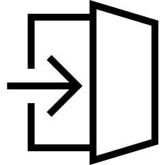
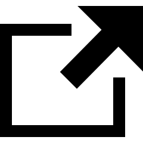

# (PART) Research design  {-}


# Types of study designs {#ResearchDesign}

::: {.objectivesBox .objectives data-latex="{iconmonstr-target-4-240.png}"}
So far, you have learnt how to ask a RQ.
\smallskip

**In this chapter**, you will study the details of *how to design* a method for collecting the data needed to answer the RQ.
You will learn to:

* design scientifically sound studies to answer simple quantitative research questions.
* describe the various types of quantitative research studies.
* compare and contrast experimental and observational studies.
* describe and identify the directionality in observational studies.
* describe and identify true experimental and quasi-experimental studies.
* explain external and internal validity.
:::


```{r echo=FALSE, fig.cap="", fig.align="center", fig.width=3, out.width="35%"}
SixSteps(2, "Types of study designs")
```


## Three types of study designs {#Three-Research-Designs}

The RQ implies what data *must* be collected from the individuals in the study (the response and explanatory variables)...
but *how* do we design a study to obtain this data?
After all, data are important: they are the means by which the RQ is answered.

Different types of studies for different types of RQs:

* *Nonanalytical studies*, that do *not* studying relationships:
  * *Descriptive* studies (Sect. \@ref(DescriptiveStudies)), for answering Descriptive RQs;
* *Analytical studies*, for studying relationships:
  * *Observational* studies (Sect. \@ref(ObservationalStudies)), for answering Relational RQs; or 
  * *Experimental* studies (Sect. \@ref(ExperimentalStudies)), for answering Interventional RQs.

The type of study depends on the type of RQ.


<div style="float:right; width: 222x; border: 1px; padding:10px">

</div>


::: {.example name="Research design"}
Suppose we wish to compare the effects of echinacea on the symptoms of the common cold (based on @data:barrett:echinacea).

*How* could a study be designed to collect the necessary data?
What decisions would need to be made?
:::


## Descriptive studies {#DescriptiveStudies}

*Descriptive studies* answer descriptive RQs (Fig. \@ref(fig:POCIDescriptive)), which only specify a population and outcome.


::: {.definition #DescriptiveStudy name="Descriptive study"}
*Descriptive studies* answer descriptive research questions, and do not try to establish relationships between variables.
:::


```{r POCIDescriptive, echo=FALSE, fig.cap="A descriptive study, used to answer a descriptive RQ", fig.align="center", fig.width=6, fig.height=2}
par( mar = c(0.5, 0.5, 0.5, 0.5))
openplotmat()

pos <- array(NA, dim = c(6, 2))
pos[1, ] <- c(0.35, 0.75) # P 
pos[2, ] <- c(0.45, 0.75) # O
pos[3, ] <- c(0.55, 0.75)   # C
pos[4, ] <- c(0.65, 0.75)   # I
pos[5, ] <- c(0.35, 0.25)   # Response

straightarrow(from = pos[2,], to = pos[5,], 
            lcol = "grey",
            #segment = c(0.25, 0.75),
            lty = 2)

textrect( pos[1,], 
          lab = "P",
          radx = 0.025,
          rady = 0.075,
          shadow.size = 0,
          lcol = "white",
          box.col = "white",
           cex = 2)
textrect( pos[2,], 
          lab = "O", 
          radx = 0.025,
          rady = 0.075,
          shadow.size = 0,
          lcol = "white",
          box.col = "white",
           cex = 2)
textrect( pos[3,], 
          box.col = "white",
          lcol = "white",
          shadow.size = 0,
          radx = 0.05,
          rady = 0.075,
          lab = "C",
          col = "grey",
          cex = 2)
textplain( pos[4,], 
           lab = "I", 
           col = "grey",
           cex = 2)

textrect( pos[5,], 
           lab = "Response\nvariable", 
           radx = 0.075, 
           rady = 0.15, 
           shadow.size = 0,
           box.col = "darkseagreen1",
           lcol = "darkseagreen1",
          cex = 0.9)
```


<div style="float:right; width: 222x; border: 1px; padding:10px">

</div>


::: {.example #ResearchDesignWeightLoss name="Descriptive study"}
Consider this RQ:

> For overweight men over 60, what is the average increase in heart rate after walking 400 metres?

The *outcome* is the average *increase* in heart rate.
The *response variable* is the *increase* in heart rate for each individual man, found by measuring each man's heart rate *before* the walk, then their heart rate *after* the walk (*within-individuals* information).

The *increase* in heart rate would be computed as the *after* heart rate minus the *before* heart rate.
Some differences might be positive numbers (heart rate *increased*), and some may be negative numbers (heart rate *decreased*).

No between-individuals *comparison* is being made: every man in the study is treated in the same way.
This is a *descriptive* RQ, which can be answered by a *descriptive* study.
:::


## Observational studies {#ObservationalStudies}

*Observational studies* (Fig. \@ref(fig:POCIObservational)) answer *relational RQs* to study relationships.
They are a commonly-used study design, and sometimes are the only possible study design that can be used.


::: {.definition #ObservationalStudy name="Observational study"}
*Observational studies* answer relational research questions.
:::


```{r POCIObservational, echo=FALSE, fig.cap="An observational study, used to answer a relational RQ", fig.align="center", fig.width=6, fig.height=2}
par( mar = c(0.5, 0.5, 0.5, 0.5))
openplotmat()

pos <- array(NA, dim = c(6, 2))
pos[1, ] <- c(0.35, 0.75) # P 
pos[2, ] <- c(0.45, 0.75) # O
pos[3, ] <- c(0.55, 0.75)   # C
pos[4, ] <- c(0.65, 0.75)   # I
pos[5, ] <- c(0.35, 0.25)   # Response
pos[6, ] <- c(0.65, 0.25)   # Explanatory

straightarrow(from = pos[6,], to = pos[5,], 
            #segment = c(0.4, 0.6),
            lty = 1, 
            lwd = 2)
straightarrow(from = pos[3,], to = pos[6,], 
            lcol = "grey",
            #segment = c(0.25, 0.75), 
            lty = 2)
straightarrow(from = pos[2,], to = pos[5,], 
            lcol = "grey",
            #segment = c(0.25, 0.75),
            lty = 2)

textrect( pos[1,], 
           lab = "P",
          radx = 0.025,
          rady = 0.075,
          shadow.size = 0,
          lcol = "white",
          box.col = "white",
           cex = 2)
textrect( pos[2,], 
          lab = "O", 
          radx = 0.025,
          rady = 0.075,
          shadow.size = 0,
          lcol = "white",
          box.col = "white",
           cex = 2)
textrect( pos[3,], 
          box.col = "white",
          lcol = "white",
          shadow.size = 0,
          radx = 0.05,
          rady = 0.075,
          lab = "C",
          cex = 2)
textplain( pos[4,], 
           lab = "I", 
           col = "grey",
           cex = 2)

textrect( pos[6,], 
           lab = "Explanatory\nvariable", 
           radx = 0.075, 
           rady = 0.15, 
           shadow.size = 0,
           box.col = "antiquewhite",
           lcol = "antiquewhite",
           cex = 0.9)
textrect( pos[5,], 
           lab = "Response\nvariable", 
           radx = 0.075, 
           rady = 0.15, 
           shadow.size = 0,
           box.col = "darkseagreen1",
           lcol = "darkseagreen1",
           cex = 0.9)
```


::: {.definition #Conditions name="Condition"}
*Conditions*: The conditions of interest that those in the observational study are exposed to.

OR:

*Conditions*: The conditions are the values of the comparison or connection that those in the observational study experience.
:::


<div style="float:right; width: 222x; border: 1px; padding:10px">

</div>


`r if (knitr::is_html_output()) '<!--'`
\begin{wrapfigure}{R}{.25\textwidth}
  \begin{center}
    \includegraphics[width=.20\textwidth]{Illustrations/pexels-andrea-piacquadio-3807629.jpg}
  \end{center}
\end{wrapfigure}
`r if (knitr::is_html_output()) '-->'`


::: {.example name="Observational study"}
Consider again this RQ [@data:barrett:echinacea]:

> Among Australian teens with a common cold, is the *average* duration of cold symptoms shorter for teens taking a daily dose of echinacea compared to teens taking no medication?

This would be a relational RQ if the researchers do not impose the echinacea (that is, the individuals make this decision themselves).
For this RQ, the two *conditions* are 'taking echinacea', and 'not taking echinacea' (Fig. \@ref(fig:ObsStudiesImage)).
:::


```{r ObsStudiesImage, echo=FALSE, warnings=FALSE, message=FALSE, fig.cap="Observational studies", fig.align="center", fig.width=6, fig.height=3}
par( mar = c(0.5, 0.5, 0.5, 0.5))
openplotmat()

pos <- array(NA, dim = c(6, 2))
pos[1, ] <- c(0.15, 0.15) # Group 1
pos[2, ] <- c(0.15, 0.85) # Group 2
pos[3, ] <- c(0.55, 0.85)   # No echincaea
pos[4, ] <- c(0.55, 0.15)   # Echinacae
pos[5, ] <- c(0.40, 0.5)   # Compare

straightarrow(from = pos[1,], 
              to = pos[5,], 
              lcol = "grey",
              lty = 2, 
              lwd = 2)
straightarrow(from = pos[2,], 
              to = pos[5,], 
              lcol = "grey",
              lwd = 2,
              lty = 2)
straightarrow(from = pos[1,], 
              to = pos[4,], 
#             lcol = "grey",
              lty = 2)
straightarrow(from = pos[2,], 
              to = pos[3,], 
#             lcol = "grey",
              lty = 2)

textrect( pos[1,], 
          lab = "Group 1",
          radx = 0.055,
          rady = 0.1,
          shadow.size = 0,
          lcol = "darkseagreen1",
          box.col = "darkseagreen1")
textrect( pos[2,], 
          lab = "Group 2", 
          radx = 0.055,
          rady = 0.1,
          shadow.size = 0,
          lcol = "darkseagreen1",
          box.col = "darkseagreen1")
textrect( pos[3,], 
          box.col = "white",
          lcol = "white",
          shadow.size = 0,
          radx = 0.12,
          rady = 0.075,
          lab = "Chose not to\nuse echincacea")
textrect( pos[4,], 
          box.col = "white",
          lcol = "white",
          shadow.size = 0,
          radx = 0.12,
          rady = 0.075,
          lab = "Chose to\nuse echincacea")

textrect( pos[5,], 
           lab = "Compare", 
           radx = 0.075, 
           rady = 0.1, 
           shadow.size = 0,
           box.col = "antiquewhite",
           lcol = "antiquewhite")

plotfunctions::plot_image(img = "./Pics/iconmonstr-checkbox-26-240.png",
                           type = "png",
                           keep.ratio = TRUE,
                           xrange = c(0.75, 0.8),
                           yrange = c(0.80, 0.9),
                           bty = "n", # Removes box from around the plot 
                           add = TRUE)

plotfunctions::plot_image(img = "./Pics/iconmonstr-checkbox-22-240.png",
                           type = "png",
                           keep.ratio = TRUE,
                           xrange = c(0.75, 0.8),
                           yrange = c(0.10, 0.2),
                           bty = "n", # Removes box from around the plot 
                           add = TRUE)
```


## Experimental studies {#ExperimentalStudies}

*Experimental studies* (Fig. \@ref(fig:POCIExperiment)), or *experiments*, are commonly-used study designs to study relationships.
Well-designed experimental studies can establish a *cause-and-effect relationship* between the response and explanatory variables.
However, using experimental studies is not always possible.

Experimental studies have an [*intervention*](Intervention), and so *experimental studies answer interventional RQs*.
Experimental studies always have a forward direction.


::: {.definition #Experiment name="Experiment"}
*Experimental studies* (or *experiments*), answer interventional research questions.
:::


::: {.importantBox .important data-latex="{iconmonstr-warning-8-240.png}"}
In an **experimental study**, the unit of analysis (Def. \@ref(def:UnitOfAnalysis)) is the smallest collection of units of observations that can be randomly allocated to separate treatments.
:::


```{r POCIExperiment, echo=FALSE, fig.cap="An experimental study, used to answer interventional RQs", fig.align="center", fig.width=6, fig.height=2}
par( mar = c(0.5, 0.5, 0.5, 0.5))
openplotmat()

pos <- array(NA, dim = c(6, 2))
pos[1, ] <- c(0.35, 0.75) # P 
pos[2, ] <- c(0.45, 0.75) # O
pos[3, ] <- c(0.55, 0.75)   # C
pos[4, ] <- c(0.65, 0.75)   # I
pos[5, ] <- c(0.35, 0.25)   # Response
pos[6, ] <- c(0.65, 0.25)   # Explanatory

straightarrow(from = pos[6,], 
              to = pos[5,], 
              #segment = c(0.4, 0.6),
              lty = 1, 
              lwd = 2)
straightarrow(from = pos[3,], 
              to = pos[4,], 
              lcol = "grey",
              #segment = c(0.25, 0.75), 
              lty = 2)
straightarrow(from = pos[2,], 
              to = pos[5,], 
              lcol = "grey",
              #segment = c(0.25, 0.75),
              lty = 2)
curvedarrow(from = pos[4,], 
            to = pos[6,], 
            lcol = "grey",
            curve = -0.2,
            #segment = c(0.25, 0.75),
            lty = 2)

textrect( pos[1,], 
          lab = "P",
          radx = 0.025,
          rady = 0.075,
          shadow.size = 0,
          lcol = "white",
          box.col = "white",
           cex = 2)
textrect( pos[2,], 
          lab = "O", 
          radx = 0.025,
          rady = 0.075,
          shadow.size = 0,
          lcol = "white",
          box.col = "white",
          cex = 2)
textrect( pos[3,], 
          box.col = "white",
          lcol = "white",
          shadow.size = 0,
          radx = 0.02,
          rady = 0.075,
          lab = "C",
          cex = 2)
textrect( pos[4,], 
          box.col = "white",
          lcol = "white",
          shadow.size = 0,
          radx = 0.02,
          rady = 0.075,
          lab = "I",
          cex = 2)

textrect( pos[6,], 
           lab = "Explanatory\nvariable", 
           radx = 0.075, 
           rady = 0.15, 
           shadow.size = 0,
           box.col = "antiquewhite",
           lcol = "antiquewhite")
textrect( pos[5,], 
           lab = "Response\nvariable", 
           radx = 0.075, 
           rady = 0.15, 
           shadow.size = 0,
           box.col = "darkseagreen1",
           lcol = "darkseagreen1")
```


::: {.definition #Treatments name="Treatments"}
*Treatments* are the conditions of interest that those in the study can be exposed to (as the explanatory variable).
In experiments, treatments are imposed by researchers.
:::


Two types of experimental studies (Table \@ref(tab:ExperimentalStudyDesigns)) are:

* [*True experiments*](#TrueExperiments); and 
* [*Quasi-experiments*](#QuasiExperiments).


```{r echo=FALSE, ExperimentalStudyDesigns}
ExpStudies <- array( dim = c(3, 4) )
colnames(ExpStudies) <- c("Study type",
                          "Do researchers allocate who or what to groups?", 
                          "Do researchers allocate treatments to groups?", 
                          "Reference")

if( knitr::is_latex_output() ) {
   ExpStudies[1, ] <- c("True experiment",  
                        "Yes", 
                        "Yes", 
                        "Sect. \\ref{TrueExperiments}")
   ExpStudies[2, ] <- c("Quasi-experiment", 
                        "No",  
                        "Yes", 
                        "Sect. \\ref{QuasiExperiments}")
   ExpStudies[3, ] <- c("Observational",    
                        "No",  
                        "No",  
                        "Sect. \\ref{ObservationalStudies}")
  
   kable(ExpStudies,
        format = "latex",
        longtable = FALSE,
        booktabs = TRUE,
        escape = FALSE, # For latex to work in \rightarrow
        linesep = c( "\\addlinespace"), # Add a bit of space between all rows. 
        caption = "Comparing experimental designs (descriptive studies do not have any comparison or connection groups)",
        align = c("r", "c", "c", "l"))   %>%
   kable_styling(full_width = FALSE, font_size = 10) %>%
  row_spec(0, bold = TRUE) %>% # Columns headings in bold
   column_spec(column = 1, width = "3cm") %>% 
   column_spec(column = 2, width = "4cm") %>%
   column_spec(column = 3, width = "4cm") %>%
   column_spec(column = 4, width = "2cm")
}

if( knitr::is_html_output() ) {
   ExpStudies[1, ] <- c("True experiment",  
                        "Yes", 
                        "Yes", 
                        "Sect. \\@ref(TrueExperiments)")
   ExpStudies[2, ] <- c("Quasi-experiment", 
                        "No",  
                        "Yes", 
                        "Sect. \\@ref(QuasiExperiments)")
   ExpStudies[3, ] <- c("Observational",    
                        "No",  
                        "No",  
                        "Sect. \\@ref(ObservationalStudies)")
  
  kable(ExpStudies,
        format = "html",
        align = c("r", "c", "c", "l"),
        longtable = FALSE,
        caption = "Comparing experimental designs (descriptive studies do not have any comparison or connection groups)",
        booktabs = TRUE)    
}
```

### True experimental studies {#TrueExperiments}

*True experiments* are commonly used, but conducting a true experiment is not always possible.
An example of a true experiment is a *randomised controlled trial*, often used in drug trials.


::: {.definition #TrueExperiment name="True experiment"}
In a *true experiment*, the researchers:

1. allocate treatments to groups of individuals (i.e., allocate the values of the explanatory for the individuals), *and*
2. determine who or what individuals are in those groups.

While these may not actually happen *explicitly*, they can happen *conceptually*.
:::


<div style="float:right; width: 222x; border: 1px; padding:10px">

</div>


`r if (knitr::is_html_output()) '<!--'`
\begin{wrapfigure}{R}{.25\textwidth}
  \begin{center}
    \includegraphics[width=.20\textwidth]{Illustrations/pexels-andrea-piacquadio-3807629.jpg}
  \end{center}
\end{wrapfigure}
`r if (knitr::is_html_output()) '-->'`


::: {.example name="True experiment"}
The echinacea study (Sect. \@ref(Writing-RQs)) could be designed as a *true experiment*.
The researchers would allocate individuals to one of two groups, and then decide which group took echinacea and which group did not (Fig. \@ref(fig:TrueExpStudiesImage)).
:::


```{r TrueExpStudiesImage, echo=FALSE, fig.cap="True experimental studies", fig.align="center", fig.width=6, fig.height=3}
par( mar = c(0.5, 0.5, 0.5, 0.5))
openplotmat()

pos <- array(NA, dim = c(6, 2))
pos[1, ] <- c(0.25, 0.15) # Group 1
pos[2, ] <- c(0.25, 0.85) # Group 2
pos[3, ] <- c(0.65, 0.85)   # No echincaea
pos[4, ] <- c(0.65, 0.15)   # Echincae
pos[5, ] <- c(0.5, 0.5)   # Compare
pos[6, ] <- c(0.1, 0.5)   # People

straightarrow(from = pos[1,], 
              to = pos[5,], 
              lcol = "grey",
              lty = 2, 
              lwd = 2)
straightarrow(from = pos[2,], 
              to = pos[5,], 
              lcol = "grey",
              lwd = 2,
              lty = 2)
straightarrow(from = pos[4,], 
              to = pos[1,], 
#             lcol = "grey",
              lty = 1)
straightarrow(from = pos[3,], 
              to = pos[2,], 
#             lcol = "grey",
              lty = 1)
straightarrow(from = pos[6,], 
              to = pos[1,], 
#             lcol = "grey",
              lty = 1)
straightarrow(from = pos[6,], 
              to = pos[2,], 
#             lcol = "grey",
              lty = 1)


textrect( pos[1,], 
          lab = "Group 1",
          radx = 0.055,
          rady = 0.1,
          shadow.size = 0,
          lcol = "darkseagreen1",
          box.col = "darkseagreen1")
textrect( pos[2,], 
          lab = "Group 2", 
          radx = 0.055,
          rady = 0.1,
          shadow.size = 0,
          lcol = "darkseagreen1",
          box.col = "darkseagreen1")
textrect( pos[3,], 
          box.col = "white",
          lcol = "white",
          shadow.size = 0,
          radx = 0.12,
          rady = 0.075,
          lab = "Allocate not to\nuse echincacea")
textrect( pos[4,], 
          box.col = "white",
          lcol = "white",
          shadow.size = 0,
          radx = 0.12,
          rady = 0.075,
          lab = "Allocate to\nuse echincacea")

textrect( pos[5,], 
          lab = "Compare", 
          radx = 0.075, 
          rady = 0.1, 
          shadow.size = 0,
          box.col = "antiquewhite",
          lcol = "antiquewhite")

textrect( pos[6,], 
          box.col = "white",
          lcol = "white",
          shadow.size = 0,
          radx = 0.16,
          rady = 0.075,
          lab = "People")


plotfunctions::plot_image(img = "./Pics/iconmonstr-checkbox-26-240.png",
                           type = "png",
                           keep.ratio = TRUE,
                           xrange = c(0.75, 0.8),
                           yrange = c(0.8, 0.90),
                           bty = "n", # Removes box from around the plot 
                           add = TRUE)

plotfunctions::plot_image(img = "./Pics/iconmonstr-checkbox-22-240.png",
                           type = "png",
                           keep.ratio = TRUE,
                           xrange = c(0.75, 0.8),
                           yrange = c(0.1, 0.20),
                           bty = "n", # Removes box from around the plot 
                           add = TRUE)
```


::: {.thinkBox .think data-latex="{iconmonstr-light-bulb-2-240.png}"}
A researcher wants to examine the effect of an alcohol awareness program [@macdonald2008enough] on the amount of alcohol consumed in O-Week.
She runs the program at UQ only, then compared the average amount of drinking per person at two universities (A and B).
What type of study is this: *observational* or *true experimental*?
Answering these questions will help:

1. Does the researcher allocate treatments to the groups? 
2. Does the researcher allocate subjects to groups?

`r webexercises::hide()`
*Neither* observational, or a true experiment. 

The researcher did not determine the groups: the students (not the researcher) would have chosen University A or University B for many reasons. 
The researcher *did* decide how to allocate the program to University A or University B.
`r webexercises::unhide()`
:::


### Quasi-experimental studies {#QuasiExperiments}

Quasi-experiments are similar to true experiments, but treatments are *allocated* to groups that *already exist*.

::: {.definition #QuasiExperiment name="Quasi-experiment"}
In a *quasi-experiment*, the researchers:
  
* allocate treatments to groups of individuals (i.e., allocate the values of the explanatory variable to the individuals), but
* do **not** determine who or what individuals are in those groups.
:::
      

`r if (!knitr::is_latex_output()) '<!--'`
<div style="float:right; width: 222x; border: 1px; padding:10px">

</div>
`r if (!knitr::is_latex_output()) '-->'`


::: {.example name="Quasi-experiments"}
The echinacea study (Sect. \@ref(Writing-RQs)) could be designed as a quasi-experiment.
The researchers would need to *find* (not *create*) two existing groups of people (say, from two different suburbs) then decide to allocate one group to take echinacea, and allocate the other group to take a placebo (Fig. \@ref(fig:QuasiExpStudiesImage)).
:::


```{r QuasiExpStudiesImage, echo=FALSE, fig.cap="Quasi-experimental studies", fig.align="center", fig.width=6, fig.height=3}
par( mar = c(0.5, 0.5, 0.5, 0.5))
openplotmat()

pos <- array(NA, dim = c(5, 2))
pos[1, ] <- c(0.25, 0.15) # Group 1
pos[2, ] <- c(0.25, 0.85) # Group 2
pos[3, ] <- c(0.65, 0.85) # No echincae
pos[4, ] <- c(0.65, 0.15) # Echinacae
pos[5, ] <- c(0.50, 0.50) # Compare


straightarrow(from = pos[1,], 
              to = pos[5,], 
              lcol = "grey",
              lty = 2, 
              lwd = 2)
straightarrow(from = pos[2,], 
              to = pos[5,], 
              lcol = "grey",
              lwd = 2,
              lty = 2)
straightarrow(from = pos[4,], 
              to = pos[1,], 
#             lcol = "grey",
              lty = 1)
straightarrow(from = pos[3,], 
              to = pos[2,], 
#             lcol = "grey",
              lty = 1)

textrect( pos[1,], 
          lab = "Group 1",
          radx = 0.055,
          rady = 0.1,
          shadow.size = 0,
          lcol = "darkseagreen1",
          box.col = "darkseagreen1")
textrect( pos[2,], 
          lab = "Group 2", 
          radx = 0.055,
          rady = 0.1,
          shadow.size = 0,
          lcol = "darkseagreen1",
          box.col = "darkseagreen1")
textrect( pos[3,], 
          box.col = "white",
          lcol = "white",
          shadow.size = 0,
          radx = 0.12,
          rady = 0.075,
          lab = "Allocate not to\nuse echincacea")
textrect( pos[4,], 
          box.col = "white",
          lcol = "white",
          shadow.size = 0,
          radx = 0.12,
          rady = 0.075,
          lab = "Allocate to\nuse echincacea")

textrect( pos[5,], 
           lab = "Compare", 
           radx = 0.075, 
           rady = 0.1, 
           shadow.size = 0,
           box.col = "antiquewhite",
           lcol = "antiquewhite")

plotfunctions::plot_image(img = "./Pics/iconmonstr-checkbox-26-240.png",
                           type = "png",
                           keep.ratio = TRUE,
                           xrange = c(0.75, 0.8),
                           yrange = c(0.8, 0.9),
                           bty = "n", # Removes box from around the plot 
                           add = TRUE)

plotfunctions::plot_image(img = "./Pics/iconmonstr-checkbox-22-240.png",
                           type = "png",
                           keep.ratio = TRUE,
                           xrange = c(0.75, 0.8),
                           yrange = c(0.1, 0.2),
                           bty = "n", # Removes box from around the plot 
                           add = TRUE)
```


## Comparing study types {#CompareStudyTypes}


Different RQs require different study designs (Table \@ref(tab:StudyTypes)).
Importantly, *only well-designed true experiments can show cause-and-effect*.
In general, well-designed true experiments provide stronger evidence than quasi-experiments, which produce stronger evidence than observational studies.


```{r echo=FALSE, StudyTypes}
StudyRQ <- array( dim = c(3, 6) )
colnames(StudyRQ) <- c("RQ type", 
                       "P", 
                       "O", 
                       "C", 
                       "I", 
                       "Study type")

StudyRQ[1, ] <- c("Descriptive",    
                  "Yes", 
                  "Yes",    
                  "",    
                  "", 
                  "Descriptive")
StudyRQ[2, ] <- c("Relational",     
                  "Yes", 
                  "Yes", 
                  "Yes",    
                  "", 
                  "Observational")
StudyRQ[3, ] <- c("Interventional", 
                  "Yes", 
                  "Yes", 
                  "Yes", 
                  "Yes", 
                  "Experimental")
   
if( knitr::is_latex_output() ) {
   kable(StudyRQ,
        format = "latex",
        longtable = FALSE,
        booktabs = TRUE,
        linesep = c( "\\addlinespace"), # Add a bit of space between all rows. 
        caption = "Study types and research questions",
        align = c("r", "c", "c", "c", "c", "l"))   %>%
   kable_styling(full_width = FALSE, font_size = 10) %>%
   row_spec(0, bold = TRUE) # Columns headings in bold
}

if( knitr::is_html_output() ) {
  
  out <- kable(StudyRQ,
               format = "html",
               align = c("r", "c", "c", "c", "c", "l"),
               longtable = FALSE,
               caption = "Study types and research questions",
               booktabs = TRUE) 

  if ( knitr::is_html_output(excludes = "epub")) {
    kable_styling(out, 
                  full_width = FALSE) %>%
    row_spec(row = 0, 
             bold = TRUE)  
  } else {
    out  
  }
}

```


Nonetheless, well-designed observational studies can provide evidence to support cause-and-effect conclusions, especially when supported by other evidence.

::: {.example #Autism name="Cause and effect"}
Many studies reported that the bacteria living in the gut of people on the autism spectrum is different than the bacteria in the gut of people *not* on the autism spectrum (@kang2019long, @ho2020gut).
These studies have been observational, so the [suggestion of a cause-and-effect relationship may be inaccurate](https://theconversation.com/gut-bacteria-dont-cause-autism-autistic-kids-microbiome-differences-are-due-to-picky-eating-170366).

Other studies [@yap2021autism] propose that the relationship works the other way:
people on the autism spectrum are more likely to be "picky eaters", which contributes to the differences in their gut bacteria.
:::


Although only experimental studies can show cause-and-effect, experimental studies are often not possible for ethical, financial, practical or logistical reasons.
In addition, experimental studies may suffer from lack of [ecological validity](#InterpretApplicability) and the influence of the [Hawthorne effect](#HawthorneEffectExperimental), which observational studies may manage better.

Well-designed quasi-experiments and observational studies can still produce strong conclusions, but cannot be used by themselves to establish cause-and-effect conclusions.


`r if (knitr::is_html_output()) {
   'The animation below compares observational, quasi-experimental and true experimental designs.'
}`

```{r StudyDesignsMovie, animation.hook="gifski",  interval=3.0, echo=FALSE, fig.align="center", fig.cap="The three main study designs", dev=if (is_latex_output()){"pdf"}else{"png"}}
if (knitr::is_html_output()) {

  for (i in (1:4)){

    par( mar = c(0.5, 0.5, 0.5, 0.5),
         pin = c(5, 3))
    
    if ( i == 1 ) {
      title.text <- "Observational study"
      sub.text <- expression( atop("Researchers "*bold(do~not)*" choose groups",
                                   "Researchers "*bold(do~not)*" choose what happens to groups"))
    }
    if ( i == 2 ) {
      title.text <- "Quasi-experimental study"
      sub.text <- expression( atop("Researchers "*bold(do~not)*" choose groups",
                                   "Researchers "*bold(do)*" choose what happens to groups"))
    }
    if ( i >= 3 ) {
      title.text <- "True experimental study"
      sub.text <- expression(atop("Researchers "*bold(do)*" choose groups",
                                  "Researchers "*bold(do)*" choose what happens to groups"))
    }
    
    openplotmat()
    title(main = title.text)
    title(sub = sub.text)
    
    pos <- array(NA, 
                 dim = c(6, 2))
		 
    pos[1, ] <- c(0.25, 0.15) # Group 1
    pos[2, ] <- c(0.25, 0.85) # Group 2
    pos[3, ] <- c(0.65, 0.85)   # No echincaea
    pos[4, ] <- c(0.65, 0.15)   # Echincae
    pos[5, ] <- c(0.50, 0.50)   # Compare
    pos[6, ] <- c(0.10, 0.50)   # People
    
    
    if ( i == 1 ){
      straightarrow(from = pos[1,], 
                    to = pos[4,], 
                    lcol = "grey",
                    arr.pos = 0.3,
                    lty = 1)
      straightarrow(from = pos[2,], 
                    to = pos[3,], 
                    lcol = "grey",
                    arr.pos = 0.3,
                    lty = 1)
      
    }
    if ( i >= 3 ){
      straightarrow(from = pos[6,], 
                    to = pos[1,], 
                    lty = 1)
      straightarrow(from = pos[6,], 
                    to = pos[2,], 
                    lty = 1)
      
    }
    
    if ( i > 1 ){
      straightarrow(from = pos[4,], 
                    to = pos[1,], 
                    arr.pos = 0.7,
                    lcol = "black",
                    lty = 1)
      straightarrow(from = pos[3,], 
                    to = pos[2,], 
                    arr.pos = 0.7,
                    lcol = "black",
                    lty = 1)
    }
    
    # All plots needs arrow to the "Compare" box:
    straightarrow(from = pos[2,], 
                  to = pos[5,], 
                  lty = 1)
    straightarrow(from = pos[1,], 
                  to = pos[5,], 
                  lty = 1)
    
    
    # TEXT
    textrect( pos[1,], 
              lab = "Group 1",
              radx = 0.065,
              rady = 0.1,
              shadow.size = 0,
              lcol = "darkseagreen1",
              box.col = "darkseagreen1")
    textrect( pos[2,], 
              lab = "Group 2", 
              radx = 0.065,
              rady = 0.1,
              shadow.size = 0,
              lcol = "darkseagreen1",
              box.col = "darkseagreen1")
    textrect( pos[3,], 
              box.col = "white",
              lcol = "white",
              shadow.size = 0,
              radx = 0.18,
              rady = 0.075,
              lab = "Chose not to\nuse echincacea")
    textrect( pos[4,], 
              box.col = "white",
              lcol = "white",
              shadow.size = 0,
              radx = 0.18,
              rady = 0.075,
              lab = "Chose to\nuse echincacea")
    
    textrect( pos[5,], 
              lab = "Compare", 
              radx = 0.075, 
              rady = 0.1, 
              shadow.size = 0,
              box.col = "antiquewhite",
              lcol = "antiquewhite")
    
    if ( i>= 3 ){
      textrect( pos[6,], 
                box.col = "white",
                lcol = "white",
                shadow.size = 0,
                radx = 0.16,
                rady = 0.075,
                lab = "People")
    }
  }
}
```


## Directionality {#Directionality}

Analytical (observational; experimental) research studies can be classified by their *directionality* (Table \@ref(tab:TypesOfObsStudies)):   

* [Forward direction](#ForwardStudies): 
  The values of the explanatory variable are obtained, and the study determines what values of the response variable occur in the future.
* [Backward direction](#BackwardStudies): 
  The values of the response variable are obtained, then the study determines what values of the explanatory variable occurred in the past.
* [No direction](#NondirectionalStudies): 
  The values of the response and explanatory variables are obtained at the same time.


In *experimental* studies, researchers *create* differences in the explanatory variable through allocation, and note the effect this has on the response variable.
In *observational* studies, researchers *observe* differences in the explanatory variable, and observe the values in the response variable.


```{r echo=FALSE, TypesOfObsStudies}
ObsStudies <- array( dim = c(3, 3) )
colnames(ObsStudies) <- c("Type", 
                          "Explanatory variable",
                          "Response variable")

   ObsStudies[1, ] <- c("Forward direction", 
                        "When study starts", 
                        "Determine in the future")
   ObsStudies[2, ] <- c("Backward direction", 
                        "Determined from the past", 
                        "When study starts")
   ObsStudies[3, ] <- c("No direction", 
                        "When study starts", 
                        "When study starts")
   
if( knitr::is_latex_output() ) {
 
  kable(ObsStudies,
        format = "latex",
        longtable = FALSE,
        booktabs = TRUE,
        escape = FALSE, # For latex to work in \rightarrow
        caption = "Classifying observational studies",
        align = c("r", "c", "c"))   %>%
        kable_styling(full_width = FALSE, font_size = 10) %>%
     row_spec(0, bold = TRUE) 
}

if( knitr::is_html_output() ) {

   kable(ObsStudies,
        format = "html",
        align = c("r", "c","c"),
        longtable = FALSE,
        caption = "Classifying observational studies",
        booktabs = TRUE) 
}
```


::: {.example name="Backwards studies"}
An Australian study [@data:Pamphlett:toxins] examined patients with and without sporadic motor neurone disease (SMND), and asked about *past* exposure to metals.

The response variable (whether or not the respondent had SMND) is assessed now, and whether or not they had exposure to metals (explanatory variable) is assessed from the *past*.
This observational study has a *backwards* direction.
:::


<div style="float:right; width: 222x; border: 1px; padding:10px">

</div>


::: {.example name="Forward studies"}
A study [@data:Choi2008:GoutSoftdrinks] measured the soft drink consumption of men, and determined who experienced gout in the following 12 years.

The response (whether or not the individuals experience gout) is determined in the future.
The explanatory variable (the amount of soft drink consumed) is measured now.
This observational study has a *forward* direction.
:::


::: {.example name="Non-directional studies"}
A study [@data:Russell2014:FoodInsecurity] asked older Australian their opinions of their own food security, and recorded their living arrangements.
Individuals' responses to both both the response variable and explanatory variable are gathered *now*.
This observational study is *non-directional*.
:::


<!-- <iframe src="https://docs.google.com/forms/d/e/1FAIpQLScUGUtuPBTArcmQo36tb3iYH49xGiJSl0Z_9XJdnQdV6Ej4ZQ/viewform?embedded=true" width="640" height="601" frameborder="0" marginheight="0" marginwidth="0"></iframe> -->

     
::: {.thinkBox .think data-latex="{iconmonstr-light-bulb-2-240.png}"}
In South Australia in 1988--1989, 25 cases of legionella infections (an unusually high number) were investigated [@data:oconnor:pottingmix].
All 25 cases were gardeners, with hanging baskets of ferns.

Researchers compared 25 cases with legionella infections with 75 non-cases, matching on the basis of age (within 5 years), sex, post codes.
The use of potting mix in the previous four weeks was associated with an increase in the risk of contracting illness of about 4.7 times.

What *direction* does this observational study have?

`r webexercises::hide()`
*Backward directionality*: people were identified with an infection, and then the researchers looked *back* at past activities.
`r webexercises::unhide()`
:::


<iframe src="https://learningapps.org/watch?v=p3i692osc22" style="border:0px;width:100%;height:500px" allowfullscreen="true" webkitallowfullscreen="true" mozallowfullscreen="true"></iframe>


Research studies are often described as 'prospective' or 'retrospective', but these terms can be misleading [@ranganathan2018study] and their use is no longer recommended [@VANDENBROUCKE20141500].


*Experimental studies always have a forward direction.*
Observational studies may have any directionality, and are given different names accordingly.


### Studies with a forward direction {#Forward}

All experimental studies have a forward direction, and include *clinical trials*.

Observational studies with a *forward* direction are called *cohort studies*.
Researchers find individuals with existing values of the explanatory variable, and observe what values of the response variable appear in the future.

Both experimental studies and cohort studies can be expensive and tricky: tracking individuals into the future is not always easy, and individuals may be lost to follow-up (called *drop-outs*).

Cohort studies:

* may be used to imply cause-and-effect, since the comparison/connection occurs *before* the outcome (though only well-designed experimental studies can establish cause-and-effect).
* can examine many different outcomes in one study, since the outcome(s) occur in the future. 
* can be problematic for rare outcomes as the outcome of interest may not appear in the future.


### Studies with a backward direction {#Backward}

Observational studies with a *backward* direction are called *case-control* studies.
Researchers find individuals with specific values of the response variable, and determine values of the explanatory variable from the past.

Case-control studies:

* only allow one outcome to be studied, since individuals are chosen to be in the study based on the value of the response variable.
* are useful for rare outcomes: The researchers can purposely select large numbers with the outcome of interest.
* do not effectively eliminate other explanations for the relationship between the response and explanatory variables (called [*confounding*](def:Confounding)).
* may suffer from *sampling bias*, as research try to locate individuals with a rare outcome.
* may suffer from *recall bias* when people are the individuals: accurately recalling the past can be problematic.


### Non-directional pros and cons {#NonDirectional}

*Non-directional* observational studies are called *cross-sectional* studies.
Cross-sectional studies are:

* good for findings associations between variables (which may or may not be causation).
* generally quicker and cheaper than other types of studies.
* not useful for studying rare outcomes.
* do not effectively eliminate other explanations for the relationship between the response and explanatory variables (called [*confounding*](def:Confounding)).


## External and internal validity {#InternalExternalValidity}

Ideally, all studies should be designed to be **externally valid** (Chap. \@ref(Sampling)) and **internally valid** (Chaps. \@ref(DesignExperiment) and \@ref(DesignObservational))

*Internally validity* refers to how reasonable and logical it is to conclude that changes in the value of the response variable can be attributed to changes in the value of the explanatory variable; that is, it refers to the strength of the *inferences* made from the study.

Studies with *high* internal validity show that changes in the response variable can confidently be related to changes in the explanatory variable *in the group that was studied*; the possibility of other explanations has been minimised.

In contrast, studies with *low* internal validity leave open other possibilities, apart from the explanatory variable, to explain changes in the value of the response variable.


<div style="float:right; width: 75px; padding:10px">

</div>


::: {.definition #InternalValidity name="Internal validity"}
**Internally validity** refers to how reasonable and logical it is to conclude that changes in the value of the response variable can be attributed to changes in the values of the explanatory variable; that is, the strength of the *inferences* made from the study.

A study with *high* internal validity shows that the changes in the response variable can be attributed to changes in the explanatory variables; other explanations have been ruled out.
:::


::: {.example #LowInternal name="Low internal validity"}
A study of programs that used double-fortified salt programs to manage iodine and iron deficiencies examined numerous existing studies.
The authors found that 

> Internal validity of the efficacy trials was generally weak, with only 6 out of 22 studies rated as moderate or high quality.
> Primarily, RCTs [i.e., randomised controlled trials] included in this review had **low internal validity** because of issues around selection bias, unaccounted confounders, and participant withdrawals.
>
> --- @larson2021can, p. 26S (emphasis added)
:::


One of many threats to internal validity is that the groups being compared are different to begin with; for example, if the group receiving echinacea is younger (on average) than the group receiving no medication).
This is a form of [*confounding*](#def:Confounding).

To check this, the *baseline characteristics* of the individuals in the groups can be compared: the groups being compared should be as similar as possible, so that any differences in the outcome cannot be attributed to pre-existing difference in the two groups being compared.


::: {.example name="Baseline characteristics"}
In a study of treating depression in adults [@data:Danielsson2014:Depression], three treatments were compared: exercise, basic body awareness therapy, or advice.

If any differences between the treatments were found, the researchers need to be confident that the differences were due to the treatment.
For this reason, the three groups were compared to ensure the groups were similar in terms of average ages, percentage of women, taking of anti-depressants, and many other aspects.
:::


An *internally valid* study requires studies to be carefully designed; this is discussed at length later (Chaps. \@ref(DesignExperiment) and \@ref(DesignObservational)).
In general, well-designed experimental studies are more likely to be internally valid than observational studies (Fig. \@ref(fig:StudiesValidity)).


```{r StudiesValidity, echo=FALSE, fig.cap="Well-designed true experiments are more likely to have high internal validity", fig.align="center", fig.width=7, fig.height=4}
par( mar = c(0.5, 0.5, 0.5, 0.5))
openplotmat()

pos <- array(NA, dim = c(6, 2))
pos[1, ] <- c(0.22, 0.80) # True exp
pos[2, ] <- c(0.22, 0.50) # Quasi exp
pos[3, ] <- c(0.22, 0.20) # Obs

pos[4, ] <- c(0.75, 0.80) # High IV
pos[5, ] <- c(0.70, 0.50) # 
pos[6, ] <- c(0.75, 0.20) # Low IV

straightarrow(from = c(0.5, 0.1), 
              to = c(0.5, 0.9), 
              lcol = "black",
              lty = 1, 
              lwd = 3,
              arr.length = 0.6)

textrect( pos[1,], 
          lab = "True\nexperiment",
          radx = 0.18,
          rady = 0.1,
          shadow.size = 0,
          lcol = "palegoldenrod",
          box.col = "palegoldenrod")
textrect( pos[2,], 
          lab = "Quasi-experiment", 
          radx = 0.18,
          rady = 0.1,
          shadow.size = 0,
          box.col = "palegoldenrod",
          lcol = "palegoldenrod")
textrect( pos[3,], 
          lab = "Observational\n study", 
          radx = 0.18,
          rady = 0.1,
          shadow.size = 0,
          box.col = "palegoldenrod",
          lcol = "palegoldenrod")

textplain( pos[4,], 
           adj = 1,
           lab = "Higher internal validity")
textplain( pos[6,],
           adj = 1, 
           lab = "Lower internal validity")

```


A study is *externally valid* if the results of the study are likely to generalised to *other* groups 
in the *population*, apart from those studied in the sample.

For a study to be *externally* valid it first needs to be *internally* valid, since the results must at least be internally valid for the group under study
before being extended to other members of the population.

Using a *random sample* helps ensure external validity.
In addition, the use of [*inclusion*](#def:InclusionCriteria) and [*exclusion criteria*](#def:ExclusionCriteria) (Sect. \@ref(Population)) helps clarify to whom or what the results may apply outside of the sample being studied.


<div style="float:right; width: 75px; padding:10px">

</div>


::: {.definition #ExternalValidity name="External validity"}
**Externally validity** refers to the ability to generalise the results to other groups in the *population*, apart from the sample studied.

For a study to be truly externally valid, the sample must be a [random sample](#Sampling) from the population.
:::


A study is *externally valid* if the results from the sample studied are likely to apply to the intended population.
It does *not* mean that the results apply more widely than the intended population.


::: {.example #ExternalValidPop name="External validity"}
Suppose the *population* in a study is *Queensland university students*.
The sample would be the students studied.
The study is externally valid if the sample is a random sample from the population of Queensland university students.

The results will not necessarily apply to all Queensland residents, or university students outside of Queensland.
However, this **has nothing to do with externally validity**.
External validity concerns how the *sample* represents the intended population in the RQ, which is *Queensland university students*.
The study is not concerned with all Queensland residents, or with non-Queensland university students.
:::


## The importance of design {#DesignImportance}

Choosing the *type* of study is only a small part of research design.
Planning the data collection process, and actually collecting the data, is still required.
Data may be obtained by:

* Using data already available: This is called *secondary data*.
* Collecting new data: This is called *primary data*.
   
Either way, knowing *how* the data are obtained is important.
The design phase is concerned with planning the best way to obtaining the data to ensure the study is *internally* and *externally* valid, as far as possible.

*Internal validity* considerations include:

* *What else* might influence the values of the response variable, apart from the explanatory variable? (Chap. \@ref(FactorsInfluenceY))
* How can the study be designed *effectively* to maximise internal validity? (Chaps. \@ref(DesignExperiment) and \@ref(DesignObservational))
* How exactly will the data be *collected*? (Chap. \@ref(CollectingDataProcedures))

*External* validity considerations include:

* Sampling: Since we can't study the whole population, *who* or *what* do we study in the population (Chap. \@ref(Sampling))?
  And *how many* do we need to study?
  (We need to learn more before we can answer this critical question in Chap. \@ref(Sampling).)

*Ethical* issues must also be considered (Chap. \@ref(Ethics)), and the limitations of the study understood when the results are interpreted (Chap. \@ref(Interpretation)) and [communicated](#writing-scientifically-discussion-and-conclusion).


`r if (knitr::is_html_output()){
  'The following short (humourous) video demonstrates the importance of understanding the design!'
}`

<div style="text-align:center;">
<iframe width="560" height="315" src="https://www.youtube.com/embed/BKorP55Aqvg" frameborder="0" allow="accelerometer; encrypted-media; gyroscope; picture-in-picture"></iframe>
</div>


## Summary {#Chap3-Summary}

Studies may be:

* **descriptive** (for descriptive RQs);
* **observational** (for relational RQs); or 
* **experimental** (for interventional RQs).

Observational studies can usually be classified as having a **forward direction** (cohort study), **backward direction** (case-control study), or **no direction** (cross sectional).
Experimental studies can usually be classified as **true experiments** or **quasi-experiments**.
Cause-and-effect conclusions can only be made from well-designed *true experiments*.

Ideally studies should be designed to be **internally** and **externally** valid.
In general, experimental studies have better internal validity than observational studies.


```{r Chap3Summary, animation.hook="gifski",  interval=1.5, echo=FALSE, fig.cap="Chapter 3 summary", fig.height = 3, fig.align="center", dev=if (is_latex_output()){"pdf"}else{"png"}}
if (knitr::is_html_output()) {

for (i in (1:9)){
  
  par( mar = c(0.1, 0.1, 0.1, 0.1) ) # Number of margin lines on each side

  diagram::openplotmat()
  pos <- array(NA, 
               dim = c(4, 2))
  pos[1, ] <- c(0.35, 0.6) # P 
  pos[2, ] <- c(0.45, 0.6) # O
  pos[3, ] <- c(0.55, 0.6)   # C
  pos[4, ] <- c(0.65, 0.6)   # I

  
  if (i <=  2){
    textrect( colMeans( pos[1:2, ] )  + c(0, 0.15),
              lab = "Descriptive RQ",
              radx = 0.15,
              rady = 0.04,
              shadow.size = 0,
              lcol = "azure",
              box.col = "azure",
              cex = 1.0)
    if (i == 2) {
      textrect( colMeans( pos[1:2, ] ) + c(0, 0.30),
               lab = "Answer using a Descriptive study",
               lcol = "beige",
               box.col = "beige",
               radx = 0.25,
               rady = 0.04,
               shadow.size = 0,
               cex = 0.85)
      
    }
  }
  
  if ( (i == 3) | ( i == 4) ){
    textrect( colMeans( pos[1:3, ] ) + c(0, 0.15),
               lab = "Relational RQ",
              radx = 0.15,
              rady = 0.04,
              shadow.size = 0,
              lcol = "azure",
              box.col = "azure",
              cex = 1.0)
    if (i == 4) {
      textrect( colMeans( pos[1:3, ] ) + c(0, 0.30),
                 lab = "Answer using a Observational study",
                lcol = "beige",
                box.col = "beige",
                radx = 0.25,
                rady = 0.04,
                shadow.size = 0,
                cex = 0.85)
      
    }
    
  }
  
  if ( (i >= 5) & ( i <= 7) ){
    textrect( colMeans( pos[1:4, ] ) + c(0, 0.15),
               lab = "Interventional RQ",
              radx = 0.15,
              rady = 0.04,
              shadow.size = 0,
              lcol = "azure",
              box.col = "azure",
              cex = 1.0)
    if (i >= 6) {
      textrect( colMeans( pos[1:4, ] ) + c(0, 0.30),
                 lab = "Answer using a Experimental study",
                lcol = "beige",
                box.col = "beige",
                radx = 0.25,
                rady = 0.04,
                shadow.size = 0,
                cex = 0.85)
    }
    if (i == 7) {
      textplain( colMeans( pos[1:4, ] ) - c(0, 0.1),
                 lab = "(Intervention: when C can be manipulated by the researchers)",
                 cex = 0.85)
      
    }
  }
 
  # Show some arrow, and then over-write

  if ( i == 8 ) {
    straightarrow( from = colMeans( pos[1:4, ] ) + c(-0.1, -0.3),
                   to = pos[2, ],
                   lwd = 2)
  }
  if ( i == 9 ) {
    straightarrow( from = colMeans( pos[1:4, ] ) + c(0.1, -0.3),
                   to = pos[3, ],
                   lwd = 2)
  }
  
  if ( i == 8 ) {
    textrect( colMeans( pos[1:4, ] ) + c(-0.1, -0.3),
              lab = "Response variable",
              box.col = "white",
              lcol = "white",
              shadow.size = 0,
              radx = 0.05,
              rady = 0.02,
              cex = 0.85)
  }
  if ( i == 9 ) {
    textrect( colMeans( pos[1:4, ] ) + c(0.1, -0.3),
              lab = "Explanatory variable",
              box.col = "white",
              lcol = "white",
              shadow.size = 0,
              radx = 0.05,
              rady = 0.02,
              cex = 0.85)
  } 

  
  
  
  # Always need P and O
  textrect( pos[1,], 
            lab = "P",
            radx = 0.05,
            rady = 0.025,
            shadow.size = 0,
            lcol = "white",
            box.col = "white",
            cex = 2)
  textrect( pos[2,], 
            lab = "O", 
            radx = 0.05,
            rady = 0.05,
            shadow.size = 0,
            lcol = "white",
            box.col = "white",
            cex = 2)
  if (i >= 3) { # C
    textrect( pos[3,], 
              box.col = "white",
              lcol = "white",
              shadow.size = 0,
              radx = 0.05,
              rady = 0.05,
              lab = "C",
              cex = 2)
  }
  if (i >= 5) { # I
    textrect( pos[4,], 
              box.col = "white",
              lcol = "white",
              shadow.size = 0,
              radx = 0.05,
              rady = 0.05,
              lab = "I", 
              cex = 2)
  }

} 
  
}
  
```
  

`r if (knitr::is_html_output()){
  'The following short videos may help explain some of these concepts:'
}`

<div style="text-align:center;">
<iframe width="560" height="315" src="https://www.youtube.com/embed/eic_LjXT4qc" frameborder="0" allow="accelerometer; encrypted-media; gyroscope; picture-in-picture"></iframe>
</div>

<div style="text-align:center;">
<iframe width="560" height="315" src="https://www.youtube.com/embed/2N_bkiyTiXU" frameborder="0" allow="accelerometer; encrypted-media; gyroscope; picture-in-picture"></iframe>
</div>


## Quick review questions {#Chap3-QuickReview}

1. A study [@fraboni2018red] examined the 'red-light running behaviour of cyclists in Italy'.
This study is most likely to be:  
`r if(knitr::is_html_output(exclude = "epub")){
	longmcq( c(answer = "an observational study",
             "a quasi-experimental study",
             "an experimental study"))}`
`r if( !knitr::is_html_output(exclude = "epub") ) {
' 	 * An observational study
 	 * A quasi-experimental study
 	 * An experimental study'
}`
             
1. A study of a sample whose results apply to the wider population of interest would be called:  
`r if(knitr::is_html_output(exclude = "epub")){
	longmcq( c("internally valid",
              answer = "externally valid") ) }`
`r if( !knitr::is_html_output(exclude = "epub") ) {
' 	 * Internally valid
 	 * Externally valid'
}`

1. In a quasi-experiment, the researchers allocate treatments to groups that they have not organised. 
True or false?  
`r if(knitr::is_html_output(exclude = "epub"))	torf(answer=TRUE)`

1. What is the difference between an true experiment and a quasi-experiment?
`r if( knitr::is_html_output(exclude = "epub") ) {
   longmcq( c(
      "In a true experiment, the researchers apply treatments to groups. In a quasi-experiment, the researchers do not apply treatments to groups", 
      answer = "In a true experiment, the researchers apply treatments to groups that they have determined. In a quasi-experiment, the researchers apply treatments to groups that they have not determined",
      "In a true experiment, the RQ has a comparison; in a quasi-experiment, the RQ has a connection"))}` 

1. A research study compared the use of two different education programs to reduce the percentage of patients experiencing ventilator-associated pneumonia (VAP).  
Paramedics from two cities were chosen to participate. Paramedics in City A were chosen (at random) to receive Program 1, and paramedics in the other city to receive Program 2.  
What type of study is this?
`r if( knitr::is_html_output(exclude = "epub") ) {
   longmcq( c(
      "Observational", 
      answer = "Quasi-experiment",
      "True experiment",
      "Descriptive"))}` 

1. Which of the following are true?

   * True experiments have a higher internal validity than observational studies.  
`r if( knitr::is_html_output(exclude = "epub") ) {torf( answer = TRUE)}`
   * Internal validity refers to the strength of the inferences made from the study.  
`r if( knitr::is_html_output(exclude = "epub") ) {torf( answer = TRUE)}`
   * Externally validity refers to the ability to generalise the results to other groups apart from those studied.  
`r if( knitr::is_html_output(exclude = "epub") ) {torf( answer = TRUE)}`
   * Inclusion and exclusion criteria can be used to clarify the internal validity.  
`r if( knitr::is_html_output(exclude = "epub") ) {torf( answer = FALSE)}`
   * Observational studies have a higher external validity than experimental studies.  
`r if( knitr::is_html_output(exclude = "epub") ) {torf( answer = FALSE)}`

`r if (!knitr::is_html_output()) '<!--'`
::: {.progressBox .progress}
**Progress:**  `r webexercises::total_correct()`
:::

`r webexercises::hide()`
1. **Observational**, since it would seem that the researchers are observing and not instructing cyclists to run red light...
2. **Externally valid**: This is basically the definition of external validity.
3. **TRUE**.
4. [See here](#ExperimentalStudies).
5. [See here](#comparing-study-designs).
6. [See here](#comparing-study-designs).
`r webexercises::unhide()`
`r if (!knitr::is_html_output()) '-->'`


## Exercises {#ResearchDesignsExercises}

Selected answers are available in Sect. \@ref(ResearchDesignAnswer).

::: {.exercise #ResearchDesignConcreteBeams}

In a  study on the shear strength of recycled concrete beams [@gonzalez2007shear], beams were divided into three groups.
Different loads were then applied to each group, and the shear strength needed to fracture the beams was measured.
 
Is this a *quasi-experiment* or a *true experiment*? 
Answering these questions may help: 

1. Do researchers allocate treatments to the groups? 
2. Do researchers allocate the who or what to groups? 

:::


::: {.exercise #ResearchDesignMatresses}

A study had this aim:

> To compare the effectiveness of alternating pressure air mattresses vs. overlays, to prevent pressure ulcers.
>
> --- @data:Manzano2013:Matresses , p. 2099.

Patients were *provided* with either alternating pressure air overlays (in 2001) or alternating pressure air mattresses (in 2006).
The number of pressure ulcers were recorded.

This study experimental, because the researchers *provided* the mattresses.
Is this a *true* experiment or *quasi*-experiment?
Explain.
:::


::: {.exercise #ResearchDesignPetsAndHealth}

Consider this initial RQ (based on @friedmann1985health), that clearly requires a lot of refining:

> Are people with pets healthier?

To answer this RQ:

1. Describe a useful and practical definition for P, O and C. 
2. Describe an *experimental* study to answer the RQ.
3. Describe an *observational* study to answer the RQ.
:::


::: {.exercise #ResearchDesignDietsForWeightLoss}
Consider this journal article extract:

> We randomly assigned 811 overweight adults to one of four diets [...]
> The diets consisted of similar foods and met guidelines for cardiovascular health [...]
> The primary outcome was the change in body weight after 2 years in [...] comparisons of low fat versus high fat and average protein versus high protein and in the comparison of highest and lowest carbohydrate content.
>
> --- @data:sacks:weightloss, p. 859

1. Define POCI.
2. Is this study observational or experimental?  Why?
3. Is this study a quasi-experiment or a true experiment?  Why?
4. What are the units of analysis?
5. What are the units of observation?
6. What is the response variable?
7. What is the explanatory variable?
:::


