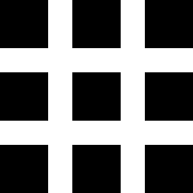

# External validity: sampling {#Sampling}


<!-- Introductions; easier to separate by format -->

```{r, child = if (knitr::is_html_output()) {'./introductions/05-ResearchDesign-Sampling-HTML.Rmd'} else {'./introductions/05-ResearchDesign-Sampling-LaTeX.Rmd'}}
```


## The idea of sampling {#IdeaOfSampling}

A RQ implies that every member of the population should be studied (the **P** in **P**OCI means 'population').
However, doing so is very rare due to cost, time, ethics, logistics and/or practicality.
Usually, a subset of the population (a *sample*) is studied, comprising some *individuals* from the population.
*Many* different samples are possible.
A study is [*externally valid*](#def:ExternalValidity) if the results from the sample can be generalised to the population.
This is only possible if the sample faithfully represents the population.


::: {.importantBox .important data-latex="{iconmonstr-warning-8-240.png}"}
The challenge of research is learning about a population from studying just one of the countless possible samples.
:::


<div style="float:right; width: 222x; border: 1px; padding:10px">

</div>


::: {.example #SamplesAspirin name="Samples"}
A study of the effectiveness of aspirin in treating headaches cannot possibly study every single human who may one day take aspirin.
Not only would this be prohibitively expensive, time-consuming, and impractical, but the study would not even study humans yet to be born who might use aspirin.

Using the whole target population is *impossible*, and a *sample* must be used.
:::


Studying a sample raises other questions:

* *Which* individuals should be included in the sample?
* *How many* individuals should be included in the sample?

The first issue is studied in this chapter.
The second issue is studied later (Chap.\ \@ref(EstimatingSampleSize)), after learning about the implications of studying samples rather than populations.

Studying a sample instead of the entire population presents challenges.
Many samples are possible, and *every sample is likely to be different*: the results of studying a sample depends on which individuals happen to be in the studied sample.
These differences are called *sampling variation*.
That is, each sample has different individuals, produces different data, and may lead to different answers to the RQ.

This is the challenge of research: *How to make decisions about populations, using just one of the many possible samples*.
Perhaps surprisingly, *lots* can be learnt about the population if we approach the task of selecting a sample correctly.


::: {.importantBox .important data-latex="{iconmonstr-warning-8-240.png}"}
Almost always, *samples* are studied, not *populations*.
Many samples are possible, and *every sample is likely to be different*, and hence the *results from every sample are likely to be different*.
This is called *sampling variation*.

While *we can never be certain* about the conclusions from the sample, special tools allow us to make decisions about the *population* from a *sample*.
:::


`r if (knitr::is_latex_output()) {
   'Consider a fair pack of cards, where $50$% of cards are red. The percentage of red cards is not the same in every hand of ten cards.'
} else {
   'The animation below shows how the estimates calculated from a sample vary from sample to sample. We know that $50$% of cards in a fair, shuffled pack are red, but each hand of ten cards can produce a different percentage of red cards (and not always $50$%).'
}`
This is an example of *sampling variation*.


```{r DealCards, animation.hook="gifski", fig.height = 4, fig.width=7, out.width='60%', interval=0.20, dev=if (is_latex_output()){"pdf"}else{"png"}}
source("R/showCardSampling.R")

numSamples <- 5
numCardsPerSample <- 10

### CARDS ARE OF SIZE 500 x 726
if (knitr::is_html_output()) {
  totalCards <- numSamples * numCardsPerSample
  for(iCard in 1:totalCards){
    showCardSampling(iCard, 
                     numSamples = numSamples, 
                     numCardsPerSample = numCardsPerSample)
    
    # Now pad, so the images appears to "stop"
    for (iteration in 1:20){
      points(-2.1, -2.25 + iteration/1000, 
             col = "white",
             cex = 0.5) # To keep getting a new plot, so the final plot holds to be looked at
    }
    gc() # Try garbage collection to prevent "Cannot allocate vector of size" error
  }
  #   }
  
}
```


## Precision and accuracy {#PrecisionAccuracy}

Two questions concerning sampling, raised in Sect.\ \@ref(IdeaOfSampling), were: *which* individuals should be in the sample, and *how many* individuals should be in the sample.
The first question addresses the *accuracy* of a population value when estimated using a sample. 
The second addresses the *precision* with which the population value is estimated when using a sample.
An estimate that is not accurate is called *biased* (Sect.\ \@ref(SelectionBias); Def.\ \@ref(def:Bias)).


::: {.definition name="Accuracy"}
*Accuracy* refers to how close a *sample* estimate is to the *population* value, on average.
:::


::: {.definition name="Precision"}
*Precision* refers to how similar the sample estimates from different samples are likely to be to each other (that is, how much variation is likely in the sample estimates).
:::


Using this language:

* The sampling *method* (i.e., how the sample is selected) impacts the *accuracy* of the sample estimate (i.e., the *external validity* of the study).
* The *size* of the sample impacts the *precision* of the sample estimate.

Large samples are more likely to produce *precise* estimates, but they may or may not be accurate estimates.
Similarly, random samples are likely to produce *accurate* estimates, but they may not be *precise* (unless the sample is also large).
As an analogy, consider an archer aiming at a target.
The shots can be accurate, or precise... or ideally both (Fig.\ \@ref(fig:PrecisionAccuracy)).


```{r PrecisionAccuracy, fig.align="center", fig.cap="Precision and accuracy: Each dot indicates where a shot lands, and is like a sample estimate of the population value (shown by the black central dot)", fig.width=5.0, out.width='55%'}
par( mfrow = c(2, 2),
     mar = c(1, 1, 1, 1)/4,
     oma = c(0.5, 2.5, 2.5, 0.5) ) 

source("R/drawTargets.R")

### PRECISE + ACCURATE
drawTarget()
#title(main = "Precise and accurate")
shots <- addShots(x = 0, 
                  y = 0, 
                  radius = 0.15, 
                  n = 20, 
                  seed = 121314)
drawBullsEye()


### PRECISE + INACCURATE
drawTarget()
#title(main = "Precise and inaccurate")
shots <- addShots(x = 0.25, 
                  y = 0.3, 
                  radius = 0.15, 
                  n = 20, 
                  seed = 12131415)
drawBullsEye()


### IMPRECISE + ACCURATE
drawTarget()
#title(main = "Imprecise but accurate")

shots <- addShots(x = 0, 
                  y = 0, 
                  radius = 0.5, 
                  n = 20, 
                  seed = 1213141516)
drawBullsEye()


### IMPRECISE + INACCURATE
drawTarget()
#title(main = "Imprecise and inaccurate")
shots <- addShots(x = 0.4, 
                  y = 0.3,  
                  radius = 0.5, 
                  n = 20, 
                  seed = 985421)
drawBullsEye()


### LABELS
mtext("Imprecise",
      side = 2, 
      line = 1,
      font = 2,
      cex = 1.25,
      at = 0.25,
      outer = TRUE)
mtext("Precise",
      side = 2, 
      line = 1,
      font = 2,
      cex = 1.25,
      at = 0.75,
      outer = TRUE)
mtext("Accurate",
      side = 3, 
      line = 1,
      font = 2,
      cex = 1.25,
      at = 0.25,
      outer = TRUE)
mtext("Inaccurate",
      side = 3, 
      line = 1,
      font = 2,
      cex = 1.25,
      at = 0.75,
      outer = TRUE)
```


<div style="float:right; width: 222x; border: 1px; padding:10px">

</div>


::: {.example #PrecisionAccuracyQld name="Precision and accuracy"}
To estimate the average age of *all Canadians*, $9000$ Canadian school children could be sampled.

The answer may be *precise* (as the sample is large), but will be *inaccurate* because the sample is not representative of *all* Canadians.
The sample gives a precise answer to a *different* question: 'What is the average age of Canadian school children?'
:::


<iframe src="https://learningapps.org/watch?v=prpojnfzj22" style="border:0px;width:100%;height:500px" allowfullscreen="true" webkitallowfullscreen="true" mozallowfullscreen="true"></iframe>


## Types of sampling

One key to obtaining accurate estimates about the population from the sample (i.e., ensuring externally validity) is to ensure that the sample is representative of the population of interest.
So, *how* is a representative sample selected from of the population?

The individuals selected for the sample can be chosen using either *random sampling* or *non-random sampling*.
The word *random* here has a specific meaning that is different than how it is often used in everyday use.


::: {.definition #Random name="Random"}
In research and statistics, *random* means determined completely by impersonal chance.
:::


### Random sampling methods {#RandomSamples}

In a *random sample*, each individual in the population can be selected, and is chosen on the basis of impersonal chance (such as using a random number generator, or a table of random numbers).
Some examples of random sampling methods appear in the following sections (Table\ \@ref(tab:TypesOfRandomSampling)).


::: {.importantBox .important data-latex="{iconmonstr-warning-8-240.png}"}
The results obtained from a random sample are likely to generalise to the population from which the sample is drawn; that is, *random samples* are likely to produce *externally valid* and *accurate* studies.
:::


```{r TypesOfRandomSampling}
SampleTypes <- array( dim = c(4, 5) )
colnames(SampleTypes) <- c("Type", 
                           "Stage 1", 
                           "Stage 2", 
                           "Ref.",
                           "") 

   
if( knitr::is_latex_output() ) {
   SampleTypes[1, ] <- c("Systematic", 
                         "Start at a \\emph{random} location",
                         "Take every $n$th element thereafter",
                         "Sect. \\ref{SystematicSampling}",
                         "")
   SampleTypes[2, ] <- c("Stratified",
                         "Split into a few large groups ('strata') of similar individuals",
                         "Select a \\emph{simple random sample} from every stratum",
                         "Sect. \\ref{StratifiedSampling}",
                         "")
   SampleTypes[3, ] <- c("Cluster",
                         "Split into many small groups ('clusters'); select \\emph{simple random sample} of clusters",
                         "Select \\emph{all} individuals in the chosen clusters",
                         "Sect. \\ref{ClusterSampling}",
                         "")
   SampleTypes[4, ] <- c("Multi-stage",
                         "Select \\emph{simple random sample} from the larger collection of units",
                         "Select \\emph{simple random sample} from those chosen in Stage 1; etc.",
                         "Sect. \\ref{MultistageSampling}",
                         "")

   kable(SampleTypes[, 1:4],
         format = "latex",
         longtable = FALSE,
         booktabs = TRUE,
         escape = FALSE, # For latex to work in \rightarrow
         #linesep  =  c( "\\addlinespace"), # Add a bit of space between all rows. 
         caption = "Comparing four types of random sampling",
         align = c("r", "l", "l", "r"))   %>%
      kable_styling(full_width = FALSE, font_size = 10) %>%
      row_spec(0, bold = TRUE) %>% # Columns headings in bold
      column_spec(column = 1, 
                  width = "16mm") %>% 
      column_spec(column = 2, 
                  width = "48mm") %>%
      column_spec(column = 3, 
                  width = "47mm") %>%
      column_spec(column = 4, 
                  width = "14mm")
}

if( knitr::is_html_output() ) {
   
   SampleTypes[1, ] <- c("Systematic", 
                         "Start at a *random* location",
                         "Take every $n$th element thereafter",
                         "Sect. \\@ref(SystematicSampling)",
                         "")
   SampleTypes[2, ] <- c("Stratified",
                         "Split into a few large groups ('strata') of similar individuals",
                         "Select a *simple random sample* from every stratum",
                         "Sect. \\@ref(StratifiedSampling)",
                         "")
   SampleTypes[3, ] <- c("Cluster",
                         "Split into many small groups ('clusters'); select *simple random sample* of clusters",
                         "Select *all* individuals in the chosen clusters",
                         "Sect. \\@ref(ClusterSampling)",
                         "")
   SampleTypes[4, ] <- c("Multistage",
                         "Select *simple random sample* from the larger collection of units",
                         "Select *simple random sample* from those chosen in Stage 1; etc.",
                         "Sect. \\@ref(MultistageSampling)",
                         "")
   
   SampleTypes[1, 5] <- "{#id .class height=90px width=90px}"
   SampleTypes[2, 5] <- "{#id .class height=90px width=90px}"
   SampleTypes[3, 5] <- "{#id .class height=90px width=90px}"
   SampleTypes[4, 5] <- "{#id .class height=90px width=90px}"
      
   kable(SampleTypes[, c(5, 1:4)], # Move icons to the front
         format = "html",
         align = c("c", "r", "l", "l", "r"),
         longtable = FALSE,
         caption = "Comparing four types of random sampling",
         booktabs = TRUE) 
}
```


Testing a pot of soup is similar.
If the soup is stirred (randomised), the whole pot of soup does not need to be tasted.
Using a non-random sample (sampling from the non-stirred soup), an *overall* impression of the population (or the soup) is not obtained.


### Non-random sampling methods {#NonRandomSamples}

A *non-random* sample is selected using some personal input from the researchers.
Examples of non-random samples include:

* *Judgement sample*:
  Individuals are selected based on the researchers' judgement, perhaps because the individuals may appear agreeable, supportive, accessible, or helpful.
  For example, researchers may select rats that are less aggressive, or plants that are accessible.
* *Convenience sample*:
  Individuals are selected because they are convenient for the researcher.
  For example, researchers may study beaches that are nearby.
* *Voluntary* response (self-selecting) sample:
  Individuals participate if they wish to.
  For example, researchers may ask people to volunteer for a survey.

In non-random sampling, the individuals *in* the study may be different than those *not in* the study.
That is, *non-random samples are not likely to be externally valid*.


::: {.importantBox .important data-latex="{iconmonstr-warning-8-240.png}"}
Using a non-random sample means that the results probably do not generalise to the intended population: they probably do not produce externally valid or accurate studies.
:::


<div style="float:right; width: 222x; border: 1px; padding:10px">

</div>


<!-- ::: {.example #COVIDsampling name="Different ways to sample"} -->
<!-- During the COVID-19 pandemic in 2020, [a Facebook poll](https://www.abc.net.au/news/2020-07-03/coronacheck-anti-vaxxers-flood-online-poll-pete-evans/12415860) asked the question: "Do you think a Coronavirus vaccine should be compulsory?" -->

<!-- The result was reported as '79 per cent of Australians oppose a compulsory vaccination', from a sample of over 53,000 responses. -->
<!-- This sample was a *voluntary response sample*, not a random sample, so the results may not be *accurate*. -->
<!-- For example, the poll could have been completed multiple times by individuals, and by non-Australians as well as Australians. -->

<!-- A different study [@smith2020majority] asked Australians: -->

<!-- > The Federal Government's 'No Jab, No Pay' policy withholds certain benefits and payments from families who don't fully vaccinate their children.  -->
<!-- > Do you agree with this policy? -->

<!-- In the sample of 1809 respondents, 83.7% either agreed or strongly agreed with this statement. -->
<!-- While this sample was not a *truly* random sample of Australians, the sample intentionally included individuals representing a wide range of demographics (e.g., age, gender, location, income, and so on (@smith2020majority, p. 194). -->
<!-- Furthermore, 'respondents were paid small token sum for their participation in the study' to encourage *all* selected respondents to provide an answer (and avoid voluntary responses). -->
<!-- ::: -->


## Simple random sampling {#SRS}

<div style="float:right; width: 222x; border: 1px; padding:10px">

</div>


::: {.definition #SamplingSRS SRSname="Simple random sample"}
In a *simple random sample*, *every* possible sample of the same size has the *same* chance of being selected.
:::

Selecting a simple random sample requires a list of all members of the population, called the *sampling frame*, from which to make the selections.
Often, establishing the sampling frame is difficult or impossible, and so finding a simple random sample is also difficult.
For example, finding a simple random sample of wombats would require having a list and location of all wombats, so some could be selected using random numbers.
This is absurd; other random sampling methods, like 
`r if (knitr::is_html_output()){
  '[special ecological sampling methods](http://www.countrysideinfo.co.uk/what_method.htm),'
} else {
  'special ecological sampling methods,'
}`
would be used instead [@manly2014introduction].


::: {.definition #SamplingFrame name="Sampling frame"}
The *sampling frame* is a list of *all* the individuals in the population.
:::


Selecting a simple random sample from the *sampling frame* can be performed using *random numbers* (e.g., using random number tables, or 
`r if (knitr::is_html_output()){
  'websites like https://www.random.org).  A smaller version of this webpage, which generates one number at a time, is below; just press *Generate*. The numbers generated by this widget come from the true random number generator at [RANDOM.ORG](https://www.random.org). (The webpage generates as many numbers as you want all at the same time.)'
} else {
  'websites like https://www.random.org).'
}`
Other random sampling methods use a system to select randomly, rather than by human choice, and some avoid the need for a sampling frame.

<div style="text-align:center;">
<iframe src="https://www.random.org/widgets/integers/iframe.php?title=True+Random+Number+Generator&amp;buttontxt=Generate&amp;width=160&amp;height=200&amp;border=on&amp;bgcolor=%23FFFFFF&amp;txtcolor=%23777777&amp;altbgcolor=%23CCCCFF&amp;alttxtcolor=%23000000&amp;defaultmin=&amp;defaultmax=&amp;fixed=off" frameborder="0" width="160" height="200" scrolling="no" longdesc="https://www.random.org/integers/">
</iframe>
</div>


::: {.importantBox .important data-latex="{iconmonstr-warning-8-240.png}"}
This book assumes simple random samples, unless otherwise noted.
:::


<div style="float:right; width: 222x; border: 1px; padding:10px">

</div>


::: {.example #Typing name="Simple random sampling"}
Suppose we are interested in this RQ:

> For students at a large course at a university, is the average typing speed (in words per minute) the same for females and males?

Suppose budget and time constraints mean only $40$ students (out of $441$) can be selected for the study above.
The *sampling frame* is the list of all students enrolled in the course.
Obtaining the sampling frame is feasible here; instructors have access to this information for grading.

One way to select a simple random sample using the course enrolment list is to place all $441$ enrolled students into a spreadsheet.
Then, use random numbers to select $40$ at random (without repeating numbers) between $1$ and $441$ inclusive.
For instance, when I used 
`r if (knitr::is_latex_output()) {
   '\\texttt{random.org/integers},'
} else {
   '[random.org](https://www.random.org/integers/?num=40&min=1&max=441&col=5&base=10&format=html&rnd=new),'
}`
the first few random numbers were: `410`,	`215`,	`384`,	`158`,	`296`, ...

Every student chosen using this method becomes part of the study.
If a student could not be contacted, more students could be chosen at random to ensure $40$ students participated
`r if (knitr::is_latex_output()) {
   '(Fig.\\ \\@ref(fig:SamplesA), top left panel).'
} else {
   '(see animation below).'
}`
:::


```{r animation.hook="gifski", interval=0.4, fig.height = 6.5, dev=if (is_latex_output()){"pdf"}else{"png"}}
# SRS
if (knitr::is_html_output()){
  source("R/showSampleSRS.R")

  showSampleSRS(static = FALSE)
}
```


```{r SamplesA, fig.align="center", fig.width=7, fig.height=6.5,  out.width='100%', fig.cap="Some methods for taking a random sample of size $40$ from a class of $441$. Top left: a simple random sample; top right: A systematic sample; bottom panels: two different stratified samples. In all cases, hollow circles represent students in the population not chosen for the sample, and the filled squares represent the students in the population who were chosen in the sample." } 

if (knitr::is_latex_output()){
  
  par( mfrow = c(2, 2), 
       mar = c(3, 1, 3, 1))

  source("R/showSampleSRS.R")  
  source("R/showSampleSystematic.R")    
  source("R/showSampleStratified.R")  

  showSampleSRS(static = TRUE)
  showSampleSystematic(static = TRUE,
                       start = 9) 
  showSampleStratified(static = TRUE,
                       proportionA = 2/3, 
                       sampleA = 1/2, # Equal F and M
                       main = "Stratified: equal F/M in sample")
  showSampleStratified(static = TRUE,
                       proportionA = 2/3,
                       sampleA = 2/3, # Proportion F and M
                       main = "Stratified: proportional F/M in sample")

}
```


## Systematic sampling {#SystematicSampling}

<div style="float:right; width: 222x; border: 1px; padding:10px">

</div>


In *systematic sampling*, the first case is *randomly* selected; then, more individuals are selected at regular intervals thereafter.
In general, we say that every $n$th individual is selected after the initial random selection.


::: {.example #SystematicCourse name="Systematic sampling"}
For the study in Example\ \@ref(exm:Typing), a sample of $40$ students in a course of $441$ is needed.
To find a systematic random sample, select a random number between $1$ and $441/40$ (approximately $11$) as a starting point; suppose the random number selected is $9$.

The first student selected is the $9$th person in the student list (which may be ordered alphabetically, by student ID, or other means).
Thereafter, every $441/40$th person, or $11$th person, in the list is selected: people in rows $9$, $20$, $31$, $42$,...
`r if (knitr::is_latex_output()) {
   '(see Fig.\\ \\@ref(fig:SamplesA), top right panel).'
} else {
   '(see animation below).'
}`
:::


```{r animation.hook="gifski",  fig.height = 6.5, interval=0.4, dev=if (is_latex_output()){"pdf"}else{"png"}}
# Systematic
if (knitr::is_html_output()){

  
  source("R/showSampleSystematic.R")
  showSampleSystematic(static = FALSE)

}
```


::: {.importantBox .important data-latex="{iconmonstr-warning-8-240.png}"}
Care needs to be taken when using systematic samples to ensure a pattern is not hidden.
Consider taking a systematic sample of every $10$th residence on a long street.
In many countries, odd numbers are usually on one side of the street, and even numbers usually on the other side.
Selecting every 10th house (for example) would include houses all on the same side of the street, and hence with similar exposure to the sun, traffic, etc.
:::


## Stratified sampling  {#StratifiedSampling}

<div style="float:right; width: 222x; border: 1px; padding:10px">

</div>


In *stratified sampling*, the population is split into a *small* number of *large* (usually homogeneous) groups called *strata*, then cases are selected using a *simple random sample* from *each* stratum.
Every individual in the population must be in one, and only one, stratum.


::: {.example #StratifiedUni name="Stratified sampling"}
For the study in Example\ \@ref(exm:Typing), $20$ females and $20$ males could be selected to obtain a sample of size $40$.
The sample is stratified by *sex* of the person
`r if (knitr::is_latex_output()) {
   '(see Fig.\\ \\@ref(fig:SamplesA), bottom left panel).'
} else {
   '(see animation below).'
}`

At the university where I work, about $67$% of the students are females.
So, I could ensure that two-thirds of the sample of size $40$ comprised female, and one-third males; this is about $27$ females and $13$ males
`r if (knitr::is_latex_output()) {
   '(see Fig.\\ \\@ref(fig:SamplesA), bottom right panel).'
} else {
   '(see animation below).'
}`

:::


```{r, animation.hook="gifski", interval=0.2, fig.height = 6.5, dev=if (is_latex_output()){"pdf"}else{"png"}}
# STRATIFIED,  By M/F: 20:20
if (knitr::is_html_output()){

  source("R/showSampleStratified.R")
  showSampleStratified(static = FALSE,
                       proportionA = 2/3,
                       sampleA = 1/2, # Same as population
                       main = "Stratified: equal F/M in sample")
}
```

`r if (knitr::is_html_output()) {
   'Similarly, the second animation below shows how a stratified random sample of size $40$ might be selected, by randomly selecting $27$ female and $13$ male students.'
}`


```{r, animation.hook="gifski", interval=0.2, fig.height = 6.5, dev=if (is_latex_output()){"pdf"}else{"png"}}
# STRATIFIED,  By M/F: 20:20
if (knitr::is_html_output()){

  source("R/showSampleStratified.R")
  showSampleStratified(static = FALSE,
                       proportionA = 2/3,
                       sampleA = 2/3, # Same as population
                       main = "Stratified: proportional F/M in sample")
}
```


## Cluster sampling {#ClusterSampling}

<div style="float:right; width: 222x; border: 1px; padding:10px">

</div>


In *cluster sampling*, the population is split into a *large* number of *small* groups called *clusters*.
Then, a *simple random sample* of clusters is selected, and *every* member of the chosen clusters become part of the sample.
Every individual in the population must be in one, and only one, cluster.


::: {.example name="Cluster sampling"}
For the study in Example\ \@ref(exm:Typing), a simple random sample of (say) three of the many small-group classes could be selected, and *every* student enrolled in those selected small groups constitute the sample
`r if (knitr::is_latex_output()) {
   '(see Fig.\\ \\@ref(fig:SamplesB), left panel).'
} else {
   '(see animation below).'
}`
:::


```{r animation.hook="gifski", fig.height = 6.5, interval=0.75, dev=if (is_latex_output()){"pdf"}else{"png"}}
 if (knitr::is_html_output()) {

  source("R/showSampleCluster.R") 
  showSampleCluster(static = FALSE)
}
```


```{r SamplesB, fig.align="center", fig.width=8, fig.height=5,  out.width='100%', fig.cap="Two more methods for taking a random sample of size $40$. Left: a cluster sample; right: A multistage sample.  Classes shown in bold represent classes selected to be in the sample in the first stage. In all cases, hollow circles represent students in the population not chosen for the sample, filled circles represent student in the chosen classes who are not selected for the sample, and the filled squares represent the students in the population who were chosen in the sample." } 

if (knitr::is_latex_output()){
  
  par( mfrow = c(1, 2),
       mar = c(2, 4, 2, 1))  

  source("R/showSampleCluster.R")
  source("R/showSampleMultistage.R")   

  showSampleCluster()   
  showSampleMultistage() 
}
```


## Multistage sampling {#MultistageSampling}

<div style="float:right; width: 222x; border: 1px; padding:10px">

</div>


In *multistage sampling*, large collections of individuals are selected using a *simple random sample*, then smaller collections of individuals *within* those large collections are selected using a *simple random sample*.
The simple random sampling continues for as many levels as necessary, until individuals are being selected (at random).


::: {.example name="Multistage sampling"}
For the study in Example\ \@ref(exm:Typing), a *simple random sample* of ten of the many tutorials could be selected (Stage 1), and then four people are *randomly* selected from each of these $10$ selected tutorials (Stage 2)
`r if (knitr::is_latex_output()) {
   '(see Fig.\\ \\@ref(fig:SamplesB), right panel).'
} else {
   '(see animation below).'
}`
:::


```{r animation.hook="gifski", interval=0.75, fig.height = 6.5, dev=if (is_latex_output()){"pdf"}else{"png"}}
if (knitr::is_html_output()){

  source("R/showSampleMultistage.R")
  showSampleMultistage(static=FALSE) 
}  
```


::: {.example name="Multistage sampling"}
Multistage sampling is often used by national statistics agencies.
For example, to obtain a multistage random sample from a country:

* **Stage\ 1**: Randomly select some cities in the nation;
* **Stage\ 2**: Randomly select some suburbs in these chosen cities;
* **Stage\ 3**: Randomly select some streets in these chosen suburbs;
* **Stage\ 4**: Randomly select some houses in these chosen streets.

This is cheaper than [simple random sampling](#SRS), as data collectors can be deployed in a small number of cities (only those chosen in Stage\ 1).
:::


## Representative sampling {#Representative-samples}

Obtaining a *truly* random sample is usually hard or impossible.
In practice, sometimes the best compromise is to select a sample diverse enough to be *somewhat representative* of the diversity in the population: where those *in* the sample are not likely to be different than those *not in* the sample (in any obvious way), at least for the variables of interest.

As always, the results from any non-random sample *may not generalise* to the intended population.
The results will generalise to the population which the sample *does* represent.


<div style="float:right; width: 222x; border: 1px; padding:10px">

</div>


::: {.example name="Representative sample"}
A randomly-chosen group of Alaskan and Texan residents is asked to evaluate the *functionality* of two types of hand prosthetics.

Probably (but not certainly) their views would be similar to those of all Americans.
There is no obvious reason why residents of Alaska and Texas would be very different from residents in the rest of the United States, regarding their view of hand prosthetics.
	
Even though the sample is not a random sample of all Americans, the results *may* generalise to all Americans (though we cannot be sure).
:::


<div style="float:right; width: 222x; border: 1px; padding:10px">

</div>


::: {.example #AirConUse name="Non-representative samples"}
Suppose we wish to determine the average time per day that Americans households use their air-conditioners for *cooling* in summer. 

If a group of Texas residents is asked, this sample would not be expected to represent all Americans: it would *over*-represent the average number of hours air-conditioners are used for *cooling* in summer.
In this case, those *in* the sample are likely to be very different to those *not in* the sample, regarding their air-conditioners usage for *cooling* in summer.

In contrast, suppose a group of Alaskans was asked the same question.
This second sample would not be expected to represent all Americans either (it would *under*-represent).
Again, those *in* the sample are likely to be very different to those *not in* the sample, regarding their air-conditioners usage for *cooling* in summer.
:::


Sometimes, a *combination* of sampling methods is used.

		
::: {.example name="A combination of sampling methods"}
In a study of pathogens present on magazines in doctors' surgeries in Melbourne, some suburbs can be selected at *random*, and then (within each suburb) surgeries are used which *volunteer* to be part of the study. 
:::


:::{.exampleExtra data-latex=""}
In a study of diets of children at child-care centres, researchers used samples in 2010 and 2016, described as follows [@larson2019staff, p. 336]:

> In 2010, a stratified random sampling procedure was used to select representative cross-sections of providers working in licensed center-based programs and licensed providers of family home-based care from publicly available lists. 
> [...] Additional participants were also recruited in 2016 using a combination of stratified random and open, convenience-based sampling.
:::


Sometimes, practicalities dictate how the sample can be obtained, which may not result in a random sample.
Even so, the impact of using a non-random sample on the conclusions should be noted (that is, discussed in the limitations of the study).
Sometimes, ways exist to obtain a sample that is *more likely* to be representative.


::: {.importantBox .important data-latex="{iconmonstr-warning-8-240.png}"}
Random samples are often difficult to obtain, and sometimes *representative* samples are the best that can be done.
In a representative sample, those *in* the sample are not obviously different than those *not in* the sample.
Try to ensure a broad cross-section of the target population appears in the sample.
:::


<div style="float:right; width: 222x; border: 1px; padding:10px">

</div>


::: {.example name="Attempts to increase representativeness"}
To find a sample of university students, students at given cafe (say, Cafe\ A) could be approached every Monday morning at $8$am, for four consecutive weeks.
This is a *convenience* sample, and not a random sample.
However, the sample would be *more likely* to be representative if a broader cross-section of students was approached.
The above sample only comprises Monday-morning early starters at one cafe.
Instead, the researchers could approach:

* Students at Cafe\ A on Monday at $8$am;
* Students at the gym on Tuesday at $11$:$30$am; and
* Students entering the Library on Thursdays at $2$pm.

This is still not a *random* sample, but the sample now comprises more than just students who attend university on Mondays at $8$am, at Cafe\ A.
Ideally, *students would not be included more than once in our sample*, though this is difficult to ensure.
:::


`r if (knitr::is_latex_output()) '<!--'`
::: {.thinkBox .think data-latex="{iconmonstr-light-bulb-2-240.png}"}
<iframe src='https://www.ferendum.com/en/embeded.php?pregunta_ID=1252845&sec_digit=1251027117&embeded_digit=219259060' style='width:100%; height:500px; overflow: auto; background: #badaff33;' frameBorder='0'></iframe><BR>
<A href='https://www.ferendum.com' target='_blank'>Free Online Poll Maker</A>


`r webexercises::hide()`
The researchers takes a random sample from *each* of the large groups (cases).

This is a **stratified sample**.
`r webexercises::unhide()`
:::
`r if (knitr::is_latex_output()) '-->'`


To determine if the sample is somewhat representative of the population, sometimes information about the sample and population can be compared.
The researchers may then be able to make some comment about whether our sample seems reasonably representative.
For example, the sex and age of a sample of university students may be recorded; if the proportion of females in the sample, and the average age of students in the sample, are similar to those of the whole university population, then the sample may be somewhat representative of the population (though we cannot be sure). 


<div style="float:right; width: 222x; border: 1px; padding:10px">

</div>


::: {.example #CFSamplePop name="Comparing samples and populations"}
A study of the adoption of electric vehicles (EVs) by Americans [@egbue2017mass] used a sample of $121$ people found through social media (such as Facebook) and professional engineering channels.
This is *not* a random sample.

The authors compared some characteristics of the sample with the American population from the 2010 census.
The sample contained a higher proportion of males, a higher proportion of people aged $18$--$44$, and a higher proportion of wealthy individuals compared to the US population.
:::


<!-- ```{r EVAsdoptCompare} -->
<!-- EVAdopt <- array( dim = c(9, 2)) -->

<!-- colnames(EVAdopt) <- c("Sample",  -->
<!--                        "US Population") -->
<!-- rownames(EVAdopt)<- c("% Male",  -->
<!--                       "% Female", -->
<!-- 		      "Under 18",  -->
<!-- 		      "18--44",  -->
<!-- 		      "45--64",  -->
<!-- 		      "65 and older", -->
<!-- 		      "Under $75,000", -->
<!-- 		      "$75,000 and over",  -->
<!-- 		      "Prefer not to say") -->

<!-- EVAdopt[1, ] <- c(77.68, 49.20) -->
<!-- EVAdopt[2, ] <- c(22.32, 50.80) -->
<!-- EVAdopt[3, ] <- c( 0.00, 24.00) -->
<!-- EVAdopt[4, ] <- c(55.36, 36.50) -->
<!-- EVAdopt[5, ] <- c(31.25, 26.40) -->
<!-- EVAdopt[6, ] <- c(13.39, 13.00) -->
<!-- EVAdopt[7, ] <- c(28.56, 67.49) -->
<!-- EVAdopt[8, ] <- c(51.78, 22.51) -->
<!-- EVAdopt[9, ] <- c(19.64,  0.00) -->

<!-- if( knitr::is_latex_output() ) { -->
<!--   kable(EVAdopt, -->
<!--         format = "latex", -->
<!--         longtable = FALSE, -->
<!--         booktabs = TRUE, -->
<!--         caption = "Comparing the sample and the population (in percentages), for the EV study") %>% -->
<!-- 	kable_styling(font_size = 10) %>% -->
<!-- 	row_spec(0, bold = TRUE) %>% -->
<!--    pack_rows("Gender", 1, 2) %>% -->
<!--    pack_rows("Age", 3, 6) %>% -->
<!--    pack_rows("Annual income", 7, 9) -->
<!-- } -->

<!-- if( knitr::is_html_output() ) { -->
<!--   out <- kable(EVAdopt, -->
<!--         format = "html", -->
<!--         longtable = FALSE, -->
<!--         booktabs = TRUE, -->
<!--         caption = "Comparing the sample and the population (in percentages), for the EV study") %>% -->
<!--    pack_rows("Gender", 1, 2) %>% -->
<!--    pack_rows("Age", 3, 6) %>% -->
<!--    pack_rows("Annual income", 7, 9) -->
<!--     out -->
<!-- } -->
<!-- ``` -->


## Bias in sampling {#SelectionBias}
   
The sample may not be representative of the population for many reasons, all of which compromise how well the sample represents the population (i.e., compromises *external* validity and accuracy).
This is called *selection bias*.


::: {.definition #SelectionBias name="Selection bias"}
*Selection bias* is the tendency of a sample to over- or under-estimate a population quantity.
:::


Selection bias is less common in studies with [forward directionality](#ForwardsStudies), compared to studies that are [non-directional](#NondirectionalStudies) or have [backward directionality](#BackwardsStudies) (Sect.\ \@ref(Directionality)).
*Selection bias* may occur if the wrong sampling frame is used, or non-random sampling is used.
The sample is [biased](#def:Bias) because those *in* the sample may be different than those *not in* the sample (and this may not be obvious).
Biased samples are less likely to produce externally valid studies.


<div style="float:right; width: 222x; border: 1px; padding:10px">

</div>


::: {.example name="Selection bias"}
Consider Example\ \@ref(exm:AirConUse), about estimating the average time per day that air conditioners are used for cooling in summer.
Using people only from Alaska in the sample is using the wrong sampling frame: the sampling frame does not represent the target population ('Americans').
This is *selection bias*.
:::


*Non-response bias* occurs when chosen participants do not respond for some reason.
The problem is that those who *do not* respond may be different than those who *do* respond.
Non-response bias can occur because of a poorly-designed survey, using voluntary-response sampling, chosen participants refusing to participate, participants forgetting to return completed surveys, etc.


::: {.example #BiasOvertime name="Non-response bias"}
Consider a study to determine the average number of hours of overtime worked by various professions.
People who work a large amount of overtime may be too busy to answer the survey.
Those who answer the survey may be likely to work less overtime than those who do not answer the survey.
This is an (extreme) example of *non-response bias*.
:::


*Response bias* occurs when participants provide *incorrect information*: the answers provided by the participants may not reflect the truth.
This may be intentional (for example, when researchers intend to deceive) or non-intentional (for example, if the question is poorly written, is personal, or is misunderstood).


::: {.example #BiasOnline name="Bias"}
One (actual) survey in 2001 concluded (@data:Heiger:Homebuyer, cited in @bock2010stats, p. 283):

> All but $2$% of the home buyers have at least one computer at home, and $62$% have two or more.
> Of those with a computer, $99$% are connected to the internet.

The article later reveals the survey was conducted *online* (and recall the survey was conducted in 2001...).
The conclusion is wrong due to *selection bias*: the wrong sampling frame is used.
Home buyers *with* internet access were far more likely to complete the survey than home owners *without* internet access.
:::


::: {.thinkBox .think data-latex="{iconmonstr-light-bulb-2-240.png}"}
Consider using these samples:\label{thinkBox:TypesOfSamples}
\vspace{-2ex}

1. Obtaining data using a telephone survey.
2. Obtaining data using a TV stations call-in at about $6$:$15$pm.
3. Sampling students at your university, because it is easier than finding a random sample of all people in your country.
\vspace{-2ex}

For each of the above samples, give an example of an outcome for which the sample would likely give *over*-estimate of the population value.

`r if (!knitr::is_html_output()) '<!--'`
`r webexercises::hide()`
There are many correct answers; here are some:

1. The percentage of people that own a telephone.
2. The percentage of people that are shift-workers
3. The percentage of people studying at university.
`r webexercises::unhide()`
`r if (!knitr::is_html_output()) '-->'`
:::


<iframe src="https://learningapps.org/watch?v=pi1dizdma22" style="border:0px;width:100%;height:500px" allowfullscreen="true" webkitallowfullscreen="true" mozallowfullscreen="true"></iframe>


<!-- ## Final example {#Final-Example} -->

<!-- As a demonstration of sampling schemes [@mypapers:ExperientialLearningStats], consider taking a [*non-random* sample](#NonRandomSamples) of the pixels of an image (Fig. \@ref(fig:Sampling-NonRandom)). -->
<!-- What is the image? -->
<!-- Seeing the *big picture* is hard using these non-random samples. -->


<!-- ```{r Sampling-NonRandom, echo=FALSE, out.width='49%', fig.align="center", fig.cap="Non-random samples from an image: a small number of pixels (top left); a slightly large number of pixels (top right); a large number of pixels (bottom left); a very large number of pixels (bottom right)", fig.show="hold"} -->
<!-- knitr::include_graphics( c('Sampling/crazy-emotion-eyewear-2015-SMALLER-NonR05-boxed.png', -->
<!--                            'Sampling/crazy-emotion-eyewear-2015-SMALLER-NonR10-boxed.png', -->
<!--                            'Sampling/crazy-emotion-eyewear-2015-SMALLER-NonR25-ALT-boxed.png', -->
<!--                            'Sampling/crazy-emotion-eyewear-2015-SMALLER-NonR50-boxed.png') ) -->
<!-- ``` -->


<!-- In contrast, taking [*simple random sample*](#SRS) makes the *big picture* much clearer (Fig. \@ref(fig:Sampling-Random)). -->
<!-- Indeed, *any* type of random sample makes seeing the *big picture* easier. -->

<!-- For example, for a [*cluster sample*](#ClusterSampling) we treat each *column* as a cluster, and select some *columns* at random. -->
<!-- Then, the entire chosen columns are selected. -->
<!-- For a [*multi-stage sample*](#MultistageSampling), we could select some columns at random, then select some pixels in those columns at random. -->


<!-- ```{r Sampling-Random, echo=FALSE, out.width='49%', fig.align="center", fig.cap="Random samples from an image: a small sample of pixels (top left); a slightly larger sample of pixels (top right); a large sample of pixels (bottom left); a very large sample of pixels (bottom right)", fig.show="hold"} -->
<!-- knitr::include_graphics( c( 'Sampling/crazy-emotion-eyewear-2015-SMALLEST-R05.png', -->
<!--                             'Sampling/crazy-emotion-eyewear-2015-SMALLEST-R10.png', -->
<!--                             'Sampling/crazy-emotion-eyewear-2015-SMALLEST-R25.png', -->
<!--                             'Sampling/crazy-emotion-eyewear-2015-SMALLEST-R50.png') ) -->
<!-- ``` -->


<!-- ```{r animation.hook="gifski", cache=FALSE, echo=FALSE, interval=1.5, dev=if (is_latex_output()){"pdf"}else{"png"}} -->
<!-- if (knitr::is_html_output()){ -->
<!--    for (i in 1:4){ -->
<!--       if (i == 1) plot( as.raster( png::readPNG('Sampling/crazy-emotion-eyewear-2015-SMALLEST-R05-cluster.png') )) -->
<!--       if( i == 2) plot( as.raster( png::readPNG('Sampling/crazy-emotion-eyewear-2015-SMALLEST-R10-cluster.png') )) -->
<!--       if (i == 3) plot( as.raster( png::readPNG('Sampling/crazy-emotion-eyewear-2015-SMALLEST-R25-cluster.png') )) -->
<!--       if (i == 4) plot( as.raster( png::readPNG('Sampling/crazy-emotion-eyewear-2015-SMALLEST-R50-cluster.png') )) -->
<!--    } -->
<!-- } -->
<!-- ``` -->


<!-- ```{r animation.hook="gifski", cache=FALSE, echo=FALSE, interval=1.5, dev=if (is_latex_output()){"pdf"}else{"png"}} -->
<!-- if (knitr::is_html_output()){ -->
<!--    for (i in 1:4){ -->
<!--       if (i == 1) plot( as.raster( png::readPNG('Sampling/crazy-emotion-eyewear-2015-SMALLEST-R05-systematic.png') )) -->
<!--       if( i == 2) plot( as.raster( png::readPNG('Sampling/crazy-emotion-eyewear-2015-SMALLEST-R10-systematic.png') )) -->
<!--       if (i == 3) plot( as.raster( png::readPNG('Sampling/crazy-emotion-eyewear-2015-SMALLEST-R25-systematic.png') )) -->
<!--       if (i == 4) plot( as.raster( png::readPNG('Sampling/crazy-emotion-eyewear-2015-SMALLEST-R50-systematic.png') )) -->
<!--    } -->
<!-- } -->
<!-- ``` -->


<!-- ```{r animation.hook="gifski", cache=FALSE, echo=FALSE, interval=1.5, dev=if (is_latex_output()){"pdf"}else{"png"}} -->
<!-- if (knitr::is_html_output()){ -->
<!--    for (i in 1:4){ -->
<!--       if (i == 1) plot( as.raster( png::readPNG('Sampling/crazy-emotion-eyewear-2015-SMALLEST-R05-multistage.png') )) -->
<!--       if( i == 2) plot( as.raster( png::readPNG('Sampling/crazy-emotion-eyewear-2015-SMALLEST-R10-multistage.png') )) -->
<!--       if (i == 3) plot( as.raster( png::readPNG('Sampling/crazy-emotion-eyewear-2015-SMALLEST-R25-multistage.png') )) -->
<!--       if (i == 4) plot( as.raster( png::readPNG('Sampling/crazy-emotion-eyewear-2015-SMALLEST-R50-multistage.png') )) -->
<!--    } -->
<!-- } -->
<!-- ``` -->
<!-- For a [*systematic sample*](#SystematicSampling), we could take (for example) every 200th pixel for a small sample, or every fourth pixel for a larger sample (after choosing a random starting point). -->
<!-- We would need to be careful to ensure we did not select pixels in rows or columns, or along an edge, for example. -->
<!-- For a [*stratified sample*](#StratifiedSampling), we could select a simple random sample from the background greenery, and a simple random sample from the person. -->
<!-- These two samples can be combined to get an overall random sample. -->


<!-- ```{r animation.hook="gifski", cache=FALSE, echo=FALSE, interval=1.5, dev=if (is_latex_output()){"pdf"}else{"png"}} -->
<!-- if (knitr::is_html_output()){ -->
<!--    for (i in 1:(20)) { -->
<!--       if (i == 1) plot( as.raster( png::readPNG('Sampling/crazy-emotion-eyewear-2015-SMALLEST-R05-stratified-GREENERY.png') )) -->
<!--       if (i == 2) plot( as.raster( png::readPNG('Sampling/crazy-emotion-eyewear-2015-SMALLEST-R05-stratified-NONGREENERY.png') )) -->
<!--       if (i == 3) plot( as.raster( png::readPNG('Sampling/crazy-emotion-eyewear-2015-SMALLEST-R05-stratified-COMBINED.png') )) -->
<!--       if (i == 4) plot( as.raster( png::readPNG('Sampling/crazy-emotion-eyewear-2015-SMALLEST-WHITE.png') )) -->
<!--       if (i == 5) plot( as.raster( png::readPNG('Sampling/crazy-emotion-eyewear-2015-SMALLEST-WHITE.png') )) -->

<!--       if( i == 6) plot( as.raster( png::readPNG('Sampling/crazy-emotion-eyewear-2015-SMALLEST-R10-stratified-GREENERY.png') )) -->
<!--       if( i == 7) plot( as.raster( png::readPNG('Sampling/crazy-emotion-eyewear-2015-SMALLEST-R10-stratified-NONGREENERY.png') )) -->
<!--       if( i == 8) plot( as.raster( png::readPNG('Sampling/crazy-emotion-eyewear-2015-SMALLEST-R10-stratified-COMBINED.png') )) -->
<!--       if( i == 9) plot( as.raster( png::readPNG('Sampling/crazy-emotion-eyewear-2015-SMALLEST-WHITE.png') )) -->
<!--       if( i == 10) plot( as.raster( png::readPNG('Sampling/crazy-emotion-eyewear-2015-SMALLEST-WHITE.png') )) -->

<!--       if (i == 11) plot( as.raster( png::readPNG('Sampling/crazy-emotion-eyewear-2015-SMALLEST-R25-stratified-GREENERY.png') )) -->
<!--       if (i == 12) plot( as.raster( png::readPNG('Sampling/crazy-emotion-eyewear-2015-SMALLEST-R25-stratified-NONGREENERY.png') )) -->
<!--       if (i == 13) plot( as.raster( png::readPNG('Sampling/crazy-emotion-eyewear-2015-SMALLEST-R25-stratified-COMBINED.png') )) -->
<!--       if (i == 14) plot( as.raster( png::readPNG('Sampling/crazy-emotion-eyewear-2015-SMALLEST-WHITE.png') )) -->
<!--       if (i == 15) plot( as.raster( png::readPNG('Sampling/crazy-emotion-eyewear-2015-SMALLEST-WHITE.png') )) -->

<!--       if (i == 16) plot( as.raster( png::readPNG('Sampling/crazy-emotion-eyewear-2015-SMALLEST-R50-stratified-GREENERY.png') )) -->
<!--       if (i == 17) plot( as.raster( png::readPNG('Sampling/crazy-emotion-eyewear-2015-SMALLEST-R50-stratified-NONGREENERY.png') )) -->
<!--       if (i == 18) plot( as.raster( png::readPNG('Sampling/crazy-emotion-eyewear-2015-SMALLEST-R50-stratified-COMBINED.png') )) -->
<!--       if (i == 19) plot( as.raster( png::readPNG('Sampling/crazy-emotion-eyewear-2015-SMALLEST-WHITE.png') )) -->
<!--       if (i == 20) plot( as.raster( png::readPNG('Sampling/crazy-emotion-eyewear-2015-SMALLEST-WHITE.png') )) -->
<!--    } -->
<!-- } -->
<!-- ``` -->


## Summary {#Chap5-Summary}

Almost always, the entire population of interest cannot be studied, so a *sample* (a subset of the population) must be studied.
*Many* samples are possible; we will only end up studying one.
Samples can be *random* or *non-random*.
Conclusions made from random samples can usually be generalized to the population (that is, they are externally valid and accurate).

Random sampling methods include *simple random samples*, *systematic samples*, *stratified samples*, *cluster samples*, and *multi-stage samples*.
Random samples are likely to be *externally valid* and *accurate*.

Non-random sampling methods include *convenience samples*, *judgement samples*, and *self-selecting samples*.
Random samples are often very difficult to obtain, so the best we can do is to aim for *reasonably representative* samples, where those *in* the sample are unlikely to be different than those *not in* the sample.
Non-random samples *may not be externally valid* or *accurate*.


`r if (knitr::is_html_output()){
  'The following video may be helpful.'
}`


<div style="text-align:center;">
<iframe width="560" height="315" src="https://www.youtube.com/embed/KyuaX10l3GQ" frameborder="0" allow="accelerometer; encrypted-media; gyroscope; picture-in-picture"></iframe>
</div>


## Quick review questions  {#Chap5-QuickReview}

::: {.webex-check .webex-box}
1. Suppose a student is randomly selected and sent a postal survey from their university, but the student has moved and so never receives the survey. \tightlist
What *type* of bias will this result in?  
`r if( knitr::is_html_output() ) {longmcq( c(
	"Selection bias",
	"Response bias",
	answer = "Non-response bias"))}`
1. What is the main advantage of using a *random* sample?  
`r if( knitr::is_html_output() ) {longmcq( c(
	"It is easier.",
	"It is more likely to produce an experimental study.",
	answer = "It is more likely to produce an externally-valid study.",
	"It is more likely to produce precise estimates."))}`
`r if( !knitr::is_html_output() ) {
' 	 a. It is easier
 	 b. It is more likely to produce an experimental study
 	 c. It is more likely to produce an externally-valid study
 	 d. It is more likely to produce precise estimates'
}`
1. What is the main advantage of using a *large* sample?  
`r if( knitr::is_html_output() ) {longmcq( c(
	"It is easier.",
	"It is more likely to produce an experimental study.",
	"It is more likely to produce an externally-valid study.",
	answer = "It is more likely to produce precise estimates."))}`
`r if( !knitr::is_html_output() ) {
' 	 a. It is easier
 	 b. It is more likely to produce an experimental study
 	 c. It is more likely to produce an externally-valid study
 	 d. It is more likely to produce precise estimates'
}`
1. A *large* sample is always better than a *random* sample: True or false?  
`r if( knitr::is_html_output() ) {torf( answer=FALSE )}`
1. Select all the sampling methods that are *random* sampling methods.


`r if (!knitr::is_latex_output()) '<!--'`
\begin{cols}
\begin{col}{0.05\textwidth}
~
\end{col}
\begin{col}{0.40\textwidth}
\begin{itemize}
   \item[a.] Judgement sampling\tightlist
   \item[b.] Stratified sampling
   \item[c.] Simple random sampling
   \item[d.] Voluntary sampling
\end{itemize}
\end{col}
\begin{col}{0.08\textwidth}
~
\end{col}
\begin{col}{0.40\textwidth}
\begin{itemize}
   \item[e.] Cluster sampling
   \item[f.] Multi-stage sampling
   \item[g.] Self-selected sampling
\end{itemize}
\end{col}
\end{cols}

`r if (!knitr::is_latex_output()) '-->'`


`r if (!knitr::is_html_output()) '<!--'`
   a. Judgement sampling\tightlist
   `r if( knitr::is_html_output() ) {mcq( c(answer = "Not random", "Random"))}`
   b. Stratified sampling
   `r if( knitr::is_html_output() ) {mcq( c("Not random", answer = "Random"))}`
   c. Simple random sampling
   `r if( knitr::is_html_output() ) {mcq( c("Not random", answer = "Random"))}`
   d. Voluntary sampling
   `r if( knitr::is_html_output() ) {mcq( c(answer = "Not random", "Random"))}`
   e. Cluster sampling
   `r if( knitr::is_html_output() ) {mcq( c("Not random", answer = "Random"))}`
   f. Multi-stage sampling
   `r if( knitr::is_html_output() ) {mcq( c("Not random", answer = "Random"))}`
   g. Self-selected sampling
   `r if( knitr::is_html_output() ) {mcq( c(answer = "Not random", "Random"))}`

`r if (!knitr::is_html_output()) '-->'`
:::


## Exercises {#SamplingExercises}

Selected answers are available in Sect.\ \@ref(SamplingAnswer).

::: {.exercise #SamplingSystematicProblem}
The researcher has three months in which to collected the data for a study on car park usage.
Suppose the researcher wants to take a systematic sample of days, and on each of the selected days records the number of cars in the car park.

To select the days in which to collect data, she decides (by using random numbers) to start data collection on a Tuesday, and then every $7$th day thereafter.

1. What problem is evident in this sampling scheme? 
2. What suggestions would you give to improve the sampling?
:::

::: {.exercise #SamplingBooks}
Suppose you need to estimate the average number of pages in a book in a university library (with five campuses), using a sample of $200$ books.
Describe how to select a sample of books using:

:::::: {.cols data-latex=""}
::: {.col data-latex="{0.4\textwidth}"}

1. a *simple random sample* of books.
2. a *stratified sample* of books.
3. a *cluster sample* of books.

:::

::: {.col data-latex="{0.05\textwidth}"}
\ 
<!-- an empty Div (with a white space), serving as
a column separator -->
:::

::: {.col data-latex="{0.5\textwidth}"}

4. a *convenience sample* of books.
5. a *multi-stage sample* of books.

:::
::::::

Which sampling scheme would be most *practical*?
:::


::: {.exercise #SamplingApartments}
Suppose you need a sample of $20$ residents from apartments in a large residential complex, comprising $20$ floors with $30$ apartments on each floor.
You plan to survey the residents of these apartments.
For each of the possible sampling schemes given below, (1) describe the sampling scheme; and (2) determine which methods are likely to give random (or representative) sample (explaining your answers).

The four possible sampling schemes are:

1. *Randomly* select five floors, then *randomly* select four apartments from each of those five floors, and interview the oldest resident of that apartment.
2. *Randomly* select one floor, and select the $20$ apartments on that floor closest to the elevators, then interview the oldest resident of that apartment.
3. Wait at the ground-floor elevator, and ask people who emerge to participate in the survey.
4. *Randomly* select five floors, then wait by the elevator and survey residents as they arrive at the elevator.
:::


::: {.exercise #SamplingShoppingCentre}
Suppose a researcher needs a sample of customers who shop at a large, local shopping centre to complete a questionnaire.
Four possible sampling schemes are listed below.

First, describe the type of sampling used.
Then, determine which would be the best sampling method (explain why), and determine which (if any) of the methods produce a random sample.

The four possible sampling schemes are:

1. The researcher locates themselves outside the supermarket at the shopping centre one morning, and approaches every $10$th person who walks past. 
2. The researcher waits at the main entrance for $30$ minutes at $8$am every morning for a week, and approaches every $5$th person. 
3. The researcher leaves a pile of survey forms at an unattended booth in the shopping centre, and a locked barrel in which to place completed surveys.
4. The researcher goes to the shopping centre every day for two weeks, at a different time and location each day, and approaches someone every $15$\ mins.
:::


::: {.exercise #SamplingSchools}
A study [@ridgewell2009school] investigated how children in Brisbane travel to state schools. 
Researchers randomly sampled four schools from a list of all Brisbane state schools, and invited every family at each of those four schools to complete a survey.

What *type* of sampling method is this?
How could the researchers determine if the resulting sample was approximately representative?
:::


::: {.exercise #SamplingMalaria}
A study comparing two new malaria vaccines recruited $200$ Kenyans who had contracted malaria.
These recruits were obtained by approaching all patients with a confirmed malaria diagnosis who were admitted to hospitals.
Patients could volunteer for the study or not.
The study was then conducted to a high standard.
Which of the following statements are *true*?  

1. This is a voluntary response sample. `r if( knitr::is_html_output() ) {torf(answer = TRUE) }`
2. The study is likely to have high *external* validity. `r if( knitr::is_html_output() ) {torf(answer = FALSE) }`
3. The sample size is too small for the study results to provide useful information. `r if( knitr::is_html_output() ) {torf(answer = FALSE) }`
:::


::: {.exercise #SamplingForest}
Suppose a natural forest region is classified into two quite different zones.
Zone\ A is mostly dunes and lightly vegetated, and on the coastal side of a ridge; Zone\ B is more densely vegetated and on the inland side of the ridge. 

A random sample of sugar ants (*Camponotus app*) is taken from Zone\ A, and another random sample of sugar ants from Zone\ B, to study the average size of the ants.
What is the best description of the *type* of sampling method being used?  
`r if( knitr::is_html_output() ) {longmcq( c(
	         "Simple random sampling",
	         "Cluster sampling",
	answer = "Stratified sampling",
	         "Multi-stage sampling",
	         "Voluntary response sampling"))}`
:::


<!-- QUICK REVIEW ANSWERS -->
`r if (knitr::is_html_output()) '<!--'`
::: {.EOCanswerBox .EOCanswer data-latex="{iconmonstr-check-mark-14-240.png}"}
**Answers to in-chapter questions:**

- Sect. \ref{thinkBox:TypesOfSamples}:
Many correct answers; for example: 1. The percentage of people that own a telephone. 2. The percentage of people that are shift-workers 3. The percentage of people studying at university.
- \textbf{\textit{Quick Revision:}}
**1.** Non-response bias.
**2.** Externally-valid study more likely.
**3.** Precise estimates more likely.
**4.** False.
**5.** Stratified; simple random; cluster; multi-stage.
:::
`r if (knitr::is_html_output()) '-->'`

