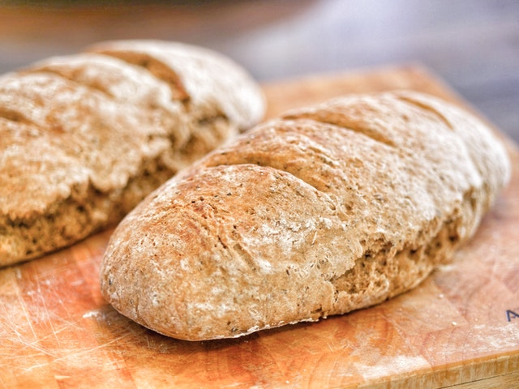
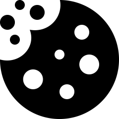
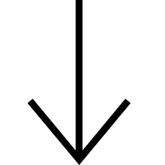
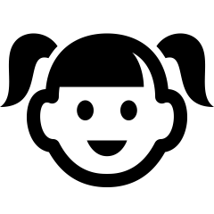
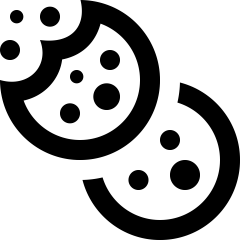
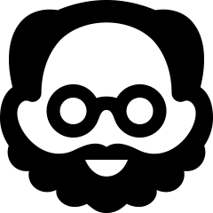
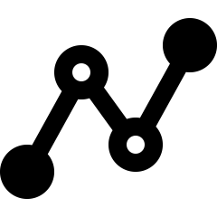
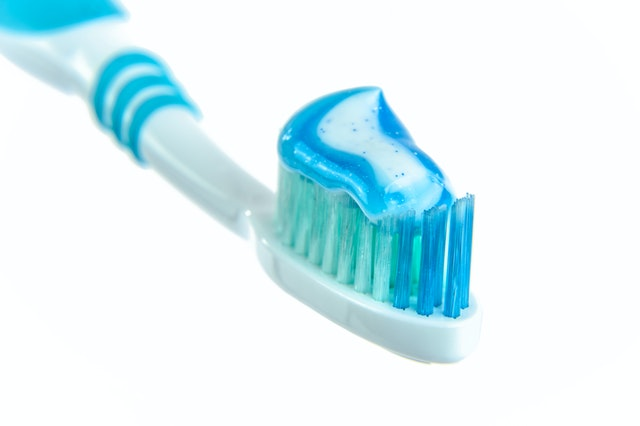

# Internal validity and experimental studies {#DesignExperiment}


```{block2, type="rmdobjectives"}
So far,
you have learnt to
ask a RQ, 
identify different ways of obtaining data, and design the study.

**In this chapter**, 
you will learn how to ensure that the 
conclusions we can make are logical and sound in *experimental* studies. 
You will learn to:

* maximise internal validity in experimental studies.
* manage confounding in experimental studies.
* explain, identify and manage the carry-over effect in experimental studies.
* explain, identify and manage the Hawthorne effect in experimental studies.
* explain, identify and manage the placebo effect in experimental studies.
* explain, identify and manage the observer-expectancy effect in experimental studies.
* explain, identify and manage observer bias in experimental studies.
* explain different descriptions of blinding.

```


```{r echo=FALSE, fig.cap="", fig.align="center", fig.width=3, out.width="35%"}
SixSteps(2, "Designing experimental studies")
```


## Introduction {#Chap7-Intro}

The conclusions drawn from a study
are only as good as the data that the conclusions are based on,
and the data are only as good as the study design from which the data emerge.
The design of a study needs to be carefully considered.

A good study requires high [*internal validity*](#def:InternalValidity):
When studying the relationship
between the response and explanatory variable,
we would like to be able to rule out---as much as possible---any other reason for the changes in the values of the respomse variable,
so any remaining changes we see can be attributed to just the explanatory variable of interest.


```{block2, type="rmdimportant"}
Remember the goal of study design:
To design a study to isolate the relationship of interest, 
by eliminating, as well as possible, all other possible explanations.
```


Many aspects of the design must be considered to achieve this goal,
some of which are discussed in this chapter.


```{block2, type="rmdnote"}
Data collection is often tedious,
time consuming and expensive.

You usually get one chance to collect your data,
but you can analyse your data as many times as you like.
Since you usually get one chance to collect your data, 
design the study properly the first time!
```


```{example InternalValidity, name = "Importance of internal validity"}
A group of researchers [@beaman2013profitability]
describe an experiment where free fertilizer was provided to a sample of female farmers in Mali (at the recommended amount per hectare; or at half the recommended amount per hectare).

Since all the farmers knew they were being provided with fertilizer (that is, they were not [*blinded*](#Blinding)), the farmers changed their farm management: they employed more hired labour and used more herbicide.
Consequently, the yields for all farmers changed.

However, it is difficult to know whether this change in yield was was due to the amount of fertilizer applied, the change in labour, the change in herbicides, or a combination of these.
That is, the study had poor *internal validity*.
```

Specific design strategies that we consider for maximising [internally validity](#def:InternalValidity) are:

* [Managing confounding](#ExpManagingConfounding);
* [Managing the carry-over effect using washout periods](#CarryOverEffectExperimental);
* [Managing the Hawthorne effect by blinding individuals](#HawthorneEffectExperimental);
* [Managing the placebo effect using controls](#PlaceboEffectExperimental); and
* [Managing the observer-effect by blinding the researchers](#ObserverEffectExperimental); and
* [Managing observer bias by blinding the researchers](#ObserverEffectExperimental).

Not every design consideration will be relevant to every study.


<!-- Text wrap from: https://stackoverflow.com/questions/43551312/wrap-text-around-plots-in-markdown -->
<!-- Trick from: https://blog.earo.me/2019/10/26/reduce-frictions-rmd/ -->
`r if (knitr::is_latex_output()) '<!--'`
```{r, echo=FALSE, out.width= "20%", out.extra='style="float:right; padding:10px"'}

```
`r if (knitr::is_latex_output()) '-->'`


In this chapter,
we will work with this RQ
(based on @data:Bird2008:wholegrain):

> Among Australians,
> does eating provided food made from wholegrain *Himalaya 292* 
> increase average faecal weight
> compared to eating provided food made from refined cereal?  


```{lemma RevisionHimalaya, name="Revision"}
For the *Himalaya 292* study:

1. Determine P, O, C and I.
1. What are the variables?
1. What type of study is this?

```

To answer this RQ, 
a study must be designed to collect the data.

However,
careful thought must be given to *how* the study is designed.
Some relevant design issues are discussed in this chapter for experimental studies.
The next chapter considers design issues for observational studies.


```{example HimalayaExclusion, name="Exclusion criteria"}
In the *Himalaya* study [@data:Bird2008:wholegrain],
the exclusion criteria were:
  
> [...] a history of diabetes, gastrointestinal, renal, 
> hepatic and cardiovascular disease, 
> an intolerance to cereal-based foods, 
> fasting plasma glucose concentrations > 6.1 mmol/l 
> and medications or supplements likely to affect experimental endpoints
>
> --- @data:Bird2008:wholegrain, p. 1033

```


## Managing confounding {#ExpManagingConfounding}

Confounding has the potential to compromise the [internal validity](#def:InternalValidity) of the study
and hence the interpretation of the results,
so managing the impact of confounding is important.
Suppose,
for example,
that the researchers created two groups:

* **Group A**:  Women recruited at a female-only gym.
* **Group B**:  Men recruited at a local nursing home.

The researchers then gave *Himalaya 292* to Group A, and
the refined cereal to Group B.
If a difference in faecal weight was found between the two groups,
the difference may because:

* The *diet* (the explanatory variable) was different in each group;
* The *sex* of the participants was different in both groups, 
  since Group A was all women and Group B was all men;
* The *age* of the participants in each group, 
  since Group A is likely to be younger on average,
  and Group B is likely to be older on average;
* The health and fitness levels in each group:
  those in Group A would generally be far healthier than those in Group B.

If a difference is found between the *Himalaya 292* and refined cereal groups,
it may not be because of the cereal
(Table \@ref(tab:ConfoundingGroups)).
For example,
the age of the subject may be related to faecal weight
(as older people tend to eat less),
and the study design means that older people are more likely to consume the refined cereal.
This study has extremely poor internal validity.
This is an extreme case of *confounding*;
usually confounding is more subtle than in this example.


```{r ConfoundingGroups, echo=FALSE}

if( knitr::is_latex_output() ) {
	ConfoundTable <- array( dim = c(4, 3) )
   
	colnames(ConfoundTable) <- c("Variable", 
                             "Group A",
                             "Group B")

   ConfoundTable[1, ] <- c("Sex",
                           "Women",
                           "Men")
   ConfoundTable[2, ] <- c("Age",
                           "Younger (in general)",
                           "Older (in general)")
   ConfoundTable[3, ] <- c("Diet",
                           "*Himalaya 292*",
                           "Refined cereal")
   ConfoundTable[4, ] <- c("Fitness",
                           "Very fit",
                           "Less fit")
   
   ConfoundTable[3, 2] <- "\\textit{Himalaya 292}"

  	kable(ConfoundTable[, c(2, 1, 3)],
          format = "latex",
          longtable = FALSE,
          booktabs = TRUE,
          escape = FALSE, # For latex to work in \rightarrow
          caption = "Comparing Groups A and B: An extreme example of confounding",
          align = c("r", "c", "c", "c"))   %>%
    kable_styling(full_width = FALSE, font_size = 10) %>%
    row_spec(row = 0, bold = TRUE) %>% # Columns headings in bold
    column_spec(column = 2, bold = TRUE)  
}

if( knitr::is_html_output()) {
   ConfoundTable <- array( dim = c(4, 3) )

   colnames(ConfoundTable)<- c( "",
	                        "Group A",
                                "Group B")
   ConfoundTable[1, ] <- c("*Sex*",
                           "Women",
                           "Men")
   ConfoundTable[2, ] <- c("*Age*",
                           "Younger (in general)",
                           "Older (in general)")
   ConfoundTable[3, ] <- c("*Diet*",
                           "*Himalaya 292*",
                           "Refined cereal")
   ConfoundTable[4, ] <- c("*Fitness*",
                           "Very fit",
                           "Less fit")
   
IMG1 <- array( NA, dim = c(1, 1))
IMG1[1, 1] <- "{#id .class height=60px}<br>
               {#id .class height=50px} <br>
               {#id .class height=60px}"
                 
IMG2 <- array( NA, dim = c(1, 1))
IMG2[1, 1] <- "{#id .class height=60px} <br>
               {#id .class height=50px} <br>
               {#id .class height=60px}"

  if ( knitr::is_html_output(excludes = "epub")) {

      kable( list( IMG1,
                    ConfoundTable[, c(2, 1, 3)],
                    IMG2),
              caption = "Comparing Groups A and B: An extreme example of confounding",
              format = "html",
              align = "c",
              escape = FALSE) %>%
      kable_styling(full_width = FALSE) #%>%
      #row_spec(row = 0, bold = TRUE)  
    } else {
      kable(  ConfoundTable[, c(2, 1, 3)],
              caption = "Comparing Groups A and B: An extreme example of confounding",
              format = "html",
              align = "c",
              escape = FALSE)
    }
}
```


```{block2, type="rmdimportant"}
The key point is that 
**the groups being compared should be as similar as possible**,
apart from the difference being studied 
(in this example, the diet that they are given).
```


<!-- Text wrap from: https://stackoverflow.com/questions/43551312/wrap-text-around-plots-in-markdown -->
<!-- Trick from: https://blog.earo.me/2019/10/26/reduce-frictions-rmd/ -->
`r if (knitr::is_latex_output()) '<!--'`
```{r, echo=FALSE, out.width= "30%", out.extra='style="float:right; padding:10px"'}

```
`r if (knitr::is_latex_output()) '-->'`


```{example, GinkoGroups, name="Comparing groups"}
An experiment to study the effect of using ginko to enhance memory
[@data:Solomon2002:Ginko]
compared two groups:
one using ginko ($n=111$) and a 
pretend, non-active supplement ($n=108$).

The authors randomly allocated participants to each group,
but also compared the two groups
to ensure that no obvious differences 
initially existed between the two groups
that might explain any differences in the response variable
(Table \@ref(tab:GinkoDemographics)).

The table shows that the two groups are very similar on these variables,
so any difference between the groups cannot be attributed to 
existing difference in the 
age, the percentage of men, or the years of education in the two groups.
```


	
```{r echo=FALSE, GinkoDemographics}
Ginko <- array( dim = c(3, 3) )
colnames(Ginko) <- c("Characteristic", 
                     "Group A (Ginko)", 
		     "Group B (Pretend)")

Ginko[1, ] <- c("Average age (in years):", 
                "68.7", 
		"69.9")
Ginko[2, ] <- c("Men (number; percentage)", 
                "46 (41)", 
		"45 (42)")
Ginko[3, ] <- c("Average years of education", 
                "14.4", 
		"14.0")

if( knitr::is_latex_output() ) {
  kable(Ginko,
        format = "latex",
        longtable = FALSE,
        booktabs = TRUE,
        #escape = FALSE, # For latex to work in \rightarrow
        linesep  =  c("", "", "", "\\addlinespace", "", "", ""), # Otherwise addes a space after five lines... 
        caption = "Comparing the two groups in the ginko-memory study",
        align = c("r", "r", "r"))   %>%
   kable_styling(full_width = FALSE, font_size = 10) %>%
   row_spec(0,bold = TRUE) # Columns headings in bold
}

if( knitr::is_html_output() ) {
  kable(Ginko,
        format = "html",
        align = c("r", "r", "r"),
        longtable = FALSE,
        caption = "Comparing the two groups in the ginko-memory study",
        booktabs = TRUE) 
}
```


```{block2, type="exampleExtra"}
Researchers explored the use of dominant and non-dominant hands for chest compression in student paramedics in an experimental study [@cross2019impact].

Students were randomly divided into two groups: DHOS (dominant hand on chest) and NDHOC (non-dominant hand on chest).

The two groups were then compared:

| Demographic                  | All participants ($n = 75$) | DHOC ($n = 37$) | NDHOC ($n = 38$) 
| ----------------------------:+:---------------------------:+:---------------:+:----------------:
| Average age (years)          | 23.4                        | 22.5            | 24.3
| Gender: percentage Female    | 51%                         | 53%             | 47%

The two groups appear to be very similar in terms of average age of participants, and the percentage of female participants.

This means that, if differences are observed in the study between the DHOC and NDHOC groups,
it is unlikely to be because the groups themselves are different in terms of age and sex of particpants.
```


Potentially, many extraneous variables exist.
To demonstrate,
we will consider just one: age.
How can we make sure that the age of the participants
does not cause confounding?

Confounding can be *managed* by:

* [**Restricting**](#ExpConfoundingRestricting) the study to a certain group 
  (for example, only people under 30).
* [**Blocking**](#ExpConfoundingBlocking).
  Analyse the data separately for different groups 
  (for example, analyse the data separately for people under 30, and 30 and over).
* [**Analysing**](#ExpManagingConfoundingAnalysis)
  using special methods 
  (after measuring the age of each subject).
* [**Randomly allocating**](#ExpConfoundingRandomAllocating)
  people to groups:
  Older and younger people would be spread approximately evenly between groups.

The first two approaches (*restricting*; *blocking*)
are useful if one or two variables are known, or thought likely,
to cause confounding.

The third approach (*analysing*) requires recording all the variables
suspected of being confounders.

The fourth approach (*randomly allocating*) is superior if it is possible,
because it reduces the chance of confounding
even for variables not even suspected as being confounding variables.

Notice that a common theme is to
measuring, observing, assessing or recording any variables of potential concern,
to ensure no *lurking variables* exist to compromise the results.

Of course,
more than one of these approaches can be used,
such as randomly allocating individuals to groups, 
but also measuring, observing, assessing or recording 
many other variables that can be managed through analysis
(Example \@ref(exm:GinkoGroups)).


### Restrictions {#ExpConfoundingRestricting}

Sometimes the impact of confounding is managed by 
*restricting the study to some groups,
based on potential confounding variables*,
or keeping some variables constant.
These variables are called *control variables*.\index{control variables}
If possible,
a reason for this restriction should be given.


```{example HimalayaRestricting, name="Restricting"}
In the *Himalaya* study [@data:Bird2008:wholegrain],
the study might be restricted to subjects aged under 30.
The control variable is 'age'.
```


   
### Blocking {#ExpConfoundingBlocking}

Sometimes *blocking* is used to minimise the impacts of confounding.
Blocking refers to separating the units of analysis into a small number of groups
that are similar to one another,
then studying those groups separately. 
The *Himalaya* study,
might be blocked on age
(Fig. \@ref(fig:BlockingHimalaya)).


```{definition, Blocking, name="Blocking"}
*Blocking*\index{blocking}
is when units of analysis
are arranged in groups (called *blocks*) 
that are similar to one another.
```


```{r BlockingHimalaya, echo=FALSE, message=FALSE, fig.cap="Blocking in the *Himalaya* study, based on age", fig.align="center", fig.height=4, out.width="100%"}
par( mar = c(0.5, 0.5, 0.5, 0.5))
openplotmat()

pos <- array(NA, 
            dim = c(11, 2))
pos[1, ] <- c(0.1, 0.5) # Units Of Analysis

pos[2, ] <- c(0.2, 0.75) # Block 1
pos[3, ] <- c(0.2, 0.25)   # Block 2

pos[4, ] <- c(0.5, 0.85)   # Block 1, Group 1
pos[5, ] <- c(0.5, 0.65)   # Block 1, Group 2

pos[6, ] <- c(0.5, 0.35)   # Block 2, Group 1
pos[7, ] <- c(0.5, 0.15)   # Block 2, Group 2

pos[8, ] <- c(0.85, 0.85)   # Block 1, Group 1
pos[9, ] <- c(0.85, 0.65)   # Block 1, Group 2

pos[10, ] <- c(0.85, 0.35)   # Block 2, Group 1
pos[11, ] <- c(0.85, 0.15)   # Block 2, Group 2


straightarrow(from = pos[1,], to = pos[2,], 
              lty = 1, 
              lcol = "black",
              lwd = 2)
straightarrow(from = pos[1,], to = pos[3,], 
              lwd = 2,
              lcol = "black",
              lty = 1)

straightarrow(from = pos[2,], to = pos[4,], 
              lwd = 2,
              lcol = "black",
              lty = 1)
straightarrow(from = pos[2,], to = pos[5,], 
              lwd = 2,
              lcol = "black",
              lty = 1)

straightarrow(from = pos[3,], to = pos[6,], 
              lwd = 2,
              lcol = "black",
              lty = 1)
straightarrow(from = pos[3,], to = pos[7,], 
              lwd = 2,
              lcol = "black",
              lty = 1)

straightarrow(from = pos[8,], to = pos[4,], 
              lwd = 2,
              lcol = "black",
              lty = 1)
straightarrow(from = pos[9,], to = pos[5,], 
              lwd = 2,
              lcol = "black",
              lty = 1)
straightarrow(from = pos[10,], to = pos[6,], 
              lwd = 2,
              lcol = "black",
              lty = 1)
straightarrow(from = pos[11,], to = pos[7,], 
              lwd = 2,
              lcol = "black",
              lty = 1)


textrect( pos[1,], 
           lab = "Units of\nanalysis", 
           radx = 0.075, 
           rady = 0.09, 
           shadow.size = 0,
           box.col = "antiquewhite",
           col = "black",
           lcol = "antiquewhite")

textrect( pos[2,], 
           lab = "Block 1\n(Under 30)", 
           radx = 0.075, 
           rady = 0.085, 
           shadow.size = 0,
           box.col = "antiquewhite",
           lcol = "antiquewhite")
textrect( pos[3,], 
          lab = "Block 2\n(30+)",
          col = "black",
          radx = 0.085,
          rady = 0.075,
          shadow.size = 0,
          lcol = "antiquewhite",
          box.col = "antiquewhite")

textrect( pos[4,], 
          lab = "Group 1", 
          col = "black",
          radx = 0.11,
          rady = 0.075,
          shadow.size = 0,
          lcol = "darkseagreen1",
          box.col = "darkseagreen1")
textrect( pos[5,],
          col = "black",
          box.col = "darkseagreen1",
          lcol = "darkseagreen1",
          shadow.size = 0,
          radx = 0.11,
          rady = 0.075,
          lab = "Group 2")
textrect( pos[6,], 
          lab = "Group 1", 
          col = "black",
          radx = 0.11,
          rady = 0.075,
          shadow.size = 0,
          lcol = "darkseagreen1",
          box.col = "darkseagreen1")
textrect( pos[7,], 
          col = "black",
          box.col = "darkseagreen1",
          lcol = "darkseagreen1",
          shadow.size = 0,
          radx = 0.11,
          rady = 0.075,
          lab = "Group 2")

textrect( pos[8,], 
          col = "black",
          box.col = "palegoldenrod",
          lcol = "palegoldenrod",
          shadow.size = 0,
          radx = 0.11,
          rady = 0.075,
          lab = "Himalaya")
textrect( pos[9,], 
          col = "black",
          box.col = "palegoldenrod",
          lcol = "palegoldenrod",
          shadow.size = 0,
          radx = 0.11,
          rady = 0.075,
          lab = "Refined")
textrect( pos[10,], 
          col = "black",
          box.col = "palegoldenrod",
          lcol = "palegoldenrod",
          shadow.size = 0,
          radx = 0.11,
          rady = 0.075,
          lab = "Himalaya")
textrect( pos[11,], 
          col = "black",
          box.col = "palegoldenrod",
          lcol = "palegoldenrod",
          shadow.size = 0,
          radx = 0.11,
          rady = 0.075,
          lab = "Refined")

lines( c(0.3, 0.95), c(0.5, 0.5), # Dividing the arms of the study
               col = "grey",
               lty = 2)

# Cereals
plotfunctions::plot_image(img = "./Pics/iconmonstr-candy-5-240.png",
                           type = "png",
                           keep.ratio = TRUE,
                           xrange = c(0.95, 1.00),
                           yrange = c(0.80, 0.90),
                           bty = "n", # Removes box from around the plot 
                           add = TRUE)
plotfunctions::plot_image(img = "./Pics/iconmonstr-candy-8-240.png",
                           type = "png",
                           keep.ratio = TRUE,
                           xrange = c(0.95, 1.00),
                           yrange = c(0.60, 0.70),
                           bty = "n", # Removes box from around the plot 
                           add = TRUE)

plotfunctions::plot_image(img = "./Pics/iconmonstr-candy-5-240.png",
                           type = "png",
                           keep.ratio = TRUE,
                           xrange = c(0.95, 1.00),
                           yrange = c(0.30, 0.40),
                           bty = "n", # Removes box from around the plot 
                           add = TRUE)
plotfunctions::plot_image(img = "./Pics/iconmonstr-candy-8-240.png",
                           type = "png",
                           keep.ratio = TRUE,
                           xrange = c(0.95, 1.00),
                           yrange = c(0.10, 0.20),
                           bty = "n", # Removes box from around the plot 
                           add = TRUE)


# Older people

plotfunctions::plot_image(img = "./Pics/iconmonstr-generation-16-240.png",
                           type = "png",
                           keep.ratio = TRUE,
                           xrange = c(0.14, 0.19),
                           yrange = c(0.05, 0.15),
                           bty = "n", # Removes box from around the plot 
                           add = TRUE)
plotfunctions::plot_image(img = "./Pics/iconmonstr-generation-15-240.png",
                           type = "png",
                           keep.ratio = TRUE,
                           xrange = c(0.21, 0.26),
                           yrange = c(0.05, 0.15),
                           bty = "n", # Removes box from around the plot 
                           add = TRUE)


# Younger people

plotfunctions::plot_image(img = "./Pics/iconmonstr-generation-4-240.png",
                           type = "png",
                           keep.ratio = TRUE,
                           xrange = c(0.14, 0.19),
                           yrange = c(0.85, 0.95),
                           bty = "n", # Removes box from around the plot 
                           add = TRUE)
plotfunctions::plot_image(img = "./Pics/iconmonstr-generation-7-240.png",
                           type = "png",
                           keep.ratio = TRUE,
                           xrange = c(0.21, 0.26),
                           yrange = c(0.85, 0.95),
                           bty = "n", # Removes box from around the plot 
                           add = TRUE)
```


### Analysis {#ExpManagingConfoundingAnalysis}

Confounding variables can 
be accommodated in the analysis
(using analysis methodology beyond what is in this book),
*provided those variables have been measured, observed, assessed or recorded*.
Because of this,
*measuring, observing, assessing or recording 
all the information likely to be important for understanding the data* 
is important.


```{block2, type="rmdimportant"}
*Measure, observe, assess or record*
all the information that is likely to be important for understanding the data.
This may include information about

* the individuals in the study; and 
* the circumstances of the study.

```


For this reason,
most studies involving people record the participants'
age and sex,
as these two variables are common confounders.
Once a sample is obtained,
recording this extra information usually requires little extra effort.


```{example HimalayaAnalysis, name="Analysis"}
In the *Himalaya 292* study,
the sex, age, pre-study weight and 
pre-study BMI were also recorded for each individual.
```


```{example Manure, name="Analysis"}
An experimental study 
[@schroder2015maize]
compared nitrogen (N) and phosphorus (P) concentrations
in maize,
for evenly-injected liquid manure and band-injected liquid manure.

As potential confounding variables, 
the researchers also recorded the average temperature 
and the precipitation (between May 1 and September 30) 
at each site.
```


### Random allocation {#ExpConfoundingRandomAllocating}

One way to minimise confounding is to 
randomly allocate individuals in the study to the treatment groups.
(Remember that the word ["random"](#def:Random) has a special meaning.)
The advantage of random allocation is that it should approximately
evenly distribute potential confounding variables that have been identified (such as age)
but also those variables that may *not* have even been considered as confounders,
or are hard to measure or observe
(such as genetic conditions).

In the *Himalaya* study,
the units of analysis (the people in the sample) 
could be allocated to a group at random,
and then the groups allocated a diet through a toss of a coin
(Fig. \@ref(fig:RandomAllocationHimalaya)).


```{example HimalayaRandomAllocation, name="Random allocation"}
In the *Himalaya 292* study,
the article reports that
'Subjects were allocated randomly to [...] dietary treatments...'
(@data:Bird2008:wholegrain, p. 1033).
```


```{r RandomAllocationHimalaya, echo=FALSE, fig.cap="Random allocation can occur in two places for the Himalaya study", fig.align="center", fig.height=3}
par( mar=c(0.5, 0.5, 0.5, 0.5))
openplotmat()

pos <- array(NA, dim=c(5, 2))
pos[1, ] <- c(0.1, 0.5) # Units Of Analysis
pos[2, ] <- c(0.45, 0.75) # Group 1
pos[3, ] <- c(0.45, 0.25)   # Group 2
pos[4, ] <- c(0.75, 0.75)   # Diet H
pos[5, ] <- c(0.75, 0.25)   # Diet R


straightarrow(from = pos[1,], to = pos[2,], 
              lty = 1, 
              lcol = "black",
              lwd = 2)
straightarrow(from = pos[1,], to = pos[3,], 
              lwd = 2,
              lcol = "black",
              lty = 1)
straightarrow(from = pos[4,], to = pos[2,], 
              lwd = 2,
              lcol = "black",
              arr.pos = 0.6,
              lty = 1)
straightarrow(from = pos[5,], to = pos[3,], 
              lwd = 2,
              lcol = "black",
              arr.pos = 0.6,
              lty = 1)


textrect( pos[1,], 
          lab = "Units of\nanalysis", 
          radx = 0.075, 
          rady = 0.09, 
          shadow.size = 0,
          box.col = "antiquewhite",
          col = "black",
          lcol = "antiquewhite")
textrect( pos[2,], 
          lab = "Group 1", 
          radx = 0.075, 
          rady = 0.075, 
          shadow.size = 0,
          box.col = "palegoldenrod",
          lcol = "palegoldenrod")
textrect( pos[3,], 
          lab = "Group 2",
          col = "black",
          radx = 0.075,
          rady = 0.075,
          shadow.size = 0,
          lcol = "palegoldenrod",
          box.col = "palegoldenrod")
textrect( pos[4,], 
          lab = "Himalaya diet", 
          col = "black",
          radx = 0.13,
          rady = 0.075,
          shadow.size = 0,
          lcol = "palegoldenrod",
          box.col = "palegoldenrod")
textrect( pos[5,], 
          col = "black",
          box.col = "palegoldenrod",
          lcol = "palegoldenrod",
          shadow.size = 0,
          radx = 0.13,
          rady = 0.075,
          lab = "Refined cereal diet")


textrect( c( mean( pos[1:2, 1] ), 0.5),
          radx = 0.001,
          rady  = 0.001,
          lcol = "white",
          box.col = "white",
          shadow.size = 0,
          cex = 1.5,
          lab = "Random allocation",
          col = "grey",
          srt = 90)


textrect( c( mean( pos[3:4, 1] ) - 0.033, 0.5),
          radx = 0.001,
          rady  = 0.001,
          lcol = "white",
          box.col = "white",
          shadow.size = 0,
          cex = 1.5,
          lab = "Random allocation",
          col = "grey",
          srt = 90)

# Cereals
plotfunctions::plot_image(img = "./Pics/iconmonstr-candy-5-240.png",
                           type = "png",
                           keep.ratio = TRUE,
                           xrange = c(0.90, 0.95),
                           yrange = c(0.70, 0.80),
                           bty = "n", # Removes box from around the plot 
                           add = TRUE)
plotfunctions::plot_image(img = "./Pics/iconmonstr-candy-8-240.png",
                           type = "png",
                           keep.ratio = TRUE,
                           xrange = c(0.90, 0.95),
                           yrange = c(0.20, 0.30),
                           bty = "n", # Removes box from around the plot 
                           add = TRUE)
```


Random allocation may occur 
when randomly allocating individuals to groups 
(true experiment),
and/or when randomly allocating treatments to groups
(true or quasi-experiment).
Random allocation can be shown, in general,
as in Fig. \@ref(fig:RandomAllocationGeneral2).


```{r RandomAllocationGeneral2, echo=FALSE, fig.cap="Random allocation in general", fig.align="center", fig.height=3}
par( mar = c(0.5, 0.5, 0.5, 0.5))
openplotmat()

pos <- array(NA, dim=c(7, 2))
pos[1, ] <- c(0.1, 0.5) # Units Of Analysis
pos[2, ] <- c(0.45, 0.75) # Group 1
pos[3, ] <- c(0.45, 0.25)   # Group 3
pos[4, ] <- c(0.85, 0.75)   # Diet H
pos[5, ] <- c(0.85, 0.25)   # Diet R

pos[6, ] <- c(0.45, 0.5) # Group 2
pos[7, ] <- c(0.85, 0.5)

straightarrow(from = pos[1,], to = pos[2,], 
            lty = 1, 
            lcol = "black",
            lwd = 2)
straightarrow(from = pos[1,], to = pos[3,], 
              lwd = 2,
            lcol = "black",
            lty = 1)
straightarrow(from = pos[1,], to = pos[6,], 
              lwd = 2,
            lcol = "black",
            lty = 1)
straightarrow(from = pos[4,], to = pos[2,], 
            lwd = 2,
            lcol = "black",
            lty = 1)
straightarrow(from = pos[5,], to = pos[3,], 
            lwd = 2,
            lcol = "black",
            lty = 1)
straightarrow(from = pos[7,], to = pos[6,], 
            lwd = 2,
            lcol = "black",
            lty = 1)


textrect( pos[1,], 
           lab = "Units of\nanalysis", 
           radx = 0.075, 
           rady = 0.09, 
           shadow.size = 0,
           box.col = "antiquewhite",
           col = "black",
           lcol = "antiquewhite")
textrect( pos[2,], 
           lab = "Group 1", 
           radx = 0.075, 
           rady = 0.075, 
           shadow.size = 0,
           box.col = "darkseagreen1",
           lcol = "darkseagreen1")
textrect( pos[6,], 
           lab = "Group 2", 
           radx = 0.075, 
           rady = 0.075, 
           shadow.size = 0,
           box.col = "darkseagreen1",
           lcol = "darkseagreen1")

textrect( pos[3,], 
          lab = "Group 3",
          col = "black",
          radx = 0.075,
          rady = 0.075,
          shadow.size = 0,
          lcol = "darkseagreen1",
          box.col = "darkseagreen1")
textrect( pos[4,], 
          lab = "Treatment 1", 
          col = "black",
          radx = 0.11,
          rady = 0.075,
          shadow.size = 0,
          lcol = "palegoldenrod",
          box.col = "palegoldenrod")
textrect( pos[5,], 
          col = "black",
          box.col = "palegoldenrod",
          lcol = "palegoldenrod",
          shadow.size = 0,
          radx = 0.11,
          rady = 0.075,
          lab = "Treatment 3")

textrect( pos[7,], 
          col = "black",
          box.col = "palegoldenrod",
          lcol = "palegoldenrod",
          shadow.size = 0,
          radx = 0.11,
          rady = 0.075,
          lab = "Treatment 2")


textrect( c( mean( pos[1:2, 1] ), 0.5),
          radx = 0.001,
          rady = 0.001,
          lcol = "white",
          box.col = "white",
          shadow.size = 0,
          cex = 1.5,
          lab = "Random allocation",
          col = "grey",
          srt = 90)


textrect( c( mean( pos[3:4, 1] ), 0.5),
          radx = 0.001,
          rady = 0.001,
          lcol = "white",
          box.col = "white",
          shadow.size = 0,
          cex = 1.5,
          lab = "Random allocation",
          col = "grey",
          srt = 90)
```
	
	
	
	


## Random allocation vs random sampling {#Random-sampling-allocation}

Random *sampling* and random *allocation* are two different concepts
(Fig. \@ref(fig:RandomAllocationSampling)),
that serve two different purposes,
but are often confused:

* **Random sampling**\index{random sapling}
  allows results to be generalised to a larger population,
  and impacts *external* validity.
  It concerns *how the sample is found* to study.
* **Random allocation**\index{random allocation}
  tries to eliminate confounding issues,
  by evening-out possible confounders across treatment groups.
  *Random allocation* of treatments 
  helps establish cause-and-effect, and
  impacts *internal* validity.
  It concerns *how the members of the chosen sample get the treatments*.


   


```{r RandomAllocationSampling, echo=FALSE, fig.cap="Comparing random allocation and random sampling", fig.align="center", fig.height=3}
par( mar=c(0.5, 0.5, 0.5, 0.5))
openplotmat()

pos <- array(NA, 
             dim = c(6, 2))
pos[1, ] <- c(0.35, 0.5) # Units Of Analysis
pos[2, ] <- c(0.6, 0.75) # Group 1
pos[3, ] <- c(0.6, 0.25)   # Group 2
pos[4, ] <- c(0.85, 0.75)   # Diet H
pos[5, ] <- c(0.85, 0.25)   # Diet R
pos[6, ] <- c(0.1, 0.5) # POPULATION


textrect( c( mean( pos[3:4, 1] ), 0.5),
          radx = 0.001,
          rady  = 0.001,
          lcol = "white",
          box.col = "white",
          shadow.size = 0,
          cex = 1.5,
          lab = "Random allocation",
          col = "grey",
          srt = 90)


textrect( c( mean( pos[ c(1, 6), 1] ), 0.5),
          radx = 0.001,
          rady  = 0.001,
          lcol = "white",
          box.col = "white",
          shadow.size = 0,
          cex = 1.5,
          lab = "Random sampling",
          col = "grey",
          srt = 90)

straightarrow(from = pos[1,], to = pos[2,], 
            lty = 1, 
            lcol = "black",
            lwd = 2)
straightarrow(from = pos[1,], to = pos[3,], 
              lwd = 2,
            lcol = "black",
            lty = 1)
straightarrow(from = pos[4,], to = pos[2,], 
            lwd = 2,
            lcol = "black",
            lty = 1)
straightarrow(from = pos[5,], to = pos[3,], 
            lwd = 2,
            lcol = "black",
            lty = 1)


textrect( pos[6,], 
           lab = "Population", 
           radx = 0.075, 
           rady = 0.9, 
           shadow.size = 0,
           box.col = "grey",
           col = "black",
           lcol = "grey")


# Taking the sample
straightarrow(from = c(0.1, 0.7), to = pos[1,], 
            lwd = 2,
            lcol = "black",
            lty = 1)
straightarrow(from = c(0.15, 0.6), to = pos[1,], 
            lwd = 2,
            lcol = "black",
            lty = 1)
straightarrow(from = c(0.09, 0.2), to = pos[1,], 
            lwd = 2,
            lcol = "black",
            lty = 1)
straightarrow(from = c(0.12, 0.33), to = pos[1,], 
            lwd = 2,
            lcol = "black",
            lty = 1)
straightarrow(from = c(0.06, 0.38), to = pos[1,], 
            lwd = 2,
            lcol = "black",
            lty = 1)
######


textrect( pos[1,], 
           lab = "Sample\nunits of\nanalysis", 
           radx = 0.075, 
           rady = 0.18, 
           shadow.size = 0,
           box.col = "antiquewhite",
           col = "black",
           lcol = "antiquewhite")
textrect( pos[2,], 
           lab = "Group 1", 
           radx = 0.07, 
           rady = 0.075, 
           shadow.size = 0,
           box.col = "darkseagreen1",
           lcol = "darkseagreen1")

textrect( pos[3,], 
           lab = "Group 2",
          col = "black",
          radx = 0.07,
          rady = 0.075,
          shadow.size = 0,
          lcol = "darkseagreen1",
          box.col = "darkseagreen1")
textrect( pos[4,], 
          lab = "Treatment 1", 
          col = "black",
          radx = 0.09,
          rady = 0.075,
          shadow.size = 0,
          lcol = "palegoldenrod",
          box.col = "palegoldenrod")
textrect( pos[5,], 
          col = "black",
          box.col = "palegoldenrod",
          lcol = "palegoldenrod",
          shadow.size = 0,
          radx = 0.09,
          rady = 0.075,
          lab = "Treatment 2")


textrect( c( mean( pos[1:2, 1] ), 0.5),
          radx = 0.001,
          rady  = 0.001,
          lcol = "white",
          box.col = "white",
          shadow.size = 0,
          cex = 1.5,
          lab = "Random allocation",
          col = "grey",
          srt = 90)
```

   
   

   


## Carry-over effect and washout periods {#CarryOverEffectExperimental}

In the *Himalaya* study,
what if patients spent two weeks on the *Himalaya 292* diet,
then the next two weeks on the refined cereal diet?

Potentially,
the influence of the first diet could still be impacting the subjects' faecal weight
for a little while after stopping the first diet.
This could compromise the  [internally validity](#def:InternalValidity) of the study.

This is called the *carryover effect*.


<!-- Text wrap from: https://stackoverflow.com/questions/43551312/wrap-text-around-plots-in-markdown -->
<!-- Trick from: https://blog.earo.me/2019/10/26/reduce-frictions-rmd/ -->
`r if (knitr::is_latex_output()) '<!--'`
```{r, echo=FALSE, out.width= "10%", out.extra='style="float:left; padding:10px"'}

```
`r if (knitr::is_latex_output()) '-->'`

```{definition, CarryoverEffect, name="Carryover effect"}
The carry-over effect\index{carryover effect}
is when the influence of past experience(s) of the individuals
carry over to influence future experience(s) of the individuals.
```

In the context of experiments,
this may mean that the influence of one treatment 
carries over into the influence of the next treatment.


Sometimes,
researchers can *randomly allocate* the  *order* in which the treatments (i.e., the diets) are used.
That is,
some participants start by spending four weeks on the *Himalaya 292* diet,
then (after a washout period) four weeks on the refined cereal diet;
meanwhile,
other participants start by spending four weeks on the refined cereal diet,
then (after a washout period) four weeks on the *Himalaya 292* diet.


```{example ParamedOrder, name="Washout periods"}
A study of paramedics [@data:MacDonald:Resuscitation] required paramedics to conduct eight different tasks (such as electrical defibrillation and intravenous cannulation).

The *order* in which each of the 16 paramedics performed the eight tasks was arranged so that not every paramedic started with Task 1, followed by Task 2, etc. to "control for possible effects of practice" (p.&nbsp; 255); that is, to mitigate the carry-over effect.
```


The impact of the carryover effect also can
be minimized by using a *washout period* or similar; 
for example,
after finishing one diet, 
the participants
spend four weeks on their usual (before study) diet,
and then revert to the second diet being used.


<!-- Text wrap from: https://stackoverflow.com/questions/43551312/wrap-text-around-plots-in-markdown -->
<!-- Trick from: https://blog.earo.me/2019/10/26/reduce-frictions-rmd/ -->
`r if (knitr::is_latex_output()) '<!--'`
```{r, echo=FALSE, out.width= "40%", out.extra='style="float:right; padding:10px"'}

```
`r if (knitr::is_latex_output()) '-->'`


```{example HimalayaCarryOver, name="Carry-over effect"}
In the *Himalaya 292* study, the authors report:

> Subjects were allocated randomly to [...] dietary 
> treatments according to a cross-over study design 
> with each intervention phase lasting 4 weeks. 
> There was no washout period between phases. 
> 
> --- @data:Bird2008:wholegrain, p. 1033

That is,
subjects were randomly allocated to a diet:
some subjects began the study on the *Himalaya 292* diet
while others started on the refined cereal diet.
No washout period was used;
however,
since the response variable was recorded after four weeks on the diets,
no washout period was necessary.
```


```{example HimalayaWashout, name="Washout periods"}
An engineering study [@miller2019behavioral]
examined drivers' exposure to lane-keeping system on their driving performance.
Subjects were exposed to a driving simulation that used a lane-keeping system,
and then to a driving simulation without using a lane-keeping system.

The researchers found that there was a carryover effect when
drivers moved from a simulation with a lane-keeping system 
to one without a lane-keeping system.
```


```{r, Washout, echo=FALSE, fig.cap="Using a 'washout' period to minimize the carry-over effect"}
par( mar = c(0.5, 0.5, 0.5, 0.5))
openplotmat(asp = 1)

textrect( c(0.50, 0.80),
          lab = "Without a washout period, treatments are applied straight after each other",
          box.col = "white",
          lcol = "white",
          radx = 0.1, 
          rady = 0.1, 
          shadow.size = 0)

# No washout
plotfunctions::plot_image(img = "./Pics/iconmonstr-candy-5-240.png",
                           type = "png",
                           keep.ratio = TRUE,
                           xrange = c(0.12, 0.22),
                           yrange = c(0.66, 0.76),
                           bty = "n", # Removes box from around the plot 
                           add = TRUE)
plotfunctions::plot_image(img = "./Pics/iconmonstr-arrow-17-240.png",
                           type = "png",
                           keep.ratio = TRUE,
                           xrange = c(0.27, 0.37),
                           yrange = c(0.66, 0.76),
                           bty = "n", # Removes box from around the plot 
                           add = TRUE)
plotfunctions::plot_image(img = "./Pics/iconmonstr-ruler-26-240.png",
                           type = "png",
                           keep.ratio = TRUE,
                           xrange = c(0.42, 0.52),
                           yrange = c(0.66, 0.76),
                           bty = "n", # Removes box from around the plot 
                           add = TRUE)

plotfunctions::plot_image(img = "./Pics/iconmonstr-candy-8-240.png",
                           type = "png",
                           keep.ratio = TRUE,
                           xrange = c(0.58, 0.68),
                           yrange = c(0.66, 0.76),
                           bty = "n", # Removes box from around the plot 
                           add = TRUE)
plotfunctions::plot_image(img = "./Pics/iconmonstr-arrow-17-240.png",
                           type = "png",
                           keep.ratio = TRUE,
                           xrange = c(0.73, 0.83),
                           yrange = c(0.66, 0.76),
                           bty = "n", # Removes box from around the plot 
                           add = TRUE)
plotfunctions::plot_image(img = "./Pics/iconmonstr-ruler-26-240.png",
                           type = "png",
                           keep.ratio = TRUE,
                           xrange = c(0.88, 0.98),
                           yrange = c(0.66, 0.76),
                           bty = "n", # Removes box from around the plot 
                           add = TRUE)

# With washout
plotfunctions::plot_image(img = "./Pics/iconmonstr-candy-5-240.png",
                           type = "png",
                           keep.ratio = TRUE,
                           xrange = c(0.00, 0.10),
                           yrange = c(0.33, 0.43),
                           bty = "n", # Removes box from around the plot 
                           add = TRUE)
plotfunctions::plot_image(img = "./Pics/iconmonstr-arrow-17-240.png",
                           type = "png",
                           keep.ratio = TRUE,
                           xrange = c(0.15, 0.25),
                           yrange = c(0.33, 0.43),
                           bty = "n", # Removes box from around the plot 
                           add = TRUE)
plotfunctions::plot_image(img = "./Pics/iconmonstr-ruler-26-240.png",
                           type = "png",
                           keep.ratio = TRUE,
                           xrange = c(0.3, 0.40),
                           yrange = c(0.33, 0.43),
                           bty = "n", # Removes box from around the plot 
                           add = TRUE)
textrect( c(0.5, 0.38),
          lab = "Washout\nperiod",
          box.col = "aliceblue",
          lcol = "aliceblue",
          radx = 0.07, 
          rady = 0.07, 
          shadow.size = 0)
plotfunctions::plot_image(img = "./Pics/iconmonstr-candy-8-240.png",
                           type = "png",
                           keep.ratio = TRUE,
                           xrange = c(0.60, 0.70),
                           yrange = c(0.33, 0.43),
                           bty = "n", # Removes box from around the plot 
                           add = TRUE)
plotfunctions::plot_image(img = "./Pics/iconmonstr-arrow-17-240.png",
                           type = "png",
                           keep.ratio = TRUE,
                           xrange = c(0.75, 0.85),
                           yrange = c(0.33, 0.43),
                           bty = "n", # Removes box from around the plot 
                           add = TRUE)
plotfunctions::plot_image(img = "./Pics/iconmonstr-ruler-26-240.png",
                           type = "png",
                           keep.ratio = TRUE,
                           xrange = c(0.90, 01.00),
                           yrange = c(0.33, 0.43),
                           bty = "n", # Removes box from around the plot 
                           add = TRUE)
textrect( c(0.50, 0.20),
          lab = "Using a  washout period, a break occurs between treatments",
          box.col = "white",
          lcol = "white",
          radx = 0.1, 
          rady = 0.1, 
          shadow.size = 0)
```


## Managing design biases {#OtherBiases}

CROSS REFREENCE/DEFINITION *************************************************************************************************************


*Bias* refers to any misrepresentation that can lead to a false conclusion,
and may occur *intentionally* or *unintentionally*. 

This may occur during:

* [Data collection](#bias-in-selecting-samples);
* Data analysis; or
* [Interpreting](#Interpretation) and reporting results.

The [*Catalogue of Bias* list over 60 different ways that studies can be biased](https://catalogofbias.org/)
though, in this book, we will only focus on small number of possible biases to consider when designing studies.


```{block2, type="rmdimportant"}
Remember the goal of study design:
To design a study to isolate the relationship of interest, 
by eliminating, as well as possible, all other possible explanations.
```


```{r DescribeAnkleFoot, echo=FALSE}

Biases <- array(NA, dim = c(4, 3) )

Biases[1, ] <-  c("[Hawthorne effect](#HawthorneEffectExperimental)",
                  "Individuals: aware of being in a study; Individuals: aware of C",
		  "Behaviour of, or reporting by, **individuals**")
Biases[2, ] <-  c("[Placebo effect](#)",
                  "Individuals: *think* they are in a study, or in a specific C",
		  "Behaviour of, or reporting by **individuals**")
Biases[3, ] <-  c("[Observer-expectancy effect](#)",
                  "Researcher: aware of C, which is unconsciously communicated to **individuals**",
		  "Behaviour of **researchers** (unconsciously), which subsequently changes the behaviour of, or reporting by, **individuals**")
Biases[4, ] <-  c("[Observer bias](#)",
                  "Researcher is aware of C",
		  "Behaviour of **researchers**, especially when measuring or observing values of the response variable")

if( knitr::is_latex_output() ) {
  kable(Biases,
        format = "latex",
        longtable = FALSE,
        booktabs = TRUE,
        digits = c(0, 0, 0, 1, 0),
        caption = "Different design biases studied in this book",
        col.names = c("Name", "Who/what is aware of", "What changes or is compromised")) %>%
   kable_styling(font_size = 10) %>%
   row_spec(0, bold = TRUE)
}
if( knitr::is_html_output() ) {
  kable(Biases,
        format = "html",
        longtable = FALSE,
        booktabs = TRUE,
        digits = c(0, 0, 0, 1, 0),
        caption = "Different design biases studied in this book",
        col.names = c("Name", "Who/what is aware of what", "What changes or is compromised"))
}
```

In general, making the *individuals* unaware ([blinding](#Blinding)) that they are in a study,
or unaware of what comparison or connection values apply to them,
reduces or eliminates bias.

Likewise, by making the *researchers* unaware ([blinding](#Blinding)) of the comparison groups (or connection values) of the individual
reduces or eliminates bias.


### Hawthorne effect and blinding individuals {#HawthorneEffectExperimental}

What if the patients in the *Himalaya 292* study
were being watched (or waited for) while defecating?
Could this lead to a misleading conclusion?

People often behave differently 
(either positively or negatively) 
if they know (or think) they are in a study or are being watched.
This is called the *Hawthorne effect*
[@mccarney2007hawthorne].
This could compromise the [internal validity](#def:InternalValidity) of the study.


<!-- Text wrap from: https://stackoverflow.com/questions/43551312/wrap-text-around-plots-in-markdown -->
<!-- Trick from: https://blog.earo.me/2019/10/26/reduce-frictions-rmd/ -->
`r if (knitr::is_latex_output()) '<!--'`
```{r, echo=FALSE, out.width= "10%", out.extra='style="float:left; padding:10px"'}

```
`r if (knitr::is_latex_output()) '-->'`

```{definition, HawthorneEffect, name="Hawthorne effect"}
The Hawthorne effect\index{Hawthorne effect}
is the tendency of individuals 
to change their behaviour if they know (or think)
they are being observed.
```


<!-- Text wrap from: https://stackoverflow.com/questions/43551312/wrap-text-around-plots-in-markdown -->
<!-- Trick from: https://blog.earo.me/2019/10/26/reduce-frictions-rmd/ -->
`r if (knitr::is_latex_output()) '<!--'`
```{r, echo=FALSE, out.width= "40%", out.extra='style="float:right; padding:10px"'}

```
`r if (knitr::is_latex_output()) '-->'`

```{example HawthorneFruitVege, name="Hawthorne effect"}
People are more health-conscious 
if they know they will be followed-up on a regular basis.

For example,
a study aiming to increase fruit and vegetable intake in young adults
[@clark2019educational]
noted that 

> The changes that did occur could be explained by the Hawthorne effect [...] the intervention [...]
> can inherently cause participants to change behavior because they know they are being observed...
>
> --- @clark2019educational

```


The impact of the Hawthorne effect can be minimized by [blinding](#Blinding) the individuals in the experiment
so that they do not know:

* that they are in a study;
* the aims of the study, and/or 
* which treatment they are receiving. 


For example,
if the individuals do not know which treatment they are receiving, they cannot behave differently according to the treatment they know they are receiving.

Blinding *people* to knowing they are involved in a study is often difficult,
as ethics usually requires individuals' informed consent.


```{example, HawthorneHimalaya, name="Hawthorne effect"}
In the *Himalaya 292* study,
the authors report:

> The study was explained fully to the subjects, 
> both verbally and in writing, 
> and each gave their written, 
> informed consent before participating. 
> 
> --- @data:Bird2008:wholegrain, p. 1033

That is, the subjects knew they were in a study.
As is usual, this was an ethics requirement
(in this case, from the Ethics Committee of the CSIRO).
The Hawthorne effect may influence the results.

However, the subjects did to know which diet they were on:

> Volunteers were not told the identity of the test cereal in the foods provided to them.
> 
> --- (@data:Bird2008:wholegrain, p. 1033)

```


<!-- Text wrap from: https://stackoverflow.com/questions/43551312/wrap-text-around-plots-in-markdown -->
<!-- Trick from: https://blog.earo.me/2019/10/26/reduce-frictions-rmd/ -->
`r if (knitr::is_latex_output()) '<!--'`
```{r, echo=FALSE, out.width= "40%", out.extra='style="float:right; padding:10px"'}

```
`r if (knitr::is_latex_output()) '-->'`


```{example HawthorneTeeth, name="Hawthorne effect"}

In an experimental study 
[@lorenz2019effect]
to compare the efficacy of a new type of toothpaste,
participants were given two types of toothpaste to use (a new type, and an exisiting type),
and evaluations of plaque remaining on the teeth were taken.
The authors state that:

> ... a plaque-reducing effect was seen not only in the test group but also in the control group. 
> This phenomenon is due to the so-called Hawthorne effect that can lead to 
> an overestimation of the effect and false positive results.
> 
> --- @lorenz2019effect, p. 5

That is,
since all participants knew they were being assessed after brushing their teeth,
there may have been a tendency to brush their teeth better than usual.
The authors then state:

> To minimize the Hawthorne effect, longer study durations of more than 6 months were suggested.
>
> --- @lorenz2019effect, p. 6

```


### Placebo effect and using controls {#PlaceboEffectExperimental}

What if people *thought* they were on the wholegrain diet, but they weren't?
Could this lead to a misleading conclusion?

Perhaps surprisingly,
individuals in a study may report effects of a treatment (either positive or negative),
even if they have not received an active treatment.
This could compromise the [internally validity](#def:InternalValidity) of the study.

This is called the *placebo effect*.


```{definition, PlaceboEffect, name="Placebo effect"}
The placebo effect\index{placebo effect}
is when individuals report perceived or actual effects
without having received the treatment.
```

Managing the placebo effect is difficult! 
However,
impact of the placebo effect can be minimized using
a *control group*:
units of analysis
without the treatment applied,
but *as similar as possible* in every other way
to those units of analysis receiving the treatment.
This allows the effect of the treatment to be ssessed, 
over and above the placebo effect.

 
 ```{definition, Control, name="Control"}
A *control* is a unit of analysis
without the treatment applied
(but as similar as possible in every other way to other units of analysis).
```

Sometimes the control group receives a *placebo*.
A *placebo* is a non-effective treatment.
Those who receive the placebo should be selected through random allocation
when possible.
Sometimes,
using a placebo is unethical.
The [Wikipedia entry about placebos](http://en.wikipedia.org/wiki/Placebo) 
is intriguing.


<!-- Text wrap from: https://stackoverflow.com/questions/43551312/wrap-text-around-plots-in-markdown -->
<!-- Trick from: https://blog.earo.me/2019/10/26/reduce-frictions-rmd/ -->
`r if (knitr::is_latex_output()) '<!--'`
```{r, echo=FALSE, out.width= "10%", out.extra='style="float:left; padding:10px"'}

```
`r if (knitr::is_latex_output()) '-->'`

```{definition, Placebo, name="Placebo"}
A *placebo*\index{placebo}
is a treatment with no intended effect or active ingredient.
```


```{example HimalayaPlacebo, name="Placebo effect"}
In the *Himalaya 292* study,
the authors report

> On each day of the intervention periods, 
> volunteers were asked to consume a combination of bread, 
> breakfast cereal, muffins and crackers 
> that would supply in total 103g of the test cereal. 
> The aim was for each volunteer to consume 60g cereal flakes
> (or puffed rice for the refined cereal diet), 
> two slices of bread, one muffin 
> and six savoury crackers each day. 
> Volunteers were not told the identity of the test cereal in the foods provided to them
> 
> --- (@data:Bird2008:wholegrain, p. 1033)

That is, the subjects were [blinded](#Blinding) to the diet they were exposed to.
However,
some may *think* they are on the refined cereal or *Himalaya* diet,
and respond accordingly (perhaps unconsciously).
```


```{lemma ControlsInjections, name="Controls"}
To test the effectiveness of a new drug,
patients are to report to a GP to receive injections of a new drug.
We wish to compare to people who do not get the injection.
What is the control?
```


```{r echo=FALSE}
Controls <- "It is **not** just people who do not get the injections. Ideally, controls would be people who, like the treatment group, report to a GP and receive an injection... however, they just receive an injection that will do nothing. "
if( knitr::is_latex_output() ) {
Controls <- foldLaTeXText
}
```

(ref:Controlsr) `r Controls`

```{block2, type="fold"}
(ref:Controlsr)
```


```{example PlaceboColours, name="Placebo effect"}
Three active analgesics (pain relievers) 
were compared to a placebo [@data:Huskisson1974:placebo].

Four different coloured placebos were used.
The most pain relief was experienced by those taking *red* placebos
(Fig. \@ref(fig:Placebos)),
who experienced even more pain relief than those given true pain relievers.
```


```{r Placebos, echo=FALSE, fig.align="center", fig.width=4.5, fig.cap="Pain relief, for various pain relief medicine"}
pe <- structure(list(
	           Time = 0:4, 
	           Placebo = c(0, 0.85, 1.05, 0.98, 0.8), 
	           Distr = c(0, 1.01, 1.35, 1.4, 1.3), Asp = c(0, 1.1, 1.3, 1.27, 1.25), 
	           Codis = c(0, 1.25, 1.6, 1.45, 1.4), 
	           PlaceboRed = c(0, 1.2, 1.45, 1.55, 1.5)), 
                .Names = c("Time", "Placebo", "Distr", "Asp", "Codis", "PlaceboRed"), 
                class = "data.frame", 
                row.names = c(NA, -5L))

### dput(pe) from the file  "placeboeffect.R:
### pe <- read.csv("placeboeffect.csv", header=TRUE)

par( xpd = TRUE,   # Allows plotting outside plot area
     mar = c(4, 3, 7, 2) + 0.1 )  # DEFAULT: c(5, 4, 4, 2) + 0.1
	 
plot( c(0, 2.25) ~ range(Time), data = pe,
	las = 1, 
	type = "n", 
	xlab = "Time (hours)", 
	ylab = "Pain relief score")

abline(h = 1, 
       lty = 2)
abline(h = 2, 
       lty = 2)
text(3, 2, 
     "Moderate pain relief", 
     pos = 3)
text(3, 1, 
     "Slight pain relief", 
     pos = 1)

lines( Asp ~ Time, data = pe,
       col = "black", 
       lwd = 2)

lines( Placebo ~ Time, data = pe,
       col = "orange", 
       lwd = 2)

lines( PlaceboRed ~ Time, data = pe,
	col = "red", 
	lwd = 2)

legend(-0.2, 3, 
	col = c("red", "black", "orange"), 
	lwd = 2, 
	lty = 1,
	bty = "none",
	ncol = 2,
	#horiz = TRUE,
	legend = c("Red placebos", "Aspirin", "All Placebos"))
```


```{example PlaceboPrice, name="Placebo effect"}
A study of placebos [@data:Waber2008:Placebo]
gave half the subjects a placebo,
but told them that the pill was an expensive (implying 'very effective') 
pain killer (\$2.50 per tablet).

The other half were also given a placebo,
but were told that the pill was a discount (impling 'less effective') 
pain killer (\$0.10 per tablet).

About 85% of participants in the first group reported a pain reduction,
yet only 61% in the second group reported a pain reduction.
Remember that *both* groups actually received a placebo!
```


### Observer-expectancy effect and blinding researchers {#ObserverExpectancyExperimental}

What if the *researchers* assessing the outcomes *knew the diet* allocated to each patient,
and were hoping that the new diet performed better than the refined cereal diet?
Could this lead to a misleading conclusion?

Perhaps surprisingly,
the reseachers' expectations or hopes for how the new diet will perform
may (unconsciously) influence how the researchers interact with the individuals, and perhaps (unconsciously) influence the behaviour of the individuals in the study.

This is called the *observer-expectancy effect*\index{observer-expectancy effect}
or the *observer effect*.\index{observer effect}
(In experiments, it is sometimes called the *experimenter effect*.)\index{experimenter effect}

This could compromise the [internally validity](#def:InternalValidity) of the study.

<!-- Text wrap from: https://stackoverflow.com/questions/43551312/wrap-text-around-plots-in-markdown -->
<!-- Trick from: https://blog.earo.me/2019/10/26/reduce-frictions-rmd/ -->
`r if (knitr::is_latex_output()) '<!--'`
```{r, echo=FALSE, out.width= "10%", out.extra='style="float:left; padding:10px"'}

```
`r if (knitr::is_latex_output()) '-->'`


```{definition, ObserverEffect, name="Observer bias"}
The observer-expectancy effect\index{observer-expectancy effect}
occurs when the researchers (unconsciously) communicate their expectations to the individuals,
This may cause
the *individuals* to change their behaviour to conform to those expectations.
```


The impact of observer expectancy can be minimized by blinding the researchers so that they do not know
which treatments the individuals are receiving.
That is,
the people *giving* the treatment and the people *evaluating* the treatment 
do not know what treatment has been given.
Instead, a third party can be used.  

For example, 
the researchers may give an assistant two drugs labelled A and B.
The assistant then administers the drug and evaluates the participants' response to the treatments.
Later, the assistant tells the researchers whether Drug A or Drug B performed better,
but only the researchers know what drugs the labels A and B refer to.


```{example, ObsBiasPain, name = "Observer expectancy"}
In an experimental study [@seo2020role] that examined the impact of an injection to alleviate post-operative umbilical pain, the authors stated:

> Although this study was not double-blinded, 
> the postoperative pain scores were gathered by a nurse practitioner who was blinded to the usage of bupivacaine to avoid observer-expectancy bias.
>
> --- [@seo2020role, p. 392]

```


Observer-expectancy does not just apply to situations where *people*
are used as participants.


```{example CleverHans, name="Observer bias"}
'Clever Hans' (https://en.wikipedia.org/wiki/Clever_Hans)
was a horse that seemed to be able to perform
simple mental arithmetic.

After much study,
Carl Stumpf realised that the horse was responding to 
involuntary (and unconscious) cues from the trainer.
This was discovered, in part, by using an experiment
where the people interacting with the horse were blinded.

The same effect has been observed in narcotic sniffer dogs
[@bambauer2012defending],
who may respond to their handlers' unconscious cues.
```


```{block2, type="rmdimportant"}
*Observer-expectancy* is about the observer *unconsciously* influencing the individuals; 
that is, the researchers are not aware that it is occurring.

If the researchers are *intentionally* influencing the individuals, this is called [fraud](#Fraud).
```


### Observer bias effect and blinding researchers {#ObserverEffectExperimental}

What if the *researchers* assessing the outcomes *knew the diet* allocated to each patient?
Could this lead to a misleading conclusion?

Perhaps surprisingly,
this can mean that the reseachers may (unconsciously) have expectations or hopes for how the new diet will perform,
and may (unconsciously) influence how the data (and especially the response variable) are recorded from the individuals.

This is called *observer bias*\index{observer-expectancy effect}
or the *observer effect*.\index{observer effect}
(In experiments, it is sometimes called the *experimenter effect*).)\index{experimenter effect}

This could also compromise the [internally validity](#def:InternalValidity) of the study.

<!-- Text wrap from: https://stackoverflow.com/questions/43551312/wrap-text-around-plots-in-markdown -->
<!-- Trick from: https://blog.earo.me/2019/10/26/reduce-frictions-rmd/ -->
`r if (knitr::is_latex_output()) '<!--'`
```{r, echo=FALSE, out.width= "10%", out.extra='style="float:left; padding:10px"'}

```
`r if (knitr::is_latex_output()) '-->'`


```{definition, ObserverBias, name="Observer bias"}
Observer bias\index{observer bias}
occurs when the researcher's expectations, preferences or beliefs
(unconsciously) change how they record or observe data
(often because the researcher knows the comparison or connection).
``````


The impact of observer bias can be minimized by blinding the researchers so that they do not know
which treatments the individuals are receiving.
That is,
the people *giving* the treatment and the people *evaluating* the treatment 
do not know what treatment has been given.
Instead, a third party can be used.  

For example, 
the researchers may give an assistant two drugs labelled A and B.
The assistant then administers the drug and evaluates the participants' response to the treatments.
Later, the assistant tells the researchers whether Drug A or Drug B performed better,
but only the researchers know what drugs the labels A and B refer to.

Observer bias does not just apply to situations where *people*
are used as participants.


```{example, ObsBiasExp, name = "Observer bias"}
A study by @encel2021locomotion examined the behaviour of gobies (a fish species)
when presented with cues (such as food and alarm cues).

In the study design, they state:

> To minimise observer bias, blinded methods were used in the analysis of behavioural data using tracking software. 
>
> @encel2021locomotion, p3

```

```{block2, type="rmdimportant"}
*Observer bias* is about *unconsciously* being influenced; 
that is, the researchers are not aware that it is occurring.
```


### Comments on describing blinding {#Blinding}

*Blinding* is when
those involved in the study
do not know information about the study.

Those involved in the study may not know:

* that they are in a study at all;
* the purpose of the study; and/or 
* which comparison or connection value(s) apply to them.

When participants are blinded to as much as possible, the internal validity of the study is increased.
However,
when people are the individuals,
ethics requirements often mean that they need to know they are in a study, and the purpose of the study.

Different individuals involved in the study can be blinded:

* A study can blind the **participants** 
  to knowing what comparison group they are in.
* A study can blind the **researcher**
  to knowing what comparison group the study individuals are in.
* A study can blind the **analysts**
  to knowing what comparison group the individuals are in during analysis.

When as many participants are blinded as possible, the internal validity of the study is increased.

If *only* the participants are blinded,
the study is called *single blind*.

If *both* the researchers and participants are blinded,
the study is called *double blind*.

If the researchers, participants *and* the analyst are blinded,
the study is called *triple blind*.

For clarity,
we strongly recommend explicitly stating who or what is blinded.
Blinding should be considered in all studies,
when possible (and it is *not* always possible).      

*Blinding of participants does not just apply to people*;
it is also relevant with animals
(Example \@ref(exm:CleverHans) about Clever Hans).


```{lemma BlindingAnalyst, name="Blinding"}
Why might it be necessary to blind the *analyst* to the treatments being used?
```


```{example, BlindingParamedic,  name = "Blinding"}
In a study comparing chest compressions with dominant and non-dominant hands of student paramedics [@cross2019impact],
the article states that:

> Participants were asked to participate in a study exploring general CPR performance 
> but were blinded to the specific research question at any stage to reduce the chance of performance bias...
>
> --- @cross2019impact, p. 2

Participants could not, however, be blinded to which group they were in (dominant hand on chest; non-dominant hand on chest).
In this case, participants were only partically blinded.

Later, the article reports that:

> Data were analysed by a biostatistician blinded to group allocation.
>
> --- @cross2019impact, p. 3

This means that the analyst was blinded to the treatments.
```


```{example, BlindingCowpea, name = "Double-blinding"}
In a cropping study comparing yields from modern and traditional cowpea crops in Tanzania,
the researchers wanted to use a double-blind study.

To do so:

> ...it was important that the traditional and modern seed looked exactly the same---the seed types must be indistinguishable in terms of size and color.
> 
> While information about seed type may be gradually revealed as the crop matures in the field, this does not invalidate our design because key inputs were already provided. 
>
> Since the modern seed was treated with purple powder, we also dusted the traditional type, and clearly communicated this to the farmers---they knew that seed type could not be inferred from the color.
>
> @bulte2014behavioral, p. 817--818; line breaks added

```


## Design issues: Overview {#DesignIssuesSolutions}

In summary,
issues to consider when designing a study, when possible, include:

* Minimising confounding (and *lurking variables*);
* Minimising the *carryover* effect;
* Minimising the *Hawthorne* effect;
* Minimising the *placebo* effect.
* Minimising the *observer-expectancy* bias;
* Minimising *observer* bias;


Ways to minimize the impact of these have been discussed
(Fig. \@ref(fig:DesignConsiderations)),
but is not always possible.
These effects are important to understand, 
so studies can be designed
to manage or minimise their influence (to maximise internal validity).
This ensures that the results and conclusions from our studies
are correctly interpreted
(that is,
noting, for example, how the Hawthorne effect may have influenced the conclusions).

Often,
however,
some (or all) of these issues cannot be well managed.
For instance,
individuals often know they are involved in an experimental study (Hawthorne effect).
In these cases,
the impacts should be minimized as far as possible,
and then the likely impact that these issues have on our conclusions discussed.
The impact of these issues 
are often reported as *limitations* in 
a journal article (Chap. \@ref(Interpretation)),
perhaps part of the Discussion section.


```{example LimitatioinsAlcohol, name="Study limitations"}
A study of alcohol use in college females reported these limitations of their study:

> The present study has several limitations. First, data were collected over 15 years ago [...]
> Second, only college females were assessed and 
> findings may not generalize to college males or to broader groups of young adults [...]
> Third, alcohol and caffeine consumption variables were all self-reported...
>
> --- @data:Kelpin2018:AlcoholCoffee, p. 3

```

(ref:DesignConsiderations-Caption) Design considerations. Note: Lurking variables become confounding variables when measured, observed, assessed or recorded in the study, and then they can be managed. The arrows mean that the design issue can be **partially** managed by the indicated means


```{r DesignConsiderations, echo=FALSE, fig.cap='(ref:DesignConsiderations-Caption)', fig.align="center", fig.height=7}
par( mar = c(0.5, 0.5, 0.5, 0.5))
openplotmat()

pos <- array(NA, dim = c(14, 2))

# Biases
pos[1, ] <- c(0.45, 0.90) # Confounding
pos[2, ] <- c(0.45, 0.74) # Carryover
pos[3, ] <- c(0.45, 0.58) # Hawthorne
pos[4, ] <- c(0.45, 0.42) # Placebo
pos[5, ] <- c(0.45, 0.26) # Obs-exp
pos[6, ] <- c(0.45, 0.10) # Obs bias

# Solutions
pos[7, ] <- c(0.8, 0.90) # Extraneous vars
pos[8, ] <- c(0.8, 0.74) # Random allocation
pos[9, ] <- c(0.8, 0.58) # Washout
pos[10, ] <- c(0.8, 0.42) # Blinding individuals
pos[11, ] <- c(0.8, 0.26) # Controls
pos[12, ] <- c(0.8, 0.10) # Blinding researchers

pos[13, ] <- c(0.1, 0.74) # Blocking
pos[14, ] <- c(0.1, 0.42) # Restrictions


# Confounding, to...
curvedarrow(from = pos[1, ], # Confounding
            to = pos[13, ],  # Blocking 
            curve = 0, 
            lty = 1, 
            lwd = 2)
curvedarrow(from = pos[1, ], # Confounding
            to = pos[14, ],   # Restriction 
            curve = 0, 
            lty = 1, 
            lwd = 2)
curvedarrow(from = pos[1, ], # Confounding 
            to = pos[7, ],   # Extraneous vars
            curve = 0, 
            lty = 1, 
            lwd = 2)
curvedarrow(from = pos[1, ], # Confounding
            to = pos[8, ],   # Random allocation
            curve = 0, 
            lty = 1, 
            lwd = 2)

# Biases effect to...
curvedarrow(from = pos[2, ], # Carryover
            to = pos[8, ],   # Random allocation
            curve = 0, 
            lty = 1, 
            lwd = 2)
curvedarrow(from = pos[2, ], # Carryover
            to = pos[9, ],   # Washout
            curve = 0, 
            lty = 1, 
            lwd = 2)
curvedarrow(from = pos[3, ], # Hawthorne 
            to = pos[10, ],   # Blind individuals
            curve = 0, 
            lty = 1, 
            lwd = 2)
curvedarrow(from = pos[4, ], # Placebo
            to = pos[10, ],  # Blind individuals
            curve = 0, 
            lty = 1, 
            lwd = 2)
curvedarrow(from = pos[4, ], # Placebo
            to = pos[11, ],  # Controls
            curve = 0, 
            lty = 1, 
            lwd = 2)
curvedarrow(from = pos[5, ], # Observer-expectancy
            to = pos[12, ],  # Blind researchers
            curve = 0, 
            lty = 1, 
            lwd = 2)
curvedarrow(from = pos[6, ], # Observer bias
            to = pos[12, ],  # Blind researchers
            curve = 0, 
            lty = 1, 
            lwd = 2)


### TEXT
textrect( pos[1, ], 
           lab = "Confounding", 
           radx = 0.15, 
           rady = 0.025, 
           shadow.size = 0,
           box.col = "beige",
           lcol = "beige")
textrect( pos[2, ], 
           lab = "Carryover effect", 
           radx = 0.15, 
           rady = 0.025, 
           shadow.size = 0,
           box.col = "beige",
           lcol = "beige")
textrect( pos[3, ], 
           lab = "Hawthorne effect", 
           radx = 0.15, 
           rady = 0.025, 
           shadow.size = 0,
           box.col = "beige",
           lcol = "beige")
textrect( pos[4, ], 
           lab = "Placebo effect", 
           radx = 0.15, 
           rady = 0.025, 
           shadow.size = 0,
           box.col = "beige",
           lcol = "beige")
textrect( pos[5, ], 
           lab = "Observer expectancy", 
           radx = 0.15, 
           rady = 0.025, 
           shadow.size = 0,
           box.col = "beige",
           lcol = "beige")
textrect( pos[6, ], 
           lab = "Observer bias", 
           radx = 0.15, 
           rady = 0.025, 
           shadow.size = 0,
           box.col = "beige",
           lcol = "beige")


textrect( pos[7, ], 
           lab = "Extraneous variables", 
           radx = 0.15, 
           rady = 0.025, 
           shadow.size = 0,
           box.col = "darkseagreen1",
           lcol = "darkseagreen1")
textrect( pos[8, ], 
           lab = "Random allocation", 
           radx = 0.12, 
           rady = 0.025, 
           shadow.size = 0,
           box.col = "darkseagreen1",
           lcol = "darkseagreen1")
textrect( pos[9, ], 
           lab = "Washout", 
           radx = 0.12, 
           rady = 0.025, 
           shadow.size = 0,
           box.col = "darkseagreen1",
           lcol = "darkseagreen1")
textrect( pos[10, ], 
           lab = "Blind individuals", 
           radx = 0.12, 
           rady = 0.025, 
           shadow.size = 0,
           box.col = "darkseagreen1",
           lcol = "darkseagreen1")
textrect( pos[11, ], 
           lab = "Controls", 
           radx = 0.12, 
           rady = 0.025, 
           shadow.size = 0,
           box.col = "darkseagreen1",
           lcol = "darkseagreen1")
textrect( pos[12, ], 
           lab = "Blinding researchers", 
           radx = 0.12, 
           rady = 0.025, 
           shadow.size = 0,
           box.col = "darkseagreen1",
           lcol = "darkseagreen1")
	   
textrect( pos[13, ], 
           lab = "Blocking", 
           radx = 0.12, 
           rady = 0.025, 
           shadow.size = 0,
           box.col = "darkseagreen1",
           lcol = "darkseagreen1")
textrect( pos[14, ], 
           lab = "Restrictions", 
           radx = 0.10, 
           rady = 0.025, 
           shadow.size = 0,
           box.col = "darkseagreen1",
           lcol = "darkseagreen1")

# Images
plotfunctions::plot_image(img = "./Pics/iconmonstr-resize-4-240.png", # Confounding
                           type = "png",
                           keep.ratio = TRUE,
                           yrange = c(0.72, 0.76),
                           xrange = c(0.55, 0.60),
                           bty = "n", # Removes box from around the plot 
                           add = TRUE)

plotfunctions::plot_image(img = "./Pics/iconmonstr-chart-21-240.png", # Carryover
                           type = "png",
                           keep.ratio = TRUE,
                           yrange = c(0.56, 0.60),
                           xrange = c(0.55, 0.60),
                           bty = "n", # Removes box from around the plot 
                           add = TRUE)
plotfunctions::plot_image(img = "./Pics/iconmonstr-idea-10-240.png", # Observer
                           type = "png",
                           keep.ratio = TRUE,
                           yrange = c(0.40, 0.44),
                           xrange = c(0.55, 0.60),
                           bty = "n", # Removes box from around the plot 
                           add = TRUE)
plotfunctions::plot_image(img = "./Pics/iconmonstr-binoculars-8-240.png", # Hawthorne
                           type = "png",
                           keep.ratio = TRUE,
                           yrange = c(0.24, 0.28),
                           xrange = c(0.55, 0.60),
                           bty = "n", # Removes box from around the plot 
                           add = TRUE)
plotfunctions::plot_image(img = "./Pics/iconmonstr-help-3-240.png", # Placebo
                           type = "png",
                           keep.ratio = TRUE,
                           yrange = c(0.08, 0.12),
                           xrange = c(0.55, 0.60),
                           bty = "n", # Removes box from around the plot 
                           add = TRUE)

```


```{example DesignExample, name = "Study design"}
In a study of student paramedics comparing chest compressions with dominant and non-dominant hands  [@cross2019impact],
as discussed in Example \@ref(exm:BlindingParamedic),
the participants were partially blinded: they were blinded to the *purpose* of the study, but not to which group they were allocated.

The analyst was also blinded to the group allocations.

Later, the article reports that:

> ...participants were allocated randomly to one of two groups: 'dominant hand on chest' or 'non-dominant hand on chest'. 
> Group allocation was determined by a computer-generated randomisation schedule...
>
> @cross2019impact, p. 3

This study used a number of good design features.
```


## Summary {#Chap7-Summary}

Designing effective *experimental* studies
requires researchers to **manage or minimise confounding** where possible,
by *restricting* the study to certain groups,
by *blocking*,
through special *analysis* methods,
and/or through *random allocation*.

Well-designed experimental studies
also try to manage
the **carry-over effect**
(for example, using a washout period, or randomly allocating treatments),
the **Hawthorne effect**
(for example, by blinding participants to the treatment),
**observer bias**
(for example, by blinding the researchers to the treatments being applied),
and
the **placebo effect**
(for example, by blinding participants to the treatments and by using *controls*).


`r if (knitr::is_html_output()){
  'The following short video may help explain some of these concepts:'
}`

<iframe width="560" height="315" src="https://www.youtube.com/embed/eic_LjXT4qc" frameborder="0" allow="accelerometer; encrypted-media; gyroscope; picture-in-picture"></iframe>


## Quick review questions {#Chap7-QuickReview}

A study on the bruising of apples 
[@doosti2016development]
aimed to determine the relationship between the recorded surface temperature of the apple,
the depth of bruising.

The researchers purposefully hit apples with three
different **forces** (200, 700 and 1200&nbsp;mJ) to inflict bruises.

The researchers then recorded the **depth** of the bruising,
and recorded the **surface temperature** at each bruise location.

The study was conducted separately for
three different **regions** of the apple
(lower; middle; upper),
and each apple was only used once.

1. The *response variable* is  
`r if( knitr::is_html_output() ) {mcq( c(
	"The force used on the apples",
	"The depth of the bruising",
	"The location of the bruising",
	answer = "The surface temperature at the bruise"))}`
1. The *explanatory variable* is  
`r if( knitr::is_html_output() ) {mcq( c(
	"The force used on the apples",
	answer = "The depth of the bruising",
	"The location of the bruising",
	"The surface temperature at the bruise"))}`
1. What is the *best* description for the variable 'The location of the bruising'?  
`r if( knitr::is_html_output() ) {mcq( c(
	"A confounding variable, since it may be related to the explanatory variable only",
	"A confounding variable, since it may be related to the response variable and explanatory variables",
	answer = "An extraneous variable, because it is likely to be related to the response variable only",
	"A lurking variable, since we don't know how it might be related to the response and explanatory variables"))}`
1. True or false: The researchers could minimise the effects of confounding
by incorporating potential confounding variables in the anaysis.  
`r if( knitr::is_html_output() ) {torf( TRUE)}`
1. True or false: The researchers could use
random allocation of the treatments to the applied to the apples 
to minimise confounding.  
`r if( knitr::is_html_output() ) {torf( TRUE)}`
1. True or false: The *carry-over* effect is likely to be a big problem in this study.  
`r if( knitr::is_html_output() ) {torf( FALSE)}`
1. True or false: The *Hawthorne* effect is likely to be a big problem in this study. 
`r if( knitr::is_html_output() ) {torf( FALSE)}`
1. True or false: The *placebo* effect is likely to be a big problem in this study.  
`r if( knitr::is_html_output() ) {torf( FALSE)}`
1. True or false: *Observer* bias is likely to be a big problem in this study. 
`r if( knitr::is_html_output() ) {torf( FALSE )}`


<!-- ####################### REVIEW QUESTIONS ##################################### -->
```{r, child = if (knitr::is_html_output()) './children/ReviewQuestions/ReviewQuestions-Chapter6.Rmd'}
```


## Exercises {#DesigningExperimentsExercises}

Selected answers are available in
Sect. \@ref(DesigningExperimentsAnswer).


```{exercise ResearchDesignFertilizer}
A scientist is comparing the effects of 
two types of fertiliser on the 
yield of tomatoes
(based on @klanian2018integrated).
He plants tomato seedlings,
and fertilises with Fertiliser I,
and later measures the yield of tomatoes.
He then immediately plants more tomato seedlings in the same field,
and fertilises with Fertilizer II,
and measures the yield of tomatoes.

What potential problems can you identify with the study design?
```


```{exercise ResearchTasteOfWater2}
A scientist is expecting that tap water will taste the same as bottled water
in a taste test
(based on @teillet2010consumer).
The scientist provides people with a plastic cup of either bottled or tap water,
and she asks them to give a rating of the taste on a scale of 
1 (terrible) to 5 (fantastic).

What potential problems can you identify with the study design?
```


```{exercise ResearchDesignTasteOfWater3}
Consider this RQ
(based on @teillet2010consumer)):

> Among university students,
> is the taste of tap water
> different than the taste of bottled water?

This RQ needs some clarification,
but you decide to answer this question using an *experiment*.
How would you manage:

1. Random allocation?
1. Blinding?
1. Double blinding?
1. Finding a control?
1. Finding a random sample?

```


```{exercise ResearchDesignSunscreen}
In a study of time spent applying sunscreen
[@data:Heerfordt2018:sunscreen]
the Aim was to 
'determine whether time spent on sunscreen application is related to the amount of sunscreen used'
(@data:Heerfordt2018:sunscreen, p. 117).
The authors state this about the study design:

> The volunteers were asked to apply the provided sunscreen [...] 
> the way they would normally do on a sunny day at the beach in Denmark [...]
> The volunteers wore swimwear during the whole session. 
> No other information was given. 
> Participants applied sunscreen behind a curtain and were not observed during application. 
> Measurements of time and sunscreen weight were made without the subjects' being aware of this.
>
> --- @data:Heerfordt2018:sunscreen, p. 118
 


1. What are the response and explanatory variables?
1. The researchers also recorded age, height, weight and body surface area of each participant. 
   Why would they have done this?
1. The researchers also compared the mean values of the response variable for males and females, 
   and the mean values of the explanatory variable for males and females. 
   Why would they have done this? 
1. What design features are being used in the second quote?

```


<!-- https://bmcoralhealth.biomedcentral.com/articles/10.1186/s12903-018-0588-1  About tooth brushing -->


