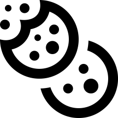

# Internal validity {#DesignInternal}
\index{Internal validity}\index{Research design!internal validity|(}


<!-- Introductions; easier to separate by format -->
```{r, child = if (knitr::is_html_output()) {'./introductions/07-ResearchDesign-Internal-HTML.Rmd'} else {'./introductions/07-ResearchDesign-Internal-LaTeX.Rmd'}}
```


<!-- Define colours as appropriate -->
```{r, child = if (knitr::is_html_output()) {'./children/coloursHTML.Rmd'} else {'./children/coloursLaTeX.Rmd'}}
```


## Introduction {#Chap7-Intro}

A well-designed study is needed to draw solid conclusions: a study with high *external validity* (Sect.\ \@ref(def:ExternalValidity)) and high *internal validity* (Sect.\ \@ref(def:InternalValidity)).
Some research design decisions to maximise internal validity are discussed in this chapter.


::: {.example #InternalValidity name="Importance of internal validity"}
@beaman2013profitability describe an experiment where free fertiliser was provided to a sample of female farmers in Mali (at the recommended rate, or at half the recommended rate).

All farmers knew they were part of a study, so changed their farm management: they employed more hired labour and used more herbicide than usual.
Consequently, the yields for *all* farmers improved.
Knowing if changes in yield were the result of applying the fertiliser is difficult, as the study had poor *internal validity*.
:::


Specific design strategies for maximising internal validity include:

* managing confounding (Sect.\ \@ref(ManagingConfounding)).
* managing the Hawthorne effect by blinding individuals (Sect.\ \@ref(HawthorneEffect)).
* managing the observer effect by blinding the researchers (Sect.\ \@ref(ObserverEffect)).
* managing the placebo effect by using controls, objective measures and blinding (Sect.\ \@ref(PlaceboEffect)).
* managing the carryover effect by using washouts (Sect.\ \@ref(CarryOverEffect)).

Not all of these strategies will be relevant to every study.


## Managing confounding {#ManagingConfounding}
\index{Internal validity!managing confounding}


<div style="float:right; width: 222x; border: 1px; padding:10px">

</div>

For this chapter, the following RQ will be used to demonstrate ideas.


:::{.example #HimalayaStudy name="Himalaya study"}
Consider this relational RQ (based on @data:Bird2008:wholegrain):

> Among Australians, is the average faecal weight the same for people eating provided food made from wholegrain *Himalaya\ 292* compared to eating provided food made from refined cereal?  
:::


Suppose that the researchers created two groups of individuals for this experimental study:

* *Group\ A*: women recruited from a female-only gym.
* *Group\ B*: men recruited from a local nursing home.

The researchers gave *Himalaya\ 292* to Group\ A, and the refined cereal to Group\ B.\spacex 
If a difference in faecal weight was detected between the two groups, many reasons may explain the difference:

* the different *diets* (the explanatory variable in the RQ) for each group.
* the different *sexes* in each group (Group\ A was all women; Group\ B was all men).
* the different *ages* in each group (Group\ A is likely to be younger on average than those in Group\ B).
* the different *overall health* in each group (Group\ A would generally be healthier than those in Group\ B).

Any difference in faecal weight detected between the two groups may not be due to the diets (Table\ \@ref(tab:ConfoundingGroups)): the study has very poor internal validity, due to poor research design.

Sex, age and overall health are *confounding variables* (Def.\ \@ref(def:ConfoundingVariable)): they are associated with the type of diet (explanatory variable) *and* faecal weight (response variable).\index{Variables!confounding}
For example, the age of the subject may be associated with faecal weight (older people tend to eat less, and eat differently, than younger people), and the research design means older people are more likely to be consuming the refined cereal.
This is an extreme case of *confounding* (Fig.\ \@ref(fig:ConfoundingDiagram)); usually, confounding is more subtle (and more difficult to detect) than in this example.


```{r}
if( knitr::is_latex_output() ) {
  ConfoundTable <- array( dim = c(4, 3) )
  
  colnames(ConfoundTable) <- c("\\textbf{Variable}", 
                               "\\textbf{Group A}",
                               "\\textbf{Group B}")
  
  ConfoundTable[1, ] <- c("\\textbf{Sex}",
                          "Women",
                          "Men")
  ConfoundTable[2, ] <- c("\\textbf{Age}",
                          "Younger",
                          "Older")
  ConfoundTable[3, ] <- c("\\textbf{Cereal}",
                          "*Himalaya 292*",
                          "Refined")
  ConfoundTable[4, ] <- c("\\textbf{Fitness}",
                          "Fitter",
                          "Less fit")
  
  ConfoundTable[3, 2] <- "\\textit{Himalaya 292}"
} else {
  ConfoundTable <- array( dim = c(4, 3) )
  
  colnames(ConfoundTable)<- c( "",
                               "Group A",
                               "Group B")
  ConfoundTable[1, ] <- c("*Sex*",
                          "Women",
                          "Men")
  ConfoundTable[2, ] <- c("*Age*",
                          "Younger (in general)",
                          "Older (in general)")
  ConfoundTable[3, ] <- c("*Cereal*",
                          "*Himalaya 292*",
                          "Refined")
  ConfoundTable[4, ] <- c("*Fitness*",
                          "Very fit (in general)",
                          "Less fit (in general)")
  
  IMG1 <- array( NA, dim = c(1, 1))
  IMG1[1, 1] <- "{#id .class height=60px}<br>
               {#id .class height=50px} <br>
               {#id .class height=60px}"
  
  IMG2 <- array( NA, dim = c(1, 1))
  IMG2[1, 1] <- "{#id .class height=60px} <br>
               {#id .class height=50px} <br>
               {#id .class height=60px}"
}
```


\begin{figure}
\begin{minipage}{0.37\textwidth}
\captionof{table}{Comparing Groups\ A and\ B: extreme confounding\label{tab:ConfoundingGroups}.}
\fontsize{8}{12}\selectfont
```{r}
kable(ConfoundTable[, c(2, 1, 3)],
      format = "latex",
      longtable = FALSE,
      booktabs = TRUE,
      table.env = "@empty",
      escape = FALSE, # For LaTeX commands to work in table
      align = c("r", "c", "l"))   
```
\end{minipage}
%% Add a gap between elements
\hspace{0.08\textwidth}
%%%
\begin{minipage}{0.55\textwidth}%
```{r, fig.width=4.5, fig.height=2.25, out.width='99%'}
source("R/showYInfluences.R")      
showYInfluences(showConfounding = TRUE,           
                ExtraneousName = "Age",    
                ResponseName = "Faecal wt", 
                ExplanatoryName = "Diet")
```
\captionof{figure}{An extreme example of confounding\label{fig:ConfoundingDiagram}.}
\end{minipage}
\end{figure}


```{r ConfoundingGroups}
if ( knitr::is_html_output()) {
  
  kable( list( IMG1,
               ConfoundTable[, c(2, 1, 3)],
               IMG2),
         caption = "Comparing Groups A and B: an extreme example of confounding.",
         format = "html",
         align = "c",
         escape = FALSE) %>%
    kable_styling(full_width = FALSE)
} 
```


<!-- The figure for LaTeX is in the minipage (combined with data table), so only need show it for the HTML -->
`r if (knitr::is_latex_output()) '<!--'`
```{r ConfoundingDiagram, fig.width=5, fig.height=4, out.width='55%', fig.align="center", fig.cap="An extreme example of confounding."}
source("R/showYInfluences.R")      
showYInfluences(showLurking = TRUE,          
                ExtraneousName = "Age",    
                ResponseName = "Faecal wt", 
                ExplanatoryName = "Diet")

```

`r if (knitr::is_latex_output()) '-->'`


::: {.importantBox .important data-latex="{iconmonstr-warning-8-240.png}"}
*The groups being compared should be as similar as possible*, apart from the difference being studied.
:::

Since the groups being compared should be as similar as possible, apart from what is being studied, researchers often compare the comparison groups on potential confounding variables.


In *experimental* studies, an excellent way to manage confounding is:

1. *Randomly allocating* individuals to the comparison groups.\index{Confounding!analysis}

Random allocation should ensure that the values of potential confounding variables are approximately evenly distributed between the comparison groups.\index{Confounding!random allocation}
This is true for identified potential confounders (such as age), but also for unidentified potential confounders, or variables that are hard to measure or observe (e.g., genetic conditions).
One of the comparison groups is often a control group (Def.\ \@ref(def:Control)).


:::{.example #RandomAllocationThirst}
@lian2024effect studied alleviating post-operative thirst experienced by patients admitted to the intensive care unit.
They compared standard procedures with the use of ice-water spray.
To use random allocation of patients to the two groups, the researchers:

> ... assigned unique numbers from\ $1$ to\ $56$ according to [students'] admission order 
> [...] two-digit numbers were read from the random number table's rows and columns, generating random values that were matched with the respective admission numbers [...]

Any student assigned a number between\ $1$ to\ $28$ (inclusive) was allocated to the control group, while students assigned numbers\ $29$ to\ $56$ were assigned to the experimental group.
:::


:::{.example #RandomAllocationControlgroup}
@witmer2020preliminary studied using bear faeces to prevent bears damaging trees in an Idaho forest.
The researchers painted the bear faeces on sample of trees. 
As a control, researchers could take observations from trees that they had not approached, and hence had no bear faeces applied.
However, if a difference was found between the trees with bear faeces and trees they had not approached, the difference may have been due to the presence of humans near the trees rather than the treatment (i.e., poor internal validity).

For this reason, the control group comprised trees on which the researchers applied water.\index{Control} 
This is a better control, since trees in both groups  (faeces, water) had been approached by humans.
Now, if a difference was found between the faeces and water-sprayed trees, the presence-of-humans explanation has been eliminated.
:::


*Randomly allocating* individuals to comparison groups is *not possible* in observational or quasi-experimental studies.
For this reason, confounding is often a major threat to internal validity in these studies, as individuals who are in one comparison group may be different, in general, to those who are in another group.

Fortunately, other (though less effective) means for managing confounding also exist.

<div style="float:right; width: 222x; border: 1px; padding:10px">

</div>


2. *Restricting* the study to a certain subgroup of the population.\index{Confounding!restricting}

Sometimes, specifically excluding or including members of the population is helpful for reducing confounding.
For the *Himalaya\ 292* study, for example, age is a potential confounder: older people have different dietary needs, general health and gut health when compared to younger people.
Hence, the researchers may decide to use an *inclusion criterion*,\index{Inclusion criteria} restricting the study to people aged from\ $30$ to\ $50$.

In addition, some people may have specific conditions or diseases that mean participating in the study will be problematic.
For instance, coeliacs have an autoimmune disorder which results in a severe intolerance to gluten (found in wheat, barley and rye).
Hence, the researchers may decide to use *exclusion criteria*\index{Exclusion criteria}, excluding coeliacs from participating in the study.
Those individuals that are excluded from the population are not less important than those individuals that are included.

Inclusion and exclusion criteria may be applied for other reasons too; for example, to clarify a population\index{Population!refining} of interest, to address ethical concerns\index{Ethics} (i.e., by excluding children) or to exclude rare and unusual individuals.


<div style="float:right; width: 75px; padding:10px">

</div>


::: {.definition #InclusionExclusionCriteria name="Inclusion and exclusion criteria"}
\index{Inclusion criteria}\index{Exclusion criteria}
*Inclusion criteria* are characteristics that individuals must meet explicitly to be included in the study.

*Exclusion criteria* are characteristics that explicitly disqualify potential individuals from being included in the study.
:::


Exclusion and inclusion criteria clarify which individuals are explicitly included or excluded from the population for the purposes of the study, and their use should be explained when their purpose is not obvious.
Exclusion and inclusion criteria are not both necessary; none, one or both may be used.
These are a type of *control variable* (Def.\ \@ref(def:ControlVariables)).\index{Confounding!control variables}


<div style="float:right; width: 75px; padding:10px">

</div>

::: {.example #ExclusionCriteriaEG name="Inclusion and exclusion criteria"}
In a strength study where the population is 'concrete test cylinders', cylinders with severe cracks may be *excluded*.

In a study of exercise regimes for people over\ $60$, severe asthmatics may be *excluded* from the study for health reasons.
:::


::: {.example #InclusionBodyTemp name="Inclusion, exclusion criteria"}
@data:mackowiak:bodytemp studied men and women aged\ $18$ to\ $40$; this is the *population*.
The *exclusion* criteria include people under\ $18$ years of age and over\ $40$ years of age; alternatively, the *inclusion* criteria are people aged between\ $18$ and\ $40$ years of age.
Either of these can be stated; both are not needed.
:::


:::{.exampleExtra  data-latex=""}
In a study on the influenza vaccine, @kheok2008efficacy listed the **P**opulation as 'health-care workers' [@kheok2008efficacy, p.\ 466], and the sample comprised healthcare workers at two specific hospitals.
The population was refined using exclusion criteria: those (p.\ 466)
  
> ...declining to give consent, a history of egg protein allergy, and neurological or immunological conditions that are contraindications to the influenza vaccine.
:::


::: {.example #ExclusionAmoutees name="Inclusion and exclusion criteria"}
@data:Guirao2017:amputees studied the walking abilities of amputees.
Inclusion criteria included (p.\ 27):

> ... length of the femur of the amputated limb of at least\ $15\cms$ measured from the greater trochanter; use of the prosthesis for at least\ $12$ months prior to enrollment and more than\ $6\hs$/day...

Exclusion criteria included (p.\ 27) people with:

> ... cognitive impairment hindering the ability to follow instructions and/or perform the tests; body weight over\ $100\kgs$...
:::


3. *Blocking*,\index{Confounding!blocking}
  when units of analysis are arranged into different groups containing individuals that are similar to each another (see Sect.\ \@ref(PairedInvasivePlants) for an example).
  
For the *Himalaya\ 292* study, for example, subjects may be *paired* (i.e., groups of two).\index{Study types!paired}
That is, each person is paired with another person of the same sex and of a similar age; one of each pair is given the *Himalaya\ 292* diet, and the other is given the refined cereal diet. 
Each pair is called a *block*.


::: {.definition #Blocking name="Blocking"}
*Blocking* occurs when units of analysis are analysed as separate groups of similar units (called *blocks*).
:::


4. *Analysing* using special methods (beyond this book), after recording the values of potential confounding variables.\index{Confounding!analysis}

To use this approach, *recording all potential extraneous variables* is important.
Most studies involving people record the participants' age and sex if possible, as these two variables are common confounders.
Once a sample is obtained, recording this extra information usually requires little extra effort.
Then, these extraneous variables can be factored into the analysis.

*Restricting* and *blocking* are useful if one or two confounding variables are suspected.
Multiple approaches can be used, such as randomly allocating individuals to groups, *and* recording other variables that can be managed through analysis.

*Randomly allocating* is superior when possible, because confounding is reduced for variables not even suspected as being confounders.
Hence, *experimental* studies should use random allocation whenever possible.

For any study (but especially for observational and quasi-experimental studies), recording the values of any potential confounding variables is useful, so that special analysis methods can be used to manage confounding.


::: {.importantBox .important data-latex="{iconmonstr-warning-8-240.png}"}
*Record* all the extraneous variables likely to be important (Sect.\ \@ref(RecordExtraneous)).
This may include information about the *individuals* in the study, and the *circumstances* of the individuals in the study (that is, the circumstances the individuals find themselves in; these may not be measured on the individuals themselves).
:::


::: {.example #HimalayaConfounding name="Managing confounding: experimental study"}
For the *Himalaya* study, different methods can be used to manage confounding due to age.

The study could be *restricted* to people under\ $30$.
Age would be a *control variable*.

*Blocking* could be used by finding similar pairs of subjects (e.g., pairs of subjects of the same sex, with similar age and weight).
One of each pair is given the refined cereal diet, and one given the *Himalaya\ 292* diet.
The *differences* in faecal weight for each pair can be analysed using special methods (see Chap.\ \@ref(AnalysisPaired) for example). 

Information *about the individuals* could be recorded, such as age and pre-study weight.
Information *about the circumstances* of the individuals could also be recorded, such as where they live.
Then, special methods of *analysis* could be used to analyse the data.

Since the study is experimental, participants could be *randomly allocated* into one of two groups, so both groups would have a similar distribution of ages (and other potential confounders).
Then groups could be randomly allocated to receive one of the diets (Fig.\ \@ref(fig:RandomAllocationHimalaya)).

In the *Himalaya\ 292* study, individuals were randomly allocated to the diets (p.\ $1\,033$), which manages confounding due to age and other potential confounding variables also.
:::


```{r RandomAllocationHimalaya, echo=FALSE, fig.cap="Random allocation can occur in two places for the Himalaya study.", fig.align="center", fig.height=3, out.width='65%'}
source("R/showStudyDesign.R")

showStudyDesign(studyType = "TrueExp",   
                addIndividuals = TRUE,
                addByResearchers = FALSE,
                addImages = TRUE,   
                addRandomAllocationText = TRUE, 
                imageList = c("./Pics/iconmonstr-candy-5-240.png",
                              "./Pics/iconmonstr-candy-8-240.png"),
                addCNames = c("Himalaya 292",
                              "Refined"))
```


:::{.exampleExtra  data-latex=""}
An experiment to study the effect of using ginkgo to enhance memory [@data:Solomon2002:ginkgo] compared two groups: one using ginkgo ($n = 111$), and one using a fake, non-active supplement ($n = 108$).
The authors randomly allocated participants to each group, then compared the two groups to ensure that no obvious differences initially existed between the groups that might explain differences in the response variable (Table\ \@ref(tab:ginkgoDemographics)).

Two groups are similar in terms of age, education and gender distribution.
Any difference in outcome between the groups is probably due to the treatment.


```{r ginkgoDemographics}
ginkgo <- array( dim = c(3, 3) )
colnames(ginkgo) <- c("Characteristic", 
                      "Group A (ginkgo)", 
		                  "Group B (Fake)")

ginkgo[1, ] <- c("Average age (in years)", 
                 "68.7", 
                 "69.9")
ginkgo[2, ] <- c("Men (number; percentage)", 
                 "46 (41%)", 
		             "45 (42%)")
ginkgo[3, ] <- c("Average years of education", 
                 "14.4", 
		             "14.0")

if( knitr::is_latex_output() ) {
  kable(ginkgo,
        format = "latex",
        longtable = FALSE,
        booktabs = TRUE,
        #escape = FALSE, # For latex to work in \rightarrow
        linesep  =  c("", "", "", "\\addlinespace", "", "", ""), # Otherwise addes a space after five lines... 
        caption = "Comparing the two groups in the ginkgo-memory study.",
        align = c("r", "c", "c"))   %>%
   kable_styling(full_width = FALSE, font_size = 8) %>%
   row_spec(0,bold = TRUE) # Columns headings in bold
}

if( knitr::is_html_output() ) {
  kable(ginkgo,
        format = "html",
        align = c("r", "r", "r"),
        longtable = FALSE,
        caption = "Comparing the two groups in the ginkgo-memory study.",
        booktabs = TRUE) 
}
```
:::


:::{.exampleExtra  data-latex=""}
Researchers explored the use of dominant and non-dominant hands for chest compression in student paramedics using an experimental study [@cross2019impact].
Students were randomly divided into two groups: DHOS (dominant hand on chest) and NDHOC (non-dominant hand on chest).
The two groups were then compared:

| Demographic                  | All participants ($n = 75$)   | DHOC ($n = 37$)   | NDHOC ($n = 38$) 
| ----------------------------:+:-----------------------------:+:-----------------:+:----------------:
| Average age (years)          | $23.4$                        | $22.5$            | $24.3$
| Gender: percentage Female    | $51$%                         | $53$%             | $47$%

The two groups appear to be very similar in terms of average age of participants, and the percentage of female participants.
If differences are observed in the study between the DHOC and NDHOC groups, it is probably due to the treatment.
The study should have reasonable internal validity.
:::


::: {.example #ConfoundingKiwi name="Managing confounding: observational study"}
@data:froud2018:kiwifruit studied $2\,599$\ kiwifruit orchards using an observational study, exploring the relationship between the time since a bacterial canker was first detected (in weeks) as the explanatory variable, and the orchard productivity (in tray-equivalents per hectare) as the response variable.

The researchers also recorded potential extraneous variables such as 'whether the farm was organic', 'elevation of the orchard' and 'whether general fungicides were used'.
These variables were used in their analysis to manage the potential effects of confounding.
:::


::: {.example #ActiveSedentaryWomen name="Comparing study groups: observational study"}
An observational study compared the iron levels of active and sedentary women aged\ $18$ to\ $35$ [@data:woolf:ironstatus].
The active women ($n = 28$) and sedentary women ($n = 28$) were compared on a variety of characteristics (Table\ \@ref(tab:SedentaryDemographics)).
The active women were similar to the sedentary women on these characteristics, but were (in general) slightly younger, slightly heavier, and slightly more likely to use hormonal contraceptives.
:::


```{r SedentaryDemographics}
WomenIron <- array( dim = c(4, 3) )
colnames(WomenIron) <- c("Characteristic", "Active women", "Sedentary women")

WomenIron[1, ] <- c("Average age (in years)", 
                    "20", 
                    "24")
WomenIron[2, ] <- c("Average height (in cm)", 
                    "169", 
                    "166")
WomenIron[3, ] <- c("Average weight (in kg)", 
                    "68", 
                    "62")
WomenIron[4, ] <- c("Percentage using hormonal contraceptives", 
                    "13", 
                    "11")

  
if( knitr::is_latex_output() ) {
  kable( pad(WomenIron[ c(1, 3, 4), ],
             surroundMaths = TRUE,
             targetLength = 2,
             decDigits = 0),
        format = "latex",
        longtable = FALSE,
        booktabs = TRUE,
        escape = FALSE, # For latex to work in \rightarrow
        linesep = c("", "", "", "", "", ""), # Otherwise adds a space after five lines... 
        caption = "The demographic information for those in the study of iron levels in women.",
        align = c("r", "c", "c") )   %>%
   kable_styling(full_width = FALSE, 
                 font_size = 8) %>%
  row_spec(0,bold=TRUE) # Columns headings in bold
}

if( knitr::is_html_output() ) {
  kable( pad(WomenIron[ c(1, 3, 4), ],
             surroundMaths = TRUE,
             targetLength = 2,
             decDigits = 0),
        format = "html",
        align = c("r", "c", "c"),
        longtable = FALSE,
      caption = "The demographic information for those in the study of iron levels in women.",
      booktabs = TRUE)
}
```


:::{.exampleExtra data-latex=""}
A study [@data:Gunnarsson2017:helicopter] examined the difference between two types of helicopter transfer (physician-staffed; non-physician-staffed) of patients with a specific type of myocardial infarction (<span style="font-variant:small-caps;">stemi</span>).
The purpose of the study was:

> ...to evaluate the characteristics and outcomes of physician-staffed <span style="font-variant:small-caps;">hems</span> (Physician-HEMS) versus non-physician-staffed (Standard-<span style="font-variant:small-caps;">hems</span>) in patients with STEMI.
>
> --- @data:Gunnarsson2017:helicopter, p.\ 1

The researchers 

> ...studied $398$ <span style="font-variant:small-caps;">stemi</span> patients transferred by either Physician-<span style="font-variant:small-caps;">hems</span> ($n = 327$) or Standard-<span style="font-variant:small-caps;">hems</span> ($n = 71$) for [...] intervention at $2$\ hospitals between\ 2006 and\ 2014.
>
> --- @data:Gunnarsson2017:helicopter, p.\ 1

Since the study is an observational study (patients were not allocated by the researchers to the type of helicopter transport), the researchers recorded information about the patients being transported.
They compared the patients in both groups, and found (for example) that both groups had similar average ages, and similar percentages of females and smokers, and so on.
They also compared information about the transportation, and found (for example) that both groups had similar average flight times and flight distances.

One conclusion from the study was that 'Patients with <span style="font-variant:small-caps;">stemi</span> transported by Standard-<span style="font-variant:small-caps;">hems</span> had longer transport times' (p.\ 1), but one limitation of the study was that:

> The patient cohorts received treatment by\ $2$ different care teams at two hospitals, which is a potential confounder despite similar baseline characteristics
>
> --- @data:Gunnarsson2017:helicopter, p.\ 5

In other words, the difference between hospitals and the staff may have been a confounding variable.
:::


::: {.importantBox .important data-latex="{iconmonstr-warning-8-240.png}"}
Observational studies *can* (and often do) have control groups.
Indeed, one specific type of observational study is called a *case-control study*\index{Study types!case-control studies} (Sect.\ \@ref(Backward)).
However, individuals are *not allocated to the control group* by the researchers in observational studies, so initially the control and study groups may be very different, which may explain any differences in the outcome.
:::


<!-- ::: {.example #ConfoundingSmoking54 name="Managing confounding: observational study"} -->
<!-- @data:DollHill1950:Smoking studied smoking using a backward-direction study. -->
<!-- The control group (those without lung cancer) was chosen to include very similar individuals to those in the lung-cancer group, in terms of age and sex. -->
<!-- (That is, the numbers of females and males within each age group was very similar for those *with* and *without* lung cancer.) -->
<!-- ::: -->


<!-- ::: {.example #Manure name="Manage confounding: experimental study"} -->
<!-- An experimental study [@schroder2015maize] compared nitrogen (N) and phosphorus (P) concentrations in maize, for evenly-injected liquid manure and band-injected liquid manure. -->
<!-- As potential confounding variables, the researchers also recorded the average temperature and the precipitation (between May\ 1 and September\ 30) at each site. -->
<!-- ::: -->

<!-- Random allocation can be shown, in general, as in Fig.\ \@ref(fig:RandomAllocationGeneral). -->


Random *sampling* and random *allocation*\index{Confounding!random allocation}\index{Sampling} are different concepts (Fig.\ \@ref(fig:RandomAllocationSampling)) with different purposes, but are often confused:

* *Random sampling* impacts *external* validity.
  Its purpose is *finding individuals* to study, and is possible in both observational and experimental studies.
* *Random allocation* helps eliminate confounding, by distributing possible confounders across treatment groups, and is only possible in *experimental* studies.
  *Random allocation* impacts *internal* validity.
  Its purpose is *allocating treatments to individuals*, which does not occur in observational studies.


```{r RandomAllocationSampling, echo=FALSE, fig.cap="Comparing random allocation and random sampling.", fig.align="center", fig.height=3, out.width='75%'}

showStudyDesign(studyType = "TrueExp", 
                addIndividuals = TRUE, 
                addCompareText = TRUE, 
                addResearcherControl = FALSE, 
                addInternalValidityText = TRUE,
                addByResearchers = FALSE,
                addRandomAllocationText = TRUE, 
                addRandomSamplingText = TRUE, 
                addExternalValidityText = TRUE, 
                addSampling = TRUE)
```


<iframe src="https://learningapps.org/watch?v=poh7e35e222" style="border:0px;width:100%;height:500px" allowfullscreen="true" webkitallowfullscreen="true" mozallowfullscreen="true"></iframe>
 


## Hawthorne effect and blinding individuals {#HawthorneEffect}
\index{Hawthorne effect}\index{Blinding!individuals}

People, and perhaps animals, may behave differently if they know (or think) they are being watched, which could compromise the internal validity of the study.
This is called the *Hawthorne effect*.


<div style="float:right; width: 75px; padding:10px">

</div>


::: {.definition #HawthorneEffect name="Hawthorne effect"}
The *Hawthorne effect* is the tendency of individuals to change their behaviour if they know (or think) they are being observed.
:::


::: {.example #HawthorneHH  name="Hawthorne effect: observational study"}
@wu2018identifying examined hand hygiene (HH) of staff in a tertiary teaching hospital, using *covert* (secret) observers and *overt* (obvious) observers.
HH compliance was higher with overt observation ($78$%) than with covert observation ($55$%).
:::


The impact of the Hawthorne effect can be minimised by blinding the individuals, so that:

* the individuals do not know that they are *participating* in a study.
* the individuals do not know the *aims of the study*.
* the individuals do not know which *comparison group they are in*. 

Any or all of these may be true, depending on the study design.
Blinding individuals in all three of these ways is not always possible.

<div style="float:right; width: 222x; border: 1px; padding:10px">

</div>

In *experimental* studies, *people* are often informed that they are in a study, due to ethics requirements (Sect.\ \@ref(Common-Ethical-Issues)); they may not, however, know *which* treatment they have received.
In *observational* studies, individuals *may* or *may not* know they are being observed.
For instance, in a study where subjects' blood pressure is measured, subjects clearly know they are being observed, which has the potential to alter the subjects' behaviour (e.g., people become tense, called 'white-coat hypertension').
As far as possible, efforts should be made to ensure that individuals do not know that they are being observed (the participants are *blinded*).


::: {.example #HawthorneHimalaya name="Hawthorne effect: experimental study"}
For the *Himalaya* study (Example\ \@ref(exm:HimalayaStudy)), the article reports that (p.\ $1\,033$):

> The study was explained fully to the subjects, both verbally and in writing, and each gave their written, informed consent... 

That is, the subjects knew they were in a study, and knew the aims of the study, so the Hawthorne effect may influence the results in this study.
However, the subjects did not know *which* diet they were given.
:::


::: {.example #HawthorneFruitVege name="Hawthorne effect: experimental study"}
People are more health-conscious if they know they will be examined regularly.
For example, a study aiming to increase fruit and vegetable intake in young adults [@clark2019educational] noted that the observed increases in intake 'could be explained by the Hawthorne effect' as adults 'know they are being observed...' (p.\ 96).
:::


::: {.example #HawthorneHealth name="Hawthorne effect: observational study"}
During the <span style="font-variant:small-caps;">covid</span>-19 lockdowns in Denmark, @olesen2021we covertly observed adults entering a large mall in Copenhagen.
They noticed that (p.\ 1)

> Almost all subjects [$340/345$ ($99$%)] wore a personal protective face mask, but only\ $141$ ($41$%) made use of the hand sanitizer.

Both masks and hand sanitiser were recommended by the Danish Health Authority, but the adherence to the safety measures were very different.
The authors surmised (p.\ 1):

> ... wearing a face mask corresponded to being observed continuously [...] 
> hand hygiene takes moments to perform, and no one can see whether or not it has been done.

In other words, wearing a face mask is obvious (that is, others could *observe* whether the subjects was adhering to this guideline) but hand hygiene is not (so other people *could not* observe whether the subject was adhering to this guideline).
The authors conclude that 'the Hawthorne effect may explain why almost all subjects wore a face mask'. 
:::


## Observer effect and blinding researchers {#ObserverEffect}
\index{Observer effect}\index{Blinding!researchers}

Perhaps surprisingly, researchers' expectations or hopes may unconsciously influence how the researchers interact with the individuals and record observations.
In addition, this may (unconsciously) influence the behaviour of the individuals in the study.
This is called *observer effect*.
(In experiments, the observer effect is sometimes called the *experimenter effect*.)
This could compromise the internal validity of the study.


<div style="float:right; width: 75px; padding:10px">

</div>


::: {.definition #ObserverEffect name="Observer effect"}
The *observer effect* occurs when the researchers unconsciously change their behaviour to conform to expectations because they know what values of the explanatory variable apply to the individuals.
This may then cause the *individuals* to change their behaviour or reporting also.
:::


The impact of the observer effect can be minimised by blinding the *researchers*, so that they do not know which treatments the individuals are receiving.
The researchers *giving* the treatment and the researchers *evaluating* the treatment can both be blinded, by using a third party.
For example, the researchers may give an assistant two drugs, labelled\ A and\ B.\spacex
The assistant administers the drug and evaluates the participants' response to the treatments.
Later, the assistant tells the researchers whether Drug\ A or Drug\ B performed better, but only the researchers know which drugs the labels\ A and\ B refer to (Fig.\ \@ref(fig:BlindingThirdParty)).


```{r, BlindingThirdParty, echo=FALSE, fig.align="center", fig.cap="Using a third party to avoid the observer effect.", fig.height=3, fig.width=8, out.width='85%'}
showStudyDesign(studyType = "TrueExp", 
                addIndividuals = TRUE, 
                addThirdParty = TRUE)    
```


::: {.example #ObsEffectyPain name="Observer effect: experimental study"}
@seo2020role examined the impact of an injection to alleviate post-operative umbilical pain, and stated (p.\ 392):

> ...the postoperative pain scores were gathered by a nurse practitioner who was blinded to the usage of bupivacaine to avoid observer-expectancy bias [i.e., the observer effect].
:::


The observer effect does not just apply to situations with *people* as individuals.


::: {.example #CleverHans name="Observer effect"}
`r if (knitr::is_latex_output()) {
   'Clever Hans'
} else {
   "['Clever Hans'](https://en.wikipedia.org/wiki/Clever_Hans)"
}`
was a horse that seemed to perform simple mental arithmetic.
By using an experiment where the people interacting with the horse were blinded, Carl Stumpf realised that the horse was responding to involuntary (and unconscious) cues from the trainer.

The same effect has been observed in narcotic sniffer dogs [@bambauer2012defending], who may respond to their handlers' unconscious cues.
:::


::: {.importantBox .important data-latex="{iconmonstr-warning-8-240.png}"}
The *observer effect* is when the researcher *unconsciously* influence the individuals, and are not aware it is occurring.
*Intentionally* influencing the individuals is fraud.
:::


The observer effect can impact both observational and experimental studies.
For example, consider a study measuring the blood pressure of smokers and non-smokers [@verdecchia1995cigarette].
This study is observational (individuals cannot be allocated to be a smoker or non-smoker), but if the researchers *know* an individual is a smoker when they measure blood pressure, then the observer effect could impact the results (recalling that the observer effect is an *unconscious* effect).
For example, the researchers may *expect* smokers to have a high blood pressure.

The observer effect could be managed by *first* measuring the blood pressure, and *then* asking if the individual was a smoker or not.
That is, the researchers may be *blinded* to whether the subject is a smoker when they measure blood pressure.
This may only be partially successful; the researcher may see the subject carrying cigarettes, or can smell smoke on their breath, for example.
Nonetheless, since it may prove at least partially successful and is easy to implement, this strategy should form part of the research design.


::: {.example #ObsEffectObs name="Observer effect: observational study"}
@zimova2020using took photos of snowshoe hares, at various stages of moulting and in various environmental conditions.
Eighteen independent observers rated the moult stage from the photographs (p.\ 4): 

> ... images were randomly named and sorted, with the dates [...] removed to minimize observer expectancy bias [i.e., the observer effect].
:::


Blinding the observer is not always possible, but should be used when possible to improve the internal validity of the study.


::: {.exampleExtra data-latex=""}
A study of the scats of gray wolves was used to study their diet [@SpauldingScats].
A scat analysis is where humans examine the scat of carnivores to determine the prey.
However, the accuracy of the results was questioned, due to 'perpetuation of the assumption that wolf scats contain only\ $1$\ prey item/scat' (p.\ 949).

The observers might be seeing what they expect to see: that "wolf scats contain only $1$\ prey item/scat".
:::


<iframe src="https://learningapps.org/watch?v=puedghp1c22" style="border:0px;width:100%;height:500px" allowfullscreen="true" webkitallowfullscreen="true" mozallowfullscreen="true"></iframe>


## Placebo effect, controls, objective data, and blinding {#PlaceboEffect}
\index{Placebo effect}\index{Blinding!individuals}\index{Control}

Perhaps surprisingly, individuals in a study may report effects of a treatment, even if they have not received an active treatment.
This could compromise the internal validity of the study.
This is called the *placebo effect*, which generally only impacts people as individuals.


::: {.definition #PlaceboEffect name="Placebo effect"}
The *placebo effect* occurs when individuals report perceived or actual effects, despite not receiving an active treatment.
:::


For example, people who attend therapy expect a positive outcome; this expectation may result in temporary or perceived (or sometimes even real) improvements in their condition.
This is the placebo effect.

To manage the placebo effect, researchers should record *objective*\index{Response variable}\index{Data!objective} data (Sect.\ \@ref(RecordObjectiveData)) rather than patient-reported (subjective) outcomes when possible [@enck2013placebo].
(The operational definitions (Sect.\ \@ref(OperationDefinitions))\index{Definitions!operational} for the variables should make clear whether subjective or objective data are recorded.)
Using a *control* group (Def.\ \@ref(def:Control)), if possible, is also useful: it acts as a benchmark for detecting changes in the outcome due to the treatment of interest.
In addition, *blinding* the individuals and the researchers may help manage the placebo effect, as then the individuals cannot know which group they are in.


::: {.example #PlaceboColours name="Placebo effect"}
Three active pain relievers were compared to different-coloured placebo [@data:Huskisson1974:placebo] in $22$\ patients.
The most pain relief was experienced by those taking *red* placebos (Fig.\ \@ref(fig:Placebos)), who experienced even more pain relief than those given true pain relievers.
Note that the outcome is subjective:\index{Data!subjective} a *patient*-reported outcome.\index{Response variable}\index{Data!subjective}
:::


```{r Placebos, echo=FALSE, fig.align="center", out.width='65%', fig.width=5.75, fig.height=3.5, fig.cap="Pain relief, for various pain relief medicine and different-coloured placebos."}
data(Placebos)

par( xpd = TRUE,   # Allows plotting outside plot area
     mar = c(4, 4, 4, 4) + 0.1 )  # DEFAULT: c(5, 4, 4, 2) + 0.1
	 
plot( c(0, 2.75) ~ range(Time), 
      data = Placebos,
      las = 1, 
      type = "n", 
      axes = FALSE,
      main = "Average pain relief for various medications",
      xlab = "Time (in h)", 
      ylab = "Average pain relief score")
axis(side = 1)
axis(side = 2,
     las = 1,
     at = seq(0, 2, by = 0.5))
box()

# abline seems to go outside margins...? Because of xpd?
lines( x = c(0, 6.3),
       y = c(1, 1), 
       lty = 2,
       col = "grey")
lines( x = c(0, 6.3),
       y = c(2, 2), 
       lty = 2,
       col = "grey")
mtext(" Moderate\n relief",
      side = 4,
      at = c(5.75, 2),
      las = 1,
      adj = 0,
      cex = 0.9)
mtext(" Slight\n relief",
      side = 4,
      at = c(5.5, 1),
      las = 1,
      adj = 0,
      cex = 0.9)

lines( Asp ~ Time, 
       data = Placebos,
       type = "b",
       pch = 19,
       cex = 0.5,
       col = "black", 
       lty = 1,
       lwd = 2)

lines( Placebo ~ Time, 
       data = Placebos,
       type = "b",
       pch = 19,
       cex = 0.5,
       col = ifelse( is_latex_output(), "black", "orange"), 
       lty = 3,
       lwd = 2)

lines( PlaceboRed ~ Time, 
       data = Placebos,
       type = "b",
       pch = 19,
       cex = 0.5,
       lty = 5,
	     col =ifelse( is_latex_output(), "black",  "red"), 
       lwd = 2)

legend("top", 
	col = c(ifelse( is_latex_output(), "black", "red"), 
	        "black", 
	        ifelse( is_latex_output(), "black", "orange")), 
	lwd = 2, 
	lty = c(5, 1, 3),
	bty = "n",
	ncol = 2,
	#horiz = TRUE,
	legend = c("Red placebos    ", # Extra spaces to separate the two columns of the legend a bit more
	           "Aspirin", 
	           "All Placebos"))
# Add initial point at t = 0, as all lines start there and last plot overtakes the colour
points(x = 0,
       y = 0,
       pch = 21,
       bg = "white",
       col = "black")
```


Since the placebo effect is concerned with individual responses to *allocated treatments*, it is not directly relevant to observational studies.


<div style="float:right; width: 75px; padding:10px">

</div>


::: {.example #HimalayaPlacebo name="Placebo effect"}
In the *Himalaya* study, the individuals 'were not told the identity of the test cereal in the foods provided' (@data:Bird2008:wholegrain, p.\ $1\,033$).
The subjects were blinded to the diet they were exposed to.
However, some may *think* they are on the refined cereal or *Himalaya* diet, and respond accordingly (perhaps unconsciously).
The use of the refined cereal was acting as a control (Def.\ \@ref(def:Control)).
Researchers measured faecal weight, an *objective* outcome\index{Data!objective}, to minimise the placebo effect.
:::


:::{.exampleExtra  data-latex=""}
A study of placebos [@data:Waber2008:Placebo] gave half the subjects a placebo, but told them the pill was an expensive (implying 'effective') painkiller.
The other half were also given a placebo, but were told the pill was a discount (implying 'less effective') painkiller.
About\ $85$% of participants in the first group reported a pain reduction, yet only\ $61$% in the second group reported a pain reduction.
Remember: *both* groups actually received a placebo!
Again, 'pain relief' is subjective.
:::


## Carryover effect and washouts {#CarryOverEffect}
\index{Carryover effect}\index{Washout}

In the *Himalaya* study (Example\ \@ref(exm:HimalayaStudy)), the diet is a *between-individuals* comparison:\index{Comparison!between individuals} one group of patients was given the refined cereal diet (the control), and a different group of people was given *Himalaya\ 292*.
The study *also* used a *within-individuals* comparison:\index{Comparison!within individuals} each person in the study was actually placed on both diets at different times.

Suppose all patients spent four weeks on the *Himalaya\ 292* diet, then the next four weeks on the refined cereal diet.
Potentially, the first diet could still be impacting the subjects' faecal weight for a little while after stopping the first diet.
This could compromise the internal validity of the study.
This is an example of the *carryover effect*: when the influence of one treatment or condition on the response variable carries over to influence the value of the response variable for next treatment or condition.
The carryover effect is only a concern for *within-individuals* comparisons.


<div style="float:right; width: 75px; padding:10px">

</div>


::: {.definition #CarryoverEffect name="Carryover effect"}
The carryover effect occurs when the influence of one treatment or condition on the response variable influences the response variable for subsequent treatments or conditions (in a repeated-measures study).
:::


The impact of the carryover effect may be minimised by using a *washout* or similar between treatments or conditions.
For example, after tasting a food sample, participants may rinse their mouth with water before tasting another food sample.
For the *Himalaya* study, the participants could spend two weeks on their usual (before-study) diet, before starting each of the diets in the study.
This is called a *washout period*.\index{Washout period}


<div style="float:right; width: 222x; border: 1px; padding:10px">

</div>


::: {.example #HimalayaCarryOver name="Carryover effect: experimental study"}
In the *Himalaya* study, 'there was no washout period' (@data:Bird2008:wholegrain, p.\ $1\,033$) since the response variable was only recorded after individuals spent four weeks on each diet.
Since faecal weight was not measured until the *end* of the four-week periods, the carryover effect is essentially irrelevant.
:::


<!-- ::: {.example #HimalayaWashout name="Carryover effect"} -->
<!-- An engineering study [@miller2019behavioral] examined drivers' exposure to lane-keeping systems on their driving performance. -->
<!-- Subjects were exposed to a driving simulation that used a lane-keeping system, and then to a driving simulation without using a lane-keeping system. -->
<!-- The researchers found that driving performance was impacted when drivers moved from a simulation *with* a lane-keeping system to one *without* a lane-keeping system. -->
<!-- ::: -->


::: {.exampleExtra  data-latex=""}
In @jaskiewicz2020chest, student paramedics performed chest compression in real-life (RL), and also using virtual reality (VR).
Researchers were assessing the relaxation percentage of the students while undertaking the compression (a relaxation percentage of about\ $50$% is ideal).

When used by itself, the VR method produced an average relaxation percentage of\ $45.5$%.
However, when the RL method was used first, and then followed by the VR method, the average VR relaxation method percentage was\ $74.7$%.

The response of the individuals was different depending on whether the RL method was used first.
This is an example of the carryover effect.
:::


Sometimes, in experimental studies, researchers can *randomly allocate* the *order* in which the treatments are used (a *crossover study*).\index{Study types!crossover studies}
That is, some participants start by spending four weeks on the *Himalaya\ 292* diet, then four weeks on the refined cereal diet; meanwhile, other participants start by spending four weeks on the refined cereal diet, then four weeks on the *Himalaya\ 292* diet.


::: {.example #HimalayaCarryOver2 name="Carryover effect"}
In the *Himalaya* study (Example\ \@ref(exm:HimalayaStudy)), subjects were allocated randomly to begin the study on the *Himalaya\ 292* diet *or* the refined cereal diet.
:::


::: {.example #ParamedOrder name="Washout periods: experimental study"}
@data:MacDonald:Resuscitation required paramedics to conduct eight different tasks (such as electrical defibrillation and intravenous cannulation).
Each of the paramedics began the series of tasks at a random task, to mitigate the carryover effect.
A washout period between tasks (i.e., a rest time) was also used.
:::


The carryover effect also is a potential concern to internal validity in observational studies involving a within-individuals comparison.
However, since treatments are *not allocated* in observational studies, carryover effects may be difficult to prevent, as washouts cannot be imposed, and the order of the conditions cannot be imposed.
However, *observing* individuals exposed to Condition\ A then Condition\ B, and other individuals exposed to Condition\ B then Condition\ A, may be possible.


::: {.example #CarryoverObs name="Carryover effects: observational study"}
@norris2005carry studied the carryover effect in ecological observational studies of animals (p.\ 181):
  
> ...individuals occupying poor quality winter habitat may experience reduced reproductive success the following breeding season when compared to individuals occupying high quality winter habitat.
:::


## Describing blinding {#DescribingBlinding}
\index{Blinding!descriptions}\index{Blinding}

*Blinding* occurs when those involved in the study do not know information about the study.
The *individuals* in the study may be blinded to 

* whether they are *involved in a study*.
* the *aims of the study* in which they are participants.
* *which comparison group* they are in.

Any or all of these may be true, depending on the study design.

The *researchers* and the *analysts* can be blinded to which comparison groups apply to the individuals (to help manage the observer effect). 

When blinding is used in as many ways as possible, the internal validity of the study is increased and bias reduced.
However, when people are the individuals, ethics requirements may mean that the individuals need to know they are in a study (especially if experimental), and the purpose of the study.

If *only* the individuals are blinded to the comparison groups, the study is called *single blind*.\index{Blinding!single}
If *both* the researchers and participants are blinded to the comparison groups, the study is called *double-blind*.\index{Blinding!double}
If the researchers, participants *and* the analyst are blinded to the comparison groups, the study is sometimes called *triple-blind*.\index{Blinding!triple}
Rather than using these terms, explicitly stating who or what is blinded to which parts of the study is clearer.

Blinding should be considered in all studies when possible (it is *not* always possible).
*Blinding participants does not just apply to people*; it also may apply to animals (Example\ \@ref(exm:CleverHans)).


::: {.example #BlindingCowpea name="Double-blinding"}
@bulte2014behavioral compared yields from modern and traditional cowpea crops in Tanzania.
The two seed types ('traditional' and 'modern') were made similar in appearance, so the farmers were blinded to which group they were in (control or treatment).
The seed type would eventually become obvious as the crop grew, but 'key inputs were already provided' by then (p.\ 817).
In addition, the researchers interacting with the farmers were not informed about the type of seed distributed.
:::


In observational studies, blinding individuals *may* be easier than in experimental studies (Sect.\ \@ref(HawthorneEffect)).
Blinding the researchers may be difficult, since the researchers need to record the value of the explanatory variable.


<!-- ::: {.example #BlindingDogs  name="Blinding in observational studies"} -->
<!-- In a study of dogs with chronic pancreatitis (CP), the researchers acquired abdominal ultrasounds and pathology results of each dog. -->
<!-- The authors report that the researchers conducting the ultrasounds were not blinded (@watson2010observational, p.\ 969). -->
<!-- However: -->

<!-- > Tissue samples [...] were obtained from all dogs and re-cut sections were reviewed by one of the authors (PJW) with the help of a veterinary pathologist  -->
<!-- > (AJR or TJS), all blinded to the clinical details of the case, but aware that CP was suspected in each dog... -->

<!-- This study clearly explains which parts of the study were blinded, and which were not. -->
<!-- ::: -->


::: {.example #BlindingGymnasts  name="Blinding: observational studies"}
@emerson2010ultrasonographically studied Achilles tendinopathy in gymnasts, by comparing $40$\ elite gymnasts with\ $41$ similar controls who were non-gymnasts.
The authors state (p.\ 38) that 

> Although the primary investigator was blind to the clinical status of the subjects, there was no blinding to whether each subject was in the gymnast or control group during image collection [...] 

When the images were reviewed, however, the article explains that the examiner was unaware of the clinical state and group of the subjects.

The paper explains who was blinded and to what parts of the study they were blinded.
:::


## Recording extraneous variables {#RecordExtraneous}
\index{Variables!extraneous}

One way to design a high-quality study is to record information about many (potential) extraneous variables.
Various reasons for doing this have been given:

* to evaluate *external validity* to determine if the sample is representative of the population (Sect.\ \@ref(Representative-samples)), by comparing the sample and population. \tightlist
* to improve *internal validity*, by helping to manage confounding:

  * by avoiding lurking variables (Sect.\ \@ref(ExtraneousVariables)).\tightlist
  * by determining if the comparison groups are similar (Sect.\ \@ref(ManagingConfounding)).
  * by using the information in analysis (Sect.\ \@ref(ManagingConfounding)). 


::: {.importantBox .important data-latex="{iconmonstr-warning-8-240.png}"}
*Record the values of all extraneous variables that may be important in the study*!
:::


:::{.example #ConfoundingChildbirth name="Poor internal validity"}
In the\ 1800s, Semmelweis recorded mortality rates of women after childbirth over many years [@dunn2005ignac] at two clinics:

* in Clinic\ 1, with male doctors delivering babies:\ $9.9$%.
* in Clinic\ 2, with female midwives delivering babies:\ $3.4$%.

Was the difference in mortality rate (the outcome) due to the sex of the person delivering the babies (the comparison)?

One possible confounder was the clinic; however, the clinic was eliminated as an explanation.
For example, Clinic\ 2 was actually *more* overcrowded than Clinic\ 1, and the climate was similar for both clinics.

However, an important *lurking variable* was present.
At the time, the benefits of hand-washing were not understood, nor commonplace.
Many (male) doctors performed autopsies immediately before delivering babies, without washing their hands between procedures.
In contrast, autopsies were not performed by the (female) nurses.

The lurking variable was 'whether the baby was delivered by someone with clean hands', which was related to the mortality rate *and* to the sex of the person delivering the baby.
The female midwives had clean hands, and hence the mortality rate was (relatively) low.
The male doctors did *not* have clean hands, and hence the mortality rate was high.

After instituting hand-washing for doctors, the mortality rate in Clinic\ 1 reduced to a rate similar to that in Clinic\ 2.
::: 


## Recording objective data {#RecordObjectiveData}
\index{Data!objective}\index{Data!subjective}

Recording *objective* data is often more reliable than recording *subjective* data, as subjective data can be influenced by the Hawthorne, observer or placebo effects.
Perceptions are often unreliable also.
However, sometimes recording objective data is not possible, and sometimes the researchers are explicitly interested in the subjective responses of people to certain treatments or conditions.


::: {.definition #SubjectiveObjective name="Subjective and objective data"}
*Subjective* data refers to opinions, feelings, and interpretations (by the subjects or the researchers).
*Objective* data refers to facts and measurable evidence.
:::


::: {.importantBox .important data-latex="{iconmonstr-warning-8-240.png}"}
If possible, objective data should be recorded.\index{Data!objective}
:::


:::{.example name="Subjective and objective data"}
@ueberham2019cyclists studied cyclists using everyday routes over one week in Leipzig (Germany).
Sixty-six cyclists wore sensors that *objectively* recorded particle number counts (i.e., pollution), noise, humidity and temperature.
The cyclists also *subjectively* recorded similar information.

The researchers concluded that (p.\ 1)

> Except for heat, no significant associations between the objective and subjective data were found. 

That is, the subjective and objective data generally did not agree, except for heat.
The perceptions of heat may have been influenced by the Hawthorne effect (p.\ 7):

> ...most people are pre-informed about the daily temperature by the weather forecast and expect a certain degree of heat, which ultimately also affects their perception of it to a great extent.
:::


:::{.example name="Subjective and objective data"}
@johnson2021association asked $70$\ people in south-west Ireland to *subjectively* self-report their Body-Mass index (BMI) category, as 'Normal' or 'Overweight'.
*Thirty-six* subjects self-reported their BMI category as 'Normal'.

The researchers also *objectively* recorded the BMI of the same subjects.
*Twenty-nine* subjects were objectively categorised as 'Normal'.
:::

\index{Research design!internal validity|)}

## Chapter summary {#Chap7-Summary}

Designing effective studies (Fig.\ \@ref(fig:DesignConsiderations)) requires researchers to *manage or minimise confounding* where possible, by: *restricting* the study to certain groups; *blocking* individuals into similar groups; through special *analysis* methods; and/or through *random allocation* of the units of analysis.
Random allocation is only possible for experimental studies.

Well-designed studies manage the *Hawthorne effect* (e.g., by blinding *participants*); the *observer effect* (e.g., by blinding the *researchers*); the *placebo effect* (experimental studies only; e.g., by using controls, objective outcomes and blinding subjects); and the *carryover effect* (e.g., by using a washout, or randomly allocating the treatment order).
Recording objective data is usually better than recording subjective data.


`r if (knitr::is_html_output()){
  'The following short video may help explain some of these concepts:'
}`

<div style="text-align:center;">
<iframe width="560" height="315" src="https://www.youtube.com/embed/eic_LjXT4qc" frameborder="0" allow="accelerometer; encrypted-media; gyroscope; picture-in-picture"></iframe>
</div>


Often, however, not all of these strategies can be used.
For instance, people usually know they are involved in an experimental study, so the Hawthorne effect may impact conclusions.
In these cases, the possible impacts should be minimised as far as possible, and then the likely impact on the conclusions discussed.
The impact of these issues are often reported as *limitations*\index{Limitations} (Chap.\ \@ref(Interpretation)).


(ref:DesignConsiderations-Caption) Design considerations for designing studies. Note: lurking variables become confounding variables when recorded in the study, and so can be managed as confounding variables. The arrows indicate the main design strategies to (perhaps partially) manage the indicated potential bias. Not all strategies are possible for every study.

```{r DesignConsiderations, echo=FALSE, fig.cap='(ref:DesignConsiderations-Caption)', out.width='95%', fig.align="center",  fig.width=7.0, fig.height=4.5}
source("R/showDesignConsiderations.R") 
showDesignConsiderations()
```


::: {.example #DesignExample name="Research design"}
@cross2019impact (p.\ 3) compared chest compressions by student paramedics using dominant and non-dominant hands, and stated:

> ...participants were allocated randomly to one of two groups: 'dominant hand on chest' or 'non-dominant hand on chest'. 
> Group allocation was determined by a computer-generated randomisation schedule...

The participants were blinded to the *purpose* of the study, but not to which group they were allocated.
The analyst was also blinded to the group allocations.
This study used many good design features.
:::


## Quick review questions {#Chap7-QuickReview}

::: {.webex-check .webex-box}
@doosti2016development wanted to determine the relationship between the depth of bruising on apples and the impact force.
The researchers purposefully hit apples with three different *forces* ($200$,\ $700$ and\ $1200\mJs$) to inflict bruises on the apples.
The researchers then recorded the *depth* of the bruising.
The study was conducted separately for three different *regions* of the apple (lower; middle; upper), and each apple was only used once.

Are the following statements *true* or *false*?

1. The *response variable* is 'the depth of bruising'.\tightlist
`r if( knitr::is_html_output() ) {torf( answer=TRUE )}`
2. The *explanatory variable* is 'the force used on the apples'.
`r if( knitr::is_html_output() ) {torf( answer=TRUE )}`
3. The variable 'location of the bruising' would be classified as a confounding variable'.  
`r if( knitr::is_html_output() ) {torf( answer=FALSE )}`
4. The researchers could minimise the effects of confounding by using potential confounding variables in the analysis.  \tightlist
`r if( knitr::is_html_output() ) {torf( TRUE)}`
5. The researchers could use random allocation of the treatments to the apples to minimise confounding.  
`r if( knitr::is_html_output() ) {torf( TRUE)}`
6. The *carryover* effect is likely to be a big problem in this study.  
`r if( knitr::is_html_output() ) {torf( FALSE)}`
7. The *Hawthorne* effect is likely to be a big problem in this study. 
`r if( knitr::is_html_output() ) {torf( FALSE)}`
8. The *placebo* effect is likely to be a big problem in this study.  
`r if( knitr::is_html_output() ) {torf( FALSE)}`
9. The *observer* effect is likely to be a big problem in this study.  
`r if( knitr::is_html_output() ) {torf( FALSE )}`
:::


## Exercises {#DesigningExperimentsExercises}

[Answers to odd-numbered exercises] are given at the end of the book. 

`r if( knitr::is_latex_output() ) "\\captionsetup{font=small}"`

::: {.exercise #DesignTrueFalse}
Are the following statements *true* or *false*?

1. Experimental studies *must* use random samples. \tightlist  
`r if( knitr::is_html_output() ) {torf(answer = FALSE)}` 
2. An experimental study *must* blind the researchers.  
`r if( knitr::is_html_output() ) {torf(answer = FALSE)}` 
3. Only observational studies can manage the observer effect.
`r if( knitr::is_html_output() ) {torf(answer = FALSE)}` 
4. Experimental studies *must* use a control group. 
`r if( knitr::is_html_output() ) {torf(answer = FALSE)}` 
5. Using random samples is important in observational studies as a way to manage confounding.  
`r if( knitr::is_html_output() ) {torf(answer = FALSE)}` 
:::


::: {.exercise #DesignTrueFalse2}
Which of the following statements are true?

1. Observational studies cannot have a control group.\tightlist
`r if( knitr::is_html_output() ) {torf(answer = FALSE)}` 
2. Only experimental studies can use random allocation to avoid confounding.
`r if( knitr::is_html_output() ) {torf(answer = TRUE)}` 
3. An experimental study *must* blind the participants.  
`r if( knitr::is_html_output() ) {torf(answer = FALSE)}` 
4. Only experimental studies can use random sampling.
`r if( knitr::is_html_output() ) {torf(answer = FALSE)}` 
5. In experimental studies, the treatments *must* be allocated by the researchers.  
`r if( knitr::is_html_output() ) {torf(answer = TRUE)}` 
:::


::: {.exercise #DesignExpImproveIV}
Which of the following can improve internal validity in *experimental* studies?

`r if (knitr::is_html_output()) '<!--'`
:::::: {.cols data-latex=""}
:::: {.col data-latex="{0.425\textwidth}"}
* Blinding the individuals
* Using a control group.
* Using special methods of analysis.
::::

:::: {.col data-latex="{0.025\textwidth}"}
\ 
::::

:::: {.col data-latex="{0.475\textwidth}"}
* Randomly allocating treatments to groups.
* Blinding the researchers.
* Using random samples.
::::

::::::
`r if (knitr::is_html_output()) '-->'`


`r if (knitr::is_latex_output()) '<!--'`
:::: {.webex-check .webex-box}
* Blinding the individuals.  \tightlist
`r if( knitr::is_html_output() ) {mcq( c(answer = "Yes", "No"))}` 
* Using a control group.
`r if( knitr::is_html_output() ) {mcq( c(answer = "Yes", "No"))}` 
* Using special methods of analysis.
`r if( knitr::is_html_output() ) {mcq( c(answer = "Yes", "No"))}` 
* Randomly allocating treatments to groups.
`r if( knitr::is_html_output() ) {mcq( c(answer = "Yes", "No"))}` 
* Blinding the researchers.
`r if( knitr::is_html_output() ) {mcq( c(answer = "Yes", "No"))}` 
* Using random samples.
`r if( knitr::is_html_output() ) {mcq( c("Yes", answer = "No"))}` 
::::
`r if (knitr::is_latex_output()) '-->'`

:::


::: {.exercise #DesignObsImproveIV}
Which of the following can improve internal validity in *observational* studies?
`r if (knitr::is_html_output()) '<!--'`
:::::: {.cols data-latex=""}
:::: {.col data-latex="{0.425\textwidth}"}
* Blinding the individuals
* Using a control group.
* Using special methods of analysis.
::::

:::: {.col data-latex="{0.025\textwidth}"}
\ 
::::

:::: {.col data-latex="{0.475\textwidth}"}
* Randomly allocating treatments to groups.
* Blinding the researchers.
* Using random samples.
::::

::::::
`r if (knitr::is_html_output()) '-->'`


`r if (knitr::is_latex_output()) '<!--'`
:::: {.webex-check .webex-box}
* Blinding the individuals.  \tightlist
`r if( knitr::is_html_output() ) {mcq( c(answer = "Yes", "No"))}` 
* Using a control group.
`r if( knitr::is_html_output() ) {mcq( c(answer = "Yes", "No"))}` 
* Using special methods of analysis.
`r if( knitr::is_html_output() ) {mcq( c(answer = "Yes", "No"))}` 
* Randomly allocating treatments to groups.
`r if( knitr::is_html_output() ) {mcq( c(answer = "Yes", "No"))}` 
* Blinding the researchers.
`r if( knitr::is_html_output() ) {mcq( c(answer = "Yes", "No"))}` 
* Using random samples.
`r if( knitr::is_html_output() ) {mcq( c("Yes", answer = "No"))}` 
::::
`r if (knitr::is_latex_output()) '-->'`
:::


::: {.exercise #ResearchDesignHawthorneEffect}
Is the Hawthorne effect only a (potential) issue for experiments.
Explain.
:::


::: {.exercise #HawthorneTeeth}
@lorenz2019effect compared the efficacy of a new type of toothpaste.
Participants were given either a new or an existing toothpaste formulation, and evaluations of plaque remaining on the teeth were taken.
All participants knew they were being assessed after brushing.

Would the Hawthorne effect likely impact the internal validity of this study?
Explain.
:::


::: {.exercise #ResearchDesignObsPollen}
A study compared the average amount of pollen returned to the hive per bee, for two types of native Australian bees: yellow and black carpenter bees, and green carpenter bees. 
The researchers also recorded the size of the hive, among other variables.
*Why* did they do this?
`r if( knitr::is_html_output() ) {longmcq( 
   c("To minimise the impact of the Hawthorne effect",
     "To ensure external validity",
     "Because the size of the hive is the explanatory variable",
     answer = "In case the size of the hive is a confounding variable") )}` 
:::


::: {.exercise #ResearchDesignSeptic}
In a study to treat septic shock, @hwang2020combination used two study groups of size $n = 58$ each: one group received the treatment of interest (intravenous infusion of vitamin\ C and thiamine) and the other group received intravenous saline.

Explain why the researchers gave saline to $58$ subjects, when it has no chance of successfully treating septic shock.
Is this ethical?
:::


::: {.exercise #DesignExpWeightLoss}
Consider a study comparing the average weight loss for patients who are *instructed* to do about $30\mins$ of exercise a day (Group\ A), to patients who are instructed to do about\ $60\mins$ of exercise a day (Group\ B).
Which of the following statements are true?

1. This is an experimental study.
`r if( knitr::is_html_output() ) {torf(answer = TRUE)}` 
2. The extraneous variable is the amount of exercise per day (in h).\tightlist
`r if( knitr::is_html_output() ) {torf(answer = FALSE)}` 
3. The response variable is the weight loss for each person.
`r if( knitr::is_html_output() ) {torf(answer = TRUE)}` 
4. The explanatory variable is whether the patient performs about $30$ or $60\mins$ of exercise per day.
`r if( knitr::is_html_output() ) {torf(answer = TRUE)}` 
5. The response variable is the *average* weight loss.
`r if( knitr::is_html_output() ) {torf(answer = FALSE)}` 
6. The explanatory variable is the amount of exercise the patient does per day (in h).
`r if( knitr::is_html_output() ) {torf(answer = FALSE)}` 
7. Age is likely to be a lurking variable.
`r if( knitr::is_html_output() ) {torf(answer = FALSE)}` 
8. Age is an extraneous variable.
`r if( knitr::is_html_output() ) {torf(answer = TRUE)}` 
9. Age is likely to be a confounding variable.
`r if( knitr::is_html_output() ) {torf(answer = TRUE)}`
10. Which (if any) of the following are possible *confounding* variables?

    * The sex of the patients. \tightlist
   `r if( knitr::is_html_output() ) {torf(answer = TRUE)}` 
    * The initial weight of the patients.
   `r if( knitr::is_html_output() ) {torf(answer = TRUE)}` 
    * The names of the patients.
   `r if( knitr::is_html_output() ) {torf(answer = FALSE)}` 
:::


::: {.exercise #ResearchSmokingAlfresco}
@data:Stafford2010:Alfresco studied smoking in alfresco restaurants in two cities in Western Australia.
The concentration of particulate matter with a diameter smaller than or equal to\ $2.5$ (per cubic metre of air) was recorded (PM~$2.5$~) from\ $12$ `r readr::parse_character( c("cafs"), locale = locale(encoding = "UTF-8"))` and $16$\ pubs.
The researchers were interested in the relationship between PM~$2.5$~ and the number of smokers.
They also recorded the wind strength (calm; light breeze; windy) and the amount of cover (fully open; overhead cover only; overhead cover and enclosed sides).

1. Is this an experimental or observational study?
1. What are the response and explanatory variables?
1. What are the extraneous variables, if any?
1. Is blinding the individuals possible?
1. Is random allocation possible?
:::


::: {.exercise #ResearchDesignSunscreen}
In a study of time spent applying sunscreen [@data:Heerfordt2018:sunscreen], the aim was to 'determine whether time spent on sunscreen application is related to the amount of sunscreen used' (p.\ 117).
The study is described as follows (p.\ 118):

> The volunteers were asked to apply the provided sunscreen [...] the way they would normally do on a sunny day at the beach in Denmark [...]
> The volunteers wore swimwear during the whole session. 
> No other information was given. 
> Participants applied sunscreen behind a curtain and were not observed during application. 
> Measurements of time and sunscreen weight were made without the subjects' being aware of this.

1. Is this an experimental or observational study?
1. What are the response and explanatory variables?
1. The researchers also recorded age, height, weight and body surface area of each participant. 
   Why would they have done this?
1. The researchers also compared the average values of the response variable for males and females, and the average values of the explanatory variable for males and females. 
   Why would they have done this? 
1. What design features are evident in the quote?
:::


::: {.exercise #DesignExpParamedicsPills}
Paramedics were involved in a study to compare two treatments (A and\ B) for Post Traumatic Stress Disorder (PTSD), as randomly allocated to two groups of patients.

1. Is this an experimental or observational study?\tightlist
1. What would be the control group? 
`r if( knitr::is_html_output() ) {
   longmcq( c("The group receiving Treatment A",
              "A group of paramedics who do not have PTSD",
              "The group receiving Treatment B",
              "A group of paramedics not involved in the study",
              "A group of people with PTSD who are not paramedics",
              answer = "A group receiving a pill that looks just like Treatment A and B, but has no effective ingredient"))}`
`r if (knitr::is_html_output()) "<!--"`
   a. The group receiving Treatment\ A.
   b. A group of paramedics who do not have PTSD.
   c. The group receiving Treatment\ B.
   d. A group of paramedics not involved in the study.
   e. A group of people with PTSD who are not paramedics.
   f. A group receiving a pill that looks just like Treatment\ A and\ B, but has no effective ingredient.
`r if (knitr::is_html_output()) "-->"`
1. The patients did not know which treatment they received.
What is this called?
`r if( knitr::is_html_output() ) {
   longmcq( c("Blinding the researchers",
              "Double-blinding",
              "Managing confounding",
              answer = "Blinding the participants"))}`
1. What is the purpose of blinding the participants?
`r if( knitr::is_html_output() ) {
   longmcq( c("To ensure that researchers did not unintentionally influence the results",
              answer = "To ensure that participants did not change their behaviour because of the treatment they were receiving",
              "To manage confounding"))}`
:::


:::{.exercise #ResearchIcelandicGood}

@blondal2023homefood studied older Icelandic adults, to (p.\ 632)

> ...investigate effects of six-month nutrition therapy on hospital readmissions, LOS [length of hospital stay], mortality and need for long-term care residence...

Patients in the study were all aged over $64$-years-of-age, and were randomly allocated into either the intervention ($n = 53$) or control ($n = 53$) groups.
The intervention group received 'nutrition therapy', which included free delivery of energy- and protein-rich foods for six months after discharge from hospital.
Patients with cognitive impairment, dietary allergies and undergoing active cancer treatment were excluded from the study.

Statistical software (SPSS, version\ 26.0) was used to generate the random numbers for randomly allocating patients into groups, and the allocations were hidden from the researchers.
Table\ 1 of the published article compared the two groups on (among other variables) age, percentage female, height, weight, and percentage with a higher education.
Ethics approval was given by the Ethics Committee for Health Research of the National University Hospital of Iceland.

Identify good design principles used in this study, and their purpose.
Can you identify any improvements that could be made to the study design?
:::


:::{.exercise #ResearchBodyCameras}
@braga2021body evaluated the use of body-worn cameras (BWC) by police on residents' perceptions of the police.
The $40$\ precincts in New York City with the highest numbers complaints against New York Police Department officers were part of the study.
Twenty precincts were matched with $20$\ other precincts (using demographics, socioeconomic characteristics, crime, and police activity).
Using a computer, one of each pair of precincts was allocated to have officers wear BWC, and the other to not wear BWCs.
The researchers compared the officers in each group, and found the officers in the two groups were similar 'in terms of demographics, length of service, rank, work activities, and number of citizen complaints' (p.\ 285).

Identify the good design principles used in this study (using the language of this chapter where possible), and their purpose.
Can you identify any improvements that could be made to the study design?
:::


::: {.exercise #ResearchTanzaniaFarm}
@bulte2014behavioral compared yields from two types of cowpea in rural Tanzania.
Two different studies were used for the comparison; for both studies, traditional and new cowpea seeds were randomly allocated to a sample of farmers. 

In Study\ A, farmers knew which seeds were the newer variety, and the researchers interacting with the farmers also knew the types of seed allocated.
In Study\ B, the farmers were blinded to which seeds were new and which were traditional (both seeds were the same size and colour), and the researchers interacting with the farmers also did *not* know the types of seed allocated.

Farmers who knew they received the modern seed (Study\ A) planted their seed on larger plots than farmers in Study\ B; that is, they behaved differently.

When the data from Study\ A were analysed, the new seed yield was $27$% greater, compared to the traditional seed.
However, in Study\ B, the yield of new seed was very similar to the yield for the traditional seed.

1. Discuss the blinding used in each study.
2. Explain the discrepancies from the two methods, using the language of this chapter.
3. Which method would be more likely to be recording accurate information?
   Why?
:::


::: {.exercise #ResearchAustriaPA}
@greier2021objective studied $36$\ Austrian eighth-grade students, recording the time spent performing moderate-to-vigorous physical activity (<span style="font-variant:small-caps;">mvpa</span>).
For each student, the time spent in <span style="font-variant:small-caps;">mvpa</span> was recorded in two ways: (a)\ using a wrist-worn accelerometer, worn for seven days; and (b)\ self-reported using a questionnaire at the end of the week.

<span style="font-variant:small-caps;">Mvpa</span> reported in the questionnaire was more than double the time measured using the accelerometer; thus, $88.9$% of students met PA recommendations based on self-report, but only $22.2$% did so based on the accelerometer data.

1. Which method recorded *subjective* data?
   Which method recorded *objective* data?
2. Explain the discrepancies in the results from the methods, using the language of this chapter.
3. Which method would be more likely to be recording accurate information?
   Why?
:::


::: {.exercise #ResearchTasteOfWater2}
A scientist is testing whether tap water tastes the same as bottled water (based on @teillet2010consumer).
She provides people with a plastic cup of either bottled or tap water, and she asks them to give a rating of the taste on a scale of\ $1$ (terrible) to\ $5$ (fantastic).
The RQ is:

> For university students, is the taste of tap water better than the taste of bottled water?

This RQ needs some clarification, but you decide to answer this question using an *experiment*.
Describe what these might look like for this study, and which are feasible: 
random allocation;
blinding;
double-blinding;
control;
carryover effect;
finding a random sample.

What potential problems can you identify with the research design?
:::


::: {.exercise #ResearchDesignTasteOfWater}
Consider this RQ (based on @teillet2010consumer): 'Among university students, is the taste of tap water different from the taste of bottled water?'

You want to answer this question using an *observational study*.
Describe what these might look like for this study, and which are feasible: 
random allocation;
blinding;
double-blinding;
control;
carryover effect;
finding a random sample.
:::


::: {.exercise #ResearchDesignFertilizer}
A scientist compares the effects of two types of fertiliser on the yield of tomatoes (based on @klanian2018integrated).
He plants tomato seedlings, and fertilises with Fertiliser\ I, and later records the yield of tomatoes.
He then immediately plants more tomato seedlings in the same field, fertilises with Fertiliser\ II, and measures the yield of tomatoes.

What potential problems can you identify with the research design?
:::


::: {.exercise #ResearchDesignDust}
@data:skulberg:dust compared two office-cleaning methods (p.\ 72):

> The participants were randomly allocated to an intervention group or a control group using group level matching by sex, level of irritation symptom index, and allergy status [...]
> The participants and the field researchers were blinded to the group status of the participants [...] 

All offices were cleaned after the employees had left the building for the evening.

The researchers compared the change in nasal congestion for the two groups (intervention: 'a comprehensive cleaning'; control: 'a superficial cleaning'), finding only small differences between the two groups.
In the analysis, the researchers incorporated age and sex of the office workers.

1. How did the researchers manage confounding?
1. What other design features are evident from the quote?
1. What is the response variable?
1. What is the explanatory variable?
1. What are the extraneous variables?
:::


::: {.exercise #ResearchDesignFormwork}
*Formwork* is used in construction with reinforced concrete, and can be labour intensive.
@mine2015observational examined the relationship between the floor area of the building (in m^$2$^ per storey) and the number of hours of labour needed for constructing the formwork (in person-mins per storey).
The researchers also recorded the average age of the workers (in years); the average years of experience of the workers (in years); and the storey height (in meters) for each of $n = 15$ multi-storey buildings in the study.

Two observers recorded the labour time by observing workers from the start to the end of the work.

1. What is the *explanatory variable*? \tightlist
`r if( knitr::is_html_output() ) {longmcq( c(
	answer = "Floor area",
	"Hours of labour",
	"Average age of workers",
	"Average years of experience of workers",
	"Storey height"))}`
1. What is the *response variable*?
`r if( knitr::is_html_output() ) {longmcq( c(
	"Floor area",
	answer = "Hours of labour",
	"Average age of workers",
	"Average years of experience of workers",
	"Storey height"))}`
1. What *type* of description is appropriate for the variable 'Average age of the workers'?
`r if( knitr::is_html_output() ) {longmcq( c(
	"A confounding variable, since it is likely to be related to the explanatory variable only",
	"A confounding variable, since it is likely to be related to the response variable only",
	answer = "An extraneous variable, because it is likely to be related to the response variable only",
	"A lurking variable, since we don't know how it might be related to the response and explanatory variables"))}`
`r if (knitr::is_html_output()) "<!--"`
   a. A confounding variable, since it is likely to be related to the explanatory variable only.
   b. A confounding variable, since it is likely to be related to the response variable only.
   c. An extraneous variable, because it is likely to be related to the response variable only.
   d. A lurking variable, since we don't know how it might be related to the response and explanatory variables.
`r if (knitr::is_html_output()) "-->"`
1. What is the most likely way to manage confounding in this study?
`r if( knitr::is_html_output() ) {longmcq( c(
	"Restricting, the study to multi-storey buildings",
	"Blocking, by only studying unit blocks",
	answer = "Analysis, by using other recorded variables in the analysis",
	"Random allocation of workers to the building projects"))}`
1. True or false: the *carryover* effect is likely to be a big problem in this study.  
`r if( knitr::is_html_output() ) {torf( FALSE)}`
1. True or false: the *Hawthorne* effect is likely to be a big problem in this study.  
`r if( knitr::is_html_output() ) {torf( TRUE)}`
1. True or false: the *placebo* effect is likely to be a big problem in this study.  
`r if( knitr::is_html_output() ) {torf( FALSE)}`
1. True or false: *observer* effect is likely to be a big problem in this study.  
`r if( knitr::is_html_output() ) {torf( FALSE )}`
:::


`r if( knitr::is_latex_output() ) "\\captionsetup{font=normalsize}"`


<!-- https://bmcoralhealth.biomedcentral.com/articles/10.1186/s12903-018-0588-1  About tooth brushing -->


<!-- QUICK REVIEW ANSWERS -->
`r if (knitr::is_html_output()) '<!--'`
::: {.EOCanswerBox .EOCanswer data-latex="{iconmonstr-check-mark-14-240.png}"}
**Answers to *Quick review* questions:**
**1.** True.
**2.** True.
**3.** False; extraneous: likely to be related to the response variable only.
**4.** True.
**5.** True.
**6.** False.
**7.** False.
**8.** False.
**9.** False.
:::
`r if (knitr::is_html_output()) '-->'`
