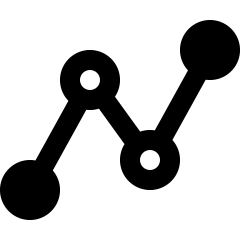

# Internal validity in observational studies {#DesignObservational}
\index{Internal validity!observational studies}\index{Study design!observational|(}


<!-- Introductions; easier to separate by format -->

```{r, child = if (knitr::is_html_output()) {'./introductions/08-ResearchDesign-Internal-Obs-HTML.Rmd'} else {'./introductions/08-ResearchDesign-Internal-Obs-LaTeX.Rmd'}}
```


## Introduction {#Chap8-Intro}

In experimental studies, many aspects of the study design typically can be controlled by the researcher.
In contrast, *observational studies* have fewer design features that can be controlled by the researchers.
For example, since treatments are not imposed in observational studies, random allocation of treatments is impossible, and hence *confounding* is always a potential threat to [internal validity](#def:InternalValidity) in observational studies.

A well-designed study is needed to draw solid conclusions (Def.\ \@ref(def:StudyDesign)): a study with high *internal validity* (Sect.\ \@ref(def:InternalValidity)) and high *external validity* (Sect.\ \@ref(def:ExternalValidity))).

Specific design strategies for maximising [internally validity](#def:InternalValidity) are:

* Managing confounding (Sect.\ \@ref(ObsManagingConfounding)).
* Managing the Hawthorne effect (Sect.\ \@ref(HawthorneEffectObservational)).
* Managing the observer effect (Sect.\ \@ref(ObserverEffectObservational)).
* Managing the carry-over effect (Sect.\ \@ref(CarryOverEffectObservational)).

Since the [placebo effect](#PlaceboEffectExperimental) is concerned with individuals response to allocated *treatments*, the placebo effect is not directly relevant to observational studies.
Not every design issue is relevant to every study.


<!-- ::: {.example name="Low internal validity"} -->
<!-- Researchers [@clausen2017effect] taught integrated pest management (IPM) to Ugandan small-scale farmers, used their neighbours as controls. -->
<!-- However, the IPM farmers were "different from the control farmers according to some demographic and agricultural characteristics". -->

<!-- Despite low internal validity, the study still showed some promising signs of teaching IPM to be explored in future studies. -->
<!-- ::: -->

For this chapter, consider this RQ (based on [@doll1954mortality]:

> Among members of the UK medical profession, is the percentage diagnosed with lung cancer the same for smokers and non-smokers?

This study was one of the earliest to study an association between smoking and lung cancer.
This study is clearly observational, as people cannot be compelled to become smokers.


::: {.example #ConfoundingSmoking54 name="Confounding"}
In the smoking study of @doll1954mortality, doctors who *chose* to smoke may undertake other risky behaviours, whereas doctors who choose *not* to smoke may be inclined to *avoid* other risky behaviours.
It may be those *other* risky behaviours that lead to lung cancer, and not the smoking itself.

In a different study, @data:DollHill1950:Smoking used a control group.
The control group was chosen to include very similar individuals to those in the lung-cancer group, in terms of age and sex.
(That is, the numbers of females and males within each age group was very similar for those *with* and *without* lung cancer.)
:::


## Managing confounding {#ObsManagingConfounding}
\index{Internal validity!observational studies!managing confounding}

The smoking study above [@doll1954mortality] is observational, so confounding is potentially a problem for establishing a relationship between smoking and lung cancer.
In Sect.\ \@ref(ExpManagingConfounding), different methods were listed for managing confounding in experimental studies.
Confounding can be managed in different ways for observational studies too:\index{Variables!confounding}

* [*Restricting*](#ObsConfoundingRestricting) the study to a certain group.
  In the smoking study, participants were restricted to males aged under $35$ years since, at the time of the study, 'lung cancer [was] relatively uncommon in women and rare in men under $35$' (@doll1954mortality, p.\ 1452).\index{Confounding!observational studies!control variables}
  The reason for the restriction should be justified if possible (as in this quotation).
* [*Blocking*](#ObsConfoundingBlocking).
  Individuals that are similar to one another can be placed into different groups . 
  @doll1954mortality, for example, could have found numerous pairs of smokers and non-smokers, with both subjects in each pair *matched* by having similar ages and alcohol-consumption habits.\index{Confounding!observational studies!blocking}
* [*Analysing*](#ObsManagingConfoundingAnalysis) using special methods, after recording the values of potential confounding variables. 
  Because of this, recording all potential extraneous variables is important. 
  Most studies involving people record the participants' age and sex, as these two variables are common confounders.\index{Confounding!analysis}
  Once a sample is obtained, recording this extra information usually requires little extra effort.
* [*Randomly allocating*](#ObsConfoundingRandomAllocating) individuals to groups is *not possible* in observational studies.\index{Confounding!observational studies!random allocation}
  For this reason, confounding is often a major threat to [internal validity](#def:InternalValidity) in observational studies, as   individuals who are in one group may be different, in general, to those who are in another group.

Usually the best approach for observational studies is to record the values of any potential confounding variables, and use special analysis methods to understand the data.
The groups being compared should be as similar as possible also, apart from what is being studied.
To do so, researchers often compare the comparison groups on potential confounding variables.


::: {.importantBox .important data-latex="{iconmonstr-warning-8-240.png}"}
*Record* all extraneous variables likely to be important for understanding the individuals
This may include information *about* the individuals in the study, and the *circumstances* of the individuals in the study.
:::


::: {.example #ConfoundingKiwi name="Confounding"}
An observational study of $2599$ kiwifruit orchards [@data:froud2018:kiwifruit] explored the relationship between the time since a bacterial canker was first detected (in weeks), and the orchard productivity (in tray equivalents per hectare).
The researchers also recorded extraneous variables such as 'whether or not the farm was organic', 'elevation of the orchard' and 'whether or not general fungicides were used'.
These variables were used in their analysis to manage the potential effects of confounding.
:::


::: {.example #ActiveSedentaryWomen name="Comparing study groups"}
An observational study compared the iron levels of active and sedentary women aged\ $18$ to\ $35$ [@data:woolf:ironstatus].
The active ($n = 28$) and sedentary women ($n = 28$) were compared on a variety of characteristics (Table\ \@ref(tab:SedentaryDemographics)).
The active women were similar to the sedentary women on these characteristics, but were (in general) slightly younger, slightly heavier, and slightly more likely to use hormonal contraceptives.
:::


```{r SedentaryDemographics}
WomenIron <- array( dim = c(4, 3) )
colnames(WomenIron) <- c("Characteristic", "Active women", "Sedentary women")

WomenIron[1, ] <- c("Average age (in years)", 
                    "20", 
                    "24")
WomenIron[2, ] <- c("Average height (in cm)", 
                    "169", 
                    "166")
WomenIron[3, ] <- c("Average weight (in kg)", 
                    "68", 
                    "62")
WomenIron[4, ] <- c("Percentage using hormonal contraceptives", 
                    "13", 
                    "11")

  
if( knitr::is_latex_output() ) {
  kable( pad(WomenIron[ c(1, 3, 4), ],
             surroundMaths = TRUE,
             targetLength = 2,
             digits = 0),
        format = "latex",
        longtable = FALSE,
        booktabs = TRUE,
        escape = FALSE, # For latex to work in \rightarrow
        linesep = c("", "", "", "", "", ""), # Otherwise adds a space after five lines... 
        caption = "The demographic information for those in the study of iron levels in women",
        align = "c")   %>%
   kable_styling(full_width = FALSE, 
                 font_size = 8) %>%
  row_spec(0,bold=TRUE) # Columns headings in bold
}

if( knitr::is_html_output() ) {
  kable( pad(WomenIron[ c(1, 3, 4), ],
             surroundMaths = TRUE,
             targetLength = 2,
             digits = 0),
        format = "html",
        align = c("r", "c", "c"),
        longtable = FALSE,
      caption = "The demographic information for those in the study of iron levels in women",
      booktabs = TRUE)
}
```


::: {.importantBox .important data-latex="{iconmonstr-warning-8-240.png}"}
Observational studies *can* (and often do) have control groups (see Example\ \@ref(exm:ConfoundingSmoking54)).
Indeed, one specific type of observational study is called a 
`r if (knitr::is_latex_output()) {
   '*case-control study*.'
} else {
   '[*case-control study*](https://en.wikipedia.org/wiki/Case%E2%80%93control_study).'
}`
However, individuals are *not allocated* to the control group by the researchers in observational studies, so the control and study groups may be very different, which may explain any differences in the outcome.
:::


:::{.exampleExtra data-latex=""}
A study [@data:Gunnarsson2017:helicopter] examined the difference between two types of helicopter transfer (physician-staffed; non-physician-staffed) of patients with a specific type of myocardial infarction (STEMI).
The purpose of the study was:

> ...to evaluate the characteristics and outcomes of physician-staffed HEMS (Physician-HEMS) versus non-physician-staffed (Standard-HEMS) in patients with STEMI.
>
> --- @data:Gunnarsson2017:helicopter, p.\ 1

The researchers 

> ...studied $398$ STEMI patients transferred by either Physician-HEMS ($n = 327$) or Standard-HEMS ($n = 71$) for [...] intervention at $2$\ hospitals between 2006 and 2014.
>
> --- @data:Gunnarsson2017:helicopter, p.\ 1

Since the study is an observational study (patients were not allocated by the researchers to the type of helicopter transport), the researchers recorded information about the patients being transported.
They compared the patients in both groups, and found (for example) that both groups had similar average ages, and similar percentages of females and smokers, and so on.
They also compared information about the transportation, and found (for example) that both groups had similar average flight times and flight distances.

One conclusion from the study was that 'Patients with STEMI transported by Standard-HEMS had longer transport times' (p.\ 1), but one limitation of the study was that:

> The patient cohorts received treatment by $2$ different care teams at two hospitals, which is a potential confounder despite similar baseline characteristics
>
> --- @data:Gunnarsson2017:helicopter, p.\ 5

In other words, the difference between hospitals and the staff may have been a confounding variable.
:::

## Hawthorne effect and blinding individuals {#HawthorneEffectObservational}
\index{Hawthorne effect}\index{Blinding!individuals}


<div style="float:right; width: 75px; padding:10px">

</div>


In observational studies, individuals *may* or *may not* know they are being observed.
For example, in an observational study where subjects' blood pressure is measured, subjects clearly know they are being observed, which has the potential to alter the subjects behaviour (for example, people become tense, called 'white-coat hypertension'; @pickering2002white).
As with experimental studies, efforts should be made to ensure that individuals do not know that they are being observed (the participants are [*blinded*](#Blinding)).


::: {.example #HawthorneHH  name="Hawthorne effect"}
A study [@wu2018identifying] examined hand hygiene (HH) of staff in a tertiary teaching hospital, using *covert* observers (observers not obviously watching the HH practices) and *overt* observers (observers obviously about watching the HH practices).

HH compliance was higher with overt observation ($78$%) than with covert observation ($55$%).
The data recorded for the percentage of practitioners using correct HH compromises internal validity.
:::


## Observer effect and blinding researchers {#ObserverEffectObservational}
\index{Observer effect}\index{Blinding!researchers}


<div style="float:right; width: 75px; padding:10px">

</div>


The observer effect can impact observational as well as experimental studies.
For example, consider a study measuring the blood pressure of smokers and non-smokers [@verdecchia1995cigarette].
This study is observational (individuals cannot be allocated to be a smoker or non-smoker), but if the researchers *know* if an individual is a smoker when they measure blood pressure, then the observer effect could still impact the results (recalling that the observer effect is an *unconscious* effect).
For example, the researchers may *expect* smokers to have a high blood pressure.

The observer effect could be managed by *first* measuring the blood pressure, and *then* asking if the individual was a smoker or not.
That is, the researchers may be able to be [*blinded*](#Blinding) to whether or not the subject is a smoker when they measure blood pressure.
This may only be partially successful; the researcher may see the subject carrying cigarettes, or can smell smoke on their breath, for example.
Nonetheless, since it may prove at least partially successful and is easy to implement, it should form part of the study design.


::: {.example #ObsEffectObs name="Observer effect"}
In a study of animal moulting [@zimova2020using], researchers took photos of snowshoe hares, at various stages of moulting and in various environmental conditions.
Eighteen independent observers were asked to rate the moult stage from the photographs (p.\ 4): 

> ... images were randomly named and sorted, with the dates [...] removed to minimize observer expectancy bias [i.e., the observer effect].
:::


<!-- ::: {.example #BlindingObs name="Blinding in ecology"} -->
<!-- A study of research articles in ecology found: -->

<!-- > ... 50.4% ($n = 248$) to have potential for observer bias, but only 13.3% ($n = 33$ of $248$) of these articles stated use of blind observation.  -->
<!-- > -->
<!-- > --- @kardish2015blind -->

<!-- Blinding the observer is not always possible, but should be used when possible to improve the internal validity of the study. -->
<!-- ::: -->


::: {.exampleExtra data-latex=""}
A study of the scats of gray wolves was used to study their diet [@SpauldingScats].
A scat analysis is where humans examine the scat of carnivores to determine the prey.
However, the accuracy of the results was questioned, due to 'perpetuation of the assumption that wolf scats contain only $1$\ prey item/scat' (p.\ 949).

The observers might be seeing what they expect to see: that "wolf scats contain only $1$\ prey item/scat".
:::


<!-- ::: {.example name="Blinding in health promotion"} -->
<!-- A study [@gamble2016wearing] found that bicycle riders who *wear* helmets are more likely to take risks compared to bicycle riders who *do not wear* helmets. -->
<!-- The bicycle riders in the study were blinded to the *purpose* of the study (reducing the impact of the Hawthorne effect), though the participants knew they were in a study (so it was not completely eliminated). -->
<!-- However, the study was criticised [@radun2018bicycle], since it was possible that (p.\ 1020) -->

<!-- > ... the experimenters unconsciously conveyed their expectations to participants and thereby affected their responses [...]  -->
<!-- > the double-blind procedure [...] should have been used in this study. -->

<!-- The lack of [blinding](#Blinding), when it was possible to incorporate blinding, compromised the internal validity. -->
<!-- ::: -->
<!-- TURNS OUT THIS WAS AN EXPERIMENT -->


## Carry-over effect and washout periods {#CarryOverEffectObservational}
\index{Carry-over effect}\index{Washouts}


<div style="float:right; width: 75px; padding:10px">

</div>


The carry-over effect is a possible compromise to internal validity in observational studies.
However, since treatments are *not allocated* in observational studies, carry-over effects may be difficult to prevent as washouts cannot be *imposed*.
However, *observing* individuals exposed to Condition\ A then Condition\ B, and other individuals exposed to Condition\ B then Condition\ A, may be possible.


::: {.example #CarryoverObs name="Carry-over effects"}
A study of the carry-over effect in ecological observational studies [@norris2005carry] of animals gave this example (p.\ 181):
  
> ...individuals occupying poor quality winter habitat may experience reduced reproductive success the following breeding season when compared to individuals occupying high quality winter habitat.
:::


## Comments on blinding {#BlindingObservational}
\index{Blinding}

Many comments about blinding made for experimental studies (Sect.\ \@ref(DescribingBlinding)) apply for observational studies also. 
In observational studies, blinding individuals *may* be (but is not always) easier than in experimental studies (Sect.\ \@ref(HawthorneEffectObservational)).
Blinding the researchers may be difficult, since the researchers need to record the value of the explanatory variable.
To blind the researchers, sometimes two different researchers can be used: One to record the value of the response variable, and one to record the value of the explanatory variable.


<!-- ::: {.example #BlindingDogs  name="Blinding in observational studies"} -->
<!-- In a study of dogs with chronic pancreatitis (CP), the researchers acquired abdominal ultrasounds and pathology results of each dog. -->
<!-- The authors report that the researchers conducting the ultrasounds were not blinded (@watson2010observational, p.\ 969). -->
<!-- However: -->

<!-- > Tissue samples [...] were obtained from all dogs and re-cut sections were reviewed by one of the authors (PJW) with the help of a veterinary pathologist  -->
<!-- > (AJR or TJS), all blinded to the clinical details of the case, but aware that CP was suspected in each dog... -->

<!-- This study clearly explains which parts of the study were blinded, and which were not. -->
<!-- ::: -->


::: {.example #BlindingGymnasts  name="Blinding in observational studies"}
A study of Achilles tendinopathy in gymnasts [@emerson2010ultrasonographically] compared $40$ elite gymnasts with $41$ controls of similar non-gymnasts.
In describing the study, the authors state (p.\ 38):

> Although the primary investigator was blind to the clinical status of the subjects, there was no blinding to whether each subject was in the gymnast or control group during image collection [...] 
> However the examiner was blinded to both the clinical state and group of each subject when the images were reviewed. 

The paper clearly explains who was blinded and to what parts of the study they were blinded.
:::


## Recording extraneous variables {#RecordExtraneousObservational}
\index{Variables!extraneous}

Recording the values of possible extraneous variables is *very important for observational studies*, as it one of the few effective ways to manage confounding.
The reasons for recording the values of extraneous variables, in Sect.\ \@ref(RecordExtraneous), still apply:

* To evaluate *external validity* by allowing the sample and population to be compared, to determine if the sample is representative of the population (Sect.\ \@ref(Representative-samples)).
* To improve *internal validity*, by helping to manage confounding:

  * by explaining some variation in the response variable, using special methods of analysis (Sect.\ \@ref(ObsManagingConfounding)).
  * by avoiding lurking variables (Sect.\ \@ref(ExtraneousVariables)).
  * by determining if the groups being compared are similar (Sect.\ \@ref(ObsManagingConfounding)).
  * by using the information in analysis (Sect.\ \@ref(ObsManagingConfounding)).


:::{.example #ConfoundingChildbirth name="Poor internal validity"}
In the 1800s, Semmelweis recorded mortality rates of women after childbirth over many years [@dunn2005ignac] at two clinics:

* Clinic\ 1, with male doctors delivering babies: $9.9$%.
* Clinic\ 2, with female midwives delivering babies: $3.4$%.

Is the difference in mortality rate (the outcome) due to the sex of the person delivering the babies (the comparison)?

One possible confounder was the Clinic; however, the clinic was eliminated as an explanation.
For example, Clinic\ 2 was actually *more* overcrowded than Clinic\ 1, and the climate was similar for both clinics.

However, an important *lurking variable* was present.
In the 1800s, the benefits of hand washing were not understood, nor commonplace.
Many (male) doctors performed autopsies before delivering babies, without washing their hands between procedures.
In contrast, autopsies were not performed by (female) nurses.

The lurking variable was 'whether the baby was delivered by someone with clean hands', which was related to the mortality rate *and* to the sex of the person delivering the baby.
The female midwives had clean hands, and hence the mortality rate was (relatively) low.
The male doctors did *not* have clean hands, and hence the mortality rate was high.

After instituting hand washing for doctors, the mortality rate in Clinic\ 1 reduced to a rate similar to that in Clinic\ 2.
::: 


\index{Study design!observational|)}

## Chapter summary {#Chap8-Summary}

Designing effective *observational* studies  (Fig.\ \@ref(fig:DesignConsiderationsOBS)) requires researchers to maximise internal validity.
This can be achieved by *managing confounding* where possible, as confounding is often a major threat to the internal validity of observational studies.
Confounding can be managed by *restricting* the study to certain groups; *blocking*; and/or through special *analysis* methods.

Random allocation is not possible in observational studies.
For this reason, observing, measuring, assessing or recording all the information that is likely to be important for understanding the data is important, usually to be used in analysis.
Well-designed observational studies also try to manage the *carry-over effect*, the *Hawthorne effect*, and the *observer effect*
The *placebo effect* is not relevant.

Methods for controlling these impacts are often not under the control of the researchers.
Recording the values of possible extraneous variables is very important for observational studies.


(ref:DesignConsiderationsOBS-Caption) Design considerations for observational studies. Note: Lurking variables become confounding variables when recorded in the study, and then they can be managed. The arrows indicate the main design solution to (perhaps partially) manage the indicated potential bias. Not all solutions are possible for every study.

```{r DesignConsiderationsOBS, fig.cap='(ref:DesignConsiderationsOBS-Caption)', out.width='75%', fig.align="center",  fig.width=7.00} 
# fig.height=6,
source("R/showDesignConsiderations.R")
showDesignConsiderations(studyType = "Observational")
```


## Quick review questions {#Chap8-QuickReview}

::: {.webex-check .webex-box}
*Formwork* is used in construction with reinforced concrete, and can be labour intensive.
An observational study [@mine2015observational] examined the relationship between the floor area of the building (in m^2^ per storey) and the number of hours of labour needed for constructing the formwork (in person-minutes per storey).
The researchers also recorded the average age of the workers (in years); the average years of experience of the workers (in years); and the storey height (in meters) for each of $n = 15$ multi-storey buildings in the study.

Two observers recorded the labour time by observing workers from the start to the end of the work.

1. The *explanatory variable* is\tightlist
`r if( knitr::is_html_output() ) {longmcq( c(
	answer = "Floor area",
	"Hours of labour",
	"Average age of workers",
	"Average years of experience of workers",
	"Storey height"))} else {"________________."}`
1. The *response variable* is
`r if( knitr::is_html_output() ) {longmcq( c(
	"Floor area",
	answer = "Hours of labour",
	"Average age of workers",
	"Average years of experience of workers",
	"Storey height"))} else {"________________."}`
1. What is the *best* description for the variable 'Average age of the workers'?
`r if( knitr::is_html_output() ) {longmcq( c(
	"A confounding variable, since it is likely to be related to the explanatory variable only",
	"A confounding variable, since it is likely to be related to the response variable only",
	answer = "An extraneous variable, because it is likely to be related to the response variable only",
	"A lurking variable, since we don't know how it might be related to the response and explanatory variables"))}`
1. What is the most likely way to manage confounding in this study?
`r if( knitr::is_html_output() ) {longmcq( c(
	"Restricting, the study to multi-storey buildings",
	"Blocking, by only studying unit blocks",
	answer = "Analysis, by using other recorded variables in the analysis",
	"Random allocation of workers to the building projects"))}`
1. True or false: The *carry-over* effect is likely to be a big problem in this study.  
`r if( knitr::is_html_output() ) {torf( FALSE)}`
1. True or false: The *Hawthorne* effect is likely to be a big problem in this study.  
`r if( knitr::is_html_output() ) {torf( TRUE)}`
1. True or false: The *placebo* effect is likely to be a big problem in this study.  
`r if( knitr::is_html_output() ) {torf( FALSE)}`
1. True or false: *Observer* bias is likely to be a big problem in this study.  
`r if( knitr::is_html_output() ) {torf( FALSE )}`
:::


## Exercises {#DesigningObservationalExercises}

Selected answers are available in App.\ \@ref(Answers).


::: {.exercise #ResearchDesignObsTrueFalse}
Which of the following statements are true?

1. Observational studies cannot have a control group.\tightlist
`r if( knitr::is_html_output() ) {torf(answer = FALSE)}` 
2. Only experimental studies can use random allocation to avoid confounding
`r if( knitr::is_html_output() ) {torf(answer = TRUE)}` 
3. Only observational studies can manage the observer effect
`r if( knitr::is_html_output() ) {torf(answer = FALSE)}` 
4. Only experimental studies can use random sampling
`r if( knitr::is_html_output() ) {torf(answer = FALSE)}` 
:::


::: {.exercise #ResearchDesignObsPollen}
A study compared the average amount of pollen returned to the hive per bee, for two types of native Australian bees: yellow and black carpenter bees, and green carpenter bees. 
In the study, the researchers also recorded the size of the hive, among other things.
*Why* did they do this?
`r if( knitr::is_html_output() ) {longmcq( 
   c("To minimize the impact of the Hawthorne effect",
     "To ensure external validity",
     "Because the size of the hive is the explanatory variable",
     answer = "In case the size of the hive is a confounding variable") )}` 
:::


::: {.exercise #ResearchDesignTasteOfWater}
Consider this RQ (based on @teillet2010consumer): 'Among university students, is the taste of tap water different than the taste of bottled water?'

You want to answer this question using an *observational study*.
Describe what these might look like for this study, and which are feasible: 
random allocation;
blinding;
double blinding;
control;
finding a random sample.
:::


::: {.exercise #ResearchDesignHawthorneEffect}
Is the Hawthorne effect only a (potential) issue for experiments.
Explain.
:::


::: {.exercise #ResearchDesignSleep}
A study of how well hospital patients sleep at night [@delaney2018they] had the stated aim 'to investigate the perceived duration and quality of patient sleep'.
In discussing the limitations of the study, the researchers state (p.\ 7):
   
> The researchers made no attempt to deceive clinical staff regarding the nature of the study so the influence of the Hawthorne Effect should be considered. 
> The presence of the observer and environmental monitoring equipment in the clinical environment could have altered behaviour among patients and nursing staff 
> seeking to conform to the presumed research objectives. 
> As a result, the findings reported may be an underestimation of the magnitude of the issues that affect sleep.

Discuss these limitations in terms of the language used in this chapter.
:::


<!-- QUICK REVIEW ANSWERS -->
`r if (knitr::is_html_output()) '<!--'`
::: {.EOCanswerBox .EOCanswer data-latex="{iconmonstr-check-mark-14-240.png}"}
**Answers to in-chapter questions:**

- \textbf{\textit{Quick Revision} questions:}
**1.** Floor area.
**2.** Hours of labour.
**3.** An extraneous variable; it is likely to be related to the response variable only.
**4.** Analysis, by using other recorded variables in the analysis
**5.** False.
**6.** True.
**7.** False.
**8.** False.
:::
`r if (knitr::is_html_output()) '-->'`

