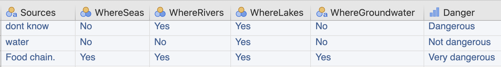

# (PART) Collecting data {-}


# Collecting data {#CollectingDataProcedures}


<!-- Introductions; easier to separate by format -->

```{r, child = if (knitr::is_html_output()) {'./introductions/09-Collect-HTML.Rmd'} else {'./introductions/09-Collect-LaTeX.Rmd'}}
```


<!-- Define colours as appropriate -->
```{r, child = if (knitr::is_html_output()) {'./children/coloursHTML.Rmd'} else {'./children/coloursLaTeX.Rmd'}}
```


## Introduction {#ProtocolsIntro}

If the RQ is well-constructed, terms are clearly defined, and the study is well-designed and explained, then the process for collecting the data should be easy to describe.
Data collection is often time-consuming, tedious and expensive, so collecting the data correctly first time is important, hence an accurate description of the data collection process is essential.


::: {.tipBox .tip data-latex="{iconmonstr-info-6-240.png}"}
Data collection is often tedious, time-consuming and expensive: you usually get one chance to collect data.
In contrast, data (once collected) can be analysed as many times as necessary.
Design the study properly the first time!
:::


## Protocols {#Protocols}
\index{Protocol}\index{Data collection}

*Before* collecting the data, a plan should be established and documented that explains exactly *how* the data will be obtained, which will include *operational definitions* (Sect.\ \@ref(OperationDefinitions)).\index{Definitions!operational}
This plan is called a *protocol*.


::: {.definition #Protocol name="Protocol"}
A *protocol* is a procedure documenting the details of the design and implementation of studies, and for data collection. 
:::


Unforeseen complications are not unusual, so often a *pilot study* (or a *practice run*) is conducted before the actual data collection, to:\index{Pilot study}

* determine the feasibility of the data collection protocol.
* identify unforeseen challenges.
* obtain data to determine appropriate sample sizes (Sect.\ \@ref(EstimatingSampleSize)).
* identify ways to potentially save time and money.

The pilot study may suggest changes to the protocol.


::: {.definition #PilotStudy name="Pilot study"}
A *pilot study* is a small test run of the study used to check that the protocol is appropriate and practical, and to identify (and hence fix) possible problems with the research design or protocol.
:::


<div style="float:right; width: 222x; border: 1px; pad/ding:10px">

</div>


The data can be collected once the protocol\index{Protocol} has been finalised.
Protocols ensure studies are reproducible (Sect.\ \@ref(ReproducibleResearch)),\index{Research!reproducibility} so others can confirm or compare results, and others can understand exactly what was done, and how.
Protocols should indicate how design aspects (such as blinding the individuals, random allocation of treatments, etc.) will happen.\index{Research design}
The final *protocol*, without pedantic detail, should be reported.
Diagrams can be useful to support explanations.
All studies should have a well-established protocol for describing how the study was done.

A protocol usually has at least three components that describe:

1. how individuals are chosen from the population (i.e., external validity).
2. how data are collected from the individuals (i.e., internal validity).
3. the types of analyses and software (including version) used.\index{Computers and software}

Data collection often encounters problems or challenges, which should be documented also.


:::{.example #ProtocolExample name="Protocol"}
@data:Romanchik2018:cookies made cookies using `r readr::parse_character( c("puréed"), locale = locale(encoding = "UTF-8"))` green peas in place of margarine (to increase the nutritional value of cookies).
They assessed the acceptance of these cookies to college students.

The protocol discussed *how the individuals were chosen* (p.\ 4):

> ...through advertisement across campus from students attending a university in the southeastern United States.

This voluntary sample comprised $80.6$%\ women, a higher percentage of women than in the general population, and in the college population. 
(Other extraneous variables were also recorded.)

Exclusion criteria were also applied, excluding people 'with an allergy or sensitivity to an ingredient used in the preparation of the cookies' (p.\ 5).
The researchers also described *how the data were obtained*, including these steps (p.\ 5):

* Tasters sat at individual tables, so they could not be influenced by other tasters.
* Cookies were presented individually, on individual plates.
* The cookies were presented in a randomised order (fat substituted with green pea puree at $25$%,\ $0$%,\ $50$%,\ $100$% and\ $75$%).
* Between tastes, tasters 'cleansed their palates' by drinking distilled water at $25$^o^C. 
* The tasters recorded (p.\ 5):

> characteristics of color, smell, moistness, flavor, aftertaste, and overall acceptability, for each sample of cookies...

Thus, internal validity was addressed using random allocation (to manage confounding), blinding individuals (to partially manage the Hawthorne effect), and washouts (to manage the carry-over effect).
Details are also given of how the cookies were made, and how objective measurements (such as moisture content) were determined.
Subjects were not blinded to being in a study, but were blinded to which substitution percentage was in each cookie.

The *type of analyses and software used* were also given.
:::


::: {.exampleExtra  data-latex=""}
Consider this partial protocol, which shows honesty in describing a protocol:
  
> Fresh cow dung was obtained from free-ranging, grass fed, and antibiotic-free Milking Shorthorn cows (*Bos taurus*) in the Tilden Regional Park in Berkeley, CA.\spacex
> Resting cows were approached with caution and startled by loud shouting, whereupon the cows rapidly stood up, defecated, and moved away from the source of the annoyance. 
> Dung was collected in ZipLoc bags ($1$\ gallon), snap-frozen and stored at $-80$\ C. 
>
> --- @hare2008sepsid, p.\ 10
:::


<!-- One approach to documenting the data collection process is to use the [STAR method](https://www.cell.com/star-methods): -->

<!-- * S (**Structured**):  -->
<!--   The protocol is organised logically, with attention to detail. -->
<!-- * T (**Transparent**):  -->
<!--   All the necessary information is provided: the protocol is transparent, comprehensive and accurate. -->
<!-- * A (**Accessible**):  -->
<!--   The protocol is easy to access, easy to follow, and easy to comprehend. -->
<!-- * R (**Reporting**): -->
<!--   The protocol is reported in whole and in detail, so it could be replicated. -->


## Collecting data using questionnaires {#AskSurveyQuestions}
\index{Questionnaire!questions}\index{Questionnaire}\index{Survey}

### Writing questions 

Collecting data using *questionnaires* is common for both observational and experimental studies.
Questionnaires are very difficult to do well: question wording is crucial, and surprisingly difficult [@fink1995survey].
Pilot testing questionnaires is crucial.


:::{.definition #Questionnaire name="Questionnaire"}
A questionnaire is a set of questions for respondents to answer.\index{Questionnaire}
:::


::: {.tipBox .tip data-latex="{iconmonstr-info-6-240.png}"}
A *questionnaire* is a set of question to obtain information from individuals.\index{Questionnaire}\index{Survey}
A *survey* is an entire methodology, that includes gathering data using a questionnaire, finding a sample, and other components.
:::

Questions in a questionnaire may be *open-ended* (respondents can write their own answers) or *closed* (respondents select from a small number of possible answers, as in multiple-choice questions).\index{Questionnaire!questions!open-ended}\index{Questionnaire!questions!closed}
Open-ended and closed questions both have advantages and disadvantages.
Answers to open-ended questions more easily lend themselves to qualitative analysis\index{Research!qualitative} and closed question more to quantitative research.\index{Research!quantitative}
This section briefly discusses writing questions.


::: {.example #OpenClosedQuestions name="Open and closed questions"}
German students were asked a series of questions about microplastics [@raab2021conceptions], including: 

1. Name sources of microplastics in the household.
2. In which ecosystems are microplastics in Germany?
   Tick the answer (multiple ticks are possible).
   *Options*: (a)\ sea; (b)\ rivers; (c)\ lakes; (d)\ groundwater.
3. Assess the potential danger posed by microplastics.
   *Options*: (a)\ very dangerous; (b)\ dangerous; (c)\ hardly dangerous; (d)\ not dangerous.

The first question is *open-ended*: respondents provide their own answers.
The second question is *closed*, where *multiple* options can be selected.
The third question is *closed*, where only *one* option can be selected.
:::


Writing good questionnaire questions is difficult. 
Good practice stipulates:

* *Avoiding leading questions*: these may lead respondents to answer a certain way.\index{Leading questions}
* *Avoiding ambiguity*: avoid unfamiliar or technical terms.
* *Avoiding asking the uninformed*: avoid asking respondents about issues they don't know about.
  Many people will give a response even if they do not understand (and such responses are worthless).
  For example, people may give directions to places that do not even exist [@collett1976pointing].
* *Avoiding complex and double-barrelled questions*: these are hard to understand and the answers hard to interpret.
* *Avoiding problems with ethics*:\index{Ethics}
  avoid questions about people breaking laws, or revealing confidential or private information.
  In special cases and with justification, ethics committees may allow such questions. 
* *Ensuring clarity* in question wording.
* For closed questions: ensuring options are *mutually exclusive* (responses fit into only one category)\index{Mutually exclusive} and *exhaustive* (categories cover *all* options).\index{Exhaustive}


::: {.example #LeadingQns name="Poor question wording"}
Consider a questionnaire asking these questions:

1. Because bottles from bottled water create enormous amounts of non-biodegradable landfill and hence threaten native wildlife, do you support banning bottled water?
2. Do you drink more water now?
3. Are you more concerned about Coagulase-negative *Staphylococcus* or *Neisseria pharyngis* in bottled water?
4. Do you drink water in plastic and/or glass bottles?
5. Do you have a water tank installed illegally, without permission?
6. Do you avoid purchasing water in plastic bottles unless it is carbonated, unless the bottles are plastic but not necessarily if the lid is recyclable?

Question\ 1 is *leading* because the expected response is obvious.
Better would be: 'Do you support or not support banning bottled water?'


Question\ 2 is *ambiguous*: it is unclear what 'more water now' is being compared to.

Question\ 3 is unlikely to give sensible answers, as most people will be *uninformed*.
Many people will still give an opinion, but the data will be effectively useless (though the researcher may not realise).

Question\ 4 is *double-barrelled*, and would be better asked as two separate questions (one asking about plastic bottles, and one about glass bottles).

Question\ 5 is unlikely to be given *ethical approval* or to obtain truthful answers, as respondents are unlikely to admit to breaking rules.

Question\ 6 is *unclear*, since knowing what a *yes* or *no* answer means is confusing.
:::


::: {.example #QuestionWording name="Question wording"}
Question *wording* can be important.
In the\ 2014 *General Social Survey* (https://gss.norc.org), when white Americans were asked for their opinion of the amount America spends on *welfare*, $58$% of respondents answered 'Too much'.
However, when white Americans were asked for their opinion of the amount America spends on *assistance to the poor*, only $16$% of respondents answered 'Too much' [@PovertyWording].
:::


::: {.example #MutuallyExclusiveQns name="Mutually exclusive options"}
In a study to determine the time doctors spent on patients (from @chan2008exploration), doctors were given the options:\index{Questionnaire!questions!closed}

* $0$--$5$\mins;
* $5$--$10$\mins; or
* more than $10$\mins.

This is a poor question, because a respondent does not know which option to select for an answer of '$5$\mins'.
The options are not *mutually exclusive*.
:::


`r if (knitr::is_html_output()){
  'The following (humourous) video shows how questions can be manipulated by those not wanting to be ethical:'
}`

<div style="text-align:center;">
<iframe width="560" height="315" src="https://www.youtube.com/embed/G0ZZJXw4MTA" frameborder="0" allow="accelerometer; encrypted-media; gyroscope; picture-in-picture"></iframe>
</div>
<!-- Yes Prime Minister is a British political satire/ comedy that was aired in the 1980s. The original copyright belongs to BBC. Usage of this clip constitutes fair use for the purpose of education. -->


### Challenges using questionnaires {#Biases}
\index{Questionnaire!biases}

Using questionnaires presents myriad challenges.

* *Non-response bias* (Sect.\ \@ref(SelectionBias)):\index{Bias!selection}
  Non-response bias is common with questionnaires, as they are often used with voluntary-response samples (Sect.\ \@ref(NonRandomSamples)).\index{Sampling!non-random!voluntary}
  The people who *do not* respond to the survey may be different from those who *do* respond. 
* *Response bias* (Sect.\ \@ref(SelectionBias)):\index{Bias!response}
  People do not always answer truthfully; for example, what people *say* may not correspond with what people *do* (Example \@ref(exm:EcologicalCups)).
  Sometimes this is unintentional (e.g., poor questions wording), due to embarrassment or because questions are controversial.
  Sometimes, respondents repeatedly provide the same answer (without reading the question) to a series of multiple-choice questions.
* *Recall bias*:\index{Bias!recall}
  People may not be able to accurately recall past events clearly, or recall when they happened.
* *Question order*: The order of the questions can influence the responses.\index{Bias!question order}
* *Interpretation*: Phrases and words such as 'Sometimes' and 'Somewhat disagree' may mean different things to different people.\index{Bias!interpretation}

Many of these can be managed with careful questionnaire design, but discussing the methods are beyond the scope of this book.


::: {.example}
@alharthy2023knowledge studied the knowledge, attitude, and level of confidence of paramedics when managing patients
with visual or hearing problems.
They used a questionnaire, which was sent to (p.\ 5)

> ... $372$ potential participants with the expectation that at least\ $310$ questionnaires [would] be returned ($83$% assumed return rate). 
> However, only\ $97$ out of\ $372$ participants completed the questionnaire, resulting in actual return rate of $26$%.

Response rates from questionnaires are often very low (and unrepresentative).\index{Questionnaire!response rate}
:::


### Preparing software for questionnaire data {#SoftwareQuestionnaires}
\index{Questionnaire!software}\index{Computers and software!data entry}

Care is needed when preparing software for data collected using a questionnaire.
Sometimes, of course, the data are collected by computer (e.g., online) and are supplied to the researchers already formatted.

Data from open questions are usually text-based (such as words, sentences or paragraphs of text).
These can generally be included in the data worksheet (though there may be a limit to the length of such data), but cannot be analysed using the quantitative methods described in this book.\index{Research, qualitative}

Closed questions are easily included in a data worksheet.
In closed questions where respondents can select *one* option only, one column is needed for the question, recording which option is selected.
In closed questions where respondents can select *all* options that apply, each option requires its own column, recording each respondents' answer for that option.


:::{.example #OpenClosedQuestionsSoftware name="Open and closed questions: software"}
In Example\ \@ref(exm:OpenClosedQuestions), three questionnaire questions are given that were asked of German students about microplastics [@raab2021conceptions].
Some (artificial) data are shown entered in Fig.\ \@ref(fig:Microplasticsjamovi).

The first question requires open-ended, text-based answers (`Sources`).\index{Questionnaire!questions!open-ended}
For the second (closed) question, students could select *multiple* options, so each option needs one column in the data worksheet (`WhereSeas` to `WhereGroundwater`).\index{Questionnaire!questions!open-ended}\index{Questionnaire!questions!closed}
The third (closed) question required students to select *one* option from a given list, so one column (`Danger`) is needed to record responses.
As usual (Sect.\ \@ref(DataEntry)), each row represents one unit of analysis (student).

:::


```{r Microplasticsjamovi, fig.cap="The data worksheet for some example data, for the microplastics study.", fig.align="center", out.width=c("100%"), fig.show='hold'}

```


\index{Research design|)} 

## Chapter summary {#Chap10-Summary}

Having a detailed procedure for collecting the data (the *protocol*) is important.
Using a *pilot study* to trial the protocol can reveal unexpected changes necessary for a good protocol.
Creating good questionnaires questions is difficult, but important.


## Quick review questions {#Chap10-QuickReview}


<!-- bromodosis: smelly feet -->
::: {.webex-check .webex-box}

1. What is the biggest problem with this question: \tightlist
   'Do you have bromodosis?'
`r if( knitr::is_html_output() ) {longmcq( c(
                     "It is double-barrelled",
                     "It is a leading question",
                     answer = "It uses language that may not be understood",
                     "It is ambiguous") )}`

1. What is the biggest problem with this question:
   'Do you spend too much time connected to the internet?'
`r if( knitr::is_html_output() ) {longmcq( c(
                     "It is double-barrelled",
                     "It is a leading question",
                     "It uses language that may not be understood",
                     answer = "It is ambiguous") )}`
1. What is the biggest problem with this question:
   'Do you eat fruits and vegetables?'
`r if( knitr::is_html_output() ) {longmcq( c(
                     answer = "It is double-barrelled",
                     "It is a leading question",
                     "It uses language that may not be understood",
                     "It is ambiguous") )}`
1. *True* or *false*:
    A well-defined protocol allows the researchers to make the study externally valid.
`r if( knitr::is_html_output() ) {torf( answer = FALSE )}`
1. *True* or *false*: 
    This question is likely to be a *leading* question.
    'Do you support a ban on drinks sold in unrecyclable plastic bottles?'
`r if( knitr::is_html_output() ) {torf( answer = TRUE )}`
:::


## Exercises {#CollectionExercises}

[Answers to odd-numbered exercises] are given at the end of the book. 

`r if( knitr::is_latex_output() ) "\\captionsetup{font=small}"`


::: {.exercise #CollectSurveyQuestions1}
What is the problem with this question?

> What is your age? (Select one option)
>
> - Under\ $18$
> - Over\ $18$
:::


::: {.exercise #CollectSurveyQuestions1B}
What is the problem with this question?

> How many children do you have? (Select one option)
>
> - None
> - 1\ or\ 2
> - 2\ or\ 3
> - More than\ 4
:::


::: {.exercise #CollectSurveyQuestions2}
Which of these questionnaire questions is better? 
Why?

1. Should concerned cat owners vaccinate their pets?
2. Should domestic cats be required to be vaccinated or not?
3. Do you agree that pet-owners should have their cats vaccinated?
:::


::: {.exercise #CollectSurveyQuestions2B}
Which of these questionnaire questions is better? 
Why?

1. Do you own an environmentally-friendly electric vehicle?
2. Do you own an electric vehicle?
3. Do you own or do you not own an electric vehicle?
:::


::: {.exercise #SunscreenQuestions}
@data:Falk2013:SunProtection studied sunscreen use, and asked participants questions, including these:

* How often do you sun bathe with the intention to tan during the summer in Sweden?
  (Possible answers: never, seldom, sometimes, often, always).
* How long do you usually stay in the sun between $11$am and $3$pm, during a typical day-off in the summer (June--August)?
  (Possible answers: $<30$\mins, $30$\mins--$1$\hs, $1$--$2$\hs, $2$--$3$hs, $>3$hs).

Critique these questions.
What biases may be present?
:::


::: {.exercise #KidsEnvironmentQuestions}
@moron2021children studied primary-school children's knowledge of their natural environment.
They were asked three questions:

1. Do you usually visit Guadaira Park?  
   * No, I don’t like parks.
   * No, I don’t usually visit it.
   * Yes, once per week.
   * Yes, more than once a week
   
2. How many times have you visited nature (the beach, countryside, mountains, etc.) in the last month?  
   * Never
   * Once
   * Two to three times
   * More than three times
   
3. Which is your favorite natural place?	 
   * Write a story
   * Draw a picture

Which questions are *open* and which are *closed*?
Which questions will produce *qualitative* data?
Critique the questions.
:::

`r if( knitr::is_latex_output() ) "\\captionsetup{font=normalsize}"`


<!-- QUICK REVIEW ANSWERS -->
`r if (knitr::is_html_output()) '<!--'`
::: {.EOCanswerBox .EOCanswer data-latex="{iconmonstr-check-mark-14-240.png}"}
**Answers to *Quick Revision* questions:**
**1.** *Language*: Most people do not know what 'bromodosis' is.
**2.** *Ambiguous*: 'Too much', compared to what?
**3.** *Double-barrelled*: Some people may eat fruits but not vegetables, for example.
**4.** False.
**5.** True.
:::
`r if (knitr::is_html_output()) '-->'`

