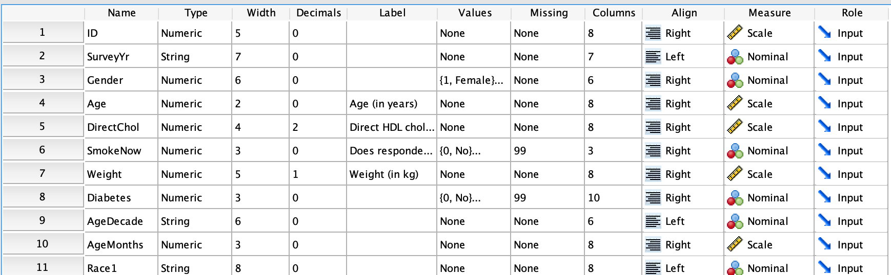

# (PART) Describing and summarising data  {-}


# Describing data {#DescribingVars}


```{block2, type="rmdobjectives"}
So far,
you have learnt to
ask a RQ, 
identify different ways of obtaining data,
design the study
and
collect the data.

**In this chapter**,
you will learn how to describe the data,
because this determines how to proceed with the analysis.
You will learn to:

* identify qualitative and quantitative variables.
* identify nominal and ordinal qualitative variables.
* identify continuous and discrete quantitative variables.
* describe data in ways suitable for use in software.

```


   
```{r echo=FALSE, fig.cap="", fig.align="center", fig.width=3, out.width="35%"}
SixSteps(4, "Describing variables") 
```


## Quantitative and qualitative data 

Understanding the *type* of data collected is
essential before starting any analysis,
because the *type* of data determines how to proceed with summaries and analyses.
Broadly, 
data may be described as either:

* [**Quantitative** data](#QuantData); or
* [**Qualitative**  data](#QualData).
   
We can also talk about quantitative and qualitative *variables*.
(Remember that variables are measured on the *individuals* in the study.)
The *variable* is the description of what varies,
and the *data* are the values of the variables that are recorded.
Quantitative variables record quantitative data,
and
qualitative variables record qualitative data.


```{block2, type="rmdimportant"}
*Quantitative research* summarises and analyses data 
using numerical methods
(Sect. \@ref(TypesOfResearch)).

*Quantitative research*
can include both *quantitative* and *qualitative* variables,
because both *quantitative* and *qualitative* 
data can be summarised numerically
(Chaps. \@ref(NumericalQuant) and \@ref(NumericalQual) respectively)
and analysed numerically.
```


```{example, VariablesData, name="Variables and data"}
'Age' is a *variable* because age can vary from individual to individual.
The *data* would be values such as 13 years, 21 years and 76 years.
```


### Quantitative data: Discrete and continuous data {#QuantData}


**Quantitative** data
are *mathematically* numerical.
Most data that are counted or measured will be quantitative. 
Quantitative data is often (but not always) 
measured with measurement units (such as *kg* or *cm*).


<!-- Text wrap from: https://stackoverflow.com/questions/43551312/wrap-text-around-plots-in-markdown -->
<!-- Trick from: https://blog.earo.me/2019/10/26/reduce-frictions-rmd/ -->
`r if (knitr::is_latex_output()) '<!--'`
```{r, echo=FALSE, out.width= "10%", out.extra='style="float:left; padding:10px"'}
include_graphics("Pics/iconmonstr-calculator-9-240.png")
```
`r if (knitr::is_latex_output()) '-->'`

```{definition, QuantitativeData, name="Quantitative data"}
*Quantitative data* is *mathematically* numerical data:
the numbers themselves have numerical meaning, 
and it makes sense to be able to perform mathematical operations on them.
Most data that are counted or measured will be quantitative. 
```


Be careful: 
Just because the data are numbers, 
it does not necessarily mean that the data are quantitative.
*Mathematically numerical data are quantitative*;
that is, 
numbers with numerical *meanings*.

      
      
<!-- Text wrap from: https://stackoverflow.com/questions/43551312/wrap-text-around-plots-in-markdown -->
<!-- Trick from: https://blog.earo.me/2019/10/26/reduce-frictions-rmd/ -->
`r if (knitr::is_latex_output()) '<!--'`
```{r, echo=FALSE, out.width= "20%", out.extra='style="float:right; padding:10px"'}
include_graphics("Illustrations/pexels-carlos-cuadros-979959.jpg")
```
`r if (knitr::is_latex_output()) '-->'`

```{example QuantitativePostcodes, name="Quantitative data"}
Australian postcodes are numbers,
but are *not* quantitative.
The numbers are just labels.
A postcode of 4556 isn't one 'better' or one 'more' than a postcode of 4555.

The values do not have numerical meanings.
Indeed,
rather than numerical postcodes,
alphabetic postcodes could have been chosen.
For example,
the post code of Caboolture is 4510, but it could have been QCAB.
```


Quantitative data may be further defined as *discrete* or *continuous*.
*Discrete* quantitative data has possible values that can be counted, 
at least in theory.
Sometimes,
the possible values may not have a theoretical upper limit,
yet can be still considered 'countable'.


```{definition, DiscreteData, name="Discrete data"}
*Discrete* quantitative data has a countable number of possible values 
between any two given values of the variable.
```


```{example QuantDiscrete, name="Discrete quantitative data"}
These (quantitative) variables are *discrete*
(and so record *discrete* quantitative data):

* The *number* of heart attacks in the previous year experienced by women over 40. 
  Possible values are 0, 1, 2, ...
* The *number* of cracked eggs in a carton of 12. Possible values are: 0, 1, 2, ... 12.
* The *number* of orthotic devices a person has ever used. Possible values are 0, 1, 2, ... 
* The *number* of fissures in turbines after 5000 hours of use. Possible values are 0, 1, 2, ...

```


*Continuous* quantitative data has values that cannot,
at least in theory,
be recorded exactly.
In other words,
another value can always be found between
any two given values of the variable,
if we measure to a greater number of decimal places.
In practice, though, 
the values need to be rounded to a reasonable number of decimal places.


```{definition, ContinuousData, name="Continuous data"}
*Continuous* quantitative data have (at least in theory) 
an infinite number of possible values
between any two given values.
```

Height is continuous:
between the heights of 179cm and 180cm,
many heights exist,
depending on how many decimal places are used 
to record height.
In practice, however, 
heights are usually rounded to the nearest centimetre 
for convenience.
All continuous data are rounded.


```{example QuantContinuous, name="Continuous quantitative data"}
These (quantitative) variables are *continuous* 
(that is, they record continuous quantitative data):

* The *weight* of 6-year-old Australian children.
  Values exist between any two given values of weight,
  by measuring to more decimal places of a kilogram;
  we would usually quote weight to the nearest kilogram
* The *energy consumption* of houses in a given city.
  Values exist between any two given values of energy consumption,
  by measuring to more and more decimal places of a kiloWatt-hour (kWh);
  we would usually quote to the nearest kWh.
* The *time* spent in front of a computer each day for employees in a given industry.
  Values exist between any two given times,
  by measuring to more decimal places of a second;
  we would usually quote the times to (say) the nearest minute, or the nearest 15 minutes.

```


### Qualitative data: Nominal and ordinal data {#QualData}

**Qualitative** data
has distinct labels or categories that are not mathematically numerical.
These categories are called the *levels*\index{levels of a qualitative variable}
or the *values*\index{levels of a qualitative variable}
of the variable.

<!-- Text wrap from: https://stackoverflow.com/questions/43551312/wrap-text-around-plots-in-markdown -->
<!-- Trick from: https://blog.earo.me/2019/10/26/reduce-frictions-rmd/ -->
`r if (knitr::is_latex_output()) '<!--'`
```{r, echo=FALSE, out.width= "10%", out.extra='style="float:left; padding:10px"'}
include_graphics("Pics/iconmonstr-construction-35-240.png")
```
`r if (knitr::is_latex_output()) '-->'`

```{definition, QualitativeData, name="Qualitative data"}
*Qualitative data* is not *mathematically* numerical data:
it consists of categories or labels. 
```


```{definition, Levels, name="Levels"}
The *levels* (or the *values*) of a qualitative variable
refer to the names of the distinct categories. 
```


```{example, QualData, name="Qualitative data"}
'Brand of mobile phone' is a qualitative variable.
Many levels are possible (that is, many possible brands),
but these could be simplified by defining the levels as 
'Huawei', 'Apple', 'Samsung', 'Google' and 'Other'.
```


Be careful: 
*numerical* data
may be qualitative.
Qualitative data are not *mathematically* numerical;
that is, 
the numbers don't have numerical *meanings*.

      
```{example, QualData2, name="Qualitative data"}
Australian postcodes are numbers,
but are *qualitative*
(Example \@ref(exm:QuantitativePostcodes)).
```


```{lemma QualDataTypes, name="Types of qualitative data"}
Here are two survey questions that produce qualitative data.

1. What is your blood type?
  - Type A.
  - Type B.
  - Type AB.
  - Type O.

2. What is your age group?
  - Under 20.
  - 20 to under 30.
  - 30 to under 50.
  - 50 or over.

What features of the data collected from the questions
are similar? 
What features are different?
```


Qualitative data can be further classified as
*nominal* or *ordinal*.
*Nominal* variables are qualitative variables where 
the levels have *no natural order*.
*Ordinal* variables are qualitative variables where 
the levels do have a *natural order*.
So in Extra Example \@ref(lem:QualDataTypes),
'Blood type' is qualitative *nominal*, 
while 'Age group' is qualitative *ordinal*.


```{example, NominalData, name="Nominal data"}  
This survey question will produce *nominal* data:

> How do you usually get to university?
> 
> - Car (as driver or passenger).
> - Bus.
> - Ride bicycle or walk.
> - Other.

The data will be nominal with four levels.
The levels can appear in any order:
from largest group to smallest,
or in alphabetical order.
Because there is no *natural* order,
the order used should be carefully considered:
what is the most useful order 
when summarising the data?
```


```{example, OrdinalData, name="Ordinal data"}
This survey question will produce *ordinal* data:

> Please indicate the extent to which you agree or disagree with this statement:
> 'Permeable pavements technology has the potential to
> revolutionise green building practices'.
>
> - Strongly disagree.
> - Disagree.
> - Neither agree or disagree.
> - Agree.
> - Strongly agree.

The data will be ordinal with five levels.
Treat the levels
in the given order (or the reverse order)
makes sense;
It would not make sense,
for example,
to give the levels in alphabetical order.
```


<!-- Text wrap from: https://stackoverflow.com/questions/43551312/wrap-text-around-plots-in-markdown -->
<!-- Trick from: https://blog.earo.me/2019/10/26/reduce-frictions-rmd/ -->
`r if (knitr::is_latex_output()) '<!--'`
```{r, echo=FALSE, out.width= "30%", out.extra='style="float:right; padding:10px"'}
include_graphics("Illustrations/pexels-tristan-le-1642883.jpg")
```
`r if (knitr::is_latex_output()) '-->'`


```{example, DefinitionsClarity, name="Clarity in definitions"}
Consider the variable 'Age'.
Age is *continuous quantitative*,
since we age continuously
(on our birthday, we don't suddenly get one year greyer with one extra year's worth of wrinkles...).

Age is usually rounded to the number of completed years,
for convenience.
However,
the age of young children may be given as 
'3 days' or '10 months',
instead of the nearest year.

Sometimes *Age group* is used instead
(such as
Under 20; 20 to under 30; 30 to under 50; 50 or over).
'Age group' is *qualitative ordinal*.

Ensure your RQ is clear about which is used!
```
	

```{example, TypesVariables, name="Types of variables"}
Consider a study to determine if the weight of 500g bags of pasta 
really is at least 500g.
One approach is to record the weight of pasta in each bag
(a *quantitative* variable),
and compare the *average* weight 
to the target weight of 500g.

Another approach is to record whether or not each bag of pasta
weighed at least 500g (bags are not underweight).
This would be a *qualitative* variable, with two *levels*
(underweight; not underweight).
We could then report the *percentage* of bags that are underweight.
```


## Describing data in jamovi and SPSS

In practice,
quantitative research requires the use of a computer
for producing graphs and completing calculations.
In this book,
two statistical software packages are
described for analysis of data:

* [**jamovi**](#UsingJamovi) and 
* [**SPSS**](#UsingSPSS).

(For reason to avoid Excel and other spreadsheets,
[read this information from earlier in this book](#Software-In-Research).)

This section makes only brief notes about setting up data in these software packages;
consult a comprehensive reference for more (and better) details.
For both packages,
however,
declaring the variables correctly is very important
(Table \@ref(tab:TypesOfVars)).

Practically all software,
including jamovi and SPSS
record data in a spreadsheet-like grid,
with the *variables in the columns*,
and the
*units of analysis in the rows*.


```{r TypesOfVars, echo=FALSE}
VarTypes <- array( dim=c(4, 4))
VarTypes[1, ] <- c("Qualitative", "Nominal",    "Nominal",               "Nominal")
VarTypes[2, ] <- c("",            "Ordinal",    "Ordinal",               "Ordinal")
VarTypes[3, ] <- c("Quantative",  "Discrete",   "Continuous, Integer",   "Scale")
VarTypes[4, ] <- c("",            "Continuous", "Continuous, Decimal",   "Scale")

colnames(VarTypes) <- c("Type of variable", "Further classification", "In jamovi", "In SPSS")

if( knitr::is_latex_output() ) {
  kable(VarTypes,
        format = "latex",
        longtable = FALSE,
        col.names = c("Type of variable", 
                      "Further classification", 
		      "In jamovi", 
		      "In SPSS"),
      booktabs = TRUE,
      caption = "Different types of variables, and their descriptions in jamovi and SPSS") %>%
   kable_styling(font_size = 10) %>%
   row_spec(0, bold = TRUE)
}

if( knitr::is_html_output() ) {
  kable(VarTypes,
        format = "html",
        longtable = FALSE,
        col.names = c("Type of variable", 
                      "Further classification", 
	  	      "In jamovi", 
	  	      "In SPSS"),
      booktabs = TRUE,
      caption = "Different types of variables, and their descriptions in jamovi and SPSS")
}
```


### Using jamovi {#UsingJamovi}

In jamovi,
nominal variables are called *Nominal*,
and
ordinal variables are called *Ordinal*
(Table \@ref(tab:TypesOfVars)).
In jamovi,
*continuous* quantitative variables are called *continuous decimal*,
and
*discrete* quantitative variables are called (confusingly) *continuous integer*.

To add this information to jamovi,
double-click on the variable name at the top of the data worksheet
(Fig. \@ref(fig:VarNamesjamovi)),
which produces 
Fig. \@ref(fig:VarTypesjamovi).
This opens an area where the data can be described:

* Nominal qualitative variables are set as `Nominal`, 
  and the levels described in the `Levels` area to the right
* Ordinal qualitative variables are set as `Ordinal`, 
  and the levels described in the `Levels` area to the right.
* Quantitative *continuous* variables are set as `Continuous` 
  with the *Data type* as `Decimal`.
* Quantitative *discrete* variables are set as `Continuous` 
  with the *Data type* as `Integer`.

When the information has been entered,
clicking the up-arrow on the top right 
(Fig. \@ref(fig:VarTypesjamovi)) 
closes this window.


```{r VarNamesjamovi, echo=FALSE, fig.cap="jamovi: The variable names at the top of the columns of data ", fig.align="center",  out.width='77%'}

```


```{r VarTypesjamovi, echo=FALSE, fig.cap="jamovi: Setting the variable type", fig.align="center",  out.width='80%'}

```


### Using SPSS {#UsingSPSS}

In SPSS, 
variables are described in the *Variable View* window
(*not* the *Data View* window).
Each variable is then described
in the *Measure* column
(Fig. \@ref(fig:VarTypesSPSS)):

* Nominal qualitative variables are called `Nominal`.
* Ordinal qualitative variables are called `Ordinal`.
* Quantitative variables are called `Scale`,
regardless of whether they are discrete or continuous.


```{r VarTypesSPSS, echo=FALSE, fig.cap="SPSS: Setting the variable type", fig.align="center",  out.width='100%'}

```


## Summary {#Chap11-Summary}

Data and variables can be described as either
**quantitative** (either **discrete** or **continuous**)
or
**qualitative** (either **nominal** or **ordinal**).
Variables should be correctly defined in jamovi and SPSS.


## Quick revision questions {#Chap11-QuickReview}

A study on the bruising of apples 
[@doosti2016development]
aimed to determine the relationship between the recorded surface temperature of apple,
the depth of bruising.

The researchers purposefully hit apples with three
different **forces** (200, 700 and 1200&nbsp;mJ) to inflict bruises.

This was repeated at three different **locations** of the apple (lower; middle; upper).

The researchers then recorded the **depth** of the bruising,
and recorded the **surface temperature** at each bruise location.

1. How would the variable 'region of the apple' be best described?
`r if( knitr::is_html_output() ) {mcq( c(
	"Qualitative nominal",
	answer = "Qualitative ordinal",
	"Quantitative discrete",
	"Quantitative continuous"))}`
1. How would the variable 'depth of bruising'? be best described
`r if( knitr::is_html_output() ) {mcq( c(
	"Qualitative nominal",
	"Qualitative ordinal",
	"Quantitative discrete",
	answer = "Quantitative continuous"))}`
1. How would the variable 'temperature of the bruise location' be best described?
`r if( knitr::is_html_output() ) {mcq( c(
	"Qualitative nominal",
	"Qualitative ordinal",
	"Quantitative discrete",
	answer = "Quantitative continuous"))}`
1. The variable 'force of hit' could be considered as quantitative continuous variable.
However,
since only a small number of forces are used,
it could also be considered as qualitative ordinal.  
If it was considered as *qualitative ordinal*,
how many *levels* would the variable have?
`r if( knitr::is_html_output() ) {mcq( c(
	answer = "Three levels: 200, 700 and 1200 mJ",
	"Four levels: four variables are listed in the study",
	"An infinite number of levels: the force could be anything"))}`


<!-- ####################### REVIEW QUESTIONS ##################################### -->
```{r, child = if (knitr::is_html_output()) './children/ReviewQuestions/ReviewQuestions-Chapter11.Rmd'}
```


## Exercises {#DescribeExercises}

Selected answers are available in
Sect. \@ref(DescribeAnswer).


```{exercise DescribeClassifyingGraphsLimeTrees}
A study of lime trees 
(*Tilia cordata*)
recorded these variables for 385 lime trees in Russia
[@data:ForestBiomass2017; @mypapers:dunnsmyth:glms]:

* the foliage biomass, in kg;
* the tree diameter (in cm);
* the age of the tree (in years); and
* the origin of the tree (one of Coppice, Natural, or Planted).

Describe the variables in the study using the language of this chapter.
```


```{exercise DescribeClassifyingVariables1}
Are these variables
quantitative (discrete or continuous, and with what units of measurement?), or
qualitative (nominal or ordinal, and with what levels?)?
   
1. Systolic blood pressure.
1. Program of enrolment.
1. Academic grade (HD; DN; CR; PS; FL).
1. Number of times a person visited the doctor last year.

```

```{exercise DescribeClassifyingVariables2}
A study of body mass index and its relationship with use of social media
[@data:Alley2017:SocialMedia]
recorded these variables (among others) from a group of 1140 participants:

1. Age (under 45; 45 to 64; 65 or over)
1. Gender (male; female)
1. Location (urban; rural)
1. Social media use (none; low; high)
1. BMI (body mass index; the body mass in kg, divided by the square of height in cm)
1. Total sitting time, in minutes per day

For each variable,
determine the *type* of variable:
quantitative (discrete or continuous, and with what units of measurement?), or
qualitative (nominal or ordinal, and with what levels)?
``` 


```{exercise DescribeClassifyingOrthoses}
In a study of the influence of using ankle-foot orthoses in children with cerebral palsy [@data:Swinnen2017:orthoses],
the data in Table \@ref(tab:DescribeAnkleFoot) describe the 15 subjects.
(GMFCS is used to describe the impact of cerebral palsy on their motor function,
where *lower* levels means *better* functionality: 
the [Gross Motor Function Classification System](https://en.wikipedia.org/wiki/Gross_Motor_Function_Classification_System).)
Describe the variables in the study. 
```

```{r DescribeAnkleFoot, echo=FALSE}
NumP <- 15
Gender <- rep("M", NumP)
Gender[ c(11, 14, 15)] <- "F"
Age <- c(9, 7, 7, 12, 11, 5, 6, 8, 8, 6, 7, 11, 7, 9, 8)
Ht <- c(136, 106, 129, 152, 146, 113, 112, 112, 138, 116, 113, 141, 136, 128, 133)
Wt <- c(34.5, 16.2, 21.1, 40.4, 39.3, 18.1, 16.7, 19.1, 28.6, 19.3, 17.6, 34.9, 34.5, 21.9, 23.0)
GMFCS <- c(1, 2, 1, 1, 2, 1, 2, 1, 1, 1, 1, 1, 1, 1, 1)

CPalsy <- data.frame(Gender = Gender,
                     Age = Age,
                     Height = Ht,
                     Weight = Wt,
                     GMFCS = GMFCS
                     )

if( knitr::is_latex_output() ) {
  kable(CPalsy,
        format = "latex",
        longtable = FALSE,
        booktabs = TRUE,
        digits = c(0, 0, 0, 1, 0),
        caption = "Describing the sample in the orthoses data set",
        col.names = c("Gender", "Age (years)", "Height (cm)", "Weight (kg)", "GMFCS")) %>%
   kable_styling(font_size = 10) %>%
   row_spec(0, bold = TRUE)
}
if( knitr::is_html_output() ) {
  kable(CPalsy,
        format = "html",
        longtable = FALSE,
        booktabs = TRUE,
        digits = c(0, 0, 0, 1, 0),
        caption = "Describing the sample in the orthoses data set",
      col.names = c("Gender", "Age (years)", "Height (cm)", "Weight (kg)", "GMFCS"))
}
```


```{exercise DescribeClassifyingNitrogenInSoil}
A study of fertilizer use
[@data:Lane2002:GLMsoilscience; @mypapers:dunnsmyth:glms]
recorded the soil nitrogen after applying different fertilizer doses.
These variables were recorded:

* the *fertilizer dose*, in kilograms of nitrogen per hectare; 
* the *soil nitrogen*, in kilograms of nitrogen per hectare; and
* the *fertilizer source*; one of 'inorganic' or 'organic'.

Describe the variables in the study.
```


```{exercise DescribeClassifyingKangaroos}
A study
[@brunton2019fright]
recorded the response of kangaroos to drones
(one of 'Vigilance', 'No vigilance', 'Flee $<10$m', or 'Flee $>10$m')
and the altitude of the drone (30m, 60m, 100m or 120m).
The mob size and sex of the kangaroo was also recorded.
Describe the variables in the study.
```


```{exercise DescribeSelfieDeaths}
A study of people who died while taking selfies
[@data:Dokur2018:SelfieDeaths]
recorded the location
(Table \@ref(tab:TableSelfieDeaths)).
Which of the following are the *variables* in the table?
For each that is a variable, 
describe the variable.

1. The location.
1. The number of people who died at each location.
1. The percentage of people who died at each location.

```


```{r TableSelfieDeaths, echo=FALSE}
NumSD <- c(48, 22, 17, 12, 7, 4, 1)
PercentageSD <- c(43.2, 19.9, 15.3, 10.8, 6.3, 3.6, 0.9)
Scenes <- c(
  "Nature, associated environments",
  "Train, railway, associated structures",
  "Buildings, associated structures",
  "Road, bridge, associated structures",
  "Dams, associated structures",
  "Fields, farms, associated structures",
  "Others"
)
SelfieDeaths <- data.frame(
  Num = NumSD,
  PC = PercentageSD
)
rownames(SelfieDeaths) <- Scenes

if( knitr::is_latex_output() ) {
  kable(SelfieDeaths,
        format = "latex",
        longtable = FALSE,
        booktabs = TRUE,
        linesep = c("", "\\addlinespace", "", "", "\\addlinespace", "", ""), # Otherwise addes a space after five lines... 
        digits = c(0, 1),
        caption = "Locations of people dying while taking selfies",
        col.names = c("Number", "Percentage")) %>%
   kable_styling(font_size = 10) %>%
   row_spec(0, bold = TRUE)
}
if( knitr::is_html_output() ) {
  kable(SelfieDeaths,
        format = "html",
        longtable = FALSE,
        booktabs = TRUE,
        digits = c(0, 1),
        caption = "Locations of people dying while taking selfies",
        col.names = c("Number", "Percentage"))
}
```


<!-- ## Lecture 2 review questions -->

<!-- <iframe src="https://h5p.org/h5p/embed/186296" width="1090" height="530" frameborder="0" allowfullscreen="allowfullscreen"></iframe><script src="https://h5p.org/sites/all/modules/h5p/library/js/h5p-resizer.js" charset="UTF-8"></script> -->


