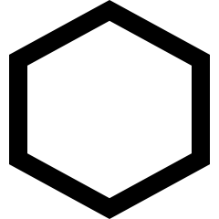
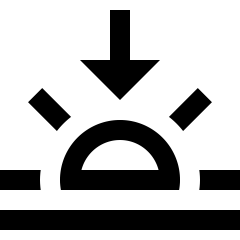
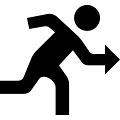

# Summarising quantitative data {#SummariseQuantData}
\index{Quantitative data!summarising|(}


<!-- Introductions; easier to separate by format -->
```{r, child = if (knitr::is_html_output()) {'./introductions/11-SummaryQuant-HTML.Rmd'} else {'./introductions/11-SummaryQuant-LaTeX.Rmd'}}
```


<!-- Define colours as appropriate -->
```{r, child = if (knitr::is_html_output()) {'./children/coloursHTML.Rmd'} else {'./children/coloursLaTeX.Rmd'}}
```


## Introduction {#Summarise-Quant}

Many quantitative research studies involve quantitative variables.
Except for very small amounts of data, understanding the data is difficult without a summary.
Quantitative data can be summarised by knowing how often various values of the variable appear.
This is called the *distribution* of the data.


::: {.definition #Distribution name="Distribution"}
The *distribution*\index{Distribution} of a variable describes what values are present in the data, and how often those values appear.
:::


The distribution can be displayed using a frequency table (Sect.\ \@ref(QuantFreqTable)) or a graph (Sect.\ \@ref(QuantitativeGraphs)).
The distribution of quantitative data can be described by the shape (Sect.\ \@ref(SummaryShape)), and summarised numerically by computing the average value (Sect.\ \@ref(ComputeAverage)), computing the amount of variation (Sect.\ \@ref(Variation)), and identifying outliers (Sect.\ \@ref(SummaryOutliers)).


## Frequency tables for quantitative data {#QuantFreqTable}
\index{Quantitative data!frequency tables}\index{Distribution!quantitative data}

Quantitative data can be collated in a *frequency table*\index{Frequency table!quantitative data} by grouping the variables into appropriate intervals ('bins').\index{Frequency table!bins}
The intervals should be *exhaustive* (cover all values) and *mutually exclusive* (observations belong to one and only one category).
While not essential, usually the categories have equal width.

A frequency table for *discrete* quantitative data uses bins defined to contain single discrete values, or a small number of discrete values.


:::{.example #CyclonesTable name="Frequency table: discrete data"}
The data in
`r if( knitr::is_html_output() ) {
  'Fig.\\ \\@ref(fig:CycloneDataHTML)'
} else {
  'Table\\ \\@ref(tab:CycloneDataLATEX)'
}`
show the number of severe cyclones in the Australian region, for each year from\ 1969 to\ 2005.

A frequency table can be constructed by binning each discrete value individually (Table\ \@ref(tab:CycloneFrequencyTable), left table) or grouped in pairs (Table\ \@ref(tab:CycloneFrequencyTable), right table).
The table gives the number of years, and the corresponding percentages, that recorded the given number of cyclones.
:::


```{r}
data(Cyclones)
CC <- cbind(Cyclones$Year,
            Cyclones$Severe)
```

```{r CyclonesLATEX}
if( knitr::is_latex_output() ) {
  
  CC2 <- rbind(CC[1:5, ],
               c("$\\vdots$", "$\\vdots$") )
  T1 <- kable( pad(CC2,
                   surroundMaths = TRUE,
                   targetLength = c(4, 1),
                   decDigits = c(0, 0)),
               format = "latex",
               longtable = FALSE,
               row.names = FALSE,
               escape = FALSE,
               linesep = "",
               align = c("c", "c"),
               digits = c(0, 0),
               col.names = c("Year", 
                             "Cyclones recorded"),
               booktabs = TRUE) %>%
    row_spec(0, bold = TRUE)
  
  CC3 <- rbind(c("$\\vdots$", "$\\vdots$"),
               CC[33:37, ])
  T2 <- kable( pad(CC3,
                   surroundMaths = TRUE,
                   targetLength = c(4, 1),
                   decDigits = c(0, 0)),
               format = "latex",
               longtable = FALSE,
               row.names = FALSE,
               escape = FALSE,
               linesep = "",
               digits = c(0, 0),
               align = c("c", "c"),
               col.names = c("Year", 
                             "Cyclones recorded"),
               booktabs = TRUE) %>%
    row_spec(0, bold = TRUE)
  
  out <- knitr::kables(list(T1, T2),
                       format = "latex",
                       label = "CycloneDataLATEX",
                       caption = "The first five and last five observations (of $37$) of the number of severe cyclones recorded in the Australian region for each year.") %>% 
    kable_styling(font_size = 8)
  out2 <- prepareSideBySideTable(out, 
                                 gap = "\\qquad\\qquad") 
  out2
  
}
```
```{r CycloneDataHTML, fig.cap="The cyclone data."}
if( knitr::is_html_output() ) {
  DT::datatable( CC,
                 fillContainer = FALSE, # Make more room, so we don't just have ten values
                 options = list(searching = FALSE), # Remove searching: See: https://stackoverflow.com/questions/35624413/remove-search-option-but-leave-search-columns-option
                 colnames = c("Year", 
                              "Number of cyclones"),
                 caption = "The cyclone data."
  )
}
```


```{r CycloneFrequencyTable}
out <- hist(CC[, 2],
            breaks = seq(2.5, 11.5, by = 1),
            plot = FALSE)
CCpercentage <- out$counts / sum(out$counts) * 100

CCtab <- array(dim = c(9, 3) )
CCtab[, 2] <- out$counts 
CCtab[, 3] <- round(CCpercentage) 
CCtab[, 1] <- c(" $3$ cyclones",
                " $4$ cyclones",
                " $5$ cyclones",
                " $6$ cyclones",
                " $7$ cyclones",
                " $8$ cyclones",
                " $9$ cyclones",
                "$10$ cyclones",
                "$11$ cyclones")
colnames(CCtab) <- c("Number cyclones", 
                     "Number of years",
                     "Percentage of years")

CC2tab <- array(dim = c(5, 3) )
out2 <- hist(CC[, 2],
             breaks = seq(2.5, 12.5, by = 2),
             plot = FALSE)
CCpercentage <- out2$counts / sum(out2$counts) * 100

CC2tab[, 2] <- out2$counts 
CC2tab[, 3] <- round(CCpercentage) 
CC2tab[, 1] <- c(" $3$ or $4$ cyclones",
                 " $5$ or $6$ cyclones",
                 " $7$ or $8$ cyclones",
                 " $9$ or $10$ cyclones",
                 "$11$ cyclones")
colnames(CC2tab) <- c("Cyclones recorded", 
                      "Num. of years",
                      "Percentage of years")

if( knitr::is_latex_output() ) {
  T1 <- kable( pad(CCtab,
                   surroundMaths = TRUE,
                   targetLength = c(0, 2, 2),
                   decDigits = 0),
               format = "latex",
               longtable = FALSE,
               escape = FALSE,
               align = c("r", "c", "c"),
               valign = 't',
               booktabs = TRUE,
               linesep = c("","","\\addlinespace"),
               row.names = FALSE,
               col.names = c("recorded",
                             "years",
                             "years")) %>%
    add_header_above( c("Cyclones",
                        "Num. of",
                        "Percentage of"),
                      bold = TRUE,
                      line = FALSE) %>%
    row_spec(0, bold = TRUE)
  
  T2 <- kable( pad(CC2tab,
                   surroundMaths = TRUE,
                   targetLength = c(0, 2, 2),
                   decDigits = 0),
               format = "latex",
               longtable = FALSE,
               escape = FALSE,
               align = c("r", "c", "c"),
               valign = 't',
               booktabs = TRUE,
               linesep = c("","","\\addlinespace"),
               col.names = c("recorded",
                             "years",
                             "years")) %>%
    add_header_above( c("Cyclones",
                        "Number of",
                        "Percentage of"),
                      bold = TRUE,
                      line = FALSE) %>%
    row_spec(0, bold = TRUE)
  
  out <- knitr::kables(list(T1, T2),
                       format = "latex",
                       label = "CycloneFrequencyTable",
                       caption = "Two frequency tables for the severe cyclone data.") %>% 
    kable_styling(font_size = 8)
  out2 <- prepareSideBySideTable(out, 
                                 gap = "\\qquad") 
  out2
  
}


if( knitr::is_html_output() ) {
  kable(pad(CCtab,
            surroundMaths = TRUE,
            targetLength = c(0, 2, 2),
            decDigits = 0),
        format = "html",
        longtable = FALSE,
        align = "c",
        booktabs = TRUE,
        row.names = FALSE,
        caption = "The number of severe cyclones per year, displayed in a frequency table.") %>%
    kable_styling(full_width = FALSE)
}
```


For *continuous* data, care is needed when creating frequency tables.
Bins must be carefully constructed, since all continuous data are rounded.
The bins should be defined to ensure no values lie on the border between bins, and hence creating ambiguity.


:::{.example #BabyBoomTable name="Frequency table: continuous data"}
`r if( knitr::is_html_output() ) {
'Figure\\ \\@ref(fig:BabyBoomDataHTML)'
}  else {
'Table\\ \\@ref(tab:BabyBoomDataLATEX)'
}`
give the weights of babies born in a hospital on one day [@mypapers:Dunn:dataset:1999; @data:Steele:BabyBoom], plus the gender of each baby, and the number of minutes after midnight of the birth (shown in the order in which the births occurred).

To display the distribution of birth weights, the weights can be grouped into clearly-defined weight intervals (Table\ \@ref(tab:BabyBoomTable), left column).
Alternatively, the breaks between the bins can be given to one more decimal place than the data to avoid observations landing exactly on the bin divisions (final column).

The table also gives percentage of birth in each bin; for example, the percentage of babies over\ $4.0\kgs$ is $1/44 \times 100 = 2.27$%, or about\ $2$%. 
Most babies in the sample are between\ $3$ and\ $4\kgs$ at birth.
:::


```{r}
data(BabyBoom)
BB <- BabyBoom

BB2 <- data.frame(Gender = BB$Gender,# = factor(BB$Gender),
                  "Weight (in kg)" = BB$Weight,
                  Mins.Since.Midnight = BB$Mins.Since.Midnight)
```

```{r BabyBoomDataLATEX}
if( knitr::is_latex_output() ) {
  T1 <- kable( pad(BB2[1:5, ],
                   targetLength = c(0, 3, 4),
                   decDigits = c(0, 1, 0)),
               format = "latex",
               longtable = FALSE,
               row.names = FALSE,
               escape = FALSE,
               align = c("c"),
               digits = c(0, 1, 0),
               col.names = c("Gender", 
                             "Weight (kg)", 
                             "Birth time"),
               booktabs = TRUE) %>%
    row_spec(0, bold = TRUE)
  
  #    column_spec(1, width = "10mm") %>%
  #    column_spec(2, width = "10mm") %>%
  #    column_spec(3, width = "10mm")
  BB2[10, ] <- rep("$\\vdots$", 3)
  T2 <- kable( pad(BB2[6:10, ],
                   targetLength = c(0, 3, 4),
                   decDigits = c(0, 1, 0)),
               format = "latex",
               longtable = FALSE,
               row.names = FALSE,
               escape = FALSE,
               digits = c(0, 1, 0),
               align = c("c"),
               col.names = c("Gender", 
                             "Weight (kg)", 
                             "Birth time"),
               booktabs = TRUE) %>%
    row_spec(0, bold = TRUE)
  
  out <- knitr::kables(list(T1, T2),
                       format = "latex",
                       label = "BabyBoomDataLATEX",
                       caption = "The first nine observations (of $n = 44$) of the baby-births data: the number of babies born in a Brisbane (Australia) hospital on one specific day. The `birth time' is the number of minutes after midnight.") %>% 
    kable_styling(font_size = 8)
  out2 <- prepareSideBySideTable(out, 
                                 gap = "\\quad") 
  out2
  
}
```
```{r BabyBoomDataHTML, fig.cap="The baby-births data."}
if( knitr::is_html_output() ) {
  DT::datatable( BB2,
                 fillContainer = FALSE, # Make more room, so we don't just have ten values
                 options = list(searching = FALSE), # Remove searching: See: https://stackoverflow.com/questions/35624413/remove-search-option-but-leave-search-columns-option
                 colnames = c("Gender", 
                              "Weight (in kg)", 
                              "Minutes since midnight"),
                 caption = "The baby-births data. The `birth time' is the number of minutes after midnight."
  )
}
```


```{r BabyBoomTable}
Wts <- BB$Weight
out <- hist(Wts,
            plot = FALSE,
            right = FALSE)
BBpercentage <- out$counts / sum(out$counts) * 100

BBtab <- array(dim = c(6, 4) )
BBtab[, 2] <- out$counts 
BBtab[, 3] <- round(BBpercentage) 
BBtab[, 1] <- c("$1.5$\\kgs\\ to under $2.0$\\kgs",
                "$2.0$\\kgs\\ to under $2.5$\\kgs",
                "$2.5$\\kgs\\ to under $3.0$\\kgs",
                "$3.0$\\kgs\\ to under $3.5$\\kgs",
                "$3.5$\\kgs\\ to under $4.0$\\kgs",
                "$4.0$\\kgs\\ to under $4.5$\\kgs") 
BBtab[, 4] <- c("$1.45$\\kgs\\ to $1.95$\\kgs",
                "$1.95$\\kgs\\ to $2.45$\\kgs",
                "$2.45$\\kgs\\ to $2.95$\\kgs",
                "$2.95$\\kgs\\ to $3.45$\\kgs",
                "$3.45$\\kgs\\ to $3.95$\\kgs",
                "$3.95$\\kgs\\ to $4.45$\\kgs") 

colnames(BBtab) <- c("Weight group", 
                     "Number of babies",
                     "Percentage of babies",
                     "Alterative weight group")

if( knitr::is_latex_output() ) {
  kable( pad(BBtab,
             surroundMaths = TRUE,
             targetLength = c(0, 2, 2, 0),
             decDigits = 0),
         format = "latex",
         longtable = FALSE,
         escape = FALSE,
         align = "c",
         booktabs = TRUE,
         linesep = c("","","\\addlinespace"),
         row.names = FALSE,
         caption = "The baby-weights data, displayed in a frequency table. The first and last columns show two different (but equivalent) ways to group the data.") %>%
    kable_styling(font_size = 8) %>%
    row_spec(0, bold = TRUE)
}
if( knitr::is_html_output() ) {
  kable(pad(BBtab,
            surroundMaths = TRUE,
            targetLength = c(0, 2, 2, 0),
            decDigits = 0),
        format = "html",
        longtable = FALSE,
        align = "c",
        booktabs = TRUE,
        row.names = FALSE,
        caption = "The baby-weights data, displayed in a frequency table. The first and last columns show two different (but equivalent) ways to group the data.") %>%
    kable_styling(full_width = FALSE)
}
```

Sometimes trial and error is needed to find useful intervals for continuous data.
Usually, but not universally, the intervals *include* values at the lower end of the interval, but *exclude* values at the upper end (as in Table\ \@ref(tab:BabyBoomTable)).


## Graphs for quantitative data {#QuantitativeGraphs}
\index{Quantitative data!graphs}\index{Software output!graphs}

The graphs in this section are appropriate for *continuous* quantitative data, and sometimes for *discrete* quantitative data if many values are possible.
Sometimes, *discrete* data with very few recorded values are better displayed using the graphs designed for qualitative data (Sect.\ \@ref(QualitativeGraphs)).

Graphs used to display the distribution of one quantitative variable include:

* *histograms* (Sect.\ \@ref(Histograms)), which are best for moderate to large amounts of data.
* *stemplots* (Sect.\ \@ref(StemAndLeafPlots)), which are best for small amounts of data, and are only sometimes useful.
* *dot charts* (Sect.\ \@ref(DotChartsOneVar)), which are used for small to moderate amounts of data.


::: {.importantBox .important data-latex="{iconmonstr-warning-8-240.png}"}
The purpose of a graph is to display the information in the clearest, simplest possible way, to facilitate understanding the message(s) in the data.
:::


### Histograms {#Histograms}
\index{Graphs!histogram}

Histograms are a series of boxes, where the width of the box represents an interval of *values* of the variable being graphed, and the height of the box represents the *number* (or *percentage*) of observations within that range of values.^[Actually, the *area* of the box is proportional to the number of observations.
We only consider histograms where the boxes have the same width, so the statements are equivalent.]
The height of the histogram bars indicate the number (or percentage) in each category (often called 'bins').\index{Graphs!histogram!bins}
A histogram is essentially a picture of a frequency table.
The vertical axis can be counts (labelled as 'Counts of trees', 'Number of frogs', 'Frequency of people', or similar) or percentages.

When the quantitative variable is *discrete*, the labels usually are placed on the axis aligned with the centre of the bar (see Example\ \@ref(exm:HistogramsDiscrete)).


::: {.example #HistogramsDiscrete name="Histograms: discrete data"}
Consider again the number of severe cyclones in the Australian region
`r if( knitr::is_html_output() ) {
  '(Fig.\\ \\@ref(fig:CycloneDataHTML)).'
} else {
  '(Table\ \\@ref(tab:CycloneDataLATEX)).'
}`
A histogram can be constructed from either frequency table in Table\ \@ref(tab:CycloneFrequencyTable); see
`r if( knitr::is_html_output() ) {
  'below.'
} else {
  'Fig.\\ \\@ref(fig:HistCyclones).'
}`
For example, the left histogram shows there were eight years in which three severe cyclones were recorded. 

Notice that different bin locations and widths change the appearance of the distribution.
:::


```{r HistCyclones, fig.align="center", fig.cap="Two histograms of the severe-cyclone data.", out.width='100%', fig.width=9.5, fig.height=3.25}
par(mfrow = c(1, 2))

hist( Cyclones$Severe,
      breaks = seq(2.5, 11.5, by = 1),
      axes = FALSE,
      xlab = "Cyclones recorded",
      ylab = "Number of years",
      main = "Number of severe cyclones in Australian\nregion per year, from 1969 to 2005",
      las = 1)
axis(side = 2, 
     las = 1)
axis(side = 1,
     at = 3:11)

hist( Cyclones$Severe,
      breaks = seq(2.5, 12.5, by = 2),
      ylim = c(0, 20),
      axes = FALSE,
      xlab = "Cyclones recorded",
      ylab = "Number of years",
      main = "Number of severe cyclones in Australian\nregion per year, from 1969 to 2005",
      las = 1)
axis(side = 2, 
     las = 1)
axis(side = 1,
     labels = c("3 or 4",
                "5 or 6",
                "7 or 8",
                "9 or 10",
                "11, 12"),
     las = 1,
     at = seq(3.5, 11.5, by = 2))
```


::: {.importantBox .important data-latex="{iconmonstr-warning-8-240.png}"}
The axis displaying the counts (or percentages) should *start from zero*, since the height of the bars visually implies the frequency of those observations (see Example\ \@ref(exm:VerticalTruncation)).
:::


When the quantitative variable is *continuous*, care is needed when constructing the histogram.
Since the data are continuous, the data must be rounded.
(For instance, the birthweights in 
`r if( knitr::is_html_output() ) {
'Fig.\\ \\@ref(fig:BabyBoomDataHTML)' 
} else {
'Table\\ \\@ref(tab:BabyBoomDataLATEX)'
}`
are rounded to one decimal place of a kilogram.)
This means care is needed when defining boundaries between bins, and ensuring clarity about which bin contains observations when they lie on (or near) a boundary.
One way to do this is to define the boundaries between bins to one more decimal place than the given data (as in the final column of Table\ \@ref(tab:BabyBoomTable)).

The choice of bin size and bin boundaries can substantially change how a histogram displays the data (Examples\ \@ref(exm:Histograms) and \@ref(exm:BinWidthFaithful)).
For large datasets, these choices tend to matter less.


::: {.softwareBox .software data-latex="{iconmonstr-laptop-4-240.png}"}
When observations lie on the boundary of the boxes, some software includes these observations in the lower box and some in the higher box.
:::


::: {.example #Histograms name="Histograms: continuous data"}
Consider again the weights (in kg) of babies born in a Brisbane hospital in one day
`r if( knitr::is_html_output() ) {
'(Fig.\\ \\@ref(fig:BabyBoomDataHTML)).' 
}  else {
'(Table\\ \\@ref(tab:BabyBoomDataLATEX)).'
}`
A histogram can be constructed for these data;
`r if( knitr::is_html_output() ) {
'see below.'
} else {
'Fig.\\ \\@ref(fig:BBHist1) shows the histogram in the process of being constructed.'
}`

An observation on a boundary between the bins may be placed in the *higher* box (i.e., $2.5\kgs$ is in the '$2.5$ to\ $3.0\kgs$' box, not the '$2.0$ to\ $2.5\kgs$' box): see the left panel.
Alternatively, a boundary observation may be placed in the *lower* box; see the centre panel.
This histogram is a picture of the frequency table in Table\ \@ref(tab:BabyBoomTable).

To avoid confusion, the boundaries can be defined to one more decimal place than the data (right panel), which is equivalent to counting the observations in the lower box (as in the left panel).
Notice that the choice impacts the appearance of the histogram.
:::


```{r animation.hook="gifski", interval=0.55, fig.height=7}
### BUILD A HISTOGRAM
if (knitr::is_html_output()) {
  
  Wts <- sort(BB$Weight)
  
  
  #  par(width=5, height=5, mar=c(0, 0, 2, 0) + 0.1, mfrow=c(2, 1))
  par(mfrow = c(2, 1))
  
  for (i in (1:length(Wts))){
    # Plot the data
    datagrid.x <- 11
    datagrid.y <- 4
    
    plot( expand.grid(1:datagrid.x, 
                      1:datagrid.y),
          type = "n",
          ylim = c(0.7, 4.4),
          main = "The data (in order)",
          xlab = "",
          ylab = "",
          axes = FALSE)
    text(  1:datagrid.x, 
           rep(4, 11), 
           (Wts[1:11]) )
    text(  1:datagrid.x, 
           rep(3, 11), 
           (Wts[12:22]) )
    text(  1:datagrid.x, 
           rep(2, 11), 
           (Wts[23:33]) )
    text(  1:datagrid.x, 
           rep(1, 11), 
           (Wts[34:44]) )
    
    # Now highlight the observation being used
    if (i <= 11) {
      points(  i, 4, 
               pch = 1, 
               col = plotDark, 
               lwd = 3, 
               cex = 4 )
    }
    if ( (i > 11) & (i <= 22)){
      points(  i - 11, 3, 
               pch = 1, 
               col = plotDark, 
               lwd = 3, 
               cex = 4 )
    }
    if ( (i > 22) & (i <= 233)){
      points(  i - 22, 2, 
               pch = 1, 
               col = plotDark, 
               lwd = 3, 
               cex = 4 )
    }
    if ( (i > 33) ){
      points(  i - 33, 1, 
               pch = 1, 
               col = plotDark, 
               lwd = 3, 
               cex = 4 )
    }
    
    # Produce the histogram
    
    hist( Wts[1:i],
          right = FALSE,
          xlab = "Birthweight (in kg)",
          ylab = "Number of babies",
          main = "Histogram of birthweights of babies\n born one day in a Brisbane hospital",
          las = 1,
          xlim = c(1.5, 4.5),
          ylim = c(0, 20),
          breaks = seq(1.5, 4.5, by = 0.5),
          col = plot.colour)
    points(Wts[i],
           0,
           pch = 19,
           col = plot.colour,
           cex = 2)
  }
} 
```


```{r BBHist1, fig.align="center", fig.width=8.5, fig.height=3, out.width='100%', fig.cap="Making the histogram for the baby-birth data: the first six observations added." }
if (knitr::is_latex_output()){
  Wts <- sort(BB$Weight)
  
  par(mfrow = c(1, 2))
  par(mar = c(5, 0.5, 5, 0.5) + 0.1)
  
  i <- 6
  # Plot the data
  datagrid.x <- 10
  datagrid.y <- 5
  
  plot( expand.grid(1:datagrid.x, 
                    1:datagrid.y),
        type = "n",
        ylim = c(-0.5, 4.7),
        xlim = c(1, 11),
        main = "The birthweights (in order)",
        xlab = "",
        ylab = "",
        axes = FALSE)
  text(  1:datagrid.x, 
         rep(4, 11), 
         format(Wts[1:10], nsmall = 1) )
  text(  1:datagrid.x, 
         rep(3, 11), 
         format(Wts[11:20], nsmall = 1) )
  text(  1:datagrid.x, 
         rep(2, 11), 
         format(Wts[21:30], nsmall = 1) )
  text(  1:datagrid.x, 
         rep(1, 11), 
         format(Wts[31:40], nsmall = 1) )
  text(  1:4, 
         rep(0, 4), 
         format(Wts[41:44], nsmall = 1) )
  
  # Now highlight the observation being used
  if (i <= 11) {
    text( x = 1:i, 
          y = rep(4, length = length(1 : i) ), 
          labels = "/",
          col = grey(0.25), 
          lwd = 2, 
          srt = -20,
          cex = 2.5)
    #    points(  x = 1:i, 
    #             y = rep(4, length = length(1 : i) ), 
    #             pch = "/", # cross 
    #             col = "grey", 
    #             lwd = 3, 
    #             srt = -20,
    #             cex = 2)
  }
  
  ###################
  par(mar = c(5, 4, 4, 0.5) + 0.1)
  
  # Produce the histogram
  hist( Wts[1:i],
        right = FALSE,
        xlab = "Birthweight (in kg)",
        ylab = "Number of babies",
        main = "Histogram of birthweights of babies\nborn one day in a Bris. hospital",
        las = 1,
        xlim = c(1.5, 4.9),
        ylim = c(0, 20),
        breaks = seq(1.5, 4.5, 
                     by = 0.5),
        col = plot.colour)
  
  # Annotate histogram
  arrows(x0 = 1.75,
         x1 = 1.75,
         y0 = 19,
         y1 = 3,
         length = 0.15,
         angle = 15)
  text(1.68, 19,
       pos = 4,
       labels = "One observation: 1.7")
  
  arrows(x0 = 2.25,
         x1 = 2.25,
         y0 = 14,
         y1 = 5,
         length = 0.15,
         angle = 15)
  text(2.18, 14,
       pos = 4,
       labels = "Four obs.: 2.1, 2.1, 2.2, 2.4")  
  
  arrows(x0 = 2.75,
         x1 = 2.75,
         y0 = 9,
         y1 = 2,
         length = 0.15,
         angle = 15)
  text(2.68, 9,
       pos = 4,
       labels = "One obs. so far: 2.6")  
}
```


```{r BBHistTwo, fig.align="center", fig.width=6.5, fig.height=2.15, out.width='100%', fig.cap="Histograms can be constructed in different ways to manage observations on the boundary of bins. Left: boundary values counted in the higher box. Centre: boundary values counted in the lower box. Right: defining boundaries with one more decimal place than the data may be clearer." }
par( mfrow = c(1, 3))

Wts <- sort( BB$Weight )

# Produce the histogram

hist( Wts,
      right = FALSE, # Right-closed and left-open (i.e., like 2.5 to under 3 kg)
      xlab = "Birthweight (in kg)",
      ylab = "Number of babies",
      main = "Birthweights of babies\nborn on one day in Brisbane",
      las = 2,
      xlim = c(1.5, 4.5),
      ylim = c(0, 20),
      breaks = seq(1.5, 4.5, by = 0.5),
      col = plot.colour)
title(sub = "Boundary val: in higher box",
      cex.sub = 1.2,
      font.sub = 2)

hist( Wts,
      right = TRUE, # Right-open and left-closed (i.e., like over 2.5 to 3 kg)
      xlab = "Birthweight (in kg)",
      ylab = "Number of babies",
      main = "Birthweights of babies\nborn on one day in Brisbane",
      las = 2,
      xlim = c(1.5, 4.5),
      ylim = c(0, 25),
      breaks = seq(1.5, 4.5, by = 0.5),
      col = plot.colour)
title(sub = "Boundary val: in lower box",
      cex.sub = 1.2,
      font.sub = 2)


hist( Wts,
      xlab = "Birthweight (in kg)",
      ylab = "Number of babies",
      main = "Birthweights of babies\nborn on one day in Brisbane",
      axes = FALSE,
      las = 2,
      xlim = c(1.5, 4.5),
      ylim = c(0, 20),
      breaks = seq(1.45, 4.45, by = 0.5),
      col = plot.colour)
axis(side = 2,
     las = 1)
axis(side = 1,
     las = 2,
     at = seq(1.45, 4.45, by = 0.5),
     labels = seq(1.45, 4.45, by = 0.5))

```


::: {.example #Histograms2 name="Histograms"}
@data:Mages2017:BrainFreeze recorded the length of 'brain freezes' after consuming cold food or drink.
A histogram of the data (Fig.\ \@ref(fig:HistBrainFreeze)), shows $11$\ people experience symptoms less than\ $5\secs$ in length; nine people experienced symptoms for at least\ $5$ but less than\ $10\secs$; and $1$\ person experienced symptoms for at least\ $35\secs$ but under\ $40\secs$.
:::


```{r HistBrainFreeze, fig.align="center", fig.width=4.5, fig.height=3, out.width='45%', fig.cap="Histogram of the duration of brain-freeze symptoms after drinking ice water. Boundary observations are counted in the lower box." }
par( mar = c(4.5, 4.1, 4.1, 2.1) )


Hts <- c(11, 9, 4, 4, 2, 5, 0, 1)
Borders <- seq(0, 40, 
               by = 5)

barplot(Hts,
        space = 0,
        ylim = c(0, 12),
        col = plot.colour,
        main = "Duration of brain freeze symptoms\nafter drinking ice water",
        ylab = "Num. people",
        xlab = "Duration (s)",
        axes = FALSE)
axis(side = 2, 
     las = 1)
axis(side = 1, 
     at = 0:8, 
     labels = Borders)

```


Software tries to use sensible default choices for the number of bins, and width of the bins.\index{Graphs!histogram!bins}
However, the bin size can substantially change the appearance of the histogram.
Software makes it easy to try different bin sizes to find one that displays the overall distribution well.


::: {.example #BinWidthFaithful name="Histograms: bin width"}
A histogram for the time between eruptions [@hardle1991smoothing] of the *Old Faithful* geyser in Yellowstone National Park (USA)\index{Graphs!histogram!bins}
`r if (knitr::is_latex_output()) {
'(Fig.\\ \\@ref(fig:BimodalFaithfulHistoChangeBins)) shows the shape of the distribution depends on the bin width.'
} else {
'is shown below. Try changing the number of bins in the interaction below to see the impact.'
}`
:::

```{r, child = if (knitr::is_html_output())  './children/HistogramBins/histogramChangeBinsHTML.Rmd'}
### This next line is just to flag the datafile when the data file chapter is made: actually, it is not even run
data(faithful)
```
```{r, child = if (knitr::is_latex_output()) './children/HistogramBins/histogramChangeBinsLATEX.Rmd'}
```


### Stemplots {#StemAndLeafPlots}
\index{Graphs!stemplot}

*Stemplots* (or *stem-and-leaf plots*) are best described and explained using an example.
Consider again the data in
`r if( knitr::is_html_output() ) {
'Fig.\\ \\@ref(fig:BabyBoomDataHTML):'
} else
{
'Table\\ \\@ref(tab:BabyBoomDataLATEX) and Fig.\\ \\@ref(fig:BBHist1):'
}`
the weights of babies born in a Brisbane hospital on one day.


<div style="float:right; width: 222x; border: 1px; padding:10px">

</div>


In a stemplot, part of each number is placed to the left of a vertical line (the *stems*), and the rest of each number to the right of the line (the *leaves*).
The weights 
`r if( knitr::is_html_output() ) {
'in Fig.\\ \\@ref(fig:BabyBoomDataHTML)'
} else
{
'in Table\\ \\@ref(tab:BabyBoomDataLATEX)'
}`
are given to one decimal place of a kilogram, so the whole number of kilograms is placed to the left of the line (as the *stem*), and the first decimal place is placed on the right of the line (as a *leaf*).
`r if (knitr::is_latex_output()) {
'Figure\\ \\@ref(fig:BBStem1) shows the stemplot in the process of being built, and Fig.\\ \\@ref(fig:BBStem44) shows the final stemplot.'
} else {
'The animation below shows how the stemplot is constructed.'
}`
The first weight, of\ $1.7\kgs$, is entered with the\ $1$ to the left of the line, and the\ $7$ to the right: `1 | 7`.
Similarly, $2.1\kgs$ is entered as `2 | 1` and\ $2.2\kgs$ is entered as `2 | 2`, sharing the same stem as for\ $2.1\kgs$.
The plot shows that most birthweights are $3$-point-something kilograms.


```{r animation.hook="gifski", interval=0.85, dev=if (is_latex_output()){"pdf"}else{"png"}}
# BABYBOOM
if (knitr::is_html_output()){
  Wts <- sort(BB$Weight)
  
  par(mfrow = c(2, 1) )
  par( mar = c(2, 3, 4, 1) + 0.1 )
  
  for (i in (1:length(Wts))){
    # Plot the data
    datagrid.x <- 11
    datagrid.y <- 4
    
    plot( expand.grid(1:datagrid.x, 
                      1:datagrid.y),
          type = "n",
          ylim = c(0.7, 4.3),
          main = "The birthweights (in order)",
          xlab = "",
          ylab = "",
          axes = FALSE)
    cex.data <- 1
    text(  1:datagrid.x, 
           rep(4, 11), 
           format((Wts[1:10]), nsmall = 1),  
           cex = cex.data )
    text(  1:datagrid.x, 
           rep(3, 11), 
           format(Wts[11:20], nsmall = 1), 
           cex = cex.data )
    text(  1:datagrid.x, 
           rep(2, 11), 
           format(Wts[21:30], nsmall = 1), 
           cex = cex.data )
    text(  1:datagrid.x, 
           rep(1, 11), 
           format(Wts[31:40], nsmall = 1), 
           cex = cex.data )
    text(  1:4, 
         rep(0, 4), 
         format(Wts[41:44], nsmall = 1) )

    
#        ylim = c(-0.5, 4.7),
#        xlim = c(1, 11),
    
    # Now highlight the observation being used
    if (i <= 11) {
      points(  i, 4, 
               pch = 1, 
               col = plotDark, 
               lwd = 3, 
               cex = 4 )
    }
    if ( (i > 11) & (i <= 22)){
      points(  i - 11, 3, 
               pch = 1, 
               col = plotDark, 
               lwd = 3, 
               cex = 4 )
    }
    if ( (i > 22) & (i <= 233)){
      points(  i - 22, 2, 
               pch = 1, 
               col = plotDark, 
               lwd = 3, 
               cex = 4 )
    }
    if ( (i > 33) ){
      points(  i - 33, 1, 
               pch = 1, 
               col = plotDark, 
               lwd = 3, 
               cex = 4 )
    }
    
    # Produce the stemplot
    stemgrid.x <- 34
    stemgrid.y <- 4
    stemcounts <- array(1, dim = stemgrid.y)
    
    plot( expand.grid(1:stemgrid.x, 1:stemgrid.y), 
          type = "n",
          xlab = "",
          ylab = "",
          main = "Stemplot of birthweights\n(2 | 6 means 2.6 kg)",
          xlim = c(0, 34),
          ylim = c(0.8, 4.2),
          axes = FALSE)
    
    if (Wts[i] < 2 ) {
      mtext("1", 
            side = 2, 
            line = 1, 
            las = 1, 
            at = 4, 
            col = plotDark, 
            font = 2, 
            cex = 1.5)
      mtext("2", 
            side = 2, 
            line = 1, 
            las = 1, 
            at = 3)
      mtext("3", 
            side = 2, 
            line = 1, 
            las = 1, 
            at = 2)
      mtext("4", 
            side = 2, 
            line = 1, 
            las = 1, 
            at = 1)
    }
    if ( (Wts[i] >= 2) & (Wts[i] < 3) ){
      mtext("1", 
            side = 2, 
            line = 1, 
            las = 1, 
            at = 4)
      mtext("2", 
            side = 2, 
            line = 1, 
            las = 1, 
            at = 3, 
            col = plotDark, 
            font = 2, 
            cex = 1.5)
      mtext("3", 
            side = 2, 
            line = 1, 
            las = 1, 
            at = 2)
      mtext("4", 
            side = 2, 
            line = 1, 
            las = 1, 
            at = 1)
    }
    if ( (Wts[i] >= 3) & (Wts[i] < 4) ){
      mtext("1", 
            side = 2, 
            line = 1, 
            las = 1, 
            at = 4)
      mtext("2", 
            side = 2, 
            line = 1, 
            las = 1, 
            at = 3)
      mtext("3", 
            side = 2, 
            line = 1, 
            las = 1, 
            at = 2, 
            col = plotDark, 
            font = 2, 
            cex = 1.5)
      mtext("4", 
            side = 2, 
            line = 1, 
            las = 1, 
            at = 1)
    }
    if ( Wts[i] >= 4 ){
      mtext("1", 
            side = 2, 
            line = 1, 
            las = 1, 
            at = 4)
      mtext("2", 
            side = 2, 
            line = 1, 
            las = 1, 
            at = 3)
      mtext("3", 
            side = 2, 
            line = 1, 
            las = 1, 
            at = 2)
      mtext("4", 
            side = 2, 
            line = 1, 
            las = 1, 
            at = 1, 
            col = plotDark, 
            font = 2, 
            cex = 1.5)
    }
    
    # Divide the stems and leaves
    abline(v = 0, 
           lwd = 2)
    
    # Plot leaves
    for (j in (1:i) ){
      if ( Wts[j] < 2) {
        if (j != i) points( stemcounts[1], 4, 
                            pch = substr( sprintf("%1.1f", Wts[j]), 3, 3))
        if (j == i ) text( stemcounts[1], 4, 
                           substr( sprintf("%1.1f", Wts[j]), 3, 3), 
                           col = plotDark, 
                           cex = 1.5, 
                           font = 2)
        stemcounts[1] <- stemcounts[1] + 1
      }
      
      if ( (Wts[j] >= 2) & (Wts[j] < 3) ) {
        if (j != i ) points( stemcounts[2], 3, 
                             pch = substr( sprintf("%1.1f", Wts[j]), 3, 3) )
        if (j == i ) text( stemcounts[2], 3, 
                           substr( sprintf("%1.1f", Wts[j]), 3, 3), 
                           col = plotDark, 
                           cex = 1.5, 
                           font = 2)
        stemcounts[2] <- stemcounts[2] + 1
      }
      
      if ( (Wts[j] >= 3) & (Wts[j] < 4) ) {
        if (j != i ) points( stemcounts[3], 2, 
                             pch = substr( sprintf("%1.1f", Wts[j]), 3, 3))
        if (j == i ) text( stemcounts[3], 2, 
                           substr( sprintf("%1.1f", Wts[j]), 3, 3), 
                           col = plotDark, 
                           cex = 1.5, 
                           font = 2)
        stemcounts[3] <- stemcounts[3] + 1
      }
      if ( Wts[j] >= 4 ) {
        if (j != i ) points( stemcounts[4], 1, 
                             pch = substr( sprintf("%1.1f", Wts[j]), 3, 3))
        if (j == i ) text( stemcounts[4], 1, 
                           substr( sprintf("%1.1f", Wts[j]), 3, 3), 
                           col = plotDark, 
                           cex = 1.5,  
                           font = 2)
        stemcounts[4] <- stemcounts[4] + 1
      }
    }
  }
}
```


```{r BBStem1, fig.align="center", fig.width=5, fig.cap="Starting to make the stemplot for the baby-weight data: the first four observations added. The data are on the left; the stemplot during construction on the right.", fig.width=10, fig.height=3, out.width='100%'}
if (knitr::is_latex_output()){
  Wts <- sort(BB$Weight)
  
  #  par(width=5, height=5, mar=c(0, 0, 2, 0)+0.1, mfrow=c(2, 1))
  par(mfrow = c(1, 2))
  
  par(mar = c(5, 0.5, 4, 0.5) + 0.1)

  i <- 4
  # Plot the data
  datagrid.x <- 10
  datagrid.y <- 5
  
  plot( expand.grid(1:datagrid.x, 1:datagrid.y),
        type = "n",
#        ylim = c(0.7, 4.3),
#        xlim = c(1, 13),
        ylim = c(-0.5, 4.7),
        xlim = c(1, 11),
        main = "The birthweights (in order)",
        xlab = "",
        ylab = "",
        axes = FALSE)
  cex.data <- 1.15
  
  text(  1:datagrid.x, rep(4, 11), 
         format(Wts[1:10], nsmall = 1),  
         cex = cex.data )
  text(  1:datagrid.x, rep(3, 11), 
         format(Wts[11:20], nsmall = 1), 
         cex = cex.data )
  text(  1:datagrid.x, rep(2, 11), 
         format(Wts[21:30], nsmall = 1), 
         cex = cex.data )
  text(  1:datagrid.x, rep(1, 11), 
         format(Wts[31:40], nsmall = 1), 
         cex = cex.data )
  text(  1:4, 
         rep(0, 4), 
         format(Wts[41:44], nsmall = 1),
         cex = cex.data )

  # Cross out values already on stemplot  
  text( x = 1:(i - 1),   # MINUS 1 as the currrent value is shown individually 
        y = rep(4, length = length(1 : i) ), 
        labels = "/",
        col = grey(0.25), 
        lwd = 2, 
        srt = -20,
        cex = 2.5)

  
  # Now highlight the observation being used
  if (i <= 11) {
    points(  i, 4, 
             pch = 0, 
             col = plotDark, 
             lwd = 3,  
             cex = 4 )
  }
  
  
  # Produce the stemplot
  stemgrid.x <- 34
  stemgrid.y <- 4
  stemcounts <- array(1, dim = stemgrid.y)
  
  par(mar = c(5, 4, 4, 0.5) + 0.1)

  plot( expand.grid(1:stemgrid.x, 1:stemgrid.y), 
        type = "n",
        xlab = "2 | 6 means 2.6 kg",
        ylab = "",
        main = "Stemplot of birthweights",
        xlim = c(0, 34), 
        ylim = c(0.8, 4.2),
        axes = FALSE)
  
  if (Wts[i] < 2 ) {
    mtext("1", 
          side = 2, 
          line = 1, 
          las = 1, 
          at = 4, 
          col = plotDark, 
          font = 2, 
          cex = 1.5)
    mtext("2", 
          side = 2, 
          line = 1, 
          las = 1, 
          at = 3)
    mtext("3", 
          side = 2, 
          line = 1, 
          las = 1, 
          at = 2)
    mtext("4", 
          side = 2, 
          line = 1, 
          las = 1, 
          at = 1)
  }
  if ( (Wts[i] >= 2) & (Wts[i] < 3) ){
    mtext("1", 
          side = 2, 
          line = 1, 
          las = 1, 
          at = 4)
    mtext("2", 
          side = 2, 
          line = 1, 
          las = 1, 
          at = 3, 
          col = plotDark, 
          font = 2, 
          cex = 1.5)
    mtext("3", 
          side = 2, 
          line = 1, 
          las = 1, 
          at = 2)
    mtext("4", 
          side = 2, 
          line = 1, 
          las = 1, 
          at = 1)
  }
  if ( (Wts[i] >= 3) & (Wts[i] < 4) ){
    mtext("1", 
          side = 2, 
          line = 1, 
          las = 1, 
          at = 4)
    mtext("2", 
          side = 2, 
          line = 1, 
          las = 1, 
          at = 3)
    mtext("3", 
          side = 2, 
          line = 1, 
          las = 1, 
          at = 2, 
          col = plotDark, 
          font = 2, 
          cex = 1.5)
    mtext("4", 
          side = 2, 
          line = 1, 
          las = 1, 
          at = 1)
  }
  if ( Wts[i] >= 4 ){
    mtext("1", 
          side = 2, 
          line = 1, 
          las = 1, 
          at = 4)
    mtext("2", 
          side = 2,
          line = 1, 
          las = 1, 
          at = 3)
    mtext("3", 
          side = 2, 
          line = 1, 
          las = 1, 
          at = 2)
    mtext("4", 
          side = 2, 
          line = 1, 
          las = 1, 
          at = 1, 
          col = plotDark, 
          font = 2, 
          cex = 1.5)
  }
  
  # Divide the stems and leaves
  abline(v = 0,  
         lwd = 2)
  
  # Plot leaves
  stemcounts <- rep(1, 4)
  
  for (j in (1:4) ){
    
    if ( Wts[j] < 2) {
      if (j != i) points( stemcounts[1], 4, 
                          pch = substr( as.character(Wts[j] - 1), 3, 3) )
      if (j == i ) text( stemcounts[1], 4, 
                         substr( as.character(Wts[j] - 1), 3, 3),
                         col = plotDark, 
                         cex = 1.5, 
                         font = 2)
      stemcounts[1] <- stemcounts[1] + 1
    }
    
    if ( (Wts[j] >= 2) & (Wts[j] < 3) ) {
      if (j != i ) points( stemcounts[2], 3, 
                           pch = substr( as.character(Wts[j] - 2), 3, 3) )
      if (j == i ) text( stemcounts[2], 3, 
                         substr( as.character(Wts[j] - 2), 3, 3),
                         col = plotDark, 
                         cex = 1.5, 
                         font = 2)
      stemcounts[2] <- stemcounts[2] + 1
    }
    
    if ( (Wts[j] >= 3) & (Wts[j] < 4) ) {
      if (j != i ) points( stemcounts[3], 2, 
                           pch = substr( sprintf("%1.1f", Wts[j]), 3, 3) )
      if (j == i ) text( stemcounts[3], 2, 
                         substr( sprintf("%1.1f", Wts[j]), 3, 3),
                         col = plotDark, 
                         cex = 1.5, 
                         font = 2)
      stemcounts[3] <- stemcounts[3] + 1
    }
    if ( Wts[j] >= 4 ) {
      if (j != i ) points( stemcounts[4], 1, 
                           pch = substr( as.character(Wts[j] - 2), 3, 3) )
      if (j == i ) text( stemcounts[4], 1, 
                         substr( as.character(Wts[j] - 4), 3, 3),
                         col = plotDark, 
                         cex = 1.5, 
                         font = 2)
      stemcounts[4] <- stemcounts[4] + 1
    }
  }
}
```


```{r BBStem44,  fig.align="center", fig.cap="The completed stemplot for the baby-weight data.", fig.width=6, fig.height=3, out.width='65%' }
if (knitr::is_latex_output()){
  Wts <- sort(BB$Weight)
  
  # Produce the stemplot
  stemgrid.x <- 34
  stemgrid.y <- 4
  stemcounts <- array(1, dim = stemgrid.y)
  
  plot( expand.grid(1:stemgrid.x, 1:stemgrid.y), 
        type = "n",
        xlab = "2 | 6 means 2.6 kg",
        ylab = "",
        main = "Stemplot of birthweights",
        xlim = c(0, 34),
        ylim = c(0.8, 4.2),
        axes = FALSE)
  
  mtext("1", 
        side = 2, 
        line = 1, 
        las = 1, 
        at = 4)
  mtext("2", 
        side = 2, 
        line = 1, 
        las = 1, 
        at = 3)
  mtext("3", 
        side = 2, 
        line = 1, 
        las = 1, 
        at = 2)
  mtext("4", 
        side = 2, 
        line = 1, 
        las = 1, 
        at = 1)
  
  # Divide the stems and leaves
  abline(v = 0, 
         lwd = 2)
  
  # Plot leaves
  for (j in (1:44) ){
    if ( Wts[j] < 2) {
      points( stemcounts[1], 4, 
              pch = substr( as.character(Wts[j] - 1), 3, 3) )
      stemcounts[1] <- stemcounts[1] + 1
    } 
    
    if ( (Wts[j] >= 2) & (Wts[j] < 3) ) {
      points( stemcounts[2], 3, 
              pch = substr( as.character(Wts[j] - 2), 3, 3) )
      stemcounts[2] <- stemcounts[2] + 1
    }
    
    if ( (Wts[j] >= 3) & (Wts[j] < 4) ) { 
      points( stemcounts[3], 2, 
              pch = substr( sprintf("%1.1f", Wts[j]), 3, 3) )
      stemcounts[3] <- stemcounts[3] + 1
    }
    if ( Wts[j] >= 4 ) {
      points( stemcounts[4], 1, 
              pch = substr( as.character(Wts[j] - 4), 3, 3) )
      stemcounts[4] <- stemcounts[4] + 1
    }
  }
}
```


For stemplots:

* the original data remain visible.
* place the left-most digit(s) (e.g., kilograms) on the left (stems).
* place the right-most digit (e.g., first decimal of a kilogram) on the right (leaves).
* some data do not work well.
* data may sometimes need suitable rounding before creating the stemplot (the baby weights were originally given to three decimal places).
* the numbers in each row should be evenly spaced, with the numbers in the columns under each other, so the length of each stem is proportional to the number of observations.
* the observations are *ordered* within each stem, so patterns in the data can be seen.
* add an explanation for reading the stemplot.
For example, the stemplot for the baby-birth data says '$2$\ |\ $6$ means $2.6\kgs$' (rather than, say,\ $0.26\kgs$, or\ $2\lbs$ $6\ozs$).


::: {.example #StemLeafPlots name="Stemplots"}
@wright2021chest recorded the chest-beating rate of gorillas.
The stemplot 
`r if (knitr::is_latex_output()) {
'(Fig.\\ \\@ref(fig:GorillasStem))'
} else {
'in the animation below shows the stemplot being constructed, and'
}`
for gorillas aged under\ $20$\ years of age shows a lot of variation in the chest-beating rate.
:::

```{r}
data(Gorillas)

GYoung <- Gorillas$ChestBeatRate[ Gorillas$Age20 == "Younger"] 
GYoung <- sort(GYoung)
```


```{r animation.hook="gifski", interval=0.85, dev=if (is_latex_output()){"pdf"}else{"png"}}
if (knitr::is_html_output()){
  
  
  par(mfrow = c(2, 1),
      mar = c(3.85, 3.1, 4, 1) + 0.1)
  for (i in (1:length(GYoung))){
    # Plot the data
    datagrid.x <- 5
    datagrid.y <- 3
    
    plot( expand.grid(1:datagrid.x, 
                      1:datagrid.y),
          type = "n",
          ylim = c(0, 3.4),
          main = "The chest-beating data (in order)",
          xlab = "",
          ylab = "",
          axes = FALSE)
    text(  1:datagrid.x, 
           rep(3, 5), 
           as.character(GYoung[1:5]) )
    text(  1:datagrid.x, 
           rep(2, 5), 
           as.character(GYoung[6:10]) )
    text(  1:datagrid.x, 
           rep(1, 5), 
           as.character(GYoung[11:15]) )
    
    # Now highlight the observation being used
    if (i <= 5) {
      points(  i, 3, 
               pch = 1, 
               col = plotDark, 
               lwd = 3, 
               cex = 4 )
    }
    if ( (i > 5) & (i <= 10)){
      points(  i - 5, 2, 
               pch = 1, 
               col = plotDark, 
               lwd = 3, 
               cex = 4 )
    }
    if ( (i > 10) ){
      points(  i - 10, 1, 
               pch = 1, 
               col = plotDark, 
               lwd = 3, 
               cex = 4 )
    }
    
    #######################
    
    # Produce the stemplot
    stemgrid.x <- 12
    stemgrid.y <- 5
    stemcounts <- array(1, dim = stemgrid.y)
    
    plot( expand.grid(1:stemgrid.x, 
                      0:stemgrid.y), 
          type = "n",
          xlab = "1|7 means 1.7 beats per 10 hs",
          ylab = "",
          main = "Stemplot of chest-beating\nrates in young gorillas",
          xlim = c(0, 11),
          ylim = c(-1.2, 3.2),
          axes = FALSE)
    
    if (GYoung[i] < 1 ) {
      mtext("0", 
            side = 2, 
            line = 1, 
            las = 1, 
            at = 3, 
            col = plotDark, 
            font = 2, 
            cex = 1.5)
      mtext("1", 
            side = 2, 
            line = 1, 
            las = 1, 
            at = 2)
      mtext("2", 
            side = 2, 
            line = 1, 
            las = 1, 
            at = 1)
      mtext("3", 
            side = 2, 
            line = 1, 
            las = 1, 
            at = 0)
      mtext("4", 
            side = 2, 
            line = 1, 
            las = 1, 
            at = -1)
    }
    if ( (GYoung[i] >= 1) & ( GYoung[i] < 2) ){
      mtext("0", 
            side = 2, 
            line = 1, 
            las = 1, 
            at = 3)
      mtext("1", 
            side = 2, 
            line = 1, 
            las = 1, 
            at = 2, 
            col = plotDark, 
            font = 2, 
            cex = 1.5)
      mtext("2", 
            side = 2, 
            line = 1,
            las = 1, 
            at = 1)
      mtext("3", 
            side = 2, 
            line = 1, 
            las = 1, 
            at = 0)
      mtext("4", 
            side = 2, 
            line = 1, 
            las = 1, 
            at = -1)
    }
    if ( (GYoung[i] >= 2) & (GYoung[i] < 3) ){
      mtext("0", 
            side = 2, 
            line = 1, 
            las = 1, 
            at = 3)
      mtext("1", 
            side = 2, 
            line = 1, 
            las = 1, 
            at = 2)
      mtext("2", 
            side = 2, 
            line = 1, 
            las = 1, 
            at = 1, 
            col = plotDark, 
            font = 2, 
            cex = 1.5)
      mtext("3",  
            side = 2, 
            line = 1, 
            las = 1, 
            at = 0)
      mtext("4", 
            side = 2, 
            line = 1, 
            las = 1, 
            at = -1)
    }
    if ( (GYoung[i] >= 3) & (GYoung[i] < 4) ){
      mtext("0", 
            side = 2, 
            line = 1, 
            las = 1, 
            at = 3)
      mtext("1", 
            side = 2, 
            line = 1, 
            las = 1, 
            at = 2)
      mtext("2", 
            side = 2, 
            line = 1, 
            las = 1, 
            at = 1)
      mtext("3",  
            side = 2, 
            line = 1, 
            las = 1, 
            at = 0,
            col = plotDark, 
            font = 2, 
            cex = 1.5)
      mtext("4", 
            side = 2, 
            line = 1, 
            las = 1, 
            at = -1)
    }
    if ( GYoung[i] >= 4 ){
      mtext("0", 
            side = 2, 
            line = 1, 
            las = 1, 
            at = 3)
      mtext("1", 
            side = 2, 
            line = 1, 
            las = 1, 
            at = 2)
      mtext("2", 
            side = 2, 
            line = 1, 
            las = 1, 
            at = 1)
      mtext("3", 
            side = 2, 
            line = 1, 
            las = 1, 
            at = 0, 
            cex = 1)
      mtext("4", 
            side = 2, 
            line = 1, 
            las = 1, 
            at = -1, 
            col = plotDark, 
            font = 2, 
            cex = 1.5)
    }
    # Divide the stems and leaves
    abline(v = 0, 
           lwd = 2)
    
    # Plot leaves
    for (j in (1:i) ){
      if ( GYoung[j] < 1) {
        if ( j != i) points( stemcounts[1], 
                             3, 
                             pch = substr(as.character(GYoung[j]),
                                          start = 3,
                                          stop = 3))
        if (j == i ) text( stemcounts[1], 3, 
                           substr(as.character(GYoung[j]),
                                  start = 3, 
                                  stop = 3), # This takes and plots just the 7 from 0.7 for instance
                           col = plotDark, 
                           cex = 1.5, 
                           font = 2)
        stemcounts[1] <- stemcounts[1] + 1
      }
      
      if ( (GYoung[j] >= 1) & (GYoung[j] < 2) ) {
        if (j != i ) points( stemcounts[2], 
                             2, 
                             pch = substr(as.character(GYoung[j]),
                                          start = 3,
                                          stop = 3))
        if (j == i ) text( stemcounts[2], 
                           2, 
                           substr( as.character(GYoung[j]), 
                                   start = 3, 
                                   stop = 3),  # This takes and plots just the 7 from 1.7 for instance
                           col = plotDark, 
                           cex = 1.5, 
                           font = 2)
        stemcounts[2] <- stemcounts[2] + 1
      }
      
      if ( (GYoung[j] >= 2) & (GYoung[j] < 3) ) {
        if (j != i ) points( stemcounts[3], 
                             1, 
                             pch = substr(as.character(GYoung[j]),
                                          start = 3,
                                          stop = 3))
        if (j == i ) text( stemcounts[3], 
                           1, 
                           substr(as.character(GYoung[j]), 
                                  start = 3,
                                  stop = 3),  # This takes and plots just the 7 from 0.7 for instance
                           col = plotDark, 
                           cex = 1.5, 
                           font = 2)
        stemcounts[3] <- stemcounts[3] + 1
      }
      if ( (GYoung[j] >= 3) & (GYoung[j] < 4) ) {
        if (j != i ) points( stemcounts[4], 
                             0, 
                             pch = substr(as.character( format(GYoung[j], nsmall = 1)), # Since the value is 3!
                                          start = 3,
                                          stop = 3))
        if (j == i ) text( stemcounts[4], 
                           0, 
                           substr(as.character( format(GYoung[j], nsmall = 1)),
                                  start = 3,
                                  stop = 3),  # This takes and plots just the 7 from 0.7 for instance
                           col = plotDark, 
                           cex = 1.5, 
                           font = 2)
        stemcounts[4] <- stemcounts[4] + 1
      }
      if ( GYoung[j] >= 4 ) {
        if (j != i ) points( stemcounts[5], 
                             -1, 
                             pch = substr(as.character(GYoung[j]),
                                          start = 3,
                                          stop = 3))
        if (j == i ) text( stemcounts[5], 
                           -1, 
                           substr(as.character(GYoung[j]), 
                                  start = 3, 
                                  stop = 3),  # This takes and plots just the 7 from 0.7 for instance
                           col = plotDark, 
                           cex = 1.5, 
                           font = 2)
        stemcounts[5] <- stemcounts[5] + 1
      }
    }
  }
}
```


```{r GorillasStem, fig.align="center", fig.width=7.5, fig.height=2.5, out.width='85%', fig.cap='The stemplot (right) for the gorilla chest-beating data (shown on the left).' }
if (knitr::is_latex_output()){
  
  par(mfrow = c(1, 2))
  par(mar = c(5, 2, 4, 5) + 0.1)
  for (i in (1:length(GYoung))){
    # Plot the data
    datagrid.x <- 5
    datagrid.y <- 3
    
    plot( expand.grid(1:datagrid.x, 
                      1:datagrid.y),
          type = "n",
          ylim = c(0, 3.4),
          xlim = c(0.8, 5.5),
          main = "The chest-beating data\n(in increasing order)",
          xlab = "",
          ylab = "",
          axes = FALSE)
    text(  1:datagrid.x, 
           rep(3, 5), 
           as.character(GYoung[1:5]) )
    text(  1:datagrid.x, 
           rep(2, 5), 
           as.character(GYoung[6:10]) )
    text(  1:datagrid.x, 
           rep(1, 5), 
           as.character(GYoung[11:15]) )
    
    #######################
    
    # Produce the stemplot
    stemgrid.x <- 12
    stemgrid.y <- 5
    stemcounts <- array(1, dim = stemgrid.y)
    
    par( mar = c(3.85, 3, 4, 1) + 0.1)
    
    plot( expand.grid(1:stemgrid.x, 
                      0:stemgrid.y), 
          type = "n",
          xlab = "1|7 means 1.7 beats per 10 hs",
          ylab = "",
          main = "Stemplot of chest-beating\nrates in young gorillas",
          xlim = c(-3, 10),
          ylim = c(-1.15, 3.4),
          axes = FALSE)
    
    #   The stems
    text(x = -1,
         y = -1:3, 
         labels = c("4", "3", "2", "1", "0"))
    
    
    # Divide the stems and leaves
    abline(v = 0, 
           lwd = 2)
    
    
    
    # Plot leaves
    for (j in 1:length(GYoung) ){
      if ( GYoung[j] < 1) {
        points( stemcounts[1], 
                3, 
                pch = substr(as.character(GYoung[j]),
                             start = 3,
                             stop = 3))
        stemcounts[1] <- stemcounts[1] + 1
      }
      
      if ( (GYoung[j] >= 1) & (GYoung[j] < 2) ) {
        points( stemcounts[2], 
                2, 
                pch = substr(as.character(GYoung[j]),
                             start = 3,
                             stop = 3))
        stemcounts[2] <- stemcounts[2] + 1
      }
      
      if ( (GYoung[j] >= 2) & (GYoung[j] < 3) ) {
        points( stemcounts[3], 
                1, 
                pch = substr(as.character(GYoung[j]),
                             start = 3,
                             stop = 3))
        stemcounts[3] <- stemcounts[3] + 1
      }
      if ( (GYoung[j] >= 3) & (GYoung[j] < 4) ) {
        points( stemcounts[4], 
                0, 
                pch = substr(as.character( format(GYoung[j], nsmall = 1)), # Since the value is 3!
                             start = 3,
                             stop = 3))
        stemcounts[4] <- stemcounts[4] + 1
      }
      if ( GYoung[j] >= 4 ) {
        points( stemcounts[5], 
                -1, 
                pch = substr(as.character(GYoung[j]),
                             start = 3,
                             stop = 3))
        stemcounts[5] <- stemcounts[5] + 1
      }
    }
  }
}
```

`r if (knitr::is_html_output()){
'The following short video may help explain some of these concepts:'
}`

<div style="text-align:center;">
<iframe width="560" height="315" src="https://www.youtube.com/embed/KfkvedIBPjE" frameborder="0" allow="accelerometer; encrypted-media; gyroscope; picture-in-picture"></iframe>
</div>


### Dot charts (quantitative data) {#DotChartsOneVar}
\index{Graphs!dot chart!one quantitative variable}

Dot charts show the data on a single (usually horizontal) axis, with each observation represented by a dot (or other symbol).
Sometimes, observations are identical, or nearly so; to avoid points being plotted on top of other points (called *overplotting*),\index{Overplotting}
the points are *jittered*\index{Overplotting!jittering} (placed with some added randomness in the vertical direction)\index{Overplotting!stacking} or *stacked* (placed above each other).


::: {.example #DotsChartsQuant2 name="Dot charts"}
Consider the weights (in\ kg) of babies born in a Brisbane hospital
`r if( knitr::is_html_output() ) {
'(Fig.\\ \\@ref(fig:BabyBoomDataHTML)).'
} else
{
'(Table\\ \\@ref(tab:BabyBoomDataLATEX)).'
}`
A dot chart
`r if( knitr::is_html_output() ) {
'(Fig.\\ \\@ref(fig:BabyBoomDotHTML))'
} else
{
'(Fig\\ \\@ref(fig:FriesBabiesPDF), left panel)'
}`
shows that most babies were born between\ $3$ and\ $4\kgs$.
The points have been *jittered*.\index{Overplotting!jittering}
:::


::: {.example #DotChartsQuant name="Dot charts"}
The chest-beating rate of young gorillas (Example\ \@ref(exm:StemLeafPlots)) can be displayed using a dot chart
`r if (knitr::is_latex_output()) {
'(Fig.\\ \\@ref(fig:FriesBabiesPDF), right panel).'
} else {
'(Fig.\\ \\@ref(fig:FriesHTML), top panel).'
}`
The points have been *stacked*.\index{Overplotting!stacking}
:::


```{r FriesBabiesPDF, fig.cap="Left: a dot chart of the baby-weight data (with similar observations jittered). Right: a dot chart of the gorilla chest-beating rates (with similar observations stacked).", fig.align="center", fig.width=9, fig.height=2.15, out.width='95%'}
if (knitr::is_latex_output()){
  
  par( mfrow = c(1, 2),
       mar = c(3.95, 3, 3, 1) )
  
  stripchart(BB$Weight, 
             method = "jitter",
             pch = 19,
             col = plotDark,
             ylim = c(0.75, 1.25),
             xlim = c(1.5, 4.5),
             main = "Dot plot of newborn\nbabies' weights",
             axes = FALSE,
             xlab = "Baby weight (in kg)")
  axis(side = 1,
       at = seq(1.5, 4.5, by = 0.5))
  
  
  ########
  
  
  
  stripchart(GYoung, 
             method = "stack",
             main = "Dot plot for gorilla chest beating\n(gorillas under 20 years old)",
             xlab = "Chest-beating rate (per 10 hrs)",
             axes = FALSE,
             pch = 19,
             col = plotDark,
             # ylim = c(0.98, 1.02),
             xlim = c(0, 5) )
  axis(side = 1, 
       at = seq(0, 5, 
                by = 0.5))
}

```


```{r FriesHTML, fig.height=5.0, fig.width=8, fig.cap="Large orders of french fries: mass measurements (top panel) and percentage of target mass (below panel).", fig.align="center", out.width='95%'}
if (knitr::is_html_output()){
  
  par( mfrow = c(2, 1) )
  
  Fries <- c(117, 126, 128, 132, 133, 133, 134, 137, 138, 139, 139, 140, 141, 142, 142.5, 143, 143.5,  
             145, 146, 146, 151, 152, 152, 154, 154, 154.5, 154.5, 155, 156, 156.5, 157, 176)
  stripchart(Fries, 
             method = "stack",
             main = "Dotplot for mass of large\norder of fries",
             xlab = "Serving weight (in g)",
             axes = FALSE,
             pch = 20,
             col = plot.colour,
             ylim = c(-1, 10),
             xlim = c(112, 180) )
  axis(side = 1, 
       at = seq(115, 175, 
                by = 10))
  arrows(x0 = 145, 
         y0 = 5.5, 
         x1 = 171, 
         y1 = 2, 
         length = 0.10,
         angle = 15)
  lines( x = c(171, 171),
         y = c(-2, 4),
         col = "grey")
  text(145, 6.5, 
       "McDonald's target of\n171 grams per serving", 
       cex = 0.8,
       pos = 3)
  
  
  
  stripchart( Fries/171 * 100, 
              method = "stack",
              main = "Dotplot for percentage of target\nmass of large order of Fries",
              axes = FALSE,
              xlab = "Percentage of target weight (171g)",
              pch = 20,
              col = plot.colour,
              ylim = c(-1, 10),
              xlim = c(65, 105) )
  axis(side = 1, 
       at = seq(65, 105, by = 5))
  arrows(x0 = 85, 
         y0 = 5.5, 
         x1 = 100, 
         y1 = 2, 
         length = 0.10,
         angle = 15)
  lines( x = c(100, 100),
         y = c(-2, 4),
         col = "grey")
  text(85, 6.5, 
       "McDonald's target of\n171 grams per serving", 
       cex = 0.8,
       pos = 3)
}
```


```{r BabyBoomDotHTML, fig.cap="A dot chart of the baby-weight data.", fig.align="center", fig.height=2.5, fig.width=5.5}
if (knitr::is_html_output()){
  stripchart(BB$Weight, 
             method = "jitter",
             pch = 19,
             col = plot.colour,
             xlim = c(1.5, 4.5),
             main = "Weight of babies",
             axes = FALSE,
             xlab = "Baby weight (in kg)")
  axis(side = 1,
       at = seq(1.5, 4.5, by = 0.5))
}
```


### Describing the distribution {#SummariseData}
\index{Quantitative data!distribution}

Graphs are constructed to help readers understand the data.
Hence, after producing a graph, the *distribution* of the data should be described, focusing on four features:

1. The *shape* of the distribution.\index{Quantitative data!shape}
That is, are most of the values smaller or larger, or about evenly distributed between smaller and larger values?
2. The *average* of the data.\index{Quantitative data!averages}
What is an average, central or typical value?
3. The *variation* in the bulk of the data. \index{Quantitative data!variation}
4. Any *outliers* (unusually large or small observations) or unusual features.\index{Quantitative data!outliers}\index{Outliers}

These can be described in rough terms.
The average, variation and outliers are usually described numerically, too (Sect.\ \@ref(ComputeAverage) to\ Sect.\ \@ref(SummaryOutliers)).


::: {.example #DescribeQuantData name="Describing quantitative data"}
The weights of babies (Example\ \@ref(exm:Histograms)) are typically between about\ $2.5\kgs$ and\ $3\kgs$ (the *average*), with most between\ $1.5\kgs$ and\ $4.5\kgs$ (*variation*).
A few babies have very low weights (*shape*), probably premature births.
No unusual values are present.
:::


## Parameters and statistics {#ParametersAndStatistics}

The purpose of describing *sample* data is to understand the *population* that the sample comes from, and which the RQ asks about.
Any computed numerical quantities (such as averages) are computed from the *sample*, even though the *population* is of interest.
As a result, distinguishing *parameters* and *statistics* is important.\index{Parameter}\index{Statistic}


::: {.definition #Parameter name="Parameter"}
A _**p**arameter_ is a number, usually unknown, describing some feature of a **p**opulation.\index{Population}
:::


::: {.definition #Statistic name="Statistic"}
A _**s**tatistic_ is a number describing some feature of a **s**ample (to estimate the unknown value of the population *parameter*).\index{Estimate}\index{Sample}
:::


A statistic is a numerical value estimating an unknown population value.\index{Estimate}
However, countless samples are possible (Sect.\ \@ref(IdeaOfSampling)), and so countless possible values for the statistic---all of which are estimates of the value of the parameter---are possible.
The observed value of the statistic depends on which one of the countless possible samples is selected.


::: {.importantBox .important data-latex="{iconmonstr-warning-8-240.png}"}
The RQ identifies the population, but in practice only one of the many possible samples is studied.
*Statistics* are estimates of *parameters*, and the value of the *statistic* is not the same for every possible *sample*.
We only observe one value of the statistic from our single observed sample.
:::


## Describing shape {#SummaryShape}
\index{Shape}


<div style="float:right; width: 222x; border: 1px; padding:10px">

</div>


The *shape* of a distribution may be able to be described using some common terminology.

* In *right* (or *positively*) skewed distributions, most data are smaller, with some larger values.\index{Shape!right skewed}\index{Shape!positively skewed}
* In *left* (or *negatively*) skewed distributions, most data are larger, with some smaller values.\index{Shape!left skewed}\index{Shape!negatively skewed}
* In symmetric distributions,\index{Shape!symmetric} the left and right sides of the graph are roughly similar.
* In bimodal distributions, the distribution has two peaks.\index{Shape!bimodal}

`r if (knitr::is_html_output()) {
  'The carousel below (click the left and right arrows to move through the example plots) shows typical shapes.'
} else {
  'Figure\\ \\@ref(fig:ShapeDescriptionExamples) shows typical shapes.'
}`
Sometimes, no short descriptions (as above) are suitable.


```{r, child = if (knitr::is_html_output())  './children/ShapeExampleCarousel.Rmd'}
```

```{r, child = if (knitr::is_latex_output()) './children/ShapeExampleImages.Rmd' }
```


```{r}
if (FALSE){
  par(mfrow = c(2, 2))
  
  set.seed(110110)
  
  xx1 <- scales::rescale( c( rchisq(300, df = 2), 
                             7, 7, 8, 7, 7, 7, 8, 7, 7, 6), 
                          to = c(0.01, 4.99) )
  
  xx2 <- scales::rescale( c( rchisq(300, df = 2), 
                             7, 7, 8, 7, 7, 7, 8, 7, 7, 6), 
                          to = c(0.01, 4.99) )
  xx2 <- max(xx1) - xx1
  
  xx3 <- scales::rescale( rnorm(500, mean = 10), 
                          to = c(0.01, 4.99) )
  
  xxA <- rnorm(500,
               mean = 0, sd = 1)
  xxB <- rnorm(250,
               mean = 4, 
               sd = 1)
  xx4 <- scales::rescale( c( xxA[ xxA > 0 ], xxB), 
                          to = c(0.01, 4.99) )
  
  plotA <- ggplot( data.frame(x = xx1), 
                   aes( x = x) ) +
    geom_histogram( binwidth = 0.5, 
                    color = "black", 
                    fill = "blue", 
                    alpha = 0.2, 
                    breaks = seq(0, 5, by = 0.5)) +
    scale_y_continuous(breaks = seq(0, 140, by = 40) ) +
    labs( x = "Observations", 
          y = "Number of obs.", 
          title = "Skewed right") +
    theme_light() 
  plotB <- ggplot( data.frame(x = xx2), 
                   aes(x = x) ) +
    geom_histogram(binwidth = 0.5, 
                   color = "black", 
                   fill = "blue", 
                   alpha = 0.2, 
                   breaks = seq(0, 5, by = 0.5)) +
    scale_y_continuous(breaks = seq(0, 140, by = 40) ) +
    labs( x = "Observations", 
          y = "Number of obs.", 
          title = "Skewed left") +
    theme_light() 
  plotC <- ggplot( data.frame(x = xx3), 
                   aes(x = x) ) +
    geom_histogram(binwidth = 0.5, 
                   color = "black", 
                   fill = "blue", 
                   alpha = 0.2, 
                   breaks = seq(0, 5, by = 0.5)) +
    scale_y_continuous(breaks = seq(0, 120, by = 40) ) +
    labs( x = "Observations", 
          y = "Number of obs.", 
          title = "Bell-shaped") +
    theme_light() 
  plotD <- ggplot( data.frame(x = xx4), 
                   aes(x = x) ) +
    geom_histogram(binwidth = 0.5, 
                   color = "black", 
                   fill = "blue", 
                   alpha = 0.2, 
                   breaks = seq(0, 5, by = 0.5)) +
    scale_y_continuous(breaks = seq(0, 120, by = 40) ) +
    labs( x = "Observations", 
          y = "Number of obs.", 
          title = "Bimodal") +
    theme_light() 
  cowplot::plot_grid(plotA, plotB, plotC, plotD)
  
  ###################
  
  hist( scales::rescale(xx, to = c(0, 5)), 
        xlab = "Values", 
        ylab = "Number of obs.",
        main = "Skewed right",
        axes = FALSE,
        col = plot.colour, 
        las = 1)
  axis(side = 2, 
       las = 1)
  box()
  
  
  xx <- max(xx) - xx
  hist( scales::rescale(xx, to = c(0, 5)), 
        xlab = "Values", 
        ylab = "Number of obs.",
        main = "Skewed left",
        axes = FALSE,
        col = plot.colour, 
        las = 1)
  axis(side = 2, 
       las = 1)
  box()
  
  hist( scales::rescale(xx, to = c(0, 10)), 
        xlab = "Values", 
        ylab = "Number of obs.",
        main = "Approx. symmetric",
        axes = FALSE,
        col = plot.colour, 
        las = 1)
  axis(side = 2, 
       las = 1)
  box()
  
  
  
  hist( scales::rescale(xx, to = c(0, 10)),  
        right = TRUE, 
        axes = FALSE,
        col = plot.colour, 
        las = 1,
        xlab = "Values",
        ylab = "Number of obs.", 
        main = "Bimodal distribution")
  axis(side = 2, 
       las = 1)
  box()
  
  par(mfrow = c(1, 1))
}
```


::: {.example #BimodalFaithful name="Bimodal data"}
The *Old Faithful* geyser in Yellowstone National Park (USA) erupts regularly [@hardle1991smoothing].
The histogram for the time between eruptions (Fig.\ \@ref(fig:BimodalFaithfulHistoChangeBins), left panel) is bimodal, with peaks near\ $55\mins$ and\ $80\mins$.

The weight of babies born in Brisbane (Fig.\ \@ref(fig:BBHistTwo)) are slightly skewed left.
:::


## Numerical summary: averages {#ComputeAverage}
\index{Quantitative data!averages}\index{Averages}


<div style="float:right; width: 222x; border: 1px; padding:10px">

</div>


The average (or *location*, or *central value*) for *quantitative sample data* can be described numerically in many ways.
The two most common are:

* the *sample mean* (or *sample arithmetic mean*), which estimates the unknown population mean (Sect.\ \@ref(Mean)).
* the *sample median*, which estimates the unknown population median (Sect.\ \@ref(Median)).

In both cases, the parameter is *estimated* by a statistic.
Understanding whether to use the mean or median is important.


::: {.tipBox .tip data-latex="{iconmonstr-info-6-240.png}"}
'Average' can refer to means, medians or other measures of centre.
Use the precise term 'mean' or 'median', rather than 'average', when possible.
:::


```{r}
data(MaryRiver)

Mn <- aggregate(MaryRiver$Mean, 
                by = list(MaryRiver$Month), 
                FUN = "mean", 
                na.rm = TRUE, 
                simplify = TRUE)
Mdn <- aggregate(MaryRiver$Mean, 
                 by = list(MaryRiver$Month), 
                 FUN = "median", 
                 na.rm = TRUE, 
                 simplify = TRUE)
Number <- aggregate(MaryRiver$Mean, 
                    by = list(MaryRiver$Month),
                    FUN = function(x){length(x) - sum(is.na(x))},
                    simplify = TRUE)

MRsummary <- data.frame(Month = month.abb, 
                        "Mean" = Mn[, 2], 
                        "Median" = Mdn[, 2],
                        "Number of days" = Number[, 2])
```


<div style="float:right; width: 222x; border: 1px; padding:10px">

</div>


::: {.example #Averages name="Averages"}
\index{Averages!compared}
Consider the *daily* river flow volume ('streamflow') at the Mary River (Queensland, Australia) from 01\ October 1959 to 17\ January 2019 [@mypapers:Marshman:Experiential].
The 'average' daily streamflow in February could be described using either:

* the sample *mean* daily streamflow, which is $1\,123.2$\ ML.\spacex
* the sample *median* daily streamflow, which is $146.1$\ ML.\spacex

Both are an 'average value' of the same data, yet give *very*  different values.
This implies the mean and median measure the 'average' differently, and have different meanings.
Which is the best 'average' to use?
To decide, both need to be studied.
:::


### Average: the mean {#Mean}
\index{Mean!of a sample}\index{Mean}

The mean of the population is denoted by $\mu$,\index{Mean!of a population} and its value is almost always unknown.
The mean of the population is *estimated* by the mean of the sample, denoted $\bar{x}$.
In this context, the value of the unknown *parameter* is $\mu$, and the value of the *statistic* is $\bar{x}$.


::: {.importantBox .important data-latex="{iconmonstr-warning-8-240.png}"}
The sample mean *estimates* the population mean, and every sample is likely to give a different sample mean.
We usually only ever have one sample.
:::


:::: {.pronounceBox .pronounce data-latex="{iconmonstr-microphone-7-240.png}"}

::: {style="display: flex;"}
The Greek letter $\mu$ is pronounced 'mew' (rhymes with 'chew').
$\bar{x}$ is pronounced 'ex-bar'.
:::

::: {}

```{r}
htmltools::tags$video(src ="./Movies/mu.mp4", 
                      width = "121", 
                      loop = "FALSE", 
                      controls = "controls", 
                      loop = "loop", 
                      style = "padding:5px; border: 2px solid gray;")
```
:::

::::


::: {.example #SmallDataSet name="A small dataset"}
Consider a small dataset for answering this descriptive RQ: 'For gorillas aged under\ $20$, what is the average chest-beating rate?'
The population mean rate (denoted $\mu$) is to be estimated.

Every gorilla cannot be studied, so a *sample* is studied.
The unknown population mean $\mu$ is estimated using the sample mean ($\bar{x}$).
The sample mean of $14$\ young gorillas
`r if( knitr::is_html_output() ) {
'(Example\\ \\@ref(exm:StemLeafPlots), top panel)'
} else
{
'(Fig\\ \\@ref(fig:GorillasStem), left panel)'
}`
can be found.
Of course, every possible sample could give a different value for\ $\bar{x}$.
:::


The sample mean is the 'balance point' of the
`r if (knitr::is_latex_output()) {
'observations, as shown in Fig.\\ \\@ref(fig:MeansFigLATEX) (left panel) for the gorilla data.'
} else {
'observations. The animation below shows how the mean acts as the balance point for the gorilla data.'
}`
Also, the positive and negative distances (the 'deviations') of the observations from the mean add to 
`r if (knitr::is_latex_output()) {
'zero (Fig.\\ \\@ref(fig:MeansFigLATEX), right panel).'
} else {
'zero, as in the animation below.'
}`
Both of these explanations seem reasonable for identifying an 'average' value for the data.


```{r animation.hook="gifski", interval=0.25, progress=TRUE, dev=if (is_latex_output()){"pdf"}else{"png"}}

source("R/showMeanBalance.R")

if (knitr::is_html_output()){
  FL <- c( seq(2, 3, by = 0.05),
           seq(3, 2, by = -0.05),
           seq(2.1, 2.3, by = 0.025),
           rep( mean(GYoung), 20))
  
  
  for (i in 1:length(FL)){ 
    BalanceMean( FL[i], 
                 numberImages = length(FL), 
                 iteration = i )
  }
}
```


```{r animation.hook="gifski", interval=0.20, dev=if (is_latex_output()){"pdf"}else{"png"}}
source("R/showMeanFind.R")

if (knitr::is_html_output()){
  for (i in 1:length(FL)){
    FindMean( FL[i], 
              numberImages = length(FL), 
              i,
              format = "HTML")
  }
  
}
```


```{r MeansFigLATEX, fig.align="center", fig.width=8.15, fig.height=4.75,fig.cap="Two ways to understand the (arithmetic) mean. Left: the mean is the balance point of the data. Right: the mean is the value such that the positive and negative distances sum to zero.", out.width = '100%', fig.show='hold' }

par(mfrow = c(1, 2))

if (knitr::is_latex_output()){
  BalanceMean( mean(GYoung),  
               numberImages = 1,
               iteration = 1,
               main = "The mean is the balance point"  )
}

#knitr::include_graphics("OtherImages/SPACER.png")

if (knitr::is_latex_output()){
  FindMean( mean(GYoung),  
            numberImages = 1, 
            1,
            format = "PDF")
}
```


::: {.definition #Mean name="Mean"}
The *mean* is one way to measure the 'average' value of quantitative data.
The *arithmetic mean* is the 'balance point' of the data.
The positive and negative distances from the mean add to zero.
:::


To find the *value* of the sample mean, *add* (denoted by $\sum$) all the observations (denoted by $x$) then *divide* by the number of observations (denoted by $n$).
In symbols:\index{Mean!of a sample}
$$
\bar{x} = \frac{\sum x}{n}.
$$


::: {.example #ComputeMean name="Computing a sample mean"}
For the chest-beating data
`r if( knitr::is_html_output() ) {
'(Fig.\\ \\@ref(fig:BabyBoomDotHTML)),'
} else
{
'(Fig\\ \\@ref(fig:GorillasStem), left panel),'
}`
an *estimate* of the population mean (i.e., the sample mean) chest-beating rate is found by summing all $n = 14$ observations then dividing by $n = 14$:
$$
\overline{x} 
= \frac{\sum x}{n} 
= \frac{0.7 + 0.9 + \cdots + 4.4}{14}
= \frac{31.1}{14}  
=  2.221429.
$$
The sample mean, the best estimate of the population mean, is\ $2.22$ beats per\ $10\hs$.
:::


::: {.tipBox .tip data-latex="{iconmonstr-info-6-240.png}"}
The sample mean is usually calculated using statistical software for large amounts of data, or a calculator (in *Statistics Mode*) for small amounts of data.
However, knowing *how* the mean is computed is helpful.

Software and calculators often produce numerical answers to many decimal places, not all of which may be meaningful or useful.
A simple, but often useful, rule-of-thumb is to round to one or two more significant figures than the original data.
Software usually does not add measurement units to the answer either.

The chest-beating data are given to one decimal place, so the *sample mean* rate is given as $\bar{x} = 2.22$ beats per $10\hs$.
:::


::: {.example #BatsMean name="Computing the sample mean"}
@griffin1960echolocation recorded the distance at which flies (*Drosophila*) were detected by bats for $n = 11$ detections (Table\ \@ref(tab:BatData)).
The population mean distance is estimated by the sample mean as $\bar{x} = 532/11 = 48.4\cms$.
:::


```{r BatData}
BatData <- c(62, 52, 68, 23, 34, 45, 27, 42, 83, 56, 40)
BatData <- array(BatData, 
                 dim = c(1, 11))


if( knitr::is_latex_output() ) {
  kable(pad(BatData,
            surroundMaths = TRUE,
            targetLength = 2,
            decDigits = 0),
        format = "latex",
        longtable = FALSE,
        booktabs = TRUE,
        escape = FALSE,
        caption = "The distance at which small fruit flies were detected by bats.") %>%
    add_header_above(header = c("Detection distance (in cm)" = 11), 
                     bold = TRUE, 
                     align = "c") %>%
    kable_styling(font_size = 8)
}

if( knitr::is_html_output() ) {
  BatData <- c(62, 52, 68, 23, 34, 45, 27, 42, 83, 56, 40, NA)
  BatData <- array(BatData, 
                   dim = c(2,6))
  
  kable(pad(BatData,
            surroundMaths = TRUE,
            targetLength = 2,
            decDigits = 0),
        format = "html",
        longtable = FALSE,
        booktabs = TRUE,
        caption = "The distance at which small fruit flies were detected by bats.",
        col.names = rep("", 6) ) %>%
    add_header_above(header = c("Detection distance" = 6), 
                     bold = TRUE, 
                     align = "c")
}
```


### Average: the median {#Median}
\index{Median!of a sample}

A median is a value separating the largest $50$% of the data from the smallest\ $50$% of the data.
In a dataset with\ $n$ values, the median is *ordered observation number* $(n + 1)\div 2$.
(The value of the median is *not* $(n + 1)\div 2$, and the median *not* necessarily halfway between the minimum and maximum values in the data.)


::: {.tipBox .tip data-latex="{iconmonstr-info-6-240.png}"}
Many calculators cannot find the median.
The median has no commonly-used symbol, though $\tilde{\mu}$ and $\tilde{x}$ are sometimes used for the population and sample medians respectively.
:::


::: {.definition #Median name="Median"}
The *median* is one way to measure the 'average' value of data.
A *median* is a value such that half the values are larger than the median, and half the values are smaller than the median.
:::


::: {.example #SampleMedian name="Find a sample median"}
To find a sample median for the chest-beating data
`r if( knitr::is_html_output() ) {
'(Fig.\\ \\@ref(fig:BabyBoomDotHTML)),'
} else
{
'(Fig\\ \\@ref(fig:GorillasStem), left panel),'
}`
first arrange the data *in numerical order* (Table\ \@ref(tab:GYoungSorted)).
The median separates the larger seven numbers from the smaller seven numbers. 
With $n = 14$ ordered observations, the median is at position $(14 + 1)/2 = 7.5$ (the *median itself is not $7.5$*).
This means that the median is located between the seventh and eighth ordered observations.

Thus, the sample median, an estimate of the *population* median\index{Median!of a population}, is between\ $1.7$ (ordered observation\ $7$) and\ $1.7$ (ordered observation\ $8$).
Since these values are the same, the sample median is\ $1.7$ beats per\ $10\hs$.
:::


```{r GYoungSorted}
GYoung <- Gorillas$ChestBeatRate[ Gorillas$Age20 == "Younger"] 

GYoung.sort <- sort( GYoung)
GYoung.sort <- matrix( GYoung.sort, 
                       ncol = 14, 
                       byrow = TRUE)

if( knitr::is_latex_output() ) {
  kable(pad(GYoung.sort,
            surroundMaths = TRUE,
            targetLength = 3,
            decDigits = 1),
        format = "latex",
        longtable = FALSE,
        booktabs = TRUE,
        escape = FALSE,
        caption = "The chest-beating rate of young gorillas, in increasing order.") %>%
    add_header_above(header = c("Chest-beating rate, per 10\\\\hs" = 14), 
                     bold = TRUE,
                     escape = FALSE,
                     align = "c") %>%
    kable_styling(font_size = 8)
}

if( knitr::is_html_output() ) {
  kable(GYoung.sort,
        format = "html",
        longtable = FALSE,
        col.names = rep(" ", 14),
        booktabs = TRUE,
        caption = "The chest-beating rate of young gorillas, in increasing order.") %>%
    add_header_above(header = c("Chest-beating rate, per 10 h" = 14), 
                     bold = TRUE, 
                     escape = FALSE,
                     align = "c")
}
```


To clarify:

* if the sample size\ $n$ is *odd* (see Example\ \@ref(exm:BatsMedian)), the median is the middle number when the observations are ordered. 
* if the sample size\ $n$ is *even* (such as the chest-beating data; Example\ \@ref(exm:SampleMedian)), the median is halfway between the two middle numbers, when the observations are ordered. 

Software may use slightly different rules when $n$ is even, producing slightly different values for the median.


::: {.importantBox .important data-latex="{iconmonstr-warning-8-240.png}"}
The sample median *estimates* the population median, and every sample is likely to have a different sample median.
We usually only ever have one sample.
:::


::: {.example #BatsMedian name="Computing the median"}
For the bat data (Table\ \@ref(tab:BatData)), the estimate of the population *median* distance at which bats detect the flies is the *sample* median.
With $n = 11$, the median is the $(11 + 1)/2 = 6$th ordered value, which is\ $45\cms$.
:::


### Which average to use? {#CompareMeanMedian}
\index{Averages!compared}

```{r}
LessThanMean <- sum( MaryRiver$Mean[MaryRiver$Month == 2] < 1123.2, 
                     na.rm = TRUE ) / 
  sum( !is.na(MaryRiver$Mean[MaryRiver$Month == 2]) )
```

Consider the daily streamflow at the Mary River again (Example\ \@ref(exm:Averages)): the sample *mean* daily streamflow is $1\,123$\ ML, and the sample *median* daily streamflow is $146.1$\ ML.\spacex
Which is 'best' for measuring the average streamflow?

For these data, $86$% of observations are *smaller* than the mean, but $50$%\ of the observations are smaller than the median (by definition).
The mean is hardly a *central* value.

A dot chart of the daily streamflow (Fig.\ \@ref(fig:DailyStreamflow); jittered)\index{Overplotting!jittering} shows that the data are *very* highly right-skewed, with many *very* large outliers\index{Outliers} (presumably flood events).


```{r DailyStreamflow, fig.cap="A dot plot of the daily streamflow at Mary River from\\ 1960 to\\ 2017, for February ($n = 1\\,650$). Many very large outliers exist. Note: values have been jittered in the vertical direction, but overplotting is still present near\\ $0$.\\index{Overplotting}", fig.align="center", out.width='100%', fig.width=9, fig.height=3}
par(mfrow = c(1, 1),
    mar = c(5, 0.1, 4, 0.1) )
set.seed(183763286)
stripchart(MaryRiver$Mean[MaryRiver$Month == 2],
           main = "Dot plot of daily streamflow at\nMary Creek (Bell River) in Feb.",
           xlab = "Daily streamflow (in ML)",
           sub = "(From 01 October 1959 to 17 January 2019)",
           method = "jitter",
           pch = 19,
           axes = FALSE,
           col = grey(0.3),
           jitter = 0.75,
           ylim = c(0.2, 1.8),
           cex = 0.5)
axis(side = 1,
     at = seq(0, 160000, by = 50000),
     labels = c("0",
                "50 000",
                "100 000",
                "150 000"))
box()

#abline( v = Mn[2, 2],
#        col = "grey")

arrows(x0 = Mn[2, 2], 
       x1 = Mn[2, 2], 
       y0 = 2.5, 
       y1 = 1.8, 
       lwd = 2, 
       col = "grey",
       length = 0.15,
       angle = 15,
       xpd = TRUE)
text( x = Mn[2, 2],
      y = 2.5,
      pos = 3,
      cex = 0.85,
      xpd=TRUE,
      label = "Mean")


arrows(x0 = Mdn[2, 2], 
       x1 = Mdn[2, 2], 
       y0 = -0.5, 
       y1 = 0.2, 
       lwd = 2, 
       col = "grey",
       length = 0.15,
       angle = 15,
       xpd = TRUE)
text( x = Mdn[2, 2],
      y = -0.5,
      pos = 1,
      cex = 0.85,
      xpd=TRUE,
      label = "Median")

```


<!-- ```{r DailyStreamflowTab} -->
<!-- out <- hist(MaryRiver$Mean[MaryRiver$Month == 2], -->
<!--             breaks = seq(0, 160000, -->
<!--                          by = 20000), -->
<!--             right = FALSE, -->
<!--             plot = FALSE) -->
<!-- lowerLim <- out$breaks[ -length(out$breaks)] -->
<!-- upperLim <- out$breaks[ -1 ] -->
<!-- Intervals <- paste0("$", -->
<!--                    format(lowerLim, -->
<!--                           big.mark = ",", -->
<!--                           trim = TRUE, -->
<!--                           scientific = FALSE), -->
<!--                    "$ to under $", -->
<!--                    format(upperLim, -->
<!--                           big.mark = ",", -->
<!--                           trim = TRUE, -->
<!--                           scientific = FALSE), -->
<!--                    "$") -->
<!-- MaryRiverTable <- cbind(Intervals = Intervals, -->
<!--                         Counts = out$counts) -->


<!-- if( knitr::is_latex_output() ) { -->

<!--   T1 <- knitr::kable( pad(MaryRiverTable[1:4, ], -->
<!--                           surroundMaths = TRUE, -->
<!--                           targetLength = c(0, 4), -->
<!--                           decDigits = 0), -->
<!--                       format = "latex", -->
<!--                       col.names = c("streamflow (ML)", -->
<!--                                     "of days"), -->
<!--                       align = c("c", "r"), -->
<!--                       escape = FALSE, -->
<!--                       booktabs = TRUE) %>% -->
<!--     row_spec(0, bold = TRUE) %>% -->
<!--     add_header_above( c("Daily" = 1, -->
<!--                         "Number" = 1), -->
<!--                       line = FALSE, -->
<!--                       bold = TRUE) -->

<!--   T2 <- knitr::kable(pad(MaryRiverTable[5:8, ], -->
<!--                          surroundMaths = TRUE, -->
<!--                          targetLength = c(0, 4), -->
<!--                          decDigits = 0), -->
<!--                      format = "latex", -->
<!--                       col.names = c("streamflow (ML)", -->
<!--                                     "of days"), -->
<!--                       align = c("c", "r"), -->
<!--                       escape = FALSE, -->
<!--                       booktabs = TRUE) %>% -->
<!--     row_spec(0, bold = TRUE) %>% -->
<!--     add_header_above( c("Daily" = 1, -->
<!--                         "Number" = 1), -->
<!--                       line = FALSE, -->
<!--                       bold = TRUE) -->

<!--   out2 <- knitr::kables(list(T1, T2), -->
<!--                         format = "latex", -->
<!--                         caption = "Mary River daily streamflow for February (in ML). The mean value is 1\ 123ML.", -->
<!--                         label = "DailyStreamflowTab") %>% -->
<!--     kable_styling(font_size = 8) -->

<!--   prepareSideBySideTable(out2) -->
<!-- } -->

<!-- if( knitr::is_html_output() ) { -->
<!--   kable( pad(MaryRiverTable, -->
<!--              surroundMaths = TRUE, -->
<!--              targetLength = c(0, 4), -->
<!--              decDigits = 0), -->
<!--          format = "html", -->
<!--          col.names = c("Daily streamflow (ML)", -->
<!--                        "Number of days"), -->
<!--          align = c("c", "r"), -->
<!--          booktabs = TRUE, -->
<!--          longtable = FALSE, -->
<!--          caption = "Mary River daily streamflow for February (in ML). The mean value is 1\ 123ML.") %>% -->
<!--     row_spec(0, bold = TRUE) -->
<!-- } -->

<!-- ``` -->


The streamflow data are *very* right skewed, which is important for explaining the difference between the values of the sample mean and the sample median:

* *means* are best used for approximately symmetric data: the mean is influenced by outliers and skewness.
* *medians* are best used for data that are highly skewed or contain outliers: the median is *not* influenced by outliers or skewness.

Means tend to be too large if the data contain large outliers or severe right skewness, and too small if the data contain small outliers or severe left skewness.
The Mary River data contains extremely large outliers---and many of them---so the mean is much larger than the median.
*The median is the better measure of average for these data*.
However, understanding the variation is probably more important than understanding the average value (Sect.\ \@ref(Variation)), and the data may even be better described using percentiles (Sect.\ \@ref(VariationPercentiles)).

The mean is generally used rather than the median if possible (for practical and mathematical reasons), and is the most commonly-used measure of location.
However, the mean is not always appropriate; the median *is not* influenced by outliers\index{Outliers} and skewness.\index{Skewness}
The mean and median are similar in approximately symmetric distributions.
Sometimes, quoting *both* the mean and the median may be appropriate.


## Numerical summary: variation {#Variation}
\index{Quantitative data!variation}


<div style="float:right; width: 222x; border: 1px; padding:10px">

</div>


For quantitative data, the amount of *variation* in the bulk of the data should be described.
Many ways exist to measure the variation in a dataset, including:

* the *range*: very simple and simplistic, so not often used (Sect.\ \@ref(VariationRange)).
* the *standard deviation*: commonly used (Sect.\ \@ref(VariationStdDev)).
* the *interquartile range (or IQR)*: commonly used (Sect.\ \@ref(VariationIQR)).
* *percentiles*: useful in specific situations (Sect.\ \@ref(VariationPercentiles)), especially for very skewed data.

As always, a value computed from a *sample* (the statistic) estimates the unknown value in the *population* (the parameter), and every sample can produce a different estimate.


### Variation: the range {#VariationRange}
\index{Range}

The range is the simplest and easiest-to-compute measure of variation.


::: {.definition #Range name="Range"}
The range is the maximum value *minus* the minimum value.
:::

The range is not often used as it only uses two values, both of which are extreme observations.
As a result, the range is highly influenced by outliers.\index{Outliers}
Sometimes, the *range* is given by stating both the maximum and the minimum value in the data instead of giving the *difference* between these values.
The range is measured in the same measurement units as the data, and is usually quoted with the median. 


::: {.example #RangeEG name="The range"}
For the chest-beating data (Table\ \@ref(tab:GYoungSorted)), the largest value is\ $4.4$, and the smallest value is\ $0.7$; hence
$$
\text{Range} = 4.4 - 0.7 = 3.7.
$$
The range of the chest-beating rate is\ $3.7$\ beats per\ $10\hs$.
:::


### Variation: the standard deviation {#VariationStdDev}
\index{Standard deviation!of a sample}

The population standard deviation (a parameter) is denoted by\ $\sigma$ and is estimated by the sample standard deviation\ $s$ (a statistic).
The standard deviation is the most commonly-used measure of variation.
It is tedious to compute manually, so is usually calculated using statistical software\index{Computers and software!statistical} for large amounts of data, or a calculator (in *Statistics Mode*) for small amounts of data.

The *standard deviation* is (approximately) the mean distance that observations are from the mean.
This seems like a reasonable way to measure the amount of variation in data.


:::: {.pronounceBox .pronounce data-latex="{iconmonstr-microphone-7-240.png}"}
::: {style="display: flex;"}
The Greek letter $\sigma$ is pronounced\ 'sigma'.
:::


::: {}
```{r}
htmltools::tags$video(src ="./Movies/sigma.mp4", 
                      width = "121", 
                      loop = "FALSE", 
                      controls = "controls", 
                      loop = "loop", 
                      style = "padding:5px; border: 2px solid gray;")
```
:::

::::


::: {.importantBox .important data-latex="{iconmonstr-warning-8-240.png}"}
\index{Standard deviation!of a population}
The sample standard deviation *estimates* the population standard deviation, and every sample is likely to have a different sample standard deviation.
We usually only ever have one sample.
:::


::: {.definition #StandardDeviation name="Standard deviation"}
The *standard deviation* is, approximately, the mean distance of the observations from the mean.
:::


Even though *you do not have to use the formula* to calculate\ $s$ (use software), we will demonstrate to show exactly what\ $s$ calculates.\index{Standard deviation!of a sample}
The formula is:
$$
s = \sqrt{ \frac{\sum(x - \bar{x})^2}{n - 1} },
$$
where\ $\bar{x}$ is the sample mean, $x$\ represents the individual data values, $n$\ is the sample size, and the symbol\ '$\sum$' means to *add* (Sect.\ \@ref(Mean)).
Using the formula requires these steps:

1. Calculate the sample mean:\ $\overline{x}$.
2. Calculate the *deviation* of each observation\ $x$ from the sample mean: $x - \bar{x}$.
3. Square these deviations (to make them all *positive* values): $(x - \bar{x})^2$.
4. Add these squared deviations: $\sum(x - \bar{x})^2$.
5. Divide the answer by $n - 1$.
6. Take the (positive) square root of the answer (to 'undo' the squaring of the data).


::: {.importantBox .important data-latex="{iconmonstr-warning-8-240.png}"}
*You do not need to use the formula!*
You should know how to use software or a calculator to find the standard deviation, what the standard deviation measures, and how to use it.
:::


::: {.example #StdDev name="Standard deviation"}
For the chest-beating data (Table\ \@ref(tab:GYoungSorted)), the squared *deviations* of each observation from the mean of $2.2214$ (using four decimal places in calculations) are shown in Fig.\ \@ref(fig:ShowVar).
The sum of the squared distances is\ $20.9636$.
Then, the sample standard deviation is:
$$ 
s = \sqrt{\frac{20.9636}{14 - 1}}
= \sqrt{ 1.612585} 
= 1.269876.
$$
The sample standard deviation of the chest-beating rate is $1.27$ per\ $10\hs$.
:::


```{r ShowVar, fig.cap="The standard deviation is related to the sum of the squared-distances from the mean. The chest-beating data are used.", fig.align="center",fig.width=8, fig.height=4.25, out.width='100%'}
source("R/showVar.R") 
showVar(format = ifelse( knitr::is_html_output(), 
                         "HTML", 
                         "PDF")) 
```


The sample standard deviation\ $s$ is:

* positive (unless all observations are the same, when $s = 0$; that is, *no* variation).
* best used for (approximately) symmetric data.
* usually quoted with the mean.
* the most commonly-used measure of variation.
* measured in the same units as the data.
* influenced by skewness\index{Skewness} and outliers,\index{Outliers} like the mean.


### Variation: the interquartile range (IQR) {#VariationIQR}
\index{Interquartile range (IQR)}

The standard deviation uses the value of $\bar{x}$, so is impacted by skewness just like the sample mean.
A measure of variation *not* affected by skewness\index{Skewness} is the interquartile range, or\ IQR.\spacex
To understand the IQR, understanding *quartiles* is necessary first.


::: {.definition #Quartiles name="Quartiles"}
\index{Quartiles}
*Quartiles* describe the shape of the data:

* the first quartile $Q_1$ is a value separating the smallest\ $25$% of observations from the largest\ $75$%.
The $Q_1$ is like the median of the *smaller* half of the data, halfway between the minimum value and the median.
* the second quartile $Q_2$ is a value separating the smallest\ $50$% of observations from the largest\ $50$%.
(This is also the *median*.)\index{Median}
* the third quartile $Q_3$ is a value separating the smallest\ $75$% of observations from the largest\ $25$%.
The $Q_3$ is like the median of the *larger* half of the data, halfway between the median and the maximum value.
:::


Quartiles divide the data into four parts of approximately equal numbers of observations.
The *interquartile range* (or *IQR*) is the difference between\ $Q_3$ and\ $Q_1$.


::: {.definition #IQR name="IQR"}
The *IQR* is the range in which the middle\ $50$% of the data lie: the difference between the third and the first quartiles.
:::


::: {.importantBox .important data-latex="{iconmonstr-warning-8-240.png}"}
The sample IQR *estimates* the population IQR, and every sample is likely to have a different sample IQR.\spacex
We usually only ever have one sample.
:::

For the chest-beating data (Table\ \@ref(tab:GYoungSorted)), where $n = 14$ (an *even* number of observations), the median is $1.7$ (Example\ \@ref(exm:SampleMedian)).
The data then can be split into *smaller* and *larger* halves, each with seven values:

* \makebox[23mm][l]{Smaller half:} $0.7$\ \ \  $0.9$\ \ \  $1.3$\ \ \  $1.5$\ \ \  $1.5$\ \ \  $1.5$\ \ \  $1.7$
* \makebox[23mm][l]{Larger half:}  $1.7$\ \ \  $1.8$\ \ \  $2.6$\ \ \  $3.0$\ \ \  $4.1$\ \ \  $4.4$\ \ \  $4.4$

Since each half has seven observations (an *odd* number), the median of each half is the $(7 + 1)/2 = 4$th ordered value.
Hence:\index{Quartiles}

*  $Q_1$, the *first quartile*, is the median of the smaller half: $Q_1 = 1.5$.
About\ $25$% of observations are smaller than\ $1.5$.
*  $Q_2$, the *second quartile* or *median*, is\ $1.7$, so $50$% of observations are smaller than\ $1.7$.
*  $Q_3$, the *third quartile*, is the median of the larger half: $Q_3 = 3.0$.
About\ $75$% of observations are smaller than\ $3.0$.

To divide the data into four parts of equal numbers of observations, each part would need $14/4 = 3.5$ observations, which is not possible.
Hence, we say the values of\ $Q_1$ and\ $Q_3$ are 'about' the values given.
(Software sometimes uses a different method for computing the quartiles.)
Using these values, the IQR is $Q_3 - Q_1$ = $3.0 - 1.5 = 1.5$, as shown in Fig.\ \@ref(fig:QuartilesYgorillas).

Since the IQR measures the range of the central\ $50$% of the data, the IQR is not influenced by outliers.
The IQR is measured in the same measurements units as the data.


::: {.softwareBox .software data-latex="{iconmonstr-laptop-4-240.png}"}
Software often uses different rules to compute quartiles (and medians) that may produce slightly different answers.
In large datasets, the differences are usually minimal.
:::


```{r QuartilesYgorillas, fig.align="center", fig.width=8.75, fig.height=3.25, fig.cap="A dot chart (with jittering) for the chest-beating data for young gorillas, showing the IQR.", out.width='100%' }

par( mar = c(4.5, 2.0, 4, 2.0) + 0.1)
angle <- 15

#  Beat.quantiles <- Qs <- quantile(GYoung)
Beat.quantiles <- c(0.7, 1.5, 1.7, 3.0, 4.4)

set.seed(777304)
stripchart( GYoung,
            method = "jitter",
            jitter = 0.4,
            main = "The quartiles for the chest-beating rates\nof young gorillas (under 20 years)",
            las = 1,
            pch = 19,
            #col = "grey",
            axes = FALSE,
            ylim = c(-0.5, 2.2),
            xlim = c(0, 5),
            xlab = "Chest-beats per 10 h")

polygon( x = c ( Beat.quantiles[2], 
                 Beat.quantiles[2],
                 Beat.quantiles[4],
                 Beat.quantiles[4]),
         y = c( -0.6, 
                2.3,
                2.3,
                -0.6),
         border = NA,
         col = makeTransparent(grey(0.9)) )

axis(side = 1, 
     at = Beat.quantiles[2:4],
     cex = 0.95,
     labels =  c(expression(italic(Q)[1]), 
                 expression(italic(Q)[2]), 
                 expression(italic(Q)[3])) )

axis(side = 1,
     at = 0:5, 
     labels = c("0", "1", "2", "", "4", "5"),
     las = 1)

lines( x = c( Beat.quantiles[2],
              Beat.quantiles[2] ),
       y = c(-1, 2.2),
       col = "grey",
       lty = 1,
       lwd = 2)
lines( x = c( Beat.quantiles[3], # MEDIAN
              Beat.quantiles[3] ),
       y = c(-1, 2.2),
       col = "grey",
       lty = 1,
       lwd = 1)
lines( x = c( Beat.quantiles[4],
              Beat.quantiles[4] ),
       y = c(-1, 2.2),
       col = "grey",
       lty = 1,
       lwd = 2)

text( y = -0.1, 
      x = Beat.quantiles[4], 
      "About 75% of observations\nsmaller than this", 
      cex = 0.9,
      pos = 4)
arrows( x0 = 3.25,
        x1 = Beat.quantiles[4],
        y0 = -0.35,
        y1 = -0.35,
        length = 0.1,
        lwd = 2,
        angle = angle)


text( y = -0.35, 
      x = 2, 
      "Median", 
      cex = 0.9,
      pos = 4)
arrows( x0 = 2,
        x1 = Beat.quantiles[3],
        y0 = -0.35,
        y1 = -0.35,
        length = 0.1,
        lwd = 2,
        angle = angle)


text( y = -0.1, 
      x = Beat.quantiles[2], 
      "About 25% of observations\nsmaller than this", 
      cex = 0.9,
      pos = 2)
arrows( x0 = 1.25,
        x1 = Beat.quantiles[2],
        y0 = -0.35,
        y1 = -0.35,
        length = 0.1,
        lwd = 2,
        angle = angle)

### Add IQR
arrows(x0 = Beat.quantiles[2],
       x1 = Beat.quantiles[4],
       y0 = 1.85,
       y1 = 1.85,
       code = 3,
       lwd = 2,
       angle = angle,
       length = 0.1)
text(labels = "IQR",
     y = 1.85,
     x = mean( Beat.quantiles[c(2, 4)]),
     pos = 3)

# RE-ADD the points *over* the lines and co.
set.seed(777304)
stripchart( GYoung,
            method = "jitter",
            jitter = 0.4,
            main = "The quartiles for the chest-beating rates\nof young gorillas (under 20 years)",
            las = 1,
            pch = 19,
            #col = "grey",
            axes = FALSE,
            add = TRUE, # ADD AGAIN
            ylim = c(-0.5, 2.2),
            xlim = c(0, 5),
            xlab = "Chest-beats per 10 h")

```


```{r}
Age.quantiles <- quantile(NHANES$Age)
#  0%  25%  50%  75% 100% 
#   0   18   36   54   80 
#HDL.quantiles <- quantile(NHANES$DirectChol, na.rm = TRUE)
#  0%  25%  50%  75% 100% 
#0.52 1.06 1.29 1.58 3.44 
```

When $n$\ is odd, the median *may* or *may not* be included in each of these halves when computing $Q_1$ and\ $Q_3$; we decide *not* to include the median in each half.


::: {.example #BatsIQR name="Computing the IQR for $n$ odd"}
The bat data (Table\ \@ref(tab:BatData)) has $n = 11$ observations.
The smaller and larger halves of the data, *without* the median of\ $45$, are:

* \makebox[23mm][l]{Smaller half:}\ \ $23$\ \ $27$\ \ $34$\ \ $40$\ \ $42$: the median is $Q_1 = 34$.
* \makebox[23mm][l]{Larger half:}\ \ $52$\ \ $56$\ \ $62$\ \ $68$\ \ $83$: the median is $Q_3 = 62$.

Hence, the IQR is $62 - 34 = 28\cms$.
:::


### Variation: percentiles {#VariationPercentiles}
\index{Percentiles}

*Percentiles* are like quartiles; in fact, quartiles are a special case of percentiles.

::: {.definition #Percentiles name="Percentiles"}
The $p$th percentile of the data is a value separating the smallest\ $p$% of the data from the rest.
:::


For example:

* the $12$th percentile separates the smallest\ $12$% of the data from the rest.
* the $67$th percentile separates the smallest\ $67$% of the data from the rest.
* the $94$th percentile separates the smallest\ $94$% of the data from the rest.

This means that the first quartile\ $Q_1$ is the $25$th\ percentile, the second quartile\ $Q_2$ is the $50$th\ percentile (and median),\index{Median} and the third quartile\ $Q_3$ is the $75$th\ percentile.\index{Quartiles}


::: {.softwareBox .software data-latex="{iconmonstr-laptop-4-240.png}"}
Software uses various rules to compute percentiles.
In large datasets, the differences are usually minimal.
:::


Percentiles are especially useful for very skewed data in certain applications.
For instance, scientists who monitor rainfall and stream heights, and engineers who use this information, are more interested in extreme weather events rather than the 'average' event.
Structures need to be designed to withstand $1$-in-$100$ year events (the $99$th percentile) or similar, rather than 'average' events.
Percentiles are measured in the same measurements units as the data.


::: {.example #PercentilesEG name="Percentiles"}
For the streamflow data at the Mary River (Example\ \@ref(exm:Averages)), the February data are highly right-skewed (Fig.\ \@ref(fig:DailyStreamflow)).
The median ($50$th percentile) is\ $146.1$\ ML.\spacex
However, the $95$th percentile is\ $3\,480$\ ML and the $99$th\ percentile is\ $19\,043$\ ML.

Constructing infrastructure for the *median* streamflow would be highly inadequate.
:::

<!-- > quantile( MaryRiver$Mean[MaryRiver$Month==2][ !is.na(MaryRiver$Mean[MaryRiver$Month==2])], probs=c(0.5, 0.9, 0.95, 0.99)) -->
<!--       50%       90%       95%       99%  -->
<!--   146.060  1694.362  3480.261 19043.217  -->


### Which measure of variation to use? {#CompareVariations}
\index{Variation measures compared}

Which is the 'best' measure of variation for quantitative data?
As with measures of location, it depends on the data.

Since the standard deviation formula uses the mean, it is impacted in the same way as the mean by outliers\index{Outliers} and skewness.\index{Skewness}
Hence, the standard deviation is best used with approximately symmetric data.
The IQR is best used when data are skewed or asymmetric.
Sometimes, both the standard deviation and the IQR can be quoted.


<iframe src="https://learningapps.org/watch?v=pojiu9htv22" style="border:0px;width:100%;height:500px" allowfullscreen="true" webkitallowfullscreen="true" mozallowfullscreen="true"></iframe>


## Numerical summary: identifying outliers {#SummaryOutliers}
\index{Quantitative data!outliers}


<div style="float:right; width: 222x; border: 1px; padding:10px">

</div>


Outliers are 'unusual' observations: those quite different from the bulk of the data (larger or smaller).
Outliers are 'unusual', but not necessarily 'incorrect' or 'bad' observations.
Rules for deciding if an observation is an outlier are always arbitrary.


::: {.definition #Outliers name="Outliers"}
An *outlier* is an observation that is 'unusual' (either larger or smaller) compared to the bulk of the data.
Rules for identifying outliers are arbitrary.
:::


Two rules for identifying outliers are:

* the *standard deviation rule*: useful when the data have an approximately symmetric distribution (Sect.\ \@ref(OutliersStdDevRule)).
* the *IQR rule*: useful in other situations (Sect.\ \@ref(OutliersIQRrule)).


### The standard deviation rule {#OutliersStdDevRule}
\index{Outliers!standard deviation rule}

The standard deviation rule uses the mean and the standard deviation, so is suitable for approximately symmetric distributions (when means and standard deviations are sensible numerical summaries).
The rationale behind this rule is explained in Sect.\ \@ref(NormalDistribution).


::: {.definition #StandardDeviationRuleForIdentifyingOutliers name="Standard deviation rule for identifying outliers"}
For approximately symmetric distributions, an observation more than three standard deviations from the mean may be considered an outlier.
:::


All rules for identifying outliers are arbitrary, and sometimes the standard deviation rule is given slightly differently.
For example, outliers may be identified as observations more than\ $2.5$ standard deviations from the mean.
Both rules are acceptable, since the definition is arbitrary.


::: {.example #SDOutliersEG name="Standard deviation rule for identifying outliers"}
An engineering project [@data:hald:statistical] studied a new building material, to estimate the average permeability.
Permeability time (the time for water to permeate the sheets) was measured from $81$\ pieces of material (in seconds).

For these data, the mean is $\bar{x} = 43.162$ and the standard deviation is $s = 27.358$.
Using the standard deviation rule, outliers are observations *smaller* than $43.162 - (3\times 27.358)$ or *larger* than $43.162 + (3\times 27.358)$; that is, *smaller* than\ $-38.9$ (which is clearly not appropriate here, as the data must be positive values), or *larger* than\ $125.2$.
This rule is shown in Fig.\ \@ref(fig:SDOutliers); two observations are identified as outliers using the standard deviation rule.
:::


```{r SDOutliers, fig.align="center", fig.width=9, fig.height = 3.1, fig.cap="Outliers identified using the standard deviation rule for the permeability data.", out.width = '99%' }
data(Perm)
source("R/showOutliersStdDevRule.R")
```


### The IQR rule {#OutliersIQRrule}
\index{Outliers!IQR rule}

Since the standard deviation rule for identifying outliers relies on the mean and standard deviation, it is not appropriate for non-symmetric distributions.
Another rule is needed for identifying outliers in these situations: the IQR rule.


::: {.definition #IQRRuleForIdentifyingOutliers name="IQR rule for identifying outliers"}
The IQR rule identifies mild and extreme outliers:

* *extreme outliers*: observations $3\times \text{IQR}$ more unusual than $Q_1$ or $Q_3$.\index{Outliers!IQR rule!extreme outliers}
* *mild outliers*: observations $1.5\times \text{IQR}$ more unusual than $Q_1$ or $Q_3$ (that are not extreme outliers).\index{Outliers!IQR rule!mild outliers}
:::


This definition is easier to understand using an example.


::: {.example #IQROutliersEG name="IQR rule for identifying outliers"}
Using the permeability data seen in Example\ \@ref(exm:SDOutliersEG), a computer shows that $Q_1 = 24.7$ and $Q_3 = 50.6$, so $\text{IQR} = {50.6 - 24.7 = 25.9}$.
Then, *extreme* outliers are observations $3\times 25.9 = 77.7$ more unusual than\ $Q_1$ or\ $Q_3$.
That is, *extreme* outliers are observations are either:

* more unusual than $24.7 - 77.7 = -53.0$ (that is, *less* than $-53.0$).
* more unusual than $50.6 + 77.7 = 128.3$ (that is, *greater* than $128.3$).

*Mild* outliers are observations $1.5\times 25.9 = 38.9$ more unusual than\ $Q_1$ or\ $Q_3$ (that are not extreme outliers).
That is, *mild* outliers are either

* more unusual than $24.7 - 38.9 = -14.2$ (that is, *less* than\ $-14.2$).
* more unusual than $50.6 + 38.9 = 89.5$ (that is, *greater* than\ $89.5$).

Three observations are identified as outliers using the IQR rule (Fig.\ \@ref(fig:IQROutliers)): two extreme outliers, and one mild outlier.
:::


<!-- ```{r IQROutlier, animation.hook="gifski", interval=1.75, dev=if (is_latex_output()){"pdf"}else{"png"}} -->
<!-- data(Perm) -->
<!-- x <- Perm$Perm -->

<!-- plotIQROutliersAnimation <- function(x, i){ -->
<!--   grey.pch <- grey(0.75) -->

<!--   xsort <- sort( x , decreasing = TRUE)   -->
<!--   b.out <- boxplot(x, plot = FALSE) -->

<!--   b.out.noextreme <- b.out -->
<!--   b.out.noextreme$n <- b.out.noextreme$n - 2 -->
<!--   b.out.noextreme$out <- numeric(0) -->
<!--   b.out.noextreme$group <- numeric(0) -->
<!--   b.out.noextreme$stats[5, 1] <- xsort[3] -->

<!--   b.out.nomild <- b.out -->
<!--   b.out.nomild$n <- b.out.nomild$n - 3 -->
<!--   b.out.nomild$out <- numeric(0) -->
<!--   b.out.nomild$group <- numeric(0) -->

<!--   qx <- quantile(x) -->
<!--   iqrx <- qx[4] - qx[2] -->
<!--   mild <- qx[4] + 1.5 * iqrx -->
<!--   extreme <- qx[4] + 3 * iqrx -->

<!--   # FIND extreme obs -->
<!--   extreme.obs <-  b.out$out[2:3] -->
<!--   extreme.which <- which(x > extreme ) -->
<!--   extreme.num <- length( x[extreme.obs] ) -->

<!--   # FIND mild obs -->
<!--   mild.obs <- b.out$out[1] -->
<!--   mild.which <- which(x > mild ) -->
<!--   mild.num <- length( x[mild.obs] ) -->

<!--   x.nooutliers <- xsort[ -(1:3)] -->

<!--   if ( (i >= 2) & (i <= 6) ){ -->
<!--     set.seed(937300) -->
<!--     stripchart(x, #.nooutliers,  -->
<!--                vertical = TRUE,  -->
<!--                las = 1,  -->
<!--                pch = 1,  -->
<!--                ylim = c(0, 180),  -->
<!--                xlim = c(0.5, 1.5), -->
<!--                method = "jitter",  -->
<!--                jitter = 0.05, -->
<!--                ylab = "Permeability (in seconds)",  -->
<!--                col = grey.pch) -->
<!--     if (i == 2) title(main = "The boxplot, plus the data") -->
<!--     if (i == 3) title(main = "The IQR for the data") -->
<!--     if (i == 4) title(main = "Extreme outliers are more than 3 IQRs\n more than Q3 (or less than Q1)...")      -->
<!--     if ( i == 5 ) title( main = "...and are shown using a star") -->
<!--     if ( i == 6 ) title(main = "Mild outliers are more than 1.5 IQRs\n more than Q3 (or less than Q1)...")  -->
<!--     if ( i == 7 ) title( main = "...and are shown using a dot") -->
<!--   } -->
<!--   if ( i == 1) { -->
<!--     out <- boxplot(x,  -->
<!--                    col = rgb(0, 0, 0, maxColorValue = 256, alpha = 0.5),  -->
<!--                    pch = 1,  -->
<!--                    ylim = c(0, 180),  -->
<!--                    xlim = c(0.5, 1.5), -->
<!--                    ylab = "Permeability (in seconds)",  -->
<!--                    main = "The boxplot", -->
<!--                    range = 0,  -->
<!--                    las = 1) -->
<!--   } -->
<!--   if ( (i >= 2) & (i <= 4 ) ){ -->
<!--     out <- boxplot(x,  -->
<!--                    add = TRUE,  -->
<!--                    col = rgb(0, 0, 0, maxColorValue = 256, alpha = 0.5),  -->
<!--                    boxwex = 0.2, -->
<!--                    range = 0,  -->
<!--                    las = 1) -->
<!--   } -->
<!--   if ( (i >= 5 ) & (i <= 7)) { -->
<!--     out <- bxp(b.out.noextreme,  -->
<!--                add = TRUE,  -->
<!--                boxfill = rgb(0, 0, 0,  -->
<!--                              maxColorValue = 256,  -->
<!--                              alpha = 0.5),  -->
<!--                pars = list(boxwex = 0.2), -->
<!--                width = 0.25, -->
<!--                las = 1) -->
<!--   } -->

<!--   if ( i > 2 ){ -->
<!--     abline( h = qx[2],  -->
<!--             col = "grey",  -->
<!--             lty = 2) -->
<!--     text(x = 1.4,  -->
<!--          y = qx[2],  -->
<!--          expression(Q[1] == 24.66),  -->
<!--          pos = 1, -->
<!--          cex = 0.9) -->
<!--     abline( h = qx[4],  -->
<!--             col = "grey",  -->
<!--             lty = 2) -->
<!--     text(x = 1.4,  -->
<!--          y = qx[4],  -->
<!--          expression(Q[3] == 50.58),  -->
<!--          pos = 3, -->
<!--          cex = 0.9) -->

<!--     arrows(x0 = 0.75,  -->
<!--            y0 = qx[2],  -->
<!--            x1 = 0.75,  -->
<!--            y1 = qx[4],  -->
<!--            angle = 15, -->
<!--            length = 0.125,  -->
<!--            code = 3) -->
<!--     text(x = 0.83,  -->
<!--          y = mean(qx[ c(3, 4)]),  -->
<!--          label = expression(IQR),  -->
<!--          cex = 0.9) -->
<!--   } -->

<!--   if ( (i > 3) & (i < 8) ){ -->
<!--     abline( lwd = 2,  -->
<!--             col = "gray", -->

<!-- 	    h = extreme ) -->
<!--     text(1.0, mean( c(extreme, qx[5])),  -->
<!--          "All observations here are extreme outliers",  -->
<!--          col = "grey") -->
<!--   } -->
<!--   if ( (i == 4) | (i == 5) ) { -->
<!--     arrows(x0 = 0.75,  -->
<!--            y0 = qx[4],  -->
<!--            x1 = 0.75,  -->
<!--            y1 = extreme,  -->
<!--            angle = 15, -->
<!--            length = 0.125,  -->
<!--            code = 3) -->
<!--     text(x = 0.83,  -->
<!--          y = mean( c(qx[4], extreme)),  -->
<!--          labels = "Three IQRs") -->
<!--   } -->

<!--   if ( (i > 5) & (i < 8) ){ -->
<!--     abline( lwd = 2,  -->
<!--             col = "gray",  -->
<!--             h = mild ) -->
<!--     text(x = 1.0,  -->
<!--          y = extreme, -->
<!--          pos = 1, -->
<!--          labels = "All observations here are mild outliers",  -->
<!--          col = "grey") -->
<!--   } -->
<!--   if ( (i == 6) | (i == 7) ) { -->
<!--     arrows(x0 = 0.75,  -->
<!--            y0 = qx[4],  -->
<!--            x1 = 0.75,  -->
<!--            y1 = mild,  -->
<!--            angle = 15,  -->
<!--            length = 0.125,  -->
<!--            code = 3) -->
<!--     text(x = 0.6,  -->
<!--          y = mean( c(qx[4], mild)),  -->
<!--          labels = "1.5 IQRs") -->
<!--   } -->


<!--   if ( i == 7 ) { -->
<!--     out <- boxplot(x,   -->
<!--                    add = TRUE,  -->
<!--                    col = rgb(0, 0, 0, maxColorValue = 256, alpha = 0.5),  -->
<!--                    las=1) -->

<!--     set.seed(937300) -->
<!--     stripchart(x, -->
<!--                vertical = TRUE,  -->
<!--                las = 1,  -->
<!--                pch = 1,  -->
<!--                ylim = c(0, 180),  -->
<!--                xlim = c(0.5, 1.5), -->
<!--                method = "jitter",  -->
<!--                jitter = 0.05, -->
<!--                ylab = "Permeability (in seconds)",  -->
<!--                col = grey.pch) -->
<!--     title( main = "...and are shown using a dot") -->
<!--     points( rep(1, 2),  -->
<!--             xsort[1:2],  -->
<!--             pch = 8,  -->
<!--             cex = 1.5) -->
<!--     points( 1, xsort[3],  -->
<!--             pch = 1,  -->
<!-- 	    cex = 1.5) -->
<!--   } -->
<!--   if ( i == 8 ) { -->
<!--     out <- boxplot(x,  -->
<!--                    col = rgb(0, 0, 0, maxColorValue = 256, alpha = 0.5),  -->
<!--                    pch = 1,  -->
<!--                    main = "The final boxplot", -->
<!--                    ylim = c(0, 180),  -->
<!--                    xlim = c(0.5, 1.5), -->
<!--                    ylab = "Permeability (in seconds)",  -->
<!--                    las = 1) -->
<!--     points( 1, xsort[3],  -->
<!--             pch = 1,  -->
<!--             cex = 1.5) -->
<!--     points( rep(1, 2),  -->
<!--             xsort[1:2],  -->
<!--             pch = 8,  -->
<!--             cex = 1.5) -->
<!--   } -->

<!-- } -->

<!-- ### HTML ONLY -->

<!-- if (knitr::is_html_output()){ -->
<!--     for (i in 1:8){ -->
<!--       plotIQROutliersAnimation(x, i ) -->
<!--     } -->

<!--   } -->
<!-- ``` -->

```{r IQROutliers, fig.align="center", fig.width=9, fig.height = 3.5, fig.cap="Mild and extreme outliers, using the IQR rule, for the permeability data.", out.width = '100%' }
source("R/showOutliersDotchart.R")
```


### Which outlier rule to use? {#CompareOutlierRules}
\index{Outliers!rules compared}

The standard deviation rule is most appropriate for *approximately symmetric distributions*; the IQR rule can be used for *any distribution*, but primarily for those skewed or with outliers.


:::: {.importantBox .important data-latex="{iconmonstr-warning-8-240.png}"}
Remember: all rules for identifying outliers are arbitrary.
:::


<iframe src="https://learningapps.org/watch?v=ptd4xbpe322" style="border:0px;width:100%;height:500px" allowfullscreen="true" webkitallowfullscreen="true" mozallowfullscreen="true"></iframe>


### What to do with outliers? {#OutliersWhatToDo}
\index{Outliers!managing}

What should be done if outliers are identified in data?
Deleting or removing outliers simply because they are identified as outliers is *very poor practice*.
After all, the outliers were obtained from your study like all other observations; they belong in the data as much as any other observation.
In addition, the rules for identifying outliers are *arbitrary*: some observations may be identified as outliers using one rule, but not by another.

::: {.importantBox .important data-latex="{iconmonstr-warning-8-240.png}"}
Outliers are *unusual* observations; they are not necessarily *mistakes*.
:::


The strategy for managing outliers depends on the *reason* for the outlier (@mypapers:dunnsmyth:glms, p.\ 138):

* *the outlier is clearly a mistake* (e.g., an age of\ $222$):
  If the mistake cannot be fixed (e.g., the completed questionnaire form is lost), the observation can be *deleted*.
  Similarly, if the outlier comes from an error or mistake in the data collection (e.g., too much fertiliser was accidentally applied), the observation can be deleted.
* *the outlier represents a different population*:
  Suppose an outlier is identified in a study of students, corresponding to a student aged 65.
  If the next oldest student in the data is aged\ $39$, the outlier can be removed, since it belongs to a different population ('students aged over\ $40$') than the other observations  ('students aged\ $40$ and under').
  The remaining observations can be analysed, but the results only apply to students aged under\ $40$ (which should be clearly communicated).
* *the reason for the outlier is unknown*:
  In these cases, *discarding outliers routinely is not recommended*; the outliers are probably real observations that are just as valid as the others.
  Perhaps a different analysis is necessary (e.g., using medians rather than means).
  Furthermore, very large datasets are expected to have a small number of observations identified as outliers using the above arbitrary rules. 

In all cases, whenever observations are removed from a dataset, this should be clearly explained and documented.


::: {.example #OutliersWhatToDo name="Outliers"}
The Mary River dataset (Sect.\ \@ref(ComputeAverage)) has many *extremely* large outliers identified by software, but each is reasonable. 
They probably correspond to flooding events.
Removing these from the analysis would be inappropriate.
:::


::: {.example #OutliersWhatToDo2 name="Outliers"}
The permeability data (Example\ \@ref(exm:SDOutliersEG)) has large outliers, but all seem reasonable.
Removing these from the analysis would be inappropriate.
:::


## Numerical summary tables {#QuantSummaryTable}
\index{Quantitative data!summary tables}

In studies with quantitative variables, the quantitative variables should be summarised in a table.
The table should include, as a minimum, measures of average, variation and the sample sizes.
An example is given in the next section (Table\ \@ref(tab:WaterAccessQuant)).


## Example: water access {#WaterAccessQuant}

@lopez2022farmers recorded data about access to water for three rural communities in Cameroon.
Three quantitative variables are recorded.
Part of understanding the data requires summarising the quantitative variables; histograms are shown in Fig.\ \@ref(fig:WaterAcessQuant), and a summary table in Table\ \@ref(tab:WaterAccessQuant).

Many households are coordinated by women in their late\ $50$s.
The number of people and number of children under\ $5$ years of age are both right-skewed.
One household has over $30$\ people, and has $10$\ children in that household.
(These are identified as outliers, but are unlikely to be mistakes.)
Some observations are missing for some variables, explaining the differences in sample sizes in Table\ \@ref(tab:WaterAccessQuant).


```{r WaterAccessQuant}
data(WaterAccess)

WaterAccessTable1 <- array( dim = c(3, 7) )

rownames(WaterAccessTable1) <- c("Woman's age (years)",
                                 "Household size",
                                 "Children aged under $5$")
colnames(WaterAccessTable1) <- c("$n$",
                                 "Mean",
                                 "Median",
                                 "Std dev.",
                                 "IQR",
                                 "Min.",
                                 "Max.")

quantSummary <- function(x){
  c(realLength(x),
    mean(x, na.rm = TRUE),
    median(x, na.rm = TRUE),
    sd(x, na.rm = TRUE),
    IQR(x, na.rm = TRUE),
    min(x, na.rm = TRUE),
    max(x, na.rm = TRUE)
  )
}

WaterAccessTable1[1, ] <- quantSummary(WaterAccess$Age)
WaterAccessTable1[2, ] <- quantSummary(WaterAccess$HouseholdPeople)
WaterAccessTable1[3, ] <- quantSummary(WaterAccess$HouseholdUnder5s)

if( knitr::is_latex_output() ) {
  kable(pad(WaterAccessTable1, 
            surroundMaths = TRUE,
            decDigits = c(0, 1, 1, 2, 2, 0, 0),
            targetLength = c(3, 4, 4, 5, 5, 2, 2)),
        format = "latex",
        longtable = FALSE,
        escape = FALSE,
        col.names = colnames(WaterAccessTable1),
        booktabs = TRUE,
        align = c("c"),
        caption = "Summarising the quantitative data in the water-access study.") %>%
    row_spec(0, bold = TRUE) %>%
    kable_styling(font_size = 8)
}
if( knitr::is_html_output() ) {
  kable(pad(WaterAccessTable1, 
            surroundMaths = TRUE,
            decDigits = c(0, 1, 1, 2, 2, 0, 0),
            targetLength = c(3, 4, 4, 5, 5, 2, 2)), 
        format = "html",
        longtable = FALSE,
        col.names = colnames(WaterAccessTable1),
        booktabs = TRUE,
        align = c("c"),
        caption = "Summarising the quantitative data in the water-access study.") %>%
    kable_styling(full_width = FALSE) 
}
```

```{r WaterAcessQuant, fig.align="center", fig.cap="The age of the women, the number of people in the household, and the number of children in the household aged under $5$ years of age, for the water-access study.", out.width='100%', fig.width=6.5, fig.height=2.25}

par(mfrow = c(1, 3))

hist(WaterAccess$Age,
     xlab = "Woman's age",
     ylab = "Number",
     main = "Age of women\nin sample",
     ylim = c(0, 40),
     xlim = c(15, 65),
     las = 1)

hist(WaterAccess$HouseholdPeople,
     xlab = "Number people\n",
     ylab = "Number",
     main = "Number people\nin household",
     ylim = c(0, 60),
     xlim = c(0, 35),
     las = 1)

hist(WaterAccess$HouseholdUnder5s,
     xlab = "Number children",
     ylab = "Number",
     main = "Number children\nin household",
     ylim = c(0, 40),
     xlim = c(-1, 11),
     las = 1,
     breaks = seq(-0.5, 10.5, by = 1))
```


\index{Quantitative data!summarising|)}

## Chapter summary {#Summarise-Quant-Summary}

Quantitative data can be graphed using a histogram, stemplot (in special circumstances), or dot charts.
Quantitative data can be summarised numerically; the most common techniques are indicated in Table\ \@ref(tab:SummaryQuantStats).
The *mean* and *standard deviation* are usually used whenever possible, for practical and mathematical reasons.
Sometimes quoting both the mean and median (and the standard deviation and IQR) may be appropriate.

`r if (knitr::is_html_output()){
'The following short video may help explain some of these concepts:'
}`

<div style="text-align:center;">
<iframe width="560" height="315" src="https://www.youtube.com/embed/Xm0PPtci3JE" title="YouTube video player" frameborder="0" allow="accelerometer; autoplay; clipboard-write; encrypted-media; gyroscope; picture-in-picture" allowfullscreen></iframe>
</div>


```{r SummaryQuantStats}
SummaryQS <- array(dim = c(4, 3))
colnames(SummaryQS) <- c("Feature", 
                         "Approximately symmetric",
                         "Not symmetric, or has outliers")

SummaryQS[1, ] <- c("Average",
                    "Mean", 
                    "Median")
SummaryQS[2, ] <- c("Variation", 
                    "Standard deviation",
                    "IQR")
SummaryQS[3, ] <- c("Shape",     
                    rep("Verbal description only", 2))
SummaryQS[4, ] <- c("Outliers",  
                    "Standard deviation rule", 
                    "IQR rule")

if( knitr::is_latex_output() ) {
  kable(SummaryQS[ c(1, 2, 4), ], 
        format = "latex",
        longtable = FALSE,
        col.names = colnames(SummaryQS),
        booktabs = TRUE,
        align = c("r", "c", "c"),
        caption = "Summarising quantitative data.") %>%
    row_spec(0, bold = TRUE) %>%
    add_header_above(header = c(" " = 1, 
                                "For distributions with a shape that is:" = 2), 
                     bold = TRUE,
                     align = "c") %>%
    kable_styling(font_size = 8)
}
if( knitr::is_html_output() ) {
  kable(SummaryQS[ c(1, 2, 4), ], 
        format = "html",
        longtable = FALSE,
        col.names = colnames(SummaryQS),
        booktabs = TRUE,
        align = c("r", "c", "c"),
        caption = "Summarising quantitative data.") %>%
    kable_styling(full_width = FALSE) %>%
    add_header_above(header = c(" " = 1, 
                                "For distributions that with a shape that is:" = 2), 
                     bold = TRUE, 
                     align = "c")
}
```


## Quick review questions {#Summarise-Quant-QuickReview}

::: {.webex-check .webex-box}
Are the following statements *true* or *false*?

1. The IQR measures the amount of variability in data. \tightlist
`r if( knitr::is_html_output() ) {torf(answer = TRUE)}`
2. The mean and the median can both be called an 'average'.
`r if( knitr::is_html_output() ) {torf(answer = TRUE)}`
3. The mean and the median are not always the same value.
`r if( knitr::is_html_output() ) {torf(answer = TRUE)}`
4. The range is a simple measure of variation in a set of data.
`r if( knitr::is_html_output() ) {torf(answer = TRUE)}`
5. The standard deviation measures the amount of variability in data.
`r if( knitr::is_html_output() ) {torf(answer = TRUE)}`
6. Another name for the median is $Q_2$.
`r if( knitr::is_html_output() ) {torf(answer = TRUE)}`
7. $Q_3$ is the median of the largest half of the data.
`r if( knitr::is_html_output() ) {torf(answer = TRUE)}`
8. The IQR is a useful measure of variation in data that are skewed.
`r if( knitr::is_html_output() ) {torf(answer = TRUE)}`
9. The IQR is the difference between the first and second quartiles.
`r if( knitr::is_html_output() ) {torf(answer = FALSE)}`
10. Another name for the $75$th percentile is $Q_3$.
`r if( knitr::is_html_output() ) {torf(answer = TRUE)}`
11. The units of the standard deviation and the IQR are the same as for the original data.
`r if( knitr::is_html_output() ) {torf(answer = TRUE)}`
:::


## Exercises {#Summarise-Quant-Exercises}

[Answers to odd-numbered exercises] are given at the end of the book. 

`r if( knitr::is_latex_output() ) "\\captionsetup{font=small}"`

::: {.exercise #GraphABSdeaths}
The *Australian Bureau of Statistics*
`r if (knitr::is_latex_output()) {
'(ABS)'
} else {
'([ABS](http://www.abs.gov.au/)) '
}`
records the
`r if (knitr::is_latex_output()) {
'age at death of Australians.'
} else {
'[age at death of Australians](http://www.abs.gov.au/AUSSTATS/subscriber.nsf/log?openagent&33020do008_2012.xls&3302.0&Data%20Cubes&19D242509768F63BCA257C1B000D6ECA&0&2012&07.11.2013&Latest).'
}`
The histogram of the age of death for females in 2012 is shown in Fig.\ \@ref(fig:DeathAgeLime) (left panel).
Describe the distribution.
:::


```{r}
deathCounts <- c(565, 116, 69, 78, 319, 501, 633, 655, 848, 1226, 1633, 2459, 3375, 4669, 6152, 7436, 9526, 12619, 12455, 7113, 2104, 241) # Taken from ABS
ageBreaks <- c(0, 1, 5, 10, 15, 20, 25, 30, 35, 40, 45, 50, 55, 60, 65, 70, 75, 80, 85, 90, 95, 100, 110)

# Sum the two smallest bins to make a single (0, 5) bin:
dCountsM <-  c(565 + 116, 69, 78, 319, 501, 633, 655, 848, 1226, 1633, 2459, 3375, 4669, 6152, 7436, 9526, 12619, 12455, 7113, 2104, 241)
ageBreaks <- c(0, 5, 10, 15, 20, 25, 30, 35, 40, 45, 50, 55, 60, 65, 70, 75, 80, 85, 90, 95, 100, 110)

# dCountsM2 <-  c(565 + 116  + 69, 78+ 319, 501+ 633, 655+ 848, 1226+ 1633, 2459+ 3375, 4669+ 6152, 7436+ 9526, 12619+ 12455, 7113+ 2104, 241)
dCountsF2 <- c(466+87+ 59, 63+ 181, 202+ 218, 328+ 454, 750+ 1024, 1569+ 2093, 2909+ 3745, 4810+ 6914, 11290+ 15430, 12946+ 5637, 1128)

# outM <- barplot(dCountsM2/1000, 
#                 space = 0.0, 
#                 las = 1,
#                 col = plot.colour,
#                 ylim = c(0, 28),
#                 axes = FALSE,
#                 axisnames = FALSE,
#                 main = "Age at death of\nmales in 2012")
# axis(side = 1, 
#      at = 0:(length(ageBreaks2) - 1), 
#      labels = ageBreaks2 )
# axis(side = 2, 
#      las = 1)
# title(xlab = "Age (in years)", 
#       ylab = "Number (in thousands)", 
#       sub = paste("(Total deaths: ", 
#                   formatC( sum(dCountsM2), big.mark=",", format="fg"),")", 
#                   sep = "") )
# box()
```


```{r DeathAgeLime, fig.cap="Left: histograms of age at death for female Australians in 2012. Right: the oven-dried foliage biomass for naturally-grown lime trees.", fig.align="center", fig.width=8.75, fig.height=3.15, out.width='100%'}
par(mfrow = c(1, 2))


ageBreaks2 <- seq(0, 110, 
                  by = 10)

# Now, try combining boxes in pairs"

#par(mfrow = c(1, 2))

outF <- barplot(dCountsF2/1000, 
                space = 0.0, 
                las = 1,
                col = plot.colour, 
                ylim = c(0, 28),
                axes = FALSE,
                axisnames = FALSE,
                names.arg = ageBreaks2,
                main = "Age at death of\nfemales in 2012")

axis(side = 1, 
     at = 0:(length(ageBreaks2) - 1), 
     labels = ageBreaks2)
axis(side = 2, 
     las = 1)
title(xlab = "Age (in years)", 
      ylab = "Number (thousands)",
      sub = paste("(Total deaths: ",
                  formatC( sum(dCountsF2), 
                           big.mark = " ", 
                           format = "fg"),")", 
                  sep=""))
box()

#########
data(Lime) ### Exercise

hist(Lime$Foliage[Lime$Origin=="Natural"],
     xlab = "Foilage biomass (kg) ",
     ylab = "Number of trees",
     las = 1,
     ylim = c(0, 110),
     xlim = c(0, 12),
     main = "The oven-dried foliage biomass\nof natural lime trees",
     breaks = seq(0, 12, by = 1),
     col = plot.colour)
box()
```


::: {.exercise #GraphLimeTrees}
[*Dataset*: `Lime`]
@schepaschenko2017bpdb measured the oven-dried foliage biomass of lime trees grown in natural environments.
The histogram of the foliage biomass is shown in Fig.\ \@ref(fig:DeathAgeLime) (right panel).
Describe the distribution.
:::


::: {.exercise #NumericalQuantNHANES}
[*Dataset*: `NHANES`]
The histogram of the direct HDL cholesterol concentration from the American National Health and Nutrition Examination Survey (<span style="font-variant:small-caps;">nhanes</span>) [@data:NHANES:Rpackage] from $1999$--$2004$ is shown in Fig.\ \@ref(fig:NHANESCherryRipeHist) (left panel).

1. Should the mean or median be used to measure the 'average' HDL cholesterol concentration? 
Explain.
2. Describe the distribution.
:::

(ref:CherryRipeHist) Left: the histogram of direct HDL cholesterol concentration from the <span style="font-variant:small-caps;">nhanes</span> study (large outliers exist but are hard to see, as the sample size is very large). Right: the weights of `Fun Size' *Cherry Ripe* chocolate bars.


```{r NHANESCherryRipeHist, fig.cap="(ref:CherryRipeHist)", fig.align="center", fig.width=8.75, fig.height=3.15, out.width='100%'}
par(mfrow = c(1, 2))


data(NHANES) ### Exercise

hist(NHANES$DirectChol,
     xlab = "Direct HDL cholesterol conc. (mmol/L)",
     ylab = "Number of people",
     las = 1,
     ylim = c(0, 2500),
     xlim = c(0, 4.5),
     main = "Distribution of direct HDL cholesterol\nconcentration in the NHANES data",
     breaks = seq(0, 4.5, by = 0.25),
     col = plot.colour)
box()


# Point to outliers
CholOutliers <- which(NHANES$DirectChol > 3.5)
Start <- c(3.25, 1800)
End <- 100
for (i in 1:length(CholOutliers)){
  arrows( x0 = Start[1],
          y0 = Start[2],
          x1 = NHANES$DirectChol[CholOutliers[i]],
          y1 = End,
          angle = 15,
          length = 0.1)
}
text( x = Start[1],
      y = Start[2],
      label = "Eight observations here",
      pos = 3,
      cex = 0.9)


#########

data(CherryRipe) ### Exercise

hist(CherryRipe$BarWt[CherryRipe$Year>2016],
     xlab = "Weights of bars (g)",
     ylab = "Number of bars",
     las = 1,
     ylim = c(0, 25),
     xlim = c(12.5, 16),
     main = "Distribution of weights of 'Fun Size'\nCherry Ripe bars",
     breaks = seq(0, 16, by = 0.5),
     col = plot.colour)
box()
```


::: {.exercise #NumericalQuantCherryRipes}
[*Dataset*: `CherryRipe`]
The histogram of the weights of 'Fun Size' *Cherry Ripe* chocolate bars between\ 2016 and\ 2019 is shown in Fig.\ \@ref(fig:NHANESCherryRipeHist) (right panel).

1. Should the mean or median be used to measure the 'average' weight of a 'Fun Size' *Cherry Ripe* bar?
Explain.
2. Describe the distribution.
:::


::: {.exercise #NumericalQuantRides}
@levenson2005amusement recorded the number of fatalities at amusement rides in the US from\ $1994$ to\ $2003$ (Table\ \@ref(tab:Fatalities)).
Using software or a calculator, compute:


1. the sample mean number of fatalities per year over this period.
1. the sample median number of fatalities per year over this period.
1. the sample standard deviation of the number of fatalities per year over this period.
1. the sample IQR of the number of fatalities per year over this period.
:::


```{r Fatalities}
Fatalities <- array( dim = c(1, 10))
rownames(Fatalities) <- c("Fatalities:")
colnames(Fatalities) <- 1994:2003
Fatalities[1, ] <- c(2, 4, 3, 4, 7, 6, 1, 3, 2, 5)

if( knitr::is_latex_output() ) {
  kable(pad(Fatalities,
            surroundMaths = TRUE,
            targetLength = 1,
            decDigits = 0),
        format = "latex",
        longtable = FALSE,
        booktabs = TRUE,
        align = "c",
        escape = FALSE,
        caption = "Fatalities at amusement park rides in the US.") %>%
    row_spec(0, bold = TRUE) %>%
    kable_styling(font_size = 8)
}
if( knitr::is_html_output() ) {
  kable(pad(Fatalities,
            surroundMaths = TRUE,
            targetLength = 1,
            decDigits = 0), 
        format = "html",
        longtable = FALSE,
        booktabs = TRUE,
        escape = FALSE,
        align = "c",
        caption = "Fatalities at amusement park rides in the US.") %>%
    kable_styling(full_width = FALSE)
}
```


::: {.exercise #NumericalQuantFulmars}
@data:Furness1996:Fulmars studied fulmars (a seabird).
The mass of the female birds were (in grams): $635$;\enskip $635$;\enskip $668$;\enskip $640$;\enskip $645$;\enskip $635$.  

1. Construct a stemplot (using the first two digits as the stems).
1. Using your calculator, find the value of the *sample* mean.
1. Using your calculator, find the value of the *sample* standard deviation.
1. Find the value of the *sample* median.
1. Find the value of the *population* standard deviation.
:::


::: {.exercise #NumericalQuantSOI}
Draw a stemplot of the 
`r if (knitr::is_latex_output()) {
'average monthly SOI (from the Australian *Bureau of Meteorology*)'
} else {
'[average monthly SOI](http://www.bom.gov.au/climate/current/soihtm1.shtml)'
}`
in August from\ $1995$ to\ $2003$ (Table\ \@ref(tab:SOIvalues)).
Then, use your calculator (where possible) to calculate the:
<!-- Note about 'from BoM' is because August SOI given in `EmeraldAug` is *different*, as based on LongPaddock SOI value. -->

:::::: {.cols data-latex=""}
::: {.col data-latex="{0.4\textwidth}"}
1. sample mean 
2. sample median.
:::

::: {.col data-latex="{0.05\textwidth}"}
\ 
<!-- an empty Div (with a white space), serving as
a column separator -->
:::

::: {.col data-latex="{0.5\textwidth}"}

3. range.
4. sample standard deviation.
5. sample IQR.
:::
::::::
:::


```{r SOIvalues}
SOIvals <- array( dim = c(1, 9))
rownames(SOIvals) <- c("Monthly average SOI:")
colnames(SOIvals) <- 1995:2003
SOIvals[1, ] <- c(0.8, 4.6, -19.8, 9.8, 2.1, 5.3, -8.2, -14.6, -1.8)

if( knitr::is_latex_output() ) {
  kable(pad(SOIvals, 
            surroundMaths = TRUE,
            targetLength = c(3, 3, 5, 3, 3, 3, 4, 5, 4),
            decDigits = 1),
        format = "latex",
        longtable = FALSE,
        booktabs = TRUE,
        align = "c",
        escape = FALSE,
        caption = "The average monthly SOI values in August from 1995 to 2003.") %>%
    row_spec(0, bold = TRUE) %>%
    kable_styling(font_size = 8)
}
if( knitr::is_html_output() ) {
  rownames(SOIvals) <- NA

  kable(pad(SOIvals, 
            surroundMaths = TRUE,
            targetLength = c(3, 3, 5, 3, 3, 3, 4, 5, 4),
            poorMansNegative = TRUE,
            decDigits = 1),
        format = "html",
        longtable = FALSE,
        booktabs = TRUE,
        align = "c",
        escape = FALSE,
        caption = "The average monthly SOI values in August from 1995 to 2003.") %>%
    kable_styling(full_width = FALSE)
}
```


:::{.exercise #WeightFries}
[*Dataset*: `FriesWt`]
@data:Wetzel2005:McDonalds weighed orders of french fries to determine how they matched the target weight of $171\gs$ (Table\ \@ref(tab:FriesWtTable)).

1. Produce graphs to summarise the data.
2. Use software to produce numerical summary information.

Do you think the weights meet the target weight, on average?
:::


```{r FriesWtTable}
data(FriesWt) ### Exercise

FriesTab <- array( FriesWt$FriesWt,
                   dim = c(3, 11))

if( knitr::is_latex_output() ) {
  knitr::kable( pad(FriesTab,
                    surroundMaths = TRUE,
                    targetLength = rep(5, 11),
                    decDigits = 1),
                format = "latex",
                longtable = FALSE,
                booktabs = TRUE,
                escape = FALSE,
                caption = "The weight of servings of french fries.",
                align = "c") %>%
    kable_styling(font_size = 8) %>%
    add_header_above(header = c("Weight of large orders of fries (in g)" = 11), 
                     bold = TRUE, 
                     align = "c")
}
if( knitr::is_html_output() ) {
  
  knitr::kable( pad(FriesTab,
                    surroundMaths = TRUE,
                    targetLength = rep(5, 11),
                    decDigits = 1),
                format = "html",
                longtable = FALSE,
                booktabs = TRUE,
                escape = FALSE,
                caption = "The weight of servings of french fries.",
                align = "c") %>%
    add_header_above(header = c("Weight of large orders of fries (in g)" = 11), 
                     bold = TRUE, 
                     align = "c")
}
```


::: {.exercise #SummaryQuantOrthoses}
[*Dataset*: `Orthoses`]
@swinnen2018influence studied the influence of using ankle-foot orthoses in children with cerebral palsy.
The data for the $15$ subjects is shown in Table\ \@ref(tab:DescribeAnkleFoot).

1. Compute the values of the sample mean, sample median, sample standard deviation and sample IQR for the heights.
1. What are the values of the population mean, population median, population standard deviation and population IQR for the heights?
2. Produce a stemplot of the children's heights.
3. Produce a dot chart of the children's heights.
4. Produce a histogram of the children's heights.
5. Describe the distribution of the children's heights.
:::


::: {.exercise #NumericalQuantMatchingMicroPlastics}
An article studied patients who had been admitted to Castle Hill Hospital [@data:detection:jenner2022].
The total number of microplastics found in the lungs of each patient are shown in Table\ \@ref(tab:Microplastics).
For these patients:

1. Draw a stemplot, using the numbers as (say)\ $8.0$, with the decimals as the leaves.
2. What are the values of the sample mean and sample median number of microplastics?
3. What are the values of the population mean and population median number of microplastics?
4. What is the value of the sample standard deviation of the number of microplastics?
5. What is the value of the sample IQR of the number of microplastics?
:::


```{r Microplastics}
Microplastics <- array( dim = c(1, 11))
Microplastics[1, ] <- c(8, 3, 5, 2, 0, 2, 1, 7, 5, 1, 0)

if( knitr::is_latex_output() ) {
  kable(pad(Microplastics,
            surroundMaths = TRUE,
            targetLength = 1,
            decDigits = 0),
        format = "latex",
        longtable = FALSE,
        booktabs = TRUE,
        align = "c",
        escape = FALSE,
        caption = "The number of microplastics found in $11$ patients.") %>%
    row_spec(0, bold = TRUE) %>%
    kable_styling(font_size = 8) %>%
    add_header_above( c("Number of microplastics" = 11),
                      bold = TRUE,
                      line = TRUE)
}
if( knitr::is_html_output() ) {
  kable(pad(Microplastics,
            surroundMaths = TRUE,
            targetLength = 1,
            decDigits = 0),
        format = "html",
        longtable = FALSE,
        booktabs = TRUE,
        align = "c",
        escape = FALSE,
        caption = "The number of microplastics found in $11$ patients.") %>%
    kable_styling(full_width = FALSE) %>%
    add_header_above(c("Number of microplastics" = 11),
                     bold = TRUE,
                     line = TRUE)
}
```

::: {.exercise #NumericalQuantDescribeBrainFreezeHistogram}
Describe the histogram in Fig.\ \@ref(fig:HistBrainFreeze) for the brain-freeze data.
:::


::: {.exercise #NumericalQuantCompareSD}
The standard deviation for Dataset\ A in Fig.\ \@ref(fig:TwoDatasets) is $s = 2$.
Will the standard deviation of Dataset\ B be *smaller* than or *greater* than\ $2$?
Why?
:::


```{r TwoDatasets, fig.height=1.75, fig.width=7.75, out.width='90%', fig.cap="Dotplots of two datasets (with jittering).", fig.align="center"}
### DOT CHARTS of two samples with similar mean, range but diff sd

set.seed(100010)

rescale <- function(x, from, to){
  minx <- min(x)
  maxx <- max(x)
  
  slope <- (to - from) / ( maxx - minx )
  intercept <- to - slope*maxx
  
  y <- slope * x + intercept
  y
  
}
len <- 50
tmp1 <- runif(len)
x1 <- rescale(tmp1, -4, 4)

y1.jitter <- jitter(rep(1, length(x1)))

par(mfrow = c(1, 2) )

par(mar = c(2, 0, 2, 1.5) + 0.1)
plot( y = y1.jitter, 
      x = x1, 
      pch = 1,
      ylim = c( 0.95 * min(y1.jitter), 
                1.05 * max(y1.jitter) ),
      ylab = "",
      xlab = "Observations",
      main = expression( bold(Dataset~A)*":"~standard~deviation~is~2),
      axes = FALSE)
axis(side = 1)


tmp2 <- rt((len - 4), 5)
x2 <- c( rescale(tmp2, -1.5, 1.5),  -2.5, 2.5, -4, 4)


y2.jitter <- jitter(rep(1, length(x2)))

par( mar = c (2, 1.5, 2, 0) + 0.1)
plot( y = y2.jitter, 
      x = x2, 
      pch = 1,
      ylim = c( 0.95 * min(y2.jitter), 
                1.05 * max(y2.jitter) ),
      ylab = "",
      xlab = "Observations",
      main = expression( bold(Dataset~B) ),
      axes = FALSE)
axis(side = 1)
```


::: {.exercise #JeansIQR1}
[*Dataset*: `Jeans`]
@PuddingJeans recorded data on the size of pockets in men's and women's jeans.
The minimum heights of the front pockets are shown in Fig.\ \@ref(fig:JeansBoxplot) (left panel).

1. What proportion of jeans in the sample have a minimum height less than\ $17\cms$, for men's and women's jeans?
1. What proportion of jeans in the sample have a minimum height less than\ $13.25\cms$, for men's and women's jeans?
:::


```{r JeansBoxplot, echo=FALSE, fig.cap="Left: the minimum height of the height of front pockets in jeans. Right: the price of different styles of women's jeans.", fig.align="center", fig.width=8, fig.height=3, out.width="100%"}
data(Jeans) ### Exercise

par( mfrow = c(1, 2) ) # Make more room on the right

par( mar = c(5, 5, 4, 5) + 0.1)
out <- with( Jeans, 
             boxplot(MinHeightFront ~ Sex,
                     las = 1,
                     axes = FALSE,
                     xlab = "Jeans",
                     ylab = "Min. height (in cm)",
                     main = "Minimum front pocket height\nfor men's and women's jeans")
)

axis(side = 1,
     at = 1:2,
     labels = c("Men's",
                "Women's") )
axis(side = 2,
     las = 1)
axis(side = 4,
     las = 1,
     at = c(13.25, 17),
     cex.axis = 0.9)
abline(h = c(13.25, 17),
       col = "grey",
       lty = 5,
       lwd = 2)
box()

# Plot again, over the grey lines added
bxp( out, 
     add = TRUE, 
     axes = FALSE,
     las = 1)

##

par( mar = c(5, 4, 4, 2) + 0.1 ) # Restore

out <- with( subset(Jeans, Sex=="women"), 
             boxplot(Price ~ Style,
                     ylim = c(0, 250),
                     las = 1,
                     axes = FALSE,
                     xlab = "Style",
                     ylab = "Price (US dollars)",
                     main = "The price of women' s jeans,\nby style")
)

axis(side = 1,
     at = 1:3,
     labels = c("Boot-cut",
                "Skinny",
                "Straight") )
axis(side = 2,
     las = 1)
axis(side = 4,
     las = 1,
     cex.axis = 0.9,
     at = 80 )
abline(h = 80,
       col = "grey",
       lty = 5,
       lwd = 2)
box()

# Plot again, over the grey lines added
bxp( out, 
     add = TRUE, 
     axes = FALSE,
     las = 1)


```


::: {.exercise #JeansIQR2}
@PuddingJeans recorded data on the price of different styles of women's jeans (Fig.\ \@ref(fig:JeansBoxplot), right panel).

1. What proportion of boot-cut jeans in the sample cost less than\ $$80$?
1. What proportion of skinny jeans in the sample cost less than\ $$80$?
1. What proportion of straight jeans in the sample cost less than\ $$80$?
1. In general, which type of jeans are the cheapest?
:::


::: {.exercise #StatsHistograms}
A professor has recorded the marks (as a percentage) for all students in her four classes for an assignment. 
All classes have the same number of students.
The corresponding histograms are shown in Fig.\ \@ref(fig:VariationHistograms).

1. In which class would the median be the largest?
1. In which class would the median be the smallest?
1. In which class would the standard deviation be the largest?
1. In which class would the standard deviation be the smallest?
:::


```{r VariationHistograms, echo=FALSE, fig.align="center", fig.cap="Histogram of marks for four classes.", out.width='55%', fig.width=5.5, fig.height=4.5, out.width="80%"}
set.seed(2015)
# The default: mar=c(5, 4, 4, 2) + 0.1)

rescale <- function(x, lo, hi){
old <- range(x)
oldlo <- old[1]
oldhi <- old[2]
olddelta <- oldhi - oldlo
newdelta <-    hi -    lo
new <- (x - oldlo) * (newdelta/olddelta) + lo

return(list(y = new))
}

par( mfrow = c(2, 2), 
mar = c(4, 2, 2, 2) + 0.1)
x1 <- rescale(runif(1000, 10, 20), 30, 80)$y
x2 <- rescale(rnorm(1000, mean = 15, sd = 2.05), 30, 80)$y
x3 <- rescale(rexp(1000,  rate = 20), 32, 86)$y
x4 <- rescale(runif(1000, 7, 23), 80, 100)$y

ylims <- c(0,
600 )

h1 <- hist(
x1,
breaks = seq(0, 100, 
by = 10),
main = "Class A (30 students)",
xlim = c(0, 100),
ylim = ylims,
axes = FALSE,
col = plot.colour,
ylab = "No. students",
xlab = "Mark (percentage)"
)
axis(side = 1, 
las = 2,
lwd = 1)
mtext("No. students",
side = 2,
cex = 0.8,
line = 0)

h2 <- hist(
x2,
breaks = seq(0, 100, by = 10),
main = "Class B (30 students)",
xlim = c(0, 100),
ylim = ylims,
axes = FALSE,
col = plot.colour,
ylab = "No. students",
xlab = "Mark (percentage)"
)
axis(side = 1, 
las = 2,
lwd = 1)
mtext("No. students",
side = 2,
cex = 0.8,
line = 0)


h3 <- hist(
x3,
breaks = seq(0, 100, by = 10),
main = "Class C (30 students)",
xlim = c(0, 100),
ylim = ylims,
axes = FALSE,
col = plot.colour,
ylab = "No. students",
xlab = "Mark (percentage)"
)
axis(side = 1, 
las = 2,
lwd = 1)
mtext("No. students",
side = 2,
cex = 0.8,
line = 0)


h4 <- hist(
x4,
breaks = seq(0, 100, by = 10),
main = "Class D (30 students)",
xlim = c(0, 100),
ylim = ylims,
axes = FALSE,
col = plot.colour,
ylab = "No. students",
xlab = "Mark (percentage)"
)
axis(side = 1, 
las = 2,
lwd = 1)
mtext("No. students",
side = 2,
cex = 0.8,
line = 0)


# 
# ###
# HistStats <- array( dim=c(4, 4))
# colnames(HistStats) <- c("A", "B", "C", "D")
# rownames(HistStats) <- c("Std dev.", "IQR", "Medians", "Means")
#   
# HistStats[4, ] <- round( c( mean(x1), mean(x2), mean(x3), mean(x4)) ,2)
# HistStats[3, ] <- round( c( median(x1), median(x2), median(x3), median(x4)) ,2)
# 
# HistStats[1, ] <- round( c( sd(x1), sd(x2), sd(x3), sd(x4)) ,2)
# HistStats[2, ] <- round( c( IQR(x1), IQR(x2), IQR(x3), IQR(x4)) ,2)
# 
# HistStats
```


::: {.exercise #StatsHistograms2}
Consider the four histograms in Fig.\ \@ref(fig:FourHistograms).
Which histogram is most likely to describe the *shape* of the following data?
Why?

1. The time that students remain in an examination room for a *short*, *easy* two-hour examination.
2. The heights of females at a local adults' dance club.
3. The *starting* salaries of new science graduates employed full-time.
4. The volume of drink in\ $375\mLs$ cans of soft drink.
5. The time that students remain in the examination room for a *hard*, *long* two-hour examination.

(The first bar of the histogram is not necessarily at zero; it is the *shape* of the histogram that is of interest here: right skewed, left skewed, symmetric, etc.)
:::


```{r FourHistograms, echo=FALSE, fig.cap="Four histograms: where would they be useful?", fig.align="center", out.width='55%', fig.width=5.5, fig.height=4.15, out.width="80%"}
### Makes a grid of four histograms, to assign meaning to
set.seed(8765432)

SS <- 5000

xA <- runif(SS, 
min = 0, 
max = 400)
xC <- rgamma(SS, 3, 2)

#xBtmp <- rgamma(SS, 3, 2)
xB <- -abs( rnorm(SS, 0, 10) )

# xB <- max(xBtmp) - xBtmp
xD <- rnorm(SS, 
mean = 177, 
sd = 7) # EG Heights of male students at UniSC


par( mfrow = c(2, 2), 
mar = c(4, 2, 2, 2) + 0.1)
hist(xA,
main = "Graph A",
xlab = "Variable",
ylab = "Frequency",
col = plot.colour,
axes = FALSE)
box()
axis(side = 1, 
at = range(xA),
cex.axis = 0.9,
tcl = -0.25, # SHORTER TICK MARKS
labels = c("Smaller\nvalues", 
"Larger\nvalues"))

hist(xB,
main = "Graph B",
xlab = "Variable",
ylab = "Frequency",
col = plot.colour,
axes = FALSE)
box()
axis(side = 1, 
at = range(xB),
cex.axis = 0.9,
tcl = -0.25, # SHORTER TICK MARKS
labels = c("Smaller\nvalues", 
"Larger\nvalues"))

hist(xC,
main = "Graph C",
xlab = "Variable",
ylab = "Frequency",
col = plot.colour, 
axes = FALSE)
box()
axis(side = 1, 
at = range(xC),
cex.axis = 0.9,
tcl = -0.25, # SHORTER TICK MARKS
labels = c("Smaller\nvalues", 
"Larger\nvalues"))

hist(xD,
main = "Graph D",
xlab = "Variable",
ylab = "Frequency",
col = plot.colour, 
axes = FALSE)
axis(side = 1, 
at = range(xD),
cex.axis = 0.9,
tcl = -0.25, # SHORTER TICK MARKS
labels = c("Smaller\nvalues", 
"Larger\nvalues"))
box()
```


`r if( knitr::is_latex_output() ) "\\captionsetup{font=normalsize}"`


<!-- QUICK REVIEW ANSWERS -->
`r if (knitr::is_html_output()) '<!--'`
::: {.EOCanswerBox .EOCanswer data-latex="{iconmonstr-check-mark-14-240.png}"}
**Answers to *Quick review* questions:**
Only Statement\ 9 is false.
:::
`r if (knitr::is_html_output()) '-->'`


