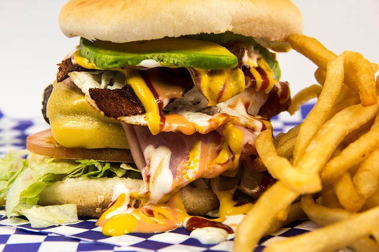

# Graphical summaries of data {#Graphs}

```{block2, type="rmdobjectives"}
So far,
you have learnt to
ask a RQ, 
identify different ways of obtaining data,
design the study,
collect the data
and describe the data.

**In this chapter**,
you will learn to graph the data,
so we can understand the data used to answer the RQ.
You will learn to:

* select the appropriate graphic to graphically summarise data.
* graphically summarise data using quality, appropriate graphs.
* interpret graphs.
* identify badly prepared graphics, giving reasons.

```


   


```{r echo=FALSE, fig.cap="", fig.align="center", fig.width=3, out.width="35%"}
SixSteps(4, "Graphical summaries")
```


## Introduction {#GraphsIntro}

To answer a RQ,
a study is designed to collect data,
because
*data are the means by which the research question is answered*.
But before analysis,
understanding, describing and summarising the collected data is important.
This chapter discusses the use of
*graphs* to summarise data.

```{block2, type="rmdimportant"}
The purpose of a graph is to display the information
in the clearest, simplest possible way,
to help the reader understand the message(s) in the data.
```

Graphs are not produced just for the sake of it;
what the graph tells us should always be explained,
especially regarding the RQ.


## One quantitative variable {#GraphsOneQuant}

For quantitative data,
a graph shows the *distribution* of the data:
what values are present in the data, and how often those values appear.

The graphs discussed in this section usually work best for 
*continuous* quantitative data,
but may also be useful for discrete quantitative data
if many possible values are present.
Sometimes,
*discrete* quantitative data with very few values
are best graphed using the graphs discussed in 
Sect. \@ref(GraphsOneQual).

Three different types of graphs can be used 
to show how the values of one
quantitative variable are *distributed*:

* [**Stemplot**
  or **stem-and-leaf plot**](#StemAndLeafPlots): 
  Best for small amounts of data; useful only in some cases.
* [**Dot chart**](#DotChartsOneVar):
  Best for small amounts of data;
  good for moderate amounts of data.
* [**Histogram**](#Histograms):
  Best for moderate to large amounts of data.

Whatever graph is used,
[what the graph shows should be described](#SummariseData).


### Stem-and-leaf plots {#StemAndLeafPlots}

*Stem-and-leaf plots* (or *stemplots*)
are best described and explained using an example,
so
`r if( knitr::is_html_output() ) {
  'consider the data in Fig. \\@ref(fig:BabyBoomDataHTML),'
} else
{
  'consider the data in Table \\@ref(tab:BabyBoomDataLATEX) (which shows just the first 10 of the 44 observations).'
}
`


<!-- Text wrap from: https://stackoverflow.com/questions/43551312/wrap-text-around-plots-in-markdown -->
<!-- Trick from: https://blog.earo.me/2019/10/26/reduce-frictions-rmd/ -->
`r if (knitr::is_latex_output()) '<!--'`
```{r, echo=FALSE, out.width= "25%", out.extra='style="float:right; padding:10px"'}

```
`r if (knitr::is_latex_output()) '-->'`


The data give the weights (in kg) of babies born 
in a Brisbane hospital on one day
[@mypapers:Dunn:dataset:1999; @data:Steele:BabyBoom].

The data set also includes the gender of each baby,
and the number of minutes after midnight that each birth occurred.

The data are given in the order in which the births occurred.


```{r echo=FALSE}
BB <- structure(list(Time = c(5L, 104L, 118L, 155L, 257L, 405L, 407L, 
422L, 431L, 708L, 735L, 812L, 814L, 909L, 1035L, 1049L, 1053L, 
1133L, 1209L, 1256L, 1305L, 1406L, 1407L, 1433L, 1446L, 1514L, 
1631L, 1657L, 1742L, 1807L, 1825L, 1854L, 1909L, 1947L, 1949L, 
1951L, 2010L, 2037L, 2051L, 2104L, 2123L, 2217L, 2327L, 2355L
), Gender = c(1L, 1L, 2L, 2L, 2L, 1L, 1L, 2L, 2L, 2L, 2L, 2L, 
1L, 1L, 2L, 1L, 1L, 2L, 2L, 2L, 2L, 1L, 1L, 1L, 1L, 2L, 2L, 2L, 
1L, 2L, 1L, 2L, 2L, 2L, 2L, 2L, 1L, 2L, 2L, 2L, 2L, 1L, 1L, 1L
), Weight = c(3837L, 3334L, 3554L, 3838L, 3625L, 2208L, 1745L, 
2846L, 3166L, 3520L, 3380L, 3294L, 2576L, 3208L, 3521L, 3746L, 
3523L, 2902L, 2635L, 3920L, 3690L, 3430L, 3480L, 3116L, 3428L, 
3783L, 3345L, 3034L, 2184L, 3300L, 2383L, 3428L, 4162L, 3630L, 
3406L, 3402L, 3500L, 3736L, 3370L, 2121L, 3150L, 3866L, 3542L, 
3278L), Minutes = c(5L, 64L, 78L, 115L, 177L, 245L, 247L, 262L, 
271L, 428L, 455L, 492L, 494L, 549L, 635L, 649L, 653L, 693L, 729L, 
776L, 785L, 846L, 847L, 873L, 886L, 914L, 991L, 1017L, 1062L, 
1087L, 1105L, 1134L, 1149L, 1187L, 1189L, 1191L, 1210L, 1237L, 
1251L, 1264L, 1283L, 1337L, 1407L, 1435L)), .Names = c("Time", 
"Gender", "Weight", "Minutes"), class = "data.frame", row.names = c(NA, 
-44L))

BB2 <- data.frame(Gender=factor(BB$Gender, 
                                levels = 1:2, 
				labels = c("Female", "Male")),
                  "Weight (in kg)" = round( BB$Weight/1000, 1),
                  Mins.Since.Midnight = BB$Minutes)
```

```{r BabyBoomDataLATEX, echo=FALSE}
if( knitr::is_latex_output() ) {
  kable( head(BB2, 10),
         format = "latex",
         longtable = FALSE,
	 
         digits = c(0, 1, 0),
         col.names = c("Gender", 
                       "Weight (in kg)", 
	  	       "Minutes since midnight"),
         caption = "The first ten observations (of 44) of the baby-births data",
         booktabs = TRUE) %>%
   kable_styling(font_size = 10) %>%
   row_spec(0, bold = TRUE)
}
```
```{r BabyBoomDataHTML, echo=FALSE, fig.cap="The baby-births data"}
if( knitr::is_html_output() ) {
  DT::datatable( BB2,
        fillContainer = FALSE, # Make more room, so we don't just have ten values
        options = list(searching = FALSE), # Remove searching: See: https://stackoverflow.com/questions/35624413/remove-search-option-but-leave-search-columns-option
        colnames = c("Gender", 
	             "Weight (in kg)", 
		     "Minutes since midnight"),
        caption = "The baby-births data"
        )
}
```


For these data, 
the weights (quantitative) are to one decimal place of a kilogram.
In a stemplot,
part of each number is placed to the left (the *stem*) of a vertical line,
and the rest of each number to the right (the *leaf*).
Here,
the whole number of kilograms is placed to the left (as a *stem*),
and the first decimal place is placed on the right (as a *leaf*).
`r if (knitr::is_latex_output()) {
   'Figure \\@ref(fig:BBStem1) shows the stemplot starting to be built, and Fig. \\@ref(fig:BBStem44) shows the final stemplot. (The online version has an animation.)'
} else {
   'The animation below shows how the stemplot is constructed.'
}`
From this plot,
most birthweights are seen to be 3-point-something kilograms.


```{r animation.hook="gifski", cache=TRUE, echo=FALSE, interval=0.85, dev=if (is_latex_output()){"pdf"}else{"png"}}
  BB <- structure(list(Time = c(5L, 104L, 118L, 155L, 257L, 405L, 407L, 
                                422L, 431L, 708L, 735L, 812L, 814L, 909L, 1035L, 1049L, 1053L, 
                                1133L, 1209L, 1256L, 1305L, 1406L, 1407L, 1433L, 1446L, 1514L, 
                                1631L, 1657L, 1742L, 1807L, 1825L, 1854L, 1909L, 1947L, 1949L, 
                                1951L, 2010L, 2037L, 2051L, 2104L, 2123L, 2217L, 2327L, 2355L
  ), Gender = c(1L, 1L, 2L, 2L, 2L, 1L, 1L, 2L, 2L, 2L, 2L, 2L, 
                1L, 1L, 2L, 1L, 1L, 2L, 2L, 2L, 2L, 1L, 1L, 1L, 1L, 2L, 2L, 2L, 
                1L, 2L, 1L, 2L, 2L, 2L, 2L, 2L, 1L, 2L, 2L, 2L, 2L, 1L, 1L, 1L
  ), Weight = c(3837L, 3334L, 3554L, 3838L, 3625L, 2208L, 1745L, 
                2846L, 3166L, 3520L, 3380L, 3294L, 2576L, 3208L, 3521L, 3746L, 
                3523L, 2902L, 2635L, 3920L, 3690L, 3430L, 3480L, 3116L, 3428L, 
                3783L, 3345L, 3034L, 2184L, 3300L, 2383L, 3428L, 4162L, 3630L, 
                3406L, 3402L, 3500L, 3736L, 3370L, 2121L, 3150L, 3866L, 3542L, 
                3278L), Minutes = c(5L, 64L, 78L, 115L, 177L, 245L, 247L, 262L, 
                                    271L, 428L, 455L, 492L, 494L, 549L, 635L, 649L, 653L, 693L, 729L, 
                                    776L, 785L, 846L, 847L, 873L, 886L, 914L, 991L, 1017L, 1062L, 
                                    1087L, 1105L, 1134L, 1149L, 1187L, 1189L, 1191L, 1210L, 1237L, 
                                    1251L, 1264L, 1283L, 1337L, 1407L, 1435L)), .Names = c("Time", 
                                                                                           "Gender", "Weight", "Minutes"), class = "data.frame", row.names = c(NA, 
                                                                                                                                                               -44L))

# BABYBOOM
if (knitr::is_html_output()){
  
  Wts <-sort( round(BB$Weight/100, 0) )
  
  DP2 <- function(x){format(round(x, 1), nsmall = 1) }
  
  par(mfrow = c(2, 1), 
      mar = c(2, 3, 4, 1) + 0.1 )
  for (i in (1:length(Wts))){
    # Plot the data
    datagrid.x <- 11
    datagrid.y <- 4
    
    plot( expand.grid(1:datagrid.x, 1:datagrid.y),
          type = "n",
          ylim = c(0.7, 4.3),
          xlab = "",
          ylab = "",
          axes = FALSE)
    cex.data <- 0.9
    text(  1:datagrid.x, 
           rep(4, 11), 
	   DP2(Wts[1:11]/10),  
	   cex = cex.data )
    text(  1:datagrid.x, 
           rep(3, 11), 
	   DP2(Wts[12:22]/10), 
	   cex = cex.data )
    text(  1:datagrid.x, 
           rep(2, 11), 
	   DP2(Wts[23:33]/10), 
	   cex = cex.data )
    text(  1:datagrid.x, 
           rep(1, 11), 
	   DP2(Wts[34:44]/10), 
	   cex = cex.data )
    
    # Now highlight the observation being used
    if (i <= 11) {
      points(  i, 4, 
               pch = 1, 
	       col = "red", 
	       lwd = 3, 
	       cex = 4 )
    }
    if ( (i > 11) & (i <= 22)){
      points(  i - 11, 3, 
               pch = 1, 
	       col = "red", 
	       lwd = 3, 
	       cex = 4 )
    }
    if ( (i > 22) & (i <= 233)){
      points(  i - 22, 2, 
               pch = 1, 
	       col = "red", 
	       lwd = 3, 
	       cex = 4 )
    }
    if ( (i > 33) ){
      points(  i - 33, 1, 
               pch = 1, 
	       col = "red", 
	       lwd = 3, 
	       cex = 4 )
    }
    
    # Produce the stemplot
    stemgrid.x <- 34
    stemgrid.y <- 4
    stemcounts <- array(1, dim = stemgrid.y)
    
    plot( expand.grid(1:stemgrid.x, 1:stemgrid.y), 
          type = "n",
          xlab = "",
          ylab = "",
          main = "Stemplot of birthweights\n(2|6 means 2.6 kg)",
          xlim = c(0, 34),
          ylim = c(0.8, 4.2),
          axes = FALSE)
    
    if (Wts[i] < 20 ) {
      mtext("1", 
            side = 2, 
	    line = 1, 
	    las = 1, 
	    at = 4, 
	    col = "red", 
	    font = 2, 
	    cex = 1.5)
      mtext("2", 
            side = 2, 
	    line = 1, 
	    las = 1, 
	    at = 3)
      mtext("3", 
            side = 2, 
	    line = 1, 
	    las = 1, 
	    at = 2)
      mtext("4", 
            side = 2, 
	    line = 1, 
	    las = 1, 
	    at = 1)
    }
    if ( (Wts[i] >=20) & (Wts[i]<30) ){
      mtext("1", 
            side = 2, 
	    line = 1, 
	    las = 1, 
	    at = 4)
      mtext("2", 
            side = 2, 
	    line = 1, 
	    las = 1, 
	    at = 3, 
	    col = "red", 
	    font = 2, 
	    cex = 1.5)
      mtext("3", 
            side = 2, 
	    line = 1, 
	    las = 1, 
	    at = 2)
      mtext("4", 
             side = 2, 
	     line = 1, 
	     las = 1, 
	     at = 1)
    }
    if ( (Wts[i] >= 30) & (Wts[i] < 40) ){
      mtext("1", 
            side = 2, 
	    line = 1, 
	    las = 1, 
	    at = 4)
      mtext("2", 
            side = 2, 
	    line = 1, 
	    las = 1, 
	    at = 3)
      mtext("3", 
            side = 2, 
	    line = 1, 
	    las = 1, 
	    at = 2, 
	    col = "red", 
	    font = 2, 
	    cex = 1.5)
      mtext("4", 
            side = 2, 
	    line = 1, 
	    las = 1, 
	    at = 1)
    }
    if ( Wts[i] >= 40 ){
      mtext("1", 
            side = 2, 
	    line = 1, 
	    las = 1, 
	    at = 4)
      mtext("2", 
            side = 2, 
	    line = 1, 
	    las = 1, 
	    at = 3)
      mtext("3", 
            side = 2, 
	    line = 1, 
	    las = 1, 
	    at = 2)
      mtext("4", 
            side = 2, 
	    line = 1, 
	    las = 1, 
	    at = 1, 
	    col = "red", 
	    font = 2, 
	    cex = 1.5)
    }
    
    # Divide the stems and leaves
    abline(v = 0, 
           lwd = 2)
    
    # Plot leaves
    for (j in (1:i) ){
      if ( Wts[j] < 20) {
        if (j != i) points( stemcounts[1], 4, 
	                    pch = as.character(Wts[j] - 10))
        if (j == i ) text( stemcounts[1], 4, 
	                   as.character(Wts[j] - 10), 
			   col = "red", 
			   cex = 1.5, 
			   font = 2)
        stemcounts[1] <- stemcounts[1] + 1
      }
      
      if ( (Wts[j] >= 20) & (Wts[j] < 30) ) {
        if (j != i ) points( stemcounts[2], 3, 
	                     pch = as.character(Wts[j] - 20) )
        if (j == i ) text( stemcounts[2], 3, 
	                   as.character(Wts[j] - 20), 
			   col = "red", 
			   cex = 1.5, 
			   font = 2)
        stemcounts[2] <- stemcounts[2] + 1
      }
      
      if ( (Wts[j] >= 30) & (Wts[j] < 40) ) {
        if (j != i ) points( stemcounts[3], 2, 
	                     pch = as.character(Wts[j] - 30))
        if (j == i ) text( stemcounts[3], 2, 
	                   as.character(Wts[j] - 30), 
			   col = "red", 
			   cex = 1.5, 
			   font = 2)
        stemcounts[3] <- stemcounts[3] + 1
      }
      if ( Wts[j] >= 40 ) {
        if (j != i ) points( stemcounts[4], 1, 
	                     pch = as.character(Wts[j] - 40))
        if (j == i ) text( stemcounts[4], 1, 
	                   as.character(Wts[j] - 40), 
			   col = "red", 
			   cex = 1.5, 
			   font = 2)
        stemcounts[4] <- stemcounts[4] + 1
      }
    }
  }
}
```


```{r BBStem1, echo=FALSE, fig.align="center", fig.width=5, fig.cap="Starting to make the stemplot for the baby-weight data: the first 4 observations added" }
if (knitr::is_latex_output()){
  
  Wts <-sort( round(BB$Weight/100, 0) )
  
  DP2 <- function(x){ format(round(x, 1), nsmall = 1) }
  
  #  par(width=5, height=5, mar=c(0, 0, 2, 0)+0.1, mfrow=c(2, 1))
  par(mfrow = c(2, 1), 
      mar = c(2, 3, 4, 1) + 0.1)
  for (i in 4:4){
    # Plot the data
    datagrid.x <- 11
    datagrid.y <- 4
    
    plot( expand.grid(1:datagrid.x, 1:datagrid.y),
          type = "n",
          ylim = c(0.7, 4.3),
          xlab = "",
          ylab = "",
          axes = FALSE)
    cex.data <- 0.9
    text(  1:datagrid.x, rep(4, 11), 
           DP2(Wts[1:11]/10),  
	   cex = cex.data )
    text(  1:datagrid.x, rep(3, 11), 
           DP2(Wts[12:22]/10), 
	   cex = cex.data )
    text(  1:datagrid.x, rep(2, 11), 
           DP2(Wts[23:33]/10), 
	   cex = cex.data )
    text(  1:datagrid.x, rep(1, 11), 
           DP2(Wts[34:44]/10), 
	   cex = cex.data )
    
    # Now highlight the observation being used
    if (i <= 11) {
      points(  i, 4, 
               pch = 1, 
	       col = "red", 
	       lwd = 3, 
	       cex = 4 )
    }
    if ( (i > 11) & (i <= 22)){
      points(  i - 11, 3, 
               pch = 1, 
	       col = "red", 
	       lwd = 3, 
	       cex = 4 )
    }
    if ( (i > 22) & (i <= 233)){
      points(  i - 22, 2, 
               pch = 1, 
	       col = "red", 
	       lwd = 3, 
	       cex = 4 )
    }
    if ( (i > 33) ){
      points(  i - 33, 1, 
               pch = 1, 
	       col = "red", 
	       lwd = 3, 
	       cex = 4 )
    }
  }
  
   
    # Produce the stemplot
    stemgrid.x <- 34
    stemgrid.y <- 4
    stemcounts <- array(1, dim = stemgrid.y)
    
    plot( expand.grid(1:stemgrid.x, 1:stemgrid.y), 
          type = "n",
          xlab = "",
          ylab = "",
          main = "Stemplot of birthweights\n(2|6 means 2.6 kg)",
          xlim = c(0, 34),
          ylim = c(0.8, 4.2),
          axes = FALSE)
    i <- 4
    if (Wts[i] < 20 ) {
      mtext("1", 
            side = 2, 
	    line = 1, 
	    las = 1, 
	    at = 4, 
	    col = "red", 
	    font = 2, 
	    cex = 1.5)
      mtext("2", 
            side = 2, 
	    line = 1, 
	    las = 1, 
	    at = 3)
      mtext("3", 
            side = 2, 
	    line = 1, 
	    las = 1, 
	    at = 2)
      mtext("4", 
            side = 2, 
	    line = 1, 
	    las = 1, 
	    at = 1)
    }
    if ( (Wts[i] >= 20) & (Wts[i] < 30) ){
      mtext("1", 
            side = 2, 
	    line = 1, 
	    las = 1, 
	    at = 4)
      mtext("2", 
            side = 2, 
	    line = 1, 
	    las = 1, 
	    at = 3, 
	    col = "red", 
	    font = 2, 
	    cex = 1.5)
      mtext("3", 
            side = 2, 
	    line = 1, 
	    las = 1, 
	    at = 2)
      mtext("4", 
            side = 2, 
	    line = 1, 
	    las = 1, 
	    at = 1)
    }
    if ( (Wts[i] >= 30) & (Wts[i] < 40) ){
      mtext("1", 
            side = 2, 
	    line = 1, 
	    las = 1, 
	    at = 4)
      mtext("2", 
            side = 2, 
	    line = 1, 
	    las = 1, 
	    at = 3)
      mtext("3", 
            side = 2, 
	    line = 1, 
	    las = 1, 
	    at = 2, 
	    col = "red", 
	    font = 2, 
	    cex = 1.5)
      mtext("4", 
            side = 2, 
	    line = 1, 
	    las = 1, 
	    at = 1)
    }
    if ( Wts[i] >= 40 ){
      mtext("1", 
            side = 2, 
	    line = 1, 
	    las = 1, 
	    at = 4)
      mtext("2", 
            side = 2,
	    line = 1, 
	    las = 1, 
	    at = 3)
      mtext("3", 
            side = 2, 
	    line = 1, 
	    las = 1, 
	    at = 2)
      mtext("4", 
            side = 2, 
	    line = 1, 
	    las = 1, 
	    at = 1, 
	    col = "red", 
	    font = 2, 
	    cex = 1.5)
    }
    
    # Divide the stems and leaves
    abline(v = 0,  
           lwd = 2)
    
    # Plot leaves
    for (j in (1:4) ){
      if ( Wts[j] < 20) {
        if (j != i) points( stemcounts[1], 4, 
	                    pch = as.character(Wts[j] - 10))
        if (j == i ) text( stemcounts[1], 4, 
	                   as.character(Wts[j] - 10), 
			   col = "red", 
			   cex = 1.5, 
			   font = 2)
        stemcounts[1] <- stemcounts[1] + 1
      }
      
      if ( (Wts[j] >= 20) & (Wts[j] < 30) ) {
        if (j != i ) points( stemcounts[2], 3, 
	                     pch = as.character(Wts[j] - 20) )
        if (j == i ) text( stemcounts[2], 3, 
	                   as.character(Wts[j] - 20), 
			   col = "red", 
			   cex = 1.5, 
			   font = 2)
        stemcounts[2] <- stemcounts[2] + 1
      }
      
      if ( (Wts[j] >= 30) & (Wts[j] < 40) ) {
        if (j != i ) points( stemcounts[3], 2, 
	                     pch = as.character(Wts[j] - 30))
        if (j == i ) text( stemcounts[3], 2, 
	                   as.character(Wts[j] - 30), 
			   col = "red", 
			   cex = 1.5, 
			   font = 2)
        stemcounts[3] <- stemcounts[3] + 1
      }
      if ( Wts[j] >= 40 ) {
        if (j != i ) points( stemcounts[4], 1, 
	                     pch = as.character(Wts[j] - 40))
        if (j == i ) text( stemcounts[4], 1, 
	                   as.character(Wts[j] - 40), 
			   col = "red", 
			   cex = 1.5, 
			   font = 2)
        stemcounts[4] <- stemcounts[4] + 1
      }
    }
}
```


```{r BBStem44, echo=FALSE, fig.align="center", fig.width=5, fig.cap="The final stemplot for the baby-weight data" }
if (knitr::is_latex_output()){
  
  Wts <-sort( round(BB$Weight/100, 0) )
  
  DP2 <- function(x){format(round(x, 1), nsmall = 1) }
  
  par(mfrow = c(2, 1), 
      mar = c(2, 3, 4, 1) + 0.1)
  for (i in (length(Wts):length(Wts))){
    # Plot the data
    datagrid.x <- 11
    datagrid.y <- 4
    
    plot( expand.grid(1:datagrid.x, 1:datagrid.y),
          type = "n",
          ylim = c(0.7, 4.3),
          xlab = "",
          ylab = "",
          axes = FALSE)
    cex.data <- 0.9
    text(  1:datagrid.x, 
           rep(4, 11), 
	   DP2(Wts[1:11]/10),  
	   cex = cex.data )
    text(  1:datagrid.x, 
           rep(3, 11), 
	   DP2(Wts[12:22]/10), 
	   cex = cex.data )
    text(  1:datagrid.x, 
           rep(2, 11), 
	   DP2(Wts[23:33]/10), 
	   cex = cex.data )
    text(  1:datagrid.x, 
           rep(1, 11), 
	   DP2(Wts[34:44]/10), 
	   cex = cex.data )
        
    # Produce the stemplot
    stemgrid.x <- 34
    stemgrid.y <- 4
    stemcounts <- array(1, dim=stemgrid.y)
    
    plot( expand.grid(1:stemgrid.x, 1:stemgrid.y), 
          type = "n",
          xlab = "",
          ylab = "",
          main = "Stemplot of birthweights\n(2|6 means 2.6 kg)",
          xlim = c(0, 34),
          ylim = c(0.8, 4.2),
          axes = FALSE)
    
      mtext("1", 
            side = 2, 
	    line = 1, 
	    las = 1, 
	    at = 4)
      mtext("2", 
            side = 2, 
	    line = 1, 
	    las = 1, 
	    at = 3)
      mtext("3", 
            side = 2, 
	    line = 1, 
	    las = 1, 
	    at = 2)
      mtext("4", 
            side = 2, 
	    line = 1, 
	    las = 1, 
	    at = 1)

    # Divide the stems and leaves
    abline(v = 0, 
           lwd = 2)
    
    # Plot leaves
    for (j in (1:44) ){
      if ( Wts[j] < 20) {
        if (j != i) points( stemcounts[1], 4, 
	                    pch = as.character(Wts[j] - 10))
        if (j == i ) text( stemcounts[1], 4, 
	                   as.character(Wts[j] - 10), 
			   col = "red", 
			   cex = 1.5, 
			   font = 2)
        stemcounts[1] <- stemcounts[1] + 1
      }
      
      if ( (Wts[j] >= 20) & (Wts[j] < 30) ) {
        if (j != i ) points( stemcounts[2], 3, 
	                     pch = as.character(Wts[j] - 20) )
        if (j == i ) text( stemcounts[2], 3, 
	                   as.character(Wts[j] - 20), 
			   col = "red", 
			   cex = 1.5, 
			   font = 2)
        stemcounts[2] <- stemcounts[2] + 1
      }
      
      if ( (Wts[j] >= 30) & (Wts[j] < 40) ) {
        if (j != i ) points( stemcounts[3], 2, 
	                     pch = as.character(Wts[j] - 30))
        if (j == i ) text( stemcounts[3], 2, 
	                   as.character(Wts[j] - 30), 
			   col = "red", 
			   cex = 1.5, 
			   font = 2)
        stemcounts[3] <- stemcounts[3] + 1
      }
      if ( Wts[j] >= 40 ) {
        points( stemcounts[4], 1, 
	        pch = as.character(Wts[j] - 40))
        stemcounts[4] <- stemcounts[4] + 1
      }
    }
  }
}
```


For stem-and-leaf plots:

* Place the larger unit (e.g., kilograms) on the left (stems).
* Place the next smallest unit (e.g., first decimal place of a kilogram) on the right (leaves).
* Some data do not work well with stem-and-leaf plots.
* Sometimes, data might need to be suitably rounded before creating the stem-and-leaf plot.
* The numbers in each row should be evenly spaced, 
  so that the numbers in the columns are under each other.
  This allows patterns to be seen.
* Within each row, the observations are *ordered* on each stem so patterns can be seen.
* Add an explanation for reading the stem-and-leaf plot.
  For example, the caption for the stem-and-leaf plot for the 
  baby-birth data in Sect. \@ref(StemAndLeafPlots)
  says '2 | 6 means 2.6kg',
  which explains what the stem plot means. 
  For instance, '2 | 6' could mean 26kg, or 0.26kg.


```{example StemLeafPlots, name="Stem-and-leaf plots"}
A study of krill [@data:Greenacre2016:reporting] 
produced 15 measurements of the number of eggs.
The stemplot shows that the number of eggs is usually under 10,
but occasionally a large number of eggs are seen.
```

`r if (knitr::is_latex_output()) {
   'Figure shows the stemplot. (The online version has an animation.)'
} else {
   'The animation below shows how the stemplot is constructed.'
}`


```{r animation.hook="gifski", cache=TRUE, cache=TRUE, echo=FALSE, interval=0.85, dev=if (is_latex_output()){"pdf"}else{"png"}}
if (knitr::is_html_output()){
#KRILL

  Eggs <- c(1, 0, 1, 2, 2, 8, 16, 31, 0, 0, 20, 0, 26, 1, 3)
  Eggs <- sort(Eggs)
  
  #  par(width=5, height=5, mar=c(0, 0, 2, 0)+0.1, mfrow=c(2, 1))
  par(mfrow = c(2,1),
      mar = c(2, 3, 4, 1) + 0.1)
  for (i in (1:length(Eggs))){
    # Plot the data
    datagrid.x <- 5
    datagrid.y <- 3
    
    plot( expand.grid(1:datagrid.x, 1:datagrid.y),
          type = "n",
          ylim = c(0, 3.3),
          xlab = "",
          ylab = "",
          axes = FALSE)
    text(  1:datagrid.x, 
           rep(3, 5), 
	   as.character(Eggs[1:5]) )
    text(  1:datagrid.x, 
           rep(2, 5), 
	   as.character(Eggs[6:10]) )
    text(  1:datagrid.x, 
           rep(1, 5), 
	   as.character(Eggs[11:15]) )
    
    # Now highlight the observation being used
    if (i <= 5) {
      points(  i, 3, 
               pch = 1, 
	       col = "red", 
	       lwd = 3, 
	       cex = 4 )
    }
    if ( (i>5) & (i<=10)){
      points(  i-5, 2, pch=1, col="red", lwd=3, cex=4 )
    }
    if ( (i>10) ){
      points(  i-10, 1, pch=1, col="red", lwd=3, cex=4 )
    }
    
    # Produce the stemplot
    stemgrid.x <- 12
    stemgrid.y <- 4
    stemcounts <- array(1, dim = stemgrid.y)
    
    plot( expand.grid(1:stemgrid.x, 0:stemgrid.y), 
          type = "n",
          xlab = "",
          ylab = "",
          main = "Stemplot of egg counts of krill\n(1|6 means 16 eggs)",
          xlim = c(0, 11),
          ylim = c(-0.2, 3.2),
          axes = FALSE)
    
    if (Eggs[i] < 10 ) {
      mtext("0", 
            side = 2, 
	    line = 1, 
	    las = 1, 
	    at = 3, 
	    col = "red", 
	    font = 2, 
	    cex = 1.5)
      mtext("1", 
            side = 2, 
	    line = 1, 
	    las = 1, 
	    at = 2)
      mtext("2", 
            side = 2, 
	    line = 1, 
	    las = 1, 
	    at = 1)
      mtext("3", 
            side = 2, 
	    line = 1, 
	    las = 1, 
	    at = 0)
    }
    if ( (Eggs[i] >= 10) & ( Eggs[i] < 20) ){
      mtext("0", 
            side = 2, 
	    line = 1, 
	    las = 1, 
	    at = 3)
      mtext("1", 
            side = 2, 
	    line = 1, 
	    las = 1, 
	    at = 2, 
	    col = "red", 
	    font = 2, 
	    cex = 1.5)
      mtext("2", 
            side = 2, 
	    line = 1, 
	    las = 1, 
	    at = 1)
      mtext("3", 
            side = 2, 
	    line = 1, 
	    las = 1, 
	    at = 0)
    }
    if ( (Eggs[i] >= 20) & (Eggs[i] < 30) ){
      mtext("0", 
            side = 2, 
	    line = 1, 
	    las = 1, 
	    at = 3)
      mtext("1", 
            side = 2, 
	    line = 1, 
	    las = 1, 
	    at = 2)
      mtext("2", 
            side = 2, 
	    line = 1, 
	    las = 1, 
	    at = 1, 
	    col = "red", 
	    font = 2, 
	    cex = 1.5)
      mtext("3",  
            side = 2, 
	    line = 1, 
	    las = 1, 
	    at = 0)
    }
    if ( Eggs[i] >= 30 ){
      mtext("0", 
            side = 2, 
	    line = 1, 
	    las = 1, 
	    at = 3)
      mtext("1", 
            side = 2, 
	    line = 1, 
	    las = 1, 
	    at = 2)
      mtext("2", 
            side = 2, 
	    line = 1, 
	    las = 1, 
	    at = 1)
      mtext("3", 
            side = 2, 
	    line = 1, 
	    las = 1, 
	    at = 0, 
	    col = "red", 
	    font = 2, 
	    cex = 1.5)
    }
    # Divide the stems and leaves
    abline(v = 0, 
           lwd = 2)
    
    # Plot leaves
    for (j in (1:i) ){
      if ( Eggs[j] < 10) {
        if ( j != i) points( stemcounts[1], 3, pch = as.character(Eggs[j]))
        if (j == i ) text( stemcounts[1], 3, as.character(Eggs[j]), col = "red", cex = 1.5, font = 2)
        stemcounts[1] <- stemcounts[1] + 1
      }
      
      if ( (Eggs[j] >= 10) & (Eggs[j] < 20) ) {
        if (j != i ) points( stemcounts[2], 2, pch = as.character(Eggs[j] - 10) )
        if (j == i ) text( stemcounts[2], 2, as.character(Eggs[j] - 10), col = "red", cex = 1.5, font = 2)
        stemcounts[2] <- stemcounts[2] + 1
      }
      
      if ( (Eggs[j] >= 20) & (Eggs[j] < 30) ) {
        if (j != i ) points( stemcounts[3], 1, pch = as.character(Eggs[j] - 20))
        if (j == i ) text( stemcounts[3], 1, as.character(Eggs[j] - 20), col = "red", cex = 1.5, font = 2)
        stemcounts[3] <- stemcounts[3] + 1
      }
      if ( Eggs[j] >= 30 ) {
        if (j != i ) points( stemcounts[4], 0, pch = as.character(Eggs[j] - 30))
        if (j == i ) text( stemcounts[4], 0, as.character(Eggs[j] - 30), col = "red", cex = 1.5, font = 2)
        stemcounts[4] <- stemcounts[4] + 1
      }
    }
  }
}
```


```{r KrillStem44, echo=FALSE, fig.align="center", fig.width=5, fig.cap="The final stemplot for the krill data" }
if (knitr::is_latex_output()){
#KRILL

  Eggs <- c(1, 0, 1, 2, 2, 8, 16, 31, 0, 0, 20, 0, 26, 1, 3)
  Eggs <-sort(Eggs)
  
  #  par(width=5, height=5, mar=c(0, 0, 2, 0)+0.1, mfrow=c(2, 1))
  par(mfrow = c(2, 1),
      mar = c(2, 3, 4, 1) + 0.1)
  for (i in (length(Eggs):length(Eggs))){
    # Plot the data
    datagrid.x <- 5
    datagrid.y <- 3
    
    plot( expand.grid(1:datagrid.x, 1:datagrid.y),
          type = "n",
          ylim = c(0, 3.3),
          xlab = "",
          ylab = "",
          axes = FALSE)
    text(  1:datagrid.x, 
           rep(3, 5), 
	   as.character(Eggs[1:5]) )
    text(  1:datagrid.x, 
           rep(2, 5), 
	   as.character(Eggs[6:10]) )
    text(  1:datagrid.x, 
           rep(1, 5), 
	   as.character(Eggs[11:15]) )
    
    # Now highlight the observation being used

    # Produce the stemplot
    stemgrid.x <- 12
    stemgrid.y <- 4
    stemcounts <- array(1, dim = stemgrid.y)
    
    plot( expand.grid(1:stemgrid.x, 0:stemgrid.y), 
          type = "n",
          xlab = "",
          ylab = "",
          main = "Stemplot of egg counts of krill\n(1|6 means 16 eggs)",
          xlim = c(0, 11),
          ylim = c(-0.2, 3.2),
          axes = FALSE)
    
      mtext("0", 
            side = 2, 
	    line = 1, 
	    las = 1, 
	    at = 3)
      mtext("1", 
            side = 2, 
	    line = 1, 
	    las = 1, 
	    at = 2)
      mtext("2", 
            side = 2, 
	    line = 1, 
	    las = 1, 
	    at = 1)
      mtext("3", 
            side = 2, 
	    line = 1, 
	    las = 1, 
	    at = 0)
    }

    # Divide the stems and leaves
    abline(v = 0, 
           lwd = 2)
    
    # Plot leaves
    for (j in 1:length(Eggs) ){
      if ( Eggs[j] < 10 ) {
        points( stemcounts[1], 3, 
	        pch = as.character(Eggs[j]))
        stemcounts[1] <- stemcounts[1] + 1
      }
      
      if ( (Eggs[j] >= 10) & (Eggs[j] < 20) ) {
        points( stemcounts[2], 2, 
	        pch = as.character(Eggs[j] - 10) )
        stemcounts[2] <- stemcounts[2] + 1
      }
      
      if ( (Eggs[j] >= 20) & (Eggs[j] < 30) ) {
        points( stemcounts[3], 1, 
	        pch = as.character(Eggs[j] - 20))
        stemcounts[3] <- stemcounts[3] + 1
      }
      if ( Eggs[j]>=30 ) {
        points( stemcounts[4], 0, 
	        pch = as.character(Eggs[j] - 30))
        stemcounts[4] <- stemcounts[4] + 1
      }
    }
}
```


`r if (knitr::is_html_output()){
  'The following short video may help explain some of these concepts:'
}`

<iframe width="560" height="315" src="https://www.youtube.com/embed/KfkvedIBPjE" frameborder="0" allow="accelerometer; encrypted-media; gyroscope; picture-in-picture"></iframe>


### Dot charts (quantitative data) {#DotChartsOneVar}

Dot charts show the original data on a single axis,
with each observation represented by a dot.

   
   
<!-- Text wrap from: https://stackoverflow.com/questions/43551312/wrap-text-around-plots-in-markdown -->
<!-- Trick from: https://blog.earo.me/2019/10/26/reduce-frictions-rmd/ -->
`r if (knitr::is_latex_output()) '<!--'`
```{r, echo=FALSE, out.width= "25%", out.extra='style="float:right; padding:10px"'}
include_graphics("Illustrations/pexels-dzenina-lukac-1583884.jpg")
```
`r if (knitr::is_latex_output()) '-->'`

```{example DotChartsQuant, name="Dot charts"}
A study examined the serving size of fries at 
McDonald's [@data:Wetzel2005:McDonalds],
and produced the dot chart in Fig \@ref(fig:Fries)
(based on @data:Wetzel2005:McDonalds, Fig. 2).

The mass of fries is almost always *under* the target,
and often substantially so.
An alternative way to look at these data is
to measure the percentage that each serving is in relation to the target serving
(Fig. \@ref(fig:FriesPC)),
where 100% means the serving size was exactly the target weight.
```


```{r Fries, echo=FALSE, fig.height=2.5, fig.width=5.5, fig.cap="Mass measurements for large orders of french fries", fig.align="center"}

Fries <- c(117, 126, 128, 132, 133, 133, 134, 137, 138, 139, 139, 140, 141, 142, 142.5, 143, 143.5,  
           145, 146, 146, 151, 152, 152, 154, 154, 154.5, 154.5, 155, 156, 156.5, 157, 176)
stripchart(Fries, 
           method = "stack",
           main = "Dotplot for mass of large\norder of fries",
            xlab = "Serving weight (in g)",
           axes = FALSE,
           pch = 20,
	   col = plot.colour,
           ylim = c(-1, 10),
           xlim = c(112, 180) )
axis(side = 1, 
     at = seq(115, 175, by = 10))
arrows(x0 = 145, 
       y0 = 5.5, 
       x1 = 171, 
       y1 = 2, 
       length = 0.10,
       angle = 15)
abline(v = 171,
       col = "grey")
text(145, 6.5, 
     "McDonald's target of\n171 grams per serving", 
     cex = 0.8,
     pos = 3)
```


```{r FriesPC, echo=FALSE, fig.height=2.5, fig.width=5.5, fig.cap="Percentage variation from target mass, for large orders of french fries", fig.align="center"}
stripchart( Fries/171 * 100, 
           method = "stack",
           main = "Dotplot for percentage of target\nmass of Large Order of Fries",
           axes = FALSE,
           xlab = "Percentage of target weight (171g)",
           pch = 20,
	   col = plot.colour,
           ylim = c(-1, 10),
           xlim = c(65, 105) )
axis(side = 1, 
     at = seq(65, 105, by = 5))
arrows(x0 = 85, 
       y0 = 5.5, 
       x1 = 100, 
       y1 = 2, 
       length = 0.10,
       angle = 15)
abline(v = 100,
       col = "grey")
text(85, 6.5, 
     "McDonald's target of\n171 grams per serving", 
     cex = 0.8,
     pos = 3)
```


```{example DotsChartsQuant2, name="Dot charts"}
Consider again the
weights (in kg) of babies born 
in a Brisbane hospital in one day.
Again,
a dot chart 
(Fig. \@ref(fig:BabyBoomDot))
shows that most babies are between 3 and 4kg.
```


```{r BabyBoomDot, echo=FALSE, fig.cap="A dot chart of the baby-weight data", fig.align="center", fig.height=2.5, fig.width=5.5}
stripchart(BB$Weight/1000, 
           method = "jitter",
           pch = 19,
	   col = plot.colour,
	   xlim = c(1.5, 4.5),
           main = "Weight of babies",
           axes = FALSE,
           xlab = "Baby weight (in kg)")
axis(side = 1,
     at = seq(1.5, 4.5, by = 0.5))
```


### Histograms {#Histograms}

Histograms are a series of boxes,
where the width of the box represents a range of *values* of the variable being graphed,
and the height of the 
box^[Technically, the *area* of the box is proportional to the number of observations. 
Since we only consider histograms where the bars are all the same width, this is equivalent.] 
represents the *number* (or *percentage*) of observations within that range of values.


<!-- Text wrap from: https://stackoverflow.com/questions/43551312/wrap-text-around-plots-in-markdown -->
<!-- Trick from: https://blog.earo.me/2019/10/26/reduce-frictions-rmd/ -->
`r if (knitr::is_latex_output()) '<!--'`
```{r, echo=FALSE, out.width= "25%", out.extra='style="float:right; padding:10px"'}

```
`r if (knitr::is_latex_output()) '-->'`

```{example Histograms, name="Histograms"}
Consider again the
weights (in kg) of babies born 
in a Brisbane hospital in one day
[@mypapers:Dunn:dataset:1999].
A histogram (below) can be constructed for these data.
When an observation occurs on a boundary between the boxes,
software usually (but not universally) places it in the *higher* box
(so 2.5kg would be counted in the '2.5 to 3.0kg' box, 
not the '2.0 to 2.5kg' box).
The histogram shows, for example,
that 17 babies weighed 3.0kg or more, but under 3.5kg.
```

`r if (knitr::is_latex_output()) {
   'Figure \\@ref(fig:BBHist1) shows the histogram starting to be built, and Fig. \\@ref(fig:BBHist44) shows the final histogram. (The online version has an animation.)'
} else {
   'The animation below shows how the histogram is constructed.'
}`


```{r animation.hook="gifski", cache=TRUE, echo=FALSE, interval=0.55, fig.height=7, dev=if (is_latex_output()){"pdf"}else{"png"}}
  BB <- structure(list(Time = c(5L, 104L, 118L, 155L, 257L, 405L, 407L, 
                                422L, 431L, 708L, 735L, 812L, 814L, 909L, 1035L, 1049L, 1053L, 
                                1133L, 1209L, 1256L, 1305L, 1406L, 1407L, 1433L, 1446L, 1514L, 
                                1631L, 1657L, 1742L, 1807L, 1825L, 1854L, 1909L, 1947L, 1949L, 
                                1951L, 2010L, 2037L, 2051L, 2104L, 2123L, 2217L, 2327L, 2355L
  ), Gender = c(1L, 1L, 2L, 2L, 2L, 1L, 1L, 2L, 2L, 2L, 2L, 2L, 
                1L, 1L, 2L, 1L, 1L, 2L, 2L, 2L, 2L, 1L, 1L, 1L, 1L, 2L, 2L, 2L, 
                1L, 2L, 1L, 2L, 2L, 2L, 2L, 2L, 1L, 2L, 2L, 2L, 2L, 1L, 1L, 1L
  ), Weight = c(3837L, 3334L, 3554L, 3838L, 3625L, 2208L, 1745L, 
                2846L, 3166L, 3520L, 3380L, 3294L, 2576L, 3208L, 3521L, 3746L, 
                3523L, 2902L, 2635L, 3920L, 3690L, 3430L, 3480L, 3116L, 3428L, 
                3783L, 3345L, 3034L, 2184L, 3300L, 2383L, 3428L, 4162L, 3630L, 
                3406L, 3402L, 3500L, 3736L, 3370L, 2121L, 3150L, 3866L, 3542L, 
                3278L), Minutes = c(5L, 64L, 78L, 115L, 177L, 245L, 247L, 262L, 
                                    271L, 428L, 455L, 492L, 494L, 549L, 635L, 649L, 653L, 693L, 729L, 
                                    776L, 785L, 846L, 847L, 873L, 886L, 914L, 991L, 1017L, 1062L, 
                                    1087L, 1105L, 1134L, 1149L, 1187L, 1189L, 1191L, 1210L, 1237L, 
                                    1251L, 1264L, 1283L, 1337L, 1407L, 1435L)), .Names = c("Time", 
                                                                                           "Gender", "Weight", "Minutes"), class = "data.frame", row.names = c(NA, 
                                                                                                                                                               -44L))
  

### BUILD A HISTOGRAM
if (knitr::is_html_output()) {
  Wts <-sort( round(BB$Weight/100, 0) )
  Wtskg <- Wts/10
  DP2 <- function(x){format(round(x, 1), nsmall = 1) }
  
  #  par(width=5, height=5, mar=c(0, 0, 2, 0)+0.1, mfrow=c(2, 1))
  par(mfrow = c(2, 1))
  for (i in (1:length(Wts))){
    # Plot the data
    datagrid.x <- 11
    datagrid.y <- 4
    
    plot( expand.grid(1:datagrid.x, 1:datagrid.y),
          type = "n",
          ylim = c(0.7, 4.3),
          xlab = "",
          ylab = "",
          axes = FALSE)
    text(  1:datagrid.x, 
           rep(4, 11), 
	   DP2(Wts[1:11]/10) )
    text(  1:datagrid.x, 
           rep(3, 11), 
	   DP2(Wts[12:22]/10) )
    text(  1:datagrid.x, 
           rep(2, 11), 
	   DP2(Wts[23:33]/10) )
    text(  1:datagrid.x, 
           rep(1, 11), 
	   DP2(Wts[34:44]/10) )
    
    # Now highlight the observation being used
    if (i <= 11) {
      points(  i, 4, 
               pch = 1, 
	       col = "red", 
	       lwd = 3, 
	       cex = 4 )
    }
    if ( (i > 11) & (i <= 22)){
      points(  i - 11, 3, 
               pch = 1, 
	       col = "red", 
	       lwd = 3, 
	       cex = 4 )
    }
    if ( (i > 22) & (i <= 233)){
      points(  i - 22, 2, 
               pch = 1, 
	       col = "red", 
	       lwd = 3, 
	       cex = 4 )
    }
    if ( (i > 33) ){
      points(  i - 33, 1, 
               pch = 1, 
	       col = "red", 
	       lwd = 3, 
	       cex = 4 )
    }
    
    # Produce the histogram
    
    hist( Wtskg[1:i],
          right = FALSE,
          xlab = "Birthweight (in kg)",
          ylab = "Number of babies",
          main = "Histogram of birthweights of babies\non one day in Brisbane",
          las = 1,
          xlim = c(1.5, 4.5),
          ylim = c(0, 20),
          breaks = seq(1.5, 4.5, by = 0.5),
          col = plot.colour)
  }
}
```


```{r BBHist1, echo=FALSE, fig.align="center", fig.width=5, fig.height=6, fig.cap="Starting to make the histogram for the baby-birth data: the first 6 observations added" }
if (knitr::is_latex_output()){
  Wts <-sort( round(BB$Weight/100, 0) )
  Wtskg <- Wts/10
  DP2 <- function(x){format(round(x, 1), nsmall = 1) }
  
  #  par(width=5, height=5, mar=c(0, 0, 2, 0)+0.1, mfrow=c(2, 1))
  par(mfrow = c(2, 1))
  for (i in (6:6)){
    # Plot the data
    datagrid.x <- 11
    datagrid.y <- 4
    
    plot( expand.grid(1:datagrid.x, 1:datagrid.y),
          type = "n",
          ylim = c(0.7, 4.3),
          xlab = "",
          ylab = "",
          axes = FALSE)
    text(  1:datagrid.x, 
           rep(4, 11), 
	   DP2(Wts[1:11]/10) )
    text(  1:datagrid.x, 
           rep(3, 11), 
	   DP2(Wts[12:22]/10) )
    text(  1:datagrid.x, 
           rep(2, 11), 
	   DP2(Wts[23:33]/10) )
    text(  1:datagrid.x, 
           rep(1, 11), 
	   DP2(Wts[34:44]/10) )
    
    # Now highlight the observation being used
    if (i <= 11) {
      points(  i, 4, 
               pch = 1, 
	       col = "red", 
	       lwd = 3, 
	       cex = 4 )
    }
    if ( (i > 11) & (i <= 22)){
      points(  i - 11, 3, 
               pch = 1, 
	       col = "red", 
	       lwd = 3, 
	       cex = 4 )
    }
    if ( (i > 22) & (i <= 233)){
      points(  i - 22, 2, 
                pch = 1, 
		col = "red", 
		lwd = 3, 
		cex = 4 )
    }
    if ( (i > 33) ){
      points(  i - 33, 1, 
               pch = 1, 
	       col = "red", 
	       lwd = 3, 
	       cex = 4 )
    }
    
    # Produce the histogram
    
    hist( Wtskg[1:i],
          right = FALSE,
          xlab = "Birthweight (in kg)",
          ylab = "Number of babies",
          main = "Histogram of birthweights of babies\non one day in Brisbane",
          las = 1,
          xlim = c(1.5, 4.5),
          ylim = c(0, 20),
          breaks = seq(1.5, 4.5, by = 0.5),
          col = plot.colour)
  }
}
```


```{r BBHist44, echo=FALSE, fig.align="center", fig.width=5, fig.height=6, fig.cap="The final histogram for the baby-birth data" }
if (knitr::is_latex_output()){
  Wts <-sort( round(BB$Weight/100, 0) )
  Wtskg <- Wts/10
  DP2 <- function(x){format(round(x, 1), nsmall = 1) }
  
  #  par(width=5, height=5, mar=c(0, 0, 2, 0)+0.1, mfrow=c(2, 1))
  par(mfrow = c(2, 1))
  for (i in (44:44)){
    # Plot the data
    datagrid.x <- 11
    datagrid.y <- 4
    
    plot( expand.grid(1:datagrid.x, 1:datagrid.y),
          type = "n",
          ylim = c(0.7, 4.3),
          xlab = "",
          ylab = "",
          axes = FALSE)
    text(  1:datagrid.x, 
           rep(4, 11), 
	   DP2(Wts[1:11]/10) )
    text(  1:datagrid.x, 
           rep(3, 11), 
	   DP2(Wts[12:22]/10) )
    text(  1:datagrid.x, 
           rep(2, 11), 
	   DP2(Wts[23:33]/10) )
    text(  1:datagrid.x, 
           rep(1, 11), 
	   DP2(Wts[34:44]/10) )
    
    # Now highlight the observation being used
    if (i <= 11) {
      points(  i, 4, 
               pch = 1, 
	       col = "red", 
	       lwd = 3, 
	       cex = 4 )
    }
    if ( (i > 11) & (i <= 22)){
      points(  i - 11, 3, 
               pch = 1, 
	       col = "red", 
	       lwd = 3, 
	       cex = 4 )
    }
    if ( (i > 22) & (i <= 33)){
      points(  i - 22, 2, 
               pch = 1, 
	       col = "red", 
	       lwd = 3, 
	       cex = 4 )
    }
    if ( (i > 33) ){
      points(  i - 33, 1, 
              pch = 1, 
	      col = "red", 
	      lwd = 3, 
	      cex = 4 )
    }
    
    # Produce the histogram
    
    hist( Wtskg[1:i],
          right = FALSE,
          xlab = "Birthweight (in kg)",
          ylab = "Number of babies",
          main = "Histogram of birthweights of babies\non one day in Brisbane",
          las = 1,
          xlim = c(1.5, 4.5),
          ylim = c(0, 20),
          breaks = seq(1.5, 4.5, by = 0.5),
          col = plot.colour)
  }
}
```


```{example Histograms2, name="Histograms"}
A study of 'headache attributed to ingestion or inhalation of a cold stimulus' (HICS),
commonly known as a brain freeze from eating cold food 
(e.g., ice cream) or drinking a cold drink,
measured the duration of the brain freeze [@data:Mages2017:BrainFreeze].

A histogram of the data (Fig \@ref(fig:BrainFreeze),
based on @data:Mages2017:BrainFreeze, Figure 2b),
shows that
11 people experience HICS symptoms less than 5 seconds in length.

In addition, 9 people experienced symptoms for at least 5 but less than 10 seconds,
and 1 person experienced symptoms for at least 35 seconds but under 40 seconds.
```

```{r BrainFreeze, echo=FALSE, fig.cap="Duration of HICS (brain freeze) after drinking ice water", fig.width=5.5, fig.height=3.5, fig.align="center"}
# Read from Mages 2017, Figure 2b

Hts <- c(11, 9, 4, 4, 2, 5, 0, 1)
Borders <- seq(0, 40, by=5)

old.par <- par()

if (knitr::is_latex_output()) {
        barplot(Hts,
                space = 0,
                ylim = c(0, 12),
                col = plot.colour,
                main = "Duration of HICS (brain freeze) after drinking ice water",
                ylab = "Number of volunteers",
                xlab = "Duration (s)",
                axes = FALSE)
        axis(side = 2, 
             las = 1)
        axis(side = 1, 
             at = 0:8, 
             labels = Borders)
        box()
}
if (knitr::is_html_output()) {
  Mids <- seq(0, 40, by = 5)
  set.seed(3000)
  HICSdata <- data.frame(
    HICS = c(
      runif(Hts[1], Mids[1], Mids[2]),
      runif(Hts[2], Mids[2], Mids[3]),
      runif(Hts[3], Mids[3], Mids[4]),
      runif(Hts[4], Mids[4], Mids[5]),
      runif(Hts[5], Mids[5], Mids[6]),
      runif(Hts[6], Mids[6], Mids[7]),
      runif(Hts[7], Mids[7], Mids[8]),
      runif(Hts[8], Mids[8], Mids[9])
    )
  )
  HICSdata$HICS <- HICSdata$HICS + 0.5
  p <- ggplot(HICSdata, 
              aes(x = HICS)) +
              geom_histogram(binwidth = 5, 
                             color = "black", 
                             fill = "blue", 
                             alpha = 0.2, 
                             breaks = seq(0, 40, by = 5)) +
              scale_y_continuous(breaks = seq(0, 12, by = 2)) +
              labs( x = "Duration (seconds)", 
                    y = "Number of volunteers", 
                    title = "Duration of HICS after drinking ice water") +
              theme_light()
  ggplotly(p)
}
```
   


### Describing the distribution {#SummariseData}

Graphs are constructed to help us understand the data.
After producing a graph for one quantitative variable, then,
we need to summarise what we learn.
For one *quantitative variable*,
describe:

1. *Average*:
   What is an "average" or typical value?
2. *Variation*: 
    How much variation is present in the bulk of the data?
3.  *Shape*:
    How are the values distributed?
    That is,
    are most of the values smaller values, or larger values, 
	 or about even distributed between smaller and larger values?
4.  *Outliers* (observations unusually large or small) or unusual features:
    Are there any unusual observations, or anything else of interest?

Describing the *shape* can be tricky,
but terminology may help:

* Skewed *right*: the bulk of the data is smaller, 
  but there are some larger values (to the *right*).
* Skewed *left*: the bulk of the data is larger, 
  but there are some smaller values (to the *left*).
* Symmetric data (and perhaps bell-shaped): 
  There are approximately equal numbers of values that are smaller and larger.
* Bimodal data: There are two peaks in the distribution.

Typical shapes are shown in
`r if (knitr::is_html_output()) {
  'the carousel below (click the left and right arrows to move through the example plots).'
} else {
  'Fig. \\@ref(fig:ShapeDescriptionExamples).'
}`
Sometimes, no suitable short descriptions is suitable.


```{r, child = if (knitr::is_html_output())  './children/ShapeExampleCarousel.Rmd'}
```

```{r, child = if (knitr::is_latex_output()) './children/ShapeExampleImages.Rmd'}
```


```{r echo=FALSE}
if (FALSE){
par(mfrow=c(2,2))

set.seed(110110)

xx1 <- scales::rescale( c( rchisq(300, df = 2), 7,7,8,7,7,7,8,7,7,6), 
                        to = c(0.01, 4.99) )

xx2 <- scales::rescale( c( rchisq(300, df = 2), 7,7,8,7,7,7,8,7,7,6), 
                        to = c(0.01, 4.99) )
xx2 <- max(xx1) - xx1

xx3 <- scales::rescale( rnorm(500, mean = 10), 
                        to = c(0.01, 4.99) )

xxA <- rnorm(500,
             mean = 0, sd = 1)
xxB <- rnorm(250,
             mean = 4, 
             sd = 1)
xx4 <- scales::rescale( c( xxA[ xxA > 0 ], xxB), 
                        to = c(0.01, 4.99) )

plotA <- ggplot( data.frame(x = xx1), 
              aes( x = x) ) +
              geom_histogram( binwidth = 0.5, 
                              color = "black", 
                              fill = "blue", 
                              alpha = 0.2, 
                              breaks = seq(0, 5, by = 0.5)) +
              scale_y_continuous(breaks = seq(0, 140, by = 40) ) +
              labs( x = "Observations", 
                    y = "Number of obs.", 
                    title = "Skewed right") +
              theme_light() 
plotB <- ggplot( data.frame(x = xx2), 
              aes(x = x) ) +
              geom_histogram(binwidth = 0.5, 
                             color = "black", 
                             fill = "blue", 
                             alpha = 0.2, 
                             breaks = seq(0, 5, by = 0.5)) +
              scale_y_continuous(breaks = seq(0, 140, by = 40) ) +
              labs( x = "Observations", 
                    y = "Number of obs.", 
                    title = "Skewed left") +
              theme_light() 
plotC <- ggplot( data.frame(x = xx3), 
              aes(x = x) ) +
              geom_histogram(binwidth = 0.5, 
                             color = "black", 
                             fill = "blue", 
                             alpha = 0.2, 
                             breaks = seq(0, 5, by = 0.5)) +
              scale_y_continuous(breaks = seq(0, 120, by = 40) ) +
              labs( x = "Observations", 
                    y = "Number of obs.", 
                    title = "Bell-shaped") +
              theme_light() 
plotD <- ggplot( data.frame(x = xx4), 
              aes(x = x) ) +
              geom_histogram(binwidth = 0.5, 
                             color = "black", 
                             fill = "blue", 
                             alpha = 0.2, 
                             breaks = seq(0, 5, by = 0.5)) +
              scale_y_continuous(breaks = seq(0, 120, by = 40) ) +
              labs( x = "Observations", 
                    y = "Number of obs.", 
                    title = "Bimodal") +
              theme_light() 
cowplot::plot_grid(plotA, plotB, plotC, plotD)

###################

hist( scales::rescale(xx, to = c(0, 5)), 
   xlab = "Values", 
   ylab = "Number of obs.",
   main = "Skewed right",
   axes = FALSE,
   col = plot.colour, 
   las = 1)
axis(side = 2, 
     las = 1)
box()


xx <- max(xx) - xx
hist( scales::rescale(xx, to = c(0, 5)), 
   xlab = "Values", 
   ylab = "Number of obs.",
   main = "Skewed left",
	axes = FALSE,
   col = plot.colour, 
	las = 1)
axis(side = 2, 
     las = 1)
box()

hist( scales::rescale(xx, to = c(0, 10)), 
   xlab = "Values", 
   ylab = "Number of obs.",
   main = "Approx. symmetric",
	axes = FALSE,
   col = plot.colour, 
	las = 1)
axis(side = 2, 
     las = 1)
box()


hist( scales::rescale(xx, to = c(0, 10)),  
	right = TRUE, 
	axes = FALSE,
   col = plot.colour, 
	las = 1,
   xlab = "Values",
   ylab = "Number of obs.", 
   main = "Bimodal distribution")
axis(side = 2, 
     las = 1)
box()

par(mfrow = c(1, 1))
}
```


```{example, BimodalFaithful, name="Bimodal data"}
The *Old Faithful* geyser in Yellowstone National Park (USA)
erupts regularly
[@hardle1991smoothing].

The time between eruptions (Fig. \@ref(fig:BimodalFaithfulHisto))
is clearly bimodal,
with a peak near 55 minutes and another near 80 minutes.
```


```{r, BimodalFaithfulHisto, echo=FALSE, fig.align="center", fig.cap="Histogram of the times between eruptions for the Old Faithful geyser"}
data(faithful)
hist(faithful$waiting,
     main = "Time between eruptions for the 'Old Faithful' geyser",
     xlab = "Time between eruptions (mins)",
     col = plot.colour,
     las = 1
     )

```


```{example DescribeQuantData, name="Describing quantitative data"}
For the baby-weight data displayed in,
for example,
Fig. \@ref(fig:BabyBoomDot):
  
* The *average* weight is somewhere between 2.5 to 3 kilograms.
* The *variation* in weights is between 1.5 and 4.5 kilograms approximately.
* The *shape* is slightly skewed to the left. 
	That is,
	occasional small birth weights appear (probably premature babies).
* There doesn't appear to be any outliers or anything unusual.

```


```{lemma HistogramBrainFreeze, name="Histograms"}
Describe the histogram in
Example \@ref(fig:BrainFreeze),
the brain freeze durations.
```


```{r echo=FALSE}
Histogram <- "*Average*: Hard to be sure... maybe between 10 or 15. (More observations appear at the smaller values (as the bars are higher).) *Variation*: From about 0 to about 40. *Shape*: Slightly skewed right. *Outliers*: No outliers or unusual observations. The observation between 35 and 40 *may* be an outlier. I suspect it is *not* an outlier, as a larger sample may very well have observations between 30 and 35. Of course, I could be wrong."
if( knitr::is_latex_output() ) {
Histogram <- foldLaTeXText
}
```

(ref:Histogramr) `r Histogram`

```{block2, type="fold"}
(ref:Histogramr)
```


## One qualitative variable {#GraphsOneQual}

For qualitative data,
graphs show how often each level of the variable occurs in the data.
The three options for graphing qualitative data are:

* [*Dot chart*](#DotChartsOneQual):
   Usually a good choice.
* [*Bar chart*](#BarCharts):
   Usually a good choice.
* [*Pie chart*](#PieCharts):
   Only useful in special circumstances, and
   can be harder to interpret.

[Comparing these graphs](#CompareBarPie)
is useful too;
indeed,
sometimes
[a graph may not even be needed](#GraphNeeded).

For *nominal* data, 
the order in which the levels of the variables appear is unimportant,
so categories could be ordered
alphabetically, by size,
by personal preference,
or any other way.
Since you have a choice,
think about the order that is most useful to readers.
For *ordinal* data,
the natural order of the levels should almost always be used.

Sometimes these graphs are
also used for discrete quantitative data 
with a small number of possible options.


### Dot charts  (qualitative data) {#DotChartsOneQual}

Dot charts indicate the counts (or the corresponding percentages)
in each level,
using dots on a line starting at zero.
The levels can be on the horizontal or vertical axis;
placing the level names on the vertical axis often makes for easier reading,
and room for long labels. 


```{example DotPlotsQual, name="Dot plots"}
A study of spider monkeys [@data:Chapman1990:SpiderMonkeys]
examined the social groups present in a sample.
A dot chart (Fig. \@ref(fig:SpiderMonkeys))
show the most common social group has many females plus offspring 
(with almost 50 social groups).
```


```{r SpiderMonkeys, echo=FALSE, fig.cap="Dot chart of spider monkey family groups", fig.align="center", fig.width=6}
counts <- c(8, 3, 2, 15, 1, 23, 48)
names <- c("Solitary", "All males", "Female + no young", "Mixed young", 
           "Mixed + no young", "One female + offspring", "Many females + offspring")

sort.order <- sort( counts, index.return=TRUE)

old.mar = par()$mar
new.mar <- old.mar
new.mar[2] <- old.mar[2] * 2.75
par(mar = new.mar  )

dotchart( counts[sort.order$ix], 
          pch = 19,
          las = 1, 
          xlim = c(0, 50),
          xlab = "Percentage of observations",
          ylab = "",
          main = "Spider monkey sub-groups")
axis(side = 2, 
     seq_along(counts[sort.order$ix]), 
     names[sort.order$ix], 
     las = 1)
abline(v = 0,
	col = "grey")   # Add zero line for clarity

```


### Bar charts {#BarCharts}

Bar charts indicate the counts in each category
using a bar starting from zero.
As with dot charts,
the levels can be on the horizontal or vertical axis,
but placing the level names on the vertical axis often makes for easier reading,
and room for long labels. 


```{example IndependenceBarText, name="Bar charts"}
In a study of functional independence [@data:Ocepek2013:SmartHome],
the type of diagnoses were graphed using a bar chart
(Fig. \@ref(fig:IndependenceBar)).
For example,
two people in the sample have cerebral palsy.

The reason for the different coloured bars becomes apparent 
in Sect. \@ref(PieCharts).
``` 

```{r IndependenceBar, echo=FALSE, fig.cap="Diagnoses of participants", fig.align="center", fig.width=6}
Number <- rev( c(11, 10, 9, 8, 5, 4, 3, 3, 2, 4) )
Diag <- rev( c("Amputation-one leg",
          "Neuromuscular disease",
          "SCI-paraplegia",
          "Rheum. dis. or multiple skeletal injury",
          "SCI-tetraplegia",
          "Cerebral vascular insult",
          "Amputation-both legs",
          "Amputation-arm",
          "Cerebral palsy",
          "Other") )
Diag.Cols <- rev( c( 
                grey(0.8), 
                grey(0.2), 
                grey(0.8),
                grey(0.8),
                grey(0.2),
                grey(0.8),
                grey(0.2),
                rep( grey(0.8), 3) ) )

par( mar=c(4, 16, 4, 2) + 0.1)
barplot( Number, 
         names.arg = Diag,
         horiz = TRUE,
         las = 1,
         xlim = c(0, 12),
         xlab = "Number of participants",
         col = Diag.Cols)
```


For bar charts and dot charts:

* Place the qualitative variable on the horizontal or vertical axis 
  (and label with the levels of the variable).
* Use counts or percentages on the other axis.
* For nominal data,
  dots and bars can be ordered any way:
  *Think about the most helpful order*.
* Bars have gaps between bars, as the bars represent distinct categories.
  In contrast, the bars in histograms are butted together
  (except when an interval has a count of zero),
  as the bars represent a numerical scale.


### Pie charts {#PieCharts}

In pie charts,
a circle is divided into segments 
proportional to the number in each level of the qualitative variable.


```{example PieCharts, name="Pie charts"}
In a study of functional independence [@data:Ocepek2013:SmartHome],
the severity of the  diagnoses were graphed using a pie chart
(Fig. \@ref(fig:IndependencePie)).
This picture actually conveys one thing only
("69% of patients had a less severe injury"),
so a graph of any kind is probably unnecessary.

The pie chart colours explain the colours
used in the bar chart in Example \@ref(exm:IndependenceBarText).
This is called *encoding*\index{encoding} 
extra information into the bar chart.
```

   
```{r IndependencePie, echo=FALSE, fig.cap="Severity of diagnoses of participants", fig.align="center", fig.height=3.5}
par( mar=c(0.5, 0.5, 0.5, 0.5) )
pie( c(31, 69),
     labels = c("More severe (31)", "Less severe (69%)"),
     col = c( grey(0.2), grey(0.8)),
     init.angle = 90)
```

Pie charts presents challenges:

* Pie charts only work when graphing parts of a whole.
* Pie charts only work when *all* options are present ('exhaustive').
* Pie charts only work when each unit can appear in just one group ('mutually exclusive').
* Pie charts are difficult to use when levels with zero counts, or small counts, are present.
* Pie charts are difficult to read when many categories are present.
* Pie charts are hard to read: In general, 
  human brains are better at comparing *lengths* (as used in bar and dot charts)
  than comparing *angles* (as used in pie charts) [@data:Friel:Graphs].


```{lemma PieChartsPossible, name="Pie charts"}
In which of these situations is a pie chart *appropriate*?
  
1. The percentage of people who use these web browsers: Firefox, Chrome, and Safari.
2. For each state of Australia, the percentage of people who own an iPhone.
3. The percentage of students awarded different grades in this course last semester.

```

```{block2, type="fold"}
1. A pie chart is **not suitable**.  

   Each individual (person) has information recorded on *two* qualitative variables:
   (a) which browser is being asked about (three levels); and 
   (b) whether or not they use that browser ('yes' or 'no').  
   
   The three browsers are not *mutually exclusive* 
   (people can use more than one of these browsers) 
   nor *exhaustive* (some people may use browsers not listed, such as Edge, Brave, Vivaldi, etc.). 
   For example, the percentages *could* be that 65% use Firefox, 84% use Chrome, and 20% use Safari. 
   These add to more than 100%.
2. A pie chart is **not suitable**, 
   as the percentages are not parts of a whole.  
   
   Again, each individual (person) has information recorded on *two* qualitative variables:
   (a) which state the person lives in (many levels); and 
   (b) whether or not they own an iPhone ('yes' or 'no').  
   
   For example, 
   the percentages *could* be 53% in Queensland, 61% in NSW, 41% in Victoria, and so on.
   They could possibly add to more than 100%.
3. A pie chart **is suitable**.  
   Only one qualitative variable is recorded for each individual (person): their grade.

A bar chart or dot chart could be used for all three situations.
```


### Comparing pie charts and bar charts {#CompareBarPie}

Consider the pie chart
(using data in @data:andersen:1977)
in the top panel of
Fig. \@ref(fig:LCgraphs).

The pie chart displays the number of lung cancer deaths
in Fredericia between 1968 and 1971 inclusive,
for various age groups (qualitative).

A pie chart *is* appropriate:
only one variable is recorded on each individual (the age of each individual person),
and the counts are parts of a whole.
However,
notice that
determining which age groups have the most lung cancer deaths is hard.

The equivalent bar chart (lower panel) makes the comparison easy:
clearly the age groups '65 to 69' and 'Over 74' 
have slightly fewer deaths than the other age groups.


```{r LCgraphs, echo=FALSE, fig.cap="Graphs from a study of hospital admission of children with asthma", fig.align="center", fig.width=5, fig.height=8}
library(GLMsData)
data(danishlc)
library(viridis)
 
par( mfrow = c(2, 1), 
     mar = c(5.5, 5, 4.1, 1))

pie( danishlc$Cases[danishlc$City == "Fredericia"],
	labels=c("40 to 54", "55 to 59", "60 to 64", "65 to 69", "70 to 74", "Over 74"),
   col = viridis(6),
   main = "Pie chart of lung cancer deaths\nby age group")
   
barplot(danishlc$Cases[danishlc$City == "Fredericia"], 
	las = 2, 
	names.arg = c("40 to 54", "55 to 59", "60 to 64", "65 to 69", "70 to 74", "Over 74"),
   col = viridis(6),
	 ylim = c(0, 12),
   sub = "Age group", 
   ylab = "Number of deaths", 
   main = "Bar chart of lung cancer deaths\nby age group")

par( mfrow = c(1, 1))
```


Recall that the *purpose of a graph is to 
is to display information 
in the clearest, simplest possible way,
to help the reaader understand the message(s) in the data*.
Adding an artificial third dimension usually makes the message hard to see
[@siegrist1996use];
see Example \@ref(exm:ComparingGraphs).


```{example ComparingGraphs, name="Comparing graphs"}
In the NHANES study [@data:NHANES3:Data],
the age of each participant was recorded.

Rank the age groups from largest group to smallest group
using each graph in
Fig. \@ref(fig:3Dcharts),
all constructed from the same data.

Which graph makes it easiest to compare the sizes of the categories?
```

```{r 3Dcharts, echo=FALSE, fig.cap="Four different graphs for the same data", fig.height=7, fig.align="center"}
data(NHANES)
AgeD <- NHANES$AgeDecade
AgeD.levels <- levels(NHANES$AgeDecade)
num.levels <- length(AgeD.levels)

levels(AgeD) <- c( AgeD.levels[1:(num.levels - 2)],
                   rep(" 60+", 2))


# New data
par(mfrow=c(2, 2)) #, mar=c(3, 1, 1, 1))

plotrix::pie3D( table(AgeD),
                labels = levels(AgeD),
                main = "Number in each age group",
                theta = pi/4,
                labelcex = 0.9,
                col = viridis(7))

pie(table(AgeD),
    las = 1,
    col = viridis(7),
    main = "Number in each age group")

barplot(table(AgeD),
        las = 2,
        ylim = c(0, 1600),
        col = viridis(7),
        xlab = "Age group",
        cex.names = 0.9,
        ylab = "Effective number in sample",
        main = "Number in each age group")

abline(h = seq(0, 1600, by = 250), 
       col = "white")


dotchart( as.vector(table(AgeD)),
          labels = names(table(AgeD)),
        las = 2,
        cex = 1,
        pch = 19,
        xlim = c(0, 1600),
        ylab = "Age group",
        xlab = "Effective number in sample",
        main = "Number in each age group")
```


### Is a graph needed? {#GraphNeeded}
 
Although graphs are excellent for summarising data,
sometimes a graphic is not the best way to display information,
especially for qualitative data.
Sometimes just writing the information is better
('69% of diagnoses were less severe';
Fig. \@ref(fig:IndependencePie)).

Sometimes a table may be better,
such as when a small number of levels is present,
or if the details are important.
Compare different ways of presenting the NHANES age data
in Example \@ref(exm:ComparingGraphs):
Fig. \@ref(fig:3Dcharts)
and
Table \@ref(tab:SimpleTable) display the same data.
Which do you think is 'best', and why?


```{r SimpleTable, echo=FALSE}
simpletab <- t(
              rbind("Age group" = levels(AgeD),
                    Number = table(AgeD), 
                    Percentage = round(table(AgeD)/sum(table(AgeD)) * 100, 1))
              )

if( knitr::is_latex_output() ) {
  kable(simpletab,
        format = "latex",
        longtable = FALSE,
      align = c("r", "r", "r"),
      booktabs = TRUE,
      row.names = FALSE,
      caption = "The NHANES age distribution, displayed as a table") %>%
	kable_styling(font_size = 10) %>%
	row_spec(0, bold = TRUE)
}
if( knitr::is_html_output() ) {
 out <-  kable(simpletab,
        format = "html",
        longtable = FALSE,
      align = c("r", "r", "r"),
      booktabs = TRUE,
      row.names = FALSE,
      caption = "The NHANES age distribution, displayed as a table") 
      
   if ( knitr::is_html_output(excludes = "epub")) {
      kable_styling(out, full_width = FALSE)
  } else {
    out
  }
}
```


	
      


## One qualitative variable and one quantitative variable

Relationships between *one qualitative variable* and *one quantitative variable*
can be displayed using: 

* [**Back-to-back stem-and-leaf plot**](#BackToBackStem):
  Best for small amounts of data
  when the qualitative variable only has *two levels*; 
* [**2-D dot chart**](#TwoDDot): 
  Best choice for small to moderate amounts of data;
* [**Boxplot**](#Boxplot):
  Best choice, except for small amounts of data.        


### Back-to-back stem-and-leaf {#BackToBackStem}

Back-to-back stem-and-leaf plots
are essentially two stem-and-leaf plots 
(Sect. \@ref(StemAndLeafPlots))
sharing the same stems;
one group has the leaves going left-to-right from the stem,
and 
the second group has the leaves going right-to-left from the stem.
Back-to-back stem-and-leaf plots can only be used 
when *two* groups
are being compared.


```{example KrillData, name="Back-to-back stem-and-leaf plots"}
A study of krill [@data:Greenacre2016:reporting]
produced the observations
shown in
Table \@ref(tab:KrillDataTable).
A back-to-back stem-and-leaf plot of these data 
makes it easy to compare the two groups visually
(Fig. \@ref(fig:KrillEggsDoubleStem)).

The plot for the *Treatment* data goes from right-to-left,
and the data for the *Control* group goes from left-to-right,
sharing the same stems.
The control group tends to produce more eggs, in general.
```


```{r KrillDataTable, echo=FALSE}
Eggs.T <- c(0, 0, 1, 1, 3, 8, 8, 12, 18, 21, 26, 30, 35, 48, 50)
Eggs.C <- c(0, 0, 0, 0, 1, 1, 1,  2,  2,  3,  8, 16, 20, 26, 31)

KrillEggs2 <- cbind( Eggs.T[1:8], c(Eggs.T[9:15], ""), 
                     Eggs.C[1:8], c(Eggs.C[9:15], "") )

if( knitr::is_latex_output() ) {
  kable( KrillEggs2,
         format = "latex",
         longtable = FALSE,
       booktabs = TRUE,
       align = c("c","c"),
      #col.names = c("Treatment group", "Control group"),
      caption = "The number of eggs laid by krill, for those in a treatment group and for those in a control group") %>%
    add_header_above(header = c("Treatment group "=2, " Control group"=2), 
                     bold = TRUE, 
		     align = "c") %>%
	kable_styling(font = 10)
    
}
if( knitr::is_html_output() ) {
  out <- kable( KrillEggs2,
         format = "html",
         longtable = FALSE,
         booktabs = TRUE,
         align = c("c","c"),
         col.names = rep("",4),
         caption = "The number of eggs laid by krill, for those in a treatment group and for those in a control group") 
	 
 if ( knitr::is_html_output(excludes = "epub")) {
    add_header_above(out, header = c("Treatment group" = 2, 
                                     "Control group" = 2), 
				     bold = TRUE, 
				     align = "c")
  } else {
    out
  }  
}
```


 
```{r KrillEggsDoubleStem, echo=FALSE, fig.cap="The number of eggs from krill, for control and treatment groups", fig.align="center", fig.width=5.5}

  stemgrid.x <- 1
  stemgrid.y <- 6
  stemcounts <- array(1, dim=stemgrid.y)

  plot( expand.grid(1:stemgrid.x, 0:stemgrid.y), 
      type = "n",
      xlab = "",
      ylab = "",
      main = "Stemplot of egg counts of krill\n(1|6 means 16 eggs)",
      xlim = c(-11, 7),
      ylim = c(-0.2, 6.2),
      axes = FALSE)
  
### Treatment data in cols 1  to 11 (x = -11 to x = -1)
### Stems in col 12  (x=0)
### Control data in cols 13 to 19 (x= 1 to x = 7)
  
  # Divide the stems and leaves
  lines(c(-0.5, -0.5),
        c(0.5, 6.5),
         lwd = 2,
         col = "grey")
  lines(c(0.5, 0.5),
        c(0.5, 6.5),
         lwd = 2,
         col = "grey")
  text(-5, 0, 
       "Treatment data", 
       font = 2)
  text( 4, 0, 
        "Control data", 
	font = 2)
  
  # Plot stems
  points( c(0, 0, 0, 0, 0, 0), 
          1:6,
          pch = as.character(5:0))
  # Plot leaves
  for (j in (1:2) ){

    if (j == 1) { # Right-hand side
      Eggs <- Eggs.C
      step <- 1
      stemcounts <- array(1, dim=stemgrid.y)
    }
    if (j == 2) { # Left-hand side
      Eggs <- Eggs.T
      step <- -1
      stemcounts <- array(-1, dim = stemgrid.y)
    }
    
    for (i in 1:length(Eggs)){
    
      if ( Eggs[i] < 10) {
        points( stemcounts[1], 6, 
	        pch = as.character(Eggs[i]))
        stemcounts[1] <- stemcounts[1] + step
      }

    if ( (Eggs[i] >= 10) & (Eggs[i] < 20) ) {
      points( stemcounts[2], 5, 
              pch = as.character(Eggs[i] - 10) )
      stemcounts[2] <- stemcounts[2] + step
    }

    if ( (Eggs[i] >= 20) & (Eggs[i] < 30) ) {
      points( stemcounts[3], 4, 
              pch = as.character(Eggs[i] - 20))
      stemcounts[3] <- stemcounts[3] + step
    }
    if ( ( Eggs[i] >= 30 ) & (Eggs[i] < 40) ) {
      points( stemcounts[4], 3, 
              pch = as.character(Eggs[i] - 30))
      stemcounts[4] <- stemcounts[4] + step
    }
    if ( ( Eggs[i] >= 40 ) & (Eggs[i] < 50) ) {
      points( stemcounts[5], 2, 
              pch = as.character(Eggs[i] - 40))
      stemcounts[5] <- stemcounts[5] + step
    }
    if ( ( Eggs[i] >= 50 ) & (Eggs[i] < 60) ) {
      points( stemcounts[6], 1, 
              pch = as.character(Eggs[i] - 50))
      stemcounts[6] <- stemcounts[6] + step
    }
  }
}
```
  
  
  
  
		
### 2-D dot charts {#TwoDDot}

A 2-D dot chart places a dot for each observation,
but separated for each level of the qualitative variable
(also see Sect. \@ref(DotChartsOneQual)).
For the same krill data used in 
Example \@ref(exm:KrillData),
a dot chart is shown in
Fig. \@ref(fig:TwoDDotchart).

Many observations are the same,
so some points would be *overplotted*\index{overplotting}
if points were not *stacked* (top panel).
Another way to avoid overplotting is
to add a bit of randomness (called a 'jitter') in the vertical direction
to the 
points before plotting
(bottom panel).


```{r TwoDDotchart, echo=FALSE, message=FALSE, warning=FALSE, fig.height=6, fig.cap="Two variations of a 2-D dot chart for the krill-egg data: stacking and jittering", fig.align="center", fig.width=5}
old.par <- par()
par(mar=c(5, 6, 4, 2) + 0.1)
par(mfrow=c(2,1))

stripchart( list(Treatment = Eggs.T, 
                 Control = Eggs.C), 
            main = "A 2-D dot chart of the number of eggs\nlaid by krill (overplotted points stacked)",
            method = "stack", 
            las = 1,
            pch = 19,
            xlim = c(0, 50),
            cex = 0.7,
            ylim = c(0.6, 2.4),
            xlab = "Number of eggs")

stripchart( list(Treatment = Eggs.T, 
                 Control = Eggs.C), 
            main = "A 2-D dot chart of the number of eggs\nlaid by krill (overplotted points jittered)",
            method = "jitter",
            jitter = 0.18, 
            las = 1,
            pch = 19,
            xlim = c(0, 50),
            cex = 0.7,
            ylim = c(0.6, 2.4),
            xlab = "Number of eggs")

#par( old.par )
```


### Boxplots {#Boxplot}

Understanding boxplots takes some explanation,
and so boxplots will be discussed again later 
(Sect. \@ref(VariationIQR)).
For the same krill data used in 
Example \@ref(exm:KrillData),
a boxplot is shown in Fig. \@ref(fig:BoxplotKrill).


```{r BoxplotKrill, echo=FALSE, message=FALSE, warning=FALSE, fig.cap="A boxplot  for the krill-egg data", fig.align="center", fig.width=5}
boxplot( list(Treatment = Eggs.T, 
              Control = Eggs.C), 
            main = "A boxplot of the\nnumber of eggs laid by krill",
            las = 1,
            pch = 19,
            col = plot.colour,
            ylim = c(0, 50),
            ylab = "Number of eggs")
```


```{r echo=FALSE}
KrillT.quantiles <- quantile(Eggs.T)
Eggs.C2 <- Eggs.C[ -which.max(Eggs.C)]
KrillC2.quantiles <- quantile(Eggs.C2)
```


To explain boxplots,
first focus on just one boxplot from 
Fig. \@ref(fig:BoxplotKrill):
the boxplot for the *Treatment* group.
Boxplots have five horizontal lines;
from the top to the bottom of the plot
(Fig. \@ref(fig:BoxplotKrillTreatment)):

* **Top line**:
  The *largest* number of eggs is `r KrillT.quantiles[5]`:
  This is the line at the top of the boxplot.
* **Second line from the top**:
  About 75% of the observations are smaller than about `r KrillT.quantiles[4]`, 
  and this is represented by the line at the top of the central box. 
  This is called the *third quartile*, or $Q_3$.
* **Middle line**:
  About 50% of the observations are smaller than about `r KrillT.quantiles[3]`, 
  and this is represented by the line in the centre of the central box. 
  This is an 'average' value for the data, or the *second quartile*, or $Q_2$.
* **Second line from the bottom**:
  About 25% of the observations are smaller than about `r KrillT.quantiles[2]`, 
  and this is represented by the line at the bottom of the central box. 
  This is called the *first quartile*, or $Q_1$.
* **Bottom line**:
  The smallest number of eggs is `r KrillT.quantiles[1]`. 
  This is the line at the bottom of the boxplot.


```{r BoxplotKrillTreatment, echo=FALSE, message=FALSE, warning=FALSE, fig.cap="A boxplot for the krill-egg data; the boxplot and dotplot just for the treatment group", fig.width=7, fig.height=6.5, fig.align="center", }
Eggs.quantiles <- quantile(Eggs.T)
out <- boxplot( list(Treatment = Eggs.T), 
            main = "A boxplot of the number of\neggs laid by krill: Treatment group",
            las = 1,
            pch = 19,
            col = "white",
            ylim = c(-4, 50),
            xlim = c(0.7, 2.75),
            ylab = "Number of eggs")
abline( h = Eggs.quantiles, 
        col = "grey",
        lty = 2,
        lwd = 1)
bxp(out, # Replot to put over the dashed lines
    las = 1, 
    add = TRUE, 
    boxfill = plot.colour)

text( 1.5, Eggs.quantiles[5], 
      "Maximum value", 
      pos = 1, 
      cex = 0.75)
text( 1.5, Eggs.quantiles[4], 
      "75% smaller than this", 
      pos = 3, 
      cex = 0.75)
text( 1.5, Eggs.quantiles[3], 
      "Middle value ('average')", 
      pos = 3, 
      cex = 0.75)
text( 1.5, Eggs.quantiles[2], 
      "25% smaller than this", 
      pos = 3, 
      cex = 0.75)
text( 1.75, Eggs.quantiles[1], 
      "Minimum value", 
      pos = 1, 
      cex = 0.75)
stripchart( list(Treatment = Eggs.T), 
            vertical = TRUE, 
            at = 2.0, 
            add = TRUE, 
            method = "stack",
            pch = 19,
            col = plot.colour0)
text( x = 2.5,
      y = c( mean(Eggs.quantiles[2:3]),
             mean(Eggs.quantiles[3:4]),
             mean(Eggs.quantiles[4:5])
             ),
      "25% of data\n in here")
text( x = 2.5,
      y = mean(Eggs.quantiles[1:2]),
      "25% in here")

arrows(x0 = 2.25,
       y0 = Eggs.quantiles[1],
       x1 = 2.25,
       y1 = Eggs.quantiles[2],
       code = 3, # Arrow at both ends
       length = 0.1,
       angle = 15)
arrows(x0 = 2.2,
       y0 = Eggs.quantiles[2],
       x1 = 2.2,
       y1 = Eggs.quantiles[3],
       code = 3, # Arrow at both ends
       length = 0.1,
       angle = 15)
arrows(x0 = 2.25,
       y0 = Eggs.quantiles[3],
       x1 = 2.25,
       y1 = Eggs.quantiles[4],
       code = 3, # Arrow at both ends
       length = 0.1,
       angle = 15)
arrows(x0 = 2.2,
       y0 = Eggs.quantiles[4],
       x1 = 2.2,
       y1 = Eggs.quantiles[5],
       code = 3, # Arrow at both ends
       length = 0.1,
       angle = 15)

# Add values to right axis
Eggs.quantiles.labs <- Eggs.quantiles # So we get all the labels appearing; these two are very close, so only one gets printed
Eggs.quantiles.labs[1] <- Eggs.quantiles.labs[1] - 1
Eggs.quantiles.labs[2] <- Eggs.quantiles.labs[2] + 1
axis(side = 4, # This places the tick marks
     at = Eggs.quantiles,
     labels = rep("", 5) )
mtext(Eggs.quantiles,
      side = 4,
      at = Eggs.quantiles.labs,
      las = 1,
      line = 1,
      cex = 1)
```


However,
the box for the krill in the *Control* group
is slightly different
(Fig. \@ref(fig:BoxplotKrill)):
One observation is identified with a point, 
*above* the top line.
Computer software has identified this observation as potentially unusual
(in this case, unusually *large*),
and so has plotted this point separately.
(Unusually large or small observations are called *outliers*.)\index{outliers}

The values of the quantiles ($Q_1$, $Q_2$ and $Q_3$) are computed as usual.


So, 
for the *Control* data,
the largest observation (31 eggs) is deemed unusually large
(using arbitrary rules explained in 
Sect. \@ref(OutliersIQRrule)).
Then the boxplot is constructed like this:

```{r echo=FALSE, message=FALSE, warning=FALSE }
outC <- boxplot( list(Treatment=Eggs.C),
                 plot = FALSE)
Eggs.quantiles <- outC$stats
```

* The *largest* number of eggs (*excluding* the outlier of 31 eggs) is about `r Eggs.quantiles[5]`: 
  This is the line at the top of the boxplot.
* 75% of the observations (*including* the 31 eggs) are smaller than about `r Eggs.quantiles[4]`,
  and this is represented by the line at the top of the 
  central box. This is called the *third quartile*, or $Q_3$.
* 50% of the observations (*including* the 31 eggs) are smaller than about `r Eggs.quantiles[3]`,
  and this is represented by the line in the centre of the 
  central box.  This is an 'average' value for the data, the *second quartile*, or $Q_2$.
* 25% of the observations (*including* the 31 eggs) are smaller than about `r Eggs.quantiles[2]`,
  and this is represented by the line at the bottom of the 
  central box. This is called the *first quartile*, or $Q_1$.  
  
  Clearly we cannot have `r Eggs.quantiles[2]` eggs,
  but with `r length(Eggs.C)` observations it is not possible to exactly determine the value
  for which 25% of observations are smaller. 
  Software uses approximations to compute these values.
  (Different software may use different rules.)
* The smallest number of eggs is `r Eggs.quantiles[1]`. 
  This is the line at the bottom of the boxplot.


```{r BoxplotKrillControl, echo=FALSE, message=FALSE, warning=FALSE, fig.cap="A boxplot  for the krill-egg data; the boxplot just for the control group", fig.width=5, fig.align="center"}
outC <- boxplot( list(Treatment=Eggs.C), 
            main="A boxplot of the number of\neggs laid by krill: Control group",
            las=1,
            pch=19,
            col=plot.colour,
            ylim=c(-4, 35),
            xlim=c(0.7, 1.75),
            ylab="Number of eggs")
Eggs.quantiles <- outC$stats

# Now, repeat without the outlier:
outC2 <- boxplot( list(Treatment=Eggs.C[ -length(Eggs.C)]),
                  plot=FALSE)
Eggs2.quantiles <- outC2$stats


abline( h = outC$stats[-3, 1], 
        col="grey",
        lty=2,
        lwd=1)
lines( c(0, 1), 
       c(outC$stats[3,1], outC$stats[3,1]), 
       lty=2, 
       col="grey")

bxp(outC, # Replot to put over the dashed lines
    las = 1, 
    add = TRUE, 
    boxfill = plot.colour)


text( 1.4, Eggs.quantiles[5, 1], "Max. value (apart from outlier)", pos=1, cex=0.75)
text( 1.5, Eggs.quantiles[4, 1], "75% smaller than this", pos=3, cex=0.75)
text( 1.0, Eggs.quantiles[3, 1], "Middle value", pos=3, cex=0.75)
text( 1.5, Eggs.quantiles[2, 1], "25% smaller than this", pos=3, cex=0.75)
text( 1.5, Eggs.quantiles[1, 1], "Min. value", pos=1, cex=0.75)

arrows(1.2, max(Eggs.C), 1.03, 
       max(Eggs.C), 
       col="grey", 
       lty=1, 
       angle=15)
text(1.4, max(Eggs.C), "Unusually large value", cex=0.75)


# Add values to right axis
Eggs.quantiles.labs <- Eggs.quantiles # So we get all the labels appearing; these two are very close, so only one gets printed
Eggs.quantiles.labs[1] <- Eggs.quantiles.labs[1] - 1.5
Eggs.quantiles.labs[2] <- Eggs.quantiles.labs[2] + 1.5
Eggs.quantiles.labs[3] <- Eggs.quantiles.labs[2] + 1.5

Eggs.quantiles[3] <- NA  # Remove median, as too cluttered
Eggs.quantiles.labs[3] <- NA  # Remove median, as too cluttered


axis(side = 4, # This places the tick marks
     at = c(Eggs.quantiles, 31), # Adding the outlier, too
     labels = rep("", 6) )
mtext(c(Eggs.quantiles, "31"),
      side = 4,
      at = c(Eggs.quantiles.labs, 31),
      las = 1,
      line = 1,
      cex = 1)

```


```{example BoxplotsExplained, name="Boxplots explained"}
The NHANES study collects large amounts of information from about 10\,000 Americans each year
(Sect. \@ref(NHANESGraphs)).
Consider the boxplot of the age of these Americans. 
```

`r if (knitr::is_latex_output()) {
   'The boxplot is shown in Fig. \\@ref(fig:BoxplotAge). (The online version has an animation.)'
} else {
   'The animation below shows how the boxplot of the age of the Americans in the sample is constructed.'
}`
The "average" age of the subjects is about 38 years, 
and the ages range from almost zero to about 80 years of age.


```{r echo=FALSE, animation.hook="gifski", cache=TRUE, interval=1, dev=if (is_latex_output()){"pdf"}else{"png"}}
library(NHANES)
data(NHANES)

# Grab some of the necessary stats
Qs <- quantile(NHANES$Age, seq(0, 1, by = 0.25)) # See below for better way when there are outliers

left <- 0.75
right <- 1.25
axis.edge <- axis.edge.left <- 0.5
axis.edge.right <- 1.5
angle <- 15
mid <- mean( c(left, axis.edge.left) )
mid.r <- mean( c(right, axis.edge.right) )

# The box is at x=1, and goes from x=0.5 to 1.5 on the x-axis.
# See this by following the boxplot()) call with axis(side-1)

if (knitr::is_html_output()) {
  for (i in 1:6){
    boxplot( NHANES$Age, 
             col = plot.colour,
             las = 1,
             lwd = 2,
             ylim = c(0, 85),
             main = "Boxplot of Age (NHANES data)",
             ylab = "Age (in years)")
    
    if ( i == 2){
      arrows(left, Qs[5],
             axis.edge, Qs[5],
             angle = angle,
             lwd = 2)
      text(mid, Qs[5], 
           label = "Maximum", 
           pos = 1)
    }
    if ( i == 3 ){
      
      arrows(left, Qs[4],
             axis.edge, Qs[4],
             angle = angle,
             lwd = 2)
      text(mid, Qs[4], 
           label = expression( italic(Q)[3]), 
           pos = 1)
    }
    if (i == 4){
      arrows(left, Qs[3],
             axis.edge, Qs[3],
             angle = angle,
             lwd = 2)
      text(mid, Qs[3], 
           label = expression( italic(Q)[2]), 
           pos = 1)
    }
    if (i == 5){  
      arrows(left, Qs[2],
             axis.edge, Qs[2],
             angle = angle,
             lwd = 2)
      text(mid, Qs[2], label = expression( italic(Q)[1]), 
           pos = 1)
    }
    if ( i == 6){    
      arrows(left, Qs[1],
             axis.edge, Qs[1],
             angle = angle,
             lwd = 2)
      text(mid, Qs[1], 
           label = "Minimum", 
           pos = 3)
    }
    
    xL <- -10
    xR <- 10
    polygon( x = c(xL, xL, xR, xR),
             y = c(Qs[1], Qs[2], Qs[2], Qs[1]),
             col = makeTransparent(plot.colour2),
             border = NA)
    polygon( x = c(xL, xL, xR, xR),
             y = c(Qs[3], Qs[4], Qs[4], Qs[3]),
             col = makeTransparent(plot.colour2),
             border = NA)
    
    text(x = 1.35,
         y = c( mean(Qs[1:2]),
                mean(Qs[2:3]),
                mean(Qs[3:4]),
                mean(Qs[4:5])),
         c("25% of the data\nin this region"))
  }
}
```


```{r BoxplotAge, echo=FALSE, fig.align="center", fig.width=5, fig.cap="The boxplot for the age of people in the NHANES data" }
if (knitr::is_latex_output()){
  for (i in 6:6){
    boxplot( NHANES$Age, 
             col=plot.colour,
             las=1,
             ylim=c(0, 85),
             main="Boxplot of Age (NHANES data)",
             ylab="Age (in years)")
    
    if ( i == 2){
      arrows(left, Qs[5],
             axis.edge, Qs[5],
             angle=angle,
             lwd=2)
      text(mid, Qs[5], label="Maximum", pos=1)
    }
    if ( i == 3 ){
      arrows(left, Qs[4],
             axis.edge, Qs[4],
             angle=angle,
             lwd=2)
      text(mid, Qs[4], label=expression( italic(Q)[3]), pos=1)
    }
    if (i == 4){
      arrows(left, Qs[3],
             axis.edge, Qs[3],
             angle=angle,
             lwd=2)
      text(mid, Qs[3], label=expression( italic(Q)[2]), pos=1)
    }
    if (i == 5){  
      arrows(left, Qs[2],
             axis.edge, Qs[2],
             angle=angle,
             lwd=2)
      text(mid, Qs[2], label=expression( italic(Q)[1]), pos=1)
    }
    if ( i == 6){    
      arrows(left, Qs[1],
             axis.edge, Qs[1],
             angle=angle,
             lwd=2)
      text(mid, Qs[1], label="Minimum", pos=3)
    }
  }
}
```


<!-- ```{r echo=FALSE} -->
<!-- htmltools::tags$iframe(title = "Constructing a boxplot:\nAge from the NHANES data", src = "./Animations/BoxplotAgeMovie.html", frameborder=0, height=500, width=350)  -->
<!-- ``` -->


<!-- ```{r BoxplotAge, echo=FALSE, fig.align="center", fig.width=5, fig.cap="The boxplot for the age of people in the NHANES data" } -->
<!-- if (knitr::is_latex_output()){ -->
<!--   include_graphics("./Animations/images/BoxplotAge4") -->
<!-- } -->
<!-- ``` -->


```{example BoxplotsHorizontal, name="Boxplots"}
Boxplots can be plotted horizontally too,
which leaves room for long labels.
In Fig. \@ref(fig:CementBoxplot)
(based on @data:Silva2016:rootcanal),
the three cements are quite different
regarding their push-out forces.
```


```{r CementBoxplot, echo=FALSE, fig.cap="Comparing three push-out values for three cements", fig.align="center", fig.height=4, fig.width=5.5}
MTA    <- c(0.05, 0.1, 0.2, 0.25, 0.45)
Endo   <- c(0.1, 0.2, 0.4,   1.0, 2.05)
AHplus <- c(0.5, 1.1, 2.25, 2.9, 4.4)


CementStats <- list( n = c(5, 5, 5),
                  stats = matrix( cbind(MTA, Endo, AHplus), ncol=3, byrow=FALSE),
                  conf = matrix( c(-1.5, 7, -2, 10, 3, 3), ncol=2, byrow=FALSE),  ### NOR USEFUL, only for notches
                  out=NULL,
                  group= NULL,
                  names=c("MTA Fillapex", "Endo Seal", "AH Plus"))
par( mar=c(4, 8, 3, 2)+0.1)
plot( c(0, 5), c(0.4, 3.6),
      type="n",
      axes=FALSE,
      ylab="",
      xlab="Push-out force (MPa)")

axis(side=1,
     las=1)
abline(h=0, col="grey", lwd=2)
bxp(CementStats,
    las=1,
    horizontal=TRUE,
    add=TRUE,
    boxfill=plot.colour)
```


```{example Boxplots2, name="Boxplots"}
A study of different engineering project delivery methods [@data:Hale2009:ProjectDelivery]
produced the boxplot in
Fig. \@ref(fig:ProjectBoxplot):
the increase in the costs of projects seem to differ between the two methods.
The DB (Design/Build) method produces a smaller project cost growth on average
(the centre line of the boxplot),
but the DBB (Design/Bid/Build) method produces more variation in project cost growth.
Notice the presence of outliers for both methods,
as indicated by the dots.
```


```{r ProjectBoxplot, echo=FALSE, fig.cap="Comparing two engineering project delivery methods", fig.align="center", fig.height=4.25, fig.width=5}
DB  <-  c( 7,   3, 1.5, 1, -1.5)
DBB <- c(10, 5.5, 3.5, 2, -2)

EngStats <- list( n = c(5, 5),
                  stats = matrix( cbind(DB, DBB), ncol=2, byrow=FALSE),
                  conf = matrix( c(-1.5, 7, -2, 10), ncol=2, byrow=FALSE),
                  out=c(8, 20, 12.5, 11.5, -7),
                  group= c(1, 2, 2, 2, 2),
                  names=c("DB", "DBB"))
plot( c(0.4, 2.6), c(-10, 20),
      type="n",
      axes=FALSE,
      ylab="Cost growth (%)",
    xlab="Project delivery method")

axis(side=2,
     las=1)
abline(h=0, col="grey", lwd=2)
bxp(EngStats,
    las=1,
    add=TRUE,
    boxfill="slategray1")
```


		


<div style="text-align:center;">
```{r, echo=FALSE}
htmltools::tags$video(src ="./videos/Boxplots.mp4", 
                      width="550", 
                      autoplay="false", 
                      controls="controls", 
                      loop="loop", 
                      style="padding:5px; border: 2px solid gray;")
```
</div>


## Two quantitative variables {#Scatterplots}

Scatterplots display the relationship between *two quantitative variables*.
Conventionally,
the "response" variable is on the vertical axis, and the
the "explanatory" variable is on the horizontal axis.

As with any graph,
explaining what the graph tells us is important 
because the purpose of a graph is to display the information 
in the clearest, simplest possible way,
to help the reader understand the message(s) in the data.
*Scatterplot* can be described by
briefly explaining how the variables are related to each other.
Scatterplots are studied again later
(Sect. \@ref(Scatterplots)).


<!-- Text wrap from: https://stackoverflow.com/questions/43551312/wrap-text-around-plots-in-markdown -->
<!-- Trick from: https://blog.earo.me/2019/10/26/reduce-frictions-rmd/ -->
`r if (knitr::is_latex_output()) '<!--'`
```{r, echo=FALSE, out.width= "30%", out.extra='style="float:right; padding:10px"'}
include_graphics("Illustrations/animal-1238239_1920.jpg")
```
`r if (knitr::is_latex_output()) '-->'`

```{example Scatterplots, name="Scatterplots"}
A study of *mdx* mice 
(mice with muscular dystrophy)
[@data:laws:2005]
recorded the lung weight of mice at various ages.
The scatterplot in
Fig \@ref(fig:ScatterMicemdx)
shows that the average lung weight increases, then declines after about 50 weeks of age;
a lot of variation exists within mice of similar ages.
```


```{r ScatterMicemdx, echo=FALSE, results ='hide', fig.cap="Scatterplot of lung weight vs age for mice with muscular dystrophy", fig.width=5, fig.height=4, fig.align="center"}

mdx <- structure(list(Lung.Wt = c(126, 85.3, 87.9, 105.8, 152.2, 121.8, 
130.8, 196.1, 155, 102, 112, 102, 111.8, 76.9, 76.3, 117.5, 102.6, 
115, 118, NA, NA, NA, NA, NA, NA, NA, 192, 180, 251, 137.4, 157.6, 
168.6, 183.3, 138.7, 185.9, 132, 230.7, 201.6, NA, 137.4, 211, 
189.1, 141.2, 120.2, 219.7, 140.1, 169.1, 149, 172.2, 151.3, 
161, 317.4, 215, 168.8, 208, 189.2, 204.3, 191.7, 268.9, NA, 
NA, 263.3, 180.9, 209.6, 140.7, 299.3, 208.9, 164.6, NA, NA, 
NA, NA, NA, NA, NA, 264.2, 129.9, 125, 181.2, 239.3, 184.9, 198.8, 
324, 166, 164, 276.8, 185, 177, 218, 250.7, 229, 149, 183, 148, 
NA, 194, 151, 222, 181.2, 257.7, 335.2, 265.7, 165.4, 232, NA, 
217.5, 237.8, 212.8, 197.1, 169.6, 257.4, 272.6, NA, 200.2, 262, 
197.8, 180.8, 198.7, 245.3, 213.3, 224.5, 235.7, 271.8, 149.1, 
187.1, 160.5, 242, 150.7, 189.3, 262.7, 171.6, 203.4, 164.8, 
177.8, 217.2, 208.7, 215.5, 182.2, 198.2, 151.8, 142, 175, 128, 
144, 240.7, 202.6, 175.7, 253.7, 278.5, 206.9, 138.4, 161.3, 
155.9, 218, 156.7, 199.1, 177), Age = c(3L, 3L, 3L, 3L, 3L, 3L, 
3L, 3L, 3L, 3L, 3L, 3L, 3L, 3L, 3L, 3L, 3L, 3L, 3L, 6L, 6L, 6L, 
6L, 6L, 6L, 6L, 6L, 6L, 6L, 6L, 6L, 6L, 6L, 6L, 6L, 6L, 12L, 
12L, 12L, 12L, 12L, 12L, 12L, 12L, 12L, 12L, 12L, 12L, 12L, 12L, 
12L, 26L, 26L, 26L, 26L, 26L, 26L, 26L, 26L, 26L, 26L, 26L, 26L, 
26L, 26L, 26L, 26L, 26L, 26L, 26L, 26L, 26L, 26L, 26L, 26L, 26L, 
26L, 26L, 26L, 26L, 26L, 26L, 39L, 39L, 39L, 39L, 39L, 39L, 39L, 
39L, 39L, 39L, 39L, 39L, 39L, 39L, 39L, 52L, 52L, 52L, 52L, 52L, 
52L, 52L, 52L, 52L, 52L, 52L, 52L, 52L, 52L, 52L, 52L, 52L, 52L, 
52L, 65L, 65L, 65L, 65L, 65L, 65L, 65L, 65L, 65L, 65L, 65L, 65L, 
65L, 65L, 65L, 78L, 78L, 78L, 78L, 78L, 78L, 78L, 78L, 78L, 78L, 
78L, 78L, 78L, 104L, 104L, 104L, 104L, 104L, 104L, 104L, 104L, 
104L, 104L, 104L, 104L, 104L), Mouse = structure(c(1L, 1L, 1L, 
1L, 1L, 1L, 1L, 1L, 1L, 1L, 1L, 2L, 2L, 2L, 2L, 2L, 2L, 2L, 2L, 
1L, 1L, 1L, 1L, 1L, 1L, 1L, 1L, 1L, 1L, 2L, 2L, 2L, 2L, 2L, 2L, 
2L, 1L, 1L, 1L, 1L, 1L, 1L, 1L, 1L, 2L, 2L, 2L, 2L, 2L, 2L, 2L, 
1L, 1L, 1L, 1L, 1L, 1L, 1L, 1L, 1L, 1L, 1L, 1L, 1L, 1L, 1L, 1L, 
1L, 2L, 2L, 2L, 2L, 2L, 2L, 2L, 2L, 2L, 2L, 2L, 2L, 2L, 2L, 1L, 
1L, 1L, 1L, 1L, 1L, 1L, 1L, 2L, 2L, 2L, 2L, 2L, 2L, 2L, 1L, 1L, 
1L, 1L, 1L, 1L, 1L, 2L, 2L, 2L, 2L, 2L, 2L, 2L, 2L, 2L, 2L, 2L, 
2L, 1L, 1L, 1L, 1L, 1L, 1L, 1L, 2L, 2L, 2L, 2L, 2L, 2L, 2L, 2L, 
1L, 1L, 1L, 1L, 1L, 1L, 2L, 2L, 2L, 2L, 2L, 2L, 2L, 1L, 1L, 1L, 
1L, 1L, 1L, 2L, 2L, 2L, 2L, 2L, 2L, 2L), .Label = c("C57", "mdx"
), class = "factor")), class = "data.frame", row.names = c(NA, 
-157L))


plot(Lung.Wt ~ Age, data=mdx,
     pch=19,
     xlab="Age (in weeks)",
     ylab="Lung weight (in grams)",
     xlim=c(0, 110),
     ylim=c(50, 350),
     las=1,
     main="Lung weight vs age for mice\nwith muscular dystrophy")
```


<!-- Text wrap from: https://stackoverflow.com/questions/43551312/wrap-text-around-plots-in-markdown -->
<!-- Trick from: https://blog.earo.me/2019/10/26/reduce-frictions-rmd/ -->
`r if (knitr::is_latex_output()) '<!--'`
```{r, echo=FALSE, out.width= "25%", out.extra='style="float:right; padding:10px"'}

```
`r if (knitr::is_latex_output()) '-->'`

```{example Scatterplots2, name="Scatterplots"}
A study of athletes at the Australian Institute of Sport (AIS)
measured numerous physical and blood measurements from high performance athletes
[@data:Telford1991:sexsportsize].

Many relationships were of interest.
Fig. \@ref(fig:ScatterAIS)
shows the relationship between the sum of skin folds (SSF)
and percentage body fat.

Each point represents the percentage body fat and the SSF for one athlete.
Clearly,
the greater the percentage body fat,
the greater the sum of skin folds, in general.  
```
	
```{r ScatterAIS, echo=FALSE, results ='hide', fig.cap="Scatterplot of SSF against percentage body fat for male AIS athletes", fig.width=5, fig.height=4.5, fig.align="center"}
### TAKEN FROM GLMsData:  dput( subset(AIS, Sex=="M")[, c("SSF", "PBF")])
library(GLMsData)
data(AIS)

AIS.sub <- subset(AIS, Sex=="M")[, c("SSF", "PBF")]

plot( SSF ~ PBF,
      data=AIS.sub,
      las=1,
      xlim=c(5, 20),
      ylim=c(20, 120),
      main="SSF vs PBF: Male AIS athletes",
      xlab="Percentage body fat",
      ylab="Sum of skin fold",
      pch=19)
title(sub="(Note: Units of measurement for skin folds not given)", 
      cex.sub=0.85)
```


## Two qualitative variables

The relationship between two qualitative variables
can be explored using:

* [**Stacked bar charts**](#StackedBarCharts);
* [**Side-by-side bar charts**](#SideBySideBarCharts); or
* [**Dot charts**](#TwoWayCountsDotCharts).

[Many variations](#OtherVariations)
of these graphs are possible.

As an example,
a study of road kill [@data:Russell2009:Possums] produced the
data in 
Table \@ref(tab:PossumRoadkillNumber).
There are two qualitative variables:
the season (ordinal, with four levels)
and
the sex (nominal, with three levels including 'Unknown').


```{r PossumRoadkillNumber, echo=FALSE}
## Russell2009

Counts <- matrix( c(75, 25, 21,   74, 27, 22,   71, 10, 18,   58, 10, 12), 
                  nrow = 4, 
		  ncol = 3, 
		  byrow = TRUE) 
rownames(Counts) <- c("Autumn", "Winter", "Spring", "Summer")
colnames(Counts) <- c("Unknown", "M", "F")

Counts2 <- Counts
rownames(Counts2) <- c("Aut.", "Wint.", "Spr.", "Sum.")

if( knitr::is_latex_output() ) {
  knitr::kable(Counts,
               format = "latex",
               longtable = FALSE,
               align = c("r", "c", "c", "c"),
               booktabs = TRUE,
               caption = "The number of possums found as road kill, by sex and season") %>%
    kable_styling(font_size = 10) %>%
    row_spec(0, bold = TRUE)
}
if( knitr::is_html_output() ) {
  out <- knitr::kable(Counts,
               format = "html",
               longtable = FALSE,
               align = c("r", "c", "c", "c"),
               booktabs = TRUE,
               caption = "The number of possums found as road kill, by sex and season")
   if ( knitr::is_html_output(excludes = "epub")) {
     kable_styling(out, full_width = FALSE)
  } else {
    out
  }  
}
```


### Stacked bar charts {#StackedBarCharts}

The data can be graphed by using a bar for each season,
*stacking* the bars by sex on top of each other, within each season
(Fig. \@ref(fig:PossumStackedBarChart)).


```{r PossumStackedBarChart, echo=FALSE, fig.height=4, fig.width=4.5, fig.align="center", fig.cap="The number of possums found as road kill, by sex and season"}
colnames(Counts2) <- c("?", "M", "F")

out <- barplot( t(Counts2), 
   beside = FALSE,
   ylab = "Number of possums",
   xlab = "Season",
   #space = c(0.15, 1),
   ylim = c(0, 125),
   xlim = c(0, 5),
   las = 1)
grid(nx = NA, 
     ny = NULL)

text( out[4] + 0.6, 70, 
      "F", 
      adj = 0)
text( out[4] + 0.6, 60, 
      "M",
      adj = 0)
text( out[4] + 0.6, 30, 
      "?",
      adj = 0)


text( out[1] - 0.8, 110, 
      "F", 
      adj = 0)
text( out[1] - 0.8,  90, 
      "M", 
      adj = 0)
text( out[1] - 0.8,  40,
      "?", 
      adj = 0)
```


### Side-by-side bar charts {#SideBySideBarCharts}

Instead of stacking the bars within each season on top of each other,
the bars can be placed *side-by-side* within each season
(Fig. \@ref(fig:PossumSideBySideBarChart)).


```{r PossumSideBySideBarChart, echo=FALSE, fig.height=3.5, fig.width=5, fig.align="center", fig.cap="The number of possums found as road kill, by sex and season"}
colnames(Counts2) <- c("?", "M", "F")

out <- barplot( t(Counts2), 
   beside = TRUE,
   ylab = "Number of possums",
   xlab = "Season",
   space = c(0.15, 1),
   ylim = c(0, 80),
   las = 1)
grid(nx = NA, 
     ny = 6)


mtext( "?", 
       at = out[1, ], 
       side = 1, 
       line = 0, 
       cex = 0.8, 
       padj = 0.5)
mtext( "M", 
       at = out[2, ], 
       side = 1, 
       line = 0, 
       cex = 0.8, 
       padj = 0.5)
mtext( "F", 
       at = out[3, ], 
       side = 1, 
       line = 0, 
       cex = 0.8, 
       padj = 0.5)
```


### Dot charts {#TwoWayCountsDotCharts}

Instead of bars,
dots (or other symbols) can be used in place of a side-by-side bar chart
(Fig. \@ref(fig:PossumDotCharts)).


```{r PossumDotCharts, echo=FALSE, fig.height=5, fig.width=5.5, fig.cap="A dot chart of the number of possums found as road kill, by sex and season", fig.align="center"}
colnames(Counts) <- c("Unknown", "Males", "Females")

dotchart(Counts,
   main="Dot chart of possum road deaths\nby season and sex of possum",
	xlim = c(0, 80),
	xlab = "Number of possums",
	pch = c(1, 2, 3, 4))
```


### Other variations {#OtherVariations}

Many variations of these bar charts are possible.
We can choose:

* horizontal or vertical bars;
* percentages or counts;
* stacked bar charts, side-by-side bar charts, or dot charts;
* either the sex of the possum or the season as the first division of the data.

Many variations exist;
some are shown in 
Fig. \@ref(fig:PossumBarCharts).
Another display is to construct a two-way table,
of either counts (Table \@ref(tab:PossumRoadkillNumber))
or percentages (Table \@ref(tab:PossumRoadkillPercentages)).


```{r PossumBarCharts, echo=FALSE, fig.height=11, fig.width=4.5, fig.cap="Three graphs: The number or percentage of possums found as road kill, by sex and season", fig.align="center"}
par( mfrow=c(3, 1))
colnames(Counts2) <- c("?", "M", "F")

barplot( Counts2, 
   beside = TRUE,
   xlab = "Number of possums",
   #ylab = "Season",
   space = c(0.15,1),
   ylim = c(0,16),
   xlim = c(0, 80),
   horiz = TRUE,
   axes = FALSE,
   names.arg = c("","",""),
   las = 1)
grid(ny = NA, 
     nx = 8)

out <- barplot( Counts2, # Plot again to cover the lines added by  grid()
   beside =TRUE,
   xlab = "Number of possums",
   #ylab = "Season",
   main = "Bar chart of possum road deaths\nby season and sex of possum",
   space = c(0.15,1),
   ylim = c(0,16),
   xlim = c(0, 80),
   las = 1,
   horiz = TRUE,
   names.arg = c("","",""),
   add = TRUE)

mtext( "Au", 
       at = out[1, ], 
       side = 2, 
       line = 1, 
       las = 1)
mtext( "Wn",
        at = out[2, ], 
	side = 2, 
	line = 1, 
	las = 1)
mtext( "Sp", 
       at = out[3, ], 
       side = 2, 
       line = 1, 
       las = 1)
mtext( "Su", 
        at = out[4, ], 
	side = 2, 
	line = 1, 
	las = 1)

mtext( "Females", 
        at = 14, 
	side = 2, 
	line = 3, 
	las = 3)
mtext( "Males",   
       at = 8, 
       side = 2, 
       line = 3, 
       las = 3)
mtext( "Unknown", 
       at = 3, 
       side = 2, 
       line = 3, 
       las = 3)


Percentages <- t( apply(Counts2, 1,
                        function(x){ round(x / sum(x) * 100, 1)}))
colnames(Percentages) <- c("Unknown", "Males", "Females")

barplot( Percentages, 
   beside = TRUE,
   ylab = "Percentages of possums",
   #xlab = "Season",
   space = c(0.15,1),
   names.arg = rep("", 3),
   ylim = c(0,80),
   las = 1)
grid(nx = NA, 
     ny = 8)

out <- barplot( Percentages, 
   beside = TRUE,
   ylab = "Percentages of possums",
   #xlab =" Season",
   main = "Bar chart of possum road deaths\nby season and sex of possum",
   space = c(0.15, 1),
   names.arg = rep("", 3),
   ylim=c(0, 80),
   las = 1,
   add = TRUE)

mtext( "Au", 
       at = out[1, ], 
       side = 1, 
       line = 1, 
       cex = 0.8, 
       padj = 0.5)
mtext( "Wn", 
       at = out[2, ], 
       side = 1, 
       line = 1, 
       cex = 0.8, 
       padj = 0.5)
mtext( "Sp", 
       at = out[3, ], 
       side = 1, 
       line = 1, 
       cex = 0.8, 
       padj = 0.5)
mtext( "Su", at=out[4,], side=1, line=1, cex=0.8, padj=0.5)

mtext( "Unknown", 
       at = mean(out[, 1]), 
       side = 1, 
       line = 3, 
       cex = 1, 
       padj = 0.5)
mtext( "Males",   
       at = mean(out[, 2]), 
       side = 1, 
       line = 3, 
       cex = 1, 
       padj = 0.5)
mtext( "Females", 
       at = mean(out[, 3]), 
       side = 1, 
       line = 3, 
       cex = 1, 
       padj = 0.5)


barplot( Percentages, 
   beside = TRUE,
   ylab = "Percentages of possums",
   #xlab = "Season",
   space = c(0.15, 1),
   names.arg = rep("", 3),
   ylim = c(0, 80),
   las = 1)
grid(nx = NA, 
     ny = 8)

out <- barplot( Percentages, 
   beside = TRUE,
   ylab = "Percentages of possums",
   #xlab = "Season",
   main = "Bar chart of possum road deaths\nby season and sex of possum",
   space = c(0.15, 1),
   names.arg = rep("", 3),
   #horiz = TRUE,
   ylim = c(0, 80),
   las = 1,
   add = TRUE)

mtext( "Au", 
       at = out[1, ], 
       side = 1, 
       line = 1, 
       cex = 0.8, 
       padj = 0.5)
mtext( "Wn", 
       at = out[2, ], 
       side = 1, 
       line = 1, 
       cex = 0.8, 
       padj = 0.5)
mtext( "Sp", 
       at = out[3, ], 
       side = 1, 
       line = 1, 
       cex = 0.8, 
       padj = 0.5)
mtext( "Su", 
       at = out[4, ], 
       side = 1, 
       line = 1, 
       cex = 0.8, 
       padj = 0.5)

mtext( "Unknown", 
       at = mean(out[, 1]), 
       side = 1, 
       line = 3, 
       cex = 1, 
       padj = 0.5)
mtext( "Males",   
       at = mean(out[, 2]), 
       side = 1, 
       line = 3, 
       cex = 1, 
       padj = 0.5)
mtext( "Females", 
       at = mean(out[, 3]), 
       side = 1, 
       line = 3, 
       cex = 1, 
       padj = 0.5)

```


```{r PossumRoadkillPercentages, echo=FALSE}
colnames(Percentages) <- c("Unknown", "M", "F")

if( knitr::is_latex_output() ) {
  knitr::kable(Percentages,
               format = "latex",
               longtable = FALSE,
               align = c("r", "r", "r"),
               booktabs = TRUE,
               caption = "The percentages of possums found as road kill by sex, within each season (rows sum to 100\\%)") %>%
    kable_styling(font_size = 10) %>%
    row_spec(0, bold = TRUE)
}
if( knitr::is_html_output() ) {
  out <- knitr::kable(Percentages,
               format = "html",
               longtable = FALSE,
               align = c("r", "r", "r"),
               booktabs = TRUE,
               caption = "The percentages of possums found as road kill by sex, within each season (rows sum to 100%)")
 if ( knitr::is_html_output(excludes = "epub")) {
    kable_styling(out, full_width = FALSE)
  } else {
    out
  }   
}
```

```{lemma, BestGraph, name='The "best" graph'}
Of all these displays,
which one do you think best communicates the message in the data?
(Indeed,
what *is* the main message that you would like to get across?)
```


## Comparing 2-D and 3-D graphs

Always remember the purpose of a graph:
to display the information in the
*simplest* and *clearest* possible way, to help the reader understand the message(s) in the data.

Instead of aiming to communicate information,
sometimes graphs are prepared to look fancy or clever,
or to show off the researchers computing skills.

One way that people try to be fancy is to use 
a third dimension when it is not needed.
This is a bad idea:
the resulting graphs can be misleading and hard to read
[@siegrist1996use].


```{lemma GraphsTables, name="Graphs and tables"}
In the NHANES study
[@data:NHANES3:Data],
the age and sex of each participant were recorded.

Using Fig. \@ref(fig:Bar3D),
can you easily determine if more females or more males 
are in each age group?
```


```{r Bar3D, echo=FALSE, fig.cap="A three-dimensional bar chart of the NHANES data", fig.align="center", fig.width=5.5, out.width="85%"}
AgeD.Gender <- xtabs( ~ AgeD + NHANES$Gender)

TwoDData <- data.frame(
  Counts = c(
    AgeD.Gender[, 1],  
    AgeD.Gender[, 2]),
    Gender = c( rep("F", 7), rep("M", 7)),
    Age = levels(AgeD)
  
)

par(mar=c(0, 0, 0, 0) + 0.1)

lattice::cloud(Counts ~ factor(Gender) + factor(Age), 
               data = TwoDData, 
               panel.3d.cloud = panel.3dbars, 
               col.facet = c( rep('#FFFAF0', 7), rep('#5844ff', 7)),
               xbase = 0.4, 
               ybase = 0.4,
               scales = list(arrows = FALSE, 
                             col = 1), 
               zlim = c(0, 850),
               zlab = list("Number", rot = 95),
               ylab = list("Age group", rot = -50),
               xlab = list("Gender", rot = 23),
               screen = list(z = 30, x = -60), # The view; rotations about axes
               main = "Number per group",
               par.settings = list(axis.line = list(col = "transparent"))
      )
```


The artificial third dimension makes quickly determining
the heights of the bars hard.
In contrast,
a 2-D graph
(a side-by-side bar graph; Fig. \@ref(fig:Bar3D))
makes it clear whether each age group has more females or more males.


```{r Bar2D, echo=FALSE, fig.cap="A side-by-side bar chart of treatment data", fig.align="center", fig.width=3.75, fig.height=3.5}
locatn <- barplot(t( AgeD.Gender ), 
        beside = TRUE,
        legend = FALSE, 
        las = 2, 
        cex.names = 0.8,
        ylim = c(0, 900),
        args.legend = list(x = "bottom", 
	                   bg = "white", 
			   cex = 0.75), 
        ylab = "Number",
        xlab = "Age group",
        main = "Number per group",
        col = c("#FFFAF0", "#5844ff"))
#text(locatn[1, 4], 700, "F")
#text(locatn[2, 4], 700, "M")
legend("top", 
       legend = c("Females", "Males"), 
       #levels(NHANES$Gender),
       bty = "n", 
       xpd = TRUE, 
       ncol=2, 
       cex = 0.9, 
       fill=c( '#FFFAF0', '#5844ff') )

```


## Other types of graphs

Many types of graphs have been studied,
for specific types of data.
But sometimes, 
other plots are useful.
Usually the best plot is one of those just described,
but sometimes the best plot is something different, perhaps even unique.
Always remember the driving principle:

> The purpose of a graph is to display the information
> in the clearest, simplest possible way,
> to help the reader understand the message(s) in the data.

Importantly, 
a graphs needed that helps answer the research question.
In this section,
graphs for some other situations are discussed:

* [**Geographic plots**](#GeographicPlots): 
  Useful when the RQ is about comparing geographical regions.
* [**Case-profile plots**](#CaseProfilePlot): 
  Useful when the same units are measured over a small number of time points, 
  or are otherwise connected.
* [**Histogram of differences**](#HistoDiffPlot): 
  Useful when the same units are measured over *two* time points, 
  or are otherwise connected.
* [**Time plots**](#TimePlots): 
  Useful when the units are measured over a large number of time points.


### Geographic plots {#GeographicPlots}

When data are summarised over a geographic area,
plotting accordingly can be useful.


```{example GeographicPlots, name="Geographics plots"}
A study examining lower-limb amputation incidence in Australia
(based on @data:Dillon2017:Geographic)
produced the graphs in
Figs. \@ref(fig:AmputationAustraliaF) and \@ref(fig:AmputationAustraliaM).

Clearly,
the incidence of amputation is higher in the Northern Territory 
than other parts of Australia for both females and males;
furthermore, 
males have higher incidence of amputation than females in every state/territory.
```


```{r AmputationAustraliaF, echo=FALSE, fig.cap="Age-adjusted incidence of lower limb amputations in Australia, from August 2007 to December 2011: females. Numbers are incidents per 100 000."}
load("Data/ozdata.rda")

ozdata$Females <- ifelse(ozdata$state == "NT", 
                         "55 to 75", 
			 "15 to 35")
ggplot() + geom_polygon(data = ozdata, 
                         aes(x = long, 
			     y = lat, 
			     group = group, 
			     fill = Females) ) + 
  coord_equal() +
  theme_light() +
  scale_fill_manual(values = c("wheat", "orange"))
```

```{r AmputationAustraliaM, echo=FALSE, fig.cap="Age-adjusted incidence of lower limb amputations in Australia, from August 2007 to December 2011: males. Numbers are incidents per 100 000."}

ozdata$Males <- ifelse(ozdata$state == "NT", 
                       "95 to 115", 
		       "35 to 55")

ggplot() + geom_polygon(data = ozdata, 
                         aes(x = long, 
			 y = lat, 
			 group = group, 
			 fill = Males) ) + 
  coord_equal() +
  theme_light() +
  scale_fill_manual(values = c("gold", "red"))
```


### Case-profile plots {#CaseProfilePlot}

Sometimes the same variable is measured on each
unit of analysis more than once
(i.e.\ many observations per unit of analysis) but only a small number of times.
Then a *case-profile plots* can be used:
plots that show how the response variable
changes for each unit of analysis.
Examples of this type of data include:

* Measurements of household water consumption before and after 
  installing water-saving devices, for many households.
* Blood pressure measurements taken from left arms and right arms, 
  for many people.

In both cases,
the data are *paired* (*two* observations per unit of analysis)\index{paired data}
as each unit of analysis gets a pair of similar measurements.


```{example CaseProfilePlots, name="Case-profile plots"}
A study of children with atopic asthma
[@data:Lothian2006:Whey]
included 
the graph in
Fig. \@ref(fig:PairedGraphCaseProfile).
Each line on the graph represents one person.


```{r PairedGraphCaseProfile, echo=FALSE, fig.cap="A case-profile plot. Each line represents one subject, joining that person's pre-intervention score to their post-intervention score", fig.align="center", fig.width=5, fig.height=3.5}
Pre <-  c( 83, 292, 293, 623, 792, 1543, 1668, 1960, 2877, 2961, 5504)
Post <- c( 83, 292, 292, 542, 709, 1000, 1000, 1626, 2502, 2711, 4504)


WhichTime <- c(
  rep(1, length(Pre)),
  rep(2, length(Post))
)

plot( c(Pre, Post) ~ WhichTime,
      pch = 19,
      las = 1,
      axes = FALSE,
      ylim = c(0, 6000),
      xlab = "Time",
      ylab = "IgE (in micrograms/L)")
axis(side = 1, 
     at = 1:2, 
     labels = c("Pre", "Post"))
box()

axis(side = 2, 
     las = 1)
for (i in 1:length(Pre)){
  lines( c(1, 2),
         c(Pre[i], Post[i]),
         col = grey(0.6)
  )
}

```


### Histogram of differences {#HistoDiffPlot}

An alternative way to present paired data\index{paired data}
(two observations made for each unit of analysis)
is to produce a histogram of the *changes* for each individual.
This may be easier to produce in software than a case-profile plot. 

Consider the person in the case-profile plot
whose line is at the top of the plot in Fig. \@ref(fig:PairedGraphCaseProfile).
Their 'pre' IgE level is about 5500 micrograms/L,
and their 'post' IgE level is about 4500 micrograms/L,
which is a *change* 
(or more descriptively, a *reduction*) 
of about 1000 micrograms/L.
These reductions could be computed for each person
(Table \@ref(tab:IgEChanges)).


```{r IgEChanges, echo=FALSE}
Reduction <- Pre - Post

IgE <- data.frame( IgE.Pre = Pre, 
                   IgE.Post = Post,
                   IgE.Reduction = Reduction)


if( knitr::is_latex_output() ) {
  kable(IgE,
        format = "latex",
        longtable = TRUE,
        booktabs = TRUE,
        col.names = c("IgE (before)", "IgE (after)", "IgE reduction"),
        linesep = c("", "", "", "\\addlinespace", "", "", "\\addlinespace", "", "", "", ""), # Otherwise addes a space after five lines... 
        caption = "The IgE before and after an intervention, and the change in IgE (in micrograms/L)",
        digits = 0)  %>%
    kable_styling(font_size = 10) %>%
    row_spec(0, bold = TRUE)
}
if( knitr::is_html_output() ) {
  kable(IgE,
        format = "html",
        longtable = TRUE,
        booktabs = TRUE,
        col.names = c("IgE (before)", "IgE (after)", "IgE reduction"),
        linesep = c("", "", "", "\\addlinespace", "", "", "\\addlinespace", "", "", "", ""), # Otherwise addes a space after five lines... 
        caption = "The IgE before and after an intervention, and the change in IgE (in micrograms/L)",
        digits = 0)
}
```


Then a histogram can be constructed based on these 
*reductions* in IgE,
with one reduction for each person
(Fig. \@ref(fig:PairedGraphHistDiffs)).


```{r PairedGraphHistDiffs, echo=FALSE, fig.cap="An alternative to a case-profile plot: A histogram of the differences", fig.align="center", fig.width=5, fig.height=4}

hist(Reduction,
     col = plot.colour,
     las = 1,
     breaks = seq(0, 1000, by = 100),
     ylab = "Number of subjects",
     xlab = "Reduction in IgE (in micrograms/L)",
     main = "Reduction in IgE\n pre and post supplementation")
box()
```


```{example InsulationGraph, name="Graphing paired data"}
The Electricity Council in Bristol 
wanted to determine if a certain type of wall-cavity insulation
was effective in reducing energy consumption in winter
[@data:OpenUni:insulationBA].
Their RQ was:

> Is there an *average reduction* in energy consumption
> due to adding insulation?
 	     
The data collected, 
shown below,
can be graphed using a case-profile plot
(Fig. \@ref(fig:DataInsulationGraphPlots), top panel):
A dashed line has been used to show an *increase* in energy usage,
and a solid line for houses where energy was *saved* after installing insulation.
(Again, this is *encoding*\index{encoding}
extra information.)


```{r DataInsulationGraph, echo=FALSE}
insulate <- structure(list(Before = c(12.1, 11, 14.1, 13.8, 15.5, 12.2, 12.8, 
9.9, 10.8, 12.7), After = c(12, 10.6, 13.4, 11.2, 15.3, 13.6, 
12.6, 8.8, 9.6, 12.4)), .Names = c("Before", "After"), class = "data.frame", row.names = c(NA, 
-10L))

insulate$Diff <- insulate$Before - insulate$After

if( knitr::is_latex_output() ) {
  kable( insulate,
         format = "latex",
         booktabs = TRUE,
         longtable = FALSE,
         col.names = c("Before", "After", "Energy savings"),
         caption = "The house insulation data: Energy consumption before and after adding insulation, and the energy saving (all in MWh)") %>%
    kable_styling(font = 10) %>%
    row_spec(0, bold = TRUE)
}
if( knitr::is_html_output() ) {
  DT::datatable( round(insulate, 1),
                 fillContainer = FALSE, # Make more room, so we don't just have ten values
                 options = list(searching = FALSE), # Remove searching: See: https://stackoverflow.com/questions/35624413/remove-search-option-but-leave-search-columns-option
                 caption = "The house insulation data: Energy consumption before and after adding insulation, and the energy saving (all in MWh)")
}
```
For these data,
finding the difference in energy consumption for each house seems sensible.
The same unit of analysis is measured twice on the same variable:
energy consumption *before* adding insulation and then *after* adding insulation.
The difference in energy consumption 
(or the energy *saving* more specifically)
for each house can be computed,
then graphed
using a histogram, bar chart, stemplot, or dot chart
(Fig. \@ref(fig:DataInsulationGraphPlots), bottom panel).


```{r DataInsulationGraphPlots, echo=FALSE, fig.cap="Two plots of the energy consumption data. The dotted line in the top panel shows the one home where energy consumption increased.", fig.align="center", fig.height=7, fig.width=5}
par( mfrow=c(2,1))


WhichTime <- c(
  rep(1, length(insulate$Before)),
  rep(2, length(insulate$After))
)

plot( range(c(insulate$Before, insulate$After)) ~ c(1, 2),
      pch = 19,
      las = 1,
      ylim = c(8, 16),
      axes = FALSE,
      type = "n",
      main = "Energy consumption before and\nafter installing insulation",
      xlab = "Time",
      ylab = "Energy saving (in MWh)")
axis(side = 1, 
     at = 1:2,
     labels = c("Before", "After"))
axis(side = 2, 
     las = 1)
box()

for (i in 1:length(insulate$Before)){
  lines( c(1, 2),
         c(insulate$Before[i], insulate$After[i]),
         lty = ifelse( (insulate$Before[i] - insulate$After[i]) > 0, 1, 2)
#         col = grey(0.6)
  )
  points( c(1, 2),
         c(insulate$Before[i], insulate$After[i]),
         pch = 19
  )
}


###

stripchart( insulate$Diff,
	method = "jitter",
	xlab = "Energy saving (MWh)",
	las = 1,
	pch = 19,
	main = "",
	xlim = c(-2, 3),
	axes = FALSE,
	col = "blue")
axis(side = 1)
abline(v = 0, 
	col = "grey",
	lwd = 2)

```


<!-- Text wrap from: https://stackoverflow.com/questions/43551312/wrap-text-around-plots-in-markdown -->
<!-- Trick from: https://blog.earo.me/2019/10/26/reduce-frictions-rmd/ -->
`r if (knitr::is_latex_output()) '<!--'`
```{r, echo=FALSE, out.width= "20%", out.extra='style="float:right; padding:10px"'}
include_graphics("Illustrations/cake-916253_640.jpg")
```
`r if (knitr::is_latex_output()) '-->'`


```{example GraphPairedData, name="Graphing paired data"}
A study [@data:Dawson2017:BirthdayCakes]
examined the average number of bacteria on birthday cakes
*before* and *after* blowing out the candles.

This question could be studied by 
taking two measurements from each cake: before and after blowing out candles.
The *change* in the number of bacteria could be computed for each cake,
and a histogram of the differences plotted.
```


### Time plots {#TimePlots}
   
Sometimes,
a variable is measured over many time points.
A *time plot* can be used,
which show how the variable changes over time.


```{example TimePlots, name="Time plots"}
The baby-birth data
(in Sect. \@ref(StemAndLeafPlots))
recorded the time of each birth.
A time plot shows how the weights varied over time
(Fig. \@ref(fig:BabyBoomTime)).
```


```{r BabyBoomTime, echo=FALSE, warning=FALSE, message=FALSE, fig.cap="The weight of babies born on 21 December 1997 at a Brisbane hospital, plotted over time", fig.align="center", fig.height=4, fig.width=5}
if (knitr::is_latex_output()) {
  plot( (Weight/1000) ~ Minutes,
        data = BB,
        main = "Birthweight for babies born on\n21 December 1997",
        type = "b",
        pch = 19,
        ylim = c(1.5, 4.5),
        xlim = c(0, 1500),
        xlab = "Minutes after midnight",
        ylab = "Weight (in kg)",
        las = 1)
}
if (knitr::is_html_output()) {
  dygraph( data.frame(Time = BB$Minutes, 
                      Weight = BB$Weight/1000), 
           main = "Weights of babies", 
           xlab = "Minutes after midnight", 
           ylab = "Weights (in kg)") %>%
     dyOptions(drawPoints = TRUE, 
               pointSize = 2)
}
```


```{example TimePlots2, name="Time plots"}
A study of the number of lynx trapped in the Mackenzie River area of Canada
[@elton1942ten]
each year from 1821 to 1934
produced the data shown in
Fig. \@ref(fig:Lynx).
A regular cycle is apparent, 
where the number trapped is very large.
```

```{r, echo=FALSE}
lynx <- structure(list(Year = 1821:1934, Trappings = c(269L, 321L, 585L, 
871L, 1475L, 2821L, 3928L, 5943L, 4950L, 2577L, 523L, 98L, 184L, 
279L, 409L, 2285L, 2685L, 3409L, 1824L, 409L, 151L, 45L, 68L, 
213L, 546L, 1033L, 2129L, 2536L, 957L, 361L, 377L, 225L, 360L, 
731L, 1638L, 2725L, 2871L, 2119L, 684L, 299L, 236L, 245L, 552L, 
1623L, 3311L, 6721L, 4254L, 687L, 255L, 473L, 358L, 784L, 1594L, 
1676L, 2251L, 1426L, 756L, 299L, 201L, 229L, 469L, 736L, 2042L, 
2811L, 4431L, 2511L, 389L, 73L, 39L, 49L, 59L, 188L, 377L, 1292L, 
4031L, 3495L, 587L, 105L, 153L, 387L, 758L, 1307L, 3465L, 6991L, 
6313L, 3794L, 1836L, 345L, 382L, 808L, 1388L, 2713L, 3800L, 3091L, 
2985L, 3790L, 374L, 81L, 80L, 108L, 229L, 399L, 1132L, 2432L, 
3574L, 2935L, 1537L, 529L, 485L, 662L, 1000L, 1590L, 2657L, 3396L
)), class = "data.frame", row.names = c(NA, -114L))
```

```{r Lynx, echo=FALSE, fig.cap="The number of lynx trapped in the Mackenzie River district of north-west Canada, from 1821 to 1934", fig.align="center", fig.width=5, fig.height=4}
if (knitr::is_latex_output()) {
  plot( Trappings ~ Year, 
        data = lynx,
        type = "b",
        xlab = "Year",
        ylab = "Number of lynx trappings",
        pch = 19,
        xlim = c(1820, 1935),
        ylim = c(0, 7000),
        las = 1)
}
if (knitr::is_html_output()) {
  dygraph(lynx, 
          main = "Number of lynx trappings per year", 
	  xlab = "Year", 
	  ylab = "No. trappings") %>% 
     dyRangeSelector(dateWindow = c("1860", "1930") )
}
```


## Notes on constructing graphs
   
Always remember:

```{block2, type = "rmdimportant"}
The purpose of a graph is to display the information
in the clearest, simplest possible way,
to help the reader understand the message(s) in the data.
```

Helping readers to understand the data is the essense of producing a good graph:

> Data graphics should draw the viewer's attention to the sense and substance of the data, 
> not to something else [...]
> essentially statistical graphics are instruments 
> to help people reason about quantitative information.
>
> --- @tufte1998visual, p. 91

You should be able to construct the graphics by hand,
but we will generally use software (e.g., jamovi or SPSS).
Importantly,
given the purpose of a graph,
what the graph communicates should be explained:
Graphs need to be clear and well-labelled with captions.

Ensure that you:

*	**Do not** add artificial third dimensions, or other 'chart junk' [@su2008s].
*	**Do not** add optical illusions.
*	**Do not** make any errors.

Ensure that you:

* **Do** add units of measurement or value labels where appropriate.
* **Do** add titles and axis labels.
* **Do** ensure the axis scales are appropriate.
* **Do** add any necessary explanations.
* **Do** make it easy for the reader to be able to consider the RQ
  (for example, to easily make the comparison of greatest interest).

	

```{example VerticalTruncation, name="Truncating bar charts"}
One optical illusion often appearing in graphs is when
the frequency (or percentage) axis on a bar chart 
is truncated so that it doesn't start at zero.
For example, 
consider data recording the number of lung cancer cases in various Danish cities 
[@data:andersen:1977].
```


`r if (knitr::is_latex_output()) {
   'Figure \\@ref(fig:BarchartTruncated1) shows the original bar chart with the count (vertical) axis starting at zero; the counts in each age group look very similar. In contrast, if the vertical axis starts at 9.75, the counts look very different (Fig. \\@ref(fig:BarchartTruncated55)) for two age categories, suggesting large difference between the number of lung cancer cases. (The online version has an animation.)'
} else {
   'The animation below shows a bar chart with the count (vertical axis) starting at zero (when the counts in each age group look similar), and then gradually changing where the vertical axis starts... so that the final bar chart make the number of cases in each age groups look very different.'
}`
The graph is misleading when the graph does not start at a count of zero.


```{r echo=FALSE, cache=TRUE, animation.hook='gifski', interval=0.2, dev=if (is_latex_output()){"pdf"}else{"png"}}
library(GLMsData)
data(danishlc)

ylim.lower.vec <- c( rep(0, 10), 
                     rep(5, 10),
		     rep(9.75, 10) )
#                     seq(0, 9.75, by = 0.25) )
ylim.lower.vec <- c( ylim.lower.vec, 
                     rep( max(ylim.lower.vec), 10))

draw.bar <- function( ylim.lower) {
  egdata <- subset( danishlc, City == "Fredericia")
  
  upperLimitYAxis <- 11 + (11 - ylim.lower) * 0.05 # Try to keep the gap between top bar and graph edge constant
  out <- barplot( egdata$Cases, 
                  las = 1,
                  col = plot.colour,
                  xlab = "Age groups",
                  ylab = "Number of cases",
                  main = paste("Number of lung cancer cases in Fredericia\n",
		               ifelse(ylim.lower == 0,
		                      "Vertical axis NOT truncated", 
				      paste("Vertical axis truncated at", ylim.lower) 
				      )
				),
                  xpd = FALSE, # BARS **DON'T** GO outside plotting region
                  ylim = c( ylim.lower, upperLimitYAxis),
                  axes = FALSE)
		  
  # ADD WHITE DOT to ensure many plots are created...
  points(2 + (i / 10), mean( upperLimitYAxis, 11),
         pch = 19,
	 cex = 0.2,
	 col = "white")
  
  axis(side = 1, 
       at = out[, 1], 
       labels = egdata$Age, 
       las = 2)
  axis(side = 2, 
       at = seq( floor(ylim.lower), 12, by = 1), 
       las = 1)
  box()
}

if (knitr::is_html_output()){
    for (i in 1:length(ylim.lower.vec) ){
      ylim.lower <- ylim.lower.vec[i]
      draw.bar( ylim.lower)
    }
  }
```


```{r BarchartTruncated1, echo=FALSE, fig.align="center", fig.width=5, fig.cap="The bar chart, without truncating the vertical axis" }
if (knitr::is_latex_output()){
  draw.bar( ylim.lower.vec[1])
}
```

```{r BarchartTruncated55, echo=FALSE, fig.align="center", fig.width=5, fig.cap="The bar chart, after truncating the vertical axis" }
len.ylv <- length(ylim.lower.vec)
if (knitr::is_latex_output()){
  draw.bar( ylim.lower.vec[ len.ylv ])
}
```


## Case Study: The NHANES data {#NHANESGraphs}


<!-- Text wrap from: https://stackoverflow.com/questions/43551312/wrap-text-around-plots-in-markdown -->
<!-- Trick from: https://blog.earo.me/2019/10/26/reduce-frictions-rmd/ -->
`r if (knitr::is_latex_output()) '<!--'`
```{r, echo=FALSE, out.width= "30%", out.extra='style="float:right; padding:10px"'}

```
`r if (knitr::is_latex_output()) '-->'`


To demonstrate how graphs can help answer RQs,
consider the following RQ:

> Among Americans,
> is the average direct HDL cholesterol 
> different for those who current smokers and non-smokers?

From the RQ,
the Population is 'Americans',
the Outcome is the 'average direct HDL cholesterol levels',
and the
Comparison is 'Between those who currently do and do not smoke'.
There is no intervention;
this is a *relational RQ*,
that can be answered using an *observational study*.

```{lemma,ConfoundingVariables, name="Confounding variables"}
As with any study,
managing confounding should be considered,
by thinking about possible extraneous variables that could be measured or observed.

Can you think of any possible extraneous variables that have the potential
to be confounding variables?   
```

In this study,
clearly we cannot collect primary data.
However,
data to answer this (and many other) RQs
are obtained from the 
American *National Health and Nutrition Examination Survey* (NHANES)
[@data:NHANES3:Data; @data:NHANES3; @data:NHANES:Rpackage].
From the 
[NHANES webpage](http://www.cdc.gov/nchs/nhanes/about_nhanes.htm), 
this survey:

> ... examines a nationally *representative* sample of about 5,000 persons each year...
> located in counties across the country, 15 of which are visited each year.
>
> --- NHANES webpage (emphasis added)

The data available are equivalent to a 
"a simple random sample from the American population"
[@data:NHANES:Rpackage].
In total,
10\,000 observations on scores of variables are available
(from the 2009/2010 and the 2011/2012 surveys).
`r if (knitr::is_html_output()) {
   'Fig. \\@ref(fig:NHANESFullDataTable) shows the first 5000 observations on the first 40 variables only.'
}`


```{r NHANESFullDataTable, echo=FALSE, fig.cap="The full NHANES data set", fig.align="center"}
if( knitr::is_html_output() ) {
  DT::datatable(NHANES[1:5000, 1:40 ],
              list(scrollX = TRUE, 
	      scrollY = TRUE, 
	      ordering = FALSE),
              caption = "Part of the large NHANES data set")
}
```


For any RQ,
exploring and understanding the data is important,
and using graphs is a great way to do so
(especially with large data sets).
Begin by graphing both the response and explanatory variables
involved in the RQ.

For the NHANES data,
the *response variable* is direct HDL cholesterol
(quantitative continuous).
The histogram
(Fig. \@ref(fig:NHANESHDLHist))
shows that about 2200 people had a direct HDL cholesterol concentration 
between 1.25 and 1.50 mmol/L;
and about 1200 had a concentration between 0.75 and 1,00 mmol/L.
In general, the direct HDL cholesterol is usually around 1.5mmol/L,
and varies between about 0.5 and 3 mmol/L.
The data are slightly skewed right.


```{r NHANESHDLHist, echo=FALSE, fig.cap="A histogram of the direct HDL cholesterol in the NHANES study", fig.align="center", fig.height=4, fig.width=5}
hist(NHANES$DirectChol,
	xlab = "Direct HDL cholesterol (mmol/L)",
	ylab = "Frequency",
	main = "Distribution of direct HDL cholesterol\nin the NHANES data",
	las = 1,
	axes = FALSE,
	ylim = c(0, 2500),
	xlim = c(0, 4.5),
	breaks = seq(0, 4.5, by = 0.25),
	col = plot.colour)
axis(side = 1, 
     at = seq(0, 4.5, by = 0.5))
axis(side = 2, 
     las = 1)
box()
```


The *explanatory variable* is 'current smoking status',
which could be graphed using a bar chart
(Fig. \@ref(fig:NHANESSmokeBarchart))
or pie chart, for example.
But only *one* piece of information is present,
so a graph probably isn't necessary): 
That `r round( table(NHANES$SmokeNow)["Yes"] / sum( table(NHANES$SmokeNow) ) * 100, 1)`% 
(just under half)
of the respondents currently smoke.

The NHANES data contains 10\,000 respondents,
yet the bar chart clearly does not have 10\,000 responses.
Many respondents did not answer this question.
A bar could be added to the bar chart to show the number of non-responses
(though it probably isn't necessary).
  

```{r NHANESSmokeBarchart, echo=FALSE, fig.cap="A bar chart of current smoking status for the NHANES data. No response was recorded for many subjects", fig.align="center", fig.height=4, fig.width=4.75}
barplot( table(NHANES$SmokeNow),
	xlab = "Does respondent currently smoke?",
	ylab = "Count",
	main = "Smokers in the NHANES data",
	ylim = c(0, 2000),
	las = 1,
	col = plot.colour)
box()
```


The main RQ involves the *relationship* between 
average direct HDL cholesterol and current smoking status,
so a graph displaying this relationship is needed,
such as a boxplot
(Fig. \@ref(fig:NHANESboxplot)).
From the plot,
is there a difference in the average HDL cholesterol
concentrations between the two smoking groups?

    
```{r NHANESboxplot, echo=FALSE, fig.cap="Boxplot of direct HDL cholesterol against current smoking status, for the NHANES data", fig.align="center", fig.height=4, fig.width=5}
boxplot(NHANES$DirectChol ~ NHANES$SmokeNow, 
	col = plot.colour, 
	las = 1,
	ylim = c(0, 4),
	ylab = "Direct HDL cholesterol (mmol/L)",
	xlab = "Does respondent smoke now?",
	main = "Direct HDL cholesterol by smoking\nstatus, for the NHANES data"
)
```


```{r animation.hook="gifski", cache=TRUE, echo=FALSE, dev=if (is_latex_output()){"pdf"}else{"png"}}
library(NHANES)
data(NHANES)

# Grab some of the necessary stats
Qs <- quantile(NHANES$Age, seq(0, 1, by = 0.25)) # See below for better way when there are outliers

left <- 0.75
right <- 1.25
axis.edge <- axis.edge.left <- 0.5
axis.edge.right <- 1.5
angle <- 15
mid <- mean( c(left, axis.edge.left) )
mid.r <- mean( c(right, axis.edge.right) )

# The box is at x=1, and goes from x=0.5 to 1.5 on the x-axis.
# See this by following the boxplot()) call with axis(side-1)

if (knitr::is_latex_output()){
  for (i in 1:6){
    boxplot( NHANES$Age, 
             col = plot.colour,
             las = 1,
             ylim = c(0, 85),
             main = "Boxplot of Age (NHANES data)",
             ylab = "Age (in years)")
    
    if ( i == 2){
      arrows(left, Qs[5],
             axis.edge, 
	     Qs[5],
             angle = angle,
             lwd = 2)
      text(mid, Qs[5], 
           label = "Maximum", 
	   pos = 1)
    }
    if ( i == 3 ){
      arrows(left, Qs[4],
             axis.edge, 
	     Qs[4],
             angle = angle,
             lwd = 2)
      text(mid, Qs[4], 
           label = expression( italic(Q)[3]), 
	   pos = 1)
    }
    if (i == 4){
      arrows(left, 
             Qs[3],
             axis.edge, 
	     Qs[3],
             angle = angle,
             lwd = 2)
      text(mid, 
           Qs[3], 
           label = expression( italic(Q)[2]), 
	   pos = 1)
    }
    if (i == 5){  
      arrows(left, 
             Qs[2],
             axis.edge, 
	     Qs[2],
             angle = angle,
             lwd = 2)
      text(mid, 
           Qs[2], 
	   label = expression( italic(Q)[1]), 
	   pos = 1)
    }
    if ( i == 6){    
      arrows(left, 
             Qs[1],
             axis.edge, 
	     Qs[1],
             angle = angle,
             lwd = 2)
      text(mid, 
           Qs[1], 
	   label = "Minimum", 
	   pos = 3)
    }
  }
}
```


<!-- ```{r echo=FALSE} -->
<!-- htmltools::tags$iframe(title = "Constructing a boxplot:\nAge from the NHANES data", src = "./Animations/BoxplotAgeMovie.html", frameborder=0, height=500, width=350)  -->
<!-- ``` -->


The NHANES study is an observational study,
where confounding is a potential problem
(Sect. \@ref(ExtraneousVariables)).
To examine potential confounding,
exploring the relationships between the
response and extraneous variables,
and between the
explanatory and extraneous variables,
is useful.
Some useful plots are shown in
Fig. \@ref(fig:NHANESplots);
what do they suggest?


```{r NHANESplots, echo=FALSE, fig.cap="Some plots from the NHANES data", fig.align="center", fig.height=6.5, fig.width=5}
par( mfrow=c(2, 2))

plot( DirectChol ~ Weight, 
        data = NHANES, 
	xlab = "Weight (in kg)", 
	ylab = "Direct HDL cholesterol (mmol/L)",
	ylim = c(0, 4),
	las = 1)

plot( Weight ~ SmokeNow, 
        data = NHANES, 
	xlab = "Current smoker?", 
	ylab = "Weight (in kg",
	horiz = TRUE,
	ylim = c(0, 250),
	las = 1)

plot( DirectChol ~ Gender, 
        data = NHANES, 
	xlab = "Gender", 
	ylab = "Direct HDL cholesterol (mmol/L)",
	names = c("Female", "Male"),
	ylim = c(0, 4),
	las = 1)
par(mar=c(5, 4, 4, 2) + 0.1)  # DEFAULT: c(5, 4, 4, 2) + 0.1.
out <- barplot( prop.table( xtabs(~ SmokeNow + Gender, 
                                  data = NHANES),  
				  margin = 2) * 100, 
	ylim = c(0, 100),
	xlab = "Gender", 
	ylab = "Percentage of people",
	names = c("Female", "Male"),
	col = c("darksalmon", "lightblue"),
	las = 1)
text( out[2], 25, 
      "Smokers"  	 )
text( out[2], 75, 
      "Non-\nsmokers")
```


```{lemma ConfoundingSmoke, name="Confounding"}
What do these graphs suggest about possible confounding relationships?
```


<!-- load("/Users/pdunn2/Desktop/brfss2013.RData") -->
<!-- barplot( xtabs( ~ dradvise + sex, data=brfss2013) ) -->


## Summary {#Chap12-Summary}

To summarise one variable, 
these graphs can be used:

* For *one quantitative variable*: Histogram; stem-and-leaf; dot chart.
* For *one qualitative variable*: Bar chart; pie chart; dot chart.

For two variables,
the graphs shown in
Table \@ref(tab:GraphsToUse)
can be used.
In general, the 'response' variable is on the vertical axis.


```{r echo=FALSE, GraphsToUse}
GraphTab <- array( dim=c(2, 2) )
colnames(GraphTab) <- c( "Explanatory: Qualitative", 
                         "Explanatory: Quantitative")
rownames(GraphTab) <- c("Response: Qualitative",
                        "Response: Quantitative")

GraphTab[1, ] <- c("Stacked bar chart; side-by-side bar chart", 
                   "Boxplot; back-to-back stem; 2-D dot chart")
GraphTab[2, ] <- c("Boxplot; back-to-back stem; s2-D dot chart", 
                   "Scatterplot")

if( knitr::is_latex_output() ) {
    kable(GraphTab,
        format = "latex",
        longtable = FALSE,
        booktabs = TRUE,
        escape = FALSE, # For latex to work in \rightarrow
        caption = "Graphs to use for most situations",
        align = c("l", "l"))   %>%
   kable_styling(full_width = FALSE, font_size = 10) %>%
  row_spec(0, bold = TRUE) %>% # Columns headings (row 0) in bold
  column_spec(0, bold = TRUE)     # Row headings in bold
}

if( knitr::is_html_output() ) {
  kable(GraphTab,
        format = "html",
        align = c("l", "l"),
        longtable = FALSE,
        caption = "Graphs to use for most situations",
        booktabs = TRUE)
}
```


```{block2, type="rmdthinkHTML"}
<iframe src="https://h5p.org/h5p/embed/488126" width="1090" height="379" frameborder="0" allowfullscreen="allowfullscreen"></iframe><script src="https://h5p.org/sites/all/modules/h5p/library/js/h5p-resizer.js" charset="UTF-8"></script>
```


`r if (knitr::is_html_output()){
  'The following short video may help explain some of these concepts:'
}`

<iframe width="560" height="315" src="https://www.youtube.com/embed/FMprCwua-ew" frameborder="0" allow="accelerometer; encrypted-media; gyroscope; picture-in-picture"></iframe>


<!-- <iframe src="https://www.oppia.org/embed/exploration/hGescxPJnaHe" width="700" height="1000"> -->


## Quick review questions {#Chap12-QuickReview}

A study on the bruising of apples
[@doosti2016development]
purposefully hit apples with three different forces 
(200, 700 and 1200 mJ), 
in three different regions of the apple 
(lower; middle; upper). 

The researchers then recorded the depth of the bruising (the *response* variable), 
to determine if it could be estimated 
from the recorded the surface temperature (the *explanatory* variable)
at the bruise location (an *extraneous* variable).

1. Which one of the following could be used to graph the *response* variable?  
`r if( knitr::is_html_output() ) {mcq( c(
	"A bar chart",
	answer = "A histogram",
	"A boxplot",
	"A scatterplot",
	"A side-by-side bar chart"))}`
1. Which one of the following could be used to graph the *explanatory* variable?  
`r if( knitr::is_html_output() ) {mcq( c(
	"A bar chart",
	answer = "A histogram",
	"A boxplot",
	"A scatterplot",
	"A side-by-side bar chart"))}`
1. Which one of the following could be used to graph the *relationship* between the response and explanatory variables?  
`r if( knitr::is_html_output() ) {mcq( c(
	"A bar chart",
	"A histogram",
	"A boxplot",
	answer = "A scatterplot",
	"A side-by-side bar chart"))}`
1. Which one of the following could be used to graph the *relationship* between the 'surface temperature' and 'bruise location'?  
`r if( knitr::is_html_output() ) {mcq( c(
	"A bar chart",
	"A histogram",
	answer = "A boxplot",
	"A scatterplot",
	"A side-by-side bar chart"))}`


<!-- ####################### REVIEW QUESTIONS ##################################### -->
```{r, child = if (knitr::is_html_output()) './children/ReviewQuestions/ReviewQuestions-Chapter12.Rmd'}
```


## Exercises {#GraphsExercises}

Selected answers are available in
Sect. \@ref(GraphsAnswer).

```{exercise GraphsCars}

A study
[@henderson1981building]
recorded the number of cylinders in many models of cars
(Table \@ref(tab:TableCarsCylinders)).
The *number* of cylinders is quantitative discrete,
but with so few different values,
this variable could be plotted with some of the graphs
used for graphing qualitative data.

For these data:

1. Produce a dot chart.
1. Produce a histogram.
1. Produce a bar chart.
1. Produce a pie chart.

What graph do you think is best? Why?
```


```{r TableCarsCylinders, echo=FALSE}
data(mtcars)

if( knitr::is_latex_output() ) {
  kable( table(mtcars$cyl),
         format="latex",
         longtable=FALSE,
       caption="The number of cylinders in cars in a study",
       col.names = c("Number of cylinders", "Number of cars"),
       align=c("r", "r"),
       booktabs=TRUE) %>%
	kable_styling(font_size=10) %>%
	row_spec(0, bold=TRUE)
}
if( knitr::is_html_output() ) {
  out <- kable( table(mtcars$cyl),
         format="html",
         lomngtable=FALSE,
       caption="The number of cylinders in cars in a study",
       col.names = c("Number of cylinders", "Number of cars"),
       align=c("r", "r"),
       booktabs=TRUE)
 if ( knitr::is_html_output(excludes = "epub")) {
   kable_styling(out, full_width=FALSE)
  } else {
    out
  }   
}
```


```{exercise GraphsLimeTrees}

A study of lime trees 
(*Tilia cordata*)
recorded these variables for 385 lime trees in Russia
[@data:ForestBiomass2017; @mypapers:dunnsmyth:glms]:

* the foliage biomass, in kg;
* the tree diameter (in cm);
* the age of the tree (in years); and
* the origin of the tree (one of Coppice, Natural, or Planted).

The purpose of the study is to estimate the foliage biomass from the other variables.
What graphs would be useful?
```


```{exercise GraphsOrthoses}

In a study of the influence of using ankle-foot orthoses in children with cerebral palsy [@data:Swinnen2017:orthoses],
the data in 
Table \@ref(tab:DescribeAnkleFoot) describe the 15 subjects.
(GMFCS is an *ordinal* variable used to describe the impact of cerebral palsy on their motor function: 
the [Gross Motor Function Classification System](https://en.wikipedia.org/wiki/Gross_Motor_Function_Classification_System).)
Sketch some graphs to explore the *relationships* between these variables.
```


```{exercise GraphNitrogenInSoil}

A study of fertilizer use
[@data:Lane2002:GLMsoilscience; @mypapers:dunnsmyth:glms]
recorded the soil nitrogen after applying different fertilizer doses.
These variables were recorded:

* the fertilizer dose, in kilograms of nitrogen per hectare; 
* the soil nitrogen, in kilograms of nitrogen per hectare; and
* the fertilizer source; one of 'inorganic' or 'organic'.

What graphs would be useful for understanding the data?
```

```{exercise GraphSurveyData}

A [survey of voice assistants](https://www.nielsen.com/us/en/insights/news/2018/smart-speaking-my-language-despite-their-vast-capabilities-smart-speakers-all-about-the-music.print.html) (e.g., Amazon Echo; Google Home; etc.)
conducted by [Nielsen](https://www.nielsen.com/au/en.html)
asked respondents to indicate how they used their voice assistant;
options given were:

* Listening to music;
* Search for real-time info (e.g., traffic; weather);
* Search for factual info (e.g., trivia; history);
* Listen to news;
* Chat with voice assistant for fun;
* Use alarms, timer.

What would be the best graph for displaying respondents answers?
Would a pie chart be suitable? Explain your answer.
```


```{exercise GraphsAIS}

A study of athletes at the Australian Institute of Sport (AIS)
measured numerous physical and blood measurements from high performance athletes
[@data:Telford1991:sexsportsize].
The graph in
Fig. \@ref(fig:AISfemalesport)
compares the heights of females in two similar sports^[Netball was derived from basketball: https://en.wikipedia.org/wiki/Netball#History]:
basketball and netball.
How would you describe the heights of
the athletes in the two sports?
```

```{r echo=FALSE}
data(AIS) # From GLMsData

subAIS <- subset(AIS, Sex=="F" & (Sport=="BBall" | Sport=="Netball"))
subAIS$Sport <- droplevels(subAIS$Sport)
```

```{r AISfemalesport, echo=FALSE, fig.cap="The heights of female basketball and netball players attending the AIS", fig.align="center", fig.width=5, fig.height=3.5}
boxplot(Ht ~ Sport, data=subAIS,
   las=1,
   ylim=c(165, 200),
   col=plot.colour,
   xlab="Sport",
   ylab="Height (in cm)",
   names = c("Basketball", "Netball")
)
```


```{exercise GraphNoisyMiners}

A study of noisy miners
(a small Australian bird)
counted the number of noisy miners 
and the number of eucalyptus trees in random quadrats
[@data:Maron:eucthreshold; @mypapers:dunnsmyth:glms].
Critique the graph
of the data
(Fig. \@ref(fig:MinerPlot)).
```

```{r, MinerPlot, echo=FALSE, fig.cap="The number of noisy miners and the number of eucalyptus trees", fig.align="center", fig.width=5, fig.height=3.5}
library(GLMsData)
data(nminer)

plot(Minerab ~ Eucs,
     data=nminer,
     ylim=c(0, 35),
     xlab="E_trees",
     ylab="num_miners",
     pch=1:9)
```


```{exercise GraphHorseshoeCrabs}

A study of 173 female horseshoe crabs
[@data:brockmann:crabs; @mypapers:dunnsmyth:glms]
recorded,
among other things,
the colour of the carapace 
(one of 'Light medium', 'Medium', 'Dark medium' or 'Dark')
and the condition of the carapace 
(one of 'Both OK', 'One OK', 'None OK').
Critique the scatterplot
(Fig. \@ref(fig:CrabPlot))
used to explore the data.
```


```{r CrabPlot, echo=FALSE, fig.cap="A scatterplot of the colour of female horseshoe crabs and the condition of their spines. There are no missing values.", fig.align="center", fig.width=5, fig.height=3.5}
data(hcrabs)

plot( as.numeric(Col) ~ as.numeric(Spine), data=hcrabs,
      xlab="Condition of the spine",
      ylab="Carapace colour",
      las=1)
```


```{exercise GraphsMADRS}

A study
[@data:Danielsson2014:Depression] examined the change in MADRS 
(a *quantitative* scale measuring level of depression)
and treatment group
(whether each person was treated using:
exercise; body awareness; or advice).

1. What is the response variable?
1. What is the explanatory variable?
1. What graphs would be useful for exploring the data and the relationships of interest?

```


```{exercise GreenBuilding}

In a study of the temperature in offices, 
@data:Paul2008:Comfort
compared the temperature in three offices (during working hours) at Charles Sturt University (Australia);
the data are summarised in Table \@ref(tab:OfficeTemps).
Using this information, draw the boxplot comparing the three offices.
What do we learn from this graph? 
```


```{r echo=FALSE, OfficeTemps}
OfficeTemps <- array( dim=c(6, 3) )
colnames(OfficeTemps) <- c( "Office A", "Office B", "Office C")
rownames(OfficeTemps) <- c("Mean", "Minimum", "$Q_1$", "Median", "$Q_3$", "Maximum")

OfficeTemps[1, ] <- c(24.1, 25.3, 25.7)
OfficeTemps[2, ] <- c(16.4, 15.9, 20.1)
OfficeTemps[3, ] <- c(22.8, 23.8, 24.6)
OfficeTemps[4, ] <- c(24.4, 25.5, 26.1)
OfficeTemps[5, ] <- c(25.5, 26.9, 27.2)
OfficeTemps[6, ] <- c(27.4, 31.0, 30.3)

if( knitr::is_latex_output() ) {
    kable(OfficeTemps,
        format="latex",
        longtable=FALSE,
        booktabs=TRUE,
        escape=FALSE, # For latex to work
       linesep = c( "", "", "", "", "", ""), # Add a bit of space between all rows. 
       caption="A summary of the temperature (in degrees C) in three offices at CSU during working hours
according to current smoking status",
        align=c("c", "c"))   %>%
   kable_styling(full_width=FALSE, font_size=10) %>%
  row_spec(0, bold=TRUE) %>% # Columns headings (row 0) in bold
  column_spec(0, bold=TRUE)     # Row headings in bold
}

if( knitr::is_html_output() ) {
  kable(OfficeTemps,
        format="html",
        align=c("c", "c"),
        longtable=FALSE,
        caption="A summary of the temperature (in degrees C) in three offices at CSU during working hours according to current smoking status",
        booktabs=TRUE) 
}
```


```{exercise GraphsSkewBar}
A study of high-performance athletes at the Australian Institute of Sport (AIS)
[@data:Telford1991:sexsportsize]
recorded numerous variables about athletes.
A plot for the sports played by the athletes is shown in
Fig. \@ref(fig:AISSportBarchart).
How would you describe the data:
Left skewed, right skewed, approximately symmetrical?
Or something else?
```


```{r AISSportBarchart, echo=FALSE, fig.cap="Sports played by athletes in the AIS study", fig.align="center", fig.width=5, fig.hieght=4}
data(AIS) # From GLMsData package

SPT <- sort( table(AIS$Sport) ) # Sorted from smallest to largest category

par(mar=c(6, 4, 4, 2)+0.1 ) # DEFAULT: c(5, 4, 4, 2) + 0.1.
barplot(SPT, 
        las=2,
        ylab="Number of AIS athletes",
        xlab="Sport",
        col=plot.colour)
```


<!-- ## Lecture 3 review questions -->

<!-- <iframe src="https://h5p.org/h5p/embed/187505" width="1090" height="515" frameborder="0" allowfullscreen="allowfullscreen"></iframe><script src="https://h5p.org/sites/all/modules/h5p/library/js/h5p-resizer.js" charset="UTF-8"></script> -->


