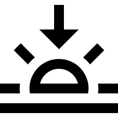
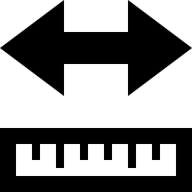

# Summarising quantitative data {#SummariseQuantData}
\index{Quantitative data!summarizing|(}


<!-- Introductions; easier to separate by format -->
```{r, child = if (knitr::is_html_output()) {'./introductions/12-SummaryQuant-HTML.Rmd'} else {'./introductions/12-SummaryQuant-LaTeX.Rmd'}}
```


## Introduction {#Summarise-Quant}

Most quantitative research studies involve quantitative variables
Except for very small amounts of data, understanding the data is difficult without a summary.
A *distribution* is a way to summarise quantitative data.


::: {.definition #Distribution name="Distribution"}
The *distribution* of a variable describes what values are present in the data, and how often those values appear.
:::


The distribution can be displayed using a frequency table (Sect.\ \@ref(QuantFreqTable)) or a graph (Sect.\ \@ref(QuantitativeGraphs)).
The distribution of quantitative data can be summarised numerically by computing the average value (Sect.\ \@ref(ComputeAverage)), computing the amount of variation (Sect.\ \@ref(Variation)), describing the shape (Sect.\ \@ref(SummaryShape)), and identifying outliers (Sect.\ \@ref(SummaryOutliers)).


## Frequency tables for quantitative data {#QuantFreqTable}
\index{Quantitative data!frequency tables}

Quantitative data can be collated in a *frequency table* by grouping the variables into appropriate intervals.
The categories should be *exhaustive* (cover all values) and *exclusive* (observations belong to one and only one category).
While not essential, usually the categories are of equal size.


:::{.example #BabyBoomTable}
Consider the data in
`r if( knitr::is_html_output() ) {
  'Fig.\\ \\@ref(fig:BabyBoomDataHTML),' } else {
  'Table\\ \\@ref(tab:BabyBoomDataLATEX) (the first ten of the $44$ observations).'
}`
The data are the weights of $44$ babies born in a hospital on one day [@mypapers:Dunn:dataset:1999; @data:Steele:BabyBoom], plus the gender of each baby, and the number of minutes after midnight of the birth.
The data are given in the order in which the births occurred.

The weights can be grouped into weight categories (Table\ \@ref(tab:BabyBoomTable)).
The percentages are also added; for example, the percentage of babies over $4.0$\ kg is $1/44 \times 100 = 2.27$%, or about $2$%. 
Most babies in the sample are between $3$ and $4$\ kg at birth.
:::


```{r}
data(BabyBoom)
BB <- BabyBoom

BB2 <- data.frame(Gender = BB$Gender,# = factor(BB$Gender),
                  "Weight (in kg)" = BB$Weight,
                   Mins.Since.Midnight = BB$Mins.Since.Midnight)
```

```{r BabyBoomDataLATEX}
if( knitr::is_latex_output() ) {
  T1 <- kable( pad(BB2[1:5, ],
                   surroundMaths = TRUE,
                   targetLength = c(0, 3, 4),
                   digits = c(0, 1, 0)),
               format = "latex",
               longtable = FALSE,
               row.names = FALSE,
               escape = FALSE,
               align = c("c", "r"),
               digits = c(0, 1, 0),
               col.names = c("Gender", 
                             "(in kg)", 
                             "birth"),
               booktabs = TRUE) %>%
    row_spec(0, bold = TRUE) %>%
    add_header_above( c(" " = 1,
                        "Weight" = 1,
                      "Time of"),
                      line = FALSE,
                      bold = TRUE)

#    column_spec(1, width = "10mm") %>%
#    column_spec(2, width = "10mm") %>%
#    column_spec(3, width = "10mm")
  T2 <- kable( pad(BB2[6:10, ],
                   surroundMaths = TRUE,
                   targetLength = c(0, 3, 4),
                   digits = c(0, 1, 0)),
               format = "latex",
               longtable = FALSE,
               row.names = FALSE,
               escape = FALSE,
               digits = c(0, 1, 0),
               align = c("c", "r"),
               col.names = c("Gender", 
                             "(in kg)", 
                             "birth"),
               booktabs = TRUE) %>%
    row_spec(0, bold = TRUE) %>%
    add_header_above( c(" " = 1,
                        "Weight" = 1,
                      "Time of"),
                      line = FALSE,
                      bold = TRUE)
  
  out <- knitr::kables(list(T1, T2),
                       format = "latex",
                       label = "BabyBoomDataLATEX",
                       caption = "The first ten observations (of 44) of the baby-births data. The 'time of birth' is the number of minutes since midnight.") %>% 
    kable_styling(font_size = 8)
  out2 <- prepareSideBySideTable(out, 
                                 gap = "\\quad") 
  out2
  
}
```
```{r BabyBoomDataHTML, fig.cap="The baby-births data"}
if( knitr::is_html_output() ) {
      DT::datatable( BB2,
                     fillContainer = FALSE, # Make more room, so we don't just have ten values
                     options = list(searching = FALSE), # Remove searching: See: https://stackoverflow.com/questions/35624413/remove-search-option-but-leave-search-columns-option
                     colnames = c("Gender", 
	                                "Weight (in kg)", 
		                              "Minutes since midnight"),
                     caption = "The baby-births data"
        )
}
```


```{r BabyBoomTable}
data(BabyBoom)
BB <- BabyBoom

BB2 <- data.frame(Gender = factor(BB$Gender),
                  "Weight (in kg)" = BB$Weight,
                   Mins.Since.Midnight = BB$Mins.Since.Midnight)

Wts <- BB$Weight
out <- hist(Wts,
            plot = FALSE,
            right = FALSE)
BBpercentage <- out$counts / sum(out$counts) * 100
  
BBtab <- array(dim = c(6, 3) )
BBtab[, 2] <- out$counts 
BBtab[, 3] <- round(BBpercentage) 
BBtab[, 1] <- c("$1.5$\ kg to under $2.0$\ kg",
                "$2.0$\ kg to under $2.5$\ kg",
                "$2.5$\ kg to under $3.0$\ kg",
                "$3.0$\ kg to under $3.5$\ kg",
                "$3.5$\ kg to under $4.0$\ kg",
                "$4.0$\ kg to under $4.5$\ kg") 
colnames(BBtab) <- c("Weight group", 
                     "Number of babies",
                     "Percentage of babies")

if( knitr::is_latex_output() ) {
  kable( pad(BBtab,
             surroundMaths = TRUE,
             targetLength = c(0, 2, 2),
             digits = 0),
        format = "latex",
        longtable = FALSE,
        escape = FALSE,
        align = "c",
        booktabs = TRUE,
        linesep = c("","","\\addlinespace"),
        row.names = FALSE,
        caption = "The baby-weights data, displayed in a frequency table") %>%
	kable_styling(font_size = 8) %>%
	row_spec(0, bold = TRUE)
}
if( knitr::is_html_output() ) {
 kable(pad(BBtab,
             surroundMaths = TRUE,
             targetLength = c(0, 2, 2),
             digits = 0),
               format = "html",
               longtable = FALSE,
               align = "c",
               booktabs = TRUE,
               row.names = FALSE,
               caption = "The baby-weights data, displayed in a frequency table") %>%
      kable_styling(full_width = FALSE)
}
```


## Graphs {#QuantitativeGraphs}
\index{Quantitative data!graphs}

The graphs discussed in this section are appropriate for *continuous* quantitative data, but may sometimes be useful for discrete quantitative data if many values are possible.
Often, discrete quantitative data (or continuous quantitative data with very few recorded values) is better graphed using the graphs in Sect.\ \@ref(QualitativeGraphs).


::: {.importantBox .important data-latex="{iconmonstr-warning-8-240.png}"}
The purpose of a graph is to display the information in the clearest, simplest possible way, to facilitate understanding the message(s) in the data.
:::


Graphs used to display the distribution of one quantitative variable include:

* *Histogram* (Sect.\ \@ref(Histograms)):
  Best for moderate to large amounts of data.
* *Stemplots* (Sect.\ \@ref(StemAndLeafPlots)):
  Best for small amounts of data; only sometimes useful.
* *Dot chart* (Sect.\ \@ref(DotChartsOneVar)):
  Used for small to moderate amounts of data.


### Histograms {#Histograms}
\index{Histogram}

Histograms are a series of boxes, where the width of the box represents a range of *values* of the variable being graphed, and the height of the box represents the *number* (or *percentage*) of observations within that range of values^[Technically, the *area* of the box is proportional to the number of observations. 
Since we only consider histograms where the boxes are all the same width, this is equivalent.].
Histograms are essentially a picture of a frequency table.
The vertical axis can be counts (labelled as 'Counts', 'Frequency', or similar) or percentages.

When the quantitative variable is discrete and the boxes have a width of one, sometimes the labels are placed on the axis aligned with the centre of the bar (e.g., see Fig.\ \@ref(fig:WaterAcessQuant), right panel)).

<div style="float:right; width: 222x; border: 1px; padding:10px">

</div>


::: {.example #Histograms name="Histograms"}
Consider again the weights (in kg) of babies born in a Brisbane hospital in one day
`r if( knitr::is_html_output() ) {
  '(Fig.\\ \\@ref(fig:BabyBoomDataHTML)).'
} else {
  '(Table\ \\@ref(tab:BabyBoomDataLATEX)).'
}`
A histogram can be constructed for these data
`r if( knitr::is_html_output() ) {
  '(below).'
} else {
  '(Fig.\\ \\@ref(fig:BBHist1)).'
}`
When an observation occurs on a boundary between the boxes, software usually (but not universally) places it in the *higher* box (so $2.5$\ kg would be counted in the '$2.5$ to $3.0$\ kg' box, not the '$2.0$ to $2.5$\ kg' box).
That is, the boxes *include* the lower limit, but *exclude* the upper limit.
The histogram shows, for example, that $17$ babies weighed $3.0$\ kg or more, but under $3.5$\ kg.

`r if (knitr::is_latex_output()) {
   'The completed histogram is shown in Fig.\\ \\@ref(fig:BBHist44BrainFreeze), left panel.'
} else {
   'The animation below shows how the histogram is constructed.'
}`
:::


```{r animation.hook="gifski", interval=0.55, fig.height=7}
### BUILD A HISTOGRAM
if (knitr::is_html_output()) {
  
  Wts <- sort(BB$Weight)
  
  
  #  par(width=5, height=5, mar=c(0, 0, 2, 0) + 0.1, mfrow=c(2, 1))
  par(mfrow = c(2, 1))
  for (i in (1:length(Wts))){
    # Plot the data
    datagrid.x <- 11
    datagrid.y <- 4
    
    plot( expand.grid(1:datagrid.x, 
                      1:datagrid.y),
          type = "n",
          ylim = c(0.7, 4.3),
          main = "The data (in order)",
          xlab = "",
          ylab = "",
          axes = FALSE)
    text(  1:datagrid.x, 
           rep(4, 11), 
	   (Wts[1:11]) )
    text(  1:datagrid.x, 
           rep(3, 11), 
	   (Wts[12:22]) )
    text(  1:datagrid.x, 
           rep(2, 11), 
	   (Wts[23:33]) )
    text(  1:datagrid.x, 
           rep(1, 11), 
	   (Wts[34:44]) )
    
    # Now highlight the observation being used
    if (i <= 11) {
      points(  i, 4, 
               pch = 1, 
	             col = plotDark, 
	             lwd = 3, 
	             cex = 4 )
    }
    if ( (i > 11) & (i <= 22)){
      points(  i - 11, 3, 
               pch = 1, 
	             col = plotDark, 
	             lwd = 3, 
	             cex = 4 )
    }
    if ( (i > 22) & (i <= 233)){
      points(  i - 22, 2, 
               pch = 1, 
	             col = plotDark, 
	             lwd = 3, 
	             cex = 4 )
    }
    if ( (i > 33) ){
      points(  i - 33, 1, 
               pch = 1, 
	             col = plotDark, 
	             lwd = 3, 
	             cex = 4 )
    }
    
    # Produce the histogram
    
    hist( Wts[1:i],
          right = FALSE,
          xlab = "Birthweight (in kg)",
          ylab = "Number of babies",
          main = "Histogram of birthweights of babies born\non one day in a Brisbane hospital",
          las = 1,
          xlim = c(1.5, 4.5),
          ylim = c(0, 20),
          breaks = seq(1.5, 4.5, by = 0.5),
          col = plot.colour)
       points(Wts[i],
          0,
          pch = 19,
          col = plot.colour,
          cex = 2)
  }
} 
```


```{r BBHist1, fig.align="center", fig.width=8.5, fig.height=3, out.width='100%', fig.cap="Starting to make the histogram for the baby-birth data: the first six observations added" }
if (knitr::is_latex_output()){
  Wts <- sort(BB$Weight)
  
  par(mfrow = c(1, 2))
  par(mar = c(5, 0.5, 4, 0.5) + 0.1)
  
  i <- 6
  # Plot the data
  datagrid.x <- 10
  datagrid.y <- 5
  
  plot( expand.grid(1:datagrid.x, 
                    1:datagrid.y),
        type = "n",
        ylim = c(-0.5, 4.6),
        xlim = c(1, 11),
        main = "The birthweights (in order)",
        xlab = "",
        ylab = "",
        axes = FALSE)
  text(  1:datagrid.x, 
         rep(4, 11), 
         format(Wts[1:10], nsmall = 1) )
  text(  1:datagrid.x, 
         rep(3, 11), 
         format(Wts[11:20], nsmall = 1) )
  text(  1:datagrid.x, 
         rep(2, 11), 
         format(Wts[21:30], nsmall = 1) )
  text(  1:datagrid.x, 
         rep(1, 11), 
         format(Wts[31:40], nsmall = 1) )
  text(  1:4, 
         rep(0, 4), 
         format(Wts[41:44], nsmall = 1) )
  
  # Now highlight the observation being used
  if (i <= 11) {
    points(  i, 4, 
             pch = 1, 
             col = plotDark, 
             lwd = 3, 
             cex = 4 )
  }
  
  ###################
  par(mar = c(5, 4, 4, 0.5) + 0.1)

  # Produce the histogram
  hist( Wts[1:i],
        right = FALSE,
        xlab = "Birthweight (in kg)",
        ylab = "Number of babies",
        main = "Histogram of birthweights of babies born\non one day in a Brisbane hospital",
        las = 1,
        xlim = c(1.5, 4.5),
        ylim = c(0, 20),
        breaks = seq(1.5, 4.5, 
                     by = 0.5),
        col = plot.colour)
  
  # Annotate histogram
  arrows(x0 = 1.75,
         x1 = 1.75,
         y0 = 19,
         y1 = 3,
         length = 0.15,
         angle = 15)
  text(1.75, 19,
       pos = 4,
       labels = "One observation: 1.7")
  
  arrows(x0 = 2.25,
         x1 = 2.25,
         y0 = 14,
         y1 = 5,
         length = 0.15,
         angle = 15)
  text(2.25, 14,
       pos = 4,
       labels = "Four observations: 2.1, 2.1, 2.2, 2.4")  
  
  arrows(x0 = 2.75,
         x1 = 2.75,
         y0 = 9,
         y1 = 2,
         length = 0.15,
         angle = 15)
  text(2.75, 9,
       pos = 4,
       labels = "One observation so far: 2.6")  
}
```


```{r BBHist44BrainFreeze, fig.align="center", fig.width=9, fig.height=3, out.width='100%', fig.cap="Left: The final histogram for the baby-birth data. Right: Duration of brain-freeze symptons after drinking ice water" }
par( mfrow = c(1, 2))

  Wts <- sort( BB$Weight )
  
  # Produce the histogram
  
  hist( Wts,
        right = FALSE, # Right-closed and left-open (i.e., like 2.5 to under 3 kg)
        xlab = "Birthweight (in kg)",
        ylab = "Number of babies",
        main = "Histogram of birthweights of babies\non one day in Brisbane",
        las = 1,
        xlim = c(1.5, 4.5),
        ylim = c(0, 20),
        breaks = seq(1.5, 4.5, by = 0.5),
        col = plot.colour)
  


  Hts <- c(11, 9, 4, 4, 2, 5, 0, 1)
Borders <- seq(0, 40, 
               by = 5)

old.par <- par()

barplot(Hts,
        space = 0,
        ylim = c(0, 12),
        col = plot.colour,
        main = "Duration of brain freeze symptoms\nafter drinking ice water",
        ylab = "Number of volunteers",
        xlab = "Duration (s)",
        axes = FALSE)
axis(side = 2, 
     las = 1)
axis(side = 1, 
     at = 0:8, 
     labels = Borders)
box()
```


::: {.example #Histograms2 name="Histograms"}
A study of *brain freezes* after consuming cold food or drink measured the duration of the brain-freeze symptoms [@data:Mages2017:BrainFreeze].

A histogram of the data (Fig.\ \@ref(fig:BBHist44BrainFreeze), right panel), shows $11$ people experience symptoms less than $5$\ s in length; nine people experienced symptoms for at least $5$ but less than $10$\ s; and $1$ person experienced symptoms for at least $35$\ s but under $40$\ s.
:::

Software usually makes sensible choices for the number of bins, and the width of the bins.
However, the choice of bin size can substantially change the appearance of the histogram.
Software makes it easy to try different bin sizes to find one that suitably displays the overall distribution.


```{r}
data(faithful) # Built-in data set
```


::: {.example #BinWidthFaithful name="Bimodal data"}
The *Old Faithful* geyser in Yellowstone National Park (USA) erupts regularly [@hardle1991smoothing].
A histogram for the time between eruptions is shown
`r if (knitr::is_latex_output()) {
   'in Fig.\\ \\@ref(fig:BimodalFaithfulHistoChangeBins) (left panel), where the effect of changing the bin width can be seen.'
} else {
   'below. Try changing the number of bins in the interaction below to see the impact.'
}`
:::

```{r, child = if (knitr::is_html_output())  './children/HistogramBins/histogramChangeBinsHTML.Rmd'}
```
```{r, child = if (knitr::is_latex_output()) './children/HistogramBins/histogramChangeBinsLATEX.Rmd'}
```


### Stemplots {#StemAndLeafPlots}
\index{Stemplot}

*Stemplots* (or *stem-and-leaf plots*) are best described and explained using an example.
Consider the data in
`r if( knitr::is_html_output() ) {
  'Fig.\\ \\@ref(fig:BabyBoomDataHTML),'
} else
{
  'Table\\ \\@ref(tab:BabyBoomDataLATEX) and Fig.\\ \\@ref(fig:BBHist1),'
}`
the weights of babies born in a Brisbane hospital on one day [@mypapers:Dunn:dataset:1999; @data:Steele:BabyBoom].


<div style="float:right; width: 222x; border: 1px; padding:10px">

</div>


In a stemplot, part of each number is placed to the left of a vertical line (the *stem*), and the rest of each number to the right of the line (the *leaf*).
The weights 
`r if( knitr::is_html_output() ) {
  'in Fig.\\ \\@ref(fig:BabyBoomDataHTML)'
} else
{
  'in Table\\ \\@ref(tab:BabyBoomDataLATEX)'
}`
are given to one decimal place of a kilogram, so the whole number of kilograms is placed to the left of the line (as the *stem*), and the first decimal place is placed on the right of the line (as a *leaf*).
`r if (knitr::is_latex_output()) {
   'Figure\\ \\@ref(fig:BBStem1) shows the stemplot starting to be built, and Fig.\\ \\@ref(fig:BBStem44) shows the final stemplot.'
} else {
   'The animation below shows how the stemplot is constructed.'
}`
The first weight, of $1.7$\ kg, is entered with the $1$ to the left of the line, and the $7$ to the right: `1 | 7`.
Similarly, $2.1$\ kg is entered as `2 | 1` and $2.2$\ kg is entered as `2 | 2`, sharing the same stem as for $2.1$\ kg.⚄
The plots shows that most birthweights are $3$-point-something kilograms.


```{r animation.hook="gifski", interval=0.85, dev=if (is_latex_output()){"pdf"}else{"png"}}
# BABYBOOM
if (knitr::is_html_output()){
  Wts <- sort(BB$Weight)
    
  par(mfrow = c(2, 1), 
      mar = c(2, 3, 4, 1) + 0.1 )
  for (i in (1:length(Wts))){
    # Plot the data
    datagrid.x <- 11
    datagrid.y <- 4
    
    plot( expand.grid(1:datagrid.x, 
                      1:datagrid.y),
          type = "n",
          ylim = c(0.7, 4.3),
          main = "The birthweights (in order)",
          xlab = "",
          ylab = "",
          axes = FALSE)
    cex.data <- 0.9
    text(  1:datagrid.x, 
           rep(4, 11), 
	   (Wts[1:11]),  
	   cex = cex.data )
    text(  1:datagrid.x, 
           rep(3, 11), 
	   (Wts[12:22]), 
	   cex = cex.data )
    text(  1:datagrid.x, 
           rep(2, 11), 
	   (Wts[23:33]), 
	   cex = cex.data )
    text(  1:datagrid.x, 
           rep(1, 11), 
	   (Wts[34:44]), 
	   cex = cex.data )
    
    # Now highlight the observation being used
    if (i <= 11) {
      points(  i, 4, 
               pch = 1, 
	       col = plotDark, 
	       lwd = 3, 
	       cex = 4 )
    }
    if ( (i > 11) & (i <= 22)){
      points(  i - 11, 3, 
               pch = 1, 
	       col = plotDark, 
	       lwd = 3, 
	       cex = 4 )
    }
    if ( (i > 22) & (i <= 233)){
      points(  i - 22, 2, 
               pch = 1, 
	       col = plotDark, 
	       lwd = 3, 
	       cex = 4 )
    }
    if ( (i > 33) ){
      points(  i - 33, 1, 
               pch = 1, 
	       col = plotDark, 
	       lwd = 3, 
	       cex = 4 )
    }
    
    # Produce the stemplot
    stemgrid.x <- 34
    stemgrid.y <- 4
    stemcounts <- array(1, dim = stemgrid.y)
    
    plot( expand.grid(1:stemgrid.x, 1:stemgrid.y), 
          type = "n",
          xlab = "",
          ylab = "",
          main = "Stemplot of birthweights\n(2 | 6 means 2.6 kg)",
          xlim = c(0, 34),
          ylim = c(0.8, 4.2),
          axes = FALSE)
    
    if (Wts[i] < 2 ) {
      mtext("1", 
            side = 2, 
	    line = 1, 
	    las = 1, 
	    at = 4, 
	    col = plotDark, 
	    font = 2, 
	    cex = 1.5)
      mtext("2", 
            side = 2, 
	    line = 1, 
	    las = 1, 
	    at = 3)
      mtext("3", 
            side = 2, 
	    line = 1, 
	    las = 1, 
	    at = 2)
      mtext("4", 
            side = 2, 
	    line = 1, 
	    las = 1, 
	    at = 1)
    }
    if ( (Wts[i] >= 2) & (Wts[i] < 3) ){
      mtext("1", 
            side = 2, 
	    line = 1, 
	    las = 1, 
	    at = 4)
      mtext("2", 
            side = 2, 
	    line = 1, 
	    las = 1, 
	    at = 3, 
	    col = plotDark, 
	    font = 2, 
	    cex = 1.5)
      mtext("3", 
            side = 2, 
	    line = 1, 
	    las = 1, 
	    at = 2)
      mtext("4", 
             side = 2, 
	     line = 1, 
	     las = 1, 
	     at = 1)
    }
    if ( (Wts[i] >= 3) & (Wts[i] < 4) ){
      mtext("1", 
            side = 2, 
	    line = 1, 
	    las = 1, 
	    at = 4)
      mtext("2", 
            side = 2, 
	    line = 1, 
	    las = 1, 
	    at = 3)
      mtext("3", 
            side = 2, 
	    line = 1, 
	    las = 1, 
	    at = 2, 
	    col = plotDark, 
	    font = 2, 
	    cex = 1.5)
      mtext("4", 
            side = 2, 
	    line = 1, 
	    las = 1, 
	    at = 1)
    }
    if ( Wts[i] >= 4 ){
      mtext("1", 
            side = 2, 
	    line = 1, 
	    las = 1, 
	    at = 4)
      mtext("2", 
            side = 2, 
	    line = 1, 
	    las = 1, 
	    at = 3)
      mtext("3", 
            side = 2, 
	    line = 1, 
	    las = 1, 
	    at = 2)
      mtext("4", 
            side = 2, 
	    line = 1, 
	    las = 1, 
	    at = 1, 
	    col = plotDark, 
	    font = 2, 
	    cex = 1.5)
    }
    
    # Divide the stems and leaves
    abline(v = 0, 
           lwd = 2)
    
    # Plot leaves
    for (j in (1:i) ){
      if ( Wts[j] < 2) {
        if (j != i) points( stemcounts[1], 4, 
	                    pch = substr( sprintf("%1.1f", Wts[j]), 3, 3))
        if (j == i ) text( stemcounts[1], 4, 
	                   substr( sprintf("%1.1f", Wts[j]), 3, 3), 
			   col = plotDark, 
			   cex = 1.5, 
			   font = 2)
        stemcounts[1] <- stemcounts[1] + 1
      }
      
      if ( (Wts[j] >= 2) & (Wts[j] < 3) ) {
        if (j != i ) points( stemcounts[2], 3, 
	                     pch = substr( sprintf("%1.1f", Wts[j]), 3, 3) )
        if (j == i ) text( stemcounts[2], 3, 
	                   substr( sprintf("%1.1f", Wts[j]), 3, 3), 
			   col = plotDark, 
			   cex = 1.5, 
			   font = 2)
        stemcounts[2] <- stemcounts[2] + 1
      }
      
      if ( (Wts[j] >= 3) & (Wts[j] < 4) ) {
        if (j != i ) points( stemcounts[3], 2, 
	                     pch = substr( sprintf("%1.1f", Wts[j]), 3, 3))
        if (j == i ) text( stemcounts[3], 2, 
	                   substr( sprintf("%1.1f", Wts[j]), 3, 3), 
			   col = plotDark, 
			   cex = 1.5, 
			   font = 2)
        stemcounts[3] <- stemcounts[3] + 1
      }
      if ( Wts[j] >= 4 ) {
        if (j != i ) points( stemcounts[4], 1, 
	                     pch = substr( sprintf("%1.1f", Wts[j]), 3, 3))
        if (j == i ) text( stemcounts[4], 1, 
	                   substr( sprintf("%1.1f", Wts[j]), 3, 3), 
			   col = plotDark, 
			   cex = 1.5,  
			   font = 2)
        stemcounts[4] <- stemcounts[4] + 1
      }
    }
  }
}
```


```{r BBStem1, fig.align="center", fig.width=5, fig.cap="Starting to make the stemplot for the baby-weight data: the first $4$ observations added. The data are on the left; the stemplot during construction on the right.", fig.width=10, fig.height=3, out.width='100%'}
if (knitr::is_latex_output()){
  Wts <- sort(BB$Weight)
  
  #  par(width=5, height=5, mar=c(0, 0, 2, 0)+0.1, mfrow=c(2, 1))
  par(mfrow = c(1, 2), 
      mar = c(3.85, 2, 3.5, 1) + 0.1)
  i <- 4
    # Plot the data
    datagrid.x <- 11
    datagrid.y <- 4
    
    plot( expand.grid(1:datagrid.x, 1:datagrid.y),
          type = "n",
          ylim = c(0.7, 4.3),
          xlim = c(1, 13),
          main = "The birthweights (in order)",
          xlab = "",
          ylab = "",
          axes = FALSE)
    cex.data <- 0.9
    text(  1:datagrid.x, rep(4, 11), 
           (Wts[1:11]),  
	   cex = cex.data )
    text(  1:datagrid.x, rep(3, 11), 
           (Wts[12:22]), 
	   cex = cex.data )
    text(  1:datagrid.x, rep(2, 11), 
           (Wts[23:33]), 
	   cex = cex.data )
    text(  1:datagrid.x, rep(1, 11), 
           (Wts[34:44]), 
	   cex = cex.data )
    
    # Now highlight the observation being used
    if (i <= 11) {
      points(  i, 4, 
               pch = 1, 
               col = plotDark, 
               lwd = 3, 
               cex = 4 )
    }

   
    # Produce the stemplot
    stemgrid.x <- 34
    stemgrid.y <- 4
    stemcounts <- array(1, dim = stemgrid.y)
    
    plot( expand.grid(1:stemgrid.x, 1:stemgrid.y), 
          type = "n",
          xlab = "2 | 6 means 2.6 kg",
          ylab = "",
          main = "Stemplot of birthweights",
          xlim = c(0, 34), 
          ylim = c(0.8, 4.2),
          axes = FALSE)
    
    if (Wts[i] < 2 ) {
      mtext("1", 
            side = 2, 
            line = 1, 
            las = 1, 
            at = 4, 
            col = plotDark, 
            font = 2, 
            cex = 1.5)
      mtext("2", 
            side = 2, 
            line = 1, 
            las = 1, 
            at = 3)
      mtext("3", 
            side = 2, 
            line = 1, 
            las = 1, 
            at = 2)
      mtext("4", 
            side = 2, 
            line = 1, 
            las = 1, 
            at = 1)
    }
    if ( (Wts[i] >= 2) & (Wts[i] < 3) ){
      mtext("1", 
            side = 2, 
            line = 1, 
            las = 1, 
            at = 4)
      mtext("2", 
            side = 2, 
            line = 1, 
            las = 1, 
            at = 3, 
            col = plotDark, 
            font = 2, 
            cex = 1.5)
      mtext("3", 
            side = 2, 
            line = 1, 
            las = 1, 
            at = 2)
      mtext("4", 
            side = 2, 
            line = 1, 
            las = 1, 
            at = 1)
    }
    if ( (Wts[i] >= 3) & (Wts[i] < 4) ){
      mtext("1", 
            side = 2, 
            line = 1, 
            las = 1, 
            at = 4)
      mtext("2", 
            side = 2, 
            line = 1, 
            las = 1, 
            at = 3)
      mtext("3", 
            side = 2, 
            line = 1, 
            las = 1, 
            at = 2, 
            col = plotDark, 
            font = 2, 
            cex = 1.5)
      mtext("4", 
            side = 2, 
            line = 1, 
            las = 1, 
            at = 1)
    }
    if ( Wts[i] >= 4 ){
      mtext("1", 
            side = 2, 
            line = 1, 
            las = 1, 
            at = 4)
      mtext("2", 
            side = 2,
            line = 1, 
            las = 1, 
            at = 3)
      mtext("3", 
            side = 2, 
            line = 1, 
            las = 1, 
            at = 2)
      mtext("4", 
            side = 2, 
            line = 1, 
            las = 1, 
            at = 1, 
            col = plotDark, 
            font = 2, 
            cex = 1.5)
    }
    
    # Divide the stems and leaves
    abline(v = 0,  
           lwd = 2)
    
    # Plot leaves
    stemcounts <- rep(1, 4)
    
    for (j in (1:4) ){
      
      if ( Wts[j] < 2) {
        if (j != i) points( stemcounts[1], 4, 
                            pch = substr( as.character(Wts[j] - 1), 3, 3) )
        if (j == i ) text( stemcounts[1], 4, 
                           substr( as.character(Wts[j] - 1), 3, 3),
                           col = plotDark, 
                           cex = 1.5, 
                           font = 2)
        stemcounts[1] <- stemcounts[1] + 1
      }
      
      if ( (Wts[j] >= 2) & (Wts[j] < 3) ) {
        if (j != i ) points( stemcounts[2], 3, 
                             pch = substr( as.character(Wts[j] - 2), 3, 3) )
        if (j == i ) text( stemcounts[2], 3, 
                           substr( as.character(Wts[j] - 2), 3, 3),
                           col = plotDark, 
                           cex = 1.5, 
                           font = 2)
        stemcounts[2] <- stemcounts[2] + 1
      }
      
      if ( (Wts[j] >= 3) & (Wts[j] < 4) ) {
        if (j != i ) points( stemcounts[3], 2, 
                             pch = substr( sprintf("%1.1f", Wts[j]), 3, 3) )
        if (j == i ) text( stemcounts[3], 2, 
                           substr( sprintf("%1.1f", Wts[j]), 3, 3),
                           col = plotDark, 
                           cex = 1.5, 
                           font = 2)
        stemcounts[3] <- stemcounts[3] + 1
      }
      if ( Wts[j] >= 4 ) {
        if (j != i ) points( stemcounts[4], 1, 
                             pch = substr( as.character(Wts[j] - 2), 3, 3) )
        if (j == i ) text( stemcounts[4], 1, 
                           substr( as.character(Wts[j] - 4), 3, 3),
                           col = plotDark, 
                           cex = 1.5, 
                           font = 2)
        stemcounts[4] <- stemcounts[4] + 1
      }
    }
}
```


```{r BBStem44,  fig.align="center", fig.cap="The stemplot for the baby-weight data (right), with the data on the left.", fig.width=9, fig.height=3, out.width='100%' }
if (knitr::is_latex_output()){
  Wts <- sort(BB$Weight)
  
  par(mfrow = c(1, 2), 
      mar = c(3.85, 2, 3.5, 1) + 0.1)
  for (i in (length(Wts):length(Wts))){
    # Plot the data
    datagrid.x <- 11
    datagrid.y <- 4
    
    plot( expand.grid(1:datagrid.x, 1:datagrid.y),
          type = "n",
          ylim = c(0.7, 4.3),
          xlim = c(1, 13),
          main = "The birthweights (in order)",
          xlab = "",
          ylab = "",
          axes = FALSE)
    cex.data <- 0.9
    text(  1:datagrid.x, 
           rep(4, 11), 
           (Wts[1:11]),  
           cex = cex.data )
    text(  1:datagrid.x, 
           rep(3, 11), 
           (Wts[12:22]), 
           cex = cex.data )
    text(  1:datagrid.x, 
           rep(2, 11), 
           (Wts[23:33]), 
           cex = cex.data )
    text(  1:datagrid.x, 
           rep(1, 11), 
           (Wts[34:44]), 
           cex = cex.data )
    
    # Produce the stemplot
    stemgrid.x <- 34
    stemgrid.y <- 4
    stemcounts <- array(1, dim = stemgrid.y)
    
    plot( expand.grid(1:stemgrid.x, 1:stemgrid.y), 
          type = "n",
          xlab = "2 | 6 means 2.6 kg",
          ylab = "",
          main = "Stemplot of birthweights",
          xlim = c(0, 34),
          ylim = c(0.8, 4.2),
          axes = FALSE)
    
    mtext("1", 
          side = 2, 
          line = 1, 
          las = 1, 
          at = 4)
    mtext("2", 
          side = 2, 
          line = 1, 
          las = 1, 
          at = 3)
    mtext("3", 
          side = 2, 
          line = 1, 
          las = 1, 
          at = 2)
    mtext("4", 
          side = 2, 
          line = 1, 
          las = 1, 
          at = 1)
    
    # Divide the stems and leaves
    abline(v = 0, 
           lwd = 2)
    
    # Plot leaves
    for (j in (1:44) ){
      if ( Wts[j] < 2) {
        if (j != i) points( stemcounts[1], 4, 
                            pch = substr( as.character(Wts[j] - 1), 3, 3) )
        stemcounts[1] <- stemcounts[1] + 1
      } 
      
      if ( (Wts[j] >= 2) & (Wts[j] < 3) ) {
        if (j != i ) points( stemcounts[2], 3, 
                            pch = substr( as.character(Wts[j] - 2), 3, 3) )
        stemcounts[2] <- stemcounts[2] + 1
      }
      
      if ( (Wts[j] >= 3) & (Wts[j] < 4) ) { 
        if (j != i ) points( stemcounts[3], 2, 
                            pch = substr( sprintf("%1.1f", Wts[j]), 3, 3) )
        stemcounts[3] <- stemcounts[3] + 1
      }
      if ( Wts[j] >= 4 ) {
        points( stemcounts[4], 1, 
                            pch = substr( as.character(Wts[j] - 4), 3, 3) )
        stemcounts[4] <- stemcounts[4] + 1
      }
    }
  }
}
```


One advantage of using stemplots over other plots is that the original data are visible.
For stemplots:

* place the larger unit (e.g., kilograms) on the left (stems).
* place the smaller unit (e.g., first decimal of a kilogram) on the right (leaves).
* some data do not work well with stemplots.
* sometimes, data may need suitable rounding before creating the stemplot (the baby weights were originally given to three decimal places).
* the numbers in each row should be evenly spaced, placing the numbers in the columns under each other, so that the length of each stem is proportional to the number of observations.
* within each stem, the observations are *ordered* so patterns can be seen.
* add an explanation for reading the stemplot.
  For example, the stemplot for the baby-birth data says '$2$\ |\ $6$ means $2.6$\ kg' (rather than, say, $0.26$\ kg, or $2$\ lb $6$\ oz).


::: {.example #StemLeafPlots name="Stemplots"}
A study recorded the number chest-beats by gorillas [@wright2021chest].
The stemplot 
`r if (knitr::is_latex_output()) {
   '(Fig.\\ \\@ref(fig:GorillasStem))'
} else {
   'in the animation below shows the stemplot being constructed, and'
}`
for gorillas aged under 20 years shows a lot of variation in the beating rate, but most are under 20.
:::

```{r}
data(Gorillas)
  
GYoung <- Gorillas$ChestBeatRate[ Gorillas$Age20 == "Younger"] 
GYoung <- sort(GYoung)

```
  
   
```{r animation.hook="gifski", interval=0.85, dev=if (is_latex_output()){"pdf"}else{"png"}}
if (knitr::is_html_output()){
  
  
  par(mfrow = c(2, 1),
      mar = c(3.85, 3, 4, 1) + 0.1)
  for (i in (1:length(GYoung))){
    # Plot the data
    datagrid.x <- 5
    datagrid.y <- 3
    
    plot( expand.grid(1:datagrid.x, 
                      1:datagrid.y),
          type = "n",
          ylim = c(0, 3.4),
          main = "The chest-beating data (in order)",
          xlab = "",
          ylab = "",
          axes = FALSE)
    text(  1:datagrid.x, 
           rep(3, 5), 
           as.character(GYoung[1:5]) )
    text(  1:datagrid.x, 
           rep(2, 5), 
           as.character(GYoung[6:10]) )
    text(  1:datagrid.x, 
           rep(1, 5), 
           as.character(GYoung[11:15]) )
    
    # Now highlight the observation being used
    if (i <= 5) {
      points(  i, 3, 
               pch = 1, 
               col = plotDark, 
               lwd = 3, 
               cex = 4 )
    }
    if ( (i > 5) & (i <= 10)){
      points(  i - 5, 2, 
               pch = 1, 
               col = plotDark, 
               lwd = 3, 
               cex = 4 )
    }
    if ( (i > 10) ){
      points(  i - 10, 1, 
               pch = 1, 
               col = plotDark, 
               lwd = 3, 
               cex = 4 )
    }
    
    #######################
    
    # Produce the stemplot
    stemgrid.x <- 12
    stemgrid.y <- 5
    stemcounts <- array(1, dim = stemgrid.y)
    
    plot( expand.grid(1:stemgrid.x, 
                      0:stemgrid.y), 
          type = "n",
          xlab = "1|7 means 1.7 beats per 10 hours",
          ylab = "",
          main = "Stemplot of chest-beating rates in young gorillas",
          xlim = c(0, 11),
          ylim = c(-1.2, 3.2),
          axes = FALSE)
    
    if (GYoung[i] < 1 ) {
      mtext("0", 
            side = 2, 
            line = 1, 
            las = 1, 
            at = 3, 
            col = plotDark, 
            font = 2, 
            cex = 1.5)
      mtext("1", 
            side = 2, 
            line = 1, 
            las = 1, 
            at = 2)
      mtext("2", 
            side = 2, 
            line = 1, 
            las = 1, 
            at = 1)
      mtext("3", 
            side = 2, 
            line = 1, 
            las = 1, 
            at = 0)
      mtext("4", 
            side = 2, 
            line = 1, 
            las = 1, 
            at = -1)
    }
    if ( (GYoung[i] >= 1) & ( GYoung[i] < 2) ){
      mtext("0", 
            side = 2, 
            line = 1, 
            las = 1, 
            at = 3)
      mtext("1", 
            side = 2, 
            line = 1, 
            las = 1, 
            at = 2, 
            col = plotDark, 
            font = 2, 
            cex = 1.5)
      mtext("2", 
            side = 2, 
            line = 1,
            las = 1, 
            at = 1)
      mtext("3", 
            side = 2, 
            line = 1, 
            las = 1, 
            at = 0)
      mtext("4", 
            side = 2, 
            line = 1, 
            las = 1, 
            at = -1)
    }
    if ( (GYoung[i] >= 2) & (GYoung[i] < 3) ){
      mtext("0", 
            side = 2, 
            line = 1, 
            las = 1, 
            at = 3)
      mtext("1", 
            side = 2, 
            line = 1, 
            las = 1, 
            at = 2)
      mtext("2", 
            side = 2, 
            line = 1, 
            las = 1, 
            at = 1, 
            col = plotDark, 
            font = 2, 
            cex = 1.5)
      mtext("3",  
            side = 2, 
            line = 1, 
            las = 1, 
            at = 0)
      mtext("4", 
            side = 2, 
            line = 1, 
            las = 1, 
            at = -1)
    }
    if ( (GYoung[i] >= 3) & (GYoung[i] < 4) ){
      mtext("0", 
            side = 2, 
            line = 1, 
            las = 1, 
            at = 3)
      mtext("1", 
            side = 2, 
            line = 1, 
            las = 1, 
            at = 2)
      mtext("2", 
            side = 2, 
            line = 1, 
            las = 1, 
            at = 1)
      mtext("3",  
            side = 2, 
            line = 1, 
            las = 1, 
            at = 0,
            col = plotDark, 
            font = 2, 
            cex = 1.5)
      mtext("4", 
            side = 2, 
            line = 1, 
            las = 1, 
            at = -1)
    }
    if ( GYoung[i] >= 4 ){
      mtext("0", 
            side = 2, 
            line = 1, 
            las = 1, 
            at = 3)
      mtext("1", 
            side = 2, 
            line = 1, 
            las = 1, 
            at = 2)
      mtext("2", 
            side = 2, 
            line = 1, 
            las = 1, 
            at = 1)
      mtext("3", 
            side = 2, 
            line = 1, 
            las = 1, 
            at = 0, 
            cex = 1)
      mtext("4", 
            side = 2, 
            line = 1, 
            las = 1, 
            at = -1, 
            col = plotDark, 
            font = 2, 
            cex = 1.5)
    }
    # Divide the stems and leaves
    abline(v = 0, 
           lwd = 2)
    
    # Plot leaves
    for (j in (1:i) ){
      if ( GYoung[j] < 1) {
        if ( j != i) points( stemcounts[1], 
                             3, 
                             pch = substr(as.character(GYoung[j]),
                                          start = 3,
                                          stop = 3))
        if (j == i ) text( stemcounts[1], 3, 
                           substr(as.character(GYoung[j]),
                                  start = 3, 
                                  stop = 3), # This takes and plots just the 7 from 0.7 for instance
                           col = plotDark, 
                           cex = 1.5, 
                           font = 2)
        stemcounts[1] <- stemcounts[1] + 1
      }
      
      if ( (GYoung[j] >= 1) & (GYoung[j] < 2) ) {
        if (j != i ) points( stemcounts[2], 
                             2, 
                             pch = substr(as.character(GYoung[j]),
                                          start = 3,
                                          stop = 3))
        if (j == i ) text( stemcounts[2], 
                           2, 
                           substr( as.character(GYoung[j]), 
                                   start = 3, 
                                   stop = 3),  # This takes and plots just the 7 from 1.7 for instance
                           col = plotDark, 
                           cex = 1.5, 
                           font = 2)
        stemcounts[2] <- stemcounts[2] + 1
      }
      
      if ( (GYoung[j] >= 2) & (GYoung[j] < 3) ) {
        if (j != i ) points( stemcounts[3], 
                             1, 
                             pch = substr(as.character(GYoung[j]),
                                          start = 3,
                                          stop = 3))
        if (j == i ) text( stemcounts[3], 
                           1, 
                           substr(as.character(GYoung[j]), 
                                  start = 3,
                                  stop = 3),  # This takes and plots just the 7 from 0.7 for instance
                           col = plotDark, 
                           cex = 1.5, 
                           font = 2)
        stemcounts[3] <- stemcounts[3] + 1
      }
      if ( (GYoung[j] >= 3) & (GYoung[j] < 4) ) {
        if (j != i ) points( stemcounts[4], 
                             0, 
                             pch = substr(as.character( format(GYoung[j], nsmall = 1)), # Since the value is 3!
                                          start = 3,
                                          stop = 3))
        if (j == i ) text( stemcounts[4], 
                           0, 
                           substr(as.character( format(GYoung[j], nsmall = 1)),
                                  start = 3,
                                  stop = 3),  # This takes and plots just the 7 from 0.7 for instance
                           col = plotDark, 
                           cex = 1.5, 
                           font = 2)
        stemcounts[4] <- stemcounts[4] + 1
      }
      if ( GYoung[j] >= 4 ) {
        if (j != i ) points( stemcounts[5], 
                             -1, 
                             pch = substr(as.character(GYoung[j]),
                                          start = 3,
                                          stop = 3))
        if (j == i ) text( stemcounts[5], 
                           -1, 
                           substr(as.character(GYoung[j]), 
                                  start = 3, 
                                  stop = 3),  # This takes and plots just the 7 from 0.7 for instance
                           col = plotDark, 
                           cex = 1.5, 
                           font = 2)
        stemcounts[5] <- stemcounts[5] + 1
      }
    }
  }
}
```


```{r GorillasStem, fig.align="center", fig.width=5, fig.width=10, fig.height=2.75, out.width='100%' }
if (knitr::is_latex_output()){

  par(mfrow = c(2, 1),
      mar = c(3.85, 3, 4, 1) + 0.1)
  for (i in (1:length(GYoung))){
    # Plot the data
    datagrid.x <- 5
    datagrid.y <- 3
    
    plot( expand.grid(1:datagrid.x, 
                      1:datagrid.y),
          type = "n",
          ylim = c(0, 3.4),
          main = "The chest-beating data (in order)",
          xlab = "",
          ylab = "",
          axes = FALSE)
    text(  1:datagrid.x, 
           rep(3, 5), 
           as.character(GYoung[1:5]) )
    text(  1:datagrid.x, 
           rep(2, 5), 
           as.character(GYoung[6:10]) )
    text(  1:datagrid.x, 
           rep(1, 5), 
           as.character(GYoung[11:15]) )
    # 
    # # Now highlight the observation being used
    # if (i <= 5) {
    #   points(  i, 3, 
    #            pch = 1, 
    #            col = plotDark, 
    #            lwd = 3, 
    #            cex = 4 )
    # }
    # if ( (i > 5) & (i <= 10)){
    #   points(  i - 5, 2, 
    #            pch = 1, 
    #            col = plotDark, 
    #            lwd = 3, 
    #            cex = 4 )
    # }
    # if ( (i > 10) ){
    #   points(  i - 10, 1, 
    #            pch = 1, 
    #            col = plotDark, 
    #            lwd = 3, 
    #            cex = 4 )
    # }
    # 
    #######################
    
    # Produce the stemplot
    stemgrid.x <- 12
    stemgrid.y <- 5
    stemcounts <- array(1, dim = stemgrid.y)
    
    plot( expand.grid(1:stemgrid.x, 
                      0:stemgrid.y), 
          type = "n",
          xlab = "1|7 means 1.7 beats per 10 hours",
          ylab = "",
          main = "Stemplot of chest-beating rates in young gorillas",
          xlim = c(0, 11),
          ylim = c(-1.2, 3.2),
          axes = FALSE)
    
 #   if (GYoung[i] < 1 ) {
      mtext("0", 
            side = 2, 
            line = 1, 
            las = 1, 
            at = 3)
      mtext("1", 
            side = 2, 
            line = 1, 
            las = 1, 
            at = 2)
      mtext("2", 
            side = 2, 
            line = 1, 
            las = 1, 
            at = 1)
      mtext("3", 
            side = 2, 
            line = 1, 
            las = 1, 
            at = 0)
      mtext("4", 
            side = 2, 
            line = 1, 
            las = 1, 
            at = -1)
    # }
    # if ( (GYoung[i] >= 1) & ( GYoung[i] < 2) ){
    #   mtext("0", 
    #         side = 2, 
    #         line = 1, 
    #         las = 1, 
    #         at = 3)
    #   mtext("1", 
    #         side = 2, 
    #         line = 1, 
    #         las = 1, 
    #         at = 2, 
    #         col = plotDark, 
    #         font = 2, 
    #         cex = 1.5)
    #   mtext("2", 
    #         side = 2, 
    #         line = 1,
    #         las = 1, 
    #         at = 1)
    #   mtext("3", 
    #         side = 2, 
    #         line = 1, 
    #         las = 1, 
    #         at = 0)
    #   mtext("4", 
    #         side = 2, 
    #         line = 1, 
    #         las = 1, 
    #         at = -1)
    # }
    # if ( (GYoung[i] >= 2) & (GYoung[i] < 3) ){
    #   mtext("0", 
    #         side = 2, 
    #         line = 1, 
    #         las = 1, 
    #         at = 3)
    #   mtext("1", 
    #         side = 2, 
    #         line = 1, 
    #         las = 1, 
    #         at = 2)
    #   mtext("2", 
    #         side = 2, 
    #         line = 1, 
    #         las = 1, 
    #         at = 1, 
    #         col = plotDark, 
    #         font = 2, 
    #         cex = 1.5)
    #   mtext("3",  
    #         side = 2, 
    #         line = 1, 
    #         las = 1, 
    #         at = 0)
    #   mtext("4", 
    #         side = 2, 
    #         line = 1, 
    #         las = 1, 
    #         at = -1)
    # }
    # if ( (GYoung[i] >= 3) & (GYoung[i] < 4) ){
    #   mtext("0", 
    #         side = 2, 
    #         line = 1, 
    #         las = 1, 
    #         at = 3)
    #   mtext("1", 
    #         side = 2, 
    #         line = 1, 
    #         las = 1, 
    #         at = 2)
    #   mtext("2", 
    #         side = 2, 
    #         line = 1, 
    #         las = 1, 
    #         at = 1)
    #   mtext("3",  
    #         side = 2, 
    #         line = 1, 
    #         las = 1, 
    #         at = 0,
    #         col = plotDark, 
    #         font = 2, 
    #         cex = 1.5)
    #   mtext("4", 
    #         side = 2, 
    #         line = 1, 
    #         las = 1, 
    #         at = -1)
    # }
    # if ( GYoung[i] >= 4 ){
    #   mtext("0", 
    #         side = 2, 
    #         line = 1, 
    #         las = 1, 
    #         at = 3)
    #   mtext("1", 
    #         side = 2, 
    #         line = 1, 
    #         las = 1, 
    #         at = 2)
    #   mtext("2", 
    #         side = 2, 
    #         line = 1, 
    #         las = 1, 
    #         at = 1)
    #   mtext("3", 
    #         side = 2, 
    #         line = 1, 
    #         las = 1, 
    #         at = 0, 
    #         cex = 1)
    #   mtext("4", 
    #         side = 2, 
    #         line = 1, 
    #         las = 1, 
    #         at = -1)
    # }
  
    # Divide the stems and leaves
    abline(v = 0, 
           lwd = 2)
    
    

    # Plot leaves
  for (j in 1:length(GYoung) ){
      if ( GYoung[j] < 1) {
        points( stemcounts[1], 
                             3, 
                             pch = substr(as.character(GYoung[j]),
                                          start = 3,
                                          stop = 3))
        stemcounts[1] <- stemcounts[1] + 1
      }
      
      if ( (GYoung[j] >= 1) & (GYoung[j] < 2) ) {
        points( stemcounts[2], 
                             2, 
                             pch = substr(as.character(GYoung[j]),
                                          start = 3,
                                          stop = 3))
        stemcounts[2] <- stemcounts[2] + 1
      }
      
      if ( (GYoung[j] >= 2) & (GYoung[j] < 3) ) {
         points( stemcounts[3], 
                             1, 
                             pch = substr(as.character(GYoung[j]),
                                          start = 3,
                                          stop = 3))
        stemcounts[3] <- stemcounts[3] + 1
      }
      if ( (GYoung[j] >= 3) & (GYoung[j] < 4) ) {
        points( stemcounts[4], 
                             0, 
                             pch = substr(as.character( format(GYoung[j], nsmall = 1)), # Since the value is 3!
                                          start = 3,
                                          stop = 3))
        stemcounts[4] <- stemcounts[4] + 1
      }
      if ( GYoung[j] >= 4 ) {
        points( stemcounts[5], 
                             -1, 
                             pch = substr(as.character(GYoung[j]),
                                          start = 3,
                                          stop = 3))
        stemcounts[5] <- stemcounts[5] + 1
      }
    }
  }
}
```

`r if (knitr::is_html_output()){
  'The following short video may help explain some of these concepts:'
}`

<div style="text-align:center;">
<iframe width="560" height="315" src="https://www.youtube.com/embed/KfkvedIBPjE" frameborder="0" allow="accelerometer; encrypted-media; gyroscope; picture-in-picture"></iframe>
</div>


### Dot charts (quantitative data) {#DotChartsOneVar}
\index{Dot charts!one quantitative variable}

Dot charts show the original data on a single (usually horizontal) axis, with each observation represented by a dot (or other symbol).

   
<div style="float:right; width: 222x; border: 1px; padding:10px">

</div>


::: {.example #DotsChartsQuant2 name="Dot charts"}
Consider again the weights (in kg) of babies born in a Brisbane hospital
`r if( knitr::is_html_output() ) {
  '(Fig.\\ \\@ref(fig:BabyBoomDataHTML)).'
} else
{
  '(Table\\ \\@ref(tab:BabyBoomDataLATEX)).'
}`
A dot chart
`r if( knitr::is_html_output() ) {
  '(Fig.\\ \\@ref(fig:BabyBoomDotHTML))'
} else
{
  '(Fig\\ \\@ref(fig:FriesBabiesPDF), right panel)'
}`
shows that most babies were born between $3$ and $4$\ kg.
Observations have been *jittered* (i.e., placed with some added randomness in the vertical direction) to avoid overplotting.
:::


::: {.example #DotChartsQuant name="Dot charts"}
The chest-beating rate of young gorillas, seen in Example\ \@ref(exm:StemLeafPlots)), can be displayed using a dot chart
`r if (knitr::is_latex_output()) {
   '(Fig.\\ \\@ref(fig:FriesBabiesPDF), left panel).'
} else {
   '(Fig.\\ \\@ref(fig:FriesHTML), top panel).'
}`
Observations are *stacked* on top of each other when multiple observations are the same, or very nearly so; for example, two gorillas beat their chest at $1.7$ beats per $10$\ h.
:::


```{r FriesBabiesPDF, fig.cap="A dot chart of the baby-weight data (left panel), where similar observations are jittered. Gorilla chest-beating rates (right panel), where similar observations are stacked, rather than jittered.", fig.align="center", fig.width=9, fig.height=2.5, out.width='95%'}
if (knitr::is_latex_output()){
  
  par( mfrow = c(1, 2) )
  
    stripchart(BB$Weight, 
             method = "jitter",
             pch = 19,
             col = plotDark,
             ylim = c(0.75, 1.25),
             xlim = c(1.5, 4.5),
             main = "Dot plot of newborn\nbabies' weights",
             axes = FALSE,
             xlab = "Baby weight (in kg)")
  axis(side = 1,
       at = seq(1.5, 4.5, by = 0.5))
  
  
  ########
  

  
  stripchart(GYoung, 
             method = "stack",
             main = "Dot plot for gorilla chest beating\n(gorillas under 20 years old)",
             xlab = "Chest-beating rate (per 10 hrs)",
             axes = FALSE,
             pch = 19,
             col = plotDark,
             ylim = c(0.95, 1.1),
             xlim = c(0, 5) )
  axis(side = 1, 
       at = seq(0, 5, 
                by = 0.5))
}
  
```


```{r FriesHTML, fig.height=5.0, fig.width=8, fig.cap="Large orders of French fries: Mass measurements (top panel) and percentage of target mass (below panel)", fig.align="center", out.width='95%'}
if (knitr::is_html_output()){

  par( mfrow = c(2, 1) )
  
  Fries <- c(117, 126, 128, 132, 133, 133, 134, 137, 138, 139, 139, 140, 141, 142, 142.5, 143, 143.5,  
             145, 146, 146, 151, 152, 152, 154, 154, 154.5, 154.5, 155, 156, 156.5, 157, 176)
  stripchart(Fries, 
             method = "stack",
             main = "Dotplot for mass of large\norder of fries",
             xlab = "Serving weight (in g)",
             axes = FALSE,
             pch = 20,
  	   col = plot.colour,
             ylim = c(-1, 10),
             xlim = c(112, 180) )
  axis(side = 1, 
       at = seq(115, 175, 
                by = 10))
  arrows(x0 = 145, 
         y0 = 5.5, 
         x1 = 171, 
         y1 = 2, 
         length = 0.10,
         angle = 15)
  lines( x = c(171, 171),
         y = c(-2, 4),
         col = "grey")
  text(145, 6.5, 
       "McDonald's target of\n171 grams per serving", 
       cex = 0.8,
       pos = 3)
  
  
  
  stripchart( Fries/171 * 100, 
             method = "stack",
             main = "Dotplot for percentage of target\nmass of large order of Fries",
             axes = FALSE,
             xlab = "Percentage of target weight (171g)",
             pch = 20,
  	         col = plot.colour,
             ylim = c(-1, 10),
             xlim = c(65, 105) )
  axis(side = 1, 
       at = seq(65, 105, by = 5))
  arrows(x0 = 85, 
         y0 = 5.5, 
         x1 = 100, 
         y1 = 2, 
         length = 0.10,
         angle = 15)
  lines( x = c(100, 100),
         y = c(-2, 4),
         col = "grey")
  text(85, 6.5, 
       "McDonald's target of\n171 grams per serving", 
       cex = 0.8,
       pos = 3)
}
```


```{r BabyBoomDotHTML, fig.cap="A dot chart of the baby-weight data", fig.align="center", fig.height=2.5, fig.width=5.5}
if (knitr::is_html_output()){
  stripchart(BB$Weight, 
             method = "jitter",
             pch = 19,
             col = plot.colour,
             xlim = c(1.5, 4.5),
             main = "Weight of babies",
             axes = FALSE,
             xlab = "Baby weight (in kg)")
  axis(side = 1,
       at = seq(1.5, 4.5, by = 0.5))
}
```


### Describing the distribution {#SummariseData}
\index{Quantitative data!distribution}

Graphs are constructed to help readers understand the data.
After producing a graph for one quantitative variable, the *distribution* of the data should be described:

1. The *average*:\index{Quantitative data!averages}
   What is an average, central or typical value?
2. The *variation*: \index{Quantitative data!variation}
   How much variation is present in the bulk of the data?
3. The *shape*:\index{Quantitative data!shape}
   What is the shape of the distribution?
   That is, are most of the values smaller or larger, or about even distributed between smaller and larger values?
4. Mention any *outliers* (observations unusually large or small) or unusual features.\index{Quantitative data!outliers}

These can be described in rough terms, but usually using numerical quantities (as in following sections).


::: {.example #DescribeQuantData name="Describing quantitative data"}
The weights of babies (displayed in Example\ \@ref(exm:Histograms)) are typically between about $2.5$\ kg and $3$\ kg (the *average*), with most between $1.5$\ kg and $4.5$\ kg (*variation*).
A few babies have very lower weights, probably premature births (*shape*).
No unusual values are present.
:::


::: {.thinkBox .think data-latex="{iconmonstr-light-bulb-2-240.png}"}
Describe the histogram in Fig.\ \@ref(fig:BBHist44BrainFreeze) (right panel).\label{thinkBox:DescribeBrainFreeze}

`r if (knitr::is_latex_output()) '<!--'`
`r webexercises::hide()`
* *Average*: Hard to be sure... maybe between $10$ or $15$. (More observations appear at the smaller values (as the bars are higher).) 
* *Variation*: From about $0$ to about $40$. 
* *Shape*: Slightly skewed right. 
* *Outliers*: No outliers or unusual observations. The observation between $35$ and $40$ *may* be an outlier.
  I suspect it is *not* an outlier, as a larger sample may very well have observations between $30$ and $35$.
  Of course, I could be wrong.
`r webexercises::unhide()`
`r if (knitr::is_latex_output()) '-->'`
:::


## Parameters and statistics {#Statistics}
\index{Parameter}\index{Statistic}

In quantitative *research* (Sect.\ \@ref(TypesOfResearch)), both qualitative and quantitative *data* are summarised and analysed numerically.
In the following sections, methods for numerically summarising quantitative variables are described.
Importantly, these numerical quantities are computed from a sample, even though the whole population is of interest.
As a result, distinguishing *parameters* and *statistics* is important (App.\ \@ref(StatisticsAndParameters)).


::: {.definition #Parameter name="Parameter"}
A ***p**arameter* is a number, usually unknown, describing some feature of a **p**opulation.
:::


::: {.definition #Statistic name="Statistic"}
A ***s**tatistic* is a number describing some feature of a **s**ample (to estimate an unknown population *parameter*).
:::


A statistic is a numerical value estimating an unknown population value.
However, countless possible samples are possible (Sect.\ \@ref(IdeaOfSampling)), and so countless possible values for the statistic---all of which are estimates of the value of the parameter---are possible.
The value of the statistic that is observed depends on which one of the countless possible samples is (randomly) selected.


::: {.importantBox .important data-latex="{iconmonstr-warning-8-240.png}"}
The RQ identifies the population, but in practice only one of the many possible samples is studied.
*Statistics* are estimates of *parameters*, and the value of the *statistic* is not the same for every possible *sample*.
We only observe one value of the statistic from our single observed sample.
:::


## Summaries: averages {#ComputeAverage}
\index{Quantitative data!averages}\index{Averages}


<div style="float:right; width: 222x; border: 1px; padding:10px">

</div>


The average (or *location*, or *central value*) for *quantitative sample data* can be described in many ways.
The most common are:

* the *sample mean* (or *sample arithmetic mean*), which estimates the population mean (Sect.\ \@ref(Mean)); and
* the *sample median*, which estimates the population median (Sect.\ \@ref(Median)).

In both cases, the population [parameter](#StatisticsAndParameters) is *estimated* by a sample [statistic](#StatisticsAndParameters).
Understanding [whether to use the mean or median is important](#CompareMeanMedian).


::: {.tipBox .tip data-latex="{iconmonstr-info-6-240.png}"}
'Average' can refer to means, medians or other measures of centre.
Use the precise term 'mean' or 'median', rather than 'average', when possible!
:::


```{r}
data(MaryRiver)

Mn <- aggregate(MaryRiver$Mean, 
                by = list(MaryRiver$Month), 
		            FUN = "mean", 
		            na.rm = TRUE, 
		            simplify = TRUE)
Mdn <- aggregate(MaryRiver$Mean, 
                 by = list(MaryRiver$Month), 
		             FUN = "median", 
		             na.rm = TRUE, 
		             simplify = TRUE)
Number <- aggregate(MaryRiver$Mean, 
                    by = list(MaryRiver$Month),
                    FUN = function(x){length(x) - sum(is.na(x))},
                    simplify = TRUE)

MRsummary <- data.frame(Month = month.abb, 
                        "Mean" = Mn[, 2], 
			                  "Median" = Mdn[, 2],
			                  "Number of days" = Number[, 2])
```


<div style="float:right; width: 222x; border: 1px; padding:10px">

</div>


::: {.example #Averages name="Averages"}
\index{Averages!compared}
Consider the *daily* river flow volume ('streamflow') at the Mary River from 01 October 1959 to 17 January 2019.
The 'average' daily streamflow in February could be described using either the mean or the median:

* the *mean* daily streamflow is $1\ 123.2$\ ML.
* the *median* daily streamflow is $146.1$\ ML.

These both summarise the same data, and both give an estimate of the 'average' daily streamflow in February, yet give *very*  different answers.
This implies they measure the 'average' in different ways, and have different meanings.
Which is the best 'average' to use?
To decide, both measures of average will need to be studied.
:::


### Average: the mean {#Mean}
\index{Mean}

The mean of the population is denoted by $\mu$, and its value is almost always unknown.
The mean of the population is *estimated* by the mean of the sample, denoted $\bar{x}$.
In this context, the value of the unknown [*parameter*](#StatisticsAndParameters) is $\mu$, and the value of the [*statistic*](#StatisticsAndParameters) is $\bar{x}$.


::: {.importantBox .important data-latex="{iconmonstr-warning-8-240.png}"}
The sample mean *estimates* the population mean, and every one of the possible samples is likely to have a different sample mean.
:::


:::: {.pronounceBox .pronounce data-latex="{iconmonstr-microphone-7-240.png}"}

::: {style="display: flex;"}
The Greek letter $\mu$ is pronounced 'mew' or 'myoo'.
$\bar{x}$ is pronounced 'ex-bar'.
:::

::: {}

```{r}
htmltools::tags$video(src ="./Movies/mu.mp4", 
                      width = "121", 
                      loop = "FALSE", 
                      controls = "controls", 
                      loop = "loop", 
                      style = "padding:5px; border: 2px solid gray;")
```
:::

::::


<div style="float:right; width: 222x; border: 1px; padding:10px">

</div>


::: {.example #JerseyCows name="A small dataset"}
Consider a small dataset for answering this descriptive RQ: 'For gorillas aged under $20$, what is the average chest-beating rate?'
The population mean rate (denoted $\mu$) is to be estimated.

Clearly, every gorilla cannot be studied; a *sample* is studied.
The unknown population mean is estimated using the sample mean ($\bar{x}$), and every possible sample can give a different value for $\bar{x}$.
Measurements were taken from $14$ young gorillas
`r if( knitr::is_html_output() ) {
  '(Fig.\\ \\@ref(fig:BabyBoomDotHTML)).'
} else
{
  '(Fig\\ \\@ref(fig:FriesBabiesPDF), right panel).'
}`
:::


```{r BFatData}
BFat <- c(4.8, 6.5, 5.2, 4.5, 5.2, 5.7, 5.4, 4.8, 5.2, 5.2)
BFat <- array( BFat, 
               dim = c(1, 10))

```


The sample mean is the 'balance point' of the
`r if (knitr::is_latex_output()) {
   'observations (Figure\\ \\@ref(fig:MeansFigLATEX), left panel).'
} else {
   'observations. The animation below shows how the mean acts as the balance point.'
}`
Alternatively, the mean is the value such that the positive and negative distances of the observations from the mean add to 
`r if (knitr::is_latex_output()) {
   'zero (Fig.\\ \\@ref(fig:MeansFigLATEX), right panel).'
} else {
   'zero, as in the animation below.'
}`
Both of these explanations seem reasonable for identifying an 'average' for the data.


```{r animation.hook="gifski", interval=0.25, progress=TRUE, dev=if (is_latex_output()){"pdf"}else{"png"}}

source("R/showBalanceMean.R")

if (knitr::is_html_output()){
    FL <- c( seq(2, 3, by = 0.05),
                     seq(3, 2, by = -0.05),
                     seq(2.1, 2.3, by = 0.025),
                     rep( mean(GYoung), 20))


    for (i in 1:length(FL)){ 
      BalanceMean( FL[i], 
                   numberImages = length(FL), 
                   iteration = i )
    }
  }
```


```{r animation.hook="gifski", interval=0.20, dev=if (is_latex_output()){"pdf"}else{"png"}}
source("R/showFindMean.R")

if (knitr::is_html_output()){
    for (i in 1:length(FL)){
      FindMean( mean(GYoung), 
                numberImages = length(FL), i)
    }
    
  }
```


```{r MeansFigLATEX, fig.align="center", fig.width=8.25, fig.height=4.5,fig.cap="Two ways to understand the mean. Left: The mean is the balance point of the data. Right: the mean is the value such that the positive and negative distances sum to zero", out.width = '100%', fig.show='hold' }

par(mfrow = c(1, 2))
if (knitr::is_latex_output()){
    BalanceMean( mean(GYoung), 
                 numberImages = 1,
                 iteration = 1 )
}

#knitr::include_graphics("OtherImages/SPACER.png")

if (knitr::is_latex_output()){
  FindMean( mean(GYoung), 
            numberImages = 1, 1 )
}
```


::: {.definition #Mean name="Mean"}
The *mean* is one way to measure the 'average' value of quantitative data.
The *arithmetic mean* is the 'balance point' of the data, and the value such that the positive and negative distances from the mean add to zero.
:::


To find the *value* of the sample mean, *add* (denoted by $\sum$) all the observations (denoted by $x$); then *divide* by the number of observations (denoted by $n$).
In symbols:  \index{Mean!sample}
\[
	\bar{x} = \frac{\sum x}{n}.
\]


<div style="float:right; width: 222x; border: 1px; padding:10px">

</div>


::: {.example #ComputeMean name="Computing a sample mean"}
For the chest-beating data
`r if( knitr::is_html_output() ) {
  '(Fig.\\ \\@ref(fig:BabyBoomDotHTML)),'
} else
{
  '(Fig\\ \\@ref(fig:FriesBabiesPDF), right panel),'
}`
an *estimate* of the population mean (i.e., the sample mean) chest-beating rate is found by summing all $n = 14$ observations and dividing by $n$:  
\[
   \overline{x} 
   = \frac{\sum x}{n} 
   = \frac{0.7 + 0.9 + \cdots + 4.4}{14}
   = \frac{31.1}{14}  
   =  2.221429.
\]
The sample mean, the best estimate of the population mean, is $2.22$ beats per $10$\ h.
:::


::: {.thinkBox .think data-latex="{iconmonstr-light-bulb-2-240.png}"}
For the chest-beating data
`r if( knitr::is_html_output() ) {
  '(Fig.\\ \\@ref(fig:BabyBoomDotHTML)),'
} else
{
  '(Fig\\ \\@ref(fig:FriesBabiesPDF), right panel),'
}`
what is the value of $\mu$?\label{thinkBox:ValueOfMu}

`r if (knitr::is_latex_output()) '<!--'`
`r webexercises::hide()`
**We do not know!**

We know the value of the *sample* mean, but not the *population* mean.\index{Mean!population}
We have an *estimate* of the value of the population mean by using the sample mean.

(If we already knew the value of the population mean, why would we *estimate* the value from an imperfect sample?)
`r webexercises::unhide()`
`r if (knitr::is_latex_output()) '-->'`
:::


::: {.tipBox .tip data-latex="{iconmonstr-info-6-240.png}"}
Software (such as jamovi) or a calculator (in *Statistics Mode*) is usually used to compute the sample mean.
However, knowing *how* these quantities are computed is important.

Software and calculators often produce numerical answers to many decimal places, not all of which may be meaningful or useful.
A simple but useful rule-of-thumb is to round to one or two more significant figures than the original data.
Software usually does not add measurement units to the answer either.

For example, the chest-beating data are given to one decimal place.
The *sample mean* rate can be given as $\bar{x} = 2.22$ beats per $10$\ hrs.
:::


::: {.thinkBox .think data-latex="{iconmonstr-light-bulb-2-240.png}"}
A study of bats [@griffin1960echolocation] recorded the distance at which flies (*Drosophila*) were detected for $n = 11$ detections (Table\ \@ref(tab:BatData)).
Estimate the population mean distance (using the sample mean) at which bats detect the flies.\label{thinkBox:EstimateMu}
`r if (knitr::is_latex_output()) '<!--'`
`r webexercises::hide()`
The **estimate** of $\mu$ is $\bar{x} = 532/11 = 48.4$\ cm.
`r if (knitr::is_latex_output()) '-->'`
`r webexercises::unhide()`
:::


```{r BatData}
BatData <- c(62, 52, 68, 23, 34, 45, 27, 42, 83, 56, 40)
BatData <- array(BatData, 
              dim = c(1, 11))


if( knitr::is_latex_output() ) {
  kable(pad(BatData,
            surroundMaths = TRUE,
            targetLength = 2,
            digits = 0),
        format = "latex",
        longtable = FALSE,
        booktabs = TRUE,
        escape = FALSE,
        caption = "The distance at which small fruit flies were detected by bats, in cm") %>%
  add_header_above(header = c("Detection distance (in cm)" = 11), 
                   bold = TRUE, 
		   align = "c") %>%
  kable_styling(font_size = 8)
}

if( knitr::is_html_output() ) {
  BatData <- c(62, 52, 68, 23, 34, 45, 27, 42, 83, 56, 40, NA)
  BatData <- array(BatData, 
                   dim = c(2,6))

  kable(pad(BatData,
            surroundMaths = TRUE,
            targetLength = 2,
            digits = 0),
               format = "html",
               longtable = FALSE,
               booktabs = TRUE,
               caption = "The distance at which small fruit flies were detected by bats, in cm",
               col.names = rep("", 6) ) %>%
   add_header_above(header = c("Detection distance" = 6), 
                    bold = TRUE, 
		    align = "c")
}
```


### Average: the median {#Median}
\index{Median}

A median is a value separating the largest $50$% of the data from the smallest $50$% of the data.
In a dataset with $n$ values, the median is *ordered observation number* $(n + 1)\div 2$.
(The median is *not* equal to $(n + 1)\div 2$, and is *not* halfway between the minimum and maximum values in the data.)


::: {.tipBox .tip data-latex="{iconmonstr-info-6-240.png}"}
Many calculators cannot find the median.
The median has no commonly-used symbol, though $\tilde{\mu}$ and $\tilde{x}$ are sometimes used for the population and sample means respectively.
:::

      
::: {.definition #Median name="Median"}
The *median* is one way to measure the 'average' value of data.
A *median* is a value such that half the values are larger than the median, and half the values are smaller than the median.
:::


<div style="float:right; width: 222x; border: 1px; padding:10px">

</div>


::: {.example #SampleMedian name="Find a sample median"}
To find a sample median for the chest-beating data
`r if( knitr::is_html_output() ) {
  '(Fig.\\ \\@ref(fig:BabyBoomDotHTML)),'
} else
{
  '(Fig\\ \\@ref(fig:FriesBabiesPDF), right panel),'
}`
first arrange the data *in numerical order* (Table\ \@ref(tab:GYoungSorted)).
The median separates the larger $7$ numbers from the smaller $7$ numbers. 
With $n = 14$ observations, the median is the ordered observation located between the seventh and eighth observations (i.e., at position $(14 + 1)/2 = 7.5$; the *median itself is not $7.5$*).

The sample median is between $1.7$ (ordered observation\ $7$) and $1.7$ (observation\ $8$).
Since these values are the same, the sample median is $1.7$ beats per $10$\ h.
:::


```{r GYoungSorted}
GYoung <- Gorillas$ChestBeatRate[ Gorillas$Age20 == "Younger"] 

GYoung.sort <- sort( GYoung)
GYoung.sort <- matrix( GYoung.sort, 
                     ncol = 14, 
                     byrow = TRUE)

if( knitr::is_latex_output() ) {
  kable(pad(GYoung.sort,
            surroundMaths = TRUE,
            targetLength = 3,
            digits = 1),
        format = "latex",
        longtable = FALSE,
        booktabs = TRUE,
        escape = FALSE,
        caption = "The chest-beating rate of young gorillas, in increasing order") %>%
        add_header_above(header = c("Chest-beating rate, per 10 h" = 14), 
	                 bold = TRUE,
			 align = "c") %>%
  kable_styling(font_size = 8)
}

if( knitr::is_html_output() ) {
  kable(GYoung.sort,
              format = "html",
              longtable = FALSE,
              col.names = rep(" ", 14),
              booktabs = TRUE,
              caption = "The chest-beating rate of young gorillas, in increasing order") %>%
   add_header_above(header = c("Chest-beating rate, per 10 h" = 14), 
                    bold = TRUE, 
		    align = "c")
}
```


::: {.thinkBox .think data-latex="{iconmonstr-light-bulb-2-240.png}"}
For the chest-beating data (Table\ \@ref(tab:GYoungSorted)), what is the *population* median?\label{thinkBox:PopMedian}

`r if (knitr::is_latex_output()) '<!--'`
`r webexercises::hide()`
**We do not know!**

We know the value of the *sample* median, but not the *population* median.
We only have an *estimate* of the value of the population median.
`r webexercises::unhide()`
`r if (knitr::is_latex_output()) '-->'`
:::


To clarify:

* if the sample size $n$ is *odd* (such as the bats data; Table\ \@ref(tab:BatData)), the median is the middle number when the observations are ordered. 
* if the sample size $n$ is *even* (such as the chest-beating data), the median is halfway between the two middle numbers, when the observations are ordered. 

Some software uses slightly different rules when $n$ is even, producing slightly different values for the median.


::: {.importantBox .important data-latex="{iconmonstr-warning-8-240.png}"}
The sample median *estimates* the population median, and every one of the possible samples is likely to have a different sample median.
:::


::: {.thinkBox .think data-latex="{iconmonstr-light-bulb-2-240.png}"}
For the bat data (Table\ \@ref(tab:BatData)), estimate the population *median* distance at which bats detect the flies.\label{thinkBox:EstimateMedian}
`r if (knitr::is_latex_output()) '<!--'`
`r webexercises::hide()`
With $n = 11$, the median is the $(11 + 1)/2 = 6$th ordered value, which is $45$\ cm.
`r if (knitr::is_latex_output()) '-->'`
`r webexercises::unhide()`
:::


### Which average to use? {#CompareMeanMedian}
\index{Averages!compared}

```{r}
LessThanMean <- sum( MaryRiver$Mean[MaryRiver$Month == 2] < 1123.2, 
                     na.rm = TRUE ) / 
                sum( !is.na(MaryRiver$Mean[MaryRiver$Month == 2]) )
```

Consider the daily streamflow at the Mary River (Bellbird Creek) during February again (Example\ \@ref(exm:Averages)): the *mean* daily streamflow is $1\ 123$\ ML, and the *median* daily streamflow is $146.1$\ ML.
Which is 'best' for measuring the average streamflow?

For these data, about $86$% of the observations are *less* than the mean, but $50$% the values are less than the median (by definition).
The mean is hardly a *central* value...

A dot chart of the daily streamflow (Fig.\ \@ref(fig:DailyStreamflow), using jittering) shows that the data are *very* highly right-skewed, with many *very* large outliers (presumably during flood events); the extreme outliers are clear in the frequency table too (Table\ \@ref(tab:DailyStreamflowTab)).


```{r DailyStreamflow, fig.cap="A dot plot of the daily streamflow at Mary River from 1960 to 2017, for February ($n = 1650$). The vertical grey line is the mean value. Many large outliers exist, so the data near zero are all squashed together. Note: The values have been jittered in the vertical direction.", fig.align="center", out.width='90%', fig.width=9, fig.height=3}
par(mfrow = c(1, 1))
set.seed(183763286)
stripchart(MaryRiver$Mean[MaryRiver$Month == 2], 
           main = "Dot plot of daily streamflow at\nMary Creek (Bell River) in Feb.",
           xlab = "Daily streamflow (in ML)",
           sub = "(From 01 October 1959 to 17 January 2019)",
           method = "jitter", 
           pch = 19, 
           axes = FALSE,
           col = grey(0.3),
           jitter = 0.75, 
           ylim = c(0.2, 1.8), 
           cex = 0.5)
axis(side = 1,
     at = seq(0, 160000, by = 50000),
     labels = c("0",
                "50,000",
                "100,000",
                "150,000"))
box()

abline( v = Mn[2,2], 
        col = "grey")

```


```{r DailyStreamflowTab}
out <- hist(MaryRiver$Mean[MaryRiver$Month == 2],
            breaks = seq(0, 160000,
                         by = 20000),
            right = FALSE,
            plot = FALSE)
lowerLim <- out$breaks[ -length(out$breaks)]
upperLim <- out$breaks[ -1 ]
Intervals <- paste0("$",
                   format(lowerLim,
                          big.mark = ",",
                          trim = TRUE,
                          scientific = FALSE),
                   "$ to under $", 
                   format(upperLim,
                          big.mark = ",",
                          trim = TRUE,
                          scientific = FALSE),
                   "$")
MaryRiverTable <- cbind(Intervals = Intervals, 
                        Counts = out$counts)


if( knitr::is_latex_output() ) {
  
  T1 <- knitr::kable( pad(MaryRiverTable[1:4, ],
                          surroundMaths = TRUE,
                          targetLength = c(0, 4),
                          digits = 0),
                      format = "latex",
                      col.names = c("streamflow (ML)",
                                    "of days"),
                      align = c("c", "r"),
                      escape = FALSE,
                      booktabs = TRUE) %>%
    row_spec(0, bold = TRUE) %>%
    add_header_above( c("Daily" = 1,
                        "Number" = 1),
                      line = FALSE,
                      bold = TRUE)

  T2 <- knitr::kable(pad(MaryRiverTable[5:8, ],
                         surroundMaths = TRUE,
                         targetLength = c(0, 4),
                         digits = 0),
                     format = "latex",
                      col.names = c("streamflow (ML)",
                                    "of days"),
                      align = c("c", "r"),
                      escape = FALSE,
                      booktabs = TRUE) %>%
    row_spec(0, bold = TRUE) %>%
    add_header_above( c("Daily" = 1,
                        "Number" = 1),
                      line = FALSE,
                      bold = TRUE)
  
  out2 <- knitr::kables(list(T1, T2),
                        format = "latex",
                        caption = "Mary River daily streamflow for February (in ML). The mean value is 1\ 123ML.",
                        label = "DailyStreamflowTab") %>% 
    kable_styling(font_size = 8)
  
  prepareSideBySideTable(out2)
}

if( knitr::is_html_output() ) {
  kable( pad(MaryRiverTable,
             surroundMaths = TRUE,
             targetLength = c(0, 4),
             digits = 0),
         format = "html",
         col.names = c("Daily streamflow (ML)",
                       "Number of days"),
         align = c("c", "r"),
         booktabs = TRUE,
         longtable = FALSE,
         caption = "Mary River daily streamflow for February (in ML). The mean value is 1\ 123ML.") %>%
    row_spec(0, bold = TRUE)
}

```


The streamflow data are *very* highly right skewed, which is important to note:

* *Means* are best used for approximately symmetric data: the mean is influenced by outliers and skewness.
* *Medians* are best used for data that are highly skewed or contain outliers: the median is *not* influenced by outliers and skewness.

Means tend to be too large if the data contains large outliers or severe right skewness, and too small if the data contains small outliers or severe left skewness.
For the Mary River data, the large outliers---and because they are so *extreme* and abundant---cause the mean to be so larger than the median.
*The median is the better measure of average for these data.*

The mean is generally used if possible (for practical and mathematical reasons), and is the most commonly-used measure of location.
However, the mean is not always appropriate; the median *is not* influenced by outliers and skewness.
The mean and median are similar in approximately symmetric distributions.
Sometimes, quoting *both* the mean and the median may be appropriate.


## Summaries: variation {#Variation}
\index{Quantitative data!variation}


<div style="float:right; width: 222x; border: 1px; padding:10px">

</div>


For quantitative data, the amount of *variation* in the bulk of the data should be described.
Many ways exist to measure the variation in a dataset, including:

* the *range*: very simple and simplistic, so not often used (Sect.\ \@ref(VariationRange)).
* the *standard deviation*: commonly used (Sect.\ \@ref(VariationStdDev)).
* the *interquartile range (or IQR)*: commonly used (Sect.\ \@ref(VariationIQR)).
* *percentiles*: useful in specific situations (Sect.\ \@ref(VariationPercentiles)).

As always, a value computed from the *sample* (the [statistic](#StatisticsAndParameters)) estimates the unknown value in the *population* (the [parameter](#StatisticsAndParameters)), and every sample can produce a different estimate.


### Variation: the range {#VariationRange}
\index{Range}

The range is the simplest measure of variation, but not often used.


::: {.definition #Range name="Range"}
The range is the maximum value *minus* the minimum value.
:::

The range is not often used, as it only uses the two values: the extreme observations.
This means the range is highly influenced by outliers.
Sometimes, the *range* is given by stating both the maximum and the minimum value in the data instead of giving the *difference* between these values.
The range is measured in the same measurement units as the data, and is usually quoted with the median. 


::: {.example #RangeEG name="The range"}
For the chest-beating data (Table\ \@ref(tab:GYoungSorted)), the largest value is $4.4$, and the smallest value is $0.7$; hence    
\[
   \text{Range} = 4.4 - 0.7 = 3.7.
\]
The sample median chest-beating rate is $1.7$ beats per $10$\ h, with a *range* of $3.7$ beats per $10$\ h.
:::


### Variation: the standard deviation {#VariationStdDev}
\index{Standard deviation}

The population standard deviation is denoted by $\sigma$ (the [parameter](#StatisticsAndParameters)) and is estimated by the sample standard deviation $s$ (the [statistic](#StatisticsAndParameters)).
The standard deviation is the most commonly-used measure of variation, but is tedious to compute manually.
You will almost always find the sample standard deviation $s$ using computer software (e.g., jamovi) or a calculator (in *Statistics Mode*)).

The *standard deviation* is (approximately) the mean distance that observations are from the mean.
This seems like a reasonable way to measure the amount of variation in data.


:::: {.pronounceBox .pronounce data-latex="{iconmonstr-microphone-7-240.png}"}
::: {style="display: flex;"}
The Greek letter $\sigma$ is pronounced 'sigma'.
:::


::: {}
```{r}
htmltools::tags$video(src ="./Movies/sigma.mp4", 
                      width = "121", 
                      loop = "FALSE", 
                      controls = "controls", 
                      loop = "loop", 
                      style = "padding:5px; border: 2px solid gray;")
```
:::

::::


::: {.importantBox .important data-latex="{iconmonstr-warning-8-240.png}"}
\index{Standard deviation!population}
The sample standard deviation *estimates* the population standard deviation, and every one of the possible samples is likely to have a different sample standard deviation.
:::


::: {.definition #StandardDeviation name="Standard deviation"}
The *standard deviation* is, approximately, the average distance of the observations from the mean.
:::


Even though *you do not have to use the formula* to calculate $s$, we will demonstrate to show exactly what $s$ calculates.\index{Standard deviation!sample}
The formula is:  
\[
	s = \sqrt{ \frac{\sum(x - \bar{x})^2}{n - 1} },
\]
where $\bar{x}$ is the sample mean, $x$ represents the individual data values, $n$ is the sample size, and the symbol '$\sum$' means to *add* (Sect.\ \@ref(Mean)).
Using the formula requires these steps:

* calculate the sample mean: $\overline{x}$;
* calculate the *deviations* of each observation $x$ from the mean: $x - \bar{x}$;
* square these deviations (to make them all *positive* values): $(x - \bar{x})^2$;
* add these squared deviations: $\sum(x - \bar{x})^2$;
* divide the answer by $n - 1$;
* take the (positive) square root of the answer.


::: {.importantBox .important data-latex="{iconmonstr-warning-8-240.png}"}
*You do not need to use the formula!*
You *must* know how to use software or a calculator to find the standard deviation, what the standard deviation measures, and how to use it.
:::


<div style="float:right; width: 222x; border: 1px; padding:10px">

</div>


::: {.example #StdDev name="Standard deviation"}
For the chest-beating data (Table\ \@ref(tab:GYoungSorted)), the squared *deviations* of each observation from the mean of $2.221429$ (using all decimal places in calculations) are shown in Fig.\ \@ref(fig:ShowVar).
The sum of the squared distances is $20.96357$.
Then, the sample standard deviation is:  
\[ 
   s = \sqrt{\frac{20.96357}{14 - 1}}
     = \sqrt{ 1.612582} 
     = 1.269875.
\]
The sample mean chest-beating rate is $2.22$ per $10$\ h, with a sample *standard deviation* of $1.27$ per $10$ h.
:::


```{r ShowVar, fig.cap="The standard deviation is related to the sum of the squared-distances from the mean", fig.align="center",fig.width=7, fig.height=4.25, out.width='70%'}
source("R/showVar.R") 
showVar()
```


::: {.thinkBox .think data-latex="{iconmonstr-light-bulb-2-240.png}"}
The standard deviation for Dataset\ A in Fig.\ \@ref(fig:TwoDatasets) is $s = 2$.
Will the standard deviation of Dataset\ B be: *smaller* than or *greater* than $2$?
Why?\label{thinkBox:CompareSD}

`r if (knitr::is_latex_output()) '<!--'`
`r webexercises::hide()`
The standard deviation is a bit like the average distance that observations are from the mean.

In Dataset\ B, more observations are closer to the mean, so the average distance would be a smaller number.
This suggests that the standard deviation for Dataset\ B will be **smaller** than the standard deviation for Dataset\ A.
`r webexercises::unhide()`
`r if (knitr::is_latex_output()) '-->'`
:::


```{r TwoDatasets, fig.height=2.0, fig.width=7.75, out.width='90%', fig.cap="Dotplots of two datasets", fig.align="center"}
### DOT CHARTS of two samples with similar mean, range but diff sd

set.seed(100010)
 
rescale <- function(x, from, to){
  minx <- min(x)
  maxx <- max(x)
  
  slope <- (to - from) / ( maxx - minx )
  intercept <- to - slope*maxx
  
  y <- slope * x + intercept
  y
  
}
len <- 50
tmp1 <- runif(len)
x1 <- rescale(tmp1, -4, 4)

y1.jitter <- jitter(rep(1, length(x1)))

par(mfrow = c(1, 2) )

par(mar = c(2, 0, 2, 1.5) + 0.1)
plot( y = y1.jitter, 
      x = x1, 
      pch = 1,
      ylim = c( 0.95 * min(y1.jitter), 
                1.05 * max(y1.jitter) ),
      ylab = "",
      xlab = "Observations",
      main = expression( bold(Dataset~A)*":"~standard~deviation~is~2),
      axes = FALSE)
axis(side = 1)


tmp2 <- rt((len - 4), 5)
x2 <- c( rescale(tmp2, -1.5, 1.5),  -2.5, 2.5, -4, 4)


y2.jitter <- jitter(rep(1, length(x2)))

par( mar = c (2, 1.5, 2, 0) + 0.1)
plot( y = y2.jitter, 
      x = x2, 
      pch = 1,
      ylim = c( 0.95 * min(y2.jitter), 
                1.05 * max(y2.jitter) ),
      ylab = "",
      xlab = "Observations",
      main = expression( bold(Dataset~B) ),
      axes = FALSE)
axis(side = 1)
```


The sample standard deviation $s$ is:

* positive (unless all observations are the same, when it is zero: *no* variation);
* best used for (approximately) symmetric data;
* usually quoted with the mean;
* the most commonly-used measure of variation;
* measured in the same units as the data;
* influenced by *skewness* and outliers, like the mean.


::: {.thinkBox .think data-latex="{iconmonstr-light-bulb-2-240.png}"}
Consider again the chest-beating data (Table\ \@ref(tab:GYoungSorted)).
Using software or your calculator's *Statistics Mode*, find the *population* standard deviation and the *sample* standard deviation.\label{thinkBox:MilkStats}

`r if (knitr::is_latex_output()) '<!--'`
`r webexercises::hide()`
The *population* standard deviation is unknown.
The best estimate is the *sample* standard deviation: $s = 1.612582$%.
If you do not get this value, you may be pressing the wrong button on your calculator: seek help!
`r webexercises::unhide()`
`r if (knitr::is_latex_output()) '-->'`
:::


### Variation: the inter-quartile range (IQR) {#VariationIQR}
\index{Inter-quartile range (IQR)}

The standard deviation uses the value of $\bar{x}$, so is affected by skewness like the sample mean.
A measure of variation *not* affected by skewness is the inter-quartile range, or IQR.
To understand the IQR, understanding *quartiles* is necessary.


::: {.definition #Quartiles name="Quartiles"}
\index{Quartiles}
*Quartiles* describe the shape of the data:

* The first quartile $Q_1$ is a value separating the smallest $25$% of observations from the largest $75$%.
  The $Q_1$ is like the median of the *smaller* half of the data, halfway between the minimum value and the median.
* The second quartile $Q_2$ is a value separating the smallest $50$% of observations from the largest $50$%.
  (This is the also the *median*.)
* The third quartile $Q_3$ is a value separating the smallest $75$% of observations from the largest $25$%.
  The $Q_3$ is like the median of the *larger* half of the data, halfway between the median and the maximum value.
:::


Quartiles divide the data into four parts of approximately equal numbers of observations.
The *inter-quartile range* (or *IQR*) is the difference between $Q_3$ and $Q_1$.


::: {.definition #IQR name="IQR"}
The *IQR* is the range in which the middle $50$% of the data lie: the difference between the third and the first quartiles.
:::


Since the IQR measures the range of the central $50$% of the data, the IQR is not influenced by outliers.
The IQR is measured in the same measurements units as the data.


::: {.importantBox .important data-latex="{iconmonstr-warning-8-240.png}"}
The sample IQR *estimates* the population IQR, and every one of the possible samples is likely to have a different sample IQR.
:::

For the chest-beating data (Table\ \@ref(tab:GYoungSorted)), the median is $1.7$ (Example\ \@ref(exm:SampleMedian)).
The data then can be split into the *smaller* and the *larger* halves, each with seven values:

* Smaller half:\ \ $0.7$\ \ \  $0.9$\ \ \  $1.3$\ \ \  $1.5$\ \ \  $1.5$\ \ \  $1.5$\ \ \  $1.7$
* Larger half:\ \ \   $1.7$\ \ \  $1.8$\ \ \  $2.6$\ \ \  $3.0$\ \ \  $4.1$\ \ \  $4.4$\ \ \  $4.4$

Since each half has seven observations, the median of each half is the $(7 + 1)/2 = 4$th value.
(When $n$ is odd, the median *may* or *may not* be included in each of these halves; we decide *not* to include the median in each half.)
Hence:

*  $Q_1$, the *first quartile*, is the median of the smaller half: $Q_1 = 1.5$.
   About $25$% of observations are smaller than $1.5$.
*  $Q_2$, the *second quartile* or *median*, is $1.7$.
   About $50$% of observations are smaller than $1.7$.
*  $Q_3$, the *third quartile*, is the median of the larger half: $Q_3 = 3.0$.
   About $75$% of observations are smaller than $3.0$.

We say 'about' these values, as exact values cannot be found here; each quartile is required to have $14/4 = 3.5$ observations, which is not possible.
(Software often uses different rules to compute quartiles in these situations.)
Using these values, the IQR is $Q_3 - Q_1$ = $3.0 - 1.5 = 1.5$, as shown in Fig.\ \@ref(fig:QuartilesYgorillas).


```{r QuartilesYgorillas, fig.align="center", fig.width=8.75, fig.height=3.5, fig.cap="A dotchart for the chest-beating data for young gorillas showing the IQR", out.width='100%' }

  par( mar = c(4.5, 2.0, 4, 2.0) + 0.1)
  angle <- 15
  
#  Beat.quantiles <- Qs <- quantile(GYoung)
  Beat.quantiles <- c(0.7, 1.5, 1.7, 3.0, 4.4)
  
  stripchart( GYoung,
              method = "jitter",
              jitter = 0.4,
              main = "The quartiles for the chest-beating rates\nof young gorillas (under 20 years)",
              las = 1,
              pch = 19,
              #col = "grey",
              axes = FALSE,
              ylim = c(-0.5, 2.2),
              xlim = c(0, 5),
              xlab = "Chest-beats per 10 h")
  
  polygon( x = c ( Beat.quantiles[2], 
                   Beat.quantiles[2],
                   Beat.quantiles[4],
                   Beat.quantiles[4]),
           y = c( -0.6, 
                  2.3,
                  2.3,
                  -0.6),
           border = NA,
           col = makeTransparent(grey(0.9)) )
  
  axis(side = 1, 
       at = Beat.quantiles[2:4],
       cex = 0.95,
       labels =  c(expression(italic(Q)[1]), 
                  expression(italic(Q)[2]), 
                  expression(italic(Q)[3])) )
  
  axis(side = 1,
       at = 0:5, 
       labels = c("0", "1", "2", "", "4", "5"),
       las = 1)

  lines( x = c( Beat.quantiles[2],
               Beat.quantiles[2] ),
        y = c(-1, 2.2),
        col = "grey",
        lty = 1,
        lwd = 2)
  lines( x = c( Beat.quantiles[3], # MEDIAN
               Beat.quantiles[3] ),
        y = c(-1, 2.2),
        col = "grey",
        lty = 1,
        lwd = 1)
  lines( x = c( Beat.quantiles[4],
               Beat.quantiles[4] ),
        y = c(-1, 2.2),
        col = "grey",
        lty = 1,
        lwd = 2)

  
  text( y = -0.1, 
        x = Beat.quantiles[4], 
        "About 75% of observations\nsmaller than this", 
        cex = 0.9,
        pos = 4)
  arrows( x0 = 3.25,
          x1 = Beat.quantiles[4],
          y0 = -0.35,
          y1 = -0.35,
          length = 0.1,
          lwd = 2,
          angle = angle)


  text( y = -0.1, 
        x = Beat.quantiles[3], 
        "Median", 
        cex = 0.9,
        pos = 4)
  arrows( x0 = 2,
          x1 = Beat.quantiles[3],
          y0 = -0.35,
          y1 = -0.35,
          length = 0.1,
          lwd = 2,
          angle = angle)
  
  
  text( y = -0.1, 
        x = Beat.quantiles[2], 
        "About 25% of observations\nsmaller than this", 
        cex = 0.9,
        pos = 2)
  arrows( x0 = 1.25,
          x1 = Beat.quantiles[2],
          y0 = -0.35,
          y1 = -0.35,
          length = 0.1,
          lwd = 2,
          angle = angle)
  
  ### Add IQR
  arrows(x0 = Beat.quantiles[2],
         x1 = Beat.quantiles[4],
         y0 = 1.85,
         y1 = 1.85,
         code = 3,
         lwd = 2,
         angle = angle,
         length = 0.1)
  text(labels = "IQR",
       y = 1.85,
       x = mean( Beat.quantiles[c(2, 4)]),
       pos = 3)

```


```{r}
Age.quantiles <- quantile(NHANES$Age)
#  0%  25%  50%  75% 100% 
#   0   18   36   54   80 
#HDL.quantiles <- quantile(NHANES$DirectChol, na.rm = TRUE)
#  0%  25%  50%  75% 100% 
#0.52 1.06 1.29 1.58 3.44 
```


### Variation: percentiles {#VariationPercentiles}
\index{Percentiles}

*Percentiles* are similar in principle to quantiles.


::: {.definition #Percentiles name="Percentiles"}
The $p$th percentile of the data is a value separating the smallest $p$% of the data from the rest.
:::


For example:

* the $12$th percentile separates the smallest $12$% of the data from the rest.
* the $67$th percentile separates the smallest $67$% of the data from the rest.
* the $94$th percentile separates the smallest $94$% of the data from the rest.

By this definition, the first quartile $Q_1$ is the $25$th percentile, the second quartile $Q_2$ is the $50$th percentile (and median), and the third quartile $Q_3$ is the $75$th percentile.

Percentiles are especially useful for very skewed data in certain applications.
For instance, scientists who monitor rainfall and stream heights, and engineers who use this information, are more interested in extreme weather events rather than the 'average' event.
Structures are designed to withstand $1$-in-$100$ year events (the $99$th percentile) or similar, rather than 'average' events.
Percentiles are measured in the same measurements units as the data.


::: {.example #PercentilesEG name="Percentiles"}
For the streamflow data at the Mary River (Example\ \@ref(exm:Averages)), the February data are highly right-skewed (Fig.\ \@ref(fig:DailyStreamflow)).
The median (50th percentile) is $146.1$\ ML.
However, the 95th percentile is $3\ 480$\ ML and the 99th percentile is $19\ 043$\ ML.

Constructing infrastructure for the *median* streamflow would be inadequate.
:::

<!-- > quantile( MaryRiver$Mean[MaryRiver$Month==2][ !is.na(MaryRiver$Mean[MaryRiver$Month==2])], probs=c(0.5, 0.9, 0.95, 0.99)) -->
<!--       50%       90%       95%       99%  -->
<!--   146.060  1694.362  3480.261 19043.217  -->


### Which measure of variation to use? {#CompareVariations}
\index{Quantitative data!variation!compared}

Which is the 'best' measure of variation for quantitative data?
As with measures of location, it depends on the data.

Since the standard deviation formula uses the mean, it is impacted in the same way as the mean by outliers and skewness.
Hence, the standard deviation is best used with approximately symmetric data.
The IQR is best used when data are skewed or asymmetric.
Sometimes, both the standard deviation and the IQR can be quoted.


<iframe src="https://learningapps.org/watch?v=pojiu9htv22" style="border:0px;width:100%;height:500px" allowfullscreen="true" webkitallowfullscreen="true" mozallowfullscreen="true"></iframe>


## Summaries: shape {#SummaryShape}
\index{Shape}


<div style="float:right; width: 222x; border: 1px; padding:10px">

</div>


Describing the *shape* can be difficult, but introducing terminology helps:

* *Right* (or *positively*) skewed: most data are smaller, with some larger values.\index{Shape!right skewed}\index{Shape!positively skewed}
* *Left* (or *negatively*) skewed: most the data are larger, with some smaller values.\index{Shape!left skewed}\index{Shape!negatively skewed}
* Symmetric data:\index{Shape!symmetric}
  Approximately equal numbers of values are smaller and larger.
* Bimodal data: The distribution has two peaks.\index{Shape!bimodal}

`r if (knitr::is_html_output()) {
  'The carousel below (click the left and right arrows to move through the example plots) shows typical shapes.'
} else {
  'Figure\\ \\@ref(fig:ShapeDescriptionExamples) shows typical shapes.'
}`
Sometimes, no short descriptions are suitable.
While symmetry and skewness can be described numerically, we will describe shape using words (skewed, approximately symmetric, bimodal, etc.).


```{r, child = if (knitr::is_html_output())  './children/ShapeExampleCarousel.Rmd'}
```

```{r, child = if (knitr::is_latex_output()) './children/ShapeExampleImages.Rmd' }
```


```{r}
if (FALSE){
par(mfrow = c(2, 2))

set.seed(110110)

xx1 <- scales::rescale( c( rchisq(300, df = 2), 
                           7, 7, 8, 7, 7, 7, 8, 7, 7, 6), 
                        to = c(0.01, 4.99) )

xx2 <- scales::rescale( c( rchisq(300, df = 2), 
                           7, 7, 8, 7, 7, 7, 8, 7, 7, 6), 
                        to = c(0.01, 4.99) )
xx2 <- max(xx1) - xx1

xx3 <- scales::rescale( rnorm(500, mean = 10), 
                        to = c(0.01, 4.99) )

xxA <- rnorm(500,
             mean = 0, sd = 1)
xxB <- rnorm(250,
             mean = 4, 
             sd = 1)
xx4 <- scales::rescale( c( xxA[ xxA > 0 ], xxB), 
                        to = c(0.01, 4.99) )

plotA <- ggplot( data.frame(x = xx1), 
              aes( x = x) ) +
              geom_histogram( binwidth = 0.5, 
                              color = "black", 
                              fill = "blue", 
                              alpha = 0.2, 
                              breaks = seq(0, 5, by = 0.5)) +
              scale_y_continuous(breaks = seq(0, 140, by = 40) ) +
              labs( x = "Observations", 
                    y = "Number of obs.", 
                    title = "Skewed right") +
              theme_light() 
plotB <- ggplot( data.frame(x = xx2), 
              aes(x = x) ) +
              geom_histogram(binwidth = 0.5, 
                             color = "black", 
                             fill = "blue", 
                             alpha = 0.2, 
                             breaks = seq(0, 5, by = 0.5)) +
              scale_y_continuous(breaks = seq(0, 140, by = 40) ) +
              labs( x = "Observations", 
                    y = "Number of obs.", 
                    title = "Skewed left") +
              theme_light() 
plotC <- ggplot( data.frame(x = xx3), 
              aes(x = x) ) +
              geom_histogram(binwidth = 0.5, 
                             color = "black", 
                             fill = "blue", 
                             alpha = 0.2, 
                             breaks = seq(0, 5, by = 0.5)) +
              scale_y_continuous(breaks = seq(0, 120, by = 40) ) +
              labs( x = "Observations", 
                    y = "Number of obs.", 
                    title = "Bell-shaped") +
              theme_light() 
plotD <- ggplot( data.frame(x = xx4), 
              aes(x = x) ) +
              geom_histogram(binwidth = 0.5, 
                             color = "black", 
                             fill = "blue", 
                             alpha = 0.2, 
                             breaks = seq(0, 5, by = 0.5)) +
              scale_y_continuous(breaks = seq(0, 120, by = 40) ) +
              labs( x = "Observations", 
                    y = "Number of obs.", 
                    title = "Bimodal") +
              theme_light() 
cowplot::plot_grid(plotA, plotB, plotC, plotD)

###################

hist( scales::rescale(xx, to = c(0, 5)), 
      xlab = "Values", 
      ylab = "Number of obs.",
      main = "Skewed right",
      axes = FALSE,
      col = plot.colour, 
      las = 1)
axis(side = 2, 
     las = 1)
box()


xx <- max(xx) - xx
hist( scales::rescale(xx, to = c(0, 5)), 
      xlab = "Values", 
      ylab = "Number of obs.",
      main = "Skewed left",
	    axes = FALSE,
      col = plot.colour, 
	    las = 1)
axis(side = 2, 
     las = 1)
box()

hist( scales::rescale(xx, to = c(0, 10)), 
      xlab = "Values", 
      ylab = "Number of obs.",
      main = "Approx. symmetric",
	    axes = FALSE,
      col = plot.colour, 
	    las = 1)
axis(side = 2, 
     las = 1)
box()


hist( scales::rescale(xx, to = c(0, 10)),  
	    right = TRUE, 
	    axes = FALSE,
      col = plot.colour, 
	    las = 1,
      xlab = "Values",
      ylab = "Number of obs.", 
      main = "Bimodal distribution")
axis(side = 2, 
     las = 1)
box()

par(mfrow = c(1, 1))
}
```


::: {.example #BimodalFaithful name="Bimodal data"}
The *Old Faithful* geyser in Yellowstone National Park (USA) erupts regularly [@hardle1991smoothing].
The original histogram for the time between eruptions (Fig.\ \@ref(fig:BimodalFaithfulHistoChangeBins), left panel) is bimodal, with peaks near $55$\ min and $80$\ min.
:::


## Summaries: identifying outliers {#SummaryOutliers}
\index{Quantitative data!outliers}


<div style="float:right; width: 222x; border: 1px; padding:10px">

</div>


Outliers are 'unusual' observations: those quite different (larger or smaller) than the bulk of the data.
Outliers are 'unusual', but not necessarily 'wrong' or 'bad' observations.
Rules for deciding if an observation is an outlier are always arbitrary.


::: {.definition #Outliers name="Outliers"}
An *outlier* is an observation that is 'unusual' (either larger or smaller) compared to the bulk of the data.
Rules for identifying outliers are arbitrary.
:::


Two rules for identifying outliers are:

* the *standard deviation rule*, useful when the data have an approximately symmetric distribution (Sect.\ \@ref(OutliersStdDevRule)).
* the *IQR rule*, useful in other situations (Sect.\ \@ref(OutliersIQRrule)).


### The standard deviation rule {#OutliersStdDevRule}
\index{Outliers!standard deviation rule}


This rule for identifying outliers applies for approximately symmetric distributions.


::: {.definition #StandardDeviationRuleForIdentifyingOutliers name="Standard deviation rule for identifying outliers"}
For approximately symmetric distributions, an observation more than three standard deviations from the mean may be considered an outlier.
:::


This rule uses the mean and the standard deviation, so is suitable for approximately symmetric distributions (when means and standard deviations are sensible numerical summaries).
The rationale behind this rule is explained in Sect.\ \@ref(NormalDistribution).

All rules for identifying outliers are arbitrary, and sometimes the standard deviation rule is sometimes given slightly differently.
For example, outliers may be identified as observations more than $2.5$ standard deviations away from the mean.
Both rules are acceptable, since the definition is arbitrary.


::: {.example #SDOutliersEG name="Standard deviation rule for identifying outliers"}
An engineering project [@data:hald:statistical] studied a new building material, to estimate the average permeability.
Permeability time (the time for water to permeate the sheets) was measured from $81$ pieces of material (in seconds).

For these data, the mean is $\bar{x} = 43.162$ and the standard deviation is $s = 27.358$.
Using the standard deviation rule, outliers are observations *smaller* than $43.162 - (3\times 27.358)$ or *larger* than $43.162 + (3\times 27.358)$; that is, *smaller* than $-38.9$ (which is clearly not appropriate here), or *larger* than $125.2$.
This is shown in Fig.\ \@ref(fig:SDOutliers); two observations are identified as outliers using the standard deviation rule.
:::


```{r SDOutliers, fig.align="center", fig.width=9, fig.height = 3.5, fig.cap="Outliers identified using the standard deviation rule for the permeability data", out.width = '99%' }
source("R/showOutliersStdDevRule.R")
```


### The IQR rule {#OutliersIQRrule}
\index{Outliers!IQR rule}

Since the standard deviation rule for identifying outliers relies on the mean and standard deviation, it is not appropriate for non-symmetric distributions.
Another rule is needed for identifying outliers in these situations: the IQR rule.


::: {.definition #IQRRuleForIdentifyingOutliers name="IQR rule for identifying outliers"}
The IQR rule identifies mild and extreme outliers:

* *Extreme outliers*: observations $3\times \text{IQR}$ more unusual than $Q_1$ or $Q_3$.\index{Outliers!IQR rule!extreme}
* *Mild outliers*: observations $1.5\times \text{IQR}$ more unusual than $Q_1$ or $Q_3$ (that are not also extreme outliers).\index{Outliers!IQR rule!mild}
:::


This definition is easier to understand using an example.


::: {.example #IQROutliersEG name="IQR rule for identifying outliers"}
Using the permeability data seen in Example\ \@ref(exm:SDOutliersEG), a computer shows that $Q_1 = 24.7$ and $Q_3 = 50.6$, so $\text{IQR} = {50.6 - 24.7 = 25.9}$.
Then, *extreme* outliers are observations $3\times 25.9 = 77.7$ more unusual than $Q_1$ or $Q_3$.
That is, *extreme* outliers are observations:

* more unusual than $24.7 - 77.7 = -53.0$ (that is, *less* than $-53.0$); or
* more unusual than $50.6 + 77.7 = 128.3$ (that is, *greater* than $128.3$).

*Mild* outliers are observations $1.5\times 25.9 = 38.9$ more unusual than $Q_1$ or $Q_3$ (that are not also extreme outliers).
That is, *mild* outliers are

* more unusual than $24.7 - 38.9 = -14.2$ (that is, *less* than $-14.2$); or
* more unusual than $50.6 + 38.9 = 89.5$ (that is, *greater* than $89.5$).

Three observations are identified as outliers using the IQR rule (Fig.\ \@ref(fig:IQROutliers).
:::


<!-- ```{r IQROutlier, animation.hook="gifski", interval=1.75, dev=if (is_latex_output()){"pdf"}else{"png"}} -->
<!-- data(Perm) -->
<!-- x <- Perm$Perm -->

<!-- plotIQROutliersAnimation <- function(x, i){ -->
<!--   grey.pch <- grey(0.75) -->

<!--   xsort <- sort( x , decreasing = TRUE)   -->
<!--   b.out <- boxplot(x, plot = FALSE) -->

<!--   b.out.noextreme <- b.out -->
<!--   b.out.noextreme$n <- b.out.noextreme$n - 2 -->
<!--   b.out.noextreme$out <- numeric(0) -->
<!--   b.out.noextreme$group <- numeric(0) -->
<!--   b.out.noextreme$stats[5, 1] <- xsort[3] -->

<!--   b.out.nomild <- b.out -->
<!--   b.out.nomild$n <- b.out.nomild$n - 3 -->
<!--   b.out.nomild$out <- numeric(0) -->
<!--   b.out.nomild$group <- numeric(0) -->

<!--   qx <- quantile(x) -->
<!--   iqrx <- qx[4] - qx[2] -->
<!--   mild <- qx[4] + 1.5 * iqrx -->
<!--   extreme <- qx[4] + 3 * iqrx -->

<!--   # FIND extreme obs -->
<!--   extreme.obs <-  b.out$out[2:3] -->
<!--   extreme.which <- which(x > extreme ) -->
<!--   extreme.num <- length( x[extreme.obs] ) -->

<!--   # FIND mild obs -->
<!--   mild.obs <- b.out$out[1] -->
<!--   mild.which <- which(x > mild ) -->
<!--   mild.num <- length( x[mild.obs] ) -->

<!--   x.nooutliers <- xsort[ -(1:3)] -->

<!--   if ( (i >= 2) & (i <= 6) ){ -->
<!--     set.seed(937300) -->
<!--     stripchart(x, #.nooutliers,  -->
<!--                vertical = TRUE,  -->
<!--                las = 1,  -->
<!--                pch = 1,  -->
<!--                ylim = c(0, 180),  -->
<!--                xlim = c(0.5, 1.5), -->
<!--                method = "jitter",  -->
<!--                jitter = 0.05, -->
<!--                ylab = "Permeability (in seconds)",  -->
<!--                col = grey.pch) -->
<!--     if (i == 2) title(main = "The boxplot, plus the data") -->
<!--     if (i == 3) title(main = "The IQR for the data") -->
<!--     if (i == 4) title(main = "Extreme outliers are more than 3 IQRs\n more than Q3 (or less than Q1)...")      -->
<!--     if ( i == 5 ) title( main = "...and are shown using a star") -->
<!--     if ( i == 6 ) title(main = "Mild outliers are more than 1.5 IQRs\n more than Q3 (or less than Q1)...")  -->
<!--     if ( i == 7 ) title( main = "...and are shown using a dot") -->
<!--   } -->
<!--   if ( i == 1) { -->
<!--     out <- boxplot(x,  -->
<!--                    col = rgb(0, 0, 0, maxColorValue = 256, alpha = 0.5),  -->
<!--                    pch = 1,  -->
<!--                    ylim = c(0, 180),  -->
<!--                    xlim = c(0.5, 1.5), -->
<!--                    ylab = "Permeability (in seconds)",  -->
<!--                    main = "The boxplot", -->
<!--                    range = 0,  -->
<!--                    las = 1) -->
<!--   } -->
<!--   if ( (i >= 2) & (i <= 4 ) ){ -->
<!--     out <- boxplot(x,  -->
<!--                    add = TRUE,  -->
<!--                    col = rgb(0, 0, 0, maxColorValue = 256, alpha = 0.5),  -->
<!--                    boxwex = 0.2, -->
<!--                    range = 0,  -->
<!--                    las = 1) -->
<!--   } -->
<!--   if ( (i >= 5 ) & (i <= 7)) { -->
<!--     out <- bxp(b.out.noextreme,  -->
<!--                add = TRUE,  -->
<!--                boxfill = rgb(0, 0, 0,  -->
<!--                              maxColorValue = 256,  -->
<!--                              alpha = 0.5),  -->
<!--                pars = list(boxwex = 0.2), -->
<!--                width = 0.25, -->
<!--                las = 1) -->
<!--   } -->

<!--   if ( i > 2 ){ -->
<!--     abline( h = qx[2],  -->
<!--             col = "grey",  -->
<!--             lty = 2) -->
<!--     text(x = 1.4,  -->
<!--          y = qx[2],  -->
<!--          expression(Q[1] == 24.66),  -->
<!--          pos = 1, -->
<!--          cex = 0.9) -->
<!--     abline( h = qx[4],  -->
<!--             col = "grey",  -->
<!--             lty = 2) -->
<!--     text(x = 1.4,  -->
<!--          y = qx[4],  -->
<!--          expression(Q[3] == 50.58),  -->
<!--          pos = 3, -->
<!--          cex = 0.9) -->

<!--     arrows(x0 = 0.75,  -->
<!--            y0 = qx[2],  -->
<!--            x1 = 0.75,  -->
<!--            y1 = qx[4],  -->
<!--            angle = 15, -->
<!--            length = 0.125,  -->
<!--            code = 3) -->
<!--     text(x = 0.83,  -->
<!--          y = mean(qx[ c(3, 4)]),  -->
<!--          label = expression(IQR),  -->
<!--          cex = 0.9) -->
<!--   } -->

<!--   if ( (i > 3) & (i < 8) ){ -->
<!--     abline( lwd = 2,  -->
<!--             col = "gray", -->

<!-- 	    h = extreme ) -->
<!--     text(1.0, mean( c(extreme, qx[5])),  -->
<!--          "All observations here are extreme outliers",  -->
<!--          col = "grey") -->
<!--   } -->
<!--   if ( (i == 4) | (i == 5) ) { -->
<!--     arrows(x0 = 0.75,  -->
<!--            y0 = qx[4],  -->
<!--            x1 = 0.75,  -->
<!--            y1 = extreme,  -->
<!--            angle = 15, -->
<!--            length = 0.125,  -->
<!--            code = 3) -->
<!--     text(x = 0.83,  -->
<!--          y = mean( c(qx[4], extreme)),  -->
<!--          labels = "Three IQRs") -->
<!--   } -->

<!--   if ( (i > 5) & (i < 8) ){ -->
<!--     abline( lwd = 2,  -->
<!--             col = "gray",  -->
<!--             h = mild ) -->
<!--     text(x = 1.0,  -->
<!--          y = extreme, -->
<!--          pos = 1, -->
<!--          labels = "All observations here are mild outliers",  -->
<!--          col = "grey") -->
<!--   } -->
<!--   if ( (i == 6) | (i == 7) ) { -->
<!--     arrows(x0 = 0.75,  -->
<!--            y0 = qx[4],  -->
<!--            x1 = 0.75,  -->
<!--            y1 = mild,  -->
<!--            angle = 15,  -->
<!--            length = 0.125,  -->
<!--            code = 3) -->
<!--     text(x = 0.6,  -->
<!--          y = mean( c(qx[4], mild)),  -->
<!--          labels = "1.5 IQRs") -->
<!--   } -->


<!--   if ( i == 7 ) { -->
<!--     out <- boxplot(x,   -->
<!--                    add = TRUE,  -->
<!--                    col = rgb(0, 0, 0, maxColorValue = 256, alpha = 0.5),  -->
<!--                    las=1) -->

<!--     set.seed(937300) -->
<!--     stripchart(x, -->
<!--                vertical = TRUE,  -->
<!--                las = 1,  -->
<!--                pch = 1,  -->
<!--                ylim = c(0, 180),  -->
<!--                xlim = c(0.5, 1.5), -->
<!--                method = "jitter",  -->
<!--                jitter = 0.05, -->
<!--                ylab = "Permeability (in seconds)",  -->
<!--                col = grey.pch) -->
<!--     title( main = "...and are shown using a dot") -->
<!--     points( rep(1, 2),  -->
<!--             xsort[1:2],  -->
<!--             pch = 8,  -->
<!--             cex = 1.5) -->
<!--     points( 1, xsort[3],  -->
<!--             pch = 1,  -->
<!-- 	    cex = 1.5) -->
<!--   } -->
<!--   if ( i == 8 ) { -->
<!--     out <- boxplot(x,  -->
<!--                    col = rgb(0, 0, 0, maxColorValue = 256, alpha = 0.5),  -->
<!--                    pch = 1,  -->
<!--                    main = "The final boxplot", -->
<!--                    ylim = c(0, 180),  -->
<!--                    xlim = c(0.5, 1.5), -->
<!--                    ylab = "Permeability (in seconds)",  -->
<!--                    las = 1) -->
<!--     points( 1, xsort[3],  -->
<!--             pch = 1,  -->
<!--             cex = 1.5) -->
<!--     points( rep(1, 2),  -->
<!--             xsort[1:2],  -->
<!--             pch = 8,  -->
<!--             cex = 1.5) -->
<!--   } -->

<!-- } -->

<!-- ### HTML ONLY -->

<!-- if (knitr::is_html_output()){ -->
<!--     for (i in 1:8){ -->
<!--       plotIQROutliersAnimation(x, i ) -->
<!--     } -->

<!--   } -->
<!-- ``` -->

```{r IQROutliers, fig.align="center", fig.width=9, fig.height = 3.75, fig.cap="Mild and extreme outliers, using the IQR rule, for the permeability data", out.width = '99%' }
source("R/showOutliersDotChart.R")
```


### Which outlier rule to use? {#CompareOutlierRules}
\index{Outliers!rules compared}

In summary, two common ways to identify outliers are the standard deviation rule (for *approximately symmetric distributions*), and the IQR rule (for *any distribution*, but primarily for those skewed or with outliers).

But remember: All rules for identifying outliers are arbitrary!


<iframe src="https://learningapps.org/watch?v=ptd4xbpe322" style="border:0px;width:100%;height:500px" allowfullscreen="true" webkitallowfullscreen="true" mozallowfullscreen="true"></iframe>


### What to do with outliers? {#OutliersWhatToDo}
\index{Outliers!managing}

What should be done if outliers are identified in data?
Remember that *outliers are unusual observations; they are not necessarily wrong.*
Deleting or removing outliers simply because they are identified as outliers is a *very bad idea*.
After all, the outliers were obtained from your study like all other observations... they deserve to be in your data as much as any other observation.
In addition, the rules for identifying outliers are *arbitrary*: some observations may be identified as outliers using one rule, but not by another.

The strategy for managing outliers depends on the *reason* for the outlier (@mypapers:dunnsmyth:glms, p. 138):

* *The outlier is clearly a mistake* (e.g., an age of $222$):
  If the mistake cannot be fixed (e.g., the completed survey form is lost), the observation can be *deleted*.
  Similarly, if the outliers come from an error or mistake in the data collection (e.g., too much fertiliser was accidentally applied), the observation can be deleted.
* *The outlier represents a different population*:
  Suppose an outlier is identified in a study of students, corresponding to a student aged 65.
  If the the next oldest student in the data is aged $39$, the outlier can be removed, since it belongs to a different population ('students aged over $40$') than the other observations  ('students aged under $40$').
  The remaining observations can be analysed, but the results only apply to students aged under 40 (which should be communicated).
* *The reason for the outlier is unknown*:
  *Discarding the outliers routinely is not recommended*, as the outliers are probably real observations that are just as valid as the others.
  Perhaps a different analysis is necessary (for example, using medians rather than means).
  Furthermore, very large datasets are expected to have observations incorrectly identified as outliers using the above rules. 

In all cases, whenever observations are removed from a dataset, this should be clearly explained and documented.


::: {.example #OutliersWhatToDo name="Outliers"}
The Mary River dataset (Sect.\ \@ref(ComputeAverage)) has many *extremely* large outliers identified by software, but each is reasonable. 
They probably correspond to flooding events.
Removing these from the analysis would be inappropriate.
:::


::: {.example #OutliersWhatToDo2 name="Outliers"}
The permeability data (Example\ \@ref(exm:SDOutliersEG)) has large outliers, but all seem reasonable.
Removing these from the analysis would be inappropriate.
:::


## Numerical summary tables {#QuantSummaryTable}
\index{Quantitative data!summary tables}

In studies with quantitative variables, these variables should be summarised in a table.
The table should include, as a minimum, measures of average and variation.
An example is given in the next section.


## Example: water access {#WaterAccessQuant}

A study of three rural communities in Cameroon [@lopez2022farmers] recorded data about access to water.
Three quantitative variables are recorded.
Part of the understanding the data requires summarising the quantitative variables; histograms are shown in Fig.\ \@ref(fig:WaterAcessQuant), and a summary table in Table\ \@ref(tab:WaterAccessQuant)).

A large number of households are coordinated by women in their late 50s.
The number of people and number of children under 5 are both right-skewed.
One household has over 30 people, and has 10 children in that household.
(These are identified as outliers, but are not mistakes.)


```{r WaterAccessQuant}
data(WaterAccess)

WaterAccessTable1 <- array( dim = c(3, 5) )

rownames(WaterAccessTable1) <- c("Woman's age (years)",
                                 "Household size",
                                 "Children under $5$")
colnames(WaterAccessTable1) <- c("$n$",
                                 "Mean",
                                 "Median",
                                 "Std. dev.",
                                 "IQR")
 
quantSummary <- function(x){
  c(realLength(x),
    mean(x, na.rm = TRUE),
    median(x, na.rm = TRUE),
    sd(x, na.rm = TRUE),
    IQR(x, na.rm = TRUE))
}

WaterAccessTable1[1, ] <- quantSummary(WaterAccess$Age)
WaterAccessTable1[2, ] <- quantSummary(WaterAccess$HouseholdPeople)
WaterAccessTable1[3, ] <- quantSummary(WaterAccess$HouseholdUnder5s)

if( knitr::is_latex_output() ) {
  kable(pad(WaterAccessTable1, 
            surroundMaths = TRUE,
            digits = c(0, 1, 1, 2, 2),
            targetLength = c(3, 4, 4, 5, 5)),
        format = "latex",
        longtable = FALSE,
        escape = FALSE,
        col.names = colnames(WaterAccessTable1),
        booktabs = TRUE,
        align = c("c"),
        caption = "Summarising the quantitative data in the water-access study") %>%
    row_spec(0, bold = TRUE) %>%
    kable_styling(font_size = 8)
}
if( knitr::is_html_output() ) {
  kable(pad(WaterAccessTable1, 
            surroundMaths = TRUE,
            digits = c(0, 1, 1, 2, 2),
            targetLength = c(3, 4, 4, 5, 5)), 
        format = "html",
        longtable = FALSE,
        col.names = colnames(WaterAccessTable1),
        booktabs = TRUE,
        align = c("c"),
        caption = "Summarising the quantitative data in the water-access study") %>%
   kable_styling(full_width = FALSE) 
}
```

```{r WaterAcessQuant, fig.align="center", fig.cap="The age of the women, the number of people in the household, and the number of children in the household for the water-access study.", out.width='100%', fig.width=7.5, fig.height=2.5}

par(mfrow = c(1, 3))

hist(WaterAccess$Age,
     xlab = "Woman's age",
     ylab = "Number",
     main = "Age of women\nin sample",
     ylim = c(0, 40),
     xlim = c(15, 65),
     las = 1)

hist(WaterAccess$HouseholdPeople,
     xlab = "Number people\n",
     ylab = "Number",
     main = "Number people\nin household",
     ylim = c(0, 60),
     xlim = c(0, 35),
     las = 1)

hist(WaterAccess$HouseholdUnder5s,
     xlab = "Number children",
     ylab = "Number",
     main = "Number children\nin household",
     ylim = c(0, 40),
     xlim = c(-1, 10),
     las = 1,
     breaks = seq(-0.5, 10.5, by = 1))
```


\index{Quantitative data!summarizing|)}

## Chapter summary {#Summarise-Quant-Summary}
   
Quantitative data can be summarised numerically; the most common techniques are indicated in Table\ \@ref(tab:SummaryQuantStats).
The *mean* and *standard deviation* are usually used whenever possible, for practical and mathematical reasons.
Sometimes quoting both the mean and median (and the standard deviation and IQR) may be appropriate.

`r if (knitr::is_html_output()){
  'The following short video may help explain some of these concepts:'
}`

<div style="text-align:center;">
<iframe width="560" height="315" src="https://www.youtube.com/embed/Xm0PPtci3JE" title="YouTube video player" frameborder="0" allow="accelerometer; autoplay; clipboard-write; encrypted-media; gyroscope; picture-in-picture" allowfullscreen></iframe>
</div>


```{r SummaryQuantStats}
SummaryQS <- array(dim = c(4, 3))
colnames(SummaryQS) <- c("Feature", 
                         "Approximately symmetric", 
                         "Not symmetric, or outliers")

SummaryQS[1, ] <- c("Average",
                    "Mean", 
                    "Median")
SummaryQS[2, ] <- c("Variation", 
                    "Standard deviation", 
                    "IQR")
SummaryQS[3, ] <- c("Shape",     
                    rep("Verbal description only", 2))
SummaryQS[4, ] <- c("Outliers",  
                    "Standard deviation rule", "IQR rule")

if( knitr::is_latex_output() ) {
  kable(SummaryQS, 
        format = "latex",
        longtable = FALSE,
        col.names = colnames(SummaryQS),
        booktabs = TRUE,
        align = c("r", "c", "c"),
        caption = "Summarising quantitative data") %>%
    row_spec(0, bold = TRUE) %>%
    add_header_above(header = c(" " = 1, 
                                "For distributions that are:" = 2), 
                     bold = TRUE,
                     align = "c") %>%
    kable_styling(font_size = 8)
}
if( knitr::is_html_output() ) {
  kable(SummaryQS, 
               format = "html",
               longtable = FALSE,
               col.names = colnames(SummaryQS),
               booktabs = TRUE,
               align = c("r", "c", "c"),
               caption = "Summarising quantitative data") %>%
   kable_styling(full_width = FALSE) %>%
   add_header_above(header = c(" " = 1, 
                               "For distributions that are:" = 2), 
		   bold = TRUE, 
		   align = "c")
}
```


## Quick review questions {#Summarise-Quant-QuickReview}

::: {.webex-check .webex-box}
Are the following statements *true* or *false*?

1. The IQR measures the amount of variability in data. \tightlist
`r if( knitr::is_html_output() ) {torf(answer = TRUE)}`
2. The mean and the median can both be called the "average".
`r if( knitr::is_html_output() ) {torf(answer = TRUE)}`
3. The mean and the median are not always the same value.
`r if( knitr::is_html_output() ) {torf(answer = TRUE)}`
4. The range is a simple measure of variability in a set of data.
`r if( knitr::is_html_output() ) {torf(answer = TRUE)}`
5. The standard deviation measures the amount of variability in data.
`r if( knitr::is_html_output() ) {torf(answer = TRUE)}`
6. Another name for the median is $Q_2$.
`r if( knitr::is_html_output() ) {torf(answer = TRUE)}`
7. $Q_3$ is the median of the largest half of the data.
`r if( knitr::is_html_output() ) {torf(answer = TRUE)}`
8. The IQR is a useful measure of the amount of variation in data that are skewed.
`r if( knitr::is_html_output() ) {torf(answer = TRUE)}`
9. The IQR is the difference between the first and second quartiles.
`r if( knitr::is_html_output() ) {torf(answer = FALSE)}`
10. Another name for the $75$th percentile is $Q_3$.
`r if( knitr::is_html_output() ) {torf(answer = TRUE)}`
11. The units of the standard deviation, IQR are the same as for the original data.
`r if( knitr::is_html_output() ) {torf(answer = TRUE)}`
:::


## Exercises {#Summarise-Quant-Exercises}

Selected answers are available in App.\ \@ref(Answers).

   
       
::: {.exercise #GraphABSdeaths}
The Australian Bureau of Statistics
`r if (knitr::is_latex_output()) {
   '(ABS)'
} else {
   '([ABS](http://www.abs.gov.au/)) '
}`
records the
`r if (knitr::is_latex_output()) {
   'age at death of Australians.'
} else {
   '[age at death of Australians](http://www.abs.gov.au/AUSSTATS/subscriber.nsf/log?openagent&33020do008_2012.xls&3302.0&Data%20Cubes&19D242509768F63BCA257C1B000D6ECA&0&2012&07.11.2013&Latest).'
}`
The histograms of the age of death for females in 2012 is shown in Fig.\ \@ref(fig:DeathAgeNHANESHist) (left panel).
Describe the distribution.
:::


```{r}
deathCounts <- c(565, 116, 69, 78, 319, 501, 633, 655, 848, 1226, 1633, 2459, 3375, 4669, 6152, 7436, 9526, 12619, 12455, 7113, 2104, 241) # Taken from ABS
ageBreaks <- c(0, 1, 5, 10, 15, 20, 25, 30, 35, 40, 45, 50, 55, 60, 65, 70, 75, 80, 85, 90, 95, 100, 110)

# Sum the two smallest bins to make a single (0, 5) bin:
dCountsM <-  c(565 + 116, 69, 78, 319, 501, 633, 655, 848, 1226, 1633, 2459, 3375, 4669, 6152, 7436, 9526, 12619, 12455, 7113, 2104, 241)
ageBreaks <- c(0, 5, 10, 15, 20, 25, 30, 35, 40, 45, 50, 55, 60, 65, 70, 75, 80, 85, 90, 95, 100, 110)

# dCountsM2 <-  c(565 + 116  + 69, 78+ 319, 501+ 633, 655+ 848, 1226+ 1633, 2459+ 3375, 4669+ 6152, 7436+ 9526, 12619+ 12455, 7113+ 2104, 241)
dCountsF2 <- c(466+87+ 59, 63+ 181, 202+ 218, 328+ 454, 750+ 1024, 1569+ 2093, 2909+ 3745, 4810+ 6914, 11290+ 15430, 12946+ 5637, 1128)

 # outM <- barplot(dCountsM2/1000, 
 #                 space = 0.0, 
 #                 las = 1,
 #                 col = plot.colour,
 #                 ylim = c(0, 28),
 #                 axes = FALSE,
 #                 axisnames = FALSE,
 #                 main = "Age at death of\nmales in 2012")
 # axis(side = 1, 
 #      at = 0:(length(ageBreaks2) - 1), 
 #      labels = ageBreaks2 )
 # axis(side = 2, 
 #      las = 1)
 # title(xlab = "Age (in years)", 
 #       ylab = "Number (in thousands)", 
 #       sub = paste("(Total deaths: ", 
 #                   formatC( sum(dCountsM2), big.mark=",", format="fg"),")", 
 #                   sep = "") )
 # box()
```


```{r DeathAgeNHANESHist, fig.cap="Left: Histograms of age at death for female Australians in 2012. Right: The histogram of direct HDL cholesterol concentration from the NHANES study (large outliers exist but are hard to see).", fig.align="center", fig.width=8.75, fig.height=3.25, out.width='100%'}
par(mfrow = c(1, 2))


ageBreaks2 <- seq(0, 110, 
                  by = 10)
 
# Now, try combining boxes in pairs"
 
 #par(mfrow = c(1, 2))
 
 outF <- barplot(dCountsF2/1000, 
 	space = 0.0, 
 	las = 1,
 	col = "mistyrose", 
 	ylim = c(0, 28),
 	axes = FALSE,
 	axisnames = FALSE,
 	names.arg = ageBreaks2,
 	main = "Age at death of\nfemales in 2012")
 
 axis(side = 1, 
      at = 0:(length(ageBreaks2) - 1), 
      labels = ageBreaks2)
 axis(side = 2, 
      las = 1)
 title(xlab = "Age (in years)", 
       ylab = "Number (thousands)",
       sub = paste("(Total deaths: ",
                   formatC( sum(dCountsF2), 
                            big.mark = ",", 
                            format = "fg"),")", 
                   sep=""))
 box()

#########

hist(NHANES$DirectChol,
	xlab = "Direct HDL cholesterol conc. (mmol/L)",
	ylab = "Number of people",
	las = 1,
	ylim = c(0, 2500),
	xlim = c(0, 4.5),
	main = "Distribution of direct HDL cholesterol\nconcentration in the NHANES data",
	breaks = seq(0, 4.5, by = 0.25),
	col = plot.colour)
box()
```


::: {.exercise #NumericalQuantNHANES}
[*Dataset*: `NHANES`]
The histogram of the direct HDL cholesterol concentration from the American National Health and Nutrition Examination Survey (NHANES) [@data:NHANES:Rpackage] from $1999$--$2004$ is shown in Fig.\ \@ref(fig:DeathAgeNHANESHist) (right panel).
Should the mean or median be used to measure the 'average' HDL cholesterol concentration? Explain.
:::


::: {.exercise #NumericalQuantRides}
A study of amusement rides in the US [@levenson2005amusement] recorded the number of fatalities from $1994$ to $2003$ (Table\ \@ref(tab:Fatalities)).
Using software or a calculator, compute:


1. the mean number of fatalities per year over this period.
1. the median number of fatalities per year over this period.
1. the standard deviation number of fatalities per year over this period.
:::


```{r Fatalities}
Fatalities <- array( dim = c(1, 10))
rownames(Fatalities) <- c("Fatalities:")
colnames(Fatalities) <- 1994:2003
Fatalities[1, ] <- c(2, 4, 3, 4, 7, 6, 1, 3, 2, 5)

if( knitr::is_latex_output() ) {
  kable(pad(Fatalities,
            surroundMaths = TRUE,
            targetLength = 1,
            digits = 0),
        format = "latex",
        longtable = FALSE,
        booktabs = TRUE,
        align = "c",
        escape = FALSE,
        caption = "Fatalities at amusement park rides in the US") %>%
    row_spec(0, bold = TRUE) %>%
    kable_styling(font_size = 8)
}
if( knitr::is_html_output() ) {
  kable(pad(Fatalities,
            surroundMaths = TRUE,
            targetLength = 1,
            digits = 0), 
        format = "html",
        longtable = FALSE,
        booktabs = TRUE,
        escape = FALSE,
        align = "c",
        caption = "Fatalities at amusement park rides in the US") %>%
   kable_styling(full_width = FALSE)
}
```


::: {.exercise #NumericalQuantFulmars}
@data:Furness1996:Fulmars studied fulmars (a seabird) .
The mass of the female birds were (in grams): $635$;\enskip $635$;\enskip $668$;\enskip $640$;\enskip $645$;\enskip $635$.  

1. Construct a stemplot (using the first two digits as the stems).
1. Using your calculator, find the value of the *sample* mean.
1. Using your calculator, the value of the *sample* standard deviation.
1. Find the value of the *sample* median.
1. Find the value of the *population* standard deviation.
:::


::: {.exercise #NumericalQuantSOI}
The 
`r if (knitr::is_latex_output()) {
   'average monthly SOI'
} else {
   '[average monthly SOI](http://www.bom.gov.au/climate/current/soihtm1.shtml)'
}`
in August from $1995$ to $2000$ are shown in Table\ \@ref(tab:SOIvalues).
Draw a stemplot of the data.
Then, use your calculator (where possible) to calculate the:

:::::: {.cols data-latex=""}
::: {.col data-latex="{0.4\textwidth}"}
1. sample mean 
2. sample median.
:::

::: {.col data-latex="{0.05\textwidth}"}
\ 
<!-- an empty Div (with a white space), serving as
a column separator -->
:::

::: {.col data-latex="{0.5\textwidth}"}

3. range.
4. sample standard deviation.
:::
::::::
:::


```{r SOIvalues}
SOIvals <- array( dim = c(1, 6))
rownames(SOIvals) <- c("Monthly average SOI:")
colnames(SOIvals) <- 1995:2000
SOIvals[1, ] <- c(0.8, 4.6, -19.8, 9.8, 2.1, 5.3)

if( knitr::is_latex_output() ) {
  kable(pad(SOIvals, 
            surroundMaths = TRUE,
            targetLength = c(3, 3, 5, 3, 3, 3),
            digits = 1),
        format = "latex",
        longtable = FALSE,
        booktabs = TRUE,
        align = "c",
        escape = FALSE,
        caption = "The average monthly SOI values in August from 1995 to 2000") %>%
    row_spec(0, bold = TRUE) %>%
    kable_styling(font_size = 8)
}
if( knitr::is_html_output() ) {
  kable(pad(SOIvals, 
            surroundMaths = TRUE,
            targetLength = c(3, 3, 5, 3, 3, 3),
            digits = 1),
               format = "html",
               longtable = FALSE,
               booktabs = TRUE,
               align = "c",
        escape = FALSE,
        caption = "The average monthly SOI values in August from 1995 to 2000") %>%
   kable_styling(full_width = FALSE)
}
```


:::{.exercise #WeightFries}
[*Dataset*: `FriesWt`]
Order of French fries were weighted to determine how well they matched the target weight of $171$\ g [@data:Wetzel2005:McDonalds].
Using the data in Table\ \@ref(tab:FriesWtTable):

1. produce graphs to summarise the data.
2. use software to produce numerical summary information.

Do you think the weights meet the target weight, on average?
:::


```{r FriesWtTable}
data(FriesWt)

FriesTab <- array( FriesWt$FriesWt,
                   dim = c(3, 11))

if( knitr::is_latex_output() ) {
knitr::kable( pad(FriesTab,
                  surroundMaths = TRUE,
                  targetLength = rep(5, 11),
                  digits = 1),
              format = "latex",
              longtable = FALSE,
              booktabs = TRUE,
              escape = FALSE,
              caption = "The weight of servings of French fries",
              align = "c") %>%
  kable_styling(font_size = 8) %>%
  add_header_above(header = c("Weight of large orders of fries (in g)" = 11), 
                   bold = TRUE, 
                   align = "c")
}
if( knitr::is_html_output() ) {

knitr::kable( pad(FriesTab,
                  surroundMaths = TRUE,
                  targetLength = rep(5, 11),
                  digits = 1),
              format = "html",
              longtable = FALSE,
              booktabs = TRUE,
              escape = FALSE,
              caption = "The weight of servings of French fries",
              align = "c") %>%
  add_header_above(header = c("Weight of large orders of fries (in g)" = 11), 
                   bold = TRUE, 
                   align = "c")
  }
```


::: {.exercise #SummaryQuantOrthoses}
[*Dataset*: `Orthoses`]
In a study of the influence of using ankle-foot orthoses in children with cerebral palsy [@swinnen2018influence], the data in Table\ \@ref(tab:DescribeAnkleFoot) describe the $15$ subjects.

1. Compute the mean, median, standard deviation and IQR for the children's heights.
2. Produce a stemplot of the children's heights.
3. Produce a dot chart of the children's heights.
4. Produce a histogram of the children's heights.
5. Describe the distribution of the children's heights.
:::


::: {.exercise #NumericalQuantMatchingMicroPlastics}
An article studied patients who had been admitted to Castle Hill Hospital [@data:detection:jenner2022].
The total number of microplastics found in the lungs of each patients are shown in Table\ \@ref(tab:Microplastics).
For these patients:

1. Draw a stemplot, using the numbers as (say) $8.0$, with the decimal place as the leaves.
2. What is the mean number of microplastics found?
3. What is the median number of microplastics found?
4. What is the standard deviation of the number of microplastics found?
5. What is the IQR of the number of microplastics found?
:::


```{r Microplastics}
Microplastics <- array( dim = c(1, 11))
Microplastics[1, ] <- c(8, 3, 5, 2, 0, 2, 1, 7, 5, 1, 0)

if( knitr::is_latex_output() ) {
  kable(pad(Microplastics,
            surroundMaths = TRUE,
            targetLength = 1,
            digits = 0),
        format = "latex",
        longtable = FALSE,
        booktabs = TRUE,
        align = "c",
        escape = FALSE,
        caption = "The number of microplastics found in $11$ patients") %>%
    row_spec(0, bold = TRUE) %>%
    kable_styling(font_size = 8) %>%
    add_header_above( c("Number of microplastics" = 11),
                     bold = TRUE,
                     line = TRUE)
}
if( knitr::is_html_output() ) {
  kable(pad(Microplastics,
            surroundMaths = TRUE,
            targetLength = 1,
            digits = 0),
               format = "html",
               longtable = FALSE,
               booktabs = TRUE,
               align = "c",
        escape = FALSE,
        caption = "The number of microplastics found in $11$ patients") %>%
   kable_styling(full_width = FALSE) %>%
    add_header_above(c("Number of microplastics" = 11),
                     bold = TRUE,
                     line = TRUE)
}
```


<!-- QUICK REVIEW ANSWERS -->
`r if (knitr::is_html_output()) '<!--'`
::: {.EOCanswerBox .EOCanswer data-latex="{iconmonstr-check-mark-14-240.png}"}
- \textbf{\textit{Quick Revision} questions:}
**1.** True.
**2.** True.
**3.** True.
**4.** True.
**5.** True.
**6.** True.
**7.** True.
**8.** True.
**9.** False.
**10.** True.
**11.** True.
:::
`r if (knitr::is_html_output()) '-->'`


