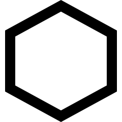

# Numerical summaries: quantitative data {#NumericalQuant}


<!-- Introductions; easier to separate by format -->

```{r, child = if (knitr::is_html_output()) {'./introductions/13-NumericalQuant-HTML.Rmd'} else {'./introductions/13-NumericalQuant-LaTeX.Rmd'}}
```


## Introduction {#Chap13-Intro}

In the last chapter (Sect. \@ref(NHANESGraphs)), this RQ was posed:

> Among Americans, is the average direct HDL cholesterol different for current smokers and non-smokers? 

Graphs were used to understand the data in Sect. \@ref(NHANESGraphs).
Some features of the data displayed in graphs can be described *numerically*.
The purpose of this chapter is to learn how to numerically summarise *quantitative* data.


<div style="float:right; width: 222x; border: 1px; padding:10px">

</div>


<!-- `r if (knitr::is_html_output()) '<!--'` -->
<!-- \begin{wrapfigure}[6]{R}{.25\textwidth} -->
<!--   \begin{center} -->
<!--     \includegraphics[width=.20\textwidth]{Illustrations/hamburger-2253349_640.jpg} -->
<!--   \end{center} -->
<!-- \end{wrapfigure} -->
<!-- `r if (knitr::is_html_output()) '-->'` -->


::: {.example #DescribeQuantDataHDL name="Describing quantitative data"}
For the RQ above, the response variable (direct HDL cholesterol values) can be displayed using a histogram (Fig. \@ref(fig:NHANESdirectHDLHisto)).
What does the histogram tell us?

* **Average**: The average value is about 1.5 mmol/L. 
* **Variation**: The values range from about 0.5 to 3 mmol/L, but with some larger values (that are hard to see on the histogram).
* **Shape**: The [distribution](#GraphsOneQuant) is slightly skewed right.
* **Outliers**: Some large outliers are present (that are hard to see on the histogram).

Describing these features more precisely, with *numbers*, can be helpful.
:::


```{r NHANESdirectHDLHisto, fig.cap="The histogram of the direct HDL cholesterol from the NHANES study", fig.align="center", fig.width=5, fig.height=3.5}
hist(NHANES$DirectChol,
	xlab = "Direct HDL cholesterol (mmol/L)",
	ylab = "Number of people",
	las = 1,
	ylim = c(0, 2500),
	xlim = c(0, 4.5),
	main = "Distribution of direct HDL cholesterol\nin the NHANES data",
	breaks = seq(0, 4.5, by = 0.25),
	col = plot.colour)
box()
```


A number that describes a feature of a *population* is called a *parameter* (App. \@ref(StatisticsAndParameters)).
The values of parameters are usually unknown.
In contrast, a number that describes a feature of a *sample* is called a  *statistic* (App. \@ref(StatisticsAndParameters)).
That is:

* **P**opulations are numerically described by [**p**arameters](#StatisticsAndParameters), and values of parameters are usually unknown.
* **S**amples are numerically described by [**s**tatistics](#StatisticsAndParameters).


::: {.definition #Parameter name="Parameter"}
A [**parameter**](#StatisticsAndParameters) is a number, usually unknown, describing some feature of a population.
:::


::: {.definition #Statistic name="Statistic"}
A [**statistic**](#StatisticsAndParameters) is a number describing some feature of a sample (to estimate an unknown population *parameter*).
:::


::: {.importantBox .important data-latex="{iconmonstr-warning-8-240.png}"}
The RQ identifies the population, but in practice only one of the many possible samples is  studied.
*Statistics* are estimates of *parameters*, and the value of the *statistic* is not the same for every possible *sample*.
:::


## Average values {#ComputeAverage}


<div style="float:right; width: 222x; border: 1px; padding:10px">

</div>


The average (or *location*, or *central value*) for *quantitative sample data* can be described in many ways.
The two most common ways are:

* the *sample mean* (or *sample arithmetic mean*), which estimates the population mean (Sect. \@ref(Mean)); and
* the *sample median*, which estimates the population median (Sect. \@ref(Median)).

In both cases, the population [parameter](#StatisticsAndParameters) is *estimated* by a sample [statistic](#StatisticsAndParameters).
Understanding [whether to use the mean or median is important](#CompareMeanMedian).


::: {.tipBox .tip data-latex="{iconmonstr-info-6-240.png}"}
The word 'average' can refer to either means, medians or other measures of centre.
Use the precise term 'mean' or 'median', rather than 'average', when possible!
:::


```{r}
MR2 <- read.csv("./Data/138110A.csv") # https://water-monitoring.information.qld.gov.au/

MR2$Month <- as.numeric(substr(MR2$Date.and.time, 4, 5))

Mn <- aggregate(MR2$Mean, 
                by = list(MR2$Month), 
		            FUN = "mean", 
		            na.rm = TRUE, 
		            simplify = TRUE)
Mdn <- aggregate(MR2$Mean, 
                 by = list(MR2$Month), 
		             FUN = "median", 
		             na.rm = TRUE, 
		             simplify = TRUE)
Number <- aggregate(MR2$Mean, 
                    by = list(MR2$Month),
                    FUN = function(x){length(x) - sum(is.na(x))},
                    simplify = TRUE)

MRsummary <- data.frame(Month = month.abb, 
                        "Mean" = Mn[, 2], 
			                  "Median" = Mdn[, 2],
			                  "Number of days" = Number[, 2])
```


<div style="float:right; width: 222x; border: 1px; padding:10px">

</div>


::: {.thinkBox .think data-latex="{iconmonstr-light-bulb-2-240.png}"}
Consider the *daily* river flow volume ('streamflow') at the Mary River from 01 October 1959 to 17 January 2019, summarised by month in Table \@ref(tab:MRtable)
`r if (knitr::is_latex_output()) {
   '(from Queensland DNRM).'
} else {
   '(from [Queensland DNRM](http://watermonitoring.dnrm.qld.gov.au/cgi/webhyd.pl?rsdf_org=138110A&cat=rs&lvl=1&0)).'
}`
The 'average' daily streamflow in February could be described using either the mean or the median.
The two give *very* different values for the 'average':

* the *mean* daily flow is 1123.2ML.
* the *median* daily flow is 146.1ML.

These are both measuring the same thing (the 'average' daily streamflow in February), yet give very different answers.
This implies they measure the 'average' in different ways', and have different meanings.
Which is the best 'average' to use?
To decide, both measures of average will need to be studied.
:::


(ref:MaryRiverStreamFlow) The **daily** streamflow at Mary River (Bellbird Creek), in ML, from 01 October 1959 to 17 January 2019; mean and median of the daily values for each month is shown, with the number of daily values available for that month

```{r MRtable}
if( knitr::is_latex_output() ) {

  T1 <- knitr::kable( MRsummary[1:6, ],
                      format = "latex",
                      valign = 't',
                      align = c("c", "c"),
                      #table.env = "@empty",
                      linesep = "",
                      col.names = c("Month",
                                    "Mean",
                                    "Median",
                                    "Number of days"),
                      digits = 1,
                      row.names = FALSE,
                      escape = FALSE,
                      booktabs = TRUE) %>%
    row_spec(0, bold = TRUE)
  T2 <- knitr::kable( MRsummary[7:12, ],
                      format = "latex",
                      valign = 't',
                      align = c("c", "c"),
                      #table.env = "@empty",
                      linesep = "",
                      col.names = c("Month",
                                    "Mean",
                                    "Median",
                                    "Number of days"),
                      digits = 1,
                      row.names = FALSE,
                      escape = FALSE,
                      booktabs = TRUE) %>%
    row_spec(0, bold = TRUE)

  
  out <- knitr::kables(list(T1, T2),
                       format = "latex",
                       label = "MRtable",
                       caption = "(ref:MaryRiverStreamFlow)") %>% 
    kable_styling(font_size = 10)
  prepareSideBySideTable(out)

#   
#   
#   
#   
#   
#   spacer <- array( rep(" ", 4), 
#                    dim = c(4, 1) )
#   MRsummary2 <- cbind(MRsummary[1:4, ],
#                       spacer,
#                       MRsummary[5:8, ],
#                       spacer,
#                       MRsummary[9:12, ])
#   kable(MRsummary2,
#         format = "latex",
#         longtable = FALSE,
#         booktabs = TRUE,
#         digits = 1,
# 	      linesep = c("", "", "", ""), # Otherwise adds a space after five lines... 
#         align = c("r", "r", "r", "r", "c", 
#                   "r", "r", "r", "r", "c",
#                   "r", "r", "r", "r"),
#         col.names = c("Month", 
#                       "Mean",
#                       "Median",
#                       "No.",
#                       "",
#                       "Month", 
#                       "Mean",
#                       "Median",
#                       "No.",
#                       "",
#                       "Month", 
#                       "Mean",
#                       "Median",
#                       "No."),
#         caption = "(ref:MaryRiverStreamFlow)"
#   ) %>%
#   kable_styling(font_size = 10) %>%
#   row_spec(0, bold = TRUE)
}
if( knitr::is_html_output() ) {
  out <- kable(MRsummary,
        format = "html",
        longtable = FALSE,
        booktabs = TRUE,
        digits = 1,
        align = c("r", "r", "r", "r"),
        col.names = c("Month", 
                      "Mean", 
                      "Median",
                      "Number"),
        caption = "(ref:MaryRiverStreamFlow)"
  )
 if ( knitr::is_html_output(excludes = "epub")) {
   kable_styling(out, 
                full_width = FALSE)
  } else {
    out
  }  
}
```


### Average: the mean {#Mean}

The mean of the population is denoted by $\mu$, and its value is almost always unknown.
Instead, the mean of the population is *estimated* by the mean of the sample, denoted by $\bar{x}$.
In this context, the unknown [*parameter*](#StatisticsAndParameters) is $\mu$, and the [*statistic*](#StatisticsAndParameters) is $\bar{x}$.
The sample mean *estimates* the population mean, and every one of the possible samples is likely to have a different sample mean.


:::: {.pronounceBox .pronounce data-latex="{iconmonstr-microphone-7-240.png}"}

::: {style="display: flex;"}
The Greek letter $\mu$ is pronounced 'myoo', as in a**mu**sing.
$\bar{x}$ is pronounced 'ex-bar'.
:::

::: {}
```{r}
htmltools::tags$video(src ="./Movies/mu.mp4", 
                      width = "121", 
                      loop = "FALSE", 
                      controls = "controls", 
                      loop = "loop", 
                      style = "padding:5px; border: 2px solid gray;")
```
:::

::::


<div style="float:right; width: 222x; border: 1px; padding:10px">

</div>


::: {.example #JerseyCows name="A small dataset to work with"}
To demonstrate ideas, consider a small dataset for answering this descriptive RQ: 'For mature Jersey cows, what is the average percentage butterfat in their milk?'
The *population* is 'Jersey cows', and an estimate of the population mean percentage butterfat from those cows is sought, denoted $\mu$.

Clearly, milk from every Jersey cow cannot be studied; a *sample* is studied [@data:hand:handbook; @data:sokal:biometry].
The unknown population mean is estimated using the sample mean ($\bar{x}$).
Measurements were taken from milk from 10 cows, in percentages (Table \@ref(tab:BFatData)).
:::


```{r BFatData}
BFat <- c(4.8, 6.5, 5.2, 4.5, 5.2, 5.7, 5.4, 4.8, 5.2, 5.2)
BFat <- array( BFat, 
               dim = c(2, 5))


if( knitr::is_latex_output() ) {
  kable(BFat,
        format = "latex",
        longtable = FALSE,
        booktabs = TRUE,
        caption = "The butterfat percentage from a sample of milk from 10 Jersey cows") %>%
  add_header_above(header = c("Butterfat percentages" = 5), 
                   bold = TRUE, 
		   align = "c") %>%
  kable_styling(font_size = 10)
}

if( knitr::is_html_output() ) {
  out <- kable(BFat,
               format = "html",
               longtable = FALSE,
               col.names = rep(" ", 5),
               booktabs = TRUE,
               caption = "The butterfat percentage from a sample of milk from 10 Jersey cows")
 if ( knitr::is_html_output(excludes = "epub")) {
   add_header_above(out, header = c("Butterfat percentages" = 5), 
                         bold = TRUE, 
		         align = "c")
  } else {
    out
  }   
}
```


The sample mean is the 'balance point' of the
`r if (knitr::is_latex_output()) {
   'observations (Figure \\@ref(fig:BalanceMeansFig)). (The online version has an animation.)'
} else {
   'observations. The animation below shows how the mean acts as the balance point.'
}`
Alternatively, the mean is the value such that the positive and negative distances of the observations from the mean add to 
`r if (knitr::is_latex_output()) {
   'zero (Fig. \\@ref(fig:PosNegDistMeansFig); again, the online version has an animation.)'
} else {
   'zero, as in the animation below.'
}`
Both of these explanations seem reasonable for identifying an 'average' of the data.


```{r echo=FALSE, cache=FALSE}
BalanceMean <- function(locate.fulcrum, # Where to place fulcrum
                        numberImages, # 
                        iteration){ # Which to show
  # Parameters
  
  #locate.fulcrum <- 5
  h.fulcrum <- 0.5  # Height of fulcrum
  w.fulcrum <- 0.25   # Width of fulcrum, to *one* side. Total width is twice this
  
  
  # Data
  milk <- c(4.8, 6.5, 5.2, 4.5, 5.2, 5.7, 5.4, 4.8, 5.2, 5.2) 
  mean.x <- mean(milk)
  
  
  # Ruler details
  extra <- 0.05
  l.ruler <- max(milk) - min(milk) + 2 * extra   # The length of the ruler
  min.ruler <- min(milk) - extra
  max.ruler <- max(milk) + extra
  h.ruler <- 0.05    # The height of the ruler
  
  
  # Create matrix
  Pos <- array( dim = c(4 + 5 * length(unique(milk)), 2) )
  
  ## Ruler: polygon in order (1, 2, 3, 4, 1)
  Pos[1, ] <- c( min.ruler, 0)
  Pos[2, ] <- c( min.ruler, h.ruler)
  Pos[3, ] <- c( max.ruler, h.ruler)
  Pos[4, ] <- c( max.ruler, 0)
 
  
  ## Position the data on top of ruler 
  data.ht <- 0.06
  data.width <- 0.02
  data.table <- table(milk)
  
  data.counter <- array( 0, 
                         dim = length(data.table) )
  
  base.counter <- 4
  for (i in (1:length(data.table))){
    
    x <- as.numeric(names(data.table)[i])
    Pos[base.counter + 1, ] <- c(x - data.width, 
                                 h.ruler  )
    Pos[base.counter + 2, ] <- c(x - data.width, 
                                 h.ruler + data.table[i] * data.ht)
    Pos[base.counter + 3, ] <- c(x + data.width, 
                                 h.ruler + data.table[i] * data.ht)
    Pos[base.counter + 4, ] <- c(x + data.width, 
                                 h.ruler)
    Pos[base.counter + 5, ] <- Pos[base.counter + 1, ]
    
    base.counter <- base.counter + 5
  }
  
  levelPos <- Pos
  
    ## Rotate ruler
  if ( locate.fulcrum == mean.x ) {
    theta <- 0
  } 
  if ( locate.fulcrum > mean.x ) {
    theta <- atan( h.fulcrum / (min.ruler - locate.fulcrum) )
  }
  if ( locate.fulcrum < mean.x ) {
    theta <- atan( h.fulcrum / (max.ruler - locate.fulcrum) )
  }
  
  RotateMatrix <- function(X, angle, locate.fulcrum = locate.fulcrum){
    RM <- matrix( c( cos(angle), 
                     sin(angle), 
		     -sin(angle), 
		     cos(angle)),
                  nrow = 2,
                  byrow = TRUE)
    
    cent <- c( locate.fulcrum, 0 )
    # Centre matrix
    X[, 1] <- X[, 1] - cent[1]
    X[, 2] <- X[, 2] - cent[2]
    
    newMat <- RM %*% t( as.matrix(X) )
    newMat <- t(newMat)
    newMat[, 1] <- newMat[, 1] + cent[1]
    newMat[, 2] <- newMat[, 2] + cent[2]
    newMat
  }
  Pos <- RotateMatrix(Pos, theta, locate.fulcrum=locate.fulcrum)
  
  ## Translate ruler higher
  if ( locate.fulcrum == mean.x ){
    Pos[, 2] <- Pos[, 2] + h.fulcrum
  }
  if ( locate.fulcrum > mean.x ){
    
    Pos[, 2] <- Pos[, 2] - Pos[1, 2]
    horizontal.shift <- Pos[1, 1] - min.ruler
    Pos[, 1] <- Pos[, 1] - horizontal.shift
  }
  if ( locate.fulcrum < mean.x ){
    Pos[, 2] <- Pos[, 2] - Pos[4, 2]
    
    horizontal.shift <- Pos[4, 1] - max.ruler
    Pos[, 1] <- Pos[, 1] - horizontal.shift
  }  
  
  # Canvas
  par( mar = c(0.5, 0.5, 3.5, 0.5) )
  plot( x = c(4, 7), 
        y = c(-0.5, 1.15),
        type = "n",
        axes = FALSE,
        main = "Trying to find the balance point...",
        xlab = "",
        ylab = "")
  
    # Draw ground
  abline( h = 0, 
          col = "darkgrey")
    
  # Draw ruler
  polygon( x = Pos[1:4, 1], 
           y = Pos[1:4, 2], 
           col = plot.colour)

  # Draw data
  base <- 4
  for (i in 1:length(data.table)){
    polygon( Pos[(1:5) + base, 1], 
             Pos[(1:5) + base, 2], 
	     col = grey(0.4))
    
    base <- base + 5
  }
  
  # Draw "number line"
  xLineLabs <- seq( min(milk), 
                    max(milk), 
		    by = 0.5)
  segments( x0 = xLineLabs,
            y0 = 0,
            y1 = -0.05 * h.fulcrum,
            col = grey(0.2) )
  text(x = xLineLabs,
       y = -0.05 * h.fulcrum,
       labels = xLineLabs,
       cex = 0.75,
       pos = 1,
       col = grey(0.2))
  
  # Labels bars of data
  plotDataPlaces <- seq(6, dim(Pos)[1], 
                        by = 5)
  text( x = Pos[plotDataPlaces, 1] + data.width,
        y = Pos[plotDataPlaces, 2] + data.ht,
        labels = names(data.table),
        srt = -180 * theta / pi,
        cex = 0.75,
        col = grey(0.2))
  
  # Draw fulcrum
  polygon( x = c(-w.fulcrum, 0,         w.fulcrum, -w.fulcrum) + locate.fulcrum,
           y = c(0,          h.fulcrum, 0,         0),
           col = plot.colour)
  text(locate.fulcrum, -0.2, 
       sprintf("%.3f", locate.fulcrum),
       pos = 1)
  
  
  # Draw fulcrum pivot
  lines( x = c( locate.fulcrum, locate.fulcrum),
         y = c(-0.05 * h.fulcrum, h.fulcrum),
         col = grey(0.3))
  points(x = locate.fulcrum, 
         y = h.fulcrum, 
         pch = 19, 
	 cex = 0.75)
  
  
  # Draw invisible dots.
  # Without this, the final image gets transformed straight to the beginning again....
  bit <- 0.1
  delta <- (7 - 4 - 2*bit)/numberImages # From the initial plots call; the size of the canvs is x-direction
  x0 <- 4 + bit                # The left-most point
  ylow <- -1                   # From initial plot call
  xplot <- x0 * iteration * delta
  points( xplot, ylow, 
          col = "white")
    
  invisible(Pos)
}

```


```{r animation.hook="gifski", interval=0.25, cache=FALSE,progress=TRUE, dev=if (is_latex_output()){"pdf"}else{"png"}}

if (knitr::is_html_output()){
    FL <- c( seq(5.0, 5.5, by = 0.025), 
             seq(5.5, 5.2, by =-0.025),
             seq(5.2, 5.3, by = 0.025),
             rep(5.25, 25) )
    for (i in 1:length(FL)){ 
      BalanceMean( FL[i], 
                   numberImages = length(FL), 
                   iteration = i )
    }
  }
```

```{r BalanceMeansFig, fig.align="center", cache=FALSE, fig.width=4.5, fig.height=3,fig.cap="The mean is the balance point of the data" }

if (knitr::is_latex_output()){
  FL <- c(   seq(5, 5.5, by = 0.025), 
             seq(5.5, 5.2, by = -0.025),
             seq(5.2, 5.3, by = 0.025),
             rep(5.25, 10) )
    BalanceMean( FL[49], 
                 numberImages = length(FL),
                 iteration = length(FL) )
}
```


```{r animation.hook="gifski", cache=FALSE, interval=0.20, dev=if (is_latex_output()){"pdf"}else{"png"}}
FindMean <- function(locate.x = 5.25, numberImages, iteration){
  
  # Data
  milk <- c(4.8, 6.5, 5.2, 4.5, 5.2, 5.7, 5.4, 4.8, 5.2, 5.2) 
  mean.x <- mean(milk)
  data.table <- table(milk)
  jump <- jump.extra <- 0.18
    
  # Parameters
  extra <- 0.05
  l.ruler <- max(milk) - min(milk) + 2 * extra   # The length of the ruler
  min.ruler <- min(milk) - extra
  max.ruler <- max(milk)  + extra
  h.ruler <- 0.05    # The height of the ruler
    
  # Create matrix
  Pos <- array( dim = c(4 + 5 * length(unique(milk)), 2) )
  
  ## Ruler: polygon in order (1, 2, 3, 4, 1)
  Pos[1, ] <- c( min.ruler, 0)
  Pos[2, ] <- c( min.ruler, h.ruler)
  Pos[3, ] <- c( max.ruler, h.ruler)
  Pos[4, ] <- c( max.ruler, 0)
  
  # Canvas
  mar = c(0.1, 0.1, 3, 0.1) + 0.1
  plot( x = c(4, 8), 
        y = c(-0.5, 2.25),
        type = "n",
        axes = FALSE,
        main = "Finding the mean:\n where the sum is zero",
        xlab = "",
        ylab = "")
  
  # Draw ruler
  polygon( x = Pos[1:4, 1], 
           y = Pos[1:4, 2], 
           col = plot.colour)
  
  
  # Draw data
  jump <- jump.extra <- 0.18
  for (i in 1:length(milk)){
    points( sort(milk)[i], jump, 
            pch = 19)
    
    # The arrows
    arrows( locate.x, jump, sort(milk)[i], jump,
            length = 0.0,
            col = ifelse( locate.x - sort(milk)[i] > 0, 
                          "red", 
                          "green4"),
            lwd = 2,
            angle = 15)
    
    # The distances
    text( 7.5, jump, 
          sprintf("%.2f", round(sort(milk)[i] - locate.x, 2)),
          col = ifelse( locate.x - sort(milk)[i] > 0, 
                        "red", 
                        "green4"),
          adj = 1,
          cex = 1)
    
    jump <- jump + jump.extra
    
  }
  
  
  # Highlight the mean/mean guess
  abline(v = locate.x, 
         col = "grey")
  text(locate.x, -0.4, 
       sprintf("%.2f", locate.x),
       cex = 1)
  
  
  # The sum  
  segments( x0 = 7.1, 
            y0 = 0,
            x1 = 7.6)
  text( 7.5, -0.4, 
        sprintf("%.2f", round( sum(sort(milk) - locate.x), 2)),
        adj = 1,
        cex = 0.95)
  text( 7.65, 
        jump + jump.extra, "Distance",
        adj = 1,
        cex = 0.95)
  text( 7.5, -0.2, 
        "Sum:",
        adj = 1,
        cex = 1.1)
  
  # Shade summing area
  polygon ( c(7, 7, 7.8, 7.8, 7),
            c(-0.7, 2.3, 2.3, -0.75, -0.75),
            border = NA,
            col = mycol <- rgb(240, 240, 240, max = 255, alpha = 100))
  
  base <- 4
  for (i in 1:length(data.table)){
    polygon( x = Pos[(1:5) + base, 1], 
             y = Pos[(1:5) + base, 2], 
             col = grey(0.4))
    
    base <- base + 5
  }
  
  # Draw "number line"
  xLineLabs <- seq( min(milk), max(milk), by = 0.5)
  segments( x0 = xLineLabs,
            y0 = 0,
            y1 = -0.05,
            col = "black")
  text(x = xLineLabs,
       y = -0.05,
       labels = xLineLabs,
       cex = 0.9,
       pos = 1,
       col = "black")

  
  # Draw invisible dots.
  # Without this, the final image gets transformed straight to teh beginning again....
  bit <- 0.1
  delta <- (8-4 - 2 * bit)/numberImages # From the initial plots call; the size of the canvs is x-direction
  x0 <- 4 + bit                # The left-most point
  ylow <- -1                 # From initial plot call
  xplot <- x0 * iteration * delta
  points( xplot, ylow, 
          col = "white")
}


meanCandidates <- c( seq(5, 5.5, by = 0.05),
                     seq(5.5, 5.0, by = -0.05),
                     seq(5.0, 5.25, by = 0.025),
                     rep(5.25, 20))

if (knitr::is_html_output()){
    for (i in 1:length(meanCandidates)){
      FindMean( meanCandidates[i], 
                numberImages = length(meanCandidates), i)
    }
    
  }
```


```{r PosNegDistMeansFig, cache=FALSE, fig.align="center", fig.width=5.5, out.width='50%', fig.cap="The mean is the value such that the positive and negative distances sum to zero" }
if (knitr::is_latex_output()){
  FindMean( meanCandidates[43], 
            numberImages = length(meanCandidates), 43 )
}
```


::: {.definition #Mean name="Mean"}
The *mean* is one way to measure the 'average' value of quantitative data.
The *arithmetic mean* can be considered as the 'balance point' of the data, or the value such that the positive and negative distances from the mean add to zero.
:::


To find the *value* of the sample mean:

* *Add* all the observations (denoted by $x$); then
* *Divide* by the number of observations (denoted by $n$).

In symbols:
\[
	\bar{x} = \frac{\sum x}{n}.
\]
This means to add up (indicated by $\sum$) the observations (denoted by $x$),
then divide by the size of the sample (denoted by $n$).


<div style="float:right; width: 222x; border: 1px; padding:10px">

</div>


::: {.example #ComputeMean name="Computing a sample mean"}
For the Jersey cow data (Example \@ref(exm:JerseyCows)), an *estimate* of the population mean (i.e., the sample mean) percentage butterfat is found by summing all $n = 10$ observations and dividing by $n$:
\begin{align*}
   \overline{x} 
   &= \frac{\sum x}{n} = \frac{4.8 + 6.5 + \cdots + 5.2}{10}\\
   &= \frac{52.5}{10}  =  5.25.
\end{align*}
The sample mean, the best estimate of the population mean, is 5.25 percent.
:::


::: {.tipBox .tip data-latex="{iconmonstr-info-6-240.png}"}
Software (such as jamovi or SPSS) or a calculator (in *Statistics Mode*) is usually used to compute the sample mean.
However, knowing *how* these quantities are computed is important.
:::


::: {.thinkBox .think data-latex="{iconmonstr-light-bulb-2-240.png}"}
For the butterfat data (Table \@ref(tab:BFatData)), what is the value of $\mu$, the *population* mean?\label{thinkBox:ValueOfMu}

`r if (knitr::is_latex_output()) '<!--'`
`r webexercises::hide()`
**We do not know!**

We know the value of the *sample* mean, but not the *population* mean.
We have an *estimate* of the value of the population mean by using the sample mean.

(If we already knew the value of the population mean, why would we *estimate* the value from an imperfect sample?)
`r webexercises::unhide()`
`r if (knitr::is_latex_output()) '-->'`
:::


::: {.importantBox .important data-latex="{iconmonstr-warning-8-240.png}"}
Software and calculators often produce numerical answers to many decimal places, some of which may not be meaningful or useful.
A simple but useful rule-of-thumb is to round to one or two more significant figures than the original data.

For example, the butterfat data are given to one decimal place.
The *sample mean* weight can be given to two decimal places: $\bar{x} = 5.25$%.
:::


::: {.thinkBox .think data-latex="{iconmonstr-light-bulb-2-240.png}"}
A study of bats [@griffin1960echolocation] recorded the distance at which *Drosophila* were detected for $n = 11$ detections (Table \@ref(tab:BatData)).
Estimate the population mean distance at which bats detect the flies.\label{thinkBox:EstimateMu}
`r if (knitr::is_latex_output()) '<!--'`
`r webexercises::hide()`
The **estimate** of $\mu$ is $\bar{x} = 532/11 = 48.4$cm.
`r if (knitr::is_latex_output()) '-->'`
`r webexercises::unhide()`
:::


```{r BatData}
BatData <- c(62, 52, 68, 23, 34, 45, 27, 42, 83, 56, 40, NA)
BatData <- array(BatData, 
              dim = c(2,6))


if( knitr::is_latex_output() ) {
  kable(BatData,
        format = "latex",
        longtable = FALSE,
        booktabs = TRUE,
        caption = "The distance at which small fruit flies were detected by bats, in cm") %>%
  add_header_above(header = c("Detection distance" = 6), 
                   bold = TRUE, 
		   align = "c") %>%
  kable_styling(font_size = 10)
}

if( knitr::is_html_output() ) {
  kable(BatData,
               format = "html",
               longtable = FALSE,
               booktabs = TRUE,
               caption = "The distance at which small fruit flies were detected by bats, in cm",
               col.names = rep("", 6) ) %>%
   add_header_above(out,
                    header = c("Detection distance" = 6), 
                    bold = TRUE, 
		    align = "c")
}
```


### Average: the median {#Median}

A median is a value separating the largest 50% of the data from the smallest 50% of the data.
In a dataset with $n$ values, the median is *ordered* observation number $\displaystyle \frac{n + 1}{2}$.
The median is:

* **not** equal to $\displaystyle \frac{n + 1}{2}$.
* **not** halfway between the minimum and maximum values in the data.


::: {.tipBox .tip data-latex="{iconmonstr-info-6-240.png}"}
Many calculators cannot find the median.
The median has no commonly-used symbol.
:::

      
::: {.definition #Median name="Median"}
The **median** is one way to measure the 'average' value of data.
A *median* is a value such that half the values are larger than the median, and half the values are smaller than the median.
:::


<div style="float:right; width: 222x; border: 1px; padding:10px">

</div>


::: {.example #SampleMedian name="Find a sample median"}
To find a sample median for the Jersey cow data (Example \@ref(exm:JerseyCows)), first arrange the data *in numerical order* (Table \@ref(tab:JerseyCowsSorted)).
The median separates the larger 5 numbers from the smaller 5 numbers. 
With $n = 10$ observations, the median is the ordered observation located between the fifth and sixth observations (i.e., at position $(10 + 1)/2 = 5.5$; the *median itself is not 5.5*).

So the sample median is between $5.2$ (ordered observation five) and $5.2$ (ordered observation six).
Since these values happen to be the same, the sample median is $5.20$%.
:::


```{r JerseyCowsSorted}
BFat.sort <- sort( c(4.8, 6.5, 5.2, 4.5, 5.2, 5.7, 5.4, 4.8, 5.2, 5.2) )
BFat.sort <- matrix( BFat.sort, 
                     ncol = 10, 
                     byrow = TRUE)

if( knitr::is_latex_output() ) {
  kable(BFat.sort,
        format = "latex",
        longtable = FALSE,
        booktabs = TRUE,
        caption = "The butterfat percentage from a sample of milk from 10 Jersey cows, in increasing order") %>%
        add_header_above(header = c("Butterfat percentages" = 10), 
	                 bold = TRUE,
			 align = "c") %>%
  kable_styling(font_size = 10)
}

if( knitr::is_html_output() ) {
  out <- kable(BFat.sort,
              format = "html",
              longtable = FALSE,
              col.names = rep(" ", 10),
              booktabs = TRUE,
              caption = "The butterfat percentage from a sample of milk from 10 Jersey cows, in increasing order")
  if ( knitr::is_html_output(excludes = "epub")) {
   add_header_above(out,
                    header = c("Butterfat percentages" = 10), 
                    bold = TRUE, 
		    align = "c")
  } else {
    out
  }
  
}
```


::: {.thinkBox .think data-latex="{iconmonstr-light-bulb-2-240.png}"}
For the butterfat data (Table \@ref(tab:JerseyCowsSorted)), what is the *population* median?\label{thinkBox:PopMedian}

`r if (knitr::is_latex_output()) '<!--'`
`r webexercises::hide()`
**We do not know!**

We know the value of the *sample* median, but not the *population* median.
We only have an *estimate* of the value of the population median.
`r webexercises::unhide()`
`r if (knitr::is_latex_output()) '-->'`
:::

     
::: {.thinkBox .think data-latex="{iconmonstr-light-bulb-2-240.png}"}
A study of bats [@griffin1960echolocation] recorded the distance at which *Drosophila* were detected for $n = 11$ detections (Table \@ref(tab:BatData)).
Estimate the population *median* distance at which bats detect the flies.\label{thinkBox:EstimateMedian}
`r if (knitr::is_latex_output()) '<!--'`
`r webexercises::hide()`
With $n = 11$, the median is the $(11 + 1)/2 = 6$th ordered value, which is 45cm.
`r if (knitr::is_latex_output()) '-->'`
`r webexercises::unhide()`
:::

To clarify:

* If the sample size $n$ is *odd* (such as the bats example), the median is the middle number when the observations are ordered. 
* If the sample size $n$ is *even* (such as the butterfat example), the median is halfway between the two middle numbers, when the observations are ordered. 

Some software uses slightly different rules when $n$ is even, producing slightly different values for the median.


### Which average to use? {#CompareMeanMedian}

```{r}
LessThanMean <- sum( MR2$Mean[MR2$Month == 2] < 1123.2, 
                     na.rm = TRUE ) / 
                sum( !is.na(MR2$Mean[MR2$Month == 2]) )
```

Consider again estimating the average daily streamflow at the Mary River (Bellbird Creek) during February (Table \@ref(tab:MRtable)):
The *mean* daily streamflow is `r round(MRsummary[2, 2], 1)`ML, and the *median* daily streamflow is `r round(MRsummary[2, 3], 1)`ML.
Which is the 'best' measure for the average streamflow?

A dot chart of the daily streamflow (Fig. \@ref(fig:DailyStreamflow)) shows that the data are *very* highly right-skewed, with many *very* large outliers (presumably during flood events):
the maximum value is `r formatC( round(max(MR2$Mean[MR2$Month == 2], na.rm = TRUE), 0), format="fg", big.mark=',')`ML, more than *one hundred times* larger than the mean of `r formatC(round(MRsummary[2, 2], 1), big.mark=',')`ML).
In fact, about `r round(LessThanMean * 100)`% of the observations are *less* than the mean.
The extreme outliers are clear in the tabular summary too (Table \@ref(tab:DailyStreamflowTab)).

In contrast, about 50% the values are less than the median (by definition).
For these data, the mean is hardly a *central* value...


```{r DailyStreamflow, fig.cap="A dot plot of the daily streamflow at Mary River from 1960 to 2017, for February. The vertical grey line is the mean value. Many large outliers exist, so the data near zero are all squashed together. Note: The values have been jittered in the vertical direction.", fig.align="center", out.width='100%', fig.width=9, fig.height=3}
par(mfrow = c(1, 1))
set.seed(183763286)
stripchart(MR2$Mean[MR2$Month == 2], 
           main = "Dot plot of daily streamflow at\nMary Creek (Bell River) in Feb.",
           xlab = "Daily streamflow (in ML)",
           sub = "(From 01 October 1959 to 17 January 2019)",
           method = "jitter", 
           pch = 19, 
           axes = FALSE,
           col = plot.colour,
           jitter = 0.75, 
           ylim = c(0.2, 1.8), 
           cex = 0.5)
axis(side = 1,
     at = seq(0, 160000, by = 50000),
     labels = c("0",
                "50,000",
                "100,000",
                "150,000"))
box()

abline( v = Mn[2,2], 
        col = "grey")

```


```{r DailyStreamflowTab}
out <- hist(MR2$Mean[MR2$Month == 2],
            breaks = seq(0, 160000,
                         by = 20000),
            right = FALSE,
            plot = FALSE)
lowerLim <- out$breaks[ -length(out$breaks)]
upperLim <- out$breaks[ -1 ]
Intervals <- paste(format(lowerLim,
                          big.mark = ",",
                          scientific = FALSE),
                   "to under", 
                   format(upperLim,
                          big.mark = ",",
                          scientific = FALSE) )
MaryRiverTable <- cbind(Intervals = Intervals, 
                        Counts = out$counts)


if( knitr::is_latex_output() ) {
  
  T1 <- knitr::kable(MaryRiverTable[1:4, ],
                     format = "latex",
                     col.names = c("Daily streamflow (ML)",
                                   "Number of days"),
                     align = "c",
                     booktabs = TRUE) %>%
    row_spec(0, bold = TRUE)
  T2 <- knitr::kable(MaryRiverTable[5:8, ],
                     format = "latex",
                     col.names = c("Daily streamflow (ML)",
                                   "Number of days"),
                     align = "c",
                     booktabs = TRUE) %>%
    row_spec(0, bold = TRUE)
  
  out2 <- knitr::kables(list(T1, T2),
                        format = "latex",
                        caption = "Mary River daily streamflow for February (in ML). The mean value is 1,123ML.",
                        label = "DailyStreamflowTab") %>% 
    kable_styling(font_size = 10)
  
  prepareSideBySideTable(out2)
}

if( knitr::is_html_output() ) {
  kable( MaryRiverTable,
         format = "html",
         col.names = c("Daily streamflow (ML)",
                       "Number of days"),
         align = "c",
         booktabs = TRUE,
         longtable = FALSE,
         caption = "Mary River daily streamflow for February (in ML). The mean value is 1,123ML.") %>%
    row_spec(0, bold = TRUE)
}

```


The streamflow data are *very* highly right skewed, which is important here:

* *Means* are best used for approximately symmetric data: the mean is influenced by outliers and skewness.
* *Medians* are best used for data that are skewed or contain outliers: the median is *not* influenced by outliers and skewness.

Means tend to be too large if the data contains large outliers or severe right skewness, and too small if the data contains small outliers or severe left skewness.
For the Mary River data, the large outliers---and the fact that they are so *extreme* and abundant---result in the mean being substantially influenced by the outliers.
This explains why the mean is much so larger than the median.
*The median is the better measure of average for these data.*

The mean is generally used if possible (for practical and mathematical reasons), and is the most commonly-used measure of location.
However, the mean *is* influenced by outliers and skewness; the median *is not* influenced by outliers and skewness.
The mean and median are similar in approximately symmetric distributions.
Sometimes, quoting *both* the mean and the median may be appropriate.


::: {.thinkBox .think data-latex="{iconmonstr-light-bulb-2-240.png}"}
An engineering study [@data:hald:statistical] examined a new building material to determine the average permeability time.
The time (in seconds) taken for water to permeate $n = 81$ pieces of material was taken.
Using a histogram of the data (Fig. \@ref(fig:Permeability)), estimate the value of the population mean and median.
Which 'average' would be best to use (for example, to quote an average permeability time on a specification sheet)?\label{thinkBox:SpecSheet}  

`r if (knitr::is_latex_output()) '<!--'`
`r webexercises::hide()`
The data are skewed, which suggests using the median.
In practice, a larger sample would be needed anyway before giving a value to use on a specification sheet.
`r webexercises::unhide()`
`r if (knitr::is_latex_output()) '-->'`
:::


```{r Permeability, fig.cap="A histogram of the permeability of a type of building material", fig.align="center", fig.width=5, fig.height=3.5}
data(perm)

hist(perm$Perm, 
     xlab = "Permeability (in seconds)",
     ylab = "Number of obs.",
     las = 1, 
     xlim = c(0, 180), 
     breaks=seq(0, 180, by = 10), 
     axes = FALSE,
     col = plot.colour, 
     main = "Permeability of building material")
axis(side = 1, 
     at = seq(0, 180, by = 20), 
     las = 2)
axis(side = 2, 
     las = 1)
```


## Variation


<div style="float:right; width: 222x; border: 1px; padding:10px">

</div>


For quantitative data, the amount of *variation* in the bulk of the data should be described.
Many ways exist to measure the variation in a dataset, including:

* The *range*: very simple and simplistic, so not often used (Sect. \@ref(VariationRange)).
* The *standard deviation*: commonly used (Sect. \@ref(VariationStdDev)).
* The *interquartile range (or IQR)*: commonly used (Sect. \@ref(VariationIQR)).
* *Percentiles*: sometimes used in specific situations (Sect. \@ref(VariationPercentiles)).

As always, a value computed from the *sample* (the [statistic](#StatisticsAndParameters)) estimates the unknown value in the *population* (the [parameter](#StatisticsAndParameters)).


### Variation: the range {#VariationRange}

The range is the simplest measure of variation, often too simple to be of much use.


::: {.definition #Range name="Range"}
The range is the maximum value *minus* the minimum value.
:::

The range is not often used, as it is computed only using the two extreme observations, and so it is highly influenced by outliers.
Sometimes, the *range* may be given by stating both the maximum and the minimum value in the data instead of giving the *difference* between the maximum and the minimum values.
The range is measured in the same measurement units as the data. 


::: {.example #RangeEG name="The range"}
For Jersey cow data (Example \@ref(exm:JerseyCows)), the largest value is 6.5%, and the smallest value is 4.5%; hence
\[
   \text{Range} = 6.5 - 4.5 = 2.0 \text{ percent}.
\]   
So the sample median percentage butterfat is 5.20%, with a *range* of 2.00%.
:::


### Variation: the standard deviation {#VariationStdDev}

The population standard deviation is denoted by $\sigma$ (the [parameter](#StatisticsAndParameters)) and is estimated by the sample standard deviation $s$ (the [statistic](#StatisticsAndParameters)).
The standard deviation is the most commonly-used measure of variation.
It is tedious to compute manually, but you will almost always find the sample standard deviation $s$ using computer software (e.g., jamovi or SPSS) or a calculator (in *Statistics Mode*).

The *standard deviation* is (approximately) the mean distance that observations are from the mean.
This seems like a reasonable way to measure the amount of variation in data.


:::: {.pronounceBox .pronounce data-latex="{iconmonstr-microphone-7-240.png}"}
::: {style="display: flex;"}
The Greek letter $\sigma$ is pronounced 'sigma'.
:::


::: {}
```{r}
htmltools::tags$video(src ="./Movies/sigma.mp4", 
                      width = "121", 
                      loop = "FALSE", 
                      controls = "controls", 
                      loop = "loop", 
                      style = "padding:5px; border: 2px solid gray;")
```
:::

::::


::: {.definition #StandardDeviation name="Standard deviation"}
The *standard deviation* is, approximately, the average distance of the observations from the mean.
:::


Even though **you do not have to use the formula** to calculate $s$, we will demonstrate to show exactly what $s$ calculates.
The formula is:

\[
	s = \sqrt{ \frac{\sum(x - \bar{x})^2}{n - 1} },
\]
where $\bar{x}$ is the sample mean, $x$ represents the individual data values, $n$ is the sample size, and the symbol '$\sum$` means to 'add up'.
Using the formula requires these steps:

* Calculate the sample mean: $\overline{x}$;
* Calculate the *deviations* of each observation $x$ from the mean: $x - \bar{x}$;
* Square these deviations (to make them all *positive* values): $(x - \bar{x})^2$;
* Add these squared deviations: $\sum(x - \bar{x})^2$;
* Divide the answer by $n - 1$;
* Take the (positive) square root of the answer.


::: {.importantBox .important data-latex="{iconmonstr-warning-8-240.png}"}
**You do not need to use the formula!**
You **must** know how to use software or a calculator to find the standard deviation, what the standard deviation measures, and how to use it.
:::


<div style="float:right; width: 222x; border: 1px; padding:10px">

</div>


::: {.example #StdDev name="Standard deviation"}
For the Jersey cow data (Example \@ref(exm:JerseyCows)), the squared *deviations* of each observation from the mean of $5.25$ are shown in Fig. \@ref(fig:ShowVar).
The sum of the squared distances is 2.7650.
Then, the sample standard deviation is:

\[ 
   s = \sqrt{\frac{2.765}{10 - 1}}
     = \sqrt{ 0.3072222} 
     = 0.5542763.
\]
The sample mean percentage butterfat is 5.25%, with a sample *standard deviation* of 0.554%. 
:::


```{r ShowVar, fig.cap="The standard deviation is related to the sum of the squared-distances from the mean", fig.align="center",fig.width=6, out.width='60%'}

ShowVar <- function(){
  
  # Data
  milk <- c(4.8, 6.5, 5.2, 4.5, 5.2, 5.7, 5.4, 4.8, 5.2, 5.2) 
  mean.x <- mean(milk)
  data.table <- table(milk)
  locate.x <- mean(milk)
  jump <- jump.extra <- 0.18
  
  # Parameters
  extra <- 0.05
  l.ruler <- max(milk) - min(milk) + 2 * extra   # The length of the ruler
  min.ruler <- min(milk) - extra
  max.ruler <- max(milk)  + extra
  h.ruler <- 0.05    # The height of the ruler
  
  
  # Create matrix
  Pos <- array( dim = c(4 + 5 * length(unique(milk)), 2) )
  
  ## Ruler: polygon in order (1, 2, 3, 4, 1)
  Pos[1, ] <- c( min.ruler, 0)
  Pos[2, ] <- c( min.ruler, h.ruler)
  Pos[3, ] <- c( max.ruler, h.ruler)
  Pos[4, ] <- c( max.ruler, 0)
  
    
  # Canvas
  par( mar = c(0.5, 0.5, 3, 0.5) + 0.1)
  plot( x = c(4, 9), 
        y = c(-0.1, 1.9),
        type = "n",
        asp = 1,
        axes = FALSE,
        main = "The sum of the squared distances\nof each observation from the mean",
        xlab = "",
        ylab = "")
  
  # Draw ruler
  polygon( Pos[1:4, 1], 
           Pos[1:4, 2], 
	   col = "lightblue")
  
    # Draw data
  jump <- jump.extra <- 0.18
  for (i in 1:length(milk)){
    points( sort(milk)[i], jump, 
            pch = 19)
    
    # The arrows
    arrows( x0 = locate.x, 
            y0 = jump, 
            x1 = sort(milk)[i], 
            y1 = jump,
            length = ifelse(abs(locate.x - sort(milk)[i]) > 0.2, 0.2, 0),
            lwd = 2,
            col = ifelse( locate.x - sort(milk)[i] > 0, "red", "green4"),
            angle = 15)
    
    # The distances
    text( 7.5, jump, 
          sprintf("%.4f", (sort(milk)[i] - locate.x)),
          col = ifelse( locate.x - sort(milk)[i] > 0, "red", "green4"),
          adj = 1,
          cex = 0.95)
    
    # The distances^2
    text( 8.5, jump, sprintf("%.4f", (sort(milk)[i] - locate.x)^2),
          adj = 1,
          cex = 0.95)

        jump <- jump + jump.extra
    
  }


  # Highlight the mean/mean guess
  lines(x = c(locate.x, locate.x),
        y = c(0, jump),
        col = "grey")
  text(locate.x, jump + jump.extra, 
       sprintf("%.2f", locate.x),
       cex = 0.95)
  text(locate.x, 
       jump + 2 *jump.extra, 
       "Mean:",
       cex = 0.95)
  

    # The sum  
  segments(  x0 = 7.0, 
             y0 = 0, 
	     x1 = 8.7)
  
  text( 7.5, -0.15, 
        sprintf("%.4f", sum( (sort(milk)- locate.x))),
        adj = 1,
        cex = 0.95)
  text( 7.5, jump + jump.extra, 
        "Deviation",
        adj = 1,
        cex = 0.95)

  text( 8.5, -0.15, 
        sprintf("%.4f",  sum( (sort(milk)- locate.x)^2)),
        adj = 1,
        cex = 0.95)
  text( 8.5, jump + jump.extra, 
        expression((Dev.)^2),
        adj = 1,
        cex = 0.95)
  

  base <- 4
  for (i in 1:length(data.table)){
    polygon( Pos[(1:5) + base, 1], 
             Pos[(1:5) + base, 2], 
	     col = grey(0.4))
    
    base <- base + 5
  }
  
  # Shade dist area
  polygon( c(6.8, 6.8, 8.7, 8.7, 6.8),
           c(-0.3, 2.3, 2.3, -0.3, -0.3),
            border = NA,
            col = mycol <- rgb(240, 240, 240, max = 255, alpha = 100))

    
  # Draw "number line"
  xLineLabs <- seq( min(milk), max(milk), by = 0.5)
  segments( x0 = xLineLabs,
            y0 = 0,
            y1 = -0.05,
            col = "black")
  text(x = xLineLabs,
       y = -0.05,
       labels = xLineLabs,
       cex = 0.75,
       pos = 1,
       col = "black")
}

ShowVar()
```


::: {.thinkBox .think data-latex="{iconmonstr-light-bulb-2-240.png}"}
The standard deviation for Dataset A in Fig. \@ref(fig:TwoDatasets) is 2.00.
What do you estimate the standard deviation of Dataset B will be: *smaller* than 2.00 or *greater* than 2.00?
Why?\label{thinkBox:CompareSD}

`r if (knitr::is_latex_output()) '<!--'`
`r webexercises::hide()`
The standard deviation is a bit like the average distance that observations are from the mean.

In Dataset B, more observations are closer to the mean, so the average distance would be a smaller number.
This suggests that the standard deviation for Dataset B will be **smaller** than the standard deviation for Dataset A.
`r webexercises::unhide()`
`r if (knitr::is_latex_output()) '-->'`
:::


```{r TwoDatasets, cache=FALSE, fig.height=2.0, fig.width=7.75, out.width='90%', fig.cap="Dotplots of two datasets", fig.align="center"}
### DOT CHARTS of two samples with similar mean, range but diff sd

set.seed(100010)
 
rescale <- function(x, from, to){
  minx <- min(x)
  maxx <- max(x)
  
  slope <- (to - from) / ( maxx - minx )
  intercept <- to - slope*maxx
  
  y <- slope * x + intercept
  y
  
}
len <- 50
tmp1 <- runif(len)
x1 <- rescale(tmp1, -4, 4)

y1.jitter <- jitter(rep(1, length(x1)))

par(mfrow = c(1, 2) )

par(mar = c(2, 0, 2, 1.5) + 0.1)
plot( y = y1.jitter, 
      x = x1, 
      pch = 1,
      ylim = c( 0.95 * min(y1.jitter), 
                1.05 * max(y1.jitter) ),
      ylab = "",
      xlab = "Observations",
      main = "Dataset A",
      axes = FALSE)
axis(side = 1)


tmp2 <- rt((len - 4), 5)
x2 <- c( rescale(tmp2, -1.5, 1.5),  -2.5, 2.5, -4, 4)


y2.jitter <- jitter(rep(1, length(x2)))

par( mar = c (2, 1.5, 2, 0) + 0.1)
plot( y = y2.jitter, 
      x = x2, 
      pch = 1,
      ylim = c( 0.95 * min(y2.jitter), 
                1.05 * max(y2.jitter) ),
      ylab = "",
      xlab = "Observations",
      main = "Dataset B",
      axes = FALSE)
axis(side = 1)

```


The sample standard deviation is:

* Positive (unless all observations are the same, when it is zero: there is *no* variation);
* Best used for (approximately) symmetric data;
* Usually quoted with the mean;
* The most commonly-used measure of variation;
* Measured in the same units as the data;
* Influenced by *skewness* and outliers, like the mean.


::: {.thinkBox .think data-latex="{iconmonstr-light-bulb-2-240.png}"}
Consider again the Jersey cow data (Example \@ref(exm:JerseyCows)).
Using your calculator's *Statistics Mode*, find the *population* standard deviation and the *sample* standard deviation.\label{thinkBox:MilkStats}

`r if (knitr::is_latex_output()) '<!--'`
`r webexercises::hide()`
The *population* standard deviation is unknown.
The best estimate is the *sample* standard deviation: $s = 0.554$%.
If you do not get this value, you may be pressing the wrong button on your calculator: seek help!
`r webexercises::unhide()`
`r if (knitr::is_latex_output()) '-->'`
:::


### Variation: the IQR {#VariationIQR}

The standard deviation uses the value of $\bar{x}$, so is affected by skewness like the sample mean.
Another measure of variation that is *not* affected by skewness is the inter-quartile range, or IQR.
To understand the IQR, understanding *quartiles* is necessary.


::: {.definition #Quartiles name="Quartiles"}
*Quartiles* are used to describe the variation and shape of data:

* The first quartile $Q_1$ is a value separating the smallest 25% of observations from the largest 75%.
  The $Q_1$ is like the median of the *smaller* half of the data, halfway between the minimum value and the median.
* The second quartile $Q_2$ is a value separating the smallest 50% of observations from the largest 50%.
  (This is the *median*.)
* The third quartile $Q_3$ is a value separating the smallest 75% of observations from the largest 25%.
  The $Q_3$ is like the median of the *larger* half of the data, halfway between the median and the maximum value.
:::


Quartiles divide the data into four parts of approximately equal numbers of observations, and *a boxplot is a picture of the quartiles*.
The *inter-quartile range*, or the *IQR* is the difference between $Q_3$ and $Q_1$.

The IQR measures the range of the middle 50% of the data, and is a measure of variation not influenced by outliers.
The IQR is measured in the same measurements units as the data.


::: {.definition #IQR name="IQR"}
The *IQR* is the range in which the middle 50% of the data lie: the difference between the third and the first quartiles.
:::


Quartiles were previously discussed in the context of boxplots (Sect. \@ref(Boxplot)).
For example, a boxplot of the egg-krill data (@data:Greenacre2016:reporting; Table \@ref(tab:KrillDataTable2)) was shown in Example \@ref(exm:KrillData), and repeated here (Fig. \@ref(fig:BoxplotKrillTreatment2)).


```{r KrillDataTable2}
Eggs.T <- c(0, 0, 1, 1, 3, 8, 8, 12, 18, 21, 26, 30, 35, 48, 50)
Eggs.C <- c(0, 0, 0, 0, 1, 1, 1,  2,  2,  3,  8, 16, 20, 26, 31)

KrillEggs2 <- cbind( Eggs.T[1:8], 
                     c(Eggs.T[9:15], ""), 
                     Eggs.C[1:8], 
                     c(Eggs.T[9:15], "") )

if( knitr::is_latex_output() ) {
  kable( KrillEggs2,
         format = "latex",
         longtable = FALSE,
         booktabs = TRUE,
         align = c("c", "c"),
         caption = "The number of eggs laid by krill, for those in a treatment group and for those in a control group") %>%
  add_header_above(header = c("Treatment group " = 2, 
                              " Control group" = 2), 
	           bold = TRUE, 
		   align = "c") %>%
  kable_styling(font_size = 10)
    
}
if( knitr::is_html_output() ) {
  out <- kable( KrillEggs2,
                format = "html",
                longtable = FALSE,
                booktabs = TRUE,
                align = c("c", "c"),
                col.names = rep("", 4),
                caption = "The number of eggs laid by krill, for those in a treatment group and for those in a control group")
  
  if ( knitr::is_html_output(excludes = "epub")) {
    kable_styling(out, full_width = FALSE) %>%
    add_header_above(header = c("Treatment group" = 2, 
                                "Control group" = 2), 
 	             bold = TRUE, 
 		     align = "c")
  } else {
    out
  }
}
```

```{r}
KrillT.quantiles <- quantile(Eggs.T)
Eggs.C2 <- Eggs.C[ -which.max(Eggs.C)]
KrillC2.quantiles <- quantile(Eggs.C2)
```


```{r BoxplotKrillTreatment2, message=FALSE, warning=FALSE, fig.cap="A boxplot for the krill-egg data; the boxplot just for the treatment group", fig.width=5, fig.height=4, fig.align="center"}
Eggs.quantiles <- quantile(Eggs.T)
out <- boxplot( list(Treatment = Eggs.T), 
            main = "A boxplot of the number of\neggs laid by krill: Treatment group",
            las = 1,
            pch = 19,
            col = "white",
            ylim = c(-4, 50),
            xlim = c(0.55, 1.85),
            ylab = "Number of eggs")
abline( h = Eggs.quantiles, 
        col = "grey",
        lty = 2,
        lwd = 1)
bxp(out, 
    las = 1, 
    add = TRUE, 
    boxfill = plot.colour)

text( 1.53, Eggs.quantiles[5], 
      "Max. value", 
      pos = 1, 
      cex = 0.75)
text( 1.53, Eggs.quantiles[4], 
      "75% smaller than this", 
      pos = 3, 
      cex = 0.75)
text( 1.53, Eggs.quantiles[3], 
      "Median", 
      pos = 3, 
      cex = 0.75)
text( 1.53, Eggs.quantiles[2], 
      "25% smaller than this", 
      pos = 3, 
      cex = 0.75)
text( 1.53, Eggs.quantiles[1], 
      "Min. value", 
      pos = 1, 
      cex = 0.75)

text( 0.65, Eggs.quantiles[4], 
      expression(italic(Q)[3]), 
      pos = 3, 
      cex = 0.75)
text( 0.65, Eggs.quantiles[3], 
      expression(italic(Q)[2]), 
      pos = 3, 
      cex = 0.75)
text( 0.65, Eggs.quantiles[2], 
      expression(italic(Q)[1]), 
      pos = 3, 
      cex = 0.75)

axis(side = 4, # This places the tick marks
     at = Eggs.quantiles,
     labels = rep("", 5) )
mtext(Eggs.quantiles,
      side = 4,
      at = Eggs.quantiles,
      las = 1,
      line = 1,
      padj = c(0.5, 0.5, 0.5, 0, 1),
      cex = 1)

```


For the **Treatment** group:

*  75% of the observations are smaller than about `r KrillT.quantiles[4]`, represented by the line at the top of the central box.
   This is $Q_3$, the **third quartile**.
*  50% of the observations are smaller than about `r KrillT.quantiles[3]`, represented by the line in the centre of the central box.
   This is $Q_2$, the **second quartile** or the **median**.
*  25% of the observations are smaller than about `r KrillT.quantiles[2]`, represented by the line at the bottom of the central box.
   This is $Q_1$, the **first quartile**.

The IQR is $Q_3 - Q_1$ = $`r KrillT.quantiles[4]` - `r KrillT.quantiles[2]` = `r KrillT.quantiles[4] - KrillT.quantiles[2]`$.
`r if (knitr::is_latex_output()) {
   'Figure \\@ref(fig:IQRKrill) shows how the IQR is found. (The online version uses an animation.)'
} else {
   'The animation below shows how the IQR is found.'
}`


```{r animation.hook="gifski", interval=0.75, cache=FALSE, dev=if (is_latex_output()){"pdf"}else{"png"}}
Eggs.T <- c(0, 0, 1, 1, 3, 8, 8, 12, 18, 21, 26, 30, 35, 48, 50)


# Grab some of the necessary stats
Qs <- quantile(Eggs.T, 
               seq(0, 1, by = 0.25)) # See below for better way when there are outliers

left <- 0.75
right <- 1.25
axis.edge <- axis.edge.left <- 0.5
axis.edge.right <- 1.5
angle <- 15
mid <- mean( c(left, axis.edge.left) )
mid.r <- mean( c(right, axis.edge.right) )

# The box is at x = 1, and goes from x = 0.5 to 1.5 on the x-axis.
# See this by following the boxplot()) call with axis(side-1)


if (knitr::is_html_output()) {
  for (i in (1:6)){
    boxplot( Eggs.T, 
             col = plot.colour,
             las = 1,
             main = "Boxplot of krill eggs\n(Treatment group)",
             ylim = c(-3, 60),
             ylab = "Number of eggs")
    if ( i == 2 ){
      arrows(left, Qs[2],
             axis.edge, Qs[2],
             angle = angle,
             lwd = 2)
      text(mid, Qs[2], 
           label = expression( italic(Q)[1]), 
	   pos = 3)
    }
    if (i == 3){
      arrows(left, Qs[4],
             axis.edge, Qs[4],
             angle = angle,
             lwd = 2)
      text(mid, Qs[4], 
           label = expression( italic(Q)[3]), 
	   pos = 3)
    }
    if (i >= 4){
      arrows(left, Qs[2],
             axis.edge, Qs[2],
             angle = angle,
             lwd = 1)
      text(mid, Qs[2], 
           label = expression( italic(Q)[1]), 
	   pos = 3)
      arrows(left, Qs[4],
             axis.edge, Qs[4],
             angle = angle,
             lwd = 1)
      text(mid, Qs[4], 
           label = expression( italic(Q)[3]), 
	   pos = 3)
      
      arrows(mid.r, Qs[4], mid.r, Qs[2],
             lwd = 2,
             angle = angle,
             code = 3) # Arrow at both ends
      text( mid.r, Qs[3], 
            label = "IQR", 
	    pos = 4)
    }
  }
}
```


```{r IQRKrill, fig.align="center", fig.width=6, fig.cap="Computing the IQR for the krill Treatment-group data" }
if (knitr::is_latex_output()){
    boxplot( Eggs.T, 
             col = plot.colour,
             las = 1,
             main = "Boxplot of krill eggs\n(Treatment group)",
             ylim = c(-3, 60),
             ylab = "Number of eggs")

      arrows(left, Qs[2],
             axis.edge, Qs[2],
             angle = angle,
             lwd = 1)
      text(mid, Qs[2], 
           label = expression( italic(Q)[1]), 
	   pos = 3)
      arrows(left, Qs[4],
             axis.edge, Qs[4],
             angle = angle,
             lwd = 1)
      text(mid, Qs[4], 
           label = expression( italic(Q)[3]), 
	   pos = 3)
      
      arrows(mid.r, Qs[4], mid.r, Qs[2],
             lwd = 2,
             angle = angle,
             code = 3) # Arrow at both ends
      text( mid.r, Qs[3], 
            label = "IQR", 
	    pos = 4)

  axis(side = 4, # This places the tick marks
       at = Eggs.quantiles[ c(2, 4)],
       labels = rep("", 2) )
  mtext(Eggs.quantiles[ c(2, 4)],
        side = 4,
        at = Eggs.quantiles[c(2, 4)],
        las = 1,
        line = 1,
        cex = 1)
  }
```


```{r}
Age.quantiles <- quantile(NHANES$Age)
#  0%  25%  50%  75% 100% 
#   0   18   36   54   80 
#HDL.quantiles <- quantile(NHANES$DirectChol, na.rm = TRUE)
#  0%  25%  50%  75% 100% 
#0.52 1.06 1.29 1.58 3.44 
```


::: {.example #BoxplotNHANES name="Boxplots"}
Consider the NHANES data [@data:NHANES3:Data; @data:NHANES3].
The boxplot for the age of respondents in the NHANES dataset is
`r if (knitr::is_latex_output()) {
   'shown in Fig. \\@ref(fig:IQRAge). (The online version has an animation.)'
} else {
   'shown below.'
}`
For these data:

* No outliers are identified.
* The oldest person is `r Age.quantiles[5]`.
* 75% of the subjects are aged less than about `r Age.quantiles[4]` ($Q_3$): the third  quartile $Q_3 = `r Age.quantiles[4]`$, the median of the *largest half* of the data.
* 50% of the subjects are aged less than about `r Age.quantiles[3]` ($Q_2$, the median): the second quartile $Q_2 = `r Age.quantiles[3]`$, the median of the dataset.
* 25% of the subjects are aged less than about `r Age.quantiles[2]` ($Q_1$): the first quartile $Q_1 = `r Age.quantiles[2]`$, the median of the *smallest half* of the data.
* The youngest subject is aged `r Age.quantiles[1]`.
   
Then, $Q_3 = `r Age.quantiles[4]`$ and $Q_1 = `r Age.quantiles[2]`$, so the $\text{IQR} = Q_3 - Q_1 = `r Age.quantiles[4]` - `r Age.quantiles[2]` = `r (Age.quantiles[4] - Age.quantiles[2])`$ years.
The middle 50% of the participants have an age range of 37 years.
:::


```{r IQRAgeMovie, animation.hook="gifski", cache=FALSE, interval=0.75, dev=if (is_latex_output()){"pdf"}else{"png"}}
data(NHANES)

# Grab some of the necessary stats
Qs <- quantile(NHANES$Age,
               seq(0, 1, 
               by = 0.25)) # See below for better way when there are outliers
left <- 0.75
right <- 1.25
axis.edge <- axis.edge.left <- 0.5
axis.edge.right <- 1.5
angle <- 15
mid <- mean( c(left, 
               axis.edge.left) )
mid.r <- mean( c(right, 
                 axis.edge.right) )

# The box is at x=1, and goes from x=0.5 to 1.5 on the x-axis.
# See this by following the boxplot()) call with axis(side-1)

if (knitr::is_html_output()){
  for (i in (1:6)){
    boxplot( NHANES$Age, 
             col = plot.colour,
             las = 1,
             main = "Boxplot of Age\n(NHANES data)",
             ylim = c(0, 85),
             ylab = "Age (in years)")
    if ( i == 2 ){
      arrows(left, Qs[2],
             axis.edge, Qs[2],
             angle = angle,
             lwd = 2)
      text(mid, Qs[2], 
           label = expression( italic(Q)[1]), 
	   pos = 3)
      text(mid, Qs[2], 
           label = paste("=", as.character(Qs[2])), 
	   pos = 1)
    }
    if (i == 3){
      arrows(left, Qs[4],
             axis.edge, Qs[4],
             angle = angle,
             lwd = 2)
      text(mid, Qs[4], 
           label = expression( italic(Q)[3]), 
	   pos = 3)
      text(mid, Qs[4], 
           label = paste("=", as.character(Qs[4])), 
	   pos = 1)
    }
    if (i >= 4){
      arrows(left, Qs[2],
             axis.edge, Qs[2],
             angle = angle,
             lwd = 1)
      text(mid, Qs[2], 
           label = expression( italic(Q)[1]), 
	   pos = 3)
      text(mid, Qs[2], 
           label = paste("=", as.character(Qs[2])), 
	   pos = 1)
      arrows(left, Qs[4],
             axis.edge, Qs[4],
             angle = angle,
             lwd = 1)
      text(mid, Qs[4], 
           label = expression( italic(Q)[3]), 
	   pos = 3)
      text(mid, Qs[4], 
           label = paste("=", as.character(Qs[4])), 
	   pos = 1)
      
      arrows(mid.r, Qs[4], mid.r, Qs[2],
             lwd = 2,
             angle = angle,
             code = 3) # Arrow at both ends
      text( mid.r, Qs[3], 
            label = "IQR", 
	    pos = 4)
    }
  }
}
```


```{r  IQRAge, fig.align="center", fig.width=6, fig.cap="Computing the IQR for the age in the NHANES dataset" }
if (knitr::is_latex_output()){
    boxplot( NHANES$Age, 
             col = plot.colour,
             las = 1,
             main = "Boxplot of Age\n(NHANES data)",
             ylim = c(0, 85),
             ylab = "Age (in years)")

      arrows(left, Qs[2],
             axis.edge, Qs[2],
             angle = angle,
             lwd = 1)
      text(mid, Qs[2], 
           label = expression( italic(Q)[1]), 
	   pos = 3)
      text(mid, Qs[2], 
           label = paste("=", as.character(Qs[2])), 
	   pos = 1)
      arrows(left, Qs[4],
             axis.edge, Qs[4],
             angle = angle,
             lwd = 1)
      text(mid, Qs[4], 
           label = expression( italic(Q)[3]), 
	   pos = 3)
      text(mid, Qs[4], 
           label = paste("=", as.character(Qs[4])), 
	   pos = 1)
      
      arrows(mid.r, Qs[4], mid.r, Qs[2],
             lwd = 2,
             angle = angle,
             code = 3) # Arrow at both ends
      text( mid.r, Qs[3], 
            label = "IQR", 
	    pos = 4)
  
}
```


### Variation: percentiles {#VariationPercentiles}

*Percentiles* are similar in principle to quantiles; for example:

* The 12th percentile is a value separating the smallest 12% of the data from the rest.
* The 67th percentile is a value separating the smallest 67% of the data from the rest.
* The 94th percentile is a value separating the smallest 94% of the data from the rest.

Percentiles are measured in the same measurements units as the data.

::: {.definition #Percentiles name="Percentiles"}
The $p$th percentile of the data is a value separating the smallest $p$% of the data from the rest.
:::

By this definition, the first quartile $Q_1$ is also the 25th percentile, the second quartile $Q_2$ is also the 50th percentile (and the median), and the third quartile $Q_3$ is also the 75th percentile.

Percentiles are especially useful for very skewed data in certain applications.
For instance, scientists who monitor rainfall and stream heights, and engineers who use this information, are more interested in extreme weather events rather than the 'average' event.
Structures are designed to withstand 1-in-100 year events (the 99th percentile) or similar, rather than 'average' events.


::: {.example #PercentilesEG name="Percentiles"}
For the streamflow data at the Mary River (Table \@ref(tab:MRtable)), the February data are highly right-skewed (Fig. \@ref(fig:DailyStreamflow)):

* The median (50th percentile) is 146.1 ML.
* The 95th percentile is 3\,480 ML.
* The 99th percentile is 19\,043 ML.

Constructing infrastructure to cope with the *median* streamflow would be inadequate
:::

<!-- > quantile( MR2$Mean[MR2$Month==2][ !is.na(MR2$Mean[MR2$Month==2])], probs=c(0.5, 0.9, 0.95, 0.99)) -->
<!--       50%       90%       95%       99%  -->
<!--   146.060  1694.362  3480.261 19043.217  -->


### Which measure of variation to use? {#CompareVariations}

Which is the 'best' measure of variation for quantitative data?
As with measures of location, it depends on the data.

Since the standard deviation formula uses the mean, it is impacted in the same way as the mean by outliers and skewness.
Hence, the standard deviation is best used with approximately symmetric data.
The IQR is best used when data are skewed or asymmetric.
Sometimes, both the standard deviation and the IQR can be quoted.


<iframe src="https://learningapps.org/watch?v=pojiu9htv22" style="border:0px;width:100%;height:500px" allowfullscreen="true" webkitallowfullscreen="true" mozallowfullscreen="true"></iframe>


## Shape


<div style="float:right; width: 222x; border: 1px; padding:10px">

</div>


While skewness can be described numerically, in this book the shape will be described using words (skewed, approximately symmetric, bimodal, etc.) as before (Sect. \@ref(SummariseData)).


::: {.example #Skewness name="Skewness"}
The Australian Bureau of Statistics
`r if (knitr::is_latex_output()) {
   '(ABS)'
} else {
   '([ABS](http://www.abs.gov.au/)) '
}`
records the  
`r if (knitr::is_latex_output()) {
   'age at death of Australians.'
} else {
   '[age at death of Australians](http://www.abs.gov.au/AUSSTATS/subscriber.nsf/log?openagent&33020do008_2012.xls&3302.0&Data%20Cubes&19D242509768F63BCA257C1B000D6ECA&0&2012&07.11.2013&Latest).'
}`

The histograms of the age of death for females and males (Fig. \@ref(fig:DeathAgeHist)) show that both distributions are *left* skewed: few Australians die at a very young age, and most die at an older age.
:::


```{r DeathAgeHist, fig.cap="Histograms of age at death for Australians in 2012", fig.align="center", fig.width=6.5, fig.height=3, out.width='75%'}
deathCounts <- c(565, 116, 69, 78, 319, 501, 633, 655, 848, 1226, 1633, 2459, 3375, 4669, 6152, 7436, 9526, 12619, 12455, 7113, 2104, 241) # Taken from ABS
ageBreaks <- c(0, 1, 5, 10, 15, 20, 25, 30, 35, 40, 45, 50, 55, 60, 65, 70, 75, 80, 85, 90, 95, 100, 110)

# Sum the two smallest bins to make a single (0, 5) bin:
dCountsM <-  c(565 + 116, 69, 78, 319, 501, 633, 655, 848, 1226, 1633, 2459, 3375, 4669, 6152, 7436, 9526, 12619, 12455, 7113, 2104, 241)
ageBreaks <- c(0, 5, 10, 15, 20, 25, 30, 35, 40, 45, 50, 55, 60, 65, 70, 75, 80, 85, 90, 95, 100, 110)

dCountsM2 <-  c(565 + 116  + 69, 78+ 319, 501+ 633, 655+ 848, 1226+ 1633, 2459+ 3375, 4669+ 6152, 7436+ 9526, 12619+ 12455, 7113+ 2104, 241)
dCountsF2 <- c(466+87+ 59, 63+ 181, 202+ 218, 328+ 454, 750+ 1024, 1569+ 2093, 2909+ 3745, 4810+ 6914, 11290+ 15430, 12946+ 5637, 1128)

ageBreaks2 <- seq(0, 110, 
                  by = 10)
 
# Now, try combining boxes in pairs"
 
 par(mfrow = c(1, 2))
 
 outF <- barplot(dCountsF2/1000, 
 	space = 0.0, 
 	las = 1,
 	col = "mistyrose", 
 	ylim = c(0, 27),
 	axes = FALSE,
 	axisnames = FALSE,
 	names.arg = ageBreaks2,
 	main = "Age at death of\nfemales in 2012")
 
 axis(side = 1, 
      at = 0:(length(ageBreaks2) - 1), 
      labels = ageBreaks2)
 axis(side = 2, 
      las = 1)
 title(xlab = "Age (in years)", 
       ylab = "Number (in thousands)",
       sub = paste("(Total deaths: ",
                   formatC( sum(dCountsF2), big.mark=",", format="fg"),")", 
                   sep=""))
 box()
 
 
 outM <- barplot(dCountsM2/1000, 
                 space = 0.0, 
                 las = 1,
                 col = plot.colour,
                 ylim = c(0, 27),
                 axes = FALSE,
                 axisnames = FALSE,
                 main = "Age at death of\nmales in 2012")
 axis(side = 1, 
      at = 0:(length(ageBreaks2) - 1), 
      labels = ageBreaks2 )
 axis(side = 2, 
      las = 1)
 title(xlab = "Age (in years)", 
       ylab = "Number (in thousands)", 
       sub = paste("(Total deaths: ", 
                   formatC( sum(dCountsM2), big.mark=",", format="fg"),")", 
                   sep = "") )
 box()
```


## Identifying outliers


<div style="float:right; width: 222x; border: 1px; padding:10px">

</div>


Outliers are 'unusual' observations: observations quite different (larger or smaller) than the bulk of the data.
Rules for deciding whether or not an observation is 'unusual' are always arbitrary.


::: {.definition #Outliers name="Outliers"}
An *outlier* is an observation that is 'unusual' compared to the bulk of the data (either larger or smaller).
Rules for identifying outliers are arbitrary.
:::


Two rules for identifying outliers are:

* The *standard deviation rule*, useful when the data have an approximately symmetric distribution (Sect. \@ref(OutliersStdDevRule)).
* The *IQR rule*, useful in other situations (Sect. \@ref(OutliersIQRrule)).

Understanding the standard deviation rule first requires studying bell-shaped distributions (Sect. \@ref(NormalDistributions)) and the 68--95--99.7 rule (Sect. \@ref(EmpiricalRule)). 


### Bell-shaped (normal) distributions {#NormalDistributions}

Identifying outliers will be studied initially for approximately symmetrically distributed data, and bell-shaped distributions specifically.
As an example, the heights of husbands in the UK [@data:hand:handbook; @data:Marsh1988:ExploringData] have an approximate bell shape (Fig. \@ref(fig:HusbandHistNormal), left panel).
Most men are between 160 and 185cm; a few are shorter than 160cm and a few taller than 185cm.
More formally, *bell-shaped distributions are called normal distributions*.


```{r HusbandHistNormal, cache=FALSE, warning=FALSE, fig.cap="The heights of husbands have an approximate normal distribution", fig.align="center", fig.height=2.0, fig.width=6.5, out.width='100%'}

hts <- read.csv("Data/HusbandWife.csv")

x <- hh <- hts$Hht/10

#Produce some output to use before we plot:
out <- hist(x, 
            plot = FALSE)
   
par( mfrow = c(1, 3),
     mar = c(5, 2, 2, 1) )

hist(x, 
     prob = TRUE, 
     axes = FALSE,
     xlab = "Husbands heights (in cm)",
     las = 1,
     ylab = "",
     xlim = c(150, 200),
     main = "Histogram of husbands'\nheights (1980 OPCS)",
     sub = expression(italic(n)==199),
     col = plot.colour)
axis(side = 1, 
     at = seq(150, 200, by = 5), 
     las = 2)
   
hist(x, 
     prob = TRUE, 
     axes = FALSE,
     xlab = "Husbands heights (in cm)",
     las = 1,
     ylab = "",
     xlim = c(150, 200),
     main = "Histogram of husbands'\nheights (1980 OPCS)",
     sub = expression(italic(n)==199),
     col = plot.colour)
axis(side = 1,
     at = seq(150, 200, by = 5), 
     las = 2)

plot( function(y) dnorm(y, mean(x), sd(x)), 
      from = 150, 
      to = 200, 
      col = "red", 
      add = TRUE,
      lwd = 2)

plot( function(y) dnorm(y, mean(x), sd(x)), 
      axes = FALSE,
      xlab = "Husbands heights (in cm)",
      las = 1,
      ylab = "",
      ylim = c(0, max(out$density)),
      main = "Husbands' heights\nPopulation model",
      from = 150, 
      to = 200, 
      col = "red", 
      lwd = 2)
axis(side = 1, 
     at = seq(150, 200, by = 5), 
     las = 2)
```


These data are from one of the many possible samples of married UK men.
And since every sample is likely to contain different men, and every sample of men will produce a slightly different histogram.
For convenience then, an 'average' of all these possible histograms could be constructed.
For example,
`r if (knitr::is_latex_output()) {
   'Fig. \\@ref(fig:HusbandHistNormal) (centre panel) shows a histogram from *one* sample of men (the online version has an animation), but every sample will be different.'
} else {
   'see the animation below.'
}`

The solid line represents the 'average histogram' from every possible sample from the population.
And, in effect then, the solid line is an estimate of how the heights may be distributed in the *population*.

The smoothed histogram represents 100% of the observations (Fig. 
\@ref(fig:HusbandHistNormal), right panel); *every* husband in the sample has a height, and so it must represented somewhere on the histogram.
When we do this, the *areas* under the normal curve are theoretical percentages.


```{r HeightsModelQUANTMovie, animation.hook="gifski", cache=FALSE, dev=if (is_latex_output()){"pdf"}else{"png"}}
 if (knitr::is_html_output()) {
   set.seed(6000)

  HT.mn <- 175
  HT.sd <- 7
  num.heights <- 100
  
  x <- seq( HT.mn - 4*HT.sd, 
            HT.mn + 4*HT.sd, 
	    length = 100)
  y <- dnorm( x,  
              mean = HT.mn, 
	      sd = HT.sd)
  
    NumSampleHists <- 20
  
  for (i in (1:(NumSampleHists + 1))){
    # HISTOGRAMS
    if ( i > 1 ){
      HT.data <- rnorm( num.heights, 
                        mean = HT.mn, 
			sd = HT.sd)
      
      out <- hist(HT.data, 
                  breaks = seq(150, 200, by = 5),
                  col = plot.colour,
                  xlab = "Heights (in cm)",
                  axes = FALSE,
                  plot = TRUE,
                  xlim = range(x),
                  main = "Model for the heights of\nAustralian adult males",
                  sub = paste( "Sample number:", (i - 1)),
                  ylab = "")
      axis(side = 1)
    }
    
    
    # Plot the normal distribution
    if ( i == 1 ) {
      plot( range(x), c(0, 1),
            axes = FALSE,
            type = "n",
            main = "Model for the heights of\nAustralian adult males",
            xlab = "Height (in cm)",
            ylab = "")
      axis(side = 1)
      
      lines( (y/max(y)) ~ x,
             lwd = 2,
             col = "black")
    } else {
      y <- y/max(y) * max (out$counts)
      
      lines( y ~ x,
             lwd = 2,
             col = "black")
    }
    
    # Plot x-xaxis
    abline(v = 0,
           col = "grey",
           lwd = 2)
    # Plot the mean
    abline(h = 0,
           col = "grey",
           lwd = 2)
  }
}
```


The smoothed histogram represents *all* of the husbands' heights (that is, 100%).
Using this idea, areas of the histogram can be shaded (Fig. \@ref(fig:HusbandHistNormalShade)) to represent various percentages of the husbands' heights.
For example:

* The middle 50% of husbands (Fig. \@ref(fig:HusbandHistNormalShade), centre  panel) are between about 168cm and 178cm tall.
* The tallest 20% of husbands (Fig. \@ref(fig:HusbandHistNormalShade), right panel) are taller than about 179cm.


```{r HusbandHistNormalShade, fig.cap="The heights of husbands, with certain percentages shaded", fig.align="center", fig.width=6, fig.height=1.75, out.width='90%'}
par( mfrow = c(1,3),
     mar = c(4, 1, 1.5, 1) )

hh.m <- mean ( hh )
hh.s <- sd ( hh )

z.lo <- -3.5
z.hi <-  3.5

x.lo <- z.lo * hh.s + hh.m
x.hi <- z.hi * hh.s + hh.m
xx <- seq(x.lo, x.hi, length = 200)

locations <- seq(150, 195, by = 5)
locations.labels <- c(
	"150", "",
	"160", "",
	"170", "",
	"180", "",
	"190", "")


hh.norm <- dnorm( xx, mean=hh.m, sd=hh.s )

plot( hh.norm ~ xx,
   type = "n",
   xlab = "Heights (in cm)",
   ylab = "",
   las = 1,
   axes = FALSE,
   main = "100% of men")
 
lines( hh.norm ~ xx, 
       lwd = 2)

axis(side = 1,
     at = locations,
     labels = locations.labels)


x.p <- c( xx[1], xx, xx[length(xx)] )
y.p <- c( 0, hh.norm, 0 )
polygon( x.p, y.p, 
         col = plot.colour )


# - Now shade middle 50%
plot( hh.norm ~ xx,
   type = "n",
   xlab = "Heights (in cm)",
   ylab = "",
   las = 1,
   axes = FALSE,
   main = "Middle 50%")

lines( hh.norm ~ xx, 
       lwd = 2)
 

axis(side = 1,
     at = locations,
     labels = locations.labels)

z.lo <-   qnorm(0.25)
z.hi <-  -z.lo

x.lo <- z.lo * hh.s + hh.m
x.hi <- z.hi * hh.s + hh.m
x.80 <- seq(x.lo, x.hi, length = 200)
y.80 <- dnorm( x.80, 
               mean = hh.m, 
	       sd = hh.s )

x.p <- c( x.80[1], x.80, x.80[length(xx)] )
y.p <- c( 0, y.80, 0 )
polygon( x.p, y.p, 
         col = plot.colour )


# -Tallest 20%
plot( hh.norm ~ xx,
   type = "n",
   xlab = "Heights (in cm)",
   ylab = "",
   las = 1,
   axes = FALSE,
   main = "Tallest 20%")
 
lines( hh.norm ~ xx, 
       lwd = 2)
 
axis(side = 1,
     at = locations,
     labels = locations.labels)

z.lo <- qnorm(0.80)
z.hi <-  3.5

x.lo <- z.lo * hh.s + hh.m
x.hi <- z.hi * hh.s + hh.m
x.20 <- seq(x.lo, x.hi, length = 200)
y.20 <- dnorm( x.20,
               mean = hh.m, 
	       sd = hh.s )

x.p <- c( x.20[1], x.20, x.20[length(xx)] )
y.p <- c( 0, y.20, 0 )
polygon( x.p, y.p, 
         col = plot.colour )
```

### The 68--95--99.7 rule {#EmpiricalRule}

One important rule, that applies for *any* normal distribution whatever the mean or standard deviation, is the *69--95--99.7 rule*.


::: {.definition #EmpiricalRule name="The 68--95--99.7 Rule (or the Empirical Rule)"}
For *any* bell-shaped distribution, *approximately*:

* 68% of observations lie within one standard deviation of the mean;
* 95% of observations lie within two standard deviations of the mean;
* 99.7% of observations lie within three standard deviations of the mean.
:::


::: {.importantBox .important data-latex="{iconmonstr-warning-8-240.png}"}
The *68--95--99.7 rule*, or *empirical rule*, is one of the *most important rules we will see*.
:::


`r if (knitr::is_latex_output()) {
   'The 68--95--99.7 rule is shown in Fig. \\@ref(fig:EmpRuleFig) (the online version has an animation).'
} else {
   'The animation below shows how the 68--95--99.7 works.'
}`


```{r EmpRule, echo=FALSE, animation.hook="gifski", interval=1, cache=FALSE, dev=if (is_latex_output()){"pdf"}else{"png"}}
empRule <- function(z){
  zseq <- seq(-4, 4, 
              by = 0.1)
  dseq <- dnorm(zseq)
  
  plot( dseq ~ zseq, 
        xlim = c(-4, 4),
        ylim = c(0, max(dseq)),
        lwd = 2,
        xlab = "Number of standard deviations from the mean",
        ylab = "",
        type = "l",
        col = "blue",
        axes = FALSE)
  axis(side = 1, 
       at = seq(-3, 3, by = 1) )
  abline(h = 0, 
         lwd = 1,
         col = "grey")
  abline(v = 0,
         lwd = 1,
         col = "grey")
  
  if (z == 1) {
    pEmp <- "68%"
    pEdge <- "16%"
    title( main = "One standard deviation\nfrom the mean")
  }
  if (z == 2) {
    pEmp <- "95%"
    pEdge <- "2.5%"
    title( main = "Two standard deviations\nfrom the mean")
  }
  if (z == 3) {
    pEmp <- "99.7%"
    pEdge <- "0.015%"
    title( main = "Three standard deviations\nfrom the mean")
  }
  
  # Lines
  abline(v = z, 
         col = "grey")
  abline(v = -z, 
         col = "grey")
  
  # Shading
  zSelect <- (zseq <= z) & (zseq >= (-z) )

  polygon( x = c( zseq[zSelect],                 rev( zseq[zSelect] ) ),
           y = c( rep(0, length(zseq[zSelect])), rev( dseq[zSelect] ) ),
           border = "blue",
           lwd = 2,
           col = rgb(0, 0, 100, 
	             alpha = 50, 
		     maxColorValue = 255))

  # Labelling
  text(   x = 0, 
          max(dseq)/3, 
          pEmp,  
          pos = 3, 
          cex = 1.1)
  text(   3.2, max(dseq)/2, 
          pEdge, 
          pos = 3)
  text(  -3.2, max(dseq)/2, 
         pEdge, 
         pos = 3)
  
  # Arrows
  arrows( 3.2, 0.45 * max(dseq), 
          mean( c(4, z) ), 
	  (dseq[z == zseq]) * 0.15,
          angle = 15)
  arrows(-3.2, 0.45 * max(dseq), 
         mean( c(-4, -z) ), 
	 (dseq[z == zseq]) * 0.15,
         angle = 15)
 
}

if (knitr::is_html_output()){
    for (i in 1:3 ){
      empRule(i)
    }
}
```

<!-- fig.width=6, fig.height=1.75, out.width='90%' -->

```{r EmpRuleFig, echo=FALSE, fig.align="center", out.width='32%', fig.width=3, fig.height = 2.5, fig.show='hold', fig.cap="The 68--95--99.7 rule: About 95\\% of observations are within two standard deviations of the mean" }
if (knitr::is_latex_output()){
  par( mar = c(3, 0.5, 3, 0.4) + 0.1 )
  empRule(1)
  par( mar = c(3, 0.5, 3, 0.4) + 0.1 )
  empRule(2)
  par( mar = c(3, 0.5, 3, 0.4) + 0.1 )
  empRule(3)
}
```


::: {.tipBox .tip data-latex="{iconmonstr-info-6-240.png}"}
The percentages given in the 68--95--99.7 rule are *approximate*; the percentages are actually 68.27%, 95.45% and 99.73% respectively.
:::


The 68--95--99.7 rule can be used to describe and understand variables with an approximate normal distribution.
Consider the heights of husbands again (Fig. \@ref(fig:HusbandHistNormalShadeEmpirical)); the sample mean height is $\bar{x} = 173.2$cm and the sample standard deviation is $s = 6.88$cm.
Using the 68--95--99.7 rule, approximately 68% of the husbands *in the population* would have heights between $173.2 - 6.88 = 166.3$cm and $173.2 + 6.88 = 180.1$cm.

(In fact, 71% of husbands in the *sample* are between 166.3cm and 180.1cm tall, close to the expected 68%.)
Similarly, approximately 95% of the husbands inthe *population* would have heights between $173.2 - (2\times 6.88) = 159.4$cm and $173.2 + (2\times 6.88) = 187.0$cm.


::: {.thinkBox .think data-latex="{iconmonstr-light-bulb-2-240.png}"}
For the husbands' heights, the sample mean height is $173.2$cm; the sample standard deviation is $6.88$cm.
Using the [68--95--99.7 rule](#def:EmpiricalRule), about 99.7% of the husbands in the population are between what heights?\label{thinkBox:HusbandsHts:997}


`r if (knitr::is_latex_output()) '<!--'`
`r webexercises::hide()`
Three standard deviations is $3\times6.88 = 20.64$.
So about 99.7% of husbands are between $(173.2 - 20.64) = 152.6$cm and $(173.2 + 20.64) = 193.8$cm.
`r webexercises::unhide()`
`r if (knitr::is_latex_output()) '-->'`
:::


The empirical rule indicates that 99.7% of observations are within 3 standard deviations of the mean.
That is, *almost all* observations are within three standard deviations of the mean.
This suggests a rule for identifying outliers in approximately bell-shaped distributions: any observation more than 3 standard deviations from the mean is unusual, so may be considered an *outlier*.
More generally, this rule is often applied to approximately symmetric distributions.

Bell-shaped (normal) distributions are studied further later (for example, Chap. \@ref(SamplingDistributions)).


```{r HusbandHistNormalShadeEmpirical, fig.cap="The heights of husbands, showing the 68--95--99.7 rule in use", fig.align="center", fig.width=6.7, fig.height=2.1, out.width='100%'}
par( mfrow = c(1, 3),
     mar = c(6, 2, 2, 1) )

# Mid 68%
out1 <- plotNormal(mu = 173,
           6.88,
           round.dec = 0,
           main = "Within 1 std. dev.", # Main title
           xlab = "Height (cm)", # horizontal axis labels
           showZ = FALSE, # Whether to show z = -3:3 or not
           las = 2,
           bg = "white", 
           cex.tickmarks = 1,
           axis.labels = NULL)
shadeNormal(out1$x, out1$y,
            lo = 166.3,
            hi = 180.1,
            outline = TRUE,
            col = plot.colour)
abline(v = 0, 
       col = "grey",
       lwd = 2)

# Mid 95%
out1 <- plotNormal(mu = 173,
           6.88,
           round.dec = 0,
           main = "Within 2 std. devs.", # Main title
           xlab = "Height (cm)", # horizontal axis labels
           showZ = FALSE, # Whether to show z = -3:3 or not
           las = 2,
           bg = "white", 
           cex.tickmarks = 1,
           axis.labels = NULL)
shadeNormal(out1$x, out1$y,
            lo = 159.24,
            hi = 186.76,
            outline = TRUE,
            col = plot.colour)
abline(v = 0, 
       col = "grey",
       lwd = 2)
   
# Mid 99.7%
out1 <- plotNormal(mu = 173,
           6.88,
           round.dec = 0,
           main = "Within 3 std. devs.", # Main title
           xlab = "Height (cm)", # horizontal axis labels
           showZ = FALSE, # Whether to show z = -3:3 or not
           las = 2,
           bg = "white", 
           cex.tickmarks = 1,
           axis.labels = NULL)
shadeNormal(out1$x, out1$y,
            lo = 152.36,
            hi = 193.64,
            outline = TRUE,
            col = plot.colour)
abline(v = 0, 
       col = "grey",
       lwd = 2)
```


### The standard deviation rule {#OutliersStdDevRule}

One rule for identifying outliers is based on the [68--95--99.7 rule](#def:EmpiricalRule).


::: {.definition #StandardDeviationRuleForIdentifyingOutliers name="Standard deviation rule for identifying outliers"}
For approximately symmetric distributions, an observation more than three standard deviations from the mean may be considered an outlier.
:::


This rule uses the mean and the standard deviation, so is suitable for approximately symmetric distributions (when means and standard deviations are sensible numerical summaries).
Although this rule is based on normal distributions, it is useful for many approximately-symmetric distributions. 

All rules for identifying outliers are arbitrary.
The standard deviation rule is sometimes given slightly differently.
For example, outliers may be identified as observations more than 2.5 standard deviations away from the mean.
Both rules are acceptable.


### The IQR rule {#OutliersIQRrule}

Since the standard deviation rule for identifying outliers relies on the mean and standard deviation, it is not appropriate for non-symmetric distributions.
Another rule is needed for identifying outliers in these situations: the IQR rule.


::: {.definition #IQRRuleForIdentifyingOutliers name="IQR rule for identifying outliers"}
The IQR rule identifies mild and extreme outliers:

* *Extreme outliers*: observations $3\times \text{IQR}$ more unusual than $Q_1$ or $Q_3$.

* *Mild outliers*: observations $1.5\times \text{IQR}$ more unusual than $Q_1$ or $Q_3$ (that are not also extreme outliers).
:::


This definition is easier to understand using an example.


::: {.example #IQROutliersEG name="IQR rule for identifying outliers"}
An engineering project [@data:hald:statistical] studied a new building material, to estimate the average permeability.
Permeability time (the time for water to permeate the sheets) was measured from 81 pieces of material (in seconds).
For these data $Q_1 = 24.7$ and $Q_3 = 50.6$, so $\text{IQR} = {50.6 - 24.7 = 25.9}$.
Then, **extreme** outliers are observations $3\times 25.9 = 77.7$ more unusual than $Q_1$ or $Q_3$.
That is, *extreme* outliers are observations:

* more unusual than $24.7 - 77.7 = -53.0$ (that is, *less* than $-53.0$); or
* more unusual than $50.6 + 77.7 = 128.3$ (that is, *greater* than $128.3$).

**Mild** outliers are observations $1.5\times 25.9 = 38.9$ more unusual than $Q_1$ or $Q_3$ (that are not also extreme outliers).
That is, *mild* outliers are

* more unusual than $24.7 - 38.9 = -14.2$ (that is, *less* than $-14.2$); or
* more unusual than $50.6 + 38.9 = 89.5$ (that is, *greater* than $89.5$).

The outliers are identified when constructing a boxplot: the 'whiskers' extended to the most extreme observation remaining *after* excluding mild and extreme observations.
*Mild outliers* are located using a $\circ$, and *extreme outliers* using a $\star$.
:::


You don't need to *do* this (that's what software is for), but you do need to *understand* what how to read boxplots.
`r if (knitr::is_latex_output()) {
   'The final boxplot is shown in Fig. \\@ref(fig:IQROutliers). (The online version has an animation.)'
} else {
   'Construction of the boxplot is shown in the animation below.'
}`


```{r IQROutlier, echo=FALSE, animation.hook="gifski", interval=1.75, cache=FALSE, dev=if (is_latex_output()){"pdf"}else{"png"}}
x <- c(25.35, 22.18, 41.5, 20.23, 42.46, 25.7, 85.51, 47.21, 25.06, 
       27.99, 37.07, 66.07, 17.42, 15.31, 32.81, 26.67, 58.61, 72.28, 
       82.04, 29.99, 78.34, 32.06, 37.58, 44.57, 24.1, 48.98, 22.96, 
       77.09, 30.55, 24.66, 47.1, 23.55, 13, 52.6, 33.73, 23.5, 59.16, 
       53.46, 35.08, 16.87, 24.95, 33.96, 20.89, 30.83, 21.68, 46.24, 
       34.59, 47.86, 25.35, 28.31, 42.36, 42.95, 40.93, 22.86, 82.79, 
       85.31, 134.59, 16.94, 32.21, 27.29, 21.28, 63.39, 24.27, 69.98, 
       61.66, 110.15, 38.28, 42.36, 19.14, 48.87, 177.01, 62.37, 34.67, 
       26.79, 50.58, 43.25, 11.67, 24.21, 50.47, 23.44, 69.02)


plotIQROutliersAnimation <- function(x, i){
  grey.pch <- grey(0.75)
  
  xsort <- sort( x , decreasing = TRUE)  
  b.out <- boxplot(x, plot = FALSE)
  
  b.out.noextreme <- b.out
  b.out.noextreme$n <- b.out.noextreme$n - 2
  b.out.noextreme$out <- numeric(0)
  b.out.noextreme$group <- numeric(0)
  b.out.noextreme$stats[5, 1] <- xsort[3]
  
  b.out.nomild <- b.out
  b.out.nomild$n <- b.out.nomild$n - 3
  b.out.nomild$out <- numeric(0)
  b.out.nomild$group <- numeric(0)
  
  qx <- quantile(x)
  iqrx <- qx[4] - qx[2]
  mild <- qx[4] + 1.5 * iqrx
  extreme <- qx[4] + 3 * iqrx
  
  # FIND extreme obs
  extreme.obs <-  b.out$out[2:3]
  extreme.which <- which(x > extreme )
  extreme.num <- length( x[extreme.obs] )
  
  # FIND mild obs
  mild.obs <- b.out$out[1]
  mild.which <- which(x > mild )
  mild.num <- length( x[mild.obs] )
  
  x.nooutliers <- xsort[ -(1:3)]
  
  if ( (i >= 2) & (i <= 6) ){
    set.seed(937300)
    stripchart(x, #.nooutliers, 
               vertical = TRUE, 
               las = 1, 
               pch = 1, 
               ylim = c(0, 180), 
               xlim = c(0.5, 1.5),
               method = "jitter", 
               jitter = 0.05,
               ylab = "Permeability (in seconds)", 
               col = grey.pch)
    if (i == 2) title(main = "The boxplot, plus the data")
    if (i == 3) title(main = "The IQR for the data")
    if (i == 4) title(main = "Extreme outliers are more than 3 IQRs\n more than Q3 (or less than Q1)...")     
    if ( i == 5 ) title( main = "...and are shown using a star")
    if ( i == 6 ) title(main = "Mild outliers are more than 1.5 IQRs\n more than Q3 (or less than Q1)...") 
    if ( i == 7 ) title( main = "...and are shown using a dot")
  }
  if ( i == 1) {
    out <- boxplot(x, 
                   col = rgb(0, 0, 0, maxColorValue = 256, alpha = 0.5), 
                   pch = 1, 
                   ylim = c(0, 180), 
                   xlim = c(0.5, 1.5),
                   ylab = "Permeability (in seconds)", 
                   main = "The boxplot",
                   range = 0, 
                   las = 1)
  }
  if ( (i >= 2) & (i <= 4 ) ){
    out <- boxplot(x, 
                   add = TRUE, 
                   col = rgb(0, 0, 0, maxColorValue = 256, alpha = 0.5), 
                   range = 0, 
                   las = 1)
  }
  if ( (i >= 5 ) & (i <= 7)) {
    out <- bxp(b.out.noextreme, 
               add = TRUE, 
               boxfill = rgb(0, 0, 0, maxColorValue = 256, alpha = 0.5), 
               las = 1)
  }
  
  if ( i > 2 ){
    abline( h=qx[2], 
            col = "grey", 
            lty = 2)
    text(1.4, qx[2], 
         expression(Q[1] == 24.66), 
         cex = 0.9)
    abline( h = qx[4], 
            col = "grey", 
            lty = 2)
    text(1.4, qx[4], 
         expression(Q[3] == 50.58), 
         cex = 0.9)
    
    arrows(0.75, qx[2], 
           0.75, qx[4], 
           angle = 15,
           length = 0.125, 
           code = 3)
    text(0.6, mean(qx[ c(2, 4)]), 
         expression(IQR== 5.92), 
         cex = 0.9)
  }
  
  if ( (i > 3) & (i < 8) ){
    abline( lwd = 2, 
            col = "gray",
            
	    h = extreme )
    text(1.3, mean( c(extreme, qx[5])), 
         "All observations here\nare extreme outliers", 
         col = "grey")
  }
  if ( (i == 4) | (i == 5) ) {
    arrows(0.75, qx[4], 0.75, 
           extreme, 
           angle = 15,
           length = 0.125, 
           code = 3)
    text(0.6, mean( c(qx[4], extreme)), 
         "Three IQRs")
  }
  
  if ( (i > 5) & (i < 8) ){
    abline( lwd = 2, 
            col = "gray", 
            h = mild )
    text(1.3, 
         mean( c(mild, extreme)), 
         "All observations here\nare mild outliers", 
         col = "grey")
  }
  if ( (i == 6) | (i == 7) ) {
    arrows(0.75, qx[4], 
           0.75, mild, 
           angle = 15, 
           length = 0.125, 
           code = 3)
    text(0.6, mean( c(qx[4], mild)), 
         "1.5 IQRs")
  }
  
  
  if ( i == 7 ) {
    out <- boxplot(x,  
                   add = TRUE, 
                   col = rgb(0, 0, 0, maxColorValue = 256, alpha = 0.5), 
                   las=1)
    
    set.seed(937300)
    stripchart(x,
               vertical = TRUE, 
               las = 1, 
               pch = 1, 
               ylim = c(0, 180), 
               xlim = c(0.5, 1.5),
               method = "jitter", 
               jitter = 0.05,
               ylab = "Permeability (in seconds)", 
               col = grey.pch)
    title( main = "...and are shown using a dot")
    points( rep(1, 2), 
            xsort[1:2], 
            pch = 8, 
            cex = 1.5)
    points( 1, xsort[3], 
            pch = 1, 
	    cex = 1.5)
  }
  if ( i == 8 ) {
    out <- boxplot(x, 
                   col = rgb(0, 0, 0, maxColorValue = 256, alpha = 0.5), 
                   pch = 1, 
                   main = "The final boxplot",
                   ylim = c(0, 180), 
                   xlim = c(0.5, 1.5),
                   ylab = "Permeability (in seconds)", 
                   las = 1)
    points( 1, xsort[3], 
            pch = 1, 
            cex = 1.5)
    points( rep(1, 2), 
            xsort[1:2], 
            pch = 8, 
            cex = 1.5)
  }
  
}


if (knitr::is_html_output()){
    for (i in 1:8){
      plotIQROutliersAnimation(x, i )
    }
    
  }
```


```{r IQROutliers, echo=FALSE, fig.align="center", fig.width=5.5, fig.cap="Mild and extreme outliers, using the IQR rule, for the permeability data" }
if (knitr::is_latex_output()){ 
   plotIQROutliersAnimation(x, 6)  
}
```


### When to use which rule? {#CompareOutlierRules}

In summary, two common ways to identify outliers are:

* The standard deviation rule: for *approximately symmetric distributions*.
* The IQR rule: for *any distribution*, but primarily for those skewed or with outliers.

But remember: All rules for identifying outliers are arbitrary!


::: {.example #BoxplotsHistograms name="Boxplots and histograms"}
For the permeability data [@data:hald:statistical], compare the boxplot and histogram (Fig. \@ref(fig:PermBoxHist)).
The boxplot seems to adequately identify the observations in the histogram that seem to be outliers.
:::

```{r PermBoxHist, echo=FALSE, fig.align="center", fig.cap="A boxplot and histogram for the permeability data", fig.width=5, fig.height=6}
par (mfrow = c(2, 1))

data(perm)

hist( perm$Perm,
	xlab = "Permeability (in secs)",
	ylab = "Number of obs.",
	main = "Permeability of\nbuilding material",
	col = plot.colour,
	cex = 0.8,
	ylim = c(0, 30),
	xlim = c(0, 180),
	axes = FALSE,
	breaks = seq(0, 190, by = 10),
	las = 1)
axis(side = 1, 
     at = seq(0, 180, by = 20), 
     las = 2, 
     cex = 0.8 )
axis(side = 2, 
     las = 1)

boxplot( perm$Perm,
        horizontal = TRUE,
        xlab = "Permeability (in secs)",
	      main = "Permeability of\nbuilding material",
	      col = plot.colour,
	      cex = 0.8,
	      ylim = c(0, 180),
	      axes = FALSE,
	      las = 1)
axis(side = 1, 
     at = seq(0, 180, by = 20), 
     las = 2, 
     cex = 0.8 ) # las=2: Perpendicular to axes
box()
```


::: {.thinkBox .think data-latex="{iconmonstr-light-bulb-2-240.png}"}
In an American study [@data:Tager:FEV], the lung capacity (FEV) of youth aged 3 to 19 was measured.
The data are slightly skewed right, and the average FEV is about 2.6 litres.
The FEV varies from about 0.8 to 5.8 litres, with no outliers.
Using this information, sketch the boxplot and the histogram for the data. 
:::


<iframe src="https://learningapps.org/watch?v=ptd4xbpe322" style="border:0px;width:100%;height:500px" allowfullscreen="true" webkitallowfullscreen="true" mozallowfullscreen="true"></iframe>


### What to do with outliers? {#OutliersWhatToDo}

What should be done if outliers are identified in data?
Deleting or removing these outliers simply because they are identified as outliers is a *very poor idea*.
After all, the outliers were obtained from your study just like all other observations... they deserve to be in your data as much as any other observation.
In addition, the rules for identifying outliers are all *arbitrary* rules.

The strategy for managing outliers depends on the *reason* for the outlier (@mypapers:dunnsmyth:glms, p. 138):

* *The outlier is a mistake*:
  If the outlier is clearly a mistake (e.g., an age of 222), it should be *fixed* if the correct value can be recovered (e.g., an age of 22 years was incorrectly entered as 222 years).
  When the outlier is clearly an error but the correct value cannot be recovered, *deleting* the observation seem sensible.  
  Similarly, if the outliers come from an error or mistake in the data collection (e.g., twice as much fertiliser was accidentally applied), the observation can be deleted.
* *The outlier represents a different population*:
  If the outliers come from a different population that the other observations, the outliers may be removed from the analysis.
  For example, consider a study of how much students exercise.
  One observation is found to be an outlier; closer inspection shows that this student is aged 65, but the next oldest student in the data is aged 38.
  The outlier can be removed from the analysis, since it belongs to a different population ('students aged over 40'), and all the other observations belong to a different population ('students aged under 40').
  The remaining observations can be analysed, on the understanding that the results only apply to students aged under 40 (which should be clearly communicated).
* *The reason for the outlier is unknown*:
  Sometimes no obvious reason can explain the outlier.
  In these situations, *discarding the outliers routinely is not recommended*, as the outliers are probably real observations that are just as valid as all the others.
  Perhaps a different analysis is necessary (for example, based on using medians rather than means).
  In any case, in large datasets some observation are expected to be identified as outliers by the above rules (using the standard deviation rule, about 0.3% of observations will exceed three standard deviations from the mean anyway). 

In all cases, whenever observations are removed from a dataset, this should be clearly explained and documented.


::: {.example #OutliersWhatToDo name="Outliers"}
The Mary River dataset used in Sect. \@ref(ComputeAverage) has many *extreme* large outliers as identified by software, but each of them is reasonable. 
They probably correspond to flooding events.
Removing these from the analysis would be inappropriate.
:::


::: {.example #OutliersWhatToDo2 name="Outliers"}
The permeability data (Fig. \@ref(fig:PermBoxHist)) has some large outliers, but none of these seem unreasonable.
Removing these from the analysis would be inappropriate.
:::


## Numerical summary tables {#Summary-Info-Tables}

Numerical summary information can be compiled into tables.
Remember to:

* Round numbers appropriately (don't necessarily use all decimals provided by software).
* Place captions *above* tables.
* Use *no* vertical lines (in general) and *very few* horizontal lines.
* Align numbers in the table by decimal point when possible, for easier reading.
* Ensure the table allows readers to easily make the important comparisons.


<div style="float:right; width: 222x; border: 1px; padding:10px">

</div>


<!-- `r if (knitr::is_html_output()) '<!--'` -->
<!-- \begin{wrapfigure}{R}{.25\textwidth} -->
<!--   \begin{center} -->
<!--     \includegraphics[width=.20\textwidth]{Illustrations/raspberries-1925178_640.jpg} -->
<!--   \end{center} -->
<!-- \end{wrapfigure} -->
<!-- `r if (knitr::is_html_output()) '-->'` -->


::: {.example #DataSummaryTable name="Tables for summarising data"}
A study [@data:Ejtahed2012:Yoghurt] assessed the effects of conventional and probiotic yoghurt on blood glucose and antioxidant status in Type 2 diabetic patients.
A randomised controlled trial (i.e., an experiment) collected data from 60 patients.

Compare the two numerical summary tables in Tables \@ref(tab:YoghurtDataSummary) and \@ref(tab:YoghurtDataSummary2):
Table \@ref(tab:YoghurtDataSummary) makes comparing the two groups easier (e.g., conventional vs probiotic yoghurt), but Table \@ref(tab:YoghurtDataSummary2) is probably more common (as it allows more variables to be easily included in the table).
:::


(ref:YoghurtTable) Baseline characteristics of study participants. A superscript \emph{a} indicates the data are summarised using means $\pm$ standard deviation; a superscript \emph{b} indicates the data are summarised using medians $\pm$ IQR


```{r YoghurtDataSummary, echo=FALSE}
YoghurtSummary <- array(dim = c(2, 6))
Yoghurt.caption <-  ""

if( knitr::is_latex_output() ) {
colnames(YoghurtSummary) <- c("Yoghurt", 
                              "Age${}^a$", 
                              "Weight (kg)${}^a$",
                              "BMI${}^a$ (kg/m${}^2$)",
                              "Metformin/d${}^b$",
                              "Glibenclamide/d${}^b$")

YoghurtSummary[1, ] <- c("Conventional ($n=30$)", 
                         "$51.0 \\pm 7.3$",
                         "$75.42 \\pm 11.28$",
                         "$29.14 \\pm 4.30$",
                         "$2 \\pm 1.25$",
                         "$1 \\pm 1$")

YoghurtSummary[2, ] <- c("Probiotic ($n=30$)",
                         "$50.9 \\pm 7.7$",
                         "$76.18 \\pm 10.94$",
                         "$28.95 \\pm 3.65$",
                         "$2 \\pm 1.25$",
                         "$2 \\pm 2$")


kable(YoghurtSummary, 
      format = "latex",
      longtable = FALSE,
      escape = FALSE,
      col.names = colnames(YoghurtSummary),
      booktabs = TRUE,
      align = "r",
      caption = "(ref:YoghurtTable)") %>%
kable_styling(font_size = 10)
}
if( knitr::is_html_output() ) {
   colnames(YoghurtSummary) <- c("Yoghurt", 
                                 "Age^$a$^", 
                                 "Weight (kg)^$a$^",
                                 "BMI^$a$^ (kg/m^$2$^)",
                                 "Metformin/d^$b$^",
                                 "Glibenclamide/d^$b$^")

   YoghurtSummary[1, ] <- c("Conventional ($n=30$)", 
                            "$51.0 \\pm 7.3$",
                            "$75.42 \\pm 11.28$",
                            "$29.14 \\pm 4.30$",
                            "$2 \\pm 1.25$",
                            "$1 \\pm 1$")

   YoghurtSummary[2, ] <- c("Probiotic ($n=30$)",
                            "$50.9 \\pm 7.7$",
                            "$76.18 \\pm 10.94$",
                            "$28.95 \\pm 3.65$",
                            "$2 \\pm 1.25$",
                            "$2 \\pm 2$")

   kable(YoghurtSummary, 
         format = "html",
         longtable = FALSE,
         col.names = colnames(YoghurtSummary),
         booktabs = TRUE,
         align = "r",
         caption = "(ref:YoghurtTable)") 
}
```


```{r YoghurtDataSummary2, echo=FALSE}
YoghurtSummary2 <- array(dim = c(5, 3))
colnames(YoghurtSummary2) <- c("Variable", 
                              "Conventional yoghurt ($n=30$) ", 
                              "Probiotic yoghurt ($n=30$)")

if( knitr::is_latex_output() ) {
YoghurtSummary2[1, ] <- c("Age${}^a$",
                         "51.00 $\\pm$ 7.32",
                         "50.87 $\\pm$ 7.68")
YoghurtSummary2[2, ] <- c("Weight (kg)${}^a$",
                         "75.42 $\\pm$ 11.28",
                         "76.18 $\\pm$ 10.94")
YoghurtSummary2[3, ] <- c("BMI (kg/m${}^2$)${}^a$",
                         "29.14 $\\pm$ 4.30", 
                         "28.95 $\\pm$ 3.65")
YoghurtSummary2[4, ] <- c("Metformin/d${}^b$", 
                         "2 $\\pm$ 1.25",  
                         "2 $\\pm$ 1.25")
YoghurtSummary2[5, ] <- c("Glibenclamide/d${}^b$", 
                         "1$\\pm$ 1", 
                         "2 $\\pm$ 2")
kable(YoghurtSummary2, 
      format = "latex",
      longtable = FALSE,
      escape = FALSE,
      col.names = colnames(YoghurtSummary2),
      booktabs = TRUE,
      align = "r",
      caption = "(ref:YoghurtTable)") %>%
kable_styling(font_size = 10)
}
if( knitr::is_html_output() ) {
YoghurtSummary2[1, ] <- c("Age^$a$^",
                         "51.00 $\\pm$ 7.32",
                         "50.87 $\\pm$ 7.68")
YoghurtSummary2[2, ] <- c("Weight (kg)^$a$^",
                         "75.42 $\\pm$ 11.28",
                         "76.18 $\\pm$ 10.94")
YoghurtSummary2[3, ] <- c("BMI (kg/m^2^)^$a$^",
                         "29.14 $\\pm$ 4.30", 
                         "28.95 $\\pm$ 3.65")
YoghurtSummary2[4, ] <- c("Metformin/d^$b$^", 
                         "2 $\\pm$ 1.25",  
                         "2 $\\pm$ 1.25")
YoghurtSummary2[5, ] <- c("Glibenclamide/d^$b$^", 
                         "1$\\pm$ 1", 
                         "2 $\\pm$ 2")

out <- kable(YoghurtSummary2, 
             format = "html",
             longtable = FALSE,
             col.names = colnames(YoghurtSummary2),
             booktabs = TRUE,
             align = "r",
             caption = "(ref:YoghurtTable)")
      
   kable_styling(out, 
                 full_width = FALSE)
}
```

::: {.thinkBox .think data-latex="{iconmonstr-light-bulb-2-240.png}"}
Do  you think a difference exists between the mean BMI in the two groups *in the population*, based on the *sample* summaries in Tables \@ref(tab:YoghurtDataSummary) and \@ref(tab:YoghurtDataSummary2)?
Explain.\label{thinkBox:DiffMeans}

`r if (knitr::is_latex_output()) '<!--'`
`r webexercises::hide()`
We cannot be sure if there is a difference between the *population* means or not, just based on the *sample* means.
**It is hard to make decisions about a population based on just a sample**.

The difference is not large, so may be due to *sampling variation*: The two sample mean will vary from sample to sample, which may explain the small difference that we see in the sample. 
`r webexercises::unhide()`
`r if (knitr::is_latex_output()) '-->'`
:::


## Observing relationships: the NHANES study {#NHANESNumerical}

In Sect. \@ref(NHANESGraphs), the NHANES data were introduced (@data:NHANES3:Data, @data:NHANES3), and graphs were used to understand the data relevant to answering this RQ:

> Among Americans, is the mean direct HDL cholesterol different for current smokers and non-smokers?

Using the software output (Fig. \@ref(fig:NHANEDescriptives)), the direct HDL cholesterol can be summarised numerically:

* Average value: The sample mean is $\bar{x} = `r round( mean(NHANES$DirectChol, na.rm=TRUE), 2)`$mmol/L; the sample median: $`r round( median(NHANES$DirectChol, na.rm=TRUE), 2)`$mmol/L.
* Variation: The sample standard deviation: $s=`r round( sd(NHANES$DirectChol, na.rm=TRUE), 3)`$mmol/L; the sample IQR: $`r round( IQR(NHANES$DirectChol, na.rm=TRUE), 3)`$mmol/L.
* Shape:
  Slightly skewed right (from Fig. \@ref(fig:NHANESboxplot) or \@ref(fig:NHANESdirectHDLHisto)).
* Outliers: 
  SPSS identified some outliers (Fig. \@ref(fig:NHANESboxplot)), mostly unusually large values.


```{r NHANEDescriptives, echo=FALSE, fig.cap="Output for direct HDL cholesterol: jamovi (left); SPSS (right)", fig.align="center",  out.width=c('30%', '8%', '60%'), fig.show="hold"}

knitr::include_graphics("OtherImages/SPACER.png")
knitr::include_graphics("SPSS/NHANES/NHANES-DirectHDL-Explore.png")
```

The RQ is about *comparing* the mean direct HDL cholesterol in the two smoking groups, so compiling a table of summaries for each group is useful.
Using different output (Fig. \@ref(fig:NHANEDescriptivesBySmoking)), Table \@ref(tab:NHANESSummaryQuant) shows the numerical summaries of direct HDL cholesterol for each group, and the difference.


```{r NHANEDescriptivesBySmoking, echo=FALSE, fig.cap="Output for direct HDL cholesterol, by current smoking status: jamovi (left) and SPSS (right)", fig.align="center",fig.show="hold", out.width=c('33%', '5%', '60%')}
knitr::include_graphics("jamovi/NHANES/NHANES-DirectHDL-Smoke-Descriptives.png")
knitr::include_graphics("OtherImages/SPACER.png")

```


```{r NHANESSummaryQuant, echo=FALSE}
NHANESQuant <- array(dim = c(4, 6))
colnames(NHANESQuant) <- c("Group", 
                         "Sample size", 
                         "Mean",
                         "Median",
                         "Std. dev.",
                         "IQR")

NHANESQuant[1, ] <- c("\\textit{All participants:}",
                      sum( !is.na(NHANES$DirectChol)),
                      round(   mean( NHANES$DirectChol, na.rm = TRUE) , 2),
                      round( median( NHANES$DirectChol, na.rm = TRUE) , 2),
                      round(     sd( NHANES$DirectChol, na.rm = TRUE) , 3),
                      round(    IQR( NHANES$DirectChol, na.rm = TRUE) , 3) )
  
NHANESQuant[2, ] <- c("Smokers:", 
                      sum( !is.na(NHANES$DirectChol[NHANES$SmokeNow == "Yes"])),
                      round(   mean(   NHANES$DirectChol[NHANES$SmokeNow == "Yes"], na.rm = TRUE) , 2),
                      round(   median( NHANES$DirectChol[NHANES$SmokeNow == "Yes"], na.rm = TRUE) , 2),
                      round(   sd(     NHANES$DirectChol[NHANES$SmokeNow == "Yes"], na.rm = TRUE) , 3),
                      round(   IQR(    NHANES$DirectChol[NHANES$SmokeNow == "Yes"], na.rm = TRUE) , 3) )

NHANESQuant[3, ] <- c("Non-smokers:",
                      sum( !is.na(NHANES$DirectChol[NHANES$SmokeNow == "No"])),
                      round(   mean(   NHANES$DirectChol[NHANES$SmokeNow == "No"], na.rm = TRUE) , 2),
                      round(   median( NHANES$DirectChol[NHANES$SmokeNow == "No"], na.rm = TRUE) , 2) ,
                      round(   sd(     NHANES$DirectChol[NHANES$SmokeNow == "No"], na.rm = TRUE) , 3),
                      round(   IQR(    NHANES$DirectChol[NHANES$SmokeNow == "No"], na.rm = TRUE) , 3) )
NHANESQuant[4, ] <- c("Difference:",
                      "",
                      round( mean(   NHANES$DirectChol[NHANES$SmokeNow == "No"], na.rm = TRUE) -
                             mean(   NHANES$DirectChol[NHANES$SmokeNow == "Yes"], na.rm = TRUE), 2),
                   round( median(   NHANES$DirectChol[NHANES$SmokeNow == "No"], na.rm = TRUE) -
                             median(   NHANES$DirectChol[NHANES$SmokeNow == "Yes"], na.rm = TRUE), 2),                      "",
                      "")

if( knitr::is_latex_output() ) {
  kable(NHANESQuant, 
        format = "latex",
        longtable = FALSE,
        escape = FALSE,
        col.names = colnames(NHANESQuant),
        booktabs = TRUE,
        linesep = c("\\addlinespace",
                    "",
                    "\\addlinespace",
                    ""),
        align = "r",
        caption = "Summarising quantitative data") %>%
   kable_styling(font_size = 10)
}
if( knitr::is_html_output() ) {
  NHANESQuant[1, 1] <- "*All participants:*"
  out <- kable(NHANESQuant, 
              format = "html",
              longtable = FALSE,
              col.names = colnames(NHANESQuant),
              booktabs = TRUE,
              align = "r",
              caption = "Summarising quantitative data")
   kable_styling(out, 
                 full_width = FALSE)  
}
```


::: {.tipBox .tip data-latex="{iconmonstr-info-6-240.png}"}
Notice that information about current smoking status is unavailable for very person in the study.
This could impact the results (non-response bias; Sect. \@ref(SelectionBias)), especially if those who provide data and those who do not are different regarding direct HDL.
:::


The RQ, as usual, asks about the *population*.
The RQ cannot be answered with certainty, since we only have data from one of the many possible samples, and every sample is likely to be different.
Clearly, the *sample* means are different, but the RQ asks if the *population* means are different.
Broadly, two possible reasons could explain why the *sample* mean direct HDL cholesterol is different for current smokers and non-smokers:

* *The **population** means are the same*, but the *sample* means are *different* simply because of the people selected in this sample.
  Another sample, with different people, might produce different sample means.
  *Sampling variation explains the difference in the sample means*.
       
* *The **population** means are different*, and the difference between the *sample* means reflects this difference between the *population* means.

The difficulty, of course, is knowing which of these two reasons ('hypotheses') is the most likely explanation for the difference between the sample means.
This question is of prime importance (after all, it answers the RQ), and is addressed at length later in this book.


## Summary {#Chap13-Summary}
   
Quantitative data can be summarised numerically, and the most common techniques are indicated in Table \@ref(tab:SummaryQuantStats).
The *mean* and *standard deviation* are usually used whenever possible, for practical and mathematical reasons.
Sometimes quoting both the mean and median (and the standard deviation and IQR) may be appropriate.


`r if (knitr::is_html_output()){
  'The following short video may help explain some of these concepts:'
}`

<div style="text-align:center;">
<iframe width="560" height="315" src="https://www.youtube.com/embed/Xm0PPtci3JE" title="YouTube video player" frameborder="0" allow="accelerometer; autoplay; clipboard-write; encrypted-media; gyroscope; picture-in-picture" allowfullscreen></iframe>
</div>


```{r SummaryQuantStats, echo=FALSE}
SummaryQS <- array(dim = c(4, 3))
colnames(SummaryQS) <- c("Feature", 
                         "Approximately symmetric", 
                         "Not symmetric, or outliers")

SummaryQS[1, ] <- c("Average",
                    "Mean", 
                    "Median")
SummaryQS[2, ] <- c("Variation", 
                    "Standard deviation", 
                    "IQR")
SummaryQS[3, ] <- c("Shape",     
                    rep("Verbal description only", 2))
SummaryQS[4, ] <- c("Outliers",  
                    "Standard deviation rule", "IQR rule")

if( knitr::is_latex_output() ) {
  kable(SummaryQS, 
        format = "latex",
        longtable = FALSE,
        col.names = colnames(SummaryQS),
        booktabs = TRUE,
        align = c("r", "c", "c"),
        caption = "Summarising quantitative data") %>%
   add_header_above(header = c(" " = 1, 
                    "For distributions that are:" = 2), 
		    bold = TRUE, 
		    align = "c") %>%
   kable_styling(font_size = 10)
}
if( knitr::is_html_output() ) {
  out <- kable(SummaryQS, 
               format = "html",
               longtable = FALSE,
               col.names = colnames(SummaryQS),
               booktabs = TRUE,
               align = c("r", "c", "c"),
               caption = "Summarising quantitative data")
  if ( knitr::is_html_output(excludes = "epub")) {
   kable_styling(out, full_width = FALSE) %>%
   add_header_above(header = c(" " = 1, 
                               "For distributions that are:" = 2), 
		   bold = TRUE, 
		   align = "c")
  } else {
    out
  }
}
```


## Quick review questions {#Chap13-QuickReview}

::: {.webex-check .webex-box}
Are the following statements *true* or *false*?

1. The IQR measures the amount of variability in data.\tightlist
`r if( knitr::is_html_output() ) {torf(answer = TRUE)}`
2. The mean and the median can both be called the "average".
`r if( knitr::is_html_output() ) {torf(answer = TRUE)}`
3. The mean and the median are not always the same value.
`r if( knitr::is_html_output() ) {torf(answer = TRUE)}`
4. The range is a measure of variability in a set of data (but it usually too simple to be useful).
`r if( knitr::is_html_output() ) {torf(answer = TRUE)}`
5. The standard deviation measures the amount of variability in data.
`r if( knitr::is_html_output() ) {torf(answer = TRUE)}`
6. Another name for the median is $Q_2$.
`r if( knitr::is_html_output() ) {torf(answer = TRUE)}`
7. $Q_3$ is the median of the largest half of the data.
`r if( knitr::is_html_output() ) {torf(answer = TRUE)}`
8. The IQR is a useful measure of the amount of variation in data that are skewed.
`r if( knitr::is_html_output() ) {torf(answer = TRUE)}`
9. The IQR is the difference between the first and second quartiles.
`r if( knitr::is_html_output() ) {torf(answer = FALSE)}`
10. Another name for the 75th percentile is $Q_3$.
`r if( knitr::is_html_output() ) {torf(answer = TRUE)}`
:::


## Exercises {#NumericalQuantExercises}

Selected answers are available in Sect. \@ref(NumericalQuantAnswer).

::: {.exercise #NumericalQuantRides}
A study of fatalities on amusement rides in the US [@levenson2005amusement] recorded these number of fatalities from 1994 to 2003:

 1994 | 1995 |1996 | 1997 | 1998 | 1999| 2000| 2001 | 2002 | 2003 
:----:+:----:+:---:+:----:+:----:+:---:+:---:+:----:+:----:+:----:
  2   | 4    | 3   | 4    | 7    |  6  |   1 |   3  |  2   |   5  

1. What is the *mean* number of fatalities per year over this period?
1. What is the median number of fatalities per year over this period?
1. What is the standard deviation number of fatalities per year over this period?
:::


::: {.exercise #NumericalQuantFulmars}
A study of fulmars (a type of seabird) [@data:Furness1996:Fulmars] explored the metabolic rate of the birds.
The mass of the female birds were (in grams): 635; 635; 668; 640; 645; 635.  

1. Using your calculator, find the value of the *sample* mean.
1. Using your calculator, the value of the *sample* standard deviation.
1. Find the value of the *sample* median.
1. Find the value of the *population* standard deviation.
:::


::: {.exercise #NumericalQuantNHANES}
The histogram of the direct HDL cholesterol from the NHANES study is shown  in Fig. \@ref(fig:NHANESdirectHDLHisto).
Should the mean or median be used to measure the 'average' HDL cholesterol concentration?  
:::


::: {.exercise #NumericalQuantSOI}
The 
`r if (knitr::is_latex_output()) {
   'average monthly SOI'
} else {
   '[average monthly SOI](http://www.bom.gov.au/climate/current/soihtm1.shtml)'
}`
in August from 1995 to 2000 are shown in Table \@ref(tab:SOIvalues).
Use your calculator (where possible) to calculate the:

1. sample mean 
1. sample median.
1. range.
1. sample standard deviation.
:::


```{r SOIvalues, echo=FALSE}
Year <- 1995:2000
SOIvals <- c(0.8, 4.6, -19.8, 9.8, 2.1, 5.3)
SOIdf <- data.frame( Year = Year,
                     SOI = SOIvals)
SOIdf2 <- data.frame( YearA = Year[1:3],
                      SOIA = SOIvals[1:3],
                      Spacer = rep("     ", 3),
                      YearB = Year[4:6],
                      SoiB = SOIvals[4:6])


if( knitr::is_latex_output() ) {
  kable(SOIdf2, 
        format = "latex",
        longtable = FALSE,
        #linesep = c("", "", "\\addlinespace", "", "", ""), # Otherwise adds a space after five lines... which looks odd when there are only six
        col.names = c("Year", 
                      "Monthly average SOI",
                      "",
                      "Year",
                      "Monthly average SOI"),
        booktabs = TRUE,
        caption = "The average monthly SOI values in August from 1995 to 2000") %>%
  kable_styling(font_size = 10) %>%
  row_spec(0, bold = TRUE)
}
if( knitr::is_html_output() ) {
  out <- kable(SOIdf, 
        format = "html",
        longtable = FALSE,
        col.names = c("Year", 
                      "Monthly average SOI"),
        booktabs = TRUE,
        caption = "The average monthly SOI values in August from 1995 to 2000")
  if ( knitr::is_html_output(excludes = "epub")) {
   kable_styling(out, full_width = FALSE)
  } else {
    out
  }
  
}
```

::: {.exercise #NumericalQuantMatchingHistogramsAndBoxplots}
The activity below contains histogram and boxplots.

1. Match the histogram with the corresponding boxplot.
1. For which datasets would the mean and standard deviation be the appropriate numerical summary?
   For which datasets would the median and IQR be the appropriate numerical summary?
:::


<!-- quartz(width = 6, -->
<!--        height = 4,  -->
<!--        bg = "transparent") -->

<!-- blueTransparent <- rgb(0, 0, 1,  -->
<!--                        alpha = 0.2,  -->
<!--                        maxColorValue = 1) -->
<!-- plot.colour <- blueTransparent -->
<!-- set.seed(20032009) -->
<!-- num <- 400 -->

<!-- # Skewed right -->
<!-- dt1 <- rgamma(num,  -->
<!--               scale = 0.2,  -->
<!--               shape = 2) -->
<!-- # Normal -->
<!-- dt2 <- rnorm(num,  -->
<!--              mean = max(dt1) / 2,  -->
<!--              sd = max(dt1) / 6) -->
<!-- # Uniform -->
<!-- dt3 <- runif(num, 0, max(dt1))  -->


<!-- # PLOTS -->
<!-- xlims <- c( 0, 2) -->
<!-- hist(dt1,  -->
<!--      col = plot.colour,  -->
<!--      main = "A",  -->
<!--      xlim = xlims,  -->
<!--      las = 1,  -->
<!--      axes = FALSE,  -->
<!--      xlab = "") -->
<!-- axis(side = 1) -->
<!-- dev.copy(png,  -->
<!--          file="BoxHist-A.png") -->
<!-- dev.off() -->


<!-- boxplot(dt2,  -->
<!--         col = "bisque",  -->
<!--         main = "I",  -->
<!--         ylim = xlims,  -->
<!--         las = 1,  -->
<!--         range = 0,  -->
<!--         horizontal = TRUE) -->
<!-- dev.copy(png,  -->
<!--          file="BoxHist-1.png") -->
<!-- dev.off() -->


<!-- hist(dt2,  -->
<!--      col =  plot.colour,  -->
<!--      main = "B",  -->
<!--      xlim = xlims,  -->
<!--      las = 1,  -->
<!--      axes = FALSE,  -->
<!--      xlab = "") -->
<!-- axis(side = 1) -->
<!-- dev.copy(png,  -->
<!--          file="BoxHist-B.png") -->
<!-- dev.off() -->


<!-- boxplot(dt1,  -->
<!--         col = "bisque",  -->
<!--         main = "II",  -->
<!--         ylim = xlims,  -->
<!--         las = 1,  -->
<!--         range = 0,  -->
<!--         horizontal = TRUE) -->
<!-- dev.copy(png,  -->
<!--          file="BoxHist-11.png") -->
<!-- dev.off() -->


<!-- hist(dt3,  -->
<!--      col = plot.colour,  -->
<!--      main = "C", -->
<!--      xlim = xlims,  -->
<!--      las = 1,  -->
<!--      axes = FALSE,  -->
<!--      xlab = "") -->
<!-- axis(side = 1) -->
<!-- dev.copy(png,  -->
<!--          file="BoxHist-C.png") -->
<!-- dev.off() -->

<!-- boxplot(dt3,  -->
<!--         col = "bisque",  -->
<!--         main = "III", -->
<!--         ylim = xlims,  -->
<!--         las = 1,  -->
<!--         range = 0,  -->
<!--         horizontal = TRUE) -->
<!-- dev.copy(png,  -->
<!--          file="BoxHist-111.png") -->
<!-- dev.off() -->


<iframe src="https://learningapps.org/watch?v=prpwggiy522" style="border:0px;width:100%;height:500px" allowfullscreen="true" webkitallowfullscreen="true" mozallowfullscreen="true"></iframe>


::: {.exercise #NumericalQuantConstructionWorkerProductivity}
A study of the productivity of construction workers [@data:Gatti2013:WorkforceStrain] recorded, among other things, the rate at which concrete panels could be installed by workers.
Data for three different female workers in the study are shown in Table \@ref(tab:PanelsTable).
Construct the boxplot comparing the three workers.
What does it tell you?
:::


```{r PanelsTable, echo=FALSE}
Panels <- array(NA, 
                dim = c(7, 3))

rownames(Panels) <- c("Mean", 
                      "Minimum", 
                      "1st quartile", 
                      "Median", 
                      "3rd quartile", 
                      "Maximum", 
                      "Range")
colnames(Panels) <- c("Worker 1", 
                      "Worker 2", 
                      "Worker 3")

Panels[, 1] <- c(1.24, 0.59, 0.88, 1.35, 1.49, 1.88, 1.28)
Panels[, 2] <- c(1.73, 1.13, 1.51, 1.70, 1.91, 3.00, 1.87)
Panels[, 3] <- c(1.36, 0.86, 1.16, 1.38, 1.58, 2.17, 1.31)

if( knitr::is_latex_output() ) {
  kable(Panels,
        format = "latex",
        longtable = FALSE,
        booktabs = TRUE,
        linesep = c( "",  # Otherwise adds a space after five lines... 
                    "\\addlinespace",
                  "", 
                  "", 
                  "\\addlinespace",
                  "", 
                  ""),       
        col.names = c("Worker 1", 
                      "Worker 2",
                      "Worker 3"),
        caption = "The productivity of three females workers installing concrete panels (in panels per minute)") %>%
  kable_styling(font_size = 10) %>%
  row_spec(0, bold = TRUE)
}
if( knitr::is_html_output() ) {
  kable(Panels,
        format = "html",
        longtable = FALSE,
        booktabs = TRUE,
        col.names = c("Worker 1", 
                      "Worker 2", 
                      "Worker 3"),
        caption = "The productivity of three females workers installing concrete panels (in panels per minute)")
  }
```


::: {.exercise #NumericalQuantMatchingMicroPlastics}
An article examined patients who had been admitted for thoracic surgical procedures at Castle Hill Hospital for the presence of microplastics [@data:detection:jenner2022].
The total number of microplastics found in the lungs of each patients are shown below:
s

| Patient | Number of microplastics | | Patient | Number of microplastics |
|:-------:+:-----------------------:+-+:-------:+:-----------------------:|
| 1       | 8                       | | 7       | 1                       |
| 2       | 3                       | | 8       | 7                       |
| 3       | 5                       | | 9       | 5                       |
| 4       | 2                       | | 10      | 1                       |
| 5       | 0                       | | 11      | 0                       |
| 6       | 2

For these patients:

1. What is the mean number of microplastics found?
2. What is the median number of microplastics found?
3. What is the standard deviation of the number of microplastics found?
4. What is the IQR of the number of microplastics found?
:::


<!-- QUICK REVIEW ANSWERS -->
`r if (knitr::is_html_output()) '<!--'`
::: {.EOCanswerBox .EOCanswer data-latex="{iconmonstr-check-mark-14-240.png}"}
**Answers to in-chapter questions:**

- Sect. \ref{thinkBox:ValueOfMu}: **We do not know!**\tightlist
We know the value of the *sample* mean, but not the *population* mean.
We have an *estimate* of the value of the population mean by using the sample mean.
- Sect. \ref{thinkBox:EstimateMu}: The **estimate** of $\mu$ is $\bar{x} = 532/11 = 48.4$cm.
- Sect. \ref{thinkBox:PopMedian}: **We do not know!**
We know the value of the *sample* median, but not the *population* median.
We only have an *estimate* of the value of the population median.
- Sect. \ref{thinkBox:EstimateMedian}: With $n = 11$, the median is the $(11 + 1)/2 = 6$th ordered value, which is 45cm.
- Sect. \ref{thinkBox:SpecSheet}:
The data are skewed, which suggests using a median.
In practice, a larger sample would be needed anyway before giving a value to use on a specification sheet.
- Sect. \ref{thinkBox:CompareSD}:
The standard deviation is a bit like the average distance that observations are from the mean.
In Dataset B, more observations are closer to the mean, so the average distance would be a smaller number.
This suggests that the standard deviation for Dataset B will be **smaller** than the standard deviation for Dataset A.
- Sect. \ref{thinkBox:MilkStats}:
The *population* standard deviation is unknown.
The best estimate is the *sample* standard deviation: $s = 0.554$%.
If you do not get this value, you may be pressing the wrong button on your calculator: seek help!
- Sect. \ref{thinkBox:HusbandsHts:997}: 
Three standard deviations is $3\times6.88 = 20.64$.
So about 99.7% of husbands *in the population* are between $(173.2 - 20.64) = 152.6$cm and $(173.2 + 20.64) = 193.8$cm.
- Sect. \ref{thinkBox:DiffMeans}:
We cannot be sure if there is a difference between the *population* means or not, just based on the *sample* means.
*It is hard to make decisions about a population based on just a sample*.
The difference is not large, so may be due to *sampling variation*: The two sample mean will vary from sample to sample, which may explain the small difference that we see in the sample. 

- \textbf{\textit{Quick Revision} questions:}
**1.** True.
**2.** True.
**3.** True.
**4.** True.
**5.** True.
**6.** True.
**7.** True.
**8.** True.
**9.** False.
**10.** True.
:::
`r if (knitr::is_html_output()) '-->'`

