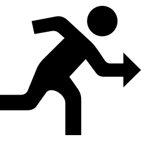

# Numerical summaries: quantitative data {#NumericalQuant}


<!-- Introductions; easier to separate by format -->

```{r, child = if (knitr::is_html_output()) {'./introductions/13-NumericalQuant-HTML.Rmd'} else {'./introductions/13-NumericalQuant-LaTeX.Rmd'}}
```


## Introduction {#Chap13-Intro}

In the last chapter (Sect.\ \@ref(NHANESGraphs)), this RQ was posed:

> Among Americans, is the average direct HDL cholesterol concentration different for current smokers and non-smokers? 

Graphs were used to understand the data in Sect.\ \@ref(NHANESGraphs).
Some features of the data displayed in graphs can be described *numerically*.
The purpose of this chapter is to learn how to numerically summarise *quantitative* data.


<div style="float:right; width: 222x; border: 1px; padding:10px">

</div>


::: {.example #DescribeQuantDataHDL name="Describing quantitative data"}
For the RQ above, the response variable (direct HDL cholesterol concentration) can be displayed using a histogram (Fig.\ \@ref(fig:NHANESdirectHDLHisto)).
What does the histogram tell us?

* *Average*: The average value is about $1.5$\ mmol/L. 
* *Variation*: Values range from about $0.5$ to $3$\ mmol/L, with some larger values.
* *Shape*: The [distribution](#GraphsOneQuant) is slightly skewed right.
* *Outliers*: Some large outliers are present (hard to see on the histogram).

Describing these features more precisely, with *numbers*, can be helpful.
:::


```{r NHANESdirectHDLHisto, fig.cap="The histogram of the direct HDL cholesterol concentration from the NHANES study. Large outliers exist but are hard to see.", fig.align="center", fig.width=5, fig.height=3.5}
hist(NHANES$DirectChol,
	xlab = "Direct HDL cholesterol conc. (mmol/L)",
	ylab = "Number of people",
	las = 1,
	ylim = c(0, 2500),
	xlim = c(0, 4.5),
	main = "Distribution of direct HDL cholesterol\nconc. in the NHANES data",
	breaks = seq(0, 4.5, by = 0.25),
	col = plot.colour)
box()
```


A number that describes a feature of a *population* is called a *parameter*.
The values of parameters are usually unknown.
In contrast, a number that describes a feature of a *sample* is called a  *statistic* (App.\ \@ref(StatisticsAndParameters)).
That is:

* **P**opulations are numerically described by [**p**arameters](#StatisticsAndParameters), and values of parameters are usually unknown.
* **S**amples are numerically described by [**s**tatistics](#StatisticsAndParameters).


::: {.definition #Parameter name="Parameter"}
A [*parameter*](#StatisticsAndParameters) is a number, usually unknown, describing some feature of a population.
:::


::: {.definition #Statistic name="Statistic"}
A [*statistic*](#StatisticsAndParameters) is a number describing some feature of a sample (to estimate an unknown population *parameter*).
:::


::: {.importantBox .important data-latex="{iconmonstr-warning-8-240.png}"}
The RQ identifies the population, but in practice only one of the many possible samples is  studied.
*Statistics* are estimates of *parameters*, and the value of the *statistic* is not the same for every possible *sample*.
:::


## Average values {#ComputeAverage}


<div style="float:right; width: 222x; border: 1px; padding:10px">

</div>


The average (or *location*, or *central value*) for *quantitative sample data* can be described in many ways.
The most common are:

* the *sample mean* (or *sample arithmetic mean*), which estimates the population mean (Sect.\ \@ref(Mean)); and
* the *sample median*, which estimates the population median (Sect.\ \@ref(Median)).

In both cases, the population [parameter](#StatisticsAndParameters) is *estimated* by a sample [statistic](#StatisticsAndParameters).
Understanding [whether to use the mean or median is important](#CompareMeanMedian).


::: {.tipBox .tip data-latex="{iconmonstr-info-6-240.png}"}
The word 'average' can refer to either means, medians or other measures of centre.
Use the precise term 'mean' or 'median', rather than 'average', when possible!
:::


```{r}
data(MaryRiver)

Mn <- aggregate(MaryRiver$Mean, 
                by = list(MaryRiver$Month), 
		            FUN = "mean", 
		            na.rm = TRUE, 
		            simplify = TRUE)
Mdn <- aggregate(MaryRiver$Mean, 
                 by = list(MaryRiver$Month), 
		             FUN = "median", 
		             na.rm = TRUE, 
		             simplify = TRUE)
Number <- aggregate(MaryRiver$Mean, 
                    by = list(MaryRiver$Month),
                    FUN = function(x){length(x) - sum(is.na(x))},
                    simplify = TRUE)

MRsummary <- data.frame(Month = month.abb, 
                        "Mean" = Mn[, 2], 
			                  "Median" = Mdn[, 2],
			                  "Number of days" = Number[, 2])
```


<div style="float:right; width: 222x; border: 1px; padding:10px">

</div>


::: {.example #Averages name="Averages"}
Consider the *daily* river flow volume ('streamflow') at the Mary River from 01 October 1959 to 17 January 2019.
The 'average' daily streamflow in February could be described using either the mean or the median:

* the *mean* daily streamflow is $1123.2$\ ML.
* the *median* daily streamflow is $146.1$\ ML.

These both summarise the same data (the 'average' daily streamflow in February), yet give very different answers.
This implies they measure the 'average' in different ways, and have different meanings.
Which is the best 'average' to use?
To decide, both measures of average will need to be studied.
:::


### Average: the mean {#Mean}

The mean of the population is denoted by $\mu$, and its value is almost always unknown.
Instead, the mean of the population is *estimated* by the mean of the sample, denoted by $\bar{x}$.
In this context, the unknown [*parameter*](#StatisticsAndParameters) is $\mu$, and the [*statistic*](#StatisticsAndParameters) is $\bar{x}$.
The sample mean *estimates* the population mean, and every one of the possible samples is likely to have a different sample mean.


:::: {.pronounceBox .pronounce data-latex="{iconmonstr-microphone-7-240.png}"}

::: {style="display: flex;"}
The Greek letter $\mu$ is pronounced 'myoo', as in a**mu**sing.
$\bar{x}$ is pronounced 'ex-bar'.
:::

::: {}

```{r}
htmltools::tags$video(src ="./Movies/mu.mp4", 
                      width = "121", 
                      loop = "FALSE", 
                      controls = "controls", 
                      loop = "loop", 
                      style = "padding:5px; border: 2px solid gray;")
```
:::

::::


<div style="float:right; width: 222x; border: 1px; padding:10px">

</div>


::: {.example #JerseyCows name="A small dataset to work with"}
To demonstrate ideas, consider a small dataset for answering this descriptive RQ: 'For mature Jersey cows, what is the average percentage butterfat in their milk?'
The population mean percentage butterfat (denoted $\mu$) from those cows is to be estimated.

Clearly, milk from every Jersey cow cannot be studied; a *sample* is studied [@data:hand:handbook; @data:sokal:biometry].
The unknown population mean is estimated using the sample mean ($\bar{x}$).
Measurements were taken from milk from 10 cows (Table\ \@ref(tab:BFatData)).
:::


```{r BFatData}
BFat <- c(4.8, 6.5, 5.2, 4.5, 5.2, 5.7, 5.4, 4.8, 5.2, 5.2)
BFat <- array( BFat, 
               dim = c(1, 10))


if( knitr::is_latex_output() ) {
  kable(surroundMaths(BFat,
                      decDigits = 1),
        format = "latex",
        longtable = FALSE,
        booktabs = TRUE,
        escape = FALSE,
        caption = "The butterfat percentage from a sample of milk from 10 Jersey cows") %>%
    add_header_above(header = c("Butterfat percentages" = 10), 
                     bold = TRUE, 
                     align = "c") %>%
    kable_styling(font_size = 10)
}

if( knitr::is_html_output() ) {
  out <- kable(BFat,
               format = "html",
               longtable = FALSE,
               col.names = rep(" ", 10),
               booktabs = TRUE,
               caption = "The butterfat percentage from a sample of milk from 10 Jersey cows") %>%
    add_header_above(header = c("Butterfat percentages" = 10), 
                     bold = TRUE, 
                     align = "c")
  out
}
```


The sample mean is the 'balance point' of the
`r if (knitr::is_latex_output()) {
   'observations (Figure\\ \\@ref(fig:MeansFigLATEX), left panel; the online version has an animation.)'
} else {
   'observations. The animation below shows how the mean acts as the balance point.'
}`
Alternatively, the mean is the value such that the positive and negative distances of the observations from the mean add to 
`r if (knitr::is_latex_output()) {
   'zero (Fig.\\ \\@ref(fig:MeansFigLATEX), right panel; again, the online version has an animation.)'
} else {
   'zero, as in the animation below.'
}`
Both of these explanations seem reasonable for identifying an 'average' of the data.


```{r animation.hook="gifski", interval=0.25, progress=TRUE, dev=if (is_latex_output()){"pdf"}else{"png"}}

source("R/showBalanceMean.R")

if (knitr::is_html_output()){
    FL <- c( seq(5.0, 5.5, by = 0.025), 
             seq(5.5, 5.2, by =-0.025),
             seq(5.2, 5.3, by = 0.025),
             rep(5.25, 25) )
    for (i in 1:length(FL)){ 
      BalanceMean( FL[i], 
                   numberImages = length(FL), 
                   iteration = i )
    }
  }
```


```{r animation.hook="gifski", interval=0.20, dev=if (is_latex_output()){"pdf"}else{"png"}}
source("R/showFindMean.R")

if (knitr::is_html_output()){
    for (i in 1:length(meanCandidates)){
      FindMean( meanCandidates[i], 
                numberImages = length(meanCandidates), i)
    }
    
  }
```


```{r MeansFigLATEX, fig.align="center", fig.width=4.5, fig.height=3.25,fig.cap="Understandimg the mean. Left: The mean is the balance point of the data; right: the mean is the value such that the positive and negative distances sum to zero", out.width = c('50%', '5%', '40%'), fig.show='hold' }

if (knitr::is_latex_output()){
  FL <- c(   seq(5, 5.5, by = 0.025), 
             seq(5.5, 5.2, by = -0.025),
             seq(5.2, 5.3, by = 0.025),
             rep(5.25, 10) )
    BalanceMean( FL[49], 
                 numberImages = length(FL),
                 iteration = length(FL) )
}

knitr::include_graphics("OtherImages/SPACER.png")

if (knitr::is_latex_output()){
  FindMean( meanCandidates[43], 
            numberImages = length(meanCandidates), 43 )
}
```


::: {.definition #Mean name="Mean"}
The *mean* is one way to measure the 'average' value of quantitative data.
The *arithmetic mean* can be considered as the 'balance point' of the data, or the value such that the positive and negative distances from the mean add to zero.
:::


To find the *value* of the sample mean:

* *Add* (denoted by $\sum$) all the observations (denoted by $x$); then
* *Divide* by the number of observations (denoted by $n$).

In symbols:  
\[
	\bar{x} = \frac{\sum x}{n}.
\]


<div style="float:right; width: 222x; border: 1px; padding:10px">

</div>


::: {.example #ComputeMean name="Computing a sample mean"}
For the Jersey cow data (Example\ \@ref(exm:JerseyCows)), an *estimate* of the population mean (i.e., the sample mean) percentage butterfat is found by summing all $n = 10$ observations and dividing by $n$:
\begin{align*}
   \overline{x} 
   &= \frac{\sum x}{n} = \frac{4.8 + 6.5 + \cdots + 5.2}{10}\\
   &= \frac{52.5}{10}  =  5.25.
\end{align*}
The sample mean, the best estimate of the population mean, is $5.25$%.
:::


::: {.thinkBox .think data-latex="{iconmonstr-light-bulb-2-240.png}"}
For the butterfat data (Table\ \@ref(tab:BFatData)), what is the value of $\mu$, the *population* mean?\label{thinkBox:ValueOfMu}

`r if (knitr::is_latex_output()) '<!--'`
`r webexercises::hide()`
**We do not know!**

We know the value of the *sample* mean, but not the *population* mean.
We have an *estimate* of the value of the population mean by using the sample mean.

(If we already knew the value of the population mean, why would we *estimate* the value from an imperfect sample?)
`r webexercises::unhide()`
`r if (knitr::is_latex_output()) '-->'`
:::


::: {.tipBox .tip data-latex="{iconmonstr-info-6-240.png}"}
Software (such as jamovi or SPSS) or a calculator (in *Statistics Mode*) is usually used to compute the sample mean.
However, knowing *how* these quantities are computed is important.

Software and calculators often produce numerical answers to many decimal places, some of which may not be meaningful or useful.
A simple but useful rule-of-thumb is to round to one or two more significant figures than the original data.

For example, the butterfat data are given to one decimal place.
The *sample mean* weight can be given to two decimal places: $\bar{x} = 5.25$%.
:::


::: {.thinkBox .think data-latex="{iconmonstr-light-bulb-2-240.png}"}
A study of bats [@griffin1960echolocation] recorded the distance at which *Drosophila* were detected for $n = 11$ detections (Table\ \@ref(tab:BatData)).
Estimate the population mean distance at which bats detect the flies.\label{thinkBox:EstimateMu}
`r if (knitr::is_latex_output()) '<!--'`
`r webexercises::hide()`
The **estimate** of $\mu$ is $\bar{x} = 532/11 = 48.4$\ cm.
`r if (knitr::is_latex_output()) '-->'`
`r webexercises::unhide()`
:::


```{r BatData}
BatData <- c(62, 52, 68, 23, 34, 45, 27, 42, 83, 56, 40)
BatData <- array(BatData, 
              dim = c(1, 11))


if( knitr::is_latex_output() ) {
  kable(surroundMaths(BatData,
                      decDigits = 0),
        format = "latex",
        longtable = FALSE,
        booktabs = TRUE,
        escape = FALSE,
        caption = "The distance at which small fruit flies were detected by bats, in cm") %>%
  add_header_above(header = c("Detection distance (in cm)" = 11), 
                   bold = TRUE, 
		   align = "c") %>%
  kable_styling(font_size = 10)
}

if( knitr::is_html_output() ) {
  BatData <- c(62, 52, 68, 23, 34, 45, 27, 42, 83, 56, 40, NA)
  BatData <- array(BatData, 
                   dim = c(2,6))

  kable(BatData,
               format = "html",
               longtable = FALSE,
               booktabs = TRUE,
               caption = "The distance at which small fruit flies were detected by bats, in cm",
               col.names = rep("", 6) ) %>%
   add_header_above(out,
                    header = c("Detection distance" = 6), 
                    bold = TRUE, 
		    align = "c")
}
```


### Average: the median {#Median}

A median is a value separating the largest $50$% of the data from the smallest $50$% of the data.
In a dataset with $n$ values, the median is *ordered observation number* $(n + 1)\div 2$.
The median is:

* **not** equal to $(n + 1)\div 2$.
* **not** halfway between the minimum and maximum values in the data.


::: {.tipBox .tip data-latex="{iconmonstr-info-6-240.png}"}
Many calculators cannot find the median.
The median has no commonly-used symbol.
:::

      
::: {.definition #Median name="Median"}
The **median** is one way to measure the 'average' value of data.
A *median* is a value such that half the values are larger than the median, and half the values are smaller than the median.
:::


<div style="float:right; width: 222x; border: 1px; padding:10px">

</div>


::: {.example #SampleMedian name="Find a sample median"}
To find a sample median for the Jersey cow data (Example\ \@ref(exm:JerseyCows)), first arrange the data *in numerical order* (Table\ \@ref(tab:JerseyCowsSorted)).
The median separates the larger 5 numbers from the smaller 5 numbers. 
With $n = 10$ observations, the median is the ordered observation located between the fifth and sixth observations (i.e., at position $(10 + 1)/2 = 5.5$; the *median itself is not $5.5$*).

So the sample median is between $5.2$ (ordered observation\ 5) and $5.2$ (ordered observation\ 6).
Since these values are the same, the sample median is $5.20$%.
:::


```{r JerseyCowsSorted}
BFat.sort <- sort( c(4.8, 6.5, 5.2, 4.5, 5.2, 5.7, 5.4, 4.8, 5.2, 5.2) )
BFat.sort <- matrix( BFat.sort, 
                     ncol = 10, 
                     byrow = TRUE)

if( knitr::is_latex_output() ) {
  kable(surroundMaths(BFat.sort,
                      decDigits = 1),
        format = "latex",
        longtable = FALSE,
        booktabs = TRUE,
        escape = FALSE,
        caption = "The butterfat percentage from a sample of milk from $10$ Jersey cows, in increasing order") %>%
        add_header_above(header = c("Butterfat percentages" = 10), 
	                 bold = TRUE,
			 align = "c") %>%
  kable_styling(font_size = 10)
}

if( knitr::is_html_output() ) {
  out <- kable(BFat.sort,
              format = "html",
              longtable = FALSE,
              col.names = rep(" ", 10),
              booktabs = TRUE,
              caption = "The butterfat percentage from a sample of milk from $10$ Jersey cows, in increasing order")
  if ( knitr::is_html_output()) {
   add_header_above(out,
                    header = c("Butterfat percentages" = 10), 
                    bold = TRUE, 
		    align = "c")
  } else {
    out
  }
  
}
```


::: {.thinkBox .think data-latex="{iconmonstr-light-bulb-2-240.png}"}
For the butterfat data (Table\ \@ref(tab:JerseyCowsSorted)), what is the *population* median?\label{thinkBox:PopMedian}

`r if (knitr::is_latex_output()) '<!--'`
`r webexercises::hide()`
**We do not know!**

We know the value of the *sample* median, but not the *population* median.
We only have an *estimate* of the value of the population median.
`r webexercises::unhide()`
`r if (knitr::is_latex_output()) '-->'`
:::

     
::: {.thinkBox .think data-latex="{iconmonstr-light-bulb-2-240.png}"}
For the bat data (Table\ \@ref(tab:BatData)), estimate the population *median* distance at which bats detect the flies.\label{thinkBox:EstimateMedian}
`r if (knitr::is_latex_output()) '<!--'`
`r webexercises::hide()`
With $n = 11$, the median is the $(11 + 1)/2 = 6$th ordered value, which is $45$\ cm.
`r if (knitr::is_latex_output()) '-->'`
`r webexercises::unhide()`
:::

To clarify:

* If the sample size $n$ is *odd* (such as the bats example), the median is the middle number when the observations are ordered. 
* If the sample size $n$ is *even* (such as the butterfat example), the median is halfway between the two middle numbers, when the observations are ordered. 

Some software uses slightly different rules when $n$ is even, producing slightly different values for the median.


### Which average to use? {#CompareMeanMedian}

```{r}
LessThanMean <- sum( MaryRiver$Mean[MaryRiver$Month == 2] < 1123.2, 
                     na.rm = TRUE ) / 
                sum( !is.na(MaryRiver$Mean[MaryRiver$Month == 2]) )
```

Consider the daily streamflow at the Mary River (Bellbird Creek) during February (Example\ \@ref(exm:Averages)) again:
The *mean* daily streamflow is $`r round(MRsummary[2, 2], 1)`$\ ML, and the *median* daily streamflow is $`r round(MRsummary[2, 3], 1)`$\ ML.
Which is 'best' for measuring the average streamflow?

A dot chart of the daily streamflow (Fig.\ \@ref(fig:DailyStreamflow), using jittering) shows that the data are *very* highly right-skewed, with many *very* large outliers (presumably during flood events):
the maximum value is $`r formatC( round(max(MaryRiver$Mean[MaryRiver$Month == 2], na.rm = TRUE), 0), format="fg", big.mark=',')`$\ ML, more than *one hundred times* larger than the mean of $`r formatC(round(MRsummary[2, 2], 1), big.mark=',')`$\ ML.
In fact, about $`r round(LessThanMean * 100)`$% of the observations are *less* than the mean.
The extreme outliers are clear in the tabular summary too (Table\ \@ref(tab:DailyStreamflowTab)).

In contrast, about $50$% the values are less than the median (by definition).
For these data, the mean is hardly a *central* value...


```{r DailyStreamflow, fig.cap="A dot plot of the daily streamflow at Mary River from 1960 to 2017, for February ($n = 1650$). The vertical grey line is the mean value. Many large outliers exist, so the data near zero are all squashed together. Note: The values have been jittered in the vertical direction.", fig.align="center", out.width='90%', fig.width=9, fig.height=3}
par(mfrow = c(1, 1))
set.seed(183763286)
stripchart(MaryRiver$Mean[MaryRiver$Month == 2], 
           main = "Dot plot of daily streamflow at\nMary Creek (Bell River) in Feb.",
           xlab = "Daily streamflow (in ML)",
           sub = "(From 01 October 1959 to 17 January 2019)",
           method = "jitter", 
           pch = 19, 
           axes = FALSE,
           col = blueTransparent,
           jitter = 0.75, 
           ylim = c(0.2, 1.8), 
           cex = 0.5)
axis(side = 1,
     at = seq(0, 160000, by = 50000),
     labels = c("0",
                "50,000",
                "100,000",
                "150,000"))
box()

abline( v = Mn[2,2], 
        col = "grey")

```


```{r DailyStreamflowTab}
out <- hist(MaryRiver$Mean[MaryRiver$Month == 2],
            breaks = seq(0, 160000,
                         by = 20000),
            right = FALSE,
            plot = FALSE)
lowerLim <- out$breaks[ -length(out$breaks)]
upperLim <- out$breaks[ -1 ]
Intervals <- paste(format(lowerLim,
                          big.mark = ",",
                          scientific = FALSE),
                   "to under", 
                   format(upperLim,
                          big.mark = ",",
                          scientific = FALSE) )
MaryRiverTable <- cbind(Intervals = Intervals, 
                        Counts = out$counts)


if( knitr::is_latex_output() ) {
  
  T1 <- knitr::kable( surroundMaths(MaryRiverTable[1:4, ],
                                    decDigits = 0),
                     format = "latex",
                     col.names = c("Daily streamflow (ML)",
                                   "Number of days"),
                     align = c("c", "r"),
                     escape = FALSE,
                     booktabs = TRUE) %>%
    row_spec(0, bold = TRUE)
  T2 <- knitr::kable(surroundMaths(MaryRiverTable[5:8, ],
                                   decDigits = 0),
                     format = "latex",
                     col.names = c("Daily streamflow (ML)",
                                   "Number of days"),
                     align = c("c", "r"),
                     escape = FALSE,
                     booktabs = TRUE) %>%
    row_spec(0, bold = TRUE)
  
  out2 <- knitr::kables(list(T1, T2),
                        format = "latex",
                        caption = "Mary River daily streamflow for February (in ML). The mean value is 1,123ML.",
                        label = "DailyStreamflowTab") %>% 
    kable_styling(font_size = 10)
  
  prepareSideBySideTable(out2)
}

if( knitr::is_html_output() ) {
  kable( MaryRiverTable,
         format = "html",
         col.names = c("Daily streamflow (ML)",
                       "Number of days"),
         align = c("c", "r"),
         booktabs = TRUE,
         longtable = FALSE,
         caption = "Mary River daily streamflow for February (in ML). The mean value is 1,123ML.") %>%
    row_spec(0, bold = TRUE)
}

```


The streamflow data are *very* highly right skewed, which is important here:

* *Means* are best used for approximately symmetric data: the mean is influenced by outliers and skewness.
* *Medians* are best used for data that are highly skewed or contain outliers: the median is *not* influenced by outliers and skewness.

Means tend to be too large if the data contains large outliers or severe right skewness, and too small if the data contains small outliers or severe left skewness.
For the Mary River data, the large outliers---and the fact that they are so *extreme* and abundant---result in the mean being substantially influenced by the outliers.
This explains why the mean is much so larger than the median.
*The median is the better measure of average for these data.*

The mean is generally used if possible (for practical and mathematical reasons), and is the most commonly-used measure of location.
However, the mean is not always appropriate; the median *is not* influenced by outliers and skewness.
The mean and median are similar in approximately symmetric distributions.
Sometimes, quoting *both* the mean and the median may be appropriate.


::: {.thinkBox .think data-latex="{iconmonstr-light-bulb-2-240.png}"}
An engineering study [@data:hald:statistical] examined a new building material to determine the average permeability time.
The time (in seconds) taken for water to permeate $n = 81$ pieces of material was taken.
Using a histogram of the data (Fig.\ \@ref(fig:Permeability)), estimate the value of the population mean and median.
Which 'average' would be best to use (for example, to quote an 'average' permeability time on a specification sheet)?\label{thinkBox:SpecSheet}  

`r if (knitr::is_latex_output()) '<!--'`
`r webexercises::hide()`
The data are skewed, which suggests using the median.
In practice, a larger sample would be needed anyway before giving a value to use on a specification sheet.
`r webexercises::unhide()`
`r if (knitr::is_latex_output()) '-->'`
:::


```{r Permeability, fig.cap="A histogram of the permeability of a type of building material", fig.align="center", fig.width=5, fig.height=3.5}
data(Perm)

hist(Perm$Perm, 
     xlab = "Permeability (in seconds)",
     ylab = "Number of obs.",
     las = 1, 
     xlim = c(0, 180), 
     breaks = seq(0, 180, 
                  by = 10), 
     axes = FALSE,
     col = plot.colour, 
     main = "Permeability of building material")
axis(side = 1, 
     at = seq(0, 180, 
              by = 20), 
     las = 2)
axis(side = 2, 
     las = 1)
```


## Variation {#Variation}


<div style="float:right; width: 222x; border: 1px; padding:10px">

</div>


For quantitative data, the amount of *variation* in the bulk of the data should be described.
Many ways exist to measure the variation in a dataset, including:

* The *range*: very simple and simplistic, so not often used (Sect.\ \@ref(VariationRange)).
* The *standard deviation*: commonly used (Sect.\ \@ref(VariationStdDev)).
* The *interquartile range (or IQR)*: commonly used (Sect.\ \@ref(VariationIQR)).
* *Percentiles*: useful i0n specific situations (Sect.\ \@ref(VariationPercentiles)).

As always, a value computed from the *sample* (the [statistic](#StatisticsAndParameters)) estimates the unknown value in the *population* (the [parameter](#StatisticsAndParameters)), and every sample can produce a different estimate.


### Variation: the range {#VariationRange}

The range is the simplest measure of variation.


::: {.definition #Range name="Range"}
The range is the maximum value *minus* the minimum value.
:::

The range is not often used.
As it is computed only using the two extreme observations, the range is highly influenced by outliers.
Sometimes, the *range* is given by stating both the maximum and the minimum value in the data instead of giving the *difference* between these values.
The range is measured in the same measurement units as the data, and is usually quoted with the median. 


::: {.example #RangeEG name="The range"}
For Jersey cow data (Example\ \@ref(exm:JerseyCows)), the largest value is $6.5$%, and the smallest value is $4.5$%; hence  
\[
   \text{Range} = 6.5 - 4.5 = 2.0 \text{ percent}.
\]
So the sample median percentage butterfat is $5.20$%, with a *range* of $2.00$%.
:::


### Variation: the standard deviation {#VariationStdDev}

The population standard deviation is denoted by $\sigma$ (the [parameter](#StatisticsAndParameters)) and is estimated by the sample standard deviation $s$ (the [statistic](#StatisticsAndParameters)).
The standard deviation is the most commonly-used measure of variation, but is tedious to compute manually.
You will almost always find the sample standard deviation $s$ using computer software (e.g., jamovi or SPSS) or a calculator (in *Statistics Mode*)).

The *standard deviation* is (approximately) the mean distance that observations are from the mean.
This seems like a reasonable way to measure the amount of variation in data.


:::: {.pronounceBox .pronounce data-latex="{iconmonstr-microphone-7-240.png}"}
::: {style="display: flex;"}
The Greek letter $\sigma$ is pronounced 'sigma'.
:::


::: {}
```{r}
htmltools::tags$video(src ="./Movies/sigma.mp4", 
                      width = "121", 
                      loop = "FALSE", 
                      controls = "controls", 
                      loop = "loop", 
                      style = "padding:5px; border: 2px solid gray;")
```
:::

::::


::: {.definition #StandardDeviation name="Standard deviation"}
The *standard deviation* is, approximately, the average distance of the observations from the mean.
:::


Even though *you do not have to use the formula* to calculate $s$, we will demonstrate to show exactly what $s$ calculates.
The formula is:  
\[
	s = \sqrt{ \frac{\sum(x - \bar{x})^2}{n - 1} },
\]
where $\bar{x}$ is the sample mean, $x$ represents the individual data values, $n$ is the sample size, and the symbol '$\sum$' means to *add up* (see Sect.\ \@ref(Mean)).
Using the formula requires these steps:

* calculate the sample mean: $\overline{x}$;
* calculate the *deviations* of each observation $x$ from the mean: $x - \bar{x}$;
* square these deviations (to make them all *positive* values): $(x - \bar{x})^2$;
* add these squared deviations: $\sum(x - \bar{x})^2$;
* divide the answer by $n - 1$;
* take the (positive) square root of the answer.


::: {.importantBox .important data-latex="{iconmonstr-warning-8-240.png}"}
*You do not need to use the formula!*
You *must* know how to use software or a calculator to find the standard deviation, what the standard deviation measures, and how to use it.
:::


<div style="float:right; width: 222x; border: 1px; padding:10px">

</div>


::: {.example #StdDev name="Standard deviation"}
For the Jersey cow data (Example\ \@ref(exm:JerseyCows)), the squared *deviations* of each observation from the mean of $5.25$ are shown in Fig.\ \@ref(fig:ShowVar).
The sum of the squared distances is $2.7650$.
Then, the sample standard deviation is:  
\[ 
   s = \sqrt{\frac{2.765}{10 - 1}}
     = \sqrt{ 0.3072222} 
     = 0.5542763.
\]
The sample mean butterfat is $5.25$%, with a sample *standard deviation* of $0.554$%.
:::


```{r ShowVar, fig.cap="The standard deviation is related to the sum of the squared-distances from the mean", fig.align="center",fig.width=6, out.width='60%'}
source("R/showVar.R")
showVar()
```


::: {.thinkBox .think data-latex="{iconmonstr-light-bulb-2-240.png}"}
The standard deviation for Dataset\ A in Fig.\ \@ref(fig:TwoDatasets) is $s = 2$.
Will the standard deviation of Dataset\ B be: *smaller* than or *greater* than $2$?
Why?\label{thinkBox:CompareSD}

`r if (knitr::is_latex_output()) '<!--'`
`r webexercises::hide()`
The standard deviation is a bit like the average distance that observations are from the mean.

In Dataset\ B, more observations are closer to the mean, so the average distance would be a smaller number.
This suggests that the standard deviation for Dataset\ B will be **smaller** than the standard deviation for Dataset\ A.
`r webexercises::unhide()`
`r if (knitr::is_latex_output()) '-->'`
:::


```{r TwoDatasets, fig.height=2.0, fig.width=7.75, out.width='90%', fig.cap="Dotplots of two datasets", fig.align="center"}
### DOT CHARTS of two samples with similar mean, range but diff sd

set.seed(100010)
 
rescale <- function(x, from, to){
  minx <- min(x)
  maxx <- max(x)
  
  slope <- (to - from) / ( maxx - minx )
  intercept <- to - slope*maxx
  
  y <- slope * x + intercept
  y
  
}
len <- 50
tmp1 <- runif(len)
x1 <- rescale(tmp1, -4, 4)

y1.jitter <- jitter(rep(1, length(x1)))

par(mfrow = c(1, 2) )

par(mar = c(2, 0, 2, 1.5) + 0.1)
plot( y = y1.jitter, 
      x = x1, 
      pch = 1,
      ylim = c( 0.95 * min(y1.jitter), 
                1.05 * max(y1.jitter) ),
      ylab = "",
      xlab = "Observations",
      main = expression( bold(Dataset~A)*":"~standard~deviation~is~2),
      axes = FALSE)
axis(side = 1)


tmp2 <- rt((len - 4), 5)
x2 <- c( rescale(tmp2, -1.5, 1.5),  -2.5, 2.5, -4, 4)


y2.jitter <- jitter(rep(1, length(x2)))

par( mar = c (2, 1.5, 2, 0) + 0.1)
plot( y = y2.jitter, 
      x = x2, 
      pch = 1,
      ylim = c( 0.95 * min(y2.jitter), 
                1.05 * max(y2.jitter) ),
      ylab = "",
      xlab = "Observations",
      main = expression( bold(Dataset~B) ),
      axes = FALSE)
axis(side = 1)
```


The sample standard deviation $s$ is:

* Positive (unless all observations are the same, when it is zero: *no* variation);
* Best used for (approximately) symmetric data;
* Usually quoted with the mean;
* The most commonly-used measure of variation;
* Measured in the same units as the data;
* Influenced by *skewness* and outliers, like the mean.


::: {.thinkBox .think data-latex="{iconmonstr-light-bulb-2-240.png}"}
Consider again the Jersey cow data (Example\ \@ref(exm:JerseyCows)).
Using your calculator's *Statistics Mode*, find the *population* standard deviation and the *sample* standard deviation.\label{thinkBox:MilkStats}

`r if (knitr::is_latex_output()) '<!--'`
`r webexercises::hide()`
The *population* standard deviation is unknown.
The best estimate is the *sample* standard deviation: $s = 0.554$%.
If you do not get this value, you may be pressing the wrong button on your calculator: seek help!
`r webexercises::unhide()`
`r if (knitr::is_latex_output()) '-->'`
:::


### Variation: the IQR {#VariationIQR}

The standard deviation uses the value of $\bar{x}$, so is affected by skewness like the sample mean.
A measure of variation *not* affected by skewness is the inter-quartile range, or IQR.
To understand the IQR, understanding *quartiles* is necessary.


::: {.definition #Quartiles name="Quartiles"}
*Quartiles* describe the shape of the data:

* The first quartile $Q_1$ is a value separating the smallest $25$% of observations from the largest 75%.
  The $Q_1$ is like the median of the *smaller* half of the data, halfway between the minimum value and the median.
* The second quartile $Q_2$ is a value separating the smallest $50$% of observations from the largest $50$%.
  (This is the *median*.)
* The third quartile $Q_3$ is a value separating the smallest $75$% of observations from the largest $25$%.
  The $Q_3$ is like the median of the *larger* half of the data, halfway between the median and the maximum value.
:::


Quartiles divide the data into four parts of approximately equal numbers of observations, and *a boxplot is a picture of the quartiles*.
The *inter-quartile range*, or the *IQR* is the difference between $Q_3$ and $Q_1$.

Since the IQR measures the range of the central $50$% of the data, the IQR is not influenced by outliers.
The IQR is measured in the same measurements units as the data.


::: {.definition #IQR name="IQR"}
The *IQR* is the range in which the middle $50$% of the data lie: the difference between the third and the first quartiles.
:::


Quartiles were previously discussed in the context of boxplots (Sect.\ \@ref(Boxplot)).
For example, a boxplot of the egg-krill data (@data:Greenacre2016:reporting; Table\ \@ref(tab:KrillDataTable2)) was shown in Example \@ref(exm:KrillData), and repeated here (Fig.\ \@ref(fig:IQRKrill), left panel).


```{r KrillDataTable2}
Eggs.T <- c(0, 0, 1, 1, 3, 8, 8, 12, 18, 21, 26, 30, 35, 48, 50)
Eggs.C <- c(0, 0, 0, 0, 1, 1, 1,  2,  2,  3,  8, 16, 20, 26, 31)

KrillEggs2 <- cbind( Eggs.T[1:4], 
                     Eggs.T[5:8],
                     Eggs.T[9:12], 
                     Eggs.T[13:16], 
                     Eggs.C[1:4], 
                     Eggs.C[5:8], 
                     Eggs.C[9:12], 
                     Eggs.T[13:16])

if( knitr::is_latex_output() ) {
  kable( surroundMaths(KrillEggs2,
                       decDigits = 0),
         format = "latex",
         longtable = FALSE,
         booktabs = TRUE,
         escape = FALSE,
         align = c("c"),
         caption = "The number of eggs laid by krill, for those in a treatment group and a control group") %>%
  add_header_above(header = c("Treatment group " = 4, 
                              " Control group" = 4), 
	           bold = TRUE, 
		   align = "c") %>%
  kable_styling(font_size = 10)
    
}
if( knitr::is_html_output() ) {
  out <- kable( KrillEggs2,
                format = "html",
                longtable = FALSE,
                booktabs = TRUE,
                align = c("c", "c"),
                col.names = rep("", 8),
                caption = "The number of eggs laid by krill, for those in a treatment group and for those in a control group")
  
  if ( knitr::is_html_output()) {
    kable_styling(out, full_width = FALSE) %>%
    add_header_above(header = c("Treatment group" = 4, 
                                "Control group" = 4), 
 	             bold = TRUE, 
 		     align = "c")
  } else {
    out
  }
}
```

```{r}
KrillT.quantiles <- quantile(Eggs.T)
Eggs.C2 <- Eggs.C[ -which.max(Eggs.C)]
KrillC2.quantiles <- quantile(Eggs.C2)
```


```{r BoxplotKrillTreatment2HTML, fig.cap="A boxplot for the krill-egg data; the boxplot just for the treatment group", fig.width=5, fig.height=4, fig.align="center"}
if (knitr::is_html_output()) {

  Eggs.quantiles <- quantile(Eggs.T)
out <- boxplot( list(Treatment = Eggs.T), 
            main = "A boxplot of the number of\neggs laid by krill: Treatment group",
            las = 1,
            pch = 19,
            col = "white",
            ylim = c(-4, 50),
            xlim = c(0.55, 1.85),
            ylab = "Number of eggs")
abline( h = Eggs.quantiles, 
        col = "grey",
        lty = 2,
        lwd = 1)
bxp(out, 
    las = 1, 
    add = TRUE, 
    boxfill = plot.colour)

text( 1.53, Eggs.quantiles[5], 
      "Max. value", 
      pos = 1, 
      cex = 0.75)
text( 1.53, Eggs.quantiles[4], 
      "75% smaller than this", 
      pos = 3, 
      cex = 0.75)
text( 1.53, Eggs.quantiles[3], 
      "Median", 
      pos = 3, 
      cex = 0.75)
text( 1.53, Eggs.quantiles[2], 
      "25% smaller than this", 
      pos = 3, 
      cex = 0.75)
text( 1.53, Eggs.quantiles[1], 
      "Min. value", 
      pos = 1, 
      cex = 0.75)

text( 0.65, Eggs.quantiles[4], 
      expression(italic(Q)[3]), 
      pos = 3, 
      cex = 0.75)
text( 0.65, Eggs.quantiles[3], 
      expression(italic(Q)[2]), 
      pos = 3, 
      cex = 0.75)
text( 0.65, Eggs.quantiles[2], 
      expression(italic(Q)[1]), 
      pos = 3, 
      cex = 0.75)

axis(side = 4, # This places the tick marks
     at = Eggs.quantiles,
     labels = rep("", 5) )
mtext(Eggs.quantiles,
      side = 4,
      at = Eggs.quantiles,
      las = 1,
      line = 1,
      padj = c(0.5, 0.5, 0.5, 0, 1),
      cex = 1)
}
```


For the **Treatment** group:

*  $75$% of the observations are smaller than about $`r KrillT.quantiles[4]`$, represented by the line at the top of the central box.
   This is $Q_3$, the **third quartile**.
*  $50$% of the observations are smaller than about $`r KrillT.quantiles[3]`$, represented by the line in the centre of the central box.
   This is $Q_2$, the **second quartile** or the **median**.
*  $25$% of the observations are smaller than about $`r KrillT.quantiles[2]`$, represented by the line at the bottom of the central box.
   This is $Q_1$, the **first quartile**.

The IQR is $Q_3 - Q_1$ = $`r KrillT.quantiles[4]` - `r KrillT.quantiles[2]` = `r KrillT.quantiles[4] - KrillT.quantiles[2]`$.
`r if (knitr::is_latex_output()) {
   'Figure\\ \\@ref(fig:IQRKrill) (right panel) shows how the IQR is found. (The online version has an animation.)'
} else {
   'The animation below shows how the IQR is found.'
}`


```{r animation.hook="gifski", interval=0.75, dev=if (is_latex_output()){"pdf"}else{"png"}}
Eggs.T <- c(0, 0, 1, 1, 3, 8, 8, 12, 18, 21, 26, 30, 35, 48, 50)


# Grab some of the necessary stats
Qs <- quantile(Eggs.T, 
               seq(0, 1, by = 0.25)) # See below for better way when there are outliers

left <- 0.75
right <- 1.25
axis.edge <- axis.edge.left <- 0.5
axis.edge.right <- 1.5
angle <- 15
mid <- mean( c(left, axis.edge.left) )
mid.r <- mean( c(right, axis.edge.right) )

# The box is at x = 1, and goes from x = 0.5 to 1.5 on the x-axis.
# See this by following the boxplot()) call with axis(side-1)


if (knitr::is_html_output()) {
  for (i in (1:6)){
    boxplot( Eggs.T, 
             col = plot.colour,
             las = 1,
             main = "Boxplot of krill eggs\n(Treatment group)",
             ylim = c(-3, 60),
             ylab = "Number of eggs")
    if ( i == 2 ){
      arrows(left, Qs[2],
             axis.edge, Qs[2],
             angle = angle,
             lwd = 2)
      text(mid, Qs[2], 
           label = expression( italic(Q)[1]), 
	   pos = 3)
    }
    if (i == 3){
      arrows(left, Qs[4],
             axis.edge, Qs[4],
             angle = angle,
             lwd = 2)
      text(mid, Qs[4], 
           label = expression( italic(Q)[3]), 
	   pos = 3)
    }
    if (i >= 4){
      arrows(left, Qs[2],
             axis.edge, Qs[2],
             angle = angle,
             lwd = 1)
      text(mid, Qs[2], 
           label = expression( italic(Q)[1]), 
	   pos = 3)
      arrows(left, Qs[4],
             axis.edge, Qs[4],
             angle = angle,
             lwd = 1)
      text(mid, Qs[4], 
           label = expression( italic(Q)[3]), 
	   pos = 3)
      
      arrows(mid.r, Qs[4], mid.r, Qs[2],
             lwd = 2,
             angle = angle,
             code = 3) # Arrow at both ends
      text( mid.r, Qs[3], 
            label = "IQR", 
	    pos = 4)
    }
  }
}
```


```{r IQRKrill, fig.align="center", fig.width=c(4.5, 4.5), fig.cap="Left: A boxplot for the krill-egg data (Treatment group); right: Comupting the IQR for the same data", fig.show='hold', out.width=c('48%', '48%') }
if (knitr::is_latex_output()){
  Eggs.quantiles <- quantile(Eggs.T)
  
  
  par( mar = c(5, 4.5, 4, 3.5) + 0.1)
  out <- boxplot( list(Treatment = Eggs.T), 
                  main = "A boxplot of the number of\neggs laid by krill: Treatment group",
                  las = 1,
                  pch = 19,
                  col = "white",
                  ylim = c(-3, 50),
                  xlim = c(0.60, 1.85),
                  ylab = "Number of eggs")
  abline( h = Eggs.quantiles, 
          col = "grey",
          lty = 2,
          lwd = 1)
  bxp(out, 
      las = 1, 
      add = TRUE, 
      boxfill = plot.colour)
  
  text( 1.53, Eggs.quantiles[5], 
        "Max. value", 
        pos = 1, 
        cex = 0.85)
  text( 1.53, Eggs.quantiles[4], 
        "75% smaller than this", 
        pos = 3, 
        cex = 0.85)
  text( 1.53, Eggs.quantiles[3], 
        "Median", 
        pos = 3, 
        cex = 0.85)
  text( 1.53, Eggs.quantiles[2], 
        "25% smaller than this", 
        pos = 3, 
        cex = 0.85)
  text( 1.53, Eggs.quantiles[1], 
        "Min. value", 
        pos = 1, 
        cex = 0.85)
  
  text( 0.65, Eggs.quantiles[4], 
        expression(italic(Q)[3]), 
        pos = 3, 
        cex = 0.85)
  text( 0.65, Eggs.quantiles[3], 
        expression(italic(Q)[2]), 
        pos = 3, 
        cex = 0.85)
  text( 0.65, Eggs.quantiles[2], 
        expression(italic(Q)[1]), 
        pos = 3, 
        cex = 0.85)
  
  axis(side = 4, # This places the tick marks
       at = Eggs.quantiles,
       labels = rep("", 5) )
  mtext(Eggs.quantiles,
        side = 4,
        at = Eggs.quantiles,
        las = 1,
        line = 1,
        padj = c(0.95, 0.25, 0.5, 0, 1),
        cex = 1)
}
  
if (knitr::is_html_output()){
  
  ##########
#knitr::include_graphics("OtherImages/SPACER.png")
  ##########
  
  par( mar = c(5, 4.5, 4, 3.5) + 0.1)
  boxplot( Eggs.T, 
           col = plot.colour,
           las = 1,
           main =  "The IQR for the number of\neggs laid by krill: Treatment group",
           ylim = c(-3, 50),
           ylab = "Number of eggs")
  
  arrows(left, Qs[2],
         axis.edge, Qs[2],
         angle = angle,
         lwd = 1)
  text(mid, Qs[2], 
       label = expression( italic(Q)[1]), 
       pos = 3)
  arrows(left, Qs[4],
         axis.edge, Qs[4],
         angle = angle,
         lwd = 1)
  text(mid, Qs[4], 
       label = expression( italic(Q)[3]), 
       pos = 3)
  
  arrows(mid.r, Qs[4], mid.r, Qs[2],
         lwd = 2,
         angle = angle,
         code = 3) # Arrow at both ends
  text( mid.r, Qs[3], 
        label = "IQR", 
        pos = 4)
  
  axis(side = 4, # This places the tick marks
       at = Eggs.quantiles[ c(2, 4)],
       labels = rep("", 2) )
  mtext(Eggs.quantiles[ c(2, 4)],
        side = 4,
        at = Eggs.quantiles[c(2, 4)],
        las = 1,
        line = 1,
        cex = 1)
}
```


```{r}
Age.quantiles <- quantile(NHANES$Age)
#  0%  25%  50%  75% 100% 
#   0   18   36   54   80 
#HDL.quantiles <- quantile(NHANES$DirectChol, na.rm = TRUE)
#  0%  25%  50%  75% 100% 
#0.52 1.06 1.29 1.58 3.44 
```


::: {.example #BoxplotNHANES name="Boxplots"}
Consider the NHANES data [@data:NHANES3:Data; @data:NHANES3].
The boxplot for the age of respondents in the NHANES dataset is
`r if (knitr::is_latex_output()) {
   'shown in Fig.\\ \\@ref(fig:IQRAge). (The online version has an animation.)'
} else {
   'shown below.'
}`
For these data:

* No outliers are identified.
* The oldest person is aged $`r Age.quantiles[5]`$.
* $75$% of the subjects are aged less than about $`r Age.quantiles[4]`$ ($Q_3$): the third  quartile $Q_3 = `r Age.quantiles[4]`$, the median of the *largest half* of the data.
* $50$% of the subjects are aged less than about $`r Age.quantiles[3]`$ ($Q_2$, the median): the second quartile $Q_2 = `r Age.quantiles[3]`$, the median of the dataset.
* $25$% of the subjects are aged less than about $`r Age.quantiles[2]`$ ($Q_1$): the first quartile $Q_1 = `r Age.quantiles[2]`$, the median of the *smallest half* of the data.
* The youngest subject is aged $`r Age.quantiles[1]`$.
   
Then, $Q_3 = `r Age.quantiles[4]`$ and $Q_1 = `r Age.quantiles[2]`$, so the $\text{IQR} = Q_3 - Q_1 = `r Age.quantiles[4]` - `r Age.quantiles[2]` = `r (Age.quantiles[4] - Age.quantiles[2])`$ years.
The middle $50$% of the participants have an age range of $37$ years.
:::


```{r IQRAgeMovie, animation.hook="gifski", interval=0.75, dev=if (is_latex_output()){"pdf"}else{"png"}}
data(NHANES)

# Grab some of the necessary stats
Qs <- quantile(NHANES$Age,
               seq(0, 1, 
               by = 0.25)) # See below for better way when there are outliers
left <- 0.75
right <- 1.25
axis.edge <- axis.edge.left <- 0.5
axis.edge.right <- 1.5
angle <- 15
mid <- mean( c(left, 
               axis.edge.left) )
mid.r <- mean( c(right, 
                 axis.edge.right) )

# The box is at x=1, and goes from x=0.5 to 1.5 on the x-axis.
# See this by following the boxplot()) call with axis(side-1)

if (knitr::is_html_output()){
  for (i in (1:6)){
    boxplot( NHANES$Age, 
             col = plot.colour,
             las = 1,
             main = "Boxplot of Age\n(NHANES data)",
             ylim = c(0, 85),
             ylab = "Age (in years)")
    if ( i == 2 ){
      arrows(left, Qs[2],
             axis.edge, Qs[2],
             angle = angle,
             lwd = 2)
      text(mid, Qs[2], 
           label = expression( italic(Q)[1]), 
	   pos = 3)
      text(mid, Qs[2], 
           label = paste("=", as.character(Qs[2])), 
	   pos = 1)
    }
    if (i == 3){
      arrows(left, Qs[4],
             axis.edge, Qs[4],
             angle = angle,
             lwd = 2)
      text(mid, Qs[4], 
           label = expression( italic(Q)[3]), 
	   pos = 3)
      text(mid, Qs[4], 
           label = paste("=", as.character(Qs[4])), 
	   pos = 1)
    }
    if (i >= 4){
      arrows(left, Qs[2],
             axis.edge, Qs[2],
             angle = angle,
             lwd = 1)
      text(mid, Qs[2], 
           label = expression( italic(Q)[1]), 
	   pos = 3)
      text(mid, Qs[2], 
           label = paste("=", as.character(Qs[2])), 
	   pos = 1)
      arrows(left, Qs[4],
             axis.edge, Qs[4],
             angle = angle,
             lwd = 1)
      text(mid, Qs[4], 
           label = expression( italic(Q)[3]), 
	   pos = 3)
      text(mid, Qs[4], 
           label = paste("=", as.character(Qs[4])), 
	   pos = 1)
      
      arrows(mid.r, Qs[4], mid.r, Qs[2],
             lwd = 2,
             angle = angle,
             code = 3) # Arrow at both ends
      text( mid.r, Qs[3], 
            label = "IQR", 
	    pos = 4)
    }
  }
}
```


```{r  IQRAge, fig.align="center", fig.width=6, fig.cap="Computing the IQR for the age in the NHANES dataset" }
if (knitr::is_latex_output()){
    boxplot( NHANES$Age, 
             col = plot.colour,
             las = 1,
             main = "Boxplot of Age\n(NHANES data)",
             ylim = c(0, 85),
             ylab = "Age (in years)")

      arrows(left, Qs[2],
             axis.edge, Qs[2],
             angle = angle,
             lwd = 1)
      text(mid, Qs[2], 
           label = expression( italic(Q)[1]), 
	   pos = 3)
      text(mid, Qs[2], 
           label = paste("=", as.character(Qs[2])), 
	   pos = 1)
      arrows(left, Qs[4],
             axis.edge, Qs[4],
             angle = angle,
             lwd = 1)
      text(mid, Qs[4], 
           label = expression( italic(Q)[3]), 
	   pos = 3)
      text(mid, Qs[4], 
           label = paste("=", as.character(Qs[4])), 
	   pos = 1)
      
      arrows(mid.r, Qs[4], mid.r, Qs[2],
             lwd = 2,
             angle = angle,
             code = 3) # Arrow at both ends
      text( mid.r, Qs[3], 
            label = "IQR", 
	    pos = 4)
  
}
```


### Variation: percentiles {#VariationPercentiles}

*Percentiles* are similar in principle to quantiles; for example:

* The $12$th percentile separates the smallest $12$% of the data from the rest.
* The $67$th percentile separates the smallest $67$% of the data from the rest.
* The $94$th percentile separates the smallest $94$% of the data from the rest.

Percentiles are measured in the same measurements units as the data.

::: {.definition #Percentiles name="Percentiles"}
The $p$th percentile of the data is a value separating the smallest $p$% of the data from the rest.
:::

By this definition, the first quartile $Q_1$ is also the $25$th percentile, the second quartile $Q_2$ is also the $50$th percentile (and the median), and the third quartile $Q_3$ is also the $75$th percentile.

Percentiles are especially useful for very skewed data in certain applications.
For instance, scientists who monitor rainfall and stream heights, and engineers who use this information, are more interested in extreme weather events rather than the 'average' event.
Structures are designed to withstand $1$-in-$100$ year events (the $99$th percentile) or similar, rather than 'average' events.


::: {.example #PercentilesEG name="Percentiles"}
For the streamflow data at the Mary River (Example\ \@ref(exm:Averages)), the February data are highly right-skewed (Fig.\ \@ref(fig:DailyStreamflow)):

* The median (50th percentile) is $146.1$\ ML.
* The 95th percentile is $3\ 480$\ ML.
* The 99th percentile is $19\ 043$\ ML.

Constructing infrastructure for the *median* streamflow would be inadequate.
:::

<!-- > quantile( MaryRiver$Mean[MaryRiver$Month==2][ !is.na(MaryRiver$Mean[MaryRiver$Month==2])], probs=c(0.5, 0.9, 0.95, 0.99)) -->
<!--       50%       90%       95%       99%  -->
<!--   146.060  1694.362  3480.261 19043.217  -->


### Which measure of variation to use? {#CompareVariations}

Which is the 'best' measure of variation for quantitative data?
As with measures of location, it depends on the data.

Since the standard deviation formula uses the mean, it is impacted in the same way as the mean by outliers and skewness.
Hence, the standard deviation is best used with approximately symmetric data.
The IQR is best used when data are skewed or asymmetric.
Sometimes, both the standard deviation and the IQR can be quoted.


<iframe src="https://learningapps.org/watch?v=pojiu9htv22" style="border:0px;width:100%;height:500px" allowfullscreen="true" webkitallowfullscreen="true" mozallowfullscreen="true"></iframe>


## Shape


<div style="float:right; width: 222x; border: 1px; padding:10px">

</div>


While skewness can be described numerically, we will describe shape using words (skewed, approximately symmetric, bimodal, etc.) as in Sect.\ \@ref(SummariseData).


::: {.example #Skewness name="Skewness"}
The Australian Bureau of Statistics
`r if (knitr::is_latex_output()) {
   '(ABS)'
} else {
   '([ABS](http://www.abs.gov.au/)) '
}`
records the  
`r if (knitr::is_latex_output()) {
   'age at death of Australians.'
} else {
   '[age at death of Australians](http://www.abs.gov.au/AUSSTATS/subscriber.nsf/log?openagent&33020do008_2012.xls&3302.0&Data%20Cubes&19D242509768F63BCA257C1B000D6ECA&0&2012&07.11.2013&Latest).'
}`
The histograms of the age of death for females and males (Fig.\ \@ref(fig:DeathAgeHist)) show that both distributions are *left* skewed: few Australians die at a very young age, and most die at an older age.
:::


```{r DeathAgeHist, fig.cap="Histograms of age at death for Australians in 2012", fig.align="center", fig.width=6.75, fig.height=3, out.width='75%'}
deathCounts <- c(565, 116, 69, 78, 319, 501, 633, 655, 848, 1226, 1633, 2459, 3375, 4669, 6152, 7436, 9526, 12619, 12455, 7113, 2104, 241) # Taken from ABS
ageBreaks <- c(0, 1, 5, 10, 15, 20, 25, 30, 35, 40, 45, 50, 55, 60, 65, 70, 75, 80, 85, 90, 95, 100, 110)

# Sum the two smallest bins to make a single (0, 5) bin:
dCountsM <-  c(565 + 116, 69, 78, 319, 501, 633, 655, 848, 1226, 1633, 2459, 3375, 4669, 6152, 7436, 9526, 12619, 12455, 7113, 2104, 241)
ageBreaks <- c(0, 5, 10, 15, 20, 25, 30, 35, 40, 45, 50, 55, 60, 65, 70, 75, 80, 85, 90, 95, 100, 110)

dCountsM2 <-  c(565 + 116  + 69, 78+ 319, 501+ 633, 655+ 848, 1226+ 1633, 2459+ 3375, 4669+ 6152, 7436+ 9526, 12619+ 12455, 7113+ 2104, 241)
dCountsF2 <- c(466+87+ 59, 63+ 181, 202+ 218, 328+ 454, 750+ 1024, 1569+ 2093, 2909+ 3745, 4810+ 6914, 11290+ 15430, 12946+ 5637, 1128)

ageBreaks2 <- seq(0, 110, 
                  by = 10)
 
# Now, try combining boxes in pairs"
 
 par(mfrow = c(1, 2))
 
 outF <- barplot(dCountsF2/1000, 
 	space = 0.0, 
 	las = 1,
 	col = "mistyrose", 
 	ylim = c(0, 27),
 	axes = FALSE,
 	axisnames = FALSE,
 	names.arg = ageBreaks2,
 	main = "Age at death of\nfemales in 2012")
 
 axis(side = 1, 
      at = 0:(length(ageBreaks2) - 1), 
      labels = ageBreaks2)
 axis(side = 2, 
      las = 1)
 title(xlab = "Age (in years)", 
       ylab = "Number (in thousands)",
       sub = paste("(Total deaths: ",
                   formatC( sum(dCountsF2), big.mark=",", format="fg"),")", 
                   sep=""))
 box()
 
 
 outM <- barplot(dCountsM2/1000, 
                 space = 0.0, 
                 las = 1,
                 col = plot.colour,
                 ylim = c(0, 27),
                 axes = FALSE,
                 axisnames = FALSE,
                 main = "Age at death of\nmales in 2012")
 axis(side = 1, 
      at = 0:(length(ageBreaks2) - 1), 
      labels = ageBreaks2 )
 axis(side = 2, 
      las = 1)
 title(xlab = "Age (in years)", 
       ylab = "Number (in thousands)", 
       sub = paste("(Total deaths: ", 
                   formatC( sum(dCountsM2), big.mark=",", format="fg"),")", 
                   sep = "") )
 box()
```


## Identifying outliers


<div style="float:right; width: 222x; border: 1px; padding:10px">

</div>


Outliers are 'unusual' observations: observations quite different (larger or smaller) than the bulk of the data.
Outliers are 'unusual', but not necessarily 'wrong or 'bad' observations.
Rules for deciding whether or not an observation is 'unusual' are always arbitrary.


::: {.definition #Outliers name="Outliers"}
An *outlier* is an observation that is 'unusual' compared to the bulk of the data (either larger or smaller).
Rules for identifying outliers are arbitrary.
:::


Two rules for identifying outliers are:

* The *standard deviation rule*, useful when the data have an approximately symmetric distribution (Sect.\ \@ref(OutliersStdDevRule)).
* The *IQR rule*, useful in other situations (Sect.\ \@ref(OutliersIQRrule)).


### The standard deviation rule {#OutliersStdDevRule}

The first rule for identifying outliers applies for approximately symmetric distributions.


::: {.definition #StandardDeviationRuleForIdentifyingOutliers name="Standard deviation rule for identifying outliers"}
For approximately symmetric distributions, an observation more than three standard deviations from the mean may be considered an outlier.
:::


This rule uses the mean and the standard deviation, so is suitable for approximately symmetric distributions (when means and standard deviations are sensible numerical summaries).
The rationale behind this rule is explained in Sect.\ \@ref(NormalDistribution).

All rules for identifying outliers are arbitrary, and sometimes the standard deviation rule is sometimes given slightly differently.
For example, outliers may be identified as observations more than 2.5 standard deviations away from the mean.
Both rules are acceptable, since the definition is arbitrary.


### The IQR rule {#OutliersIQRrule}

Since the standard deviation rule for identifying outliers relies on the mean and standard deviation, it is not appropriate for non-symmetric distributions.
Another rule is needed for identifying outliers in these situations: the IQR rule.


::: {.definition #IQRRuleForIdentifyingOutliers name="IQR rule for identifying outliers"}
The IQR rule identifies mild and extreme outliers:

* *Extreme outliers*: observations $3\times \text{IQR}$ more unusual than $Q_1$ or $Q_3$.
* *Mild outliers*: observations $1.5\times \text{IQR}$ more unusual than $Q_1$ or $Q_3$ (that are not also extreme outliers).
:::


This definition is easier to understand using an example.


::: {.example #IQROutliersEG name="IQR rule for identifying outliers"}
An engineering project [@data:hald:statistical] studied a new building material, to estimate the average permeability.
Permeability time (the time for water to permeate the sheets) was measured from $81$ pieces of material (in seconds).
For these data $Q_1 = 24.7$ and $Q_3 = 50.6$, so $\text{IQR} = {50.6 - 24.7 = 25.9}$.
Then, **extreme** outliers are observations $3\times 25.9 = 77.7$ more unusual than $Q_1$ or $Q_3$.
That is, *extreme* outliers are observations:

* more unusual than $24.7 - 77.7 = -53.0$ (that is, *less* than $-53.0$); or
* more unusual than $50.6 + 77.7 = 128.3$ (that is, *greater* than $128.3$).

**Mild** outliers are observations $1.5\times 25.9 = 38.9$ more unusual than $Q_1$ or $Q_3$ (that are not also extreme outliers).
That is, *mild* outliers are

* more unusual than $24.7 - 38.9 = -14.2$ (that is, *less* than $-14.2$); or
* more unusual than $50.6 + 38.9 = 89.5$ (that is, *greater* than $89.5$).

The outliers are identified when constructing a boxplot: the 'whiskers' extended to the most extreme observation remaining *after* excluding mild and extreme observations.
The outliers are located using a $\circ$ (and sometimes *extreme outliers* are located using a $\star$).
:::


You don't need to *do* this (that's what software is for), but you do need to *understand* how to read boxplots.
`r if (knitr::is_latex_output()) {
   'The final boxplot is shown in Fig.\\ \\@ref(fig:IQROutliers).'
} else {
   'Construction of the boxplot is shown in the animation below.'
}`


```{r IQROutlier, animation.hook="gifski", interval=1.75, dev=if (is_latex_output()){"pdf"}else{"png"}}
data(Perm)
x <- Perm$Perm

plotIQROutliersAnimation <- function(x, i){
  grey.pch <- grey(0.75)
  
  xsort <- sort( x , decreasing = TRUE)  
  b.out <- boxplot(x, plot = FALSE)
  
  b.out.noextreme <- b.out
  b.out.noextreme$n <- b.out.noextreme$n - 2
  b.out.noextreme$out <- numeric(0)
  b.out.noextreme$group <- numeric(0)
  b.out.noextreme$stats[5, 1] <- xsort[3]
  
  b.out.nomild <- b.out
  b.out.nomild$n <- b.out.nomild$n - 3
  b.out.nomild$out <- numeric(0)
  b.out.nomild$group <- numeric(0)
  
  qx <- quantile(x)
  iqrx <- qx[4] - qx[2]
  mild <- qx[4] + 1.5 * iqrx
  extreme <- qx[4] + 3 * iqrx
  
  # FIND extreme obs
  extreme.obs <-  b.out$out[2:3]
  extreme.which <- which(x > extreme )
  extreme.num <- length( x[extreme.obs] )
  
  # FIND mild obs
  mild.obs <- b.out$out[1]
  mild.which <- which(x > mild )
  mild.num <- length( x[mild.obs] )
  
  x.nooutliers <- xsort[ -(1:3)]
  
  if ( (i >= 2) & (i <= 6) ){
    set.seed(937300)
    stripchart(x, #.nooutliers, 
               vertical = TRUE, 
               las = 1, 
               pch = 1, 
               ylim = c(0, 180), 
               xlim = c(0.5, 1.5),
               method = "jitter", 
               jitter = 0.05,
               ylab = "Permeability (in seconds)", 
               col = grey.pch)
    if (i == 2) title(main = "The boxplot, plus the data")
    if (i == 3) title(main = "The IQR for the data")
    if (i == 4) title(main = "Extreme outliers are more than 3 IQRs\n more than Q3 (or less than Q1)...")     
    if ( i == 5 ) title( main = "...and are shown using a star")
    if ( i == 6 ) title(main = "Mild outliers are more than 1.5 IQRs\n more than Q3 (or less than Q1)...") 
    if ( i == 7 ) title( main = "...and are shown using a dot")
  }
  if ( i == 1) {
    out <- boxplot(x, 
                   col = rgb(0, 0, 0, maxColorValue = 256, alpha = 0.5), 
                   pch = 1, 
                   ylim = c(0, 180), 
                   xlim = c(0.5, 1.5),
                   ylab = "Permeability (in seconds)", 
                   main = "The boxplot",
                   range = 0, 
                   las = 1)
  }
  if ( (i >= 2) & (i <= 4 ) ){
    out <- boxplot(x, 
                   add = TRUE, 
                   col = rgb(0, 0, 0, maxColorValue = 256, alpha = 0.5), 
                   boxwex = 0.2,
                   range = 0, 
                   las = 1)
  }
  if ( (i >= 5 ) & (i <= 7)) {
    out <- bxp(b.out.noextreme, 
               add = TRUE, 
               boxfill = rgb(0, 0, 0, 
                             maxColorValue = 256, 
                             alpha = 0.5), 
               pars = list(boxwex = 0.2),
               width = 0.25,
               las = 1)
  }
  
  if ( i > 2 ){
    abline( h = qx[2], 
            col = "grey", 
            lty = 2)
    text(x = 1.4, 
         y = qx[2], 
         expression(Q[1] == 24.66), 
         pos = 1,
         cex = 0.9)
    abline( h = qx[4], 
            col = "grey", 
            lty = 2)
    text(x = 1.4, 
         y = qx[4], 
         expression(Q[3] == 50.58), 
         pos = 3,
         cex = 0.9)
    
    arrows(x0 = 0.75, 
           y0 = qx[2], 
           x1 = 0.75, 
           y1 = qx[4], 
           angle = 15,
           length = 0.125, 
           code = 3)
    text(x = 0.83, 
         y = mean(qx[ c(3, 4)]), 
         label = expression(IQR), 
         cex = 0.9)
  }
  
  if ( (i > 3) & (i < 8) ){
    abline( lwd = 2, 
            col = "gray",
            
	    h = extreme )
    text(1.0, mean( c(extreme, qx[5])), 
         "All observations here are extreme outliers", 
         col = "grey")
  }
  if ( (i == 4) | (i == 5) ) {
    arrows(x0 = 0.75, 
           y0 = qx[4], 
           x1 = 0.75, 
           y1 = extreme, 
           angle = 15,
           length = 0.125, 
           code = 3)
    text(x = 0.83, 
         y = mean( c(qx[4], extreme)), 
         labels = "Three IQRs")
  }
  
  if ( (i > 5) & (i < 8) ){
    abline( lwd = 2, 
            col = "gray", 
            h = mild )
    text(x = 1.0, 
         y = extreme,
         pos = 1,
         labels = "All observations here are mild outliers", 
         col = "grey")
  }
  if ( (i == 6) | (i == 7) ) {
    arrows(x0 = 0.75, 
           y0 = qx[4], 
           x1 = 0.75, 
           y1 = mild, 
           angle = 15, 
           length = 0.125, 
           code = 3)
    text(x = 0.6, 
         y = mean( c(qx[4], mild)), 
         labels = "1.5 IQRs")
  }
  
  
  if ( i == 7 ) {
    out <- boxplot(x,  
                   add = TRUE, 
                   col = rgb(0, 0, 0, maxColorValue = 256, alpha = 0.5), 
                   las=1)
    
    set.seed(937300)
    stripchart(x,
               vertical = TRUE, 
               las = 1, 
               pch = 1, 
               ylim = c(0, 180), 
               xlim = c(0.5, 1.5),
               method = "jitter", 
               jitter = 0.05,
               ylab = "Permeability (in seconds)", 
               col = grey.pch)
    title( main = "...and are shown using a dot")
    points( rep(1, 2), 
            xsort[1:2], 
            pch = 8, 
            cex = 1.5)
    points( 1, xsort[3], 
            pch = 1, 
	    cex = 1.5)
  }
  if ( i == 8 ) {
    out <- boxplot(x, 
                   col = rgb(0, 0, 0, maxColorValue = 256, alpha = 0.5), 
                   pch = 1, 
                   main = "The final boxplot",
                   ylim = c(0, 180), 
                   xlim = c(0.5, 1.5),
                   ylab = "Permeability (in seconds)", 
                   las = 1)
    points( 1, xsort[3], 
            pch = 1, 
            cex = 1.5)
    points( rep(1, 2), 
            xsort[1:2], 
            pch = 8, 
            cex = 1.5)
  }
  
}

### HTML ONLY

if (knitr::is_html_output()){
    for (i in 1:8){
      plotIQROutliersAnimation(x, i )
    }
    
  }
```


```{r IQROutliers, fig.align="center", fig.width=9, fig.height = 4.0, fig.cap="Mild and extreme outliers, using the IQR rule, for the permeability data", out.width = '99%' }
if (knitr::is_latex_output()){ 
  
  data(Perm)
  x <- Perm$Perm
  
  par(mfrow = c(1, 2),
      mar = c(0.5, 4, 4, 0.5) + 0.1)
  boxplot(x,
          main = "The final boxplot\nof permeability",
          ylab = "Permeability (in seconds)",
          ylim = c(0, 180), 
          xlim = c(0.5, 1.5),
          las = 1
  )
  #   plotIQROutliersAnimation(x, 6)  
  ###################################################
  grey.pch <- grey(0.75)
  
  xsort <- sort( x , decreasing = TRUE)  
  b.out <- boxplot(x, plot = FALSE)
  
  b.out.noextreme <- b.out
  b.out.noextreme$n <- b.out.noextreme$n - 2
  b.out.noextreme$out <- numeric(0)
  b.out.noextreme$group <- numeric(0)
  b.out.noextreme$stats[5, 1] <- xsort[3]
  
  b.out.nomild <- b.out
  b.out.nomild$n <- b.out.nomild$n - 3
  b.out.nomild$out <- numeric(0)
  b.out.nomild$group <- numeric(0)
  
  qx <- quantile(x)
  iqrx <- qx[4] - qx[2]
  mild <- qx[4] + 1.5 * iqrx
  extreme <- qx[4] + 3 * iqrx
  
  # FIND extreme obs
  extreme.obs <-  b.out$out[2:3]
  extreme.which <- which(x > extreme )
  extreme.num <- length( x[extreme.obs] )
  
  # FIND mild obs
  mild.obs <- b.out$out[1]
  mild.which <- which(x > mild )
  mild.num <- length( x[mild.obs] )
  
  x.nooutliers <- xsort[ -(1:3)]
  
  set.seed(937300)

  stripchart(x.nooutliers,
             vertical = TRUE, 
             las = 1, 
             pch = 1, 
             ylim = c(0, 180), 
             xlim = c(0.5, 1.5),
             method = "jitter", 
             jitter = 0.05,
             ylab = "Permeability (in seconds)", 
             main = "Constructing the boxplot\nand defining outliers",
             col = grey.pch)
  
  # Shade a region (early, so it is overwritten with text and co.) to distinguish outliers
  polygon( x = c(-1, 2, 2, -1),
           y = c(mild, mild, extreme, extreme),
           border = NA, # No border
           col = grey(0.95) )


  abline( h = qx[2], 
          col = "grey", 
          lty = 2)
  text(x = 1.4, 
       y = qx[2], 
       expression(Q[1] == 24.66), 
       pos = 1,
       cex = 0.9)
  abline( h = qx[4], 
          col = "grey", 
          lty = 2)
  text(x = 1.4, 
       y = qx[4], 
       expression(Q[3] == 50.58), 
       pos = 3,
       cex = 0.9)
  
  # IQR    
  arrows(x0 = 1.2, 
         y0 = qx[2], 
         x1 = 1.2, 
         y1 = qx[4], 
         angle = 15,
         length = 0.125, 
         code = 3)
  text(x = 1.18, 
       y = qx[ 3 ], 
       pos = 4,
       label = expression(IQR), 
       cex = 0.9)
  
  # EXTREME
  abline( lwd = 2, 
          col = "gray",
          h = extreme )
  text(1.0, mean( c(extreme, qx[5])), 
       "All observations here are 'extreme outliers'", 
       col = grey(0.2))
  
  
  arrows(x0 = 0.5, 
         y0 = qx[4], 
         x1 = 0.5, 
         y1 = extreme, 
         angle = 15,
         length = 0.125, 
         code = 3)
  text(x = 0.48,
       pos = 4,
       y = 100, 
       cex = 0.9,
       adj = 0,
       labels = expression(3 %*% ~ "IQR") )
  
  
  # MILD    
  abline( lwd = 2, 
          col = "gray", 
          h = mild )
  text(x = 1.0, 
       y = extreme,
       pos = 1,
       labels = "All observations here are 'mild outliers'", 
       col = grey(0.2))

  # SHOW HOW THE MILD, EXTREME ARE DETERMINED
  arrows(x0 = 0.8, 
         y0 = qx[4], 
         x1 = 0.8, 
         y1 = mild, 
         angle = 15, 
         length = 0.125, 
         code = 3)
  text(x = 0.82,
       pos = 2,
       adj = 1,
       y = mean( c(qx[4], mild)), 
       cex = 0.9,
       labels = expression(1.5 %*% ~ "IQR") )
  
  
  out <- boxplot(x,  
                 add = TRUE, 
                 col = rgb(0, 0, 0, maxColorValue = 256, alpha = 0.5), 
                 boxwex = 0.3,
                 lwd = 2,
                 las=1)
  
}
```


### Which outlier rule to use? {#CompareOutlierRules}

In summary, two common ways to identify outliers are:

* The standard deviation rule: for *approximately symmetric distributions*.
* The IQR rule: for *any distribution*, but primarily for those skewed or with outliers.

But remember: All rules for identifying outliers are arbitrary!


::: {.example #BoxplotsHistograms name="Boxplots and histograms"}
For the permeability data [@data:hald:statistical], compare the boxplot and histogram (Fig.\ \@ref(fig:PermBoxHist)).
The boxplot seems to adequately identify the observations in the histogram that seem to be outliers.
:::

```{r PermBoxHist, fig.align="center", fig.cap="A boxplot and histogram for the permeability data", fig.width=5, fig.height=4}
#par (mfrow = c(2, 1))

data(Perm)

hist( Perm$Perm,
	xlab = "Permeability (in secs)",
	ylab = "",
	main = "Permeability of\nbuilding material",
	col = plot.colour,
	cex = 0.8,
	ylim = c(0, 50),
	xlim = c(0, 180),
	axes = FALSE,
	breaks = seq(0, 190, by = 10),
	las = 1)
axis(side = 1, 
     at = seq(0, 180, by = 20), 
     las = 2, 
     cex = 0.8 )
axis(side = 2,
     at = seq(0, 30, by = 10),
     las = 1)
mtext(text = "Number of obs.",
      side = 2, 
      line = 2, 
      at = 15)
boxplot( Perm$Perm,
        horizontal = TRUE,
        xlab = "Permeability (in secs)",
	      main = "Permeability of\nbuilding material",
	      col = plot.colour,
	      cex = 0.8,
	      ylim = c(0, 180),
	      axes = FALSE,
	      las = 1,
        at = 40,
        add = TRUE,
        boxwex = 20)
#box()
```


::: {.thinkBox .think data-latex="{iconmonstr-light-bulb-2-240.png}"}
In an American study [@data:Tager:FEV], the lung capacity (FEV) of youth aged $3$ to $19$ was measured.
The data are slightly skewed right, and the average FEV is about $2.6$\ L.
The FEV varies from about $0.8$ to $5.8$\ L, with no outliers.
Sketch the boxplot and the histogram for the data. 
:::


<iframe src="https://learningapps.org/watch?v=ptd4xbpe322" style="border:0px;width:100%;height:500px" allowfullscreen="true" webkitallowfullscreen="true" mozallowfullscreen="true"></iframe>


### What to do with outliers? {#OutliersWhatToDo}

What should be done if outliers are identified in data?
Deleting or removing outliers because they are identified as outliers is a *very bad idea*.
After all, the outliers were obtained from your study like all other observations... they deserve to be in your data as much as any other observation.
*Outliers are unusual observations; they are not necessarily wrong.*
In addition, the rules for identifying outliers are *arbitrary*.

The strategy for managing outliers depends on the *reason* for the outlier (@mypapers:dunnsmyth:glms, p. 138):

* *The outlier is clearly a mistake* (e.g., an age of $222$):
  If the mistake cannot be fixed (e.g., the survey form is still available), the observation can be *deleted*.
  Similarly, if the outliers come from an error or mistake in the data collection (e.g., twice as much fertiliser was accidentally applied), the observation can be deleted.
* *The outlier represents a different population*:
  Suppose an outlier is identified in a study of students, corresponding to a student aged 65.
  If the the next oldest student in the data is aged $39$, the outlier can be removed, since it belongs to a different population ('students aged over $40$') than the other observations  ('students aged under $40$').
  The remaining observations can be analysed, but the results only apply to students aged under 40 (which should be communicated).
* *The reason for the outlier is unknown*:
  *Discarding the outliers routinely is not recommended*, as the outliers are probably real observations that are just as valid as the others.
  Perhaps a different analysis is necessary (for example, using medians rather than means).
  Furthermore, large datasets are expected to have observations identified as outliers using the above rules. 

In all cases, whenever observations are removed from a dataset, this should be clearly explained and documented.


::: {.example #OutliersWhatToDo name="Outliers"}
The Mary River dataset (Sect.\ \@ref(ComputeAverage)) has many *extremely* large outliers identified by software, but each is reasonable. 
They probably correspond to flooding events.
Removing these from the analysis would be inappropriate.
:::


::: {.example #OutliersWhatToDo2 name="Outliers"}
The permeability data (Fig.\ \@ref(fig:PermBoxHist)) has large outliers, but all seem reasonable.
Removing these from the analysis would be inappropriate.
:::


## Numerical summary tables {#Summary-Info-Tables}

In Sect.\ \@ref(NHANESGraphs), the NHANES data were introduced (@data:NHANES3:Data, @data:NHANES3), and graphs were used to understand the data relevant to answering this RQ:

> Among Americans, is the mean direct HDL cholesterol concentration different for current smokers and non-smokers?

Using the software output (Fig.\ \@ref(fig:NHANEDescriptives)), the direct HDL cholesterol concentration in the *sample* can be summarised numerically:

* Average value: $\bar{x} = `r round( mean(NHANES$DirectChol, na.rm=TRUE), 2)`$mmol/L; the sample median: $`r round( median(NHANES$DirectChol, na.rm=TRUE), 2)`$mmol/L.
* Variation: $s=`r round( sd(NHANES$DirectChol, na.rm=TRUE), 3)`$mmol/L; IQR: $`r round( IQR(NHANES$DirectChol, na.rm=TRUE), 3)`$mmol/L.
* Shape:
  Slightly skewed right (from Fig.\ \@ref(fig:NHANESboxplot) or\ \@ref(fig:NHANESdirectHDLHisto)).
* Outliers: 
  Software identified some outliers (Fig.\ \@ref(fig:NHANESboxplot)), mostly large values.


```{r NHANEDescriptives, fig.cap="Output for direct HDL cholesterol concentration: jamovi (left); SPSS (right)", fig.align="center",  out.width=c('80%', '80%'), fig.show="hold"}
knitr::include_graphics("jamovi/NHANES/NHANES-DirectHDL-Explore-Horizontal.png")
#knitr::include_graphics("OtherImages/SPACER.png")

```

The RQ is about *comparing* the mean direct HDL cholesterol concentration in the two smoking groups, so tabulating a summary for each group is useful.
Using different output (Fig.\ \@ref(fig:NHANEDescriptivesBySmoking)), Table\ \@ref(tab:NHANESSummaryQuant) can be constructed to show the numerical summaries of direct HDL cholesterol concentration for each group, and the difference.

When creating numerical summary tables:

* Round numbers appropriately (don't necessarily use all significant figures provided by software).
* Place captions *above* tables.
* Use *no* vertical lines (in general) and *very few* horizontal lines.
* Align numbers in the table by decimal point when possible, for easier reading.
* Construct the table to allow readers to easily make the important comparisons, as far as possible.


```{r NHANEDescriptivesBySmoking, fig.cap="Output for direct HDL cholesterol concentration, by current smoking status: jamovi (top) and SPSS (bottom)", fig.align="center",fig.show="hold", out.width=c('80%','95%')}
knitr::include_graphics("jamovi/NHANES/NHANES-DirectHDL-Smoke-Explore-Horizontal.png")

```


```{r NHANESSummaryQuant}
NHANESQuant <- array(dim = c(4, 6))
colnames(NHANESQuant) <- c("Group", 
                           "Sample size", 
                           "Mean",
                           "Median",
                           "Standard deviation",
                           "IQR")

NHANESQuant[1, ] <- c("\\textit{All participants:}",
                      sum( !is.na(NHANES$DirectChol)),
                      round(   mean( NHANES$DirectChol, na.rm = TRUE) , 2),
                      round( median( NHANES$DirectChol, na.rm = TRUE) , 2),
                      round(     sd( NHANES$DirectChol, na.rm = TRUE) , 3),
                      round(    IQR( NHANES$DirectChol, na.rm = TRUE) , 3) )

NHANESQuant[2, ] <- c("Smokers:", 
                      sum( !is.na(NHANES$DirectChol[NHANES$SmokeNow == "Yes"])),
                      round(   mean(   NHANES$DirectChol[NHANES$SmokeNow == "Yes"], na.rm = TRUE) , 2),
                      round(   median( NHANES$DirectChol[NHANES$SmokeNow == "Yes"], na.rm = TRUE) , 2),
                      round(   sd(     NHANES$DirectChol[NHANES$SmokeNow == "Yes"], na.rm = TRUE) , 3),
                      round(   IQR(    NHANES$DirectChol[NHANES$SmokeNow == "Yes"], na.rm = TRUE) , 3) )

NHANESQuant[3, ] <- c("Non-smokers:",
                      sum( !is.na(NHANES$DirectChol[NHANES$SmokeNow == "No"])),
                      round(   mean(   NHANES$DirectChol[NHANES$SmokeNow == "No"], na.rm = TRUE) , 2),
                      round(   median( NHANES$DirectChol[NHANES$SmokeNow == "No"], na.rm = TRUE) , 2) ,
                      round(   sd(     NHANES$DirectChol[NHANES$SmokeNow == "No"], na.rm = TRUE) , 3),
                      round(   IQR(    NHANES$DirectChol[NHANES$SmokeNow == "No"], na.rm = TRUE) , 3) )
NHANESQuant[4, ] <- c("Difference:",
                      "",
                      round( mean(   NHANES$DirectChol[NHANES$SmokeNow == "No"], na.rm = TRUE) -
                               mean(   NHANES$DirectChol[NHANES$SmokeNow == "Yes"], na.rm = TRUE), 2),
                      round( median(   NHANES$DirectChol[NHANES$SmokeNow == "No"], na.rm = TRUE) -
                               median(   NHANES$DirectChol[NHANES$SmokeNow == "Yes"], na.rm = TRUE), 2),                      "",
                      "")

if( knitr::is_latex_output() ) {
  kable(surroundMaths(NHANESQuant, 
                      decDigits = c(0, 0, 2, 2, 3, 2)),
        format = "latex",
        longtable = FALSE,
        escape = FALSE,
        col.names = colnames(NHANESQuant),
        booktabs = TRUE,
        linesep = c("\\addlinespace",
                    "",
                    "\\addlinespace",
                    ""),
        align = "r",
        caption = "The direct HDL cholesterol, summarised for smokers and non-smokers") %>%
    kable_styling(font_size = 10) %>%
    row_spec(0, bold = TRUE) %>%
    add_header_above( c( " " = 2,
                         "Direct HDL cholesterol concentration (in mmol/L)" = 4),
                      bold = TRUE,
                      line = TRUE)
  
}
if( knitr::is_html_output() ) {
  NHANESQuant[1, 1] <- "*All participants:*"
  kable(NHANESQuant, 
        format = "html",
        longtable = FALSE,
        col.names = colnames(NHANESQuant),
        booktabs = TRUE,
        align = "r",
        caption = "The direct HDL cholesterol, summarised for smokers and non-smokers") %>%
    kable_styling(full_width = FALSE)  %>%
    add_header_above( c( " " = 2,
                         "Direct HDL cholesterol concentration (in mmol/L)" = 4),
                      bold = TRUE,
                      line = TRUE)
}
```


::: {.tipBox .tip data-latex="{iconmonstr-info-6-240.png}"}
Information about current smoking status is unavailable for very person in the study.
This could impact the results if those who provide data and those who do not are different regarding direct HDL cholesterol concentration (non-response bias; Sect.\ \@ref(SelectionBias)).
:::


The RQ, as usual, asks about the *population*.
The RQ cannot be answered with certainty, since we only have data from one of the many possible samples, and every sample is likely to be different.
Clearly, the *sample* means are different, but the RQ asks if the *population* means are different.
Broadly, two possible reasons could explain why the *sample* mean direct HDL cholesterol concentration is different for current smokers and non-smokers:

* *the **population** means are the same*, but the *sample* means are *different* simply because of the people selected in this sample.
  Another sample, with different people, might produce different sample means.
  *Sampling variation explains the difference in the sample means*.
       
* *the **population** means are different*, and the difference between the *sample* means reflects this difference between the *population* means.

The difficulty is knowing which of these two reasons ('hypotheses') is the most likely explanation for the difference between the sample means.
This question is of prime importance (after all, it answers the RQ), and is addressed at length later in this book.


## Summary {#Chap13-Summary}
   
Quantitative data can be summarised numerically, and the most common techniques are indicated in Table\ \@ref(tab:SummaryQuantStats).
The *mean* and *standard deviation* are usually used whenever possible, for practical and mathematical reasons.
Sometimes quoting both the mean and median (and the standard deviation and IQR) may be appropriate.


`r if (knitr::is_html_output()){
  'The following short video may help explain some of these concepts:'
}`

<div style="text-align:center;">
<iframe width="560" height="315" src="https://www.youtube.com/embed/Xm0PPtci3JE" title="YouTube video player" frameborder="0" allow="accelerometer; autoplay; clipboard-write; encrypted-media; gyroscope; picture-in-picture" allowfullscreen></iframe>
</div>


```{r SummaryQuantStats}
SummaryQS <- array(dim = c(4, 3))
colnames(SummaryQS) <- c("Feature", 
                         "Approximately symmetric", 
                         "Not symmetric, or outliers")

SummaryQS[1, ] <- c("Average",
                    "Mean", 
                    "Median")
SummaryQS[2, ] <- c("Variation", 
                    "Standard deviation", 
                    "IQR")
SummaryQS[3, ] <- c("Shape",     
                    rep("Verbal description only", 2))
SummaryQS[4, ] <- c("Outliers",  
                    "Standard deviation rule", "IQR rule")

if( knitr::is_latex_output() ) {
  kable(SummaryQS, 
        format = "latex",
        longtable = FALSE,
        col.names = colnames(SummaryQS),
        booktabs = TRUE,
        align = c("r", "c", "c"),
        caption = "Summarising quantitative data") %>%
    row_spec(0, bold = TRUE) %>%
    add_header_above(header = c(" " = 1, 
                                "For distributions that are:" = 2), 
                     bold = TRUE,
                     align = "c") %>%
    kable_styling(font_size = 10)
}
if( knitr::is_html_output() ) {
  out <- kable(SummaryQS, 
               format = "html",
               longtable = FALSE,
               col.names = colnames(SummaryQS),
               booktabs = TRUE,
               align = c("r", "c", "c"),
               caption = "Summarising quantitative data")
  if ( knitr::is_html_output()) {
   kable_styling(out, full_width = FALSE) %>%
   add_header_above(header = c(" " = 1, 
                               "For distributions that are:" = 2), 
		   bold = TRUE, 
		   align = "c")
  } else {
    out
  }
}
```


## Quick review questions {#Chap13-QuickReview}

::: {.webex-check .webex-box}
Are the following statements *true* or *false*?

1. The IQR measures the amount of variability in data.\tightlist
`r if( knitr::is_html_output() ) {torf(answer = TRUE)}`
2. The mean and the median can both be called the "average".
`r if( knitr::is_html_output() ) {torf(answer = TRUE)}`
3. The mean and the median are not always the same value.
`r if( knitr::is_html_output() ) {torf(answer = TRUE)}`
4. The range is a measure of variability in a set of data (but it usually too simple to be useful).
`r if( knitr::is_html_output() ) {torf(answer = TRUE)}`
5. The standard deviation measures the amount of variability in data.
`r if( knitr::is_html_output() ) {torf(answer = TRUE)}`
6. Another name for the median is $Q_2$.
`r if( knitr::is_html_output() ) {torf(answer = TRUE)}`
7. $Q_3$ is the median of the largest half of the data.
`r if( knitr::is_html_output() ) {torf(answer = TRUE)}`
8. The IQR is a useful measure of the amount of variation in data that are skewed.
`r if( knitr::is_html_output() ) {torf(answer = TRUE)}`
9. The IQR is the difference between the first and second quartiles.
`r if( knitr::is_html_output() ) {torf(answer = FALSE)}`
10. Another name for the 75th percentile is $Q_3$.
`r if( knitr::is_html_output() ) {torf(answer = TRUE)}`
:::


## Exercises {#NumericalQuantExercises}

Selected answers are available in Sect.\ \@ref(NumericalQuantAnswer).

::: {.exercise #NumericalQuantRides}
A study of amusement rides in the US [@levenson2005amusement] recorded the number of fatalities from $1994$ to $2003$ (Table\ \@ref(tab:Fatalities)).


1. What is the mean number of fatalities per year over this period?
1. What is the median number of fatalities per year over this period?
1. What is the standard deviation number of fatalities per year over this period?
:::

```{r Fatalities}
Fatalities <- array( dim = c(1, 10))
rownames(Fatalities) <- c("Fatalities:")
colnames(Fatalities) <- 1994:2003
Fatalities[1, ] <- c(2, 4, 3, 4, 7, 6, 1, 3, 2, 5)

if( knitr::is_latex_output() ) {
  kable(surroundMaths(Fatalities,
                      decDigits = 0),
        format = "latex",
        longtable = FALSE,
        booktabs = TRUE,
        align = "c",
        escape = FALSE,
        caption = "Fatalities at amusement park rides in the US") %>%
    row_spec(0, bold = TRUE) %>%
    kable_styling(font_size = 10)
}
if( knitr::is_html_output() ) {
  kable(Fatalities, 
        format = "html",
        longtable = FALSE,
        booktabs = TRUE,
        escape = FALSE,
        align = "c",
        caption = "Fatalities at amusement park rides in the US") %>%
   kable_styling(full_width = FALSE)
}
```


::: {.exercise #NumericalQuantFulmars}
@data:Furness1996:Fulmars studied fulmars (a seabird) .
The mass of the female birds were (in grams): $635$; $635$; $668$; $640$; $645$; $635$.  

1. Using your calculator, find the value of the *sample* mean.
1. Using your calculator, the value of the *sample* standard deviation.
1. Find the value of the *sample* median.
1. Find the value of the *population* standard deviation.
:::


::: {.exercise #NumericalQuantNHANES}
The histogram of the direct HDL cholesterol concentration from the NHANES study is shown  in Fig.\ \@ref(fig:NHANESdirectHDLHisto).
Should the mean or median be used to measure the 'average' HDL cholesterol concentration?  
:::


::: {.exercise #NumericalQuantSOI}
The 
`r if (knitr::is_latex_output()) {
   'average monthly SOI'
} else {
   '[average monthly SOI](http://www.bom.gov.au/climate/current/soihtm1.shtml)'
}`
in August from $1995$ to $2000$ are shown in Table\ \@ref(tab:SOIvalues).
Use your calculator (where possible) to calculate the:

:::::: {.cols data-latex=""}
::: {.col data-latex="{0.4\textwidth}"}

1. sample mean 
2. sample median.
:::

::: {.col data-latex="{0.05\textwidth}"}
\ 
<!-- an empty Div (with a white space), serving as
a column separator -->
:::

::: {.col data-latex="{0.5\textwidth}"}

3. range.
4. sample standard deviation.
:::
::::::


:::


```{r SOIvalues}
SOIvals <- array( dim = c(1, 6))
rownames(SOIvals) <- c("Monthly average SOI:")
colnames(SOIvals) <- 1995:2000
SOIvals[1, ] <- c(0.8, 4.6, -19.8, 9.8, 2.1, 5.3)

if( knitr::is_latex_output() ) {
  kable(surroundMaths(SOIvals, 
                      decDigits = 1),
        format = "latex",
        longtable = FALSE,
        booktabs = TRUE,
        align = "c",
        escape = FALSE,
        caption = "The average monthly SOI values in August from 1995 to 2000") %>%
    row_spec(0, bold = TRUE) %>%
    kable_styling(font_size = 10)
}
if( knitr::is_html_output() ) {
  kable(SOIvals, 
               format = "html",
               longtable = FALSE,
               booktabs = TRUE,
               align = "c",
        escape = FALSE,
        caption = "The average monthly SOI values in August from 1995 to 2000") %>%
   kable_styling(full_width = FALSE)
}
```


::: {.exercise #NumericalQuantMatchingHistogramsAndBoxplots}

`r if (knitr::is_latex_output()) {
   'Consider  the histograms and boxplots in Fig.\\ \\@ref(fig:MatchHistoBox).'
} else {
   'Match the histograms with the corresponding boxplots in the activity below.'
}`


`r if (knitr::is_html_output()) '<!--'`
1. Match the histogram with the corresponding boxplot.
1. For which datasets would the mean and standard deviation be the appropriate numerical summary?
   For which datasets would the median and IQR be the appropriate numerical summary?
`r if (knitr::is_html_output()) '-->'`
:::


```{r MatchHistoBox, fig.align = "center", fig.cap="Match the histogram with the boxplot", out.width = '100%', fig.width = 5.5, fig.height=2.5}
if( knitr::is_latex_output() ) {
set.seed(20032009)
num <- 400

# Skewed right
dt1 <- rgamma(num,
              scale = 0.2,
              shape = 2)
# Normal
dt2 <- rnorm(num,
             mean = max(dt1) / 2,
             sd = max(dt1) / 6)
# Uniform
dt3 <- runif(num, 
             min = 0, 
             max = max(dt1))

par( mfrow = c(1, 3),
     mar = c(3, 0.5, 3, 0.5) )

hist(dt1,
     axes = FALSE,
     col = plot.colour,
     las = 1,
     xlim = c(0, 2),
     ylim = c(0, 235),
     xlab = "",
     ylab = "Number",
     main = "")
text(x = 0.85,
     y = 140,
     labels = "Histogram A",
     font = 2)
boxplot(dt2,
        at = 200,
        horizontal = TRUE,
        col = plot.colour,
        add = TRUE,
        axes = FALSE,
        boxwex = 30)
text(x = 0.75,
     y = 220,
     labels = "Boxplot I",
     font = 2)

########################


hist(dt2,
     axes = FALSE,
     col = plot.colour,
     las = 1,
     xlim = c(0, 2),
     ylim = c(0, 235),
     xlab = "",
     ylab = "Number",
     main = "")
text(x = 0.75,
     y = 140,
     labels = "Histogram B",
     font = 2)
boxplot(dt1,
        at = 195,
        horizontal = TRUE,
        col = plot.colour,
        add = TRUE,
        axes = FALSE,
        boxwex = 30)
text(x = 0.75,
     y = 220,
     labels = "Boxplot II",
     font = 2)

########################

hist(dt3,
     axes = FALSE,
     col = plot.colour,
     las = 1,
     xlim = c(0, 2),
     ylim = c(0, 235),
     xlab = "",
     ylab = "Number",
     main = "")
text(x = 0.75,
     y = 140,
     labels = "Histogram C",
     font = 2)
boxplot(dt3,
        at = 195,
        horizontal = TRUE,
        col = plot.colour,
        add = TRUE,
        axes = FALSE,
        boxwex = 30)
text(x = 0.75,
     y = 220,
     labels = "Boxplot III",
     font = 2)
}
```
<!-- blueTransparent <- rgb(0, 0, 1,  -->
<!--                        alpha = 0.2,  -->
<!--                        maxColorValue = 1) -->
<!-- plot.colour <- blueTransparent -->
<!-- set.seed(20032009) -->
<!-- num <- 400 -->

<!-- # Skewed right -->
<!-- dt1 <- rgamma(num, -->
<!--               scale = 0.2, -->
<!--               shape = 2) -->
<!-- # Normal -->
<!-- dt2 <- rnorm(num, -->
<!--              mean = max(dt1) / 2, -->
<!--              sd = max(dt1) / 6) -->
<!-- # Uniform -->
<!-- dt3 <- runif(num, 0, max(dt1)) -->


<!-- # PLOTS -->
<!-- xlims <- c( 0, 2) -->
<!-- hist(dt1,  -->
<!--      col = plot.colour,  -->
<!--      main = "A",  -->
<!--      xlim = xlims,  -->
<!--      las = 1,  -->
<!--      axes = FALSE,  -->
<!--      xlab = "") -->
<!-- axis(side = 1) -->
<!-- dev.copy(png,  -->
<!--          file="BoxHist-A.png") -->
<!-- dev.off() -->


<!-- boxplot(dt2,  -->
<!--         col = "bisque",  -->
<!--         main = "I",  -->
<!--         ylim = xlims,  -->
<!--         las = 1,  -->
<!--         range = 0,  -->
<!--         horizontal = TRUE) -->
<!-- dev.copy(png,  -->
<!--          file="BoxHist-1.png") -->
<!-- dev.off() -->


<!-- hist(dt2,  -->
<!--      col =  plot.colour,  -->
<!--      main = "B",  -->
<!--      xlim = xlims,  -->
<!--      las = 1,  -->
<!--      axes = FALSE,  -->
<!--      xlab = "") -->
<!-- axis(side = 1) -->
<!-- dev.copy(png,  -->
<!--          file="BoxHist-B.png") -->
<!-- dev.off() -->


<!-- boxplot(dt1,  -->
<!--         col = "bisque",  -->
<!--         main = "II",  -->
<!--         ylim = xlims,  -->
<!--         las = 1,  -->
<!--         range = 0,  -->
<!--         horizontal = TRUE) -->
<!-- dev.copy(png,  -->
<!--          file="BoxHist-11.png") -->
<!-- dev.off() -->


<!-- hist(dt3,  -->
<!--      col = plot.colour,  -->
<!--      main = "C", -->
<!--      xlim = xlims,  -->
<!--      las = 1,  -->
<!--      axes = FALSE,  -->
<!--      xlab = "") -->
<!-- axis(side = 1) -->
<!-- dev.copy(png,  -->
<!--          file="BoxHist-C.png") -->
<!-- dev.off() -->

<!-- boxplot(dt3,  -->
<!--         col = "bisque",  -->
<!--         main = "III", -->
<!--         ylim = xlims,  -->
<!--         las = 1,  -->
<!--         range = 0,  -->
<!--         horizontal = TRUE) -->
<!-- dev.copy(png,  -->
<!--          file="BoxHist-111.png") -->
<!-- dev.off() -->


<iframe src="https://learningapps.org/watch?v=prpwggiy522" style="border:0px;width:100%;height:500px" allowfullscreen="true" webkitallowfullscreen="true" mozallowfullscreen="true"></iframe>


::: {.exercise #NumericalQuantConstructionWorkerProductivity}
A study of the productivity of construction workers [@data:Gatti2013:WorkforceStrain] recorded, among other things, the rate at which concrete panels could be installed by workers.
Data for three different female workers in the study are shown in Table\ \@ref(tab:PanelsTable).
Construct the boxplot comparing the three workers.
What does it tell you?
:::


```{r PanelsTable}
Panels <- array(NA, 
                dim = c(7, 3))

rownames(Panels) <- c("Mean", 
                      "Minimum", 
                      "1st quartile", 
                      "Median", 
                      "3rd quartile", 
                      "Maximum", 
                      "Range")
colnames(Panels) <- c("Worker 1", 
                      "Worker 2", 
                      "Worker 3")

Panels[, 1] <- c(1.24, 0.59, 0.88, 1.35, 1.49, 1.88, 1.28)
Panels[, 2] <- c(1.73, 1.13, 1.51, 1.70, 1.91, 3.00, 1.87)
Panels[, 3] <- c(1.36, 0.86, 1.16, 1.38, 1.58, 2.17, 1.31)

if( knitr::is_latex_output() ) {
  kable(surroundMaths(Panels,
                      decDigits = 2),
        format = "latex",
        longtable = FALSE,
        booktabs = TRUE,
        escape = FALSE,
        linesep = c( "",  # Otherwise adds a space after five lines... 
                    "\\addlinespace",
                  "", 
                  "", 
                  "\\addlinespace",
                  "", 
                  ""),       
        col.names = c("Worker 1", 
                      "Worker 2",
                      "Worker 3"),
        caption = "The productivity of three workers installing concrete panels (in panels per minute)") %>%
  kable_styling(font_size = 10) %>%
  row_spec(0, bold = TRUE)
}
if( knitr::is_html_output() ) {
  kable(Panels,
        format = "html",
        longtable = FALSE,
        booktabs = TRUE,
        col.names = c("Worker 1", 
                      "Worker 2", 
                      "Worker 3"),
        caption = "The productivity of three workers installing concrete panels (in panels per minute)")
  }
```


::: {.exercise #NumericalQuantMatchingMicroPlastics}
An article examined patients (who had been admitted to Castle Hill Hospital) for the presence of microplastics [@data:detection:jenner2022].
The total number of microplastics found in the lungs of each patients are shown in Table\ \@ref(tab:Microplastics).
For these patients:

1. What is the mean number of microplastics found?
2. What is the median number of microplastics found?
3. What is the standard deviation of the number of microplastics found?
4. What is the IQR of the number of microplastics found?
:::


```{r Microplastics}
Microplastics <- array( dim = c(1, 11))
Microplastics[1, ] <- c(8, 3, 5, 2, 0, 2, 1, 7, 5, 1, 0)

if( knitr::is_latex_output() ) {
  kable(surroundMaths(Microplastics,
                      decDigits = 0),
        format = "latex",
        longtable = FALSE,
        booktabs = TRUE,
        align = "c",
        escape = FALSE,
        caption = "The number of microplastics found in $11$ patients") %>%
    row_spec(0, bold = TRUE) %>%
    kable_styling(font_size = 10) %>%
    add_header_above( c("Number of microplastics" = 11),
                     bold = TRUE,
                     line = TRUE)
}
if( knitr::is_html_output() ) {
  kable(Microplastics, 
               format = "html",
               longtable = FALSE,
               booktabs = TRUE,
               align = "c",
        escape = FALSE,
        caption = "The number of microplastics found in $11$ patients") %>%
   kable_styling(full_width = FALSE) %>%
    add_header_above(c("Number of microplastics" = 11),
                     bold = TRUE,
                     line = TRUE)
}
```


<!-- QUICK REVIEW ANSWERS -->
`r if (knitr::is_html_output()) '<!--'`
::: {.EOCanswerBox .EOCanswer data-latex="{iconmonstr-check-mark-14-240.png}"}
**Answers to in-chapter questions:**

- Sect.\ \ref{thinkBox:ValueOfMu}: **We do not know!** \tightlist
We know the value of the *sample* mean, which is an estimate of the *population* mean.
- Sect.\ \ref{thinkBox:EstimateMu}: The **estimate** of $\mu$ is $\bar{x} = 532/11 = 48.4$\ cm.
- Sect.\ \ref{thinkBox:PopMedian}: **We do not know!**
We know the value of the *sample* median, which is an estimate of the *population* median.
- Sect.\ \ref{thinkBox:EstimateMedian}: The median is the $(11 + 1)/2 = 6$th ordered value: $45$\ cm.
- Sect.\ \ref{thinkBox:SpecSheet}:
The data are skewed; use a median.
In practice, a larger sample would be needed to give a value for a specification sheet.
- Sect.\ \ref{thinkBox:CompareSD}:
In Dataset\ B, more observations are closer to the mean, so the average distance would be smaller: the standard deviation for Dataset\ B will be **smaller** than $2$.
- Sect.\ \ref{thinkBox:MilkStats}:
The *population* standard deviation is unknown; the best estimate is the *sample* standard deviation: $s = 0.554$%.
(Seek help if you do not get this value.)

- \textbf{\textit{Quick Revision} questions:}
**1.** True.
**2.** True.
**3.** True.
**4.** True.
**5.** True.
**6.** True.
**7.** True.
**8.** True.
**9.** False.
**10.** True.
:::
`r if (knitr::is_html_output()) '-->'`

