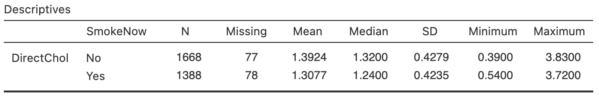

# Numerical summaries: quantitative data {#NumericalQuant}


```{r echo=FALSE}
library(NHANES)
```


```{block2, type="rmdobjectives"}
So far,
you have learnt to
ask a RQ, 
identify different ways of obtaining data,
design the study,
collect the data
describe the data,
and graphically summarise data.

**In this chapter**,
you will learn to numerically describe *quantitative* data.
Both quantitative and qualitative *data*
are described numerically in *quantitative research*.
You will learn to:

* numerically summarise quantitative data using the appropriate statistics.
* describe quantitative data by average, variation, shape and unusual features.

```


```{r echo=FALSE, fig.cap="", fig.align="center", fig.width=3, out.width="35%"}
SixSteps(4, "Numerical summary (quant. data)")
```


## Introduction {#Chap13-Intro}

In the last chapter
(Sect. \@ref(NHANESGraphs)),
this RQ was posed:

> Among Americans,
> is the average 
> direct HDL cholesterol 
> different for current smokers and non-smokers?

Graphs were used to understand the data
in Sect. \@ref(NHANESGraphs),
where
information contained in the graphs was given.
In some cases,
the features of the data displayed in the graph can be described *numerically*.
That is the purpose of this chapter:
to learn how to summarise *quantitative* data numerically.


<!-- Text wrap from: https://stackoverflow.com/questions/43551312/wrap-text-around-plots-in-markdown -->
<!-- Trick from: https://blog.earo.me/2019/10/26/reduce-frictions-rmd/ -->
`r if (knitr::is_latex_output()) '<!--'`
```{r, echo=FALSE, out.width= "30%", out.extra='style="float:right; padding:10px"'}
include_graphics("Illustrations/hamburger-2253349_640.jpg")
```
`r if (knitr::is_latex_output()) '-->'`


```{example DescribeQuantDataHDL, name="Describing quantitative data"}
For the RQ above,
understanding the response variable
(direct HDL cholesterol values) is important;
a histogram is useful
(Fig. \@ref(fig:NHANESdirectHDLHisto)).

What does the histogram tell us?

* **Average**: The average value is about 1.5 mmol/L. 
* **Variation**: The values range from about 0.5 to 3 mmol/L, but with some larger values (that are hard to see on the histogram).
* **Shape**: The [distribution](#GraphsOneQuant) is slightly skewed right.
* **Outliers**: Some large outliers are present (that are hard to see on the histogram).

Describing some of these features more precisely, with *numbers*, can be helpful.
```


```{r NHANESdirectHDLHisto, echo=FALSE, fig.cap="The histogram of the direct HDL cholesterol from the NHANES study", fig.align="center", fig.width=5, fig.height=3.5}
hist(NHANES$DirectChol,
	xlab = "Direct HDL cholesterol (mmol/L)",
	ylab = "Frequency",
	las = 1,
	ylim = c(0, 2500),
	xlim = c(0, 4.5),
	main = "Distribution of direct HDL cholesterol\nin the NHANES data",
	breaks = seq(0, 4.5, by = 0.25),
	col = plot.colour)
box()
```


A number that describes a feature of a *population* 
is called a 
[*parameter*](#StatisticsAndParameters).\index{parameter}
The values of parameters are usually unknown.

In contrast, a number that describes a feature of a *sample* 
is called a 
[*statistic*](#StatisticsAndParameters).\index{statistic}
That is:

* **S**amples are numerically described by [**s**tatistics](#StatisticsAndParameters);\index{statistic}\index{sample}
* **P**opulations are numerically described by [**p**arameters](#StatisticsAndParameters).\index{parameter}\index{population}


```{definition Parameter, name="Parameter"}
A [**parameter**](#StatisticsAndParameters) 
is a number describing some feature of a population.
```


```{definition Statistic, name="Statistic"}
A [**statistic**](#StatisticsAndParameters)
is a number describing some feature of a sample
(to estimate a population *parameter*).
```


```{block2, type="rmdimportant"}
The RQ identifies the population, 
but in practice a sample is studied.
*Statistics* are estimates of *parameters*,
and the value of the *statistic* is not
the same for every possible *sample*.
```


## Computing the average value {#ComputeAverage}

<!-- Text wrap from: https://stackoverflow.com/questions/43551312/wrap-text-around-plots-in-markdown -->
<!-- Trick from: https://blog.earo.me/2019/10/26/reduce-frictions-rmd/ -->
`r if (knitr::is_latex_output()) '<!--'`
```{r, echo=FALSE, out.width= "10%", out.extra='style="float:left; padding:10px"'}
include_graphics("Pics/iconmonstr-weather-109-240.png")
```
`r if (knitr::is_latex_output()) '-->'`

The average (or *location*, or *centre*, or *typical value*) for
*quantitative sample data* can be described 
in many ways;
the two most common ways are:

* [the **sample mean** (or *sample arithmetic mean*)](#Mean), which estimate the population mean; and
* [the **sample median**](#Median), which estimates the population median.

In both cases,
the population [parameter](#StatisticsAndParameters) is 
*estimated* by a sample [statistic](#StatisticsAndParameters).
Understanding 
[whether to use the mean or median is important](#CompareMeanMedian).


```{block2, type="rmdnote"}
The word 'average' can refer to either mean or median (or other measures of centre too).
Use the precise terms 'mean' or 'median', rather than 'average', when necessary!
```


```{r echo=FALSE}
MR2 <- read.csv("./Data/138110A.csv") # https://water-monitoring.information.qld.gov.au/

MR2$Month <- as.numeric(substr(MR2$Date.and.time, 4, 5))

Mn <- aggregate(MR2$Mean, 
                by = list(MR2$Month), 
		FUN = "mean", 
		na.rm = TRUE, 
		simplify = TRUE)
Mdn <- aggregate(MR2$Mean, 
                 by = list(MR2$Month), 
		 FUN = "median", 
		 na.rm = TRUE, 
		 simplify = TRUE)

MRsummary <- data.frame(Month = month.abb, 
                        "Mean" = Mn[, 2], 
			"Median" = Mdn[, 2])
```


<!-- Text wrap from: https://stackoverflow.com/questions/43551312/wrap-text-around-plots-in-markdown -->
<!-- Trick from: https://blog.earo.me/2019/10/26/reduce-frictions-rmd/ -->
`r if (knitr::is_latex_output()) '<!--'`
```{r, echo=FALSE, out.width= "25%", out.extra='style="float:right; padding:10px"'}

```
`r if (knitr::is_latex_output()) '-->'`


```{lemma DifferenceAverages, name="Difference between averages"}
Consider the daily river flow volume (called 'streamflow') at the Mary River from 01 October 1959 to 17 January 2019,
summarised by month in Table \@ref(tab:MRtable)
(from [Queensland DNRM](http://watermonitoring.dnrm.qld.gov.au/cgi/webhyd.pl?rsdf_org=138110A&cat=rs&lvl=1&0)).

The 'average' daily streamflow in February could be quoted using either the mean or the median;
but the two give *very* different values for the 'average':

* the *mean* daily flow is 1123.2ML.
* the *median* daily flow is 146.1ML.

These two common ways of measuring
the same thing (the 'average' daily streamflow in February) give 
very different answers.
Why?
Which is the best 'average' to use?
To decide,
both measures of average will need to be studied.
```


```{r MRtable, echo=FALSE}
if( knitr::is_latex_output() ) {
  kable(MRsummary,
        format = "latex",
        longtable = FALSE,
        booktabs = TRUE,
        digits = 1,
	linesep = c("", "", "", "\\addlinespace", "", "", "", "\\addlinespace", "", "", "", ""), # Otherwise adds a space after five lines... 
        align = c("r", "r", "r"),
    col.names = c("Month", "Mean", "Median"),
    caption = "The daily streamflow at Mary River (Bellbird Creek), in ML, from 01 October 1959 to 17 January 2019; average for each month"
  ) %>%
  kable_styling(font_size = 10) %>%
  row_spec(0, bold = TRUE)
}
if( knitr::is_html_output() ) {
  out <- kable(MRsummary,
        format = "html",
        longtable = FALSE,
        booktabs = TRUE,
        digits = 1,
        align = c("r", "r", "r"),
        col.names = c("Month", "Mean", "Median"),
        caption = "The daily streamflow at Mary River (Bellbird Creek), in ML, from 01 October 1959 to 17 January 2019; average for each month"
  )
 if ( knitr::is_html_output(excludes = "epub")) {
   kable_styling(out, 
                full_width = FALSE)
  } else {
    out
  }  
}
```


### Computing the average: The mean {#Mean}

The mean of the population is denoted by $\mu$,
and its value is almost always unknown.

Instead, the mean of the population is *estimated* by the mean of the sample,
which is denoted by $\bar{x}$ (an $x$ with a line above it).
In this context,
the unknown [*parameter*](#StatisticsAndParameters) is $\mu$,
and the [*statistic*](#StatisticsAndParameters) is $\bar{x}$.
The sample mean is used to *estimate* the population mean.


:::: {style="display: flex;"}

::: {}
```{block2, type="rmdpronunciation"}
The Greek letter $\mu$ is pronounced 'myoo', as in **mu**sic.

The symbol $\bar{x}$ is pronounced 'ex-bar'.
```
:::

::: {}
```{r, echo=FALSE}
htmltools::tags$video(src ="./Movies/mu.mp4", 
                      width="121", 
                      autoplay="false", 
                      loop="FALSE", 
                      controls="controls", 
                      loop="loop", 
                      style="padding:5px; border: 2px solid gray;")
```
:::

::::


<!-- Text wrap from: https://stackoverflow.com/questions/43551312/wrap-text-around-plots-in-markdown -->
<!-- Trick from: https://blog.earo.me/2019/10/26/reduce-frictions-rmd/ -->
`r if (knitr::is_latex_output()) '<!--'`
```{r, echo=FALSE, out.width= "20%", out.extra='style="float:right; padding:10px"'}

```
`r if (knitr::is_latex_output()) '-->'`

```{example JerseyCows, name="A small data set to work with"}
To demonstrate ideas, 
consider a small data set
for answering this descriptive RQ:

> For mature Jersey cows,
> what is the average percentage butterfat in their milk?

The *population* is 'milk from Jersey cows',
and an estimate of the population mean percentage butterfat is sought.
The population mean is denoted by $\mu$.

Clearly, milk from every Jersey cow cannot be studied;
a *sample* is studied
[@data:hand:handbook; @data:sokal:biometry]:
The unknown population mean is estimated
using the sample mean ($\bar{x}$).
Measurements were taken from milk from 10 cows, in percentages
(Table \@ref(tab:BFatData)).
```


```{r BFatData, echo=FALSE}
BFat <- c(4.8, 6.5, 5.2, 4.5, 5.2, 5.7, 5.4, 4.8, 5.2, 5.2)
BFat <- array( BFat, 
               dim = c(2, 5))


if( knitr::is_latex_output() ) {
  kable(BFat,
        format = "latex",
        longtable = FALSE,
        booktabs = TRUE,
        caption = "The butterfat percentage from a sample of milk from 10 Jersey cows") %>%
  add_header_above(header = c("Butterfat percentages" = 5), 
                   bold = TRUE, 
		   align = "c") %>%
  kable_styling(font_size = 10)
}

if( knitr::is_html_output() ) {
  out <- kable(BFat,
               format = "html",
               longtable = FALSE,
               col.names = rep(" ", 5),
               booktabs = TRUE,
               caption = "The butterfat percentage from a sample of milk from 10 Jersey cows")
 if ( knitr::is_html_output(excludes = "epub")) {
   add_header_above(out, header = c("Butterfat percentages" = 5), 
                         bold = TRUE, 
		         align = "c")
  } else {
    out
  }   
}
```


The *sample mean* is what people usually think of as the 'average'.
The sample mean is actually the 'balance point' of the
`r if (knitr::is_latex_output()) {
   'observations (Figure \\@ref(fig:BalanceMeansFig)). (The online version has an animation.)'
} else {
   'observations. The animation below shows how the mean acts as the balance point.'
}`
Alternatively,
the mean is the value
such that the positive and negative distances of the observations from the mean add to zero
`r if (knitr::is_latex_output()) {
   '(Fig. \\@ref(fig:PosNegDistMeansFig); again, the online version has an animation.)'
} else {
   ', as shown in the animation below.'
}`
Both of these explanations seem reasonable
for identifying the 'average' of the data.


```{r echo=FALSE, animation.hook="gifski", cache=TRUE, interval=0.25, progress=TRUE, dev=if (is_latex_output()){"png"}else{"pdf"}}
BalanceMean <- function(locate.fulcrum, numberImages, iteration){
  # Parameters
  
  #locate.fulcrum <- 5
  h.fulcrum <- 0.5  # Height of fulcrum
  w.fulcrum <- 0.25   # Width of fulcrum, to *one* side. Total width is twice this
  
  
  # Data
  milk <- c(4.8, 6.5, 5.2, 4.5, 5.2, 5.7, 5.4, 4.8, 5.2, 5.2) 
  mean.x <- mean(milk)
  
  
  # Ruler details
  extra <- 0.05
  l.ruler <- max(milk) - min(milk) + 2 * extra   # The length of the ruler
  min.ruler <- min(milk) - extra
  max.ruler <- max(milk) + extra
  h.ruler <- 0.05    # The height of the ruler
  
  
  # Create matrix
  Pos <- array( dim = c(4 + 5*length(unique(milk)), 2) )
  
  ## Ruler: polygon in order (1, 2, 3, 4, 1)
  Pos[1, ] <- c( min.ruler, 0)
  Pos[2, ] <- c( min.ruler, h.ruler)
  Pos[3, ] <- c( max.ruler, h.ruler)
  Pos[4, ] <- c( max.ruler, 0)
 
  
  ## Position the data on top of ruler 
  data.ht <- 0.06
  data.width <- 0.02
  data.table <- table(milk)
  
  data.counter <- array( 0, dim=length(data.table) )
  
  base.counter <- 4
  for (i in (1:length(data.table))){
    
    x <- as.numeric(names(data.table)[i])
    Pos[base.counter + 1, ] <- c(x - data.width, h.ruler  )
    Pos[base.counter + 2, ] <- c(x - data.width, h.ruler + data.table[i]*data.ht)
    Pos[base.counter + 3, ] <- c(x + data.width, h.ruler + data.table[i]*data.ht)
    Pos[base.counter + 4, ] <- c(x + data.width, h.ruler)
    Pos[base.counter + 5, ] <- Pos[base.counter + 1, ]
    
    base.counter <- base.counter + 5
  }
  
  levelPos <- Pos
  
  
  ## Rotate ruler
  if ( locate.fulcrum == mean.x ) {
    theta=0
  } 
  if ( locate.fulcrum > mean.x ) {
    theta <- atan( h.fulcrum / (min.ruler - locate.fulcrum) )
  }
  if ( locate.fulcrum < mean.x ) {
    theta <- atan( h.fulcrum / (max.ruler - locate.fulcrum) )
  }
  
  RotateMatrix <- function(X, angle, locate.fulcrum = locate.fulcrum){
    RM <- matrix( c( cos(angle), sin(angle), -sin(angle), cos(angle)),
                  nrow = 2,
                  byrow = TRUE)
    
    cent <- c( locate.fulcrum, 0 )
    # Centre matrix
    X[, 1] <- X[, 1] - cent[1]
    X[, 2] <- X[, 2] - cent[2]
    
    newMat <- RM %*% t( as.matrix(X) )
    newMat <- t(newMat)
    newMat[, 1] <- newMat[, 1] + cent[1]
    newMat[, 2] <- newMat[, 2] + cent[2]
    newMat
  }
  Pos <- RotateMatrix(Pos, theta, locate.fulcrum=locate.fulcrum)
  
  ## Translate ruler higher
  if ( locate.fulcrum == mean.x ){
    Pos[, 2] <- Pos[, 2] + h.fulcrum
  }
  if ( locate.fulcrum > mean.x ){
    
    Pos[, 2] <- Pos[, 2] - Pos[1, 2]
    horizontal.shift <- Pos[1,1] - min.ruler
    Pos[, 1] <- Pos[, 1] - horizontal.shift
  }
  if ( locate.fulcrum < mean.x ){
    Pos[, 2] <- Pos[, 2] - Pos[4, 2]
    
    horizontal.shift <- Pos[4, 1] - max.ruler
    Pos[, 1] <- Pos[, 1] - horizontal.shift
  }  
  
  # Canvas
  plot( c(4, 7), c(-0.75, 1.2),
        type = "n",
        asp = 1,
        mar = c(2, 2, 2, 1) + 0.1,
        axes = FALSE,
        main = "Trying to find the balance point...",
        xlab = "",
        ylab = "")
  
  
  # Draw ground
  abline( h = 0, 
          col = "darkgrey")
  
  
  # Draw ruler
  polygon( Pos[1:4, 1], Pos[1:4, 2], 
           col = "lightblue")
  
  
  # Draw data
  base <- 4
  for (i in 1:length(data.table)){
    polygon( Pos[(1:5) + base, 1], 
             Pos[(1:5) + base, 2], 
	     col = grey(0.4))
    
    base <- base + 5
  }
  
  # Draw "number line"
  xLineLabs <- seq( min(milk), max(milk), by = 0.5)
  segments( x0 = xLineLabs,
            y0 = 0,
            y1 = -0.05 * h.fulcrum,
            col = grey(0.2) )
  text(x = xLineLabs,
       y = -0.05 * h.fulcrum,
       labels = xLineLabs,
       cex = 0.75,
       pos = 1,
       col = grey(0.2))
  
  # Labels bars of data
  plotDataPlaces <- seq(6, dim(Pos)[1], by = 5)
  text( x = Pos[plotDataPlaces, 1] + data.width,
        y = Pos[plotDataPlaces, 2] + data.ht,
        labels = names(data.table),
        srt = -180*theta/pi,
        cex = 0.75,
        col = grey(0.2))
  
  # Draw fulcrum
  polygon( c(-w.fulcrum, 0, w.fulcrum, -w.fulcrum) + locate.fulcrum,
           c(0, h.fulcrum, 0, 0),
           col = plot.colour)
  text(locate.fulcrum, -0.2, 
       sprintf("%.3f", locate.fulcrum),
       pos=1)
  
  
  # Draw fulcrum pivot
  lines( c( locate.fulcrum, locate.fulcrum),
         c(-0.05 * h.fulcrum, h.fulcrum),
         col = grey(0.3))
  points(locate.fulcrum, h.fulcrum, 
         pch = 19, 
	 cex = 0.75)
  
  
  # Draw invisible dots.
  # Without this, the final image gets transformed straight to the beginning again....
  bit <- 0.1
  delta <- (7-4 - 2*bit)/numberImages # From the initial plots call; the size of the canvs is x-direction
  x0 <- 4 + bit                # The left-most point
  ylow <- -1                   # From initial plot call
  xplot <- x0 * iteration * delta
  points( xplot, ylow, 
          col = "white")
    
  invisible(Pos)
}


if (knitr::is_html_output()){
    FL <- c( seq(5.0, 5.5, by = 0.025), 
             seq(5.5, 5.2, by =-0.025),
             seq(5.2, 5.3, by = 0.025),
             rep(5.25, 25) )
    for (i in 1:length(FL)){ 
      BalanceMean( FL[i], 
                   numberImages = length(FL), 
                   iteration = i )
    }
  }
```


```{r BalanceMeansFig, echo=FALSE, fig.align="center", fig.width=4.5, fig.cap="The mean is the balance point of the data" }
if (knitr::is_latex_output()){
  FL <- c(   seq(5, 5.5, by = 0.025), 
             seq(5.5, 5.2, by = -0.025),
             seq(5.2, 5.3, by = 0.025),
             rep(5.25, 10) )
    BalanceMean( FL[49], 
                 numberImages = length(FL),
                 iteration = length(FL) )
}
```


```{r echo=FALSE, animation.hook="gifski", cache=TRUE, interval=0.20, dev=if (is_latex_output()){"png"}else{"pdf"}}
FindMean <- function(locate.x = 5.25, numberImages, iteration){
  
  # Data
  milk <- c(4.8, 6.5, 5.2, 4.5, 5.2, 5.7, 5.4, 4.8, 5.2, 5.2) 
  mean.x <- mean(milk)
  data.table <- table(milk)
  jump <- jump.extra <- 0.18
  
  
  # Parameters
  extra <- 0.05
  l.ruler <- max(milk) - min(milk) + 2 * extra   # The length of the ruler
  min.ruler <- min(milk) - extra
  max.ruler <- max(milk)  + extra
  h.ruler <- 0.05    # The height of the ruler
  
  
  # Create matrix
  Pos <- array( dim = c(4 + 5 * length(unique(milk)), 2) )
  
  ## Ruler: polygon in order (1, 2, 3, 4, 1)
  Pos[1, ] <- c( min.ruler, 0)
  Pos[2, ] <- c( min.ruler, h.ruler)
  Pos[3, ] <- c( max.ruler, h.ruler)
  Pos[4, ] <- c( max.ruler, 0)
  
    
  # Canvas
  plot( c(4, 8), c(-0.1, 1.5),
        type = "n",
        mar = c(4, 1, 3, 1) + 0.1,
        asp = 1,
        axes = FALSE,
        main = "Trying to find the mean:\n where the sum is zero",
        xlab = "",
        ylab = "")
  
  # Draw ruler
  polygon( Pos[1:4, 1], 
           Pos[1:4, 2], 
	   col = "lightblue")
  
  
  # Draw data
  jump <- jump.extra <- 0.18
  for (i in 1:length(milk)){
    points( sort(milk)[i], jump, 
            pch = 19)
    
    # The arrows
    arrows( locate.x, jump, sort(milk)[i], jump,
            length = 0.0,
            col = ifelse( locate.x - sort(milk)[i] > 0, "red", "green4"),
            lwd = 2,
            angle = 15)
    
    # The distances
    text( 7.5, jump, 
          sprintf("%.2f", round(sort(milk)[i] - locate.x, 2)),
          col = ifelse( locate.x - sort(milk)[i] > 0, "red", "green4"),
          adj = 1,
          cex = 1)
    
    jump <- jump + jump.extra
    
  }
  
  
  # Highlight the mean/mean guess
  abline(v = locate.x, 
         col = "grey")
  text(locate.x, -0.4, 
       sprintf("%.2f", locate.x),
       cex = 1)
  
  
  # The sum  
  segments(  x0 = 7.1, 
             y0 = 0, 
	     x1 = 7.6)
  text( 7.5, -0.4, 
        sprintf("%.2f", round( sum(sort(milk) - locate.x), 2)),
        adj = 1,
        cex = 0.95)
  text( 7.65, 
        jump + jump.extra, "Distance",
        adj = 1,
        cex = 0.95)
  text( 7.5, -0.2, 
        "Sum:",
        adj = 1,
        cex = 1.1)
  
  # Shade summing area
  polygon ( c(7, 7, 7.8, 7.8, 7),
            c(-0.7, 2.3, 2.3, -0.75, -0.75),
            border = NA,
            col = mycol <- rgb(240, 240, 240, max = 255, alpha = 100))
  
  base <- 4
  for (i in 1:length(data.table)){
    polygon( Pos[(1:5)+base, 1], Pos[(1:5)+base, 2], col=grey(0.4))
    
    base <- base + 5
  }
  
  # Draw "number line"
  xLineLabs <- seq( min(milk), max(milk), by = 0.5)
  segments( x0 = xLineLabs,
            y0 = 0,
            y1 = -0.05,
            col = "black")
  text(x = xLineLabs,
       y = -0.05,
       labels = xLineLabs,
       cex = 0.75,
       pos = 1,
       col = "black")

  
  # Draw invisible dots.
  # Without this, the final image gets transformed straight to teh beginning again....
  bit <- 0.1
  delta <- (8-4 - 2 * bit)/numberImages # From the initial plots call; the size of the canvs is x-direction
  x0 <- 4 + bit                # The left-most point
  ylow <- -1                 # From initial plot call
  xplot <- x0 * iteration * delta
  points( xplot, ylow, 
          col = "white")
}


meanCandidates <- c( seq(5, 5.5, by = 0.05),
                     seq(5.5, 5.0, by = -0.05),
                     seq(5.0, 5.25, by = 0.025),
                     rep(5.25, 20))

if (knitr::is_html_output()){
    for (i in 1:length(meanCandidates)){
      FindMean( meanCandidates[i], 
                numberImages = length(meanCandidates), i)
    }
    
  }
```


```{r PosNegDistMeansFig, echo=FALSE, fig.align="center", fig.width=4.5, fig.cap="The mean is the value such that the positive and negative distances sum to zero" }
if (knitr::is_latex_output()){
  FindMean( meanCandidates[43], 
            numberImages = length(meanCandidates), 43 )
}
```


```{definition, Mean, name="Mean"}
The **mean** is one way to measure the 'average' value of quantitative data.
The *arithmetic mean* can be considered as the 'balance point' of the data,
or the value such that the positive and negative distances from the mean add to zero.
```


To find the *value* of the sample mean:

* *Add* (shown using the symbol $\sum$) all the observations (denoted by $x$); then
* *Divide* by the number of observations (denoted by $n$).

In symbols:
\[
	\bar{x} = \frac{\sum x}{n}.
\]
This means to add up (indicated by $\sum$) the observations (denoted by $x$),
then divide by the size of the sample (denoted by $n$).


<!-- Text wrap from: https://stackoverflow.com/questions/43551312/wrap-text-around-plots-in-markdown -->
<!-- Trick from: https://blog.earo.me/2019/10/26/reduce-frictions-rmd/ -->
`r if (knitr::is_latex_output()) '<!--'`
```{r, echo=FALSE, out.width= "20%", out.extra='style="float:right; padding:10px"'}

```
`r if (knitr::is_latex_output()) '-->'`

```{example, ComputeMean, name="Computing a sample mean"}
For data for the Jersey cow data
(Example \@ref(exm:JerseyCows)),
an estimate of the population mean
percentage butterfat is found using the sample information:
sum all $n=10$ observations and divide by $n$:
\begin{align*}
    	\overline{x} &= \frac{\sum x}{n} = \frac{4.8 + 6.5 + \cdots + 5.2}{10}\\
                   &= \frac{52.5}{10}  =  5.25.
\end{align*}
The sample mean, the best estimate of the population mean, is 5.25 *percent*.
```


```{block2, type="rmdtip"}
Usually, 
software (such as jamovi or SPSS) or a calculator (in *Statistics Mode*)
will be used to compute the sample mean.
However,
knowing *how* these quantities are computed is important.
```


```{lemma MeanButterfat, name="Mean"}
For the butterfat data (Table \@ref(tab:BFatData)),
what is the value of $\mu$,
the *population* mean?
```

```{block2, type="fold"}
We do not know!
We know the value of the *sample* mean, but not the *population* mean.
We only have an *estimate* of the value of the population mean.
```


```{lemma MeanEyes, name="Estimating a mean"}
A study of eyes
[@ehlers1970corneal]
aimed to estimate 
the average thickness of eyes affected by glaucoma.
The collected data (in microns) are shown in
Table \@ref(tab:EyesData).
Estimate the population mean corneal thickness.
```

```{r EyesData, echo=FALSE}
Eyes <- c(484, 478, 492, 444, 436, 398, 464, 476)
Eyes <- array(Eyes, 
              dim = c(2,4))


if( knitr::is_latex_output() ) {
  kable(Eyes,
        format = "latex",
        longtable = FALSE,
        booktabs = TRUE,
        caption = "The thickness of the cornea (in microns) in eyes affected by glaucoma") %>%
  add_header_above(header = c("Corneal thickness" = 4), 
                   bold = TRUE, 
		   align = "c") %>%
  kable_styling(font_size = 10)
}

if( knitr::is_html_output() ) {
  out <- kable(Eyes,
               format = "html",
               longtable = FALSE,
               booktabs = TRUE,
               caption = "The thickness of the cornea (in microns) in eyes affected by glaucoma",
               col.names = rep("", 4))
  if ( knitr::is_html_output(excludes = "epub")) {
   add_header_above(out,
                    header = c("Corneal thicknesses" = 4), 
                    bold = TRUE, 
		    align = "c")
  } else {
    out
  }
}
```


```{block2, type="rmdimportant"}   
Software and calculators often produce numerical answers to many decimal places,\index{Rounding}
some of which may not be meaningful or useful.
A useful rule-of-thumb is to 
round to one or two more significant figures than the original data.

For example,
the butterfat data are given to one decimal place.
The *sample mean* weight can be given
to two decimal places:
$\bar{x}=5.25$%.
```


### Computing the average: The median {#Median}

The median is a value separating the larger half of the data from the smaller half of the data.
In a data set with $n$ values,
the median is *ordered* observation number $\displaystyle \frac{n+1}{2}$.
The median is:

* **not** equal to $\displaystyle \frac{n+1}{2}$.
* **not** halfway between the minimum and maximum values in the data.

Most calculators cannot find the median.

```{block2, type="rmdnote"}
The median has no commonly-used symbol.
```

      
      
```{definition, Median, name="Median"}
The **median** is one way to measure the 'average' value of some data.
The *median* is a value such that half the values are larger than the median,
and
half the values are smaller than the median.
```


<!-- Text wrap from: https://stackoverflow.com/questions/43551312/wrap-text-around-plots-in-markdown -->
<!-- Trick from: https://blog.earo.me/2019/10/26/reduce-frictions-rmd/ -->
`r if (knitr::is_latex_output()) '<!--'`
```{r, echo=FALSE, out.width= "20%", out.extra='style="float:right; padding:10px"'}

```
`r if (knitr::is_latex_output()) '-->'`


```{example SampleMedian, name="Find a sample median"}
To find the sample median for the Jersey cow data 
(Example \@ref(exm:JerseyCows)),
first 
arrange the data *in numerical order*
(Table \@ref(tab:JerseyCowsSorted)).
The median separates the larger 5 numbers from the smaller 5 numbers.
With $n=10$ observations, the median is 
the ordered observation located between the fifth and sixth observations
(i.e., at position
$(10 + 1)/2 = 5.5$;
the *median itself is not 5.5*).
So the sample median is between $5.2$ (ordered observation five) 
and $5.2$ (ordered observation six):
the sample median is $5.20$ percent.
```


```{r JerseyCowsSorted, echo=FALSE}
BFat.sort <- sort( c(4.8, 6.5, 5.2, 4.5, 5.2, 5.7, 5.4, 4.8, 5.2, 5.2) )
BFat.sort <- matrix( BFat.sort, 
                     ncol = 5, 
		     byrow = TRUE)

if( knitr::is_latex_output() ) {
  kable(BFat.sort,
        format = "latex",
        longtable = FALSE,
        booktabs = TRUE,
        caption = "The butterfat percentage from a sample of milk from 10 Jersey cows, in increasing order") %>%
        add_header_above(header = c("Butterfat percentages" = 5), 
	                 bold = TRUE,
			 align = "c") %>%
  kable_styling(font_size = 10)
}

if( knitr::is_html_output() ) {
  out <- kable(BFat.sort,
              format = "html",
              longtable = FALSE,
              col.names = rep(" ", 5),
              booktabs = TRUE,
              caption = "The butterfat percentage from a sample of milk from 10 Jersey cows, in increasing order")
  if ( knitr::is_html_output(excludes = "epub")) {
   add_header_above(out,
                    header = c("Butterfat percentages" = 5), 
                    bold = TRUE, 
		    align = "c")
  } else {
    out
  }
  
}
```


```{lemma MedianButterfat, name="Median"}
For the butterfat data (Table \@ref(tab:BFatData)),
what is the *population* median?
```


```{block2, type="fold"}
We do not know!
We know the value of the *sample* median, but not the *population* median.
We only have an *estimate* of the value of the population median.
```

         
```{lemma, ComputeMedians, name="Medians"}
A study of eyes
[@ehlers1970corneal]
aimed to estimate 
the average thickness of eyes affected by glaucoma.

Using the collected data
(Table \@ref(tab:EyesData)),
estimate the population *median* corneal thickness.
What is the population median?
```


```{block2, type="fold"}
With $n = 8$ observations, 
the median is ordered observation number $(8 + 1)/2 = 4.5$, 
halfway between ordered observation numbers 4 and 5. 
After sorting into increasing order, 
the two middle numbers (the 4th and 5th) are
464 and 476. 
The median could be *any* number between 464 and 476, 
but the usual answer would be that the median is $(464 + 476)/2 = 470$. 

The *sample* median is 470 microns; 
the value of the *population* median remains unknown.
```


To clarify:

* If the sample size $n$ is *odd*, 
  the median is the middle number when the observations are ordered. 
* If the sample size $n$ is *even* (such as in Think \@ref(lem:ComputeMedians)), 
  the median is halfway between the two middle numbers,
  when the observations are ordered. 

Some software uses different rules when $n$ is even.


### Which average to use? {#CompareMeanMedian}

```{r echo=FALSE}
LessThanMean <- sum(MR2$Mean[MR2$Month == 2] < 1123.2, na.rm = TRUE) / sum( !is.na(MR2$Mean[MR2$Month == 2]))
```

Consider again estimating the average daily streamflow at the Mary River (Bellbird Creek)
during February
(Table \@ref(tab:MRtable)):
The *mean* daily streamflow is `r round(MRsummary[2, 2], 1)`ML,
and the *median* daily streamflow is `r round(MRsummary[2, 3], 1)`ML.
Which is the 'best' average to use?

A dot chart of the daily stream flow
(Fig. \@ref(fig:DailyStreamflow)\)
shows that the data are *very* highly right-skewed,
with many *very* large outliers:
the maximum value is
`r sprintf( "%.1f", max(MR2$Mean[MR2$Month == 2], na.rm = TRUE))`ML,
more than one hundred times larger than the mean of `r round(MRsummary[2, 2], 1)`ML).
In fact,
about 
`r round(LessThanMean * 100)`% of the observations are *less* than the mean.
In contrast,
about 50% the values are less than the median (by definition).
For these data,
the mean is hardly a *central* value...


```{r DailyStreamflow, echo=FALSE, fig.cap="A dot plot of the daily streamflow at Mary River from 1960 to 2017, for February. The vertical grey line is the mean value. Many large outliers exist, so the data near zero are all squashed together", fig.align="center", fig.width=5, fig.height=3}
par(mfrow = c(1, 1))
set.seed(183763286)
stripchart(MR2$Mean[MR2$Month == 2], 
           main = "Dot plot of daily streamflow at\nMary Creek (Bell River) in Feb.",
           xlab = "Daily streamflow (in ML)",
           sub = "(From 01 October 1959 to 17 January 2019)",
           method = "jitter", 
           pch = 19, 
           jitter = 0.75, 
           ylim = c(0.2, 1.8), 
           cex = 0.5)
abline( v = Mn[2,2], 
        col = "grey")

```


The streamflow data are very highly skewed (to the right),
which is important and relevant:

* *Means* are best used for approximately symmetric data:
  the mean is influenced by outliers and skewness.
* *Medians* are best used for data that are skewed or contain outliers:
  the median is not influenced by outliers and skewness.

Means tend to be too large if the data contains large outliers or severe right skewness,
and too small if the data contains small outliers or severe left skewness.

For the Mary River data,
the large outliers---and the fact that they are so *extreme* and abundant---result in the
mean being substantially influenced by the outliers,
which explains why the mean is much larger than the median.
*The median is the better measure of average for these data.*

The mean is generally used if possible
(for practical and mathematical reasons),
and is the most commonly-used measure of location.
However,
the mean *is* influenced by outliers and skewness;
the median *is not* influenced by outliers and skewness.
The mean and median are similar in approximately symmetric distributions.
Sometimes, quoting *both* the mean and the median may be appropriate.


```{lemma WhichAverage, name="Which average to use"}
An engineering study [@data:hald:statistical] 
was studying a new building material
to determine the average permeability time.

The time (in seconds) taken for water to permeate $n=81$ pieces of material.
Using a histogram of the data
(Fig. \@ref(fig:Permeability)),
estimate the value of the population mean and median.
Which would be best to use
(for example, to quote an average permeability time on a specification sheet)?  
```


```{r Permeability, echo=FALSE, fig.cap="A histogram of the permeability of a type of building material", fig.align="center", fig.width=5, fig.height=3.5}
library(GLMsData)
data(perm)

hist(perm$Perm, 
     xlab = "Permeability (in seconds)",
     ylab = "Number of obs.",
     las = 1, 
     xlim = c(0, 180), 
     breaks=seq(0, 180, by = 10), 
     axes = FALSE,
     col = plot.colour, 
     main = "Permeability of building material")
axis(side = 1, 
     at = seq(0, 180, by = 20), 
     las = 2)
axis(side = 2, 
     las = 1)
```


## Computing the variation

<!-- Text wrap from: https://stackoverflow.com/questions/43551312/wrap-text-around-plots-in-markdown -->
<!-- Trick from: https://blog.earo.me/2019/10/26/reduce-frictions-rmd/ -->
`r if (knitr::is_latex_output()) '<!--'`
```{r, echo=FALSE, out.width= "10%", out.extra='style="float:left; padding:10px"'}
include_graphics("Pics/iconmonstr-ruler-21-240.png")
```
`r if (knitr::is_latex_output()) '-->'`

For quantitative data,
the amount of *variation* 
in the bulk of the data should be described.
Many ways exist to measure the variation in a data set,
including:

* The [**range**](#VariationRange): very simple and simplistic, so not often used.
* The [**standard deviation**](#VariationStdDev): commonly used.
* The [**interquartile range (or IQR)**](#VariationIQR): commonly used.
* [**Percentiles**](#VariationPercentiles): sometimes used.

As always,
a value computed from the *sample*
(the [statistic](#StatisticsAndParameters))
estimates the unknown value in the *population*
(the [parameter](#StatisticsAndParameters)).
[Knowing which measure of variation to use](#CompareVariations) is important.


      


### Computing the variation: Range {#VariationRange}

The range is the simplest measure of variation.

```{definition, Range, name="Range"}
The range is the maximum value *minus* the minimum value.
```

The range is not often used,
because only the two extreme observations are used,
so it is highly influenced by outliers.
Sometimes,
the *range* may be given by stating both the maximum and the minimum value in the data
instead of giving the *difference* between the maximum and the minimum values.
The range is measured in the same measurement units as the data. 


```{example RangeEG, name="The range"}
For Jersey cow data
(Example \@ref(exm:JerseyCows)),
the range is:
\[
		\text{Range} = \overbrace{6.5}^{\text{largest}} - \overbrace{4.5}^{\text{smallest}} = 2.0 \text{ percent}.
\]   
So the sample median percentage butterfat is 5.20 percent, with a *range* of 2.00 percent.

```


### Computing the variation: Standard deviation {#VariationStdDev}

The population standard deviation is denoted by $\sigma$ 
('sigma', the [parameter](#StatisticsAndParameters))
and is estimated by the sample standard deviation $s$ 
(the [statistic](#StatisticsAndParameters)).
The standard deviation is the most commonly-used measure of variation,
but is complicated to compute manually (but you don't need to do it manually!).
The *standard deviation* is
(roughly) the mean distance that the observations are away from the mean.
This seems like a reasonable way to measure the amount of variation in some data.

:::: {style="display: flex;"}

::: {}
```{block2, type="rmdpronunciation"}
The Greek letter $\sigma$ ('sigma') is pronounced as expected: 'sigma'.
```

:::

::: {}
```{r, echo=FALSE}
htmltools::tags$video(src ="./Movies/sigma.mp4", 
                      width="121", 
                      autoplay="false", 
                      loop="FALSE", 
                      controls="controls", 
                      loop="loop", 
                      style="padding:5px; border: 2px solid gray;")
```
:::

::::


The sample standard deviation $s$ is mostly found using 
computer software (e.g., jamovi or SPSS)
or a calculator (in *Statistics Mode*).


```{definition, StandardDeviation, name="Standard deviation"}
The *standard deviation* is, approximately, the average distance that observations are away from the mean.
```


**You do not have to use the formula** to calculate $s$,
but we will demonstrate for those who might find it useful to understand 
exactly what $s$ calculates.
The formula is:

\[
	s = \sqrt{ \frac{\sum(x - \bar{x})^2}{n-1} },
\]
where $\bar{x}$ is the sample mean, 
$x$ represents the data values,
and $n$ is the sample size.
To use the formula,
follow these steps:

* Calculate the sample mean: $\overline{x}$;
* Calculate the *deviations* of each observation $x$ from the mean: $x-\bar{x}$;
* Square these deviations (to make them all *positive* values): $(x-\bar{x})^2$;
* Add these values: $\sum(x-\bar{x})^2$;
* Divide the answer by $n-1$;
* Take the (positive) square root of the answer.


```{block2, type="rmdimportant"}
**You do not need to use the formula!**
You **must** know how to use software or a calculator to find the standard deviation.
```      


<!-- Text wrap from: https://stackoverflow.com/questions/43551312/wrap-text-around-plots-in-markdown -->
<!-- Trick from: https://blog.earo.me/2019/10/26/reduce-frictions-rmd/ -->
`r if (knitr::is_latex_output()) '<!--'`
```{r, echo=FALSE, out.width= "20%", out.extra='style="float:right; padding:10px"'}

```
`r if (knitr::is_latex_output()) '-->'`


```{example StdDev, name="Standard deviation"}
For the Jersey cow data
(Example \@ref(exm:JerseyCows)),
the *deviations* of each observation from the mean of $5.25$ can be found
(Fig. \@ref(fig:ShowVar)).
Then 
follow the steps outlined.
**You don't have to do this manually!**
From 
Fig. \@ref(fig:ShowVar),
the sum of the squared distances is 2.7650.
Then,
the sample standard deviation is:

\[ 
   s = \sqrt{\frac{2.765}{10-1}}
     = \sqrt{ 0.3072222} = 0.5542763.
\]
The sample mean percentage butterfat is 5.25 percent, with a sample *standard deviation* of 0.554 percent. 
```


```{r ShowVar, echo=FALSE, fig.cap="The standard deviation is related to the sum of the squared-distances from the mean", fig.align="center",fig.width=5.5}

ShowVar <- function(){
  
  # Data
  milk <- c(4.8, 6.5, 5.2, 4.5, 5.2, 5.7, 5.4, 4.8, 5.2, 5.2) 
  mean.x <- mean(milk)
  data.table <- table(milk)
  locate.x <- mean(milk)
  jump <- jump.extra <- 0.18
  
  # Parameters
  extra <- 0.05
  l.ruler <- max(milk) - min(milk) + 2 * extra   # The length of the ruler
  min.ruler <- min(milk) - extra
  max.ruler <- max(milk)  + extra
  h.ruler <- 0.05    # The height of the ruler
  
  
  # Create matrix
  Pos <- array( dim = c(4 + 5 * length(unique(milk)), 2) )
  
  ## Ruler: polygon in order (1, 2, 3, 4, 1)
  Pos[1, ] <- c( min.ruler, 0)
  Pos[2, ] <- c( min.ruler, h.ruler)
  Pos[3, ] <- c( max.ruler, h.ruler)
  Pos[4, ] <- c( max.ruler, 0)
  
    
  # Canvas
  plot( c(4, 9), c(-0.1, 1.9),
        type = "n",
        asp = 1,
        axes = FALSE,
        main = "The sum of the squared distances\nof each observation from the mean",
        xlab = "",
        ylab = "")
  
  # Draw ruler
  polygon( Pos[1:4, 1], 
           Pos[1:4, 2], 
	   col = "lightblue")
  
    # Draw data
  jump <- jump.extra <- 0.18
  for (i in 1:length(milk)){
    points( sort(milk)[i], jump, 
            pch = 19)
    
    # The arrows
    arrows( locate.x, jump, sort(milk)[i], jump,
            length = 0.0,
            lwd = 2,
            col = ifelse( locate.x - sort(milk)[i] > 0, "red", "green4"),
            angle = 15)
    
    # The distances
    text( 7.5, jump, 
          sprintf("%.4f", (sort(milk)[i] - locate.x)),
          col = ifelse( locate.x - sort(milk)[i] > 0, "red", "green4"),
          adj = 1,
          cex = 0.95)
    
    # The distances^2
    text( 8.5, jump, sprintf("%.4f", (sort(milk)[i] - locate.x)^2),
          adj = 1,
          cex = 0.95)

        jump <- jump + jump.extra
    
  }


  # Highlight the mean/mean guess
  abline(v = locate.x, 
         col = "grey")
  text(locate.x, jump + jump.extra, 
       sprintf("%.2f", locate.x),
       cex = 0.95)
  text(locate.x, jump + 2*jump.extra, 
       "Mean:",
       cex = 0.95)
  

    # The sum  
  segments(  x0 = 7.0, 
             y0 = 0, 
	     x1 = 8.7)
  
  text( 7.5, -0.15, 
        sprintf("%.4f", sum( (sort(milk)- locate.x))),
        adj = 1,
        cex = 0.95)
  text( 7.5, jump+jump.extra, 
        "Dist.",
        adj = 1,
        cex = 0.95)

  text( 8.5, -0.15, 
        sprintf("%.4f",  sum( (sort(milk)- locate.x)^2)),
        adj = 1,
        cex = 0.95)
  text( 8.5, jump+jump.extra, 
        expression((Dist.)^2),
        adj = 1,
        cex = 0.95)
  

  base <- 4
  for (i in 1:length(data.table)){
    polygon( Pos[(1:5)+base, 1], 
             Pos[(1:5)+base, 2], 
	     col = grey(0.4))
    
    base <- base + 5
  }
  
  # Shade dist area
  polygon( c(6.8, 6.8, 8.7, 8.7, 6.8),
           c(-0.3, 2.3, 2.3, -0.3, -0.3),
            border = NA,
            col = mycol <- rgb(240, 240, 240, max = 255, alpha = 100))

    
  # Draw "number line"
  xLineLabs <- seq( min(milk), max(milk), by = 0.5)
  segments( x0 = xLineLabs,
            y0 = 0,
            y1 = -0.05,
            col = "black")
  text(x = xLineLabs,
       y = -0.05,
       labels = xLineLabs,
       cex = 0.75,
       pos = 1,
       col = "black")
}

ShowVar()
```


```{lemma StdDeviations, name="Standard deviations"}
The standard deviation for Dataset A 
in Fig. \@ref(fig:TwoDatasets),
is 2.00.
What do you estimate the standard deviation of Dataset B will be:
*smaller* than 2.00 or *greater* than 2.00?
Why?
```


```{r TwoDatasets, echo=FALSE, fig.width=5, fig.height=3, fig.cap="Dotplots of two sets of data", fig.align="center"}
### DOT CHARTS of two samples with similar mean, range but diff sd

set.seed(100010)

rescale <- function(x, from, to){
  minx <- min(x)
  maxx <- max(x)
  
  slope <- (to - from) / ( maxx - minx )
  intercept <- to - slope*maxx
  
  y <- slope * x + intercept
  y
  
}
len <- 50
tmp1 <- runif(len)
x1 <- rescale(tmp1, -4, 4)

par(mfrow=c(2, 1))

y1.jitter <- jitter(rep(1, length(x1)))

par( mar=c(2,0,2,0) + 0.1)
plot( y = y1.jitter, 
      x = x1, 
      pch = 1,
      ylim = c( 0.95 * min(y1.jitter), 1.05 * max(y1.jitter) ),
      ylab = "",
      xlab = "Observations",
      main = "Data set A",
      axes = FALSE)
axis(side = 1)


tmp2 <- rt((len - 4), 5)
x2 <- c( rescale(tmp2, -1.5, 1.5),  -2.5, 2.5, -4, 4)


y2.jitter <- jitter(rep(1, length(x2)))

par( mar =c (2, 0, 2, 0) + 0.1)
plot( y = y2.jitter, 
      x = x2, 
      pch = 1,
      ylim = c( 0.95 * min(y2.jitter), 1.05 * max(y2.jitter) ),
      ylab = "",
      xlab = "Observations",
      main = "Data set B",
      axes = FALSE)
axis(side = 1)

```


The sample standard deviation is:

* Positive (unless all observations are the same, when it is zero: there is *no* variation);
* Best used for (approximately) symmetric data;
* Usually quoted with the mean;
* The most commonly-used measure of variation;
* Measured in the same units as the data;
* Influenced by *skewness* and outliers, like the mean.


```{lemma StdDeviationsButterfat, name="Standard deviation"}
Consider again the Jersey cow data
(Example \@ref(exm:JerseyCows)).
Using your calculator's Statistics Mode,
find the *population* standard deviation
and the *sample* standard deviation.
```   


```{block, type="fold"}
The *population* standard deviation is unknown.
The best estimate is the *sample* standard deviation: $s=0.554$%.
```


### Computing the variation: IQR {#VariationIQR}

The standard deviation uses the value of $\bar{x}$,
so is affected by skewness like the sample mean.
Another measure of variation that is *not* affected by skewness is the
inter-quartile range, or IQR.
To understand the IQR,
understanding *quartiles* first is important.


```{definition Quartiles, name="Quartiles"}
*Quartiles* to describe the variation and shape of data:

* The first quartile $Q_1$ is a value that
  separates the smallest 25% of observations from the largest 75%.
  The $Q_1$ is like the median of the *smaller* half of the data,
  halfway between the minimum value and the median.
* The second quartile $Q_2$ is a value that
  separates the smallest 50% of observations from the largest 50%.
  (This is the *median*.)
* The third quartile $Q_3$ is a value that
  separates the smallest 75% of observations from the largest 25%.
  The $Q_3$ is like the median of the *larger* half of the data,
  halfway between the median and the maximum value.

```


Quartiles divide the data into four parts
of approximately equal numbers of observations,
and *a boxplot is a picture of the quartiles*.\index{boxplot}
The **inter-quartile range**, or the **IQR**\index{IQR}
is the difference between $Q_3$ and $Q_1$.
The IQR measures the range of the middle 50% of the data,
and is a measure of variation not influenced by outliers.
The IQR is measured in the same measurements units as the data.


```{definition, IQR, name="IQR"}
The *IQR* is the range in which the middle 50% of the data lie;
the difference between the third and the first quartiles.
```


Quartiles were previously
discussed in the context of boxplots
(Sect. \@ref(Boxplot)).
For example,
a boxplot of the egg-krill data 
[@data:Greenacre2016:reporting]
was shown in Example \@ref(exm:KrillData);
the data are repeated in
Table \@ref(tab:KrillDataTable2),
and the boxplot in 
Fig. \@ref(fig:BoxplotKrillTreatment2).


```{r KrillDataTable2, echo=FALSE}
Eggs.T <- c(0, 0, 1, 1, 3, 8, 8, 12, 18, 21, 26, 30, 35, 48, 50)
Eggs.C <- c(0, 0, 0, 0, 1, 1, 1,  2,  2,  3,  8, 16, 20, 26, 31)

KrillEggs2 <- cbind( Eggs.T[1:8], c(Eggs.T[9:15], ""), 
                     Eggs.C[1:8], c(Eggs.T[9:15], "") )

if( knitr::is_latex_output() ) {
  kable( KrillEggs2,
         format = "latex",
         longtable = FALSE,
         booktabs = TRUE,
         align = c("c","c"),
         caption = "The number of eggs laid by krill, for those in a treatment group and for those in a control group") %>%
  add_header_above(header = c("Treatment group " = 2, 
                              " Control group" = 2), 
	           bold = TRUE, 
		   align = "c") %>%
  kable_styling(font_size = 10)
    
}
if( knitr::is_html_output() ) {
  out <- kable( KrillEggs2,
                format = "html",
                longtable = FALSE,
                booktabs = TRUE,
                align = c("c", "c"),
                col.names = rep("", 4),
                caption = "The number of eggs laid by krill, for those in a treatment group and for those in a control group")
  
  if ( knitr::is_html_output(excludes = "epub")) {
    kable_styling(out, full_width = FALSE) %>%
    add_header_above(header = c("Treatment group" = 2, 
                                "Control group" = 2), 
 	             bold = TRUE, 
 		     align = "c")
  } else {
    out
  }
}
```

```{r echo=FALSE}
KrillT.quantiles <- quantile(Eggs.T)
Eggs.C2 <- Eggs.C[ -which.max(Eggs.C)]
KrillC2.quantiles <- quantile(Eggs.C2)
```

```{r BoxplotKrillTreatment2, echo=FALSE, message=FALSE, warning=FALSE, fig.cap="A boxplot for the krill-egg data; the boxplot just for the treatment group", fig.width=5, fig.height=4, fig.align="center"}
Eggs.quantiles <- quantile(Eggs.T)
out <- boxplot( list(Treatment = Eggs.T), 
            main = "A boxplot of the number of\neggs laid by krill: Treatment group",
            las = 1,
            pch = 19,
            col = "white",
            ylim = c(-4, 50),
            xlim = c(0.55, 1.85),
            ylab = "Number of eggs")
abline( h = Eggs.quantiles, 
        col = "grey",
        lty = 2,
        lwd = 1)
bxp(out, 
    las = 1, 
    add = TRUE, 
    boxfill = plot.colour)

text( 1.53, Eggs.quantiles[5], 
      "Max. value", 
      pos = 1, 
      cex = 0.75)
text( 1.53, Eggs.quantiles[4], 
      "75% smaller than this", 
      pos = 3, 
      cex = 0.75)
text( 1.53, Eggs.quantiles[3], 
      "Median", 
      pos = 3, 
      cex = 0.75)
text( 1.53, Eggs.quantiles[2], 
      "25% smaller than this", 
      pos = 3, 
      cex = 0.75)
text( 1.53, Eggs.quantiles[1], 
      "Min. value", 
      pos = 1, 
      cex = 0.75)

text( 0.65, Eggs.quantiles[4], 
      expression(italic(Q)[3]), 
      pos = 3, 
      cex = 0.75)
text( 0.65, Eggs.quantiles[3], 
      expression(italic(Q)[2]), 
      pos = 3, 
      cex = 0.75)
text( 0.65, Eggs.quantiles[2], 
      expression(italic(Q)[1]), 
      pos = 3, 
      cex = 0.75)
```


For the **Treatment** group:

*  75% of the observations are smaller than about `r KrillT.quantiles[4]`,
   and this is represented by the line at the top of the 
   central box.
   This is $Q_3$,
   or the **third quartile**.
*  50% of the observations are smaller than about `r KrillT.quantiles[3]`,
   and this is represented by the line in the centre of the 
   central box.
   This is $Q_2$,
   the **second quartile** or the **median**.
*  25% of the observations are smaller than about `r KrillT.quantiles[2]`,
   and this is represented by the line at the bottom of the 
   central box.
   This is $Q_1$, the **first quartile**.

The IQR is $Q_3 - Q_1$ = $`r KrillT.quantiles[4]` - `r KrillT.quantiles[2]`$,
so that $\text{IQR} = `r KrillT.quantiles[4] - KrillT.quantiles[2]`$.
`r if (knitr::is_latex_output()) {
   'Figure \\@ref(fig:IQRKrill) shows how the IQR is found. (The online version uses an animation.)'
} else {
   'The animation below shows how the IQR is found.'
}`


```{r echo=FALSE, animation.hook="gifski", interval=0.75, cache=TRUE, dev=if (is_latex_output()){"png"}else{"pdf"}}
Eggs.T <- c(0, 0, 1, 1, 3, 8, 8, 12, 18, 21, 26, 30, 35, 48, 50)


# Grab some of the necessary stats
Qs <- quantile(Eggs.T, seq(0, 1, by=0.25)) # See below for better way when there are outliers

left <- 0.75
right <- 1.25
axis.edge <- axis.edge.left <- 0.5
axis.edge.right <- 1.5
angle <- 15
mid <- mean( c(left, axis.edge.left) )
mid.r <- mean( c(right, axis.edge.right) )

# The box is at x = 1, and goes from x = 0.5 to 1.5 on the x-axis.
# See this by following the boxplot()) call with axis(side-1)


if (knitr::is_html_output()) {
  for (i in (1:6)){
    boxplot( Eggs.T, 
             col = plot.colour,
             las = 1,
             main = "Boxplot of krill eggs\n(Treatment group)",
             ylim = c(-3, 60),
             ylab = "Number of eggs")
    if ( i == 2 ){
      arrows(left, Qs[2],
             axis.edge, Qs[2],
             angle = angle,
             lwd = 2)
      text(mid, Qs[2], 
           label = expression( italic(Q)[1]), 
	   pos = 3)
    }
    if (i == 3){
      arrows(left, Qs[4],
             axis.edge, Qs[4],
             angle = angle,
             lwd = 2)
      text(mid, Qs[4], 
           label = expression( italic(Q)[3]), 
	   pos = 3)
    }
    if (i >= 4){
      arrows(left, Qs[2],
             axis.edge, Qs[2],
             angle = angle,
             lwd = 1)
      text(mid, Qs[2], 
           label = expression( italic(Q)[1]), 
	   pos = 3)
      arrows(left, Qs[4],
             axis.edge, Qs[4],
             angle = angle,
             lwd = 1)
      text(mid, Qs[4], 
           label = expression( italic(Q)[3]), 
	   pos = 3)
      
      arrows(mid.r, Qs[4], mid.r, Qs[2],
             lwd = 2,
             angle = angle,
             code = 3) # Arrow at both ends
      text( mid.r, Qs[3], 
            label = "IQR", 
	    pos = 4)
    }
  }
}
```


```{r IQRKrill, echo=FALSE, fig.align="center", fig.width=6, fig.cap="Computing the IQR for the krill Treatment-group data" }
if (knitr::is_latex_output()){
    boxplot( Eggs.T, 
             col = plot.colour,
             las = 1,
             main = "Boxplot of krill eggs\n(Treatment group)",
             ylim = c(-3, 60),
             ylab = "Number of eggs")

      arrows(left, Qs[2],
             axis.edge, Qs[2],
             angle = angle,
             lwd = 1)
      text(mid, Qs[2], 
           label = expression( italic(Q)[1]), 
	   pos = 3)
      arrows(left, Qs[4],
             axis.edge, Qs[4],
             angle = angle,
             lwd = 1)
      text(mid, Qs[4], 
           label = expression( italic(Q)[3]), 
	   pos = 3)
      
      arrows(mid.r, Qs[4], mid.r, Qs[2],
             lwd = 2,
             angle = angle,
             code = 3) # Arrow at both ends
      text( mid.r, Qs[3], 
            label = "IQR", 
	    pos = 4)

  }
```


```{r echo=FALSE}
Age.quantiles <- quantile(NHANES$Age)
```


```{example BoxplotNHANES, name="Boxplots"}
Consider the NHANES data 
[@data:NHANES3:Data; @data:NHANES3; @data:NHANES:Rpackage].
```


The boxplot for the age of respondents in the NHANES data set
is
`r if (knitr::is_latex_output()) {
   'shown in Fig. \\@ref(fig:IQRAge). (The online version has an animation.)'
} else {
   'as shown below.'
}`
For these data:

* No outliers are identified.
* The oldest person is `r Age.quantiles[5]`.
* About 75% of the subjects are aged less than about `r Age.quantiles[4]` ($Q_3$):
   	the third  quartile $Q_3 = `r Age.quantiles[4]`$,
	the median of the *largest half* of the data.
* About 50% of the subjects are aged less than about `r Age.quantiles[3]`  ($Q_2$, the median):
   	the second quartile $Q_2 = `r Age.quantiles[3]`$,
   	the median of the data set.
* About 25% of the subjects are aged less than about `r Age.quantiles[2]`  ($Q_1$):
	the first quartile $Q_1 = `r Age.quantiles[2]`$,
  the median of the *smallest half* of the data.
* The youngest subject is aged `r Age.quantiles[1]`.
   
Then, $Q_3 = `r Age.quantiles[4]`$ and $Q_1 = `r Age.quantiles[2]`$,
so the $\text{IQR} = Q_3 - Q_1 = `r Age.quantiles[4]` - `r Age.quantiles[2]` 
= `r (Age.quantiles[4] - Age.quantiles[2])`$ years.
The middle 50% of the participants have an age range of 37 years.


```{r echo=FALSE}
Age.quantiles <- quantile(NHANES$Age)
#  0%  25%  50%  75% 100% 
#   0   18   36   54   80 
#HDL.quantiles <- quantile(NHANES$DirectChol, na.rm = TRUE)
#  0%  25%  50%  75% 100% 
#0.52 1.06 1.29 1.58 3.44 
```
	 


```{r IQRAgeMovie, echo=FALSE, animation.hook="gifski", cache=TRUE, interval=0.75, dev=if (is_latex_output()){"png"}else{"pdf"}}
library(NHANES)
data(NHANES)

# Grab some of the necessary stats
Qs <- quantile(NHANES$Age, seq(0, 1, by=0.25)) # See below for better way when there are outliers
left <- 0.75
right <- 1.25
axis.edge <- axis.edge.left <- 0.5
axis.edge.right <- 1.5
angle <- 15
mid <- mean( c(left, axis.edge.left) )
mid.r <- mean( c(right, axis.edge.right) )

# The box is at x=1, and goes from x=0.5 to 1.5 on the x-axis.
# See this by following the boxplot()) call with axis(side-1)


if (knitr::is_html_output()){
  for (i in (1:6)){
    boxplot( NHANES$Age, 
             col = plot.colour,
             las = 1,
             main = "Boxplot of Age\n(NHANES data)",
             ylim = c(0, 85),
             ylab = "Age (in years)")
    if ( i == 2 ){
      arrows(left, Qs[2],
             axis.edge, Qs[2],
             angle = angle,
             lwd = 2)
      text(mid, Qs[2], 
           label = expression( italic(Q)[1]), 
	   pos = 3)
      text(mid, Qs[2], 
           label = paste("=",as.character(Qs[2])), 
	   pos = 1)
    }
    if (i == 3){
      arrows(left, Qs[4],
             axis.edge, Qs[4],
             angle = angle,
             lwd = 2)
      text(mid, Qs[4], 
           label = expression( italic(Q)[3]), 
	   pos = 3)
      text(mid, Qs[4], 
           label = paste("=", as.character(Qs[4])), 
	   pos = 1)
    }
    if (i >= 4){
      arrows(left, Qs[2],
             axis.edge, Qs[2],
             angle = angle,
             lwd = 1)
      text(mid, Qs[2], 
           label = expression( italic(Q)[1]), 
	   pos = 3)
      text(mid, Qs[2], 
           label = paste("=",as.character(Qs[2])), 
	   pos = 1)
      arrows(left, Qs[4],
             axis.edge, Qs[4],
             angle = angle,
             lwd = 1)
      text(mid, Qs[4], 
           label = expression( italic(Q)[3]), 
	   pos = 3)
      text(mid, Qs[4], 
           label = paste("=", as.character(Qs[4])), 
	   pos = 1)
      
      arrows(mid.r, Qs[4], mid.r, Qs[2],
             lwd = 2,
             angle = angle,
             code = 3) # Arrow at both ends
      text( mid.r, Qs[3], 
            label = "IQR", 
	    pos = 4)
    }
  }
}
```


```{r  IQRAge, echo=FALSE, fig.align="center", fig.width=6, fig.cap="Computing the IQR for the age in the NHANES data set" }
if (knitr::is_latex_output()){
    boxplot( NHANES$Age, 
             col = plot.colour,
             las = 1,
             main = "Boxplot of Age\n(NHANES data)",
             ylim = c(0, 85),
             ylab = "Age (in years)")

      arrows(left, Qs[2],
             axis.edge, Qs[2],
             angle = angle,
             lwd = 1)
      text(mid, Qs[2], 
           label = expression( italic(Q)[1]), 
	   pos = 3)
      text(mid, Qs[2], 
           label = paste("=", as.character(Qs[2])), 
	   pos = 1)
      arrows(left, Qs[4],
             axis.edge, Qs[4],
             angle = angle,
             lwd = 1)
      text(mid, Qs[4], 
           label = expression( italic(Q)[3]), 
	   pos = 3)
      text(mid, Qs[4], 
           label = paste("=", as.character(Qs[4])), 
	   pos = 1)
      
      arrows(mid.r, Qs[4], mid.r, Qs[2],
             lwd = 2,
             angle = angle,
             code = 3) # Arrow at both ends
      text( mid.r, Qs[3], 
            label = "IQR", 
	    pos = 4)
  
}
```


### Computing the variation: Percentiles {#VariationPercentiles}

*Percentiles* can be computed,
which are similar to quantiles;
for example:

* The 12th percentile is a value
  separating the smallest 12% of the data
  from the rest.
* The 67th percentile is a value
  separating the smallest 67% of the data
  from the rest.
* The 94th percentile is a value
  separating the smallest 94% of the data
  from the rest.

Percentiles are measured in the same measurements units as the data.

```{definition, Percentiles, name="Percentiles"}
The $p$th percentile of the data is a value 
separating the smallest $p$% of the data from the rest.
```


By this definition,
the first quartile $Q_1$ is also the 25th percentile,
the second quartile $Q_2$ is also the 50th percentile (and the median),
and the third quartile $Q_3$ is also the 75th percentile.

Percentiles are
especially useful for very skewed data and in certain applications.
For instance,
scientists who monitor rainfall and stream heights,
and engineers who use this information,
are more interested in extreme weather events rather than the 'average' event.
Engineers,
for example,
may design structures to withstand 1-in-100 year events  (the 99th percentile) or similar,
which are unusual events.


```{example PercentilesEG, name="Percentiles"}
For the streamflow data at the Mary River
(Table \@ref(tab:MRtable)),
the February data is highly right-skewed
(Fig. \@ref(fig:DailyStreamflow)).
The median (50th percentile) is 146.1 ML.
The 95th percentile is 3\,480 ML,
and the 99th percentile is 19\,043 ML.
Constructing infrastructure to cope with the *median* streamflow is clearly silly.
```

<!-- > quantile( MR2$Mean[MR2$Month==2][ !is.na(MR2$Mean[MR2$Month==2])], probs=c(0.5, 0.9, 0.95, 0.99)) -->
<!--       50%       90%       95%       99%  -->
<!--   146.060  1694.362  3480.261 19043.217  -->


### Which measure of variation to use? {#CompareVariations}

Which is the 'best' measure of variation for quantitative data?
As with measures of location, it depends on the data.

Since the standard deviation calculation uses the mean,
it is impacted in the same way as the mean by outliers and skewness,
so the standard deviation is best used with approximately symmetric data.
The IQR is best used when data are skewed or asymmetric.
Sometimes, both the standard deviation and the IQR can be quoted.

   
 


 
## Describing shape

<!-- Text wrap from: https://stackoverflow.com/questions/43551312/wrap-text-around-plots-in-markdown -->
<!-- Trick from: https://blog.earo.me/2019/10/26/reduce-frictions-rmd/ -->
`r if (knitr::is_latex_output()) '<!--'`
```{r, echo=FALSE, out.width= "10%", out.extra='style="float:left; padding:10px"'}
include_graphics("Pics/iconmonstr-shape-24-240.png")
```
`r if (knitr::is_latex_output()) '-->'`

Describing the skewness numerically is possible; 
however,
in this book the shape will be described just using words
(skewed, approximately symmetric, bimodal, etc.)
as before (Sect. \@ref(SummariseData)).


```{example Skewness, name="Skewness"}
The Australian Bureau of Statistics ([ABS](http://www.abs.gov.au/))
records the 
[age at death of Australians](http://www.abs.gov.au/AUSSTATS/subscriber.nsf/log?openagent&33020do008_2012.xls&3302.0&Data%20Cubes&19D242509768F63BCA257C1B000D6ECA&0&2012&07.11.2013&Latest).
The histograms of the age of death for females and males
(Fig. \@ref(fig:DeathAgeHist))
show that both distributions are *left* skewed:
Few Australians die at a very young age,
and most die at an older age.
```

```{r DeathAgeHist, echo=FALSE, fig.cap="Histograms of age at death for Australians in 2012", fig.align="center", fig.width=4.5, fig.height=3}
deathCounts <- c(565, 116, 69, 78, 319, 501, 633, 655, 848, 1226, 1633, 2459, 3375, 4669, 6152, 7436, 9526, 12619, 12455, 7113, 2104, 241)
ageBreaks <- c(0, 1, 5, 10, 15, 20, 25, 30, 35, 40, 45, 50, 55, 60, 65, 70, 75, 80, 85, 90, 95, 100, 110)

# Sum the two smallest bins to make a single (0, 5) bin:
dCountsM <-  c(565 + 116, 69, 78, 319, 501, 633, 655, 848, 1226, 1633, 2459, 3375, 4669, 6152, 7436, 9526, 12619, 12455, 7113, 2104, 241)
ageBreaks <- c(0, 5, 10, 15, 20, 25, 30, 35, 40, 45, 50, 55, 60, 65, 70, 75, 80, 85, 90, 95, 100, 110)

dCountsM2 <-  c(565 + 116  + 69, 78+ 319, 501+ 633, 655+ 848, 1226+ 1633, 2459+ 3375, 4669+ 6152, 7436+ 9526, 12619+ 12455, 7113+ 2104, 241)
dCountsF2 <- c(466+87+ 59, 63+ 181, 202+ 218, 328+ 454, 750+ 1024, 1569+ 2093, 2909+ 3745, 4810+ 6914, 11290+ 15430, 12946+ 5637, 1128)

ageBreaks2 <- seq(0, 110, by = 10)

 
# Now, try combining boxes in pairs"
 
 par(mfrow = c(1, 2))
 
 outF <- barplot(dCountsF2/1000, 
 	space = 0.0, 
 	las = 1,
 	col = "mistyrose", 
 	ylim = c(0, 27),
 	axes = FALSE,
 	axisnames = FALSE,
 	names.arg = ageBreaks2,
 	main = "Age at death of\nfemales in 2012")
 
 axis(side = 1, 
      at = 0:(length(ageBreaks2) - 1), 
      labels = ageBreaks2)
 axis(side = 2, 
      las = 1)
 title(xlab = "Age (in years)", 
       ylab = "Number (in thousands)",
       sub = paste("(Total deaths: ",sum(dCountsF2),")", sep=""))
 box()
 
 
 outM <- barplot(dCountsM2/1000, 
                 space = 0.0, 
                 las = 1,
                 col = "azure2",
                 ylim = c(0, 27),
                 axes = FALSE,
                 axisnames = FALSE,
                 main = "Age at death of\nmales in 2012")
 axis(side = 1, 
      at = 0:(length(ageBreaks2) - 1), 
      labels = ageBreaks2 )
 axis(side = 2, 
      las = 1)
 title(xlab = "Age (in years)", 
       ylab = "Number (in thousands)", 
       sub = paste("(Total deaths: ", sum(dCountsM2),")", sep = "") )
 box()
```


 

## Identifying outliers

<!-- Text wrap from: https://stackoverflow.com/questions/43551312/wrap-text-around-plots-in-markdown -->
<!-- Trick from: https://blog.earo.me/2019/10/26/reduce-frictions-rmd/ -->
`r if (knitr::is_latex_output()) '<!--'`
```{r, echo=FALSE, out.width= "10%", out.extra='style="float:left; padding:10px"'}
include_graphics("Pics/iconmonstr-log-out-13-240.png")
```
`r if (knitr::is_latex_output()) '-->'`

Outliers are 'unusual' observations:
observation 
quite different (larger or smaller) than the bulk of the data.\index{outliers}
Deciding whether or not an observation is 'unusual'
is arbitrary,
so 'rules' for identifying outliers are
somewhat arbitrary too.


```{definition, Outliers, name = "Outliers"}
An *outlier* is an observation 
that is 'unusual'
compared to the bulk of the data
(either larger or smaller).
Rules for identifying outliers
are arbitrary.
```


Two rules for identifying outliers are:

* The 
  [*standard deviation rule*](#OutliersStdDevRule),
  useful when the data have an
  approximately symmetric distribution.
* The [*IQR rule*](#OutliersIQRrule),
  useful in other situations.

Understanding the first rule
requires studying 
[bell-shaped distributions](#NormalDistributions)
first. 
[Knowing which rule to use](#CompareOutlierRules)
is important.


### Bell-shaped (normal) distributions and the 68--95--99.7 rule {#NormalDistributions}

To begin,
identifying outliers will be studied for data approximately symmetrically distributed.
More specifically,
symmetric distributions with a bell shape will be studied.
For example,
the heights of husbands in the UK
[@data:hand:handbook; @data:Marsh1988:ExploringData]
have an approximate bell shape
(Fig. \@ref(fig:HusbandHistNormal), left panel).
Most men are between 160 and 185cm;
a few are shorter than 160cm and a few taller than 185cm.
More formally, 
*bell-shaped distributions are called normal distributions*.

These data are from a sample.
Of course,
every sample is likely to contain different men,
and every sample of men will produce a slightly different histogram.

For convenience then,
histograms may be *smoothed*,
so that the smoothing produces a shape that represents an 'average' of all these possible sample histograms
(in other words,
an estimate of how the heights may be distributed in the *population*).
For example,
`r if (knitr::is_latex_output()) {
   'Fig. \\@ref(fig:HeightsModelQUANTFig) shows a histogram from *one* sample of men (the online version has an animation), but every sample will be different.'
} else {
   'see the animation below.'
}`
The solid line represents the average of many sample histograms.


```{r HeightsModelQUANTMovie, echo=FALSE, animation.hook="gifski", cache=TRUE, dev=if (is_latex_output()){"png"}else{"pdf"}}
 if (knitr::is_html_output()) {
   set.seed(6000)

  HT.mn <- 175
  HT.sd <- 7
  num.heights <- 100
  
  x <- seq( HT.mn - 4*HT.sd, 
            HT.mn + 4*HT.sd, 
	    length = 100)
  y <- dnorm( x,  
              mean = HT.mn, 
	      sd = HT.sd)
  
    NumSampleHists <- 20
  
  for (i in (1:(NumSampleHists + 1))){
    # HISTOGRAMS
    if ( i > 1 ){
      HT.data <- rnorm( num.heights, 
                        mean = HT.mn, 
			sd = HT.sd)
      
      out <- hist(HT.data, 
                  breaks = seq(150, 200, by = 5),
                  col = "snow2",
                  border = "snow3",
                  xlab = "Heights (in cm)",
                  axes = FALSE,
                  plot = TRUE,
                  xlim = range(x),
                  main = "Model for the heights of\nAustralian adult males",
                  sub = paste( "Sample number:", (i - 1)),
                  ylab = "")
      axis(side = 1)
    }
    
    
    # Plot the normal distribution
    if ( i == 1 ) {
      plot( range(x), c(0, 1),
            axes = FALSE,
            type = "n",
            main = "Model for the heights of\nAustralian adult males",
            xlab = "Height (in cm)",
            ylab = "")
      axis(side = 1)
      
      lines( (y/max(y)) ~ x,
             lwd = 2,
             col = "black")
    } else {
      y <- y/max(y) * max (out$counts)
      
      lines( y ~ x,
             lwd = 2,
             col = "black")
    }
    
    # Plot x-xaxis
    abline(v = 0,
           col = "grey",
           lwd = 2)
    # Plot the mean
    abline(h = 0,
           col = "grey",
           lwd = 2)
  }
}
```


```{r HeightsModelQUANTFig, echo=FALSE, fig.align="center", fig.width=5, fig.height=4, fig.cap="The model for heights of Australian adult males, plus the histogram from one specific sample if size $n=100$ of Australian adult males" }

if (knitr::is_latex_output()) {
   set.seed(6000)

  HT.mn <- 175
  HT.sd <- 7
  num.heights <- 100
  
  x <- seq( HT.mn - 4*HT.sd, 
            HT.mn + 4*HT.sd, 
	    length = 100)
  y <- dnorm( x,  
              mean = HT.mn, 
	      sd = HT.sd)
  
  
  NumSampleHists <- 10
  
  for (i in (5:5)){
    # HISTOGRAMS
    if ( i > 1 ){
      HT.data <- rnorm( num.heights, 
                        mean = HT.mn, 
			sd = HT.sd)
      
      out <- hist(HT.data, 
                  breaks = seq(150, 200, by = 5),
                  col = "snow2",
                  border = "snow3",
                  xlab = "Heights (in cm)",
                  axes = FALSE,
                  plot = TRUE,
                  xlim = range(x),
                  main = "Model for the heights of\nAustralian adult males",
                  sub = "One sample of size 100",
                  ylab = "")
      axis(side = 1)
    }
    
    
    # Plot the normal distribution
    #cat("i:",i,"\n")
    if ( i == 1 ) {
      plot( range(x), c(0, 1),
            axes = FALSE,
            type = "n",
            main = "Model for the heights of\nAustralian adult males",
            xlab = "Height (in cm)",
            ylab = "")
      axis(side = 1)
      
      lines( (y/max(y)) ~ x,
             lwd = 2,
             col = "black")
    } else {
      y <- y/max(y) * max (out$counts)
      
      lines( y ~ x,
             lwd = 2,
             col = "black")
    }
    
    # Plot x-xaxis
    abline(v = 0,
           col = "grey",
           lwd = 2)
    # Plot the mean
    abline(h = 0,
           col = "grey",
           lwd = 2)
  }
}
```


The smoothed histogram can be drawn can be considered as representing 100% of the observations;
after all,
*every* husband in the sample has a height, so is represented somewhere in the histogram.
When we do this,
the *areas* under the normal curve are theoretical percentages
of the total number.


```{r HusbandHistNormal, warning=FALSE, echo=FALSE, fig.cap="The heights of husbands have an approximate normal distribution", fig.align="center", fig.height=2.25, fig.width=6.5, out.width='90%'}
hts <- 
structure(list(Hage = c(49L, 25L, 40L, 52L, 58L, 32L, 43L, 42L, 
47L, 31L, 26L, 40L, 35L, 45L, 35L, 35L, 47L, 38L, 33L, 32L, 38L, 
45L, 29L, 59L, 26L, 50L, 49L, 42L, 33L, 31L, 27L, 57L, 34L, 28L, 
46L, 37L, 56L, 27L, 36L, 31L, 57L, 55L, 47L, 64L, 60L, 31L, 35L, 
36L, 40L, 30L, 32L, 27L, 20L, 45L, 59L, 43L, 29L, 48L, 39L, 47L, 
54L, 43L, 54L, 61L, 27L, 51L, 27L, 32L, 54L, 37L, 55L, 36L, 32L, 
57L, 51L, 62L, 57L, 51L, 50L, 32L, 54L, 34L, 45L, 64L, 55L, 27L, 
55L, 27L, 41L, 44L, 22L, 30L, 53L, 42L, 31L, 36L, 56L, 46L, 34L, 
55L, 44L, 45L, 48L, 44L, 59L, 64L, 34L, 37L, 54L, 49L, 63L, 48L, 
64L, 33L, 52L, 27L, 33L, 46L, 54L, 27L, 50L, 42L, 54L, 49L, 62L, 
34L, 23L, 36L, 53L, 32L, 59L, 53L, 55L, 62L, 42L, 50L, 37L, 51L, 
25L, 54L, 34L, 43L, 43L, 58L, 28L, 45L, 47L, 57L, 27L, 34L, 57L, 
27L, 54L, 24L, 48L, 37L, 25L, 57L, 40L, 61L, 25L, 32L, 37L, 45L, 
24L, 47L, 44L, 52L, 45L, 20L, 60L, 36L, 25L, 25L, 35L, 35L, 49L, 
33L, 50L, 63L, 57L, 41L, 38L, 30L, 52L, 51L, 46L, 50L, 32L, 52L, 
30L, 33L, 20L, 32L, 51L, 64L, 44L, 40L, 59L), Hht = c(1809L, 
1841L, 1659L, 1779L, 1616L, 1695L, 1730L, 1753L, 1740L, 1685L, 
1735L, 1713L, 1736L, 1715L, 1799L, 1785L, 1758L, 1729L, 1720L, 
1810L, 1725L, 1764L, 1683L, 1585L, 1684L, 1674L, 1724L, 1630L, 
1855L, 1796L, 1700L, 1765L, 1700L, 1721L, 1823L, 1829L, 1710L, 
1745L, 1698L, 1853L, 1610L, 1680L, 1809L, 1580L, 1600L, 1585L, 
1705L, 1675L, 1735L, 1686L, 1768L, 1721L, 1754L, 1739L, 1699L, 
1825L, 1740L, 1704L, 1719L, 1731L, 1679L, 1755L, 1713L, 1723L, 
1783L, 1585L, 1749L, 1710L, 1724L, 1620L, 1764L, 1791L, 1795L, 
1738L, 1639L, 1734L, 1695L, 1666L, 1745L, 1775L, 1669L, 1700L, 
1804L, 1700L, 1664L, 1753L, 1788L, 1765L, 1680L, 1715L, 1755L, 
1764L, 1793L, 1731L, 1713L, 1725L, 1828L, 1735L, 1760L, 1685L, 
1685L, 1559L, 1705L, 1723L, 1700L, 1660L, 1681L, 1803L, 1866L, 
1884L, 1705L, 1780L, 1801L, 1795L, 1669L, 1708L, 1691L, 1825L, 
1760L, 1949L, 1685L, 1806L, 1905L, 1739L, 1736L, 1845L, 1868L, 
1765L, 1736L, 1741L, 1720L, 1871L, 1720L, 1629L, 1624L, 1653L, 
1786L, 1620L, 1695L, 1674L, 1864L, 1643L, 1705L, 1736L, 1691L, 
1753L, 1680L, 1724L, 1710L, 1638L, 1725L, 1725L, 1630L, 1810L, 
1774L, 1771L, 1815L, 1575L, 1729L, 1749L, 1705L, 1875L, 1784L, 
1584L, 1774L, 1658L, 1790L, 1798L, 1824L, 1796L, 1725L, 1685L, 
1769L, 1749L, 1716L, 1664L, 1773L, 1760L, 1725L, 1645L, 1694L, 
1851L, 1691L, 1880L, 1835L, 1730L, 1644L, 1723L, 1758L, 1718L, 
1723L, 1708L, 1786L, 1764L, 1675L, 1641L, 1743L, 1823L, 1720L
), Wage = c(43L, 28L, 30L, 57L, 52L, 27L, 52L, NA, 43L, 23L, 
25L, 39L, 32L, NA, 35L, 33L, 43L, 35L, 32L, 30L, 40L, NA, 29L, 
55L, 25L, 45L, 44L, 40L, 31L, NA, 25L, 51L, 31L, 25L, NA, 35L, 
55L, 23L, 35L, 28L, 52L, 53L, 43L, 61L, NA, 23L, 35L, 35L, 39L, 
24L, 29L, NA, 21L, 39L, 52L, 52L, 26L, NA, NA, 48L, 53L, 42L, 
50L, 64L, 26L, NA, 32L, 31L, 53L, 39L, 45L, 33L, 32L, 55L, NA, 
NA, NA, 52L, 50L, 32L, 54L, 32L, 41L, 61L, 43L, 28L, 51L, NA, 
41L, 41L, 21L, 28L, 47L, 37L, 28L, 35L, 55L, 45L, 34L, 51L, 39L, 
35L, 45L, 44L, 47L, 57L, 33L, 38L, 59L, 46L, 60L, 47L, 55L, 45L, 
47L, 24L, 32L, 47L, 57L, NA, NA, NA, 46L, 42L, 63L, 32L, 24L, 
32L, NA, NA, 56L, 50L, 55L, 58L, 38L, 44L, 35L, 44L, 25L, 43L, 
31L, 35L, 41L, 50L, 23L, 43L, 49L, 59L, NA, 38L, 42L, 21L, NA, 
NA, 42L, 35L, 26L, 57L, 34L, 63L, 23L, NA, NA, NA, 23L, 46L, 
40L, 53L, 40L, 22L, 60L, 32L, 24L, 28L, 40L, NA, 48L, 33L, 49L, 
64L, 55L, 41L, 38L, 31L, 52L, 43L, 51L, 47L, NA, 32L, 33L, NA, 
18L, NA, 45L, 64L, 43L, 39L, 56L), Wht = c(1590L, 1560L, 1620L, 
1540L, 1420L, 1660L, 1610L, 1635L, 1580L, 1610L, 1590L, 1610L, 
1700L, 1522L, 1680L, 1680L, 1630L, 1570L, 1720L, 1740L, 1600L, 
1689L, 1600L, 1550L, 1540L, 1640L, 1640L, 1630L, 1560L, 1652L, 
1580L, 1570L, 1590L, 1650L, 1591L, 1670L, 1600L, 1610L, 1610L, 
1670L, 1510L, 1520L, 1620L, 1530L, 1451L, 1570L, 1580L, 1590L, 
1670L, 1630L, 1510L, 1560L, 1660L, 1610L, 1440L, 1570L, 1670L, 
1635L, 1670L, 1730L, 1560L, 1590L, 1600L, 1490L, 1660L, 1504L, 
1580L, 1500L, 1640L, 1650L, 1620L, 1550L, 1640L, 1560L, 1552L, 
1600L, 1545L, 1570L, 1550L, 1600L, 1660L, 1640L, 1670L, 1560L, 
1760L, 1640L, 1600L, 1571L, 1550L, 1570L, 1590L, 1650L, 1690L, 
1580L, 1590L, 1510L, 1600L, 1660L, 1700L, 1530L, 1490L, 1580L, 
1500L, 1600L, 1570L, 1620L, 1410L, 1560L, 1590L, 1710L, 1580L, 
1690L, 1610L, 1660L, 1610L, 1590L, 1530L, 1690L, 1600L, 1693L, 
1580L, 1636L, 1670L, 1600L, 1570L, 1700L, 1740L, 1540L, 1555L, 
1614L, 1530L, 1690L, 1590L, 1610L, 1670L, 1690L, 1550L, 1650L, 
1540L, 1660L, 1620L, 1630L, 1610L, 1540L, 1610L, 1630L, 1530L, 
1520L, 1544L, 1570L, 1580L, 1550L, 1570L, 1521L, 1580L, 1630L, 
1650L, 1640L, 1650L, 1520L, 1620L, 1744L, 1647L, 1615L, 1680L, 
1670L, 1620L, 1570L, 1660L, 1550L, 1590L, 1620L, 1560L, 1670L, 
1650L, 1539L, 1470L, 1580L, 1670L, 1520L, 1620L, 1710L, 1530L, 
1630L, 1720L, 1570L, 1560L, 1650L, 1635L, 1590L, 1590L, 1566L, 
1590L, 1662L, 1550L, 1570L, 1560L, 1630L, 1530L), Hmarried = c(25L, 
19L, 38L, 26L, 30L, 23L, 33L, 30L, 26L, 26L, 23L, 23L, 31L, 41L, 
19L, 24L, 24L, 27L, 28L, 22L, 31L, 24L, 25L, 23L, 18L, 25L, 27L, 
28L, 22L, 25L, 21L, 32L, 28L, 23L, NA, 22L, 44L, 25L, 22L, 20L, 
25L, 21L, 25L, 21L, 26L, 28L, 25L, 22L, 23L, 27L, 21L, 26L, 19L, 
25L, 27L, 25L, 24L, 27L, 25L, 21L, NA, 20L, 23L, 26L, 20L, 50L, 
24L, 31L, 20L, 21L, 29L, 30L, 25L, 24L, 25L, 33L, 22L, 24L, 22L, 
20L, 20L, 22L, 27L, 24L, 31L, 23L, 26L, NA, 22L, 24L, 21L, 29L, 
31L, 23L, 28L, 26L, 30L, 22L, 23L, 34L, 27L, 34L, 28L, 41L, 39L, 
32L, 22L, 23L, 49L, 25L, 27L, 22L, 37L, 17L, 23L, 26L, 21L, 23L, 
23L, 25L, 21L, 22L, 32L, 28L, 22L, 24L, 19L, 27L, 30L, 22L, 24L, 
25L, 21L, 23L, 22L, 35L, 21L, 30L, 19L, 35L, 23L, 29L, 22L, 32L, 
23L, 21L, 20L, 24L, 20L, 33L, 52L, 24L, 34L, 16L, 30L, 28L, 20L, 
20L, 26L, 21L, 24L, 22L, 22L, 29L, 22L, 24L, 24L, 25L, 23L, 19L, 
21L, 25L, 18L, 21L, 17L, 22L, 21L, 20L, 23L, 28L, 24L, 23L, 20L, 
22L, 30L, 22L, 27L, 25L, 24L, 25L, 22L, 21L, 19L, NA, 25L, 30L, 
25L, 23L, 24L)), .Names = c("Hage", "Hht", "Wage", "Wht", "Hmarried"
), class = "data.frame", row.names = c(NA, -199L))

x <- hh <- hts$Hht/10

#Produce some output to use before we plot:
out <- hist(x, 
            plot = FALSE)
   
par( mfrow = c(1, 3),
     mar = c(4, 1, 2, 1) )

hist(x, 
     prob = TRUE, 
     axes = FALSE,
     xlab = "Husbands heights (in cm)",
     las = 1,
     ylab = "",
     xlim = c(150, 200),
     main = "Histogram of husbands' hts\n (1980 OPCS; n=199)",
     col = "thistle")
axis(side = 1, 
     at = seq(150, 200, by = 5), 
     las = 2)
   
hist(x, 
     prob = TRUE, 
     axes = FALSE,
     xlab = "Husbands heights (in cm)",
     las = 1,
     ylab = "",
     xlim = c(150, 200),
     main = "Histogram of husbands' hts\n (1980 OPCS; n=199)",
     col = "thistle")
axis(side = 1,
     at = seq(150, 200, by = 5), 
     las = 2)

plot( function(y) dnorm(y, mean(x), sd(x)), 
      from = 150, 
      to = 200, 
      col = "red", 
      add = TRUE,
      lwd = 2)

plot( function(y) dnorm(y, mean(x), sd(x)), 
      axes = FALSE,
      xlab = "Husbands heights (in cm)",
      las = 1,
      ylab = "",
      ylim = c(0, max(out$density)),
      main = "Husbands' heights\n (1980 OPCS; n=199)",
      from = 150, 
      to = 200, 
      col = "red", 
      lwd = 2)
axis(side = 1, 
     at = seq(150, 200, by = 5), 
     las = 2)
```


The smoothed histogram
represents *all* of the husbands' heights (that is, 100%).
Using this idea, 
areas of the histogram can be shaded
(Fig. \@ref(fig:HusbandHistNormalShade))
to represent various percentages of the husbands' heights.
For example:

* The middle 50% of husbands (Fig. \@ref(fig:HusbandHistNormalShade), centre  panel)
	are between about 168 and 178cm tall.
* The tallest 20% of husbands (Fig. \@ref(fig:HusbandHistNormalShade), right panel)
	are taller than about 179cm.


```{r HusbandHistNormalShade, echo=FALSE, fig.cap="The heights of husbands, with certain percentages shaded", fig.align="center", fig.width=6, fig.height=2, out.width='90%'}
par( mfrow = c(1,3),
     mar = c(4, 1, 2, 1) )

hh.m <- mean ( hh )
hh.s <- sd ( hh )

z.lo <- -3.5
z.hi <-  3.5

x.lo <- z.lo * hh.s + hh.m
x.hi <- z.hi * hh.s + hh.m
xx <- seq(x.lo, x.hi, length = 200)

locations <- seq(150, 195, by = 5)
locations.labels <- c(
	"150", "",
	"160", "",
	"170", "",
	"180", "",
	"190", "")


hh.norm <- dnorm( xx, mean=hh.m, sd=hh.s )

plot( hh.norm ~ xx,
   type = "n",
   xlab = "Heights (in cm)",
   ylab = "",
   las = 1,
   axes = FALSE,
   main = "100% of men")
 
lines( hh.norm ~ xx, 
       lwd = 2)

axis(side = 1,
     at = locations,
     labels = locations.labels)


x.p <- c( xx[1], xx, xx[length(xx)] )
y.p <- c( 0, hh.norm, 0 )
polygon( x.p, y.p, 
         col = plot.colour )


# - Now shade middle 50%
plot( hh.norm ~ xx,
   type = "n",
   xlab = "Heights (in cm)",
   ylab = "",
   las = 1,
   axes = FALSE,
   main = "Middle 50%")

lines( hh.norm ~ xx, 
       lwd = 2)
 

axis(side = 1,
     at = locations,
     labels = locations.labels)

z.lo <-   qnorm(0.25)
z.hi <-  -z.lo

x.lo <- z.lo * hh.s + hh.m
x.hi <- z.hi * hh.s + hh.m
x.80 <- seq(x.lo, x.hi, length = 200)
y.80 <- dnorm( x.80, 
               mean = hh.m, 
	       sd = hh.s )

x.p <- c( x.80[1], x.80, x.80[length(xx)] )
y.p <- c( 0, y.80, 0 )
polygon( x.p, y.p, 
         col = plot.colour )


# -Tallest 20%
plot( hh.norm ~ xx,
   type = "n",
   xlab = "Heights (in cm)",
   ylab = "",
   las = 1,
   axes = FALSE,
   main = "Tallest 20%")
 
lines( hh.norm ~ xx, 
       lwd = 2)
 
axis(side = 1,
     at = locations,
     labels = locations.labels)

z.lo <- qnorm(0.80)
z.hi <-  3.5

x.lo <- z.lo * hh.s + hh.m
x.hi <- z.hi * hh.s + hh.m
x.20 <- seq(x.lo, x.hi, length = 200)
y.20 <- dnorm( x.20,
               mean = hh.m, 
	       sd = hh.s )

x.p <- c( x.20[1], x.20, x.20[length(xx)] )
y.p <- c( 0, y.20, 0 )
polygon( x.p, y.p, 
         col = plot.colour )
```


Importantly,
for *any* normal distribution,
whatever the mean or standard deviation,
the areas under the smoothed curve approximately follow this important rule: 
*The 68--95--99.7 rule*.


```{definition, EmpiricalRule, name="The 68--95--99.7 Rule (or the Empirical Rule)"}
For *any* bell-shaped distribution, *approximately*:

* 68% of observations lie within one standard deviation of the mean;
* 95% of observations lie within two standard deviations of the mean;
* 99.7% of observations lie within three standard deviations of the mean.

```


```{block2, type="rmdimportant"}
The **68--95--99.7 rule**,\index{68--95--99.7 rule}
or the **empirical rule**,\index{empirical rule}
is one of the **most important rules we will see**.
```

`r if (knitr::is_latex_output()) {
   'The 68--95--99.7 rule is shown in Fig. \\@ref(fig:EmpRuleFig) (the online version has an animation).'
} else {
   'The animation below shows how the 68--95--99.7 works.'
}`


 
```{r EmpRule, echo=FALSE, animation.hook="gifski", interval=1, cache=TRUE, dev=if (is_latex_output()){"png"}else{"pdf"}}
empRule <- function(z){
  zseq <- seq(-4, 4, by=0.1)
  dseq <- dnorm(zseq)
  
  plot( dseq ~ zseq, 
        xlim = c(-4, 4),
        ylim = c(0, max(dseq)),
        lwd = 2,
        xlab = "Number of standard deviations from the mean",
        ylab = "",
        type = "l",
        col = "blue",
        axes = FALSE)
  axis(side = 1, 
       at = seq(-3, 3, by = 1) )
  abline(h = 0, 
         lwd = 1,
         col = "grey")
  abline(v = 0,
         lwd = 1,
         col = "grey")
  
  if (z == 1) {
    pEmp <- "68%"
    pEdge <- "16%"
    title( main = "One standard deviation\nfrom the mean")
  }
  if (z == 2) {
    pEmp <- "95%"
    pEdge <- "2.5%"
    title( main = "Two standard deviations\nfrom the mean")
  }
  if (z == 3) {
    pEmp <- "99.7%"
    pEdge <- "0.015%"
    title( main = "Three standard deviations\nfrom the mean")
  }
  
  # Lines
  abline(v = z, 
         col = "grey")
  abline(v = -z, 
         col = "grey")
  
  # Shading
  zSelect <- (zseq <= z) & (zseq >= (-z) )

  polygon( x = c( zseq[zSelect],                 rev( zseq[zSelect] ) ),
           y = c( rep(0, length(zseq[zSelect])), rev( dseq[zSelect] ) ),
           border = "blue",
           lwd = 2,
           col = rgb(0, 0, 100, 
	             alpha = 50, 
		     maxColorValue = 255))

  # Labelling
  text(   0, max(dseq)/2, pEmp,  
          pos = 3, 
	  cex = 1.1)
  text(   3.2, max(dseq)/2, pEdge, 
          pos = 3)
  text(  -3.2, max(dseq)/2, pEdge, 
          pos = 3)
  
  # Arrows
  arrows( 3.2, 0.45 * max(dseq), 
          mean( c(4, z) ), 
	  (dseq[z == zseq]) * 0.15,
          angle = 15)
  arrows(-3.2, 0.45 * max(dseq), 
         mean( c(-4, -z) ), 
	 (dseq[z == zseq]) * 0.15,
         angle = 15)
 
}

if (knitr::is_html_output()){
    for (i in 1:3 ){
      empRule(i)
    }
}
```

```{r EmpRuleFig, echo=FALSE, fig.align="center", out.width='32%',fig.show='hold', fig.cap="The 68--95--99.7 rule: About 95\\% of observations are within two standard deviations of the mean" }
if (knitr::is_latex_output()){
  empRule(1)
  empRule(2)
  empRule(3)
}
```


```{block2, type="rmdnote"}
The percentages given in the 68--95--99.7 rule are *approximate*;
the exact percentages are
68.27%, 95.45% and 99.73%
respectively.
```


The 68--95--99.7 rule can be used to understand variables that have an
approximate normal distribution.
For example,
consider the heights of husbands again
(Fig. \@ref(fig:HusbandHistNormalShadeEmpirical));
the sample mean height is $\bar{x} = 173.2$cm;
the sample standard deviation is $s = 6.88$cm.
Using the 68--95--99.7 rule,
approximately
68% of the husbands would have heights between 

* $173.2 - 6.88 = 166.3$cm and 
* $173.2 + 6.88 = 180.1$cm.

(In fact,
71% of husbands in the sample are between 166.3cm and 180.1cm tall,
close to the expected 68%.)
Similarly,
approximately 95% of the husbands would have heights between

* $173.2 - (2\times 6.88) = 159.4$cm and 
* $173.2 + (2\times 6.88) = 187.0$cm.


```{lemma EmpiricalRuleHts, name="69--95--99.7 rule"}
For the husbands' heights,
the sample mean height is $173.2$cm;
the sample standard deviation is $6.88$cm.
Using the [68--95--99.7 rule](#def:EmpiricalRule),
about 99.7% of the husbands are between what heights?
```


```{r echo=FALSE}
Empirical <- "Three standard deviations is $3\\times6.88=20.64$; about 99.7% of husbands are between $(173.2 - 20.64) = 152.6$cm and $(173.2 + 20.64) = 193.8$cm."
if( knitr::is_latex_output() ) {
Empirical <- foldLaTeXText
}
```

(ref:Empiricalr) `r Empirical`

```{block2, type="fold"}
(ref:Empiricalr)
```


The empirical rule indicates that
99.7% of observations are within 3 standard deviations of the mean.
That is,
*almost* all observations are within three standard deviations of the mean.

This suggests a rule for identifying outliers in approximately bell-shaped distributions:
any observation more than 3 standard deviations away from the mean is unusual,
so may be considered an *outlier*.
More generally,
this rule is often applied to approximately symmetric distributions.

Bell-shaped (normal) distributions are studied further later
(for example,
Chap. \@ref(SamplingDistributions)).


```{r HusbandHistNormalShadeEmpirical, echo=FALSE, fig.cap="The heights of husbands, showing the 68--95--99.7 rule in use", fig.align="center", fig.width=6.5, fig.height=2.5, out.width='90%'}
par( mfrow = c(1,3),
     mar = c(4, 1, 2, 1) )

# Mid 68%
plot.norm( mean(hh), 
   sd = sd(hh), 
   xlab.name = "Ht (cm)", 
   shade.hi.z = 1,
   shade.lo.z = -1,
   round.dec = 0,
   show.lo = "1 std dev    ",
   show.hi = "    1 std dev",
   main = "Within 1 std. dev.")

# Mid 95%
plot.norm( mean(hh), 
   sd = sd(hh), 
   xlab.name = "Ht (cm)", 
   shade.hi.z = 2,
   shade.lo.z = -2,
   round.dec = 0,
   show.lo = "2 std dev",
   show.hi = "2 std dev",
   main = "Within 2 std. devs.")
   
# Mid 99.7%
plot.norm( mean(hh), 
   sd = sd(hh), 
   xlab.name = "Ht (cm)", 
   shade.hi.z = 3,
   shade.lo.z = -3,
   round.dec = 0,
   show.lo = "3 std dev",
   show.hi = "3 std dev",
   main = "Within 3 std. devs.")
```


### The standard deviation rule for identifying outliers {#OutliersStdDevRule}

One rule for identifying outliers
is based on the [68--95--99.7 rule](#def:EmpiricalRule).


```{definition, StandardDeviationRuleForIdentifyingOutliers, name = "Standard deviation rule for identifying outliers"}
For approximately symmetric distributions,
an observation more than three standard deviations from the mean may be considered an outlier.
```


This rule uses the mean and the standard deviation,
so this rule is suitable for approximately symmetric distributions
(when means and standard deviations are sensible numerical summaries to use).
Although this rule is based on normal distributions,
it has proved useful for many approximately-symmetric distributions. 

All rules for identifying outliers are arbitrary.
For example,
the standard deviation rule is sometimes given slightly differently;
for example,
outliers identified as observations
more than 2.5 standard deviations away from the mean.
Since all rules for identifying outliers are arbitrary,
both rules are acceptable.


### The IQR rule for identifying outliers {#OutliersIQRrule}

Since the standard deviation rule for identifying outliers
relies on the mean and standard deviation,
it is not appropriate for non-symmetric distributions.
Another rule is needed for identifying outliers in these situations:
the IQR rule.


```{definition, IQRRuleForIdentifyingOutliers, name="IQR rule for identifying outliers"}
The IQR rule identifies mild and extreme outliers as:

* *Extreme outliers*:
  observations $3\times \text{IQR}$
  more unusual than $Q_1$ or $Q_3$.

* *Mild outliers*:
  observations $1.5\times \text{IQR}$
  more unusual than $Q_1$ or $Q_3$
  (that are not also extreme outliers).

```


This definition is *much* easier to understand using an example.


```{example IQROutliersEG, name="IQR rule for identifying outliers"}
An engineering project
[@data:hald:statistical]
studied a new building material,
to estimate the average  permeability.

Measurements of permeability time
(the time for water to permeate the sheets)
were taken from 81 pieces of material (in seconds).
For these data
$Q_1 = 24.7$ and 
$Q_3 = 50.6$, so we find that
$\text{IQR} = {50.6 - 24.7 = 25.9}$.
Then,
**extreme** outliers observations are
$3\times 25.9 = 77.7$
more unusual than $Q_1$ or $Q_3$.
That is,
*extreme* outliers are observations:

* more unusual than $24.7 - 77.7 = -53.0$ (that is, *less* than $-53$); or
* more unusual than $50.6 + 77.7 = 128.3$ (that is, *greater* than $128.3$).

**Mild** outliers observations are
$1.5\times 25.9 = 38.9$
more unusual than $Q_1$ or $Q_3$
(that are not also extreme outliers).
That is,
*mild* outliers are

* more unusual than
  $24.7 - 38.9 = -14.2$ 
  (that is, *less* than $-14.2$); or
* more unusual than $50.6 + 38.9 = 89.5$ 
  (that is, *greater* than $89.5$).

The outliers are identified when constructing a boxplot:
the 'whiskers' extended to the most extreme observation remaining
*after* excluding mild and extreme observations;
then,
*mild outliers* are shown using a $\circ$,
and
*extreme outliers* are shown using a $\star$.
```

You don't need to *do* this
(that's what software is for),
but you do need to *understand* what the software is doing.
`r if (knitr::is_latex_output()) {
   'The final boxplot is shown in Fig. \\@ref(fig:IQROutliers).  (The online version has an animation.)'
} else {
   'Construction of the boxplot is shown in the animation below.'
}`


```{r IQROutlier, echo=FALSE, animation.hook="gifski", interval=1.75, cache=TRUE, dev=if (is_latex_output()){"png"}else{"pdf"}}
x <- c(25.35, 22.18, 41.5, 20.23, 42.46, 25.7, 85.51, 47.21, 25.06, 
       27.99, 37.07, 66.07, 17.42, 15.31, 32.81, 26.67, 58.61, 72.28, 
       82.04, 29.99, 78.34, 32.06, 37.58, 44.57, 24.1, 48.98, 22.96, 
       77.09, 30.55, 24.66, 47.1, 23.55, 13, 52.6, 33.73, 23.5, 59.16, 
       53.46, 35.08, 16.87, 24.95, 33.96, 20.89, 30.83, 21.68, 46.24, 
       34.59, 47.86, 25.35, 28.31, 42.36, 42.95, 40.93, 22.86, 82.79, 
       85.31, 134.59, 16.94, 32.21, 27.29, 21.28, 63.39, 24.27, 69.98, 
       61.66, 110.15, 38.28, 42.36, 19.14, 48.87, 177.01, 62.37, 34.67, 
       26.79, 50.58, 43.25, 11.67, 24.21, 50.47, 23.44, 69.02)


plotIQROutliersAnimation <- function(x, i){
  grey.pch <- grey(0.75)
  
  xsort <- sort( x , decreasing = TRUE)  
  b.out <- boxplot(x, plot = FALSE)
  
  b.out.noextreme <- b.out
  b.out.noextreme$n <- b.out.noextreme$n - 2
  b.out.noextreme$out <- numeric(0)
  b.out.noextreme$group <- numeric(0)
  b.out.noextreme$stats[5, 1] <- xsort[3]
  
  b.out.nomild <- b.out
  b.out.nomild$n <- b.out.nomild$n - 3
  b.out.nomild$out <- numeric(0)
  b.out.nomild$group <- numeric(0)
  
  qx <- quantile(x)
  iqrx <- qx[4] - qx[2]
  mild <- qx[4] + 1.5 * iqrx
  extreme <- qx[4] + 3 * iqrx
  
  # FIND extreme obs
  extreme.obs <-  b.out$out[2:3]
  extreme.which <- which(x > extreme )
  extreme.num <- length( x[extreme.obs] )
  
  # FIND mild obs
  mild.obs <- b.out$out[1]
  mild.which <- which(x > mild )
  mild.num <- length( x[mild.obs] )
  
  x.nooutliers <- xsort[ -(1:3)]
  
  if ( (i >= 2) & (i <= 6) ){
    set.seed(937300)
    stripchart(x, #.nooutliers, 
               vertical = TRUE, 
               las = 1, 
               pch = 1, 
               ylim = c(0, 180), 
               xlim = c(0.5, 1.5),
               method = "jitter", 
               jitter = 0.05,
               ylab = "Permeability (in seconds)", 
               col = grey.pch)
    if (i == 2) title(main = "The boxplot, plus the data")
    if (i == 3) title(main = "The IQR for the data")
    if (i == 4) title(main = "Extreme outliers are more than 3 IQRs\n more than Q3 (or less than Q1)...")     
    if ( i == 5 ) title( main = "...and are shown using a star")
    if ( i == 6 ) title(main = "Mild outliers are more than 1.5 IQRs\n more than Q3 (or less than Q1)...") 
    if ( i == 7 ) title( main = "...and are shown using a dot")
  }
  if ( i == 1) {
    out <- boxplot(x, 
                   col = rgb(0, 0, 0, maxColorValue = 256, alpha = 0.5), 
                   pch = 1, 
                   ylim = c(0, 180), 
                   xlim = c(0.5, 1.5),
                   ylab = "Permeability (in seconds)", 
                   main = "The boxplot",
                   range = 0, 
                   las = 1)
  }
  if ( (i >= 2) & (i <= 4 ) ){
    out <- boxplot(x, 
                   add = TRUE, 
                   col = rgb(0, 0, 0, maxColorValue = 256, alpha = 0.5), 
                   range = 0, 
                   las = 1)
  }
  if ( (i >= 5 ) & (i <= 7)) {
    out <- bxp(b.out.noextreme, 
               add = TRUE, 
               boxfill = rgb(0, 0, 0, maxColorValue = 256, alpha = 0.5), 
               las = 1)
  }
  
  if ( i > 2 ){
    abline( h=qx[2], 
            col = "grey", 
	    lty = 2)
    text(1.4, qx[2], 
         expression(Q[1] == 24.66), 
	 cex = 0.9)
    abline( h = qx[4], 
            col = "grey", 
	    lty = 2)
    text(1.4, qx[4], 
         expression(Q[3] == 50.58), 
	 cex = 0.9)
    
    arrows(0.75, qx[2], 
           0.75, qx[4], 
	   angle = 15, 
	   length = 0.1, 
	   code = 3)
    text(0.6, mean(qx[ c(2, 4)]), 
         expression(IQR== 5.92), 
	 cex = 0.9)
  }
  
  if ( (i > 3) & (i < 8) ){
    abline( lwd = 2, 
            col = "gray", 
	    h = extreme )
    text(1.3, mean( c(extreme, qx[5])), 
         "All observations here\nare extreme outliers", 
	 col = "grey")
  }
  if ( (i == 4) | (i == 5) ) {
    arrows(0.75, qx[4], 0.75, 
           extreme, 
	   angle = 15, 
	   length = 0.1, 
	   code = 3)
    text(0.6, mean( c(qx[4], extreme)), 
         "Three IQRs")
  }
  
  if ( (i > 5) & (i < 8) ){
    abline( lwd = 2, 
            col = "gray", 
	    h = mild )
    text(1.3, 
         mean( c(mild, extreme)), 
	 "All observations here\nare mild outliers", 
	 col = "grey")
  }
  if ( (i == 6) | (i == 7) ) {
    arrows(0.75, qx[4], 
           0.75, mild, 
	   angle = 15, 
	   length = 0.1, 
	   code = 3)
    text(0.6, mean( c(qx[4], mild)), 
         "1.5 IQRs")
  }
  
  
  if ( i == 7 ) {
    out <- boxplot(x,  
                   add = TRUE, 
                   col = rgb(0, 0, 0, maxColorValue = 256, alpha = 0.5), 
                   las=1)
    
    set.seed(937300)
    stripchart(x,, 
               vertical = TRUE, 
               las = 1, 
               pch = 1, 
               ylim = c(0, 180), 
               xlim = c(0.5, 1.5),
               method = "jitter", 
               jitter = 0.05,
               ylab = "Permeability (in seconds)", 
               col = grey.pch)
    title( main = "...and are shown using a dot")
    points( rep(1, 2), 
            xsort[1:2], 
	    pch = 8, 
	    cex = 1.5)
    points( 1, xsort[3], 
            pch = 1, 
	    cex = 1.5)
  }
  if ( i == 8 ) {
    out <- boxplot(x, 
                   col = rgb(0, 0, 0, maxColorValue = 256, alpha = 0.5), 
                   pch = 1, 
                   main = "The final boxplot",
                   ylim = c(0, 180), 
                   xlim = c(0.5, 1.5),
                   ylab = "Permeability (in seconds)", 
                   las = 1)
    points( 1, xsort[3], 
            pch = 1, 
	    cex = 1.5)
    points( rep(1, 2), 
            xsort[1:2], 
	    pch = 8, 
	    cex = 1.5)
  }
  
}


if (knitr::is_html_output()){
    for (i in 1:8){
      plotIQROutliersAnimation(x, i )
    }
    
  }
```


```{r IQROutliers, echo=FALSE, fig.align="center", fig.width=6, fig.cap="Mild and extreme outliers, using the IQR rule, for the permeability data" }
if (knitr::is_latex_output()){
   plotIQROutliersAnimation(x, 6)
}
```


### When to use which rule? {#CompareOutlierRules}

In summary,
two common ways to identify outliers are:

* For *approximately symmetric distributions*: use the standard deviation rule.
* For *any distribution*, but primarily for those skewed or with outliers: use the IQR rule.

But remember:
All rules for identifying outliers are arbitrary!


```{example BoxplotsHistograms, name="Boxplots and histograms"}
For the permeability data
[@data:hald:statistical],
compare the boxplot and histogram
(Fig. \@ref(fig:PermBoxHist)).
Can you see how the boxplot identifies 
the observations in the histogram 
that seem to be outliers?
```

```{r PermBoxHist, echo=FALSE, fig.align="center", fig.cap="A boxplot and histogram for the permeability data", fig.width=5, fig.height=6}
par (mfrow=c(2,1))

library(GLMsData)
data(perm)

hist( perm$Perm,
	xlab = "Permeability (in secs)",
	ylab = "Number of obs.",
	main = "Permeability of\nbuilding material",
	col = plot.colour,
	cex = 0.8,
	ylim = c(0, 30),
	xlim = c(0, 180),
	axes = FALSE,
	breaks = seq(0, 190, by=10),
	las = 1)
axis(side = 1, 
     at = seq(0, 180, by = 20), 
     las = 2, 
     cex = 0.8 )
axis(side = 2, 
     las = 1)

boxplot( perm$Perm,
        horizontal = TRUE,
	xlab = "Permeability (in secs)",
	main = "Permeability of\nbuilding material",
	col = plot.colour,
	cex = 0.8,
	ylim = c(0, 180),
	axes = FALSE,
	las = 1)
axis(side = 1, 
     at = seq(0, 180, by = 20), 
     las = 2, 
     cex = 0.8 ) # las=2: Perpendicular to axes
box()
```


```{lemma UnderstandSummariesFEV, name="Understanding data summaries"}
In an American study
[@data:Tager:FEV],
the lung capacity (FEV) of 
youth aged 3 to 19 was measured.
The data are slightly skewed right,
and the average FEV is about 2.6 litres,
The FEV varies from about 0.8 to 5.8 litres,
with no outliers.

Using this information,
sketch the boxplot and the histogram for the data. 
```


## Compiling tables of numerical summary information {#Summary-Info-Tables}

Here are some tips
for compiling tables of numerical summary information:

* Round numbers appropriately (don't necessarily use all decimals provided by software).
* Place captions *above* tables.
* In general, use **no** vertical lines and **very few** horizontal lines.
* Align numbers in the table by decimal point when possible, for easier reading.
* Ensure the table allows readers to easily make the important comparisons.


<!-- Text wrap from: https://stackoverflow.com/questions/43551312/wrap-text-around-plots-in-markdown -->
<!-- Trick from: https://blog.earo.me/2019/10/26/reduce-frictions-rmd/ -->
`r if (knitr::is_latex_output()) '<!--'`
```{r, echo=FALSE, out.width= "30%", out.extra='style="float:right; padding:10px"'}

```
`r if (knitr::is_latex_output()) '-->'`

```{example, DataSummaryTable, name="Tables for summarising data"}
Consider a study
[@data:Ejtahed2012:Yoghurt] assessing the effects of probiotic and conventional yoghurt 
on blood glucose and antioxidant status in Type 2 diabetic patients.
A randomised controlled trial (i.e., an experiment)
collected data from 60 patients.

Compare the two numerical summary tables in Tables \@ref(tab:YoghurtDataSummary) and \@ref(tab:YoghurtDataSummary2):
Table \@ref(tab:YoghurtDataSummary) makes comparing the two groups easier,
but Table \@ref(tab:YoghurtDataSummary2) is the more conventional orientation
(for practical purposes: fewer columns).
```


```{r YoghurtDataSummary, echo=FALSE}
YoghurtSummary <- array(dim=c(2, 6))

if( knitr::is_latex_output() ) {
colnames(YoghurtSummary) <- c("Yoghurt", 
                              "Age${}^a$", 
                              "Weight (kg)${}^a$",
                              "BMI${}^a$ (kg/m${}^2$)",
                              "Metformin/d${}^b$",
                              "Glibenclamide/d${}^b$")

YoghurtSummary[1, ] <- c("Conventional ($n=30$)", 
                         "$51.0 \\pm 7.3$",
                         "$75.42 \\pm 11.28$",
                         "$29.14 \\pm 4.30$",
                         "$2 \\pm 1.25$",
                         "$1 \\pm 1$")

YoghurtSummary[2, ] <- c("Probiotic ($n=30$)",
                         "$50.9 \\pm 7.7$",
                         "$76.18 \\pm 10.94$",
                         "$28.95 \\pm 3.65$",
                         "$2 \\pm 1.25$",
                         "$2 \\pm 2$")


kable(YoghurtSummary, 
      format = "latex",
      longtable = FALSE,
      escape = FALSE,
      col.names = colnames(YoghurtSummary),
      booktabs = TRUE,
      align = "r",
      caption = "Baseline characteristics of study participants. A superscript \\textit{a} indicates the data are summarised using means $\\pm$ standard deviation; a superscript \\textit{b} indicates the data are summarised using medians $\\pm$ IQR") %>%
kable_styling(font_size = 10)
}
if( knitr::is_html_output() ) {
   colnames(YoghurtSummary) <- c("Yoghurt", 
                                 "Age^$a$^", 
                                 "Weight (kg)^$a$^",
                                 "BMI^$a$^ (kg/m^$2$^)",
                                 "Metformin/d^$b$^",
                                 "Glibenclamide/d^$b$^")

   YoghurtSummary[1, ] <- c("Conventional ($n=30$)", 
                            "$51.0 \\pm 7.3$",
                            "$75.42 \\pm 11.28$",
                            "$29.14 \\pm 4.30$",
                            "$2 \\pm 1.25$",
                            "$1 \\pm 1$")

   YoghurtSummary[2, ] <- c("Probiotic ($n=30$)",
                            "$50.9 \\pm 7.7$",
                            "$76.18 \\pm 10.94$",
                            "$28.95 \\pm 3.65$",
                            "$2 \\pm 1.25$",
                            "$2 \\pm 2$")

   kable(YoghurtSummary, 
         format = "html",
         longtable = FALSE,
         col.names = colnames(YoghurtSummary),
         booktabs = TRUE,
         align = "r",
         caption = "Baseline characteristics of study participants. A superscript *a* indicates the data are summarised using means $\\pm$ standard deviation; a superscript *b* indicates the data are summarised using medians $\\pm$ IQR") 
}
```


```{r YoghurtDataSummary2, echo=FALSE}
YoghurtSummary2 <- array(dim = c(5, 3))
colnames(YoghurtSummary2) <- c("Variable", 
                              "Conventional yoghurt ($n=30$) ", 
                              "Probiotic yoghurt ($n=30$)")

if( knitr::is_latex_output() ) {
YoghurtSummary2[1, ] <- c("Age${}^a$",
                         "51.00 $\\pm$ 7.32",
                         "50.87 $\\pm$ 7.68")
YoghurtSummary2[2, ] <- c("Weight (kg)${}^a$",
                         "75.42 $\\pm$ 11.28",
                         "76.18 $\\pm$ 10.94")
YoghurtSummary2[3, ] <- c("BMI (kg/m${}^2$)${}^a$",
                         "29.14 $\\pm$ 4.30", 
                         "28.95 $\\pm$ 3.65")
YoghurtSummary2[4, ] <- c("Metformin/d${}^b$", 
                         "2 $\\pm$ 1.25",  
                         "2 $\\pm$ 1.25")
YoghurtSummary2[5, ] <- c("Glibenclamide/d${}^b$", 
                         "1$\\pm$ 1", 
                         "2 $\\pm$ 2")
kable(YoghurtSummary2, 
      format = "latex",
      longtable = FALSE,
      escape = FALSE,
      col.names = colnames(YoghurtSummary2),
      booktabs = TRUE,
      align = "r",
      caption = "Baseline characteristics of study participants. A superscript \\textit{a} indicates the data are summarised using means $\\pm$ standard deviation; a superscript \\textit{b} indicates the data are summarised using medians $\\pm$ IQR") %>%
kable_styling(font_size = 10)
}
if( knitr::is_html_output() ) {
YoghurtSummary2[1, ] <- c("Age^$a$^",
                         "51.00 $\\pm$ 7.32",
                         "50.87 $\\pm$ 7.68")
YoghurtSummary2[2, ] <- c("Weight (kg)^$a$^",
                         "75.42 $\\pm$ 11.28",
                         "76.18 $\\pm$ 10.94")
YoghurtSummary2[3, ] <- c("BMI (kg/m^2^)^$a$^",
                         "29.14 $\\pm$ 4.30", 
                         "28.95 $\\pm$ 3.65")
YoghurtSummary2[4, ] <- c("Metformin/d^$b$^", 
                         "2 $\\pm$ 1.25",  
                         "2 $\\pm$ 1.25")
YoghurtSummary2[5, ] <- c("Glibenclamide/d^$b$^", 
                         "1$\\pm$ 1", 
                         "2 $\\pm$ 2")

out <- kable(YoghurtSummary2, 
             format = "html",
             longtable = FALSE,
             col.names = colnames(YoghurtSummary2),
             booktabs = TRUE,
             align = "r",
             caption = "Baseline characteristics of study participants. A superscript *a* indicates the data are summarised using means $\\pm$ standard deviation; a superscript *b* indicates the data are summarised using medians $\\pm$ IQR")
      
  if ( knitr::is_html_output(excludes = "epub")) {
   kable_styling(out, 
                 full_width = FALSE)
  } else {
    out
  }


}
```


 

```{lemma SampleDiffsBMI, name="Sample differences"}
Do  you think a difference exists between the mean BMI
in the two groups *in the population*,
based on 
Tables \@ref(tab:YoghurtDataSummary) 
and 
\@ref(tab:YoghurtDataSummary2)?
Explain.
```


 


## Observing relationships: The NHANES study {#NHANESNumerical}

In Sect. \@ref(NHANESGraphs),
the NHANES data were introduced
[@data:NHANES3:Data, @data:NHANES3, @data:NHANES:Rpackage),
and graphs were used to understand the data
relevant to answering this RQ:

> Among Americans,
> is the mean direct HDL cholesterol 
> different for current smokers and non-smokers?

Using the software output
(jamovi: Fig. \@ref(fig:NHANEjamoviDescriptives);
SPSS: Fig. \@ref(fig:NHANESPSSDescriptives)),
the direct HDL cholesterol can be summarised
numerically:

* Average value:
  - Sample mean: $\bar{x} = `r round( mean(  NHANES$DirectChol, na.rm=TRUE), 2)`$mmol/L.
  - Sample median: $`r round( median(NHANES$DirectChol, na.rm=TRUE), 2)`$mmol/L.
* Variation:
  - Sample standard deviation: $s=`r round( sd(    NHANES$DirectChol, na.rm=TRUE), 3)`$mmol/L.
  - Sample IQR: $`r round( IQR(   NHANES$DirectChol, na.rm=TRUE), 3)`$mmol/L.
* Shape: 
  Slightly skewed right (from Fig. \@ref(fig:NHANESdirectHDLHisto) or \@ref(fig:NHANESboxplot)).
* Outliers: 
  SPSS identified some outliers (Fig. \@ref(fig:NHANESboxplot)), mostly unusually large values.


```{r NHANEjamoviDescriptives, echo=FALSE, fig.cap="jamovi output for direct HDL cholesterol", fig.align="center",  out.width='33%'}
knitr::include_graphics("jamovi/NHANES/NHANES-DirectHDL-Explore.png")
```

```{r NHANESPSSDescriptives, echo=FALSE, fig.cap="SPSS output for direct HDL cholesterol", fig.align="center",  out.width='65%'}

```


The RQ is about *comparing* the mean direct HDL cholesterol 
in the two smoking groups,
so compiling a table of summaries for each group is useful,
using different output
(jamovi: Fig. \@ref(fig:NHANEjamoviDescriptivesBySmoking);
SPSS: Fig. \@ref(fig:NHANESPSSDescriptivesBySmoking)).
Table \@ref(tab:NHANESSummaryQuant)
shows the numerical summaries of direct HDL cholesterol for each group.


```{r NHANEjamoviDescriptivesBySmoking, echo=FALSE, fig.cap="jamovi output for direct HDL cholesterol, by current smoking status", fig.align="center",  out.width='35%'}

```


```{r NHANESPSSDescriptivesBySmoking, echo=FALSE, fig.cap="SPSS output for direct HDL cholesterol, by current smoking status", fig.align="center",  out.width='65%'}
knitr::include_graphics("SPSS/NHANES/NHANES-DirectHDL-Smoke-Descriptives.png")
```


```{r NHANESSummaryQuant, echo=FALSE}
NHANESQuant <- array(dim=c(3, 6))
colnames(NHANESQuant) <- c("Group", 
                         "Sample size", 
                         "Mean",
                         "Median",
                         "Std. dev.",
                         "IQR")

NHANESQuant[1, ] <- c("\\textit{All participants:}",
                      sum( !is.na(NHANES$DirectChol)),
                      round(   mean( NHANES$DirectChol, na.rm = TRUE) , 2),
                      round( median( NHANES$DirectChol, na.rm = TRUE) , 2),
                      round(     sd( NHANES$DirectChol, na.rm = TRUE) , 3),
                      round(    IQR( NHANES$DirectChol, na.rm = TRUE) , 3) )
  
NHANESQuant[2, ] <- c("Smokers:", 
                      sum( !is.na(NHANES$DirectChol[NHANES$SmokeNow == "Yes"])),
                      round(   mean(   NHANES$DirectChol[NHANES$SmokeNow == "Yes"], na.rm = TRUE) , 2),
                      round(   median( NHANES$DirectChol[NHANES$SmokeNow == "Yes"], na.rm = TRUE) , 2),
                      round(   sd(     NHANES$DirectChol[NHANES$SmokeNow == "Yes"], na.rm = TRUE) , 3),
                      round(   IQR(    NHANES$DirectChol[NHANES$SmokeNow == "Yes"], na.rm = TRUE) , 3) )

NHANESQuant[3, ] <- c("Non-smokers:",
                      sum( !is.na(NHANES$DirectChol[NHANES$SmokeNow == "No"])),
                      round(   mean(   NHANES$DirectChol[NHANES$SmokeNow == "No"], na.rm = TRUE) , 2),
                      round(   median( NHANES$DirectChol[NHANES$SmokeNow == "No"], na.rm = TRUE) , 2) ,
                      round(   sd(     NHANES$DirectChol[NHANES$SmokeNow == "No"], na.rm = TRUE) , 3),
                      round(   IQR(    NHANES$DirectChol[NHANES$SmokeNow == "No"], na.rm = TRUE) , 3) )

if( knitr::is_latex_output() ) {
  kable(NHANESQuant, 
        format = "latex",
        longtable = FALSE,
        escape = FALSE,
        col.names = colnames(NHANESQuant),
        booktabs = TRUE,
        align = "r",
        caption = "Summarising quantitative data") %>%
   kable_styling(font_size = 10)
}
if( knitr::is_html_output() ) {
  NHANESQuant[1, 1] <- "*All participants:*"
  out <- kable(NHANESQuant, 
              format = "html",
              longtable = FALSE,
              col.names = colnames(NHANESQuant),
              booktabs = TRUE,
              align = "r",
              caption = "Summarising quantitative data")
  if ( knitr::is_html_output(excludes = "epub")) {
   kable_styling(out, 
                 full_width = FALSE)  
  } else {
    out
  }
}
```


```{block2, type="rmdnote"}
Notice that information about current smoking status 
is unavailable for all people in the study.
This could impact the results,
especially if those who provide data
and those who do not
are different regarding direct HDL.
```


The RQ, as usual,
asks about the *population*.
The RQ cannot be answered with certainty,
only using a sample,
since every sample is likely to be different.

Clearly,
the *sample* means are different,
but the RQ asks if the *population* means are different.
Broadly,
two possible reasons could explain why
the *sample* mean direct HDL cholesterol 
is different for current smokers and non-smokers:

* **The *population* means are the same**,
  but the *sample* means are *different* simply
  because of the people who ended up in the sample.
  Another sample, with different people, 
  might produce different sample means.
  *Sampling variation*
  explains the *difference in the sample percentages*.
       
* **The *population* means are different**,
  and the difference between the *sample* means
  simply reflects this difference between the *population* means.

The difficulty, of course,
is knowing which of these two reasons ('hypotheses')
is the most likely reason for the difference
between the sample means.
This question is of prime importance 
(after all, it answers the RQ),
and is addressed at length later in this book.


## Summary {#Chap13-Summary}
   
Quantitative data can be summarised numerically,
and the most common techniques are indicated in
Table \@ref(tab:SummaryQuantStats).
The **mean** and **standard deviation** are usually used whenever possible,
for practical and mathematical reasons.
Sometimes quoting both the mean and median
(and the standard deviation and IQR)
may be appropriate.


`r if (knitr::is_html_output()){
  'The following short video may help explain some of these concepts:'
}`


<iframe width="560" height="315" src="https://youtu.be/Xm0PPtci3JE" frameborder="0" allow="accelerometer; encrypted-media; gyroscope; picture-in-picture" allowfullscreen></iframe>


```{r SummaryQuantStats, echo=FALSE}
SummaryQS <- array(dim = c(4, 3))
colnames(SummaryQS) <- c("Feature:", 
                         "Approximately symmetric", 
                         "Not symmetric, or outliers")

SummaryQS[1, ] <- c("Average:",   "Mean", "Median")
SummaryQS[2, ] <- c("Variation:", "Standard deviation", "IQR")
SummaryQS[3, ] <- c("Shape:",     rep("Verbal description only", 2))
SummaryQS[4, ] <- c("Outliers:",  "Standard deviation rule", "IQR rule")

if( knitr::is_latex_output() ) {
  kable(SummaryQS, 
        format = "latex",
        longtable = FALSE,
        col.names = colnames(SummaryQS),
        booktabs = TRUE,
        align = c("r", "c", "c"),
        caption = "Summarising quantitative data") %>%
   add_header_above(header = c(" " = 1, 
                    "For distributions that are:" = 2), 
		    bold = TRUE, 
		    align = "c") %>%
   kable_styling(font_size = 10)
}
if( knitr::is_html_output() ) {
  out <- kable(SummaryQS, 
               format = "html",
               longtable = FALSE,
               col.names = colnames(SummaryQS),
               booktabs = TRUE,
               align = c("r", "c", "c"),
               caption = "Summarising quantitative data")
  if ( knitr::is_html_output(excludes = "epub")) {
   kable_styling(out, full_width = FALSE) %>%
   add_header_above(header = c(" " = 1, 
                               "For distributions that are:" = 2), 
		   bold = TRUE, 
		   align = "c")
  } else {
    out
  }
}
```


## Quick review questions {#Chap13-QuickReview}

A study of fulmars (a type of seabird)
[@data:Furness1996:Fulmars]
explored the metabolic rate of the birds.
The mass of the female birds were (in grams):
635; 635; 668; 640; 645; 635  

1. From your calculator, the *sample* mean is  
`r if( knitr::is_html_output() ) {mcq( c(
	answer = "643g",
	"637.5g",
	"655g",
	"635g",
	"We do not know"))}`
1. From your calculator, the *sample* standard deviation is  
`r if( knitr::is_html_output() ) {mcq( c(
	"11.762g",
	answer = "12.884g",
	"8.75g",
	"We do not know"))}`
1. The *sample* median is  
`r if( knitr::is_html_output() ) {mcq( c(
	"643g",
	answer = "637.5g",
	"655g",
	"635g",
	"We do not know"))}`
1. The *population* standard deviation is  
`r if( knitr::is_html_output() ) {mcq( c(
	 "11.762g",
	"12.884g",
	"8.75g",
	answer = "We do not know"))}`


<!-- ####################### REVIEW QUESTIONS ##################################### -->
```{r, child = if (knitr::is_html_output()) './children/ReviewQuestions/ReviewQuestions-Chapter13.Rmd'}
```


## Exercises {#NumericalQuantExercises}

Selected answers are available in
Sect. \@ref(NumericalQuantAnswer).


```{exercise, NumericalQuantNHANES}
The histogram of the direct HDL cholesterol
from the NHANES study is shown 
in Fig. \@ref(fig:NHANESdirectHDLHisto).
Should the mean or median be used to measure location?  
```


```{exercise NumericalQuantSOI}

The [average monthly SOI](http://www.bom.gov.au/climate/current/soihtm1.shtml)
values in August from 1995 to 2000 are shown in
Table \@ref(tab:SOIvalues).
Use your calculator (where possible) to
calculate the:

1. sample mean 
1. sample median.
1. range.
1. sample standard deviation.

```


```{r SOIvalues, echo=FALSE}
Year <- 1995:2000
SOIvals <- c(0.8, 4.6, -19.8, 9.8, 2.1, 5.3)
SOIdf <- data.frame( Year = Year,
                     SOI = SOIvals)


if( knitr::is_latex_output() ) {
  kable(SOIdf, 
        format = "latex",
        longtable = FALSE,
        linesep = c("", "", "\\addlinespace", "", "", ""), # Otherwise addes a space after five lines... which looks odd when there are only six
        col.names = c("Year", "Monthly average SOI"),
        booktabs = TRUE,
        caption = "The average monthly SOI values in August from 1995 to 2000") %>%
  kable_styling(font_size = 10) %>%
  row_spec(0, bold = TRUE)
}
if( knitr::is_html_output() ) {
  out <- kable(SOIdf, 
        format = "html",
        longtable = FALSE,
        col.names = c("Year", "Monthly average SOI"),
        booktabs = TRUE,
        caption = "The average monthly SOI values in August from 1995 to 2000")
  if ( knitr::is_html_output(excludes = "epub")) {
   kable_styling(out, full_width = FALSE)
  } else {
    out
  }
  
}
```


```{exercise NumericalQuantMatchingHistogramsAndBoxplots}

The activity below
contains histogram and boxplots.

1. Match the histogram with the corresponding boxplot.
1. For which data sets would the mean and standard deviation 
   be the appropriate numerical summary?  
  
   For which data sets would the median and IQR 
   be the appropriate numerical summary?

```

<iframe src="https://usc.h5p.com/content/1291083153980046469/embed" width="1088" height="637" frameborder="0" allowfullscreen="allowfullscreen" allow="geolocation *; microphone *; camera *; midi *; encrypted-media *"></iframe><script src="https://usc.h5p.com/js/h5p-resizer.js" charset="UTF-8"></script>

```{exercise NumericalQuantConstructionWorkerProductivity}

A study of the productivity of construction workers
[@data:Gatti2013:WorkforceStrain]
recorded,
among other things,
the rate at which concrete panels could be installed by workers.
Data for three different female workers in the study
are shown in 
Table \@ref(tab:PanelsTable).
Construct the boxplot comparing the three workers.
What does it tell you?
```


```{r PanelsTable, echo=FALSE}
Panels <- array(NA, dim=c(7, 3))

rownames(Panels) <- c("Mean", "Minimum", "1st quartile", "Median", "3rd quartile", "Maximum", "Range")
colnames(Panels) <- c("Worker 1", "Worker 2", "Worker 3")

Panels[, 1] <- c(1.24, 0.59, 0.88, 1.35, 1.49, 1.88, 1.28)
Panels[, 2] <- c(1.73, 1.13, 1.51, 1.70, 1.91, 3.00, 1.87)
Panels[, 3] <- c(1.36, 0.86, 1.16, 1.38, 1.58, 2.17, 1.31)

if( knitr::is_latex_output() ) {
  kable(Panels,
        format = "latex",
        longtable = FALSE,
        booktabs = TRUE,
        linesep = c( "",  # Otherwise addes a space after five lines... 
                    "\\addlinespace",
                  "", 
                  "", 
                  "\\addlinespace",
                  "", 
                  ""),       
        col.names = c("Worker 1", "Worker 2", "Worker 3"),
        caption = "The productivity of three females workers installing concrete panels (in panels per minute)") %>%
  kable_styling(font_size = 10) %>%
  row_spec(0, bold = TRUE)
}
if( knitr::is_html_output() ) {
  kable(Panels,
        format = "html",
        longtable = FALSE,
        booktabs = TRUE,
        col.names = c("Worker 1", "Worker 2", "Worker 3"),
        caption = "The productivity of three females workers installing concrete panels (in panels per minute)")
  }
```


