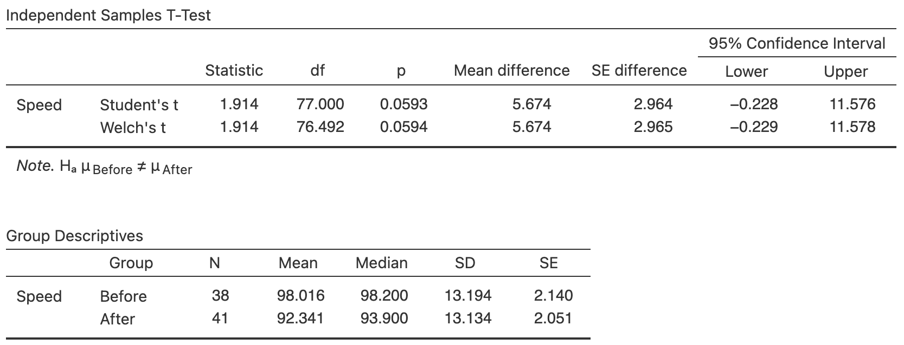
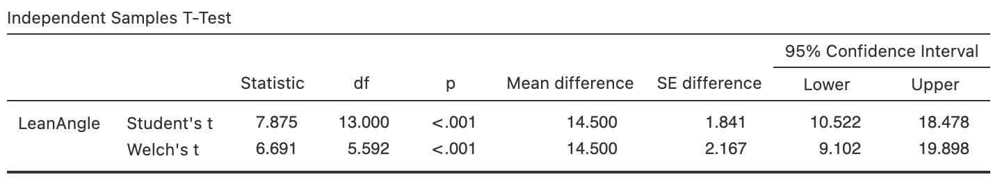

# Comparing quantitative data between individuals {#WithinQuantData}


<!-- Introductions; easier to separate by format -->
```{r, child = if (knitr::is_html_output()) {'./introductions/14-CompareQuant-HTML.Rmd'} else {'./introductions/14-CompareQuant-LaTeX.Rmd'}}
```

## Introduction

Relational and interventional RQs require comparing groups.
This chapter considers how to compare *qualitative* variables in different groups.
Graphs are very useful this purpose, and a table of the numerical summaries usually are also produced.


## Graphs

When a *quantitative* variable is compared across different groups (i.e., comparing between individuals), the individual variables can be plotted.
However, to *compare* the quantitative variable in different groups, options for plotting include: 

* [*Back-to-back stemplots*](#BackToBackStem):
  Best for small amounts of data when the qualitative variable has *two levels*; 
* [*2-D dot charts*](#TwoDDot): 
  Best choice for small to moderate amounts of data;
* [*Boxplots*](#Boxplot):
  Best choice, except for small amounts of data.        

These situations have *one qualitative variable* and *one quantitative variable*.


### Back-to-back stemplot {#BackToBackStem}

Back-to-back stemplots are two stemplots (Sect.\ \@ref(StemAndLeafPlots)) sharing the same stems; one group has the leaves emerging left-to-right from the stem, and the second group has the leaves emerging right-to-left from the stem.
Back-to-back stemplots can only be used when *two* groups are being compared.
Again, one advantage of using stemplots over other plots is that the original data are retained.
One disadvantage is that only two groups can be compared.


::: {.example #GorillaData name="Back-to-back stemplots"}
A study recorded the number chest-beats by gorillas [@wright2021chest], for gorillas under 20 years old (young) and 20 years and over (older)
`r if (knitr::is_latex_output()) {
   '(Table\\ \\@ref(tab:GorillaDataTable)).'
} else {
   '(Table\\ \\@ref(tab:GorillaDataTableHTML)).'
}`
A back-to-back stemplot allows the two groups to be compared visually 
`r if (knitr::is_latex_output()) {
   '(Fig.\\ \\@ref(fig:krillEggsDoubleStem)).'
} else {
   '(Fig.\\ \\@ref(fig:krillEggsDoubleStemHTML)).'
}`
The leaves for younger gorillas go from right-to-left, and the leaves for older gorillas go left-to-right, sharing the same stems.
The younger groups has a faster chest-beating rate.
One older gorilla has a much faster rate that the other older gorillas. 
:::


```{r}
data(Gorillas)
CBRyounger <- sort( Gorillas$ChestBeatRate[Gorillas$Age20 == "Younger"] )
CBRolder <- sort( Gorillas$ChestBeatRate[Gorillas$Age20 == "Older"] )

Gorilla2 <- cbind( CBRyounger[1:7], 
                   CBRyounger[8:14],
                   CBRolder[1:7],
                   c(CBRolder[8:11], NA, NA, NA ) )
```

`r if (knitr::is_html_output()) '<!--'`
\begin{figure}
\begin{minipage}{0.4\textwidth}
\captionof{table}{The chest-beating rate for gorillas\label{tab:GorillaDataTable}}
\fontsize{10}{12}\selectfont
```{r GorillaDataTable}

if( knitr::is_latex_output() ) {
  kable( surroundMaths(Gorilla2,
                       decDigits = 1),
         format = "latex", 
         longtable = FALSE,
         table.env = "@empty",
         booktabs = TRUE,
         escape = FALSE,
         linesep = c("", "", "", "\\addlinespace"),
         align = c("c","c")) %>%
         #col.names = c("Treatment group", "Control group"),
    add_header_above(header = c("Younger " = 2, 
                                "Older" = 2), 
                     bold = TRUE, 
                     align = "c")
}
```
\end{minipage}
\hspace{0.05\textwidth}
\begin{minipage}{0.60\textwidth}%
\centering
```{r krillEggsDoubleStem, fig.width=6.5, fig.height=3, out.width='100%'}

  stemgrid.x <- 1
  stemgrid.y <- 6
  stemcounts <- array(1, 
                      dim = stemgrid.y)

  par( mar = c(0.25, 0.25, 4, 0.25) + 0.1)

  plot( expand.grid(1:stemgrid.x, 0:stemgrid.y), 
      type = "n",
      xlab = "",
      ylab = "",
      main = "Chest-beating rate of gorillas\n(1|6 means 1.6 beats per 10 hours)",
      xlim = c(-11, 8),
      ylim = c(-0.2, 5.2),
      axes = FALSE)
  
### Treatment data in cols 1  to 11 (x = -11 to x = -1)
### Stems in col 12  (x=0)
### Control data in cols 13 to 19 (x= 1 to x = 7)
  
  # Divide the stems and leaves
  lines(c(-0.5, -0.5),
        c(0.5, 6.5),
         lwd = 2,
         col = "grey")
  lines(c(0.5, 0.5),
        c(0.5, 6.5),
         lwd = 2,
         col = "grey")
  text(-5, 0, 
       "Younger", 
       font = 2)
  text( 4, 0, 
        "Older", 
	font = 2)
  
  # Plot stems
  points( c(0, 0, 0, 0, 0), 
          1:5,
          pch = as.character(4:0))
  
  
  ### Plot leaves
  for (j in (1:2) ){

    if (j == 1) { # Right-hand side
      CBR <- CBRolder
      step <- 1
      stemcounts <- array(1, dim = stemgrid.y)
    }
    if (j == 2) { # Left-hand side
      CBR <- CBRyounger
      step <- -1
      stemcounts <- array(-1, dim = stemgrid.y)
    }
    
    for (i in 1:length(CBR)){
    
      if ( CBR[i] < 1) {
        points( stemcounts[1], 5, 
	        pch = substr( sprintf("%1.1f", CBR[i]), 3, 3)) 
        stemcounts[1] <- stemcounts[1] + step
      }

    if ( (CBR[i] >= 1) & (CBR[i] < 2) ) {
      points( stemcounts[2], 4, 
              pch = substr( sprintf("%1.1f", CBR[i] - 1), 3, 3)) 
      stemcounts[2] <- stemcounts[2] + step
    }

    if ( (CBR[i] >= 2) & (CBR[i] < 3) ) {
      points( stemcounts[3], 3, 
              pch = substr( sprintf("%1.1f", CBR[i] - 2), 3, 3)) 
      stemcounts[3] <- stemcounts[3] + step
    }
    if ( ( CBR[i] >= 3 ) & (CBR[i] < 4) ) {
      points( stemcounts[4], 2, 
              pch = substr( sprintf("%1.1f", CBR[i] - 3), 3, 3)) 
      stemcounts[4] <- stemcounts[4] + step
    }
    if ( ( CBR[i] >= 4 ) & (CBR[i] < 5) ) {
      points( stemcounts[5], 1, 
              pch = substr( sprintf("%1.1f", CBR[i] - 4), 3, 3)) 
      stemcounts[5] <- stemcounts[5] + step
    }
  }
}
```
\caption{The chest-beating rate for gorillas}\label{fig:krillEggsDoubleStem}
\end{minipage}
\end{figure}
`r if (knitr::is_html_output()) '-->'`


`r if (knitr::is_latex_output()) '<!--'`
```{r GorillaDataTableHTML}
if (knitr::is_html_output()) {
  kable( Gorilla2,
         format = "html",
         longtable = FALSE,
         booktabs = TRUE,
         escape = FALSE,
         caption = "The chest-beating rate for gorillas, for younger and older gorillas",
         linesep = c("", "", "\\addlinespace"),
         align = c("c","c")) %>%
    add_header_above(header = c("Younger " = 2, 
                                "Older" = 2), 
                     bold = TRUE, 
                     align = "c")
}
```


```{r krillEggsDoubleStemHTML, fig.width=6.0, out.width='100%', fig.cap="The chest-beating rate for gorillas", fig.cap="center"}

data(Gorillas)
CBRyounger <- sort( Gorillas$ChestBeatRate[Gorillas$Age20 == "Younger"] )
CBRolder <- sort( Gorillas$ChestBeatRate[Gorillas$Age20 == "Older"] )

Gorilla2 <- cbind( CBRyounger[1:7],
                   CBRyounger[8:14],
                   CBRolder[1:7],
                   c(CBRolder[8:11], NA, NA, NA ) )

stemgrid.x <- 1
stemgrid.y <- 6
stemcounts <- array(1, dim=stemgrid.y)

par( mar = c(0.5, 0.5, 4, 0.5) + 0.1)

plot( expand.grid(1:stemgrid.x, 0:stemgrid.y), 
      type = "n",
      xlab = "",
      ylab = "",
      main = "Stemplot of chest-beating rates for gorillas\n(1|6 means 1.6 beats per 10 h)",
      xlim = c(-11, 7),
      ylim = c(-0.2, 6.2),
      axes = FALSE)

### Treatment data in cols 1  to 11 (x = -11 to x = -1)
### Stems in col 12  (x=0)
### Control data in cols 13 to 19 (x= 1 to x = 7)

# Divide the stems and leaves
lines(c(-0.5, -0.5),
      c(0.5, 5.5),
      lwd = 2,
      col = "grey")
lines(c(0.5, 0.5),
      c(0.5, 6.5),
      lwd = 2,
      col = "grey")
text(-5, 0, 
     "Younger", 
     font = 2)
text( 4, 0, 
      "Older", 
      font = 2)

# Plot stems
points( c(0, 0, 0, 0, 0), 
        1:5,
        pch = as.character(4:0))
# Plot leaves
for (j in (1:2) ){
  
  if (j == 1) { # Right-hand side
    CBR <- CBRolder
    step <- 1
    stemcounts <- array(1, dim=stemgrid.y)
  }
  if (j == 2) { # Left-hand side
    CBR <- CBRyounger
      step <- -1
      stemcounts <- array(-1, dim = stemgrid.y)
    }
    
    for (i in 1:length(CBR)){
    
      if ( CBR[i] < 10) {
        points( stemcounts[1], 6, 
	        pch = as.character(CBR[i]))
        stemcounts[1] <- stemcounts[1] + step
      }

    if ( (CBR[i] >= 10) & (CBR[i] < 20) ) {
      points( stemcounts[2], 5, 
              pch = as.character(CBR[i] - 10) )
      stemcounts[2] <- stemcounts[2] + step
    }

    if ( (CBR[i] >= 20) & (CBR[i] < 30) ) {
      points( stemcounts[3], 4, 
              pch = as.character(CBR[i] - 20))
      stemcounts[3] <- stemcounts[3] + step
    }
    if ( ( CBR[i] >= 30 ) & (CBR[i] < 40) ) {
      points( stemcounts[4], 3, 
              pch = as.character(CBR[i] - 30))
      stemcounts[4] <- stemcounts[4] + step
    }
    if ( ( CBR[i] >= 40 ) & (CBR[i] < 50) ) {
      points( stemcounts[5], 2, 
              pch = as.character(CBR[i] - 40))
      stemcounts[5] <- stemcounts[5] + step
    }
    if ( ( CBR[i] >= 50 ) & (CBR[i] < 60) ) {
      points( stemcounts[6], 1, 
              pch = as.character(CBR[i] - 50))
      stemcounts[6] <- stemcounts[6] + step
    }
  }
}
```
`r if (knitr::is_latex_output()) '-->'`


### 2-D dot charts {#TwoDDot}

A 2-dimensional (2-D) dot chart places a dot for each observation, separated for each level of the qualitative variable (also see Sect.\ \@ref(DotChartsOneQual)).
Any number of groups can be compared.


:::{.example #Dotchart2DGorillas name="Boxplots"}
For the chest-beating data seen in Example\ \@ref(exm:GorillaData), a dot chart is shown in Fig.\ \@ref(fig:TwoDDotchart).

Many observations are the same, so some points would be *over-plotted* if points were not *stacked* (left panel), or some randomness added (a 'jitter') in the vertical direction, before plotting (right panel).
:::

```{r TwoDDotchart, fig.height=6, out.width='100%',fig.cap="Two variations of a 2-D dot chart for the chest-beating data to avoid overplotting: stacking (left) and jittering (right)", fig.align="center", fig.width=8.75, fig.height=2.5}
old.par <- par()
par(mar = c(5, 6, 4, 2) + 0.1)
par(mfrow = c(1,2))

stripchart( list(Younger = CBRyounger, 
                 Older = CBRolder), 
            main = "A 2-D dot chart; the chest-beating\nrate of gorillas (points stacked)",
            method = "stack", 
            las = 1,
            pch = 19,
            xlim = c(0, 5),
            cex = 0.7,
            ylim = c(0.6, 2.4),
            xlab = "Chest-beating rate")

stripchart( list(Treatment = CBRyounger,
                 Control = CBRolder), 
            main = "A 2-D dot chart; the chest-beating\nrate of gorillas (points jittered)",
            method = "jitter",
            jitter = 0.18, 
            las = 1,
            pch = 19,
            xlim = c(0, 5),
            cex = 0.7,
            ylim = c(0.6, 2.4),
            xlab = "Chest-beating rate")

#par( old.par )
```


### Boxplots {#Boxplot}

A boxplot is a picture of the quantiles (Sect.\ \@ref(VariationIQR)).
Any number of groups can be compared usin a boxplot.

The distribution for each group is summarised by five numbers: the minimum value, $Q_1$, the median ($Q_2$), $Q_3$ and the maximum value.
Outliers, identified using the IQR rule (Sect. \@ref(OutliersIQRrule)), are also shown.
Distributions can be compared by comparing the values of $Q_1$, the medians, and the values of $Q_3$.
Since each distribution is summarised by just five numbers, a lot of detail of the distribution is lost.
For this reason, boxplots are best for *comparing* distributions. 
Software uses approximations to compute these values (and different software may use different rules, and hence may produce slightly different values for quartiles).


:::{.example #BoxplotGorillas name="Boxplots"}
An example of a boxplot, for the chest-beating data in Example\ \@ref(exm:GorillaData), is shown in Fig.\ \@ref(fig:BoxplotGorillas).
No outliers are identified for younger gorillas; one large outlier is identified for the older gorillas.
The boxplot shows a distinct difference between the chest-beating rates of older and younger gorillas.
:::

```{r BoxplotGorillas, fig.cap="A boxplot for the chest-beating data", fig.align="center",  fig.height=3.5, , fig.width=4.5, out.width='50%'}
CBRyounger.quantiles <- quantile(CBRyounger)
CBR.C2 <- CBRolder[ -which.max(CBRolder)]
krillC2.quantiles <- quantile(CBR.C2)

par( mar = c(4.5, 3, 4, 2) + 0.1 )
Gorillas$Age20 <- ordered(Gorillas$Age20,
                          levels = c("Younger", 
                                     "Older"))
boxplot( ChestBeatRate ~ Age20,
         data = Gorillas,
         col = plot.colour,
         las = 1,
         pch = 19,
         ylim = c(0, 4.5),
         xlab = "Age group",
         ylab = "Chest-beating rate\n (per 110 h)",
         main = "Chest-beating rate\nor gorillas")

```


The boxplots are explained in Fig.\ \@ref(fig:BoxplotGorillasExplain).
First focus on just the boxplot for the *younger* gorillas (i.e., the left box).
Boxplots have five horizontal lines; from the top to the bottom of the plot:

1. *Top line*:
   The *fastest* chest-beating rate is $`r CBRyounger.quantiles[5]`$ per $10$\ h.
2. *Second line from top*:
   $75$% of observations are smaller than about $`r CBRyounger.quantiles[4]`$, represented by the line at the top of the central box. 
   This is the *third quartile* ($Q_3$).
3. *Middle line*:
   $50$% of observations are smaller than about $`r CBRyounger.quantiles[3]`$, represented by the line inside the central box. 
   This is an 'average' value, the *second quartile* ($Q_2$).
4. *Second line from bottom*:
   $25$% of observations are smaller than about $`r CBRyounger.quantiles[2]`$, represented by the line at the bottom of the central box. 
   This is the *first quartile* ($Q_1$).
5. *Bottom line*:
   The *slowest* chest-beating rate is $`r CBRyounger.quantiles[1]`$ per $10$\ h. 


```{r BoxplotGorillasExplain, fig.cap="Explaining the boxplots for the chest-beating data", fig.align="center",  fig.height=4.25, , fig.width=10.5, out.width='100%'}

source("R/showExplainBoxplots.R")
```


The box for the *older* gorillas is slightly different
`r if (knitr::is_latex_output()) {
   '(Fig.\\ \\@ref(fig:Boxplotkrill), left panel):'
} else {
   '(Fig.\\ \\@ref(BoxplotkrillHTML)):'
}`
one observation is identified with a point, *above* the top line.
Computer software has identified this observation as a potentially *outlier* (in this case, unusually *large*), and has plotted this point separately, using the IQR rule (Sect.\ \@ref(OutliersIQRrule)).
Mild and extreme outliers are plotted in this way (Sect.\ \@ref(OutliersIQRrule)) then then the values of the quantiles ($Q_1$, $Q_2$ and $Q_3$) are computed as usual.

```{r}
outC <- boxplot( list(Older = CBRolder),
                 plot = FALSE)
CBR.quantiles <- outC$stats
```

The values of $Q_1$, the median and $Q_3$ are all substantially larger for the younger gorillas, suggesting that younger gorillas have, in general, faster chest-beating rates.


::: {.importantBox .important data-latex="{iconmonstr-warning-8-240.png}"}
Boxplots summarise data with only five numbers, so a lot of detail of the distribution is lost.
For this reason, boxplots are excellent for *comparing* distributions, but histograms are better for displaying a single quantitative distribution.
:::


::: {.example #BoxplotsHorizontal name="Boxplots"}
Boxplots can be plotted horizontally too, which leaves space for long labels.
In Fig.\ \@ref(fig:CementBuildBoxplot) (left panel; based on @data:Silva2016:rootcanal), the three dental cements are very different regarding their push-out forces.
:::


```{r CementBuildBoxplot, fig.cap="Comparing three push-out values for three dental cements", fig.align="center", fig.height=2.75, fig.width=8.5, fig.show='hold', out.width='100%'}
MTA    <- c(0.05, 0.1, 0.2, 0.25, 0.45)
Endo   <- c(0.1, 0.2, 0.4,   1.0, 2.05)
AHplus <- c(0.5, 1.1, 2.25, 2.9, 4.4)

CementStats <- list( n = c(5, 5, 5),
                     stats = matrix( cbind(MTA, 
                                           Endo, 
                                           AHplus), 
                                     ncol = 3, 
                                     byrow = FALSE),
                     conf = matrix( c(-1.5, 7, -2, 10, 3, 3), 
		                 ncol = 2, 
				             byrow = FALSE),  ### NOT USEFUL, only for notches
                  out = NULL,
                  group = NULL,
                  names = c("MTA Fillapex", 
		                        "Endo Seal", 
			                      "AH Plus"))

par( mfrow = c(1, 2),
     mar = c(4, 6, 3, 2) + 0.1)
plot( c(0, 5), 
      c(0.4, 3.6),
      type = "n",
      axes = FALSE,
      main = "Boxplot of push-out force",
      ylab = "",
      xlab = "Push-out force (MPa)")

axis(side = 1,
     las = 1)
abline(h = 0, 
       col = "grey", 
       lwd = 2)
bxp(CementStats,
    las = 1,
    horizontal = TRUE,
    add = TRUE,
    boxfill = plot.colour)

######

DB  <-  c( 7,   3, 1.5, 1, -1.5)
DBB <- c(10, 5.5, 3.5, 2, -2)

EngStats <- list( n = c(5, 5),
                  stats = matrix( cbind(DB, DBB), 
                                  ncol = 2, 
                                  byrow = FALSE),
                  conf = matrix( c(-1.5, 7, -2, 10), 
                                 ncol = 2, 
                                 byrow = FALSE),
                  out = c(8, 20, 12.5, 11.5, -7),
                  group = c(1, 2, 2, 2, 2),
                  names = c("DB", 
                            "DBB"))
plot( c(0.4, 2.6), 
      c(-10, 21),
      type = "n",
      axes = FALSE,
      main = "Boxplot of project costs",
      ylab = "Cost increase (%)",
      xlab = "Project delivery method")

axis(side = 2,
     las = 1)
abline(h = 0, 
       col = "grey", 
       lwd = 2)
bxp(EngStats,
    las = 1,
    add = TRUE,
    boxfill = plot.colour)
```


::: {.example #Boxplots2 name="Boxplots"}
A study of different engineering project delivery methods [@data:Hale2009:ProjectDelivery] produced the boxplot in Fig.\ \@ref(fig:CementBuildBoxplot) (right panel): the increase in the costs of projects seem to differ between the two methods.
The quantitative variable is the percentage increase in costs, and the qualitative variable is the method used.

The Design/Build (DB) method produces a smaller project cost growth on average (the centre line of the boxplot), but the Design/Bid/Build (DBB) method produces more variation in project cost growth.
Outliers are present for both methods, as indicated by the dots.
:::


```{r}
htmltools::tags$video(src = "./videos/Boxplots.mp4", 
                      width = "550", 
                      controls = "controls", 
                      loop = "loop", 
                      style = "padding:5px; border: 2px solid gray;")
```


## Summary tables {#CompareQuantTables}

The numerical summary information can be collated in a table, or a *tabular summary*.
The data should be summarised the quantitative variable for each group, and (when appropriate) the changes should also be summarised.

::: {.example #GorillaSummarytable name="Numerical summary table"}
For the gorilla data, the summary of the data can be tabulated as in Table\ \@ref(tab:GorillaTable).
Notice that no standard deviation or sample size is provided for the *difference*; these make no sense.

Based on the table, do you think a difference exists between the mean chest-beating rate for younger and older gorillas?
Remember, the data in Table\ \@ref(tab:GorillaTable) is for a *sample*, but the RQ is asking about the *population*.
:::

```{r GorillaTable}
GorillaSummaryTable <- array( dim = c(3, 3))

rownames(GorillaSummaryTable) <- c("Younger",
                        "Older",
                        "Difference") 
colnames(GorillaSummaryTable) <- c("(in beats per 10 h)",
                        "(in beats per 10 h)",
                        "size") 

GorillaSummaryTable[, 1] <- c( round( mean(CBRyounger), 3),
                               round( mean(CBRolder), 3),
                               round( mean(CBRyounger) - mean(CBRolder), 3) )
GorillaSummaryTable[, 2] <- c( round( sd(CBRyounger), 4),
                                  round( sd(CBRolder), 4),
                                  NA )
GorillaSummaryTable[, 3] <- c( length(CBRyounger),
                                  length(CBRolder), 
                                  NA )

knitr::kable( surroundMaths(GorillaSummaryTable,
                            decDigits = c(2, 3, 0)),
              format = "latex",
              longtable = FALSE,
              booktabs = TRUE,
              escape = FALSE,
              digits = 1,
              align = c("r", "r", "r", "r"),
              caption = "A numerical summary of the gorillas data") %>%
  kable_styling(full_width = FALSE) %>%
  row_spec(row = 0, 
           bold = TRUE) %>%
  row_spec(row = 3,
           italic = TRUE) %>%
  kable_styling(font_size = 10) %>%
  add_header_above( c( " " = 1,
                       "Mean" = 1,
                      "Standard deviation" = 1,
                      "Sample" = 1),
                    bold = TRUE,
                    line = FALSE)
```


## Summary {#Chap14-Summary}
   
Quantitative data can be compared between different groups (between individuals comparisons) using a back-to-back stemplot, boxplot or $2$-D dot chart.
A summary table should show the numerical summaries for the quantitative variable at each comparison and, if appropriate, the between-group differences. 


## Example: speed signage {#CompareQuantSpeedSignage}

To reduce vehicle speeds on freeway exit ramps, a Chinese study studied adding additional signage [@ma2019impacts].
At one site (Ningxuan Freeway), speeds were recorded for 38 vehicles before the extra signage was added, and then for 41 different vehicles after the extra signage was added
`r if (knitr::is_latex_output()) {
   '(Table\\ \\@ref(tab:SignageHT)).'
} else {
   '(data below).'
}`


```{r Signage}
data(Speed)

Speed$When <- factor(Speed$When,
                     levels = c("Before", "After"),
                     ordered = TRUE)

Speed2 <- data.frame( Before = Speed$Speed[ Speed$When == "Before" ][1:10],
                      After = Speed$Speed[ Speed$When == "After" ][1:10])
```

```{r}
if( knitr::is_latex_output() ) {
  tb1 <- cbind( Speed$Speed[Speed$When == "Before"][1:7],
                Speed$Speed[Speed$When == "Before"][8:14],
                Speed$Speed[Speed$When == "Before"][15:21],
                Speed$Speed[Speed$When == "Before"][22:28],
                Speed$Speed[Speed$When == "Before"][29:35],
                c( Speed$Speed[Speed$When == "Before"][36:38], NA, NA, NA, NA ) )
  T1 <- knitr::kable( surroundMaths(tb1,
                                    decDigits = 1),
                      format = "latex",
                      valign = 't',
                      align = "r",
                      linesep = "",
                      row.names = FALSE,
                      escape = FALSE,
                      booktabs = TRUE) %>%
    row_spec(0, bold = TRUE) %>%
    add_header_above( c("Speeds before signage added" = 6),
                      bold = TRUE)

  tb2 <- cbind( Speed$Speed[Speed$When == "After"][1:7],
                Speed$Speed[Speed$When == "After"][8:14], 
                Speed$Speed[Speed$When == "After"][15:21], 
                Speed$Speed[Speed$When == "After"][22:28], 
                Speed$Speed[Speed$When == "After"][29:35], 
                c( Speed$Speed[Speed$When == "After"][36:41], NA) )
  T2 <- knitr::kable( surroundMaths(tb2,
                                    decDigits = 1),
                      format = "latex",
                      align = "r",
                      valign = 't',
                      linesep = "",
                      row.names = FALSE,
                      escape = FALSE,
                      booktabs = TRUE) %>%
    row_spec(0, bold = TRUE) %>%
    add_header_above( c("Speeds after signage added" = 6),
                      bold = TRUE)
  
  out <- knitr::kables(list(T1, T2),
                       format = "latex",
                       label = "SignageHT",
                       caption = "Vehicle speeds (in km/h) before and after adding extra signage") %>%
    kable_styling(font_size = 10)
  out2 <- prepareSideBySideTable(out, gap = "\\enskip")
  out2
}

if( knitr::is_html_output() ) {
  
   DT::datatable( Speed,
                 fillContainer = FALSE, # Make more room, so we don't just have ten values
                 colnames = c("When measured", "Speed (km/h)"),
                 options = list(searching = FALSE), # Remove searching: See: https://stackoverflow.com/questions/35624413/remove-search-option-but-leave-search-columns-option
                 caption = "The observations from the signage data")
}
```


The researchers are hoping that the addition of extra signage will *reduce* the mean speed of the vehicles.
The RQ is:

> At this freeway exit, how much is the mean vehicle speed *reduced* after extra signage is added?

The data are summarised in Table\ \@ref(tab:SignageSummary) (using the jamovi output in Fig.\ \@ref(fig:SpeedjamoviCI)), and in Fig.\ \@ref(fig:SpeedBoxplot).


```{r SignageSummary}
SignageSummary <- array(dim = c(3, 5))
rownames(SignageSummary) <- c("Before", 
                              "After",
                              "Speed reduction")
colnames(SignageSummary) <- c("Mean",
                              "Median",
                              "Std deviation",
                              "IQR",
                              "Sample size")

Speed.n <- tapply(Speed$Speed, 
                  list(Speed$When), 
                  "length") 
Speed.sd <- tapply(Speed$Speed, 
                   list(Speed$When), 
                   "sd") 

SignageSummary[1:2, 1] <- round( tapply(Speed$Speed, 
                                        list(Speed$When), 
                                        "mean"),
                                 2)
SignageSummary[1:2, 2] <- tapply(Speed$Speed,
                                 list(Speed$When), 
                                 "median") 

SignageSummary[1:2, 3] <- round( Speed.sd, 2)
SignageSummary[1:2, 4] <- tapply(Speed$Speed,
                                 list(Speed$When), 
                                 "IQR") 
SignageSummary[1:2,5] <- Speed.n 

SignageSummary[3, 1] <- SignageSummary[1, 1] -  
                        SignageSummary[2, 1] 

sdB <- round( Speed.sd[1], 2)
sdA <- round( Speed.sd[2], 2)

SignageSummary[3, 4] <- NA 
SignageSummary[3, 2] <- NA
                          


if( knitr::is_latex_output() ) {
  kable(surroundMaths(SignageSummary,
                      decDigits = c(2, 2, 3, 2, 0)),
        format = "latex",
        longtable = FALSE,
        booktabs = TRUE,
        escape = FALSE,
        align = c("r", "r", "r", "r", "r", "r"),
        col.names = c("Mean", 
                      "Median",
                      "Std deviation", 
                      "IQR",
                      "Sample size"),
        caption = "The signage data summary (in km/h)"
  ) %>%
  row_spec(0, bold = TRUE) %>%
  row_spec(3, italic = TRUE) %>%
  kable_styling(font_size = 10)
}
if( knitr::is_html_output() ) {
  kable(SignageSummary,
               format = "html",
               longtable = FALSE,
               booktabs = TRUE,
               align = c("r", "r", "r", "r"),
               col.names = c("Mean", 
                             "Median",
                            "Std deviation",
                            "IQR",
                            "Sample size"),
    caption = "The signage data summary (in km/h)") %>%
    kable_styling(full_width = FALSE)
}
```

```{r SpeedjamoviCI, fig.cap="jamovi output for the speed data", fig.align="center", out.width="100%"}

```

```{r SpeedBoxplot, fig.cap="Boxplot of speed beefore and after adding signage", fig.align="center", out.width='50%', fig.width=5, fig.height=3.25  }
par(mar = c(5, 4, 4, 4) + 0.1)
boxplot( Speed2, 
         col = plot.colour,
         las = 1,
         ylab = "Speed (in km/h)",
         xlab = "When speed measured",
         main = "Speeds before and after adding speed signage",
         names = c("", "") )
abline( h = 100,
        lwd = 2)
axis(side = 4,
     at = 100,
     las = 1,
     labels = "Speed\nlimit")
mtext(text = c(expression( atop(Before, group("(",italic(n) == 38, ")")) ),
               expression( atop(After, group("(", italic(n) == 41, ")")) ) ),
      side = 1,
      at = 1:2,
      las = 1,
      line = 2 )
```


## Quick review questions {#Chap14-QuickReview}

::: {.webex-check .webex-box}
Are the following statements *true* or *false*?

1. A boxplot is an appropriate graph for comparing a quantitative variable in two *or more* groups. \tightlist
`r if( knitr::is_html_output() ) {torf(answer = TRUE)}`
2. A back-to-back stemplot is an appropriate graph for comparing a quantitative variable in two *or more* groups.
`r if( knitr::is_html_output() ) {torf(answer = FALSE)}`
3. A case-profile plot is an appropriate graph for comparing a quantitative variable in two *or more* groups.
`r if( knitr::is_html_output() ) {torf(answer = FALSE)}`
4. When comparing a quantitative variable in two *or more* groups, the sample size for the difference should be included
`r if( knitr::is_html_output() ) {torf(answer = FALSE)}`
:::


## Exercises

Selected answers are available in Sect

::: {.exercise #GraphsAIS}
A study of athletes at the *Australian Institute of Sport* (AIS) measured numerous physical and blood measurements from high performance athletes [@data:Telford1991:sexsportsize].
The graph in Fig.\ \@ref(fig:AISfemalesport) compares the heights of females in two similar sports: basketball and netball.
(Netball was derived from basketball.)
How would you interpret the graph, regarding the heights of the athletes in the two sports?
:::

```{r}
data(AISsub)

subAIS <- subset(AISsub, 
                 Sex=="F" & (Sport=="BBall" | Sport=="Netball"))
subAIS$Sport <- factor(subAIS$Sport)
```

```{r AISfemalesport, fig.cap="The heights of female basketball and netball players attending the AIS", fig.align="center", fig.width=5, fig.height=3.5}
boxplot(Ht ~ Sport, 
        data = subAIS,
        las = 1,
        ylim = c(165, 200),
        col = plot.colour,
        xlab = "Sport",
        ylab = "Height (in cm)",
        main = "Boxplot of heights:\nbasketballers and netballers",
        names = c("Basketball", 
                  "Netball")
)
```


::: {.exercise #NumericalQuantMatchingHistogramsAndBoxplots}

`r if (knitr::is_latex_output()) {
   'Consider  the histograms and boxplots in Fig.\\ \\@ref(fig:MatchHistoBox).'
} else {
   'Match the histograms with the corresponding boxplots in the activity below.'
}`


`r if (knitr::is_html_output()) '<!--'`
1. Match the histogram with the corresponding boxplot.
1. For which datasets would the mean and standard deviation be the appropriate numerical summary?
   For which datasets would the median and IQR be the appropriate numerical summary?
`r if (knitr::is_html_output()) '-->'`
:::


```{r MatchHistoBox, fig.align = "center", fig.cap="Match the histogram with the boxplot", out.width = '100%', fig.width = 5.5, fig.height=2.0}
if( knitr::is_latex_output() ) {
  set.seed(20032009)
  num <- 400
  
  # Skewed right
  dt1 <- rgamma(num,
                scale = 0.2,
                shape = 2)
  # Normal
  dt2 <- rnorm(num,
               mean = max(dt1) / 2,
               sd = max(dt1) / 6)
  # Uniform
  dt3 <- runif(num, 
               min = 0, 
               max = max(dt1))
  
  par( mfrow = c(1, 3),
       mar = c(0.5, 0.5, 0.5, 0.5) )
  
  hist(dt1,
       axes = FALSE,
       col = plot.colour,
       las = 1,
       xlim = c(0, 2),
       ylim = c(0, 235),
       xlab = "",
       ylab = "Number",
       main = "")
  text(x = 0.85,
       y = 140,
       labels = "Histogram A",
       font = 2)
  abline(h = 160, col="grey")
  
  boxplot(dt2,
          at = 200,
          horizontal = TRUE,
          col = plot.colour,
          add = TRUE,
          axes = FALSE,
          boxwex = 30)
  text(x = 0.75,
       y = 220,
       labels = "Boxplot I",
       font = 2)
  
  ########################
  
  
  hist(dt2,
       axes = FALSE,
       col = plot.colour,
       las = 1,
       xlim = c(0, 2),
       ylim = c(0, 235),
       xlab = "",
       ylab = "Number",
       main = "")
  text(x = 0.75,
       y = 140,
       labels = "Histogram B",
       font = 2)
  abline(h = 160, col="grey")
  boxplot(dt1,
          at = 195,
          horizontal = TRUE,
          col = plot.colour,
          add = TRUE,
          axes = FALSE,
          boxwex = 30)
  text(x = 0.75,
       y = 220,
       labels = "Boxplot II",
       font = 2)
  
  ########################
  
  hist(dt3,
       axes = FALSE,
       col = plot.colour,
       las = 1,
       xlim = c(0, 2),
       ylim = c(0, 235),
       xlab = "",
       ylab = "Number",
       main = "")
  text(x = 0.75,
       y = 140,
       labels = "Histogram C",
       font = 2)
  abline(h = 160, col="grey")
  boxplot(dt3,
          at = 195,
          horizontal = TRUE,
          col = plot.colour,
          add = TRUE,
          axes = FALSE,
          boxwex = 30)
  text(x = 0.75,
       y = 220,
       labels = "Boxplot III",
       font = 2)
  
  
}
```


::: {.exercise #GreenBuilding}
In a study of the temperature in offices, @data:Paul2008:Comfort compared the temperature in three offices (during working hours) at Charles Sturt University (Australia); the data are summarised in Table\ \@ref(tab:OfficeTemps).
Using this information, draw the boxplot comparing the three offices.
What do we learn from this graph? 
:::


```{r OfficeTemps}
OfficeTemps <- array( dim = c(6, 3) )
colnames(OfficeTemps) <- c( "Office A", 
                            "Office B", 
                            "Office C")
rownames(OfficeTemps) <- c("Mean", 
                           "Minimum", 
                           "$Q_1$", 
                           "Median", 
                           "$Q_3$", 
                           "Maximum")

OfficeTemps[1, ] <- c(24.1, 25.3, 25.7)
OfficeTemps[2, ] <- c(16.4, 15.9, 20.1)
OfficeTemps[3, ] <- c(22.8, 23.8, 24.6)
OfficeTemps[4, ] <- c(24.4, 25.5, 26.1)
OfficeTemps[5, ] <- c(25.5, 26.9, 27.2)
OfficeTemps[6, ] <- c(27.4, 31.0, 30.3)

if( knitr::is_latex_output() ) {
    kable(surroundMaths(OfficeTemps,
                        decDigits = 1),
        format = "latex",
        longtable = FALSE,
        booktabs = TRUE,
        escape = FALSE, # For latex to work
        linesep = c( "", "", "", "", "", ""), # Add a bit of space between all rows. 
        caption = "A summary of the temperature (in degrees C) in three offices at CSU during working hours
according to current smoking status",
        align = c("c", "c"))   %>%
   kable_styling(full_width = FALSE, 
                 font_size = 10) %>%
  row_spec(0, bold = TRUE) %>% # Columns headings (row 0) in bold
  column_spec(0, bold = TRUE)     # Row headings in bold
}

if( knitr::is_html_output() ) {
  kable(OfficeTemps,
        format = "html",
        align = c("c", "c"),
        longtable = FALSE,
        caption = "A summary of the temperature (in degrees C) in three offices at CSU during working hours according to current smoking status",
        booktabs = TRUE) 
}
```


::: {.exercise #GraphsOrthoses}
In a study of the influence of using ankle-foot orthoses in children with cerebral palsy [@swinnen2018influence], the data in Table\ \@ref(tab:DescribeAnkleFoot) describe the $15$ subjects.
(GMFCS is an *ordinal* variable used to describe the impact of cerebral palsy on their motor function: the
`r if (knitr::is_latex_output()) {
   'Gross Motor Function Classification System.)'
} else {
   '[Gross Motor Function Classification System](https://en.wikipedia.org/wiki/Gross_Motor_Function_Classification_System).)'
}`

Sketch a graphs to explore the *relationships* between the children's weight and GMGCS.
:::


::: {.exercise #CompareQuantExercisesNHANES}
Earlier, we used the NHANES study data (Sect.\ \@ref(NHANESGraphs)), and considered this RQ:

> Among Americans, is the mean direct HDL cholesterol different for current smokers and non-smokers?

Use the jamovi output (Fig.\ \@ref(fig:NHANESTwoSample)) to answer these questions.
 Construct an appropriate table showing the numerical summary.
:::

```{r NHANESTwoSample, fig.cap="jamovi output for the NHANES data", fig.align="center", out.width='100%'}
knitr::include_graphics("jamovi/NHANES/NHANES-DirectHDL-Smoke-ALL.png")
```


::: {.exercise #CompareQuantDeceleration}
To reduce vehicle speeds on freeway exit ramps, a Chinese study studied using additional signage [@ma2019impacts].
At one site (Ningxuan Freeway), speeds were recorded at various points on the freeway exit for $38$ vehicles before the extra signage was added, and then for $41$ vehicles after the extra signage was added.

From this data, the *deceleration* of each vehicle was determined
`r if (knitr::is_latex_output()) {
   '(Table\\ \\@ref(tab:SignageDec))'
} else {
   '(data below)'
}`
as the vehicle left the $120$\ km/h speed zone and approached the $80$\ km/hr speed zone. 
Use the data, and the summary in Table\ \@ref(tab:SignageSummaryDec), to address this RQ:

> At this freeway exit, what is the difference between the mean vehicle deceleration, comparing the times before the extra signage is added and after extra signage is added?

In this context, the researchers are hoping that the extra signage might cause cars to slow down *faster* (i.e., they will decelerate more, on average, after adding the extra signage).

1. Construct a numerical summary table for the data.
2. Use software to construct a boxplot of the data.
:::


```{r}
data(Deceleration)

Deceleration$When <- factor(Deceleration$When,
                     levels = c("Before", "After"),
                     ordered = TRUE)
```
```{r}
if( knitr::is_latex_output() ) {
  tb1 <- cbind( Deceleration$Deceleration[Deceleration$When == "Before"][1:9],
                Deceleration$Deceleration[Deceleration$When == "Before"][10:18],
                Deceleration$Deceleration[Deceleration$When == "Before"][19:27],
                Deceleration$Deceleration[Deceleration$When == "Before"][28:36],
                c(Deceleration$Deceleration[Deceleration$When == "Before"][37:38], NA, NA, NA, NA, NA, NA, NA) )
  T1 <- knitr::kable( surroundMaths(tb1,
                                    decDigits = 3),
                      format = "latex",
                      valign = 't',
                      align = "r",
                      linesep = "",
                      row.names = FALSE,
                      escape = FALSE,
                      booktabs = TRUE) %>%
    row_spec(0, bold = TRUE) %>%
    add_header_above( c("Deceleration before signage added" = 5),
                      bold = TRUE)

  tb2 <- cbind( Deceleration$Deceleration[Deceleration$When == "After"][1:9],
                Deceleration$Deceleration[Deceleration$When == "After"][10:18], 
                Deceleration$Deceleration[Deceleration$When == "After"][19:27], 
                Deceleration$Deceleration[Deceleration$When == "After"][28:36], 
                c(Deceleration$Deceleration[Deceleration$When == "After"][37:41], NA, NA, NA, NA) ) 
  T2 <- knitr::kable( surroundMaths(tb2,
                                    decDigits = 3),
                      format = "latex",
                      align = "r",
                      valign = 't',
                      linesep = "",
                      row.names = FALSE,
                      escape = FALSE,
                      booktabs = TRUE) %>%
    row_spec(0, bold = TRUE) %>%
    add_header_above( c("Deceleration after signage added" = 5),
                      bold = TRUE)
  
  out <- knitr::kables(list(T1, T2),
                       format = "latex",
                       label = "SignageDec",
                       caption = "Vehicle decleration  (in m/s-squared) before and after adding extra signage") %>%
    kable_styling(font_size = 10)
  out2 <- prepareSideBySideTable(out, gap = "\\enskip")
  out2

}

if( knitr::is_html_output() ) {
  
   DT::datatable( Deceleration,
                 fillContainer = FALSE, # Make more room, so we don't just have ten values
                 colnames = c("When measured", "Deceleration (m/s-squared)"),
                 options = list(searching = FALSE), # Remove searching: See: https://stackoverflow.com/questions/35624413/remove-search-option-but-leave-search-columns-option
                 caption = "The observations from the signage data (negative values mean the vehicle has accelerated)")
}
```


```{r}
data(ForwardFall)

ForwardFall$Group <- factor(ForwardFall$Group,
                   levels = 1:2,
                   labels = c("Younger",
                              "Older"))
```
::: {.exercise #FacePlantCI}
A study [@data:Wojcik:ForwardFall] compared the lean-forward angle in younger and older women.
An elaborate set-up was constructed to measure this angle, using a harnesses.
Consider the RQ:

> Among healthy women, what is difference between the mean lean-forward angle for younger women compared to older women?

The data are shown in Table\ \@ref(tab:FacePlant).

1. What is the parameter?
   Describe what this *means*.
2. What is an appropriate graph to display the *data*?
3. Construct an appropriate numerical summary from the software output (Fig.\ \@ref(fig:FallFowardTTestjamovi)).
4. Construct *approximate* and *exact* $95$% CIs.
   Explain any differences.
5. Is the CI expected to be statistically valid?
6. Write a conclusion.
:::

```{r FacePlant}
FacePlant <- array(dim = c(2, 10), # COL 6 is a gap
                   NA)
FacePlant[1, ] <- c( ForwardFall$LeanAngle[ForwardFall$Group == "Younger"][1:5],
                       ForwardFall$LeanAngle[ForwardFall$Group == "Older"][1:5] )
FacePlant[2, 1:5] <- ForwardFall$LeanAngle[ForwardFall$Group == "Younger"][6:10]

if( knitr::is_latex_output() ) {
  
  kable( surroundMaths(FacePlant,
                       decDigits = 0),
         format = "latex",
         longtable = FALSE,
         booktabs = TRUE,
         escape = FALSE,
         align = "c",
         caption = "Lean-forward angles for older women ($n = 10$) and younger women ($n = 5$)") %>%
    add_header_above(header = c("Younger women " = 5, "Older women " = 5), 
                     bold = TRUE, 
		     align = "c") %>%
    kable_styling(font_size = 10)
    
}
if( knitr::is_html_output() ) {
  out <- kable( FacePlant,
                format = "html",
                longtable = FALSE,
                booktabs = TRUE,
                align = "c",
                caption = "Lean-forward angles for older and younger women")
    kable_styling(out, 
                  full_width = FALSE) %>%
    add_header_above(header = c("Younger women " = 5, "Older women " = 5), 
                     bold = TRUE, 
		     align = "c")
}
```


```{r FallFowardTTestjamovi, fig.cap="jamovi output for the lean-forward angles data", fig.align="center", out.width='95%'}

```


::: {.exercise #NumericalQuantTyping}
The `Typing` dataset contains four variables: typing speed (`mTS`), typing accuracy (`mAcc`), age (`Age`). and sex (`Sex`) for $1301$ students.

1. Produce appropriate numerical summaries for the quantitative variables.
1. Produce appropriate numerical summaries for *comparing* the quantitative variables for different values of the qualitative variable.
1. What do you learn from these numerical summaries?
:::


<!-- QUICK REVIEW ANSWERS -->
`r if (knitr::is_html_output()) '<!--'`
::: {.EOCanswerBox .EOCanswer data-latex="{iconmonstr-check-mark-14-240.png}"}
- \textbf{\textit{Quick Revision} questions:}
**1.** True.
**2.** False; only compares two groups.
**3.** False; a case-profile plot is appropriate for *within*-individual comparisons.
**4.** False; a sample size is meaningless.
:::
`r if (knitr::is_html_output()) '-->'`


