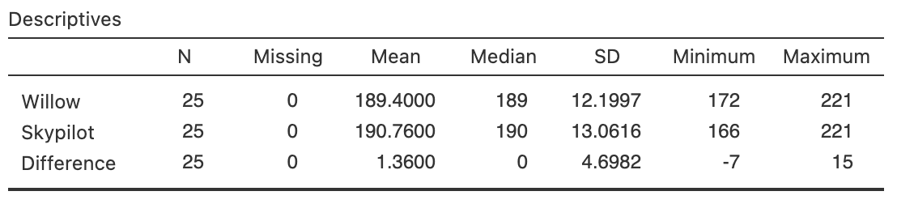

# Relationships: quantitative data comparisons within individuals {#SummariseWithin}
\index{Quantitative data!changes \textit{within} individuals}


<!-- Introductions; easier to separate by format -->
```{r, child = if (knitr::is_html_output()) {'./introductions/14-CompareWithin-HTML.Rmd'} else {'./introductions/14-CompareWithin-LaTeX.Rmd'}}
```


## Introduction

Sometimes the same variable is measured on each individual more than once (i.e., *within*-individual changes for each unit of analysis) but only a small number of times.
Examples of this type of data include:

* Measurements of household water consumption *before* and *after* installing water-saving devices, for many households.
* Blood pressure recorded for people at $8$am, $1$pm and $8$pm each day.

In both cases, the same variable is measured multiple times for each individual.
*Within*-individuals changes require different methods than *between*-individuals comparisons.
This chapter considers how to summarise within-individuals changes in *quantitative* variables.


## Graphs
\index{Quantitative data!changes \textit{within} individuals!graphs}\index{Graphs!changes \textit{within} individuals}

For within-individual changes for a *quantitative* variable, options for plotting include: 

* Histograms of differences (Sect.\ \@ref(HistoDiffPlot)):
  useful for changes in *pairs* of measurements or observations.
* Case-profile plots (Sect.\ \@ref(CaseProfilePlot)): 
  useful when the same individuals are measured or observed over a small number of times.
<!-- * Time plots (Sect.\ \@ref(TimePlots)): -->
<!--   a special type of case-profile plot, when the measurements vary over a large number of time points. -->


### Histogram of differences {#HistoDiffPlot}
\index{Histogram!of differences}\index{Graphs!histogram of  differences}

Sometimes the same variable is measured on each unit of analysis twice, when a histogram of the *changes* (or *differences*) for each individual can be produced.
The direction of the differences should be clear (e.g., first measurement minus second, or second measurement minus first).


::: {.example #CaseProfileHistDiffPlots name="Within-individual comparisons"}
A study of children with atopic asthma [@data:Lothian2006:Whey] measured the immunogoblin\ E concentrations (IgE) before and after an intervention for each child (Table\ \@ref(tab:IgEChanges)).
The child is the *individual*.
The *reduction* in IgE for each child can be shown using a histogram
`r if (knitr::is_latex_output()) {
   '(Fig.\\ \\@ref(fig:PairedGraphCaseProfileLATEX), left panel).'
} else {
   '(Fig.\\ \\@ref(fig:PairedGraphCaseProfileHTML), top panel).'
}`
:::


```{r IgEChanges}
data(IgE)

WhichTime <- c(
  rep(1, length(IgE$Before)),
  rep(2, length(IgE$Before))
)

IgE$Reduction <- IgE$Before - IgE$After
  

if( knitr::is_latex_output() ) {
  
  T1 <- kable(pad(IgE[1:6, ],
            surroundMaths = TRUE,
            targetLength = 4,
            digits = 0), 
        format  = "latex",
        longtable = FALSE,
        booktabs = TRUE,
        escape = FALSE,
        digits = 1,
        align = "c",
        linesep = c("", "", "\\addlinespace"),
        col.names = c("(in $\\mu$g/L)", 
                      "(in $\\mu$g/L)", 
                      "(in $\\mu$g/L)")) %>%
    row_spec(0, bold = TRUE)   %>%
    add_header_above( c("Before" = 1,
                        "After" = 1,
                        "Reduction" = 1),
                      bold = TRUE,
                      line = FALSE) 
  
  T2 <- kable(pad(rbind(IgE[7:11, ], c(NA, NA, NA)),
            surroundMaths = TRUE,
            targetLength = 4,
            digits = 0), 
        format  = "latex",
        longtable = FALSE,
        booktabs = TRUE,
        escape = FALSE,
        row.names = FALSE,
        digits = 1,
        align = "c",
        linesep = c("", "", "\\addlinespace"),
        col.names = c("(in $\\mu$g/L)", 
                      "(in $\\mu$g/L)", 
                      "(in $\\mu$g/L)")) %>%
    row_spec(0, bold = TRUE)    %>%
    add_header_above( c("Before" = 1,
                        "After" = 1,
                        "Reduction" = 1),
                      bold = TRUE,
                      line = FALSE) 
  
  
  out <- knitr::kables(list(T1, T2),
                       format = "latex",
                       label = "IgEChanges",
                       caption = "The IgE before and after an intervention, and the change in IgE (in $\\mu$grams/L)") %>% 
    kable_styling(font_size = 8)
  out2 <- prepareSideBySideTable(out, 
                                 gap = "\\enskip") 
  out2
  
}
if( knitr::is_html_output() ) {
  kable(pad(IgE,
            surroundMaths = TRUE,
            targetLength = 4,
            digits = 0),
        format = "html",
        longtable = TRUE,
        booktabs = TRUE,
        align = "c",
        col.names = c("IgE (before) in micrograms/L", 
                      "IgE (after) in micrograms/L", 
                      "IgE reduction in micrograms/L"),
        linesep = c("", "", "", "\\addlinespace", "", "", "\\addlinespace", "", "", "", ""), # Otherwise addes a space after five lines... 
        caption = "The IgE before and after an intervention, and the change in IgE (in micrograms/L)",
        digits = 0)
}
```


```{r PairedGraphCaseProfileLATEX, fig.cap="The IgE data. Left: A histogram of the differences. Right: A case-profile plot, where each line joins each person's pre-intervention to their post-intervention measurement.", fig.align="center", fig.width=9.25, fig.height=3.25, out.width='100%'}

if( knitr::is_latex_output() ) {
  par(mfrow  = c(1, 2) )
  
  hist(IgE$Reduction,
       col = plot.colour,
       las = 1,
       breaks = seq(0, 1000, by = 100),
       ylab = "Number of subjects",
       xlab = "Reduction in IgE (in micrograms/L)",
       main = "Reduction in IgE\n pre and post supplementation")
  box()
  
  
  ###
  
  
  plot( c(IgE$Before, IgE$After) ~ WhichTime,
        pch = 19,
        las = 1,
        axes = FALSE,
        ylim = c(0, 6000),
        xlim = c(0.8, 2.2),
        main = "Case-profile plot\nof the IgE data",
        xlab = "Time",
        ylab = "IgE (in micrograms/L)")
  axis(side = 1, 
       at = 1:2, 
       labels = c("Pre-intervention", "Post-intervention"))
  box()
  
  axis(side = 2, 
       las = 1)
  for (i in 1:length(IgE$Before)){
    lines( c(1, 2),
           c( IgE$Before[i], IgE$After[i]),
           col = grey(0.6)
    )
  }
}
```


```{r PairedGraphCaseProfileHTML, fig.cap="The IgE data. Top: A case-profile plot. Each line represents one subject, joining that person's pre-intervention score to their post-intervention score; bottom: A histogram of the differences", fig.align="center", fig.width=5, fig.height=7.5}

WhichTime <- c(
  rep(1, length(IgE$Before)),
  rep(2, length(IgE$After))
)

if( knitr::is_html_output() ) {
  
  par(mfrow  = c(2, 1) )
  
  hist(IgE$Reduction,
       col = plot.colour,
       las = 1,
       breaks = seq(0, 1000, 
                    by = 100),
       ylab = "Number of subjects",
       xlab = "Reduction in IgE (in micrograms/L)",
       main = "Reduction in IgE\n pre and post supplementation")
  box()
  
  
  ###
  
  
  plot( c(IgE$Before, IgE$After) ~ WhichTime,
        pch = 19,
        las = 1,
        axes = FALSE,
        ylim = c(0, 6000),
        xlim = c(0.8, 2.2),
        xlab = "Time",
        ylab = "IgE (in micrograms/L)")
  axis(side = 1, 
       at = 1:2, 
       labels = c("Pre-intervention", "Post-intervention"))
  box()
  
  axis(side = 2, 
       las = 1)
  for (i in 1:length(IgE$Before)){
    lines( c(1, 2),
           c(IgE$Before[i], IgE$After[i]),
           col = grey(0.6)
    )
  }
}
```


<div style="float:right; width: 222x; border: 1px; padding:10px">

</div>


### Case-profile plots {#CaseProfilePlot}
\index{Case-profile plot}\index{Graphs!case-profile plot}

Sometimes the variable is measured or recorded more than twice, and so a histogram of differences cannot be constructed.
In these cases, the values for each individual can be be plotted using a case-profile plot.
A case-profile plot is still useful for paired data, of course.


::: {.example #CaseProfilePlots name="Case-profile plot"}
Consider the IgE data again (Table\ \@ref(tab:IgEChanges)).
The measurements of IgE for each child at both times can be shown in a case-profile plot
`r if (knitr::is_latex_output()) {
   '(Fig.\\ \\@ref(fig:PairedGraphCaseProfileLATEX), right panel).'
} else {
   '(Fig.\\ \\@ref(fig:PairedGraphCaseProfileHTML), bottom panel).'
}`
Each line corresponds to a unit of analysis (i.e., a child).
:::


:::{.example #CaseProfileRunning name="Case-profile plot"}
Runners use wearable devices to measure many performance indicators, including vertical oscillation (VO). 
VO contributes to running economy and injury risk, so reliable VO measurements are crucial.
@smith2022validity compared four devices, and obtained data from video analysis; that is, each participant had the same runs measured using five methods.
The case-profile plot is shown in Fig.\ \@ref(fig:RunningRM), where solid points show the means for each method.
NOVA and Footpod give smaller VO measurements in general.
:::

```{r RunningRM, fig.cap="Vertical oscillation measured using five methods for $15$ runners. The solid black points represent the means for each method. Left: A lines is plotted for each individuals. Right: only the means are shown, with vertical lines from the minumum value to the maximum value.", fig.align="center", out.width='100%', fig.width=9, fig.height=3.25}
data(Running)

par( mfrow = c(1, 2))

par( mar = c(5.1, 5.1, 4.1, 2.1) )

plot( x = c(0.75, 5.25),
      y = c(0, 150),
      type = "n",
      ylab = "Average vertical\noscillation (cm)",
      xlab = "Method",
      main = "Case-profile plot for the vertical\n oscillations measurements; 5 methods",
      axes = FALSE)

axis(side = 1,
     at = 1:5, 
     las = 2,
     labels = c("HRM", 
                "NOVA",
                "RDP",
                "Footpod",
                "Video"))
axis(side = 2,
     las = 1,
     at = seq(0, 150, 
              by = 25))
box()

for (i in 1:length(Running$HRM)){
  points( x = 1:5,
          y = c(Running$HRM[i],
                Running$NOVA[i],
                Running$RDP[i],
                Running$Footpod[i],
                Running$Video[i] ),
          type = "b",
          col = "grey")
  
}

Mns <- colMeans( Running[, 4:8])

lines( x = 1:5,
       y = Mns,
       type ="b",
       col = "black",
       pch = 19)


###


par( mar = c(5.1, 5.1, 4.1, 2.1) )

plot( x = c(0.75, 5.25),
      y = c(0, 150),
      type = "n",
      ylab = "Average vertical\noscillation (cm)",
      xlab = "Method",
      main = "Case-profile plot for the vertical\noscillations measurements; 5 methods",
      axes = FALSE)

axis(side = 1,
     at = 1:5, 
     las = 2,
     labels = c("HRM", 
                "NOVA",
                "RDP",
                "Footpod",
                "Video"))
axis(side = 2,
     las = 1,
     at = seq(0, 150, 
              by = 25))
box()

Mns <- colMeans( Running[, 4:8])
lines( x = 1:5,
       y = Mns,
       type ="b",
       col = "black",
       pch = 19)


Min <- apply(Running,
             MARGIN = 2,
             FUN = "min")[4:8]
Max <- apply(Running,
             MARGIN = 2,
             FUN = "max")[4:8]

for (i in 1:5)
segments(x0 = i,
         x1 = i,
         y0 = Min[i],
         y1 = Max[i])

```

As in the last example, the case-profile plot is hard to read with large numbers of individuals, and so sometimes the mean (or median, as appropriate) is shown, with some measure of the variation of the observations (Fig.\ \@ref(fig:RunningRM) shows the minimum and maximum values, for instance).


## Numerical summary tables {#WithinSummaryTables}
\index{Quantitative data!changes \textit{within} individuals!summary tables}

The numerical summary information from a within-individuals study can collated in a table.
The data should be summarised for each measurement/observation, and (when appropriate) the changes should also be summarised.


:::{.example #NumericalSummaryWithin name="Numerical summary table"}
For the IgE  data in Example\ \@ref(exm:CaseProfileRunning), the numerical summary table is shown in Table\ \@ref(tab:IgETable).
The direction of the difference is implied by the word '*reduction*'.
:::


```{r IgETable}
IgETable <- array( dim = c(3, 3))

rownames(IgETable) <- c("Before",
                        "After",
                        "Reduction") 
colnames(IgETable) <- c("Mean",
                        "Std. dev.",
                        "Sample size") 


IgETable[, 1] <- round(colMeans(IgE), 1)
IgETable[, 2] <- round(apply(IgE, 2, "sd"), 2)
IgETable[, 3] <- round(apply(IgE, 2, "realLength"), 0)

if( knitr::is_latex_output() ) {
  
  knitr::kable( pad(IgETable,
                    surroundMaths = TRUE,
                    targetLength = c(7, 7, 2),
                    digits = c(1, 2, 0)),
                format = "latex",
                longtable = FALSE,
                booktabs = TRUE,
                escape = FALSE,
                digits = 1,
                align =  "c",
                caption = "A numerical summary of the IgE data (in $\\mu$g/L)") %>%
    kable_styling(full_width = FALSE) %>%
    row_spec(row = 0, 
             bold = TRUE) %>%
    row_spec(row = 3,
             italic = TRUE) %>%
    kable_styling(font_size = 8)
}
if( knitr::is_html_output() ) {
  
  knitr::kable( pad(IgETable,
                    surroundMaths = TRUE,
                    targetLength = c(7, 7, 2),
                    digits = c(1, 2, 0)),
                format = "html",
                longtable = FALSE,
                booktabs = TRUE,
                escape = FALSE,
                digits = 1,
                align =  "c",
                caption = "A numerical summary of the IgE data (in $\\mu$g/L)") %>%
    kable_styling(full_width = FALSE) %>%
    row_spec(row = 0, 
             bold = TRUE) %>%
    row_spec(row = 3,
             italic = TRUE) %>%
    kable_styling(font_size = 8)
}
```


## Example: invasive plants {#CompareWithinInvasivePlantsCI}

Skypilot (*Polemonium viscosum*) is a native alpine wildflower growing in the Colorado Rocky Mountains (USA).
In recent years, a willow shrub (*Salix*) has been encroaching on skypilot territory and, because willow often flowers early, researchers [@kettenbach2017shrub] are concerned that the willow may 'negatively affect pollination regimes of resident alpine wildflower species' (p.\ 6965).
One RQ was:

> In the Colorado Rocky Mountains, what is the mean difference between first-flowering day for the native skypilot and the encroaching willow?

Data for both species was collected at $25$ different sites.
The site is the *individual*; the data are *paired* (Sect.\ \@ref(PairedIntro)), a form of blocking (Sect.\ \@ref(ExpManagingConfounding)).
The data are shown in
`r if( knitr::is_latex_output() ) {
    'Table\\ \\@ref(tab:FloweringData).'
} else {
    'the table below.'
}`
The 'first-flowering day' is the number of days since the start of the year (e.g., January\ 12 is 'day\ 12') when flowers were first first observed.


```{r, FloweringData}
data(Flowering)

Flen <- length(Flowering$Willow) 
Flowering$Site <- 1:Flen

if( knitr::is_latex_output() ) {
  
 T1 <- knitr::kable(pad(Flowering[1:13, c(5, 1, 2)],
                        surroundMaths = TRUE,
                        targetLength = c(2, 3, 3),
                        digits = 0),
                     format = "latex",
                     valign = 't',
                     align = "c",
                     linesep = "",
                     col.names = c("Site", "Willow", "Skypilot"),
                     row.names = FALSE,
                     escape = FALSE,
                     booktabs = TRUE) %>%
    row_spec(0, bold = TRUE) %>%
   add_header_above( c( " " = 1,
                        "First-flowering day" = 2),
                     bold = TRUE)

 T2 <- knitr::kable(pad( rbind(Flowering[14:25, c(5, 1, 2)],
                                         c(NA, NA)),
                        surroundMaths = TRUE,
                        targetLength = c(2, 3, 3),
                        digits = 0),
                     format = "latex",
                     valign = 't',
                     align = "c",
                     linesep = "",
                     col.names = c("Site", "Willow", "Skypilot"),
                     row.names = FALSE,
                     escape = FALSE,
                     booktabs = TRUE) %>%
    row_spec(0, bold = TRUE) %>%
   add_header_above( c( " " = 1,
                        "First-flowering day" = 2),
                     bold = TRUE)
  
      out <- knitr::kables(list(T1, T2),
                       format = "latex",
                       label = "FloweringData",
                       caption = "The day of the year of first flowering by encroaching willow and native skypilot.") %>% 
    kable_styling(font_size = 8)
  out2 <- prepareSideBySideTable(out) 
  out2 
}

if( knitr::is_html_output() ) {
  kable( pad(Flowering[, c(5, 1, 2)],
                        surroundMaths = TRUE,
                        targetLength = c(2, 3, 3),
                        digits = 0),
         format = "html",
         align = "c",
         booktabs = TRUE,
         longtable = FALSE,
         col.names = c("Site", "Willow", "Skypilot"),
         caption = "The day of the year of first flowering by encroaching willow and native skypilot.") %>% 
    row_spec(0, bold = TRUE)
}
```


Since the raw data are available, the data should be summarised graphically (Fig.\ \@ref(fig:FloweringPlots)) and numerically (Table\ \@ref(tab:FloweringSummary)), using software (Fig.\ \@ref(fig:Floweringjamovi)).


```{r Floweringjamovi, fig.cap="jamovi output for the flowering-day data", fig.align="center", out.width=c("100%"), fig.show='hold'}

```


```{r FloweringSummary}
FloweringSummary <- array( dim = c(3, 4))

FloweringTab <- cbind( Flowering[, 1:2], 
                       Change = Flowering[, 2] - Flowering[, 1])

rownames(FloweringSummary) <- c("Willow (encroaching)",
                            "Skypilot (native)",
                            "Differences")
colnames(FloweringSummary) <- c("Mean",
                            "Std. dev.",
                            "Std. error",
                            "Sample size")

FloweringSummary[, 1] <- colMeans(FloweringTab,
                              na.rm = TRUE)
FloweringSummary[, 2] <- apply(FloweringTab,
                           2,
                           "sd",
                           na.rm = TRUE)
FloweringSummary[, 3] <- apply(FloweringTab,
                           2,
                           "findStdError",
                           na.rm = TRUE)
FloweringSummary[, 4] <- apply(FloweringTab,
                           2,
                           "realLength")

# Do some appropriate rounding
FloweringSummary <- round(FloweringSummary, 4)
FloweringSummary[1:2, 1] <- round(FloweringSummary[1:2, 1], 3)

if( knitr::is_latex_output() ) {
  
  knitr::kable(pad(FloweringSummary,
                   surroundMaths = TRUE,
                   targetLength = c(6, 7, 6, 2),
                   digits = c(2, 3, 3, 0)),
               format = "latex",
               align = "c",
               linesep = "",
               caption = "The day of first flowering for encroaching willow and native skypilot",
               col.names = c("Mean", "Std. dev.", "Std. error", "Sample size"),
               row.names = TRUE,
               escape = FALSE,
               booktabs = TRUE) %>%
    row_spec(0, bold = TRUE) %>%
    row_spec(3, italic = TRUE) %>%
    kable_styling(font_size = 8)
  
}

if( knitr::is_html_output() ) {
  kable( pad(FloweringSummary,
                   surroundMaths = TRUE,
                   targetLength = c(6, 7, 6, 2),
                   digits = c(2, 3, 3, 0)),
         format = "html",
               align = "c",
         booktabs = TRUE,
         longtable = FALSE,
         col.names =  c("Mean", "Std. dev.", "Std. error", "Sample size"),
         caption = "The day of first flowering for encroaching willow and native skypilot") %>% 
    kable_styling(font_size = 8) %>%
    row_spec(0, bold = TRUE)
}
```


```{r, FloweringPlots, out.width='100%', fig.width=9, fig.height=3.5, fig.align="center", fig.cap="The flowering-day data. Left: A histogram of the difference between the first-flowering days (skypilot minus willow). Right: a case-profile plot of days of first flowering (unfilled points and dashed lines indicate earlier dates (smaller values) for willow)"}
par( mfrow = c(1, 2))

 hist(FloweringTab$Change,
      las = 1,
      ylim = c(0, 20),
      xlab = "Difference in day number\n(skypilot minus willow)",
      ylab = "Number of locations",
      main = "Histogram of day of\nfirst-flowering")
 
arrows (x0 = 1,
         x1 = 14,
         y0 = 16,
         y1 = 16,
         angle = 15,
         length = 0.1)
text(x = 7.5,
     y = 16,
     pos = 3,
     cex = 0.9,
     labels = "Willow earlier")
 
arrows (x0 = -1,
         x1 = -9,
         y0 = 16,
         y1 = 16,
         angle = 15,
         length = 0.1)
text(x = -5,
     y = 16,
     pos = 3,
     cex = 0.9,
     labels = "Skypilot earlier")


 ###
 
 plot( x = c(0.75, 2.25),
       y = c(160, 225),
       type = "n",
       las = 1,
       xlab = "",
       main = "Case-profile plot of day of\nfirst-flowering",
       ylab = "Day of first flowering",
       axes = FALSE)
 axis(side = 1,
      at = c(1, 2),
      labels = c("Willow",
                 "Skypilot"))
 axis(side = 2,
      las = 1)
 box()
 
 
 for (i in (1:length(FloweringTab$Change))){
     delta <- ifelse(FloweringTab$Change[i] > 0, 0.025, -0.025)
     lines( x = c(1 + delta, 2 - delta),
            y = c( FloweringTab$Willow[i],
                   FloweringTab$Skypilot[i]),
            lty = ifelse(FloweringTab$Change[i] > 0, 1, 2),
            pch = ifelse(FloweringTab$Change[i] > 0, 19, 1),
            type = "b",
            lwd = 1)
 }

```


## Example: pain-relieving tape

A study examined the effect of using Kinesio Tape [@naugle2021effect] to alleviate pain in athletes.
Pain was measured by applying a slow constant rate of pressure on the left arm, and subjects pressed a button when the sensation moved from pressure to pain.
The pressure when this occurred was recorded.
This was repeated $5$\ mins before applying the tape, $5$\ min after applying the tape, and again $15$--$20$\ min after applying the tape.

Figure\ \@ref(fig:TapeRepeated) shows the reported pain for $16$ subjects.
A summary table is shown in Table\ \@ref(tab:TapeTable).


```{r TapeRepeated, fig.cap="Pain threshold (left arm) at three time points when using Kinesio Tape, without applying tension, for $n = 26$ subjects. The black points represent the means for each time point.", fig.align="center", out.width='80%', fig.width=7, fig.height=3.25}
data(Tape)

Pre <- Tape$Pre.Left.KT.NoTension
Post1 <- Tape$Post1.Left.KT.NoTension
Post2 <- Tape$Post2.Left.KT.NoTension
PPT <- cbind( Pre, Post1, Post2)

Time <- 1:3

plot( x = c(0.85, 3.15), 
      y = c(0, 1000),
      type = "n",
      las = 1,
      axes = FALSE,
      main = "Pain threshold (left arm) at three time points\nwhen using Kinesio Tape without applying tension",
      xlab = "When measured",
      ylab = "Pain threshold (kPa)")
axis(side = 2,
     las = 1)
axis(side = 1,
     at = 1:3,
     labels = c("Pre: 5 mins",
                "Post: 5 mins",
                "Post: 15-20 mins"))
box()

for (i in 1: length(Pre)){
  lines( x = Time,
         y = PPT[i, ],
         col = "grey",
         type = "b")  
}

meanPPT <- colMeans(PPT)

points( x = 1:3,
        y = meanPPT,
        type= "b",
        pch = 19,
        lwd = 2
        )
# widthLine <- 0.15
# for (i in 1:length(Time)){
#   lines( x = c( Time[i] - widthLine,
#                 Time[i] + widthLine),
#          y = c( meanPPT[i],
#                 meanPPT[i]),
#          lwd = 4)
# }

```


```{r TapeTable}
TapeTable <- array( dim = c(3, 3))

rownames(TapeTable) <-c( "Pre: 5 mins",
                         "Post: 5 mins",
                         "Post: 15-20 mins" )
colnames(TapeTable) <- c("Mean (in kPa)",
                        "Std. dev. (in kPa)",
                        "Sample size") 


TapeTable[, 1] <- round(colMeans(PPT), 1)
TapeTable[, 2] <- round(apply(PPT, 2, "sd"), 2)
TapeTable[, 3] <- round(apply(PPT, 2, "realLength"), 0)

if( knitr::is_latex_output() ) {
knitr::kable( pad(TapeTable,
                  surroundMaths = TRUE,
                  targetLength = c(5, 6, 2),
                  digits = c(1, 2, 0)),
              format = "latex",
              longtable = FALSE,
              booktabs = TRUE,
              escape = FALSE,
              digits = 1,
              align = "c",
              caption = "A numerical summary of the Tape data") %>%
  kable_styling(full_width = FALSE) %>%
  row_spec(row = 0, 
           bold = TRUE) %>%
  kable_styling(font_size = 8)
}
if( knitr::is_html_output() ) {
knitr::kable( pad(TapeTable,
                  surroundMaths = TRUE,
                  targetLength = c(5, 6, 2),
                  digits = c(1, 2, 0)),
              format = "html",
              longtable = FALSE,
              booktabs = TRUE,
              escape = FALSE,
              digits = 1,
              align = "c",
              caption = "A numerical summary of the Tape data") %>%
  kable_styling(full_width = FALSE) %>%
  row_spec(row = 0, 
           bold = TRUE) 
}
```


## Chapter summary {#Chap13-Summary}
   
Quantitative data measured within individuals can be summarised using a histogram of differences when the variable is measured (or observed) twice, or a case-profile plot (with two or more measurement or observations).
A summary table should show the numerical summaries for the quantitative variable at each measurement or observation and, if appropriate, the changes. 


## Quick review questions {#Chap13-QuickReview}

::: {.webex-check .webex-box}
Are the following statements *true* or *false*?

1. A histogram of the differences is only appropriate for showing changes for two measurements or observations. \tightlist
`r if( knitr::is_html_output() ) {torf(answer = TRUE)}`
2. A case-profile plot is only appropriate for showing changes for two measurements or observations.
`r if( knitr::is_html_output() ) {torf(answer = FALSE)}`
3. The median and IQR are *not* appropriate for summarising differences.
`r if( knitr::is_html_output() ) {torf(answer = FALSE)}`
4. Explaining *how* the differences are computed is important.
`r if( knitr::is_html_output() ) {torf(answer = TRUE)}`
:::


## Exercises {#SummariseWithin-Exercises}

Selected answers are available in Sect.\ \@ref(SummariseWithin-Answers).


:::{.exercise #CompareWithinInsulation}
[*Dataset*: `InsulationBeforeAfter`]
The *Electricity Council* in Bristol wanted to determine if a certain type of wall-cavity insulation reduced energy consumption in winter (@data:OpenUni:insulationBA, @data:hand:handbook).
Their RQ was:

> In Bristol homes, what is the *mean reduction* in energy consumption after adding home insulation?

1. What are the individuals (units of analysis)?
1. Use the collected data
`r if (knitr::is_latex_output()) {
   '(Table \\@ref(tab:DataInsulation))'
} else {
   '(shown below)'
}`
   to sketch a case-profile plot.
2. Use the data to sketch a histogram of the differences.
2. Use software or a calculator to prepare a summary table.
:::


```{r DataInsulationTest, echo=FALSE}
data(InsulationBeforeAfter)
InsulationBeforeAfter$Diff <- round(InsulationBeforeAfter$Before - InsulationBeforeAfter$After, 1)
InsulationBeforeAfter$Home <- LETTERS[1:10]
InsulationBeforeAfter <- InsulationBeforeAfter[, c(4, 1:3)] # Reorder with HOME first column
  
if( knitr::is_latex_output() ) {
  
  tb1 <- InsulationBeforeAfter[1:5, ]
  T1 <- knitr::kable( pad(tb1,
                          surroundMaths = TRUE,
                          targetLength = c(0, 4, 4, 3),
                          digits = c(0, 1, 1, 1)),
                     format = "latex",
                     valign = 't',
                     align = "r",
                     linesep = "",
                     row.names = FALSE,
                     escape = FALSE,
                     col.names = c("Home",
                                   "Before",
                                   "After",
                                   "Saving"),
                     booktabs = TRUE) %>%
    row_spec(0, bold = TRUE)
  tb2 <- InsulationBeforeAfter[6:10, ]
  T2 <- knitr::kable(pad(tb2,
                         surroundMaths = TRUE,
                         targetLength = c(0, 4, 4, 4),
                         digits = c(0, 1, 1, 1)),
                     format = "latex",
                     valign = 't',
                     align = "r",
                     linesep = "",
                     row.names = FALSE,
                     escape = FALSE,
                     col.names = c("Home",
                                   "Before",
                                   "After",
                                   "Saving"),
                     booktabs = TRUE) %>%
    row_spec(0, bold = TRUE)
    out <- knitr::kables(list(T1, T2),
                       format = "latex",
                       label = "DataInsulation",
                       caption = "The house insulation data: Energy consumption before and after adding insulation, and the energy saving (all in MWh)") %>% 
    kable_styling(font_size = 8)
  out2 <- prepareSideBySideTable(out) 
  out2
}
if( knitr::is_html_output(exclude = "epub") ) {
  DT::datatable( InsulationBeforeAfter,
                 fillContainer = FALSE, # Make more room, so we don't just have ten values
                 options = list(searching = FALSE), # Remove searching: See: https://stackoverflow.com/questions/35624413/remove-search-option-but-leave-search-columns-option
                 caption = "The house insulation data: Energy consumption before and after adding insulation, and the energy saving (all in MWh)")
}
```


::: {.exercise #CompareWithinExercisesCaptopril}
[*Dataset*: `Captopril`]
In a study of hypertension [@data:hand:handbook; @data:macgregor:essential], $15$ patients were given a drug (Captopril) and their systolic blood pressure measured (in mm\ Hg) immediately before and two hours after being given the drug (Table\ \@ref(tab:CICaptoprilData)).

1. Explain why this is a within-individuals comparison.
1. Construct a histogram of the differences.
1. Construct a case-profile plot for the data.
:::


```{r}
data(Captopril)

Captopril$Differences <- Captopril$Before - Captopril$After

bloodS <- subset(Captopril, BP == "S")
bloodS <- bloodS[, c("Before", 
                     "After", 
		     "Differences")]

bloodS2 <- cbind( "Before" = bloodS$Before[1:8], 
                  "After" = bloodS$After[1:8],
                  "Before" = c(bloodS$Before[9:15], NA), 
                  "After" = c(bloodS$After[9:15], NA) )
```


```{r CICaptoprilData}
if( knitr::is_latex_output() ) {
  bloodS <- rbind( bloodS, 
                   c(NA, NA, NA) )
  
  bloodS2 <- array( cbind( "Before" = bloodS$Before,
                           "After" = bloodS$After,
                           "Differences" = bloodS$Before - bloodS$After),
                    dim = c(16, 3) )
                                  
  T1 <- kable( pad(bloodS2[1:8, ],
                   surroundMaths = TRUE,
                   targetLength = c(3, 3, 2),
                   digits = 0),
               format = "latex",
               row.names = FALSE,
               booktabs = TRUE,
               col.names = c("Before",
                             "After",
                             "Differences"),
               align = c("c", "c", "c"),
               escape = FALSE,
               longtable = FALSE) %>%
    row_spec(0, bold = TRUE)
  T2 <- kable( pad(bloodS2[9:16, ],
                   surroundMaths = TRUE,
                   targetLength = c(3, 3, 2),
                   digits = 0),
               format = "latex",
               row.names = FALSE,
               booktabs = TRUE,
               col.names = c("Before",
                             "After",
                             "Differences"),
               align = c("c", "c", "c"),
               escape = FALSE,
               longtable = FALSE) %>%
    row_spec(0, bold = TRUE)

  out <- knitr::kables(list(T1, T2),
                       format = "latex",
                       label = "CICaptoprilData",
                       caption = "The Captopril data: before after after systolic blood pressures (in mm Hg)") %>% 
    kable_styling(font_size = 8)  
  out2 <- prepareSideBySideTable(out, 
                                 gap = "\\quad") 
  out2
}
if( knitr::is_html_output() ) {
  kable( pad(bloodS2,
             surroundMaths = TRUE,
             targetLength = c(3, 3, 3, 3),
             digits = 0),
         alisgn = "c",
                format = "html",
                booktabs = TRUE,
                caption = "The Captopril data: before after after systolic blood pressures (in mm Hg)",
                longtable = FALSE
                ) %>%
    add_header_above(header = c("  " = 2, "  " = 2), 
		     bold = TRUE, 
		     align = "c")
}
```


:::{.exercise #CompareWithinPainRelief}
[*Dataset*: `PainRelief`]
Researchers measured the reported pain of new mothers in Dodoma (Tanzania) at four times: near giving birth, then $20$, $40$ and $60$ minutes after giving birth after being administered either paracetamol or a cold pack as pain relief [@augustino2023dataset].
Pain was recorded using a 'numeric rating scale represented by the horizontal line marked from zero to ten', where higher scores mean greater pain.

Since the number of individuals in large, use the summary data in Table\ \@ref(tab:PainReliefTable) to sketch a plot of the means and the range, like that in Figure\ \@ref(fig:TapeRepeated).
:::


```{r PainReliefTable}
data(PainRelief)

PTwide <- tidyr::pivot_wider(PainRelief, 
                             names_from = Time,
                             values_from = Score)

PRtable <- array( dim = c(4, 5))
rownames(PRtable) <- c("Paracetamol",
                       "",
                       "Cold pack",
                       "")


colnames(PRtable) <- c("",
                       "At birth",
                       "After 20 mins",
                       "After 40 mins",
                       "After 60 mins")
PRtable[1:4, 1] <-   c("Mean",
                       "Std. deviation",
                       "Mean",
                       "Std. deviation")

PRtable[1, 2:5] <- colMeans( subset(PTwide[7:10], 
                                    PTwide$Group == "paracetamol"), 
                             na.rm = TRUE)
PRtable[2, 2:5] <- apply( subset(PTwide[7:10], 
                                 PTwide$Group == "paracetamol"), 
                          2, 
                          "sd",
                          na.rm = TRUE)
PRtable[3, 2:5] <- colMeans( subset(PTwide[7:10], 
                                    PTwide$Group == "coldpack"), 
                             na.rm = TRUE)
PRtable[4, 2:5] <- apply( subset(PTwide[7:10], 
                                 PTwide$Group == "coldpack"), 
                          2, 
                          "sd",
                          na.rm = TRUE)

if( knitr::is_latex_output() ) {
knitr::kable( pad(PRtable,
                  surroundMaths = TRUE,
                  targetLength = c(0, 4, 4, 4, 4),
                  digits = c(0, 2, 2, 2, 2)),
              format = "latex",
              align = c("r", "c", "c", "c", "c"),
              linesep = c("", "\\addlinespace"),
              row.names = TRUE,
              escape = FALSE,
              col.names = c("",
                            "At birth",
                            "20 mins",
                            "40 mins",
                            "60 mins"),
              caption = "Reported pain for mothers after giving birth",
              booktabs = TRUE) %>%
  row_spec(0, bold = TRUE) %>%
  column_spec(1, bold = TRUE) %>%
  kable_styling(font_size = 8) %>%
  add_header_above( c(" " = 1,
                      " " = 1,
                      " " = 1,
                      "After",
                      "After",
                      "After"),
                    bold = TRUE,
                    line = FALSE)
}
if( knitr::is_html_output() ) {
knitr::kable( pad(PRtable,
                  surroundMaths = TRUE,
                  targetLength = c(0, 4, 4, 4, 4),
                  digits = c(0, 2, 2, 2, 2)),
              format = "html",
              align = c("r", "c", "c", "c", "c"),
              linesep = c("", "\\addlinespace"),
              row.names = TRUE,
              escape = FALSE,
              caption = "Reported pain for mothers after giving birth",
              booktabs = TRUE) %>%
  row_spec(0, bold = TRUE) %>%
  column_spec(1, bold = TRUE)
}
```


::: {.exercise #CompareWithinStressSurgeryCI}
[*Dataset*: `Stress`]
The concentration of beta-endorphins in the blood is a sign of stress.
One study (@data:hand:handbook, Dataset 232; @hoaglin2011exploring) measured the beta-endorphin concentration for $19$ patients about to undergo surgery.

Each patient had their beta-endorphin concentrations measured $12$--$14$ hours before surgery, and also $10$ minutes before surgery.
A numerical summary (from the jamovi output) is in Table\ \@ref(tab:StressTable).


```{r StressTable}
data(Stress)

Stress$Diff <- Stress$BeforeMins - Stress$BeforeHours

STtable <- array( dim = c(3, 4) )

rownames(STtable) <- c("12--14 hours before surgery",
                       "10 minutes before surgery",
                       "Increase")
colnames(STtable) <- c("Sample mean",
                       "Std deviation",
                       "Std error",
                       "Sample size")

STtable[, 1] <- c(mean(Stress$BeforeHours),
                  mean(Stress$BeforeMins),
                  mean(Stress$Diff))
STtable[, 2] <- c(sd(Stress$BeforeHours),
                  sd(Stress$BeforeMins),
                  sd(Stress$Diff))
STtable[, 4] <- c(length(Stress$BeforeHours),
                  length(Stress$BeforeMins),
                  length(Stress$Diff))
STtable[, 3] <- STtable[, 2] / sqrt( STtable[, 4])     


if( knitr::is_latex_output() ) {
kable(pad(STtable,
          surroundMaths = TRUE,
          targetLength = c(5, 6, 5, 2),
          digits = c(2, 3, 3, 0) ),
      format = "latex",
      booktabs = TRUE,
      longtable = FALSE,
      escape = FALSE,
      align = "c",
      col.names = c("Mean", "Std deviation", "Std error", "Sample size"),
      #digits = c(2, 2, 2, 0),
      caption = "The numerical summary for the presurgical stress data") %>%
  row_spec(0, bold = TRUE) %>%
  row_spec(3, italic = TRUE) %>%
  kable_styling(font = 8)
}
if( knitr::is_html_output() ) {
kable(pad(STtable,
          surroundMaths = TRUE,
          targetLength = c(5, 6, 5, 2),
          digits = c(2, 3, 3, 0) ),
      format = "html",
      align = "c",
      booktabs = TRUE,
      longtable = FALSE,
      col.names = c("Mean", "Std deviation", "Std error", "Sample size"),
      #digits = c(2, 3, 3, 0),
      caption = "The numerical summary for the presurgical stress data")
}

```


1. Explain why this is a within-individuals comparison.
1. Construct a histogram of the differences.
1. Construct a case-profile plot for thd data.
:::


::: {.exercise #CompareWithinCOVIDCI}
A study of $n = 213$ Spanish health students [@romero2020physical] measured (among other things) the number of minutes of vigorous physical activity (PA) performed by students *before* and *during* the COVID-19 lockdown (from March to April 2020 in Spain).
Since the *before* and *during* lockdown were both measured on *each* participant, the data are *paired* (within individuals).
The data are summarised in Table\ \@ref(tab:COVIDsummaryTable).

1. Explain why this is a within-individuals comparison.
1. Construct a histogram of the differences.
1. Construct a case-profile plot for the data.
:::


:::{.exercise #CompareWithinRunning}
Create a summary table for the data in Example\ \@ref(exm:CaseProfileRunning). 
:::


<!-- QUICK REVIEW ANSWERS -->
`r if (knitr::is_html_output()) '<!--'`
::: {.EOCanswerBox .EOCanswer data-latex="{iconmonstr-check-mark-14-240.png}"}
- \textbf{\textit{Quick Revision} questions:}
**1.** True.
**2.** False; a case-profile plot can be used for *two or more* within-individual comparisons.
**3.** False; use whatever numerical summaries are appropriate.
**4.** True.
:::
`r if (knitr::is_html_output()) '-->'`


