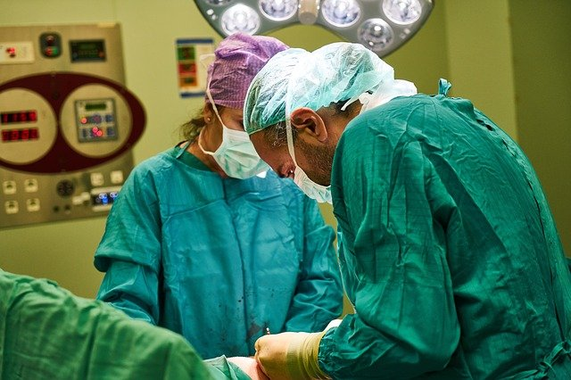
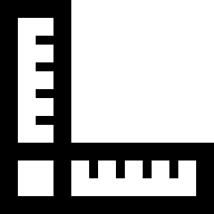
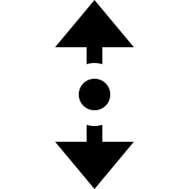

# Numerical summaries: qualitative data {#NumericalQual}


::: {.objectivesBox .objectives data-latex="{iconmonstr-target-4-240.png}"}
So far,
you have learnt to
ask a RQ, 
identify different ways of obtaining data,
design the study,
collect the data
describe the data,
and graphically summarise data.

**In this chapter**,
you will learn to numerically describe *qualitative* data.
Both quantitative and qualitative *data* are described numerically in *quantitative research*.
You will learn to:

* present and numerically summarise qualitative data.
* compute and understand row and column proportions (and percentages).
* compute and understand odds and odds ratios.
* describe relationships between qualitative variables.
:::


```{r fig.cap="", fig.align="center", fig.width=3, out.width="35%"}
SixSteps(4, "Numerical summary (qual. data)")
```


## Modes and medians {#QualIntro}

Because qualitative data has [**levels**](#def:Levels), both types of qualitative data (nominal; ordinal) can be numerically summarised by *counting* the number of observations in each level.

Then, the **mode** is the category with the most observations.

Most commonly, qualitative data is numerically summarised using [**percentages**](#def:Percentage) and [**odds**](#def:Odds).

However, *ordinal* data can be numerically summarised in ways that nominal data cannot be, since *ordinal* data has levels with a natural order. 
Ordinal qualitative data, but **not** nominal qualitative data, can be summarised using *medians*.


```{r}
data(earinf)

earingAgeMedianLocation <- (sum(table(earinf$Age)) + 1) / 2
earinfTotal <- sum(table(earinf$Age))
```


::: {.example #OrdinalMedians name="Medians for ordinal data" }
A study of ear infections [@data:hand:handbook] collected the data in Table \@ref(tab:EarInfection).
Among the variables collected from each individual were:

* whether the person recorded an ear infection, which is *nominal* qualitative;
* the *sex* of the person, which is *nominal* qualitative; and
* the age group of the person, which is *ordinal* qualitative.

The *mode* sex is 'Male', since there are more males than females.
The *mode* age group is '15 to 19', since there are more individuals in this age group than in either of the other two age groups.

Since 'Age group' is *ordinal*, the *median* age group can also be found.
The study includes `r earinfTotal` people, so the median age will be [the middle ordered observation](#Median): ordered observation `r earingAgeMedianLocation`.

Consider ordering all the people in the study by age. 
The youngest age group (people aged 15 to 19) contains 140 people.
The next age group (people aged 20 to 24) contains the next-oldest 79 people, and so the `r earingAgeMedianLocation`th person will be in this age group.

Hence the **median** age group is '20 to 24' (while the **mode** is '15 to 19').
:::

```{r EarInfection}
library(GLMsData)
library(kableExtra)

data(earinf)


EarInfectionTable  <- array( dim = c(5, 4))

colnames(EarInfectionTable) <- c("15 to 19",
                                 "20 to 24",
                                 "25 to 29",
                                 "Total")
rownames(EarInfectionTable) <- c("Females: No ear infections",
                                 "Females: Ear infections",
                                 "Males: No ear infections",
                                 "Males: Ear infections",
                                 "Total")

EarInfectionTable[1:2, 1:3] <- xtabs( ~ Infec + Age, 
                                      data = subset(earinf, 
                                                    Sex == "Female"))
EarInfectionTable[3:4, 1:3] <- xtabs( ~ Infec + Age, 
                                      data = subset(earinf, 
                                                    Sex == "Male"))
EarInfectionTable[5, 1:3] <- colSums(EarInfectionTable[1:4, 1:3])
EarInfectionTable[, 4] <- rowSums(EarInfectionTable[, 1:3])

  

if( knitr::is_latex_output() ) {
  knitr::kable(EarInfectionTable,
        format = "latex",
        longtable = FALSE,
        booktabs = TRUE,
      caption = "The ear infection data") %>%
   #kable_styling(font_size = 10) %>%
   row_spec(0, bold = TRUE) %>%
   row_spec(5, bold = TRUE)
   column_spec(5, bold = TRUE)
}

if( knitr::is_html_output() ) {
  knitr::kable(EarInfectionTable,
        format = "html",
        longtable = FALSE,
        booktabs = TRUE,
        caption = "The ear infection data")%>%
   #kable_styling(font_size = 10) %>%
   row_spec(0, bold = TRUE) %>%
   row_spec(5, bold = TRUE) %>%
   column_spec(5, bold = TRUE)
}
```


Means are not really suitable for numerically summarising qualitative data.
However, sometimes *ordinal* data may be [numerically summarised like quantitative data](#NumericalQuant) in special circumstance (for example, when the categories are considered 'equally spaced').


::: {.example OrdinalMeans name="Means of ordinal data"}
NEED EXAMPLE
:::


## Proportions and percentages {#PercentagesKStones}

### Introduction {#PropPercentages-Intro}

In a medical study [@data:Charig:stones], the aim was to:

> ...compare (two) different methods of treating *renal calculi*... to establish which was the most [...] successful.
>
> --- @data:Charig:stones, p. 879


<div style="float:right; width: 222x; border: 1px; padding:10px">

</div>


`r if (knitr::is_html_output()) '<!--'`
\begin{wrapfigure}{R}{.25\textwidth}
  \begin{center}
    \includegraphics[width=.20\textwidth]{Illustrations/surgery-3034133_640.jpg}
  \end{center}
\end{wrapfigure}
`r if (knitr::is_html_output()) '-->'`


(*Renal calculi* are better known as kidney stones.)
Data were collected from 700 UK patients, on two qualitative variables:

* The treatment method used ('A' or 'B'): The explanatory variable. 
  Each treatment was used on 350 patients.
* The result ('success' or 'failure' of the procedure): The response variable.

Both variables are *qualitative* with two *levels*.
Treatment A was used from 1972--1980, and Treatment B from 1980--1985; that is, the treatments were not *randomly* allocated, and so *confounding* may be an issue.
For this reason, the researchers also recorded the *size* of the kidney stone (also a qualitative variable) as a possible confounding variable, as 'small' or 'large'.

Firstly, consider just the **small stones** [@julious1994confounding].
The data can be compiled using a two-way table (Table \@ref(tab:KS-Small)), and graphed using a side-by-side or stacked bar chart, for example.


```{r}
Counts <- c(81, 234, 6, 36,
            192, 55, 71, 25)
Method <- c("Method A", 
            "Method B", 
            "Method A", 
            "Method B",
            "Method A", 
            "Method B", 
            "Method A", 
            "Method B")
Result <- rep(
              c( rep("Success", 2), 
                 rep("Failure", 2) ),
              2)
Size <- c( rep("Small", 4),
           rep("Large", 4))

KS <- data.frame(Counts, 
                 Method, 
                 Result, 
                 Size)
```

(ref:KStonesNumbersSmall) **Numbers** for **small** kidney stones

```{r KS-Small}
KS.small <- xtabs( Counts ~ Method+Result, 
                   data = subset(KS, Size == "Small"))[, c(2, 1)]
KS.small2 <- cbind(KS.small, 
                   "Total" = rowSums(KS.small))

if( knitr::is_latex_output() ) {
  kable(KS.small2,
        format = "latex",
        longtable = FALSE,
        booktabs = TRUE, 
        digits = 0,
        align = c("r", "r", "r", "r"),
        col.names = c("Success", 
                      "Failure", 
                      "Total"),
        caption = "(ref:KStonesNumbersSmall)"
      ) %>%
   kable_styling(full_width = FALSE) %>%
   column_spec(column = 4, 
               bold = TRUE) 
}
if( knitr::is_html_output() ) {
  out <- kable(KS.small2,
               format = "html",
               longtable = FALSE,
               booktabs = TRUE,
               digits = 0,
               align = c("r", "r", "r", "r"),
               col.names = c("Success", 
                             "Failure", 
                             "Total"),
               caption = "(ref:KStonesNumbersSmall)"
      )
  if ( knitr::is_html_output(excludes = "epub")) {
    kable_styling(out, 
                 full_width = FALSE) %>%
    column_spec(column = 4, 
                bold = TRUE) 
  } else {
    out
  }
   
}
```


Qualitative data can be numerically summarised by computing *proportions* or *percentages*.
These can be computed:

* [from the **table as a whole**](#OverallPercentage);
* [by **rows**](#RowPercentages); or
* [by **columns**](#ColumnPercentages).

These are demonstrated within each section, and in a separate [Example](#ColumnPercentages).

::: {.definition #Proportion name="Proportion"}
A *proportion*\index{proportion}
is a fraction out of a total.
Proportions are numbers between 0 and 1.
:::

::: {.definition #Percentage name="Percentage"}
A *percentage*\index{percentage}
is a proportion, multiplied by 100.
In this context, percentages are numbers between 0% and 100%.
:::


### Overall proportions and percentages {#OverallPercentage}


From Table&nbsp;\@ref(tab:KS-Small), the overall *sample proportion* of successes (denoted $\hat{p}$) is:

\begin{align*}
  \hat{p}
  & =
  \frac{\text{Number of successes}}{\text{Number of procedures}}\\
  & =
  \frac{81 + 234}{6 + 81 + 36 + 234} = 0.882.
\end{align*}
The *sample* proportion of successful procedures for *small* kidney stones is 0.882.
Sample proportions are denoted using $\hat{p}$.\index{sample proportion}
The *sample* proportion (a [*statistic*](#StatisticsAndParameters)) is an estimate of the unknown *population* proportion (a [*parameter*](#StatisticsAndParameters)), which is denoted $p$.


::: {.pronounceBox .pronounce data-latex="{iconmonstr-microphone-7-240.png}"}

The symbol $\hat{p}$ is pronounced 'pee-hat', and refers to the *sample* proportion.
:::


The proportion could also be expressed as a *percentage*, by multiplying by 100:

\[
   0.882 \times 100 = 88.2\%.
\]
The sample *percentage* of successful procedures for *small* kidney stones is 88.2%.
The sample *proportion* and sample *percentage* are both *statistics*


<div style="float:right; width: 222x; border: 1px; padding:10px">

</div>


Notice that, when computing percentages and proportions, we divide the relevant count by the *total number* relevant to the context.


### Row proportions and percentages {#RowPercentages}

For the **small** kidney stones (Table \@ref(tab:KS-Small)), *row proportions* (or percentages), and *column proportions* (or percentages), can be computed

The *row proportions* (Table \@ref(tab:KS-Small-rowPC)) give the proportion of successes for each *Method*, since the rows contain the counts for Method A and Method B.
*Row* proportions allow the proportions within the *rows* to be compared:

* $81 \div 87 = 0.931$ (or 93.1%) of operations in the sample were successful for Method A; and
* $0.867$ (or 86.7%) of operations were successful in the sample for Method B.

This suggests that, for small kidney stones, 
Method A is more successful (93.1%) than Method B (86.7%) in the sample.


(ref:KStonesRowPercentSmall) **Row percentages** for **small** kidney stones (from Table \@ref(tab:KS-Small))

```{r KS-Small-rowPC}
KS.small.rowPC <- prop.table(KS.small, 
                             margin = 1) * 100
KS.small.rowPC2 <- cbind(KS.small.rowPC, 
                         "Total" = c(100, 100) )
  
if( knitr::is_latex_output() ) {
  kable(KS.small.rowPC2,
        format  ="latex",
        longtable = FALSE,
        booktabs = TRUE,
        digits = 1,
        align = c("r", "r", "r", "r"),
        col.names = c("Success", 
                      "Failure", 
                      "Total"),
        caption = "(ref:KStonesRowPercentSmall)") %>%
   kable_styling(full_width = FALSE) %>%
   column_spec(column = 4, 
               bold = TRUE) 
}

if( knitr::is_html_output() ) {
  out <- kable(KS.small.rowPC2,
               format = "html",
               longtable = FALSE,
               booktabs = TRUE,
               digits = 1,
               align = c("r", "r", "r", "r"),
               col.names = c("Success", 
                             "Failure", 
                             "Total"),
               caption = "(ref:KStonesRowPercentSmall)")
  if ( knitr::is_html_output(excludes = "epub")) {
    kable_styling(out, 
                 full_width = FALSE) %>%
    column_spec(column = 4, 
                bold = TRUE) 
  } else {
    out
  }
   
}
```
  


### Column proportions and percentages {#ColumnPercentages}

For the **small** kidney stones (Table \@ref(tab:KS-Small)), *column proportions* can also be computed (Table \@ref(tab:KS-Small-colPC)).
The *column proportions* give the proportion of successes within each method (since the columns contain the procedure results).
*Column* proportions allow the proportions (or percentages) within *columns* to be compared:

* $81 \div (81 + 234) = 0.257$ (or 25.7%) of all *successful* operations came from using Method A; and
* $0.143$ (or 14.3% ) *failures* came from using Method A.


(ref:KStonesColPercentSmall) **Column percentages** for **small** kidney stones (from Table \@ref(tab:KS-Small))

```{r KS-Small-colPC}
KS.small.colPC <- prop.table(KS.small, 
                             margin = 2)*100
KS.small.colPC2 <- rbind(KS.small.colPC, 
                         "Total" = c(100, 100) )
  

if( knitr::is_latex_output() ) {
  kable(KS.small.colPC2,
        format = "latex",
        longtable = FALSE,
        digits = 1,
        booktabs = TRUE,
        align = c("r", "r", "r"),
        col.names = c("Success", 
                      "Failure"),
        caption = "(ref:KStonesColPercentSmall)")  %>%
   kable_styling(full_width = FALSE) %>%
   row_spec(row = 3, 
            bold = TRUE) %>%
   row_spec(row = 2, 
   hline_after = TRUE)
}
if( knitr::is_html_output() ) {
  out <- kable(KS.small.colPC2,
               format = "html",
               longtable = FALSE,
               digits = 1,
               booktabs = TRUE,
               align = c("r", "r", "r"),
               col.names = c("Success", 
                             "Failure"),
               caption = "(ref:KStonesColPercentSmall)")
  if ( knitr::is_html_output(excludes = "epub")) {
    kable_styling(out, 
                 full_width = FALSE) %>%
    row_spec(row = 3, 
             bold = TRUE) 
  } else {
    out
  }
   
}
```


While both row and column proportions (or percentages) can be computed, row percentages seems more intuitive here: they compare the success percentage for each treatment method.


### Example: Large kidney stones {#KidneyExample}


<div style="float:right; width: 222x; border: 1px; padding:10px">

</div>


The data in Table \@ref(tab:KS-Small) are for **small** kidney stones.
Data were also recorded for the **large** kidney stones (Table \@ref(tab:KS-Large)).

For both small and large stones, the *success proportions* can be computed for Methods A and B (i.e., row percentages), and hence the better method (in the sample) can be identified.
   

(ref:KStonesNumbersLarge) **Numbers** for **large** kidney stones

```{r KS-Large}
KS.large <- xtabs( Counts ~ Method + Result, 
                   data = subset(KS, Size == "Large"))[, c(2, 1)]
KS.large2 <- cbind(KS.large, 
                   "Total" = rowSums(KS.large))

if( knitr::is_latex_output() ) {
  kable(KS.large2,
        format = "latex",
        longtable = FALSE,
        booktabs = TRUE,
        digits = 0,
        align = c("r", "r", "r", "r"),
        col.names = c("Success", 
                      "Failure", 
                      "Total"),
        caption = "(ref:KStonesNumbersLarge)") %>%
   column_spec(column = 4, 
               bold = TRUE)
}
if( knitr::is_html_output() ) {
  out <- kable(KS.large2,
               format = "html",
               longtable = FALSE,
               booktabs = TRUE,
               digits = 0,
               align = c("r", "r", "r", "r"),
               col.names = c("Success", 
                             "Failure", 
                             "Total"),
               caption = "(ref:KStonesNumbersLarge)")
  if ( knitr::is_html_output(excludes = "epub")) {
    column_spec(out, 
                column = 4, 
		            bold = TRUE)
  } else {
    out
  }
   
}
```


::: {.thinkBox .think data-latex="{iconmonstr-light-bulb-2-240.png}"}
The success proportion for Method A is greater than the success proportion for Method B for **small** stones (Table \@ref(tab:KS-Small)). 

Now, compute the success proportions for the **large** stones too (Table \@ref(tab:KS-Large)):

* For large stones, the success proportion with Method A is:
* For large stones, the success proportion with Method B is:

Which method has the higher success proportion for **large** stones?

`r if (knitr::is_latex_output()) '<!--'`
`r webexercises::hide()`
Method A has a higher success proportion ($192/263 = 0.7300$) than Method B (0.6875), for large kidney stones.
`r webexercises::unhide()`
`r if (knitr::is_latex_output()) '-->'`
:::


Method A has a higher success proportion in the sample for both *small* (0.931 vs 0.867) and *large* kidney stones (0.730 vs 0.688).

Perhaps the data for small (Table \@ref(tab:KS-Small)) and large kidney stones (Table \@ref(tab:KS-Large)) can therefore be combined, to produce a single two-way table of just Method and Result (Table \@ref(tab:KSAll)), ignoring size.


(ref:KStonesNumbersAll) **Numbers** for **all** kidney stones combined, ignoring the size of the kidney stone

```{r KSAll}
KS.all <- KS.small + KS.large
KS.all2 <- cbind(KS.all, 
                 "Total" = rowSums(KS.all))

if( knitr::is_latex_output() ) {
  kable(KS.all2,
        format = "latex",
        longtable = FALSE,
        booktabs = TRUE,
        digits = 0,
        align = c("r", "r", "r", "r"),
        col.names = c("Success", 
                      "Failure", 
                      "Total"),
        caption = "(ref:KStonesNumbersAll)" ) %>%
   column_spec(column = 4, 
               bold = TRUE)
}
if( knitr::is_html_output() ) {
  out <- kable(KS.all2,
               format = "html",
               longtable = FALSE,
               booktabs = TRUE,
               digits = 0,
               align = c("r", "r", "r", "r"),
               col.names = c("Success", 
                             "Failure", 
                             "Total"),
               caption = "(ref:KStonesNumbersAll)")
  if ( knitr::is_html_output(excludes = "epub")) {
    column_spec(out, 
                column = 4, 
            		bold = TRUE)
  } else {
    out
  }
  
}
```


In summary, the sample shows that:

* For **small** stones (Table \@ref(tab:KS-Small)), **Method A has a higher success proportion**:
  Method A: 0.93;  Method B: 0.87
* For **large** stones (Table \@ref(tab:KS-Large)), **Method A has a higher success proportion**:
  Method A: 0.73; Method B: 0.69
* Combining **all** stones together (Table \@ref(tab:KSAll)), **Method B has a higher success proportion**:  
  Method A: 0.78; Method B: 0.83

That seems strange...
Method A performs better for small and for large kidney stones, but Method B performs better when combined (and size is ignored).


::: {.thinkBox .think data-latex="{iconmonstr-light-bulb-2-240.png}"}
How can Method A be better when small and large stones are considered separately, but Method B be better when they are combined?

Can you explain *why*?

`r if (knitr::is_latex_output()) '<!--'`
`r webexercises::hide()`
Method B performs worse for small and large stones. 

Also, the success proportions are always better for small stones. 

Then see that Method A is used far more often for large stones, for which *both* methods perform poorly.

In other words, Method A is used more often in situations where both methods perform poorly.
`r webexercises::unhide()`
`r if (knitr::is_latex_output()) '-->'`
:::


The *size of the stone* is a *confounding variable* (Fig. \@ref(fig:SimpsonRulesStones)): The size of the stone is related to success proportion (small stones have a greater success proportion) *and* the size of the stone is related to the method used
(small stones are treated more often with Method B).

This confounding could have been avoided by randomly allocating a treatment methods to patients.
However, random allocation was not possible in this study, so the researchers used a different method to manage confounding: *recording* the size of the kidney stones (and other variables also: the age and sex of the patient); see Sect. \@ref(ObsManagingConfoundingAnalysis).

In this example, acknowledging the size of the kidney stone is important, otherwise the wrong (opposite) conclusion is reached: one would think that Method B is better if the size of the stones was ignored, when the best method really is Method A.

This is called [*Simpson's paradox*](https://en.wikipedia.org/wiki/Simpson%27s_paradox).
If the size of the kidney stone had not been recorded, size would have been a lurking variable,\index{lurking variable} and the incorrect conclusion would have been reached.


```{r SimpsonRulesStones, fig.cap="The size of the stones is related to both the success percentage and the method", fig.align="center", fig.height=3}
par( mar=c(0.05, 0.05, 0.05, 0.05))
openplotmat()

pos <- array(NA, dim = c(3, 2))
pos[1, ] <- c(0.25, 0.25) # Success 
pos[2, ] <- c(0.75, 0.25) # Method
pos[3, ] <- c(0.5, 0.65)   # Size

straightarrow(from = pos[2,], 
              to = pos[1,], 
              lty = 1, 
              lwd = 2)
straightarrow(from = pos[3,],
              to = pos[1,], 
              lty=2,
              lcol="grey")
straightarrow(from = pos[3,], 
              to = pos[2,], 
              lty = 2,
              lcol = "grey")

textrect( pos[1,], 
           lab = "Success", 
           radx = 0.05, 
           rady = 0.07, 
           shadow.size = 0,
           box.col = "slategray1",
           lcol = "slategray1")
textrect( pos[2,], 
           lab = "Method", 
           radx = 0.05, 
           rady = 0.07, 
           shadow.size = 0,
           box.col = "darkseagreen1",
           lcol = "darkseagreen1")
textrect( pos[3,], 
           lab = "Size", 
           radx = 0.05, 
           rady = 0.07, 
           shadow.size = 0,
           box.col = "antiquewhite",
           lcol = "antiquewhite")
```


## Odds {#QualOdds}

Consider again the **small** kidney stone data (Table \@ref(tab:KS-Small)).

For *Method A*, the sample contains 81 successes and 6 failures.
Apart from proportions and percentages, another way to numerically summarise this information is to see that there are $81\div 6 = 13.5$ *times* as many successes than failures in the sample.

In other words, for small kidney stones, the **odds** of success for Method A is 13.5 (in the sample).
The sample odds is a *statistic*, and the population odds is a *parameter*.


::: {.definition #Odds name="Odds"}
The **odds** are the proportion (or percentage, or number) of times that an event *happens*, divided by the proportion (or percentage, or number) of times that the event does *not happen*:

\[
         \text{Odds} 
          = 
            \frac{\text{Proportion of times that something happens}}
                 {\text{Proportion of times that something doesn't happen}},
\]
or (equivalently)

\[
         \text{Odds} = \frac{\text{Number of times that something happens}}{\text{Number of times that something doesn't happen}}.
\]
The *odds* show how many *times* an event *happens* compared to *not happening*.
Alternatively, it is how many times the event *happens* for every 100 times that it does *not* happen.
:::


<div style="float:right; width: 222x; border: 1px; padding:10px">

</div>


Notice that, when computing odds, we divide the relevant number by the *remaining number*, which is different than how percentages are computed.

percentages and proportions, we divide the relevant number by the *total number* relevant to the context.

Software usually works with odds rather than percentages (for good reasons that we will not delve into).
However, understanding *how* software computes the odds is important.


::: {.softwareBox .software data-latex="{iconmonstr-laptop-4-240.png}"}
Software usually computes odds as comparing either

* Row 1 to Row 2; or
* Column 1 to Column 2.

Both ways are correct.

Here then, based on Table \@ref(tab:KS-Small), the odds for comparing the Methods would be computed as  Method A compared to Method B (rather than Method B to Method A).
:::


::: {.example #InterpretingOdds name="Interpreting odds"}
For the *small* kidney stone data, the odds of a success for Method A is  $81\div6 = 13.5$ (in the sample).
This can be interpreted as:

* There are $13.5$ *times* as many successes as failures (in the sample); 
* There are $13.5\times 100 = 1350$  successes for every 100 failures (in the sample).

Either way, successes are *far* more common than failures, for small kidney stones using Method A.
:::


::: {.thinkBox .think data-latex="{iconmonstr-light-bulb-2-240.png}"}
What are the odds of finding a *failure* for Method A?

How is this value interpreted?


`r if (knitr::is_latex_output()) '<!--'`
`r webexercises::hide()`
The odds is: $6\div81 = 0.0741$.

This means: For every 100 successes, expect about $0.0741\times 100 = 7.4$ failures.
`r webexercises::unhide()`
`r if (knitr::is_latex_output()) '-->'`
:::


::: {.example #OddsEG name="Odds"}
Suppose that about 67% of students at a particular university were female.
The *population* odds of finding a female is about $67 / (100 - 67) = 2.03$: about twice as many females are students as non-females.

Suppose one tutorials had 18 females and 5 non-females.
The *sample* odds of finding a female in this class is $18/5 = 3.60$.
Another classes had 16 females and 9 non-females.
The *sample* odds of finding a female in this class is $16/9 = 1.79$.
:::


::: {.example #ComputingOdds name="Computing odds"}
Consider again the **small** kidney stone data (Table \@ref(tab:KS-Small)).
The odds of a success using *Method B* can also be found (Table \@ref(tab:KS-Small)):

\begin{align*}
  &\text{Odds}(\text{Success with Method B})\\
  =
  &\frac{\text{Number of successes for Method B}}{\text{Number of failures for Method B}}
  =\frac{234}{36} = 6.52.
\end{align*}
Working with the proportions (or percentages) (Table \@ref(tab:KS-Small-rowPC))
rather than the numbers, the same value results:

\begin{align*}
  & \text{Odds}(\text{Success with Method B})\\
  = 
  &\frac{\text{Percentage of successes for Method B}}{\text{Percentage of failures for Method B}}
  =\frac{86.7}{13.3} = 6.52.
\end{align*}
:::


<iframe src="https://learningapps.org/watch?v=pxf5194ek22" style="border:0px;width:100%;height:500px" allowfullscreen="true" webkitallowfullscreen="true" mozallowfullscreen="true"></iframe>


::: {.importantBox .important data-latex="{iconmonstr-warning-8-240.png}"}
When interpreting odds:
  
* When the odds are *greater* than one: the event is *more* likely to happen than to not happen.
* When the odds are *equal to* one: the event is just as likely to happen as it is to not happen.
* When the odds are *less* than one: the event is *less* likely to happen than to not happen.
:::


::: {.thinkBox .think data-latex="{iconmonstr-light-bulb-2-240.png}"}
What are the odds of rolling a 2 on a die?
`r if( knitr::is_html_output(exclude = "epub")) {
longmcq( c(
   "About 0.1666", 
   "6",
   "0.5",
   "1/6",
   answer = "About 0.2") )}`
:::


## Comparing odds: Odds ratios {#OdddsRatios}

To summarise the **small** kidney stone data:

* For *Method A*, the odds of success are 13.5; there are 13.5 *times* as many successes as failures.
  (Alternatively, there are 1350 successes for every 100 failures.)
* For *Method B*, the odds of success are  6.5; there are  6.5 *times* as many successes as failures.
  (Alternatively, there are 650 successes for every 100 failures.)

The odds of success for Method A and Method B are very different: in the sample, the odds of success for Method A is many *times* greater than for Method B.
In fact, in the sample, the odds of success for Method A is 

\[
	\frac{13.5}{6.5} = 2.08
\]

*times* the odds of a success for Method B.
This value is called the **odds ratio** (OR); see Fig. \@ref(fig:OddsRatioKS).
The sample odds ratio is a *statistic*, and the population odds ratio is a *parameter*.


<div style="float:right; width: 222x; border: 1px; padding:10px">

</div>


::: {.definition #OddsRatio name="Odds Ratio (OR)"}
The **odds ratio** is how many *times* greater the odds of an event are in one group,
compared to the odds of the same event in another group.
:::


::: {.softwareBox .software data-latex="{iconmonstr-laptop-4-240.png}"}
Understanding how software computes the odds ratio is important for understanding the output. 
jamovi and SPSS compute the odds ratio as *either*:

* The *odds* compare Row 1 to Row 2, then the odds ratio compares the Row 1 odds to the Row 2 odds.

* The *odds* compare Column 1 to Column 2, then the odds ratio compares the Column 1 odds to the Column 2 odds.
  
In other words, the odds and odds ratios are relative to the **first row** or **first column**.
:::

The OR compares the odds of an event in two groups.
This means that a $2\times 2$ table can be summarised using one number: the odds ratio (OR).


```{r OddsRatioKS, fig.cap="The odds ratio for the small kidney stones data", fig.align="center", fig.height=3, fig.width=4.5}
par( mar=c(0.15, 0.15, 0.15, 0.15))
openplotmat()

pos <- array(NA, 
             dim = c(2, 2))
pos[1, ] <- c(0.2, 0.5) # Odds success 
pos[2, ] <- c(0.8, 0.5) # Odds failure


straightarrow(from = pos[1, ], 
              to = pos[2,], 
              lcol = "black",
              lty = 1)

textrect( pos[1, ], 
          lab = "Method A:\nOdds of success\n is 13.50",
          radx = 0.16,
          rady = 0.20,
          shadow.size = 0,
          lcol = "slategray2",
          box.col = "slategray2")
textrect( pos[2, ], 
          lab = "Method B:\nOdds of success\n is 6.50",
          radx = 0.16,
          rady = 0.2,
          shadow.size = 0,
          lcol = "slategray2",
          box.col = "slategray2")

textrect( c(0.5, 0.65), 
          lab = "How many\ntimes greater?", 
          radx = 0.025,
          rady = 0.025,
          shadow.size = 0,
          lcol = "white",
          box.col = "white")
textrect( c(0.5, 0.35), 
          box.col = "white",
          lcol = "white",
          shadow.size = 0,
          radx = 0.05,
          rady = 0.025,
          lab = "2.08 times\ngreater")
```


::: {.importantBox .important data-latex="{iconmonstr-warning-8-240.png}"}
When using odds ratios (or ORs):
  
* When the odds ratio is *greater* than one:  
  the odds of the event for the group in the top of the division is *greater* than the odds of the event for the group in the bottom of the division.
* When the odds ratio is *equal to* one:  
  the odds of the event for the group in the top of the division is *equal to* the odds of the event for the group in the bottom of the division.
* When the odds ratio is *less* than one:  
  the odds of the event for the group in the top of the division is *less* than the odds of the event for the group in the bottom of the division.
:::


`r if (knitr::is_html_output()){
  'The following short video may help explain some of these concepts:'
}`


<div style="text-align:center;">
```{r}
htmltools::tags$video(src ="./videos/oddsratios.mp4", 
                      width="550", 
                      controls="controls", 
                      loop="loop", 
                      style="padding:5px; border: 2px solid gray;")
```
</div>


<iframe src="https://learningapps.org/watch?v=pcyn538fj22" style="border:0px;width:100%;height:500px" allowfullscreen="true" webkitallowfullscreen="true" mozallowfullscreen="true"></iframe>


## Observing relationships {#OddsObserveRelationships}

For the **small** kidney stone data, the odds of a success for Method A is different than the odds of a successes for Method B, in the *sample*.
Broadly, two possible reasons exist to explain the differences *in the sample*:

* The **odds** in the **population** are the same for Method A and Method B, but a difference is observed in the *sample* odds simply because of who ended up in the sample.
  Every sample is likely to be different, and the *sample* we ended up with happened to show a difference.
  *Sampling variation* explains the *difference in the sample odds*.
       
* The **odds** in the **population** are different for Method A and Method B, and the difference in the sample odds simply reflects this difference between the *population* odds.

Similarly, the proportion (or percentage) of successes for Method A and B are quite different in the *sample*, and two possible reasons exist to explain the differences *in the sample*:

* **No difference exists between the proportion (or percentage)** in the **population**, but a difference is observed in the *sample* simply because of who ended up in the sample.
  *Sampling variation* explains the *difference in the sample proportion (or percentage)*.
       
* **A difference does exist between the proportion (or percentage)** in the **population**, and this difference in the sample
  simply reflects this difference between the *population* proportion (or percentage).

The difficulty, of course, is knowing which of these two reasons ('hypotheses') is the most likely reason for the difference
between the sample odds.
This question is of prime importance (after all, it answers the RQ), and is addressed at length later in this book.


## Example: Skipping breakfast {#Skipping-Breakfast}


<div style="float:right; width: 222x; border: 1px; padding:10px">

</div>


`r if (knitr::is_html_output()) '<!--'`
\begin{wrapfigure}{R}{.25\textwidth}
  \begin{center}
    \includegraphics[width=.20\textwidth]{Illustrations/pexels-daria-shevtsova-949067.jpg}
  \end{center}
\end{wrapfigure}
`r if (knitr::is_html_output()) '-->'`


The data in Table \@ref(tab:SkipBreakfast) come from a study of Iranian children aged 6--18 years old [@data:kelishadi2017:snack].
From this table:	

* The *proportion* of females who skipped breakfast is $\hat{p}_F = 2\,383/6\,640 = 0.359$;
* The *proportion* of   males who skipped breakfast is $\hat{p}_M = 1\,944/6\,846 = 0.284$.

Also,

* $\text{Odds}(\text{Skips breakfast, among F}) = 2\,383/4\,257 = 0.5598$;
* $\text{Odds}(\text{Skips breakfast, among M}) = 1\,944/4\,902 = 0.3966$.

For example, about 55.98 females *skip* breakfast for every 100 females who *eat* breakfast.
The *odds ratio* (OR) comparing the odds of skipping breakfast, comparing females to males, is

\begin{align*}
    \text{OR}
  &= \frac{\text{Odds}(\text{Skipping breakfast, for females})}{\text{Odds}(\text{Skipping breakfast, for males})}\\ 
  &= \frac{0.5598}{0.3966} 
  = 1.41;
\end{align*}
the odds of females skipping breakfast are $1.41$ *times* the odds of males skipping breakfast.
The data can then be summarised numerically (Table \@ref(tab:BreakSum)).


```{r SkipBreakfast}
Counts <- c(2383, 
            1944, 
            4257, 
            4902)
Gender <- c("Females", 
            "Males", 
            "Females", 
            "Males")
Breakfast <- c("Skip", 
               "Skip", 
               "Doesn't skip", 
               "Doesn't skip")

Brek <- xtabs(Counts ~ Gender + Breakfast)[, c(2, 1)]
Brek2 <- cbind(Brek, "Total" = rowSums(Brek))

if( knitr::is_latex_output() ) {
  kable(Brek2,
        format = "latex",
        longtable = FALSE,
        booktabs = TRUE,
        align = c("r", "r", "r"),
        digits = 0,
        col.names = c("Skips breakfast", 
                      "Doesn't skip breakfast", 
                      "Total"),
        caption = "The number of Iranian children aged 6 to 18 who skip and do not skip breakfast" ) %>%
   column_spec(column = 4, 
               bold = TRUE)
}

if( knitr::is_html_output() ) {
  out <- kable(Brek2,
        format = "html",
        longtable = FALSE,
        booktabs = TRUE,
        align = c("r", "r", "r"),
        digits = 0,
        col.names = c("Skips breakfast", 
                      "Doesn't skip breakfast", 
                      "Total"),
        caption = "The number of Iranian children aged 6 to 18 who skip and do not skip breakfast" )
  if ( knitr::is_html_output(excludes = "epub")) {
    column_spec(out, 
                column = 4, 
                bold = TRUE)
  } else {
    out
  }
   
}
```


```{r BreakSum}

Brek.Sum <- array( NA, 
                   dim = c(3, 3))
rownames(Brek.Sum) <- c("Females", 
                        "Males", 
                        "Odds ratio")

Brek.Sum[1, 1] <- Brek[1, 1] / sum(Brek[1,]) * 100
Brek.Sum[2, 1] <- Brek[2, 1] / sum(Brek[2,]) * 100

Brek.Sum[1, 2] <- Brek[1, 1] /Brek[1, 2]
Brek.Sum[2, 2] <- Brek[2, 1] /Brek[2, 2]

Brek.Sum[3, 2] <- Brek.Sum[1, 2] / Brek.Sum[2, 2]

Brek.Sum[1, 3] <- sum(Brek[1, ])
Brek.Sum[2, 3] <- sum(Brek[2, ])

options(knitr.kable.NA = '') 


if( knitr::is_latex_output() ) {
  kable(Brek.Sum,
        format = "latex",
        longtable = FALSE,
        booktabs = TRUE,
        align = c("r", "r", "r"),
        digits = c(1, 3),
        col.names = c("Percentage", 
                      "Odds", 
                      "Sample size"),
        caption = "Numerical summary of the Iranian-breakfast data: Odds and percentage of those who skip breakfast") %>%
    row_spec(row = 2, 
             hline_after = TRUE)
}
if( knitr::is_html_output() ) {
  out <- kable(Brek.Sum,
               format = "html",
               longtable = FALSE,
               booktabs = TRUE,
               align = c("r", "r", "r"),
               digits = c(1, 3),
               col.names = c("Percentage", 
                             "Odds", 
                             "Sample size"),
               caption = "Numerical summary of the Iranian-breakfast data: Odds and percentage of those who skip breakfast")
  if ( knitr::is_html_output(excludes = "epub")) {
    row_spec(out, 
             row = 2, 
	     hline_after = TRUE)
  } else {
    out
  } 
}
```


## Case Study: The NHANES data {#NHANESCaseStudyQual}


<div style="float:right; width: 222x; border: 1px; padding:10px">

</div>


`r if (knitr::is_html_output()) '<!--'`
\begin{wrapfigure}{R}{.25\textwidth}
  \begin{center}
    \includegraphics[width=.20\textwidth]{Illustrations/hamburger-2253349_640.jpg}
  \end{center}
\end{wrapfigure}
`r if (knitr::is_html_output()) '-->'`


In Sects. \@ref(NHANESGraphs) and \@ref(NHANESNumerical), the NHANES data were introduced [@data:NHANES3:Data; @data:NHANES3; @data:NHANES:Rpackage], and graphs and numerical summaries used to understand the data relevant to answering this RQ:

> Among Americans, is the mean direct HDL cholesterol different for those who smoke now, and those who do not smoke now?

The data can be summarised numerically: the response variable (HDL cholesterol), the explanatory variable (current smoking status), and potential extraneous and confounding variables.
Different summaries are needed for quantitative (means and standard deviations; medians and IQR) and qualitative (percentages; odds) variables (Table \@ref(tab:NHANESBigSummary)).


```{r}
data(NHANES)
NHANESSmoker <- subset(NHANES, 
                       SmokeNow == "Yes")
NHANESNonSmoker <- subset(NHANES, 
                          SmokeNow == "No")

rowinfo <- function(variable, fn, dat = NHANES){
  one <- tapply(NHANES, )
}
NHANESdemogr <- array( dim = c(23, 5))
colnames(NHANESdemogr) <- c("Quantity", 
                            "Statistic", 
                            "Overall", 
                            "Non-smokers", 
                            "Smokers")

NHANESdemogr[1, ] <- c( "Sample size",
                        " ",
                        dim(NHANES)[1],
                        sum( NHANES$SmokeNow == "No", na.rm = TRUE),
                        sum( NHANES$SmokeNow == "Yes", na.rm = TRUE) )
NHANESdemogr[2, ] <- c( "Direct HDL (mmol/L)",
                       "n",
                        sum( !is.na(NHANES$DirectChol) ),
                        sum( !is.na(NHANES$DirectChol[NHANES$SmokeNow == "No"]) ),
                        sum( !is.na(NHANES$DirectChol[NHANES$SmokeNow == "Yes"]) ) ) 
NHANESdemogr[3, ] <- c( " ",
                       "Mean",
                        round( mean(NHANES$DirectChol, na.rm = TRUE), 2),
                        round( mean( NHANES$DirectChol[NHANES$SmokeNow == "No"], na.rm = TRUE), 2),
                        round( mean( NHANES$DirectChol[NHANES$SmokeNow == "Yes"], na.rm = TRUE), 2) )
NHANESdemogr[4, ] <- c( " ",
                       "Std. dev.",
                        round( sd(NHANES$DirectChol, na.rm=TRUE), 2),
                        round( sd( NHANES$DirectChol[NHANES$SmokeNow == "No"], na.rm = TRUE), 2),
                        round( sd( NHANES$DirectChol[NHANES$SmokeNow == "Yes"], na.rm = TRUE),  2) )

NHANESdemogr[5, ] <- c( "Gender",
                       "n",
                        sum( !is.na(NHANES$Gender) ),
                        sum( !is.na(NHANES$Gender[NHANES$SmokeNow == "No"]) ),
                        sum( !is.na(NHANES$Gender[NHANES$SmokeNow == "Yes"]) ) ) 
NHANESdemogr[6, ] <- c( " ",
                       "% Female",
                        round( sum(NHANES$Gender ==" female") / sum( !is.na(NHANES$Gender) ) * 100, 1),
                        round( sum(NHANESNonSmoker$Gender == "female") / sum( !is.na(NHANESNonSmoker$Gender) ) * 100, 1),
                        round( sum(NHANESSmoker$Gender == "female") / sum( !is.na(NHANESSmoker$Gender) ) * 100, 1) )


NHANESdemogr[7, ] <- c( "Age (years)",
                       "n",
                        sum( !is.na(NHANES$Age) ),
                        sum( !is.na(NHANES$Age[NHANES$SmokeNow == "No"]) ),
                        sum( !is.na(NHANES$Age[NHANES$SmokeNow == "Yes"]) ) ) 
NHANESdemogr[8, ] <- c( " ",
                       "Mean",
                        round( mean(NHANES$Age, na.rm = TRUE), 2),
                        round( mean( NHANES$Age[NHANES$SmokeNow == "No"], na.rm = TRUE), 2),
                        round( mean( NHANES$Age[NHANES$SmokeNow == "Yes"], na.rm = TRUE), 2) )
NHANESdemogr[9, ] <- c( " ",
                       "Std. dev.",
                        round( sd(NHANES$Age, na.rm = TRUE), 2),
                        round( sd( NHANES$Age[NHANES$SmokeNow == "No"], na.rm = TRUE), 2),
                        round( sd( NHANES$Age[NHANES$SmokeNow == "Yes"], na.rm = TRUE),  2) )

NHANESdemogr[10, ] <- c( "Height (cm)",
                       "n",
                        sum( !is.na(NHANES$Height) ),
                        sum( !is.na(NHANES$Height[NHANES$SmokeNow == "No"]) ),
                        sum( !is.na(NHANES$Height[NHANES$SmokeNow == "Yes"]) ) ) 
NHANESdemogr[11, ] <- c( " ",
                       "Mean",
                        round( mean(NHANES$Height, na.rm=TRUE), 2),
                        round( mean( NHANES$Height[NHANES$SmokeNow == "No"], na.rm = TRUE), 2),
                        round( mean( NHANES$Height[NHANES$SmokeNow == "Yes"], na.rm = TRUE), 2) )
NHANESdemogr[12, ] <- c( " ",
                       "Std. dev.",
                        round( sd(NHANES$Height, na.rm = TRUE), 2),
                        round( sd( NHANES$Height[NHANES$SmokeNow == "No"], na.rm = TRUE), 2),
                        round( sd( NHANES$Height[NHANES$SmokeNow == "Yes"], na.rm = TRUE),  2) )

NHANESdemogr[13, ] <- c( "Weight (kg)",
                       "n",
                        sum( !is.na(NHANES$Weight) ),
                        sum( !is.na(NHANES$Weight[NHANES$SmokeNow == "No"]) ),
                        sum( !is.na(NHANES$Weight[NHANES$SmokeNow == "Yes"]) ) ) 
NHANESdemogr[14, ] <- c( " ",
                       "Mean",
                        round( mean(NHANES$Weight, na.rm = TRUE), 2),
                        round( mean( NHANES$Weight[NHANES$SmokeNow == "No"], na.rm = TRUE), 2),
                        round( mean( NHANES$Weight[NHANES$SmokeNow == "Yes"], na.rm = TRUE), 2) )
NHANESdemogr[15, ] <- c( " ",
                       "Std. dev.",
                        round( sd(NHANES$Weight, na.rm = TRUE), 2),
                        round( sd( NHANES$Weight[NHANES$SmokeNow == "No"], na.rm = TRUE), 2),
                        round( sd( NHANES$Weight[NHANES$SmokeNow == "Yes"], na.rm = TRUE),  2) )

NHANESdemogr[16, ] <- c( "BMI (kg/m-sq)",
                       "n",
                        sum( !is.na(NHANES$BMI) ),
                        sum( !is.na(NHANES$BMI[NHANES$SmokeNow == "No"]) ),
                        sum( !is.na(NHANES$BMI[NHANES$SmokeNow == "Yes"]) ) ) 
NHANESdemogr[17, ] <- c( " ",
                       "Mean",
                        round( mean(NHANES$BMI, na.rm = TRUE), 2),
                        round( mean( NHANES$BMI[NHANES$SmokeNow == "No"], na.rm = TRUE), 2),
                        round( mean( NHANES$BMI[NHANES$SmokeNow == "Yes"], na.rm = TRUE), 2) )
NHANESdemogr[18, ] <- c( " ",
                       "Std. dev.",
                        round( sd(NHANES$BMI, na.rm = TRUE), 2),
                        round( sd( NHANES$BMI[NHANES$SmokeNow == "No"], na.rm = TRUE), 2),
                        round( sd( NHANES$BMI[NHANES$SmokeNow == "Yes"], na.rm = TRUE),  2) )

NHANESdemogr[19, ] <- c( "Diabetes",
                       "n",
                        sum( !is.na(NHANES$Diabetes) ),
                        sum( !is.na(NHANES$Diabetes[NHANES$SmokeNow == "No"]) ),
                        sum( !is.na(NHANES$Diabetes[NHANES$SmokeNow == "Yes"]) ) ) 
NHANESdemogr[20, ] <- c( " ",
                       "% Yes",
                        round( sum(NHANES$Diabetes == "Yes", na.rm = TRUE) / sum( !is.na(NHANES$Diabetes) ) * 100, 1),
                        round( sum(NHANESNonSmoker$Diabetes == "Yes", na.rm = TRUE) / sum( !is.na(NHANESNonSmoker$Diabetes) ) * 100, 1),
                        round( sum(NHANESSmoker$Diabetes == "Yes", na.rm = TRUE) / sum( !is.na(NHANESSmoker$Diabetes) ) * 100, 1) )

NHANESdemogr[21, ] <- c( "Urine volume (mL)",
                       "n",
                        sum( !is.na(NHANES$UrineVol1) ),
                        sum( !is.na(NHANES$UrineVol1[NHANES$SmokeNow == "No"]) ),
                        sum( !is.na(NHANES$UrineVol1[NHANES$SmokeNow == "Yes"]) ) ) 
NHANESdemogr[22, ] <- c( " ",
                       "Median",
                        round( median(NHANES$UrineVol1, na.rm = TRUE), 2),
                        round( median( NHANES$UrineVol1[NHANES$SmokeNow == "No"], na.rm = TRUE), 2),
                        round( median( NHANES$UrineVol1[NHANES$SmokeNow == "Yes"], na.rm = TRUE), 2) )
NHANESdemogr[23, ] <- c( " ",
                       "IQR",
                        round( IQR(NHANES$UrineVol1, na.rm = TRUE), 2),
                        round( IQR( NHANES$UrineVol1[NHANES$SmokeNow == "No"], na.rm = TRUE), 2),
                        round( IQR( NHANES$UrineVol1[NHANES$SmokeNow == "Yes"], na.rm = TRUE),  2) )

```


	
	
	
```{r NHANESBigSummary}
tab.cap <- paste("A summary of some variables in the NHANES data set,",
             "according to current smoking status",
             "(current smoking status was not reported for 6789 respondents,",
             "and some other variables were not reported for all respondents).",
             "Quantitative variables are summarised using either the mean and standard deviation,",
             "or median and IQR;",
             "qualitative variables using percentages.",
             "There are many missing values.")
	
if( knitr::is_latex_output() ) {
  kable(NHANESdemogr, 
        format = "latex",
        longtable = FALSE,
        col.names = colnames(NHANESdemogr),
        booktabs = TRUE,
        linesep = c("\\addlinespace",  # Otherwise addes a space after five lines... 
                    "", "", "\\addlinespace",
                    "",     "\\addlinespace",
                    "", "", "\\addlinespace",
                    "", "", "\\addlinespace",
                    "", "", "\\addlinespace",
                    "", "", "\\addlinespace",
                    "",     "\\addlinespace",
                    "", "", ""),
        align = "r",
        caption = tab.cap) %>%
    column_spec(1, 
                bold = TRUE) %>%    # Row headings in bold
    column_spec(2, 
                italic = TRUE)     # Row headings in bold
}
if( knitr::is_html_output() ) {
  out <- kable(NHANESdemogr, 
               format = "html",
               longtable = FALSE,
               col.names = colnames(NHANESdemogr),
               booktabs = TRUE,
               align = "r",
               caption = tab.cap)
  if ( knitr::is_html_output(excludes = "epub")) {
    kable_styling(out, 
                  full_width = FALSE) %>%
    column_spec(1, 
                bold = TRUE) %>%     # Row headings in bold
    column_spec(2, 
                bold = TRUE)     # Row headings in bold
  } else {
    out
  }
}
```


A number of interesting questions emerge from Table \@ref(tab:NHANESBigSummary):

* How can the mean age of all respondents be 36.7 years, but the mean age for non-smokers and smokers *both* be much larger than this (54.3 and 42.7 years respectively)?
* Similarly, the percentage of females in the whole sample is 50.2%, but the percentage of females is less than this for both non-smokers and smokers (43.8% and 43.5% respectively)?

Table \@ref(tab:NHANESDiabSmoke) summarises the relationship between current smoking status and having a diabetes diagnosis.
Again, questions emerge:

* For current non-smokers, the *percentage* of diabetics is $15.32$%.
* For current smokers, the *percentage* of diabetics is $7.23$%.

The percentage of diabetics *in the sample* is different for non-smokers and smokers.
Why?
Similarly,

* For current non-smokers, the *odds* of finding a diabetic is $0.181$.
* For current smokers, the *odds* of finding a diabetic is $0.078$.

The odds of finding a diabetic *in the sample* is different for non-smokers and smokers.
Why?

As noted before (Sect. \@ref(OddsObserveRelationships)), two possible reasons could explain this difference in percentages and odds *in the sample*:

* *Sampling variation*:
  The percentages (and odds) are the *same* in the population, but difference in the *sample* occur because of the people that happened to end up with the sample.
  *Sampling variation* explains the *difference in the sample percentages (and odds)*.
       
* The percentages (and odds) are *different* in *the population*: for non-smokers and smokers, and the difference in the sample percentages (and odds) simply reflects *a difference* between non-smokers and smokers in the population.

In the next chapters, tools for deciding which of these explanations is the most likely are discussed.


```{r NHANESDiabSmoke}
data(NHANES)

NHANES.Diab.Smoke <- xtabs( ~ Diabetes + SmokeNow, 
                            data = NHANES)
rownames(NHANES.Diab.Smoke) <- c("Not diabetic", 
                                 "Diabetic")

if (knitr::is_latex_output()){
   kable(NHANES.Diab.Smoke,
         format = "latex",
         longtable = FALSE,
         booktabs = TRUE,
         caption = "The two-way table of diabetes diagnosis against current smoking status",
         col.names = c("Doesn't smoke now", 
	                     "Smokes now"))
}
if (knitr::is_html_output()){
  kable(NHANES.Diab.Smoke,
        format = "html",
        longtable = FALSE,
        booktabs = TRUE,
        caption = "The two-way table of diabetes diagnosis against current smoking status",
        col.names = c("Doesn't smoke now", 
	                    "Smokes now"))
}

```


## Summary {#Chap14-Summary}

One qualitative variable can be numerically summarized using **percentages** or **odds**.

With two qualitative variables, data can be compiled into a two-way table of counts, and then the data can be numerically summarised using:
* **row percentages**;
* **column percentages**;
**odds**; or 
* **odds ratios**.

*Ordinal* qualitative data can also be summarised using *medians*.

`r if (knitr::is_html_output()) {'The following short video may be useful to watch.'}`

<iframe width="560" height="315" src="https://www.youtube.com/embed/KyuaX10l3GQ" frameborder="0" allow="accelerometer; encrypted-media; gyroscope; picture-in-picture"></iframe>


## Quick revision questions {#Chap14-QuickReview}

A study [@data:Alley2017:SocialMedia] examined social media (SM) use, using a

> ... sample of Australian adults [...] randomly selected from a database with Queensland landline telephone numbers. 
> To be eligible, participants must be aged 18 or more and reside in Queensland.
>
> @data:Alley2017:SocialMedia, p. 92

Part of the data are summarised in Table \@ref(tab:SocialMedia).

1. Compute the *sample proportion* of *urban* residents who use social media, $\hat{p}_U$.  
`r if( knitr::is_html_output(exclude = "epub") ) {mcq( c(
	"416/984 = 0.423",
	answer = "568/984 = 0.577",
	"416/568 = 0.732",
	"568/416 = 1.365"))}`
1. Compute the *sample proportion* of *rural* residents who use social media, $\hat{p}_R$.  
`r if( knitr::is_html_output(exclude = "epub") ) {mcq( c(
	"78/89 = 0.876",
	"89/78 = 1.141",
	"78/167 = 0.467",
	answer = "89/167 = 0.533"))}`
1. Compute the *sample odds* of *urban* residents who use social media.  
`r if( knitr::is_html_output(exclude = "epub") ) {mcq( c(
	"416/984 = 0.423",
	"568/984 = 0.577",
	"416/568 = 0.732",
	answer = "568/416 = 1.365"))}`
1. Compute the *sample odds* of *rural* residents who use social media.  
`r if( knitr::is_html_output(exclude = "epub") ) {mcq( c(
	"78/89 = 0.876",
	answer = "89/78 = 1.141",
	"78/167 = 0.467",
	"89/167 = 0.533"))}`
1. Compute the *sample odds ratio* of using social media, comparing *urban* to *rural* residents.  
`r if( knitr::is_html_output(exclude = "epub") ) {mcq( c(
	answer = "1.365/1.141 = 1.196",
	"1.1411/1.365 = 0.836"))}`

`r if (!knitr::is_html_output()) '<!--'`
::: {.progressBox .progress}
**Progress:**  `r webexercises::total_correct()`
:::
`r if (!knitr::is_html_output()) '-->'`


```{r SocialMedia}
Counts <- c(416, 
            568, 
            78, 
            89)
Location <- c("Urban", 
              "Urban", 
              "Rural", 
              "Rural")
SMedia <- c("Don't use SM", 
            "Use SM", 
            "Don't use SM", 
            "Use SM")

SM <- xtabs(Counts ~ Location + SMedia)
SM2 <- cbind(SM, 
             "Total" = rowSums(SM))

if( knitr::is_latex_output() ) {
  kable(SM2,
        format = "latex",
        longtable = FALSE,
        booktabs = TRUE,
        align = c("r", "r", "r"),
        digits = 0,
        col.names = c("Doesn't use SM", 
	                    "Uses SM", 
                      "Total"),
        caption = "The number of Queenslanders using and not using social media (SM) in rural and urban locations in a sample" ) %>%
   column_spec(column = 4, 
               bold = TRUE)
}

if( knitr::is_html_output() ) {
  out <- kable(SM2,
        format = "html",
        longtable = FALSE,
        booktabs = TRUE,
        align = c("r", "r", "r"),
        digits = 0,
        col.names = c("Doesn't use SM", 
	                    "Uses SM", 
		                  "Total"),
        caption = "The number of Queenslanders using and not using social media (SM) in rural and urban locations in a sample" )
  if ( knitr::is_html_output(excludes = "epub")) {
    column_spec(out, 
                column = 4, 
                bold = TRUE)
  } else {
    out
  }
   
}
```


## Exercises {#NumericalQualExercises}

Selected answers are available in Sect. \@ref(NumericalQualAnswer).


::: {.exercise #NumericalQualHangovers}
A study of hangovers [@data:Kochling2019:Hangover] recorded, among other information, when people vomited after consuming alcohol.

Table \@ref(tab:VomitTable) shows how many people vomited after consuming beer followed by wine, and how many people vomited after consuming just wine.

1. Compute the *row proportions*.  What do these mean?
1. Compute the *column percentages*. What do these mean?
1. Compute the *overall percentage* of drinkers who vomited.
1. Compute the *odds* a wine-only drinker vomited.
1. Compute the *odds* that a beer-then-wine drinker vomited.
1. Compute the *odds ratio*, comparing the odds of vomiting for wine-only drinkers to beer-then-wine drinkers.
1. Compute the *odds ratio*, comparing the odds of vomiting for beer-then-wine drinkers to wine-only drinkers.
:::

```{r VomitTable}
VomitT <- matrix( c(6, 
                    6, 
                    62, 
                    22), 
                  ncol = 2, 
                  byrow=TRUE)
rownames(VomitT) <- c("Vomited", 
                      "Didn't vomit")
colnames(VomitT) <- c("Beer then wine", 
                      "Wine only")

if (knitr::is_latex_output()){
  kable(VomitT,
        format = "latex",
        longtable = FALSE,
        booktabs = TRUE,
	align = c("r", "r", "r"),
        col.names = c("Beer then wine", 
                      "Wine only"),
        caption = "How many people vomited and did not vomit, by type of alcohol consumed")
}
if (knitr::is_html_output()){
  out <- kable(VomitT,
        format = "html",
        longtable = FALSE,
        booktabs = TRUE,
	align = c("r", "r", "r"),
        col.names = c("Beer then wine", 
	                    "Wine only"),
        caption = "How many people vomited and did not vomit, by type of alcohol consumed")
  if ( knitr::is_html_output(excludes = "epub")) {
    kable_styling(out, 
                  full_width = FALSE) 
  } else {
    out
  }
   
}
```


::: {.exercise #Wallabies}
In a study of wallabies at the East Point Reserve (Darwin) [@data:Stirrat2008:wallabies], the sex of adult and young wallabies was recorded.
In December 1993, 91 males and 188 female *adult* wallabies were recorded.
At the same time, 13 male and 22 female *young* wallabies were recorded.

1. For *adult* wallabies, what *proportion* of adult wallabies were males?
1. For *adult* wallabies, what are the *odds* that a female was observed?
1. For *young* wallabies, what are the *odds* that a female was observed?
1. For *young* wallabies, what *percentage* of  wallabies were males?
1. What is the odds ratio of observing an adult wallaby to a young wallaby, for just the female wallabies?
:::


```{r}
data(emeraldaug)

emeraldaug$SOIpos <- factor( emeraldaug$SOI > 0 )

#emeraldaug$SOIpos <- factor(emeraldaug$SOIpos,
#                          levels(emeraldaug$SOIpos)[ c(2,1)] )
                         

SOI.tab <- xtabs( ~ (SOIpos) + (Rain > 0), 
                  data = emeraldaug)

colnames(SOI.tab) <- c("No rainfall recorded", 
                       "Rainfall recorded")
rownames(SOI.tab) <- c("Non-positive SOI", 
                       "Positive SOI")

#prop.table(SOI.tab, margin=1 )

#chisq.test(SOI.tab)
#chisq.test(SOI.tab, correct=FALSE)
#chisq.test(SOI.tab, correct=FALSE)$expected
```

::: {.exercise #OddsAugustRainfall}
The *Southern Oscillation Index* (SOI) is a standardised measure of the pressure difference between Tahiti and Darwin, and has been shown to be related to rainfall in some parts of the world [@climate:stone:1996], and especially Queensland [@climate:stone:1992; @mypapers:Dunn:bootstrap:2001].

As an example [@mypapers:dunnsmyth:glms], the rainfall at Emerald (Queensland) was recorded for Augusts between 1889 to 2002 inclusive, for months when the monthly average SOI was positive, and for months when the SOI was non-positive (that is, zero or negative), as shown in Table \@ref(tab:SOItableCI).


1. Compute the *percentage* of Augusts with no rainfall.
1. Compute the *percentage* of Augusts with no rainfall, in Augusts with a *non-positive SOI*.
1. Compute the *percentage* of Augusts with no rainfall, in Augusts with a *positive SOI*.
1. Compute the *odds* of no August rainfall.
1. Compute the *odds* of no August rainfall, in Augusts with a *non-positive SOI*.
1. Compute the *odds* of no August rainfall, in Augusts with a *positive SOI*.
1. Compute the *odds ratio* of no August rainfall, comparing Augusts with *non-positive SOI* to Augusts with a *positive SOI*.
1. Interpret this OR.
:::


```{r SOItable}
if( knitr::is_latex_output() ) {
  kable( t(SOI.tab),
         format = "latex",
         booktabs = TRUE,
         longtable=FALSE,
         caption = "The SOI, and whether rainfall was recorded in Augusts between 1889 and 2002 inclusive") %>%
    row_spec(0, bold = TRUE) %>%
  kableExtra::kable_styling(latex_options = "hold_position")
}
if( knitr::is_html_output() ) {
  out <- kable( t(SOI.tab),
         format = "html",
         booktabs = TRUE,
         longtable=FALSE,
         caption = "The SOI, and whether rainfall was recorded in Augusts between 1889 and 2002 inclusive")
  if ( knitr::is_html_output(excludes = "epub")) {
    row_spec(out, 0, bold = TRUE) %>%
    kable_styling(full_width = FALSE) 
  } else {
    out
  } 
}
```


```{r}
Bags.tab <- array(dim = c(2, 2))
colnames(Bags.tab)<-c("Males", 
                      "Females")
rownames(Bags.tab)<-c("No",
                      "Yes")

Bags.tab[1,]<- c(330, 226)
Bags.tab[2,]<- c(280, 359)
```

::: {.exercise #OddsBackpacks}
A study [@haselgrove2008perceived] asked boys and girls in Western Australia about back and pain from carrying school bags (Table \@ref(tab:Bagstable)).


1. Compute the *percentage* of boys reporting back pain from carrying school bags.
1. Compute the *percentage* of girls reporting back pain from carrying school bags.
1. Compute the *odds* of boys reporting back pain from carrying school bags.
1. Compute the *odds* of girls reporting back pain from carrying school bags.
1. Compute the *odds* of a child reporting back pain.
1. Compute the *odds ratio* of reporting back pain, comparing boys to girls.
1. Interpret this OR.
:::


```{r Bagstable}
if( knitr::is_latex_output() ) {
  kable( Bags.tab,
         format = "latex",
         booktabs = TRUE,
         longtable = FALSE,
         caption = "The number of boys and girls reporting back pain from carrying school bags") %>%   
  row_spec(0, 
           bold = TRUE) %>%
  kableExtra::kable_styling(latex_options = "hold_position")
}
if( knitr::is_html_output() ) {
  out <- kable( Bags.tab,
                format = "html",
                booktabs = TRUE,
                longtable = FALSE,
                caption = "The number of boys and girls reporting back pain from carrying school bags")
  if ( knitr::is_html_output(excludes = "epub")) {
    row_spec(out, 
             0, 
	     bold = TRUE) %>%
    kable_styling(full_width = FALSE) 
  } else {
    out
  }
    
}
```


