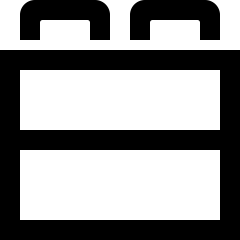

# Numerical summaries: qualitative data {#NumericalQual}


<!-- Introductions; easier to separate by format -->

```{r, child = if (knitr::is_html_output()) {'./introductions/14-Numerical-Qual-HTML.Rmd'} else {'./introductions/14-Numerical-Qual-LaTeX.Rmd'}}
```


## Modes, medians and means {#QualIntro}

Because qualitative data has [*levels*](#def:Levels), all qualitative data (nominal; ordinal) can be numerically summarised by *counting* the number of observations in each level (or computing the percentages in each level).
The **mode** is the category with the most observations.


::: {.definition #Mode name="Mode"}
A *mode* is a level (or category) of a qualitative variable with the most observations.
:::


Very few ways exist to summarise *nominal* data apart from the mode.
However, *ordinal* data can be numerically summarised in ways that nominal data cannot be, since *ordinal* data has levels with a natural order. 
Ordinal qualitative data, but *not* nominal qualitative data, can be summarised using *medians*.


::: {.importantBox .important data-latex="{iconmonstr-warning-8-240.png}"}
Medians can be used to summarise *quantitative data* and *ordinal* data, but *never* for nominal data.
:::


::: {.example #OrdinalMedians name="Modes and medians" }
In a study of the taste of bread with varying salt and fibre content [@gkebski2019impact], researchers recorded information from the 300 subjects (Table\ \@ref(tab:Bread)), including gender, place of residence, and the subjects' responses to the statement 'Rolls with lower salt content taste worse than regular ones', on a five-point ordinal scale from 'Strongly Agree' to 'Strongly Disagree'.

'Gender' is *nominal* qualitative; all other variables are *ordinal* qualitative.
The mode could be used to summarise each variable:

* The two *modes* for gender are 'females' and 'males' (150 respondents each).
* The *mode* residence is 'City with > 100,000 residents' (130 responses).
* The *mode* response to the statement is 'Agree' (84 responses).

Medians are not appropriate for 'Gender' (it is nominal).
For the other variables, the medians are located at ordered observation $(300 + 1) / 2 = 150.5$, or half-way between ordered observations 150 and 151:

* The *median* residence is 'City 20,000 to 100,000 residents'.
* The *median* response to the statement is 'Neutral'.
:::


```{r Bread}
BreadTable  <- array( dim = c(11, 3))

colnames(BreadTable) <- c("",
                          "Number",
                          "Percentage")

BreadTable[, 1] <- c("Female",
                     "Male",
                     "Rural",
                     "City up to 20,000 residents",
                     "City 20,000 to 100,000 residents",
                     "City > 100,000 residents",
                     "Strongly agree",
                     "Agree",
                     "Neutral",
                     "Disagree","Strongly disagree"
                     )
BreadTable[, 2] <- c(150,
                     150,
                     49,
                     38,
                     83,
                     130,
                     30,
                     84,
                     78,
                     66,
                     42)
BreadTable[, 3] <- c(50,
                     50,
                     16,
                     13,
                     28,
                     43,
                     10,
                     28,
                     26,
                     22,
                     14)

if( knitr::is_latex_output() ) {
  knitr::kable(BreadTable,
        format = "latex",
        longtable = FALSE,
        booktabs = TRUE,
        align = "r",
        linesep = c("", "\\addlinespace", "", "", "", "\\addlinespace", "", "", "", ""), 
        caption = "The bread-tasting data") %>%
   kable_styling(font_size = 10) %>%
   pack_rows("Gender", 1, 2) %>%
   pack_rows("Place of residence", 3, 6) %>%
   pack_rows("Response to statement", 7, 11) %>%
   row_spec(0, bold = TRUE)
}

if( knitr::is_html_output() ) {
  knitr::kable(BreadTable,
        format = "html",
        longtable = FALSE,
        booktabs = TRUE,
        align = "r",
        caption = "The bread-tasting data")%>%
   #kable_styling(font_size = 10) %>%
   pack_rows("Gender", 1, 2) %>%
   pack_rows("Place of residence", 3, 6) %>%
   pack_rows("Response to statement", 7, 11) %>%
   row_spec(0, bold = TRUE)
}
```

Means are not suitable for numerically summarising qualitative data.
However, *ordinal* data *may be* [numerically summarised like quantitative data](#NumericalQuant) in *special* circumstances: only when

* the categories are considered 'equally spaced'; *and*
* assigning a number to each category is appropriate (perhaps using a mid-point for numerical groups).


::: {.importantBox .important data-latex="{iconmonstr-warning-8-240.png}"}
Means can be used to summarise *quantitative data*, *ordinal* data in very special circumstances, but *never* for nominal data.
:::

::: {.example #OrdinalMeans name="Means of ordinal data"}
Consider again the data in Table\ \@ref(tab:Bread).
Means are **not** suitable for summarising 'Gender' since it is nominal.
Means are **not** suitable for summarising 'Place of residence' either, as the categories are *not* equally spaced, the first level is text ('Rural'), and the final category is open-ended (so a mid-point for that level is not appropriate).

The mean response to the statement *may* be sensible *only if* the levels are considered equally spaced (i.e., the distances between successive points on the five-point scale are considered equal).
Then, assigning **1** to 'Strongly agree' up to **5** for 'Strongly disagree', the *mean* response is $3.02$ (effectively, 'Neutral').
:::


## Proportions and percentages {#ProportionsPercentages}

Qualitative data, as in Table\ \@ref(tab:Bread), can also be summarised using *proportions* or *percentages*.
These can be given instead of, or with, the counts (as in Table\ \@ref(tab:Bread)).


::: {.definition #Proportion name="Proportion"}
A *proportion* is a fraction out of a total, and is a number between 0 and 1.
:::


::: {.definition #Percentage name="Percentages"}
A *percentage* is a proportion, multiplied by 100.
In this context, percentages are numbers between 0% and 100%.
:::


*Population* proportions are almost always unknown. 
Instead, the population proportion is estimated by the *sample* proportion, denoted by $\hat{p}$. 
In this context, the unknown parameter is $p$, the population proportion, and the statistic is $\hat{p}$, the sample proportion.


::: {.importantBox .important data-latex="{iconmonstr-warning-8-240.png}"}
As always, only one of the many possible samples is studied.
*Statistics* are estimates of *parameters*, and the value of the *statistic* is not the same for every possible *sample*.
:::


::: {.pronounceBox .pronounce data-latex="{iconmonstr-microphone-7-240.png}"}
The symbol $\hat{p}$ is pronounced 'pee-hat', and refers to the *sample* proportion.
:::


::: {.example #ProportionsPercentages name="Proportions and percentages"}
Consider again the data in Table\ \@ref(tab:Bread), summarising results from a sample of $n = 300$ respondents.
The *sample proportion* of respondents from a rural location is $30/300$, or $0.1$.
The *sample percentage* of respondents from a rural location is $30/300\times 100$, or $10$%.
:::


## Two-way tables {#PercentagesKStones}

### Introduction {#PropPercentages-Intro}

Commonly, qualitative data are collected for multiple variable, and summarised using tabular summaries (Sect.\ \@ref(GraphNeeded)).
When two qualitative variables are classified using a *two-way table*, the data can be numerically summarised using [*percentages*](#def:Percentage) or [*odds*](#def:Odds), which we study using an example.


<div style="float:right; width: 222x; border: 1px; padding:10px">

</div>


:::{.example name="Two-way tables"}
A medical study [@data:Charig:stones] compared two treatments for kidney stones to determine which was better.
Data were collected from $700$ UK patients, on two qualitative variables:

* the treatment method ('A' or 'B'): The explanatory variable.
* the result ('success' or 'failure' of the procedure): The response variable.

Both variables are *qualitative* with two *levels*.
Each treatment was used on $350$ patients.
Treatment\ A was used from 1972--1980, and Treatment B\ from 1980--1985; that is, *treatments were not randomly* allocated, and so *confounding* may be present.
For this reason, the researchers also recorded the *size* of the kidney stone ('small' or 'large') as one possible confounding variable.

Firstly, consider just the *small stones* [@julious1994confounding], displayed in the two-way table in Table\ \@ref(tab:KS-Small).
:::


The data in Table\ \@ref(tab:KS-Small) can be numerically summarised by computing *proportions* or *percentages*.
These can be computed as parts of the *total number* (Sect.\ \@ref(OverallPercentage)), by *row totals* (Sect. \@ref(RowPercentages)), or by *column totals* (Sect.\ \@ref(ColumnPercentages)).


(ref:KStonesNumbersSmall) **Numbers** for **small** kidney stones

```{r KS-Small}
data(KStones)

KS.small <- xtabs( Counts ~ Method + Result, 
                   data = subset(KStones, Size == "Small"))[, c(2, 1)]

KS.small2 <- cbind(KS.small, 
                   "Total" = rowSums(KS.small))

KS.small2.full <- rbind( KS.small2,
                         "Total" = colSums(KS.small2) )

if( knitr::is_latex_output() ) {
  kable(KS.small2.full,
        format = "latex",
        longtable = FALSE,
        booktabs = TRUE, 
        digits = 0,
        align = c("r", "r", "r", "r"),
        col.names = c("Success", 
                      "Failure", 
                      "Total"),
        caption = "(ref:KStonesNumbersSmall)"
      ) %>%
    row_spec(0, bold = TRUE) %>%
    row_spec(3, bold = TRUE) %>%
    row_spec(2, hline_after = TRUE) %>%
   kable_styling(full_width = FALSE) %>%
  kable_styling(font_size = 10) %>%
  column_spec(column = 4, 
               bold = TRUE) 
}
if( knitr::is_html_output() ) {
  kable(KS.small2.full,
               format = "html",
               longtable = FALSE,
               booktabs = TRUE,
               digits = 0,
               align = c("r", "r", "r", "r"),
               col.names = c("Success", 
                             "Failure", 
                             "Total"),
               caption = "(ref:KStonesNumbersSmall)"
      ) %>%
    kable_styling(full_width = FALSE) %>%
    column_spec(column = 4, 
                bold = TRUE) %>% 
    row_spec(3, 
             bold = TRUE)
}
```


### Overall proportions and percentages {#OverallPercentage}

From Table\ \@ref(tab:KS-Small), the overall *sample proportion* of successes (denoted $\hat{p}$) is:  
\begin{align*}
  \hat{p}
  & =
  \frac{\text{Overall number of successes}}{\text{Overall number of procedures performed}}\\
  & =
  \frac{81 + 234}{6 + 81 + 36 + 234} = 0.882.
\end{align*}
The *sample* proportion of successful procedures for *small* kidney stones is $\hat{p} = 0.882$ (and the *sample* percentage is $88.2$%).

The proportion could also be expressed as a *percentage*, by multiplying the proportion by $100$: $0.882 \times 100 = 88.2\%$.
The sample *percentage* of successful procedures for *small* kidney stones is $88.2$%.
The sample *proportion* and sample *percentage* are both *statistics*.


<div style="float:right; width: 222x; border: 1px; padding:10px">

</div>


### Row proportions and percentages {#RowPercentages}

For the small kidney stones (Table\ \@ref(tab:KS-Small)), the *row proportions*
`r if (knitr::is_latex_output()) {
   '(Table\\ \\@ref(tab:KidneyRowColLATEX), left table)'
} else {
   '(Table\\ \\@ref(tab:KS-Small-rowPC)'
}`
give the proportion of successes for each *Method*, since the rows represent the counts for Methods\ A and\ B.
*Row* proportions allow the proportions *within the rows* (i.e., for each Method) to be compared:

* $81 \div 87 = 0.931$ (or $93.1$%) of operations in the sample were successful for Method\ A; and
* $0.867$ (or $86.7$%) of operations were successful in the sample for Method\ B.

This suggests that, for small kidney stones, Method\ A is slightly more successful ($93.1$%) than Method\ B ($86.7$%) in the *sample*.


(ref:KStonesRowPercentSmall) **Row percentages** for **small** kidney stones (from Table\ \@ref(tab:KS-Small))

```{r KS-Small-rowPC}
KS.small.rowPC <- prop.table(KS.small, 
                             margin = 1) * 100
KS.small.rowPC2 <- cbind(KS.small.rowPC, 
                         "Total" = c(100, 100) )
  
if( knitr::is_html_output() ) {
  kable(KS.small.rowPC2,
               format = "html",
               longtable = FALSE,
               booktabs = TRUE,
               digits = 1,
               align = c("r", "r", "r", "r"),
               col.names = c("Success", 
                             "Failure", 
                             "Total"),
               caption = "(ref:KStonesRowPercentSmall)") %>%
    kable_styling(full_width = FALSE) %>%
    column_spec(column = 4, 
                bold = TRUE) 
}
```
  

### Column proportions and percentages {#ColumnPercentages}

For the *small* kidney stones (Table\ \@ref(tab:KS-Small)), the *column proportions* 
`r if (knitr::is_latex_output()) {
   '(Table\\ \\@ref(tab:KidneyRowColLATEX), right table)'
} else {
   '(Table\\ \\@ref(tab:KS-Small-colPC)'
}`
give the proportion of successes within each column (i.e., for successes and for failures), since the columns contain the procedure results.
*Column* proportions allow the proportions (or percentages) within *columns* to be compared:

* $81 \div (81 + 234) = 0.257$ (or $25.7$%) of all *successful* operations were from Method\ A; and
* $0.143$ (or $14.3$%) of *failures* were from Method\ A.

Row percentages seems more intuitive than column percentages here: they compare the success percentage for each treatment method.


(ref:KStonesColPercentSmall) **Column percentages** for **small** kidney stones (from Table\ \@ref(tab:KS-Small))

```{r KS-Small-colPC}
KS.small.colPC <- prop.table(KS.small, 
                             margin = 2) * 100
KS.small.colPC2 <- rbind(KS.small.colPC, 
                         "Total" = c(100, 100) )
  


if( knitr::is_html_output() ) {
  kable(KS.small.colPC2,
               format = "html",
               longtable = FALSE,
               digits = 1,
               booktabs = TRUE,
               align = c("r", "r", "r"),
               col.names = c("Success", 
                             "Failure"),
               caption = "(ref:KStonesColPercentSmall)") %>%
    kable_styling(full_width = FALSE) %>%
    row_spec(row = 3, 
             bold = TRUE) 
}
```


(ref:KStonesRowColPercentSmall) **Small** kidney stones: left: **Row percentages**; right, **column percentages** (from Table\ \@ref(tab:KS-Small)).

```{r}
KS.small.rowPC <- prop.table(KS.small, 
                             margin = 1) * 100
KS.small.rowPC <- round(KS.small.rowPC, 1)
KS.small.rowPC2 <- cbind(KS.small.rowPC, 
                         "Total" = c("\\textbf{100.0}", "\\textbf{100.0}") )

KS.small.colPC <- prop.table(KS.small, 
                             margin = 2) * 100
KS.small.colPC2 <- rbind(KS.small.colPC, 
                         "Total" = c(100, 100) )
KS.small.colPC <- round(KS.small.colPC, 1)
  
if( knitr::is_latex_output() ) {
  T1 <- kable(KS.small.rowPC2,
        format  ="latex",
        longtable = FALSE,
        booktabs = TRUE,
        escape = FALSE,
        digits = 1,
        align = c("r", "r", "r", "r"),
        col.names = c("Success", 
                      "Failure", 
                      "Total")) %>%
    row_spec(0, bold = TRUE)  

  T2 <- kable(KS.small.colPC2,
        format = "latex",
        longtable = FALSE,
        digits = 1,
        booktabs = TRUE,
        align = c("r", "r", "r"),
        col.names = c("Success", 
                      "Failure"))  %>%
    row_spec(0, bold = TRUE) %>%
    row_spec(3, bold = TRUE)
  
  out <- knitr::kables(list(T1, T2),
                       format = "latex",
                       label = "KidneyRowColLATEX",
                       caption = "(ref:KStonesRowColPercentSmall)") %>% 
    kable_styling(font_size = 10)
  out2 <- prepareSideBySideTable(out, 
                                 numberOfTables = 2,
                                 gap = "\\qquad\\qquad\\qquad") 
  out2
  
}
```


### Example: large kidney stones {#KidneyExample}


<div style="float:right; width: 222x; border: 1px; padding:10px">

</div>


The data in Table\ \@ref(tab:KS-Small) are for *small* kidney stones.
Data were also recorded for the *large* kidney stones 
`r if (knitr::is_latex_output()) {
   '(Table\\ \\@ref(tab:KStonesNumbersLargeAll), left table).'
} else {
   '(Table\\ \\@ref(tab:KS-Large)).'
}`
As for small kidney stones, the *success proportions* can be computed for large kidney stones for Methods\ A and\ B (i.e., row percentages):

* Method\ A: Success proportion for large kidney stones: $192/263 = 0.730$, or $73.0$%; and
* Method\ B: Success proportion for large kidney stones: $55/80 = 0688$, or $68.8$%.

For large kidney stones, then, *Method\ A* has a higher success proportion than Method\ B, just as with the small kidney stones.


(ref:KStonesNumbersLarge) **Numbers** for **large** kidney stones

```{r KS-Large}
KS.large <- xtabs( Counts ~ Method + Result, 
                   data = subset(KStones, Size == "Large"))[, c(2, 1)]
KS.large2 <- cbind(KS.large, 
                   "Total" = rowSums(KS.large))

if( knitr::is_html_output() ) {
  kable(KS.large2,
               format = "html",
               longtable = FALSE,
               booktabs = TRUE,
               digits = 0,
               align = c("r", "r", "r", "r"),
               col.names = c("Success", 
                             "Failure", 
                             "Total"),
               caption = "(ref:KStonesNumbersLarge)") %>%
    column_spec(column = 4, 
		            bold = TRUE)
}
```


So... could the data for small (Table\ \@ref(tab:KS-Small)) and large kidney stones 
`r if (knitr::is_latex_output()) {
   '(Table\\ \\@ref(tab:KStonesNumbersLargeAll), left table)'
} else {
   '(Table\\ \\@ref(tab:KS-Large))'
}`
be combined, to produce a single two-way table of just Method and Result
`r if (knitr::is_latex_output()) {
   '(Table\\ \\@ref(tab:KStonesNumbersLargeAll), right table),'
} else {
   '(Table\\ \\@ref(tab:KSAll)),'
}`
ignoring size?


(ref:KStonesNumbersAll) **Numbers** for **all** kidney stones combined, ignoring the size of the kidney stone

```{r KSAll}
KS.all <- KS.small + KS.large
KS.all2 <- cbind(KS.all, 
                 "Total" = rowSums(KS.all))

if( knitr::is_html_output() ) {
  kable(KS.all2,
               format = "html",
               longtable = FALSE,
               booktabs = TRUE,
               digits = 0,
               align = c("r", "r", "r", "r"),
               col.names = c("Success", 
                             "Failure", 
                             "Total"),
               caption = "(ref:KStonesNumbersAll)") %>%
    column_spec(column = 4, 
            		bold = TRUE)
}
```


(ref:KStonesNumbersLargeAll) The kidney stones data: left:  **Numbers** for **large** stones only; right: **numbers** for **all** kidney stones combined, ignoring the size of the kidney stone

```{r}
if( knitr::is_latex_output() ) {
  T1 <- kable(KS.large2,
        format  ="latex",
        longtable = FALSE,
        booktabs = TRUE,
        escape = FALSE,
        digits = 1,
        align = c("r", "r", "r"),
        col.names = c("Success", 
                      "Failure", 
                      "Total")) %>%
    row_spec(0, bold = TRUE)  

  T2 <- kable(KS.all2,
        format = "latex",
        longtable = FALSE,
        digits = 1,
        booktabs = TRUE,
        align = c("r", "r", "r"),
        col.names = c("Success", 
                      "Failure",
                      "Total"))  %>%
    row_spec(0, bold = TRUE)
  
  out <- knitr::kables(list(T1, T2),
                       format = "latex",
                       label = "KStonesNumbersLargeAll",
                       caption = "(ref:KStonesNumbersLargeAll)") %>% 
    kable_styling(font_size = 10)
  out2 <- prepareSideBySideTable(out, 
                                 numberOfTables = 2,
                                 gap = "\\qquad\\qquad\\qquad") 
  out2
  
}
```


::: {.thinkBox .think data-latex="{iconmonstr-light-bulb-2-240.png}"}
Compute the success proportions for Method\ A and Method\ B when *small* and *large* stones are combined\label{thinkBox:AllStonesSuccess}
`r if (knitr::is_latex_output()) {
   '(Table\\ \\@ref(tab:KStonesNumbersLargeAll), right table):'
} else {
   '(Table\\ \\@ref(tab:KSAll)):'
}`\vspace{-2ex}

* For small and large stones combined, the success proportion with Method\ A is: ______
* For small and large stones combined, the success proportion with Method\ B is: ______

Which method has the higher success proportion for all stones combined?

`r if (knitr::is_latex_output()) '<!--'`
`r webexercises::hide()`
Method\ A has a higher success proportion ($273/350 = 0.780$) than Method\ B ($289/350 = 0.826$), for all kidney stones combined.
`r webexercises::unhide()`
`r if (knitr::is_latex_output()) '-->'`
:::


To summarise:

* *Method\ A* is better for small stones ($93.1$% vs $86.7$%);
* *Method\ A* is better for large stones ($73.0$% vs $68.8$%); but
* *Method\ B* is better when all stones are combined ($78.0$% vs $82.6$%)...

That seems strange...
Method\ A performs better for small stones, and for large kidney stones... but Method\ B performs better when the size is unknown (i.e., ignoring size).

The *size of the stone* is a *confounding variable* (Fig.\ \@ref(fig:SimpsonRulesStones)), as it is associated with the method (small stones are treated more often with Method\ B) *and* with the result (small stones have a greater success proportion).
Treating the small and large stones separately is a form of *blocking* (Sect.\ \@ref(ObsManagingConfounding)).

This confounding could have been avoided by randomly allocating a treatment method to patients.
However, random allocation was not possible in this study, so the researchers used a different method to manage confounding: *recording* the size of the kidney stones (and also the age and sex of the patient); see Sect.\ \@ref(ObsManagingConfoundingAnalysis).

In this example, incorporating information about a potential confounder (the size of the kidney stone) is important, otherwise the wrong (opposite) conclusion is reached: Method\ B would be considered better if the size of the stones was ignored, when the better method really is Method\ A.

This is called
`r if (knitr::is_latex_output()) {
   "*Simpson's paradox*."
} else {
   "[*Simpson's paradox*](https://en.wikipedia.org/wiki/Simpson%27s_paradox)."
}`
If the size of the kidney stone had not been recorded, size would be a *lurking variable*, and the incorrect conclusion would have been reached.


```{r SimpsonRulesStones, fig.cap="The size of the stones is related to both the success percentage and the method", fig.align="center", fig.height=3, out.width='50%'}
par( mar = c(0.05, 0.05, 0.05, 0.05))
openplotmat()

pos <- array(NA, dim = c(3, 2))
pos[1, ] <- c(0.25, 0.25) # Success 
pos[2, ] <- c(0.75, 0.25) # Method
pos[3, ] <- c(0.5, 0.65)   # Size

straightarrow(from = pos[2,], 
              to = pos[1,], 
              lty = 1, 
              lwd = 2)
straightarrow(from = pos[3,],
              to = pos[1,], 
              lty=2,
              lcol="grey")
straightarrow(from = pos[3,], 
              to = pos[2,], 
              lty = 2,
              lcol = "grey")

textrect( pos[1,], 
           lab = "Success", 
           radx = 0.07, 
           rady = 0.075, 
           shadow.size = 0,
           box.col = ResponseColour,
           lcol = ResponseColour)
textrect( pos[2,], 
           lab = "Method", 
           radx = 0.07, 
           rady = 0.075, 
           shadow.size = 0,
           box.col = ExplanatoryColour,
           lcol = ExplanatoryColour)
textrect( pos[3,], 
           lab = "Size", 
           radx = 0.07, 
           rady = 0.075, 
           shadow.size = 0,
           box.col = ExtraneousColour,
           lcol = ExtraneousColour)
```


## Odds {#QualOdds}

Consider again the *small* kidney stone data (Table\ \@ref(tab:KS-Small)).
For *Method\ A*, the sample contains $81$ successes and $6$ failures.
Another way to numerically summarise this information is to see that there are $81\div 6 = 13.5$ *times* as many successes than failures in the sample.

In other words, for small kidney stones, the *odds* of success for Method\ A is $13.5$ (in the sample).
The sample odds is a *statistic*, and the unknown population odds is a *parameter*.


::: {.definition #Odds name="Odds"}
The *odds* are the number (or proportion, or percentage) of times that an event *happens*, divided by the number (or proportion, or percentage) of times that the event does *not happen*:  
\[
         \text{Odds} = \frac{\text{Number of times event happens}}{\text{Number of times event doesn't happen}}
\]
or (equivalently)  
\[
         \text{Odds} 
          = 
            \frac{\text{Proportion of times event happens}}
                 {\text{Proportion of times event doesn't happen}}.
\]
The *odds* show how many *times* an event *happens* compared to the event *not happening*.
:::


<div style="float:right; width: 222x; border: 1px; padding:10px">

</div>


When computing odds, the count of interest is divided by the *remaining number*, whereas in proportions and percentages the relevant number is divided by the *total number* relevant to the context.

Software often works with odds rather than percentages (for good reasons that we will not delve into).
Understanding *how* software computes the odds is important.


::: {.softwareBox .software data-latex="{iconmonstr-laptop-4-240.png}"}
In a two-by-two table, the odds computed by jamovi or SPSS can be interpreted in *either* of these ways (i.e., both are correct)

* Row\ 1 counts to Row\ 2 counts; *or*
* Column\ 1 counts to Column\ 2 counts.

*Both ways are correct*, but one often makes more sense that the other.

Based on Table\ \@ref(tab:KS-Small), the odds for the Methods computed by software will compare Method\ A compared to Method\ B (not Method\ B to Method\ A).
:::


::: {.example #InterpretingOdds name="Interpreting odds"}
For the *small* kidney stone data, the odds of a success for Method\ A is  $81\div6 = 13.5$.
This can be interpreted as:

* There are $13.5$ *times* as many successes as failures (in the sample); or
* There are $13.5\times 100 = 1350$ successes for every $100$ failures (in the sample).

Either way, successes are *far* more common than failures, for small kidney stones using Method\ A.
:::

::: {.thinkBox .think data-latex="{iconmonstr-light-bulb-2-240.png}"}
What are the odds of a *failure* for Method\ A?
How is this value interpreted?\label{thinkBox:InterpretOdds}

`r if (knitr::is_latex_output()) '<!--'`
`r webexercises::hide()`
The odds: $6\div81 = 0.0741$.
For every $100$ successes, expect about $0.0741\times 100 = 7.4$ failures.
`r webexercises::unhide()`
`r if (knitr::is_latex_output()) '-->'`
:::


::: {.example #OddsEG name="Odds"}
Suppose that 67% of students at a particular university were female.
The *population* odds of finding a female is $67 / (100 - 67) = 2.03$: about twice as many students are females compared to non-females.
Alternatively, there are about $100\times 2.03 = 203$ females to every $100$ non-females.

Suppose one specific class had $18$ females and $5$ non-females.
The *sample* odds of finding a female in this class is $18/5 = 3.60$.

Another class had $16$ females and $9$ non-females.
The *sample* odds of finding a female in this class is $16/9 = 1.79$.
:::


::: {.example #ComputingOdds name="Computing odds"}
Consider again the **small** kidney stone data (Table\ \@ref(tab:KS-Small)).
The odds of a success using *Method\ B* is $234/36 = 6.52$.

Working with the corresponding proportions or percentages
`r if (knitr::is_latex_output()) {
   '(Table\\ \\@ref(tab:KidneyRowColLATEX), left table)'
} else {
   '(Table\\ \\@ref(tab:KS-Small-rowPC)'
}`
rather than the numbers gives the same value: $86.7/13.3 = 6.52$.
:::


<iframe src="https://learningapps.org/watch?v=pxf5194ek22" style="border:0px;width:100%;height:500px" allowfullscreen="true" webkitallowfullscreen="true" mozallowfullscreen="true"></iframe>


Take care interpreting odds:
  
* odds are *greater* than $1$: the event is *more* likely to happen than to not happen.
* odds are *equal to* $1$: the event is just as likely to happen as it is to not happen.
* odds are *less* than $1$: the event is *less* likely to happen than to not happen.


::: {.thinkBox .think data-latex="{iconmonstr-light-bulb-2-240.png}"}
What are the odds of rolling a 2 on a die?\label{thinkBox:Roll2}
`r if( knitr::is_html_output()) {
longmcq( c(
   "About 0.1666", 
   "6",
   "0.5",
   "1/6",
   answer = "0.2") )}`
:::


## Comparing odds: odds ratios {#OdddsRatios}

To summarise the *small* kidney stone data (Table\ \@ref(tab:KS-Small)):

* *Method\ A*: the odds of success are $13.5$ ($13.5$ *times* as many successes as failures).
* *Method\ B*: the odds of success are  $6.5$ ($6.5$ *times* as many successes as failures).

The odds of success for Method\ A and Method\ B are very different.
In the sample, the odds of success for Method\ A is many *times* greater than for Method\ B.
In fact, in the sample, the odds of success for Method\ A is $13.5\div 6.5 = 2.08$ *times* the odds of a success for Method\ B.
This value is the *odds ratio* (OR).
The sample odds ratio is a *statistic*, and the population odds ratio is a *parameter*.


<div style="float:right; width: 222x; border: 1px; padding:10px">

</div>


::: {.definition #OddsRatio name="Odds Ratio (OR)"}
The *odds ratio* is the ratio of the odds of an event in one group, compared to the odds of the *same* event in a *different* group:  
\[
   \text{Odds ratio} = 
   \frac{\text{Odds of an event in Group A}}
        {\text{Odds of the same event in Group B}}.
\]
:::


::: {.softwareBox .software data-latex="{iconmonstr-laptop-4-240.png}"}
Understanding how software computes the odds ratio is important for understanding the output. 
jamovi and SPSS output can be interpreted in *either* of these ways (i.e., both are correct):
\vspace{-2ex}

* The *odds* compare Row\ 1 counts to Row\ 2 counts, for both columns.  
  The *odds ratio* then compares the Column\ 1 odds to the Column\ 2 odds.
* The *odds* compare Column\ 1 counts to Column\ 2 counts.  
  The *odds ratio* then compares the Row\ 1 odds to the Row\ 2 odds.
\vspace{-2ex}
  
Odds and odds ratios are computed with the *first row* and *first column* values on the *top* of the fraction.
:::


The OR compares the odds of the same event in two different groups.
This means that a $2\times 2$ table can be summarised using one number: the odds ratio (OR).

Take care interpreting odds ratios (or ORs):
  
* odds ratio is *greater than 1*:
  the odds of the event is *greater* for the group in the top of the division compared to the group in the bottom of the division.
* odds ratio is *equal to 1*:
  the odds of the event is the *same* for both groups (in the top and the bottom of the division).
* odds ratio is *less than 1*:
  the odds of the event is *less* for the group in the top of the division compared to the group in the bottom of the division.


`r if (knitr::is_html_output()){
  'The following short video may help explain some of these concepts:'
}`


<div style="text-align:center;">
```{r}
htmltools::tags$video(src ="./videos/oddsratios.mp4", 
                      width="550", 
                      controls="controls", 
                      loop="loop", 
                      style="padding:5px; border: 2px solid gray;")
```
</div>


<iframe src="https://learningapps.org/watch?v=pcyn538fj22" style="border:0px;width:100%;height:500px" allowfullscreen="true" webkitallowfullscreen="true" mozallowfullscreen="true"></iframe>


## Observing relationships {#OddsObserveRelationships}

For the *small* kidney stone data, the odds of a success for Method\ A ($13.5$) is different than the odds of a successes for Method\ B ($6.52$), in the *sample*.
Is there a difference in the *population* odds?

Broadly, two possible reasons exist to explain the differences *in the sample odds*:

* The *population odds* are the same for Method\ A and Method\ B, but the *sample odds* are difference simply because of sample obained.
  After all, we have just one of the many possible samples, and every sample is likely to be different; the *sample* we studied just happened to show a difference.
  That is, *sampling variation* explains the *difference in the sample odds*.
       
* The *population odds* are different for Method\ A and Method\ B, and so the *sample odds* are difference, simply reflects this difference between the *population* odds.

The difficulty, of course, is knowing which of these two reasons ('hypotheses') is the most likely reason for the difference between the sample odds.
This question is of prime importance (after all, it answers the RQ), and is addressed at length later in this book.


## Example: skipping breakfast {#Skipping-Breakfast}


<div style="float:right; width: 222x; border: 1px; padding:10px">

</div>


The data in Table\ \@ref(tab:SkipBreakfast) come from a study of Iranian children aged 6--18 years old [@data:kelishadi2017:snack].
From this table:	

* The *proportion* of females who skipped breakfast is $\hat{p}_F = 2\,383/6\,640 = 0.359$;
* The *proportion* of   males who skipped breakfast is $\hat{p}_M = 1\,944/6\,846 = 0.284$.

Alternatively,

* $\text{Odds}(\text{Skips breakfast, among F}) = 2\,383/4\,257 = 0.5598$;
* $\text{Odds}(\text{Skips breakfast, among M}) = 1\,944/4\,902 = 0.3966$.

(Notice that the number on *top* of the fraction in each case is from the *first* column.)
So, about $55.98$ females *skip* breakfast for every $100$ females who *do eat* breakfast (i.e., Column\ 1).
The *odds ratio* (OR) comparing the odds of skipping breakfast, comparing females (Row\ 1) to males (Row\ 2), is  
\begin{align*}
    \text{OR}
  &= \frac{\text{Odds}(\text{Skipping breakfast, for females})}{\text{Odds}(\text{Skipping breakfast, for males})}\\ 
  &= \frac{0.5598}{0.3966} 
  = 1.41.
\end{align*}
(Notice that the number of *top* of the fraction is the odds computed from the *first* row.)
The odds of females skipping breakfast are $1.41$ *times* the odds of males skipping breakfast.
The information can be summarised numerically (Table\ \@ref(tab:BreakSum)).


```{r SkipBreakfast}
Counts <- c(2383, 
            1944, 
            4257, 
            4902)
Gender <- c("Females", 
            "Males", 
            "Females", 
            "Males")
Breakfast <- c("Skip", 
               "Skip", 
               "Doesn't skip", 
               "Doesn't skip")

Brek <- xtabs(Counts ~ Gender + Breakfast)[, c(2, 1)]
Brek2 <- cbind(Brek, "Total" = rowSums(Brek))

if( knitr::is_latex_output() ) {
  kable(Brek2,
        format = "latex",
        longtable = FALSE,
        booktabs = TRUE,
        align = c("r", "r", "r"),
        digits = 0,
        col.names = c("Skips breakfast", 
                      "Doesn't skip breakfast", 
                      "Total"),
        caption = "The number of Iranian children aged 6 to 18 who skip and do not skip breakfast" ) %>%
   row_spec(0, bold = TRUE) %>%
   kable_styling(font_size = 10) %>%
   column_spec(column = 4, 
               bold = TRUE)
}

if( knitr::is_html_output() ) {
  out <- kable(Brek2,
        format = "html",
        longtable = FALSE,
        booktabs = TRUE,
        align = c("r", "r", "r"),
        digits = 0,
        col.names = c("Skips breakfast", 
                      "Doesn't skip breakfast", 
                      "Total"),
        caption = "The number of Iranian children aged 6 to 18 who skip and do not skip breakfast" )
  if ( knitr::is_html_output()) {
    column_spec(out, 
                column = 4, 
                bold = TRUE)
  } else {
    out
  }
   
}
```


```{r BreakSum}
Brek.Sum <- array( NA, 
                   dim = c(3, 3))
rownames(Brek.Sum) <- c("Females", 
                        "Males", 
                        "Odds ratio")

Brek.Sum[1, 1] <- Brek[1, 1] / sum(Brek[1,]) * 100
Brek.Sum[2, 1] <- Brek[2, 1] / sum(Brek[2,]) * 100

Brek.Sum[1, 2] <- Brek[1, 1] /Brek[1, 2]
Brek.Sum[2, 2] <- Brek[2, 1] /Brek[2, 2]

Brek.Sum[3, 2] <- Brek.Sum[1, 2] / Brek.Sum[2, 2]

Brek.Sum[1, 3] <- sum(Brek[1, ])
Brek.Sum[2, 3] <- sum(Brek[2, ])

if( knitr::is_latex_output() ) {
  kable(Brek.Sum,
        format = "latex",
        longtable = FALSE,
        booktabs = TRUE,
        align = c("r", "r", "r"),
        digits = c(1, 3),
        col.names = c("Percentage", 
                      "Odds", 
                      "Sample size"),
        caption = "Numerical summary of the Iranian-breakfast data: Odds and percentage of those who skip breakfast") %>%
    row_spec(0, bold = TRUE) %>%
    kable_styling(font_size = 10) %>%
    row_spec(3, bold = TRUE) %>%
    row_spec(row = 2, 
             hline_after = TRUE)
}
if( knitr::is_html_output() ) {
  out <- kable(Brek.Sum,
               format = "html",
               longtable = FALSE,
               booktabs = TRUE,
               align = c("r", "r", "r"),
               digits = c(1, 3),
               col.names = c("Percentage", 
                             "Odds", 
                             "Sample size"),
               caption = "Numerical summary of the Iranian-breakfast data: Odds and percentage of those who skip breakfast") %>%
    row_spec(3, bold = TRUE) %>%
    row_spec(row = 2, 
             hline_after = TRUE)
}
```

The odds of skipping breakfast is different for females ($0.560$) and males ($0.397$).
Two possible reason could explain this difference:

* the *population* odds are the same, but the *sample* odds are different simply because of the people selected in this sample (sampling variation); or 
* the *population* odds are different, which is reflected in the sample.

The difficulty is knowing which of these two reasons ('hypotheses') is the most likely explanation for the difference between the sample means.
This question is of prime importance (after all, it answers the RQ), and is addressed at length later in this book.


## Case Study: the NHANES data {#NHANESCaseStudyQual}

<div style="float:right; width: 222x; border: 1px; padding:10px">

</div>


In Sects.\ \@ref(NHANESGraphs) and\ \@ref(NHANESNumerical), the NHANES data were introduced (@data:NHANES3:Data; @data:NHANES3), and graphs and numerical summaries used to understand the data relevant to answering this RQ:

> Among Americans, is the mean direct HDL cholesterol concentration different for current smokers and non-smokers?

The data, including potential confounding variables, can be summarised numerically (Table\ \@ref(tab:NHANESBigSummary)).
Different summaries are needed for quantitative (means and standard deviations; medians and IQR) and qualitative (percentages; odds) variables (Table\ \@ref(tab:NHANESBigSummary)).
Interesting questions emerge from Table\ \@ref(tab:NHANESBigSummary):

* How can the mean age of all respondents be $36.7$ years, when the mean age for non-smokers and smokers are *both* much larger than this ($54.3$ and $42.7$ years respectively)?
* Why is the percentage of females in the sample $50.2$%, but the percentage of females is less than this for both non-smokers and smokers ($43.8$% and $43.5$% respectively)?


```{r}
data(NHANES)
NHANESSmoker <- subset(NHANES, 
                       SmokeNow == "Yes")
NHANESNonSmoker <- subset(NHANES, 
                          SmokeNow == "No")

rowinfo <- function(variable, fn, dat = NHANES){
  one <- tapply(NHANES, )
}
NHANESdemogr <- array( dim = c(22, 5))
colnames(NHANESdemogr) <- c("Quantity", 
                            "Statistic", 
                            "Overall", 
                            "Non-smokers", 
                            "Smokers")

NHANESdemogr[1, ] <- c( "Sample size",
                        " ",
                        dim(NHANES)[1],
                        sum( NHANES$SmokeNow == "No", na.rm = TRUE),
                        sum( NHANES$SmokeNow == "Yes", na.rm = TRUE) )
NHANESdemogr[2, ] <- c( "Direct HDL (mmol/L)",
                       "n",
                        sum( !is.na(NHANES$DirectChol) ),
                        sum( !is.na(NHANES$DirectChol[NHANES$SmokeNow == "No"]) ),
                        sum( !is.na(NHANES$DirectChol[NHANES$SmokeNow == "Yes"]) ) ) 
NHANESdemogr[3, ] <- c( " ",
                       "Mean",
                        round( mean(NHANES$DirectChol, na.rm = TRUE), 2),
                        round( mean( NHANES$DirectChol[NHANES$SmokeNow == "No"], na.rm = TRUE), 2),
                        round( mean( NHANES$DirectChol[NHANES$SmokeNow == "Yes"], na.rm = TRUE), 2) )
NHANESdemogr[4, ] <- c( " ",
                       "Std. dev.",
                        round( sd(NHANES$DirectChol, na.rm=TRUE), 2),
                        round( sd( NHANES$DirectChol[NHANES$SmokeNow == "No"], na.rm = TRUE), 2),
                        round( sd( NHANES$DirectChol[NHANES$SmokeNow == "Yes"], na.rm = TRUE),  2) )

NHANESdemogr[5, ] <- c( "Gender",
                       "n",
                        sum( !is.na(NHANES$Gender) ),
                        sum( !is.na(NHANES$Gender[NHANES$SmokeNow == "No"]) ),
                        sum( !is.na(NHANES$Gender[NHANES$SmokeNow == "Yes"]) ) ) 
NHANESdemogr[6, ] <- c( " ",
                       "% Female",
                        round( sum(NHANES$Gender == "female") / sum( !is.na(NHANES$Gender) ) * 100, 1),
                        round( sum(NHANESNonSmoker$Gender == "female") / sum( !is.na(NHANESNonSmoker$Gender) ) * 100, 1),
                        round( sum(NHANESSmoker$Gender == "female") / sum( !is.na(NHANESSmoker$Gender) ) * 100, 1) )
NHANESdemogr[7, ] <- c( " ",
                       "Odds Female",
                        round( sum(NHANES$Gender == "female") / sum(NHANES$Gender == "male"), 3),
                        round( sum(NHANESNonSmoker$Gender == "female") / sum(NHANESNonSmoker$Gender == "male"), 3),
                        round( sum(NHANESSmoker$Gender == "female") / sum(NHANESSmoker$Gender == "male"), 3) )


NHANESdemogr[8, ] <- c( "Age (years)",
                       "n",
                        sum( !is.na(NHANES$Age) ),
                        sum( !is.na(NHANES$Age[NHANES$SmokeNow == "No"]) ),
                        sum( !is.na(NHANES$Age[NHANES$SmokeNow == "Yes"]) ) ) 
NHANESdemogr[9, ] <- c( " ",
                       "Mean",
                        round( mean(NHANES$Age, na.rm = TRUE), 2),
                        round( mean( NHANES$Age[NHANES$SmokeNow == "No"], na.rm = TRUE), 2),
                        round( mean( NHANES$Age[NHANES$SmokeNow == "Yes"], na.rm = TRUE), 2) )
NHANESdemogr[10, ] <- c( " ",
                       "Std. dev.",
                        round( sd(NHANES$Age, na.rm = TRUE), 2),
                        round( sd( NHANES$Age[NHANES$SmokeNow == "No"], na.rm = TRUE), 2),
                        round( sd( NHANES$Age[NHANES$SmokeNow == "Yes"], na.rm = TRUE),  2) )

NHANESdemogr[11, ] <- c( "Height (cm)",
                       "n",
                        sum( !is.na(NHANES$Height) ),
                        sum( !is.na(NHANES$Height[NHANES$SmokeNow == "No"]) ),
                        sum( !is.na(NHANES$Height[NHANES$SmokeNow == "Yes"]) ) ) 
NHANESdemogr[12, ] <- c( " ",
                       "Mean",
                        round( mean(NHANES$Height, na.rm=TRUE), 2),
                        round( mean( NHANES$Height[NHANES$SmokeNow == "No"], na.rm = TRUE), 2),
                        round( mean( NHANES$Height[NHANES$SmokeNow == "Yes"], na.rm = TRUE), 2) )
NHANESdemogr[13, ] <- c( " ",
                       "Std. dev.",
                        round( sd(NHANES$Height, na.rm = TRUE), 2),
                        round( sd( NHANES$Height[NHANES$SmokeNow == "No"], na.rm = TRUE), 2),
                        round( sd( NHANES$Height[NHANES$SmokeNow == "Yes"], na.rm = TRUE),  2) )

NHANESdemogr[14, ] <- c( "Weight (kg)",
                       "n",
                        sum( !is.na(NHANES$Weight) ),
                        sum( !is.na(NHANES$Weight[NHANES$SmokeNow == "No"]) ),
                        sum( !is.na(NHANES$Weight[NHANES$SmokeNow == "Yes"]) ) ) 
NHANESdemogr[15, ] <- c( " ",
                       "Mean",
                        round( mean(NHANES$Weight, na.rm = TRUE), 2),
                        round( mean( NHANES$Weight[NHANES$SmokeNow == "No"], na.rm = TRUE), 2),
                        round( mean( NHANES$Weight[NHANES$SmokeNow == "Yes"], na.rm = TRUE), 2) )
NHANESdemogr[16, ] <- c( " ",
                       "Std. dev.",
                        round( sd(NHANES$Weight, na.rm = TRUE), 2),
                        round( sd( NHANES$Weight[NHANES$SmokeNow == "No"], na.rm = TRUE), 2),
                        round( sd( NHANES$Weight[NHANES$SmokeNow == "Yes"], na.rm = TRUE),  2) )

NHANESdemogr[17, ] <- c( "BMI (kg/m-sq)",
                       "n",
                        sum( !is.na(NHANES$BMI) ),
                        sum( !is.na(NHANES$BMI[NHANES$SmokeNow == "No"]) ),
                        sum( !is.na(NHANES$BMI[NHANES$SmokeNow == "Yes"]) ) ) 
NHANESdemogr[18, ] <- c( " ",
                       "Mean",
                        round( mean(NHANES$BMI, na.rm = TRUE), 2),
                        round( mean( NHANES$BMI[NHANES$SmokeNow == "No"], na.rm = TRUE), 2),
                        round( mean( NHANES$BMI[NHANES$SmokeNow == "Yes"], na.rm = TRUE), 2) )
NHANESdemogr[19, ] <- c( " ",
                       "Std. dev.",
                        round( sd(NHANES$BMI, na.rm = TRUE), 2),
                        round( sd( NHANES$BMI[NHANES$SmokeNow == "No"], na.rm = TRUE), 2),
                        round( sd( NHANES$BMI[NHANES$SmokeNow == "Yes"], na.rm = TRUE),  2) )

NHANESdemogr[20, ] <- c( "Diabetes",
                       "n",
                        sum( !is.na(NHANES$Diabetes) ),
                        sum( !is.na(NHANES$Diabetes[NHANES$SmokeNow == "No"]) ),
                        sum( !is.na(NHANES$Diabetes[NHANES$SmokeNow == "Yes"]) ) ) 
NHANESdemogr[21, ] <- c( " ",
                       "% Yes",
                        round( sum(NHANES$Diabetes == "Yes", na.rm = TRUE) / sum( !is.na(NHANES$Diabetes) ) * 100, 1),
                        round( sum(NHANESNonSmoker$Diabetes == "Yes", na.rm = TRUE) / sum( !is.na(NHANESNonSmoker$Diabetes) ) * 100, 1),
                        round( sum(NHANESSmoker$Diabetes == "Yes", na.rm = TRUE) / sum( !is.na(NHANESSmoker$Diabetes) ) * 100, 1) )
NHANESdemogr[22, ] <- c( " ",
                       "Odds Yes",
                        round( sum(NHANES$Diabetes == "Yes", na.rm = TRUE) / sum(NHANES$Diabetes == "No", na.rm = TRUE) , 3),
                        round( sum(NHANESNonSmoker$Diabetes == "Yes", na.rm = TRUE) / sum(NHANESNonSmoker$Diabetes == "No", na.rm = TRUE), 3),
                        round( sum(NHANESSmoker$Diabetes == "Yes", na.rm = TRUE) / sum(NHANESSmoker$Diabetes == "No", na.rm = TRUE), 3) )

```


```{r NHANESBigSummary}
tab.cap <- paste("A summary of some variables in the NHANES dataset,",
             "according to current smoking status",
             "(not reported for 6789 respondents;",
             "other variables also not reported for all respondents).",
             "Quantitative variables are summarised using either the mean and standard deviation;",
             "qualitative variables using percentages and odds.")
	
if( knitr::is_latex_output() ) {
  kable(NHANESdemogr[ -c(17:19), ], # REMOVE BMI 
        format = "latex",
        longtable = FALSE,
        col.names = colnames(NHANESdemogr),
        booktabs = TRUE,
        linesep = c("\\addlinespace",  # Otherwise addes a space after five lines... 
                    "", "", "\\addlinespace",
                    "", "", "\\addlinespace",
                    "", "", "\\addlinespace",
                    "", "", "\\addlinespace",
                    "", "", "\\addlinespace",
                    "", "", "\\addlinespace",
                    "", "", "\\addlinespace",
                    "", "", "", ""),
        align = "r",
        caption = tab.cap) %>%
    kable_styling(font_size = 10) %>%
    row_spec(0, bold = TRUE) %>%
    column_spec(1, 
                bold = TRUE) %>%    # Row headings in bold
    column_spec(2, 
                italic = TRUE)     # Row headings in bold
}
if( knitr::is_html_output() ) {
  kable(NHANESdemogr[ -c(17:19), ], # REMOVE BMI , 
               format = "html",
               longtable = FALSE,
               col.names = colnames(NHANESdemogr),
               booktabs = TRUE,
               align = "r",
               caption = tab.cap) %>%
    kable_styling(full_width = FALSE) %>%
    column_spec(1, 
                bold = TRUE) %>%     # Row headings in bold
    column_spec(2, 
                bold = TRUE)     # Row headings in bold
}
```


Consider the diabetes percentage of participants with diabetes:

* the odds of a current non-smokers being diabetic is $0.181$.
* the odds of a current smokers being diabetic is $0.078$.

The odds of finding a diabetic *in the sample* is different for non-smokers and smokers.
Why?
Two possible reasons could explain this difference in percentages and odds *in the sample* (Sect.\ \@ref(OddsObserveRelationships)):

* *Sampling variation*:
  The percentages (and odds) are the *same* in the population, but difference in the *sample* occur because of the people that happened to end up with the sample.
  *Sampling variation* explains the *difference in the sample percentages (and odds)*.
       
* The percentages (and odds) are *different* in *the population*: for non-smokers and smokers, and the difference in the sample percentages (and odds) simply reflects *a difference* between non-smokers and smokers in the population.

In the next chapters, tools are introduced for deciding which of these explanations is the most likely.


## Summary {#Chap14-Summary}

One qualitative variable can be numerically summarized using the **mode**, **percentages** or **odds**.
Ordinal qualitative variables maybe numerically summarised using a **median** or, under special circumstances, a **mean**.

With two qualitative variables, data can be compiled into a two-way table of counts, and then numerically summarised using *row* percentages, *column* percentages, *odds*, or *odds ratios*.

`r if (knitr::is_html_output()) {'The following short video may be useful to watch.'}`

<iframe width="560" height="315" src="https://www.youtube.com/embed/KyuaX10l3GQ" frameborder="0" allow="accelerometer; encrypted-media; gyroscope; picture-in-picture"></iframe>


## Quick revision questions {#Chap14-QuickReview}

::: {.webex-check .webex-box}
A study [@data:Alley2017:SocialMedia] examined social media (SM) use, using a representative sample of Queenslanders at least 18 years of age (from the 2013 Queensland Social Survey; Table\ \@ref(tab:SocialMedia)).

1. Compute the *sample proportion* of *urban* residents who use social media, $\hat{p}_U$.\tightlist
`r if( knitr::is_html_output() ) {mcq( c(
	"416/984 = 0.423",
	answer = "568/984 = 0.577",
	"416/568 = 0.732",
	"568/416 = 1.365"))}`
1. Compute the *sample proportion* of *rural* residents who use social media, $\hat{p}_R$.
`r if( knitr::is_html_output() ) {mcq( c(
	"78/89 = 0.876",
	"89/78 = 1.141",
	"78/167 = 0.467",
	answer = "89/167 = 0.533"))}`
1. Compute the *sample odds* of *urban* residents who use social media.
`r if( knitr::is_html_output() ) {mcq( c(
	"416/984 = 0.423",
	"568/984 = 0.577",
	"416/568 = 0.732",
	answer = "568/416 = 1.365"))}`
1. Compute the *sample odds* of *rural* residents who use social media.
`r if( knitr::is_html_output() ) {mcq( c(
	"78/89 = 0.876",
	answer = "89/78 = 1.141",
	"78/167 = 0.467",
	"89/167 = 0.533"))}`
1. Compute the *sample odds ratio* of using social media, comparing *urban* to *rural* residents.
`r if( knitr::is_html_output() ) {mcq( c(
	answer = "1.365/1.141 = 1.196",
	"1.1411/1.365 = 0.836"))}`
:::


```{r SocialMedia}
Counts <- c(416, 
            568, 
            78, 
            89)
Location <- c("Urban residents", 
              "Urban residents", 
              "Rural residents", 
              "Rural residents")
SMedia <- c("Don't use SM", 
            "Use SM", 
            "Don't use SM", 
            "Use SM")

SM <- xtabs(Counts ~ Location + SMedia)
SM2 <- cbind(SM, 
             "Total" = rowSums(SM))

if( knitr::is_latex_output() ) {
  kable(SM2,
        format = "latex",
        longtable = FALSE,
        booktabs = TRUE,
        align = c("r", "r", "r"),
        digits = 0,
        col.names = c("Doesn't use SM", 
	                    "Uses SM", 
                      "Total"),
        caption = "The number of Queenslanders using and not using social media (SM) in rural and urban locations in a sample" ) %>%
     row_spec(0, bold = TRUE) %>%
     kable_styling(font_size = 10) %>%
     column_spec(column = 4, 
                 bold = TRUE)
}

if( knitr::is_html_output() ) {
  kable(SM2,
        format = "html",
        longtable = FALSE,
        booktabs = TRUE,
        align = c("r", "r", "r"),
        digits = 0,
        col.names = c("Doesn't use SM", 
	                    "Uses SM", 
		                  "Total"),
        caption = "The number of Queenslanders using and not using social media (SM) in rural and urban locations in a sample" ) %>%
     row_spec(0, bold = TRUE) %>%
    column_spec(column = 4, 
                bold = TRUE)
}
```


## Exercises {#NumericalQualExercises}

Selected answers are available in Sect.\ \@ref(NumericalQualAnswer).


::: {.exercise #NumericalQualHangovers}
A study of hangovers [@data:Kochling2019:Hangover] recorded, among other information, when people vomited after consuming alcohol.
Table\ \@ref(tab:VomitTable) shows how many people vomited after consuming beer followed by wine, and how many people vomited after consuming only wine.

1. Compute the *row proportions*.  
   What do these mean?
1. Compute the *column percentages*. 
   What do these mean?
1. Compute the *overall percentage* of drinkers who vomited.
1. Compute the *odds* a wine-only drinker vomited.
1. Compute the *odds* that a beer-then-wine drinker vomited.
1. Compute the *odds ratio*, comparing the odds of vomiting for wine-only drinkers to beer-then-wine drinkers.
1. Compute the *odds ratio*, comparing the odds of vomiting for beer-then-wine drinkers to wine-only drinkers.
:::

```{r VomitTable}
VomitT <- matrix( c(6, 
                    6, 
                    62, 
                    22), 
                  ncol = 2, 
                  byrow=TRUE)
rownames(VomitT) <- c("Vomited", 
                      "Didn't vomit")
colnames(VomitT) <- c("Beer, then wine", 
                      "Wine only")

if (knitr::is_latex_output()){
  kable(VomitT,
        format = "latex",
        longtable = FALSE,
        booktabs = TRUE,
        align = c("r", "r", "r"),
        col.names = c("Beer then wine", 
                      "Wine only"),
        caption = "How many people vomited and did not vomit, by type of alcohol consumed")  %>%
        kable_styling(font_size = 10) %>%
        row_spec(0, bold = TRUE)
  }
if (knitr::is_html_output()){
  kable(VomitT,
        format = "html",
        longtable = FALSE,
        booktabs = TRUE,
	align = c("r", "r", "r"),
        col.names = c("Beer then wine", 
	                    "Wine only"),
        caption = "How many people vomited and did not vomit, by type of alcohol consumed") %>%
    kable_styling(full_width = FALSE) 
}
```


::: {.exercise #Wallabies}
In a study of wallabies at the East Point Reserve, Darwin, the sex of adult and young wallabies was recorded [@data:Stirrat2008:wallabies].
In December 1993, $91$ males and $188$ female *adult* wallabies were recorded, and $13$ male and $22$ female *young* wallabies were recorded.

1. Create the two-way table of counts.
1. For *adult* wallabies, what *proportion* of adult wallabies were males?
1. For *adult* wallabies, what are the *odds* that a female was observed?
1. For *young* wallabies, what are the *odds* that a female was observed?
1. For *young* wallabies, what *percentage* of  wallabies were males?
1. What is the odds ratio of observing an adult wallaby, comparing females to males?
:::


```{r}
data(EmeraldAug)

EmeraldAug$SOIpos <- factor( EmeraldAug$SOI > 0 )

SOI.tab <- xtabs( ~ (SOIpos) + (Rain > 0), 
                  data = EmeraldAug)

colnames(SOI.tab) <- c("No rainfall recorded", 
                       "Rainfall recorded")
rownames(SOI.tab) <- c("Non-positive SOI", 
                       "Positive SOI")

#prop.table(SOI.tab, margin=1 )

#chisq.test(SOI.tab)
#chisq.test(SOI.tab, correct=FALSE)
#chisq.test(SOI.tab, correct=FALSE)$expected
```

::: {.exercise #OddsAugustRainfall}
The *Southern Oscillation Index* (SOI) is a standardised measure of the air pressure difference between Tahiti and Darwin, shown to be related to rainfall in some parts of the world [@climate:stone:1996], and especially Queensland, Australia [@climate:stone:1992; @mypapers:Dunn:bootstrap:2001].

The rainfall at Emerald (Queensland) was recorded for Augusts between 1889 to 2002 inclusive [@mypapers:dunnsmyth:glms], for months when the monthly average SOI was positive and non-positive (zero or negative); see Table\ \@ref(tab:SOItable).

1. Compute the *percentage* of Augusts with no rainfall.
1. Compute the *percentage* of Augusts with no rainfall, in Augusts with a *non-positive SOI*.
1. Compute the *percentage* of Augusts with no rainfall, in Augusts with a *positive SOI*.
1. Compute the *odds* of no August rainfall.
1. Compute the *odds* of no August rainfall, in Augusts with a *non-positive SOI*.
1. Compute the *odds* of no August rainfall, in Augusts with a *positive SOI*.
1. Compute the *odds ratio* of no August rainfall, comparing Augusts with *non-positive SOI* to Augusts with a *positive SOI*.
1. Interpret this OR.
:::


```{r SOItable}
if( knitr::is_latex_output() ) {
  kable( t(SOI.tab),
         format = "latex",
         booktabs = TRUE,
         longtable=FALSE,
         caption = "The SOI, and whether rainfall was recorded in Augusts between 1889 and 2002 inclusive") %>%
    row_spec(0, bold = TRUE) %>%
    kable_styling(font_size = 10) %>%
    kableExtra::kable_styling(latex_options = "hold_position")
}
if( knitr::is_html_output() ) {
  kable( t(SOI.tab),
         format = "html",
         booktabs = TRUE,
         longtable=FALSE,
         caption = "The SOI, and whether rainfall was recorded in Augusts between 1889 and 2002 inclusive") %>%
    row_spec(0, bold = TRUE) %>%
    kable_styling(full_width = FALSE) 
}
```


```{r}
Bags.tab <- array(dim = c(2, 2))
colnames(Bags.tab) <- c("Males", 
                      "Females")
rownames(Bags.tab) <- c("No back pain",
                      "Back pain")

Bags.tab[1, ] <- c(330, 226)
Bags.tab[2, ] <- c(280, 359)
```


::: {.exercise #OddsBackpacks}
A study [@haselgrove2008perceived] asked boys and girls in Western Australia about back pain from carrying school bags (Table\ \@ref(tab:BagsTable)).

1. Compute the *percentage* of boys reporting back pain from carrying school bags.
1. Compute the *percentage* of girls reporting back pain from carrying school bags.
1. Compute the *odds* of boys reporting back pain from carrying school bags.
1. Compute the *odds* of girls reporting back pain from carrying school bags.
1. Compute the *odds* of a child reporting back pain.
1. Compute the *odds ratio* of reporting back pain, comparing boys to girls.
1. Interpret this OR.
:::


```{r BagsTable}
if( knitr::is_latex_output() ) {
  kable( Bags.tab,
         format = "latex",
         booktabs = TRUE,
         longtable = FALSE,
         caption = "The number of boys and girls reporting back pain from carrying school bags") %>%   
  row_spec(0, 
           bold = TRUE) %>%
  kable_styling(font_size = 10) %>%
  kableExtra::kable_styling(latex_options = "hold_position")
}

if( knitr::is_html_output() ) {
  kable( Bags.tab,
                format = "html",
                booktabs = TRUE,
                longtable = FALSE,
                caption = "The number of boys and girls reporting back pain from carrying school bags") %>%
    row_spec(0, 
	     bold = TRUE) %>%
    kable_styling(full_width = FALSE) 
}
```


<!-- QUICK REVIEW ANSWERS -->
`r if (knitr::is_html_output()) '<!--'`
::: {.EOCanswerBox data-latex="{iconmonstr-check-mark-14-240.png}"}
**Answers to in-chapter questions:**

- Sect. \ref{thinkBox:AllStonesSuccess}:
Method\ A has higher success proportion ($273/350 = 0.780$) than Method\ B ($289/350 = 0.826$), for all stones combined.
- Sect. \ref{thinkBox:InterpretOdds}:
Odds: $6\div81 = 0.0741$.
For every 100 successes, about $0.0741\times 100 = 7.4$ failures.
- Sect. \ref{thinkBox:Roll2}: 0.2
- \textbf{\textit{Quick Revision} questions:}
**1.** 0.577.
**2.** 0.533.
**3.** 1.365.
**4.** 1.141.
**5.** 1.196.
:::
`r if (knitr::is_html_output()) '-->'`


