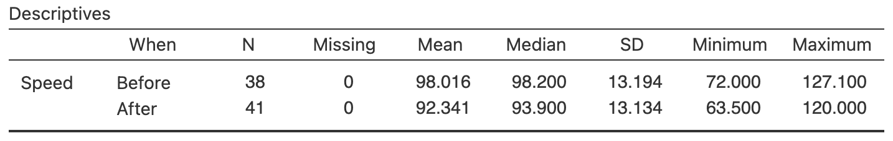

# Comparing quantitative data between individuals {#BetweenQuantData}
\index{Quantitative data!compare \textit{between} individuals}


<!-- Introductions; easier to separate by format -->
```{r, child = if (knitr::is_html_output()) {'./introductions/15-CompareQuant-HTML.Rmd'} else {'./introductions/15-CompareQuant-LaTeX.Rmd'}}
```


<!-- Define colours as appropriate -->
```{r, child = if (knitr::is_html_output()) {'./children/coloursHTML.Rmd'} else {'./children/coloursLaTeX.Rmd'}}
```


## Introduction

Relational RQs compare groups.
This chapter considers how to compare *quantitative* variables in different groups.
Graphs are useful this purpose, and a table of the numerical summaries usually is also produced.


## Numerical summary: difference between means {#CompareQuantTables}
\index{Quantitative data!compare \textit{between} individuals!summary tables}\index{Summary table!compare two means}

When comparing quantitative variables in different groups, the data should be summarised for each group.
If two groups are being compared, the *difference between the two means* must also be computed.
If more than two groups are being compared, the *differences* between one of the group means (the first, or the benchmark, or the initial situation) and the other group means are also usually computed.


::: {.example #GorillaSummarytable name="Numerical summary table"}
@wright2021chest recorded the number of chest-beats by gorillas (Table\ \@ref(tab:GorillaDataTable)), for gorillas under $20$\ years old ('younger') and $20$\ years and over ('older'). 
A summary of the data can be tabulated as in Table\ \@ref(tab:GorillaTable).
Notice that no standard deviation or sample size is provided for the *difference*; these make no sense.
:::


```{r}
data(Gorillas)
CBRyounger <- sort( Gorillas$ChestBeatRate[Gorillas$Age20 == "Younger"] )
CBRolder <- sort( Gorillas$ChestBeatRate[Gorillas$Age20 == "Older"] )

Gorilla2 <- cbind( CBRyounger[1:2], 
                   CBRyounger[3:4],
                   CBRyounger[5:6],
                   CBRyounger[7:8],
                   CBRyounger[9:10],
                   CBRyounger[11:12],
                   CBRyounger[13:14],
                   CBRolder[1:2],
                   CBRolder[3:4],
                   CBRolder[5:6],
                   CBRolder[7:8],
                   CBRolder[9:10],
                   c(CBRolder[11], NA) )
```

```{r GorillaDataTable}
if( knitr::is_latex_output() ) {
  kable( pad(Gorilla2,
             surroundMaths = TRUE,
             targetLength = 3,
             decDigits = 1),
         format = "latex", 
         longtable = FALSE,
         booktabs = TRUE,
         escape = FALSE,
         caption = "The chest-beating rate of gorillas (in beats per $10$\\hs).",
         linesep = c("", "", "", "\\addlinespace"),
         align = c("c","c")) %>%
    kable_styling(font_size = 8) %>%
    add_header_above(header = c("Younger " = 7, 
                                "Older" = 6), 
                     bold = TRUE, 
                     align = "c")
} else {
  kable( pad(Gorilla2,
             surroundMaths = TRUE,
             targetLength = 3,
             decDigits = 1),
         format = "html", 
         longtable = FALSE,
         booktabs = TRUE,
         escape = FALSE,
         caption = "The chest-beating rate of gorillas (in beats per $10$\\hs).",
         linesep = c("", "", "", "\\addlinespace"),
         align = c("c","c")) %>%
         #col.names = c("Treatment group", "Control group"),
    add_header_above(header = c("Younger " = 7, 
                                "Older" = 6), 
                     bold = TRUE, 
                     align = "c")
}
```


```{r GorillaTable}
GorillaSummaryTable <- array( dim = c(3, 3))

rownames(GorillaSummaryTable) <- c("Younger",
                                   "Older",
                                   "Difference") 
colnames(GorillaSummaryTable) <- c("(in beats per 10 h)",
                                   "(in beats per 10 h)",
                                   "size") 

GorillaSummaryTable[, 1] <- c( round( mean(CBRyounger), 3),
                               round( mean(CBRolder), 3),
                               round( mean(CBRyounger) - mean(CBRolder), 3) )
GorillaSummaryTable[, 2] <- c( round( sd(CBRyounger), 4),
                               round( sd(CBRolder), 4),
                               NA )
GorillaSummaryTable[, 3] <- c( length(CBRyounger),
                               length(CBRolder), 
                               NA )

if( knitr::is_latex_output() ) {
  knitr::kable( pad(GorillaSummaryTable,
                    surroundMaths = TRUE,
                    targetLength = c(4, 5, 2),
                    decDigits = c(2, 3, 0)),
                format = "latex",
                longtable = FALSE,
                booktabs = TRUE,
                escape = FALSE,
                digits = 1,
                align = "c",
                caption = "A numerical summary of the gorillas data.") %>%
    kable_styling(full_width = FALSE) %>%
    kable_styling(font_size = 8) %>%
    row_spec(2, 
             hline_after = TRUE) %>%
    row_spec(row = 0, 
             bold = TRUE) %>%
    row_spec(row = 3,
             italic = TRUE) %>%
    add_header_above( c( " " = 1,
                         "Mean" = 1,
                         "Standard deviation" = 1,
                         "Sample" = 1),
                      bold = TRUE,
                      line = FALSE)
}
if( knitr::is_html_output() ) {
  knitr::kable( pad(GorillaSummaryTable,
                    surroundMaths = TRUE,
                    targetLength = c(4, 5, 2),
                    decDigits = c(2, 3, 0)),
                format = "html",
                longtable = FALSE,
                booktabs = TRUE,
                escape = FALSE,
                digits = 1,
                align = "c",
                caption = "A numerical summary of the gorillas data.") %>%
    kable_styling(full_width = FALSE) %>%
    row_spec(row = 0, 
             bold = TRUE) %>%
    row_spec(row = 3,
             italic = TRUE) %>%
    add_header_above( c( " " = 1,
                         "Mean" = 1,
                         "Standard deviation" = 1,
                         "Sample" = 1),
                      bold = TRUE,
                      line = FALSE)
}
```


## Graphs for the comparison {#GraphOneQualOneQuant}
\index{Quantitative data!compare \textit{between} individuals!graphs}\index{Graphs!compare \textit{between} individuals}\index{Software output!graphs}

When a *quantitative* variable is measured or observed in different groups (i.e., between individuals), the distribution of each variable can be graphed separately.
However, to *comparing* the quantitative variable in the groups, appropriate graphs include: 

* *Back-to-back stemplots*:
  best for small amounts of data; only possible for comparing *two groups*; 
* *2-D dot charts*: 
  best choice for small to moderate amounts of data;
* *Boxplots*:
  best choice, except for small amounts of data.        

These situations have one quantitative variable being compared in different groups (defined by *one qualitative variable*). 


### Back-to-back stemplot {#BackToBackStem}
\index{Stemplot!back-to-back}\index{Graphs!back-to-back stemplot}

Back-to-back stemplots are two stemplots (Sect.\ \@ref(StemAndLeafPlots)) sharing the same stems; one group has the leaves emerging left-to-right from the stem, and the second group has the leaves emerging right-to-left from the stem.
Back-to-back stemplots can only be used when *two* groups are being compared.
Again, one advantage of using stemplots over other plots is that the original data are retained.
Disadvantages are that only two groups can be compared, and not all data work well with stemplots.


::: {.example #GorillaData name="Back-to-back stemplots"}
A back-to-back stemplot for comparing the chest-beating rate of gorillas (Fig.\ \@ref(fig:GorillasDoubleStem)) has the leaves for younger gorillas right-to-left, and the leaves for older gorillas left-to-right, sharing the same stems.
The younger gorillas have a faster chest-beating rate in general.
One older gorilla has a much faster rate that the other older gorillas (a potential outlier).
:::


```{r GorillasDoubleStem, fig.width=7.0, fig.height=2.75, out.width='80%', fig.cap="Stemplot for the chest-beating rate for gorillas.", fig.align="center"}

stemgrid.x <- 1
stemgrid.y <- 6
stemcounts <- array(1, 
                    dim = stemgrid.y)

par( mar = c(0.25, 0.25, 4, 0.25) + 0.1)

plot( expand.grid(1:stemgrid.x, 0:stemgrid.y), 
      type = "n",
      xlab = "",
      ylab = "",
      main = "Chest-beating rate of gorillas\n(1|6 means 1.6 beats per 10 hours)",
      xlim = c(-7, 8),
      ylim = c(-0.2, 5.2),
      axes = FALSE)

### Treatment data in cols 1  to 11 (x = -11 to x = -1)
### Stems in col 12  (x=0)
### Control data in cols 13 to 19 (x= 1 to x = 7)

# Divide the stems and leaves
lines(x = c(-0.5, -0.5),
      y = c(0.5, 6.5),
      lwd = 2,
      col = "grey")
lines(x = c(0.5, 0.5),
      y = c(0.5, 6.5),
      lwd = 2,
      col = "grey")
text(x = -5, 
     y = 0, 
     "Younger", 
     font = 2)
text( x = 4, 
      y = 0, 
      "Older", 
      font = 2)

# Plot stems
points( x = c(0, 0, 0, 0, 0), 
        y = 1:5,
        pch = as.character(4:0))


### Plot leaves
for (j in (1:2) ){
  
  if (j == 1) { # Right-hand side
    CBR <- CBRolder
    step <- 1
    stemcounts <- array(1, dim = stemgrid.y)
  }
  if (j == 2) { # Left-hand side
    CBR <- CBRyounger
    step <- -1
    stemcounts <- array(-1, dim = stemgrid.y)
  }
  
  for (i in 1:length(CBR)){
    
    if ( CBR[i] < 1) {
      points( stemcounts[1], 5, 
              pch = substr( sprintf("%1.1f", CBR[i]), 3, 3)) 
      stemcounts[1] <- stemcounts[1] + step
    }
    
    if ( (CBR[i] >= 1) & (CBR[i] < 2) ) {
      points( stemcounts[2], 4, 
              pch = substr( sprintf("%1.1f", CBR[i] - 1), 3, 3)) 
      stemcounts[2] <- stemcounts[2] + step
    }
    
    if ( (CBR[i] >= 2) & (CBR[i] < 3) ) {
      points( stemcounts[3], 3, 
              pch = substr( sprintf("%1.1f", CBR[i] - 2), 3, 3)) 
      stemcounts[3] <- stemcounts[3] + step
    }
    if ( ( CBR[i] >= 3 ) & (CBR[i] < 4) ) {
      points( stemcounts[4], 2, 
              pch = substr( sprintf("%1.1f", CBR[i] - 3), 3, 3)) 
      stemcounts[4] <- stemcounts[4] + step
    }
    if ( ( CBR[i] >= 4 ) & (CBR[i] < 5) ) {
      points( stemcounts[5], 1, 
              pch = substr( sprintf("%1.1f", CBR[i] - 4), 3, 3)) 
      stemcounts[5] <- stemcounts[5] + step
    }
  }
}
```


### 2-D dot charts {#TwoDDot}
\index{Dot chart!comparing quantitative data}\index{Graphs!dot chart 2D}

A 2-dimensional (2-D) dot chart places a dot for each observation, separated for each level of the qualitative variable (also see Sect.\ \@ref(DotChartsOneQual)).
Any number of groups can be compared.


::: {.importantBox .important data-latex="{iconmonstr-warning-8-240.png}"}
The axis displaying the counts (or percentages) *need not start from zero*, since the distance from the axis to the these numbers *do not* visually imply any quantity of interest.
Rather, how the dots *compare* in the groups is the main feature of interest.
:::


:::{.example #Dotchart2DGorillas name="Boxplots"}
For the chest-beating data seen in Example\ \@ref(exm:GorillaData), a dot chart is shown in Fig.\ \@ref(fig:TwoDDotchart).
Many observations are the same, so some points would be *overplotted*\index{Overplotting} if points were not *stacked*\index{Overplotting!stacking} (left panel), or *jittered*\index{Overplotting!jittering} (right panel).
:::

```{r TwoDDotchart, fig.height=6, out.width='100%',fig.cap="Two variations of a 2-D dot chart for the chest-beating data to avoid overplotting: stacking (left) and jittering (right).", fig.align="center", fig.width=8.75, fig.height=2.5}
old.par <- par()
par(mar = c(5, 6, 4, 2) + 0.1)
par(mfrow = c(1, 2))

stripchart( list(Younger = CBRyounger, 
                 Older = CBRolder), 
            main = "A 2-D dot chart; the chest-beating\nrate of gorillas (points stacked)",
            method = "stack", 
            las = 1,
            pch = c(4, 19),
            xlim = c(0, 5),
            cex = 0.7,
            ylim = c(0.6, 2.4),
            xlab = "Chest-beating rate (beats/10 h)")

stripchart( list(Younger = CBRyounger,
                 Older = CBRolder), 
            main = "A 2-D dot chart; the chest-beating\nrate of gorillas (points jittered)",
            method = "jitter",
            jitter = 0.18, 
            las = 1,
            pch = c(4, 19),
            xlim = c(0, 5),
            cex = 0.7,
            ylim = c(0.6, 2.4),
            xlab = "Chest-beating rate (beats/10 h)")

#par( old.par )
```


### Boxplots {#Boxplot}
\index{Boxplot}\index{Graphs!boxplot}

A boxplot is a picture of the quantiles (Sect.\ \@ref(VariationIQR)) for each group, drawn together on the same plot (and so are sometimes called *parallel* boxplots or *side-by-side* boxplots).
Any number of groups can be compared using a boxplot.

The distribution for each group is summarised by five numbers: the minimum value; the first quartile ($Q_1$); the median ($Q_2$); the third quartile ($Q_3$); and the maximum value.
Outliers, identified using the IQR rule (Sect.\ \@ref(OutliersIQRrule)), are usually shown too.
The values of $Q_1$, the median, and $Q_3$ for each group can be used to compare the distributions.
Different software may use different rules for computing quartiles, and hence may produce slightly different boxplots.


::: {.importantBox .important data-latex="{iconmonstr-warning-8-240.png}"}
The axis displaying these five numbers *need not start from zero*, since the distance from the axis to the these numbers *do not* visually imply any quantity of interest.
Rather, the boxes display the values of these five numbers for each group *relative* to each other, which is of interest.
:::


::: {.importantBox .important data-latex="{iconmonstr-warning-8-240.png}"}
Boxplots summarise data with only five numbers (and are sometimes called the five-number summary)\index{Five-number summary}, so detail of the distributions are lost.
For this reason, boxplots are excellent for *comparing* distributions, but histograms are better for displaying the distribution of a single quantitative variable.
:::


:::{.example #BoxplotGorillas name="Boxplots"}
The boxplot for the chest-beating data (Example\ \@ref(exm:GorillaData)) is shown in Fig.\ \@ref(fig:BoxplotGorillas).
No outliers are identified for younger gorillas; one large outlier is identified for the older gorillas.
The boxplot shows a distinct difference between the chest-beating rates of older and younger gorillas.
:::


```{r BoxplotGorillas, fig.cap="A boxplot for the chest-beating data.", fig.align="center",  fig.height=2.85, fig.width=4.5, out.width='50%'}
CBR.C2 <- CBRolder[ -which.max(CBRolder)]

par( mar = c(4.5, 5, 3, 2) + 0.1 )
Gorillas$Age20 <- ordered(Gorillas$Age20,
                          levels = c("Younger", 
                                     "Older"))
out <- boxplot( ChestBeatRate ~ Age20,
         data = Gorillas,
         col = plot.colour,
         las = 1,
         pch = 19,
         ylim = c(0, 5),
         xlab = "Age group",
         ylab = "Chest-beating rate\n (per 10 h)",
         main = "Chest-beating rate\nof gorillas")

CBRyounger.quantiles <- out$stats[, 1]
```


The detail of the boxplots are explained in Fig.\ \@ref(fig:BoxplotGorillasExplain).
Firstly, focus on just the boxplot for the *younger* gorillas (i.e., the left box).\index{Quartiles}
Boxplots have five horizontal lines; from the top to the bottom of the plot:

1. *Top line*:
   The *fastest* chest-beating rate (largest value) is\ $`r CBRyounger.quantiles[5]`$ per\ $10$\hs.
2. *Second line from top*:
   $75$% of observations are smaller than about\ $`r CBRyounger.quantiles[4]`$ per\ $10$\hs, represented by the line at the top of the central box. 
   This is the *third quartile* ($Q_3$).
3. *Middle line*:
   $50$% of observations are smaller than about\ $`r CBRyounger.quantiles[3]`$ per\ $10$\hs, represented by the line inside the central box. 
   This is an 'average' value, the *second quartile* ($Q_2$).
4. *Second line from bottom*:
   $25$% of observations are smaller than about\ $`r CBRyounger.quantiles[2]`$ per\ $10$\hs, represented by the line at the bottom of the central box. 
   This is the *first quartile* ($Q_1$).
5. *Bottom line*:
   The *slowest* chest-beating rate (smallest value) is\ $`r CBRyounger.quantiles[1]`$ per\ $10$\hs. 


```{r BoxplotGorillasExplain, fig.cap="Explaining the boxplots for the chest-beating data.", fig.align="center",  fig.height=4.15, fig.width=10, out.width='100%'}

source("R/showExplainBoxplots.R")
```


The box for the *older* gorillas is slightly different (Fig.\ \@ref(fig:BoxplotGorillas), right box): one observation is identified with a point, *above* the top line.
Computer software identifies this observation as an *extreme outlier* using the IQR rule (Sect.\ \@ref(OutliersIQRrule)), and has plotted this point separately.


```{r}
outC <- boxplot( list(Older = CBRolder),
                 plot = FALSE)
CBR.quantiles <- outC$stats
```

The values of $Q_1$, the median and $Q_3$ are all substantially larger for the younger gorillas, suggesting that younger gorillas have, in general, faster chest-beating rates.


::: {.example #BoxplotsHorizontal name="Boxplots"}
Boxplots can be plotted horizontally too, which leaves space for the labels of the qualitative variable.
In Fig.\ \@ref(fig:CementBuildBoxplot) (based on @data:Silva2016:rootcanal), the three dental cements are very different regarding their push-out forces.
:::


```{r CementBuildBoxplot, fig.cap="Comparing three push-out values for three dental cements.", fig.align="center", fig.height=2.75, fig.width=6.5, fig.show='hold', out.width='85%'}
MTA    <- c(0.05, 0.1, 0.2, 0.25, 0.45)
Endo   <- c(0.1, 0.2, 0.4,   1.0, 2.05)
AHplus <- c(0.5, 1.1, 2.25, 2.9, 4.4)

CementStats <- list( n = c(5, 5, 5),
                     stats = matrix( cbind(MTA, 
                                           Endo, 
                                           AHplus), 
                                     ncol = 3, 
                                     byrow = FALSE),
                     conf = matrix( c(-1.5, 7, -2, 10, 3, 3), 
		                 ncol = 2, 
				             byrow = FALSE),  ### NOT USEFUL, only for notches
                  out = NULL,
                  group = NULL,
                  names = c("MTA Fillapex", 
		                        "Endo Seal", 
			                      "AH Plus"))

par( mar = c(5.1, 6.1, 4.1, 2.1))
plot( c(0, 5), 
      c(0.4, 3.6),
      type = "n",
      axes = FALSE,
      main = "Boxplot of push-out force",
      ylab = "",
      xlab = "Push-out force (MPa)")

axis(side = 1,
     las = 1)
abline(h = 0, 
       col = "grey", 
       lwd = 2)
bxp(CementStats,
    las = 1,
    horizontal = TRUE,
    add = TRUE,
    boxfill = plot.colour)
```

```{r}
htmltools::tags$video(src = "./videos/Boxplots.mp4", 
                      width = "550", 
                      controls = "controls", 
                      loop = "loop", 
                      style = "padding:5px; border: 2px solid gray;")
```


## Example: water access {#WaterAccessCompareQuant}

@lopez2022farmers recorded data about access to water in three rural communities in Cameroon (Sect.\ \@ref(WaterAccessQuant)).
The study could be used to determine contributors to the incidence of diarrhoea in young children ($85$\ households had children under\ $5$ years of age).

The graphs (Fig.\ \@ref(fig:WaterAccessCompareQuantFigs)) and summary (Table\ \@ref(tab:WaterAccessCompareQuantTabs)) show that households in which diarrhoea was found in the last two weeks in children had older household coordinators, more people in the household, and more children under\ $5$ years of age in the household. 
These may be expected: older female coordinators probably have more children, hence have more children in the household under\ $5$ years of age, and so more children (and hence people) are in the household in general.


```{r WaterAccessCompareQuantFigs, fig.align="center", fig.cap="Some plots for the water access data in 85 households ($59$ household reported no diarrhoea in children under\\ $5$ years of age; $26$ reported diarrhoea in children under\\ $5$ years of age).", out.width = '100%', fig.width=6, fig.height=2.25}
data(WaterAccess)
par( mfrow = c(1, 3),
     mar = c(5.1, 5.1, 4.1, 1.1))

WAkids <- subset(WaterAccess,
                 HouseholdUnder5s > 0)

ns <- tapply(WAkids$Age,
             list(WAkids$Diarrhea),
             "realLength")
ns1 <- ns[1]
ns2 <- ns[2]

boxplot(Age ~ Diarrhea,
     data = WAkids,
     xlab = "Diarrhoea in any\n children under 5?",
     ylab = "Woman's age\n(in years)",
     main = "Diarrhoea in\nchildren under 5",
     las = 1,
     names = c( "No",
                "Yes")
     )

boxplot(HouseholdPeople~ Diarrhea,
     data = WAkids,
     xlab = "Diarrhoea in any\n children under 5?",
     ylab = "Number in household",
     main = "Diarrhoea in\nchildren under 5",
     las = 1,
      names = c("No",
                "Yes")
     )

boxplot(HouseholdUnder5s ~ Diarrhea,
     data = WAkids,
     xlab = "Diarrhoea in any\n children under 5?",
     ylab = "Number under 5",
     main = "Diarrhoea in\nchildren under 5",
     las = 1,
      names = c("No",
                "Yes")
     )
     
```

```{r WaterAccessCompareQuantTabs}
WACompareQual <- array( dim = c(12, 6) )

colnames(WACompareQual) <- c("",
                             "$n$",
                             "Mean",
                             "Median",
                             "Std dev.",
                             "IQR")
WACompareQual[, 1] <- c("All households with children",
                        "Incidents of diarrhoea",
                        "No incidents of diarrhoea",
                        "Difference",
                        "All households with children",
                        "Incidents of diarrhoea",
                        "No incidents of diarrhoea",
                        "Difference",
                        "All households with children",
                        "Incidents of diarrhoea",
                        "No incidents of diarrhoea",
                        "Difference"
                             )


quantVals <- function(x){
  c( realLength(x),
     mean(x, na.rm = TRUE),
     median(x, na.rm = TRUE),
     sd(x, na.rm = TRUE),
     IQR(x, na.rm = TRUE)
  )
}

WAKids <- subset(WaterAccess,
                 HouseholdUnder5s > 0)

WACompareQual[1, 2:6] <- quantVals( WAKids$Age)
WACompareQual[2, 2:6] <- quantVals( WAKids$Age[WAKids$Diarrhea=="Y"])
WACompareQual[3, 2:6] <- quantVals( WAKids$Age[WAKids$Diarrhea=="N"])
WACompareQual[4, 3] <- as.numeric(WACompareQual[2, 3]) - as.numeric(WACompareQual[3, 3])

WACompareQual[5, 2:6] <- quantVals( WAKids$HouseholdPeople)
WACompareQual[6, 2:6] <- quantVals( WAKids$HouseholdPeople[WAKids$Diarrhea=="Y"])
WACompareQual[7, 2:6] <- quantVals( WAKids$HouseholdPeople[WAKids$Diarrhea=="N"])
WACompareQual[8, 3] <-  as.numeric(WACompareQual[6, 3]) -  as.numeric(WACompareQual[7, 3])

WACompareQual[9, 2:6] <- quantVals( WAKids$HouseholdUnder5s)
WACompareQual[10, 2:6] <- quantVals( WAKids$HouseholdUnder5s[WAKids$Diarrhea=="Y"])
WACompareQual[11, 2:6] <- quantVals( WAKids$HouseholdUnder5s[WAKids$Diarrhea=="N"])
WACompareQual[12, 3] <-  as.numeric(WACompareQual[10, 3]) -  as.numeric(WACompareQual[11, 3])


if( knitr::is_latex_output() ) {
    kable( pad(WACompareQual,
               targetLength = c(0, 2, 4, 4, 5, 5),
               decDigits = c(0, 0, 1, 1, 2, 2),
               surroundMaths = TRUE),
        format = "latex",
        longtable = FALSE,
        booktabs = TRUE,
        escape = FALSE, # For latex to work
        linesep = c( "", "", ""), 
        caption = "A summary of the quantitative variables in the water-access study, according to whether diarrhoea had been observed in the last two weeks in children under $5$ years of age, for those household with children under $5$ years of age.",
        align = c("r", "c", "c", "c", "c", "c"))   %>%
   kable_styling(full_width = FALSE, 
                 font_size = 8) %>%
  row_spec(0, bold = TRUE) %>% # Columns headings (row 0) in bold
  row_spec(1, italic = TRUE) %>% # "All households"
  row_spec(5, italic = TRUE) %>% # "All households"
  row_spec(9, italic = TRUE) %>% # "All households"
  column_spec(0, bold = TRUE) %>%     # Row headings in bold
    pack_rows("Woman coordinator's age (in years)",
              start_row = 1,
              end_row = 4,
              bold = TRUE) %>%
    pack_rows("Household size",
              start_row = 5,
              end_row = 8,
              bold = TRUE) %>% 
    pack_rows("Children under 5 in household",
              start_row = 9,
              end_row = 12,
              bold = TRUE)
}

if( knitr::is_html_output() ) {
  kable(pad(WACompareQual,
               targetLength = c(0, 2, 4, 4, 5, 5),
               decDigits = c(0, 0, 1, 1, 2, 2),
               surroundMaths = TRUE),
        format = "html",
        align = c("r", "c", "c", "c", "c", "c"),
        longtable = FALSE,
        caption = "A summary of the quantitative variables in the water-access study, according to whether diarrhoea had been observed in the last two weeks in children under $5$ years of age, for those household with children under $5$ years of age.",
        booktabs = TRUE) %>%     # Row headings in bold
    pack_rows("Woman's age",
              start_row = 1,
              end_row = 3,
              bold = TRUE) %>%
    pack_rows("Household size",
              start_row = 4,
              end_row = 6,
              bold = TRUE) %>% 
    pack_rows("Children under 5 in household",
              start_row = 7,
              end_row = 9,
              bold = TRUE)
}
```


## Chapter summary {#Chap14-Summary}
   
Quantitative data can be compared between different groups (between individuals comparisons) using a back-to-back stemplot, boxplot or $2$-D dot chart.
A summary table should show the numerical summaries for the levels of the quantitative variable, and the between-group differences. 


## Quick review questions {#Chap14-QuickReview}

::: {.webex-check .webex-box}
Are the following statements *true* or *false*?

1. A boxplot is an appropriate graph for comparing a quantitative variable in two *or more* groups. \tightlist
`r if( knitr::is_html_output() ) {torf(answer = TRUE)}`
2. A back-to-back stemplot is an appropriate graph for comparing a quantitative variable in two *or more* groups.
`r if( knitr::is_html_output() ) {torf(answer = FALSE)}`
3. A case-profile plot is an appropriate graph for comparing a quantitative variable in two *or more* groups.
`r if( knitr::is_html_output() ) {torf(answer = FALSE)}`
4. When comparing a quantitative variable in two *or more* groups, the sample size for the difference should be included
`r if( knitr::is_html_output() ) {torf(answer = FALSE)}`
:::


## Exercises {#CompareQuantData-Exercises}

Answers to odd-numbered exercises are available in App.\ \@ref(Answers).

`r if( knitr::is_latex_output() ) "\\captionsetup{font=small}"`

::: {.exercise #BoxplotsProjectCosts}
@data:Hale2009:ProjectDelivery studied two different engineering project delivery methods (Fig.\ \@ref(fig:AISfemalesportEng), left panel): Design/Build and Design/Bid/Build.
The grey, horizontal line is where the projected costs are the same as the actual cost.

1. What does the plot reveal about the two methods?
2. What is the median for each method (approximately)?
3. What is the IQR for each method (approximately)?
:::


::: {.exercise #GraphsAIS}
[*Dataset*: `AISsub`]
@data:Telford1991:sexsportsize studied athletes at the *Australian Institute of Sport* (AIS).
Numerous physical and blood measurements were taken from high performance athletes.
Figure\ \@ref(fig:AISfemalesportEng) (right panel) compares the heights of females in two similar sports: basketball and netball.
(Netball was derived from basketball.)

1. What does the plot reveal about the heights of the females in each sport?
2. What is the median for each sport (approximately)?
3. What is the IQR for each sport (approximately)?
:::

```{r}
data(AISsub) ### Exercise

subAIS <- subset(AISsub, 
                 Sex=="F" & (Sport=="BBall" | Sport=="Netball"))
subAIS$Sport <- factor(subAIS$Sport)
```

```{r AISfemalesportEng, fig.cap="Left: cost increases for two different building project delivery methods: Design/Build and Design/Bid/Build (the grey, horizontal line is where the projected costs are the same as the actual cost). Right: the heights of female basketball and netball players attending the AIS.", fig.align="center", fig.width=9, fig.height=4, out.width = '90%'}

par(mfrow = c(1, 2))

DB  <-  c( 7,   3, 1.5, 1, -1.5)
DBB <- c(10, 5.5, 3.5, 2, -2)

EngStats <- list( n = c(5, 5),
                  stats = matrix( cbind(DB, DBB), 
                                  ncol = 2, 
                                  byrow = FALSE),
                  conf = matrix( c(-1.5, 7, -2, 10), 
                                 ncol = 2, 
                                 byrow = FALSE),
                  out = c(8, 20, 12.5, 11.5, -7),
                  group = c(1, 2, 2, 2, 2),
                  names = c("DB", 
                            "DBB"))
plot( c(0.4, 2.6), 
      c(-10, 21),
      type = "n",
      axes = FALSE,
      main = "Boxplot of project costs",
      ylab = "Cost increase (%)",
      xlab = "Project delivery method")

axis(side = 2,
     las = 1)
abline(h = 0, 
       col = "grey", 
       lwd = 2)
bxp(EngStats,
    las = 1,
    add = TRUE,
    boxfill = plot.colour)


###


boxplot(Ht ~ Sport, 
        data = subAIS,
        las = 1,
        ylim = c(165, 200),
        col = plot.colour,
        xlab = "Sport",
        ylab = "Height (in cm)",
        main = "Boxplot of heights:\nbasketballers and netballers",
        names = c("Basketball", 
                  "Netball")

)
```


::: {.exercise #NumericalQuantMatchingHistogramsAndBoxplots}

`r if (knitr::is_latex_output()) {
   'Consider  the histograms and boxplots in Fig.\\ \\@ref(fig:MatchHistoBox).'
} else {
   'Match the histograms with the corresponding boxplots in the activity below.'
}`


`r if (knitr::is_html_output()) '<!--'`
1. Match the histogram with the corresponding boxplot.
1. For which datasets would the mean and standard deviation be the appropriate numerical summary?
   For which datasets would the median and IQR be the appropriate numerical summary?
`r if (knitr::is_html_output()) '-->'`
:::


```{r MatchHistoBox, fig.align = "center", fig.cap="Match the histogram with the boxplot.", out.width = '100%', fig.width = 5.5, fig.height=2.0}
if( knitr::is_latex_output() ) {
  set.seed(20032009)
  num <- 400
  
  # Skewed right
  dt1 <- rgamma(num,
                scale = 0.2,
                shape = 2)
  # Normal
  dt2 <- rnorm(num,
               mean = max(dt1) / 2,
               sd = max(dt1) / 6)
  # Uniform
  dt3 <- runif(num, 
               min = 0, 
               max = max(dt1))
  
  par( mfrow = c(1, 3),
       mar = c(0.5, 0.5, 0.5, 0.5) )
  
  hist(dt1,
       axes = FALSE,
       col = plot.colour,
       las = 1,
       xlim = c(0, 2),
       ylim = c(0, 235),
       xlab = "",
       ylab = "Number",
       main = "")
  text(x = 0.85,
       y = 140,
       labels = "Histogram A",
       font = 2)
  boxplot(dt2,
          at = 200,
          horizontal = TRUE,
          col = plot.colour,
          add = TRUE,
          axes = FALSE,
          boxwex = 30)
  text(x = 0.75,
       y = 220,
       labels = "Boxplot I",
       font = 2)

  lines(x = c(-100, 100), 
        y = c(160, 160), 
        col = "grey",
        xpd = TRUE)  
  
  ########################
  
  
  hist(dt2,
       axes = FALSE,
       col = plot.colour,
       las = 1,
       xlim = c(0, 2),
       ylim = c(0, 235),
       xlab = "",
       ylab = "Number",
       main = "")
  text(x = 0.75,
       y = 140,
       labels = "Histogram B",
       font = 2)
  boxplot(dt1,
          at = 195,
          horizontal = TRUE,
          col = plot.colour,
          add = TRUE,
          axes = FALSE,
          boxwex = 30)
  text(x = 0.75,
       y = 220,
       labels = "Boxplot II",
       font = 2)

  lines(x = c(-100, 100), 
        y = c(160, 160), 
        col = "grey",
        xpd = TRUE)  
  ########################
  
  hist(dt3,
       axes = FALSE,
       col = plot.colour,
       las = 1,
       xlim = c(0, 2),
       ylim = c(0, 235),
       xlab = "",
       ylab = "Number",
       main = "")
  text(x = 0.75,
       y = 140,
       labels = "Histogram C",
       font = 2)
  abline(h = 160, 
         col="grey")
  boxplot(dt3,
          at = 195,
          horizontal = TRUE,
          col = plot.colour,
          add = TRUE,
          axes = FALSE,
          boxwex = 30)
  text(x = 0.75,
       y = 220,
       labels = "Boxplot III",
       font = 2)
  lines(x = c(-100, 100), 
        y = c(160, 160), 
        col = "grey",
        xpd = TRUE)  
  
}
```


::: {.exercise #NumericalJellyfish}
@others:lunn:cida [@data:hand:handbook] compared the dimensions of jellyfish at two sites at Hawkesbury River, NSW (Dangar Island; Salamander Bay) to determine the difference between the jellyfish at each site.
A histogram of the breadth of jellyfish at Dangar Island Bay is shown in Fig.\ \@ref(fig:JellyfishHist) (left panel).

```{r JellyfishHist, echo=FALSE, fig.cap="Left: A histogram of the breadth of jellyfish at Dangar Island. Right: A boxplot of the breadth of jellyfish at two sites.", fig.align="center", fig.width=8, fig.height = 3.25, out.width = '90%'}
data(Jellyfish)

par(mfrow = c(1, 2))

JF <- Jellyfish

ns <- c( length(JF$Width[JF$Location == "Dangar"]),
         length(JF$Width[JF$Location == "Salamander"])
) 


out <- hist(JF$Width[JF$Location == "Dangar"], 
            las = 1, 
            xlab = "Breadth (in mm)",
            ylab = "Number of jellyfish",
            col = plot.colour, 
            main = paste("Breadth of jellyfish\nat Dangar Island"),
            sub = paste("(n =", ns[1], "jellyfish)"),
            ylim = c(0, 12))

boxplot(Width ~ Location, 
        data = JF,
        col = plot.colour,
        las = 1,
        ylim = c(5, 25),
        names = c("Site A", 
                  "Site B"),
        xlab = "Site",
        ylab = "Breadth (in mm)",
        main = "Breadth of a sample of jellyfish\nat two sites")
```


1. Two students are arguing about the median breadth.
  Which student, if either, is correct?  
  \ \   
  Student\ 1 says:  
  *The bars in the histogram have heights of $10$,\ $2$,\ $4$,\ $2$ and\ $4$.
  When these numbers are put in order, they are: $2$,\ $2$,\ $4$,\ $4$, and\ $10$.
  The median breadth is the median of these numbers, so the median breadth is the middle one: $4$\mms is the median.*  
  \ \   
  Student\ 2 responds:  
  *You have the correct answer, but for the wrong reason!
  There are five bars, and the middle bar is the third bar.
  Since the third bar has a height of\ $4$, the median breadth is\ $4$\mms.*
2. Describe the histogram.
3. A boxplot comparing the breadths of jellyfish at Dangar Island and Salamander Bay is shown in Fig.\ \@ref(fig:JellyfishHist) (right panel).
   Describe and compare the breadths of the jellyfish.
4. What is the median breadth for the jellyfish at each location?
5. Which box in the boxplot represents the Dangar Island jellyfish (shown in Fig.\ \@ref(fig:JellyfishHist), left panel)?
:::


::: {.exercise #NumericalQuantConstructionWorkerProductivity}
@data:Gatti2013:WorkforceStrain studied the productivity of construction workers, recording (among other things) the rate at which concrete panels could be installed by workers.
Data for three different female workers in the study are shown in Table\ \@ref(tab:PanelsTable).

1. Compute the IQR for each worker.
1. Construct the boxplot for comparing the three workers.
1. Draw the approximate histograms for each worker.
1. What do you learn about the workers?
:::


```{r PanelsTable}
Panels <- array(NA, 
                dim = c(7, 3))

rownames(Panels) <- c("Mean", 
                      "Minimum", 
                      "1st quartile", 
                      "Median", 
                      "3rd quartile", 
                      "Maximum", 
                      "Range")
colnames(Panels) <- c("Worker 1", 
                      "Worker 2", 
                      "Worker 3")

Panels[, 1] <- c(1.24, 0.59, 0.88, 1.35, 1.49, 1.88, 1.28)
Panels[, 2] <- c(1.73, 1.13, 1.51, 1.70, 1.91, 3.00, 1.87)
Panels[, 3] <- c(1.36, 0.86, 1.16, 1.38, 1.58, 2.17, 1.31)

if( knitr::is_latex_output() ) {
  kable(pad(Panels[1:6, ],
            surroundMaths = TRUE,
            targetLength = 4,
            decDigits = 2),
        format = "latex",
        longtable = FALSE,
        booktabs = TRUE,
        escape = FALSE,
        align = "c",
        linesep = c( "",  # Otherwise adds a space after five lines... 
                    "\\addlinespace",
                  "", 
                  "", 
                  "\\addlinespace",
                  "", 
                  ""),       
        col.names = c("Worker 1", 
                      "Worker 2",
                      "Worker 3"),
        caption = "The productivity of three workers installing concrete panels (in panels per minute).") %>%
  kable_styling(font_size = 8) %>%
  row_spec(0, bold = TRUE)
}
if( knitr::is_html_output() ) {
  kable(pad(Panels[1:6, ],
            surroundMaths = TRUE,
            targetLength = 4,
            decDigits = 2),
        format = "html",
        align = "c",
        longtable = FALSE,
        booktabs = TRUE,
        col.names = c("Worker 1", 
                      "Worker 2", 
                      "Worker 3"),
        caption = "The productivity of three workers installing concrete panels (in panels per minute).")
  }
```


::: {.exercise #GreenBuilding}
In a study of the temperature in offices, @data:Paul2008:Comfort compared the temperature in three offices (during working hours) at Charles Sturt University (Australia; CSU); the data are summarised in Table\ \@ref(tab:OfficeTemps).

1. Compute the IQR for each office.
1. Construct the boxplot for comparing the three offices.
1. Draw the approximate histograms for each office.
1. What do you learn about the offices?
:::


```{r OfficeTemps}
OfficeTemps <- array( dim = c(6, 3) )
colnames(OfficeTemps) <- c( "Office A", 
                            "Office B", 
                            "Office C")
rownames(OfficeTemps) <- c("Mean", 
                           "Minimum", 
                           "$Q_1$", 
                           "Median", 
                           "$Q_3$", 
                           "Maximum")

OfficeTemps[1, ] <- c(24.1, 25.3, 25.7)
OfficeTemps[2, ] <- c(16.4, 15.9, 20.1)
OfficeTemps[3, ] <- c(22.8, 23.8, 24.6)
OfficeTemps[4, ] <- c(24.4, 25.5, 26.1)
OfficeTemps[5, ] <- c(25.5, 26.9, 27.2)
OfficeTemps[6, ] <- c(27.4, 31.0, 30.3)

if( knitr::is_latex_output() ) {
    kable(pad(OfficeTemps,
              surroundMaths = TRUE,
              targetLength = c(4, 4, 4),
              decDigits = 1),
        format = "latex",
        longtable = FALSE,
        booktabs = TRUE,
        escape = FALSE, # For latex to work
        linesep = c( "", "", "", "", "", ""), # Add a bit of space between all rows. 
        caption = "A summary of the temperature (in degrees C) in three offices at CSU during working hours
according to current smoking status.",
        align = c("c", "c"))   %>%
   kable_styling(full_width = FALSE, 
                 font_size = 8) %>%
  row_spec(0, bold = TRUE) %>% # Columns headings (row 0) in bold
  column_spec(0, bold = TRUE)     # Row headings in bold
}

if( knitr::is_html_output() ) {
  kable(pad(OfficeTemps,
              surroundMaths = TRUE,
              targetLength = c(4, 4, 4),
              decDigits = 1),
        format = "html",
        align = c("c", "c"),
        longtable = FALSE,
        caption = "A summary of the temperature (in degrees C) in three offices at CSU during working hours according to current smoking status.",
        booktabs = TRUE) 
}
```


::: {.exercise #CompareQuantExercisesNHANES}
[*Dataset*: `NHANES`]
Consider this RQ:

> Among Americans, is the mean direct HDL cholesterol different for current smokers and non-smokers?

Data to answer this RQ are available from the American *National Health and Nutrition Examination Survey* (<span style="font-variant:small-caps;">bhadp</span>) [@data:NHANES:Rpackage].

1. What would be an appropriate graph to display the comparison?
2. Use the software output (Fig.\ \@ref(fig:NHANESTwoSample))\index{Software output!comparing two means} to construct an appropriate table showing the numerical summary relevant to the RQ.

:::

(ref:NHANESSoftware) Software output for the <span style="font-variant:small-caps;">bhadp</span> data.

```{r NHANESTwoSample, fig.cap="(ref:NHANESSoftware)", fig.align="center", out.width='100%'}
knitr::include_graphics("jamovi/NHANES/NHANES-DirectHDL-Smoke-Descriptives.png")
```


```{r}
data(ForwardFall) ### Exercise

ForwardFall$Group <- factor(ForwardFall$Group,
                   levels = 1:2,
                   labels = c("Younger",
                              "Older"))
```


::: {.exercise #FacePlantSummary}
[*Dataset*: `ForwardFall`]
@data:Wojcik:ForwardFall compared the lean-forward angle in younger and older women.
An elaborate set-up was constructed to measure this angle, using a harness.
Consider the RQ:

> Among healthy women, what is difference between the mean lean-forward angle for younger women compared to older women?

The data are shown in Table\ \@ref(tab:FacePlant).

1. What is an appropriate graph to display the comparison?
1. Construct an appropriate numerical summary from the software output (Fig.\ \@ref(fig:FallFowardTTestjamovi)).
:::

```{r FacePlant}
FacePlant <- array(dim = c(2, 10), # COL 6 is a gap
                   NA)
FacePlant[1, ] <- c( ForwardFall$LeanAngle[ForwardFall$Group == "Younger"][1:5],
                       ForwardFall$LeanAngle[ForwardFall$Group == "Older"][1:5] )
FacePlant[2, 1:5] <- ForwardFall$LeanAngle[ForwardFall$Group == "Younger"][6:10]

if( knitr::is_latex_output() ) {
  
  kable( pad(FacePlant,
             surroundMaths = TRUE,
             targetLength = c(2, 2, 2, 2, 2, 2, 2, 2, 2, 2),
             decDigits = 0),
         format = "latex",
         longtable = FALSE,
         booktabs = TRUE,
         escape = FALSE,
         align = "c",
         caption = "Lean-forward angles for older women ($n = 10$) and younger women ($n = 5$).") %>%
    add_header_above(header = c("Younger women " = 5, "Older women " = 5), 
                     bold = TRUE, 
		     align = "c") %>%
    kable_styling(font_size = 8)
    
}
if( knitr::is_html_output() ) {
  out <- kable( pad(FacePlant,
             surroundMaths = TRUE,
             targetLength = c(2, 2, 2, 2, 2, 2, 2, 2, 2, 2),
             decDigits = 0),
                format = "html",
                longtable = FALSE,
                booktabs = TRUE,
                align = "c",
                caption = "Lean-forward angles for older women ($n = 10$) and younger women ($n = 5$).")
    kable_styling(out, 
                  full_width = FALSE) %>%
    add_header_above(header = c("Younger women " = 5, "Older women " = 5), 
                     bold = TRUE, 
		     align = "c")
}
```


```{r FallFowardTTestjamovi, fig.cap="Software output for the lean-forward angles data.", fig.align="center", out.width='95%'}

```


:::{.exercise #QuantCompareSpeedSignage}
[*Dataset*: `Speed`]
@ma2019impacts studied adding additional signage to reduce vehicle speeds on freeway exit ramps.
At one site (Ningxuan Freeway), speeds were recorded for $38$\ vehicles before the extra signage was added, and then for $41$ different vehicles after the extra signage was added
`r if (knitr::is_latex_output()) {
   '(Table\\ \\@ref(tab:SignageHT)).'
} else {
   '(data below).'
}`


```{r Signage}
data(Speed) ### Exercise

Speed$When <- factor(Speed$When,
                     levels = c("Before", "After"),
                     ordered = TRUE)

Speed2 <- data.frame( Before = Speed$Speed[ Speed$When == "Before" ][1:10],
                      After = Speed$Speed[ Speed$When == "After" ][1:10])
```

```{r}
if( knitr::is_latex_output() ) {
  tb1 <- cbind( Speed$Speed[Speed$When == "Before"][1:9],
                Speed$Speed[Speed$When == "Before"][10:18],
                Speed$Speed[Speed$When == "Before"][19:27],
                Speed$Speed[Speed$When == "Before"][28:36],
                c( Speed$Speed[Speed$When == "Before"][37:38], NA, NA, NA, NA, NA, NA, NA ) )
  T1 <- knitr::kable( pad(tb1,
                          surroundMaths = TRUE,
                          targetLength = 5,
                          decDigits = 1),
                      format = "latex",
                      valign = 't',
                      align = "r",
                      linesep = "",
                      row.names = FALSE,
                      escape = FALSE,
                      booktabs = TRUE) %>%
    row_spec(0, bold = TRUE) %>%
    add_header_above( c("Speeds before signage added" = 5),
                      bold = TRUE)

  tb2 <- cbind( Speed$Speed[Speed$When == "After"][1:9],
                Speed$Speed[Speed$When == "After"][10:18], 
                Speed$Speed[Speed$When == "After"][19:27], 
                Speed$Speed[Speed$When == "After"][28:36], 
                c( Speed$Speed[Speed$When == "After"][37:41], NA, NA, NA, NA) )
  T2 <- knitr::kable( pad(tb2,
                          surroundMaths = TRUE,
                          targetLength = 5,
                          decDigits = 1),
                      format = "latex",
                      align = "r",
                      valign = 't',
                      linesep = "",
                      row.names = FALSE,
                      escape = FALSE,
                      booktabs = TRUE) %>%
    row_spec(0, bold = TRUE) %>%
    add_header_above( c("Speeds after signage added" = 5),
                      bold = TRUE)
  
  out <- knitr::kables(list(T1, T2),
                       format = "latex",
                       label = "SignageHT",
                       caption = "Vehicle speeds (in km.h$^{-1}$) before and after adding extra signage.") %>%
    kable_styling(font_size = 8)
  out2 <- prepareSideBySideTable(out, gap = "\\enskip")
  out2
}

if( knitr::is_html_output() ) {
  
   DT::datatable( Speed,
                 fillContainer = FALSE, # Make more room, so we don't just have ten values
                 colnames = c("When measured", "Speed (km.h$^{-1}$)"),
                 options = list(searching = FALSE), # Remove searching: See: https://stackoverflow.com/questions/35624413/remove-search-option-but-leave-search-columns-option
                 caption = "Vehicle speeds (in km.h$^{-1}$) before and after adding extra signage.")
}
```


The researchers are hoping that the addition of extra signage will *reduce* the mean speed of the vehicles.
The RQ is:

> At this freeway exit, how much is the mean vehicle speed *reduced* after extra signage is added?

1. Using the software output in Fig.\ \@ref(fig:SpeedjamoviCI), summarise the data numerically, then construct a suitable summary table.
1. Produce a boxplot of the data (use a computer if necessary).
:::


```{r SpeedjamoviCI, fig.cap="Software output for the speed data.", fig.align="center", out.width="100%"}

```


::: {.exercise #CompareQuantDeceleration}
[*Dataset*: `Deceleration`]
@ma2019impacts studied adding additional signage to reduce vehicle speeds on freeway exit ramps.
At one site (Ningxuan Freeway), speeds were recorded at various points on the freeway exit for $38$\ vehicles before the extra signage was added, and then for $41$\ vehicles after the extra signage was added.

From this data, the *deceleration* of each vehicle was determined
`r if (knitr::is_latex_output()) {
   '(Table\\ \\@ref(tab:SignageSummaryData))'
} else {
   '(data below)'
}`
as the vehicle left the\ $120$\kms.h^$-1$^ speed zone and approached the\ $80$\kms.h^$-1$^ speed zone. 
The RQ is:

> At this freeway exit, what is the difference between the mean vehicle deceleration, comparing the times before the extra signage is added and after extra signage is added?

In this context, the researchers are hoping that the extra signage might cause cars to slow down *faster* (i.e., they will decelerate more, on average, after adding the extra signage).

1. Using the software output in Fig.\ \@ref(fig:DecelerationjamoviCI), summarise the data numerically, then construct a suitable summary table.
1. Produce a boxplot of the data (use a computer if necessary).
:::


```{r}
data(Deceleration) ### Exercise

Deceleration$When <- factor(Deceleration$When,
                     levels = c("Before", "After"),
                     ordered = TRUE)


if( knitr::is_latex_output() ) {
  tb1 <- cbind( Deceleration$Deceleration[Deceleration$When == "Before"][1:9],
                Deceleration$Deceleration[Deceleration$When == "Before"][10:18],
                Deceleration$Deceleration[Deceleration$When == "Before"][19:27],
                Deceleration$Deceleration[Deceleration$When == "Before"][28:36],
                c(Deceleration$Deceleration[Deceleration$When == "Before"][37:38], NA, NA, NA, NA, NA, NA, NA) )
  T1 <- knitr::kable( pad(tb1,
                          surroundMaths = TRUE,
                          targetLength = c(5, 6, 5, 5, 5),
                          decDigits = 3),
                      format = "latex",
                      valign = 't',
                      align = "r",
                      linesep = "",
                      row.names = FALSE,
                      escape = FALSE,
                      booktabs = TRUE) %>%
    row_spec(0, bold = TRUE) %>%
    add_header_above( c("Deceleration before signage added" = 5),
                      bold = TRUE)

  tb2 <- cbind( Deceleration$Deceleration[Deceleration$When == "After"][1:9],
                Deceleration$Deceleration[Deceleration$When == "After"][10:18], 
                Deceleration$Deceleration[Deceleration$When == "After"][19:27], 
                Deceleration$Deceleration[Deceleration$When == "After"][28:36], 
                c(Deceleration$Deceleration[Deceleration$When == "After"][37:41], NA, NA, NA, NA) ) 
  T2 <- knitr::kable( pad(tb2,
                          surroundMaths = TRUE,
                          targetLength = c(5, 6, 5, 5, 5, 5),
                          decDigits = 3),
                      format = "latex",
                      align = "r",
                      valign = 't',
                      linesep = "",
                      row.names = FALSE,
                      escape = FALSE,
                      booktabs = TRUE) %>%
    row_spec(0, bold = TRUE) %>%
    add_header_above( c("Deceleration after signage added" = 5),
                      bold = TRUE)
  
  out <- knitr::kables(list(T1, T2),
                       format = "latex",
                       label = "SignageSummaryData",
                       caption = "Vehicle deceleration  (in m.s$^{-2}$) before and after adding extra signage.") %>%
    kable_styling(font_size = 8)
  out2 <- prepareSideBySideTable(out, gap = "\\enskip")
  out2

}

if( knitr::is_html_output() ) {
  
   DT::datatable( Deceleration,
                 fillContainer = FALSE, # Make more room, so we don't just have ten values
                 colnames = c("When measured", "Deceleration (m.s$^{-2}$)"),
                 options = list(searching = FALSE), # Remove searching: See: https://stackoverflow.com/questions/35624413/remove-search-option-but-leave-search-columns-option
                 caption = "Vehicle deceleration  (in m.s$^{-2}$) before and after adding extra signage.")
}
```

```{r DecelerationjamoviCI, fig.cap="Software output for the deceleration data.", fig.align="center", out.width="100%"}

```


::: {.exercise #QuantCompareTyping}
[*Dataset*: `Typing`]
The `Typing` dataset contains information about the typing speed and accuracy for students, from an online typing test [@pinet2022typing].
The four variables include are: typing speed (`mTS`), typing accuracy (`mAcc`), age (`Age`), and sex (`Sex`) for $1\,301$ students.

1. Produce appropriate numerical summaries for the quantitative variables.
1. Produce appropriate numerical summaries for *comparing* the quantitative variables for different values of the qualitative variable.
1. What do you learn from these numerical summaries?
:::


::: {.exercise #QuantCompareDental}
[*Dataset*: `Dental`]
@data:woodward:dental recorded the sugar consumption and the number of decayed, missing or filled teeth (DMFT) in $29$\ industrialised countries and $61$\ non-industrialised countries. 

1. Produce appropriate numerical summaries for the two quantitative variables.
1. Produce appropriate numerical summaries for *comparing* the two quantitative variables for industrialised countries and non-industrialised countries.
1. What do you learn from these numerical summaries?
:::


::: {.exercise #QuantCompareSnakesConfounding}
Some Mexican garter snakes (*Thamnophis melanogaster*) live in habitats with no crayfish, while some live in habitats with crayfish and hence use crayfish as a food source.
@manjarrez2017morphological were interested in whether the snakes in these two regions were different:

> For female Mexican garter snakes, is the mean snout--vent length (SVL) different for those in regions with crayfish and without crayfish?

Two different groups of snakes are studied (so the study uses a between-individuals comparison\index{Comparison!between individuals}), and the data are shown
`r if (knitr::is_latex_output()) {
   'in Table\\ \\@ref(tab:SnakesDataTableTest).'
} else {
   'in Sect.\\ \\@ref(TwoMeansHT-intro).'
}`
Boxplots of the data are shown in Fig.\ \@ref(fig:BoxplotCrayfish).

1. Describe the boxplot displaying the SVL for the two regions, for *all* crayfish (left panel).
   Compare the means for the two regions.
2. Describe the boxplot displaying the SVL for the two regions, for *female* crayfish (centre panel).
   Compare the means for the two regions.
3. Describe the boxplot displaying the SVL for the two regions, for *male* crayfish (right panel).
   Compare the means for the two regions.
4. How would you describe the variable 'Sex of the snake': extraneous, confounding, lurking, response or explanatory?
:::

```{r BoxplotCrayfish, fig.width=8, fig.height=3, out.width="100%", fig.cap="The snount--vent length (SVL) for Mexican garter snakes, living in crayfish or non-crayfish regions. The solid dots represent the means."}
par( mfrow = c(1, 3))

data(Snakes)

boxplot(SVL ~ factor(Crayfish), 
        las = 1,
        ylim = c(15, 60),
        xlab = "Crayfish region?",
        ylab = "SVL (in cm)",
        main = "SVL vs Region:\nAll snakes",
        names = c("Yes",
                  "No"),
        data = Snakes)
mns <- tapply(Snakes$SVL, 
              Snakes$Crayfish,
              mean,
              na.rm = TRUE)
points( x = c(1, 2),
        y = mns,
        pch = 19,
        cex = 1.5)

##

boxplot(SVL ~ factor(Crayfish), 
        las = 1,
        ylim = c(15, 60),
        xlab = "Crayfish region?",
        ylab = "SVL (in cm)",
        main = "SVL vs Region:\nFemales only",
        names = c("Yes",
                  "No"),
        data = subset(Snakes, Sex=="female"))
mns <- tapply(Snakes$SVL[Snakes$Sex=="female"], 
              Snakes$Crayfish[Snakes$Sex=="female"],
              mean,
              na.rm = TRUE)
points( x = c(1, 2),
        y = mns,
        pch = 19,
        cex = 1.5)

##

boxplot(SVL ~ factor(Crayfish), 
        las = 1,
        ylim = c(15, 60),
        xlab = "Crayfish region?",
        ylab = "SVL (in cm)",
        main = "SVL vs Region:\nMales only",
        names = c("Yes",
                  "No"),
        data = subset(Snakes, Sex=="male"))
mns <- tapply(Snakes$SVL[Snakes$Sex=="male"], 
              Snakes$Crayfish[Snakes$Sex=="male"],
              mean,
              na.rm = TRUE)
points( x = c(1, 2),
        y = mns,
        pch = 19,
        cex = 1.5)
```

`r if( knitr::is_latex_output() ) "\\captionsetup{font=normalsize}"`


<!-- QUICK REVIEW ANSWERS -->
`r if (knitr::is_html_output()) '<!--'`
::: {.EOCanswerBox .EOCanswer data-latex="{iconmonstr-check-mark-14-240.png}"}
**Answers to *Quick Revision* questions:**
**1.** True.
**2.** False; only compares two groups.
**3.** False; a case-profile plot is appropriate for *within*-individual changes.
**4.** False; a sample size is meaningless.
:::
`r if (knitr::is_html_output()) '-->'`


