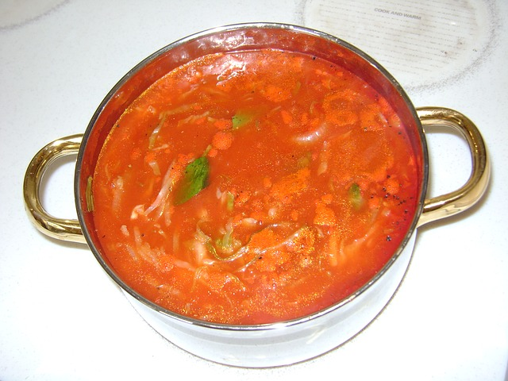

```{r echo=FALSE}
library(NHANES)
```


# (PART) Tools for answering RQs {-}


# Making decisions: An introduction {#MakingDecisions}

```{block2, type="rmdobjectives"}
So far,
you have learnt to
ask a RQ, 
identify different ways of obtaining data,
design the study,
collect the data
describe the data,
and
summarise data graphically and numerically.

**In this chapter**,
you will learn how decisions are made in science, so we can answer RQs.
You will learn to:

* explain the two broad reasons why differences are seen between sample statistics.
* explain how decisions are made in research.

```


```{r echo=FALSE, fig.cap = "", fig.align = "center", fig.width = 3, out.width = "35%"}
SixSteps(5, "The decision-making process")
```


## Introduction {#Chap15-Intro}

In Sect. \@ref(NHANESCaseStudyQual),
the NHANES data
[@data:NHANES3:Data]
were numerically summarised.
The *sample mean* direct HDL cholesterol concentration
was different for
smokers ($\bar{x} = 1.31$mmol/L) and for
non-smokers ($\bar{x} = 1.39$mmol/L).

What does this difference between the **sample** means 
imply about the **population** means?

Two reasons could explain why the sample means are different:

1. The *population* means are the *same*.
   The *sample* means are different because every sample is likely to be different
   (each possible sample includes different people),
   so, sometimes the sample means are different by chance.
   This is called **sampling variation**.

2. Alternatively,
   the *population* means are *different*,
   and the sample means simply reflect this.

Similarly,
in Sect. \@ref(NHANESCaseStudyQual)
the *odds* of being diabetic were different for
smokers (0.181) and
non-smokers (0.084).
What does this difference between the **sample** odds imply about the **population** odds?

Again, 
two possible reasons could explain why the sample odds are different:

1. The *population* odds are the same.
   The *sample* odds are different because every sample is likely to be different
   (each possible sample includes different people),
   so sometimes,
   the sample odds are different by chance.
   This is called 'sampling variation'.

2. Alternatively,
   the odds are different in the *population*,
   and the sample odds simply reflect this.

In both situations (means; odds),
the two possible explanations ('hypotheses')
have special names:

1. There is *no difference* between the population parameters: this is the *null hypothesis*, or $H_0$.
2. There is *a difference* between the population parameters; this is the *alternative hypothesis*, or $H_1$.

(The word hypothesis just means 'a possible explanation'.)
A decision needs to be made about which of these two explanation is the most likely.
However,
because a sample is studied,
conclusions about the *population* are never certain.


## The need for making decisions {#NeedForDecisionMaking}

In research,
decisions need to be made about 
*population [parameters](#StatisticsAndParameters)* based on 
*sample [statistics](#StatisticsAndParameters)*.
The difficulty is that every sample is likely to be different
(comprise different individuals from the population),
and each sample will produce different summary *statistics*.
This is called *sampling variation*.


```{block2, type="rmdimportant"}
[Sampling variation](#def:SamplingVariation)
refers to how much a sample estimate (a [*statistic*](#def:Statistic)) 
is likely to vary from sample to sample,
because each sample is different.
```

<!-- Text wrap from: https://stackoverflow.com/questions/43551312/wrap-text-around-plots-in-markdown -->
<!-- Trick from: https://blog.earo.me/2019/10/26/reduce-frictions-rmd/ -->
`r if (knitr::is_latex_output()) '<!--'`
```{r, echo=FALSE, out.width= "40%", out.extra='style="float:right; padding:10px"'}

```
`r if (knitr::is_latex_output()) '-->'`

However,
sensible decisions *can* be (and *are*) made
about population parameters
based on sample statistics.
For example,
to determine if a pot soup is ready to serve,
we don't have to consume the whole pot of soup (the 'population');
a sensible decision can be made from a small taste (the 'sample').
Likewise,
in research
sensible decisions about the population parameter
can be made from the sample statistic.

To do this though,
the process of *how* decisions are made
needs to be articulated.
In this chapter,
the logic of making decisions is discussed.

To begin,
consider the following scenario.
Suppose I produce a standard pack of cards,
and shuffle them well.
The pack of cards can be considered a *population*.


```{block2, type="rmdtip"}
A standard pack of cards has 52 cards,
with four *suits*: spades and clubs (which are both black), 
and hearts and diamonds (which are both red).
Each *suit* has 13 *denominations*:
2, 3, 4, 5, 6, 7, 8, 9, 10, Jack (J), Queen (Q), King (K), Ace (A). 
Most packs also contain two jokers, 
but these special cards are not usually considered part of a *standard* pack.
```


Suppose I draw a *sample* of 15 cards from the pack,
and notice that *all* are red cards.
How likely is it that this would happen simply by chance?
`r if (knitr::is_latex_output()) {
   '(See Fig. \\@ref(fig:Draw15Cards); the online version has an animation.)'
} else {
   'See the animation below.'
}`
Is that evidence that the pack of cards is somehow unfair, or rigged?


```{r echo = FALSE}
library(png)
```

```{r echo = FALSE, animation.hook = "gifski", cache = TRUE, fig.width = 4, interval = 0.25, fig.align = "center", dev=if (is_latex_output()){"pdf"}else{"png"}}
  ### CARDS ARE OF SIZE 500 x 726
  asp.cards <- 726/500
  
  ### LOAD CARD IMAGES
  
  im1  <- readPNG("Cards/queen_of_hearts.png")
  im2  <- readPNG("Cards/3_of_diamonds.png")
  im3  <- readPNG("Cards/4_of_diamonds.png")
  im4  <- readPNG("Cards/7_of_hearts.png")
  im5  <- readPNG("Cards/ace_of_diamonds.png")
  im6  <- readPNG("Cards/2_of_diamonds.png")
  im7  <- readPNG("Cards/ace_of_hearts.png")
  im8  <- readPNG("Cards/jack_of_diamonds.png")
  im9  <- readPNG("Cards/10_of_hearts.png")
  im10 <- readPNG("Cards/4_of_hearts.png")
  im11 <- readPNG("Cards/king_of_hearts.png")
  im12 <- readPNG("Cards/ace_of_diamonds.png")
  im13 <- readPNG("Cards/3_of_hearts.png")
  im14 <- readPNG("Cards/5_of_diamonds.png")
  im15 <- readPNG("Cards/5_of_hearts.png")
  
if (knitr::is_html_output()){
  for (i in (1:18)){ # Draw 15 cards
    
    # Set up canvas
    par(mar = rep(0.05, 4)) 
    plot( c(1.2, 2.7), c(1.2, 1.8), 
          type = "n",
          xlab = "",
          asp = asp.cards,
          ylab = "",
          axes = FALSE)
    
    if (i >= 1 )  rasterImage(im1,  1.20, 1.27, 1.80, 1.9)
    if (i >= 2 )  rasterImage(im2,  1.25, 1.27, 1.85, 1.9)
    if (i >= 3 )  rasterImage(im3,  1.30, 1.27, 1.90, 1.9)
    if (i >= 4 )  rasterImage(im4,  1.35, 1.27, 1.95, 1.9)
    if (i >= 5 )  rasterImage(im5,  1.40, 1.27, 2.00, 1.9)
    if (i >= 6 )  rasterImage(im6,  1.45, 1.27, 2.05, 1.9)
    if (i >= 7 )  rasterImage(im7,  1.50, 1.27, 2.10, 1.9)
    if (i >= 8 )  rasterImage(im8,  1.55, 1.27, 2.15, 1.9)
    if (i >= 9 )  rasterImage(im9,  1.60, 1.27, 2.20, 1.9)
    if (i >= 10)  rasterImage(im10, 1.65, 1.27, 2.25, 1.9)
    if (i >= 11)  rasterImage(im11, 1.70, 1.27, 2.30, 1.9)
    if (i >= 12)  rasterImage(im12, 1.75, 1.27, 2.35, 1.9)
    if (i >= 13)  rasterImage(im13, 1.80, 1.27, 2.40, 1.9)
    if (i >= 14)  rasterImage(im14, 1.85, 1.27, 2.45, 1.9)
    if (i >= 15)  rasterImage(im15, 1.90, 1.27, 2.50, 1.9)
    text(1.95, 1, "How likely is it that we get\n15 red cards in a row?")
  }
}
```


```{r Draw15Cards, echo=FALSE, fig.align="center", fig.width=5, fig.cap="How likely is it that you would get 15 red cards in a row from a fair pack?" }
if (knitr::is_latex_output()){
    
    # Set up canvas
    par(mar = rep(0.05, 4)) 
    plot( c(1.2, 2.7), c(1.2, 1.8), 
          type = "n",
          xlab = "",
          asp = asp.cards,
          ylab = "",
          axes = FALSE)
    
   for (i in (1:18)){ # Draw 15 cards
    if (i >= 1 )  rasterImage(im1,  1.20, 1.27, 1.80, 1.9)
    if (i >= 2 )  rasterImage(im2,  1.25, 1.27, 1.85, 1.9)
    if (i >= 3 )  rasterImage(im3,  1.30, 1.27, 1.90, 1.9)
    if (i >= 4 )  rasterImage(im4,  1.35, 1.27, 1.95, 1.9)
    if (i >= 5 )  rasterImage(im5,  1.40, 1.27, 2.00, 1.9)
    if (i >= 6 )  rasterImage(im6,  1.45, 1.27, 2.05, 1.9)
    if (i >= 7 )  rasterImage(im7,  1.50, 1.27, 2.10, 1.9)
    if (i >= 8 )  rasterImage(im8,  1.55, 1.27, 2.15, 1.9)
    if (i >= 9 )  rasterImage(im9,  1.60, 1.27, 2.20, 1.9)
    if (i >= 10)  rasterImage(im10, 1.65, 1.27, 2.25, 1.9)
    if (i >= 11)  rasterImage(im11, 1.70, 1.27, 2.30, 1.9)
    if (i >= 12)  rasterImage(im12, 1.75, 1.27, 2.35, 1.9)
    if (i >= 13)  rasterImage(im13, 1.80, 1.27, 2.40, 1.9)
    if (i >= 14)  rasterImage(im14, 1.85, 1.27, 2.45, 1.9)
    if (i >= 15)  rasterImage(im15, 1.90, 1.27, 2.50, 1.9)
#    if (i > 15)  text(1.95, 1, "How likely is it that we get\n15 red cards in a row?")
  }
}
```


Getting 15 reds cards out of 15 seems very unlikely,
so perhaps you may conclude that the pack is unfair in some way.
But importantly, *how* did you reach that decision?
Your unconscious decision-making process may have worked like this:

1. You **assumed**, quite reasonably,
   that this is a standard, well-shuffled pack of cards, 
   so that half the cards are red and half the cards are black. 
2. Based on that assumption then, 
   you, quite reasonably,
   **expected** about half the cards in the sample of 15 to be red, 
   and about half to be black.
   You wouldn't necessarily expect to see *exactly* half red and half black, 
   but you'd probably expect something close to that.
3. But what you **observed** was nothing like that: 
   *All* 15 cards were red.
   Since what you observed ('all red cards') was not like what you were 
   expecting ('about half red cards'),
   the 15 cards in my hand *contradict* what you were expecting, 
   based on your assumption of a fair pack... 
   so your assumption of a fair pack is probably wrong.

Of course,
getting 15 red cards in a row is *possible*... 
but very *unlikely*^[In fact, the probability of getting 15 cards *of the same colour* (either red *or* black) is about 0.0001025%.].
For this reason,
we would probably conclude that the most likely explanation
is that the pack is not a fair pack.

You probably didn't *consciously* go through this process,
but it does seem reasonable.
This process of decision making is similar to the process used in 
research.


## How decisions are made {#DecisionMaking}

Based on the ideas in the last section,
a formal process of decision making in research can be described as follows.


```{r DMPtable, echo = FALSE}
DMP <- array( "", dim = c(4, 4)) # DMP:: Decision Making Process

DMP[1, ] <- c("{#id .class height=70px width=200px}",
              "{#id .class height=70px width=200px}",
              "{#id .class height=70px width=200px}",
              "")
DMP[2, ] <- c("**Assumption**",
              "**Expectation**",
              "**Observation**",
              "")
DMP[3, ] <- c("Make a reasonable assumption about the value of a *population [parameter](#StatisticsAndParameters)*",
              "Based on this assumption,
   describe what values of the *sample [statistic](#StatisticsAndParameters)* might reasonably be observed",
   "Observe the *sample statistic*. Then, if the observed *sample statistic* is:",
   "")
DMP[4, 3] <- "...*unlikely* to happen by chance, it **contradicts** the assumption."
DMP[4, 4] <- "...*likely* to happen by chance, it is **consistent with** the assumption."


if( knitr::is_latex_output() ) {
#  # Now do some repeating, so we can "collapse"
#  DMP[1:3, 4 ] <- DMP[1:3, 3]
DMP[2, ] <- c("\\textbf{Assumption}",
              "\\textbf{Expectation}",
              "\\textbf{Observation}",
              "")

DMP[3, ] <- c("Make a reasonable assumption about the value of a \\emph{population parameter}",
              "Based on this assumption,
   describe what values of the \\emph{sample statistic} might reasonably be observed",
   "Observe the \\emph{sample statistic}. Then, if the observed \\emph{sample statistic} is:",
   "")
DMP[4, 3] <- "...\\emph{unlikely} to happen by chance, it \\textbf{contradicts} the assumption."
DMP[4, 4] <- "...\\emph{likely} to happen by chance, it is \\textbf{consistent with} the assumption."

  kable( t(DMP[2:4, ]),  # Removes the images
         format = "latex",
         booktabs = TRUE,
         linesep = "\\addlinespace",
         escape = FALSE,
         longtable = FALSE,
         align = c("r", "p{65mm}", "p{55mm}"),
         caption = "The decision-making process") %>%
  kableExtra::kable_styling(latex_options = "hold_position")
}
if( knitr::is_html_output() ) {
  # Now do some repeating, so we can "collapse"
  DMP[1:3, 4 ] <- DMP[1:3, 3]

  out <- kable( t(DMP),
         format = "html",
         booktabs = TRUE,
         longtable = FALSE,
         caption = "The decision-making process")
  if ( knitr::is_html_output(excludes = "epub")) {
    column_spec(out, 2, bold = TRUE) %>%
    kable_styling(full_width = FALSE) %>%
    collapse_rows(1:3, valign = "middle")
  } else {
    out
  }
   
}
```

To expand:

1. **Assumption**:
   Make a reasonable assumption about the population,
   such as the value of a *population [parameter](#StatisticsAndParameters)*,
   or state a value for the *population [parameter](#StatisticsAndParameters)* to be confirmed.

2. **Expectation**:
   Based on this assumption,
   describe what might be observed in the sample,
   such as values of the *sample [statistic](#StatisticsAndParameters)* that might reasonably be observed
   from all possible samples.

3. **Observation**:
   If the observed *sample statistic* is:
    - *unlikely* to happen by chance, 
      it **contradicts** the assumption about the *population parameter*,
		and the assumption is probably **wrong**.
		The *evidence* suggests that the assumption is wrong (but it is not *certainly* wrong).
    - *likely* to happen by chance, 
      it is **consistent with** the assumption about the *population parameter*,
		and the assumption may be **correct**.
		No *evidence* exists to suggest the assumption is wrong (though it may be wrong).

This is one way to describe the formal process of decision making in science
`r if( knitr::is_html_output() ) {
   '(Fig. \\@ref(fig:DecisionFlow)).'
} else {
   '(Fig. \\@ref(fig:DecisionFlow2)).'
}`


```{r DecisionFlow2, echo = FALSE, fig.cap = "A way to make decisions", fig.align = "center", out.width="80%", fig.width = 6, fig.height = 3}
if( knitr::is_latex_output() ) {
  
  par( mar = c(0.15, 0.15, 0.15, 0.15))
  openplotmat()
  
  pos <-   array(NA, dim = c(6, 2))
  pos[1, ] <-   c(0.10, 0.85) # Assumption
  pos[2, ] <-   c(0.40, 0.85) # Expectation
  pos[3, ] <-   c(0.40, 0.15) # Observation
  pos[4, ] <-   c(0.40, 0.50) # Consistency?
  pos[5, ] <-   c(0.80, 0.85) # YES
  pos[6, ] <-   c(0.80, 0.15) # NO
  
  straightarrow(from = pos[1, ], to = pos[2, ], 
                lty = 1, 
                lwd = 2)
  straightarrow(from = pos[4, ], to = pos[2, ], 
                lcol = "black",
                lty = 2,
                lwd = 2)
  straightarrow(from = pos[4, ], to = pos[3, ], 
                lcol = grey(0.4),
                arr.pos = 0.5, # Then cover with box
                lty = 2)
  curvedarrow(from = pos[4, ] + c(0, 0.065), to = pos[5, ], 
              lcol = grey(0.4),
              curve = 0.35,
              arr.pos = 0.5, # Then cover with box
              lty = 2)
  curvedarrow(from = pos[4, ] + c(0, 0.065), to = pos[6, ] , 
              lcol = grey(0.4),
              curve = 0.35,
              arr.pos = 0.5, # Then cover with box
              lty = 2)
  
  textrect( pos[4, ],
            radx = 0.11,
            rady = 0.1,
            shadow.size = 0,
            lcol = "snow2",
            box.col = "snow2",
            lab = "Consistency?",
            col = grey(0)) # CHECKMARK
  textrect( pos[5, ], 
            radx = 0.11,
            rady = 0.1,
            shadow.size = 0,
            lcol = "darkseagreen2",
            box.col = "darkseagreen2",
            lab = "Yes: Supports\nassumption", 
            col = grey(0)) # CROSS
  textrect( pos[6, ], 
            radx = 0.11,
            rady = 0.1,
            shadow.size = 0,
            lcol = "darksalmon",
            box.col = "darksalmon",
            lab = "No: Contradicts\nassumption", 
            col = grey(0)) # CROSS
  
  textrect( pos[1, ], 
            lab = "Population:\nAssumption",
            radx = 0.11,
            rady = 0.1,
            shadow.size = 0,
            lcol = "slategray1",
            box.col = "slategray1",
            cex = 1)
  textrect( pos[2, ], 
            lab = "Sample:\nExpectation", 
            radx = 0.11,
            rady = 0.1,
            shadow.size = 0,
            lcol = "slategray2",
            box.col = "slategray2",
            cex = 1)
  textrect( pos[3, ], 
            box.col = "slategray3",
            lcol = "slategray3",
            shadow.size = 0,
            radx = 0.11,
            rady = 0.1,
            lab = "Sample:\nObservation",
            cex = 1)
}
```

```{r DecisionFlow, echo=FALSE, animation.hook="gifski", cache=TRUE, interval=1.5, progress=TRUE, fig.cap="A way to make decisions", fig.align="center", fig.width=6, fig.height=3, dev=if (is_latex_output()){"pdf"}else{"png"}}
if( knitr::is_html_output() ) {
  
  for (i in (1:2)){
    par( mar = c(0.15, 0.15, 0.15, 0.15))
    openplotmat()
    
    pos <- array(NA, dim = c(6, 2))
    pos[1, ] <- c(0.10, 0.85) # Assumption
    pos[2, ] <- c(0.40, 0.85) # Expectation
    pos[3, ] <- c(0.40, 0.15) # Observation
    pos[4, ] <- c(0.40, 0.50) # Consistency?
    pos[5, ] <- c(0.80, 0.85) # YES
    pos[6, ] <- c(0.80, 0.15) # NO
    
    straightarrow(from = pos[1, ], to = pos[2, ], 
                  lty = 1, 
                  lwd = 2)
    straightarrow(from = pos[4, ], to = pos[2, ], 
                  lcol = "black",
                  lty = 2,
                  lwd = 2)
    straightarrow(from = pos[4, ], to = pos[3, ], 
                  lcol = grey(0.4),
                  arr.pos = 0.5, # Then cover with box
                  lty = 2)
    if (i == 1 ) {
      curvedarrow(from = pos[4, ] + c(0, 0.065), to = pos[5, ], 
                lcol = grey(0.4),
                curve = 0.35,
                arr.pos = 0.5, # Then cover with box
                lty = 2)
      textrect( pos[5, ], 
              radx = 0.11,
              rady = 0.1,
              shadow.size = 0,
              lcol = "darkseagreen2",
              box.col = "darkseagreen2",
              lab = "Yes: Supports\nassumption", 
              col = grey(0)) # CROSS
        }
    if (i == 2 ) {
      curvedarrow(from = pos[4, ] - c(0, 0.065), to = pos[6, ] , 
                  lcol = grey(0.4),
                  curve = -0.35,
                  arr.pos = 0.5, # Then cover with box
                  lty=2)
      textrect( pos[6, ],
                radx = 0.11,
                rady = 0.1,
                shadow.size = 0,
                lcol = "darksalmon",
                box.col = "darksalmon",
                lab = "No: Contradicts\nassumption", 
                col = grey(0)) # CROSS
    }
    textrect( pos[4, ],
              radx = 0.11,
              rady = 0.1,
              shadow.size = 0,
              lcol = "snow2",
              box.col = "snow2",
              lab = "Consistency?",
              col = grey(0)) # CHECKMARK
    textrect( pos[1, ], 
              lab = "Population:\nAssumption",
              radx = 0.11,
              rady = 0.1,
              shadow.size = 0,
              lcol = "slategray1",
              box.col = "slategray1",
              cex = 1)
    textrect( pos[2, ], 
              lab = "Sample:\nExpectation", 
              radx = 0.11,
              rady = 0.1,
              shadow.size = 0,
              lcol = "slategray2",
              box.col = "slategray2",
              cex = 1)
    textrect( pos[3, ], 
              box.col = "slategray3",
              lcol = "slategray3",
              shadow.size = 0,
              radx = 0.11,
              rady = 0.1,
              lab = "Sample:\nObservation",
              cex = 1)
  }
}

```


<!-- Text wrap from: https://stackoverflow.com/questions/43551312/wrap-text-around-plots-in-markdown -->
<!-- Trick from: https://blog.earo.me/2019/10/26/reduce-frictions-rmd/ -->
`r if (knitr::is_latex_output()) '<!--'`
```{r, echo=FALSE, out.width= "30%", out.extra='style="float:right; padding:10px"'}
include_graphics("Illustrations/pexels-ketut-subiyanto-4546136.jpg")
```
`r if (knitr::is_latex_output()) '-->'`


This approach is similar to what we use every day
without really thinking about it
For example,
suppose I ask my son to brush his teeth [@data:Budgett:RandomizationTest],
and later I want to decide if he really did brush his teeth.

1. **Assumption**:
   I *assume*
   my son brushed his teeth (because I told him to).
2. **Expectation**:
  Based on that assumption, 
	I *expect* to find a damp 
	toothbrush when I check later.
3. **Observation**:
	When I check later,
  I observe a *dry* toothbrush.
  The evidence seems to contradict my assumption,
	as I did not find what I expected,
  so my assumption is probably *false*:
  He probably *didn't* brush his teeth.

Of course,
I may have made the wrong decision: 
He may have brushed his teeth,
but his brush is now dry
(he may have dried his brush with a hair dryer; he's that sort of kid).
However,
based on the evidence,
quite probably he has not brushed his teeth.

The situation may have ended differently:

1. **Assumption**:
   I *assume*
   my son brushed his teeth (because I told him to).
2. **Expectation**:
   Based on that assumption,
	 I *expect* to find a damp 
	 toothbrush when I check later.
3. **Observation**:
	 When I check later,
	 I observe a *damp* toothbrush.
	 The evidence seems consistent with my assumption,
   as I found what I expected,
	 so my assumption is probably *true*:
   He probably did brush his teeth.

Again,
I may be wrong: 
He may have just ran his toothbrush under a tap
(again, it wouldn't surprise me).
I don't have any evidence that he didn't brush his teeth, though;
I can hardly get him into trouble.

This logic
underlies most decision making in 
science^[Other ways exist to make decisions too, such as incorporating prior knowledge. For example, if my son had a reputation for wetting his toothbrush under the tap instead of brushing his teeth, that information can be used to help with the decision making. This approach is called *Bayesian statistics*, but is too advanced for this book.].


```{example DecisionMakingProcess, name = "The decision-making process"}
Consider the cards example from Sect. \@ref(NeedForDecisionMaking) again.
The formal process might look like this:

1. **Assumption**:
	Initially *assume* the pack is fair
	and well-shuffled pack of cards 
  (you have no evidence to doubt this).  
	
	In other words, the proportion of red cards is 0.5 (the value of the *parameter*). 
2. **Expectation**:
	Based on this assumption,
	roughly (but not necessarily *exactly*) equal numbers
	of red and black cards would be expected in a sample of 15 cards.  

	In other words, the proportion of red cards in any *sample* is expected to be 
  close to, but maybe not exactly, 0.5 (the value of the *statistic*). 
  
3. **Observation**:
	Suppose I then deal 15 cards, 
	and *all* 15 are red cards.  
  
  This seems unlikely to occur if the pack is fair and well-shuffled;
	the data seem *inconsistent* with what I was expecting
  based on the assumption
  (Fig. \@ref(fig:DecisionFlowCards)).
	The evidence suggests that the assumption is probably false.


Of course, getting 15 red cards out of 15 is not *impossible*,
so I may be wrong... 
but it is *very* unlikely.
Based on the evidence,
concluding that a problem exists with the pack of cards seems reasonable.
```


```{r DecisionFlowCards, echo = FALSE, fig.cap = "A way to make decisions for the cards example", fig.align = "center", fig.width = 6, fig.height = 3}
par( mar = c(0.15, 0.15, 0.15, 0.15))
openplotmat()

pos <- array(NA, dim=c(6, 2))
pos[1, ] <- c(0.10, 0.85) # Assumption
pos[2, ] <- c(0.40, 0.85) # Expectation
pos[3, ] <- c(0.40, 0.15) # Observation
pos[4, ] <- c(0.40, 0.50) # Consistency?
pos[5, ] <- c(0.80, 0.85) # YES
pos[6, ] <- c(0.80, 0.15) # NO

straightarrow(from = pos[1,], to = pos[2,], 
            #segment = c(0.4, 0.6),
            lty = 1, 
            lwd = 2)
straightarrow(from = pos[4,], to = pos[2,], 
            lcol = "black",
            lty = 2,
            lwd = 2)
straightarrow(from = pos[4,], to = pos[3,], 
            lcol = grey(0.4),
#            curve = 0.8,
            arr.pos = 0.5, # Then cover with box
           lty = 2)
curvedarrow(from = pos[4,] + c(0, 0.065), to = pos[5,], 
            lcol = grey(0.8),
            curve = 0.35,
            arr.pos = 0.5, # Then cover with box
            #segment = c(0.25, 0.75),
            lty = 2)
curvedarrow(from = pos[4,] - c(0, 0.065), to = pos[6,] , 
            lcol = grey(0.4),
            curve = -0.35,
            arr.pos = 0.5, # Then cover with box
            #segment = c(0.25, 0.75),
            lty = 2)

textrect( pos[4, ],
          radx = 0.11,
          rady = 0.1,
          shadow.size = 0,
          lcol = "snow2",
          box.col = "snow2",
          lab = "Consistency?",
          col = grey(0)) # CHECKMARK
textrect( pos[5, ], 
          radx = 0.11,
          rady = 0.1,
          shadow.size = 0,
          lcol = "darkseagreen2",
          box.col = "darkseagreen2",
          lab = "Yes: Supports\nassumption", 
          col = grey(0.5)) # CROSS
textrect( pos[6, ], 
          radx = 0.11,
          rady = 0.1,
          shadow.size = 0,
          lcol = "darksalmon",
          box.col = "darksalmon",
          lab = "No: Contradicts\nassumption", 
          col = grey(0)) # CROSS

textrect( pos[1,], 
          lab = "Assumption:\nFair pack",
          radx = 0.11,
          rady = 0.1,
          shadow.size = 0,
          lcol = "slategray1",
          box.col = "slategray1",
          cex = 1)
textrect( pos[2,], 
          lab = "Expectation:\nHalf red", 
          radx = 0.11,
          rady = 0.1,
          shadow.size = 0,
          lcol = "slategray2",
          box.col = "slategray2",
           cex=1)
textrect( pos[3,], 
          box.col = "slategray3",
          lcol = "slategray3",
          shadow.size = 0,
          radx = 0.11,
          rady = 0.1,
          lab = "Sample:\nObservation",
          cex = 1)

```


## Making decisions in research {#MakingDecisionsInResearch}

Let's think about each step in the
decision-making process
`r if( knitr::is_html_output()){
  '(Fig. \\@ref(fig:DecisionFlow))'
} else {
  '(Fig. \\@ref(fig:DecisionFlow2))'
}`
individually.

* [The **assumption** about the parameter](#Assumption);
* [The **expectation** of the statistic](#ExpectationOf); and
* [The **observations**](#Observation).


### Assumption about the population parameter {#Assumption}


<!-- Text wrap from: https://stackoverflow.com/questions/43551312/wrap-text-around-plots-in-markdown -->
<!-- Trick from: https://blog.earo.me/2019/10/26/reduce-frictions-rmd/ -->
`r if (knitr::is_latex_output()) '<!--'`
```{r, echo=FALSE, out.width= "10%", out.extra='style="float:left; padding:10px"'}
include_graphics("Pics/iconmonstr-delivery-6-240.png")
```
`r if (knitr::is_latex_output()) '-->'`

Usually a reasonable assumption can be made
about the *population* [parameter](#StatisticsAndParameters).
For example:

* We might **assume** that *no difference* exists between the parameter
  for two groups in the *population*,
  since we don't have any evidence yet to say there *is* a difference.  
  For example,
  we might assume that the mean HDL cholesterol 
  (or the odds of a diabetes diagnosis)
  is the same for 
  current smokers and non-smokers in the *population*,
  for the NHANES data.
  If we already *knew* there was a difference, 
  why would we be performing a study to see if there is a difference?

* We might be interested in testing a claim,
  or evaluating a benchmark,
  about a *population* parameter,
  to determine if the evidence supports this claim or benchmark,

These assumptions about the population parameter
are called *null hypotheses*.


<!-- Text wrap from: https://stackoverflow.com/questions/43551312/wrap-text-around-plots-in-markdown -->
<!-- Trick from: https://blog.earo.me/2019/10/26/reduce-frictions-rmd/ -->
`r if (knitr::is_latex_output()) '<!--'`
```{r, echo=FALSE, out.width= "30%", out.extra='style="float:right; padding:10px"'}
include_graphics("Illustrations/pexels-ketut-subiyanto-4546136.jpg")
```
`r if (knitr::is_latex_output()) '-->'`


```{example Assumptions, name="Assumptions about the population"}
Most dental associations,
such as the *American Dental Association*
and the *Australian Dental Association*,
recommend brushing teeth for two minutes.
One study
[@data:Macgregor1979:BrushingDurationKids]
recorded the tooth-brushing time for 85 uninstructed 
schoolchildren (11 to 13 years old) from England.

We could *assume* the *population* mean
tooth-brushing time in the population
('school children (11 to 13 years old) from England')
is two minutes,
as recommended.
After all,
we don't have evidence to suggest any other value for the mean.
A sample can then be obtained
to determine if the sample mean is consistent with, or contradicts, 
this assumption.
```


### Expectations of sample statistics {#ExpectationOf}

<!-- Text wrap from: https://stackoverflow.com/questions/43551312/wrap-text-around-plots-in-markdown -->
<!-- Trick from: https://blog.earo.me/2019/10/26/reduce-frictions-rmd/ -->
`r if (knitr::is_latex_output()) '<!--'`
```{r, echo=FALSE, out.width= "10%", out.extra='style="float:left; padding:10px"'}
include_graphics("Pics/iconmonstr-christmas-42-240.png")
```
`r if (knitr::is_latex_output()) '-->'`

Having made an assumption about the population parameter,
the *second step* is to determine
**what values to expect from the sample [statistic](#StatisticsAndParameters)**,
based on this assumption.

Since every sample is likely to be different
(['sampling variation'](#def:SamplingVariation),
the value of the sample statistic depends
on which of the possibe samples we end up with:
the sample statistic is likely to be different for every sample.

Think about the cards in 
Sect. \@ref(NeedForDecisionMaking).
Assuming a fair pack,
then *half* the cards are red in the *population* (the pack of cards),
so the *population* proportion is assumed to be $p=0.5$.

In a *sample* of 15 cards,
what values could be reasonably expected for the *sample* proportion $\hat{p}$ of red cards
(the statistic)?
If samples of size 15 were repeatedly taken,
the sample proportion of red cards would vary from hand to hand, of course.

*How much* would $\hat{p}$ vary from sample to sample?
Perhaps 15 red cards out of 15 cards happens reasonably frequently.
Or perhaps it doesn't. 
How could we find out?
We could:

* Use mathematical theory to 
  determine how likely it is that we would get 15 red cards out of 15 cards.
* We could repeatedly shuffle a pack of cards, and repeatedly deal 15 cards many hundreds or thousands of times,
  then compute how often we get 15 red cards of out 15 cards.
* More reasonably,
  we could *simulate* (using a computer) dealing
  15 cards many hundreds or thousands of times,
  and count how often we get 15 red cards of out 15 cards.

The third option is the most practical...
To begin,
suppose we simulated only ten hands of 15 cards each;
`r if (knitr::is_latex_output()) {
   'Fig. \\@ref(fig:RollDice10) shows the sample proportion of red cards from ten repetitions. (The online version has an animation.)'
} else {
   'the animation below shows the sample proportion of red cards from ten repetitions.'
}`
Not one of those ten hands produced 15 red cards in 15 cards.


```{r echo=FALSE, animation.hook="gifski", cache=TRUE, interval=0.25, dev=if (is_latex_output()){"pdf"}else{"png"}}
if (knitr::is_html_output()){
  set.seed(99999)
    num.in.hand <- 15
    num.sims <- 10
    x.loc <- 1:(num.in.hand)
    y.loc <- 1
    prop.red <- array(dim=num.sims)
    all.hands <- array( dim=c(num.sims, num.in.hand))
    for (i in 1:num.sims){
      par ( mar = c(5.1, 5.1, 4.1, 2.1)) # DEFAULT is 5.1, 4.1, 4.1, 2.1
      plot( c(1, (num.in.hand+2)), c(1, num.sims),
            type = "n",
            las = 1,
            xlab = "",
            ylab = "",
            main = paste("Hand number",i),
            axes = FALSE)
      hand <- sample( c("B", "R"), 
                      num.in.hand, 
		      replace = TRUE)
      all.hands[i, ] <- hand
      prop.red[i] <- sum( (hand == "B")/2 == floor( (hand == "B")/2) ) / num.in.hand
      num.all.hands <- (all.hands == "B")
      
      for (j in 1:i){
        text(y = j, 
	     x = 1:num.in.hand,
             labels = all.hands[j, ],
             col = ifelse( num.all.hands[j,]/2 == floor(num.all.hands[j,]/2), "red", "grey") )
      }
      # Add p-hat heading
      mtext(expression(hat( italic(p) ) ), 
            side = 3, 
	    line = 0, 
	    at = num.in.hand + 2 )
      # Add the roll number to the left-hand side
      axis(side = 2, 
           at = 1:i,
           las = 1,
           labels = paste("Hand ", 1:i, sep = "") )
      
      # Add the sample proportion to right-hand side 
      text(num.in.hand + 2, 1:i, 
           labels = format(round(prop.red[1:i], 2), nsmall = 2) )
      #Add dividing line
      abline(v = num.in.hand + 1, 
             col = "grey")
      
      # Divide each roll set
      abline(h = (1:i) - 0.5, 
             col = "grey")
    }
  }
```


```{r RollDice10, echo = FALSE, fig.align = "center", fig.width = 5.5, fig.cap = "Ten hands of 15 cards: The sample proportion that is red varies from hand to hand (as shown on the right-hand side)" , cache = TRUE}
if (knitr::is_latex_output()){
    set.seed(99999)
    num.in.hand <- 15
    num.sims <- 10
    x.loc <- 1:(num.in.hand)
    y.loc <- 1
    prop.red <- array(dim = num.sims)
    all.hands <- array( dim = c(num.sims, num.in.hand))

          plot( c(1, (num.in.hand+2)), c(1, num.sims),
            type = "n",
            las = 1,
            xlab = "",
            ylab = "",
            main = paste("Hand number",i),
            axes = FALSE)

          
    for (i in 1:num.sims){
      par ( mar = c(5.1, 5.1, 4.1, 2.1)) # DEFAULT is 5.1, 4.1, 4.1, 2.1
      hand <- sample( c("B", "R"), 
                      num.in.hand, 
		      replace = TRUE)
      all.hands[i, ] <- hand
      prop.red[i] <- sum( (hand == "B")/2 == floor( (hand == "B")/2) ) / num.in.hand
      num.all.hands <- (all.hands == "B")
      
      for (j in 1:i){
        text(y = j, x = 1:num.in.hand,
             labels = all.hands[j, ],
             col = ifelse( num.all.hands[j,]/2 == floor(num.all.hands[j,]/2), "black", "grey") )
      }
      # Add p-hat heading
      mtext(expression(hat( italic(p) ) ), 
            side = 3, 
            line = 0, 
            at = num.in.hand + 2 )
      # Add the roll number to the left-hand side
      axis(side = 2, 
           at = 1:i,
           las = 1,
           labels = paste("Hand ", 1:i, sep = "") )
      
      # Add the sample proportion to right-hand side 
      text(num.in.hand+2, 1:i, 
           labels = format( round(prop.red[1:i], 2), nsmall = 2) )
      #Add dividing line
      abline(v = num.in.hand + 1, 
             col = "grey")
      
      # Divide each roll set
      abline(h = (1:i) - 0.5, 
             col = "grey")
    }
}
```


Suppose we repeated this for *hundreds* of hands of 15 cards,
and for each hand we recorded the sample proportion of cards that were red.
The proportion of red cards would vary from sample to sample
(['sampling variation'](#def:SamplingVariation)),
and we could record the proportion of red cards from each of those hundreds of hands.

For these hundreds of sample proportions,
we could draw a histogram; 
for example,
`r if (knitr::is_latex_output()) {
   'Fig. \\@ref(fig:HandRedHist1000) shows a histogram of the sample proportions from 1000 simulations of a hand of 15 cards. (The online version has an animation.)'
} else {
   'the animation below shows a histogram of the sample proportions from 1000 repetitions of a hand of 15 cards.'
}`

This histogram shows how we might expect the sample proportions $\hat{p}$ to vary from sample to sample,
when the *population* proportion of red cards is $p=0.5$.

We can see that observing 15 red cards out of 15 cards 
is quite rare:
it never happened once in the 1000 simulations.


```{r DiceHist, echo=FALSE, animation.hook = "gifski", cache = TRUE, interval = 0.025, dev=if (is_latex_output()){"pdf"}else{"png"}}
if (knitr::is_html_output()){
  set.seed(9900991)
    num.in.hand <- 25
    num.sims <- 1000
    prop.red <- array(dim=num.sims)
    for (i in 1:num.sims){
      hand <- sample( c("B", "R"), 
                      num.in.hand, 
		      replace = TRUE)
      prop.red[i] <-  sum( (hand == "B")/2 == floor( (hand == "B")/2) ) / num.in.hand
      
      out <- hist( prop.red,
                   breaks = seq(0.05, 0.95, by = 0.1),
                   las = 1,
                   ylim = c(0, 400),
                   xlim = c(0, 1),
                   col = plot.colour,
                   main = paste("Histogram of sample proportions\nHand number:", i),
                   xlab = "Proportion of the 15 cards that are red",
                   sub = paste("(For this hand: proportion of cards red: ", format(round(prop.red[i], 3), nsmall = 3), ")", sep = "" ),
                   ylab = "Frequency",
                   right = FALSE,
                   axes = FALSE)
      axis(side = 1)
      axis(side = 2, 
           las = 1)
      
      xx <- seq(0, 1, length = 500)
      yy <- dnorm(xx, 
                  mean = 0.5, 
		  sd = 0.1 )
      yy <- yy/max(yy) * max(out$count)
      
      lines(yy ~ xx, 
            col = "grey",
            lwd = 2)  
    }
}
```


```{r HandRedHist1000, echo=FALSE, fig.align="center", fig.width=5.5, fig.cap="A histogram of the sample proportion of red cards, in hands of 15 cards, for 1000 repetitions", cache=TRUE }
if (knitr::is_latex_output()){
    set.seed(9900991)
    num.in.hand <- 25
    num.sims <- 1000
    prop.red <- array(dim = num.sims)
    for (i in 1:num.sims){
      hand <- sample( c("B", "R"), num.in.hand, 
                      replace = TRUE)
      prop.red[i] <-  sum( (hand == "B")/2 == floor( (hand == "B")/2) ) / num.in.hand
    }
    
      out <- hist( prop.red,
                   breaks = seq(0.05, 0.95, by = 0.1),
                   las = 1,
                   ylim = c(0, 400),
                   xlim = c(0, 1),
                   col = plot.colour,
                   main = paste("Histogram of sample proportions\nHand number:", i),
                   xlab = "Proportion of the 15 cards that are red",
                   sub = paste("(For this hand: proportion of cards red: ", format(round(prop.red[i], 3), nsmall = 3), ")", sep = "" ),
                   ylab = "Frequency",
                   right = FALSE,
                   axes = FALSE)
      axis(side = 1)
      axis(side = 2, 
           las = 1)
      
      xx <- seq(0, 1, length = 500)
      yy <- dnorm(xx, 
                  mean = 0.5, 
		  sd = 0.1 )
      yy <- yy/max(yy) * max(out$count)
      
      lines(yy ~ xx, 
            col = "grey", 
            lwd = 2)  
}
```


### Observations about our sample {#Observation}

<!-- Text wrap from: https://stackoverflow.com/questions/43551312/wrap-text-around-plots-in-markdown -->
<!-- Trick from: https://blog.earo.me/2019/10/26/reduce-frictions-rmd/ -->
`r if (knitr::is_latex_output()) '<!--'`
```{r, echo=FALSE, out.width= "10%", out.extra='style="float:left; padding:10px"'}
include_graphics("Pics/iconmonstr-shipping-box-7-240.png")
```
`r if (knitr::is_latex_output()) '-->'`

From this histogram,
based on a simulation of one thousand hands,
we could conclude that we would *almost never* find 15 red cards in 15 cards...
*if the assumption of a fair pack was true*.
But we *did* find 15 red cards in 15 cards...
so the assumption ('a fair pack')
is probably wrong.

What if we had observed 4 red cards in a hand of 15 cards 
(a sample proportion of $\hat{p} = 4/15 = 0.267$),
rather than 15 red cards out of 15?
The conclusion is not quite so obvious then:
these values of $\hat{p}$ are uncommon, 
but they certainly do happen when $p=0.5$.
In these situations, 
a more sophisticated approach for making a decision is needed.

Special tools are needed to describe 
what to **expect** from the *sample* statistic
after making **assumptions** about the *population* parameter.
These special tools are discussed in the next chapter.


<!-- Text wrap from: https://stackoverflow.com/questions/43551312/wrap-text-around-plots-in-markdown -->
<!-- Trick from: https://blog.earo.me/2019/10/26/reduce-frictions-rmd/ -->
`r if (knitr::is_latex_output()) '<!--'`
```{r, echo = FALSE, out.width = "30%", out.extra = 'style="float:right; padding:10px"'}
include_graphics("Illustrations/pexels-ketut-subiyanto-4546136.jpg")
```
`r if (knitr::is_latex_output()) '-->'`

```{example SamplingVariation, name="Sampling variation"}
Most dental associations,
such as the *American Dental Association*
and the *Australian Dental Association*,
recommend brushing teeth for two minutes.
One study
[@data:Macgregor1979:BrushingDurationKids]
recorded the tooth-brushing time for 85 uninstructed schoolchildren from England
(11 to 13 years old).

The *sample* mean tooth-brushing time may or may not be two minutes.
Of course,
every possible sample of 85 children will include different children,
and so produce a different sample mean $\bar{x}$.
Even if the *population* mean toothbrushing time really is two minutes ($\mu=2$),
the *sample* mean probably won't be exactly two minutes,
because of
[sampling variation](#def:SamplingVariation).

We could *assume* the population mean
tooth-brushing time is two minutes ($\mu=2$).
*If* this assumption is true,
we then could describe what values of the sample statistic
$\bar{x}$ to *expect*.
Then,
after obtaining a sample
and computing the sample mean, 
we could determine if the sample mean
seems *consistent* with the assumption of two minutes,
or whether it seems to *contradict* this assumption.
```


## Tools for describing sampling variation

As we have observed previously,
making decisions about population [parameters](StatisticsAndParameters) based on a sample statistic
can be difficult:
Every sample is likely to be different,
and can produce a different value of the sample [statistic](StatisticsAndParameters).

In this chapter,
though,
a process for making decisions has been studied
`r if( knitr::is_html_output()){
  '(Fig. \\@ref(fig:DecisionFlow)).'
} else {
  '(Fig. \\@ref(fig:DecisionFlow2)).'

}`
To apply this process to research,
we need to describe *how* sample statistics vary from sample to sample 
([sampling variation](#def:SamplingVariation)).
To do so,
some of those tools are discussed in the following chapters:

* Tools to describe the population and the sample: Chap. \@ref(SamplingDistributions).
* Tools to describe how sample statistics vary from sample to sample (sampling variation), 
  and hence what to expect from the sample statistic:  Chap. \@ref(SamplingVariation).
* Tools to describe the random nature of what happens with sample statistics, 
  and so determine if the sample statistic is consistent with the assumption:  Chap. \@ref(Probability).


## Summary {#Chap15-Summary}

Decisions are often made by first making an
**assumption** about the population parameter,
which leads to an **expectation** of what might occur in the sample statistics.
We can then make **observations** about our sample,
to see if it seems to support or contradict the initial assumption.


## Quick review questions {#Chap15-QuickReview}

1. True or false:
Parameters describe *populations*.  
`r if( knitr::is_html_output() ) {torf(answer = TRUE )}`
1. True or false:
Both $\bar{x}$ and $\mu$ are *statistics*.  
`r if( knitr::is_html_output() ) {torf(answer = FALSE )}`
1. True or false:
The value of a statistic is likely to be different in every sample.  
`r if( knitr::is_html_output() ) {torf(answer = TRUE )}`
1. True or false:
*Sampling variation* refers to how the value of a *statistic* varies from sample to sample.  
`r if( knitr::is_html_output() ) {torf(answer = TRUE )}`
1. True or false:
The initial assumption is made about the *sample statistic*.  
`r if( knitr::is_html_output() ) {torf(answer = FALSE )}`


<!-- ####################### REVIEW QUESTIONS ##################################### -->
```{r, child = if (knitr::is_html_output()) './children/ReviewQuestions/ReviewQuestions-Chapter15.Rmd'}
```


## Exercises {#MakingDecisionsExercises}

Selected answers are available in
Sect. \@ref(MakingDecisionsAnswer).


```{exercise MakingDecisionsDice}
Suppose you are playing a die-based game,
and your opponent rolls a **6** ten times in a row.

1. Do you think there is a problem with the die?
1. Explain how you came to this decision.

```


```{exercise MakingDecisionsClaim}
In a 2012 advertisement,
an Australian pizza company claimed that their 12-inch pizzas were 'real 12-inch pizzas',
unlike another brand
[@mypapers:Dunn:PizzaSize].

1. What is a reasonable assumption to make to test this claim?
1. The claim is based on a sample of 125 pizzas, 
   for which the sample mean pizza diameter was $\bar{x} = 11.48$ inches.
   What are the two reasons why the sample mean is not 12-inches?
1. Does the claim appear to be supported by, or contradicted by, the data? Why?
1. Would your conclusion change if the sample mean 
   was $\bar{x} = 11.25$ inches, rather than 11.48 inches?
   Does the claim appear to be supported by, or contradicted by, the data? Why?
1. Does your answer depend on the sample size?
   For example, is observing a sample mean of 11.25 inches from a sample of size 10
   equivalent to observing a sample mean of 11.25 inches from a sample of size 125?

```


