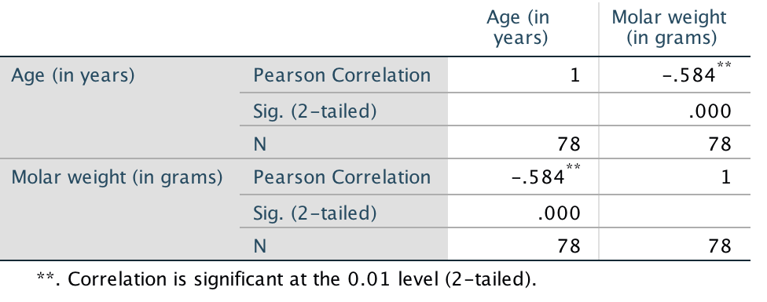

# Correlations between quantitative variables {#TwoQuant}
\index{Quantitative data!correlation}


<!-- Introductions; easier to separate by format -->
```{r, child = if (knitr::is_html_output())  {'./introductions/16-Connections-TwoQuant-HTML.Rmd'} else {'./introductions/16-Connections-TwoQuant-LaTeX.Rmd'}}
```


<!-- Define colours as appropriate -->
```{r, child = if (knitr::is_html_output()) {'./children/coloursHTML.Rmd'} else {'./children/coloursLaTeX.Rmd'}}
```

https://onlinelibrary.wiley.com/doi/full/10.1002/ece3.10536

## Introduction {#TwoQuant-Intro}

Correlational RQs ask about the relationship between two quantitative variables.\index{Research question!correlational}
Scatterplots are useful for this purpose, and the relationship is usually described numerically using a correlation coefficient or $R^2$.


## Graphs for the relationship {#Scatterplots}
\index{Quantitative data!correlation!graphs}\index{Graphs!scatterplot}\index{Software output!graphs}


<div style="float:right; width: 222x; border: 1px; padding:10px">

</div>


Scatterplots display the relationship between *two quantitative variables*.
Conventionally, and when appropriate, the response variable (denoted\ $y$) is shown on the vertical axis, and the explanatory variable (denoted\ $x$) is shown on the horizontal axis.\index{Response variable}\index{Explanatory variable}
Two quantitative variables are measured on each individual, and a point is placed on the scatterplot for each individual (unit of analysis) to indicate the values of the two variables.
In some cases, which variable is denoted\ $x$ and which is\ $y$ is not important (e.g., see Exercise \@ref(exr:CorTestDogs).)

As with any graph, describing the message in the graph is important, because the purpose of a graph is to display the information in the clearest, simplest possible way.


:::{.example #RedDeer name="Red-deer data"}
@data:Holgate1965:StraightLine examined the relationship between the age of $n = 78$ male red deer and the weight of their molars.
The data 
`r if( knitr::is_latex_output() ) {
  '(Table\\ \\@ref(tab:RedDeerData))'
} else {
  '(below)'
}`
comprises two *quantitative* variables, and both measurements are made on the same individuals (i.e., male red deer).

The scatterplot (Fig.\ \@ref(fig:RedDeerScatter)) shows one dot for each deer (individual).
The response variable is the molar weight, which is on the vertical axis and denoted\ $y$.
The explanatory variable is the deer age, which is on the horizontal axis and denoted\ $x$.

For instance, one deer is just over $4$\ years of age (so $x$ has a value a bit larger than\ $4$), and has a molar weight of\ $2.42\gs$ (so that $y = 2.42$).
This is the first deer listed in 
`r if( knitr::is_latex_output() ) {
  'Table\\ \\@ref(tab:RedDeerData).'
} else {
  'the data above.'
}`
:::


(ref:RedDeerPlotIndicate) `r if( knitr::is_latex_output() ) {'A plot of the red-deer data. The indicated point is the first observation in Table\\ \\@ref(tab:RedDeerData), where $x = 4.4$ and $y = 2.42$.'} else {  'A plot of the red-deer data. The indicated point is the first observation in Fig.\\ \\@ref(fig:deerDataDT), where $x = 4.4$ and $y = 2.42$.'}`


```{r RedDeerScatter, fig.width=6.5, out.width='70%', fig.height=4, fig.cap="(ref:RedDeerPlotIndicate)", fig.align="center"}

data(RedDeer)
data(DogsLife)
plot(Lifespan ~ Weight, 
     data = DogsLife,
     las = 1,
     pch = 19, 
     ylim = c(4, 16),
     xlim = c(0, 80),
     cex = 0.8,
     main = "Lifespan and weight\nof dog breeds",
     xlab = "Weight (in kg)",
     ylab = "Lifespan (in years)")
```


## Describing scatterplots {#UnderstandingScatterplots}
\index{Graphs!scatterplot}

The purpose of a graph is to facilitate understanding of the data.
For a scatterplot, the *form*, *direction*, and *variation in the relationship* (or the *strength of the relationship*) are described.

1. *Form*: 
   the overall *form* or structure of the relationship (e.g., linear; curved upwards; etc.).\index{Graphs!scatterplot!form}
2. *Direction*: 
   the *direction* of the relationship (sometimes not relevant if the relationship is non-linear):\index{Graphs!scatterplot!direction}
    * a *positive* association exists if *high* values of one variable accompany *high* values of the other variable, in general.
    * a *negative* association exists if *high* values of one variable accompany *low* values of the other variable, in general.
3. *Variation*: 
   the amount of *variation* in the relationship.\index{Graphs!scatterplot!variation}\index{Graphs!scatterplot!strength}
   A small amount of variation in the response variable for given values of the explanatory variable means the relationship is strong; a lot of variation in the response variable for given values of the explanatory variable means the relationship is weak.
   Describing the variation can be difficult; an objective, numerical way to do so is explained in Sect.\ \@ref(CorrelationR2).

Anything unusual or noteworthy should also be discussed.
These features explain the *type* of relationship (*form*; *direction*), and the *strength* of that relationship (*variation*).
Examples are shown in
`r if (knitr::is_html_output()) {
  'the carousel below (click to move through the scatterplots).'
} else {
  'Fig.\\ \\@ref(fig:ScatterplotDescriptionExamples).'
}`


::: {.importantBox .important data-latex="{iconmonstr-warning-8-240.png}"}
The axes do not need to *start from zero*, since the distance of the dots from the axes visually do not imply any quantity of interest.
:::


```{r, child = if (knitr::is_html_output())  'children/ScatterExampleCarousel.Rmd'}
```

```{r, child = if (knitr::is_latex_output()) 'children/ScatterExampleImages.Rmd' } 
```


::: {.example #DescribeScatterplotsDeer name="Scatterplots"}
For the red-deer data 
`r if (knitr::is_latex_output()) {
   '(Fig.\\ \\@ref(fig:RedDeerScatter)),'
} else {
   '(Fig\\. \\@ref(fig:RedDeerScatter)),'
}`
the relationship is approximately linear (form) with a negative direction (*older* deer generally have *lighter* teeth); the *variation* is, perhaps, moderate.
:::


::: {.example #DescribeScatterplots name="Describing scatterplots"}
@data:Tager:FEV (cited by @BIB:data:FEV) measured the lung capacity of children in Boston (using forced expiratory volume, FEV, in litres).
The scatterplot (Fig.\ \@ref(fig:FEVscatter)) is curved (*form*), where older children have larger FEVs, in general (*direction*).
The *variation* in FEV gets larger for taller youth. 
:::


```{r FEVscatter, fig.cap="FEV plotted against height for children in Boston.", fig.align="center", fig.width=7.10, fig.height=3.15, out.width='100%'}
data(LungCap)

par(mfrow = c(1, 3))

# 

plot(FEV ~ Ht, 
     data = LungCap,
     las = 1,
     ylim = c(0, 6),
     cex = 0.7,
     main = "FEV and height",
     xlab = "Height (in inches)",
     ylab = "FEV (in L)",
     pch = 19)

#

plot(FEV ~ Ht, 
     data = LungCap,
     las = 1,
     ylim = c(0, 6),
     cex = 0.7,
     main = "FEV and height: linear\nrelationship inappropriate",
     xlab = "Height (in inches)",
     ylab = "FEV (in L)",
     col = "grey",
     pch = 19)
abline( coef( lm( FEV ~ Ht,
                  data = LungCap)
              ),
        lwd = 2)

#

scatter.smooth( LungCap$Ht, LungCap$FEV,
     las = 1,
     ylim = c(0, 6),
     cex = 0.7,
     col = "grey",
     lwd = 2,
     main = "FEV and height: non-linear\nand variation increasing",
     xlab = "Height (inches)",
     ylab = "FEV (litres)",
     pch = 19)

arrows(x0 = 50,
       x1 = 50,
       y0 = 0.8,
       y1 = 2.2,
       angle = 15,
       length = 0.11,
       lwd = 2,
       code = 3)
text(x = 50,
     y = 2.2,
     pos = 3,
     cex = 0.95,
     labels = "Smaller\nvariation")

arrows(x0 = 70,
       x1 = 70,
       y0 = 2,
       y1 = 5.8,
       angle = 15,
       length = 0.11,
       lwd = 2,
       code = 3)
text(x = 70,
     y = 1.7,
     pos = 1,
     cex = 0.95,
     labels = "Larger\nvariation")
```


## Numerical summary: correlation coefficient and $R^2$ {#CorrelationR2}

### Correlation coefficients {#CorrCoefficients}
\index{Graphs!scatterplot!form}\index{Correlation}\index{Correlation coefficient (Pearson)}

In general, summarising the relationship between two quantitative variables is difficult, because the possible relationships vary greatly
 (consider 
`r if (knitr::is_html_output()) {
  'the variety in the scatterplots shown in the carousel above).'
} else {
  'the variety in the scatterplots shown in Fig.\\ \\@ref(fig:ScatterplotDescriptionExamples)).'
}`
However, if we focus only on approximately *linear* relationships, the best way to numerically summarise the relationship between the variables is to use a *correlation coefficient*.
Both quantitative variables can also be numerically summarised individually.


::: {.definition #CorrelationCoefficient name="Correlation coefficient"}
The Pearson correlation coefficient measures the *strength* and *direction* of the *linear* relationship between two quantitative variables.
Its value is always between\ $-1$ and\ $+1$.
:::


Pearson correlation coefficients only apply if the form is approximately *linear*, so checking the scatterplot first is important.
Only the *Pearson* correlation coefficient is discussed in this book (and usually referred to as the 'correlation coefficient'), but other correlation coefficients also exist (such as the *Spearman* correlation coefficient\index{Correlation coefficient!Spearman} or *Kendall* correlation coefficient)\index{Correlation coefficient!Kendall}, which may be used for increasing-only or decreasing-only *non-linear* relationships).


::: {.importantBox .important data-latex="{iconmonstr-warning-8-240.png}"}
The Pearson correlation coefficient only makes sense if the relationship is approximately linear.
:::


In the *population*, the unknown value of the correlation coefficient is denoted\ $\rho$ ('rho'); in the *sample*, the value of the correlation coefficient is denoted $r$.
As usual, $r$ (the *statistic*) is an estimate of $\rho$ (the *parameter*), and the value of\ $r$ is likely to be different in every sample (that is, *sampling variation* exists).


:::: {.pronounceBox .pronounce data-latex="{iconmonstr-microphone-7-240.png}"}

::: {style="display: flex;"}
The symbol $\rho$ is the Greek letter 'rho', pronounced 'row', as in 'row your boat'.
:::

::: {}
```{r}
htmltools::tags$video(src = "./Movies/rho.mp4", 
                      width = "121", 
                      loop = "FALSE", 
                      controls = "controls", 
                      loop = "loop", 
                      style = "padding:5px; border: 2px solid gray;")
```
:::

::::


The values of\ $\rho$ and\ $r$ are *always* between\ $-1$ and\ $+1$.
The *sign* indicates whether the relationship has a positive or negative linear association, and the *value* of the correlation coefficient describes the *strength* of the relationship, as follows.

* $r = -1$ indicates a *perfect, negative* relationship.\index{Correlation coefficient (Pearson)!positive}
  By 'perfect', we mean that each value of $x$ always produces the same value of\ $y$; the negative value means *larger* values of\ $y$ are associated with *smaller* values of\ $x$.
* values of\ $r$ between\ $-1$ and\ $0$ indicates a *negative* relationship.\index{Correlation coefficient (Pearson)!negative}
  Each value of\ $x$ produces a range of values of\ $y$, and *larger* values of\ $y$ are associated with *smaller* values of\ $x$ (in general).
* $r = 0$ indicates *no linear relationship* between the variables:\index{Correlation coefficient (Pearson)!zero}
  knowing how the value of\ $x$ changes tells us nothing about how the corresponding value of\ $y$ changes.
  The best prediction of\ $y$ for *any* value of\ $x$ would be the mean of\ $y$; i.e., the value of\ $\bar{y}$.
* values of\ $r$ between\ $0$ and\ $+1$ indicates a *positive* relationship.
  Each value of\ $x$ produces a range of values of\ $y$, and *larger* values of\ $y$ are associated with *larger* values of\ $x$ (in general).
* $r = +1$ indicates a *perfect, positive* relationship.
  By 'perfect', we mean that each value of\ $x$ always produces the same value of\ $y$; the positive value means *larger* values of\ $y$ are associated with *larger* values of\ $x$.

Almost all values of\ $r$ seen in practice are between the extremes of $r = -1$ and $r = +1$.
Guessing the values of the correlation coefficient from a scatterplot is very difficult.
`r if (knitr::is_html_output()) {
   'The animation below demonstrates how the values of the correlation coefficient work.'
}`


```{r, animation.hook="gifski", interval=0.5, dev=if (is_latex_output()){"pdf"}else{"png"}}
if (knitr::is_html_output()){
  set.seed(12345)

    num.obs <- 120
    
    rho.list <- seq(-1, 1, 
                    by = 0.1)
    num.plots <- length(rho.list)
    
    xx <- runif(num.obs, 0, 10)
    
    for (i in 1:num.plots){
      out <- MASS::mvrnorm(num.obs, 
                           mu = c(mean(xx), 10), 
                           Sigma = matrix(c(1, 
                                            rho.list[i] , 
                                            rho.list[i], 1), 
                                          ncol = 2), 
                           empirical = TRUE)
      
      plot(out[, 1], out[, 2], 
           pch = 19,
           las = 1, 
           xlim = c(2, 8),
           ylim = c(6, 14),
           xlab = expression(paste("Explanatory variable ", italic(x)) ),
           ylab = expression(paste("Response variable ", italic(y)) ),
           main = paste("Correlation:", format(round(rho.list[i], 2), nsmall = 2)))
      abline( coef(lm(out[, 2] ~ out[, 1]) ), 
              lwd = 2, 
              col = "grey")
    }
  }
```


:::{.example #CorrCoefForExamples name="Correlation coefficients"}
Numerous example scatterplots were shown in Sect.\ \@ref(UnderstandingScatterplots).
A correlation coefficient is not relevant for 
`r if (knitr::is_html_output()) {
  'Plots C, D, E or H,'
} else {
  'Plots\\ C,\\ D or\\ E,'
}`
as those relationships are not linear.
For the others:

* *Plot\ A*: the correlation coefficient is *positive*, and reasonably close to one.
* *Plot\ B*: the correlation coefficient is *negative*, but not near\ $-1$.
* *Plot\ F*: the correlation coefficient is close to zero.
:::


::: {.example #Correlations name="Correlation coefficients"}
@leuchtenberger2022effects and @Nishizaki2022SanddollarData explored the relationship between water temperature and fertilisation rates for sand dollars (Fig.\ \@ref(fig:SanddollarsPlot)).
The correlation coefficient is $r = -0.71$ (left panel), which might suggest that *higher* temperatures result in *lower* fertilisation rates.
However, a *curved* relationship is apparent (right panel), and so the relationship is more complex: the fertilisation rate increases up to about $18$^o^C, and then starts falling again.

A Pearson correlation coefficient is not suitable for describing the relationship.
:::


```{r SanddollarsPlot, fig.cap="Water temperature vs fertilisation rates for sand dollars. Left: an inappropriate linear relationship. Right: the appropriate curved relationship.", fig.align="center", fig.width=8, fig.height=3.25, out.width='90%'}
par(mfrow = c(1, 2))

data(Sanddollars)

SDsub <- Sanddollars

plot( SDsub$SD.temperatures, SDsub$SD.fertilization,
      pch = 19,
      col = "grey",
      lwd = 2,
      las = 1,
      xlim = c(5, 40),
      ylim = c(0, 100),
      main = "Temperature vs fertilisation\nrates for sand dollars",
      xlab = "Water temperature (degrees C)",
      ylab = "Fertilisation rate (in %)")
text(x = 15,
     y = 20,
     labels = expression( atop(italic(r)==-0.71),
                          group("(", Not~appropriate,")")) )

abline( coef( lm( SD.fertilization ~ SD.temperatures,
                  data =  SDsub ) ),
        lwd = 2,
        lty = 1)

plot( SDsub$SD.temperatures, SDsub$SD.fertilization,
      pch = 19,
      col = "grey",
      lwd = 2,
      las = 1,
      xlim = c(5, 40),
      ylim = c(0, 100),
      main = "Temperature vs fertilisation\nrates for sand dollars",
      xlab = "Water temperature (degrees C)",
      ylab = "Fertilisation rate (in %)")

m2 <- lm( SD.fertilization ~ poly(SD.temperatures, 2),
            data =  SDsub )
newX <- seq(5, 40,
            length = 100)
newY <- predict( m2, newdata = data.frame(SD.temperatures = newX))
lines(newY ~ newX,
      lwd = 2)

```


Formulas exist to compute the value of\ $r$, but are tedious to use manually.
We will use software output to obtain values of\ $r$.\index{Software output!correlation}


::: {.example #CorrelationsDeer name="Correlation coefficients"}
For the red-deer data 
`r if( knitr::is_latex_output() ) {
  '(Fig.\\ \\@ref(fig:RedDeerScatter)),'
} else {
  '(Fig.\\ \\@ref(fig:RedDeerScatter)),'
}
`
the relationship is approximately linear, and the software output (Fig.\ \@ref(fig:RedDeerCorrelationjamovi)) shows that $r = -0.584$.
The value of\ $r$ is *negative* because, in general, *older* deer\ ($x$) are associated with *smaller* weight molars\ ($y$).
The relationship may be described as 'moderately strong' perhaps.
:::


::: {.example #LungCapCor name="Correlation coefficients"}
@data:Tager:FEV studied the lung capacity (forced expiratory volume; FEV) of children in Boston [@BIB:data:FEV].
The scatterplot in Fig.\ \@ref(fig:FEVscatter) is not linear, so a correlation coefficient is inappropriate.
:::


`r if (knitr::is_latex_output()) '<!--'`
::: {.tipBox .tip data-latex="{iconmonstr-info-6-240.png}"}
The web page [http://guessthecorrelation.com](http://guessthecorrelation.com) makes a game out of trying to guess the correlation coefficient from a scatterplot.
It's very difficult!
:::
`r if (knitr::is_latex_output()) '-->'`


<iframe src="https://learningapps.org/watch?v=psq8a3mfj22" style="border:0px;width:100%;height:500px" allowfullscreen="true" webkitallowfullscreen="true" mozallowfullscreen="true"></iframe>


```{r RedDeerCorrelationjamovi, fig.cap=" Software output for correlation for the red-deer data.", fig.align="center", out.width="50%", fig.show="hold"}
knitr::include_graphics("jamovi/RedDeer/RedDeer-Correlation.png")
#
```
\index{Software output!correlation}


### R-squared ($R^2$) {#Rsquared}
\index{R@$R^2$}

While\ $r$ describes the strength and direction of the linear relationship, knowing exactly what the value *means* is tricky.
Interpretation is easier using\ $R^2$: the square of the value of\ $r$.
`r if (knitr::is_html_output()) {
   'The animation below shows some values of\\ $R^2$.'
}`


`r if (knitr::is_latex_output()) {
  '::: {.definition #R2 name="$R^2$"}'
} else {
  '::: {.definition #R2 name="R-squared"}'
}`
The value of\ $R^2$ is how much the unexplained variation in the values of\ $y$ is reduced (usually expressed as a percentage) due to using the extra information in the values of\ $x$.
:::


::: {.pronounceBox .pronounce data-latex="{iconmonstr-microphone-7-240.png}"}
$R^2$ is pronounced '$r$-squared'.
:::


The value of\ $R^2$ is *never* negative, and is usually multiplied by\ $100$ and expressed as a percentage.


<!-- need to watch! Unfortunate line breaks can happen! Need to avoid, e.g., breaking -0.25 across lines -->
::: {.softwareBox .software data-latex="{iconmonstr-laptop-4-240.png}"} 
The value of\ $R^2$ is never negative!
However, you need to be careful using your calculator.
On most calculators, entering `-0.5^2` returns an answer of\ `-0.25`.
The calculator interprets your input as meaning `-(0.5^2)`.

Use brackets; `(-0.5)^2` gives the correct answer of\ `0.25` (or\ $25$%).
:::


`r if (knitr::is_latex_output()) {
  '::: {.example #R2Deer name="Values of $R$-squared"}'
} else {
  '::: {.example #R2Deer name="Values of R-squared"}'
}`
For the red-deer data
`r if( knitr::is_latex_output() ) {
  '(Fig.\\ \\@ref(fig:RedDeerScatter)),'
} else {
  '(Fig.\\ \\@ref(fig:RedDeerScatter)),'
}`
the value of\ $R^2$ is $R^2 = (-0.584)^2 = 0.341$, usually written as a percentage: $34.1$%.
The value of\ $R^2$ is positive, even though the value of\ $r$ is negative.

This means a reduction of about\ $34.1$% in the unexplained variation of the molar weights, due to using the information in the age of the deer (see Example\ \@ref(exm:ReductionR2)).
The rest of the variation in molar weights is due to chance, and to extraneous variables such as weight, diet, amount of exercise, genetics, etc.
:::


$R^2$ measures the reduction in the unexplained variation in values of\ $y$ because the value of\ $x$ is known.
If the values of\ $x$ were unknown, the best summary of the\ $y$-values is the mean of the\ $y$-values (i.e., $\bar{y}$).
However, if a relationship exists between the values of\ $x$ and\ $y$ then better estimates of the value of\ $y$ could be made by knowing the value of\ $x$.
That means that less variation should be left unexplained.

When expressed as a percentage, $R^2$ measures how much the unexplained variation reduces due to our knowledge of the linear relationship.
If $R$-squared is zero, then the amount of unexplained variation has not reduced at all, and exploring the relationship between\ $x$ and\ $y$ has no value.


`r if (knitr::is_latex_output()) {
  ':::{.example #ReductionR2 name="Unknown variation in $y$"}'
} else {
  ':::{.example #ReductionR2 name="Unknown variation in y"}'
}`
\index{R@$R^2$!meaning}
For the red-deer data, the unexplained variation in the values of\ $y$ (molar weight), without knowing anything about the age of the deer, is the variation in the *distances from the mean* to each observation (Fig.\ \@ref(fig:RedDeerR2), left panels).
Effectively, the unexplained variation is the standard deviation of the molar weights ($s = 0.7263$).

If the age of the deer\ ($x$) is used, the unexplained variation in the values of\ $y$ is now the variation in the *distances from the line explaining the relationship* to each observation (Fig.\ \@ref(fig:RedDeerR2), right panels).
The distances are shorter, in general, showing a decrease in the *unexplained* variation.
Effectively, the unexplained variation is the standard deviation of the distances from the line to the observations ($s = 0.5895$).

Hence, the reduction in the *square* of the standard deviations is $(0.7263^2 - 0.5895^2)/0.7263^2 = 0.341$, or $34.1$\%.
This is the value of\ $R^2$.
:::


```{r R2Plots, animation.hook="gifski", interval=0.5, dev=if (is_latex_output()){"pdf"}else{"png"}}
if (knitr::is_html_output()){
  set.seed(12345)

   num.obs <- 120
    
   rho2.list <- seq(0.1, 1, 
                    by = 0.1)
   rho.list <- c( -rev(sqrt(rho2.list)), 0, sqrt(rho2.list) )
   num.plots <- length(rho.list)
    
   xx <- runif(num.obs, 0, 10)
    
   for (i in 1:num.plots){
      out <- MASS::mvrnorm(num.obs, 
                           mu = c(mean(xx), 10), 
                           Sigma = matrix(c(1, 
                                            rho.list[i] , 
                                            rho.list[i], 
                                            1), 
                                          ncol = 2), 
                           empirical = TRUE)
      
      plot(out[, 1], 
           out[,2 ], 
           pch = 19,
           las = 1, 
           xlim = c(2, 8),
           ylim = c(6, 14),
           xlab = "Explanatory variable",
           ylab = "Response variable",
           sub = paste("(r: ", format(round(rho.list[i], 2), nsmall = 2),")", sep = ""),
           main = paste("R-squared: ", format(round(rho.list[i]^2 * 100, 0), nsmall = 0), "%", sep = "") )
      abline( coef(lm(out[, 2] ~ out[, 1]) ), 
              lwd = 2, 
              col = "grey")
    }
}
```


```{r RedDeerR2, message=FALSE, warning=FALSE, fig.height=5.25, fig.width=6.5, out.width='95%', fig.align="center", fig.cap="The unexplained variation for the red-deer data. Left panels: when no information about the age of the deer is used, the mean (the horizontal grey regression line in the top panel) is the best summary of the molar weight. Right panels: when information about the age of the deer is used (as shown by the grey line in the top panel), the distances are shorter in general. $R^2$ is a measure of how much smaller."}
layout( matrix(c(1, 2, 3, 4), 
               nrow = 2, 
               byrow = TRUE) )

showResidualsAtThesePoints <- c(3, 22, 53, 65, 69)


### TOP LEFT plot
par(mar = c(5.1, 4.5, 3.5, 3))


plot(Lifespan ~ Weight, 
     data = DogsLife,
     las = 1,
     pch = 19, 
     ylim = c(4, 16),
     xlim = c(0, 80),
     cex = 0.8,
     main = "Lifespan and weight\nof dog breeds",
     xlab = "Weight (in kg)",
     ylab = "Lifespan (in years)")
abline( h = mean(DogsLife$Lifespan),
        lwd = 2,
        col = "grey")

# Draw residuals
yHat <- rep(mean(DogsLife$Lifespan),
            length = length(DogsLife$Lifespan) )

for (i in (1:length(showResidualsAtThesePoints))){
  arrows(x0 = DogsLife[ showResidualsAtThesePoints[i], 2],
         x1 = DogsLife[showResidualsAtThesePoints[i], 2],
         y0 = yHat[showResidualsAtThesePoints[i]],
         y1 = DogsLife[showResidualsAtThesePoints[i], 3],
         length = 0.075,
         angle = 15)
}

axis(side = 4,
     at = yHat[1],
     las = 1,
     labels = expression( bar(italic(y)) ) )


### TOP RIGHT plot
par(mar = c(5.1, 4.1, 3, 1))


plot(Lifespan ~ Weight, 
     data = DogsLife,
     las = 1,
     pch = 19, 
     ylim = c(4, 16),
     xlim = c(0, 80),
     cex = 0.8,
     main = "Lifespan and weight\nof dog breeds",
     xlab = "Weight (in kg)",
     ylab = "Lifespan (in years)")

mDeer <- lm(Lifespan ~ Weight,
            data = DogsLife)

abline( mDeer,
        lwd = 2,
        col = "grey")

# Draw residuals
yHat <- predict(mDeer)


for (i in (1:length(showResidualsAtThesePoints))){
  arrows(x0 = DogsLife[ showResidualsAtThesePoints[i], 2],
         x1 = DogsLife[showResidualsAtThesePoints[i], 2],
         y0 = yHat[showResidualsAtThesePoints[i]],
         y1 = DogsLife[showResidualsAtThesePoints[i], 3],
         length = 0.075,
         angle = 15)
}


### BOTTOM LEFT plot
deerMeanResiduals <- summary( lm(Lifespan ~ 1, 
                                 data = DogsLife))$residuals
hist( deerMeanResiduals,
      las = 1,
      xlim = c(-5, 3.5),
      ylim = c(0, 30),
      border = grey(0.5),
      main = expression( atop(Unexplained~variation~"in",
                              italic(y)*"-"*values~"("*molar~weights*")")),
      sub = expression("("*Standard~deviation*":"~0.7263*")"),
      xlab = "Distances from mean to observations")

arrows(x0 = -2,
       x1 = 2.5,
       y0 = 15,
       y1 = 15,
       code = 3, # Arrow both ends
       lwd = 2,
       angle = 15,
       length = 0.1)

### BOTTOM RIGHT plot
deerResiduals <- summary(mDeer)$residuals
hist( deerResiduals,
      las = 1,
      xlim = c(-5, 3.5),
      ylim = c(0, 30),
      border = grey(0.5),
      main = expression(atop(Unexplained~variation~knowing,
                             the~values~of~italic(x)~"("*age*")") ),
      sub = expression("("*Standard~deviation*":"~0.5895*")"),
      xlab = "Distances from line to observations")

arrows(x0 = -2,
       x1 = 2.5,
       y0 = 15/25 * 30,
       y1 = 15/25 * 30,
       code = 3, # Arrow both ends
       lwd = 2,
       angle = 15,
       length = 0.1,
       col = "grey")

arrows(x0 = -1.5,
       x1 = 2,
       y0 = 15/25 * 30,
       y1 = 15/25 * 30,
       code = 3, # Arrow both ends
       lwd = 2,
       angle = 15,
       length = 0.1)

```


## Numerical summary tables {#ConnectionSummaryTables}
\index{Quantitative data!correlation!summary tables}\index{Summary table!correlations}

In general, numerically summarising the relationship between two quantitative variables is difficult because of the many types of possible relationships (Sect.\ \@ref(UnderstandingScatterplots)).
However, for *linear* relationships, both quantitative variables can be summarised, and the correlation coefficient can be given (Table\ \@ref(tab:RDSummaryTable)).


```{r RDSummaryTable}
RDTable <- array( dim = c(2, 4))

rownames(RDTable) <- c("Age (in years)",
                        "Molar weight (in g)")
colnames(RDTable) <- c("Mean",
                        "Standard deviation",
                        "Sample size",
                       "Correlation")


RDTable[, 1] <- round(colMeans(RedDeer), 1)
RDTable[, 2] <- round(apply(RedDeer, 2, "sd"), 2)
RDTable[, 3] <- round(apply(RedDeer, 2, "realLength"), 0)
RDTable[, 4] <- c( round(cor(RedDeer)[1, 2], 3),
                   NA)


if( knitr::is_latex_output() ) {

knitr::kable( pad(RDTable,
                  surroundMaths = TRUE,
                  targetLength = c(4, 5, 3, 6),
                  decDigits = c(1, 2, 0, 3)),
              format = "latex",
              longtable = FALSE,
              booktabs = TRUE,
              escape = FALSE,
              align = "c",
              caption = "A numerical summary of the red-deer data.") %>%
  kable_styling(full_width = FALSE) %>%
  row_spec(row = 0,
           bold = TRUE) %>%
  kable_styling(font_size = 8)
}
if( knitr::is_html_output() ) {
knitr::kable( pad(RDTable,
                  surroundMaths = TRUE,
                  targetLength = c(4, 5, 3, 6),
                  decDigits = c(1, 2, 0, 3)),
              format = "html",
              longtable = FALSE,
              booktabs = TRUE,
              escape = FALSE,
              align = "c",
              caption = "A numerical summary of the red-deer data.") %>%
  kable_styling(full_width = FALSE) %>%
  row_spec(row = 0,
           bold = TRUE)
}
```


## Example: removal efficiency {#ScatterplotsRemoval-Efficiency}


<div style="float:right; width: 222x; border: 1px; padding:10px">

</div>


In wastewater treatment facilities, air from biofiltration is passed through a membrane and dissolved in water, and is transformed into harmless by-products.
The removal efficiency\ $y$ (in\ %) may depend on the inlet temperature (in\ ^o^C;\ $x$).
@chitwood2001treatment asked:

> In treating biofiltation wastewater, is the removal efficiency linearly associated with the inlet temperature?

A scatterplot of $n = 32$ observations [@DevoreBerk2007] suggests an approximately linear relationship (Fig.\ \@ref(fig:ScatterplotRemovalEfficiency), left panel).
The direction is positive: larger inlet temperatures are associated with a larger removal efficiency, in general.
The variation is always hard to describe in words, but is perhaps 'reasonably small'.

A more precise way to measure the strength of the linear association is to use the correlation coefficient.
Using software output (Fig.\ \@ref(fig:ScatterplotRemovalEfficiency), right panel), $r = 0.891$, and so $R^2 = (0.891)^2 = 79.4$%.
This means that about\ $79.4$% of the variation in removal efficiency can be explained by knowing the inlet temperature.


```{r ScatterplotRemovalEfficiency, fig.cap="The relationship between removal efficiency and inlet temperature. Left: scatterplot. Right: software output.", fig.align="center", fig.width=5, fig.height=3.25, out.width=c("52%", "2%", "41%"), fig.show="hold"}
data(Removal)

plot(Removal ~ Temp, 
     data = Removal,
     main = "Removal efficiency",
     xlab = "Temperature (degrees C)",
     ylab = "Removal efficiency (%)",
     pch = 19,
     ylim = c(97.5, 99.0),
     xlim = c(5, 18),
     las = 1
     )
knitr::include_graphics("OtherImages/SPACER.png")
knitr::include_graphics("jamovi/Removal/RemovalCorrelation.png")
```

