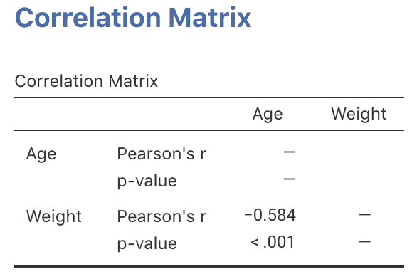
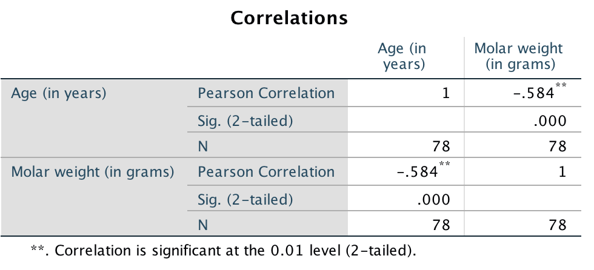

# Two quantitative variables: Summaries for correlations {#TwoQuant}
\index{Quantitative data!connections \textit{between} individuals}


<!-- Introductions; easier to separate by format -->
```{r, child = if (knitr::is_html_output())  {'./introductions/16-Connections-TwoQuant-HTML.Rmd'} else {'./introductions/16-Connections-TwoQuant-LaTeX.Rmd'}}
```


## Introduction: red deer {#TwoQuant-Intro}

So far, RQs about single variables and RQs for comparing two groups have been studied.
Comparing the mean value of a quantitative variable in two groups was studied in Sects.\ \@ref(CITwoMeans) and\ \@ref(TestTwoMeans).
Comparing the odds of an outcome of interest in two groups was studied in Sects.\ \@ref(OddsRatiosCI) and\ \@ref(TestsOddsRatio).
In this chapter, the relationship between two quantitative variables is studied.


## Graphs {#Scatterplots}
\index{Quantitative data!compare \textit{between} individuals!graphs}\index{Scatterplots}\index{Graphs!scatterplots}


<div style="float:right; width: 222x; border: 1px; padding:10px">

</div>


Scatterplots display the relationship between *two quantitative variables*.
Conventionally, when appropriate, the response variable is shown on the vertical axis (and denoted $y$), and the explanatory variable is shown on the horizontal axis (and denoted $x$).\index{Variables!response}\index{Variables!explanatory}
Two quantitative variables are measured on each individual, and a point is placed on the satter plot for each individual at the values of the two variables.
In some cases, only a simple relationship is being explored, and which variable is denoted $x$ and which is $y$ is not important (for example, see Exercise \@ref(exr:CorTestDogs).)

As with any graph, describing the message in the graph is important, because the purpose of a graph is to display the information in the clearest, simplest possible way.


:::{.example #RedDeer name="Red-deer data"}
A study examined the relationship between the age of $n = 78$ male red deer and the weight of their molars [@data:Holgate1965:StraightLine].
The data 
`r if( knitr::is_latex_output() ) {
  '(Table\\ \\@ref(tab:RedDeerData))'
} else {
  '(below)'
}`
comprises two *quantitative* variables, and both measurements are made on the same individuals (i.e., male red deer).

The scatterplot (Fig.\ \@ref(fig:RedDeerScatter)) shows an dot for each deer.
The response variable is the molar weight, which is on the vertical axis and denoted $y$.
The explanatory variable is the deer age, which is on the horizontal axis and denoted $x$.

One deer is just over $14$ years of age (so that $x = 14$ for this deer),  and has a molar weight of about $1.5$\ g (so that $y = 1.5$).
This is the last deer shown in 
`r if( knitr::is_latex_output() ) {
  'Table\\ \\@ref(tab:RedDeerData).'
} else {
  'the data above.'
}`
:::


```{r}
data(RedDeer)
RDhead <- as.matrix( head(RedDeer, 5) )
RDtail <- as.matrix( tail(RedDeer, 5) )

if( knitr::is_latex_output()){
T1 <- knitr::kable( pad(RDhead,
                  surroundMaths = TRUE,
                  targetLength = 4,
                  digits = c(1, 2)),
         format = "latex",
         booktabs = TRUE,
         longtable = FALSE,
         escape = FALSE,
         align = "c",
         linesep = "", # With the \vdots, spacing doesn't seem necessary
         col.names = c( "(in years)", 
	                      "(in g)")) %>%
   row_spec(0, bold = TRUE) %>%
  add_header_above( c("Age" = 1,
                      "Molar weight" = 1),
                    bold = TRUE,
                    line = FALSE)

T2 <- knitr::kable( pad(RDtail,
                  surroundMaths = TRUE,
                  targetLength = 4,
                  digits = c(1, 2)),
         format = "latex",
         booktabs = TRUE,
         longtable = FALSE,
         escape = FALSE,
         align = "c",
         row.names = FALSE,
         linesep = "", # With the \vdots, spacing doesn't seem necessary
         col.names = c( "(in years)", 
	                      "(in g)")) %>%
   row_spec(0, bold = TRUE) %>%
  add_header_above( c("Age" = 1,
                      "Molar weight" = 1),
                    bold = TRUE,
                    line = FALSE)

  out <- knitr::kables(list(T1, T2), 
                       format = "latex",
                       label = "RedDeerData",
                       caption = "Molar weight and age\nof male red deer: The first five and the last five observations are shown.") %>% 
    kable_styling(font_size = 8)
  prepareSideBySideTable(out,
                         gap = "\\qquad")
}
```

```{r deerDataDT, fig.cap="The male red deer data", fig.align="center"}
data(RedDeer)

if( knitr::is_html_output() ) {
  DT::datatable(RedDeer,
              list(scrollX = TRUE, 
	            scrollY = TRUE, 
		          ordering = FALSE),
              caption = "The male red deer data")
}
```


```{r RedDeerScatter, fig.width=7.5, out.width='80%', fig.height=4, fig.cap="A plot of the red-deer data", fig.align="center"}
plot(Weight ~ Age, 
     data = RedDeer,
     las = 1,
     pch = 19, 
     ylim = c(0, 5.5),
     xlim = c(4, 15),
     cex = 0.8,
     main = "Molar weight and age\nof male red deer",
     xlab = "Age (in years)",
     ylab = "Molar weight (in g)")
```


## Describing scatterplots {#UnderstandingScatterplots}
\index{Scatterplots}

The purpose of a graph is to facilitate *understanding* of the data (Sect.\ \@ref(GraphsConstructing)).
For a scatterplot, the *form*, *direction*, and *variation in the relationship* (or the *strength of the relationship*) are described:

1. *Form*: The overall *form* or structure of the relationship (e.g., linear; curved upwards; etc.).\index{Scatterplots!form}
2. *Direction*: The *direction* of the relationship (sometimes not relevant if the relationship is non-linear):\index{Scatterplots!direction}
    - The variables are *positively* associated if *high* values of one variable accompany *high* values of the other variable, in general.
    - The variables are *negatively* associated if *high* values of one variable accompany *low* values of the other variable, in general.
3. *Variation*: The amount of *variation* in the relationship.\index{Scatterplots!variation}\index{Scatterplots!strength}
   A small amount of variation in the response variable for given values of the explanatory variable means the relationship is strong; a lot of variation in the response variable for given values of the explanatory variable means the relationship is less strong.
   Describing the variation is difficult; an objective, numerical way to do so is explained in Chap.\ \@ref(Correlation).

Anything unusual or noteworthy should also be discussed.
These three features explain the *type* of relationship (*form*; *direction*), and the *strength* of that relationship (*variation*).
Examples are shown in
`r if (knitr::is_html_output()) {
  'the carousel below (click to move through the scatterplots).'
  'Fig.\\ \\@ref(fig:ScatterplotDescriptionExamples).'
}`


```{r, child = if (knitr::is_html_output())  'children/ScatterExampleCarousel.Rmd'}
```

```{r, child = if (knitr::is_latex_output())   'children/ScatterExampleImages.Rmd'}
```


::: {.example #DescribeScatterplots name="Describing scatterplots"}
A study [@data:Tager:FEV; @BIB:data:FEV] measured the lung capacity of children in Boston (using forced expiratory volume, FEV, in litres).
The scatterplot (Fig.\ \@ref(fig:FEVscatter)) is curved (*form*), where older children have larger FEVs, in general (*direction*).
The *variation* gets larger for taller youth. 
:::


```{r FEVscatter, fig.cap="FEV plotted against height for children in Boston", fig.align="center", fig.width=8, fig.height=3.25, out.width='90%'}
data(LungCap)

par(mfrow = c(1, 2))

plot(FEV ~ Ht, 
     data = LungCap,
     las = 1,
     ylim = c(0, 6),
     cex = 0.7,
     main = "FEV and height",
     xlab = "Height (inches)",
     ylab = "FEV (litres)",
     pch = 19)

scatter.smooth( LungCap$Ht, LungCap$FEV,
     las = 1,
     ylim = c(0, 6),
     cex = 0.7,
     col = "grey",
     lwd = 2,
     main = "FEV and height",
     xlab = "Height (inches)",
     ylab = "FEV (litres)",
     pch = 19)

arrows(x0 = 50,
       x1 = 50,
       y0 = 0.8,
       y1 = 2.2,
       angle = 15,
       length = 0.11,
       lwd = 2,
       code = 3)
text(x = 50,
     y = 2.2,
     pos = 3,
     cex = 0.85,
     labels = "Smaller\nvariation")

arrows(x0 = 70,
       x1 = 70,
       y0 = 2,
       y1 = 5.8,
       angle = 15,
       length = 0.11,
       lwd = 2,
       code = 3)
text(x = 70,
     y = 1.8,
     pos = 1,
     cex = 0.85,
     labels = "Larger\nvariation")
```

::: {.example #DescribeScatterplotsDeer name="Scatterplots"}
For the red deer data 
`r if (knitr::is_latex_output()) {
   '(Fig.\\ \\@ref(fig:RedDeerScatter)),'
} else {
   '(Fig\\. \\@ref(fig:RedDeerScatterHTML)),'
}`
the relationship is approximately linear (form) with a negative direction (*older* deer generally have *lighter* teeth); the *variation* is... perhaps moderate.
:::


<iframe src="https://learningapps.org/watch?v=pdxmdaf1522" style="border:0px;width:100%;height:500px" allowfullscreen="true" webkitallowfullscreen="true" mozallowfullscreen="true"></iframe>


## Numerically describing linear relationships

### Correlation coefficients {#CorrCoefficients}
\index{Scatterplots!form}\index{Correlation}\index{Correlation coefficient}


Describing the relationship between two quantitative variables requires describing the form, direction and variation (Sect.\ \@ref(UnderstandingScatterplots)).
A *correlation coefficient* is a single number encapsulating all this information.
However, numerically describing the relationship between two quantitative variables, in general, is very difficult, since many types of relationships are possible (consider 
`r if (knitr::is_html_output()) {
  'the scatterplots shown in the carousel above.'
} else {
  'the scatterplots shown in Fig.\\ \\@ref(fig:ScatterplotDescriptionExamples)).'
}`
For this reason, *we now focus just on linear relationships*, and discuss a way of numerically summarising *linear relationships*.

The *Pearson* correlation coefficient measures the *strength* and *direction* of the *linear* relationship between two quantitative variables^[Other correlation coefficients also exist, such as the *Spearman* correlation, which may be used for increasing-only or decreasing-only  non-linear relationships.].
Pearson correlation coefficients only apply if the form is approximately *linear*, so checking the scatterplot first is important.


::: {.importantBox .important data-latex="{iconmonstr-warning-8-240.png}"}
The Pearson correlation coefficient only makes sense if the relationship is approximately linear.
:::


In the *population*, the unknown value of the correlation coefficient is denoted $\rho$ ('rho'); in the *sample* the value of the correlation coefficient is denoted $r$.
As usual, $r$ (the *statistic*) is an estimate of $\rho$ (the *parameter*), and the value of $r$ is likely to be different in every sample (that is, *sampling variation* exists).


:::: {.pronounceBox .pronounce data-latex="{iconmonstr-microphone-7-240.png}"}

::: {style="display: flex;"}
The symbol $\rho$ is the Greek letter 'rho', pronounced 'row', as in 'row your boat'.
:::

::: {}
```{r}
htmltools::tags$video(src = "./Movies/rho.mp4", 
                      width = "121", 
                      loop = "FALSE", 
                      controls = "controls", 
                      loop = "loop", 
                      style = "padding:5px; border: 2px solid gray;")
```
:::

::::


The values of $\rho$ and $r$ are *always* between $-1$ and $+1$.
The *sign* indicates whether the relationship has a positive or negative linear association, and the *value* of the correlation coefficient describes the *strength* of the relationship:

* $r = -1$ means a *perfect, negative* relationship:\index{Correlation coefficient!positive}
  knowing the value of $x$ produces a perfect prediction of the value of $y$, and *larger* values of $y$ are associated with *smaller* values of $x$.
* Values of $r$ between $-1$ and $0$ mean a *negative* relationship:\index{Correlation coefficient!negative}
  knowing the value of $x$ produces a prediction of the value of $y$, and *larger* values of $y$ are associated with *smaller* values of $x$ (in general).
* $r = 0$ means *no linear relationship* between the variables:\index{Correlation coefficient!zero}
  Knowing how the value of $x$ changes tells us nothing about how the corresponding value of $y$ changes.
  The best prediction for *any* value of $x$ is the mean of $y$.
* Values of $r$ between $0$ and $+1$ mean a *positive* relationship:
  knowing the value of $x$ produces a prediction of the value of $y$, and *larger* values of $y$ are associated with *larger* values of $x$ (in general).
* $r = +1$ means a *perfect, positive* relationship:
  knowing the value of $x$ produces a perfect prediction of the value of $y$, and *larger* values of $y$ are associated with *larger* values of $x$.

Most values of $r$ are between the extremes of $r = -1$ and $r = +1$.
`r if (knitr::is_html_output()) {
   'The animation below demonstrates how the values of the correlation coefficient work.'
}`


```{r, animation.hook="gifski", interval=0.5, dev=if (is_latex_output()){"pdf"}else{"png"}}
if (knitr::is_html_output()){
  set.seed(12345)

    num.obs <- 120
    
    rho.list <- seq(-1, 1, 
                    by = 0.1)
    num.plots <- length(rho.list)
    
    xx <- runif(num.obs, 0, 10)
    
    for (i in 1:num.plots){
      out <- MASS::mvrnorm(num.obs, 
                           mu = c(mean(xx), 10), 
                           Sigma = matrix(c(1, 
                                            rho.list[i] , 
                                            rho.list[i], 1), 
                                          ncol = 2), 
                           empirical = TRUE)
      
      plot(out[, 1], out[, 2], 
           pch = 19,
           las = 1, 
           xlim = c(2, 8),
           ylim = c(6, 14),
           xlab = expression(paste("Explanatory variable ", italic(x)) ),
           ylab = expression(paste("Response variable ", italic(y)) ),
           main = paste("Correlation:", format(round(rho.list[i], 2), nsmall = 2)))
      abline( coef(lm(out[, 2] ~ out[, 1]) ), 
              lwd = 2, 
              col = "grey")
    }
  }
```

Numerous example scatterplots were shown in Sect.\ \@ref(UnderstandingScatterplots).
A correlation coefficient is not relevant for 
`r if (knitr::is_html_output()) {
  'Plots C, D, E or H,'
} else {
  'Plots C, D or E,'
}`
as those relationships are not linear.
For the others:

* *Plot A*: the correlation coefficient will be *positive*, and reasonably near one.
* *Plot B*: the correlation coefficient will be *negative*, but not near $-1$.
* *Plot F*: the correlation coefficient will close to zero.


::: {.example #Correlations name="Correlation coefficients"}
A study of sand dollars (@leuchtenberger2022effects, @Nishizaki2022SanddollarData) explored the relationship between water temperature and fertilization rates (Fig.\ \@ref(fig:SanddollarsPlot)).
Fitting a straight line gives a correlation coefficient of $r = -0.49$ (left panel), which might suggest that *higher* temperatures result in *lower* fertilization rates.
However, a curved relationship is apparent (right panel), and so the relationship is more involved: the fertilization rate increases up to about 18^o^C, and then starts falling again.

A correlation coefficient is not suitable for describing the relationship.
:::

```{r SanddollarsPlot, fig.cap="Water temperature vs fertilization rates for sand dollars. Left: a linear relationship. Right: a curved relationship", fig.align="center", fig.width=8, fig.height=3.25, out.width='90%'}
par(mfrow = c(1, 2))

data(Sanddollars)

SDsub <- subset(Sanddollars, 
                Sanddollars$SD.temperatures < 35)

plot( SDsub$SD.temperatures, SDsub$SD.fertilization,
      pch = 19,
      col = "grey",
      lwd = 2,
      las = 1,
      xlim = c(5, 35),
      ylim = c(20, 100),
      main = "Temperature vs fertilization\nrates for sand dollars",
      xlab = "Water temperature (degrees C)",
      ylab = "Fertilization rate (in %)")
text(x = 15,
     y = 40,
     labels = expression( atop(italic(r)==-0.49),
                          group("(", Not~appropriate,")")) )

abline( coef( lm( SD.fertilization ~ SD.temperatures,
                  data =  SDsub ) ),
        lwd = 2,
        lty = 1)

plot( SDsub$SD.temperatures, SDsub$SD.fertilization,
      pch = 19,
      col = "grey",
      lwd = 2,
      las = 1,
      xlim = c(5, 35),
      ylim = c(20, 100),
      main = "Temperature vs fertilization\nrates for sand dollars",
      xlab = "Water temperature (degrees C)",
      ylab = "Fertilization rate (in %)")

m2 <- lm( SD.fertilization ~ poly(SD.temperatures, 2),
            data =  SDsub )
newX <- seq(5, 35,
            length = 100)
newY <- predict( m2, newdata = data.frame(SD.temperatures = newX))
lines(newY ~ newX,
      lwd = 2)

```


Formulas exist to compute the value of $r$, but are tedious to use manually.
We will used software to obtain values of $r$.


::: {.example #CorrelationsDeer name="Correlation coefficients"}
For the red-deer data 
`r if( knitr::is_latex_output() ) {
  '(Fig.\\ \\@ref(fig:RedDeerScatter)),'
} else {
  '(Fig.\\ \\@ref(fig:RedDeerScatterHTML)),'
}
`
the relationship is approximately linear, and the output from jamovi shows that $r = -0.584$ (Fig.\ \@ref(fig:RedDeerCorrelationjamovi)).
The value of $r$ is *negative* because, in general, *older* deer ($x$) are associated with *smaller* weight molars ($y$).
The value is between $r = 0$ and $r = -1$, so the relationship may be described as 'moderately strong' perhaps.
:::


::: {.example #LungCapCor name="Correlation coefficients"}
Consider the scatterplot in Fig.\ \@ref(fig:FEVscatter2), from a study [@data:Tager:FEV; @BIB:data:FEV] of lung capacity of children in Boston (using the forced expiratory volume, FEV).
The plot is not linear, so a correlation coefficient is inappropriate.

In addition, the variation in the FEV increases as children get taller.
For instance, the variation in FEV for children about 50cm tall is much smaller than the variation in FEV for children about 70cm tall.
:::


```{r FEVscatter2, fig.cap="FEV plotted against height for children in Boston", fig.align="center", fig.width=8, fig.height=3.25, out.width='90%'}
data(LungCap)

par(mfrow = c(1, 2))

plot(FEV ~ Ht, 
     data = LungCap,
     las = 1,
     ylim = c(0, 6),
     cex = 0.7,
     main = "FEV and height",
     xlab = "Height (inches)",
     ylab = "FEV (litres)",
     pch = 19)

scatter.smooth( LungCap$Ht, LungCap$FEV,
     las = 1,
     ylim = c(0, 6),
     cex = 0.7,
     col = "grey",
     lwd = 2,
     main = "FEV and height",
     xlab = "Height (inches)",
     ylab = "FEV (litres)",
     pch = 19)

arrows(x0 = 50,
       x1 = 50,
       y0 = 0.8,
       y1 = 2.2,
       angle = 15,
       length = 0.11,
       lwd = 2,
       code = 3)
text(x = 50,
     y = 2.2,
     pos = 3,
     cex = 0.85,
     labels = "Smaller\nvariation")

arrows(x0 = 70,
       x1 = 70,
       y0 = 2,
       y1 = 5.8,
       angle = 15,
       lwd = 2,
       length = 0.11,
       code = 3)
text(x = 70,
     y = 1.8,
     pos = 1,
     cex = 0.85,
     labels = "Larger\nvariation")
```


::: {.tipBox .tip data-latex="{iconmonstr-info-6-240.png}"}
The web page [http://guessthecorrelation.com](http://guessthecorrelation.com) makes a game out of trying to guess the correlation coefficient from a scatterplot.
It's very difficult!
:::


<iframe src="https://learningapps.org/watch?v=psq8a3mfj22" style="border:0px;width:100%;height:500px" allowfullscreen="true" webkitallowfullscreen="true" mozallowfullscreen="true"></iframe>


```{r RedDeerCorrelationjamovi, fig.cap="jamovi correlation output for the red-deer data", fig.align="center", out.width="60%", fig.show="hold"}

#
```


### R-squared ($R^2$) {#R2}
\index{Correlation coefficient!$R^2$}
\index{R2@$R^2$}

The value of $r$ describes the strength and direction of the linear relationship, but knowing exactly what the value *means* is tricky.
Interpretation is easier using $R^2$, or 'R-squared': the square of the value of $r$.
`r if (knitr::is_html_output()) {
   'The animation below shows some values of $R^2$.'
}`


::: {.tipBox .tip data-latex="{iconmonstr-info-6-240.png}"}
The value of $R^2$ is *never* negative.
It is usually multiplied by $100$ and expressed as a percentage.
:::


<!-- need to watch! Unfortunate line breaks can happen! -->
::: {.softwareBox .software data-latex="{iconmonstr-laptop-4-240.png}"} 
Even though the value of $R^2$ is never negative, you need to be careful when using your calculator!
With most calculators, entering `-0.5^2` returns an answer of `-0.25`.
The calculator interprets your input as meaning `-(0.5^2)`.

You must use brackets: `(-0.5)^2` gives the correct answer of `0.25`.
:::


```{r R2Plots, animation.hook="gifski", interval=0.5, dev=if (is_latex_output()){"pdf"}else{"png"}}
if (knitr::is_html_output()){
  set.seed(12345)

   num.obs <- 120
    
   rho2.list <- seq(0.1, 1, 
                    by = 0.1)
   rho.list <- c( -rev(sqrt(rho2.list)), 0, sqrt(rho2.list) )
   num.plots <- length(rho.list)
    
   xx <- runif(num.obs, 0, 10)
    
   for (i in 1:num.plots){
      out <- MASS::mvrnorm(num.obs, 
                           mu = c(mean(xx), 10), 
                           Sigma = matrix(c(1, 
                                            rho.list[i] , 
                                            rho.list[i], 
                                            1), 
                                          ncol = 2), 
                           empirical = TRUE)
      
      plot(out[, 1], 
           out[,2 ], 
           pch = 19,
           las = 1, 
           xlim = c(2, 8),
           ylim = c(6, 14),
           xlab = "Explanatory variable",
           ylab = "Response variable",
           sub = paste("(r: ", format(round(rho.list[i], 2), nsmall = 2),")", sep = ""),
           main = paste("R-squared: ", format(round(rho.list[i]^2 * 100, 0), nsmall = 0), "%", sep = "") )
      abline( coef(lm(out[, 2] ~ out[, 1]) ), 
              lwd = 2, 
              col = "grey")
    }
}
```


The value of $R^2$ measures the reduction in the unexplained variation in values of $y$ because the value of $x$ is known.
Without knowing anything about the relationship between the values of $x$ and $y$, the best summary of the values of $y$ is the mean of the $y$ values.
However, the relationship between the values of $x$ and $y$ suggests we (potentially) can make better estimates of the value of $y$ by knowing the value of $x$, and less variation should be left unexplained.
When expressed as a percentage, $R^2$ measures how much the unexplained variation reduces due to our knowledge of the linear relationship^[This is *optional*: In the following example, the reduction in the *square* of the standard deviations is $(0.7263^2 - 0.5895^2)/0.7263^2 = 0.341$, which is the value of $R^2$.].
If $R$-squared is zero, then the amount of unexplained variation has not reduced at all, and exploring the relationship has no value.


:::{.example #ReductionR2 name="Unknown variation in $y$"}
\index{R2@$R^2$!meaning}
For the red-deer data, the unexplained variation in the values of $y$ (molar weight), without knowing anything about the age of the deer, is the variation in the *distances from the mean* to each observation (Fig.\ \@ref(fig:RedDeerR2), left panel).
Effectively, the unexplained variation is the standard deviation of the molar weights.

If information about the age of the deer ($x$) is used, the unexplained variation in the values of $y$ is now the variation in the *distances from the line explaining the relationship* to each observation (Fig.\ \@ref(fig:RedDeerR2), right panel).
The distances are much shorter, in general, showing a decrease in the *unexplained* variation.
Effectively, the unexplained variation is the standard deviation of the distance from the line to the observations.
:::


```{r RedDeerR2, message=FALSE, warning=FALSE, fig.height=5.25, fig.width=6.5, out.width='100%', fig.align="center", fig.cap="The unexplained variation for the red-deer data. Left panels: When no information about the age of the deer is used, the mean (the horizontal grey line) is the best summary of the molar weight. Right panels: When information about the age of the deer is used (as shown the the grey line), the distances are shorter in general."}
layout( matrix(c(1, 2, 3, 4), 
               nrow = 2, 
               byrow = TRUE) )

showResidualsAtThesePoints <- c(3, 22, 53, 65, 69, 75, 74)


### TOP LEFT plot
par(mar = c(5.1, 4.5, 3, 3))

plot(Weight ~ Age, 
     data = RedDeer,
     las = 1,
     pch = 19, 
     col = "lightgrey",
     ylim = c(0, 5.5),
     xlim = c(4, 15),
     cex = 1,
     main = "Molar weight and age\nof male red deer",
     xlab = "Age (in years)",
     ylab = "Molar weight (in g)")


abline( h = mean(RedDeer$Weight),
        lwd = 2,
        col = "grey")

# Draw residuals
yHat <- rep(mean(RedDeer$Weight),
            length = length(RedDeer$Weight) )

for (i in (1:length(showResidualsAtThesePoints))){
  arrows(x0 = RedDeer[ showResidualsAtThesePoints[i], 1],
         x1 = RedDeer[showResidualsAtThesePoints[i], 1],
         y0 = yHat[showResidualsAtThesePoints[i]],
         y1 = RedDeer[showResidualsAtThesePoints[i], 2],
         length = 0.075,
         angle = 15)
}


### TOP RIGHT plot
par(mar = c(5.1, 4.1, 3, 1))

plot(Weight ~ Age, 
     data = RedDeer,
     las = 1,
     pch = 19, 
     col = "lightgrey",
     ylim = c(0, 5.5),
     xlim = c(4, 15),
     cex = 1,
     main = "Molar weight and age\nof male red deer",
     xlab = "Age (in years)",
     ylab = "Molar weight (in g)")

mDeer <- lm(Weight ~ Age,
            data = RedDeer)

abline( mDeer,
        lwd = 2,
        col = "grey")

# Draw residuals
yHat <- predict(mDeer)


for (i in (1:length(showResidualsAtThesePoints))){
  arrows(x0 = RedDeer[ showResidualsAtThesePoints[i], 1],
         x1 = RedDeer[showResidualsAtThesePoints[i], 1],
         y0 = yHat[showResidualsAtThesePoints[i]],
         y1 = RedDeer[showResidualsAtThesePoints[i], 2],
         length = 0.075,
         angle = 15)
}


### BOTTOM LEFT plot
deerMeanResiduals <- summary( lm(Weight ~ 1, 
                                 data = RedDeer))$residuals
hist( deerMeanResiduals,
      las = 1,
      xlim = c(-2.5, 2.5),
      ylim = c(0, 25),
      border = grey(0.5),
      main = expression( atop(Unexplained~variation~"in",
                              italic(y)-values~"("*molar~weights*")")),
      sub = expression("("*Standard~deviation*":"~0.7263*")"),
      xlab = "Distances from mean to observations")

arrows(x0 = -2,
       x1 = 2.5,
       y0 = 15,
       y1 = 15,
       code = 3, # Arrow both ends
       lwd = 2,
       angle = 15,
       length = 0.1)

### BOTTOM RIGHT plot
deerResiduals <- summary(mDeer)$residuals
hist( deerResiduals,
      las = 1,
      xlim = c(-2.5, 2.5),
      ylim = c(0, 30),
      border = grey(0.5),
      main = expression(atop(Unexplained~variation~after~knowing,
                             the~values~of~italic(x)~"("*age*")")),
      sub = expression("("*Standard~deviation*":"~0.5895*")"),
      xlab = "Distances from line to observations")

arrows(x0 = -1.5,
       x1 = 2,
       y0 = 15/25 * 30,
       y1 = 15/25 * 30,
       code = 3, # Arrow both ends
       lwd = 2,
       angle = 15,
       length = 0.1)

```


::: {.example #R2Deer name="Values of $R$-squared"}
For the red-deer data
`r if( knitr::is_latex_output() ) {
  '(Fig.\\ \\@ref(fig:RedDeerScatter)),'
} else {
  '(Fig.\\ \\@ref(fig:RedDeerScatterHTML)),'
}`
the value of $R^2$ is $R^2 = (-0.584)^2 = 0.341$, usually written as a percentage: $34.1$%.
The value of $R^2$ is positive, even though the value of $r$ is negative.

This means a reduction of about $34.1$% in the unknown variation of the molar weights, due to using the information in the age of the deer.
The rest of the variation in molar weights is due to chance, and to extraneous variables, such as weight, diet, amount of exercise, genetics, etc.
:::


## Summary tables {#ConnectionSummaryTables}
\index{Quantitative data!connections \textit{between} individuals!summary tables}

In general, numerical summaries are difficult for describing the relationship between two quantitative variables, because the possible relationships vary greatly (Sect.\ \@ref(UnderstandingScatterplots)).
Hence, numerical summaries are described specifically for *linear* relationships.

Numerical summary information the linear relationship between *two quantitative variables* can be collated in a table.
The table summarises each variable.
If the relationship is linear, a *correlation coefficient* should be added to the summary table.


```{r RDSummaryTable}
RDTable <- array( dim = c(2, 4))

rownames(RDTable) <- c("Age",
                        "Molar weight") 
colnames(RDTable) <- c("Mean",
                        "Std. dev.",
                        "Sample size",
                       "Correlation") 


RDTable[, 1] <- round(colMeans(RedDeer), 1)
RDTable[, 2] <- round(apply(RedDeer, 2, "sd"), 2)
RDTable[, 3] <- round(apply(RedDeer, 2, "realLength"), 0)
RDTable[, 4] <- c( round(cor(RedDeer)[1, 2], 3), 
                   NA)

knitr::kable( pad(RDTable,
                  surroundMaths = TRUE,
                  targetLength = c(4, 5, 3, 6),
                  digits = c(1, 2, 0, 3)),
              format = "latex",
              longtable = FALSE,
              booktabs = TRUE,
              escape = FALSE,
              align = "c",
              caption = "A numerical summary of the red deer data") %>%
  kable_styling(full_width = FALSE) %>%
  row_spec(row = 0, 
           bold = TRUE) %>%
  row_spec(row = 3,
           italic = TRUE) %>%
  kable_styling(font_size = 8)
```


## Chapter summary {#TwoQuant-Summary}

A *scatterplot* displays the relationship between two quantitative variables (the response denoted $y$; the explanatory denoted $x$).
The relationship is described by the *form* (linear, or otherwise), the *direction* of the relationship (sometimes not relevant if the graph is not linear), and the *variation* in the relationship (or the *strength* of the relationship).


## Quick review questions {#TwoQuant-QuickReview}

::: {.webex-check .webex-box}
A study of onion growth [@meadplant] produced the scatterplot shown in Fig.\ \@ref(fig:MeanScatter).


```{r MeanScatter, fig.cap="Onion yield plotted against planting density", fig.align="center", fig.width=5, fig.height=3.5}
data(YieldDen)

plot(Yield ~ Dens,
	las = 1,
	main = "Planting density and yield per plant\nfor onions",
	xlab = "Planting density (plants/sq. ft)",
	ylab = "Yield/plant (g/plant)", 
  pch = 19,
	ylim = c(0, 140),
	data = YieldDen)
```

1. What is the $x$-variable? \tightlist
`r if( knitr::is_html_output() ) {longmcq( c(
  answer = "Planting density",
  "Yield per plant",
  "It doesn't matter"
) )}`

1. What is the best description for the  *form* of the relationship?
`r if( knitr::is_html_output() ) {longmcq( c(
  "Linear",
  answer = "Curved"
) )}`
1. What is the best description for the *direction* of the relationship?
`r if( knitr::is_html_output() ) {longmcq( c(
  answer = "Negative",
  "Positive"
) )}`
1. WHat os the best description for the *variation* in the relationship?
`r if( knitr::is_html_output() ) {longmcq( c(
  answer = "Small",
  "Large",
  "Strong"
) )}`
:::


## Exercises {#TwoQuant-Exercises}

Selected answers are available in Sect.\ \@ref(TwoQuant-Answers).


::: {.exercise #TwoQuantExercisesPeas}
A study of the nutritional content of peas (*Pisum sativum*) measured the quantities of various minerals in pea seeds [@hacisalihoglu2021characterization].
In these plots, it does not matter which of the pair of variables is used on the horizontal axis and which is used on the vertical axis.

From the *left* scatterplot in Fig.\ \@ref(fig:PeasScatter), estimate the value of $r$.
:::

::: {.exercise #TwoQuantExercisesPeas2}
A study of the nutritional content of peas (*Pisum sativum*) measured the quantities of various minerals in pea seeds [@hacisalihoglu2021characterization].
In these plots, it does not matter which of the pair of variables is used on the horizontal axis and which is used on the vertical axis.

From the *right* scatterplot in Fig.\ \@ref(fig:PeasScatter), estimate the value of $r$.
:::


```{r PeasScatter, fig.cap="The relationship between some minerals in pea seeds", fig.align="center", fig.width=8, fig.height=3.25, out.width='90%'}
data(Peas)

par( mfrow = c(1, 2))

plot( K ~ P,
      data = Peas,
      xlab = "Phosporus (mg/g)",
      ylab = "Potassium (mg/g)",
      xlim = c(3, 8),
      ylim = c(10, 17),
      las = 1,
      pch = 19,
      col = "grey",
      main = "Nutrional elements in\npea seeds")
abline( coef( lm( K ~ P, data = Peas)),
        lwd = 2)

###

plot( Ca ~ Zn,
      data = Peas,
      xlab = "Zinc (mg/g)",
      ylab = "Calcium (mg/g)",
      xlim = c(25, 80),
      ylim = c(0, 2.5),
      las = 1,
      pch = 19,
      col = "grey",
      main = "Nutrional elements in\npea seeds")
abline( coef( lm( Ca ~ Zn, data = Peas)),
        lwd = 2)

```


::: {.exercise #TwoQuantExercisesLimeTrees}
The diameter and the age of $385$ small-leaved lime trees were found (@data:ForestBiomass2017), and shown in Fig.\ \@ref(fig:LimeTreesScatter).

1. Describe the scatterplot.
2. What does each point on the scatterplot represent?
:::


```{r LimeTreesScatter, fig.cap="The age and foliage biomass of small-leaved lime trees grown in Russia ($n = 385$)", fig.align="center", fig.show="hold", fig.width=8, fig.height=3.25, out.width='90%'}
data(Lime)

par( mfrow = c(1, 2))

plot(Foliage ~ Age,
	las = 1,
  main = "Foliage biomass of small-leaved\nlime trees against age",
	xlab = "Age (in years)",
	ylab = "Foliage biomass (in kg)", 
  cex = 0.8,
	pch = 19,
	xlim = c(0, 140),
	ylim = c(0, 14),
	data = Lime)

###


plot(Foliage ~ Age,
	las = 1,
  main = "Foliage biomass of small-leaved\nlime trees against age",
	xlab = "Age (in years)",
	ylab = "Foliage biomass (in kg)", 
  cex = 0.8,
	pch = 19,
	col = "grey",
	xlim = c(0, 140),
	ylim = c(0, 14),
	data = Lime)
abline( coef(lm(Foliage ~ Age, 
                data = Lime)),
        lwd = 2)
#m2 <- lm(log(DBH) ~ log(Age), 
#         data = lime)
#
#newAge <- seq( min(lime$Age), 
#               max(lime$Age),
#               length = 100)
#newDBH <- predict(m2, 
#                  newdata = data.frame(Age = newAge))
#lines( newDBH ~ newAge)
```


<!-- ::: {.exercise #TwoQuantExercisesSheepFood} -->
<!-- A study evaluated various food mixtures for sheep [@data:Moir1961:RuminantDiet]. -->
<!-- Describe the scatterplot (Fig. \@ref(fig:SheepScatter)) in terms of the *form*, *direction* and *variation* in the relationship. -->
<!-- ::: -->


<!-- ```{r SheepScatter, fig.cap="Scatterplots for the sheep-food data", fig.align="center", fig.width=5, fig.height=3.5} -->
<!-- data(ruminant) -->

<!-- plot(Energy ~ DryMatterDigest,  -->
<!--      data = ruminant, -->
<!--      las = 1, -->
<!--      xlim = c(30, 80), -->
<!--      ylim = c(1, 3.5), -->
<!--      main = "Sheep feed data", -->
<!--      xlab = "Dry matter digestibility (%)", -->
<!--      ylab = "Digestible energy (in Cal/gram)", -->
<!--      pch = 19) -->
<!-- abline( lm( Energy ~ DryMatterDigest,  -->
<!--             data = ruminant),  -->
<!--         lwd = 2,  -->
<!-- 	col = "grey") -->
<!-- ``` -->


::: {.exercise #TwoQuantExercisesSoftdrink}
A study examined the time taken to deliver soft drinks to vending machines [@others:Montgomery:regressionanalysis].

1. Describe the relationship (Fig.\ \@ref(fig:MandibleGestationPlot), left panel).
2. What does eachpoint represent?
:::


::: {.exercise #TwoQuantExercisesMandible}
A study examined the mandible length and gestational age for $167$ foetuses from the $12$th week of gestation onward [@data:royston:mandible].
Describe the relationship (Fig.\ \@ref(fig:MandibleGestationPlot), right panel).
:::


```{r MandibleGestationPlot, fig.cap="Two scatterplots. Left: The time taken to deliver soft drinks to vending machines. Right: The relationship between gestational age and mandible length.", fig.align="center", fig.width=9, fig.height=3.5, out.width='100%'}
par(mfrow = c(1, 2), 
    mar = c(5.1, 5.1, 4.1, 2.1))

data(SDrink)

plot(Time ~ Cases, 
     data = SDrink,
     main = "Time to service vending machine\nand number of products stocked",
     xlab = "Number of cases of product stocked",
     ylab = "Time to service\nmachine (mins)",
     xlim = c(0, 30),
     ylim = c(0, 80),
     las = 1,
     pch = 19)
abline(coef(lm(Time ~ Cases, 
               data = SDrink)), 
       col = "grey")


### 

data(Mandible)

plot(Length ~ Age, 
     data = Mandible,
     main = "Gestational age and\nmandible length",
     xlab = "Gestational age (in weeks)",
     ylab = "Mandible length (in mm)",
     xlim = c(10, 40),
     ylim = c(0, 50),
     las = 1,
     pch = 19)
abline(coef(lm(Length ~ Age, 
            data = Mandible)), 
       col = "grey")
###


```


::: {.exercise #TwoQuantExercisesGorillas}
A study [@wright2021chest] $25$ gorillas are recorded information about their chest beating and their size (measured by the breadth of the gorillas' backs).
Describe the relationship (Fig.\ \@ref(fig:GorillaWindmillPlot), left panel).
:::


```{r GorillaWindmillPlot, fig.cap="Two scatterplots. Left: Chest beating in gorillas; right: The relationship between DC output and wind speed.", fig.align="center", fig.width=9, fig.height=3.5, out.width='100%'}
par(mfrow = c(1, 2), 
    mar = c(5.1, 4.1, 4.1, 2.1))

data(Gorillas)

plot(NoChestBeats ~ BackBreadth, 
     data = Gorillas,
     main = "Chest beating in gorillas",
     xlab = "Back breadth (in cm)",
     ylab = "Number chest beats per minute",
     xlim = c(54, 66),
     ylim = c(0, 51),
     las = 1,
     pch = 19)


###

data(Windmill)

plot(DC ~ Wind, 
     data = Windmill,
     main = "DC output and wind speed",
     xlab = "Wind speed (in miles per hour)",
     ylab = "DC output",
     las = 1,
     xlim = c(2, 10),
     ylim = c(0, 2.5),
     pch = 19)
```


::: {.exercise #TwoQuantExercisesWindmill}
A study examined the relationship between direct current generated by a windmill and wind speed [@data:hand:handbook; @data:joglekar:lackoffit].
Describe the relationship (Fig.\ \@ref(fig:GorillaWindmillPlot), right panel).
:::


:::{.exercise #SoilCN}
The percentage carbon (C) and the percentage nitrogen (N) was recorded in $28$ irrigated farming plots.
The relationship between these is shown in Fig.\ \@ref(fig:IrrigatedCNStudents) (left panel).

1. Describe the relationship.
1. Does it matter which variable is $x$ and which is $y$?
   Explain.
1. What does each point represent?

:::

```{r, IrrigatedCNStudents, fig.align="center", fig.cap="The percentage N and percentage C in irrigated plots", fig.width=9, fig.height=3.5, out.width='100%'}
par(mfrow = c(1, 2))

data("SoilCN")

plot(x = SoilCN$IrrigatedC, 
     y = SoilCN$IrrigatedN,
     pch = 19,
     las = 1,
     xlab = "Percentage C",
     ylab = "Percentage N",
     main = "Percentage soil carbon and\nnitrogen in 28 irrigated farm plots")

###
data("StudentWt")

plot(y = StudentWt$Week12,
     x = StudentWt$Week1,
     pch = 19,
     las = 1,
     ylab = "Weight (in kg) at 12 Weeks",
     xlab = "Weight (in kg) at 1 Week",
     main = "Weight of students after\nand 12 weeks at university")
```


:::{.exercise #StudentWts}
The weights of students starting at university (Week\ 1) and in Week\ 12 are shown in Fig\ \@ref(fig:IrrigatedCNStudents) (right panel).

1. Describe the relationship.
1. What does each point represent?
:::


::: {.exercise #TwoQuantExercisesONI}
The relationship [@mypapers:dunnsmyth:glms] between the number of cyclones $y$ in the Australian region each year from 1969 to 2005, and a climatological index called the *Ocean `r readr::parse_character( c("Niño"), locale=locale(encoding="UTF-8"))` Index* (ONI, $x$), is shown in Fig.\ \@ref(fig:ONIcyclonesCI).

From software, $r = -0.682$.
What is the value of $R^2$?
What does it mean?
:::


```{r ONIcyclonesCI, fig.width=4, fig.align="center", fig.cap="The number of cyclones in the Australian region each year from 1969 to 2005, and the ONI for October, November, December", fig.width=5, fig.height=4}

data(Cyclones)

plot(Total ~ OND, 
     data = Cyclones,
     xlim = c(-2, 3),
     ylim = c(0, 20),
     pch = 19,
     ylab = "Total number of cyclones",
     xlab = "ONI averaged over Oct., Nov., Dec.",
     las = 1)

clm <- lm( Total ~ OND, 
           data = Cyclones)
abline( coef(clm), 
        lwd = 1, 
        col = "grey")
grid(lty = 2)
```


<!-- QUICK REVIEW ANSWERS -->
`r if (knitr::is_html_output()) '<!--'`
::: {.EOCanswerBox .EOCanswer data-latex="{iconmonstr-check-mark-14-240.png}"}
**Answers to in-chapter questions:**

- \textbf{Answers to \textit{Quick Revision} questions:}
**1.** Planting density.
**2.** Curved.
**3.** Negative.
**4.** Small.
:::
`r if (knitr::is_html_output()) '-->'`

