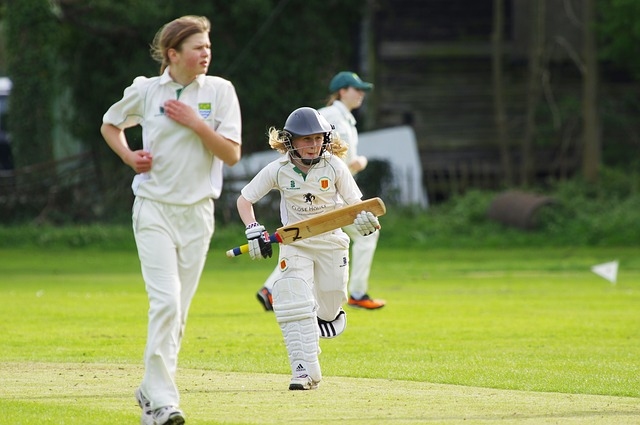
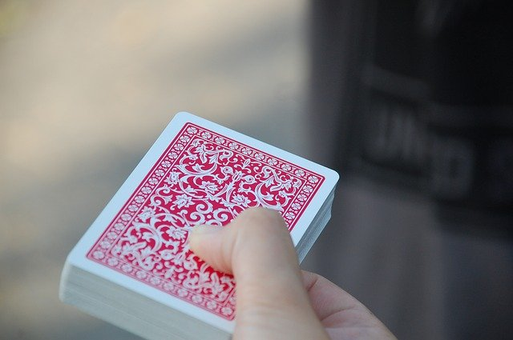

# Probability {#Probability}

```{block2, type="rmdobjectives"}
So far,
you have learnt to
ask a RQ, 
identify different ways of obtaining data,
design the study,
collect the data
describe the data,
summarise data graphically and numerically,
and
understand the decision-making process.

**In this chapter**,
you will learn about *probability* to
describe the random nature of sample statistics.
You will learn to:

* explain probabilities.
* apply the classical approach to probability in simple situations.
* apply the relative frequency approach to probability in simple situations.
* apply the subjective approach to probability in simple situations.
* identify events that are independent.

```


```{r echo=FALSE, fig.cap="", fig.align="center", fig.width=3, out.width="35%"}
SixSteps(5, "Probability")
```


## Introduction {#Chap16-Intro}

In this chapter,
*probability* is discussed.
In short,
*probability*\index{probability}
quantifies the chance that something
(an 'event')
will happen in the future.

More formally,
probability is discussed in the context of a procedure
whose result is unknown beforehand. 
A list of all possible results from this procedure is called the
*sample space*.\index{sample space}
An *event*\index{event}
is then defined as any combination of these elements of the sample space.


```{definition SampleSpace, name="Sample space"}
The *sample space*
is a list of all possible and distinct results after administering a procedure,
whose result is unknown beforehand. 
```


```{definition Event, name="Event"}
An *event* is any combination of the elements in the sample space.
```


<!-- Text wrap from: https://stackoverflow.com/questions/43551312/wrap-text-around-plots-in-markdown -->
<!-- Trick from: https://blog.earo.me/2019/10/26/reduce-frictions-rmd/ -->
`r if (knitr::is_latex_output()) '<!--'`
```{r, echo=FALSE, out.width= "30%", out.extra='style="float:right; padding:10px"'}
include_graphics("Illustrations/pexels-skitterphoto-705171.jpg")
```
`r if (knitr::is_latex_output()) '-->'`

```{example SampleSpaceDie, name="Sample spaces and events"}
Consider rolling a fair, six-sided die.
We do not know what face will be uppermost until we roll the die.

However, 
the *sample space* for this procedure can be listed:
**1**, **2**, **3**, **4**, **5**, **6**.
These are all distinct results (no overlap),
and the sample space is 
[*discrete*](#def:DiscreteData).

Many *events* could be defined using this sample space; for example:

* Rolling a **4**: This event includes one element of the sample space: **4**.
* Rolling a even number: This event includes three elements of the sample space: **2**, **4** and **6**.
* Rolling a number larger than **2**: This event includes four elements of the sample space: **3**, **4**, **5** and **6**.

```


<!-- Text wrap from: https://stackoverflow.com/questions/43551312/wrap-text-around-plots-in-markdown -->
<!-- Trick from: https://blog.earo.me/2019/10/26/reduce-frictions-rmd/ -->
`r if (knitr::is_latex_output()) '<!--'`
```{r, echo=FALSE, out.width= "30%", out.extra='style="float:right; padding:10px"'}

```
`r if (knitr::is_latex_output()) '-->'`


```{example SampleSpaceThrowing, name="Sample spaces and events"}
Consider the distance which you can throw a cricket ball.
We do not know what distance your throw will be until you throw,
but we can describe the *sample space* for this procedure:
the distance could be anywhere between (say) 0 and 200 metres
(and of course, some of those distances are fairly unlikely to occur...).

This sample space is 
[*continuous*](#def:ContinuousData).

Many *events* could be defined using this sample space; for example:

* Throwing more than 50 metres: This event includes elements of the sample space greater than 50m.
* Throwing between 10 and 40 metres: This event includes elements of the sample space between 10m and 40m.
* Throwing less than 20 metres: This event includes elements of the sample space less than 20m.

Because the sample space is continuous,
throwing an *exact* distance
(such as *exactly* 10 metres) 
is technically not possible.
```


Once a sample space is defined,
a *probability* can be defined.


<!-- Text wrap from: https://stackoverflow.com/questions/43551312/wrap-text-around-plots-in-markdown -->
<!-- Trick from: https://blog.earo.me/2019/10/26/reduce-frictions-rmd/ -->
`r if (knitr::is_latex_output()) '<!--'`
```{r, echo=FALSE, out.width= "10%", out.extra='style="float:left; padding:10px"'}
include_graphics("Pics/iconmonstr-coin-5-240.png")
```
`r if (knitr::is_latex_output()) '-->'`

```{definition, Probability, name="Probability"}
A *probability* is a number between 0 and 1 inclusive
(or between 0% and 100% inclusive)
that quantifies
the likelihood that a certain *event* will occur.
```


A probability of zero (or 0%) means the event is 'impossible'
(will never occur).
At the other extreme,
a probability of one (or 100%)
means that the event is 'certain' to happen
(will always occur).
Most events have a probability between the extremes 
of 0% and 100%.


```{example Probabilities, name="Probabilities"}
Consider these cases:

* The probability of receiving negative rainfall is zero: It is impossible.
* The probability of receiving some rain in Buderim in the next decade is one. It is certain.
* The probability of receiving rain on any given day... is somewhere between 0 and 1.

```


Different ways exist to calculate probabilities of events, including:

* the *classical approach* (Sect. \@ref(ProbClassical));
* the *relative frequency approach* (Sect. \@ref(ProbRelFreq)); and
* the *subjective approach* (Sect. \@ref(ProbSubjective)).


## The classical approach {#ProbClassical}

What is the probability of rolling a `r include_graphics("Dice/die4.png", dpi=4000)` on a die?
The sample space has six possible outcomes
(listed in Example \@ref(exm:SampleSpaceDie))
that are
*equally likely*,
and the event ('rolling a `r include_graphics("Dice/die4.png", dpi=4000)`')
comprises just *one* of those.
Thus,
\begin{align*}
   \text{Prob. of rolling a four}
   &= \frac{\text{The number of results that are a 4}}{\text{The number of possible results}}\\
   &= \frac{1}{6}.
\end{align*}

We can say that 'the probability of rolling a **4** is 1/6',
or 'the probability of rolling a `r include_graphics("Dice/die4.png", dpi=4000)` is 0.1667'.
The answer can also be expressed as a *percentage*
('the probability of rolling a `r include_graphics("Dice/die4.png", dpi=4000)` is 16.7%').

The answer could also be interpreted as
'the *expected* proportion of rolls that are a `r include_graphics("Dice/die4.png", dpi=4000)` is 0.167'.
This approach to computing probabilities is called the 
*classical* approach to probability.

The chance of rolling a `r include_graphics("Dice/die4.png", dpi=4000)` in the future is 0.167,
but a roll of the die will either produce a `r include_graphics("Dice/die4.png", dpi=4000)`, 
or will not produce a `r include_graphics("Dice/die4.png", dpi=4000)`...
and we don't know which will occur.


```{example ProbabilityOutcomes, name="Describing probability outcomes"}
Consider rolling a standard six-sided die again.

* The *probability* of rolling an even number is $3 \div 6 = 0.5$.
* The *percentage* of rolls that are expected to be even numbers is $3 \div 6 \times 100 = 50$%.
* The *odds* of rolling an even number is $3\div 3 = 1$.

```


```{definition, ClassicalApproachToProbability, name="Classical approach to probability"}
In the *classical approach to probability*,
the probability of an event occurring is the 
number of elements of the sample space included in the event,
divided by the total number of elements in the sample space,
*when all outcomes are equally likely*.
```

By this definition:

\[
   \text{Prob. of an event}
    = 
    \frac{\text{Number of equally-likely outcomes in the event of interest}}{\text{Total number of equally-likely outcomes}}
\]


```{example SimpleEvents, name="Simple events"}
What is the *probability* of rolling a **2** on a die?
What are the *odds* of rolling a **2** on a die?

Since the six possible outcomes in the sample space are
*equally likely*:

\[   
  \text{Prob. of rolling a two}
  = 
  \frac{\text{One outcome is a 2}}{\text{Six equally-likely outcomes}}.
\]
So the probability 
is $\frac{1}{6} = 0.1667$,
or about 16.7%.
Also,
since the six possible outcomes are
*equally likely*:

\[   
  \text{Odds of rolling a two}
  = 
  \frac{\text{One outcomes is a two}}{\text{Five of the possible outcomes are not a two}}.
\]
So
the odds of rolling a two is $\frac{1}{5} = 0.2$.

```   


```{example ComplicatedEvents, name="More complicated events"}
Consider rolling a standard six-sided die.
There are six equally likely outcomes (Example \@ref(exm:SampleSpaceDie))
each with probability $1/6$ (or 16.7%) of occurring.
The probability of rolling a **1** 
*or* a **2** is
$2/6$ (or 33.3%).
```   
   

   

   
   
```{block2, type="rmdimportant"}
*Probabilities* describe the likelihood that an event will occur *before* the outcome is known.

*Odds* and *proportions* can be used either *before* or *after* the outcome is known, provided the wording is correct.
For example:

* *Proportions* describe how often an event has occurred *after* the outcome is known.
* *Expected proportions* describe the likelihood that an event will occur *before* the outcome is known.

The following example may help also.
```


```{example ProbProportioOdds, name="Probabilities, proportions, odds"}
*Before* a fair coin is tossed:
  
* The *probability* of throwing a head is $1/2 = 0.5$.
* The *expected proportion* of heads in many coin tosses is 0.5.
* The *odds* of throwing a head is $1/1 = 1$.

If we have already tossed a coin 100 times and found
47 heads:
  
* The *proportion* of heads is $47/100 = 0.47$.
* The odds that we *threw* a head is $47/53 = 0.887$.

It makes no sense to talk about the 'probability that we just threw a head',
because the event has already occurred.
```
   


   
## The relative frequency approach {#ProbRelFreq}

<!-- Text wrap from: https://stackoverflow.com/questions/43551312/wrap-text-around-plots-in-markdown -->
<!-- Trick from: https://blog.earo.me/2019/10/26/reduce-frictions-rmd/ -->
`r if (knitr::is_latex_output()) '<!--'`
```{r, echo=FALSE, out.width= "40%", out.extra='style="float:right; padding:10px"'}
include_graphics("Illustrations/father-22194_640.jpg")
```
`r if (knitr::is_latex_output()) '-->'`


What is the probability that a new baby will be a boy?
The sample space could be listed as:
*boy* and *non-boy*.
The classical approach could be used,
since the sample space has two elements: 
$1\div2 =  0.5$.
This approach is fine *if* 
boys and non-boys are *equally likely* to be born.
But are they?

In [Australia in 2015](http:www.abs.gov.au/ausstats/abs@.nsf/0/B8865D71D84F5210CA2579330016754C?opendocument),
305&nbsp;377 live births occurred,
with 157&nbsp;088 male births
and 148&nbsp;289 non-male births.
Then,
the *proportion* of boys born in 2015 is

\[
   \frac{157\,088}{305\,377} = 0.514,
\]
or about 51.4%.
An *estimate* of the probability 
that the next birth will be a boy is is about 0.514 (or 51.4%).
This is the *relative frequency* approach to calculating probabilities:
based on past proportions.

The probability that the next birth will be a boy is *approximately* 0.514,
but the next birth will either be a boy, or will be a not-boy...
and we don't know which will occur.


```{definition, RelativeFrequencyApproachToProbability, name="Relative frequency approach to probability"}
In the *relative frequency approach to probability*,
the probability of an event is (approximately) the number of times the outcomes of interest has appeared in the past,
divided by the number of 'attempts' in the past.
```


```{example RFProbability, name="Relative frequency probability"}
Based on this information,
the *odds* that a new baby will be a boy
is *approximately* $0.514\div (1-0.514) = 1.058$.

According to the 
[ABS](http:www.abs.gov.au/ausstats/abs@.nsf/0/B8865D71D84F5210CA2579330016754C?opendocument):

> The sex ratio for all births registered in Australia
> generally fluctuates around 105.5 male births per 100 female births.

This is close to the odds of 1.058 found above.
```
         
      
```{lemma ProbabiltyStudents, name="Probability"}
The  data in
Table \@ref(tab:OWeekTable)
concern students enrolling in a library introductory session in O-Week.
(SSE is the School of Science and Engineering;
SHSS is the School of Health and Sport Science.)

Find the *probability* that a randomly chosen student will be:

1. An SSE student.
1. An SHSS student aged Over 30.
1. Over 30, *if we already know the student is from SHSS*.

```

```{block2, type="fold"}
**1:**  $159/255 = 62.4$%; **2:** $40/255=15.7$%; **3:** $40/96 = 41.7$%.
```


```{r OWeekTable, echo=FALSE}
Counts <- c(68, 91, 56, 40)
School <- c( rep("SSE", 2),
             rep("SHSS",   2))
Age <- rep( c("30 and under",
              "Over 30"), 2)

Library <- xtabs( Counts ~ School + Age)

Library2 <- cbind( Library, "Total" = rowSums(Library))
Library2 <- rbind( Library2, "Total" = colSums(Library2))

if (knitr::is_latex_output()){
  kable(Library2,
        format = "latex",
        longtable = FALSE,
        booktabs = TRUE,
        align = rep( "r", 4),
        caption = "Attendance at a library O-Week session") %>%
   column_spec(column = 4, bold = TRUE) %>%
   row_spec(row = 3, bold = TRUE) %>%
   row_spec(row = 2, hline_after = TRUE)
}
if (knitr::is_html_output()){
  kable(Library2,
        format = "html",
        longtable = FALSE,
        booktabs = TRUE,
        align = rep( "r", 4),
        caption = "Attendance at a library O-Week session") %>%
   column_spec(column = 4, bold = TRUE) %>%
   row_spec(row = 3, bold = TRUE) 
}
```


## The subjective approach {#ProbSubjective}


<!-- Text wrap from: https://stackoverflow.com/questions/43551312/wrap-text-around-plots-in-markdown -->
<!-- Trick from: https://blog.earo.me/2019/10/26/reduce-frictions-rmd/ -->
`r if (knitr::is_latex_output()) '<!--'`
```{r, echo=FALSE, out.width= "40%", out.extra='style="float:right; padding:10px"'}
include_graphics("Illustrations/cyclone-62957_640.jpg")
```
`r if (knitr::is_latex_output()) '-->'`


Many probabilities cannot be computed using the classical or 
relative frequency approach;
for example:

> What is the probability that Queensland will experience 
> a Category 1 cyclone next year?

In this case,
only a *subjective probability* can be given.

'Subjective' probabilities are not 'made up';
it means the probability can be estimated
by considering all the relevant issues that may impact the probability 
(and may, for example, be based on mathematical models that
incorporate information from numerous inputs).
Depending on how these other issues are considered and combined,
different individuals may give different subjective probabilities.

Weather forecasts are one example:
weather forecasts incorporate data from 
sea surface temperatures,
topography,
air pressures,
air temperatures and so on.
Different models use different inputs,
and then may coombine these inputs differently 
to produce different (subjective) forecast probabilities.


```{definition, SubjectiveApproachToProbability, name="Subjective approach to probability"}
In the *subjective approach to probability*,
various factors are incorporated, perhaps subjectively, to determine the probability of an event occurring.
```


```{example SubjectiveProb, name="Subjective probability"}
Many farmers,
based on many years of experience,
can give a subjective probability 
of the chance of receiving rainfall in the coming month.
```


```{lemma ProbApproaches, name="Probability approaches"}
Which *approach* is best used to estimate a probability in these situations?

1. The probability that the Reserve Bank will drop interest rates next month.
2. The probability that a randomly-chosen person writes left-handed.
3. The probability that a King will be randomly chosen from a pack of cards?
4. The probability that Buderim receives more than 100mm of rain next May.

```

```{block2, type="fold"}
1: Subjective; 2: Relative frequency; 3: Classical; 4: Probably subjective.
```


## Independence {#Independence}

One important concept in probability is **independence**.\index{independence}
Two events are *independent* if the probability of one event happening is the same,
whether or not the other event has happened.

For example,
if you toss a coin, the probability of getting a head
is the same whether you are sitting or standing.
That is,
the result of a coin toss is *independent* of your position.


<!-- Text wrap from: https://stackoverflow.com/questions/43551312/wrap-text-around-plots-in-markdown -->
<!-- Trick from: https://blog.earo.me/2019/10/26/reduce-frictions-rmd/ -->
`r if (knitr::is_latex_output()) '<!--'`
```{r, echo=FALSE, out.width= "10%", out.extra='style="float:left; padding:10px"'}
include_graphics("Pics/iconmonstr-arrow-44-240.png")
```
`r if (knitr::is_latex_output()) '-->'`

```{definition Independence, name="Independence"}
Two events are *independent* if the probability of one event
is the same, 
whether or not the other event has happened.
```


<!-- Text wrap from: https://stackoverflow.com/questions/43551312/wrap-text-around-plots-in-markdown -->
<!-- Trick from: https://blog.earo.me/2019/10/26/reduce-frictions-rmd/ -->
`r if (knitr::is_latex_output()) '<!--'`
```{r, echo=FALSE, out.width= "30%", out.extra='style="float:right; padding:10px"'}

```
`r if (knitr::is_latex_output()) '-->'`

```{example, IndependenceCards, name="Independence"}
Consider drawing two cards from a fair pack (of 52 cards),
without returning the first card.

For the *first* card,
the sample space lists every card in the pack,
and drawing any one card is as equally likely as drawing any other.
Since four cards are **Aces**,
the probability of drawing an **Ace** on the first draw is 4/52 (using the classical approach to probability).

If we drew an **Ace** for the first card, 
the probability of drawing an **Ace** for the *second* card
is 3/51
(*three* **Aces** remain among the 51 remaining cards).

Alternatively,
if we *don't* draw an **Ace** for the first card, 
the probability of drawing an **Ace** second time is 4/51
(*four* **Aces** remain among the 51 remaining cards).

In summary,
the probability of drawing an **Ace** for the second card *depends* 
on whether or not an **Ace** was drawn for the first card.
The two events
'Drawing an **Ace** for the first card' and
'Drawing an **Ace** for the second card'
are *not independent* events.
```


## Summary {#Chap16-Summary}

At least three ways exist to compute simple probabilities:
the **classical approach**, which requires all outcomes to be *equally likely*;
the **relative frequency** approach;
and the **subjective approach**.
Two events are **independent** if the
probability of one event is the same,
whether or not other event has happened.


## Quick review questions {#Chap16-QuickReview}

* Suppose **Event A** is defined as '*I will roll a `r include_graphics("Dice/die1.png", dpi=4200)` 
or a `r include_graphics("Dice/die2.png", dpi=12000)` on a fair die*'.

a. What is the best way to compute the probability of Event A occurring?  
`r if( knitr::is_html_output() ) {mcq( c(
	answer = "The classical approach",
	"The relative frequency approach",
   "The subjective approach"))}`
b. What is the *probability* of Event A occurring?  
`r if( knitr::is_html_output() ) {mcq( c(
	"1/6",
	answer = "2/6",
   "1/5",
   "2/5",
	"5/2",
	"5/1"))}`
c. Suppose **Event B** is defined as '*A randomly-chosen university student will like pizza*'.
    What is the best way to compute the probability of Event B occurring?  
`r if( knitr::is_html_output() ) {mcq( c(
	"The classical approach",
	answer = "The relative frequency approach",
   "The subjective approach"))}`
d. True or false: **Events A** and **Event B** are *independent*.  
`r if( knitr::is_html_output() ) {torf(answer = TRUE )}`


* Consider these three events, then answer the questions that follow:  
  - **Event 1** is 'The *first* card I pick from a standard 52-card pack will be an **Ace**';
  - **Event 2** is 'The *second* card I pick from a standard 52-card pack will be an **Ace**, if I *do not* return the first card'; and
  - **Event 3** is 'The *second* card I pick from a standard 52-card pack is an **Ace**, if I *do* return the first card to a random location'.

e. True or false: **Event 1** and **Event 2** are *independent*.  
`r if( knitr::is_html_output() ) {torf(answer = FALSE )}`

f. True or false: **Event 1** and **Event 3** are *independent*.  
`r if( knitr::is_html_output() ) {torf(answer = TRUE )}`

g. The probability of **Event 2** is:  
`r if( knitr::is_html_output() ) {mcq( c(
	"1/52",
	"1/51",
   "4/52",
   "4/51",
	"3/52",
	answer = "3/51"))}`


<!-- ####################### REVIEW QUESTIONS ##################################### -->
```{r, child = if (knitr::is_html_output()) './children/ReviewQuestions/ReviewQuestions-Chapter16.Rmd'}
```


## Exercises {#ProbabilityExercises}


Selected answers are available in
Sect. \@ref(ProbabilityAnswer).

```{exercise ProbabilityCards}
Suppose you have a well-shuffled, standard pack of 52 cards.

1. What is the *probability* that you will draw a **King**?
1. What are the *odds* that you will draw a **King**?
1. What is the *probability* that you will draw a picture card (**Ace**, **King**, **Queen** or **Jack**)?
1. What are the *odds* that you will draw a picture card (**Ace**, **King**, **Queen** or **Jack**)?
1. Suppose I draw two cards from the pack.
Are the events 'Draw a **King** first' and 'Draw a **Queen** second' independent events? 
1. Suppose I draw one card from the pack and roll a six-sided die.
Are the events 'Draw a **Jack** from the pack of cards' and 'Roll a **5** on the die' independent events? 

```


```{exercise AndrewsQuote}
On October 13, 
the American television programme *Nightline* interviewed 
Dr Richard Andrews, director of the California Office of Emergency Services. 
They discussed various natural disasters that were being predicted as a result of an El Nino. 
In the interview, Dr Andrews said:

> ... we have to take these forecasts very seriously [...]
> I listen to earth scientists talk about 
> earthquake probabilities a lot 
> and in my mind every probability is 50--50,
> either it will happen or it won't happen...

Explain why Dr Andrews is incorrect when he says that "every probability is 50--50". 
Give an example to show why he must be incorrect. 
(Based on a report in Chance News 6.12.)
```


```{exercise PilotDeaths}
The data in Table \@ref(tab:PilotDeathsTable)
were obtained from an investigation into aviation deaths of private pilots in Australia [@mypapers:RuscoeDunn:AMSANZ].

1. What is the probability that a randomly chosen death in 1997 was of a pilot 50 or older?
1. What proportion of deaths from 1997 to 1999 were of pilots aged under 30?
1. What other information may be useful in studying the effect of age on pilot deaths?

```


```{r PilotDeathsTable, echo=FALSE}
Counts <- c(2, 1, 3,
            5, 12, 5,
            9, 11, 9)
Age <- ordered( c(  rep(1,   3),
                    rep(2,   3),
                    rep(3, 3)),
                levels = 1:3,
                labels = c("Under 30", "30 to 49", "50 or over"))
Year <- rep( c("1997", "1998", "1999"), 3)

df.Pilots <- data.frame( Age = Age, 
                         Year = Year, 
			 Counts = Counts)

Pilots <- xtabs( Counts ~ (Age) + Year, 
                 data = df.Pilots)

if (knitr::is_latex_output()){
  kable(Pilots,
        format = "latex",
        longtable = FALSE,
        booktabs = TRUE,
        align = rep( "r", 3),
        caption = "Aviation deaths of private pilots in Australia from 1997 to 1999 according to the pilot's age") %>%
   column_spec(column = 1, bold = TRUE) %>%
   row_spec(row = 0, bold = TRUE) 
}
if (knitr::is_html_output()){
  kable(Pilots,
        format = "html",
        longtable = FALSE,
        booktabs = TRUE,
        align = rep( "r", 3),
        caption = "Aviation deaths of private pilots in Australia from 1997 to 1999 according to the pilot's age") %>%
#   column_spec(column = 0, bold = TRUE) %>%
   row_spec(row = 0, bold = TRUE) 
}
```


```{exercise IndependentEvents}
Are these pairs of two events likely to be *independent* or *not independent*? Explain.

1. 'Whether or not I walk to work tomorrow morning', and 'Whether or not rain is expected tomorrow morning'.
1. 'Whether or not a person smokes more than 10 cigarettes per week on average' and 'Whether or not a person get lung cancer'.
1. 'Whether or not it rains today' and 'Whether or not my rubbish is collected today'. 

```


```{exercise SensitivitySpecifity}

In disease testing, two keys aspects of the test are:

* Sensitivity*:\index{sensitivity}
  the probability of getting a *positive* test result among people *who do* have the disease; and
* *Specificity*:\index{specificity}
  the probability of getting a *negative* test result among people *who do not* have the disease.

Both are important for understanding how well a test works in practice.
Consider a test with a *sensitivity* of 0.99 and a *specificity* of 0.98.

1. Suppose 100 people who *do* have a disease are tested. 
   How many would be expected to return a positive test result?
1. Suppose 100 people who *do not* have a disease are tested. 
   How many would be expected to return a positive test result?

```


```{exercise CoinOutcomes}
Consider the following argument:

> When I toss two coins, there are only three outcomes: 
> a Head and a Head, a Tail and a Tail, or one of each. 
> So the probability of obtaining two Tails must be one-third.

The reasoning is incorrect. Explain why.
```


```{exercise JuryService}
Since my wife and I have been married,
I have been called to jury service three times.
The latest notice reads:

> Your name has been selected at random from the electoral role...

In the same length of time,
my wife has *never* been called to jury service.

Do you think the selection process really is 'at random'?
Explain.
```

