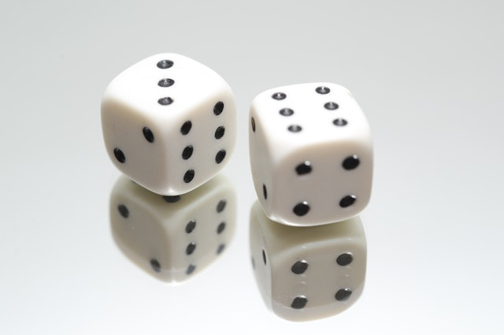

# Probability {#Probability}


```{r, child = if (knitr::is_html_output()) {'./introductions/16-Tools-Probability-HTML.Rmd'} else {'./introductions/16-Tools-Probability-LaTeX.Rmd'}}
```


## Introduction {#Chap16-Intro}

This chapter briefly discusses *probability*.
*Probability* quantifies the chance that a specific, unknown result (an 'event') from some random procedure will happen in the future.

Before discussing probability, some associated terms needs defining.


## Sample spaces and events {#SampleSpaceEvents}

A list of all distinct, possible results from one instance of a random procedure is called the *sample space*.
An *event* is any combination of these elements of the sample space.


::: {.definition #SampleSpace name="Sample space"}
The *sample space* is a list of all possible and distinct results after once administering a random procedure whose result is unknown beforehand. 
:::


<div style="float:right; width: 222x; border: 1px; padding:10px">

</div>


::: {.example #SampleSpaceDie name="Sample spaces"}
Consider rolling a fair, six-sided die (the procedure).
We do not know what face will be uppermost until we roll the die.

However, the *sample space* for this procedure can be listed: `r include_graphics("Dice/die1.png", dpi=1250)`, `r include_graphics("Dice/die2.png", dpi=1250)`, `r include_graphics("Dice/die3.png", dpi=1250)`, `r include_graphics("Dice/die4.png", dpi=1250)`, `r include_graphics("Dice/die5.png", dpi=1250)` and `r include_graphics("Dice/die6.png", dpi=1250)`.
These are all distinct results (no overlap), and the sample space is [*discrete*](#def:DiscreteData).
:::

Combinations of the results listed in the sample are usually of interest.
These are called *events*.


::: {.definition #Event name="Event"}
An *event* is any combination of the elements in the sample space.
:::


::: {.example #Events name="Events"}
Many *events* can be defined using the sample space in Example \@ref(exm:SampleSpaceDie), including:

* Rolling a `r include_graphics("Dice/die4.png", dpi=1250)`: 
  This event includes one element of the sample space: `r include_graphics("Dice/die4.png", dpi=1250)`.
* Rolling a even number: 
  This event includes three elements of the sample space: `r include_graphics("Dice/die2.png", dpi=1250)`, `r include_graphics("Dice/die4.png", dpi=1250)` and `r include_graphics("Dice/die6.png", dpi=1250)`
* Rolling a number larger than `r include_graphics("Dice/die2.png", dpi=1250)`: 
  This event includes four elements of the sample space:   `r include_graphics("Dice/die3.png", dpi=1250)`, `r include_graphics("Dice/die4.png", dpi=1250)`, `r include_graphics("Dice/die5.png", dpi=1250)` and `r include_graphics("Dice/die6.png", dpi=1250)`.
:::


::: {.example #SampleSpaceThrowing name="Sample spaces and events"}
Consider the distance you can throw a baseball (the procedure).
We do not know beforehand what distance your next throw will be, but we can describe the *sample space* for this procedure:
the distance could be anywhere between (say) 0 and 200 metres (and of course, some of those distances are very unlikely to occur...).
This sample space is [*continuous*](#def:ContinuousData).

Many *events* can be defined using this sample space; for example:

* Throwing more than 50 metres.
* Throwing between 10 and 40 metres.
* Throwing less than 20 metres.

Because the sample space is continuous, throwing an *exact* distance (such as *exactly* 10 metres) is technically not possible.
:::


Events of interest are often combinations of other events.
Two commpn ways to combine events are using **and** and **or**.

Consider two events called $A$ and $B$.
Then, $A$ **and** $B$ is the event where $A$ and $B$ are both true.
Also, $A$ **or** $B$ is the event where $A$ is true, $B$ is true, or are both true.


::: {.example #ComplicatedEvents name="Complicated events"}
Consider rolling a fair, six-sided die again (Example \@ref(exm:SampleSpaceDie)).
Suppose we define these two events:

* Event $A$: Roll a number divisible by 2.
* Event $B$: Roll a number divisible by 3.

Event $A$ comprises the events `r include_graphics("Dice/die2.png",dpi=1250)`, `r include_graphics("Dice/die4.png", dpi=1250)` and `r include_graphics("Dice/die6.png", dpi=1250)`.
Similarly, event $B$ comprises the events `r include_graphics("Dice/die3.png",dpi=1250)` and `r include_graphics("Dice/die6.png", dpi=1250)`.

Then, the event $A$ **and** $B$ includes all events in $A$ and *also* in $B$; that is,
$A$ **and** $B$ comprises the single event `r include_graphics("Dice/die6.png", dpi=1250)`

Event $A$ **or** $B$ include the events in $A$, the events in $B$, and those in both; that is,
$A$ **or** $B$ comprises the four events `r include_graphics("Dice/die2.png", dpi=1250)`, `r include_graphics("Dice/die3.png", dpi=1250)`, `r include_graphics("Dice/die4.png", dpi=1250)` and `r include_graphics("Dice/die6.png", dpi=1250)`.

:::


## Probability {#ProbabilityDefined}

Once an event is defined, a *probability* can be defined.


<div style="float:right; width: 222x; border: 1px; padding:10px">

</div>


::: {.definition #Probability name="Probability"}
A *probability* is a number between 0 and 1 inclusive (or between 0% and 100% inclusive) that quantifies the likelihood that a certain *event* will occur.
:::


A probability of zero (or 0%) means the event is 'impossible' (will *never* occur), and a probability of one (or 100%) means that the event is *certain* to happen (will always occur).
Most events have a probability between the extremes of 0% and 100%.


::: {.example #Probabilities name="Probabilities"}
Consider these cases:

* The probability of receiving negative rainfall is zero.
  It is impossible.
* The probability of receiving some rain in Sydney in the next decade is one.
  It is certain.
* The probability of receiving rain on any given day in Sydney is between 0 and 1 inclusive.
:::


The probability of an event occurring can be computed in different ways, including:

* the *classical approach* (Sect. \@ref(ProbClassical));
* the *relative frequency approach* (Sect. \@ref(ProbRelFreq)); and
* the *subjective approach* (Sect. \@ref(ProbSubjective)).


## Classical approach {#ProbClassical}

What is the probability of rolling a `r include_graphics("Dice/die4.png", dpi=1250)` on a die?
The sample space has six possible outcomes (see Example \@ref(exm:SampleSpaceDie)) that are *equally likely* to occur, and the event ('rolling a `r include_graphics("Dice/die4.png", dpi=1250)`') comprises just *one* of those.
Thus,

\[
   \text{Prob. of rolling a four}
   = \frac{\text{The number of results that are a 4}}{\text{The number of possible results}}
   = \frac{1}{6}.
\]
This approach to computing probabilities is called the  *classical* approach to probability, and is only appropriate when all events in the sample space are *equally likely*.


::: {.definition #ClassicalApproachToProbability name="Classical approach to probability"}
In the *classical approach to probability*, the probability of an event occurring is the number of elements of the sample space included in the event, divided by the total number of elements in the sample space, *when all outcomes are equally likely*.
:::

By this definition:

\[
   \text{Prob. of an event}
    = 
    \frac{\text{Number of equally-likely results in the event of interest}}{\text{Total number of equally-likely results}}
\]


::: {.example #SimpleProb name="Simple probabilities"}
Consider rolling a standard six-sided die.
With six equally-likely results (Example \@ref(exm:SampleSpaceDie)), each with probability $1/6$ (or 16.7%) of occurring, the probability of rolling a `r include_graphics("Dice/die4.png", dpi=1250)` is $1/6$.
:::
   

We can say that 'the probability of rolling a `r include_graphics("Dice/die4.png", dpi=1250)` is 1/6', or 'the probability of rolling a `r include_graphics("Dice/die4.png", dpi=1250)` is 0.1667'.
The answer can also be expressed as a *percentage* ('the probability of rolling a `r include_graphics("Dice/die4.png", dpi=1250)` is 16.7%').

The answer could also be interpreted as 'the *expected* proportion of rolls that are a `r include_graphics("Dice/die4.png", dpi=1250)` is 0.167'.

The chance of rolling a `r include_graphics("Dice/die4.png", dpi=1250)` in the future is 0.1667, but a roll of the die either will or will not produce a `r include_graphics("Dice/die4.png", dpi=1250)`... and we don't know which will occur.


::: {.example #ProbabilityOutcomes name="Describing probability"}
Consider rolling a standard six-sided die.

* The *probability* of rolling an even number is $3 \div 6 = 0.5$.
* The *percentage* of rolls that are expected to be even numbers is $3 \div 6 \times 100 = 50$%.
* The *odds* of rolling an even number is $3\div 3 = 1$.
:::

::: {.importantBox .important data-latex="{iconmonstr-warning-8-240.png}"}
*Probabilities* describe the likelihood that an event will occur *before* the outcome is known.
*Odds* and *proportions* can be used either *before* or *after* the outcome is known, provided the wording is correct.

For example, *proportions* describe how often an event has occurred *after* the outcome is known, and *expected proportions* describe the likelihood that an event will occur *before* the outcome is known.
:::


The following example may help explain.

::: {.example #ProbProportioOdds name="Probabilities, proportions and odds"}
*Before* a fair coin is tossed:
  
* The *probability* of throwing a head in the future is $1/2 = 0.5$.
* The *expected proportion* of heads in the future for many coin tosses is 0.5.
* The *odds* of throwing a head in the future is $1/1 = 1$.

If we have *already* tossed a coin 100 times and found 47 heads:
  
* The *proportion* of heads in the sample is $47/100 = 0.47$.
* The odds that we *threw* a head in the sample is $47/53 = 0.887$.

The 'probability that we just threw a head' makes no sense, because the event has already occurred.
:::
   


## Relative frequency approach {#ProbRelFreq}


<div style="float:right; width: 222x; border: 1px; padding:10px">

</div>


What is the probability that a new-born baby will be a boy?
The sample space could be listed as: *boy* and *non-boy*.
The classical approach could be used, since the sample space has two elements:  $1\div2 =  0.5$.
This approach is fine *only if* boys and non-boys are *equally likely* to be born.
But are they?


In 
`r if (knitr::is_latex_output()) {
   'Australia in 2021,'
} else {
   '[Australia in 2021](https://www.aihw.gov.au/reports/mothers-babies/australias-mothers-babies/data),'
}`
289,603 live births occurred, with 148,636 male births, 140,944 female borths, and 23 others (or 'not stated').
The *proportion* of boys born in 2021 is $148,636\div 289,603 = 0.513$, or about 51.3%.
An *estimate* of the probability that the next birth will be a boy is about 0.513 (or 51.3%).
This is the *relative frequency* approach to calculating probabilities: based on past data.

Using the relative frequency method can only ever produce an *approximate* probability as it is based on a limited number of observations.


::: {.definition #RelativeFrequencyApproachToProbability name="Relative frequency approach to probability"}
In the *relative frequency approach to probability*, the probability of an event is (approximately) the number of times the outcomes of interest has appeared in the past, divided by the number of 'attempts' in the past.
:::


::: {.example #RFProbability name="Relative frequency probability"}
Based on this information, the *odds* that a new baby will be a boy is *approximately* $0.513\div (1 - 0.513) = 1.053$.
According to the 
`r if (knitr::is_latex_output()) {
   'Australian Bureau of Statistics (ABS):'
} else {
   '[Australian Bureau of Statistics (ABS)](http:www.abs.gov.au/ausstats/abs@.nsf/0/B8865D71D84F5210CA2579330016754C?opendocument):'
}`

> The sex ratio for all births registered in Australia generally fluctuates around 105.5 male births per 100 female births.

This is close to the odds of 1.053 found above.
:::
         
      
::: {.thinkBox .think data-latex="{iconmonstr-light-bulb-2-240.png}"}
The data in Table \@ref(tab:SkipBreakfast2) come from a study of Iranian children aged 6--18 years old [@data:kelishadi2017:snack].\label{thinkBox:FindProbs}
Find the *probability* that a randomly chosen student will be:

* A female student.
* A female student who skipped breakfast.
* A female student, *if we already know* the child skipped breakfast.

`r if (knitr::is_latex_output()) '<!--'`
`r webexercises::hide()`
1.  $6640/13,486 = 49.2$%.
2:  $2383/13,486 = 17.7$%.
3:  $2383/4327 = 55.1$%.
`r webexercises::unhide()`
`r if (knitr::is_latex_output()) '-->'`
:::


```{r SkipBreakfast2}
Counts <- c(2383, 
            1944, 
            4257, 
            4902)
Gender <- c("Females", 
            "Males", 
            "Females", 
            "Males")
Breakfast <- c("Skip", 
               "Skip", 
               "Doesn't skip", 
               "Doesn't skip")

Brek <- xtabs(Counts ~ Gender + Breakfast)[, c(2, 1)]
Brek2 <- cbind(Brek, "Total" = rowSums(Brek))
Brek2 <- rbind(Brek2, "Total" = colSums(Brek2))

if( knitr::is_latex_output() ) {
  kable(Brek2,
        format = "latex",
        longtable = FALSE,
        booktabs = TRUE,
        align = c("r", "r", "r"),
        digits = 0,
        col.names = c("Skips breakfast", 
                      "Doesn't skip breakfast", 
                      "Total"),
        caption = "The number of Iranian children aged 6 to 18 who skip and do not skip breakfast" ) %>%
   kable_styling(font_size = 10) %>%
   column_spec(column = 4, 
               bold = TRUE) %>%
   row_spec(row = 3, 
               bold = TRUE) %>%
    row_spec(row = 2,
             hline_after = TRUE)
}

if( knitr::is_html_output() ) {
  out <- kable(Brek2,
        format = "html",
        longtable = FALSE,
        booktabs = TRUE,
        align = c("r", "r", "r"),
        digits = 0,
        col.names = c("Skips breakfast", 
                      "Doesn't skip breakfast", 
                      "Total"),
        caption = "The number of Iranian children aged 6 to 18 who skip and do not skip breakfast" )
  if ( knitr::is_html_output(excludes = "epub")) {
    column_spec(out, 
                column = 4, 
                bold = TRUE)
  } else {
    out
  }
   
}
```


## Subjective approach {#ProbSubjective}


<div style="float:right; width: 222x; border: 1px; padding:10px">

</div>


Many probabilities cannot be computed using the classical or relative frequency approach; for example, what is the probability that California will experience a Category 1 cyclone next year?
In this case, only a *subjective probability* can be given.

'Subjective' probabilities may be based on personal judgement or experience.
They can also be given by considering all the relevant issues that may impact the probability (and may, for example, be based on mathematical models that incorporate information from numerous inputs).
Depending on how these other issues are considered and combined, different individuals may give different subjective probabilities.

Weather forecasts are one example: they incorporate data from sea surface temperatures, local topography, air pressures, air temperatures and so on.
Different models use different inputs, and may combine these inputs differently to produce different (subjective) forecast probabilities.


::: {.definition #SubjectiveApproachToProbability name="Subjective approach to probability"}
In the *subjective approach to probability*, various factors are incorporated, perhaps subjectively, to determine the probability of an event occurring.
:::


::: {.example #SubjectiveProb name="Subjective probability"}
Many farmers, based on years of experience, can give a subjective probability of the chance of receiving rainfall in the coming month at their farm.
:::


::: {.example #SubjectiveProbElNino name="Subjective probability"}
During El `r readr::parse_character( c("Niño"), locale=locale(encoding="UTF-8"))` events, eastern Australia typically experiences drier-than-average winters and springs.
A report on the 
`r if (knitr::is_latex_output()) {
   "Australian Broadcasting Corporation's (ABC) news website"
} else {
  "[Australian Broadcasting Corporation's (ABC) news website](https://www.abc.net.au/news/2023-05-23/noaa-bom-el-nino-chances-explored/102341466)"
}`
stated that the Australian *Bureau of Meteorology* predicted a 50% probability of an El `r readr::parse_character( c("Niño"), locale=locale(encoding="UTF-8"))` event in 2023, while the American *National Oceanic and Atmospheric Administration* predicted a 90% chance of an El  `r readr::parse_character( c("Niño"), locale=locale(encoding="UTF-8"))` event in 2023.

Despite this '[both] agencies are looking at the same part of the Pacific Ocean' to make their predictions.
However, 'the US and Australia base their probability on different criteria'; these are subjective probabilities.
:::


::: {.thinkBox .think data-latex="{iconmonstr-light-bulb-2-240.png}"}
Which *approach* is best used to estimate a probability in these situations?\label{thinkBox:BestProbMethod}

1. The probability that your sporting team wins on the weekend.
2. The probability that a randomly-chosen person writes left-handed.
3. The probability that a King will be randomly chosen from a pack of cards?
4. The probability that Buderim receives more than 100mm of rain next May.

`r if (knitr::is_latex_output()) '<!--'`
`r webexercises::hide()`
1.  Subjective.
2. Relative frequency.
3. Classical.
4. Probably use the subjective method...
`r webexercises::unhide()`
`r if (knitr::is_latex_output()) '-->'`
:::


::: {.example #SimpleEvents name="Simple events"}
Consider rolling a standard six-sided die^[Note the language: two *dice*, but one *die*. *Dice* is plural.].
There are six equally-likely results (Example \@ref(exm:SampleSpaceDie)) each with probability $1/6$ (or 16.7%) of occurring.
The probability of rolling a `r include_graphics("Dice/die1.png", dpi=1250)`  *or* a `r include_graphics("Dice/die2.png", dpi=1250)` is $2/6$ (or 33.3%).
:::
   


## Independence {#Independence}

One important concept in probability is *independence*.
Two events are *independent* if the probability of one event happening is the same, whether or not the other event has happened.
For example, if you toss a coin, the probability of getting a head is the same whether you are sitting or standing.
That is, the result of a coin toss is *independent* of your position.


<div style="float:right; width: 222x; border: 1px; padding:10px">

</div>


::: {.definition #Independence name="Independence"}
Two events are *independent* if the probability of one event is the same, whether or not the other event has happened.
:::


::: {.example #IndependenceCards name="Independence"}
Consider drawing two cards from a fair pack (of 52 cards), *without* returning the first card.
For the *first* card, the sample space contains every card in the pack, and drawing any one card is as equally likely as drawing any other.
Since four cards are **Aces**, the probability of drawing an **Ace** on the first draw is 4/52 (using the classical approach).

If we drew an **Ace** for the first card, the probability of drawing an **Ace** for the *second* card is 3/51 (*three* **Aces** remain among the 51 remaining cards).
Alternatively, if we *don't* draw an **Ace** for the first card, the probability of drawing an **Ace** second time is 4/51 (*four* **Aces** remain among the 51 remaining cards).

That is, the probability of drawing an **Ace** for the second card *depends* on whether or not an **Ace** was drawn for the first card.
The two events 'Drawing an **Ace** for the first card' and 'Drawing an **Ace** for the second card' are *not independent* events.
:::


<iframe src="https://learningapps.org/watch?v=pbd3ekn3k22" style="border:0px;width:100%;height:800px" allowfullscreen="true" webkitallowfullscreen="true" mozallowfullscreen="true"></iframe>


## Summary {#Chap16-Summary}

At least three ways exist to compute probabilities:

* the **classical approach**, which requires all outcomes to be *equally likely*;
* the **relative frequency** approach; and 
* the **subjective approach**.

Two events are **independent** if the probability of one event is the same, whether or not other event has happened.


## Quick review questions {#Chap16-QuickReview}

::: {.webex-check .webex-box}
Suppose Event $A$ is defined as '*Rolling a `r include_graphics("Dice/die1.png", dpi=1250)` or a `r include_graphics("Dice/die2.png", dpi=1250)` on a fair die*'.
Also, suppose Event $B$ is defined as '*Rolling an even number on a die*'.

1. What is the best approach to computing the probability of Event $A$ occurring?\tightlist
`r if( knitr::is_html_output(exclude = "epub") ) {longmcq( c(
	answer = "The classical approach",
	"The relative frequency approach",
   "The subjective approach"))}`
2. What is the *probability* of Event $A$ occurring?  
`r if( knitr::is_html_output(exclude = "epub") ) {mcq( c(
	"1/6",
	answer = "2/6",
   "1/5",
   "2/5",
	"5/2",
	"5/1"))}`
3. True or false: Events $A$ and $B$ are *independent*.  
`r if( knitr::is_html_output(exclude = "epub") ) {torf(answer = FALSE )}`
:::


## Exercises {#ProbabilityExercises}


Selected answers are available in Sect. \@ref(ProbabilityAnswer).


::: {.exercise #ProbabilityThreeEvents}
Consider these three events about tossing a fair coin, then answer the questions that follow:
**Event 1** is 'I toss a **Head** on the first toss'; **Event 2** is 'I toss a **Tail** on the first toss'; and **Event 3** is 'I toss a **Head** on the second toss'.

1. True or false: **Event 1** and **Event 2** are *independent*.\tightlist  
`r if( knitr::is_html_output(exclude = "epub") ) {torf(answer = TRUE )}`
2. True or false: **Event 1** and **Event 3** are *independent*.
`r if( knitr::is_html_output(exclude = "epub") ) {torf(answer = TRUE )}`
3. The probability of **Event 3** is:  
`r if( knitr::is_html_output(exclude = "epub") ) {mcq( c(
	answer = "1/2",
	"1/1",
  "1/6",
	"It depends on the result of the first toss"))}`
:::


::: {.exercise #ProbabilityDie2}
1. Suppose I roll a standard six-sided die. \tightlist
   What is the *probability* that I will roll a number larger than 2?
`r if( knitr::is_html_output(exclude = "epub") ) {mcq( c(
	"0",
	"1/6",
	"2/6",
  "3/6",
  answer = "4/6",
	"5/6",
	"1"))}`
2. Suppose I roll a standard six-sided die. 
   What are the *odds* of rolling a number smaller than 6?
`r if( knitr::is_html_output(exclude = "epub") ) {mcq( c(
	"0",
	"1/6",
	"1/5",
  "5/6",
  "6/5",
  answer = "5",
	"5/6",
	"1"))}`

3. Suppose I roll a standard six-sided die.
   Suppose I then toss a coin.
   Is the result from the coin toss **independent** of what I rolled on the die?
`r if( knitr::is_html_output(exclude = "epub") ) {longmcq( c(
   "No: because there are six possible outcomes from rolling a die, but only two from tossing a coin",
   "Yes: because die was not rolled at the same time as the coin was tossed",
   answer = "Yes: what happens on the die won't change what happens on the coin",
   "No:   because the die was not rolled at the same time as the coin was tossed"))}`
4. What is the probability that I roll a number divisible by 2 on the die?
`r if( knitr::is_html_output(exclude = "epub") ) {mcq( c(
	"0",
	"1/6",
	"2/6",
  answer = "3/6",
  "4/6",
	"5/6",
	"1"))}`
5. What is the probability that I roll a number divisible by 2 **and** divisible by 3 on the die?
`r if( knitr::is_html_output(exclude = "epub") ) {mcq( c(
	"0",
	answer = "1/6",
	"2/6",
  "3/6",
  "4/6",
	"5/6",
	"1"))}`
:::


::: {.exercise #ProbabilityCards}
Suppose you have a well-shuffled, standard pack of 52 cards.

1. What is the *probability* that you will draw a **King**?
1. What are the *odds* that you will draw a **King**?
1. What is the *probability* that you will draw a picture card (**Ace**, **King**, **Queen** or **Jack**)?
1. What are the *odds* that you will draw a picture card (**Ace**, **King**, **Queen** or **Jack**)?
1. Suppose I draw two cards from the pack.
   Are the events 'Draw a **King** first' and 'Draw a **Queen** second' independent events? 
1. Suppose I draw one card from the pack and roll a six-sided die.
   Are the events 'Draw a **Jack** from the pack of cards' and 'Roll a `r include_graphics("Dice/die5.png", dpi=1250)` on the die' independent events? 
:::


::: {.exercise #AndrewsQuote}
On October 13, the American television programme *Nightline* interviewed Dr Richard Andrews, director of the California Office of Emergency Services. 
They discussed various natural disasters that were being predicted as a result of an El Nino. 
In the interview, Dr Andrews said:

> I listen to earth scientists talk about earthquake probabilities a lot and in my mind every probability is 50--50, either it will happen or it won't happen...

Explain why Dr Andrews is incorrect when he says that "every probability is 50--50". 
Give an example to show why he must be incorrect. 
(Based on a report in Chance News 6.12.)
:::


::: {.exercise #FirstNationStudents}
The data in Table \@ref(tab:EdTable) tabulates information about school children in Queensland in 2019 [@mypaper:Dunn:GLM-IEE].

1. What is the probability that a randomly chosen student is a first-nations student?
1. What is the probability that a randomly chosen student is in a government school?
1. Is the sex of the student approximately independent of whether the student is a first nations student, for students in government schools?
1. Is the sex of the student approximately independent of whether the student is a first nations student, for students in non-government schools?
1. Is the sex of the student approximately independent of the type of school, for female students?
1. Is the sex of the student approximately independent of the type of school, for male students?
1. Based on the above, what can you conclude from the data?
:::

```{r EdTable, echo=FALSE}
EdTable <- array( NA, dim = c(4, 2) )
rownames(EdTable) <- c("Females",
                       "Males",
                       "Females",
                       "Males")
colnames(EdTable) <- c("Number first nations students",
                       "Number non-first nation students")

EdTable[, 1] <- c(2540, 2734, 391, 362)
EdTable[, 2] <- c(21219, 22574, 9496, 9963)


if( knitr::is_latex_output() ) {
  knitr::kable(EdTable,
               format = "latex",
               booktabs = TRUE,
               align = "r",
               longtable = FALSE,
               format.args = list(big.mark = ","),
               escape = FALSE,
               caption = "The number of first nation and non-first nation students in various Queensland schools in 2019") %>%
     kable_styling(font_size = 10) %>%
    column_spec(column = 2, width = "30mm") %>%
    column_spec(column = 3, width = "30mm") %>%
     pack_rows("Government schools",                         
                start_row = 1, 
                end_row = 2, 
                bold = FALSE, 
                italic = TRUE) %>%
     pack_rows("Non-government schools",                         
                start_row = 3, 
                end_row = 4, 
                bold = FALSE, 
                italic = TRUE) %>%
    row_spec(0, bold = TRUE) 
}
if( knitr::is_html_output() ) {
  knitr::kable(EdTable,
               escape = TRUE,
               format = "html",
               booktabs = TRUE,
               align = "r",
               longtable = FALSE,
               caption = "The number of first nation and non-first nation students in various Queensland schools in 2019") %>%
     pack_rows("Government schools",                         
                start_row = 1, 
                end_row = 2, 
                bold = FALSE, 
                italic = TRUE) %>%
     pack_rows("Non-government schools",                         
                start_row = 3, 
                end_row = 4, 
                bold = FALSE, 
                italic = TRUE) %>%
    row_spec(0, bold = TRUE) 
}
```


::: {.exercise #IndependentEvents}
Are these pairs of two events likely to be *independent* or *not independent*? 
Explain.

1. 'I walk to work tomorrow morning', and 'Rain is expected tomorrow morning'.
1. 'A person smokes more than 10 cigarettes per week on average' and 'A person get lung cancer'.
1. 'It rains today' and 'My garden gets watered today'. 
:::


::: {.exercise #SensitivitySpecifity}

In disease testing, two keys aspects of the test are:

* *Sensitivity*:   the probability of getting a *positive* test result among people *who do* have the disease; and
* *Specificity*:  the probability of getting a *negative* test result among people *who do not* have the disease.

Both are important for understanding how well a test works in practice.
A certain test has a *sensitivity* of 0.99 and a *specificity* of 0.98.
Consider a group of 1000 people, 100 of whom have the disease and 900 who do not have the disease.
All the people are given the test.

1. Suppose the 100 people who *do* have a disease are tested. 
   How many would be expected to return a positive test result?
1. Suppose the 900 people who *do not* have a disease are tested. 
   How many would be expected to return a positive test result?
1. In total, how many positive tests would be expected from the 1000 people? 1. Consider those people who return a positve test result.
   What is the probability that one of these people actually has the disease?
:::


::: {.exercise #CoinOutcomes}
Consider the following argument:

> When I toss two coins, there are only three outcomes: a Head and a Head, a Tail and a Tail, or one of each. 
> So the probability of obtaining two Tails must be one-third.

The reasoning is incorrect. 
Explain *why*.
:::


::: {.exercise #JuryService}
Since my wife and I have been married, I have been called to jury service four times.
The latest notice reads: 'Your name has been selected at random from the electoral roll...'.

In the same length of time, my wife has *never* been called to jury service.
Do you think the selection process really is 'at random'?
Explain.
:::


<!-- QUICK REVIEW ANSWERS -->
`r if (knitr::is_html_output()) '<!--'`
::: {.EOCanswerBox .EOCanswer data-latex="{iconmonstr-check-mark-14-240.png}"}
**Answers to in-chapter questions:**

- Sect. \ref{thinkBox:FindProbs}:  1.  $6640/13,486 = 49.2$%. 2:  $2383/13,486 = 17.7$%. 3:  $2383/4327 = 55.1$%.
- Sect. \ref{thinkBox:BestProbMethod}: 1.  Subjective. 2. Relative frequency.
3. Classical. 4. Probably use the subjective method...
- \textbf{\textit{Quick Revision} questions:}
**1a.** Classical.
**1b.** 2/6.
**1c.** Relative frequency approach.
**1d.** True.

**2a.** False.
**2b.** True.
**2c.** It depends on what the first card was.

**3.** 3/6.
**4.** 5.
**5.** Yes: what happens on the die won't change what happens on the coin.
:::
`r if (knitr::is_html_output()) '-->'`


