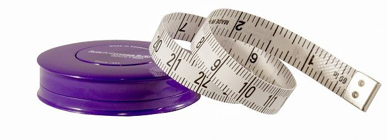
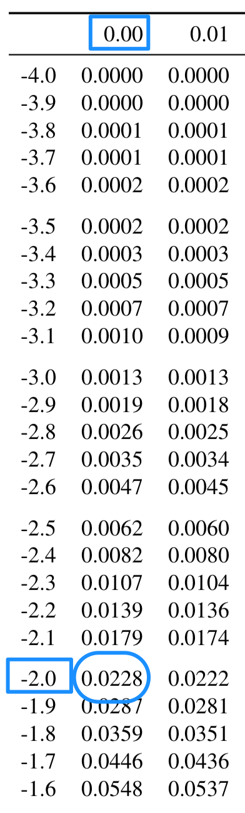
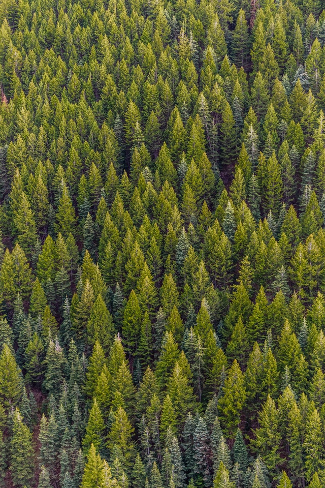

# Distributions and models {#SamplingDistributions}


```{block2, type="rmdobjectives"}
So far,
you have learnt to
ask a RQ, 
identify different ways of obtaining data,
design the study,
collect the data
describe the data,
summarise data graphically and numerically,
and
understand the decision-making process.

**In this chapter**,
you will learn about *distributions and models* to
describe the distribution of populations and samples.
You will learn to:

* describe distributions.
* describe populations using normal distributions.
* use $z$-scores to compute probabilities related to normal distributions.
* use $z$-scores to 'work backwards' from probabilities for normal distributions.

````


```{r echo=FALSE, fig.cap="", fig.align="center", fig.width=3, out.width="35%"}
SixSteps(5, "Distributions and models")
```


## Introduction {#Chap17-Intro}

In the [decision-making process used in statistics](#DecisionMaking),
an **assumption** is made about the population parameter,
and then,
based on this assumption,
the values **expected** from the sample statistics can be described.

The **expectations** about the sample statistic
are based around how 
the statistic 
(such as a sample mean, or a sample proportion, or a sample odds ratio)
is [*distributed*](#GraphsOneQuant):
what values it can take, and how often.

A *model* is used to describe this 
*sampling* [*distribution*](#GraphsOneQuant).
For example,
if I deal 15 cards,
the *statistic* could be 'the proportion of red cards in a hand of 15'.
The *model* would describe how often we would see 
0 red cards in 15, 1 red card in 15, 2 red cards in 15, ... up to 15 red cards in 15
(Sect. \@ref(MakingDecisionsInResearch)).

Under
[certain circumstances](#ValidityProportions),
many different statistics have a similarly-shaped distribution:
a [*bell-shaped (or normal) distribution*](#NormalDistributions).
We now study this distribution,
as it often is the basis for describing what values the
statistic can be **expected** to take,
based on the **assumption** about the population that we begin with.


## Distributions: An example


<!-- Text wrap from: https://stackoverflow.com/questions/43551312/wrap-text-around-plots-in-markdown -->
<!-- Trick from: https://blog.earo.me/2019/10/26/reduce-frictions-rmd/ -->
`r if (knitr::is_latex_output()) '<!--'`
```{r, echo=FALSE, out.width= "35%", out.extra='style="float:right; padding:10px"'}

```
`r if (knitr::is_latex_output()) '-->'`

To begin,
consider the heights of *all* Australian adult males.
Clearly,
the height of *all* Australian adult males is unknown:
no-one has ever, or could ever realistically, 
measure the height of all Australian adult males.
The 
[Australian Bureau of Statistics (ABS)](http://www.abs.gov.au/ausstats/abs@.nsf/Lookup/4338.0main+features212011-13),
however,
takes samples of Australians to compute estimates of the 
heights
and other measurements.

A model could be **assumed** for the heights of all Australian adult males.
This is a *theoretical* idea 
that might be a useful description of the heights of Australian adult males in the *population*.
Suppose a *model* for the heights of Australian adult males
is adopted that has:

* a symmetric distribution,
* with a *mean height* of 175 cm, and 
* a *standard deviation* of 7 cm. 

Then,
the *distribution* of the heights of Australian adult males may look like
Fig. \@ref(fig:HeightsModel).
That is,
most Australian adult males are between about 168 and 182cm,
and very few are taller than 196cm or shorter than 154cm.

```{r HeightsModel, echo=FALSE, results='hide', fig.cap="A model for the heights of Australian adult males", fig.align="center", fig.width=5, fig.height=3}
HT.mn <- 175
HT.sd <- 7

plot.norm(HT.mn, HT.sd, 
          xlab.name = "Height (in cm)", 
          zlim.lo = -4, 
	  zlim.hi = 4, 
          type = "",
          shade.lo.x = -5, 
	  shade.hi.x = 5 )
```

This model represents an idealised, or *assumed*,
picture of the histogram of the heights
of all Australian adult males in the *population*.
If this model is a accurate,
the distribution of heights in any *sample*, 
may be shaped a bit like this,
but *sampling variation* will exist.

Any one sample will look a bit different than this model,
but this model captures the general feel of the histogram from many of these samples.
For example,
`r if (knitr::is_latex_output()) {
   'Fig. \\@ref(fig:HeightsModelFig) shows a histogram from *one* sample of$n=100$ men (the online version has an animation), but every sample will be different.'
} else {
   'see the animation below, where many samples of $n=100$ men are taken.'
}`


```{r HeightsModelMovie, echo=FALSE, animation.hook="gifski", cache=TRUE, dev=if (is_latex_output()){"pdf"}else{"png"}}
 if (knitr::is_html_output()) {
   set.seed(6000)

  HT.mn <- 175
  HT.sd <- 7
  num.heights <- 100
  
  x <- seq( HT.mn - 4 * HT.sd, 
            HT.mn + 4 * HT.sd, 
	    length = 100)
  y <- dnorm( x,  
              mean = HT.mn, 
	      sd = HT.sd)
  
  
  NumSampleHists <- 20
  
  for (i in (1:(NumSampleHists + 1))){
    # HISTOGRAMS
    if ( i > 1 ){
      HT.data <- rnorm( num.heights, 
                        mean = HT.mn, 
			sd = HT.sd)
      
      out <- hist(HT.data, 
                  breaks = seq(150, 200, by = 5),
                  col = plot.colour,
                  border = plot.colour,
                  xlab = "Heights (in cm)",
                  axes = FALSE,
                  plot = TRUE,
                  xlim = range(x),
                  main = "Model for the heights of\nAustralian adult males",
                  sub = paste( "Sample number:", (i - 1)),
                  ylab = "")
      axis(side = 1)
    }
    
    
    # Plot the normal distribution
    if ( i == 1 ) {
      plot( range(x), c(0, 1),
            axes = FALSE,
            type = "n",
            main = "Model for the heights of\nAustralian adult males",
            xlab = "Height (in cm)",
            ylab = "")
      axis(side = 1)
      
      lines( (y/max(y)) ~ x,
             lwd = 2,
             col = "black")
    } else {
      y <- y/max(y) * max (out$counts)
      
      lines( y ~ x,
             lwd = 2,
             col = "black")
    }
    
    # Plot x-xaxis
    abline(v = 0,
           col = "grey",
           lwd = 2)
    # Plot the mean
    abline(h = 0,
           col = "grey",
           lwd = 2)
  }
}
```


<!-- ```{r HeightsModelMovie, echo=FALSE, fig.cap="The model for heights", fig.align="center"} -->
<!--  htmltools::tags$iframe(title = "The model for heights of Australian adult males", src = "./Animations/HeightsModelMovie.html", frameborder=0, height=450, width=350)  -->
<!-- ``` -->

```{r HeightsModelFig, echo=FALSE, fig.align="center", fig.width=5, fig.height=4, fig.cap="The model for heights of Australian adult males, plus the histogram from one specific sample if size $n=100$ of Australian adult males" }

if (knitr::is_latex_output()) {
   set.seed(6000)

  HT.mn <- 175
  HT.sd <- 7
  num.heights <- 100
  
  x <- seq( HT.mn - 4 * HT.sd, 
            HT.mn + 4 * HT.sd, 
	    length = 100)
  y <- dnorm( x,  
              mean = HT.mn, 
	      sd = HT.sd)
  
  
  NumSampleHists <- 10
  
  for (i in (5:5)){
    # HISTOGRAMS
    if ( i > 1 ){
      HT.data <- rnorm( num.heights, mean=HT.mn, sd=HT.sd)
      
      out <- hist(HT.data, 
                  breaks = seq(150, 200, by = 5),
                  col = plot.colour,
                  border = plot.colour,
                  xlab = "Heights (in cm)",
                  axes = FALSE,
                  plot = TRUE,
                  xlim = range(x),
                  main = "Model for the heights of\nAustralian adult males",
                  sub = "One sample of size 100",
                  ylab = "")
      axis(side =1 )
    }
    
    
    # Plot the normal distribution
    if ( i == 1 ) {
      plot( range(x), c(0, 1),
            axes = FALSE,
            type = "n",
            main = "Model for the heights of\nAustralian adult males",
            xlab = "Height (in cm)",
            ylab = "")
      axis(side = 1)
      
      lines( (y/max(y)) ~ x,
             lwd = 2,
             col = "black")
    } else {
      y <- y/max(y) * max (out$counts)
      
      lines( y ~ x,
             lwd = 2,
             col = "black")
    }
    
    # Plot x-xaxis
    abline(v=0,
           col="grey",
           lwd=2)
    # Plot the mean
    abline(h=0,
           col="grey",
           lwd=2)
  }
}
```


The model of heights
has approximately a bell-shape:
that is,
most values are near the average height,
but a small number of men are very tall or very short.
A bell-shaped distribution is formally called a
**normal distribution**\index{normal distribution}
or a 
**normal model**.
A normal distribution is a way of *modelling* the population.
			
A *model* is a theoretical or ideal concept.
In the same way that a model skeleton isn't 100% accurate (wire joins?)
and certainly not exactly like *your* skeleton,
it suitably approximates reality.
None of us probably have a skeleton *exactly* like the model,
but the model is still useful and helpful.

Likewise,
no variable has *exactly* a normal distribution,
but the model is still useful and helpful.
The model is a *theoretical* way of describing 
the distribution in the population.


## Normal distributions {#NormalDistribution}


<!-- Text wrap from: https://stackoverflow.com/questions/43551312/wrap-text-around-plots-in-markdown -->
<!-- Trick from: https://blog.earo.me/2019/10/26/reduce-frictions-rmd/ -->
`r if (knitr::is_latex_output()) '<!--'`
```{r, echo=FALSE, out.width= "35%", out.extra='style="float:right; padding:10px"'}

```
`r if (knitr::is_latex_output()) '-->'`

A suitable model for the heights 
of *all* Australian adult males may be described
(Fig. \@ref(fig:HeightsModel)) as having:

* An approximately normal shape,
* With a mean height of $\mu=175$ cm, and 
* A standard deviation of $\sigma=7$ cm. 

This model for the heights of Australian adult males
is a *theoretical idea* about the unknown *population*:
it does not represent any particular sample of data.
The model can be thought of as an 'average' of the histograms of the data
from many samples.

Indeed,
if this model turns out to be poor at describing what appears in these many samples,
the [*parameters*](#StatisticsAndParameters) of the model
(that is,
the values of $\mu$ and $\sigma$)
can be adjusted
so the model *does* describe the sample data well.

In fact, 
sample evidence suggests that the average height of Australians has been increasing
[@loesch2000secular]
and so the mean of the model may need to be changed at various times to 
remain a good model for heights of Australian adult males.


## Standardising ($z$-scores) {#z-scores}

Since many statistics have a normal distribution
(under certain circumstances),
the [68--95--99.7 rule](#def:EmpiricalRule)
can be used to understand the distribution of sample statistics.

Recall that the [68--95--99.7 rule](#def:EmpiricalRule)
states that,
for *any* normal distribution 
(Fig. \@ref(fig:HusbandHistNormalShadeEmpirical)):

* 68% of values lie within 1 standard deviation of the mean;
* 95% of values lie within 2 standard deviations  of the mean; and
* 99.7% of values lie within 3 standard deviations  of the mean.

These percentages only depend on how many 
standard deviations ($\sigma$)
a value ($x$) is from the mean ($\mu$).
This information can be used to learn about
how values are distributed.


   


<!-- Text wrap from: https://stackoverflow.com/questions/43551312/wrap-text-around-plots-in-markdown -->
<!-- Trick from: https://blog.earo.me/2019/10/26/reduce-frictions-rmd/ -->
`r if (knitr::is_latex_output()) '<!--'`
```{r, echo=FALSE, out.width= "35%", out.extra='style="float:right; padding:10px"'}

```
`r if (knitr::is_latex_output()) '-->'`


```{example HeightsExer1, name="The 68--95--99.7 rule"}
Suppose heights of Australian adult males
have a mean of $\mu=175$cm,
and a standard deviation of $\sigma=7$cm,
and (approximately) follow a normal distribution.
Using this model, 
what proportion of Australian adult men are *taller* 
than 182cm?
  
Drawing the situation is helpful
(Fig. \@ref(fig:HtsExer1)).
Notice that $175 + 7 = 182$cm is one standard deviation *above* the mean.
We know that 68% of values are within one standard deviation of the mean,
so that 32% are outside that range (smaller or larger)
(Fig. \@ref(fig:HtsExer1)).
Hence,
16% are taller than one standard deviation above the mean,
so the answer is about 16%.
(Another 16% are less than one standard deviation *below* the mean, 
  or less than
$175 - 7 = 168$cm in height.)

Again,
the percentages only depend on 
how many standard deviations ($\sigma$)
the value ($x$) is from the mean ($\mu$),
and not the actual values of $\mu$ and $\sigma$.
```


```{r HtsExer1, echo=FALSE, fig.cap="What proportion of Australian adult males are taller than 182cm?", fig.align="center", fig.width=5, fig.height=2.5}
plot.norm(HT.mn, HT.sd, 
          xlab.name = "Height (in cm)", 
          zlim.lo = -4, 
	  zlim.hi = 4, 
          type = "",
          shade.lo.x = 182, 
	  shade.hi.x = Inf )
plot.norm(HT.mn, HT.sd, 
          xlab.name = "Height (in cm)", 
          zlim.lo = -4, 
	  zlim.hi = 4, 
          type = "",
          shade.lo.x = -Inf, 
	  shade.hi.x = 168, 
          new=FALSE )
text(2.5, 0.1, "16%")
text(-2.5, 0.1, "16%")
segments(-1, 0, -1, 
         dnorm(-1), 
         col = grey(0.5))
text(0, 0.1, "68%")

```


   
```{example HeightsExer2, name="The 68--95--99.7 rule"}
Suppose heights of Australian adult males
have a mean of $\mu=175$cm,
and a standard deviation of $\sigma=7$cm,
and (approximately) follow a normal distribution.
Using this model, what proportion are *shorter*
than 161cm?
Again, drawing the situation is helpful
(Fig. \@ref(fig:HtsExer2)).

Since $175 - (2\times 7) = 161$,
then 161cm is two standard deviation *below* the mean.
Since 95% of values are within two standard deviation of the mean,
5% are outside that range (half smaller, half larger; see Fig. \@ref(fig:HtsExer2)),
so that 2.5% are *shorter* than 161cm.
(Another 2.5% are *taller* than $175 + 14 = 189$cm.)
```


```{r HtsExer2, echo=FALSE, fig.cap="What proportion of Australian adult males are shorter than 161cm?", fig.align="center", fig.width=5, fig.height=2.5}
plot.norm(HT.mn, HT.sd, 
          xlab.name = "Height (in cm)", 
          zlim.lo = -4, 
	  zlim.hi = 4, 
          type = "",
          shade.lo.x = -Inf, 
	  shade.hi.x = 161 )
plot.norm(HT.mn, HT.sd, 
          xlab.name = "Height (in cm)", 
          zlim.lo = -4, 
	  zlim.hi = 4, 
          type = "",
          shade.lo.x = 189, 
	  shade.hi.x = Inf, 
          new = FALSE )
text(3, 0.1, "2.5%")
text(-3, 0.1, "2.5%")
segments(2, 0, 2, 
         dnorm(2), 
	 col = grey(0.5))
text(0, 0.1, "95%")

```

Again,
the percentages only depend on 
how many standard deviations ($\sigma$)
the value ($x$) is from the mean ($\mu$).
The number of standard deviations that an observation is from the mean
is called a *$z$-score*.
A $z$-score is computed using

\[
   z = \frac{ x - \mu}{\sigma}.
\]
Converting values to $z$-scores is called *standardising*.


 ```{definition zScore, name="$z$-score"}
A *$z$-score* measures how many standard deviations a value is from the mean.
In symbols:

\begin{equation}
   z = \frac{x - \mu}{\sigma},
   (\#eq:zscores)
\end{equation}
where $x$ is the value, 
$\mu$ is the mean of the distribution, 
and 
$\sigma$ is the standard deviation of the distribution.
 ```
 
 
 
```{example HeightsExer3, name="$z$-scores"}
In Example \@ref(exm:HeightsExer1),
the $z$-score for a height of 182cm is 

\[
   z = \frac{x-\mu}{\sigma} = \frac{182 - 175}{7} = 1,
\]
one standard deviation *above* the mean.

In Example \@ref(exm:HeightsExer2),
the $z$-score for a height of 161cm is

\[
   z = \frac{x-\mu}{\sigma} = \frac{161 - 175}{7} = -2,
\]
two standard deviations *below* the mean
(a *negative* $z$-score means the value is *below* the mean).
```


The $z$-score is the *number of standard deviations 
the observation is away from the mean*.
The $z$-score is also called the *standardised value*
or *standard score*,
and is calculated using Equation \@ref(eq:zscores).
Note that:

* $z$-scores are negative for observations *below* the mean,
  and positive for observations *above* the mean.
* $z$-scores are numbers without units (that is, it is not in kg, or cm, etc.).


```{example EmpiricalRuleZ,  name="The 68--95--99.7 rule"}
Consider the model for the heights of Australian adult males: 
a normal distribution,
mean $\mu=175$, standard deviation $\sigma=7$
(Fig.&nbsp;\@ref(fig:HeightsModel)).

Using this model:

* The mean is zero standard deviations from the mean: $z=0$.
* 168cm and 182cm are one standard deviation from the mean:
  $z=-1$ and $z=1$ respectively.
* 161cm and 189cm are two standard deviations from the mean:
  $z=-2$ and $z=2$ respectively.
* 154cm and 196cm are three standard deviations from mean:
  $z=-3$ and $z=3$ respectively.

```


## Approximating areas using the 68--95--99.7 rule

Suppose again that heights of Australian adult males
have a mean of $\mu=175$cm,
and a standard deviation of $\sigma=7$cm,
and (approximately) follow a normal distribution
(Fig.&nbsp;\@ref(fig:HtsEmpirical)).

```{example Height160, name="Normal distribution areas"} 
Using this model, 
what proportion of men are 
*shorter* than 160cm?
```


Again, 
drawing the situation is helpful
(Fig. \@ref(fig:HtsExer3)).

```{r HtsEmpirical, echo=FALSE, fig.cap="The empirical rule and heights of Australian adult males", fig.align="center", fig.width=4.5, fig.height=3}
plot.normZ(HT.mn, HT.sd, 
           xlab.name = "Heights (in cm)", 
           zlim.lo = -4, 
           zlim.hi = 4, 
           type = "",
           shade.lo.z = -5, 
           shade.hi.z = -5 )
text( x = seq(-3, 3, by = 1), 
      y = -0.05, 
      cex = 0.8,
      srt = -25,
      labels = c("154cm", "161cm", "168cm", "175cm", "182cm", "189cm", "196cm"),
      pos = 1)
```


```{r HtsExer3, echo=FALSE, fig.cap="What proportion of Australian adult males are shorter than 160cm?", fig.align="center", fig.width=4.5, fig.height=3}
plot.normZ(HT.mn, HT.sd, 
           xlab.name = "Heights (in cm)", 
           zlim.lo = -4, 
           zlim.hi = 4, 
           type = "",
           shade.lo.z = -5, 
           shade.hi.z = -2.14 )
text( x = seq(-3, 3, by = 1), 
      y = -0.05, 
      cex = 0.8,
      srt = -25,
      labels = c("154cm", "161cm", "168cm", "175cm", "182cm", "189cm", "196cm"),
      pos = 1)

lines( x = c(-2.14, -2.14),
       y = c(0, 0.15),
       col = "grey")
text(x = -2.14, 
     y = 0.15,
     pos = 3,
     cex = 0.9,
     labels = "160 cm")
```


Proceeding as before,
we need to ask 'How many standard deviation below the mean is 160cm?'
Using Equation \@ref(eq:zscores) to compute the $z$-score,
$160$cm is 

\[
   z = \frac{160 - 175}{7} = -2.14,
\]
or $2.14$ standard deviations, *below* the mean.
What percentage of observations are less than this?
This case is not covered by the [68--95--99.7 rule](#def:EmpiricalRule),
though we can use the [68--95--99.7 rule](#def:EmpiricalRule) to make some *rough estimates*.

About 2.5% of observations are less than 2 standard deviations below the mean
(Example \@ref(exm:HeightsExer1));
that is, about 2.5% of men are shorter than 161cm.

So the percentages males even shorter than 161cm 
(that is, further into the tail of the distribution),
will be *less* than 2.5%.
While we don't know the probability exactly,
it will be smaller than 2.5%.

Estimates in this way are crude, 
but often serviceable.
However,
better estimates of 'areas under the normal curve'
are found using tables compiled for this very purpose.

These tables are in 
`r if ( knitr::is_html_output()) { 'Appendix \\@ref(ZTablesOnline).'} else {'Appendices \\@ref(ZTablesNEG) and \\@ref(ZTablesPOS).'}`
'Percentages' under a normal curve are also called 
'areas' under the normal curve.
The *total area* under a normal curve is one (or 100%),
since it represent all possible values that could be observed.

We now learn how to use these tables,
then come back to
Example \@ref(exm:Height160).


## Exact areas from normal distributions

Areas under normal distributions
can be found using:

* [**online** tables](#UsingOnlineZTables), or 
* [**hard copy** tables](#UsingZTables).


 
### Using the online tables {#UsingOnlineZTables}

The online tables 
work differently to the hard-copy tables.
Consider the same example again:
the percentage of observations *smaller than* $z = -2$.

Like the hard-copy tables,
the online
tables `r if (knitr::is_html_output()){'(Appendix \\@ref(ZTablesOnline))'}` work 
with two decimal places,
so consider the $z$-score as $z=-2.00$.
In the tables,
enter the value `-2` in the search region just under the column labelled `z.score`
(see the animation below).
After pressing `Enter`,
the answer is shown in the column headed `Area.to.left`:
the probability of finding a $z$-score less than $-2$ is 0.0228, or about 2.28\%.


```{r, echo=FALSE}
htmltools::tags$video(src ="./Movies/HaveZFindArea.m4v", 
                      width = "500", 
                      autoplay = "false", 
                      controls = "controls", 
                      loop = "loop", 
                      style = "padding:2px;border-top:1px gray;border-bottom:1px gray;")
```

Using either the hard-copy or online tables gives an
answer of about 2.28%.
Using the [68--95--99.7 rule](#def:EmpiricalRule),
the answer we obtained was $2.5$%.
Recall that the 68--95--99.7 rule is an *approximation* only.


### Using the hard-copy tables {#UsingZTables}

To demonstration the use of the normal distribution tables,
consider the percentage of observations *smaller than* $z = -2$ 
(that is, two standard deviations *below* the mean)
in a normal distribution.

The hard-copy
tables `r if (knitr::is_latex_output()){'(Appendices \\@ref(ZTablesPOS) and \\@ref(ZTablesPOS))'}` work 
with $z$-scores to two decimal places,
so consider the $z$-score as $z=-2.00$.
On the tables,
find $-2.0$ in the left margin of the table,
and find the second decimal place (in this case, 0)
in the top margin of the table
(Fig. \@ref(fig:TablesExampleLaTeX)):
where these intersect is the area (or probability) *less than* the $z$-score.
So the probability of finding a $z$-score less than $z = -2$ is 0.0228, or about 2.28\%.
(The online tables work differently.)


```{r TablesExampleLaTeX, echo=FALSE, fig.align="center", out.width='20%', fig.cap='Using the hard-copy tables to compute the probability that $z$ is less than $-2$'}

```

```{block2, type="rmdimportant"}
The tables give the area to the *left* of the $z$-score that is looked up.
```


## Comparing exact and approximate areas


Armed with knowledge of obtaining exact areas,
let's return to
Example \@ref(exm:Height160):


```{example, NornmalDistribution, name="Using normal distributions"}
Suppose heights of Australian adult males
have a mean of $\mu=175$cm,
and a standard deviation of $\sigma=7$cm,
and (approximately) follow a normal distribution.
Using this model, what proportion are *shorter* 
than 160cm?
```


The general approach to computing probabilities
from normal distributions is:

* **Draw a diagram**: 
  Mark on 160&nbsp;cm
  (Fig. \@ref(fig:HtsExer3)).
* **Shade** the required region of interest: 
  'less than 160&nbsp;cm tall'
  (Fig.&nbsp;\@ref(fig:HtsExer3)).
* **Compute** the $z$-score using Equation \@ref(eq:zscores).
* **Use** the $z$ tables in 
`r if ( knitr::is_html_output()) { 'Appendix \\@ref(ZTablesOnline).'} else {'Appendices \\@ref(ZTablesNEG) and \\@ref(ZTablesPOS).'}`
* **Compute** the answer.

The number of standard deviations
that 160cm is from the mean is
using Equation \@ref(eq:zscores):

\begin{align*}
  z &= \frac{x-\mu}{\sigma} \\[3pt]
    &= \frac{160-175}{7}
    = \frac{-15}{7} = -2.14.
\end{align*}
That is,
160cm is 2.14 standard deviations *below* the mean, 
so use $z=-2.14$ in the tables.
The diagram at the top of the tables reminds us 
that this is 
the probability (area) that the value of $z$ is *less* than $z=-2.14$
(Fig. \@ref(fig:HtsExer3)).
The probability of finding an Australian man less than 160cm tall 
is about 1.6%.

More complicated questions can be asked too,
as shown in the next section.


## Examples using $z$-scores {#Z-Score-Forestry}

<!-- Text wrap from: https://stackoverflow.com/questions/43551312/wrap-text-around-plots-in-markdown -->
<!-- Trick from: https://blog.earo.me/2019/10/26/reduce-frictions-rmd/ -->
`r if (knitr::is_latex_output()) '<!--'`
```{r, echo=FALSE, out.width= "30%", out.extra='style="float:right; padding:10px"'}

```
`r if (knitr::is_latex_output()) '-->'`


```{example NormalTrees, name="Normal distributions"}
@data:Aedo1997:softwood
simulated mechanized forest harvesting systems
[@DevoreBerk2007].

As part of their study,
they assumed that the specific trees in their study would vary in diameter,
with

* a normal distribution; with
* a mean of $\mu=8.8$ inches; and
* a standard deviation of $\sigma=2.7$ inches.

Using this model,
what is the probability that a tree has a diameter *greater than*  than 6 inches?
```


Follow the steps identified earlier:

* **Draw** a normal curve, and mark on 6 inches (Fig. \@ref(fig:ZDBH1), top panel).
* **Shade** the region corresponding to 'greater than 6 inches' (Fig. \@ref(fig:ZDBH1), bottom panel).
* **Compute** the $z$-score using Eq. \@ref(eq:zscores).
  Here, $x=6$, $\mu=8.8$, $\sigma=2.7$, so
  $\displaystyle z = (6 - 8.8)/2.7 = -2.8/2.7 = -1.04$
  to two decimal places.
* **Use** tables:
  The probability of a tree diameter *shorter* than 6 inches is $0.1492$. 
  (The tables always give area *less* than the value of
  $z$ that is looked up.)
* **Compute** the answer:
  Since the *total* area under the normal distribution is one,
  the probability of a tree diameter 
  *greater* than 6 inches is $1 - 0.1492 = 0.8508$,
  or about 85%.


```{r ZDBH1, echo=FALSE, fig.cap="What proportion of tree diameters are greater than 6 inches?", fig.align="center", fig.width=5}
DBH.mn <- 8.8
DBH.sd <- 2.7

par(mfrow = c(2, 1))

z <- seq( -3.5, 3.5, 
          length = 250)
zy <- dnorm( z, 
             mean = 0, 
	     sd = 1)

mu <- DBH.mn
sigma <- DBH.sd
x <- z * sigma + mu

plot.norm(mu, sd = sigma,
          width = 4, 
	  height = 4, 
	  xlab.name = "Tree diameters (inches)",   
	  shade.lo.x = 100,
	  shade.hi.x = 100,
          type = "",
          round.dec = 2,
          main = "Draw")
   

plot.norm(mu, sd=sigma,
          width = 4, 
	  height = 4,
          xlab.name = "Tree diameters (inches)",
          shade.hi.x = Inf,
          shade.lo.x = 6,
          type = "",
          round.dec = 2,
          main = "Shade")

```


```{block2, type="rmdimportant"}
The normal-distribution tables in 
the Appendix
**always** provide area to the **left**
of the $z$-scores that is looked up.
Drawing a picture of the situation is important:
it helps visualise how to get the answer from what the table give us.

Remember: The *total* area under the normal distribution is one.
```


```{lemma DrawDiagrams, name="Drawing diagrams"}
Match the diagram in 
Fig. \@ref(fig:MatchDiagrams)
with the meaning 
for the tree-diameter model (recall: $\mu=8.8$ inches):

1. Tree diameters greater than 11 inches.
2. Tree diameters *between* 6 and 11 inches.
3. Tree diameters less than 11 inches.
4. Tree diameters between 3 and 6 inches.

```

```{block2, type="fold"}
1: B; 2: C; 3: D; 4: A.
```


```{r MatchDiagrams, echo=FALSE, fig.cap="Match the diagram with the description", out.width="80%", fig.align="center", fig.width=5.5}
par( mfrow=c(2, 2))

plot.norm(mu, sd = sigma, 
          width = 4.5, 
	  height = 3.5,
          xlab.name = "Tree diameters (inches)",
          shade.lo.x = 3,
          shade.hi.x = 6,
          round.dec = 2,
          main = "A")

plot.norm(mu, sd = sigma,
          width = 4.5, 
	  height = 3.5,
          xlab.name = "Tree diameters (inches)",
          shade.hi.x = Inf,
          shade.lo.x = 11,
          round.dec = 2,
          main = "B")

plot.norm(mu, sd = sigma,
          width = 4.5, 
	  height = 3.5,
          xlab.name = "Tree diameters (inches)",
          shade.hi.x = 11,
          shade.lo.x = 6,
          round.dec = 2,
          main = "C")

plot.norm(mu, sd = sigma,
          width = 4.5, 
	  height = 3.5,
          xlab.name = "Tree diameters (inches)",
          shade.hi.x = 11,
          shade.lo.x = -2,
          round.dec = 2,
          main = "D")
```


```{example NormalTrees2, name="Normal distributions"}
Using the model for tree diameters
in Example \@ref(exm:NormalTrees)
[@data:Aedo1997:softwood],
what is the probability that a tree has a diameter
*between* 6 and 11 inches?
```

First, **draw** the situation, and **shade** 'between 6 and 10 inches'
(Fig. \@ref(fig:ZDBH2)).
Then, 
**compute** the $z$-scores for *both* tree diameters:

\begin{align*}
       \text{6 inches: }  &z = \displaystyle \frac{6 - 8.8}{2.7} = -1.04;\\[6pt]
       \text{11 inches: } &z = \displaystyle \frac{11 - 8.8}{2.7} = 0.81.
\end{align*}
Table B can then be used
to find the area to the *left* of $z = -1.04$,
and also
the area to the *left* of $z = 0.81$.
However,
neither of these provide the area
*between*
$z = -1.04$ and $z = 0.81$
(Fig.&nbsp;\@ref(fig:ZDBH3)).

```{r ZDBH2, echo=FALSE, fig.cap="What proportion of tree diameters are between 6 and 11 inches?", fig.align="center", fig.height=2.5, fig.width=5}

z <- seq(-3.5, 3.5, 
         length = 250)
zy <- dnorm( z, mean = 0, sd = 1)

mu <- 8.8
sigma <- 2.7
x <- z * sigma + mu

plot.norm(mu, sd = sigma, 
          width = 5, 
	  height = 4,
          xlab.name = "Tree diameters (in inches)",
          shade.hi.x = 11,
          shade.lo.x = 6,
          type = "",
          round.dec = 2,
          main = "Shade")	
```


               
```{r ZDBH3, echo=FALSE, fig.cap="What proportion of tree diameters are between 6 and 11 inches? The two shaded areas given are what we find by using the tables with $z=-1.04$ and $z=0.81$, but neither give us the area we are seeking", fig.align="center", fig.width=5}

par( mfrow = c(2,1))

plot.norm(mu, sd = sigma,
          width = 5, 
	  height = 4,
          xlab.name = "Tree diameters (in inches)",
          shade.hi.x = 6,
          shade.lo.x = -Inf,
          round.dec = 2,
          main = "What the tables give\nfor z = -1.04")

plot.norm(mu, sd = sigma,
          width = 5, 
	  height = 4,
          xlab.name = "Tree diameters (in inches)",
          shade.hi.x = 11,
          shade.lo.x = -Inf,
          round.dec = 2,
          main = "What the tables give\nfor z = 0.81")
```


Looking carefully at the areas from the tables and the area sought,
that area between the two $z$-scores is

\[
		0.7910 - 0.1492 = 0.6418;
\]
`r if (knitr::is_latex_output()) {
   'see Fig. \\@ref(fig:NormalMiddleFig) (the online version has an animation).'
} else {
   'see the animation below.'
}`
The probability that a tree has a diameter between 6 and 11 inches is about 0.6418,
or about 64%.


```{r echo=FALSE, animation.hook="gifski", cache=TRUE, dev=if (is_latex_output()){"pdf"}else{"png"}}
  RT.mn <- 8.8
  RT.sd <- 2.7
  
  lower <- 6
  upper <- 11
  
if (knitr::is_html_output()){
  for (i in (1:4)){
    if ( i == 1 ){
      plot.norm(RT.mn, sd = RT.sd, 
                width = 5, 
		height = 4,
                shade.col = "azure2",
                xlab.name = "Tree diameter (inches)",
                shade.lo.x = lower,
                shade.hi.x = upper,
                round.dec = 2,
                main = "Between 6 and 11 inches")	
    }  
    if ( i == 3 ){
      plot.norm(RT.mn, sd = RT.sd, 
                width = 5, height = 4,
                shade.col = "azure2",
                xlab.name = "Tree diameter (inches)",
                shade.lo.x = -100,
                shade.hi.x = upper,
                round.dec = 2,
                main = "From Tables: Less than 11 inches: 0.7910")	
      plot.norm(RT.mn, sd = RT.sd, 
                width = 5, 
		height = 4,
                new = FALSE,
                xlab.name = "Tree diameter (inches)",
                shade.lo.x = -100,
                shade.hi.x = lower,
                round.dec = 2,
                main = "From Table B.2: Less than 11 inches: 0.7910")	
    }  
    if ( i == 2 ){
      plot.norm(RT.mn, sd = RT.sd, 
                width = 5, 
		height = 4,
                xlab.name = "Tree diameter (inches)",
                shade.lo.x = -100,
                shade.hi.x = upper,
                round.dec = 2,
                main = "From Tables: Less than 11 inches: 0.7910")	
    }  
    if ( i == 4 ){
      plot.norm(RT.mn, sd = RT.sd, 
                width = 5, 
		height = 4,
                shade.col = "azure2",
                xlab.name = "Tree diameter (inches)",
                shade.lo.x = lower,
                shade.hi.x = upper,
                round.dec = 2,
                main = "Between 6 and 11 inches: 0.6418")	
    }  
  }
}
```


```{r NormalMiddleFig, echo=FALSE, fig.align="center", fig.width=6, fig.cap="Finding the area (probability) between two $z$-scores" }
if (knitr::is_latex_output()){
       plot.norm(RT.mn, sd = RT.sd, 
                 width = 5, 
		 height = 4,
                 shade.col = "azure2",
                 xlab.name = "Tree diameter (inches)",
                 shade.lo.x = -100,
                 shade.hi.x = upper,
                 round.dec = 2,
                 main = "From Tables: Less than 11 inches: 0.7910")	
}
```


`r if (knitr::is_html_output()){
  'Click on the hotspots in the following image, to see what the areas under the normal curve mean.' 
}`

<iframe src="https://h5p.org/h5p/embed/495431" width="1090" height="897" frameborder="0" allowfullscreen="allowfullscreen"></iframe><script src="https://h5p.org/sites/all/modules/h5p/library/js/h5p-resizer.js" charset="UTF-8"></script>


## Unstandardising: Working backwards

Using the model for tree diameters
in Example \@ref(exm:NormalTrees)
[@data:Aedo1997:softwood] again,
suppose now
the diameters of the *smallest* 10% of trees needs to be identified.
What are these diameters?

```{example MNormalBackwards, name="Normal distributions backwards"}
Consider again the trees study. The tree diameters can be modelled with

* a normal distribution; with
* a mean of $\mu=8.8$ inches; and
* a standard deviation of $\sigma=2.7$ inches.

Identify the diameters of the *smallest* 10% of trees,
```


This is a different problem than before;
previously, 
the *tree diameter* was known,
so a $z$-score could be computed,
and hence a probability
(Fig.&nbsp;\@ref(fig:WorkingWithZ), top panel).
This time,
the *probability* is known,
and a tree diameter is sought.
That is,
working 'backwards' is needed
(Fig. \@ref(fig:WorkingWithZ), bottom panel),
so the $z$-tables need to be used 'backwards' too.


```{r WorkingWithZ, echo=FALSE, fig.cap="Working with $z$-scores", fig.align="center"}
par( mar=c(0.5, 0.5, 0.5, 0.5))
library(diagram)

openplotmat()

pos <- diagram::coordinates(3)
pos[1, 1] <- pos[1, 1] - 0.0
pos[3, 1] <- pos[3, 1] + 0.0

pos[, 2] <- 0.75

text(0.5, 0.85, "The usual way to work with z-scores", font=2)

curvedarrow(from = pos[1,], 
            to = pos[2,], 
            curve = 0.4)
curvedarrow(from = pos[2,], 
            to = pos[3,], 
            curve = 0.4)


textrect( pos[1, ], 
          lab = "x (known)", 
          box.col = "white",
          lcol = "white",
          shadow.size = 0,
          radx = 0.04,
          rady = 0.04)
textrect( pos[2, ], 
          lab = "z", 
          box.col = "white",
          lcol = "white",
          shadow.size = 0,
          radx = 0.04,
          rady = 0.04)
textrect( pos[3, ], 
          lab = "Area", 
          box.col = "white",
          lcol = "white",
          shadow.size = 0,
          radx = 0.04,
          rady = 0.04)


text( mean(pos[2:3, 1]), 
      0.55, 
      "Using tables")
text( mean(pos[1:2, 1]), 
      0.55, 
      "Using formula")

###

pos <- diagram::coordinates(3)
pos[1, 1] <- pos[1, 1] - 0.0
pos[3, 1] <- pos[3, 1] + 0.0

pos[, 2] <- 0.1

text(0.5, 0.4, 
     "Working backwards with z-scores", 
     font = 2)

curvedarrow(from = pos[2, ], 
            to = pos[1, ], 
            curve = 0.4)
curvedarrow(from = pos[3, ], 
            to = pos[2, ], 
            curve = 0.4)

textrect( pos[1, ], 
          lab = "x", 
          box.col = "white",
          lcol = "white",
          shadow.size = 0,
          radx = 0.04,
          rady = 0.04)
textrect( pos[2, ], 
          lab = "z", 
          box.col = "white",
          lcol = "white",
          shadow.size = 0,
          radx = 0.04,
          rady = 0.04)
textrect( pos[3, ], 
          lab = "Area (known)",
          box.col = "white",
          lcol = "white",
          shadow.size = 0,
          radx = 0.04,
          rady = 0.04)

text( mean(pos[2:3, 1]), 
      0.3, 
      "Using tables")
text( mean(pos[1:2, 1]), 
      0.3, 
      "Using formula")
```


### Using the hard-copy tables

When the $z$ scores (in the *margins* of the 
tables `r if (knitr::is_latex_output()){'(in Appendices \\@ref(ZTablesPOS) and \\@ref(ZTablesPOS))'}` were known,
the *areas* were found in the *body* of the table.
If the area (or probability) is known (found in the body of the table), 
the corresponding $z$-score can be found (in the *margins* of the table),
and hence the observation $x$;
see the animation below.
The closest area to 10% in the tables is 0.1003, or 10.03%.


```{r, echo=FALSE}
htmltools::tags$video(src = "./Movies/HaveAreaFindZHardcopy.m4v", 
                      width = "700", 
                      autoplay = "false", 
                      controls = "controls", 
                      loop = "loop", 
                      style = "padding:2px;border-top:1px gray;border-bottom:1px gray;")
```


```{block2, type="rmdthinkHTML"}
To identify the diameters of the smallest 10% of trees,
the $z$-score that has an area to the left of 10% (or 0.10) need to be found
(at least, as close as possible to 0.10).


<iframe src="https://h5p.org/h5p/embed/497653" width="1090" height="1455" frameborder="0" allowfullscreen="allowfullscreen"></iframe><script src="https://h5p.org/sites/all/modules/h5p/library/js/h5p-resizer.js" charset="UTF-8"></script>
```


### Using the online tables

When the area (or probability) is known,
special online tables can be 
used `r if (knitr::is_html_output()){'(Appendix \\@ref(ZTablesOnlineBackwards))'}`. In
these tables,
enter the area to the left in search box under `Area.to.left`,
and the corresponding $z$-scores appears under the `z.score` column
`r if (knitr::is_html_output()){'(see the animation below).'} else {'.'}`


```{r, echo=FALSE}
htmltools::tags$video(src = "./Movies/HaveAreaFindZ.m4v", 
                      width = "500", 
                      autoplay = "false", 
                      controls = "controls", 
                      loop = "loop", 
                      style = "padding:2px;border-top:1px gray;border-bottom:1px gray;")
                      
                      
```


Using either the hard-copy or online tables,
the appropriate $z$-value is $1.28$ standard deviations *below* the mean
(Fig.&nbsp;\@ref(fig:DBHBackwards)).
Then,
the $z$-score can be converted to an observation value $x$
using the *unstandardising* formula^[This is found by re-arranging Equation&nbsp;\@ref(eq:zscores).]:

\[
	x = \mu + z\sigma.
\]
Using this unstandardising formula:

\begin{align*}
	x &= \mu + (z\times\sigma) \\
		&= 8.8 + (-1.28 \times 2.7) = 5.344;
\end{align*}
that is,
about 10% of trees have diameters less than about 5.3&nbsp;inches.


```{r DBHBackwards, echo=FALSE, fig.cap="Tree diameters: The smallest 10\\%", fig.align="center", fig.width=5, fig.height=2.5}
plot.norm(mu, sd = sigma,
          width = 5, 
	  height = 4,
          xlab.name = "Tree diameters (in inches)",
          shade.hi.z = -1.28,
          shade.lo.z = -Inf,
          type = "",
          round.dec = 2,
          main = "Shade")


text(-1.28, 0.34,
     "?", 
     pos = 3, 
     cex = 1)
lines(x = c(-1.28, -1.28),
      y = c(0, 0.34),
      col = "grey",
      lwd = 2)


arrows(-3, 0.15, 
       -2, 0.05, 
       angle = 15, 
       length = 0.15, 
       lwd = 2) # Note: Locations in terms of z-scores
text(-3, 0.15, 
     "Approx. 10%", 
     pos = 3)
```


```{definition, UnstandardizingFormula, name = "Unstandardizing formula"}
When the $z$-score is known,
the corresponding value of the observation $x$ is

\begin{equation}
	x = \mu + z\sigma.
(\#eq:UnstandardisingFormula)
\end{equation}
This is called the *unstandardising formula*.
```


```{lemma NormalTablesBackwards, name="Normal tables backwards"}
Ball bearings labelled as "50mm bearings"
actually have diameters that follow a normal distribution
with mean 50mm and standard deviation 0.1mm.
The *smallest* 15% of bearings are too small for sale.
What size bearings cannot be sold?
```


```{block2, type="fold"}
The closest area from the tables is 0.1492,
corresponding to $z = -1.04$.
Using the unstandardising formula,
$x = 50 + (-1.04\times 0.1)$,
or 49.896:
Bearings less than about 49.9&nbsp;mm in diameter cannot be sold.
```


```{example, LargestPC, name = "Normal distributions backwards"}
Using the model for tree diameters
in Example \@ref(exm:NormalTrees)
[@data:Aedo1997:softwood] again,
suppose now
the diameters of the *largest* 25% of trees needs to be identified.
What are these diameters?

The tree diameters can be modelled with

* a normal distribution; with
* a mean of $\mu=8.8$ inches; and
* a standard deviation of $\sigma=2.7$ inches.

Again, we need to work 'backwards'
(Fig. \@ref(fig:DBHBackwards2), bottom panel),
so the $z$-tables need to be used 'backwards' too.
The *largest* 25% implies large trees, so we would expect a diameter larger than the mean. 

Using a diagram is important (Fig. \@ref(fig:DBHBackwards2)):
the tables work with the area to the *left* of the value of interest, which is 75%.

Using either the hard-copy or online tables,
the appropriate $z$-value is $z = 0.674$.
Then,
the $z$-score can be converted to an observation value $x$
using the [*unstandardising* formula](#def:UnstandardizingFormula):

\begin{align*}
	x &= \mu + (z\times\sigma) \\
		&= 8.8 + (0.674 \times 2.7) = 10.621;
\end{align*}
that is,
about 25% of trees have diameters larger than about 10.6&nbsp;inches.
```


```{r DBHBackwards2, echo=FALSE, fig.cap="Tree diameters: The largest 25\\% is the same as the smallest 75\\%", fig.align="center", fig.width=5, fig.height=2.5}
plot.norm(mu, sd = sigma, 
          width = 5, 
	  height = 4,
          xlab.name = "Tree diameters (in inches)",
          shade.hi.z = 0.674,
          shade.lo.z = 10,
          shade.col = plot.colour2,
          type = "",
          round.dec = 2,
          main = "Shade")
arrows(1.75, 0.30, 
       1.65, 0.15, 
       angle = 15, 
       length = 0.15, 
       lwd = 2) # Note: Locations in terms of z-scores
text(1.85, 0.30, 
     "Largest 25%", 
     pos = 3)

text(0.674, 0.34,
     "?", 
     pos = 3, 
     cex = 1)
lines(x = c(0.674, 0.674),
      y = c(0, 0.34),
      col = "grey",
      lwd=2)

arrows(-1.85, 0.30,
       -1.65, 0.15, 
       angle = 15, 
       length = 0.15, 
       lwd = 2) # Note: Locations in terms of z-scores
text(-1.85, 0.30, 
     "Smallest 75%", 
     pos = 3)


xsh <- c( 
              seq( -4, 0.674, length = 100),
         rev( seq( -4, 0.674, length = 100))
         )
ysh <- c( 
          dnorm( seq( -4, 0.674, length = 100)),
          rep(0, 100)
         )

polygon( xsh, ysh,
         col = plot.colour)
```


## Summary {#Chap17-Summary}

A **model** is a way of theoretically describing the distribution 
of some quantitative variable in a population.
One common model is a **normal model** or **normal distribution**,
which is a bell-shaped distribution with 
a theoretical mean $\mu$ and a theoretical standard deviation $\sigma$.
Probabilities can be computed from normal distributions using **$z$-scores**.

<iframe src="https://usc.h5p.com/content/1291009652246884389/embed" width="1088" height="637" frameborder="0" allowfullscreen="allowfullscreen" allow="geolocation *; microphone *; camera *; midi *; encrypted-media *"></iframe><script src="https://usc.h5p.com/js/h5p-resizer.js" charset="UTF-8"></script>


## Quick revision questions {#Chap17-QuickReview}

Consider again the model for tree diameters
in Example \@ref(exm:NormalTrees)
[@data:Aedo1997:softwood]:
a normal distribution with 
$\mu=8.8$ inches,
and 
$\sigma=2.7$ inches.


```{r echo=FALSE}
mean.tree <- 8.8
sd.tree <- 2.7

if( knitr::is_latex_output() ) {
  set.seed(111111110) # So printed book have same question
} 
diam1 <- round(runif(1, 6, 11), 1)
z1 <- round2( (diam1 - mean.tree)/sd.tree, 2)
prob1 <- pnorm(z1)

diam2 <- round(runif(1, 5, 14), 1)
z2 <- round2( (diam2 - mean.tree)/sd.tree, 2)
prob2 <- pnorm(z2)

```

1. A tree diameter of
   `r diam1` inches 
  corresponds to a $z$-score (to two decimal places) of:  
  `r if( knitr::is_html_output() ) {
	fitb(z1,
 		num=TRUE,
		tol=0.01)}`
1. The probability that a tree has a diameter *less* than
  `r diam1` inches is (as a *decimal value*):  
  `r if( knitr::is_html_output() ) {
	fitb( prob1,
		num=TRUE,
		tol=0.01)}`
1. The probability that a tree has a diameter *greater* than
  `r diam1` inches is (as a *decimal value*):  
  `r if( knitr::is_html_output() ) {
	fitb( 1-prob1,
		num=TRUE,
		tol=0.01)}`
1. A tree diameter of
  `r diam2` inches 
  corresponds to a $z$-score (to two decimal places) of (as a *decimal value*):  
  `r if( knitr::is_html_output() ) {
	fitb(z2,
 		num=TRUE,
		tol=0.01)}`
1. The probability that a tree has a diameter *less* than
  `r diam2` inches is (as a *decimal value*):  
  `r if( knitr::is_html_output() ) {
	fitb( prob2,
		num=TRUE,
		tol=0.01)}`
1. The probability that a tree has a diameter *greater* than
  `r diam2` inches is (as a *decimal value*):  
  `r if( knitr::is_html_output() ) {
	fitb( 1-prob2,
		num=TRUE,
		tol=0.01)}`


<iframe src="https://usc.h5p.com/content/1290968053245579619/embed" width="1088" height="637" frameborder="0" allowfullscreen="allowfullscreen" allow="geolocation *; microphone *; camera *; midi *; encrypted-media *"></iframe><script src="https://usc.h5p.com/js/h5p-resizer.js" charset="UTF-8"></script>


## Exercises {#SamplingDistributionsExercises}

Selected answers are available in
Sect. \@ref(SamplingDistributionsAnswer).


```{exercise, SamplingDistributionsTrees}

Consider again the study by 
@data:Aedo1997:softwood,
who studied the diameter of trees in certain forests.
The tree diameters can be modelled with 

* a normal distribution; with
* a mean of $\mu=8.8$ inches; and
* a standard deviation of $\sigma=2.7$ inches.

For these trees:

1. What is the probability that a tree will have a diameter *less than* 8 inches?
1. What is the probability that a tree will have a diameter *greater than* 9 inches?
1. What is the probability that a tree will have a diameter *between* 7 and 10 inches?
1. The largest 15% of trees have what diameters?
1. The smallest 25% of trees have what diameters?

```


```{exercise SamplingDistributionsGestationLength}

In a study 
[@snowden2018causal]
to help understand factors influencing preterm births,
the researchers modelled the gestation length
of healthy babies as having a normal distribution
with a mean of 40 weeks,
and a standard deviation of 1.64 weeks.
Using this model:

1. What proportion of births are *longer* than 39 weeks (that is, nine months)?
1. In Australia, [a premature birth is defined as a birth occuring before 37
   weeks](https://www.pregnancybirthbaby.org.au/premature-baby).
   What proportion of births are expected to be premature?
1. According to [Health Direct](https://www.pregnancybirthbaby.org.au/premature-baby), 
   'Babies born between 32 and 37 weeks may need care in a special care nursery'.
   What proportion of healthy births would be expected to be born between 32 and 37 weeks gestation? 
1. How long is the gestation length for the *longest* 5% of pregnancies?
1. How long is the gestation length for the *shortest* 5% of pregnancies?

```


```{exercise SamplingDistributionsIQs}

IQ scores are [designed to have](https://en.wikipedia.org/wiki/IQ_classification)
a mean of 100 and a standard deviation of 15.
[Mensa](https://www.mensa.org/)
is a society for people with a high IQ:

> Membership of Mensa is open to persons who have attained a score within 
> the upper two percent of the general population on an approved intelligence test 
> that has been properly administered and supervised.
>
> --- [Mensa webpage](https://www.mensa.org/)

What IQ score is needed to join Mensa?
```  


```{exercise SamplingDistributionsIQsMilitary}

IQ scores are [designed to have](https://en.wikipedia.org/wiki/IQ_classification)
a mean of 100 and a standard deviation of 15.
@data:Zagorsky2016:Blondes
reports that 

> ...Congress requires the Pentagon to reject all military recruits whose IQ is in the bottom 10% of the population...
>
> --- @data:Zagorsky2016:Blondes, p. 403

What IQs scores lead to a rejection from the US military?
```


```{exercise SamplingDistributionsIQForwards}
IQ scores are [designed to have](https://en.wikipedia.org/wiki/IQ_classification)
a mean of 100 and a standard deviation of 15.
Match the diagram in 
Fig. \@ref(fig:IQMatchDiagramsForwards)
with the meaning.

1. IQs greater than 110.
2. IQs between 90 and 115.
3. IQs less than 110.
4. IQs greater than 85.

```


```{r IQMatchDiagramsForwards, echo=FALSE, fig.cap="Match the diagram with the description", fig.align="center",  out.width="75%"}
par( mfrow = c(2, 2))
mu <- 100
sigma <- 15

plot.norm(mu, sd = sigma, 
          width = 4.5, 
	  height = 3.5,
          xlab.name = "IQ scores",
          shade.lo.x = 90,
          shade.hi.x = 115,
          round.dec = 2,
          type = "",
          main = "A")

plot.norm(mu, sd = sigma,
          width = 4.5, 
	  height = 3.5,
          xlab.name = "IQ scores",
          shade.hi.x = 110,
          shade.lo.x = -Inf,
          round.dec = 2,
          type = "",
          main = "B")

plot.norm(mu, sd = sigma,
          width = 4.5, 
	  height = 3.5,
          xlab.name = "IQ scores",
          shade.hi.x = Inf,
          shade.lo.x = 110,
          round.dec = 2,
          type = "",
          main = "C")

plot.norm(mu, sd = sigma,
          width = 4.5, 
	  height = 3.5,
          xlab.name = "IQ scores",
          shade.hi.x = Inf,
          shade.lo.x = 85,
          round.dec = 2,
          type = "",
          main = "D")
```


```{exercise SamplingDistributionsIQBackwards}
IQ scores are [designed to have](https://en.wikipedia.org/wiki/IQ_classification)
a mean of 100 and a standard deviation of 15.
Match the diagram in 
Fig. \@ref(fig:IQMatchDiagramsForwards)
with the meaning.

1. The *largest* 25% of IQ scores.
2. The *smallest* 10% of IQ scores.
3. The *largest* 70% of IQ scores.
4. The *smallest* 60% of IQ scores.

```


```{r IQMatchDiagramsBackwards, echo=FALSE, fig.cap="Match the diagram with the description", fig.align="center", out.width="75%"}
par( mfrow = c(2, 2))
mu <- 100
sigma <- 15

plot.norm(mu, sd = sigma, 
          width = 4.5, 
	  height = 3.5,
          xlab.name = "IQ scores",
          shade.lo.x = qnorm(0.75, mean = 100, sd = 15),
          shade.hi.x = Inf,
          round.dec = 2,
          type = "",
          main = "A")

plot.norm(mu, sd = sigma,
          width = 4.5, 
	  height = 3.5,
          xlab.name = "IQ scores",
          shade.hi.x = Inf,
          shade.lo.x = qnorm(0.30, mean = 100, sd = 15),
          round.dec = 2,
          type = "",
          main = "B")

plot.norm(mu, sd = sigma,
          width = 4.5, 
	  height = 3.5,
          xlab.name = "IQ scores",
          shade.hi.x = qnorm(0.10, mean = 100, sd = 15),
          shade.lo.x = -Inf,
          round.dec = 2,
          type = "",
          main = "C")

plot.norm(mu, sd = sigma,
          width = 4.5, 
	  height = 3.5,
          xlab.name = "IQ scores",
          shade.hi.x = qnorm(0.60, mean = 100, sd = 15),
          shade.lo.x = -Inf,
          round.dec = 2,
          type = "",
          main = "D")
```


```{exercise SamplingDistributionsChargingEVs}

A study of the impact of charging electric vehicles (EVs)
on electricity demands
[@affonso2018probabilistic]
modelled the *time* at which people began charging their EVs at home.
Based on a survey
[@us20112009],
they modelled the time at which EVs began charging as
having a mean of 5:30pm, with a standard deviation of 2.28 hrs.
For this model:

1. What is the probability that an EVs will begin charging after 9pm?
1. What is the probability that an EVs will begin charging before 5pm?
1. What is the probability that an EVs will begin charging between 5pm and 6pm?
1. 30% of the EVs begin charging after what time?
1. The earliest 15% of charging begins when?
  
**Hint:** This question is much easier if you convert times into 
'minutes after midnight'.
```


