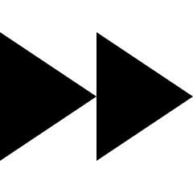

# (PART) Tools for answering RQs {-}


# Probability {#Probability}


```{r, child = if (knitr::is_html_output()) {'./introductions/18-Tools-Probability-HTML.Rmd'} else {'./introductions/18-Tools-Probability-LaTeX.Rmd'}}
```


<!-- Define colours as appropriate -->
```{r, child = if (knitr::is_html_output()) {'./children/coloursHTML.Rmd'} else {'./children/coloursLaTeX.Rmd'}}
```


## Introduction {#Chap19Intro}

This chapter briefly discusses *probability*.
*Probability* quantifies the chance that a specific, unknown result (an 'event') from some random procedure with an unknown outcome.
Before discussing probability, some associated terms needs defining.


## Random procedures, sample spaces and simple events {#SampleSpaceEvents}

To discuss probability, a *random procedure* must be defined first.


::: {.definition #RandomProcedure name="Random procedure"}
\index{Random procedure}
A *random procedure* is a sequence of well-defined steps that (a)\ can be repeated, in theory, indefinitely under essentially identical conditions; (b)\ has well-defined results; and (c)\ has result that are unpredictable for any individual repetition.
:::

Using this definition, the result of rolling a die is a 'random procedure', with possible results 
`r if (knitr::is_latex_output()) {
   '\\Largedice{1}'
} else {
   '<span class="larger-die">&#9856;</span>'
}`,
`r if (knitr::is_latex_output()) {
   '\\Largedice{2}'
} else {
   '<span class="larger-die">&#9857;</span>'
}`,
`r if (knitr::is_latex_output()) {
   '\\Largedice{3}'
} else {
   '<span class="larger-die">&#9858;</span>'
}`,
`r if (knitr::is_latex_output()) {
   '\\Largedice{4}'
} else {
   '<span class="larger-die">&#9859;</span>'
}`,
`r if (knitr::is_latex_output()) {
   '\\Largedice{5}'
} else {
   '<span class="larger-die">&#9860;</span>'
}`
and
`r if (knitr::is_latex_output()) {
   '\\Largedice{6}'
} else {
   '<span class="larger-die">&#9861;</span>'
}`.
Similarly, tossing a coin is a random procedure with two possible results: **Heads** or **Tails**.

A list of all distinct possible results from one instance of a random procedure is the *sample space*.
A *simple event* is any element of the sample space.\index{Event}


::: {.definition #SampleSpace name="Sample space"}
\index{Sample sapce}
The *sample space* is a list of all possible and distinct results after administering a random procedure once. 
:::


::: {.definition #SimpleEvent name="Simple event"}
\index{Event!simple}
A *simple event* is a single element of the sample space. 
:::


<div style="float:right; width: 222x; border: 1px; padding:10px">

</div>


::: {.example #SampleSpaceDie name="Sample spaces"}
Consider rolling a fair, six-sided die (the random procedure).
We do not know what face will be uppermost until we roll the die.

However, the *sample space* for this procedure can be listed: 
`r if (knitr::is_latex_output()) {
   '\\Largedice{1}'
} else {
   '<span class="larger-die">&#9856;</span>'
}`,
`r if (knitr::is_latex_output()) {
   '\\Largedice{2}'
} else {
   '<span class="larger-die">&#9857;</span>'
}`,
`r if (knitr::is_latex_output()) {
   '\\Largedice{3}'
} else {
   '<span class="larger-die">&#9858;</span>'
}`,
`r if (knitr::is_latex_output()) {
   '\\Largedice{4}'
} else {
   '<span class="larger-die">&#9859;</span>'
}`,
`r if (knitr::is_latex_output()) {
   '\\Largedice{5}'
} else {
   '<span class="larger-die">&#9860;</span>'
}`
and\ 
`r if (knitr::is_latex_output()) {
   '\\Largedice{6}'
} else {
   '<span class="larger-die">&#9861;</span>'
}`.
These are all mutually exclusive\index{Mutually exclusive} (or distinct) results and cover all possible results (exhaustive)\index{Exhaustive} from a single roll.
The sample space is *discrete*.\index{Quantitative data!discrete}

The event 'rolling a \ 
`r if (knitr::is_latex_output()) {
   '\\Largedice{1}'
} else {
   '<span class="larger-die">&#9856;</span>'
}`'
is a simple event.
:::


Combinations of the elements in the sample space are usually of more interest than simple events.
These are called *compound events*.


::: {.definition #CompoundEvent name="Compound event"}
\index{Event!compound}
A *compound event* is any combination of simple events (i.e., of elements in the sample space).
:::


::: {.example #Events name="Events"}
Many *events* can be defined using the sample space in Example\ \@ref(exm:SampleSpaceDie), including:

* Rolling a\ 
`r if (knitr::is_latex_output()) {
   '\\Largedice{4}'
} else {
   '<span class="larger-die">&#9859;</span>'
}`: 
  this *simple event* includes one element of the sample space:
`r if (knitr::is_latex_output()) {
   '\\Largedice{4}'
} else {
   '<span class="larger-die">&#9859;</span>'
}`.
* Rolling an odd number: 
  this *compound event* includes three elements of the sample space: 
`r if (knitr::is_latex_output()) {
   '\\Largedice{1}'
} else {
   '<span class="larger-die">&#9856;</span>'
}`,
`r if (knitr::is_latex_output()) {
   '\\Largedice{3}'
} else {
   '<span class="larger-die">&#9858;</span>'
}` and
`r if (knitr::is_latex_output()) {
   '\\Largedice{5}'
} else {
   '<span class="larger-die">&#9860;</span>'
}`.
* Rolling a number larger than 
`r if (knitr::is_latex_output()) {
   '\\Largedice{2}'
} else {
   '<span class="larger-die">&#9857;</span>'
}`: 
  this *compound event* includes four elements of the sample space: 
`r if (knitr::is_latex_output()) {
   '\\Largedice{3}'
} else {
   '<span class="larger-die">&#9858;</span>'
}`,
`r if (knitr::is_latex_output()) {
   '\\Largedice{4}'
} else {
   '<span class="larger-die">&#9859;</span>'
}`,
`r if (knitr::is_latex_output()) {
   '\\Largedice{5}'
} else {
   '<span class="larger-die">&#9860;</span>'
}` and
`r if (knitr::is_latex_output()) {
   '\\Largedice{6}'
} else {
   '<span class="larger-die">&#9861;</span>'
}`.

The sample space is *discrete* (see Sect.\ \@ref(QuantData)).
:::


::: {.example #SampleSpaceThrowing name="Sample spaces and events"}
Consider the distance you can throw a baseball (the random procedure).
We do not know beforehand what distance your next throw will be, but the *sample space* (i.e., the throwing distance) is a number greater than $0$\ms.
This sample space is *continuous*.\index{Quantitative data!continuous}

Many *compound events* can be defined using this sample space; for example:

* throwing more than\ $50$\ms.
* throwing between\ $10$ and\ $40$\ms.

Because the sample space is continuous, throwing an *exact* distance (such as *exactly*\ $10$\ms) is technically not possible (see Sect.\ \@ref(QuantData)).
:::


Events are often defined using **and**, **or**, **not**.
Consider two events called\ $A$ and\ $B$.
Then, '$A$ **and**\ $B$' is the event comprising events in\ $A$ and also in\ $B$.
(In other words, events in *both*\ $A$ and\ $B$.)
'$A$ **or**\ $B$' is the event comprising events in\ $A$, events in\ $B$, and events in both.
The event '**not**\ $A$' comprises all the events in the sample space that are *not* in Event\ $A$.


::: {.example #ComplicatedEvents name="Complicated events"}
Consider rolling a fair, six-sided die again (Example\ \@ref(exm:SampleSpaceDie)).
Suppose these two (compound) events are defined:

* Event\ $A$: Roll a number divisible by\ $2$.
* Event\ $B$: Roll a number divisible by\ $3$.

Event\ $A$ comprises the simple events 
`r if (knitr::is_latex_output()) {
   "'roll a \\Largedice{2}'"
} else {
   '*roll a <span class="larger-die">&#9857;</span>*'
}`,
`r if (knitr::is_latex_output()) {
   "'roll a \\Largedice{4}'"
} else {
   '*roll a <span class="larger-die">&#9859;</span>*'
}` and
`r if (knitr::is_latex_output()) {
   "'roll a \\Largedice{6}'"
} else {
   '*roll a <span class="larger-die">&#9861;</span>*'
}`.
Event\ $B$ comprises the simple events 
`r if (knitr::is_latex_output()) {
   "'roll a \\Largedice{3}'"
} else {
   '*roll a <span class="larger-die">&#9858;</span>*'
}` and
`r if (knitr::is_latex_output()) {
   "'roll a \\Largedice{6}'"
} else {
   '*roll a <span class="larger-die">&#9861;</span>*'
}`.

Then, the Event\ '$A$ **and**\ $B$' includes all events in\ $A$ and *also* in\ $B$; that is, '$A$ **and**\ $B$' comprises the single simple event
`r if (knitr::is_latex_output()) {
   "'roll a \\Largedice{6}'"
} else {
   '*roll a <span class="larger-die">&#9861;</span>*'
}`.

Event\ '$A$ **or**\ $B$' include the events in\ $A$, the events in\ $B$, and those in both; that is, '$A$ **or**\ $B$' comprises the four simple events 
`r if (knitr::is_latex_output()) {
   "'roll a \\Largedice{2}'"
} else {
   '*roll a <span class="larger-die">&#9857;</span>*'
}`,
`r if (knitr::is_latex_output()) {
   "'roll a \\Largedice{3}'"
} else {
   '*roll a <span class="larger-die">&#9858;</span>*'
}`,
`r if (knitr::is_latex_output()) {
   "'roll a \\Largedice{4}'"
} else {
   '*roll a <span class="larger-die">&#9859;</span>*'
}` and\ 
`r if (knitr::is_latex_output()) {
   "'roll a \\Largedice{6}'"
} else {
   '*roll a <span class="larger-die">&#9861;</span>*'
}`.

The event '**not**\ $A$' comprises the three simple events 
`r if (knitr::is_latex_output()) {
   "'roll a \\Largedice{1}'"
} else {
   '*roll a <span class="larger-die">&#9856;</span>*'
}`,
`r if (knitr::is_latex_output()) {
   "'roll a \\Largedice{3}'"
} else {
   '*roll a <span class="larger-die">&#9858;</span>*'
}` and\ 
`r if (knitr::is_latex_output()) {
   "'roll a \\Largedice{5}'"
} else {
   '*roll a <span class="larger-die">&#9860;</span>*'
}`.
:::


## Probability {#ProbabilityDefined}
\index{Probability}

Using these definitions, a *probability* can be defined.


<div style="float:right; width: 222x; border: 1px; padding:10px">

</div>


::: {.definition #Probability name="Probability"}
A *probability* is a number between $0$ and $1$ inclusive (or between\ $0$% and\ $100$% inclusive) that quantifies the likelihood of a certain event occurring.
:::


A probability of\ $0$ (or\ $0$%) means the event is 'impossible' (will *never* occur), and a probability of\ $1$ (or\ $100$%) means that the event is *certain* to happen (will *always* occur).
Most events have a probability between the extremes of\ $0$% and\ $100$%.


::: {.example #Probabilities name="Probabilities"}
Consider these cases:

* The probability of receiving negative rainfall is\ $0$; it is impossible.
* The probability of receiving some rain in London next year is\ $1$; it is certain.
* The probability of receiving rain on a specific day in London next year is between\ $0$ and\ $1$ inclusive.
:::


## Determining probabilities {#DetermineProbabilities}

The probability of an event occurring can be determined in different ways, including:

* the *classical approach* (Sect.\ \@ref(ProbClassical));
* the *relative frequency approach* (Sect.\ \@ref(ProbRelFreq)); and
* the *subjective approach* (Sect.\ \@ref(ProbSubjective)).
   
   
### Classical approach {#ProbClassical}
\index{Probability!classical approach}

What is the probability of rolling a 
`r if (knitr::is_latex_output()) {
   '\\Largedice{4}'
} else {
   '<span class="larger-die">&#9859;</span>'
}`
on a die?
The sample space has six possible outcomes (see Example\ \@ref(exm:SampleSpaceDie)) that are *equally likely* to occur, and the event 'rolling a 
`r if (knitr::is_latex_output()) {
   "\\Largedice{4}'"
} else {
   '<span class="larger-die">&#9859;</span>\''
}`
comprises just *one* of those events.
Thus,
`r if (knitr::is_html_output()) '<!--'`
$$
   \text{Probability of rolling a $\Largedice{4}$}
   = \frac{\text{The number of results that are a $\Largedice{4}$}}{\text{The number of possible results}} 
   = \frac{1}{6}.
$$
`r if (knitr::is_html_output()) '-->'`
`r if (knitr::is_latex_output()) '<!--'`
$$
   \text{Probability of rolling a 4}
   = \frac{\text{The number of results that are a 4}}{\text{The number of possible results}} 
   = \frac{1}{6}.
$$
`r if (knitr::is_latex_output()) '-->'`
This approach to computing probabilities is called the  *classical* approach to probability, and is only appropriate when all events in the sample space are *equally likely*.


::: {.definition #ClassicalApproachToProbability name="Classical approach to probability"}
In the *classical approach to probability*, the probability of an event occurring is the number of elements of the sample space included in the event, divided by the total number of elements in the sample space, *when all outcomes are equally likely*.
:::

By this definition:
$$
   \text{Prob. of an event}
    = 
    \frac{\text{Number of results in the event of interest}}{\text{Total number of equally-likely results}}.
$$


We can say that 'the probability of rolling a 
`r if (knitr::is_latex_output()) {
   '\\Largedice{4}'
} else {
   '<span class="larger-die">&#9859;</span>'
}`
is $1/6$', or 'the probability of rolling a 
`r if (knitr::is_latex_output()) {
   '\\Largedice{4}'
} else {
   '<span class="larger-die">&#9859;</span>'
}`
is (approximately) $0.1667$'.
The answer can also be expressed as a *percentage*: 'the probability of rolling a 
`r if (knitr::is_latex_output()) {
   '\\Largedice{4}'
} else {
   '<span class="larger-die">&#9859;</span>'
}`
is (approximately) $16.67$%'.\index{Percentages}
The answer could also be interpreted as 'the *expected* proportion of rolls that are a 
`r if (knitr::is_latex_output()) {
   '\\Largedice{4}'
} else {
   '<span class="larger-die">&#9859;</span>'
}`
is (approximately) $0.1667$'.\index{Proportions}
That is, about\ $16.67$% of a very large number of future rolls are likely to be a 
`r if (knitr::is_latex_output()) {
   '\\Largedice{4}'
} else {
   '<span class="larger-die">&#9859;</span>'
}`.

The probability of rolling a 
`r if (knitr::is_latex_output()) {
   '\\Largedice{4}'
} else {
   '<span class="larger-die">&#9859;</span>'
}`
is $0.1667$, but any single roll of the die either *will* or *will not* produce a 
`r if (knitr::is_latex_output()) {
   '\\Largedice{4}'
} else {
   '<span class="larger-die">&#9859;</span>'
}`, and we don't know which will occur.


::: {.example #SimpleProb name="Probabilities for complicated events"}
Consider rolling a standard six-sided die.
With six equally-likely results (Example\ \@ref(exm:SampleSpaceDie)), each with probability\ $1/6$ (or, approximately, $16.67$%) of occurring, the probability of rolling an even number is\ $3/6$, since there are three even numbers in the sample space.
:::


::: {.example #ProbabilityOutcomes name="Describing probability"}
Consider rolling a standard six-sided die.

* The *probability* of rolling an even number is $3 \div 6 = 0.5$.
* The *percentage* of rolls  expected to be even is $3 \div 6 \times 100 = 50$%.
* The *odds* of rolling an even number is $3\div 3 = 1$.
:::

::: {.example #EventsAndProb name="Probabilities"}
The probability of the events listed in Example\ \@ref(exm:Events) are:

* The probability of rolling a 
`r if (knitr::is_latex_output()) {
   '\\Largedice{4}'
} else {
   '<span class="larger-die">&#9859;</span>'
}` is\ $1/6$ (or about\ $0.1667$).
* The probability of rolling an odd number is\ $3/6$, or\ $1/2$ (or\ $0.5$).
* The probability of rolling a number larger than 
`r if (knitr::is_latex_output()) {
   '\\Largedice{2}'
} else {
   '<span class="larger-die">&#9857;</span>'
}`
is\ $4/6$, or\ $2/3$ (or about\ $0.6667$).
:::


::: {.importantBox .important data-latex="{iconmonstr-warning-8-240.png}"}
*Probabilities* describe the likelihood that an event will occur *before* the result is known.
*Odds* and *proportions* can be used either *before* or *after* the result is known, provided the wording is correct.

For example, *proportions* describe how often an event has occurred *after* the result is known, and *expected proportions* describe the likelihood that an event will occur in a large number of repetitions *before* the result is known.
:::


The following example may help explain.

::: {.example #ProbProportioOdds name="Probabilities, proportions and odds"}
*Before* a fair coin is tossed:\index{Probability}\index{Proportions}\index{Odds}
  
* The *probability* of throwing a head is $1/2 = 0.5$ (or\ $50$%).
* The *expected proportion* of heads for many coin tosses is\ $0.5$.
* The *odds* of throwing a head is $1/1 = 1$.

If we have *already* tossed a coin $100$ times and found $47$\ heads:
  
* The *proportion* of heads in the sample is $47/100 = 0.47$ (or\ $47$%).
* The odds that we *threw* a head in the sample is $47/53 = 0.887$.

The 'probability that we just threw a head' makes no sense, because the result is known.
:::
   


### Relative frequency approach {#ProbRelFreq}
\index{Probability!relative frequency approach}


<div style="float:right; width: 222x; border: 1px; padding:10px">

</div>


What is the probability that a new-born baby will be a boy?
The sample space could be listed as: *boy* and *non-boy*.
Since the sample space has two elements, the classical approach suggests the probability is $1\div2 =  0.5$.
However, this approach is appropriate *only if* boys and non-boys are *equally likely* to be born.
But are they?

In 
`r if (knitr::is_latex_output()) {
   'Australia'
} else {
   '[Australia](https://www.aihw.gov.au/reports/mothers-babies/australias-mothers-babies/data)'
}`
in 2021, $289\,603$ live births occurred, with $148\,636$ male births, $140\,944$ female births, and $23$\ others (or 'not stated').
The *proportion* of boys born in the 2021 sample is $148\,636\div 289\,603 = 0.513$, or about\ $51.3$%.
An *estimate* of the probability that the next birth will be a boy is about\ $0.513$ (or\ $51.3$%), using past data.
This is the *relative frequency* approach to calculating probabilities: using past data.

Using the relative frequency method can only ever produce an *approximate* probability, as it is based on a limited number of past observations.
An actual probability would require an infinite number of observations. 


::: {.definition #RelativeFrequencyApproachToProbability name="Relative frequency approach to probability"}
In the *relative frequency approach to probability*, the probability of an event is *approximately* the number of times the outcomes of interest has appeared in the past, divided by the number of 'attempts' in the past.
This produces an *approximate* probability.
:::


::: {.example #RFProbability name="Relative frequency probability"}
Based on the earlier information, the *odds* that a new baby will be a boy is *approximately* $0.513\div (1 - 0.513) = 1.053$.\index{Odds}
According to the 
`r if (knitr::is_latex_output()) {
   '*Australian Bureau of Statistics* (ABS):'
} else {
   '[*Australian Bureau of Statistics* (ABS)](http:www.abs.gov.au/ausstats/abs@.nsf/0/B8865D71D84F5210CA2579330016754C?opendocument):'
}`

> The sex ratio for all births registered in Australia generally fluctuates around\ $105.5$ male births per\ $100$ female births.

This is close to the odds of\ $1.053$ found above.
:::
         
      

### Subjective approach {#ProbSubjective}
\index{Probability!subjective approach}


<div style="float:right; width: 222x; border: 1px; padding:10px">

</div>


Many probabilities cannot be computed using the classical or relative frequency approach; for example, what is the probability that your sporting team wins their next game?
In this case, only a *subjective probability* can be given.

'Subjective' probabilities may be based on personal judgement or experience.
They can also be given by considering all the relevant issues that may impact the probability (and may, for example, be based on mathematical models that incorporate information from numerous inputs).
Depending on how these other issues are considered and combined, different subjective probabilities may be given.

Weather forecasts are one example: they incorporate data from sea surface temperatures, local topography, air pressures, air temperatures and so on.
Different models use different inputs, and may combine these inputs differently to produce different (subjective) forecast probabilities.
Subjective probabilities are deductive probabilities (based on reasoning).

::: {.definition #SubjectiveApproachToProbability name="Subjective approach to probability"}
In the *subjective approach to probability*, various factors are incorporated, perhaps subjectively, to determine the probability of an event occurring.
:::


::: {.example #SubjectiveProbElNino name="Subjective probability"}
During El `r readr::parse_character( c("Niño"), locale = locale(encoding = "UTF-8"))` events, eastern Australia typically experiences drier-than-average winters and springs.
The 
`r if (knitr::is_latex_output()) {
   "*Australian Broadcasting Corporation*'s news website"
} else {
  "[*Australian Broadcasting Corporation*'s news website](https://www.abc.net.au/news/2023-05-23/noaa-bom-el-nino-chances-explored/102341466)"
}`
reported (on 23\ May, 2023) that the Australian *Bureau of Meteorology* predicted a $50$%\ probability of an El `r readr::parse_character( c("Niño"), locale=locale(encoding="UTF-8"))` event in\ 2023, while the American *National Oceanic and Atmospheric Administration* predicted a $90$%\ chance of an El `r readr::parse_character( c("Niño"), locale=locale(encoding="UTF-8"))` event in\ 2023.

Despite this, '[both] agencies are looking at the same part of the Pacific Ocean' to make their predictions.
However, 'the US and Australia base their probability on different criteria'.
The probabilities are subjective probabilities, based on complex mathematical models.
:::


## Independence {#Independence}
\index{Independence}

One important concept in probability is *independence*.
Two events are *independent* if the probability of one event happening is the same, whether or not the other event has happened.
For example, if you toss a coin, the probability of getting a head is the same whether you are sitting or not sitting.
That is, the result of a coin toss is *independent* of your position.


<div style="float:right; width: 222x; border: 1px; padding:10px">

</div>


::: {.definition #Independence name="Independence"}
Two events are *independent* if the probability of one event is the same, whether or not the other event has happened.
:::


::: {.example #IndependenceCards name="Independence"}
Consider drawing two cards from a well-shuffled, fair pack (of $52$\ cards), *without* returning the first card.
For the *first* card, the sample space contains every card in the pack, and drawing any one card is as equally likely as drawing any other.
Since four cards are **Aces**, the probability of drawing an **Ace** on the first draw is $4/52$ (using the classical approach).

If we drew an **Ace** for the first card, the probability of drawing an **Ace** for the *second* card is $3/51$ (*three* **Aces** remain among the $51$ remaining cards).
Alternatively, if we *don't* draw an **Ace** for the first card, the probability of drawing an **Ace** second time is $4/51$ (*four* **Aces** remain among the $51$\ remaining cards).

That is, the probability of drawing an **Ace** for the second card *depends* on whether or not an **Ace** was drawn for the first card.
The two events 'Drawing an **Ace** for the first card' and 'Drawing an **Ace** for the second card' are *not independent* events.
:::


::: {.tipBox .tip data-latex="{iconmonstr-info-6-240.png}"}
A 'standard' pack of cards has $52$\ cards, organised into four *suits*: spades $\spadesuit$, clubs $\clubsuit$ (both black), 
hearts $\heartsuit$ and diamonds $\diamondsuit$ (both red).
Each *suit* has $13$\ *denominations*: $2$, $3$, $4$, $5$, $6$, $7$, $8$, $9$, $10$, Jack\ (J), Queen\ (Q), King\ (K), Ace\ (A).
The Ace, King, Queen and Jack cards are called *picture cards*.
(Most packs also contain two jokers, which are not considered part of a *standard* pack.)
:::


:::: {.importantBox .important data-latex="{iconmonstr-warning-8-240.png}"}
Random samples produce *independent* units of analysis.\index{Sampling!random}\index{Units of analysis}
:::


<iframe src="https://learningapps.org/watch?v=pbd3ekn3k22" style="border:0px;width:100%;height:800px" allowfullscreen="true" webkitallowfullscreen="true" mozallowfullscreen="true"></iframe>


## Conditional probability {#ConditionalProbability}
\index{Probability!conditional}

*Conditional probability* refers to adjusting probabilities when extra information is known.
For example, the probability of rolling a 
`r if (knitr::is_latex_output()) {
   '\\Largedice{1}'
} else {
   '<span class="larger-die">&#9856;</span>'
}`
is $1/6$ using the classical approach, as the sample space has six equally-likely elements.
However, if we are told that the number rolled is a *odd number*, only three elements in the sample space need now be considered, rather than six:
`r if (knitr::is_latex_output()) {
   '\\Largedice{1}'
} else {
   '<span class="larger-die">&#9856;</span>'
}`,
`r if (knitr::is_latex_output()) {
   '\\Largedice{3}'
} else {
   '<span class="larger-die">&#9858;</span>'
}`,
`r if (knitr::is_latex_output()) {
   '\\Largedice{5}'
} else {
   '<span class="larger-die">&#9860;</span>'
}`.
No other outcome is possible, and so the probability of rolling a 
`r if (knitr::is_latex_output()) {
   '\\Largedice{1}'
} else {
   '<span class="larger-die">&#9856;</span>'
}`
is $1/3$.
We say 'the probability of rolling a 
`r if (knitr::is_latex_output()) {
   '\\Largedice{1}'
} else {
   '<span class="larger-die">&#9856;</span>'
}`,
*given that the roll is an odd number*, is\ $1/3$'.


:::{.example #ConditionalCards name="Conditional probability"}
Suppose someone draws a card from a pack of cards.
The probability that the card is a $\clubsuit$ is $13/52 = 1/4$, or\ $25$%.

However, if that person tells you that the card is a *black* card, then the card must be either a\ $\clubsuit$ or\ $\spadesuit$.
Hence, the probability that the card is a\ $\clubsuit$, *given* that the card is black, is $13/26 = 1/2$, or\ $50$%.
:::


:::{.example #Sunglasses name="Wearing sunglasses"}
@data:Dexter2019:SunProtection recorded the number of people at the foot of the Goodwill Bridge,  Brisbane, who wore sunglasses between $11$:$30$am to $12$:$30$pm (Table\ \@ref(tab:SunglassesTableProb)).
The probability of an observed person wearing sunglasses is
$$
  \frac{126 + 123}{126 + 123 + 240 + 263} = 0.3311,
$$
or about $33.1$%.
Conditional probabilities can also be computed:

* *If the observed person is female*, the probability that she is wearing sunglasses is $126\div (240 + 126) = 0.3443$, or about\ $34.4$%.
* *If the observed person is male*, the probability that he is wearing sunglasses is $123\div (263 + 123) = 0.3187$, or about\ $31.9$%.

These probabilities are close, but not exactly equal.

If the two events were *independent*, then these two conditional probabilities would be the same: the probability of wearing sunglasses would be the same for females and males.
In other words, the probability of wearing sunglasses did not depend on whether we were observing a female or a male.
We might say that wearing sunglasses is close to, but not exactly, independent of the sex of the person, *in the sample*.
We cannot be sure if wearing sunglasses in independent of the sex of the person in the *population*.
:::


```{r SunglassesTableProb}
data(HatSunglasses)

SG.Table <- xtabs(Count ~ Sunglasses + Gender, 
                            data = HatSunglasses)
rownames(SG.Table) <- c("Not wearing sunglasses",
                        "Wearing sunglasses")

if( knitr::is_latex_output() ) {
  kable(pad(SG.Table,
            surroundMaths = TRUE,
            targetLength = 3,
            decDigits = 0),
        format = "latex",
        booktabs = TRUE,
        longtable = FALSE,
        escape = FALSE,
        align = "c",
        caption = "Females and males wearing sunglasses on the Goodwill Bridge, Brisbane.") %>%
    row_spec(0, bold = TRUE) %>%
    kable_styling(font_size = 8)
}
if( knitr::is_html_output() ) {
  kable(pad(SG.Table,
            surroundMaths = TRUE,
            targetLength = 3,
            decDigits = 0),
               format = "html",
               booktabs = TRUE,
               longtable = FALSE,
               align = "c",
        caption = "Females and males wearing sunglasses on the Goodwill Bridge, Brisbane.") %>%
    row_spec(0, bold = TRUE)
}
```


## Chapter summary {#ToolsProbabilitySummary}

Three ways to compute probabilities are:

* the *classical approach*, which requires all outcomes to be *equally likely*;
* the *relative frequency* approach (giving approximate probabilities); and 
* the *subjective approach* (deductive probabilities).

Two events are *independent* if the probability of one event is the same, whether or not other event has happened.
Conditional probability incorporate extra information when the probability is computed.


## Quick review questions {#ToolsProbabilityQuickReview}

::: {.webex-check .webex-box}
Suppose Event\ $A$ is defined as '*Rolling a 
`r if (knitr::is_latex_output()) {
   '\\Largedice{1}'
} else {
   '<span class="larger-die">&#9856;</span>'
}`
or a 
`r if (knitr::is_latex_output()) {
   '\\Largedice{2}'
} else {
   '<span class="larger-die">&#9857;</span>'
}`
on a fair die*'.
Also, suppose Event\ $B$ is defined as '*Rolling an even number on a die*'.

1. What is the best *approach* to computing the probability of Event\ $A$ occurring?\tightlist
`r if( knitr::is_html_output() ) {longmcq( c(
	answer = "The classical approach",
	"The relative frequency approach",
   "The subjective approach"))}`
2. What is the *probability* of Event\ $A$ occurring?  
`r if( knitr::is_html_output() ) {mcq( c(
	"1/6",
	answer = "2/6",
   "1/5",
   "2/5",
	"5/2",
	"5/1"))}`
3. True or false: Events\ $A$ and\ $B$ are *independent*.  
`r if( knitr::is_html_output() ) {torf(answer = FALSE )}`
4. What is the *probability* of\ '$A$ **and**\ $B$' occurring?  
`r if( knitr::is_html_output() ) {mcq( c(
	"0",
	answer = "1/6",
	"2/6",
  "3/6",
  "4/6",
	"5/6",
	"1"))}`
5. What is the *probability* of\ '$A$ **or**\ $B$' occurring?  
`r if( knitr::is_html_output() ) {mcq( c(
	"0",
	"1/6",
	"2/6",
  "3/6",
  answer = "4/6",
	"5/6",
	"1"))}`
6. What is the *probability* of '**not**\ $B$' occurring?  
`r if( knitr::is_html_output() ) {mcq( c(
	"0",
	"1/6",
	"2/6",
  answer = "3/6",
  "4/6",
	"5/6",
	"1"))}`
7. What are the *odds* of '**not**\ $B$' occurring?  
`r if( knitr::is_html_output() ) {mcq( c(
	"0",
	"1/6",
	"2/6",
  "3/6",
  "4/6",
	"5/6",
	answer = "1"))}`
8. What is probabiity of Event\ $B$ *if* Event\ $A$ has already occurred?  
`r if( knitr::is_html_output() ) {mcq( c(
	"0",
	"1/6",
	"2/6",
  answer = "3/6",
  "4/6",
	"5/6",
	"1"))}`:::


## Exercises {#ProbabilityExercises}

Answers to odd-numbered exercises are available in App.\ \@ref(Answers).

`r if( knitr::is_latex_output() ) "\\captionsetup{font=small}"`


::: {.exercise #ProbabilityMethod}
Which *approach* is best used to estimate a probability in these situations?

1. The probability that the stock market will rise next month.
2. The probability that a randomly-chosen person writes left-handed.
:::


::: {.exercise #ProbabilityMethodB}
Which *approach* is best used to estimate a probability in these situations?

1. The probability that a **King** will be chosen from a pack of cards.
2. The probability that Paris receives more than\ $50$\mms of rain next May.
:::


::: {.exercise #ProbabilityAndOrNot}
Consider drawing cards from a fair pack.
*Event\ A* is 'drawing a picture card', *Event\ B*  is 'drawing a **King** or **Ace**' and *Event\ C* is 'drawing a $\spadesuit$.

1. What events are in '$A$ **and**\ $B$'? \tightlist
2. Compute the probability of '$A$ **and**\ $B$'. 
3. What events are in '$A$ **or**\ $B$'? \tightlist
4. Compute the probability of '$A$ **or**\ $B$'. 
5. What events are in '$A$ **and**\ $C$'? \tightlist
6. Compute the probability of '$A$ **and**\ $C$'. 
7. What events are in '**not**\ $C$'? \tightlist
8. Compute the probability of '**not**\ $C$'. 
9. Compute the probability of $C$, if\ $A$ has already occurred.
10. Compute the probability of $A$, if\ $C$ has already occurred.
:::


::: {.exercise #ProbabilityAndOrNot2}
Consider rolling a fair die.
*Event\ A* is 'rolling a an *even* number', *Event\ B*  is 'rolling an *odd* number' and *Event\ C* is 'rolling a
`r if (knitr::is_latex_output()) {
   '\\Largedice{2}'
} else {
   '<span class="larger-die">&#9857;</span>\''
}`.

1. What events are in '$A$ **and**\ $B$'? \tightlist
2. Compute the probability of '$A$ **and**\$B$'. 
3. What events are in '$A$ **or** $B$'? \tightlist
4. Compute the probability of '$A$ **or**\ $B$'. 
5. What events are in '$A$ **and**\ $C$'? \tightlist
6. Compute the probability of '$A$ **and**\ $C$'. 
7. What events are in '**not**\ $C$'? \tightlist
8. Compute the probability of '**not**\ $C$'. 
9. Compute the probability of $C$, if\ $A$ has already occurred.
10. Compute the probability of $C$, if\ $B$ has already occurred.
:::


::: {.exercise #ProbabilityThreeEvents}
Consider these three events about tossing two fair coins, say Coin\ A and Coin\ B:
*Event\ 1* is 'toss a **Head** on Coin\ A'; *Event\ 2* is 'toss a **Tail** on Coin\ A'; and *Event\ 3* is 'toss a **Head** on Coin\ B'.

1. Are *Event\ 1* and *Event\ 2* independent events? \tightlist  
2. Are *Event\ 1* and *Event\ 3* independent events?
3. Compute the probability of *Event\ 3*.
4. What is the probability of *Event\ 3* occurring, if *Event\ 1* has already occurred?
5. List the sample space for the random procedure.
:::


::: {.exercise #ProbabilityThreeEvents2}
Consider these three events about drawing one card from a fair pack:
*Event\ 1* is 'draw a **Jack**'; *Event\ 2* is 'draw a $\heartsuit$'; and *Event\ 3* is 'draw a $\clubsuit$'.

1. Compute the probability of *Event\ 1*. \tightlist
1. Compute the probability of *Event\ 1*, if *Event\ 2* has occurred.
1. Compute the probability of *Event\ 1*, if *Event\ 2* has *not* occurred.
1. Are *Event\ 1* and *Event\ 2* independent?
   Explain.
1. Compute the probability of *Event\ 3*.
1. Compute the probability of *Event\ 3*, if *Event\ 2* has occurred.
1. Compute the probability of *Event\ 3*, if *Event\ 2* has *not* occurred.
1. Are *Event\ 2* and *Event\ 2* independent?
   Explain.
:::


::: {.exercise #ProbabilityDie2}
Suppose I roll a standard six-sided die. 

1. What is the *probability* that I will roll a number larger than 
`r if (knitr::is_latex_output()) {
   '\\Largedice{2}'
} else {
   '<span class="larger-die">&#9857;</span>'
}`? \tightlist
`r if( knitr::is_html_output() ) {mcq( c(
	"0",
	"1/6",
	"2/6",
  "3/6",
  answer = "4/6",
	"5/6",
	"1"))}`
2. What are the *odds* of rolling a number smaller than 
`r if (knitr::is_latex_output()) {
   '\\Largedice{6}'
} else {
   '<span class="larger-die">&#9861;</span>'
}`?
`r if( knitr::is_html_output() ) {mcq( c(
	"0",
	"1/6",
	"1/5",
  "5/6",
  "6/5",
  answer = "5",
	"5/6",
	"1"))}`

3. Suppose I toss a coin after rolling the die.
   Is the result from the coin toss *independent* of what I rolled on the die?
`r if( knitr::is_html_output() ) {longmcq( c(
   "No: because there are six possible outcomes from rolling a die, but only two from tossing a coin",
   "Yes: because die was not rolled at the same time as the coin was tossed",
   answer = "Yes: what happens on the die won't change what happens on the coin",
   "No:   because the die was not rolled at the same time as the coin was tossed"))}`
4. What is the probability that I roll a number divisible by\ $2$ on the die?
`r if( knitr::is_html_output() ) {mcq( c(
	"0",
	"1/6",
	"2/6",
  answer = "3/6",
  "4/6",
	"5/6",
	"1"))}`
5. What is the probability that I roll a number divisible by\ $2$ **and** divisible by\ $3$ on the die?
`r if( knitr::is_html_output() ) {mcq( c(
	"0",
	answer = "1/6",
	"2/6",
  "3/6",
  "4/6",
	"5/6",
	"1"))}`
6. What is the probability of rolling a 
`r if (knitr::is_latex_output()) {
   '\\Largedice{2}'
} else {
   '<span class="larger-die">&#9857;</span>'
}`, *given* that the number is smaller than 
`r if (knitr::is_latex_output()) {
   '\\Largedice{4}'
} else {
   '<span class="larger-die">&#9859;</span>'
}`?


:::


::: {.exercise #ProbabilityCards}
Suppose you have a well-shuffled, standard pack of $52$\ cards.

1. What is the *probability* that you will draw a **King**?
1. What are the *odds* that you will draw a **King**?
1. What is the *probability* that you will draw a picture card (**Ace**, **King**, **Queen** or **Jack**)?
1. What are the *odds* that you will draw a picture card (**Ace**, **King**, **Queen** or **Jack**)?
1. Suppose I draw two cards from the pack.
   Are the events 'Draw a **King** first' and 'Draw a **Queen** second' independent events? 
1. Suppose I draw one card from the pack, then roll a six-sided die.
   Are the events 'Draw a **Jack** from the pack of cards' and 'Roll a 
   `r if (knitr::is_latex_output()) {
   '\\Largedice{5}'
} else {
   '<span class="larger-die">&#9860;</span>'
}`
on the die' independent events? 
1. If I draw a picture card, what is the probability the card is a **King**?
:::


::: {.exercise #SampleSpaceCardsDiff}
Consider drawing a card from a standard, well-shuffled pack of cards.
The first card is replaced, the pack reshuffled, and then a second card is drawn from the pack.
The colour of the two cards is recorded (Black or Red), and we are interested in Event\ $D$: 'the total number of black cards drawn, minus the total number of red cards drawn'.

1. Write down the sample space.
2. Find the probability that\ $D$ is zero.
3. Find the probability that\ $D$ is zero **or** one.
4. Is the colour of the card drawn first *independent* of the colour of the card drawn second?
   Explain.
:::


:::{.exercise #SampleSpaceInfiniteCoins}
Consider the random process ‘tossing a coin until a Head is observed’.
Event\ $H$ is of interest: 'the number of tosses until the first head is thrown’. 

:::::: {.cols data-latex=""}
:::: {.col data-latex="{0.45\textwidth}"}
1. What is the sample space?
2. Find the probability that $H$ is one.
::::

:::: {.col data-latex="{0.025\textwidth}"}
\ 
<!-- an empty Div (with a white space), serving as
a column separator -->
::::

:::: {.col data-latex="{0.50\textwidth}"}
3. Find the probability that $H$ is two.
4. Find the probability that $H$ is one **or** two.
::::

::::::

:::


::: {.exercise #FirstNationStudents}
@mypaper:Dunn:GLM-IEE tabulated information about school children in Queensland in 2019 (Table\ \@ref(tab:EdTable)).

1. What is the probability that a randomly chosen student is a first-nations student?
1. What is the probability that a randomly chosen student is in a government school?
1. Is the sex of the student approximately independent of whether the student is a first nations student, for students in government schools?
1. Is the sex of the student approximately independent of whether the student is a first nations student, for students in non-government schools?
1. Is the sex of the student approximately independent of the type of school, for female students?
1. Is the sex of the student approximately independent of the type of school, for male students?
1. Based on the above, what can you conclude from the data?
:::

```{r EdTable}
EdTable <- array( NA, dim = c(4, 2) )
rownames(EdTable) <- c("Females",
                       "Males",
                       "Females",
                       "Males")
colnames(EdTable) <- c("Number of first nations students",
                       "Number of non-first nations students")

EdTable[, 1] <- c(2540, 2734, 391, 362)
EdTable[, 2] <- c(21219, 22574, 9496, 9963)


if( knitr::is_latex_output() ) {
  knitr::kable(pad(EdTable,
                   surroundMaths = TRUE,
                   decDigits = 0,
                   targetLength = c(4, 5),
                   big.mark = "\\\\,"),
               format = "latex",
               booktabs = TRUE,
               align = "c",
               longtable = FALSE,
               format.args = list(big.mark = "\\\\,"),
               escape = FALSE,
               caption = "The number of first nation and non-first nation students in Queensland schools (2019).") %>%
     kable_styling(font_size = 8) %>%
    column_spec(column = 2, width = "30mm") %>%
    column_spec(column = 3, width = "30mm") %>%
     pack_rows("Government schools",                         
                start_row = 1, 
                end_row = 2, 
                bold = FALSE, 
                italic = TRUE) %>%
     pack_rows("Non-government schools",                         
                start_row = 3, 
                end_row = 4, 
                bold = FALSE, 
                italic = TRUE) %>%
    row_spec(0, bold = TRUE) 
}
if( knitr::is_html_output() ) {
  knitr::kable(pad(EdTable,
                   surroundMaths = TRUE,
                   decDigits = 0,
                   targetLength = c(4, 5),
                   big.mark = "\\\\,"),
               escape = TRUE,
               format = "html",
               booktabs = TRUE,
               align = "c",
               longtable = FALSE,
               caption = "The number of first nation and non-first nation students in Queensland schools (2019).") %>%
     pack_rows("Government schools",                         
                start_row = 1, 
                end_row = 2, 
                bold = FALSE, 
                italic = TRUE) %>%
     pack_rows("Non-government schools",                         
                start_row = 3, 
                end_row = 4, 
                bold = FALSE, 
                italic = TRUE) %>%
    row_spec(0, bold = TRUE) 
}
```


::: {.exercise #TwoWayTableProbs}
@data:kelishadi2017:snack recorded whether Iranian children aged $6$--$18$ years ate breakfast (Table\ \@ref(tab:SkipBreakfast2))
Find the *probability* that a randomly chosen student is:

1. A female student.
2. A female student who skipped breakfast.
3. A female student, *if we already know* the child skipped breakfast.
:::


```{r SkipBreakfast2}
Counts <- c(2383, 
            1944, 
            4257, 
            4902)
Gender <- c("Females", 
            "Males", 
            "Females", 
            "Males")
Breakfast <- c("Skip", 
               "Skip", 
               "Doesn't skip", 
               "Doesn't skip")

Brek <- xtabs(Counts ~ Gender + Breakfast)[, c(2, 1)]
Brek2 <- cbind(Brek, "Total" = rowSums(Brek))
Brek2 <- rbind(Brek2, "Total" = colSums(Brek2))

if( knitr::is_latex_output() ) {
  kable(pad(Brek2,
            surroundMaths = TRUE,
            decDigits = 0,
            big.mark = "\\\\,",
            targetLength = c(4, 4, 5)),
        format = "latex",
        longtable = FALSE,
        escape = FALSE,
        booktabs = TRUE,
        align = "c",
        digits = 0,
        col.names = c("Skips breakfast", 
                      "Doesn't skip breakfast", 
                      "Total"),
        caption = "The number of Iranian children aged $6$ to $18$ who skip and do not skip breakfast.") %>%
   kable_styling(font_size = 8) %>%
   column_spec(column = 4, 
               bold = TRUE) %>%
   row_spec(row = 0, 
               bold = TRUE) %>%
   row_spec(row = 3, 
               bold = TRUE) %>%
    row_spec(row = 2,
             hline_after = TRUE)
}

if( knitr::is_html_output() ) {
  kable(pad(Brek2,
            surroundMaths = TRUE,
            decDigits = 0,
            big.mark = "\\\\,",
            targetLength = c(4, 4, 5)),
        format = "html",
        longtable = FALSE,
        booktabs = TRUE,
        align = "c",
        digits = 0,
        col.names = c("Skips breakfast", 
                      "Doesn't skip breakfast", 
                      "Total"),
        caption = "The number of Iranian children aged $6$ to $18$ who skip and do not skip breakfast.") %>%
    column_spec(column = 4, 
                bold = TRUE)
}
```

::: {.exercise #IndependentEvents}
Are these pairs of events likely to be *independent* or *not independent*? 
Explain.

1. 'I walk to work tomorrow morning', and 'Rain is expected tomorrow morning'.
1. 'A person smokes more than $10$ cigarettes per week' and 'A person gets lung cancer'.
1. 'It rains today' and 'I hose my garden today'. 
:::


::: {.exercise #SensitivitySpecifity}

In disease testing, two keys aspects of the test are:

* *Sensitivity*:\index{Sensitivity} the probability of a *positive* test result among those *with* the disease; and
* *Specificity*:\index{Specificity} the probability of a *negative* test result among those *without* the disease.

Both are important for understanding how well a test works in practice.
Ideally, a test would have high sensitivity and high specificity.

A certain test has a *sensitivity* of\ $0.99$ and a *specificity* of\ $0.98$.
Consider a group of $1\,000$\ people, $100$ of whom (unknowingly) have the disease and $900$ who (unknowingly) do not have the disease.
All the people are given the test.

1. Suppose the $100$\ people who *do* have a disease are tested. 
   How many would be expected to return a positive test result?
1. Suppose the $900$\ people who *do not* have a disease are tested. 
   How many would be expected to return a positive test result?
1. In total, how many positive tests would be expected from the $1000$\ people? 
1. Consider those people who return a positive test result.
   What is the probability that one of these people actually has the disease?
:::


::: {.exercise #CoinOutcomes}
Explain *why* the following argument is incorrect:

> When I toss two coins, there are only three outcomes: a Head and a Head, a Tail and a Tail, or one of each.
> So the probability of obtaining two Tails must be one-third.
:::


::: {.exercise #AndrewsQuote}
On October\ 13 1997, the American television programme *Nightline* interviewed Dr\ Richard Andrews, director of the California's *Office of Emergency Services*, to discussed natural disasters being predicted.
In the interview,
`r if (knitr::is_latex_output()) {
   'Dr\ Andrews said (see *Chance News* 6.12):'
} else {
   '[Dr\ Andrews said:](https://chance.dartmouth.edu/chance_news/recent_news/chance_news_6.12part1.html#Everyprobability)'
}`

> I listen to earth scientists talk about earthquake probabilities a lot and in my mind every probability is $50$--$50$, either it will happen or it won't happen.

Explain why Dr Andrews is incorrect when he says that 'every probability is $50$--$50$'. 
Give an example to show why he must be incorrect.
:::


`r if( knitr::is_latex_output() ) "\\captionsetup{font=normalsize}"`


<!-- QUICK REVIEW ANSWERS -->
`r if (knitr::is_html_output()) '<!--'`
::: {.EOCanswerBox .EOCanswer data-latex="{iconmonstr-check-mark-14-240.png}"}
**Answers to *Quick Revision* questions:**
**1.** Classical.
**2.** $2/6$.
**3.** True.
**4.** $1/6$; one event 
`r if (knitr::is_latex_output()) {
   '\\Largedice{2}'
} else {
   '<span class="larger-die">&#9857;</span>'
}`.
**5.** $4/6$; the events 
`r if (knitr::is_latex_output()) {
   '\\Largedice{1}'
} else {
   '<span class="larger-die">&#9856;</span>'
}`,
`r if (knitr::is_latex_output()) {
   '\\Largedice{2}'
} else {
   '<span class="larger-die">&#9857;</span>'
}`,
`r if (knitr::is_latex_output()) {
   '\\Largedice{4}'
} else {
   '<span class="larger-die">&#9859;</span>'
}` and
`r if (knitr::is_latex_output()) {
   '\\Largedice{6}'
} else {
   '<span class="larger-die">&#9861;</span>'
}`.
**6.** $3/6$; the events 
`r if (knitr::is_latex_output()) {
   '\\Largedice{1}'
} else {
   '<span class="larger-die">&#9856;</span>'
}`,
`r if (knitr::is_latex_output()) {
   '\\Largedice{3}'
} else {
   '<span class="larger-die">&#9858;</span>'
}` and
`r if (knitr::is_latex_output()) {
   '\\Largedice{5}'
} else {
   '<span class="larger-die">&#9860;</span>'
}`.
**7.** 1.
**8.** $1/2$.
:::
`r if (knitr::is_html_output()) '-->'`


