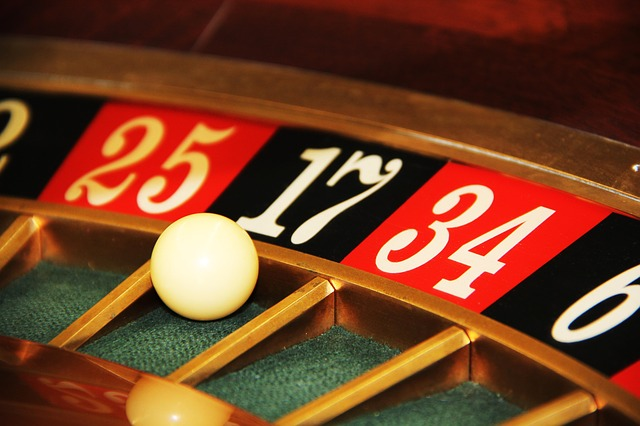

# Sampling variation {#SamplingVariation}


```{r, child = if (knitr::is_html_output()) {'./introductions/18-Tools-SamplingVariation-HTML.Rmd'} else {'./introductions/18-Tools-SamplingVariation-LaTeX.Rmd'}}
```


## Introduction {#SamplingVariationIntro}

The last two chapters introduced tools to apply the [decision-making process](#DecisionMaking) (Sect. \@ref(MakingDecisionsInResearch)) used in research:

1. Make an **assumption** about the population *parameter*.
1. Based on this assumption, describe what values the sample *statistic* might reasonably be **expected**  from all possible samples.
1. **Observe** the sample data, and see if it seems *consistent* with the expectation, or if it *contradicts* the expectation.

One key observation is that, under certain conditions, the variation of the *sample statistic* (such as the sample mean, etc.) from all possible samples can be described *approximately by a normal distribution*.
As a result, the expected behaviour of these statistics can be *described*, so we know what to **expect** from the sample *statistic* when the assumption is true.
We saw this in Sect. \@ref(MakingDecisionsInResearch): the sample proportion of red cards in a sample of 15 varied from hand to hand, and was approximately distributed as a normal distribution.
This is no accident: **Many sample statistics vary from sample to sample with an approximate normal distribution** if certain conditions are met.
This is called the *Central Limit Theorem*.

A *sampling distribution* describes the distribution of the sample statistic: How the value of the sample statistic varies from sample to sample for all possible samples.
The *sampling distribution* is often a normal distribution.


::: {.definition #SamplingDistribution name="Sampling distribution"}
A **sampling distribution** is the distribution of some sample statistic, showing how its value varies from sample to sample.
:::


## Sample proportions have a distribution {#SamplingDistributionProportions}

As with any sample statistic, sample proportions vary from sample to sample (Sect. \@ref(MakingDecisionsInResearch)); that is, *sampling variation* exists, so the sample proportions have a *sampling distribution*.
Consider a European roulette wheel
`r if (knitr::is_latex_output()) {
   '(Fig. \\@ref(fig:RouletteWheel); the online version has an animation):'
} else {
   'shown below in the animation:'
}`
a ball is spun and can land on any number on the wheel from 0 to 36 (inclusive).

Using the [classical approach to probability](#ProbClassical), the probability of the ball landing on an *odd* number 
(an '*odd-spin*') is $p = 18/37 =  0.486$.
If the wheel is spun (say) 15 times, the *sample* proportion of odd-spins in those 15, denoted $\hat{p}$, will vary.
Of course, the *sample* proportion $\hat{p}$ of odd-spins can vary after spinning the wheel 30, 50 or 100 times also.
How does $\hat{p}$ vary from one set of 15 spins to another set of 15 spins?


```{r echo=FALSE, results='hide', cache = FALSE}
date.str <- date()
seed <- as.numeric( paste( substr(date.str, 18, 19), # Second
                           substr(date.str, 15, 16),
                           sep = "") # Minutes
                       )
source("./R/RouletteWheel.R")
```


```{r SpinningWheel, echo=FALSE, animation.hook="gifski", interval=0.05, progress=TRUE, dev=if (is_latex_output()){"pdf"}else{"png"}}
if (knitr::is_html_output()){
  
  set.seed(seed) # Set a random seed based on current time

  # Wheel
  DD <- 10
  dd <- 4
  
  StartOffset <- sample( seq(-10, 10, 
                             by = 1), 
                         size = 1)
  Turns <- runif(n = 1, 
                 min = 2, 
                 max = 3)

  sectorAngle <- 360/37 # Angle of each of the 37 segments, IN DEGREES

  phi <- seq( from = (StartOffset * sectorAngle), # All of this is in degrees
              to   = (StartOffset * sectorAngle) + (Turns * 360),
              by   = sectorAngle) - sectorAngle/2 #So ball rests in the *middle* of each segment

  phir <- deg2rad(phi) # Convert to radians

  # Radius that changes
  radius <- seq(0.85 * DD, dd, 
                length = length(phi) )

  # Grey that colours, to show "moving" ball
  greyBall <- rgb(100, 100, 100,    
                  max = 255, 
                  alpha = seq(125, 0, length = length(phi)))

  Delay <- 75
  Stop <- length(phir) + Delay

  for (i in 1:Stop){ 
    if ( i <= length(phir)){

      spin <- plotSpinningWheel( angle = phir[i], 
                                 radius = radius[i], 
                                 wheelSize = c(DD, dd),
                                 plotShadow = ifelse( (i == length(phir)) | (i == 1), FALSE, TRUE),
                                 main = "Spinning..." )
    } else {
      spin <- plotSpinningWheel( angle = phir[length(phir)],
                                 radius = radius[length(phir)], 
                                 wheelSize = c(DD, dd),
                                 plotShadow = FALSE,
                                 main = paste("Spun a", spin$roll, "on", spin$colour) )
      # Plot stuff to make things stick
      points( x = runif(1, 0.8, 0.9) * DD,
              y = runif(1, 0.8, 0.9) * DD,
              col = "white")
    }

  }
}

```

```{r RouletteWheel, echo=FALSE, fig.cap="A European roulette wheel", cache=FALSE, out.width = "70%", fig.align="center", fig.width=3.75, fig.height=4}
if (knitr::is_latex_output()){

  # Wheel
  DD <- 10
  dd <- 4
  
  spin <- plotSpinningWheel( angle = deg2rad(360/37)/2, 
                             radius = dd, 
                             wheelSize = c(DD, dd),
                             plotShadow = FALSE,
                             main = "Roulette wheel" )
}
```


```{r echo=FALSE, results='hide'}
# Reset seed
set.seed(872364)
```


Computer simulation can be used to demonstrate what happens if the wheel was spun for $n = 15$ spins, over and over and over again, and the proportion of odd-spins was recorded for each repetition.
Clearly, the proportion of odd spins $\hat{p}$ can vary from sample to sample (sampling variation) for $n = 15$ spins, as shown by the histogram (Fig. \@ref(fig:RouletteWheelHist), top left panel).

If the wheel was spun (say) $n = 40$ times, something similar occurs (Fig. \@ref(fig:RouletteWheelHist), top right panel): the values of $\hat{p}$ vary from sample to sample.
The same process can be repeated for (say) $n = 70$ and $n = 100$ spins (Fig. \@ref(fig:RouletteWheelHist), bottom panels).
Notice that as the sample size $n$ gets larger, the *distribution* of the values of $\hat{p}$ look more like an approximate normal distribution, and the variation gets smaller.


```{r RouletteWheelHist, echo=FALSE, results='hide', fig.width=5, fig.cap="Sampling distributions for the proportion of roulette wheel spins that show an odd number", fig.align="center", out.width="85%", fig.width=7.5}
p <- 18/37
spins <- c(15, 30, 70, 100)

se <- sqrt( p * (1 - p) / spins )
break.list <- seq(0, 1, 
                  by = 1/15) 

num.sims <- 5000

par( mfrow = c(2, 2))

### Spin the wheel spins[1] * num.sims. times 
### and grab each sim set from there

xNorm <- seq(0, 1, 
             length = 100)

propOdd <- function(x){
	sum( (x%%2 !=0 ) ) / length(x)
}

set.seed(37945000)
spinNumbersAll <- sample( 0:36, 
                          spins[1] * num.sims, 
                          replace = TRUE)
spinNumbers <- array( spinNumbersAll, 
                      dim = c(spins[1], num.sims) )
sampleP <- apply( spinNumbers, 2, propOdd )

out <- hist( sampleP,
             breaks = break.list,
	     xlim = c(0, 1),
             axes = FALSE,
             col = plot.colour,
             xlab = "Sample proportions", 
             ylab = "",
             main = paste("From", spins[1], "spins\nof the wheel") )
yNorm <- dnorm(xNorm, 
               mean = p, 
	       sd = se[1]) 
lines( xNorm,
      (yNorm) / max(yNorm) * max(out$count),
      col = "black",
      lwd = 2)
axis(side = 1)


spinNumbersAll <- sample( 0:36, 
                          spins[2] * num.sims, 
                          replace = TRUE)
spinNumbers <- array( spinNumbersAll,   
                      dim = c(spins[2], num.sims) )
sampleP <- apply( spinNumbers, 2, propOdd )

out <- hist( sampleP, 
             breaks = break.list, 
             xlim = c(0, 1),
             axes = FALSE,
             col = plot.colour,
             xlab = "Sample proportions", 
             ylab = "",
             main = paste("From", spins[2], "spins\nof the wheel") )
yNorm <- dnorm(xNorm, 
               mean = p, 
	       sd = se[2]) 
lines( xNorm,
       (yNorm) / max(yNorm) * max(out$count),
       col = "black",
       lwd = 2)
axis(side = 1)


spinNumbersAll <- sample( 0:36,
                          spins[3] * num.sims, 
			  replace = TRUE)
spinNumbers <- array( spinNumbersAll, 
                      dim = c(spins[3], num.sims) )
sampleP <- apply( spinNumbers, 2, propOdd )

out <- hist( sampleP, 
             breaks = break.list, 
             xlim = c(0, 1),
             axes = FALSE,
             col = plot.colour,
             xlab = "Sample proportions", 
             ylab = "",
             main = paste("From", spins[3], "spins\nof the wheel") )
yNorm <- dnorm(xNorm, 
               mean = p, 
	       sd = se[3]) 
lines( xNorm,
       (yNorm) / max(yNorm) * max(out$count),
        col = "black",
        lwd = 2)
axis(side = 1)


spinNumbersAll <- sample( 0:36, 
                          spins[4] * num.sims, 
			  replace = TRUE)
spinNumbers <- array( spinNumbersAll, 
                      dim = c(spins[4], num.sims) )
sampleP <- apply( spinNumbers, 2, propOdd )

out <- hist( sampleP, 
             breaks = break.list, 
             xlim = c(0, 1),
             axes = FALSE,
             col = plot.colour,
             xlab = "Sample proportions", 
             ylab = "",
             main = paste("From", spins[4], "spins\nof the wheel") )
yNorm <- dnorm(xNorm, 
               mean = p, 
	       sd = se[4])
lines( xNorm,
       (yNorm) / max(yNorm) * max(out$count),
       col = "black",
       lwd = 2)
axis(side = 1)

```


::: {.importantBox .important data-latex="{iconmonstr-warning-8-240.png}"}
The values of the sample proportion vary from sample to sample.
The distribution of the possible values of the sample statistic (in this case the *sample* proportion) from sample to sample is called a *sampling distribution*.

Under certain conditions, the sampling distribution of a sample proportion is described by an approximate a normal distribution.
In general, the approximation gets better as the sample size gets larger.
:::


## Sample means have a distribution {#SamplingDistributionMeans}

As with any sample statistic, the sample mean varies from sample to sample (Sect. \@ref(MakingDecisionsInResearch)) just like sample proportions; that is, *sampling variation* exists, so the sample means have a *sampling distribution*.


<div style="float:right; width: 222x; border: 1px; padding:10px">

</div>


Consider a European roulette wheel again
`r if (knitr::is_latex_output()) {
   '(Fig. \\@ref(fig:RouletteWheel)).'
} else {
   '(Sect. \\@ref(SamplingDistributionProportions)).'
}`
Rather than recording the sample proportion of odd-spins, the *sample mean* of the numbers spun can be recorded.
So, for example, if the wheel is spun (say) 15 times, the *sample* mean of the spins $\bar{x}$ will vary.
Of course, spinning the wheel 30, 50 or 100 times also shows that the *sample* mean $\bar{x}$ can vary too.
How much can it vary?

Again, computer simulation can be used to demonstrate what could happen if the wheel was spun 15 times, over and over and over again, and the mean of the spun numbers was recorded for each repetition.
Clearly, the sample mean spin $\bar{x}$ can vary from sample to sample (sampling variation) for $n = 15$ spins (Fig. \@ref(fig:RouletteWheelHistx), top left panel).

When $n = 15$, the sample mean $\bar{x}$ indeed varies from sample to sample, and the *distribution* of the values of $\bar{x}$ have an approximate normal distribution.
If the wheel was spun more than 15 times (say, $n = 50$ times) something similar occurs (Fig. \@ref(fig:RouletteWheelHistx), top right panel): the values of $\bar{x}$ vary from sample to sample, and the values have an approximate normal distribution.
In fact, the values of $\bar{x}$ have a normal distribution for other numbers of spins also (Fig. \@ref(fig:RouletteWheelHistx), bottom panels).


```{r RouletteWheelHistx, echo=FALSE, results='hide', fig.width=5, fig.cap="Sampling distributions for the mean of the numbers after a roulette wheel spins a certain number of times", fig.align="center", out.width="75%"}
mu <- sum( 0:36 )/ 37
sigma <- sqrt( sum( ( (0:36) - mu )^2 )/37 )

spins <- c(15, 50, 100, 250)

se <- sigma / sqrt( spins )
break.list <- seq(0, 37, 
                  by = 1)

num.sims <- 5000

par( mfrow = c(2, 2))

### Spin the wheel spins[1] * num.sims. times 
### and grab each sim set from there
set.seed(37389457)

xNorm <- seq(0, 37, 
             length = 100)


spinNumbersAll <- sample( 0:36, 
                          spins[1] * num.sims, 
			  replace = TRUE)
spinNumbers <- array( spinNumbersAll, 
                      dim = c(spins[1], num.sims) )
sampleMeans <- colMeans(spinNumbers)

out <- hist( sampleMeans,
             breaks = break.list,
             xlim = c(5, 30),
             axes = FALSE,
             col = plot.colour,
             xlab = "Sample means", 
             ylab = "",
             main = paste("From", spins[1], "spins\nof the wheel") )
yNorm <- dnorm(xNorm, 
               mean = mu, 
	       sd = se[1]) 
lines( xNorm,
      (yNorm) / max(yNorm) * max(out$count),
      col = "black",
      lwd = 2)
axis(side = 1)


spinNumbersAll <- sample( 0:36, 
                          spins[2] * num.sims, 
			  replace = TRUE)
spinNumbers <- array( spinNumbersAll, 
                      dim = c(spins[2], num.sims) )
sampleMeans <- colMeans(spinNumbers)

out <- hist( sampleMeans, 
             breaks = break.list,
             xlim = c(5, 30),
             axes = FALSE,
             col = plot.colour,
             xlab = "Sample means", 
             ylab = "",
             main = paste("From", spins[2], "spins\nof the wheel") )
yNorm <- dnorm(xNorm, 
               mean = mu, 
	       sd = se[2])
lines( xNorm,
       (yNorm) / max(yNorm) * max(out$count),
       col = "black",
       lwd = 2)
axis(side = 1)


spinNumbersAll <- sample( 0:36, 
                          spins[3] * num.sims, 
			  replace = TRUE)
spinNumbers <- array( spinNumbersAll, 
                      dim = c(spins[3], num.sims) )
sampleMeans <- colMeans(spinNumbers)

out <- hist( sampleMeans, 
             breaks = break.list,
             xlim = c(5, 30),
             axes = FALSE,
             col = plot.colour,
             xlab = "Sample means", 
             ylab = "",
             main = paste("From", spins[3], "spins\nof the wheel") )
yNorm <- dnorm(xNorm, 
               mean = mu, 
	       sd = se[3]) 
lines( xNorm,
       (yNorm) / max(yNorm) * max(out$count),
       col = "black",
       lwd = 2)
axis(side = 1)


spinNumbersAll <- sample( 0:36, 
                          spins[4] * num.sims, 
			  replace = TRUE)
spinNumbers <- array( spinNumbersAll, 
                      dim = c(spins[4], num.sims) )
sampleMeans <- colMeans(spinNumbers)

out <- hist( sampleMeans, 
             breaks = break.list,
             xlim = c(5, 30),
             axes = FALSE,
             col = plot.colour,
             xlab = "Sample means", 
             ylab = "",
             main = paste("From", spins[4], "spins\nof the wheel") )
yNorm <- dnorm(xNorm, 
               mean = mu, 
	       sd = se[4]) 
lines( xNorm,
       (yNorm) / max(yNorm) * max(out$count),  
       col = "black",
       lwd = 2)
axis(side = 1)

```


::: {.importantBox .important data-latex="{iconmonstr-warning-8-240.png}"}
The values of the sample mean vary from sample to sample.
The distribution of the possible values of a sample statistic, in this case the *sample* mean, is called a *sampling distribution*.
Under certain conditions, the sampling distribution of a sample mean is a normal distribution.
:::


## Standard errors {#StandardErrors}

As we have seen, each sample is likely to be different, so *any* statistic estimated from the sample is likely to be different for each sample.
This is called *sampling variation*.


::: {.definition #SamplingVariation name="Sampling variation"}
*Sampling variation* refers to how much a sample estimate (a statistic) is likely to vary from sample to sample, because each sample is different.
:::


The value of the sample statistic can vary for every possible sample that we could select, so the actual value of the sample statistic that we observe depends on which sample we have.
That is, all the possible values of sample statistics that we could observe have a distribution (a *sampling distribution*).
Perhaps surprisingly, under certain conditions, the sampling distribution is a *normal distribution*.
If the sampling distribution is a normal distribution, it is reasonable to ask what the value of the *standard deviation*  of that normal distribution is.

Figs. \@ref(fig:RouletteWheelHist) and \@ref(fig:RouletteWheelHistx) show that the standard deviation appears to get *smaller* as the sample sizes get *larger*: the sample statistics show less variation for larger $n$.
This makes sense: *larger* samples generally produce more precise estimates.
(After all, that's the advantage of using larger samples: all else being equal, larger samples are preferred as they produce [more precise estimates](#PrecisionAccuracy).)

In other words, the sample statistic varies *less* in larger samples: the value of the standard deviation of the sampling distribution is *smaller* for *larger* samples.
The standard error is a measure of how precisely the *sample* [statistic](#StatisticsAndParameters) estimates the *population* [parameter](#StatisticsAndParameters).


::: {.example #StandardErrors name="Standard errors"}
Suppose the sample proportion of odd-spins on the roulette wheel (Sect. \@ref(SamplingDistributionProportions)) is estimated as $\hat{p} = 0.51$.
If the correesponding standard error was 0.01, this estimate is relatively precise: the standard error is very small, which means the value of $\hat{p}$ is not likely to vary greatly from one sample to the next.
Any single *estimate* of $p$ is likely to be close to $p$.

However, if the corresponding standard error was 0.2, the estimate of the population proportion is less precise: the standard error is larger, so the value of $\hat{p}$ is  likely to vary a lot from one sample to the next.
Any single *estimate* of $p$ may not be close to $p$.
:::


::: {.definition #StandardError name="Standard error"}
A *standard error* is the standard deviation of the sampling distribution of a statistic.
:::

To expand: If every possible sample (of a given size) was found, and the statistic computed from each sample, the standard deviation of these estimates is the *standard error*.

Recall from Sect. \@ref(SamplingVariationIntro) that, for many sample statistics, *the variation from sample to sample can be approximately described by a normal distribution* (the *sampling distribution*) if certain conditions are met.
Furthermore, the *standard deviation of this normal distribution is the standard error*.
The standard error is a special type of *standard deviation* that describes the variation in a sample estimate that varies from *from sample to sample*.


::: {.tipBox .tip data-latex="{iconmonstr-info-6-240.png}"}
The standard error is an unfortunate term: It is not an *error* or *mistake*, or even *standard*.
(For example, there is no such thing as a '*non*-standard error'.)
:::


## Standard deviation vs. standard error

Even
`r if (knitr::is_latex_output()) {
   'experienced researchers confuse the meaning and the usage of the terms'
} else {
   '[experienced researchers confuse the meaning and the usage of the terms](https://retractionwatch.com/2019/12/09/authors-retract-two-studies-on-high-blood-pressure-and-supplements-after-realizing-theyd-made-a-common-error/#more-118562)'
}`
*standard deviation* and *standard error* [@ko2014inappropriate].
Understanding the difference is important.

The [*standard deviation*](#VariationStdDev), in general, quantifies the amount of variation in any variable.
Without further qualification, the *standard deviation* quantifies how much individual observations vary from *individual to individual* (for *quantitative* data).

The *standard error* is a standard deviation that quantifies how much a *sample statistic* varies from *sample to sample* across all possible samples.
Crucially, the standard error *is* a standard deviation, but has a special name indicating it is the standard deviation of a statistic specifically.
*Any* numerical quantity estimated from a sample (a *statistic*) can vary from sample to sample, and so has sampling variation, a sampling distribution, and hence a standard error.


::: {.importantBox .important data-latex="{iconmonstr-warning-8-240.png}"}
*Any* quantity estimated from a sample (i.e., a statistic) has a standard error. 
Equivalently: *any* statistic varies from sample to sample and has a standard error.
:::


::: {.tipBox .tip data-latex="{iconmonstr-info-6-240.png}"}
The *standard error* is often abbreviated to 'SE' or 's.e.'.
For example, the '[standard error of the sample mean](#SamplingDistributionMeans)' is written as $\text{s.e.}(\bar{x})$, and the '[standard error of the sample proportion](#SamplingDistributionProportions)' is written as $\text{s.e.}(\hat{p})$.
:::


<iframe src="https://learningapps.org/watch?v=pk8ucviua22" style="border:0px;width:100%;height:500px" allowfullscreen="true" webkitallowfullscreen="true" mozallowfullscreen="true"></iframe>


## Summary {#Chap18-Summary}

A **sampling distribution** describes how the value of a sample statistic is likely to vary from sample to sample.
Under certain circumstances, the sampling distribution often can be described by a **normal distribution**.
The standard deviation of this normal distribution is called a **standard error**.
The standard error is a standard deviation that measures something specific: the variation in the sample statistic *from sample to sample*.


## Quick review questions {#Chap18-QuickReview}

1. *Why* is the phrase 'the standard error of the population proportion' inappropriate?  
`r if( knitr::is_html_output(exclude = "epub") ) {
	longmcq( c(
		answer = "Because only sample statistics vary from sample to sample",
		"Because proportions do not have a standard error",
		"Because proportions only have a standard deviation",
		"Because proportions come from qualitative data"
		))}`
	
`r if( !knitr::is_html_output(exclude = "epub") ) {
' 	 * Because only sample statistics vary from sample to sample
 	 * Because proportions do not have a standard error
 	 * Because proportions only have a standard deviation
 	* Because proportions come from qualitative data'
}`

1. *Which* one the following *does not* have a standard error?  
`r if( knitr::is_html_output(exclude = "epub") ) {
	longmcq( c(
		"The sample mean",
		"The difference between two sample means",
		"The sample proportion",
		"The sample odds ratio",
		answer = "The sample size"
		))}`
		
`r if( !knitr::is_html_output(exclude = "epub") ) {
' 	 * The sample mean
 	 * The difference between two sample means
 	 * The sample proportion
   * The sample odds ratio
   * The sample size'
}`


1. True or false: Sampling variation refers to how sample sizes vary.
`r if( knitr::is_html_output(exclude = "epub") ) {
	torf( answer=FALSE )}`

1. True or false: Sampling distributions describe parameters.
`r if( knitr::is_html_output(exclude = "epub") ) {
	torf( answer=FALSE )}`

1. True or false: Statistics do not vary from sample to sample.
`r if( knitr::is_html_output(exclude = "epub") ) {
	torf( answer=FALSE )}`

1. True or false: Populations are numerically summarised using parameters
`r if( knitr::is_html_output(exclude = "epub") ) {
	torf( answer=TRUE )}`

1. True of false: The *standard deviation* is a *standard error* of something quite specific.  
`r if( knitr::is_html_output(exclude = "epub") ) {
	torf( answer=FALSE )}`
	
1. True or false: 
Sampling distributions are always *normal* distributions.  
`r if( knitr::is_html_output(exclude = "epub") ) {
	torf( answer=FALSE )}`

1. True or false: 
Sampling variation measures the amount of variation in the individuals in the sample (for the variable of interest).  
`r if( knitr::is_html_output(exclude = "epub") ) {
	torf( answer = FALSE )}`

1. True or false: 
The standard error measures the size of the error when we use a sample to estimate a population.  
`r if( knitr::is_html_output(exclude = "epub") ) {
	torf( answer = FALSE )}`

1. True or false: 
In general terms, a standard deviation measures the amount of variation.   
`r if( knitr::is_html_output(exclude = "epub") ) {
	torf( answer = TRUE )}`

1. True or false: 
The standard error is a standard deviation, of something quite specific.  
`r if( knitr::is_html_output(exclude = "epub") ) {
	torf( answer = TRUE )}`

1. True or false: 
Sampling variation measures the size of the sample.   
`r if( knitr::is_html_output(exclude = "epub") ) {
	torf( answer = FALSE )}`


`r if (!knitr::is_html_output()) '<!--'`
::: {.progressBox .progress}
**Progress:**  `r webexercises::total_correct()`
:::
`r if (!knitr::is_html_output()) '-->'`


## Exercises {#SamplingVariationExercises}

Selected answers are available in Sect. \@ref(SamplingVariationExercisesAnswer).


::: {.exercise #StdErrorOrStdDeviation}
In the following scenarios, would a *standard deviation* or a *standard error* be the appropriate way to measure the amount of variation?
Explain.

1. Researchers are studying the spending habits of customers. 
   They would like to measure the variation in the amount spent by shoppers per transaction at a supermarket.
1. Researchers are studying the time it takes for inner-city office workers to travel to work each morning. 
   They would like to determine the precision with which their estimate (a mean of 47 minutes) has been measured.
1. A study examined the effect of taking a pain-relieving drug on children.
   The researchers wish to describe the sample they used in the study, including a description of how the ages of the children vary.
1. A study examined the effect of taking a pain-relieving drug in teenagers.
   The researchers wished to report the percentage of teenagers in the sample that experienced side-effects with some indication of the precision of that estimate.
:::


::: {.exercise #HasStandardError}
Which of the following have a *standard error*?

1. The population proportion.
1. The sample median.
1. The sample IQR.
1. The sample standard deviation.
1. The population odds.
:::


::: {.exercise #QuoteStdError}
A research article made this statement:

> Although [...] samples should always be summarized by the mean and SD [standard deviation], authors often use the standard error of the mean (SEM) to describe the variability of their sample [...]
> Although the SD and the SEM are related [...], they give two very different types of information.
> 
> --- @nagele2003misuse

If the standard error of the mean is not used to 'describe the variability of the sample', then what *is* it used for?
How would you explain the difference between the *standard error* and the *standard deviation* to researchers who misuse the terms?
:::


<!-- QUICK REVIEW ANSWERS -->
`r if (knitr::is_html_output()) '<!--'`
::: {.QRanswerBox .QRanswer data-latex="{iconmonstr-check-mark-14-240.png}"}
\textbf{Answers to \textit{Quick Revision} questions:}
**1a.** Because only *sample statistics* vary from sample to sample. 
**2.** The sample size.
**3.** False.
**4.** False.
**5.** False.
**6.** True.
**7.** False.
**8.** False.
**9.** False.
**10.** False.
**11.** True.
**12.** True.
**13.** False.
:::
`r if (knitr::is_html_output()) '-->'`


