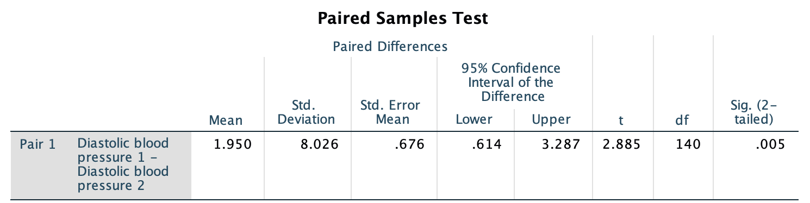

# CIs for mean differences (paired data) {#PairedCI}


```{r, child = if (knitr::is_html_output()) {'./introductions/23-CIs-MeanDifference-HTML.Rmd'} else {'./introductions/23-CIs-MeanDifference-LaTeX.Rmd'}}
```


## Introduction {#PairedIntro}


<div style="float:right; width: 222x; border: 1px; padding:10px">

</div>


What happens to students' weight when they start at university?
Among other changes, many students will be responsible for their own meals for the first time.
Perhaps these students forgo healthy foods for more convenient, but less healthy, foods.
This may mean that, on average, their weight increases.
Or perhaps they lose weight, as they cannot afford to purchase sufficient food.

One approach to studying this is to obtain some students' weights as they begin university, and then obtain some students' weight at some later time.
If the *same* students have their weights measured at both times, we would be comparing *within* individuals (Sect.\ \@ref(Comparison)).

This would be a *descriptive RQ*: the *Outcome* is the mean *change* in weight, and the response variable is the weight *change* for each individual student.
There is *no* between-individuals comparison.
Each students gets a *pair* of weight measurements.
The study produces *paired data*, which is the subject of this chapter.
	
Alternatively, the researchers could take a sample of students who are beginning university and measure their weight, and then take a *different* sample of students at some later time and measure their weight.
This would be comparing *between* individuals.
The second (between-individuals) design requires comparing the means of two different groups of students, the topic of the next chapter.


## Paired data {#PairedData}

*Paired data* refers to situations where every observation in one group is related to, or can be matched sensibly to, one unique observation in another group.
Because of this, computing the differences between the pairs of observations makes sense.
The two groups are *not* independent (Sect.\ \@ref(Independence)).

Pairing data, when appropriate, can be useful because individuals can vary substantially.
Taking two measurements from each individual, rather than from two different individuals, means that variables (potentially, other *confounding* variables) are held constant for those two observations.
In this sense, pairing is a form of blocking (Sect.\ \@ref(ExpManagingConfounding)).
Pairing is a good design strategy when the individuals in the pair are similar for many extraneous variables.


::: {.definition #PairedData name="Paired data"}
*Paired data* occurs in situations where every observation in one group is related to, or can be matched sensibly to, one unique observation in another group.
:::


Paired data arises in studies using a *within-individuals* comparison (Sect.\ \@ref(Comparison)), but appears in other ways too.
Consider these examples of paired data:

* Blood pressure is recorded on the same individuals *before* and *after* giving a drug (i.e., a *within-individuals* comparison).
  Each person receives a pair of measurements, and the *change* in blood pressure is recorded.
* The number of visitors is recorded at national parks on the first weekend in summer, and on the first weekend on winter.
  Each national park receives a pair of measurements, and the *change* in visitor numbers for each national park between these time points is recorded.
* Heart rate is measured for each individual when sitting and when standing.
    (Some individuals may have their heart rate recorded first while sitting, and some first while standing.)
  Each person receives a pair of measurements, and the *difference* in heart rate between sitting and standing is recorded.
* The body temperature of dogs is measured using two different types of thermometers.
  Each dog receives a pair of measurements, and the *difference* between the two recorded temperatures from the two thermometers is recorded.
* The thickness of the cornea is measured for each patients' glaucoma eye, and for each patients' non-glaucoma eye.
  The difference in corneal thickness is recorded for each patient.
* Height is measured for each twin in a pair.
  Pairing the heights for each twin is reasonable given the shared genetics (and perhaps environments also).
  The difference in the height of the twins can be recorded for each pair.

Many of these examples can be extended to beyond two measurements.
For instance, blood pressures can be recorded every thirty minutes, or temperatures can be compared using three different types of thermometers.
We only study pairs of measurements, and only for quantitative variable.


:::{.example #PairedUnpaired name="Paired and unpaired data"}
Consider the student weight-loss study described above.
Weight is measured for the same students at the start of university and after 12\ weeks at university.
Each student receives a pair of measurements, and the *change* in weight for each individual between these time points can be recorded
`r if (knitr::is_latex_output()) {
   '(Table\\ \\@ref(tab:DataWeightChange)).'
} else {
   '(data below).'
}`


A boxplot comparing students' weights at Week\ 1 and at Week\ 12 (that is, *not* treating the data as paired) shows that the distribution of weights, and the median weights, are very similar (Fig.\ \@ref(fig:ComparePairedBoxplots), left panel).
Any difference is difficult to see and detect due to the amount of variation in the weights of the students.
Changes in weight for individuals cannot be determined.

A boxplot of the weight *gains* (that is, treating the data as *paired*) makes the change in weight much easier to see and detect (Fig.\ \@ref(fig:ComparePairedBoxplots), right panel).
It is also easy to see that some students *lost* weight from Week\ 1 to Week\ 12.
:::

```{r ComparePairedBoxplots, fig.align="center", out.width='80%', fig.cap="Plots of the weight-loss data. Left: Treating the data incorrectly as not paired; right: a boxplot of the weight gains when the data are treated as paired.", fig.height = 3.5, fig.width = 7}
data(StudentWt)

par(mfrow = c(1, 2))

boxplot( cbind(StudentWt$Week1,
               StudentWt$Week12),
         names = c("Week 1", "Week 12"),
         las = 1,
         ylim = c(40, 105),
         ylab = "Weight (in kg)",
         main = "A boxplot of student weights\nin Week 1 and Week 12")

boxplot(StudentWt$GainWt,
        las = 1,
        ylim = c(-2.5, 4),
        ylab = "Weight gain (in kg)",
        main = "Boxplot of weight gains\nfrom Week 1 to Week 12")
abline(h = 0,
       col = "grey")


#hist(StudentWt$GainWt,
#     xlab = "Weight gain (in kg)",
#     ylab = "No. of students",
#     main = "Histogram of weight gains")
# plot(x = c(0.75, 2.25),
#      y = c(40, 110),
#      type = "n",
#      las = 1,
#      ylab = "Weight (in kg)",
#      xlab = "",
#      main = "iugoiug")
# 
#  for (i in 1:length(StudentWt$Week1)){
#    lines( x = c(1, 2),
#           y = c(StudentWt$Week1[i],
#                 StudentWt$Week12[i]) )
# }

```


<!-- Since each unit of analysis has two observations about weight, the *change* (or the *difference*) in weight can be computed for *each* student. -->
<!-- Then, questions can be asked about the *population mean difference*, which is not the same as *difference between two separate population means* (the subject of the next chapter). -->
<!-- In paired data, finding the difference between the two measurements for each *individual* unit of analysis makes sense, since each unit of analysis (each student) has two related observations. -->


::: {.thinkBox .think data-latex="{iconmonstr-light-bulb-2-240.png}"}
Which of these are paired situations?\label{thinkBox:WhichPaired}

1. The blood pressure was recorded for 36 people, before and after taking a drug, to determine how much the average blood pressure reduces.
1. The mean HDL cholesterol concentration is recorded for 22 males and 19 females, and the means compared.
1. The mean protein concentrations were compared in sea turtles before and after being rehabilitated  [@data:March2018:turtles].

`r if (knitr::is_latex_output()) '<!--'`
`r webexercises::hide()`
Situations **1** and **3** are paired situations.
`r webexercises::unhide()`
`r if (knitr::is_latex_output()) '-->'`
:::


## Mean differences {#CIMeanDiffExample}

The example introduced in Sect.\ \@ref(PairedIntro) was studied by Prof. David Levitsky (@levitsky2004freshman, @DASL:WeightChange):

> For Cornell University students, what is the *mean weight gain* in students after 12 weeks at university?

Data were obtained data to answer this descriptive RQ 
`r if (knitr::is_latex_output()) {
   '(Table\\ \\@ref(tab:DataWeightChange)).'
} else {
   '(shown below).'
}`
The parameter is $\mu_d$, the population mean *weight gain* (in kg).
The subscript $d$ is because we are working with *differences* between the initial weight and the weight after 12 weeks.


```{r}
data(StudentWt)
SWlen <- length(StudentWt$Week1)
```

<!-- Case-profile plot not very helpful: -->

<!-- for (i in (1:68)){lines( x=c(1,2), y = c(StudentWt$Week1[i], StudentWt$Week12[i]));  -->
<!-- points(x=c(1,2), y = c(StudentWt$Week1[i], StudentWt$Week12[i]), pch= 19, cex = 0.5)} -->

```{r DataWeightChange}
tb1 <- surroundMaths( StudentWt[1:5, ],
                      decDigits = 1)

T1 <- knitr::kable(tb1,
                   format = "latex",
                   valign = 't',
                   align = c("r", "c", "c", "r"),
                   linesep = "",
                   col.names = c("Student", 
                                 "Week 1", 
                                 "Week 12", 
                                 "gain"),
                   row.names = FALSE,
                   escape = FALSE,
                   booktabs = TRUE) %>%
  add_header_above( c("  " = 1,
                      "Weight:" = 1, 
                      "Weight:" = 1, 
                      "Weight" = 1),
                    line = FALSE,
                    bold = TRUE) %>%
  row_spec(0, bold = TRUE)

tb2 <- surroundMaths( StudentWt[(SWlen - 4):SWlen, ],
                      decDigits = 1)
T2 <- knitr::kable(tb2,
                   format = "latex",
                   valign = 't',
                   align = c("r", "c", "c", "r"),
                   linesep = "",
                   col.names = c("Student", 
                                 "Week 1", 
                                 "Week 12", 
                                 "gain"),
                   row.names = FALSE,
                   escape = FALSE,
                   booktabs = TRUE) %>%
  add_header_above(c( " " = 1, 
                      "Weight:" = 1, 
                      "Weight:" = 1, 
                      "Weight" = 1),
                   line = FALSE,
                   bold = TRUE) %>%
  row_spec(0, bold = TRUE)

out <- knitr::kables(list(T1, T2),
                     format = "latex",
                     label = "DataWeightChange",
                     caption = "The student weight-change data: The weight of students in Week\\ 1 at university, in Week\\ 12, and the weight gain (all in kg). These are the first five and the last five of the $68$ total observations.") %>% 
  kable_styling(font_size = 10)
out2 <- prepareSideBySideTable(out) 
out2

```

```{r}
if( knitr::is_html_output() ) {
  kable( StudentWt,
         format = "html",
         booktabs = TRUE,
         longtable = FALSE, 
         col.names = c("Student", "Week 1", "After 12 weeks", "Weight gain"),
         caption = "The student weight-change data: The weight of students in Week\\ 1 at university, in Week\\ 12, and the weight gain (all in kg)") %>% 
    kable_styling(font_size = 10) %>%
    row_spec(0, bold = TRUE)
}
```

Finding the *difference* in weight for each student seems sensible: each student has a *Week\ 1* and *Week\ 12* measurement.
Using these differences, the process for computing a CI is the same as in Chap.\ \@ref(OneMeanConfInterval), where these changes (or differences) are treated as the data.
Either weight *gain* or weight *loss* could be used as the differences.


::: {.tipBox .tip data-latex="{iconmonstr-info-6-240.png}"}
Be clear about *how* the differences are computed.
Differences could be computed as  *Week\ 1* minus *Week\ 12* (the weight *loss*), or *Week\ 12* minus *Week\ 1* (the weight *gain*).

Either is fine: provided you are consistent throughout, the meaning of any conclusions will be the same.
Here, we use weight *gain* since it is explicitly mentioned in the RQ.
:::


::: {.importantBox .important data-latex="{iconmonstr-warning-8-240.png}"}
Some weight gains are *negative*.
This does *not* mean a negative weight, since the values are *differences* (specifically, weight *gains*).
The differences are computed as *Week\ 12* minus *Week\ 1*, so a negative value means that the *Week\ 1 weight* is greater than the *Week\ 12 weight* value: that is, a weight *loss*.
:::


## Notation {#PairedNotationCI}

The notation used for paired data reflects that we work with the *differences* (Table\ \@ref(tab:PairedNotation)).
Apart from that, the notation is similar to that used in Chap.\ \@ref(OneMeanConfInterval).


```{r PairedNotation}
DiffNotation <- array(dim=c(5, 2))
colnames(DiffNotation) <- c(	"One sample mean", 
                             "Mean of paired data")
rownames(DiffNotation) <- c(	"The observations:",
                             "Sample mean:",
                             "Standard deviation:",
                             "Standard error of sample mean:",
                             "Sample size:")


if( knitr::is_latex_output() ) {
  DiffNotation[1, ] <- c(	"Values: $x$", 
                          "Differences: $d$")
  DiffNotation[2, ] <- c(	"$\\bar{x}$",		
                          "$\\bar{d}$")
  DiffNotation[3, ] <- c(	"$s$", 			
                          "$s_d$")
  DiffNotation[4, ] <- c(	"$\\displaystyle\\text{s.e.}(\\bar{x}) = \\frac{s}{\\sqrt{n}}$",
                          "$\\displaystyle\\text{s.e.}(\\bar{d}) = \\frac{s_d}{\\sqrt{n}}$")
  DiffNotation[5, ] <- c(	"Number of \\emph{observations}: $n$",
                          "Number of \\emph{differences}: $n$")
  
  kable( DiffNotation,
         format = "latex",
         booktabs = TRUE,
         align = c("c", "c"),
         longtable = FALSE,
         escape = FALSE,
         col.names = colnames(DiffNotation),
         caption = "The notation used for mean differences (paired data) compared to the notation used for one sample mean") %>%
    kable_styling(font_size = 10) %>%
    row_spec(0, bold = TRUE) 
}
if( knitr::is_html_output() ) {
  
  DiffNotation[1, ] <- c(	"Values: $x$", 	
                          "Differences: $d$")
  DiffNotation[2, ] <- c(	"$\\bar{x}$",		
                          "$\\bar{d}$")
  DiffNotation[3, ] <- c(	"$s$", 			
                          "$s_d$")
  DiffNotation[4, ] <- c(	"$\\displaystyle\\text{s.e.}(\\bar{x}) = \\frac{s}{\\sqrt{n}}$",
                          "$\\displaystyle\\text{s.e.}(\\bar{d}) = \\frac{s_d}{\\sqrt{n}}$")
  DiffNotation[5, ] <- c(	"Number of *observations*: $n$",
                          "Number of *differences*: $n$")
  
  kable( DiffNotation,
                format = "html",
                booktabs = TRUE,
                longtable = FALSE,
                align = c("c", "c"),
                col.names = colnames(DiffNotation),
                caption = "The notation used for mean differences (paired data) compared to the notation used for one sample mean") %>%
    row_spec(0, bold = TRUE) 
}
```


## Summarising data

An appropriate graph is *a histogram* of the *differences* (Fig.\ \@ref(fig:WeightGainHistogram)).
Graphing the *Week\ 1* and *Week\ 12* data may also be useful too, but a graph of the differences is *crucial*, as the RQ is about the differences.
A case-profile plot (Sect.\ \@ref(CaseProfilePlot)) is also useful, but is difficult to read here as the sample size is large (a case-profile plot contains a line for each unit of analysis).


```{r WeightGainHistogram, fig.cap="A histogram of weight changes (the vertical grey line represents no weight gain)", fig.align="center", out.width='60%', fig.width=6.0, fig.height = 3.0}
#par( mfrow = c(1, 2))

out <- hist( StudentWt$GainWt,
             plot = FALSE)

plot(x = c(-3, 4),
     y = c(0, 40),
      xlab = "Weight gain (kg)",
      ylab = "Frequency",
      las = 1,
     type = "n",
      main = "Histogram of weight gain")
box()

abline(v = 0, 
       col = "grey", 
       lty = 1,
       lwd = 2)
plot(out,
     add = TRUE,
      col = plot.colour)
```


Since the RQ is about the differences, a numerical summary of the differences is essential.
The Week\ 1 and the Week\ 12 data can also be summarised
`r if (knitr::is_latex_output()) {
   '(Table\\ \\@ref(tab:WeightGainSummary)).'
} else {
   '(see below).'
}`
Since the weights and the differences are quantitative, the appropriate *numerical summary* includes means, standard deviations, and so on, as appropriate.
(Notice that the standard deviation of the difference is **not** the difference between the two given values of the standard deviation.)

A numerical summary of the weight gain (e.g., using a computer) gives the sample mean of the differences as $\bar{d} = -0.8735$, the standard deviation of the differences as $s_d = 0.9489378$, and the standard error as  
\[
  \text{s.e.}(\bar{x}) =  \frac{0.9563659}{\sqrt{68}} = 0.1150756.
\]
A formal numerical summary table is shown in Table\ \@ref(tab:WeightGainSummary).
All statistics are slightly different in Weeks\ 1 and\ 12.
(Notice that the standard deviation for the weight gain is *not* the difference between the Week\ 1 and the Week\ 12 standard deviation; instead, it is the standard deviation of the weight gains of individuals.)

```{r WeightGainSummary}
WtGain.DataSummary <- array( dim = c(3, 4))

WtGain.DataSummary[1, 1] <- mean(StudentWt$Week1)
WtGain.DataSummary[2, 1] <- mean(StudentWt$Week12)
WtGain.DataSummary[3, 1] <- mean(StudentWt$GainWt)

WtGain.DataSummary[1, 2] <- median(StudentWt$Week1)
WtGain.DataSummary[2, 2] <- median(StudentWt$Week12)
WtGain.DataSummary[3, 2] <- median(StudentWt$GainWt)

WtGain.DataSummary[1, 3] <- sd(StudentWt$Week1)
WtGain.DataSummary[2, 3] <- sd(StudentWt$Week12)
WtGain.DataSummary[3, 3] <- sd(StudentWt$GainWt)

WtGain.DataSummary[1, 4] <- findStdError(StudentWt$Week1)
WtGain.DataSummary[2, 4] <- findStdError(StudentWt$Week12)
WtGain.DataSummary[3, 4] <- findStdError(StudentWt$GainWt)

rownames(WtGain.DataSummary) <- c("Week 1 weight (in kg)", 
                                  "Week 12 weight (in kg)", 
                                  "Weight gain (in kg)")

if( knitr::is_latex_output() ) {
  kable(surroundMaths(WtGain.DataSummary,
                      decDigits = c(2, 1, 2, 2)),
        format = "latex",
        booktabs = TRUE,
        longtable = FALSE,
        escape = FALSE,
        align = c("r", "r", "r", "r"),
        col.names = c("Mean", "Median", "Standard deviation", "Standard error"),
        digits = 2,
        caption = "The mean, median, standard deviation and standard error for the weight-gain data") %>%
    row_spec(0, bold = TRUE) %>%
    row_spec(3, italic = TRUE) %>%
    kable_styling(font_size = 10)
} else {
  kable(WtGain.DataSummary,
        format = "html",
        booktabs = TRUE,
        longtable = FALSE,
        escape  = FALSE,
        align = c("r", "r", "r", "r", "r"),
        col.names = c("Mean", "Median", "Standard deviation", "Standard error"),
        digits = 2,
        caption = "The mean, median, standard deviation and standard error for the weight-gain data") %>%
    row_spec(0, bold = TRUE) 
}
```


## Describing sampling distribution 

The study concerns the mean weight gain.
Every possible sample of $n = 68$ students comprises different students, and hence produces different Week\ 1 and Week\ 12 weights, and hence different weight gains.
As a result, the sample mean weight gain will vary from sample to sample, so the mean differences have a *sampling distribution*, and a *standard error*.

Since the differences are like a single sample of data (Chap.\ \@ref(OneMeanConfInterval)), the sampling distribution for the differences will have a similar sampling distribution to the mean of a single sample $\bar{x}$ (provided the conditions are met; Sect.\ \@ref(ValidityPaired)).


::: {.definition #DEFSamplingDistributionDbar name="Sampling distribution of a sample mean difference"}
The *sampling distribution of a sample mean differences* is (when certain conditions are met (Sect.\ \@ref(ValidityPaired)) described by:

* an approximate normal distribution,
* centred around the *sampling mean* whose value is the population mean *difference* $\mu_d$,
* with a standard deviation, called the standard error of the difference, of $\displaystyle\text{s.e.}(\bar{d}) = \frac{s_d}{\sqrt{n_d}}$,

where $n$ is the size of the sample, and $s_d$ is the standard deviation of the individual differences in the sample.
:::


::: {.importantBox .important data-latex="{iconmonstr-warning-8-240.png}"}
A mean or a median may be appropriate for describing the *data*.
However, the CI is about the *mean* of the data, and *not* about the data itself.

Since the sampling distribution for the sample mean difference (under certain conditions) has a symmetric *normal distribution*, the mean *is* appropriate for describing the sampling distribution.
:::


For the weight-gain data, the the sample mean differences $\bar{d}$ are described by:

* approximate normal distribution;
* with a sampling mean whose value is $\mu_{{d}}$;
* with a *standard error* of $0.1159764$.

Many decimal places are shown here; results will be rounded when reported.
 
 


<!-- ```{r NotationOneDiffCI} -->

<!-- OneDiffNotation <- array( dim = c(4, 2)) -->

<!-- OneDiffNotation[1, ] <- c("Individual difference in the population", -->
<!--                           "Vary with mean $\\mu_d$ and standard deviation $\\sigma_d$") -->
<!-- OneDiffNotation[2, ] <- c("Individual differences in a sample", -->
<!--                           "Vary with mean $\\bar{d}$ and standard deviation $s_d$") -->
<!-- OneDiffNotation[3, ] <- c("Sample means ($\\bar{d}$) across", -->
<!--                           "Vary with approx. normal distribution (under certain conditions)") -->
<!-- OneDiffNotation[4, ] <- c("all possible samples:", -->
<!--                           "sampling mean $\\mu_{{d}}$; standard deviation $\\text{s.e.}(\\bar{d})$") -->


<!-- if( knitr::is_latex_output() ) { -->
<!--   kable( OneDiffNotation, -->
<!--          format = "latex", -->
<!--          booktabs = TRUE, -->
<!--          longtable = FALSE, -->
<!--          escape = FALSE, -->
<!--          caption = "The notation used for describing means, and the sampling distribution of the sample means", -->
<!--          align = c("r", "l"), -->
<!--          linesep = c("\\addlinespace", -->
<!--                      "\\addlinespace", -->
<!--                      ""), -->
<!--          col.names = c("Quantity", -->
<!--                        "Description") ) %>% -->
<!-- 	row_spec(0, bold = TRUE) %>% -->
<!--   kable_styling(font_size = 10) -->
<!-- } else { -->
<!--   OneDiffNotation[3, 1] <- paste(OneDiffNotation[3, 1],  -->
<!--                                  OneDiffNotation[4, 1]) -->
<!--   OneDiffNotation[3, 2] <- paste(OneDiffNotation[3, 2],  -->
<!--                                  OneDiffNotation[4, 2]) -->
<!--   OneDiffNotation[4, ] <- NA  -->

<!--     kable( OneDiffNotation, -->
<!--          format = "html", -->
<!--          booktabs = TRUE, -->
<!--          longtable = FALSE, -->
<!--          escape = FALSE, -->
<!--          caption = "The notation used for describing means, and the sampling distribution of the sample means", -->
<!--          align = c("r", "l"), -->
<!--          linesep = c("\\addlinespace", -->
<!--                      "\\addlinespace", -->
<!--                      ""), -->
<!--          col.names = c("Quantity", -->
<!--                        "Description") ) %>% -->
<!-- 	row_spec(0, bold = TRUE)  -->
<!-- } -->
<!-- ``` -->


## Computing confidence intervals

The CI for the mean difference has the same form as for a single mean (Chap.\ \@ref(OneMeanConfInterval)), so an approximate $95$% confidence interval (CI) for $\mu_d$ is  
\[
	\bar{d} \pm (2 \times\text{s.e.}(\bar{d})).
\]
This is the same as the CI for $\bar{x}$ if the differences are treated like the data.
For the weight-gain data:  
\[
	0.8618 \pm (2 \times 0.1159764),
\]
or $0.8618\pm 0.2319528$ (so the *margin of error* is $0.232$).
Equivalently, the CI is from $0.8618 - 0.23195 = 0.630$, up to $0.8618 + 0.232195 = 1.094$.
We write:

> Based on the sample, the mean weight gain from Week\ 1 and\ 12 is $0.86$\ kg ($\text{s.e.} = 0.116$; $n = 68$), with an *approximate* $95$% CI from $0.63$\ kg to $1.09$\ kg.

The $95$% CI means that the plausible values for the population mean weight gain are between $0.63$\ kg and $1.09$\ kg.
Alternatively, 
we are $95$% confident that, between Weeks\ 1 and\ 12, the population mean weight gain is between using $0.63$\ kg and $1.09$\ kg.


<iframe src="https://learningapps.org/watch?v=piue8vvyk22" style="border:0px;width:100%;height:600px" allowfullscreen="true" webkitallowfullscreen="true" mozallowfullscreen="true"></iframe>


## Statistical validity conditions {#ValidityPaired}

As with any confidence interval, these results apply [under certain conditions](#exm:StatisticalValidityAnalogy).
The conditions under which the CI is statistically valid for paired data are similar to those for one sample mean, rephrased for differences.

The CI computed above is statistically valid if *one* of these conditions is true:

1. The sample size of differences is at least $25$; *or*
1. The sample size of differences is smaller than $25$,
   *and*
   the *population* of *differences* has an approximate normal distribution.

The sample size of $25$ is a rough figure here, and some books give other (similar) values (such as $30$).
This condition ensures that the *distribution of the sample means has an approximate normal distribution* (so that, for example, the [68--95--99.7 rule](#def:EmpiricalRule) can be used).
Provided the sample size is larger than about $25$, this will be approximately true *even if* the distribution of the individuals in the population does not have a normal distribution.
That is, when $n > 25$ the sample means generally have an approximate normal distribution, even if the data themselves don't have a normal distribution.


::: {.example #StatisticalValidityWeightGain name="Statistical validity"}
For the weight-gain data, the sample size is $n = 68$, larger than $25$, so the results are statistically valid.
We do not require that the differences *in the population* follow a normal distribution.
:::


## Using software

Statistical software can produce *exact* $95$% CIs, which may be slightly different than the *approximate* $95$% CI (since the 68--95--99.7 rule gives *approximate* multipliers).
For the weight-loss data, the *approximate* and *exact* $95$% CIs are the same to two decimal places.
From the jamovi output (Fig.\ \@ref(fig:WeightGainTestOutput)) we can write:

> Based on the sample, the mean weight gain from Week\ 1 to Week\ 12 is $0.86$\ kg ($\text{s.e.} = 0.116$; $n= 68$), with a $95$% CI between $0.63$ to $1.09$\ kg


```{r WeightGainTestOutput, fig.cap="The weight-gain data: jamovi output", fig.align="center", out.width="100%", fig.show="hold"}
knitr::include_graphics("jamovi/WeightGain/WeightGain-PairedTOutput.jpg")
```


## Example: soil nitrogen {#PairedCI-SoilN}

A study [@lambie2021microbial] compared the percentage nitrogen (N) in soils from irrigated and non-irrigated intensively grazed pasture sites.
The researchers paired irrigated and non-irrigated  sites (p. 338):

> The irrigated and non-irrigated pairs within each site were within $100$\ m of each other and were on the same soil, landform and usually the same farm with the same farm management on both treatments.

The data are *paired* (Sect.\ \@ref(PairedIntro)), which is a form of blocking (Sect.\ \@ref(ExpManagingConfounding)).
One RQ in the study was:

> For intensively grazed pastures sites, is there a mean reduction in percentage soil nitrogen (N) when sites are irrigated, compared to non-irrigated?

The data are shown in
`r if( knitr::is_latex_output() ) {
    'Table\\ \\@ref(tab:SoilCN).'
} else {
    'the table below.'
}`
The parameter is $\mu_d$, which we define as the population mean *reduction* in percentage N when sites are irrigated, compared to non-irrigated.


::: {.tipBox .tip data-latex="{iconmonstr-info-6-240.png}"}
Explaining *how* the differences are computed is important.  

The differences here are the percentage N in *irrigated* sites minus percentage N in *non-irrigated* sites.
However, the differences could be computed as the percentage N in *non-irrigated* sites minus percentage N in *irrigated* sites.
*Either is fine*, as long as you remain consistent throughout.
The meaning of any conclusions will be the same.  
:::


```{r}
data(SoilCN)

SoilN <- subset(SoilCN, 
                select = c(IrrigatedN, NonirrigatedN))
SoilN$Change <- SoilN$NonirrigatedN - SoilN$IrrigatedN

Nlen <- length(SoilN$TotalCI) 

if( knitr::is_latex_output() ) {
  
 T1 <- knitr::kable(surroundMaths(SoilN[1:14, ],
                                   decDigits = 2),
                     format = "latex",
                     valign = 't',
                     align = "r",
                     linesep = "",
                     col.names = c("Not irrigated", "Irrigated", "Reduction"),
                     row.names = FALSE,
                     escape = FALSE,
                     booktabs = TRUE) %>%
    row_spec(0, bold = TRUE) 
  
  
  T2 <-knitr::kable(surroundMaths(SoilN[15:28, ],
                                   decDigits = 2),
                     format = "latex",
                     valign = 't',
                     align = "r",
                     linesep = "",
                     col.names = c("Irrigated", "Not irrigated", "Reduction"),
                     row.names = FALSE,
                     escape = FALSE,
                     booktabs = TRUE) %>%
    row_spec(0, bold = TRUE)
  
  out <- knitr::kables(list(T1, T2),
                       format = "latex",
                       label = "SoilCN",
                       caption = "The percentage total nitrogen in irrigated and non-irrigated soils.") %>% 
    kable_styling(font_size = 10)
  out2 <- prepareSideBySideTable(out) 
  out2 
}

if( knitr::is_html_output() ) {
  kable( SoilN,
         format = "html",
         booktabs = TRUE,
         longtable = FALSE,
         col.names = c("Irrigated", "Not irrigated"),
         caption = "he percentage total nitrogen in irrigated and non-irrigated soils.") %>% 
    kable_styling(font_size = 10) %>%
    row_spec(0, bold = TRUE)
}
```


Since the raw data are available, the data should be summarised graphically (Fig.\ \@ref(fig:SoilNGraphs)) and numerically (Table\ \@ref(tab:SoilNSummary)), using software (Fig.\ \@ref(fig:Nitrogenjamovi)).


=======
## Example: crayfish


A study of growth patterns in adult male northern crayfish recorded the carapace (shell) length before and after moulting (CITE) to estimate the change in carapace size.
The RQ is:

> For adult male northern crayfish, what is the decrease in mean carapace length after moulting?

Cabrera, Doreen; Griffen, Blaine D. (2023). Data for: Northern crayfish form alternation morphometrics [Dataset]. Dryad. https://doi.org/10.5061/dryad.15dv41p2j


```{r echo=TRUE}
read.csv("Data/Crayfish.csv")

CFtab <- cbind("Before" = CL1, 
               "After" = CL2)

knitr::kable(CFtab)

t.test(CF$CL1, CF$CL2, paired=TRUE)
```


## Example: endangered species: REMOVE {#EndangeredCI}

A study of endangered species (@harnish2020attitudes, p. 1703) examined 

> ...whether perceived physical attractiveness of a species impacted participants' attitudes toward supporting and protecting the species...

To do so, $210$ undergraduate students were surveyed about $14$ animals on various aspects of supporting and protecting them.
Part of the data are summarised in Table\ \@ref(tab:SpeciesSummary) (raw data unavailable), for two animals, when asked about 'support to protect the animal from illicit trade'.
*Larger* values means *greater* support for protecting the animal from illicit trade.


```{r SpeciesSummary}
SpeciesSummary <- array(dim = c(3, 3))
rownames(SpeciesSummary) <- c("Bay Checkerspot Butterfly", 
                              "Valley Elderberry Longhorn Beetle",
                              "Difference")

SpeciesSummary[1, ] <- c(3.10, 1.06, 0.073)
SpeciesSummary[2, ] <- c(2.33, 1.13, 0.078)
SpeciesSummary[3, ] <- c(0.77, 1.07, 0.074)
  

if( knitr::is_latex_output() ) {
  kable( surroundMaths(SpeciesSummary,
                       decDigits = 2),
        format = "latex",
        longtable = FALSE,
        booktabs = TRUE,
        escape = FALSE,
        #linesep = c("", "", "", "\\addlinespace", "", "", "", "\\addlinespace", "", "", "", ""), # Otherwise adds a space after five lines... 
        align = c("c", "c", "c"),
        col.names = c("Mean score", 
                      "Standard deviation",
                      "Standard error"),
        caption = "The endangered-species data summary"
  ) %>%
  row_spec(0, bold = TRUE) %>%
  row_spec(3, italic = TRUE) %>%
  kable_styling(font_size = 10)
}
if( knitr::is_html_output() ) {
  kable(SpeciesSummary,
               format = "html",
               longtable = FALSE,
               booktabs = TRUE,
        align = c("c", "c", "c"),
        col.names = c("Mean score", 
                      "Standard deviation",
                      "Standard error"),
        caption = "The endangered-species data summary"
  ) %>%
  row_spec(3, bold = TRUE) %>%
  kable_styling(full_width = FALSE)
}
```


The *difference* is defined as each student's score for the butterfly (deemed more attractive) *minus* their score for the beetle (deemed less attractive).
A positive value therefore means more support (on average) for the butterfly.

The parameter is $\mu_d$, the population mean difference.
The mean difference is $\bar{d} = 0.77$ and $s_d = 1.07$.
The value of $\bar{d}$ will vary from sample to sample, so has a standard error, as shown in the table, of  $\text{s.e.}(\bar{d}) = s_d/\sqrt{n} = 1.07/\sqrt{210} = 0.073837$.

Using an approximate multiplier of\ $2$, the margin of error is $2 \times 0.073837 = 0.147674$, so an approximate $95$% CI for the difference in support *in the population* is $0.77\pm 0.147674$, or from $0.62$ to $0.92$.
We write:

> From the sample, the mean difference between the support for preventing illicit trades of the Bay Checkerspot Butterfly compared to the Valley Elderberry Longhorn Beetle is $0.77$ ($\text{s.e.} = 0.15$; $n = 210$), with an approximate $95$% CI between $0.62$ and $0.92$ higher for the Bay Checkerspot Butterfly.


## Example: blood pressure: REMOVE? {#BloodPressure}

```{r}
data(Diabetes)

Diabetes$Diff <- Diabetes$DBPfirst - Diabetes$DBPsecond

n.D.diff <- length( Diabetes$Diff ) - sum( is.na(Diabetes$Diff) )
se.D.diff <- sd(Diabetes$Diff, na.rm = TRUE) / sqrt(n.D.diff)
```


<div style="float:right; width: 222x; border: 1px; padding:10px">

</div>


A US study [@data:Willems1997:CHD; @data:Schorling1997:smoking] examined how CHD risk factors were assessed among parts of the population with diabetes.
Subjects reported to the clinic on multiple occasions.
Consider this RQ:

> What is the mean difference in diastolic blood pressure from the first to the second visit? 

Each person has a *pair* of diastolic blood pressure (DBP) measurements: One each from their first and second visits.
The data
`r if (knitr::is_latex_output()) {
   '(some shown in Table\\ \\@ref(tab:DiabetesDataTable))'
} else {
   '(shown below)'
}`
are from the $141$ people for whom *both* measurements are available (some data are missing).
The differences could be computed as:

* The first visit DBP minus the second visit DBP: the *reduction* in DBP;  or
* The second visit DBP minus the first visit DBP: the *increase* in DBP.

Either way is fine, provided the order is used consistently.
Here, the observation from the *second* visit will be used, so that the differences represent the *reduction* in DBP from the first to second visit.
The parameter is $\mu_d$, the population mean *reduction* in DBP.


\begin{figure}
\centering
\begin{minipage}{0.45\textwidth}%
\captionof{table}{The first six observations (from the $n = 141$ available) from the diabetes study for people with both measurements: Diastolic blood pressure (DBP) for the first and second visits, and the decrease in DBP, all in mm Hg\label{tab:DiabetesDataTable}}
\fontsize{10}{12}\selectfont
```{r}
DiffExists <- complete.cases(Diabetes[, c("DBPfirst", 
                                      "DBPsecond", 
                                      "Diff")])
diabData <- Diabetes[DiffExists, c("DBPfirst", 
                               "DBPfirst", 
                               "Diff")]
diabData <- rbind( head(diabData),
                   c("$\\vdots$", "$\\vdots$", "$\\vdots$") )

knitr::kable(surroundMaths(diabData,
                           decDigits = 0),
             format = "latex",
             booktabs = TRUE,
             align = c("P{16mm}","P{16mm}","P{20mm}"),
             longtable = FALSE,
             escape = FALSE,
             linesep = "",
             table.env = "@empty",
             row.names = FALSE,
             col.names = c("DBP: 1st visit", "DBP: 2nd visit", "Reduction in DBP") ) %>%
  row_spec(row = 0, bold = TRUE)
#kable_styling(font_size = 10) # CANNOT USE THIS IN THE MINIPAGE, hence the font-changing command above
```
\end{minipage}
\hspace{0.06\textwidth}
\begin{minipage}{0.43\textwidth}%
\centering
```{r DiabetesHIST, fig.width=3.75, out.width='95%'}
hist(Diabetes$Diff,
	col = plot.colour,
	xlab = "DBP decrease (in mm Hg)",
	las = 2,
	xlim = c(-30, 40),
	ylim = c(0, 50),
	ylab = "Frequency",
	main = "")
box()
```
\caption{Histogram of the decrease in DBP between the first and second visits\label{fig:DiabetesHIST}}
\end{minipage}
\end{figure}


```{r DiabetesDataTable2}
DiffExists <- complete.cases(Diabetes[, c("DBPfirst", 
                                      "DBPsecond", 
                                      "Diff")])


if( knitr::is_html_output() ) {
  DT::datatable( Diabetes[DiffExists, c("DBPfirst", 
                                    "DBPsecond", 
				    "Diff")],
                 fillContainer = FALSE, # Make more room, so we don't just have ten values
                 colnames = c("First", "Second", "Differences"),
                 options = list(searching = FALSE), # Remove searching: See: https://stackoverflow.com/questions/35624413/remove-search-option-but-leave-search-columns-option
                 caption = "The observations from the diabetes study for people with both measurements: Diastolic blood pressure (DBP) for the first and second visits, and the decrease in DBP, all in mm Hg")
}
```


Since the dataset is large, the appropriate graphical summary is a histogram of differences 
`r if (knitr::is_latex_output()) {
   '(Fig.\\ \\@ref(fig:DiabetesHIST)).'
} else {
   '(Fig.\\ \\@ref(fig:DiabetesHIST2)).'
}`
The numerical summary can summarise both the first and second visit observations, but *must* summarise the *differences*.
Numerical summaries can be computed using software, then reported in a suitable table (Table\ \@ref(tab:DiabSummTable)).

<!-- The figure for LaTeX is in the minipage (combined with data table), so only need show it for the HTML -->
`r if (knitr::is_latex_output()) '<!--'`
```{r DiabetesHIST2, fig.cap="Histogram of the decrease in DBP between the first and second visits", fig.align="center", fig.width=5, fig.height=3.5}
hist(Diabetes$Diff,
	col = plot.colour,
	xlab = "DBP decrease (in mm Hg)",
	las = 2,
	xlim = c(-30, 40),
	ylim = c(0, 50),
	ylab = "Frequency",
	main = "")
box()
```
`r if (knitr::is_latex_output()) '-->'`


```{r DiabSummTable}
Diab.Table <- array( dim = c(3, 4))

n.diab <- function(x){
  length(x) - sum( is.na(x))
}

se.diab <- function(x) {
  sd(x, na.rm = TRUE) / sqrt(n.diab(x) )
}

Diab.Table[1, 1] <- mean(Diabetes$DBPfirst[DiffExists], na.rm = TRUE)
Diab.Table[2, 1] <- mean(Diabetes$DBPsecond[DiffExists], na.rm = TRUE)
Diab.Table[3, 1] <- mean(Diabetes$Diff[DiffExists], na.rm = TRUE)

Diab.Table[1, 2] <- sd(Diabetes$DBPfirst[DiffExists], na.rm = TRUE)
Diab.Table[2, 2] <- sd(Diabetes$DBPsecond[DiffExists], na.rm = TRUE)
Diab.Table[3, 2] <- sd(Diabetes$Diff[DiffExists], na.rm = TRUE)

Diab.Table[1, 3] <- se.diab(Diabetes$DBPfirst[DiffExists])
Diab.Table[2, 3] <- se.diab(Diabetes$DBPsecond[DiffExists])
Diab.Table[3, 3] <- se.diab(Diabetes$Diff[DiffExists])

Diab.Table[1, 4] <- n.diab(Diabetes$DBPfirst[DiffExists])
Diab.Table[2, 4] <- n.diab(Diabetes$DBPsecond[DiffExists])
Diab.Table[3, 4] <- n.diab(Diabetes$Diff[DiffExists])

rownames(Diab.Table) <- c("DBP: First visit", 
                          "DBP: Second visit", 
                          "Decrease in DBP")

if( knitr::is_latex_output() ) {
kable(surroundMaths(Diab.Table,
                    decDigits = c(2, 3, 3, 0) ),
      format = "latex",
      booktabs = TRUE,
      longtable = FALSE,
      escape = FALSE,
      align = c("r", "c", "c", "c"),
      linesep = c("","","\\addlinespace"),
      col.names = c("Mean", "Standard deviation", "Standard error", "Sample size"),
      digits = c(2, 3, 3, 0),
      caption = "The numerical summary for the diabetes data (in mm Hg). The differences are the second visit value minus the first visit value: the decreases in diastolic blood pressure from the first to second visit") %>%
  row_spec(0, bold = TRUE) %>%
  row_spec(3, italic = TRUE) %>%
  kable_styling(font = 10)
}
if( knitr::is_html_output() ) {
kable(Diab.Table,
      format = "html",
      booktabs = TRUE,
      longtable = FALSE,
      col.names = c("Mean", "Standard deviation", "Standard error", "Sample size"),
      digits = c(2, 3, 3, 0),
      caption = "The numerical summary for the diabetes data (in mm Hg). The differences are the second visit value minus the first visit value: the decreases in diastolic blood pressure from the first to second visit")
}
```

	
The *standard error* of the sample mean is  
\[
   \text{s.e.}(\bar{d})=\frac{s_d}{\sqrt{n}} = \frac{8.02614}{\sqrt{141}} = 0.67592.
\]
Using an approximate multiplier of $2$, the margin of error is $2 \times 0.67592 = 1.3518$, so an approximate $95$% CI for the decrease in DBP is $1.9504\pm 1.3518$, or from $0.60$ to $3.30$&nbsp;mm Hg, after rounding sensibly.
We write:

> Based on the sample, an *approximate* $95$% CI for the mean *decrease* in DBP is from $0.60$ to $3.30$\ mm Hg.

The *exact* $95$% CI from jamovi or SPSS (Fig.\ \@ref(fig:BloodPressureResults)), using an exact $t$-multiplier rather than an approximate multiplier of $2$, is similar since the sample size is large.
After rounding, write:

> Based on the sample, an exact $95$% CI  for the decrease in DBP is from $0.61$ to $3.29$\ mm Hg.

The wording ('for the *decrease* in DBP') implies which reading is the higher reading on average: the first.


```{r BloodPressureResults, fig.cap="jamovi output (top) and SPSS output (bottom) for the blood pressure data, including the exact 95\\% CI", , fig.show="hold", fig.align="center", out.width="85%"}
knitr::include_graphics( "jamovi/Diabetes/Diabetes-Test.png" )

```


::: {.importantBox .important data-latex="{iconmonstr-warning-8-240.png}"}
Be clear in your conclusion about *how* the differences are computed.
:::


The CI is statistically valid as the sample size is larger than $25$.
(The *data* do not need to follow a normal distribution.)


::: {.thinkBox .think data-latex="{iconmonstr-light-bulb-2-240.png}"}
Is there a mean difference in DBP *in the population*?\label{thinkBox:MeanDifferenceDBP}

`r if (knitr::is_latex_output()) '<!--'`
`r webexercises::hide()`
Be careful: The RQ is about the mean difference in the **population**... but we only have the mean difference from one of the many possible **samples**.
So it is difficult to be certain.
`r webexercises::unhide()`
`r if (knitr::is_latex_output()) '-->'`
:::

## Quick review questions {#Chap23-QuickReview}

::: {.webex-check .webex-box}
1. True or false: For paired data, the mean of the *differences* is treated like the mean of a single variable.\tightlist  
`r if( knitr::is_html_output() ) { torf( answer=TRUE )}`
1. True or false: The appropriate graph for displaying paired data is often a histogram of the differences.  
`r if( knitr::is_html_output() ) { torf( answer=TRUE )}`
1. True or false: The population mean difference is denoted $\mu_d$.  
`r if( knitr::is_html_output() ) { torf( answer=TRUE )}`
1. True or false: The standard error of the sample mean difference is denoted $s_d$.  
`r if( knitr::is_html_output() ) { torf( answer=FALSE )}`
:::


## Exercises {#PairedCIExercises}

Selected answers are available in Sect.\ \@ref(PairedCIExercisesAnswer).


::: {.exercise #PairedCIExercisesBrocolli}
Some people struggle to eat the recommended intake of vegetables.
In one study exploring ways to increase vegetable intake in teens [@data:Fritts2018:Vegetables], teens rated the taste of raw broccoli, and raw broccoli served with a specially-made dip.

Each teen ($n = 100$) had a *pair* of measurements: the taste rating of the broccoli *with* and *without* dip.
Taste was assessed using a '$100$\ mm visual analog scale', where a *higher* score means a *better* taste.
In summary:

* For raw broccoli, the mean taste rating was $56.0$ (with a standard deviation of $26.6$);
	 <!-- %  (SDs); so if $n=101$ we'd get SE: 2.647 -->
* For raw broccoli served with dip, the mean taste rating was $61.2$ (with a standard deviation of $28.7$).

Because the data are paired, the *differences* are the best way to describe the data.
The mean difference in the ratings was $5.2$, with $\text{s.e.}(\bar{d}) = 3.06$. 
From this information:

1. Construct a suitable numerical summary table.
1. Compute the approximate $95$% CI for the mean difference in taste ratings.
:::
<!-- (working backwards from the $t$-score). Looks like $n=101$. n=100...? -->


```{r}
data(Captopril)

Captopril$Differences <- Captopril$Before - Captopril$After

bloodS <- subset(Captopril, BP == "S")
bloodS <- bloodS[, c("Before", 
                     "After", 
		     "Differences")]

bloodS2 <- cbind( "Before" = bloodS$Before[1:8], 
                  "After" = bloodS$After[1:8],
                  "Before" = c(bloodS$Before[9:15], NA), 
                  "After" = c(bloodS$After[9:15], NA) )
```


    
::: {.exercise #PairedCIExercisesCaptopril}
In a study of hypertension [@data:hand:handbook; @data:macgregor:essential], $15$ patients were given a drug (Captopril) and their systolic blood pressure measured (in mm Hg) immediately before and two hours after being given the drug (Table\ \@ref(tab:CICaptoprilData)).

1. Explain why it is sensible to compute differences as the *Before* minus the *After* measurements.
   What do the differences *mean* when computed this way?
1. Compute the differences.
1. Compute an *approximate* $95$% CI for the mean difference.
1. Write down the *exact* $95$% CI using the computer output (Fig.\ \@ref(fig:CaptoriljamoviCI)). 
1. Why are the two CIs different?
:::


```{r CICaptoprilData}
if( knitr::is_latex_output() ) {
  bloodS <- rbind( bloodS, 
                   c(NA, NA, NA) )
  T1 <- kable( surroundMaths(bloodS[1:8, ],
                             decDigits = 0),
               format = "latex",
               row.names = FALSE,
               booktabs = TRUE,
               align = c("c", "c", "r"),
               escape = FALSE,
               longtable = FALSE) %>%
    row_spec(0, bold = TRUE)
  T2 <- kable( surroundMaths(bloodS[9:16, ],
                             decDigits = 0),
               format = "latex",
               row.names = FALSE,
               booktabs = TRUE,
               align = c("c", "c", "r"),
               escape = FALSE,
               longtable = FALSE) %>%
    row_spec(0, bold = TRUE)

  out <- knitr::kables(list(T1, T2),
                       format = "latex",
                       label = "CICaptoprilData",
                       caption = "The Captopril data: before after after systolic blood pressures (in mm Hg)") %>% 
    kable_styling(font_size = 10)  
  out2 <- prepareSideBySideTable(out, 
                                 numberOfTables = 2,
                                 gap = "\\quad") 
  out2
}
if( knitr::is_html_output() ) {
  kable( bloodS2,
                format = "html",
                booktabs = TRUE,
                caption = "The Captopril data: before after after systolic blood pressures (in mm Hg)",
                longtable = FALSE
                ) %>%
    add_header_above(header = c("  " = 2, "  " = 2), 
		     bold = TRUE, 
		     align = "c")
}
```


```{r CaptoriljamoviCI, fig.cap="jamovi (top) and SPSS (bottom) output for the Captoril data", fig.align="center", out.width="80%", fig.show="hold"}
knitr::include_graphics("jamovi/CaptoprilAll/CaptoprilAll-PairedTOutput.png") 
knitr::include_graphics("SPSS/CaptoprilAll/CaptoprilAll-PairedTOutput.png")
```


::: {.exercise #PairedCIExercisesSmokeExercise}
A study  [@data:Allen2018:Smoking] examined the effect of exercise on smoking.
Men and women were assessed on their 'intention to smoke', both before and after exercise for each subject (using two quantitative questionnaires).
Smokers (smoking at least five cigarettes per day) aged 18 to 40 were enrolled for the study.
For the $23$ women in the study, the mean intention to smoke after exercise *reduced* by $0.66$ (with a standard error of $0.37$).

1. Find a $95$% confidence interval for the population mean reduction in intention to smoke for women after exercising.
1. Is this CI statistically valid?
:::

```{r out.width='80%'}
data(Anorexia)

ANCB <- subset(Anorexia, 
               Treatment=="CB")
```


::: {.exercise #PairedCIExercisesAnorexia}
Young girls ($n = 29$) with anorexia received cognitive behavioural treatment (@data:hand:handbook, Dataset 285), and their weight before and after treatment were recorded.
In summary:

* Before the treatment, the mean weight was `r round(mean(ANCB$Before), 2)` pounds ($s = `r round(sd(ANCB$Before), 2)`$ pounds);
* After the treatment, the mean weight was `r round(mean(ANCB$After), 2)` pounds ($s = `r round(sd(ANCB$After), 2)`$ pounds).

If the standard deviation of the weight *loss* was `r round(sd( ANCB$After - ANCB$Before), 2)` pounds, find a 95% CI for the population mean weight loss. 
Do you think the treatment had any impact on the mean weight of the girls?
:::


::: {.exercise #StressSurgeryCI}
The concentration of beta-endorphins in the blood is a sign of stress.
One study (@data:hand:handbook, Dataset 232; @hoaglin2011exploring) measured the beta-endorphin concentration for $19$ patients about to undergo surgery.

Each patient had their beta-endorphin concentrations measured $12$--$14$ hours before surgery, and also $10$ minutes before surgery.
A numerical summary (from the jamovi output) is in Table\ \@ref(tab:StressTable).


```{r StressTable}
data(Stress)

Stress$Diff <- Stress$BeforeMins - Stress$BeforeHours

STtable <- array( dim = c(3, 4) )

rownames(STtable) <- c("12--14 hours before surgery",
                       "10 minutes before surgery",
                       "Increase")
colnames(STtable) <- c("Sample mean",
                       "Std deviation",
                       "Std error",
                       "Sample size")

STtable[, 1] <- c(mean(Stress$BeforeHours),
                  mean(Stress$BeforeMins),
                  mean(Stress$Diff))
STtable[, 2] <- c(sd(Stress$BeforeHours),
                  sd(Stress$BeforeMins),
                  sd(Stress$Diff))
STtable[, 4] <- c(length(Stress$BeforeHours),
                  length(Stress$BeforeMins),
                  length(Stress$Diff))
STtable[, 3] <- STtable[, 2] / sqrt( STtable[, 4])     


if( knitr::is_latex_output() ) {
kable(surroundMaths(STtable,
                    decDigits = c(2, 2, 2, 0) ),
      format = "latex",
      booktabs = TRUE,
      longtable = FALSE,
      escape = FALSE,
      align = c("r", "r", "r", "c"),
      col.names = c("Mean", "Std deviation", "Std error", "Sample size"),
      #digits = c(2, 2, 2, 0),
      caption = "The numerical summary for the presurgical stress data") %>%
  row_spec(0, bold = TRUE) %>%
  row_spec(3, italic = TRUE) %>%
  kable_styling(font = 10)
}
if( knitr::is_html_output() ) {
kable(STtable,
      format = "html",
      booktabs = TRUE,
      longtable = FALSE,
      col.names = c("Mean", "Std deviation", "Std error", "Sample size"),
      digits = c(2, 3, 3, 0),
      caption = "The numerical summary for the presurgical stress data")
}

```


1. Use the jamovi output in Fig.\ \@ref(fig:StressDescriptivesjamovi) to construct an *approximate* $95$% CI for the *increase* in stress as surgery gets closer.
2. Use the jamovi output in Fig.\ \@ref(fig:StressDescriptivesjamovi) to write down the *exact* $95$% CI for the *increase* in stress as surgery gets closer.
3. Is the CI likely to be statistically valid?
:::


```{r StressDescriptivesjamovi, fig.cap="jamovi output for the surgery-stress data", fig.align="center", out.width='70%'}
knitr::include_graphics("jamovi/Stress/StressDescriptives.png")
```


::: {.exercise #MeanDiffCOVIDCI}
A study of $n = 213$ Spanish health students [@romero2020physical] measured (among other things) the number of minutes of vigorous physical activity (PA) performed by students *before* and *during* the COVID-19 lockdown (from March to April 2020 in Spain).
Since the *before* and *during* lockdown were both measured on *each* participant, the data are *paired* (within individuals).
The data are summarised in Table\ \@ref(tab:COVIDsummaryTable).

1. Explain what the differences *mean*.
1. Compute the standard error of the differences.
1. Compute the approximate $95$% CI, and interpret what it means.
:::


```{r COVIDsummaryTable}
COVID.summary     <- array( dim = c(3, 2))
colnames(COVID.summary) <- c("Mean (mins)", 
                             "Std dev (mins)")
rownames(COVID.summary) <- c("Before",
                             "During",
                             "Increase")


COVID.summary[1, ] <- c(28.47,
                        54.13)
COVID.summary[2, ] <- c(30.66,
                        30.04)
COVID.summary[3, ] <- c(2.68,
                        51.30)


if( knitr::is_latex_output() ) {
  knitr::kable( surroundMaths(COVID.summary,
                              decDigits = 2),
               format = "latex",
               booktabs = TRUE,
               longtable = FALSE,
               escape = FALSE,
               caption = "Summary information for the COVID-lockdown exercise data",
               align = c("r", "r")) %>%
    row_spec(0, bold = TRUE) %>%
    row_spec(3, italic = TRUE) %>%
    kable_styling(font_size = 10)
} 
if( knitr::is_html_output() ) {
   knitr::kable( COVID.summary,
                 format = "html",
                 caption = "Summary information for the COVID-lockdown exercise data")
}
```


<!-- QUICK REVIEW ANSWERS -->
`r if (knitr::is_html_output()) '<!--'`
::: {.EOCanswerBox .EOCanswer data-latex="{iconmonstr-check-mark-14-240.png}"}
**Answers to in-chapter questions:**

- Sect. \ref{thinkBox:WhichPaired}: Situations **1** and **3** are paired.
- Sect. \ref{thinkBox:MeanDifferenceDBP}: Be careful: The RQ is about the mean difference in the **population**... but we only have the mean difference from one of the many possible **samples**.
  So it is difficult to be certain.
- \textbf{\textit{Quick Revision} questions:}
**1.** True
**2.** True.
**3.** True.
**4.** False.
:::
`r if (knitr::is_html_output()) '-->'`

