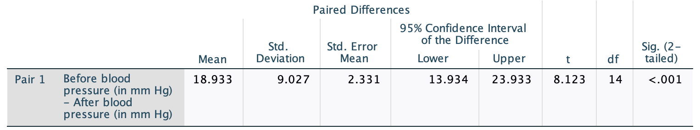

# CIs for mean differences (paired data) {#PairedCI}


```{r, child = if (knitr::is_html_output()) {'./introductions/23-CIs-MeanDifference-HTML.Rmd'} else {'./introductions/23-CIs-MeanDifference-LaTeX.Rmd'}}
```


## Mean differences {#PairedInsulation}


<div style="float:right; width: 222x; border: 1px; padding:10px">

</div>


House insulation is important for saving energy, particularly in cold climates.
A UK study sought to estimate the average energy savings made by using a new type of house insulation.
Different study designs could be used to address this.

One approach is to take a sample of homes, and measure the energy consumption *before* adding the insulation, and then *after* adding the insulation for the same houses.
Each home gets *two* observations: the energy consumption *before* and *after* adding the insulation.
This would be comparing [within individuals](#Comparison).

This would be a *descriptive RQ*: the *Outcome* is the mean energy *saving*, and the response variable is the energy saving for each house.
There is *no* between-individuals comparison: units of analysis that have been treated differently are not compared.
	
Alternatively, the researchers could take a sample of homes *without* the insulation, and measure their energy consumption; then take a *different* sample of homes with the insulation, and measure their energy consumption.
This would be comparing [between individuals](#Comparison).

This would be a *relational RQ*: the *Outcome* is the mean energy consumption, and the response variable is the energy consumption for each house.
The Comparison is between units of analysis *with* the insulation, and units of analysis *without* the insulation.

Either study is possible, and each has advantages and disadvantages. 
<!-- [@data:Zimmerman1997:Pairedt]. -->
Here the *first* (within-individuals) design would seem superior (why?).
In the first design, each home gets a *pair* of energy consumption measurements, and produces *paired data*, which is the subject of this chapter.
The second (between-individuals) design requires the means of two different groups of homes to be compared, the topic of the next chapter.


::: {.definition #PairedData name="Paired data"}
Data are *paired* when two observations about the same variable are recorded for each unit of analysis.
Paired data come from [*within individual* comparisons](#Comparison).
:::


Since each unit of analysis has two observations about energy consumption, the *change* (or the *difference*, or the *reduction*) in energy consumption can be computed for *each* house.
Then, questions can be asked about the *population mean difference*, which is not the same as *difference between two separate population means* (the subject of the next chapter).
In paired data, finding the difference between the two measurements for each individual unit of analysis makes sense, since each unit of analysis (each house) has two related observations.


::: {.thinkBox .think data-latex="{iconmonstr-light-bulb-2-240.png}"}
Which of these are paired situations?\label{thinkBox:WhichPaired}

1. The blood pressure is recorded for 36 people, before and after taking a drug, to determine how much the average blood pressure reduces.
1. The mean HDL cholesterol concentration is recorded for 22 males and 19 females, and the mean compared.
1. The mean protein concentrations were compared in sea turtles before and after being rehabilitated to identify any changes [@data:March2018:turtles].

`r if (knitr::is_latex_output()) '<!--'`
`r webexercises::hide()`
Situations **1** and **3** are paired situations.
`r webexercises::unhide()`
`r if (knitr::is_latex_output()) '-->'`
:::


## Mean differences: An example {#CIMeanDiffExample}

The *Electricity Council* in Bristol wanted to determine if a certain type of wall-cavity insulation reduced energy consumption in winter (@data:OpenUni:insulationBA, @data:hand:handbook).
Their (Descriptive) RQ was:

> In Bristol homes, what is the *mean reduction* in energy consumption after adding home insulation?

The parameter is $\mu_d$, the population mean *reduction* in energy consumption.
The subscript $d$ is because we are working with *differences* between the before and after measurements.
For the collected data
`r if (knitr::is_latex_output()) {
   '(Table \\@ref(tab:DataInsulation))'
} else {
   '(shown below)'
}`
the same variable (energy consumption) is measured twice for each unit of analysis (the house): *before* and *after* adding insulation.

Finding the *difference* in energy consumption for each house seems sensible: each house gets a *before* and *after* measurement.
Once the differences are computed, the process for computing a CI is the same as in Chap.&nbsp;\@ref(OneMeanConfInterval), where these changes (or differences) are treated as the data.


::: {.tipBox .tip data-latex="{iconmonstr-info-6-240.png}"}
Be clear about *how* the differences are computed.
Differences could be computed as  *Before* minus *After* (the energy consumption *saving*), or *After* minus *Before* (the energy consumption *increase*).
\smallskip

Either is fine: provided you are consistent throughout, the meaning of any conclusions will be the same.
Here, discussing energy *savings* seems most natural, so we compute the differences as energy *savings*: *Before* minus *After*.
:::


```{r DataInsulation, echo=FALSE}
insulate <- read.csv("./Data/InsulationBeforeAfter.csv")

insulate$Diff <- insulate$Before - insulate$After
insulate$Home <- paste("Home", 
                       LETTERS[1:10])
insulate <- insulate[, c(4, 1:3)] # Reorder with HOME first column
  
if( knitr::is_latex_output() ) {
  
  tb1 <- insulate[1:5, ]
  T1 <- knitr::kable(tb1,
                     format = "latex",
                     valign = 't',
                     align = c("r", "c", "c", "c"),
                     linesep = "",
                     row.names = FALSE,
                     escape = FALSE,
                     booktabs = TRUE) %>%
    row_spec(0, bold = TRUE)

  tb2 <- insulate[6:10, ]
  T2 <- knitr::kable(tb2,
                     format = "latex",
                     valign = 't',
                     align = c("r", "c", "c", "c"),
                     linesep = "",
                     row.names = FALSE,
                     escape = FALSE,
                     booktabs = TRUE) %>%
    row_spec(0, bold = TRUE)

    out <- knitr::kables(list(T1, T2),
                       format = "latex",
                       label = "DataInsulation",
                       caption = "The house insulation data: Energy consumption before and after adding insulation, and the energy saving (all in MWh)") %>% 
    kable_styling(font_size = 10)
  out2 <- prepareSideBySideTable(out) 
  out2


}
if( knitr::is_html_output(exclude = "epub") ) {
  DT::datatable( round(insulate, 1),
                 fillContainer = FALSE, # Make more room, so we don't just have ten values
                 options = list(searching = FALSE), # Remove searching: See: https://stackoverflow.com/questions/35624413/remove-search-option-but-leave-search-columns-option
                 caption = "The house insulation data: Energy consumption before and after adding insulation, and the energy saving (all in MWh)")
}

if( knitr::is_html_output() ) {
  kable( insulate,
         format = "html",
         booktabs = TRUE,
         longtable = FALSE,
         col.names = c("Home", "Before", "After", "Energy savings"),
         caption = "The house insulation data: Energy consumption before and after adding insulation, and the energy saving (all in MWh)") %>%
  kable_styling(font_size = 10) %>%
  row_spec(0, bold = TRUE)
}
```


::: {.importantBox .important data-latex="{iconmonstr-warning-8-240.png}"}
One energy saving value is *negative* (Home F).
This does *not* mean negative energy *usage*, since the values are *differences* (specifically, energy *reductions* or *savings*).
The differences are computed as *Before* minus *After*, so a negative value means that the *After* value is greater than the *Before* value: an *increase* in energy consumption.
:::


As always, begin by understanding the data, and produce appropriate graphical and numerical summaries.


::: {.thinkBox .think data-latex="{iconmonstr-light-bulb-2-240.png}"}
What graphs would be suitable for displaying these data?\label{thinkBox:WhichGraph}
`r if (knitr::is_latex_output()) '<!--'`
* Boxplot  
`r if( knitr::is_html_output(exclude = "epub") ) {
	 mcq( c("Suitable", answer = "Not suitable"))}`   
* A histogram  
`r if( knitr::is_html_output(exclude = "epub") ) {
	 mcq( c("Suitable", answer = "Not suitable"))}`   
* A histogram of the differences (such as the energy savings) for each house  
`r if( knitr::is_html_output(exclude = "epub") ) {
	 mcq( c(answer = "Suitable", "Not suitable"))}`   
* A case-profile plot  
`r if( knitr::is_html_output(exclude = "epub") ) {
	 mcq( c(answer = "Suitable", "Not suitable"))}`   
`r if (knitr::is_latex_output()) '-->'`
:::


## Notation: Mean differences {#PairedNotationCI}

The notation used for paired data reflects that we work with the *differences* (Table \@ref(tab:PairedNotation)).
Apart from that, the notation is similar to that used in Chap.&nbsp;\@ref(OneMeanConfInterval).


```{r PairedNotation, echo=FALSE}
DiffNotation <- array(dim=c(5, 2))
colnames(DiffNotation) <- c(	"One sample mean", 
                                "Mean of paired data")
rownames(DiffNotation) <- c(	"The observations:",
                                "Sample mean:",
                                "Standard deviation:",
                                "Standard error of sample mean:",
                                "Sample size:")


if( knitr::is_latex_output() ) {
  DiffNotation[1, ] <- c(	"Values: $x$", 
                                "Differences: $d$")
  DiffNotation[2, ] <- c(	"$\\bar{x}$",		
                                "$\\bar{d}$")
  DiffNotation[3, ] <- c(	"$s$", 			
                                "$s_d$")
  DiffNotation[4, ] <- c(	"$\\displaystyle\\text{s.e.}(\\bar{x}) = \\frac{s}{\\sqrt{n}}$",
                                "$\\displaystyle\\text{s.e.}(\\bar{d}) = \\frac{s_d}{\\sqrt{n}}$")
  DiffNotation[5, ] <- c(	"Number of \\emph{observations}: $n$",
                                "Number of \\emph{differences}: $n$")

  kable( DiffNotation,
         format = "latex",
         booktabs = TRUE,
         align = c("c", "c"),
         longtable = FALSE,
         escape = FALSE,
         col.names = colnames(DiffNotation),
         caption = "The notation used for mean differences (paired data) compared to the notation used for one sample mean") %>%
  kable_styling(font_size = 10) %>%
  row_spec(0, bold = TRUE) 
}
if( knitr::is_html_output() ) {

  DiffNotation[1, ] <- c(	"Values: $x$", 	
                                "Differences: $d$")
  DiffNotation[2, ] <- c(	"$\\bar{x}$",		
                                "$\\bar{d}$")
  DiffNotation[3, ] <- c(	"$s$", 			
                                "$s_d$")
  DiffNotation[4, ] <- c(	"$\\displaystyle\\text{s.e.}(\\bar{x}) = \\frac{s}{\\sqrt{n}}$",
                                "$\\displaystyle\\text{s.e.}(\\bar{d}) = \\frac{s_d}{\\sqrt{n}}$")
  DiffNotation[5, ] <- c(	"Number of *observations*: $n$",
                                "Number of *differences*: $n$")

  out <- kable( DiffNotation,
         format = "html",
         booktabs = TRUE,
         longtable = FALSE,
         align = c("c", "c"),
         col.names = colnames(DiffNotation),
         caption = "The notation used for mean differences (paired data) compared to the notation used for one sample mean")
  if ( knitr::is_html_output(excludes = "epub")) {
    row_spec(out, 0, bold = TRUE) 
  } else {
    out
  }
 
}
```


## Summaries: Mean differences

An appropriate graph is *a histogram* of the *differences* (Fig.&nbsp;\@ref(fig:InsulationHistogram)).
Graphing the *Before* and *After* data may also be useful too, but a graph of the differences is *crucial*, as the RQ is about the differences.
A case-profile plot (Sect.&nbsp;\@ref(CaseProfilePlot)) is also useful, but is sometimes harder to produce in software, and difficult to read when the sample size is large (as the graph contains a line for each unit of analysis).


```{r InsulationHistogram, echo=FALSE, fig.cap="A plot of the energy savings from the insulation data. Left panel: A histogram (the vertical grey line represents no energy saving). Right panel: Case-profile plot (a dashed line represents an energy increase)", fig.align="center", out.width='82%', fig.height = 3.0}
par( mfrow = c(1, 2))

hist( insulate$Diff,
	xlab = "Energy cost difference (MWh)",
	ylab = "Frequency",
	las = 1,
	ylim = c(0, 7),
	main = "Histogram of energy savings",
	col = plot.colour)
box()
abline(v = 0, 
       col = "grey", 
       lty = 2,
       lwd = 2)

WhichTime <- c(
  rep(1, length(insulate$Before)),
  rep(2, length(insulate$After))
)

plot( range(c(insulate$Before, insulate$After)) ~ c(1, 2),
      pch = 19,
      las = 1,
      ylim = c(8, 16),
      axes = FALSE,
      type = "n",
      main = "Energy consumption before,\nafter installing insulation",
      xlab = "Time",
      ylab = "Energy saving (in MWh)")
axis(side = 1, 
     at = 1:2,
     labels = c("Before", "After"))
axis(side = 2, 
     las = 1)
box()

for (i in 1:length(insulate$Before)){
  lines( x = c(1, 2),
         y = c(insulate$Before[i], insulate$After[i]),
         col = ifelse( (insulate$Before[i] - insulate$After[i]) > 0, plotSolid, "black"),
         lty = ifelse( (insulate$Before[i] - insulate$After[i]) > 0, 1, 2),
         lwd = 2
  )
  points( c(1, 2),
         c(insulate$Before[i], insulate$After[i]),
         pch = 19
  )
}
```


Since the data are differences, a *numerical* summary must summarise the *differences*.
Summarising the *Before* and *After* data is useful too, but summarising the differences is *crucial* because the RQ is about the differences
`r if (knitr::is_latex_output()) {
   '(Table \\@ref(tab:InsulationData)).'
} else {
   '(see below).'
}`
For the house insulation data, the appropriate *numerical summary* for paired quantitative data *summarises the differences* using means, standard deviations, and so on, as appropriate.


::: {.importantBox .important data-latex="{iconmonstr-warning-8-240.png}"}
A mean or a median may be appropriate for describing the *data*.
However, the CI is about the *mean* of the data, and *not* about the data itself.

Since the sampling distribution for the sample mean (under certain conditions) has a symmetric *normal distribution*, the mean *is* appropriate for describing the sampling distribution.
:::


A numerical summary of the energy savings (from a calculator or computer) gives the sample mean of the differences as $\bar{d} = 0.54$, and the standard deviation of the differences as $s_d = 1.015655$.
A formal numerical summary table is shown in Table \@ref(tab:InsulationData).


```{r InsulationData, echo=FALSE}
Insulation.DataSummary <- array( dim=c(3, 4))

Insulation.DataSummary[1, 1] <- mean(insulate$Before)
Insulation.DataSummary[2, 1] <- mean(insulate$After)
Insulation.DataSummary[3, 1] <- mean(insulate$Diff)

Insulation.DataSummary[1, 2] <- median(insulate$Before)
Insulation.DataSummary[2, 2] <- median(insulate$After)
Insulation.DataSummary[3, 2] <- median(insulate$Diff)

Insulation.DataSummary[1, 3] <- sd(insulate$Before)
Insulation.DataSummary[2, 3] <- sd(insulate$After)
Insulation.DataSummary[3, 3] <- sd(insulate$Diff)

Insulation.DataSummary[1, 4] <- IQR(insulate$Before)
Insulation.DataSummary[2, 4] <- IQR(insulate$After)
Insulation.DataSummary[3, 4] <- IQR(insulate$Diff)

rownames(Insulation.DataSummary) <- c("Before", 
                                      "After", 
                                      "Energy savings")


if( knitr::is_latex_output() ) {
  kable(Insulation.DataSummary,
        format = "latex",
        booktabs = TRUE,
        longtable = FALSE,
        align = c("r", "r", "r", "r"),
        col.names = c("Mean", "Median", "Std dev", "IQR"),
        digits = 2,
        caption = "The mean, median, standard deviation and IQR for the energy consumption data (in MWh)") %>%
    row_spec(0, bold = TRUE) %>%
    kable_styling(font_size = 10)
} else {
  out <- kable(Insulation.DataSummary,
               format = "html",
               booktabs = TRUE,
               longtable = FALSE,
               align = c("r", "r", "r", "r", "r"),
               col.names = c("Mean", "Median", "Std dev", "IQR"),
               digits = 2,
               caption = "The mean, median, standard deviation and IQR for the energy consumption data (in MWh)") %>%
    row_spec(0, bold = TRUE) 
}
```


## Sampling distribution: Means differences 

The study concerns the mean energy *saving* (the mean *difference*).
Every possible sample of $n = 10$ houses comprises different houses, and hence produces different *Before* and *After* energy consumptions, and hence different energy savings.
As a result, the *sample mean energy savings* will vary from sample to sample, so the mean differences have a *sampling distribution*, and a *standard error*.

Since the differences are like a single sample of data (Chap.&nbsp;\@ref(OneMeanConfInterval)), the sampling distribution for the differences will have a similar sampling distribution to the mean of a single sample $\bar{x}$ (provided the conditions are met; Sect.&nbsp;\@ref(ValidityPaired)).


::: {.definition #DEFSamplingDistributionDbar name="Sampling distribution of a sample mean difference"}
The *sampling distribution of a sample mean differences* is described by:

* an approximate normal distribution,
* centred around $\mu_d$ (the population mean *difference*),
* with a standard deviation, called the standard error of the difference, of $\displaystyle\text{s.e.}(\bar{d}) = \frac{s_d}{\sqrt{n_d}}$,

when certain conditions are met (Sect. \@ref(ValidityPaired)), where $n$ is the size of the sample, and $s_d$ is the standard deviation of the individual differences in the sample.
:::


For the home insulation data, the variation in the sample mean differences $\bar{d}$ is described by 

* approximate normal distribution;
* centred around $\mu_d$;
* with a *standard error* of $\displaystyle\text{s.e.}(\bar{d}) = {1.015655}\div{\sqrt{10}} = 0.3211784$.

Notice that many decimal places are used in the working here; results will be rounded when reported.
 

## Confidence intervals: Mean differences

The CI for the mean difference has the same form as for a single mean (Chap.&nbsp;\@ref(OneMeanConfInterval)), so an approximate 95% confidence interval (CI) for $\mu_d$ is

\[
	\bar{d} \pm (2 \times\text{s.e.}(\bar{d})).
\]
This is the same as the CI for $\bar{x}$ if the differences are treated like the data.
For the insulation data:

\[
	0.54 \pm (2 \times 0.3211784),
\]
or $0.54\pm 0.642$ (so the *margin of error* is $0.642$).
Equivalently, the CI is from $0.54 - 0.642 = -0.102$, up to $0.54 + 0.642 = 1.182$.
We write:

> Based on the sample, an *approximate* 95% CI for the population mean energy *saving* after adding the wall cavity insulation is from $-0.10$ to $1.18$MWh.

The negative number is *not* an energy consumption value; it is a negative *saving*.
Saving a *negative* amount means using *more* energy.

The 95% CI is saying that we are reasonably confident that, after adding the insulation, the mean energy-use difference is between using $0.10$MWh *more* energy to using $1.18$MWh *less* energy.
Alternatively, the plausible values for the mean energy savings in the *population* are between $-0.10$ to $1.18$MWh.


<iframe src="https://learningapps.org/watch?v=piue8vvyk22" style="border:0px;width:100%;height:600px" allowfullscreen="true" webkitallowfullscreen="true" mozallowfullscreen="true"></iframe>


## Statistical validity conditions: Mean differences {#ValidityPaired}

As with any inferential procedure, these results apply [under certain conditions](#exm:StatisticalValidityAnalogy).
The conditions under which the CI is statistically valid for paired data are similar to those for one sample mean, rephrased for differences.

The CI computed above is statistically valid if *one* of these conditions is true:

1. The sample size of differences is at least 25; *or*
1. The sample size of differences is smaller than 25,
   *and*
   the *population* of *differences* has an approximate normal distribution.

The sample size of 25 is a rough figure here, and some books give other (similar) values (such as 30).
This condition ensures that the *distribution of the sample means has an approximate normal distribution* so that the [68--95--99.7 rule](#def:EmpiricalRule) is used.
Provided the sample size is larger than about 25, this will be approximately true *even if* the distribution of the individuals in the population does not have a normal distribution.
That is, when $n > 25$ the sample means generally have an approximate normal distribution, even if the data themselves don't have a normal distribution.


::: {.example #StatisticalValidityInsulation name="Statistical validity"}
For the insulation data, the sample size less than 25, so we require that the differences *in the population* follow a normal distribution.
We don't know the distribution of the *population*, but the *sample* data graphed in Fig.&nbsp;\@ref(fig:InsulationHistogram) don't seems to identify any obvious doubts.
So the CI is possibly statistically valid, but we can't be sure.
(It does not mean the CI is useless!)
:::


## Using software: CIs for mean differences

Software (such as jamovi or SPSS) can produce *exact* 95% CIs, which may be slightly different than the *approximate* 95% CI (since the 68--95--99.7 rule produces *approximation* multipliers).
The *approximate* and *exact* 95% CIs are similar when the sample size is not small (less than 25, from the statistical validity conditions); here the sample size *is* small ($n = 10$).
From the jamovi or SPSS output (Fig.&nbsp;\@ref(fig:InsulationTestOutput)):

> Based on the sample, a 95% CI is for the population mean energy *saving* after adding wall cavity insulation is from $-0.19$ to $1.27$MWh.


```{r InsulationTestOutput, echo=FALSE, fig.cap="The insulation data: jamovi output (top) and SPSS output(bottom)", fig.align="center", out.width=c("95%","85%"), fig.show="hold"}
knitr::include_graphics("jamovi/InsulationBeforeAfter/InsulationBeforeAfterPairedTOutput.png")
knitr::include_graphics( "SPSS/InsulationBeforeAfter/InsulationBeforeAfterPairedTOutput.png")
```

As expected, this 95% CI is slightly different than the CI computed by hand, since the sample size is small.
For our purposes, however, using the *approximate* multiplier of 2 is sufficient when not using software.


## Example: Endangered species {#EndangeredCI}

A study of endangered species [@harnish2020attitudes, p. 1703] examined 

> ...whether perceived physical attractiveness of a species impacted participants' attitudes toward supporting and protecting the species...

To do so, 210 undergraduate students were surveyed about 14 animals on various aspects of supporting and protecting them.
Part of the data are summarised in Table \@ref(tab:SpeciesSummary), for two animals, when asked about 'support to protect the animal from illicit trade'.
*Larger* values means *greater* support for protecting the animal from illicit trade.
(Notice that the standard deviation of the difference is **not** the difference between the two given values of the standard deviation.)


```{r SpeciesSummary, echo=FALSE}
SpeciesSummary <- array(dim = c(3, 2))
rownames(SpeciesSummary) <- c("Bay Checkerspot Butterfly", 
                            "Valley Elderberry Longhorn Beetle",
                            "Difference")

SpeciesSummary[1, ] <- c(3.10, 1.06)
SpeciesSummary[2, ] <- c(2.33, 1.13)
SpeciesSummary[3, ] <- c(0.77, 1.07)
  

if( knitr::is_latex_output() ) {
  kable(SpeciesSummary,
        format = "latex",
        longtable = FALSE,
        booktabs = TRUE,
        #linesep = c("", "", "", "\\addlinespace", "", "", "", "\\addlinespace", "", "", "", ""), # Otherwise addes a space after five lines... 
        align = c("c", "c"),
        col.names = c("Mean score", 
                      "Standard deviation"),
        caption = "The endangered-species data summary"
  ) %>%
  row_spec(0, bold = TRUE) %>%
  row_spec(3, bold = TRUE) %>%
  kable_styling(font_size = 10)
}
if( knitr::is_html_output() ) {
  out <- kable(SpeciesSummary,
               format = "html",
               longtable = FALSE,
               booktabs = TRUE,
        align = c("c", "c"),
        col.names = c("Mean score", 
                      "Standard deviation"),
        caption = "The endangered-species data summary"
  ) %>%
  row_spec(3, bold = TRUE) %>%
  kable_styling(full_width = FALSE)
}
```


The *difference* is defined as each student's score for the butterfly (deemed more attractive) *minus* their score for the beetle (deemed less attractive).
A positive value therefore means more support (on average) for the butterfly.

The researchers (p. 1704) wished to test if

> ...animals perceived as more physically attractive [i.e., the butterfly] compared to those which are perceived as less physically attractive [i.e., the beetle] will receive relatively more support to prevent the species from illicit trade

The parameter is $\mu_d$, the population mean difference.
The mean difference is $\bar{d} = 0.77$ and $s_d = 1.07$.
The value of $\bar{d}$ will vary from sample to sample, so has a standard error:

\[
   \text{s.e.}(\bar{d}) = \frac{s_d}{\sqrt{n}} = \frac{1.07}{\sqrt{210}} = 0.073837.
\]
Using an approximate multiplier of 2, the margin of error is $2 \times 0.073837 = 0.147674$, so an approximate 95% CI for the difference in support *in the population* is $0.77\pm 0.147674$, or from $0.62$ to $0.92$.
We write:

> From the sample, an approximate 95% CI for the difference in support for preventing illicit trade is between 0.62 and 0.92 higher for the Bay Checkerspot Butterfly compared to the Valley Elderberry Longhorn Beetle from illict trade (mean difference: 0.77; standard deviation: 1.07; $n = 210$ undergraduate students).


## Example: Blood pressure {#BloodPressure}

```{r echo=FALSE, cache=FALSE}
diab2 <- read.csv("./Data/Diabetes.csv")

diab2$Diff <- diab2$bp.1d - diab2$bp.2d

n.D.diff <- length( diab2$Diff ) - sum( is.na(diab2$Diff) )
se.D.diff <- sd(diab2$Diff, na.rm = TRUE) / sqrt(n.D.diff)

### REORDER
diab.names <- names(diab2)
diab <- diab2[ c(which( diab.names %in% c("id", "bp.1d", "bp.2d")) , 
                which( !(diab.names %in% c("id", "bp.1d", "bp.2d")) ) )]
```


<div style="float:right; width: 222x; border: 1px; padding:10px">

</div>


A US study [@data:Willems1997:CHD; @data:Schorling1997:smoking] examined how CHD risk factors were assessed among parts of the population with diabetes.
Subjects reported to the clinic on multiple occasions.
Consider this RQ:

> What is the mean difference in diastolic blood pressure from the first to the second visit? 

Each person has a *pair* of diastolic blood pressure (DBP) measurements: One each from their first and second visits.
The data
`r if (knitr::is_latex_output()) {
   '(some shown in Table \\@ref(tab:DiabetesDataTable))'
} else {
   '(shown below)'
}`
are from the 141 people for whom *both* measurements are available (some data are missing).
The differences could be computed as:

* The first visit DBP minus the second visit DBP: the *reduction* in DBP;  or
* The second visit DBP minus the first visit DBP: the *increase* in DBP.

Either way is fine, provided the order is used consistently.
Here, the observation from the *second* visit will be used, so that the differences represent the *reduction* in DBP from the first to second visit.
The parameter is $\mu_d$, the population mean *reduction* in DBP.


\begin{figure}
\centering
\begin{minipage}{0.45\textwidth}%
\captionof{table}{The first six observations (from the $n = 141$ available) from the diabetes study for people with both measurements: Diastolic blood pressure (DBP) for the first and second visits, and the decrease in DBP, all in mm Hg\label{tab:DiabetesDataTable}}
\fontsize{10}{12}\selectfont
```{r MARTHA, echo=FALSE}
DiffExists <- complete.cases(diab[, c("bp.1d", 
                                      "bp.2d", 
                                      "Diff")])
diabData <- diab[DiffExists, c("bp.1d", 
                               "bp.2d", 
                               "Diff")]
diabData <- rbind( head(diabData),
                   c("$\\vdots$", "$\\vdots$", "$\\vdots$") )

knitr::kable(diabData,
             format = "latex",
             booktabs = TRUE,
             align = c("P{16mm}","P{16mm}","P{20mm}"),
             longtable = FALSE,
             escape = FALSE,
             linesep = "",
             table.env = "@empty",
             row.names = FALSE,
             col.names = c("DBP: 1st visit", "DBP: 2nd visit", "Reduction in DBP") ) %>%
  row_spec(row = 0, bold = TRUE)
#kable_styling(font_size = 10) # CANNOT USE THIS IN THE MINIPAGE, hence the font-changing command above
```
\end{minipage}
\hspace{0.06\textwidth}
\begin{minipage}{0.43\textwidth}%
\centering
```{r DiabetesHIST, echo=FALSE, fig.width=3.75, out.width='95%'}
hist(diab$Diff,
	col = plot.colour,
	xlab = "DBP decrease (in mm Hg)",
	las = 2,
	xlim = c(-30, 40),
	ylim = c(0, 50),
	ylab = "Frequency",
	main = "")
box()
```
\caption{Histogram of the decrease in DBP between the first and second visits\label{fig:DiabetesHIST}}
\end{minipage}
\end{figure}


```{r DiabetesDataTable2, echo=FALSE}
DiffExists <- complete.cases(diab[, c("bp.1d", 
                                      "bp.2d", 
				      "Diff")])

# if( knitr::is_latex_output() ) {
#   kable(head( diab[DiffExists, c("bp.1d", 
#                                  "bp.2d", 
# 				 "Diff")]),
#         format = "latex",
#         booktabs = TRUE,
#         longtable = FALSE,
#         linesep = c("", "", 
#                     "\\addlinespace", 
#                     "", "", ""),
#         row.names = FALSE,
#         col.names = c("DBP: First visit", "DBP: Second visit", "Reduction in DBP"),
#         caption = "The first six observations (from the $n=141$ available) from the diabetes study for people with both measurements: Diastolic blood pressure (DBP) for the first and second visits, and the decrease in DBP, all in mm Hg") %>%
#   row_spec(row = 0, bold = TRUE) %>%
#   kable_styling(font_size = 10)
# }
if( knitr::is_html_output( excludes = "epub") ) {
  DT::datatable( diab[DiffExists, c("bp.1d", 
                                    "bp.2d", 
				    "Diff")],
                 fillContainer = FALSE, # Make more room, so we don't just have ten values
                 colnames = c("First", "Second", "Differences"),
                 options = list(searching = FALSE), # Remove searching: See: https://stackoverflow.com/questions/35624413/remove-search-option-but-leave-search-columns-option
                 caption = "The observations from the diabetes study for people with both measurements: Diastolic blood pressure (DBP) for the first and second visits, and the decrease in DBP, all in mm Hg")
}
if( knitr::is_html_output() & knitr::pandoc_to("epub") ) {
  kable(head( diab[DiffExists, c("bp.1d", 
                                 "bp.2d", 
				 "Diff")]),
        format = "html",
        booktabs = TRUE,
        longtable = FALSE,
        linesep = c("", "", "\\addlinespace", "", "", ""),
        row.names = FALSE,
        col.names = c("DBP: First visit", "DBP: Second visit", "Reduction in DBP"),
        caption = "The first six observations (from the $n=141$ available) from the diabetes study for people with both measurements: Diastolic blood pressure (DBP) for the first and second visits, and the decrease in DBP, all in mm Hg")
}
```


Since the dataset is large, the appropriate graphical summary is a histogram of differences (Fig.&nbsp;\@ref(fig:DiabetesHIST)).
The numerical summary can summarise both the first and second visit observations, but *must* summarise the *differences*.
Numerical summaries can be computed using software, then reported in a suitable table (Table \@ref(tab:DiabSummTable)).

<!-- The figure for LaTeX is in the minipage (combined with data table), so only need show it for the HTML -->
`r if (knitr::is_latex_output()) '<!--'`
```{r DiabetesHIST2, echo=FALSE, fig.cap="Histogram of the decrease in DBP between the first and second visits", fig.align="center", fig.width=5, fig.height=3.5}
hist(diab$Diff,
	col = plot.colour,
	xlab = "DBP decrease (in mm Hg)",
	las = 2,
	xlim = c(-30, 40),
	ylim = c(0, 50),
	ylab = "Frequency",
	main = "")
box()
```
`r if (knitr::is_latex_output()) '-->'`


```{r DiabSummTable, echo=FALSE}
Diab.Table <- array( dim = c(3, 4))

n.diab <- function(x){
  length(x) - sum( is.na(x))
}

se.diab <- function(x) {
  sd(x, na.rm = TRUE) / sqrt(n.diab(x) )
}

Diab.Table[1, 1] <- mean(diab$bp.1d[DiffExists], na.rm = TRUE)
Diab.Table[2, 1] <- mean(diab$bp.2d[DiffExists], na.rm = TRUE)
Diab.Table[3, 1] <- mean(diab$Diff[DiffExists], na.rm = TRUE)

Diab.Table[1, 2] <- sd(diab$bp.1d[DiffExists], na.rm = TRUE)
Diab.Table[2, 2] <- sd(diab$bp.2d[DiffExists], na.rm = TRUE)
Diab.Table[3, 2] <- sd(diab$Diff[DiffExists], na.rm = TRUE)

Diab.Table[1, 3] <- se.diab(diab$bp.1d[DiffExists])
Diab.Table[2, 3] <- se.diab(diab$bp.2d[DiffExists])
Diab.Table[3, 3] <- se.diab(diab$Diff[DiffExists])

Diab.Table[1, 4] <- n.diab(diab$bp.1d[DiffExists])
Diab.Table[2, 4] <- n.diab(diab$bp.2d[DiffExists])
Diab.Table[3, 4] <- n.diab(diab$Diff[DiffExists])

rownames(Diab.Table) <- c("DBP: First visit", 
                          "DBP: Second visit", 
			  "Decrease in DBP")

if( knitr::is_latex_output() ) {
kable(Diab.Table,
      format = "latex",
      booktabs = TRUE,
      longtable = FALSE,
      linesep = c("","","\\addlinespace"),
      col.names = c("Mean", "Standard deviation", "Standard error", "Sample size"),
      digits = c(2, 3, 3, 0),
      caption = "The numerical summary for the diabetes data (in mm Hg). The differences are the second visit value minus the first visit value: the decreases in diastolic blood pressure from the first to second visit") %>%
  row_spec(0, bold = TRUE) %>%
  row_spec(3, bold = TRUE) %>%
  kable_styling(font = 10)
}
if( knitr::is_html_output() ) {
kable(Diab.Table,
      format = "html",
      booktabs = TRUE,
      longtable = FALSE,
      col.names = c("Mean", "Standard deviation", "Standard error", "Sample size"),
      digits = c(2, 3, 3, 0),
      caption = "The numerical summary for the diabetes data (in mm Hg). The differences are the second visit value minus the first visit value: the decreases in diastolic blood pressure from the first to second visit")
}
```

	
The *standard error* of the sample mean is

\[
   \text{s.e.}(\bar{d})=\frac{s_d}{\sqrt{n}} = \frac{8.02614}{\sqrt{141}} = 0.67592.
\]
Using an approximate multiplier of 2, the margin of error is $2 \times 0.67592 = 1.3518$, so an approximate 95% CI for the decrease in DBP is $1.9504\pm 1.3518$, or from $0.60$ to $3.30$&nbsp;mm Hg, after rounding sensibly.
We write:

> Based on the sample, an *approximate* 95% CI for the mean *decrease* in DBP is from $0.60$ to $3.30$&nbsp;mm Hg.

The *exact* 95% CI from jamovi or SPSS (Fig.&nbsp;\@ref(fig:BloodPressureResults)), using an exact $t$-multiplier rather than an approximate multiplier of 2, is similar since the sample size is large.
After rounding, write:

> Based on the sample, an exact 95% CI  for the decrease in DBP is from $0.61$ to $3.29$&nbsp;mm Hg.

The wording ('for the *decrease* in DBP') implies which reading is the higher reading on average: the first.


```{r BloodPressureResults, echo=FALSE, fig.cap="jamovi output (top) and SPSS output (bottom) for the blood pressure data, including the exact 95\\% CI", , fig.show="hold", fig.align="center", out.width="85%"}

knitr::include_graphics( "SPSS/Diabetes/Diabetes-Test.png")
```


::: {.importantBox .important data-latex="{iconmonstr-warning-8-240.png}"}
Be clear in your conclusion about *how* the differences are computed.
:::


The CI is statistically valid as the sample size is larger than 25.
(The *data* do not need to follow a normal distribution.)


::: {.thinkBox .think data-latex="{iconmonstr-light-bulb-2-240.png}"}
Is there a mean difference in DBP *in the population*?\label{thinkBox:MeanDifferenceDBP}

`r if (knitr::is_latex_output()) '<!--'`
`r webexercises::hide()`
Be careful: The RQ is about the mean difference in the **population**... but we only have the mean difference from one of the many possible **samples**.
So it is difficult to be certain.
`r webexercises::unhide()`
`r if (knitr::is_latex_output()) '-->'`
:::

## Quick review questions {#Chap23-QuickReview}

1. True or false: For paired data, the mean of the *differences* is treated like the mean of a single variable.\tightlist  
`r if( knitr::is_html_output(exclude = "epub") ) { torf( answer=TRUE )}`
1. True or false: The appropriate graph for displaying paired data is often a histogram of the differences.  
`r if( knitr::is_html_output(exclude = "epub") ) { torf( answer=TRUE )}`
1. True or false: The population mean difference is denoted by $\mu_d$.  
`r if( knitr::is_html_output(exclude = "epub") ) { torf( answer=TRUE )}`
1. True or false: The standard error of the sample mean difference is denoted by $s_d$.  
`r if( knitr::is_html_output(exclude = "epub") ) { torf( answer=FALSE )}`


`r if (!knitr::is_html_output()) '<!--'`
::: {.progressBox .progress}
**Progress:**  `r webexercises::total_correct()`
:::
`r if (!knitr::is_html_output()) '-->'`


## Exercises {#PairedCIExercises}

Selected answers are available in Sect.&nbsp;\@ref(PairedCIExercisesAnswer).


::: {.exercise #PairedCIExercisesBrocolli}
People often struggle to eat the recommended intake of vegetables.
In one study exploring ways to increase vegetable intake in teens [@data:Fritts2018:Vegetables], teens rated the taste of raw broccoli, and raw broccoli served with a specially-made dip.

Each teen ($n = 101$) had a *pair* of measurements: the taste rating of the broccoli *with* and *without* dip.
Taste was assessed using a '100 mm visual analog scale', where a *higher* score means a *better* taste.
In summary:

* For raw broccoli, the mean taste rating was $56.0$ (with a standard deviation of $26.6$);
	 <!-- %  (SDs); so if $n=101$ we'd get SE: 2.647 -->
* For raw broccoli served with dip, the mean taste rating was $61.2$ (with a standard deviation of $28.7$).

Because the data are paired, the *differences* are the best way to describe the data.
The mean difference in the ratings was $5.2$, with $\text{s.e.}(\bar{d}) = 3.06$. 
From this information:

1. Construct a suitable numerical summary table.
1. Compute the approximate 95% CI for the mean difference in taste ratings.
:::
<!-- (working backwards from the $t$-score). Looks like $n=101$. n=100...? -->


```{r echo=FALSE, cache=FALSE}
blood <- read.csv("./Data/Captopril.csv")

blood$Differences <- blood$Before - blood$After

bloodS <- subset(blood, BP == "S")
bloodS <- bloodS[, c("Before", 
                     "After", 
		     "Differences")]

bloodS2 <- cbind( "Before" = bloodS$Before[1:8], 
                  "After" = bloodS$After[1:8],
                  "Before" = c(bloodS$Before[9:15], NA), 
                  "After" = c(bloodS$After[9:15], NA) )
```


    
::: {.exercise #PairedCIExercisesCaptopril}
In a study of hypertension [@data:hand:handbook; @data:macgregor:essential], 15 patients were given a drug (Captopril) and their systolic blood pressure measured immediately before and two hours after being given the drug (Table \@ref(tab:CICaptoprilData)).

1. Explain why it is sensible to compute differences as the *Before* minus the *After* measurements.
   What do the differences *mean* when computed this way?
1. Compute the differences.
1. Compute an *approximate* 95% CI for the mean difference.
1. Write down the *exact* 95% CI using the computer output (jamovi: Fig.&nbsp;\@ref(fig:CaptoriljamoviCI); SPSS: Fig.&nbsp;\@ref(fig:CaptorilSPSSCI)). 
1. Why are the two CIs different?
:::


```{r echo=FALSE}
if( knitr::is_latex_output() ) {
  d1 <- knitr::kable( bloodS[1:8, ],
                      format = "latex",
                      col.names = c("Before", 
                                    "After",
                                    "Difference"),
                      valign = 't',
                      #table.env = "@empty",
                      linesep = c("","","","\\addlinespace"),
                      row.names = FALSE,
                      booktabs = TRUE) %>%
    row_spec(0, bold = TRUE)
  
  d2 <- knitr::kable( rbind(bloodS[9:15, ],
                            c(NA, NA, NA) ), # To even up the bottom o the columns in each table
                      format = "latex",
                      col.names = c("Before", 
                                    "After",
                                    "Difference"),
                      valign = 't',
                      #table.env = "@empty",
                      linesep = c("","","","\\addlinespace"),
                      row.names = FALSE,
                      booktabs = TRUE) %>%
    row_spec(0, bold = TRUE)
  
  out <- knitr::kables(list(d1, d2),
                       format = "latex",
                       label = "CICaptoprilData",
                       caption = "The Captopril data: before after after systolic blood pressures (in mm Hg)") %>% 
    kable_styling(font_size = 10)
  out2 <- prepareSideBySideTable(out)
  out2
  
  #CANNOT figure how to centre this.
  #So a hack: Add \centering, but need to make space for it first
  # 
  # out2 <- paste( substr(out, 1, 13), # This is just \\begin{table}
  #            "\\centering", # New text
  #            substr(out, 15, nchar(out)) )
  # #print(out2)
  # # Tables are very close together--annoyingly so. 
  # # Be (very) nice to add space between them.
  # findEndTabular <- unlist(gregexpr('end{tabular}',   # Find the stringf  tabular... 
  #                                   out2,             # ... in  out2 ...
  #                                   fixed = TRUE))    # ... taking the curly brackets literally
  # findEndTabular <- findEndTabular[1] + 11 # Need to move to the *end* of the \end{tabular} string to add the spacing
  # out3 <- paste( substr(out2, 1, findEndTabular),
  #                "\\quad\\quad",
  #                substr(out2, findEndTabular + 1, nchar(out2) ) )
  # structure(out3,
  #           format = "latex",
  #           class = "knitr_kable")
  
}
if( knitr::is_html_output() ) {
  out <- kable( bloodS2,
         format = "html",
         booktabs = TRUE,
         longtable = FALSE,
         caption = "The Captopril data: before after after systolic blood pressures (in mm Hg)")
  if ( knitr::is_html_output(excludes = "epub")) {
    add_header_above(out, 
                     header=c("  " = 2, "  " = 2), 
		     bold = TRUE, 
		     align = "c")
  } else {
    out
  }
  
}
```


```{r CaptoriljamoviCI, echo=FALSE, fig.cap="jamovi output for the Captoril data", fig.align="center", out.width="80%"}
knitr::include_graphics("jamovi/CaptoprilAll/CaptoprilAll-PairedTOutput.png")
```


```{r CaptorilSPSSCI, echo=FALSE, fig.cap="The Captoril data: SPSS output", fig.align="center", out.width="90%"}

```


```{r echo=FALSE}
BT <- read.csv("./Data/BehaviourTypes.csv")
```


::: {.exercise #PairedCIExercisesSmokeExercise}
A study  [@data:Allen2018:Smoking] examined the effect of exercise on smoking.
Men and women were assessed on a range of measures, including the 'intention to smoke'.

'Intention to smoke' was assessed both before and after exercise for each subject, using the 10-item quantitative
`r if (knitr::is_latex_output()) {
   '*Questionnaire of Smoking Urges--Brief*'
} else {
   '[*Questionnaire of Smoking Urges--Brief*](https://www.ncbi.nlm.nih.gov/pmc/articles/PMC2527734/)'
}`
scale [@cox2001evaluation], and the quantitative 
`r if (knitr::is_latex_output()) {
   '*Minnesota Nicotine Withdrawal Scale*'
} else {
   '[*Minnesota Nicotine Withdrawal Scale*](http://www.med.uvm.edu/behaviorandhealth/research/minnesota-tobacco-withdrawal-scale)'
}`
[@shiffman2004recommendation].

Smokers (people smoking at least five cigarettes per day) aged 18 to 40 were enrolled for the study.
For the 23 women in the study, the mean intention to smoke after exercise *reduced* by 0.66 (with a standard error of 0.37).

1. Find a 95% confidence interval for the population mean reduction in intention to smoke for women after exercising.
1. Is this CI statistically valid?
:::

```{r out.width='80%'}
AN <- read.csv("Data/anorexia.csv") ### HAND 285

ANCB <- subset(AN, Treatment=="CB")
# hist( ANCB$After - ANCB$Before)
# 
# plot( x = c(0.75, 2.25),
#       y = range( c(ANCB$Before, ANCB$After) ),
#       type = "n",
#       las = 1,
#       xlab = "When",
#       ylab = "Weight (lb)",
#       axes = FALSE)
# axis (side = 1,
#       at = 1:2,
#       labels = c("Before",
#                  "After"))
# axis(side = 2,
#      las = 1)
# box() 
# 
# for (i in (1:length(ANCB$Before))){
#   lines( x = c(1, 2),
#          y = c(ANCB$Before[i], ANCB$After[i]),
#          pch = 19,
#          lty = 1,
#          col = ifelse(ANCB$After[i] - ANCB$Before[i] > 0, "blue", "red"))
# }
# t.test(ANCB$After, ANCB$Before, 
#        paired = TRUE, 
#        alternative = "two.sided")
```


::: {.exercise #PairedCIExercisesAnorexia}
Young girls ($n = 29$) with anorexia received cognitive behavioural treatment (@data:hand:handbook, Dataset 285), and their weight before and after treatment were recorded.
In summary:

* Before the treatment, the mean weight was `r round(mean(ANCB$Before), 2)` pounds ($s = `r round(sd(ANCB$Before), 2)`$ pounds);
* After the treatment, the mean weight was `r round(mean(ANCB$After), 2)` pounds ($s = `r round(sd(ANCB$After), 2)`$ pounds).

If the standard deviation of the weight *loss* was `r round(sd( ANCB$After - ANCB$Before), 2)` pounds, find a 95% CI for the population mean weight loss. 
Do you think the treatment had any impact on the mean weight of the girls?
:::


::: {.exercise #StressSurgeryCI}
The concentration of beta-endorphins in the blood is a sign of stress.
One study (@data:hand:handbook, Dataset 232; @hoaglin2011exploring) measured the beta-endorphin concentration for 19 patients about to undergo surgery.

Each patient had their beta-endorphin concentrations measured 12--14 hours before surgery, and also 10 minutes before surgery.
A numerical summary can be produced from jamovi output (Table \@ref(tab:StressTable)).


```{r StressTable, echo=FALSE}
ST <- read.csv("Data/stress.csv")

ST$Diff <- ST$BeforeMins - ST$BeforeHours

STtable <- array( dim = c(3, 4) )

rownames(STtable) <- c("12--14 hours before surgery",
                       "10 minutes before surgery",
                       "Increase")
colnames(STtable) <- c("Sample mean",
                       "Std deviation",
                       "Std error",
                       "Sample size")

STtable[, 1] <- c(mean(ST$BeforeHours),
                  mean(ST$BeforeMins),
                  mean(ST$Diff))
STtable[, 2] <- c(sd(ST$BeforeHours),
                  sd(ST$BeforeMins),
                  sd(ST$Diff))
STtable[, 4] <- c(length(ST$BeforeHours),
                  length(ST$BeforeMins),
                  length(ST$Diff))
STtable[, 3] <- STtable[, 2] / sqrt( STtable[, 4])     


if( knitr::is_latex_output() ) {
kable(STtable,
      format = "latex",
      booktabs = TRUE,
      longtable = FALSE,
      col.names = c("Mean", "Std deviation", "Std error", "Sample size"),
      digits = c(2, 2, 2, 0),
      caption = "The numerical summary for the presurgical stress data") %>%
  row_spec(0, bold = TRUE) %>%
  kable_styling(font = 10)
}
if( knitr::is_html_output() ) {
kable(STtable,
      format = "html",
      booktabs = TRUE,
      longtable = FALSE,
      col.names = c("Mean", "Std deviation", "Std error", "Sample size"),
      digits = c(2, 3, 3, 0),
      caption = "The numerical summary for the presurgical stress data")
}

```


1. Use the jamovi output in Fig. \@ref(fig:StressDescriptivesjamovi) to construct an *approximate* 95% CI for the *increase* in stress as surgery gets closer.
2. Use the jamovi output in Fig. \@ref(fig:StressDescriptivesjamovi) to write down the *exact* 95% CI for the *increase* in stress as surgery gets closer.
3. Is the CI likely to be statistically valid?
:::


```{r StressDescriptivesjamovi, echo=FALSE, fig.cap="jamovi output for the surgery-stress data", fig.align="center", out.width='70%'}
knitr::include_graphics("jamovi/Stress/StressDescriptives.png")
```


::: {.exercise #MeanDiffCOVIDCI}
A study of $n = 213$ Spanish health students [@romero2020physical] measured (among other things) the number of minutes of vigorous physical activity (PA) performed by students *before* and *during* the COVID-19 lockdown (from March to April 2020 in Spain).
Since the *before* and *during* lockdown were both measured on *each* participant, the data are *paired* (within individuals).
The data are summarised in Table \@ref(tab:COVIDsummaryTable).

1. Explain what the differences *mean*.
1. Compute the standard error of the differences.
1. Compute the approximate 95% CI, and interpret what it means.
:::


```{r COVIDsummaryTable, echo=FALSE}
COVID.summary     <- array( dim = c(3, 2))
colnames(COVID.summary) <- c("Mean (mins)", 
                             "Std dev (mins)")
rownames(COVID.summary) <- c("Before",
                             "During",
                             "Increase")


COVID.summary[1, ] <- c(28.47,
                        54.13)
COVID.summary[2, ] <- c(30.66,
                        30.04)
COVID.summary[3, ] <- c(2.68,
                        51.30)


if( knitr::is_latex_output() ) {
  knitr::kable(COVID.summary,
               format = "latex",
               booktabs = TRUE,
               longtable = FALSE,
               caption = "Summary information for the COVID-lockdown exercise data",
               align = c("r", "r")) %>%
    row_spec(0, bold = TRUE) %>%
    kable_styling(font_size = 10)
} 
if( knitr::is_html_output(excludes = "epub") ) {
   knitr::kable( COVID.summary,
                 format = "html",
                 caption = "Summary information for the COVID-lockdown exercise data")
}
```


<!-- QUICK REVIEW ANSWERS -->
`r if (knitr::is_html_output()) '<!--'`
::: {.EOCanswerBox .EOCanswer data-latex="{iconmonstr-check-mark-14-240.png}"}
**Answers to in-chapter questions:**

- Sect. \ref{thinkBox:WhichPaired}: Situations **1** and **3** are paired.
- Sect. \ref{thinkBox:WhichGraph}: Histogram of differences; case-profile plot.
- Sect. \ref{thinkBox:MeanDifferenceDBP}: Be careful: The RQ is about the mean difference in the **population**... but we only have the mean difference from one of the many possible **samples**.
  So it is difficult to be certain.
- \textbf{\textit{Quick Revision} questions:}
**1.** True
**2.** True.
**3.** True.
**4.** False.
:::
`r if (knitr::is_html_output()) '-->'`


