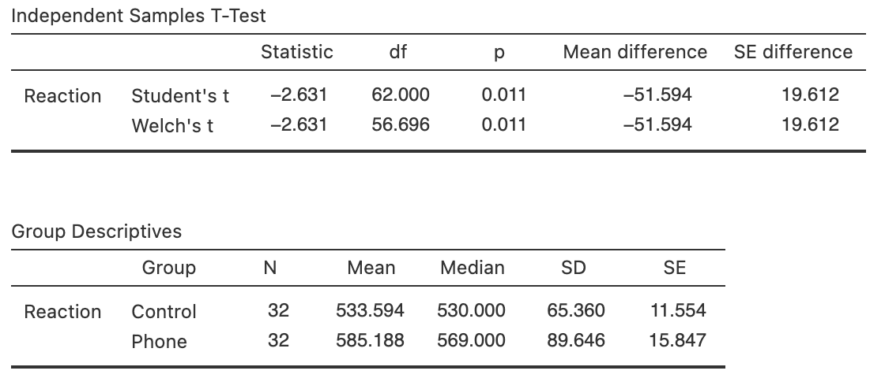
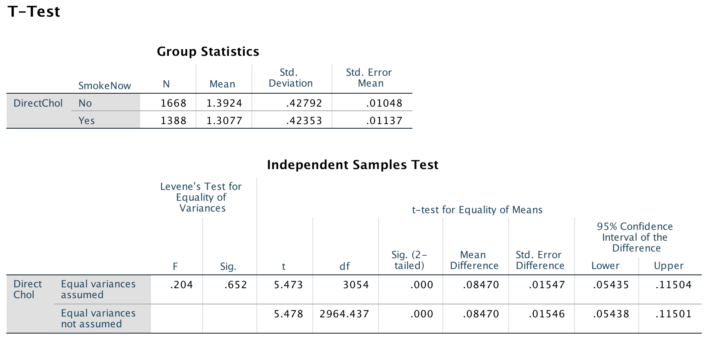

# CIs for two independent means {#CITwoMeans}


```{r, child = if (knitr::is_html_output()) {'introductions/24-CIs-TwoMeans-HTML.Rmd'} else {'introductions/24-CIs-TwoMeans-LaTeX.Rmd'}}
```


```{r echo=FALSE}
RT <- read.csv("./Data/ReactionTimePhoneInd.csv")
```


##  Means of two independent samples {#MeansIndSamples}


A study examined the reaction times of students (from the University of Utah) while driving [@data:Strayer2001:phones; @agresti2007statistics].
In one study, students were randomly allocated to one of two groups: one to *use* a mobile phone while driving, and one to *not use* a mobile phone while driving.
This is a [*between-individuals* comparison](#Comparison), since different students are in each group.
The reaction time for each student was measured in a driving simulator.

The data are not paired; instead, the means of two separate (or independent) samples are being compared.
(The data would be paired if *each* student's reaction time was measured twice: once using a phone, and once without using a phone.)


<div style="float:right; width: 222x; border: 1px; padding:10px">

</div>


Consider the RQ:

> For students, what is the difference between the mean reaction time while driving when using a mobile phone and the mean reaction time while driving when *not* using a mobile phone?


`r if ( knitr::is_html_output()) { 
  'The data are shown below.'
} else {
  'Part of the data are shown in Table \\@ref(tab:PhoneDataTable).'
}
`


::: {.thinkBox .think data-latex="{iconmonstr-light-bulb-2-240.png}"}
What are P, O, C and I in this study?\label{thinkBox:PhonepOCI}

`r if (knitr::is_latex_output()) '<!--'`
`r webexercises::hide()`
**P**: Students (this is defined more specifically in the original study). 

**O**: Mean reaction time. 

**C**: Between two groups: those using and not sing a mobile phone while driving. 

**I**: Yes; the use of a phone (or not) was decided by the researchers.
`r webexercises::unhide()`
`r if (knitr::is_latex_output()) '-->'`
:::


```{r PhoneDataTable, echo=FALSE}


if( knitr::is_latex_output() ) {
  
  #RT.DataTable <- cbind( "Use phone" = head(RT$Reaction[RT$Group == "Phone"], 9), 
  #                       "Not using phone" = head(RT$Reaction[RT$Group == "Control"], 9))
  #RT.DataTable <- rbind(RT.DataTable, 
  #                      c("$\\vdots$", "$\\vdots$"))

  tb1 <- cbind( RT$Reaction[RT$Group == "Phone"][1:5],
                RT$Reaction[RT$Group == "Phone"][6:10] )
  tb1 <- rbind( tb1, 
               c("$\\vdots$", "$\\vdots$"))
  
  T1 <- knitr::kable( tb1,
                      format = "latex",
                      #col.names = c("Using phone",
                      #              "Not using phone"),
                      valign = 't',
                      align = c("c", "c"),
                      #table.env = "@empty",
                      linesep = "",
                      row.names = FALSE,
                      escape = FALSE,
                      booktabs = TRUE) %>%
    row_spec(0, bold = TRUE) %>%
    add_header_above( c("Using phone" = 2),
                      bold = TRUE)

  tb2 <- cbind( RT$Reaction[RT$Group == "Control"][1:5],
                RT$Reaction[RT$Group == "Control"][6:10] )
  tb2 <- rbind( tb2, 
               c("$\\vdots$", "$\\vdots$"))
  
  T2 <- knitr::kable( tb2,
                      format = "latex",
                      #col.names = c("Using phone",
                      #              "Not using phone"),
                      align = c("c", "c"),
                      valign = 't',
                      #table.env = "@empty",
                      linesep = "",
                      row.names = FALSE,
                      escape = FALSE,
                      booktabs = TRUE) %>%
    row_spec(0, bold = TRUE) %>%
    add_header_above( c("Not using phone" = 2),
                      bold = TRUE)
  
  out <- knitr::kables(list(T1, T2),
                       format = "latex",
                       label = "PhoneDataTable",
                       caption = "Reaction times (in milliseconds) for students using, and not using, mobile phones. Only the first ten observations for each group are shown, but 32 students are in each group") %>% 
    kable_styling(font_size = 10)
  out2 <- prepareSideBySideTable(out)
  out2

} 
if( knitr::is_html_output(excludes = "epub") ) {
  RT.DataTableHTML <- cbind( "Use phone" = RT$Reaction[RT$Group == "Phone"], 
                           "Not using phone" = RT$Reaction[RT$Group == "Control"])

  DT::datatable(RT.DataTableHTML,
               fillContainer = FALSE, # Make more room, so we don't just have ten values
               colnames = c("Using phone", 
                            "Not using phone"),
               filter = "none",
               options = list(searching = FALSE), # Remove searching: See: https://stackoverflow.com/questions/35624413/remove-search-option-but-leave-search-columns-option
               caption = "Reaction times (in milliseconds) for students using, and not using, mobile phones.")
}
if( knitr::is_html_output() & knitr::pandoc_to("epub")) {
  kable(RT.DataTableHTML,
        format = "html",
        booktabs = TRUE,
        longtable = FALSE,
        col.names = c("Using phone", 
                      "Not using phone"),
        caption = "Reaction times (in milliseconds) for students using, and not using, mobile phones. The first ten observations are shown, but 32 students are in each group",
        align = c("r", "r"))
}
```


```{r echo=FALSE}
Phone.DataSummary <- Phone.DataSummary.rnd <- array(NA, 
                                                    dim = c(3, 4) )

Phone.DataSummary[1:2, 1] <- aggregate( Reaction ~ Group, 
                                        data = RT, 
                                        FUN = "mean")[, 2]
Phone.DataSummary[1:2, 2] <- aggregate( Reaction ~ Group, 
                                        data = RT, 
                                        FUN = "length")[, 2] 
Phone.DataSummary[1:2, 3] <- aggregate( Reaction ~ Group, 
                                        data = RT, 
                                        FUN = "sd")[, 2]
Phone.DataSummary[1:2, 4] <- aggregate( Reaction ~ Group, 
                                        data = RT, 
                                        FUN = function(x){ sd(x)/sqrt(length(x))})[, 2] 

Phone.DataSummary[3, 1] <- Phone.DataSummary[2, 1] - Phone.DataSummary[1, 1]
Phone.DataSummary[3, 4] <- sqrt( Phone.DataSummary[1, 3]^2/Phone.DataSummary[1, 2] +
                                 Phone.DataSummary[2, 3]^2/Phone.DataSummary[2, 2]  )
rownames(Phone.DataSummary) <- c("Using phone", 
                                 "Not using phone", 
                                 "Differences")
```


## Notation: Two independent means {#TwoMeansNotationCI}

Since two groups are being compared, distinguishing between the statistics for the two groups is important.
One way is to use subscripts (Table \@ref(tab:IndSampleNotation)).
For the reaction-time data, we use the subscript $P$ for the **p**hone-users group, and $C$ for the **c**ontrol (non-phone users) group.

Using this notation, the difference between population means (the parameter) is $\mu_P - \mu_C$.
Since the population values are unknown, this parameter is estimated using the statistic $\bar{x}_P - \bar{x}_C$.


::: {.tipBox .tip data-latex="{iconmonstr-info-6-240.png}"}
You **must** be clear about how you define the differences!
The differences could be computed as:
  
* the reaction time for phone users, *minus* the reaction time for non-phone users: $\mu_P - \mu_C$;
  this measures how much faster the reaction times is for *non-phone users*, on average; or
* the reaction time for non-phone users, *minus* the reaction time for phone users: $\mu_C - \mu_P$:
  this measures much faster the reaction times is for *phone users*, on average.

Either is fine, provided you are *consistent*, and *clear* about how the difference are computed.
The meaning of any conclusions will be the same.
:::


```{r IndSampleNotation, echo=FALSE}
Diff2Notation <- array(dim = c(5, 3))
colnames(Diff2Notation) <- c(	"Phone users: Group $P$", 
                              "Non-phone users: Group $C$",
                              "Difference ($P - C$)")
rownames(Diff2Notation) <- c(	"Population means:",
								              "Sample means:",
								              "Standard deviations:",
								              "Sample sizes:",
								              "Standard errors:")


if( knitr::is_latex_output() ) {
  Diff2Notation[1, ] <- c( "$\\mu_P$", 	
                           "$\\mu_C$",
                           "$\\mu_P - \\mu_C$")
  Diff2Notation[2, ] <- c( "$\\bar{x}_P$",		
                           "$\\bar{x}_C$",
                           "$\\bar{x}_P - \\bar{x}_C$")
  Diff2Notation[3, ] <- c( "$s_P$", 			
                           "$s_C$",
                           NA)
  Diff2Notation[4, ] <- c( "$n_P$",
  							           "$n_C$",
  							           NA)
  Diff2Notation[5, ] <- c( "$\\displaystyle\\text{s.e.}(\\bar{x}_P) = \\frac{s_P}{\\sqrt{n_P}}$",
  							           "$\\displaystyle\\text{s.e.}(\\bar{x}_C) = \\frac{s_C}{\\sqrt{n_C}}$",
  							           "$\\displaystyle\\text{s.e.}(\\bar{x}_P - \\bar{x}_C)$")

  kable( Diff2Notation,
         format = "latex",
         booktabs = TRUE,
         align = c("c", "c", "c"),
         longtable = FALSE,
         escape = FALSE,
         col.names = colnames(Diff2Notation),
         caption = "Notation used to distinguish between the two independent groups using subscripts. Any two subscripts can be used.") %>%
    row_spec(0, bold = TRUE) %>%
    kable_styling(font_size = 10)
}
if( knitr::is_html_output() ) {

  Diff2Notation[1, ] <- c( "$\\mu_P$", 	
                           "$\\mu_C$",
                           "$\\mu_P - \\mu_C$")
  Diff2Notation[2, ] <- c( "$\\bar{x}_P$",		
                           "$\\bar{x}_C$",
                           "$\\bar{x}_P - \\bar{x}_C$")
  Diff2Notation[3, ] <- c( "$s_P$", 			
                           "$s_C$",
                           NA)
  Diff2Notation[4, ] <- c( "$n_P$",
  							           "$n_C$",
  							           NA)
  Diff2Notation[5, ] <- c( "$\\displaystyle\\text{s.e.}(\\bar{x}_P) = \\frac{s_P}{\\sqrt{n_P}}$",
  							           "$\\displaystyle\\text{s.e.}(\\bar{x}_C) = \\frac{s_C}{\\sqrt{n_C}}$",
  							           "$\\displaystyle\\text{s.e.}(\\bar{x}_P - \\bar{x}_C)$")

  out <- kable( Diff2Notation,
         format = "html",
         booktabs = TRUE,
         longtable = FALSE,
         align = c("c", "c", "c"),
         col.names = colnames(Diff2Notation),
         caption = "Notation used to distinguish between the two independent groups. Any two subscripts can be used.")
  if ( knitr::is_html_output(excludes = "epub")) {
    row_spec(out, 0, bold = TRUE) 
  } else {
    out
  }
    
}
```


Table \@ref(tab:IndSampleNotation) does not include a standard deviation or a sample size for the *difference between means*; these make no sense in this context.
For example, Group $P$ has 32 individuals, and Group $C$ has 32 individuals, and we wish to study the difference $\mu_P - \mu_C$.
The sample size is not $32 - 32 = 0$.
There are just two samples of given sizes.
However, the *standard error* of the difference between the means does make sense:
it measures how much the value of  $\bar{x}_P - \bar{x}_C$ varies for all possible samples.


## Summaries: Two independent means

A suitable graphical summary of the data is a boxplot (Fig.&nbsp;\@ref(fig:PhonePlots)), which shows that the *sample* medians are slightly different, but the IQR about the same; one large outlier is present for the phone-using group. 


```{r PhonePlots, echo=FALSE, fig.width=4.5, fig.height=3.5, out.width='45%', fig.alt="Boxplot of the two groups in the reaction-time data", fig.align="center", fig.cap="A boxplot of the reaction-time data"}
boxplot(RT$Reaction ~ RT$Group,
        col = plot.colour,
        las = 1,
        ylim = c(400, 1000),
        main = "Reaction times: when using and\nnot using a phone",
        ylab = "Reaction time (in ms)",
        xlab = "Group")
```


The numerical summary of the data should summarise both groups, and the *differences between the means* (since the RQ is about this difference).
All this information can be found using jamovi (Fig.&nbsp;\@ref(fig:ReactionPhoneSummaryjamovi)) or
SPSS (Fig.&nbsp;\@ref(fig:ReactionPhoneSummarySPSS)), then compiled into a table (Table \@ref(tab:PhoneNumerical)).


```{r PhoneNumerical, echo=FALSE}

Phone.DataSummary.rnd[, 1] <- round( Phone.DataSummary[, 1], 2)
Phone.DataSummary.rnd[, 2] <- round( Phone.DataSummary[, 2], 0)
Phone.DataSummary.rnd[, 3] <- round( Phone.DataSummary[, 3], 2)
Phone.DataSummary.rnd[, 4] <- round( Phone.DataSummary[, 4], 3)
  
Phone.DataSummary2 <- array( dim = c(3, 4), 
                             data = Phone.DataSummary.rnd)
Phone.DataSummary2[3, 2] <- ""
Phone.DataSummary2[3, 3] <- ""
rownames(Phone.DataSummary2) <- c("Not using phone", 
                                  "Using phone", 
                                  "Difference")


if( knitr::is_latex_output() ) {
  kable(Phone.DataSummary2,
        format = "latex",
        booktabs = TRUE,
        longtable = FALSE,
        #table.envir = "@empty", # So works in two columns: Not font change or two cols fails also
       align = c("r", "c", "c", "c", "c"),
#      digits=c(2, 0, 2, 3),
        col.names = c("Mean", 
                      "Sample size", 
                      "Standard deviation", 
                      "Standard error"),
    caption = "The mean, median, standard deviation and standard error for the reaction-time data (in ms)") %>%
		row_spec(0, bold = TRUE)  %>%
    column_spec(3, width = "15mm") %>%
    column_spec(4, width = "18mm") %>%
    column_spec(5, width = "15mm") %>%
    kable_styling(font_size = 10)
}
if( knitr::is_html_output() ) {
kable(Phone.DataSummary2,
      format = "html",
      booktabs = TRUE,
      longtable = FALSE,
      align = "r",
      col.names = c("Mean", 
                    "Sample size", 
                    "Std dev", 
                    "Standard error"),
      digits = 2,
      caption = "The mean, median, standard deviation and standard error for the reaction-time data (in ms)")
}

```


```{r ReactionPhoneSummaryjamovi, echo=FALSE, fig.cap="jamovi output for the phone reaction time data", fig.align="center", out.width='95%'}

```

```{r ReactionPhoneSummarySPSS, echo=FALSE, fig.cap="SPSS output for the phone reaction time data", fig.align="center", out.width='100%'}
knitr::include_graphics( "SPSS/ReactionPhone/ReactionPhone-Test.png")
```


<!-- ```{r, out.width=c('100%'), fig.height=2.75, fig.width=7, fig.cap="The phone reaction-time data: a graphical summary (left) and numerical summary (right)"} -->
<!-- library(gridExtra) -->

<!-- # Create a table plot -->
<!-- # Set theme to allow for plotmath expressions -->
<!-- tt <- ttheme_minimal(base_size = 11)#colhead = list(fg_params = list(parse = TRUE, -->
<!--                        #                               fontface = "bold")), -->
<!--                      #base_size = 11) -->
<!-- tbl <- tableGrob(Phone.DataSummary2, -->
<!--                  theme = tt, -->
<!--                  cols = c("Mean", -->
<!--                           "Sample\nsize", -->
<!--                           "Standard\ndeviation", -->
<!--                           "Standard\nerror") ) -->
<!-- # Plot chart and table into one object -->

<!-- plt <- ggplot(RT,  -->
<!--               aes(x = Group,  -->
<!--                   y = Reaction)) +  -->
<!--   stat_boxplot(geom ="errorbar",  -->
<!--                width = 0.5) + # Add lines for "min" and "max" value -->
<!--   geom_boxplot(notch = FALSE,  -->
<!--                fill = blueSolid) +  -->
<!--   labs(title = "Boxplot: reaction time, for\nthose using and not using phone", -->
<!--        x = "Group",  -->
<!--        y = "Reaction time (ms)") + -->
<!--   theme_classic() -->

<!-- grid.arrange(plt,  -->
<!--              tbl, -->
<!--              ncol = 2, -->
<!--              #nrow = 1, -->
<!--              #as.table = TRUE, -->
<!--              #main = grid::textGrob("OVERALL TITLE OVERALL TITLE OVERALL TITLE OVERALL TITLE OVERALL TITLE OVERALL TITLE OVERALL TITLE OVERALL TITLE "), -->
<!--              widths = c(2, 6) ) -->
<!-- ``` -->


::: {.thinkBox .think data-latex="{iconmonstr-light-bulb-2-240.png}"}
For those *using* a phone, what is the difference between the *standard deviation* and the *standard error* in the context of the reaction-time study?\label{thinkBox:SEsd}

`r if (knitr::is_latex_output()) '<!--'`
`r webexercises::hide()`
The *standard deviation* quantifies how much the individual reactions times vary from *person to person*.

The *standard error* quantifies how much the *difference between sample mean reaction times* varies from *sample to sample*.
`r webexercises::unhide()`
`r if (knitr::is_latex_output()) '-->'`
:::


## Sampling distribution: Two independent means

Since the difference between the *population* means is unknown, the difference is estimated using the *sample* means.
The difference between the two sample means (the *statistic*) is $\bar{x}_P - \bar{x}_C$.
The parameter is $\mu_P - \mu_C$, the difference between the two population means (using a phone, minus *not* using a phone).

The differences could be compute in the opposite direction ($\bar{x}_C - \bar{x}_P$).
However, for the reaction-time data, computing differences as the reaction time for phone users, *minus*  the reaction time for non-phone users (controls) probably makes more sense: the differences then refer to how much greater (on average) the reaction times are when students are using phones.

Each sample of students will comprise different students, and will give different reaction times while driving. 
The means for each group will differ from sample to sample, and the *difference* between the means will be different for each sample.
The *difference* between the sample means varies from sample to sample, and so has a sampling distribution and *standard error*.


::: {.definition name="Sampling distribution for the difference between two sample means"}
The *sampling distribution of the difference between two sample means* is described by:

* an approximate normal distribution;
* centred around $\mu_A - \mu_B$ (the *differences* between the means);
* with a standard deviation of $\displaystyle\text{s.e.}( \bar{x}_A - \bar{x}_B)$,

when the appropriate conditions (Sect. \@ref(ValidityTwoMeans)) are met.

We don't give a formula for finding the standard error $\displaystyle\text{s.e.}( \bar{x}_A - \bar{x}_B)$, so the value of this standard error will need to be *given* (e.g., on computer output).
:::


::: {.importantBox .important data-latex="{iconmonstr-warning-8-240.png}"}
A formula exists for finding the standard error of the difference between two means, but is complicated and we won't provide it.
Using software output is sufficient.
:::


For the reaction-time data, the differences between the sample means will have:

* an approximate normal distribution (Fig.&nbsp;\@ref(fig:ReactionTimeSamplingDist));
* centred around $\mu_P - \mu_C$ (the *differences* between the means in the two *populations*);
* with a standard deviation, called the *standard error* of the difference, of $\text{s.e.}(\bar{x}_P - \bar{x}_C) = `r round(Phone.DataSummary[3, 4], 2)`$.


```{r ReactionTimeSamplingDist, echo=FALSE, fig.cap="The sampling distribution of the difference between the reaction times in the phone and control groups (phone, minus control)", fig.align="center", fig.width=9.5, fig.height=2.75, out.width='95%'}
mn <- Phone.DataSummary[3, 1]
se <- Phone.DataSummary[3, 4] 

out <- plotNormal(mu = mn,
                  sd = se,
                  xlab = "Difference between sample means (in milliseconds)",
                  round.dec = 2,
                  showXlabels = rep("", 7)
                  # showXlabels = c(expression(atop((mu[P] - mu[C]), -58.83)),
                  #                 "-39.22", 
                  #                 "-19.61", 
                  #                 expression( mu[P] - mu[C]),
                  #                 "+19.61", 
                  #                 "+39.22", 
                  #                 "+58.83")
                  )
mtext(expression(atop((mu[P] - mu[C]), -58.83)),
      side = 1,
      line = 2,
      at = mn - 3*se)
mtext(expression(atop((mu[P] - mu[C]), -39.22)),
      side = 1,
      line = 2,
      at = mn - 2*se)
mtext(expression(atop((mu[P] - mu[C]), -19.61)),
      side = 1,
      line = 2,
      at = mn - se)
mtext(expression(mu[P] - mu[C]),
      side = 1,
      line = 1,
      at = mn )
mtext(expression(atop((mu[P] - mu[C]), + 19.61)),
      side = 1,
      line = 2,
      at = mn + 1*se)
mtext(expression(atop((mu[P] - mu[C]), +39.22)),
      side = 1,
      line = 2,
      at = mn + 2*se)
mtext(expression(atop((mu[P] - mu[C]), +58.83)),
      side = 1,
      line = 2,
      at = mn + 3*se)

```


::: {.thinkBox .think data-latex="{iconmonstr-light-bulb-2-240.png}"}
What does a *negative* difference mean?\label{thinkBox:NegativeDifference}

`r if (knitr::is_latex_output()) '<!--'`
`r webexercises::hide()`
Earlier, we defined the differences as $\mu_P - \mu_C$, the difference between the two population means (using a phone, minus *not* using a phone).

So a negative value simply means that the mean is greater when *not* using a phone.
`r webexercises::unhide()`
`r if (knitr::is_latex_output()) '-->'`
:::


```{r echo=FALSE}
RT.mn <- Phone.DataSummary[3, 1] 
RT.se <- Phone.DataSummary[3, 4]
```


## Confidence intervals: Two independent means

Being able to describe the sampling distribution implies that we have some idea of how the values of $\bar{x}_P - \bar{x}_C$ are likely to vary from sample to sample. 
Then, finding an approximate 95% CI for the difference between the mean reaction times is similar to the process used in Chap. \@ref(OneMeanConfInterval). 
Almost all approximate 95% CIs have the same form:

\[
  \text{statistic} \pm (2\times\text{s.e.}(\text{statistic})).
\]
When the statistic is $\bar{x}_P - \bar{x}_C$, the approximate 95% CI is

\[
	(\bar{x}_P - \bar{x}_C) \pm (2 \times \text{s.e.}(\bar{x}_P - \bar{x}_C)).
\]

In this case (using more decimal places than in the summary table in Table \@ref(tab:PhoneNumerical)), the CI is

\begin{eqnarray*}
	`r round(RT.mn,  5)` \pm (2 \times `r round(RT.se, 5)`),
\end{eqnarray*}
or $`r round(RT.mn, 2)`\pm `r round(RT.se, 2)`$ after rounding appropriately.
We write:

> Based on the sample, an *approximate* 95% CI for the difference in reaction time is from $`r round(RT.mn - 2*RT.se, 2)`$ to $`r round(RT.mn + 2*RT.se, 2)`$ milliseconds, slower for those using a phone compared to those *not* using a phone.

The plausible values for the difference between the two population means are between $`r round(RT.mn - 2*RT.se, 2)`$ to $`r round(RT.mn + 2*RT.se, 2)`$ milliseconds.
Stating the CI alone is insufficient; the *direction* in which the differences were calculated must be given, so readers know which group had the higher mean.


## Using software: CIs for two independent means

The jamovi output (Fig.&nbsp;\@ref(fig:ReactionPhoneSummaryjamovi)) and the SPSS output (Fig.&nbsp;\@ref(fig:ReactionPhoneSummarySPSS)) both show *two* CIs.
*We will use the results from the second row* in both cases, as this row of output is more general (and makes fewer assumptions^[The *first* row assumes that the population standard deviations in the two groups are the same.]).


::: {.importantBox .important data-latex="{iconmonstr-warning-8-240.png}"}
jamovi and SPSS give *two* confidence intervals.
In this book, we will use the *second row* of information (the 'Welch's $t$' row in jamovi; the 'Equal variance not assumed' row in SPSS) because it is more general and makes fewer assumptions.
(Both rows are often similar anyway.)
:::


<!-- ```{r ReactionPhoneTestOutputjamovi, echo=FALSE, fig.cap="The jamovi output for the phone-reaction data", fig.align="center", out.width='95%'} -->
<!-- knitr::include_graphics( "jamovi/ReactionPhone/ReactionPhone-Test.png") -->
<!-- ``` -->


<!-- ```{r ReactionPhoneTestOutputSPSS, echo=FALSE, fig.cap="The SPSS output for the phone-reaction data", fig.align="center", out.width='90%'} -->
<!-- knitr::include_graphics("SPSS/ReactionPhone/ReactionPhone-Test.png") -->
<!-- ``` -->


From the output, the standard error is $\text{s.e.}(\bar{x}_P - \bar{x}_C) = 19.612$, and the exact 95% CI is from $12.3$ to $90.9$.
The *approximate* CI and the *exact* (from software) CIs are only slightly different, as software uses an *exact* multiplier (the $t$-multiplier of 2 is an approximation, based on the  [68--95--99.7 rule](#def:EmpiricalRule)), and the sample sizes aren't too small.


<iframe src="https://learningapps.org/watch?v=p97ra3pxc22" style="border:0px;width:100%;height:900px" allowfullscreen="true" webkitallowfullscreen="true" mozallowfullscreen="true"></iframe>


## Statistical validity conditions: Two independent means {#ValidityTwoMeans}

As usual, these results apply under certain conditions (#exm:StatisticalValidityAnalogy).
The CI computed above is statistically valid if *one* of these conditions is true:

1. *Both* sample sizes are at least 25; *or*
1. Either sample size is smaller than 25, **and**
   the *populations* corresponding to both comparison groups have an approximate normal distribution.
   
The sample size of 25 is a rough figure here, and some books give other (similar) values (such as 30).
The histograms of the *samples* could be used to determine if normality of the *populations* seems reasonable.


::: {.example #StatisticalValidity name="Statistical validity"}
For the reaction-time data, both samples are larger than $25$, so the CI will be statistically valid.
:::


## Error bar charts {#ErrorBarCharts}

A useful way to display the CIs from two (or more) groups is with an *error bar chart*, which displays the  *CIs* for each group being compared.
(A boxplot displays the *data*.)

Error bars charts display the expected variation *in the sample means* from sample to sample, while boxplots display the variation *in the individual observations* and show the median.
For the reaction time data, the error bar chart (Fig.&nbsp;\@ref(fig:PhoneErrorbar)) shows the 95% CI for each group (the mean has been added as a dot).


```{r PhoneErrorbar, echo=FALSE, fig.cap="Error bar chart comparing the mean reaction time for students using a mobile phone and not using a mobile phone (control)", fig.align="center", fig.width=4.5, fig.height=3.5, out.width='50%'}
ci.lo <- Phone.DataSummary[, 1] - 2 * Phone.DataSummary[, 4] 
ci.hi <- Phone.DataSummary[, 1] + 2 * Phone.DataSummary[, 4] 

plot( range( c( ci.lo, ci.hi) ) ~ c(0.9, 2.1), 
      data = RT,
      type = "n",
      xlim = c(0.5, 2.5),
      ylim = c(500, 650),
      pch = 19,
      axes = FALSE,
      main = "Error bars chart:\n reaction times",
      xlab = "Group", 
      ylab = "Reaction times (in ms)",
      sub = "(Error bars are 95% confidence intervals)",
      las = 1)
axis(side = 1, 
     at = 1:2, 
     labels = levels(factor(RT$Group)), 
     las = 1) 
axis(side = 2, 
     las = 1)
box()

mns <- Phone.DataSummary[1:2, 1]

points( mns ~ c(1:2), 
        pch = 19)

arrows(x0 = 1:2, 
       y0 = ci.lo[1:2], 
       x1 = 1:2, 
       y1 = ci.hi[1:2], 
  length = 0.05, 
  angle = 90, 
  code = 3)
```    


::: {.thinkBox .think data-latex="{iconmonstr-light-bulb-2-240.png}"}
What is different about the information displayed in the error bar chart (Fig.&nbsp;\@ref(fig:PhoneErrorbar)) and the boxplot (Fig.&nbsp;\@ref(fig:PhonePlots))?\label{thinkBox:DiffErrorbarBoxplot}

`r if (knitr::is_latex_output()) '<!--'`
`r webexercises::hide()`
The *error bar chart* helps us understand how precisely the sample mean estimates the population mean.

The *boxplot* shows the variation in the individual *data* values.
`r webexercises::unhide()`
`r if (knitr::is_latex_output()) '-->'`
:::


<div style="float:right; width: 222x; border: 1px; padding:10px">

</div>


::: {.example #ErrorBarCharts name="Error bar charts"}
A study [@data:Aloy2011:Litter] examined the impact of plastic litter on the shoreline at Talim Bay (Batangas, Philippines) during various seasons, and the impact on the gastropod *Nassarius pullus*.
The error bar chart (Fig.&nbsp;\@ref(fig:MonsoonRubbish)) shows that summer seems different---in terms  of average value (mean) and the amount of variation---than the other seasons.
:::


```{r MonsoonRubbish, echo=FALSE, fig.cap="Relative abundance of a gastropod from random quadrat surveys conducted over prevalent monsoon types in all study areas in Talim Bay. Error bars represent 95\\% confidence intervals.", fig.align="center", fig.width=4.5, fig.height=3.5}
par( mar = c(4, 5, 4, 2) + 0.1) #WAS  5.1 4.1 4.1 2.1
NE <- c(0.25, 1)
SW <- c(0.2, 0.6)
Summer <- c(0.25, 2.2)
width <- 0.1

Mdns <- c(0.63, 0.38, 1.21)
Ns <- c(60, 69, 39)

plot( c(0.15, 3.5), 
      c(0, 2.5), 
      type = "n",
      xlab = "Relative abundance of a gastropod",
      ylab = expression(Mean~italic(N.~pullus)~rel.~abundance),
      main = "",
      axes = FALSE,
      las = 1)

axis(side = 1,
     at = 1:3,
     labels = c("NE\nmonsoon", 
                "SW\nmonsoon", 
                "Summer"))
axis(side = 2,
     las = 1,
     at = 0:2)

# Vertical lines
segments(1, NE[1], 
         1, NE[2])
segments(2, SW[1], 
         2, SW[2])
segments(3, Summer[1], 
         3, Summer[2])

segments( 1 - width, NE[1],
          1 + width, NE[1])
segments( 1 - width, NE[2],
          1 + width, NE[2])

segments( 2 - width, SW[1],
          2 + width, SW[1])
segments( 2 - width, SW[2],
          2 + width, SW[2])

segments( 3 - width, Summer[1],
          3 + width, Summer[1])
segments( 3 - width, Summer[2],
          3 + width, Summer[2])

# Plot medians
points( c(1, 2, 3),
        Mdns, 
        pch = 20)

# Sample sizes
text( 1:3, 
      c(NE[1], SW[1], Summer[1]),
      labels = paste("n =", Ns),
      pos = 1,
      cex = 0.9
)

# Label medians
text( (1:3) - 0.1, Mdns,
     labels = paste("  ",Mdns),
     pos = 4)

# Add minor tick marks
rug( seq(0, 2.5, by = 0.2), 
     ticksize = -0.02, 
     side = 2)

box()
```


```{r echo=FALSE}
data(lime)
```


<div style="float:right; width: 222x; border: 1px; padding:10px">

</div>


::: {.example #ErrorBarCharts2 name="Error bar charts"}
A study [@data:ForestBiomass2017] examined  the foliage biomass of small-leaved lime trees from three sources: coppices; natural; planted.

Three graphical summaries are shown in Fig.&nbsp;\@ref(fig:LimeTreesBoxErrorbar): a boxplot (showing the variation in *individual* trees; left), an error bar chart (showing the variation in the *sample means*; centre) on the same vertical scale as the boxplot, and the same error bar chart using a better scale for the error-bar plot  (right).
:::


```{r LimeTreesBoxErrorbar, echo=FALSE, fig.cap="Boxplot (left) and error bar charts (centre; right) comparing the mean foliage biomass for small-leaved lime trees from three sources (C: Coppice; N: Natural; P: Planted). The centre panel shows an error-bar chart using the same vertical scale as the boxplot; the right error-bar chart uses a different (better) scale on the vertical axis. The solid dots in the boxplot show the mean of the distributions", fig.align="center", fig.width=7, fig.height=3.0, out.width='100%'}
par( mfrow = c(1, 3))

lime.mns <- tapply(lime$Foliage, 
                   lime$Origin, 
                   "mean")

boxplot(Foliage ~ Origin, 
        data = lime,
	      xlab = "Origin",
	      ylab = "Foliage biomass (kg)",
	      las = 1,
      	ylim = c(0, 14),
	      main = "Boxplot: Foliage biomass\nof individual trees",
        names = c("C", "N", "P"),
	      col = "white")
points(1:3, 
       lime.mns, 
	     pch = 19)

mns <- with(lime, 
            tapply(Foliage, 
                   Origin, 
                   "mean") )
ses <- with(lime, 
            tapply(Foliage, 
                   Origin, 
                   function(x){sd(x) / sqrt(length(x))}) )
ci.lo <- mns - ses*2
ci.hi <- mns + ses*2

plot( range( c( ci.lo, ci.hi) ) ~ c(1,3), 
      data = lime,
      type = "n",
      ylim = c(0, 14),
      xlim = c(0.5, 3.5),
      pch = 19,
      axes = FALSE,
      main = "Error bars chart:\n mean foliage biomass",
      xlab = "Origin", 
      ylab = "Foliage biomass (kg)",
      sub = "(Error bars are 95% CIs)",
      las = 1)
axis(side = 1, 
     at = 1:3, 
     labels = c("C", "N", "P"), 
     las = 1) 
axis(side = 2, 
     las = 1)
box()

points( mns ~ c(1:3), 
        pch = 19)

arrows(1:3, 
       mns - 2 * ses, 
       1:3, 
       mns + 2 * ses, 
       length = 0.05, 
       angle = 90, 
       code = 3)


plot( range( c( ci.lo, ci.hi) ) ~ c(1, 3), 
      data = lime,
      type = "n",
      ylim = c(1, 3.5),
      xlim = c(0.5, 3.5),
      pch = 19,
      axes = FALSE,
      main = "Error bars chart:\n mean foliage biomass",
      xlab = "Origin", 
      ylab = "Foliage biomass (kg)",
      sub = "(Error bars are 95% CIs)",
      las = 1)
axis(side = 1, 
     at = 1:3, 
     labels = c("C", "N", "P"), 
     las = 1) 
axis(side = 2, 
     las = 1)
box()

points( mns ~ c(1:3), 
        pch = 19,
        cex = 1.5)

arrows(1:3, mns - 2 * ses, 
       1:3, mns + 2 * ses, 
       length = 0.05, 
       angle = 90, 
       code = 3)
```


<!-- One example using data; one using summary information -->

## Example: Speed signage {#SpeedSignage}


<div style="float:right; width: 222x; border: 1px; padding:10px">

</div>


In an attempt to reduce vehicle speeds on freeway exit ramps, a Chinese study tried using additional signage [@ma2019impacts].
At one site studied (Ningxuan Freeway), speeds were recorded for 38 vehicles before the extra signage was added, and then for 41 vehicles after the extra signage was added.


```{r Signage, echo=FALSE, cache=FALSE}
Speed <- read.csv("./Data/Speed.csv")

Speed$When <- factor(Speed$When,
                     levels = c("Before", "After"),
                     ordered = TRUE)

if( knitr::is_latex_output() ) {
  
  Speed1 <- cbind( Speed$Speed[ Speed$When == "Before" ][1:5],
                   Speed$Speed[ Speed$When == "Before" ][6:10])
  Speed1 <- rbind( format(Speed1, 
                          digits = 1, 
                          nsmall = 1),
                   c("$\\vdots$", "$\\vdots$"))
  t1 <- knitr::kable( Speed1,
         format = "latex",
         longtable = FALSE,
         booktabs = TRUE,
         linesep = "",
         escape = FALSE,
         align = c("r", "r") )  %>%
    row_spec(0, bold = TRUE) %>%
    add_header_above( c("Before signage" = 2),
                      bold = TRUE)
    
    
  Speed2 <- cbind( Speed$Speed[ Speed$When == "After" ][1:5],
                   Speed$Speed[ Speed$When == "After" ][6:10])
  Speed2 <- rbind( format(Speed2, 
                          digits = 1, 
                          nsmall = 1),
                   c("$\\vdots$", "$\\vdots$"))
  t2 <- knitr::kable( Speed2,
         format = "latex",
         longtable = FALSE,
         booktabs = TRUE,
         linesep = "",
         digits = 1,
         escape = FALSE,
         align = c("r", "r") )  %>%
    add_header_above( c("After signage" = 2), 
                      bold = TRUE )
  
  out <- knitr::kables(list(t1, t2),
                       format = "latex",
                       label = "Signage",
                       caption = "The first ten observations from the signage data for trhe before and after measurements. There are 38 before observations and 41 after observations in total.") %>% 
    kable_styling(font_size = 10)
  
  out2 <- prepareSideBySideTable(out)
  out2
}

if( knitr::is_html_output(exclude = "epub") ) {
  
   DT::datatable( Speed,
                 fillContainer = FALSE, # Make more room, so we don't just have ten values
                 colnames = c("When measured", "Speed (km/h)"),
                 options = list(searching = FALSE), # Remove searching: See: https://stackoverflow.com/questions/35624413/remove-search-option-but-leave-search-columns-option
                 caption = "The observations from the signage data")
}

if ( knitr::is_html_output() & knitr::pandoc_to("epub")) {

  kable( Speed[1:10,],
         format = "html",
         longtable = FALSE,
         booktabs = TRUE,
         align = c("c", "c", "c"),
         caption = "Vehicle speeds before and after adding extra signage. Only the first 10 observations are shown.") %>%
    kable_styling(font_size = 10)
}
```

The researchers are hoping that the addition of extra signage will *reduce* the mean speed of the vehicles.
The RQ is:

> At this freeway exit, how much is the mean vehicle speed reduced after extra signage is added?

The data are *not* paired: different vehicles are measured before and after the extra signage is added.
The data are summarised in Table \@ref(tab:SignageSummary).
The parameter is $\mu_{\text{Before}} - \mu_{\text{After}}$, the *reduction* in the mean speed.


```{r SignageSummary, echo=FALSE}
SignageSummary <- array(dim = c(3, 4))
rownames(SignageSummary) <- c("Before", 
                              "After",
                              "Speed reduction")
colnames(SignageSummary) <- c("Mean",
                              "Std deviation",
                              "Sample size",
                              "Std error")

Speed.n <- tapply(Speed$Speed, 
                  list(Speed$When), 
                  "length") 
Speed.sd <- tapply(Speed$Speed, 
                   list(Speed$When), 
                   "sd") 

SignageSummary[1:2, 1] <- round( tapply(Speed$Speed, 
                                        list(Speed$When), 
                                        "mean"),
                                 2)
SignageSummary[1:2, 2] <- round( Speed.sd, 2)
SignageSummary[1:2, 3] <- round( Speed.sd / sqrt(Speed.n), 3)
SignageSummary[1:2, 4] <- Speed.n 

SignageSummary[3, 1] <- SignageSummary[1, 1] -  
                        SignageSummary[2, 1] 

sdB <- round( Speed.sd[1], 2)
sdA <- round( Speed.sd[2], 2)
SignageSummary[3, 3] <- round( sqrt( sdB^2/Speed.n[1] + 
                                     sdA^2/Speed.n[2] ), 
                               3)

SignageSummary[3, 4] <- NA 
SignageSummary[3, 2] <- NA
                          


if( knitr::is_latex_output() ) {
  kable(SignageSummary,
        format = "latex",
        longtable = FALSE,
        booktabs = TRUE,
        align = c("r", "r", "r", "r"),
        col.names = c("Mean", 
                      "Std deviation", 
                      "Sample size", 
                      "Std error"),
        caption = "The signage data summary (in km/h)"
  ) %>%
  row_spec(0, bold = TRUE) %>%
  kable_styling(font_size = 10)
}
if( knitr::is_html_output() ) {
  out <- kable(SignageSummary,
               format = "html",
               longtable = FALSE,
               booktabs = TRUE,
               align = c("r", "r", "r", "r"),
               col.names = c("Mean", 
                            "Std deviation", 
                            "Std error",
                            "Sample size"),
    caption = "The signage data summary (in km/h)"
  )
  if ( knitr::is_html_output(excludes = "epub")) {
    kable_styling(out, full_width = FALSE)
  } else {
    out
  }
}
```


::: {.tipBox .tip data-latex="{iconmonstr-info-6-240.png}"}
The *standard error must given*; you *cannot* easily calculate this from the other information.
You are not expected to do so.
:::


A useful graphical summary of the *data* is a boxplot (Fig. \@ref(fig:SignageErrorBar), left panel);  likewise, an error bar chart can be produced by computing the CI for each group (Fig. \@ref(fig:SignageErrorBar), right panel).


```{r SignageErrorBar, echo=FALSE, fig.cap="Boxplot (left); error bar chart (right) showing the mean speed before and after the addition of extra signage, and the 95\\% CIs", fig.align="center", out.width='60%',fig.width=5.5, fig.height=3.5}

par( mfrow = c(1, 2) )

boxplot( Speed ~ When,
         data = Speed,
         ylab = "Vehicle speed (km/h)",
         xlab = "When measured",
         main = "Speed before and after\nextra signage added",
         ylim = c(60, 130),
         las = 1,
         col = plot.colour)


bit <- 0.05

mns <- SignageSummary[1:2, 1]
se <- SignageSummary[1:2, 3]

ci.lo <- mns - 2 * se
ci.hi <- mns + 2 * se

plot( 1:2, 
      mns,
      pch = 19,
      ylim = c(80, 110 ),
      xlim = c(0.4, 2.6),
      axes = FALSE,
      xlab = "",
      ylab = "Vehicle speed (km/h)",
      main = "Mean speed before, after\nextra signage added",
      sub = "(Error bars are the 95% CI)",
      type = "p")
axis(side = 1, 
     at = 1:2,
     las = 1,
     labels = c("Before", 
                "After"))
axis(side = 2, 
     las = 1)
box()

lines( c(1, 1),
       c(ci.lo[1], ci.hi[1]))
lines( c(2, 2),
       c(ci.lo[2], ci.hi[2]))


lines( c(1 - bit, 1 + bit), 
       c( ci.hi[1], ci.hi[1]) )
lines( c(1 - bit, 1 + bit), 
       c( ci.lo[1], ci.lo[1]) )

lines( c(2 - bit, 2 + bit), 
       c( ci.hi[2], ci.hi[2]) )
lines( c(2 - bit, 2 + bit), 
       c( ci.lo[2], ci.lo[2]) )
```


Based on the sample, an approximate 95% CI for the *difference* in mean speeds is $5.68 \pm (2 \times 2.964)$, or from $-0.24$ to $11.6$ km/h, higher before the addition of extra signage.
(The negative value refers to a *negative* reduction; that is, an *increase* in speed of 0.24 km/h.) 

This means that, if many samples of size 38 and 41 were found, and the difference between the mean speeds were found, about 95% of the CIs would contain the population difference ($\mu_{\text{Before}} - \mu_{\text{After}}$).
Loosely speaking, there is a 95% chance that our CI straddles the difference in the population means ($\mu_{\text{Before}} - \mu_{\text{After}}$).

We could write:

> Based on the sample, an approximate 95% CI for the reduction in mean speeds after adding extra signage is between -0.24 km/h (i.e., an increase of 0.24 km/h) and 11.6 km/h (two independent samples).

Using the [validity conditions](#ValidityTwoMeans), the CI is statistically valid.

::: {.tipBox .tip data-latex="{iconmonstr-info-6-240.png}"}
Remember: clearly state *which* mean is larger.
:::


## Example: Health Promotion services {#BHADP}


<div style="float:right; width: 222x; border: 1px; padding:10px">

</div>


A study [@data:Becker1991:BHADP] compared the access to health promotion (HP) services for people with and without a disability in southwestern of the USA.
'Access' was measured using the quantitative
`r if (knitr::is_latex_output()) {
   '*Barriers to Health Promoting Activities for Disabled Persons*  (BHADP) scale.'
} else {
   '*Barriers to Health Promoting Activities for Disabled Persons*  [(BHADP) scale](http://www.utexas.edu/nursing/chpr/resources/bhadp.html).'
}`
*Higher* scores mean *greater* barriers to health promotion services.
The RQ is:

> What is the difference between the mean BHADP scores, for people with and without a disability, in southwestern USA?

The parameter is $\mu_D - \mu_{ND}$, the difference between the two population means (disability, minus non-disability).
The statistic is $\bar{x}_D - \bar{x}_{ND}$.

In this case, only summary data are available (Table \@ref(tab:BHADPSummary)): the data are not available.
Nonetheless, a useful graphical summary (an error bar chart) can be produced by computing the CI for each group manually (Fig.&nbsp;\@ref(fig:BHADPErrorBar)).

The best estimate of the difference between the population means is the difference between sample means: $(\bar{x}_D - \bar{x}_{ND}) = 6.76$.
The standard error for estimating this *difference* is $\text{s.e.}(\bar{x}_D - \bar{x}_{ND}) = 0.80285$, as *given* in the table.


```{r BHADPSummary, echo=FALSE}
BHADPSummary <- array(dim=c(3, 4))
rownames(BHADPSummary) <- c("Disability", 
                            "No disability",
                            "Difference")

BHADPSummary[1, ] <- c(31.83, 7.73, 132, 0.6728)
BHADPSummary[2, ] <- c(25.07, 4.80, 137, 0.4101)
BHADPSummary[3, ] <- c(6.76, "", "", 0.80285)
  

if( knitr::is_latex_output() ) {
  kable(BHADPSummary,
        format = "latex",
        longtable = FALSE,
        booktabs = TRUE,
        #linesep = c("", "", "", "\\addlinespace", "", "", "", "\\addlinespace", "", "", "", ""), # Otherwise addes a space after five lines... 
        align = c("r", "r", "r", "l"),
        col.names = c("Sample mean", 
                      "Std deviation", 
                      "Sample size", 
                      "Std error"),
        caption = "The BHADP data summary"
  ) %>%
  row_spec(0, bold = TRUE) %>%
  kable_styling(font_size = 10)
}
if( knitr::is_html_output() ) {
  out <- kable(BHADPSummary,
               format = "html",
               longtable = FALSE,
               booktabs = TRUE,
               align = c("r", "r", "r", "l"),
               col.names = c("Sample mean", 
                            "Std deviation", 
                            "Sample size", 
                            "Std error"),
    caption = "The BHADP data summary"
  )
  if ( knitr::is_html_output(excludes = "epub")) {
    kable_styling(out, full_width = FALSE)
  } else {
    out
  }
}
```


::: {.tipBox .tip data-latex="{iconmonstr-info-6-240.png}"}
The *standard error is given*; you *cannot* easily calculate this from the other information.
You are not expected to do so.
:::


```{r BHADPErrorBar, echo=FALSE, fig.cap="Error bar chart showing the mean BHADP score for people with and without a disability, and the 95\\% CIs", fig.align="center", fig.width=5.5, fig.height=3.5, out.width="55%"}
### Disability example
bit <- 0.05

mns <- c(31.83, 25.07)
sd <- c(7.73, 4.80)
nn <- c(132, 137)

se <- sd/sqrt(nn)

ci.lo <- mns - 2*se
ci.hi <- mns + 2*se

plot( 1:2, 
      mns,
      pch = 19,
      ylim = c(24, 34 ),
      xlim = c(0.4, 2.6),
      las = 1,
      axes = FALSE,
      xlab = "",
      ylab = "BHADP score",
      main = "Access to health promotion services for\ntwo groups: Mean BHADP scores",
      sub = "(Error bars are the 95% CI)",
      type = "p")
axis(side = 1, 
     at = 1:2,
     las = 1,
     labels = c(expression( Disability~"("*italic(n)==132*")"), 
                expression( No~disability~"("*italic(n)==137*")")) )
axis(side = 2, 
     las = 1)
box()

lines( c(1, 1),
       c(ci.lo[1], ci.hi[1]))
lines( c(2, 2),
       c(ci.lo[2], ci.hi[2]))


lines( c(1 - bit, 1 + bit), 
       c( ci.hi[1], ci.hi[1]) )
lines( c(1 - bit, 1 + bit), 
       c( ci.lo[1], ci.lo[1]) )

lines( c(2 - bit, 2 + bit), 
       c( ci.hi[2], ci.hi[2]) )
lines( c(2 - bit, 2 + bit), 
       c( ci.lo[2], ci.lo[2]) )
```


Based on the sample, an approximate 95% CI for the difference in population mean BHADP scores between people with and without a disability is $6.76 \pm (2 \times 0.80285)$, or from $5.15$ to $8.37$ (higher for those with a disability).
   
This means that, if many samples of size 132 and 137 were found, and the difference between the mean BHADP scores were found, about 95% of the CIs would contain the population difference ($\mu_D - \mu_{ND}$).
Loosely speaking, there is a 95% chance that our CI straddles the difference in the population means ($\mu_D - \mu_{ND}$).

We could write:

> Based on the sample, an approximate 95% CI for the difference in BHADP scores is between $5.15$ to $8.37$, higher for those with a disability.

::: {.tipBox .tip data-latex="{iconmonstr-info-6-240.png}"}
Remember: clearly state *which* mean is larger.
:::


Using the [validity conditions](#ValidityTwoMeans), the CI is statistically valid.


## Quick review questions {#Chap24-QuickReview}

1. The appropriate graph for displaying quantitative *data* for two separate groups is a: \tightlist  
`r if( knitr::is_html_output(exclude = "epub") ) { longmcq( c( 
  answer = "boxplot",
  "histogram",
  "side-by-side bar chart",
  "error bar chart") )} else {"________________"}`
1. True or false: The difference in population means could be denoted by $\mu_A - \mu_B$.  
`r if( knitr::is_html_output(exclude = "epub") ) { torf( answer = TRUE )}`
1. True or false: The standard error of the difference between the sample means is denoted by $\text{s.e.}(\bar{x}_A) - \text{s.e.}(\bar{x}_B)$.  
`r if( knitr::is_html_output(exclude = "epub") ) { torf( answer = FALSE )}`


`r if (!knitr::is_html_output()) '<!--'`
::: {.progressBox .progress}
**Progress:**  `r webexercises::total_correct()`
:::
`r if (!knitr::is_html_output()) '-->'`


## Exercises {#MeansIndSamplesExercises}

Selected answers are available in Sect.&nbsp;\@ref(MeansIndSamplesAnswer).


::: {.exercise #MeansIndSamplesExercisesWhalesCI}
A study of gray whales (*Eschrichtius robustus*) measured (among other things) the length of whales at birth [@agbayani2020growth].
How much longer are female gray whales than males, on average, in the population?
Some summary data are given in Table \@ref(tab:WhaleInfo); in addition, $\text{s.e.}(\bar{x}_F - \bar{x}_M) = 0.0929$.


```{r WhaleInfo, echo=FALSE}
WhaleInfo <- array( dim = c(2, 3))
colnames(WhaleInfo) <- c("Mean",
                         "Std deviation",
                         "Sample size")
rownames(WhaleInfo) <- c("Female",
                                      "Male")

WhaleInfo[1, ] <- c("4.66", 
                    0.379, 
                    26)
WhaleInfo[2, ] <- c("4.60", 
                    0.305,
                    30)

if( knitr::is_latex_output() ) {
  kable( WhaleInfo,
         format = "latex",
         longtable = FALSE,
         booktabs = TRUE,
         align = c("c", "c", "c"),
         col.names = colnames(WhaleInfo),
         caption = "Numerical summary of length of whales at birth (in m)") %>%
    row_spec(0, 
             bold = TRUE) %>%
    kable_styling(font_size = 10)
    
}
if( knitr::is_html_output() ) {
  out <- kable( WhaleInfo,
                format = "html",
                longtable = FALSE,
                booktabs = TRUE,
                align = c("c", "c", "c"),
                col.names = colnames(WhaleInfo),
                caption = "Numerical summary of length of whales at birth (in m)") %>%
    kable_styling(full_width = FALSE)
}
```


1. Define the *difference*.
1. Write down the parameter, and its estimate.
1. Sketch an error-bar chart.
1. Compute the approximate 95% CI, and write a conclusion.
1. Is the CI likely to be statistically valid?
:::


::: {.exercise #MeansIndSamplesExercisesNHANES}
Earlier, we used the NHANES study data (Sect.&nbsp;\@ref(NHANESGraphs)), and considered this RQ:

> Among Americans, is the mean direct HDL cholesterol different for current smokers and non-smokers?

Use the SPSS output (Fig.&nbsp;\@ref(fig:NHANESTwoSample)) to answer these questions.

1. Construct an appropriate table showing the numerical summary.
1. Determine, and suitably communicate, the 95% CI for the difference between the direct HDL cholesterol values between current smokers and non-smokers.
:::

```{r NHANESTwoSample, echo=FALSE, fig.cap="SPSS output for the NHANES data", fig.align="center", out.width='90%'}

```


::: {.exercise #MeansIndSamplesExercisesEchinacea}
A study [@data:barrett:echinacea] of the effectiveness of echinacea to treat the common cold compared, among other things, the duration of the cold for participants treated with echinaca or a placebo.
Participants were blinded to the treatment, and allocated to the groups randomly.
A summary of the data is given in Table \@ref(tab:Echinacea).

1. Compute the standard error for the mean duration of symptoms for each group.
1. Sketch an error-bar chart.
1. Compute an approximate 95% CI for the *difference* between the mean durations for the two groups.
1. In which direction is the difference computed? 
   What does it *mean* when the difference is calculated in this way?
1. Compute an approximate 95% CI for the population mean duration of symptoms for those treated with echinacea.
1. Are the CIs likely to be statistically valid?
:::


```{r Echinacea, echo=FALSE}
EchinaceaInfo <- array( dim=c(3, 4))
colnames(EchinaceaInfo) <- c("Mean",
                             "Std deviation",
                             "Std error",
                             "Sample size")
rownames(EchinaceaInfo) <- c("Placebo",
                             "Echinacea",
                             "Difference")

EchinaceaInfo[1, ] <- c(6.87, 3.62, "", 176)
EchinaceaInfo[2, ] <- c(6.34, 3.31, "", 183)
EchinaceaInfo[3, ] <- c(0.53, "", 0.367, "")

if( knitr::is_latex_output() ) {
  kable( EchinaceaInfo,
         format = "latex",
         longtable = FALSE,
         booktabs = TRUE,
         align = c("c", "c", "c", "c"),
         col.names = colnames(EchinaceaInfo),
         caption = "Numerical summary of duration (in days) of common cold symptoms, for blinded patients taking echinacea or a placebo") %>%
    row_spec(0, 
             bold = TRUE) %>%
    kable_styling(font_size = 10)
    
}
if( knitr::is_html_output() ) {
  out <- kable( EchinaceaInfo,
                format = "html",
                longtable = FALSE,
                booktabs = TRUE,
                align = c("c", "c", "c", "c"),
                col.names = colnames(EchinaceaInfo),
                caption = "Numerical summary of duration (in days) of common cold symptoms, for blinded patients taking echinacea or a placebo")
  if ( knitr::is_html_output(excludes = "epub")) {
    kable_styling(out, 
                  full_width = FALSE)
  } else {
    out
  }
}
```


::: {.exercise #MeansIndSamplesExercisesCarpalTunnelSyndrome}
Carpal tunnel syndrome (CTS) is pain experienced in the wrists.
One study [@data:Schmid2012:splinting] compared two different treatments: night splinting, or gliding exercises.

Participants were *randomly allocated* to one of the two groups.
Pain intensity (measured using a quantitative visual analog scale; *larger* values mean *greater* pain) were recorded after one week of treatment.
The data are summarised in Table \@ref(tab:CarpalTunnel).

1. Compute the standard error for the mean pain intensity for each group.
1. In which direction is the difference computed? What does it *mean* when the difference is calculated in this way?
1. Compute an approximate 95% CI for the *difference* in the mean pain intensity for the treatments.
1. Compute an approximate 95% CI for the population mean pain intensity for those treated with splinting.
1. Are the CIs likely to be statistically valid?
:::


```{r CarpalTunnel, echo=FALSE}
CTInfo <- array( dim=c(3, 4))
colnames(CTInfo) <- c("Mean",
                      "Std deviation",
                      "Std error",
                      "Sample size")
rownames(CTInfo) <- c("Exercise",
                      "Splinting",
                      "Difference")

CTInfo[1, ] <- c(0.8, 1.4, "", 10)
CTInfo[2, ] <- c(1.1, 1.1, "", 10)
CTInfo[3, ] <- c(0.3, "", 0.563, "")

if( knitr::is_latex_output() ) {
  kable( CTInfo,
         format = "latex",
         longtable = FALSE,
         booktabs = TRUE,
         align = c("c", "c", "c", "c"),
         col.names = colnames(CTInfo),
         caption = "Numerical summary of pain intensity for two different treatments of carpal tunnel syndrome") %>%
    row_spec(0, 
             bold = TRUE) %>%
    kable_styling(font_size = 10)
    
}
if( knitr::is_html_output() ) {
  out <- kable( CTInfo,
                format = "html",
                longtable = FALSE,
                booktabs = TRUE,
                align = c("c", "c", "c", "c"),
                col.names = colnames(CTInfo),
                caption = "Numerical summary of pain intensity for two different treatments of carpal tunnel syndrome")
  if ( knitr::is_html_output(excludes = "epub")) {
    kable_styling(out, 
                  full_width = FALSE)
  } else {
    out
  }
}
```


::: {.exercise #TestTwoMeansDentalCI}
A study [@data:woodward:dental] examined the sugar consumption in industrialised  (mean: 41.8 kg/person/year) and non-industrialised (mean: 24.6 kg/person/year) countries.
Using the jamovi output (Fig. \@ref(fig:DentaljamoviCI)), write down and interpret the CI.
:::


```{r DentaljamoviCI, echo=FALSE, fig.cap="jamovi output for the sugar-consumption data", fig.align="center", out.width="90%"}
knitr::include_graphics("jamovi/Dental/WoodwardWalker1994-ttest.png")
```


::: {.exercise #DecelerationCI}
In an attempt to reduce vehicle speeds on freeway exit ramps, a Chinese study tried using additional signage [@ma2019impacts].
At one site studied (Ningxuan Freeway), speeds were recorded at various points on the freeway exit for 38 vehicles before the extra signage was added, and then for 41 vehicles after the extra signage was added.

From this data, the *deceleration* of each vehicle was determined (data below) as the vehicle left the 120 km/h speed zone and approached the 80 km/hr speed zone. 
Use the data, and the summary in Table \@ref(tab:SignageSummaryDec), to address this RQ:

> At this freeway exit, what is the difference between the mean vehicle deceleration, comparing the times before the extra signage is added and after extra signage is added?

In this context, the researchers are hoping that the extra signage might cause cars to slow down *faster* (i.e., they will decelerate more, on average, after adding the extra signage).

1. Identify clearly the parameter of interest to understand how much the deceleration *increased* after adding the extra signage.
2. Compute and interpret the CI for this parameter.
:::


```{r SignageDec, echo=FALSE}
Decel <- read.csv("./Data/Deceleration.csv")


Decel$When <- factor(Decel$When,
                     levels = c("Before", "After"),
                     ordered = TRUE)
if( knitr::is_latex_output() ) {
  
  Decel2 <- data.frame( "Before" = head(Decel$Deceleration[Decel$When == "Before"], 
                                        n = 5),
                        "After" = head(Decel$Deceleration[Decel$When == "After"],
                                       n = 5) )
  Decel2 <- rbind( Decel2, 
                   c("$\\vdots$", "$\\vdots$"))
  kable( Decel2,
         format = "latex",
         longtable = FALSE,
         booktabs = TRUE,
         linesep = "",
         escape = FALSE,
         align = c("r", "r"),
         caption = "Vehicle deceleration before and after adding extra signage (negative values mean the vehicle has accelerated). Only the first five observations are shown.") %>%
    kable_styling(font_size = 10) %>%
    row_spec(0, bold = TRUE)

}

if( knitr::is_html_output(exclude = "epub") ) {
  
   DT::datatable( Decel,
                 fillContainer = FALSE, # Make more room, so we don't just have ten values
                 colnames = c("When measured", "Deceleration (m/s-squared)"),
                 options = list(searching = FALSE), # Remove searching: See: https://stackoverflow.com/questions/35624413/remove-search-option-but-leave-search-columns-option
                 caption = "The observations from the signage data (negative values mean the vehicle has accelerated)")
}

 if ( knitr::is_html_output(excludes = "epub") & knitr::pandoc_to("epub")) {
  kable( Decel[1:10,],
         format = "html",
         longtable = FALSE,
         booktabs = TRUE,
         align = c("c", "c", "c"),
         caption = "Vehicle deceleration before and after adding extra signage (negative values mean the vehicle has accelerated). Only the first 10 observations are shown.")
}
```


```{r SignageSummaryDec, echo=FALSE}
SignageSummaryDec <- array(dim = c(3, 4))
rownames(SignageSummaryDec) <- c("Before", 
                            "After",
                            "Change")
colnames(SignageSummaryDec) <- c("Mean",
                              "Std deviation",
                              "Std error",
                              "Sample size")

Speed.n <- tapply(Decel$Decel, 
                  list(Decel$When), 
                  "length") 
Speed.sd <- tapply(Decel$Decel, 
                   list(Decel$When), 
                   "sd") 

SignageSummaryDec[1:2, 1] <- round( tapply(Decel$Decel, 
                                        list(Decel$When), 
                                        "mean"),
                                 4)
SignageSummaryDec[1:2, 2] <- round( Speed.sd, 4)
SignageSummaryDec[1:2, 3] <- round( Speed.sd / sqrt(Speed.n), 5)
SignageSummaryDec[1:2, 4] <- Speed.n 

SignageSummaryDec[3, 1] <- SignageSummaryDec[1, 1] -  
                           SignageSummaryDec[2, 1] 

sdB <- round( SignageSummaryDec[1, 3], 4)
sdA <- round( SignageSummaryDec[2, 3], 4)
SignageSummaryDec[3, 3] <- round( sqrt( sdB^2/Speed.n[1] + 
                                     sdA^2/Speed.n[2] ), 
                               5)

SignageSummaryDec[3, 4] <- NA 
SignageSummaryDec[3, 2] <- NA
                          


if( knitr::is_latex_output() ) {
  kable(SignageSummaryDec,
        format = "latex",
        longtable = FALSE,
        booktabs = TRUE,
        align = c("r", "r", "r", "l"),
        col.names = c("Mean", 
                      "Std deviation", 
                      "Sample size", 
                      "Std error"),
        caption = "The signage data summary (in m/s-squared)"
  ) %>%
  row_spec(0, bold = TRUE) %>%
  kable_styling(font_size = 10)
}
if( knitr::is_html_output() ) {
  out <- kable(SignageSummaryDec,
               format = "html",
               longtable = FALSE,
               booktabs = TRUE,
               align = c("r", "r", "r", "l"),
               col.names = c("Mean", 
                            "Std deviation", 
                            "Sample size", 
                            "Std error"),
    caption = "The signage data summary (in m/s-squared)"
  )
  if ( knitr::is_html_output(excludes = "epub")) {
    kable_styling(out, full_width = FALSE)
  } else {
    out
  }
}
```


```{r echo=FALSE}
FF <- read.csv("./Data/forwardfall.csv")
```
::: {.exercise #FacePlantCI}
A study [@data:Wojcik:ForwardFall] compared the lean-forward angle in younger and older women.
An elaborate set-up was constructed to measure this angle, using a harnesses.
Consider the RQ:

> Among healthy women, what is difference between the mean lean-forward angle for younger women compared to older women?

The data are shown in Table \@ref(tab:FacePlant).

1. What is the parameter?
   Describe what this *means*.
2. What is an appropriate graph to display the *data*?
3. Construct an appropriate numerical summary from the software output (Fig.&nbsp;\@ref(fig:FallFowardTTestjamovi)).
4. Construct *approximate* and *exact* 95% CIs.
   Explain any differences.
5. Is the CI expected to be statistically valid?
6. Write a conclusion.
:::

```{r FacePlant, echo=FALSE}
FacePlant <- cbind( 
  c(29, 32, 34, 31, 33),
  c(34, 27, 32, 28, 27),
  c(18, 15, 23, 13, 12) 
)

if( knitr::is_latex_output() ) {
  kable( FacePlant,
         format = "latex",
         longtable = FALSE,
         booktabs = TRUE,
         align = c("c", "c", "c"),
         caption = "Lean-forward angles for older women ($n = 10$) and younger women ($n = 5$)") %>%
    add_header_above(header = c("Younger women " = 2, "Older women " = 1), 
                     bold = TRUE, 
		     align = "c") %>%
    kable_styling(font_size = 10)
    
}
if( knitr::is_html_output() ) {
  out <- kable( FacePlant,
                format = "html",
                longtable = FALSE,
                booktabs = TRUE,
                align = c("c", "c", "c"),
                col.names = rep("", 3),
                caption = "Lean-forward angles for older and younger women")
 if ( knitr::is_html_output(excludes = "epub")) {
    kable_styling(out, 
                  full_width = FALSE) %>%
    add_header_above(header = c("Younger women " = 2, "Older women " = 1), 
                     bold = TRUE, 
		     align = "c")
  } else {
    out
  }
}
```


```{r FallFowardTTestjamovi, echo=FALSE, fig.cap="jamovi output for the lean-forward angles data", fig.align="center", out.width='95%'}
knitr::include_graphics("jamovi/FallForward/FallForwardTTestOutput.png")
```


<!-- QUICK REVIEW ANSWERS -->
`r if (knitr::is_html_output()) '<!--'`
::: {.EOCanswerBox .EOCanswer data-latex="{iconmonstr-check-mark-14-240.png}"}
**Answers to in-chapter questions:**

- Sect. \ref{thinkBox:PhonepOCI}: 
  **P**: Students (this is defined more specifically in the original study). 
  **O**: Mean reaction time. 
  **C**: Between two groups: those using and not using a mobile phone while driving. 
  **I**: Yes; the use of a phone (or not) was decided by the researchers.
- Sect. \ref{thinkBox:SEsd}: 
  The *standard deviation* quantifies how much the individual reactions times vary from *person to person*.
  The *standard error* quantifies how much the *difference between sample mean reaction times* varies from *sample to sample*.
- Sect. \ref{thinkBox:NegativeDifference}: The differences was defined as $\mu_P - \mu_C$, the difference between the two population means (using a phone, minus *not* using a phone).
  So a negative value simply means that the mean is greater when *not* using a phone.
- Sect. \ref{thinkBox:DiffErrorbarBoxplot}:
  The *error bar chart* helps us understand how precisely the sample mean estimates the population mean.
  The *boxplot* shows the variation in the individual *data* values.
- \textbf{\textit{Quick Revision} questions:}
**1.** Boxplot.
**2.** True.
**3.** False.
:::
`r if (knitr::is_html_output()) '-->'`

