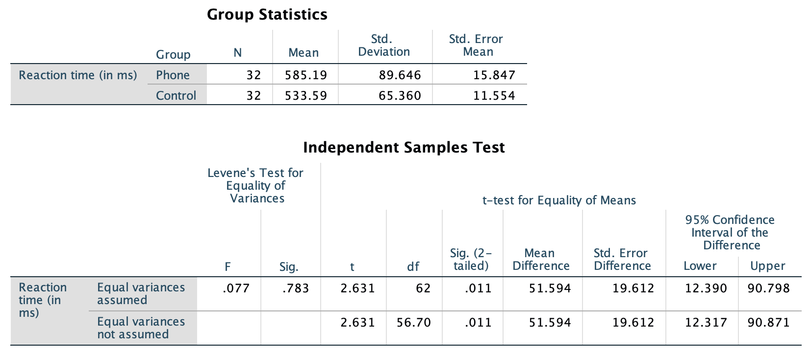
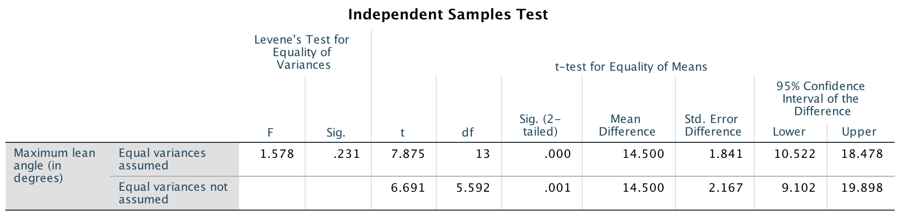
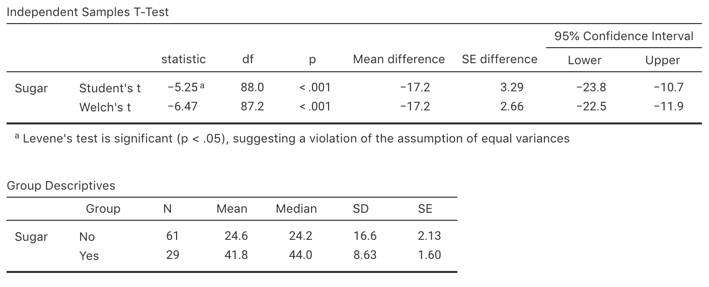

# CIs for two independent means {#CITwoMeans}

::: {.objectivesBox .objectives data-latex="{iconmonstr-target-4-240.png}"}
So far, you have learnt to ask a RQ, design a study, describe and summarise the data, understand the decision-making process and to work with probabilities.
You have also been introduced to confidence intervals for proportions, means and mean differences.

**In this chapter**, you will learn to construct *confidence intervals* for the differences between two means.
You will learn to:

* produce confidence intervals for two independent means.
* determine whether the conditions for using the confidence intervals apply in a given situation.
:::


```{r echo=FALSE, fig.cap="", fig.align="center", fig.width=3, out.width="35%"}
SixSteps(5, "CIs: Difference between means")
```


```{r echo=FALSE}
RT <- structure(list(Reaction = c(636, 623, 615, 672, 601, 600, 542, 
554, 543, 520, 609, 559, 595, 565, 573, 554, 626, 501, 574, 468, 
578, 560, 525, 647, 456, 688, 679, 960, 558, 482, 527, 536, 557, 
572, 457, 489, 532, 506, 648, 485, 610, 444, 626, 626, 426, 585, 
487, 436, 642, 476, 586, 565, 617, 528, 578, 472, 485, 539, 523, 
479, 535, 603, 512, 449), Group = structure(c(1L, 1L, 1L, 1L, 
1L, 1L, 1L, 1L, 1L, 1L, 1L, 1L, 1L, 1L, 1L, 1L, 1L, 1L, 1L, 1L, 
1L, 1L, 1L, 1L, 1L, 1L, 1L, 1L, 1L, 1L, 1L, 1L, 2L, 2L, 2L, 2L, 
2L, 2L, 2L, 2L, 2L, 2L, 2L, 2L, 2L, 2L, 2L, 2L, 2L, 2L, 2L, 2L, 
2L, 2L, 2L, 2L, 2L, 2L, 2L, 2L, 2L, 2L, 2L, 2L), .Label = c("Phone", 
"Control"), class = "factor")), .Names = c("Reaction", "Group"
), row.names = c(NA, -64L), class = "data.frame", variable.labels = structure(c("Reaction time (in ms)", 
"Group"), .Names = c("Reaction", "Group")), codepage = 65001L)
```


##  Means of two independent samples {#MeansIndSamples}


`r if (knitr::is_html_output()) '<!--'`
\begin{wrapfigure}{R}{.25\textwidth}
  \begin{center}
    \includegraphics[width=.20\textwidth]{Illustrations/pexels-splitshire-2224.jpg}
  \end{center}
\end{wrapfigure}
`r if (knitr::is_html_output()) '-->'`


A study [@data:Strayer2001:phones; @agresti2007statistics] examined the reaction times of students while driving.
In one study, two different groups of students were used: one group *used* a mobile phone, and a different group *did not use* a mobile phone (a [*between individuals* comparison](#Comparison)).
The reaction time for each student was measured in a driving simulator.


<div style="float:right; width: 222x; border: 1px; padding:10px">

</div>


The study uses two groups with different treatments: one group using a mobile phone while driving, and a different group *not* using a mobile phone while driving.
The data are not paired; instead, the means of two separate (or independent) samples are being compared.
(The data would be paired if *each* student was measured twice: once using a phone, and once without using a phone.)

Consider the RQ:

> For students, what is the difference between the mean reaction time while driving when using a mobile phone and the mean reaction time while driving when *not* using a mobile phone?


`r if ( knitr::is_html_output()) { 
  'The data are shown below.'
} else {
  'Part of the data are shown in Table \\@ref(tab:PhoneDataTable).'
}
`


::: {.thinkBox .think data-latex="{iconmonstr-light-bulb-2-240.png}"}
What are P, O, C and I in this study?

`r if (knitr::is_latex_output()) '<!--'`
`r webexercises::hide()`
**P**: Students (this is defined more specifically in the original study). 

**O**: Mean reaction time. 

**C**: Between two groups: those using and not using a mobile phone while driving. 

**I**: Yes; the use of a phone (or not) was decided by the researchers.
`r webexercises::unhide()`
`r if (knitr::is_latex_output()) '-->'`
:::


```{r PhoneDataTable, echo=FALSE}
RT.DataTable     <- cbind( "Use phone" = head(RT$Reaction[RT$Group == "Phone"], 10), 
                           "Not using phone" = head(RT$Reaction[RT$Group == "Control"], 10))
RT.DataTableHTML <- cbind( "Use phone" = RT$Reaction[RT$Group == "Phone"], 
                           "Not using phone" = RT$Reaction[RT$Group == "Control"])

if( knitr::is_latex_output() ) {
kable(RT.DataTable,
      format = "latex",
      booktabs = TRUE,
      longtable = FALSE,
      col.names = c("Using phone", 
                    "Not using phone"),
      caption = "Reaction times (in milliseconds) for students using, and not using, mobile phones. The first ten observations are shown, but 32 students are in each group",
      align = c("r", "r")) %>%
      row_spec(0, bold = TRUE) %>%
      kable_styling(font_size = 10)
} 
if( knitr::is_html_output(excludes = "epub") ) {
   DT::datatable(RT.DataTableHTML,
                 fillContainer = FALSE, # Make more room, so we don't just have ten values
                 colnames = c("Using phone", 
                              "Not using phone"),
                 filter = "none",
                 options = list(searching = FALSE), # Remove searching: See: https://stackoverflow.com/questions/35624413/remove-search-option-but-leave-search-columns-option
                 caption = "Reaction times (in milliseconds) for students using, and not using, mobile phones.")
}
if( knitr::is_html_output() & knitr::pandoc_to("epub")) {
  kable(RT.DataTableHTML,
        format = "html",
        booktabs = TRUE,
        longtable = FALSE,
        col.names = c("Using phone", 
                      "Not using phone"),
        caption = "Reaction times (in milliseconds) for students using, and not using, mobile phones. The first ten observations are shown, but 32 students are in each group",
        align = c("r", "r"))
}
```


::: {.thinkBox .think data-latex="{iconmonstr-light-bulb-2-240.png}"}
For this study, what graph would be suitable for displaying the data?  
`r if( knitr::is_html_output(exclude = "epub") ) {
	 mcq( c("Scatterplot",
	        answer = "Boxplot",
	        "Histogram of the differences",
	        "Histogram",
	        "Side-by-side bar chart"))}`
:::


```{r echo=FALSE}
Phone.DataSummary <- Phone.DataSummary.rnd <- array(NA, 
                                                    dim = c(3, 4) )

Phone.DataSummary[1:2, 1] <- aggregate( Reaction ~ Group, 
                                        data = RT, 
                                        FUN = "mean")[, 2]
Phone.DataSummary[1:2, 2] <- aggregate( Reaction ~ Group, 
                                        data = RT, 
                                        FUN = "length")[, 2] 
Phone.DataSummary[1:2, 3] <- aggregate( Reaction ~ Group, 
                                        data = RT, 
                                        FUN = "sd")[, 2]
Phone.DataSummary[1:2, 4] <- aggregate( Reaction ~ Group, 
                                        data = RT, 
                                        FUN = function(x){ sd(x)/sqrt(length(x))})[, 2] 

Phone.DataSummary[3, 1] <- Phone.DataSummary[1, 1] - Phone.DataSummary[2, 1]
Phone.DataSummary[3, 4] <- sqrt( Phone.DataSummary[1, 3]^2/Phone.DataSummary[1, 2] +
                                 Phone.DataSummary[2, 3]^2/Phone.DataSummary[2, 2]  )
rownames(Phone.DataSummary) <- c("Using phone", 
                                 "Not using phone", 
                                 "Differences")
```


## Graphical summary: Two independent means

To compare two *quantitative* variables, a suitable graphical summary may be a boxplot (Fig.&nbsp;\@ref(fig:PhonePlots)) or (when samples sizes aren't too large) a dot chart.
For the reaction-time data, the boxplot shows that the sample medians are a little different, but the IQR about the same; one large outlier is present for the phone-using group. 


```{r PhonePlots, echo=FALSE, fig.cap="Plots of the reaction times (in milliseconds) for students using, and not using, mobile phones.", fig.align="center", fig.width=5, fig.height=3.5}
boxplot(RT$Reaction ~ RT$Group,
        col = plot.colour,
        las = 1,
        ylim = c(400, 1000),
        ylab = "Reaction time (in ms)",
        xlab = "Group")
```


## Notation: Two independent means {#TwoMeansNotationCI}

Since two groups are being compared, distinguishing between the statistics for the two groups (say, Group A and Group B) is important.
One way is to use subscripts (Table \@ref(tab:IndSampleNotation)).


```{r IndSampleNotation, echo=FALSE}
Diff2Notation <- array(dim=c(5, 2))
colnames(Diff2Notation) <- c(	"Group A", 
                              "Group B")
rownames(Diff2Notation) <- c(	"Population means:",
								              "Sample means:",
								              "Standard deviations:",
								              "Standard errors:",
								              "Sample sizes:")


if( knitr::is_latex_output() ) {
  Diff2Notation[1, ] <- c( "$\\mu_A$", 	
                           "$\\mu_B$")
  Diff2Notation[2, ] <- c( "$\\bar{x}_A$",		
                           "$\\bar{x}_B$")
  Diff2Notation[3, ] <- c( "$s_A$", 			
                           "$s_B$")
  Diff2Notation[4, ] <- c( "$\\displaystyle\\text{s.e.}(\\bar{x}_A) = \\frac{s_A}{\\sqrt{n_A}}$",
  							           "$\\displaystyle\\text{s.e.}(\\bar{x}_B) = \\frac{s_B}{\\sqrt{n_B}}$")
  Diff2Notation[5, ] <- c( "$n_A$",
  							           "$n_B$")

  kable( Diff2Notation,
         format = "latex",
         booktabs = TRUE,
         align = c("c", "c"),
         longtable = FALSE,
         escape = FALSE,
         col.names = colnames(Diff2Notation),
         caption = "Notation used to distinguish between the two independent groups") %>%
    row_spec(0, bold = TRUE) %>%
    kable_styling(font_size = 10)
}
if( knitr::is_html_output() ) {

  Diff2Notation[1, ] <- c( "$\\mu_A$", 	
                           "$\\mu_B$")
  Diff2Notation[2, ] <- c( "$\\bar{x}_A$",		
                           "$\\bar{x}_B$")
  Diff2Notation[3, ] <- c( "$s_A$", 			
                           "$s_B$")
  Diff2Notation[4, ] <- c( "$\\displaystyle\\text{s.e.}(\\bar{x}_A) = \\frac{s_A}{\\sqrt{n_A}}$",
  							           "$\\displaystyle\\text{s.e.}(\\bar{x}_B) = \\frac{s_B}{\\sqrt{n_B}}$")
  Diff2Notation[5, ] <- c( "$n_A$",
  							           "$n_B$")

  out <- kable( Diff2Notation,
         format = "html",
         booktabs = TRUE,
         longtable = FALSE,
         align = c("c", "c"),
         col.names = colnames(Diff2Notation),
         caption = "Notation used to distinguish between the two independent groups")
  if ( knitr::is_html_output(excludes = "epub")) {
    row_spec(out, 0, bold = TRUE) 
  } else {
    out
  }
    
}
```


Using this notation, the difference between population means, the parameter of interest, is $\mu_A - \mu_B$.
As usual, the population values are unknown, so this parameter is estimated using the statistic $\bar{x}_A-\bar{x}_B$.

Table \@ref(tab:IndSampleNotation) does not include a standard deviation or a sample size for the *difference between means*; they make no sense in this context.
For example, if Group A has 15 individuals, and Group B has 45 individuals, and we wish to study the difference $\bar{x}_A - \bar{x}_B$... what is the sample size?
Certainly not $15 - 45 = -30$.

However, the *standard error* of the difference between the means does make sense:
it measures how much the value of  $\bar{x}_A - \bar{x}_B$ varies from sample to sample.

For the reaction-time data, subscripts $P$ is used for phone-users group, and $C$ for the control group.
The two sample means are denoted as $\bar{x}_P$ and $\bar{x}_C$, and the difference between them as $\bar{x}_P - \bar{x}_C$.


## Numerical summary: Two independent means

The numerical summary should summarise both groups, but *must* summarise the differences between the *means* (since the RQ is about this difference).
All this information can be found using jamovi (Fig.&nbsp;\@ref(fig:ReactionPhoneSummaryjamovi)) or
SPSS (Fig.&nbsp;\@ref(fig:ReactionPhoneSummarySPSS)), then compiled into a table (Table \@ref(tab:PhoneNumerical)).


```{r ReactionPhoneSummaryjamovi, echo=FALSE, fig.cap="jamovi output for the phone reaction time data", fig.align="center", out.width='100%'}
knitr::include_graphics("jamovi/ReactionPhone/ReactionPhone-Test-NO-CI.png")
```

```{r ReactionPhoneSummarySPSS, echo=FALSE, fig.cap="SPSS output for the phone reaction time data", fig.align="center", out.width='100%'}

```

```{r PhoneNumerical, echo=FALSE}
Phone.DataSummary.rnd[, 1] <- round( Phone.DataSummary[, 1], 2)
Phone.DataSummary.rnd[, 2] <- round( Phone.DataSummary[, 2], 0)
Phone.DataSummary.rnd[, 3] <- round( Phone.DataSummary[, 3], 2)
Phone.DataSummary.rnd[, 4] <- round( Phone.DataSummary[, 4], 3)
  
Phone.DataSummary2 <- array( dim = c(3, 4), 
                             data = Phone.DataSummary.rnd)
Phone.DataSummary2[3, 2] <- ""
Phone.DataSummary2[3, 3] <- ""
rownames(Phone.DataSummary2) <- c("Using phone", 
                                  "Not using phone", 
                                  "Difference")


if( knitr::is_latex_output() ) {
  kable(Phone.DataSummary2,
        format="latex",
        booktabs = TRUE,
        longtable = FALSE,
        align = "r",
#      digits=c(2, 0, 2, 3),
        col.names = c("Mean", 
                      "Sample size", 
                      "Standard deviation", 
                      "Standard error"),
        caption = "The mean, median, standard deviation and standard error for the driving data (in ms)") %>%
		row_spec(0, bold = TRUE) %>%
		kable_styling(font_size = 10)
}
if( knitr::is_html_output() ) {
kable(Phone.DataSummary2,
      format = "html",
      booktabs = TRUE,
      longtable = FALSE,
      align = "r",
      col.names = c("Mean", 
                    "Sample size", 
                    "Std dev", 
                    "Standard error"),
      digits = 2,
      caption = "The mean, median, standard deviation and standard error for the driving data (in ms)")
}

```


Each time the study is repeated, the means for each group are likely to be different, and so the difference between the means is likely to be different.
That is, the difference between the means has *sampling variation* and hence a *standard error*, since it varies from sample to sample.


::: {.thinkBox .think data-latex="{iconmonstr-light-bulb-2-240.png}"}
For those using a phone, what is the difference between the *standard deviation* and the *standard error* in the context of the reaction-time study?

`r if (knitr::is_latex_output()) '<!--'`
`r webexercises::hide()`
The *standard deviation* quantifies how much the individual reactions times vary from *person to person*.

The *standard error* quantifies how much the *difference between sample mean reaction times* varies from *sample to sample*.
`r webexercises::unhide()`
`r if (knitr::is_latex_output()) '-->'`
:::


## Sampling distribution: Two independent means

Since the difference between the population means is unknown, the difference is estimated using the sample means.
For the reaction time data, we use subscripts such as $P$ for phone-users group, and $C$ for the control group.
Then the difference between the two sample means (the *statistic*) is $\bar{x}_P - \bar{x}_C$.
The parameter is $\mu_P - \mu_C$, the difference between the two population means (using a phone, minus *not* using a phone).

The differences could be compute in the opposite direction ($\bar{x}_C - \bar{x}_P$).
However, for the reaction-time data, computing differences as the reaction time for phone users, *minus*  the reaction time for non-phone users (controls) probably makes more sense: the differences then refer to how much greater (on average) the reaction times are when students are using phones,


::: {.tipBox .tip data-latex="{iconmonstr-info-6-240.png}"}
Making clear how the differences are computed is important!
Therefore, carefully defining the *parameter* is important.

The differences could be computed as:
  
* the reaction time for phone users, *minus* the reaction time for non-phone users (how much slower the phone users are, on average); or
* the reaction time for non-phone users, *minus* the reaction time for phone users (how much slower the non-phone users are, on average).

Either is fine, provided you are consistent, and clear about how the difference are computed.
The meaning of any conclusions will be the same.
:::


Each sample of students will comprise different students, and will give different reaction times while driving. 
The means for each group will differ from sample to sample, and the *difference* between the means will be different for each sample.
The *difference* between the sample means varies from sample to sample, and so has a sampling distribution and *standard error*.


::: {.definition name="Sampling distribution for the difference between two sample means"}
The *sampling distribution of the difference between two sample means* is described by:

* an approximate normal distribution;
* centred around $\mu_A - \mu_B$ (the *differences* between the means);
* with a standard deviation of $\displaystyle\text{s.e.}( \bar{x}_A - \bar{x}_B)$,

when the [appropriate conditions](#ValidityTwoMeans) are met.

We don't give a formula for finding the standard error $\displaystyle\text{s.e.}( \bar{x}_A - \bar{x}_B)$, so the value of this standard error will be *given*.
:::


::: {.importantBox .important data-latex="{iconmonstr-warning-8-240.png}"}
A formula exists for finding the standard error of the difference between two means, but is complicated and we won't provide it.
Software can handle details.
We will provide the standard error of the difference between two means, or expect you to find it on computer output.
:::


For the reaction-time data, the differences between the sample means will have:

* an approximate normal distribution;
* centred around $\mu_P - \mu_C$ (the *differences* between the means in the two *populations*);
* with a standard deviation, called the *standard error* of the difference, of $\text{s.e.}(\bar{x}_P - \bar{x}_C) = `r round(Phone.DataSummary[3, 4], 2)`$.

We can draw this sampling distribution (Fig.&nbsp;\@ref(fig:ReactionTimeSamplingDist)).


```{r ReactionTimeSamplingDist, echo=FALSE, fig.cap="The sampling distribution of the difference between the reaction times in the phone and control groups (phone, minus control)", fig.align="center", fig.width=5, fig.height=3}
mn <- Phone.DataSummary[3, 1]
se <- Phone.DataSummary[3, 4] 

plot.norm(mu = mn, 
          sd = se, 
          xlab.name = "Difference between sample means (in milliseconds)", 
          type = "", # Otherwise, a "z" labels the x-axis
           axis.labels = c( 	
                "-58.83",
								"-39.22", 
								"- 19.61", 
								expression( mu[P] - mu[C]),
								"+ 19.61", 
								"+ 39.22", 
								"+ 58.83" ),
          srt = -25, # Rotate axis labels so they fit better
          cex.tickmarks = 0.8,
          shade.lo.x = -10, 
          shade.hi.x = -10)
```


::: {.thinkBox .think data-latex="{iconmonstr-light-bulb-2-240.png}"}
What does a *negative* difference mean?

`r if (knitr::is_latex_output()) '<!--'`
`r webexercises::hide()`
Earlier, we defined the differences as $\mu_P - \mu_C$, the difference between the two population means (using a phone, minus *not* using a phone).

So a negative value simply means that the mean is greater when *not* using a phone.
`r webexercises::unhide()`
`r if (knitr::is_latex_output()) '-->'`
:::


```{r echo=FALSE}
RT.mn <- Phone.DataSummary[3, 1]
RT.se <- Phone.DataSummary[3, 4]
```


## Confidence intervals: Two independent means

Being able to describe the sampling distribution implies that we have some idea of how the values of  
$\bar{x}_P - \bar{x}_C$ are likely to vary from sample to sample. 
Then, finding an approximate 95% CI for the difference between the mean reaction times is similar to the process used in Chap. \@ref(OneMeanConfInterval). 
Almost all approximate 95% CIs have the same form:

\[
  \text{statistic} \pm (2\times\text{s.e.}(\text{statistic})).
\]
When the statistic is $\bar{x}_P - \bar{x}_C$, the approximate 95% CI is

\[
	(\bar{x}_P - \bar{x}_C) \pm (2 \times \text{s.e.}(\bar{x}_P - \bar{x}_C)).
\]

In this case (using more decimal places than in the summary table in Table \@ref(tab:PhoneNumerical)), the CI is

\begin{eqnarray*}
	`r round(RT.mn, 5)` \pm (2 \times `r round(RT.se, 5)`),
\end{eqnarray*}
or $`r round(RT.mn, 5)`\pm `r round(RT.se, 5)`$.
After rounding appropriately, an approximate 95% CI for the difference is from $`r round(RT.mn - 2*RT.se, 2)`$ to $`r round(RT.mn + 2*RT.se, 2)`$ milliseconds.

We write:

> Based on the sample, an *approximate* 95% CI for the difference in reaction time while driving, for those using a phone and those not using a phone, is from $`r round(RT.mn - 2*RT.se, 2)`$ to $`r round(RT.mn + 2*RT.se, 2)`$ milliseconds (higher for those using a phone).

The plausible values for the difference between the two population means are between $`r round(RT.mn - 2*RT.se, 2)`$ to $`r round(RT.mn + 2*RT.se, 2)`$ milliseconds.

Stating the CI is insufficient; you must also state the *direction* in which the differences were calculated, so readers know which group had the higher mean.


::: {.example #TwoSampleCIWhales name="Gray whales"}
A study of gray whales (*Eschrichtius robustus*) measured (among other things) the length of whales at birth [@agbayani2020growth].
The data are shown below.


| Sex     |  Mean (in m)  |Standard deviation (in m) | Sample size 
|--------:+:-------------:+:------------------------:+:-----------:
| Female 	| 4.66          | 0.379 	                 | 26 	
| Male 	  | 4.60 	        | 0.305 	                 | 30 

How much longer are female gray whales than males, on average?

Let's define the *difference* as the mean length of female gray whales *minus* the mean length of male gray whales; then we wish to estimate the difference $\mu_F - \mu_M$ (where $F$ and $M$ represent female and male gray whales respectively).
In this situation, this is the *parameter* of interest.
The best estimate of this difference is $\bar{x}_F - \bar{x}_M = 4.66 - 4.60 = 0.06$.

We know that this value is likely to vary from sample to sample,
and hence it has a standard error.
We cannot easily determine the standard error of this difference from the above information (though it is possible), so we must be *given* this information: $\text{s.e.}(\bar{x}_F - \bar{x}_M) = 0.0929$.

Then the approximate 95% CI is from

\[
   0.06 - (2 \times 0.0929) = -0.125747
\]
to
\[
   0.06 + (2 \times 0.0929) = 0.245747,
\]
so the CI is from $-0.12$&nbsp;m to $0.25$&nbsp;m.

Notice that one of these limits is a *negative* value. 
This does not mean a *negative* length for a whale; that would be silly.
Remember that this CI is for the *difference* between the mean lengths, and a *negative* length just says the mean length for males is greater than the mean length for females.

So we could say:

> The population mean difference between the length of female and male gray whales at birth has a 95% chance of being between $0.12$&nbsp;m longer for male whales to $0.25$&nbsp;m longer for female whales.
:::


## Using software: CIs for two independent means

The jamovi output (Fig.&nbsp;\@ref(fig:ReactionPhoneTestOutputjamovi)) and the SPSS output (Fig.&nbsp;\@ref(fig:ReactionPhoneTestOutputSPSS)) both show *two* CIs.
*We will use the results from the second row* in both cases, as this row of output is more general (and makes fewer assumptions).


::: {.importantBox .important data-latex="{iconmonstr-warning-8-240.png}"}
jamovi and SPSS give *two* confidence intervals.
In this book, we will use the *second row* of information (the 'Welch's $t$' row in jamovi; the 'Equal variance not assumed' row in SPSS) because it is more general and makes fewer assumptions.
:::


```{r ReactionPhoneTestOutputjamovi, echo=FALSE, fig.cap="The jamovi output for the phone-reaction data", fig.align="center", out.width='75%'}
knitr::include_graphics("jamovi/ReactionPhone/ReactionPhone-Test.png")
```


```{r ReactionPhoneTestOutputSPSS, echo=FALSE, fig.cap="The SPSS output for the phone-reaction data", fig.align="center", out.width='90%'}

```


From the SPSS output, the standard error is $\text{s.e.}(\bar{x}_P - \bar{x}_C) = 19.612$.
From the jamovi or SPSS output, the exact 95% CI is from $12.3$ to $90.9$.

The *approximate* CI and the *exact* (from SPSS) CIs are only slightly different, as SPSS uses an *exact* multiplier (whereas manually an approximate $t$-multiplier of 2 is used, based on the  [68--95--99.7 rule](#def:EmpiricalRule)), and the sample sizes aren't too small.


<iframe src="https://learningapps.org/watch?v=p97ra3pxc22" style="border:0px;width:100%;height:800px" allowfullscreen="true" webkitallowfullscreen="true" mozallowfullscreen="true"></iframe>


## Statistical validity conditions: Two independent means {#ValidityTwoMeans}

As usual, these results apply [under certain conditions](#exm:StatisticalValidityAnalogy).
The CI computed above is statistically valid if *one* of these conditions is true:

1. *Both* sample sizes are at least 25; *or*
1. Either sample size is smaller than 25, **and**
   the *populations* corresponding to both comparison groups have an approximate normal distribution.
   
The sample size of 25 is a rough figure here, and some books give other (similar) values (such as 30).
We can explore the histograms of the *samples* to determine if normality of the *populations* seems reasonable.

In addition to the statistical validity condition, the CI will be

* [**internally valid**](#def:InternalValidity)
  if the study was well designed; and
* [**externally valid**](#def:ExternalValidity) 
  if the sample is a [simple random sample](#SRS)
  and is internally valid.


::: {.example #StatisticalValidityReaction name="Statistical validity"}
For the reaction-time data, both samples are larger than $25$, so the CI will be statistically valid.
:::


::: {.example #StatisticalValidityWhale name="Statistical validity"}
In the whales examples of Example \@ref(exm:TwoSampleCIWhales), the two sample sizes are 26 (for females) and 30 (for males).
Since both samples are larger than 25, the CI will be statistically valid.
:::


## Error bar charts {#ErrorBarCharts}

A useful way to display the CIs from two (or more) groups is with an *error bar chart*, which displays the  *CIs* (or sometimes the *standard errors*) for each group being compared.
(A boxplot displays the *data*.)

Error bars charts display the expected variation *in the sample means* from sample to sample, while boxplots display the variation *in the individual observations* and show the median.

For the reaction time data, the error bar chart (Fig.&nbsp;\@ref(fig:PhoneErrorbar)) shows the 95% CI for each group (the mean has been added as a dot).


```{r PhoneErrorbar, echo=FALSE, fig.cap="Error bar chart comparing the mean reaction time for students using a mobile phone and not using a mobile phone (control)", fig.align="center", fig.width=5, fig.height=4}
ci.lo <- Phone.DataSummary[, 1] - 2 * Phone.DataSummary[, 4] 
ci.hi <- Phone.DataSummary[, 1] + 2 * Phone.DataSummary[, 4] 

plot( range( c( ci.lo, ci.hi) ) ~ c(0.9,2.1), 
      data = RT,
      type = "n",
      xlim = c(0.5, 2.5),
      ylim = c(500, 650),
      pch = 19,
      axes = FALSE,
      main = "Error bars chart:\n reaction times",
      xlab = "Group", 
      ylab = "Reaction times (in ms)",
      sub = "(Error bars are 95% confidence intervals)",
      las = 1)
axis(side = 1, 
     at = 1:2, 
     labels = levels(RT$Group), 
     las = 1) 
axis(side = 2, 
     las = 1)
box()

mns <- Phone.DataSummary[1:2, 1]

points( mns ~ c(1:2), 
        pch = 19)

arrows(1:2, 
       ci.lo[1:2], 
       1:2, 
       ci.hi[1:2], 
  length = 0.05, 
  angle = 90, 
  code = 3)
```    


::: {.thinkBox .think data-latex="{iconmonstr-light-bulb-2-240.png}"}
What is different about the information displayed in the error bar chart in (Fig.&nbsp;\@ref(fig:PhoneErrorbar)) and the boxplot (Fig.&nbsp;\@ref(fig:PhonePlots))?

`r if (knitr::is_latex_output()) '<!--'`
`r webexercises::hide()`
The *error bar chart* helps us understand how precisely the sample mean estimates the population mean.

The *boxplot* shows the variation in the individual data values.
`r webexercises::unhide()`
`r if (knitr::is_latex_output()) '-->'`
:::


<div style="float:right; width: 222x; border: 1px; padding:10px">

</div>


::: {.example #ErrorBarCharts name="Error bar charts"}
A study [@data:Aloy2011:Litter] examined the impact of plastic litter on the shoreline at Talim Bay (Batangas, Philippines) during various seasons, and the impact on the gastropod *Nassarius pullus*.
The error bar chart (Fig.&nbsp;\@ref(fig:MonsoonRubbish)) shows that summer seems different---in terms  of average value (mean) and the amount of variation---than the other seasons.
:::


```{r MonsoonRubbish, echo=FALSE, fig.cap="Relative abundance of a gastropod from random quadrat surveys conducted over prevalent monsoon types in all study areas in Talim Bay. Error bars represent 95\\% confidence intervals.", fig.align="center", fig.width=5.5, fig.height=4.5}
par( mar = c(5, 5, 4, 2) + 0.1) #WAS  5.1 4.1 4.1 2.1
NE <- c(0.25, 1)
SW <- c(0.2, 0.6)
Summer <- c(0.25, 2.2)
width <- 0.1

Mdns <- c(0.63, 0.38, 1.21)
Ns <- c(60, 69, 39)

plot( c(0.5, 3.5), 
      c(0, 2.5), 
      type = "n",
      xlab = "",
      ylab = "Mean N. pullus\nrelative abundance",
      axes = FALSE,
      las = 1)

axis(side = 1,
     at = 1:3,
     labels = c("NE\nmonsoon", 
                "SW\nmonsoon", 
                "Summer"))
axis(side = 2,
     las = 1,
     at = 0:2)

# Vertical lines
segments(1, NE[1], 
         1, NE[2])
segments(2, SW[1], 
         2, SW[2])
segments(3, Summer[1], 
         3, Summer[2])

segments( 1 - width, NE[1],
          1 + width, NE[1])
segments( 1 - width, NE[2],
          1 + width, NE[2])

segments( 2 - width, SW[1],
          2 + width, SW[1])
segments( 2 - width, SW[2],
          2 + width, SW[2])

segments( 3 - width, Summer[1],
          3 + width, Summer[1])
segments( 3 - width, Summer[2],
          3 + width, Summer[2])

# Plot medians
points( c(1, 2, 3),
        Mdns, 
        pch = 20)

# Sample sizes
text( 1:3, 
      c(NE[1], SW[1], Summer[1]),
      labels = paste("n =", Ns),
      pos = 1,
      cex = 0.9
)

# Label medians
text( (1:3) - 0.1, Mdns,
     labels = paste("  ",Mdns),
     pos = 4)

# Add minor tick marks
rug( seq(0, 2.5, by = 0.2), 
     ticksize = -0.01, 
     side = 2)

box()
```


```{r echo=FALSE}
data(lime)
```


<div style="float:right; width: 222x; border: 1px; padding:10px">

</div>


::: {.example #ErrorBarCharts2 name="Error bar charts"}
A study [@data:ForestBiomass2017] examined  the foliage biomass of small-leaved lime trees from three sources were studied: coppices; natural; planted.

Two graphical summaries are shown in Fig.&nbsp;\@ref(fig:LimeTreesBoxErrorbar): a boxplot (showing the variation in *individual* trees) and an error bar chart (showing the variation in the *sample means*).
Using a better scale for the error-bar plot is helpful (Fig.&nbsp;\@ref(fig:LimeTreesErrorbar)).
:::


```{r LimeTreesBoxErrorbar, echo=FALSE, fig.cap="Boxplot and error bar chart comparing the mean foliage biomass for small-leaved lime trees from three sources, using the same vertical scale. The solid dots in the boxplot are shown the mean of the distributions", fig.align="center", fig.width=5, fig.height=7}
par( mfrow = c(2, 1))

lime.mns <- tapply(lime$Foliage, lime$Origin, "mean")

boxplot(Foliage ~ Origin, 
        data = lime,
	      xlab = "Origin",
	      ylab = "Foliage biomass (kg)",
	      las = 1,
      	ylim = c(0, 14),
	      main = "Boxplot: Foliage biomass",
	      col = "white")
points(1:3, 
       lime.mns, 
	     pch = 19,
	     col = "red")

mns <- with(lime, 
            tapply(Foliage, Origin, "mean") )
ses <- with(lime, 
            tapply(Foliage, Origin, function(x){sd(x)/sqrt(length(x))}) )
ci.lo <- mns - ses*2
ci.hi <- mns + ses*2

plot( range( c( ci.lo, ci.hi) ) ~ c(1,3), 
      data = lime,
      type = "n",
      ylim = c(0, 14),
      xlim = c(0.5, 3.5),
      pch = 19,
      axes = FALSE,
      main = "Error bars chart:\n mean foliage biomass",
      xlab = "Origin", 
      ylab = "Foliage biomass (kg)",
      sub = "(Error bars are 95% confidence intervals)",
      las = 1)
axis(side = 1, 
     at = 1:3, 
     labels = levels(lime$Origin), 
     las = 1) 
axis(side = 2, 
     las = 1)
box()

points( mns ~ c(1:3), 
        pch = 19)

arrows(1:3, 
       mns - 2 * ses, 
       1:3, 
       mns + 2 * ses, 
       length = 0.05, 
       angle = 90, 
       code = 3)
```


      
```{r LimeTreesErrorbar, echo=FALSE, fig.cap="Error bar chart comparing the mean foliage biomass for small-leaved lime trees from three sources, but with a more sensible scale on the vertical axis", fig.align="center", fig.width=5, fig.height=4}
plot( range( c( ci.lo, ci.hi) ) ~ c(1, 3), 
      data = lime,
      type = "n",
      ylim = c(1, 3.5),
      xlim = c(0.5, 3.5),
      pch = 19,
      axes = FALSE,
      main = "Error bars chart:\n mean foliage biomass",
      xlab = "Origin", 
      ylab = "Foliage biomass (kg)",
      sub = "(Error bars are 95% confidence intervals)",
      las = 1)
axis(side = 1, 
     at = 1:3, 
     labels = levels(lime$Origin), 
     las = 1) 
axis(side = 2, 
     las = 1)
box()

points( mns ~ c(1:3), 
        pch = 19,
        cex = 1.5,
        col = plot.colour)

arrows(1:3, mns - 2 * ses, 
       1:3, mns + 2 * ses, 
       length = 0.05, 
       angle = 90, 
       code = 3)
```    


::: {.example #ErrorBarWhales name="Whales"}
Using the data about gray whales from Example \@ref(exm:TwoSampleCIWhales), the error bar chart in Fig. \@ref(fig:WhalesErrorbar) can be constructed.
The plot seems to suggest little difference between the mean length of female and male gray whales at birth.
:::

      
```{r WhalesErrorbar, echo=FALSE, fig.cap="Error bar chart comparing the lengths of female and male gray whales", fig.align="center", fig.width=5, fig.height=4}

ciF <- c(4.66 - 2 * (0.379 / sqrt(26)),
         4.66 + 2 * (0.379 / sqrt(26)) )
ciM <- c(4.60 - 2 * (0.305 / sqrt(30)),
         4.60 + 2 * (0.305 / sqrt(30)) )


plot( range( c( ciF, ciM) ) ~ c(1, 2), 
      type = "n",
      xlim = c(0.5, 2.5),
      ylim = c(4.45, 4.85),
      pch = 19,
      axes = FALSE,
      main = "Error bars chart:\n length of gray whales at birth",
      xlab = "Sex", 
      ylab = "Length (in metres)",
      sub = "(Error bars are 95% confidence intervals)",
      las = 1)
axis(side = 1, 
     at = 1:2, 
     labels = c("Females", "Males"), 
     las = 1) 
axis(side = 2, 
     las = 1)
box()

points( c(4.66, 4.60) ~ c(1:2), 
        pch = 19,
        col = plot.colour,
        cex = 1.5)

arrows(1:2, c(ciF[1], ciM[1]), 
       1:2, c(ciF[2], ciM[2]), 
       length = 0.05, 
       angle = 90, 
       code = 3)
```    


## Example: Speed signage {#SpeedSignage}


<div style="float:right; width: 222x; border: 1px; padding:10px">

</div>


`r if (knitr::is_html_output()) '<!--'`
\begin{wrapfigure}{R}{.25\textwidth}
  \begin{center}
    \includegraphics[width=.20\textwidth]{Illustrations/pexels-pixabay-315939.jpg}
  \end{center}
\end{wrapfigure}
`r if (knitr::is_html_output()) '-->'`


In an attempt to reduce vehicle speeds on freeway exit ramps, a Chinese study tried using additional signage [@ma2019impacts].
At one site studied (Ningxuan Freeway), speeds were recorded for 38 vehicles before the extra signage was added, and then for 41 vehicles after the extra signage was added.


```{r Signage, echo=FALSE}

Speed <- structure(list(When = c("Before", "Before", "Before", "Before", 
"Before", "Before", "Before", "Before", "Before", "Before", "Before", 
"Before", "Before", "Before", "Before", "Before", "Before", "Before", 
"Before", "Before", "Before", "Before", "Before", "Before", "Before", 
"Before", "Before", "Before", "Before", "Before", "Before", "Before", 
"Before", "Before", "Before", "Before", "Before", "Before", "After", 
"After", "After", "After", "After", "After", "After", "After", 
"After", "After", "After", "After", "After", "After", "After", 
"After", "After", "After", "After", "After", "After", "After", 
"After", "After", "After", "After", "After", "After", "After", 
"After", "After", "After", "After", "After", "After", "After", 
"After", "After", "After", "After", "After"), Speed = c(90, 83.1, 
93.9, 113.7, 120, 108, 98.2, 90, 90, 108, 102.9, 108, 83.1, 72, 
98.2, 102.9, 108, 120, 127.1, 72, 80, 86.4, 80, 90, 98.2, 90, 
102.9, 102.9, 113.7, 108, 93.9, 98.2, 108, 108, 102.9, 102.9, 
86.4, 83.1, 98.2, 102.9, 93.9, 98.2, 80, 86.4, 102.9, 83.1, 98.2, 
98.2, 93.9, 98.2, 67.5, 98.2, 93.9, 98.2, 63.5, 83.1, 93.9, 93.9, 
120, 93.9, 77.1, 86.4, 98.2, 108, 74.5, 102.9, 90, 98.2, 108, 
86.4, 113.7, 72, 98.2, 93.9, 69.7, 113.7, 102.9, 72, 80)), class = "data.frame", row.names = c(NA, 
-79L))
Speed$When <- factor(Speed$When,
                     levels = c("Before", "After"),
                     ordered = TRUE)

if( knitr::is_latex_output() ) {
  
  kable( Speed[1:10,],
         format = "latex",
         longtable = FALSE,
         booktabs = TRUE,
         align = c("c", "c", "c"),
         caption = "Vehicle speeds before and after adding extra signage. Only the first 10 observations are shown.") %>%
    kable_styling(font_size = 10)
}

if( knitr::is_html_output(exclude = "epub") ) {
  
   DT::datatable( Speed,
                 fillContainer = FALSE, # Make more room, so we don't just have ten values
                 colnames = c("When measured", "Speed (km/h)"),
                 options = list(searching = FALSE), # Remove searching: See: https://stackoverflow.com/questions/35624413/remove-search-option-but-leave-search-columns-option
                 caption = "The observations from the signage data")
}

if ( knitr::is_html_output() & knitr::pandoc_to("epub")) {

  kable( Speed[1:10,],
         format = "html",
         longtable = FALSE,
         booktabs = TRUE,
         align = c("c", "c", "c"),
         caption = "Vehicle speeds before and after adding extra signage. Only the first 10 observations are shown.") %>%
    kable_styling(font_size = 10)
}
```

The researchers are hoping that the addition of extra signage will *reduce* the mean speed of the vehicles.

The RQ is:

> At this freeway exit, is the mean vehicle speed the same before extra signage is added and after extra signage is added?

The data are *not* paired: different vehicles are measured before and after the extra signage is added.
The data are summarised in Table \@ref(tab:SignageSummary).


```{r SignageSummary, echo=FALSE}
SignageSummary <- array(dim = c(3, 4))
rownames(SignageSummary) <- c("Before", 
                            "After",
                            "Speed reduction")
colnames(SignageSummary) <- c("Mean",
                              "Std deviation",
                            "Std error",
                            "Sample size")

Speed.n <- tapply(Speed$Speed, 
                  list(Speed$When), 
                  "length") 
Speed.sd <- tapply(Speed$Speed, 
                   list(Speed$When), 
                   "sd") 

SignageSummary[1:2, 1] <- round( tapply(Speed$Speed, 
                                        list(Speed$When), 
                                        "mean"),
                                 2)
SignageSummary[1:2, 2] <- round( Speed.sd, 2)
SignageSummary[1:2, 3] <- round( Speed.sd / sqrt(Speed.n), 3)
SignageSummary[1:2, 4] <- Speed.n 

SignageSummary[3, 1] <- SignageSummary[1, 1] -  
                        SignageSummary[2, 1] 

sdB <- round( Speed.sd[1], 2)
sdA <- round( Speed.sd[2], 2)
SignageSummary[3, 3] <- round( sqrt( sdB^2/Speed.n[1] + 
                                     sdA^2/Speed.n[2] ), 
                               3)

SignageSummary[3, 4] <- NA 
SignageSummary[3, 2] <- NA
                          


if( knitr::is_latex_output() ) {
  kable(SignageSummary,
        format = "latex",
        longtable = FALSE,
        booktabs = TRUE,
        align = c("r", "r", "r", "r"),
        col.names = c("Mean", 
                      "Std deviation", 
                      "Sample size", 
                      "Std error"),
        caption = "The signage data summary (in km/h)"
  ) %>%
  row_spec(0, bold = TRUE) %>%
  kable_styling(font_size = 10)
}
if( knitr::is_html_output() ) {
  out <- kable(SignageSummary,
               format = "html",
               longtable = FALSE,
               booktabs = TRUE,
               align = c("r", "r", "r", "r"),
               col.names = c("Mean", 
                            "Std deviation", 
                            "Std error",
                            "Sample size"),
    caption = "The signage data summary (in km/h)"
  )
  if ( knitr::is_html_output(excludes = "epub")) {
    kable_styling(out, full_width = FALSE)
  } else {
    out
  }
}
```


The parameter is $\mu_{\text{Before}} - \mu_{\text{After}}$, the *reduction* in the mean speed.


::: {.tipBox .tip data-latex="{iconmonstr-info-6-240.png}"}
The *standard error must given*; you *cannot* easily calculate this from the other information.
You are not expected to do so.
:::


A useful graphical summary of the *data* is a boxplot (Fig. \@ref(fig:SignageErrorBar), left panel);  likewise, an error bar chart can be produced by computing the CI for each group (Fig. \@ref(fig:SignageErrorBar), right panel).


```{r SignageErrorBar, echo=FALSE, fig.cap="Boxplot (left); error bar chart (right) showing the mean speed before and after the addition of extra signage, and the 95\\% CIs", fig.align="center", fig.width=6, fig.height=3.5}

par( mfrow = c(1, 2) )

boxplot( Speed ~ When,
         data = Speed,
         ylab = "Vehicle speed (km/h)",
         xlab = "When measured",
         main = "Speed before and after\nextra signage added",
         ylim = c(60, 130),
         las = 1,
         col = plot.colour)


bit <- 0.05

mns <- SignageSummary[1:2, 1]
se <- SignageSummary[1:2, 3]

ci.lo <- mns - 2 * se
ci.hi <- mns + 2 * se

plot( 1:2, 
      mns,
      pch = 19,
      ylim = c(80, 110 ),
      xlim = c(0.4, 2.6),
      las = 1,
      axes = FALSE,
      xlab = "",
      ylab = "Vehicle speed (km/h)",
      main = "Mean vehicle speeds",
      sub = "(Error bars are the 95% CI)",
      type = "p")
axis(side = 1, 
     at = 1:2,
     las=1,
     labels = c("Before", 
                "After"))
axis(side = 2, 
     las = 1)
box()

lines( c(1, 1),
       c(ci.lo[1], ci.hi[1]))
lines( c(2, 2),
       c(ci.lo[2], ci.hi[2]))


lines( c(1 - bit, 1 + bit), 
       c( ci.hi[1], ci.hi[1]) )
lines( c(1 - bit, 1 + bit), 
       c( ci.lo[1], ci.lo[1]) )

lines( c(2 - bit, 2 + bit), 
       c( ci.hi[2], ci.hi[2]) )
lines( c(2 - bit, 2 + bit), 
       c( ci.lo[2], ci.lo[2]) )
```


Based on the sample, an approximate 95% CI for the difference in mean speeds is $5.68 \pm (2 \times 2.964)$, or from $-0.24$ to $11.6$ km/h, higher before the addition of extra signage.
(The negative value refers to a negative reduction; that is, an *increase* in speed of 0.24 km/h.) 

This means that, if many samples of size 38 and 41 were found, and the difference between the mean speeds were found, about 95% of the CIs would contain the population difference ($\mu_{\text{Before}} - \mu_{\text{After}}$).
Loosely speaking, there is a 95% chance that our CI straddles the difference in the population means ($\mu_{\text{Before}} - \mu_{\text{After}}$).

We could write:

> Based on the sample, an approximate 95% CI for the reduction in mean speeds after adding extra signage is between -0.24 km/h (i.e., an increase of 0.24 km/h) and 11.6 km/h (two independent samples).

Using the [validity conditions](#ValidityTwoMeans), the CI is statistically valid.

::: {.tipBox .tip data-latex="{iconmonstr-info-6-240.png}"}
Remember: clearly state *which* mean is larger.
:::


## Example: Health Promotion services {#BHADP}


<div style="float:right; width: 222x; border: 1px; padding:10px">

</div>


`r if (knitr::is_html_output()) '<!--'`
\begin{wrapfigure}{R}{.25\textwidth}
  \begin{center}
    \includegraphics[width=.20\textwidth]{Illustrations/pexels-marcus-aurelius-4063510.jpg}
  \end{center}
\end{wrapfigure}
`r if (knitr::is_html_output()) '-->'`


A study [@data:Becker1991:BHADP] compared the access to health promotion (HP) services for people with and without a disability.
'Access' was measured using the quantitative *Barriers to Health Promoting Activities for Disabled Persons*  [(BHADP) scale](http://www.utexas.edu/nursing/chpr/resources/bhadp.html).
*Higher* scores mean *greater* barriers to health promotion services.

The RQ is:

> What is the difference between the mean BHADP scores, for people with and without a disability?

The parameter is $\mu_D - \mu_{ND}$, the difference between the two population means (disability, minus non-disability).

In this case, only summary data is available (Table \@ref(tab:BHADPSummary)): the data are not available.
Nonetheless, a useful graphical summary (an error bar chart) can be produced by computing the CI for each group manually (Fig.&nbsp;\@ref(fig:BHADPErrorBar)).

The best estimate of the difference between the population means is the difference between sample means: $(\bar{x}_D - \bar{x}_{ND}) = 6.76$.
The standard error for estimating this *difference* is $\text{s.e.}(\bar{x}_D - \bar{x}_{ND}) = 0.80285$, as *given* in the table.


```{r BHADPSummary, echo=FALSE}
BHADPSummary <- array(dim=c(3, 4))
rownames(BHADPSummary) <- c("Disability", 
                            "No disability",
                            "Difference")

BHADPSummary[1, ] <- c(31.83, 7.73, 132, 0.6728)
BHADPSummary[2, ] <- c(25.07, 4.80, 137, 0.4101)
BHADPSummary[3, ] <- c(6.76, "", "", 0.80285)
  

if( knitr::is_latex_output() ) {
  kable(BHADPSummary,
        format = "latex",
        longtable = FALSE,
        booktabs = TRUE,
        #linesep = c("", "", "", "\\addlinespace", "", "", "", "\\addlinespace", "", "", "", ""), # Otherwise addes a space after five lines... 
        align = c("r", "r", "r", "l"),
        col.names = c("Sample mean", 
                      "Std deviation", 
                      "Sample size", 
                      "Std error"),
        caption = "The BHADP data summary"
  ) %>%
  row_spec(0, bold = TRUE) %>%
  kable_styling(font_size = 10)
}
if( knitr::is_html_output() ) {
  out <- kable(BHADPSummary,
               format = "html",
               longtable = FALSE,
               booktabs = TRUE,
               align = c("r", "r", "r", "l"),
               col.names = c("Sample mean", 
                            "Std deviation", 
                            "Sample size", 
                            "Std error"),
    caption = "The BHADP data summary"
  )
  if ( knitr::is_html_output(excludes = "epub")) {
    kable_styling(out, full_width = FALSE)
  } else {
    out
  }
}
```


::: {.tipBox .tip data-latex="{iconmonstr-info-6-240.png}"}
The *standard error is given*; you *cannot* easily calculate this from the other information.
:::


```{r BHADPErrorBar, echo=FALSE, fig.cap="Error bar chart showing the mean BHADP score for people with and without a disability, and the 95\\% CIs", fig.align="center", fig.width=5, fig.height=3.5}
### Disability example
bit <- 0.05

mns <- c(31.83, 25.07)
sd <- c(7.73, 4.80)
nn <- c(132, 137)

se <- sd/sqrt(nn)

ci.lo <- mns - 2*se
ci.hi <- mns + 2*se

plot( 1:2, 
      mns,
      pch = 19,
      ylim = c(24, 34 ),
      xlim = c(0.4, 2.6),
      las = 1,
      axes = FALSE,
      xlab = "",
      ylab = "BHADP score",
      main = "Access to health promotion\nservices for two groups ",
      sub = "(Error bars are the 95% CI)",
      type = "p")
axis(side = 1, 
     at = 1:2,
     las=1,
     labels = c("Disability", 
                "No disability"))
axis(side = 2, 
     las = 1)
box()

lines( c(1, 1),
       c(ci.lo[1], ci.hi[1]))
lines( c(2, 2),
       c(ci.lo[2], ci.hi[2]))


lines( c(1 - bit, 1 + bit), 
       c( ci.hi[1], ci.hi[1]) )
lines( c(1 - bit, 1 + bit), 
       c( ci.lo[1], ci.lo[1]) )

lines( c(2 - bit, 2 + bit), 
       c( ci.hi[2], ci.hi[2]) )
lines( c(2 - bit, 2 + bit), 
       c( ci.lo[2], ci.lo[2]) )
```


Based on the sample, an approximate 95% CI for the difference in population mean BHADP scores between people with and without a disability is $6.76 \pm (2 \times 0.80285)$, or from $5.15$ to $8.37$ (higher for those with a disability).
   
This means that, if many samples of size 132 and 137 were found, and the difference between the mean BHADP scores were found, about 95% of the CIs would contain the population difference ($\mu_D - \mu_{ND}$).
Loosely speaking, there is a 95% chance that our CI straddles the difference in the population means ($\mu_D - \mu_{ND}$).

We could write:

> Based on the sample, an approximate 95% CI for the difference in BHADP scores is between $5.15$ to $8.37$, higher for those with a disability.

::: {.tipBox .tip data-latex="{iconmonstr-info-6-240.png}"}
Remember: clearly state *which* mean is larger.
:::


Using the [validity conditions](#ValidityTwoMeans), the CI is statistically valid.


## Example: Face-plant study {#FacePlantCI}


```{r echo=FALSE}
FF <- structure(list(LeanAngle = c(29, 34, 33, 27, 28, 32, 31, 34, 
32, 27, 18, 15, 23, 13, 12), Group = structure(c(1L, 1L, 1L, 
1L, 1L, 1L, 1L, 1L, 1L, 1L, 2L, 2L, 2L, 2L, 2L), .Label = c("Younger females", 
"Older females"), class = "factor")), .Names = c("LeanAngle", 
"Group"), row.names = c(NA, -15L), class = "data.frame", variable.labels = structure(c("Maximum lean angle (in degrees)", 
""), .Names = c("LeanAngle", "Group")), codepage = 28591L)
```


A study [@data:Wojcik:ForwardFall] compared the lean-forward angle in younger and older women.
An elaborate set-up was constructed to measure this angle, using a harnesses.
Consider the RQ:

> Among healthy women, what is difference between the mean lean-forward angle for younger women compared to older women?

The parameter is $\mu_Y - \mu_O$, the difference between the two population means (younger, minus older).

The data are shown in Table \@ref(tab:FacePlant).
An appropriate graph for displaying the *data* is a *boxplot* or *dotplot* (since the sample sizes are small).

The appropriate numerical summary for the means of two independent samples summarises both groups, and (most importantly) the *difference* (Table \@ref(tab:FacePlantSummary)).
Summarising the *difference* is important, as the RQ is about those differences.
The error bar chart is the best plot for comparing the *mean* of the two groups (Fig.&nbsp;\@ref(fig:FacePlantPlots)).


```{r FacePlant, echo=FALSE}
FacePlant <- cbind( 
  c(29, 32, 34, 31, 33),
  c(34, 27, 32, 28, 27),
  c(18, 15, 23, 13, 12) 
)

if( knitr::is_latex_output() ) {
  kable( FacePlant,
         format = "latex",
         longtable = FALSE,
         booktabs = TRUE,
         align = c("c", "c", "c"),
         caption = "Lean-forward angles for older and younger women") %>%
    add_header_above(header = c("Younger women " = 2, "Older women " = 1), 
                     bold = TRUE, 
		     align = "c") %>%
    kable_styling(font_size = 10)
    
}
if( knitr::is_html_output() ) {
  out <- kable( FacePlant,
                format = "html",
                longtable = FALSE,
                booktabs = TRUE,
                align = c("c", "c", "c"),
                col.names = rep("", 3),
                caption = "Lean-forward angles for older and younger women")
 if ( knitr::is_html_output(excludes = "epub")) {
    kable_styling(out, 
                  full_width = FALSE) %>%
    add_header_above(header = c("Younger women " = 2, "Older women " = 1), 
                     bold = TRUE, 
		     align = "c")
  } else {
    out
  }
}
```


```{r FacePlantPlots, echo=FALSE, fig.cap="Plot of the face-plant data", fig.align="center", fig.width=5, fig.height=3.5} 
mns <- with(FF, 
            tapply(LeanAngle, Group, "mean") )
ses <- with(FF, 
            tapply(LeanAngle, Group, function(x){sd(x)/sqrt(length(x))}) )
ci.lo <- mns - ses * 2
ci.hi <- mns + ses * 2


# par(mfrow=c(3, 1) )
# 
# boxplot(FF$LeanAngle ~ FF$Group,
# 	las=1,
# 	ylim=c(10, 40),
# 	col=plot.colour,
# 	names=c("Younger", "Older"),
# 	main="Boxplot of\nlean forward angle",
# 	xlab="Age group",
# 	ylab="Lean-forward angle (degrees)")
# 
# stripchart(FF$LeanAngle ~ FF$Group,
# 	las=1,
# 	ylim=c(10, 40),
# 	vertical=TRUE,
# 	group.names=c("Younger", "Older"),
# 	main="Dot plot of\nlean forward angle",
# 	xlab="Age group",
# 	ylab="Lean-forward angle (degrees)")

# Error bar
plot( range( c( ci.lo, ci.hi) ) ~ c(1,3), 
      data = FF,
      type = "n",
      ylim = c(10, 35),
      xlim = c(0.5, 2.5),
      pch = 19,
      axes = FALSE,
      main = "Error bars chart:\n mean lean forward angle",
      xlab = "Age group", 
      ylab = "Lean forward angle (degrees)",
      sub = "(Error bars are 95% confidence intervals)",
      las = 1)
axis(side = 1, 
     at = 1:2, 
     labels = c("Younger", "Older"), 
     las = 1) 
axis(side = 2, 
     las = 1)
box()

points( mns ~ c(1:2), 
        pch = 19)

arrows(1:2, 
       mns - 2 * ses, 
       1:2, 
       mns + 2 * ses, 
       length = 0.05, 
       angle = 90, 
       code = 3)
```


```{r FacePlantSummary, echo=FALSE}
FF.Summary <- array( NA, dim=c(3, 4))

FF.Summary[1:2, 1] <- aggregate(FF$LeanAngle ~ FF$Group, 
                                FUN = "mean")[, 2]
FF.Summary[1:2, 2] <- aggregate(FF$LeanAngle ~ FF$Group, 
                                FUN = "sd")[, 2]
FF.Summary[1:2, 3] <- aggregate(FF$LeanAngle ~ FF$Group, 
                                FUN = function(x){sd(x) / sqrt(length(x))})[, 2]
FF.Summary[1:2, 4] <- aggregate(FF$LeanAngle ~ FF$Group, 
                                FUN = "length")[, 2]

FF.Summary[3, 1] <- FF.Summary[1, 1] - FF.Summary[2, 1] 
FF.Summary[3, 3] <- sqrt( FF.Summary[1, 2]^2/FF.Summary[1, 4] + 
                          FF.Summary[2, 2]^2/FF.Summary[2, 4] )
row.names(FF.Summary) <- c("Younger women", 
                           "Older women",
                           "Difference")

FF.Summary2 <- FF.Summary
FF.Summary2[, 1] <- round(FF.Summary[, 1], 1) 
FF.Summary2[, 2] <- round(FF.Summary[, 2], 2) 
FF.Summary2[, 3] <- round(FF.Summary[, 3], 2) 
FF.Summary2[, 4] <- round(FF.Summary[, 4], 0)
FF.Summary2[3, 2] <- ""
FF.Summary2[3, 4] <- ""
  
  
if( knitr::is_latex_output() ) {
  kable(FF.Summary2,
      format = "latex",
      booktabs = TRUE,
      align = "r",
      col.names = c("Mean", 
                    "Standard deviation", 
                    "Standard error", 
                    "Sample size"),
      caption = "Numerical summary for the face-plant data (means, standard deviations and standard errors are in degrees)"
      ) %>%
    row_spec(0, bold = TRUE) %>%
    kable_styling(font_size = 10)
}
if( knitr::is_html_output() ) {
  kable(FF.Summary2,
      format = "html",
      booktabs = TRUE,
      align = "r",
      col.names = c("Mean", 
                    "Standard deviation", 
                    "Standard error", 
                    "Sample size"),
      caption = "Numerical summary for the face-plant data (means, standard deviations and standard errors are in degrees)"
      )
}
```

The *second row* of the jamovi output (Fig.&nbsp;\@ref(fig:FallFowardTTestjamovi)) and SPSS output (Fig.&nbsp;\@ref(fig:FallFowardTTestSPSS)) show that the 95% CI is from $9.10$ to $19.90$.
(We could also compute the *approximate* 95% CI manually.)
After rounding the numbers:

> Based on the sample, a 95% CI  for the difference between population mean one-step fall-recovery angle for heathy women is between $9.1$ and $19.9$ degrees *greater* for younger women than for older women (two independent samples).


```{r FallFowardTTestjamovi, echo=FALSE, fig.cap="jamovi output for the face-plant data", fig.align="center", out.width='80%'}
knitr::include_graphics("jamovi/FallForward/FallForwardTTestOutput.png")
```


```{r FallFowardTTestSPSS, echo=FALSE, fig.cap="SPSS output for the face-plant data", fig.align="center", out.width='90%'}

```


The statement clearly states which group has the higher mean (younger women).
This CI tells us that if we found many samples (of sizes 10 and 5) in the same way, and computed the CI for the difference between the mean from each sample, about 95% of the CIs would contain the difference between the means in the population: $\mu_Y - \mu_{O}$.
Loosely speaking: There is a 95% chance that our CI straddles $\mu_Y - \mu_{O}$.

The CI may not be statistically valid (as the sample sizes are not large), so the CIs may not be accurate.


## Quick review questions {#Chap24-QuickReview}

1. The appropriate graph for displaying quantitative *data* for two separate groups is a:  
`r if( knitr::is_html_output(exclude = "epub") ) { longmcq( c( 
  answer = "boxplot",
  "histogram",
  "side-by-side bar chart",
  "error bar chart") )} else {"________________"}`
1. True or false: The difference in population means could be denoted by $\mu_A - \mu_B$.  
`r if( knitr::is_html_output(exclude = "epub") ) { torf( answer = TRUE )}`
1. True or false: The standard error of the difference between the sample means is denoted by $\text{s.e.}(\bar{x}_A) - \text{s.e.}(\bar{x}_B)$.  
`r if( knitr::is_html_output(exclude = "epub") ) { torf( answer = FALSE )}`


`r if (!knitr::is_html_output()) '<!--'`
::: {.progressBox .progress}
**Progress:**  `r webexercises::total_correct()`
:::
`r if (!knitr::is_html_output()) '-->'`


## Exercises {#MeansIndSamplesExercises}

Selected answers are available in Sect.&nbsp;\@ref(MeansIndSamplesAnswer).

::: {.exercise #MeansIndSamplesExercisesNHANES}
Earlier, we used the NHANES study data (Sect.&nbsp;\@ref(NHANESGraphs)), and considered this RQ:

> Among Americans, is the mean direct HDL cholesterol different for current smokers and non-smokers?

Use the SPSS output (Fig.&nbsp;\@ref(fig:NHANESTwoSample)) to answer these questions.

1. Construct an appropriate table showing the numerical summary.
1. Determine, and suitably communicate, the 95% CI for the difference between the direct HDL cholesterol values between current smokers and non-smokers.
:::

```{r NHANESTwoSample, echo=FALSE, fig.cap="SPSS output for the NHANES data", fig.align="center", out.width='85%'}
knitr::include_graphics("SPSS/NHANES/NHANES-TOutput.png")
```


::: {.exercise #MeansIndSamplesExercisesEchinacea}
A study [@data:barrett:echinacea] of the effectiveness of echinacea to treat the common cold compared, among other things, the duration of the cold for participants treated with echinaca or a placebo.
Participants were blinded to the treatment, and allocated to the groups randomly.
A summary of the data is given in Table \@ref(tab:Echinacea).

1. Compute the standard error for the mean duration of symptoms for each group.
1. Compute an approximate 95% CI for the *difference* between the mean durations for the two groups.
1. In which direction is the difference computed? 
   What does it *mean* when the difference is calculated in this way?
1. Compute an approximate 95% CI for the population mean duration of symptoms for those treated with echinacea.
1. Are the CIs likely to be statistically valid?
:::


```{r Echinacea, echo=FALSE}
EchinaceaInfo <- array( dim=c(3, 4))
colnames(EchinaceaInfo) <- c("Mean",
                             "Std deviation",
                             "Std error",
                             "Sample size")
rownames(EchinaceaInfo) <- c("Placebo",
                             "Echinacea",
                             "Difference")

EchinaceaInfo[1, ] <- c(6.87, 3.62, "", 176)
EchinaceaInfo[2, ] <- c(6.34, 3.31, "", 183)
EchinaceaInfo[3, ] <- c(0.53, "", 0.367, "")

if( knitr::is_latex_output() ) {
  kable( EchinaceaInfo,
         format = "latex",
         longtable = FALSE,
         booktabs = TRUE,
         align = c("c", "c", "c", "c"),
         col.names = colnames(EchinaceaInfo),
         caption = "Numerical summary of duration (in days) of common cold symptoms, for blinded patients taking echinacea or a placebo") %>%
    row_spec(0, 
             bold = TRUE) %>%
    kable_styling(font_size = 10)
    
}
if( knitr::is_html_output() ) {
  out <- kable( EchinaceaInfo,
                format = "html",
                longtable = FALSE,
                booktabs = TRUE,
                align = c("c", "c", "c", "c"),
                col.names = colnames(EchinaceaInfo),
                caption = "Numerical summary of duration (in days) of common cold symptoms, for blinded patients taking echinacea or a placebo")
  if ( knitr::is_html_output(excludes = "epub")) {
    kable_styling(out, 
                  full_width = FALSE)
  } else {
    out
  }
}
```


::: {.exercise #MeansIndSamplesExercisesCarpalTunnelSyndrome}
Carpal tunnel syndrome (CTS) is pain experienced in the wrists.
One study [@data:Schmid2012:splinting] compared two different treatments: night splinting, or gliding exercises.

Participants were *randomly allocated* to one of the two groups.
Pain intensity (measured using a quantitative visual analog scale; *larger* values mean *greater* pain) were recorded after one week of treatment.
The data are summarised in Table \@ref(tab:CarpalTunnel).

1. Compute the standard error for the mean pain intensity for each group.
1. In which direction is the difference computed? What does it *mean* when the difference is calculated in this way?
1. Compute an approximate 95% CI for the *difference* in the mean pain intensity for the treatments.
1. Compute an approximate 95% CI for the population mean pain intensity for those treated with splinting.
1. Are the CIs likely to be statistically valid?
:::


```{r CarpalTunnel, echo=FALSE}
CTInfo <- array( dim=c(3, 4))
colnames(CTInfo) <- c("Mean",
                      "Std deviation",
                      "Std error",
                      "Sample size")
rownames(CTInfo) <- c("Exercise",
                      "Splinting",
                      "Difference")

CTInfo[1, ] <- c(0.8, 1.4, "", 10)
CTInfo[2, ] <- c(1.1, 1.1, "", 10)
CTInfo[3, ] <- c(0.3, "", 0.563, "")

if( knitr::is_latex_output() ) {
  kable( CTInfo,
         format = "latex",
         longtable = FALSE,
         booktabs = TRUE,
         align = c("c", "c", "c", "c"),
         col.names = colnames(CTInfo),
         caption = "Numerical summary of pain intensity for two different treatments of carpal tunnel syndrome") %>%
    row_spec(0, 
             bold = TRUE) %>%
    kable_styling(font_size = 10)
    
}
if( knitr::is_html_output() ) {
  out <- kable( CTInfo,
                format = "html",
                longtable = FALSE,
                booktabs = TRUE,
                align = c("c", "c", "c", "c"),
                col.names = colnames(CTInfo),
                caption = "Numerical summary of pain intensity for two different treatments of carpal tunnel syndrome")
  if ( knitr::is_html_output(excludes = "epub")) {
    kable_styling(out, 
                  full_width = FALSE)
  } else {
    out
  }
}
```


::: {.exercise #TestTwoMeansDentalCI}
A study [@data:woodward:dental] examined the sugar consumption in industrialised  (mean: 41.8 kg/person/year) and non-industrialised (mean: 24.6 kg/person/year) countries.
Using the jamovi output (Fig. \@ref(fig:DentaljamoviCI)), write down and interpret the CI.
:::


```{r DentaljamoviCI, echo=FALSE, fig.cap="jamovi output for the sugar-consumption data", fig.align="center", out.width="90%"}

```


::: {.exercise #DecelerationCI}
In an attempt to reduce vehicle speeds on freeway exit ramps, a Chinese study tried using additional signage [@ma2019impacts].
At one site studied (Ningxuan Freeway), speeds were recorded at various points on the freeway exit for 38 vehicles before the extra signage was added, and then for 41 vehicles after the extra signage was added.

From this data, the *deceleration* of each vehicle was determined (data below) as the vehicle left the 120 km/h speed zone and approached the 80 km/hr speed zone. 
Use the data, and the summary in Table \@ref(tab:SignageSummaryDec), to address this RQ:

> At this freeway exit, what is the difference between the mean vehicle deceleration, comparing the times before the extra signage is added and after extra signage is added?
:::


```{r SignageDec, echo=FALSE}
Decel <- structure(list(When = c("Before", "Before", "Before", "Before", 
"Before", "Before", "Before", "Before", "Before", "Before", "Before", 
"Before", "Before", "Before", "Before", "Before", "Before", "Before", 
"Before", "Before", "Before", "Before", "Before", "Before", "Before", 
"Before", "Before", "Before", "Before", "Before", "Before", "Before", 
"Before", "Before", "Before", "Before", "Before", "Before", "After", 
"After", "After", "After", "After", "After", "After", "After", 
"After", "After", "After", "After", "After", "After", "After", 
"After", "After", "After", "After", "After", "After", "After", 
"After", "After", "After", "After", "After", "After", "After", 
"After", "After", "After", "After", "After", "After", "After", 
"After", "After", "After", "After", "After"), Deceleration = c(0.108, 
0.064, 0.002, 0.029, 0.167, 0.042, 0.113, 0.053, 0.035, -0.062, 
0.063, 0.107, 0.081, 0.102, 0.054, 0.003, 0.042, 0.07, 0.023, 
0.028, 0.08, 0.061, 0.031, 0.071, 0.113, 0.126, 0.084, 0.043, 
0.096, 0.151, 0.114, 0.154, 0.107, 0.173, 0.084, 0.126, 0.044, 
0.048, 0.134, -0.113, -0.052, 0.093, 0.08, 0.044, 0.043, 0.064, 
0.074, 0.093, 0.095, 0.054, 0.118, 0.154, 0.076, 0.113, 0.083, 
0.064, 0.057, 0.076, 0.167, 0.076, 0.107, 0.044, 0.175, 0.085, 
0.037, 0.147, 0.089, 0.074, 0.085, 0.079, 0.119, 0.014, 0.093, 
0.095, 0.046, 0.007, 0.063, 0.087, 0.096)), class = "data.frame", row.names = c(NA, 
-79L))


Decel$When <- factor(Decel$When,
                     levels = c("Before", "After"),
                     ordered = TRUE)

if( knitr::is_latex_output() ) {
  
  kable( Decel[1:10,],
         format = "latex",
         longtable = FALSE,
         booktabs = TRUE,
         align = c("c", "c", "c"),
         caption = "Vehicle deceleration before and after adding extra signage (negative values mean the vehicle has accelerated). Only the first 10 observations are shown.") %>%
    kable_styling(font_size = 10)
}

if( knitr::is_html_output(exclude = "epub") ) {
  
   DT::datatable( Decel,
                 fillContainer = FALSE, # Make more room, so we don't just have ten values
                 colnames = c("When measured", "Deceleration (m/s-squared)"),
                 options = list(searching = FALSE), # Remove searching: See: https://stackoverflow.com/questions/35624413/remove-search-option-but-leave-search-columns-option
                 caption = "The observations from the signage data (negative values mean the vehicle has accelerated)")
}

 if ( knitr::is_html_output(excludes = "epub") & knitr::pandoc_to("epub")) {
  kable( Decel[1:10,],
         format = "html",
         longtable = FALSE,
         booktabs = TRUE,
         align = c("c", "c", "c"),
         caption = "Vehicle deceleration before and after adding extra signage (negative values mean the vehicle has accelerated). Only the first 10 observations are shown.")
}
```


```{r SignageSummaryDec, echo=FALSE}
SignageSummaryDec <- array(dim = c(3, 4))
rownames(SignageSummaryDec) <- c("Before", 
                            "After",
                            "Change")
colnames(SignageSummaryDec) <- c("Mean",
                              "Std deviation",
                              "Std error",
                              "Sample size")

Speed.n <- tapply(Decel$Decel, 
                  list(Decel$When), 
                  "length") 
Speed.sd <- tapply(Decel$Decel, 
                   list(Decel$When), 
                   "sd") 

SignageSummaryDec[1:2, 1] <- round( tapply(Decel$Decel, 
                                        list(Decel$When), 
                                        "mean"),
                                 4)
SignageSummaryDec[1:2, 2] <- round( Speed.sd, 4)
SignageSummaryDec[1:2, 3] <- round( Speed.sd / sqrt(Speed.n), 5)
SignageSummaryDec[1:2, 4] <- Speed.n 

SignageSummaryDec[3, 1] <- SignageSummaryDec[1, 1] -  
                           SignageSummaryDec[2, 1] 

sdB <- round( SignageSummaryDec[1, 3], 4)
sdA <- round( SignageSummaryDec[2, 3], 4)
SignageSummaryDec[3, 3] <- round( sqrt( sdB^2/Speed.n[1] + 
                                     sdA^2/Speed.n[2] ), 
                               5)

SignageSummaryDec[3, 4] <- NA 
SignageSummaryDec[3, 2] <- NA
                          


if( knitr::is_latex_output() ) {
  kable(SignageSummaryDec,
        format = "latex",
        longtable = FALSE,
        booktabs = TRUE,
        align = c("r", "r", "r", "l"),
        col.names = c("Mean", 
                      "Std deviation", 
                      "Sample size", 
                      "Std error"),
        caption = "The signage data summary (in m/s-squared)"
  ) %>%
  row_spec(0, bold = TRUE) %>%
  kable_styling(font_size = 10)
}
if( knitr::is_html_output() ) {
  out <- kable(SignageSummaryDec,
               format = "html",
               longtable = FALSE,
               booktabs = TRUE,
               align = c("r", "r", "r", "l"),
               col.names = c("Mean", 
                            "Std deviation", 
                            "Sample size", 
                            "Std error"),
    caption = "The signage data summary (in m/s-squared)"
  )
  if ( knitr::is_html_output(excludes = "epub")) {
    kable_styling(out, full_width = FALSE)
  } else {
    out
  }
}
```

In this context, the researchers are hoping that the extra signage might cause cars to slow down *faster* (i.e., they will decelerate more, on average, after adding the extra signage).

1. Identify clearly the parameter of interest to understand how much the deceleration *increased* after adding the extra signage.
2. Compute and interpret the CI for this parameter.


