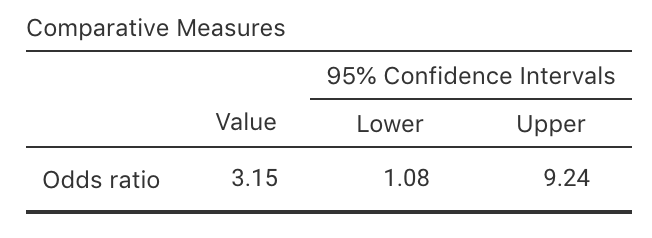
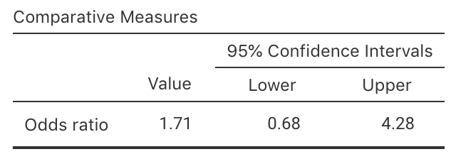
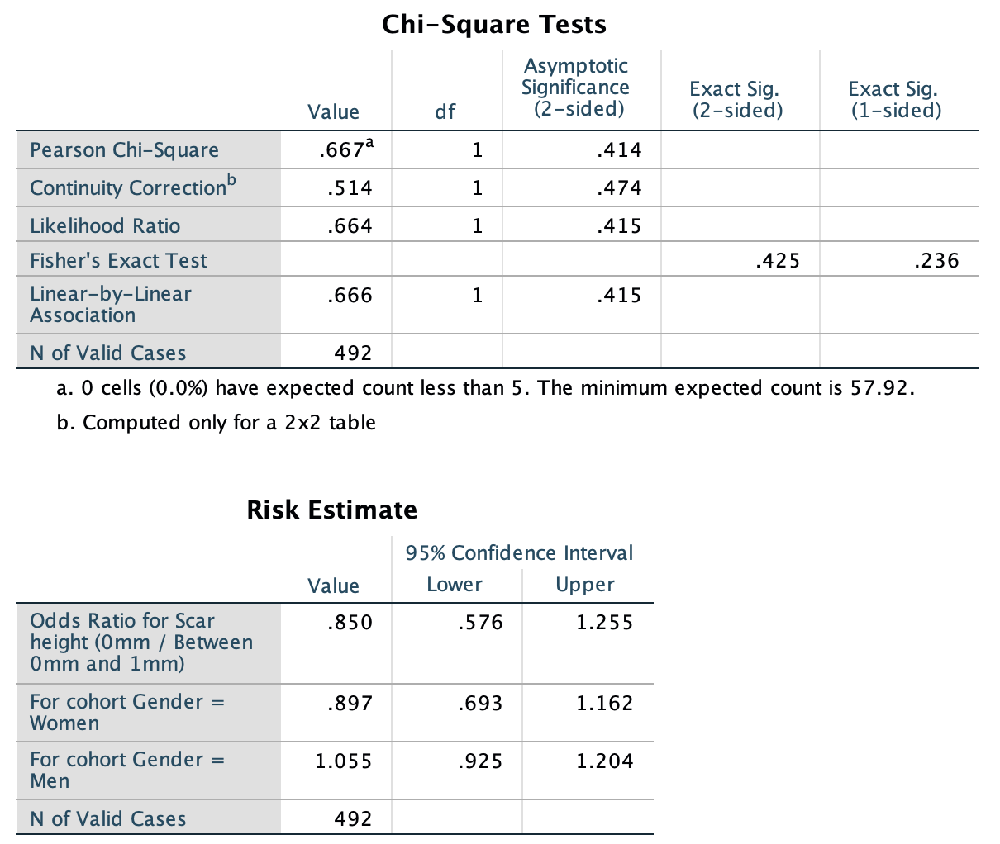

# CIs for odds ratios {#OddsRatiosCI}

::: {.objectivesBox .objectives data-latex="{iconmonstr-target-4-240.png}"}
So far, you have learnt to
ask a RQ, 
identify different ways of obtaining data,
design the study,
collect the data
describe the data,
summarise data graphically and numerically,
and
understand the tools of inference.

**In this chapter**, you will learn about *confidence intervals* for odds ratios.
You will learn to:

* produce confidence intervals for odds ratios using jamovi and SPSS output.
* determine whether the conditions for using the confidence intervals apply in a given situation.
:::


```{r echo=FALSE, fig.cap="", fig.align="center", fig.width=3, out.width="35%"}
SixSteps(5, "CIs: Odds ratios")
```


## Introduction: Odds ratios {#OddsRatioIntro}


<div style="float:right; width: 222x; border: 1px; padding:10px">

</div>


`r if (knitr::is_html_output()) '<!--'`
\begin{wrapfigure}{R}{.25\textwidth}
  \begin{center}
    \includegraphics[width=.20\textwidth]{Illustrations/pexels-startup-stock-photos-7096.jpg}
  \end{center}
\end{wrapfigure}
`r if (knitr::is_html_output()) '-->'`


A study [@data:Mann12017:UniStudents] examined the eating habits of university students.
One issue studied was the relationship between eating on-campus, and where the student lived.

The researchers cross-classified the $n=183$ students into groups: each student (the unit of analysis)\index{unit of analysis}
was observed on two *qualitative* variables:

* Where they lived: With their parents, or *not* with their parents;
* Whether they ate most meals *off-campus*,	or most meals *on-campus*.

Since both variables are *qualitative*, **means are not appropriate** for summarising the data.
However, the students can be classified into a two-way table of counts (Table \@ref(tab:MealsDataTable)), called a *contingency table*.\index{contengency table}
Both qualitative variables have two levels,\index{levels}
so the table is a $2\times 2$ table.


```{r MealsDataTable, echo=FALSE}
Counts <- c(52, 105, 2, 24)
Live <- rep( c(1, 2), 2)
Live <- ordered(Live,
                levels = 1:2,
                labels = c("Lives with parents", 
                           "Doesn't live with parents") )
Meals <- c( rep(1, 2), 
            rep(2, 2))
Meals <- ordered(Meals, 
                 levels = 1:2,
                 labels = c("Most meals off-campus", 
                            "Most meals on-campus"))

Eating <- data.frame(Counts = Counts,
                     Live = Live,
                     Meals = Meals)

Eating.tab <- Eating.tab.Counts <- xtabs(Counts ~ Meals + Live + Meals, 
                                         data=Eating)

Eating.tab <- cbind( Eating.tab, "Total" = rowSums(Eating.tab))
Eating.tab <- rbind( Eating.tab, "Total" = colSums(Eating.tab))


if( knitr::is_latex_output() ) {
  kable(Eating.tab,
        format = "latex",
        booktabs = TRUE,
        longtable = FALSE,
        align = "r",
        caption = "Where university students live and eat") %>%
     column_spec(4, bold = TRUE) %>%
     row_spec(3, bold = TRUE) %>%
     row_spec(2, hline_after = TRUE) %>%
     kable_styling(font_size = 10)
}
if( knitr::is_html_output() ) {
  out <- kable(Eating.tab,
               format = "html",
               booktabs = TRUE,
               longtable = FALSE,
               align = "r",
               caption = "Where university students live and eat"
)
  if ( knitr::is_html_output(excludes = "epub")) {
     column_spec(out, 4, bold = TRUE) %>%
     row_spec(3, bold = TRUE)
  } else {
    out
  }
     
}

```


```{r echo=FALSE}
UniS <- Eating.tab
```


The purpose of the research is to study the odds (or proportion) of students who eat most meals off-campus, comparing those who live with their parents and those who do *not* live with their parents?

The parameter of interest could be the difference between the **proportions** (or **percentages**) in each group, a comparison between the **odds** in each group, or the **odds ratio**.

However, for reasons that we can't delve into, usually the [**odds ratio** (OR)](OddsRatio) is used as the parameter.
One important reason is that software produces output related to the sample OR.


::: {.importantBox .important data-latex="{iconmonstr-warning-8-240.png}"}
To compare two groups with regard to another qualitative variable, software usually works with **odds** rather than percentages or proportions.

For this reason, writing the RQ in terms of odds is also most appropriate.
:::


Using the OR, the RQ could be written as

> Among university students, what is the odds ratio of students eating most meals off-campus, comparing those who *do* and *do not* live with their parents?

The parameter is the population OR, comparing the odds of eating most meals *off*-campus for students living with their parents to students *not* living with their parents.


::: {.importantBox .important data-latex="{iconmonstr-warning-8-240.png}"}
Take care in defining the odds ratios in the parameter! 
  
Recall (Sect. \@ref(QualOdds) that software usually compares Row 1 to Row 2, and Column 1 to Column 2
:::


::: {.thinkBox .think data-latex="{iconmonstr-light-bulb-2-240.png}"}
What are P, O, C and I for this RQ?
:::


::: {.thinkBox .think data-latex="{iconmonstr-light-bulb-2-240.png}"}

A study [@data:Mann12017:UniStudents] examined the eating habits of university students. 
One issue they studied was the relationship between eating on-campus, and where the student lived. 

In particular, a RQ of interest was:

> Among university students, what is the difference in the proportion of students who eat the minority of their meals on campus, between those who live with their parents and those who do not live with their parents?

What graphs would be best for displaying these data?

* A bar chart.
`r if( knitr::is_html_output(exclude = "epub") ) {
	 mcq( c("Suitable", answer = "Not suitable"))}`   
* A stacked bar chart.
`r if( knitr::is_html_output(exclude = "epub") ) {
	 mcq( c(answer = "Suitable", "Not suitable"))}`   
* A side-by-side bar chart
`r if( knitr::is_html_output(exclude = "epub") ) {
	 mcq( c(answer = "Suitable", "Not suitable"))}`   
* A scatterplot
`r if( knitr::is_html_output(exclude = "epub") ) {
	 mcq( c("Suitable", answer = "Not suitable"))}`   
:::


## Numerical and graphical summaries: Comparing odds {#CIOddsRatiosSummaries}

With two qualitative variables, an appropriate numerical summary includes the odds and percentages from each comparison group for the outcome of interest, and the sample sizes.

From these data, the [odds](Odds) of eating most meals *off-campus* is:

* $52\div 2 = 26$     for students     *living with their parents*.
* $105\div24 = 4.375$ for students *not living with their parents*.

So the [*odds ratio* (OR)](OddsRatio) of eating most meals *off-campus*, comparing students living with parents to students *not* living with parents, is $26 \div 4.375 = 5.943$.

The numerical summary (Table \@ref(tab:EatingNumericalSummary)) shows the percentage and odds of eating most meals off-campus, comparing students living at home and those not living at home.


::: {.softwareBox .software data-latex="{iconmonstr-laptop-4-240.png}"}
Understanding how software computes the odds ratio is **very** important for understanding the output.  

In jamovi and SPSS, the odds ratio can be interpreted in *either* of these two ways (i.e., both ways are correct):

* The *odds* are the odds of eating most meals *off-campus* (Row 1 of Table \@ref(tab:MealsDataTable)) compared to *on-campus* (Row 2).  
  Then, the *odds ratio* compares these odds for students living with their parents (Column 1 of Table \@ref(tab:MealsDataTable)) to those *not* living with their parents (Column 2 of Table \@ref(tab:MealsDataTable)).  
  That is, the odds are $52/2= 26$ (for those living with parents) and $105/24 = 4.375$ (for those not living with parents), so the OR is then $26/4.375 = 5.943$,
  as in the output (Fig.&nbsp;\@ref(fig:UniMealsTestOutputjamovi)).

* The *odds* are the odds of living with parents (Column 1 of Table \@ref(tab:MealsDataTable)) compared to *not* living with parents (Column 2).  
  Then, the *odds ratio* compares these odds for students eating most meals off-campus (Row 1 of Table \@ref(tab:MealsDataTable)) to the odds of students eating most meals on-campus (Row 2 of Table \@ref(tab:MealsDataTable)).  
  That is, the odds of living with parents are $52/105 = 0.49524$ (for those eating most meals off-campus) and $2/24 = 0.083333$ (for those eating most meals on-campus),   so the OR is then $0.49524/0.083333 = 5.943$, as in the output (Fig.&nbsp;\@ref(fig:UniMealsTestOutputjamovi)).
  
In other words, the odds and odds ratios are relative to the **first row** or **first column**.
:::


```{r echo=FALSE, results='asis'}
options(knitr.kable.NA = '')
```

```{r EatingNumericalSummary, echo=FALSE}
EatingNumericalSummary <- array( dim = c(3, 3))

EatingNumericalSummary[1, ] <- c(round(UniS[1,1]/UniS[1,2], 4),
                                 round(UniS[1,1]/sum(UniS[1,]) * 100, 1),
                                 UniS[3,1] )
EatingNumericalSummary[2, ] <- c(round(UniS[2,1]/UniS[2,2], 4),
                                 round(UniS[2,1]/sum(UniS[2,]) * 100, 1),
                                 UniS[3,2] )
EatingNumericalSummary[3, ] <- c(round( (UniS[1, 1] / UniS[1, 2] ) / (UniS[2, 1] / UniS[2, 2]), 3), 
                                 "",
                                 "")
rownames(EatingNumericalSummary) <- c("Living with parents",
                                      "Not living with parents",
                                      "Odds ratio")
    
if( knitr::is_latex_output() ) {
  kable(EatingNumericalSummary,
        format = "latex",
        longtable = FALSE,
        booktabs = TRUE,
        align = c("r", "c", "c", "r"),
        escape = FALSE,
        col.names = c("Odds of having most\n meals off-campus", 
                      "Percentage having most\n meals off-campus", 
                      "Sample size"),
       caption = "The odds and percentage of university students eating most meals off-campus"
  ) %>%
     row_spec(2, hline_after =TRUE) %>%
     kable_styling(font_size = 10) %>%
     column_spec(1, width = "35mm") %>%
     column_spec(2, width = "33mm") %>%
     column_spec(3, width = "33mm") %>%
     column_spec(4, width = "15mm")
}
if( knitr::is_html_output() ) {
  out <- kable(EatingNumericalSummary,
               format = "html",
               longtable = FALSE,
               booktabs = TRUE,
               align = c("r", "r", "r"),
               col.names = c("Odds of having most\n meals off-campus", 
                             "Percentage having most\n meals off-campus", 
                             "Sample size"),
               caption = "The odds and percentage of university students eating most meals off-campus"
  )
  if ( knitr::is_html_output(excludes = "epub")) {
    kable_styling(out, 
                  full_width = FALSE)
  } else {
    out
  }
}
```


An appropriate graph (Fig.&nbsp;\@ref(fig:EatingGraphs)) is a *side-by-side* bar chart or a *stacked* bar chart.

For comparing the *odds*, the side-by-side bar chart is better.
(A *stacked* bar chart is better for comparing *proportions*, but either is fine.)


```{r EatingGraphs, echo=FALSE, fig.cap="A plot of the uni-student eating data: A side-by-side bar chart", fig.align="center", fig.height=5, fig.width=8, out.width="85%"}
par( xpd = TRUE,
     mar = c(7, 4, 4, 2) + 0.1) # DEFAULT: c(5, 4, 4, 2) + 0.1

barplot( t(prop.table(Eating.tab.Counts, margin = 1)) * 100,
	col = c(plot.colour, "steelblue"),
	ylab = "Percentage",
	beside = TRUE,
	main = "Side-by-side bar chart of where\nstudents live and eat", 
	ylim = c(0, 100),
	las = 1,
	legend.text = TRUE,
	args.legend = list(x = 6, 
	                   y = -15,
	                   bty = "n",
	                   cex = 0.9,
	                   ncol = 2,
	                   horiz = FALSE))
```


## Sampling distribution: Comparing odds {#OddsRatiosOR}

From the numerical summary table (Table \@ref(tab:EatingNumericalSummary)), the odds of a student eating most meals *off-campus* is:

* $26$    for students     *living with their parents*.
* $4.375$ for students *not living with their parents*.

So the OR of eating most meals *off-campus*, comparing students living with parents to students *not* living with parents, is $26 \div 4.375 = 5.943$.
The odds are different in each group, and hence the OR is not one.
The OR means that the odds of eating most meals off-campus for students living *with* their parents is 5.943 times the odds for students living *not* living with their parents.

Of course, every sample of students is likey to be different, so the OR *varies* from sample to sample, so there is *sampling variation*.
This means that the odds ratio has a *sampling distribution* and a *standard error*.

Unfortunately, the sampling distribution of the sample OR is not a normal distribution^[For those who want to know (this is *optional*): 
The OR is only defined for *non-negative* values so a normal distribution is inappropriate.
However, 
the *logarithm* of the OR has an approximate normal distribution under certain conditions.].
Fortunately, a simple transformation to the sample OR has a normal distribution.
For this reason, we will use software output for finding the CI for the odds ratio, and not discuss the sampling distribution directly.

In other words, we will rely on software to find CIs for odds ratios.


## Confidence intervals: Comparing odds

As noted,\index{confidence interval!odds ratios}
we rely on software to find the CI for the odds ratio, such as jamovi (Fig.&nbsp;\@ref(fig:UniMealsTestOutputjamovi)) and the *second table* of the SPSS output (labelled, obscurely, **Risk Estimate**; Fig.&nbsp;\@ref(fig:UniMealsTestOutputSPSS)).
Both show that the sample OR is 5.94, and the (exact) 95% CI is from 1.35 to 26.1.
(The SPSS output shows other information too, some of which will be useful later.)


```{r UniMealsTestOutputjamovi, echo=FALSE, fig.show="hold", fig.cap="The jamovi output for computing a CI", fig.align="center", out.width="55%"}
knitr::include_graphics( "jamovi/UniStudents/UniStudents-OR-CI.png")
```


```{r UniMealsTestOutputSPSS, echo=FALSE, fig.show="hold", fig.cap="The SPSS output for computing  a CI", fig.align="center", out.width="80%"}

```


::: {.tipBox .tip data-latex="{iconmonstr-info-6-240.png}"}
Recall that jamovi and SPSS compute the odds ratio as either

* 'Odds are Row 1 to Row 2; odds ratio compares Column 1 odds to Column 2 odds', or
* 'Odds are Column 1 to Column 2; odds ratio compares Row 1 odds to Row 2 odds'.

The OR can be interpreted correctly either way.
:::

We write:

> Based on the sample, a 95% CI for the OR comparing the odds of eating most meals off-campus is from 1.35 to 26.1 (living with parents, compared to *not* living with parents).

This means there is a 95% chance that this CI straddles the population OR.

Notice that the meaning of the OR is explained in the conclusions: the odds of eating most meals *off*-campus, and comparing students living with parents to *not* living with parents.

**The CI for an OR is not symmetrical**, like the others we have seen^[This is because the OR has no upper limit, but the lower limit is zero. 
(The *logarithm* of the limits of the CI form a symmetric interval.)].

::: {.tipBox .tip data-latex="{iconmonstr-info-6-240.png}"}
Interpreting ORs can be confusing, so take care!
:::


<iframe src="https://learningapps.org/watch?v=pqzmnub7n22" style="border:0px;width:100%;height:500px" allowfullscreen="true" webkitallowfullscreen="true" mozallowfullscreen="true"></iframe>


::: {.example #CIORcrashes name="Crashes in China"}
A study of car crashes in a rural, mountainous county in western China [@wang2020driver] recorded the data in the table below.


| Type of crash            | 2011   | 2015    
|-------------------------:+:------:+:-------:
| Involving pedestrians    | 15     | 37      
| Involving vehicles       | 35     | 85      

  
Clearly the *number* of crashes is larger in 2015.
However, the interest is in comparing the *odds* (or percentage) of crashes involving pedestrians in 2011 and 2015.
(Of course, comparing the odds (or percentages) involving *vehicles* is also possible.)

The data can be summarised as shown below.

|  Year           | Percentage involving pedestrians | Odds involving pedestrians | Sample size
|----------------:+:--------------------------------:+:--------------------------:+------------:
| In 2011         | 30.0                             | 0.429                      | 50
| In 2015         | 30.3                             | 0.435                      | 122
|                 | **Odds ratio:**                  | **0.985**                  |

In this table, the *odds* are the odds that a crash involves a pedestrian.

The *odds ratio* is the odds of a crash involving pedestrians in 2011, compared to the odds of a crash involving pedestrians in 2015.
In this situation, this is the *parameter* of interest.

Both the percentage and odds columns, and the odds ratio, suggest that the relative proportion of crashes involving pedestrians is very similar in 2011 and 2015.

The odds ratio is 0.986, but this value would change from sample to sample.
From software, the 95% CI for the odds ratio is from 0.480 to 2.018.
We would write

> The population odds ratio for a crash involving pedestrians (comparing 2011 to 2015) has a 95% chance of being between 0.480 and 2.018.
:::


## Statistical validity conditions: Comparing odds {#ValidityConditionsORCI}

As usual, these results hold [under certain conditions](#exm:StatisticalValidityAnalogy).
The CI computed above is statistically valid if 

* All *expected* counts are at least five.

Some books may give other (but similar) conditions.

In addition to the statistical validity condition, the CI will be

* [**internally valid**](#def:InternalValidity) if the study was well designed; and
* [**externally valid**](#def:ExternalValidity) if the sample is a [simple random sample](#SRS) and is internally valid.

The statistical validity condition is a bit tricky to understand (but is explained further in Sect.&nbsp;\@ref(ExpectedValues)).
SPSS will let you know if the expected count condition is not met, underneath the *first* output table in Fig.&nbsp;\@ref(fig:UniMealsTestOutputSPSS).

In jamovi, the *expected* counts must be explicitly requested to see if this condition is satisfied.


::: {.example #StatisticalValidityMeals name="Statistical validity"}
In Fig.&nbsp;\@ref(fig:UniMealsTestOutputSPSS) (for the uni-students data), the text under the *first table* table of SPSS output (labelled **Chi-Square Tests**) says 

> 0 cells (0.0%) have expected count less than 5.

That is, *all* the cells have expected counts of at least five, so the statistical validity condition is satisfied.
Notice from Table \@ref(tab:MealsDataTable) that the *observed* counts are *not* all greater than five (one cell has a count of 2).
The statistical validity condition is about the *expected* counts though, not the *observed* counts.

In jamovi, the expected counts must be requested explicitly (Fig. \@ref(fig:UniMealsTestOutputExpectedOnlyjamovi)), but again none are less than five. 

In either case, the conclusion is statistically valid.
:::


```{r UniMealsTestOutputExpectedOnlyjamovi, echo=FALSE, fig.show="hold", fig.cap="The expected counts in jamovi, for the uni-students data", fig.align="center", out.width="70%"}
knitr::include_graphics( "jamovi/UniStudents/UniStudents-ExpectedOnly.png")
```


```{r echo=FALSE}
PB <- structure(list(LC = structure(c(1L, 1L, 2L, 2L), .Label = c("Adults with lung cancer", 
"Adults without lung cancer"), class = "factor"), Pets = structure(c(1L, 
2L, 1L, 2L), .Label = c("Kept pet birds", "Did not keep pet birds"
), class = "factor"), Counts = c(98, 141, 101, 328)), .Names = c("LC", 
"Pets", "Counts"), row.names = c(NA, -4L), class = "data.frame", variable.labels = structure(character(0), .Names = character(0)), codepage = 28591L)

PB2 <- xtabs( Counts ~ Pets + LC, 
              data = PB)
```


::: {.example #CIORcrashesValidity name="Car crashes in China"}
In Example \@ref(exm:CIORcrashes), all the *observed* counts are larger than five.

The *expected* counts are shown below.
Since all *expected* counts are larger than five, the CI will be statistically valid:


| Type of crash            | 2011   | 2015    
|-------------------------:+:------:+:-------:
| Involving pedestrians    | 15.11  | 36.88   
| Involving vehicles       | 34.88  | 85.12   
  
These counts are what we would *expected* to find if there was no relationship between the type of crash in 2011 and 2015; that is, if the proportion of crashes involving pedestrians was the same in 2011 and 2015.

The observed counts are *very* close to these *expected* counts, meaning that what we observe is very close to what we expected if there was no relatiionship.
:::


## Example: Pet birds {#PetBirdsOR}


<div style="float:right; width: 222x; border: 1px; padding:10px">

</div>


`r if (knitr::is_html_output()) '<!--'`
\begin{wrapfigure}{R}{.25\textwidth}
  \begin{center}
    \includegraphics[width=.20\textwidth]{Illustrations/pexels-andre-lisatchok-2226006.jpg}
  \end{center}
\end{wrapfigure}
`r if (knitr::is_html_output()) '-->'`


A study examined people with lung cancer, and a matched set of controls who did not have lung cancer, and compared the proportion in each group that kept pet birds [@data:Kohlmeier1992:BirdsCancer]. 
One RQ of the study was:

> What is the odds ratio of keeping a pet bird, comparing people *with* lung cancer (cases) compared to people *without* lung cancer (controls)?

The parameter is the population OR, comparing the odds of keeping a pet bird, for adults with lung cancer to adults who do not have lung cancer.

The data, compiled in a $2\times2$ *contingency table*, are given in Table \@ref(tab:BirdsData).

The numerical summary (Table \@ref(tab:BirdsNumericalSummary)) contains percentages, odds and the odds ratios; some of these may need to be computed *manually* from the data.
The graphical summary (Fig.&nbsp;\@ref(fig:BirdsGraphs)) shows a difference between the two groups *in the sample*.

Software computes the CI for the *population* odds ratio (jamovi: Fig.&nbsp;\@ref(fig:PetBirdsCIjamovi); SPSS: Fig.&nbsp;\@ref(fig:PetBirdsCISPSS)) based on the sample.
The *sample* OR is 2.257, and the 95% CI  is from 1.605 to 3.174.

We write:

> Based on the sample, a 95% CI for the OR of keeping a pet bird is from 1.605 to 3.174 (comparing people *with* lung cancer to those *without* lung cancer).

That is, the plausible values for the population OR that could have produced the sample OR are between 1.605 and 3.174.


```{r BirdsData,  echo=FALSE}
if( knitr::is_latex_output() ) {
  kable(PB2,
        format = "latex",
        booktabs = TRUE,
        longtable = FALSE,
        caption = "The pet bird data") %>%
    kable_styling(font_size = 10)
}
if( knitr::is_html_output() ) {
  kable(PB2,
        format = "html",
        booktabs = TRUE,
        longtable = FALSE,
        caption = "The pet bird data")
}
```


```{r BirdsNumericalSummary,  echo=FALSE}
PBsummary <- array( dim = c(3, 3) )

colnames(PBsummary) <- c( "Odds of keeping pet bird",
                          "Percentage keeping pet bird",
                          "Sample size")
rownames(PBsummary) <- c("With lung cancer:",
                         "Without lung cancer:",
                         "Odds ratio:")
  
  
PBsummary[1, ] <- c("0.6950", 
                    "41.0%", 
                    "238")
PBsummary[2, ] <- c("0.3079", 
                    "25.5%", 
                    "429")
PBsummary[3, ] <- c("2.26", 
                    "", 
                    "")


if( knitr::is_latex_output() ) {
  kable(PBsummary,
        format = "latex",
        booktabs = TRUE,
        longtable = FALSE,
        caption = "The odds and percentage of subjects keeping pet birds") %>%
    row_spec(0, bold = TRUE) %>%
    row_spec(2, hline_after = TRUE) %>%
    kable_styling(font_size = 10)
}
if( knitr::is_html_output() ) {
  kable(PBsummary,
        format = "html",
        booktabs = TRUE,
        longtable = FALSE,
        align = c("l", "r", "c"),
        caption = "The odds and percentage of subjects keeping pet birds")
}
```


   
```{r BirdsGraphs, echo=FALSE, fig.cap="A plot of the pet-birds data", fig.align="center", fig.width=5.5, fig.height=3.5}
par(xpd = TRUE,
    mar = c(5, 4, 4, 8) + 0.1) # DEFAULT: c(5, 4, 4, 2) + 0.1

barplot(PB2, 
	las = 1,
	ylab = "Count",
	xlab = "Lung cancer?",
	beside = TRUE,
	names.arg = c("With lung\ncancer", 
	              "Without lung\ncancer"),
	ylim = c(0, 400),
	col = c("blue", 
	        "green")
)
box()

legend(6.2, 
       400, 
	     fill = c("blue", 
	              "green"),
	     title = "Kept pets?",
	     legend = c("Kept pet birds", 
	                "Did not keep\npet birds"), 
	     bty = "n")
```


```{r PetBirdsCIjamovi, echo=FALSE, fig.show="hold", fig.cap="jamovi output for the pet-birds data", fig.align="center", out.width="55%"}
knitr::include_graphics( "jamovi/PetBirds/PetsOR.png")
```


```{r PetBirdsCISPSS, echo=FALSE, fig.show="hold", fig.cap="SPSS output for the pet-birds data", fig.align="center", out.width="80%"}

```


The CI will be statistically valid if the sample is somewhat representative of some population.
We see that the text under the **first** table of SPSS output (Fig.&nbsp;\@ref(fig:PetBirdsCISPSS)) indicates that the expected-counts condition is met.


## Example: B12 deficiency {#B12DeficiencyCI}


<div style="float:right; width: 222x; border: 1px; padding:10px">

</div>


`r if (knitr::is_html_output()) '<!--'`
\begin{wrapfigure}{R}{.25\textwidth}
  \begin{center}
    \includegraphics[width=.20\textwidth]{Illustrations/pexels-vegan-liftz-2377164.jpg}
  \end{center}
\end{wrapfigure}
`r if (knitr::is_html_output()) '-->'`


A study in New Zealand [@data:Gammon2012:B12] examined B12 deficiencies in 'predominantly overweight/obese women of South Asian origin living in Auckland', some of whom were on a vegetarian diet and some of whom were on a non-vegetarian diet.
One RQ was:

> What is the odds ratio of these women being B12 deficient, comparing vegetarians to non-vegetarians?

The parameter is the population OR, comparing the odds of being B12 deficient, for vegetarians to non-vegetarians.

The data appear in Table \@ref(tab:B12DataCI).
From the jamovi output (Fig.&nbsp;\@ref(fig:B12SPSSOutputCIjamovi)) or SPSS output (Fig.&nbsp;\@ref(fig:B12SPSSOutputCISPSS)), the OR (and 95% CI) is $3.15$ ($1.08$ to $9.24$).
The numerical summary table (Table \@ref(tab:B12DataSummaryCI)) and graphical summary (Fig.&nbsp;\@ref(fig:B12BarchartsCI)) can hence be constructed.


```{r B12DataCI,  echo=FALSE}
B12Data <- array( dim = c(3, 3) )

rownames(B12Data) <- c("Vegetarians",
                       "Non-vegetarians",
                       "Total")
colnames(B12Data) <- c("B12 deficient",
                       "Not B12 deficient",
                       "Total")

B12Data[1, ] <- c(8, 26, 34)
B12Data[2, ] <- c(8, 82, 90)
B12Data[3, ] <- c(16, 108, 124)
  
if( knitr::is_latex_output() ) {
  kable(B12Data,
        format="latex",
        booktabs = TRUE,
        longtable=FALSE,
        align=c("r", "r", "r"),
        caption="The number of vegetarian and non-vegetarian women who are (and are not) B12 deficient") %>%
    row_spec(0, bold = TRUE) %>%
    row_spec(3, bold = TRUE) %>%
    column_spec(4, bold = TRUE) %>%
    row_spec(2, hline_after = TRUE) %>%
    kable_styling(font_size = 10)
  
}
if( knitr::is_html_output() ) {
  out <- kable(B12Data,
               format = "html",
               booktabs = TRUE,
               longtable = FALSE,
               align = c("r","r", "r"),
               caption = "The number of vegetarian and non-vegetarian women who are (and are not) B12 deficient")
  if ( knitr::is_html_output(excludes = "epub")) {
    row_spec(out, 0, bold = TRUE) %>%
    row_spec(3, bold = TRUE) %>%
    column_spec(4, bold = TRUE)
  } else {
    out
  }
}
```


```{r B12BarchartsCI, echo=FALSE, fig.cap="A side-by-side barchart comparing the number of women B12 deficient", fig.align="center", fig.width=4, fig.height=4}
### B12 example
counts <- matrix( c(8, 26, 8, 82), 
                  byrow = TRUE, 
                  nrow = 2)
rownames(counts) <- c("Veg.", 
                      "Non-veg.")
colnames(counts) <- c("B12 def.", 
                      "Not B12 def.")

mp <- barplot(t(counts),
        las = 1,
        ylab = "Number of women",
        col = c("blue", plot.colour),
        legend.text = TRUE,
        ylim = c(0, 100),
        args.legend = list(x = "topleft", 
                           bty = "n"),
        main = "Number of women who are\nand who are not B12 deficient",
        beside = TRUE)
box()
```


```{r B12DataSummaryCI,  echo=FALSE}
B12summary <- array( dim = c(3, 3) )

colnames(B12summary) <- c( "Odds B12 deficient",
                          "Percentage B12 deficient",
                          "Sample size")
rownames(B12summary) <- c("Vegetarians:",
                          "Non-vegetarians:",
                          "Odds ratio:")
  
  
B12summary[1, ] <- c("0.3077", 
                     "23.5%", 
                     "34")
B12summary[2, ] <- c("0.0976", 
                     "8.9%", 
                     "90")
B12summary[3, ] <- c("3.15", 
                     "", 
                     "")


if( knitr::is_latex_output() ) {
  kable(B12summary,
        format = "latex",
        booktabs = TRUE,
        longtable = FALSE,
#      align=c("p{20mm}", "p{25mm}", "c"),
        caption = "The odds and percentage of subjects that are B12 deficient") %>%
    row_spec(0, bold = TRUE) %>%
    row_spec(2, hline_after = TRUE) %>%
    kable_styling(font_size = 10)
}
if( knitr::is_html_output() ) {
  kable(B12summary,
        format = "html",
        booktabs = TRUE,
        longtable = FALSE,
        align = c("l", "r", "c"),
        caption = "The odds and percentage of subjects that are B12 deficient")
}
```


```{r B12SPSSOutputCIjamovi, echo=FALSE, fig.show="hold", fig.cap="jamovi output for the B12 data", fig.align="center", out.width="60%"}

```

```{r B12SPSSOutputCISPSS, echo=FALSE, fig.show="hold", fig.cap="SPSS output for the B12 data", fig.align="center", out.width="80%"}

```


To check if these results statistically valid, notice that the text under the **first** table of SPSS output (Fig.&nbsp;\@ref(fig:B12SPSSOutputCISPSS)) says:

> 1 cells (25.0%) have expected count less than 5. 
> The minimum expected count is 4.39.

This a warning that one *expected* count is less than 5.
Nonetheless, only *one* cell has an expected count less than five, and only *just* under 5, so we shouldn't be too concerned about statistical validity (but it should be noted).

We write:

> Based on the sample, a 95% CI for the OR of being B12 deficient is from 1.08 to 9.24 (comparing vegetarians to *non*-vegetarians).


## Quick review questions {#Chap25-QuickReview}

A study [@egbue2017mass] of the adoption of electric vehicle (EVs) by a certain group of professional Americans (Example \@ref(exm:CFSamplePop)) compiled the data in Table \@ref(tab:EV10years).
Output from using jamovi is shown in Fig. \@ref(fig:EVjamovi).


```{r EV10years, echo=FALSE}
EV10 <- array(dim = c(2, 2))

colnames(EV10) <- c("Yes", 
                    "No")
rownames(EV10) <- c("No post-grad", 
                    "Post-grad study")

EV10[1, ] <- c(24, 8)
EV10[2, ] <- c(51, 29)


if( knitr::is_latex_output() ) {
  kable(EV10,
        format = "latex",
        longtable = FALSE,
        booktabs = TRUE,
        caption = "Responses to the question 'Would you purchase an electric vehicle in the next 10 years?' by education") %>%
	kable_styling(font_size = 10) %>%
	row_spec(0, bold = TRUE)
}

if( knitr::is_html_output(exclude = "epub") ) {
  kable(EV10,
        format = "html",
        longtable = FALSE,
        booktabs = TRUE,
        caption = "Responses to the question 'Would you purchase an electric vehicle in the next 10 years?' by education")
}
if( knitr::pandoc_to("epub3") ) {
  kable(EV10,
        format = "html",
        longtable = FALSE,
        booktabs = TRUE,
        caption = "Responses to the question 'Would you purchase an electric vehicle in the next 10 years?' by education") 
}
```


```{r EVjamovi, echo=FALSE, fig.show="hold", fig.cap="jamovi output for the EV study", fig.align="center", out.width="50%"}

```


1. The *percentage* of people without post-grad study who would buy an EV in the next 10 years is  if (!knitr::is_html_output()) '(**do not** add the percentage symbol)'`:  
`r if( knitr::is_html_output(exclude = "epub") ) {fitb(num=TRUE, tol=0.001, answer=75)}`

1. The *odds* that a person without post-grad study would buy an EV in the next 10 years is:  
`r if( knitr::is_html_output(exclude = "epub") ) {fitb(num=TRUE, tol=0.001, answer=3)}`

1. Using the output, what is the OR of buying an electric vehicle in the next 10 years, comparing those *without* post-grad study to those *with* post-grad study?  
`r if( knitr::is_html_output(exclude = "epub") ) {mcq(
  c(answer=1.71,
    0.68,
    4.28)  )}`

1. True or false: The CI means that the sample OR is likely to be between 0.68 and 4.28.  
`r if( knitr::is_html_output(exclude = "epub") ) {torf(answer=FALSE)}`

1. True or false: The analysis is likely to be statistically valid?  
`r if( knitr::is_html_output(exclude = "epub") ) {torf(answer=TRUE)}`


`r if (!knitr::is_html_output()) '<!--'`
::: {.progressBox .progress}
**Progress:**  `r webexercises::total_correct()`
:::


`r webexercises::hide()`
1. The number *without* post-grad study: $24 + 8 = 32$.
   The *percentage* of people without post-grad study who would buy an EV in the next 10 years is $24/32 = 0.75$, or 75%. 
1. The people without post-grad study are in the *top* row.
   The *odds* of people without post-grad study who would buy an EV in the next 10 years is $24/8 = 3$. 
1. The odds of people *without* post-grad study who would by an electric vehicle is $24/8 = 3$.  
   The odds of people *with* post-grad study who would by an electric vehicle is $51/29 = 1.7586$.  
   So the OR is $3/1.7586 = 1.706$.
1. Not at all. We know *exactly* what the sample OR is (it is 1.706).
   CIs always give an interval in which the *population parameter* is likely to be within.
1. The CI is statistically valid if all the *expected* counts exceed 5.
   So we don't really know for sure from the given information.
   But the *observed* counts are all reasonably large, so it is *very probably* statistically valid. 
`r webexercises::unhide()`
`r if (!knitr::is_html_output()) '-->'`


## Exercises {#OddsRatiosCIExercises}

Selected answers are available in Sect.&nbsp;\@ref(OddsRatiosCIAnswer).


::: {.exercise #OddsRatiosCIScarHeights}

A prospective observational study in Western Australia [@data:Wallace2017:Sunburn] compared the heights of scars from burns received (Table \@ref(tab:ScarsData)).
jamovi was used to analyse the data (Fig.&nbsp;\@ref(fig:ScarHeightRiskCIjamovi)).

1. Compute the *odds* of having a smooth scar (that is, height is 0mm) for women.
1. Compute the *odds* of having a smooth scar (that is, height is 0mm) for men.
1. Compute the *odds ratio* of having a smooth scar, comparing women to men.
1. Interpret what this odds ratio means.
1. Sketch a suitable graph to display the data.
1. Construct an appropriate numerical summary table for the data.
1. Write down the CI.
1. Carefully interpret what this CI means.
:::

```{r ScarHeightRiskCIjamovi, echo=FALSE, fig.show="hold", fig.cap="jamovi output for the scar-height data", fig.align="center", out.width="50%"}
knitr::include_graphics( "jamovi/ScarHeight/ScarHeightOR.png")
```


<!-- ```{r ScarHeightRiskCISPSS, echo=FALSE, fig.show="hold", fig.cap="SPSS output for the scar-height data", fig.align="center", out.width="65%"} -->
<!--  -->
<!-- ``` -->


```{r ScarsData,  echo=FALSE}
ScarsData <- array( dim = c(2, 2) )

rownames(ScarsData) <- c("Scar height 0mm (smooth)",
                         "Scar height more than 0mm, less than 1mm")
colnames(ScarsData) <- c("Women",
                         "Men")

ScarsData[1, ] <- c(99, 216)
ScarsData[2, ] <- c(62, 115)

if( knitr::is_latex_output() ) {
  kable(ScarsData,
        format = "latex",
        booktabs = TRUE,
        longtable = FALSE,
        align = c("r", "r"),
        caption = "The number of men and women, with scars of different heights") %>%
    row_spec(0, bold = TRUE) %>%
    kableExtra::kable_styling(latex_options = "hold_position") %>%
    kable_styling(font = 10)
}
if( knitr::is_html_output() ) {
  out <- kable(ScarsData,
               format = "html",
               booktabs = TRUE,
               longtable = FALSE,
               align = c("r","r"),
               caption = "The number of men and women, with scars of different heights")
  if ( knitr::is_html_output(excludes = "epub")) {
    row_spec(out, 0, bold = TRUE) %>%
    kable_styling(full_width = FALSE) 
  } else {
    out
  }
    
}
```


::: {.exercise #OddsRatiosCIEarInf}

A study of ear infections in Sydney swimmers [@data:smyth:ozdasl] recorded whether people reported an ear infection or not, and where they usually swam.

The SPSS output is shown in Fig.&nbsp;\@ref(fig:EarInfPSSOutputCI).
Explain carefully the meaning of the OR and the corresponding CI.
:::


```{r EarInfPSSOutputCI, echo=FALSE, fig.show="hold", fig.cap="SPSS output for the ear-infection data", fig.align="center", out.width="70%"}
knitr::include_graphics( "SPSS/EarInf/EarInf-SPSS.png" )
```


::: {.exercise #OddsRatiosCITurbines}
A study of turbine failures [@MyersBook; @NelsonLifeData] ran 73 turbines for around 1800 hours, and found that seven developed fissures (small cracks).
They also ran a different set of 42 turbines for about 3000 hours, and found that nine developed fissures.

1. Construct the two-way table for the data.
1. Use the jamovi output (Fig. \@ref(fig:TurbinesOutputCI)) to construct a 95% CI for the odds ratio.
1. Compute, then carefully interpret, the OR.
1. Write down, then carefully interpret, the CI for the OR.
1. Is the CI likely to be statistically valid (Fig. \@ref(fig:TurbinesOutputExpected))?
:::


```{r TurbinesOutputCI, echo=FALSE, fig.show="hold", fig.cap="jamovi output for the turbine data: output", fig.align="center", out.width="49%"}
knitr::include_graphics( "jamovi/Turbines/TurbinesCI-jamovi.png" )
```

```{r TurbinesOutputExpected, echo=FALSE, fig.show="hold", fig.cap="jamovi output for the turbine data: expected counts", fig.align="center", out.width="44%"}
knitr::include_graphics( "jamovi/Turbines/TurbinesExpected-jamovi.png" )
```


```{r echo=FALSE}
data(emeraldaug)

emeraldaug$SOIpos <- factor( emeraldaug$SOI>0 )

#emeraldaug$SOIpos <- factor(emeraldaug$SOIpos,
#                          levels(emeraldaug$SOIpos)[ c(2,1)] )
                         

SOI.tab <- xtabs( ~ (SOIpos) + (Rain>0), 
                  data = emeraldaug)

colnames(SOI.tab) <- c("No rainfall recorded", 
                       "Rainfall recorded")
rownames(SOI.tab) <- c("Non-positive SOI", 
                       "Positive SOI")

#prop.table(SOI.tab, margin=1 )

#chisq.test(SOI.tab)
#chisq.test(SOI.tab, correct=FALSE)
#chisq.test(SOI.tab, correct=FALSE)$expected
```


::: {.exercise #OddsRatiosCIAugustRainfall}
The *Southern Oscillation Index* (SOI) is a standardised measure of the air pressure difference between Tahiti and Darwin, and is related to rainfall in some parts of the world [@climate:stone:1996], and especially Queensland [@climate:stone:1992; @mypapers:Dunn:bootstrap:2001].

The rainfall at Emerald (Queensland) was recorded for Augusts between 1889 to 2002 inclusive [@mypapers:dunnsmyth:glms], where the monthly average SOI was positive,  and when the SOI was non-positive (that is, zero or negative), as shown in Table \@ref(tab:SOItableCI).

Using the jamovi output in Fig.&nbsp;\@ref(fig:EmeraldRainOutputCIjamovi):

1. Find a 95% CI for the OR.
1. Carefuly explain what this OR means.
:::


```{r SOItableCI, echo=FALSE}
if( knitr::is_latex_output() ) {
  kable( t(SOI.tab),
         format = "latex",
         booktabs = TRUE,
         longtable = FALSE,
         caption = "The SOI, and whether rainfall was recorded in Augusts between 1889 and 2002 inclusive") %>%
  row_spec(0, bold = TRUE) %>%
  kableExtra::kable_styling(latex_options = "hold_position") %>%
  kable_styling(font_size = 10)
}
if( knitr::is_html_output() ) {
  out <- kable( t(SOI.tab),
         format = "html",
         booktabs = TRUE,
         longtable = FALSE,
         caption = "The SOI, and whether rainfall was recorded in Augusts between 1889 and 2002 inclusive")
  if ( knitr::is_html_output(excludes = "epub")) {
    row_spec(out, 0, bold = TRUE) %>%
    kable_styling(full_width = FALSE) 
  } else {
    out
  }
  
}
```


```{r EmeraldRainOutputCIjamovi, echo=FALSE, fig.show="hold", fig.cap="jamovi output for the Emerald-rain data", fig.align="center", out.width="50%"}
knitr::include_graphics( "jamovi/EmeraldRain/EmeraldRainOR.png" )
```


```{r echo=FALSE}
SG <- structure(list(Gender = structure(c(1L, 1L, 1L, 1L, 1L, 1L, 1L, 
1L, 2L, 2L, 2L, 2L, 2L, 2L, 2L, 2L), .Label = c("Male", "Female"
), class = "factor"), Hat = structure(c(2L, 2L, 2L, 2L, 1L, 1L, 
1L, 1L, 2L, 2L, 2L, 2L, 1L, 1L, 1L, 1L), .Label = c("No", "Yes"
), class = "factor"), Sunglasses = structure(c(2L, 2L, 1L, 1L, 
2L, 2L, 1L, 1L, 2L, 2L, 1L, 1L, 2L, 2L, 1L, 1L), .Label = c("No", 
"Yes"), class = "factor"), Phone = structure(c(2L, 1L, 2L, 1L, 
2L, 1L, 2L, 1L, 2L, 1L, 2L, 1L, 2L, 1L, 2L, 1L), .Label = c("Not easy", 
"Easy"), class = "factor"), Count = c(6L, 15L, 14L, 44L, 21L, 
81L, 51L, 154L, 2L, 7L, 3L, 10L, 40L, 77L, 94L, 133L)), .Names = c("Gender", 
"Hat", "Sunglasses", "Phone", "Count"), row.names = c(NA, -16L
), class = "data.frame")

SG.Table.GenderHat <- xtabs(Count~Hat+Gender, 
                            data = SG)
```

::: {.exercise #CIOddsRatioSunglasses}
A research study conducted in Brisbane [@data:Dexter2019:SunProtection] recorded the number of people at the foot of the Goodwill Bridge, Southbank, who wore sunglasses and hats between 11:30am to 12:30pm.
Table \@ref(tab:GenderHatTableCI) records the number of females and males wearing hats.

Using the SPSS output in Fig.&nbsp;\@ref(fig:SunglassesSPSSOutputCI), find a 95% CI for the OR, and carefully explain what OR this CI applies to.
Also, construct the numerical summary table.
:::


```{r GenderHatTableCI, echo=FALSE}
if( knitr::is_latex_output() ) {
  kable( t(SG.Table.GenderHat),
         format = "latex",
         booktabs = TRUE,
         longtable = FALSE,
         col.names = c("No hat", 
                       "Hat"),
         caption = "The number of people wearing hats, for males and females") %>%
   row_spec(0, bold = TRUE) %>%
   kableExtra::kable_styling(latex_options = "hold_position") %>%
   kable_styling(font_size = 10)
}
if( knitr::is_html_output() ) {
  out <- kable( t(SG.Table.GenderHat),
                format = "html",
                booktabs = TRUE,
                longtable = FALSE,
                col.names = c("No hat", 
                              "Hat"),
         caption = "The number of people wearing hats, for males and females")
  if ( knitr::is_html_output(excludes = "epub")) {
    row_spec(out, 0, bold=TRUE)
  } else {
    out
  }
    
}
```


```{r SunglassesSPSSOutputCI, echo=FALSE, fig.show="hold", fig.cap="SPSS output for the hats data", fig.align="center", out.width="80%"}
knitr::include_graphics( c("SPSS/Sunglasses/SunglassesSPSS.png") )
```


