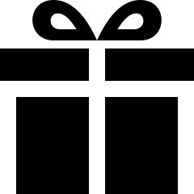

# Making decisions {#MakingDecisions}

```{r}
source("R/showDecisionMaking.R")
```


```{r, child = if (knitr::is_html_output()) {'./introductions/25-Tools-DecisionMaking-HTML.Rmd'} else {'./introductions/25-Tools-DecisionMaking-LaTeX.Rmd'}}
```


<!-- Define colours as appropriate -->
```{r, child = if (knitr::is_html_output()) {'./children/coloursHTML.Rmd'} else {'./children/coloursLaTeX.Rmd'}}
```


## Introduction {#ToolsDecisionMakingIntro}
\index{Decision making}

In Sect.\ \@ref(WaterAcessSummary), a study of three rural communities in Cameroon and their access to water was described [@lopez2022farmers].
One purpose of the study was to determine contributors to the incidence of diarrhoea in young children.

In the observed sample, the odds of an incidence of diarrhoea in children in the last two weeks among households *without* livestock was $0.176$ (Table\ \@ref(tab:WaterAccessCompareQuantTabs)).
However, the odds in households *with* livestock was $0.548$.
In other words, the odds of an incidence of diarrhoea in young children was over three times greater in households with livestock than without (i.e., $\text{OR} = 0.548/0.176 = 3.11$).
That is, the odds are not the same for both groups *in the sample*; however, RQs ask about the *population*.

Of course, the sample studied is just one of *countless* possible samples that could have been chosen to study.
Some other samples may even have produced the opposite results: incidence of diarrhoea greater in households *without* livestock.
Different sample comprises different households, and the sample results depends on which households are in the studied sample.
This leads to one of the most important observations about sampling.


::: {.importantBox .important data-latex="{iconmonstr-warning-8-240.png}"}
Studying a sample leads to the following observations:
\vspace{-2ex}

* Every sample is likely to be different.
* We observe just one of the many possible samples.
* Every sample is likely to yield a different value for the sample statistic.
* We observe just one of the many possible values for the statistic.
\vspace{-2ex}

Since many values for the sample are possible, the possible values of the statistic vary (this is called *sampling variation*)\index{Sampling variation} and have a *distribution* (this is called a *sampling distribution*).\index{Sampling distribution}
:::


We observe just one of the many possible samples, and the sample odds of an incidence of diarrhoea in young children are not the same for the two groups, in the observed sample. 
What does this imply about the *population* odds in the two groups?

Two reasons could explain why the *sample* odds in the two groups are not the same:

1. *The two **population** odds are the same*, but the two *sample* odds are not the same due to *sampling variation*.
   That is, we just happen to have---by chance---one of those samples where the two sample odds are not the same, even though they are the same in the *population*.
2. *The two **population** odds are different*, and the different *sample* odds simply reflect the situation in the population.

These two possible explanations ('statistical hypotheses') have special names:\index{Hypotheses!statistical}

1. The first explanation is the *null hypothesis*, denoted $H_0$:\index{Parameter}\index{Hypotheses!null}\ *the population odds are the same*, and the sample odds are *not* equal simply due to *sampling variation*. 
   
2. The second explanation is the *alternative hypothesis*, denoted $H_1$:\index{Hypotheses!alternative}\ *the population odds are not the same*, which is reflected in the sample odds.

How do we decide which of these explanations is supported by the data?\index{Evidence-based research}
What is the decision-making *process*?

The usual approach to *decision-making* in science begins by assuming the null hypothesis (the sampling-variation explanation) is true.
Then the data are examined to see if persuasive evidence exists to change our mind (and support the alternative hypothesis).
Conclusions drawn about the *population* from the *sample* can never be certain, since the sample studied is just one of many possible samples that could have been taken (and every sample is likely to be different).


::: {.importantBox .important data-latex="{iconmonstr-warning-8-240.png}"}
The onus is on the data to refute the null hypothesis.
That is, the null hypothesis is retained unless persuasive evidence suggests otherwise.
:::


## Making decisions: drawing cards {#NeedForDecisionMaking}

In research, decisions need to be made about parameter, based on one of many possible values of the statistic.
Sensible decisions *can* be made (and *are* made) about parameters based on statistics.
To do this though, the process of *how* decisions are made needs to be articulated, which is the purpose of this chapter.

To begin, suppose I produce a pack of cards, and shuffle them well, and I am interested in the event 'the number of red cards when I draw $15$\ cards from the pack (with replacement)'.
('With replacement' means that after I draw a card and record the card drawn, I place the card back into the pack, and reshuffle before drawing a new card.)
The pack of cards can be considered the *population* (where the proportion of red cards is $p = 0.5$).
Suppose I draw a *sample* of $15$\ cards from the pack.
Define\ $\hat{p}$ as the proportion of red cards in this *sample*.

Suppose my sample of $15$\ cards produces $\hat{p} = 1$; that is, *all* $n = 15$ cards are red cards.
What should you conclude?
How likely is it that this would happen by chance from a fair
`r if (knitr::is_latex_output()) {
   'pack (Fig.\\ \\@ref(fig:Draw15Cards))?'
} else {
   'pack; see the animation below.'
}`
Is this evidence that the pack of cards is somehow unfair, poorly shuffled, or manipulated?


```{r animation.hook = "gifski", fig.width = 4, interval = 0.25, fig.align = "center", dev=if (is_latex_output()){"pdf"}else{"png"}}
  ### CARDS ARE OF SIZE 500 x 726
  asp.cards <- 726/500
  
  ### LOAD CARD IMAGES

  im1  <- png::readPNG("Cards/queen_of_hearts.png")
  im2  <- png::readPNG("Cards/3_of_diamonds.png")
  im3  <- png::readPNG("Cards/4_of_diamonds.png")
  im4  <- png::readPNG("Cards/7_of_hearts.png")
  im5  <- png::readPNG("Cards/ace_of_diamonds.png")
  im6  <- png::readPNG("Cards/2_of_diamonds.png")
  im7  <- png::readPNG("Cards/ace_of_hearts.png")
  im8  <- png::readPNG("Cards/jack_of_diamonds.png")
  im9  <- png::readPNG("Cards/10_of_hearts.png")
  im10 <- png::readPNG("Cards/4_of_hearts.png")
  im11 <- png::readPNG("Cards/king_of_hearts.png")
  im12 <- png::readPNG("Cards/queen_of_diamonds.png")
  im13  <- png::readPNG("Cards/7_of_hearts.png")
  im14 <- png::readPNG("Cards/5_of_diamonds.png")
  im15 <- png::readPNG("Cards/5_of_hearts.png")
  

if (knitr::is_html_output()){
  for (i in (1:18)){ # Draw 15 cards
    
    # Set up canvas
    par(mar = rep(0.05, 4)) 
    plot( c(1.2, 2.7), c(1.2, 1.8), 
          type = "n",
          xlab = "",
          asp = asp.cards,
          ylab = "",
          axes = FALSE)
    
    
    if (i >= 1 )  rasterImage(im1,  1.20, 1.27, 1.80, 1.9)
    if (i >= 2 )  rasterImage(im2,  1.25, 1.27, 1.85, 1.9)
    if (i >= 3 )  rasterImage(im3,  1.30, 1.27, 1.90, 1.9)
    if (i >= 4 )  rasterImage(im4,  1.35, 1.27, 1.95, 1.9)
    if (i >= 5 )  rasterImage(im5,  1.40, 1.27, 2.00, 1.9)
    if (i >= 6 )  rasterImage(im6,  1.45, 1.27, 2.05, 1.9)
    if (i >= 7 )  rasterImage(im7,  1.50, 1.27, 2.10, 1.9)
    if (i >= 8 )  rasterImage(im8,  1.55, 1.27, 2.15, 1.9)
    if (i >= 9 )  rasterImage(im9,  1.60, 1.27, 2.20, 1.9)
    if (i >= 10)  rasterImage(im10, 1.65, 1.27, 2.25, 1.9)
    if (i >= 11)  rasterImage(im11, 1.70, 1.27, 2.30, 1.9)
    if (i >= 12)  rasterImage(im12, 1.75, 1.27, 2.35, 1.9)
    if (i >= 13)  rasterImage(im13, 1.80, 1.27, 2.40, 1.9)
    if (i >= 14)  rasterImage(im14, 1.85, 1.27, 2.45, 1.9)
    if (i >= 15)  rasterImage(im15, 1.90, 1.27, 2.50, 1.9)
    text(1.95, 1, "How likely is it that we get\n15 red cards in a row?")
  }
}
```


```{r Draw15Cards, fig.align="center", fig.width=7, out.width = "35%",fig.cap="How likely is it to draw $15$ red cards in a row from a fair pack?" }
if (knitr::is_latex_output()){
     
    # Separate cards a bit more in the LaTeX
    leftCards <- seq(from = 1.20,
                     to  = 2.50,
                     length = 15)
    rightCards <- leftCards + 0.60
    

    # Set up canvas
    par(mar = rep(0, 4),
        oma = rep(0, 4) ) 
    plot( x = c( min(leftCards), 
                 max(rightCards)), 
          y = c(1.3, 1.7), 
          type = "n",
          xlab = "",
          asp = asp.cards,
          ylab = "",
          axes = FALSE)
    
    rasterImage(im1,  leftCards[1], 1.27, rightCards[1], 1.9)
    rasterImage(im2,  leftCards[2], 1.27, rightCards[2], 1.9)
    rasterImage(im3,  leftCards[3], 1.27, rightCards[3], 1.9)
    rasterImage(im4,  leftCards[4], 1.27, rightCards[4], 1.9)
    rasterImage(im5,  leftCards[5], 1.27, rightCards[5], 1.9)
    rasterImage(im6,  leftCards[6], 1.27, rightCards[6], 1.9)
    rasterImage(im7,  leftCards[7], 1.27, rightCards[7], 1.9)
    rasterImage(im8,  leftCards[8], 1.27, rightCards[8], 1.9)
    rasterImage(im9,  leftCards[9], 1.27, rightCards[9], 1.9)
    rasterImage(im10, leftCards[10], 1.27, rightCards[10], 1.9)
    rasterImage(im11, leftCards[11], 1.27, rightCards[11], 1.9)
    rasterImage(im12, leftCards[12], 1.27, rightCards[12], 1.9)
    rasterImage(im13, leftCards[13], 1.27, rightCards[13], 1.9)
    rasterImage(im14, leftCards[14], 1.27, rightCards[14], 1.9)
    rasterImage(im15, leftCards[15], 1.27, rightCards[15], 1.9)

  }
```


Getting $15$\ reds cards out of\ $15$ (i.e., $\hat{p} = 1$) from a well-shuffled pack seems very unlikely; you probably conclude that the pack is somehow unfair.
Importantly, *how* did you reach that decision?
Your unconscious decision-making process may have been this:\index{Decision making}

1. You *assumed*, quite reasonably, that I used a standard, well-shuffled pack of cards, where half the cards are red and half the cards are black.
   That is, you assumed the *population proportion* of red cards really was $p = 0.5$.
2. Based on that assumption, you *expected* about half the cards in the sample of\ $15$ to be red (i.e., expect\ $\hat{p}$ to be about\ $0.5$).
   You wouldn't necessarily expect *exactly* half red and half black (because of sampling variation), but you'd probably expect something close to that.
   That is, you would expect that\ $\hat{p}$ would be close to\ $0.5$.
3. You then *observed* that *all* $15$\ cards were red.
   That is, $\hat{p} = 1$.
4. You were expecting $\hat{p} = 0.5$ approximately, but instead observed $\hat{p} = 1$.
   What you observed ('all red cards') was not at all like what you were expecting ('about half red cards'); the sample *contradicts* what you were expecting from a fair pack.
   This suggests your assumption of a fair pack is probably wrong.

Of course, getting $15$\ red cards in a row is *possible*; it's just *very unlikely*.
For this reason, you would probably conclude, based on the evidence, that this is persuasive evidence that the pack is not fair.

You probably didn't *consciously* go through this process.
This process of decision-making is similar to the process used in research.


## Making decisions: the process {#DecisionMaking}

Based on the ideas in the last section, a formal process of decision-making in research can be described.

1. *Make an assumption*.
   Make an assumption about the value of the parameter.
   By doing so, we assume that *sampling variation* explains any discrepancy between the value of the observed statistic and this assumed value of the parameter.
2. *Define the expectations of the statistic*.
   Based on the assumption made about the parameter, describe what values of the *statistic* might reasonably be observed from all the possible samples from the population (due to sampling variation).
3. *Make the observations*.
   Take a sample (one of the many possible samples), and compute the observed sample statistic from these data.
4. *Make a decision*.
   If the observed *sample statistic*:
    - is *unlikely* to have been observed by chance, the statistic (i.e., the evidence) *contradicts* the assumption about the *parameter*: the assumption is probably (but not certainly) *wrong*.
    - could easily be explained by chance, the statistic (i.e., the evidence) is *consistent with* the assumption about the *parameter*, and the assumption may be (but is not certainly) *correct*.

This is one way to describe the process of decision-making in science
`r if( knitr::is_html_output() ) {
   '(Fig.\\ \\@ref(fig:DecisionFlow)).'
} else {
   '(Fig.\\ \\@ref(fig:DecisionFlow2)).'
}`


```{r DecisionFlow2, fig.cap = "A way to make decisions.", fig.align="center", out.width='100%', fig.width = 9.25, fig.height = 4}
showDecisionMaking() 
```


```{r DecisionFlow, animation.hook="gifski", interval=1.5, progress=TRUE, fig.cap="A way to make decisions.", fig.align="center", fig.width=6, fig.height=3, dev=if (is_latex_output()){"pdf"}else{"png"}}
if( knitr::is_html_output() ) {
  
  for (i in (1:2)){
    par( mar = c(0.15, 0.15, 0.15, 0.15))
    openplotmat()
    
    pos <- array(NA, dim = c(6, 2))
    pos[1, ] <- c(0.10, 0.85) # Assumption
    pos[2, ] <- c(0.40, 0.85) # Expectation
    pos[3, ] <- c(0.40, 0.15) # Observation
    pos[4, ] <- c(0.40, 0.50) # Consistency?
    pos[5, ] <- c(0.80, 0.85) # YES
    pos[6, ] <- c(0.80, 0.15) # NO
    
    straightarrow(from = pos[1, ], to = pos[2, ], 
                  lty = 1, 
                  lwd = 2)
    straightarrow(from = pos[4, ], to = pos[2, ], 
                  lcol = "black",
                  lty = 2,
                  lwd = 2)
    straightarrow(from = pos[4, ], to = pos[3, ], 
                  lcol = grey(0.4),
                  arr.pos = 0.5, # Then cover with box
                  lty = 2)
    if (i == 1 ) {
      curvedarrow(from = pos[4, ] + c(0, 0.065), to = pos[5, ], 
                lcol = grey(0.4),
                curve = 0.35,
                arr.pos = 0.5, # Then cover with box
                lty = 2)
      textrect( pos[5, ],  
              radx = 0.11,
              rady = 0.1,
              shadow.size = 0,
              lcol = "darkseagreen2",
              box.col = "darkseagreen2",
              lab = "Yes: Supports\nassumption", 
              col = grey(0)) # CROSS
        }
    if (i == 2 ) {
      curvedarrow(from = pos[4, ] - c(0, 0.065), to = pos[6, ] , 
                  lcol = grey(0.4),
                  curve = -0.35,
                  arr.pos = 0.5, # Then cover with box
                  lty = 2)
      textrect( pos[6, ],
                radx = 0.11,
                rady = 0.1,
                shadow.size = 0,
                lcol = "darksalmon",
                box.col = "darksalmon",
                lab = "No: Contradicts\nassumption", 
                col = grey(0)) # CROSS
    }
    textrect( pos[4, ],
              radx = 0.11,
              rady = 0.1,
              shadow.size = 0,
              lcol = "snow2",
              box.col = "snow2",
              lab = "Compare:\nConsistency?",
              col = grey(0)) # CHECKMARK
    textrect( pos[1, ], 
              lab = "Population:\nAssumption",
              radx = 0.11,
              rady = 0.1,
              shadow.size = 0,
              lcol = "slategray1",
              box.col = "slategray1",
              cex = 1)
    textrect( pos[2, ], 
              lab = "Sample:\nExpectation", 
              radx = 0.11,
              rady = 0.1,
              shadow.size = 0,
              lcol = "slategray2",
              box.col = "slategray2",
              cex = 1)
    textrect( pos[3, ], 
              box.col = "slategray3",
              lcol = "slategray3",
              shadow.size = 0,
              radx = 0.11,
              rady = 0.1,
              lab = "Sample:\nObservation",
              cex = 1)
  }
}

```


<div style="float:right; width: 222x; border: 1px; padding:10px">

</div>


This approach is similar to how we unconsciously make decisions every day.
For example, suppose I ask my son to brush his teeth [@data:Budgett:RandomizationTest].
Later, I wish to decide if he really did.

1. *Assumption*: I *assume* my son brushed his teeth (because I asked him to).
2. *Expectation*: Based on my assumption, I would *expect* to find his toothbrush is damp.
3. *Observation*: When I check later, I observe a *dry* toothbrush.
4. *Decision*: The evidence *contradicts* what I expected to find based on my assumption, so my assumption is probably *false*: he probably *didn't* brush his teeth.

I may have made the wrong decision: he may have brushed his teeth, then dried his toothbrush with a hair dryer.
However, based on the evidence, it is more likely that he has not brushed his teeth.

The situation may have ended differently: when I check later, suppose I observe a *damp* toothbrush.
Then, the evidence seems *consistent* with what I expected if he brushed his teeth (my assumption), so my assumption is probably *true*; he probably did brush his teeth.
Again, I may be wrong: he may have rinsed his toothbrush under a tap.
Nonetheless, I don't have evidence that he didn't brush his teeth.

Similar logic underlies most decision-making in science^[Other ways exist to make decisions, such as using prior knowledge. For example, if my son had a reputation for wetting his toothbrush under the tap instead of brushing his teeth, that information can be incorporated into the decision-making. This approach is called *Bayesian statistics*.].


::: {.example #DecisionMakingProcess name="The decision-making process"}
Consider the cards example from Sect.\ \@ref(NeedForDecisionMaking) again.
The formal process might look like this:

1. *Assumption*: *Assume* the pack is fair and well-shuffled pack of cards: the population proportion of red cards is $p = 0.5$ (the value of the *parameter*). 
2. *Expectation*: Based on this assumption, roughly (but not necessarily *exactly*) equal proportions of red and black cards would be expected in a sample of $15$ cards.
   The sample proportion of red cards $\hat{p}$ (the value of the *statistic*) is expected to be close to, but maybe not exactly,\ $0.5$. 
3. *Observation*: Suppose I then deal $15$\ cards, and *all* $15$ are red cards: then $\hat{p} = 1$.
4. *Decision*: $15$\ red cards from $15$\ cards seems unlikely to occur if the pack is fair and well-shuffled.
   The data seem *inconsistent* with what I was expecting based on the assumption (Fig.\ \@ref(fig:DecisionFlowCards)), suggesting the assumption is probably false.

Of course, getting $15$\ red cards out of $15$ is not *impossible*, so my conclusion may be wrong.
However, the evidence certainly implies the pack is not fair.
:::


```{r DecisionFlowCards, fig.cap = "A way to make decisions for the cards example.", fig.align="center", out.width='100%', fig.width = 9.5, fig.height = 4}
showDecisionMaking(populationText = expression( atop(bold(Assume)~the,
                                                     pack~is~fair)),
                   expectationText = expression(atop(bold(Expect)~to~find,
                                                     about~half~red~cards)),
                   oneSampleText = expression( atop(Deal~one~hand,
                                                    of~15~cards) ),
                   oneStatisticText =  expression( atop(bold(All)~cards,
                                                        are~red)),
                   Decision = "Reject"     
)

```


## Making decisions: the steps {#MakingDecisionsInResearch}
\index{Decision making!steps}

Let's think about each step in the decision-making process
`r if( knitr::is_html_output()){
  '(Fig.\\ \\@ref(fig:DecisionFlow))'
} else {
  '(Fig.\\ \\@ref(fig:DecisionFlow2))'
}`
individually.

* Making an *assumption* about the parameter (Sect.\ \@ref(Assumption));
* Describing the *expectations* of the statistic (Sect.\ \@ref(ExpectationOf));
* Making the sample *observations* (Sect.\ \@ref(Observation)); and
* Making a *decision* (Sect.\ \@ref(MakeDecision)).


### Making an assumption about the parameter {#Assumption}
\index{Decision making!assumption}


<div style="float:right; width: 222x; border: 1px; padding:10px">

</div>


The initial assumption is that sampling variation explains any discrepancy between the parameter and the statistic.
This assumption about the parameter is called the *null hypothesis*,\index{Hypotheses!null} denoted\ $H_0$.
The null hypothesis is always the 'sampling variation' explanation; that is, 'no change, no difference, no relationship' in the population (depending on the context and RQ).
Any change, difference or relationship in the sample is due only to sampling variation.

Using this idea, a reasonable assumption can be made about the parameter.\index{Parameter}
For example, when comparing the mean of two groups, we would initially assume *no difference* between the *population* means: any difference between the *sample* means would be attributed to sampling variation.
 


<div style="float:right; width: 222x; border: 1px; padding:10px">

</div>


::: {.example #Assumptions name="Assumptions about the population"}
Many dental associations recommend brushing teeth for two minutes.
@data:Macgregor1979:BrushingDurationKids recorded the tooth-brushing time for $85$ uninstructed schoolchildren from England to assess compliance with the guidelines.

We initially *assume* the *population* mean tooth-brushing time is two minutes ($H_0$:\ $\mu = 2$).
If the *sample* mean is not two minutes, the null hypothesis explains this discrepancy by sampling variation.
A sample can then be obtained to determine if the sample mean is consistent with, or contradicts, this assumption.
:::


### Describing the expectations of the statistic {#ExpectationOf}
\index{Decision making!expectation}\index{Statistic}


<div style="float:right; width: 222x; border: 1px; padding:10px">

</div>


Based on the assumed value for the parameter, we then determine *what values to expect from the statistic* from all the possible samples we could select (of which we only select one).
Since many samples are possible, and every sample is likely to be different (sampling variation), the observed value of the statistic depends on which one of the countless possible samples we obtain.
In other words, we describe the *sampling distribution*.

Think about the cards in Sect.\ \@ref(NeedForDecisionMaking).
Assuming a fair pack, then *half* the cards are red in the *population* (the pack of cards), so the population proportion is assumed to be $p = 0.5$.
In a *sample* of $15$\ cards, what values could be reasonably expected for the *sample* proportion\ $\hat{p}$ of red cards (the statistic)?
If samples of size\ $15$ were repeatedly taken from a fair pack with $p = 0.5$, the sample proportion of red cards would vary from hand to hand, of course.
But *how* would\ $\hat{p}$ vary from sample to sample? 

As in Chaps.\ \@ref(CIOneProportion) and\ \@ref(OneMeanConfInterval), we
<!-- * use mathematical theory. -->
<!-- * shuffle a pack of cards and deal $15$\ cards many hundreds of times, then count how often we see $15$\ red cards of out $15$\ cards. -->
could *simulate* (using a computer) the process of dealing $15$\ cards many hundreds of times from a fair pack (i.e., $p = 0.5$), and observe how the sample proportion\ $\hat{p}$ varies.
<!-- The third option is the most practical.-->
To begin, suppose we simulated only ten hands of $n = 15$ cards each;
`r if (knitr::is_latex_output()) {
   'Fig.\\ \\@ref(fig:RollDice10) shows the sample proportion of red cards from each of the ten repetitions.'
} else {
   'the animation below shows the sample proportion of red cards from each of the ten repetitions.'
}`


```{r animation.hook="gifski", interval=0.25, dev=if (is_latex_output()){"pdf"}else{"png"}}
if (knitr::is_html_output()){
  set.seed(99999)
    num.in.hand <- 15
    num.sims <- 10
    x.loc <- 1:(num.in.hand)
    y.loc <- 1
    prop.red <- array(dim = num.sims)
    all.hands <- array( dim = c(num.sims, num.in.hand))
    for (i in 1:num.sims){
      par ( mar = c(5.1, 5.1, 4.1, 2.1)) # DEFAULT is 5.1, 4.1, 4.1, 2.1
      plot( x = c(1, (num.in.hand + 2)), 
            y = c(1, num.sims),
            type = "n",
            las = 1,
            xlab = "",
            ylab = "",
            main = paste("Hand number",i),
            axes = FALSE)
      hand <- sample( c("B", "R"), 
                      num.in.hand, 
		      replace = TRUE)
      all.hands[i, ] <- hand
      prop.red[i] <- sum( (hand == "B")/2 == floor( (hand == "B")/2) ) / num.in.hand
      num.all.hands <- (all.hands == "B")
      
      for (j in 1:i){
        text(y = j, 
	     x = 1:num.in.hand,
             labels = all.hands[j, ],
             col = ifelse( num.all.hands[j, ]/2 == floor(num.all.hands[j, ]/2), "red", "grey") )
      }
      # Add p-hat heading
      mtext(expression(hat( italic(p) ) ), 
            side = 3, 
	    line = 0, 
	    at = num.in.hand + 2 )
      # Add the hand number to the left-hand side
      axis(side = 2, 
           at = 1:i,
           las = 1,
           labels = paste("Hand ", 1:i, sep = "") )
      
      # Add the sample proportion to right-hand side 
      text(num.in.hand + 2, 1 : i, 
           labels = format(round(prop.red[1 : i], 2), nsmall = 2) )
      #Add dividing line
      abline(v = num.in.hand + 1, 
             col = "grey")
      
      # Divide each hand set
      abline(h = (1 : i) - 0.5, 
             col = "grey")
    }
  }
```


```{r RollDice10, fig.align = "center", fig.width = 6.5, fig.height=3.1, out.width='75%', fig.cap = "Ten hands of $15$ cards: the sample proportion that is red (as shown on the right-hand side) varies from hand to hand."}
if (knitr::is_latex_output()){
  set.seed(99999)
  num.in.hand <- 15
  num.sims <- 10
  x.loc <- 1:(num.in.hand)
  y.loc <- 1
  prop.red <- array(dim = num.sims)
  all.hands <- array( dim = c(num.sims, num.in.hand))
  
  par( mar = c(0.5, 4.0, 4.1, 0.5))
  plot( x = c(1, (num.in.hand + 2)), 
        y = c(1, num.sims),
        type = "n",
        las = 1,
        xlab = "",
        ylab = "",
        main = "Ten example hands of 15 cards, and\nthe proportion of red cards in the hand",
        axes = FALSE)
  
  for (i in 1:num.sims){
    par ( mar = c(0.1, 4.3, 4.1, 0.1)) # DEFAULT is 5.1, 4.1, 4.1, 2.1
    
    hand <- sample( c("B", "R"), 
                    num.in.hand, 
                    replace = TRUE)
    all.hands[i, ] <- hand
    prop.red[i] <- sum( (hand == "B")/2 == floor( (hand == "B")/2) ) / num.in.hand
    num.all.hands <- (all.hands == "B")
  }   
  for (j in 1:i){
    text(y = j, 
         x = 1:num.in.hand,
         labels = all.hands[j, ],
         col = ifelse( num.all.hands[j,]/2 == floor(num.all.hands[j,]/2),
                       "black", 
                       grey(0.7)),
         font = ifelse( num.all.hands[j,]/2 == floor(num.all.hands[j,]/2),
                       2, # BOLD 
                       1) # NORMAL FONT
         )
  }
  # Add p-hat heading
  mtext(expression(hat( italic(p) ) ), 
        side = 3, 
        line = 0, 
        at = num.in.hand + 2 )
  # Add the hand number to the left-hand side
  axis(side = 2, 
       at = 1:i,
       las = 1,
       labels = paste("Hand ", 1:i, sep = "") )
  
  # Add the sample proportion to right-hand side 
  text(num.in.hand+2, 1:i, 
       labels = format( round(prop.red[1:i], 2), nsmall = 2) )
  #Add dividing line
  abline(v = num.in.hand + 1, 
         col = "grey")
  
  # Divide each hand set
  abline(h = (1:i) - 0.5, 
         col = "grey")
  #    }
  
}
```


Suppose we repeated this for *hundreds* of hands of $15$\ cards (rather than the ten above), and for each hand we recorded\ $\hat{p}$, sample proportion of cards that were red.
The value of\ $\hat{p}$ would vary from sample to sample (sampling variation), and we could record the value of\ $\hat{p}$ from each of those hundreds of hands.
A histogram of these hundreds of sample proportions could be constructed;
`r if (knitr::is_latex_output()) {
   'Fig.\\ \\@ref(fig:HandRedHist1000) shows a histogram of the sample proportions from $1\\,000$ simulations of a hand of\\ $15$ cards.'
} else {
   'the animation below shows a histogram of the sample proportions from $1\\,000$ repetitions of a hand of $15$\\ cards.'
}`
This histogram shows how we might expect the sample proportions $\hat{p}$ to vary from sample to sample (the sampling distribution), when the *population* proportion of red cards is $p = 0.5$.


```{r DiceHist, animation.hook = "gifski", interval = 0.025, dev=if (is_latex_output()){"pdf"}else{"png"}}
if (knitr::is_html_output()){
  set.seed(9900991)
    num.in.hand <- 25
    num.sims <- 1000
    prop.red <- array(dim = num.sims)
    for (i in 1:num.sims){
      hand <- sample( c("B", "R"), 
                      num.in.hand, 
		      replace = TRUE)
      prop.red[i] <-  sum( (hand == "B")/2 == floor( (hand == "B")/2) ) / num.in.hand
      
      out <- hist( prop.red,
                   breaks = seq(0.02, 0.98, by = 0.04),
                   las = 1,
                   ylim = c(0, 200),
                   xlim = c(0, 1),
                   col = plot.colour,
                   main = paste("Histogram of sample proportions\nHand number:", i),
                   xlab = "Proportion of the 15 cards that are red",
                   sub = paste("(For this hand: proportion of cards red: ", format(round(prop.red[i], 3), nsmall = 3), ")", sep = "" ),
                   ylab = "Frequency",
                   right = FALSE,
                   axes = FALSE)
      axis(side = 1)
      axis(side = 2, 
           las = 1)
      
      xx <- seq(0, 1, length = 500)
      yy <- dnorm(xx, 
                  mean = 0.5, 
		  sd = 0.1 )
      yy <- yy/max(yy) * max(out$count)
      
      lines(yy ~ xx, 
            col = "grey",
            lwd = 2)  
    }
}
```


```{r HandRedHist1000, fig.align="center", fig.height=3.05,fig.width=6.25, out.width='70%', fig.cap="A histogram of the sample proportion of red cards, in hands of $n = 15$ cards, for $1\\,000$ repetitions. A bell-shaped distribution is drawn over the histogram." }
if (knitr::is_latex_output()){
    set.seed(99030991)
    num.in.hand <- 25
    num.sims <- 1000
    prop.red <- array(dim = num.sims)
    
    for (i in 1:num.sims){
      hand <- sample( c("B", "R"), num.in.hand, 
                      replace = TRUE)
      prop.red[i] <-  sum( (hand == "B")/2 == floor( (hand == "B")/2) ) / num.in.hand
    }
    
      out <- hist( prop.red,
                   breaks = seq(0.02, 0.98, by = 0.04),
                   las = 1,
                   ylim = c(0, 200),
                   xlim = c(0, 1),
                   col = grey ( 0.8),
                   main = "Histogram of sample proportions\nfor 1000 hands",
                   xlab = "Proportion of 15 cards that are red",
                   ylab = "Frequency",
                   right = FALSE,
                   axes = FALSE)
      axis(side = 1,
           at = seq(0, 1, by = 0.1),
           labels = c("0", "0.1", "0.2", "0.3", "0.4", "",
                      "0.6", "0.7", "0.8", "0.9", "1"))
      axis(side = 2, 
           las = 1)
      
      xx <- seq(0, 1, length = 500)
      yy <- dnorm(xx, 
                  mean = 0.5, 
		  sd = 0.1 )
      yy <- yy/max(yy) * max(out$count)
      
      lines(yy ~ xx, 
            col = grey(0.3), 
            lwd = 2)  
      
      # Locate p-hat
      arrows(x0 = 0.9,
             y0 = 125,
             x1 = 1,
             y1 = 0,
             angle = 15,
             length = 0.15)
      text(x = 0.9,
           y = 125,
           pos = 3,
           labels = expression( hat(italic(p)) == 1) )
      points(x = 1,
             y = 0,
             pch = 19)
      
      # Locate p
      points(x = 0.5,
             y = 0,
             pch = 19)
      mtext(expression(italic(p)==0.5),
            line = 0,
            side = 1,
            padj = 0.8,
            at = 0.5)
}
```


Interestingly, the *shape* of the sampling distribution in
`r if (knitr::is_latex_output()) {
   'Fig.\\ \\@ref(fig:HandRedHist1000)'
} else {
   'the animation above'
}`
is roughly bell-shaped.
This is no coincidence.


### Making the sample observations {#Observation}
\index{Decision making!observations}

While many samples are possible, we only observe *one* of those countless possible samples.
From our sample of $15$\ cards, all cards are red 
`r if (knitr::is_latex_output()) {
   '(Fig.\\ \\@ref(fig:Draw15Cards)),'
} else {
   '(see Sect.\\ \\@ref(NeedForDecisionMaking)),'
}`
and so the statistic is $\hat{p} = 1$ (i.e., $15$\ red cards out of $15$\ cards).
Assuming $p = 0.5$, is this value of\ $\hat{p}$ unusual, or not unusual?

From
`r if (knitr::is_latex_output()) {
   'Fig.\\ \\@ref(fig:HandRedHist1000),'
} else {
   'the animation in Sect.\\ \\@(ExpecationOf),'
}`
the value $\hat{p} = 1$ was never observed in any of the thousands of simulations.
Not one of these $1\,000$\ simulations produced a value of\ $\hat{p}$ even close to\ $1$.


### Making a decision {#MakeDecision}
\index{Decision making!decision}


<div style="float:right; width: 222x; border: 1px; padding:10px">

</div>


Observing $15$\ red cards out of $15$\ cards is rare: it never happened once in the $1\,000$\ simulations
`r if (knitr::is_latex_output()) {
   '(Fig.\\ \\@ref(fig:HandRedHist1000)),'
} else {
   '(see the animation above),'
}`
so the chance that our specific sample produced $\hat{p} = 1$ is incredibly unlikely.
So you could reasonably conclude that finding $\hat{p} = 1$ *almost never* occurs, *if the assumption of a fair pack was true*.

But we *did* find $\hat{p} = 1$ (i.e., $15$ red cards in $15$ cards), so the assumption of a fair pack is probably wrong.
That is, there is persuasive evidence that the pack of cards is not fair.\index{Evidence-based research}

What if we had observed $11$\ red cards in a hand of $15$\ cards, a sample proportion of $\hat{p} = 11/15 = 0.733$?
The conclusion is not quite so obvious then: 
`r if (knitr::is_latex_output()) {
   'Fig.\\ \\@ref(fig:HandRedHist1000) shows that $\\hat{p} = 0.733$ is unlikely,'
} else {
   'the animation above shows shows that $\\hat{p} = 0.733$ is unlikely,'
}`
but $\hat{p} = 0.733$ (and even larger values) *did* occur in the\ $1\,000$ simulations.

What if $9$\ red cards were found in the\ $15$ (i.e., $\hat{p} = 0.6$)?
`r if (knitr::is_latex_output()) {
   'Figure\\ \\@ref(fig:HandRedHist1000) shows that $\\hat{p} = 0.6$'
} else {
   'The animation above shows shows that $\\hat{p} = 0.6$'
}`
could reasonably be observed, since there are many possible samples that lead to $\hat{p} = 0.6$, or even higher.
This would not seem unusual at all, and is certainly not persuasive evidence to change our mind.
Many of the possible samples produce values of\ $\hat{p}$ near\ $0.6$.


::: {.example #SamplingVariation name="Sampling variation"}
Many dental associations recommend brushing teeth for two minutes.
@data:Macgregor1979:BrushingDurationKids recorded the tooth-brushing time for $85$\ uninstructed schoolchildren from England to assess compliance with the guidelines.

Of course, every possible sample of $85$ children will include different children, and so produce a different sample mean brushing time\ $\bar{x}$.
Even if the *population* mean toothbrushing time really was two minutes ($\mu = 2$), the *sample* mean probably won't be exactly two minutes, because of sampling variation.

*Assume* the population mean tooth-brushing time is two minutes ($\mu = 2$).
*If* this is true, we then could describe what values of the sample statistic $\bar{x}$ to *expect* from all possible samples.
Then, after obtaining a sample and computing the sample mean, we could determine if the sample mean seems *consistent* with the assumption of two minutes, or whether it seems to *contradict* this assumption.
:::


## Chapter summary {#ToolsDecisionMakingSummary}

Making decisions about parameters based on a statistic is difficult:
only one of the many possible samples is observed.
Since every sample is likely to be different, different values of the sample statistic are possible. 
In this chapter, though, a process for making decisions has been studied
`r if( knitr::is_html_output()){
  '(Fig.\\ \\@ref(fig:DecisionFlow)).'
} else {
  '(Fig.\\ \\@ref(fig:DecisionFlow2)).'
}`

Decisions are often made by making an *assumption* about the parameter, which leads to an *expectation* of what values of the statistic are reasonably possible.
We can then make *observations* about our sample, and then make a *decision* about whether the sample data support or contradict the initial assumption.


## Quick review questions {#ToolsDecisionMakingQuickReview}

::: {.webex-check .webex-box}
Are the following statements *true* or *false*?

1. Parameters describe *populations*.\tightlist  
`r if( knitr::is_html_output() ) {torf(answer = TRUE )}`
1. Both $\bar{x}$ and $\mu$ are *statistics*.  
`r if( knitr::is_html_output() ) {torf(answer = FALSE )}`
1. The value of a statistic is likely to be *same* in every sample.  
`r if( knitr::is_html_output() ) {torf(answer = FALSE )}`
1. *Sampling variation* describes how the value of a *statistic* varies from sample to sample.
`r if( knitr::is_html_output() ) {torf(answer = TRUE )}`
1. An initial assumption is made about the *sample statistic*.  
`r if( knitr::is_html_output() ) {torf(answer = FALSE )}`
1. The variation in the statistic from sample to sample is called *sampling variation*.
`r if( knitr::is_html_output() ) {torf(answer = TRUE )}`
1. If the sample results seem inconsistent with what was expected, then the assumption about the population is probably true.  
`r if( knitr::is_html_output() ) {torf(answer = FALSE )}`
1. In the sample, we know exactly what to expect.  
`r if( knitr::is_html_output() ) {torf(answer = FALSE )}`
1. Hypotheses are made about the population.  
`r if( knitr::is_html_output() ) {torf(answer = TRUE )}`
:::


## Exercises {#MakingDecisionsExercises}

[Answers to odd-numbered exercises] are given at the end of the book. 

`r if( knitr::is_latex_output() ) "\\captionsetup{font=small}"`

::: {.exercise #MakingDecisionsDice}
While playing a die-based game, your opponent rolls a 
`r if (knitr::is_latex_output()) {
   '\\largedice{6}'
} else {
   '<span class="larger-die">&#9861;</span>'
}`
ten times in a row.

1. Do you think there is a problem with the die?
1. Explain how you came to this decision.
:::


::: {.exercise #MakingDecisionsClaim}
In a 2012 advertisement, an Australian pizza company claimed that their $12$-inch pizzas were 'real $12$-inch pizzas' [@mypapers:Dunn:PizzaSize].

1. What is a reasonable assumption to make to test this claim?
2. The claim is supported by a sample of $125$ pizzas, which gave the sample mean pizza diameter as $\bar{x} = 11.48$ inches. 
   What are the two reasons why the sample mean is not exactly $12$-inches?
3. Does the claim appear to be supported by, or contradicted by, the data? 
   Explain.
4. Would your conclusion change if the sample mean was $\bar{x} = 11.25$\ inches?
   Explain.
5. Does your answer depend on the sample size?
   For example, is observing a sample mean of $11.25$\ inches from a sample of size $n = 10$ equivalent to observing a sample mean of $11.25$\ inches from a sample of size $n = 125$?
   Explain.
:::


::: {.exercise #MakingDecisionsJuryService}
Since my wife and I have been married, I have been called to jury service four times.
The latest notice reads: 'Your name has been selected at random from the electoral roll'.

In the same time, my wife has *never* been called to jury service.
Do you think the selection process really is 'at random'?
Explain.
:::


::: {.exercise #MakingDecisionsOlder}
Suppose that $36$% of all students at a certain large university are aged over\ $30$.
A student takes a sample of $n = 40$\ students from the School of Arts to determine if students in that School are somehow different from the general university population in terms of age.

1. What is the null hypothesis?
1. If the student researcher finds $13$\ students in the sample aged over\ $30$, does this present persuasive evidence to change your mind?
   Explain.
1. If the student researcher finds three students in the sample aged over\ $30$, does this present persuasive evidence to change your mind?
   Explain.
:::

`r if( knitr::is_latex_output() ) "\\captionsetup{font=normalsize}"`


<!-- QUICK REVIEW ANSWERS -->
`r if (knitr::is_html_output()) '<!--'`
::: {.EOCanswerBox .EOCanswer data-latex="{iconmonstr-check-mark-14-240.png}"}
**Answers to *Quick Revision* questions:**
**1.** True.
**2.** False.
**3.** False.
**4.** True.
**5.** False.
**6.** True.
**7.** False.
**8.** False.
**9.** True.
:::
`r if (knitr::is_html_output()) '-->'`


