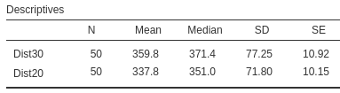

# CIs for mean differences (paired data) {#PairedCI}
\index{Research question!relational}


```{r, child = if (knitr::is_html_output()) {'./introductions/26-CIs-MeanDifference-HTML.Rmd'} else {'./introductions/26-CIs-MeanDifference-LaTeX.Rmd'}}
```


<!-- Define colours as appropriate -->
```{r, child = if (knitr::is_html_output()) {'./children/coloursHTML.Rmd'} else {'./children/coloursLaTeX.Rmd'}}
```


## Introduction: six-minute walk test {#PairedIntro}


<div style="float:right; width: 222x; border: 1px; padding:10px">

</div>


The Six-Minute Walk Test (6MWT) measures how far subjects can walk in six minutes, and is used as a simple, low-cost evaluation of fitness and other health-related measures.
The recommended setting for the test is usually a walkway of at least $30$\ms.
@saiphoklang2022comparison measured the 6MWT distance when the same subjects each used *both* $20$\ms and $30$\ms walkways:

> For Thai patients with chronic obstructive pulmonary disease, what is the mean difference between the 6MWT distance when subjects use a $20$\ms walkway and a $30$\ms walkway?

The comparison is *within* individuals (Sect.\ \@ref(RQsRepeatedMeasures));\index{Comparison!within individuals} this is a *repeated-measures* study.
Each subject has a *pair* of 6MWT measurements, and the study produced *paired data*, the topic of this chapter.
The data collected to answer this RQ are shown
`r if (knitr::is_latex_output()) {
   'in  Table\\ \\@ref(tab:Data6MWT).'
} else {
   'below.'
}`


```{r Data6MWT}
data(SixMWT)

WTlen <- dim(SixMWT)[1]

Labels <- paste("No.", 
                1 : WTlen)

tb1 <- array( cbind( Labels[1:5 ],
                     SixMWT$Distance20[1:5 ],
                     SixMWT$Distance30[1:5 ],
                     SixMWT$Distance30[1:5 ] - SixMWT$Distance20[1:5 ]),
                     dim = c(5, 4) )
                     

T1 <- knitr::kable(pad(tb1,
                       surroundMaths = TRUE,
                       targetLength = c(0, 5, 5, 5),
                       digits = 1),
                   format = "latex",
                   valign = 't',
                   align = "c",
                   linesep = "",
                   col.names = c("Subject", 
                                 "20m w'way", 
                                 "30m w'way", 
                                 "Diff."),
                   row.names = FALSE,
                   escape = FALSE,
                   booktabs = TRUE) %>%
  add_header_above(c( " " = 1, 
                      "Distance walked (in m)" = 3),
                   line = TRUE,
                   bold = TRUE) %>%
  row_spec(0, bold = TRUE)


tb2 <- array( cbind( Labels[(WTlen - 4):WTlen ],
                     SixMWT$Distance20[(WTlen - 4):WTlen ],
                     SixMWT$Distance20[(WTlen - 4):WTlen ],
                     SixMWT$Distance30[(WTlen - 4):WTlen ] - SixMWT$Distance20[(WTlen - 4):WTlen ]),
                     dim = c(5, 4) )


T2 <- knitr::kable(pad(tb2,
                       surroundMaths = TRUE,
                       targetLength = c(0, 5, 5, 4),
                       digits = 1),
                   format = "latex",
                   valign = 't',
                   align = "c",
                   linesep = "",
                   col.names = c("Subject", 
                                 "20 m w'way", 
                                 "30 m w'way", 
                                 "Diff."),
                   row.names = FALSE,
                   escape = FALSE,
                   booktabs = TRUE) %>%
  add_header_above(c( " " = 1, 
                      "Distance walked (in m)" = 3),
                   line = TRUE,
                   bold = TRUE) %>%
  row_spec(0, bold = TRUE)

out <- knitr::kables(list(T1, T2),
                     format = "latex",
                     label = "Data6MWT",
                     caption = "The six-minute walk test (6MWT) distance, for walkways of $20$\\ms and $30$\\ms length. These are the first five and the last five of the $50$ total observations. (A negative difference means the $20$\\ms distance is greater than the $30$\\ms distance.)") %>% 
  kable_styling(font_size = 8)
out2 <- prepareSideBySideTable(out,
                               gap = "\\quad") 
out2

```

```{r}
if( knitr::is_html_output() ) {
  SixMWT$Diff <- SixMWT$Distance30 - SixMWT$Distance20

  DT::datatable(SixMWT,
               fillContainer = FALSE, # Make more room, so we don't just have ten values
               colnames = c("Subject", 
                            "Distance (20 m walkway)",
                            "Distance (30 m walkway)",
                            "Age",
                            "Difference"),
               filter = "none",
               options = list(searching = FALSE), # Remove searching: See: https://stackoverflow.com/questions/35624413/remove-search-option-but-leave-search-columns-option
               caption = "The six-minute walk test (6MWT) distance, for walkways of $20$\\ms and $30$\\ms length. (A negative difference means the $20$\\ms distance is greater than the $30$\\ms distance.)")
}
```


::: {.importantBox .important data-latex="{iconmonstr-warning-8-240.png}"}
Some differences are *negative*.
This does *not* mean a negative distance.
Since the differences are computed as the $30$\ms distance minus the $20$\ms distance, a negative difference means the $20$\ms distance is a larger value than the $30$\ms distance.
:::


## Paired data {#PairedData}
\index{Data!paired}

The data
`r if (knitr::is_latex_output()) {
   'in  Table\\ \\@ref(tab:Data6MWT)'
} else {
   'above'
}`
are *paired*.
The RQ is a special case of a *repeated-measures RQs* (Sect.\ \@ref(RQsRepeatedMeasures)), where each unit of analysis has two observations.
Computing the *differences* or *changes* between the pairs of observations makes sense, since the values for each pair belong to the same unit of analysis (the same person, in this case).

Pairing data, when appropriate, is useful because individuals can vary substantially, and pairing means that extraneous variables (potentially, *confounding* variables) are held constant for those paired observations.
For example, each pair of distances recorded in
`r if (knitr::is_latex_output()) {
   'Table\\ \\@ref(tab:Data6MWT)'
} else {
   'the data above'
}`
come from same person, so sex and age remains the same for both observations in the pair.
Pairing is a form of blocking\index{Blocking} (Sect.\ \@ref(ManagingConfounding)).

Pairing does not require the *same* person to be measured twice (as in this study); it is also a good design strategy when the individuals in the pair are very similar for many extraneous variables.
(For example, the pair may comprise two different people, of the same sex, with similar age, height and weight.)


::: {.definition #PairedData name="Paired data"}
*Paired data* occurs when the outcome is compared for two different, distinct situations for each unit of analysis.
:::


Paired studies appear in many situations:

* Height is measured for each twin in a pair (the twin-pair is the 'individual').
  Pairing the heights for each twin is reasonable given the shared genetics (and probably environments also).
  The *difference* between the height of the twins can be recorded for each pair.
* The body temperature of dogs (the 'individuals') is measured using *both* rectal and ear thermometers.
  The *difference* between the two recorded temperatures from the thermometers for each dog is recorded.
* Blood pressure is recorded from some individuals (Group\ A) after receiving Drug\ A, and from another group of individuals (Group\ B) after receiving Drug\ B.
  Each person in Group\ A is matched with someone in Group\ B of the same sex, similar age and similar weight (e.g., in one of the pairs, each individual is a male, about $30$ years-of-age, and about $180$\cms tall).
  The *difference* between the blood pressure for the individual in Group\ A and the matched person in Group B is recorded for each pair.
* The number of campers is recorded at many national parks (the 'individuals') on the first weekend in summer, and on the first weekend on winter.
  The *difference* in camper numbers for each national park between these time points is recorded.

Many of these examples can be extended to beyond two measurements.
For instance, temperatures can be compared on each dog using three different types of thermometers.
We only study *pairs* of measurements, and only for quantitative variable.


## Summarising the data {#SummarisingPairedCI}

For the 6MWT study, the distance is measured for the same subjects for two different walkway distances.
Each subject receives two measurements, and the *difference* between the distances walked for each individual is computed

Since the data are paired, an appropriate graph is a histogram of the differences (Chap.\ \@ref(SummariseWithin)); specifically, $30$\ms distance minus the $20$\ms distance.
A boxplot comparing 6MWT distance for both walkway lengths (that is, *not* pairing the data) shows the distribution of distances, and the median distances, are very similar (Fig.\ \@ref(fig:ComparePairedBoxplotsHistogram), left panel).
Any difference in individuals' 6MWT distances is difficult to see and detect.
In addition, the link between the two 6MWT distances for each individual has been lost.

Using a histogram of the differences makes the difference in the distances for the individuals easier to see (Fig.\ \@ref(fig:ComparePairedBoxplotsHistogram), right panel).
The histogram also makes it easy to see that some subjects walked further with a $20$\ms walkway, and some further for a $30$\ms walkway.
Individually graphing the 6MWT for both walkway distances may also be useful too, but a graph of the differences is *crucial*, as the RQ is about those differences.
A case-profile plot (Sect.\ \@ref(CaseProfilePlot)) is also appropriate, but is difficult to read for these data because size of the sample is too large (a line is needed for each of the $50$ units of analysis).


```{r ComparePairedBoxplotsHistogram, fig.align="center", out.width='95%', fig.cap="Plots of the 6MWT data. Left: graphing the data incorrectly as not paired. Right: a histogram of 6MWT distances changes ($30$\\ms walkway distance minus $20$\\ms walkway distance; the vertical grey line represents no change in distance).", fig.height = 3.25, fig.width = 7.75}

par(mfrow = c(1, 2))

boxplot( cbind(SixMWT$Distance20,
               SixMWT$Distance30),
         names = c("20m", "30m"),
         las = 1,
         col = plot.colour,
         ylim = c(180, 600),
         ylab = "Walk distance (in m)",
         xlab = "Walkway distance",
         main = "POOR: A boxplot of 6MWT\ndistance for two walkway lengths")

out <- hist( SixMWT$Distance30 - SixMWT$Distance20,
             breaks = seq(-40, 80, by = 10),
             plot = FALSE)

plot(x = c(-40, 80),
     y = c(0, 18),
     xlim = c(-45, 80),
      xlab = "Difference in distances (in m)",
      ylab = "Frequency",
      sub = "(30m distance minus 20m distance)",
      las = 2,
      type = "n",
      main = "Histogram of 6MWT distance\nfor two walkway lengths")
box()

abline(v = 0, 
       col = "grey", 
       lty = 1,
       lwd = 2)
plot(out,
     add = TRUE,
     col = plot.colour)

arrows(x0 = 5,
      x1 = 75,
      y0 = 16,
      y1 = 16,
      code = 2,
      angle = 15,
      length = 0.1,
      col = "grey")
text( x = 45,
      y = 16,
      pos = 1,
      cex = 0.9,
      label = "30m greater")


arrows(x0 = -5,
      x1 = -41,
      y0 = 16,
      y1 = 16,
      code = 2,
      angle = 15,
      length = 0.1,
      col = "grey")
text( x = -23,
      y = 16,
      pos = 1,
      cex = 0.9,
      label = "20m greater")
```


<!-- Case-profile plot not very helpful: -->
<!-- for (i in (1:68)){lines( x=c(1,2), y = c(StudentWt$Week1[i], StudentWt$Week12[i]));  -->
<!-- points(x=c(1,2), y = c(StudentWt$Week1[i], StudentWt$Week12[i]), pch= 19, cex = 0.5)} -->

The 6MWT distances for each walkway length can be summarised individually (the first two rows of Table\ \@ref(tab:SMWTSummary)) using the methods of Chap.\ \@ref(OneMeanConfInterval), or using software (Fig.\ \@ref(fig:SMWTNumericalOutput)).
All statistics are slightly different for the two walkway distances; in particular, the mean $30$\ms walkway distance is slightly larger.
However, since the RQ is about the difference between the distances, a numerical summary of the *differences* is essential (third row of Table\ \@ref(tab:SMWTSummary), using Fig.\ \@ref(fig:SMWTTestOutput)).


```{r SMWTSummary}
SMWT.DataSummary <- array( dim = c(3, 4))

SMWT.DataSummary[1, 1] <- mean(SixMWT$Distance20)
SMWT.DataSummary[2, 1] <- mean(SixMWT$Distance30)
SMWT.DataSummary[3, 1] <- mean(SixMWT$Distance30 - SixMWT$Distance20)

SMWT.DataSummary[1, 2] <- median(SixMWT$Distance20)
SMWT.DataSummary[2, 2] <- median(SixMWT$Distance30)
SMWT.DataSummary[3, 2] <- median(SixMWT$Distance30 - SixMWT$Distance20)

SMWT.DataSummary[1, 3] <- sd(SixMWT$Distance20)
SMWT.DataSummary[2, 3] <- sd(SixMWT$Distance30)
SMWT.DataSummary[3, 3] <- sd(SixMWT$Distance30 - SixMWT$Distance20)

SMWT.DataSummary[1, 4] <- findStdError(SixMWT$Distance20)
SMWT.DataSummary[2, 4] <- findStdError(SixMWT$Distance30)
SMWT.DataSummary[3, 4] <- findStdError(SixMWT$Distance30 - SixMWT$Distance20)

rownames(SMWT.DataSummary) <- c("20m walkway 6MWT distance (in m)", 
                                "30m walkway 6MWT distance (in m)", 
                                "Difference (in m)")

if( knitr::is_latex_output() ) {
  kable(pad(SMWT.DataSummary,
            targetLength = c(6, 5, 6, 6),
            surroundMaths = TRUE,
            digits = c(2, 1, 3, 3)),
        format = "latex",
        booktabs = TRUE,
        longtable = FALSE,
        escape = FALSE,
        align = "c",
        col.names = c("Mean", "Median", "Standard deviation", "Standard error"),
        digits = 2,
        caption = "The mean, median, standard deviation and standard error for the 6MWT data.") %>%
    row_spec(0, bold = TRUE) %>%
    row_spec(3, italic = TRUE) %>%
    kable_styling(font_size = 8)
} else {
  kable(pad(SMWT.DataSummary,
            targetLength = c(6, 5, 6, 6),
            surroundMaths = TRUE,
            digits = c(2, 1, 3, 3)),
        format = "html",
        booktabs = TRUE,
        longtable = FALSE,
        escape  = FALSE,
        align = "c",
        col.names = c("Mean", "Median", "Standard deviation", "Standard error"),
        digits = 2,
        caption = "The mean, median, standard deviation and standard error for the 6MWT data.") %>%
    row_spec(0, bold = TRUE) 
}
```


```{r SMWTNumericalOutput, fig.cap="The 6MWT data: numerical summary software output for each group.", fig.align="center", out.width="70%", fig.show="hold"}

```


## Confidence intervals for  $\mu_d$  {#MeanDiffCI}
\index{Sampling distribution!paired quantitative data}

Every possible sample of $n = 50$ subjects comprises different people, and hence produces different 6MWT distances for $20$\ms and $30$\ms walkways.
For this reason, the 6MWT distance summaries in Table\ \@ref(tab:SMWTSummary) include standard errors.
Since the 6MWT distance varies from sample to sample for each person, the *difference* between the distances for each person varies from sample to sample too, and also have a *sampling distribution*.

The differences (i.e., the **Diff.** column in 
`r if (knitr::is_latex_output()) {
   'Table\\ \\@ref(tab:Data6MWT))'
} else {
   'the data given in Sect.\\ \\@ref(PairedIntro))'
}`
can be treated like a single sample of data (Chap.\ \@ref(OneMeanConfInterval)).
Hence, the sampling distribution for the differences has a similar sampling distribution to that of $\bar{x}$.
In addition, the notation when working with paired data is similar to that used when working with the single-mean case too (Table\ \@ref(tab:PairedNotation)).


::: {.definition #DEFSamplingDistributionDbar name="Sampling distribution of a sample mean difference"}
The *sampling distribution of a sample mean difference* is (when certain conditions are met; Sect.\ \@ref(ValidityPaired)) described by:

* an approximate normal distribution,
* centred around the *sampling mean* whose value is the population mean *difference* $\mu_d$,
* with a standard deviation, called the standard error of the difference, of 
$\displaystyle\text{s.e.}(\bar{d}) = \frac{s_d}{\sqrt{n_d}}$,

where $n$ is the number of differences, and $s_d$ is the standard deviation of the individual differences in the sample.
:::


::: {.importantBox .important data-latex="{iconmonstr-warning-8-240.png}"}
A mean or a median may be appropriate for describing the *differences*.
However, the *sampling distribution* for the sample mean difference (under certain conditions) has a *normal distribution*.
Hence, the mean is appropriate for describing the sampling distribution, even if not for describing the data.
:::


```{r PairedNotation}
DiffNotation <- array(dim = c(6, 2))
colnames(DiffNotation) <- c(	"One sample mean", 
                             "Mean difference")
rownames(DiffNotation) <- c(	"The observations:",
                             "Sample mean:",
                             "Standard deviation:",
                             "Standard error of $\\bar{x}$:",
                             "Sample size:",
                             "Confidence interval:")


if( knitr::is_latex_output() ) {
  DiffNotation[1, ] <- c(	"Values: $x$", 
                          "Differences: $d$")
  DiffNotation[2, ] <- c(	"$\\bar{x}$",		
                          "$\\bar{d}$")
  DiffNotation[3, ] <- c(	"$s$", 			
                          "$s_d$")
  DiffNotation[4, ] <- c(	"$\\displaystyle\\text{s.e.}(\\bar{x}) = \\frac{s}{\\sqrt{n}}$",
                          "$\\displaystyle\\text{s.e.}(\\bar{d}) = \\frac{s_d}{\\sqrt{n}}$")
  DiffNotation[5, ] <- c(	"Number of \\emph{observations}: $n$",
                          "Number of \\emph{differences}: $n$")
  DiffNotation[6, ] <- c(	"$\\bar{x}\\pm\\big(\\text{multiplier}\\times \\text{s.e.}(\\bar{x})\\big)$",
                          "$\\bar{d}\\pm\\big(\\text{multiplier}\\times \\text{s.e.}(\\bar{d})\\big)$")
  
  kable( DiffNotation,
         format = "latex",
         booktabs = TRUE,
         align = c("c", "c"),
         longtable = FALSE,
         escape = FALSE,
         col.names = colnames(DiffNotation),
         caption = "The notation used for mean differences (paired data) compared to the notation used for one sample mean.") %>%
    kable_styling(font_size = 8) %>%
    row_spec(0, bold = TRUE) 
}
if( knitr::is_html_output() ) {
  
  DiffNotation[1, ] <- c(	"Values: $x$", 	
                          "Differences: $d$")
  DiffNotation[2, ] <- c(	"$\\bar{x}$",		
                          "$\\bar{d}$")
  DiffNotation[3, ] <- c(	"$s$", 			
                          "$s_d$")
  DiffNotation[4, ] <- c(	"$\\displaystyle\\text{s.e.}(\\bar{x}) = \\frac{s}{\\sqrt{n}}$",
                          "$\\displaystyle\\text{s.e.}(\\bar{d}) = \\frac{s_d}{\\sqrt{n}}$")
  DiffNotation[5, ] <- c(	"Number of *observations*: $n$",
                          "Number of *differences*: $n$")
  DiffNotation[6, ] <- c(	"$\\bar{x}\\pm\\big(\\text{multiplier}\\times \\text{s.e.}(\\bar{x})\\big)$",
                          "$\\bar{d}\\pm\\big(\\text{multiplier}\\times \\text{s.e.}(\\bar{d})\\big)$")

  kable( DiffNotation,
                format = "html",
                booktabs = TRUE,
                longtable = FALSE,
                align = c("c", "c"),
                col.names = colnames(DiffNotation),
                caption = "The notation used for mean differences (paired data) compared to the notation used for one sample mean.") %>%
    row_spec(0, bold = TRUE) 
}
```


For the 6MWT data, the sample mean differences $\bar{d}$ are described by (Fig.\ \@ref(fig:SMWTSamplingDist)):

* approximate normal distribution,
* with a sampling mean whose value is $\mu_{{d}}$,
* with a *standard error* of
$$
  \text{s.e.}(\bar{d}) =  \frac{22.039}{\sqrt{50}} = 3.117.
$$

The summary information for the difference in 6MWT distance can be added to the summary table (the third row of Table\ \@ref(tab:SMWTSummary)), after appropriate rounding.
Notice that the standard deviation of the difference is *not* the difference between the standard deviations for the $20$\ms and $30$\ms distances.
Instead, the standard deviation of the differences (i.e., the column **Diff.** in 
`r if (knitr::is_latex_output()) {
   'Table\\ \\@ref(tab:Data6MWT))'
} else {
   'the data given in Sect.\\ \\@ref(PairedIntro))'
}`
is computed.
(Likewise, the standard error and the median are computed from the values in the **Diff.** column also.)


```{r SMWTSamplingDist, fig.cap="The sampling distribution is a normal distribution; it describes how the sample mean difference between the 6MWT distances varies in samples of size $n = 50$.", fig.align="center", fig.width=9.0, fig.height=2.5, out.width='95%'}
mn <- mean(SixMWT$Distance20 - SixMWT$Distance30)
n <- length(SixMWT$Distance20)
stdd <- sd(SixMWT$Distance20 - SixMWT$Distance30)

se <- stdd/sqrt(n)

par( mar = c(4, 0.5, 0.5, 0.5) )
out <- plotNormal(0,
                  se,
                  xlab = "Sample mean difference in 6MWT distances (in m)", 
                  cex.axis = 0.95,
                  ylim = c(0, 0.18),
                  showXlabels = c( 	
                    expression( mu[d]-"9.350"),
                    expression( mu[d]-6.234), 
                    expression( mu[d]-3.117), 
                    expression( mu[d] ),
                    expression( mu[d] + 3.117), 
                    expression( mu[d] + 6.234), 
                    expression( mu[d] + "9.350") ) )

arrows(x0 = 0,
       x1 = 0,
       y0 = max(out$y) * 1.25,
       y1 = max(out$y),
       angle = 15,
       length = 0.1)

text(x = 0,
     y = max(out$y) * 1.2,
     pos = 3,
     labels = expression(Sampling~mean~difference))


arrows(x0 = 0,
       x1 = 0 + se,
       y0 = 0.30 * max(out$y),
       y1 = 0.30 * max(out$y),
       code = 3, # Arrows both ends
       angle = 15,
       length = 0.1)

text(x = 0 + (se / 2),
     y = 0.30 * max(out$y),
     labels = expression( atop(Std.~error,
                               s.e.(bar(italic(d)))==3.117)) )


arrows(x0 = mn,
       x1 = mn,
       y0 = 0.7 * max(out$y),
       y1 = 0,
       angle = 15,
       length = 0.1)
text(x = mn,
     y = 0.7 * max(out$y),
     pos = 3,
     labels = expression(bar(italic(d)) == 0.0282) )
```


The CI for the mean difference has the same form as for a single mean (Chap.\ \@ref(OneMeanConfInterval)).\index{Confidence intervals!paired quantitative data}
The $95$% confidence interval (CI) for $\mu_d$ is
$$
	\bar{d} \pm (\text{multiplier} \times\text{s.e.}(\bar{d})).
$$
As usual, for an approximate $95$% confidence interval (CI), the approximate multiplier is $2$ (from the $68$--$95$--$99.7$ rule).
This is the same as the CI for $\bar{x}$ if the differences are treated as the data.

For the 6MWT data:
$$
	22.03 \pm (2 \times 3.117),
$$
or $22.03\pm 6.234$\ms (so the *margin of error* is $6.234$\ms).
Equivalently, the CI is from $22.03 - 6.234 = 15.796$, up to $22.03 + 6.234 = 28.264$\ms.
We write:

> The mean difference in the 6MWT distances when using a $20$\ms and $30$\ms walkway is $22.03$\ms ($\text{s.e.} = 3.117$; $n = 50$), with an approximate $95$%\ CI from $15.80$\ms to $28.26$\ms, further for a $30$\ms walkway.

The CI means that the reasonable values for the population mean difference in 6MTW distances are between $15.80$\ms and $28.26$\ms.
Alternatively, we are $95$% confident that the population mean difference between the 6MWT distances is between $15.80$\ms and $28.26$\ms (further for $30$\ms walkway).
A difference of this magnitude probably has practical importance.\index{Practical importance}
Also notice that the *direction* of the difference is given: 'further for $30$\ms walkway'.


<iframe src="https://learningapps.org/watch?v=piue8vvyk22" style="border:0px;width:100%;height:600px" allowfullscreen="true" webkitallowfullscreen="true" mozallowfullscreen="true"></iframe>


Statistical software\index{Software output!mean difference} produces *exact* $95$%\ CIs, which may be slightly different than the *approximate* $95$%\ CI (recall: the $68$--$95$--$99.7$ rule gives *approximate* multipliers).
For the 6MWT data, the *approximate* and *exact* $95$%\ CIs are the same to one decimal place (Fig.\ \@ref(fig:SMWTTestOutput)).
We write:

> The mean difference in the 6MWT distances when using a $20$\ms and $30$\ms walkway is $22.03$\ms ($\text{s.e.} = 3.117$; $n = 50$), with an $95$%\ CI from $15.76$\ms to $28.29$\ms further for a $30$\ms walkway.


```{r SMWTTestOutput, fig.cap="The 6MWT data: software output.", fig.align="center", out.width="100%", fig.show="hold"}

```


## Statistical validity conditions {#ValidityPaired}
\index{Statistical validity!paired quantitative data}

As with any confidence interval, these results apply under certain conditions.
The conditions under which the CI is statistically valid for paired data are similar to those for one sample mean, rephrased for differences.

Statistical validity can be assessed using these criteria:

* When $n \ge 25$, the CI is statistically valid.
  (If the distribution of the differences is highly skewed, the sample size may need to be larger.)
* When $n < 25$, the CI is statistically valid only if the data come from a *population* of differences with a normal distribution.

The sample size of $25$ is a rough figure; some books give other values (such as $30$).

This condition ensures that the *distribution of the sample means has an approximate normal distribution* (so that, for example, the $68$--$95$--$99.7$ rule can be used).
Provided the sample size is larger than about $25$, this will be approximately true *even if* the distribution of the differences in the population does not have a normal distribution.
That is, when $n \ge 25$ the sample means generally have an approximate normal distribution, even if the data themselves don't have a normal distribution.
The units of analysis are also assumed to be *independent* (e.g., from a simple random sample).

If the statistical validity conditions are not met, other methods (e.g., non-parametric methods\index{Non-parametric statistics} [@conover2003practical]; resampling methods\index{Resampling methods} [@efron2021computer]) may be used.
For paired qualitative data, McNemar's test can be used [@conover2003practical].


::: {.example #StatisticalValidityWeightGain name="Statistical validity"}
For the 6MWT data, the sample size is $n = 50$, so the results are statistically valid.
Neither the differences *in the population*, nor the distances *in the population* for each walkway length, need to follow a normal distribution.
:::


## Example: invasive plants {#PairedInvasivePlantsCI}

Skypilot is a alpine wildflower native to the Colorado Rocky Mountains (USA).
In recent years, a willow shrub has been encroaching on skypilot territory and, because willow often flowers early, @kettenbach2017shrub studied whether the willow may 'negatively affect pollination regimes of resident alpine wildflower species' (p.\ 6\ 965).
One RQ was:

> In the Colorado Rocky Mountains, what is the mean difference between first-flowering day for the native skypilot and the encroaching willow?

Data for both species was collected at $n = 25$ different sites, so the data are *paired* by site (Sect.\ \@ref(CompareWithinInvasivePlantsCI)).
The unit of analysis is the *site*, and the unit of observation is the *plant*.
The data are shown in
`r if( knitr::is_latex_output() ) {
    'Table\\ \\@ref(tab:FloweringData) (p.\\ \\pageref{tab:FloweringData}).'
} else {
    'the table below.'
}`
The 'first-flowering day' is the number of days since the start of the year (e.g., January\ $12$ is 'day\ $12$') when flowers were first observed.

The parameter is $\mu_d$, the population mean *difference* between the day of first flowering for skypilot, less the day of first flowering for willow.
Hence, a *positive* value for the difference means that the skypilot values are larger, and hence that willow flowered first.

::: {.tipBox .tip data-latex="{iconmonstr-info-6-240.png}"}
Explaining *how* the differences are computed is important.
The differences here are skypilot minus willow first-flowering days.
Positive values mean willow flowered first; negative values mean skypilot flowered first.
:::

The data are summarised graphically (Fig.\ \@ref(fig:FloweringPlots)) and numerically (Table\ \@ref(tab:FloweringSummary)), using software output (Fig.\ \@ref(fig:Floweringjamovi)).

The standard error of the mean difference is $\text{s.e.}(\bar{d}) = 0.940$ (Fig.\ \@ref(fig:Floweringjamovi); Table\ \@ref(tab:FloweringSummary)).
The approximate $95$%\ CI is $1.36 \pm (2\times 0.940)$, or from $-0.52$ to $3.24$ days.
Software output (Fig.\ \@ref(fig:Floweringjamovi)) gives the $95$%\ CI as $-0.58$ to $3.30$ days.
Remembering that *positive* differences mean willow flowers earlier, we write (using the exact CI):

> The mean difference in the day of first flowering is $1.36$ days earlier for the willow ($\text{s.e.} = 0.940$; $n = 25$), with an approximate $95$%\ CI between $0.52$ days earlier for skypilot to $3.24$ days earlier for willow.

The CI is statistically valid since $n = 25$.


::: {.importantBox .important data-latex="{iconmonstr-warning-8-240.png}"}
Be clear in your conclusion about *how* the differences are computed.
Make sure to interpret the CI consistent with how the differences are defined.
:::


## Example: chamomile tea {#ChamomileTea-Paired-CI}

@rafraf2015effectiveness studied patients with Type\ 2 diabetes mellitus (T2DM).
They randomly allocated $32$ patients into a control group (who drank hot water), and another $32$ patients to receive chamomile tea (p.\ 164):

> The study was blinded so that the allocation of the intervention or control group was concealed from the researchers and statistician [...]
> The intervention group ($n = 32$) consumed one cup of chamomile tea [...] three times a day immediately after meals (breakfast, lunch, and dinner) for $8$\ weeks. 
> The control group ($n = 32$) consumed an equivalent volume of warm water during the $8$-week period...

The total glucose (TG) was measured for each individual both *before* the intervention and *after* eight weeks on the intervention, in both the control and treatment groups.
The data are not available, so no graphical summary of the data can be produced; however, the article gives a data summary (motivating Table\ \@ref(tab:TGsummaryTable)).
The following RQs can be asked:

> * For patients with T2DM, what is the mean reduction in TG after eight weeks drinking *chamomile tea*?
> * For patients with T2DM, what is the mean reduction in TG after eight weeks drinking *hot water*?

For the *tea group*, the standard error of the *reduction* in TG is $\text{s.e.}(\bar{d}) = 30.37/\sqrt{32} = 5.37$.
For the *control group*, the standard error of the *reduction* in TG is $\text{s.e.}(\bar{d}) = 36.66/\sqrt{32} = 6.48$.
Thus, the approximate $95$%\ CI for the *reduction* in TG is:

* \makebox[31mm][l]{Tea-drinking group:} $38.62\pm (2\times 5.37)$, or from $27.88$ to $49.36$ mg.dl$^{-1}$.
* \makebox[31mm][l]{Control group:} $-7.12\pm (2\times 6.48)$, or from $-20.08$ to $5.84$ mg.dl$^{-1}$.

(A *negative reduction* in TG means an *increase* in TG.)
The chamomile tea appears to reduce TG, but not the hot water.
Is the difference between the two treatments due to sampling variation?
This question is studied further in Sect.\ \@ref(ChamomileTea-Paired-HT).


```{r TGsummaryTable}
TGsummary <- array(dim = c(3, 8) )

rownames(TGsummary) <- c("Chamomile tea",
                          "Control",
                          "Difference")
colnames(TGsummary) <- c("n",
                          "BaselineMean",
                          "BaselinesSD",
                          "PostMean",
                          "PostSD",
                          "ChangeMean",
                          "ChangeSD",
                          "ChangesSE")

TGsummary[1, ] <- c(32, 
                     203.00, 54.96,
                     164.37, 50.70,
                     38.62, 30.37, 30.37/sqrt(32) )
TGsummary[2, ] <- c(32,
                     178.25, 53.06,
                     185.37, 52.59,
                     -7.12, 36.66, 36.66/sqrt(32) )
TGsummary[3, ] <- c(NA,
                     24.75, NA,
                     21.00, NA,
                     45.74, NA, NA)

if( knitr::is_latex_output() ) {
  
  knitr::kable(pad(TGsummary,
                   surroundMaths = TRUE,
                   targetLength = c(2, 6, 5, 6, 5, 5, 5, 5),
                   digits = c(0, 2, 2, 2, 2, 2, 2, 2, 2)),
               format = "latex",
               align = "c",
               linesep = "",
               caption = "The total glucose (TG; in mg.dl$^{-1}$) for two groups: those who drank chamomile tea, and those who drank hot water (the control group). The Reduction columns summarise the reduction in TG for each group.",
               col.names = c("$n$",
                             "Mean", "Std. dev.", 
                             "Mean", "Std. dev.",
                             "Mean", "Std. dev.", "Std. error"),
               row.names = TRUE,
               escape = FALSE,
               booktabs = TRUE) %>%
    row_spec(0, bold = TRUE) %>%
    row_spec(3, italic = TRUE) %>%
    kable_styling(font_size = 8) %>%
    add_header_above( c(" " = 2,
                        "Baseline" = 2,
                        "After 8 weeks" = 2,
                        "Reduction" = 3),
                      bold = TRUE)
}

if( knitr::is_html_output() ) {
  kable( pad(TGsummary,
                   surroundMaths = TRUE,
                   targetLength = c(2, 6, 5, 6, 5, 5, 5, 5),
                   digits = c(0, 2, 2, 2, 2, 2, 2, 2)),
         format = "html",
         align = "c",
         booktabs = TRUE,
         longtable = FALSE,
         col.names =  c("$n$",
                        "Mean", "Std. dev.", 
                        "Mean", "Std. dev.",
                        "Mean", "Std. dev.", "Std. error"),
         caption = "The total glucose (TG; in mg.dl$^{-1}$) for two groups: those who drank chamomile tea, and those who drank hot water (the control group). The Reduction columns summarise the reduction in TG for each group.") %>% 
    row_spec(0, bold = TRUE) %>%
    add_header_above( c(" " = 2,
                        "Baseline" = 2,
                        "After 8 weeks" = 2,
                        "Reduction" = 3),
                      bold = TRUE)
}

```

We write:

> The mean reduction in TG for those drinking chamomile tea is $38.62$\mgs.dl^$-1$^ (approx. $95$%\ CI: $27.88$ to $49.36$\mgs.dl^$-1$^), and $-7.12$\mgs.dl^$-1$^ for those drinking hot water (approx. $95$%\ CI: $-20.08$ and $-5.84$\mgs.dl^$-1$^).

The intervals have a $95$% chance of straddling the population mean reduction in TG.\spacex
The sample sizes are larger than $25$, so the results are statistically valid.


## Chapter summary

To compute a confidence interval (CI) for a mean difference, compute the sample mean difference, $\bar{d}$, and identify the sample size $n$.
Then compute the standard error, which quantifies how much the value of $\bar{d}$ varies across all possible samples:
$$
  \text{s.e.}(\bar{d})
  =
  \frac{ s_d }{\sqrt{n}},
$$
where $s_d$ is the sample standard deviation.
The *margin of error* is (multiplier${}\times{}$standard error), where the multiplier is $2$ for an approximate $95$%\ CI (using the $68$--$95$--$99.7$ rule).
Then the CI is:
$$
   \bar{d} \pm \left( \text{multiplier}\times\text{standard error} \right).
$$
The statistical validity conditions should also be checked.


## Quick review questions {#Chap27-QuickReview}

Are the following statements *true* or *false*?

::: {.webex-check .webex-box}
1. For paired data, the mean of the *differences* is treated like the mean of a single variable when computing a CI.\tightlist  
`r if( knitr::is_html_output() ) { torf( answer=TRUE )}`
1. An appropriate graph for displaying paired data is a histogram of the differences.  
`r if( knitr::is_html_output() ) { torf( answer=TRUE )}`
1. The *population* mean difference is denoted $\mu_d$.  
`r if( knitr::is_html_output() ) { torf( answer=TRUE )}`
1. The standard error of the sample mean difference is denoted $s_d$.  
`r if( knitr::is_html_output() ) { torf( answer=FALSE )}`
:::


## Exercises {#PairedCIExercises}

Answers to odd-numbered exercises are available in App.\ \@ref(Answers).

`r if( knitr::is_latex_output() ) "\\captionsetup{font=small}"`

::: {.exercise #MeanDiffWhichPaired}
Which (if any) of these scenarios are *paired*?

1. Heart rate is measured for each individual when sitting and when standing.
  (Some individuals have their heart rate recorded first while sitting, and some first while standing.)
  Each person receives two measurements, and the *difference* in heart rate between sitting and standing is recorded.
1. The mean protein concentrations were compared in sea turtles before and after being rehabilitated  [@data:March2018:turtles].
:::


::: {.exercise #MeanDiffWhichPaired2}
Which (if any) of these scenarios are *paired*?

1. The mean HDL cholesterol concentration is recorded for a group of males and a group of females, and the means compared.
1. Heart rate was recorded for $36$ people, both before and after exercise, to determine how much the average heart rate increase.
:::


::: {.exercise #MeanDiffGrowingSquashCI}
[*Dataset*: `Fruit`]
@mukherjee2019diversity studied the effect of rainfall on growing Chayote squash (*Sechium edule*).
They compared the size of the fruit in a year with normal rainfall (2015) compared to a dry year (2014) on the same $24$ farms:

> For Chayote squash grown in Bangalore, what is the mean difference in fruit weight between a normal and dry year?

Ten fruits were gathered from each farm in both years, and the average (mean) weight of the fruit recorded for the farm.
Since the same farms are used in both years, the data are *paired* 
`r if( knitr::is_latex_output() ) {
  '(Table\\ \\@ref(tab:FruitsData)).'
} else {
  '(see above).'
}`
Data is missing for Farm\ 20 in the dry year (2014), so there are $n = 23$ differences.


```{r FruitsData, echo=FALSE}
data(Fruit) ### Exercise

Fruit$Farm <- 1 : length(Fruit$FWeight2014)

FruitTab <- dplyr::select(Fruit,
                          Farm,
                          FWeight2014,
                          FWeight2015)
FruitTab$Change <- FruitTab$FWeight2015 - FruitTab$FWeight2014

if( knitr::is_latex_output() ) {
  
 T1 <- knitr::kable(pad(FruitTab[1:5, ],
                        digits = c(0, 2, 2, 2),
                        surroundMaths = TRUE,
                        targetLength = c(2, 6, 6, 6)),
                     format = "latex",
                     valign = 't',
                     align = "c",
                     linesep = "",
                     col.names = c("Farm", 
                                   "Dry", 
                                   "Normal",
                                   "Change"),
                     row.names = FALSE,
                     escape = FALSE,
                     booktabs = TRUE) %>%
   add_header_above(c( " " = 1,
                       "Average fruit weight (kg)" = 3),
                    bold = TRUE) %>%
    row_spec(0, bold = TRUE) 
  
  
  T2 <- knitr::kable(pad(FruitTab[20:24, ],
                        digits = c(0, 2, 2, 2),
                        surroundMaths = TRUE,
                        targetLength = c(2, 6, 6, 7)),
                     format = "latex",
                     valign = 't',
                     align = "c",
                     linesep = "",
                     col.names = c("Farm", 
                                   "Dry", 
                                   "Normal",
                                   "Change"),
                     row.names = FALSE,
                     escape = FALSE,
                     booktabs = TRUE)  %>%
   add_header_above(c( " " = 1,
                       "Average fruit weight (kg)" = 3),
                    bold = TRUE) %>%
    row_spec(0, bold = TRUE) 
  
  out <- knitr::kables(list(T1, T2),
                       format = "latex",
                       label = "FruitsData",
                       caption = "The average weight of fruits (in g) in two different years, from $24$ farms. One observation is missing for Farm\ 20. The change is computed as the normal year minus dry year.") %>% 
    kable_styling(font_size = 8)
  out2 <- prepareSideBySideTable(out) 
  out2 
}

if( knitr::is_html_output() ) {
  kable( pad(FruitTab,
             digits = c(0, 2, 2, 2),
                        surroundMaths = TRUE,
                        targetLength = c(2, 6, 6, 7)),
         format = "html",
         align = "c",
         booktabs = TRUE,
         longtable = FALSE,
         col.names = c("Farm", 
                       "Dry", 
                       "Normal",
                       "Change (in g)"),
         caption = "The average weight of fruits (in g) in two different years, from $24$ farms. One observation is missing for Farm\ 20. The change is computed as the normal year minus dry year.") %>% 
    row_spec(0, bold = TRUE)
}
```

1. What is the *unit of analysis*?\index{Units of analysis}
   What is the *units of observation*?\index{Units of observation}
2. Create a numerical summary table for the data (use Fig.\ \@ref(fig:FruitDescriptivesjamovi)).
3. Create a suitable graph to display the data.
4. Construct an approximate $95$%\ CI for the mean difference in fruit weight.
5. Is this CI statistically valid?
6. What is the advantage of using the same $24$ farms twice each?
:::


```{r FruitDescriptivesjamovi, fig.cap="Software output for the fruit data.", fig.align="center", out.width='80%'}
knitr::include_graphics("jamovi/Fruit/Fruit-Descriptives.png")
```


```{r}
data(Captopril) ### Exercise

Captopril$Differences <- Captopril$Before - Captopril$After

bloodS <- subset(Captopril, BP == "S")
bloodS <- bloodS[, c("Before", 
                     "After", 
		     "Differences")]

bloodS2 <- cbind( "Before" = bloodS$Before[1:8], 
                  "After" = bloodS$After[1:8],
                  "Before" = c(bloodS$Before[9:15], NA), 
                  "After" = c(bloodS$After[9:15], NA) )
```


::: {.exercise #PairedCIExercisesCaptopril}
[*Dataset*: `Captopril`]
@data:macgregor:essential studied of hypertension for $15$ patients.
Patients were given a drug (Captopril) and their systolic blood pressure measured (in mm Hg) immediately *before* and two hours *after* being given the drug (Table\ \@ref(tab:CICaptoprilData);  @data:hand:handbook).

1. Explain why it is sensible to compute differences as the *Before* minus the *After* measurements.
   What do the differences *mean* when computed this way?
1. Compute an *approximate* $95$%\ CI for the mean difference.
1. Write down the *exact* $95$%\ CI using the computer output (Fig.\ \@ref(fig:CaptoriljamoviCI)). 
1. Is this CI statistically valid?
1. Why are the two CIs different?
1. What is the advantage of using the same patients for both the before and after measurements, rather than one group for before measurements and a different group of people for after measurements?
:::


```{r CaptoriljamoviCI, fig.cap="Software output for the Captopril data.", fig.align="center", out.width="80%", fig.show="hold"}
knitr::include_graphics("jamovi/CaptoprilAll/CaptoprilAll-PairedTOutput.png") 
#knitr::include_graphics("SPSS/CaptoprilAll/CaptoprilAll-PairedTOutput.png")
```


::: {.exercise #PairedCIExercisesBroccoli}
People often struggle to eat the recommended intake of vegetables.
@data:Fritts2018:Vegetables explored ways to increase vegetable intake in teens.
Teens rated the taste of raw broccoli, and raw broccoli served with a specially-made dip.

Each teen ($n = 100$) had a *pair* of measurements: the taste rating of the broccoli *with* and *without* dip.
Taste was assessed using a 'visual analog scale', where a *higher* score means a *better* taste.
In summary:

* For raw broccoli, the mean taste rating was $56.0$ (with $s = 26.6$);
	 <!-- %  (SDs); so if $n=101$ we'd get SE: 2.647 -->
* For raw broccoli served with dip, the mean taste rating was $61.2$ (with $s = 28.7$).

Because the data are paired, *differences* are the best way to describe the data.
The mean difference in the ratings was $5.2$, with $\text{s.e.}(\bar{d}) = 3.06$. 
From this information:

1. Construct a suitable numerical summary table.
1. Compute the approximate $95$%\ CI for the mean difference in taste ratings.
1. Is this CI statistically valid?
1. What does a positive difference mean?
:::
<!-- (working backwards from the $t$-score). Looks like $n=101$. n=100...? -->


::: {.exercise #PairedCIExercisesSmokeExercise}
@data:Allen2018:Smoking examined the effect of exercise on smoking.
Men and women were assessed on their 'intention to smoke', both before and after exercise for each subject (using two quantitative questionnaires).
Smokers ('smoking at least five cigarettes per day') aged\ $18$ to\ $40$ were enrolled for the study.
For the $23$ women in the study, the mean intention to smoke after exercise *reduced* by $0.66$ (with a standard error of $0.37$).
(Larger values for 'intention to smoke' mean a greater intent to smoke.)

1. Find an approximate $95$% confidence interval for the population mean reduction in intention to smoke for women after exercising.
1. Is this CI statistically valid?
1. What does a positive difference mean?
:::

```{r out.width='80%'}
data(Anorexia) ### Exercise

ANCB <- subset(Anorexia, 
               Treatment=="CB")
```


::: {.exercise #PairedCIExercisesAnorexia}
[*Dataset*: `Anorexia`]
Young girls with anorexia ($n = 29$) received cognitive behavioural treatment (@data:hand:handbook), and their weight before and after treatment were recorded.
In summary:

* Before the treatment, the mean weight was $82.69$ pounds ($s = 4.845$ pounds);
* After the treatment, the mean weight was $85.70$ pounds ($s = 8.352$ pounds).

The mean weight gain per girls was $`r round(mean( ANCB$After - ANCB$Before), 2)`$ pounds, with a standard deviation of $`r round(sd( ANCB$After - ANCB$Before), 2)`$ pounds
Find an approximate $95$%\ CI for the population mean weight gain. 
Do you think the treatment had any meaningful impact on the mean weight gain of the girls, based solely on these data?
:::


::: {.exercise #StressSurgeryCI}
[*Dataset*: `Stress`]
The concentration of beta-endorphins in the blood is a sign of stress.
@hoaglin2011exploring measured the beta-endorphin concentration for $19$ patients about to undergo surgery [@data:hand:handbook].
Each patient had their beta-endorphin concentrations (in fmol.mol^$-1$^) measured $12$--$14$ hours before surgery, and also $10$ minutes before surgery.
A numerical summary appears in Table\ \@ref(tab:StressTable).

1. Use the software output in Fig.\ \@ref(fig:StressDescriptivesjamovi) to construct an *approximate* $95$%\ CI for the *increase* in beta-endorphin concentrations as surgery gets closer.
2. Use the software output in Fig.\ \@ref(fig:StressDescriptivesjamovi) to write down the *exact* $95$%\ CI for the *increase* in beta-endorphin concentrations as surgery gets closer.
3. Why is there a difference between the two CIs?
4. Is the CI statistically valid?
:::


```{r StressDescriptivesjamovi, fig.cap="Software output for the surgery-stress data.", fig.align="center", out.width='70%'}
knitr::include_graphics("jamovi/Stress/StressDescriptives.png")
```


::: {.exercise #MeanDiffFlowering}
Suppose, in the example of Sect.\ \@ref(PairedInvasivePlantsCI), the differences were defined as the day of first flowering for willow, less the day of first flowering for skypilot.

Write down, and interpret the meaning of, the confidence interval for the mean difference in first-flowering times.
:::


::: {.exercise #MeanDiffTea}
Suppose, in the example of Sect.\ \@ref(ChamomileTea-Paired-CI), the differences were defined as *increase* in total glucose (TG).

Write down, and interpret the meaning of, the confidence interval for the mean increase in TG for the tea-drinking group.
:::


::: {.exercise #MeanDiffCOVIDCI}
A study of $n = 213$ Spanish health students [@romero2020physical] measured (among other things) the number of minutes of vigorous physical activity (PA) performed by students *before* and *during* the COVID-19 lockdown (from March to April 2020 in Spain).
Since the *before* and *during* lockdown were both measured on *each* participant, the data are *paired*.
The data are summarised in Table\ \@ref(tab:COVIDsummaryTable).

1. Explain what the differences *mean*.
1. Compute the standard error of the differences.
1. Compute the approximate $95$%\ CI, and interpret what it means.
:::


::: {.exercise #MeanDiffStudentEatingHabits}
What happens to students' eating habits when they start university?
Many students will be responsible for their own meals for the first time, so some  may forgo healthy foods for convenient, but less healthy, foods.
Alternatively, some may not be able to afford sufficient or healthy food.

@levitsky2004freshman recorded some students' weights as they began university, and then *the same* students' weight some later time.
They asked the RQ:

> For Cornell University students, what is the *mean weight change* in students after $12$ weeks at university?

The data collected to answer this RQ are shown
`r if (knitr::is_latex_output()) {
   'in  Table\\ \\@ref(tab:DataWeightChange) [@DASL:WeightChange].'
} else {
   'below [@DASL:WeightChange].'
}`


1. Use the software output (Fig.\ \@ref(fig:WeightGainOutput)) to compute an approximate $95$% CI for the weight *gain* from Weeks\ $1$ to\ $12$.
2. Use the software output to compute a $95$% CI for the weight *gain* from Weeks\ $1$ to\ $12$.
3. Comment on the two CIs.
4. Are the CIs statistically valid?
5. Write down the (exact) $95$% CI for the weight *loss* from Weeks\ $1$ to\ $12$.
6. Do you think the weight gain would be of practical importance?


```{r DataWeightChange}
data(StudentWt)

SWlen <- length(StudentWt$Week1)

Labels <- paste("No.", 
                1 : length(StudentWt$Student))

tb1 <- array( cbind( Labels[1:5 ],
                     StudentWt$Week1[1:5 ],
                     StudentWt$Week12[1:5 ],
                     StudentWt$GainWt[1:5 ]),
                     dim = c(5, 4) )
                     

T1 <- knitr::kable(pad(tb1,
                       surroundMaths = TRUE,
                       targetLength = 4,
                       digits = 1),
                   format = "latex",
                   valign = 't',
                   align = "c",
                   linesep = "",
                   col.names = c("Student", 
                                 "Week 1", 
                                 "Week 12", 
                                 "Weight gain"),
                   row.names = FALSE,
                   escape = FALSE,
                   booktabs = TRUE) %>%
  add_header_above(c( " " = 1, 
                      "Weight (in kg)" = 3),
                   line = TRUE,
                   bold = TRUE) %>%
  row_spec(0, bold = TRUE)


tb2 <- array( cbind( Labels[(SWlen - 4):SWlen ],
                     StudentWt$Week1[(SWlen - 4):SWlen ],
                     StudentWt$Week12[(SWlen - 4):SWlen ],
                     StudentWt$GainWt[(SWlen - 4):SWlen ]),
                     dim = c(5, 4) )


T2 <- knitr::kable(pad(tb2,
                       surroundMaths = TRUE,
                       targetLength = 4,
                       digits = 1),
                   format = "latex",
                   valign = 't',
                   align = "c",
                   linesep = "",
                   col.names = c("Student", 
                                 "Week 1", 
                                 "Week 12", 
                                 "Weight gain"),
                   row.names = FALSE,
                   escape = FALSE,
                   booktabs = TRUE) %>%
  add_header_above(c( " " = 1, 
                      "Weight (in kg)" = 3),
                   line = TRUE,
                   bold = TRUE) %>%
  row_spec(0, bold = TRUE)

out <- knitr::kables(list(T1, T2),
                     format = "latex",
                     label = "DataWeightChange",
                     caption = "The student weight-change data, showing the weight of students in Week\\ 1 at university, in Week\\ 12, and the weight gain (all in kg). These are the first five and the last five of the $68$ total observations. (A negative weight gain means a weight loss.)") %>% 
  kable_styling(font_size = 8)
out2 <- prepareSideBySideTable(out,
                               gap = "\\enskip") 
out2

```


```{r}
if( knitr::is_html_output() ) {
  DT::datatable(StudentWt,
               fillContainer = FALSE, # Make more room, so we don't just have ten values
               colnames = c("Student", 
                            "Week 1",
                            "Week 12",
                            "Weight gain"),
               filter = "none",
               options = list(searching = FALSE), # Remove searching: See: https://stackoverflow.com/questions/35624413/remove-search-option-but-leave-search-columns-option
               caption = "Weight at 1 and 12 weeks after the start of semester (in kg). (A negative weight gain means a weight loss.)")
}
```


```{r WeightGainOutput, fig.cap="The weight-gain data: software output.", fig.align="center", out.width=c("60%", "100%"), fig.show="hold"}


```
:::


`r if( knitr::is_latex_output() ) "\\captionsetup{font=normalsize}"`


<!-- QUICK REVIEW ANSWERS -->
`r if (knitr::is_html_output()) '<!--'`
::: {.EOCanswerBox .EOCanswer data-latex="{iconmonstr-check-mark-14-240.png}"}
**Answers to *Quick Revision* questions:**
True; True; True; False.
:::
`r if (knitr::is_html_output()) '-->'`

