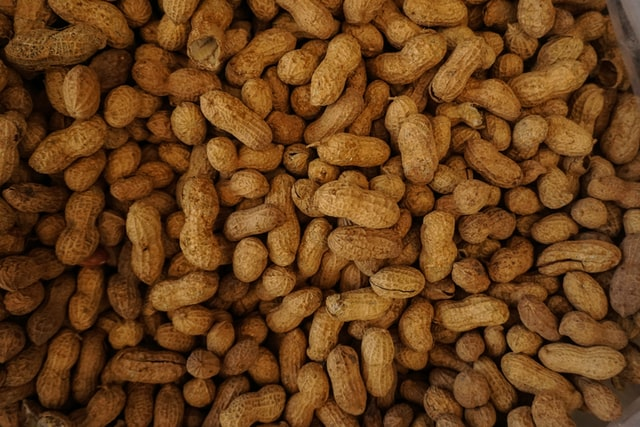

# Estimating sample sizes {#EstimatingSampleSize}


::: {.objectivesBox .objectives data-latex="{objectives}"}
So far,
you have learnt, among many other things, how to compute confidence intervals.

**In this chapter**,
you will learn how to compute the size sample that is needed
to produce a CI with a certain coverage.
You will learn to:

* estimate the sample size for producing a CI of given width for a **proportion**.
* estimate the sample size for producing a CI of given width for a **mean**.
:::


```{r echo=FALSE, fig.cap="", fig.align="center", fig.width=3, out.width="35%"}
SixSteps(5, "Estimating the sample size")
```


## Estimating sample size: General ideas {#SampleSizeIdeas}

A [confidence interval](AboutCIs) is an interval which gives a range of values of the population parameter that could plausibly have given rise to our observed value of the statistic.

All other things being equal, it makes sense that a *larger* sample size would give a more precise estimate. 
After all, that's why would like larger samples.

In general, *larger* samples produce more [*precise*](#PrecisionAccuracy) estimates of the parameter (Sect.&nbsp;\@ref(PrecisionAccuracy)), and hence narrower CIs.

If that was not the case, we could take the smallest possible sample of size one... which is clearly absurd.


::: {.importantBox .important data-latex="{important}"}
Remember that the sample size is the number of *units of analysis*.
:::

If larger samples give better estimates, it might appear that we should take the largest possible sample that we can.

But using large samples also have disadvantages: 

* Larger samples take longer to conduct.
* Larger samples can cost more money.
* Ethics\index{ethics} committees often wish to keep sample sizes as small as possible, so that:
  - As little (potential) harm as possible is done to the environment.
  - As little (potential) harm as possible is done to as few animals as possible. 
  - As little (potential) harm as possible is done to as few people as possible. 
  - Resources and time are not being wasted.

Determining what sample size to use is, therefore, a trade-off between cost, time, ethics and precision. 
If cost, time and ethics were not limiting factors, the largest possible sample could (and probably should) be used.

In addition, it sometimes is important to begin with a slightly larger sample than required to allow for drop-outs (for example, plants die, or people withdraw from the study).


::: {.example #Biochar}
Consider a project studying the residual effect of organic biochar compound fertilizers (BCFs) two years after application [@farrar2021biochar].

This study requires planting tumeric in pots using soil previously treated with BCFs.

After the turmeric was grown, the concentration of potassium, phosphorus and nitrogen--as well as many trace minerals--was determined from the soil in *every* pot.

In addition, *every* turmeric plant was analysed for the number of shoots, the leaf mass fraction, and foliar nutrient information.

Clearly, every pot that is used comes with a substantial cost, both in terms of time and money.
:::

In this chapter, we learn how to compute the (approximate) minimum sample size needed to obtain a given precision for a confidence interval.


## Estimating sample sizes: one proportion

For a given level of confidence,
the width of a CI depends on
the size of the sample.

All other things being equal,
*larger* samples produce 
more [*precise*](#PrecisionAccuracy) estimates of the parameter
(Sect.&nbsp;\@ref(PrecisionAccuracy)),
and hence *narrower* CIs.

Suppose we want our 95% CI for the proportion of smokers 
(Example \@ref(exm:NHANESSmokers))
to be
precise to give-or-take $0.01$ 
(rather than the $\pm 0.018$ found from the sample):
what size sample is needed?

Since we seek a *more* precise estimate, 
we'd expect to need a *larger* sample... 
but how much larger?

Conservatively,
the size of the [*simple random sample*](#SRS) needed **for a 95% CI** is *at least*

\[
   \frac{1}{(\text{Margin of error})^2}.
\]
That is,
a sample size of at least 
$\displaystyle \frac{1}{0.01^2} = 10\,000$ 
Americans is needed.


::: {.example #SampleSizep name="Sample size calculations for one proportion"}
To estimate the population proportion of Australians that smoke, 
to within $0.07$ with 95% confidence,
a sample size of at least
   
\[
  \frac{1}{(\text{Margin of error})^2} { = \frac{1}{0.07^2}}
\]
is needed;
*at least* $n = 204.0816$ people.

In practice,
*at least* 205 people are needed
to achieve this desired level of precision
(that is, **always round up** in sample size calulations).
:::


::: {.importantBox .important data-latex="{important}"}
Always **round up** the result of the sample size calculation.
:::


`r if (knitr::is_html_output()){
  'The following short video may help explain some of these concepts:'
}`

<div style="text-align:center;">
<iframe width="560" height="315" src="https://www.youtube.com/embed/-fflEggczG4" frameborder="0" allow="accelerometer; encrypted-media; gyroscope; picture-in-picture"></iframe>
<div style="text-align:center;">


## Estimating sample sizes: one mean {#SampleSizeOneMean}

As with proportions, estimating a population *mean* is more *precise* with a larger sample.

All other things being equal,
*larger* samples produce more [*precise*](#PrecisionAccuracy) estimates of the parameter (Sect.&nbsp;\@ref(PrecisionAccuracy)), and hence *narrower* CIs.

Conservatively,
the size of the [*simple random sample*](#SRS) needed **for a 95% CI** is *at least*

\[
   \left( \frac{2 \times s}{\text{Margin of error}}\right)^2.
\]

Notice that the formula requires an estimate of the population standard deviation (that is, the sample standard deviation, $s$).

But if we don't have a sample yet... how can we have a value for the *sample* standard deviation?
Sometimes, an approximate value for $s$ comes from:

* The results of a [pilot study](#protocols), where the computed value of $s$ is used.
* The results of a similar study, where the value $s$ found there can be used (see Example \@ref(exm:SampleSizePeanuts)).


::: {.importantBox .important data-latex="{important}"}
Always **round up** the results of a sample size calculation.
:::


<div style="float:right; width: 222x; border: 1px; padding:10px">

</div>


::: {.example #SampleSizePeanuts name="Sample size estimation for one mean"}
Sect. \@ref(Cadmium-In-Peanuts) discusses a study about the mean cadmium concentrations in peanuts in the United States.
They found that $s = 0.0460$&nbsp;ppm.

Suppose we wanted to estimate the mean cadmium concentration in *Australian* peanuts, to give-or-take $0.005$&nbsp;ppm with 95% confidence.
We could use this value for $s$ as a starting point, and then compute:

\[
   \left( \frac{2 \times 0.0460}{0.005}\right)^2 = 338.56;
\] 

we would need about 339 peanuts.
:::


<div style="float:right; width: 222x; border: 1px; padding:10px">

</div>


::: {.example #SampleSizepNHANES name="Sample size estimation (means)"}
What size sample is needed to estimate the direct HDL cholesterol levels for Australians,
to within 0.02&nbsp;mmol/L, with 95% confidence?

In the absence of any better data, we could use the value for $s$ from the NHANES study,
which studies Americans. 
The value of $s$ for Americans would likely to be reasonably similar to the value for Australians.

For this reason, we will use $s = 0.39926$ (from Sect. \@ref(OneMeanCINHANES)).

Also,
since we would like to estimate the population mean give-or-take 0.02&nbsp;mmol/L,
the 'margin of error'  is 0.02.

So, using $s = 0.39926$, the required sample size is *at least*
\[
   \left( \frac{2 \times 0.39926}{0.02}\right)^2 = 1594.085;
\] 
at least 1595 Australians are needed.
(Remember to always *round up* in sample size calculations.)
:::


## Other issues related to sample size {#SampleSizeOtherIssues}

The above calculations form just one part of the information needed to make the final decision about the necessary sample size.
For example, the *cost* (time and money) of taking sample of this size has not been factored in.

In addition, this calculation assumes a [*simple random sample*](#SRS) will be used,
which is usually unreasonable.

Other, far more complex, formulas are available for computing sample sizes for other random-sampling schemes (such as [stratified samples](#StratifiedSampling)).
However, 
the above calculations do give an *estimate* of the sample size that would be required.


::: {.example #SampleSizeParamed name="Sample size estimation (means)"}
@data:MacDonald:Resuscitation studied the time taken for paramedics to perform certain tasks (such as intravenous cannulation and electrical defibrillation).

To compute the necessary sample size,
they used a standard deviation of 0.2 minutes (based on data from previous similar studies) with a margin of error of 0.1 minutes (with 95% confidence).
The necessary sample size is

\[
   n = \left( \frac{2 \times s}
                   {\text{Margin of error}}
       \right)^2 
       = \left(\frac{2 \times 0.2}
              {0.1}
         \right)^2 
       = 16.
\]
A sample size of 16 paramedics was required (and used).
:::


## Quick review questions {#Chap26-QuickReview}

1. True or false: A *larger* sample size produces a *more* precise estimate of the parameter, all other things being equal.  
`r if( knitr::is_html_output() ) {torf(answer = TRUE )}`
1. True or false: A *larger* sample size produces a *more random* sample.  
`r if( knitr::is_html_output() ) {torf(answer = FALSE )}`
1. True or false: We should always take the *largest* possible sample size.  
`r if( knitr::is_html_output() ) {torf(answer = FALSE )}`


`r webexercises::hide()`
1. **TRUE**. The reason why larger sample are "better" is that they estimate the unknown population parameter with greater precision.
1. **FALSE**. The *size* of the sample, and *how* the sample was obtained, are two different issues.
1. **FALSE**. We also need to consider the cost (in terms of size and time) and ethical issues also.
`r webexercises::unhide()`

**Progress:** `r webexercises::total_correct()`


## Exercises {#EstimatingSampleSizeExercises}


Selected answers are available in
Sect.&nbsp;\@ref(EstimatingSampleSizeAnswer).


::: {.importantBox .important data-latex="{important}"}
Always **round up** the result of the sample size calculation.
:::


::: {.exercise #SampleSizeProp1}
Suppose we have a situation where we need to estimate a population *proportion* (with 95% confidence).

1. What size sample is needed to estimate the population proportion within 0.04?
1. What size sample is needed to estimate the population proportion within 0.02 (that is, the confidence interval will be *half* as wide as in the first calculation)?
1. What size sample is needed to estimate the population proportion within 0.01 (that is, the confidence interval will be *a quarter* as wide as in the first calculation)?
1. To get an estimate *half* as wide, how many *times* more units of analysis are needed?
1. To get an estimate *a quarter* as wide, how many *times* more units of analysis are needed?

:::


::: {.exercise #SampleSizePropEating}
Sect. \@ref(exr:CIOneProportionSnacking) discusses a study of the eating habits of university students in Canada
[@data:Mann12017:UniStudents].

In that study, they estimated the proportion of Canadian students that ate a sufficient number of servings of grains each day.

Suppose we wished to repeat the study but for *Australian* university students; that is, we seek an estimate of the 
population proportion of Australian students that ate a sufficient number of servings of grains each day (with 95% confidence).

1. What size sample would be needed if we wished to estimate the proportion to give-or-take 0.01? 
2. What size sample would be needed if we wished to estimate the proportion to give-or-take 0.02? 
3. What size sample would be needed if we wished to estimate the proportion to give-or-take 0.10?
4. Do you think this study would be costly, in terms of time and money?

:::


::: {.exercise #SampleSizeMeanLungCapacity}
In Exercise \@ref(exr:CIOneMeanLungCapacityInChildren),
a study by @data:Tager:FEV
was discussed that measured the lung capacity of 11-year-old girls in East Boston
(using the *forced expiratory volume* (FEV) of the children).

Suppose we wished to repeat the study, and find a 95% confidence interval for the mean FEV for 11-year-old *Australian* girls.

Since Australian and American children might be somewhat similar, 
we could use (as a first approximation) the standard deviation from that study:
$s = 0.43$ litres.

1. What size sample would be needed if we wished to estimate the mean to give-or-take 0.02 litres? 
2. What size sample would be needed if we wished to estimate the mean to give-or-take 0.05 litres? 
3. What size sample would be needed if we wished to estimate the mean to give-or-take 0.10 litres?
4. Suppose we wished to find 99% (not 95%) confidence interval for the mean FEV for 11-year-old *Australian* girls, to give-or-take 0.10 litres.
   Would this sample size be *larger* or *smaller* than the sample size found for a 95% confidence interval (also with give-or-take 0.10 litres)?
5. Do you think this study would be costly, in terms of time and money?

:::


