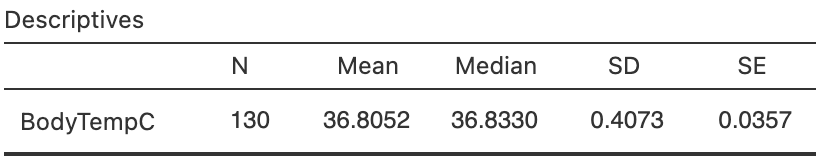

# Tests for one mean {#TestOneMean}


<!-- Introductions; easier to separate by format -->
```{r, child = if (knitr::is_html_output()) {'./introductions/29-Testing-OneMean-HTML.Rmd'} else {'./introductions/29-Testing-OneMean-LaTeX.Rmd'}}
```


## Introduction: body temperatures {#BodyTemperature}


```{r}
data(BodyTemp)
```


<div style="float:right; width: 222x; border: 1px; padding:10px">

</div>


The average internal body temperature is commonly believed to be $37.0^\circ\text{C}$ ($98.6^\circ$F).
This is based on data over 150 years old [@data:Wunderlich:BodyTemp].
More recently, researchers wanted to re-examine this claim [@data:mackowiak:bodytemp] to see if this benchmark is still appropriate. 
That is, a decision is sought about the value of the *population* mean body temperature $\mu$.
The value of $\mu$ will never be known: the internal body temperature of every person alive would need to be measured... and even those not yet born.

The parameter is $\mu$, the population mean internal body temperature (in ${}^\circ\text{C}$).
However, a *sample* of people can be taken to determine whether or not there is evidence that the *population* mean internal body temperature is still $37.0^\circ\text{C}$.

To make this decision, the [decision-making process](#DecisionMaking) (Sect. \@ref(DecisionMaking)) is used.
Begin by *assuming* that $\mu = 37.0$ (as there is no evidence that this accepted standard is wrong), and then determine if the evidence supports this claim or not.
The RQ could be stated as:

> Is the *population* mean internal body temperature $37.0^\circ\text{C}$?


## Statistical hypotheses and notation

The [decision making](#DecisionMaking) process begins by *assuming* that the population mean internal body temperature is $37.0^\circ\text{C}$.
Since the sample mean $\bar{x}$ is likely to be different for every sample even if $\mu = 37$ (*sampling variation*), the *sampling distribution* of $\bar{x}$ across all possible samples needs to be described.
Because every sample is different, $\bar{x}$ will vary, and the *sample* mean $\bar{x}$ probably won't be exactly $37.0^\circ\text{C}$, *even if* the population mean $\mu$ is $37.0^\circ\text{C}$.
Two broad reasons could explain why:

1. The *population* mean body temperature *is* $37.0^\circ\text{C}$,  but $\bar{x}$ isn't exactly $37.0$ due to sampling variation; 
   or
3. The *population* mean body temperature *is not* $37.0$, and the *sample* mean body temperature reflects this.

If $\mu$ is defined a the population mean body temperature (in $^\circ$C), then the hypotheses above are:

1. The *null hypothesis* ($H_0$): $\mu = 37.0^\circ\text{C}$; and
2. The *alternative hypothesis* ($H_1$): $\mu \ne 37.0^\circ\text{C}$.

The alternative hypothesis asks if $\mu$ is $37.0$ or some other value: the value of $\mu$ may be smaller or larger than $37.0$.
Two possibilities are considered: for this reason, this alternative hypothesis is called a *two-tailed* alternative hypothesis.


## Describing the sampling distribution

Data to answer this RQ are available from an American study [@data:Shoemaker1996:Temperature]
`r if (knitr::is_latex_output()) {
   '(Table\\ \\@ref(tab:DataBodyTemp)).'
} else {
   '(Fig.\\ \\@ref(fig:DataBodyTemp)).'
}`
Since the data are available, summarising the data is important (Fig.\ \@ref(fig:BodyTempHist)).
A numerical summary, from using jamovi (Fig.\ \@ref(fig:BodyTempjamovi)), shows that:

* the *sample* mean is $\bar{x} = 36.8052^\circ$C;
* the *sample* standard deviation is $s = 0.4073^\circ$C;
* the sample size is $n = 130$.

The sample mean $\bar{x}$ is *less* than the assumed value of  $\mu = 37$... but *why*?
Can the difference reasonably be explained by sampling variation, because every sample produces a different value of $\bar{x}$, or not?
The approximate $95$% CI for $\mu$ is from $36.73$ to $36.88$.
This CI is narrow, implying $\mu$ has been estimated with precision, so detecting even small deviations of $\mu$ from $37.0^\circ$ should be possible.


<!-- ```{r NotationOneMeanHT} -->

<!-- OneMeanNotation <- array( dim = c(4, 2)) -->

<!-- OneMeanNotation[1, ] <- c("Describe individual in the population", -->
<!--                           "Vary with mean $\\mu$ and standard deviation $\\sigma$") -->
<!-- OneMeanNotation[2, ] <- c("Describe individual in a sample", -->
<!--                           "Vary with mean $\\bar{x}$ and standard deviation $s$") -->
<!-- OneMeanNotation[3, ] <- c("Describe sample means ($\\bar{x}$)", -->
<!--                           "Vary with approx. normal distribution (under certain conditions):") -->
<!-- OneMeanNotation[4, ] <- c("across all possible samples", -->
<!--                           "sampling mean $\\mu$; standard deviation $\\text{s.e.}(\\bar{x})$") -->


<!-- if( knitr::is_latex_output() ) { -->
<!--   kable( OneMeanNotation, -->
<!--          format = "latex", -->
<!--          booktabs = TRUE, -->
<!--          longtable = FALSE, -->
<!--          escape = FALSE, -->
<!--          caption = "The notation used for describing means, and the sampling distribution of the sample means", -->
<!--          align = c("r", "l"), -->
<!--          linesep = c("\\addlinespace", -->
<!--                      "\\addlinespace", -->
<!--                      ""), -->
<!--          col.names = c("Quantity", -->
<!--                        "Description") ) %>% -->
<!-- 	row_spec(0, bold = TRUE) %>% -->
<!--   kable_styling(font_size = 10) -->
<!-- } else { -->
<!--   OneMeanNotation[3, 1] <- paste(OneMeanNotation[3, 1],  -->
<!--                                  OneMeanNotation[4, 1]) -->
<!--   OneMeanNotation[3, 2] <- paste(OneMeanNotation[3, 2],  -->
<!--                                  OneMeanNotation[4, 2]) -->
<!--   OneMeanNotation[4, ] <- NA -->

<!--     kable( OneMeanNotation, -->
<!--          format = "html", -->
<!--          booktabs = TRUE, -->
<!--          longtable = FALSE, -->
<!--          escape = FALSE, -->
<!--          caption = "The notation used for describing means, and the sampling distribution of the sample means", -->
<!--          align = c("r", "l"), -->
<!--          linesep = c("\\addlinespace", -->
<!--                      "\\addlinespace", -->
<!--                      ""), -->
<!--          col.names = c("Quantity", -->
<!--                        "Description") ) %>% -->
<!-- 	row_spec(0, bold = TRUE)  -->
<!-- } -->
<!-- ``` -->


\begin{figure}
\begin{minipage}{0.42\textwidth}
\captionof{table}{The body temperature data: The first ten of the 130 observations\label{tab:DataBodyTemp}}
\fontsize{10}{12}\selectfont
```{r}
if( knitr::is_latex_output() ) {
  
  BodyTdata <- array( dim = c(5, 2))
  BodyTdata[, 1] <- round(BodyTemp$BodyTempC[1:5],  2)
  BodyTdata[, 2] <- round(BodyTemp$BodyTempC[6:10],  2)
    
  kable( surroundMaths(BodyTdata,
                       decDigits = 2),
         format = "latex",
         booktabs = TRUE,
         longtable = FALSE,
         escape = FALSE,
         linesep = "",
         #caption = "The body temperature data: The lowest five and the highest five of the 130 observations",
         align = "c",
         table.env = "@empty") %>%
    row_spec(0, bold = TRUE) %>%
    add_header_above(header = c("Body temp (in degrees C)" = 2),
                     bold = TRUE)
  
}
```
\end{minipage}
\hspace{0.05\textwidth}
\begin{minipage}{0.51\textwidth}%
\centering
```{r, out.width='95%', fig.width=4.75, fig.height = 3}
hist( BodyTemp$BodyTempC,
	xlab = "Body temperature, in degrees C",
	ylab = "Frequency",
	las = 1,
	main = "",
	breaks = seq(35, 39, by = 0.25),
	col = plot.colour)
box()
```
\caption{The histogram of the body temperature data\label{fig:BodyTempHist}}
\end{minipage}
\end{figure}


```{r DataBodyTemp, fig.align="center", fig.cap="The body temperature data"}
if( knitr::is_html_output() ) {
  DT::datatable( BodyTemp,
                 #fillContainer=FALSE, # Make more room, so we don't just have ten values
                 #filter="top", 
                 #selection="multiple", 
                 #escape=FALSE,
                 options = list(searching = FALSE)) # Remove searching: See: https://stackoverflow.com/questions/35624413/remove-search-option-but-leave-search-columns-option
}
```

<!-- The figure for LaTeX is in the minipage (combined with data table), so only need show it for the HTML -->
`r if (knitr::is_latex_output()) '<!--'`
```{r BodyTempHist, fig.show="hold", fig.cap="The histogram of the body temperature data", fig.align="center", out.width="50%", fig.width=4}
hist( BodyTemp$BodyTempC,
	xlab = "Body temperature, in degrees C",
	ylab = "Frequency",
	las = 1,
	main = "",
	breaks = seq(35, 39, by = 0.25),
	col = plot.colour)
box()
```
`r if (knitr::is_latex_output()) '-->'`


```{r BodyTempjamovi, fig.cap="The jamovi summary of the body temperature data", fig.align="center", fig.height=3.0, out.width='65%'}

```


The sampling distribution of $\bar{x}$ was discussed in Sect.\ \@ref(SamplingDistSampleMean) (and Def.\ \@ref(def:DEFSamplingDistributionXbar) specifically).


::: {.definition #DEFSamplingDistributionXBar name="Sampling distribution of a sample mean"}
The *sampling distribution of the sample mean* is (when certain conditions are met; Sect.\ \@ref(ValiditySampleMeanTest)) described by

* an approximate normal distribution,
* centred around the sampling mean, whose value is $\mu$ (from $H_0$),
* with a standard deviation (called the *standard error* of $\bar{x}$) of  
\begin{equation}
   \text{s.e.}(\bar{x}) = \frac{s}{\sqrt{n}},
   (\#eq:StdErrorXbarTest)
\end{equation}
where $n$ is the size of the sample, and $s$ is the standard deviation of the data.
In general, the approximation gets better as the sample size gets larger.
:::


From this, if $\mu$ really was $37.0$, the possible values of the sample means across all possible samples can be described (if certain conditions are true; Sect.\ \@ref(ValiditySampleMeanTest)) using:

* An approximate normal distribution,
* With a sampling mean whose value is $\mu = 37.0$ (from $H_0$),
* With standard deviation of $\text{s.e.}(\bar{x}) = s/\sqrt{n} = 0.4073/\sqrt{130} = 0.0357$.
  This is the *standard error* of the sample means.


::: {.importantBox .important data-latex="{iconmonstr-warning-8-240.png}"}
The notation $\text{s.e.}(\bar{x})$ is the *standard error of the sample mean*, and denotes 'the standard deviation of the means computed from all the possible samples'.
:::


A picture of this sampling distribution (Fig.\ \@ref(fig:BodyTempSamplingDist)) shows *how the sample mean varies when $n = 130$ across all possible samples, simply due to sampling variation, when $\mu = 37$*.
This enables questions to be asked about the likely values of $\bar{x}$ that would be found in the sample, when the population mean is $\mu = 37$.


```{r BodyTempSamplingDist, fig.cap="The distribution of sample mean body temperatures, if the population mean is $37^\\circ$C and $n = 130$. The grey vertical lines are $1$, $2$ and $3$ standard deviations from the mean.", fig.align="center", fig.height=2.5, fig.width=9, out.width='90%'}
mn <- 37.0

# These taken from Shoemaker's JSE data file
s <- 0.40732
n <- 130

se <- s/sqrt(n)
par(mar = c(3, 0.5, 1, 0.5))

out <- plotNormal(mn, 
                  s / sqrt(n),
                  xlab = "Sample means from sample of size 130 (deg C)",
                  round.dec = 4,
                  ylim = c(0, 16.25),
                  cex.tickmarks = 0.9)

arrows(x0 = mn,
       x1 = mn,
       y0 = 14, 
       y1 = max(out$y),
       length = 0.1,
       angle = 15)
text(x = mn,
     y = 14,
     pos = 3,
     labels = expression(Sampling~mean~mu) )


arrows(x0 = mn,
       x1 = mn + se,
       y0 = 3, 
       y1 = 3,
       length = 0.1,
       code = 3, # Arrow both ends
       angle = 15)
text(x = mn + (se / 2),
     y = 3,
     #pos = 3,
     labels = expression( atop(Std.~error,
                               s.e.(bar(italic(x)))==0.0357)) )
```


::: {.thinkBox .think data-latex="{iconmonstr-light-bulb-2-240.png}"}
Given the sampling distribution (Fig.\ \@ref(fig:BodyTempSamplingDist)), use the [$68$--$95$--$99.7$ rule](#def:EmpiricalRule) to determine how often will $\bar{x}$ be *larger* than $37.0357^\circ$C due to sampling variation, if $\mu$ really is $37$.

`r if (knitr::is_latex_output()) '<!--'`
`r webexercises::hide()`
About $16$% of the time.
`r webexercises::unhide()`
`r if (knitr::is_latex_output()) '-->'`
:::


<iframe src="https://learningapps.org/watch?v=p28qr801322" style="border:0px;width:100%;height:600px" allowfullscreen="true" webkitallowfullscreen="true" mozallowfullscreen="true"></iframe>


## Computing the test statistic and $t$-scores {#Tscores}

The sampling distribution describes how the sample means varies; that is, what to *expect* from the sample means,  *assuming* $\mu = 37.0$.
The value of $\bar{x}$ that is *observed*, however, is $\bar{x} = 36.8052^\circ$C.
How likely is it that such a value could occur in our sample by chance (by sampling variation)?

The value of the observed sample mean can be located the picture of the sampling distribution (Fig.\ \@ref(fig:BodyTempSamplingDistT)).
The value $\bar{x} = 36.8052^\circ\text{C}$ is unusually small: a sample mean this low is very unlikely from a sample of $n = 130$ if $\mu$ really was $37$.
How many standard deviations is $\bar{x}$ away from $\mu = 37$?
A lot...


```{r BodyTempSamplingDistT, fig.cap="The sample mean of $\\bar{x} = 36.8041^\\circ$C is very unlikely to have been observed if the poulation mean really was $37^\\circ$C, and $n=130$. The standard deviation of this normal distribution is $\\text{s.e.}(\\bar{x}) = 0.035724$.", fig.align="center", fig.width=6, fig.height=2.75}
mn <- 37.0
#These taken from Shoemaker's JSE data file
s <- 0.40732
n <- 130
xbar <- 36.8

se <- s/sqrt(n)

z36 <- (36.8 - mn)/(s / sqrt(n))

 
out <- plotNormal(mn,
                  s / sqrt(n),
                  xlab = "Sample mean temperatures (in deg C)",
                  round.dec = 3,
                  showX = seq(-6, 3, by = 1) * s/sqrt(n) + mn,
                  xlim.hi = mn + 3.5 * se, 
                  xlim.lo = mn - 6.5 * se,
                  cex.tickmarks = 0.9)

arrows(xbar, 
       0.8 * max(out$y), 
       xbar, 
       0, 
       length = 0.15, 
       angle = 15)
text(xbar, 
     0.8 * max(out$y), 
     "36.8 deg.",
     pos = 4)
```

Relatively speaking, the *distance* that the observed sample mean (of $\bar{x} = 36.8052$) is from the mean of the sampling distribution (Fig.\ \@ref(fig:BodyTempSamplingDistT)) is found by computing *how many* standard deviations the value of $\bar{x}$ is from the mean of the distribution; that is, computing something like a $z$-score.

Figure\ \@ref(fig:BodyTempSamplingDistT) displays the values of $\bar{x}$ that could be expected if $\mu = 37$.
The number of standard deviations that $\bar{x} = 36.8052$ is from the mean is therefore  
\[
   \frac{36.8052 - 37.0}{0.035724} = -5.453.
\]
This value is *like* a $z$-score, but is actually called a $t$-score, since *the population standard deviation $\sigma$ is unknown* and we used the *sample* standard deviation to compute $\text{s.e.}(\bar{x})$.
Both $t$ and $z$ scores measure *the number of standard deviations that an observation is from the mean*.


::: {.tipBox .tip data-latex="{iconmonstr-info-6-240.png}"}
Like $z$-scores, $t$-scores measure the number of standard deviations that a value is from the mean.
When the value of interest is a sample statistic, both measure the number of *standard errors* that a *sample statistic* is from the mean.
The difference is that:

* $t$-scores use a standard error involving sample estimates (as in this chapter, where $s$ is used).
* $z$-scores use a standard error *not* involving any sample estimates (as with a test for proportions (Chap. \@ref(TestOneProportion)).

$t$-scores are commonly used.
Unless sample sizes are small, $z$-scores and $t$-scores are approximately the same.
:::


The calculation is therefore:  
\[
   t = \frac{36.8052 - 37.0}{0.035724} = -5.453;
\]
the observed sample mean is *more than five standard deviation below the population mean*, which is *highly* unusual based on the [$68$--$95$--$99.7$ rule](#def:EmpiricalRule) (Fig.\ \@ref(fig:BodyTempSamplingDistT)).

In general, a $t$-score in hypothesis testing is  
\begin{equation}
   t 
   = 
   \frac{\text{sample statistic} - \text{mean of the sample statistic}}
        {\text{standard error of the sample statistic}}
   =
   \frac{\bar{x} - \mu}{\text{s.e.}(\bar{x})}.
   (\#eq:tscore)
\end{equation}


<iframe src="https://learningapps.org/watch?v=pi8jnzhu322" style="border:0px;width:100%;height:500px" allowfullscreen="true" webkitallowfullscreen="true" mozallowfullscreen="true"></iframe>


## Determining $P$-values {#Pvalues}

As seen in Sect.\ \@ref(OnePropTestP), a $P$-value quantifies how unusual the computed $t$-score (or $z$-score) is, after assuming the null hypothesis is true.
The $P$-value can be *approximated*  (Sect.\ \@ref(ApproxP)) using the [$68$--$95$--$99.7$ rule](#def:EmpiricalRule) and a diagram, or using tables (`r if ( knitr::is_html_output()) { 'Appendix\\ \\@ref(ZTablesOnline).'} else {'Appendices\\ \\@ref(ZTablesNEG) and\\ \\@ref(ZTablesPOS)'}`).
Commonly, software is used for test involving one mean to compute the $P$-value (Sect.\ \@ref(SoftwareP)).


### Approximate $P$-values  {#ApproxP}

Since $t$-scores are similar to $z$-scores (when the sample size is not small), the ideas in Sect.\ \@ref(OnePropTestP) can be used to *approximate* a $P$-value for $t$-scores.
The [$68$--$95$--$99.7$ rule](#def:EmpiricalRule) and a diagram (Sect.\ \@ref(OnePropTestP6895997)) can be used in a similar way to *approximate* a $P$-value for a $t$-score.
In addition, tables of $z$-scores (`r if ( knitr::is_html_output()) { 'Appendix\\ \\@ref(ZTablesOnline).'} else {'Appendices\\ \\@ref(ZTablesNEG) and\\ \\@ref(ZTablesPOS)'}`) can be used to approximate the $P$-values for $t$-scores also (Sect.\ \@ref(OnePropTestPTables)).

Both methods produce approximate $P$-values (since they are based on using $z$-scores, not $t$-scores); usually, software is used to determine $P$-values for $t$-scores.


::: {.thinkBox .think data-latex="{iconmonstr-light-bulb-2-240.png}"}
What do you think the two-tailed $P$-value will be when $t = -5.45$ (Fig.\ \@ref(fig:BodyTempSamplingDistT))?

`r if (knitr::is_latex_output()) '<!--'`
`r webexercises::hide()`
Based on the [$68$--$95$--$99.7$ rule](#def:EmpiricalRule), the two-tailed $P$-value will be *extremely* small.
`r webexercises::unhide()`
`r if (knitr::is_latex_output()) '-->'`
:::


### Exact $P$-values using software {#SoftwareP}

Software computes the $t$-score and a precise $P$-value (Fig.\ \@ref(fig:BodyTempTestjamovi)).
The output (in jamovi, under the heading `p`) shows that the $P$-value is indeed very small: less than $0.001$ (written as $P < 0.001$, as jamovi reports).


::: {.tipBox .tip data-latex="{iconmonstr-info-6-240.png}"}
Some software reports a $P$-value of `0.000`, which really means (and we should write) $P < 0.001$: that is, the $P$-value is *smaller* than $0.001$.
:::


This $P$-value means that, assuming $\mu = 37.0$, observing a sample mean as low as $36.8052$ just through sampling variation (from a sample size of $n = 130$) is almost *impossible*.
And yet... we did.
Using the [decision-making process](#DecisionMaking), this implies that the initial assumption (the null hypothesis) is contradicted by the data: The evidence suggests that the *population* mean body temperature is *not* $37.0^\circ\text{C}$.


```{r BodyTempTestjamovi, fig.cap="jamovi output for conducting the $t$-test for the body temperature data", fig.align="center", out.width="65%"}
knitr::include_graphics("jamovi/BodyTemp/BodyTempTtest.png")
```


::: {.importantBox .important data-latex="{iconmonstr-warning-8-240.png}"}
For *one-tailed tests*, the $P$-value is *half* the value of the two-tailed $P$-value.
:::


::: {.softwareBox .software data-latex="{iconmonstr-laptop-4-240.png}"}
jamovi can produce one- or two-tailed $P$-values.
:::


### Making decisions with $P$-values

As seen in Sect.\ \@ref(OnePropTestDecisions), $P$-values measure the likelihood of observing the sample statistic (or something more extreme), based on the *assumption* about the population parameter being true.
In this context, the $P$-value tells us the likelihood of observing the value of $\bar{x}$ (or something more extreme), just through sampling variation if $\mu = 37$. 
For the body-temperature data then, where $P < 0.001$, the $P$-value is *very* small, so *very strong evidence* exists that the population mean body temperature is not $37.0^\circ\text{C}$.


## Writing conclusions

In general, communicating the results of any hypothesis test requires an *answer to the RQ*, a summary of the *evidence* used to reach that conclusion (such as the $t$-score and $P$-value---including if it is a one- or two-tailed $P$-value), and some *sample summary information* (including a CI).

So for the body-temperature example, write:

> The sample provides very strong evidence ($t = -5.45$; two-tailed $P<0.001$) that the population mean body temperature is *not* $37.0^\circ\text{C}$ ($\bar{x} = 36.81$; $n = 130$; 95% CI\ from 36.73$^\circ$C to 36.88$^\circ$C).

The components are:

* The *answer to the RQ*.
  The sample provides very strong evidence...  that the population mean body temperature is not $37.0^\circ\text{C}$.
  Since the alternative hypothesis was two-tailed, the conclusion is worded in terms of  the population mean body temperature *not* being $37.0^\circ\text{C}$.
* The *evidence* used to reach the conclusion: $t = -5.45$; two-tailed  $P < 0.001$.
* Some *sample summary information* (including a CI, using details in Chap.\ \@ref(OneMeanConfInterval)):  $\bar{x} = 36.81$; $n = 130$; $95$% CI from $36.73^\circ$C to $36.88^\circ$C.


::: {.importantBox .important data-latex="{iconmonstr-warning-8-240.png}"}
Since the *null* hypothesis is initially assumed to be true, the onus is on the evidence to refute the null hypothesis.  

Hence, conclusions are worded in terms of how strongly the evidence (i.e., sample data) support the alternative hypothesis. 

In fact,  the alternative hypothesis *may* or *may not* be true... but the evidence  (data) available here strongly supports the alternative hypothesis.
:::


## Summary {#TestSummary}

Let's recap the [decision-making process](#DecisionMaking), in this context about body temperatures:

* *Step 1: Assumption*: 
  Write the *null hypothesis* about the parameter (based on the RQ): $H_0$: $\mu = 37.0$. 
  In addition, write the *alternative hypothesis*: $H_1$: $\mu \ne 37.0$. 
  (This alternative hypothesis is two-tailed.)
* *Step 2: Expectation*: 
  The *sampling distribution* describes what to expect from the sample statistic *if* the null hypothesis is true: [under certain circumstances](#ValiditySampleMeanTest), the sample means will vary with an approximate normal distribution around a mean of $\mu = 37.0$  with a standard deviation of $\text{s.e.}(\bar{x}) = 0.03572$ (Fig.\ \@ref(fig:BodyTempSamplingDistT)).
* *Step 3: Observation*: 
  Compute the $t$-score: $t = -5.45$. 
  The $t$-score can be computed by software, or using the general equation, Eq.\ \@ref(eq:tscore).
* *Step 4: Consistency?*: 
  Determine if the data are *consistent* with the assumption, by computing the $P$-value.
  Here, the $P$-value is much smaller than $0.001$.
  The $P$-value can be computed by software, or approximated using the [$68$--$95$--$99.7$ rule](#def:EmpiricalRule).

The *conclusion* is that there is very strong evidence that $\mu$ is not $37.0$:


## Statistical validity conditions {#ValiditySampleMeanTest}

All hypothesis tests have underlying conditions  to be met so that the results are statistically valid; that is, the $P$-values can be found accurately because the sampling distribution is an approximate normal distribution.
For a hypothesis test for one mean, these conditions are the same as for the CI for one mean (Sect.\ \@ref(ValiditySampleMean)).

The test will be statistically valid if *one* of these is true:

1. The sample size is at least $25$, *or*
2. The sample size is smaller than $25$ *and* the *population* data has an approximate normal distribution.

The sample size of $25$ is a rough figure here, and some books give other values (such as $30$).

This condition ensures that the *distribution of the sample means has an approximate normal distribution* (so that, for example, the [$68$--$95$--$99.7$ rule](#def:EmpiricalRule) can be used).
Provided the sample size is larger than about $25$, this will be approximately true *even if* the distribution of the individuals in the population does not have a normal distribution.
That is, when $n > 25$ the sample means generally have an approximate normal distribution, even if the data themselves do not have a normal distribution.


::: {.example #StatisticalValidityTemps name="Statistical validity"}
The hypothesis test regarding body temperature is statistically valid since the sample size is large ($n = 130$).
Since the sample size is large, we *do not* require the data to come from a population with a normal distribution.
:::


::: {.example #OneTSpeedsValid name="Driving speeds"}
In Example\ \@ref(exm:OneTSpeeds) about mean driving speeds,
the sample size was $400$, much larger than $25$.
The test is statistically valid.
:::


## Example: student IQs {#IQstudents}

Standard IQ scores are designed to have a mean in the general population of $100$.
A study of $n = 224$ students at Griffith University [@reilly2022gender] found that the sample IQ scores were approximately normally distributed, with a mean of $111.19$ and a standard deviation of $14.21$. 
Is this evidence that students at Griffith University (GU) have a higher mean IQ than the general population?

The RQ is:

> For students at Griffith University, is the mean IQ higher than $100$?
  
The parameter is $\mu$, the population mean IQ for students at GU.
The statistical hypotheses about the parameters are, from the RQ:

- $H_0$: $\mu = 100$ (the population mean is $100$, but $\bar{x}$ is not $100$ due to sampling variation);
- $H_1$: $\mu > 100$ ($\mu$ is *greater than* $100$; GU students really do have a higher mean IQ than the general population).

This test is *one-tailed*: it only asks if the IQ of GU students is *greater* than $100$.
(Writing $H_0$: $\mu\le 100$ is also correct (and equivalent), though the test still proceeds just as if $\mu = 100$.)

We do not have the original data, but the summary data are sufficient: $\bar{x} = 111.19$ with a standard deviation of $s = 14.21$ from a sample of size $n = 224$. 
The *sample* mean is higher than $100$, but the sample mean varies for each sample.
The sample means vary with a normal distribution having a mean of $100$ and a standard deviation of  
\[
   \text{s.e.}(\bar{x}) = \frac{s}{\sqrt{n}} = \frac{14.21}{\sqrt{224}} = 0.9494456.
\]
The $t$-score is  
\[
   t = \frac{\bar{x} - \mu_{\bar{x}}}{\text{s.e.}(\bar{x})} = \frac{111.19 - 100}{0.9494456} = 11.78.
\]

This is a *huge* $t$-score, which means that a sample mean as large as $111.19$ would be highly unlikely to occur simply by sampling variation in a sample of size $n = 224$ if the population mean really was $100$.

Since the alternative hypothesis is *one-tailed*, and specifically asking if $\mu > 100$, the $P$-value is the area in just the right-side tail if the distribution (Fig.\ \@ref(fig:IQSamplingDistribution)).
The $P$-value will be extremely small.

   
```{r IQSamplingDistribution, fig.cap="The sampling distribution for the IQ data", fig.align="center", fig.width=10, fig.height=3, out.width='90%'}
mn.IQ <- 100
sd.IQ <- 14.21
sigma.IQ <- 15
n.IQ <- 100
se.IQ <- sd.IQ/sqrt(n.IQ)
xbar <- 111.19

z <- (xbar - mn.IQ)/se.IQ

out <- plotNormal(mn.IQ,
                  se.IQ, 
                  main = "The sampling distribution of the sample mean IQ",
                  xlab = "",
                  xlim.hi = 112,
                  las = 2,
                  ylim = c(0, 0.4),
                  round.dec = 2) 
# xlab, placed better
mtext(text = expression(Sample~mean~IQ),
      at = 107,
      side = 1,
      line = 1)
shadeNormal(out$x,
            out$y,
            lo = xbar,
            hi = 110,
            col = plot.colour)

arrows( x0 = xbar,
        x1 = xbar,
        y0 = 0.9 * max(out$y),
        y1 = 0,
        length = 0.1,
        angle = 15)
text( xbar, 
      0.9 * max(out$y), 
      expression( paste(bar(italic(x)) == "111.19")),
      pos = 3)

arrows(x0 = 101,
       x1 = 105,
       y0 = 0.30,
       y1 = 0.30,
       angle = 15,
       length = 0.1)
text(x = 103,
     y = 0.30,
     #pos = 1,
     labels = expression( atop(The~one*"-"*tailed~italic(P)*"-"*value~is~the,
                               area~"in"~this~tail~only)))


```


To conclude (where the CI is found using the ideas in Sect.\ \@ref(OneMeanCI)):

> Very strong evidence exists in the sample ($t = 11.78$; one-tailed $P < 0.001$) that the population mean IQ in students at Griffith University is greater than $100$ (mean $111.19$; $n = 224$; 95% CI from $109.29$ to $113.09$).

The test is about the *mean* IQ; many individual students may have IQs less than 100.
(*Note*: IQ scores do not have units of measurement.)

Since the sample size is much large than $25$, this conclusion is *statistically valid*.
The sample is not a true random sample from the population of all GU students (the students are mostly first-year students, and most were enrolled in an undergraduate psychological science degree). 
However, these students may be  somewhat representative of all GU student; that is, the sample *may* be externally valid.

The difference between the general population IQ of $100$ and the sample mean IQ of GU students is only small: about $11$ IQ units.
Possibly, this difference has very little practical significance, even though the statistical evidence suggests that the difference cannot be explained by chance.

IQ scores are designed to have a standard deviation of $\sigma = 15$ in the general population.
If we accept that this applies for university students too, the standard error becomes $\text{s.e.} = \sigma/\sqrt{n} = 15/\sqrt{130} = 1.0022$, and the test-statistic is  
\[
  z = \frac{\bar{x} - \mu}{\text{s.e.}(\bar{x})} = \frac{111.19 - 100}{1.0022} = 11.87;
\]
the conclusions do not change.


## Chapter summary {#Chap27-Summary}

To test a hypothesis about a population mean $\mu$:

* Initially **assume** the value of $\mu$ in the null hypothesis to be true.
* Then, describe the **sampling distribution**, which describes what to **expect**  from the sample mean based on this assumption: under certain statistical validity conditions, the sample mean varies with:
   *  an approximate normal distribution,
   *  with sampling mean whose value is the value $\mu$ (from $H_0$), and
   *  having a standard deviation of $\displaystyle \text{s.e.}(\bar{x}) =\frac{s}{\sqrt{n}}$.
* The **observations** are then summarised, and *test statistic* computed:

\[
   t = \frac{ \bar{x} - \mu}{\text{s.e.}(\bar{x})},
\]
where $\mu$ is the hypothesised value given in the null hypothesis.

* The $t$-value is like a $z$-score, and so an approximate **$P$-value** can be estimated using the [$68$--$95$--$99.7$ rule](#def:EmpiricalRule), or found using software.


`r if (knitr::is_html_output()){
  'The following short video may help explain some of these concepts:'
}`


<iframe width="560" height="315" src="https://www.youtube.com/embed/ZbJ58Ag22Mw" frameborder="0" allow="accelerometer; encrypted-media; gyroscope; picture-in-picture"></iframe>


## Quick review questions  {#Chap27-QuickReview}


::: {.webex-check .webex-box}
In traffic, the usual engineering recommendation is that the safe gap between travelling vehicles (called a 'headway') is *at least* $1.9$\ s (often conveniently rounded to $2$\ s in practice).
One study of $28$ streams of traffic in Birmingham, Alabama [@majeed2014field] found the mean headway was $1.1915$\ s, with a standard deviation of $0.231$\ s.
The researchers wanted to test if the mean headway in Birmingham was at least $1.9$\ s.

1. True or false? The test is *one-tailed*.\tightlist
`r if( knitr::is_html_output() ) {torf(answer=TRUE)}`
1. The standard error of the mean (to five decimal places) is
`r if( knitr::is_html_output() ) {fitb(num=TRUE, tol=0.00001, answer=0.04365)} else {"________________"}`
1. The null hypothesis is:
`r if( knitr::is_html_output() ) {longmcq( c(
  "The sample mean headway is 1.9s",
  "The sample mean is 1.1915s",
  answer = "The population mean is 1.9s",
  "The population mean is 1.1915s")  )} else {"________________"}`
1. The test statistic (to two decimal places) is
`r if( knitr::is_html_output() ) {fitb(num=TRUE, tol=0.01, answer=-16.23)} else {"________________"}`
1. The one-tailed $P$-value is
`r if( knitr::is_html_output() ) {mcq( c(
  answer = "Small",
  "Big",
  "0.05",
  "0.34")  )} else {"________________"}`
1. True or false? There is no evidence to accept the *alternative* hypothesis (that the mean headway is at least $1.9$\ s).
`r if( knitr::is_html_output() ) {torf(answer=TRUE)}`
:::


<!-- ::: {.webex-check .webex-box} -->
<!-- A study [@imtiaz2017assessment] compared the nutritional intake of $n = 50$ anaemic infants in Lahore (Pakistan) with the recommended daily intake (of 13g). -->
<!-- The mean daily protein intake in the sample was 14g, with a standard deviation of 3g. -->
<!-- The researchers wanted to see if the mean intake met (or exceeded) the recommendation, or not. -->
<!-- ::: -->


## Exercises {#TestOneMeanAnswerExercises}

Selected answers are available in Sect. \@ref(TestOneMeanAnswer).

::: {.exercise #TestOneMeanExercisesSleep}
A study of Taiwanese pre-school children [@lin2021sleep] compared their average sleep times to the recommendation (of *at least* $10$ hours per night).
The summary of the data for weekend sleep-times is shown in Table\ \@ref(tab:SleepingSummary), for both females and males.

On average, do female pre-school children get *at least* $10$ hours of sleep per night?
Do male preschool children?
:::

```{r SleepingSummary}
SleepArray <- array( dim = c(2, 3))

SleepArray[1, ] <- c(47,
                     8.50,
                     0.48)
SleepArray[2, ] <- c(39,
                     8.64,
                     0.37)

if( knitr::is_latex_output() ) {
  kable(pad(SleepArray,
            surroundMaths = TRUE,
            targetLength = c(2, 4, 4),
            digits = c(0, 2, 2)),
        format = "latex",
        align = "c",
        col.names = c("Sample size",
                      "Sample mean",
                      "Sample std. dev."),
        booktabs = TRUE,
        escape = FALSE,
        caption = "Summary information for the Taiwanese pre-schoolers sleep times (in hours)") %>%
    row_spec(0, bold = TRUE) %>% 
    kable_styling(font_size = 10)  
}
if( knitr::is_html_output() ) {
  kable(SleepArray,
        format = "html",
        col.names = c("Sample size",
                      "Sample mean",
                      "Sample std. dev."),
        booktabs = TRUE,
        caption = "Summary information for the Taiwanese pre-schoolers sleep times (in hours)") %>%
    row_spec(0, bold = TRUE)
}
```


::: {.exercise #TestOneMeanExercisesToothbrushing}
Most dental associations^[Such as the *American Dental Association* and the *Australian Dental Association*.] recommend brushing teeth for *at least* two minutes. 
A study [@data:Macgregor1979:BrushingDurationKids] of the brushing time for $85$ uninstructed school children from England ($11$ to $13$ years old) found the mean brushing time was $60.3$\ s, with a standard deviation of $23.8$\ s.

1. Is there evidence that the mean brushing time for schoolchildren from England is at least two minutes (as recommended)?
1. Sketch the sampling distribution of the sample mean.
:::


::: {.exercise #OneTSpeeds}
A study of driving speeds in Malaysia [@azwari2021evaluating] recorded the speeds of vehicles on various roads.
One RQ is whether the mean speed of cars on one road was the posted speed limit of $90$\ km.h^-1^, or whether it was *higher*.

The researchers recorded the speed of $n = 400$ vehicles on this road, and found the mean and standard deviation of the speeds of individual vehicles were $\bar{x} = 96.56$ and $s = 13.874$.

1. Define the parameter of interest.
2. Write the statistical hypotheses.
3. Compute the standard error of the sample mean.
4. Compute the test statistic, a $t$-score.
5. Determine the $P$-value.
6. Write a conclusion.
:::


::: {.exercise #TestOneMeanExercisesAutomatedVehicles}
A study [@data:greenlee2018:vehicles] of human-automation interaction with automated vehicles aimed to (p. 465):

> ... determine whether monitoring the roadway for hazards during automated driving results in a vigilance decrement [i.e., a vigilance reduction].

That is, they were interested in whether the average mental demand of 'drivers' of automated vehicles was *higher* than the average mental demand for ordinary tasks.

In the study, the $n = 22$ participants 'drove' (in a simulator) an automated vehicle for $40$\ mins. 
While driving, the drivers monitored the road for hazards.
The researchers assessed the 'mental demand' placed on these drivers, where scores of $50$ over 'typically indicate substantial levels of workload' (p. 471).
For the sample, the mean score was $84.00$ with a standard deviation of $22.05$.

Is there evidence of a 'substantial workload' associated with monitoring roadways while 'driving' automated vehicles?
:::


::: {.exercise #TestOneMeanExercisesQualityOfLife}
A study explored the quality of life of patients receiving cavopulmonary shunts [@data:Steele2016:Shunt].
'Quality of life' was assessed using a $36$-question health survey, where the scale is standardised so that the mean of the general population is $50$.

For the $14$ patients in the study, the sample mean for the 'Physical component' of the survey was $47.2$ (with a standard deviation of $8.2$).
The sample mean for the 'Mental component' of the survey was $52.7$ (with a standard deviation of $5.6$).

Is there evidence that the patients are different, on average, to the general population on the basis of the results?
:::


::: {.exercise #TestOneMeanExercisesCherryRipes}
A *Cherry Ripe* is a popular chocolate bar in Australia.
In 2017, 2018 and 2019, I sampled some *Cherry Ripe* Fun Size bars.
The packaging claimed that the Fun Size bars weigh $14$\ g (on average).
Use the jamovi summary of the data (Fig.\ \@ref(fig:CherryRipes201720182019)) to perform a hypothesis test to determine if the mean weight really is $14$\ g or not.
:::


```{r CherryRipes201720182019, fig.cap="jamovi output for the Cherry Ripes data", fig.align="center", out.width="70%"}
knitr::include_graphics( "jamovi/CherryRipe/CherryRipe-Descriptives.png")
```

::: {.exercise #TestOneMeanBloodLoss}
(This study was also seen in Exercise\ \@ref(exr:CIOneMeanBloodLoss).)
A study of paramedics [@data:Williams2007:BloodLoss] asked participants ($n = 199$) to estimate the amount of blood on four different surfaces.
When the actual amount of blood spilt on concrete was $1000$\ ml, the mean guess was $846.4$\ ml (with a standard deviation of $651.1$\ ml).

Is there evidence that the mean guess really is $1000$\ ml (the true amount)?
Is this test likely to be valid?
:::

```{r}
QC <- structure(list(High1 = c(61.63, 63.11, 66.88, 62.56, 66.12, 65.34, 
64.83, 64.22, 65.54, 65.33, 67.83, 65.97, 65.01, 64.51, 64.3, 
64.38, 64.75, 63.12, 62.93, 63.59, 67.04, 64.38, 63.41, 64.19, 
64.86, 63.7, 63.14, 66, 63.43, 64.25, 63.67, 64.78, 58.02, 63.46, 
65.2, 63.74), Mid1 = c(18.36, 18.77, 18.98, 17.97, 19.69, 19.63, 
19.5, 19.39, 19.87, 19.66, 20.41, 18.37, 19.09, 18.98, 19.22, 
18.99, 19.58, 19.7, 19, 19.11, 19.97, 19.52, 19.39, 17.2, 19.75, 
19.35, 19.95, 19.38, 19.33, 19, 19.05, 19.24, 19.29, 19.29, 19.18, 
19.35), High2 = c(62.64, 64.36, 66.06, 65.39, 66.85, 65.56, 66.6, 
66.9, 65.5, 65.92, 65.51, 65.03, 64.22, 64.19, 64.95, 64.95, 
64.45, 64.77, 65.58, 64.87, 63.52, 65.02, 66.05, 63.82, 64.58, 
65.09, 64.86, 64.85, 66.75, 65.37, 64.29, 65.5, 62.85, 64, 63.72, 
64.3), Mid2 = c(19.12, 19.07, 19.58, 19.35, 19.65, 19.13, 19.55, 
19.85, 19.45, 19.87, 19.73, 19.6, 20.76, 18.98, 19.93, 19.15, 
19.23, 19.2, 19.52, 19.38, 19.08, 18.89, 19.57, 19.35, 19.13, 
19.44, 19.27, 19.58, 19.71, 19.64, 19.14, 19.28, 19.68, 18.27, 
18.75, 19.57)), .Names = c("High1", "Mid1", "High2", "Mid2"), class = "data.frame", row.names = c(NA, 
-36L))

DataAndTargets <- array(dim = c(3, 4))
DataAndTargets[1, ]<- c(64.31, 19.24, 64.97, 19.40)
DataAndTargets[2, ]<- c(1.700, 0.588, 1.029, 0.413)
DataAndTargets[3, ]<- c(64.22, 19.01, 65.05, 19.45)

rownames(DataAndTargets) <- c("Mean of data", 
                              "Std. dev. of data", 
                              "Pre-determined target")
colnames(DataAndTargets) <- c("High level", 
                              "Mid level", 
                              "High level", 
                              "Mid level")
```

::: {.exercise #TestOneMeanQualityControl}
A quality-control study [@feng2017application] assessed the accuracy of two instruments from a clinical laboratory, by comparing the reported luteotropichormone (LH) concentrations to known pre-determined values (Table\ \@ref(tab:QualityControlDataSummary)).

Perform a series of tests to determine how well the two instruments perform, for both high- and mid-level LH concentrations (from the data in
`r if (knitr::is_latex_output()) {
   'Table \\@ref(tab:QualityControlData)).'
} else {
   'below.'
}`

:::


```{r QualityControlData}
if( knitr::is_latex_output() ) {
  
  T1info <- rbind( head(QC[1:2], 5),
                   c("$\\vdots$", "$\\vdots$") )
  
  T1 <- kable( pad(T1info,
                   surroundMaths = TRUE,
                   targetLength = c(4, 4),
                   digits = c(2, 2)),
        format = "latex",
        align = "c",
        escape = FALSE,
        linesep = "",
        col.names = c("High level", 
                      "Mid level"),
        booktabs = TRUE,
        longtable = FALSE) %>%
    row_spec(row = 0,
             bold = TRUE) %>%
    add_header_above(header = c("Instrument 1" = 2), 
                   bold = TRUE, 
                   align = "c")

  T2info <- rbind( head(QC[, 3:4], 5),
                   c("$\\vdots$", "$\\vdots$") )
    
    T2 <- kable( pad(T2info,
                   surroundMaths = TRUE,
                   targetLength = c(4, 4),
                   digits = c(2, 2)),
        format = "latex",
        align = "c",
        linesep = "",
        col.names = c("High level", 
                      "Mid level"),
        booktabs = TRUE,
        escape = FALSE,
        longtable = FALSE) %>%
    add_header_above(header = c("Instrument 2" = 2), 
                   bold = TRUE, 
                   align = "c") %>%
    row_spec(row = 0,
             bold = TRUE)

  out <- knitr::kables(list(T1, T2),
                       format = "latex",
                       label = "QualityControlData",
                       caption = "The quality-control data: LH levels (in mIU/mL) for two instruments (only the first five observations shown)") %>% 
    kable_styling(font_size = 10)
  
  prepareSideBySideTable(out)

} 

if( knitr::is_html_output() ) {
  DT::datatable(QC,
               caption = "The quality-control data: LH levels (in mIU/mL) for two instruments",
               colnames = colnames(DataAndTargets),
               options = list(searching = FALSE), # Remove searching: See: https://stackoverflow.com/questions/35624413/remove-search-option-but-leave-search-columns-option
               filter = "none")
}
```


```{r QualityControlDataSummary}
if( knitr::is_latex_output() ) {
  kable( pad(DataAndTargets,
             surroundMaths = TRUE,
             targetLength = 6,
             digits = c(3, 3, 3, 3) ),
        format = "latex",
        caption = "Summary of the quality-control data for LH levels (in mIU/mL) for two instruments",
        booktabs = TRUE,
        align = "c",
        #align = c("p{17mm}", "p{17mm}","p{17mm}","p{17mm}"),
        escape = FALSE,
        longtable = FALSE) %>%
    row_spec(row = 0,  
             bold = TRUE) %>%
    row_spec(row = 3,  
             italic = TRUE) %>%
    kable_styling(font_size = 10) %>%
    add_header_above(header = c("", 
                                "Instrument 1" = 2, 
                                "Instrument 2" = 2), 
                   bold = TRUE, 
                   align = "c")
}
if( knitr::is_html_output() ) {
  kable(DataAndTargets,
        format = "html",
        caption = "Summary of the quality-control data for LH levels (in mIU/mL) for two instruments",
        booktabs = TRUE,
        align = "r",
        longtable = FALSE)
}
```


<!-- QUICK REVIEW ANSWERS -->
`r if (knitr::is_html_output()) '<!--'`
::: {.EOCanswerBox .EOCanswer data-latex="{iconmonstr-check-mark-14-240.png}"}
\textbf{Answers to \textit{Quick Revision} questions:}
**1.** True.
**2.** $0.0436$.
**3** The population mean headway is $1.9$\ s.
**4.** $0.34$.
**5.** Big
**7.** There is \emph{no evidence} to support the alternative hypothesis.
:::
`r if (knitr::is_html_output()) '-->'`

