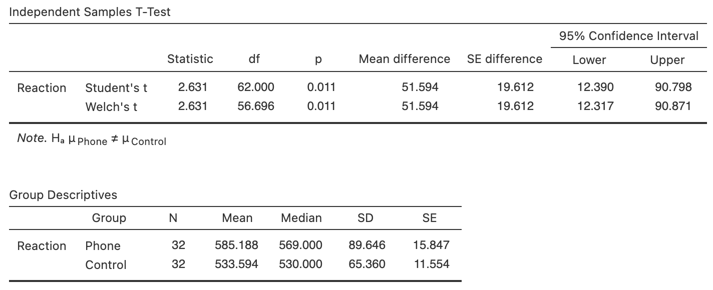

# CIs for comparing two independent means {#CITwoMeans}


```{r, child = if (knitr::is_html_output()) {'introductions/27-CIs-TwoMeans-HTML.Rmd'} else {'introductions/27-CIs-TwoMeans-LaTeX.Rmd'}}
```


<!-- Define colours as appropriate -->
```{r, child = if (knitr::is_html_output()) {'./children/coloursHTML.Rmd'} else {'./children/coloursLaTeX.Rmd'}}
```


##  Introduction: reaction times {#MeansIndSamples}


@data:Strayer2001:phones examined the reaction times of students (from the University of Utah) while driving [@agresti2007statistics].
In one study, students were randomly allocated to one of two groups: one group *using* a mobile phone while driving, and one group *not using* a mobile phone while driving.
This is a *between-individuals* comparison, since different students are in each group.
The reaction time for each student was measured in a driving simulator.
(The study would be paired if *each* student's reaction time was measured twice: once using a phone, and once without using a phone.)


<div style="float:right; width: 222x; border: 1px; padding:10px">

</div>


Consider this RQ:

> For students, what is the difference between the mean reaction time while driving when using a mobile phone and when *not* using a mobile phone?


The data are shown
`r if ( knitr::is_html_output()) { 
  'below.'
} else {
  'in Table\\ \\@ref(tab:PhoneDataTable).'
}
`


```{r PhoneDataTable}
data(ReactionTime)

if( knitr::is_latex_output() ) {
  tb1 <- cbind( ReactionTime$Reaction[ReactionTime$Group == "Phone"][1:5],
                ReactionTime$Reaction[ReactionTime$Group == "Phone"][6:10],
                ReactionTime$Reaction[ReactionTime$Group == "Phone"][11:15],
                ReactionTime$Reaction[ReactionTime$Group == "Phone"][16:20],
                ReactionTime$Reaction[ReactionTime$Group == "Phone"][21:25],
                ReactionTime$Reaction[ReactionTime$Group == "Phone"][26:30],
                c(ReactionTime$Reaction[ReactionTime$Group == "Phone"][31:32], NA, NA, NA) )
  
  T1 <- knitr::kable( pad(tb1,
                          surroundMaths = TRUE,
                          targetLength = rep(3, 7),
                          digits = 0),
                      format = "latex",
                      #col.names = c("Using phone",
                      #              "Not using phone"),
                      valign = 't',
                      align = c("c", "c"),
                      #table.env = "@empty",
                      linesep = "",
                      row.names = FALSE,
                      escape = FALSE,
                      booktabs = TRUE) %>%
    row_spec(0, bold = TRUE) %>%
    add_header_above( c("Using phone" = 7),
                      bold = TRUE)

  tb2 <- cbind( ReactionTime$Reaction[ReactionTime$Group == "Control"][1:5],
                ReactionTime$Reaction[ReactionTime$Group == "Control"][6:10], 
                ReactionTime$Reaction[ReactionTime$Group == "Control"][11:15], 
                ReactionTime$Reaction[ReactionTime$Group == "Control"][16:20], 
                ReactionTime$Reaction[ReactionTime$Group == "Control"][21:25], 
                ReactionTime$Reaction[ReactionTime$Group == "Control"][26:30], 
                c(ReactionTime$Reaction[ReactionTime$Group == "Control"][31:32], NA, NA, NA))
  T2 <- knitr::kable( pad(tb2,
                          surroundMaths = TRUE,
                          targetLength = rep(3, 7),
                          digits = 0),
                      format = "latex",
                      #col.names = c("Using phone",
                      #              "Not using phone"),
                      align = c("c", "c"),
                      valign = 't',
                      #table.env = "@empty",
                      linesep = "",
                      row.names = FALSE,
                      escape = FALSE,
                      booktabs = TRUE) %>%
    row_spec(0, bold = TRUE) %>%
    add_header_above( c("Not using phone" = 7),
                      bold = TRUE)
  
  out <- knitr::kables(list(T1, T2),
                       format = "latex",
                       label = "PhoneDataTable",
                       caption = "Reaction times (in milliseconds) for students using, and not using, mobile phones.") %>% 
    kable_styling(font_size = 8)
  out2 <- prepareSideBySideTable(out)
  out2
} 

if( knitr::is_html_output() ) {
  RT.DataTableHTML <- cbind( "Use phone" = ReactionTime$Reaction[ReactionTime$Group == "Phone"], 
                           "Not using phone" = ReactionTime$Reaction[ReactionTime$Group == "Control"])

  DT::datatable(RT.DataTableHTML,
               fillContainer = FALSE, # Make more room, so we don't just have ten values
               colnames = c("Using phone", 
                            "Not using phone"),
               filter = "none",
               options = list(searching = FALSE), # Remove searching: See: https://stackoverflow.com/questions/35624413/remove-search-option-but-leave-search-columns-option
               caption = "Reaction times (in milliseconds) for students using, and not using, mobile phones.")
}
```

```{r}
Phone.DataSummary <- Phone.DataSummary.rnd <- array(NA, 
                                                    dim = c(3, 4) )

Phone.DataSummary[1:2, 1] <- aggregate( Reaction ~ Group, 
                                        data = ReactionTime, 
                                        FUN = "mean")[, 2]
Phone.DataSummary[1:2, 2] <- aggregate( Reaction ~ Group, 
                                        data = ReactionTime, 
                                        FUN = "length")[, 2] 
Phone.DataSummary[1:2, 3] <- aggregate( Reaction ~ Group, 
                                        data = ReactionTime, 
                                        FUN = "sd")[, 2]
Phone.DataSummary[1:2, 4] <- aggregate( Reaction ~ Group, 
                                        data = ReactionTime, 
                                        FUN = function(x){ sd(x)/sqrt(length(x))})[, 2] 

Phone.DataSummary[3, 1] <- Phone.DataSummary[2, 1] - Phone.DataSummary[1, 1]
Phone.DataSummary[3, 4] <- sqrt( Phone.DataSummary[1, 3]^2/Phone.DataSummary[1, 2] +
                                 Phone.DataSummary[2, 3]^2/Phone.DataSummary[2, 2]  )
rownames(Phone.DataSummary) <- c("Using phone", 
                                 "Not using phone", 
                                 "Differences")
```


## Notation {#TwoMeansNotationCI}

Since two groups are being compared, the two groups are distinguished using subscripts (Table\ \@ref(tab:IndSampleNotation)).
For the reaction-time data, we use the subscript $P$ for the **p**hone-users group, and $C$ for the **c**ontrol (non-phone users) group.

Using this notation, the difference between population means (the parameter) is $\mu_P - \mu_C$.
Since the population mean are unknown, this parameter is estimated using the statistic $\bar{x}_P - \bar{x}_C$.
The differences could be computed in the opposite direction ($\bar{x}_C - \bar{x}_P$).
However, computing differences as the reaction time for phone users, *minus*  the reaction time for non-phone users (controls) probably makes more sense: the differences then refer to the increase in the average reaction times when students are using phones.


::: {.tipBox .tip data-latex="{iconmonstr-info-6-240.png}"}
Be clear about how differences are defined!
The differences could be computed as:
  
* the reaction time for phone users, *minus* the reaction time for non-phone users;
  this measures how much faster the reaction times is for *non-phone users*, on average; or
* the reaction time for non-phone users, *minus* the reaction time for phone users;
  this measures much faster the reaction times is for *phone users*, on average.

Either is fine, provided you are *consistent*, and *clear* about how the difference are computed.
The *meaning* of any conclusions will be the same.
:::


```{r IndSampleNotation}
Diff2Notation <- array(dim = c(5, 3))
colnames(Diff2Notation) <- c(	"Group $P$", 
                              "Group $C$",
                              "($P - C$)")
rownames(Diff2Notation) <- c(	"Population means:",
								              "Sample means:",
								              "Standard deviations:",
								              "Sample sizes:",
								              "Standard errors:")


if( knitr::is_latex_output() ) {
  Diff2Notation[1, ] <- c( "$\\mu_P$", 	
                           "$\\mu_C$",
                           "$\\mu_P - \\mu_C$")
  Diff2Notation[2, ] <- c( "$\\bar{x}_P$",		
                           "$\\bar{x}_C$",
                           "$\\bar{x}_P - \\bar{x}_C$")
  Diff2Notation[3, ] <- c( "$s_P$", 			
                           "$s_C$",
                           NA)
  Diff2Notation[4, ] <- c( "$n_P$",
  							           "$n_C$",
  							           NA)
  Diff2Notation[5, ] <- c( "$\\displaystyle\\text{s.e.}(\\bar{x}_P) = \\frac{s_P}{\\sqrt{n_P}}$",
  							           "$\\displaystyle\\text{s.e.}(\\bar{x}_C) = \\frac{s_C}{\\sqrt{n_C}}$",
  							           "$\\displaystyle\\text{s.e.}(\\bar{x}_P - \\bar{x}_C)$")

  kable( Diff2Notation,
         format = "latex",
         booktabs = TRUE,
         align = c("c", "c", "c"),
         longtable = FALSE,
         escape = FALSE,
         col.names = colnames(Diff2Notation),
         caption = "Notation used to distinguish between the two independent groups using subscripts. Any two different subscripts can be used for the two groups.") %>%
    row_spec(0, bold = TRUE) %>%
    kable_styling(font_size = 8) %>%
  add_header_above( c(" " = 1,
                      "Phone users" = 1,
                      "Non-phone users" = 1, 
                      "Difference:" = 1),
                    line = FALSE,
                    bold = TRUE)
  }
if( knitr::is_html_output() ) {

  Diff2Notation[1, ] <- c( "$\\mu_P$", 	
                           "$\\mu_C$",
                           "$\\mu_P - \\mu_C$")
  Diff2Notation[2, ] <- c( "$\\bar{x}_P$",		
                           "$\\bar{x}_C$",
                           "$\\bar{x}_P - \\bar{x}_C$")
  Diff2Notation[3, ] <- c( "$s_P$", 			
                           "$s_C$",
                           NA)
  Diff2Notation[4, ] <- c( "$n_P$",
  							           "$n_C$",
  							           NA)
  Diff2Notation[5, ] <- c( "$\\displaystyle\\text{s.e.}(\\bar{x}_P) = \\frac{s_P}{\\sqrt{n_P}}$",
  							           "$\\displaystyle\\text{s.e.}(\\bar{x}_C) = \\frac{s_C}{\\sqrt{n_C}}$",
  							           "$\\displaystyle\\text{s.e.}(\\bar{x}_P - \\bar{x}_C)$")

  kable( Diff2Notation,
         format = "html",
         booktabs = TRUE,
         longtable = FALSE,
         align = c("c", "c", "c"),
         col.names = colnames(Diff2Notation),
         caption = "Notation used to distinguish between the two independent groups. Any two subscripts can be used. No formula is given for computing $\\displaystyle\\text{s.e.}(\\bar{x}_P - \\bar{x}_C)$") %>%
    row_spec(0, bold = TRUE) 
}
```


Table\ \@ref(tab:IndSampleNotation) does not include a standard deviation or a sample size for the *difference between means*.
These make no sense in this context: no set of data exists for which a standard deviation or sample size can be found.
For example, Group\ $P$ has $32$ individuals, and Group\ $C$ has $32$ individuals, but the sample size for the *difference* is not $32 - 32 = 0$; there are just two samples of given sizes.
However, the *standard error* of the difference between the means does make sense, as the value of  $\bar{x}_P - \bar{x}_C$ varies across all possible samples.


## Summarising data {#SummarisingTwomeansCI}

A suitable graphical summary of the data is a boxplot (Fig.\ \@ref(fig:PhonePlots), left panel), which shows that the *sample* medians are slightly different, and the IQRs slightly smaller, for the phone-using group.
One large outlier\index{Outliers} is present for the phone-using group. 


```{r PhonePlots, fig.width=9, fig.height=3.5, out.width='95%', fig.align="center", fig.cap="Left: boxplot of the two groups in the reaction-time data. Right: error bar chart comparing the mean reaction time for students not using a mobile phone (control), and using a mobile phone. The vertical scale is different for the two graphs."}
par(mfrow = c(1, 2))

boxplot(ReactionTime$Reaction ~ ReactionTime$Group,
        col = plot.colour,
        las = 1,
        ylim = c(400, 1000),
        main = "Reaction times: when using and\nnot using a phone",
        ylab = "Reaction time (in ms)",
        xlab = "Group")


##

ci.lo <- Phone.DataSummary[, 1] - 2 * Phone.DataSummary[, 4] 
ci.hi <- Phone.DataSummary[, 1] + 2 * Phone.DataSummary[, 4] 

plot( range( c( ci.lo, ci.hi) ) ~ c(0.9, 2.1), 
      data = ReactionTime,
      type = "n",
      xlim = c(0.5, 2.5),
      ylim = c(500, 650),
      pch = 19,
      axes = FALSE,
      main = "Error bars chart:\n reaction times",
      xlab = "Group", 
      ylab = "Reaction times (in ms)",
      sub = "(Error bars are 95% confidence intervals)",
      las = 1)
axis(side = 1, 
     at = 1:2, 
     labels = levels(factor(ReactionTime$Group)), 
     las = 1) 
axis(side = 2, 
     las = 1)
box()

mns <- Phone.DataSummary[1:2, 1]

points( mns ~ c(1:2), 
        pch = 19)

arrows(x0 = 1:2, 
       y0 = ci.lo[1:2], 
       x1 = 1:2, 
       y1 = ci.hi[1:2], 
  length = 0.05, 
  angle = 90, 
  code = 3)
```


The numerical summary of the data should summarise both groups (i.e., the first two rows of Table\ \@ref(tab:PhoneNumerical))
The *differences between the means* is crucial (i.e., the third row), since the RQ is about this difference.
The information can be found using software\index{jamovi output!comparing two means} (Fig.\ \@ref(fig:ReactionPhoneSummaryjamovi)).


```{r ReactionPhoneSummaryjamovi, fig.cap="Software output for the phone reaction time data", fig.align="center", out.width='100%'}

```


```{r PhoneNumerical}
Phone.DataSummary.rnd[, 1] <- round( Phone.DataSummary[, 1], 2)
Phone.DataSummary.rnd[, 2] <- round( Phone.DataSummary[, 2], 0)
Phone.DataSummary.rnd[, 3] <- round( Phone.DataSummary[, 3], 2)
Phone.DataSummary.rnd[, 4] <- round( Phone.DataSummary[, 4], 3)
  
Phone.DataSummary2 <- array( dim = c(3, 4), 
                             data = Phone.DataSummary.rnd)
Phone.DataSummary2[3, 2] <- NA
Phone.DataSummary2[3, 3] <- NA
rownames(Phone.DataSummary2) <- c("Not using phone", 
                                  "Using phone", 
                                  "Difference")


if( knitr::is_latex_output() ) {
  kable(pad(Phone.DataSummary2,
            surroundMaths = TRUE,
            targetLength = c(6, 2, 5, 6),
            digits = c(2, 0, 2, 3)),
        format = "latex",
        booktabs = TRUE,
        longtable = FALSE,
        escape = FALSE,
        #table.envir = "@empty", # So works in two columns: Not font change or two cols fails also
       align = c("r", "c", "c", "c", "c"),
#      digits=c(2, 0, 2, 3),
        col.names = c("Mean", 
                      "Sample size", 
                      "Standard deviation", 
                      "Standard error"),
    caption = "The mean, median, standard deviation and standard error for the reaction-time data (in ms)") %>%
		row_spec(0, bold = TRUE)  %>%
    row_spec(3, italic = TRUE) %>%
    column_spec(3, width = "15mm") %>%
    column_spec(4, width = "18mm") %>%
    column_spec(5, width = "15mm") %>%
    kable_styling(font_size = 8)
}
if( knitr::is_html_output() ) {
kable(pad(Phone.DataSummary2,
            surroundMaths = TRUE,
            targetLength = c(6, 2, 5, 6),
            digits = c(2, 0, 2, 3)),
      format = "html",
      booktabs = TRUE,
      longtable = FALSE,
      align = "c",
      col.names = c("Mean", 
                    "Sample size", 
                    "Standard dev", 
                    "Standard error"),
      digits = 2,
      caption = "The mean, median, standard deviation and standard error for the reaction-time data (in ms)")
}

```


<!-- ```{r ReactionPhoneSummarySPSS, fig.cap="SPSS output for the phone reaction time data", fig.align="center", out.width='100%'} -->
<!-- knitr::include_graphics( "SPSS/ReactionPhone/ReactionPhone-Test.png") -->
<!-- ``` -->


<!-- ```{r, out.width=c('100%'), fig.height=2.75, fig.width=7, fig.cap="The phone reaction-time data: a graphical summary (left) and numerical summary (right)"} -->
<!-- library(gridExtra) -->

<!-- # Create a table plot -->
<!-- # Set theme to allow for plotmath expressions -->
<!-- tt <- ttheme_minimal(base_size = 11)#colhead = list(fg_params = list(parse = TRUE, -->
<!--                        #                               fontface = "bold")), -->
<!--                      #base_size = 11) -->
<!-- tbl <- tableGrob(Phone.DataSummary2, -->
<!--                  theme = tt, -->
<!--                  cols = c("Mean", -->
<!--                           "Sample\nsize", -->
<!--                           "Standard\ndeviation", -->
<!--                           "Standard\nerror") ) -->
<!-- # Plot chart and table into one object -->

<!-- plt <- ggplot(RT,  -->
<!--               aes(x = Group,  -->
<!--                   y = Reaction)) +  -->
<!--   stat_boxplot(geom ="errorbar",  -->
<!--                width = 0.5) + # Add lines for "min" and "max" value -->
<!--   geom_boxplot(notch = FALSE,  -->
<!--                fill = blueSolid) +  -->
<!--   labs(title = "Boxplot: reaction time, for\nthose using and not using phone", -->
<!--        x = "Group",  -->
<!--        y = "Reaction time (ms)") + -->
<!--   theme_classic() -->

<!-- grid.arrange(plt,  -->
<!--              tbl, -->
<!--              ncol = 2, -->
<!--              #nrow = 1, -->
<!--              #as.table = TRUE, -->
<!--              #main = grid::textGrob("OVERALL TITLE OVERALL TITLE OVERALL TITLE OVERALL TITLE OVERALL TITLE OVERALL TITLE OVERALL TITLE OVERALL TITLE "), -->
<!--              widths = c(2, 6) ) -->
<!-- ``` -->


## Error bar charts {#ErrorBarCharts}
\index{Graphs!error bar charts}\index{Error bar charts}

A useful way to compare the means of two (or more) groups is to display the CIs for the means of both groups in an *error bar chart*.
Error bars charts display the expected variation *in the sample means* from sample to sample, while boxplots display the variation *in the individual observations*.
For the reaction time data, the error bar chart (Fig.\ \@ref(fig:PhonePlots), right panel) shows the $95$%\ CI for each group; the mean has been added as a dot.


<!-- ```{r PhoneErrorbar, fig.cap="Error bar chart comparing the mean reaction time for students not using a mobile phone (control), and using a mobile phone ", fig.align="center", fig.width=4.5, fig.height=3.25, out.width='50%'} -->
<!-- ci.lo <- Phone.DataSummary[, 1] - 2 * Phone.DataSummary[, 4]  -->
<!-- ci.hi <- Phone.DataSummary[, 1] + 2 * Phone.DataSummary[, 4]  -->

<!-- plot( range( c( ci.lo, ci.hi) ) ~ c(0.9, 2.1),  -->
<!--       data = ReactionTime, -->
<!--       type = "n", -->
<!--       xlim = c(0.5, 2.5), -->
<!--       ylim = c(500, 650), -->
<!--       pch = 19, -->
<!--       axes = FALSE, -->
<!--       main = "Error bars chart:\n reaction times", -->
<!--       xlab = "Group",  -->
<!--       ylab = "Reaction times (in ms)", -->
<!--       sub = "(Error bars are 95% confidence intervals)", -->
<!--       las = 1) -->
<!-- axis(side = 1,  -->
<!--      at = 1:2,  -->
<!--      labels = levels(factor(ReactionTime$Group)),  -->
<!--      las = 1)  -->
<!-- axis(side = 2,  -->
<!--      las = 1) -->
<!-- box() -->

<!-- mns <- Phone.DataSummary[1:2, 1] -->

<!-- points( mns ~ c(1:2),  -->
<!--         pch = 19) -->

<!-- arrows(x0 = 1:2,  -->
<!--        y0 = ci.lo[1:2],  -->
<!--        x1 = 1:2,  -->
<!--        y1 = ci.hi[1:2],  -->
<!--   length = 0.05,  -->
<!--   angle = 90,  -->
<!--   code = 3) -->
<!-- ```     -->


<div style="float:right; width: 222x; border: 1px; padding:10px">

</div>


::: {.example #ErrorBarCharts2 name="Error bar charts"}
A study [@data:ForestBiomass2017] examined  the foliage biomass of small-leaved lime trees from three sources: coppices; natural; planted.

Three graphical summaries are shown in Fig.\ \@ref(fig:LimeTreesBoxErrorbar): a boxplot (showing the variation in *individual* trees; left), an error bar chart (showing the variation in the *sample means*; centre) on the same vertical scale as the boxplot, and the same error bar chart using a more appropriate scale for the error-bar plot  (right).
:::


```{r LimeTreesBoxErrorbar, fig.cap="Boxplot (left) and error bar charts (centre. Right) comparing the mean foliage biomass for small-leaved lime trees from three sources (C: Coppice; N: Natural; P: Planted). The centre panel shows an error-bar chart using the same vertical scale as the boxplot. The right error-bar chart uses a more appropriate scale on the vertical axis. The solid dots in the boxplot show the mean of the distributions", fig.align="center", fig.width=7, fig.height=3.0, out.width='100%'}
par( mfrow = c(1, 3))

data(Lime)

lime.mns <- tapply(Lime$Foliage, 
                   Lime$Origin, 
                   "mean")

boxplot(Foliage ~ Origin, 
        data = Lime,
	      xlab = "Origin",
	      ylab = "Foliage biomass (kg)",
	      las = 1,
      	ylim = c(0, 14),
	      main = "Boxplot: Foliage biomass\nof individual trees",
        names = c("C", "N", "P"),
	      col = "white")
points(1:3, 
       lime.mns, 
	     pch = 19)

mns <- with(Lime, 
            tapply(Foliage, 
                   Origin, 
                   "mean") )
ses <- with(Lime, 
            tapply(Foliage, 
                   Origin, 
                   function(x){sd(x) / sqrt(length(x))}) )
ci.lo <- mns - ses*2
ci.hi <- mns + ses*2

plot( range( c( ci.lo, ci.hi) ) ~ c(1,3), 
      type = "n",
      ylim = c(0, 14),
      xlim = c(0.5, 3.5),
      pch = 19,
      axes = FALSE,
      main = "Error bars chart:\n mean foliage biomass",
      xlab = "Origin", 
      ylab = "Foliage biomass (kg)",
      sub = "(Error bars are 95%\ CIs)",
      las = 1)
axis(side = 1, 
     at = 1:3, 
     labels = c("C", "N", "P"), 
     las = 1) 
axis(side = 2, 
     las = 1)
box()

points( mns ~ c(1:3), 
        pch = 19)

arrows(1:3, 
       mns - 2 * ses, 
       1:3, 
       mns + 2 * ses, 
       length = 0.05, 
       angle = 90, 
       code = 3)


plot( range( c( ci.lo, ci.hi) ) ~ c(1, 3), 
      type = "n",
      ylim = c(1, 3.5),
      xlim = c(0.5, 3.5),
      pch = 19,
      axes = FALSE,
      main = "Error bars chart:\n mean foliage biomass",
      xlab = "Origin", 
      ylab = "Foliage biomass (kg)",
      sub = "(Error bars are 95%\ CIs)",
      las = 1)
axis(side = 1, 
     at = 1:3, 
     labels = c("C", "N", "P"), 
     las = 1) 
axis(side = 2, 
     las = 1)
box()

points( mns ~ c(1:3), 
        pch = 19,
        cex = 1.5)

arrows(1:3, mns - 2 * ses, 
       1:3, mns + 2 * ses, 
       length = 0.05, 
       angle = 90, 
       code = 3)
```


## Confidence intervals for  $\mu_1 - \mu_2$ 
\index{Sampling distribution!comparing two means}

Each sample of students will comprise different students, giving different reaction times. 
The sample means for each group will differ from sample to sample, and the *difference* between the sample means will be different for each sample.
The *difference* between the sample means varies from sample to sample, and so has a sampling distribution and *standard error*.


::: {.definition #DEFSamplingDistributionDiffMeans name="Sampling distribution for the difference between two sample means"}
The *sampling distribution of the difference between two sample means* $\bar{x}_A$ and $\bar{x}_B$ is (when the appropriate conditions are met; Sect.\ \@ref(ValidityTwoMeans)) described by:

* an approximate normal distribution,
* centred around a sampling mean whose value is ${\mu_{A}} - {\mu_{B}}$, the difference between the *population* means,
* with a standard deviation, called the standard error of the difference between the means, of $\displaystyle\text{s.e.}(\bar{x}_A - \bar{x}_B)$.

The standard error for the difference between the means is found using
$$
  \text{s.e.}(\bar{x}_A - \bar{x}_B) = \sqrt{ \text{s.e.}(\bar{x}_A)^2 + \text{s.e.}(\bar{x}_B)^2},
$$
though this value will often be *given* (e.g., on computer output).
:::


For the reaction-time data, the differences between the sample means will have:

* an approximate normal distribution,
* centred around the sampling mean whose value is $\mu_P - \mu_C$,
* with a standard deviation, called the *standard error* of the difference, of $\text{s.e.}(\bar{x}_P - \bar{x}_C) = `r round(Phone.DataSummary[3, 4], 3)`$.

The standard error of the difference between the means was computed using
$$
  \text{s.e.}(\bar{x}_A - \bar{x}_B)
  = \sqrt{ \text{s.e.}(\bar{x}_A)^2 + \text{s.e.}(\bar{x}_B)^2}
  = \sqrt{ 11.554^2 + 15.847^2 } = 19.612,
$$
as in the software output (Fig.\ \@ref(fig:ReactionPhoneSummaryjamovi)).


```{r}
RT.mn <- Phone.DataSummary[3, 1]
RT.se <- Phone.DataSummary[3, 4]
```


The sampling distribution describes how the values of $\bar{x}_P - \bar{x}_C$ vary from sample to sample. 
Then, finding a $95$%\ CI for the difference between the mean reaction times is similar to the process used in Chap.\ \@ref(OneMeanConfInterval), since the sampling distribution has an approximate normal distribution:\index{Confidence intervals!comparing two means}
$$
  \text{statistic} \pm (\text{multiplier} \times\text{s.e.}(\text{statistic})).
$$
When the statistic is $\bar{x}_P - \bar{x}_C$, the approximate $95$%\ CI is
$$
	(\bar{x}_P - \bar{x}_C) \pm (2 \times \text{s.e.}(\bar{x}_P - \bar{x}_C)).
$$
So, in this case, the approximate $95$%\ CI is
$$
	`r round(RT.mn,  3)` \pm (2 \times `r round(RT.se, 3)`),
$$
or $`r round(RT.mn, 2)`\pm `r round(RT.se, 2)`$ after rounding appropriately.
We write:

> The difference between reactions times is $`r round(RT.mn, 2)`$\ ms, slower for those *using* a phone (mean: $585.19$\ ms; s.e.: $15.85$; $n = 32$) compared to those *not using* a phone (mean: $533.59$\ ms; s.e.: $11.55$; $n = 32$), with an *approximate* $95$%\ CI for the difference between mean reaction times from $`r round(RT.mn - 2*RT.se, 2)`$ to $`r round(RT.mn + 2*RT.se, 2)`$\ ms.


The plausible values for the difference between the two population means are between $`r round(RT.mn - 2*RT.se, 2)`$ to $`r round(RT.mn + 2*RT.se, 2)`$ milliseconds (slower for those *using* a phone).


::: {.importantBox .important data-latex="{iconmonstr-warning-8-240.png}"}
Giving the CI alone is insufficient; the *direction* in which the differences were calculated must be given, so readers know which group had the higher mean.
:::


Output from software often shows *two* CIs (Fig.\ \@ref(fig:ReactionPhoneSummaryjamovi)).
*We will use the results from Welch's test (the second row)*,\index{Welch's test} as this row of output is more general, and makes fewer assumptions.
Specifically, the information in the first row (`Student's t`) is appropriate when the *population* standard deviations in the two groups *are* the same; the second row (`Welch's t`) is appropriate when the *population* standard deviations in the two groups *are not* the same.
The information in the second row assumes less, and is more widely applicable.


::: {.importantBox .important data-latex="{iconmonstr-warning-8-240.png}"}
Most software gives *two* confidence intervals.
We will use the *second row* of information (the 'Welch's $t$' row) because it is more general and makes fewer assumptions.
(The information in both rows are often similar anyway.)
:::


<!-- ```{r ReactionPhoneTestOutputjamovi, echo=FALSE, fig.cap="The software output for the phone-reaction data", fig.align="center", out.width='95%'} -->
<!-- knitr::include_graphics( "jamovi/ReactionPhone/ReactionPhone-Test.png") -->
<!-- ``` -->


<!-- ```{r ReactionPhoneTestOutputSPSS, echo=FALSE, fig.cap="The SPSS output for the phone-reaction data", fig.align="center", out.width='90%'} -->
<!-- knitr::include_graphics("SPSS/ReactionPhone/ReactionPhone-Test.png") -->
<!-- ``` -->


From the output, the $95$%\ CI is from $12.32$ to $90.87$\ ms.
The *approximate* CI and the *exact* (from software) CIs are only slightly different, as the samples sizes are not too small.
(Recall: the $t$-multiplier of $2$ is an approximation, based on the $68$--$95$--$99.7$ rule).


<iframe src="https://learningapps.org/watch?v=p97ra3pxc22" style="border:0px;width:100%;height:900px" allowfullscreen="true" webkitallowfullscreen="true" mozallowfullscreen="true"></iframe>


## Statistical validity conditions {#ValidityTwoMeans}
\index{Statistical validity!comparing two means}

As usual, these results apply under certain conditions.
Statistical validity can be assessed using these criteria:

* When *both* samples have $n \ge 25$, the test is statistically valid provided *neither* distribution is highly skewed.
* When one or both groups have $25$\ or fewer observations, the test is statistically valid only if the *populations* corresponding to both comparison groups have an approximate normal distribution.
     
The sample size of $25$ is a rough figure; some books give other values (such as $30$).
The histograms of the *samples* could be used to determine if normality of the *populations* seems reasonable.
Data with severe skewness or large outliers may need larger sample sizes for the CI to be statistically valid.

The units of analysis are also assumed to be *independent* (e.g., from a simple random sample).

If the statistical validity conditions are not met, resampling methods\index{Resampling methods} may be used [@efron2021computer].


::: {.example #StatisticalValidity name="Statistical validity"}
For the reaction-time data, both samples are larger than $25$, so the CI is statistically valid.
:::


<!-- One example using data; one using summary information -->

## Example: speed signage {#SpeedSignageCI}


<div style="float:right; width: 222x; border: 1px; padding:10px">

</div>


To reduce vehicle speeds on freeway exit ramps, @ma2019impacts studied adding additional signage.
At one site (Ningxuan Freeway), speeds were recorded for $38$ vehicles *before* the extra signage was added, and then for $41$ different vehicles *after* the extra signage was added.

The researchers are hoping that the addition of extra signage will *reduce* the mean speed of the vehicles.
The RQ is:

> At this freeway exit, how much is the mean vehicle speed *reduced* after extra signage is added?

The data are *not* paired: different vehicles are measured before ($B$) and after ($A$) the extra signage is added.
The data can be summarised (Table\ \@ref(tab:SignageSummary)) using the software output (Fig.\ \@ref(fig:SpeedjamoviCI2)).
Define $\mu$ at the mean speed (in km.h^$-1$^) on the exit ramp, and the parameter as $\mu_B - \mu_A$, the *reduction* in the mean speed.


```{r SpeedjamoviCI2, fig.cap="Software output for the speed data", fig.align="center", out.width="100%"}
knitr::include_graphics("jamovi/Speed/Speed-ALL.png")
```


```{r SignageSummary}
data(Speed)

Speed$When <- factor(Speed$When,
                     levels = c("Before", "After"),
                     ordered = TRUE)

Speed2 <- data.frame( Before = Speed$Speed[ Speed$When == "Before" ][1:10],
                      After = Speed$Speed[ Speed$When == "After" ][1:10])


SignageSummary <- array(dim = c(3, 5))
rownames(SignageSummary) <- c("Before",
                              "After",
                              "Speed reduction")
colnames(SignageSummary) <- c("Mean",
                              "Median",
                              "Standard deviation",
                              "Standard error",
                              "Sample size")

Speed.n <- tapply(Speed$Speed,
                  list(Speed$When),
                  "length")
Speed.sd <- tapply(Speed$Speed,
                   list(Speed$When),
                   "sd")

SignageSummary[1:2, 1] <- round( tapply(Speed$Speed,
                                        list(Speed$When),
                                        "mean"),
                                 2)
SignageSummary[1:2, 2] <- tapply(Speed$Speed,
                                 list(Speed$When),
                                 "median")

SignageSummary[1:2, 3] <- round( Speed.sd, 2)
SignageSummary[1:2, 4] <- tapply(Speed$Speed,
                                 list(Speed$When),
                                 "findStdError")
SignageSummary[1:2,5] <- Speed.n

SignageSummary[3, 1] <- SignageSummary[1, 1] -
  SignageSummary[2, 1]

sdB <- round( Speed.sd[1], 2)
sdA <- round( Speed.sd[2], 2)

SignageSummary[3, 4] <- NA
SignageSummary[3, 2] <- NA


if( knitr::is_latex_output() ) {
  kable(pad(SignageSummary,
            surroundMaths = TRUE,
            targetLength = c(5, 4, 5, 4, 2),
            digits = c(2, 1, 2, 1, 0)),
        format = "latex",
        longtable = FALSE,
        booktabs = TRUE,
        escape = FALSE,
        align = "c",
        col.names = c("Mean",
                      "Median",
                      "Standard deviation",
                      "Standard error",
                      "Sample size"),
        caption = "The signage data summary (in km/h)"
  ) %>%
    row_spec(0, bold = TRUE) %>%
    row_spec(3, italic = TRUE) %>%
    kable_styling(font_size = 8)
}
if( knitr::is_html_output() ) {
  kable(pad(SignageSummary,
            surroundMaths = TRUE,
            targetLength = c(5, 4, 5, 4, 2),
            digits = c(2, 1, 2, 1, 0)),
        format = "html",
        longtable = FALSE,
        booktabs = TRUE,
        align = "c",
        col.names = c("Mean",
                      "Median",
                      "Standard deviation",
                      "Standard error",
                      "Sample size"),
        caption = "The signage data summary (in km/h)") %>%
    kable_styling(full_width = FALSE)
}
```

The standard error of the difference is
$$
  \text{s.e.}(\bar{x}_A - \bar{x}_B)
  = \sqrt{ \text{s.e.}(\bar{x}_A)^2 + \text{s.e.}(\bar{x}_B)^2 }
  = \sqrt{ 2.05124^2 + 2.14031^2 } = 2.96454,
$$
and in the second row of the first table in Fig.\ \@ref(fig:SpeedjamoviCI2). 

A useful graphical summary of the *data* is a boxplot (Fig.\ \@ref(fig:SignageErrorBar), left panel);  likewise, an error bar chart can be produced to compare the means (Fig.\ \@ref(fig:SignageErrorBar), right panel).


```{r SignageErrorBar, fig.cap="Boxplot (left) and error bar chart (right) showing the mean speed before and after the addition of extra signage, and the $95$\\%\ CIs. The vertical scales on the two graphs are different.", fig.align="center", out.width='90%',fig.width=8.0, fig.height=3.25}
data(Speed)

SignageSummary <- array(dim = c(3, 5))
rownames(SignageSummary) <- c("Before", 
                              "After",
                              "Speed reduction")
colnames(SignageSummary) <- c("Mean",
                              "Median",
                              "Standard deviation",
                              "IQR",
                              "Sample size")

Speed.n <- tapply(Speed$Speed, 
                  list(Speed$When), 
                  "length") 
Speed.sd <- tapply(Speed$Speed, 
                   list(Speed$When), 
                   "sd") 

SignageSummary[1:2, 1] <- round( tapply(Speed$Speed, 
                                        list(Speed$When), 
                                        "mean"),
                                 2)
SignageSummary[1:2, 2] <- tapply(Speed$Speed,
                                 list(Speed$When), 
                                 "median") 

SignageSummary[1:2, 3] <- round( Speed.sd, 2)
SignageSummary[1:2, 4] <- tapply(Speed$Speed,
                                 list(Speed$When), 
                                 "IQR") 
SignageSummary[1:2,5] <- Speed.n 

SignageSummary[3, 1] <- SignageSummary[1, 1] -  
                        SignageSummary[2, 1] 

sdB <- round( Speed.sd[1], 2)
sdA <- round( Speed.sd[2], 2)

SignageSummary[3, 4] <- NA 
SignageSummary[3, 2] <- NA
                          
###

par( mfrow = c(1, 2) )

boxplot( Speed ~ When,
         data = Speed,
         ylab = "Vehicle speed (km/h)",
         xlab = "When measured",
         main = "Speed before and after\nextra signage added",
         ylim = c(60, 130),
         las = 1,
         col = plot.colour)


bit <- 0.05

mns <- SignageSummary[1:2, 1]
se <- SignageSummary[1:2, 3] / SignageSummary[1:2, 5]

ci.lo <- mns - 2 * se
ci.hi <- mns + 2 * se

plot( 1:2, 
      mns,
      pch = 19,
      ylim = c(90, 100 ),
      xlim = c(0.4, 2.6),
      axes = FALSE,
      xlab = "",
      ylab = "Vehicle speed (km/h)",
      main = "Mean speed before and after\nextra signage added",
      sub = "(Error bars are the 95%\ CI)",
      type = "p")
axis(side = 1, 
     at = 1:2,
     las = 1,
     labels = c("Before", 
                "After"))
axis(side = 2, 
     las = 1)
box()

lines( c(1, 1),
       c(ci.lo[1], ci.hi[1]))
lines( c(2, 2),
       c(ci.lo[2], ci.hi[2]))


lines( c(1 - bit, 1 + bit), 
       c( ci.hi[1], ci.hi[1]) )
lines( c(1 - bit, 1 + bit), 
       c( ci.lo[1], ci.lo[1]) )

lines( c(2 - bit, 2 + bit), 
       c( ci.hi[2], ci.hi[2]) )
lines( c(2 - bit, 2 + bit), 
       c( ci.lo[2], ci.lo[2]) )
```


Based on the sample, an approximate $95$%\ CI for the *difference* in mean speeds is $5.68 \pm (2 \times 2.964)$, or from $-0.24$ to $11.6$\ km.h^$-1$^, higher before the addition of extra signage.
(The negative value refers to a *negative* reduction; that is, an *increase* in speed of $0.24$\ km.h^$-1$^.) 

From Fig.\ \@ref(fig:SpeedjamoviCI2), a $95$% CI is from $-11.6$ to $0.23$\ km.h^$-1$^, *lower* before the addition of extra signage (since the *After* information is given first in the second table of Fig.\ \@ref(fig:SpeedjamoviCI2)).
This is equivalent to a $95$% CI from $-0.23$ to $11.6$\ km.h^$-1$^, *higher* before the addition of extra signage.
The exact and approximate $95$% CIs are almost exactly the same.

The CI means that, if many samples of size $38$ and $41$ were found, and the difference between the mean speeds were found, about $95$% of the CIs would contain the population difference ($\mu_A - \mu_A$).
Loosely speaking, there is a $95$% chance that our CI straddles the difference in the population means ($\mu_B - \mu_A$).

We could write:

> The reduction in the mean speed after adding signage is $5.68$\ km.h^$-1$^ (before mean: $98.02$; s.e.: $2.140$; $n = 38$; after mean: $92.34$; s.e.: $2.051$; $n = 41$), with a $95$%\ CI between $-0.24$\ km.h^$-1$^ (i.e., an increase of $0.23$\ km.h^$-1$^) and $11.6$\ km.h^$-1$^ (two independent samples).

Using the validity conditions, the CI is statistically valid.

::: {.tipBox .tip data-latex="{iconmonstr-info-6-240.png}"}
Remember: clearly state *which* mean is larger.
:::

## Example: chamomile tea {#ChamomileTea-TwoMeans-CI}

(This study was seen in Sect.\ \@ref(ChamomileTea-Paired-CI).)
@rafraf2015effectiveness studied patients with Type\ 2 diabetes mellitus (T2DM).
They randomly allocated $32$ patients into a control group (who drank hot water), and $32$ to receive chamomile tea (@rafraf2015effectiveness).

The total glucose (TG) was measured for each individual, in both groups, before the intervention and after eight weeks on the intervention.
The data are not available, so a graphical summary of the data cannot be produced.
However, a data summary is given in the article (motivating Table\ \@ref(tab:TGsummaryTable)).

The following relational RQ can be asked:

> For patients with T2DM, what is the mean difference between the average *reductions* in TG, comparing those drinking chamomile tea and those who drink hot water?

Here, two separate groups are being compared: the tea-drinking group ($T$), and the control water-drinking group ($W$).
Defining $\mu$ as the mean reduction in TG, the *differences* between the TG reductions in the two groups is $\mu_T - \mu_W$.
(Of course, the difference can be defined either way, provided we are consistent.)
In Sect.\ \@ref(ChamomileTea-Paired-CI), the mean reduction in each group was estimated. 
From Table\ \@ref(tab:TGsummaryTable), the estimate of the mean difference is $\bar{x}_T - \bar{x}_W = 45.74$\ mg.dl^$-1$^.
The standard error can be determined from the information in the first two rows of the data summary table: $\text{s.e.}(\bar{x}_T - \bar{x}_W) = 8.42$.
Hence, an approximate $95$%\ CI for the difference between the mean reduction is
$$
  45.74 \pm (2\times 8.42),
$$
or from $28.90$ to $62.58$\ mg.dl^$-1$^, with a larger reduction for the tea group.
This is a CI for the *difference* between the mean reductions in each group.
The approximate $95$%\ CIs for each group can also be computed, and an error bar chart produced (Fig.\ \@ref(fig:ChamomilePlot)).


```{r ChamomilePlot, fig.align="center", fig.cap="The reduction in total glucose for the chamomile-tea drinking group, and the control group. The horizontal grey line represented no mean reductiion in TG in each group.", out.width='45%', fig.width=3.5, fig.height=3.25}
TGsummary <- array(dim = c(3, 7) )

par(mar = c(5, 5, 4, 2) + 0.1) # Default: c(5, 4, 4, 2) + 0.1.

plot( x = c(0.75, 2.25),
      y = c(-21, 50),
      type = "n",
      las = 1,
      axes = FALSE,
      ylab = "Reduction in total\nglucose (in mg/dl)",
      xlab = "Group",
      main = "Reductions in\ntotal glucose",
      sub = "(Bars are approx. 95% CIs)")
abline( h = 0,
        col = "grey")

axis(side = 2, 
     las = 1)
axis(side = 1,
     lwd.ticks = 0,
     at = c(1, 2),
     labels = c("Chamomile\ntea",
                "Hot\nwater"))
box()

# Points at the means
points(x = 1,
       y = 38.62,
       pch = 19)
points(x = 2,
       y = -7.12,
       pch = 19)

# The main bars
lines( x = c(1, 1),
       y = c(27.88, 49.36),
       lwd = 2)
lines( x = c(2, 2),
       y = c(5.84, -20.08),
       lwd = 2)

# The end of the bars
delta <- 0.05
lines(x = c(1 - delta,
            1 + delta),
      y = c(27.88, 27.88),
      lwd = 2)
lines(x = c(1 - delta,
            1 + delta),
      y = c(49.36, 49.36),
      lwd = 2)

lines(x = c(2 - delta,
            2 + delta),
      y = c(5.84, 5.84),
      lwd = 2)
lines(x = c(2 - delta,
            2 + delta),
      y = c(-20.08, -20.08),
      lwd = 2)
```


We write:

> The mean difference between the average *reductions* in TG is $45.74$\ mg.dl^$-1$^, greater for the tea-drinking group, with the approx. $95$%\ CI from $28.64$ to $62.84$\ mg.dl^$-1$^.

This interval has a $95$% chance of straddling the difference between the mean reductions in TG.
The sample sizes are larger than $25$, so the results are statistically valid.


## Chapter summary

To compute a confidence interval (CI) for the difference between two means, compute the difference between the two sample mean, $\bar{x}_A - \bar{x}_B$, and identify the sample sizes $n_A$ and $n_B$.
Then compute the standard error, which quantifies how much the value of $\bar{x}_A - \bar{x}_B$ varies across all possible samples:
$$
  \text{s.e.}(\bar{x}_A - \bar{x}_B)
  =
  \sqrt{ \text{s.e}(\bar{x}_A) + \text{s.e.}(\bar{x}_B)},
$$
where $\text{s.e.}(\bar{x}_A)$ and $\text{s.e.}(\bar{x}_B)$ are the standard errors of Groups\ $A$ and\ $B$.
The *margin of error* is (Multiplier$\times$standard error), where the multiplier is $2$ for an approximate $95$%\ CI (using the $68$--$95$--$99.7$ rule).
Then the CI is:
$$
   (\bar{x}_A - \bar{x}_B) \pm \left( \text{Multiplier}\times\text{standard error} \right).
$$
The statistical validity conditions should also be checked.


## Quick review questions {#Chap28-QuickReview}

::: {.webex-check .webex-box}
1. What is an appropriate graph for displaying quantitative *data* for two separate groups? \tightlist  
`r if( knitr::is_html_output() ) { longmcq( c( 
  answer = "boxplot",
  "histogram",
  "side-by-side bar chart",
  "error bar chart") )}`
1. True or false: The difference in population means could be denoted by $\mu_A - \mu_B$.  
`r if( knitr::is_html_output() ) { torf( answer = TRUE )}`
1. True or false: The standard error of the difference between the sample means is denoted by $\text{s.e.}(\bar{x}_A) - \text{s.e.}(\bar{x}_B)$.  
`r if( knitr::is_html_output() ) { torf( answer = FALSE )}`
1. True or false: An error bar chart displays the variation in the *data*.  
`r if( knitr::is_html_output() ) { torf( answer = FALSE )}`
:::


## Exercises {#MeansIndSamplesExercises}

Answers to odd-numbered exercises are available in App.\ \@ref(Answers).

`r if( knitr::is_latex_output() ) "\\captionsetup{font=small}"`

::: {.exercise #MeansIndSamplesExercisesWhalesCI}
@agbayani2020growth measured (among other things) the length of gray whales (*Eschrichtius robustus*) at birth.
How much longer are male gray whales than females, on average, in the population?
Summary data are given in Table\ \@ref(tab:WhaleInfo).


```{r WhaleInfo}
WhaleInfo <- array( dim = c(2, 3))
colnames(WhaleInfo) <- c("Mean",
                         "Standard deviation",
                         "Sample size")
rownames(WhaleInfo) <- c("Female",
                                      "Male")

WhaleInfo[1, ] <- c("4.60", 
                    0.305,
                    30)
WhaleInfo[2, ] <- c("4.66", 
                    0.379, 
                    26)

if( knitr::is_latex_output() ) {
  kable( pad(WhaleInfo,
             surroundMaths = TRUE,
             targetLength = c(4, 5, 2),
             digits = c(2, 3, 0)),
         format = "latex",
         longtable = FALSE,
         booktabs = TRUE,
         escape = FALSE,
         align = "c",
         col.names = colnames(WhaleInfo),
         caption = "Numerical summary of length of whales at birth (in m)") %>%
    row_spec(0, 
             bold = TRUE) %>%
    kable_styling(font_size = 8)
    
}
if( knitr::is_html_output() ) {
  kable( pad(WhaleInfo,
             surroundMaths = TRUE,
             targetLength = c(4, 5, 2),
             digits = c(2, 3, 0)),
                format = "html",
                longtable = FALSE,
                booktabs = TRUE,
                align = c("c", "c", "c"),
                col.names = colnames(WhaleInfo),
                caption = "Numerical summary of length of whales at birth (in m)") %>%
    kable_styling(full_width = FALSE)
}
```


1. Define the *difference* of interest.
1. Sketch an error-bar chart.
1. Compute the standard error of the difference.
1. Compile a numerical summary table.
1. Write down the parameter, and its estimate.
1. Compute the approximate $95$%\ CI, and write a conclusion.
1. Is the CI statistically valid?
:::


::: {.exercise #MeansIndSamplesExercisesNHANES}
[*Dataset*: `NHANES`]
The NHANES study records data annually about a representative sample of Americans.
The data can be used to answer the RQ:

> Among Americans, is the mean direct HDL cholesterol different for current smokers and non-smokers?

Use the software output (Fig.\ \@ref(fig:NHANESjamoviCI)) to answer these questions.

1. Define the *difference* of interest.
1. Sketch an error-bar chart.
1. Write down the parameter, and its estimate.
1. Compute the approximate $95$%\ CI, and write a conclusion.
1. Is the CI statistically valid?
:::


```{r NHANESjamoviCI, fig.cap="Software output for the NHANES data", fig.align="center", out.width="95%"}
knitr::include_graphics("jamovi/NHANES/NHANES-DirectHDL-Smoke-ALL.png")
```


::: {.exercise #MeansIndSamplesExercisesEchinaceaCI}
@data:barrett:echinacea studied the effectiveness of echinacea to treat the common cold.
They compared, among other things, the *duration* of the cold for participants treated with echinacea or a placebo.
Participants were blinded to the treatment, and allocated to the groups randomly.
A summary of the data is given in Table\ \@ref(tab:Echinacea).

1. Compute the standard error for the mean duration of symptoms for each group.
1. Compute the standard error for the difference between the means.
1. Sketch an error-bar chart.
1. Compute an approximate $95$%\ CI for the *difference* between the mean durations for the two groups.
1. In which direction is the difference computed? 
   What does it *mean* when the difference is calculated in this way?
1. Compute an approximate $95$%\ CI for the population mean duration of symptoms for those treated with echinacea.
1. Are the CIs statistically valid?
1. Is the difference of practical importance?
:::


```{r Echinacea}
EchinaceaInfo <- array( dim = c(3, 4))
colnames(EchinaceaInfo) <- c("Mean",
                             "Standard deviation",
                             "Standard error",
                             "Sample size")
rownames(EchinaceaInfo) <- c("Placebo",
                             "Echinacea",
                             "Difference")

EchinaceaInfo[1, ] <- c(6.87, 3.62, NA, 176)
EchinaceaInfo[2, ] <- c(6.34, 3.31, NA, 183)
EchinaceaInfo[3, ] <- c(0.53, NA, NA, NA)

if( knitr::is_latex_output() ) {
  kable( pad(EchinaceaInfo,
             surroundMaths = TRUE,
             targetLength = c(4, 4, 4, 3),
             digits = c(2, 2, 3, 0)),
         format = "latex",
         longtable = FALSE,
         booktabs = TRUE,
         escape = FALSE,
         align = "c",
         col.names = colnames(EchinaceaInfo),
         caption = "Numerical summary of duration (in days) of common cold symptoms, for blinded patients taking echinacea or a placebo") %>%
    row_spec(3, 
             italic = TRUE) %>%
    row_spec(0, 
             bold = TRUE) %>%
    kable_styling(font_size = 8)
    
}
if( knitr::is_html_output() ) {
  kable( pad(EchinaceaInfo,
             surroundMaths = TRUE,
             targetLength = c(4, 4, 4, 3),
             digits = c(2, 2, 3, 0)),
                format = "html",
                longtable = FALSE,
                booktabs = TRUE,
                align = c("c", "c", "c", "c"),
                col.names = colnames(EchinaceaInfo),
                caption = "Numerical summary of duration (in days) of common cold symptoms, for blinded patients taking echinacea or a placebo") %>%
    kable_styling(full_width = FALSE)
}
```


::: {.exercise #MeansIndSamplesExercisesCarpalTunnelSyndrome}
Carpal tunnel syndrome (CTS) is pain experienced in the wrists.
@data:Schmid2012:splinting compared two different treatments: night splinting, or gliding exercises.

Participants were randomly allocated to one of the two groups.
Pain intensity (measured using a quantitative visual analog scale; *larger* values mean *greater* pain) were recorded after one week of treatment.
The data are summarised in Table\ \@ref(tab:CarpalTunnel).

1. Compute the standard error for the mean pain intensity for each group.
1. Compute the standard error for the difference between the mean of the two groups.
1. In which direction is the difference computed? 
   What does it *mean* when the difference is calculated in this way?
1. Compute an approximate $95$%\ CI for the *difference* in the mean pain intensity for the treatments.
1. Compute an approximate $95$%\ CI for the population mean pain intensity for those treated with splinting.
1. Are the CIs statistically valid?
:::


```{r CarpalTunnel}
CTInfo <- array( dim = c(3, 4))
colnames(CTInfo) <- c("Mean",
                      "Standard deviation",
                      "Standard error",
                      "Sample size")
rownames(CTInfo) <- c("Exercise",
                      "Splinting",
                      "Difference")

CTInfo[1, ] <- c(0.8, 1.4, NA, 10)
CTInfo[2, ] <- c(1.1, 1.1, NA, 10)
CTInfo[3, ] <- c(0.3, NA, NA, NA)

if( knitr::is_latex_output() ) {
  kable( pad(CTInfo,
             surroundMaths = TRUE,
             targetLength = c(3, 3, 4, 2),
             digits = c(1, 1, 3, 0)),
         format = "latex",
         longtable = FALSE,
         booktabs = TRUE,
         escape = FALSE,
         align = c("c", "c", "c", "c"),
         col.names = colnames(CTInfo),
         caption = "Numerical summary of pain intensity for two different treatments of carpal tunnel syndrome") %>%
    row_spec(0, bold = TRUE) %>%
    row_spec(3, italic = TRUE) %>%
    kable_styling(font_size = 8)
    
}
if( knitr::is_html_output() ) {
  kable( pad(CTInfo,
             surroundMaths = TRUE,
             targetLength = c(3, 3, 4, 2),
             digits = c(1, 1, 3, 0)),
                format = "html",
                longtable = FALSE,
                booktabs = TRUE,
                align = c("c", "c", "c", "c"),
                col.names = colnames(CTInfo),
                caption = "Numerical summary of pain intensity for two different treatments of carpal tunnel syndrome") %>%
    kable_styling(full_width = FALSE)
}
```


::: {.exercise #TestTwoMeansDentalCI}
[*Dataset*: `Dental`]
@data:woodward:dental examined the sugar consumption in industrialised countries (mean: $41.8$\ kg/person/year) and non-industrialised countries (mean: $24.6$\ kg/person/year) 
Using the software output (Fig.\ \@ref(fig:DentaljamoviCI)), write down and interpret the CI.
:::


```{r DentaljamoviCI, fig.cap="Software output for the sugar-consumption data", fig.align="center", out.width="95%"}
knitr::include_graphics("jamovi/Dental/WoodwardWalker1994-ttest.png")
```


::: {.exercise #DecelerationCI}
[*Dataset*: `Deceleration`]
To reduce vehicle speeds on freeway exit ramps, @ma2019impacts studied using additional signage.
At one site (Ningxuan Freeway), the *deceleration* of vehicles was recorded at various points on the freeway exit for $38$ vehicles before the extra signage was added, and then for $41$ vehicles after the extra signage was added
`r if (knitr::is_latex_output()) {
   '(Table\\ \\@ref(tab:SignageSummaryData))'
} else {
   '(Exercise\\ \\@ref(exr:CompareQuantDeceleration))'
}`
as the vehicle left the $120$\ km.h^$-1$^ speed zone and approached the $80$\ km.h^$-1$^ speed zone. 
Use the data, and the summary in Table\ \@ref(tab:SignageSummaryDec), to address this RQ:

> At this freeway exit, what is the difference between the mean vehicle deceleration, comparing the times before the extra signage is added and after extra signage is added?

In this context, the researchers are hoping that the extra signage might cause cars to slow down *faster* (i.e., greater deceleration, on average, after adding the extra signage).

1. Identify clearly the parameter of interest to understand how much the deceleration *increased* after adding the extra signage.
2. Compute and interpret the CI for this parameter.
:::


```{r}
data(ForwardFall) ### Exercise

ForwardFall$Group <- factor(ForwardFall$Group,
                   levels = 1:2,
                   labels = c("Younger",
                              "Older"))
```
::: {.exercise #FacePlantCI}
[*Dataset*: `ForwardFall`]
@data:Wojcik:ForwardFall compared the lean-forward angle in younger and older women.
An elaborate set-up was constructed to measure this angle, using a harnesses.
Consider the RQ:

> Among healthy women, what is difference between the mean lean-forward angle for younger women compared to older women?

The data are shown in Table\ \@ref(tab:FacePlant).

1. What is the parameter?
   Describe what this *means*.
2. What is an appropriate graph to display the *data*?
3. Construct an appropriate numerical summary from the software output (Fig.\ \@ref(fig:FallFowardTTestjamovi2)).
4. Construct *approximate* and *exact* $95$%\ CIs.
   Explain any differences.
5. Is the CI expected to be statistically valid?
6. Write a conclusion.
:::


```{r FallFowardTTestjamovi2, fig.cap="Software output for the lean-forward angles data", fig.align="center", out.width='95%'}
knitr::include_graphics("jamovi/FallForward/FallForwardTTestOutput.png")
```


::: {.exercise #BHADPCI}
@data:Becker1991:BHADP compared the access to health promotion (HP) services for people with and without a disability in southwestern of the USA.
'Access' was measured using the quantitative
`r if (knitr::is_latex_output()) {
   '*Barriers to Health Promoting Activities for Disabled Persons*  (BHADP) scale.'
} else {
   '*Barriers to Health Promoting Activities for Disabled Persons*  [(BHADP) scale](http://www.utexas.edu/nursing/chpr/resources/bhadp.html).'
}`
*Higher* scores mean *greater* barriers to health promotion services.
The RQ is:

> What is the difference between the mean BHADP scores, for people with and without a disability, in southwestern USA?

1. Define the difference.
   Write down the parameter, and its estimate.
2. Sketch an error-bar chart.
3. Compute the standard error of the difference.
4. Compile a numerical summary table.
5. Compute the approximate $95$%\ CI, and write a conclusion.
6. Is the CI statistically valid?
:::


```{r BHADPSummary}
BHADPSummary <- array(dim = c(3, 4))
rownames(BHADPSummary) <- c("Disability", 
                            "No disability",
                            "Difference")

BHADPSummary[1, ] <- c(31.83, 7.73, 132, 0.6728)
BHADPSummary[2, ] <- c(25.07, 4.80, 137, 0.4101)
BHADPSummary[3, ] <- c(6.76, NA, NA, 0.78794)
  

if( knitr::is_latex_output() ) {
  kable( pad(BHADPSummary,
             surroundMaths = TRUE,
             targetLength = c(5, 4, 3, 7),
             digits = c(2, 2, 0, 5) ),
        format = "latex",
        longtable = FALSE,
        booktabs = TRUE,
        escape = FALSE,
        #linesep = c("", "", "", "\\addlinespace", "", "", "", "\\addlinespace", "", "", "", ""), # Otherwise addes a space after five lines... 
        align = "c",
        col.names = c("Sample mean", 
                      "Standard deviation", 
                      "Sample size", 
                      "Standard error"),
        caption = "The data summary for BHADP scores (no measurement units)"
  ) %>%
  row_spec(0, bold = TRUE) %>%
  row_spec(3, italic = TRUE) %>%
  kable_styling(font_size = 8)
}
if( knitr::is_html_output() ) {
  kable( pad(BHADPSummary,
             surroundMaths = TRUE,
             targetLength = c(5, 4, 3, 7),
             digits = c(2, 2, 0, 5) ),
               format = "html",
               longtable = FALSE,
               booktabs = TRUE,
               align = "c",
        col.names = c("Sample mean", 
                      "Standard deviation", 
                      "Sample size", 
                      "Standard error"),
    caption = "The data summary for BHADP scores (no measurement units)") %>%
    kable_styling(full_width = FALSE)
}
```


::: {.exercise #TestTwoMeansBodyTemperatureCI}
[*Dataset*: `BodyTemp`]
Consider again the body temperature data from Sect.\ \@ref(BodyTemperature).
The researchers also recorded the gender of the patients, to compare the mean internal body temperatures for males and females.

Use the software output in Fig.\ \@ref(fig:BodyTempGenderjamovi) to construct an approximate $95$%\ CI appropriate for answering the RQ.
:::

```{r BodyTempGenderjamovi, fig.cap="Software output for the body-temperature data", fig.align="center", out.width="95%"}
knitr::include_graphics("jamovi/BodyTemp/BodyTempTestGender.png")
```


::: {.exercise #TestTwoMeansFitnessOfParamedicsCI}
@data:chapman2007:MaleParamedics compared 'conventional' male paramedics in Western Australia with male special-operations paramedics.
Some information comparing their physical profiles is shown in Table\ \@ref(tab:ParamedicsTest).

1. Compute the missing standard errors.
1. Compute an approximate $95$%\ CI for the difference in the mean grip strength for the two groups of paramedics.
1. Compute an approximate $95$%\ CI for the difference between the number of push-ups for the two groups of paramedics.
1. Discuss the conditions required for statistical validity.
:::


```{r ParamedicsTest}
ParaSummary <- array(dim = c(6, 2))
rownames(ParaSummary) <- c("Mean", 
                            "Standard deviation",
                            "Standard error",
                            "Mean", 
                            "Standard deviation",
                            "Standard error")
colnames(ParaSummary) <- c("Conventional", 
                            "Special Operations")
ParaSummary[1, ] <- c(51, 56)
ParaSummary[2, ] <- c(8, 9)
ParaSummary[3, ] <- c(NA, NA)
ParaSummary[4, ] <- c(36, 47)
ParaSummary[5, ] <- c(10, 11)
ParaSummary[6, ] <- c(NA, NA)
  

if( knitr::is_latex_output() ) {
  kable(pad(ParaSummary,
            surroundMaths = TRUE,
            targetLength = c(2, 2),
            digits = 0),
        format = "latex",
        longtable = FALSE,
        booktabs = TRUE,
        escape = FALSE,
	 #linesep = c("", "", "", "\\addlinespace", "", "", "", "\\addlinespace", "", "", "", ""), # Otherwise addes a space after five lines... 
        align = "c",
        caption = "The physical profile of conventional ($n = 18$) and special operation ($n = 11$) paramedics in Western Australia"
  ) %>%
    row_spec(0, bold = TRUE) %>%
  kable_styling("striped", 
                full_width = F, 
                font_size = 8) %>%
  pack_rows("Grip strength (in kg)", 1, 3) %>%
  pack_rows("Push-ups (per minutes)", 4, 6)
}
if( knitr::is_html_output() ) {
  kable(pad(ParaSummary,
            surroundMaths = TRUE,
            targetLength = c(2, 2),
            digits = 0),
        format = "html",
        longtable = FALSE,
        booktabs = TRUE,  
        align = "c",
        caption = "The physical profile of conventional ($n = 18$) and special operation ($n = 11$) paramedics in Western Australia") %>%
    kable_styling(full_width = FALSE) %>%
    pack_rows("Grip strength (in kg)", 1, 3) %>%
    pack_rows("Push-ups (per minutes)", 4, 6)
}
```


::: {.exercise #TwoMeansCIExercisesAnorexia}
[*Dataset*: `Anorexia`]
Young girls ($n = 29$) with anorexia received cognitive behavioural treatment (@data:hand:handbook), while another $n = 26$ young girls received a control treatment (the 'standard' treatment).
All girls had their weight recorded before and after treatment.

s1. Determine the *gain* in each individuals girls weight.
1. Compute a CI for the mean weight gain for the girls in each group.
1. Compute a CI for the mean difference between the weight gains for the two treatment groups.
:::


::: {.exercise #Coeliac}
Researchers studied the impact of a gluten-free diet on dental cavities [@khalaf2020caries].
Some of the summary information regarding the number decayed, missing and filled teeth (DMFT) is shown below.
 
**Diet**           | **Sample size** | **Mean** | **Standard deviation** | **Standard error**
------------------:+:---------------:+:--------:+:----------------------:+:----------------:
Coeliac            |  23             | 8.39     | 4.4                    | 0.92
Non-coeliac        |  23             | 8.17     | 4.1                    | 0.86
*Difference*       |                 | 0.22     | &nbsp;                 | 1.3

An *exact* $95$% CI is given as for the difference is $-2.32$ to $2.76$.

1. Using the $68$--$95$--$99.7$ rule gives a slightly different CI.
  Why?
1. True or false: the difference is computed as the number of DMFT for coeliacs minus non-coeliacs. \tightlist 
1. True or false: one of the values for the CI is a negative value, which must be an error (as a negative number of DMFT is impossible).
1. We are $95$% confidence that the difference between the population means is:

   * Smaller for coeliacs;
   * Between 2.32 higher for non-coeliacs to 2.76 higher for coeliacs.
   * Between 2.76 higher for non-coeliacs to 2.32 higher for coeliacs.
:::


`r if( knitr::is_latex_output() ) "\\captionsetup{font=normalsize}"`


<!-- QUICK REVIEW ANSWERS -->
`r if (knitr::is_html_output()) '<!--'`
::: {.EOCanswerBox .EOCanswer data-latex="{iconmonstr-check-mark-14-240.png}"}
**Answers to *Quick Revision* questions:
**1.** Boxplot.
**2.** True.
**3.** False.
**4.** False.
:::
`r if (knitr::is_html_output()) '-->'`
