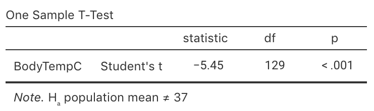

# Hypothesis tests: one mean {#TestOneMean}


<!-- Introductions; easier to separate by format -->
```{r, child = if (knitr::is_html_output()) {'./introductions/27-Testing-OneMean-HTML.Rmd'} else {'./introductions/27-Testing-OneMean-LaTeX.Rmd'}}
```


<!-- Define colours as appropriate -->
```{r, child = if (knitr::is_html_output()) {'./children/coloursHTML.Rmd'} else {'./children/coloursLaTeX.Rmd'}}
```


## Introduction: body temperatures {#BodyTemperature}
\index{Hypothesis testing!one mean|(}

```{r}
data(BodyTemp)
```


<div style="float:right; width: 222x; border: 1px; padding:10px">

</div>


The average internal body temperature is commonly believed to be $37.0$^o^C ($98.6$^o^F).
This value is based on data over\ $150$ years old [@data:Wunderlich:BodyTemp].
Since then, the methods for measuring internal body temperature have changed substantially:

> Thermometers used by Wunderlich were cumbersome, had to be read in situ, and, when used for axillary measurements [i.e., under the armpit]... required $15$ to\ $20\mins$ to equilibrate.
> Today's thermometers are smaller and more reliable and equilibrate more rapidly.
> In addition, the mouth and rectum have replaced the axilla [armpit] as the preferred sites for monitoring body temperature.
>
> --- @data:mackowiak:bodytemp, p. 1\ 579

For this reason, the reported internal body temperature (recorded by newer instruments, in different locations) may have changed since the 1860s.
Therefore, we could ask:

> Is the *population* mean internal body temperature equal to $37.0$^o^C?

A *decision* is sought about the value of the *population* mean body temperature.

The population mean internal body temperature will never be known: the internal body temperature of every person alive would need to be measured, and even those not yet born.
A *sample* must be studied.

Define the parameter as $\mu$, the population mean internal body temperature (in ^o^C).
A *sample* of people can be taken to determine whether there is evidence that the *population* mean internal body temperature is not $37.0$^o^C.\index{Mean!of a population}
To make this decision, the decision-making process (Sect.\ \@ref(DecisionMaking)) is used again.


## The process of hypothesis testing: hypotheses {#TestpObsDecisionHypotheses}

**Step\ 1** of the decision-making process is to *assume* a value for the parameter.
The established claim is that the population mean internal body temperature is $37.0$^o^C, so we assume this value.
This assumption becomes the null hypothesis: 
$$
   \text{$H_0$: } \mu = 37.0.
$$
If the *sample* mean is not $37.0$^o^C, this hypothesis proposes that the discrepancy is due to sampling variation.

The RQ asks if the *population* mean internal body temperate $\mu$ is *equal* to $37.0$^o^C, or if it has changed.
The RQ does not specifically ask if $\mu$ is smaller than $37.0$^o^C, or larger than  $37.0$^o^C.
This means the alternative hypothesis is two-tailed:
$$
   \text{$H_1$: } \mu \ne 37.0.
$$


## The process of hypothesis testing: sampling distribution for $\bar{x}$ {#SamplingDistSampleMeanHT}
\index{Sampling distribution!one mean}

**Step\ 2** of the decision-making process is to describe what values of the statistic (in this case, the sample mean $\bar{x}$) can be expected if the value of $\mu$ is assumed to be $37.0$ (the value specified in $H_0$).
In other words, the *sampling distribution* of $\bar{x}$ needs to be described. 

The sample mean *varies* from sample to sample, and varies with a normal distribution (whose standard deviation is called the *standard error*) under certain conditions (given in Sect.\ \@ref(ValiditySampleMeanTest)).
However, being more specific about the details of this sampling distribution (i.e., the mean and standard deviation describing the normal model) is useful.

The sampling distribution of\ $\bar{x}$ was described in Sect.\ \@ref(SamplingDistSampleMean).
From Def.\ \@ref(def:DEFSamplingDistributionXbarCI), the mean of this sampling distribution---the *sampling mean*---has the value $\mu$.
The standard deviation of this sampling distribution is called the *standard error of the sample means*, denoted $\text{s.e.}(\bar{x})$.
When the *population* standard deviation\ $\sigma$ is *unknown*, the value of the standard error happens to be (see Equation\ \@ref(eq:stderrorxbarCI))
$$
  \text{s.e.}(\bar{x}) = \frac{s}{\sqrt{n}}.
$$

To draw a picture of this normal distribution, however, requires having sample information: the value of\ $s$ is needed.
Fortunately, @data:mackowiak:bodytemp gathered body-temperature data, collated by @data:Shoemaker1996:Temperature
`r if (knitr::is_latex_output()) {
   '(Table\\ \\@ref(tab:DataBodyTemp); Fig.\\ \\@ref(fig:BodyTempHist)).'
} else {
   '(Fig.\\ \\@ref(fig:DataBodyTemp); Fig.\\ \\@ref(fig:BodyTempHist)).'
}`
The numerical summary, from software (Fig.\ \@ref(fig:BodyTempjamovi)), gives

* the *sample* mean: $\bar{x} = 36.8052$ (in degrees C).\index{Mean!of a sample}
* the *sample* standard deviation: $s = 0.4073$ (in degrees C).
* the sample size: $n = 130$.

Using this value of $s$, the sampling distribution of\ $\bar{x}$ can be described, if\ $\mu$ really was\ $37.0$, as having

* an approximate normal distribution,
* with a sampling mean whose value is $\mu = 37.0$ (from\ $H_0$),
* with a standard deviation of $\text{s.e.}(\bar{x}) = s/\sqrt{n} = 0.4073/\sqrt{130} = 0.0357$ (as in the output).


\begin{figure}
\begin{minipage}{0.42\textwidth}
\captionof{table}{The body temperature data: the first nine and last nine of the $130$ ordered observations\label{tab:DataBodyTemp}.}
\fontsize{8}{12}\selectfont
```{r}
if( knitr::is_latex_output() ) {
  
  Tlen <- length(BodyTemp$BodyTempC)
  
  BodyTdata <- array( dim = c(5, 4))
  BodyTdata[, 1] <- round(BodyTemp$BodyTempC[1:5], 2)
  BodyTdata[, 2] <- round(BodyTemp$BodyTempC[6:10], 2)
  BodyTdata[, 3] <- round(BodyTemp$BodyTempC[(Tlen - 9): (Tlen - 5)], 2)
  BodyTdata[, 4] <- round(BodyTemp$BodyTempC[(Tlen - 4): Tlen], 2)
  
  BodyTdata[5, 2] <- "$\\vdots$"
  BodyTdata[1, 3] <- "$\\vdots$"
  
  kable( pad(BodyTdata,
             surroundMaths = TRUE,
             targetLength = c(5, 5, 5, 5),
             decDigits = 2),
         format = "latex",
         booktabs = TRUE,
         longtable = FALSE,
         escape = FALSE,
         linesep = "",
         align = "c",
         table.env = "@empty") %>%
    row_spec(0, bold = TRUE) %>%
    add_header_above(header = c("Body temperature (in ${}^{\\\\circ}$C)" = 4),
                     escape = FALSE,
                     bold = TRUE)
  
}
```
\end{minipage}
\hspace{0.05\textwidth}
\begin{minipage}{0.51\textwidth}%
\centering
```{r, out.width='95%', fig.width=4.75, fig.height = 3}
par(mar = c(4, 4,4, 1))
hist( BodyTemp$BodyTempC,
	xlab = "Body temperature, in degrees C",
	ylab = "Frequency",
	main = "Histogram of body temperatures",
	las = 1,
	ylim = c(0, 40),
	breaks = seq(35, 39, by = 0.25),
	col = plot.colour)
box()
```
\caption{The histogram of the body temperature data\label{fig:BodyTempHist}.}
\end{minipage}
\end{figure}


```{r DataBodyTemp, fig.align="center", fig.cap="The body temperature data."}
if( knitr::is_html_output() ) {
  DT::datatable( BodyTemp,
                 #fillContainer=FALSE, # Make more room, so we don't just have ten values
                 #filter="top", 
                 #selection="multiple", 
                 #escape=FALSE,
                 options = list(searching = FALSE)) # Remove searching: See: https://stackoverflow.com/questions/35624413/remove-search-option-but-leave-search-columns-option
}
```

<!-- The figure for LaTeX is in the minipage (combined with data table), so only need show it for the HTML -->
`r if (knitr::is_latex_output()) '<!--'`
```{r BodyTempHist, fig.show="hold", fig.cap="The histogram of the body temperature data.", fig.align="center", out.width="50%", fig.width=4, fig.height=3}
hist( BodyTemp$BodyTempC,
	xlab = "Body temperature, in degrees C",
	ylab = "Frequency",
	main = "Histogram of body temperatures",
	las = 1,
	breaks = seq(35, 39, by = 0.25),
	col = plot.colour)
box()
```
`r if (knitr::is_latex_output()) '-->'`


```{r BodyTempjamovi, fig.cap="The software output summary for the body temperature data.", fig.align="center", fig.height=2.75, out.width='65%'}
knitr::include_graphics( "jamovi/BodyTemp/BodyTemp-Summary.png")
```


A picture of this sampling distribution (Fig.\ \@ref(fig:BodyTempSamplingDist)) shows how the sample mean varies when $n = 130$, for all possible samples when $\mu = 37.0$.
This enables questions to be asked about the likely values of\ $\bar{x}$ that would be found in the sample, when the population mean is $\mu = 37.0$.
For example, if\ $\mu$ really is\ $37.0$, the value of\ $\bar{x}$ will be *larger* than\ $37.0357$^o^C about\ $16$% of the time (using the $68$--$95$--$99.7$ rule).


```{r BodyTempSamplingDist, fig.cap="The distribution of sample mean body temperatures, if the population mean is $37.0^\\circ$C and $n = 130$. The grey vertical lines are\\ $1$,\\ $2$ and\\ $3$ standard deviations from the mean.", fig.align="center", fig.height=3.5, fig.width=9, out.width='100%'}
mn <- 37.0

# These taken from Shoemaker's JSE data file
s <- 0.40732
n <- 130

se <- s/sqrt(n)
par(mar = c(3, 0.15, 1, 0.15))

out <- plotNormal(mn, 
                  s / sqrt(n),
                  xlab = "Sample means from sample of size 130 (deg C)",
                  round.dec = 4,
                  ylim = c(0, 18.25),
                  cex.tickmarks = 0.9)

arrows(x0 = mn,
       x1 = mn,
       y0 = 14, 
       y1 = max(out$y),
       length = 0.1,
       angle = 15)
text(x = mn,
     y = 14,
     pos = 3,
     labels = expression(Sampling~mean~mu) )

arrows(x0 = mn,
       x1 = mn + se,
       y0 = 3, 
       y1 = 3,
       length = 0.1,
       code = 3, # Arrow both ends
       angle = 15)
text(x = mn + (se / 2),
     y = 3,
     #pos = 3,
     labels = expression( atop(Std~error,
                               s.e.(bar(italic(x)))==0.0357)) )
```


<iframe src="https://learningapps.org/watch?v=p28qr801322" style="border:0px;width:100%;height:600px" allowfullscreen="true" webkitallowfullscreen="true" mozallowfullscreen="true"></iframe>


## The process of hypotheses testing: $t$-scores {#Tscores}
\index{Test statistic!t@$t$-score}


**Step\ 3** in the decision-making process is to make the observations.
From the data, $\bar{x} = 36.8052$ (Fig.\ \@ref(fig:BodyTempjamovi)).
Locating this value on the sampling distribution (Fig.\ \@ref(fig:BodyTempSamplingDistT)) shows that this observed sample mean is, relatively speaking, *extremely* low: a sample mean this low is very unlikely to occur in any sample of $n = 130$ when $\mu = 37.0$.
How many standard deviations is\ $\bar{x}$ away from $\mu = 37.0$?
Compute:
$$
  \frac{\text{statistic} - \text{mean of the distribution}}{\text{std dev. of the distribution}}   
  =
  \frac{36.8052 - 37.0}{0.035724} = -5.453.
$$
This is like a $z$-score: it measures the number of standard deviations that the value is from the mean.
However, it is not a $z$-score; it is a $t$-score.
Both $t$- and $z$-scores measure *the number of standard deviations that a value is from the mean*.
Here the value is a $t$-score, because the *population* standard deviation\ $\sigma$ is unknown, and the *sample* standard deviation is used to compute $\text{s.e.}(\bar{x})$.


```{r BodyTempSamplingDistT, fig.cap="The sample mean of $\\bar{x} = 36.8041^\\circ$C is very unlikely to have been observed in any sample of size $n = 130$, if the population mean really was $37.0^\\circ$C.\\spacex The standard deviation of this normal distribution is $\\text{s.e.}(\\bar{x}) = 0.035724$.", fig.align="center", fig.width=8, fig.height=2.5, out.width='85%'}
mn <- 37.0
#These taken from Shoemaker's JSE data file
s <- 0.40732
n <- 130
xbar <- 36.8

se <- s/sqrt(n)

z36 <- (36.8 - mn)/(s / sqrt(n))

par(mar = c(4, 1, 1, 1) )
out <- plotNormal(mn,
                  s / sqrt(n),
                  xlab = "Sample mean temperatures (in deg C)",
                  round.dec = 3,
                  showX = seq(-6, 3, by = 1) * s/sqrt(n) + mn,
                  xlim.hi = mn + 3.5 * se, 
                  xlim.lo = mn - 6.5 * se,
                  cex.tickmarks = 0.9)

arrows(xbar, 
       0.8 * max(out$y), 
       xbar, 
       0, 
       length = 0.18, 
       angle = 15)
text(xbar, 
     0.8 * max(out$y), 
     "36.8 deg.",
     pos = 4)

points( x = xbar,
        y = 0,
        pch = 19,
        cex = 1.1)
```


::: {.tipBox .tip data-latex="{iconmonstr-info-6-240.png}"}
Like $z$-scores, $t$-scores measure the number of standard deviations that a value is from the mean of the distribution.
:::


The calculation is therefore:
$$
   t = \frac{36.8052 - 37.0}{0.035724} = -5.453.
$$
The observed sample mean is *more than five standard deviations below the population mean*, which is highly unusual based on the $68$--$95$--$99.7$ rule (Fig.\ \@ref(fig:BodyTempSamplingDistT)).
This is persuasive evidence that $\mu$ is not $37.0$.

In general, when the sampling distribution has an approximate normal distribution, a $t$-score in hypothesis testing is
\begin{equation}
   t 
   = 
   \frac{\text{sample statistic} - \text{mean of the sampling distribution}}
        {\text{standard error of the sampling distribution}}
   =
   \frac{\bar{x} - \mu}{\text{s.e.}(\bar{x})}.
   (\#eq:tscore)
\end{equation}


<iframe src="https://learningapps.org/watch?v=pi8jnzhu322" style="border:0px;width:100%;height:500px" allowfullscreen="true" webkitallowfullscreen="true" mozallowfullscreen="true"></iframe>


## The process of hypotheses testing: $P$-values {#Pvalues}

As seen in Sect.\ \@ref(TestpObsDecisionPvalues), a $P$-value quantifies how unusual the observed sample statistic is, after assuming the null hypothesis is true.
Since $t$-scores and $z$-scores are very similar, the $P$-value can be *approximated* using the $68$--$95$--$99.7$ rule and a diagram, or *approximated* using $z$-tables 
(`r if ( knitr::is_html_output()) { 
  'Appendix\\ \\@ref(ZTablesOnline)).'} else {
  'Appendices\\ \\@ref(ZTablesNEG) and\\ \\@ref(ZTablesPOS)).'}`
Commonly, however, software is used to compute the $P$-value.\index{Software output!one mean}
$t$-scores and $z$-scores with the same value produce almost the same $P$-values, except for small sample sizes.

Since $t$-scores are similar to $z$-scores, the ideas in Sect.\ \@ref(TestpObsDecisionPvalues) can be used to *approximate* a $P$-value for a $t$-score using the $68$--$95$--$99.7$ rule.\index{68@$68$--$95$--$99.7$ rule}
In addition, tables of $z$-scores (`r if ( knitr::is_html_output()) { 'Appendix\\ \\@ref(ZTablesOnline).'} else {'Appendices\\ \\@ref(ZTablesNEG) and\\ \\@ref(ZTablesPOS)'}`) can be used to *approximate* the $P$-values for $t$-scores also (Sect.\ \@ref(OnePropTestPTables)).

Both methods produce approximate $P$-values only, since the approximations are based on using $z$-scores rather than $t$-scores.
Usually, software is used to determine precise $P$-values for $t$-scores (Fig.\ \@ref(fig:BodyTempTestjamovi)).\index{Software output!one mean}
The output (under the heading `p`) shows that the $P$-value is indeed very small: less than\ $0.001$ (written $P < 0.001$).


::: {.tipBox .tip data-latex="{iconmonstr-info-6-240.png}"}
Some software reports a $P$-value of\ `0.000`, which really means that the $P$-value is zero to three decimal places.
We should write $P < 0.001$: that is, the $P$-value is *smaller* than\ $0.001$.
:::


This $P$-value means that, if $\mu = 37.0$, a sample mean as low as\ $36.8052$ would be *very* unusual to observe (from a sample size of $n = 130$). 
And yet, we did.
Using the decision-making process, this implies that the initial assumption (the null hypothesis) is contradicted by the data: we observed something extremely unlikely if $\mu = 37.0$.
That is, there is persuasive evidence that the *population* mean body temperature is *not*\ $37.0$^o^C.


```{r BodyTempTestjamovi, fig.cap="Software output for conducting the $t$-test for the body temperature data. The $P$-value is a two-tailed value.", fig.align="center", out.width="65%"}

```


::: {.importantBox .important data-latex="{iconmonstr-warning-8-240.png}"}
For *one-tailed tests*, the $P$-value is *half* the value of the two-tailed $P$-value.
:::


As seen in Sect.\ \@ref(TestpObsDecisionPvalues), $P$-values measure the probability of observing the sample statistic (or something more extreme), assuming the population parameter is the value given in\ $H_0$.
For the body-temperature data then, where $P < 0.001$, the $P$-value is *very* small, so *very strong evidence* exists that the population mean body temperature is not\ $37.0$^o^C.


## Writing conclusions

Communicating the results of any hypothesis test requires an *answer to the RQ*, a summary of the *evidence* used to reach that conclusion (such as the $t$-score and $P$-value, stating if the $P$-value is one- or two-tailed), and some *sample summary information* (including a CI).
For the body-temperature example, write:

> The sample provides very strong evidence ($t = -5.45$; two-tailed $P < 0.001$) that the population mean body temperature is *not*\ $37.0$^o^C ($\bar{x} = 36.81$; $95$% CI: $36.73$ to\ $36.88$^o^C; $n = 130$).

This statement contains the three components.

1. The *answer to the RQ*:
   the sample provides very strong evidence that the population mean body temperature is not\ $37.0$^o^C.
   The alternative hypothesis is two-tailed, so the conclusion is worded in terms of the population mean body temperature *not* being\ $37.0$^o^C.
2. The *evidence* used to reach the conclusion: $t = -5.45$; two-tailed  $P < 0.001$.
3. Some *sample summary information*: the sample mean (with the CI) and the sample size.

The test is about the *mean* internal body temperature; *individuals* in the data have internal body temperatures ranging from\ $35.722$^o^C to\ $38.222$^o^C.\index{Range}
The difference between the value of $37.0$^o^C and the sample mean of $36.81$^o^C is quite small in absolute terms, and is probably of little practical importance for most applications.\index{Practical importance}
Notice that the CI does *not* include the value of $\mu = 37.0$.


## Process overview {#TestSummary}

Let's recap the decision-making process, in this context about body temperatures:

1. *Assumption*: 
   Write the *null hypothesis* about the parameter (based on the RQ): $H_0$: $\mu = 37.0$. 
   In addition, write the *alternative hypothesis*: $H_1$: $\mu \ne 37.0$. 
   (This alternative hypothesis is two-tailed.)
2. *Expectation*: 
   The *sampling distribution* describes what to expect from the statistic *if* the null hypothesis is true.
   The sampling distribution is an approximate normal distribution.
3. *Observation*: 
   Compute the $t$-score: $t = -5.45$. 
   The $t$-score can be computed by software, or using the general equation in Equation\ \@ref(eq:tscore).
4. *Decision*: 
   Determine if the data are *consistent* with the assumption, by computing the $P$-value.
   Here, the $P$-value is much smaller than\ $0.001$.
   The $P$-value can be computed by software, or approximated using the $68$--$95$--$99.7$ rule.
   The *conclusion* is that there is very strong evidence that\ $\mu$ is not\ $37.0$.


## Statistical validity conditions {#ValiditySampleMeanTest}
\index{Statistical validity (for inference)!one mean}

All hypothesis tests have underlying conditions to be met so that the results are statistically valid.
For a test of one mean, this means that the sampling distribution must have an approximate normal distribution so that $P$-values can be found.

The test for a single mean is *statistically valid* if *either* of these is true:

* when $n \ge 25$.
  (If the distribution of the data is highly skewed, the sample size may need to be larger.)
* when $n < 25$, *and* the sample data come from a *population* with a normal distribution.

The sample size of\ $25$ is a rough figure; some books give other values (such as\ $30$).

This condition ensures that the *distribution of the sample means has an approximate normal distribution* (so that, for example, the $68$--$95$--$99.7$ rule can be used).
Provided the sample size is larger than about $25$, this will be approximately true *even if* the distribution of the individuals in the population does not have a normal distribution.
That is, when $n \ge 25$ the sample means generally have an approximate normal distribution, even if the data themselves do not have a normal distribution.
The units of analysis are also assumed to be *independent* (e.g., from a simple random sample).

If the statistical validity conditions are not met, other similar options include a sign test\index{Sign test} or a Wilcoxon signed-rank test\index{Wilcoxon signed ranks test} [@conover2003practical], or using resampling methods [@efron2021computer].


::: {.example #StatisticalValidityTemps name="Statistical validity"}
The hypothesis test regarding body temperature is statistically valid since the sample size is larger than\ $25$ ($n = 130$).
(The data, as displayed in Fig.\ \@ref(fig:BodyTempHist), do *not* need to come from a population with a normal distribution.)
:::
\index{Hypothesis testing!one mean|)}


## Example: student IQs {#IQstudents}

Standard IQ scores are designed to have a mean in the general population of\ $\mu = 100$.
@reilly2022gender studied $n = 224$ students at Griffith University (GU), and found the sample mean IQ was\ $111.19$, with a standard deviation of\ $14.21$. 
Is this evidence that students at GU have a *higher* mean IQ than the general population?
The RQ is:

> For students at Griffith University, is the mean IQ higher than\ $100$?
  
The parameter is $\mu$, the population mean IQ for students at GU.\spacex
The hypotheses are:
$$
   \text{$H_0$: $\mu = 100 \qquad \text{and} \qquad H_1$: $\mu > 100$.}
$$
This test is *one-tailed*, since the RQ asks if the IQ of GU students is *greater* than\ $100$.
Since the alternative hypothesis asks if the mean is *larger* than\ $100$, the $P$-value will be in the tail corresponding to *larger* IQ scores (i.e., to the right of the mean).
(Writing $H_0$: $\mu\le 100$ is also correct (and equivalent), though the test still proceeds as though $\mu = 100$, the largest option permitted by $\mu\le100$.)

We do not have the original data, but the summary information is sufficient: $\bar{x} = 111.19$ with $s = 14.21$ from a sample of size $n = 224$. 
The *sample* mean is higher than $100$, but since sample means vary, the difference may be just due to sampling variation.
The sample means vary with a normal distribution, with mean\ $100$ and a standard deviation of
$$
   \text{s.e.}(\bar{x}) = \frac{s}{\sqrt{n}} = \frac{14.21}{\sqrt{224}} = 0.94945.
$$
The $t$-score is
$$
   t = \frac{\bar{x} - \mu}{\text{s.e.}(\bar{x})} = \frac{111.19 - 100}{0.94945} = 11.786.
$$

This $t$-score is *huge*: a sample mean as large as\ $111.19$ would be highly unlikely to occur in any sample of size $n = 224$, simply by sampling variation, if the population mean really was\ $100$.
Since the alternative hypothesis is *one-tailed*, and $\mu > 100$ specifically, the $P$-value is the area in the right-side tail of the distribution only (Fig.\ \@ref(fig:IQSamplingDistribution)); it will be extremely small.
This is persuasive evidence to support the alternative hypothesis.

   
```{r IQSamplingDistribution, fig.cap="The sampling distribution for the IQ data. The RQ is one-tailed so the $P$-value is the area in one tail.", fig.align="center", fig.width=10, fig.height=3, out.width='95%'}
mn.IQ <- 100
sd.IQ <- 14.21
sigma.IQ <- 15
n.IQ <- 100
se.IQ <- sd.IQ/sqrt(n.IQ)
xbar <- 111.19

z <- (xbar - mn.IQ)/se.IQ

out <- plotNormal(mn.IQ,
                  se.IQ, 
                  main = "The sampling distribution of the sample mean IQ",
                  xlab = "",
                  xlim.hi = 112,
                  las = 2,
                  ylim = c(0, 0.4),
                  round.dec = 2) 
# xlab, placed better
mtext(text = expression(Sample~mean~IQ),
      at = 107,
      side = 1,
      line = 1)
shadeNormal(out$x,
            out$y,
            lo = xbar,
            hi = 110,
            col = plot.colour)

arrows( x0 = xbar,
        x1 = xbar,
        y0 = 0.9 * max(out$y),
        y1 = 0,
        length = 0.1,
        angle = 15)
text( x = xbar, 
      y = 0.9 * max(out$y), 
      expression( paste(italic(t) == "11.78")),
      pos = 3)
mtext( text = expression( bar(italic(x)) == 111.19 ),
       at = xbar, 
      side = 1,
      line = 1)
points(x = xbar,
       y = 0,
       cex = 1.1,
       pch = 19)

# Arrow for "this tail only"
arrows(x0 = 101,
       x1 = 107,
       y0 = 0.30,
       y1 = 0.30,
       angle = 15,
       length = 0.18)
text(x = 104,
     y = 0.30,
     #pos = 1,
     labels = expression( atop(The~one*"-"*tailed~italic(P)*"-"*value~is~the,
                               area~"in"~this~tail~only)))


```


We conclude:

> Very strong evidence exists in the sample ($t = 11.78$; one-tailed $P < 0.001$) that the population mean IQ in students at Griffith University is greater than\ $100$ (mean $111.19$; $95$% CI: $109.29$ to\ $113.09$; $n = 224$).

The test is about the *mean* IQ; *individual* students may have IQs less than $100$.

Since the sample size is much larger than\ $25$, this conclusion is *statistically valid*.
The sample is not a random sample from the population of all GU students (the students are mostly first-year, undergraduate psychological science students). 
However, these students may be somewhat representative of all GU students.
That is, the sample *may* be externally valid.

The difference between the general population IQ of\ $100$ and the sample mean IQ of GU students is only small: about\ $11$ IQ units (less than one standard deviation).
Possibly, this difference has very little practical importance,\index{Practical importance} even though the statistical evidence suggests that the difference cannot be explained by chance.

IQ scores are designed to have a standard deviation of $\sigma = 15$ in the general population.
If this applies for university students too (and we do not know if it does), the standard error is $\text{s.e.}(\bar{x}) = \sigma/\sqrt{n} = 15/\sqrt{130} = 1.0022$, and the test-statistic is then a $z$-score:
$$
  z = \frac{\bar{x} - \mu}{\text{s.e.}(\bar{x})} = \frac{111.19 - 100}{1.0022} = 11.87.
$$
The conclusions do not change: the $P$-value is still extremely small.


## Chapter summary {#Chap27-Summary}

To test a hypothesis about a population mean $\mu$:

* write the null hypothesis ($H_0$) and the alternative hypothesis ($H_1$).
* initially *assume* the value of $\mu$ in the null hypothesis to be true.
* then, describe the *sampling distribution*, which describes what to *expect*  from the sample mean based on this assumption: under certain statistical validity conditions, the sample mean varies with:
   *  an approximate normal distribution,
   *  with sampling mean whose value is the value of $\mu$ (from $H_0$), and
   *  having a standard deviation of $\displaystyle \text{s.e.}(\bar{x}) =\frac{s}{\sqrt{n}}$.
* compute the value of the *test statistic*:
$$
   t = \frac{ \bar{x} - \mu}{\text{s.e.}(\bar{x})},
$$
where $\mu$ is the hypothesised value given in the null hypothesis.
* the $t$-value is like a $z$-score, and so an approximate *$P$-value* can be estimated using the $68$--$95$--$99.7$ rule or tables, or found using software.
* make a decision, and write a conclusion.
* check the statistical validity conditions.


`r if (knitr::is_html_output()){
  'The following short video may help explain some of these concepts:'
}`


<iframe width="560" height="315" src="https://www.youtube.com/embed/ZbJ58Ag22Mw" frameborder="0" allow="accelerometer; encrypted-media; gyroscope; picture-in-picture"></iframe>


## Quick review questions  {#Chap32-QuickReview}


::: {.webex-check .webex-box}
The usual engineering recommendation is that the safe gap between travelling vehicles in traffic (a 'headway') is *at least* $1.9\secs$ (often conveniently rounded to\ $2\secs$ when communicated to the public).
@majeed2014field studied $n = 28$ streams of traffic in Birmingham, Alabama found the mean headway was $1.1915\secs$, with a standard deviation of\ $0.231\secs$.
The researchers wanted to test if the mean headway in Birmingham was *less than* the recommended\ $1.9\secs$.

Are the following statements *true* or *false*?

1. The standard error of the mean is $0.231\secs$. \tightlist
`r if( knitr::is_html_output() ) {torf(answer=FALSE)}`
1. The null hypothesis is 'The sample mean headway is $1.9\secs$'.
`r if( knitr::is_html_output() ) {torf(answer=FALSE)}`
1. The alternative hypothesis 'The population mean is less than $1.9\secs$'.
`r if( knitr::is_html_output() ) {torf(answer=TRUE)}`
1. The test is *one-tailed*.
`r if( knitr::is_html_output() ) {torf(answer=TRUE)}`
1. The value of the test statistic is $t = -16.23$.
`r if( knitr::is_html_output() ) {torf(answer=TRUE)}`
1. The one-tailed $P$-value is very small.
`r if( knitr::is_html_output() ) {torf(answer=TRUE)}`
1. There is no evidence to support the *alternative* hypothesis (that the mean headway is less than $1.9\secs$).
`r if( knitr::is_html_output() ) {torf(answer=TRUE)}`
:::


<!-- ::: {.webex-check .webex-box} -->
<!-- A study [@imtiaz2017assessment] compared the nutritional intake of $n = 50$ anaemic infants in Lahore (Pakistan) with the recommended daily intake (of 13g). -->
<!-- The mean daily protein intake in the sample was 14g, with a standard deviation of 3g. -->
<!-- The researchers wanted to see if the mean intake met (or exceeded) the recommendation, or not. -->
<!-- ::: -->


## Exercises {#TestOneMeanAnswerExercises}

[Answers to odd-numbered exercises] are given at the end of the book. 

`r if( knitr::is_latex_output() ) "\\captionsetup{font=small}"`


::: {.exercise #OneTSpeed}
@azwari2021evaluating studied driving speeds in Malaysia, and recorded the speeds of vehicles on various roads.
One RQ was whether the mean speed of cars on one particular road was the posted speed limit of\ $90\kms$.h^$-1$^, or whether it was *higher*.

The researchers recorded the speed of $n = 400$ vehicles on this road, and found the mean and standard deviation of the speeds of individual vehicles were $\bar{x} = 96.56$ and $s = 13.874\kms$.h^$-1$^.

1. Define the parameter of interest.
2. Write the statistical hypotheses.
3. Compute the standard error of the sample mean.
4. Sketch the sampling distribution of the sample mean.
5. Compute the test statistic, a $t$-score.
6. Determine the $P$-value.
7. Write a conclusion.
8. Is the test statistically valid?
:::


::: {.exercise #TestOneMeanExercisesSlalom}
A competitive slalom competitor completed $n = 30$ attempts on a $38.8\ms$ kayak slalom course to assess the accuracy of a GPS tracking system [@macdermidValidityReliabilityGlobal2022].
The $30$\ trials produced a mean distance, recorded by the GPS, as $36.54\ms$ with a standard deviation of $2.07\ms$.

1. Define the parameter of interest.
2. Write the statistical hypotheses.
3. Compute the standard error of the sample mean.
4. Sketch the sampling distribution of the sample mean.
5. Compute the test statistic, a $t$-score.
6. Determine the $P$-value.
7. Write a conclusion.
8. Is the test statistically valid?
:::


::: {.exercise #TestOneMeanExercisesAutomatedVehicles}
@data:greenlee2018:vehicles conducted a study of human--automation interaction with automated vehicles.
They were interested in whether the average mental demand of 'drivers' of automated vehicles was *higher* than the average mental demand for ordinary tasks.

In the study, the $n = 22$ participants 'drove' (in a simulator) an automated vehicle for\ $40\mins$. 
While driving, the drivers monitored the road for hazards.
The researchers assessed the 'mental demand' placed on these drivers, where scores over\ $50$ 'typically indicate substantial levels of workload' (p.\ 471).
For the sample, the mean score was\ $84.00$ with a standard deviation of\ $22.05$.

Is there evidence of a 'substantial workload' associated with monitoring roadways while 'driving' automated vehicles?
:::


:::{.exercise #TestOneMeanWaterTemp}
Health departments recommend that hot water be stored at $60$^o^C or higher, to kill *legionella* 
`r if (knitr::is_latex_output()) {
   ' bacteria.'
} else {
   ' bacteria (for example, [*Health and Safety Executive*, UK](https://www.hse.gov.uk/legionnaires/things-to-consider.htm)).'
}`
@alary1991risk studied $n = 178$ Quebec homes with electric water heaters to see if the mean water temperature was less than $60$^o^C (i.e., at risk).

The mean temperature was\ $56.6$^o^C, with a standard error of\ $0.4$^o^C.\spacex
Is there evidence the mean water temperature in Quebec is too low to kill *legionella* bacteria?
:::


::: {.exercise #TestOneMeanExercisesCherryRipes}
[*Dataset*: `CherryRipe`]
A *Cherry Ripe* is a popular chocolate bar in Australia.
In\ 2017,\ 2018 and\ 2019, I sampled some *Cherry Ripe* Fun Size bars.
The packaging claimed that the Fun Size bars weigh\ $14\gs$ (on average).

1. Use the software output (Fig.\ \@ref(fig:CherryRipes201720182019)) to determine if the mean weight is\ $14\gs$ or not.
2. Explain the difference in the meaning of `SD` and `SE` in this context.
:::

(ref:CherryRipesOutputHT) Software output for the *Cherry Ripes* data.

```{r CherryRipes201720182019, fig.cap="(ref:CherryRipesOutputHT)", fig.align="center", out.width="60%"}

```


::: {.exercise #TestOneMeanBloodLoss}
(This study was also seen in Exercise\ \@ref(exr:CIOneMeanBloodLoss).)
@data:Williams2007:BloodLoss asked $n = 199$ paramedics to estimate the amount of blood on four different surfaces.
When the actual amount of blood spilt on concrete was\ $\,1000\mLs$, the mean guess was\ $846.4\mLs$ (with $s = 651.1\mLs$).

Is there evidence that the mean guess is\ $1\,000\mLs$ (the true amount)?
Is this test statistically valid?
:::


::: {.exercise #TestOneMeanExercisesSleep}
@lin2021sleep compared the average sleep times of Taiwanese pre-school children to the recommendation (of *at least*\ $10\hs$ per night).
Using the summary of the data for weekend sleep-times (Table\ \@ref(tab:SleepingSummary)), do girls get *at least* $10\hs$ of sleep per night, on average?
Do boys?
:::

```{r SleepingSummary}
SleepArray <- array( dim = c(2, 3))

SleepArray[1, ] <- c(47,
                     8.50,
                     0.48)
SleepArray[2, ] <- c(39,
                     8.64,
                     0.37)
rownames(SleepArray) <- c("Boys",
                          "Girls")

if( knitr::is_latex_output() ) {
  kable(pad(SleepArray,
            surroundMaths = TRUE,
            targetLength = c(2, 4, 4),
            decDigits = c(0, 2, 2)),
        format = "latex",
        align = "c",
        col.names = c("Sample size",
                      "Sample mean",
                      "Sample std dev."),
        booktabs = TRUE,
        escape = FALSE,
        caption = "Summary information for the Taiwanese pre-schoolers sleep times (in h).") %>%
    row_spec(0, bold = TRUE) %>% 
    kable_styling(font_size = 8)  
}
if( knitr::is_html_output() ) {
  kable(pad(SleepArray,
            surroundMaths = TRUE,
            targetLength = c(2, 4, 4),
            decDigits = c(0, 2, 2)),
        format = "html",
        align = "c",
        col.names = c("Sample size",
                      "Sample mean",
                      "Sample std dev."),
        booktabs = TRUE,
        caption = "Summary information for the Taiwanese pre-schoolers sleep times (in h).") %>%
    row_spec(0, bold = TRUE)
}
```


```{r}
data(BloodLoss) ### Exercise

DataAndTargets <- array(dim = c(3, 4))
DataAndTargets[1, ]<- c(64.31, 19.24, 64.97, 19.40)
DataAndTargets[2, ]<- c(1.700, 0.588, 1.029, 0.413)
DataAndTargets[3, ]<- c(64.22, 19.01, 65.05, 19.45)

rownames(DataAndTargets) <- c("Mean of data", 
                              "Std dev. of data", 
                              "Pre-determined target")
colnames(DataAndTargets) <- c("High level", 
                              "Mid level", 
                              "High level", 
                              "Mid level")
```

::: {.exercise #TestOneMeanQualityControl}
[*Dataset*: `BloodLoss`]
@feng2017application assessed the accuracy of two instruments from a clinical laboratory, by comparing the reported luteotropichormone (LH) concentrations to known, pre-determined values.
Perform a series of tests to determine how well the two instruments perform, for both high- and mid-level LH concentrations (using the information in
`r if (knitr::is_latex_output()) {
   'Table\\ \\@ref(tab:QualityControlData)).'
} else {
   'below an in Table\\ \\@(tab:QualityControlDataSummary)).'
}`
:::


```{r QualityControlData}
if( knitr::is_latex_output() ) {
  
  T1info <- rbind( head(BloodLoss[1:2], 5),
                   c("$\\vdots$", "$\\vdots$"),
                   DataAndTargets[1, 1:2], # 1:3 produces error for some reason...
                   DataAndTargets[2, 1:2],
                   DataAndTargets[3, 1:2])
  T1info <- cbind( c( rep(NA, 6),
                      "\\textbf{Mean}",
                      "\\textbf{Std dev.}",
                      "\\textbf{Target}"),
                   T1info)
  
  T1 <- kable( pad(T1info,
                   surroundMaths = TRUE,
                   targetLength = c(0, 4, 4),
                   decDigits = c(0, 2, 2)),
               format = "latex",
               align = c("r", "c", "c"),
               escape = FALSE,
               linesep = "",
               col.names = c(" ", 
                             "High level", 
                             "Mid level"),
               booktabs = TRUE,
               longtable = FALSE) %>%
    row_spec(row = 0,
             bold = TRUE) %>%
    add_header_above(header = c(" " = 1,
                                "Instrument 1" = 2), 
                     bold = TRUE, 
                     align = "c") %>%
    row_spec(6, 
             hline_after = TRUE)
  
  
  
  T2info <- rbind( head(BloodLoss[, 3:4], 5),
                   c("$\\vdots$", "$\\vdots$"),
                   DataAndTargets[1, 3:4], # 1:3 produces error for some reason...
                   DataAndTargets[2, 3:4],
                   DataAndTargets[3, 3:4])
  T2info <- cbind( c( rep(NA, 6),
                      "\\textbf{Mean}",
                      "\\textbf{Std dev.}",
                      "\\textbf{Target}"),
                   T2info)
  
  T2 <- kable( pad(T2info,
                   surroundMaths = TRUE,
                   targetLength = c(0, 4, 4),
                   decDigits = c(0, 2, 2)),
               format = "latex",
               align = c("r", "c", "c"),
               linesep = "",
               col.names = c(" ",
                             "High level", 
                             "Mid level"),
               booktabs = TRUE,
               escape = FALSE,
               longtable = FALSE) %>%
    add_header_above(header = c(" " = 1, 
                                "Instrument 2" = 2), 
                     bold = TRUE, 
                     align = "c") %>%
    row_spec(row = 0,
             bold = TRUE) %>%
    row_spec(6, 
             hline_after = TRUE)
  
  
  out <- knitr::kables(list(T1, T2),
                       format = "latex",
                       label = "QualityControlData",
                       caption = "The quality-control data: LH levels (in mIU/mL) for two instruments (only the first five observations shown).") %>% 
    kable_styling(font_size = 8)
  
  prepareSideBySideTable(out)
  
} 

if( knitr::is_html_output() ) {
  DT::datatable(BloodLoss,
                caption = "The quality-control data: LH levels (in mIU/mL) for two instruments.",
                colnames = colnames(DataAndTargets),
                options = list(searching = FALSE), # Remove searching: See: https://stackoverflow.com/questions/35624413/remove-search-option-but-leave-search-columns-option
                filter = "none")
}
```


```{r QualityControlDataSummary}
# if( knitr::is_latex_output() ) { 
#   kable( pad(DataAndTargets, 
#              surroundMaths = TRUE, 
#              targetLength = 6, 
#              decDigits = c(3, 3, 3, 3) ), 
#         format = "latex", 
#         caption = "Summary of the quality-control data for LH levels (in mIU/mL) for two instruments.", 
#         booktabs = TRUE, 
#         align = "c", 
#         #align = c("p{17mm}", "p{17mm}","p{17mm}","p{17mm}"), 
#         escape = FALSE, 
#         longtable = FALSE) %>% 
#     row_spec(row = 0,   
#              bold = TRUE) %>% 
#     row_spec(row = 3,   
#              italic = TRUE) %>% 
#     kable_styling(font_size = 8) %>% 
#     add_header_above(header = c("",  
#                                 "Instrument 1" = 2,  
#                                 "Instrument 2" = 2),  
#                    bold = TRUE,  
#                    align = "c") 
# } 
if( knitr::is_html_output() ) {
  kable(pad(DataAndTargets,
             surroundMaths = TRUE,
             targetLength = 6,
             decDigits = c(3, 3, 3, 3) ),
        format = "html",
        align = "c",
        caption = "Summary of the quality-control data for LH levels (in mIU/mL) for two instruments.",
        booktabs = TRUE,
        longtable = FALSE)
}
```


::: {.exercise #PizzasHT}
[*Dataset*: `PizzaSize`]
(This study was also seen in Exercise\ \@ref(exr:CIPizzas).)
In 2011, *Eagle Boys Pizza* ran a campaign that claimed that *Eagle Boys* pizzas were  'Real size $12$-inch large pizzas' [@mypapers:Dunn:PizzaSize].
*Eagle Boys* made the data from the campaign publicly available.

A summary of the diameters of a sample of\ $125$ of their large pizzas is shown in Fig.\ \@ref(fig:PizzaSoftwareHTjamovi).
We would like to test the company's claim, and ask the RQ:

> For *Eagle Boys*' pizzas, is mean diameter actually\ $12$ inches, or not?


1. What is the parameter of interest?
1. Write down the values of\ $\bar{x}$ and\ $s$.
1. Determine the value of the standard error of the mean.
1. Write the hypotheses to test if the mean pizza diameter is\ $12$\ inches.
1. Is the alternative hypothesis one- or two-tailed? Why?
1. Draw the normal distribution that shows how the *sample mean pizza diameter* would vary by chance, *even if* the population mean diameter was $12$\ inches. 
1. Compute the $t$-score for testing the hypotheses.
1. What is the approximate $P$-value using the $68$--$95$--$99.7$ rule?
1. Write a conclusion. 
1. Is it reasonable to assume the *statistical* validity conditions are satisfied? 
1. Do you think that the pizzas do have a mean diameter of\ $12$\ inches in the population, as *Eagle Boys* claim?
   Explain.
:::

(ref:EBSummaryHTCaption) Summary statistics for the diameter of *Eagle Boys* large pizzas.

```{r PizzaSoftwareHTjamovi, echo=FALSE, fig.cap="(ref:EBSummaryHTCaption)", fig.align="center", out.width='40%'}

```


::: {.exercise #OneMeanHtExerciseSleepTime}
@saxvig2021sleep studied the length of sleep each night for a 'large and representative sample of Norwegian adolescents' (p.\ 1) aged\ $16$ and\ $17$\ years of age.
The recommendation is for adolescents to have at least\ $8\hs$ of sleep each night.

In the sample of $n = 3\,972$ individuals, the mean amount of sleep on schools days was $6\hs$\ $43\mins$ (i.e., $403\mins$), with a standard deviation of $87\mins$.
On non-school days, the mean amount of sleep was $8\hs$\ $38\mins$ (i.e., $518\mins$), with a standard deviation of\ $98\mins$.

Do Norwegian adolescents appear to meet the guidelines of having '*at least*\ $8\hs$' sleep each night on school days? 
On non-school days?
:::


`r if( knitr::is_latex_output() ) "\\captionsetup{font=normalsize}"`


<!-- QUICK REVIEW ANSWERS -->
`r if (knitr::is_html_output()) '<!--'`
::: {.EOCanswerBox .EOCanswer data-latex="{iconmonstr-check-mark-14-240.png}"}
\textbf{Answers to \textit{Quick review} questions:}
**1.** False: $0.0436$.
**2.** False: *population* mean.
**3.** True.
**4.** True.
**5.** True.
**6.** True.
**7.** False.
:::
`r if (knitr::is_html_output()) '-->'`
