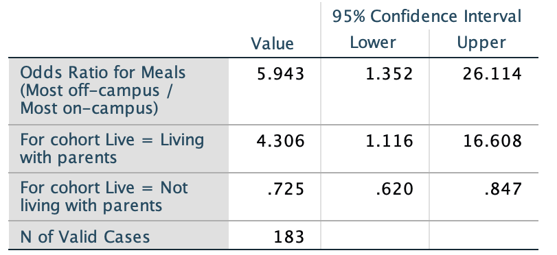
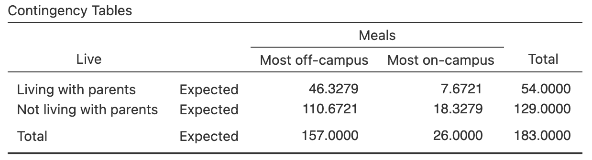
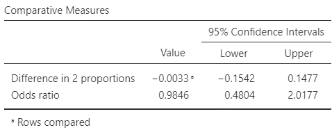
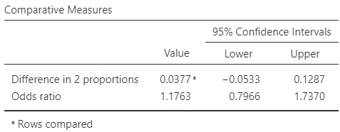
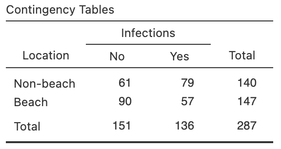
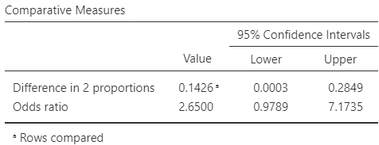
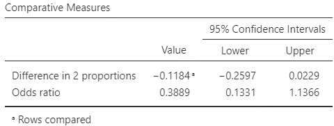
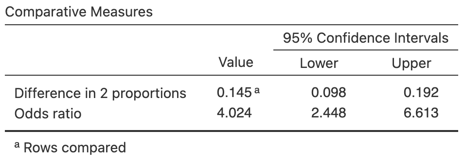
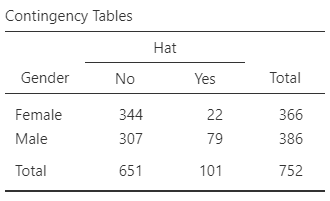
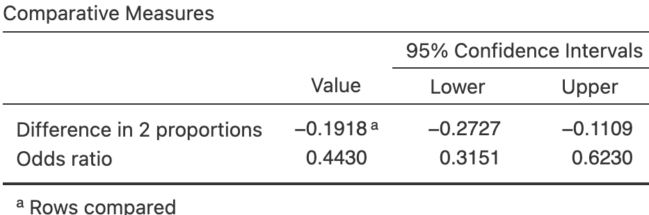

# CIs for comparing two odds or proportions {#OddsRatiosCI}


```{r, child = if (knitr::is_html_output()) {'introductions/28-CIs-OddsRatios-HTML.Rmd'} else {'introductions/28-CIs-OddsRatios-LaTeX.Rmd'}}
```


<!-- Define colours as appropriate -->
```{r, child = if (knitr::is_html_output()) {'./children/coloursHTML.Rmd'} else {'./children/coloursLaTeX.Rmd'}}
```


## Introduction: eating habits {#OddsRatioIntro}


<div style="float:right; width: 222x; border: 1px; padding:10px">

</div>


@data:Mann12017:UniStudents examined the relationship between where university students usually ate, and where the student lived,
for students from two Canadian east coast universities.
The researchers cross-classified the $n = 183$ students (the units of analysis) according to two *qualitative* variables:

* Where they lived: with their parents, or *not* with their parents;
* Where they ate most meals: *off-campus* or *on-campus*.


Both variables are qualitative, so means are not appropriate for summarising the data.
The data can be compiled into a two-way table of counts\index{Tables!two-way} (Table\ \@ref(tab:MealsDataTable)), also called a *contingency table*.\index{Contingency table}
Both qualitative variables have two levels, so this is a $2\times 2$ table.
Every cell in the $2\times 2$ table contains different students, so the comparison is *between* individuals.


::: {.importantBox .important data-latex="{iconmonstr-warning-8-240.png}"}
The study has one sample of students, classified according to two variables (i.e., each student is placed into one of the four cells in the $2\times 2$ table).
:::


::: {.softwareBox .software data-latex="{iconmonstr-laptop-4-240.png}"}
The table can be constructed with either variable as the rows or the columns.
However, software commonly compares *rows*, so it makes sense to place the groups to be compared (i.e., the explanatory variable) in the rows of the table.
:::


```{r MealsDataTable}
data(StudentsEat)

Eating.tab <- Eating.tab.Counts <-  xtabs( ~ Meals + Live, 
                                           data = StudentsEat)

Eating.tab <- cbind( Eating.tab, 
                     "Total" = rowSums(Eating.tab))
Eating.tab <- rbind( Eating.tab, 
                     "Total" = colSums(Eating.tab))

Eating.tab <- t(Eating.tab)

if( knitr::is_latex_output() ) {
  kable( pad(Eating.tab[1:2, 1:2],
             surroundMaths = TRUE,
             targetLength = c(3, 3),
             digits = 0),
        format = "latex",
        booktabs = TRUE,
        longtable = FALSE,
        escape = FALSE,
        col.names = c("off-campus",
                      "on-campus"),
        align = "c",
        caption = "Where university students live and eat") %>%
     column_spec(1, bold = TRUE) %>%
     row_spec(0, bold = TRUE) %>%
     kable_styling(font_size = 8) %>%
    add_header_above( c(" " = 1, 
                        "Has most meals" = 1,
                        "Has most meals" = 1),
                      line = FALSE,
                      bold = TRUE)
}
if( knitr::is_html_output() ) {
  kable(pad(Eating.tab[1:2, 1:2],
             surroundMaths = TRUE,
             targetLength = c(2, 3),
             digits = 0),
               format = "html",
               booktabs = TRUE,
               longtable = FALSE,
               align = "c",
               caption = "Where university students live and eat")
}
UniS <- t(Eating.tab )
```


The *proportion* of students who eat most meals off-campus can be compared between those who live with their parents and those who do *not* live with their parents.
Then, the parameter is the difference between the population proportions in each group, and the RQ could be written as:

> Among university students, what is the difference between the proportion of students eating most meals off-campus, comparing those who *do* and *do not* live with their parents?

Alternatively, the *odds* of students who eat most meals off-campus can be compared between those who live with their parents and those who do *not* live with their parents.
Then, the parameter is the *odds ratio* (OR);\index{Odds ratio} specifically, the odds ratio of eating most meals off-campus, comparing those living with parents to those not living with parents.
Using the OR, the RQ could be written as:

> Among university students, what is the odds ratio of students eating most meals off-campus, comparing those who *do* and *do not* live with their parents?


::: {.importantBox .important data-latex="{iconmonstr-warning-8-240.png}"}
Take care defining the odds ratios! 
Recall (Sect.\ \@ref(QualOdds)): software usually compares Row\ 1 to Row\ 2, and Column\ 1 to Column\ 2 (that is, the last row is usually the reference level)\index{Reference level}.
For this reason, defining your OR in the same way makes sense.
:::


## Summarising data {#CIOddsRatiosSummaries}
\index{Odds ratio}\index{Odds}

With two qualitative variables, an appropriate numerical summary includes the odds and proportions (or percentages) for the outcome for both comparison groups, and the sample sizes (Table\ \@ref(tab:EatingNumericalSummary)).

To compare the *proportions*, define the sample proportion of students eating most meals off-campus as $\hat{p}$, and write $\hat{p}_P$ for the proportion living with parents and $\hat{p}_N$ for the proportion *not* living with parents.
Then,
$$
  \hat{p}_P = \frac{52}{52 + 2} = 0.962963
  \quad\text{and}\quad
  \hat{p}_N = \frac{105}{105 + 24} = 0.8139535.
$$
The *difference* between the two proportions is
$$
  \hat{p}_P - \hat{p}_N = 0.9630 - 0.8140 =  0.1490,
$$
(as in the software output: Fig.\ \@ref(fig:EatingGraphsCI)), or $14.9$%.
By this definition, the difference is how much greater the proportion eating most meals off-campus is for students *living* with their parents, compared to students *not living* with their parents.


::: {.tipBox .tip data-latex="{iconmonstr-info-6-240.png}"}
Be clear about how differences are defined!
Differences could be computed as:

* the proportion eating most meals off-campus for those living with their parents, *minus* the proportion *not* living with their parents.
  This measures how much greater the proportion is for those living with their parents; or
* the proportion eating most meals off-campus for those *not* living with their parents, *minus* the proportion living with their parents.
  This measures how much greater the proportion is for those *not* living with their parents.

Either is fine, provided you are *consistent*, and *clear* about how the difference are computed.
The *meaning* of any conclusions will be the same.
:::

To compare the *odds*, first see that the odds of eating most meals *off-campus* is:

* $52 \div  2 = 26$    for students     *living with their parents* (Row\ 1 of Table\ \@ref(tab:MealsDataTable)).
* $105\div 24 = 4.375$ for students *not living with their parents* (Row\ 2 of Table\ \@ref(tab:MealsDataTable)).

(Notice the numbers in the *second* column are always on the bottom of the fraction.)
So the *odds ratio* (OR) of eating most meals *off-campus* (the *first* column), comparing students living with parents to students *not* living with parents (*second* column), is $26 \div 4.375 = 5.943$ (as in the software output: Fig.\ \@ref(fig:EatingGraphsCI)).

The numerical summary (Table\ \@ref(tab:EatingNumericalSummary)) shows the proportion and odds of eating most meals off-campus, comparing students living at home and those not living at home.


::: {.importantBox .important data-latex="{iconmonstr-warning-8-240.png}"}
The odds ratio can be interpreted in *either* of these ways (i.e., both are correct):\index{Odds ratio!interpreting}\index{Software output!odds ratios}

-   The *odds* compare Row\ 1 counts to Row\ 2 counts, for both columns.
    The *odds ratio* then compares the Column\ 1 odds to the Column\ 2 odds.
-   The *odds* compare Column\ 1 counts to Column\ 2 counts.
    The *odds ratio* then compares the Row\ 1 odds to the Row\ 2 odds.

Odds and odds ratios are computed with the *first row* and *first column* values on the *top* of the fraction.
In this case, both of the above approaches produces an OR of $5.943$.
Since the explanatory variable is usually in the rows, the first is usually the most useful.
:::


An appropriate graph is a side-by-side bar chart\index{Graphs!side-by-side bar chart} (Fig.\ \@ref(fig:EatingGraphsCI), left panel) or a stacked bar chart.\index{Graphs!stacked bar chart}
The side-by-side bar is a good display for comparing the odds.
For instance, in the two left-most bars in Fig.\ \@ref(fig:EatingGraphsCI) (left panel), the first bar is $26$ times as high as the second bar (and $26$ is the odds); in the two right-most bars, the first bar is $4.375$ times as high as the second bar (and $4.375$ is the odds).
A stacked bar chart would be a good visual display for comparing the proportions.


```{r EatingNumericalSummary}
EatingNumericalSummary <- array( dim = c(3, 3))

EatingNumericalSummary[1, ] <- c(format(round(UniS[1, 1]/UniS[2, 1 ], 4), 
                                        nsmall = 3),
                                 round(UniS[1, 1]/UniS[3, 1], 3),
                                 UniS[3,1] )
EatingNumericalSummary[2, ] <- c(round(UniS[1, 2] / UniS[2, 2], 4),
                                 round(UniS[1, 2] / UniS[3, 2], 3),
                                 UniS[3,2] )
EatingNumericalSummary[3, ] <- c( round( (UniS[1, 1] / UniS[1, 2] ) / (UniS[2, 1] / UniS[2, 2]), 3) ,
                                  round( (UniS[1, 1]/UniS[3, 1] - UniS[1, 2]/UniS[3, 2]), 3),
                                  NA)
rownames(EatingNumericalSummary) <- c("Living with parents",
                                      "Not living with parents",
                                      NA)
ENS <- EatingNumericalSummary
ENS[3, ] <- c( paste0("\\llap{OR:\ }$\\phantom{-}", ENS[3, 1], "$"),
               paste0("\\llap{Difference:\ }$\\phantom{-}", ENS[3, 2], "$"),
               NA)

if( knitr::is_latex_output() ) {
  kable(pad(ENS,
            surroundMaths = TRUE,
            targetLength = c(6, 6, 3),
            digits = c(3, 3, 0)),
        format = "latex",
        longtable = FALSE,
        booktabs = TRUE,
        escape = FALSE,
        align = "c",
        col.names = c("meals off-campus",
                      "meals off-campus", 
                      "size"),
       caption = "The odds and proportion of university students eating most meals off-campus" 
  ) %>%
     row_spec(0, bold = TRUE) %>%
     row_spec(3, italic = TRUE) %>%
     row_spec(2, hline_after = TRUE) %>%
   add_header_above( c(" ", "Odds having most" = 1, 
                       "Proportion having most" = 1,
                       "Sample" = 1),
                     line = FALSE,
                     bold = TRUE) %>%
	 kable_styling(font_size = 8) 
}
if( knitr::is_html_output() ) {
   kable(pad(ENS,
            surroundMaths = TRUE,
            targetLength = c(6, 6, 3),
            digits = c(3, 3, 0)),
               format = "html",
               longtable = FALSE,
               booktabs = TRUE,
               align = "c",
               col.names = c("Odds of having most\n meals off-campus", 
                             "Proportion having most\n meals off-campus", 
                             "Sample size"),
               caption = "The odds and proportion of university students eating most meals off-campus")
}
```


```{r EatingGraphsCI, fig.cap="The student-eating data. Left: a side-by-side bar chart. Right: software output for computing a CI for the difference between the proportions, and for the odds ratio.", fig.align="center", fig.height=3.75, fig.width=4, out.width=c("43%", "55%"), fig.show='hold'}
par( xpd = TRUE,
     mar = c(4, 4, 4, 2) + 0.1) # DEFAULT: c(5, 4, 4, 2) + 0.1
barCols <- c( grey(0.2), 
              grey(0.8))

barplot( 100 * prop.table(Eating.tab.Counts, 
                          margin = 2),
	col = barCols,
	ylab = "Percentage",
	beside = TRUE,
	main = "Side-by-side bar chart of where\nstudents live and eat most meals", 
	ylim = c(0, 119),
	las = 1,
	names.arg = c("Lives with\nparents",
	              "Does not live\nwith parents") )
legend("topright",
       bty = "n",
	     cex = 0.9,
	     ncol = 1,
	     horiz = FALSE,
       fill = barCols,
       legend = c("Most meals off-campus",
                  "Most meals on-campus")
  )

#


```


Each sample of students comprises different students, giving different proportions and odds of having most meals off-campus for both groups (living with, and not living with, parents).
Hence, the difference between the two proportions, and the odds ratio, will vary between samples.
This means that both the difference between the two proportions, and the odds ratio, have sampling distributions.


## CIs for the difference between two proportions

The sample proportions for each group will vary from sample to sample, and the *difference* between the sample proportions will be different for each sample.
Hence, the *difference* between the sample proportions has a sampling distribution and *standard error*.
Under certain conditions (Sect.\ \@ref(ValidityConditionsORCI)), this sampling distribution has a normal distribution.


::: {.definition #DEFSamplingDistributionDiffProportions name="Sampling distribution for the difference between two sample proportions"}
The *sampling distribution of the difference between two sample proportions* $\hat{p}_A$ and $\hat{p}_B$ is (when the appropriate conditions are met; Sect.\ \@ref(ValidityConditionsORCI)) described by:

* an approximate normal distribution,
* centred around a sampling mean whose value is ${p_{A}} - {p_{B}}$, the difference between the *population* proportions,
* with a standard deviation, called the standard error of the difference between the proportions, of $\displaystyle\text{s.e.}(\hat{p}_A - \hat{p}_B)$.

The standard error for the difference between the proportions is found using  
\begin{equation}
  \text{s.e.}(\hat{p}_A - \hat{p}_B) = \sqrt{ \text{s.e.}(\hat{p}_A)^2 + \text{s.e.}(\hat{p}_B)^2},
   (\#eq:SEtwoproportionsCI)
\end{equation}
though this value will often be *given* (e.g., on computer output).
:::


For the student-eating data, the standard error of the sample proportions for each group are computed using Eq.\ \@ref(eq:stderrorphat) as
\begin{align*}
  \text{s.e.}(\hat{p}_L) &= \sqrt{\frac{0.962963\times ( 1 - 0.962963)}{54}} = 0.025700; \text{and}\\
  \text{s.e.}(\hat{p}_N) &= \sqrt{\frac{0.8139535\times (1 - 0.8139535)}{129}} = 0.034262.
\end{align*}
The standard error of the difference between the proportions is
$$
  \text{s.e.}(\hat{p}_P - \hat{p}_N)
  = \sqrt{ \text{s.e.}(\hat{p}_P)^2 + \text{s.e.}(\hat{p}_N)^2}
  = \sqrt{ 0.025700^2 + 0.034262^2 } = 0.042830.
$$

Thus, the differences between the sample proportions will have:

* an approximate normal distribution,
* centred around the sampling mean whose value is $p_P - p_N$,
* with a standard deviation, called the *standard error* of the difference, of $\text{s.e.}(\hat{p}_P - \hat{p}_N) = 0.04282954$.


The sampling distribution describes how the values of $\hat{p}_P - \hat{p}_N$ vary from sample to sample. 
Then, finding a $95$%\ CI for the difference between the proportions is similar to the process used previously, since the sampling distribution has an approximate normal distribution:
$$
  \text{statistic} \pm \big(\text{multiplier} \times\text{s.e.}(\text{statistic})\big).
$$
When the statistic is $\hat{p}_P - \hat{p}_N$, the approximate $95$%\ CI is
$$
	(\hat{p}_P - \hat{p}_N) \pm \big(2 \times \text{s.e.}(\hat{p}_P - \hat{p}_N)\big).
$$
So, in this case, the approximate $95$%\ CI is
$$
	0.1490 \pm (2 \times 0.042830),
$$
or $0.149 \pm 0.0857$ after rounding (i.e., from $0.0633$ to $0.235$).
This approximate CI is very similar to the (exact) CI from software (Fig.\ \@ref(fig:EatingGraphsCI)).
We write:

> The difference between the proportions of students eating most meals at home is $0.1490$, higher for those living with their parents ($0.963$; $n = 52$) that those not living with their parents ($0.814$; $n = 129$), with the $95$% confidence interval from $0.0633$ to $0.235$.

The plausible values for the difference between the two population proportions are between $0.063$ to $0.235$, larger for those living with parents.


::: {.importantBox .important data-latex="{iconmonstr-warning-8-240.png}"}
Giving the CI alone is insufficient; the *direction* in which the differences were calculated must be given, so readers know which group had the higher proportion.
:::


## CIs for odds ratios
\index{Sampling distribution!odds ratio}

A CI can be formed for the difference between the two proportions, and a CI can also be formed for the odds ratio.
Every sample of students is likely to be different, and hence the odds of students eating off campus will vary from sample to sample (in both groups).
Hence, the OR varies also from sample to sample.
That is, *sampling variation* exists, so the odds ratio has a *sampling distribution*.

However, the sampling distribution of the sample OR does *not have a normal distribution*^[For those interested (this is *optional*): The *logarithm* of the OR has an approximate normal distribution under certain conditions.].
Fortunately, a simple transformation of the sample OR *does* have a normal distribution, though we omit the details.
For this reason, we will only use software output for finding the CI for the odds ratio, and not discuss the sampling distribution directly.
In other words, we will rely on software to find CIs for odds ratios.

Software\index{Software output!comparing two odds}\index{Confidence intervals!odds ratio} (Fig.\ \@ref(fig:EatingGraphsCI), right panel) gives the sample OR as $5.94$, and the (exact) $95$%\ CI as $1.35$ to $26.1$.
The value of the OR is the same as computed manually.


<!-- ```{r UniMealsTestOutputjamovi, fig.show="hold", fig.cap="The jamovi output for computing a CI", fig.align="center", out.width="49%"} -->
<!-- knitr::include_graphics( "jamovi/UniStudents/UniStudents-OR-CI.png") -->
<!-- # -->
<!-- ``` -->


We write:

> The odds of students eating most meals off-campus is $5.94$ higher for students living with their parents (odds: $26.0$; $n = 54$) than for students *not* living with their parents (odds: $4.38$; $n = 129$), with the $95$% confidence interval from $1.35$ to $26.1$.

There is a $95$% chance that this CI straddles the population OR.
Notice that the *meaning* of the OR is explained in the conclusions: the odds of eating most meals *off*-campus, and comparing students living with parents to *not* living with parents.

*The CI for an OR is not symmetrical*, like the others we have seen^[For those interested (this is *optional*): This is because the OR has no upper limit, but the lower limit of an OR is zero. 
The *logarithm* of the limits of the CI form a symmetric interval.]; that is, the sample OR of $5.94$ is not in the centre of the confidence interval.


::: {.tipBox .tip data-latex="{iconmonstr-info-6-240.png}"}
Interpreting and explaining ORs can be challenging, so care is needed!
:::


<iframe src="https://learningapps.org/watch?v=pqzmnub7n22" style="border:0px;width:100%;height:500px" allowfullscreen="true" webkitallowfullscreen="true" mozallowfullscreen="true"></iframe>


## Statistical validity conditions {#ValidityConditionsORCI}
\index{Statistical validity!odds ratio}

As usual, these results hold under certain conditions.
The CIs computed above are statistically valid if 

* All *expected* counts in the table are at least five.

Some books may give other (but similar) conditions.
The units of analysis are also assumed to be *independent* (e.g., from a simple random sample).
If the statistical validity conditions are not met, a confidence interval based on the non-parametric Fisher's method\index{Non-parametric statistics} may be used [@fisher1962crossproductratio].

Importantly, this condition is based on the *expected* counts, not the *observed* counts.
The *expected* counts are the counts expected if there was *no relationship* between the two variables in the two-way table.
If there was *no relationship* between the two variables for the student-meals data (Table\ \@ref(tab:MealsDataTable)), students living *with* or *not with* their parents would have a similar percentage of meals eaten off-campus.
That is, the two *conditional* probabilities\index{Probability!conditional} would be the same.
The overall percentage of students eating meals off-campus is $157/183\times 100 = 85.79$% (from Table\ \@ref(tab:MealsDataTable)).
If there was *no relationship* between the two variables, this percentage would be the same for students living *with* or *not with* their parents.
In other words, we would *expect* $85.79$% of the $54$ students who *do* live with their parents to eat most meals off-campus (which is $46.33$), and we would *expect* $85.79$% of the $129$ students who *do not* live with their parents to eat most meals off-campus (which is $110.67$).
This statistical validity condition is explained further in Sect.\ \@ref(ExpectedValues).

*Usually, you do not have to compute these expected values*, as software can be used to produce the *expected* counts (see Fig.\ \@ref(fig:UniMealsTestOutputExpectedOnlyjamovi)).
However, a quick check for the statistical validity is to compute
$$
  \frac{(\text{Smallest row total})\times(\text{Smallest column total})}{\text{Overall total}};
$$
if this value is greater than five, the CIs are statistically valid.


::: {.example #StatisticalValidityMeals name="Statistical validity"}
For the students-eating data, software can be used to compute the *expected* counts (Fig.\ \@ref(fig:UniMealsTestOutputExpectedOnlyjamovi))\index{Software output!expected counts}
None are less than five, and so the conclusion is statistically valid.
(One *observed count* is less than five, but this is not relevant to checking for statistical validity.)

In Table\ \@ref(tab:MealsDataTable), the smallest row total is\ $54$ and the smallest column total is\ $26$.
Then,
$$
  \frac{54\times 26}{183} = 7.67,
$$
which is larger than five, so the CIs are statistically valid.
(The value of $7.67$ is also the smallest expected count in Fig.\ \@ref(fig:UniMealsTestOutputExpectedOnlyjamovi).)
:::


```{r UniMealsTestOutputExpectedOnlyjamovi, fig.show="hold", fig.cap="The expected counts from software, for the student-eating data", fig.align="center", out.width="70%"}

```


## Example: turtle nests {#TurtleNestsOR}

The hatching success of loggerhead turtles on Mediterranean beaches is often compromised by fungi and bacteria.
@candan2021first compared the odds of a nest being infected, between nests relocated due to the risk of tidal inundation, and non-relocated nests (Table\ \@ref(tab:TurtleNestDataTable)).
Note that the explanatory variable (whether the nest is relocated) is in the rows.
The researchers were interested in knowing:

> For Mediterranean loggerhead turtles, what is the difference between the proportion of infected nests, comparing natural to relocated nests?

The parameter here is the difference between the *proportions* infected, comparing natural to relocated nests.

Alternatively, the researchers could have asked:

> For Mediterranean loggerhead turtles, what are the odds of infections comparing natural to relocated nests?

The parameter is the *odds ratio* of non-infection, comparing natural to relocated nests.
The odds ratio can be defined in other ways also, but this definition is consistent with how software computes odds given Table\ \@ref(tab:TurtleNestDataTable) (i.e., first row to second row; first column to second column).


```{r TurtleNestDataTable}
data(TurtleNests)

TurtleData <- xtabs(Counts ~ Nest + Infected, 
                    data = TurtleNests)

rownames(TurtleData) <- c("Natural",
                          "Relocated")
colnames(TurtleData) <- c("Non-infected",
                          "Infected")

if( knitr::is_latex_output() ) {
  kable(pad(TurtleData,
            surroundMaths = TRUE,
            targetLength = 2,
            digits = 0),
        format = "latex",
        booktabs = TRUE,
        longtable = FALSE,
        escape = FALSE,
        align = "c",
        caption = "Non-infected and infected turtle nests") %>%
    row_spec(0, bold = TRUE) %>%
    kable_styling(font_size = 8)
}
if( knitr::is_html_output() ) {
  kable(pad(TurtleData,
            surroundMaths = TRUE,
            targetLength = 2,
            digits = 0),
               format = "html",
               booktabs = TRUE,
               longtable = FALSE,
               align = "c",
        caption = "Non-infected and infected turtle nests") %>%
    row_spec(0, bold = TRUE)
}
```


The data are summarised graphically (Fig.\ \@ref(fig:TurtleNestsGraphs)) and numerically (Table\ \@ref(tab:TurtleNestsNumericalSummary)).
From the software output (Fig.\ \@ref(fig:TurtleNestsOutputjamovi)), the $95$% CI for the difference between the proportions is from $-0.1361$ to $0.3505$.
*The negative value is not a negative proportion*; it is a negative *difference* between two proportions.
Specifically, it means that the population proportion of infected nests is larger for relocated nests than natural nests by $0.1361$.
Write:

> The difference between proportion of infected nests is $0.107$ ($95$% CI: $-0.136$ to $0.527$), comparing natural nests (proportion: $0.744$; $n = 39$) to relocated nests ($0.636$; $n = 22$).

In addition, from the software output (Fig.\ \@ref(fig:TurtleNestsOutputjamovi)) the $95$%\ CI for the odds ratio is from $0.537$ to $5.12$.
Write:

> The OR of a non-infected nest, comparing natural nests (odds: $2.90$; $n = 39$) to relocated nests (odds: $1.75$; $n = 22$), is $1.66$ with a $95$%\ CI from $0.537$ to $5.12$.

The smallest *expected* count is $6.49$ (Fig.\ \@ref(fig:TurtleNestsOutputjamovi)), so the CIs are statistically valid.
(Alternatively, since the smallest row and column counts are $22$ and $18$ respectively, we see that $22\times18/61 = 6.49$, which is greater than five.)

```{r}
TNsummary <- array( dim = c(3, 3) )

colnames(TNsummary) <- c( "Odds non-infected",
                          "Proportion non-infected",
                          "Sample size")
rownames(TNsummary) <- c("Natural",
                         "Relocated",
                         NA)
  
  
TNsummary[1:2, 1] <- TurtleData[, 1] / TurtleData[, 2]
TNsummary[1:2, 2] <- TurtleData[, 1] / rowSums(TurtleData)
TNsummary[1:2, 3] <- apply(TurtleData, 1, "sum")
TNsummary[3, 1] <- TNsummary[1, 1] / TNsummary[2, 1]
TNsummary[3, 2] <- TNsummary[1, 2] - TNsummary[2, 2] 

TNsummary[3, ] <- c( paste0("\\llap{OR: }$", 
                            round(TNsummary[3, 1], 3),
                            "$"),

                      paste0("\\llap{Diff.: }$", 
                             round( TNsummary[3, 2], 3),
                             "$"),
                      NA)
```


\begin{figure}
\begin{minipage}{0.52\textwidth}
\captionof{table}{The odds and proportion of non-infected turtle nests\label{tab:TurtleNestsNumericalSummary}}
\fontsize{8}{12}\selectfont
```{r}
  kable( pad(TNsummary,
             surroundMaths = TRUE,
             targetLength = c(5, 5, 2),
             digits = c(3, 3, 0)),
        format = "latex",
        booktabs = TRUE,
        longtable = FALSE,
        align = "c",
        escape = FALSE,
        table.env = "@empty",
        col.names = c("non-infected",
                     "non-infected",
                     "size")) %>%
    row_spec(0, bold = TRUE) %>%
    row_spec(3, italic = TRUE) %>%
    row_spec(2, hline_after = TRUE) %>%
    add_header_above( c( " " = 1,
                         "Odds" = 1,
                         "Proportion" = 1,
                         "Sample" = 1),
                      bold = TRUE,
                      line = FALSE)
```
\end{minipage}
\hspace{0.05\textwidth}
\begin{minipage}{0.40\textwidth}%
\centering
```{r, out.width='99%', fig.width=3.75, fig.height=3}
par(xpd = TRUE,
    mar = c(2, 4, 4, 1) + 0.1) # DEFAULT: c(5, 4, 4, 2) + 0.1

barplot( t(TurtleData), 
	las = 1,
	ylab = "Count",
	xlab = "Type of nest",
	main = "Number of turtle\nnest infections",
	beside = TRUE,
	names.arg = c("Natural", 
	              "Relocated"),
	ylim = c(0, 30),
	col = barCols,
	legend.text = TRUE,
	args.legend = list("topright",
	                   bty = "n",
	                   cex = 0.9,
	                   ncol = 1,
	                   legend = c("Not infected", 
	                              "Infected"), 
	                   horiz = FALSE))

box()

```
\caption{A plot of the turtle-nest data}\label{fig:TurtleNestsGraphs}
\end{minipage}
\end{figure}


```{r TurtleNestsNumericalSummary}
if( knitr::is_html_output() ) {
  kable(pad(TNsummary,
             surroundMaths = TRUE,
             targetLength = c(5, 5, 2),
             digits = c(3, 3, 0)),
        format = "html",
        booktabs = TRUE,
        longtable = FALSE,
        align = "c",
        digits = c(3, 2, 0),
        caption = "The odds and proportion of non-infected nests")
}
```

<!-- The figure for LaTeX is in the minipage (combined with data table), so only need show it for the HTML -->
`r if (knitr::is_latex_output()) '<!--'`
```{r TurtleNestsGraphs, fig.show="hold", fig.cap="Software output for the EV study", fig.align="center", out.width="50%"}
par(xpd = TRUE,
    mar = c(5, 4, 4, 8) + 0.1) # DEFAULT: c(5, 4, 4, 2) + 0.1

barplot( t(TurtleData), 
	las = 1, 
	ylab = "Count",
	xlab = "Type of nest",
	beside = TRUE,
	names.arg = c("Natural", 
	              "Relocated"),
	ylim = c(0, 30),
	col =  viridis::viridis(10)[c(3, 8)],
	legend.text = TRUE,
	args.legend = list("topright",
	                   bty = "n",
	                   cex = 0.9,
	                   ncol = 1,
	                   legend = c("Not infected", 
	                              "Infected"), 
	                   horiz = FALSE))


box()

```
`r if (knitr::is_latex_output()) '-->'`


```{r TurtleNestsOutputjamovi, fig.show="hold", fig.cap="The software output for the turtle-nesting data", fig.align="center", out.width=c("51%", "48%")}

knitr::include_graphics("jamovi/TurtleNests/TurtleNests-Expected.png")
```


## Chapter summary 

To compare a two-level qualitative variable between two groups, a confidence interval can be formed for the difference between two proportions, or for an odds ratio.

To compute a confidence interval (CI) for the difference between two proportions, compute the difference between the two sample proportions, $\hat{p}_A - \hat{p}_B$, and identify the sample sizes $n_A$ and $n_B$.
Then compute the standard error, which quantifies how much the value of $\hat{p}_A - \hat{p}_B$ varies across all possible samples:
$$
  \text{s.e.}(\hat{p}_A - \hat{p}_B)
  =
  \sqrt{ \text{s.e}(\hat{p}_A) + \text{s.e.}(\hat{p}_B)},
$$
where $\text{s.e.}(\hat{p}_A)$ and $\text{s.e.}(\hat{p}_B)$ are the standard errors of Groups\ $A$ and\ $B$ (Eq.\ \@ref(eq:stderrorphat)).
The *margin of error* is (multiplier$\times$standard error), where the multiplier is $2$ for an approximate $95$%\ CI (using the $68$--$95$--$99.7$ rule).
Then the CI is:
$$
   (\hat{p}_A - \hat{p}_B) \pm \left( \text{multiplier}\times\text{standard error} \right).
$$
Software is used to compute a confidence interval (CI) for the odds ratio, as the sampling distribution does not have a normal distribution.
The statistical validity conditions should be checked: all *expected* counts should exceed five.


## Quick review questions {#Chap29-QuickReview}

::: {.webex-check .webex-box}
@egbue2017mass studied the adoption of electric vehicle (EVs) by a certain group of professional Americans (Table\ \@ref(tab:EV10years)).
Software output is shown in Fig.\ \@ref(fig:EVjamovi).

1. What *percentage* of people without post-graduate study would buy an EV in the next $10$ years? \tightlist 
`r if (knitr::is_html_output()) '(**do not** add the percentage symbol)'`
`r if( knitr::is_html_output() ) {fitb(num = TRUE, tol = 0.001, answer = 75)}`
1. What are the *odds* that a person without post-graduate study would buy an EV in the next $10$ years?  
`r if( knitr::is_html_output() ) {fitb(num = TRUE, tol = 0.001, answer = 3)}`
1. Using the output, what is the OR of buying an electric vehicle in the next $10$ years, comparing those *without* post-grad study to those *with* post-grad study?  
`r if( knitr::is_html_output() ) {mcq(
  c(answer = 1.71,
    0.68,
    4.28)  )}`
1. True or false: The CI means that the sample OR is likely to be between $0.68$ and $4.28$.  
`r if( knitr::is_html_output() ) {torf(answer = FALSE)}`
1. The negative proportion in output suggests the statistical validity conditions are not met.
`r if( knitr::is_html_output() ) {torf(answer = FALSE)}`
:::


```{r}
data(EVpurchase)

EV10 <- xtabs(Counts ~ Education + PurchaseEV, 
              data = EVpurchase)
colnames(EV10) <- c("Yes", 
                    "No")
rownames(EV10) <- c("No post-grad", 
                    "Post-grad study")

```

\begin{figure}
\begin{minipage}{0.32\textwidth}
\captionof{table}{Responses to `Would you purchase an electric vehicle in the next $10$ years?' by education\label{tab:EV10years}}
\fontsize{8}{12}\selectfont
```{r}
knitr::kable( pad(EV10,
                  surroundMaths = TRUE,
                  targetLength = 2,
                  digits = 0),
         format = "latex",
         booktabs = TRUE,
         longtable = FALSE,
         align = "c",
         escape = FALSE,
         table.env = "@empty") %>%
   row_spec(0, bold = TRUE)
   #kable_styling(font_size = 8) %>% # CANNOT USE THIS IS THE MINIPAGE
   #column_spec(1, width = "13mm") %>%
   #column_spec(2, width = "22mm")
```
\end{minipage}
\hspace{0.05\textwidth}
\begin{minipage}{0.60\textwidth}%
\centering
```{r, out.width='92%'}
knitr::include_graphics( "jamovi/EVs/EVs-CI-both.png")
```
\caption{Software output for the EV study}\label{fig:EVjamovi}
\end{minipage}
\end{figure}


```{r EV10years}
EV10 <- array(dim = c(2, 2))

colnames(EV10) <- c("Yes", 
                    "No")
rownames(EV10) <- c("No post-grad", 
                    "Post-grad study")

EV10[1, ] <- c(24, 8)
EV10[2, ] <- c(51, 29)


#if( knitr::is_latex_output() ) {
#   kable(EV10,
#         format = "latex",
#         longtable = FALSE,
#         booktabs = TRUE,
#         caption = "Responses to 'Would you purchase an electric vehicle in the next 10 years?' by education") %>%
# 	kable_styling(font_size = 8) %>%
# 	row_spec(0, bold = TRUE)
#}

if( knitr::is_html_output() ) {
  kable(pad(EV10,
                  surroundMaths = TRUE,
                  targetLength = 2,
                  digits = 0),
        format = "html",
        align = "c",
        longtable = FALSE,
        booktabs = TRUE,
        caption = "Responses to 'Would you purchase an electric vehicle in the next $10$ years?' by education")
}
```

<!-- The figure for LaTeX is in the minipage (combined with data table), so only need show it for the HTML -->
`r if (knitr::is_latex_output()) '<!--'`
```{r EVjamovi, fig.show="hold", fig.cap="Software output for the EV study", fig.align="center", out.width="50%"}
knitr::include_graphics( "jamovi/EVs/EVs-CI-both.png")
```
`r if (knitr::is_latex_output()) '-->'`


`r if (!knitr::is_html_output()) '<!--'`
`r webexercises::hide()`
1. The number *without* post-grad study: $24 + 8 = 32$.
   The *percentage* of people without post-grad study who would buy an EV in the next $10$ years is $24/32 = 0.75$, or 75%. 
1. The people with post-grad study are in the *bottom* row.
   The *odds* of people without post-grad study who would buy an EV in the next $10$ years is $24/8 = 3$. 
1. The odds of people *without* post-grad study who would by an electric vehicle is $24/8 = 3$.  
   The odds of people *with* post-grad study who would by an electric vehicle is $51/29 = 1.7586$.  
   So the OR is $3/1.7586 = 1.706$.
1. Not at all. We know *exactly* what the sample OR is (it is $1.706$).
   CIs always give an interval in which the *population parameter* is likely to be within.
1. The CI is statistically valid if all the *expected* counts exceed 5.
   So we don't really know for sure from the given information.
   But the *observed* counts are all reasonably large, so it is *very probably* statistically valid. 
`r webexercises::unhide()`
`r if (!knitr::is_html_output()) '-->'`


## Exercises {#OddsRatiosCIExercises}

Answers to odd-numbered exercises are available in App.\ \@ref(Answers).

`r if( knitr::is_latex_output() ) "\\captionsetup{font=small}"`

::: {.exercise #OddsPropsDiffs}
Suppose the sample odds ratio has a value of one.
What will be value of the difference between the sample proportions?
Explain.
:::


::: {.exercise #OddsPropsDiffs2}
Suppose the sample odds ratio has a value *smaller* than one.
Will the difference between the sample proportions be a positive or a negative value?
Explain.
:::

::: {.exercise #CIORcrashes}
[*Dataset*: `CarCrashes`]
@wang2020driver recorded information about car crashes in a rural, mountainous county in western China
`r if (knitr::is_latex_output()) {
   '(Table\\ \\@ref(tab:CrashDataTableLATEX), left table).'
} else {
   '(Table\\ \\@ref(tab:CrashDataTableHTML)).'
}`

1. Compute the *proportion* of crashes involving a pedestrian in 2011.
1. Compute the *proportion* of crashes involving a pedestrian in 2015.
1. Compute the *difference between the proportion* of crashes involving a pedestrian, comparing 2011 to 2015.
1. Compute the *difference between the proportions*.
1. Compute an approximate $95$% CI for the difference between the proportions.
1. Use the output (Fig.\ \@ref(fig:CarCrashjamovi)) to write down a $95$% CI for the difference between the proportions.
1. Interpret what this CI means.
1. Compute the *odds* of crashes involving a pedestrian in 2011.
1. Compute the *odds* of crashes involving a pedestrian in 2015.
1. Compute the *odds ratio* of crashes involving a pedestrian, comparing 2011 to 2015.
1. Interpret what this odds ratio means.
1. Write down the CI for the odds ratio.
1. Construct an appropriate numerical summary table for the data.
1. Sketch a suitable graph to display the data.
1. Determine if the CIs are statistically valid.
:::


```{r}
data(CarCrashes) ### Exercise
CarCrashes$CrashType <- ordered(CarCrashes$CrashType, 
                           levels = 1:2,
                           labels = c("Involving pedestrians", 
                                      "Involving vehicles"))

Crash.tab <- xtabs(Counts ~ CrashType + Year, 
                   data = CarCrashes)

```

\begin{figure}
\begin{minipage}{0.32\textwidth}
\captionof{table}{Type of car crashes in different years\label{tab:CrashDataTableLATEX}}
\fontsize{8}{12}\selectfont
```{r}
kable(pad( t(Crash.tab),
            surroundMaths = TRUE,
            targetLength = 2,
            digits = 0),
        format = "latex",
        booktabs = TRUE,
        longtable = FALSE,
        escape = FALSE,
      col.names = c("pedestrians", 
                    "vehicles"),
        align = "c") %>%
    row_spec(0, bold = TRUE) %>%
  add_header_above( c(" " = 1,
                      "Involving" = 1,
                      "Involving" = 1),
                    bold = TRUE,
                    line = FALSE)
#   kable_styling(font_size = 8) # CANNOT USE THIS IS THE MINIPAGE
```
\end{minipage}
\hspace{0.05\textwidth}
\begin{minipage}{0.60\textwidth}%
\centering
```{r, out.width='92%', fig.align="center"}

```
\caption{Software output for the car-crash study}\label{fig:CarCrashjamovi}
\end{minipage}
\end{figure}


```{r CrashDataTableHTML}
if( knitr::is_html_output() ) {
kable(pad( t(Crash.tab),
            surroundMaths = TRUE,
            targetLength = 2,
            digits = 0),
        format = "html",
        booktabs = TRUE,
        longtable = FALSE,
        escape = FALSE,
      col.names = c("pedestrians", 
                    "vehicles"),
        caption = "Responses to 'Would you purchase an electric vehicle in the next $10$ years?' by education",
        align = "c") %>%
  add_header_above( c(" " = 1, 
                      "Involving" = 1,
                      "Involving" = 1),
                    bold = TRUE,
                    line = FALSE) %>%
    row_spec(0, bold = TRUE)
}
```

<!-- The figure for LaTeX is in the minipage (combined with data table), so only need show it for the HTML -->
`r if (knitr::is_latex_output()) '<!--'`
```{r CarCrashjamovi, fig.show="hold", fig.cap="Software output for the car-crash data", fig.align="center", out.width="50%"}

```
`r if (knitr::is_latex_output()) '-->'`


::: {.exercise #OddsRatiosCIScarHeights}
[*Dataset*: `ScarHeight`] 
@data:Wallace2017:Sunburn compared the heights of scars from burns received in Western Australia (Table\ \@ref(tab:ScarsData)).
Software was used to analyse the data (Fig.\ \@ref(fig:ScarHeightRiskCIjamovi)).

1. Compute the *proportion* of men having a smooth scar (that is, height is $0$\ mm).
2. Compute the *proportion* of women having a smooth scar (that is, height is $0$\ mm).
3. Compute the *difference between the proportions* of men and women having a smooth scar.
4. Compute the standard error for the difference between the proportions.
5. Compute the approximate $95$ CI for the difference between the proportions.
6. Write down the $95$% CI for the difference between the proportions, using the software output.
7. Interpret what this CI means.
8. Compute the *odds* of having a smooth scar (that is, height is $0$\ mm) for men.
9. Compute the *odds* of having a smooth scar (that is, height is $0$\ mm) for women.
10. Compute the *odds ratio* of having a smooth scar, comparing men to women.
11. Interpret what this odds ratio means.
12. Write down the CI for the odds ratio.
13. Construct an appropriate numerical summary table for the data.
14. Sketch a suitable graph to display the data.
15. Determine if the CIs are statistically valid.
:::


<!-- ```{r ScarHeightRiskCISPSS, echo=FALSE, fig.show="hold", fig.cap="SPSS output for the scar-height data", fig.align="center", out.width="65%"} -->
<!-- knitr::include_graphics( "SPSS/ScarHeight/ScarHeight-Chisq-OR.png") -->
<!-- ``` -->


```{r}
data(ScarHeight) ### Exercise

ScarsData <- xtabs( Counts ~ ScarHt + Gender,
                     data = ScarHeight)

rownames(ScarsData) <- c("Smooth",
                         "0mm to 1mm")
colnames(ScarsData) <- c("Men",
                         "Women")
```

\begin{figure}
\begin{minipage}{0.32\textwidth}
\captionof{table}{Heights of scars for men and women\label{tab:ScarsData}}
\fontsize{8}{12}\selectfont
```{r}
  kable(pad( t(ScarsData),
            surroundMaths = TRUE,
            targetLength = c(3, 3),
            digits = 0),
        format = "latex",
        booktabs = TRUE,
        longtable = FALSE,
        escape = FALSE,
        align = "c") %>%
    row_spec(0, bold = TRUE)
#   kable_styling(font_size = 8) # CANNOT USE THIS IS THE MINIPAGE
```
\end{minipage}
\hspace{0.05\textwidth}
\begin{minipage}{0.60\textwidth}%
\centering
```{r, out.width='92%', fig.align="center"}

```
\caption{Software output for the scar-height data}\label{fig:ScarHeightRiskCIjamovi}
\end{minipage}
\end{figure}


```{r ScarsData}
if( knitr::is_html_output() ) {
  kable(pad( (ScarsData),
            surroundMaths = TRUE,
            targetLength = c(2, 3),
            digits = 0),
        format = "html",
        booktabs = TRUE,
        longtable = FALSE,
        escape = FALSE,
        align = "c",
        caption = "Heights of scars for men and women") %>%
    row_spec(0, bold = TRUE) %>%
    kableExtra::kable_styling(latex_options = "hold_position") %>%
    row_spec(0, bold = TRUE)
}
```

<!-- The figure for LaTeX is in the minipage (combined with data table), so only need show it for the HTML -->
`r if (knitr::is_latex_output()) '<!--'`
```{r ScarHeightRiskCIjamovi, fig.show="hold", fig.cap="Software output for the scar-height data", fig.align="center", out.width="50%"}

```
`r if (knitr::is_latex_output()) '-->'`


::: {.exercise #OddsRatioCISamplingDistA}
Sketch the sampling distribution for the difference between the proportions of students eating most meals off-campus, for those living with parents minus those not living with parents.
What is the sampling distribution for the equivalent odds ratio?
:::


::: {.exercise #OddsRatioCISamplingDistB}
Sketch the sampling distribution for the difference between the proportion of non-infected turtle nests, for natural nests minus relocated nests (in Sect.\ \@ref(TurtleNestsOR)).
What is the sampling distribution for the equivalent odds ratio?
:::


::: {.exercise #OddsRatiosCIEarInf}
[*Dataset*: `EarInfection`]
A study of ear infections in Sydney swimmers [@data:smyth:ozdasl] recorded whether people reported an ear infection or not, and where they usually swam.
Use Fig.\ \@ref(fig:EarInfPSSOutputCI) to answers these questions.

1. Compute the standard error for the difference between the proportions of people *not* reporting ear infections, comparing non-beach to beach swimmers.
1. Compute an approximate $95$% CI for the difference between the proportions.
1. Write down the $95$% CI for the difference between the proportions.
1. Interpret the CI.
1. Confirm that the odds ratio in the output is correct.
1. Use the software output to write down a $95$%\ CI for the odds ratio.
1. Interpret the CI.
1. Are the CIs statistically valid?
1. Construct the summary table for the data.
:::


```{r EarInfPSSOutputCI, fig.show="hold", fig.cap="Software output for the ear-infection data", fig.align="center", out.width=c("42%", "53%"), fig.show='hold'}

knitr::include_graphics( "jamovi/EarInfections/EarInfections-CI-Both.png" )
```


```{r}
data(EmeraldAug) ### Exercise

EmeraldAug$SOIpos <- factor( EmeraldAug$SOI>0 )

#emeraldaug$SOIpos <- factor(emeraldaug$SOIpos,
#                          levels(emeraldaug$SOIpos)[ c(2,1)] )
                         

SOI.tab2 <- SOI.tab <- xtabs( ~ (SOIpos) + (Rain>0), 
                              data = EmeraldAug)

#jamovi places true then false; R false then true...!
# So reorder to make sure jamovi output and what we show are aligned
SOI.tab[1, 1] <- SOI.tab2[2, 2]
SOI.tab[2, 2] <- SOI.tab2[1, 1]
SOI.tab[1, 2] <- SOI.tab2[2, 1]
SOI.tab[2, 1] <- SOI.tab2[1, 2]


colnames(SOI.tab) <- c("Rain", 
                       "No rain")
rownames(SOI.tab) <- c("Positive SOI", 
                       "Non-positive SOI")

#prop.table(SOI.tab, margin=1 )

#chisq.test(SOI.tab)
#chisq.test(SOI.tab, correct=FALSE)
#chisq.test(SOI.tab, correct=FALSE)$expected
```


::: {.exercise #OddsRatiosCIAugustRainfall}
[*Dataset*: `EmeraldAug`]
The *Southern Oscillation Index* (SOI) is a standardised measure of the air pressure difference between Tahiti and Darwin, and is related to rainfall in some parts of the world [@climate:stone:1996], and especially Queensland [@climate:stone:1992].

The rainfall at Emerald (Queensland) was recorded for Augusts between 1889 to 2002 inclusive [@mypapers:dunnsmyth:glms], where the monthly average SOI was positive, and when the SOI was non-positive (that is, zero or negative), as shown in Table\ \@ref(tab:SOItableCI).

Use the software output in Fig.\ \@ref(fig:EmeraldRainOutputCIjamovi) to answer these questions.

1. Compute the standard error for the difference between the proportions of wet August, comparing months with a positive SOI to months with a non-positive SOI.
1. Compute an approximate $95$% CI for the difference between the proportions.
1. Write down the $95$% CI for the difference between the proportions.
1. Interpret the CI.
1. Confirm that the odds ratio in the output is correct.
1. Use the software output to write down a $95$%\ CI for the odds ratio.
1. Interpret the CI.
1. Are the CIs statistically valid?
1. Construct the summary table for the data.
:::


\begin{figure}
\begin{minipage}{0.38\textwidth}
\captionof{table}{The SOI, and whether rainfall was recorded in Augusts between 1889 and 2002 inclusive\label{tab:SOItableCI}}
\fontsize{8}{12}\selectfont
```{r}
knitr::kable( pad((SOI.tab),
                  surroundMaths = TRUE,
                  targetLength = 2,
                  digits = 0),
         format = "latex",
         booktabs = TRUE,
         longtable = FALSE,
         #col.names = c("SOI",
          #             "SOI"),
         escape = FALSE,
         #row.names = c("No rain", "Rain"),
         align = "c",
         table.env = "@empty") %>%
  #add_header_above( c(" " = 1,
   #                   "Non-pos." = 1,
    #                  "Positive" = 1),
     #               bold = TRUE,
      #              line = FALSE) %>%
   row_spec(0, bold = TRUE)
   #kable_styling(font_size = 8) %>% # CANNOT USE THIS IS THE MINIPAGE
   #column_spec(1, width = "13mm") %>%
   #column_spec(2, width = "22mm")
```
\end{minipage}
\hspace{0.05\textwidth}
\begin{minipage}{0.55\textwidth}%
\centering
```{r, out.width='95%'}

```
\caption{Software output for the Emerald-rain data}\label{fig:EmeraldRainOutputCIjamovi}
\end{minipage}
\end{figure}


```{r SOItableCI}
if( knitr::is_html_output() ) {
  kable( pad(t(SOI.tab),
                  surroundMaths = TRUE,
                  targetLength = 2,
                  digits = 0),
         format = "html",
         align = "c",
         booktabs = TRUE,
         longtable = FALSE,
         caption = "The SOI, and whether rainfall was recorded in Augusts between 1889 and 2002 inclusive")
}
```

<!-- The figure for LaTeX is in the minipage (combined with data table), so only need show it for the HTML -->
`r if (knitr::is_latex_output()) '<!--'`
```{r EmeraldRainOutputCIjamovi, fig.show="hold", fig.cap="Software output for the Emerald-rain data", fig.align="center", out.width="50%"}

```
`r if (knitr::is_latex_output()) '-->'`


::: {.exercise #OddsRatiosCITurbines}
[*Dataset*: `Turbines`]
A study of turbine failures [@MyersBook; @NelsonLifeData] ran $73$ turbines for around $1800$\ hrs, and found that seven developed fissures (small cracks).
They also ran a different set of $42$ turbines for about $3000$\ hrs, and found that nine developed fissures.

1. Construct the two-way table for the data.
1. Compute the standard error for the difference between the proportions.
1. Compute an approximate $95$% CI for the difference between the proportions.
1. Write down the $95$% CI for the difference between the proportions.
1. Interpret the CI.
1. Use the software output (Fig.\ \@ref(fig:TurbinesHatsOutputCI), left panel) to write down a $95$%\ CI for the odds ratio.
1. Interpret the CI.
1. Are the CIs statistically valid?
:::


```{r TurbinesHatsOutputCI, fig.show="hold", fig.cap="Software output for the turbine data (left) and the hats data (right)", fig.align="center", out.width=c("49%", "49%")}


```


<!-- ```{r TurbinesOutputExpected, echo=FALSE, fig.show="hold", fig.cap="jamovi output for the turbine data: expected counts", fig.align="center", out.width="44%"} -->
<!-- knitr::include_graphics( "jamovi/Turbines/TurbinesExpected-jamovi.png" ) -->
<!-- ``` -->


```{r}
data(HatSunglasses) ### Exercise

SG.Table.GenderHat <- xtabs(Count ~ Hat + Gender, 
                            data = HatSunglasses)
```

::: {.exercise #CIOddsRatioSunglasses}
[*Dataset*: `HatSunglasses`]
@data:Dexter2019:SunProtection recorded the number of people at the foot of the Goodwill Bridge, Brisbane, who wore hats between $11$:$30$am to $12$:$30$pm.
Of the $386$ males observed, $79$ wore hats; of the $366$ females observed, $22$ wore hats.
The software output is shown in Fig.\ \@ref(fig:TurbinesHatsOutputCI) (right panel). 

1. Construct the two-way table for the data.
1. Compute the standard error for the difference between the proportions.
1. Compute an approximate $95$% CI for the difference between the proportions.
1. Write down the $95$% CI for the difference between the proportions.
1. Interpret the CI.
1. Use the software output to write down a $95$%\ CI for the odds ratio.
1. Interpret the CI.
1. Are the CIs statistically valid?
:::


<!-- ```{r SunglassesSPSSOutputCI, fig.show="hold", fig.cap="Software output for the hats data", fig.align="center", out.width=c("40%", "56%"), fig.show='hold'} -->
<!--  -->
<!--  -->
<!-- ``` -->


::: {.exercise #PetBirdsCI}
[*Dataset*: `PetBirds`]
@data:Kohlmeier1992:BirdsCancer examined people with lung cancer, and a matched set of controls who did not have lung cancer, and recorded the number in each group that kept pet birds. 
One RQ of the study was:

> What is the odds ratio of keeping a pet bird, comparing people *with* lung cancer (cases) compared to people *without* lung cancer (controls)?

The data, compiled in a $2\times2$ *contingency table*, are given in Table\ \@ref(tab:BirdsData).

1. Construct a numerical summary table.
1. Sketch a graphical summary.
1. Use the software output (Fig.\ \@ref(fig:PetBirdsB12CIjamovi), left panel) to find a $95$%\ CI, making sure to describe the odds ratio carefully.
1. Use the software output to find a $95$%\ CI for the difference between the proportions.
1. Are the CIs statistically valid?
:::

```{r BirdsData}
data(PetBirds) ### Exercise

PB2 <- xtabs( Counts ~ Pets + LC, 
              data = PetBirds)

if( knitr::is_latex_output() ) {
  kable( pad(PB2,
             surroundMaths = TRUE,
             digits = 0,
             targetLength = 3),
         align = "c",
        format = "latex",
        booktabs = TRUE,
        escape = FALSE,
        longtable = FALSE,
        col.names = c("lung cancer",
                      "lung cancer"),
        caption = "The pet bird data") %>%
    kable_styling(font_size = 8) %>%
    row_spec(0, bold = TRUE) %>%
    add_header_above( c(" " = 1,
                        "Adults with" = 1,
                        "Adults without" = 1),
                      line = FALSE,
                      bold = TRUE)
}
if( knitr::is_html_output() ) {
  kable(pad(PB2,
             surroundMaths = TRUE,
             digits = 0,
             targetLength = 3),
        format = "html",
        align = "c",
        booktabs = TRUE,
        longtable = FALSE,
        caption = "The pet bird data")
}
```


```{r PetBirdsB12CIjamovi, fig.show="hold", fig.cap="Left: Software output for the pet-birds data. Right: Software output for the B12 data.", fig.align="center", out.width=c("49%", "49%")}



```


<!-- ```{r PetBirdsCIjamoviExpected, fig.show="hold", fig.cap="The expected (and observed) counts as computed by jamovi for the pet-birds data", fig.align="center", out.width="95%"} -->

<!-- knitr::include_graphics("jamovi/PetBirds/Pets-ExpectedCounts.png") -->
<!-- ``` -->


::: {.exercise #B12DeficiencyCI}
[*Dataset*: `B12Long`]
@data:Gammon2012:B12 examined B12 deficiencies in 'predominantly overweight/obese women of South Asian origin living in Auckland', some of whom were on a vegetarian diet and some of whom were on a non-vegetarian diet.
One RQ was:

> What is the odds ratio of these women being B12 deficient, comparing vegetarians to non-vegetarians?

The data appear in Table\ \@ref(tab:B12DataCI), and the software output in Fig.\ \@ref(fig:PetBirdsB12CIjamovi) (right panel).

1. Construct a numerical summary table.
1. Sketch a graphical summary.
1. Use the software output to find a $95$%\ CI, making to describe the odds ratio carefully.
1. Is the CI statistically valid?
:::

```{r B12DataCI}
data(B12Long) ### Exercise

B12Data <- xtabs(~ Diet + B12,
                 data = B12Long)

rownames(B12Data) <- c("Vegetarians",
                       "Non-vegetarians")
colnames(B12Data) <- c("B12 deficient",
                       "Not B12 deficient")

if( knitr::is_latex_output() ) {
  kable(pad(B12Data,
            surroundMaths = TRUE,
            targetLength = c(2, 3),
            digits = 0),
        format="latex",
        booktabs = TRUE,
        longtable=FALSE,
        escape = FALSE,
        align = "c",
        caption="The number of vegetarian and non-vegetarian women who are (and are not) B12 deficient") %>%
    row_spec(0, bold = TRUE) %>%
    kable_styling(font_size = 8)
  
}
if( knitr::is_html_output() ) {
  kable(pad(B12Data,
            surroundMaths = TRUE,
            targetLength = c(2, 3),
            digits = 0),
               format = "html",
               booktabs = TRUE,
               longtable = FALSE,
               align = "c",
               caption = "The number of vegetarian and non-vegetarian women who are (and are not) B12 deficient")
}
```


<!-- ```{r B12SPSSOutputCIjamovi, fig.show="hold", fig.cap="Software output for the B12 data. Left: the OR, difference between proportions, and confidence interval. Right: expected counts", fig.align="center", out.width=c("48%","51%"), fig.show='hold'} -->
<!--  -->
<!-- knitr::include_graphics( "jamovi/B12/B12-Expected.png") -->
<!-- #knitr::include_graphics( "SPSS/B12/B12OR.png") -->
<!-- ``` -->
`r if( knitr::is_latex_output() ) "\\captionsetup{font=normalsize}"`


<!-- QUICK REVIEW ANSWERS -->
`r if (knitr::is_html_output()) '<!--'`
::: {.EOCanswerBox .EOCanswer data-latex="{iconmonstr-check-mark-14-240.png}"}
**Answers to *Quick Revision* questions:**
**1.** 75.
**2.** 3.
**3.** 1.71.
**4.** False
**5.** False.
:::
`r if (knitr::is_html_output()) '-->'`

