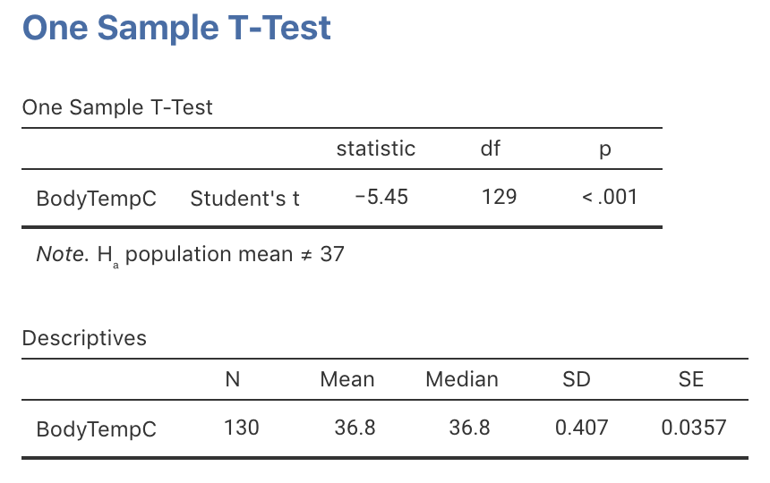
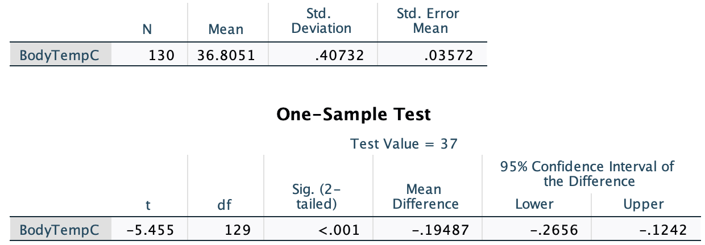
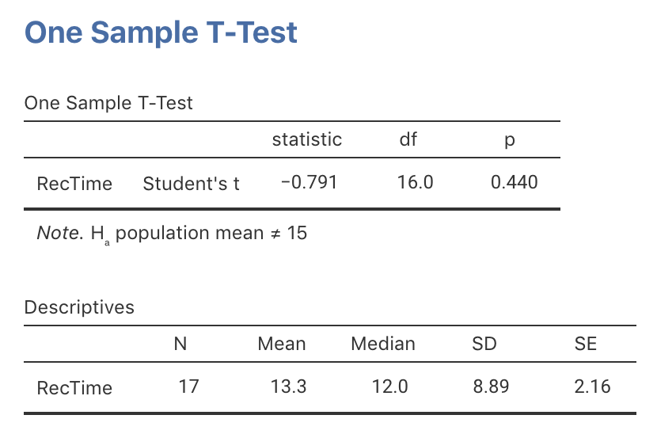
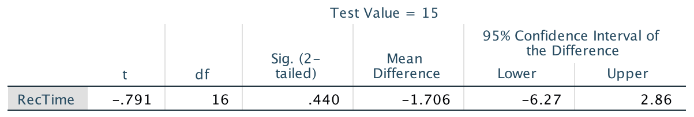
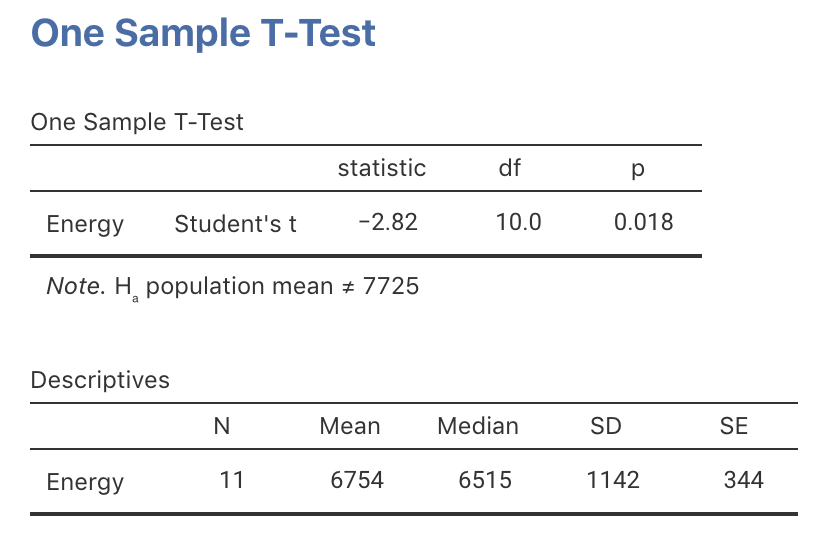
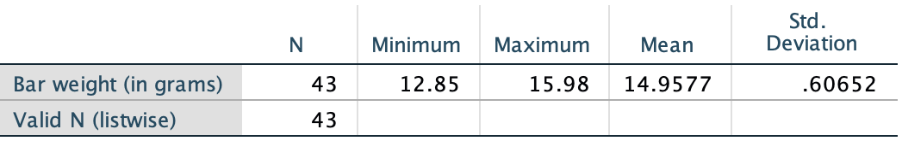

# Tests for one mean {#TestOneMean}

::: {.objectivesBox .objectives data-latex="{iconmonstr-target-4-240.png}"}
So far,
you have learnt to
ask a RQ, 
identify different ways of obtaining data,
design the study,
collect the data
describe the data,
summarise data graphically and numerically,
understand the tools of inference,
and 
to form *confidence intervals*.

**In this chapter**,
you will learn about *hypothesis tests* for one mean.
You will learn to:
  
* conduct hypothesis tests for one sample mean, using a $t$-test.
* determine whether the conditions for using these methods apply in a given situation.
:::


```{r echo=FALSE, fig.cap="", fig.align="center", fig.width=3, out.width="35%"}
SixSteps(5, "Tests: One mean")
```


## Introduction: Body temperatures {#BodyTemperature}

```{r echo=FALSE, cache=FALSE}
bodyt <- structure(list(BodyTemp = c(96.3, 96.7, 96.9, 97, 97.1, 97.1, 
97.1, 97.2, 97.3, 97.4, 97.4, 97.4, 97.4, 97.5, 97.5, 97.6, 97.6, 
97.6, 97.7, 97.8, 97.8, 97.8, 97.8, 97.9, 97.9, 98, 98, 98, 98, 
98, 98, 98.1, 98.1, 98.2, 98.2, 98.2, 98.2, 98.3, 98.3, 98.4, 
98.4, 98.4, 98.4, 98.5, 98.5, 98.6, 98.6, 98.6, 98.6, 98.6, 98.6, 
98.7, 98.7, 98.8, 98.8, 98.8, 98.9, 99, 99, 99, 99.1, 99.2, 99.3, 
99.4, 99.5, 96.4, 96.7, 96.8, 97.2, 97.2, 97.4, 97.6, 97.7, 97.7, 
97.8, 97.8, 97.8, 97.9, 97.9, 97.9, 98, 98, 98, 98, 98, 98.1, 
98.2, 98.2, 98.2, 98.2, 98.2, 98.2, 98.3, 98.3, 98.3, 98.4, 98.4, 
98.4, 98.4, 98.4, 98.5, 98.6, 98.6, 98.6, 98.6, 98.7, 98.7, 98.7, 
98.7, 98.7, 98.7, 98.8, 98.8, 98.8, 98.8, 98.8, 98.8, 98.8, 98.9, 
99, 99, 99.1, 99.1, 99.2, 99.2, 99.3, 99.4, 99.9, 100, 100.8), 
    Gender = c(1L, 1L, 1L, 1L, 1L, 1L, 1L, 1L, 1L, 1L, 1L, 1L, 
    1L, 1L, 1L, 1L, 1L, 1L, 1L, 1L, 1L, 1L, 1L, 1L, 1L, 1L, 1L, 
    1L, 1L, 1L, 1L, 1L, 1L, 1L, 1L, 1L, 1L, 1L, 1L, 1L, 1L, 1L, 
    1L, 1L, 1L, 1L, 1L, 1L, 1L, 1L, 1L, 1L, 1L, 1L, 1L, 1L, 1L, 
    1L, 1L, 1L, 1L, 1L, 1L, 1L, 1L, 2L, 2L, 2L, 2L, 2L, 2L, 2L, 
    2L, 2L, 2L, 2L, 2L, 2L, 2L, 2L, 2L, 2L, 2L, 2L, 2L, 2L, 2L, 
    2L, 2L, 2L, 2L, 2L, 2L, 2L, 2L, 2L, 2L, 2L, 2L, 2L, 2L, 2L, 
    2L, 2L, 2L, 2L, 2L, 2L, 2L, 2L, 2L, 2L, 2L, 2L, 2L, 2L, 2L, 
    2L, 2L, 2L, 2L, 2L, 2L, 2L, 2L, 2L, 2L, 2L, 2L, 2L), HeartRate = c(70L, 
    71L, 74L, 80L, 73L, 75L, 82L, 64L, 69L, 70L, 68L, 72L, 78L, 
    70L, 75L, 74L, 69L, 73L, 77L, 58L, 73L, 65L, 74L, 76L, 72L, 
    78L, 71L, 74L, 67L, 64L, 78L, 73L, 67L, 66L, 64L, 71L, 72L, 
    86L, 72L, 68L, 70L, 82L, 84L, 68L, 71L, 77L, 78L, 83L, 66L, 
    70L, 82L, 73L, 78L, 78L, 81L, 78L, 80L, 75L, 79L, 81L, 71L, 
    83L, 63L, 70L, 75L, 69L, 62L, 75L, 66L, 68L, 57L, 61L, 84L, 
    61L, 77L, 62L, 71L, 68L, 69L, 79L, 76L, 87L, 78L, 73L, 89L, 
    81L, 73L, 64L, 65L, 73L, 69L, 57L, 79L, 78L, 80L, 79L, 81L, 
    73L, 74L, 84L, 83L, 82L, 85L, 86L, 77L, 72L, 79L, 59L, 64L, 
    65L, 82L, 64L, 70L, 83L, 89L, 69L, 73L, 84L, 76L, 79L, 81L, 
    80L, 74L, 77L, 66L, 68L, 77L, 79L, 78L, 77L), BodyTempC = c(35.7222222222222, 
    35.9444444444444, 36.0555555555556, 36.1111111111111, 36.1666666666667, 
    36.1666666666667, 36.1666666666667, 36.2222222222222, 36.2777777777778, 
    36.3333333333333, 36.3333333333333, 36.3333333333333, 36.3333333333333, 
    36.3888888888889, 36.3888888888889, 36.4444444444444, 36.4444444444444, 
    36.4444444444444, 36.5, 36.5555555555556, 36.5555555555556, 
    36.5555555555556, 36.5555555555556, 36.6111111111111, 36.6111111111111, 
    36.6666666666667, 36.6666666666667, 36.6666666666667, 36.6666666666667, 
    36.6666666666667, 36.6666666666667, 36.7222222222222, 36.7222222222222, 
    36.7777777777778, 36.7777777777778, 36.7777777777778, 36.7777777777778, 
    36.8333333333333, 36.8333333333333, 36.8888888888889, 36.8888888888889, 
    36.8888888888889, 36.8888888888889, 36.9444444444444, 36.9444444444444, 
    37, 37, 37, 37, 37, 37, 37.0555555555556, 37.0555555555556, 
    37.1111111111111, 37.1111111111111, 37.1111111111111, 37.1666666666667, 
    37.2222222222222, 37.2222222222222, 37.2222222222222, 37.2777777777778, 
    37.3333333333333, 37.3888888888889, 37.4444444444444, 37.5, 
    35.7777777777778, 35.9444444444444, 36, 36.2222222222222, 
    36.2222222222222, 36.3333333333333, 36.4444444444444, 36.5, 
    36.5, 36.5555555555556, 36.5555555555556, 36.5555555555556, 
    36.6111111111111, 36.6111111111111, 36.6111111111111, 36.6666666666667, 
    36.6666666666667, 36.6666666666667, 36.6666666666667, 36.6666666666667, 
    36.7222222222222, 36.7777777777778, 36.7777777777778, 36.7777777777778, 
    36.7777777777778, 36.7777777777778, 36.7777777777778, 36.8333333333333, 
    36.8333333333333, 36.8333333333333, 36.8888888888889, 36.8888888888889, 
    36.8888888888889, 36.8888888888889, 36.8888888888889, 36.9444444444444, 
    37, 37, 37, 37, 37.0555555555556, 37.0555555555556, 37.0555555555556, 
    37.0555555555556, 37.0555555555556, 37.0555555555556, 37.1111111111111, 
    37.1111111111111, 37.1111111111111, 37.1111111111111, 37.1111111111111, 
    37.1111111111111, 37.1111111111111, 37.1666666666667, 37.2222222222222, 
    37.2222222222222, 37.2777777777778, 37.2777777777778, 37.3333333333333, 
    37.3333333333333, 37.3888888888889, 37.4444444444444, 37.7222222222222, 
    37.7777777777778, 38.2222222222222)), .Names = c("BodyTemp", 
"Gender", "HeartRate", "BodyTempC"), class = "data.frame", row.names = c(NA, 
-130L))

bodyt$BodyTempC <- round(bodyt$BodyTempC, 3)
```


<div style="float:right; width: 222x; border: 1px; padding:10px">

</div>


`r if (knitr::is_html_output()) '<!--'`
\begin{wrapfigure}{R}{.20\textwidth}
  \begin{center}
    \includegraphics[width=.15\textwidth]{Illustrations/pexels-anna-shvets-3987141.jpg}
  \end{center}
\end{wrapfigure}
`r if (knitr::is_html_output()) '-->'`


The average internal body temperature is commonly believed to be $\mu= 37.0^\circ\text{C}$,
a guideline based on data over 150 years old [@data:Wunderlich:BodyTemp].
More recently,
researchers wanted to re-examine this claim
[@data:mackowiak:bodytemp]
to see if this benchmark is still appropriate. 

In this example,
a decision is sought about the value of the *population* mean body temperature $\mu$.
The value of $\mu$ will never be known:
the internal body temperature of every person alive
would need to be measured...
and even those not yet born.

The parameter is $\mu$, the population mean internal body temperature.

However, a *sample* of people 
can be taken to determine 
whether or not there is evidence
that the *population* 
mean internal body temperature is still $37.0^\circ\text{C}$.

To make this decision,
the
[decision-making process](#DecisionMaking)
(Sect. \@ref(DecisionMaking)) is used.
Begin by **assuming** that $\mu=37.0^\circ\text{C}$
(as there is no evidence that this accepted standard is wrong),
and then determine if the evidence supports this claim or not.
The RQ could be stated as:

> Is the *population* mean internal body temperature 
> $37.0^\circ\text{C}$?


## Statistical hypotheses and notation: One mean

The [decision making](#DecisionMaking) process
begins by **assuming** that the 
population mean internal body temperature 
is $37.0^\circ\text{C}$.

The sample mean $\bar{x}$ is likely to be different for every sample
(*sampling variation*).
The *sampling distribution* of $\bar{x}$ 
describes how the value of $\bar{x}$ 
varies from sample to sample.
Because $\bar{x}$ varies,
the *sample* mean $\bar{x}$ 
probably won't be exactly $37.0^\circ\text{C}$,
*even if* $\mu$ is $37.0^\circ\text{C}$.

If $\bar{x}$ is not $37.0^\circ\text{C}$,
two broad reasons could explain why:

1. The *population* mean body temperature *is* $37.0^\circ\text{C}$,
   but $\bar{x}$ isn't exactly $37.0^\circ\text{C}$ 
   due to sampling variation
   (that is, the sample mean varies 
   and is likely to be different in every sample);
   or
2. The *population* mean body temperature *is not* $37.0^\circ\text{C}$, 
   and the *sample* mean body temperature
   reflects this.

These two possible explanations are called *statistical hypotheses*.\index{hypotheses}
More formally,
the two statistical hypotheses above are:

1. The *null hypothesis* ($H_0$): $\mu=37.0^\circ\text{C}$; 
   the *population* mean body temperature *is* $37.0^\circ\text{C}$;
   and
2. The *alternative hypothesis* ($H_1$): $\mu \ne 37.0^\circ\text{C}$; 
   the *population* mean body temperature *is not* $37.0^\circ\text{C}$.

Since the null hypothesis is assumed true,
the evidence is evaluated to determine 
if it is supported by the data, or not.

Note that the alternative hypothesis asks if 
$\mu$ is $37.0^\circ\text{C}$ or not:
the value of $\mu$ may be smaller or larger than $37.0^\circ\text{C}$.
Two possibilities are considered:
for this reason,
this alternative hypothesis is called a 
*two-tailed* alternative hypothesis.


## Sampling distribution: One mean

A RQ is answered using data
(this is partly what is meant by *evidence-based* research).
Fortunately,
for the body-temperature study,
data are available from a comprehensive American study
[@data:Shoemaker1996:Temperature].

Summarising the data is important,
because the data are the means by which the RQ is answered
`r if (knitr::is_latex_output()) {
   '(Table \\@ref(tab:DataBodyTemp)).'
} else {
   '(data below).'
}`

A graphical summary 
(Fig. \@ref(fig:BodyTempHist))
shows that the internal body temperature of individuals varies
from person to person:
this is *natural variation*.\index{natural variation}
A numerical summary
(from software) shows that:

* The *sample* mean is $\bar{x} = 36.8051^\circ$C;
* The *sample* standard deviation is $s = 0.40732^\circ$C;
* The sample size is $n=130$.

The sample mean is *less* than the assumed value of 
$\mu=37^\circ\text{C}$... 
The question is *why*:
can the difference reasonably be explained 
by sampling variation, or not?

A 95% CI can also be computed
(using software or manually):
the 95% CI for $\mu$ is from $36.73^\circ$ to $36.88^\circ$C.
This CI is narrow,
implying that $\mu$ has been estimated with precision,
so detecting even small deviations of $\mu$ from $37^\circ$
should be possible.


```{r DataBodyTemp, echo=FALSE}
subBodyT <- round(cbind(bodyt$BodyTempC[1:10], 
                        bodyt$BodyTempC[121:130] ), 2)

if( knitr::is_latex_output() ) {
  kable( subBodyT[1:10, ],
         format = "latex",
         booktabs = TRUE,
         longtable = FALSE,
         col.names = c("Gender", 
                       "Body temp (deg. C)"),
         caption = "The body temperature data: The first 5 and the last 5 of the 130 observations") %>%
	kable_styling(font_size = 10) %>%
	row_spec(0, bold = TRUE)
}
if( knitr::is_html_output(excludes = "epub") ) {
  DT::datatable( bodyt,
                 #fillContainer=FALSE, # Make more room, so we don't just have ten values
                 #filter="top", 
                 #selection="multiple", 
                 #escape=FALSE,
                 options = list(searching = FALSE), # Remove searching: See: https://stackoverflow.com/questions/35624413/remove-search-option-but-leave-search-columns-option
                 caption = "The body temperature data")
}
if( knitr::is_html_output() & knitr::pandoc_to("epub") ) {
  kable( subBodyT[1:10, ],
         format = "html",
         booktabs = TRUE,
         longtable = FALSE,
         col.names = c("Gender", 
                       "Body temp (deg. C)"),
         caption = "The body temperature data: The first 5 and the last 5 of the 130 observations")
}
```


   
```{r BodyTempHist,  echo=FALSE, fig.cap="The histogram of the body temperature data", fig.align="center", fig.height=3.5, fig.width=4.5}
hist( bodyt$BodyTempC,
	xlab = "Body temperature, in degrees C",
	ylab = "Frequency",
	las = 1,
	main = "",
	breaks = seq(35, 39, by = 0.5),
	col = plot.colour)
box()
```


The [decision-making process](#DecisionMaking)
**assumes** that the population mean temperature
is $\mu=37.0^\circ\text{C}$,
as stated in the null hypothesis.
Because of sampling variation,
the value of $\bar{x}$ 
sometimes would be smaller than $37.0^\circ\text{C}$ 
and 
sometimes greater than $37.0^\circ\text{C}$.

How much variation in the value of $\bar{x}$ could be expected,
simply due to sampling variation,
when  $\mu=37.0^\circ\text{C}$?
This variation is described by 
the *sampling distribution*.

The
sampling distribution of $\bar{x}$
was discussed in
Sect. \@ref(SamplingDistSampleMean)
(and Def. \@ref(def:DEFSamplingDistributionXbar) specifically).
From this,
if $\mu$ really was $37.0^\circ$C
and if 
[certain conditions are true](#ValiditySampleMeanTest),
the possible values of the sample means can be described using:

* An approximate normal distribution;
* With mean $37.0^\circ\text{C}$ (from $H_0$);
* With standard deviation of 
  $\displaystyle \text{s.e.}(\bar{x}) = \frac{s}{\sqrt{n}}
    = \frac{0.40732}{\sqrt{130}} = 0.035724$.
  This is the *standard error* of the sample means.

A picture of this 
sampling distribution
(Fig. \@ref(fig:BodyTempSamplingDist))
shows 
*how the sample mean varies when $n=130$,
simply due to sampling variation, when $\mu = 37^\circ\text{C}$*.
This enables questions to be asked
about the likely values of $\bar{x}$
that would be found in the sample,
when the population mean is $\mu = 37^\circ\text{C}$.


```{r BodyTempSamplingDist, echo=FALSE, fig.cap="The distribution of sample mean body temperatures, if the population mean is $37^\\circ$C and $n=130$.  The grey vertical lines are 1, 2 and 3 standard deviations from the mean.", fig.align="center", fig.height=3.5, fig.width=5}
mn <- 37.0
# These taken from Shoemaker's JSE data file
s <- 0.40732
n <- 130

se <- s/sqrt(n)

plot.norm( mn, s/sqrt(n), 
   width = 7,
   height = 5,
   xlab.name="Sample means from samples of size 130 (deg C)", 
   type = "",
   shade.hi.z = 0,
   shade.lo.z = 0,
   srt = 0,
   cex.tickmarks = 0.8,
   round.dec = 3)
#lines(c(0,0), c(0,100), col="gray")
lines(c(-1, -1), 
      c(0, 100), 
      col = "gray")
lines(c(1, 1), 
      c(0, 100), 
      col = "gray")
lines(c(-2, -2), 
      c(0, 100), 
      col = "gray")
lines(c(2, 2), 
      c(0, 100), 
      col = "gray")
lines(c(-3, -3), 
      c(0, 100), 
      col = "gray")
lines(c(3, 3), 
      c(0, 100), 
      col = "gray")
```


::: {.thinkBox .think data-latex="{iconmonstr-light-bulb-2-240.png}"}
Given the sampling distribution shown in Fig. \@ref(fig:BodyTempSamplingDist), use the [68--95--99.7 rule](#def:EmpiricalRule) to determine how often will $\bar{x}$ be **larger** than 37.036 degrees C just because of sampling variation, if $\mu$ really is $37^\circ$C.

`r if (knitr::is_latex_output()) '<!--'`
`r webexercises::hide()`
About 16% of the time.
`r webexercises::unhide()`
`r if (knitr::is_latex_output()) '-->'`
:::


<iframe src="https://learningapps.org/watch?v=p28qr801322" style="border:0px;width:100%;height:500px" allowfullscreen="true" webkitallowfullscreen="true" mozallowfullscreen="true"></iframe>


## The test statistic and $t$-scores: One mean {#Tscores}

The sampling distributions
describes what to **expect** from the sample mean,
**assuming** $\mu = 37.0^\circ\text{C}$.
The value of $\bar{x}$ that is **observed**,
however,
is $\bar{x}=36.8051^\circ$ 
How likely is it that such a value could occur by chance?

The value of the observed sample mean 
can be located the picture of the
[sampling distribution](fig:BodyTempSamplingDist)
(Fig. \@ref(fig:BodyTempSamplingDistT)).
The value
$\bar{x}=36.8051^\circ\text{C}$ is unusually small.
About how many standard deviations is $\bar{x}$ away from $\mu=37$?
A lot...


```{r BodyTempSamplingDistT,  echo=FALSE, fig.cap="The sample mean of $\\bar{x}=36.8041^\\circ$C is very unlikely to have been observed if the poulation mean really was $37^\\circ$C, and $n=130$", fig.align="center", fig.width=6, fig.height=3.5}
mn <- 37.0
#These taken from Shoemaker's JSE data file
s <- 0.40732
n <- 130

se <- s/sqrt(n)

z36 <- (36.8 - mn)/(s / sqrt(n))

plot.norm( mn, 
           s/sqrt(n), 
           width = 7,
           height = 5,
           xlab.name = "Temp (deg C)", 
           type = "",
           shade.hi.x = 36.8,
           shade.lo.x = 0,
           zlim.hi = 3.5,
           zlim.lo = -6,
           show.lo = "36.8",
           srt = -25,
           cex.tickmarks = 0.8,
           round.dec = 3)

#abline(v = z36)
arrows(z36, 
       0.1, 
       z36, 
       0, 
       length = 0.15, 
       angle = 15)
text(z36, 
     0.1, 
     "36.8 deg.",
     pos = 4)
```

Relatively speaking,
the *distance* that the observed sample mean (of $\bar{x}=36.8051$) 
is from 
the mean of the sampling distribution
(Fig. \@ref(fig:BodyTempSamplingDistT)).
is found by computing *how many* standard deviations
the value of $\bar{x}$ is from the mean of the distribution; 
that is, computing something like a $z$-score.
(Remember that the standard deviation in 
Fig. \@ref(fig:BodyTempSamplingDistT)
is the the *standard error*: the amount of variation in the sample means.)

Since the mean and standard deviation (i.e., the *standard error*) 
of this
normal distribution are known,
the number of standard deviations
that $\bar{x} = 36.8051$ is from the mean is

\[
   \frac{36.8051 - 37.0}{0.035724} = -5.453.
\]
This value is like a $z$-score.
However, this is actually called a $t$-score\index{$t$-score}
because it has been computed when
*the population standard deviation is unknown*,
and the best estimate (the *sample* standard deviation) is used
when $\text{s.e.}(\bar{x})$ was computed.

Both $t$ and $z$ scores measure
*the number of standard deviations 
that an observation is from the mean*:
$z$-scores use $\sigma$ and $t$-scores use $s$.
Here,
the distribution of the *sample statistic* is relevant, 
so the appropriate standard deviation is the standard deviation
of the sampling distribution: the *standard error*.


::: {.tipBox .tip data-latex="{iconmonstr-info-6-240.png}"}
Like $z$-scores, $t$-scores measure the
number of standard deviations that an observation is from the mean.
$z$-scores are calculated using the *population* standard deviation,
and $t$-scores are calculated using the *sample* standard deviation.

In hypothesis testing,
$t$-scores are more commonly used than $z$-scores,
because almost always the population standard deviation is unknown,
and the sample standard deviation is used instead.

In this course,
it is sufficient 
to think of $z$-scores and $t$-scores as approximately the same.
Unless sample sizes are small,
this is a reasonable approximation.
:::


So the calculation is:

\[
   t = \frac{36.8051 - 37.0}{0.035724} = -5.453;
\]
the observed sample mean
is *more than five standard deviation below the population mean*.
This is *highly* unusual
based on the
[68--95--99.7 rule](#def:EmpiricalRule),
as seen in
Fig. \@ref(fig:BodyTempSamplingDistT).

In general,
a $t$-score in hypothesis testing is

\begin{equation}
   t = 
   \frac{\text{sample statistic} - \text{assumed population parameter}}
        {\text{standard error of the sample statistic}}.
   (\#eq:tscore)
\end{equation}


<iframe src="https://learningapps.org/watch?v=pi8jnzhu322" style="border:0px;width:100%;height:500px" allowfullscreen="true" webkitallowfullscreen="true" mozallowfullscreen="true"></iframe>


## $P$-values: One mean {#Pvalues}

This is [the decision-making process](#DecisionMaking) 
so far:

1. **Assume** that the population mean is
   $37.0^\circ\text{C}$ (this is $H_0$).
2. Based on this assumption, 
   describe what to **expect** from the sample means 
   (Fig. \@ref(fig:BodyTempSamplingDist)).
3. The **observed statistic**
   is computed,
   relative to what is expected
   using a $t$-score (Fig. \@ref(fig:BodyTempSamplingDistT)): $t=-5.453$.

The value of the $t$-score shows that 
the value of $\bar{x}$ is highly unusual.
*How* unusual can be assessed more precisely 
using a *$P$-value*,\index{$P$-value}
which is used widely in scientific research.
The $P$-value is a way of measuring how unusual an observation is
(if $H_0$ is true).

$P$ values can be *approximated* using the 
[68--95--99.7 rule](#def:EmpiricalRule) and a diagram
(Sect. \@ref(ApproxP)),
but more commonly by using software
(Sect. \@ref(SoftwareP)).


### Approximating $P$-values using the 68--95--99.7 rule {#ApproxP}

The $P$-value is 
the area *more extreme* than the calculated $t$-score.
For example:

* *If* the calculated $t$-score was $t=-1$,
  the *two-tailed* $P$-value would be the shaded area
  in
  Fig. \@ref(fig:BodyTempPvals) (top panel):
  About 32%,
  based on the [68--95--99.7 rule](#def:EmpiricalRule).
  Because the alternative hypothesis is *two-tailed*,
  *both* sides of the mean are considered:
  the $P$-value would be the same if $t=+1$.

* *If* the calculated $t$-score was $t=-2$,
  the *two-tailed* $P$-value would be the shaded area
  shown in
  Fig. \@ref(fig:BodyTempPvals) (bottom panel):
  About 5%,
  based on the [68--95--99.7 rule](#def:EmpiricalRule).
  Because the alternative hypothesis is *two-tailed*,
  *both* sides of the mean are considered:
  the $P$-value would be the same if $t=+2$.

Clearly,
from what the $P$-value means,
a $P$-value is always between 0 and 1.


```{r BodyTempPvals, echo=FALSE, fig.cap="Computing $P$-values for the body temperature data", fig.align="center", fig.width=5, fig.height=5}
par( mfrow = c(2, 1))

plot.norm( mn, 
           s/sqrt(n), 
           width = 7, 
           height = 5,
           xlab.name = "Temp (deg C)", 
           main = "The two-tailed P-value\nif the t-score was -1...",
           type = "",
           shade.hi.z = -1,
           shade.lo.x = 0,
           zlim.hi = 3.5,
           zlim.lo = -3.5,
           round.dec = 2)
plot.norm( mn, 
           s/sqrt(n), 
           new = FALSE,
           xlab.name = "Temp (deg C)", 
           type = "",
           shade.hi.z = 100,
           shade.lo.z = 1,
           zlim.hi = 3.5,
           zlim.lo = -3.5,
           round.dec = 2)
   
   
   
plot.norm( mn, 
           s/sqrt(n), 
           width = 7,
           height = 5,
           xlab.name = "Temp (deg C)", 
           main = "The two-tailed P-value\nif the t-score was -2...",
           type = "",
           shade.hi.z = -2,
           shade.lo.x = 0,
           zlim.hi = 3.5,
           zlim.lo = -3.5,
           show.hi = "",
           round.dec = 2)
plot.norm( mn, 
           s/sqrt(n), 
           new = FALSE,
           xlab.name = "Temp (deg C)", 
           type = "",
           shade.hi.z = 100,
           shade.lo.z = 2,
           zlim.hi = 3.5,
           zlim.lo = -3.5,
           show.lo = "",
           round.dec = 2)
```


::: {.thinkBox .think data-latex="{iconmonstr-light-bulb-2-240.png}"}
What do you think the $P$-value will be for $t = -5.45$ (using Fig. \@ref(fig:BodyTempSamplingDistT))?

`r if (knitr::is_latex_output()) '<!--'`
`r webexercises::hide()`
Based on the [68--95--99.7 rule](#def:EmpiricalRule), the $P$-value will be *extremely* small.
`r webexercises::unhide()`
`r if (knitr::is_latex_output()) '-->'`
:::


### Finding $P$-values using sofware {#SoftwareP}

Software computes the
$t$-score and a precise $P$-value
(jamovi: Fig. \@ref(fig:BodyTempTestjamovi);
SPSS: Fig. \@ref(fig:BodyTempTestSPSS)).
The output 
(in jamovi, under the heading `p`;
in SPSS, under the heading `Sig. (2-tailed)`)
shows that the $P$-value is indeed very small.
Although SPSS reports the $P$-value as 0.000,
$P$-values can never be *exactly* zero,
so we interpret this as
'zero to three decimal places',
or that $P$ is less than 0.001
(written as $P<0.001$, as jamovi reports).


::: {.tipBox .tip data-latex="{iconmonstr-info-6-240.png}"}
When software reports a $P$-value of `0.000`,
it really means (and we should write) $P<0.001$:
That is, the $P$-value is *smaller* than 0.001.
:::


This $P$-value means that,
assumpting $\mu=37.0^\circ$C,
observing a sample mean as low as $36.8051^\circ$C
just through sampling variation
(from a sample size of $n=130$)
is almost *impossible*.
And yet, we did...

Using the
[decision-making process](#DecisionMaking),
this implies that the initial assumption
(the null hypothesis)
is contradicted by the data:
The evidence suggests that the
*population* mean body temperature is *not* $37.0^\circ\text{C}$.


```{r BodyTempTestjamovi, echo=FALSE, fig.cap="jamovi output for conducting the $t$-test for the body temperature data", fig.align="center", out.width="60%"}

```

```{r BodyTempTestSPSS, echo=FALSE, fig.cap="SPSS output for conducting the $t$-test for the body temperature data", fig.align="center", out.width="70%"}

```


::: {.softwareBox .software data-latex="{iconmonstr-laptop-4-240.png}"}
SPSS always produces **two-tailed** $P$-values,
calls then *Significance values*,
and labels them as `Sig.`

jamovi can produce one- or two-tailed $P$-values.
:::


## Making decisions with $P$-values

$P$-values tells us the likelihood of observing the sample statistic 
(or something more extreme),
based on the **assumption** about the population parameter being true.

In this context,
the $P$-value tells us the likelihood of
observing the value of $\bar{x}$
(or something more extreme), just through sampling variation (chance) 
if $\mu = 37$. 

The $P$-value is a probability,
albeit a probability of something quite specific,
so it is a value between 0 and 1.
Then:

* 'Big' $P$-values mean that the sample statistic (i.e., $\bar{x}$)
  could reasonably 
  have occurred through sampling variation, 
  if the assumption about the parameter (stated in $H_0$) was true
  (Fig. \@ref(fig:BigSmallP), top panel):
  The data **do not contradict**
  the assumption ($H_0$).

* 'Small' $P$-values mean that the sample statistic (i.e., $\bar{x}$)
  is unlikely to have occurred through sampling variation, 
  if the assumption about the parameter (stated in $H_0$) was true:
  (Fig. \@ref(fig:BigSmallP), bottom panel):
  The data **contradict** the assumption.

What is meant by 'small' and 'big'?
It is *arbitrary*: no definitive rules exist.
Commonly,
a $P$-value smaller than 1% (that is, smaller than 0.01)
is usually considered 'small',
and
a $P$-value larger than 10% (that is, larger than 0.10)
is usually considered 'big'.
Between the values of 1% and 10% is often a 'grey area'.


```{r BigSmallP, echo=FALSE, fig.cap="A picture of large (top) and small (bottom) $P$-value situations", fig.align="center", fig.width=5, fig.height=5}
par( mfrow = c(2, 1))

plot.norm(mu = 0, 
          sd = 1, 
          xlab.name = "t-score", 
          main = "'Big' P-value (two-tailed)",
          type = "", # Otherwise, a "z" labels the x-axis
          shade.lo.x = -10, 
          shade.hi.x = -1.2)
plot.norm(mu = 0, 
          sd = 1, 
          new = FALSE,
          xlab.name = "t-score", 
          main = "'Big' P-value (two-tailed)",
          type = "", # Otherwise, a "z" labels the x-axis
          shade.lo.x = 1.2, 
          shade.hi.x = 10)


plot.norm(mu = 0, 
          sd = 1, 
          xlab.name = "t-score", 
          main = "'Small' P-value: two-tailed",
          type = "", # Otherwise, a "z" labels the x-axis
          shade.lo.x = -10, 
          shade.hi.x = -2.3)
plot.norm(mu = 0, 
          sd = 1, 
          new = FALSE,
          xlab.name = "t-score", 
          main = "'Small' P-value: two-tailed",
          type = "", # Otherwise, a "z" labels the x-axis
          shade.lo.x = 2.3, 
          shade.hi.x = 10)


```


Traditionally,
a $P$-value is 'small' if it is less than 5% 
(less than 0.05),
and 'big' if greater than 5% 
(greater than 0.05).

However,
again this is *arbitrary*,
and
binary decision making (*either* big *or* small)
is unreasonable.

More reasonably,
$P$-values should be interpreted
as providing varying strength of evidence in support of
the alternative hypothesis $H_1$
(Table \@ref(tab:PvaluesInterpretation)).

These are not definitive,
but are only guidelines.
Of course,
conclusions should be written in the context of the problem.


::: {.importantBox .important data-latex="{iconmonstr-warning-8-240.png}"}
For *one-tailed tests*,
the $P$-value is *half* the value of the two-tailed $P$-value.

SPSS always produces two-tailed $P$-values,
usually calls them 'Significance values', 
and labels them as `Sig.`, 
and sometimes explicitly notes that they are two-tailed.
:::


For the body-temperature data then,
where $P<0.001$,
the $P$-value is *very* small, 
so there is *very strong evidence*
that the
population mean body temperature is not $37.0^\circ\text{C}$.


## Communicating results: One mean

In general,
to communicate the results of any hypothesis test,
report:

* An *answer to the RQ*;
* The *evidence* used to reach that conclusion 
  (such as the $t$-score and $P$-value---including
  if it is a one- or two-tailed $P$-value); and
* Some *sample summary information*, 
  including a CI, 
   summarising the data used to make the decision.

So write:

> The sample provides very strong evidence
> ($t = -5.45$; two-tailed $P<0.001$)
> that the population mean body temperature is not $37.0^\circ\text{C}$
> ($\bar{x} = 36.81$; $n = 130$; 95% CI\ from 36.73$^\circ$C to 36.88$^\circ$C).

The components are:

* The *answer to the RQ*: 
  'The sample provides very strong evidence... 
  that the population mean body temperature is not $37.0^\circ\text{C}$'.
* The *evidence* used to reach the conclusion: 
  '$t=-5.45$; two-tailed  $P<0.001$'.
* Some *sample summary information* (including a CI): 
  '$\bar{x} = 36.81$; $n=130$; 95% CI from 36.73$^\circ$C to 36.88$^\circ$C'.

Notice how the conclusion is worded:
There is *evidence* to support the alternative hypothesis.
In fact, 
the alternative hypothesis *may* or *may not* be true... 
but the evidence (data) available
supports the alternative hypothesis.


## Hypothesis testing for one mean: A summary {#TestSummary}

Let's recap
the [decision-making process seen earlier](#DecisionMaking),
in this context about body temperatures:

* **Step 1: Assumption**: 
  Write the *null hypothesis* about the parameter (based on the RQ): 
  $H_0$: $\mu=37.0^\circ\text{C}$. 
  In addition,
  write the *alternative hypothesis* $H_1$: $\mu\ne 37.0^\circ\text{C}$. 
  (This alternative hypothesis is two-tailed.)
* **Step 2: Expectation**: 
  The *sampling distribution* describes what to expect 
  from the sample statistic *if* the null hypothesis is true: 
  [under certain circumstances](#ValiditySampleMeanTest),
  the sample means will vary with an approximate normal distribution 
  around a mean of $\mu=37.0^\circ\text{C}$ 
  with a standard deviation of $\text{s.e.}(\bar{x}) = 0.03572$
  (Fig. \@ref(fig:BodyTempSamplingDistT)).
* **Step 3: Observation**: 
  Compute the $t$-score: $t=-5.45$. 
  The $t$-score can be computed by software,
  or using the general equation \@ref(eq:tscore).
* **Step 4: Consistency?**: 
  Determine if the data are *consistent* with the assumption, 
  by computing the $P$-value.
  Here, the $P$-value is much smaller than 0.001.
  The $P$-value can be computed by software,
  or approximated using the [68--95--99.7 rule](#def:EmpiricalRule).

The **conclusion** is that there is very strong evidence 
that $\mu$ is not $37.0^\circ\text{C}$:


::: {.example #OneTSpeeds name="Mean driving speeds"}
A study of driving speeds in Malaysia [@azwari2021evaluating]
recorded the speeds of vehicles on various roads.

One RQ of interest was whether the mean speed of cars on one road was the posted speed limit of 90 km.h^-1^, or whether it was higher.
The *parameter* of interest is $\mu$, the mean speed in the *population*.

The statistical hypotheses are:

* $H_0$: $\mu = 90$; and
* $H_1$: $\mu > 90$ (since the researchers were interested in whether the mean speed was *higher* than the posted speed limit).
 
The researchers recorded the speed of $n = 400$ vehicles on this road,
and found $\bar{x} = 96.56$, but this value is likely to vary from sample to sample.
The sample standard deviation was $s = 13.874$, so that

\[
  \text{s.e.}(\bar{x}) = \frac{s}{\sqrt{n}} = \frac{13.874}{\sqrt{400}} = 0.6937.
\]
Hence, the test statistic is

\[
   t = \frac{\bar{x} - \mu}{\text{s.e.}(\bar{x})} = \frac{96.56 - 90}{0.6937} = 9.46,
\]
where (as usual) the value of $\mu$ is taken from the null hypothesis (which we always assume to be true).

This is a *huge* value, suggesting that the (one-tailed) $P$-value is very small.

We write (remembering the alternative hypothesis is one-tailed):

> There is very strong evidence ($t = 9.46$; one-tailed $P<0.001$) that 
> the mean speed of vehicles on this road (sample mean: 96.56; standard deviation: 13.874)
> is greater than 90 km.h^-1^.

Of course, this statement refers to the *mean* speed; there may be individual vehicles travelling below the speed limit.
:::

 

## Statistical validity conditions: One mean {#ValiditySampleMeanTest}

As with any inference procedure,
the underlying mathematics requires
[certain conditions to be met](#exm:StatisticalValidityAnalogy)
so that the
results are statistically valid.
For a hypothesis test for one mean,
these conditions are the same as for the CI for one mean
(Sect. \@ref(ValiditySampleMean)).

The test will be statistically valid if
*one* of these is true:

1. The sample size is at least 25, *or*
2. The sample size is smaller than 25
		  *and*
		  the *population* data has an approximate normal distribution.

The sample size of 25 is a rough figure here, and some books give other values (such as 30).

This condition
ensures that the *distribution of the sample means has an approximate normal distribution*
so that the [68--95--99.7 rule](#def:EmpiricalRule) can be used.
Provided the sample size is larger than about 25,
this will be approximately true
*even if* the distribution of the individuals in the
population does not have a normal distribution.
That is,
when $n>25$
the sample means generally have an approximate normal distribution,
even if the data themselves don't have a normal distribution.

In addition to the statistical validity condition,
the test will be

* [**internally valid**](#def:InternalValidity)
  if the study was well designed; and
* [**externally valid**](#def:ExternalValidity) 
  if the sample is a [simple random sample](#SRS)
  and is internally valid.


::: {.example #StatisticalValidityTemps name="Statistical validity"}
The hypothesis test regarding body temperature 
is statistically valid
since the sample size is large ($n=130$).

Since the sample size is large,
we *do not* require the data to 
come from a population with a normal distribution.
:::


::: {.thinkBox .think data-latex="{iconmonstr-light-bulb-2-240.png}"}
Suppose we are performing a one-sample $t$-test about a mean. 
The random sample is of size is $n = 45$, and the histogram of the data is skewed right.

Is the test likely to be **statistically** valid?  
`r if( knitr::is_html_output(exclude = "epub") ) {
	 mcq( c(
     "Yes, because the sample is a random sample",
     answer = "Yes, because the sample size is large",
     "No, because the sample size is too small",
     "We don't know; we need to know if the data has a normal distribution", 
     "No, because the histogram is skewed right"
	 ))}`   
:::


::: {.example #OneTSpeedsValid name="Driving speeds"}
In Example \@ref(exm:OneTSpeeds) about mean driving speeds,
the sample size was 400, much larger than 25.

The test will be statistically valid.
:::


## Example: Recovery times {#RecoveryTimes}


```{r echo=FALSE}
RTime <- structure(list(RecTime = c(14, 9, 18, 26, 12, 0, 10, 4, 8, 21, 
28, 24, 24, 2, 3, 14, 9)), .Names = "RecTime", row.names = c(NA, 
-17L), class = "data.frame", variable.labels = structure(character(0), .Names = character(0)), codepage = 28591L)

```


<div style="float:right; width: 222x; border: 1px; padding:10px">

</div>


`r if (knitr::is_html_output()) '<!--'`
\begin{wrapfigure}{R}{.25\textwidth}
  \begin{center}
    \includegraphics[width=.20\textwidth]{Illustrations/pexels-anna-shvets-3846157.jpg}
  \end{center}
\end{wrapfigure}
`r if (knitr::is_html_output()) '-->'`


Seventeen patients were treated for medial collateral ligament (MCL) 
and anterior cruciate ligament (ACL) tears
using a new treatment method
[@data:Nakamua2000:ACL; @data:Altman1991:PracticalStats].

The current existing treatment has
an average recovery time of 15 days.
The RQ is:

> For patients with this type of injury,
> does the new treatment method lead to 
> *shorter* mean recovery times?
  
The parameter is $\mu$, the population mean recovery time.

The statistical hypotheses (**Step 1: Assumption**) 
about the parameter are, from the RQ:

- $H_0$: $\mu=15$ 
  (the population mean is $15$, 
  but $\bar{x}$ is not $15$ due to sampling variation): 
  This is the initial **assumption**.
- $H_1$: $\mu<15$ 
  ($\mu$ is not $15$; 
  it really does produce *shorter* recovery times, on average).

This test is *one-tailed*:
the RQ only asks if the new method produces
*shorter* recovery times.

The evidence
(Table \@ref(tab:RecoveryData)) can be
summarised numerically,
using software
or (since the data set is small)
a calculator.
Either way,
$\bar{x} = 13.29$ and $s=8.887$.


```{r RecoveryData, echo=FALSE}
RTimeArray <- array( c(RTime$RecTime, NA),  
                     dim = c(2, 9))
options(knitr.kable.NA = '')

if( knitr::is_latex_output() ) {
  kable(RTimeArray,
        format = "latex",
        col.names = rep(" ", 9),
        booktabs = TRUE,
        longtable = FALSE,
        caption = "The recovery times (in days) for a new treatment") %>%
    kable_styling(font_size = 10)
}

if( knitr::is_html_output() ) {
  kable(RTimeArray,
        format = "html",
        col.names = rep(" ", 9),
        booktabs = TRUE,
        longtable = FALSE,
        caption = "The recovery times (in days) for a new treatment")
}
```


If the null hypothesis is true (and $\mu=15$),
the values of the sample mean that are likely to occur 
through sampling variation can be described 
(**Step 2: Expectation**).

The sample means are likely to vary with 
an approximate normal distribution
([under certain assumptions](#ValiditySampleMeanTest)),
with mean $\mu=15$ and a standard deviation of

\[	
  \text{s.e.}(\bar{x}) = \frac{s}{\sqrt{n}} = \frac{8.887}{\sqrt{17}} = 2.155.
\]
This describes what values of $\bar{x}$ we should *expect* in the sample 
if the mean recovery time $\mu$ really was 15 days
(Fig. \@ref(fig:RecoveryTimesDSamplingDistribution)).

The sample mean is $\bar{x} = 13.29$,
so the $t$-score to determine where the sample mean
is located (**Step 3: Observation**), 
relative to what is expected,
is

\[
  t = \frac{\bar{x} - \mu}{\text{s.e.}(\bar{x})}
  = \frac{13.29 - 15}{2.155}
  = -0.79.
\]
Software could also be used
(jamovi: Fig. \@ref(fig:RecoveryTimestestjamovi);
SPSS: Fig. \@ref(fig:RecoveryTimestestSPSS)),
but in either case, $t = -0.79$.

A $z$-score of $-0.79$ is not unusual,
and (since $t$-scores are like $z$-scores)
this $t$-score is not unusual either
(**Step 4: Consistency**).
The $P$-value in the 
[jamovi output](fig:RecoveryTimestestjamovi) or 
[SPSS output](fig:RecoveryTimestestSPSS) confirms this:
the *two*-tailed $P$-value is $0.440$,
so the *one*-tailed $P$-value is $0.440\div 2 = 0.220$.


```{r RecoveryTimestestjamovi, echo=FALSE, fig.cap="jamovi output for the $t$-test for the recovery-times data", fig.align="center", out.width="60%"}

```


```{r RecoveryTimestestSPSS, echo=FALSE, fig.cap="SPSS output for the $t$-test for the recovery-times data", fig.align="center", out.width="80%"}

```


::: {.importantBox .important data-latex="{iconmonstr-warning-8-240.png}"}
Recall: 
For *one-tailed tests*,
the $P$-value is *half* the value of the two-tailed $P$-value.
:::


This 'large' $P$-value suggests that 
a sample mean of 13.29 could reasonably have
been observed just through sampling variation:
there is no evidence to support the alternative hypothesis $H_1$.

If $\mu$ really was 15,
then about 22% of the time $\bar{x}$ 
would be less than 13.29 just through sampling variation alone.

   
```{r RecoveryTimesDSamplingDistribution, echo=FALSE, fig.cap="The sampling distribution for the recovery-times data", fig.align="center", fig.width=4.5, fig.height=5}
par( mfrow=c(2,1) )

mn.RT <- 15
sd.RT <- sd(RTime$RecTime)
n.RT <- length(RTime$RecTime)

plot.norm( mn.RT, 
           sd.RT/sqrt(n.RT), 
           xlab.name = " ", 
           type = expression(bar(italic(x))),
           shade.lo.x = 0,
           shade.hi.x = 13.29,
           zlim.hi = 3,
           zlim.lo = -3,
           show.hi = "",
           round.dec = 2)

abline(v = 13.29)
text( -0.79, 
      dnorm( -0.79, 0, 1), 
      expression( paste(bar(italic(x)) == "13.29")),
      pos = 2)


plot.norm( 0, 
           1, 
           xlab.name = "t-scores", 
           type = expression(italic(t)),
           zlim.hi =3,
           zlim.lo = -3,
           shade.lo.z = -4,
           shade.hi.z = -0.79,
           show.hi = "",
           round.dec = 2)

lines( x = c(-0.79, -0.79),
       y = c(0, dnorm(-0.79)) )
text( -2, dnorm(-0.79), 
  "sample mean", 
  pos = 3)
```


To summarise:

* **Step 1 (Assumption)**: 
    - $H_0$: $\mu=15$, the initial assumption;
    - $H_1$: $\mu<15$ (note: *one*-tailed)

* **Step 2 (Expectation)**: 
  The sample means will vary, 
  and this sampling variation is described by an 
  approximate normal distribution 
  with mean $15$ and standard deviation $\text{s.e.}(\bar{x}) =  2.155$.
* **Step 3 (Observation)**: 
  $t = -0.791$.
* **Step 4 (Consistency?)**: 
  The *one-tailed* $P$-value is $0.220$: 
  The data are consistent with $H_0$, 
  so there is no evidence to support the alternative hypothesis.

To write a conclusion,
include an *answer* to the question, 
*evidence* leading to the conclusion, 
and some *sample summary information*:

> No evidence exists in the sample
> (one sample $t = -0.79$; one-tailed $P=0.220$)
> that the population mean recovery time
> is less than 15 days 
> (mean 13.29 days; $n=17$; 95% CI from 8.73 to 17.86 days)
> using the new treatment method.

(The CI is found using the ideas in 
Sect. \@ref(OneMeanCI), or manually.)

Notice the wording:
The new method *may* be better,
but no evidence exists of this in the sample.
The onus is on the new method to demonstrate 
that it is better than the current method.

The sample size is small ($n = 17$),
so the test may not be statistically valid
(but the $P$-value is so large that it 
probably won't affect the conclusions).


## Example: Student IQs {#IQstudents}

Standard IQ scores are designed to have a mean in the general population of 100, with a standard deviation of 15.

A study of $n = 224$ students at Griffith University [@reilly2022gender] found that the sample IQ scores were approximately normally distributed, 
with a mean of 111.19 and a standard deviation of 14.21. 

Is this evidence that students at Griffith University (GU) have a higher mean IQ than the general population?

The RQ is:

> For students at Griffith University, is the mean IQ higher than 100?
  
The parameter is $\mu$, the population mean IQ for students at GU.

The statistical hypotheses (**Step 1: Assumption**) 
about the parameters are, from the RQ:

- $H_0$: $\mu = 100$ 
  (the population mean is $100$, 
  but $\bar{x}$ is not $100$ due to sampling variation): 
  This is the initial **assumption**.
- $H_1$: $\mu > 100$ 
  ($\mu$ is not $100$; 
  GU students really do have a higher mean IQ than the general population).

This test is *one-tailed*:
the RQ only asks if the IQ of GU students is *greater* than 100.

We do not have the original data, but the summary data are sufficient:
$\bar{x} = 111.19$ with a standard deviation of $s = 14.21$ from a sample of size $n = 224$. 

The sample mean is higher than 100, which:

> ...might be expected from a university subject pool...
>
> @reilly2022gender, p. 7.

Since the sample mean varies for each sample, the sample mean has a standard error:

\[
   \text{s.e.}(\bar{x}) = \frac{s}{\sqrt{n}} = \frac{14.21}{\sqrt{224}} = 0.9494456.
\]
The $t$-score is

\[
   t = \frac{\bar{x} - \mu}{\text{s.e.}(\bar{x})} = \frac{111.19 - 100}{0.9494456} = 11.78.
\]

This is a *huge* $t$-score,
which means that a sample mean as large as 111.19 would be highly unlikely to occur simply by chance in a sample of size $n = 224$ if the population mean really was 100.
The $P$-value will be extremely small.


To conclude (where the CI is found using the ideas in Sect. \@ref(OneMeanCI), or manually):

> Very strong evidence exists in the sample
> (one sample $t = 11.78$; one-tailed $P < 0.001$)
> that the population mean IQ in students at Griffith University
> is greater than 100 
> (mean 111.19; $n = 224$; 95% CI from 109.29 to 113.09).

(**Note**: IQ scores do not have units of measurement.)


Since the sample size is much large than 25, this conclusion is *statistically valid* (i.e., the mathematics behind the computations will be sound).

The sample is not a true random sample from the population of all GU students (the students are mostly first-year students, and most were enrolled in an undergraduate psychological science degree). However, these students may be  somewhat representative of all GU student. That is, the sample *may* be externally valid.

The difference between the general population IQ of 100 and the sample mean IQ of GU students is only small: about 11 IQ units.
Possibly, this difference has very little practical significance, even though the statistical evidence suggests that the difference cannot be explained by chance.


## Summary {#Chap27-Summary}

To test a hypothesis about a population mean $\mu$,
initially **assume** the value of $\mu$ in the null hypothesis 
to be true.
Then,
describe the **sampling distribution**,
which describes what to **expect** 
from the sample statistic based on this assumption:
under certain statistical validity conditions,
the sample mean varies with an approximate normal distribution
centered around the hypothesised value of $\mu$,
with a standard deviation of

\[
   \text{s.e.}(\bar{x}) =\frac{s}{\sqrt{n}}.
\]
The **observations** are then summarised, 
and *test statistic* computed:

\[
   t = \frac{ \bar{x} - \mu}{\text{s.e.}(\bar{x})},
\]
where $\mu$ is the hypothesised value given in the null hypothesis.
The $t$-value is like a $z$-score, 
and so an approximate **$P$-value** can be estimated using the
[68--95--99.7 rule](#def:EmpiricalRule),
or found using software.


`r if (knitr::is_html_output()){
  'The following short video may help explain some of these concepts:'
}`


<iframe width="560" height="315" src="https://www.youtube.com/embed/ZbJ58Ag22Mw" frameborder="0" allow="accelerometer; encrypted-media; gyroscope; picture-in-picture"></iframe>


## Quick review questions  {#Chap27-QuickReview}

A study [@imtiaz2017assessment] compared the nutritional intake of $n = 50$ anaemic infants in Lahore (Pakistan) with the amounts recommended.

The mean daily protein intake in the sample was 14g, with a standard deviation of 3g.
The recommended protein intake was 13g.

The researchers wanted to see if the mean intake met the recommendation, or not.

1. The standard error of the mean (to four decimal places) is
`r if( knitr::is_html_output(exclude = "epub") ) {fitb(num=TRUE, tol=0.0001, answer=0.4243)} else {"________________"}`

1. The null hypothesis is:
`r if( knitr::is_html_output(exclude = "epub") ) {longmcq( c(
  "The sample mean is 13g",
  "The sample mean is 14g",
  answer = "The population mean is 13g",
  "The population mean is 14g")  )} else {"________________"}`

1. The test statistic (to two decimal places) is
`r if( knitr::is_html_output(exclude = "epub") ) {fitb(num=TRUE, tol=0.01, answer=2.35)} else {"________________"}`

1. The two-tailed $P$-value is
`r if( knitr::is_html_output(exclude = "epub") ) {mcq( c(
  answer = "Small",
  "Big",
  "0.05",
  "2.35/2 = 1.175")  )} else {"________________"}`

1. True or false? We accept the *null* hypothesis.
`r if( knitr::is_html_output(exclude = "epub") ) {torf(answer=FALSE)}`

1. There is 
`r if( knitr::is_html_output(exclude = "epub") ) {mcq( c(
           "no evidence",
  answer = "evidence"
    ) )} else {'????????'}`
to support the *alternative* hypothesis
(that the mean daily protein intake is *not* 13g).


`r if (!knitr::is_html_output()) '<!--'`
::: {.progressBox .progress}
**Progress:**  `r webexercises::total_correct()`
:::
`r if (!knitr::is_html_output()) '-->'`


## Exercises {#TestOneMeanAnswerExercises}

Selected answers are available in
Sect. \@ref(TestOneMeanAnswer).


```{r echo=FALSE, message=FALSE}
# WE <- read.spss("../Data/WomenEnergy.sav", to.data.frame=TRUE)

WE <- structure(list(Energy = c(5260, 5470, 5640, 6180, 6390, 7515, 
6515, 6805, 7515, 8230, 8770)), .Names = "Energy", row.names = c(NA, 
-11L), class = "data.frame", variable.labels = structure(character(0), .Names = character(0)), codepage = 28591L)

```


::: {.exercise #TestOneMeanExercisesEnergyIntake}
The recommended daily energy intake for women
is 7725kJ
(for a particular cohort, in a particular country;
@data:Altman1991:PracticalStats).
The daily energy intake for 11 women was measured
to see if this is being adhered to.
The RQ is

> For this group of women, is the population mean daily energy intake 7725kJ?

The data collected are shown in
Table \@ref(tab:WomenEnergyData).

1. Write the hypotheses for answering this RQ.
1. Use the jamovi output 
   (Fig. \@ref(fig:WomenEnergyDescriptivesjamovi)),
   write down the value of 
   $\bar{x}$ and $\text{s.e.}(\bar{x})$.
1. Using this output, write down the $t$-value and the $P$-value.
1. Write a suitable conclusion.
1. Is the test statistically valid?
1. Sketch the sampling distribution of $\bar{x}$.

:::


```{r WomenEnergyData, echo=FALSE}
WEArray <- array( c(WE$Energy, NA),  dim=c(2, 6))
if( knitr::is_latex_output() ) {
  kable(WEArray,
        format = "latex",
        col.names = rep(" ", 6),
        booktabs = TRUE,
        caption = "Energy consumptions (in kJ) for women")
}
if( knitr::is_html_output() ) {
  kable(WEArray,
        format = "html",
        booktabs = TRUE,
        longtable = FALSE,
        col.names = rep(" ", 6),
        booktabs = TRUE,
        caption = "Energy consumptions (in kJ) for women")
}
```

```{r WomenEnergyDescriptivesjamovi, echo=FALSE, fig.cap="jamovi output for the energy-intake data", fig.align="center", out.width="60%", fig.show="hold"}

```


<!-- ```{r WomenEnergyDescriptivesSPSS, echo=FALSE, fig.cap="SPSS output for the energy-intake data", fig.align="center", out.width="80%", fig.show="hold"} -->
<!-- knitr::include_graphics( c("SPSS/WomenEnergy/WomenEnergyOutput.png",  -->
<!--                            "SPSS/WomenEnergy/WomenEnergyCI.png") ) -->
<!-- ``` -->


::: {.exercise #TestOneMeanExercisesToothbrushing}
Most dental associations^[Such as the *American Dental Association*
and the *Australian Dental Association*.]
recommend brushing teeth for two minutes. 
A study
[@data:Macgregor1979:BrushingDurationKids]
of the brushing time for 85 uninstructed school children from England
(11 to 13 years old) 
found the mean brushing time was 60.3 seconds,
with a standard deviation of 23.8 seconds.

1. Is there evidence that the mean brushing time 
   for schoolchildren from England is two minutes (as recommended)?
1. Sketch the sampling distribution of the sample mean.
:::


::: {.exercise #TestOneMeanExercisesAutomatedVehicles}
A study 
[@data:greenlee2018:vehicles]
of human-automation interaction with
automated vehicles aimed to

> ... determine whether monitoring the roadway for hazards during automated driving 
> results in a vigilance decrement.
>
> --- @data:greenlee2018:vehicles, p. 465

(A 'decrement' is a *reduction*.)
That is,
they were interested in whether the average mental demand of 'drivers' of automated vehicles
was higher than the average mental demand for ordinary tasks.

In the study,
the $n=22$ participants 'drove',
in a simulator,
an automated vehicle for 40 minutes. 
While driving,
the drivers monitored the road for hazards.
The researchers assessed the 'mental demand' placed on these drivers,
where scores of 50 over
'typically indicate substantial levels of workload'
(p. 471).
For the sample,
the mean score was 84.00 with a standard deviation of 22.05.

Is there evidence of a 'substantial workload' associated with monitoring roadways while 'driving' automated vehicles?
:::


::: {.exercise #TestOneMeanExercisesQualityOfLife}
A study explored the quality of life of patients 
receiving cavopulmonary shunts
[@data:Steele2016:Shunt].
'Quality of life' was assessed using a 
36-question health survey,
where the scale is standardised so that the 
mean of the general population is 50.

For the 14 patients in the study,
the sample mean for the 'Physical component' of the survey 
was 47.2 (with a standard deviation of 8.2).
The sample mean for the 'Mental component' of the survey 
was 52.7 (with a standard deviation of 5.6).

Is there evidence that the patients are different, on average, 
to the general population
on the basis of the results?
:::


::: {.exercise #TestOneMeanExercisesCherryRipes}
A *Cherry Ripe*
is a popular chocolate bar in Australia.
In 2017 and 2018, 
I 'sampled' some *Cherry Ripe* Fun Size bars.
The packet claimed that the Fun Size bars weigh 12&nbsp;g
(on average).
Use the SPSS summary of the data
(Fig. \@ref(fig:CherryRipes20172018))
to perform a hypothesis test to determine if the mean
weight really is 12&nbsp;g or not.
:::


```{r CherryRipes20172018, echo=FALSE, fig.cap="jamovi output for the Cherry Ripes data", fig.align="center", out.width="75%"}

```


::: {.exercise #TestOneMeanBloodLoss}
A study of paramedics
[@data:Williams2007:BloodLoss]
asked participants ($n=199$) 
to estimate the amount of blood on four different surfaces.
When the actual amount of blood spilt on concrete was 1000&nbsp;ml,
the mean guess was 846.4&nbsp;ml 
(with a standard deviation of 651.1&nbsp;ml).

Is there evidence that the mean guess really is 1000&nbsp;ml (the true amount)?
Is this test likely to be valid?
:::

```{r echo=FALSE, cache=FALSE}
QC <- structure(list(High1 = c(61.63, 63.11, 66.88, 62.56, 66.12, 65.34, 
64.83, 64.22, 65.54, 65.33, 67.83, 65.97, 65.01, 64.51, 64.3, 
64.38, 64.75, 63.12, 62.93, 63.59, 67.04, 64.38, 63.41, 64.19, 
64.86, 63.7, 63.14, 66, 63.43, 64.25, 63.67, 64.78, 58.02, 63.46, 
65.2, 63.74), Mid1 = c(18.36, 18.77, 18.98, 17.97, 19.69, 19.63, 
19.5, 19.39, 19.87, 19.66, 20.41, 18.37, 19.09, 18.98, 19.22, 
18.99, 19.58, 19.7, 19, 19.11, 19.97, 19.52, 19.39, 17.2, 19.75, 
19.35, 19.95, 19.38, 19.33, 19, 19.05, 19.24, 19.29, 19.29, 19.18, 
19.35), High2 = c(62.64, 64.36, 66.06, 65.39, 66.85, 65.56, 66.6, 
66.9, 65.5, 65.92, 65.51, 65.03, 64.22, 64.19, 64.95, 64.95, 
64.45, 64.77, 65.58, 64.87, 63.52, 65.02, 66.05, 63.82, 64.58, 
65.09, 64.86, 64.85, 66.75, 65.37, 64.29, 65.5, 62.85, 64, 63.72, 
64.3), Mid2 = c(19.12, 19.07, 19.58, 19.35, 19.65, 19.13, 19.55, 
19.85, 19.45, 19.87, 19.73, 19.6, 20.76, 18.98, 19.93, 19.15, 
19.23, 19.2, 19.52, 19.38, 19.08, 18.89, 19.57, 19.35, 19.13, 
19.44, 19.27, 19.58, 19.71, 19.64, 19.14, 19.28, 19.68, 18.27, 
18.75, 19.57)), .Names = c("High1", "Mid1", "High2", "Mid2"), class = "data.frame", row.names = c(NA, 
-36L))

DataAndTargets <- array(dim = c(3, 4))
DataAndTargets[1, ]<- c(64.31, 19.24, 64.97, 19.40)
DataAndTargets[2, ]<- c(1.700, 0.588, 1.029, 0.413)
DataAndTargets[3, ]<- c(64.22, 19.01, 65.05, 19.45)

rownames(DataAndTargets) <- c("Mean of data", 
                              "Std. dev. of data", 
                              "Pre-determined target")
colnames(DataAndTargets) <- c("High level (Inst. 1)", 
                              "Mid level (Inst. 1)", 
                              "High level (Inst. 2)", 
                              "Mid level (Inst. 2)")
```

::: {.exercise #TestOneMeanQualityControl}
A quality-control study
[@feng2017application]
assessed the accuracy of two instruments from a clinical laboratory,
by comparing the reported luteotropichormone (LH) concentrations
to known pre-determined values
(data below).

Perform a series of tests to determine how well the two instruments perform,
for both high- and mid-level LH concentrations
(using Table \@ref(tab:QualityControlDataSummary)).
:::


```{r QualityControlData, echo=FALSE}
if( knitr::is_latex_output() ) {
  kable( head(QC, 10),
        format = "latex",
        caption = "The quality-control data: LH levels (in mIU/mL) for two instruments (only the first ten observations shown)",
        col.names = colnames(DataAndTargets),
        booktabs = TRUE,
        longtable = FALSE) %>%
    kable_styling(font_size = 10)
}

if( knitr::is_html_output(exclude = "epub") ) {
  DT::datatable(QC,
               caption = "The quality-control data: LH levels (in mIU/mL) for two instruments",
               colnames = colnames(DataAndTargets),
               options = list(searching = FALSE), # Remove searching: See: https://stackoverflow.com/questions/35624413/remove-search-option-but-leave-search-columns-option
               filter = "none")
}
if( knitr::is_html_output() & knitr::pandoc_to("epub")) {
  kable( head(QC, 10),
        format = "html",
        caption = "The quality-control data: LH levels (in mIU/mL) for two instruments (only the first ten observations shown)",
        col.names = colnames(DataAndTargets),
        booktabs = TRUE,
        longtable = FALSE)
}
```


```{r QualityControlDataSummary, echo=FALSE}
if( knitr::is_latex_output() ) {
  kable(DataAndTargets,
        format = "latex",
        caption = "Summary of the quality-control data for LH levels (in mIU/mL) for two instruments",
        booktabs = TRUE,
        #align = c("p{17mm}", "p{17mm}","p{17mm}","p{17mm}"),
        longtable = FALSE) %>%
    row_spec(row = 0, 
             bold = TRUE) %>%
    kable_styling(font_size = 10)
}
if( knitr::is_html_output() ) {
  kable(DataAndTargets,
        format = "html",
        caption = "Summary of the quality-control data for LH levels (in mIU/mL) for two instruments",
        booktabs = TRUE,
        align = "r",
        longtable = FALSE)
}
```


