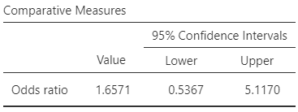
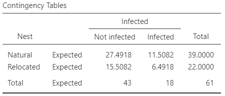
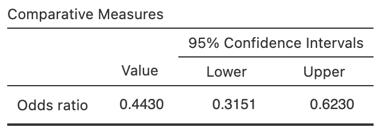
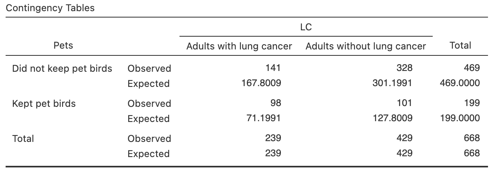
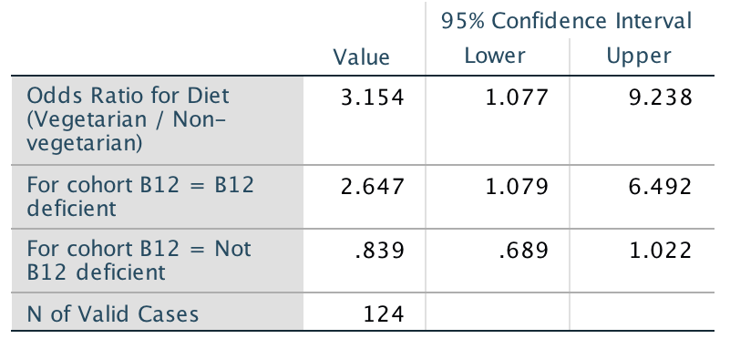

# CIs for odds ratios {#OddsRatiosCI}


```{r, child = if (knitr::is_html_output()) {'introductions/29-CIs-OddsRatios-HTML.Rmd'} else {'introductions/29-CIs-OddsRatios-LaTeX.Rmd'}}
```


## Introduction: eating habits {#OddsRatioIntro}


<div style="float:right; width: 222x; border: 1px; padding:10px">

</div>


@data:Mann12017:UniStudents examined the relationship between where students usually ate, and where the student lived.
The researchers cross-classified the $n = 183$ students (the units of analysis) according to two *qualitative* variables:

* Where they lived: with their parents, or *not* with their parents;
* Where they ate most meals: *off-campus* or *on-campus*.

Since both variables are qualitative, means are not appropriate for summarising the data.
A two-way table of counts\index{Tables!two-way} is appropriate (Table\ \@ref(tab:MealsDataTable)), called a *contingency table*.\index{Contingency table}
Both qualitative variables have two levels, so the two-way table\index{Two-way tables} is a $2\times 2$ table.


```{r MealsDataTable}
data(StudentsEat)


Eating.tab <- Eating.tab.Counts <-  xtabs( ~ Meals + Live, 
                                           data = StudentsEat)

Eating.tab <- cbind( Eating.tab, 
                     "Total" = rowSums(Eating.tab))
Eating.tab <- rbind( Eating.tab, 
                     "Total" = colSums(Eating.tab))


if( knitr::is_latex_output() ) {
  kable( pad(Eating.tab[1:2, 1:2],
             surroundMaths = TRUE,
             targetLength = c(2, 3),
             digits = 0),
        format = "latex",
        booktabs = TRUE,
        longtable = FALSE,
        escape = FALSE,
        col.names = c("with parents",
                      "with parents"),
        align = "c",
        caption = "Where university students live and eat") %>%
     column_spec(1, bold = TRUE) %>%
     row_spec(0, bold = TRUE) %>%
     kable_styling(font_size = 8) %>%
    add_header_above( c(" " = 1, 
                        "Lives" = 1,
                        "Doesn't live" = 1),
                      line = FALSE,
                      bold = TRUE)
}
if( knitr::is_html_output() ) {
  kable(pad(Eating.tab[1:2, 1:2],
             surroundMaths = TRUE,
             targetLength = c(2, 3),
             digits = 0),
               format = "html",
               booktabs = TRUE,
               longtable = FALSE,
               align = "c",
               caption = "Where university students live and eat")
}
UniS <- Eating.tab
```

The odds (or proportion) of students who eat most meals off-campus can be compared between those who live with their parents and those who do *not* live with their parents.


::: {.importantBox .important data-latex="{iconmonstr-warning-8-240.png}"}
Every cell in the $2\times 2$ table contains different students, so the comparison is *between* individuals.
:::


The parameter is the *odds ratio* (OR);\index{Odds ratio} specifically, the odds ratio of eating most meals off-campus, comparing those living with parents to those not living with parents.
Another sensible parameter would be the difference between the *proportions* (or *percentages*) in each group, but the odds ratio usually is used as the parameter\footnote[This is *optional*: The difference between two proportions is always a number between $-1$ and $1$, which makes the sampling distribution hard to describe.].
For this reason, writing the RQ in terms of odds ratios or odds\index{Odds} is also most appropriate.

Using the OR, the RQ could be written as:

> Among university students, what is the odds ratio of students eating most meals off-campus, comparing those who *do* and *do not* live with their parents?


::: {.importantBox .important data-latex="{iconmonstr-warning-8-240.png}"}
Take care defining the odds ratios in the parameter! 
Recall (Sect. \@ref(QualOdds)): software usually compares Row\ 1 to Row\ 2, and Column\ 1 to Column\ 2.
For this reason, defining your OR in the same way makes sense.
:::


## Summarising data {#CIOddsRatiosSummaries}
\index{Odds ratio}\index{Odds}

With two qualitative variables, an appropriate numerical summary includes the odds and percentages for the outcome (for both comparison groups) and the sample sizes.
From these data, the odds of eating most meals *off-campus* is:

* $52 \div  2 = 26$    for students     *living with their parents* (Column\ 1).
* $105\div 24 = 4.375$ for students *not living with their parents* (Column\ 2).

(Notice the numbers in the *second* row are always on the bottom of the fraction.)
So the *odds ratio* (OR) of eating most meals *off-campus* (the *first* row), comparing students living with parents to students *not* living with parents (second row), is $26 \div 4.375 = 5.943$.
The numerical summary (Table\ \@ref(tab:EatingNumericalSummary)) shows the percentage and odds of eating most meals off-campus, comparing students living at home and those not living at home.


::: {.softwareBox .software data-latex="{iconmonstr-laptop-4-240.png}"}
The odds ratio can be interpreted in *either* of these ways (i.e., both are correct):\index{Odds ratio!interpreting}\index{jamovi output!Odds ratios}

-   The *odds* compare Row\ 1 counts to Row\ 2 counts, for both columns.
    The *odds ratio* then compares the Column\ 1 odds to the Column\ 2 odds.
-   The *odds* compare Column\ 1 counts to Column\ 2 counts.
    The *odds ratio* then compares the Row\ 1 odds to the Row\ 2 odds.

Odds and odds ratios are computed with the *first row* and *first column* values on the *top* of the fraction.
In this case, both of the above approaches produces an OR of $5.943$.
:::


```{r EatingNumericalSummary}
EatingNumericalSummary <- array( dim = c(3, 3))

EatingNumericalSummary[1, ] <- c(format(round(UniS[1, 1]/UniS[2, 1 ], 4), nsmall = 3),
                                 round(UniS[1, 1]/sum(UniS[1, ]) * 100, 1),
                                 UniS[3,1] )
EatingNumericalSummary[2, ] <- c(round(UniS[1, 2]/UniS[2, 2], 4),
                                 round(UniS[2, 1]/sum(UniS[2, ]) * 100, 1),
                                 UniS[3,2] )
EatingNumericalSummary[3, ] <- c(round( (UniS[1, 1] / UniS[1, 2] ) / (UniS[2, 1] / UniS[2, 2]), 3), 
                                 NA,
                                 NA)
rownames(EatingNumericalSummary) <- c("Living with parents",
                                      "Not living with parents",
                                      "Odds ratio")
    
if( knitr::is_latex_output() ) {
  kable(pad(EatingNumericalSummary,
            surroundMaths = TRUE,
            targetLength = c(6, 4, 3),
            digits = c(3, 1, 0)),
        format = "latex",
        longtable = FALSE,
        booktabs = TRUE,
        escape = FALSE,
        align = "c",
        col.names = c("meals off-campus",
                      "most meals off-campus", 
                      "size"),
       caption = "The odds and percentage of university students eating most meals off-campus" 
  ) %>%
     row_spec(0, bold = TRUE) %>%
     row_spec(3, italic = TRUE) %>%
     row_spec(2, hline_after = TRUE) %>%
   add_header_above( c(" ", "Odds having most" = 1, 
                       "Percentage having" = 1,
                       "Sample" = 1),
                     line = FALSE,
                     bold = TRUE) %>%
	 kable_styling(font_size = 8) 
}
if( knitr::is_html_output() ) {
   kable(pad(EatingNumericalSummary,
            surroundMaths = TRUE,
            targetLength = c(6, 4, 3),
            digits = c(3, 1, 0)),
               format = "html",
               longtable = FALSE,
               booktabs = TRUE,
               align = "c",
               col.names = c("Odds of having most\n meals off-campus", 
                             "Percentage having most\n meals off-campus", 
                             "Sample size"),
               caption = "The odds and percentage of university students eating most meals off-campus")
}
```


An appropriate graph (Fig.\ \@ref(fig:EatingGraphsCI), left panel) is a side-by-side bar chart\index{Graphs!side-by-side barchart} or a stacked bar chart.\index{Graphs!stacked bar chart}.


```{r EatingGraphsCI, fig.cap="The uni-student eating data. Left: a side-by-side bar chart. Right: the jamovi output for computing a CI", fig.align="center", fig.height=4, fig.width=4, out.width=c("45%", "53%"), fig.show='hold'}
par( xpd = TRUE,
     mar = c(4, 4, 4, 2) + 0.1) # DEFAULT: c(5, 4, 4, 2) + 0.1
barCols <- c( grey(0.2), 
              grey(0.8))

barplot( (prop.table(Eating.tab.Counts, margin = 2)) * 100,
	col = barCols,
	ylab = "Percentage",
	beside = TRUE,
	main = "Side-by-side bar chart of where\nstudents live and eat", 
	ylim = c(0, 119),
	las = 1,
	names.arg = c("Lives with\nparents",
	              "Does not live\nwith parents"),
	legend.text = TRUE,
	args.legend = list("topright",
	                   bty = "n",
	                   cex = 0.9,
	                   ncol = 1,
	                   horiz = FALSE))

#

knitr::include_graphics( "jamovi/UniStudents/UniStudents-OR-CI.png")

```


## Sampling distribution for sample odds ratio {#OddsRatiosOR}
\index{Sampling distribution!odds ratio}

<!-- From the numerical summary table (Table\ \@ref(tab:EatingNumericalSummary)), the odds of a student eating most meals *off-campus* is $26$ for students *living with their parents*, and $4.375$ for students *not living with their parents*. -->
<!-- So the OR of eating most meals *off-campus*, comparing students living with parents to students *not* living with parents, is $26 \div 4.375 = 5.943$. -->
<!-- The odds are different in each group, and hence the OR is not one *in the sample*: the odds of eating most meals off-campus for students living *with* their parents is $5.943$ times the odds for students living *not* living with their parents. -->

Every sample of students is likely to be different, and hence the odds of students eating off campus will vary from sample to sample (in both groups).
Hence, the OR varies also from sample to sample.
That is, *sampling variation* exists, so the odds ratio has a *sampling distribution* and a *standard error*.

The sampling distribution of the sample OR is *not a normal distribution*^[For those interested (this is *optional*): The OR is only defined for *non-negative* values so a normal distribution is inappropriate. However, the *logarithm* of the OR has an approximate normal distribution under certain conditions.].
Fortunately, a simple transformation to the sample OR *does* have a normal distribution, though we omit the details.
For this reason, we will use software output for finding the CI for the odds ratio, and not discuss the sampling distribution directly.
In other words, we will rely on software to find CIs for odds ratios.


<!-- ```{r NotationOddsRatioCI} -->

<!-- OddsRatioNotation <- array( dim = c(6, 2)) -->

<!-- OddsRatioNotation[1, ] <- c("Individual values in the population", -->
<!--                           "Group A: Population odds ratio") -->
<!-- OddsRatioNotation[2, ] <- c("", -->
<!--                           "Group B: Population odds ratio") -->

<!-- OddsRatioNotation[3, ] <- c("Individual values in a sample", -->
<!--                           "Group A: Sample odds ratio") -->
<!-- OddsRatioNotation[4, ] <- c("", -->
<!--                           "Group B: Sample odds ratio") -->

<!-- OddsRatioNotation[5, ] <- c("Odds ratio of sample odds", -->
<!--                           "Vary with a distribution related to the normal distribution") -->
<!-- OddsRatioNotation[6, ] <- c("across all possible samples", -->
<!--                           " (under certain conditions), with a mean and standard deviation") -->


<!-- if( knitr::is_latex_output() ) { -->
<!--   kable( OddsRatioNotation, -->
<!--          format = "latex", -->
<!--          booktabs = TRUE, -->
<!--          longtable = FALSE, -->
<!--          escape = FALSE, -->
<!--          caption = "The notation used for describing means, and the sampling distribution of the sample means", -->
<!--          align = c("r", "l"), -->
<!--          linesep = c("", "\\addlinespace", -->
<!--                      "", "\\addlinespace", -->
<!--                      ""), -->
<!--          col.names = c("Quantity", -->
<!--                        "Description") ) %>% -->
<!-- 	row_spec(0, bold = TRUE) %>% -->
<!--   kable_styling(font_size = 8) -->
<!-- } else { -->
<!--   OddsRatioNotation[5, 1] <- paste(OddsRatioNotation[5, 1],  -->
<!--                                  OddsRatioNotation[6, 1]) -->
<!--   OddsRatioNotation[6, 2] <- paste(OddsRatioNotation[5, 2],  -->
<!--                                  OddsRatioNotation[6, 2]) -->
<!--   OddsRatioNotation[6, ] <- NA -->

<!--     kable( OddsRatioNotation, -->
<!--          format = "html", -->
<!--          booktabs = TRUE, -->
<!--          longtable = FALSE, -->
<!--          escape = FALSE, -->
<!--          caption = "The notation used for describing means, and the sampling distribution of the sample means", -->
<!--          align = c("r", "l"), -->
<!--          linesep = c("", "\\addlinespace", -->
<!--                      "", "\\addlinespace", -->
<!--                      ""), -->
<!--          col.names = c("Quantity", -->
<!--                        "Description") ) %>% -->
<!-- 	row_spec(0, bold = TRUE)  -->
<!-- } -->
<!-- ``` -->


## Confidence intervals for population odds ratio
\index{Confidence intervals!odds ratio}

Using jamovi\index{jamovi output!Comparing two odds} to find the OR (Fig.\ \@ref(fig:EatingGraphsCI), right panel), the sample OR is $5.94$, and the (exact) $95$%\ CI is from $1.35$ to $26.1$.
The OR is the same as computed manually, since the OR was computed comparin Row\ 1 to Row\ 2, and Column\ 1 to Column\ 2, as used y the software.


<!-- ```{r UniMealsTestOutputjamovi, fig.show="hold", fig.cap="The jamovi output for computing a CI", fig.align="center", out.width="49%"} -->
<!-- knitr::include_graphics( "jamovi/UniStudents/UniStudents-OR-CI.png") -->
<!-- #knitr::include_graphics( "SPSS/UniStudents/UniStudentsRiskOutput.png") -->
<!-- ``` -->


::: {.tipBox .tip data-latex="{iconmonstr-info-6-240.png}"}
Recall the jamovi output can be interpreted in either of these ways:\index{jamovi output!Odds ratios}

* Odds are Row\ 1 divided by Row\ 2.  
  Then the odds ratio is computed as Column\ 1 odds divided by Column\ 2 odds (i.e., *comparing* Column\ 1 odds to Column\ 2 odds); or
* Odds are Column\ 1 divided by Column\ 2.  
  Then the odds ratio is computed as Row\ 1 odds divided by Row\ 2 odds (i.e., *comparing* Row\ 1 odds to Row\ 2 odds).

Both are correct, but one is usually easier to understand.
:::

We write:

> The OR comparing the odds of eating most meals off-campus, comparing students living with parents (odds: $26.0$; $n = 54$) to students *not* living with parents (odds: $4.38$; $n = 129$), is $5.94$, with a $95$%\ CI from $1.35$ to $26.1$.

There is a $95$% chance that this CI straddles the population OR.
Notice that the *meaning* of the OR is explained in the conclusions: the odds of eating most meals *off*-campus, and comparing students living with parents to *not* living with parents.

*The CI for an OR is not symmetrical*, like the others we have seen^[For those interested (this is *optional*): This is because the OR has no upper limit, but the lower limit of an OR is zero. 
The *logarithm* of the limits of the CI form a symmetric interval.].


::: {.tipBox .tip data-latex="{iconmonstr-info-6-240.png}"}
Interpreting and explaining ORs can be challenging, so care is needed!
:::


<iframe src="https://learningapps.org/watch?v=pqzmnub7n22" style="border:0px;width:100%;height:500px" allowfullscreen="true" webkitallowfullscreen="true" mozallowfullscreen="true"></iframe>


## Statistical validity conditions {#ValidityConditionsORCI}
\index{Statistical validity!odds ratio}

As usual, these results hold under certain conditions.
The CI computed above is statistically valid if 

* All *expected* counts are at least five.

Some books may give other (but similar) conditions.
Note that this condition is based on the *expected* frequencies, not the *observed* frequencies.


::: {.importantBox .important data-latex="{iconmonstr-warning-8-240.png}"}
If all the *observed* counts exceed five, then all the *observed* counts will exceed five.
:::


The *expected* counts are what we would expect to find if there was *no relationship* between the two variables in the two-way table.
If there was *no relationship* between the two variables for the student-meals data, students living *with* or *not with* their parents would have a similar percentage of meals eaten off-campus.
The overall percentage of students eating meals off-campus is $157/183\times 100 = 85.79$% (from Table\ \@ref(tab:MealsDataTable)).
If there was *no relationship* between the two variables, this percentage would be the same for students living *with* or *not with* their parents.
In other words, we would *expect* $85.79$% of the $54$ students who *do* live with their parents to eat most meals off-campus (which is $46.33$), and we would *expect* $85.79$% of the $129$ students who *do not* live with their parents to eat most meals off-campus (which is $110.67$).


::: {.thinkBox .think data-latex="{iconmonstr-light-bulb-2-240.png}"}
Compute the expected counts for the number of students eating most meals *on-campus*.\label{thinkBox:ExpectedCounts}
:::


*Usually, you do not have to compute these expected values*, as software like jamovi can be used to produce the *expected* counts (see Fig.\ \@ref(fig:UniMealsTestOutputExpectedOnlyjamovi)).
This statistical validity condition is explained further in Sect.\ \@ref(ExpectedValues).


::: {.example #StatisticalValidityMeals name="Statistical validity"}
For the uni-students eating data, jamovi can be used to compute the *expected* counts (Fig.\ \@ref(fig:UniMealsTestOutputExpectedOnlyjamovi))\index{jamovi output!Expected counts}
None are less than five, and so the conclusion is statistically valid.
(One *observed count* is less than five, but this is not relevant to checking for statistical validity.)
:::


```{r UniMealsTestOutputExpectedOnlyjamovi, fig.show="hold", fig.cap="The expected counts in jamovi, for the uni-students data", fig.align="center", out.width="70%"}
knitr::include_graphics( "jamovi/UniStudents/UniStudents-ExpectedOnly.png")
```


## Example: turtle nests {#TurtleNestsOR}

The hatching success of loggerhead turtles on Mediterranean beaches is often compromised by fungi and bacteria.
@candan2021first compared the odds of a nest being infected, between nest relocated due to the risk of tidal inundation, and non-relocated nests (Table\ \@ref(tab:TurtleNestDataTable)).
The researchers were interested in knowing:

> For Mediterranean loggerhead turtles, what are the odds of infections comparing natural to relocated nests?


```{r TurtleNestDataTable}
data(TurtleNests)

TurtleData <- xtabs(Counts ~ Nest + Infected, 
                    data = TurtleNests)

rownames(TurtleData) <- c("Natural",
                          "Relocated")
colnames(TurtleData) <- c("Non-infected",
                          "Infected")

if( knitr::is_latex_output() ) {
  kable(pad(TurtleData,
            surroundMaths = TRUE,
            targetLength = 2,
            digits = 0),
        format = "latex",
        booktabs = TRUE,
        longtable = FALSE,
        escape = FALSE,
        align = "c",
        caption = "Non-infected and infected turtle nests") %>%
    row_spec(0, bold = TRUE) %>%
    kable_styling(font_size = 8)
}
if( knitr::is_html_output() ) {
  kable(pad(TurtleData,
            surroundMaths = TRUE,
            targetLength = 2,
            digits = 0),
               format = "html",
               booktabs = TRUE,
               longtable = FALSE,
               align = "c",
        caption = "Non-infected and infected turtle nests") %>%
    row_spec(0, bold = TRUE)
}
```


The parameter is the odds ratio of non-infection, comparing natural to relocated nests.
The odds ratio can be defined in other ways also, but this definition is consistent with how software computes odds given Table\ \@ref(tab:TurtleNestDataTable) (i.e., first row to second row; first column to second column).

A graphical summary (Fig.\ \@ref(fig:TurtleNestsGraphs)) and a numerical summary table (Table\ \@ref(tab:TurtleNestsNumericalSummary)) show that the odds of natural nest being non-infected is $1.657$ times the odds of a relocated nest being non-infected.
From the jamovi output (Fig.\ \@ref(fig:TurtleNestsOutputjamovi)), the $95$%\ CI for this odds ratio is from $0.537$ to $5.12$.
The smallest *expected* count is $6.49$ (Fig.\ \@ref(fig:TurtleNestsOutputjamovi)), so this CI is statistically valid.
(We could also see that since all observed counts are greater than five, all the expected counts will be greater than five.)
We write:

> The OR of a non-infected nest, comparing natural nests (odds: $2.90$; $n = 39$) to relocated nests (odds: $1.75$; $n = 22$), is $1.66$ with a $95$%\ CI from $0.537$ to $5.12$.


```{r}
TNsummary <- array( dim = c(3, 3) )

colnames(TNsummary) <- c( "Odds non-infected",
                          "Percentage non-infected",
                          "Sample size")
rownames(TNsummary) <- c("Natural",
                         "Relocated",
                         "Odds ratio:")
  
  
TNsummary[1:2, 1] <- TurtleData[, 1] / TurtleData[, 2]
TNsummary[1:2, 2] <- TurtleData[, 1] / rowSums(TurtleData) * 100
TNsummary[1:2, 3] <- apply(TurtleData, 1, "sum")
TNsummary[3, 1] <- TNsummary[1, 1] / TNsummary[2, 1]
```


\begin{figure}
\begin{minipage}{0.52\textwidth}
\captionof{table}{The odds and percentage of non-infected turtle nests\label{tab:TurtleNestsNumericalSummary}}
\fontsize{8}{12}\selectfont
```{r}
  kable( pad(TNsummary,
             surroundMaths = TRUE,
             targetLength = c(5, 5, 2),
             digits = c(3, 2, 0)),
        format = "latex",
        booktabs = TRUE,
        longtable = FALSE,
        align = "c",
        escape = FALSE,
        table.env = "@empty",
        col.names = c("non-infected",
                     "non-infected",
                     "size")) %>%
    row_spec(0, bold = TRUE) %>%
    row_spec(3, italic = TRUE) %>%
    row_spec(2, hline_after = TRUE) %>%
    add_header_above( c( " " = 1,
                         "Odds" = 1,
                         "Percentage" = 1,
                         "Sample" = 1),
                      bold = TRUE,
                      line = FALSE)
```
\end{minipage}
\hspace{0.05\textwidth}
\begin{minipage}{0.40\textwidth}%
\centering
```{r, out.width='99%', fig.width=3.75, fig.height=3}
par(xpd = TRUE,
    mar = c(2, 4, 4, 1) + 0.1) # DEFAULT: c(5, 4, 4, 2) + 0.1

barplot( t(TurtleData), 
	las = 1,
	ylab = "Count",
	xlab = "Type of nest",
	main = "Number of turtle\nnest infections",
	beside = TRUE,
	names.arg = c("Natural", 
	              "Relocated"),
	ylim = c(0, 30),
	col = barCols,
	legend.text = TRUE,
	args.legend = list("topright",
	                   bty = "n",
	                   cex = 0.9,
	                   ncol = 1,
	                   legend = c("Not infected", 
	                              "Infected"), 
	                   horiz = FALSE))

box()

```
\caption{A plot of the turtle-nest data}\label{fig:TurtleNestsGraphs}
\end{minipage}
\end{figure}


```{r TurtleNestsNumericalSummary}
if( knitr::is_html_output() ) {
  kable(pad(TNsummary,
             surroundMaths = TRUE,
             targetLength = c(5, 5, 2),
             digits = c(3, 2, 0)),
        format = "html",
        booktabs = TRUE,
        longtable = FALSE,
        align = "c",
        digits = c(3, 2, 0),
        caption = "The odds and percentage of non-infected nests")
}
```

<!-- The figure for LaTeX is in the minipage (combined with data table), so only need show it for the HTML -->
`r if (knitr::is_latex_output()) '<!--'`
```{r TurtleNestsGraphs, fig.show="hold", fig.cap="jamovi output for the EV study", fig.align="center", out.width="50%"}
par(xpd = TRUE,
    mar = c(5, 4, 4, 8) + 0.1) # DEFAULT: c(5, 4, 4, 2) + 0.1

barplot( t(TurtleData), 
	las = 1, 
	ylab = "Count",
	xlab = "Type of nest",
	beside = TRUE,
	names.arg = c("Natural", 
	              "Relocated"),
	ylim = c(0, 30),
	col =  viridis::viridis(10)[c(3, 8)],
	legend.text = TRUE,
	args.legend = list("topright",
	                   bty = "n",
	                   cex = 0.9,
	                   ncol = 1,
	                   legend = c("Not infected", 
	                              "Infected"), 
	                   horiz = FALSE))


box()

```
`r if (knitr::is_latex_output()) '-->'`


```{r TurtleNestsOutputjamovi, fig.show="hold", fig.cap="The jamovi output for the turtle-nesting data", fig.align="center", out.width=c("48%", "48%")}


```


## Chapter summary 

Software is used to compute a confidence interval (CI) for the odds ratio, as the sampling distribution does not have a normal distribution.
The statistical validity conditions should be checked: the *expected* counts all should exceed five.


## Quick review questions {#Chap25-QuickReview}

::: {.webex-check .webex-box}
@egbue2017mass studied the adoption of electric vehicle (EVs) by a certain group of professional Americans (Table\ \@ref(tab:EV10years)).
Output from using jamovi is shown in Fig.\ \@ref(fig:EVjamovi).

1. What *percentage* of people without post-graduate study would buy an EV in the next $10$ years? \tightlist 
`r if (knitr::is_html_output()) '(**do not** add the percentage symbol)'`
`r if( knitr::is_html_output() ) {fitb(num = TRUE, tol = 0.001, answer = 75)}`
1. What are the *odds* that a person without post-graduate study would buy an EV in the next $10$ years?  
`r if( knitr::is_html_output() ) {fitb(num = TRUE, tol = 0.001, answer = 3)}`
1. Using the output, what is the OR of buying an electric vehicle in the next $10$ years, comparing those *without* post-grad study to those *with* post-grad study?  
`r if( knitr::is_html_output() ) {mcq(
  c(answer = 1.71,
    0.68,
    4.28)  )}`
1. True or false: The CI means that the sample OR is likely to be between $0.68$ and $4.28$.  
`r if( knitr::is_html_output() ) {torf(answer = FALSE)}`
1. True or false: The analysis is statistically valid?  
`r if( knitr::is_html_output() ) {torf(answer = TRUE)}`
:::


```{r}
EV10 <- array(dim = c(2, 2))

colnames(EV10) <- c("Yes", 
                    "No")
rownames(EV10) <- c("No post-grad", 
                    "Post-grad study")

EV10[1, ] <- c(24, 8)
EV10[2, ] <- c(51, 29)
```

\begin{figure}
\begin{minipage}{0.32\textwidth}
\captionof{table}{Responses to `Would you purchase an electric vehicle in the next $10$ years?' by education\label{tab:EV10years}}
\fontsize{8}{12}\selectfont
```{r}
knitr::kable( pad(EV10,
                  surroundMaths = TRUE,
                  targetLength = 2,
                  digits = 0),
         format = "latex",
         booktabs = TRUE,
         longtable = FALSE,
         align = "c",
         escape = FALSE,
         table.env = "@empty") %>%
   row_spec(0, bold = TRUE)
   #kable_styling(font_size = 8) %>% # CANNOT USE THIS IS THE MINIPAGE
   #column_spec(1, width = "13mm") %>%
   #column_spec(2, width = "22mm")
```
\end{minipage}
\hspace{0.05\textwidth}
\begin{minipage}{0.60\textwidth}%
\centering
```{r, out.width='92%'}
knitr::include_graphics( "jamovi/EVs/EVs-CI.png")
```
\caption{jamovi output for the EV study}\label{fig:EVjamovi}
\end{minipage}
\end{figure}


```{r EV10years}
EV10 <- array(dim = c(2, 2))

colnames(EV10) <- c("Yes", 
                    "No")
rownames(EV10) <- c("No post-grad", 
                    "Post-grad study")

EV10[1, ] <- c(24, 8)
EV10[2, ] <- c(51, 29)


#if( knitr::is_latex_output() ) {
#   kable(EV10,
#         format = "latex",
#         longtable = FALSE,
#         booktabs = TRUE,
#         caption = "Responses to 'Would you purchase an electric vehicle in the next 10 years?' by education") %>%
# 	kable_styling(font_size = 8) %>%
# 	row_spec(0, bold = TRUE)
#}

if( knitr::is_html_output() ) {
  kable(pad(EV10,
                  surroundMaths = TRUE,
                  targetLength = 2,
                  digits = 0),
        format = "html",
        align = "c",
        longtable = FALSE,
        booktabs = TRUE,
        caption = "Responses to 'Would you purchase an electric vehicle in the next $10$ years?' by education")
}
```

<!-- The figure for LaTeX is in the minipage (combined with data table), so only need show it for the HTML -->
`r if (knitr::is_latex_output()) '<!--'`
```{r EVjamovi, fig.show="hold", fig.cap="jamovi output for the EV study", fig.align="center", out.width="50%"}
knitr::include_graphics( "jamovi/EVs/EVs-CI.png")
```
`r if (knitr::is_latex_output()) '-->'`


`r if (!knitr::is_html_output()) '<!--'`
`r webexercises::hide()`
1. The number *without* post-grad study: $24 + 8 = 32$.
   The *percentage* of people without post-grad study who would buy an EV in the next $10$ years is $24/32 = 0.75$, or 75%. 
1. The people with post-grad study are in the *bottom* row.
   The *odds* of people without post-grad study who would buy an EV in the next $10$ years is $24/8 = 3$. 
1. The odds of people *without* post-grad study who would by an electric vehicle is $24/8 = 3$.  
   The odds of people *with* post-grad study who would by an electric vehicle is $51/29 = 1.7586$.  
   So the OR is $3/1.7586 = 1.706$.
1. Not at all. We know *exactly* what the sample OR is (it is $1.706$).
   CIs always give an interval in which the *population parameter* is likely to be within.
1. The CI is statistically valid if all the *expected* counts exceed 5.
   So we don't really know for sure from the given information.
   But the *observed* counts are all reasonably large, so it is *very probably* statistically valid. 
`r webexercises::unhide()`
`r if (!knitr::is_html_output()) '-->'`


## Exercises {#OddsRatiosCIExercises}

Answers to odd-numbered exercises are available in App.\ \@ref(Answers).


::: {.exercise #CIORcrashes}
[*Dataset*: `CarCrashes`]
@wang2020driver recorded information about car crashes in a rural, mountainous county in western China
`r if (knitr::is_latex_output()) {
   '(Table\\ \\@ref(tab:CrashDataTables), left table).'
} else {
   '(Table\\ \\@ref(tab:CrashDataTable)).'
}`

1. Compute the *odds* of crash involving a pedestrian in 2011.
1. Compute the *odds* of crash involving a pedestrian in 2015.
1. Compute the *odds ratio* of crash involving a pedestrian, comparing 2011 to 2015.
1. Use the output (Fig.\ \@ref(fig:CarCrashjamovi)) to write down a CI for the odds ratio.
1. Produce a numerical summary table for the data.
1. Write a conclusion.
1. Determine if the CI is statistically valid.
:::


```{r}
data(CarCrashes) ### Exercise
CarCrashes$CrashType <- ordered(CarCrashes$CrashType, 
                           levels = 1:2,
                           labels = c("Involving pedestrians", 
                                      "Involving vehicles"))

Crash.tab <- xtabs(Counts ~ CrashType + Year, 
                   data = CarCrashes)

```

\begin{figure}
\begin{minipage}{0.32\textwidth}
\captionof{table}{Type of car crashes in different years\label{tab:CrashDataTables}}
\fontsize{8}{12}\selectfont
```{r}
kable(pad(Crash.tab,
            surroundMaths = TRUE,
            targetLength = 2,
            digits = 0),
        format = "latex",
        booktabs = TRUE,
        longtable = FALSE,
        escape = FALSE,
        align = "c") %>%
    row_spec(0, bold = TRUE) 
#   kable_styling(font_size = 8) # CANNOT USE THIS IS THE MINIPAGE
```
\end{minipage}
\hspace{0.05\textwidth}
\begin{minipage}{0.60\textwidth}%
\centering
```{r, out.width='92%', fig.align="center"}

```
\caption{jamovi output for the car-crash study}\label{fig:CarCrashjamovi}
\end{minipage}
\end{figure}


```{r CrashDataTables}
if( knitr::is_html_output() ) {
kable(pad(Crash.tab,
            surroundMaths = TRUE,
            targetLength = 2,
            digits = 0),
        format = "latex",
        booktabs = TRUE,
        longtable = FALSE,
        escape = FALSE,
        caption = "Responses to 'Would you purchase an electric vehicle in the next $10$ years?' by education",
        align = "c") %>%
    row_spec(0, bold = TRUE)
}
```

<!-- The figure for LaTeX is in the minipage (combined with data table), so only need show it for the HTML -->
`r if (knitr::is_latex_output()) '<!--'`
```{r CarCrashesjamovi, fig.show="hold", fig.cap="jamovi output for the car-crash data", fig.align="center", out.width="50%"}

```
`r if (knitr::is_latex_output()) '-->'`


::: {.exercise #OddsRatiosCIScarHeights}
[*Dataset*: `ScarHeight`] 
@data:Wallace2017:Sunburn compared the heights of scars from burns received in Western Australia (Table\ \@ref(tab:ScarsData)).
jamovi was used to analyse the data (Fig.\ \@ref(fig:ScarHeightRiskCIjamovi)).

1. Compute the *odds* of having a smooth scar (that is, height is $0$\ mm) for women.
1. Compute the *odds* of having a smooth scar (that is, height is $0$\ mm) for men.
1. Compute the *odds ratio* of having a smooth scar, comparing men to women.
1. Interpret what this odds ratio means.
1. Sketch a suitable graph to display the data.
1. Construct an appropriate numerical summary table for the data.
1. Write down the CI.
1. Carefully interpret what this CI means.
:::


<!-- ```{r ScarHeightRiskCISPSS, echo=FALSE, fig.show="hold", fig.cap="SPSS output for the scar-height data", fig.align="center", out.width="65%"} -->
<!-- knitr::include_graphics( "SPSS/ScarHeight/ScarHeight-Chisq-OR.png") -->
<!-- ``` -->


```{r}
data(ScarHeight) ### Exercise

ScarsData <- xtabs( Counts ~ ScarHt + Gender,
                     data = ScarHeight)

rownames(ScarsData) <- c("Smooth",
                         "0mm to 1mm")
colnames(ScarsData) <- c("Men",
                         "Women")
```

\begin{figure}
\begin{minipage}{0.32\textwidth}
\captionof{table}{Heights of scars for men and women\label{tab:ScarsData}}
\fontsize{8}{12}\selectfont
```{r}
  kable(pad(ScarsData,
            surroundMaths = TRUE,
            targetLength = c(2, 3),
            digits = 0),
        format = "latex",
        booktabs = TRUE,
        longtable = FALSE,
        escape = FALSE,
        align = "c") %>%
    row_spec(0, bold = TRUE)
#   kable_styling(font_size = 8) # CANNOT USE THIS IS THE MINIPAGE
```
\end{minipage}
\hspace{0.05\textwidth}
\begin{minipage}{0.60\textwidth}%
\centering
```{r, out.width='92%', fig.align="center"}
knitr::include_graphics( "jamovi/ScarHeight/ScarHeightOR.png")
```
\caption{jamovi output for the scar-height data}\label{fig:ScarHeightRiskCIjamovi}
\end{minipage}
\end{figure}


```{r ScarsData}
if( knitr::is_html_output() ) {
  kable(pad(ScarsData,
            surroundMaths = TRUE,
            targetLength = c(2, 3),
            digits = 0),
        format = "latex",
        booktabs = TRUE,
        longtable = FALSE,
        escape = FALSE,
        align = "c",
        caption = "Heights of scars for men and women") %>%
    row_spec(0, bold = TRUE) %>%
    kableExtra::kable_styling(latex_options = "hold_position") %>%
    row_spec(0, bold = TRUE)
}
```

<!-- The figure for LaTeX is in the minipage (combined with data table), so only need show it for the HTML -->
`r if (knitr::is_latex_output()) '<!--'`
```{r ScarHeightRiskCIjamovi, fig.show="hold", fig.cap="jamovi output for the scar-height data", fig.align="center", out.width="50%"}
knitr::include_graphics( "jamovi/ScarHeight/ScarHeightOR.png")
```
`r if (knitr::is_latex_output()) '-->'`


::: {.exercise #OddsRatiosCIEarInf}
[*Dataset*: `EarInfection`]
A study of ear infections in Sydney swimmers [@data:smyth:ozdasl] recorded whether people reported an ear infection or not, and where they usually swam.
Use the jamovi output (Fig.\ \@ref(fig:EarInfPSSOutputCI)) to carefully explain the meaning of the OR and the corresponding CI.
:::


```{r EarInfPSSOutputCI, fig.show="hold", fig.cap="jamovi output for the ear-infection data", fig.align="center", out.width=c("45%", "50%"), fig.show='hold'}
knitr::include_graphics( "jamovi/EarInfections/EarInfections-Data.png" )
knitr::include_graphics( "jamovi/EarInfections/EarInfections-CI.png" )
```


::: {.exercise #OddsRatiosCITurbines}
[*Dataset*: `Turbines`]
A study of turbine failures [@MyersBook; @NelsonLifeData] ran $73$ turbines for around $1800$\ hrs, and found that seven developed fissures (small cracks).
They also ran a different set of $42$ turbines for about $3000$\ hrs, and found that nine developed fissures.

1. Construct the two-way table for the data.
1. Use the jamovi output (Fig.\ \@ref(fig:TurbinesOutputCI)) to construct a $95$%\ CI for the odds ratio.
1. Compute, then carefully interpret, the OR.
1. Write down, then carefully interpret, the CI for the OR.
1. Is the CI statistically valid (Fig.\ \@ref(fig:TurbinesOutputCI))?
:::


```{r TurbinesOutputCI, fig.show="hold", fig.cap="jamovi output for the turbine data", fig.align="center", out.width=c("49%", "44%")}
knitr::include_graphics( "jamovi/Turbines/TurbinesCI-jamovi.png" )
knitr::include_graphics( "jamovi/Turbines/TurbinesExpected-jamovi.png" )
```


<!-- ```{r TurbinesOutputExpected, echo=FALSE, fig.show="hold", fig.cap="jamovi output for the turbine data: expected counts", fig.align="center", out.width="44%"} -->
<!-- knitr::include_graphics( "jamovi/Turbines/TurbinesExpected-jamovi.png" ) -->
<!-- ``` -->


```{r}
data(EmeraldAug) ### Exercise

EmeraldAug$SOIpos <- factor( EmeraldAug$SOI>0 )

#emeraldaug$SOIpos <- factor(emeraldaug$SOIpos,
#                          levels(emeraldaug$SOIpos)[ c(2,1)] )
                         

SOI.tab <- xtabs( ~ (SOIpos) + (Rain>0), 
                  data = EmeraldAug)

colnames(SOI.tab) <- c("No rain", 
                       "Rain")
rownames(SOI.tab) <- c("Non-positive SOI", 
                       "Positive SOI")

#prop.table(SOI.tab, margin=1 )

#chisq.test(SOI.tab)
#chisq.test(SOI.tab, correct=FALSE)
#chisq.test(SOI.tab, correct=FALSE)$expected
```


::: {.exercise #OddsRatiosCIAugustRainfall}
[*Dataset*: `EmeraldAug`]
The *Southern Oscillation Index* (SOI) is a standardised measure of the air pressure difference between Tahiti and Darwin, and is related to rainfall in some parts of the world [@climate:stone:1996], and especially Queensland [@climate:stone:1992].

The rainfall at Emerald (Queensland) was recorded for Augusts between 1889 to 2002 inclusive [@mypapers:dunnsmyth:glms], where the monthly average SOI was positive, and when the SOI was non-positive (that is, zero or negative), as shown in Table\ \@ref(tab:SOItableCI).

Using the jamovi output in Fig.\ \@ref(fig:EmeraldRainOutputCIjamovi):

1. Find a $95$%\ CI for the OR.
1. Carefully explain what this OR means.
:::


\begin{figure}
\begin{minipage}{0.38\textwidth}
\captionof{table}{The SOI, and whether rainfall was recorded in Augusts between 1889 and 2002 inclusive\label{tab:SOItableCI}}
\fontsize{8}{12}\selectfont
```{r}
knitr::kable( pad(t(SOI.tab),
                  surroundMaths = TRUE,
                  targetLength = 2,
                  digits = 0),
         format = "latex",
         booktabs = TRUE,
         longtable = FALSE,
         col.names = c("SOI",
                       "SOI"),
         escape = FALSE,
         #row.names = c("No rain", "Rain"),
         align = "c",
         table.env = "@empty") %>%
  add_header_above( c(" " = 1,
                      "Non-pos." = 1,
                      "Positive" = 1),
                    bold = TRUE,
                    line = FALSE) %>%
   row_spec(0, bold = TRUE)
   #kable_styling(font_size = 8) %>% # CANNOT USE THIS IS THE MINIPAGE
   #column_spec(1, width = "13mm") %>%
   #column_spec(2, width = "22mm")
```
\end{minipage}
\hspace{0.05\textwidth}
\begin{minipage}{0.55\textwidth}%
\centering
```{r, out.width='95%'}
knitr::include_graphics( "jamovi/EmeraldRain/EmeraldRainOR.png")
```
\caption{jamovi output for the Emerald-rain data}\label{fig:EmeraldRainOutputCIjamovi}
\end{minipage}
\end{figure}


```{r SOItableCI}
if( knitr::is_html_output() ) {
  kable( pad(t(SOI.tab),
                  surroundMaths = TRUE,
                  targetLength = 2,
                  digits = 0),
         format = "html",
         align = "c",
         booktabs = TRUE,
         longtable = FALSE,
         caption = "The SOI, and whether rainfall was recorded in Augusts between 1889 and 2002 inclusive")
}
```

<!-- The figure for LaTeX is in the minipage (combined with data table), so only need show it for the HTML -->
`r if (knitr::is_latex_output()) '<!--'`
```{r EmeraldRainOutputCIjamovi, fig.show="hold", fig.cap="jamovi output for the Emerald-rain data", fig.align="center", out.width="50%"}
knitr::include_graphics( "jamovi/EmeraldRain/EmeraldRainOR.png" )
```
`r if (knitr::is_latex_output()) '-->'`


```{r}
data(HatSunglasses) ### Exercise

SG.Table.GenderHat <- xtabs(Count ~ Hat + Gender, 
                            data = HatSunglasses)
```

::: {.exercise #CIOddsRatioSunglasses}
[*Dataset*: `HatSunglasses`]
@data:Dexter2019:SunProtection recorded the number of people at the foot of the Goodwill Bridge, Brisbane, who wore hats between $11$:$30$am to $12$:$30$pm.
Of the $386$ males observed, $79$ wore hats; of the $366$ females observed, $22$ wore hats.

Using the jamovi output in Fig.\ \@ref(fig:SunglassesSPSSOutputCI), find a $95$%\ CI for the OR, and carefully explain what OR this CI applies to.
Also, construct the numerical summary table.
:::


```{r SunglassesSPSSOutputCI, fig.show="hold", fig.cap="jamovi output for the hats data", fig.align="center", out.width=c("45%", "50%"), fig.show='hold'}
knitr::include_graphics( "jamovi/HatSunglasses/HatSunglasses-Data.png" )
knitr::include_graphics( "jamovi/HatSunglasses/HatSunglasses-CI.png" )
```


::: {.exercise #PetBirdsCI}
[*Dataset*: `PetBirds`]
@data:Kohlmeier1992:BirdsCancer examined people with lung cancer, and a matched set of controls who did not have lung cancer, and recorded the number in each group that kept pet birds. 
One RQ of the study was:

> What is the odds ratio of keeping a pet bird, comparing people *with* lung cancer (cases) compared to people *without* lung cancer (controls)?

The data, compiled in a $2\times2$ *contingency table*, are given in Table \@ref(tab:BirdsData).

1. Construct a numerical summary table.
1. Sketch a graphical summary.
1. Use the software output to find a $95$%\ CI, making to describe the odds ratio carefully.
1. Is the CI statistically valid?
:::

```{r BirdsData}
data(PetBirds) ### Exercise

PB2 <- xtabs( Counts ~ Pets + LC, 
              data = PetBirds)

if( knitr::is_latex_output() ) {
  kable( pad(PB2,
             surroundMaths = TRUE,
             digits = 0,
             targetLength = 3),
         align = "c",
        format = "latex",
        booktabs = TRUE,
        escape = FALSE,
        longtable = FALSE,
        col.names = c("lung cancer",
                      "lung cancer"),
        caption = "The pet bird data") %>%
    kable_styling(font_size = 8) %>%
    row_spec(0, bold = TRUE) %>%
    add_header_above( c(" " = 1,
                        "Adults with" = 1,
                        "Adults without" = 1),
                      line = FALSE,
                      bold = TRUE)
}
if( knitr::is_html_output() ) {
  kable(pad(PB2,
             surroundMaths = TRUE,
             digits = 0,
             targetLength = 3),
        format = "html",
        align = "c",
        booktabs = TRUE,
        longtable = FALSE,
        caption = "The pet bird data")
}
```


```{r PetBirdsCIjamovi, fig.show="hold", fig.cap="jamovi output for the pet-birds data", fig.align="center", out.width="50%"}

```


<!-- ```{r PetBirdsCIjamoviExpected, fig.show="hold", fig.cap="The expected (and observed) counts as computed by jamovi for the pet-birds data", fig.align="center", out.width="95%"} -->

<!--  -->
<!-- ``` -->


::: {.exercise #B12DeficiencyCI}
[*Dataset*: `B12Long`]
@data:Gammon2012:B12 examined B12 deficiencies in 'predominantly overweight/obese women of South Asian origin living in Auckland', some of whom were on a vegetarian diet and some of whom were on a non-vegetarian diet.
One RQ was:

> What is the odds ratio of these women being B12 deficient, comparing vegetarians to non-vegetarians?

The data appear in Table\ \@ref(tab:B12DataCI), and the jamovi output in Fig.\ \@ref(fig:B12SPSSOutputCIjamovi).

1. Construct a numerical summary table.
1. Sketch a graphical summary.
1. Use the software output to find a $95$%\ CI, making to describe the odds ratio carefully.
1. Is the CI statistically valid?
:::

```{r B12DataCI}
data(B12Long) ### Exercise

B12Data <- xtabs(~ Diet + B12,
                 data = B12Long)

rownames(B12Data) <- c("Vegetarians",
                       "Non-vegetarians")
colnames(B12Data) <- c("B12 deficient",
                       "Not B12 deficient")

if( knitr::is_latex_output() ) {
  kable(pad(B12Data,
            surroundMaths = TRUE,
            targetLength = c(2, 3),
            digits = 0),
        format="latex",
        booktabs = TRUE,
        longtable=FALSE,
        escape = FALSE,
        align = "c",
        caption="The number of vegetarian and non-vegetarian women who are (and are not) B12 deficient") %>%
    row_spec(0, bold = TRUE) %>%
    kable_styling(font_size = 8)
  
}
if( knitr::is_html_output() ) {
  kable(pad(B12Data,
            surroundMaths = TRUE,
            targetLength = c(2, 3),
            digits = 0),
               format = "html",
               booktabs = TRUE,
               longtable = FALSE,
               align = "c",
               caption = "The number of vegetarian and non-vegetarian women who are (and are not) B12 deficient")
}
```


```{r B12SPSSOutputCIjamovi, fig.show="hold", fig.cap="jamovi output for the B12 data. Left: the OR and confidence interval. Right: expected counts", fig.align="center", out.width=c("48%","51%"), fig.show='hold'}
knitr::include_graphics( "jamovi/B12/B12OR.png")
knitr::include_graphics( "jamovi/B12/B12-Expected.png")
#
```


<!-- QUICK REVIEW ANSWERS -->
`r if (knitr::is_html_output()) '<!--'`
::: {.EOCanswerBox .EOCanswer data-latex="{iconmonstr-check-mark-14-240.png}"}
**Answers to in-chapter questions:**
\textbf{\textit{Quick Revision} questions:}
**1.** 75.
**2.** 3.
**3.** 1.71.
**4.** False
**5.** True.
:::
`r if (knitr::is_html_output()) '-->'`

