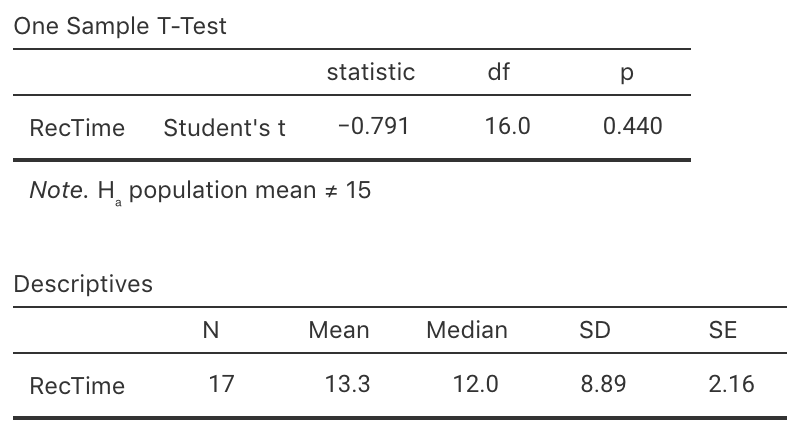
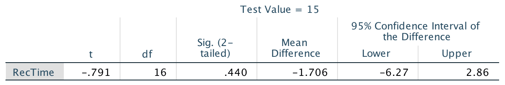
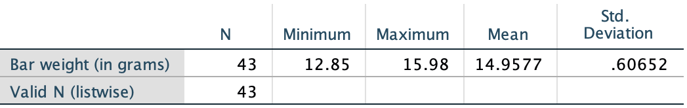

# Tests for one mean {#TestOneMean}


<!-- Introductions; easier to separate by format -->
```{r, child = if (knitr::is_html_output()) {'./introductions/29-Testing-OneMean-HTML.Rmd'} else {'./introductions/29-Testing-OneMean-LaTeX.Rmd'}}
```


## Introduction: body temperatures {#BodyTemperature}


```{r echo=FALSE, cache=FALSE}
bodyt <- read.csv("Data/BodyTemp.csv")
```


<div style="float:right; width: 222x; border: 1px; padding:10px">

</div>


The average internal body temperature is commonly believed to be $37.0^\circ\text{C}$, based on data over 150 years old [@data:Wunderlich:BodyTemp].
More recently, researchers wanted to re-examine this claim [@data:mackowiak:bodytemp] to see if this benchmark is still appropriate. 
That is, a decision is sought about the value of the *population* mean body temperature $\mu$.
The value of $\mu$ will never be known: the internal body temperature of every person alive would need to be measured... and even those not yet born.

The parameter is $\mu$, the population mean internal body temperature (in degrees C).
However, a *sample* of people can be taken to determine whether or not there is evidence that the *population* mean internal body temperature is still $37.0^\circ\text{C}$.

To make this decision, the [decision-making process](#DecisionMaking) (Sect. \@ref(DecisionMaking)) is used.
Begin by **assuming** that $\mu = 37.0$ (as there is no evidence that this accepted standard is wrong), and then determine if the evidence supports this claim or not.
The RQ could be stated as:

> Is the *population* mean internal body temperature $37.0^\circ\text{C}$?


## Statistical hypotheses and notation: one mean

The [decision making](#DecisionMaking) process begins by **assuming** that the population mean internal body temperature is $37.0^\circ\text{C}$.
Since the sample mean $\bar{x}$ is likely to be different for every sample even if $\mu = 37$ (*sampling variation*), the *sampling distribution* of $\bar{x}$ across all possible samples needs to be described.
Because every sample is different, $\bar{x}$ will vary, and the *sample* mean $\bar{x}$ probably won't be exactly $37.0^\circ\text{C}$, *even if* the population mean $\mu$ is $37.0^\circ\text{C}$.
Two broad reasons could explain why:

1. The *population* mean body temperature *is* $37.0^\circ\text{C}$,  but $\bar{x}$ isn't exactly $37.0$ due to sampling variation; 
   or
3. The *population* mean body temperature *is not* $37.0$, and the *sample* mean body temperature reflects this.

Formally, the two statistical hypotheses above are:

1. The *null hypothesis* ($H_0$): $\mu = 37.0^\circ\text{C}$; and
2. The *alternative hypothesis* ($H_1$): $\mu \ne 37.0^\circ\text{C}$.

The alternative hypothesis asks if $\mu$ is $37.0$ or not: the value of $\mu$ may be smaller or larger than $37.0$.
Two possibilities are considered: for this reason, this alternative hypothesis is called a *two-tailed* alternative hypothesis.


## Sampling distribution: one mean

Data to answer this RQ are available from an American study [@data:Shoemaker1996:Temperature]
`r if (knitr::is_latex_output()) {
   '(Table \\@ref(tab:DataBodyTemp)).'
} else {
   '(data below).'
}`
Summarising the data is important, because the data are used to answer the RQ (Fig. \@ref(fig:BodyTempHist)); the internal body temperature of individuals varies from person to person.
A numerical summary, from using software, shows that:

* The *sample* mean is $\bar{x} = 36.8051^\circ$C;
* The *sample* standard deviation is $s = 0.40732^\circ$C;
* The sample size is $n = 130$.

The sample mean $\bar{x}$ is *less* than the assumed value of  $\mu = 37^\circ\text{C}$... 
The question is *why*: can the difference reasonably be explained by sampling variation because every sample produces a different value of $\bar{x}$, or not?
A 95% CI can be computed (using software or manually): the 95% CI for $\mu$ is from $36.73^\circ$ to $36.88^\circ$C.
This CI is narrow, implying that $\mu$ has been estimated with precision, so detecting even small deviations of $\mu$ from $37^\circ$ should be possible.


```{r NotationOneMeanHT, echo=FALSE}

OneMeanNotation <- array( dim = c(4, 2))

OneMeanNotation[1, ] <- c("Describe individual in the population",
                          "Vary with mean $\\mu$ and standard deviation $\\sigma$")
OneMeanNotation[2, ] <- c("Describe individual in a sample",
                          "Vary with mean $\\bar{x}$ and standard deviation $s$")
OneMeanNotation[3, ] <- c("Describe sample means ($\\bar{x}$)",
                          "Vary with approx. normal distribution (under certain conditions)")
OneMeanNotation[4, ] <- c("across all possible samples",
                          "with mean $\\mu_{\\bar{x}}$ and standard deviation $\\text{s.e.}(\\bar{x})$")


if( knitr::is_latex_output() ) {
  kable( OneMeanNotation,
         format = "latex",
         booktabs = TRUE,
         longtable = FALSE,
         escape = FALSE,
         caption = "The notation used for describing means, and the sampling distribution of the sample means",
         align = c("r", "l"),
         linesep = c("\\addlinespace",
                     "\\addlinespace",
                     ""),
         col.names = c("Quantity",
                       "Description") ) %>%
	row_spec(0, bold = TRUE) %>%
  kable_styling(font_size = 10)
} else {
  OneMeanNotation[3, 1] <- paste(OneMeanNotation[3, 1], 
                                 OneMeanNotation[4, 1])
  OneMeanNotation[3, 2] <- paste(OneMeanNotation[3, 2], 
                                 OneMeanNotation[4, 2])
  OneMeanNotation[3, 3] <- paste(OneMeanNotation[3, 3], 
                                 OneMeanNotation[4, 3])
  OneMeanNotation[3, 4] <- paste(OneMeanNotation[3, 4], 
                                 OneMeanNotation[4, 4])
  OneMeanNotation[4, ] <- NA
  
    kable( OneMeanNotation,
         format = "html",
         booktabs = TRUE,
         longtable = FALSE,
         escape = FALSE,
         caption = "The notation used for describing means, and the sampling distribution of the sample means",
         align = c("r", "l"),
         linesep = c("\\addlinespace",
                     "\\addlinespace",
                     ""),
         col.names = c("Quantity",
                       "Description") ) %>%
	row_spec(0, bold = TRUE) 
}
```


```{r DataBodyTemp, echo=FALSE}
subBodyT <- round(cbind(bodyt$BodyTempC[1:10],  
                        bodyt$BodyTempC[121:130] ), 2)

if( knitr::is_latex_output() ) {
  T1 <- kable( subBodyT[1:10, 1],
         format = "latex",
         booktabs = TRUE,
         longtable = FALSE,
         linesep = "",
         align = "c",
         col.names = "Body temp (deg. C)") %>%
	row_spec(0, bold = TRUE)

  T2 <- kable( subBodyT[1:10, 2],
         format = "latex",
         booktabs = TRUE,
         escape = FALSE,
         longtable = FALSE,
         linesep = "",
         align = "c",
         col.names = "Body temp (deg. C)") %>%
	row_spec(0, bold = TRUE)
  

  out <- knitr::kables(list(T1, T2),
                       format = "latex",
                       label = "DataBodyTemp",
                       caption = "The body temperature data: The lowest ten and the highest ten of the 130 observations") %>% 
    kable_styling(font_size = 10)
  prepareSideBySideTable(out)
  
  
}
if( knitr::is_html_output(excludes = "epub") ) {
  DT::datatable( bodyt,
                 #fillContainer=FALSE, # Make more room, so we don't just have ten values
                 #filter="top", 
                 #selection="multiple", 
                 #escape=FALSE,
                 options = list(searching = FALSE), # Remove searching: See: https://stackoverflow.com/questions/35624413/remove-search-option-but-leave-search-columns-option
                 caption = "The body temperature data")
}
```


   
```{r BodyTempHist,  echo=FALSE, fig.cap="The histogram of the body temperature data", fig.align="center", fig.height=3.0, fig.width=4.5}
hist( bodyt$BodyTempC,
	xlab = "Body temperature, in degrees C",
	ylab = "Frequency",
	las = 1,
	main = "",
	breaks = seq(35, 39, by = 0.5),
	col = plot.colour)
box()
```


The sampling distribution of $\bar{x}$ was discussed in Sect. \@ref(SamplingDistSampleMean) (and Def. \@ref(def:DEFSamplingDistributionXbar) specifically).
The notation for describing the sampling distribution is shown in Table \@ref(tab:NotationOneMeanHT).

From this, if $\mu$ really was $37.0^\circ$C and if [certain conditions are true](#ValiditySampleMeanTest), the possible values of the sample means across all possible samples can be described using:

* An approximate normal distribution;
* With mean $\mu_{\bar{x}} = 37.0^\circ\text{C}$ (from $H_0$);
* With standard deviation of $\displaystyle \text{s.e.}(\bar{x}) = \frac{s}{\sqrt{n}} = \frac{0.40732}{\sqrt{130}} = 0.035724$.
  This is the *standard error* of the sample means.


::: {.importantBox .important data-latex="{iconmonstr-warning-8-240.png}"}
The notation $\mu_{\bar{x}}$ denotes 'the mean of the means computed from all the possible samples'.  

The notation $\text{s.e.}{\bar{x}}$ is the *standard error of the sample mean*, and denotes 'the standard deviation of the means computed from all the possible samples'.
:::


A picture of this sampling distribution (Fig. \@ref(fig:BodyTempSamplingDist)) shows *how the sample mean varies when $n = 130$ across all possible samples, simply due to sampling variation, when $\mu = 37^\circ\text{C}$*.
This enables questions to be asked about the likely values of $\bar{x}$ that would be found in the sample, when the population mean is $\mu = 37^\circ\text{C}$.


```{r BodyTempSamplingDist, echo=FALSE, fig.cap="The distribution of sample mean body temperatures, if the population mean is $37^\\circ$C and $n = 130$. The grey vertical lines are 1, 2 and 3 standard deviations from the mean.", fig.align="center", fig.height=2.75, fig.width=9, out.width='90%'}
mn <- 37.0

# These taken from Shoemaker's JSE data file
s <- 0.40732
n <- 130

se <- s/sqrt(n)

out <- plotNormal(mn, 
                  s / sqrt(n),
                  xlab = "Sample means from sample of size 130 (deg C)",
                  round.dec = 3,
                  cex.tickmarks = 0.9)

```


::: {.thinkBox .think data-latex="{iconmonstr-light-bulb-2-240.png}"}
Given the sampling distribution (Fig. \@ref(fig:BodyTempSamplingDist)), use the [68--95--99.7 rule](#def:EmpiricalRule) to determine how often will $\bar{x}$ be **larger** than 37.036 degrees C just because of sampling variation, if $\mu$ really is $37^\circ$C.

`r if (knitr::is_latex_output()) '<!--'`
`r webexercises::hide()`
About 16% of the time.
`r webexercises::unhide()`
`r if (knitr::is_latex_output()) '-->'`
:::


<iframe src="https://learningapps.org/watch?v=p28qr801322" style="border:0px;width:100%;height:600px" allowfullscreen="true" webkitallowfullscreen="true" mozallowfullscreen="true"></iframe>


## The test statistic and $t$-scores: one mean {#Tscores}

The sampling distribution describes how the sample means varies; that is, what to *expect* from the sample means, after *assuming* $\mu = 37.0^\circ\text{C}$.
The value of $\bar{x}$ that is *observed*, however, is $\bar{x} = 36.8051^\circ$.
How likely is it that such a value could occur in our sample by chance (by sampling variation)?

The value of the observed sample mean can be located the picture of the [sampling distribution](#fig:BodyTempSamplingDist) (Fig. \@ref(fig:BodyTempSamplingDistT)).
The value $\bar{x} = 36.8051^\circ\text{C}$ is unusually small: observing a sample mean this low is very unlikely from a sample of $n = 130$ if $\mu$ really was $37$.
About how many standard deviations is $\bar{x}$ away from $\mu = 37$?
A lot...


```{r BodyTempSamplingDistT,  echo=FALSE, fig.cap="The sample mean of $\\bar{x} = 36.8041^\\circ$C is very unlikely to have been observed if the poulation mean really was $37^\\circ$C, and $n=130$. The standard deviation of this normal distribution is $\\text{s.e.}(\\bar{x}) = 0.035724$.", fig.align="center", fig.width=6, fig.height=2.75}
mn <- 37.0
#These taken from Shoemaker's JSE data file
s <- 0.40732
n <- 130
xbar <- 36.8

se <- s/sqrt(n)

z36 <- (36.8 - mn)/(s / sqrt(n))

 
out <- plotNormal(mn,
                  s / sqrt(n),
                  xlab = "Sample mean temperatures (in deg C)",
                  round.dec = 3,
                  showX = seq(-6, 3, by = 1) * s/sqrt(n) + mn,
                  xlim.hi = mn + 3.5 * se, 
                  xlim.lo = mn - 6.5 * se,
                  cex.tickmarks = 0.9)

arrows(xbar, 
       0.8 * max(out$y), 
       xbar, 
       0, 
       length = 0.15, 
       angle = 15)
text(xbar, 
     0.8 * max(out$y), 
     "36.8 deg.",
     pos = 4)
```

Relatively speaking, the *distance* that the observed sample mean (of $\bar{x} = 36.8051$) is from the mean of the sampling distribution (Fig. \@ref(fig:BodyTempSamplingDistT)) is found by computing *how many* standard deviations the value of $\bar{x}$ is from the mean of the distribution; that is, computing something like a $z$-score.

Remember that Fig. \@ref(fig:BodyTempSamplingDistT) displays the values of $\bar{x}$ that could be expected if $\mu = 37$.
The mean of this distribution is $\mu_{\bar{x}} = 37$ and the standard deviation of this normal distribution is the *standard error*: the amount of variation in the sample means across all possible samples.
The number of standard deviations that $\bar{x} = 36.8051$ is from the mean is

\[
   \frac{36.8051 - 37.0}{0.035724} = -5.453.
\]
This value is *like* a $z$-score, but is actually called a $t$-score.
(The reason is that *the population standard deviation is unknown*, so the best estimate (the *sample* standard deviation) is used when $\text{s.e.}(\bar{x})$ was computed.)
Both $t$ and $z$ scores measure *the number of standard deviations that an observation is from the mean*.


::: {.tipBox .tip data-latex="{iconmonstr-info-6-240.png}"}
Like $z$-scores, $t$-scores measure the number of standard deviations that a value is from the mean.  

When the value of interest is sample statistic, then, both measure the number of *standard errors* that a *sample statistic* is from the mean.
The difference is:

* $z$-scores are calculated if computing the standard error uses known values (as with a test for proportions (Chap. \@ref(TestOneProportion)).
* $t$-scores are calculated if computing the standard error uses sample estimates (as in this chapter).

$t$-scores are more commonly used than $z$-scores, because almost always the population standard deviation is unknown, and so the sample standard deviation is used to compute the standard error.   

In this book, it is sufficient to think of $z$-scores and $t$-scores as approximately the same.
Unless sample sizes are small, this is a reasonable approximation.
:::


The calculation is:

\[
   t = \frac{36.8051 - 37.0}{0.035724} = -5.453;
\]
the observed sample mean is *more than five standard deviation below the population mean*, which is *highly* unusual based on the [68--95--99.7 rule](#def:EmpiricalRule) (Fig. \@ref(fig:BodyTempSamplingDistT)).

In general, a $t$-score in hypothesis testing is

\begin{equation}
   t 
   = 
   \frac{\text{sample statistic} - \text{mean of the sample statistic}}
        {\text{standard error of the sample statistic}}
   =
   \frac{\bar{x} - \mu_{\bar{x}}}{\text{s.e.}(\bar{x})}.
   (\#eq:tscore)
\end{equation}


<iframe src="https://learningapps.org/watch?v=pi8jnzhu322" style="border:0px;width:100%;height:500px" allowfullscreen="true" webkitallowfullscreen="true" mozallowfullscreen="true"></iframe>


## $P$-values: one mean {#Pvalues}

As seen in Sect. \@ref(OnePropTestP), a $P$-value is used to quantify how unusual the computed $t$-score (or $z$-score) is, after assuming the null hypothesis is true.
The $P$-value can be *approximated* using the [68--95--99.7 rule](#def:EmpiricalRule) and a diagram (Sect. \@ref(ApproxP)), or using tables (`r if ( knitr::is_html_output()) { 'Appendix \\@ref(ZTablesOnline).'} else {'Appendices \\@ref(ZTablesNEG) and \\@ref(ZTablesPOS)'}`).
Commonly, software is used for test involving one mean to compute the $P$-value (Sect. \@ref(SoftwareP)).


### Approximate $P$-values  {#ApproxP}

Since $t$-scores are similar to $z$-scores, the ideas in Sect. \@ref(OnePropTestP) can be used to *approximate* a $P$-value for $t$-scores.

The [68--95--99.7 rule](#def:EmpiricalRule) and a diagram (Sect. \@ref(OnePropTestP6895997)) can be used in a similar way to *approximate* a $P$-value for a $t$-score.
In addition, Tables of $z$-scores (`r if ( knitr::is_html_output()) { 'Appendix \\@ref(ZTablesOnline).'} else {'Appendices \\@ref(ZTablesNEG) and \\@ref(ZTablesPOS)'}`) can be used to approximate the $P$-values for $t$-scores also (Sect. \@ref(OnePropTestPTables)).

These two method both produce approximate $P$-values (since they are based on using $z$-scores, not $t$-scores); usually, software is used to determine $P$-values for $t$-scores.


::: {.thinkBox .think data-latex="{iconmonstr-light-bulb-2-240.png}"}
What do you think the two-tailed $P$-value will be when $t = -5.45$ (Fig. \@ref(fig:BodyTempSamplingDistT))?

`r if (knitr::is_latex_output()) '<!--'`
`r webexercises::hide()`
Based on the [68--95--99.7 rule](#def:EmpiricalRule), the two-tailed $P$-value will be *extremely* small.
`r webexercises::unhide()`
`r if (knitr::is_latex_output()) '-->'`
:::


### Exact $P$-values using sofware {#SoftwareP}

Software computes the $t$-score and a precise $P$-value (jamovi: Fig. \@ref(fig:BodyTempTestjamovi); SPSS: Fig. \@ref(fig:BodyTempTestSPSS)).
The output (in jamovi, under the heading `p`; in SPSS, under the heading `Sig. (2-tailed)`) shows that the $P$-value is indeed very small.
Although SPSS reports the $P$-value as 0.000, $P$-values can never be *exactly* zero, so we interpret this as 'zero to three decimal places', or that $P$ is less than 0.001 (written as $P < 0.001$, as jamovi reports).


::: {.tipBox .tip data-latex="{iconmonstr-info-6-240.png}"}
When software reports a $P$-value of `0.000`, it really means (and we should write) $P < 0.001$: That is, the $P$-value is *smaller* than 0.001.
:::


This $P$-value means that, assuming $\mu = 37.0^\circ$C, observing a sample mean as low as $36.8051^\circ$C just through sampling variation (from a sample size of $n = 130$) is almost *impossible*.
And yet... we did.
Using the [decision-making process](#DecisionMaking), this implies that the initial assumption (the null hypothesis) is contradicted by the data: The evidence suggests that the *population* mean body temperature is *not* $37.0^\circ\text{C}$.


```{r BodyTempTestjamovi, echo=FALSE, fig.cap="jamovi output for conducting the $t$-test for the body temperature data", fig.align="center", out.width="60%"}
knitr::include_graphics("jamovi/BodyTemp/BodyTempTtest.png")
```

```{r BodyTempTestSPSS, echo=FALSE, fig.cap="SPSS output for conducting the $t$-test for the body temperature data", fig.align="center", out.width="70%"}
knitr::include_graphics("SPSS/BodyTemp/BodyTempTtest.png")
```

::: {.importantBox .important data-latex="{iconmonstr-warning-8-240.png}"}
For *one-tailed tests*, the $P$-value is *half* the value of the two-tailed $P$-value.
:::


::: {.softwareBox .software data-latex="{iconmonstr-laptop-4-240.png}"}
SPSS always produces **two-tailed** $P$-values, calls then *Significance values*, and labels them as `Sig.`
jamovi can produce one- or two-tailed $P$-values.
:::


### Making decisions with $P$-values

As seen in Sect. \@ref(OnePropTestDecisions), $P$-values measure the likelihood of observing the sample statistic (or something more extreme), based on the **assumption** about the population parameter being true.
In this context, the $P$-value tells us the likelihood of observing the value of $\bar{x}$ (or something more extreme), just through sampling variation if $\mu = 37$. 
For the body-temperature data then, where $P < 0.001$, the $P$-value is *very* small, so there is *very strong evidence* that the population mean body temperature is not $37.0^\circ\text{C}$.


## Communicating results: one mean

In general, to communicate the results of any hypothesis test, report an *answer to the RQ*, a summary of the *evidence* used to reach that conclusion (such as the $t$-score and $P$-value---including if it is a one- or two-tailed $P$-value), and some *sample summary information* (including a CI, summarising the data used to make the decision).

So for the body-temperature example, write:

> The sample provides very strong evidence ($t = -5.45$; two-tailed $P<0.001$) that the population mean body temperature is *not* $37.0^\circ\text{C}$ ($\bar{x} = 36.81$; $n = 130$; 95% CI\ from 36.73$^\circ$C to 36.88$^\circ$C).

The components are:

* The *answer to the RQ*.
  The sample provides very strong evidence...  that the population mean body temperature is not $37.0^\circ\text{C}$'.
  Since the alternative hypothesis was two-tailed, the conclusion is worded in terms of  the population mean body temperature *not* being $37.0^\circ\text{C}$.
* The *evidence* used to reach the conclusion: '$t = -5.45$; two-tailed  $P<0.001$'.
* Some *sample summary information* (including a CI):  '$\bar{x} = 36.81$; $n=130$; 95% CI from 36.73$^\circ$C to 36.88$^\circ$C'.


::: {.importantBox .important data-latex="{iconmonstr-warning-8-240.png}"}
Since the *null* hypothesis is initially assumed to be true, the onus is on the evidence to refute the null hypothesis.  

Hence, conclusions are worded in terms of how strongly the evidence (i.e., sample data) support the alternative hypothesis. 

In fact,  the alternative hypothesis *may* or *may not* be true... but the evidence  (data) available here strongly supports the alternative hypothesis.
:::


## Hypothesis testing for one mean: summary {#TestSummary}

Let's recap the [decision-making process](#DecisionMaking), in this context about body temperatures:

* **Step 1: Assumption**: 
  Write the *null hypothesis* about the parameter (based on the RQ) $H_0$: $\mu = 37.0^\circ\text{C}$. 
  In addition, write the *alternative hypothesis* $H_1$: $\mu \ne 37.0^\circ\text{C}$. 
  (This alternative hypothesis is two-tailed.)
* **Step 2: Expectation**: 
  The *sampling distribution* describes what to expect from the sample statistic *if* the null hypothesis is true: [under certain circumstances](#ValiditySampleMeanTest), the sample means will vary with an approximate normal distribution around a mean of $\mu_{\bar{x}} = 37.0^\circ\text{C}$  with a standard deviation of $\text{s.e.}(\bar{x}) = 0.03572$ (Fig. \@ref(fig:BodyTempSamplingDistT)).
* **Step 3: Observation**: 
  Compute the $t$-score: $t = -5.45$. 
  The $t$-score can be computed by software, or using the general equation \@ref(eq:tscore).
* **Step 4: Consistency?**: 
  Determine if the data are *consistent* with the assumption, by computing the $P$-value.
  Here, the $P$-value is much smaller than 0.001.
  The $P$-value can be computed by software, or approximated using the [68--95--99.7 rule](#def:EmpiricalRule).

The **conclusion** is that there is very strong evidence that $\mu$ is not $37.0^\circ\text{C}$:


::: {.example #OneTSpeeds name="Mean driving speeds"}
A study of driving speeds in Malaysia [@azwari2021evaluating] recorded the speeds of vehicles on various roads.
One RQ of interest was whether the mean speed of cars on one road was the posted speed limit of 90 km.h^-1^, or whether it was *higher*.
The *parameter* of interest is $\mu$, the mean speed in the *population*.

The statistical hypotheses are:  
\[
   \text{$H_0$: } \mu = 90\quad\text{and}\quad\text{$H_1$: }\mu > 90.
\]
The alternative hypothesis is *one-tailed*, since the researchers were interested in whether the mean speed was *higher* than the posted speed limit.
(In the case of a one-tailed alternative hypothesis, writing $\text{$H_0$: } \mu \le 90$ is also correct (and equivalent), though the test still proceeds just as if $\mu = 90$.)

The researchers recorded the speed of $n = 400$ vehicles on this road, and found the mean and standard deviation of the speeds of individual vehicles were $\bar{x} = 96.56$ and $s = 13.874$.
Of course, the sample mean is likely to vary from sample to sample (with a normal distribution).
For samples of size $n = 400$, the mean of this normal distribution that describes the sample means is $\mu_{\bar{x}} = 90$, and the standard deviation is  
\[
  \text{s.e.}(\bar{x}) = \frac{s}{\sqrt{n}} = \frac{13.874}{\sqrt{400}} = 0.6937.
\]
Hence, the test statistic is  
\[
   t = \frac{\bar{x} - \mu_{\bar{x}}}{\text{s.e.}(\bar{x})} = \frac{96.56 - 90}{0.6937} = 9.46,
\]
where (as usual) the value of $\mu_{\bar{x}}$ is taken from the null hypothesis (which we always assume to be true initially).
This $t$-score is a *huge* value, suggesting that the (one-tailed) $P$-value is very small.

We write (remembering the alternative hypothesis is one-tailed):

> There is very strong evidence ($t = 9.46$; one-tailed $P < 0.001$) that the mean speed of vehicles on this road (sample mean: 96.56; standard deviation: 13.874) is greater than 90 km.h^-1^.

Of course, since this statement refers to the *mean* speed, some individual vehicles may be travelling below the speed limit.
:::


## Statistical validity conditions: one mean {#ValiditySampleMeanTest}

As with any inference procedure, the underlying mathematics requires [certain conditions to be met](#exm:StatisticalValidityAnalogy) so that the results are statistically valid.
For a hypothesis test for one mean, these conditions are the same as for the CI for one mean (Sect. \@ref(ValiditySampleMean)).

The test will be statistically valid if *one* of these is true:

1. The sample size is at least 25, *or*
2. The sample size is smaller than 25 *and* the *population* data has an approximate normal distribution.

The sample size of 25 is a rough figure here, and some books give other values (such as 30).

This condition ensures that the *distribution of the sample means has an approximate normal distribution* (so that, for example, the [68--95--99.7 rule](#def:EmpiricalRule) can be used).
Provided the sample size is larger than about 25, this will be approximately true *even if* the distribution of the individuals in the population does not have a normal distribution.
That is, when $n > 25$ the sample means generally have an approximate normal distribution, even if the data themselves do not have a normal distribution.


::: {.example #StatisticalValidityTemps name="Statistical validity"}
The hypothesis test regarding body temperature is statistically valid since the sample size is large ($n = 130$).
Since the sample size is large, we *do not* require the data to come from a population with a normal distribution.
:::


::: {.thinkBox .think data-latex="{iconmonstr-light-bulb-2-240.png}"}
Suppose we are performing a one-sample $t$-test about a mean. 
The random sample is of size is $n = 45$, and the histogram of the data is skewed right.
Is the test likely to be **statistically** valid?  
`r if( knitr::is_html_output(exclude = "epub") ) {
	 mcq( c(
     "Yes, because the sample is a random sample",
     answer = "Yes, because the sample size is large",
     "No, because the sample size is too small",
     "We don't know; we need to know if the data has a normal distribution", 
     "No, because the histogram is skewed right"
	 ))}`   
:::


::: {.example #OneTSpeedsValid name="Driving speeds"}
In Example \@ref(exm:OneTSpeeds) about mean driving speeds,
the sample size was 400, much larger than 25.
The test is statistically valid.
:::


## Example: recovery times {#RecoveryTimes}


```{r echo=FALSE}
RTime <- structure(list(RecTime = c(14, 9, 18, 26, 12, 0, 10, 4, 8, 21, 
28, 24, 24, 2, 3, 14, 9)), .Names = "RecTime", row.names = c(NA, 
-17L), class = "data.frame", variable.labels = structure(character(0), .Names = character(0)), codepage = 28591L)

```


<div style="float:right; width: 222x; border: 1px; padding:10px">

</div>


Seventeen patients were treated for medial collateral ligament (MCL) and anterior cruciate ligament (ACL) tears using a new treatment method [@data:Nakamua2000:ACL; @data:Altman1991:PracticalStats].
The current existing treatment has an average recovery time of 15 days.
The RQ is:

> For patients with this type of injury, does the new treatment method lead to *shorter* mean recovery times?
  
The parameter is $\mu$, the population mean recovery time.
The statistical hypotheses (**Step 1: Assumption**) about the parameter are, from the RQ:

- $H_0$: $\mu = 15$ (the population mean is $15$, but $\bar{x}$ is not $15$ due to sampling variation): 
  This is the initial **assumption**.
- $H_1$: $\mu < 15$   ($\mu$ is not $15$; it really does produce *shorter* recovery times, on average).

This test is *one-tailed*: the RQ only asks if the new method produces *shorter* recovery times.

The evidence (Table \@ref(tab:RecoveryData)) can be summarised numerically, using software or (since the dataset is small) a calculator.
Either way, $\bar{x} = 13.29$ and $s = 8.887$.


```{r RecoveryData, echo=FALSE}
RTimeArray <- array( c(RTime$RecTime, NA),  
                     dim = c(2, 9))
options(knitr.kable.NA = '')

if( knitr::is_latex_output() ) {
  kable(RTimeArray,
        format = "latex",
        #col.names = rep(" ", 9),
        booktabs = TRUE,
        longtable = FALSE,
        caption = "The recovery times for a new treatment") %>%
    kable_styling(font_size = 10) %>%
  add_header_above(header = c("Recovery times (in days)" = 9), 
                   bold = TRUE, 
		   align = "c")
}

if( knitr::is_html_output() ) {
  kable(RTimeArray,
        format = "html",
        col.names = rep(" ", 9),
        booktabs = TRUE,
        longtable = FALSE,
        caption = "The recovery times (in days) for a new treatment")
}
```


If the null hypothesis is true (and $\mu = 15$), the values of the sample mean that are likely to occur through sampling variation can be described  (**Step 2: Expectation**).
The sample means are likely to vary with an approximate normal distribution ([under certain assumptions](#ValiditySampleMeanTest)), with mean $\mu_{\bar{x}} = 15$ and a standard deviation of  
\[	
  \text{s.e.}(\bar{x}) = \frac{s}{\sqrt{n}} = \frac{8.887}{\sqrt{17}} = 2.155.
\]
This describes what values of $\bar{x}$ we should *expect* in the sample if the mean recovery time $\mu$ really was 15 days (Fig. \@ref(fig:RecoveryTimesDSamplingDistribution)).

The sample mean is $\bar{x} = 13.29$, so the $t$-score to determine where the sample mean is located (**Step 3: Observation**), relative to what is expected, is

\[
  t = \frac{\bar{x} - \mu_{\bar{x}}}{\text{s.e.}(\bar{x})}
  = \frac{13.29 - 15}{2.155}
  = -0.79.
\]
Software could also be used (jamovi: Fig. \@ref(fig:RecoveryTimestestjamovi); SPSS: Fig. \@ref(fig:RecoveryTimestestSPSS)); in either case, $t = -0.79$.

A $z$-score of $-0.79$ is not unusual, and (since $t$-scores are like $z$-scores) this $t$-score is not unusual either (**Step 4: Consistency**).
The $P$-value in the [jamovi output](#fig:RecoveryTimestestjamovi) or [SPSS output](#fig:RecoveryTimestestSPSS) confirms this: the *two*-tailed $P$-value is $0.440$, so the *one*-tailed $P$-value is $0.440\div 2 = 0.220$.


```{r RecoveryTimestestjamovi, echo=FALSE, fig.cap="jamovi output for the $t$-test for the recovery-times data", fig.align="center", out.width="60%"}

```


```{r RecoveryTimestestSPSS, echo=FALSE, fig.cap="SPSS output for the $t$-test for the recovery-times data", fig.align="center", out.width="80%"}

```


::: {.importantBox .important data-latex="{iconmonstr-warning-8-240.png}"}
Recall: For *one-tailed tests*, the $P$-value is *half* the value of the two-tailed $P$-value.
:::


This 'large' $P$-value suggests that a sample mean of 13.29 could reasonably have been observed just through sampling variation: there is no evidence to support the alternative hypothesis $H_1$.
If $\mu$ really was 15, then $\bar{x}$ would be less than 13.29 in about about 22% of samples, just because of sampling variation.

   
```{r RecoveryTimesDSamplingDistribution, echo=FALSE, fig.cap="The sampling distribution for the recovery-times data", fig.align="center", fig.width=10, fig.height=3, out.width='90%'}
par( mfrow = c(1,2) )

mn.RT <- 15
sd.RT <- sd(RTime$RecTime)
n.RT <- length(RTime$RecTime)
se.RT <- sd.RT/sqrt(n.RT)
xbar <- 13.29
z <- (xbar - mn.RT)/se.RT

out <- plotNormal(mn.RT,
                  se.RT, 
                  xlab = "Sample mean values (in days)",
                  las = 2,
                  round.dec = 2) 
shadeNormal(out$x,
            out$y,
            lo = 8,
            hi = xbar,
            col = plot.colour)

lines(x = c(xbar, xbar),
      y = c(0, 0.9 * max(out$y)),
      lwd = 3,
      col = "black" )
text( xbar, 
      0.9 * max(out$y), 
      expression( paste(bar(italic(x)) == "13.29")),
      pos = 2)


out <- plotNormal(0,
                  1,
                  xlab = expression(italic(t)-scores),
                  round.dec = 0)
shadeNormal(out$x,
            out$y,
            lo = -5,
            hi = z,
            col = plot.colour)

lines( x = c(z, z), 
       y = c(0, 0.9 * max(out$y) ), 
       lwd = 3,
       col = "black")
text( z,
      0.9 * max(out$y),  
     expression(Observed~italic(t)~score),
     pos = 2)
```


To summarise:

* **Step 1 (Assumption)**: 
    - $H_0$: $\mu = 15$, the initial assumption (or, $\mu \ge 15$);
    - $H_1$: $\mu < 15$ (note: *one*-tailed).

* **Step 2 (Expectation)**: 
  The sample means will vary, and this sampling variation is described by an approximate normal distribution with mean $\mu_{\bar{x}} = 15$ and standard deviation $\text{s.e.}(\bar{x}) =  2.155$.
* **Step 3 (Observation)**: 
  $t = -0.791$.
* **Step 4 (Consistency?)**: 
  The *one-tailed* $P$-value is $0.220$: 
  The data are consistent with $H_0$, so there is no evidence to support the alternative hypothesis.

To write a conclusion, include an *answer* to the question, *evidence* leading to the conclusion, and some *sample summary information*:

> No evidence exists in the sample (one sample $t = -0.79$; one-tailed $P = 0.220$) that the population mean recovery time is less than 15 days (mean 13.29 days; $n=17$; 95% CI from 8.73 to 17.86 days) using the new treatment method.

(The CI is found using the ideas in Sect. \@ref(OneMeanCI).)

Notice the wording: The new method *may* be better, but no evidence exists of this in the sample.
The onus is on the new method to demonstrate that it is better than the current method.
The sample size is small ($n = 17$), so the test may not be statistically valid (but the $P$-value is so large that it probably won't affect the conclusions).


## Example: student IQs {#IQstudents}

Standard IQ scores are designed to have a mean in the general population of 100.
A study of $n = 224$ students at Griffith University [@reilly2022gender] found that the sample IQ scores were approximately normally distributed, with a mean of 111.19 and a standard deviation of 14.21. 
Is this evidence that students at Griffith University (GU) have a higher mean IQ than the general population?

The RQ is:

> For students at Griffith University, is the mean IQ higher than 100?
  
The parameter is $\mu$, the population mean IQ for students at GU.
The statistical hypotheses (**Step 1: Assumption**) about the parameters are, from the RQ:

- $H_0$: $\mu = 100$ (the population mean is $100$, but $\bar{x}$ is not $100$ due to sampling variation): This is the initial **assumption**.
- $H_1$: $\mu > 100$ ($\mu$ is *greater than* $100$; GU students really do have a higher mean IQ than the general population).

This test is *one-tailed*: the RQ only asks if the IQ of GU students is *greater* than 100.
We do not have the original data, but the summary data are sufficient: $\bar{x} = 111.19$ with a standard deviation of $s = 14.21$ from a sample of size $n = 224$. 
The *sample* mean is higher than 100, but the sample mean varies for each sample.
The sample means vary with a normal distribution having a mean of $\mu_{\bar{x}} = 100$ and a standard deviation of  
\[
   \text{s.e.}(\bar{x}) = \frac{s}{\sqrt{n}} = \frac{14.21}{\sqrt{224}} = 0.9494456.
\]
The $t$-score is  
\[
   t = \frac{\bar{x} - \mu_{\bar{x}}}{\text{s.e.}(\bar{x})} = \frac{111.19 - 100}{0.9494456} = 11.78.
\]

This is a *huge* $t$-score, which means that a sample mean as large as 111.19 would be highly unlikely to occur simply by sampling variation in a sample of size $n = 224$ if the population mean really was 100.
The $P$-value will be extremely small.

To conclude (where the CI is found using the ideas in Sect. \@ref(OneMeanCI), or manually):

> Very strong evidence exists in the sample (one sample $t = 11.78$; one-tailed $P < 0.001$) that the population mean IQ in students at Griffith University
> is greater than 100  (mean 111.19; $n = 224$; 95% CI from 109.29 to 113.09).

(**Note**: IQ scores do not have units of measurement.)

Since the sample size is much large than 25, this conclusion is *statistically valid* (i.e., the mathematics behind the computations will be sound).
The sample is not a true random sample from the population of all GU students (the students are mostly first-year students, and most were enrolled in an undergraduate psychological science degree). 
However, these students may be  somewhat representative of all GU student; that is, the sample *may* be externally valid.

The difference between the general population IQ of 100 and the sample mean IQ of GU students is only small: about 11 IQ units.
Possibly, this difference has very little practical significance, even though the statistical evidence suggests that the difference cannot be explained by chance.


## Summary {#Chap27-Summary}

To test a hypothesis about a population mean $\mu$:

* Initially **assume** the value of $\mu$ in the null hypothesis to be true.
* Then, describe the **sampling distribution**, which describes what to **expect**  from the sample mean based on this assumption: under certain statistical validity conditions, the sample mean varies with:
   *  an approximate normal distribution,
   *  with mean $\mu_{\bar{x}}$ having the value $\mu$ (from $H_0$), and
   *  having a standard deviation of $\displaystyle \text{s.e.}(\bar{x}) =\frac{s}{\sqrt{n}}$.
* The **observations** are then summarised, and *test statistic* computed:

\[
   t = \frac{ \bar{x} - \mu}{\text{s.e.}(\bar{x})},
\]
where $\mu$ is the hypothesised value given in the null hypothesis.

* The $t$-value is like a $z$-score, and so an approximate **$P$-value** can be estimated using the [68--95--99.7 rule](#def:EmpiricalRule), or found using software.


`r if (knitr::is_html_output()){
  'The following short video may help explain some of these concepts:'
}`


<iframe width="560" height="315" src="https://www.youtube.com/embed/ZbJ58Ag22Mw" frameborder="0" allow="accelerometer; encrypted-media; gyroscope; picture-in-picture"></iframe>


## Quick review questions  {#Chap27-QuickReview}


::: {.webex-check .webex-box}
In traffic, the usual engineering recommendation is that the safe gap between travelling vehicles (called a 'headway') is *at least* 1.9s (often conveniently rounded to 2 seconds in practice).
One study of $28$ streams of traffic in Birmingham, Alabama [@majeed2014field] found the mean headway was 1.1915s, with a standard deviation of 0.231s.
The researchers wanted to test if the mean headway in Birmingham was at least 1.9s.

1. True or false? The test is *one-tailed*.\tightlist
`r if( knitr::is_html_output() ) {torf(answer=TRUE)}`
1. The standard error of the mean (to five decimal places) is
`r if( knitr::is_html_output() ) {fitb(num=TRUE, tol=0.00001, answer=0.04365)} else {"________________"}`
1. The null hypothesis is:
`r if( knitr::is_html_output() ) {longmcq( c(
  "The sample mean headway is 1.9s",
  "The sample mean is 1.1915s",
  answer = "The population mean is 1.9s",
  "The population mean is 1.1915s")  )} else {"________________"}`
1. The test statistic (to two decimal places) is
`r if( knitr::is_html_output() ) {fitb(num=TRUE, tol=0.01, answer=0.34)} else {"________________"}`
1. The one-tailed $P$-value is
`r if( knitr::is_html_output() ) {mcq( c(
  answer = "Small",
  "Big",
  "0.05",
  "0.34")  )} else {"________________"}`
1. True or false? There is no evidence to accept the *alternative* hypothesis (that the mean headway is at least 1.9s).
`r if( knitr::is_html_output() ) {torf(answer=TRUE)}`
:::


<!-- ::: {.webex-check .webex-box} -->
<!-- A study [@imtiaz2017assessment] compared the nutritional intake of $n = 50$ anaemic infants in Lahore (Pakistan) with the recommended daily intake (of 13g). -->
<!-- The mean daily protein intake in the sample was 14g, with a standard deviation of 3g. -->
<!-- The researchers wanted to see if the mean intake met (or exceeded) the recommendation, or not. -->
<!-- ::: -->


## Exercises {#TestOneMeanAnswerExercises}

Selected answers are available in Sect. \@ref(TestOneMeanAnswer).


```{r echo=FALSE, message=FALSE}
# WE <- read.spss("../Data/WomenEnergy.sav", to.data.frame=TRUE)

WE <- structure(list(Energy = c(5260, 5470, 5640, 6180, 6390, 7515, 
6515, 6805, 7515, 8230, 8770)), .Names = "Energy", row.names = c(NA, 
-11L), class = "data.frame", variable.labels = structure(character(0), .Names = character(0)), codepage = 28591L)

```


::: {.exercise #TestOneMeanExercisesSleep}
A study of Taiwanese pre-school children [@lin2021sleep] compared their average sleep -times to the recommendation (of *at least* 10 hours per night).
The summary of the data for weekend sleep-times is shown in Table \@ref(tab:SleepingSummary), for both females and males.

On average, do female pre-school children get *at least* 10 hours of sleep per night?
Do male preschool children?
:::

```{r SleepingSummary, echo=FALSE}
SleepArray <- array( dim = c(2, 3))

SleepArray[1, ] <- c(47,
                     8.50,
                     0.48)
SleepArray[2, ] <- c(39,
                     8.64,
                     0.37)

if( knitr::is_latex_output() ) {
  kable(SleepArray,
        format = "latex",
        col.names = c("Sample size",
                      "Sample mean",
                      "Sample std. dev."),
        booktabs = TRUE,
        caption = "Summary information for the Taiwanese pre-schoolers sleep times (in hours)") %>%
    row_spec(0, bold = TRUE)
}
if( knitr::is_html_output() ) {
  kable(SleepArray,
        format = "html",
        col.names = c("Sample size",
                      "Sample mean",
                      "Sample std. dev."),
        booktabs = TRUE,
        caption = "Summary information for the Taiwanese pre-schoolers sleep times (in hours)") %>%
    row_spec(0, bold = TRUE)
}
```


::: {.exercise #TestOneMeanExercisesToothbrushing}
Most dental associations^[Such as the *American Dental Association* and the *Australian Dental Association*.] recommend brushing teeth for *at least* two minutes. 
A study [@data:Macgregor1979:BrushingDurationKids] of the brushing time for 85 uninstructed school children from England (11 to 13 years old) found the mean brushing time was 60.3 seconds, with a standard deviation of 23.8 seconds.

1. Is there evidence that the mean brushing time for schoolchildren from England is at least two minutes (as recommended)?
1. Sketch the sampling distribution of the sample mean.
:::


::: {.exercise #TestOneMeanExercisesAutomatedVehicles}
A study [@data:greenlee2018:vehicles] of human-automation interaction with automated vehicles aimed to

> ... determine whether monitoring the roadway for hazards during automated driving results in a vigilance decrement [i.e., a reduction].
>
> --- @data:greenlee2018:vehicles, p. 465

That is, they were interested in whether the average mental demand of 'drivers' of automated vehicles was *higher* than the average mental demand for ordinary tasks.

In the study, the $n = 22$ participants 'drove' (in a simulator) an automated vehicle for 40 minutes. 
While driving, the drivers monitored the road for hazards.
The researchers assessed the 'mental demand' placed on these drivers, where scores of 50 over 'typically indicate substantial levels of workload' (p. 471).
For the sample, the mean score was 84.00 with a standard deviation of 22.05.

Is there evidence of a 'substantial workload' associated with monitoring roadways while 'driving' automated vehicles?
:::


::: {.exercise #TestOneMeanExercisesQualityOfLife}
A study explored the quality of life of patients receiving cavopulmonary shunts [@data:Steele2016:Shunt].
'Quality of life' was assessed using a 36-question health survey, where the scale is standardised so that the mean of the general population is 50.

For the 14 patients in the study, the sample mean for the 'Physical component' of the survey was 47.2 (with a standard deviation of 8.2).
The sample mean for the 'Mental component' of the survey was 52.7 (with a standard deviation of 5.6).

Is there evidence that the patients are different, on average, to the general population on the basis of the results?
:::


::: {.exercise #TestOneMeanExercisesCherryRipes}
A *Cherry Ripe* is a popular chocolate bar in Australia.
In 2017 and 2018, I sampled some *Cherry Ripe* Fun Size bars.
The packaging claimed that the Fun Size bars weigh 12g (on average).
Use the SPSS summary of the data (Fig. \@ref(fig:CherryRipes20172018)) to perform a hypothesis test to determine if the mean weight really is 12g or not.
:::


```{r CherryRipes20172018, echo=FALSE, fig.cap="jamovi output for the Cherry Ripes data", fig.align="center", out.width="75%"}

```

::: {.exercise #TestOneMeanBloodLoss}
A study of paramedics [@data:Williams2007:BloodLoss] asked participants ($n = 199$) to estimate the amount of blood on four different surfaces.
When the actual amount of blood spilt on concrete was 1000&nbsp;ml, the mean guess was 846.4&nbsp;ml (with a standard deviation of 651.1&nbsp;ml).

Is there evidence that the mean guess really is 1000&nbsp;ml (the true amount)?
Is this test likely to be valid?
:::

```{r echo=FALSE, cache=FALSE}
QC <- structure(list(High1 = c(61.63, 63.11, 66.88, 62.56, 66.12, 65.34, 
64.83, 64.22, 65.54, 65.33, 67.83, 65.97, 65.01, 64.51, 64.3, 
64.38, 64.75, 63.12, 62.93, 63.59, 67.04, 64.38, 63.41, 64.19, 
64.86, 63.7, 63.14, 66, 63.43, 64.25, 63.67, 64.78, 58.02, 63.46, 
65.2, 63.74), Mid1 = c(18.36, 18.77, 18.98, 17.97, 19.69, 19.63, 
19.5, 19.39, 19.87, 19.66, 20.41, 18.37, 19.09, 18.98, 19.22, 
18.99, 19.58, 19.7, 19, 19.11, 19.97, 19.52, 19.39, 17.2, 19.75, 
19.35, 19.95, 19.38, 19.33, 19, 19.05, 19.24, 19.29, 19.29, 19.18, 
19.35), High2 = c(62.64, 64.36, 66.06, 65.39, 66.85, 65.56, 66.6, 
66.9, 65.5, 65.92, 65.51, 65.03, 64.22, 64.19, 64.95, 64.95, 
64.45, 64.77, 65.58, 64.87, 63.52, 65.02, 66.05, 63.82, 64.58, 
65.09, 64.86, 64.85, 66.75, 65.37, 64.29, 65.5, 62.85, 64, 63.72, 
64.3), Mid2 = c(19.12, 19.07, 19.58, 19.35, 19.65, 19.13, 19.55, 
19.85, 19.45, 19.87, 19.73, 19.6, 20.76, 18.98, 19.93, 19.15, 
19.23, 19.2, 19.52, 19.38, 19.08, 18.89, 19.57, 19.35, 19.13, 
19.44, 19.27, 19.58, 19.71, 19.64, 19.14, 19.28, 19.68, 18.27, 
18.75, 19.57)), .Names = c("High1", "Mid1", "High2", "Mid2"), class = "data.frame", row.names = c(NA, 
-36L))

DataAndTargets <- array(dim = c(3, 4))
DataAndTargets[1, ]<- c(64.31, 19.24, 64.97, 19.40)
DataAndTargets[2, ]<- c(1.700, 0.588, 1.029, 0.413)
DataAndTargets[3, ]<- c(64.22, 19.01, 65.05, 19.45)

rownames(DataAndTargets) <- c("Mean of data", 
                              "Std. dev. of data", 
                              "Pre-determined target")
colnames(DataAndTargets) <- c("High level", 
                              "Mid level", 
                              "High level", 
                              "Mid level")
```

::: {.exercise #TestOneMeanQualityControl}
A quality-control study [@feng2017application] assessed the accuracy of two instruments from a clinical laboratory, by comparing the reported luteotropichormone (LH) concentrations to known pre-determined values (Table \@ref(tab:QualityControlDataSummary)).

Perform a series of tests to determine how well the two instruments perform, for both high- and mid-level LH concentrations (from the data in Table \@ref(tab:QualityControlData)).
:::


```{r QualityControlData, echo=FALSE}
if( knitr::is_latex_output() ) {
  T1 <- kable( rbind( head(QC[1:2], 5),
                      c("$\\vdots$", "$\\vdots$") ),
        format = "latex",
        align = "c",
        linesep = "",
        col.names = c("High level", 
                      "Mid level"),
        booktabs = TRUE,
        escape = FALSE,
        longtable = FALSE) %>%
    add_header_above(header = c("Instrument 1" = 2), 
                   bold = TRUE, 
                   align = "c")

    T2 <- kable( rbind( head(QC[, 3:4], 5),
                         c("$\\vdots$", "$\\vdots$") ),
        format = "latex",
        align = "c",
        linesep = "",
        col.names = c("High level", 
                      "Mid level"),
        booktabs = TRUE,
        escape = FALSE,
        longtable = FALSE) %>%
    add_header_above(header = c("Instrument 2" = 2), 
                   bold = TRUE, 
                   align = "c")

  out <- knitr::kables(list(T1, T2),
                       format = "latex",
                       label = "QualityControlData",
                       caption = "The quality-control data: LH levels (in mIU/mL) for two instruments (only the first five observations shown)") %>% 
    kable_styling(font_size = 10)
  
  prepareSideBySideTable(out)

} 

if( knitr::is_html_output(exclude = "epub") ) {
  DT::datatable(QC,
               caption = "The quality-control data: LH levels (in mIU/mL) for two instruments",
               colnames = colnames(DataAndTargets),
               options = list(searching = FALSE), # Remove searching: See: https://stackoverflow.com/questions/35624413/remove-search-option-but-leave-search-columns-option
               filter = "none")
}
if( knitr::is_html_output() & knitr::pandoc_to("epub")) {
  kable( head(QC, 10), 
        format = "html",
        caption = "The quality-control data: LH levels (in mIU/mL) for two instruments (only the first ten observations shown)",
        col.names = colnames(DataAndTargets),
        booktabs = TRUE,
        longtable = FALSE)
}
```


```{r QualityControlDataSummary, echo=FALSE}
if( knitr::is_latex_output() ) {
  kable(DataAndTargets,
        format = "latex",
        caption = "Summary of the quality-control data for LH levels (in mIU/mL) for two instruments",
        booktabs = TRUE,
        #align = c("p{17mm}", "p{17mm}","p{17mm}","p{17mm}"),
        longtable = FALSE) %>%
    row_spec(row = 0,  
             bold = TRUE) %>%
    row_spec(row = 3,  
             bold = TRUE) %>%
    kable_styling(font_size = 10) %>%
    add_header_above(header = c("", 
                                "Instrument 1" = 2, 
                                "Instrument 2" = 2), 
                   bold = TRUE, 
                   align = "c")
        }
if( knitr::is_html_output() ) {
  kable(DataAndTargets,
        format = "html",
        caption = "Summary of the quality-control data for LH levels (in mIU/mL) for two instruments",
        booktabs = TRUE,
        align = "r",
        longtable = FALSE)
}
```


<!-- QUICK REVIEW ANSWERS -->
`r if (knitr::is_html_output()) '<!--'`
::: {.EOCanswerBox .EOCanswer data-latex="{iconmonstr-check-mark-14-240.png}"}
\textbf{Answers to \textit{Quick Revision} questions:}
**1.** True.
**2.** 0.0436
**3* The population mean headway is 1.9s.
**4.** 0.34.
**5.** Big
**7.** There is \emph{no evidence} to support the alternative hypothesis.
:::
`r if (knitr::is_html_output()) '-->'`

