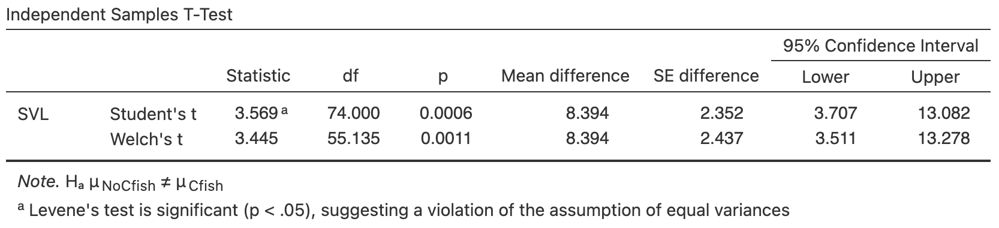
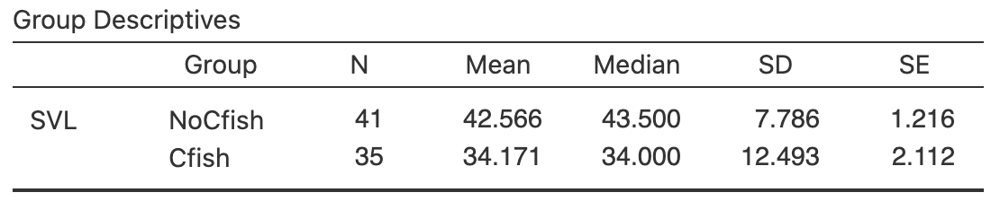
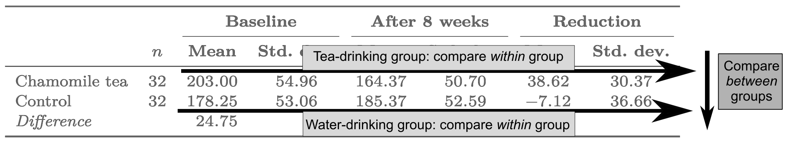
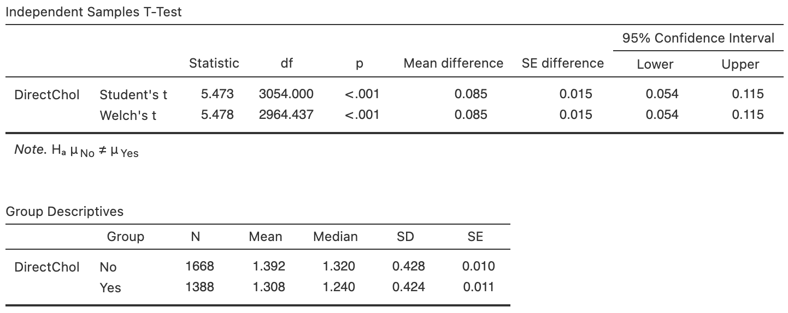
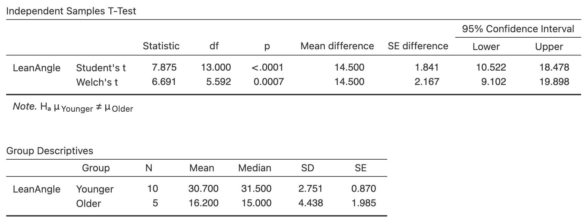

# CIs and tests: comparing two means {#AnalysisTwoMeans}
\index{Difference between means}

<!-- Introductions; easier to separate by format -->
```{r, child = if (knitr::is_html_output()) {'./introductions/30-CIsTesting-TwoMeans-HTML.Rmd'} else {'./introductions/30-CIsTesting-TwoMeans-LaTeX.Rmd'}}
```


<!-- Define colours as appropriate -->
```{r, child = if (knitr::is_html_output()) {'./children/coloursHTML.Rmd'} else {'./children/coloursLaTeX.Rmd'}}
```


## Introduction: garter snakes {#TwoMeansHT-intro}

Some Mexican garter snakes (*Thamnophis melanogaster*) live in habitats with no crayfish, while some live in habitats with crayfish and hence use crayfish as a food source.
@manjarrez2017morphological were interested in whether the snakes in these two regions were different:

> For female Mexican garter snakes, is the mean snout--vent length (SVL) different for those in regions with crayfish and without crayfish?

Two different groups of snakes are studied, so this is a relational RQ with no intervention (the study uses a between-individuals comparison\index{Comparison!between individuals}), and the data are shown 
`r if (knitr::is_latex_output()) {
'in Table\\ \\@ref(tab:SnakesDataTableTest).'
} else {
'below.'
}`


```{r SnakesDataTableTest}
data("Snakes")

# Extract just the female snakes, for example; n \approx 50
SNF <- subset(Snakes, 
              Sex == "female")

SNF$Crayfish <- ordered(SNF$Crayfish, 
                        levels = c("NoCfish", "Cfish"),
                        labels = c("No",
                                   "Yes"))

if( knitr::is_latex_output() ) {
  
  tb1 <- c( na.omit( SNF$SVL[ SNF$Crayfish == "No" ] ) )
  tb1 <- cbind (tb1[1:5],
                tb1[6:10],
                tb1[11:15],
                tb1[16:20],
                tb1[21:25],
                tb1[26:30],
                tb1[31:35],
                tb1[36:34],
                c( tb1[41], NA, NA, NA, NA) )
  
  tb2 <- c( na.omit( SNF$SVL[ SNF$Crayfish == "Yes" ] ) )
  tb2 <- cbind (tb2[1:5],
                tb2[6:10],
                tb2[11:15],
                tb2[16:20],
                tb2[21:25],
                tb2[26:30],
                tb2[31:35] )
  
  
  T1 <- knitr::kable( pad(tb1,
                          surroundMaths = TRUE,
                          targetLength = rep(2, 9),
                          decDigits = 0),
                      format = "latex",
                      valign = 't',
                      align = "c",
                      #table.env = "@empty",
                      linesep = "",
                      row.names = FALSE,
                      escape = FALSE,
                      booktabs = TRUE) %>%
    row_spec(0, bold = TRUE) %>%
    add_header_above( c("Non-crayfish region" = 9),
                      bold = TRUE)
  
  T2 <- knitr::kable( pad(tb2,
                          surroundMaths = TRUE,
                          targetLength = rep(2, 9),
                          decDigits = 0),
                      format = "latex",
                      align = "c",
                      valign = 't',
                      #table.env = "@empty",
                      linesep = "",
                      row.names = FALSE,
                      escape = FALSE,
                      booktabs = TRUE) %>%
    row_spec(0, bold = TRUE) %>%
    add_header_above( c("Crayfish region" = 7),
                      bold = TRUE)
  
  out <- knitr::kables(list(T1, T2), 
                       format = "latex",
                       label = "SnakesDataTableTest",
                       caption = "Snout--vent length (in cm) for female Mexican garter snakes living in  crayfish ($n = 35$) and non-crayfish ($n = 41$) regions.") %>% 
    kable_styling(font_size = 8)
  out2 <- prepareSideBySideTable(out)
  out2
}
if( knitr::is_html_output() ) {
  DT::datatable( data.frame(SNF$Crayfish,
                            SNF$SVL),
                 colnames = c("Crayfish?",
                              "SVL"),
                 caption = "Snout--vent length (in cm) for female Mexican garter snakes living in crayfish (n = 35) and non-crayfish (n = 41) regions.",
                 fillContainer = FALSE, # Make more room, so we don't just have ten values
                 #filter="top", 
                 #selection="multiple", 
                 #escape=FALSE,
                 options = list(searching = FALSE) # Remove searching: See: https://stackoverflow.com/questions/35624413/remove-search-option-but-leave-search-columns-option
  )
}
```


## Summarising the data and error bar charts {#ErrorBarCharts}

A numerical summary *must* summarise the difference between the means, because the RQ is about this difference.
Both groups should be summarised too.\index{Mean!difference between}
The information can be found using software (Fig.\ \@ref(fig:SnakesSummaryTestjamovi)),\index{Software output!comparing two means} and compiled into a table (Table\ \@ref(tab:SnakesNumericalTest)).
The appropriate summary for graphically summarising the *data* is (for example) a boxplot (Fig.\ \@ref(fig:SnakesErrorbar), left panel).


```{r SnakesSummaryTestjamovi, fig.cap="Software output for the garter-snakes data.", fig.align="center", out.width=c("100%","65%"), fig.show='hold'}


```


```{r SnakesNumericalTest}
SN.summary <- array(NA,                  
                    dim = c(3, 4) )

SN.summary[1:2, 1] <- aggregate(SVL ~ Crayfish, 
                                data = SNF, 
                                FUN = "mean")[, 2]
SN.summary[1:2, 2] <- aggregate(SVL ~ Crayfish, 
                                data = SNF, 
                                FUN = "sd")[, 2]
SN.summary[1:2, 3] <- aggregate(SVL ~ Crayfish, 
                                data = SNF, 
                                FUN = "realLength")[, 2]
SN.summary[1:2, 4] <- aggregate(SVL ~ Crayfish, 
                                data = SNF, 
                                FUN = "findStdError")[, 2]

SN.summary[3, 1] <- SN.summary[1, 1] - SN.summary[2, 1]
SN.summary[3, 4] <- sqrt( SN.summary[1, 2]^2/SN.summary[1, 3] +
                            SN.summary[2, 2]^2/SN.summary[2, 3]  )

rownames(SN.summary) <- c("Non-crayfish region", 
                          "Crayfish region", 
                          "Difference")

if( knitr::is_latex_output() ) {
  kable(pad(SN.summary,
            surroundMaths = TRUE,
            targetLength = c(5, 5, 2, 5),
            decDigits = c(2, 2, 0, 3)),
        format = "latex",
        booktabs = TRUE,
        longtable = FALSE,
        escape = FALSE,
        align = "c",
        col.names = c("Mean", 
                      "Standard deviation", 
                      "Sample size", 
                      "Standard error"),
        caption = "Numerical summaries of SVL (in cm) for female garter snakes in two regions.") %>%
    row_spec(0, bold = TRUE) %>%
    row_spec(3, italic = TRUE) %>%
    row_spec(2, hline_after = TRUE) %>%
    kable_styling(font_size = 8) 
}
if( knitr::is_html_output() ) {
  kable(pad(SN.summary,
            surroundMaths = TRUE,
            targetLength = c(5, 5, 2, 5),
            decDigits = c(2, 2, 0, 3)),
        format = "html",
        booktabs = TRUE,
        longtable = FALSE,
        align = "c",
        col.names = c("Mean", 
                      "Sample size", 
                      "Standard deviation", 
                      "Standard error"),
        caption = "Numerical summaries of SVL (in cm) for female snakes in two regions.")  
}
```


```{r, SnakesErrorbar, fig.width=8.75, fig.height=3, fig.cap="Boxplot (left) and error bar chart (right) of SVL for female snakes in two regions.", fig.align="center", out.width='95%'}
ci.lo <- SN.summary[, 1] - 2 * SN.summary[, 4] 
ci.hi <- SN.summary[, 1] + 2 * SN.summary[, 4] 

par(mfrow = c(1, 2))
boxplot(SVL ~ Crayfish,
        data = SNF,
        las = 1,
        ylim = c(15, 60),
        xlab = "Crayfish region?",
        main = "Boxplot: Snout--vent length ",
        ylab = "SVL (in cm)")

###

plot( range( c( ci.lo, ci.hi) ) ~ c(0.9, 2.1), 
      data = SNF,
      type = "n",
      xlim = c(0.5, 2.5),
      ylim = c(29, 46),
      pch = 19,
      axes = FALSE,
      main = "Error bar chart:\nSnout--vent length ",
      xlab = "Crayfish region?", 
      ylab = "SVL (in cm)",
      sub = "(Error bars are 95% confidence intervals)",
      las = 1)
axis(side = 1, 
     at = 1:2, 
     labels = c("No", 
                "Yes"),
     las = 1) 
axis(side = 2, 
     las = 1)
box()

mns <- SN.summary[1:2, 1]

points( mns ~ c(1:2), 
        pch = 19)

arrows(x0 = 1:2, 
       y0 = ci.lo[1:2], 
       x1 = 1:2, 
       y1 = ci.hi[1:2], 
       length = 0.05, 
       angle = 90, 
       code = 3)
```


Since two groups are being compared, subscripts are used to distinguish between the statistics for the two groups; say, Groups\ $1$ and\ $2$ in general (Table\ \@ref(tab:IndSampleNotationHT)).
Using this notation, the *parameter* in the RQ is the difference between population means: $\mu_1 - \mu_2$.
As usual, the population values are unknown, so this is estimated using the statistic $\bar{x}_1 - \bar{x}_2$.


```{r IndSampleNotationHT}
Diff2Notation <- array(dim = c(5, 3))
colnames(Diff2Notation) <- c("Group 1", 
                             "Group 2",
                             "Comparing groups")
rownames(Diff2Notation) <- c("Sample sizes:",
                             "Population means:",
                             "Sample means:",
                             "Standard deviations:",
                             "Standard errors:")

if( knitr::is_latex_output() ) {
  Diff2Notation[1, ] <- c(	"$n_1$",
                           "$n_2$",
                           NA)
  Diff2Notation[2, ] <- c( "$\\mu_1$", 	
                           "$\\mu_2$",
                           "$\\mu_1 - \\mu_2$")
  Diff2Notation[3, ] <- c( "$\\bar{x}_1$",		
                           "$\\bar{x}_2$",
                           "$\\bar{x}_1 - \\bar{x}_2$")
  Diff2Notation[4, ] <- c( "$s_1$", 			
                           "$s_2$",
                           NA)
  Diff2Notation[5, ] <- c( "$\\displaystyle\\text{s.e.}(\\bar{x}_1) = \\frac{s_1}{\\sqrt{n_1}}$",
                           "$\\displaystyle\\text{s.e.}(\\bar{x}_2) = \\frac{s_2}{\\sqrt{n_2}}$",
                           "$\\displaystyle\\text{s.e.}(\\bar{x}_1 - \\bar{x}_2)$")
  
  kable( Diff2Notation,
         format = "latex",
         booktabs = TRUE,
         align = c("c", "c"),
         longtable = FALSE,
         escape = FALSE,
         linesep = c("\\addlinespace", "", "\\addlinespace", "", ""),
         col.names = colnames(Diff2Notation),
         caption = "Notation used to distinguish the two independent groups.") %>%
    row_spec(0, bold = TRUE) %>%
    kable_styling(font_size = 8)
}
if( knitr::is_html_output() ) {
  
  Diff2Notation[1, ] <- c(	"$n_1$",
                           "$n_2$",
                           NA)
  Diff2Notation[2, ] <- c( "$\\mu_1$", 	
                           "$\\mu_2$",
                           "$\\mu_1 - \\mu_2$")
  Diff2Notation[3, ] <- c( "$\\bar{x}_1$",		
                           "$\\bar{x}_2$",
                           "$\\bar{x}_1 - \\bar{x}_2$")
  Diff2Notation[4, ] <- c( "$s_1$", 			
                           "$s_2$",
                           NA)
  Diff2Notation[5, ] <- c( "$\\displaystyle\\text{s.e.}(\\bar{x}_1) = \\frac{s_1}{\\sqrt{n_1}}$",
                           "$\\displaystyle\\text{s.e.}(\\bar{x}_2) = \\frac{s_2}{\\sqrt{n_2}}$",
                           "$\\displaystyle\\text{s.e.}(\\bar{x}_1 - \\bar{x}_2)$")
  
  kable( Diff2Notation,
         format = "html",
         booktabs = TRUE,
         longtable = FALSE,
         align = c("c", "c", "c"),
         col.names = colnames(Diff2Notation),
         caption = "Notation used to distinguish between the two independent groups.") %>%
    row_spec(0, bold = TRUE) 
}
```


For the garter-snakes data, define the differences as the mean for females snakes living in non-crayfish regions\ ($N$), *minus* the mean for female snakes in crayfish regions\ ($C$): $\mu_N - \mu_C$.
This is the *parameter*.
By this definition, the differences refer to how much larger (on average) the SVL is for snakes living in non-crayfish regions.


::: {.importantBox .important data-latex="{iconmonstr-warning-8-240.png}"}
Here the difference is computed as the mean\ SVL for snakes living in non-crayfish regions, *minus* the mean\ SVL for snakes living in crayfish regions.
Computing the difference as the mean\ SVL for snakes in crayfish regions, *minus* non-crayfish regions is also correct.

You need to be clear about how the difference is computed, and be consistent throughout.
The *meaning* of the conclusions will be the same whichever direction is used.
:::


A useful way to compare the means of two (or more) groups is to display the CIs for the means of the groups being compared in an *error bar chart*.\index{Graphs!error bar charts}
Error bars charts display the expected variation *in the sample means* from sample to sample, while boxplots display the variation *in the individual observations*.
For the garter-snakes data, the error bar chart (Fig.\ \@ref(fig:SnakesErrorbar), right panel) shows the $95$%\ CI for each group; the mean has been added as a dot.

The two CIs for the SVL are (using information from the bottom table in Fig.\ \@ref(fig:SnakesSummaryTestjamovi)):

* \makebox[34mm][l]{Crayfish regions:} $34.171 \pm (2 \times 2.112)$, or from\ $29.94$ to\ $38.40\cms$.
* \makebox[34mm][l]{Non-crayfish regions:} $42.566 \pm (2\times 1.216)$, or from\ $40.13$ to\ $45.00\cms$.

However, the error bar chart, and these CIs, do not give a CI for the *difference* between the two means, as relevant to the RQ.


::: {.example #ErrorBarCharts2 name="Error bar charts"}
@data:ForestBiomass2017 studied the foliage biomass of small-leaved lime trees from three sources: coppices; natural; planted.
Three graphical summaries are shown in Fig.\ \@ref(fig:LimeTreesBoxErrorbar): a boxplot (showing the variation in *individual* trees; left), an error bar chart (showing the variation in the *sample means*; centre) on the same vertical scale as the boxplot, and the same error bar chart using a more appropriate scale for the error bar plot  (right).
:::


```{r LimeTreesBoxErrorbar, fig.cap="Boxplot (left) and error bar charts (centre; right) comparing the mean foliage biomass for small-leaved lime trees from three sources (C:\\ Coppice; N:\\ Natural; P:\\ Planted). The centre panel shows an error bar chart using the same vertical scale as the boxplot; the dashed horizontal lines are the limits of the error bar chart on the right. The right error bar chart uses a more appropriate scale on the vertical axis. The solid dots show the mean of the distributions.", fig.align="center", fig.width=7, fig.height=3.0, out.width='100%'}
par( mfrow = c(1, 3))

data(Lime)

lime.mns <- tapply(Lime$Foliage, 
                   Lime$Origin, 
                   "mean")

###

boxplot(Foliage ~ Origin, 
        data = Lime,
        xlab = "Origin",
        ylab = "Foliage biomass (kg)",
        las = 1,
        ylim = c(0, 14),
        main = "Boxplot: Foliage biomass\nof individual trees",
        names = c("C", "N", "P"),
        col = "white")
points(1:3, 
       lime.mns, 
       pch = 19)

mns <- with(Lime, 
            tapply(Foliage, 
                   Origin, 
                   "mean") )
ses <- with(Lime, 
            tapply(Foliage, 
                   Origin, 
                   function(x){sd(x) / sqrt(length(x))}) )
ci.lo <- mns - ses*2
ci.hi <- mns + ses*2

###

plot( range( c( ci.lo, ci.hi) ) ~ c(1, 3), 
      type = "n",
      ylim = c(0, 14),
      xlim = c(0.5, 3.5),
      pch = 19,
      axes = FALSE,
      main = "Error bars chart:\n mean foliage biomass",
      xlab = "Origin", 
      ylab = "Foliage biomass (kg)",
      sub = "(Error bars are 95%\ CIs)",
      las = 1)
axis(side = 1, 
     at = 1:3, 
     labels = c("C", "N", "P"), 
     las = 1) 
axis(side = 2, 
     las = 1)
box()

points( mns ~ c(1:3), 
        pch = 19)

arrows(1:3, 
       mns - 2 * ses, 
       1:3, 
       mns + 2 * ses, 
       length = 0.05, 
       angle = 90, 
       code = 3)
# Show the limits of the right-most graph
abline(h = 3.5 + 0.05,
       col = "grey",
       lty = 2)
abline(h = 1.0 - 0.05,
       col = "grey",
       lty = 2)

###

plot( range( c( ci.lo, ci.hi) ) ~ c(1, 3), 
      type = "n",
      ylim = c(1, 3.5),
      xlim = c(0.5, 3.5),
      pch = 19,
      axes = FALSE,
      main = "Error bars chart:\n mean foliage biomass",
      xlab = "Origin", 
      ylab = "Foliage biomass (kg)",
      sub = "(Error bars are 95%\ CIs)",
      las = 1)
axis(side = 1, 
     at = 1:3, 
     labels = c("C", "N", "P"), 
     las = 1) 
axis(side = 2, 
     las = 1)
box()

points( mns ~ c(1:3), 
        pch = 19,
        cex = 1.5)

arrows(1:3, mns - 2 * ses, 
       1:3, mns + 2 * ses, 
       length = 0.05, 
       angle = 90, 
       code = 3)
```


## Confidence intervals for  $\mu_1 - \mu_2$ {#CIDiffBetweenMeans}
\index{Sampling distribution!comparing two means}\index{Confidence intervals!comparing two means|(}

Each sample will comprise different snakes, and give different SVLs. 
The sample means for each group will differ from sample to sample, and the *difference* between the sample means will be different for each sample.
The *difference* between the sample means varies from sample to sample, and so has a sampling distribution and a standard error.


::: {.definition #DEFSamplingDistributionDiffMeans name="Sampling distribution for the difference between two sample means"}
The *sampling distribution of the difference between two sample means*\ $\bar{x}_1$ and\ $\bar{x}_2$ is (when the appropriate conditions are met; Sect.\ \@ref(ValidityTwoMeans)) described by:

* an approximate normal distribution,
* centred around a sampling mean whose value is\ ${\mu_1} - {\mu_2}$, the difference between the *population* means,
* with a standard deviation, called the standard error of the difference between the means, of $\displaystyle\text{s.e.}(\bar{x}_1 - \bar{x}_2)$.

The standard error for the difference between the means is found using
$$
\text{s.e.}(\bar{x}_1 - \bar{x}_2) = \sqrt{ \text{s.e.}(\bar{x}_1)^2 + \text{s.e.}(\bar{x}_2)^2},
$$
though this value will often be *given* (e.g., on computer output) rather than needing to be computed.
:::


For the garter-snakes data, the differences between the sample means will have:

* an approximate normal distribution,
* centred around the sampling mean whose value is $\mu_N - \mu_C$,
* with a standard deviation, called the *standard error* of the difference, of $\text{s.e.}(\bar{x}_P - \bar{x}_C) = 2.437$.

The standard error of the difference between the means was computed using
$$
\text{s.e.}(\bar{x}_N - \bar{x}_C)
= \sqrt{ \text{s.e.}(\bar{x}_N)^2 + \text{s.e.}(\bar{x}_C)^2}
= \sqrt{ 1.216^2 + 2.1112^2 } = 2.437,
$$
the same value shown in the *second row* of the software output (Fig.\ \@ref(fig:SnakesSummaryTestjamovi)).

The sampling distribution describes how the values of $\bar{x}_N - \bar{x}_C$ vary from sample to sample. 
Then, finding a $95$%\ CI for the difference between the mean SVLs is similar to the process used in Chap.\ \@ref(OneMeanConfInterval), since the sampling distribution has an approximate normal distribution:
$$
\text{statistic} \pm \big(\text{multiplier} \times\text{s.e.}(\text{statistic})\big).
$$
When the statistic is $\bar{x}_P - \bar{x}_C$, the approximate $95$%\ CI is
$$
(\bar{x}_N - \bar{x}_C) \pm \big(2 \times \text{s.e.}(\bar{x}_N - \bar{x}_C)\big).
$$
So, in this case, the approximate $95$%\ CI is
$$
8.394 \pm (2 \times 2.437)
$$
or $8.394\pm 4.874$, after rounding appropriately.
We write:

> The difference between mean SVLs is\ $3.52\cms$, shorter for those living in a crayfish region (mean: $34.17\cms$; s.e.: $2.112$; $n = 35$) compared to those *not* living in a crayfish region (mean: $42.57\cms$; s.e.: $1.216$; $n = 41$), with an *approximate* $95$%\ CI for the difference between mean SVLs from $3.52$ to $13.27\cms$.

The plausible values for the difference between the two population means SVLs are between\ $3.52$ to $13.27\cms$ (shorter for those living in crayfish regions).


::: {.importantBox .important data-latex="{iconmonstr-warning-8-240.png}"}
Giving the CI alone is insufficient; the *direction* in which the differences were calculated must be given, so readers know which group had the higher mean.
:::


Output from software often shows *two* CIs for the difference between the two means (Fig.\ \@ref(fig:SnakesSummaryTestjamovi)).
*We will use the results from Welch's test (the second row)*,\index{Welch's test} as this row of output is more general, and makes fewer assumptions.
The information in the second row makes fewer assumptions, and is more widely applicable.


::: {.importantBox .important data-latex="{iconmonstr-warning-8-240.png}"}
Most software gives *two* confidence intervals: one assuming the standard deviations in the two groups are the same (Student's), and another *not* assuming the standard deviations in the two groups are the same (Welch's).

We will use the information that does *not* assume the standard deviations in the two groups are the same.
In the software output in Fig.\ \@ref(fig:SnakesSummaryTestjamovi), this is the second row of the top table (labelled 'Welch's\ $t$').
(The information in both rows are often similar anyway.)
:::


From the output, the $95$%\ CI for the difference is from\ $3.51$ to\ $13.28\cms$.
The *approximate* CI and the *exact* (from software) CIs are only slightly different, as the samples sizes are not too small.
(Recall: the $t$-multiplier of\ $2$ is an approximation, based on the $68$--$95$--$99.7$ rule.)
\index{Confidence intervals!comparing two means|)}

## Hypothesis tests for $\mu_1 - \mu_2$: $t$-test
\index{Hypothesis testing!difference between two means|(}

As always, the null hypothesis is the default 'no difference, no change, no relationship' position; any difference between the parameter and statistic is due to sampling variation (Sect.\ \@ref(AboutHypotheses)).
Hence, the null hypothesis is 'no difference' between the population mean\ SVL of the two groups:

* $H_0$: $\mu_N - \mu_C = 0$ (equivalent to $\mu_N = \mu_C$).

From the RQ, the alternative hypothesis is *two*-tailed:

* $H_1$: $\mu_N - \mu_C\ne 0$ (equivalent to $\mu_N \ne \mu_C$).

The alternative hypothesis proposes that any difference between the *sample* means is because a difference really exists between the *population means*. 
The alternative hypothesis is two-tailed, based on the RQ.

The sample mean difference between the SVL in the two groups depends on which one of the many possible samples is randomly obtained, *even if* the difference between the means in the population is zero.
The difference between the sample means is $8.394\cms$, but this difference will vary from sample to sample; that is, *sampling variation* exists.

For the SVL\ data, the sampling distribution of $\bar{x}_N - \bar{x}_C$ can be described as (see Def.\ \@ref(def:DEFSamplingDistributionDiffMeans)):

* an approximate normal distribution,
* centred around the sampling mean whose value is ${\mu_{N}} - {\mu_{C}} = 0$, the difference between the population means (from $H_0$),
* with a standard deviation of $\text{s.e.}(\bar{x}_N - \bar{x}_C) = 2.4368$.


::: {.softwareBox .software data-latex="{iconmonstr-laptop-4-240.png}"}
Most software gives *two* hypothesis test results: one assuming the standard deviations in the two groups are the same, and another *not* assuming the standard deviations in the two groups are the same.

We will use the information that does *not* assume the standard deviations in the two groups are the same.
In the software output in Fig.\ \@ref(fig:SnakesSummaryTestjamovi), this is the second row of the bottom table (labelled 'Welch's\ $t$').
(The information in both rows are often similar anyway.)
:::


The observed difference between sample means, relative to what was expected, is found by computing the test statistic; in this case, a $t$-score.
The software output (Fig.\ \@ref(fig:SnakesSummaryTestjamovi)) gives the $t$-score, but the $t$-score can also be computed using the information in Table\ \@ref(tab:SnakesNumericalTest):\index{Test statistic!t@$t$-score} 
\begin{align*}
t
&= 
\frac{\text{sample statistic} - \text{mean of sampling distribution (from $H_0$)}}
{\text{standard deviation of sampling distribution}}\\[6pt]
&= 
\frac{ (\bar{x}_P - \bar{x}_C) - (\mu_P - \mu_C)}
{\text{s.e.}(\bar{x}_P - \bar{x}_C)}
= \frac{8.39 - 0}{2.4368} = 3.44,
\end{align*}
as in the software output.


A $P$-value determines if the sample statistic is consistent with the assumption (i.e., $H_0$).
Since the $t$-score is large, the $P$-value will be small using the $68$--$95$--$99.7$ rule\index{68@$68$--$95$--$99.7$ rule} (and less than\ $0.003$).
This is confirmed by the software (Fig.\ \@ref(fig:SnakesSummaryTestjamovi)): the two-tailed $P$-value is\ $0.0011$.

A small $P$-value suggests the observations are *inconsistent* with the assumption of no difference (Table\ \@ref(tab:PvaluesInterpretation)), and the difference between the sample means could *not* be reasonably explained by sampling variation, if $\mu_N - \mu_C = 0$.


`r if (knitr::is_latex_output()) '<!--'`
`r if (knitr::is_html_output()){
'Click on the pins in the following image, and describe what the software output tells us.' 
}`

<iframe src="https://learningapps.org/watch?v=pd365s6bj22" style="border:0px;width:100%;height:500px" allowfullscreen="true" webkitallowfullscreen="true" mozallowfullscreen="true"></iframe>
`r if (knitr::is_latex_output()) '-->'`


In conclusion, write:

> Strong evidence exists in the sample (two independent samples $t = 3.445$; two-tailed $P = 0.0011$) that the population mean SVL is different for female snakes living in crayfish regions (mean:\ $34.17\ cm$; $n = 35$) and non-crayfish regions (mean:\ $42.57\cms$; $n = 41$;\ $95$%\ CI for the difference: $3.51$ to\ $13.28\cms$ longer for those in non-crayfish regions).

The conclusion contains an *answer to the RQ*, the *evidence* leading to this conclusion ($t = 3.44$; two-tailed $P = 0.0011$), and *sample summary statistics*, including a CI.
\index{Hypothesis testing!difference between two means|)}


## Statistical validity conditions{#ValidityTwoMeans}
\index{Statistical validity (for inference)!compare two means}

As usual, these results apply under certain conditions.
Statistical validity can be assessed using these criteria:

* When *both* samples have $n \ge 25$, the test is statistically valid.
(If the distribution of a sample is highly skewed, the sample size for that sample may need to be larger.)
* When one or both groups have $25$\ or fewer observations, the test is statistically valid only if the *populations* corresponding to both comparison groups have an approximate normal distribution.

The sample size of\ $25$ is a rough figure; some books give other values (such as\ $30$).

This condition ensures that the *distribution of the difference between sample means has an approximate normal distribution* (so that, for example, the $68$--$95$--$99.7$ rule can be used).
The histograms of the *sample data* can be used to determine if normality of the *populations* seems reasonable.
The units of analysis are also assumed to be *independent* (e.g., from a simple random sample).

If the statistical validity conditions are not met, other similar options include using a Mann-Whitney test\index{Mann-Whitney test} [@conover2003practical] or using resampling methods [@efron2021computer].


::: {.example #StatisticalValidityReactionHT name="Statistical validity"}
For the garter-snakes data, both samples sizes exceed\ $25$ ($41$ and\ $35$), so the test is statistically valid.
The data in each group do not need to be normally distributed, since both sample sizes are larger than\ $25$, and the data are not severely skewed (Fig.\ \@ref(fig:SnakesErrorbar), left panel).
:::


## Tests for comparing more than two means: ANOVA {#CompareManyMeans}

Often, more than two means need to be compared.
This requires a different method, called *analysis of variance*\index{Analysis of variance} (or <span style="font-variant:small-caps;">anova</span>).
The details are beyond the scope of this book.
In this section, a very brief overview of using a one-way <span style="font-variant:small-caps;">anova</span> is given, using an example.
Importantly, this example shows that the basic principles of hypothesis testing from Chap.\ \@ref(MoreAboutTests) still apply.


::: {.example #ANOVA name="ANOVA"}
[*Dataset*: `BMI`]
@johnson2021association collected data from hospital outpatients at an Irish hospital (Table\ \@ref(tab:BMIsummary)).
One research question involves comparing the mean number of days per week that patients exercise for more than $30\mins$ (say, $\mu$) according to their smoking status: daily\ ($D$), occasionally\ ($O$) or not at all\ ($N$).
An error bar chart can be used to display the three groups (Fig.\ \@ref(fig:BMIerrorbar)).\index{Graphs!error bar charts}

As per Sect.\ \@ref(AboutHypotheses), the null hypothesis is 'no difference' between the population means:
$$
\text{$H_0$:}\ \mu_D = \mu_O = \mu_N.
$$
The alternative hypothesis is that the three means are not all equal. 
This hypothesis encompasses many possibilities: for example, that the three means are *all* different from each other, or that the first is different from the other two (which are the same).
Because the alternative hypothesis encompasses many possibilities, it is difficult to write using symbols, so we write:
$$
\text{$H_1$:}\ \text{Not all means are equal.}
$$


::: {.importantBox .important data-latex="{iconmonstr-warning-8-240.png}"}
For comparing more than two mean, the alternative hypothesis *is always two-tailed*.
:::

Performing an <span style="font-variant:small-caps;">anova</span> using software (Fig.\ \@ref(fig:BMIjamovi)) gives $P = 0.00007$.
(The *test statistic* here is an $F$-score;\index{Test statistic!F@$F$-score} we don't discuss these further.)
The $P$-value in this context means the same as usual (Sect.\ \@ref(AboutPvalues)): there is very strong evidence to support the alternative hypothesis (that the three means are *not* all equal).

While we know the means are not all the same, we do not know *which* group means are different from which other group means.
One option might be to compare all possible combinations of two groups (i.e., the means of groups\ $D$ and\ $O$; the means of groups\ $D$ and\ $N$; the means of groups\ $O$ and\ $N$) using three separate two-sample $t$-tests.
However, this approach increases the probability of declaring a false positive (i.e., of making a Type\ I error; Sect.\ \@ref(TypeErrors)):\index{Type\ I error} *incorrectly* declaring a difference between two sets of means.
The correct approach requires methods beyond this book.
:::


```{r BMIsummary}
data(BMI)

BMItab <- array(dim = c(3, 4))

BMItab[, 1] <- tapply(BMI$exercise, 
                      list(BMI$smoke), 
                      "mean")
BMItab[, 2] <- tapply(BMI$exercise, 
                      list(BMI$smoke), 
                      "sd")
BMItab[, 3] <- tapply(BMI$exercise, 
                      list(BMI$smoke), 
                      "findStdError")
BMItab[, 4] <- tapply(BMI$exercise, 
                      list(BMI$smoke), 
                      "realLength")

rownames(BMItab) <- c("Smokes daily",
                      "Smokes occasionally",
                      "Does not smoke")

if( knitr::is_latex_output() ) {
  kable( pad(BMItab,
             surroundMaths = TRUE,
             targetLength = c(4, 4, 5, 2),
             decDigits = c(2, 2, 3, 0)),
         format = "latex",
         booktabs = TRUE,
         longtable = FALSE,
         escape = FALSE,
         col.names = c("Mean",
                       "Standard deviation",
                       "Standard error",
                       "$n$"),
         align = "c",
         caption = "Number of days per week where patients do more than $30$ mins of exercise.") %>%
    column_spec(1, bold = TRUE) %>%
    row_spec(0, bold = TRUE) %>%
    kable_styling(font_size = 8)
}
if( knitr::is_html_output() ) {
  kable(pad(BMItab,
            surroundMaths = TRUE,
            targetLength = c(4, 4, 5, 2),
            decDigits = c(2, 2, 3, 0)),
        format = "html",
        booktabs = TRUE,
        longtable = FALSE,
        align = "c",
        caption = "Number of days per week where patients do more than $30$ mins of exercise.")
}        
```


```{r BMIerrorbar, fig.align="center", fig.cap="The error bar chart for comparing the number of days per week on which people do more than $30\\mins$\\ of exercise, for different smoking groups.", fig.width=5, out.width='60%', fig.height=3.25}
mns <- BMItab[, 1]
ses <- BMItab[, 3]
ci.lo <- mns - ses*2
ci.hi <- mns + ses*2

par( mar = c(5, 5, 4, 2) + 0.1 )
plot( range( c( ci.lo, ci.hi) ) ~ c(1, 3), 
      type = "n",
      ylim = c(0, 4),
      xlim = c(0.5, 3.5),
      pch = 19,
      axes = FALSE,
      main = "Error bars chart: average number of\ndays per week of 30 mins exercise",
      xlab = "Smoking status", 
      ylab = "Number of days\nper week",
      sub = "(Error bars are 95%\ CIs)",
      las = 1)
axis(side = 1, 
     at = 1:3, 
     labels = c("Daily", "Occasionally", "Not all"), 
     las = 1) 
axis(side = 2, 
     las = 1)
box()

points( mns ~ c(1:3), 
        pch = 19)

arrows(1:3, 
       mns - 2 * ses, 
       1:3, 
       mns + 2 * ses, 
       length = 0.05, 
       angle = 90, 
       code = 3)
```


<span style="font-variant:small-caps;">Anova</span> is a general tool that can be extended beyond just comparing more than two means, and used in many and varied context for the analysis of data.


```{r BMIjamovi, echo=FALSE, fig.cap="Software output for testing hypotheses for the BMI data.", fig.align="center", out.width='55%'}
knitr::include_graphics( "jamovi/BMI/ANOVA.png")
```


## Example: speed signage {#SpeedSignage}

<div style="float:right; width: 222x; border: 1px; padding:10px">

</div>

To reduce vehicle speeds on freeway exit ramps, @ma2019impacts studied adding additional signage.
At one site (Ningxuan Freeway), speeds were recorded for $38$\ vehicles *before* the extra signage was added, and then for $41$ different vehicles *after* the extra signage was added.

The researchers are hoping that the addition of extra signage will *reduce* the mean speed of the vehicles.
The RQ is:

> At this freeway exit, does the mean vehicle speed *reduce* after extra signage is added?

The data are *not* paired: different vehicles are measured before\ ($B$) and after\ ($A$) the extra signage is added.
Define $\mu$ as the mean speed (in km.h^$-1$^) on the exit ramp, and the parameter as $\mu_B - \mu_A$, the *reduction* in the mean speed.

The data can be summarised (Table\ \@ref(tab:SignageSummary)) using the software output (Fig.\ \@ref(fig:SpeedjamoviCI2)), where
$$
\text{s.e.}(\bar{x}_B - \bar{x}_A) 
= \sqrt{ \text{s.e.}(\bar{x}_B)^2 + \text{s.e.}(\bar{x}_A)^2} 
= \sqrt{ 2.140^2 + 2.051^2} = 2.965,
$$
as in the output table (Row\ 2).
A boxplot of the data is shown in Fig.\ \@ref(fig:SignageErrorBar) (left panel), and an error bar chart in Fig.\ \@ref(fig:SignageErrorBar) (right panel).


```{r SpeedjamoviCI2, fig.cap="Software output for the speed data.", fig.align="center", out.width="100%"}
knitr::include_graphics("jamovi/Speed/Speed-ALL.png")
```


```{r SignageSummary}
data(Speed)

Speed$When <- factor(Speed$When,
                     levels = c("Before", "After"),
                     ordered = TRUE)

Speed2 <- data.frame( Before = Speed$Speed[ Speed$When == "Before" ][1:10],
                      After = Speed$Speed[ Speed$When == "After" ][1:10])


SignageSummary <- array(dim = c(3, 5))
rownames(SignageSummary) <- c("Before",
                              "After",
                              "Speed reduction")
colnames(SignageSummary) <- c("Mean",
                              "Median",
                              "Standard deviation",
                              "Standard error",
                              "Sample size")

Speed.n <- tapply(Speed$Speed,
                  list(Speed$When),
                  "length")
Speed.sd <- tapply(Speed$Speed,
                   list(Speed$When),
                   "sd")

SignageSummary[1:2, 1] <- round( tapply(Speed$Speed,
                                        list(Speed$When),
                                        "mean"),
                                 2)
SignageSummary[1:2, 2] <- tapply(Speed$Speed,
                                 list(Speed$When),
                                 "median")

SignageSummary[1:2, 3] <- round( Speed.sd, 3)
SignageSummary[1:2, 4] <- tapply(Speed$Speed,
                                 list(Speed$When),
                                 "findStdError")
SignageSummary[1:2, 5] <- Speed.n

SignageSummary[3, 1] <- SignageSummary[1, 1] - SignageSummary[2, 1]

sdB <- round( Speed.sd[1], 3)
sdA <- round( Speed.sd[2], 3)

SignageSummary[3, 4] <- round( sqrt(SignageSummary[1, 4]^2 + SignageSummary[2, 4]^2 ), 3)


if( knitr::is_latex_output() ) {
  kable(pad(SignageSummary,
            surroundMaths = TRUE,
            targetLength = c(5, 4, 6, 4, 2),
            decDigits =    c(2, 1, 3, 3, 0)),
        format = "latex",
        longtable = FALSE,
        booktabs = TRUE,
        escape = FALSE,
        align = "c",
        col.names = c("Mean",
                      "Median",
                      "Standard deviation",
                      "Standard error",
                      "Sample size"),
        caption = "The signage data summary (in km.h$^{-1}$)."
  ) %>%
    row_spec(0, bold = TRUE) %>%
    row_spec(3, italic = TRUE) %>%
    row_spec(2, hline_after = TRUE) %>%
    kable_styling(font_size = 8)
}
if( knitr::is_html_output() ) {
  kable(pad(SignageSummary,
            surroundMaths = TRUE,
            targetLength = c(5, 4, 6, 4, 2),
            decDigits =    c(2, 1, 3, 1, 0)),
        format = "html",
        longtable = FALSE,
        booktabs = TRUE,
        align = "c",
        col.names = c("Mean",
                      "Median",
                      "Standard deviation",
                      "Standard error",
                      "Sample size"),
        caption = "The signage data summary (in km.h$^{-1}$).") %>%
    kable_styling(full_width = FALSE)
}
```


```{r SignageErrorBar, fig.cap="Boxplot (left) and error bar chart (right) showing the mean speed before and after the addition of extra signage, and the $95$\\%\ CIs. The vertical scales on the two graphs are different.", fig.align="center", out.width='90%',fig.width=8.0, fig.height=3.25}

SignageSummary <- array(dim = c(3, 5))
rownames(SignageSummary) <- c("Before", 
                              "After",
                              "Speed reduction")
colnames(SignageSummary) <- c("Mean",
                              "Median",
                              "Standard deviation",
                              "IQR",
                              "Sample size")

Speed.n <- tapply(Speed$Speed, 
                  list(Speed$When), 
                  "length") 
Speed.sd <- tapply(Speed$Speed, 
                   list(Speed$When), 
                   "sd") 

SignageSummary[1:2, 1] <- round( tapply(Speed$Speed, 
                                        list(Speed$When), 
                                        "mean"),
                                 2)
SignageSummary[1:2, 2] <- tapply(Speed$Speed,
                                 list(Speed$When), 
                                 "median") 

SignageSummary[1:2, 3] <- round( Speed.sd, 2)
SignageSummary[1:2, 4] <- tapply(Speed$Speed,
                                 list(Speed$When), 
                                 "IQR") 
SignageSummary[1:2, 5] <- Speed.n 

SignageSummary[3, 1] <- SignageSummary[1, 1] -  
  SignageSummary[2, 1] 

sdB <- round( Speed.sd[1], 2)
sdA <- round( Speed.sd[2], 2)

SignageSummary[3, 4] <- NA 
SignageSummary[3, 2] <- NA

###

par( mfrow = c(1, 2),
     mar = c(5.1, 5.1, 4.1, 2.1) )

boxplot( Speed ~ When,
         data = Speed,
         #         ylab = "Vehicle speed (km/h)",
         ylab = expression(Speeds~"("*km*"."*h^{-1}*")"),
         xlab = "When measured",
         main = "Speed before and after\nextra signage added",
         ylim = c(60, 130),
         las = 1,
         col = plot.colour)


bit <- 0.05

mns <- SignageSummary[1:2, 1]
se <- SignageSummary[1:2, 3] / sqrt(SignageSummary[1:2, 5] )

ci.lo <- mns - 2 * se
ci.hi <- mns + 2 * se

plot( 1:2, 
      mns,
      pch = 19,
      ylim = c(85, 105 ),
      xlim = c(0.4, 2.6),
      axes = FALSE,
      xlab = "",
      #      ylab = "Vehicle speed (km/h)",
      ylab = expression(Speeds~"("*km*"."*h^{-1}*")"),
      main = "Mean speed before and after\nextra signage added",
      sub = "(Error bars are the 95%\ CI)",
      type = "p")
axis(side = 1, 
     at = 1:2,
     las = 1,
     labels = c("Before", 
                "After"))
axis(side = 2, 
     las = 1)
box()

lines( c(1, 1),
       c(ci.lo[1], ci.hi[1]))
lines( c(2, 2),
       c(ci.lo[2], ci.hi[2]))


lines( c(1 - bit, 1 + bit), 
       c( ci.hi[1], ci.hi[1]) )
lines( c(1 - bit, 1 + bit), 
       c( ci.lo[1], ci.lo[1]) )

lines( c(2 - bit, 2 + bit), 
       c( ci.hi[2], ci.hi[2]) )
lines( c(2 - bit, 2 + bit), 
       c( ci.lo[2], ci.lo[2]) )
```


Define\ $\mu$ as the mean speed (in\ km.h^$-1$^) on the exit ramp.
Then, the parameter is $\mu_B - \mu_A$, the *reduction* in the population mean speed after signage is added.
An approximate $95$% CI for the difference between the mean speeds is
$$
5.674 \pm (2 \times 2.9642),
$$
or from\ $-0.25$ to\ $11.60\kms$.h^$-1$^.
(This is very similar to the $95$% CI shown in Fig.\ \@ref(fig:SpeedjamoviCI2).)
The negative value is not a negative speed.
Since the difference between the means is defined as a *reduction*, this CI means that the *reduction* in the populations mean speed is likely between $-0.25$ to\ $11.64\kms$.h^$-1$^.
Since a negative reduction is an increase, this is more easily understood as the difference being located between a $0.25\kms$.h^$-1$^ *increase* before the signage was added to an\ $11.64\kms$.h^$-1$^ *reduction* after the signage was added.

The hypotheses are:

* $H_0$: $\mu_B - \mu_A = 0$: there is no difference in the population mean speeds.
* $H_1$: $\mu_B - \mu_A > 0$: the population mean speed has *reduced* after the addition of signage.

The best estimate of the difference in *population* means is the difference between the *sample* means: $(\bar{x}_B - \bar{x}_A) = 5.68$.
Since $\text{s.e.}(\bar{x}_B - \bar{x}_A) = 2.965$, the $t$-score is
$$
t
= \frac{(\bar{x}_B - \bar{x}_A) - (\mu_B - \mu_A)}{\text{s.e.}(\bar{x}_B - \bar{x}_{A})}
= \frac{5.674 - 0}{2.9642} = 1.91.
$$
using Eq.\ \@ref(eq:tscore).
(Recall that $\mu_B - \mu_A = 0$ is initially assumed, from the null hypothesis.)

Remembering that the alternative hypothesis is *one-tailed*, the $P$-value (using the $68$--$95$--$99.7$ rule) is larger than\ $0.025$, but smaller than\ $0.32$, so making a clear decision is difficult without using software.
However, since the $t$-score is *just* less than 2, we suspect that the $P$-value is likely to be closer to\ $0.025$ than to\ $0.32$.

From software, $P = 0.0297$ (you cannot be this precise just using the $68$--$95$--$99.7$ rule).
Using Table\ \@ref(tab:PvaluesInterpretation), this $P$-value provides moderate evidence of a reduction in mean speeds.
We conclude:

> Moderate evidence exists in the sample ($t = 1.91$; one-tailed $P = 0.030$) that mean speeds have reduced after the addition of extra signage (mean reduction: $5.67\kms$.h^$-1$^; $95$%\ CI for the difference: $-0.23$ to\ $11.6\kms$.h^$-1$^; s.e.: $2.96\kms$.h^$-1$^).
The before mean speed was $98.02\kms$.h^$-1$^ ($n = 38$; standard deviation: $13.19\kms$.h^$-1$^); the after mean speed was $92.34\kms$.h^$-1$^ ($n = 41$; standard deviation: $13.13\kms$.h^$-1$^).

Whether the mean speed reduction of $5.67\kms$.h^$-1$^ has *practical importance* is a separate issue.\index{Practical importance}
Using the validity conditions, the CI and the test are statistically valid.


::: {.tipBox .tip data-latex="{iconmonstr-info-6-240.png}"}
Remember: the conclusion must make clear *which* mean is larger! 
:::


## Example: chamomile tea {#ChamomileTea-TwoMeans}

(This study was seen in Sect.\ \@ref(ChamomileTea-Paired).)
@rafraf2015effectiveness studied patients with Type\ 2 diabetes mellitus (T2DM).
They randomly allocated $32$\ patients into a control group (who drank hot water), and $32$ to receive chamomile tea (@rafraf2015effectiveness).

The total glucose (TG) was measured for each individual in both groups, both before the intervention and after eight weeks on the intervention.
Summary data are given in Table\ \@ref(tab:TGsummaryTable).
Evidence suggests that the chamomile tea group shows a mean reduction in TG (Sect.\ \@ref(ChamomileTea-Paired)), while the hot-water group shows no evidence of a reduction.
That is, there appears to be a difference between the two groups regarding the change in TG.\spacex
However, the differences between the chamomile-tea and the hot-water groups may be due to the samples selected (i.e., sampling variation), so comparing the changes between the two groups is helpful.

The following relational RQ can be asked:

> For patients with T2DM, is the mean reduction in TG *greater* for the chamomile tea group compared to the hot water group?

Notice the RQ is one-tailed; the aim of the study is to determine if the chamomile-tea drinking group performs *better* (i.e., reduces the mean TG) than the control group.

This RQ is comparing two separate groups; specifically, comparing the *differences* between the two groups.
This study contains both *within*-individuals comparisons (see Sect.\ \@ref(ChamomileTea-Paired)) and a *between*-individuals comparison (this section); see Fig.\ \@ref(fig:TeaSummaryAnnotated).
This is equivalent to treating the differences for both groups as the two separate sets of data in the two-sample analysis.


```{r TeaSummaryAnnotated, fig.cap="The chamomile-tea study has two within-individuals comparisons, and a between-individuals comparison.", fig.align="center", out.width="100%"}

# Editted with Krita
```


The corresponding hypotheses are:
`r if (knitr::is_html_output()) '<!--'`
$$
  \text{$H_0$: $\mu_T - \mu_W = 0$ \qquad and\qquad $H_1$: $\mu_T - \mu_W > 0$}
$$
`r if (knitr::is_html_output()) '-->'`
`r if (knitr::is_latex_output()) '<!--'`
$$
  \text{$H_0$: $\mu_T - \mu_W = 0$ and $H_1$: $\mu_T - \mu_W > 0$}
$$
`r if (knitr::is_latex_output()) '-->'`
where\ $\mu$ refers to the mean *reduction* in TG, $T$ refers to the tea-drinking group, and $W$ to the hot-water drinking group.

The parameter $\mu_T - \mu_W$ is estimated by the statistic $\bar{x}_T - \bar{x}_W = 45.74\mgs$.dl^$-1$^.
The standard error for the statistic was found as $\text{s.e.}(\bar{x}_T - \bar{x}_W) = 8.42$ (using the information in Table\ \@ref(tab:TGsummaryTable)).
Hence, the test statistic is:
$$
  t 
  = \frac{(\mu_T - \mu_W) - (\bar{x}_T - \bar{x}_W)}{\text{s.e.}(\bar{x}_T - \bar{x}_W)}
  = \frac{45.75 - 0}{8.42} 
  = 5.43,
$$
which is very large, so the $P$ value will be very small (using the $68$--$95$--$99.7$ rule), and certainly smaller than\ $0.001$.

We write:

> There is very strong evidence ($t = 5.43$; one-tailed $P < 0.001$) that the mean reduction in TG for the chamomile-tea drinking group (mean reduction: $36.62\mgs$.dl^$-1$^) is greater than the mean reduction in TG for the hot-water drinking group (mean reduction: $-7.12\mgs$.dl^$-1$^; difference between means: $45.74\mgs$.dl^$-1$^; approx. $95$%\ CI: $28.64$ to\ $62.84\mgs$.dl^$-1$^).

Again, the sample sizes are larger than\ $25$, so the results are statistically valid.


## Chapter summary {#Chap30-Summary}

To compute a confidence interval (CI) for the difference between two means, compute the difference between the two sample mean, $\bar{x}_1 - \bar{x}_2$, and identify the sample sizes\ $n_1$ and\ $n_2$.
Then compute the standard error, which quantifies how much the value of $\bar{x}_1 - \bar{x}_2$ varies across all possible samples:
$$
\text{s.e.}(\bar{x}_1 - \bar{x}_2)
=
\sqrt{ \text{s.e}(\bar{x}_1) + \text{s.e.}(\bar{x}_2)},
$$
where $\text{s.e.}(\bar{x}_1)$ and $\text{s.e.}(\bar{x}_2)$ are the standard errors of Groups\ $1$ and\ $2$.
The *margin of error* is (multiplier${}\times{}$standard error), where the multiplier is\ $2$ for an approximate $95$%\ CI (using the $68$--$95$--$99.7$ rule).
Then the CI is:
$$
(\bar{x}_1 - \bar{x}_2) \pm \left( \text{multiplier}\times\text{standard error} \right).
$$
The statistical validity conditions should also be checked.


To test a hypothesis about a difference between two population means $\mu_1 - \mu_2$:

* Write the null hypothesis\ ($H_0$) and the alternative hypothesis\ ($H_1$).
* Initially *assume* the value of $(\mu_1 - \mu_2)$ in the null hypothesis to be true.
* Then, describe the *sampling distribution*, which describes what to *expect* from the difference between the sample means based on this assumption: under certain statistical validity conditions, the difference between the sample means vary with:
*  an approximate normal distribution,
*  with sampling mean whose value is the value of $(\mu_1 - \mu_2)$ (from $H_0$), and
*  having a standard deviation of $\displaystyle \text{s.e.}(\bar{x}_1 - \bar{x}_2)$.
* Compute the value of the *test statistic*:
$$
t = \frac{ (\bar{x}_1 - \bar{x}_2) - (\mu_1 - \mu_2)}{\text{s.e.}(\bar{x}_1 - \bar{x}_2)},
$$
where $\mu_1 - \mu_2$ is the hypothesised difference given in the null hypothesis.
* The $t$-value is like a $z$-score, and so an approximate *$P$-value* can be estimated using the $68$--$95$--$99.7$ rule, or found using software.
* Make a decision, and write a conclusion.
* Check the statistical validity conditions.

<span style="font-variant:small-caps;">Anova</span> is used to compare means for more than two groups.

`r if (knitr::is_html_output()){
'The following short video may help explain some of these concepts:'
}`


<div style="text-align:center;">
```{r}
htmltools::tags$video(src = "./videos/TwoMeans.mp4", 
                      width = "550", 
                      controls = "controls", 
                      loop = "loop", 
                      style = "padding:5px; border: 2px solid gray;")
```
</div>


## Quick review questions {#Chap35-QuickReview}


::: {.webex-check .webex-box}
@lee2016effect studied iron levels in Koreans with Type\ II diabetes, comparing people on a vegan ($n = 46$) and a conventional ($n = 47$) diet for $12$\ weeks.
A summary of the data for iron levels are shown in Table\ \@ref(tab:VeganDiet).

Are the following statements *true* or *false*?

1. An appropriate graph for displaying the *data* is a boxplot. \tightlist  
`r if( knitr::is_html_output() ) { torf( answer = TRUE )}`
1. The difference between the means in the population is denoted $\mu_V - \mu_C$, where\ $V$ represent the vegan diet, and\ $C$ represents the conventional diet.  
`r if( knitr::is_html_output() ) { torf( answer = TRUE )}`
1. The standard error of the difference between the sample means is denoted $\text{s.e.}(\bar{x}_V) - \text{s.e.}(\bar{x}_C)$.  
`r if( knitr::is_html_output() ) { torf( answer = FALSE )}`
1. An error bar chart displays the variation in the *data*.  
`r if( knitr::is_html_output() ) { torf( answer = FALSE )}`
1. The sample size is missing from the *Difference* row, but the value is $47 - 46 = 1$.
`r if( knitr::is_html_output() ) { torf( answer = FALSE )}`
1. The standard deviation is missing from the *Difference* row, but the value is $0.4$.
`r if( knitr::is_html_output() ) { torf( answer = FALSE )}`
1. The standard error is missing from the *Difference* row, but there is not enough information to compute its value.
`r if( knitr::is_html_output() ) { torf( answer = FALSE )}`
1. The two-tailed $P$-value for the comparison is given as $P = 0.046$.
This means that *no evidence* that the population means are different
`r if( knitr::is_html_output() ) { torf( answer = FALSE )}`
:::


```{r VeganDiet}
VeganDiet <- array( dim = c(3, 3))

rownames(VeganDiet) <- c("Vegan diet",
                         "Conventional diet", 
                         "Difference")
colnames(VeganDiet) <- c("Mean", 
                         "Standard deviation", 
                         "$n$")

VeganDiet[1, ] <- c(13.9, 2.3, 46)
VeganDiet[2, ] <- c(15.0, 2.7, 47)
VeganDiet[3, ] <- c(1.1, NA, NA)


if( knitr::is_latex_output() ) {
  kable(pad(VeganDiet,
            surroundMaths = TRUE,
            targetLength = c(4, 3, 2),
            decDigits = c(1, 1, 0)),
        format = "latex",
        longtable = FALSE,
        booktabs = TRUE,
        align = "c",
        escape = FALSE,
        caption = "Comparing the iron levels (mg) for subjects using a vegan or conventional diet for $12$ weeks.") %>%
    kable_styling(font_size = 8) %>%
    row_spec(0, bold = TRUE) %>%
    row_spec(2, hline_after = TRUE) %>%
    row_spec(3, italic = TRUE)
}

if( knitr::is_html_output() ) {
  kable(pad(VeganDiet,
            surroundMaths = TRUE,
            targetLength = c(4, 3, 2),
            decDigits = c(1, 1, 0)),
        format = "html",
        align = "c",
        longtable = FALSE,
        booktabs = TRUE,
        caption = "Comparing the iron levels (mg) for subjects using a vegan or conventional diet for $12$ weeks.")
}
```


## Exercises {#TestTwoMeansExercises}

[Answers to odd-numbered exercises] are given at the end of the book. 

`r if( knitr::is_latex_output() ) "\\captionsetup{font=small}"`


::: {.exercise #TwoSampleDiffsA}
Suppose researchers are comparing the cell diameter of lymphocytes (a type of white blood cell) and tumour cells.
Define the mean diameter of lymphocytes as\ $\mu_L$, and the mean diameter of tumour cells as\ $\mu_T$.

If the difference between the means were defined as $\mu_L - \mu_T$, what does this *mean*?
:::


::: {.exercise #TwoSampleDiffsB}
Suppose researchers are comparing the braking distance of cars using two different types of brake pads (Type\ A and Type\ B).
Define the mean breaking distance for cars with Type\ A brake pads as\ $\mu_A$, and  mean breaking distance for cars with Type\ B brake pads as\ $\mu_B$.

If the difference between the means were defined as $\mu_B - \mu_A$, what does this *mean*?
:::


::: {.exercise #TwoMeansCISamplingDistSignage}
Sketch the sampling distribution for the difference between the mean speeds before and after adding extra signage (Sect.\ \@ref(SpeedSignage)).
:::


::: {.exercise #TwoMeansCISamplingDistTea}
Sketch the sampling distribution for the difference between reduction in mean TG for the tea-drinking and the hot-water drinking group (Sect.\ \@ref(ChamomileTea-TwoMeans)).
:::


::: {.exercise #TwoMeansWhales}
@agbayani2020growth measured (among other things) the length of gray whales (*Eschrichtius robustus*) at birth.
Are female gray whales longer than males, on average, in the population at birth?
Summary information is shown in Table\ \@ref(tab:WhaleInfo).


```{r WhaleInfo}
WhaleInfo <- array( dim = c(2, 3))
colnames(WhaleInfo) <- c("Mean",
                         "Standard deviation",
                         "Sample size")
rownames(WhaleInfo) <- c("Female",
                         "Male")

WhaleInfo[1, ] <- c(4.66, 
                    0.379, 
                    26)
WhaleInfo[2, ] <- c(4.60, 
                    0.305,
                    30)

if( knitr::is_latex_output() ) {
  kable( pad(WhaleInfo,
             surroundMaths = TRUE,
             targetLength = c(4, 4, 2),
             decDigits = c(2, 2, 0)), 
         format = "latex",
         longtable = FALSE,
         booktabs = TRUE,
         escape = FALSE,
         align = "c",
         col.names = colnames(WhaleInfo),
         caption = "Numerical summary of length of whales at birth (in m).") %>%
    row_spec(0, 
             bold = TRUE) %>%
    kable_styling(font_size = 8)
  
}
if( knitr::is_html_output() ) {
  kable( pad(WhaleInfo,
             surroundMaths = TRUE,
             targetLength = c(4, 4, 2),
             decDigits = c(2, 2, 0)), 
         format = "html",
         longtable = FALSE,
         booktabs = TRUE,
         align = "c",
         col.names = colnames(WhaleInfo),
         caption = "Numerical summary of length of whales at birth (in m).") %>%
    kable_styling(full_width = FALSE)
}
```

1. Define the parameter, and write down its estimate.
Carefully describe what it means.
1. Sketch an error bar chart.
1. Compute the standard error of the difference between the two means.
1. Compile a numerical summary table.
1. Compute the approximate $95$%\ CI.
1. Write the hypotheses to answer the RQ.
1. Compute the $t$-score, and approximate the $P$-value using the $68$--$95$--$99.7$ rule.
1. Write a conclusion.
1. Are the CI and test statistically valid?
:::


::: {.exercise #TwoMeansNHANES}
[*Dataset*: `NHANES`]
Earlier, the <span style="font-variant:small-caps;">nhanes</span> study (Exercise\ \@ref(exr:CompareQuantExercisesNHANES)) was used to summarise the data used to answer this RQ:

> Among Americans, is the mean direct HDL cholesterol (in mmol.L^$-1$^) different for current smokers and non-smokers?

Use the software output in Fig.\ \@ref(fig:NHANESTest) to answer these questions.

1. Define the parameter of interest, and write down its estimate.
Carefully describe what it means.
1. Sketch an error bar chart.
1. Compile a numerical summary table.
1. Compute the approximate $95$%\ CI, and write a conclusion.
1. Write down the exact $95$%\ CI, and write a conclusion.
1. Write the hypotheses to answer the RQ.
1. Write down the standard error of the difference.
1. Write down the $t$-score and the $P$-value.
1. Write a conclusion.
1. Are the CI and test statistically valid?
1. Is the difference between the means likely to be of practical importance?
:::

(ref:NHANEScaption) Software output for the <span style="font-variant:small-caps;">nhanes</span> data.

```{r NHANESTest, fig.cap="(ref:NHANEScaption)", fig.align="center", out.width="95%"}

```


::: {.exercise #MeansIndSamplesExercisesEchinacea}
@data:barrett:echinacea studied the effectiveness of echinacea to treat the common cold, and compared the mean duration of the cold for participants treated with echinacea or a placebo\index{Placebo} to determine if using echinacea *reduced* the mean duration of symptoms.
Participants were blinded to the treatment, and allocated to the groups randomly.
A summary of the data is given in Table\ \@ref(tab:Echinacea).

1. What is the parameter?
Carefully describe what it means.
1. Compute the standard error for the mean duration of symptoms for each group.
1. Compute the standard error for the difference between the means.
1. Sketch an error bar chart.
1. Compute an approximate $95$%\ CI for the *difference* between the mean durations for the two groups.
1. Compute an approximate $95$%\ CI for the population mean duration of symptoms for those treated with echinacea.
1. Write the hypotheses to answer the RQ.
1. Compute the standard error of the difference.
1. Compute the $t$-score, and approximate the $P$-value using the normal distribution tables.
1. Write a conclusion.
1. Are the CI and test statistically valid?
1. Are the results likely to be of practical importance?
:::


```{r Echinacea}
EchinaceaInfo <- array( dim = c(3, 4))
colnames(EchinaceaInfo) <- c("Mean",
                             "Standard deviation",
                             "Standard error",
                             "Sample size")
rownames(EchinaceaInfo) <- c("Placebo",
                             "Echinacea",
                             "Difference")

EchinaceaInfo[1, ] <- c(6.87, 3.62, NA, 176)
EchinaceaInfo[2, ] <- c(6.34, 3.31, NA, 183)
EchinaceaInfo[3, ] <- c(0.53, NA, NA, NA)

if( knitr::is_latex_output() ) {
  kable( pad(EchinaceaInfo,
             surroundMaths = TRUE,
             targetLength = c(4, 4, 4, 3),
             decDigits = c(2, 2, 3, 0)),
         format = "latex",
         longtable = FALSE,
         booktabs = TRUE,
         escape = FALSE,
         align = "c",
         col.names = colnames(EchinaceaInfo),
         caption = "Numerical summary of duration (in days) of common cold symptoms, for blinded patients taking echinacea or a placebo.") %>%
    row_spec(3, 
             italic = TRUE) %>%
    row_spec(0, 
             bold = TRUE) %>%
    row_spec(2, hline_after = TRUE) %>%
    kable_styling(font_size = 8)
  
}
if( knitr::is_html_output() ) {
  kable( pad(EchinaceaInfo,
             surroundMaths = TRUE,
             targetLength = c(4, 4, 4, 3),
             decDigits = c(2, 2, 3, 0)),
         format = "html",
         longtable = FALSE,
         booktabs = TRUE,
         align = c("c", "c", "c", "c"),
         col.names = colnames(EchinaceaInfo),
         caption = "Numerical summary of duration (in days) of common cold symptoms, for blinded patients taking echinacea or a placebo.") %>%
    kable_styling(full_width = FALSE)
}
```


::: {.exercise #MeansIndSamplesExercisesCarpalTunnelSyndrome}
Carpal tunnel syndrome (CTS) is pain experienced in the wrists.
@data:Schmid2012:splinting compared two different treatments: night splinting, or gliding exercises.

Participants were *randomly allocated* to one of the two groups.
Pain intensity (measured using a quantitative visual analogue scale; *larger* values mean *greater* pain) were recorded after one week of treatment.
The data are summarised in Table\ \@ref(tab:CarpalTunnel).

1. What is the parameter?
Carefully describe what it means.
1. In which direction is the difference computed? 
What does it *mean* when the difference is calculated in this way?
1. Compute the standard error for the mean pain intensity for each group.
1. Compute the standard error for the difference between the mean of the two groups.
1. Sketch an error bar chart.
1. Compute an approximate $95$%\ CI for the *difference* in the mean pain intensity for the treatments.
1. Compute an approximate $95$%\ CI for the population mean pain intensity for those treated with splinting.
1. Write the hypotheses to answer the RQ.
1. Compute the $t$-score, and approximate the $P$-value using the $68$--$95$--$99.7$ rule.
1. Write a conclusion.
1. Are the CI and test statistically valid?
:::


```{r CarpalTunnel}
CTInfo <- array( dim = c(3, 4))
colnames(CTInfo) <- c("Mean",
                      "Standard deviation",
                      "Standard error",
                      "Sample size")
rownames(CTInfo) <- c("Exercise",
                      "Splinting",
                      "Difference")

CTInfo[1, ] <- c(0.8, 1.4, NA, 10)
CTInfo[2, ] <- c(1.1, 1.1, NA, 10)
CTInfo[3, ] <- c(0.3, NA, NA, NA)

if( knitr::is_latex_output() ) {
  kable( pad(CTInfo,
             surroundMaths = TRUE,
             targetLength = c(3, 3, 4, 2),
             decDigits = c(1, 1, 3, 0)),
         format = "latex",
         longtable = FALSE,
         booktabs = TRUE,
         escape = FALSE,
         align = c("c", "c", "c", "c"),
         col.names = colnames(CTInfo),
         caption = "Numerical summary of pain intensity for two different treatments of carpal tunnel syndrome.") %>%
    row_spec(0, bold = TRUE) %>%
    row_spec(3, italic = TRUE) %>%
    row_spec(2, hline_after = TRUE) %>%
    kable_styling(font_size = 8)
  
}
if( knitr::is_html_output() ) {
  kable( pad(CTInfo,
             surroundMaths = TRUE,
             targetLength = c(3, 3, 4, 2),
             decDigits = c(1, 1, 3, 0)),
         format = "html",
         longtable = FALSE,
         booktabs = TRUE,
         align = c("c", "c", "c", "c"),
         col.names = colnames(CTInfo),
         caption = "Numerical summary of pain intensity for two different treatments of carpal tunnel syndrome.") %>%
    kable_styling(full_width = FALSE)
}
```


::: {.exercise #TwoMeansDental}
[*Dataset*: `Dental`]
@data:woodward:dental recorded the sugar consumption in industrialised (mean: $41.8\kgs$/person/year) and non-industrialised (mean: $24.6\kgs$/person/year) countries.
The software output is shown in Fig.\ \@ref(fig:Dentaljamovi).

1. What is the parameter?
Carefully describe what it means.
1. Write the hypotheses.
1. Using the software output (Fig.\ \@ref(fig:Dentaljamovi)), write down and interpret the CI.
1. Write a conclusion for the hypothesis test.
1. Is the test statistically valid?
:::

```{r Dentaljamovi, fig.cap="Software output for the sugar-consumption data; the Groups refer to whether or not the country is industrialised.", fig.align="center", out.width="95%"}
knitr::include_graphics("jamovi/Dental/WoodwardWalker1994-ttest.png")
```


::: {.exercise #Deceleration}
[*Dataset*: `Deceleration`]
To reduce vehicle speeds on freeway exit ramps, @ma2019impacts studied using additional signage.
At one site studied (Ningxuan Freeway), speeds were recorded at various points on the freeway exit for vehicles *before* the extra signage was added, and then for different vehicles *after* the extra signage was added.

From this data, the *deceleration* of each vehicle was determined 
`r if (knitr::is_latex_output()) {
'(Table\\ \\@ref(tab:SignageSummaryData))'
} else {
'(Exercise\\ \\@ref(exr:CompareQuantDeceleration))'
}`
as the vehicle left the $120\kms$.h^$-1$^ speed zone and approached the $80\kms$.h^$-1$^ speed zone. 
Use the data, and the summary in Table\ \@ref(tab:SignageSummaryDecHT), to test the RQ:

> At this freeway exit, is the mean vehicle deceleration the same before extra signage is added and after extra signage is added?

Identify clearly the parameter of interest to understand how much the deceleration *increased* after adding the extra signage.
Remember to compute and interpret the CI for this parameter.
:::


```{r SignageDecHT}
data(Deceleration) ### Exercise

Deceleration$When <- factor(Deceleration$When,
                            levels = c("Before", 
                                       "After"),
                            ordered = TRUE)
Decel2 <- data.frame( "Before" = head(Deceleration$Deceleration[Deceleration$When == "Before"], 
                                      n = 5),
                      "After" = head(Deceleration$Deceleration[Deceleration$When == "After"],
                                     n = 5) )
```


```{r SignageSummaryDecHT}
SignageSummaryDec <- array(dim = c(3, 4))
rownames(SignageSummaryDec) <- c("Before", 
                                 "After",
                                 "Change")
colnames(SignageSummaryDec) <- c("Mean",
                                 "Standard deviation",
                                 "Standard error",
                                 "Sample size")

Speed.n <- tapply(Deceleration$Deceleration, 
                  list(Deceleration$When), 
                  "length") 
Speed.sd <- tapply(Deceleration$Deceleration, 
                   list(Deceleration$When), 
                   "sd") 

SignageSummaryDec[1:2, 1] <- round( tapply(Deceleration$Deceleration, 
                                           list(Deceleration$When), 
                                           "mean"),
                                    4)
SignageSummaryDec[1:2, 2] <- round( Speed.sd, 4)
SignageSummaryDec[1:2, 3] <- round( Speed.sd / sqrt(Speed.n), 5)
SignageSummaryDec[1:2, 4] <- Speed.n 

SignageSummaryDec[3, 1] <- SignageSummaryDec[1, 1] -  
  SignageSummaryDec[2, 1] 

sdB <- SignageSummaryDec[1, 3]
sdA <- SignageSummaryDec[2, 3]
SignageSummaryDec[3, 3] <- round( sqrt( sdB^2 + sdA^2 ), 
                                  5)

SignageSummaryDec[1, 3] <- round(SignageSummaryDec[1, 3], 5)
SignageSummaryDec[2, 3] <- round(SignageSummaryDec[2, 3], 5)
SignageSummaryDec[3, 4] <- NA 
SignageSummaryDec[3, 2] <- NA


if( knitr::is_latex_output() ) {
  kable(pad(SignageSummaryDec,
            surroundMaths = TRUE,
            targetLength = c(7, 6, 7, 2),
            decDigits = c(4, 4, 5, 0)),
        format = "latex",
        longtable = FALSE,
        booktabs = TRUE,
        escape = FALSE,
        align = "c",
        col.names = c("Mean", 
                      "Standard deviation", 
                      "Standard error",
                      "Sample size"),
        caption = "The signage deceleration data summary (in m.s$^{-2}$)."
  ) %>%
    row_spec(0, bold = TRUE) %>%
    row_spec(3, italic = TRUE) %>%
    row_spec(2, hline_after = TRUE) %>%
    kable_styling(font_size = 8)
}
if( knitr::is_html_output() ) {
  kable(pad(SignageSummaryDec,
            surroundMaths = TRUE,
            poorMansNegative = TRUE,
            targetLength = c(7, 6, 7, 2),
            decDigits = c(4, 4, 5, 0)),
        format = "html",
        longtable = FALSE,
        booktabs = TRUE,
        align ="c",
        col.names = c("Mean", 
                      "Standard deviation", 
                      "Standard error",
                      "Sample size"),
        caption = "The signage deceleration data summary (in m.s$^{-1}$).") %>%
    kable_styling(full_width = FALSE)
}
```


::: {.exercise #FacePlant}
[*Dataset*: `ForwardFall`]
A study [@data:Wojcik:ForwardFall] compared the lean-forward angle in younger and older women (Table\ \@ref(tab:FacePlant)).
An elaborate set-up was constructed to measure this lean-forward angle, using harnesses.
Consider this RQ:

> Among healthy women, is the mean lean-forward angle *greater* for younger women compared to older women?

Use the software output (Fig.\ \@ref(fig:FallFowardTTestTestjamovi)) to answer these questions:

1. What is the parameter?
Carefully describe what it means.
1. What is an appropriate graph to display the *data*?
1. Construct an appropriate numerical summary from the software output (Fig.\ \@ref(fig:FallFowardTTestjamovi)).
1. Construct *approximate* and *exact* $95$%\ CIs.
Explain any differences.
1. Is the test one- or two-tailed?
1. Write the statistical hypothesis.
1. Use the software output to conduct the hypothesis test.
1. Write a conclusion.
1. Are the  CI and test statistically valid?
:::

```{r FallFowardTTestTestjamovi, fig.cap="Software output for the face-plant data.", fig.align="center", out.width="95%"}

```


::: {.exercise #BHADP}
@data:Becker1991:BHADP compared the access to health promotion (HP) services for people with and without a disability in southwestern of the USA.\spacex
'Access' was measured using the quantitative
`r if (knitr::is_latex_output()) {
'*Barriers to Health Promoting Activities for Disabled Persons*  (<span style="font-variant:small-caps;">bhadp</span>) scale.'
} else {
'*Barriers to Health Promoting Activities for Disabled Persons*  [(<span style="font-variant:small-caps;">bhadp</span>) scale](http://www.utexas.edu/nursing/chpr/resources/bhadp.html).'
}`
*Higher* scores mean *greater* barriers to health promotion services.
The RQ is:

> What is the difference between the mean <span style="font-variant:small-caps;">bhadp</span> scores, for people with and without a disability, in southwestern USA?

1. What is the parameter?
Carefully describe what it means.
1. Sketch an error bar chart.
1. Compute the standard error of the difference.
1. Compile a numerical summary table.
1. Compute the approximate $95$%\ CI, and write a conclusion.
1. Write down the hypotheses.
1. Compute the $t$-score.
1. Determine the $P$-value.
1. Write a conclusion.
1. Are the CI and  test statistically valid?
:::


```{r BHADPSummary}
BHADPSummary <- array(dim = c(3, 4))
rownames(BHADPSummary) <- c("Disability", 
                            "No disability",
                            "Difference")

BHADPSummary[1, ] <- c(31.83, 7.73, 132, 0.6728)
BHADPSummary[2, ] <- c(25.07, 4.80, 137, 0.4101)
BHADPSummary[3, ] <- c(6.76, NA, NA, NA) # 0.78794)


if( knitr::is_latex_output() ) {
  kable( pad(BHADPSummary,
             surroundMaths = TRUE,
             targetLength = c(5, 4, 3, 7),
             decDigits = c(2, 2, 0, 5) ),
         format = "latex",
         longtable = FALSE,
         booktabs = TRUE,
         escape = FALSE,
         #linesep = c("", "", "", "\\addlinespace", "", "", "", "\\addlinespace", "", "", "", ""), # Otherwise addes a space after five lines... 
         align = "c",
         col.names = c("Sample mean", 
                       "Standard deviation", 
                       "Sample size", 
                       "Standard error"),
         caption = "The data summary for \\textsc{bhadp} scores (no measurement units)."
  ) %>%
    row_spec(0, bold = TRUE) %>%
    row_spec(3, italic = TRUE) %>%
    row_spec(2, hline_after = TRUE) %>%
    kable_styling(font_size = 8)
}
if( knitr::is_html_output() ) {
  kable( pad(BHADPSummary,
             surroundMaths = TRUE,
             targetLength = c(5, 4, 3, 7),
             decDigits = c(2, 2, 0, 5) ),
         format = "html",
         longtable = FALSE,
         booktabs = TRUE,
         align = "c",
         col.names = c("Sample mean", 
                       "Standard deviation", 
                       "Sample size", 
                       "Standard error"),
         caption = 'The data summary for <span style="font-variant:small-caps;">bhadp</span> scores (no measurement units).') %>%
    kable_styling(full_width = FALSE)
}
```


::: {.exercise #TestTwoMeansBodyTemperature}
[*Dataset*: `BodyTemp`]
Consider again the body temperature data from Sect.\ \@ref(BodyTemperature).
The researchers also recorded the gender of the patients, as they also wanted to compare the mean internal body temperatures for females and males.

Use the software output in Fig.\ \@ref(fig:BodyTempGenderjamoviHT) to perform this test and to construct an approximate $95$%\ CI appropriate for answering the RQ.
Comment on the practical significance of your results.
:::

```{r BodyTempGenderjamoviHT, fig.cap="Software output for the body-temperature data.", fig.align="center", out.width="90%"}
knitr::include_graphics("jamovi/BodyTemp/BodyTempTestGender.png")
```


::: {.exercise #TestTwoMeansFitnessOfParamedics}
@data:chapman2007:MaleParamedics compared 'conventional' male paramedics in Western Australia with male 'special-operations' paramedics.
Some information comparing their physical profiles is shown in Table\ \@ref(tab:ParamedicsTest).

1. Compute the missing standard errors.
1. Compare the mean grip strength for the two groups of paramedics.
(The *standard error for the difference between the means* is $3.30$.) 
1. Compare the mean number of push-ups completed in one minute for the two groups of paramedics. 
(The *standard error for the difference between the means* is $4.0689$.) 
:::


```{r ParamedicsTest}
ParaSummary <- array(dim = c(6, 2))
rownames(ParaSummary) <- c("Mean", 
                           "Standard deviation",
                           "Standard error",
                           "Mean", 
                           "Standard deviation",
                           "Standard error")
colnames(ParaSummary) <- c("Conventional", 
                           "Special Operations")
ParaSummary[1, ] <- c(51, 56)
ParaSummary[2, ] <- c(8, 9)
ParaSummary[3, ] <- c(NA, NA)
ParaSummary[4, ] <- c(36, 47)
ParaSummary[5, ] <- c(10, 11)
ParaSummary[6, ] <- c(NA, NA)


if( knitr::is_latex_output() ) {
  kable(pad(ParaSummary,
            surroundMaths = TRUE,
            targetLength = c(2, 2),
            decDigits = 0),
        format = "latex",
        longtable = FALSE,
        booktabs = TRUE,
        escape = FALSE,
        #linesep = c("", "", "", "\\addlinespace", "", "", "", "\\addlinespace", "", "", "", ""), # Otherwise addes a space after five lines... 
        align = "c",
        caption = "The physical profile of conventional ($n = 18$) and special operation ($n = 11$) paramedics in Western Australia."
  ) %>%
    row_spec(0, bold = TRUE) %>%
    kable_styling("striped", 
                  full_width = F, 
                  font_size = 8) %>%
    pack_rows("Grip strength (in kg)", 1, 3) %>%
    pack_rows("Push-ups (per minutes)", 4, 6)
}
if( knitr::is_html_output() ) {
  kable(pad(ParaSummary,
            surroundMaths = TRUE,
            targetLength = c(2, 2),
            decDigits = 0),
        format = "html",
        longtable = FALSE,
        booktabs = TRUE,  
        align = "c",
        caption = "The physical profile of conventional ($n = 18$) and special operation ($n = 11$) paramedics in Western Australia.") %>%
    kable_styling(full_width = FALSE) %>%
    pack_rows("Grip strength (in kg)", 1, 3) %>%
    pack_rows("Push-ups (per minutes)", 4, 6)
}
```


::: {.exercise #TwoMeansCIExercisesAnorexia}
[*Dataset*: `Anorexia`]
Young girls ($n = 29$) with anorexia received cognitive behavioural treatment (@data:hand:handbook), while another $n = 26$ young girls received a control treatment (the 'standard' treatment).
All girls had their weight recorded before and after treatment.

1. Determine the mean *gain* for individual girls using software.
1. Compute a CI for the mean weight gain for the girls in each group.
1. Compute a CI for the difference between the mean weight gains for the two treatment groups.
1. Conduct a test to determine if there is a difference between the mean weight gains for the two treatment groups.
:::


::: {.exercise #Coeliac}
Researchers studied the impact of a gluten-free diet on dental cavities [@khalaf2020caries].
Some summary information regarding the number decayed, missing and filled teeth (DMFT) is shown in Table\ \@ref(tab:CoeliacDMFTCI).
An *exact* $95$%\ CI is given as for the difference is\ $-2.32$ to\ $2.76$.

1. Using the $68$--$95$--$99.7$ rule gives a slightly different CI.\spacex
Why?
1. True or false: the difference is computed as the number of DMFT for coeliacs minus non-coeliacs. \tightlist 
1. True or false: one of the values for the CI is a negative value, which must be an error (as a negative number of DMFT is impossible).
1. We are $95$%\ confident that the difference between the population means is:

* Smaller for coeliacs;
* Between\ $2.32$ higher for non-coeliacs to\ $2.76$ higher for coeliacs.
* Between\ $2.76$ higher for non-coeliacs to\ $2.32$ higher for coeliacs.
:::


```{r CoeliacDMFTCI}
CoeliacSummary <- array(dim = c(3, 4))
colnames(CoeliacSummary) <- c("Sample size", 
                              "Mean", 
                              "Standard deviation",
                              "Standard error")
rownames(CoeliacSummary) <- c("Coeliacs", 
                              "Non-coeliacs",
                              "Difference")
CoeliacSummary[1, ] <- c(23, 8.39, 4.4, 0.92)
CoeliacSummary[2, ] <- c(23, 8.17, 4.1, 0.86)
CoeliacSummary[3, ] <- c(NA, 0.22, NA, 1.3)


if( knitr::is_latex_output() ) {
  kable(pad(CoeliacSummary,
            surroundMaths = TRUE,
            targetLength = c( 2, 4, 3, 4),
            decDigits = c(0, 2, 1, 2) ),
        format = "latex",
        longtable = FALSE,
        booktabs = TRUE,
        escape = FALSE,
        #linesep = c("", "", "", "\\addlinespace", "", "", "", "\\addlinespace", "", "", "", ""), # Otherwise addes a space after five lines... 
        align = "c",
        caption = "The summary of the number of DMFT for coeliacs and non-coeliacs."
  ) %>%
    row_spec(0, bold = TRUE) %>%
    row_spec(3, italic = TRUE) %>%
    row_spec(2, hline_after = TRUE) %>%
    kable_styling("striped", 
                  full_width = F, 
                  font_size = 8)
}
if( knitr::is_html_output() ) {
  kable(pad(CoeliacSummary,
            surroundMaths = TRUE,
            targetLength = c(2, 4, 3, 4),
            decDigits = c(0, 2, 1, 2) ),
        format = "html",
        longtable = FALSE,
        booktabs = TRUE,  
        align = "c",
        caption = "The summary of the number of DMFT for coeliacs and non-coeliacs.") %>%
    row_spec(3, italic = TRUE) %>%
    kable_styling(full_width = FALSE)
}
```


::: {.exercise #TwoMeansReactionTimes}
[*Dataset*: `ReactionTime`]
@data:Strayer2001:phones examined the reaction times, while driving, for students from the University of Utah [@agresti2007statistics].
In one study, students were randomly allocated to one of two groups: one group *used* a mobile phone while driving in a driving simulator, and one group *did not use* a mobile phone while driving in a driving simulator.
The reaction time for each student was measured.
The data are shown
`r if ( knitr::is_html_output()) { 
'below.'
} else {
'in Table\\ \\@ref(tab:PhoneDataTable).'
}
`

Consider this RQ:

> For students, what is the difference between the mean reaction time while driving when using a mobile phone and when *not* using a mobile phone?


```{r PhoneDataTable}
data(ReactionTime) ### Exercise

if( knitr::is_latex_output() ) {
  tb1 <- cbind( ReactionTime$Reaction[ReactionTime$Group == "Phone"][1:5],
                ReactionTime$Reaction[ReactionTime$Group == "Phone"][6:10],
                ReactionTime$Reaction[ReactionTime$Group == "Phone"][11:15],
                ReactionTime$Reaction[ReactionTime$Group == "Phone"][16:20],
                ReactionTime$Reaction[ReactionTime$Group == "Phone"][21:25],
                ReactionTime$Reaction[ReactionTime$Group == "Phone"][26:30],
                c(ReactionTime$Reaction[ReactionTime$Group == "Phone"][31:32], NA, NA, NA) )
  
  T1 <- knitr::kable( pad(tb1,
                          surroundMaths = TRUE,
                          targetLength = rep(3, 7),
                          decDigits = 0),
                      format = "latex",
                      #col.names = c("Reaction time: using phone",
                      #              "Reaction time: not using phone"),
                      valign = 't',
                      align = c("c", "c"),
                      #table.env = "@empty",
                      linesep = "",
                      row.names = FALSE,
                      escape = FALSE,
                      booktabs = TRUE) %>%
    row_spec(0, bold = TRUE) %>%
    add_header_above( c("Reaction time: using phone" = 7),
                      bold = TRUE)
  
  tb2 <- cbind( ReactionTime$Reaction[ReactionTime$Group == "Control"][1:5],
                ReactionTime$Reaction[ReactionTime$Group == "Control"][6:10], 
                ReactionTime$Reaction[ReactionTime$Group == "Control"][11:15], 
                ReactionTime$Reaction[ReactionTime$Group == "Control"][16:20], 
                ReactionTime$Reaction[ReactionTime$Group == "Control"][21:25], 
                ReactionTime$Reaction[ReactionTime$Group == "Control"][26:30], 
                c(ReactionTime$Reaction[ReactionTime$Group == "Control"][31:32], NA, NA, NA))
  T2 <- knitr::kable( pad(tb2,
                          surroundMaths = TRUE,
                          targetLength = rep(3, 7),
                          decDigits = 0),
                      format = "latex",
                      #col.names = c("Using phone",
                      #              "Not using phone"),
                      align = c("c", "c"),
                      valign = 't',
                      #table.env = "@empty",
                      linesep = "",
                      row.names = FALSE,
                      escape = FALSE,
                      booktabs = TRUE) %>%
    row_spec(0, bold = TRUE) %>%
    add_header_above( c("Reaction time: not using phone" = 7),
                      bold = TRUE)
  
  out <- knitr::kables(list(T1, T2),
                       format = "latex",
                       label = "PhoneDataTable",
                       caption = "Reaction times (in milliseconds) for students using, and not using, mobile phones while driving.") %>% 
    kable_styling(font_size = 8)
  out2 <- prepareSideBySideTable(out)
  out2
} 

if( knitr::is_html_output() ) {
  RT.DataTableHTML <- cbind( "Use phone" = ReactionTime$Reaction[ReactionTime$Group == "Phone"], 
                             "Not using phone" = ReactionTime$Reaction[ReactionTime$Group == "Control"])
  
  DT::datatable(RT.DataTableHTML,
                fillContainer = FALSE, # Make more room, so we don't just have ten values
                colnames = c("Reaction time: using phone", 
                             "Reaction time: not using phone"),
                filter = "none",
                options = list(searching = FALSE), # Remove searching: See: https://stackoverflow.com/questions/35624413/remove-search-option-but-leave-search-columns-option
                caption = "Reaction times (in milliseconds) for students using, and not using, mobile phones, while driving.")
}
```

```{r}
Phone.DataSummary <- Phone.DataSummary.rnd <- array(NA, 
                                                    dim = c(3, 4) )

Phone.DataSummary[1:2, 1] <- aggregate( Reaction ~ Group, 
                                        data = ReactionTime, 
                                        FUN = "mean")[, 2]
Phone.DataSummary[1:2, 2] <- aggregate( Reaction ~ Group, 
                                        data = ReactionTime, 
                                        FUN = "length")[, 2] 
Phone.DataSummary[1:2, 3] <- aggregate( Reaction ~ Group, 
                                        data = ReactionTime, 
                                        FUN = "sd")[, 2]
Phone.DataSummary[1:2, 4] <- aggregate( Reaction ~ Group, 
                                        data = ReactionTime, 
                                        FUN = function(x){ sd(x)/sqrt(length(x))})[, 2] 

Phone.DataSummary[3, 1] <- Phone.DataSummary[2, 1] - Phone.DataSummary[1, 1]
Phone.DataSummary[3, 4] <- sqrt( Phone.DataSummary[1, 3]^2/Phone.DataSummary[1, 2] +
                                   Phone.DataSummary[2, 3]^2/Phone.DataSummary[2, 2]  )
rownames(Phone.DataSummary) <- c("Using phone", 
                                 "Not using phone", 
                                 "Differences")
```


:::

`r if( knitr::is_latex_output() ) "\\captionsetup{font=normalsize}"`


<!-- QUICK REVIEW ANSWERS -->
`r if (knitr::is_html_output()) '<!--'`
::: {.EOCanswerBox .EOCanswer data-latex="{iconmonstr-check-mark-14-240.png}"}
**Answers to *Quick Revision* questions**:
**1.** True.
**2.** True.
**3.** False: $\text{s.e.}(\bar{x}_V - \bar{x}_C)$.
**4.** False: variation for the sample means.
**5.** False: sample size makes no sense.
**6.** False: standard deviation makes no sense
**7.** False: $0.5197$.
**8.** False: *some* evidence population means are different.
:::
`r if (knitr::is_html_output()) '-->'`
