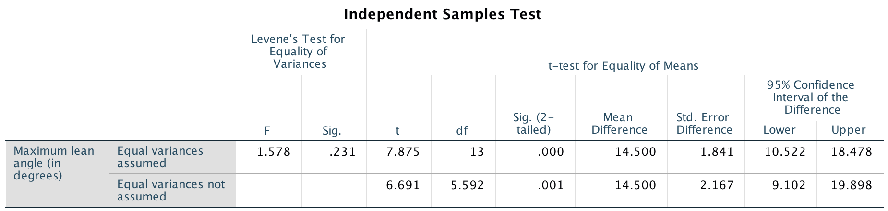
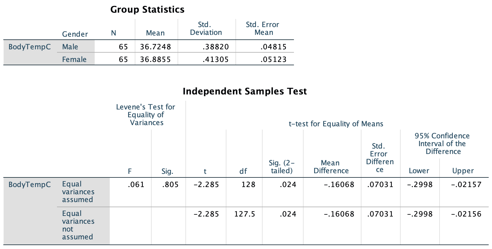

# Hypothesis tests for means of two independent groups {#TestTwoMeans}

```{block2, type="rmdobjectives"}
So far,
you have learnt to
ask a RQ, 
identify different ways of obtaining data,
design the study,
collect the data
describe the data,
summarise data graphically and numerically,
understand the tools of inference,
and 
to form *confidence intervals*.

**In this chapter**,
you will learn about *hypothesis tests* for the difference between two means.
You will learn to:

* conduct hypothesis tests for comparing two means.
* determine whether the conditions for using these methods apply in a given situation.

```


```{r echo=FALSE, fig.cap="", fig.align="center", fig.width=3, out.width="35%"}
SixSteps(5, "Tests: Differences between means")
```


## Introduction: Reaction times {#Chap30-Intro}

<!-- Text wrap from: https://stackoverflow.com/questions/43551312/wrap-text-around-plots-in-markdown -->
<!-- Trick from: https://blog.earo.me/2019/10/26/reduce-frictions-rmd/ -->
`r if (knitr::is_latex_output()) '<!--'`
```{r, echo=FALSE, out.width= "40%", out.extra='style="float:right; padding:10px"'}
include_graphics("Illustrations/pexels-splitshire-2224.jpg")
```
`r if (knitr::is_latex_output()) '-->'`


A study
[@data:Strayer2001:phones],
examined the reaction times of students while driving.

In one study,
two different groups of students were used:
one group *used* a mobile phone,
and a different group *did not use* a mobile phone.
Their reaction times were measured in a driving simulator.
These data were seen previously in 
Sect. \@ref(MeansIndSamples).

The two groups receive different treatments:
one group used a mobile phone while driving, 
and a different group *did not* use a mobile phone while driving.

The data are not paired;
instead,
the means of two separate (or independent) samples
are being compared.
(The data would be paired if *each* student was measured twice:
once using a phone, and once without using a phone.)


Consider the RQ:

> For students,
> is there a difference between the mean reaction time while driving,
> between students who *are using* a mobile phone 
> and students who are *not using* a mobile phone?


`r if (knitr::is_latex_output()) {
   'Part of the data are shown in Table \\@ref(tab:DataInsulation).'
} else {
   'The data are shown below.'
}`


```{r echo=FALSE}
RT <- structure(list(Reaction = c(636, 623, 615, 672, 601, 600, 542, 
554, 543, 520, 609, 559, 595, 565, 573, 554, 626, 501, 574, 468, 
578, 560, 525, 647, 456, 688, 679, 960, 558, 482, 527, 536, 557, 
572, 457, 489, 532, 506, 648, 485, 610, 444, 626, 626, 426, 585, 
487, 436, 642, 476, 586, 565, 617, 528, 578, 472, 485, 539, 523, 
479, 535, 603, 512, 449), Group = structure(c(1L, 1L, 1L, 1L, 
1L, 1L, 1L, 1L, 1L, 1L, 1L, 1L, 1L, 1L, 1L, 1L, 1L, 1L, 1L, 1L, 
1L, 1L, 1L, 1L, 1L, 1L, 1L, 1L, 1L, 1L, 1L, 1L, 2L, 2L, 2L, 2L, 
2L, 2L, 2L, 2L, 2L, 2L, 2L, 2L, 2L, 2L, 2L, 2L, 2L, 2L, 2L, 2L, 
2L, 2L, 2L, 2L, 2L, 2L, 2L, 2L, 2L, 2L, 2L, 2L), .Label = c("Phone", 
"Control"), class = "factor")), .Names = c("Reaction", "Group"
), row.names = c(NA, -64L), class = "data.frame", variable.labels = structure(c("Reaction time (in ms)", 
"Group"), .Names = c("Reaction", "Group")), codepage = 65001L)
```


```{r PhoneDataTableTest, echo=FALSE}
RT.DataTable   <- cbind( RT$Reaction[RT$Group=="Phone"],
                         RT$Reaction[RT$Group=="Control"] )
RT.DataTable10 <- cbind( head(RT$Reaction[RT$Group=="Phone"], 10), 
                         head(RT$Reaction[RT$Group=="Control"], 10) ) 

if( knitr::is_latex_output() ) {
  kable( RT.DataTable10,
         format="latex",
         booktabs = TRUE,
         longtable=FALSE,
         col.names=c("Using phone", "Not using phone"),
         caption="Reaction times (in milliseconds) for students using, and not using, mobile phones. The first ten observations are shown, but 32 students are in each group") %>%
   row_spec(0, bold=TRUE) %>%
    kable_styling(font_size=10)
}
if( knitr::is_html_output() ) {
  DT::datatable( RT.DataTable,
         colnames=c("Using phone", "Not using phone"),
         caption="Reaction times (in milliseconds) for students using, and not using, mobile phones; 32 students are in each group",
         fillContainer=FALSE, # Make more room, so we don't just have ten values
                 #filter="top", 
                 #selection="multiple", 
                 #escape=FALSE,
                 options = list(searching = FALSE) # Remove searching: See: https://stackoverflow.com/questions/35624413/remove-search-option-but-leave-search-columns-option
  )
}


```


## Hypotheses and notation: Assumption

Since two groups are being compared,
distinguishing between the statistics
for the two groups (say, Group A and Group B)
is important
(recapping Sect. \@ref(TwoMeansNotationCI)).

One way is to use subscripts
(see Table \@ref(tab:IndSampleNotationHT)).
Using this notation,
the *parameter* in the RQ is the difference between population means: $\mu_A-\mu_B$.

As usual,
the population values are unknown,
so this is estimated using the statistic
$\bar{x}_A-\bar{x}_B$.


```{r IndSampleNotationHT, echo=FALSE}
Diff2Notation <- array(dim=c(5, 2))
colnames(Diff2Notation) <- c(	"Group A", "Group B")
rownames(Diff2Notation) <- c(	"Population means:",
								"Sample means:",
								"Standard deviations:",
								"Standard errors:",
								"Sample sizes:")


if( knitr::is_latex_output() ) {
  Diff2Notation[1, ] <- c(	"$\\mu_A$", 	"$\\mu_B$")
  Diff2Notation[2, ] <- c(	"$\\bar{x}_A$",		"$\\bar{x}_B$")
  Diff2Notation[3, ] <- c(	"$s_A$", 			"$s_B$")
  Diff2Notation[4, ] <- c(	"$\\displaystyle\\text{s.e.}(\\bar{x}_A) = \\frac{s_A}{\\sqrt{n_A}}$",
  							            "$\\displaystyle\\text{s.e.}(\\bar{x}_B) = \\frac{s_B}{\\sqrt{n_B}}$")
  Diff2Notation[5, ] <- c(	"$n_A$",
  							            "$n_B$")

  kable( Diff2Notation,
         format="latex",
         booktabs = TRUE,
         align=c("c", "c"),
         longtable=FALSE,
         escape=FALSE,
         col.names=colnames(Diff2Notation),
         caption="Notation used to distinguish between the two independent groups") %>%
    row_spec(0, bold=TRUE) %>%
    kable_styling(font_size=10)
}
if( knitr::is_html_output() ) {

  Diff2Notation[1, ] <- c(	"$\\mu_A$", 	"$\\mu_B$")
  Diff2Notation[2, ] <- c(	"$\\bar{x}_A$",		"$\\bar{x}_B$")
  Diff2Notation[3, ] <- c(	"$s_A$", 			"$s_B$")
  Diff2Notation[4, ] <- c(	"$\\displaystyle\\text{s.e.}(\\bar{x}_A) = \\frac{s_A}{\\sqrt{n_A}}$",
  							            "$\\displaystyle\\text{s.e.}(\\bar{x}_B) = \\frac{s_B}{\\sqrt{n_B}}$")
  Diff2Notation[5, ] <- c(	"$n_A$",
  							            "$n_B$")

  kable( Diff2Notation,
         format="html",
         booktabs = TRUE,
         longtable=FALSE,
         align=c("c", "c"),
         col.names=colnames(Diff2Notation),
         caption="Notation used to distinguish between the two independent groups") %>%
    row_spec(0, bold=TRUE) 
}
```


For the reaction-time data,
the differences are computed as the mean reaction time for phone users, 
*minus* the mean reaction time for non-phone users:
$\mu_P - \mu_C$.
By this definition,
the differences refer to how much greater (on average)
the reaction times are when students are using phones.

The parameter is $\mu_P - \mu_C$, the difference between the population mean reaction times
(using phone, minus *not* using a phone).

```{block2 type="rmdimportant"}
Here the difference is computed as the mean reaction time for phone users, 
*minus* the mean reaction time for non-phone users.
Computing the difference as the mean reaction time for non-phone users, 
*minus* the mean reaction time for phone users is also correct;
you need to be clear about how the difference is computed, and be consistent throughout.
```


As always 
(Sect. \@ref(AboutHypotheses)),
the null hypothesis is the default 'no difference, no change, no relationship' position;
hence the null hypothesis is that there is 'no difference' 
between the population means of the two groups:

* $H_0$: $\mu_P - \mu_C=0$ (or $\mu_P = \mu_C$).

This hypothesis proposes that any difference between the *sample* means
is due to *sampling variation*.
This becomes the initial **assumption**.

From the RQ,
the alternative hypothesis will be *two*-tailed:

* $H_1$: $\mu_P - \mu_C\ne 0$ (or $\mu_P \ne \mu_C$).


## Sampling distribution: Expectation {#sampling-distribution-expectation-twosampleHT}

The data for testing the hypothesis are shown 
`r if( knitr::is_latex_output() ) {
  'in Table \\@ref(tab:PhoneDataTableTest).'
} else {
  'below.'
}`
The numerical summary (Sect. \@ref(MeansIndSamples))
*must* summarise the difference between the means
(since the RQ is about the difference),
and should summarise each group.
All this information is found using software
(jamovi: Fig. \@ref(fig:ReactionPhoneSummaryTestjamovi);
SPSS: Fig. \@ref(fig:ReactionPhoneSummaryTestSPSS)),
and can be compiled into a table
(Table \@ref(tab:PhoneNumericalTest)).

The appropriate summary for graphically summarising the *data*
is a boxplot 
(though a dot chart is also acceptable).
An error bar chart
(Fig. \@ref(fig:PhoneErrorbar)),
which allows the *sample means* to be compared,
should also be produced.


```{r ReactionPhoneSummaryTestjamovi, echo=FALSE, fig.cap="jamovi output for the phone reaction time data", fig.align="center", out.width="85%"}
knitr::include_graphics("jamovi/ReactionPhone/ReactionPhone-Test-All.png")
```


```{r ReactionPhoneSummaryTestSPSS, echo=FALSE, fig.cap="SPSS output for the phone reaction time data", fig.align="center", out.width="80%"}
knitr::include_graphics("SPSS/ReactionPhone/ReactionPhone-Test.png")
```


The difference between the sample means is 51.59&nbsp;ms...
but this value will vary from sample to sample;
that is, there is *sampling variation*.
The sampling variation (**expectation**)
for the values of $\bar{x}_A - \bar{x}_B$ can be described as having:

* an approximate normal distribution;
* centred around \( {\mu_{P}} - {\mu_{C}} = 0 \) (from $H_0$);
* with a standard deviation of $\displaystyle\text{s.e.}(\bar{x}_P - \bar{x}_C)$,
  called the *standard error for the difference between the means*.


```{block2, type="rmdimportant"}
jamovi and SPSS give results from *two* similar hypothesis tests.
In this book,
we will always use the second row of information
(the "Welch's $t$" row in jamovi;
the "Equal variance not assumed" row in SPSS)
because it is more general and makes fewer assumptions.
```


```{r PhoneNumericalTest, echo=FALSE}
Phone.DataSummary <- array(NA, dim=c(3, 4) )

Phone.DataSummary[1:2, 1] <- aggregate( Reaction ~ Group, 
                                        data = RT, 
					FUN = "mean")[, 2]
Phone.DataSummary[1:2, 2] <- aggregate( Reaction ~ Group, 
                                        data = RT, 
					FUN = "length")[, 2] 
Phone.DataSummary[1:2, 3] <- aggregate( Reaction ~ Group, 
                                        data = RT, 
					FUN = "sd")[, 2]
Phone.DataSummary[1:2, 4] <- aggregate( Reaction ~ Group, 
                                        data = RT, 
					FUN = function(x){ sd(x) / sqrt(length(x))})[, 2] 

Phone.DataSummary[3, 1] <- Phone.DataSummary[1, 1] - Phone.DataSummary[2, 1]
Phone.DataSummary[3, 4] <- sqrt( Phone.DataSummary[1, 3]^2/Phone.DataSummary[1, 2] +
                                 Phone.DataSummary[2, 3]^2/Phone.DataSummary[2, 2]  )
Phone.DataSummary[3, 2] <- ""
Phone.DataSummary[3, 3] <- ""

rownames(Phone.DataSummary) <- c("Using phone", "Not using phone", "All students")

if( knitr::is_latex_output() ) {
  kable(Phone.DataSummary,
        format = "latex",
        booktabs = TRUE,
        longtable = FALSE,
        digits = c(2, 0, 2, 3),
        col.names = c("Mean", "Sample size", "Standard deviation", "Standard error"),
        caption = "Numerical summaries of the reaction-time data (in milliseconds)") %>%
   row_spec(0, bold = TRUE) %>%
   kable_styling(font_size = 10) 
}
if( knitr::is_html_output() ) {
  kable(Phone.DataSummary,
        format = "html",
        booktabs = TRUE,
        longtable = FALSE,
        digits = c(2, 0, 2, 3),
        col.names = c("Mean", "Sample size", "Standard deviation", "Standard error"),
        caption = "Numerical summaries of the reaction-time data (in milliseconds)")  
}
```


## The test statistic: Observations

The observed sample mean difference (**observations**),
relative to what was expected,
is found by computing the test statistic,
in this case, a $t$-score.
The software output
(jamovi: Fig. \@ref(fig:ReactionPhoneSummaryTestjamovi);
SPSS: Fig. \@ref(fig:ReactionPhoneSummaryTestSPSS))
can be used,
but the $t$-score can also be computed manually:

\begin{align*}
   t
  &= 
   \frac{\text{sample statistic} - \text{assumed population parameter, from $H_0$}}
        {\text{standard error for sample statistic}}\\
   &= 
   \frac{ (\bar{x}_P - \bar{x}_C) - (\mu_P - \mu_C)}
        {\text{s.e.}(\bar{x}_P - \bar{x}_C)}\\
  &= \frac{51.594 - 0}{19.612} = 2.631,
\end{align*}
as in the software output.


## $P$-values: Consistency with assumption?

A $P$-value is needed to 
determine if the sample statistic is consistent with the assumption.
Since the $t$-score is large,
the $P$-value will be small
using the [68--95--99.7 rule](#def:EmpiricalRule).
This is confirmed by the software
(jamovi: Fig. \@ref(fig:ReactionPhoneSummaryTestjamovi);
SPSS: Fig. \@ref(fig:ReactionPhoneSummaryTestSPSS)):
the two-tailed $P$-value is $0.011$.
The small $P$-value suggests that the observations
are *inconsistent* with the assumption
(Table \@ref(tab:PvaluesInterpretation2)).


`r if (knitr::is_html_output()){
  'Click on the hotspots in the following image, to see what the SPSS output tells us.' 
}`

<iframe src="https://usc.h5p.com/content/1291329995708100229/embed" width="1088" height="637" frameborder="0" allowfullscreen="allowfullscreen" allow="geolocation *; microphone *; camera *; midi *; encrypted-media *"></iframe><script src="https://usc.h5p.com/js/h5p-resizer.js" charset="UTF-8"></script>


## Conclusions

In conclusion we write:

> Moderate evidence exists in the sample
> (two independent samples $t=2.631$;
> two-tailed $P=0.011$)
> that the population mean reaction time is different for 
> students using a mobile phone (mean: 585.19 ms; $n=32$) 
> and students *not* using a mobile phone (mean: 533.59ms; $n = 32$;
> 95% CI for the difference: $12.4$ to $90.9$ms longer for phone users).

Again,
the conclusions contains 
an *answer to the RQ*,
the *evidence* leading to this conclusion ($t=2.631$; two-tailed $P=0.011$),
and
some *sample summary statistics*, including a CI.


## Statistical validity conditions {#Validity-Test-DiffMeans}

As usual,
these results apply
[under certain conditions](#exm:StatisticalValidityAnalogy),
which are the same as those for forming a
CI for the *difference* between two means.

The test above is statistically valid
if *one* of these conditions is true:

1. *Both* sample sizes are at least 25; *or*
1. Either sample size is smaller than 25, **and** both *populations* have an approximate normal distribution.
  
The sample size of 25 is a rough figure here, and some books give other values (such as 30).
We can explore the histograms of the *samples*
to determine if normality of the *populations* seems reasonable.

In addition to the statistical validity condition,
the test will be

* [**internally valid**](#def:InternalValidity)
  if the study was well designed; and
* [**externally valid**](#def:ExternalValidity) 
  if the sample is a [simple random sample](#SRS)
  and is internally valid.


```{example StatisticalValidityReactionHT, name="Statistical validity"}
For the reaction-time data,
both samples sizes are $n=32$.
This means that the results will be statistically valid.

Explicitly, the data in each group do not need be normally distributed,
since both sample sizes are larger than 25.
```


```{example,  TwoSampleHTWhales, name = "Gray whales"}
A study of gray whales (*Eschrichtius robustus*) 
measured (among other things) the length of adult whales [@agbayani2020growth].
The data are shown below.


| Sex     |  Mean (in m)  |Standard deviation (in m) | Sample size 
|--------:+:-------------:+:------------------------:+:-----------:
| Female 	| 12.70         | 0.611 	                 | 260 	
| Male 	  | 12.07	        | 0.705 	                 | 139

Are adult female gray whales longer than males, on average?

Let's define the *difference* as the mean length of female gray whales *minus* the mean length of male gray whales.
Then we wish to estimate the difference $\mu_F - \mu_M$,
where $F$ and $M$ represent female and male gray whales respectively;
this is the *parameter* of interest.
The best estimate of this difference is $\bar{x}_F - \bar{x}_M = 12.70 - 12.07 = 0.63$&nbsp;m.

The hypotheses are:

* $H_0$: $\mu_F - \mu_M = 0$
* $H_1$: $\mu_F - \mu_M \ne 0$

We know that the difference between the sample means is likely to vary from sample to sample,
and hence it has a standard error.

We cannot easily determine the standard error of this difference from the above information
(though it is possible), so we must be *given* this information:
$\text{s.e.}(\bar{x}_F - \bar{x}_M) = 0.07079$.

The test statistic is

\[
   t = \frac{(\bar{x}_F - \bar{x}_M) - (\mu_F - \mu_M)}{\text{s.e.}(\bar{x}_F - \bar{x}_M)} 
     = \frac{0.63 - 0}{0.07079} = 8.90,
\]
which is *very* large.
This means that the $P$-value will be very small (using the 68-95--99.7 rule).

We write:

> There is very strong evidence ($t = 8.90$; two-tailed $P < 0.001$) that the mean length of adult gray whales
> is different for females (mean: 12.70&nbsp;m; standard deviation: 0.611&nbsp;m) and males (mean: 12.07&nbsp;m; standard deviation: 0.705&nbsp;m; 95% CI for the difference: 0.48&nbsp;m to 0.77&nbsp;m).

Since both sample sizes are large, the test is statistically valid.

(Check that you can compute the correct CI!)
```


## Example: Health Promotion services {#BHADP-Test}


<!-- Text wrap from: https://stackoverflow.com/questions/43551312/wrap-text-around-plots-in-markdown -->
<!-- Trick from: https://blog.earo.me/2019/10/26/reduce-frictions-rmd/ -->
`r if (knitr::is_latex_output()) '<!--'`
```{r, echo=FALSE, out.width= "30%", out.extra='style="float:right; padding:10px"'}
include_graphics("Illustrations/pexels-marcus-aurelius-4063510.jpg")
```
`r if (knitr::is_latex_output()) '-->'`


A study
[@data:Becker1991:BHADP]
compared the access to health promotion (HP) services
for people with and without a disability.
(This study was seen in 
Sect. \@ref(BHADP).)
Access was measured using the
`r if (knitr::is_latex_output()) {
   '\\textit{Barriers to Health Promoting Activities for Disabled Persons}'
} else {
   '*Barriers to Health Promoting Activities for Disabled Persons* 
[BHADP scale](http://www.utexas.edu/nursing/chpr/resources/bhadp.html)'
}`,
where higher scores mean greater barriers.
The RQ is:

> Is the mean BHADP score
> the same for people with and without a disability?

The parameter is $\mu_D - \mu_N$, the difference between the population mean BHADP score
(people with disabilities, minus people without disabilities).

In this case,
only numerical summary data is available 
(Table \@ref(tab:BHADPSummaryTest)),
not the original data.
(An appropriate graphical summary, an error bar chart, 
can be constructed from the summary information
(Fig. \@ref(fig:BHADPErrorBar),
though a boxplot cannot be constructed from the information.)
Denoting those with and without a disability with subscripts $D$ and $N$ respectively,
the hypotheses are:

* $H_0$: $\mu_D - \mu_N = 0$: There *is no* difference in the population mean BHADP scores
* $H_1$: $\mu_D - \mu_N \ne 0$: There *is a* difference in the population mean BHADP scores

        


```{r BHADPSummaryTest, echo=FALSE}
BHADPSummary <- array(dim=c(3, 4))
rownames(BHADPSummary) <- c("Disability", 
                            "No disability",
                            "Difference")

BHADPSummary[1, ] <- c(31.83, 7.73, 132, 0.6728)
BHADPSummary[2, ] <- c(25.07, 4.80, 137, 0.4101)
BHADPSummary[3, ] <- c(6.76, "", "", 0.80285)
  

if( knitr::is_latex_output() ) {
  kable(BHADPSummary,
        format="latex",
        longtable=FALSE,
    booktabs = TRUE,
	 #linesep = c("", "", "", "\\addlinespace", "", "", "", "\\addlinespace", "", "", "", ""), # Otherwise addes a space after five lines... 
    align=c("r", "r", "r", "l"),
    col.names = c("Sample mean", "Std deviation", "Sample size", "Std error"),
    caption="The BHADP data summary"
  ) %>%
    row_spec(0, bold=TRUE) %>%
    kable_styling(font_size=10)
}
if( knitr::is_html_output() ) {
  kable(BHADPSummary,
        format="html",
        longtable=FALSE,
    booktabs = TRUE,
    align=c("r", "r", "r", "l"),
    col.names = c("Sample mean", "Std deviation", "Sample size", "Std error"),
    caption="The BHADP data summary"
  ) %>%
   kable_styling(full_width=FALSE)
}
```


The best estimate of the difference in *population* means 
is the difference between the *sample* means: 
$(\bar{x}_D - \bar{x}_{ND}) = 6.76$.
The table also gives
the standard error for estimating this *difference* as
$\text{s.e.}(\bar{x}_D - \bar{x}_{ND}) = 0.80285$
(as *given* in the article).


```{block2, type="rmdnote"}
The *standard error is given here*; 
you **cannot** easily calculate this from the given information.
You are not expected to do so.
```


Using the summary information in Table \@ref(tab:BHADPSummaryTest),
the $t$-score is computed using 
Equation \@ref(eq:tscore):

\[
  t = \frac{6.76 - 0}{0.80285} = 8.42.
\]
(Recall that $\mu_D - \mu_N = 0$ from the null hypothesis.)
Using the [68--95--99.7 rule](#def:EmpiricalRule),
this *very* large $t$-score implies
the $P$-value will be *very* small.
We conclude:

> Strong evidence exists in the sample 
> ($t = 8.42$; two-tailed $P < 0.001$) 
> that people with a disability (mean: 31.83; $n = 132$; standard deviation: $7.73$) 
> and people without a disability (mean: 25.07; $n = 137$; standard deviation: $4.80$) 
> have different population mean access to health promotion services 
> (95% CI for the difference: 5.17 to 8.35).


## Example: Face-plant study

```{r echo=FALSE, message=FALSE}
FF <- structure(list(LeanAngle = c(29, 34, 33, 27, 28, 32, 31, 34, 
32, 27, 18, 15, 23, 13, 12), Group = structure(c(1L, 1L, 1L, 
1L, 1L, 1L, 1L, 1L, 1L, 1L, 2L, 2L, 2L, 2L, 2L), .Label = c("Younger females", 
"Older females"), class = "factor")), .Names = c("LeanAngle", 
"Group"), row.names = c(NA, -15L), class = "data.frame", variable.labels = structure(c("Maximum lean angle (in degrees)", 
""), .Names = c("LeanAngle", "Group")), codepage = 28591L)
```


A study
[@data:Wojcik:ForwardFall]
compared the lean-forward angle in younger and older women.
(This study was seen in 
Sect. \@ref(FacePlantCI).)
An elaborate set-up was constructed to measure this lean-forward angle,
using harnesses.

Consider this RQ:

> Among healthy women,
> is the mean lean-forward angle
> *greater*
> for younger women compared to older women?

The parameter is $\mu_Y - \mu_O$, the difference between the population mean lean-forward angle
(younger women, minus older women).

This is a *one-tailed* RQ.
Denoting the younger and older women with subscrpts $Y$ and $O$ respectively,
the hypotheses are:

* $H_0$: $\mu_{\text{Y}} - \mu_{\text{O}} = 0$ (or $\mu_{\text{Y}} = \mu_{\text{O}}$): 
  There *is no* difference in the population mean lean-forward angle between the two age groups (the **assumption**);
* $H_1$: $\mu_{\text{Y}} - \mu_{\text{O}} > 0$ (or $\mu_{\text{Y}} > \mu_{\text{O}}$): 
  There *is a* difference in the population mean lean-forward angle between the two groups.

The data
(Table \@ref(tab:FacePlant)),
numerical summary
(Table \@ref(tab:FacePlantSummary)).
and error bar chart
(Fig.&nbsp;\@ref(fig:FacePlantPlots))
were shown in 
Sect. \@ref(FacePlantCI).

Using the sampling distribution (**expectation**),
the $t$-score can be found on the the software output 
(jamovi: Fig. \@ref(fig:FallFowardTTestTestjamovi);
SPSS: Fig. \@ref(fig:FallFowardTTestTestjamovi)),
or manually:

\[
  t = \frac{14.5-0}{2.167} = 6.691
\]
(**observation**).
The two-tailed $P$-value is $0.001$,
so the *one-tailed* $P$-value is $0.001\div 2 = 0.0005$.
This is very small,
so we **conclude**:

> Very strong evidence exists
> in the sample
> ($t=6.691$;  one-tailed $P=0.0005$)
> that the population mean one-step fall recovery angle for healthy women is 
> *greater* for young women
> (mean: $30.7^\circ$; std. dev.: $2.58^\circ$; $n=10$)
> compared to older women
> (mean: $16.20^\circ$; std. dev.: $4.44^\circ$; $n=5$;
> 95% CI\ for the difference: $9.1^\circ$ to $19.9^\circ$).


   
```{r FallFowardTTestTestjamovi, echo=FALSE, fig.cap="jamovi output for the face-plant data", fig.align="center", out.width="95%"}
knitr::include_graphics("jamovi/FallForward/FallForwardTTestOutput-All.png")
```


```{r FallFowardTTestTestSPSS, echo=FALSE, fig.cap="SPSS output for the face-plant data", fig.align="center", out.width="95%"}

```


The sample sizes are both small,
so the test may not be statistical valid.
However,
since the $P$-value is so small,
the conclusion is unlikely to change substantially.


<iframe src="https://h5p.org/h5p/embed/498955" width="1090" height="463" frameborder="0" allowfullscreen="allowfullscreen"></iframe><script src="https://h5p.org/sites/all/modules/h5p/library/js/h5p-resizer.js" charset="UTF-8"></script>


## Summary {#Chap30-Summary}

To test a hypothesis about a difference between two population means $\mu_1 - \mu_2$,
based on the value of the difference between two sample mean $\bar{x}_1 - \bar{x}_2$,
**assume** the value of $\mu_1 - \mu_2$ in the null hypothesis to be true (usually zero).
Then,
the difference between the sample means varies from sample to sample and,
under certain statistical validity conditions,
varies with an approximate normal distribution
centered around the hypothesised value of $\mu_1 - \mu_2$,
with a standard deviation of $\text{s.e.}(\bar{x}_1 - \bar{x}_2)$.
This distribution describes what values of the sample mean could be **expected** in the sample
if the value of $\mu$ in the null hypothesis was true.
The *test statistic* is

\[
   t = \frac{ (\bar{x}_1 - \bar{x}_2) - (\mu_1 - \mu_2)}{\text{s.e.}(\bar{x}_1 - \bar{x}_2)},
\]
where $\mu_1 - \mu_2$ is the hypothesised value given in the null hypothesis.
This describes the **observations**.
The $t$-value is like a $z$-score, 
and so an approximate **$P$-value** is estimated using the [68--95--99.7 rule](#def:EmpiricalRule),
which is how we weigh the evidence to determine if it is **consistent** with the assumption.


`r if (knitr::is_html_output()){
  'The following short video may help explain some of these concepts:'
}`


<div style="text-align:center;">
```{r, echo=FALSE}
htmltools::tags$video(src ="./videos/TwoMeans.mp4", 
                      width="550", 
                      autoplay="false", 
                      controls="controls", 
                      loop="loop", 
                      style="padding:5px; border: 2px solid gray;")
```
</div>


<iframe src="https://usc.h5p.com/content/1291006142766576679/embed" width="1088" height="637" frameborder="0" allowfullscreen="allowfullscreen" allow="geolocation *; microphone *; camera *; midi *; encrypted-media *"></iframe><script src="https://usc.h5p.com/js/h5p-resizer.js" charset="UTF-8"></script>


## Quick review questions {#Chap30-QuickReview}

A study
[@lee2016effect]
compared using a vegan ($n=46$) and a conventional ($n=47$) diet for 12 weeks,
for a group of Koreans with Type II diabetes.
A summary of the data for iron levels are shown in
Table \@ref(tab:VeganDiet).


```{r VeganDiet, echo=FALSE}
VeganDiet <- array( dim=c(3, 3))

rownames(VeganDiet) <- c("Vegan diet","Conventional diet", "Difference")
colnames(VeganDiet) <- c("Mean", "Std. dev", "n")

VeganDiet[1, ] <- c(13.9, 2.3, 46)
VeganDiet[2, ] <- c(15.0, 2.7, 47)
VeganDiet[3, ] <- c(1.1, "", "")


if( knitr::is_latex_output() ) {
  kable(VeganDiet,
        format="latex",
        longtable=FALSE,
      booktabs=TRUE,
      caption="Comparing the iron levels (mg) for subjects using a vegan or conventional diet for 12 weeks") %>%
	kable_styling(font_size=10) %>%
	row_spec(0, bold=TRUE)
}

if( knitr::is_html_output() ) {
  kable(VeganDiet,
        format="html",
        longtable=FALSE,
      booktabs=TRUE,
      caption="Comparing the iron levels (mg) for subjects using a vegan or conventional diet for 12 weeks")
}
```


1. The sample size is missing from the 'Difference' row. What should the sample size in this row be?  
`r if( knitr::is_html_output() ) {mcq( c(
  "46 + 47 = 93",
  "46 - 47 = -1",
  "47 - 46 = 1",
  answer = "A sample size makes no sense",
  "There is not enough information"
)  )}`
1. What is the *standard deviation* for the difference?  
`r if( knitr::is_html_output() ) {mcq( c(
  "0.3391",
  "0.3928",
  answer = "A standard deviation makes no sense",
  "There is not enough information"
)  )}`
1. What is the *standard error* for the difference?  
`r if( knitr::is_html_output() ) {mcq( c(
  "0.3391",
  "0.3928",
  "A standard error makes no sense",
  answer = "There is not enough information"
)  )}`
1. The two-tailed $P$-value for the comparison is given as $P=0.046$.
What does this mean?  
`r if( knitr::is_html_output() ) {mcq( c(
  "There is no evidence that the sample means are different",
  "There is some evidence that the sample means are different",
  "There is no evidence that the population means are different",
  answer = "There is some evidence that the population means are different",
  "There is not enough information"
)  )}`


## Exercises {#TestTwoMeansExercises}

Selected answers are available in
Sect. \@ref(TestTwoMeansAnswer).


```{exercise TestTwoMeansNHANES}
Earlier,
the NHANES study
(Sect.&nbsp;\@ref(NHANESGraphs);
Exercise \@ref(exr:MeansIndSamplesExercisesNHANES)),
was used to address this RQ:

> Among Americans,
> is the mean direct HDL  cholesterol
> different for current smokers and non-smokers?

Use the SPSS output in
Fig. \@ref(fig:NHANESTest)
to perform a hypothesis test to answer the RQ.
```


   
```{r NHANESTest, echo=FALSE, fig.cap="SPSS output for the NHANES data", fig.align="center", out.width="80%"}
knitr::include_graphics("SPSS/NHANES/NHANES-TOutput.png")
```


```{exercise TestTwoMeansFitnessOfParamedics}
A study of male paramedics in Western Australia
compared conventional paramedics with special operations paramedics
[@data:chapman2007:MaleParamedics].
Some information comparing their physical profiles is shown in 
Table \@ref(tab:ParamedicsTest).

1. Compute the missing standard errors.
1. Consider comparing the mean grip strength for the two groups of paramedics. 
   The *standard error for the difference between the means* is 3.3044. 
   - Carefully write down the hypotheses.
   - Compute the $t$-score for testing if a difference exists between the two types of paramedics.
   - Approximate the $P$-value using the  [68--95--99.7 rule](#def:EmpiricalRule).
   - Discuss the conditions required for statistical validity in this context.
   - Make a conclusion.
1. Consider comparing the mean number of push-ups completed in one minute. 
   The *standard error for the difference between the means* is 4.0689. 
   - Carefully write down the hypotheses.
   - Compute the $t$-score for testing if a difference exists between the two types of paramedics.
   - Approximate the $P$-value using the  [68--95--99.7 rule](#def:EmpiricalRule).
   - Discuss the conditions required for statistical validity in this context.
   - Make a conclusion.

```


```{r ParamedicsTest, echo=FALSE}
ParaSummary <- array(dim=c(6, 2))
rownames(ParaSummary) <- c("Mean", 
                            "Std deviation",
                            "Std error",
                            "Mean", 
                            "Std deviation",
                            "Std error")
colnames(ParaSummary) <- c("Conventional", 
                            "Special Operations")
ParaSummary[1, ] <- c(51, 56)
ParaSummary[2, ] <- c(8, 9)
ParaSummary[3, ] <- c("", "")
ParaSummary[4, ] <- c(36, 47)
ParaSummary[5, ] <- c(10, 11)
ParaSummary[6, ] <- c("", "")
  

if( knitr::is_latex_output() ) {
  kable(ParaSummary,
        format="latex",
        longtable=FALSE,
    booktabs = TRUE,
	 #linesep = c("", "", "", "\\addlinespace", "", "", "", "\\addlinespace", "", "", "", ""), # Otherwise addes a space after five lines... 
    align=c("r", "r"),
    caption="The physical profile of conventional ($n=18$) and special operation ($n=11$) paramedics in Western Australia"
  ) %>%
    row_spec(0, bold=TRUE) %>%
  kable_styling("striped", full_width = F, font_size=10) %>%
  pack_rows("Grip strength (in kg)", 1, 3) %>%
  pack_rows("Push-ups (per minutes)", 4, 6)
}
if( knitr::is_html_output() ) {
  kable(ParaSummary,
        format="html",
        longtable=FALSE,
    booktabs = TRUE,
    align=c("r", "r"),
    caption="The physical profile of conventional ($n=18$) and special operation ($n=11$) paramedics in Western Australia"
  ) %>%
   kable_styling(full_width=FALSE) %>%
  pack_rows("Grip strength (in kg)", 1, 3) %>%
  pack_rows("Push-ups (per minutes)", 4, 6)
}
```


```{exercise TestTwoMeansBodyTemperature}

Consider again the body temperature data
from Sect. \@ref(BodyTemperature).
The researchers also recorded the gender of the patients,
as they also wanted to compare the mean internal body temperatures 
for males and females.

Use the jamovi output in
Fig. \@ref(fig:BodyTempGenderjamovi)
to perform this test and make a conclusion.
Also comment on the practical significance of your results.
```

```{r BodyTempGenderjamovi, echo=FALSE, fig.cap="jamovi output for the body-temperature data", fig.align="center", out.width="85%"}
knitr::include_graphics("jamovi/BodyTemp/BodyTempTestGender.png")
```


<!-- ```{r BodyTempGenderSPSS, echo=FALSE, fig.cap="SPSS output for the body-temperature data", fig.align="center", out.width="80%"} -->
<!--  -->
<!-- ``` -->


```{exercise TestTwoMeansDental}
A study
[@data:woodward:dental]
examined the sugar consumption in industrialised (mean: 41.8 kg/person/year) 
and non-industrialised (mean: 24.6 kg/person/year) countries.
The jamovi output is shown in
Fig. \@ref(fig:Dentaljamovi).

1. Write the hypotheses.
2. Write down and interpret the CI.
3. Write a conclusion for the hypothesis test.

```


```{r Dentaljamovi, echo=FALSE, fig.cap="jamovi output for the sugar-consumption data", fig.align="center", out.width="85%"}
knitr::include_graphics("jamovi/Dental/WoodwardWalker1994-ttest.png")
```


`r if (knitr::is_html_output()){
  'In the image below, click on the location where the correct $P$-value is located.' 
}`

<iframe src="https://h5p.org/h5p/embed/495421" width="1090" height="460" frameborder="0" allowfullscreen="allowfullscreen"></iframe><script src="https://h5p.org/sites/all/modules/h5p/library/js/h5p-resizer.js" charset="UTF-8"></script>


  
  


