# CIs and tests: comparing two odds or proportions {#AnalysisOddsRatio}


<!-- Introductions; easier to separate by format -->
```{r, child = if (knitr::is_html_output()) {'./introductions/31-CIsTesting-OddsRatios-HTML.Rmd'} else {'./introductions/31-CIsTesting-OddsRatios-LaTeX.Rmd'}}
```


<!-- Define colours as appropriate -->
```{r, child = if (knitr::is_html_output()) {'./children/coloursHTML.Rmd'} else {'./children/coloursLaTeX.Rmd'}}
```


## Introduction: meals on-campus {#MealsOnCampus}


<div style="float:right; width: 222x; border: 1px; padding:10px">

</div>


@data:Mann12017:UniStudents examined the relationship between where university students usually ate, and where the student lived,
for students from two Canadian east coast universities.
The researchers cross-classified the $n = 183$ students (the units of analysis) according to two *qualitative* variables:

* Where they lived: with their parents, or *not* with their parents;
* Where they ate most meals: *off-campus* or *on-campus*.


Both variables are qualitative, so means are not appropriate for summarising the data.
The data can be compiled into a two-way table of counts\index{Tables!two-way} (Table\ \@ref(tab:MealsDataTable)), also called a *contingency table*.\index{Contingency table}
Both qualitative variables have two levels, so this is a $2\times 2$ table.
Every cell in the $2\times 2$ table contains different students, so the comparison is *between* individuals.


::: {.importantBox .important data-latex="{iconmonstr-warning-8-240.png}"}
The study has one sample of students, classified according to two variables (i.e., each student is placed into one of the four cells in the $2\times 2$ table).
:::


::: {.softwareBox .software data-latex="{iconmonstr-laptop-4-240.png}"}
The table can be constructed with either variable as the rows or the columns.
However, software commonly compares *rows*, so it makes sense to place the groups to be compared (i.e., the explanatory variable) in the rows of the table.
:::


```{r MealsDataTable}
data(StudentsEat)


Eating.tab <- Eating.tab.Counts <-  xtabs( ~ Meals + Live, 
                                           data = StudentsEat)

Eating.tab <- cbind( Eating.tab, 
                     "Total" = rowSums(Eating.tab))
Eating.tab <- rbind( Eating.tab, 
                     "Total" = colSums(Eating.tab))

Eating.tab <- t(Eating.tab)

if( knitr::is_latex_output() ) {
  kable( pad(Eating.tab[1:2, 1:2],
             surroundMaths = TRUE,
             targetLength = c(3, 3),
             decDigits = 0),
        format = "latex",
        booktabs = TRUE,
        longtable = FALSE,
        escape = FALSE,
        col.names = c("off-campus",
                      "on-campus"),
        align = "c",
        caption = "Where university students live and eat.") %>%
     column_spec(1, bold = TRUE) %>%
     row_spec(0, bold = TRUE) %>%
     kable_styling(font_size = 8) %>%
    add_header_above( c(" " = 1, 
                        "Has most meals" = 1,
                        "Has most meals" = 1),
                      line = FALSE,
                      bold = TRUE)
}
if( knitr::is_html_output() ) {
  kable(pad(Eating.tab[1:2, 1:2],
             surroundMaths = TRUE,
             targetLength = c(2, 3),
             decDigits = 0),
               format = "html",
               booktabs = TRUE,
               longtable = FALSE,
               align = "c",
               caption = "Where university students live and eat.")
}
UniS <- t(Eating.tab )   
```


The *proportion* of students who eat most meals off-campus can be compared between those who live with their parents and those who do *not* live with their parents.
Then, the parameter is the difference between the population proportions in each group, and the RQ could be written as:

> Among university students, is the proportion of students eating most meals off-campus different for those who *do* and *do not* live with their parents?

Alternatively, the *odds* of students who eat most meals off-campus can be compared between those who live with their parents and those who do *not* live with their parents.
Then, the parameter is the comparison of the odds in both groups, the *odds ratio* (OR);\index{Odds ratio} specifically, the odds ratio of eating most meals off-campus, comparing those living with parents to those not living with parents.
Using the OR, the RQ could be written as:

> Among university students, is the odds of students eating most meals off-campus different for those who *do* and *do not* live with their parents?


::: {.importantBox .important data-latex="{iconmonstr-warning-8-240.png}"}
Take care defining the odds ratios! 
Recall (Sect.\ \@ref(QualOdds)): software usually compares Row\ 1 to Row\ 2, and Column\ 1 to Column\ 2 (that is, the last row is usually the reference level)\index{Reference level}.
For this reason, defining your OR in the same way makes sense.
:::


## Summarising data {#CIOddsRatiosSummaries}
\index{Odds ratio}\index{Odds}

Since two groups are being compared, subscripts are used to distinguish between the statistics for the two groups; say, Groups\ $A$ and\ $B$ in general (Table\ \@ref(tab:ORHT)).
For this example, we use\ $N$ to refer to students *not* living with their parents, and\ $L$ for students living with their parents.

The parameter can be either a difference between two population proportions, or a population odds ratio.
For example, the parameter could be difference between population proportion of students eating most meals *off*-campus, comparing students living with their parents, to students *not* living with their parents; that is, $p_L - p_N$.
(Of course, the parameter could be defined as $p_N - p_L$ also.)
Alternatively (and equivalently), the parameter could be the population\ OR of eating most meals *off*-campus, comparing students living with their parents, to students *not* living with their parents.


::: {.importantBox .important data-latex="{iconmonstr-warning-8-240.png}"}
Since software commonly compares *rows* (for example, see the text under the bottom table in Fig.\ \@ref(fig:EatingSoftware)), it makes sense to place the groups to be compared (i.e., the explanatory variable) in the rows of the table.

Then, the difference between the two proportions are usually calculated as the Row\ 1 proportion minus the Row\ 2 proportion.
Similarly, the odds then can be interpreted as\index{Odds ratio!interpreting}\index{Software output!odds ratios} comparing Column\ 1 counts to Column\ 2 counts, and the *odds ratio* as comparing the Row\ 1 odds to the Row\ 2 odds.
:::


The RQ and the hypotheses can be written as comparing *proportions* (Sect.\ \@ref(CompareTwoProportions)), comparing *odds* (Sect.\ \@ref(CompareTwoOdds)), or about *odds ratios*.
Means are *not* appropriate (the data contain two *qualitative* variables).


```{r ORHT}
OR2Notation <- array(dim = c(4, 3))
colnames(OR2Notation) <- c("Group A", 
                             "Group B",
                             "Comparing groups")
rownames(OR2Notation) <- c("Sample sizes:",
                           "Sample odds:",
                           "Sample proportions:",
                           "Standard errors:")

if( knitr::is_latex_output() ) {
  OR2Notation[1, ] <- c(	"$n_A$",
                           "$n_B$",
                           NA)
  OR2Notation[2, ] <- c( "$\\text{Odds}_A$", 	
                           "$\\text{Odds}_B$",
                           "$\\text{Odds ratio} = \\text{Odds}_A/\\text{Odds}_B$")
  OR2Notation[3, ] <- c( "$\\hat{p}_A$",		
                           "$\\hat{p}_B$",
                           "$\\hat{p}_A - \\hat{p}_B$")
  OR2Notation[4, ] <- c(	"$\\displaystyle\\text{s.e.}(\\hat{p}_A)$",
                           "$\\displaystyle\\text{s.e.}(\\hat{p}_B)$",
                           "$\\displaystyle\\text{s.e.}(\\hat{p}_A - \\hat{p}_B)$")
  
  kable( OR2Notation,
         format = "latex",
         booktabs = TRUE,
         align = c("c", "c"),
         longtable = FALSE,
         escape = FALSE,
         linesep = c("\\addlinespace", "\\addlinespace", "", ""),
         col.names = colnames(OR2Notation),
         caption = "Notation used to distinguish between the two independent groups.") %>%
    row_spec(0, bold = TRUE) %>%
    kable_styling(font_size = 8)
}
if( knitr::is_html_output() ) {
  
  OR2Notation[1, ] <- c(	"$n_A$",
                           "$n_B$",
                           NA)
  OR2Notation[2, ] <- c( "$\\text{Odds}_A$", 	
                           "$\\text{Odds}_B$",
                           "$\\text{Odds ratio} = \\text{Odds}_A/\\text{Odds}_B$")
  OR2Notation[3, ] <- c( "$\\hat{p}_A$",		
                           "$\\hat{p}_B$",
                           "$\\hat{p}_A - \\hat{p}_B$")
  OR2Notation[4, ] <- c(	"$\\displaystyle\\text{s.e.}(\\hat{p}_A)$",
                           "$\\displaystyle\\text{s.e.}(\\hat{p}_B)$",
                           "$\\displaystyle\\text{s.e.}(\\hat{p}_A - \\hat{p}_B)$")
  

  kable( OR2Notation,
         format = "html",
         booktabs = TRUE,
         longtable = FALSE,
         align = c("c", "c", "c"),
         col.names = colnames(OR2Notation),
         caption = "Notation used to distinguish between the two independent groups.") %>%
    row_spec(0, bold = TRUE) 
}
```


```{r EatingSoftware, out.width='65%', fig.cap="Software output for comparing the odds and proportion of students eating most meals at home, for students living with and not with their parents", fig.align="center"}
knitr::include_graphics( "jamovi/UniStudents/UniStudents-Chisq-zTest-All.png")
```


With two qualitative variables, an appropriate numerical summary includes the odds and proportions (or percentages) for the outcome for both comparison groups, and the sample sizes (Table\ \@ref(tab:EatingNumericalSummary)).

To compare the *proportions*, define the sample proportion of students eating most meals off-campus as\ $\hat{p}$, and write\ $\hat{p}_P$ for the proportion living with parents and\ $\hat{p}_N$ for the proportion *not* living with parents.
Then,
$$
  \hat{p}_P = \frac{52}{52 + 2} = 0.96296
  \quad\text{and}\quad
  \hat{p}_N = \frac{105}{105 + 24} = 0.813953.
$$
The *difference* between the two proportions is
$$
  \hat{p}_P - \hat{p}_N = 0.9630 - 0.8140 =  0.1490,
$$
(as in the software output: Fig.\ \@ref(fig:EatingSoftware)), or\ $14.9$%.
By this definition, the difference is how much greater the proportion eating most meals off-campus is for students *living* with their parents, compared to students *not living* with their parents.


::: {.tipBox .tip data-latex="{iconmonstr-info-6-240.png}"}
Be clear about how differences are defined!
Differences could be computed as:

* the proportion eating most meals off-campus for those living with their parents, *minus* the proportion *not* living with their parents.
  This measures how much greater the proportion is for those living with their parents; or
* the proportion eating most meals off-campus for those *not* living with their parents, *minus* the proportion living with their parents.
  This measures how much greater the proportion is for those *not* living with their parents.

Either is fine, provided you are *consistent*, and *clear* about how the difference are computed.
The *meaning* of any conclusions will be the same.
:::

To compare the *odds*, first see that the odds of eating most meals *off-campus* is:

* $52 \div  2 = 26$    for students     *living with their parents* (Row\ 1 of Table\ \@ref(tab:MealsDataTable)).
* $105\div 24 = 4.375$ for students *not living with their parents* (Row\ 2 of Table\ \@ref(tab:MealsDataTable)).

(Notice the numbers in the *second* column are always on the bottom of the fraction.)
So the *odds ratio* (OR) of eating most meals *off-campus* (the *first* column), comparing students living with parents to students *not* living with parents (*second* column), is $26 \div 4.375 = 5.943$ (as in the software output: Fig.\ \@ref(fig:EatingGraphs)).

The numerical summary (Table\ \@ref(tab:EatingNumericalSummary)) shows the proportion and odds of eating most meals off-campus, comparing students living at home and those not living at home.


::: {.importantBox .important data-latex="{iconmonstr-warning-8-240.png}"}
The odds ratio can be interpreted in *either* of these ways (i.e., both are correct):\index{Odds ratio!interpreting}\index{Software output!odds ratios}

-   The *odds* compare Row\ 1 counts to Row\ 2 counts, for both columns.
    The *odds ratio* then compares the Column\ 1 odds to the Column\ 2 odds.
-   The *odds* compare Column\ 1 counts to Column\ 2 counts.
    The *odds ratio* then compares the Row\ 1 odds to the Row\ 2 odds.

Odds and odds ratios are computed with the *first row* and *first column* values on the *top* of the fraction.
In this case, both of the above approaches produces an OR of\ $5.943$.
Since the explanatory variable is usually in the rows, the first is usually the most useful.
:::


An appropriate graph is a side-by-side bar chart\index{Graphs!side-by-side bar chart} (Fig.\ \@ref(fig:EatingGraphs), left panel) or a stacked bar chart.\index{Graphs!stacked bar chart}
The side-by-side bar is a good display for comparing the odds.
For instance, in the two left-most bars in Fig.\ \@ref(fig:EatingGraphs) (left panel), the first bar is $26$\ times as high as the second bar (and $26$\ is the odds); in the two right-most bars, the first bar is $4.375$\ times as high as the second bar (and $4.375$\ is the odds).
A stacked bar chart would be a good visual display for comparing the proportions.


```{r EatingNumericalSummary}
EatingNumericalSummary <- array( dim = c(3, 3))

EatingNumericalSummary[1, ] <- c(format(round(UniS[1, 1]/UniS[2, 1 ], 4), 
                                        nsmall = 3),
                                 round(UniS[1, 1]/UniS[3, 1], 3),
                                 UniS[3, 1] )
EatingNumericalSummary[2, ] <- c(round(UniS[1, 2] / UniS[2, 2], 4),
                                 round(UniS[1, 2] / UniS[3, 2], 3),
                                 UniS[3, 2] )
EatingNumericalSummary[3, ] <- c( round( (UniS[1, 1] / UniS[1, 2] ) / (UniS[2, 1] / UniS[2, 2]), 3) ,
                                  round( (UniS[1, 1]/UniS[3, 1] - UniS[1, 2]/UniS[3, 2]), 3),
                                  NA)
rownames(EatingNumericalSummary) <- c("Living with parents",
                                      "Not living with parents",
                                      NA)
ENS <- EatingNumericalSummary
ENS[3, ] <- c( paste0("\\text{\\llap{OR:\ }$\\phantom{-}",
                      ENS[3, 1], 
                      "$}"),
               paste0("\\text{\\llap{Difference:\ }$\\phantom{-}", 
                      ENS[3, 2], 
                      "$}"),
               NA)

if( knitr::is_latex_output() ) {
  kable(pad(ENS,
            surroundMaths = TRUE,
            targetLength = c(6, 6, 3),
            decDigits = c(3, 3, 0)),
        format = "latex",
        longtable = FALSE,
        booktabs = TRUE,
        escape = FALSE,
        align = "c",
        col.names = c("meals off-campus",
                      "meals off-campus", 
                      "size"),
       caption = "The odds and proportion of university students eating most meals off-campus." 
  ) %>%
     row_spec(0, bold = TRUE) %>%
     row_spec(3, italic = TRUE) %>%
     row_spec(2, hline_after = TRUE) %>%
   add_header_above( c(" ", "Odds having most" = 1, 
                       "Proportion having most" = 1,
                       "Sample" = 1),
                     line = FALSE,
                     bold = TRUE) %>%
	 kable_styling(font_size = 8) 
}
if( knitr::is_html_output() ) {
   kable(pad(ENS,
            surroundMaths = TRUE,
            targetLength = c(6, 6, 3),
            decDigits = c(3, 3, 0)),
               format = "html",
               longtable = FALSE,
               booktabs = TRUE,
               align = "c",
               col.names = c("Odds of having most\n meals off-campus", 
                             "Proportion having most\n meals off-campus", 
                             "Sample size"),
               caption = "The odds and proportion of university students eating most meals off-campus.")
}
```


```{r EatingGraphs, fig.cap="The student-eating data. Left: a side-by-side bar chart. Right: a stacked bar chart.", fig.align="center", fig.height=3.75, fig.width=8.5, out.width="95%"}
par( mfrow = c(1, 2))

par( xpd = TRUE,
     mar = c(2, 4, 6, 2) + 0.1) # DEFAULT: c(5, 4, 4, 2) + 0.1
barCols <- c( grey(0.2), 
              grey(0.8))

out <- barplot( 100 * prop.table(Eating.tab.Counts, 
                          margin = 2),
	col = barCols,
	ylab = "Percentage",
	beside = TRUE,
	main = "Side-by-side bar chart of where\nstudents live and eat most meals", 
	ylim = c(0, 139),
	axes = FALSE,
	las = 1,
	tck = 0,
	names.arg = c(" ",
	              " ") )
axis(side = 1,
     tick = FALSE,
     at = colMeans(out),
     labels = c("Lives with\nparents",
	              "Does not live\nwith parents"))
axis(side = 2,
     las = 1,
     at = seq(0, 100, 
              by = 20))
legend("topright",
       bty = "n",
	     cex = 0.9,
	     ncol = 1,
	     horiz = FALSE,
       fill = barCols,
       legend = c("Most meals off-campus",
                  "Most meals on-campus")
  )

#

par( xpd = TRUE,
     mar = c(2, 4, 6, 2) + 0.1) # DEFAULT: c(5, 4, 4, 2) + 0.1
barCols <- c( grey(0.2), 
              grey(0.8))

out <- barplot( 100 * prop.table(Eating.tab.Counts, 
                          margin = 2),
	col = barCols,
	ylab = "Percentage",
	beside = FALSE,
	main = "Stacked bar chart of where\nstudents live and eat most meals", 
	ylim = c(0, 139),
	las = 1,
	tck = 0,
	axes = FALSE,
	names.arg = c(" ",
	              " ") )
axis(side = 1,
     tick = FALSE,
     at = out,
     labels = c("Lives with\nparents",
	              "Does not live\nwith parents"))
axis(side = 2,
     las = 1,
     at = seq(0, 100, 
              by = 20))
legend("topright",
       bty = "n",
	     cex = 0.9,
	     ncol = 1,
	     horiz = FALSE,
       fill = barCols,
       legend = c("Most meals off-campus",
                  "Most meals on-campus")
  )
```


Each sample of students comprises different students, giving different proportions and odds of having most meals off-campus for both groups (living with, and not living with, parents).
Hence, the difference between the two proportions, and the odds ratio, will vary between samples.
This means that both the difference between the two proportions, and the odds ratio, have sampling distributions.

A graphical summary is shown in Fig.\ \@ref(fig:EatingGraphs) (left panel), and a numerical summary in Table\ \@ref(tab:EatingNumericalSummary).


## Confidence intervals for $p_1 - p_2$

The sample proportions for each group will vary from sample to sample, and the *difference* between the sample proportions will be different for each sample.
Hence, the *difference* between the sample proportions has a sampling distribution and *standard error*.
Under certain conditions (Sect.\ \@ref(ValidityChiSq)), this sampling distribution has a normal distribution.


::: {.definition #DEFSamplingDistributionDiffProportions name="Sampling distribution for the difference between two sample proportions"}
The *sampling distribution of the difference between two sample proportions*\ $\hat{p}_A$ and\ $\hat{p}_B$ is (when the appropriate conditions are met; Sect.\ \@ref(ValidityChiSq)) described by:

* an approximate normal distribution,
* centred around a sampling mean whose value is ${p_{A}} - {p_{B}}$, the difference between the *population* proportions,
* with a standard deviation, called the standard error of the difference between the proportions, of $\displaystyle\text{s.e.}(\hat{p}_A - \hat{p}_B)$.

The standard error for the difference between the proportions is found using
\begin{equation}
  \text{s.e.}(\hat{p}_A - \hat{p}_B) = \sqrt{ \text{s.e.}(\hat{p}_A)^2 + \text{s.e.}(\hat{p}_B)^2},
   (\#eq:SEtwoproportionsCI)
\end{equation}
though this value will often be *given* (e.g., on computer output).
:::


For the student-eating data, the standard errors of the sample proportions for each group are computed using Eq.\ \@ref(eq:stderrorphat) as
\begin{align*}
  \text{s.e.}(\hat{p}_L) &= \sqrt{\frac{0.962963\times ( 1 - 0.962963)}{54}} = 0.025700; \text{and}\\
  \text{s.e.}(\hat{p}_N) &= \sqrt{\frac{0.8139535\times (1 - 0.8139535)}{129}} = 0.034262.
\end{align*}
The standard error of the difference between the proportions is
$$
  \text{s.e.}(\hat{p}_P - \hat{p}_N)
  = \sqrt{ \text{s.e.}(\hat{p}_P)^2 + \text{s.e.}(\hat{p}_N)^2}
  = \sqrt{ 0.025700^2 + 0.034262^2 } = 0.042830.
$$

Thus, the differences between the sample proportions will have:

* an approximate normal distribution,
* centred around the sampling mean whose value is $p_P - p_N$,
* with a standard deviation of $\text{s.e.}(\hat{p}_P - \hat{p}_N) = 0.04282954$.


The sampling distribution describes how the values of $\hat{p}_P - \hat{p}_N$ vary from sample to sample. 
Then, finding a $95$%\ CI for the difference between the proportions is similar to the process used previously, since the sampling distribution has an approximate normal distribution:
$$
  \text{statistic} \pm \big(\text{multiplier} \times\text{s.e.}(\text{statistic})\big).
$$
When the statistic is $\hat{p}_P - \hat{p}_N$, the approximate $95$%\ CI is
$$
	(\hat{p}_P - \hat{p}_N) \pm \big(2 \times \text{s.e.}(\hat{p}_P - \hat{p}_N)\big).
$$
So, in this case, the approximate $95$%\ CI is
$$
	0.1490 \pm (2 \times 0.042830),
$$
or $0.149 \pm 0.0857$ after rounding (i.e., from\ $0.0633$ to\ $0.235$).
This approximate\ CI is very similar to the (exact) CI from software (Fig.\ \@ref(fig:EatingGraphs)).
We write:

> The difference between the proportions of students eating most meals at home is\ $0.1490$, higher for those living with their parents ($0.963$; $n = 52$) that those not living with their parents ($0.814$; $n = 129$), with the $95$%\ confidence interval from\ $0.0633$ to\ $0.235$.

The plausible values for the difference between the two population proportions are between\ $0.063$ to\ $0.235$, larger for those living with parents.


::: {.importantBox .important data-latex="{iconmonstr-warning-8-240.png}"}
Giving the CI alone is insufficient; the *direction* in which the differences were calculated must be given, so readers know which group had the higher proportion.
:::


## Test for $p_1 - p_2$: $z$-test {#CompareTwoProportions}

To compare the two proportions using a hypothesis test, the two-tailed RQ is:

> Is the *population* proportion of students eating most meals off-campus the same for students *living with* their parents and for students *not living with* their parents?

As usual, the population values are unknown, so the parameter $p_L - p_N$ is estimated using the statistic $\hat{p}_L - \hat{p}_N$.

Hypothesis testing always begins by assuming that the null hypothesis is true (Sect.\ \@ref(HypothesisNull)).
In this context, that means assuming that the population proportion of eating most meals off-campus is the same in both groups:

* $H_0$: $p_L - p_N = 0$ (equivalent to $p_L = p_N$).

From the RQ, the alternative hypothesis is *two*-tailed:

* $H_1$: $p_L - p_N \ne 0$ (equivalent to $p_L \ne p_N$), which is two-tailed.

Because we assume the null hypothesis to be true, we assume the proportions are the same for both groups.
Hence, the data from the two groups can be combined to determine an overall (or common) proportion of students eating most meals off-campus:
\begin{equation}
  \hat{p} = \frac{52 + 105}{52 + 105 + 2 + 24} = \frac{157}{183} = 0.85792.
   (\#eq:OverallP)
\end{equation}
This is the overall proportion of students eating most meals off-campus, assuming no difference between students living with and not with their parents.
Effectively, this proportion has been computed by summing the columns in Table\ \@ref(tab:MealsDataTable) and using this combined data to compute the proportion of students eating most meals off-campus.

The *sample* proportions for the two groups ($L$ and\ $N$) will vary from sample to sample and so have a sampling distribution.
The standard error of the sample proportion $\hat{p}$ for each sample is computed using this common proportion, using the same idea as in Eq.\ \@ref(eq:stderrorphat):
\begin{align*}
  \text{s.e.}(p_L) &= \sqrt{ \frac{\hat{p}\times(1 - \hat{p})}{n_L}} = \sqrt{ \frac{0.85792\times(1 - 0.85792)}{54}} = 0.047511; \text{and}\\
  \text{s.e.}(p_N) &= \sqrt{ \frac{\hat{p}\times(1 - \hat{p})}{n_N}} = \sqrt{ \frac{0.85792\times(1 - 0.85792)}{129}} = 0.030739.
\end{align*}


::: {.importantBox .important data-latex="{iconmonstr-warning-8-240.png}"}
When computing the standard errors as part of a *hypothesis test*, the common or overall proportion is used to compute the standard errors.
:::


The difference between the two proportions will vary from sample to sample too, and hence have a sampling distribution; under certain conditions (Sect.\ \@ref(ValidityChiSq)), this sampling distribution will have a normal distribution.
The standard error of this sampling distribution for the *difference* between the proportions is
$$
  \text{s.e.}(\hat{p}_A - \hat{p}_B) = \sqrt{ \text{s.e.}(\hat{p}_L)^2 +  \text{s.e.}(\hat{p}_N)^2 }
  =
  \sqrt{ 0.047511^2 + 0.030739^2} = 0.056588,
$$
similar to Eq.\ \@ref(eq:SEtwoproportionsCI).


::: {.definition #DEFSamplingDistributionDiffProportionsHT name="Sampling distribution for the difference between two sample proportions"}
The *sampling distribution of the difference between two sample proportions*\ $\hat{p}_A$ and\ $\hat{p}_B$ is (when the appropriate conditions are met; Sect.\ \@ref(ValidityChiSq)) described by:

* an approximate normal distribution,
* centred around a sampling mean whose value is ${p_{A}} - {p_{B}}$, the difference between the *population* proportions (from $H_0$),
* with a standard deviation, called the standard error of the difference between the proportions, of $\displaystyle\text{s.e.}(\hat{p}_A - \hat{p}_B)$.

The standard error for the difference between the proportions is
$$
  \text{s.e.}(\hat{p}_A - \hat{p}_B) = \sqrt{ \text{s.e.}(\hat{p}_A)^2 +  \text{s.e.}(\hat{p}_B)^2 },
$$
where
$$
  \text{s.e.}(p_A) = \sqrt{ \frac{\hat{p}\times(1 - \hat{p})}{n_A}}
  \quad\text{and}\quad
  \text{s.e.}(p_B) = \sqrt{ \frac{\hat{p}\times(1 - \hat{p})}{n_B}},
$$
where\ $\hat{p}$ is the common (overall) sample proportion.
:::


Since the sampling distribution has an approximate normal distribution, the test statistic is\index{Test statistic!z@$z$-score}
$$
  z = \frac{ (\hat{p}_L - \hat{p}_N) - (p_L - p_N) }{\text{s.e.}(\hat{p}_A - \hat{p}_B)} \
    = \frac{ 0.14901 - 0}{0.056588} 
    = 2.633.
$$
Since the sampling distribution has an approximate normal distribution, the approximate $P$-value can be computed from normal distributions (Sect.\ \@ref(ExactAreasUsingTables)), approximated using the $68$--$95$--$99.7$ rule,\index{68@$68$--$95$--$99.7$ rule} or from software output (Fig.\ \@ref(fig:EatingSoftware)).
The two-tailed $P$-value reported by software (Fig.\ \@ref(fig:EatingSoftware), under the column\ `p`) is indeed small: $0.008$ to three decimal places.


::: {.importantBox .important data-latex="{iconmonstr-warning-8-240.png}"}
The test statistic for comparing two proportions is a $z$-score and *not* a $t$-score.
:::


A very small $P$-value means strong evidence exists to supporting\ $H_1$: the evidence suggests a difference between the *population* proportions.
We write:

> The *sample* provides strong evidence ($z = 2.63$; two-tailed $P = 0.008$) that the proportion of students in the *population* of having most meals off-campus is different for students living with their parents (proportion: $0.963$, $n = 54$) and students *not* living with their parents (proportion: $0.814$, $n = 129$; difference: $0.149$; $95$%\ CI from\ $0.0633$ to\ $0.235$, higher for students living with their parents).

The conclusion includes three components (Sect.\ \@ref(WordingConclusion)): the *answer to the RQ*; the *evidence* used to reach that conclusion ('$z = 2.63$; two-tailed $P = 0.008$'); and some *sample summary statistics* (including the $95$%\ CI for the difference between proportions).
The conclusion makes clear which proportion is higher.


## Confidence interval for an odds ratio


\index{Sampling distribution!odds ratio}

A CI can be formed for the difference between the two proportions, and a CI can also be formed for the odds ratio.
Every sample of students is likely to be different, and hence the odds of students eating off campus will vary from sample to sample (in both groups).
Hence, the OR varies also from sample to sample.
That is, *sampling variation* exists, so the odds ratio has a *sampling distribution*.

However, the sampling distribution of the sample OR does *not have a normal distribution*^[For those interested (this is *optional*): The *logarithm* of the OR has an approximate normal distribution under certain conditions.].
For this reason, we will only use software output for finding the CI for the odds ratio, and not discuss the sampling distribution directly.
In other words, we will read the CI directly from software for odds ratios.

Software\index{Software output!comparing two odds}\index{Confidence intervals!odds ratio} (Fig.\ \@ref(fig:EatingGraphs), right panel) gives the sample OR as\ $5.94$, and the (exact) $95$%\ CI as\ $1.35$ to\ $26.1$.
The value of the OR is the same as computed manually.


<!-- ```{r UniMealsTestOutputjamovi, fig.show="hold", fig.cap="The jamovi output for computing a CI", fig.align="center", out.width="49%"} -->
<!-- knitr::include_graphics( "jamovi/UniStudents/UniStudents-OR-CI.png") -->
<!-- #knitr::include_graphics( "SPSS/UniStudents/UniStudentsRiskOutput.png") -->
<!-- ``` -->


We write:

> The odds of students eating most meals off-campus is\ $5.94$, higher for students living with their parents (odds:\ $26.0$; $n = 54$) than for students *not* living with their parents (odds:\ $4.38$; $n = 129$), with the $95$%\ confidence interval from\ $1.35$ to\ $26.1$.

There is a $95$%\ chance that this CI straddles the population OR.\spacex
Notice that the *meaning* of the OR is explained in the conclusions: the odds of eating most meals *off*-campus, and comparing students living with parents to *not* living with parents.

*The CI for an OR is not symmetrical*, like the others we have seen^[For those interested (this is *optional*): This is because the OR has no upper limit, but the lower limit of an OR is zero. 
The *logarithm* of the limits of the CI form a symmetric interval.]; that is, the sample OR of\ $5.94$ is not in the centre of the confidence interval.


::: {.tipBox .tip data-latex="{iconmonstr-info-6-240.png}"}
Interpreting and explaining ORs can be challenging, so care is needed!
:::


<iframe src="https://learningapps.org/watch?v=pqzmnub7n22" style="border:0px;width:100%;height:500px" allowfullscreen="true" webkitallowfullscreen="true" mozallowfullscreen="true"></iframe>


## Comparing two odds: $\chi^2$-test {#CompareTwoOdds}

### Hypotheses {#TwoOddsHypotheses}

For the $2\times 2$ table of counts in Table\ \@ref(tab:MealsDataTable), odds can be compared rather than proportions:

> Are the *population odds* of students eating most meals off-campus the same for students *living with* their parents and for students *not living with* their parents?

If the odds are the same in the two groups, this is equivalent to an odds ratio of one.
Hence, the RQ could also be written as

> Is the *population odds ratio* of eating most meals off-campus, comparing students who live *with their* parents to students *not living with* their parents, equal to one?

Either way, the *parameter* is the population odds ratio, and the null hypothesis is the 'no difference, no change, no relationship' position:

* $H_0$: The *population*\ OR is one; or (equivalently):  
  \phantom{$H_0$:{}} The *population* odds are the same in each group.

This hypothesis proposes that the *sample* odds are not the same in the two groups only due to sampling variation.
This is the initial *assumption*.
The alternative hypothesis is

* $H_1$: The *population*\ OR is not one; or (equivalently):  
  \phantom{$H_0$:{}} The *population* odds are *not* the same in each group.


::: {.importantBox .important data-latex="{iconmonstr-warning-8-240.png}"}
For comparing odds, the alternative hypotheses *is always two-tailed*.
:::


In our example then:

* $H_0$: The *population* odds of eating most meals off-campus are the *same* for students living with their parents and for students not living with their parents.
* $H_1$: The *population* odds of eating most meals off-campus are *different* for students living with their parents and for students not living with their parents.

As usual, the decision-making process starts by *assuming* the null hypothesis is true: that the *population* odds ratio is one (i.e., the population odds in each group are equal).


::: {.importantBox .important data-latex="{iconmonstr-warning-8-240.png}"}
For two-way tables, RQs can be framed in terms of ORs, comparing odds, comparing proportions, or using associations (or relationships).

For consistency: if the RQ is about the odds ratio, the hypotheses and conclusion should be about the odds ratio; if the RQ is about odds, the hypotheses and conclusion should be about the odds; and so on.
:::


### Finding expected counts {#ExpectedValues}

Assuming that the odds of having most meals off-campus is the same for both groups (that is, the population\ OR is one), how would the sample\ OR be *expected* to vary from sample to sample just because of *sampling variation*?
If the null hypothesis is true (which is the initial assumption made), the odds are the same in both groups (and the proportions are the same in both groups).
That is, the proportions of students eating most meals off-campus is the same for students *living with* and *not living with* their parents.

Let's consider the implication.
From Table\ \@ref(tab:MealsDataTable), $157$\ students out of $183$ ate most meals off-campus, so that $157\div 183 = 0.8579$ of students in the entire sample ate most of their meals off-campus (the same value found in Eq.\ \@ref(eq:OverallP).)
This is the same as the overall proportion computed in Eq.\ \@ref(eq:OverallP).

If the proportions of students who eat most of their meals off-campus is the *same* for those who live with their parents and those who don't, then we'd *expect* $0.8579$\ of students in *both* groups to be eating most meals off-campus.
In other words, the two *conditional* probabilities\index{Probability!conditional} would be the same.
In that case, we would *expect*:

* A proportion of\ $0.8579$ of the $54$\ students who *live with their parents* (i.e., $0.8579\times 54 = 46.33$ students) to eat most meals off-campus; and
* A proportion of\ $0.8579$ of the $129$\ students who *don't live with their parents* (i.e., $0.8579\times 129 = 110.67$ students) to eat most meals off-campus.

In other words, the proportions (and hence the odds) of eating most meals off-campus is the same in each group.
Those are the *expected* counts if the proportions (or odds) were exactly the same in each group (Table\ \@ref(tab:MealsDataTableExpected)), as assumed in\ $H_0$.

How close are the *observed* counts (Table\ \@ref(tab:MealsDataTable)) to the *expected counts* (Table\ \@ref(tab:MealsDataTableExpected))?

* $46.33$ of the $54$\ students who *live with their parents* are *expected* to eat most meals off-campus; yet we observed\ $52$.
* $110.67$ of the $129$\ students who *don't live with their parents* are *expected* to eat most meals off-campus; yet we observed\ $105$.

The observed and expected counts are similar, but not the exactly same.
The difference between the observed and expected counts *may* be explained by sampling variation (that is, the null hypothesis explanation).

The hypothesis test effectively compares the observed counts to the expected counts (assuming no relationship between the variables) over the whole $2\times 2$ table.


::: {.importantBox .important data-latex="{iconmonstr-warning-8-240.png}"}
You *do not* have to compute the expected values explicitly (software does it in the background).
However, seeing how the decision-making process works in this context is helpful.
:::


In previous hypothesis tests, the *sampling distribution* had an approximate normal distribution.
However, the sampling distribution of the odds ratio is more complicated^[For those interested: the *logarithm* of the sample ORs have an approximate normal distribution, and hence a *standard error*.] so will not be presented.
We will use software output only to conduct the test.


```{r MealsDataTableExpected}
Eating.tab.ExpCounts <- chisq.test(Eating.tab[1:2, 1:2])$expected
Eating.tab.ExpCounts <- cbind( Eating.tab.ExpCounts, 
                               "Total" = round( rowSums(Eating.tab.ExpCounts)) )
Eating.tab.ExpCounts <- rbind( Eating.tab.ExpCounts, 
                               "Total" = round( colSums(Eating.tab.ExpCounts)) )

if( knitr::is_latex_output() ) {
  kable( pad(Eating.tab.ExpCounts,
             surroundMaths = TRUE,
             targetLength = c(6, 7, 3),
             decDigits = c(3, 3, 0)),
        format = "latex",
        booktabs = TRUE,
        longtable = FALSE,
        escape = FALSE,
        digits = 3,
        align = "c",
        caption = "Where university students live and eat: expected counts."
  ) %>%
     column_spec(4, bold = TRUE)  %>%
     row_spec(3, bold = TRUE) %>%
     row_spec(0, bold = TRUE) %>%
  row_spec(2, hline_after = TRUE) %>%
	kable_styling(font_size = 8)
}
if( knitr::is_html_output() ) {
  out <- kable(pad(Eating.tab.ExpCounts,
             surroundMaths = TRUE,
             targetLength = c(6, 7, 3),
             decDigits = c(3, 3, 0)),
               format = "html",
               booktabs = TRUE,
               longtable = FALSE,
               digits = 3,
               align = "c",
               caption = "Where university students live and eat: expected counts."
  ) %>%
     column_spec(4, bold = TRUE)  %>%
     row_spec(3, bold = TRUE)
    out
 }        
```


### Computing the value of the test statistic {#TestStatObs}
\index{Hypothesis testing!odds ratio}

The decision-making process compares what is *expected* if the null hypothesis about the parameter is true (Table\ \@ref(tab:MealsDataTableExpected)) to what is *observed* in the sample (Table\ \@ref(tab:MealsDataTable)).
Previously, when the sampling distribution was a normal distribution, the test statistic was a $t$-score or a $z$-score.
However, the sampling distribution here is *not* a normal distribution, and so a different test statistic is needed.

In this context, the test-statistic is the 'chi-squared' statistic, written $\chi^2$.\index{Test statistic!$\chi^2$-score}\index{chi@$\chi^2$-score}
The $\chi^2$-score measures the overall size of the differences between the expected counts and observed counts, over the entire $2\times 2$ table.


:::: {.pronounceBox .pronounce data-latex="{iconmonstr-microphone-7-240.png}"}

::: {style="display: flex;"}
The Greek letter $\chi$ is pronounced 'ki', as in **ki**te (*not* 'chi' as in **Chi**na).
The test statistic $\chi^2$ is pronounced as 'chi-squared'.
:::

::: {}
```{r}
htmltools::tags$video(src = "./Movies/chi.mp4", 
                      width = "121", 
                      loop = "FALSE", 
                      controls = "controls", 
                      loop = "loop", 
                      style = "padding:5px; border: 2px solid gray;")
```
:::

::::


From the software (Fig.\ \@ref(fig:EatingSoftware)), $\chi^2 = 6.934$.
But what does this value *mean*?
Is it 'large' or 'small'?
The $\chi^2$-value, for $2\times 2$ tables of counts, have an equivalent $z$-score, so that a $P$-value can be estimated using the $68$--$95$--$99.7$ rule.
The $\chi^2$-value is equivalent to
$$
  z = \sqrt{\chi^2}\qquad\text{for a $2\times 2$ table of counts only}.
$$
Here then, the $\chi^2$-value is equivalent to a $z$-score of $\sqrt{6.934} = 2.633$.
This is the *same* $z$-score produced when comparing two proportions (Sec.\ \@ref(CompareTwoProportions); Fig.\ \@ref(fig:EatingSoftware)), and hence the $P$-value will be the same also.
Using the $68$--$95$--$99.7$ rule, a small $P$-value is expected.
The two-tailed $P$-value reported by software (Fig.\ \@ref(fig:EatingSoftware), under the column\ `p`) is indeed small: $0.008$ to three decimals.

   
::: {.importantBox .important data-latex="{iconmonstr-warning-8-240.png}"}
Recall that $\chi^2$-tests always have *two-tailed* alternative hypotheses, so two-tailed $P$-values are always reported.
:::


<iframe src="https://learningapps.org/watch?v=ptw49fp0322" style="border:0px;width:100%;height:600px" allowfullscreen="true" webkitallowfullscreen="true" mozallowfullscreen="true"></iframe>


`r if (knitr::is_latex_output()) '<!--'`
`r if (knitr::is_html_output()){
  'Click on the hotspots in the following image, and describe what the software output tells us.'
}`


<iframe src="https://learningapps.org/watch?v=p54msvghc22" style="border:0px;width:100%;height:800px" allowfullscreen="true" webkitallowfullscreen="true" mozallowfullscreen="true"></iframe>
`r if (knitr::is_latex_output()) '-->'`


### Writing conclusions {#WritingConclusionChi2}

A very small $P$-value ($0.008$ to three decimals) means strong evidence exists to supporting\ $H_1$: the evidence suggests a difference in the *population* odds in the two groups.
We write:

> The *sample* provides strong evidence ($\chi^2 = 6.934$, $n = 54$; two-tailed $P = 0.008$) that the odds in the *population* of having most meals off-campus is different for students living with their parents (odds:\ $26$) and students *not* living with their parents (odds:\ $4.375$, $n = 129$; OR: $5.94$; $95$%\ CI from\ $1.35$ to\ $26.1$).

The conclusion includes three components (Sect.\ \@ref(WordingConclusion)): the *answer to the RQ*; the *evidence* used to reach that conclusion ('$\chi^2 = 6.934$; two-tailed $P = 0.008$'); and some *sample summary statistics* (including the $95$%\ CI for the odds ratio).

The conclusion makes clear what the odds and the odds ratio *mean*.
The odds are describing as the 'odds of having most meals off-campus', and the OR as then comparing these odds between 'students living with their parents and students *not* living with their parents'.


## Statistical validity conditions {#ValidityChiSq}
\index{Statistical validity!odds ratio}

As usual, these results hold under certain conditions.
The CIs and tests above are statistically valid if: 

* All *expected* counts are at least five.

Some books may give other (but similar) conditions.

The statistical validity condition refers to the *expected* (not the *observed*) counts.
In some software, the *expected* counts must be explicitly requested to see if this condition is satisfied (Fig.\ \@ref(fig:UniMealsTestExpectedjamovi)).
The units of analysis are also assumed to be *independent* (e.g., from a simple random sample).

If the statistical validity conditions are not met, other similar options include using a Fisher's exact test\index{Fisher's exact test} [@conover2003practical] or using resampling methods [@efron2021computer].


```{r UniMealsTestExpectedjamovi, fig.cap="The expected values, as computed by software.", fig.align="center", out.width="70%"}
knitr::include_graphics("jamovi/UniStudents/UniStudents-Expected.png")
```


::: {.example #StatisticalValidityEatingHT name="Statistical validity"}
For the student-eating data, the smallest *observed* count is\ $2$ (living with parents; most meals off-campus), but the smallest *expected* count (see Table\ \@ref(tab:MealsDataTableExpected) or Fig.\ \@ref(fig:UniMealsTestExpectedjamovi)) is\ $7.67$, which is greater than five.
This means the two tests (comparing proportions; comparing odds) are both statistically valid.
The size of the *expected* counts is important for the statistical validity condition.
:::


Usually, you do not compute these expected values.
However, a quick check for the statistical validity is to compute the value of the *smallest* expected value, using
\begin{equation}
  \frac{(\text{Smallest row total})\times(\text{Smallest column total})}{\text{Overall total}}.
  (\#eq:SmallestExpectedCount)
\end{equation}
If this value is greater than five, the CIs and tests are statistically valid.


## Tests of independence more generally: $\chi^2$-tests {#CompareManyProportions}

Often a table of counts is larger than $2\times 2$.
In these situations, the RQ is worded in terms of *independence*, *relationships* or *associations* (but *not* correlations) between the variables:

> Is there a relationship (or association) between one qualitative variable and another qualitative variable?

The RQ is answered using a $\chi^2$-test, by extending the ideas in Sect.\ \@ref(CompareTwoOdds); $z$-test and $t$-tests are not appropriate.
If one of the qualitative variable has two levels,\index{Levels} the RQ may be worded in terms of odds or proportions.


:::{.example #ChiSqLarger name="Two-way tables larger than $2\times 2$"}
[*Dataset*: `RipsID`]
@diez2023rip studied Spanish people's knowledge of ocean rips
`r if (knitr::is_latex_output()) {
   '(Table\\ \\@ref(tab:RipTableSummary), left table).'
} else {
   '(Table\\ \\@ref(tab:RipTableDataHTML).'
}`
The table is a $4\times 2$ two-way table.
The rows are the age groups, as the age groups are being compared.
The RQ is

> Is there a relationship (or association) between age group and people's ability to correctly identify a rip?

Since one variable ('whether the person can identify a rip') has two levels, the RQ may be worded as:

> Are the odds of Spaniards correctly identifying a rip the same for each age group?

or 

> Is the proportion of Spaniards correctly identifying a rip the same for each age group?
:::


```{r RipTableSetup}
data(RipsID)

RipTable <- xtabs(Counts ~ AgeGroup + Identification,
                  data = RipsID)

colnames(RipTable) <- c("Correctly",
                        "Incorrectly")
rownames(RipTable) <- c("18 to 24",
                        "25 to 34",
                        "35 to 50",
                        "51 to 65")


RipSummary <- array( dim = c(4, 4))

rownames(RipSummary) <- rownames(RipTable)
colnames(RipSummary) <- c("Odds",
                          "Odds ratio",
                          "Percentage",
                          "$n$")

RipSummary[, 1] <- RipTable[, 1] / RipTable[, 2]
RipSummary[, 3] <- RipTable[, 1] / rowSums(RipTable) * 100
RipSummary[, 4] <- rowSums(RipTable)

RipSummary[1, 2] <- RipSummary[1, 1] / RipSummary[4, 1]
RipSummary[2, 2] <- RipSummary[2, 1] / RipSummary[4, 1]
RipSummary[3, 2] <- RipSummary[3, 1] / RipSummary[4, 1]
RipSummary[4, 2] <- NA
```

```{r RipTableSummary}
if( knitr::is_latex_output() ) {
  T1 <- kable( pad(RipTable,
             surroundMaths = TRUE,
             targetLength = c(3, 2),
             decDigits = 0),
        format = "latex",
        booktabs = TRUE,
        longtable = FALSE,
        escape = FALSE,
        align = "c") %>%
#     column_spec(1, bold = TRUE) %>%
     row_spec(0, bold = TRUE) %>%
    add_header_above( c(" " = 1, 
                        "Identifying rips" = 2),
                      line = TRUE,
                      bold = TRUE)

## 


T2 <- kable( pad(RipSummary,
           surroundMaths = TRUE,
           targetLength = c(5, 5, 4, 3),
           decDigits = c(3, 3, 1, 0) ),
       escape = FALSE,
       align = "c",
       format = "latex",
       booktabs = TRUE) %>%
     row_spec(0, bold = TRUE) %>%
    add_header_above( c(" " = 1, 
                        "Correctly identifying rips" = 3,
                        " " = 1),
                      line = TRUE,
                      bold = TRUE)


  out <- knitr::kables(list(T1, T2),
                       format = "latex",
                       label = "RipTableSummary",
                       caption = "Identifying rips. Left: the data by age group. Right: a summary table. The odds ratios are relative to the $51$ to $65$ age group.") %>% 
    kable_styling(font_size = 8)

  out2 <- prepareSideBySideTable(out) 
  out2
}
```

```{r RipTableDataHTML}
if( knitr::is_html_output() ) {
  kable(pad(RipTable,
             surroundMaths = TRUE,
             targetLength = c(3, 2),
             decDigits = 0),
               format = "html",
               booktabs = TRUE,
               longtable = FALSE,
               align = "c",
               caption = "Identifying rips: data by age group." )
}
```

```{r RipTableSummaryHTML}
if( knitr::is_html_output() ) {
knitr::kable( pad(RipSummary,
             surroundMaths = TRUE,
             targetLength = c(5, 5, 4, 3),
             decDigits = c(3, 3, 1, 0) ),
       escape = FALSE,
       align = "c",
       format = "html",
       caption = "Identifying rips: a summary table. The odds ratios are relative to the $51$ to $65$ age group.",
       booktabs = TRUE) %>%
     row_spec(0, bold = TRUE) %>%
    add_header_above( c(" " = 1, 
                        "Correctly identifying rips" = 3,
                        " " = 1),
                      line = TRUE,
                      bold = TRUE)
}
```

The odds and percentage of people in each age group that can correctly identify rips can be computed
`r if (knitr::is_latex_output()) {
   '(Table\\ \\@ref(tab:RipTableSummary), right table),'
} else {
   '(Table\\ \\@ref(tab:RipTableSummaryHTML),'
}`
but this is not always possible (e.g., for a $3\times 4$ table).
Odds ratios compare *pairs* of odds, and the odds ratios in 
`r if (knitr::is_latex_output()) {
   'Table\\ \\@ref(tab:RipTableSummary) (right table)'
} else {
   'Table\\ \\@ref(tab:RipTableSummaryHTML)'
}`
are all relative to those\ $51$ to\ $65$ (hence, no odds ratio is given for the $51$ to\ $65$ age group, which is the *reference level*).\index{Reference level}
For example, the odds of someone aged\ $18$ to\ $24$ correctly identifying a rip is\ $1.104$ times the odds of someone aged\ $51$ to\ $65$ correctly identifying a rip.

Because one of the variables has two levels, the hypotheses can be worded in terms of comparing odds or comparing proportions; for example:

* $H_0$: The *population* odds of correctly identifying a rip is the same for all age groups.
* $H_1$: The *population* odds of correctly identifying a rip is *not* the same for all age groups.

The alternative hypothesis encompasses many possibilities: for example, that the four odds are *all* different from each other, or that the odds for the first two age groups (which are the same) are different than for the other two (which are the same).

For tables larger than $2\times 2$ more generally, the hypothesis are usually worded in terms of associations or relationships (but *not* correlations) between the variables:

* $H_0$: In the *population*, there *is no association* between correctly identifying a rip and age group;
* $H_1$: In the *population*, there *is an association* between correctly identifying a rip and age group.


The test statistic is again a $\chi^2$-value, which compares the observed and expected counts; the expected counts are found in the same way as in Sect.\ \@ref(ExpectedValues).
For two-way tables larger than $2\times 2$ (see Sect.\ \@ref(HTCompareOddsBurros)), the parameter describing the association between the variables is the $\chi^2$-value itself.
When no relationship exists in the sample, the observed and expected values are the same, and $\chi^2 = 0$.
The larger the difference between the observed and expected values, the larger the value of\ $\chi^2$.
Sampling variation means that the observed values will vary from sample to sample, so that\ $\chi^2$ may not be exactly zero, even if there is no association between the variables.

Software computes $\chi^2 = 2.406$ (Fig.\ \@ref(fig:Ripsjamovi)).
The two-tailed $P$-value is (Fig.\ \@ref(fig:Ripsjamovi), left panel) $P = 0.492$.


::: {.importantBox .important data-latex="{iconmonstr-warning-8-240.png}"}
For hypothesis tests involving tables of counts larger than $2\times 2$, the alternative hypothesis *is always two-tailed*.
:::


```{r Ripsjamovi, fig.show="hold", fig.cap="Software output for the hypothesis test about knowledge of ocean rips.", fig.align="center", out.width=c("43%", "52%"), }
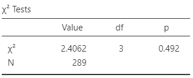
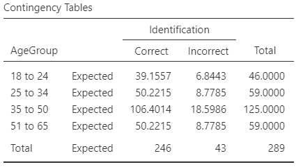
```


The statistical validity conditions are the same as in Sect.\ \@ref(ValidityChiSq):\index{Statistical validity!odds ratio} all *expected* counts are at least five.
Using Eq.\ \@ref(eq:SmallestExpectedCount), we would compute
$$
  \frac{(\text{Smallest row total})\times(\text{Smallest column total})}{\text{Overall total}}
  =
  \frac{46\times 43}{289}
  =
  6.84
$$
(as in Fig.\ \@ref(fig:Ripsjamovi), right panel), which is larger than five.
The test is statistically valid.


<iframe src="https://learningapps.org/watch?v=ptw49fp0322" style="border:0px;width:100%;height:600px" allowfullscreen="true" webkitallowfullscreen="true" mozallowfullscreen="true"></iframe>


`r if (knitr::is_latex_output()) '<!--'`
`r if (knitr::is_html_output()){
  'Click on the hotspots in the following image, and describe what the jamovi output tells us.'
}`


<iframe src="https://learningapps.org/watch?v=p54msvghc22" style="border:0px;width:100%;height:800px" allowfullscreen="true" webkitallowfullscreen="true" mozallowfullscreen="true"></iframe>
`r if (knitr::is_latex_output()) '-->'`


<!-- ## Standardised residuals -->


<!-- The $\chi^2$-value, and hence the $P$-value, tells us  -->
<!-- *if* there is evidence that a difference exists. -->
<!-- It does not tell us *where* the difference lies, or *what* the difference is. -->
<!-- (That is, it doesn't tell us if students who live with their parents -->
<!-- are more likely to eat meals *on-* or *off-*campus.) -->
<!-- In $2\times2$ tables, -->
<!-- this is rarely hard to determine, -->
<!-- but in other size two-way table (such as a $4\times 3$ table, for example) it can be more challenging. -->
<!-- To help determine where the difference are located, -->
<!-- we can ask SPSS^[Using `Analyze> Descriptive Statistics> Crosstabs...`, and then in the `Cells` tab select `Residuals> Standardized`.] to produce  -->
<!-- *standardized residuals* -->
<!-- (Table \@ref(fig:UniMealsTestSPSSStdRes)). -->


<!-- ```{r UniMealsTestSPSSStdRes, echo=FALSE, fig.cap="The standardized residuals from SPSS for the two-way table for the uni-students eating data.", fig.align="center", out.width="60%"} -->
<!-- knitr::include_graphics("SPSS/UniStudents/UniStudentsStdRes.png") -->
<!-- ``` -->


<!-- Standardised residuals are like $z$-scores, -->
<!-- so that cells in the table with a standardized residual larger than about $2$ -->
<!-- mean that the observed counts were *higher* than we would have expected, -->
<!-- and -->
<!-- that cells in the table with a standardized residual smaller than about $-2$ -->
<!-- mean that the observed counts were *smaller* than we would have expected. -->
<!-- So for the uni-student data -->
<!-- (Table \@ref(fig:UniMealsTestSPSSStdRes)), -->
<!-- we can find the largest and smallest standardized residuals: -->

<!-- * $-2.0$: Students *living with their parents* are *less likely* (because the residual is *negative*) to eat most meals on-campus -->
<!--    (compared to what we'd expect by chance). -->
<!-- * $1.3$: Students *not living with their parents*  are *more likely* (because the residual is *positive*) to eat mostmeals on-campus -->
<!--    (compared to what we'd expect by chance); -->

<!-- So while the $\chi^2$-square suggests there is a difference, -->
<!-- the standardised residuals tells us *how* they are different: -->
<!-- students living *with* their parents are -->
<!-- *less* likely to eat most meals on-campus. -->
<!-- Again, -->
<!-- standardized residuals may not be needed here to reach these conclusions, -->
<!-- but they can be used in larger two-way tables -->
<!-- (for example,  -->
<!-- see Sect.\ \@ref(ORTestDumping)). -->


## Example: turtle nests {#TurtleNests}

The hatching success of loggerhead turtles on Mediterranean beaches is often compromised by fungi and bacteria.
@candan2021first compared the odds of a nest being infected, between nests relocated due to the risk of tidal inundation, and non-relocated nests
`r if (knitr::is_latex_output()) {
   '(Table\\ \\@ref(tab:TurtleNestDataTable), left table).'
} else {
   '(Table\\ \\@ref(tab:TurtleNestDataTable)).'
}`
The researchers were interested in knowing:

> For Mediterranean loggerhead turtles, are the odds of infections the same for natural and relocated nests?


```{r TurtleNestDataTable}
TurtleData <- array( dim = c(2, 2))
TurtleData[, 1] <- c(29, 14)
TurtleData[, 2] <- c(10, 8)

rownames(TurtleData) <- c("Natural",
                          "Relocated")
colnames(TurtleData) <- c("Non-infected",
                          "Infected")


TNsummary <- array( dim = c(3, 3) )

colnames(TNsummary) <- c( "Odds infected",
                          "Proportion infected",
                          "Sample size")
rownames(TNsummary) <- c("Natural",
                         "Relocated",
                         "")


TNsummary[1:2, 1] <- TurtleData[, 1] / TurtleData[, 2]
TNsummary[1:2, 2] <- TurtleData[, 1] / rowSums(TurtleData)
TNsummary[1:2, 3] <- apply(TurtleData, 1, "sum")
TNsummary[3, 1]   <- paste0("\\llap{OR:\ }$", 
                             round( TNsummary[1, 1] / TNsummary[2, 1], 2),
                            "$")
TNsummary[3, 2]   <- paste0("\\llap{Diff.:\ }$", 
                             round(as.numeric(TNsummary[1, 2]) - as.numeric(TNsummary[2, 2]), 3),
                            "$")


if( knitr::is_latex_output() ) {
  T1 <- kable(pad(TurtleData,
                  surroundMaths = TRUE,
                  targetLength = 2,
                  decDigits = 0),
              format = "latex",
              booktabs = TRUE,
              valign = 't',
              escape = FALSE,
               col.names = c("infected",
                             "infected"),
              align = "c") %>%
    row_spec(0, bold = TRUE) %>%
    add_header_above( c( " " = 1,
                         "Not" = 1,
                         " " = 1),
                      bold = TRUE,
                      line = FALSE)
  
  T2 <- kable( pad(TNsummary,
                   surroundMaths = TRUE,
                   targetLength = c(4, 5, 2),
                   decDigits = c(2, 3, 0)),
               format = "latex",
               booktabs = TRUE,
               valign = 't',
               align = "c",
               escape = FALSE,
               #table.env = "@empty",
               col.names = c("infected",
                             "infected",
                             "size")) %>%
    row_spec(0, bold = TRUE) %>%
    row_spec(2, hline_after = TRUE) %>%
    row_spec(3, italic = TRUE) %>%
    add_header_above( c( " " = 1,
                         "Odds" = 1,
                         "Proportion" = 1,
                         "Sample" = 1),
                      bold = TRUE,
                      line = FALSE)
  
  
  out <- knitr::kables(list(T1, T2), # Notice order swapped!
                       format = "latex",
                       label = "TurtleNestDataTable",
                       caption = "The turtles data (left), and the numerical summary (right).") %>% 
    kable_styling(font_size = 8)
  prepareSideBySideTable(out,
                         gap = "\\qquad")
  
}
if( knitr::is_html_output() ) {
  kable(pad(TurtleData,
                  surroundMaths = TRUE,
                  targetLength = 2,
                  decDigits = 0),
        format = "html",
        booktabs = TRUE,
        longtable = FALSE,
        align = "c",
        caption = "Infected and non-infected turtle nests.") %>%
    row_spec(0, bold = TRUE)
}
```

```{r TurtleNestsGraphs, fig.show="hold", fig.cap="Software output for the turtle-nesting data.", fig.align="center", out.width="50%"}
par(xpd = TRUE,
    mar = c(5, 4, 4, 8) + 0.1) # DEFAULT: c(5, 4, 4, 2) + 0.1

barplot( t(TurtleData), 
	las = 1, 
	ylab = "Count",
	xlab = "Type of nest",
	beside = TRUE,
	names.arg = c("Natural", 
	              "Relocated"),
	ylim = c(0, 30),
	col =  viridis::viridis(10)[c(3, 8)],
	legend.text = TRUE,
	args.legend = list("topright",
	                   bty = "n",
	                   cex = 0.9,
	                   ncol = 1,
	                   legend = c("Not infected", 
	                              "Infected"), 
	                   horiz = FALSE))


box()

```


The corresponding hypotheses can be written using proportion, after defining\ $p$ as the proportion of nests that are *infected*:

* $H_0$: $p_N - p_R =   0$ (equivalent to $p_N =   p_R$); and
* $H_1$: $p_N - p_R \ne 0$ (equivalent to $p_N \ne p_R$),

where\ $N$ refers to **N**atural nests, and\ $R$ to **R**elocated nests.
The parameter is the odds difference between the population proportion.

The hypotheses can also be written using odds:

* $H_0$: The odds of a nest being infected is     *the same* for natural and relocated nests; and
* $H_1$: The odds of a nest being infected is *not the same* for natural and relocated nests.

The parameter is the odds ratio of infection, comparing natural to relocated nests.

A graphical summary is shown in Fig.\ \@ref(fig:TurtleNestsGraphs).
A numerical summary table (Table\ \@ref(tab:TurtleNestDataTable), right table) shows that the odds of natural nest being infected is $1.66$\ times the odds of a relocated nest being infected.
From the software output (Fig.\ \@ref(fig:TurtleNestsOutputjamovi)), the $\chi^2$-value is\ $0.777$.
This is like a $z$-score of $z = \sqrt{0.777} = 0.88$, which is very small, so expect a large $P$-value.
(Notice that this is the value of the $z$-score shown in Fig.\ \@ref(fig:TurtleNestsOutputjamovi) for comparing two proportions.)
The $P$-value is\ $0.378$ on the output (for both tests).

The smallest *expected* count is $22\times 18 / 61 = 6.49$, which exceeds five, so these tests are statistically valid.
We write:

> There is no evidence of a difference in the odds of infection ($\chi^2$: $0.777$; $P$-value: $0.378$; odds ratio: $1.657$; $95$%\ CI: $0.537$ to\ $5.12$) between natural nests (odds: $2.90$; $n = 39$) and relocated nests (odds: $1.75$; $n = 22$).

The conclusion could also be written in terms of proportions:

> There is no evidence of a difference in the proportion of infection (difference between proportions: $0.108$ ($95$%\ CI from\ $-0.136$ to\ $0.351$); $z = 0.882$; $P$-value: $0.378$) between natural nests ($p = 0.744$; $n = 39$) and relocated nests ($p = 0.636$; $n = 22$).

Either way, there no evidence that relocating the nest (to protect them from tidal inundation) changes the risk of infection.


:::: {.importantBox .important data-latex="{iconmonstr-warning-8-240.png}"}
We *do not* say whether the evidence supports the null hypothesis.
We assume the null hypothesis is true, so we state how strong the evidence is to change our mind (and hence support the alternative hypothesis).
The current sample presents no evidence to contradict the assumption, but future evidence may emerge.
:::

<!-- and Table 5 (BTW, Table 6 is  not $2\times 2$): -->


```{r TurtleNestsOutputjamovi, fig.show="hold", fig.cap="The software output for the turtle-nesting data.", fig.align="center", out.width="60%"}
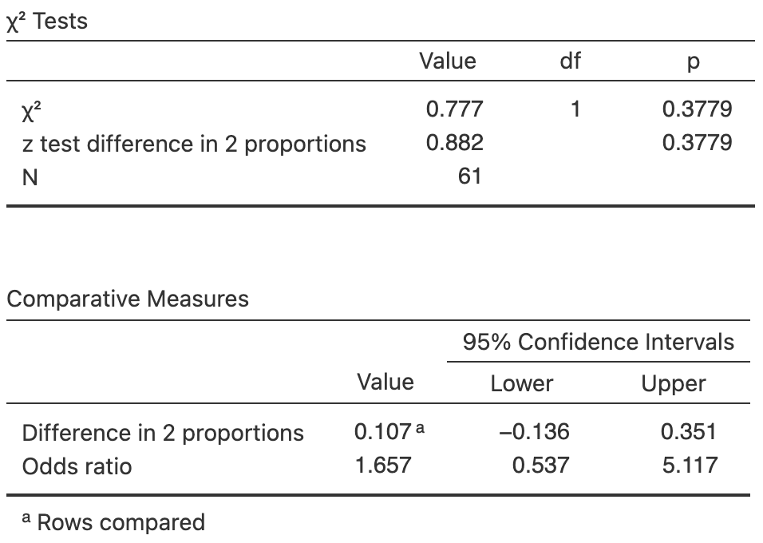
```


## Example: health of female burros {#HTCompareOddsBurros}

@johnson1987demography studied $315$\ introduced female burros (donkeys) in the Mojave Desert (California) to understand management processes. 
One RQ was:

> For these female burros, is the reproductive status of the burros related to their health?

The data
`r if (knitr::is_latex_output()) {
   '(Table\\ \\@ref(tab:BurrosData), left table)'
} else {
   '(Table\\ \\@ref(tab:BurrosDataHTML))'
}`
are given in a $3\times 3$ table of counts.
The data are summarised using row proportions in
`r if (knitr::is_latex_output()) {
   'Table\\ \\@ref(tab:BurrosData) (right table),'
} else {
   'Table\\ \\@ref(tab:BurrosSummaryHTML)),'
}`
and in a graph in Fig.\ \@ref(fig:BurrosChisqjamoviPlot) (left panel).
Software output is shown in Fig.\ \@ref(fig:BurrosChisqjamoviPlot) (right panel).
(Odds could be produced in the numerical summary also, but odds ratios are trickier since they require comparing pairs of odds.)


```{r Burros}
data(Burros)

BurroTab <- xtabs(Counts ~ Status + Health, 
                 data = Burros)

colnames(BurroTab) <- c("Excellent", 
                       "Fair",
                       "Poor")
rownames(BurroTab) <- c("Barren",
                       "Pregnant",
                       "Lactating")
  ###
  
BurroSummary <- array( dim = c(3, 4) )

colnames(BurroSummary) <- c( "Odds",
                             "Odds ratio",
                             "Percentage",
                             "$n$")
rownames(BurroSummary) <- rownames(BurroTab)
  
BurroSummary[1, 1] <- BurroTab[1, 1] / sum(BurroTab[1, 2:3])
BurroSummary[2, 1] <- BurroTab[2, 1] / sum(BurroTab[2, 2:3])
BurroSummary[3, 1] <- BurroTab[3, 1] / sum(BurroTab[3, 2:3])

BurroSummary[1, 2] <- BurroSummary[1, 1] / BurroSummary[3, 1]
BurroSummary[2, 2] <- BurroSummary[2, 1] / BurroSummary[3, 1]
BurroSummary[3, 2] <- NA

BurroSummary[1, 3] <- BurroTab[1, 1] / sum( BurroTab[1, ]) * 100
BurroSummary[2, 3] <- BurroTab[2, 1] / sum( BurroTab[2, ]) * 100
BurroSummary[3, 3] <- BurroTab[3, 1] / sum( BurroTab[3, ]) * 100

BurroSummary[, 4] <- rowSums(BurroTab)

###

BurroRowProps <- proportions(BurroTab, 
                             margin = 1)

```

```{r}
if( knitr::is_latex_output() ) {
  BurroTab2 <- cbind( BurroTab,
                      Total = rowSums(BurroTab) )
  
  T1 <- kable(pad(BurroTab2,
            surroundMaths = TRUE,
            targetLength = 3,
            decDigits = 0),
        format = "latex",
        align = c("c", "c", "c", "c"),
        longtable = FALSE,
        escape = FALSE,
        booktabs = TRUE) %>%
    #kable_styling(font_size = 8) %>%
    row_spec(0, bold = TRUE) %>%
    add_header_above( c(" " = 1,
                        "Health: counts" = 3,
                        " " = 1),
                      bold = TRUE,
                      line = TRUE)
  
  
###

 # T2 <- kable(pad(BurroSummary,
 #            surroundMaths = TRUE,
 #            targetLength = c(5, 4, 5, 3),
 #            decDigits = c(3, 2, 1, 0)),
 #        format = "latex",
 #        booktabs = TRUE,
 #        longtable = FALSE,
 #        escape = FALSE,
 #        align = "c") %>%
 #    row_spec(0, bold = TRUE) %>%
 #    add_header_above( c(" " = 1,
 #                        "Excellent health" = 4),
 #                      bold = TRUE,
 #                      line = TRUE)
  
 T2 <- kable(pad(BurroRowProps,
            surroundMaths = TRUE,
            targetLength = c(5, 5, 5),
            decDigits = c(3, 3, 3)),
        format = "latex",
        booktabs = TRUE,
        longtable = FALSE,
        escape = FALSE,
        align = "c") %>%
    row_spec(0, bold = TRUE) %>%
    add_header_above( c(" " = 1,
                        "Health: row proportions" = 3),
                      bold = TRUE,
                      line = TRUE)  
  
    out <- knitr::kables(list(T1, T2),
                       format = "latex",
                       label = "BurrosData",
                       caption = "Left: the health and reproductive status of female burros. Right: row proportions for the burro data. (Pregnant and lactating burros were counted with the lactating burros only.)") %>% 
    kable_styling(font_size = 8)

  out2 <- prepareSideBySideTable(out) 
  out2

}
```


```{r BurrosDataHTML}
if( knitr::is_html_output() ) {
  kable(pad(BurroTab,
            surroundMaths = TRUE,
            targetLength = 3,
            decDigits = 0),
        format = "html",
        align = "c",
        longtable = FALSE,
        caption = "The health and reproductive status of female burros. (Pregnant and lactating burros were counted with the lactating burros only.)",
        booktabs = TRUE)
}
```

```{r BurrosSummaryHTML}
if( knitr::is_html_output() ) {
  kable(pad(BurroSummary,
            surroundMaths = TRUE,
            targetLength = 5,
            decDigits = 3),
        format = "html",
        align = "c",
        longtable = FALSE,
        caption = "Row proportions for the burros data.",
        booktabs = TRUE)
}
```


```{r BurrosChisqjamoviPlot, fig.show="hold", fig.cap="Left: a stacked bar chart for the burro-health data. Right: software output for the burro-health data.", fig.align="center", out.width=c("45%", "54%"), fig.width=c(4, 4)}
barplot(t(BurroRowProps), 
        beside = FALSE,
        las = 1,
        ylim = c(0, 1.35),
        ylab = "Proportion",
        xlab = "Age group",
        axes = FALSE,
        main = "Stacked bar chart\n for the burro-health data",
        legend.text = c("Poor", "Fair", "Excellent"),
        args.legend = list( bty = "n", 
                            ncol = 3,
                            title = "Health of the burro",
                            x = "top"))
axis(side = 2,
     las = 1,
     at = seq(0, 1, by = 0.2) )

###

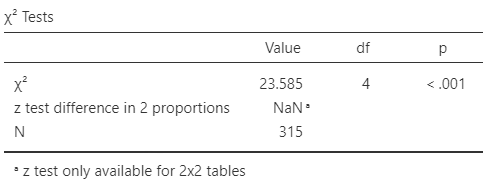

```


The hypothesis are usually worded in terms of associations (or *relationships*):

* $H_0$: *No association* exists between reproductive status and overall health.
* $H_1$: *An association* exists between reproductive status and overall health.

From the software output (Fig.\ \@ref(fig:BurrosChisqjamoviPlot), right panel), $\chi^2 = 23.585$.
Notice that a comparison of proportions is not possible for tables larger than $2\times 2$.
Software reports $P < 0.001$, which suggests very strong evidence in the sample that an association exists between reproductive status and overall health.

The conclusion could be written as

> The sample provides very strong evidence ($\chi^2 = 23.585$) of an association between reproductive status and overall health of female burros ($n = 315$).

Adding sample summary information to this conclusion is cumbersome.
Instead, readers can be pointed to the numerical summary
`r if (knitr::is_latex_output()) {
   '(Table\\ \\@ref(tab:BurrosData), right table).'
} else {
   '(Table\\ \\@ref(tab:BurrosSummaryHTML)).'
}`
Furthermore, CIs are not reported since software does not always produce CIs for tables larger than $2\times 2$.

While we know there is an association between the variables, we can only speculate on the nature of the association (i.e., for which group(s) the *population* proportions are different).
Doing so requires methods beyond this book.

The smallest *expected* value is $75\times 34/315 = 8.1$, which exceeds\ $5$, so the results are statistically valid.


## Chapter summary {#TestsOddsRatio-Summary}

To compare a two-level qualitative variable between two groups, a confidence interval can be formed for the difference between two proportions, or for an odds ratio.

To compute a confidence interval (CI) for the difference between two proportions, compute the difference between the two sample proportions, $\hat{p}_A - \hat{p}_B$, and identify the sample sizes\ $n_A$ and\ $n_B$.
Then compute the standard error, which quantifies how much the value of $\hat{p}_A - \hat{p}_B$ varies across all possible samples, is
$$
  \text{s.e.}(\hat{p}_A - \hat{p}_B)
  =
  \sqrt{ \text{s.e}(\hat{p}_A) + \text{s.e.}(\hat{p}_B)},
$$
where $\text{s.e.}(\hat{p}_A)$ and $\text{s.e.}(\hat{p}_B)$ are the standard errors of Groups\ $A$ and\ $B$ (Eq.\ \@ref(eq:stderrorphat)).
The *margin of error* is (multiplier${}\times{}$standard error), where the multiplier is\ $2$ for an approximate $95$%\ CI (using the $68$--$95$--$99.7$ rule).
Then the CI is:
$$
   (\hat{p}_A - \hat{p}_B) \pm \left( \text{multiplier}\times\text{standard error} \right).
$$
Software is used to compute a confidence interval (CI) for the odds ratio, as the sampling distribution does not have a normal distribution.

To test a hypothesis about a difference between two population proportions $p_A - p_B$:

* Write the null hypothesis\ ($H_0$) and the alternative hypothesis\ ($H_1$).
* Initially *assume* the value of $(p_A - p_B)$ in the null hypothesis to be true.
* Then, describe the *sampling distribution*, which describes what to *expect*  from the difference between the sample proportions based on this assumption: under certain statistical validity conditions, the difference between the sample proportions vary with:
   *  an approximate normal distribution,
   *  with sampling mean whose value is the value of $(p_A - p_B)$ (from $H_0$), and
   *  having a standard deviation of $\displaystyle \text{s.e.}(\hat{p}_A - \hat{p}_B)$.
* Compute the value of the *test statistic*:
$$
   z = \frac{ (\hat{p}_A - \hat{p}_B) - (p_A - p_B)}{\text{s.e.}(\hat{p}_A - \hat{p}_B)},
$$
where $p_A - p_B$ is the hypothesised difference given in the null hypothesis.
* An approximate *$P$-value* can be estimated using the $68$--$95$--$99.7$ rule, or an exact $P$-value found using software.
* Make a decision, and write a conclusion.

To test a hypothesis for comparing two odds, or to test for a relationship between two qualitative variables more generally:

* Write the null hypothesis\ ($H_0$) and the alternative hypothesis\ ($H_1$).
* Initially *assume* no relationship between the two variables.
* Find the value of the *test statistic* (a $\chi^2$-score) on the software output.
  (For $2\times 2$ tables only, the equivalent $z$-score is\ $\sqrt{\chi^2}$.
* A *$P$-value* is found using software.
* Make a decision, and write a conclusion.
* Check the statistical validity conditions.


The statistical validity conditions should be checked: all *expected* counts should exceed five.


## Quick review questions {#TestsOddsRatio-QuickReview}

<div style="float:right; width: 222x; border: 1px; padding:10px">

</div>

::: {.webex-check .webex-box}
@chen2023triage investigated the relationship between body temperature of patients admitted to hospital following a heart attack, and a subsequent heart attack (HA) while in hospital (Table\ \@ref(tab:HAttackData)).

1. Of patients with a low body temperature, what *proportion* had an in-hospital HA? `r if (knitr::is_html_output()) '(Use *three* decimal places.)'`  \tightlist
`r if( knitr::is_html_output() ) {
  fitb(num = TRUE, tol = 0.0001, answer = 0.148)
} else {
  '**a.**\\ $4/9 = 0.444$; **b.**\\ $4/27 = 0.148$; **c.**\\ $4/71 = 0.056$; **d.**\\ $4/5 = 0.8$'
}`
1. What are the *odds* that a patient with a low body temperature had an in-hospital HA?  
`r if( knitr::is_html_output() ) {
  fitb(num = TRUE, tol = 0.001, answer = 0.174)
} else {
  '**a.**\\ $4/23 = 0.174$; **b.**\\ $4/27 = 0.148$; **c.**\\ $4/9 = 0.444$; **d.**\\ $4/5 = 0.8$'
}`
1. The OR in the output is given as $1.357$. 
What does this OR *mean*?
`r if( knitr::is_html_output() ) {
  mcq(
    c(answer = "The odds of having an in-hospital heart attack is $1.357$ times greater for those with a low body temperature",
      "The odds of having an in-hospital heart attack is $1.357$ times smaller for those with a low body temperature",
      "The proportion of patients having an in-hospital heart attack is $1.357$ times greater for those with a low body temperature",
      "The proportion of patients having an in-hospital heart attack is $1.357$ times smaller for those with a low body temperature")  )
} else {
  c(" 
     a. The odds of having an in-hospital heart attack is $1.357$ times smaller for those with a low body temperature
     b. The proportion of patients having an in-hospital heart attack is $1.357$ times greater for those with a low body temperature
     c. The proportion of patients having an in-hospital heart attack is $1.357$ times smaller for those with a low body temperature")
}`
1. True or false: The CI means that the sample\ OR is likely to be between\ $0.330$ and\ $5.568$.  
`r if( knitr::is_html_output() ) {torf(answer = FALSE)}`
1. What is the $\chi^2$-value?
`r if( knitr::is_html_output() ) {
  mcq(
    c(answer = 0.180, 1.357, 0.424)  )
} else {
  '**a.**\\ $0.180$; **b.**\\ $1.357$; **c.**\\ $0.424$'
}`
1. From the software output, what is the $P$-value?  
`r if( knitr::is_html_output() ) {
mcq(
  c("0.180",
    answer = "0.671",
    "0.424",
    "There is not enough information")  )
} else {
  '**a.**\\ $0.180$; **b.**\\ $0.671$; **c.**\\ $0.424$; **d.**\\ Insufficient information.'
}`
1. Is the alternative hypothesis one- or two-tailed?
`r if( knitr::is_html_output() ) {longmcq(
  c("One-tailed",
    answer = "Two-tailed",
    "There is not enough information")  )}`
1. True or false: There is *no* evidence of a difference in odds of having an in-hospital HA, comparing patients with low and high body body temperatures.
`r if( knitr::is_html_output() ) {torf(answer=FALSE)}`
1. True or false: The CI is not statistically valid, because the CIs for the difference between the proportions has a *negative* value.
`r if( knitr::is_html_output() ) {torf(answer=FALSE)}`
:::

```{r}
HAttack <- array(dim = c(2, 2))

rownames(HAttack) <- c("Low body temp.", 
                       "High body temp.")

colnames(HAttack) <- c("In-hospital HA", 
                       "No in-hospital HA")


HAttack[1, ] <- c(4, 23)
HAttack[2, ] <- c(5, 39)
```

\begin{figure}
\begin{minipage}{0.38\textwidth}
\captionof{table}{Body temperature of patients, and whether they experienced a heart attack while in hospital\label{tab:HAttackData}.}
\fontsize{8}{12}\selectfont
```{r}
knitr::kable( pad(HAttack,
                  surroundMaths = TRUE,
                  targetLength = 2,
                  decDigits = 0),
         format = "latex",
         align = "c",
         booktabs = TRUE,
         longtable = FALSE,
         col.names = c("Yes", 
                       "No"),
         escape = FALSE,
         table.env = "@empty") %>%
   row_spec(0, bold = TRUE) %>%
   add_header_above( c(" " = 1,
                       "heart attack" = 2),
                     bold = TRUE,
                     line = TRUE) %>%
   add_header_above( c(" " = 1, 
                       "In-hospital" = 2),
                     bold = TRUE,
                     line = FALSE)

```
\end{minipage}
\hspace{0.05\textwidth}
\begin{minipage}{0.54\textwidth}%
\centering
```{r, out.width='95%'}
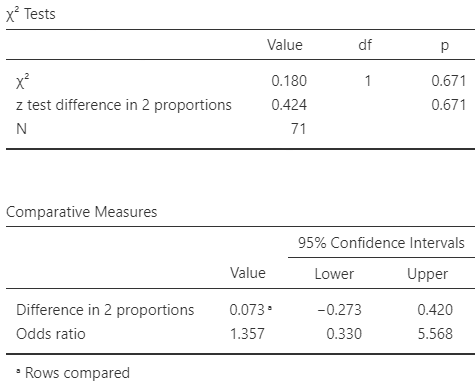
```
\caption{Software output for the heart-attack study.}\label{fig:HAttackjamovi}
\end{minipage}
\end{figure}


```{r HAttackData}
if( knitr::is_html_output() ) { 
  kable(pad(HAttack,
            targetLength = 2,
            decDigits = 0),
        format = "html",
        align = "c",
        longtable = FALSE,
        booktabs = TRUE,
        caption = "Body temperature of patients, and whether they experienced a heart attack while in hospital.")
}
```

<!-- The figure for LaTeX is in the minipage (combined with data table), so only need show it for the HTML -->
`r if (knitr::is_latex_output()) '<!--'`
```{r HAttackjamovi, fig.show="hold", fig.cap="Software output for the heart-attack study.", fig.align="center", out.width="50%"}

```
`r if (knitr::is_latex_output()) '-->'`


## Exercises {#TestsOddsRatioExercises}

Answers to odd-numbered exercises are available in App.\ \@ref(Answers).

`r if( knitr::is_latex_output() ) "\\captionsetup{font=small}"`


::: {.exercise #OddsSame}
Consider the expected counts in Table\ \@ref(tab:MealsDataTableExpected).
Confirm that the *odds* of having most meals off-campus is the same for students living with their parents, and for students not living with their parents.
:::


::: {.exercise #OddsSame2}
Compute all four expected counts in Table\ \@ref(tab:HAttackData).
Confirm that the corresponding test may not be statistically valid.
:::


::: {.exercise #OddsRatioCISamplingDistA}
Sketch the sampling distribution for the difference between the proportions of students eating most meals off-campus, for those living with parents minus those not living with parents.
What is the sampling distribution for the equivalent odds ratio?
:::


::: {.exercise #OddsRatioCISamplingDistB}
Sketch the sampling distribution for the difference between the proportion of non-infected turtle nests, for natural nests minus relocated nests (in Sect.\ \@ref(TurtleNests)).
What is the sampling distribution for the equivalent odds ratio?
:::


::: {.exercise #Chi2z}
Suppose an analysis of a $2\times 2$ table of counts produces a value of $\chi^2 = 10.66$.

1. What would be the equivalent $z$-score for comparing the two proportions?
2. What would be the approximate $P$-value?
:::

::: {.exercise #Chi2zA}
Suppose an analysis of a $2\times 2$ table of counts produces a value of $\chi^2 = 4.06$.

1. What would be the equivalent $z$-score for comparing the two proportions?
2. What would be the approximate $P$-value?
:::


::: {.exercise #EVAdoption}
@egbue2017mass studied the adoption of electric vehicles (EVs) by a certain group of professional Americans (Table\ \@ref(tab:EV10years)).
Software output is shown in Fig.\ \@ref(fig:EVjamovi).

1. Based on the output, how is the difference between the two proportions defined?
1. Write the hypothesis for comparing the *proportions* using this definition of the difference.
1. Use the software output to conduct the test.
1. Use the software output to write down the corresponding CI for the difference in proportions.
1. Based on the output, how is the odds ratio defined?
1. Write the hypothesis for comparing the *odds*, for those with and without post-graduate study.
1. Use the software output to conduct the test.
1. Use the software output to write down the corresponding CI for the OR.
1. Are the CIs and tests statistically valid?
:::


```{r}
data(EVpurchase)

EV10 <- xtabs(Counts ~ Education + PurchaseEV, 
              data = EVpurchase)
colnames(EV10) <- c("Yes", 
                    "No")
rownames(EV10) <- c("No post-grad", 
                    "Post-grad study")

```

\begin{figure}
\begin{minipage}{0.32\textwidth}
\captionof{table}{Responses to `Would you purchase an electric vehicle in the next $10$ years?' by education\label{tab:EV10years}.}
\fontsize{8}{12}\selectfont\centering
```{r}
knitr::kable( pad(EV10,
                  surroundMaths = TRUE,
                  targetLength = 2,
                  decDigits = 0),
         format = "latex",
         booktabs = TRUE,
         longtable = FALSE,
         align = "c",
         escape = FALSE,
         table.env = "@empty") %>%
   row_spec(0, bold = TRUE)
   #kable_styling(font_size = 8) %>% # CANNOT USE THIS IS THE MINIPAGE
   #column_spec(1, width = "13mm") %>%
   #column_spec(2, width = "22mm")
```
\end{minipage}
\hspace{0.05\textwidth}
\begin{minipage}{0.60\textwidth}%
\centering
```{r, out.width='98%'}
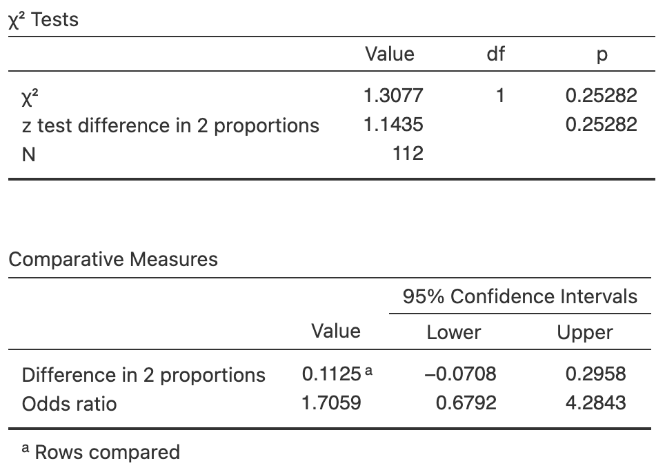
```
\caption{Software output for the EV study.}\label{fig:EVjamovi}
\end{minipage}
\end{figure}


```{r EV10years}
EV10 <- array(dim = c(2, 2))

colnames(EV10) <- c("Yes", 
                    "No")
rownames(EV10) <- c("No post-grad", 
                    "Post-grad study")

EV10[1, ] <- c(24, 8)
EV10[2, ] <- c(51, 29)


#if( knitr::is_latex_output() ) {
#   kable(EV10,
#         format = "latex",
#         longtable = FALSE,
#         booktabs = TRUE,
#         caption = "Responses to 'Would you purchase an electric vehicle in the next 10 years?' by education") %>%
# 	kable_styling(font_size = 8) %>%
# 	row_spec(0, bold = TRUE)
#}

if( knitr::is_html_output() ) {
  kable(pad(EV10,
                  surroundMaths = TRUE,
                  targetLength = 2,
                  decDigits = 0),
        format = "html",
        align = "c",
        longtable = FALSE,
        booktabs = TRUE,
        caption = "Responses to 'Would you purchase an electric vehicle in the next $10$ years?' by education.")
}
```

<!-- The figure for LaTeX is in the minipage (combined with data table), so only need show it for the HTML -->
`r if (knitr::is_latex_output()) '<!--'`
```{r EVjamovi, fig.show="hold", fig.cap="Software output for the EV study.", fig.align="center", out.width="50%"}
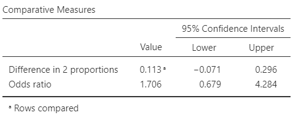
```
`r if (knitr::is_latex_output()) '-->'`


::: {.exercise #EthiopianFarmers}
@meresa2023effect investigated Ethiopian farmers' adoption of improved soil and water conservation structures on their farms (Table\ \@ref(tab:FarmersData)).
Software output is shown in Fig.\ \@ref(fig:farmersjamoviHT).

```{r}
Farmers <- array(dim = c(2, 2))

colnames(Farmers) <- c("Non-adopter", 
                       "Adopter")

rownames(Farmers) <- c("$< 0.5$ ha (small)", 
                       "$\\ge 0.5$ ha (large)")


Farmers[1, ] <- c(86, 61)
Farmers[2, ] <- c(43, 71)
```

\begin{figure}
\begin{minipage}{0.32\textwidth}
\captionof{table}{Adoption of conservation practices by Ethiopian farmers, by farm size\label{tab:FarmersData}.}
\fontsize{8}{12}\selectfont\centering
```{r}
knitr::kable( pad(Farmers,
                  surroundMaths = TRUE,
                  targetLength = 2,
                  decDigits = 0),
         format = "latex",
         col.names = c("No", 
                       "Yes"),
         align = "c",
         booktabs = TRUE,
         longtable = FALSE,
         escape = FALSE,
         table.env = "@empty") %>%
  add_header_above( c (" " = 1,
                       "Adopter?" = 2),
                    bold = TRUE,
                    line = TRUE) %>%
  row_spec(0, bold = TRUE)
```
\end{minipage}
\hspace{0.05\textwidth}
\begin{minipage}{0.60\textwidth}%
\centering
```{r, out.width='98%'}
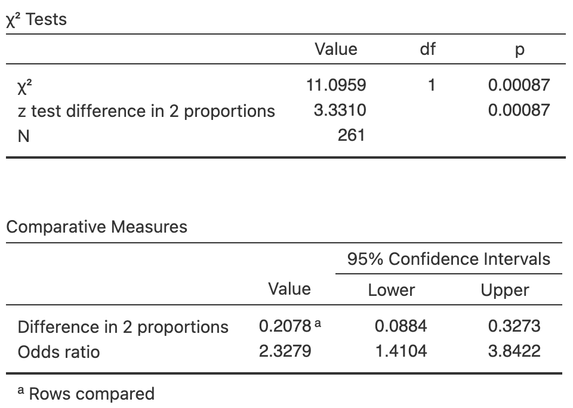
```
\caption{Software output for the farming study.}\label{fig:farmersjamoviHT}
\end{minipage}
\end{figure}


```{r FarmersData}
if( knitr::is_html_output() ) { 
  kable(pad(Farmers,
                  surroundMaths = TRUE,
                  targetLength = 2,
                  decDigits = 0),
        format = "html",
        align = "c",
        longtable = FALSE,
        booktabs = TRUE,
        caption = "Adoption of conservation practices by Ethiopian farmers, by farm size.")
}
```

<!-- The figure for LaTeX is in the minipage (combined with data table), so only need show it for the HTML -->
`r if (knitr::is_latex_output()) '<!--'`
```{r farmersjamoviHT, fig.show="hold", fig.cap="Software output for the farming study.", fig.align="center", out.width="50%"}

```
`r if (knitr::is_latex_output()) '-->'`

1. Based on the output, how is the difference between the two proportions defined?
1. Write the hypothesis for comparing the proportions, using this definition of the difference.
1. Use the software output to conduct the test.
1. Use the software output to write down the corresponding CI for the difference in proportions.
1. Based on the output, how is the OR defined?
1. Write the hypothesis for comparing the odds, for farmers with small and large farms.
1. Use the software output to conduct the test.
1. Use the software output to write down the corresponding CI for the OR.
1. Are the CIs and tests statistically valid?
:::


::: {.exercise #ORcrashes}
[*Dataset*: `CarCrashes`]
@wang2020driver recorded information about car crashes in a rural, mountainous county in western China
`r if (knitr::is_latex_output()) {
   '(Table\\ \\@ref(tab:CrashDataTableLATEX)).'
} else {
   '(Table\\ \\@ref(tab:CrashDataTableHTML)).'
}`

1. Sketch a suitable graph to display the data.
1. Compute the *proportion* of crashes involving a pedestrian in\ 2011 ($\hat{p}_{2011}$), and in\ 2015 ($\hat{p}_{2015}$).
1. Compute the *difference between the proportion* of crashes involving a pedestrian from\ 2011 to\ 2015, consistent with the definition used in the output (Fig.\ \@ref(fig:CarCrashjamovi)).
1. Compute the value of $\text{s.e.}(\hat{p}_{2011} - \hat{p}_{2015})$, needed for constructing the CI.
1. Construct the *approximate* $95$% CI for the difference between the proportions.
1. Write down a $95$%\ CI for the difference between the proportions.
1. Interpret what this CI means.
1. Compute the *odds* of crashes involving a pedestrian in\ 2011, and also in \ 2015.
1. Compute the *odds ratio* of crashes involving a pedestrian, comparing\ 2011 to\ 2015.
1. Write down the CI for the odds ratio.
1. Construct an appropriate numerical summary table for the data.
1. Compute the value of $\text{s.e.}(\hat{p}_{2011} - \hat{p}_{2015})$, needed for conducting a hypothesis test.
1. Conduct a hypothesis test to determine if there is a difference between $p_{2011}$ and $p_{2015}$.
1. Conduct a hypothesis test to determine if there is a difference between the odds of a crash involving a pedestrian for\ 2011 and\ 2015.
1. Are the CIs and tests statistically valid?
:::


```{r}
data(CarCrashes) ### Exercise
CarCrashes$CrashType <- ordered(CarCrashes$CrashType, 
                           levels = 1:2,
                           labels = c("Involving pedestrians", 
                                      "Involving vehicles"))

Crash.tab <- xtabs(Counts ~ CrashType + Year, 
                   data = CarCrashes)

```

\begin{figure}
\begin{minipage}{0.32\textwidth}
\captionof{table}{Type of car crashes in different years\label{tab:CrashDataTableLATEX}.}
\fontsize{8}{12}\selectfont
```{r}
kable(pad( t(Crash.tab),
            surroundMaths = TRUE,
            targetLength = 2,
            decDigits = 0),
        format = "latex",
        booktabs = TRUE,
        longtable = FALSE,
        escape = FALSE,
      col.names = c("pedestrians", 
                    "vehicles"),
        align = "c") %>%
    row_spec(0, bold = TRUE) %>%
  add_header_above( c(" " = 1,
                      "Involving" = 1,
                      "Involving" = 1),
                    bold = TRUE,
                    line = FALSE)
```
\end{minipage}
\hspace{0.05\textwidth}
\begin{minipage}{0.60\textwidth}%
\centering
```{r, out.width='99%', fig.align="center"}
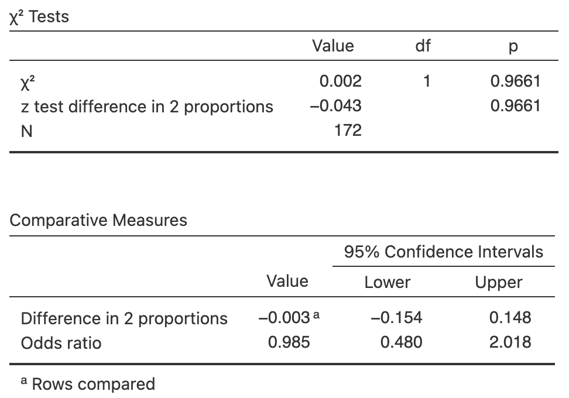
```
\caption{Software output for the car-crash study.}\label{fig:CarCrashjamovi}
\end{minipage}
\end{figure}


```{r CrashDataTableHTML}
if( knitr::is_html_output() ) {
kable(pad( t(Crash.tab),
            surroundMaths = TRUE,
            targetLength = 2,
            decDigits = 0),
        format = "html",
        booktabs = TRUE,
        longtable = FALSE,
        escape = FALSE,
      col.names = c("pedestrians", 
                    "vehicles"),
        caption = "Responses to 'Would you purchase an electric vehicle in the next $10$ years?' by education.",
        align = "c") %>%
  add_header_above( c(" " = 1, 
                      "Involving" = 1,
                      "Involving" = 1),
                    bold = TRUE,
                    line = FALSE) %>%
    row_spec(0, bold = TRUE)
}
```

<!-- The figure for LaTeX is in the minipage (combined with data table), so only need show it for the HTML -->
`r if (knitr::is_latex_output()) '<!--'`
```{r CarCrashjamovi, fig.show="hold", fig.cap="Software output for the car-crash data.", fig.align="center", out.width="50%"}

```
`r if (knitr::is_latex_output()) '-->'`


::: {.exercise #TestsOddsRatioScars}
[*Dataset*: `ScarHeight`] 
@data:Wallace2017:Sunburn compared the heights of scars from burns received by people in Western Australia (Table\ \@ref(tab:ScarsData)).
Software was used to analyse the data (Fig.\ \@ref(fig:ScarHeightRiskjamovi)).

1. Sketch an appropriate graph to summarise the data.
1. Compute the *proportion* of men having a smooth scar, and the *proportion* of women.
1. Compute the *difference between the proportions* of men and women having a smooth scar.
1. Compute the standard error for the difference between the proportions, needed for constructing a CI.
1. Compute the *approximate* $95$%\ CI for the difference between the proportions.
1. Write down the $95$%\ CI for the difference between the proportions, using the software output.
1. Interpret what this CI means.
1. Compute the *odds* of having a smooth scar for men, and for women.
1. Compute the *odds ratio* of having a smooth scar, comparing men to women.
1. Write down the CI for the odds ratio of having a smooth scar, comparing men to women.
1. Compile a numerical summary table.
1. Compute the value of standard error of the difference between the proportions, needed for conducting a hypothesis test.
1. Conduct a hypothesis test to determine if there is a difference between the proportions for men and women.
1. Conduct a hypothesis test to determine if there is a difference between the odds for men and women.
1. Are the CIs and tests statistically valid?
:::


```{r}
data(ScarHeight) ### Exercise

ScarsData <- xtabs( Counts ~ ScarHt + Gender,
                     data = ScarHeight)

rownames(ScarsData) <- c("Smooth",
                         "0mm to 1mm")
colnames(ScarsData) <- c("Men",
                         "Women")
```

\begin{figure}
\begin{minipage}{0.32\textwidth}
\captionof{table}{Heights of scars for men and women\label{tab:ScarsData}.}
\fontsize{8}{12}\selectfont
```{r}
  kable(pad( t(ScarsData),
            surroundMaths = TRUE,
            targetLength = c(3, 3),
            decDigits = 0),
        format = "latex",
        col.names = c("(0\\,mm)",
                      "up to 1\\,mm"),
        booktabs = TRUE,
        longtable = FALSE,
        escape = FALSE,
        align = "c") %>%
  add_header_above( c(" " = 1,
                      "Smooth" = 1,
                      "Over 0\\\\,mm,"),
                    escape = FALSE,
                    bold = TRUE,
                    line = FALSE) %>%
    row_spec(0, bold = TRUE)
#   kable_styling(font_size = 8) # CANNOT USE THIS IS THE MINIPAGE
```
\end{minipage}
\hspace{0.05\textwidth}
\begin{minipage}{0.60\textwidth}%
\centering
```{r, out.width='98%', fig.align="center"}
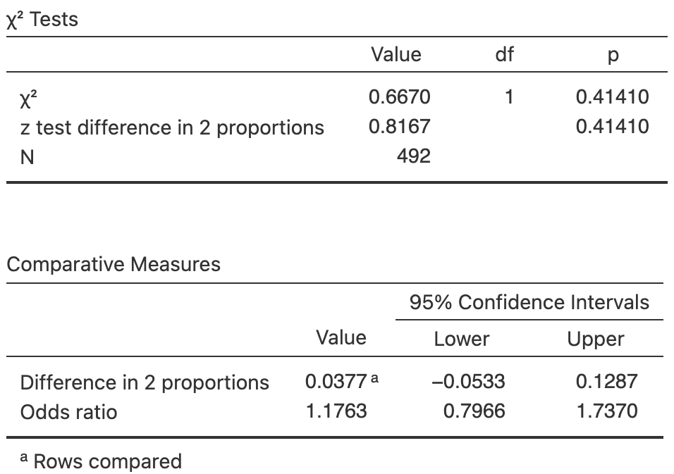
```
\caption{Software output for the scar-height data.}\label{fig:ScarHeightRiskjamovi}
\end{minipage}
\end{figure}


```{r ScarsData}
if( knitr::is_html_output() ) {
  kable(pad( (ScarsData),
            surroundMaths = TRUE,
            targetLength = c(2, 3),
            decDigits = 0),
        format = "html",
        booktabs = TRUE,
        longtable = FALSE,
        escape = FALSE,
        align = "c",
        caption = "Heights of scars for men and women.") %>%
    row_spec(0, bold = TRUE) %>%
    row_spec(0, bold = TRUE)
}
```

<!-- The figure for LaTeX is in the minipage (combined with data table), so only need show it for the HTML -->
`r if (knitr::is_latex_output()) '<!--'`
```{r ScarHeightRiskjamovi, fig.show="hold", fig.cap="Software output for the scar-height data.", fig.align="center", out.width="50%"}

```
`r if (knitr::is_latex_output()) '-->'`


::: {.exercise #PetBirdsTest}
[*Dataset*: `PetBirds`]
@data:Kohlmeier1992:BirdsCancer examined people with lung cancer, and a matched set of controls who did not have lung cancer, and recorded the number in each group that kept pet birds. 
The data are shown in Table\ \@ref(tab:BirdsData), and the software output in Fig.\ \@ref(fig:PetBirdsjamovi).

Consider this RQ:

> Are the odds of having a pet bird the same for people *with* lung cancer (cases) and for people *without* lung cancer (controls)?

1. Compute the difference between the proportions of people with pet birds, for those with and without lung cancer.
1. Compute the standard error needed to compute the CI for the difference in proportions.
1. Compute the standard error needed to conduct the hypothesis test to compare the proportions.
1. Explain *why* the two standard errors have slightly different values.
1. Compute an approximate $95$%\ CI for the difference between the two proportions.
1. Write down the $95$%\ CI for the difference between the proportions using the output (Fig.\ \@ref(fig:PetBirdsjamovi)).
1. Interpret the CIs.
1. Conduct a hypothesis test to compare the two proportions.
1. Confirm that the odds ratio in the output is correct.
1. Write down a $95$%\ CI for the odds ratio, and interpret what it means.
1. Perform a hypothesis test to determine if the odds of having a pet bird is the same for people with and without lung cancer.
1. Are the CIs and tests statistically valid?
1. Explain why no cause-and-effect can be reached.
:::


```{r BirdsData}
data(PetBirds)

PB2 <- xtabs( Counts ~ Pets + LC, 
              data = PetBirds)

PB2.exp <- chisq.test(PB2)$expected 

PB2T <- cbind( PB2, 
               "Total" = rowSums(PB2))
PB2T <- rbind( PB2T, 
               "Total" = colSums(PB2T))

if( knitr::is_latex_output() ) {
  kable( pad(PB2T,
             surroundMaths = TRUE,
             targetLength = 3,
             decDigits = 0),
        format = "latex",
        booktabs = TRUE,
        longtable = FALSE,
        escape = FALSE,
        align = "c",
        col.names = c("lung cancer",
                      "lung cancer",
                      "Total"),
        caption = "The pet bird data.") %>% 
    column_spec(4, bold = TRUE) %>%
    row_spec(3, bold = TRUE) %>%
    row_spec(0, bold = TRUE) %>%
    row_spec(2, hline_after = TRUE) %>%
    kable_styling(font_size = 8) %>%
    add_header_above( c(" " = 1,
                        "Adults with" = 1,
                        "Adults without" = 1),
                      line = FALSE,
                    bold = TRUE)
}
if( knitr::is_html_output() ) {
  kable(pad(PB2T,
             surroundMaths = TRUE,
             targetLength = 3,
             decDigits = 0),
               format = "html",
        align = "c",
               booktabs = TRUE,
               longtable = FALSE,
               caption = "The pet bird data.") %>%
     column_spec(4, bold = TRUE)
}
```


```{r PetBirdsjamovi, fig.show="hold", fig.cap="Software output for the pet-birds data.", fig.align="center", out.width=c('49.5%',"49.5%"), fig.show='hold'}
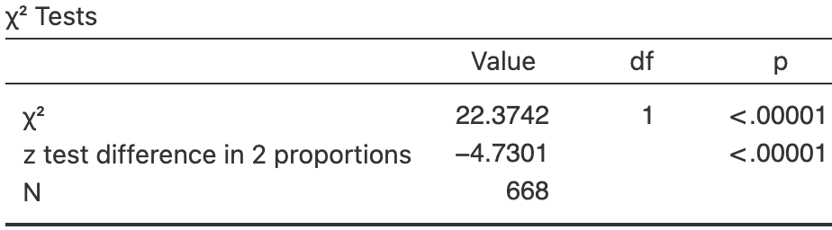 
knitr::include_graphics("jamovi/PetBirds/PetsCI-Both.png") 
```


```{r}
data(EmeraldAug) ### Exercise

EmeraldAug$SOIpos <- factor( EmeraldAug$SOI > 0 )

SOI.tab2 <- xtabs( ~ (SOIpos) + (Rain > 0), 
                  data = EmeraldAug)


SOI.tab <- SOI.tab2

SOI.tab[, 1] <- c(SOI.tab2[2, 2],
                  SOI.tab2[1, 2] )
SOI.tab[, 2] <- c(SOI.tab2[2, 1],
                  SOI.tab2[1, 1] )
colnames(SOI.tab) <- c("Rainfall recorded", 
                       "No rainfall recorded")
rownames(SOI.tab) <- c("Positive SOI", 
                       "Non-positive SOI")

#prop.table(SOI.tab, margin=1 )

#chisq.test(SOI.tab)
#chisq.test(SOI.tab, correct=FALSE)
#chisq.test(SOI.tab, correct=FALSE)$expected
```


::: {.exercise #TestsOddsRatioAugustRainfallInEmerald}
[*Daatset*: `EmeraldAug`]
The *Southern Oscillation Index*\ (SOI) is a standardised measure of the air pressure difference between Tahiti and Darwin, and is related to rainfall in some parts of the world [@climate:stone:1996], and especially Queensland [@climate:stone:1992].

The rainfall at Emerald (Queensland) was recorded for Augusts between\ 1889 to\ 2002 inclusive [@mypapers:dunnsmyth:glms], where the monthly average\ SOI was positive, and when the SOI was non-positive (zero or negative), as shown in Table\ \@ref(tab:SOItableAnalysis).

1. Compute the difference between the proportions of Augusts with rain, for months with a positive SOI compared to months with a non-positive SOI.
1. Compute the standard error needed to compute the CI for the difference in proportions.
1. Compute the standard error needed to conduct the hypothesis to compare the proportions.
1. Explain *why* the two standard errors have slightly different values.
1. Compute an approximate $95$%\ CI for the difference between the two proportions.
1. Write down the $95$%\ CI for the difference between the proportions using the output (Fig.\ \@ref(fig:EmeraldRainjamoviOutput)).
1. Interpret the CIs.
1. Conduct a hypothesis test to compare the two proportions.
1. Confirm that the odds ratio in the output is correct.
1. Write down a $95$%\ CI for the odds ratio, and interpret what it means.
1. Perform a hypothesis test to determine if the odds of recoding rain is the same for Augusts with non-positive and positive SOI.
1. Are the CIs and tests statistically valid?
:::


```{r SOItableAnalysis}
if( knitr::is_latex_output() ) {
  kable( pad((SOI.tab),
             surroundMaths = TRUE,
             targetLength = 2,
             decDigits = 0),
         format = "latex",
         align = "c",
         longtable = FALSE,
         booktabs = TRUE,
         escape = FALSE,
         caption = "The SOI, and whether rainfall was recorded in Augusts between 1889 and 2002 inclusive.") %>%
    kable_styling(font_size = 8) %>%
    row_spec(0, bold = TRUE) %>%
    column_spec(0, bold = TRUE)
}
if( knitr::is_html_output() ) {
  kable( pad((SOI.tab),
             surroundMaths = TRUE,
             targetLength = 2,
             decDigits = 0),
         align = "c",
                format = "html",
                longtable = FALSE,
                booktabs = TRUE,
                caption = "The SOI, and whether rainfall was recorded in Augusts between 1889 and 2002 inclusive.") %>%
     kable_styling(full_width = FALSE)
}
```


```{r EmeraldRainjamoviOutput, fig.show="hold", fig.cap="Software output for the Emerald-rain data.", fig.align="center", out.width="65%"}
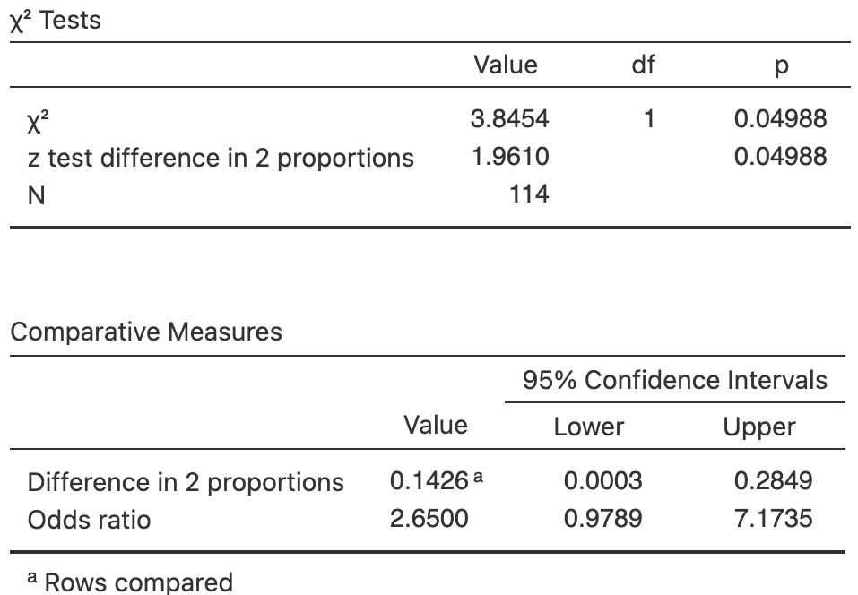
```


```{r}
data(HatSunglasses) ### Exercise

SG.Table.GenderHat <- xtabs(Count ~ Hat + Gender, 
                            data = HatSunglasses)
```

::: {.exercise #TestOddsRatioSunglasses}
[*Dataset*: `HatSunglasses`]
@data:Dexter2019:SunProtection recorded the number of people at the foot of the Goodwill Bridge, Brisbane, who wore hats between $11$:$30$am to $12$:$30$pm.
Of the $366$\ females observed, $22$ wore hats; of the $386$\ males observed, $79$ wore hats.

1. Construct the two-way table for the data.
1. Compute the proportions of females and males wearing a hat, and hence the difference between the proportions.
1. Compute the odds of a female and the odds of a male wearing a hat, and hence the odds ratio.
1. Compute an approximate $95$%\ CI for the difference between the proportions.
1. Write down the $95$%\ CI for the difference between the proportion (Fig.\ \@ref(fig:SunglassesOutput)).
1. Interpret the CIs.
1. Write down, then interpret, a $95$%\ CI for the odds ratio.
1. Perform a hypothesis test to determine if the odds of wearing a hat is the same for females and males.
1. Write down the conclusion.
1. Are the CIs and tests statistically valid?
:::


```{r SunglassesOutput, fig.show="hold", fig.cap="Software output for the hats data.", fig.align="center", out.width=c("49%", "50%"), fig.show='hold'}
knitr::include_graphics( "jamovi/HatSunglasses/HatSunglasses-CI-Both.png" )
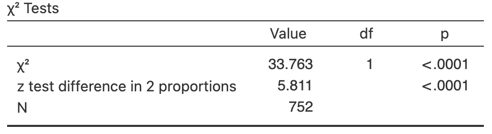
```


::: {.exercise #OddsRatiosCITurbinesHT}
[*Dataset*: `Turbines`]
A study of turbine failures [@MyersBook; @NelsonLifeData] ran $73$\ turbines for around $1\,800$\hs, and found that seven developed fissures (small cracks).
They also ran a different set of\ $42$ turbines for about\ $3\,000$\hs, and found that nine developed fissures.

1. Construct the two-way table for the data.
1. Compute the difference between the proportions of fissures at $1\,800$\hs and $3\,000$\hs, and hence the difference between the proportions.
1. Compute the odds of a fissure after $1\,800$\hs and after $3\,000$\hs, and hence the odds ratio.
1. Compute an approximate $95$%\ CI for the difference between the proportions.
1. Write down the $95$%\ CI for the difference between the proportions (Fig.\ \@ref(fig:TurbinesOutput)).
1. Interpret the CIs.
1. Write down, then interpret, a $95$%\ CI for the odds ratio.
1. Test for a relationship.
1. Are the CIs and tests statistically valid?
:::


```{r TurbinesOutput, fig.show="hold", fig.cap="Software output for the turbine data.", fig.align="center", out.width=c("60%")}
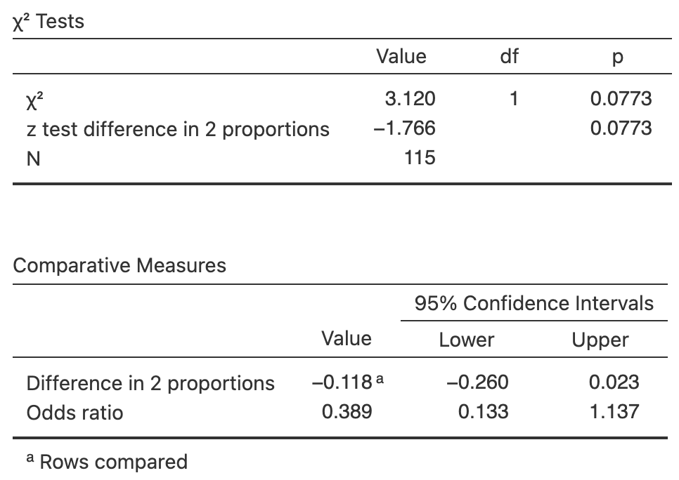
```


::: {.exercise #TestOddsRatioBearTree}
@witmer2020preliminary compared various types of repellents (including bear faeces) to prevent bears damaging trees in an Idaho forest.
Part of the data are summarised in 
`r if (knitr::is_latex_output()) {
   '(Table\\ \\@ref(tab:BearsB12Data), left table).'
} else {
   'Table\\ \\@ref(tab:BearTreeData).'
}`
.

1. Compute the odds of new damage for both repellents, and hence the OR.
1. Compute the proportion of trees with new damage for both repellents, and hence the difference between the proportions.
1. Write the hypothesis for conducting a hypothesis test involving proportions.
1. Write the hypothesis for conducting a hypothesis test involving odds.
1. Software gives $\chi^2$ as\ $4.4850$. 
   What is the equivalent $z$-score (e.g., for the test of proportions)? 
   Would you expect a large or small $P$-value?
1. The $P$-value is given by software as $P = 0.0342$. 
   Write a conclusion, either using odds or proportions.
1. Is the analysis statistically valid?
:::


```{r BearTreeData}
BearTable <- array( dim = c(2, 2))
BearTable[1, ] <- c(6, 69)
BearTable[2, ] <- c(15, 60)
colnames(BearTable) <- c("New damage",
                         "No new damage")
rownames(BearTable) <- c("Bear faeces",
                         "Control (water)")

if( knitr::is_latex_output() ) {
  T1 <- kable(pad(BearTable,
            surroundMaths = TRUE,
            targetLength = 2,
            decDigits = 0),
        format = "latex",
        col.names = c("damage",
                      "damage"),
        valign = "t",
        escape = FALSE,
        longtable = FALSE,
      booktabs = TRUE) %>%
    add_header_above( c("\\ \\\\null \\ " = 1,
                        "New" = 1,
                        "No new" = 1),
                      escape = FALSE,
                      bold = TRUE,
                      line = FALSE)
}


if( knitr::is_html_output() ) {
  kable(pad(BearTable,
            surroundMaths = TRUE,
            targetLength = 2,
            decDigits = 0),
        format = "html",
        align = "c",
        longtable = FALSE,
        caption = "The number of trees with new damage by bears, according to different repellents.",
      booktabs = TRUE)
}
```

::: {.exercise #B12Deficiency}
[*Dataset*: `B12Diet`]
@data:Gammon2012:B12 examined B12\ deficiencies in 'predominantly overweight/obese women of South Asian origin living in Auckland', some of whom were on a vegetarian diet and some of whom were on a non-vegetarian diet
`r if (knitr::is_latex_output()) {
   '(Table\\ \\@ref(tab:BearsB12Data), right table).'
} else {
   '(Table\\ \\@ref(tab:B12Data)).'
}`
One RQ was:

> Among this group of women, are the odds of being vitamin\ B12 deficient different for women on a vegetarian diet compared to women on a non-vegetarian diet?

1. Compute the odds of B12 deficiency for both diets, and hence the OR.
1. Compute the proportion of women with B12 deficiency for both diets, and hence the difference between the proportions.
1. Write the hypothesis for conducting a hypothesis test involving proportions.
1. Write the hypothesis for conducting a hypothesis test involving odds.
1. Software gives $\chi^2$ as\ $4.7067$. 
   What is the equivalent $z$-score (e.g., for the test of proportions)? 
   Would you expect a large or small $P$-value?
1. The $P$-value is given by software as $P = 0.0305$. 
   Write a conclusion, either using odds or proportions.
1. Is the analysis statistically valid?
:::


```{r B12Data}
data(B12Diet) ### Exercise

B12Data <- xtabs(~ Diet + B12,
                 data = B12Diet)

rownames(B12Data) <- c("Vegetarians",
                       "Non-vegetarians")
colnames(B12Data) <- c("B12 deficient",
                       "Not B12 deficient")

if( knitr::is_latex_output() ) {
  T2 <- kable(pad(B12Data,
            surroundMaths = TRUE,
            targetLength = c(2, 3),
            decDigits = 0),
        format="latex",
        col.names = c("deficient",
                      "deficient"),
        booktabs = TRUE,
        longtable=FALSE,
        escape = FALSE,
        valign = "t") %>%
    add_header_above( c("\\ \\\\null \\ " = 1,
                        "B12" = 1,
                        "Not B12" = 1),
                      bold = TRUE,
                      escape = FALSE,
                      line = FALSE)
  
}
if( knitr::is_html_output() ) {
  kable(pad(B12Data,
            surroundMaths = TRUE,
            targetLength = c(2, 3),
            decDigits = 0),
               format = "html",
               booktabs = TRUE,
               longtable = FALSE,
               align = "c",
               caption = "The number of vegetarian and non-vegetarian women who are (and are not) B12 deficient.")
}
```


```{r}
if( knitr::is_latex_output() ) {
  out <- knitr::kables(list(T1, T2),
                       format = "latex",
                       label = "BearsB12Data",
                       caption = "Left: the number of trees with new damage by bears, according to different repellents. Right: the number of vegetarian and non-vegetarian women who are (and are not) B12 deficient.") %>% 
    kable_styling(font_size = 8) %>%
    column_spec(1, bold = TRUE) %>% # Causes an error if placed with each table...
    row_spec(1, bold = TRUE)  # Causes an error if placed with each table...
  
  out2 <- prepareSideBySideTable(out, 
                                 gap = "\\qquad") 
  out2
}
```


<!-- ```{r B12jamoviOutput, fig.show="hold", fig.cap="Software output for the B12 data.", fig.align="center", out.width=c("49%", "49%")} -->
<!-- knitr::include_graphics( "jamovi/B12/B12CI-Both.png") -->
<!-- 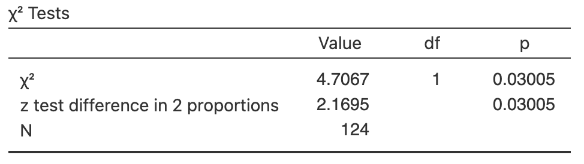 -->
<!-- ``` -->

`r if( knitr::is_latex_output() ) "\\captionsetup{font=normalsize}"`


::: {.exercise #DogsHT}
[*Dataset*: `DogWalks`]
@naughton2024association studied the difference between the activities of dogs kept in the city and on farms (Table\ \@ref(tab:DogWalkTable)).
One RQ was:

> For Northern Ireland dogs, is there an association between length of walks, and their location?

1. Write down the hypotheses to answer this RQ.
1. Determine the $\chi^2$-value and perform a hypothesis to answer the RQ, using the output in Fig.\ \@ref(fig:DogWalksjamovi).
1. Write down the conclusion, in terms of odds, including a CI.
1. Write down the conclusion, in terms of proportions, including a CI.
1. Is the test statistically valid?
:::


```{r DogWalkTable}
data(DogWalks)

DogTable <- xtabs( Counts ~ Location + WalkLength,
                   data = DogWalks)

colnames(DogTable) <- c("Under $30$",
                        "$30$ to under $60$",
                        "$60$ to under $120$",
                        "Varies")
rownames(DogTable) <- c("City",
                        "Farm")

if( knitr::is_latex_output() ) {
  kable(pad(DogTable,
            surroundMaths = TRUE,
            targetLength = 3,
            decDigits = 0),
        format = "latex",
        align = "c",
        escape = FALSE,
        longtable = FALSE,
        caption = "The length of walks for dogs, living in the city and farms. (`Varies' means usuually short walks, but occasional longer walks.)",
      booktabs = TRUE) %>%
    kable_styling(font_size = 8) %>%
    row_spec(0, bold = TRUE) %>%
    column_spec(0, bold = TRUE) %>%
add_header_above( c(" " = 1,
                    "Walk length (in mins)" = 4),
                  bold = TRUE,
                  line = TRUE)
}


if( knitr::is_html_output() ) {
  kable(pad(DogTable,
            surroundMaths = TRUE,
            targetLength = 3,
            decDigits = 0),
        format = "html",
        align = "c",
        longtable = FALSE,
        caption = "The length of walks for dogs, living in the city and farms. ('Varies' means usuually short walks, but occasional longer walks.)",
      booktabs = TRUE) %>%
add_header_above( c(" " = 1,
                    "Walk length (in mins)" = 4),
                  bold = TRUE,
                  line = TRUE)
}
```


```{r DogWalksjamovi, fig.show="hold", fig.cap="Software output for the dog-walking data.", fig.align="center", out.width="45%"}
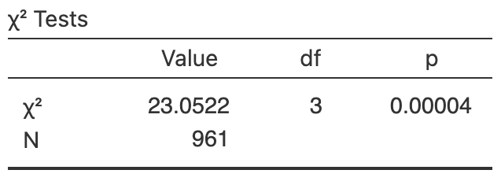
```


::: {.exercise #ComplianceHT}
[*Dataset*: `Mumps`]
@soud2009isolation studied the compliance of students with an isolation request following a large mumps outbreak in Kansas in 2006.
One RQ was:

> Is there an association between age group, and compliance with the isolation order?

The data are shown in 
`r if (knitr::is_latex_output()) {
   'Table\\ \\@ref(tab:MumpsTable)'
} else {
   'Table\\ \\@ref(tab:MumpsTableHTML)'
}`
and the software output in
`r if (knitr::is_latex_output()) {
   'Fig.\\ \\@ref(fig:Mumpsjamovi).'
} else {
   'Fig.\\ \\@ref(fig:MumpsjamoviHTML).'
}`

1. Write down the hypotheses.
1. Compute the proportion of each age group that complied with the isolation request.
1. Compute the odds of each age group that complied with the isolation request.
1. Compute the relevant ORs, and interpret what these mean.
1. Determine the $\chi^2$-value and perform a hypothesis to answer the RQ, using the software output.
1. Is the test statistically valid?
:::

```{r MumpsSetup}
data(Mumps)

MumpsTable <- xtabs( Counts ~ AgeGroup + Compliance,
                     data = Mumps)

rownames(MumpsTable) <- c("$18$ to $19$",
                        "$20$ to $21$",
                        "Older than $22$")
colnames(MumpsTable) <- c("Complied",
                          "Did not comply")
```


`r if (knitr::is_html_output()) '<!--'`
\begin{figure}
\begin{minipage}{0.48\textwidth}
\captionof{table}{The compliance of students by age group\label{tab:MumpsTable}.}
\fontsize{8}{12}\selectfont
```{r}
  kable(pad(MumpsTable,
            surroundMaths = TRUE,
            targetLength = 2,
            decDigits = 0),
        format = "latex",
        align = "c",
        escape = FALSE,
        table.env = "@empty",
        longtable = FALSE,
      booktabs = TRUE) %>%
    row_spec(0, bold = TRUE) %>%
    column_spec(0, bold = TRUE) 
```
\end{minipage}
\hspace{0.05\textwidth}
\begin{minipage}{0.42\textwidth}%
\centering
```{r, out.width='100%'}
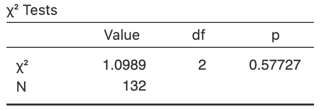 
```
\caption{Software output for the compliance data.}\label{fig:Mumpsjamovi}
\end{minipage}%
\end{figure}
`r if (knitr::is_html_output()) '-->'`


`r if (knitr::is_latex_output()) '<!--'`
```{r MumpsTableHTML}
if( knitr::is_html_output() ) {
  kable(pad(MumpsTable,
            surroundMaths = TRUE,
            targetLength = 2,
            decDigits = 0),
        format = "html",
        align = "c",
        longtable = FALSE,
        caption =  "The  compliance of students by age group.",
      booktabs = TRUE) %>%
add_header_above( c(" " = 1,
                    "Compliance" = 2),
                  bold = TRUE,
                  line = TRUE)
}
```

```{r MumpsjamoviHTML, fig.cap="Software output for the compliance data.", fig.align="center", out.width="45%", fig.show='hold'}
# The figure for LaTeX is in the minipage (combined with data table), so only need show it for the HTML
 
```
`r if (knitr::is_latex_output()) '-->'`


::: {.exercise #ShoppingBags}
[*Dataset*: `ShoppingBags`]
@choon2017perception studied $400$\ residents of  Klang Valley, Malaysia, to examine residents' approach to waste management.
One RQ was:

> For residents of Klang Valley, is age group associated with whether people bring their own bags when shopping?

The data 
`r if (knitr::is_latex_output()) {
   '(Table\\ \\@ref(tab:BagsTableHT))'
} else {
   '(Table\\ \\@ref(tab:BagsTableHTHTML))'
}`
are given in a $3\times 2$ table of counts.
The software output is shown in 
`r if (knitr::is_latex_output()) {
   'Fig.\\ \\@ref(fig:BagsChisqjamovi).'
} else {
   'Fig.\\ \\@ref(fig:BagsChisqjamoviHTML).'
}`


```{r BagsTableSetup}
data(ShoppingBags)

ShoppingBags$BringBags <- ordered(ShoppingBags$BringBags, # Swap order
                                  levels = c("y", "n"))
BagsTab <- xtabs(Counts ~ AgeGroup + BringBags, 
                 data = ShoppingBags)

colnames(BagsTab) <- c("Brings own bags", 
                       "Does not bring own bags" )
rownames(BagsTab) <- c("$30$ and under",
                       "$31$ to $40$",
                       "Over $40$")
```


`r if (knitr::is_html_output()) '<!--'`
\begin{figure}
\begin{minipage}{0.48\textwidth}
\captionof{table}{Whether shoppers bring their own bags, and the shoppers age group\label{tab:BagsTableHT}.}
\fontsize{8}{12}\selectfont
```{r}
  kable(pad(BagsTab,
            surroundMaths = TRUE,
            targetLength = 3,
            decDigits = 0),
        format = "latex",
        align = "c",
        col.names = c("Yes", "No"),
        escape = FALSE,
        table.env = "@empty",
        longtable = FALSE,
        booktabs = TRUE) %>%
    row_spec(0, bold = TRUE) %>%
    column_spec(0, bold = TRUE)  %>%
    add_header_above( c(" " = 1,
                        "Brings bags?" = 2),
                      bold = TRUE,
                      line = TRUE)
```
\end{minipage}
\hspace{0.05\textwidth}
\begin{minipage}{0.42\textwidth}%
\centering
```{r, out.width='100%'}
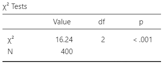
```
\caption{Software output for the shopping-bags data.}\label{fig:BagsChisqjamovi}
\end{minipage}%
\end{figure}
`r if (knitr::is_html_output()) '-->'`


`r if (knitr::is_latex_output()) '<!--'`
```{r BagsTableHTHTML}
if( knitr::is_html_output() ) {
  kable(pad(BagsTab,
            surroundMaths = TRUE,
            targetLength = 3,
            decDigits = 0),
        format = "html",
        align = "c",
        longtable = FALSE,
        caption =  "Whether shoppers bring their own bags, and the shoppers age group.",
      booktabs = TRUE) %>%
add_header_above( c(" " = 1,
                    "Compliance" = 2),
                  bold = TRUE,
                  line = TRUE)
}
```

```{r BagsChisqjamoviHTML, fig.cap="Software output for the shopping-bags data.", fig.align="center", out.width="45%", fig.show='hold'}
# The figure for LaTeX is in the minipage (combined with data table), so only need show it for the HTML

```
`r if (knitr::is_latex_output()) '-->'`


1. Compute the odds of someone bringing a shopping bag, for each age group.
1. Compute the odds ratio of bringing a shopping bag (using the 'Over\ $40$' age group as the reference level).
1. Compute the percentage of people bringing a shopping bag, for each age group.
1. Construct the hypotheses for testing for an association between the variables.
1. Use the software output to answer the research question.
1. Write a conclusion.
1. Is the test statistically valid.
:::


::: {.exercise #CrabShells}
[*Dataset*: `CrabShell`]
Hermit crabs place sea anemones on their shells for protection.
@brooks1989hermit studied the placement of the anemones:

> Is there a relationship between the vertical and horizontal locations of anemones placed by hermit crabs on their shells?

The data are shown in 
`r if (knitr::is_latex_output()) {
   'Table\\ \\@ref(tab:CrabShellData),'
} else {
   'Table\\ \\@ref(tab:CrabShellDataHTML),'
}`
and output in
`r if (knitr::is_latex_output()) {
   'Table\\ \\@ref(fig:CrabShellsChisqjamovi).'
} else {
   'Table\\ \\@ref(fig:CrabShellsChisqjamoviHTML).'
}`
Perform a hypothesis test to answer the RQ.
:::

```{r CrabShellSetup}
data(CrabShells)

CrabTab <- array( dim = c(3, 3) )

CrabTab <- xtabs( Counts ~ ShellRow + ShellColumn,
                  data = CrabShells)

rownames(CrabTab) <- c("Side 1",
                       "Central",
                       "Side 2")
colnames(CrabTab) <- c("Side 1",
                       "Central",
                       "Side 2")

# if( knitr::is_latex_output() ) {
#   kable(pad(CrabTab,
#             surroundMaths = TRUE,
#             targetLength = 3,
#             decDigits = 0),
#         caption = "The location of anemones placed on shells by hermit crabs",
#         format = "latex",
#         align = "c",
#         longtable = FALSE,
#         escape = FALSE,
#         booktabs = TRUE) %>%
#     kable_styling(font_size = 8) %>%
#     row_spec(0, bold = TRUE) %>%
#     column_spec(1, bold = TRUE)
# #    add_header_above( c(" " = 1,
# #                        "Brings own bags" = 2),
# #                      bold = TRUE,
# #                      line = TRUE)
# }
# if( knitr::is_html_output() ) {
#   kable(pad(CrabTab,
#             surroundMaths = TRUE,
#             targetLength = 3,
#             decDigits = 0),
#         format = "html",
#         align = "c",
#         longtable = FALSE,
#         caption = "The location of anemones placed on shells by hermit crabs",
#         booktabs = TRUE)
# }
```


<!-- ```{r CrabShellsChisqjamovi, fig.show="hold", fig.cap="Software output for the crab-shell data", fig.align="center", out.width=c("43%", "56%")} -->
<!-- knitr::include_graphics( "jamovi/CrabShells/CrabShellsChisquareTest.png") -->
<!-- 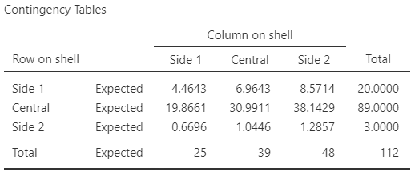 -->
<!-- ``` -->


###########################################################
`r if (knitr::is_html_output()) '<!--'`
\begin{figure}
\begin{minipage}{0.48\textwidth}
\captionof{table}{The location of anemones placed on shells by hermit crabs\label{tab:CrabShellData}.}
\fontsize{8}{12}\selectfont
```{r}
  kable(pad(CrabTab,
            surroundMaths = TRUE,
            targetLength = 3,
            decDigits = 0),
        format = "latex",
        align = "c",
        escape = FALSE,
        table.env = "@empty",
        longtable = FALSE,
        booktabs = TRUE) %>%
    row_spec(0, bold = TRUE) %>%
    column_spec(0, bold = TRUE) 
```
\end{minipage}
\hspace{0.05\textwidth}
\begin{minipage}{0.42\textwidth}%
\centering
```{r, out.width='100%'}
knitr::include_graphics( "jamovi/CrabShells/CrabShellsChisquareTest.png")
```
\caption{Software output for the crab-shell data.}\label{fig:CrabShellsChisqjamovi}
\end{minipage}%
\end{figure}
`r if (knitr::is_html_output()) '-->'`


`r if (knitr::is_latex_output()) '<!--'`
```{r CrabShellDataHTML}
if( knitr::is_html_output() ) {
  kable(pad(CrabTab,
            surroundMaths = TRUE,
            targetLength = 3,
            decDigits = 0),
        caption = "The location of anemones placed on shells by hermit crabs.",
        format = "html",
        align = "c",
        longtable = FALSE,
      booktabs = TRUE) 
}
```

```{r CrabShellsChisqjamoviHTML, fig.cap="Software output for the crab-shell data.", fig.align="center", out.width="45%", fig.show='hold'}
# The figure for LaTeX is in the minipage (combined with data table), so only need show it for the HTML
knitr::include_graphics( "jamovi/CrabShells/CrabShellsChisquareTest.png")
```
`r if (knitr::is_latex_output()) '-->'`


`r if( knitr::is_latex_output() ) "\\captionsetup{font=normalsize}"`


<!-- QUICK REVIEW ANSWERS -->
`r if (knitr::is_html_output()) '<!--'`
::: {.EOCanswerBox .EOCanswer data-latex="{iconmonstr-check-mark-14-240.png}"}
**Answers to *Quick Revision* questions:**
**1.** b.
**2.** a..
**3.** a.
**4.** False.
**5.** a.
**6.** b.
**7.** Two.
**8.** True.
**9.** False.
:::
`r if (knitr::is_html_output()) '-->'`


<!-- ::: {.exercise #OddsRatiosCIEarInf} -->
<!-- [*Dataset*: `EarInfection`] -->
<!-- A study of ear infections in Sydney swimmers [@data:smyth:ozdasl] recorded whether people reported an ear infection or not, and where they usually swam. -->
<!-- Use Fig.\ \@ref(fig:EarInfPSSOutputCI) to answers these questions. -->

<!-- 1. Compute the standard error for the difference between the proportions of people *not* reporting ear infections, comparing non-beach to beach swimmers. -->
<!-- 1. Compute an approximate $95$%\ CI for the difference between the proportions. -->
<!-- 1. Write down the $95$%\ CI for the difference between the proportions. -->
<!-- 1. Interpret the CI. -->
<!-- 1. Confirm that the odds ratio in the output is correct. -->
<!-- 1. Use the software output to write down a $95$%\ CI for the odds ratio. -->
<!-- 1. Interpret the CI. -->
<!-- 1. Are the CIs statistically valid? -->
<!-- 1. Construct the summary table for the data. -->
<!-- ::: -->

<!-- ```{r EarInfPSSOutputCI, fig.show="hold", fig.cap="Software output for the ear-infection data.", fig.align="center", out.width=c("42%", "53%"), fig.show='hold'} -->
<!-- knitr::include_graphics( "jamovi/EarInfections/EarInfections-Data.png" ) -->
<!-- knitr::include_graphics( "jamovi/EarInfections/EarInfections-CI-Both.png" ) -->
<!-- ``` -->


