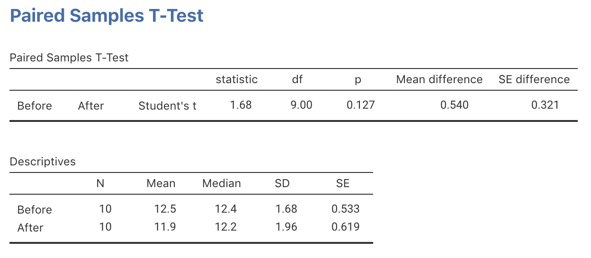
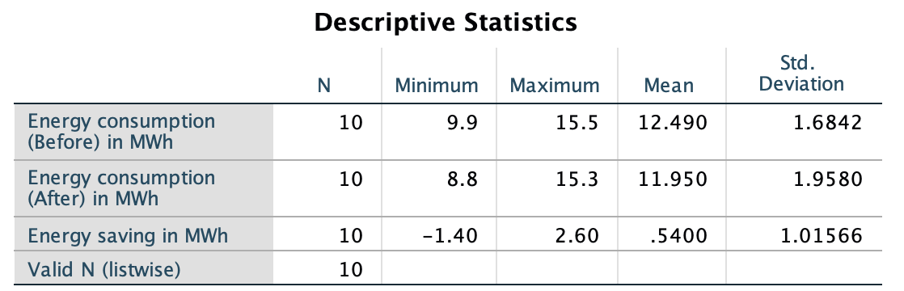
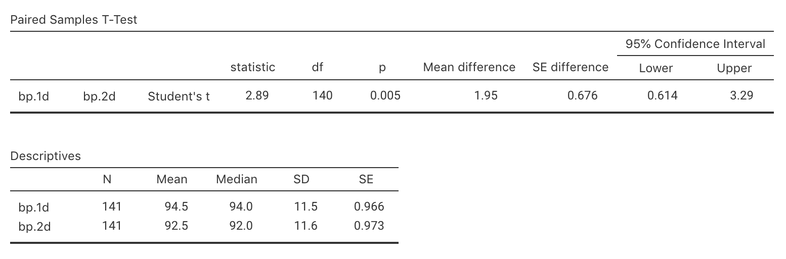
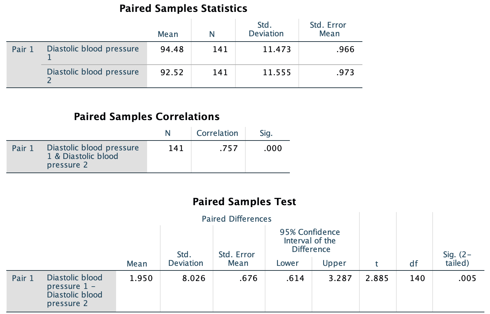

# Tests for the mean difference (paired data) {#TestPairedMeans}

::: {.objectivesBox .objectives data-latex="{iconmonstr-target-4-240.png}"}
So far, you have learnt to ask a RQ, design a study, describe and summarise the data, understand the decision-making process and to work with probabilities.
You have been introduced to the construction of confidence intervals, and have studied some hypothesis tests.
\smallskip

**In this chapter**, you will learn about *hypothesis tests* for the mean difference (i.e., for *paired data*, or [*within individuals* comparisons](#Comparison)).
You will learn to:

* conduct hypothesis tests for the mean difference with paired data
* determine whether the conditions for using these methods apply in a given situation.
:::


```{r echo=FALSE, fig.cap="", fig.align="center", fig.width=3, out.width="35%"}
SixSteps(5, "Tests: Mean differences")
```


```{r echo=FALSE}
insulate <- read.csv("./Data/InsulationBeforeAfter.csv")


colnames(insulate) <- c("Before", "After")
insulate$Diff <- insulate$Before - insulate$After

mn.I <- mean(insulate$Diff)
sd.I <- sd(insulate$Diff)
n.I <- length(insulate$Diff)
se.I <- sd.I / sqrt(n.I)
```


## Introduction: Insulation {#Chap29-Intro}


<div style="float:right; width: 222x; border: 1px; padding:10px">

</div>


`r if (knitr::is_html_output()) '<!--'`
\begin{wrapfigure}{R}{.20\textwidth}
  \begin{center}
    \includegraphics[width=.15\textwidth]{Illustrations/pexels-taryn-elliott-4231477.jpg}
  \end{center}
\end{wrapfigure}
`r if (knitr::is_html_output()) '-->'`


The Electricity Council in Bristol wanted to determine if a certain type of wall-cavity insulation reduced energy consumption in winter, on average [@data:OpenUni:insulationBA].
Their RQ was:

> Is there a *mean saving* in energy consumption due to adding insulation?

The data collected are shown in
`r if( knitr::is_latex_output() ) {
    'Table \\@ref(tab:DataInsulationTest).'
} else {
    'the table below.'
}`
These data were used in Sect. \@ref(PairedCI), where a CI was constructed for the mean energy saving.

For these data, finding the *difference* in energy consumption for each house seems sensible.
The data are *paired* (Sect. \@ref(PairedInsulation)): the same unit of analysis is measured twice on the same variable (*before* and *after*), and the *mean* change is of interest.
That is, the comparison is [within individuals](#Comparison), and *not* between different groups of individuals.

Pairing the values for each house makes sense; hence finding the *difference* in energy consumption at each house makes sense.
The parameter is $\mu_d$, the population mean *saving* in energy consumption.


::: {.tipBox .tip data-latex="{iconmonstr-info-6-240.png}"}
Making clear *how* the differences are computed is important.

Here, the differences could be computed as the  *Before* minus *After* (the energy consumption *saving*), or the *After* minus *Before* (the energy consumption *increase*).
Either is fine, as long as you are consistent throughout.
The meaning of any conclusions will be the same.

In this case, discussing energy *savings* seems most natural, so we compute the differences as *Before* minus *After*.
:::


```{r DataInsulationTest, echo=FALSE}
insulate <- read.csv("./Data/InsulationBeforeAfter.csv")

insulate$Diff <- insulate$Before - insulate$After

if( knitr::is_latex_output() ) {
  kable( insulate,
         format = "latex",
         booktabs = TRUE,
         col.names = c("Before", 
                       "After", 
                       "Energy savings"),
         caption = "The house insulation data: Energy consumption before and after adding insulation, and the energy saving (all in MWh)") %>%
	row_spec(0, bold = TRUE) %>%
    kable_styling(font_size = 10)
}
if( knitr::is_html_output(exclude = "epub") ) {
  DT::datatable( round(insulate, 1),
                 fillContainer = FALSE, # Make more room, so we don't just have ten values
                 #filter="top", 
                 #selection="multiple", 
                 #escape=FALSE,
                 options = list(searching = FALSE), # Remove searching: See: https://stackoverflow.com/questions/35624413/remove-search-option-but-leave-search-columns-option
                 caption = "The house insulation data: Energy consumption before and after adding insulation, and the energy saving (all in MWh)")
}
if( knitr::is_html_output() & knitr::pandoc_to("epub")) {
  kable( insulate,
         format = "html",
         booktabs = TRUE,
         col.names = c("Before", 
                       "After", 
                       "Energy savings"),
         caption = "The house insulation data: Energy consumption before and after adding insulation, and the energy saving (all in MWh)") %>%
	row_spec(0, bold = TRUE)
}
```


## Hypotheses and notation: Mean differences

The RQ asks if the mean energy saving *in the population* is zero or not.
The *parameter* is the *population mean difference*. 
To make things clear, notation is needed (recapping Sect. \@ref(PairedNotationCI)):

* $\mu_d$: The *population* mean *difference*.
* $\bar{d}$: The *sample* mean *difference*.
* $s_d$: The sample standard deviation of the *differences*.
* $n$: The number of *differences*.
* $\text{s.e.}(\bar{d})$: The standard error of the mean *differences*, 
  where $\displaystyle \text{s.e.}(\bar{d}) = \frac{s_d}{\sqrt{n}}$.

The hypotheses, therefore, can be written in terms of the parameter $\mu_d$.
The *null* hypothesis is 'there is *no change* in the energy consumption, in the population':

* $H_0$: $\mu_d = 0$.

As noted in Sect. \@ref(AboutHypotheses), the null hypothesis states that there is 'no difference, no change, no relationship', as measured by a parameter value.
This hypothesis, the initial **assumption**, postulates that the mean difference may not be zero in the *sample* due to sampling variation.

Since the RQ asks specifically if the insulation *saves* energy, the alternative hypothesis will be a [*one-tailed* hypothesis](#AboutHypotheses):

* $H_1$: $\mu_d > 0$ (one-tailed).

This hypothesis says that the mean energy saving in the population is *greater than* zero.
The alternative hypothesis is *one*-tailed because of the wording of the RQ.
Recall that the differences are defined as energy *savings*.


## Sampling distribution: Mean differences

Initially, assume that $\mu_d = 0$.
However, the *sample* mean energy saving will vary depending on which one of the many possible samples is randomly obtained, *even if* the mean saving in the population is zero: the sample mean energy saving has *sampling variation* and hence a *standard error*.
The *sampling distribution* of $\bar{d}$ can be described, which describes what values of the statistic might be **expected** in the sample if the $\mu_d = 0$.

Answering the RQ requires data.
The data should be summarised numerically (using your calculator or software, such as jamovi (Fig. \@ref(fig:InsulationTestNumericaljamovi)) or SPSS (Fig. \@ref(fig:InsulationTestNumericalSPSS))), and graphically (Fig. \@ref(fig:InsulationHistogram)).


```{r InsulationTestNumericaljamovi, echo=FALSE, fig.cap="jamovi output for the insulation data", fig.align="center", out.width="65%"}

```

```{r InsulationTestNumericalSPSS, echo=FALSE, fig.cap="SPSS output for the insulation data", fig.align="center", out.width="75%"}

```


The sample mean difference is $\bar{d} = 0.5400$... but this value of $\bar{d}$ will vary from sample to sample even if $\mu_d = 0$.
The amount of variation in $\bar{d}$ is quantified using the *standard error*.
More precisely, the possible values of the sample mean differences can, [under certain conditions](#ValiditySampleMeanDiffTest), described using 

* an approximate normal distribution; with
* a mean of $\mu_d = 0$ (taken from $H_0$); and
* a standard deviation (called the *standard error*) of $\text{s.e.}(\bar{d}) = s_d/\sqrt{n} = 0.3212$, where $s_d$ is the *standard deviation* of the differences.

This describes what can be **expected** from the possible values of $\bar{d}$ (Fig. \@ref(fig:EnergySamplingDist)), just through sampling variation (chance) if $\mu_d = 0$.


```{r EnergySamplingDist, echo=FALSE, fig.cap="The sampling distribution of sample means, if the energy saving in the population really was zero", fig.align="center", fig.width=4.5}
par( mfrow = c(2, 1))

mn0 <- 0
mn <- 0.54
se <- 0.3212

plot.norm( 0, 
           se.I, 
           xlab.name = "Energy savings", 
           type = expression(bar(italic(d))),
           shade.hi.x = 5,
           cex.tickmarks = 1,
           shade.lo.x = 0.54,
           round.dec = 2)
arrows(1.68, 
       0.3, 
       1.68, 
       0.1,
       length = 0.2,
       angle = 15)
text(1.68, 
     0.3,
     pos = 3,
     expression(bar(italic(d)) == 0.54))


plot.norm( 0, 
           1, 
           xlab.name = "t-scores", 
           type = expression(italic(t)),
           shade.hi.z = Inf,
           shade.lo.z = 1.68,
           cex.tickmarks = 1,
           round.dec = 2)

arrows(1.68, 
       0.3, 
       1.68, 
       0.1,
       length = 0.2,
       angle = 15)
text(1.68, 
     0.3,
     pos = 3,
     expression( italic(t) == 1.68))
```


## The test statistic: Mean differences

The sample mean difference can be located on the sampling distribution (Fig. \@ref(fig:EnergySamplingDist)) by computing the $t$-score:

\[
	t = \frac{0.54 - 0}{0.3212} = 1.681,
\]
following the ideas in Equation \@ref(eq:tscore).

Software computes the $t$-score too (jamovi: Fig. \@ref(fig:InsulationTest2jamovi); SPSS: Fig. \@ref(fig:InsulationTest2SPSS)).
The $t$-score locates the **observed** sample statistic on the sampling distribution.


## $P$-values: Mean differences

A $P$-value determines if the sample data are consistent with the assumption (Table \@ref(tab:PvaluesInterpretation)).
Since $t = 1.681$, the *one-tailed* $P$-value is between 2.5% and 16% based on the [68--95--99.7 rule](#def:EmpiricalRule).
This is a wide, and inconclusive, interval for the $P$-value. 

Software gives a more precise $P$-value (jamovi: Fig. \@ref(fig:InsulationTest2jamovi); SPSS: Fig. \@ref(fig:InsulationTest2SPSS)): the *two-tailed* $P$-value is $0.127$, so the *one-tailed* $P$-value is $0.127/2 = 0.0635$.


```{r InsulationTest2jamovi, echo=FALSE, fig.cap="jamovi output for the insulation data", fig.align="center", out.width="80%"}
knitr::include_graphics("jamovi/InsulationBeforeAfter/InsulationBeforeAfterPairedTOutput.png")
```


```{r InsulationTest2SPSS, echo=FALSE, fig.cap="SPSS output for the insulation data", fig.align="center", out.width="85%"}
knitr::include_graphics("SPSS/InsulationBeforeAfter/InsulationBeforeAfterPairedTOutput.png")
```

::: {.importantBox .important data-latex="{iconmonstr-warning-8-240.png}"}
The software clarifies *how* the differences have been computed:

* **jamovi**: 
  At the left of the output (Fig. \@ref(fig:InsulationTest2jamovi)), the order implies the differences are found as *Before minus After*.

* **SPSS**: 
  At the left of the output (Fig. \@ref(fig:InsulationTest2SPSS)), the difference is described as *Before* ${}-{}$ *After*.
:::

`r if (knitr::is_latex_output()) '<!--'`
::: {.thinkBox .think data-latex="{iconmonstr-light-bulb-2-240.png}"}
<iframe src="https://learningapps.org/watch?v=pj3pt56fk22" style="border:0px;width:100%;height:500px" allowfullscreen="true" webkitallowfullscreen="true" mozallowfullscreen="true"></iframe>
:::
`r if (knitr::is_latex_output()) '-->'`


## Conclusions: Mean differences

The *one-tailed* $P$-value is $0.0635$, suggesting [only slight evidence](tab:PvaluesInterpretation) supporting $H_1$.
To write a conclusion, an *answer to the RQ* is needed, plus *evidence* leading to that conclusion; and some *summary statistics*, including a CI (indicating the precision of the statistic):

> Slight evidence exists in the sample (paired $t = 1.68$; one-tailed $P = 0.0635$) of a mean energy saving in the population (mean saving: 0.54 MWh; $n = 10$; 95% CI from $-0.19$ to $1.27$ MWh) after adding the insulation.

The wording implies the direction of the differences (by talking of 'savings').

Statistically validity should be checked, which was done in Sect. \@ref(ValidityPaired), but the validity conditions are given again in the next section, for completeness.


::: {.example #HTMeanDiffCOVID name="COVID lockdown"}
A study of $n = 213$ Spanish health students [@romero2020physical] measured (among other things) the number of minutes of vigorous physical activity (PA) performed by students *before* and *during* the COVID-19 lockdown (from March to April 2020 in Spain).
These numerical summary of the data are shown in Example \@ref(exm:CIMeanDiffCOVID), so are not repeated here.
We define the *differences* as the number of minutes of vigorous PA *before* the COVID lockdown, minus the number of minutes of vigorous PA *during* the COVID lockdown.
A difference is computed for each participant, so the data are *paired*.

Using this definition, a *positive* difference means the *Before* value is higher; hence, the differences tell us how much longer the student spent doing vigorous PA *before* the COVID lockdown.
Similarly, a *negative * value means that the *During* value is higher.
The RQ is

> For Spanish health students, is there a mean change in the amount of vigorous PA during and before the COVID lockdown? 
  
In this situation, the *parameter* of interest is the population mean difference $\mu_d$, the mean amount that students spent in vigorous PA *before* the lockdown compared to *during* the lockdown.
The hypotheses are:
  
\[
   \text{$H_0$:} \mu_d = 0\quad\text{and}\quad \text{$H_1$:} \mu_d \ne 0 \text{(i.e., two-tailed)}
\]
The mean *difference* is $\bar{d} = -2.68$ minutes, with a standard deviation of $s_d = 51.30$ minutes.
However, we know that the sample mean difference could vary from sample to sample, so has a standard error:

\[
   \text{s.e.}(\bar{d}) = \frac{s_d}{n} = \frac{51.30}{\sqrt{213}} = 3.515018.  
\]
The test statistic is

\[
  t = \frac{\bar{d} - \mu_d}{\text{s.e.}(\bar{d})} = \frac{-2.68 - 0}{3.515018} = -0.76.
\]

This is a very small value, so (using the 68--95--99.7 rule) the $P$-value will be very large: a sample mean difference of -2.68 minutes could easily have happened by chance even if the population mean difference was zero.

We write:

> There is no evidence (paired $t = -0.76$, $P > 0.10$) of a mean change in the amount of vigorous PA *before* and *during* lockdown (sample mean 2.68 minutes greater *during* lockdown; standard deviation: 51.30 minutes; approximate 95% CI: $-9.71$ to $7.03$).
:::


## Statistical validity conditions: Mean differences {#ValiditySampleMeanDiffTest}

As with any inferential procedure, these results apply [under certain conditions](#exm:StatisticalValidityAnalogy).
For a hypothesis test for the mean of paired data, these conditions are the same as for the CI for the mean difference for paired data (Sect. \@ref(ValidityPaired)), and similar to those for one sample mean.

The test above is statistically valid if *one* of these conditions is true:

1. The sample size of differences is at least 25; **or**
1. The sample size of differences is smaller than 25, **and** the *population* of *differences* has an approximate normal distribution.

The sample size of 25 is a rough figure here, and some books give other values (such as 30).
This condition ensures that the *distribution of the sample means has an approximate normal distribution* so that we can use the [68--95--99.7 rule](#def:EmpiricalRule).

Provided the sample size is larger than about 25, this will be approximately true *even if* the distribution of the individuals in the population does not have a normal distribution.
That is, when $n > 25$ the sample means generally have an approximate normal distribution, even if the data themselves don't have a normal distribution.


::: {.example #StatisticalValidityInsulationHT name="Statistical validity"}
For the insulation data used above, the sample size is small, so the test will be statistically valid if the differences in the *population* follow a normal distribution.
We don't know if they do, though the sample data (Fig. \@ref(fig:InsulationHistogram)) don't identify any obvious doubts. 
So the test is possibly statistically valid, but we can't be sure.
:::


::: {.example #StatisticalValidityHTMeanDiffCOVID name="COVID lockdown"}
In Example \@ref(exm:HTMeanDiffCOVID) concerning COVID lockdowns, the sample size was 213 Spanish health students.
Since the sample size is much larger than 25, the test is statistically valid.
:::


## Example: Endangered species {#EndangeredHT}

A study of endangered species [@harnish2020attitudes] examined 

> ...whether perceived physical attractiveness of a species impacted participants' attitudes toward supporting and protecting the species...
>
> --- @harnish2020attitudes, p. 1703

To do so, 210 undergraduate students were surveyed about 14 animals on various aspects of supporting and protecting them.
Part of the data are summarised below, for two animals when asked about 'support to protect the animal from illicit trade'.
*Larger* values means *greater* support for protecting the animal from illicit trade.


| Species                            | Mean score      | Standard deviation
|-----------------------------------:+:---------------:+:-------------------:
| Bay Checkerspot Butterfly          | 3.10            | 1.06
| Valley Elderberry Longhorn Beetle  | 2.33            | 1.13
| **Difference**                     | 0.77            | 1.07

(Notice that the standard deviation of the difference is **not** the difference between the two given values of the standard deviation.)

The *difference* is defined as each student's score for the butterfly (deemed more attractive) *minus* their score for the beetle (deemed less attractive).
A positive value therefore means more support (on average) for the butterfly.
The RQ is whether there is a mean difference between support for each animal, so the parameter is $\mu_d$, the population mean difference.

The researchers wished to test if

> ...animals perceived as more physically attractive (i.e., the butterfly) compared to those which are perceived as less physically attractive (i.e., the beetle) will receive relatively more support to prevent the species from illicit trade
>
> --- @harnish2020attitudes, p. 1704

Given how the difference are defined, the hypotheses are:

\[
   H_0: \mu_d = 0\quad\text{and}\quad H_1: \mu_d > 0 \text{(i.e., one-tailed, based on the researchers' purpose)}
\]
The mean difference is $\bar{d} = 0.77$ and $s_d = 1.07$.
The value of $\bar{d}$ will vary from sample to sample, so has a standard error:

\[
   \text{s.e.}(\bar{d}) = \frac{s_d}{\sqrt{n}} = \frac{1.07}{\sqrt{210}} = 0.073837.
\]
The value of the test statistic is

\[
   t = \frac{\bar{d} - \mu_d}{\text{s.e.}(\bar{d})} = \frac{0.77 - 0}{0.073837} = 10.43,
\]
which is a *very* large value. 
Hence, the $P$-value will be very small, certainly less than $0.05$.
Since the sample size is much larger than 25, the test will be statistically valid.

We write:

> There is very strong evidence ($t = 10.43$; one-tailed $P<0.001$) that the mean difference in support for protecting the Bay Checkerspot Butterfly from illicit trade is greater than support for protecting the Valley Elderberry Longhorn Beetle from illict trade (mean difference: 0.77; standard deviation: 1.07; 95% CI for the difference: 0.62 to 0.92).


## Example: Blood pressure {#Diabetes}


```{r echo=FALSE, cache=FALSE}
# diab2 <- structure(list(id = c(1000L, 1001L, 1002L, 1003L, 1005L, 1008L, 
# 1011L, 1015L, 1016L, 1022L, 1024L, 1029L, 1030L, 1031L, 1035L, 
# 1036L, 1037L, 1041L, 1045L, 1250L, 1252L, 1253L, 1254L, 1256L, 
# 1271L, 1277L, 1280L, 1281L, 1282L, 1285L, 1301L, 1303L, 1304L, 
# 1305L, 1309L, 1312L, 1313L, 1314L, 1315L, 1316L, 1317L, 1321L, 
# 1323L, 1326L, 1500L, 1501L, 1502L, 2004L, 2750L, 2753L, 2754L, 
# 2756L, 2757L, 2758L, 2762L, 2763L, 2765L, 2770L, 2773L, 2774L, 
# 2775L, 2777L, 2778L, 2780L, 2784L, 2785L, 2787L, 2791L, 2793L, 
# 2794L, 2795L, 3250L, 3750L, 3751L, 3752L, 4000L, 4500L, 4501L, 
# 4506L, 4515L, 4517L, 4750L, 4751L, 4753L, 4758L, 4759L, 4760L, 
# 4761L, 4763L, 4767L, 4770L, 4771L, 4772L, 4776L, 4780L, 4783L, 
# 4786L, 4787L, 4789L, 4790L, 4792L, 4793L, 4794L, 4795L, 4796L, 
# 4801L, 4802L, 4803L, 4805L, 4808L, 4813L, 4818L, 4821L, 4822L, 
# 4823L, 4825L, 4826L, 4827L, 4833L, 4835L, 4840L, 4841L, 4842L, 
# 4843L, 10000L, 10001L, 10012L, 10014L, 10016L, 10020L, 12002L, 
# 12004L, 12005L, 12006L, 12501L, 12502L, 12506L, 12507L, 12509L, 
# 12751L, 12754L, 12760L, 12761L, 12763L, 12765L, 12766L, 12768L, 
# 12769L, 12772L, 12778L, 13250L, 13254L, 13500L, 13501L, 13503L, 
# 13505L, 14756L, 14758L, 15007L, 15008L, 15010L, 15012L, 15013L, 
# 15016L, 15017L, 15250L, 15252L, 15260L, 15264L, 15271L, 15274L, 
# 15276L, 15277L, 15278L, 15279L, 15500L, 15501L, 15502L, 15512L, 
# 15513L, 15514L, 15515L, 15516L, 15517L, 15518L, 15519L, 15520L, 
# 15521L, 15522L, 15527L, 15529L, 15540L, 15542L, 15545L, 15546L, 
# 15757L, 15758L, 15760L, 15761L, 15762L, 15763L, 15766L, 15773L, 
# 15777L, 15779L, 15782L, 15787L, 15792L, 15795L, 15797L, 15798L, 
# 15799L, 15800L, 15801L, 15802L, 15805L, 15812L, 15813L, 15814L, 
# 15815L, 15816L, 15818L, 15820L, 15821L, 15827L, 15828L, 16000L, 
# 16001L, 16003L, 16004L, 16005L, 16016L, 17002L, 17751L, 17752L, 
# 17754L, 17755L, 17756L, 17757L, 17760L, 17762L, 17765L, 17766L, 
# 17767L, 17771L, 17772L, 17773L, 17776L, 17781L, 17784L, 17790L, 
# 17791L, 17794L, 17795L, 17800L, 17802L, 17805L, 17808L, 17813L, 
# 17814L, 17816L, 17817L, 17818L, 17819L, 17828L, 17829L, 17830L, 
# 17834L, 17835L, 17841L, 17846L, 17849L, 20254L, 20258L, 20260L, 
# 20261L, 20267L, 20271L, 20272L, 20274L, 20275L, 20278L, 20279L, 
# 20288L, 20289L, 20290L, 20292L, 20293L, 20294L, 20298L, 20306L, 
# 20308L, 20309L, 20312L, 20313L, 20314L, 20315L, 20318L, 20325L, 
# 20329L, 20332L, 20335L, 20337L, 20340L, 20343L, 20346L, 20350L, 
# 20352L, 20355L, 20361L, 20365L, 20367L, 20368L, 20369L, 20750L, 
# 20754L, 20761L, 20762L, 20765L, 20768L, 20773L, 20774L, 20775L, 
# 20782L, 20783L, 20784L, 20787L, 20790L, 21254L, 21255L, 21257L, 
# 21281L, 21284L, 21298L, 21318L, 21320L, 21321L, 21322L, 21323L, 
# 21329L, 21333L, 21334L, 21338L, 21341L, 21343L, 21345L, 21346L, 
# 21347L, 21357L, 21359L, 40251L, 40253L, 40500L, 40501L, 40502L, 
# 40751L, 40754L, 40755L, 40762L, 40764L, 40772L, 40773L, 40774L, 
# 40775L, 40784L, 40785L, 40786L, 40787L, 40789L, 40792L, 40797L, 
# 40799L, 40803L, 40804L, 40805L, 41000L, 41001L, 41003L, 41004L, 
# 41021L, 41023L, 41029L, 41034L, 41035L, 41036L, 41037L, 41039L, 
# 41041L, 41055L, 41063L, 41065L, 41075L, 41078L, 41253L, 41254L, 
# 41500L, 41501L, 41503L, 41506L, 41507L, 41510L, 41752L, 41756L
# ), chol = c(203L, 165L, 228L, 78L, 249L, 248L, 195L, 227L, 177L, 
# 263L, 242L, 215L, 238L, 183L, 191L, 213L, 255L, 230L, 194L, 196L, 
# 186L, 234L, 203L, 281L, 228L, 179L, 232L, NA, 254L, 215L, 177L, 
# 182L, 265L, 182L, 199L, 183L, 194L, 190L, 173L, 182L, 136L, 218L, 
# 225L, 262L, 213L, 243L, 148L, 128L, 169L, 157L, 196L, 237L, 212L, 
# 233L, 289L, 193L, 204L, 165L, 237L, 218L, 296L, 178L, 443L, 145L, 
# 234L, 146L, 223L, 213L, 173L, 232L, 171L, 164L, 170L, 180L, 204L, 
# 209L, 242L, 134L, 217L, 251L, 217L, 300L, 218L, 189L, 185L, 206L, 
# 218L, 189L, 229L, 228L, 159L, 249L, 170L, 174L, 204L, 203L, 241L, 
# 245L, 143L, 224L, 168L, 184L, 199L, 158L, 209L, 214L, 293L, 227L, 
# 292L, 218L, 244L, 283L, 186L, 273L, 193L, 194L, 231L, 217L, 174L, 
# 225L, 268L, 195L, 179L, 215L, 185L, 132L, 175L, 179L, 228L, 181L, 
# 160L, 188L, 168L, 318L, 192L, 209L, 129L, 160L, 160L, 211L, 262L, 
# 201L, 263L, 219L, 191L, 171L, 219L, 347L, 269L, 164L, 181L, 190L, 
# 255L, 218L, 223L, 254L, 236L, 176L, 158L, 181L, 151L, 115L, 271L, 
# 190L, 118L, 168L, 254L, 193L, 187L, 212L, 170L, 215L, 199L, 140L, 
# 216L, 204L, 193L, 267L, 201L, 204L, 246L, 229L, 172L, 197L, 205L, 
# 219L, 174L, 192L, 206L, 160L, 216L, 236L, 205L, 206L, 143L, 173L, 
# 235L, 169L, 283L, 174L, 271L, 203L, 188L, 293L, 215L, 207L, 179L, 
# 202L, 211L, 211L, 151L, 171L, 342L, 179L, 155L, 197L, 200L, 237L, 
# 198L, 240L, 192L, 145L, 269L, 240L, 205L, 266L, 188L, 222L, 142L, 
# 268L, 174L, 214L, 194L, 196L, 207L, 204L, 189L, 179L, 159L, 260L, 
# 228L, 242L, 227L, 208L, 208L, 209L, 163L, 201L, 237L, 176L, 146L, 
# 231L, 241L, 305L, 149L, 183L, 235L, 244L, 199L, 224L, 173L, 192L, 
# 157L, 172L, 170L, 215L, 214L, 195L, 230L, 206L, 147L, 234L, 135L, 
# 226L, 179L, 163L, 191L, 138L, 184L, 181L, 224L, 293L, 147L, 198L, 
# 152L, 277L, 219L, 182L, 135L, 277L, 212L, 162L, 207L, 255L, 404L, 
# 239L, 220L, 165L, 243L, 149L, 178L, 190L, 226L, 132L, 160L, 204L, 
# 164L, 155L, 251L, 198L, 179L, 223L, 207L, 244L, 245L, 191L, 221L, 
# 300L, 173L, 138L, 203L, 260L, 166L, 180L, 159L, 207L, 298L, 203L, 
# 191L, 231L, 184L, 164L, 134L, 220L, 180L, 216L, 158L, 261L, 172L, 
# 249L, 189L, 225L, 193L, 219L, 156L, 224L, 181L, 306L, 122L, 219L, 
# 150L, 185L, 226L, 206L, 199L, 239L, 235L, 184L, 242L, 307L, 204L, 
# 212L, 203L, 219L, 226L, 217L, 157L, 235L, 252L, 204L, 188L, 194L, 
# 215L, 179L, 202L, 194L, 227L, 337L, 255L, 162L, 322L, 289L, 217L, 
# 209L, 214L, 302L, 179L, 279L, 144L, 270L, 196L, 221L, 210L, 192L, 
# 169L, 179L, 216L, 301L, 296L, 284L, 194L, 199L, 159L), stab.glu = c(82L, 
# 97L, 92L, 93L, 90L, 94L, 92L, 75L, 87L, 89L, 82L, 128L, 75L, 
# 79L, 76L, 83L, 78L, 112L, 81L, 206L, 97L, 65L, 299L, 92L, 66L, 
# 80L, 87L, 74L, 84L, 72L, 101L, 85L, 330L, 85L, 87L, 81L, 86L, 
# 107L, 80L, 206L, 81L, 68L, 83L, 84L, 76L, 52L, 193L, 223L, 85L, 
# 74L, 82L, 87L, 97L, 92L, 111L, 106L, 128L, 94L, 233L, 88L, 262L, 
# 78L, 185L, 85L, 80L, 77L, 75L, 203L, 131L, 184L, 92L, 86L, 69L, 
# 84L, 57L, 113L, 108L, 105L, 81L, 94L, 88L, 103L, 87L, 96L, 84L, 
# 85L, 182L, 75L, 95L, 76L, 88L, 197L, 106L, 125L, 62L, 84L, 86L, 
# 120L, 91L, 341L, 69L, 79L, 130L, 91L, 176L, 111L, 85L, 105L, 
# 235L, 80L, 101L, 83L, 74L, 94L, 77L, 80L, 105L, 78L, 173L, 84L, 
# 85L, 108L, 70L, 119L, 76L, 99L, 91L, 81L, 115L, 177L, 100L, 77L, 
# 101L, 270L, 109L, 87L, 110L, 122L, 196L, 48L, 93L, 81L, 82L, 
# 112L, 83L, 97L, 112L, 197L, 73L, 71L, 255L, 84L, 112L, 126L, 
# 90L, 342L, 102L, 92L, 91L, 83L, 85L, 239L, 121L, 92L, 95L, 82L, 
# 121L, 77L, 84L, 79L, 76L, 110L, 85L, 385L, 79L, 113L, 248L, 133L, 
# 106L, 120L, 104L, 91L, 101L, 120L, 79L, 106L, 90L, 89L, 94L, 
# 71L, 109L, 111L, 88L, 112L, 371L, 83L, 91L, 95L, 145L, 93L, 103L, 
# 94L, 174L, 87L, 80L, 77L, 77L, 81L, 98L, 225L, 74L, 85L, 251L, 
# 236L, 58L, 92L, 56L, 96L, 118L, 88L, 56L, 84L, 59L, 96L, 83L, 
# 82L, 88L, 82L, 155L, 90L, 105L, 87L, 54L, 115L, 187L, 89L, 84L, 
# 77L, 100L, 68L, 79L, 74L, 98L, 122L, 95L, 89L, 83L, 100L, 118L, 
# 90L, 79L, 70L, 92L, 91L, 77L, 69L, 109L, 101L, 153L, 85L, 225L, 
# 124L, 91L, 117L, 67L, 97L, 67L, 171L, 86L, 90L, 86L, 78L, 88L, 
# 68L, 75L, 69L, 74L, 95L, 92L, 101L, 98L, 115L, 78L, 92L, 103L, 
# 119L, 105L, 74L, 88L, 88L, 82L, 76L, 102L, 100L, 206L, 97L, 95L, 
# 76L, 74L, 138L, 64L, 228L, 97L, 83L, 82L, 173L, 91L, 81L, 118L, 
# 86L, 90L, 88L, 71L, 89L, 119L, 81L, 120L, 65L, 85L, 81L, 71L, 
# 67L, 77L, 92L, 172L, 75L, 84L, 104L, 155L, 84L, 76L, 94L, 101L, 
# 60L, 76L, 155L, 74L, 101L, 70L, 81L, 80L, 74L, 75L, 78L, 86L, 
# 71L, 77L, 92L, 82L, 130L, 80L, 67L, 100L, 83L, 81L, 85L, 106L, 
# 99L, 297L, 87L, 94L, 88L, 90L, 173L, 279L, 75L, 92L, 102L, 161L, 
# 71L, 84L, 95L, 64L, 105L, 84L, 87L, 85L, 85L, 83L, 90L, 87L, 
# 267L, 87L, 91L, 77L, 81L, 85L, 270L, 81L, 73L, 120L, 126L, 81L, 
# 85L, 104L, 85L, 84L, 90L, 369L, 89L, 269L, 76L, 88L), hdl = c(56L, 
# 24L, 37L, 12L, 28L, 69L, 41L, 44L, 49L, 40L, 54L, 34L, 36L, 46L, 
# 30L, 47L, 38L, 64L, 36L, 41L, 50L, 76L, 43L, 41L, 45L, 92L, 30L, 
# NA, 52L, 42L, 36L, 43L, 34L, 37L, 63L, 60L, 67L, 32L, 57L, 43L, 
# 51L, 46L, 42L, 38L, 40L, 59L, 14L, 24L, 51L, 47L, 58L, 41L, 45L, 
# 39L, 50L, 63L, 61L, 69L, 58L, 39L, 60L, 59L, 23L, 29L, 63L, 60L, 
# 85L, 75L, 69L, 114L, 54L, 40L, 64L, 69L, 74L, 65L, 53L, 42L, 
# 60L, 36L, 40L, 44L, 38L, 47L, 52L, 46L, 54L, 72L, 74L, 53L, 43L, 
# 44L, 42L, 44L, 70L, 75L, 63L, 39L, 37L, 33L, 45L, 39L, 48L, 48L, 
# 55L, 59L, 94L, 44L, 55L, 71L, 36L, 74L, 76L, 49L, 49L, 34L, 61L, 
# 48L, 34L, 82L, 51L, 46L, 52L, 44L, 58L, 34L, 42L, 35L, 61L, 24L, 
# 36L, 45L, 59L, 108L, 44L, 34L, 42L, 41L, 33L, 34L, 43L, 87L, 
# 92L, 73L, 88L, 69L, 73L, 42L, 34L, 63L, 26L, 44L, 34L, 32L, 48L, 
# 37L, 36L, 55L, 31L, 44L, 48L, 36L, 40L, 44L, 39L, 44L, 39L, 45L, 
# 64L, 49L, 60L, 36L, 59L, 31L, 46L, 35L, 24L, 34L, 53L, 44L, 62L, 
# 43L, 46L, 37L, 32L, 50L, 36L, 30L, 44L, 44L, 86L, 82L, 41L, 33L, 
# 46L, 37L, 37L, 29L, 39L, 77L, 90L, 62L, 24L, 120L, 100L, 46L, 
# 72L, 55L, 40L, 29L, 47L, 61L, 48L, 63L, 69L, 46L, 51L, 52L, 46L, 
# 49L, 42L, 54L, 66L, 57L, 42L, 54L, 51L, 87L, 25L, 48L, 117L, 
# 35L, 57L, 62L, 46L, 56L, 46L, 50L, 54L, 60L, 37L, 55L, 66L, 51L, 
# 32L, 43L, 57L, 46L, 45L, 34L, 41L, 110L, 40L, 44L, 49L, 51L, 
# 59L, 39L, 77L, 30L, 31L, 31L, 34L, 56L, 33L, 46L, 47L, 29L, 37L, 
# 38L, 34L, 54L, 34L, 83L, 36L, 48L, 33L, 40L, 36L, 44L, 44L, 54L, 
# 42L, 62L, 32L, 62L, 63L, 44L, 47L, 45L, 68L, 40L, 43L, 34L, 33L, 
# 55L, 58L, 46L, 42L, 50L, 52L, 57L, 70L, 40L, 41L, 37L, 67L, 70L, 
# 38L, 66L, 60L, 42L, 41L, 92L, 26L, 53L, 83L, 59L, 58L, 45L, 78L, 
# 46L, 68L, 34L, 28L, 44L, 50L, 36L, 58L, 91L, 42L, 58L, 36L, 66L, 
# 46L, 30L, 64L, 83L, 36L, 28L, 40L, 36L, 49L, 67L, 34L, 42L, 46L, 
# 56L, 43L, 44L, 38L, 59L, 65L, 68L, 36L, 63L, 37L, 36L, 34L, 58L, 
# 54L, 36L, 51L, 31L, 52L, 54L, 47L, 42L, 87L, 55L, 46L, 36L, 84L, 
# 60L, 33L, 65L, 26L, 62L, 90L, 46L, 92L, 38L, 40L, 36L, 48L, 57L, 
# 52L, 40L, 28L, 40L, 67L, 48L, 81L, 69L, 58L, 50L, 64L, 118L, 
# 46L, 54L, 38L, 52L, 79L), ratio = c(3.6, 6.9, 6.2, 6.5, 8.9, 
# 3.6, 4.8, 5.2, 3.6, 6.6, 4.5, 6.3, 6.6, 4, 6.4, 4.5, 6.7, 3.6, 
# 5.4, 4.8, 3.7, 3.1, 4.7, 6.9, 5.1, 1.9, 7.7, NA, 4.9, 5.1, 4.9, 
# 4.2, 7.8, 4.9, 3.2, 3.1, 2.9, 5.9, 3, 4.2, 2.7, 4.7, 5.4, 6.9, 
# 5.3, 4.1, 10.6, 5.3, 3.3, 3.3, 3.4, 5.8, 4.7, 6, 5.8, 3.1, 3.3, 
# 2.4, 4.1, 5.6, 4.9, 3, 19.3, 5, 3.7, 2.4, 2.6, 2.8, 2.5, 2, 3.2, 
# 4.1, 2.7, 2.6, 2.8, 3.2, 4.6, 3.2, 3.6, 7, 5.4, 6.8, 5.7, 4, 
# 3.6, 4.5, 4, 2.6, 3.1, 4.3, 3.7, 5.7, 4, 4, 2.9, 2.7, 3.8, 6.3, 
# 3.9, 6.8, 3.7, 4.7, 4.1, 3.3, 3.8, 3.6, 3.1, 5.2, 5.3, 3.1, 6.8, 
# 3.8, 2.4, 5.6, 3.9, 5.7, 3.8, 4.5, 5.1, 2.7, 5.3, 4.2, 3.4, 3.9, 
# 3.2, 3.9, 4.2, 5.1, 3.7, 7.5, 4.4, 4.2, 2.8, 2.9, 4.4, 6.1, 3.1, 
# 3.9, 4.8, 6.2, 6.1, 2.3, 2.9, 3, 2.2, 2.5, 3, 8.3, 7.9, 2.6, 
# 7, 4.3, 7.5, 6.8, 4.6, 6.9, 6.6, 3.2, 5.1, 4.1, 3.1, 3.2, 6.8, 
# 4.3, 3, 3.8, 6.5, 4.3, 2.9, 4.3, 2.8, 6, 3.4, 4.5, 4.7, 5.8, 
# 8, 7.9, 3.8, 4.6, 4, 5.3, 3.7, 5.3, 6.4, 4.4, 4.8, 6.4, 4.7, 
# 3.6, 2.5, 2.9, 5, 6.2, 3.1, 4.7, 6.4, 5.8, 7.3, 2.3, 3, 3.3, 
# 7.8, 2.4, 2.2, 4.5, 2.5, 3.7, 5.3, 7.3, 3.2, 2.8, 7.1, 2.8, 2.2, 
# 4.3, 3.9, 4.6, 4.3, 4.9, 4.6, 2.7, 4.1, 4.2, 4.9, 4.9, 3.7, 2.6, 
# 5.7, 5.6, 1.5, 6.1, 3.4, 3.2, 4.5, 3.6, 4.1, 3.6, 2.9, 4.3, 6.2, 
# 4.4, 3.4, 4.1, 6.5, 4.9, 2.9, 4.4, 5.3, 5.2, 3.6, 2.1, 6, 6.9, 
# 3, 3.6, 4, 6.3, 2.6, 7.5, 5.6, 5.6, 4.6, 3.1, 5.2, 4.7, 4.6, 
# 6.7, 6.2, 5.4, 4.3, 4.3, 4, 2.7, 5, 3.4, 5.8, 3.5, 5.1, 4.1, 
# 5.1, 5.4, 3.5, 3.2, 4.8, 4.5, 3.5, 4.1, 2.9, 6.2, 3.1, 4.1, 4.8, 
# 7.5, 12.2, 4.3, 3.8, 3.6, 5.8, 3, 3.4, 3.3, 3.2, 3.3, 3.9, 5.5, 
# 2.4, 2.2, 6.6, 3, 3, 5.3, 5, 2.7, 9.4, 3.6, 2.7, 5.1, 3, 3.1, 
# 2.6, 5.7, 2.4, 5.3, 5.7, 4.7, 6, 5.6, 3.3, 2.5, 4.4, 2.8, 3.7, 
# 3.3, 3.9, 7.2, 2.5, 3.1, 4.8, 8.9, 4.7, 6.3, 3.9, 3.3, 4.6, 5.3, 
# 3.9, 5.5, 2.8, 5, 3.9, 3.1, 3.5, 3, 5.5, 3.8, 6.4, 5.1, 7.1, 
# 5.3, 3.8, 5.9, 4, 7.1, 4.3, 4, 3.3, 5.6, 2.9, 3.7, 4.1, 5.4, 
# 2.6, 3, 6.1, 3, 8.7, 5.4, 2.8, 3.5, 3.5, 7.6, 5.4, 5.8, 4.5, 
# 5.3, 3.4, 7, 5.1, 6.8, 2.9, 4.6, 2.6, 2.8, 2.9, 3.6, 3.4, 2.6, 
# 6.4, 5.3, 5.1, 3.8, 2), glyhb = c(4.31, 4.44, 4.64, 4.63, 7.72, 
# 4.81, 4.84, 3.94, 4.84, 5.78, 4.77, 4.97, 4.47, 4.59, 4.67, 3.41, 
# 4.33, 4.53, 5.28, 11.24, 6.49, 4.67, 12.74, 5.56, 4.61, 4.18, 
# 5.1, 4.28, 4.52, 4.37, 5.11, 4.47, 15.52, 5.66, 3.67, 4.03, 2.68, 
# 3.56, 6.21, 7.91, 4.58, 3.89, 4.38, NA, 5.96, 4.41, 6.14, 10.9, 
# 6.14, 5.57, 4.25, 5.35, 6.33, 4.56, 9.39, 6.35, 5.2, 4.98, 13.7, 
# NA, 10.93, 5.23, 14.31, 3.99, NA, 4.27, 4.25, 11.41, 4.44, 8.4, 
# 4.59, 5.23, 4.39, 5.2, 6.11, 7.44, 5.47, 4.29, 3.93, 6.96, 4.84, 
# 5.18, 5.52, 4.38, 5.28, 4.82, 10.55, 4.86, 4.86, 4.11, 5.02, 
# 9.17, 5.11, 5.07, 4.84, 4.1, 4.79, 7.79, 5.15, 10.15, 4.17, 4.05, 
# 5.44, 4.31, 9.77, 3.89, 5.17, 5.71, 7.87, NA, 4.66, 4.22, 5.17, 
# 3.76, 4.31, 4.61, NA, NA, 5.35, 4.36, 4.41, 8.45, 3.98, 9.76, 
# 4.83, 4.01, 3.84, 4.95, 6.39, 7.53, 4.62, 4.79, 5.09, 6.51, 4.86, 
# 4.41, 6.13, 6.49, 7.51, 6.97, 4.9, 4.81, 4.58, 9.18, 5.46, 4.04, 
# 5.23, 6.34, 5.37, 4.51, 9.58, 5.55, 5.6, 4.87, 5.6, 12.97, 5.63, 
# 4.5, 5.56, 4.03, 4.38, 13.6, 4.57, 4.66, 4.71, 4.4, 9.25, 4.74, 
# 4.4, 5.49, 3.44, 9.82, 4.96, 11.59, 4.41, 4.44, 7.14, 8.81, 5.35, 
# 4.69, 7.4, 4.73, 4.52, 4.95, 4.21, 4.56, 5.35, 4.04, 5.49, 4.64, 
# 4.4, 5.24, NA, 4.03, 4.81, 4.31, 5.23, 5.22, 8.25, 4.95, 4.01, 
# 4.67, 6.17, 4.76, 4.66, 4.82, 4.97, 5.5, 3.55, 10.09, 4.01, 5.1, 
# 12.67, 12.07, 4.17, 4.75, 3.55, NA, 4.44, 4.92, 4.59, 4.73, 5.14, 
# 5.74, 4.87, 5.41, 5.13, 4.64, 6.96, 5.36, 5.53, 5.38, 4.26, 4.34, 
# 8.57, 5.02, 4.36, 3.33, 4.18, 4.78, 4.74, 3.97, 6.42, 6.48, 5.6, 
# 4.85, 4.61, 4.1, 7.51, 4.24, 4.76, 3.75, 5.04, 5.34, 4.5, 4.37, 
# 7.48, 4.36, 4.74, 5.26, 10.47, 5.17, 5.7, 3.59, 6.42, 5.03, 4.41, 
# 5.68, 4.39, 4.07, 4.62, 3.7, 3.96, NA, 4.75, 4.31, 5.35, 4.8, 
# 4.81, 4.88, 5.05, 4.87, 4.67, 4.43, 4.27, 5.03, 4.4, 4.67, 4.21, 
# 5.24, 4.61, 4.4, 5.01, 6.06, 10.75, 4.69, 5.63, 3.69, 3.85, 4.09, 
# 4.1, 9.28, 3.88, 5.7, 2.85, 13.06, 3.97, 3.03, 5.51, 5.68, 4.2, 
# 6.44, 9.62, 4.54, 7.51, 5.63, 5.77, 4.56, 4.4, 4.7, 2.85, 5.34, 
# 4.95, 3.59, 8.23, 5.06, NA, NA, 8.06, 4.9, 4.71, 3.8, 4.67, 10.97, 
# 4.43, 5.91, 2.73, 5.12, 3.78, 5.12, 3.62, 4.66, 5.01, 3.75, 4.55, 
# 4.92, 4.09, 5.58, 3.98, 7.22, 3.97, 4.65, 4.83, 4.88, 4.93, 5.16, 
# 6.78, 4.16, 12.16, 4.28, 4.16, 5.22, 14.94, 10.16, 10.07, 3.66, 
# 6.48, 4.9, 11.18, 4.33, 3.75, 4.97, 4.04, 4.68, 4.17, 4.14, 4.98, 
# 4.66, 4.29, 5.56, 4.45, 11.41, 4.07, 5.01, 4.48, 4.65, 4.05, 
# 8.11, 4.13, 3.58, 9.37, 5.53, 4.96, 4.38, 4.82, 4.99, NA, 4.28, 
# 16.11, 4.39, 13.63, 4.49, NA), location = structure(c(1L, 1L, 
# 1L, 1L, 1L, 1L, 1L, 1L, 1L, 1L, 2L, 2L, 2L, 2L, 2L, 2L, 2L, 2L, 
# 2L, 1L, 1L, 1L, 1L, 1L, 1L, 1L, 1L, 1L, 1L, 2L, 1L, 1L, 1L, 1L, 
# 1L, 1L, 1L, 1L, 1L, 1L, 1L, 1L, 1L, 1L, 1L, 1L, 1L, 1L, 1L, 1L, 
# 1L, 1L, 1L, 1L, 1L, 1L, 1L, 1L, 1L, 1L, 1L, 1L, 1L, 1L, 1L, 1L, 
# 1L, 1L, 1L, 1L, 1L, 1L, 1L, 1L, 1L, 1L, 1L, 1L, 1L, 1L, 1L, 2L, 
# 2L, 2L, 2L, 2L, 2L, 2L, 2L, 2L, 2L, 2L, 2L, 2L, 2L, 2L, 2L, 2L, 
# 2L, 2L, 2L, 2L, 2L, 2L, 2L, 2L, 2L, 2L, 1L, 1L, 1L, 2L, 2L, 2L, 
# 2L, 1L, 1L, 1L, 1L, 1L, 2L, 2L, 2L, 2L, 1L, 1L, 2L, 1L, 1L, 1L, 
# 2L, 2L, 2L, 2L, 1L, 1L, 1L, 1L, 1L, 2L, 2L, 1L, 1L, 1L, 1L, 1L, 
# 1L, 1L, 1L, 1L, 1L, 1L, 2L, 2L, 1L, 1L, 1L, 1L, 2L, 2L, 2L, 2L, 
# 2L, 2L, 2L, 1L, 1L, 1L, 1L, 1L, 1L, 2L, 2L, 2L, 2L, 1L, 1L, 2L, 
# 2L, 2L, 2L, 2L, 2L, 2L, 2L, 2L, 2L, 2L, 2L, 2L, 2L, 2L, 2L, 2L, 
# 2L, 1L, 1L, 1L, 1L, 1L, 1L, 1L, 2L, 2L, 2L, 1L, 1L, 1L, 1L, 1L, 
# 1L, 1L, 1L, 1L, 1L, 1L, 1L, 1L, 1L, 1L, 1L, 1L, 1L, 1L, 1L, 1L, 
# 1L, 1L, 1L, 1L, 1L, 1L, 2L, 2L, 2L, 2L, 2L, 1L, 1L, 1L, 1L, 1L, 
# 1L, 1L, 1L, 1L, 1L, 1L, 1L, 1L, 1L, 1L, 1L, 1L, 1L, 1L, 1L, 1L, 
# 1L, 1L, 1L, 1L, 1L, 1L, 1L, 1L, 1L, 1L, 1L, 1L, 1L, 1L, 1L, 1L, 
# 1L, 1L, 2L, 2L, 2L, 2L, 2L, 1L, 1L, 2L, 2L, 2L, 2L, 2L, 2L, 2L, 
# 2L, 2L, 2L, 2L, 2L, 2L, 2L, 2L, 2L, 2L, 2L, 2L, 2L, 2L, 2L, 2L, 
# 2L, 2L, 2L, 2L, 2L, 2L, 2L, 2L, 2L, 2L, 2L, 2L, 1L, 1L, 2L, 2L, 
# 2L, 1L, 1L, 1L, 1L, 1L, 1L, 1L, 1L, 1L, 1L, 1L, 2L, 2L, 2L, 2L, 
# 2L, 2L, 2L, 2L, 2L, 2L, 2L, 2L, 2L, 2L, 2L, 2L, 2L, 2L, 2L, 2L, 
# 2L, 2L, 2L, 2L, 2L, 2L, 2L, 2L, 2L, 2L, 2L, 2L, 2L, 2L, 2L, 2L, 
# 2L, 2L, 2L, 2L, 2L, 2L, 2L, 2L, 2L, 2L, 2L, 2L, 2L, 2L, 2L, 2L, 
# 2L, 2L, 2L, 2L, 2L, 2L, 2L, 2L, 2L, 2L, 2L, 2L, 2L, 2L, 2L, 2L, 
# 2L), .Label = c("Buckingham", "Louisa"), class = "factor"), loc = c(1L, 
# 1L, 1L, 1L, 1L, 1L, 1L, 1L, 1L, 1L, 2L, 2L, 2L, 2L, 2L, 2L, 2L, 
# 2L, 2L, 1L, 1L, 1L, 1L, 1L, 1L, 1L, 1L, 1L, 1L, 2L, 1L, 1L, 1L, 
# 1L, 1L, 1L, 1L, 1L, 1L, 1L, 1L, 1L, 1L, 1L, 1L, 1L, 1L, 1L, 1L, 
# 1L, 1L, 1L, 1L, 1L, 1L, 1L, 1L, 1L, 1L, 1L, 1L, 1L, 1L, 1L, 1L, 
# 1L, 1L, 1L, 1L, 1L, 1L, 1L, 1L, 1L, 1L, 1L, 1L, 1L, 1L, 1L, 1L, 
# 2L, 2L, 2L, 2L, 2L, 2L, 2L, 2L, 2L, 2L, 2L, 2L, 2L, 2L, 2L, 2L, 
# 2L, 2L, 2L, 2L, 2L, 2L, 2L, 2L, 2L, 2L, 2L, 1L, 1L, 1L, 2L, 2L, 
# 2L, 2L, 1L, 1L, 1L, 1L, 1L, 2L, 2L, 2L, 2L, 1L, 1L, 2L, 1L, 1L, 
# 1L, 2L, 2L, 2L, 2L, 1L, 1L, 1L, 1L, 1L, 2L, 2L, 1L, 1L, 1L, 1L, 
# 1L, 1L, 1L, 1L, 1L, 1L, 1L, 2L, 2L, 1L, 1L, 1L, 1L, 2L, 2L, 2L, 
# 2L, 2L, 2L, 2L, 1L, 1L, 1L, 1L, 1L, 1L, 2L, 2L, 2L, 2L, 1L, 1L, 
# 2L, 2L, 2L, 2L, 2L, 2L, 2L, 2L, 2L, 2L, 2L, 2L, 2L, 2L, 2L, 2L, 
# 2L, 2L, 1L, 1L, 1L, 1L, 1L, 1L, 1L, 2L, 2L, 2L, 1L, 1L, 1L, 1L, 
# 1L, 1L, 1L, 1L, 1L, 1L, 1L, 1L, 1L, 1L, 1L, 1L, 1L, 1L, 1L, 1L, 
# 1L, 1L, 1L, 1L, 1L, 1L, 1L, 2L, 2L, 2L, 2L, 2L, 1L, 1L, 1L, 1L, 
# 1L, 1L, 1L, 1L, 1L, 1L, 1L, 1L, 1L, 1L, 1L, 1L, 1L, 1L, 1L, 1L, 
# 1L, 1L, 1L, 1L, 1L, 1L, 1L, 1L, 1L, 1L, 1L, 1L, 1L, 1L, 1L, 1L, 
# 1L, 1L, 1L, 2L, 2L, 2L, 2L, 2L, 1L, 1L, 2L, 2L, 2L, 2L, 2L, 2L, 
# 2L, 2L, 2L, 2L, 2L, 2L, 2L, 2L, 2L, 2L, 2L, 2L, 2L, 2L, 2L, 2L, 
# 2L, 2L, 2L, 2L, 2L, 2L, 2L, 2L, 2L, 2L, 2L, 2L, 2L, 1L, 1L, 2L, 
# 2L, 2L, 1L, 1L, 1L, 1L, 1L, 1L, 1L, 1L, 1L, 1L, 1L, 2L, 2L, 2L, 
# 2L, 2L, 2L, 2L, 2L, 2L, 2L, 2L, 2L, 2L, 2L, 2L, 2L, 2L, 2L, 2L, 
# 2L, 2L, 2L, 2L, 2L, 2L, 2L, 2L, 2L, 2L, 2L, 2L, 2L, 2L, 2L, 2L, 
# 2L, 2L, 2L, 2L, 2L, 2L, 2L, 2L, 2L, 2L, 2L, 2L, 2L, 2L, 2L, 2L, 
# 2L, 2L, 2L, 2L, 2L, 2L, 2L, 2L, 2L, 2L, 2L, 2L, 2L, 2L, 2L, 2L, 
# 2L, 2L), age = c(46L, 29L, 58L, 67L, 64L, 34L, 30L, 37L, 45L, 
# 55L, 60L, 38L, 27L, 40L, 36L, 33L, 50L, 20L, 36L, 62L, 70L, 47L, 
# 38L, 66L, 24L, 41L, 37L, 48L, 43L, 40L, 42L, 52L, 61L, 61L, 25L, 
# 47L, 35L, 46L, 57L, 70L, 22L, 52L, 36L, 43L, 72L, 37L, 54L, 60L, 
# 40L, 55L, 76L, 43L, 65L, 45L, 70L, 20L, 62L, 92L, 49L, 44L, 74L, 
# 36L, 51L, 38L, 31L, 28L, 22L, 71L, 76L, 91L, 40L, 23L, 20L, 40L, 
# 52L, 76L, 46L, 48L, 22L, 58L, 34L, 61L, 40L, 28L, 53L, 67L, 51L, 
# 49L, 65L, 54L, 38L, 64L, 41L, 67L, 27L, 21L, 41L, 47L, 61L, 65L, 
# 28L, 41L, 37L, 50L, 57L, 28L, 31L, 83L, 79L, 68L, 32L, 26L, 36L, 
# 53L, 19L, 63L, 58L, 53L, 50L, 41L, 48L, 59L, 34L, 63L, 23L, 21L, 
# 23L, 36L, 71L, 64L, 43L, 31L, 44L, 60L, 43L, 48L, 56L, 55L, 49L, 
# 58L, 33L, 48L, 66L, 59L, 45L, 52L, 76L, 36L, 41L, 20L, 50L, 43L, 
# 82L, 35L, 47L, 75L, 62L, 31L, 50L, 39L, 33L, 58L, 81L, 27L, 47L, 
# 33L, 67L, 42L, 21L, 51L, 27L, 51L, 71L, 50L, 54L, 59L, 59L, 40L, 
# 58L, 72L, 66L, 23L, 42L, 43L, 75L, 65L, 34L, 37L, 61L, 36L, 45L, 
# 68L, 57L, 41L, 68L, 40L, 79L, 62L, 63L, 55L, 55L, 27L, 66L, 63L, 
# 78L, 68L, 31L, 64L, 40L, 61L, 28L, 34L, 63L, 55L, 26L, 36L, 40L, 
# 45L, 68L, 82L, 60L, 30L, 41L, 54L, 72L, 47L, 50L, 51L, 45L, 38L, 
# 20L, 44L, 63L, 50L, 44L, 48L, 41L, 29L, 76L, 69L, 26L, 70L, 25L, 
# 42L, 56L, 31L, 31L, 27L, 73L, 32L, 19L, 71L, 27L, 31L, 20L, 31L, 
# 62L, 44L, 36L, 36L, 47L, 30L, 63L, 48L, 65L, 59L, 37L, 78L, 23L, 
# 38L, 38L, 41L, 29L, 49L, 23L, 29L, 40L, 38L, 40L, 29L, 78L, 50L, 
# 23L, 60L, 40L, 60L, 40L, 30L, 21L, 63L, 63L, 43L, 46L, 64L, 56L, 
# 35L, 59L, 22L, 43L, 26L, 41L, 43L, 20L, 28L, 30L, 66L, 20L, 32L, 
# 38L, 61L, 26L, 74L, 72L, 21L, 36L, 42L, 66L, 34L, 43L, 57L, 45L, 
# 44L, 27L, 63L, 65L, 30L, 28L, 41L, 31L, 33L, 66L, 28L, 25L, 26L, 
# 40L, 38L, 30L, 52L, 22L, 51L, 45L, 53L, 21L, 53L, 37L, 34L, 30L, 
# 74L, 36L, 45L, 35L, 50L, 27L, 52L, 42L, 39L, 73L, 28L, 53L, 49L, 
# 55L, 37L, 60L, 56L, 84L, 20L, 80L, 60L, 80L, 29L, 43L, 63L, 37L, 
# 20L, 44L, 54L, 58L, 35L, 52L, 60L, 43L, 59L, 33L, 37L, 40L, 38L, 
# 32L, 60L, 30L, 42L, 52L, 59L, 78L, 51L, 25L, 37L, 54L, 89L, 53L, 
# 51L, 29L, 41L, 68L), gender2 = structure(c(1L, 1L, 1L, 2L, 2L, 
# 2L, 2L, 2L, 2L, 1L, 1L, 1L, 1L, 1L, 2L, 1L, 1L, 2L, 2L, 1L, 2L, 
# 2L, 1L, 1L, 1L, 1L, 2L, 2L, 1L, 2L, 1L, 2L, 2L, 1L, 2L, 1L, 2L, 
# 2L, 2L, 2L, 1L, 1L, 2L, 2L, 1L, 1L, 1L, 2L, 1L, 1L, 2L, 1L, 1L, 
# 1L, 1L, 1L, 2L, 1L, 1L, 1L, 1L, 2L, 1L, 1L, 2L, 1L, 1L, 1L, 1L, 
# 1L, 2L, 1L, 1L, 1L, 2L, 1L, 1L, 2L, 1L, 1L, 2L, 1L, 2L, 1L, 1L, 
# 2L, 1L, 1L, 1L, 2L, 2L, 1L, 1L, 2L, 1L, 1L, 1L, 1L, 1L, 2L, 1L, 
# 2L, 1L, 2L, 1L, 2L, 1L, 1L, 2L, 2L, 2L, 2L, 2L, 1L, 1L, 2L, 1L, 
# 1L, 2L, 2L, 2L, 1L, 2L, 1L, 2L, 1L, 1L, 1L, 1L, 2L, 1L, 1L, 1L, 
# 1L, 1L, 1L, 2L, 1L, 2L, 2L, 1L, 1L, 1L, 2L, 1L, 2L, 2L, 2L, 1L, 
# 2L, 2L, 1L, 2L, 2L, 1L, 2L, 2L, 1L, 2L, 1L, 2L, 2L, 1L, 1L, 1L, 
# 1L, 2L, 1L, 1L, 1L, 1L, 1L, 2L, 2L, 1L, 2L, 1L, 1L, 2L, 2L, 1L, 
# 2L, 1L, 2L, 2L, 1L, 2L, 2L, 1L, 1L, 1L, 1L, 2L, 1L, 2L, 1L, 1L, 
# 2L, 1L, 2L, 1L, 1L, 2L, 1L, 2L, 2L, 2L, 1L, 1L, 1L, 2L, 1L, 1L, 
# 2L, 2L, 1L, 1L, 2L, 1L, 1L, 1L, 1L, 2L, 1L, 1L, 2L, 1L, 1L, 2L, 
# 1L, 2L, 1L, 2L, 2L, 1L, 2L, 1L, 2L, 2L, 1L, 2L, 1L, 2L, 1L, 2L, 
# 1L, 1L, 1L, 1L, 1L, 1L, 1L, 1L, 2L, 1L, 1L, 1L, 2L, 1L, 2L, 2L, 
# 2L, 2L, 1L, 2L, 1L, 1L, 2L, 2L, 1L, 2L, 2L, 1L, 1L, 1L, 1L, 2L, 
# 1L, 1L, 2L, 1L, 2L, 1L, 2L, 1L, 1L, 1L, 1L, 2L, 1L, 2L, 2L, 1L, 
# 2L, 2L, 2L, 1L, 1L, 1L, 1L, 1L, 1L, 1L, 1L, 1L, 2L, 1L, 1L, 1L, 
# 2L, 1L, 1L, 2L, 2L, 2L, 1L, 1L, 1L, 1L, 2L, 2L, 1L, 2L, 2L, 2L, 
# 2L, 2L, 2L, 1L, 2L, 2L, 1L, 1L, 2L, 1L, 2L, 1L, 1L, 1L, 1L, 2L, 
# 1L, 1L, 1L, 1L, 1L, 1L, 2L, 1L, 2L, 2L, 1L, 2L, 2L, 1L, 2L, 2L, 
# 2L, 2L, 2L, 1L, 1L, 1L, 1L, 1L, 1L, 2L, 2L, 1L, 1L, 1L, 1L, 1L, 
# 1L, 2L, 2L, 2L, 2L, 2L, 1L, 1L, 2L, 1L, 2L, 2L, 1L, 1L, 1L, 2L, 
# 2L, 1L, 1L, 2L, 2L, 1L, 2L, 1L, 1L, 2L, 1L, 1L, 1L, 1L), .Label = c("female", 
# "male"), class = "factor"), Gender = c(1L, 1L, 1L, 2L, 2L, 2L, 
# 2L, 2L, 2L, 1L, 1L, 1L, 1L, 1L, 2L, 1L, 1L, 2L, 2L, 1L, 2L, 2L, 
# 1L, 1L, 1L, 1L, 2L, 2L, 1L, 2L, 1L, 2L, 2L, 1L, 2L, 1L, 2L, 2L, 
# 2L, 2L, 1L, 1L, 2L, 2L, 1L, 1L, 1L, 2L, 1L, 1L, 2L, 1L, 1L, 1L, 
# 1L, 1L, 2L, 1L, 1L, 1L, 1L, 2L, 1L, 1L, 2L, 1L, 1L, 1L, 1L, 1L, 
# 2L, 1L, 1L, 1L, 2L, 1L, 1L, 2L, 1L, 1L, 2L, 1L, 2L, 1L, 1L, 2L, 
# 1L, 1L, 1L, 2L, 2L, 1L, 1L, 2L, 1L, 1L, 1L, 1L, 1L, 2L, 1L, 2L, 
# 1L, 2L, 1L, 2L, 1L, 1L, 2L, 2L, 2L, 2L, 2L, 1L, 1L, 2L, 1L, 1L, 
# 2L, 2L, 2L, 1L, 2L, 1L, 2L, 1L, 1L, 1L, 1L, 2L, 1L, 1L, 1L, 1L, 
# 1L, 1L, 2L, 1L, 2L, 2L, 1L, 1L, 1L, 2L, 1L, 2L, 2L, 2L, 1L, 2L, 
# 2L, 1L, 2L, 2L, 1L, 2L, 2L, 1L, 2L, 1L, 2L, 2L, 1L, 1L, 1L, 1L, 
# 2L, 1L, 1L, 1L, 1L, 1L, 2L, 2L, 1L, 2L, 1L, 1L, 2L, 2L, 1L, 2L, 
# 1L, 2L, 2L, 1L, 2L, 2L, 1L, 1L, 1L, 1L, 2L, 1L, 2L, 1L, 1L, 2L, 
# 1L, 2L, 1L, 1L, 2L, 1L, 2L, 2L, 2L, 1L, 1L, 1L, 2L, 1L, 1L, 2L, 
# 2L, 1L, 1L, 2L, 1L, 1L, 1L, 1L, 2L, 1L, 1L, 2L, 1L, 1L, 2L, 1L, 
# 2L, 1L, 2L, 2L, 1L, 2L, 1L, 2L, 2L, 1L, 2L, 1L, 2L, 1L, 2L, 1L, 
# 1L, 1L, 1L, 1L, 1L, 1L, 1L, 2L, 1L, 1L, 1L, 2L, 1L, 2L, 2L, 2L, 
# 2L, 1L, 2L, 1L, 1L, 2L, 2L, 1L, 2L, 2L, 1L, 1L, 1L, 1L, 2L, 1L, 
# 1L, 2L, 1L, 2L, 1L, 2L, 1L, 1L, 1L, 1L, 2L, 1L, 2L, 2L, 1L, 2L, 
# 2L, 2L, 1L, 1L, 1L, 1L, 1L, 1L, 1L, 1L, 1L, 2L, 1L, 1L, 1L, 2L, 
# 1L, 1L, 2L, 2L, 2L, 1L, 1L, 1L, 1L, 2L, 2L, 1L, 2L, 2L, 2L, 2L, 
# 2L, 2L, 1L, 2L, 2L, 1L, 1L, 2L, 1L, 2L, 1L, 1L, 1L, 1L, 2L, 1L, 
# 1L, 1L, 1L, 1L, 1L, 2L, 1L, 2L, 2L, 1L, 2L, 2L, 1L, 2L, 2L, 2L, 
# 2L, 2L, 1L, 1L, 1L, 1L, 1L, 1L, 2L, 2L, 1L, 1L, 1L, 1L, 1L, 1L, 
# 2L, 2L, 2L, 2L, 2L, 1L, 1L, 2L, 1L, 2L, 2L, 1L, 1L, 1L, 2L, 2L, 
# 1L, 1L, 2L, 2L, 1L, 2L, 1L, 1L, 2L, 1L, 1L, 1L, 1L), height = c(62L, 
# 64L, 61L, 67L, 68L, 71L, 69L, 59L, 69L, 63L, 65L, 58L, 60L, 59L, 
# 69L, 65L, 65L, 67L, 64L, 65L, 67L, 67L, 69L, 62L, 61L, 72L, 68L, 
# 68L, 62L, 70L, 65L, 68L, 74L, 69L, 66L, 66L, 66L, 72L, 71L, 69L, 
# 66L, 62L, 67L, 75L, 59L, 64L, 67L, 67L, 65L, 66L, 65L, 64L, 61L, 
# 64L, 60L, 68L, 68L, 62L, 62L, 66L, 63L, 70L, 70L, NA, 70L, 64L, 
# 62L, 63L, 61L, 61L, 71L, 69L, 64L, 68L, 75L, 60L, 62L, 70L, 71L, 
# 63L, 73L, 67L, 73L, 64L, 61L, 67L, NA, 62L, 62L, 66L, 68L, 63L, 
# 61L, 68L, 67L, 63L, 59L, 63L, 65L, 67L, 63L, 69L, 61L, 71L, 61L, 
# 68L, 67L, 59L, 70L, 70L, 70L, 72L, 69L, 64L, 61L, 73L, 63L, 63L, 
# 70L, 71L, 70L, 67L, 72L, 63L, 76L, 65L, 65L, 63L, 63L, 71L, 64L, 
# 67L, 64L, 65L, 64L, 63L, 74L, 67L, 71L, 67L, 63L, 68L, 66L, 66L, 
# 67L, 71L, 64L, 70L, 62L, 72L, 71L, 62L, 66L, 69L, 65L, 68L, 76L, 
# 62L, 70L, 66L, 69L, 69L, 64L, 65L, 64L, 66L, 68L, 75L, 63L, 65L, 
# 63L, 67L, 69L, 69L, 65L, 73L, 66L, 59L, 66L, 65L, 66L, 72L, 65L, 
# 71L, 69L, 63L, 71L, 71L, 63L, 64L, 67L, 61L, 66L, 62L, 67L, NA, 
# 65L, 66L, 61L, 70L, 63L, 67L, 68L, 64L, 65L, 55L, 66L, 62L, 68L, 
# 63L, 69L, 63L, 65L, 75L, 73L, 64L, 62L, 69L, 63L, 63L, 62L, 65L, 
# 67L, 65L, 61L, 68L, 61L, 66L, 69L, 63L, 70L, NA, 70L, 67L, 67L, 
# 68L, 63L, 68L, 66L, 59L, 72L, 66L, 71L, 62L, 68L, 67L, 65L, 65L, 
# 64L, 63L, 60L, 63L, 63L, 71L, 62L, 66L, 63L, 71L, 66L, 69L, 73L, 
# 72L, 69L, 63L, 69L, 63L, 64L, 66L, 71L, 69L, 69L, 67L, 65L, 63L, 
# 65L, 62L, 72L, 60L, 63L, 68L, 63L, 71L, 61L, 70L, 52L, 61L, 62L, 
# 62L, 69L, 64L, 70L, 67L, 63L, 68L, 69L, 74L, 66L, 63L, 64L, 62L, 
# 65L, 65L, 64L, 68L, 63L, 67L, 70L, 65L, 64L, 74L, 60L, 62L, 70L, 
# 71L, 66L, 61L, 64L, NA, 69L, 73L, 66L, 62L, 72L, 69L, 70L, 72L, 
# 66L, 71L, 62L, 69L, 74L, 67L, 63L, 70L, 64L, 68L, 62L, 64L, 64L, 
# 65L, 69L, 63L, 61L, 64L, 67L, 60L, 66L, 69L, 71L, 67L, 73L, 64L, 
# 69L, 69L, 67L, 60L, 65L, 67L, 69L, 67L, 66L, 64L, 59L, 65L, 60L, 
# 67L, 71L, 69L, 62L, 64L, 66L, 58L, 59L, 58L, 68L, 69L, 70L, 72L, 
# 70L, 63L, 56L, 68L, 62L, 70L, 72L, 67L, 62L, 68L, 72L, 66L, 62L, 
# 62L, 66L, 65L, 60L, 66L, 66L, 61L, 69L, 63L, 69L, 63L, 64L), 
#     weight = c(121L, 218L, 256L, 119L, 183L, 190L, 191L, 170L, 
#     166L, 202L, 156L, 195L, 170L, 165L, 183L, 157L, 183L, 159L, 
#     126L, 196L, 178L, 230L, 288L, 185L, 113L, 118L, 252L, 100L, 
#     145L, 189L, 174L, 139L, 191L, 174L, 118L, 186L, 159L, 205L, 
#     145L, 214L, 160L, 170L, 192L, 253L, 137L, 233L, 165L, 196L, 
#     180L, 219L, 154L, 181L, 187L, 167L, 220L, 274L, 180L, 217L, 
#     189L, 191L, 183L, 161L, 235L, 125L, 165L, 126L, 137L, 165L, 
#     102L, 127L, 214L, 245L, 161L, 264L, 142L, 143L, 183L, 173L, 
#     223L, 154L, 219L, 169L, 200L, 200L, 145L, 178L, 215L, 205L, 
#     151L, 170L, 169L, 159L, 110L, 198L, 185L, 142L, 139L, 156L, 
#     220L, 197L, 200L, 154L, 203L, 180L, 150L, 204L, 200L, 125L, 
#     165L, 170L, 212L, 227L, 150L, 174L, 119L, 175L, 230L, 158L, 
#     263L, 156L, 120L, 172L, 170L, 158L, 164L, 169L, 235L, 125L, 
#     244L, 225L, 140L, 227L, 160L, 167L, 325L, 121L, 151L, 223L, 
#     266L, 177L, 170L, 146L, 121L, 170L, 151L, 159L, 105L, 277L, 
#     160L, 145L, 320L, 163L, 163L, 169L, 232L, 210L, 160L, 145L, 
#     215L, 255L, 308L, NA, 158L, 210L, 123L, 118L, 167L, 186L, 
#     158L, 145L, 119L, 282L, 171L, 172L, 138L, 187L, 189L, 204L, 
#     215L, 167L, 189L, 180L, 165L, 179L, 204L, 233L, 210L, 195L, 
#     199L, 185L, 147L, 119L, 171L, 184L, 158L, 130L, 134L, 251L, 
#     200L, 140L, 114L, 209L, 210L, 179L, 109L, 130L, 145L, 167L, 
#     179L, 144L, 130L, 164L, 201L, 186L, 174L, 136L, 105L, 130L, 
#     124L, 170L, 134L, 165L, 191L, 175L, 180L, 142L, 147L, 110L, 
#     204L, 181L, 187L, 190L, 181L, 140L, 201L, 196L, 153L, 170L, 
#     188L, 179L, 259L, 200L, 162L, 141L, 183L, 160L, 120L, 145L, 
#     174L, 252L, 135L, 155L, 179L, 211L, 115L, 190L, 290L, 168L, 
#     255L, 205L, 260L, 250L, 166L, 170L, 182L, 176L, 145L, 172L, 
#     277L, 167L, 205L, 183L, 123L, 128L, 183L, 99L, 270L, 138L, 
#     285L, 180L, 160L, 170L, 185L, 163L, 187L, 128L, 153L, 125L, 
#     155L, 223L, 161L, 216L, 179L, 227L, 159L, 170L, 138L, 114L, 
#     239L, 174L, 188L, 198L, 114L, 225L, 143L, 146L, 141L, 151L, 
#     248L, 152L, 130L, 165L, 180L, 163L, 179L, 156L, 130L, 160L, 
#     210L, 164L, 115L, 159L, 141L, 169L, 181L, 180L, 209L, 210L, 
#     237L, 163L, 185L, 180L, 245L, 150L, 146L, 145L, 142L, 198L, 
#     148L, 200L, 190L, 182L, 220L, 179L, 212L, 165L, 257L, 184L, 
#     183L, 218L, 179L, 228L, 289L, 153L, 235L, 144L, 183L, 154L, 
#     216L, 181L, 202L, 160L, 123L, 197L, 192L, 187L, 212L, 186L, 
#     162L, 120L, 152L, 210L, 148L, 170L, 157L, 129L, 211L, 189L, 
#     120L, 121L, 120L, 169L, 186L, 262L, 222L, 222L, 179L, 224L, 
#     165L, 185L, 147L, 177L, 145L, 146L, 154L, 136L, 168L, 115L, 
#     173L, 154L, 167L, 197L, 220L), frame = structure(c(3L, 2L, 
#     2L, 2L, 3L, 2L, 3L, 3L, 2L, 4L, 3L, 3L, 3L, 3L, 3L, 3L, 3L, 
#     3L, 3L, 2L, 2L, 2L, 2L, 2L, 3L, 4L, 2L, 4L, 3L, 3L, 3L, 2L, 
#     3L, 3L, 3L, 3L, 3L, 3L, 3L, 2L, 2L, 3L, 2L, 2L, 2L, 3L, 3L, 
#     3L, 3L, 3L, 1L, 3L, 2L, 2L, 3L, 4L, 2L, 2L, 2L, 2L, 2L, 3L, 
#     3L, 1L, 3L, 4L, 3L, 3L, 3L, 1L, 3L, 2L, 3L, 3L, 4L, 2L, 3L, 
#     2L, 3L, 2L, 3L, 4L, 4L, 3L, 3L, 2L, 2L, 3L, 3L, 2L, 2L, 3L, 
#     4L, 2L, 3L, 3L, 3L, 3L, 2L, 3L, 2L, 2L, 2L, 3L, 4L, 3L, 3L, 
#     3L, 1L, 2L, 1L, 2L, 4L, 3L, 4L, 3L, 2L, 3L, 2L, 4L, 4L, 4L, 
#     3L, 3L, 4L, 2L, 3L, 3L, 2L, 2L, 4L, 3L, 4L, 3L, 2L, 4L, 4L, 
#     3L, 2L, 3L, 3L, 4L, 4L, 3L, 4L, 4L, 3L, 2L, 3L, 4L, 2L, 2L, 
#     1L, 3L, 2L, 2L, 2L, 4L, 2L, 3L, 2L, 3L, 3L, 3L, 4L, 4L, 2L, 
#     3L, 4L, 4L, 4L, 3L, 2L, 2L, 4L, 3L, 3L, 4L, 2L, 2L, 3L, 4L, 
#     4L, 3L, 2L, 2L, 3L, 3L, 3L, 3L, 3L, 4L, 3L, 4L, 4L, 4L, 4L, 
#     2L, 3L, 3L, 4L, 3L, 2L, 3L, 4L, 4L, 3L, 3L, 4L, 3L, 4L, 3L, 
#     3L, 3L, 4L, 4L, 4L, 4L, 3L, 3L, 4L, 4L, 2L, 3L, 1L, 3L, 2L, 
#     4L, 2L, 3L, 3L, 2L, 2L, 3L, 2L, 3L, 3L, 4L, 2L, 2L, 2L, 3L, 
#     3L, 2L, 3L, 3L, 4L, 4L, 2L, 3L, 3L, 4L, 3L, 2L, 4L, 3L, 2L, 
#     3L, 2L, 3L, 3L, 3L, 2L, 3L, 2L, 2L, 3L, 2L, 2L, 3L, 4L, 3L, 
#     4L, 4L, 3L, 4L, 2L, 4L, 2L, 3L, 2L, 3L, 1L, 3L, 3L, 4L, 4L, 
#     3L, 4L, 3L, 3L, 2L, 3L, 3L, 3L, 4L, 4L, 4L, 3L, 3L, 4L, 4L, 
#     4L, 3L, 3L, 3L, 4L, 4L, 3L, 4L, 4L, 3L, 3L, 3L, 2L, 3L, 4L, 
#     4L, 3L, 4L, 4L, 4L, 4L, 4L, 2L, 4L, 3L, 1L, 2L, 4L, 3L, 4L, 
#     1L, 4L, 3L, 3L, 3L, 3L, 4L, 3L, 2L, 2L, 4L, 3L, 4L, 3L, 3L, 
#     2L, 1L, 2L, 3L, 3L, 2L, 4L, 2L, 3L, 2L, 4L, 2L, 4L, 4L, 4L, 
#     3L, 4L, 4L, 3L, 3L, 3L, 4L, 4L, 4L, 3L, 3L, 3L, 4L, 4L, 2L, 
#     3L, 3L, 3L, 1L, 2L, 4L, 3L, 3L, 3L, 3L, 2L, 4L, 2L, 3L, 3L, 
#     2L, 2L, 3L, 3L, 3L, 3L, 3L, 3L, 4L, 3L, 3L), .Label = c(" ", 
#     "large", "medium", "small"), class = "factor"), frame2 = c(2L, 
#     3L, 3L, 3L, 2L, 3L, 2L, 2L, 3L, 1L, 2L, 2L, 2L, 2L, 2L, 2L, 
#     2L, 2L, 2L, 3L, 3L, 3L, 3L, 3L, 2L, 1L, 3L, 1L, 2L, 2L, 2L, 
#     3L, 2L, 2L, 2L, 2L, 2L, 2L, 2L, 3L, 3L, 2L, 3L, 3L, 3L, 2L, 
#     2L, 2L, 2L, 2L, NA, 2L, 3L, 3L, 2L, 1L, 3L, 3L, 3L, 3L, 3L, 
#     2L, 2L, NA, 2L, 1L, 2L, 2L, 2L, NA, 2L, 3L, 2L, 2L, 1L, 3L, 
#     2L, 3L, 2L, 3L, 2L, 1L, 1L, 2L, 2L, 3L, 3L, 2L, 2L, 3L, 3L, 
#     2L, 1L, 3L, 2L, 2L, 2L, 2L, 3L, 2L, 3L, 3L, 3L, 2L, 1L, 2L, 
#     2L, 2L, NA, 3L, NA, 3L, 1L, 2L, 1L, 2L, 3L, 2L, 3L, 1L, 1L, 
#     1L, 2L, 2L, 1L, 3L, 2L, 2L, 3L, 3L, 1L, 2L, 1L, 2L, 3L, 1L, 
#     1L, 2L, 3L, 2L, 2L, 1L, 1L, 2L, 1L, 1L, 2L, 3L, 2L, 1L, 3L, 
#     3L, NA, 2L, 3L, 3L, 3L, 1L, 3L, 2L, 3L, 2L, 2L, 2L, 1L, 1L, 
#     3L, 2L, 1L, 1L, 1L, 2L, 3L, 3L, 1L, 2L, 2L, 1L, 3L, 3L, 2L, 
#     1L, 1L, 2L, 3L, 3L, 2L, 2L, 2L, 2L, 2L, 1L, 2L, 1L, 1L, 1L, 
#     1L, 3L, 2L, 2L, 1L, 2L, 3L, 2L, 1L, 1L, 2L, 2L, 1L, 2L, 1L, 
#     2L, 2L, 2L, 1L, 1L, 1L, 1L, 2L, 2L, 1L, 1L, 3L, 2L, NA, 2L, 
#     3L, 1L, 3L, 2L, 2L, 3L, 3L, 2L, 3L, 2L, 2L, 1L, 3L, 3L, 3L, 
#     2L, 2L, 3L, 2L, 2L, 1L, 1L, 3L, 2L, 2L, 1L, 2L, 3L, 1L, 2L, 
#     3L, 2L, 3L, 2L, 2L, 2L, 3L, 2L, 3L, 3L, 2L, 3L, 3L, 2L, 1L, 
#     2L, 1L, 1L, 2L, 1L, 3L, 1L, 3L, 2L, 3L, 2L, NA, 2L, 2L, 1L, 
#     1L, 2L, 1L, 2L, 2L, 3L, 2L, 2L, 2L, 1L, 1L, 1L, 2L, 2L, 1L, 
#     1L, 1L, 2L, 2L, 2L, 1L, 1L, 2L, 1L, 1L, 2L, 2L, 2L, 3L, 2L, 
#     1L, 1L, 2L, 1L, 1L, 1L, 1L, 1L, 3L, 1L, 2L, NA, 3L, 1L, 2L, 
#     1L, NA, 1L, 2L, 2L, 2L, 2L, 1L, 2L, 3L, 3L, 1L, 2L, 1L, 2L, 
#     2L, 3L, NA, 3L, 2L, 2L, 3L, 1L, 3L, 2L, 3L, 1L, 3L, 1L, 1L, 
#     1L, 2L, 1L, 1L, 2L, 2L, 2L, 1L, 1L, 1L, 2L, 2L, 2L, 1L, 1L, 
#     3L, 2L, 2L, 2L, NA, 3L, 1L, 2L, 2L, 2L, 2L, 3L, 1L, 3L, 2L, 
#     2L, 3L, 3L, 2L, 2L, 2L, 2L, 2L, 2L, 1L, 2L, 2L), bp.1s = c(118L, 
#     112L, 190L, 110L, 138L, 132L, 161L, NA, 160L, 108L, 130L, 
#     102L, 130L, NA, 100L, 130L, 130L, 100L, 110L, 178L, 148L, 
#     137L, 136L, 158L, 100L, 144L, 140L, 120L, 125L, 180L, 146L, 
#     130L, 170L, 176L, 120L, 140L, 115L, NA, 124L, 158L, 105L, 
#     142L, 149L, 124L, 130L, 110L, 140L, 110L, 106L, 150L, 158L, 
#     104L, 158L, 124L, 126L, 165L, 141L, 160L, 130L, 138L, 159L, 
#     130L, 158L, NA, 121L, 120L, 120L, 150L, 160L, 170L, 138L, 
#     126L, 108L, 142L, 140L, 156L, 130L, 178L, 120L, 174L, 145L, 
#     138L, 120L, 136L, 147L, 119L, 139L, 120L, 125L, 121L, 138L, 
#     151L, 103L, 119L, 110L, 125L, 112L, 142L, 160L, 160L, 111L, 
#     136L, 136L, 136L, 115L, 130L, 110L, 150L, 170L, 130L, 132L, 
#     158L, 138L, 160L, 118L, 131L, 141L, 139L, 159L, 150L, 150L, 
#     150L, 138L, 160L, 124L, 112L, 110L, 110L, 170L, 130L, 180L, 
#     122L, 130L, 132L, 141L, 111L, 140L, 136L, 150L, 162L, 110L, 
#     145L, 104L, 146L, 130L, 125L, 125L, 140L, 126L, 108L, 140L, 
#     135L, 179L, 139L, 120L, 151L, 150L, 110L, 138L, 140L, 110L, 
#     125L, 146L, 150L, 140L, 98L, 161L, 125L, 138L, 230L, 122L, 
#     142L, 136L, 138L, 132L, 148L, 140L, 118L, 186L, 140L, 200L, 
#     110L, 118L, 146L, 136L, 140L, 142L, 136L, 180L, 110L, 140L, 
#     142L, 132L, 104L, 138L, 122L, 142L, 118L, 190L, 118L, 180L, 
#     140L, 160L, 142L, 170L, 199L, 131L, 190L, 110L, 190L, 135L, 
#     120L, 178L, 122L, 110L, NA, 125L, 137L, 130L, 180L, 130L, 
#     102L, 130L, 152L, 170L, 118L, 160L, 150L, 165L, 142L, 132L, 
#     140L, 184L, 176L, 150L, 170L, 130L, 122L, 116L, 158L, 122L, 
#     140L, 123L, 118L, 131L, 108L, 136L, 121L, 162L, 100L, 108L, 
#     150L, 120L, 100L, 105L, 125L, 175L, 140L, 118L, 150L, 150L, 
#     142L, 106L, 130L, 140L, 140L, 108L, 130L, 150L, 138L, 130L, 
#     122L, 118L, 121L, 120L, 125L, 136L, 140L, 142L, 130L, 150L, 
#     131L, 127L, 126L, 148L, 140L, 106L, 132L, 110L, 220L, 180L, 
#     100L, 212L, 134L, 162L, 122L, 138L, 112L, 128L, 148L, 130L, 
#     110L, 122L, 136L, 172L, 138L, 122L, 120L, 110L, 138L, 138L, 
#     250L, 138L, 116L, 150L, 138L, 110L, 120L, 130L, 148L, 135L, 
#     140L, 110L, 145L, 142L, 118L, 131L, 140L, 140L, 140L, 130L, 
#     128L, 142L, 136L, 128L, 110L, 108L, 152L, 90L, 122L, 140L, 
#     126L, 130L, 135L, 122L, 135L, 162L, 140L, 110L, 172L, 138L, 
#     142L, 130L, 140L, 178L, 162L, 134L, 124L, 142L, 120L, 140L, 
#     124L, 130L, 100L, 144L, 110L, 156L, 148L, 160L, 110L, 122L, 
#     140L, 140L, 140L, 125L, 170L, 144L, 124L, 170L, 110L, 120L, 
#     142L, 140L, 130L, 120L, 128L, 140L, 174L, 118L, 146L, 144L, 
#     130L, 110L, 130L, 140L, 190L, 132L, 218L, 138L, 140L, 120L, 
#     120L, 100L), bp.1d = c(59L, 68L, 92L, 50L, 80L, 86L, 112L, 
#     NA, 80L, 72L, 90L, 68L, 80L, NA, 66L, 90L, 100L, 90L, 76L, 
#     90L, 88L, 100L, 83L, 88L, 70L, 112L, 95L, 85L, 70L, 122L, 
#     94L, 90L, 88L, 86L, 78L, 97L, 64L, NA, 64L, 90L, 85L, 79L, 
#     89L, 80L, 60L, 82L, 65L, 68L, 82L, 82L, 78L, 90L, 94L, 86L, 
#     80L, 110L, 81L, 82L, 90L, 79L, 99L, 79L, 98L, NA, 71L, 90L, 
#     70L, 80L, 60L, 82L, 94L, 75L, 70L, 98L, 90L, 78L, 86L, 120L, 
#     75L, 75L, 100L, 78L, 76L, 52L, 72L, 68L, 69L, 80L, 64L, 62L, 
#     79L, 85L, 64L, 72L, 90L, 85L, 72L, 102L, 92L, 80L, 65L, 96L, 
#     84L, 90L, 68L, 90L, 90L, 90L, 90L, 73L, 90L, 104L, 82L, 96L, 
#     70L, 88L, 99L, 79L, 99L, 80L, 105L, 102L, 82L, 68L, 78L, 
#     62L, 80L, 76L, 92L, 66L, 110L, 70L, 88L, 72L, 79L, 62L, 75L, 
#     83L, 98L, 78L, 68L, 95L, 64L, 92L, 90L, 72L, 82L, 86L, 90L, 
#     78L, 86L, 88L, 89L, 90L, 86L, 87L, 80L, 72L, 89L, 98L, 90L, 
#     69L, 76L, 106L, 76L, 66L, 118L, 90L, 88L, 120L, 86L, 78L, 
#     86L, 66L, 80L, 76L, 90L, 69L, 102L, 72L, 94L, 78L, 68L, 98L, 
#     90L, 90L, 92L, 96L, 96L, 80L, 102L, 96L, 82L, 80L, 82L, 76L, 
#     70L, 72L, 110L, 86L, 105L, 80L, 78L, 80L, 88L, 115L, 79L, 
#     118L, 76L, 100L, 75L, 80L, 88L, 74L, 76L, NA, 64L, 74L, 70L, 
#     86L, 70L, 56L, 73L, 100L, 90L, 78L, 66L, 110L, 115L, 100L, 
#     86L, 75L, 76L, 110L, 74L, 96L, 80L, 68L, 53L, 98L, 90L, 65L, 
#     82L, 78L, 75L, 58L, 86L, 75L, 75L, 72L, 58L, 78L, 75L, 60L, 
#     82L, 70L, 80L, 89L, 66L, 99L, 98L, 79L, 82L, 82L, 65L, 70L, 
#     76L, 82L, 99L, 90L, 96L, 96L, 61L, 75L, 80L, 60L, 70L, 90L, 
#     98L, 78L, 81L, 75L, 71L, 78L, 82L, 86L, 82L, 80L, 68L, 100L, 
#     110L, 70L, 114L, 74L, 88L, 62L, 80L, 78L, 90L, 92L, 76L, 
#     64L, 64L, 86L, 124L, 78L, 86L, 68L, 80L, 76L, 84L, 100L, 
#     88L, 76L, 92L, 84L, 64L, 60L, 75L, 81L, 88L, 94L, 58L, 72L, 
#     81L, 62L, 111L, 112L, 87L, 70L, 75L, 94L, 78L, 88L, 82L, 
#     60L, 68L, 92L, 48L, 90L, 75L, 80L, 82L, 100L, 74L, 80L, 108L, 
#     72L, 80L, 110L, 92L, 90L, 100L, 98L, 100L, 90L, 78L, 94L, 
#     96L, 80L, 90L, 82L, 72L, 50L, 88L, 72L, 88L, 98L, 100L, 70L, 
#     80L, 100L, 100L, 100L, 80L, 96L, 82L, 84L, 110L, 64L, 98L, 
#     79L, 90L, 94L, 84L, 82L, 96L, 90L, 78L, 94L, 94L, 78L, 70L, 
#     110L, 95L, 94L, 90L, 90L, 94L, 100L, 70L, 78L, 72L), bp.2s = c(NA, 
#     NA, 185L, NA, NA, NA, 161L, NA, 128L, NA, 130L, NA, NA, NA, 
#     NA, 120L, NA, NA, NA, NA, 148L, 149L, NA, 160L, 110L, NA, 
#     NA, NA, NA, 170L, 139L, NA, 168L, 180L, NA, NA, NA, NA, NA, 
#     160L, NA, NA, 136L, NA, NA, NA, NA, NA, NA, 142L, 140L, NA, 
#     149L, NA, NA, 153L, NA, NA, NA, NA, 160L, NA, 148L, NA, NA, 
#     NA, NA, 145L, 160L, NA, 140L, NA, NA, 130L, NA, 144L, NA, 
#     182L, NA, NA, NA, NA, NA, NA, NA, NA, NA, NA, NA, NA, NA, 
#     148L, NA, NA, NA, 117L, NA, 156L, 150L, 158L, NA, 130L, NA, 
#     126L, NA, NA, NA, 156L, 170L, NA, NA, 158L, NA, 162L, NA, 
#     NA, NA, NA, 150L, NA, 150L, 150L, NA, 158L, NA, NA, NA, NA, 
#     NA, NA, 210L, NA, NA, NA, NA, NA, NA, NA, NA, 156L, NA, NA, 
#     NA, 168L, NA, NA, NA, NA, NA, NA, NA, NA, 172L, 136L, NA, 
#     NA, NA, NA, 137L, NA, NA, NA, NA, 160L, NA, NA, 151L, NA, 
#     NA, 235L, NA, 136L, NA, NA, NA, 148L, NA, NA, 190L, NA, 208L, 
#     NA, NA, 136L, NA, 136L, 148L, 130L, 176L, NA, 148L, 140L, 
#     NA, NA, NA, NA, NA, NA, 170L, NA, 165L, NA, 158L, 142L, 180L, 
#     190L, NA, NA, NA, 170L, NA, NA, 160L, NA, NA, NA, NA, NA, 
#     NA, NA, NA, NA, NA, 140L, 150L, NA, 150L, 150L, 160L, 144L, 
#     NA, NA, 180L, 150L, 146L, 178L, NA, NA, NA, 159L, NA, NA, 
#     NA, NA, NA, NA, NA, NA, NA, NA, NA, NA, NA, NA, NA, NA, 152L, 
#     NA, NA, 130L, 142L, NA, NA, NA, NA, NA, NA, NA, 150L, NA, 
#     130L, 126L, NA, NA, NA, NA, NA, NA, 142L, NA, NA, NA, NA, 
#     NA, 158L, 128L, NA, NA, NA, 202L, 190L, NA, 210L, NA, 150L, 
#     NA, NA, NA, 138L, 138L, NA, NA, NA, NA, 176L, NA, NA, NA, 
#     NA, NA, NA, NA, NA, NA, 130L, NA, NA, NA, NA, NA, NA, 130L, 
#     NA, 142L, NA, NA, 130L, 138L, NA, NA, NA, 124L, 141L, NA, 
#     NA, NA, NA, 162L, NA, NA, NA, NA, NA, 170L, NA, NA, 158L, 
#     NA, NA, 168L, 135L, 142L, 170L, 142L, 170L, 152L, NA, 110L, 
#     142L, NA, 140L, NA, NA, NA, 146L, NA, 158L, 130L, 160L, NA, 
#     NA, 136L, 136L, 138L, NA, 160L, 144L, NA, 166L, NA, 122L, 
#     NA, 138L, 130L, NA, NA, 148L, 174L, NA, 149L, 142L, NA, NA, 
#     170L, 130L, 172L, 126L, 238L, 130L, 146L, NA, NA, NA), bp.2d = c(NA, 
#     NA, 92L, NA, NA, NA, 112L, NA, 86L, NA, 90L, NA, NA, NA, 
#     NA, 96L, NA, NA, NA, NA, 84L, 110L, NA, 88L, 70L, NA, NA, 
#     NA, NA, 112L, 89L, NA, 80L, 90L, NA, NA, NA, NA, NA, 96L, 
#     NA, NA, 88L, NA, NA, NA, NA, NA, NA, 78L, 84L, NA, 96L, NA, 
#     NA, 100L, NA, NA, NA, NA, 103L, NA, 88L, NA, NA, NA, NA, 
#     80L, 60L, NA, 80L, NA, NA, 92L, NA, 76L, NA, 110L, NA, NA, 
#     NA, NA, NA, NA, NA, NA, NA, NA, NA, NA, NA, 79L, NA, NA, 
#     NA, 68L, NA, 106L, 98L, 80L, NA, 94L, NA, 84L, NA, NA, NA, 
#     88L, 100L, NA, NA, 108L, NA, 96L, NA, NA, NA, NA, 89L, NA, 
#     100L, 100L, NA, 74L, NA, NA, NA, NA, NA, NA, 110L, NA, NA, 
#     NA, NA, NA, NA, NA, NA, 82L, NA, NA, NA, 98L, NA, NA, NA, 
#     NA, NA, NA, NA, NA, 91L, 86L, NA, NA, NA, NA, 79L, NA, NA, 
#     NA, NA, 116L, NA, NA, 111L, NA, NA, 120L, NA, 84L, NA, NA, 
#     NA, 78L, NA, NA, 110L, NA, 90L, NA, NA, 96L, NA, 86L, 98L, 
#     98L, 94L, NA, 102L, 86L, NA, NA, NA, NA, NA, NA, 90L, NA, 
#     105L, NA, 84L, 90L, 100L, 99L, NA, NA, NA, 86L, NA, NA, 82L, 
#     NA, NA, NA, NA, NA, NA, NA, NA, NA, NA, 100L, 100L, NA, 80L, 
#     90L, 96L, 110L, NA, NA, 84L, 102L, 76L, 96L, NA, NA, NA, 
#     80L, NA, NA, NA, NA, NA, NA, NA, NA, NA, NA, NA, NA, NA, 
#     NA, NA, NA, 102L, NA, NA, 80L, 90L, NA, NA, NA, NA, NA, NA, 
#     NA, 85L, NA, 90L, 96L, NA, NA, NA, NA, NA, NA, 96L, NA, NA, 
#     NA, NA, NA, 80L, 74L, NA, NA, NA, 98L, 114L, NA, 112L, NA, 
#     80L, NA, NA, NA, 90L, 84L, NA, NA, NA, NA, 124L, NA, NA, 
#     NA, NA, NA, NA, NA, NA, NA, 86L, NA, NA, NA, NA, NA, NA, 
#     95L, NA, 70L, NA, NA, 80L, 89L, NA, NA, NA, 96L, 80L, NA, 
#     NA, NA, NA, 92L, NA, NA, NA, NA, NA, 98L, NA, NA, 110L, NA, 
#     NA, 108L, 88L, 92L, 114L, 102L, 96L, 90L, NA, 74L, 98L, NA, 
#     90L, NA, NA, NA, 82L, NA, 86L, 100L, 100L, NA, NA, 100L, 
#     92L, 82L, NA, 94L, 80L, NA, 108L, NA, 100L, NA, 84L, 88L, 
#     NA, NA, 100L, 84L, NA, 94L, 92L, NA, NA, 118L, 94L, 100L, 
#     80L, 90L, 94L, 102L, NA, NA, NA), waist = c(29L, 46L, 49L, 
#     33L, 44L, 36L, 46L, 34L, 34L, 45L, 39L, 42L, 35L, 37L, 36L, 
#     37L, 37L, 31L, 30L, 46L, 42L, 45L, 48L, 48L, 33L, 28L, 43L, 
#     27L, 31L, 37L, 37L, 29L, 39L, 49L, 32L, 39L, 31L, 46L, 31L, 
#     45L, 35L, 40L, 40L, 43L, 40L, 49L, 42L, 42L, 40L, 43L, 37L, 
#     36L, 43L, 39L, 51L, 49L, 38L, 51L, 43L, 40L, 42L, 34L, 43L, 
#     31L, 35L, 28L, 28L, 34L, 31L, 35L, 41L, 44L, 37L, 43L, 31L, 
#     35L, 37L, 36L, 46L, 38L, 41L, 40L, 38L, 38L, 37L, 37L, 42L, 
#     40L, 37L, 36L, 34L, 33L, 29L, 36L, 35L, 28L, 29L, 35L, 40L, 
#     42L, 42L, 34L, 42L, 36L, 36L, 40L, 41L, 35L, 39L, 37L, 39L, 
#     41L, 31L, 34L, 32L, 34L, 39L, 33L, 51L, 31L, 32L, 38L, 31L, 
#     34L, 32L, 39L, 44L, 33L, 48L, 44L, 37L, 47L, 40L, 38L, 53L, 
#     32L, 34L, 43L, 49L, 38L, 33L, 32L, 31L, 37L, 33L, 33L, 29L, 
#     51L, 39L, 29L, 56L, 40L, 37L, 39L, 46L, 44L, 35L, 36L, 40L, 
#     46L, 52L, 30L, 36L, 39L, 30L, 29L, 36L, 37L, 39L, 38L, 28L, 
#     52L, 38L, 37L, 33L, 38L, 38L, 40L, 46L, 45L, 45L, 34L, 33L, 
#     37L, 44L, 40L, 37L, 36L, 41L, 39L, 32L, 29L, 37L, 39L, 37L, 
#     37L, 34L, 50L, 44L, 32L, 30L, 34L, 45L, 47L, 33L, 29L, 33L, 
#     44L, 37L, 40L, 29L, 34L, 45L, 38L, 30L, 32L, 26L, 33L, 32L, 
#     41L, 31L, 33L, 38L, 37L, 39L, 35L, 34L, 28L, 40L, 38L, 37L, 
#     38L, 37L, 35L, 46L, 38L, 32L, 38L, 40L, 45L, 48L, 41L, 35L, 
#     33L, 36L, 30L, 29L, 32L, 38L, 45L, 33L, 33L, 40L, 40L, 31L, 
#     41L, 55L, 36L, 47L, 37L, 42L, 43L, 39L, 35L, 42L, 34L, 34L, 
#     40L, 50L, 36L, 39L, 38L, 26L, 31L, 43L, 30L, 45L, 31L, 50L, 
#     38L, 36L, 34L, 43L, 36L, 38L, 33L, 36L, 31L, 31L, 45L, 37L, 
#     41L, 38L, 44L, 38L, 32L, 32L, 28L, 48L, 38L, 35L, 40L, 31L, 
#     41L, 33L, 36L, 32L, 33L, 49L, 33L, 32L, 41L, 39L, 34L, 37L, 
#     36L, 31L, 40L, 44L, 31L, 30L, 36L, 33L, 35L, 43L, 35L, 42L, 
#     37L, 53L, 35L, 40L, 39L, 47L, 33L, 37L, 34L, NA, 42L, 35L, 
#     43L, 39L, 38L, 40L, 39L, 48L, 34L, 47L, 39L, 41L, 41L, 32L, 
#     42L, 48L, 36L, 47L, 33L, 43L, 35L, 43L, 41L, 43L, 37L, 36L, 
#     41L, 41L, 40L, 47L, 40L, 44L, 33L, 37L, 44L, 32L, 34L, 33L, 
#     30L, 38L, 36L, 30L, 32L, 32L, 36L, 42L, 42L, 40L, 41L, 37L, 
#     48L, 31L, 39L, 34L, 39L, 38L, NA, 40L, 33L, 38L, 31L, 35L, 
#     32L, 33L, 41L, 49L), hip = c(38L, 48L, 57L, 38L, 41L, 42L, 
#     49L, 39L, 40L, 50L, 45L, 50L, 41L, 43L, 40L, 41L, 43L, 39L, 
#     34L, 51L, 41L, 46L, 55L, 44L, 38L, 36L, 47L, 33L, 38L, 39L, 
#     40L, 35L, 41L, 43L, 34L, 44L, 35L, 49L, 36L, 48L, 40L, 43L, 
#     42L, 49L, 40L, 57L, 42L, 43L, 44L, 52L, 41L, 46L, 47L, 44L, 
#     54L, 58L, 41L, 51L, 47L, 45L, 48L, 40L, 48L, 35L, 39L, 32L, 
#     35L, 42L, 33L, 38L, 39L, 47L, 40L, 54L, 35L, 40L, 45L, 40L, 
#     50L, 41L, 42L, 44L, 41L, 45L, 40L, 41L, 53L, 49L, 42L, 41L, 
#     40L, 41L, 30L, 43L, 44L, 39L, 39L, 39L, 50L, 43L, 46L, 39L, 
#     51L, 40L, 39L, 41L, 42L, 40L, 41L, 42L, 44L, 44L, 38L, 43L, 
#     38L, 39L, 48L, 40L, 64L, 40L, 35L, 43L, 39L, 42L, 40L, 43L, 
#     50L, 36L, 51L, 47L, 40L, 53L, 43L, 44L, 62L, 38L, 38L, 48L, 
#     45L, 43L, 46L, 41L, 33L, 40L, 38L, 39L, 33L, 49L, 41L, 36L, 
#     49L, 45L, 43L, 41L, 54L, 45L, 39L, 42L, 45L, 54L, 58L, 37L, 
#     43L, 47L, 36L, 35L, 39L, 46L, 43L, 42L, 37L, 59L, 40L, 41L, 
#     39L, 37L, 45L, 47L, 44L, 46L, 46L, 41L, 45L, 44L, 42L, 53L, 
#     43L, 43L, 47L, 45L, 38L, 37L, 40L, 44L, 43L, 38L, 38L, 47L, 
#     48L, 33L, 37L, 43L, 48L, 45L, 34L, 33L, 38L, 47L, 43L, 42L, 
#     35L, 43L, 46L, 38L, 35L, 37L, 33L, 35L, 38L, 46L, 40L, 42L, 
#     41L, 43L, 47L, 39L, 41L, 37L, 43L, 46L, 41L, 44L, 42L, 37L, 
#     49L, 42L, 40L, 39L, 41L, 48L, 49L, 47L, 39L, 40L, 39L, 44L, 
#     40L, 35L, 44L, 58L, 40L, 41L, 42L, 45L, 37L, 47L, 62L, 39L, 
#     52L, 41L, 47L, 51L, 38L, 42L, 39L, 44L, 42L, 40L, 49L, 47L, 
#     41L, 40L, 37L, 36L, 45L, 36L, 49L, 39L, 60L, 42L, 45L, 39L, 
#     47L, 40L, 49L, 39L, 44L, 39L, 39L, 54L, 40L, 44L, 46L, 47L, 
#     39L, 38L, 38L, 35L, 53L, 46L, 46L, 49L, 39L, 52L, 40L, 48L, 
#     39L, 40L, 58L, 38L, 40L, 46L, 40L, 39L, 42L, 42L, 38L, 47L, 
#     47L, 37L, 34L, 43L, 38L, 39L, 49L, 41L, 46L, 42L, 56L, 38L, 
#     41L, 43L, 58L, 39L, 43L, 37L, NA, 49L, 38L, 46L, 44L, 46L, 
#     52L, 47L, 51L, 46L, 55L, 41L, 45L, 45L, 37L, 54L, 51L, 40L, 
#     52L, 42L, 46L, 38L, 45L, 42L, 47L, 45L, 41L, 50L, 48L, 45L, 
#     48L, 42L, 41L, 38L, 41L, 53L, 42L, 46L, 37L, 37L, 43L, 44L, 
#     33L, 34L, 41L, 38L, 46L, 48L, 44L, 51L, 47L, 50L, 38L, 41L, 
#     42L, 45L, 39L, NA, 42L, 39L, 42L, 41L, 39L, 43L, 40L, 48L, 
#     58L), time.ppn = c(720L, 360L, 180L, 480L, 300L, 195L, 720L, 
#     1020L, 300L, 240L, 300L, 90L, 720L, 60L, 225L, 240L, 180L, 
#     1440L, 120L, 540L, 1020L, 480L, 240L, 285L, 210L, 780L, 420L, 
#     510L, 720L, 450L, 540L, 780L, 225L, 330L, 720L, 780L, 720L, 
#     240L, 30L, 840L, 720L, 720L, 30L, 300L, 90L, 90L, 150L, 450L, 
#     780L, 360L, 120L, 240L, 360L, 270L, 780L, 60L, 540L, 180L, 
#     195L, 720L, 300L, 720L, 420L, 120L, 720L, 180L, 960L, 960L, 
#     1020L, 120L, 240L, 420L, 120L, 240L, 300L, 1200L, 180L, 240L, 
#     210L, 180L, 270L, 10L, 210L, 60L, 420L, 780L, 720L, 840L, 
#     660L, 420L, 690L, 1140L, 120L, 60L, 10L, 900L, 1560L, 120L, 
#     20L, 390L, 780L, 600L, 10L, 45L, 780L, 60L, 240L, 300L, 240L, 
#     720L, NA, 330L, 60L, 30L, 300L, 30L, 30L, 720L, 210L, 120L, 
#     120L, 300L, 1170L, 240L, 720L, 180L, 10L, 240L, 660L, 180L, 
#     225L, 140L, 60L, 30L, 60L, 855L, 90L, 960L, 90L, 315L, 210L, 
#     600L, 30L, 120L, 1320L, 750L, 60L, 900L, 390L, 1080L, 30L, 
#     720L, 60L, 720L, 900L, 15L, 270L, 720L, 720L, 210L, 300L, 
#     10L, 10L, 60L, 300L, 150L, 60L, 60L, 180L, 60L, 270L, 420L, 
#     240L, 210L, 990L, 90L, 90L, 780L, 360L, 480L, 195L, 60L, 
#     150L, 30L, 120L, 45L, 90L, 630L, 720L, 300L, 80L, 135L, 210L, 
#     10L, 90L, 360L, 240L, 720L, 720L, 120L, 15L, 780L, 60L, 30L, 
#     435L, 120L, 150L, 120L, 60L, 120L, 720L, 60L, 180L, 180L, 
#     180L, NA, 720L, 720L, 60L, 720L, 90L, 720L, 240L, 60L, 240L, 
#     120L, 720L, 270L, 720L, 210L, 210L, 720L, 60L, 60L, 30L, 
#     90L, 15L, 300L, 180L, 180L, 720L, 180L, 900L, 720L, 20L, 
#     240L, 240L, 60L, 300L, 180L, 240L, 900L, 720L, 540L, 720L, 
#     720L, 300L, 720L, 360L, 360L, 60L, 120L, 420L, 240L, 270L, 
#     60L, 90L, 60L, 840L, 90L, 480L, NA, 240L, 720L, 720L, 720L, 
#     150L, 330L, 690L, 720L, 300L, 120L, 600L, 795L, 135L, 240L, 
#     10L, 480L, 10L, 375L, 30L, 30L, 150L, 270L, 570L, 720L, 30L, 
#     120L, 330L, 10L, 5L, 60L, 90L, 105L, 30L, 1260L, 390L, 420L, 
#     15L, 420L, 270L, 60L, 45L, 180L, 390L, 150L, 15L, 300L, 720L, 
#     240L, 15L, 330L, 120L, 30L, 480L, 180L, 300L, 30L, 240L, 
#     150L, 180L, 270L, 10L, 300L, 240L, 20L, 330L, 20L, 240L, 
#     150L, 300L, 540L, 240L, 150L, 150L, 30L, 60L, 195L, 90L, 
#     180L, 450L, 225L, 75L, 195L, 210L, 180L, 195L, 330L, 285L, 
#     240L, 150L, 15L, 60L, 210L, 210L, 1440L, 390L, 900L, 1440L, 
#     90L, 260L, 240L, 270L, 270L, 180L, 15L, 480L, 240L, 780L, 
#     300L, 60L, 900L, 40L, 450L, 1020L, 210L, 60L, 180L, 180L, 
#     30L, 480L, 60L, 540L, 60L, 60L, 480L, 330L, 210L, 210L, 180L, 
#     20L, 255L, 900L), Diabetes = c(0L, 0L, 0L, 0L, 1L, 0L, 0L, 
#     0L, 0L, 0L, 0L, 0L, 0L, 0L, 0L, 0L, 0L, 0L, 0L, 1L, 0L, 0L, 
#     1L, 0L, 0L, 0L, 0L, 0L, 0L, 0L, 0L, 0L, 1L, 0L, 0L, 0L, 0L, 
#     0L, 0L, 1L, 0L, 0L, 0L, NA, 0L, 0L, 0L, 1L, 0L, 0L, 0L, 0L, 
#     0L, 0L, 1L, 0L, 0L, 0L, 1L, NA, 1L, 0L, 1L, 0L, NA, 0L, 0L, 
#     1L, 0L, 1L, 0L, 0L, 0L, 0L, 0L, 1L, 0L, 0L, 0L, 0L, 0L, 0L, 
#     0L, 0L, 0L, 0L, 1L, 0L, 0L, 0L, 0L, 1L, 0L, 0L, 0L, 0L, 0L, 
#     1L, 0L, 1L, 0L, 0L, 0L, 0L, 1L, 0L, 0L, 0L, 1L, NA, 0L, 0L, 
#     0L, 0L, 0L, 0L, NA, NA, 0L, 0L, 0L, 1L, 0L, 1L, 0L, 0L, 0L, 
#     0L, 0L, 1L, 0L, 0L, 0L, 0L, 0L, 0L, 0L, 0L, 1L, 0L, 0L, 0L, 
#     0L, 1L, 0L, 0L, 0L, 0L, 0L, 0L, 1L, 0L, 0L, 0L, 0L, 1L, 0L, 
#     0L, 0L, 0L, 0L, 1L, 0L, 0L, 0L, 0L, 1L, 0L, 0L, 0L, 0L, 1L, 
#     0L, 1L, 0L, 0L, 1L, 1L, 0L, 0L, 1L, 0L, 0L, 0L, 0L, 0L, 0L, 
#     0L, 0L, 0L, 0L, 0L, NA, 0L, 0L, 0L, 0L, 0L, 1L, 0L, 0L, 0L, 
#     0L, 0L, 0L, 0L, 0L, 0L, 0L, 1L, 0L, 0L, 1L, 1L, 0L, 0L, 0L, 
#     NA, 0L, 0L, 0L, 0L, 0L, 0L, 0L, 0L, 0L, 0L, 0L, 0L, 0L, 0L, 
#     0L, 0L, 1L, 0L, 0L, 0L, 0L, 0L, 0L, 0L, 0L, 0L, 0L, 0L, 0L, 
#     0L, 1L, 0L, 0L, 0L, 0L, 0L, 0L, 0L, 1L, 0L, 0L, 0L, 1L, 0L, 
#     0L, 0L, 0L, 0L, 0L, 0L, 0L, 0L, 0L, 0L, 0L, NA, 0L, 0L, 0L, 
#     0L, 0L, 0L, 0L, 0L, 0L, 0L, 0L, 0L, 0L, 0L, 0L, 0L, 0L, 0L, 
#     0L, 0L, 1L, 0L, 0L, 0L, 0L, 0L, 0L, 1L, 0L, 0L, 0L, 1L, 0L, 
#     0L, 0L, 0L, 0L, 0L, 1L, 0L, 1L, 0L, 0L, 0L, 0L, 0L, 0L, 0L, 
#     0L, 0L, 1L, 0L, NA, NA, 1L, 0L, 0L, 0L, 0L, 1L, 0L, 0L, 0L, 
#     0L, 0L, 0L, 0L, 0L, 0L, 0L, 0L, 0L, 0L, 0L, 0L, 1L, 0L, 0L, 
#     0L, 0L, 0L, 0L, 0L, 0L, 1L, 0L, 0L, 0L, 1L, 1L, 1L, 0L, 0L, 
#     0L, 1L, 0L, 0L, 0L, 0L, 0L, 0L, 0L, 0L, 0L, 0L, 0L, 0L, 1L, 
#     0L, 0L, 0L, 0L, 0L, 1L, 0L, 0L, 1L, 0L, 0L, 0L, 0L, 0L, NA, 
#     0L, 1L, 0L, 1L, 0L, NA), WHbinary = c(1L, 2L, 2L, 2L, 2L, 
#     1L, 2L, 2L, 1L, 2L, 1L, 2L, 2L, 1L, 2L, 1L, 2L, 1L, 2L, 2L, 
#     1L, 1L, 2L, 2L, 2L, 1L, 2L, NA, 2L, 2L, 2L, 1L, 2L, 2L, 1L, 
#     1L, 1L, 2L, 1L, 1L, 1L, 2L, 2L, 2L, 2L, 1L, 2L, 2L, 1L, 1L, 
#     1L, 2L, 2L, 2L, 2L, 1L, 1L, 1L, 1L, 2L, 2L, 1L, 2L, 2L, 1L, 
#     1L, 1L, 1L, 1L, 1L, 1L, 1L, 1L, 1L, 1L, 1L, 2L, 1L, 1L, 2L, 
#     2L, 2L, 2L, 1L, 1L, 1L, 1L, 1L, 1L, 1L, 1L, 2L, 1L, 1L, 1L, 
#     1L, 1L, 2L, 1L, 2L, 1L, 2L, 1L, 1L, 1L, 1L, 1L, 2L, 2L, 1L, 
#     2L, 1L, 1L, 2L, 1L, 2L, 1L, 1L, 2L, 1L, 2L, 1L, 1L, 1L, 1L, 
#     1L, 1L, 2L, 1L, 2L, 1L, 1L, 1L, 1L, 1L, 2L, 1L, 1L, 2L, 2L, 
#     2L, 1L, 1L, 1L, 1L, 1L, 1L, 2L, 2L, 1L, 2L, 1L, 2L, 2L, 2L, 
#     2L, 2L, 1L, 2L, 1L, 1L, 1L, 2L, 1L, 1L, 1L, 2L, 1L, 1L, 1L, 
#     1L, 2L, 1L, 1L, 2L, 2L, 2L, 2L, 1L, 2L, 1L, 2L, 1L, 2L, 2L, 
#     1L, 2L, 2L, 2L, 1L, 1L, 1L, 2L, 2L, 1L, 2L, 2L, 2L, 2L, 1L, 
#     1L, 1L, 2L, 1L, 1L, 1L, 1L, 1L, 2L, 2L, 1L, 1L, 2L, 1L, 1L, 
#     1L, 1L, 2L, 1L, 2L, 2L, 1L, 1L, 1L, 2L, 2L, 1L, 1L, 2L, 2L, 
#     1L, 2L, 1L, 1L, 1L, 1L, 1L, 1L, 1L, 1L, 2L, 1L, 1L, 1L, 2L, 
#     2L, 1L, 1L, 2L, 2L, 1L, 1L, 2L, 2L, 1L, 1L, 1L, 2L, 1L, 2L, 
#     2L, 2L, 2L, 1L, 2L, 2L, 2L, 2L, 2L, 2L, 1L, 1L, 1L, 1L, 2L, 
#     1L, 2L, 1L, 2L, 1L, 2L, 2L, 1L, 1L, 2L, 1L, 1L, 1L, 1L, 2L, 
#     1L, 1L, 2L, 2L, 2L, 1L, 1L, 1L, 2L, 1L, 1L, 1L, 1L, 1L, 1L, 
#     2L, 1L, 1L, 2L, 1L, 1L, 2L, 2L, 1L, 2L, 1L, 1L, 2L, 1L, 1L, 
#     1L, 2L, 1L, 2L, 2L, 2L, 2L, 2L, 1L, 1L, 1L, 1L, 1L, 1L, 1L, 
#     2L, 1L, 1L, 2L, 2L, 2L, 2L, 1L, 1L, 2L, 2L, 1L, 2L, 1L, 2L, 
#     1L, 1L, 1L, 1L, 2L, 1L, 2L, 2L, 2L, 2L, 1L, 2L, 1L, 2L, 1L, 
#     1L, 1L, 2L, 1L, 1L, 1L, 2L, 1L, 1L, 2L, 1L, 2L, 2L, 1L, 1L, 
#     1L, 2L, 2L, 2L, 1L, 2L, 1L, 2L, 2L, 2L, 1L, 2L, 1L, 1L, 1L, 
#     1L, 1L, 1L, 2L, 2L, 2L, 1L, 1L)), .Names = c("id", "chol", 
# "stab.glu", "hdl", "ratio", "glyhb", "location", "loc", "age", 
# "gender2", "Gender", "height", "weight", "frame", "frame2", "bp.1s", 
# "bp.1d", "bp.2s", "bp.2d", "waist", "hip", "time.ppn", "Diabetes", 
# "WHbinary"), class = "data.frame", row.names = c(NA, -403L))

diab2 <- read.csv("./Data/Diabetes.csv")
diab2$Diff <- diab2$bp.1d - diab2$bp.2d

n.D.diff <- length( diab2$Diff ) - sum( is.na(diab2$Diff) )
se.D.diff <- sd(diab2$Diff, na.rm = TRUE) / sqrt(n.D.diff)

### REORDER
diab.names <- names(diab2)
diab <- diab2[ c(which( diab.names %in% c("id", "bp.1d", "bp.2d")) , 
                which( !(diab.names %in% c("id", "bp.1d", "bp.2d")) ) )]

```


<div style="float:right; width: 222x; border: 1px; padding:10px">

</div>


`r if (knitr::is_html_output()) '<!--'`
\begin{wrapfigure}{R}{.25\textwidth}
  \begin{center}
    \includegraphics[width=.20\textwidth]{Illustrations/hush-naidoo-pA0uoltkwao-unsplash.jpg}
  \end{center}
\end{wrapfigure}
`r if (knitr::is_html_output()) '-->'`

A US study [@data:Willems1997:CHD; @data:Schorling1997:smoking] was conducted to determine how CHD risk factors were assessed among parts of the population.
Subjects were required to report to the clinic on multiple occasions.

One RQ of interest is:

> Is there a mean difference in blood pressure measurements between the first and second visits? 

The parameter is $\mu_d$, the population mean *reduction* in blood pressure.
Each person has a *pair* of diastolic blood pressure (DBP) measurements: One each from their first and second visits.
The data
`r if (knitr::is_latex_output()) {
   '(Table \\@ref(tab:DiabetesDataTable))'
} else {
   'shown below,'
}`
are from 141 people.
These data were shown in Sect. \@ref(BloodPressure).
The differences could be computed in one of two ways:   

* The observation from the first visit, minus the observation from the second visit: the *reduction* in BP; or
* The observation from the second visit, minus the observation from the first visit: the *increase* in BP.

Either way is fine, as long as the order remains consistent, and the direction is made clear.
Here, the observations from the *first* visit minus the observation from the *second* visit will be used, so that the differences represent the *decrease* in BP
from the first to second measurement.


```{r DiabetesDataTable2, echo=FALSE}
DiffExists <- complete.cases(diab[, c("bp.1d", "bp.2d", "Diff")])

DiffExists <- complete.cases(diab[, c("bp.1d", "bp.2d", "Diff")])

if( knitr::is_latex_output() ) {
  kable( head( diab[DiffExists, 
                    c("bp.1d", "bp.2d", "Diff")], 
               10),
         format = "latex",
         booktabs = TRUE,
         longtable = FALSE,
         row.names = FALSE,
         col.names = c("DBP: First visit", "DBP: Second visit", "Reduction in DBP"),
         caption = "The first ten observations (from the $n=141$ available) from the diabetes study for people with both measurements: Diastolic blood pressure (DBP) for the first and second visits, and the decrease in DBP, all in mm Hg") %>%
  	row_spec(0, bold = TRUE) %>%
    kable_styling(font_size = 10)
}
if( knitr::is_html_output(exclude = "epub") ) {
  DT::datatable( diab[DiffExists, 
                      c("bp.1d", "bp.2d", "Diff")],
                 fillContainer = FALSE, # Make more room, so we don't just have ten values
                 #filter="top", 
                 #selection="multiple", 
                 #escape=FALSE,
                 colnames = c("First", 
                              "Second", 
                              "Differences"),
                 options = list(searching = FALSE), # Remove searching: See: https://stackoverflow.com/questions/35624413/remove-search-option-but-leave-search-columns-option
                 caption = "The observations from the diabetes study for people with both measurements: Diastolic blood pressure (DBP) for the first and second visits, and the decrease in DBP, all in mm Hg")
}
if( knitr::is_html_output() & knitr::pandoc_to("epub")) {
  kable( head( diab[DiffExists, 
                    c("bp.1d", "bp.2d", "Diff")], 
               10),
         format = "html",
         booktabs = TRUE,
         longtable = FALSE,
         row.names = FALSE,
         col.names = c("DBP: First visit", "DBP: Second visit", "Reduction in DBP"),
         caption = "The first ten observations (from the $n=141$ available) from the diabetes study for people with both measurements: Diastolic blood pressure (DBP) for the first and second visits, and the decrease in DBP, all in mm Hg")
}
```

The appropriate graphical summary is a histogram of differences (Fig. \@ref(fig:DiabetesHIST)); the numerical summary is shown in  Table \@ref(tab:DiabSummTable2).
Notice that having the information about the differences is essential, as the RQ is about the differences.


```{r DiabSummTable2,echo=FALSE}
Diab.Table <- array( dim = c(3, 4))

n.diab <- function(x){
  length(x) - sum( is.na(x))
}

se.diab <- function(x) {
  sd(x, na.rm = TRUE) / sqrt(n.diab(x) )
}

Diab.Table[1, 1] <- mean(diab$bp.1d[DiffExists], na.rm = TRUE)
Diab.Table[2, 1] <- mean(diab$bp.2d[DiffExists], na.rm = TRUE)
Diab.Table[3, 1] <- mean(diab$Diff[DiffExists], na.rm = TRUE)

Diab.Table[1, 2] <- sd(diab$bp.1d[DiffExists], na.rm = TRUE)
Diab.Table[2, 2] <- sd(diab$bp.2d[DiffExists], na.rm = TRUE)
Diab.Table[3, 2] <- sd(diab$Diff[DiffExists], na.rm = TRUE)

Diab.Table[1, 3] <- se.diab(diab$bp.1d[DiffExists])
Diab.Table[2, 3] <- se.diab(diab$bp.2d[DiffExists])
Diab.Table[3, 3] <- se.diab(diab$Diff[DiffExists])

Diab.Table[1, 4] <- n.diab(diab$bp.1d[DiffExists])
Diab.Table[2, 4] <- n.diab(diab$bp.2d[DiffExists])
Diab.Table[3, 4] <- n.diab(diab$Diff[DiffExists])

rownames(Diab.Table) <- c("DBP: First visit", 
                          "DBP: Second visit", 
                          "Decrease in DBP")

if( knitr::is_latex_output() ) {
kable(Diab.Table,
      format = "latex",
      booktabs = TRUE,
      longtable = FALSE,
      col.names = c("Mean", 
                    "Standard deviation", 
                    "Standard error", 
                    "Sample size"),
      digits = c(2, 3, 3, 0),
      caption = "The numerical summary for the diabetes data (in mm Hg). The differences are the second visit value minus the first visit value: the decreases in diastolic blood pressure from the first to second visit") %>%
    row_spec(0, bold = TRUE) %>%
    kable_styling(font_size = 10)
}
if( knitr::is_html_output() ) {
kable(Diab.Table,
      format = "html",
      booktabs = TRUE,
      longtable = FALSE,
      col.names = c("Mean", 
                    "Standard deviation", 
                    "Standard error", 
                    "Sample size"),
      digits = c(2, 3, 3, 0),
      caption = "The numerical summary for the diabetes data (in mm Hg). The differences are the second visit value minus the first visit value: the decreases in diastolic blood pressure from the first to second visit")
}
```


As always (Sect. \@ref(AboutHypotheses)), the null hypothesis is the 'no difference, no change, no relationship' position, proposing that the mean difference in the population is non-zero due to sampling variation:

* $H_0$: $\mu_d = 0$ (differences: $\text{first} - \text{second}$);
* $H_1$: $\mu_d \ne 0$.

The alternative hypothesis is *two-tailed* because of the wording of the RQ.
As usual, **assume** that $H_0$ is true, and then the evidence is evaluated to determine if it contradicts this assertion.

The sampling distribution describes how the sample mean difference is **expected**  to vary from sample to sample due to sampling variation, when $\mu_d = 0$.
Under certain circumstances, the sample mean differences are likely to vary with a normal distribution, with a mean of 0 (from $H_0$) and a standard deviation of $\text{s.e.}(\bar{d}) = 0.676$.

The relative value of the **observed** sample statistic is found by computing a $t$-score, using software (jamovi: Fig. \@ref(fig:DiabetesTestjamovi); SPSS: Fig. \@ref(fig:DiabetesTestSPSS)), or manually (Eq. \@ref(eq:tscore), using the information in Table \@ref(tab:DiabSummTable2)):

\begin{align*}
  t 
  &= \frac{\text{sample statistic} - \text{assumed population parameter}}
         {\text{standard error of the statistic}}\\
  &= \frac{1.950 - 0}{0.676} = 2.885.
\end{align*}
Either way, the $t$-score is the same.


```{r DiabetesTestjamovi, echo=FALSE, fig.cap="jamovi output for the diabetes data", fig.align="center",  out.width="90%"}

```


```{r DiabetesTestSPSS, echo=FALSE, fig.cap="SPSS output for the diabetes data", fig.align="center", out.width="80%"}

```


A $P$-value is then needed to decide if the sample is **consistent** with the assumption.
Using the  [68--95--99.7 rule](#def:EmpiricalRule), the approximate two-tailed $P$-value is much smaller than 0.05.
Alternatively, the software output (Fig. \@ref(fig:DiabetesTestjamovi); Fig. \@ref(fig:DiabetesTestSPSS)) reports the two-tailed $P$-value as $P = 0.005$.
We conclude:

> Strong evidence exists in the sample (paired $t = 2.855$; two-tailed $P = 0.005$) of a population mean difference between the first and second DBP readings (mean difference $1.95$ mm Hg higher for first reading; 95% CI\ from $0.61$ to $3.3$ mm Hg; $n = 141$).

Since $n > 25$, the results are statistically valid.

::: {.importantBox .important data-latex="{iconmonstr-warning-8-240.png}"}
Just saying 'there is evidence of a difference' is insufficient.
You must state *which* measurement is, on average, higher (that is, what the differences *mean*).
:::


<iframe src="https://learningapps.org/watch?v=pj3pt56fk22" style="border:0px;width:100%;height:500px" allowfullscreen="true" webkitallowfullscreen="true" mozallowfullscreen="true"></iframe>


## Example: The stress of surgery {#StressSurgeryHT}

The concentration of beta-endorphins in the blood are a sign of stress.
In one study (@data:hand:handbook, Dataset 232; @hoaglin2011exploring), the beta-endorphin concentration was measured for 19 patients about to undergo surgery.
The RQ was:

> For patients approaching surgery, is there a mean increase in beta-endorphin concentrations?

Each patient had their beta-endorphin concentrations measured 12--14 hours before surgery, and also 10 minutes before surgery.
A numerical summary can be produced from jamovi output (Fig. \@ref(fig:StressDescriptivesjamovi)).


```{r StressDescriptivesjamovi, echo=FALSE, fig.cap="", fig.align="center", out.width='80%'}

ST <- read.csv("Data/stress.csv")

StressTab <- data.frame(
  "Means" = c( colMeans(ST),
               mean(ST$BeforeMins - ST$BeforeHours) ),
  "Std deviation" = c( apply(ST, 2, "sd"),
                       sd(ST$BeforeMins - ST$BeforeHours) ),
  "Std Error" = c( apply(ST, 2, function(x){sd(x)/sqrt(length(x))}),
                   sd(ST$BeforeMins - ST$BeforeHours)/sqrt(19) ),
  "Sample size" = c( apply(ST, 2, length),
                     length(ST$BeforeMins - ST$BeforeHours) )
)
rownames(StressTab) <- c("12--14 hours before surgery",
                         "10 minutes before surgery",
                         "Increase")
  
if( knitr::is_latex_output() ) {
  knitr::kable(StressTab,
               format = "latex",
               booktabs = TRUE,
               longtable = TRUE,
               caption = "The surgery-stress data",
               col.names = c("Sample mean",
                             "Std deviation",
                             "Std error",
                             "Sample size"),
               row.names = TRUE,
               digits = 2)%>%
     column_spec(1, bold = TRUE) %>%
     row_spec(0, bold = TRUE) %>%
     kable_styling(font_size = 10)
} 

if( knitr::is_html_output() ) {
  out <- kable(StressTab,
               format = "html",
               booktabs = TRUE,
               longtable = FALSE,
               align = "r",
               caption = "The surgery-stress data") %>%
    column_spec(1, bold = TRUE) %>%
     row_spec(1, bold = TRUE)
}
```

The hypotheses are:

\[
   H_0: \mu_D = 0;\quad\text{and}\quad H_1: \mu_D > 0
\]
provided we DEFINE...

The jamovi output in Fig. \@ref(fig:StressDescriptivesHTjamovi) can be used to test the hypotheses.

```{r StressDescriptivesHTjamovi, echo=FALSE, fig.cap="jamovi output for the surgery-stress data", fig.align="center", out.width='80%'}
knitr::include_graphics("jamovi/Stress/StressDescriptives.png")
```

Assuming the null hypothesis is true, the $t$-score is

\[
   t = \frac{\bar{d}- \mu_d}{\text{s.e.}(\bar{d})}
\]
where (from the output) the sample mean *increase* in beta-endorphin concentration is 7.70 fmol/mol, and the *standard error for this increase* is 3.10 fmol/mol.
From the null hypothesis (which we assume to be true), $\mu_d = 0$.
Hence:

\[
   t = \frac{7.70 - 0}{3.10} = 2.48,
\]
which is quite large.
Using the 68--95-99.7 rule, we would expect a small **one-tailed** $P$-value (and certainly less than 0.025).
jamovi reports a two-tailed $P$-value of 0.023, so a one-tailed $P$-value of $0.023/2 = 0.0115$.
We conclude (where the CI was [found earlier](#StressSurgery)):

> Strong evidence exists in the sample (paired $t = 2.48$; one-tailed $P = 0.0115$) of a population mean increase in beta-endorphin concentrations from 12--14 hours before surgery to 10 minutes before surgery (95% CI: 1.62 to 13.78 fmol/mol.)

The sample size is $n = 19$, just less than 25, so the results may not be statistically valid (but shouldn't be too bad).


## Summary {#Chap29-Summary}

Consider testing a hypothesis about a population mean difference $\mu_d$, based on the value of the sample mean difference $\bar{d}$.
Under certain statistical validity conditions, the sample mean difference varies with an approximate normal distribution centered around the hypothesised value of $\mu_d$, with a standard deviation of

\[
   \text{s.e.}(\bar{d}) = \frac{s_d}{\sqrt{n}}.
\]
This distribution describes what values of the sample mean difference could be **expected** if the value of $\mu_d$ in the null hypothesis was true.
The *test statistic* is

\[
   t = \frac{ \bar{d} - \mu_d}{\text{s.e.}(\bar{d})},
\]
where $\mu_d$ is the hypothesised value in the null hypothesis.
The $t$-score describes what value of $\bar{d}$ was **observed** in the sample, relative to what was expected.
The $t$-value is like a $z$-score, so an approximate **$P$-value** can be estimated using the [68--95--99.7 rule](#def:EmpiricalRule), or is found using software.
The $P$-values helps determine if the sample evidence is consistent with the assumption, or contradicts the assumption.


`r if (knitr::is_html_output()){
  'The following short video may help explain some of these concepts:'
}`


<div style="text-align:center;">
```{r, echo=FALSE}
htmltools::tags$video(src = "./videos/PairedTTest.mp4", 
                      width = "550", 
                      controls = "controls", 
                      loop = "loop", 
                      style = "padding:5px; border: 2px solid gray;")
```
</div>


## Quick review questions {#Chap29-QuickReview}

A study [@bacho2019effects] compared joint pain in stroke patients before and after a supervised exercise treatment.
Participants ($n = 34$) were assessed *before* and *after* treatment.

The mean *change* in joint pain after 13 weeks was 1.27 (with a standard error of 0.57) using a standardised tool.

1. True or false? Only 'before and after' studies can be paired.  
`r if( knitr::is_html_output(exclude = "epub") ) { torf( answer=FALSE )}`

1. True or false? The null hypothesis is about the population mean *difference*.  
`r if( knitr::is_html_output(exclude = "epub") ) { torf( answer=TRUE )}`

1. The value of the test statistic (to two decimal places) is  
`r if( knitr::is_html_output(exclude = "epub") ) { fitb( answer=2.23, num=TRUE, tol=0.01 )} else {"________________"}`

1. The two-tailed $P$-value will be  
`r if( knitr::is_html_output(exclude = "epub") ) {mcq( 
	c(answer = "Very small",
		"Small",
    "About 0.05",
		"Large",
		"Very large")
)} else {"________________"}`


`r if (!knitr::is_html_output()) '<!--'`
::: {.progressBox .progress}
**Progress:**  `r webexercises::total_correct()`
:::
`r if (!knitr::is_html_output()) '-->'`


## Exercises {#TestPairedMeansExercises}

Selected answers are available in Sect. \@ref(TestPairedMeansAnswer).

::: {.exercise #TestPairedMeansTasteOfBrocolli}
People often struggle to eat the recommended intake of vegetables.
In one study exploring ways to increase vegetable intake in teens [@data:Fritts2018:Vegetables], teens rated the taste of raw broccoli, and raw broccoli served with a specially-made dip.
(These data were also seen in Exercise \@ref(exr:PairedCIExercisesBrocolli).)

Each teen ($n = 101$) had a *pair* of measurements: the taste rating of the broccoli *with* and *without* dip.
Taste was assessed using a '100 mm visual analog scale', where a higher score means a better taste.
In summary:

* For raw broccoli, the mean taste rating was $56.0$ (with a standard deviation of $26.6$);
 <!-- %  (SDs); so if $n = 101$ we'd get SE: 2.647 -->
* For raw broccoli served with dip, the mean taste rating was $61.2$ (with a standard deviation of $28.7$).

Because the data are paired, the *differences* are the best way to describe the data.
The mean difference in the ratings was $5.2$, with standard error of $3.06$. 
<!-- (working backwards from the $t$-score). Looks like $n=101$. -->

Perform a hypothesis test to see if the use of dip increases the mean taste rating.
:::


```{r echo=FALSE}
blood <- read.csv("./Data/Captopril.csv")

blood$Differences <- blood$Before - blood$After

  
bloodS <- subset(blood, BP=="S")
bloodS <- bloodS[, c("Before", 
                     "After", 
                     "Differences")]

bloodS2 <- cbind( "Before" = bloodS$Before[1:8], 
                  "After" = bloodS$After[1:8],
                  "Before" = c(bloodS$Before[9:15], NA), 
                  "After" = c(bloodS$After[9:15], NA) )
```


::: {.exercise #TestPairedMeansCaptopril}
In a study of hypertension [@data:hand:handbook; @data:macgregor:essential], patients were given a drug (Captopril) and their systolic blood pressure measured immediately before and two hours after being given the drug (data shown).

The aim is to see if there is evidence of a *reduction* in blood pressure after taking Captopril.
(This study was also seen in Exercise \@ref(exr:PairedCIExercisesCaptopril).)

Using these data and the software output (jamovi: Fig. \@ref(fig:CaptoriljamoviHT); SPSS: Fig. \@ref(fig:CaptorilSPSSHT)):

1. Explain why it is probably more sensible to compute differences as the *Before* minus the *After* measurements. 
   What do the differences *mean* when computed this way?
1. Compute the differences.
1. Construct a suitable graph for the differences.
1. Write down the hypotheses.
1. Write down the $t$-score.
1. Write down the $P$-value.
1. Write a conclusion.
:::

    

```{r HTCaptoprilData, echo=FALSE}
if( knitr::is_latex_output() ) {
  kable( bloodS2,
         format = "latex",
         booktabs = TRUE,
         longtable = FALSE,
         caption = "The Captopril data: before after after systolic blood pressures (in mm Hg)") %>%
   add_header_above(header = c("  " = 2, "  " = 2), 
                    bold = TRUE, 
		    align = "c") %>%
    kable_styling(font_size = 10)
    
}
if( knitr::is_html_output() ) {
  out <- kable( bloodS2,
                format = "html",
                booktabs = TRUE,
                longtable = FALSE,
                caption = "The Captopril data: before after after systolic blood pressures (in mm Hg)")
  if ( knitr::is_html_output(excludes = "epub")) {
    add_header_above(out, 
                     header=c("  " = 2, "  " = 2), 
		     bold = TRUE, 
		     align = "c")
  } else {
    out
  }
   
}
```


```{r CaptoriljamoviHT, echo=FALSE, fig.cap="jamovi output for the Captoril data", fig.align="center", out.width="80%"}
knitr::include_graphics("jamovi/CaptoprilAll/CaptoprilAll-PairedTOutput.png")
```

```{r CaptorilSPSSHT, echo=FALSE, fig.cap="SPSS output for the Captoril data", fig.align="center",     out.width="80%"}
knitr::include_graphics("SPSS/CaptoprilAll/CaptoprilAll-PairedTOutput.png")
```


::: {.exercise #TestPairedMeansSmokingAndExercise}
A study [@data:Allen2018:Smoking] examined the effect of exercise on smoking.
Men and women were assessed on a range of measures, including the 'intention to smoke'.
(This study was also seen in Exercise \@ref(exr:PairedCIExercisesSmokeExercise).)

'Intention to smoke', and other measures, were assessed both before and after exercise for each subject, using the 10-item quantitative [*Questionnaire of Smoking Urges -- Brief*](https://www.ncbi.nlm.nih.gov/pmc/articles/PMC2527734/) scale [@cox2001evaluation], and the quantitative [*Minnesota Nicotine Withdrawal Scale*](http://www.med.uvm.edu/behaviorandhealth/research/minnesota-tobacco-withdrawal-scale) [@shiffman2004recommendation].

Smokers (defined as people smoking at least five cigarettes per day) aged 18 to 40 were enrolled for the study.
For the 23 women in the study, the mean intention to smoke after exercise *reduced* by 0.66 (with a standard error of 0.37).

Perform a hypothesis test to determine if there is evidence of a population mean reduction in intention to smoke for women after exercising.
:::


```{r echo=FALSE}
FR <- read.csv("./Data/Ferritin.csv")
```


::: {.exercise #TestPairedMeansFerritin}
In a study [@cressie1984use] conducted at the Adelaide Children's Hospital:

> ...a group of beta thalassemia patients [...] were treated by a continuous infusion of desferrioxamine, in order to *reduce* their ferritin content...
>
> --- @cressie1984use, p. 107; emphasis added

Using the data (shown below), conduct a hypothesis test to determine if there is evidence that the treatment reduces the ferritin content, as intended.
:::

```{r FerritinTable, echo=FALSE}
if( knitr::is_latex_output() ) {
  kable(FR,
        format = "latex",
        longtable = FALSE,
        caption = "The ferritin content (in $\\mu$g/L) for 20 thalassemia patients at the Adelaide Children's Hospital",
        booktabs = TRUE) %>%
    kable_styling(font_size = 10)
}
if( knitr::is_html_output(exclude = "epub") ) {
   DT::datatable(FR,
                 fillContainer = FALSE, # Make more room, so we don't just have ten values
                 filter = "none",
                 options = list(searching = FALSE), # Remove searching: See: https://stackoverflow.com/questions/35624413/remove-search-option-but-leave-search-columns-option
                 caption = "The ferritin content (in micrograms per L) for 20 thalassemia patients at the Adelaide Children's Hospital")
}
if( knitr::is_html_output() & knitr::pandoc_to("epub")) {
  kable(FR,
        format = "html",
        longtable = FALSE,
        caption = "The ferritin content (in $\\mu$g/L) for 20 thalassemia patients at the Adelaide Children's Hospital",
        booktabs = TRUE)
}
```

::: {.exercise #DecelerationHT}
In an attempt to reduce vehicle speeds on freeway exit ramps, a Chinese study tried using additional signage [@ma2019impacts].
At one site studied (Ningxuan Freeway), speeds were recorded at various points on the freeway exit for vehicles *before* the extra signage was added, and then *after* the extra signage was added.

NEEDW REWORDING! SOUNDS LIKE TWO-SAMPLE!!

From this data, the *deceleration* of each vehicle was determined (data below) as the vehicle left the 120 km/h speed zone and approached the 80 km/hr speed zone. 
Use the data, and the summary in Table \@ref(tab:SignageSummaryDecHT), to test the RQ:

> At this freeway exit, is the mean vehicle deceleration the same before extra signage is added and after extra signage is added?
:::


```{r SignageDecHT, echo=FALSE}
Decel <- structure(list(When = c("Before", "Before", "Before", "Before", 
"Before", "Before", "Before", "Before", "Before", "Before", "Before", 
"Before", "Before", "Before", "Before", "Before", "Before", "Before", 
"Before", "Before", "Before", "Before", "Before", "Before", "Before", 
"Before", "Before", "Before", "Before", "Before", "Before", "Before", 
"Before", "Before", "Before", "Before", "Before", "Before", "After", 
"After", "After", "After", "After", "After", "After", "After", 
"After", "After", "After", "After", "After", "After", "After", 
"After", "After", "After", "After", "After", "After", "After", 
"After", "After", "After", "After", "After", "After", "After", 
"After", "After", "After", "After", "After", "After", "After", 
"After", "After", "After", "After", "After"), Deceleration = c(0.108, 
0.064, 0.002, 0.029, 0.167, 0.042, 0.113, 0.053, 0.035, -0.062, 
0.063, 0.107, 0.081, 0.102, 0.054, 0.003, 0.042, 0.07, 0.023, 
0.028, 0.08, 0.061, 0.031, 0.071, 0.113, 0.126, 0.084, 0.043, 
0.096, 0.151, 0.114, 0.154, 0.107, 0.173, 0.084, 0.126, 0.044, 
0.048, 0.134, -0.113, -0.052, 0.093, 0.08, 0.044, 0.043, 0.064, 
0.074, 0.093, 0.095, 0.054, 0.118, 0.154, 0.076, 0.113, 0.083, 
0.064, 0.057, 0.076, 0.167, 0.076, 0.107, 0.044, 0.175, 0.085, 
0.037, 0.147, 0.089, 0.074, 0.085, 0.079, 0.119, 0.014, 0.093, 
0.095, 0.046, 0.007, 0.063, 0.087, 0.096)), class = "data.frame", row.names = c(NA, 
-79L))


Decel$When <- factor(Decel$When,
                     levels = c("Before", 
                                "After"),
                     ordered = TRUE)

if( knitr::is_latex_output() ) {
  
  kable( Decel[1:10,],
         format = "latex",
         longtable = FALSE,
         booktabs = TRUE,
         align = c("c", "c", "c"),
         caption = "Vehicle deceleration before and after adding extra signage (negative values mean the vehicle has accelerated). Only the first 10 observations are shown.") %>%
    kable_styling(font_size = 10)
}

if( knitr::is_html_output(exclude = "epub") ) {
  
   out2 <-  DT::datatable( Decel,
                 fillContainer = FALSE, # Make more room, so we don't just have ten values
                 colnames = c("When measured", "Deceleration (m/s-squared)"),
                 options = list(searching = FALSE), # Remove searching: See: https://stackoverflow.com/questions/35624413/remove-search-option-but-leave-search-columns-option
                 caption = "The observations from the signage data (negative values mean the vehicle has accelerated)")

    out <- kable( Decel,
                format = "html",
                longtable = FALSE,
                booktabs = TRUE,
                align = c("c", "c"),
                caption = "Vehicle deceleration before and after adding extra signage (negative values mean the vehicle has accelerated)")
}
 if ( knitr::is_html_output() & knitr::pandoc_to("epub")) {
  kable( Decel[1:10,],
         format = "html",
         longtable = FALSE,
         booktabs = TRUE,
         align = c("c", "c", "c"),
         caption = "Vehicle deceleration before and after adding extra signage (negative values mean the vehicle has accelerated). Only the first 10 observations are shown.")
}
```


```{r SignageSummaryDecHT, echo=FALSE}
SignageSummaryDec <- array(dim = c(3, 4))
rownames(SignageSummaryDec) <- c("Before", 
                            "After",
                            "Change")
colnames(SignageSummaryDec) <- c("Mean",
                              "Std deviation",
                              "Std error",
                              "Sample size")

Speed.n <- tapply(Decel$Decel, 
                  list(Decel$When), 
                  "length") 
Speed.sd <- tapply(Decel$Decel, 
                   list(Decel$When), 
                   "sd") 

SignageSummaryDec[1:2, 1] <- round( tapply(Decel$Decel, 
                                        list(Decel$When), 
                                        "mean"),
                                 4)
SignageSummaryDec[1:2, 2] <- round( Speed.sd, 4)
SignageSummaryDec[1:2, 3] <- round( Speed.sd / sqrt(Speed.n), 5)
SignageSummaryDec[1:2, 4] <- Speed.n 

SignageSummaryDec[3, 1] <- SignageSummaryDec[1, 1] -  
                           SignageSummaryDec[2, 1] 

sdB <- round( SignageSummaryDec[1, 3], 4)
sdA <- round( SignageSummaryDec[2, 3], 4)
SignageSummaryDec[3, 3] <- round( sqrt( sdB^2/Speed.n[1] + 
                                     sdA^2/Speed.n[2] ), 
                               5)

SignageSummaryDec[3, 4] <- NA 
SignageSummaryDec[3, 2] <- NA
                          


if( knitr::is_latex_output() ) {
  kable(SignageSummaryDec,
        format = "latex",
        longtable = FALSE,
        booktabs = TRUE,
        align = c("r", "r", "r", "l"),
        col.names = c("Mean", 
                      "Std deviation", 
                      "Sample size", 
                      "Std error"),
        caption = "The signage data summary (in m/s-squared)"
  ) %>%
  row_spec(0, bold = TRUE) %>%
  kable_styling(font_size = 10)
}
if( knitr::is_html_output() ) {
  out <- kable(SignageSummaryDec,
               format = "html",
               longtable = FALSE,
               booktabs = TRUE,
               align = c("r", "r", "r", "l"),
               col.names = c("Mean", 
                            "Std deviation", 
                            "Sample size", 
                            "Std error"),
    caption = "The signage data summary (in m/s-squared)"
  )
  if ( knitr::is_html_output(excludes = "epub")) {
    kable_styling(out, full_width = FALSE)
  } else {
    out
  }
}
```


<!-- QUICK REVIEW ANSWERS -->
`r if (knitr::is_html_output()) '<!--'`
::: {.QRanswerBox .QRanswer data-latex="{iconmonstr-check-mark-14-240.png}"}
\textbf{Answers to \textit{Quick Revision} questions:}
**1.** False.
**2.** True.
**3.** 2.23.
**4.** Very small.
:::
`r if (knitr::is_html_output()) '-->'`


