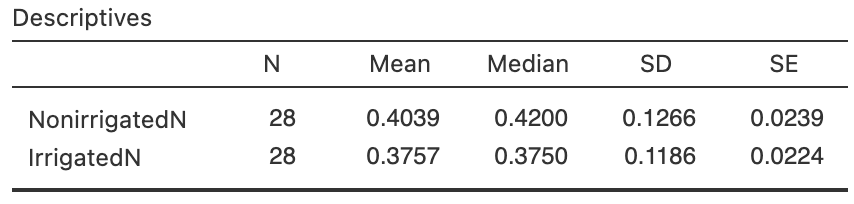
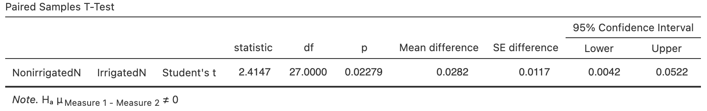
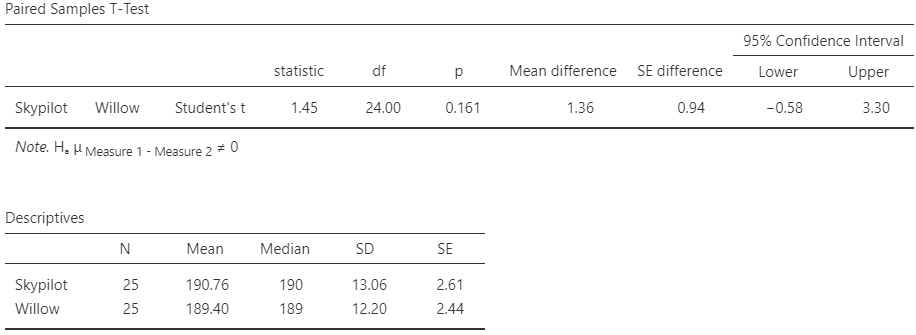
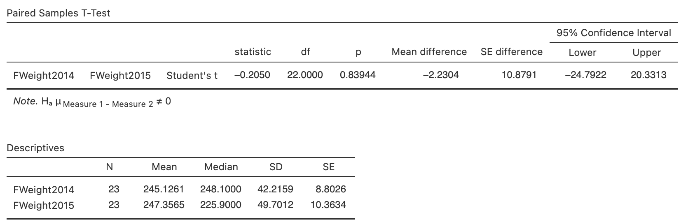

# Tests for the mean difference (paired data) {#TestPairedMeans}


<!-- Introductions; easier to separate by format -->
```{r, child = if (knitr::is_html_output()) {'./introductions/31-Testing-MeanDifference-HTML.Rmd'} else {'./introductions/31-Testing-MeanDifference-LaTeX.Rmd'}}
```


## Introduction: soil nitrogen {#PairedTTest-SoilN}


<div style="float:right; width: 222x; border: 1px; padding:10px">

</div>


A study [@lambie2021microbial] compared the percentage nitrogen (N) in soils from irrigated and non-irrigated intensively grazed pasture sites.
The researchers paired irrigated and non-irrigated  sites (p. 338):

> The irrigated and non-irrigated pairs within each site were within $100$\ m of each other and were on the same soil, landform and usually the same farm with the same farm management on both treatments.

The data are *paired* (Sect.\ \@ref(PairedIntro)), which is a form of blocking (Sect.\ \@ref(ExpManagingConfounding)).
One RQ in the study was:

> For intensively grazed pastures sites, is there a mean reduction in percentage soil nitrogen (N) when sites are irrigated, compared to non-irrigated?

The data are shown in
`r if( knitr::is_latex_output() ) {
    'Table\\ \\@ref(tab:SoilCN).'
} else {
    'the table below.'
}`
The parameter is $\mu_d$, which we define as the population mean *reduction* in percentage N when sites are irrigated, compared to non-irrigated.


::: {.tipBox .tip data-latex="{iconmonstr-info-6-240.png}"}
Explaining *how* the differences are computed is important.  

The differences here are the percentage N in *irrigated* sites minus percentage N in *non-irrigated* sites.
However, the differences could be computed as the percentage N in *non-irrigated* sites minus percentage N in *irrigated* sites.
*Either is fine*, as long as you remain consistent throughout.
The meaning of any conclusions will be the same.  
:::


```{r}
data(SoilCN)

SoilN <- subset(SoilCN, 
                select = c(IrrigatedN, NonirrigatedN))
SoilN$Change <- SoilN$NonirrigatedN - SoilN$IrrigatedN

Nlen <- length(SoilN$TotalCI) 

if( knitr::is_latex_output() ) {
  
 T1 <- knitr::kable(surroundMaths(SoilN[1:14, ],
                                   decDigits = 2),
                     format = "latex",
                     valign = 't',
                     align = "r",
                     linesep = "",
                     col.names = c("Not irrigated", "Irrigated", "Reduction"),
                     row.names = FALSE,
                     escape = FALSE,
                     booktabs = TRUE) %>%
    row_spec(0, bold = TRUE) 
  
  
  T2 <-knitr::kable(surroundMaths(SoilN[15:28, ],
                                   decDigits = 2),
                     format = "latex",
                     valign = 't',
                     align = "r",
                     linesep = "",
                     col.names = c("Irrigated", "Not irrigated", "Reduction"),
                     row.names = FALSE,
                     escape = FALSE,
                     booktabs = TRUE) %>%
    row_spec(0, bold = TRUE)
  
  out <- knitr::kables(list(T1, T2),
                       format = "latex",
                       label = "SoilCN",
                       caption = "The percentage total nitrogen in irrigated and non-irrigated soils.") %>% 
    kable_styling(font_size = 10)
  out2 <- prepareSideBySideTable(out) 
  out2 
}

if( knitr::is_html_output() ) {
  kable( SoilN,
         format = "html",
         booktabs = TRUE,
         longtable = FALSE,
         col.names = c("Irrigated", "Not irrigated"),
         caption = "he percentage total nitrogen in irrigated and non-irrigated soils.") %>% 
    kable_styling(font_size = 10) %>%
    row_spec(0, bold = TRUE)
}
```


Since the raw data are available, the data should be summarised graphically (Fig.\ \@ref(fig:SoilNGraphs)) and numerically (Table\ \@ref(tab:SoilNSummary)), using software (Fig.\ \@ref(fig:Nitrogenjamovi)).


```{r SoilNSummary}
SoilSummary <- array( dim = c(3, 4))

rownames(SoilSummary) <- c("Non-irrigated sites",
                           "Irrigated sites",
                           "Change")
colnames(SoilSummary) <- c("Mean",
                           "Std. dev.",
                           "Std. error",
                           "Sample size")

SoilSummary[, 1] <- colMeans(SoilN)
SoilSummary[, 2] <- apply(SoilN,
                          2,
                          "sd")
SoilSummary[, 3] <- apply(SoilN,
                          2,
                          "findStdError")
SoilSummary[, 4] <- apply(SoilN,
                          2,
                          "length")

# Do some appropriate rounding
SoilSummary <- round(SoilSummary, 4)
SoilSummary[1:2, 1] <- round(SoilSummary[1:2, 1], 3)

if( knitr::is_latex_output() ) {
  
  knitr::kable(surroundMaths(SoilSummary,
                             decDigits = NA),
               format = "latex",
               align = c("l", "c", "c", "c"),
               linesep = "",
               caption = "The soil percentage N in irrigated and non-irrigated sites",
               col.names = c("Mean", "Std. dev.", "Std. error", "Sample size"),
               row.names = TRUE,
               escape = FALSE,
               booktabs = TRUE) %>%
    row_spec(0, bold = TRUE) %>%
    row_spec(3, italic = TRUE) %>%
    kable_styling(font_size = 10)
  
}

if( knitr::is_html_output() ) {
  kable( SoilSummary,
         format = "html",
         booktabs = TRUE,
         longtable = FALSE,
         col.names = c("Mean", "Std. dev.", "Std. error", "Sample size"),
         caption = "The soil nitrogen in irrigated and non-irrigated soils.") %>% 
    kable_styling(font_size = 10) %>%
    row_spec(0, bold = TRUE)
}
```


```{r, SoilNGraphs, fig.align="center", fig.cap="The reduction in percentage N when sites are irrigated, compared to non-irrigated. Left: A histogram; right: a case-profile plot (solid lines, solid dots for lower percentage N in irrigated sites).", fig.show="hold", out.width='100%', fig.width = 9.25, fig.height = 3.75}
par( mfrow = c(1, 2))

hist(SoilN$Change,
     main = "Histogram of percentage\nsoil nitrogen reduction",
     xlab = "Reduction in %N",
     ylab = "No. of sites",
     las = 1)

box()

plot( x = c(0.75, 2.25),
      y = c(0.15, 0.7),
      axes = FALSE,
      type = "n",
      main = "Case-profile plot of percentage\nsoil nitrogen changes",
      xlab = "",
      ylab = "Soil % N")
axis(side = 1,
     at = 1:2,
     labels = c("Non-Irrigated",
                "Irrigated") )
axis(side = 2,
     las = 1)
box()

delta <- 0.02
for (i in 1:length(SoilN$Change)){
  lines( x = c(1 + ifelse(SoilN$Change[i] > 0, delta, -delta), 
               2 + ifelse(SoilN$Change[i] > 0, delta, -delta)),
         y = c( SoilN$NonirrigatedN[i], 
                SoilN$IrrigatedN[i]),
         lty = ifelse(SoilN$Change[i] > 0, 1, 2),
         type = "b",
         pch = ifelse(SoilN$Change[i] > 0, 19, 1))
}
box()

```


```{r Nitrogenjamovi, fig.cap="jamovi output for the nitrogen data", fig.align="center", out.width=c("60%","100%"), fig.show='hold'}


```


## Statistical hypotheses and notation

The RQ asks if the mean percentage nitrogen *reduces* in the *population* when sites are irrigated; that is, is the mean difference is zero, or less than zero, provided the difference is defined as the percentage N in irrigated sites minus non-irrigated sites.
The *parameter* is the *population mean difference*. 
The notation used (recapping Sect.\ \@ref(PairedNotationCI)) is:

* $\mu_d$: The mean *difference* in the *population*.
* $\bar{d}$: The mean *difference* in the *sample*.
* $s_d$: The *sample* standard deviation of the *differences*.
* $n$: The number of *differences*.

The hypotheses, therefore, can be written in terms of the parameter $\mu_d$.
The *null* hypothesis is 'there is *no change* in percentage N, in the population' (Sect.\ \@ref(AboutHypotheses)):

* $H_0$: $\mu_d = 0$.

This hypothesis, the initial *assumption*, postulates that the mean reduction may not be zero in the *sample* due to sampling variation.

Since the RQ asks specifically if mean percentage N *decreases*, the alternative hypothesis is *one-tailed* (Sect.\ \@ref(AboutHypotheses)).
According to how the differences have been defined, the alternative hypothesis is:

* $H_1$: $\mu_d < 0$ (i.e., one-tailed).

This hypothesis says that the mean reduction in the population is *less than* zero, because of the wording of the RQ, and because of how we defined the differences.
(If the differences had been defined in the opposite way-- as 'the percentage N in *non-irrigated* sites minus *irrigated* sites'--- then the alternative hypothesis would be $\mu_d < 0$, which has the same *meaning*.)


##  Describing the sampling distribution

The *sample* percentage N reduction will vary depending on which one of the many possible samples is randomly obtained, *even if* the mean reduction in the population is zero.
That is, the value of $\bar{d}$ will vary across all possible samples even if $\mu_d = 0$.


::: {.definition #DEFSamplingDistributionMeanDiff name="Sampling distribution of a sample mean difference"}
The *sampling distribution of the sample mean difference* is (when certain conditions are met; Sect.\ \@ref(ValiditySampleMeanDiffTest)) described by

* an approximate normal distribution,
* centred around the sampling mean difference, whose value is $\mu_d$ (from $H_0$),
* with a standard deviation (called the *standard error* of $\bar{d}$) of  
\begin{equation}
   \text{s.e.}(\bar{d}) = \frac{s_d}{\sqrt{n}},
   (\#eq:StdErrorDifferencesTest)
\end{equation}
where $n$ is the number of differences, and $s_d$ is the standard deviation of the differences.
In general, the approximation gets better as the sample size gets larger.
:::

The value of the *standard error of the differences* here is  
\[
  \text{s.e.}(\bar{d}) = s_d/\sqrt{n} = 0.0618/\sqrt{28} = 0.0117.
\]
This describes what can be *expected* from the possible values of $\bar{d}$ (Fig.\ \@ref(fig:PercentageNSamplingDist)), just through sampling variation if $\mu_d = 0$.


```{r PercentageNSamplingDist, fig.cap="The sampling distribution is a normal distribution; it describes how the sample mean reduction in percentage N varies in samples of size $n = 28$ when the population mean reduction is $0$", fig.align="center", fig.width=9.0, fig.height=2.5, out.width='95%'}
mn <- mean(SoilN$Change)
n <- length(SoilN$Change)
stdd <- sd(SoilN$Change)

se <- stdd/sqrt(n)

par( mar = c(4, 0.5, 0.5, 0.5) )
out <- plotNormal(0,
                  se,
                  xlab = "Sample mean difference in N (%)", 
                  cex.axis = 0.95,
                  ylim = c(0, 55),
                  showXlabels = c( 	
                    expression( -0.0352),
                    expression( -0.0234), 
                    expression( -0.0117), 
                    expression( 0 ),
                    expression( 0.0117), 
                    expression( 0.0234), 
                    expression( 0.0352) ) )

arrows(x0 = 0,
       x1 = 0,
       y0 = 45,
       y1 = max(out$y),
       angle = 15,
       length = 0.1)

text(x = 0,
     y = 45,
     pos = 3,
     labels = expression(Sampling~mean~difference))


arrows(x0 = 0,
       x1 = 0 + se,
       y0 = 0.30 * max(out$y),
       y1 = 0.30 * max(out$y),
       code = 3, # Arrows both ends
       angle = 15,
       length = 0.1)

text(x = 0 + (se / 2),
     y = 0.30 * max(out$y),
     labels = expression( atop(Std.~error,
                               s.e.(bar(italic(d)))==0.0117)) )


arrows(x0 = mn,
       x1 = mn,
       y0 = 0.7 * max(out$y),
       y1 = 0,
       angle = 15,
       length = 0.1)
text(x = mn,
     y = 0.7 * max(out$y),
     pos = 3,
     labels = expression(bar(italic(d)) == 0.0282) )
```


## Computing the test statistic

The sample mean difference can be located on the sampling distribution (Fig.\ \@ref(fig:WeightGainNormal2)) by computing the $t$-score:  
\[
	t
	= \frac{\bar{d} - \mu_{d}}{\text{s.e.}(\bar{d})}
	= \frac{0.0282 - 0}{0.0117} = 2.41,
\]
following the ideas in Eq.\ \@ref(eq:tscore).
Software computes the $t$-score too (Fig.\ \@ref(fig:TotalNOutputHT)).
The $t$-score locates the *observed* sample statistic on the sampling distribution (Fig.\ \@ref(fig:Nitrogenjamovi)).


## Determining $P$-values

A $P$-value determines if the sample data are consistent with the assumption (Table\ \@ref(tab:PvaluesInterpretation)).
Since $t = 2.41$, and since $t$-scores are like $z$-scores, the *one-tailed* $P$-value is small, based on the [68--95--99.7 rule](#def:EmpiricalRule).
Software (Fig.\ \@ref(fig:Nitrogenjamovi)) reports that the *two-tailed* $P$-value is $0.02279$.
Hence, the one-tailed $P$-value is $0.02279/2 = 0.0114$.


::: {.importantBox .important data-latex="{iconmonstr-warning-8-240.png}"}
The jamovi software clarifies *how* the differences have been computed:
At the left of the output, the order implies the differences are found as `NonirrigatedN` minus `IrrigatedN`.

:::

`r if (knitr::is_latex_output()) '<!--'`
::: {.thinkBox .think data-latex="{iconmonstr-light-bulb-2-240.png}"}
<iframe src="https://learningapps.org/watch?v=pj3pt56fk22" style="border:0px;width:100%;height:500px" allowfullscreen="true" webkitallowfullscreen="true" mozallowfullscreen="true"></iframe>
:::
`r if (knitr::is_latex_output()) '-->'`


## Writing conclusions

The *one-tailed* $P$-value is $0.0114$, suggesting moderate evidence (Table\ \@ref(tab:PvaluesInterpretation)) to support $H_1$.
A conclusion requires an *answer to the RQ*, a summary of the *evidence* leading to that conclusion, and some *summary statistics*, including a CI (indicating the precision of the statistic; Chap.\ \@ref(PairedIntro)):

> Moderate evidence exists in the sample (paired $t = 2.41$; one-tailed $P = 0.0114$) of a mean reduction in percentage soil N  from irrigated to non-irrigated sites (mean reduction: $0.0282$%; $n = 28$; $95$% CI from $0.0042$% to $0.0522$%).

The wording implies the direction of the differences.


::: {.importantBox .important data-latex="{iconmonstr-warning-8-240.png}"}
Just saying 'there is evidence of a difference' is insufficient.
You must state *which* measurement is, on average, higher (that is, what the differences *mean*).
:::


## Statistical validity conditions {#ValiditySampleMeanDiffTest}

As with any hypothesis test, these results apply [under certain conditions](#exm:StatisticalValidityAnalogy).
For a hypothesis test for the mean of paired data, these conditions are the same as for the CI for the mean difference for paired data (Sect.\ \@ref(ValidityPaired)), and similar to those for one sample mean.

The test above is statistically valid if *one* of these conditions is true:

1. The number of differences $n$ is at least $25$; *or*
1. The number of differences $n$ is less than $25$, *and* the *population* of *differences* has an approximate normal distribution.

The sample size of $25$ is a rough figure here, and some books give other values (such as $30$).
This condition ensures that the *distribution of the sample mean differencess has an approximate normal distribution* (so that, for example, the [68--95--99.7 rule](#def:EmpiricalRule) can be used).

Provided the $n > 25$, this will be approximately true *even if* the distribution of the differences in the population does not have a normal distribution.
That is, when $n > 25$ the sample mean differences generally have an approximate normal distribution, even if the differences themselves don't have a normal distribution.


::: {.example #StatisticalValidityWeightLossHT name="Statistical validity"}
For the percentage N data, the sample size is $n = 28$, so the test is statistically valid.
:::


## Example: invasive plants {#PairedInvasivePlantsHT}

Skypilot (*Polemonium viscosum*) is a native alpine wildflower growing in the Colorado Rocky Mountains (USA).
In recent years, a willow shrub (*Salix*) has been encroaching on skypilot territory and, because willow often flowers early, researchers [@kettenbach2017shrub] are concerned that the willow may 'negatively affect pollination regimes of resident alpine wildflower species' (p.\ 6965).
This example was first seen in Sect.\ \@ref(PairedInvasivePlantsCI).

Data for both species was collected at $25$ different sites, so the data are *paired* (Sect.\ \@ref(PairedIntro)) and shown in
`r if( knitr::is_latex_output() ) {
    'Table\\ \\@ref(tab:FloweringData).'
} else {
    'Sect.\\ \\@ref(PairedInvasivePlantsCI).'
}`
The parameter is $\mu_d$, which we define as the population mean *difference* in day of first flowering for skypilot, less the day of first flowering for willow.
Hence, a *positive* value for the difference means that the skypilot values are larger, and hence that willow flowered first.

In addition to learning about the difference in flowering time, another RQ is:

> In the Colorado Rocky Mountains, is there a mean difference between first-flowering day for the native skypilot and encroaching willow?

The hypotheses are:  
\[
   \text{$H_0$: $\mu_d = 0$}\quad\text{and}\quad\text{$H_1$: $\mu_d\ne 0$}
\]
where the alternative hypothesis is two-tailed.

::: {.tipBox .tip data-latex="{iconmonstr-info-6-240.png}"}
Explaining *how* the differences are computed is important.  

The differences here are skypilot first-flowering days minus willow first-flowering days.
However, the differences could be computed as willow first-flowering days minus skypilot first-flowering days.
*Either is fine*, as long as you remain consistent throughout.
The meaning of any conclusions will be the same.  
:::

Since the raw data are available, the data were summarised graphically in Fig.\ \@ref(fig:FloweringPlots).
The numerical summary (Table\ \@ref(tab:FloweringSummaryHT)) and software output (Fig.\ \@ref(fig:FloweringjamoviHT)) are repeated here.


```{r FloweringjamoviHT, fig.cap="jamovi output for the flowering-day data", fig.align="center", out.width=c("100%"), fig.show='hold'}

```


```{r FloweringSummaryHT}
data(Flowering)
FloweringSummary <- array( dim = c(3, 4))

FloweringTab <- cbind( Flowering[, 1:2], 
                       Change = Flowering[, 2] - Flowering[, 1])

rownames(FloweringSummary) <- c("Willow (encroaching)",
                            "Skypilot (native)",
                            "Differences")
colnames(FloweringSummary) <- c("Mean",
                            "Std. dev.",
                            "Std. error",
                            "Sample size")

FloweringSummary[, 1] <- colMeans(FloweringTab,
                              na.rm = TRUE)
FloweringSummary[, 2] <- apply(FloweringTab,
                           2,
                           "sd",
                           na.rm = TRUE)
FloweringSummary[, 3] <- apply(FloweringTab,
                           2,
                           "findStdError",
                           na.rm = TRUE)
FloweringSummary[, 4] <- apply(FloweringTab,
                           2,
                           "realLength")

# Do some appropriate rounding
FloweringSummary <- round(FloweringSummary, 4)
FloweringSummary[1:2, 1] <- round(FloweringSummary[1:2, 1], 3)

if( knitr::is_latex_output() ) {
  
  knitr::kable(surroundMaths(FloweringSummary,
                             decDigits = c(2, 3, 3, 0)),
               format = "latex",
               align = c("r", "r", "r", "c"),
               linesep = "",
               caption = "The day of first flowering for encroaching willow and native skypilot",
               col.names = c("Mean", "Std. dev.", "Std. error", "Sample size"),
               row.names = TRUE,
               escape = FALSE,
               booktabs = TRUE) %>%
    row_spec(0, bold = TRUE) %>%
    row_spec(3, italic = TRUE) %>%
    kable_styling(font_size = 10)
  
}

if( knitr::is_html_output() ) {
  kable( FruitSummary,
         format = "html",
         booktabs = TRUE,
         longtable = FALSE,
         col.names =  c("Mean", "Std. dev.", "Std. error", "Sample size"),
         caption = "The day of first flowering for encroaching willow and native skypilot") %>% 
    kable_styling(font_size = 10) %>%
    row_spec(0, bold = TRUE)
}
```

The standard error of the mean difference is $\text{s.e.}(\bar{d}) = 0.9396$, from Fig.\ \@ref(fig:Floweringjamovi) or Table\ \@ref(tab:FloweringSummary)).
The value of the test statistic (i.e., the $t$-score) is  
\begin{align*}
  t 
  = \frac{\bar{d} - \mu_d}{\text{s.e.}(\bar{d})}
  = \frac{1.36 - 0}{0.9396} = 1.45,
\end{align*}
as in the output.
This is a small value of $t$, so expect a large $P$-value using the 68--95--99.7 rule.
Indeed, the output shows that $P = 0.161$, so there is no evidence of a mean difference in flowering day.
We write:

> No evidence exists ($t = 1.45$; two-tailed $P = 0.161$) that the day of first-flowering is different for the encroaching willow and the native skypilot (mean difference: $1.36$ days earlier for willow; s.e.: $0.940$).

The CI should be statistically valid since $n = 25$.


::: {.importantBox .important data-latex="{iconmonstr-warning-8-240.png}"}
Be clear in your conclusion about *how* the differences are computed.
Make sure to interpret the CI consistent with how the differences were defined.
:::


## Example: growing squash

The effect of rainfall on growing Chayote squash (*Sechium edule*) studied the size of the fruit in a year with normal rainfall (2015) compared to fruit in a dry year (2014) on 24 farms [@mukherjee2019diversity]:

> For Chayote squash grown in Bangalore, what is the mean difference in fruit weight between a normal and dry year?

Ten fruits were gathered from each farm in both years, and the average weight recorded for the farm.
(The farm is the *unit of analysis*, but the individual fruits are the *units of observation*.)
Since the same farms are used in both years, the data are *paired* (Table\ \@ref(tab:FruitsData)).
Data is missing for Farm\ 20 in the dry year (2014), so there are $n = 23$ differences.

```{r FruitsData, echo=FALSE}
data(Fruit)

Fruit$Farm <- 1 : length(Fruit$FWeight2014)

FruitTab <- dplyr::select(Fruit,
                          Farm,
                          FWeight2014,
                          FWeight2015)
FruitTab$Change <- FruitTab$FWeight2015 - FruitTab$FWeight2014

if( knitr::is_latex_output() ) {
  
 T1 <- knitr::kable(surroundMaths(FruitTab[1:5, ],
                                   decDigits = c(0, 2, 2, 2)),
                     format = "latex",
                     valign = 't',
                     align = c("r", "c","c", "r"),
                     linesep = "",
                     col.names = c("Farm", 
                                   "Dry", 
                                   "Normal",
                                   "Change (in g)"),
                     row.names = FALSE,
                     escape = FALSE,
                     booktabs = TRUE) %>%
   add_header_above(c( " " = 1,
                       "Fruit weight (in g)" = 2,
                       " " = 1),
                    bold = TRUE) %>%
    row_spec(0, bold = TRUE) 
  
  
  T2 <- knitr::kable(surroundMaths(FruitTab[20:24, ],
                                   decDigits = c(0, 2, 2, 2)),
                     format = "latex",
                     valign = 't',
                     align = c("r", "c","c", "r"),
                     linesep = "",
                     col.names = c("Farm", 
                                   "Dry", 
                                   "Normal",
                                   "Change (in g)"),
                     row.names = FALSE,
                     escape = FALSE,
                     booktabs = TRUE)  %>%
   add_header_above(c( " " = 1,
                       "Fruit weight (in g)" = 2,
                       " " = 1),
                    bold = TRUE) %>%
    row_spec(0, bold = TRUE) 
  
  out <- knitr::kables(list(T1, T2),
                       format = "latex",
                       label = "FruitsData",
                       caption = "The weight of fruits (in g) in two different years. One observation is missing for Field\ 20.") %>% 
    kable_styling(font_size = 10)
  out2 <- prepareSideBySideTable(out) 
  out2 
}

if( knitr::is_html_output() ) {
  kable( FruitTab,
         format = "html",
         booktabs = TRUE,
         longtable = FALSE,
         col.names = c("Irrigated", "Not irrigated"),
         caption = "The weight of fruits (in g) in two different years. One observation is missing for Field\ 20.") %>% 
    kable_styling(font_size = 10) %>%
    row_spec(0, bold = TRUE)
}
```

In Table\ \@ref(tab:FruitsData), the changes refer to the *increase* in fruit weight from 2014 (dry) to 2015 (normal).
(Computing the changes as the 2015 (normal) values less the 2014 (dry) values is fine, permitted this is used consistently throughout the analysis.)
The parameter is $\mu_d$, the population *increase* in fruit weight (in g) from 2014 to 2015.

Since the data are available
`r if( knitr::is_latex_output() ) {
  '(Table\\ \\@ref(tab:FruitsData)),'
} else {
  '(see above),'
}`
a numerical summary *must* summarise the differences, as the RQ is about the mea difference.
Each group can be summarised too.
The information is found using software (Fig.\ \@ref(fig:Fruitjamovi)), and can be compiled into a table (Table\ \@ref(tab:FruitSummary)).
The appropriate plot for graphically summarising the *data* is (for example) a histogram of the differences (Fig.\ \@ref(fig:FruitPlots), left panel) or a case-profile plot (Fig.\ \@ref(fig:FruitPlots), right panel).
A small increase is seen from 2014 to 2015, with lots of variation from farm to farm.


```{r Fruitjamovi, fig.cap="jamovi output for the fruit-weight data", fig.align="center", out.width=c("100%"), fig.show='hold'}

```


```{r FruitSummary}
FruitSummary <- array( dim = c(3, 4))

rownames(FruitSummary) <- c("Dry year (2014)",
                            "Normal year (2015)",
                            "Change")
colnames(FruitSummary) <- c("Mean",
                            "Std. dev.",
                            "Std. error",
                            "Sample size")

FruitSummary[, 1] <- colMeans(FruitTab[, 2:4],
                              na.rm = TRUE)
FruitSummary[, 2] <- apply(FruitTab[, 2:4],
                           2,
                           "sd",
                           na.rm = TRUE)
FruitSummary[, 3] <- apply(FruitTab[, 2:4],
                           2,
                           "findStdError",
                           na.rm = TRUE)
FruitSummary[, 4] <- apply(FruitTab[, 2:4],
                           2,
                           "realLength")

# Do some appropriate rounding
FruitSummary <- round(FruitSummary, 4)
FruitSummary[1:2, 1] <- round(FruitSummary[1:2, 1], 3)

if( knitr::is_latex_output() ) {
  
  knitr::kable(surroundMaths(FruitSummary,
                             decDigits = c(3, 3, 3, 0)),
               format = "latex",
               align = c("r", "r", "r", "c"),
               linesep = "",
               caption = "The fruit weight (in g) at farms for two different years",
               col.names = c("Mean", "Std. dev.", "Std. error", "Sample size"),
               row.names = TRUE,
               escape = FALSE,
               booktabs = TRUE) %>%
    row_spec(0, bold = TRUE) %>%
    row_spec(3, italic = TRUE) %>%
    kable_styling(font_size = 10)
  
}

if( knitr::is_html_output() ) {
  kable( FruitSummary,
         format = "html",
         booktabs = TRUE,
         longtable = FALSE,
         col.names =  c("Mean", "Std. dev.", "Std. error", "Sample size"),
         caption = "The fruit weight (in g) at farms for two different years") %>% 
    kable_styling(font_size = 10) %>%
    row_spec(0, bold = TRUE)
}
```


```{r, FruitPlots, out.width='90%', fig.width=9, fig.height=3.5, fig.align=TRUE, fig.cap="The fruit-weight data. Left: A histogram of the weight changes on each farm; right: a case-profile plot of the weight changes (unfilled points and dashed lines indicate a decrease)"}
par( mfrow = c(1, 2))

 hist(FruitTab$Change,
      las = 1,
      xlab = "Weight increase (in g)",
      ylab = "Number of farms",
      main = "Histogram of fruit weight\nincrease from 2014 to 2015")
 
 ###
 
 plot( x = c(0.75, 2.25),
       y = c(150, 400),
       type = "n",
       las = 1,
       xlab = "",
       main = "Case-profile plot of fruit weight\nincreases from 2014 to 2015",
       ylab = "Farm fruit weight (in g)",
       axes = FALSE)
 axis(side = 1,
      at = c(1, 2),
      labels = c("2014 (dry)",
                 "2015 (normal)"))
 axis(side = 2,
      las = 1)
 box()
 
 
 for (i in (1:length(FruitTab$Change))){
   if (!is.na(FruitTab$Change[i])){
     delta <- ifelse(FruitTab$Change[i] > 0, 0.025, -0.025)
     lines( x = c(1 + delta, 2 - delta),
            y = c( FruitTab$FWeight2014[i],
                   FruitTab$FWeight2015[i]),
            lty = ifelse(FruitTab$Change[i] > 0, 1, 2),
            pch = ifelse(FruitTab$Change[i] > 0, 19, 1),
            type = "b",
            lwd = 1)
   }
 }

```

The standard error of the mean increase is $\text{s.e.}(\bar{d}) = 10.879$, from Fig.\ \@ref(fig:Fruitjamovi) or Table\ \@ref(tab:FruitSummary)).
The approximate $95$% CI is from $2.230 \pm (2\times 10.879)$, or from $-19.528$ to $23.988$\ g.
Figure\ \@ref(fig:Fruitjamovi) gives the $95$% CI as $-24.79$ to $20.33$\ g.
The two CIs are a bit different since the sample size is not large ($n = 23$).
Using the exact CI, we write:

> From the sample, the mean increase in fruit weight from 2014 (dry year) to 2015 (normal year) is $2.230$\ g ($\text{s.e.} = 0.10.879$; $n = 23$), with an approximate $95$% CI between $24.79$\ g lighter in 2014 to $20.33$\ g higher in 2015.

The sample size ($n = 23$) is only *slightly* smaller than $25$.
Since Fig.\ \@ref(fig:FruitPlots) shows the *sample* differences are approximately symmetrically, so the CI should be reasonably statistically valid.


::: {.importantBox .important data-latex="{iconmonstr-warning-8-240.png}"}
Be clear in your conclusion about *how* the differences are computed.
Make sure to interpret the CI consistent with how the differences were defined.
:::

::: {.thinkBox .think data-latex="{iconmonstr-light-bulb-2-240.png}"}
Is there a mean difference in fruit weight from 2014 to 2015 *in the population*?\label{thinkBox:MeanDifferenceFruit}

`r if (knitr::is_latex_output()) '<!--'`
`r webexercises::hide()`
The RQ is about the mean difference in the **population**... but we only have the mean difference from one of many possible **samples**.
It is difficult to be certain.
`r webexercises::unhide()`
`r if (knitr::is_latex_output()) '-->'`
:::


## Green coffee bean extract {#CoffeeExtractHT}

(This study was seen in Sect.\ \@ref(CoffeeExtractHT).)
A study of patients with nonalcoholic fatty liver disease (NAFLD) randomly allocated $23$ patients into a control group, and $23$ to receive green coffee extract (GCE) [@hosseinabadi2020effects].
The summary data are given in Table\ \@ref(tab:GCBsummaryTable).

For the *green coffee group*, the mean *reduction* of FBG is $12.50$, and the standard error is $\text{s.e.}(\bar{d}) = 3.10$ (found in Sect.\ \@ref(CoffeeExtractHT).)
The test statistic is  
\[
  t = \frac{12.50 - 0}{3.10} = 4.03,
\]
which is a huge $t$-score, so the $P$-value will be very small (using the 68--95--99.7 rule), and certainly smaller than $0.001$.

For the *control group*, the mean *reduction* of FBG is $2.00$, and the standard error is $\text{s.e.}(\bar{d}) = 2.855$ (found in Sect.\ \@ref(CoffeeExtractHT).)
The test statistic is  
\[
  t = \frac{2.00 - 0}{2.855} = 0.700,
\]
which is a small $t$-score, so the $P$-value will be very large (using the 68--95--99.7 rule), and certainly larger than $p = 0.10$.
We conclude:

> There is very strong evidence $t = 4.03$; two-tailed $P < 0.001$) of a mean reduction in FBG for the green coffee extract group ($12.50$\ mg.dl^-1^; $95$% CI from $6.29$ to $18.70$\ mg.dl^-1^), but *no* evidence ($t = 0.70$; two-tailed $P > 0.10$) for the control group ($2.00$\ mg.dl^-1^; $95$% CI from $-3.71$ to $7.71$\ mg.dl^-1^).


## Example: physical activity: REMOVE

A study of $n = 213$ Spanish health students [@romero2020physical] measured the number of minutes of vigorous physical activity (PA) performed by students *during* and *before* the COVID-19 lock down (in Spain: March to April 2020).
The data are not available, but a numerical summary of the data are shown in Table\ \@ref(tab:COVIDsummaryTable2).


```{r COVIDsummaryTable2}
COVID.summary     <- array( dim = c(3, 2))
colnames(COVID.summary) <- c("Mean (mins)", 
                             "Std dev (mins)")
rownames(COVID.summary) <- c("Before lock down",
                             "During lock down",
                             "Increase")


COVID.summary[1, ] <- c(28.47,
                        54.13)
COVID.summary[2, ] <- c(30.66,
                        30.04)
COVID.summary[3, ] <- c(2.68,
                        51.30)


if( knitr::is_latex_output() ) {
  knitr::kable( surroundMaths(COVID.summary,
                              decDigits = 2),
               format = "latex",
               booktabs = TRUE,
               longtable = FALSE,
               escape = FALSE,
               caption = "Summary information for the COVID-lockdown exercise data",
               align = c("r", "r")) %>%
    row_spec(0, bold = TRUE) %>%
    row_spec(3, italic = TRUE) %>%
    kable_styling(font_size = 10)
} 
if( knitr::is_html_output() ) {
   knitr::kable( COVID.summary,
                 format = "html",
                 caption = "Summary information for the COVID-lock down exercise data")
}
```


The *differences* in Table\ \@ref(tab:COVIDsummaryTable2) are computed as the *during lock down* values minus the *before lock down* values.
Hence, the differences refer to *increases* in vigorous PA during the lock down, compared to before the lock down.
The RQ is

> For Spanish health students, is there a mean change in the amount of vigorous PA during and before the COVID lock down? 
  
The *parameter* of interest is the population mean difference $\mu_d$, the mean *in]crease* in vigorous PA *during* (compared to *before*) the lock down.
The hypotheses are:  
\[
   \text{$H_0$: $\mu_d = 0$}\quad\text{and}\quad \text{$H_1$: $\mu_d \ne 0$} \quad\text{(i.e., two-tailed)}.
\]
The mean *difference* is $\bar{d} = 2.68$\ mins, with a standard deviation of $s_d = 51.30$\ mins.
However, the sample mean difference varies from sample to sample, so has a standard error:
$\text{s.e.}(\bar{d}) = s_d\div \sqrt{n} = {51.30}\div{\sqrt{213}} = 3.515018$.
The test statistic is  
\[
  t = \frac{\bar{d} - \mu_{\bar{d}}}{\text{s.e.}(\bar{d})} = \frac{2.68 - 0}{3.515018} = 0.76.
\]
This is a very small value; using the 68--95--99.7 rule the $P$-value will be very large (larger than $0.32$); software gives $P = 0.448$.
Hence, a sample mean difference of $2.68$\ mins is not unlikely if the population mean difference was zero.

We write:

> No evidence (paired $t = 0.76$, $P = 0.448$) exists in the sample of a mean change in the amount of vigorous PA *during* (compared to *before*) lockdown (sample mean $2.68$\ mins greater *during* lockdown; standard deviation: $51.30$\ mins; approximate $95$% CI: $-4.35$ to $9.71$\ mins) in the population.

Since $n = 213$, which is much larger than $25$, the test is statistically valid.


<iframe src="https://learningapps.org/watch?v=pj3pt56fk22" style="border:0px;width:100%;height:500px" allowfullscreen="true" webkitallowfullscreen="true" mozallowfullscreen="true"></iframe>


## Summary {#Chap29-Summary}

Consider testing a hypothesis about a population mean difference $\mu_d$, based on the value of the sample mean difference $\bar{d}$.
Under certain statistical validity conditions, the sample mean difference varies with an approximate normal distribution centred around $\mu_{\bar{d}}$ (whose value is the hypothesised value of $\mu_d$), and with a standard deviation of  
\[
   \text{s.e.}(\bar{d}) = \frac{s_d}{\sqrt{n}}.
\]
This distribution describes what values of the sample mean difference could be **expected** if the value of $\mu_d$ in the null hypothesis was true.
The *test statistic* is  
\[
   t = \frac{ \bar{d} - \mu_{\bar{d}}}{\text{s.e.}(\bar{d})},
\]
where $\mu(\bar{d})$ is mean of all the possible sample mean differences; its value is the hypothesised value in the null hypothesis.
The $t$-score describes what value of $\bar{d}$ was **observed** in the sample, relative to what was expected.
The $t$-value is like a $z$-score, so an approximate **$P$-value** can be estimated using the [68--95--99.7 rule](#def:EmpiricalRule), or is found using software.
The $P$-values helps determine if the sample evidence is consistent with the assumption, or contradicts the assumption.


`r if (knitr::is_html_output()){
  'The following short video may help explain some of these concepts:'
}`


<div style="text-align:center;">
```{r}
htmltools::tags$video(src = "./videos/PairedTTest.mp4", 
                      width = "550", 
                      controls = "controls", 
                      loop = "loop", 
                      style = "padding:5px; border: 2px solid gray;")
```
</div>


## Quick review questions {#Chap29-QuickReview}

::: {.webex-check .webex-box}
A study [@bacho2019effects] compared joint pain in stroke patients before and after a supervised exercise treatment.
The same participants ($n = 34$) were assessed *before* and *after* treatment.

The mean *improvement* in joint pain after $13$ weeks was $1.27$ (with a standard error of $0.57$) using a standardised tool.

1. True or false? Only 'before and after' studies can be paired. \tightlist
`r if( knitr::is_html_output() ) { torf( answer=FALSE )}`
1. True or false? The null hypothesis is about the population mean *difference*.
`r if( knitr::is_html_output() ) { torf( answer=TRUE )}`
1. The value of the test statistic (to two decimal places) is
`r if( knitr::is_html_output() ) { fitb( answer = 2.23, num = TRUE, tol = 0.01 )} else {"________________."}`
1. The two-tailed $P$-value will be
`r if( knitr::is_html_output() ) {mcq( 
	c(answer = "Very small",
		"Small",
    "About 0.05",
		"Large",
		"Very large")
)} else {"________________."}`
:::


## Exercises {#TestPairedMeansExercises}

Selected answers are available in Sect.\ \@ref(TestPairedMeansAnswer).

::: {.exercise #TestPairedMeansTasteOfBrocolli}
(These data were also seen in Exercise\ \@ref(exr:PairedCIExercisesBrocolli).)
People often struggle to eat the recommended intake of vegetables.
In one study exploring ways to increase vegetable intake in teens [@data:Fritts2018:Vegetables], teens rated the taste of raw broccoli, and raw broccoli served with a specially-made dip.


Each teen ($n = 101$) had a *pair* of measurements: the taste rating of the broccoli *with* and *without* dip.
Taste was assessed using a '$100$\ mm visual analog scale', where a *higher* score means a *better* taste.
In summary:

* For raw broccoli, the mean taste rating was $56.0$ (with a standard deviation of $26.6$);
 <!-- %  (SDs); so if $n = 100$ we'd get SE: 2.647 -->
* For raw broccoli served with dip, the mean taste rating was $61.2$ (with a standard deviation of $28.7$).

Because the data are paired, the *differences* are the best way to describe the data.
The mean difference in the ratings was $5.2$, with standard error of $3.06$. 
<!-- (working backwards from the $t$-score). Looks like $n = 101$. -->

Perform a hypothesis test to see if the use of dip increases the mean taste rating.
:::


```{r}
data(Captopril)

blood <- Captopril

blood$Differences <- blood$Before - blood$After

bloodS <- subset(blood, BP=="S")
bloodS <- bloodS[, c("Before", 
                     "After", 
                     "Differences")]

bloodS2 <- cbind( "Before" = bloodS$Before[1:8], 
                  "After" = bloodS$After[1:8],
                  "Before" = c(bloodS$Before[9:15], NA), 
                  "After" = c(bloodS$After[9:15], NA) )
```


::: {.exercise #TestPairedMeansCaptopril}
(This study was also seen in Exercise\ \@ref(exr:PairedCIExercisesCaptopril).)
In a study of hypertension [@data:hand:handbook; @data:macgregor:essential], patients were given a drug (Captopril) and their systolic blood pressure measured (in mm Hg) immediately before and two hours after being given the drug (data with Exercise\ \@ref(exr:PairedCIExercisesCaptopril)).

The aim is to see if there is evidence of a *reduction* in blood pressure after taking Captopril.
Using these data and the software output (Fig.\ \@ref(fig:CaptoriljamoviHT)):

1. Explain why it is probably more sensible to compute differences as the *Before* minus the *After* measurements. 
   What do the differences *mean* when computed this way?
1. Compute the differences.
1. Construct a suitable graph for the differences.
1. Write down the hypotheses.
1. Write down the $t$-score.
1. Write down the $P$-value.
1. Write a conclusion.
:::

    

```{r CaptoriljamoviHT, fig.cap="jamovi (top) and SPSS (bottom) output for the Captoril data", fig.align="center", out.width="80%", fig.show="hold"}
knitr::include_graphics("jamovi/CaptoprilAll/CaptoprilAll-PairedTOutput.png") 
knitr::include_graphics("SPSS/CaptoprilAll/CaptoprilAll-PairedTOutput.png") 
```


::: {.exercise #TestPairedMeansSmokingAndExercise}
(This study was also seen in Exercise\ \@ref(exr:PairedCIExercisesSmokeExercise).)
A study [@data:Allen2018:Smoking] examined the effect of exercise on smoking.
Men and women were assessed on a range of measures, including the 'intention to smoke'.

'Intention to smoke', and other measures, were assessed both before and after exercise for each subject, using two quantitative questionnaires.
Smokers (defined as people smoking at least five cigarettes per day) aged $18$ to $40$ were enrolled for the study.
For the $23$ women in the study, the mean intention to smoke after exercise *reduced* by $0.66$ (with a standard error of $0.37$).

Perform a hypothesis test to determine if there is evidence of a population mean reduction in intention-to-smoke for women after exercising.
:::


```{r}
data(Ferritin)

FR <- Ferritin
FR <- dplyr::select(FR,
                    September,
                    March,
                    Reduction)
```


::: {.exercise #TestPairedMeansFerritin}
In a study [@cressie1984use] conducted at the Adelaide Children's Hospital:

> ...a group of beta thalassemia patients [...] were treated by a continuous infusion of desferrioxamine, in order to *reduce* their ferritin content...
>
> --- @cressie1984use, p. 107; emphasis added

Using the data 
`r if (knitr::is_latex_output()) {
   'in Table\\ \\@ref(tab:FerritinTable),'
} else {
   'shown below,'
}`
conduct a hypothesis test to determine if there is evidence that the treatment reduces the ferritin content, as intended.
:::

```{r FerritinTable}
if( knitr::is_latex_output() ) {
  T1 <- kable( surroundMaths(FR[1:7, ]),
               format = "latex",
               row.names = FALSE,
               escape = FALSE,
               align = "r",
               col.names = c("Sept.", "March", "Reduction"),
               booktabs = TRUE, 
               linesep = c("", "", "", "\\addlinespace"),
               longtable = FALSE) %>%
    row_spec(0, bold = TRUE)
  T2 <- kable( surroundMaths(rbind(FR[8:13, ], c(NA, NA, NA))),
               format = "latex",
               row.names = FALSE,
               escape = FALSE,
               align = "r",
               col.names = c("Sept.", "March", "Reduction"),
               booktabs = TRUE,
               linesep = c("", "", "", "\\addlinespace"),
               longtable = FALSE) %>%
    row_spec(0, bold = TRUE)
  T3 <- kable( surroundMaths(FR[14:20, ]),
               format = "latex",
               row.names = FALSE,
               escape = FALSE,
               align = "r",
               col.names = c("Sept.", "March", "Reduction"),
               booktabs = TRUE,
               linesep = c("", "", "", "\\addlinespace"),
               longtable = FALSE) %>%
    row_spec(0, bold = TRUE) 
  
  out <- knitr::kables(list(T1, T2, T3),
                       format = "latex",
                       label = "FerritinTable",
                       caption = "The ferritin content (in $\\mu$g/L) for 20 thalassemia patients at the Adelaide Children's Hospital") %>% 
    kable_styling(font_size = 10)  
  out2 <- prepareSideBySideTable(out, 
                                 gap = "\\quad") 
  out2
}
if( knitr::is_html_output()) {
  kable( head(FR, 10),
        format = "html",
        longtable = FALSE,
        caption = "The ferritin content (in $\\mu$g/L) for 20 thalassemia patients at the Adelaide Children's Hospital (first ten observations)",
        booktabs = TRUE)
}
```


::: {.exercise #StressSurgeryHT}
(This study was also seen in Exercise\ \@ref(exr:StressSurgeryHT).)
The concentration of beta-endorphins in the blood is a sign of stress.
One study (@data:hand:handbook, Dataset 232; @hoaglin2011exploring) measured the beta-endorphin concentration for $19$ patients about to undergo surgery.
The RQ was: "For patients approaching surgery, is there a mean increase in beta-endorphin concentrations?"

Each patient had their beta-endorphin concentrations measured $12$--$14$ hours before surgery, and also $10$ minutes before surgery.
A numerical summary can be produced from jamovi output (Fig.\ \@ref(fig:StressDescriptivesjamovi)).
Use the output to test the RQ.
:::

```{r StressDescriptivesjamovi, fig.cap="", fig.align="center", out.width='80%'}
data(Stress)

ST <- Stress

StressTab <- data.frame(
  "Means" = c( colMeans(ST),
               mean(ST$BeforeMins - ST$BeforeHours) ),
  "Std deviation" = c( apply(ST, 2, "sd"),
                       sd(ST$BeforeMins - ST$BeforeHours) ),
  "Std Error" = c( apply(ST, 2, function(x){sd(x)/sqrt(length(x))}),
                   sd(ST$BeforeMins - ST$BeforeHours)/sqrt(19) ),
  "Sample size" = c( apply(ST, 2, length),
                     length(ST$BeforeMins - ST$BeforeHours) )
)
rownames(StressTab) <- c("12--14 hours before surgery",
                         "10 minutes before surgery",
                         "Increase")
  
if( knitr::is_latex_output() ) {
  knitr::kable(surroundMaths(StressTab,
                             decDigits = c(2, 2, 2, 0)),
               format = "latex",
               align = "r",
               booktabs = TRUE,
               longtable = TRUE,
               escape = FALSE,
               caption = "The surgery-stress data",
               col.names = c("Sample mean",
                             "Std deviation",
                             "Std error",
                             "Sample size"),
               row.names = TRUE,
               digits = 2)%>%
     row_spec(0, bold = TRUE) %>%
     row_spec(3, italic = TRUE) %>%
     kable_styling(font_size = 10)
} 

if( knitr::is_html_output() ) {
  out <- kable(StressTab,
               format = "html",
               booktabs = TRUE,
               longtable = FALSE,
               align = "r",
               caption = "The surgery-stress data") %>%
    column_spec(1, bold = TRUE) %>%
     row_spec(1, bold = TRUE)
}
```


<!-- QUICK REVIEW ANSWERS -->
`r if (knitr::is_html_output()) '<!--'`
::: {.EOCanswerBox .EOCanswer data-latex="{iconmonstr-check-mark-14-240.png}"}
\textbf{Answers to \textit{Quick Revision} questions:}
**1.** False.
**2.** True.
**3.** $2.23$.
**4.** Very small.
:::
`r if (knitr::is_html_output()) '-->'`


